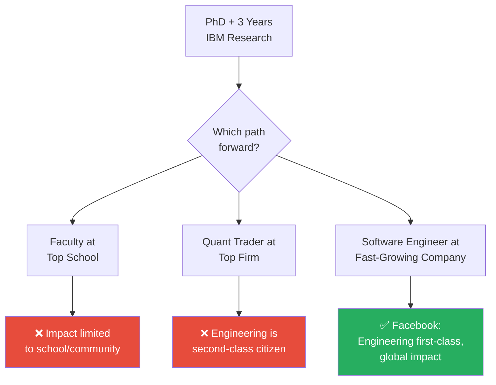
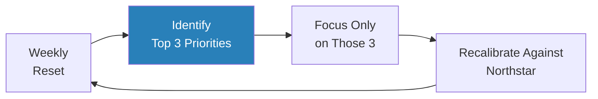
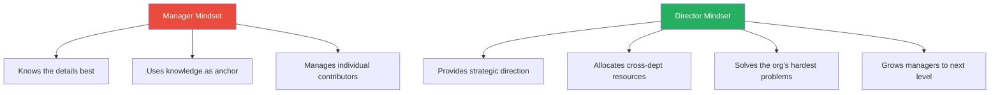
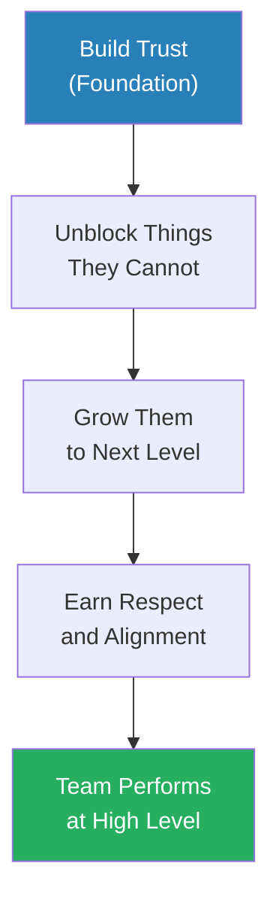
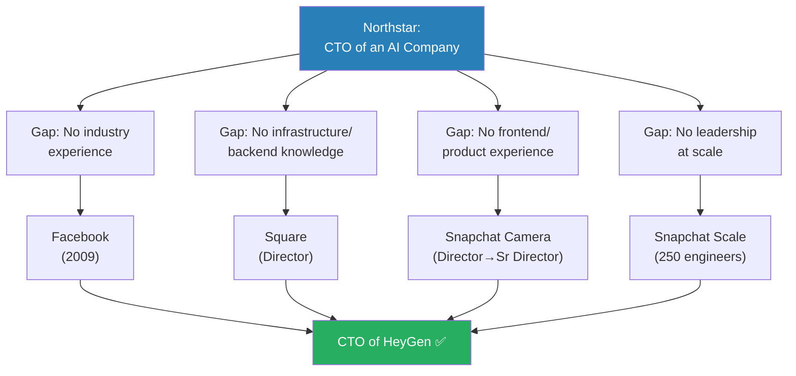
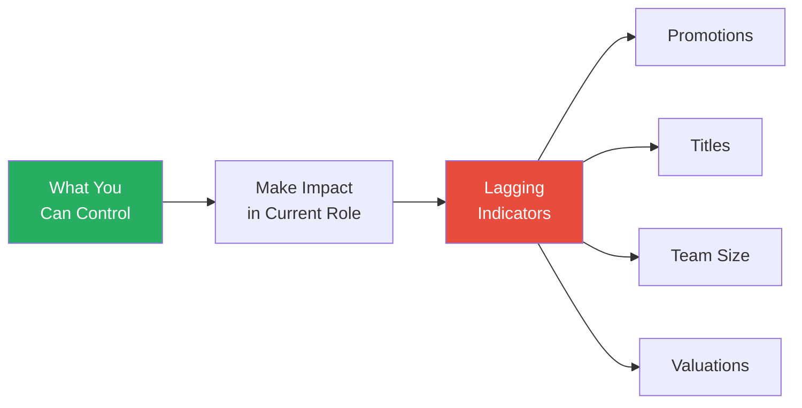

# Frontline Manager at Meta to Senior Director at Snapchat in 3 Years

> Ryan Peterman interviews Rome, a machine learning PhD turned CTO of HeyGen, who charted one of tech's most unconventional career arcs: eight years in academic research, a deliberate reset into software engineering at Facebook, a director role at Square that almost failed in the first six months, and explosive growth at Snapchat from the 100th employee to senior director of 250 engineers. What makes this conversation stand out is Rome's clarity about why he made each move — every decision anchored against a single northstar: become a CTO at an AI-first company. He chose discomfort over comfort (camera team over data team), chose learning over prestige (CMU over Princeton), and chose honesty over salesmanship (telling candidates there is a 1% chance of success).

---

## Overview: Key Highlights

- <b style="color: #27ae60">Every career decision should anchor against a personal northstar</b> — Rome's northstar (become CTO of an AI company) made every fork in the road — Facebook over academia, camera over data, startups over VP track — a straightforward choice
- <b style="color: #2980b9">Directing vs Managing</b> — directors provide strategic direction, cross-department resource allocation, and solve the organisation's hardest problems; managers know the details and use that as their anchor
- <b style="color: #e74c3c">If you don't add value as a director, your reports will question why your layer exists</b> — Rome's first six months at Square were rough because he tried to manage like a line manager instead of directing like a strategist
- <b style="color: #27ae60">Trust is the foundational layer of any team</b> — when hired above existing leaders, the first priority is building trust by proving you are a career promoter, not a career blocker
- <b style="color: #2980b9">The Weekly Top 3</b> — at the start of every week, ask what are the top three things to achieve, then focus only on those. Recalibrate weekly against the northstar
- <b style="color: #e74c3c">Titles belong to the company, not to you</b> — when senior executives leave, people say "the company did this," not "the VP did this." Impact outlasts rank
- <b style="color: #27ae60">Being technical at every level is critical</b> — Rome still writes 2-3 pull requests per week as CTO, a philosophy planted when a Facebook VP spent six weeks doing bootcamp alongside him
- <b style="color: #2980b9">Radical Honesty Recruiting</b> — telling candidates there is a 1% chance of success filters for people who will not leave at the first sign of difficulty
- <b style="color: #e74c3c">Don't make promotions the objective</b> — checking level rubrics and counting checkboxes ties your happiness to things you cannot control
- <b style="color: #27ae60">Manager career growth is largely situational</b> — the more senior you become, the more growth depends on organisational structure and company strategy rather than personal effort
- <b style="color: #2980b9">The Regret Minimisation Test</b> — "if I retire in 15 years, will I feel regret for not doing this?" If yes, do it now

| Concept | One-line summary |
|---------|-----------------|
| **Directing vs Managing** | Directors provide strategic direction; managers provide execution leverage |
| **The Northstar Framework** | Define a long-term goal, evaluate every career move against it |
| **Trust as Foundation** | The base layer from The Five Dysfunctions of a Team — build trust before executing strategy |
| **The Manager as Psychological Doctor** | Understand what each report needs for growth, then align your work towards that |
| **Weekly Top 3** | Focus each week on three priorities, recalibrate weekly |
| **The Regret Minimisation Test** | Would you regret not doing this in 15 years? |
| **Lagging Indicators** | Promotions and titles are outputs you cannot directly control — focus on impact instead |
| **Radical Honesty Recruiting** | Sell the difficulty honestly to filter for resilient people |

---

# The Conversation

## From Research to Industry: The Three-Path Fork

*Rome describes the pivotal decision that set his entire career in motion — leaving eight years of academic research for a small, fast-growing company called Facebook.*

*Rome evaluated three paths against two criteria: can engineering be a first-class citizen, and can the work influence the entire world? Only Facebook met both.*

> [!tip] Core Insight
> The northstar was already operating before Rome had a name for it. He did not choose Facebook because it was prestigious — he chose it because software engineering at a fast-growing company was the path most likely to let him build things that influenced millions.

> [!note]- Expand: Full Conversation
> - Rome spent 5 years in a PhD program and 3 years at IBM Research as a research scientist focused on computer vision and machine learning
> - Around 2009, he realised the "50% research, 50% engineering" model of industrial research labs was not sustainable — he needed to go 100% one way
> - Three paths presented themselves simultaneously:
>   - **Faculty:** had interview offers from top schools, but impact felt limited to a school or community — not the entire world
>   - **Quant developer/trader:** had offers from top quantitative trading firms, but engineering was always "second class" in that world
>   - **Software engineer:** wanted to join a company where engineering was a "first-class citizen"
> - Chose Facebook because it was fast-growing and had the potential to influence a massive number of people
> - He calls himself "lucky enough to be part of Facebook during the fast-growing years"

---

## Facebook Culture: Why Being Technical Matters at Every Level

*A single moment in Facebook's bootcamp reshaped Rome's entire philosophy of engineering leadership — a VP sitting next to him, writing pull requests for six weeks.*

> [!quote] Rome
> "Everyone who works on engineering needs to be technical."

> [!note]- Expand: Full Conversation
>
> > [!example] The VP in Bootcamp
> > - Facebook had a six-week bootcamp process where every new hire had to find bugs, fix bugs, and write pull requests before choosing a team
> > - A VP-level hire sat right next to Rome and did the exact same work for the full six weeks
> > - At IBM, VPs "probably only write PPTs"
> > - This contrast planted a permanent conviction: being technical and detail-driven is critical for success at every level
> > **The lesson:** Culture is not what a company says — it is what the most senior people actually do.
>
> - Rome still writes 2-3 pull requests per week as CTO
> - He admits he struggles to speak confidently on topics where he does not understand the details
> - His weekly approach: identify the top 3 priorities for the week, focus exclusively on those, and sometimes one of those three is getting deep into technical detail
> - The key to scaling: it is not about working more hours but about allocating time to the right priorities — "the best people are really good at allocating their time"

*Rome's weekly prioritisation cycle ensures that even as CTO, his time is allocated against the highest-leverage work — which sometimes means writing code.*

---

## The Manager-to-Director Leap: Six Months of Failure

*Rome joins Square with a director title — and immediately discovers that everything he knew about managing people is insufficient. The first six months are a story of near-failure and hard-won reinvention.*

*The fundamental shift: managers anchor on detail knowledge. Directors anchor on organisational positioning. Rome had to unlearn the first to succeed at the second.*

> [!tip] Core Insight
> A director who tries to manage like a line manager becomes an invisible, valueless middle layer. The role requires a complete mindset shift — from knowing the details to directing the organisation towards a better future position.

> [!note]- Expand: Full Conversation
>
> > [!example] The Invisible Director (Square, First 6 Months)
> > - Rome joined Square with a director offer — his team started at 25 people and grew to 50+ in a year
> > - At Facebook, he had been an IC who grew into a manager — he was always the most senior person who knew the most details
> > - At Square, his reports were more tenured, knew more details, and were more senior in the company context
> > - He could not use his old playbook of "I know the most, so I lead"
> > - His reports started questioning why his layer even existed — he was not adding visible value
> > - The turning point came when he reflected: "If I'm a middle layer between them and the executive, what value should I bring?"
> > - He landed on: strategic direction, cross-department resource collection, solving the most difficult organisational problems
> > **The lesson:** The word "director" literally means "one who directs." It is about directing an organisation towards a better position in the future — not managing individual people.
>
> - There was also a human challenge: the existing leaders were passed over for promotion when Rome was hired
>   - This is "human nature" — everyone wants to get promoted and everyone questions why they were not the one
>   - Rome had to prove he was a career promoter, not a career blocker
>   - He only fully understood this six months in — after that, trust-building became his first action at every new role

---

## Building Trust When Hired Above Others

*Rome describes how he turned a potentially hostile situation — being hired above people who wanted the role — into the foundation of his leadership philosophy.*

> [!quote] Rome
> "The most foundational layer for a successful team is trust. Everything builds on top of trust."

*Rome's trust-building sequence: prove value through unblocking, demonstrate career investment, earn respect, then drive performance.*

> [!note]- Expand: Full Conversation
> - Rome compares management to being a "psychological doctor" — you need to understand what each report is looking for in their career
> - The approach when hired above existing leaders:
>   - Find common ground — you are not a blocker, you are a promoter
>   - Help them understand that your presence is better for their career trajectory, not worse
>   - Unblock problems they cannot solve alone — this demonstrates the value of having upper management on their side
> - He explicitly recommends [[The Five Dysfunctions of a Team - Patrick Lencioni]]: the foundational layer is trust, and everything builds on top of it
> - After learning this lesson at Square, his first action at every subsequent role was building a trust layer before doing anything else

---

## Snapchat: Choosing Discomfort Over Comfort

*Rome joins Snapchat as approximately the 100th employee and faces a fork that defines the rest of his career — comfortable data team or unfamiliar camera team. He chooses camera.*

> [!tip] Core Insight
> The northstar made the "wrong" choice obvious. If the goal is CTO, you need product experience. The data team was comfortable. The camera team — the first page of Snapchat — required learning iOS from scratch. He chose it and calls the next two years the happiest of his career.

> [!note]- Expand: Full Conversation
>
> > [!example] Camera Over Data (Snapchat, ~2015)
> > - Rome had two options at Snapchat: director of data (his entire background) or director of camera (the first page of Snapchat)
> > - He intentionally chose camera, despite knowing nothing about iOS or Android programming
> > - Spent two months learning iOS programming from scratch
> > - "Most people would go with director of data because that's the most comfortable selection"
> > - His northstar required product experience — working with product managers and designers — which a backend/data role would never provide
> > - The first two years at Snapchat were "probably one of the happiest periods for my career" because he was learning every single day
> > **The lesson:** When your northstar requires a skill you do not have, choose the uncomfortable path that builds it — even if it means starting from zero.
>
> - Ryan asks about job hopping vs staying — Rome pushes back
>   - He does not think job hopping is the best way to advance
>   - Many of his Facebook teammates became VPs by staying put
>   - His moves were driven by northstar alignment, not title-chasing
> - Ryan asks about whether domain details matter for an engineering leader
>   - Rome's answer: yes, being technical and detailed is critical at every level
>   - This is a Facebook cultural philosophy that stayed with him permanently

---

## Snapchat at Scale: 100 to 3,000 Employees

*Rome watched Snapchat grow from a 100-person startup to a 3,000-person company in two years. His team grew to 250 engineers — and every time the company doubled, it felt like building a new company from scratch.*

> [!note]- Expand: Full Conversation
> - When Rome joined, Snapchat had about 100 people. Within two years it reached approximately 3,000
> - His team grew organically with the company — from a small group to 250 engineers
> - The culture that works for 100 people is fundamentally different from the culture for 3,000
>   - "Every single time when you double your team, you almost like you're building a new company"
>   - Different cultural values start to clash — in a good way
>   - Leadership must be resilient and adaptive — "you cannot always hold on to one thing"
> - Ryan asks about the difference between LA and Silicon Valley culture
>   - Snapchat's internal culture was surprisingly similar to Facebook: move fast, break things, done is better than perfect
>   - Many early Snapchat employees came from the Bay Area or Seattle
>   - But LA itself is far more diverse than Silicon Valley
>
> > [!example] The Cryptographer Neighbour
> > - In the Bay Area, every dinner conversation was about tech, stocks, and startups
> > - In LA, Rome's neighbours included a medical doctor and a cryptographer for Michael Jackson
> > - This diversity helped him understand that most users are not techies — they are ordinary people who benefit from your product
> > - Living outside the Silicon Valley bubble improved his product thinking
> > **The lesson:** Geographic diversity expands your understanding of who your users actually are.

---

## Working with Evan Spiegel

*Rome shares two stories about Snapchat's founder that reveal why the product achieved the quality it did — pixel-level obsession and deep personal loyalty.*

> [!quote] Rome
> "Evan has a really high bar for performance and it reminds me of Steve Jobs."

> [!note]- Expand: Full Conversation
>
> > [!example] Pixel-Level Product Reviews
> > - In product review meetings, Evan Spiegel would point out pixel-level issues and demand fixes
> > - The team learned to build "a ready demo, not a normal demo"
> > - This obsessive attention to detail drove Snapchat's product quality
> > **The lesson:** Founder-level product obsession, even at the pixel level, cascades through the entire engineering organisation.
>
> > [!example] Never Fire the First 15 Engineers
> > - Evan told leadership: "No matter what happens, you should never fire the first 15 engineers in the company — they are the founding members"
> > - Snapchat started in a small "blue house" in Venice Beach
> > - After four years of growth, Evan bought the house back and hosted all-hands meetings there
> > - This reflected his deep commitment to personal connections and the company's origins
> > **The lesson:** A founder who remembers the people who built the foundation creates loyalty that no compensation package can match.

---

## The Northstar Framework: Becoming CTO

*Rome reveals the philosophy that governed every career decision — a single northstar goal defined over a decade ago.*

*Every career move filled a specific gap identified against the northstar. No move was random — each was a deliberate step towards the CTO role.*

> [!note]- Expand: Full Conversation
> - Rome's northstar has been consistent since his PhD: become CTO of an AI company
> - Even after graduating, AI was not yet a standalone business — it was always an "amplifier," a component inside bigger companies
> - He mapped his gaps: no industry experience, no understanding of infrastructure, no frontend knowledge, no product sense
> - Each career move was chosen to fill a specific gap:
>   - Facebook: industry experience and engineering culture
>   - Square: director-level leadership and managing managers
>   - Snapchat camera team: product experience, iOS/Android, working with PMs and designers
>   - Snapchat scale: leading 250 engineers through hyper-growth
> - Ryan notes that some of Rome's growth was situational — Snapchat could have gone down instead of up
> - Rome agrees and adds that manager career growth is heavily constrained by organisational structure and company strategy
>   - "The only thing you can do is to do the best in the position that you have — everything else will be a lagging indicator"

---

## Titles, Promotions, and What Actually Matters

*Rome challenges the conventional career mindset — arguing that titles belong to the company, promotions are lagging indicators, and the only fulfilling anchor is impact.*

*Rome's core career philosophy: control what you can (impact), and let the rest follow as lagging indicators. Tying happiness to promotions creates pain.*

> [!tip] Core Insight
> Promotions and titles are things the company gives you — they are not yours. When a senior VP leaves, people still refer to them as "ex-VP of that company." The more fulfilling path is building something that makes people's lives better.

> [!note]- Expand: Full Conversation
> - Rome shares how his role models shifted over time:
>   - 10 years ago, his role models were executive VPs and senior VPs at big companies
>   - Then he noticed: when those people left, you immediately heard less about them externally
>   - People said "the company did this," not "the VP did this"
> - This made him realise: "the title is about the company, it's not about you"
> - He now anchors his decisions on building products people remember, not accumulating titles
> - He jokes: "I'm waiting for the time that two people can make a billion-dollar company — and you may not have any direct reports at that time, and that's totally okay"
> - On promotions specifically: he has seen mentees obsessively check every bullet point of the next level's rubric
>   - "That's very wrong. Don't do that."
>   - When you tie your happiness to promotion, you are tying it to something you do not fully control
>   - Organisational structure, company strategy, and headcount needs are all beyond your influence
>   - Better approach: focus on controllable impact and drive your career towards a position you love long-term

---

## Radical Honesty in Recruiting

*Rome explains his counterintuitive hiring philosophy at HeyGen — telling every candidate there is only a 1% chance of success.*

> [!note]- Expand: Full Conversation
> - At the CTO / startup stage, recruiting works primarily through personal connections, not outbound searches
>   - Rome never proactively looks for new jobs — they come inbound through personal network or recruiters
>   - He prefers going to places where he has personal connections because "every company goes through upcycles and down cycles" — you need people you trust to weather the down cycles
> - When hiring for HeyGen:
>   - "The number one thing I want to do is be very honest and transparent about why they should join and why they should not"
>   - Tells every candidate: "I want you to believe we can grow into a much bigger company — and I also want you to believe there's only a 1% chance we can do that"
>   - Uses a military analogy: "when you go to a battlefield with soldiers, you want all soldiers to understand the difficulty they're going to face, but they are pumped for it"
>   - He is not trying to hire the entire world — he wants to "sift out the 5% or 1% who truly want to go on this journey"
> - Why this works: people who join knowing the odds will not leave at the first sign of difficulty

---

## Career Reflections: Regrets, Adaptability, and Conventional Wisdom

*In the final segment, Rome reflects on what he would change, what he cannot control, and the single piece of advice he would give his younger self.*

> [!note]- Expand: Full Conversation
> - **Regrets:** If he had known he would end up in software engineering, he probably would not have done the PhD — but he also acknowledges he could not have predicted where AI would go even three months out
> - **Adaptability:** The most important skill is learning to adapt — "never take anything for granted"
>   - Short-term setbacks (transitioning from research to industry, from manager to director) are just "moments for adjustment"
>   - "Learn how to adjust and you'll be a better self afterwards"
> - **Situational growth:** The more senior you become as a manager, the less you can control your growth
>   - Career growth is heavily constrained by organisational structure and company need
>   - The happiest period in his career began when he stopped aiming for promotions and started focusing on impact
> - **Final advice:** "You don't need to always follow conventional wisdom — everyone is unique and everyone can choose the path they want"
>   - Example: chose CMU over Princeton for his PhD because CMU was better for computer science, even though his father questioned it
>   - Example: left the research community for a small company (Facebook in 2009) when virtually no researcher would consider that move
>   - "Only the people who can think differently early can see the new opportunity that no one else can see"

---

## Connections

**Same series:** [[How Corporate Politics Work - Best]] (Ethan Evans on navigating organisational power), [[25 Year Old Staff Eng at Meta - Evan King]] (IC career acceleration at Meta)
**Related books in vault:** [[The First 90 Days - Michael D. Watkins]] (transitioning into new leadership roles), [[An Elegant Puzzle - Will Larson]] (engineering management at scale), [[High Output Management - Andrew S. Grove]] (leverage and output-oriented thinking), [[So Good They Can't Ignore You - Cal Newport]] (career capital and deliberate skill-building), [[Zero to One - Peter Thiel]] (contrarian startup thinking), [[Rise - Patty Azzarello]] (career acceleration through strategic positioning)

---

## The Takeaway

Rome's career arc is a masterclass in one principle: clarity of destination makes navigation simple. His northstar — become CTO of an AI company — was set before AI was even a standalone industry. Every decision that looked unconventional from the outside (leaving research, choosing camera over data, picking CMU over Princeton) was internally obvious once you understood the destination. The framework is transferable: define where you want to end up, identify the gaps between where you are and where you need to be, and choose each move to close a specific gap — even when the comfortable choice is staring you in the face.

The most surprising insight is how candid Rome is about the limits of individual agency in management careers. After years of intentional, strategic career moves, he concludes that manager-level growth is "heavily constrained by organisational structure and organisational need" — things entirely outside your control. His resolution is elegant: focus only on what you can control (impact in your current role), treat promotions and titles as lagging indicators, and anchor your happiness on long-term direction rather than short-term outcomes. The moment he stopped aiming for promotions was, by his own account, the happiest period in his career.

What remains unresolved is the tension between radical honesty in recruiting and the reality of startup survival. Rome tells candidates there is a 1% chance of success — a philosophy he frames as a strength. But it raises an open question: does this filter for resilience, or does it filter for a specific personality type that may create its own blind spots? The conversation does not explore this, but the question lingers.
