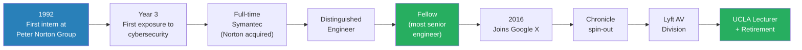
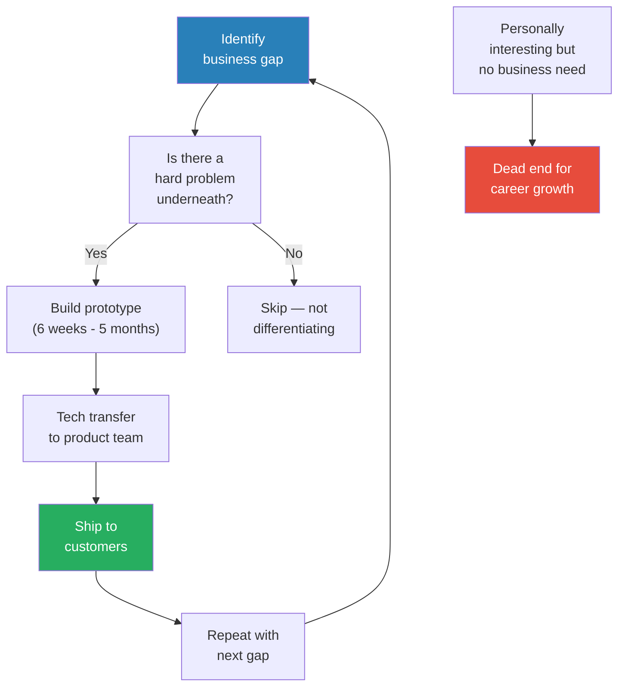
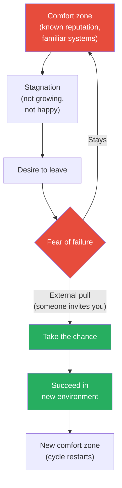
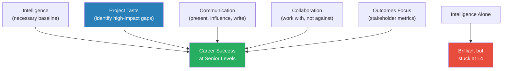
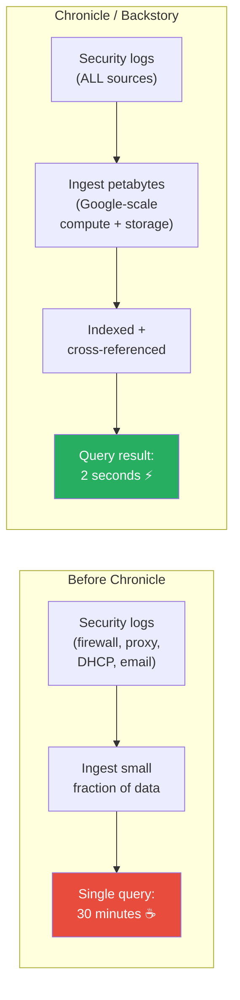
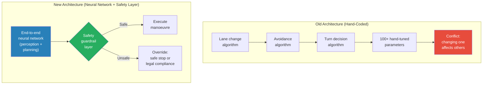
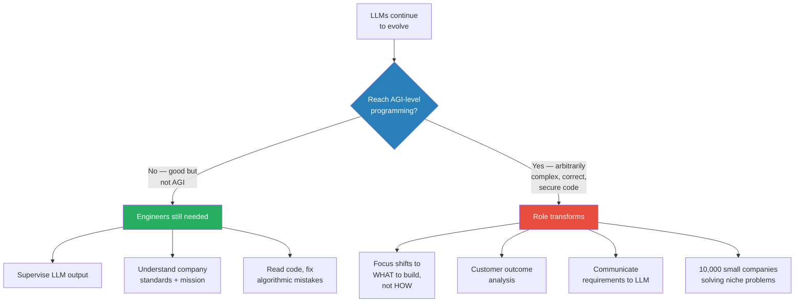
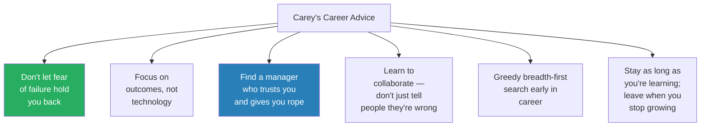

# GoogleX Chief Scientist on Imposter Syndrome and Project Taste — Carey Nachenberg

> Carey Nachenberg spent 21 years at Symantec rising from the company's first-ever intern to its most senior engineer (Fellow), then joined Google X to build Chronicle, a petabyte-scale cybersecurity product, before leading an architecture transformation at Lyft's autonomous vehicle division. Throughout his career, imposter syndrome kept him in comfort zones longer than he should have stayed, and he argues that "project taste" — the ability to identify high-impact problems where gaps exist — matters far more than raw intelligence. Now a part-time UCLA lecturer, he shares lessons on credit attribution, communicating with senior leaders, and why the future of software engineering looks more like product management than coding.

---

## Overview: Key Highlights

- <b style="color: #27ae60">Project taste beats intelligence</b> — picking high-impact projects where gaps exist is the primary career differentiator, not raw IQ
- <b style="color: #e74c3c">Imposter syndrome as career prison</b> — kept Carey at Symantec years too long, recurred at Google, and limited his risk-taking at every transition
- <b style="color: #2980b9">Outcomes focus</b> — understand how stakeholders measure success and speak to their metrics, not your technology
- <b style="color: #27ae60">Communication is a career multiplier</b> — people equate presentation skill with intelligence and open doors based on it
- <b style="color: #e74c3c">The credit attribution trap</b> — at senior levels, influence work is invisible; someone else took credit for Carey's biggest project at Lyft
- <b style="color: #2980b9">Chronicle's big data approach</b> — indexed petabytes of security logs for 2-second queries versus competitors' 30-minute waits
- <b style="color: #27ae60">Collaboration over being right</b> — the Lyft AV architecture succeeded through influence with roboticists, not authority over them
- <b style="color: #2980b9">AGI programming threshold</b> — if LLMs reach AGI-level coding, the role shifts from "how we build" to "what we build"
- <b style="color: #e74c3c">Most product managers are incompetent</b> — they think in features, not customer pain points; Jobs To Be Done is the fix
- <b style="color: #27ae60">Greedy breadth-first career search</b> — explore widely through internships early, go deep once you find passion
- <b style="color: #2980b9">The BS tax at senior levels</b> — strategic meetings, posturing, and politics consume time; must actively resist
- <b style="color: #27ae60">Don't let fear of failure hold you back</b> — Carey's single biggest regret and the advice he would give his younger self

| Concept | One-line summary |
|---------|-----------------|
| **Project taste** | Identifying high-impact business problems where gaps exist — more valuable than technical brilliance |
| **Outcomes focus** | Speaking to stakeholder metrics of success rather than technical details |
| **External pull** | Overcoming imposter syndrome often requires someone inviting you into an opportunity |
| **Intelligence baseline** | You need enough intelligence, but beyond a threshold, other skills matter more |
| **The BS tax** | Senior roles accumulate strategic meetings and politics that crowd out real work |
| **Credit attribution** | Influence work at senior levels is invisible — must actively document contributions |
| **Safety guardrail architecture** | Neural network driver with a deterministic safety layer for legal/collision rules |
| **Jobs To Be Done** | Repeatable methodology for discovering customer outcomes vs touchy-feely product intuition |
| **AGI programming threshold** | The line at which LLMs handle arbitrarily complex projects and the engineer role transforms |
| **Communication-intelligence heuristic** | People equate presentation skill with intelligence, opening career doors |

---

# The Conversation

## From First Intern to Fellow at Symantec [0:00 - 10:00]

*Ryan introduces Carey Nachenberg — cybersecurity expert, Symantec Fellow, Google X principal engineer, Lyft AV architect, and UCLA lecturer. Carey walks through his origin story: starting as the first-ever intern at Peter Norton Group in 1992, working in a QA lab with no desk, and rising over 21 years to become Symantec's most senior engineer.*

*Carey's career spans three decades and four major chapters — each transition driven by an external pull rather than his own initiative.*

> [!note]- Expand: Full Conversation
> - Ryan opens with a rapid-fire overview: cybersecurity expert, Symantec Fellow (four levels above staff), Google X, autonomous vehicles at Lyft, UCLA professor
> - Carey starts at the beginning — his first internship at Peter Norton Group in 1992
>   - Peter Norton Computing was later acquired by Symantec — known for Norton Antivirus and Norton Utilities
>   - He was the first intern they ever had — they didn't even have a desk for him
>   - He worked in the QA lab with a manager who used to sell knives for a living — early tech wasn't professionally staffed
> - His first work was on Norton Commander (a file utility), not cybersecurity
> - Third year of internship: Symantec acquired an antivirus product, rebranded it Norton Antivirus, and needed an intern for virus analysis
>   - No experience in cybersecurity — they just threw him on it
> - By the time he left in 2016, he had become the most senior engineer at the company
>
> > [!example] The QA Lab With No Desk (1992)
> > - Carey arrives as Peter Norton Group's first-ever intern
> > - No desk exists for him — he works on a test computer in the QA lab
> > - The QA lab manager is a former knife salesman who "knew something about computers"
> > - This was normal in 1992 — the industry didn't have professionally trained software people yet
> > - From this starting point, he rose to the company's most senior technical role over 21 years
> > **The lesson:** Starting conditions don't determine outcomes — the early tech industry was a wild west where curiosity mattered more than credentials.

---

## Career Ladder and Getting Promoted to Fellow [10:00 - 18:00]

*Carey explains how Symantec's levels tracked roughly to Google's L3-L10, how his promotion to Fellow happened without his knowledge after an acquisition, and what the hiring process looks like at the highest levels — mostly leadership questions and sales pitches, not leetcode.*

> [!tip] Core Insight
> At the highest levels, hiring is about mutual fit and leadership judgement, not coding problems. Carey's Google X interview was eight conversations — mostly about how he solved hard problems, handled conflicts, and where the field was going. Some interviews were literally sales pitches to get him excited.

> [!note]- Expand: Full Conversation
> - Ryan asks about the career ladder at Symantec
> - Carey explains levels tracked to Google/Meta equivalents: junior → senior → staff → senior staff → distinguished → fellow
> - Key difference: when he moved to Google, they downgraded him from what would have been L10 (VP-equivalent) to L8 (principal engineer)
>   - Google's position: "We can't just hire fellows — we haven't experienced you"
> - His promotion to Fellow at Symantec happened through an unusual path:
>   - Symantec acquired Veritas, which had a "Fellow" title that Symantec didn't
>   - After the merger, they needed to level-set — who at Symantec deserved the Fellow title?
>   - Carey was nominated without his knowledge, his portfolio was reviewed, and he was told "you're a Fellow"
> - Ryan asks what set him apart from other engineers
> - Carey's answer: working on really impactful projects for the business
>   - Not necessarily the most technically difficult — but the most impactful
>   - He had so many under his belt that he was clearly above the bar
> - Key insight on how he found those projects: looking for gaps
>   - Things the company needed where people weren't stepping up
>   - At Symantec it was the "wild west" — no engineering culture, no agile process, no unit testing
>   - He was never assigned work — told to "go figure out what to do and do it"
>   - Picked projects that would be impactful, and they landed — tech transferred into products, shipped
> - The hiring process at Google X for senior levels:
>   - No coding problems — some design, mostly leadership-style questions
>   - "How would you solve a hard problem?" / "How do you deal with conflicts?" / "Where is the field going?"
>   - Some interviews were sales pitches — they were trying to get him excited about the role
>   - He was brought in by Steven Gillett (former Symantec COO who had moved to Google X)
>
> > [!quote] Carey Nachenberg
> > "I got to work on whatever I wanted for my entire career."

---

## Training Project Taste — The Polymorphic Virus Story [18:00 - 26:00]

*Carey explains how he developed "project taste" — the ability to spot high-impact problems. He illustrates with the polymorphic virus detection problem that became his master's thesis and eventually shipped as a Symantec product, then pivots into a deep-dive on Stuxnet.*

*Carey's project selection process always started with business gaps, not personal technical interest. The "personally interesting" path is where brilliant engineers get stuck.*

> [!note]- Expand: Full Conversation
> - Ryan asks how Carey trained his project taste
> - Carey's formula: look for big business impact + look for gaps where people aren't stepping up
> - He illustrates with the polymorphic virus problem:
>   - Polymorphic viruses were self-mutating malware with quadrillions of possible variants
>   - Detection teams wrote handwritten assembly language to identify telltale signs of each variant
>   - Problem: it took 6 months to handle one virus — the product shipped every 6 months
>   - Next day after shipping, three new variants would appear, making all the work obsolete
>   - Carey saw the gap: the company needed faster detection, and the problem was technically fascinating
>   - He picked it, made it his master's thesis, and transferred the solution to the product
> - His career pattern: roughly 6-7 times he identified a major gap and spent weeks/months building prototypes
>   - The other 80% of his career was incremental improvements — tweaking, bug fixes, tech transfers
> - Ryan asks about Stuxnet
>   - Multi-platform malware (Windows + microcontrollers running centrifuges)
>   - Used 6 zero-day vulnerabilities — exploits for flaws that hadn't been patched because they weren't even known
>   - Stealthed itself completely — if you looked at a thumb drive with Stuxnet, you'd see nothing
>   - Auto-launched from USB drives
>   - If you downloaded centrifuge controller logic to inspect it, Stuxnet removed itself from the download
>   - If you re-uploaded the logic, Stuxnet reinserted itself — piggybacking back and forth
>   - 50 times larger than the average virus
>   - Attribution: almost certainly Israeli and American governments, based on coding style markers
> - Carey clarifies he never analysed Stuxnet personally — his later career was about building detection algorithms, not hands-on malware analysis
>
> > [!example] The Polymorphic Virus Problem
> > - Self-mutating malware could produce quadrillions of variants
> > - Detection teams wrote handwritten assembly to find telltale signs of each variant
> > - Each virus took 6 months of work — the entire product release cycle
> > - The day after shipping, three new variants would make all that work obsolete
> > - Carey identified this as a critical gap: the company needed automated detection
> > - He built an algorithmic solution as his master's thesis
> > - The solution was transferred to the product and shipped
> > **The lesson:** The best career projects sit at the intersection of business urgency and technical difficulty — where the current approach clearly can't scale.

---

## Assembly to C — Better Algorithms Beat Hand-Optimised Code [26:00 - 30:00]

*A brief but revealing story about porting the antivirus engine from assembly to C — and making it 5x faster in the process.*

> [!note]- Expand: Full Conversation
> - Carey confirms he wrote assembly code as an intern
> - The first antivirus engines were written in assembly for speed
> - One of his first tasks as a full-time engineer: port the engine to C for maintainability
> - Result: less code AND 5x faster
>   - The original assembly authors didn't understand algorithms — they used linear searches over 60,000 signatures
>   - With hash tables and binary search, even without an optimising compiler, C was dramatically faster
> - Ryan confirms: the speedup came from better algorithms, not compiler optimisation
>
> > [!example] The Assembly-to-C Port
> > - First antivirus engines were written in hand-optimised assembly for maximum speed
> > - Early developers didn't know algorithms — they did linear searches over 60,000 virus signatures
> > - Carey ported everything to C, using hash tables and binary search
> > - Result: less code, easier to maintain, and 5x faster
> > **The lesson:** Algorithmic thinking beats micro-optimisation every time. Knowing Big-O notation is worth more than knowing assembly mnemonics.

---

## Imposter Syndrome — Why He Stayed Too Long [30:00 - 36:00]

*Carey reveals that imposter syndrome was the real reason he stayed at Symantec for 21 years — not loyalty or satisfaction. He was comfortable but unhappy, afraid he wouldn't succeed elsewhere.*

*Carey's imposter syndrome created a self-reinforcing cycle at every career stage. Each time, the exit required an external pull — someone inviting him into an opportunity he would never have pursued on his own.*

> [!tip] Core Insight
> Imposter syndrome doesn't care about your track record. Carey had decades of promotions and shipped products, yet still believed he wasn't good enough for Google. The only thing that broke the cycle was someone else pulling him into the opportunity.

> [!note]- Expand: Full Conversation
> - Ryan asks why Carey stayed at Symantec so long when job-hopping is common in tech
> - Carey is candid: imposter syndrome was the main reason
>   - At Symantec, he didn't feel imposter syndrome — he was well-known, well-regarded, had a safe place
>   - But he worried: "What if it's just because I'm at Symantec and I grew up here?"
>   - "What if I went somewhere else and I wouldn't be able to learn the stuff?"
>   - "What if I'm not good enough for Google or Meta?"
> - He stayed because it was comfortable — but he complained constantly and wasn't happy
>   - At senior levels, you end up doing "a lot of BS" — meetings, broad discussions, posturing for power
>   - He had the option to avoid it but had to actively push against the pull of meetings
> - Ryan points out the irony: someone with his track record feeling imposter syndrome shows how universal it is
> - What finally got him to leave: someone at Google X said "we want to interview you, we think you'd be a good fit"
>   - His internal reaction: "I'm probably going to fail this interview. I'm sure I'm not good enough."
>   - He did it anyway — and it worked out
>   - "I needed an external pull or push to get me to take the chance"
>
> > [!quote] Carey Nachenberg
> > "What if like I'm not good enough for Google or Meta or something?"

---

## The BS Tax at Senior Levels [36:00 - 38:00]

*A short but pointed exchange about how senior roles accumulate political overhead — and an example of trying to set company strategy that everyone agreed to but nobody followed.*

> [!note]- Expand: Full Conversation
> - Ryan asks for tips on avoiding the BS at senior levels
> - Carey says it's inevitable — more strategic meetings, people with opinions who don't know much, debating and posturing for power
> - He had joy when he could pick his own projects and disappear for two months, just building
> - But then: "You get into a room with seven people and you're like, 'We've agreed this is our new company strategy'"
>   - One of his last projects at Symantec: defining the company technology strategy
>   - The CEO agreed to it
>   - Then in implementation meetings, everyone said: "Sure, but we have to make money on our products"
>   - Adding features to align with the agreed strategy would "set us back"
>   - Result: endless debates, very draining
>
> > [!example] The Strategy Everyone Agreed To But Nobody Followed
> > - Carey defined Symantec's company-wide technology strategy
> > - The CEO approved it
> > - In implementation meetings, every team pushed back: "We have to make money on our products"
> > - Adding features to align with the strategy would set back their revenue targets
> > - The agreed strategy devolved into endless debates
> > **The lesson:** Agreement in principle means nothing without alignment on trade-offs. Strategy without resource commitment is just a document.

---

## Joining Google X — Smart People Without Project Taste [38:00 - 44:00]

*Carey describes the cultural shift from Symantec to Google X — the quality of people was dramatically higher, but the same problem persisted: brilliant engineers without project taste picking infeasible or low-impact work.*

*Intelligence is a necessary but insufficient condition. Without the other four components — project taste, communication, collaboration, and outcomes focus — even a 200+ IQ engineer stays at L4.*

> [!note]- Expand: Full Conversation
> - Ryan asks about cultural differences between Symantec and Google X
> - Carey says fewer differences than expected — the biggest: the sheer quality of people
>   - Symantec had some smart people but no real engineering culture
>   - Google X had "really very high quality in terms of intelligence"
> - But the same problem existed at both: many people lacked project taste
>   - Smart people picking infeasible projects or things that wouldn't land
>   - "That is an attribute of engineers no matter what company, no matter how intelligent"
> - The brilliant L4 story:
>   - One person was clearly over 200 IQ — "you talked to him and he was just astoundingly brilliant"
>   - Still at L4 — why? Lack of communication skills, worked on personally interesting but low-impact stuff, didn't collaborate well
>   - "He was twice as smart as I was, but just because you have intelligence doesn't mean you're going to be successful"
> - Ryan synthesises: if you're ambitious, intelligence isn't that important — communication, soft skills, project taste matter more
> - Carey agrees but adds nuance: you need a baseline level of intelligence, but he doesn't think he's "a really intelligent person"
>   - "I take forever to learn new things"
> - Additional skills beyond project taste:
>   - Collaboration — "knowing how to work with somebody and not just piss them off"
>   - <b style="color: #27ae60">Outcomes focus</b> — "it's very easy for people to focus on their own outcomes" but you must project yourself into the company's shoes
>   - Focus on the most important requirements, not all requirements
>   - This gets you "much farther than being intelligent"
> - Ryan asks whether career growth is meritocratic
> - Carey says mostly yes — some exceptions where VPs forced promotions to retain people
>   - "That's never a good reason to promote somebody because you don't uphold standards"
>   - On committees, they evaluated accomplishments, complexity, impact, communication, patent portfolios
>   - At Google too: "very reasoned discussions about each person"
>   - Senior levels required a well-rounded polygon, not just one spike
>
> > [!quote] Carey Nachenberg
> > "Just because you have intelligence doesn't mean you're going to be successful."

---

## Chronicle — Building a Petabyte-Scale Cybersecurity Product [44:00 - 54:00]

*Carey describes building Chronicle (originally "Project Lantern") inside Google X — a cybersecurity product that indexed petabytes of security logs for near-instant queries, versus competitors that took 30 minutes per search. The project spun out as an Alphabet company, then was reacquired by Google Cloud.*

*Chronicle's fundamental insight: Google had planet-scale compute and storage — applying it to security log analysis turned a 30-minute coffee-break query into a 2-second search.*

> [!note]- Expand: Full Conversation
> - Carey explains Chronicle's origin: stealth "Project Lantern" inside X
> - Started from zero — didn't know what they wanted to build
>   - Six months just figuring out the product direction — lots of debates
>   - Then converged on an idea, hired a bigger team, built prototypes
>   - Visited customer sites before having a product — watched how cybersecurity teams worked
>   - Some cybersecurity analysts were visibly disengaged — "some of the people were like stoned"
> - The core product insight:
>   - Modern cybersecurity is a big data game — all hardware and software generates huge logs
>   - Firewalls: every connection, source IP, target IP, protocol
>   - Web proxies: every website visited
>   - DHCP: machine IP to MAC address to machine name
>   - Email logs, client logs, installed software — all valuable for identifying attacks
>   - Problem: such high volume that customers could only ingest a fraction
>   - Competitors: customers waited 30 minutes for a single query
> - Chronicle's solution:
>   - Leverage Google's planet-scale compute and storage
>   - Ingest ALL data — petabytes per week for some companies
>   - Carey built the indexing layer — his primary contribution
>   - Result: queries at "the speed of a Google search" — 2 seconds
> - Use case example:
>   - Discover malware on one computer — you have a hash, IP address, filename, directory
>   - Plug any artifact into Chronicle
>   - Instantly see: which other devices had that artifact, related artifacts (same hash different name), when first/last infiltration occurred, whether it's still active
> - The spin-out and reacquisition:
>   - X's goal was to create viable businesses that could spin out
>   - Chronicle became an Alphabet company (the "C" in Alphabet), like Waymo
>   - Benefits of independence: one-page performance reviews in Google Slides vs Google's notoriously lengthy process
>   - Eventually reacquired by Google Cloud — tight fit with their cloud services business
>   - Carey can't discuss the specific reasons for reacquisition
>
> > [!example] The 30-Minute Coffee Break
> > - Before Chronicle, cybersecurity teams used a competing product to investigate attacks
> > - The product could only ingest a tiny fraction of available log data — too expensive to store more
> > - Running a single query to look up one piece of information took 30 minutes
> > - Analysts literally went for coffee while waiting for results
> > - Chronicle indexed everything — petabytes of data from every device, connection, and file change
> > - The same query returned in 2 seconds
> > **The lesson:** When you have asymmetric resources (Google-scale compute), the right move is to reframe the problem entirely rather than incrementally improve the existing approach.

---

## Leaving Google — Imposter Syndrome Returns [54:00 - 58:00]

*Carey explains why he left Google — a combination of imposter syndrome preventing him from tackling big problems, wanting startup pace, and being drawn to autonomous vehicles from talking to the Waymo team.*

> [!note]- Expand: Full Conversation
> - Carey identifies two reasons for leaving Google:
>   - Imposter syndrome — again
>     - There were interesting problems he could have tackled (e.g., moving Chronicle's expensive storage architecture to cheaper file formats)
>     - "I didn't have the confidence in myself to do that"
>     - At senior levels, expectations are very high — "if you go off and try something and it didn't land... what have you been doing the last couple months?"
>     - At Symantec, his bosses knew him for years and gave him rope; at Google, he didn't feel that safety net
>   - Wanting something new — drawn to self-driving cars from talking to Waymo engineers while at X
> - Google offered him other roles — e.g., secure databases (computing queries entirely in encrypted space)
> - He chose to leave for autonomous vehicles instead
> - Ryan asks whether he considered requesting a demotion (as another guest had done)
>   - Not at Symantec — he could do whatever he wanted regardless of level
>   - At Google, he thought about it — but even at lower levels, expectations wouldn't have fit his "loosey-goosey" working style
>   - "I can produce prototypes and optimise algorithms... but dotting every i, crossing every t, making sure I test every edge condition in my unit tests — that's not my thing"
>   - At Google, that thoroughness is table stakes

---

## Lyft Autonomous Vehicles — Architecture Transformation Through Influence [58:00 - 70:00]

*Carey's biggest project at Lyft: convincing roboticists to abandon hand-coded driving algorithms in favour of an end-to-end neural network architecture with safety guardrails. The project succeeded through collaboration — but someone else took credit.*

*The old architecture was a dead end — 100+ parameters that interfered with each other. The new architecture let the neural network drive while a deterministic safety layer handled hard constraints like red lights and collision avoidance.*

> [!tip] Core Insight
> Carey's most impactful project at Lyft involved almost no coding. It was entirely about influence — working with roboticists who didn't want to change and didn't respect his non-robotics background, then designing the solution collaboratively so they could own it and push it forward themselves.

> [!note]- Expand: Full Conversation
> - Carey joined Lyft through a former UCLA student who arranged a meeting with their president
>   - He expected rejection — Waymo had already turned him down inside Google because of domain mismatch at senior level
>   - "When you're very senior and you don't have domain expertise in a new space, they're less likely to take a chance because you're very expensive"
>   - The Lyft interview had 7-8 interviews including some coding and design — no dynamic programming, "because I can't do that"
> - The state of Lyft's AV stack:
>   - Classic robotics architecture — hand-coded algorithms for each manoeuvre
>   - "Is it time to do a left turn? Run the left-turn decision-making system"
>   - Problem: if someone swerves during a lane change, do you switch to avoidance algorithm or stay in lane-change?
>   - 100+ hand-tuned parameters: distance to curb, distance to pedestrians, distance to bicyclists
>   - Tweaking one parameter affected others — "a really difficult problem"
>   - Tesla, Waymo were all using this approach until recently — "it's a dead end"
> - Carey's contribution: designing an end-to-end neural network architecture with safety guardrails
>   - The neural network handles perception, prediction, and behaviour planning
>   - A safety layer overrides if the network violates hard rules: running red lights, imminent collisions
>   - The safety layer only handles bringing the car to a safe stop or enforcing legal rules
> - How it was built — through influence, not authority:
>   - The head roboticists were "old school" and didn't want to change
>   - Carey had no robotics degree — they didn't want to hear his ideas
>   - He worked with them collaboratively: "designing the approach together rather than telling them how it should be"
>   - "I thought I had a better idea, but they didn't want to hear that because I had no degree in robotics"
>   - Eventually created a collaborative product they could buy into and push themselves
> - The credit attribution problem:
>   - Carey was reluctant to take credit — didn't want to alienate collaborators
>   - Let the roboticists and their boss talk about it
>   - At review time: "their manager initiated this project"
>   - Carey: "What? Really? This is news to me."
>   - "I have PTSD from that experience"
> - Tips on getting credit:
>   - When junior: take notes immediately after finishing a project — what you did, accomplishments, metrics
>   - You'll forget details even two years later when writing a promo packet
>   - When writing reviews: be specific and granular about your contribution, don't claim credit for everything
>   - Committees will cross-check: "Why are they taking credit for all this when we know so-and-so did this?"
>   - Embellishment destroys credibility — Carey has seen it on review committees
>   - When senior: much harder because influence work is invisible — "it's a lot of soft power"
>
> > [!example] The Credit That Was Stolen at Lyft
> > - Carey designed the new AV architecture with the head roboticists over months of collaborative work
> > - He deliberately didn't self-promote — he let the roboticists and their boss present it
> > - He didn't want to alienate the collaborators who were essential to adoption
> > - At performance review time, the manager was credited as having "initiated" the project
> > - Carey was blindsided — the project he had driven was attributed to someone else
> > **The lesson:** At senior levels, influence work is invisible by design. If you don't actively document and communicate your contributions, someone else will fill that vacuum.
>
> > [!quote] Carey Nachenberg
> > "I have PTSD from that experience, I have to say."

---

## Becoming a UCLA Lecturer — The Two-Week Curriculum [72:00 - 80:00]

*Carey tells the story of how he became a UCLA lecturer by accident — filling in with two weeks' notice when a lecturer bailed — and shares his teaching philosophy: design for the 30th-50th percentile, make it fun, and practice relentlessly.*

> [!note]- Expand: Full Conversation
> - Carey's teaching background goes back to his teens — teaching programming at Learning Tree (a for-profit school) around 1990-91
>   - Students from DeVry were learning from him so they could teach at DeVry — the school didn't have its own programming class
> - At UCLA as an undergrad, he'd book rooms in the evening and tutor struggling students
> - At Symantec, a colleague who was a part-time UCLA lecturer suggested he apply
>   - Carey: "UCLA would never hire me. I don't have a PhD."
>   - Colleague brought an application anyway
>   - Filed it, heard nothing for months
>   - Two weeks before fall quarter 2001: frantic call from UCLA — their lecturer had bailed
>   - Carey had two weeks to plan an entire curriculum and start teaching
>   - 25 years later, he's still teaching part-time
> - Teaching philosophy:
>   - Designs lectures for the 30th-50th percentile, not the top 5%
>   - "Whatever intelligence I have helps me write better lectures because unless I could understand something myself, other people can't"
>   - Puts himself in the student's shoes: what do they already know? What concepts are fuzzy? What should be introduced first?
>   - Currently uses ChatGPT and Gemini to simplify concepts — goes back and forth for days, cross-checks between models
>   - Textbooks "all suck" and internet materials aren't great either
>   - Key outcome: students should not only learn but enjoy the process
>   - Adds humour, emojis, surprises — "might be a little inappropriate, might be a little silly"
> - On public speaking:
>   - Practice is the only answer — "the more you do, the more fluent you're going to get"
>   - His speaking skills deteriorate when he's not actively teaching, even over a year
>   - Advice: give talks in lunchrooms about projects you're working on — even if not required
>   - People will take you more seriously as a great communicator
>
> > [!example] The Stuxnet Talk at Google X
> > - Carey had a presentation about Stuxnet and malware detection from his Symantec days
> > - He got permission to give it privately inside X
> > - People came up to him afterwards saying he was "one of the smartest people I've ever met"
> > - Carey's internal reaction: "Little do you really know"
> > - People associated his communication ability with intelligence
> > - This opened doors and earned credibility in his new environment
> > **The lesson:** People equate presentation skill with intelligence. Being a great communicator generates more career capital than being a great coder.

---

## LLMs in Education — The Experiment That Backfired [80:00 - 84:00]

*Carey describes allowing students to use LLMs for projects — and then seeing the damage in exam scores. He plans to restrict LLM use to learning (clarifying concepts) while banning it for project work.*

> [!note]- Expand: Full Conversation
> - Fall of the previous year: Carey allowed students to use LLMs for autocomplete and simple functions
> - In retrospect: "That was a bad idea because I think they were using it in ways that hindered learning"
> - Evidence: exam scores showed a big gap between project scores (perfect) and conceptual understanding (poor)
>   - Perfect project scores but getting everything wrong on exams
> - He references a recent MIT study showing synaptic connections down from ~70% to ~50% when people use LLMs to solve problems rather than working through them
> - His plan for next fall: allow LLMs for learning (clarifying concepts, asking "what does this mean?") but ban them for projects
> - How to detect LLM use:
>   - LLMs autocomplete with consistent error-checking patterns — the same exception messages, variable names, and idioms
>   - Plagiarism detection software flags when 30% of code is similar across students
>   - "Word for word similar error messages and similar variable names"

---

## The Future of Software Engineering — Product Thinking, Not Coding [84:00 - 94:00]

*Carey lays out two scenarios for the future: if LLMs stay good-but-not-AGI, engineers still supervise and correct; if LLMs reach AGI-level programming, the role transforms into understanding customer outcomes and communicating requirements clearly. He argues most product managers are incompetent and explains Jobs To Be Done as the fix.*

*Carey's two-world model: the current world still needs engineers who can read and correct code. The AGI world needs domain experts who understand customer pain points and can clearly communicate requirements.*

> [!note]- Expand: Full Conversation
> - Ryan asks: should people still get a software engineering degree?
> - Carey's answer depends on where LLMs go — he defines two scenarios:
> - **Scenario A: Good but not AGI**
>   - Models solve tightly specified sub-problems well, build tests, but need supervision
>   - "Did it use a good algorithm? Did it do a deep copy when it should have done a shallow copy?"
>   - Software engineering remains a great field — someone must understand the code and the company's mission
>   - Reading and writing code remains a valuable skill
> - **Scenario B: AGI programming**
>   - Can delegate a project like you'd delegate to an L5 engineer — it does a really good job, maybe a couple minor tweaks
>   - Handles arbitrarily complex software correctly, securely, with good style and tests
>   - "All bets are off" — different skills become necessary
>   - The world shifts from "how we build" to "what we build"
>   - The greatest engineers will be people who deeply understand customer problems
>   - Key skills: understanding customer pains, how they measure success, what they struggle with
>   - Then clearly communicating those requirements to an LLM
>   - This is "a really hard problem in its own right"
> - The market structure changes too:
>   - Big companies like Google and Meta still exist
>   - But 10,000 smaller companies emerge — domain experts solving niche problems
>   - "Building software for pet sitters that was never tackled before"
>   - Carey's dog goes to a daycare with terrible software — a domain expert could now build perfect software for that niche
> - Ryan notes this sounds like the product management function
> - Carey agrees: "It would be like a competent product manager — and I've met very few competent product managers"
> - What makes a competent PM:
>   - Understanding customer outcomes and metrics — not just features
>   - <b style="color: #2980b9">Jobs To Be Done / Outcome-Driven Innovation</b> — repeatable methodology, not touchy-feely intuition
>   - Discovering what jobs customers are trying to accomplish, where they struggle, how they measure success
>   - Most PMs are touchy-feely: "I think I know what the customer wants, I saw a cool feature in another product"
>   - They think in features, not in customer pain points
>   - It can be a repeatable process through interviews and observation — "not something you just sort of get better at by feeling it"
>
> > [!example] The Drooling Toothbrush Problem
> > - Carey uses his own toothbrushing experience to illustrate Jobs To Be Done
> > - He drools excessively when brushing — saliva runs down his arm, he has to rinse afterwards
> > - That's a real metric by which he judges whether a toothbrush is great
> > - No toothbrush has solved this problem — "maybe I should design a toothbrush"
> > - Most product managers would never discover this pain point because they think in terms of bristle softness and handle design, not the actual experience
> > **The lesson:** Customer outcomes are specific, measurable, and often surprising. You discover them through observation and interviews, not by guessing what features to build.
>
> > [!quote] Carey Nachenberg
> > "The greatest engineers will be people who really understand a problem they're trying to solve for a customer."

---

## Career Regrets and Advice [94:00 - 99:00]

*Carey reflects on his career with candid regret about staying too long at Symantec, and offers advice to his younger self: don't let fear hold you back, focus on outcomes, find a good manager, learn to collaborate.*

*Six principles distilled from a 30-year career. The top one — don't let fear hold you back — is the thread that runs through every chapter of Carey's story.*

> [!note]- Expand: Full Conversation
> - Ryan asks about career regrets
> - <b style="color: #e74c3c">Biggest regret: should have left Symantec earlier</b>
>   - Stay as long as you're learning, building new skills, and feel empowered to try uncomfortable things
>   - There's value in institutional knowledge, platform expertise, and reputation — staying 5-10 years can be great
>   - But "staying too long, you can get stale — it gets easy to just be comfortable"
>   - When you leave, you start over: "What have you done for us? We don't care about those things."
>   - Rebuilding trust and reputation is stressful
> - Ryan raises the "learning or earning" framework
> - Carey's nuance: wouldn't tell someone to leave golden handcuffs outright
>   - "We have to optimise for multiple things in life" — financial stability matters
>   - But if solving for enjoyment and hard problem-solving, staying comfortable too long "can be toxic"
> - Advice for finding what you enjoy:
>   - Try lots of internships — explore broadly
>   - He found cybersecurity entirely by accident on his third internship
>   - "There are many jobs where you'd think it's going to be totally boring, but if you start working on the problem, you'll find interesting problems to solve"
>   - <b style="color: #2980b9">Greedy breadth-first search</b>: explore with breadth, then go deep when you find passion
> - If he could advise his graduating self:
>   - "Don't let fear of failure hold you back. You probably can do more than you think."
>   - Focus on outcomes — think about who will use your work, what they care about, how they measure success
>   - When presenting to senior leaders: they don't care about algorithms — they want to know if it's faster, generates more revenue, reduces headcount
>   - "Get in people's heads and think about what they're solving for — speak to their needs, not your own"
>   - Find a good manager: "A manager can make or break your career and your life and your happiness"
>   - Learn to collaborate: "Don't assume you're right and just tell people they're wrong"

---

## Connections

**Related episodes in vault:**
- [[Amazon VP on Stack Ranking PIPs and Bezos - Ethan Evans]] — Ethan Evans on career escalator, reputation, and navigating senior politics — directly parallels Carey's observations about the BS tax at senior levels
- [[Meta IC9 on Influencing Engineers Failures and Learnings]] — Adam Ernst on influence without authority at IC9 — mirrors Carey's Lyft AV architecture transformation story
- [[25 Year Old Staff Eng at Meta - Evan King]] — Evan King's "simple beats complex" and speed budget — another articulation of project taste
- [[Frontline Manager to Senior Director in 3 Years - Rome]] — Rome on directing vs managing — connects to Carey's IC-track perspective and the difference between strategy and execution
- [[Meta Senior Manager on Career Growth PIPs and Culture - Stefan Mai]] — Stefan Mai's 3X framework as a structured version of Carey's project taste instinct
- [[Retired Netflix Eng Director on Leetcode Regrets and Hiring]] — David Rumpka on career regrets and the cost of staying too long — parallel themes to Carey's Symantec stagnation

**Related books in vault:**
- [[Mastery - Robert Greene]] — Greene's concept of the Life's Task and apprenticeship phase maps directly to Carey's greedy breadth-first career search
- [[The 48 Laws of Power - Robert Greene]] — Law 1 (Never Outshine the Master) and credit attribution dynamics — Carey's Lyft experience is a case study in Law 7 (Get Others to Do the Work, Take the Credit)

---

## The Takeaway

Carey Nachenberg's career is a masterclass in the gap between talent and trajectory. He had the intelligence, the track record, and the shipped products to justify confidence — but imposter syndrome kept him trapped at every stage, from Symantec to Google to Lyft. The recurring pattern is striking: each career transition required an external pull (someone inviting him) because he would never have initiated the move himself. For anyone who has felt comfortable but unchallenged, Carey's story is a cautionary tale about the cost of staying too long — and a reassurance that even the most accomplished engineers struggle with self-doubt.

The most counterintuitive insight is Carey's argument that project taste is the primary career differentiator, not intelligence. He frames this not as a feel-good platitude but as an observable pattern across every environment he worked in — from Symantec's wild west to Google X's concentration of brilliance. The 200-IQ L4 at Google X is the sharpest illustration: intelligence without project taste, communication, and outcomes focus is a dead end. The practical takeaway is to stop asking "what's technically interesting?" and start asking "what gap exists that the business needs filled?" — and then to communicate the results in terms of stakeholder outcomes, not algorithmic elegance.

Carey's vision of the future of software engineering is worth sitting with. If LLMs reach AGI-level programming, the job transforms from "how do we build this?" to "what should we build and for whom?" — which means the most valuable skill becomes deep customer empathy and the ability to articulate requirements clearly. He explicitly names Jobs To Be Done as the methodology, calls most product managers incompetent, and predicts a market of 10,000 small domain-expert companies building perfect niche solutions. Whether or not AGI arrives on that timeline, the direction is clear: the engineers who understand customer outcomes will outlast those who only understand code.
