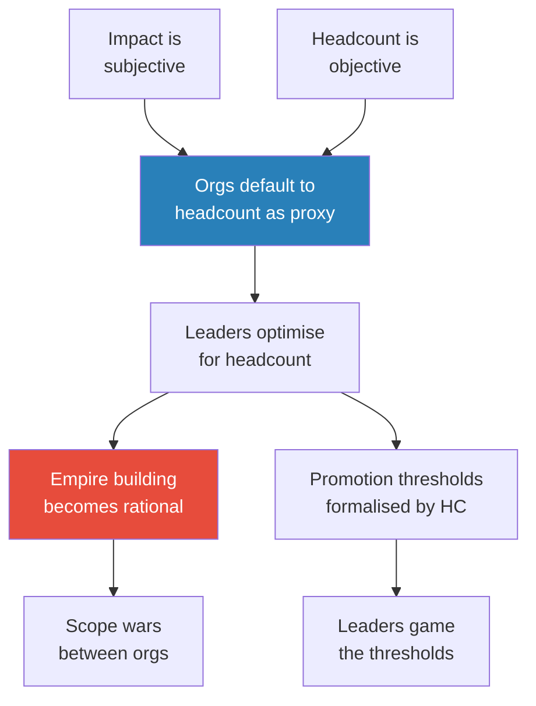
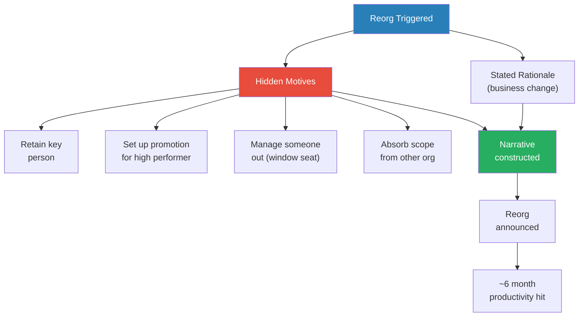
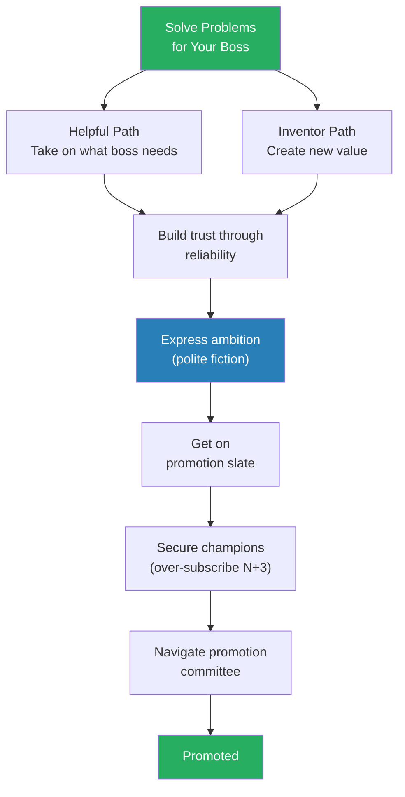
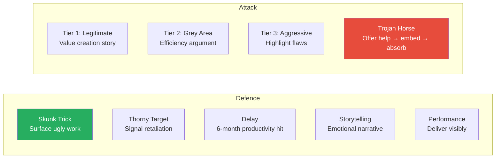
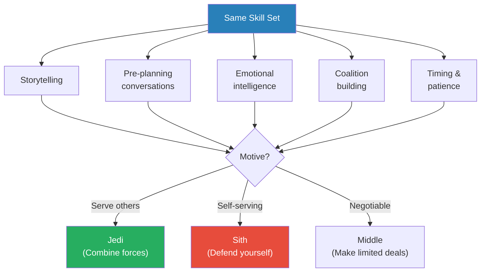
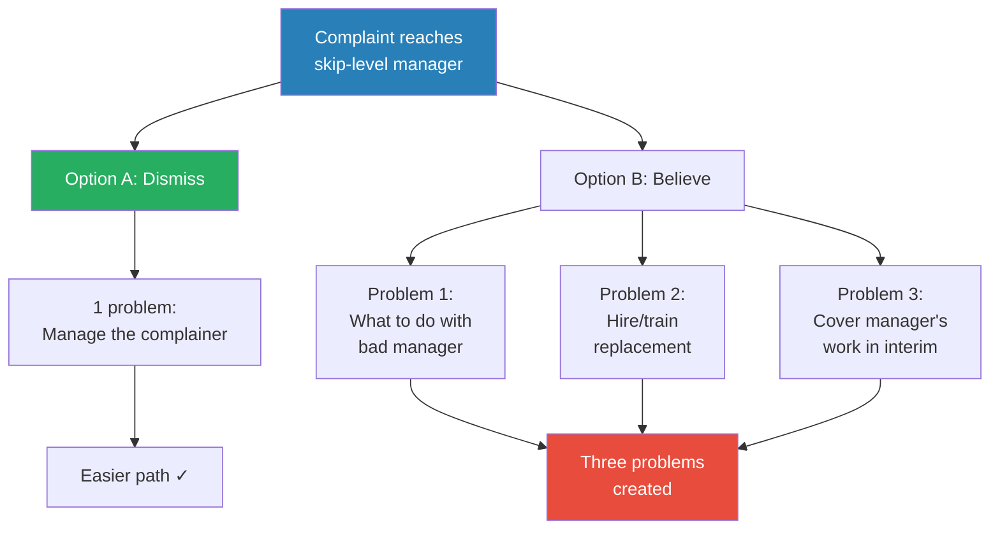

# How Corporate Politics Work And How To Win

> Retired Amazon VP Ethan Evans joins Ryan Peterman for a nearly three-hour masterclass on how corporate politics actually operate inside big tech. Evans spent fifteen years at Amazon during its hundredfold growth from 14,000 to 1.4 million employees, eventually managing around 800 people across eight different functions. Now retired and "immune" from consequences, he is unusually candid about empire building, reorgs as narrative construction, the mechanics of firing and being fired, scope wars between organisations, and why **the simplest promotion strategy is five words long: solve problems for your boss**. The episode's central argument is that influence and politics use identical skill sets — the only difference is motive.

---

## Guest Profile

**Ethan Evans** is a retired Amazon Vice President who spent fifteen years at the company during its explosive growth era. At his peak he managed roughly 800 people across wildly diverse functions — Prime Video, the Amazon App Store, reverse logistics, B2B operations, and even a custom T-shirt printing business that now generates over a billion dollars a year. He became a director early in Amazon's history when the company had only 22 people in his group and the thresholds were different. He admits to being fired twice early in his career for volatility and having a temper — experiences that inform his frameworks on emotional intelligence and self-advocacy. He now coaches tech leaders and executives, testing his models against hundreds of new cases each year.

---

## The Big Idea

- <b style="color: #27ae60">Corporate politics is not a character flaw — it is the natural consequence of incentive structures</b>
- When impact is subjective but headcount is objective, leaders optimise for headcount — that is not corruption, it is rational behaviour inside a broken measurement system
- The same skills that make someone politically dangerous — storytelling, coalition building, emotional intelligence, pre-planning conversations — are identical to the skills that make someone an effective, ethical leader
- The difference is motive, not method: are you building alliances to serve the organisation or only yourself?
- <b style="color: #e74c3c">Refusing to engage with politics does not make you virtuous — it makes you vulnerable</b>
- The episode's practical thesis: you can navigate corporate politics without becoming either a victim or a villain, but only if you understand how the game actually works

---

## Key Concepts at a Glance

| Concept | One-line summary |
|---------|-----------------|
| **The Polite Fiction** | Craft statements that are simultaneously true and strategically loaded — honest on the surface, unmistakable in subtext |
| **Solve Problems for Your Boss** | The five-word promotion strategy: make yourself indispensable by delivering what your manager needs |
| **Three-Problem Framework** | Skip-level complaints fail because believing them creates three problems while dismissing creates one |
| **Scope War Tactics** | Defensive (skunk trick, thorny target, delay) and offensive (value story, efficiency argument, Trojan horse) manoeuvres |
| **Jedi vs. Sith Assessment** | Categorise political operators as altruistic, self-serving, or negotiable — and adjust your strategy accordingly |
| **Umbrella vs. Funnel Managers** | Managers either shield their team from pressure or channel it downward — know which one you have |
| **Champion Over-Subscription** | For senior promotions, ask six to seven champions when you need four — some will always drop off |
| **Window Seat** | The reorg tactic of assigning someone an undesirable role to signal their career is over without formally firing them |
| **Constructive Termination** | The legal tripwire both sides dance around when a manager has already decided someone is out |
| **The Oxygen Test** | Bezos's tiebreaker: when you walk into a room, does energy go up or down? |

---

## Why Does Empire Building Exist?

*Evans traces the root of corporate politics to a measurement problem: impact is subjective, but headcount is something you can count.*

- <b style="color: #2980b9">Empire building</b> is not primarily driven by ego — it is driven by incentive structures
  - Impact is hard to measure, hard to compare across teams, and subject to narrative framing
  - Headcount is objective: "No one can debate Ethan has 42 people and Ryan has 17"
  - So organisations default to headcount as a proxy for importance, scope, and seniority
- Amazon formalised this after Evans left — <b style="color: #2980b9">director thresholds</b> were set at roughly 80-90 direct and indirect reports
  - Evans learned this from coaching clients still at Amazon
  - The stated principle is "no bonus for additional headcount"
  - <b style="color: #e74c3c">The reality directly contradicts this</b>: "There damn sure is a bonus — several hundred thousand dollars a year" once you cross the director threshold
- Leaders game headcount thresholds openly:
  - Evans's own VP told him to temporarily transfer reports into his group to hit the number
  - "Move people for six months, check the box, give them back"
  - No company systematically down-levels people when their team shrinks — the ratchet only goes one way

> [!tip] Core Insight
> Empire building is a rational response to broken measurement. If you want to change the behaviour, you have to change what gets measured — not lecture people about values.

---

*The incentive chain from measurement to empire building — each step is rational given the step before it, which is precisely what makes it so difficult to fix.*

---

## How Do Reorgs Really Work?

*Every reorg has a stated business rationale and at least one hidden motive. Evans argues that reorgs are fundamentally an exercise in narrative construction.*

- Three triggers cause reorgs:
  - **Business change** — a product launches, a strategy shifts, a market moves
  - **Departure cascade** — someone quits or gets moved, creating a chain reaction of reassignments
  - **Accumulated deferred changes** — problems everyone knew about but no one wanted to fix, released all at once
- <b style="color: #27ae60">Every reorg has hidden secondary motives</b> beyond the stated rationale:
  - Retain a key person by giving them a more attractive scope
  - Set up a high performer for their next promotion
  - Manage an unwanted leader out by assigning them undesirable work
  - Consolidate power by absorbing a neighbouring team
- Reorgs cause roughly a <b style="color: #e74c3c">six-month productivity hit</b> — this is widely known and is itself used as a defensive argument against unwanted reorganisations
- The leader running a reorg is fundamentally a storyteller: "You're coming up with your narrative about why this is the best possible reorg"

> [!example] The "Other" Org — Garbage Can Assignment
> - During the early formation of Prime Video and Kindle at Amazon, teams were being organised under specific leaders
> - One leader received the leftover teams nobody else wanted — database maintenance, QA, a couple of small things
> - He joked to the group: "My group's Other — it's the garbage can"
> - The VP was upset: "Don't call it that. What about the people in it?"
> - That leader was reportedly still at Amazon twenty years later
> **The lesson:** Nice people get the worst assignments. But patience and willingness to take on unglamorous work can mean extraordinary longevity.

### The Window Seat

- Borrowed from Japanese corporate culture, where being moved to a literal window seat signals your career is over
  - In Japan's collectivist culture, you want to be in the centre of the building, in the middle of things
  - A window seat means you have been physically marginalised — everyone knows what it means
- The American equivalent: being reorged into a role with no meaningful scope, no growth path, and no visibility
  - <b style="color: #e74c3c">The organisation is telling you your career here is over without formally terminating you</b>
  - This avoids the legal complexity and emotional difficulty of firing
  - The expectation is that you will quit on your own

---

*Every reorg is two things simultaneously: a business decision and a political move. The narrative bridges the gap between what is stated and what is intended.*

---

## How Do You Advocate for Yourself Without Being Threatening?

*Evans introduces his most distinctive framework — the polite fiction — and demonstrates how pre-planned language can express serious career ambitions without triggering a defensive reaction.*

- <b style="color: #2980b9">The squeaky wheel gets the grease</b> — vocal people receive more attention and resources; quiet high performers get deprioritised
  - Being told you are "too nice" is not a compliment in this context — it means you are being overlooked
  - Evans sees this constantly in his coaching practice: talented people who do excellent work but never say what they want
- The solution is not aggression — it is <b style="color: #2980b9">the polite fiction</b>
  - A statement that is simultaneously true at face value AND communicates an unspoken message both parties understand
  - The surface meaning is unattackable; the subtext is clear
  - You pre-plan the exact wording before entering the room — like chess openings

> [!example] "My Career Is Very Important to Me" — The Director Promotion
> - Evans was a senior manager with 22 people, wanting a director promotion
> - His manager Neil had not been moving on it
> - Evans pre-crafted a diplomatic statement and delivered it in person: "Neil, I need to understand how important my career is to Amazon, because my career is very important to me. And if it's not as important to Amazon as it is to me, I need to think about that"
> - The surface meaning is unassailable — no one can argue that wanting your career to matter is unreasonable
> - The subtext is unmistakable: I might leave if this does not change
> - Neil pushed the promotion through
> **The lesson:** You do not have to be a jerk. You have to be someone who has pre-planned exactly what to say, delivers it warmly, and lets the subtext do the work.

> [!quote] Ethan Evans
> "My career is very important to me. I need to understand how important it is to Amazon."

- <b style="color: #27ae60">The framework applies to any difficult conversation</b>:
  - "If you have a need, I'll be there for you" = I want any available scope
  - "Once I give my word, I can't go back on that" = I am about to accept the other offer
  - Each statement is honest, warm, and leaves the listener no logical basis for objection
- Evans uses the chess analogy for difficult conversations:
  - **Book openings:** Pre-planned phrases rehearsed before entering the room
  - **General principles:** Move toward common ground, understand emotional state, find shared interests
  - The key is to script during a calm moment (Tuesday), not during a crisis (Friday)

### Interpersonally Warm, Professionally Firm

- Separate emotional delivery from message content
- Be friendly, smile, do not get agitated — but clearly state what you need
- The same words delivered with warmth versus hostility produce completely opposite results
- Evans was fired twice early in his career for volatility and having a temper — this is where he learned the lesson
  - "I had to learn the hard way that being right is not enough if the way you deliver it makes people defensive"

---

## What Is the Simplest Promotion Strategy?

*Evans distils decades of career advice into five words, then proves the strategy works even in the most unlikely situations.*

- <b style="color: #27ae60">"The simple way to get promoted is: solve problems for your boss"</b>
  - Evans attributes this to an SVP lineage at Amazon who traced it back to Walmart leadership
  - If you are solving your manager's problems, they will value you
  - If they value you, and you then express what you want, they will work to give it to you
  - This works even with bad bosses — even selfish managers want to keep the people who make their lives easier
- The strategy has two paths:
  - **The helpful path:** Take on whatever the boss needs done, even if it is unglamorous
  - **The inventor path:** Create something new that nobody asked for but turns out to be valuable

> [!example] The Billion-Dollar T-Shirt Business
> - Evans ran Amazon's App Store with roughly 800 people
> - He believed there was a massive opportunity in custom-printed T-shirts sold on Amazon
> - He allocated 10 people — about 1% of his resources — to explore it, over his manager's objections
> - His manager pushed back: "You run the App Store. What does that have to do with T-shirt printing? This has nothing to do with it"
> - Evans framed it as a small bet that would not distract from the core business
> - Amazon now sells over a billion dollars a year of custom-printed T-shirts
> **The lesson:** Sometimes the biggest career moves come not from doing what you are told, but from making a small bet on something you believe in — framed carefully enough that no one can object to the investment.

> [!example] Ethan's Random Empire — Saying Yes to Everything
> - Evans worked under a VP who had no other engineering leaders
> - Every time the VP received a new engineering team with no one to hand it to, he gave it to Evans
> - Evans said yes to everything — reverse logistics, video games, the App Store, B2B operations, custom T-shirts
> - He ended up managing roughly 200 people across eight wildly diverse functions
> - The accumulated scope became the foundation for his VP promotion
> **The lesson:** "Solve problems for your boss" in practice means saying yes before you know the full picture. Willingness builds trust, and trust accumulates scope.

---

*The promotion path is not mysterious — it is a sequence of trust-building steps where each one unlocks the next. The mistake most people make is jumping straight to expressing ambition before they have built the trust foundation.*

---

## How Do Deal-Making and Promotion Slates Work?

*Evans reveals the behind-the-scenes mechanics of how promotions actually happen at senior levels — including quotas, forward-looking slates, and explicit deal-making between managers and reports.*

- At senior levels, <b style="color: #2980b9">forward-looking promotion slates</b> exist where names are queued 6-24 months in advance
  - This is common at both Amazon and Google
  - "Those positions cost a million dollars a piece" — there are lines and quotas
- Deal-making between managers and reports is common and not inherently toxic:
  - The deal: you take on a difficult assignment that serves the organisation's needs, and I use that as the platform for your promotion

> [!example] The India Dev Center Deal
> - Evans's VP told him to open an offshore development centre in India — a task Evans did not want
> - He found an Indian senior manager living in the US who wanted a director promotion
> - The deal: go build the development centre, use it as your platform for the director promotion
> - The senior manager moved his family to India for three years
> - He built the centre, got promoted to director, and his son learned Hindi and spent time with grandparents
> - Both parties got what they needed — Evans solved his VP's problem, the senior manager got his promotion
> **The lesson:** The best career deals are not zero-sum. Trading a tough assignment for a promotion path can serve everyone involved.

- When growth slows, scope acquisition becomes <b style="color: #e74c3c">cannibalistic</b>
  - In a growing company, there is always new scope to give ambitious people
  - In a flat or shrinking company, the only way to grow is to take scope from someone else
  - Both Ryan and Evans confirm this pattern — "cannibalism becomes more common as growth slows"
  - Growing companies have less politics; stagnant ones are zero-sum

> [!tip] Core Insight
> You cannot get promoted over your manager's objection. Evans has never seen it happen in his entire career. Either get your manager on board or get out.

---

## How Do Scope Wars Between Organisations Work?

*Evans lays out the specific tactics for both defending your team's scope and attacking to acquire more — with the frankness of someone who has nothing left to lose.*

- <b style="color: #2980b9">Respect between engineering teams is inversely proportional to their distance</b>
  - The further apart two teams are, the more they belittle each other — because they cannot see the complexity of the other team's work
  - Teams that store hundreds of trillions of objects (Amazon S3) get dismissed by distant teams who do not understand the scale

### Defence Tactics

- **The Skunk Trick:** Surface all the unsexy maintenance work that nobody wants
  - "List all the things they don't know about that you do" — the ugly infrastructure, the compliance work, the on-call burden
  - Make the acquiring team realise they would inherit all of it
- **Thorny Target:** Overreact early to signal retaliation capability
  - Even a small signal that you will fight makes most potential aggressors look for easier targets
- **Delay:** Argue the six-month productivity hit from any reorganisation
  - This is a legitimate business argument, not just a stalling tactic
- **Storytelling over facts:** <b style="color: #27ae60">People reach emotional conclusions first, then rationalise with facts</b>
  - "If I am a better storyteller, I give you that narrative"
  - Being right is not enough — you need to make the decision-maker feel your version of events
- **Performance:** High performance is the best platform for all other defences
  - Hard to take scope from a team that is visibly delivering

### Attack Tactics (Three Tiers)

- **Tier 1 (legitimate):** Build a genuine value-creation story with metrics
  - "We can serve this customer better because..."
- **Tier 2 (grey area):** Make efficiency, cost savings, or simplification arguments
  - "Why do we need two teams doing overlapping work?"
- **Tier 3 (aggressive):** Highlight the other organisation's flaws
  - Point at their problems and say "this is a dumpster fire — let us fix it"
- **The Trojan Horse:** Offer to "help" a struggling team, embed your people, then propose consolidation
  - Scope raids follow coup dynamics — succeed and you win, fail and you are burned

> [!quote] Ethan Evans
> "People come to an emotional conclusion and then rationalise it. If I am a better storyteller, I give you that narrative."

---

*The asymmetry matters: defence is always cheaper than attack, and high performance is the one tactic that works on both sides.*

---

## What Is the Difference Between Influence and Politics?

*Evans argues that influence and politics are not different activities — they are the same skills deployed with different motives. The question is not whether you use these skills, but what you use them for.*

- <b style="color: #2980b9">The Jedi vs. Sith Assessment</b>:
  - **Category 1 (Jedi):** Altruistic operators who use political skills to serve the organisation and the people in it — combine forces with them
  - **Category 2 (Sith):** Purely self-serving operators who will exploit any relationship — "get your lightsaber up"
  - **Category 3 (Negotiable middle):** Most people — their interests are alignable in limited scope. Make deals with them but do not trust beyond the scope of the deal
- The same skill set powers both:
  - Storytelling, pre-planning conversations, emotional intelligence, coalition building, timing
  - "Darth Vader had executive presence in spades — he had tons of executive presence, and so did Palpatine"
  - <b style="color: #e74c3c">The skills themselves are morally neutral — motive is everything</b>
- Even genuinely unethical people have a self-narrative where they are "practical, not evil"
  - They do not wake up in the morning and think "I am the villain"
  - Understanding their narrative is the key to predicting their behaviour and finding alignable interests
- Evans recommends the book *Leadership and Self-Deception* by the Arbinger Institute
  - Its core thesis: people construct self-deceptive narratives that justify their behaviour — understanding this pattern is the foundation of genuine influence

### Soft Power as Defence

- <b style="color: #2980b9">Soft power</b> — allies, reputation, relationships — is the primary defence against political attacks
  - The porcupine strategy: making yourself an unattractive target by having too many allies to fight
  - If attacking you means fighting your entire network, most rational operators will find an easier target
- Back-channelling is a legitimate tool when used transparently:
  - Build emotional buy-in through private one-on-one conversations before a group decision
  - The public test: if you would be comfortable with everyone knowing you had the conversation, it is legitimate
  - If you would be embarrassed for it to come to light, it is manipulation

---

*The same five skills produce ethical leaders or dangerous politicians. The only variable is intent — which is why Evans argues you must learn the skills regardless of your values.*

---

## Why Do Skip-Level Complaints Almost Always Fail?

*Evans presents his most counterintuitive framework — and one that explains why so many people who escalate problems end up worse off than when they started.*

- <b style="color: #2980b9">The Three-Problem Framework</b>:
  - When someone complains about their manager to the skip-level:
  - **Option A (dismiss the complaint):** One problem — deal with the complainer being "high maintenance"
  - **Option B (believe the complaint):** Three problems — (1) decide what to do with the bad manager, (2) hire or train a replacement, (3) cover the manager's work in the interim
  - The asymmetry makes Option A far more attractive from the skip's perspective
  - This is not because skip-levels are bad people — it is because the incentive structure punishes them for believing
- <b style="color: #27ae60">"Never mutiny alone"</b>:
  - If you want the skip-level to take action, take two or three people with you
  - Multiple corroborating reports force the asymmetry in the other direction — now dismissing creates more problems than believing
  - A single complaint is easy to file under "personality conflict"; three people saying the same thing is a pattern

> [!example] The Leader Mistreating Women
> - A leader under Evans was mistreating women on his team
> - It took a long time for different rumours to bubble up to Evans's level
> - When he investigated by talking to the women directly, they confirmed the problems
> - Evans had "been blind to a problem" — any single woman alone probably would not have been believed
> - It was only the accumulation of multiple corroborating reports that forced action
> **The lesson:** The system is structurally biased against individual complainants. Multiple voices change the equation.

### Navigating Away Without Mutiny

- If the skip-level route is too risky, make a business case to transfer
  - Frame it as an opportunity you are pursuing, not as running away from a problem
  - "I'm excited about this other team's mission" works; "my manager is terrible" does not
- The nuclear option: obtain a genuine offer from another organisation within the company

> [!example] Forcing the VP's Hand with an SVP Offer
> - Evans wanted a different role, but his VP kept saying no because the current arrangement suited him
> - Evans obtained a genuine job offer from a Senior VP in a different organisation
> - He told his VP: "I have an offer. If I give my word, I have to go. You've told me no several times. What do you want me to do?"
> - "I was in the new role the next morning"
> - The framing was honour, not ultimatum: "Once I give my word, I can't go back on that"
> **The lesson:** The best leverage comes from having a genuine outside option — not from bluffing. The polite fiction turns a confrontation into a face-saving exit for both sides.

---

*The asymmetry is structural, not personal. Understanding it is the first step to working around it — which is why "never mutiny alone" matters so much.*

---

## How Do Firings Actually Work?

*Evans pulls back the curtain on firing mechanics — both why people really get fired and how to negotiate when it happens to you.*

- <b style="color: #e74c3c">The real reason most people get fired is style incompatibility, not the performance issues in their file</b>
  - Almost always labelled as performance, but the actual trigger is a mismatch on two dimensions:
    - **Detail-oriented vs. high-level thinker**
    - **Tech-focused vs. business-focused**
  - Small frictions become permanent labels — once a manager decides you "don't get it," every subsequent interaction confirms their belief
- By the time a manager decides to act, they have already decided it is over
  - <b style="color: #e74c3c">PIPs are formalities</b> — Evans tells coaching clients "you're most likely going to be fired" and three months later they confirm it
  - The decision point was weeks or months before the PIP was issued

> [!example] The PIP Coaching Pattern
> - People constantly contact Evans saying "I've been put on a PIP, can you help?"
> - Evans tells them honestly: "No, you're most likely going to be fired"
> - Three months later they email back: "You were right"
> - By the time managers act, they have already decided — the PIP is documentation for HR, not a genuine improvement plan
> **The lesson:** If you get a PIP, start looking immediately. The time to fix the relationship was months before the PIP existed.

### Why Bad Managers Are Harder to Fire

- Three reasons:
  - **Subtle mistakes:** A bad manager's damage is diffuse — low morale, attrition, missed potential — not a single visible failure
  - **Hard to measure:** There is no clean metric for "your team would be 30% more productive under a better leader"
  - **They know the system:** Managers understand HR processes, documentation requirements, and political dynamics better than the people they manage
- <b style="color: #2980b9">Constructive termination</b> is the legal tripwire both sides dance around
  - If a manager says "we might have to fire you, do you want to quit first?" — that is legally actionable
  - Anything the manager does from that point is seen as having already decided to fire — and trying to avoid paying severance

### Three Pieces of Leverage When Being Fired

- **Time and hassle cost:** The formal termination process is expensive and slow — managers want it over with
- **The departure narrative:** You control the story you tell the remaining team — managers do not want you poisoning the well
- **Manager's self-image:** Most managers hate firing people and want to feel good about how they handled it — they are spending company money, not their own, so negotiating severance is easier than you think

> [!quote] Ethan Evans (attributing Satya Nadella)
> "IQ without EQ, without emotional intelligence, is a waste of IQ."

---

## How Do You Break Through the Senior Promotion Plateau?

*Evans explains why the skills that got you to senior level are precisely the wrong skills for getting beyond it — and what you need to learn instead.*

- <b style="color: #2980b9">What got you here will not get you there</b> (Marshall Goldsmith reference):
  - Early career success comes from hard work and technical delivery
  - Senior success requires delegation, communication, and letting go
  - The people who get stuck are doing the current skill harder instead of learning the next level's skill
  - "If you're a great coder and you want to become a manager, coding harder is not the answer"
- <b style="color: #27ae60">Trust is earned more in bad times than good</b> — the "war buddy" effect
  - Surviving a crisis together creates bonds that no amount of normal collaboration matches
  - This is why Evans values people who step up during outages, launches gone wrong, and deadline crunches
- At equally qualified levels, <b style="color: #27ae60">likeability is the tiebreaker</b>
  - The Bezos "oxygen" test: "When you come into the room, do you suck all the oxygen out of it?"
  - If you are the person who brings the room down, you will not get the promotion — even if your work is excellent
- <b style="color: #2980b9">Champion over-subscription strategy</b>: for senior promotions requiring N champions, ask N+2 or N+3
  - Some will leave the company, get reorged, or change their mind
  - Like over-provisioning server capacity — you plan for the ones that drop off

> [!example] Three Promotions in Eight Years — The Star Employee
> - An employee started working for Evans as a mid-level engineer (L5)
> - Over eight years: promoted to senior engineer, lateral move to manager track, promoted to senior manager, then to director — catching up to Evans himself
> - After three promotions, he left to found his own company
> - "He powered my career and I powered his"
> - Evans's explicit selling point as a manager: "Come work for me and I'll get you promoted"
> **The lesson:** The best manager-report relationships are mutual acceleration engines. Loyalty is not about staying forever — it is about making each other more successful while you are together.

---

*Each transition requires fundamentally different skills. The mistake is doing the current level's skill harder instead of learning the next level's skill.*

---

## Can You Have Outsized Influence Without a Senior Title?

*Evans shares two stories proving that entry-level employees can reshape a company — if they have the right combination of idea, storytelling, enthusiasm, and access to power.*

- The formula for influence disproportionate to title:
  - A genuinely good idea
  - The ability to tell a compelling story about it
  - Visible enthusiasm and willingness to do the work
  - Access to someone with the power to say yes

> [!example] Cloud Drive — Entry-Level Engineer Pitches Bezos
> - A new college graduate engineer at Amazon had an idea for cloud storage — something like Box or Dropbox
> - Amazon had an invite-only engineering conference; he fought his way in by submitting a proposal
> - He emailed Jeff Bezos directly asking him to stop by his poster — "a very small ask of the CEO"
> - Bezos liked the idea and emailed Evans's VP
> - The VP did not like the idea — but because Bezos had said "look into it," the project got funded and built
> - Amazon Cloud Drive was the result
> **The lesson:** A small ask of a powerful person can bypass an entire hierarchy. The engineer did not ask Bezos to fund his project — he asked Bezos to look at a poster. That was the genius.

- A similar pattern produced Fire TV:
  - A slightly more senior person did the legwork of writing the proposal and building support
  - Not a super-senior person, but someone who combined effort with access
- Andy Jassy would absolve certain principal engineers working on the hardest AWS problems of all mentoring, advising, and architecture review duties
  - <b style="color: #27ae60">If you have an irreplaceable skill, you get exceptions to all social rules</b>
  - Even leadership accepts it when someone has a genuine monopoly on a capability

---

## How Do You Handle Managers Who Funnel Pressure Downward?

*Evans introduces the umbrella-funnel distinction and explains how to change the dynamic when you are stuck under a funnel manager.*

- <b style="color: #2980b9">Umbrella vs. Funnel Managers</b>:
  - When pressure comes down from above, managers either shield the team (umbrella) or channel it directly onto the team (funnel)
  - "When the poo comes down, they're either shielding their team with the umbrella or they're a funnel dropping it onto their team"
- For funnel managers (often yes-men who defer to their own bosses):
  - Change the <b style="color: #2980b9">balance of safety</b>:
    - Either help them feel safe pushing back upward (coach them)
    - Or help them feel unsafe pushing down on you (set boundaries)
  - Script the conversation during a calm moment — Tuesday, not Friday during a crisis
  - Evans's approach: make it clear that your tolerance is limited, but do it warmly and with pre-planned language

---

## Can You Avoid Politics Entirely?

*Evans offers two paths for people who genuinely despise corporate politics — but neither is "just do good work and hope for the best."*

- **Strategy 1:** Choose a leader who shares your disdain for politics
  - If your manager also hates politics and actively shields you, you can focus purely on execution
  - But you are then dependent on that one person — if they leave, you are exposed
- **Strategy 2:** Work on the hardest technical problems where expertise truly matters
  - If you have an irreplaceable skill, the normal rules do not apply to you
  - Andy Jassy literally told certain principal engineers: you do not have to mentor, advise, or review — just solve the hardest problems
- The honest caveat: <b style="color: #e74c3c">growing companies have less politics; stagnant ones are zero-sum</b>
  - If your company is growing rapidly, there is always new scope — politics is less necessary
  - If your company is flat or shrinking, someone's growth requires someone else's loss
  - In that environment, even the most technically brilliant person is not fully immune

> [!abstract] Ethan's Two Strategies for Avoiding Politics
> 1. **Find a political shield:** Choose a leader who hates politics as much as you do and will actively protect you from it
> 2. **Become irreplaceable:** Work on problems so hard that nobody else can do them — the organisation will make exceptions for you
> 3. **The caveat:** Both strategies work best in growing companies. In stagnant organisations, even irreplaceable people eventually get drawn into political dynamics

---

## Connections

**Related books in vault:**
- [[Secrets to Winning at Office Politics - Marie G. McIntyre]] — Four political types taxonomy; the leverage equation; managing up, lateral, and down
- [[Power - Jeffrey Pfeffer]] — Performance-power disconnect; just-world fallacy; the resource-power cycle
- [[Managing with Power - Jeffrey Pfeffer]] — Structure as weapon (reorgs as power plays); framing as political tool
- [[Corporate Confidential - Cynthia Shapiro]] — The indispensable/invisible divide; HR as corporate shield; layoffs as managed removals
- [[Who Gets Promoted, Who Doesn't, and Why - Donald Asher]] — Promotions as investments, not rewards; the guardian angels concept
- [[Career Warfare - David D'Alessandro]] — Organisations as "vertical villages"; personal brand as career currency
- [[Stealing the Corner Office - Brendan Reid]] — The meritocracy fallacy; the performance-perception split
- [[Managing Up - Mary Abbajay]] — Boss relationship as single greatest career determinant
- [[The 48 Laws of Power - Robert Greene]] — Never outshine the master; reputation management; coalition building
- [[The 33 Strategies of War - Robert Greene]] — Indirect manoeuvre vs. brute force; defensive warfare
- [[Never Eat Alone - Keith Ferrazzi]] — Network as destiny; generosity-first; social arbitrage
- [[Expect to Win - Carla A. Harris]] — Performance + Political Alignment + Risk Taking; sponsor vs. mentor distinction
- [[7 Rules of Power - Jeffrey Pfeffer]] — Appear powerful; build a powerful brand; network relentlessly

**Where this episode extends the vault:**
- Evans's insider Amazon specifics (headcount thresholds, promotion slates, reorg mechanics) add granular operational detail that the theoretical books lack
- The scope war tactics (skunk trick, thorny target, Trojan horse) are more detailed than any single book's treatment
- The firing mechanics (constructive termination, leverage negotiation, PIP patterns) are rarely covered this candidly
- The polite fiction framework is a practical instantiation of what Greene and Pfeffer describe theoretically

---

## The Takeaway

This episode's most valuable contribution is not any single tactic — it is Evans's fundamental reframe of what corporate politics actually is. Most people treat politics as a moral failing: something bad people do and good people avoid. Evans argues the opposite. Politics is the natural consequence of incentive structures, and the skills it requires — storytelling, emotional intelligence, coalition building, timing — are the same skills that make someone an effective and ethical leader. The difference is motive, not method. Refusing to learn these skills does not make you principled; it makes you defenceless against the people who have learned them.

The most surprising insight is the three-problem framework for why skip-level complaints fail. It feels deeply counterintuitive — you would expect that a serious complaint about a bad manager would trigger investigation and accountability. Instead, the structural incentives make dismissal the path of least resistance. This reframes the entire concept of "speaking up" in organisations: the issue is not courage but strategy. Going alone is not brave; it is structurally disadvantaged. Going with corroborating voices changes the equation entirely.

What remains unresolved is the tension between Evans's optimism and the darker picture painted by Pfeffer and Greene. Evans believes you can navigate corporate politics ethically — that the Jedi path is genuinely viable. Pfeffer argues that power corrupts regardless of intent, and Greene treats all political actors as fundamentally self-interested. Evans's own evidence — fifteen years at Amazon, a coaching practice with hundreds of clients — supports his more hopeful view. But his evidence is also survivorship-biased: he is the one who succeeded. The people crushed by the system are not giving podcast interviews about what went wrong.
