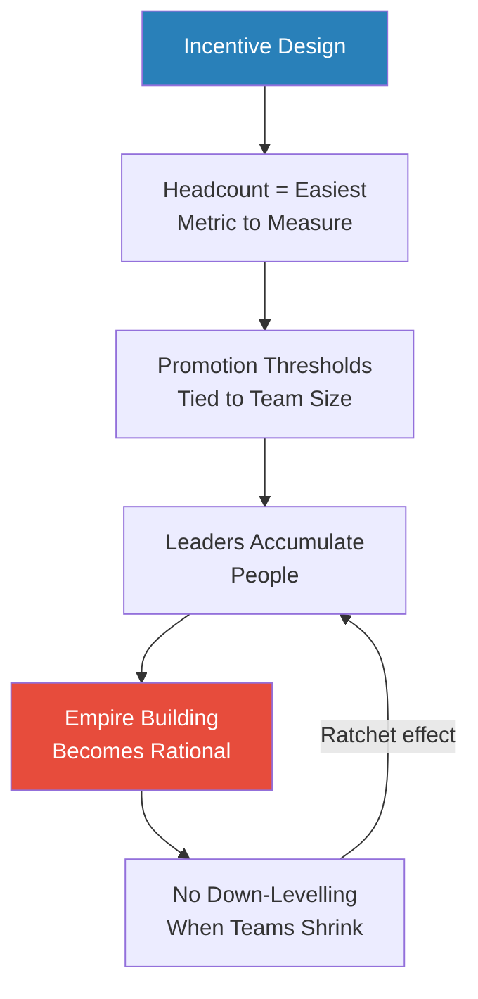
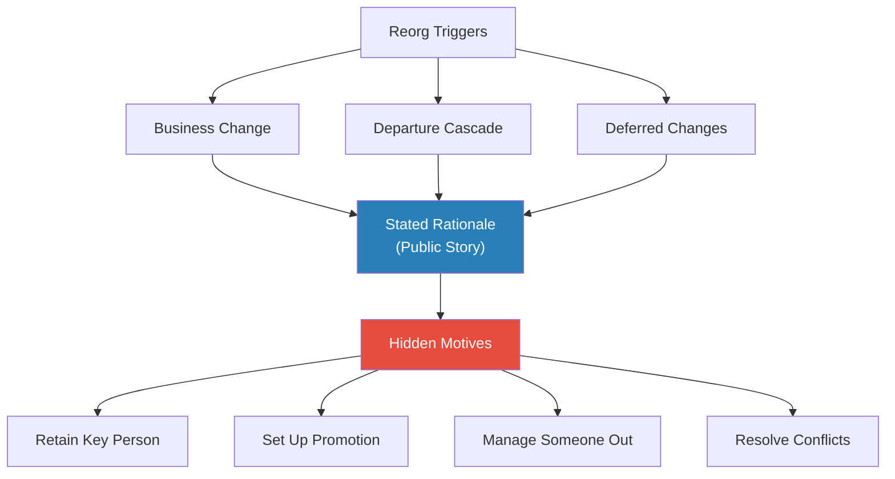
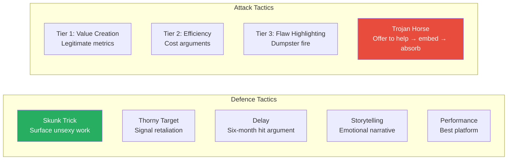
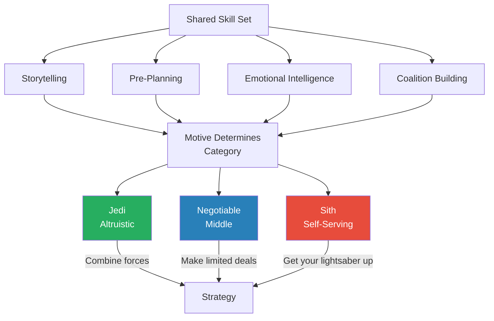
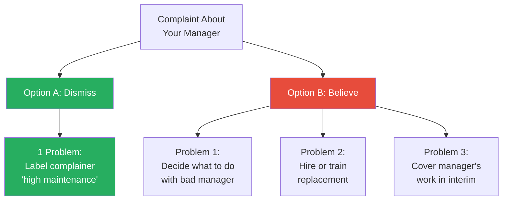
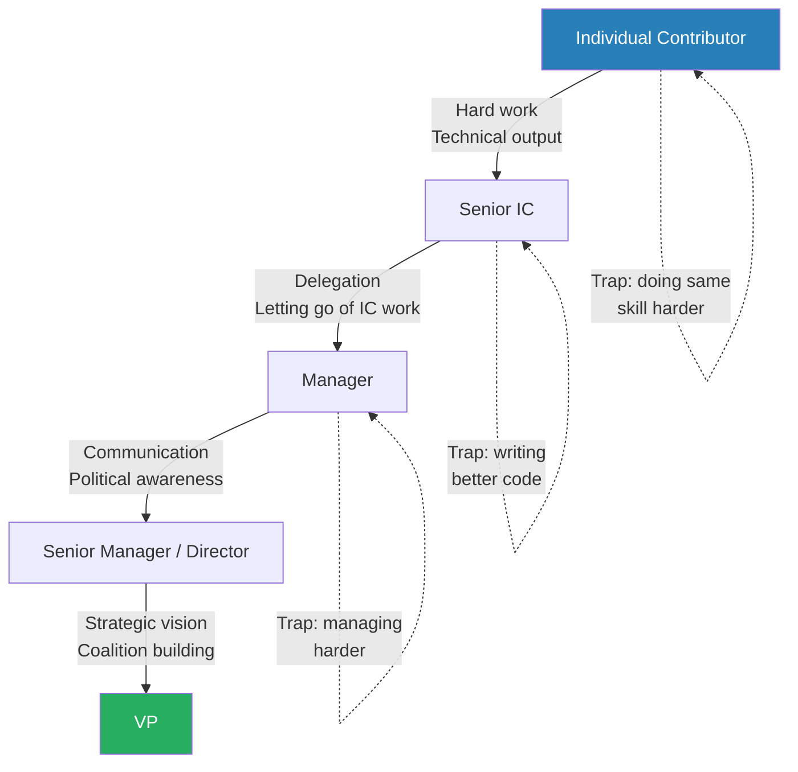

# How Corporate Politics Work And How To Win

> Ethan Evans, a retired Amazon Vice President who spent 15 years watching the company grow from 14,000 to 1.4 million employees, returns to Ryan Peterman's channel for a brutally candid deep-dive on corporate politics. Evans managed ~800 people across eight wildly different functions, was fired twice early in his career for volatility, and is now "immune" because he has no boss to worry about. The central argument: influence and politics use identical skill sets — the only difference is motive. The episode covers empire building, reorgs, scope wars, promotion mechanics, firing dynamics, and how to navigate all of it without becoming either a victim or a villain.

---

## Guest Profile

**Ethan Evans** is a retired Amazon Vice President who joined the company early enough to become a director when only 22 people reported to him. Over 15 years he grew his team from 6 to roughly 800 people spanning Prime Video, the Amazon App Store, reverse logistics, B2B commerce, and custom T-shirt printing. He was fired twice before Amazon for having a temper — an experience that gives him unusual credibility on emotional control. Now retired and coaching tech executives, he speaks with a candour that active leaders cannot afford.

---

## Key Concepts at a Glance

| Concept | One-line summary |
|---------|-----------------|
| **The Polite Fiction** | A statement that is true on the surface and communicates an unspoken message both parties understand |
| **Solve Problems for Your Boss** | The five-word promotion strategy — even selfish managers keep people who make their life easier |
| **Three-Problem Framework** | Why skip-level complaints fail: dismissing you is one problem, believing you creates three |
| **Scope War Tactics** | Defence (skunk trick, thorny target, delay) and attack (value creation, efficiency, flaw highlighting, Trojan horse) |
| **Jedi vs. Sith Assessment** | Skilled operators split into altruistic, self-serving, and negotiable middle — identify which before engaging |
| **Umbrella vs. Funnel Managers** | Managers either shield the team from pressure (umbrella) or channel it onto them (funnel) |
| **Champion Over-Subscription** | For senior promotions needing N champions, ask N+3 — some will leave, get reorged, or say no |
| **What Got You Here Won't Get You There** | Each career level demands fundamentally different skills — doing the current skill harder will not get you promoted |

---

## Why Does Empire Building Exist?

*Evans dismantles the idea that empire building is a character flaw and shows why it is an inevitable product of incentive design.*

- <b style="color: #27ae60">Headcount is the easiest metric to measure</b> — impact is subjective, but "no one can debate Ethan has 42 people and Ryan has 17"
- Amazon eventually established written director thresholds of roughly **80-90 direct and indirect reports**
  - These were formalised after Evans left, based on reports from his coaching clients
  - Before that, Evans became a director with just 22 people — thresholds inflated as the company scaled
- The official position — "no bonus for additional headcount" — <b style="color: #e74c3c">directly contradicts reality</b>
  - "There damn sure is a bonus — several hundred thousand dollars a year" once you cross the threshold
- Leaders game the system by temporarily transferring reports to hit numbers
  - Evans was told by his own VP: "Move people for six months, check the box, give them back"
- No company systematically down-levels people when their team shrinks
  - Once you have the title, losing headcount does not cost you the promotion — creating a ratchet effect

> [!tip] Core Insight
> Empire building is not a personality defect. It is a rational response to incentive structures that reward headcount over impact. If you want to change the behaviour, you have to change the incentive.

*Empire building is a self-reinforcing loop: once headcount determines promotion thresholds, leaders rationally accumulate people — and the absence of down-levelling means the ratchet only turns one way.*

---

## How Do Reorgs Really Work?

*Evans reveals that every reorganisation has a public rationale and a set of hidden motives — and the hidden motives are the ones that actually drive the decision.*

- <b style="color: #2980b9">Three triggers</b> cause reorgs:
  - **Business change** — a genuine strategic shift requiring new team structures
  - **Departures and cascades** — someone quits or is moved, creating a domino effect through adjacent teams
  - **Accumulated deferred changes** — problems leaders have been putting off, now bundled into one restructuring event
- Every reorg has <b style="color: #e74c3c">hidden secondary motives</b> beyond the stated business rationale:
  - Retaining a key person by giving them what they want
  - Setting up a high performer for a promotion they have been promised
  - Managing an unwanted leader out by assigning them undesirable work
  - Reshuffling to solve interpersonal conflicts that no one will name publicly
- Reorgs are fundamentally an exercise in **narrative construction**
  - "You're a storyteller coming up with your narrative about why this is the best possible reorg"
  - The leader constructing the reorg picks the story that supports their preferred outcome, then builds the structure around it
- Reorgs cause roughly a <b style="color: #e74c3c">six-month productivity hit</b> — widely known, and used as a defensive argument against unnecessary restructuring

*Every reorg has a stated rationale and a set of hidden motives. The person constructing the reorg selects the narrative that best serves the hidden goals while appearing to address the stated trigger.*

### The Window Seat and the "Other" Org

- Reorgs can deliberately manage unwanted leaders out via **undesirable assignments** — the "window seat" from Japanese corporate culture
  - Give someone a role with no growth potential and wait for them to leave voluntarily

> [!example] The "Other" / Garbage Can Org (Early Amazon)
> - During the formation of Prime Video and Kindle teams, leaders were divided among the new organisations
> - One leader got the leftovers — "database maintenance, QA, and a couple small things"
> - He joked: "My group's Other — it's the garbage can"
> - His VP was upset about the characterisation
> - That leader was reportedly still at Amazon 20 years later — surviving, but never thriving
> **The lesson:** Nice people who accept whatever is offered often get the worst assignments. The team-player penalty is real.

---

## How Do You Advocate for Yourself Without Becoming a Threat?

*Evans introduces his most distinctive framework — the Polite Fiction — and demonstrates it with the exact words that got him promoted to director.*

- The <b style="color: #e74c3c">squeaky wheel gets the grease</b> — vocal people receive more attention and resources, while quiet high performers get deprioritised
  - Being "too nice" is a career liability: "That is not a compliment in this context"
- The solution is <b style="color: #2980b9">the Polite Fiction</b>: a pre-crafted statement that is simultaneously true at face value AND communicates an unspoken message both parties understand
  - Surface meaning is unattackable
  - Subtext is clear
  - Neither party has to acknowledge the subtext exists

> [!example] "My Career Is Very Important to Me" — The Director Promotion
> - Evans was a senior manager with 22 reports, wanting the director title
> - He pre-crafted a diplomatic statement and delivered it to his manager Neil
> - The exact words: "Neil, I need to understand how important my career is to Amazon, because my career is very important to me. And if it's not as important to Amazon as it is to me, I need to think about that."
> - Neil pushed the promotion through
> - Evans notes: "No one can argue with it" — the surface statement is simply a person expressing that they value their career
> **The lesson:** The art is in the pre-planning. Craft the words before the meeting, rehearse the delivery, and let the subtext do the work.

> [!quote] Ethan Evans
> "My career is very important to me. I need to understand how important it is to Amazon."

- The <b style="color: #2980b9">Chess Analogy</b> for difficult conversations:
  - **Book openings** — pre-planned phrases rehearsed before entering the room
  - **General principles** — move toward common ground, understand the other person's emotional state, find shared interests
- Be <b style="color: #27ae60">interpersonally warm, professionally firm</b>:
  - Separate emotional delivery from message content
  - Be friendly, smile, do not get agitated — but clearly state what you need
  - The same words delivered differently produce completely opposite results
- Evans admits to being fired twice early in his career for volatility
  - Learning to control delivery was the single biggest unlock in his career

> [!tip] Core Insight
> Self-advocacy is not about being aggressive or submissive. It is about pre-planning your exact words so the surface meaning is unattackable while the subtext communicates what you need. Rehearse in advance.

---

## What Is the Simplest Way to Get Promoted?

*Evans distils promotion strategy to five words and then unpacks what makes it work even with bad bosses.*

- <b style="color: #27ae60">"Solve problems for your boss"</b> — the five-word promotion strategy
  - Attributed to an SVP lineage at Amazon/Walmart
  - Works because even selfish managers want to keep people who make their life easier
  - The key is identifying what your manager actually needs — not what they say they need, but the problems keeping them up at night
- Forward-looking <b style="color: #2980b9">promotion slates</b> exist at Amazon and Google
  - Names are queued 6-24 months in advance
  - At senior levels, quotas and budget lines become critical: "Those positions cost a million dollars a piece"
- You can also take the **inventor path** — not just solving assigned problems but creating new value

> [!example] The Billion-Dollar T-Shirt Business
> - Evans ran the Amazon App Store with ~800 people
> - He believed in custom-printed T-shirts on Amazon as a business opportunity
> - Allocated 10 people — roughly 1% of his resources — over his manager's objections
> - His manager called it irrelevant and micromanagement
> - Amazon now sells over a billion dollars a year of custom-printed T-shirts
> **The lesson:** The "solve problems for your boss" path and the "inventor" path are not mutually exclusive. You can do both — but frame the invention as solving a problem the company did not yet know it had.

### Deal-Making Between Managers and Reports

- The back-of-the-envelope deal: trading tough assignments for explicit promotion paths

> [!example] The India Dev Center Deal
> - Evans's VP told him to open an offshore development centre in India — a task Evans did not want
> - He found an Indian senior manager living in the US who wanted a director promotion
> - The deal: go build the dev centre, use it as a platform for director promotion
> - The senior manager moved to India for three years, built the centre, and got promoted
> - His son learned Hindi and spent time with grandparents — a personal bonus
> **The lesson:** When your boss hands you a problem you do not want, look for someone ambitious enough to see it as an opportunity. Both sides win.

---

## How Do Scope Wars Work Between Orgs?

*Evans maps the offensive and defensive playbook for inter-org territorial conflicts — the corporate equivalent of military strategy.*

- <b style="color: #2980b9">"Respect between engineering teams is inversely proportional to their distance"</b> — the farther apart two teams sit, the less respect they have for each other's work
- When company growth slows, scope acquisition becomes <b style="color: #e74c3c">cannibalistic</b>
  - In a growing company, there is new territory to claim
  - In a flat company, every gain must come at someone else's expense
  - Both Evans and Peterman confirm this pattern independently
- Attempted internal scope raids follow <b style="color: #e74c3c">coup dynamics</b> — succeed and you win, fail and you are burned

### Defence Tactics

1. **Skunk Trick** — surface the unsexy maintenance work nobody wants; make the attacker realise the scope comes with a pile of unglamorous obligations
2. **Thorny Target** — overreact early to signal retaliation capability; make it clear you will not go quietly
3. **Delay** — argue the six-month productivity hit from any reorg; time is the defender's friend
4. **Storytelling** — emotional narratives beat facts in decision-making; craft a compelling story about why the current structure serves the mission
5. **Performance** — high performance is the best platform for all defences

### Attack Tactics (Three Tiers)

1. **Tier 1 (Legitimate)** — genuine value-creation story with metrics: "We can do this better and here is the data"
2. **Tier 2 (Grey Area)** — efficiency, cost savings, simplification arguments
3. **Tier 3 (Aggressive)** — highlight the other org's flaws: "That org is a dumpster fire"
4. **The Trojan Horse** — offer to "help" the struggling team, embed your people, then propose consolidation under your org

*Defence tactics protect your scope by making it unattractive or costly to take. Attack tactics escalate from legitimate value creation through grey-area efficiency arguments to aggressive flaw-highlighting — with the Trojan horse as the most dangerous tool.*

- <b style="color: #27ae60">Soft power — allies, reputation, relationships — is the primary defence</b> against political attacks
  - The porcupine strategy: you do not need to be the biggest animal, you just need to be too costly to eat
  - Build relationships laterally so that an attack on you becomes an attack on a network

---

## What Is the Difference Between Influence and Politics?

*Evans argues that influence and manipulation use identical skill sets. The only distinguishing factor is motive — and most people sit in a negotiable middle.*

- <b style="color: #27ae60">Influence and politics use identical skill sets</b> — storytelling, pre-planning, emotional intelligence, coalition building
  - The difference is motive, not method
- Evans's framework: <b style="color: #2980b9">the Jedi vs. Sith Assessment</b>
  - **Category 1 (Jedi):** Altruistic operators who use influence for collective good — combine forces with them
  - **Category 2 (Sith):** Purely self-serving operators — "get your lightsaber up"
  - **Category 3 (Negotiable middle):** Most people — their interests are alignable in limited scope; make deals but do not trust beyond those deals

> [!quote] Ethan Evans
> "Darth Vader had executive presence in spades. These skills can be used for good or evil."

- Even unethical people have a <b style="color: #e74c3c">self-narrative where they are "practical, not evil"</b>
  - Do not try to convince them they are wrong — work with their own narrative about themselves
- People reach **emotional conclusions first**, then rationalise with facts
  - Being a better storyteller beats having better data
  - This is why the "dumpster fire" attack in scope wars can work even when the data does not support it
- Evans recommends *Leadership and Self-Deception* (Arbinger Institute) for understanding how self-narratives distort ethical reasoning

*Influence, politics, and manipulation share the same four skills. What separates a Jedi from a Sith is not ability but intent. Most people fall in the negotiable middle — align interests where possible, but verify before trusting.*

---

## Why Do Skip-Level Complaints Almost Always Fail?

*Evans reveals the structural asymmetry that makes complaining about your boss to their boss a losing strategy — and what to do instead.*

- When someone complains about their manager to the skip-level:
  - <b style="color: #2980b9">Option A (dismiss)</b>: One problem — label the complainer as "high maintenance" and move on
  - <b style="color: #2980b9">Option B (believe)</b>: Three problems — (1) decide what to do with the bad manager, (2) hire or train a replacement, (3) cover the manager's work in the interim
- The asymmetry makes Option A far more attractive — <b style="color: #e74c3c">the skip-level has every incentive to dismiss you</b>

*The math overwhelmingly favours dismissal. Believing a complaint about a manager creates three interrelated problems; dismissing it creates only one. This is why "never mutiny alone" — a single voice is easy to ignore.*

- Evans's advice: <b style="color: #27ae60">"Never mutiny alone"</b>
  - Multiple corroborating reports from different people force the skip-level to take it seriously
  - A single complaint is noise; a pattern is a signal

> [!example] The Leader Mistreating Women
> - A leader under Evans was mistreating women on the team
> - It took a long time for different rumours to surface — each woman assumed her experience was isolated
> - When Evans investigated by talking to the women directly, they confirmed a consistent pattern
> - Evans admitted he had "been blind to a problem"
> - Any single woman alone probably would not have been believed
> **The lesson:** Corroboration is what forces action. If you are experiencing a problem, find out whether others are too — then present the pattern together.

### Navigating Away Without Mutiny

- Instead of complaining, make a **business case** to transfer to another team
- Frame it as pursuing an opportunity, not fleeing a problem

> [!example] Forcing the VP's Hand with an SVP Offer
> - Evans wanted a different role, but his VP kept saying no because the current arrangement suited him
> - Evans obtained a genuine job offer from a Senior VP in a different organisation
> - He told his VP: "I have an offer. If I give my word, I have to go. You've told me no several times. What do you want me to do?"
> - "I was in the new role the next morning"
> - The framing was honour — "once I give my word" — not ultimatum
> **The lesson:** The best leverage comes from a genuine outside option, not a bluff. Frame it as a matter of personal integrity, not a threat.

---

## How Does Firing Really Work?

*Evans pulls back the curtain on what drives terminations, why bad managers survive, and what leverage you have when the axe falls.*

- The real reason most people get fired is <b style="color: #e74c3c">style incompatibility, not performance</b>
  - It is almost always labelled as performance because that is legally defensible
  - Two dimensions of mismatch: detail-oriented vs. high-level, and tech-focused vs. business-focused
  - Small frictions become permanent labels that accumulate until the decision is made
- By the time a manager decides to act, they have already decided it is over
  - <b style="color: #e74c3c">PIPs are formalities</b>, not genuine improvement opportunities
  - Evans coaches hundreds of people and says "three months later they email back: you were right"

> [!quote] Ethan Evans, attributing to Satya Nadella
> "IQ without EQ, without emotional intelligence, is a waste of IQ."

### Why Bad Managers Are Harder to Fire

- Three reasons:
  1. **Subtle mistakes** — a manager's errors are harder to document than an IC's
  2. **Hard to measure** — management impact is diffuse and lagging
  3. **They know the system** — experienced managers understand HR processes, PIPs, and legal tripwires
- <b style="color: #2980b9">Constructive termination</b> is the legal tripwire both sides dance around
  - Making someone's job intolerable enough that they quit — without crossing the line into something actionable
  - HR at Amazon was deeply aware of this boundary

### Three Pieces of Leverage When Being Fired

1. **Time and hassle cost** — the formal process of firing someone is expensive and slow; delay creates negotiating room
2. **Departure narrative** — you control the story you tell the remaining team; the manager wants a clean exit
3. **Manager's self-image** — "They are spending the company's money, not their own" — most managers want to feel generous during termination and will negotiate severance

> [!tip] Core Insight
> Most managers hate firing people. They want it to be over quickly and cleanly. That discomfort is your leverage — use it to negotiate a better exit, not to fight a battle you have already lost.

---

## What Gets People Stuck at Senior Levels?

*Evans explains why the skills that got you promoted stop working — and what the next level actually requires.*

- <b style="color: #27ae60">What got you here will not get you there</b> — each career level demands fundamentally different skills
  - Reference: Marshall Goldsmith's book of the same name
  - Early career: hard work, technical delivery, individual output
  - Senior career: delegation, communication, letting go of control, political navigation, strategic vision
- The trap: doing the current skill harder instead of learning the next level's skill
  - An engineer who writes better code will not become a director — a director needs to delegate code and communicate strategy

### How Trust Gets Built

- <b style="color: #27ae60">Trust is earned more in bad times than good</b> — the "war buddy" effect
  - Surviving a crisis together builds deeper bonds than succeeding together during easy times
  - Seek out the difficult situations, not just the high-visibility wins
- At equally qualified levels, <b style="color: #e74c3c">likeability is the tiebreaker</b>
  - Bezos's oxygen test: "Do you suck all the oxygen out of the room?"
  - If you are the person who brings the room's energy down when you walk in, "you're not going any further"

### The Champion Strategy

- Senior promotions require champions — people who will advocate for you in rooms you are not in
- <b style="color: #2980b9">Over-subscribe on champion requests</b>: if you need 4 champions, ask 6-7
  - Some will leave, get reorged, or say no
  - Like over-provisioning server capacity — build in redundancy
- You <b style="color: #e74c3c">cannot get promoted over your manager's objection</b>
  - Evans has never seen it happen across his entire career
  - If your manager is blocking you, your only options are: get them on board, or get out

> [!example] Ethan's Star Employee — Three Promotions in Eight Years
> - An employee started under Evans as a mid-level engineer (L5 at Amazon)
> - Evans promoted him to senior engineer, then supported a lateral move to management
> - The employee progressed: senior engineer to manager to senior manager to director — catching up to Evans himself
> - After 8 years and 3 promotions, the employee left to found his own company
> - Evans's reflection: "He powered my career and I powered his"
> **The lesson:** The best manager-report relationships are mutually accelerating. Evans's selling point to talent: "Come work for me and I'll get you promoted."

*Each level transition requires abandoning what made you successful at the previous level. The most common career trap is doing the current skill harder instead of learning the next level's fundamentally different skill.*

---

## Can You Have Outsized Influence Without a Title?

*Evans tells two stories of entry-level employees who shaped Amazon's product direction by combining the right idea with the right access.*

> [!example] Cloud Drive — Entry-Level Engineer Pitches Bezos
> - A new college grad engineer at Amazon had an idea for cloud storage
> - He fought his way into an invite-only engineering conference by submitting a proposal
> - He emailed Bezos directly asking him to stop by his poster — "a very small ask of the CEO"
> - Bezos liked the idea and emailed Evans's VP
> - The VP did not like the idea — but because Bezos said "look into it," the project got funded and built
> **The lesson:** Access to power + a good idea + storytelling + enthusiasm can override the entire hierarchy. The engineer did not need a title — he needed a story and a moment.

- The formula for <b style="color: #27ae60">soft power disproportionate to title</b>:
  - Good idea + storytelling skill + genuine enthusiasm + access to power
  - You do not need all four to be strong — but you need all four to be present
- Fire TV had a similar origin: a pitch from below, championed by someone with access

---

## Can You Avoid Politics Entirely?

*Evans offers two legitimate strategies for people who despise corporate politics — but is honest that both require exceptional circumstances.*

- **Strategy 1:** Choose a leader who shares your disdain for politics
  - If your boss shields you from the political layer, you can focus on the work
  - This is the <b style="color: #2980b9">Umbrella Manager</b> — as opposed to the Funnel Manager who channels pressure downward
- **Strategy 2:** Work on the **hardest technical problems** where expertise truly matters
  - If you have an irreplaceable skill, you get exceptions to all social rules

> [!example] Andy Jassy and the Principal Engineers
> - Jassy absolved certain principal engineers working on the hardest AWS problems of all mentoring, advising, and architecture review duties
> - He also tolerated a high-level employee whom everyone complained was not working hard
> - Jassy's response: "Yeah, you're right. But he's in a role where we need him and I think he knows we need him. So we're just gonna have to live with it"
> **The lesson:** Irreplaceable leverage is the one force that overrides corporate politics entirely. But genuinely irreplaceable people are rare — most of us need to learn the game.

- <b style="color: #27ae60">Growing companies have less politics</b>; stagnant ones are zero-sum
  - When there is new territory to claim, people do not need to take from each other
  - When growth slows, every gain comes at someone else's expense
  - This is why Evans recommends choosing high-growth environments if you hate politics

---

## Connections

**Related books in vault:**
- [[Power - Jeffrey Pfeffer]] (performance-power disconnect, resource-power cycle, structural positions)
- [[Managing with Power - Jeffrey Pfeffer]] (reorgs as power plays, framing as political tool)
- [[Corporate Confidential - Cynthia Shapiro]] (HR as corporate shield, PIPs as formalities, managed removals)
- [[Secrets to Winning at Office Politics - Marie G. McIntyre]] (political types taxonomy, managing up/lateral/down)
- [[Who Gets Promoted, Who Doesn't, and Why - Donald Asher]] (promotions as investments, guardian angels)
- [[Career Warfare - David D'Alessandro]] (personal brand as most important asset)
- [[Stealing the Corner Office - Brendan Reid]] (meritocracy fallacy, performance-perception split)
- [[Managing Up - Mary Abbajay]] (boss relationship as single greatest determinant, difficult boss archetypes)
- [[The 48 Laws of Power - Robert Greene]] (never outshine the master, reputation management, coalition building)
- [[The 33 Strategies of War - Robert Greene]] (indirect manoeuvre, defensive warfare, divide and conquer)
- [[Working Backwards - Colin Bryar & Bill Carr]] (Amazon's leadership principles, single-threaded leadership)
- [[What Got You Here Won't Get You There - Marshall Goldsmith]] (career level transitions, behavioural change at senior levels)
- [[Expect to Win - Carla A. Harris]] (performance + political alignment + risk taking, sponsor vs. mentor)
- [[Never Eat Alone - Keith Ferrazzi]] (network as destiny, generosity-first approach)
- [[7 Rules of Power - Jeffrey Pfeffer]] (appear powerful, build a powerful brand, network relentlessly)

---

## The Takeaway

This episode's most valuable contribution is not any single framework but the way Evans connects them into a unified system. Empire building, reorgs, scope wars, promotions, and firing are not separate topics — they are expressions of the same underlying dynamic: organisations reward what they can measure, and what they can measure is often a proxy for what actually matters. Headcount is a proxy for impact. PIPs are a proxy for "we decided months ago." Reorg narratives are proxies for hidden motives. Once you see the proxy layer, you stop being surprised by corporate behaviour and start navigating it.

The most counterintuitive insight is the Three-Problem Framework. Most people assume that going to their boss's boss with a legitimate complaint is a reasonable escalation path. Evans demonstrates why the structural incentives make dismissal almost inevitable — believing you creates three problems, dismissing you creates one. The implication is not "never complain" but "never complain alone." Corroboration is what flips the incentive structure. This reframes whistleblowing, team feedback, and skip-level relationships in a way that no theoretical book quite captures.

What remains unresolved is the tension between Evans's optimism about ethical navigation and the darker picture painted by Pfeffer and Greene. Evans genuinely believes you can play the game without becoming corrupted — his Jedi/Sith framework allows for principled operators. But he also admits the skill sets are identical, that even unethical people tell themselves stories of pragmatism, and that most people sit in the "negotiable middle." Whether you can spend a career in that middle without drifting toward the Sith side is a question Evans does not fully answer — and may not be answerable until you are retired and looking back.
