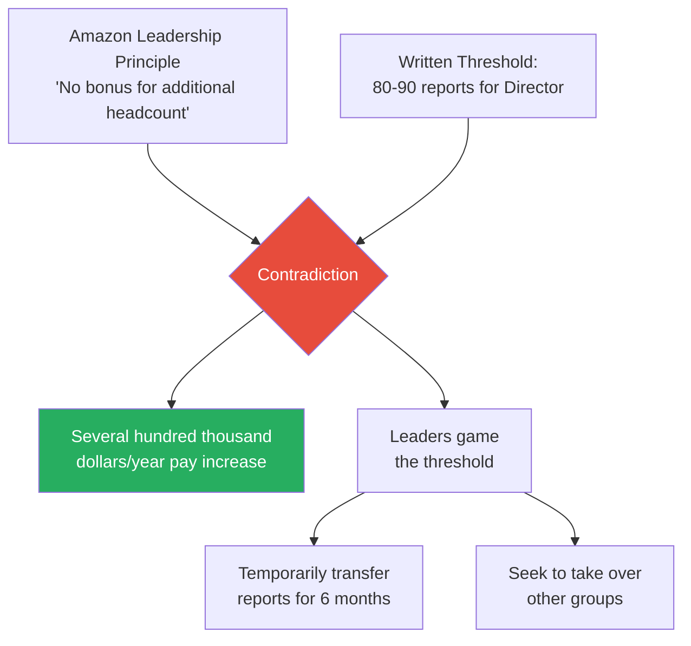
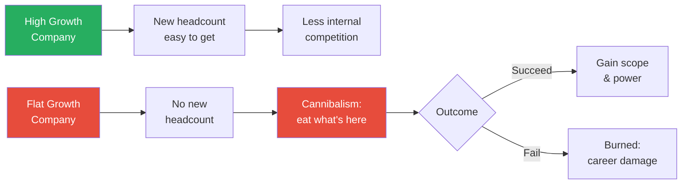
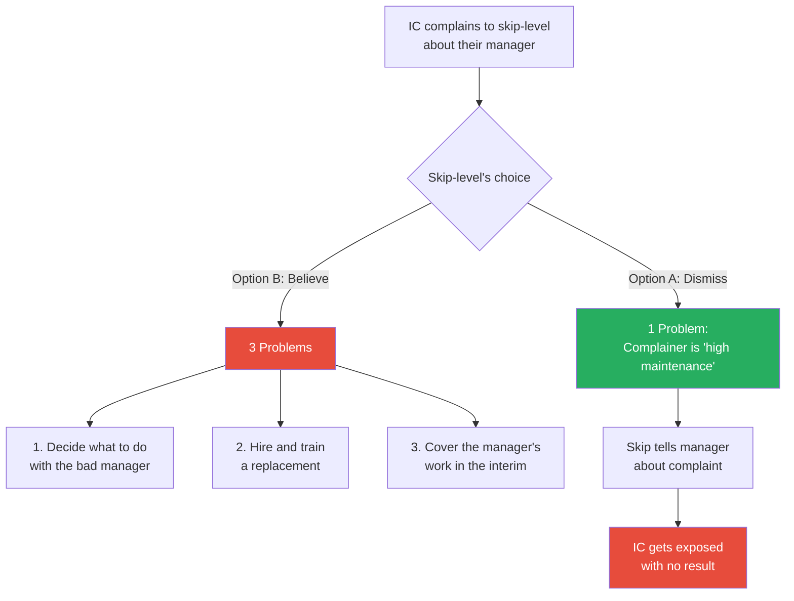
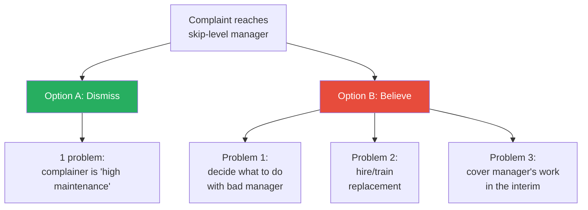
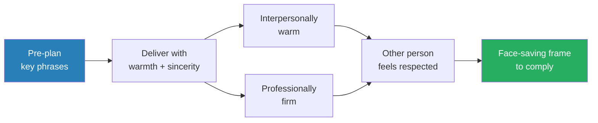
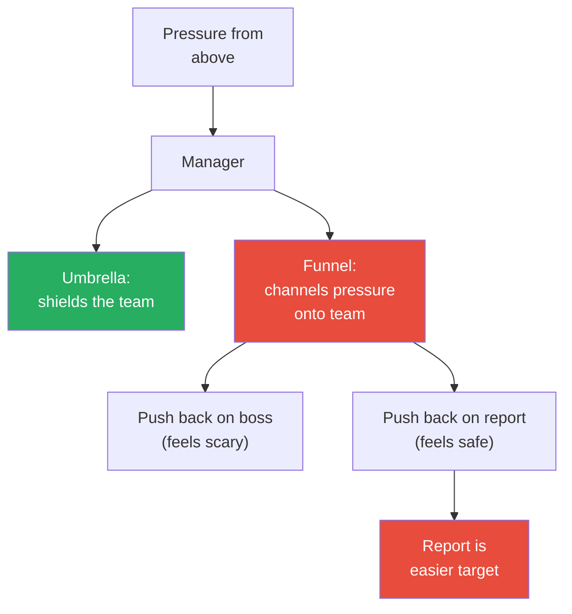
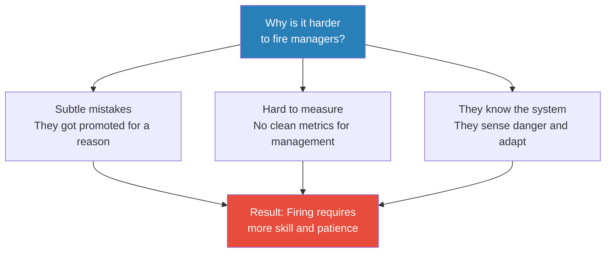
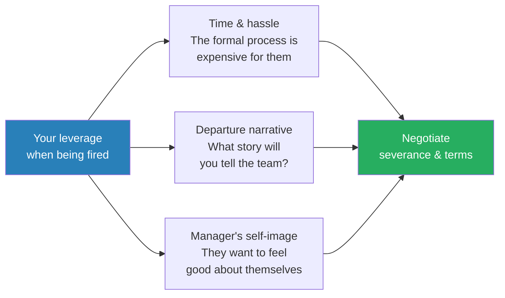
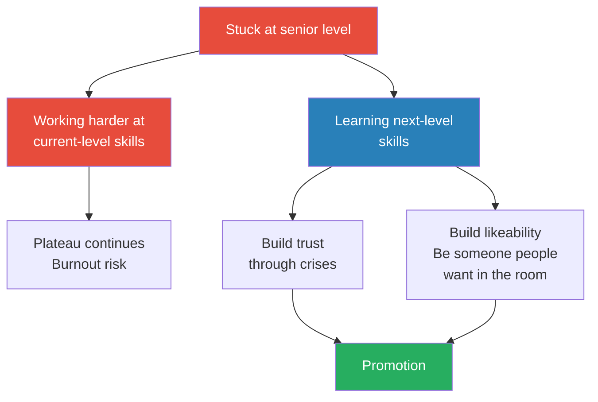

# How Corporate Politics Work And How To Win

> Retired Amazon VP Ethan Evans joins Ryan Peterman for a nearly three-hour masterclass on how corporate politics actually operate inside big tech. Evans spent fifteen years at Amazon during its hundredfold growth from 14,000 to 1.4 million employees, managing around 800 people across eight functions. Now retired and "immune" from consequences, he walks through — with unusual candour — the mechanics of empire building, reorgs, scope wars, firing, and promotions. The central argument: influence and politics use identical skill sets. The only difference is motive.

---

## Overview: Key Highlights

- <b style="color: #27ae60">Empire building is rational, not evil</b> — headcount is the easiest metric, so it gets rewarded. Amazon's director threshold was ~80-90 reports
- <b style="color: #2980b9">The Polite Fiction</b> — pre-crafted statements that are true on the surface and loaded with unspoken meaning. The master skill of self-advocacy
- <b style="color: #27ae60">"Solve problems for your boss"</b> — the five-word promotion strategy. Works even with bad bosses
- <b style="color: #e74c3c">Every reorg has hidden motives</b> — retention, promotion setup, managing people out. The stated rationale is the story; the hidden motives are the engine
- <b style="color: #2980b9">Three-Problem Framework</b> — why skip-level complaints fail: dismissing you creates one problem, believing you creates three
- <b style="color: #2980b9">Scope War Tactics</b> — defence (skunk trick, thorny target, delay) and attack (value creation, Trojan horse)
- <b style="color: #27ae60">Influence and politics are the same skills</b> — only motive separates Jedi from Sith. Refusing to engage makes you vulnerable, not virtuous
- <b style="color: #e74c3c">Most people get fired for style, not performance</b> — the written reason is always performance, but the real trigger is incompatibility
- <b style="color: #2980b9">Three levers when being fired</b> — time/hassle cost, the departure narrative you'll tell, and the manager's desire to feel good
- <b style="color: #27ae60">"Take it seriously that your relationships control your progress"</b> — Evans's single-sentence career advice

| Concept | One-line summary |
|---------|-----------------|
| **The Polite Fiction** | Craft statements that are true and strategically loaded — honest on the surface, unmistakable in subtext |
| **Solve Problems for Your Boss** | Make yourself indispensable by delivering what your manager needs |
| **Three-Problem Framework** | Skip-level complaints fail because believing them creates three problems while dismissing creates one |
| **Scope War Tactics** | Defensive (skunk trick, thorny target, delay) and offensive (value story, Trojan horse) manoeuvres |
| **Jedi vs. Sith Assessment** | Categorise political operators as altruistic, self-serving, or negotiable |
| **Umbrella vs. Funnel Managers** | Managers either shield their team from pressure or channel it downward |
| **The Window Seat** | Reorg tactic: assign someone an undesirable role to signal their career is over |
| **Champion Over-Subscription** | For senior promotions, ask N+3 champions because some will drop off |
| **The Oxygen Test** | Bezos's tiebreaker: when you walk in, does energy go up or down? |
| **Constructive Termination** | The legal tripwire both sides dance around when someone is being pushed out |

---

# The Conversation

## Introduction & Setup [0:00 - 2:39]

*Ryan opens by framing this as a sequel conversation. Last time, Ethan's candour about life at the VP level made the episode popular. This time, Ryan wants to go even deeper -- reorgs, firings, and every behind-the-scenes move that engineers never see. Ethan agrees, and explains why he can afford to be honest: he is retired and immune.*

> [!note]- Expand: Full Conversation
> - Ryan tells Ethan that the first episode resonated because of his "unusual level of transparency" -- he has never met anyone at the VP level in tech willing to say everything directly
> - Ryan frames the session: he wants to cover reorgs, empire building, and "all the other behind the scenes things that happen in the management of tech"
> - Ethan agrees, noting he is comfortable with the fact that he is not a perfect person: "sometimes some of the stuff I did, I wish I had done differently"
> - He then delivers the key line that frames the entire conversation: "And frankly, I'm retired, so I'm immune. There's no boss over me who's going to be like, you said what? You told Ryan what?"
> - This sets up the dynamic for the rest of the episode -- Ethan will speak with a freedom that active executives cannot

---

## Empire Building: Why Leaders Hoard Headcount [2:39 - 5:52]

*Ethan explains the engine behind empire building: headcount is the only objective metric of a leader's size, so ambitious leaders naturally accumulate people. Ryan asks whether it is possible to change the incentive structure, and Ethan says yes in theory -- but comparing impact across teams is subjective, dangerous, and politically costly.*

> [!tip] Core Insight
> Empire building is not a character flaw -- it is a rational response to a broken measurement system. Impact is subjective and politically dangerous to compare, but "no one can debate that Ethan has 42 people and Ryan has 17."

> [!note]- Expand: Full Conversation
> - Ethan defines empire building as "focusing more on getting raw number of people than on what you're doing or the impact you're having"
> - He explains why it exists: "Empire building exists because it's rewarded. And it's rewarded because counting people is the easiest thing to do"
> - <b style="color: #27ae60">The fundamental measurement problem</b>: "How much impact you had is subjective. One person thinks the project was hard, another thinks, oh, that was pretty easy. But no one can debate, well, Ethan has 42 people and Ryan has 17"
> - This drives leaders to want more people because headcount is their visible, defensible metric
> - Some companies have written thresholds: to be eligible for promotion, you must have a certain number of reports -- so high performers reverse-engineer ways to hit that number
> - Ryan asks whether it is possible to change this -- to promote managers without tying it to team size
> - Ethan says it is theoretically possible but takes more effort because impact is harder to assess
> - He illustrates the comparison problem: if one leader's product directly generates revenue and another runs infrastructure, who has more impact? That judgment call "just makes you mad"
> - <b style="color: #e74c3c">The danger of subjective assessment</b>: telling someone their peer was "more impactful" is hard to defend and breeds resentment, which is why headcount remains the default

---

## Promotion Thresholds & Gaming the Numbers [5:52 - 15:50]

*Ryan asks about concrete promotion thresholds at Amazon. Ethan reveals that written director thresholds of 80-90 people were formalised after he left, directly contradicting Amazon's own leadership principle that "there's no bonus for additional headcount." He then describes how leaders game these numbers -- temporarily transferring reports -- and how reorgs always carry hidden secondary motives.*

*Amazon's stated principle directly contradicts the financial reality of its promotion thresholds -- creating a system where gaming headcount is the rational move.*

> [!note]- Expand: Full Conversation
> - Ryan asks for the rough written thresholds at Amazon for senior management, director, and VP
> - Ethan reveals that these thresholds did not exist in writing during his tenure -- they were "whisper numbers"
> - After he left, coaching clients told him the number was formalised: <b style="color: #2980b9">80 people in some orgs, 90 in others</b> to become a director
> - Ethan himself became director with only 22 people, early in Amazon's history when the company was smaller
> - He points out the direct contradiction with Amazon's leadership principle: "One of the Amazon leadership principles says there's no bonus for additional headcount. But now that it's written down that I can't get to this very well paying level without 90 people, there damn sure is a bonus -- there's like a several hundred thousand dollars a year bonus for accumulating 90 people"
>
> > [!example] Gaming the Threshold: The Six-Month Shell Game
> > - Ethan describes leaders whose bosses tried to help them cross the promotion threshold
> > - The tactic: "We're going to put these people under you for six months, check the box, and give them back to the person we took them from"
> > - This means real people's reporting structures and daily lives change just to hit an arbitrary number
> > - After promotion, there is typically a "grace period" of six to nine months where being below the threshold is tolerated if you can tell a story about future growth
> > - No company Ethan has ever seen systematically down-levels someone whose team shrinks -- instead they say "your team is no longer director scope, you're going to have to find a director level role"
> > **The lesson:** The system creates a shell game where people are moved around as chess pieces to satisfy numerical thresholds that the company officially claims do not matter.
>
> - Ryan asks about engineers experiencing reorgs from below -- being told one reason while suspecting another
> - Ethan confirms: <b style="color: #e74c3c">"There's always something else going on"</b>
> - All leaders know reorgs are costly, so they delay as long as possible -- and when one finally happens, they try to accomplish as many goals as possible in one move
> - He compares it to loading a ship: "This ship is leaving the dock. How much else can we throw on the deck as it's pulling away?"
> - Hidden reorg goals include: setting up high performers for success, retaining key people, and giving less desirable assignments to people they wouldn't mind losing
> - Multiple people are usually involved in planning, requiring the leader to build coalitions: "Sometimes you have to get them on board with your second motive"
> - Ethan frames reorg planning as narrative construction: <b style="color: #2980b9">"You're a storyteller, and you're coming up with your narrative about why this is the best possible reorg"</b>

> [!quote]
> "There's always something else going on... This ship is leaving the dock. How much else can we throw on the deck as it's pulling away?"

> - Ryan observes it is "almost like this hidden chess going on"
> - Ethan agrees: you are aware of what each person wants to hear, and you sell different pieces of the reorg to different stakeholders
> - He describes the three triggers for reorgs: (1) a business change requiring restructuring, (2) a cascade when someone quits or gets moved, and (3) accumulated deferred changes finally reaching a tipping point
>
> > [!example] Reorg Cascade: Ethan Under a Non-Technical Leader
> > - Several times in Ethan's career, his boss either left or was moved, triggering a cascade reorg
> > - When he ran the Prime Video team, his engineering VP left and Ethan was placed under a business leader who had never managed engineering
> > - That leader's first words: "I don't really want your team. I don't want to run engineering. I don't know anything about it"
> > - Despite this rocky start, Ethan says this turned out to be one of his best managers: "He said, we will figure it out. And we worked together and actually had a great run"
> > **The lesson:** Reorg placements often feel arbitrary or even punitive -- but they can produce unexpected partnerships if both sides commit.

---

## The Squeaky Wheel: Why Being Nice Is a Career Liability [15:50 - 23:21]

*Ethan delivers one of the conversation's sharpest truths: quiet high performers get deprioritised because managers focus resources on the people most likely to leave. He walks through how this plays out in reorgs and day-to-day management, then reveals the exact phrasing he used to diplomatically demand his own director promotion at Amazon.*

> [!tip] Core Insight
> Being "too nice" is not a compliment in a corporate context. Managers allocate attention and resources to the people most likely to leave -- not to the people doing the best work. You do not have to be a jerk, but you must make your ambitions visible.

> [!note]- Expand: Full Conversation
> - Ethan describes the squeaky wheel dynamic: two people perform roughly equally, but one has made clear they are thinking about leaving
> - <b style="color: #e74c3c">The quiet performer's penalty</b>: "Ryan's this great guy, always sticks with us. He'll wait another six months. And I can use those six months to save this other guy who's also valuable"
> - "By being quiet and dutiful, sometimes I can make the decision. It's not that I mean to screw you. It's more I'm focused on saving this other person. And I know you'll put up with it"
> - Ethan says he often tells coaching clients: "You are a very nice person" -- and then delivers the follow-up they do not expect: "And that is not a compliment in this context"
> - He clarifies: jerks get more up to a point, then they push too far and antagonise -- but if you never ask for anything, you will never get anything
> - In reorgs specifically, managers sometimes give better assignments simply because they know what some people want and have to guess for others
> - Ryan asks about the upper bound -- when someone is so pushy it becomes obviously self-serving empire building
> - Ethan's approach: if the trust is there, get in a room where nobody is listening and have a heart-to-heart: "Look, let's both be honest that you're empire building. This is a bridge too far. Let's talk about how we're going to get you there by some defendable path"
> - If they have zero patience, Ethan notes: "Some people want what they want right now and they can't see"
>
> > [!example] "My Career Is Very Important to Me" -- The Director Promotion
> > - Ethan wanted to be promoted to director at Amazon; he was a senior manager with 22 people
> > - He needed to signal urgency to his manager, Neil, without making it feel like extortion
> > - His pre-crafted statement: "Neil, I need to understand how important my career is to Amazon, because my career is very important to me. And if it's not as important to Amazon as it is to me, I need to think about that"
> > - The phrasing is unattackable: nobody can argue your career should not be important to you
> > - "I need to think about that" is not a direct threat, but everyone understands the implication
> > - Compare with what would fail: "If it's not as important to you as it is to me, I might quit" -- that is a threat, and managers will reject extortion
> > - Result: Neil pushed the promotion through
> > **The lesson:** The exact wording matters enormously. The same message can sound like bold self-advocacy or naked extortion depending on how it is framed.
>
> - Ryan reacts: "I feel the effects of extortion a bit, but I could not label it extortion"
> - Ethan agrees that is exactly the point -- even if Ryan's managers heard about it, they would say "that's well done, that's bold"
> - <b style="color: #27ae60">Ethan's key qualifier</b>: you must tune the message to your workplace -- Amazon was "a relatively sharp-elbowed, pushy place" where this statement was unremarkable, but it would be offensive in a gentler corporate culture
> - "Part of it's just finding the place where you look like a wonderful, sweet person in the mix"

---

## Demanding High Performers vs. Team Players [24:19 - 29:37]

*Ryan probes a tension many engineers feel: how much can you demand of your manager before it backfires? Ethan reveals that truly demanding people are actually self-solving problems -- deny them and they quit. His preferred approach is deal-making: trading tough assignments for promotion paths.*

> [!note]- Expand: Full Conversation
> - Ryan raises the concern that being too pushy could irk a manager: "You're a high performer, but you also keep demanding things"
> - Ethan makes a surprising point about overly demanding people: <b style="color: #27ae60">"The great thing about the really demanding people is if they really are bothering you to the point where you decide they're a net negative, if you just tell them no, they will quit"</b>
> - They are so driven that denial alone solves the problem -- "They will even leave for a lesser job"
> - But Ethan's preferred path is deal-making: "I'm a huge believer in deal making"
> - The deal structure: "You want this thing, I will help you get it. But you're a high performer. You're going to show incredible performance on the things I need, and then I will deliver"
> - He claims with total pride that he always followed through -- with one early-career exception that still bothers him 20 years later
>
> > [!example] The India Dev Center Deal
> > - Ethan's VP told him his team was too expensive and he needed to open a "low cost offshore dev center"
> > - Ethan did not want to do any of it -- travelling around the world, managing remote teams, figuring out where to go
> > - He found a senior manager who was Indian, living in the US, and wanted to become a director
> > - The deal: "Go back to India and start this dev center. If you can build me a dev center in India, I think we can use that as a platform to get you to director"
> > - The senior manager moved home for three years -- his son learned Hindi, saw grandparents
> > - Ethan used the independent accomplishment to construct a narrative of director-level work
> > - The senior manager was promoted to director
> > **The lesson:** Solving the boss's unwanted problem creates the leverage for your own promotion. The deal was struck years before it paid off.
>
> - Ryan asks what happens if circumstances change -- Ethan gets reorged or fired before the deal pays out
> - Ethan says he cannot recall a time he was unable to follow through, but acknowledges it could happen
> - He notes that most leaders are professionals who can distinguish between "you didn't come through" and "shit happened"

---

## The Forward-Looking Slate: Promotion Queues & Quotas [29:37 - 31:54]

*The conversation briefly touches on the hidden infrastructure of promotion planning. Ethan reveals that formal queues exist, tracking who gets promoted and when -- and at senior levels, strict quotas determine how many people can advance in a given cycle.*

> [!note]- Expand: Full Conversation
> - Ryan observes there is a lot of "back of the envelope" deal-making between managers and reports -- and between managers themselves
> - Ethan confirms: there is literally a line (a queue) tracked by HR called the <b style="color: #2980b9">forward-looking slate</b>
> - Names are listed by halves: who is 6 months out, 12 months, 18 months, up to 24 months
> - He notes that at Google today (from a coaching client), there are strict quotas: "This quarter or this half, two people can get from L8 to L9 in this org"
> - His coaching client was ranked fourth and knew he would not make it that cycle
> - Early in your career there is usually no quota -- the bottleneck tightens at senior levels where "those positions cost a million dollars a piece, so we don't just want to hand them out like popcorn"

---

## Cannibalism in Flat-Growth Companies [31:54 - 37:13]

*Ryan and Ethan explore what happens when company growth slows and leaders can no longer grow their teams by hiring -- they begin taking from each other. Ethan introduces the concept of internal cannibalism and explains how to position for scope without becoming a pirate.*

*When growth slows, scope acquisition becomes zero-sum -- attempted raids follow coup dynamics where failure is punished as harshly as success is rewarded.*

> [!note]- Expand: Full Conversation
> - Ryan asks about internal scope theft -- someone vying to take reports from a peer for their own promotion
> - Ethan says this has become far more common as growth has slowed: "When a company is growing very quickly, you see less of this because it's easier to go get new people than to fight with someone"
> - Now that the Magnificent Seven are mostly flat on headcount, "there's a lot more of this, what I would call cannibalism. Since I can't go out and get new, I'm going to have to eat what's here"
> - <b style="color: #e74c3c">You cannot allow people on your team to go rogue</b>: "If they're raiding and pillaging and you seem clueless, you're no longer in charge"
> - Ethan compares it to a coup attempt: "If you attempt a coup and you win, you get to be president. And if you fail, you get hung or shot"
> - This fear of consequences holds back the worst behaviour -- "People do realize if I get caught being too obviously self serving, it's going to burn me here"
> - His recommended approach for ambitious people: tell your manager you are ready to step up if an opening appears, and emphasise stability
> - Ryan stumbles onto strong phrasing: "I want what's best for the org, and if I need to step up, I'm here"
> - Ethan immediately calls this out as a <b style="color: #2980b9">polite fiction</b> -- it can be simultaneously true and strategically self-serving
> - "I don't really care which team's available. I just want more scope. I'll take whatever you have. But the way I phrased it sounds so much better because one sounds like the pirate ship and the other one sounds like the selfless servant"

---

## "Solve Problems for Your Boss" [37:13 - 44:03]

*Ethan delivers what may be the single most actionable piece of advice in the episode: the five-word promotion strategy. He illustrates it with two stories -- his own "garbage can" empire of random teams, and the billion-dollar T-shirt business he started with 1% of his resources against his manager's wishes.*

> [!tip] Core Insight
> "The simple way to get promoted is: solve problems for your boss." Even a selfish manager will protect someone who helps them. Even a bad boss will take care of you if your departure would make their life harder.

> [!note]- Expand: Full Conversation
> - Ethan attributes the five-word strategy to a lineage of senior leaders: an SVP at Walmart who learned it from an SVP at Amazon
> - The logic: "If you're solving their problems, they will value you. And if they value you, if you then express what you would like, they don't want to lose you"
> - This works even with a bad boss: "Imagine I'm evil and I don't really care about anybody but myself. But I've got this team of people and some of them are helping me and some of them aren't. Who do I want to keep? Even if I'm totally selfish, I want to keep the ones that are helping me"
>
> > [!example] Ethan's Random Empire: Saying Yes to Everything
> > - Ethan was a director under a VP who had no other engineering leaders
> > - The VP kept receiving engineering teams with nobody to hand them to -- and Ethan said yes to everything
> > - He ended up managing around 200 people across eight wildly diverse functions:
> >   - Reverse logistics (grading traded-in video game cartridges)
> >   - New video game software downloads
> >   - Amazon's App Store
> >   - A B2B business competing with Office Depot
> >   - And more
> > - "Did I really want to work on grading video games or shipping pallets of paper to schools? Not really"
> > - But his boss loved it, and the scope accumulated purely through willingness
> > **The lesson:** You do not get to choose the exact shape of the opportunity. Saying yes to everything your boss needs builds trust and accumulates scope -- which is itself a platform for promotion.
>
> - Ryan asks about the other path -- creating scope rather than just absorbing it
> - Ethan says he recommends both: ask your manager what they need, but also think about what you can do on your own
>
> > [!example] The Billion-Dollar T-Shirt Business
> > - Ethan ran Amazon's App Store with 800 people
> > - He believed in custom-printed T-shirts on Amazon and wanted to fund a small team
> > - His manager objected: "You run Amazon's App Store. What does that have to do with T-shirt printing?"
> > - Ethan's response: "I need 10 people and I have 800. If you're going to tell me that I can't spend 1% of my resources on this thing I believe in, we have another discussion to have because you're micromanaging me"
> > - The manager relented: "Fine, I disagree, but go do your thing"
> > - Amazon now sells over a billion dollars a year of custom-printed T-shirts
> > - Ethan acknowledges: "I'm simplifying a ton when I say 'and then it turned into a big business' -- there were like years of work in that phrase"
> > **The lesson:** With a large enough team, carving out 1% for a personal bet is hard to argue against -- and positions the framing as "you're micromanaging" rather than "I'm going rogue."
>
> - Ethan summarises: "There's multiple paths to the top. I tried them all. Be the helpful person, but also be the inventor"

---

## Reorgs as Weapons: The Window Seat & the Garbage Can [44:03 - 51:01]

*Ethan reveals how reorgs are deliberately used to manage unwanted people out of an organisation, drawing on Japanese corporate culture and an early Amazon story. He explains why "nice" people end up with the worst assignments -- and why sometimes that is not the death sentence it appears to be.*

> [!note]- Expand: Full Conversation
> - Ryan asks what it looks like when reorgs are used to push leaders out
> - Ethan is blunt: "You put them on something they don't want to work on and you claim, well, that was the only seat"
>
> > [!example] The "Other" Org -- Amazon's Garbage Can
> > - When Amazon was organising its early teams, leaders were assigned clear, exciting domains: Prime Video, Prime Music, Kindle
> > - One leader got the leftovers: database maintenance, QA, and a couple of small things
> > - He joked: "My group's Other. It's the garbage can"
> > - The VP was upset at the label: "Don't call it that. What about the people in it?"
> > - The VP also likely worried the leader would leave
> > - "As far as I know, that guy is still at Amazon 20 years later because he was one of those very calm, nice guys who is willing to do what was needed"
> > **The lesson:** The team-player penalty is real -- nice people get the worst assignments. But sometimes patience and willingness outlast ambition.
>
> - <b style="color: #e74c3c">The window seat tactic</b>: Ethan introduces the Japanese corporate culture concept -- in Japan, being given a window seat (far from the centre of the building, far from the CEO) signals that your career is over
> - In American culture a corner office is desirable; in Japanese collectivist culture, it means exile
> - "You've been moved as far from what's happening as possible. You've been exiled to the land of irrelevance"
> - Ryan pushes back: he wishes the world did not work this way -- is it possible to build an org where nice people are rewarded?
> - Ethan is sympathetic but realistic: "ambition tends to come out" -- if you only reward quiet people, the vocal ones will not become less vocal, they will just leave for somewhere that rewards them immediately
> - He notes his own "garbage can" empire was voluntary: "I built the garbage can, kind of opting into it. I will take all of your junk"
> - His pragmatic advice to quiet performers: "Being that nice isn't helping you. You don't have to be a jerk. You have to do what I did" -- the polite fiction approach
> - <b style="color: #27ae60">A common coaching pattern</b>: people from collectivist cultures (particularly women from various parts of Asia) struggle with this because asking for what you want does not fit their cultural norms -- but Ethan insists "it's okay to ask for what you want, that isn't wrong"
> - He adds: "Managers, even good managers, they're not in the business of guessing. If you've never told me what you want, sure, in theory I should ask you, but I'm very busy"

---

## Escalating Against a Bad Manager: The Three-Problem Framework [51:01 - 58:33]

*Ryan asks the question every frustrated IC has considered: what happens if you go over your manager's head? Ethan delivers the most counterintuitive framework of the episode -- explaining why skip-level complaints almost always fail, and what to do instead.*

*The asymmetry is overwhelming: dismissing the complaint creates one small problem, while believing it creates three large ones. This is why skip-level complaints almost always fail.*

> [!note]- Expand: Full Conversation
> - Ryan sets up the scenario: an IC reports to a manager they believe is incompetent and goes to the skip-level
> - Ethan says this happens "all the time" and is one of the hardest things for people to understand
> - He lays out the skip-level's subconscious calculus:
>   - **Option A (dismiss):** "I can believe that you're overly sensitive and high maintenance, in which case I don't really have a problem. You're the problem. And you're two levels down from me. So if you quit, the manager has to do the backfill"
>   - **Option B (believe):** "Now I have three problems. One, I have to decide what to do with my manager. Maybe I have to manage them out. Two, if I do manage them out, I have to hire and train somebody else. Three, while they're gone, I have to do all their work myself"
> - The worst outcome of Option A: the skip tells the manager about the complaint, and the IC is now exposed with no result
> - Ethan's solution: <b style="color: #27ae60">"Never mutiny alone"</b>
> - Find two or three co-workers willing to speak up -- send them in sequence or go together
> - A single report is easy to dismiss; multiple corroborating reports force action
>
> > [!example] The Leader Mistreating Women
> > - Ethan had a leader on his team who was treating women badly -- but never in front of Ethan
> > - It took a long time for different rumours to bubble up
> > - When Ethan finally went and talked to several of the women directly, they confirmed the problems
> > - "I'd been blind to a problem. I need to act on it"
> > - Had any single woman come forward alone, he "probably wouldn't have listened because it was a lone report"
> > - But when several reports converged: "Oh shit, I've been missing something"
> > **The lesson:** Even well-intentioned skip-levels will dismiss a lone complaint. Multiple voices are not just politically stronger -- they are what actually changes a manager's perception of reality.
>
> - Ryan asks about the risk of building this coalition -- all these people still report to the problematic manager
> - Ethan acknowledges the risk, then offers an alternative path: do not frame it as a complaint at all
> - Instead, make a business case for transferring: "I was looking at this other role and I think I could do so much more for you in the org over here because of A, B, and C"
> - If that works, you never have to bring up the manager at all
> - Or keep it blame-free: "Candidly, I'm not compatible with our leader. Maybe it's him, maybe it's me. I'm not here to throw your manager under the bus. I'm just here to tell you I need a change"
>
> > [!example] Forcing the VP's Hand with an SVP Offer
> > - Ethan (a VP) wanted to move to a different role within his VP boss's org
> > - His boss kept saying no because the current arrangement suited him
> > - Ethan obtained a genuine job offer from a Senior VP in a different organisation
> > - He went to his boss and said: "I have an offer from this SVP. You know that if I give my word to that guy, I have to go. You've told me no several times. What do you want me to do?"
> > - The framing was critical: "Once I give my word, I can't go back on that" -- invoking shared professional honour rather than issuing a threat
> > - Result: "I was in the new role the next morning"
> > - After weeks of resistance, clarity about the real choices changed everything: "The choice I actually have is I keep you in my team or I lose you. It was totally different the next morning"
> > **The lesson:** The polite fiction works because it taps into what the other person would do in your position. Ethan's boss understood because he would never break his word to an SVP either.
>
> - Ryan notes the phrasing -- the polite fiction -- was critical to the outcome
> - Ethan emphasises pre-planning: <b style="color: #27ae60">"Think through your wording before you're in the room"</b>
> - Most of these conversations are not spur-of-the-moment -- they are either scheduled or foreseeable
> - "Spend the time to have that key phrase ready so that you can just, with true sincerity say, yeah, you know, once I give my word, I can't go back on that"

> [!quote]
> "I deliver it like I'm an angel just fallen from heaven, you know, poor innocent victim. Both are true."

## Escalating Against a Bad Manager [~51:00-58:30]

*Ryan shifts from reorgs to a question many engineers face: what happens when the problem is your own manager? Evans explains why going to your skip-level almost never works — and introduces one of the episode's most counterintuitive frameworks.*

*The asymmetry of the Three-Problem Framework — dismissing creates one problem, believing creates three. This is why skip-level complaints almost always fail.*

> [!note]- Expand: Full Conversation
> - Ryan sets up the scenario directly: if you have a low-performing manager stacked above you, the natural instinct is to escalate to their boss — your skip-level. He asks Evans whether he ever had reports come to him saying "please manage this person out"
> - Evans says this happened "all the time" and immediately reframes why it almost never works
> - He introduces the <b style="color: #2980b9">Three-Problem Framework</b>: when a skip-level receives a complaint about one of their managers, a subconscious process kicks in
>   - **Option A (dismiss the complaint):** the skip has one problem — the complainer is "overly sensitive and high maintenance." Since the complainer is two levels down, if they quit, it is the manager's problem to backfill. The skip can simply pass the message along — "Ryan was here, he said this and that, maybe you can work with him" — which is exactly what the complainer does not want
>   - **Option B (believe the complaint):** the skip now has three problems — (1) decide what to do with the underperforming manager, possibly managing them out, (2) hire and train a replacement, and (3) do all the departing manager's work themselves in the interim
> - <b style="color: #e74c3c">The asymmetry makes Option A overwhelmingly attractive even if the complaint is legitimate</b>
> - Evans pivots to what does work: "Never mutiny alone"
>   - If you want the skip to take action, bring two or three people or send them in sequence
>   - A lone report is easy to dismiss; multiple corroborating reports force the skip to confront reality
>
> > [!example] The Leader Mistreating Women
> > - Evans had a leader under him who was treating the women on his team badly
> > - The leader was not doing this in front of Evans — it was happening out of sight
> > - Over time, different rumours bubbled up from separate sources
> > - When Evans finally went and talked directly to several women on the team, they confirmed everything
> > - Evans admits he had "been blind to a problem" — had any single woman come to him alone, he probably would not have listened
> > - It was the accumulation of multiple independent reports that forced him to act
> > **The lesson:** Even a well-intentioned skip-level manager will not act on a lone complaint. Corroboration is what creates the obligation to investigate.
>
> - Ryan pushes back: the difference between water-cooler talk ("yeah, this person's disorganised") and actually going to the boss's boss is enormous — everyone still reports to that person, so there is real risk of retribution
> - Evans acknowledges this and suggests a sanity-check approach first:
>   - Talk to peers: "I'm really struggling with our boss in this area — are you having that problem?"
>   - If they say no and explain how they get along, maybe you can learn and adjust — that is the "style thing"
>   - If they say yes, the harder question is: are they willing to speak up?
>   - Most people will not lead the charge, but many will confirm if you go first and "play ringleader"
> - Evans offers specific language: "I know that my saying the boss is a weak link is uncomfortable and difficult for you, but these three people are all willing to share similar stories — would you consider at least talking to them?"
> - He adds the caveat: "Most managers will do that. Most. Not all. There's no guarantees when you're dealing with people"

> [!tip] Core Insight
> Skip-level complaints fail not because managers are callous, but because of structural asymmetry: dismissing costs nothing while believing costs everything. The only way to overcome this is collective corroboration — never mutiny alone.

---

## Navigating Away Without Mutiny [~58:30-63:50]

*Ryan wonders whether there is a less confrontational path than mutiny — can you just ask to move teams? Evans reveals how he forced a VP's hand using a genuine competing offer, demonstrating the power of real alternatives.*

> [!note]- Expand: Full Conversation
> - Ryan proposes an alternative to the mutiny approach: what if you go to the skip and simply say "nothing personal with my manager, but I see a better business case for me to go to another team"?
> - Evans immediately separates this into two distinct strategies:
>   - **Strategy 1 (pure transfer):** do not even mention the manager. Just say "I was looking at this other role and I think I could do so much more for the org over here because of A, B, and C." If this works, you never have to bring up the bad manager at all
>   - **Strategy 2 (blame-free incompatibility):** keep it blame-free. "I'm not compatible with our leader. Maybe it's him, maybe it's me. I'm not here to throw your manager under the bus. I'm just here to tell you I need a change"
> - Evans then tells one of the episode's most revealing personal stories
>
> > [!example] Forcing the VP's Hand with an SVP Offer
> > - Evans was a VP reporting to another VP who wanted him to stay in his current role — the arrangement suited the boss
> > - Evans wanted a different role within the same org and had been told "no" several times
> > - He went and obtained a genuine job offer from a Senior Vice President in a completely different organisation
> > - He went to his VP and said: "I have an offer from this SVP. You know that if I give my word to that guy, I have to go. You've told me no several times. What do you want me to do?"
> > - The key framing was "once I give my word, I can't go back on that" — which tapped into the VP's own code of honour
> > - After weeks and weeks of resistance, Evans was in the new role the next morning
> > **The lesson:** Real leverage comes from real alternatives. The VP understood that once Evans gave his word, it was done — and the choice shifted from "Evans stays put vs. Evans moves internally" to "I keep Evans on my team or I lose him entirely."
>
> - Ryan asks how Evans worded it without making the VP feel like his power had been subverted
> - Evans explains the critical reframe: "I didn't say 'give me what I want.' I said 'once I give my word, I can't go back on that'" — framing it as personal honour rather than ultimatum
> - <b style="color: #27ae60">The VP did not hear a threat; he heard something he himself would do, and respected it</b>
> - Evans notes the VP had three options in his mind — the role Evans was in, the role Evans wanted, and the SVP offer — but once he understood there was no "keep him where he is" option, the calculation changed instantly
> - Ryan observes he can see the "polite fiction" immediately — it is transparent, but it works because it gives the other party a face-saving frame to accept

---

## The Art of Polite Fictions [~63:50-71:50]

*The conversation crystallises around Evans's signature framework: pre-planned phrases that are simultaneously honest and strategically loaded, delivered with warmth rather than aggression. He reveals he was fired twice early in his career for the opposite approach.*

*The polite fiction formula: pre-planned wording plus warm delivery creates a situation where the other person can comply without feeling coerced.*

> [!note]- Expand: Full Conversation
> - Ryan tries to reverse-engineer the skill: how do you come up with these polite fictions? Can it be taught?
> - Evans frames his approach as <b style="color: #2980b9">"interpersonally warm, professionally firm"</b> — being friendly, smiling, not getting agitated, while clearly stating what you need
>   - Key phrase technique: use "help" — "How can you help me? I want to get to the next level. How can you help me?" — because everyone likes to think of themselves as helpful
>   - Contrast: "What are you going to do for me?" triggers defensiveness; "How can you help me?" triggers generosity
> - Evans recommends the book *Leadership and Self-Deception* by the Arbinger Institute
>   - Core teaching: stop seeing the other person as an obstacle and start seeing them as a human trying to do their best in their situation
>   - "If I see them as a human trying to get by, then I can emote to them and say, look, here's what I need — what do you need so we can make this work?"
>   - <b style="color: #e74c3c">The anti-pattern is treating people like an API</b>: "I just need to give the right inputs and yank the right levers so the right thing comes out"
> - Evans introduces the <b style="color: #2980b9">chess analogy</b> for difficult conversations:
>   - **Book openings:** pre-planned phrases memorised before entering the room — your first few "moves" are rehearsed
>   - **General principles:** move toward common ground, understand emotional state, find shared interests — the mid-game you play by feel
>   - Timing matters enormously: "Don't catch your manager wanting to have a deep conversation about career five minutes after a high-severity problem on a Friday"
> - Evans then makes a candid personal admission:
>   - He used to have "quite the temper"
>   - He was fired twice and put on layoff lists early in his career specifically because he was "volatile and critical"
>   - Once he learned to put the temper away, everything changed: "People don't react well to anger or criticism — even if you're right"
> - He acknowledges the technique is not perfect — he once tried to use all his polite fiction skills on his college roommate during a political debate
>   - Result: nobody got angry, the conversation stayed friendly, but he "kind of got nowhere"
>   - "Sometimes their motives and what's important to them just can't be aligned with yours"
> - Evans stresses the biggest tactical mistake people make: they do not think through their wording before they are in the room
>   - Most difficult conversations are either scheduled or predictable
>   - "Spend the time to have that key phrase ready so that you can just, with true sincerity, deliver it"
>   - Same words delivered differently produce opposite results — he demonstrates the contrast:
>
> > [!quote]
> > "If I say 'well, Ryan, if my career is not as important to Amazon as it is to me, I'm gonna have to think about that' — then you're like, well, screw you. Whereas if I say 'well, of course I'm gonna have to think about what that means for me' — totally different delivery, same line, same words."

---

## Influence vs. Politics vs. Manipulation [~71:50-77:50]

*Ryan asks the question the entire conversation has been building toward: when does influence become politics? Evans introduces the Jedi vs. Sith framework and argues that the skill set is identical — only the motive differs.*

> [!note]- Expand: Full Conversation
> - Ryan reframes the question: when Evans encountered someone else with these polite fiction skills — a manager underneath him, a peer in another org, even an engineer — was that a positive signal or a red flag?
> - Evans answers immediately: "Strongly both"
> - He explains that the first task is assessing motive: "Are they US Special Forces or Russian special forces? Am I dealing with someone who's going to rescue me from a hostage situation, or someone who's about to drop a bomb on me?"
> - Evans introduces the <b style="color: #2980b9">Jedi vs. Sith framework</b> — three categories of skilled political operators:
>   - **Category 1 (Jedi):** altruistic motives — easy to work with, combine forces, both have high social skill and will be enormously effective together
>   - **Category 2 (Sith):** completely self-serving — "I've got to get my lightsaber up, and I'm going to be fighting for my life"
>   - **Category 3 (Negotiable middle):** not altruistic but not purely self-serving — their interests can be aligned in limited scope. "We're never going to be best friends... but in this limited scope we can both ship something together"
> - Ryan pushes: what about someone who is clearly a high performer but transparently self-interested — would you still ally with them?
> - Evans is pragmatic: "If I could separate, I'd love to. But at work we don't get to choose always the teams we work with"
>   - Sometimes you need a team run by a terrible person; learn to work even with the unethical
>   - Bring allies to interactions — slippery people love to operate in the dark
>   - "Once everyone knows someone's unethical, they do get shunned — so they have to keep it largely under wraps"
>   - <b style="color: #27ae60">Your goal is to construct situations where going along with you is easier than fighting you</b>
>
> > [!quote]
> > "Darth Vader had executive presence in spades. He had tons of executive presence, and so did Palpatine. These skills — being influential — can be used for good or evil."
>
> - Evans makes an important point about self-narrative: even unethical people do not wake up thinking "I'm an evil jerk"
>   - Their internal story is: "I'm practical. Other people are wishy-washy with all these optimistic feelings. I'm practical. And some people get upset that I'm so practical — well, that's not my fault"
>   - <b style="color: #27ae60">Work with their narrative, not against it</b>: "You're right, you're very practical — and in this situation, the practical thing is to help me out because I've got a lot of support"
>   - The same principle applies to genuinely vicious people: "Their story to themselves is something else. And if you can figure out their story, you have a better chance to redirect it"

---

## Soft Power as Porcupine Defence [~77:50-80:00]

*A brief but critical exchange where Evans crystallises the episode's defensive philosophy: make yourself not worth attacking.*

> [!note]- Expand: Full Conversation
> - Ryan synthesises: "So the best way to prevent backstabbing is to have really strong soft power — people who will defend you, or just a setup where you'd be too powerful to come after?"
> - Evans reframes: "Not powerful — not worth it"
>   - He uses the porcupine analogy: plenty of animals can eat a porcupine if they are willing to get a mouthful of quills, but it is not worth the pain
>   - The goal is not to be the most powerful — it is to be the least attractive target
> - This connects directly to soft power: allies, reputation, and relationships form the quills
>   - A strong network means any attacker has to fight not just you but everyone who vouches for you
> - The key insight is that this works because of the self-narrative principle: the attacker is not looking for a fight — they are looking for easy gains with a story that makes them feel practical, not evil
>   - If you have enough quills, they will find a softer target and tell themselves that target was the better opportunity all along

> [!tip] Core Insight
> Soft power is not about being the most powerful person in the room. It is about being the least attractive target — the porcupine that nobody wants to bite because the quills are not worth the meal.

---

## Inter-Org Scope Wars: Defence Tactics [~80:00-86:20]

*Ryan opens up the topic of organisational warfare — when another org tries to take your team's scope. Evans rapid-fires four defensive tactics and reveals why storytelling beats facts in every org fight.*

> [!note]- Expand: Full Conversation
> - Ryan asks: have you ever seen other orgs plotting to take scope from your org?
> - Evans: "Oh, geez, I've seen this all the time"
> - He immediately contextualises the attacker's mindset: they are not usually thinking "I'm going to pillage scope" — they know their own mission well, they do not know yours, and it is easy to imagine your org is not that important
> - Evans quotes a smart engineering leader: <b style="color: #27ae60">"Respect between two engineering teams is inversely proportional to their distance"</b>
>   - The further apart teams are, the more they belittle each other's work
>   - Example: Amazon S3 — stores hundreds of trillions of objects, but he has heard it described as "well, it's just a big disk drive"
> - Evans then rapid-fires four <b style="color: #2980b9">defence tactics</b>:
>   - **The Skunk Trick:** surface all the unsexy maintenance work nobody wants. "We run the Yugoslavia tax engine — boy, we get a lot of tickets for that. Are you ready to take that on?"
>   - **The Thorny Target:** overreact early and attack back to signal you are not a soft target. But be careful not to behave in a way that makes it easy to discredit you — "Ethan's not a very mature leader, we should move that under me"
>   - **The Delay:** invoke the six-month productivity hit from reorgs. "We're killing it on profitability and new customers — we shouldn't even talk about this for six months." By then they will have moved on
>   - **Storytelling over facts:** "People love to think that facts make decisions, but what we know from psychology — people come to an emotional conclusion and then rationalise it. If I am a better storyteller, I give you that narrative"
> - Evans notes that high performance is the platform for all defences — if your work is behind, performing poorly, or not making money, these tactics are much harder to deploy
> - Ryan observes how quickly Evans generated four different approaches — Evans's point is that <b style="color: #e74c3c">there is no single correct defence; you have to read the situation and combine tactics</b>

---

## Inter-Org Scope Wars: Attack Tactics [~86:20-90:00]

*Ryan flips the question: what if you are the high-performing manager who sees a legitimate case for absorbing another org? Evans reluctantly outlines three tiers of attack plus the Trojan horse.*

> [!note]- Expand: Full Conversation
> - Ryan asks about "attacker tactics" and Evans laughs: "Wow, Ryan, when you said we would just go deep on transparency, you were not kidding — attacker tactics"
> - Evans outlines three tiers of increasingly aggressive scope acquisition:
>   - **Tier 1 (legitimate value creation):** make a genuine case with metrics — "This group puts out one release a year, I can get it to two. This group makes $100 million, I can get it to 200, and here's how." This is the strongest argument because it is actually about business growth
>   - **Tier 2 (efficiency and cost arguments):** consolidation for cost savings, simplification, fewer direct reports for the leader making the decision. "Not necessarily false, but less directly about business growth — more about making things smoother or cheaper for the decision-maker"
>   - **Tier 3 (highlighting flaws):** go expose the other org's problems — high turnover, high cost, outages. "You're basically trying to show it's a dumpster fire and you should let me put that out"
> - Evans distinguishes between Tier 3 when it is true versus when it is selectively presented: if the other org genuinely is a dumpster fire, you are offering to make things better. It is when you are "only pointing at the bad" that it crosses a line
> - He then describes the <b style="color: #2980b9">Trojan Horse tactic</b>:
>   - Do not say "I should take over them." Instead say "Hey, I can't help but notice you're having trouble here. Is there anything I can do to help?"
>   - Go in and start helping. Performance improves under your involvement
>   - Later, casually mention: "You know, if it would really help, we could just consolidate. Now that I'm here, I see all these efficiencies"
>   - <b style="color: #e74c3c">The offer to help is the opening gambit for the eventual takeover</b>
> - Evans admits discomfort: "I feel like giving all these answers, people are going to think that Ethan is a real sadist." Ryan reassures him: "This is what actually happens though"

---

## Dealing with Problem People in Other Orgs [~90:00-96:20]

*The conversation moves to one of the hardest interpersonal problems: when a difficult person in another org is causing damage to yours, but you cannot fire them. Evans introduces the "meat shield" concept and the art of the diplomatic threat.*

> [!note]- Expand: Full Conversation
> - Ryan asks: if someone in another org is a major problem for your org but is well-liked within theirs, what can you do?
> - Evans tells a story about one of his managers who literally assigned someone to be a <b style="color: #2980b9">"meat shield"</b>:
>   - "This person is a huge pain for our org. Your job is to keep them off of us"
>   - The manager was blunt: "I know it's a terrible job, but I'll reward you later — go take one for the team and I'll pay you back"
> - But the deeper tactic is understanding why the difficult person is valued by their own org
>   - Their leadership is not saying "we know we have this evil person and we're okay with it"
>   - More likely: "They have sharp elbows, but they get so much done that's valuable — if people's feelings are hurt, well, they're soft"
>   - <b style="color: #27ae60">You have to understand the value proposition before you can challenge it</b>
> - Evans outlines two approaches:
>   - **Approach 1 (collaborative):** "We're willing to give you this value without all this pain — is there a better way?"
>   - **Approach 2 (diplomatic threat):** "Your person is making things difficult. Either you give us a new interface, or we're going to have to distance ourselves — and that will create friction that takes both our time"
> - Evans then demonstrates exactly how to deliver the diplomatic threat:
>   - External framing: "Dear peer of mine, this person is really making things difficult. I know they're a valuable member to you, but our team is struggling with them. I'd like to make a change"
>   - The options: "You can find a new interface person for us, or we're going to have to adjust to distance ourselves. I think that option is going to create a lot of friction between our orgs that's going to take both of our time. I'm sure there's a better way"
>   - Ryan observes: "It's the same thing — but you didn't bluster or threaten. By circumstance, if you don't comply, your life will be harder, but I wish it wasn't"
> - Evans adds the ice hockey metaphor: "Someone on ice will hit me and I'll look at them and say — you know, two can do this. This was your freebie. You decide"
> - Ryan draws the conclusion: <b style="color: #e74c3c">you want your manager to be strong for your org — if they cannot stand up, everyone underneath them gets stepped on</b>

---

## Umbrella vs. Funnel Managers [~96:20-102:00]

*Evans introduces one of the episode's most vivid frameworks: when pressure comes down, managers either shield their team like an umbrella or channel it onto them like a funnel. The question is how to change the balance of safety.*

*The funnel manager chooses the path of least resistance: pushing back on reports is safer than pushing back on their own boss. The only way to change this is to change the balance of safety.*

> [!note]- Expand: Full Conversation
> - Evans describes the <b style="color: #2980b9">umbrella vs. funnel</b> image: when pressure comes down, managers either shield their team (umbrella) or drop it onto them (funnel)
> - The funnel manager is making a rational calculation:
>   - Push back on the boss above them — scary and dangerous
>   - Push back on the engineer below them — safe, because "I have rank, I control your performance review, I control your salary"
>   - They choose the path of least resistance every time
> - Evans says there are only two ways to change this:
>   - Help them feel safe pushing back on their boss
>   - Help them feel not safe pushing down on you
> - Ryan thinks the first option seems impossible: "If my manager just says yes to everything, I don't know how I can give them a backbone"
> - Evans demonstrates with specific language:
>   - "Hey Ethan, there seems to be a pattern where we keep getting asked to do weekend work. I would love to help you push back on that — I can give you some of the data"
>   - "But I also have to be clear with you that my family is very important to me and I can't keep working weekends"
>   - "What I don't want is for you to be in a position where you accept work that I'm going to have to decline, and then you'll have the problem that you committed to it and it won't happen"
> - Ryan notes this sounds more threatening than the other polite fictions
> - Evans agrees it was not as polished and offers two critical tactical points:
>   - **Timing:** the wrong time to have this conversation is while the request is in hand. Have it Tuesday or Wednesday, after the last crisis is over and before the next one arrives
>   - **Leverage is required:** "When I went to my manager and said I need to know how important my career is to Amazon, I was also looking for an outside job. I had decided I'm going to do everything I can diplomatically, but I'm also okay leaving"
> - Evans pushes the point about agency: "Don't be a victim. You have agency"
>   - References *Extreme Ownership* by Jocko Willink
>   - "To work less, you often have to work more first" — to get to a good situation, you sometimes have to do ugly digging first
>   - <b style="color: #27ae60">"If your stick is long enough, if your lever is long enough, it doesn't take very much force — which is why I'm able to be polite about it"</b>

---

## Back-Channeling: Positive vs. Manipulative [~106:30-112:00]

*Ryan asks about back-channeling — the art of driving your message to the right people through private conversations. Evans draws a clear line between positive and manipulative back-channeling, and explains why emotional buy-in matters more than information exchange.*

> [!note]- Expand: Full Conversation
> - Ryan introduces back-channeling: "Not in public forums, but one-on-one in different places, driving your message to the right people"
> - Evans immediately splits it into two kinds:
>   - **Manipulative back-channeling:** trying to do something you would not be willing to say in public — undermining another proposal or painting another leader negatively. Evans says this is "not usually necessary" but acknowledges you will lose some battles to people who do it
>   - **Positive back-channeling:** giving people a chance to ask questions and voice concerns privately, without the pressure of a public meeting
> - The value of positive back-channeling is not just information exchange — it is emotional:
>   - "I'm giving you a chance to feel understood, consulted, listened to"
>   - "That emotional buy-in, particularly if the other project leader doesn't do that, gives you a huge leg up"
>   - Even if two proposals are equal or the other one is slightly better, the decision-maker is asking: "Who can I count on when the chips are down? Who can I count on if there's a problem?"
>   - "Ryan came to me and asked my input and showed understanding for my needs — totally, I'm funding that"
> - <b style="color: #27ae60">Executives making decisions are wondering: how it will make them look, what happens if it goes wrong, whether you will resolve conflicts reasonably</b> — the backchannel lets them quiet all of those fears
> - Ryan asks about negative back-channeling getting caught
> - Evans describes the classic backroom deal: "You should do the wrong thing because we're both going to benefit. I'm actually a snake, but I'm not going to bite you — we're snakes together"
>   - Some people accept this because "ambition runs wild" and they tell themselves they are getting what they are owed after paying their dues
>   - Evans repeats his core principle: "When you're dealing with someone who seems vicious, realise that their story to themselves is not that they're evil. Their story is something else. And if you can figure out their story, you have a better chance to redirect it"

---

## Soft Power Disproportionate to Title [~112:00-115:45]

*Evans tells two stories about entry-level and mid-level employees who punched far above their weight — creating major Amazon products through nothing but a good idea, storytelling skill, and access to power.*

> [!note]- Expand: Full Conversation
> - Ryan asks whether soft power is always proportional to the number of reports you have — or whether someone can have disproportionate influence
> - Evans's first answer: influence can come from ideas
>
> > [!example] Cloud Drive — Entry-Level Engineer Pitches Bezos
> > - A new college graduate engineer at Amazon had an idea for a cloud storage product (eventually called Cloud Drive)
> > - He could not get an invitation to an invite-only engineering conference, so he fought his way in by submitting a proposal
> > - He knew Jeff Bezos would attend a poster session at the conference
> > - He emailed Bezos directly: "I have this idea and I'm going to be at the poster session — do you think you could stop by my poster?" — a very small ask of a CEO
> > - Bezos stopped by, liked the idea, and emailed Evans's VP (who was the engineer's triple-skip)
> > - The VP did not like the idea at all — but Bezos had said "look into it," and that was enough
> > - The project got funded and built
> > **The lesson:** A new grad created a product that reached Jeff Bezos by combining a good idea with clever access — fighting into the conference, making a small ask of the CEO, and letting Bezos's endorsement do the heavy lifting.
>
> > [!example] Fire TV — A Mid-Level Employee's Vision
> > - A slightly more senior (but not high-ranking) employee helped create the proposal for the Amazon Fire TV
> > - He had the domain knowledge, the connections, and did the legwork to assemble the proposal
> > - The product became one of Amazon's major living-room devices
> > **The lesson:** You do not need to be a VP to create a major product — you need a good idea, the knowledge to back it up, and the willingness to do the work of pitching it.
>
> - Evans distils the formula for outsized influence:
>   - A good idea based in real fact
>   - Told with enthusiasm and told repeatedly
>   - <b style="color: #27ae60">Specifically told to the people who have the power to act on it</b>
> - The common thread: none of these people had positional authority. They had a compelling story plus access to someone who did

---

## Hidden Reasons People Get Fired [~115:45-125:00]

*Evans reveals what he considers the most important and least discussed truth about termination: the stated reason is almost always "performance," but the real reason is usually style incompatibility. He also tells the story of a C-level sexual harasser who survived the reference-check system.*

> [!note]- Expand: Full Conversation
> - Ryan asks about the "least discussed reasons that people get fired that you wouldn't see in the performance notes"
> - Evans explains that almost every firing is publicly labelled as performance because that is the one thing that is legally allowed
> - <b style="color: #e74c3c">The real hidden reason is usually style incompatibility</b> — and it operates on two dimensions:
>   - **Detail-oriented vs. high-level:** one person wants granular specifics, the other wants strategic summaries — this mismatch creates friction on either end
>   - **Tech-oriented vs. business-outcome-oriented:** one person cares about the best technology, the other only cares about what makes money — when this becomes a "religious debate," it turns personal
> - The firing mechanism:
>   - What starts as a small style friction becomes a permanent label: "that person is technically clueless" or "that person's only about money"
>   - Once the label is fixed, confirmation bias takes over: "I've decided you're a bad person and I see everything you do as bad because so many things are ambiguous and open to interpretation"
>   - <b style="color: #e74c3c">At that point, nothing the labelled person does can change the outcome</b>
> - Ryan pivots to other HR reasons — sexual harassment
>
> > [!example] The C-Level Sexual Harasser
> > - Amazon hired a very senior executive — a "chief level position"
> > - He immediately began harassing women, with such brazenness that he harassed an HR representative on his own team
> > - When they asked her about complaints, she started crying — because he had harassed her too
> > - The leader terminated him quickly once this came out
> > - But here is the systemic problem: there was no legal proof (no court judgment), so when other companies called for references, HR could only confirm employment dates
> > - The executive deleted Amazon from his LinkedIn entirely — no awkward questions about a one-month tenure
> > **The lesson:** Serial harassers survive the reference system because companies cannot legally share unproven allegations. They simply delete short tenures and move on.
>
> - Evans does not believe the harassment was a one-off: "I don't believe that what he did at our workplace was isolated" — but acknowledges he cannot know for certain
> - Ryan asks whether a skip-level manager has ever overruled a firing
> - Evans says he has seen it — but the resolution is usually a transfer, not a reversal:
>   - The skip says "I've seen Ryan do well in other environments — let me move him over here, he'll be out of your hair"
>   - The framing is important: do not tell the manager "I think Ryan's going to be great there" because that implies the manager was wrong. Just say "he'll be out of your hair"
>   - Sometimes it is genuine style incompatibility — "Not everyone can work for every other boss. I certainly had managers that people at Amazon loved and they drove me batty"

---

## Retaining People and the Duct-Tape Reality of Orgs [2:03:06 -- 2:05:39]

*Ryan reflects on everything they have discussed and names what he is seeing: organisations are not elegant machines but improvised structures held together with well-worded phrases and back-of-the-envelope accounting in a leader's head. Evans does not disagree.*

> [!note]- Expand: Full Conversation
> - Ryan observes that the more they talk about how managers keep orgs together and retain people, the more it feels like organisations are "duct-taped together with a bunch of well-worded phrases"
>   - Leaders shuffle people, make half-promises about the next half, move problem employees sideways -- it is all "back of the envelope accounting in the leader's mind"
> - Ethan smiles at this and essentially agrees
>   - He compares it to engineering architecture: when a project begins, you have clean boxes and arrows on a diagram
>   - When it ships, there is "some resemblance" to what you drew, but special cases and forgotten requirements mean the reality is messy
>   - <b style="color: #27ae60">The same is true of organisations</b> -- managers set out to manage purely by performance, develop everyone's career, keep everyone happy
>   - Then reality hits: schedules, difficult people, location changes, people on leave, outages
>   - "By the time it's all done, you're just really happy that it's working mostly"
> - Evans draws on military history to make the point stick:
>   - "The enemy gets a vote" -- your battle plan is great until someone starts shooting at you
>   - Mike Tyson's version: "Everyone has a plan till they get punched in the face"
>   - <b style="color: #e74c3c">Your manager has a plan for a beautiful org right until deadlines and outages punch them in the face</b> -- then the plan becomes "whatever gets them through the fight"

> [!quote]
> "Your manager has a plan for a beautiful org, right until deadlines and outages and whatever punch them in the face -- and then that plan starts to become whatever gets them through the fight."

---

## Firing Bad Managers [2:05:39 -- 2:12:34]

*Ryan raises the common sentiment that it is harder to fire a bad manager than a bad engineer. Evans confirms this is true and breaks down exactly why -- and how he did it anyway.*

*Managers fail in subtler ways than engineers, their work resists measurement, and they understand the system well enough to make themselves hard to pin down.*

> [!note]- Expand: Full Conversation
> - Ryan asks directly: when you had low-performing managers reporting to you, how did you manage them out?
> - Evans confirms it is harder, then gives <b style="color: #2980b9">three reasons</b>:
>   - **Reason 1 -- Subtle mistakes:** managers are more experienced and rarely make obvious errors
>     - Evans contrasts with the easiest firing he ever did: "It's Wednesday and you haven't been here yet. I'm calling to let you know, don't bother to come in tomorrow"
>     - Managers do not make mistakes at that level -- their weaknesses are more subtle because "they got made a manager for some reason"
>   - **Reason 2 -- Hard to measure:** how do you put metrics on a manager's work?
>     - Is it hiring? Performance reviews? Feature shipment? Bug count?
>     - When you try to build a performance case, you end up in "he said, she said opinion problems"
>   - **Reason 3 -- They know the system:** managers are part of the system, so they recognise the signals
>     - "Oh, my boss isn't that happy. How do I start positioning myself to be hard to get rid of?"
>     - They have a quicker Spidey sense for self-preservation
> - Evans then describes his <b style="color: #27ae60">preferred method</b> for terminating a manager -- surface the idea socially:
>   - "I don't think we've gotten off to the best start here, and I'm wondering how you feel about it"
>   - "Would you like to work on that? Or do you also see that problem and you'd like my help finding some other option?"
>   - Very nebulous on purpose -- smart managers get the message: "I'm your boss. I'm not happy. I'm offering you a door"
> - The counter-negotiation is equally coded:
>   - The manager never says "you're right, I'm failing"
>   - Instead: "I'm so sorry that you're not satisfied. Of course I'm doing my utmost"
>   - Translation: "I can make this hard for you, so you're going to pay well for my exit"
>   - But then: "I'd like to discuss what changes we could make" -- translation: "Okay, I get it. What are you going to give me?"
> - <b style="color: #e74c3c">Evans is careful never to use the word "fired" or "performance"</b> -- this would trigger <b style="color: #2980b9">constructive termination</b>, a legal tripwire
>   - If a manager says "we might have to fire you, do you want to quit first?" -- everything from that point is seen as pre-decided, and any subsequent process is legally tainted
> - The alternative is classic performance management: documented goals, documented misses, HR process
>   - "Almost all managers will quit before that" -- once you start the formal process, they have 90 days to find a new job, and they use the time

---

## Leverage When You Are Being Fired [2:12:34 -- 2:17:35]

*Ryan asks a question his audience desperately needs answered: when you are the one getting fired, what leverage do you actually have? Evans identifies three distinct pieces and demonstrates how to deploy each one.*

*You are never completely powerless in a termination -- but you have to know what you are trading and ask for it.*

> [!note]- Expand: Full Conversation
> - Ryan says the existence of severance implies the departing employee has some leverage, but he does not fully understand what it is
> - Evans breaks it into <b style="color: #2980b9">three pieces of leverage</b>:
>   - **Leverage 1 -- Time and hassle cost:**
>     - The formal termination process requires documentation, paperwork, HR audits
>     - "If you want to go through it, it's going to take a lot of your time"
>     - The employee's first offer: "I'll save you all that time if you give me some money to look for another job"
>   - **Leverage 2 -- The departure narrative:**
>     - "I can either leave talking about what a terrible experience this was and what a monster you are... or I can leave saying this just wasn't a fit for me and I can't speak highly enough about how Ryan treated me"
>     - "Which story do you want me telling my co-workers?"
>   - **Leverage 3 -- The manager's self-image:**
>     - "Your manager isn't sitting across the table wanting to feel bad about themselves. They want to feel good"
>     - If the manager can spend a little company money (which is not their money) so they can "look in the mirror and say, well, it didn't work out with Ryan, but I took care of him" -- they want to do that
> - Evans then demonstrates live how to phrase the departure narrative leverage as a polite fiction:
>   - "So far you've been nothing but supportive. And if I were to move on to a new job someday, I would of course explain how supportive you've been. But if we're discussing my moving on, I would hope you'd want to support my transition financially so that I can tell that story"
> - <b style="color: #e74c3c">Critical tactical point: buy time</b>
>   - If your manager starts giving you performance feedback and you are not in the right headspace, just say so
>   - "I appreciate you're starting to give me some performance feedback. Honestly, this moment, I can't have it productively. Let's have it tomorrow morning"
>   - Most managers will agree -- they are already on edge
>   - If they refuse, you now have a complaint to HR: "I asked for space and he said no"
>   - This buys you time to pre-plan your phrasing rather than reacting cold

> [!tip] Core Insight
> You do not have to deliver hard messages cold. You can almost always buy time to pre-plan a few key phrases. Recognising this changes everything about how you navigate terminations, conflicts, and difficult conversations.

---

## Most Managers Hate Firing [2:17:35 -- 2:24:01]

*Evans flips the perspective to explain why PIPs almost never lead to survival -- and why, by the time a manager finally acts, the decision is already made.*

> [!note]- Expand: Full Conversation
> - Evans stresses that managers genuinely hate firing -- despite what employees assume
>   - "As much as you might think managers are sitting around going, who can I PIP next? -- they're not. They actually hate it"
>   - <b style="color: #e74c3c">The problem is delay</b>: by the time a manager overcomes their aversion and actually initiates the process, they have already exhausted all their patience
>   - "In their mind they're like, I've tried to coach them, I've tried to pair them with people, I've tried to give them all these chances and they're still not getting it. I don't have any choice"
>   - Once they have told themselves they are out of options, the employee cannot get back from the brink
>
> > [!example] The Executive at Lunch (Same Day)
> > - Right before recording, Ethan met a new executive who owns a company doing half a billion dollars a year in business
> > - This executive told Ethan he has kept a low-performing staff member for two years
> > - He is finally at the point where he will hold them accountable
> > - Ethan's observation: he has put off the hard message for so long that when he finally delivers it, his mind is completely made up -- the employee cannot recover from that
> > **The lesson:** Managers delay so long that by the time they act, they have already convicted you in their mind.
>
> - Evans then describes the pattern he sees "all the time" in his coaching practice:
>   - People write him saying: "Ethan, I've just been put on a PIP. Can you help me survive it?"
>   - He tells them honestly: "No, you're most likely going to be fired and there's nothing I can do for you"
>   - The reason: "By the time someone gets around to giving you a formal performance plan, they've tried everything else they could think of. At this point they just want you gone as quietly as possible"
>   - Three months later: "You were right. I was fired"
>   - <b style="color: #e74c3c">"Of course there are exceptions to this, but it's so common"</b>
> - Ryan pushes on a practical gap: even if people hear this conversation and understand the leverage points, most lack the interpersonal skill to deliver messages like the departure narrative one
>   - Especially the team-health leverage, which is essentially a threat
> - Evans agrees this is the deeper issue and delivers what he calls "maybe the most important message, even if it's not the most exciting":
>   - "As an engineer, you want to believe it's your technical expertise that controls the fate of your career. And it's not only that -- it's your people skills"
>   - He cites Satya Nadella: <b style="color: #27ae60">"IQ without EQ -- without emotional intelligence -- is a waste of IQ"</b>
>   - He notes the irony of Cal Newport's *So Good They Can't Ignore You*: "This is a guy who has the social skills to both teach at Princeton and write books. He's not without the human skills to present his incredible technical accomplishments delicately and well"
> - Evans then demonstrates live how to rephrase the threatening team-health leverage into something gentler:
>   - "Boy, this is such a hard message and I have so many friends on this team. I just don't want them to think badly of me. I don't want them to think this is an unfair environment. Can you work with me so that this is a graceful exit?"
>   - Then later, naturally: "For it to feel good, I need enough security to get to my next thing. And I know you want that, I know you don't want anyone to suffer"
>   - <b style="color: #27ae60">The key principle: you do not have to deliver hard messages cold -- you can almost always buy time to pre-plan</b>

---

## Promotions: Breaking Through the Senior Plateau [2:24:01 -- 2:31:40]

*Ryan pivots to the topic his audience cares about most: promotions at senior levels. Evans reveals why brutal hard work stops being the answer -- and what replaces it.*

> [!note]- Expand: Full Conversation
> - Ryan frames the shift: there is a common plateau at the staff engineer / frontline manager level where people get stuck
> - Evans says this is his "bread and butter" -- his signature expertise
> - <b style="color: #27ae60">The core diagnosis:</b> what gets people stuck is they are doing the current skill harder instead of learning the next level's skill
>   - Early career: hard work, delivery, shipping a lot -- this is what gets you promoted
>   - Senior levels: you need delegation, communication, and the ability to let go of your hard skills
>   - "If you're trying to micromanage everyone and tell them write it this way, build it this way, you're driving your engineers nuts and you're going to drive away your good people"
> - Evans references <b style="color: #2980b9">Marshall Goldsmith's *What Got You Here Won't Get You There*</b>: "It literally shows a ladder with a gap in it"
> - His practical advice for breaking through:
>   - Talk to people one or two levels above who have been through the transition
>   - Ask: "What did you have to let go of? What did you have to learn? What do you see holding me back?"
>   - <b style="color: #27ae60">Ask for advice, not feedback</b> -- feedback asks people to criticise you (which they resist); advice invites them to share what they know (which everyone loves to do)
>   - "They'll give you the same information but in a more positive way"
> - Ryan then pushes into the competitive dimension: what if two equally qualified people are going for the same slot?
> - Evans says when skill is equal, the tiebreakers are <b style="color: #2980b9">trust</b> and <b style="color: #2980b9">relationship</b>:
>   - **Trust** is earned more in bad times than good times
>     - His analogy: "When two people have been in a war together and I had to put my life on the line for you, we now have a lot of trust"
>     - The workplace equivalent: a crisis, a big outage, a lost account
>     - "If you jump on that and show all the effort -- you cancel a vacation, you fly back from Hawaii early -- I will remember when the chips were down, Ryan came through"
>   - **Relationship** comes down to likeability:
>     - "If I have two relatively equally qualified people and I'm going to suddenly spend more time working with one, why would I not choose the person I enjoy?"
>     - He acknowledges engineers hate hearing this
>     - "It doesn't mean you have to kiss up. It does mean it's a good idea to be friendly and happy. Be pleasant. Be that helpful, smiling person"
> - Evans cites <b style="color: #2980b9">the Bezos "Oxygen Test"</b>:
>   - "When you come into the room, do you suck all the oxygen out of it?"
>   - If you bring the room down, "you're not going any further"
>   - If people are glad you walked in, "you're doing great"
>   - Simple rubric: "Do people want you in the room?"
> - Evans acknowledges this will anger some engineers, then adds:
>   - "I am trying to help you. I'm not here because you'll like me. I'm here to get you where you want to go"
>   - "I'm not here to apologize for the way the world works. The way the world works sucks, but it does work that way"

> [!quote]
> "When you come into the room, do you suck all the oxygen out of it? If you do, you're not going any further. If people kind of want you in that room -- you're doing great."

*The transition from senior to staff/director is not about doing the same thing harder -- it is about fundamentally different skills: delegation, communication, letting go, and making people want you in the room.*

---

## Getting Champions and Allies for Senior Promotions [2:31:40 -- 2:40:41]

*Ryan zeroes in on the practical mechanics of senior promotions: you need champions -- VPs who will vouch for you in the promo committee. But what if there is no natural collaboration with those people? Evans shares his favourite strategy.*

> [!note]- Expand: Full Conversation
> - Ryan frames the problem: senior promotion packets require champions -- people at or above the target level who will say "this person is doing work that fits my perception of that level"
>   - This creates an artificial mechanism where you suddenly need to be visible to VPs you may have no natural connection to
> - Evans shares his <b style="color: #27ae60">favourite approach -- the manager-led six-month notice</b>:
>   - Step 1: Get your manager on your side (the team dynamic discussed earlier)
>   - Step 2: Your manager emails peer VPs six months in advance: "Ryan's going to be up for promotion. Because your group is adjacent to ours, I'm going to need to ask you for feedback. So I'm letting you know -- you've got six months to watch Ryan"
>   - Why this works: the ask does not feel self-serving because the manager is talking about their report, not themselves
>   - And six months later, when the VP wants to say "I only saw Ryan twice," the manager can point out they were put on notice
> - Evans then shares how this skill became his <b style="color: #2980b9">recruiting tool</b>:
>   - "I got good at getting my people promoted. That allowed me to attract more talent"
>   - His pitch: "Come work for me and I'll get you promoted"
>   - "It was known that I would back people and get the job done"
>
> > [!example] Ethan's Star Employee: Three Promotions in Eight Years
> > - One employee started as a mid-level engineer (Amazon L5)
> > - Under Evans, he was promoted to senior engineer, then laterally moved to manager, then promoted to senior manager, then to director
> > - By that point he had caught up to Evans himself -- they were both directors, so there was no more room
> > - The employee left to found his own company
> > - "He powered my career and I powered his"
> > - They are still close friends
> > **The lesson:** The best manager-report relationships are mutually accelerating -- the employee's success becomes the manager's recruiting pitch, which brings in more talent, which generates more success.
>
> - If your manager is not proactive or skilled enough, Evans offers a <b style="color: #2980b9">middle ground</b>:
>   - Ask your manager: "Would you send a note to that VP? I know I need to go get their support, but I don't really know them. Can you send a quick intro saying you have someone coming up for promotion who wants a 15-minute meeting?"
>   - This keeps most of the work on your shoulders while giving you a warm introduction
> - If you must approach the VP yourself, frame it as consideration:
>   - "I'm sure you get a lot of late, last-minute requests for feedback. I'm trying to do it right and talk to you six months in advance"
>   - Subtext: "See, I'm already good -- I'm not causing you a fire drill"
> - <b style="color: #2980b9">The over-subscription strategy:</b>
>   - If you need four champions, ask six or seven
>   - "One's going to leave the company, one's going to get reorged, one's going to say no"
>   - "You have to oversubscribe -- it's like over-provisioning capacity, just like anything else you design"
> - Ryan pushes back: what if the VP has no natural reason to care? Their plate is full and this is low priority
> - Evans responds with two points:
>   - The VP has their own people who need promotions, and they will need your VP's help with those -- so the system creates reciprocity even without explicit deals
>   - You need to give the VP <b style="color: #2980b9">WIIFM -- "What's in it for me?"</b>: find some way to connect your work to something they care about
>   - "How are you going to make their life easier, faster, less stressful?"
> - Evans adds a pragmatic reassurance: VPs understand this is "the grease that keeps the thing flowing"
>   - "If vice presidents are good at nothing else, they're usually good at understanding this is how the system works"
>   - They can write "mild approving verbiage" quickly -- "It may look like I cut and pasted and replaced John with Ryan, but I've written a million of these"

---

## Can You Get Promoted Over Your Manager's Objection? [2:40:41 -- 2:43:01]

*Evans delivers what he considers one of the episode's most important messages -- and it is a blunt one.*

> [!tip] Core Insight
> You cannot get promoted over your manager's objection. Evans has never seen it happen in his entire career. You either get your manager on board or you get out from under them. There is no third option.

> [!note]- Expand: Full Conversation
> - Evans connects this back to an earlier moment: Ryan asked whether a skip-level could save an engineer from being fired, and Evans said yes -- he has seen people moved around
> - But promotions are different: <b style="color: #e74c3c">"What I've never really seen is an engineer or anybody else get promoted over their manager's objection"</b>
> - The reason is structural:
>   - If the big boss promotes someone against the manager's wishes, they are telling the manager they are wrong
>   - Now the manager has to work with someone more senior whom they did not endorse
>   - "I'm just creating a complete mess"
> - Evans knows what engineers want to believe: "I'm going to do such incredible work and I'm so technically astute that I will be recognised even though this manager is a bozo"
> - His verdict: <b style="color: #e74c3c">"It's not going to happen. It just can't"</b>
> - The two options:
>   1. Get your manager on board
>   2. Get out from under them and find a manager who is on board
> - Evans then plugs the kind of manager worth seeking out: one who makes getting people promoted their professional identity
>   - "I made a profession of getting people moved up -- not undeservedly, but fast"
>   - "Come work for me and I'll make it happen -- that was my recruiting tool"

---

## Avoiding Politics If You Despise Them [2:43:01 -- 2:48:15]

*After nearly three hours of deep political strategy, Ryan acknowledges that many listeners are probably thinking "I hate every single moment of this." He asks the obvious question: what if you just want no part of it?*

> [!note]- Expand: Full Conversation
> - Ryan frames it honestly: "We've been talking about politics for almost three hours and I can feel many people listening are probably thinking, I hate every single moment of this"
> - Evans offers <b style="color: #27ae60">two strategies for people who genuinely despise politics</b>:
>   - **Strategy 1 -- Choose your leader:**
>     - Find a leader who shares your disdain, ideally from a similar technical background
>     - Someone who genuinely believes it should be all about the work
>   - **Strategy 2 -- Work on the hardest problems where expertise truly matters:**
>     - If lots of people can do what you do, it is harder to stand out on technical merit alone
>     - Go where your skill is so essential that the normal rules get suspended
>
> > [!example] Andy Jassy and the Principal Engineers
> > - When Jassy was running AWS, he talked about principal engineers who were normally expected to advise others, mentor, and do architecture reviews
> > - For a select few working on the hardest AWS problems, Jassy absolved them of all of that
> > - "These few guys working on AWS, we just need them solving the hardest problems. So I absolve them of all of that other stuff"
> > - For engineers who just wanted to code and not deal with politics, "he was the perfect boss"
> > **The lesson:** If your skill is truly irreplaceable, the normal social rules get suspended. But it has to be genuinely irreplaceable, not just good.
>
> > [!example] Andy Jassy and the Low-Effort Employee
> > - People complained that a high-level employee was not working hard enough -- not at "Amazon level"
> > - Jassy's response: "Yeah, I think you're right. But he's in a role where we need him. And I think he knows we need him. So we're just gonna kind of have to live with it"
> > - Evans could tell Jassy -- one of the most demanding managers he ever worked for -- was almost admiring: "Good on him. He's kind of got us"
> > **The lesson:** If you have a genuine monopoly on a capability, even the hardest-driving leaders will accept it. The leverage is real.
>
> - Evans summarises the anti-politics path: "You've got to have that essential skill. You have to have some kind of leverage. You have to literally live up to Cal Newport and be so good they can't ignore you"
> - Ryan adds a structural observation: <b style="color: #27ae60">growing companies have less politics because growth makes everything positive-sum</b>
>   - When everything is stagnant, people battle over fixed resources -- it becomes zero-sum
> - Evans agrees and offers an extreme for contrast: the post office
>   - "The only kind of roles are carry the mail or be the postmaster. And there's one postmaster. Until that person leaves or dies, you don't get that job"
>   - High growth changes everything: during his 15 years at Amazon, the company went from 14,000 to 1.4 million employees
>   - His first team was 6 people; nine years later he had 800
>   - "That kind of growth opens up doors that in a more normal company growing 5% or 10% a year, it's just never going to happen"
>   - His strong advice: <b style="color: #27ae60">find high growth</b>

---

## Career Advice to His Younger Self [2:48:15 -- 2:49:16]

*Ryan's final question: if Ethan could go back to the beginning of his career and tell himself one thing about navigating corporate politics, what would it be?*

> [!note]- Expand: Full Conversation
> - Evans answers immediately -- he does not need to think about it:
>   - "It's not just being right. It's not just being technically astute. There's all this other stuff going on and wake up to it"
>   - He was blind to it, or deprioritised it: "I thought, well, that's management stuff"
>   - Even as an individual contributor, "management stuff does control the world"
>   - He wishes he had been more aware earlier
> - Distilled to a single sentence:

> [!quote]
> "Take it seriously that your relationships are what actually control your progress."

---

## Episode Close [2:49:16 -- 2:50:45]

*Ryan thanks Ethan. Evans plugs his coaching and newsletter. Ryan signs off with a personal note about his ergonomic keyboard side project and thanks the audience for their feedback driving the show's direction.*

> [!note]- Expand: Full Conversation
> - Ryan thanks Evans for his time -- their second long conversation together
> - Evans says: "Thank you for the chance to do this a second time. It's been so much fun and the time has flown by"
> - Evans's plug: he teaches classes and writes a newsletter on career navigation -- "My goal is to help people succeed rather than bang their head against walls"
> - Ryan notes they have been in the chair for three and a half hours
> - Ryan plugs his ergonomic keyboard passion project -- an ultra-low-profile ergonomic keyboard he built because nothing like it existed on the market
> - He credits YouTube comments for bringing on guests like Ilya Grigorik and David Fowler, and for feedback that helped him reduce cliffhangers in his intros
> - "Your comments definitely make a difference. Please keep letting me know what you'd like to see more of"

---

## Connections

**Related books in vault:**
- [[Secrets to Winning at Office Politics - Marie G. McIntyre]] — the four political types taxonomy
- [[Power - Jeffrey Pfeffer]] — performance-power disconnect, structural holes
- [[Managing with Power - Jeffrey Pfeffer]] — structure as weapon, reorgs as power plays
- [[Corporate Confidential - Cynthia Shapiro]] — HR as corporate shield, hidden sorting
- [[Who Gets Promoted, Who Doesn't, and Why - Donald Asher]] — promotions as investments, guardian angels
- [[Career Warfare - David D'Alessandro]] — personal brand, vertical villages
- [[Managing Up - Mary Abbajay]] — boss relationship as career determinant
- [[The 48 Laws of Power - Robert Greene]] — reputation management, coalition building
- [[The 33 Strategies of War - Robert Greene]] — indirect manoeuvre, defensive warfare
- [[Working Backwards - Colin Bryar & Bill Carr]] — Amazon's leadership principles, disagree and commit
- [[Expect to Win - Carla A. Harris]] — sponsor vs mentor, political alignment
- [[Never Eat Alone - Keith Ferrazzi]] — network building, social arbitrage
