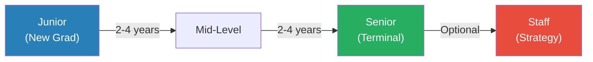
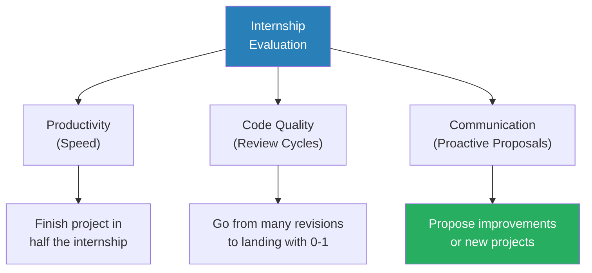
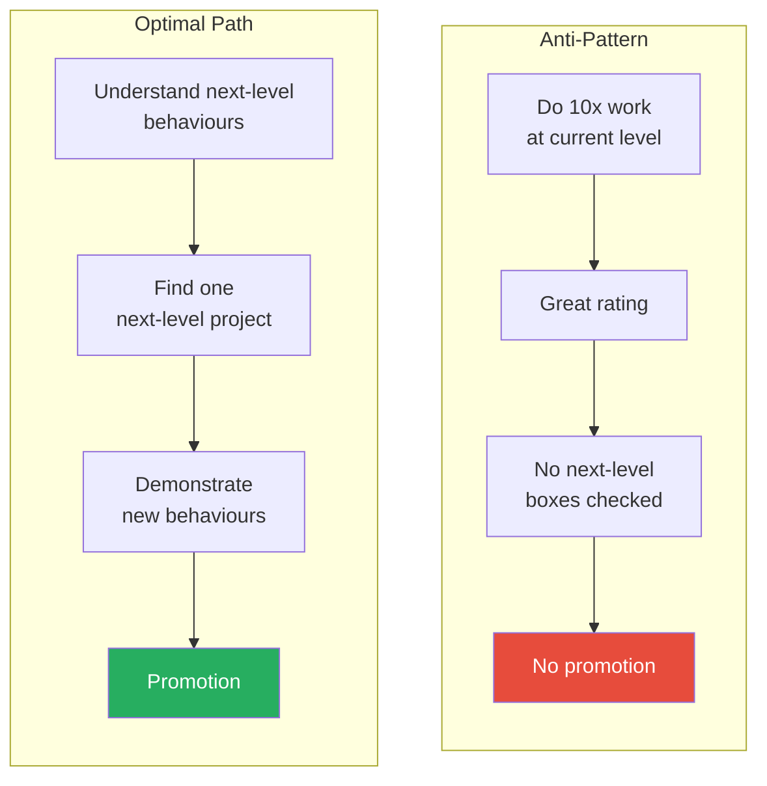
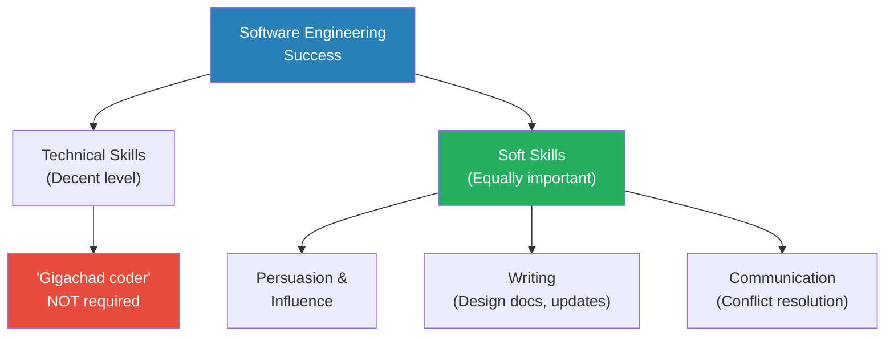
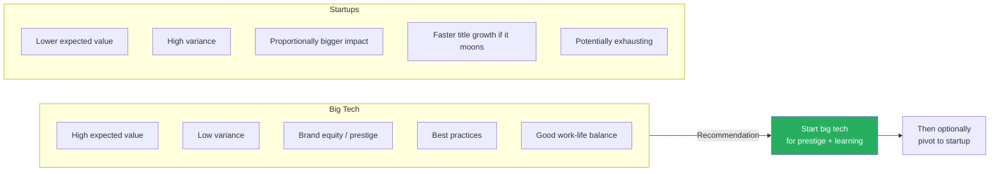
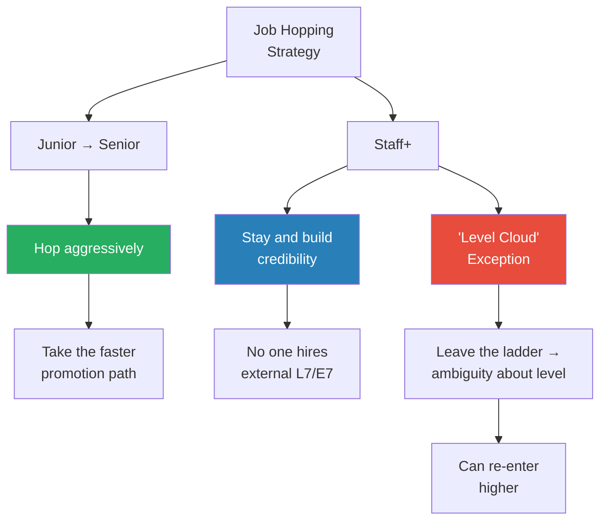

# Industry Secrets Staff Engineers Wish They Knew Before Graduating

> Two staff engineers in their 20s — Ryan Peterman (Meta) and Ricky (Google) — return to UCLA to tell CS students what no one told them. They cover the mechanics of internship success, why promotions reward behaviour changes rather than output volume, why asking questions is the single most important early-career habit, and why soft skills matter as much as code. The conversation also tackles imposter syndrome, self-advocacy, big tech vs startups, optimal job-hopping strategy by level, and how to think about money in tech.

## Overview: Key Highlights

- <b style="color: #27ae60">Promotions require next-level behaviours, not more current-level volume</b> — doing 10x junior work does not check a single mid-level box on the rubric
- <b style="color: #2980b9">Level Progression Model</b> — Junior (code with help) → Mid (code independently) → Senior (create own tasks) → Staff (set team strategy)
- <b style="color: #27ae60">Ask questions relentlessly</b> — the single biggest differentiator between interns who get return offers and those who do not
- <b style="color: #e74c3c">Quiet struggle is the anti-pattern</b> — low-performing interns stay silent, try to solve everything alone, and run out of time
- <b style="color: #2980b9">Luck = Opportunity + Preparation</b> — you can increase your luck surface area through initiative, but you must also be ready when it arrives
- <b style="color: #27ae60">Writing is the job</b> — design docs, code descriptions, result write-ups; the code itself is only part of what matters
- <b style="color: #2980b9">Visibility</b> — if no one knows about your work, it cannot help you get promoted; the last few percent of effort is telling people
- <b style="color: #e74c3c">Big tech vs startups = expected value vs variance</b> — big tech has a high floor but no moonshot; startups can boom or bust
- <b style="color: #2980b9">Job Hop Window</b> — hop aggressively from junior to senior, then stop and build credibility at staff+
- <b style="color: #27ae60">Work is not everything</b> — diminishing returns apply to career investment; the happiest moments are not promotions

| Concept | One-line summary |
|---------|-----------------|
| **Next-level behaviours** | Promotions come from demonstrating the next level's rubric, not excelling at your current one |
| **Internship rubric** | Productivity (speed), code quality (fewer review cycles), communication (proactive proposals) |
| **Ask questions** | The single most impactful early-career habit — silence signals struggle, not strength |
| **Soft skills** | Work is a giant group project; persuasion and writing matter as much as code |
| **Visibility** | Good work that nobody knows about cannot get you promoted |
| **Luck formula** | Opportunity (external) + Preparation (agency) = luck you can engineer |
| **Expected value vs variance** | Big tech = reliable high income; startups = potential moonshot or zero |
| **Brand equity** | Big tech on your resume unlocks recruiter attention and future optionality |
| **Job hop strategy** | Hop early for speed; stay late for credibility |
| **Diminishing returns** | A true maximiser invests across life domains, not just career |

---

# The Conversation

## What the Levels Actually Mean [0:00 - 3:00]

*Ricky walks the audience through the engineering level ladder using levels.fyi data, explaining what each level expects and why Meta's numbers look inflated relative to Google's.*

*Senior is "terminal" — there is no expectation to go beyond it. Staff is optional and involves setting team strategy rather than executing tasks.*

> [!note]- Expand: Full Conversation
> - Ricky explains he had no idea about the level system before entering industry — his parents thought "staff" sounded lower than "senior"
> - He walks through levels.fyi compensation data, noting Meta numbers are higher because of recent stock performance
> - Junior: code with a decent amount of help
> - Mid-level: do more things on your own, still need help occasionally
> - Senior: someone gives you a task, you finish it independently
> - Staff: you set the strategy for the team, lead all the junior/mid/senior engineers
> - Ryan clarifies that Google's terminal level is technically L4 (mid-level), but the expectation to reach senior has been increasing over time
> - "Up or out" policies exist at some companies but affect very few people — 90%+ make it to the expected levels
> - An audience member asks about the mix of technical vs supervisory responsibilities
>   - Ryan's high-level summary: junior = given tasks with help, mid = given tasks without oversight, senior = given an area and you create the tasks, staff = you find the areas that need work

---

## How to Succeed as an Intern [3:00 - 8:00]

*Ryan breaks down the internship evaluation rubric — productivity, code quality, and communication — then Ricky tells the story of his 800-line Google internship that defied the volume metric.*

> [!tip] Core Insight
> Internship success is not about lines of code. A complex, well-reasoned design doc can demonstrate more productivity than 11,000 lines of boilerplate.

*The three pillars are weighted roughly equally — but communication and initiative are what separate a passing intern from an outstanding one.*

> [!note]- Expand: Full Conversation
> - Ryan lays out the internship rubric: productivity (how quickly you finish the project), code quality (how many review cycles before code lands), and communication
> - If you finish the project in half the internship time, that is a strong signal
> - Code review trajectory matters: at the start, code is "trash" and needs many rounds; by the end, it should land with nits and zero to one revisions
> - The strongest signal is what you do after finishing: proposing improvements or an entirely new project
> - Ricky notes that internship projects are usually well-scoped — the ambiguity of full-time work is not typical at this stage
>
> > [!example] Ricky's 800-Line Internship at Google
> > - During his junior year internship at Google, Ricky wrote only 800 lines of code
> > - Halfway through, he had submitted around 300 lines while a UCLA peer had submitted 11,000
> > - He was stressed, but he had spent his time understanding the codebase deeply
> > - He wrote a complex design doc exploring pros and cons of different approaches
> > - The design itself demonstrated technical skill and productivity
> > - He got a return offer despite the low line count
> > **The lesson:** Lines of code is one productivity signal, but design quality and codebase understanding can matter more.

---

## How to Get Promoted Quickly [8:00 - 13:00]

*Ricky and Ryan explain why volume at your current level does not get you promoted — you must demonstrate the next level's behaviours on at least one project.*

> [!tip] Core Insight
> Doing a hundred junior-level projects perfectly will earn you a great rating but check zero boxes on the mid-level rubric. One solidly mid-level project is worth more for promotion than ten excellent junior ones.

*The key word managers use is "behaviours" — the rubric is about what kind of work you do, not how much.*

> [!note]- Expand: Full Conversation
> - Ricky explains that at each level you reach a steady state — to advance, you must think about what a next-level project looks like
> - He and Ryan focused on identifying next-level projects rather than doing more current-level work
> - <b style="color: #2980b9">The key word is "behaviours"</b> — what gets you promoted is not volume but demonstrating the next level's expected behaviours
> - Ryan gives the example: a junior doing 10x features gets a great performance review, but the mid-level rubric asks about initiative, independent problem-solving, and other qualities that junior work does not demonstrate
> - <b style="color: #27ae60">Ryan was proactive with his manager</b> — as soon as he got promoted, he asked "what's the next level? What can I do?"
> - He acknowledges this may have been annoying, but it was effective — his manager taught him what to pick up for the next level
> - This constant conversation about next-level expectations was a major reason his promotions were fast

---

## Luck vs Agency [13:00 - 16:00]

*Ryan argues that luck is real but that you can increase it — then tells his Amazon escape story as proof.*

> [!note]- Expand: Full Conversation
> - Ryan acknowledges luck is a big part of career success, but emphasises that you can do things to increase it
>
> > [!example] Ryan's Amazon Escape
> > - After graduating from UCLA, Ryan joined Amazon
> > - For eight months he was "floundering" — not learning, not growing
> > - He decided to take matters into his own hands: applied to many companies, ground LeetCode
> > - Got offers from every company he applied to except one (unnamed)
> > - Chose Meta, which set up the rest of his career
> > - The interview was partly lucky, but the preparation was pure effort
> > **The lesson:** You can increase your luck by expanding your surface area — apply widely, prepare deeply, and be ready when the opportunity arrives.
>
> - Ricky frames it as two components: the opportunity arriving (partly luck) and being prepared for it (agency)
> - <b style="color: #27ae60">If you get an interview through luck but you are not prepared, the opportunity passes you by</b>
> - Ryan's case illustrates both: leaving Amazon was initiative, getting offers was preparation meeting opportunity

---

## One Piece of Advice: Ask Questions [16:00 - 21:00]

*Ricky shares the single habit that separates high performers from low performers in their first years: asking questions relentlessly, even when it feels uncomfortable.*

> [!tip] Core Insight
> The biggest differentiator between engineers who succeed quickly and those who stall is how fast they start asking questions, learning, and unblocking themselves.

> [!note]- Expand: Full Conversation
>
> > [!example] The Intern Who Did Not Listen
> > - At the start of her internship, Ricky's mentee asked him for one piece of advice
> > - He told her: ask questions, keep asking questions
> > - At the end of the internship, she said: "I wish you told me to ask questions"
> > - Ricky was certain he had told her — she acknowledged it but said "you didn't mean it"
> > - She had heard the words but had not internalised the seriousness
> > **The lesson:** Everyone hears "ask questions" but few take it seriously enough to actually do it consistently from day one.
>
> - Ricky explains why people do not ask: nervousness, fear of looking stupid
> - His reframe: <b style="color: #27ae60">"It's better to ask questions and for them to think you're stupid than to not ask questions, never learn, and stay dumb"</b>
> - His mindset: "I'm going to learn as much as I can here and if I get fired, I get fired, but at least I learned"
>
> > [!example] Ryan's High-Performing vs Low-Performing Interns at Meta
> > - Ryan has mentored five interns at Meta
> > - The rock stars had the "audacity" to propose improvements to their senior mentor
> > - Sometimes they were wrong, but the logic was visible; many times they were right
> > - Low performers were quiet, did not share progress, tried to figure things out alone
> > - Time passed with no visible progress, and they did not get return offers
> > **The lesson:** Audacity to challenge and propose — even when wrong — signals growth potential. Silence signals stagnation.
>
> - An audience member asks what to do if you feel you are asking too many questions
> - This transitions into the soft skills discussion

---

## Soft Skills vs Technical Skills [21:00 - 26:00]

*Ricky challenges the assumption that the best engineers are the smartest coders, arguing that work is a "giant group project" where persuasion and communication matter as much as code.*

*If you went to UCLA, your technical skills are sufficient. What will make you excel is everything around the code.*

> [!note]- Expand: Full Conversation
> - Ricky's perception in college: the best engineers were the curve-setters in CS classes
> - Reality: a decent level of technical skill plus a decent level of soft skills is what makes a great engineer
> - Work is a "giant group project" — disagreements happen constantly
> - <b style="color: #e74c3c">Telling someone "your idea is trash" does not work</b> — you need to acknowledge their perspective, find common ground, and negotiate
> - Ricky models the dialogue: "I see your point of view and why you would want this solution. Perhaps we can compromise."
> - Ryan adds what surprised him most: <b style="color: #27ae60">how little of the job is actually the code</b>
> - He hated writing in high school but discovered that writing is central to engineering work
> - Every code change has writing around it: design doc before, description during, results write-up after
>
> > [!quote] Ryan Peterman
> > "Writing is the job."
>
> - Ryan's framing: if you are not a "gigachad coder," you should be fine — everyone at UCLA is smart enough to write code that matters
> - What makes you excel is the non-code part: people, communication, influence

---

## Imposter Syndrome [26:00 - 30:00]

*Ricky describes imposter syndrome as his "best friend" throughout his career — persistent even after multiple promotions — and how he managed it.*

> [!note]- Expand: Full Conversation
>
> > [!example] Ricky's Imposter Syndrome Cycle
> > - Passed Google interviews, passed internship — still felt unworthy when he started full-time
> > - After his first promotion: "maybe they promoted me wrong, maybe I got promoted too early"
> > - After the next promotion: "well, maybe not the last one, but they screwed up this one"
> > - The feeling came in waves throughout his career
> > - His manager once looked at him and said: "You need to chill. You're doing okay."
> > - Ricky's internal response: "Are you sure though? Seems sus."
> > **The lesson:** Imposter syndrome is normal, persistent, and felt by a majority of engineers — including staff engineers who are objectively succeeding.
>
> > [!quote] Ricky
> > "Imposter syndrome. My best friend, been with me my whole career."
>
> - His coping mechanism: "even if I'm not meant to be here, let me learn as much as I can, do the best job I can, and if I get fired, at least I learned a lot"
> - He distinguishes between "C passing doing well" and "A+ doing well" — eventually his manager helped him understand where he actually stood
> - An audience member asks how it is possible to feel imposter syndrome while getting good feedback
> - Ricky: "I was just an anxious little kid, always stressed out about work"

---

## How to Advocate for Yourself [30:00 - 35:00]

*Ryan explains the missing last step that many engineers skip: after doing good work, you must make sure people know about it.*

> [!note]- Expand: Full Conversation
> - Ryan frames promotion as two pieces: (1) do good work, (2) people need to know about your work
> - <b style="color: #e74c3c">If you build an amazing feature nobody knows about, it does not matter how good it is</b>
> - Tactics for self-advocacy:
>   - Tell your manager about milestones in one-on-ones: "I finished this a few weeks early, I'm ready for the next thing"
>   - Write internal posts or emails: "update on my project — it's done, here are the results"
>   - Frame results in terms that matter to the audience
> - Ricky adds the term <b style="color: #2980b9">"visibility"</b> — you can get it yourself or through your manager/PM
>
> > [!quote] Ricky
> > "If a tree falls in a forest and no one sees it, did it really fall?"
>
> - Ricky warns: when you are trying to get promoted and you say "I did this," if no one else knew, the promotion committee cannot help you
> - This is especially important for introverted or quiet engineers who do excellent work but never tell anyone

---

## Big Tech vs Startups [35:00 - 42:00]

*The audience overwhelmingly favours big tech. Ryan and Ricky explain the trade-off as expected value vs variance across compensation, career growth, and learning.*

*Big tech locks in prestige and fundamentals. The optionality it creates is the real value.*

> [!note]- Expand: Full Conversation
> - Audience poll: almost everyone raises hand for big tech; only a few for startups
> - One startup-leaning student cites first-mover advantage; another cites proportionally bigger impact
> - Ryan on prestige/brand equity: going to a known name means anyone who sees your resume knows you passed a bar — it makes future hiring much easier
>   - His Amazon experience: LinkedIn "blew up" with recruiter messages just from having the name on his profile
> - <b style="color: #2980b9">Expected value vs variance framework</b>:
>   - Big tech: average case is better, but no moonshot — "the jobs we work today will never be rich rich"
>   - Startups: boom or bust — could be dead tomorrow or making eight/nine figures
>   - This applies to career growth too: if a startup moons, you could become director or VP impossibly fast
> - Ricky on why he chose big tech: "I'm just lazy. I sold my soul to Google so I could live a good life."
>   - Some friends at startups worked much harder; some mooned, some did not
> - Ricky notes UCLA students are disproportionately big-tech-oriented vs Stanford or Ivy League schools
>   - Startup recruiters told him they stopped going to UCLA because nobody joined
>   - His theory: richer students can afford the variance; UCLA students need reliable income
> - Learning differences: big tech teaches industry best practices reliably; startup learning is high-variance
> - <b style="color: #27ae60">Recommendation: big tech for at least the first few years</b> — lock in prestige, learn the basics, get the signing bonus, then do whatever you want

---

## Measuring Impact [42:00 - 45:00]

*Ryan explains that impact is the concrete, measurable outcome of your work — and that it varies entirely by team.*

> [!note]- Expand: Full Conversation
> - Impact = concrete measurable outcomes, not time spent or years of experience
> - Examples by team:
>   - Ads team: revenue
>   - Infrastructure team: cost or latency of the database
>   - Growth team: daily active users or sign-up conversion rates
> - Ryan's advice: wherever you go, learn what your team's impact metrics are — this is how you are rewarded
> - Ricky illustrates: 10,000 lines of code fixing typos = almost zero impact; 2x-ing company revenue = enormous impact
> - <b style="color: #27ae60">A one-line code change that makes a 20% improvement in something that matters always beats hundreds of thousands of lines that nobody cares about</b>

---

## Do You Need an MBA? [45:00 - 48:00]

*Ryan presents LinkedIn data showing no compensation advantage for MBAs in engineering management, and Ricky tells the story of his sceptical mother.*

> [!note]- Expand: Full Conversation
> - Ryan had the same question in college — assumed MBAs were necessary because the older generation said so
> - Neither Ryan nor Ricky has an MBA; both are managers
> - Ryan shows data from a company that scraped LinkedIn: a few thousand data points on directors and higher, comparing compensation with and without MBA
> - Result: comparable compensation — and without-MBA is actually slightly lower
>
> > [!example] Ricky's Mom: The Hater
> > - Ricky's mom, an immigrant, insisted UCLA was not good enough
> > - She demanded he get an MBA from Stanford or an Ivy League school
> > - She believed he would not succeed without one
> > - Her attitude only shifted when he reached staff engineer and she verified it on Xiaohongshu (Little Red Book)
> > **The lesson:** Generational expectations about credentials do not always match industry reality. Data beats assumptions.

---

## College Recruiting: Be Scrappy [48:00 - 52:00]

*Ricky tells the story of being rejected from Yelp over a seg fault — and emailing the recruiter to demand they look at his code again.*

> [!note]- Expand: Full Conversation
>
> > [!example] Ricky's Yelp Seg Fault
> > - Ricky had a timed C++ coding challenge from Yelp: implement the merge step of merge sort
> > - He completed it and was confident the code was correct, but it threw a seg fault
> > - He could not figure out why in the 15-minute window and failed
> > - The recruiter said goodbye
> > - Ricky emailed back: "I knew this. Tell your engineer to look at it because I'm 100% sure it's right."
> > - The engineer confirmed the code was correct
> > - He was given a second coding challenge, passed it, and moved on to the interview round
> > **The lesson:** Your first job is the hardest to get. Be scrappy — push back on rejections when you know you are right.
>
> > [!quote] Ryan Peterman
> > "You literally got rejected and you said no. Look at it again."
>
> - Ryan adds: for your first role, you must be scrappy; once you get the first one, everything gets easier
> - His own first role was "some random company" he does not even put on his resume anymore — but it gave him the experience to shoot for better companies next

---

## How to Make Money [52:00 - 55:00]

*Ryan and Ricky distinguish between "good life" money (big tech) and "rich rich" money (founding a company), and recommend big tech for most people.*

> [!note]- Expand: Full Conversation
> - Ryan had no concept of money in college — his life goal was to make $200K "one day eventually"
> - A student mentioned that $200K is "minimum wage in the Bay Area"
> - Ryan's framework: depends on how much money you want
>   - Good life, buy what you want, vacation whenever: big tech and do a good job
>   - "Rich rich" ($50M+): you probably have to start your own company or join a rocketship early (e.g., OpenAI employee #50)
> - Ricky adds: he and Ryan could theoretically reach $50M if they work 20-30 more years, get promoted three more times, and the stock market cooperates — but founding is the faster path
> - <b style="color: #27ae60">For most people, big tech provides an excellent quality of life</b>

---

## Work Is Not Everything [55:00 - 58:00]

*Ricky closes with a personal reflection: the happiest moments of his 20s were not promotions but time with friends. Ryan frames it through diminishing returns.*

> [!note]- Expand: Full Conversation
> - Ricky: "When I look back on my 20s, the happiest moments were not when I was getting promoted"
> - His advice: work hard, but also go have fun — concerts, travel, friendships
> - <b style="color: #e74c3c">If he had made Google his entire identity and got laid off, he would be "crashing out"</b>
> - Because he is multifaceted, losing his job would not destroy him
> - Ryan frames it through <b style="color: #2980b9">diminishing returns</b>: every area has a curve where additional effort yields less and less
> - A true maximiser spreads effort across all domains where returns have not yet diminished
> - Career is just one domain among many

---

## Job Hopping Strategy by Level [58:00 - 63:00]

*Ryan presents a nuanced take on the "always job hop for promos" advice: it is optimal early but counterproductive once you reach senior/staff.*

> [!tip] Core Insight
> Below senior, momentum does not matter much — hop aggressively for the fastest promotion path. At staff and above, promotions come from credibility, trust, and track record — hopping resets all of those.

*The "level cloud" is a rare but real phenomenon: someone who left the standard ladder (started a company, wrote a book) can re-enter at a higher level because their true level is ambiguous.*

> [!note]- Expand: Full Conversation
> - Ricky shares his perspective: he has been on the same team and under the same manager since joining Google
> - He periodically checks if his grass is still greener — so far, it is
> - But he acknowledges survivorship bias: others on his team left because they were not having as good a time
> - Ryan has done research on this topic and presents a nuanced view:
>   - Common take: "job hop for promos, no-brainer" — actually, it depends on level
>   - Junior → Senior: hop aggressively, take whichever path is faster, momentum does not matter much
>   - Staff+: hopping is counterproductive — no one hires an external E7/L7 at level; they downlevel
>   - At this level, promotions come from built-up credibility, trust, and track record that resets with every hop
> - <b style="color: #2980b9">The "level cloud" concept</b>: if you leave the well-measured ladder (start a company, write a book, do something notable), you exist in a "probability cloud" — nobody knows exactly what level you are
>   - This creates leeway to re-enter at a higher level
>   - Ryan has seen someone go from E5 to E7 this way: left Google at L5, joined a startup, wrote a JavaScript book, came back to Meta at E7
>   - Extremely rare, but it exists as a path
> - Ricky reveals he works on ads at Google: "I make ads pretty. You've definitely seen my ads, even if you have ad blocker."
> - Ryan's story about Ricky: Ricky claims Ryan "scammed" him into being ambitious — they were roommates, and Ryan would whisper "but what if we got promoted, bro?"
> - Ricky is from Monta Vista High School (known for its academic intensity) — "I've been trying to get the Monta Vista out of me"

---

## AI and Entry-Level Engineering [63:00 - 65:00]

*An audience member asks whether AI will eliminate entry-level jobs. Ryan and Ricky both argue that engineers will direct AI rather than be replaced by it.*

> [!note]- Expand: Full Conversation
> - Ryan: in the short term, AI is not going to completely change things — LLMs empower engineers rather than replace them
> - There are non-AI tools that write code already, and nobody is scared of those; AI is just further along the same spectrum
> - <b style="color: #27ae60">Advice: do not change your major from CS because of AI fears</b>
> - Ricky: even in 5-10 years, someone will need to tell the AI what to build and verify it is correct
> - Entry-level engineers may code less directly, but they will still be the ones directing and validating AI output
> - Also: someone has to build the AI itself

---

## Connections

**Other Peterman Pod episodes:**
- [[25 Year Old Staff Eng at Meta - Evan King]] — Evan King's IC3-to-IC6 sprint mirrors Ryan and Ricky's fast staff promotions; same theme of deliberate next-level project selection
- [[Amazon VP on Stack Ranking PIPs and Bezos - Ethan Evans]] — Ethan's "Magic Loop" is the systematic version of Ryan's "constantly talk to your manager about next-level behaviours"
- [[How Corporate Politics Work - Narrative]] — Ethan Evans on visibility and self-advocacy; same core message as the tree-in-forest analogy
- [[Meta IC9 on Influencing Engineers Failures and Learnings]] — Adam Ernst's influence at IC9 is the extreme version of "soft skills matter more than code"
- [[Meta Senior Manager on Career Growth PIPs and Culture - Stefan Mai]] — Stefan's 3X framework for promotion aligns with the "next-level behaviours" argument
- [[Retired Netflix Eng Director on Leetcode Regrets and Hiring]] — David Rumpka's 12-year single-company tenure illustrates the "stay and build credibility at staff+" advice

**Related books in vault:**
- [[Expect to Win - Carla A. Harris]] — Harris's "performance + perception = career advancement" is the same insight as the visibility argument
- [[So Good They Can't Ignore You - Cal Newport]] — career capital theory overlaps with "big tech prestige first, then pivot"
- [[Stealing the Corner Office - Brendan Reid]] — Reid's visibility tactics align with self-advocacy advice

---

## The Takeaway

This episode is not a podcast interview — it is a masterclass delivered by two people who are still close enough to the student experience to remember what it felt like, but far enough into their careers to see what actually mattered. The single most valuable insight is the distinction between volume and behaviour: doing more at your current level does not get you promoted, because the promotion rubric does not measure how much junior work you did. It measures whether you demonstrated mid-level thinking on at least one project. This reframe alone could save someone years of effort pointed in the wrong direction.

The second standout is the job-hopping nuance. The internet is full of blanket advice to hop every two years for a pay bump, but Ryan presents data-informed nuance: that strategy is optimal only below senior. At staff and above, credibility and trust compound — and nobody is going to hire an external E7 at level. The "level cloud" concept is particularly striking: by leaving the standard ladder entirely, you create ambiguity about your level that can be leveraged on re-entry. It is a rare path, but it reframes career breaks and startup detours as potential upward moves rather than gaps.

What stays with you is Ricky's closing point: the happiest moments of his 20s were not promotions. For all the career optimisation discussed in this talk, the final message is that diminishing returns apply to career investment just as they apply to everything else, and that a true maximiser invests across all domains of life before returns start to fade.
