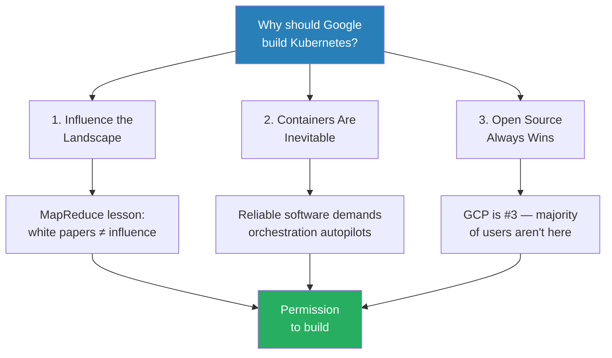
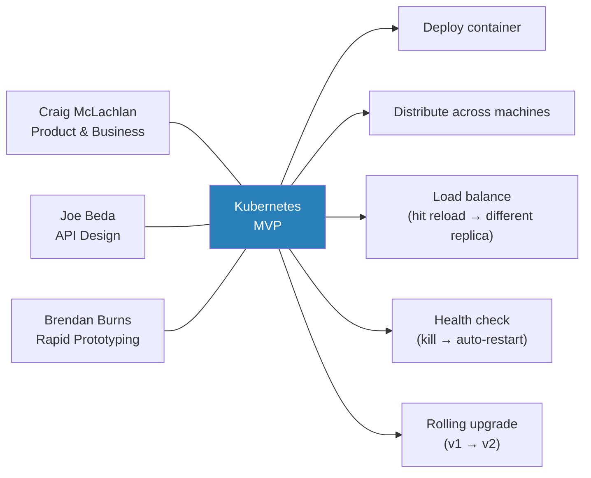
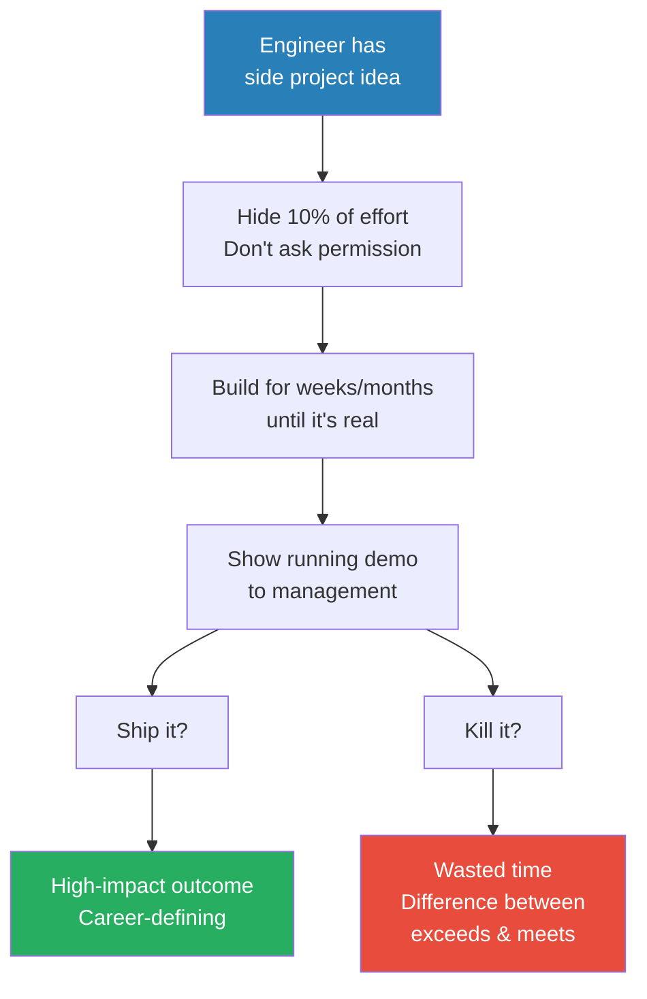
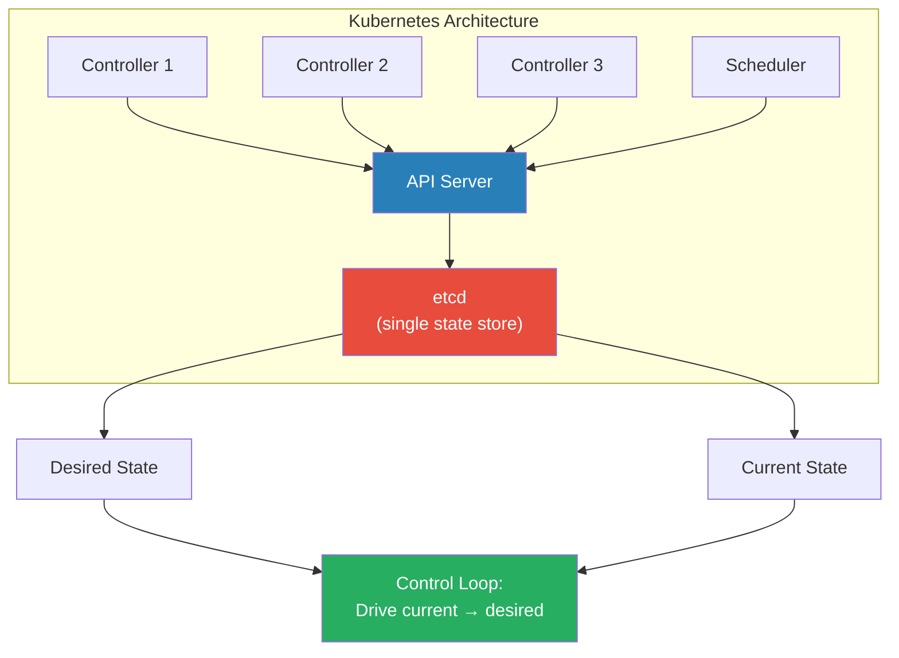
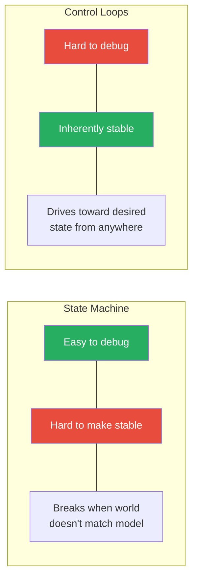
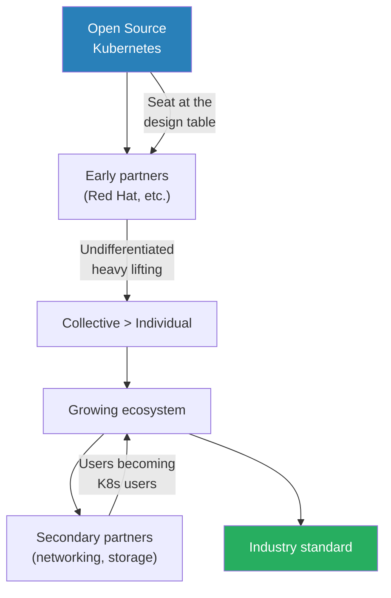
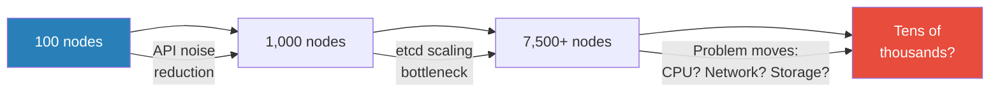

# Kubernetes Co-Creator on Engineering-Led Direction — Brendan Burns

> Brendan Burns co-created Kubernetes — the container orchestration system that became the backbone of modern cloud infrastructure. In this conversation with Ryan Peterman, he walks through the business strategy behind open-sourcing Google's internal tooling, the architectural decisions that made Kubernetes resilient, and a career philosophy built on hiding 10% of your effort for side projects that might change everything. The central thread: the best career moves come from building things nobody asked you to build, then showing a running demo instead of a slide deck.

---

## Overview: Key Highlights

- <b style="color: #27ae60">Build first, ask permission later</b> — a running prototype forces a "ship or kill" decision instead of a "should we build this" debate
- <b style="color: #2980b9">The 10% Rule</b> — hide roughly 10% of your effort from management for side projects you believe in
- <b style="color: #e74c3c">Tail-light chasing is a losing strategy</b> — copying the market leader's approach gives you no voice
- <b style="color: #27ae60">Open source wins because closed ecosystems get ignored</b> — if you are not the market leader, the majority of users are not on your platform
- <b style="color: #2980b9">Declarative design</b> — write down the desired state; the system drives itself there, enabling self-healing
- <b style="color: #e74c3c">Loose coupling makes debugging painful</b> — 15+ distributed processes with inconsistent logging are a nightmare when things go wrong
- <b style="color: #2980b9">Control loops over state machines</b> — inspired by robotics PID controllers, always driving current state toward desired state
- <b style="color: #27ae60">Reframe the choice</b> — "Do you want the open source solution to be ours or someone else's?" removes the proprietary option entirely
- <b style="color: #2980b9">CNCF and democratic governance</b> — donating Kubernetes to a foundation within one year was critical for adoption
- <b style="color: #e74c3c">Never fall in love with your software</b> — the inevitable trajectory of software is death
- <b style="color: #27ae60">Follow energy, not trends</b> — learn what excites you because you will put in the hours naturally
- <b style="color: #2980b9">The founding trio</b> — product vision (Craig), API design (Joe), rapid prototyping (Brendan) built the MVP in under a week

| Concept | One-line summary |
|---------|-----------------|
| **The 10% Rule** | Hide ~10% of effort for side projects management did not ask for |
| **Reframing the choice** | Remove the proprietary option — present "our open source vs theirs" |
| **Declarative design** | Write down the desired state; system self-heals toward it |
| **Control loops** | Independent actors driving current state toward desired state, inspired by PID controllers |
| **Loose coupling trade-off** | Great for resilience, terrible for debugging |
| **Thought leadership as strategy** | Create a new playing field where you have voice, instead of copying the leader |
| **Clean room opportunity** | Rebuilding something with zero legacy users is rare and addictive for engineers |
| **Software death** | All software eventually dies or becomes invisible infrastructure |
| **The MVP principle** | A running demo beats a slide deck — build it in days, refine for months |
| **Democratic governance** | No benevolent dictator — distributed ownership via written constitution |

---

# The Conversation

## Why Build Kubernetes — The Business Case for Open Source [0:00 - 10:00]

*Ryan opens by asking the question any director would ask: what was the business case for Google investing in building infrastructure for the entire industry? Brendan walks through the three-part argument that convinced leadership.*

*The three arguments converged on a single conclusion: Google needed to build the open source container orchestrator itself, or watch someone else do it without them.*

> [!tip] Core Insight
> The hardest part of the entire Kubernetes project was not the code — it was articulating the business case for why Google should give away technology that resembled its internal competitive advantage.

> [!note]- Expand: Full Conversation
> - Ryan asks Brendan to imagine pitching Kubernetes to a director — what goes in that strategy doc?
> - Brendan says the hardest part of the early project was articulating why it mattered
> - **Argument 1 — MapReduce precedent:**
>   - Google published the MapReduce white paper
>   - The open source community read it and built Hadoop independently
>   - Google got zero credit and zero influence over the ecosystem
>   - Lesson: if it does not run, if people cannot use it, publishing papers alone will not put you in the driver's seat
> - **Argument 2 — Why containers:**
>   - Google knew from internal experience (Borg) that reliable software requires autopilots for applications
>   - As software becomes critical to more businesses, orchestration becomes a necessity
>   - Containers, not VMs, are the right abstraction for this
> - **Argument 3 — Why open source:**
>   - If you make it exclusive to your platform, everyone on other clouds or on-premise is shut out
>   - Shut-out users build their own alternative — exactly what happened with Hadoop
>   - If everything else is open (Linux, Docker, programming languages), you cannot be the closed thing and still win
>   - You have to be absurdly differentiated for closed to work, and Kubernetes was not that differentiated
>
> > [!example] The MapReduce / Hadoop Cautionary Tale
> > - Google published the MapReduce white paper during the big data revolution
> > - The open source community reimplemented it as Hadoop
> > - Google had nothing to do with Hadoop and got no credit
> > - The reimplementation was similar but not the same — Google lost control of the narrative
> > - This became the internal cautionary tale: publish papers and lose influence, or ship software and lead
> > **The lesson:** Influence over an ecosystem requires shipping running code, not publishing ideas.
>
> - Brendan frames the ultimate reframing:
>
> > [!quote] Brendan Burns
> > "There's going to be an open source one. Do you want it to be ours or do you want it to be someone else's?"

## Thought Leadership and Changing the Narrative [10:00 - 15:00]

*The conversation shifts to the strategic benefit of being perceived as the thought leader — even if GCP remains third in market share. Brendan explains why creating a new playing field matters more than competing on the existing one.*

> [!note]- Expand: Full Conversation
> - Ryan summarises: GCP was third, AWS was dominant, so the idea was to pull market share by distributing Kubernetes broadly
> - Brendan agrees but adds a deeper layer — it is not just about migration, it is about changing who the industry listens to
> - <b style="color: #e74c3c">Tail-light chasing is hard</b> — if someone else built VMs and everyone uses VMs, saying "ours are slightly better" is a weak market strategy
> - But if you create a brand new playing field where you are the thought leader, people listen to you even if they are not on your platform
> - <b style="color: #27ae60">Control of the story is how you break through market dynamics</b>
> - Ryan asks whether Brendan was consciously articulating these perception benefits when pitching leadership
> - Brendan confirms: they absolutely wanted to be front and centre in thought leadership and said so explicitly
> - Ryan pushes: how do you quantify that in a meeting?
> - Brendan's answer: at the time it was cheap — only 8-9 engineers
> - They deliberately separated the Kubernetes brand from the Google brand
>   - This gave freedom to fail — if it flopped, it would not damage Google Cloud's reputation
>   - It helped adoption — Red Hat, Azure, AWS could bet on Kubernetes without betting on Google
>   - It was also an insurance policy against failure
> - Being a separate entity also let them be more agile than a big company — critical when competing against startups like Docker

## The One-Week MVP [15:00 - 22:00]

*Ryan asks about the earliest prototype. Brendan describes hacking together a demo in under a week using existing open source components, and how the founding trio's complementary skills made it possible.*

*Three complementary skill sets — product, design, and speed — produced a working demo in 4-5 days.*

> [!note]- Expand: Full Conversation
> - Ryan asks what the earliest demo actually did
> - Brendan describes basic kubect functionality:
>   - Build a container with Docker (had to explain Docker to people at the time)
>   - Deploy it, see it distributed across machines
>   - Hit a single endpoint — "I'm replica 1"; hit reload — "I'm replica 3"
>   - Kill a replica — it comes back automatically (health checking)
>   - v1 to v2 rolling upgrade
>   - That was it — the entire MVP
> - Ryan asks how long the MVP took
>
> > [!quote] Brendan Burns
> > "I don't know, a little under a week, maybe. I don't work on the weekends so maybe five days, four days, five days."
>
> - Brendan emphasises: every possible shortcut was taken, it was hacked together
> - His key skill: integrating existing open source projects — seeing how to take things off the shelf and glue them together
> - Ryan asks about the founding trio's roles:
>   - Craig: product/business vision
>   - Joe: API design — "how to design really good"
>   - Brendan: "I can hack prototypes like there's no tomorrow"
> - They reflected on their own pain experiences deploying into traditional VM infrastructure
> - Netflix was talking about immutable infrastructure at the same time — a broader movement was happening
> - Brendan insists Kubernetes was not brand new — it was a coalescing of ideas circulating in the industry
> - He wrote the high-80s percentage of the original code and was the #1 contributor for a long time (still #5 all-time)

## The 10% Rule — Hiding Effort From Management [22:00 - 28:00]

*This is the section most engineers will remember. Brendan explains his philosophy of hiding side projects from management, the risk tolerance required, and why a running demo always beats a slide deck.*

*The 10% Rule turns the management decision from "should we build this?" into "do you want to ship this thing that already exists?" — a much easier question.*

> [!tip] Core Insight
> By building before asking permission, you force management's hand. The decision is no longer "should you spend time on this?" — it becomes "this already exists, do you want to ship it?" And that is a much easier decision to make.

> [!note]- Expand: Full Conversation
> - Ryan asks: many engineers feel they cannot go off and build side projects when they have existing responsibilities — any advice?
> - Brendan gives two answers:
> - **Answer 1 — The 10% Rule:**
>   - <b style="color: #2980b9">You can hide roughly 10% of your effort from management</b>
>   - There is slack in the system no matter what
>   - As your org grows, what you can accomplish with that 10% actually increases
>   - A lot of his most influential ideas came from this approach
>   - It is a way of saying: empower people locally to make decisions they think are optimal without consulting up the chain
>   - The trade-off: some bets will fail and feel like wasted time
>   - <b style="color: #e74c3c">It might be the difference between "exceeded expectations" and "met expectations"</b>
>   - But the payout from one hit is way better than grinding to get "exceeds" every single time
>   - You have to be the kind of person willing to take that chance — and that is not everybody
> - **Answer 2 — What are you willing to give up?**
>   - "Do you play Call of Duty? Do you watch Netflix? Do you watch YouTube?"
>   - There are probably 10-20 hours per week of leisure time
>   - During that period, Brendan was doing nothing except this project, work, family, and sleeping
>   - Not a "work all night" person, but willing to skip YouTube and sporting events for a while
> - Ryan notes: the returns were exponential — 2x the time for 20x the impact
> - Brendan adds: it was addictive — once people started using it, filing GitHub issues, he just wanted to close issues and help people
>
> > [!quote] Brendan Burns
> > "I believe you can hide order 10% of your effort from your management."
>
> - Ryan asks what "hide" means in practice — manage expectations, or actually hide?
> - Brendan: "Oh no, I actually do mean hide. Don't ask permission."
>   - You need a couple of months to get to something showable
>   - It is hard to articulate value in a doc or PowerPoint — a running thing someone can interact with is way more effective
>   - Building it forces management's hand: no longer "should you spend time?" but "I already built this, do you want to ship it?"

## The Clean Room Opportunity and Six-Month Groundwork [28:00 - 36:00]

*Brendan describes the rare joy of rebuilding something from scratch with zero legacy users, and the six-month period of laying groundwork that turned a hack into a real product.*

> [!note]- Expand: Full Conversation
> - Brendan says there was a solid six months of going from hacky prototype to something genuinely usable
> - A lot of little details to get right along the way
> - Early contributors were attracted by the <b style="color: #2980b9">clean room opportunity</b>:
>   - They had built similar systems before (Borg, Omega, etc.)
>   - This was a chance to rebuild with lessons learned — "getting a second chance"
>   - No existing users, no bug backlog, no paying customers demanding features
>   - They could just build the thing they had imagined
>
> > [!example] The Clean Room Magnet
> > - Early Kubernetes contributors had years of experience with Borg and similar systems
> > - They had accumulated ideas about how things could be better
> > - Kubernetes offered something rare: a blank slate with zero legacy constraints
> > - No users meant no bugs to fix, no feature requests to satisfy
> > - Engineers described it as "getting a second chance" to build the system they had always imagined
> > **The lesson:** The chance to rebuild something from scratch with accumulated wisdom is one of the most powerful recruiting tools in engineering.
>
> - Ryan pushes: what about the flip side — you build something, nobody cares?
> - Brendan is direct: you have to be comfortable with that
>   - You might waste leisure time
>   - You might miss a promotion you could have gotten
>   - It is taking a risk, not unlike a startup
>   - If your mindset is "this will definitely hockey-stick," you are setting yourself up for disappointment
>   - Go in with: "I think this is good, I'll try, but I'm okay if I fail"

## Promotions, Attribution, and Creating Your Own Scope [36:00 - 40:00]

*The conversation connects side projects to career advancement — how creating the idea yourself makes attribution obvious, and how at senior levels this becomes a necessity rather than optional.*

> [!note]- Expand: Full Conversation
> - Ryan observes: at the highest levels of engineering ladders, you need to take this kind of risk to get promoted
> - Staff and senior staff engineers are told "you need to figure out what that project is — I can't hand it to you"
> - Brendan confirms: at a certain point the expectation is that you are the person who knows enough to come up with really good ideas
> - <b style="color: #27ae60">If you create the idea yourself, attribution is blindingly obvious</b>
>   - In a bigger project or someone else's idea, you can still succeed but it is harder for impact to be directly attributable to you
> - But it is a roll of the dice — some people try over and over and never have the right idea, or have it at the wrong time
> - <b style="color: #2980b9">Innovation requires both the right person and the right time</b> — you could have the idea but the timing could be wrong
> - Ryan adds: creating your own scope is permissionless — you do not need to wait for management to give you the opportunity

## The Borg Question — Reframing Competitive Advantage [40:00 - 44:00]

*Ryan raises the concern that Borg was Google's secret sauce. Brendan explains how he reframed the choice to neutralise this objection.*

> [!note]- Expand: Full Conversation
> - Ryan: Borg felt like a competitive advantage for Google — why give any of it away?
> - Brendan: there was some of that worry, but the argument was:
>
> > [!example] The "Men in Black" Argument
> > - When people worried about giving away Borg-like technology, Brendan joked: "It's not like you Men in Black flash people as they leave Google"
> > - Ex-Googlers at Facebook, Twitter, and other companies were already building similar systems
> > - MESOS was out there — not the same, but similar
> > - The "secret" was not really secret — it was spreading through the industry via talent movement
> > - The reframe: "There's going to be an open source one. Do you want it to be one we influence, or not?"
> > **The lesson:** When your competitive advantage is already leaking through talent movement, the real choice is not "open vs closed" — it is "our version or someone else's."

## Architecture — Loose Coupling, Control Loops, and etcd [44:00 - 56:00]

*The deepest technical section. Brendan explains the architectural decisions that made Kubernetes resilient — and the trade-offs that made it hard to debug. The control loop design, inspired by robotics, is the core insight.*

*All state routes through the API server to etcd. Every other component is stateless and can restart at any time. Control loops continuously drive the system toward the declared desired state.*

*The fundamental trade-off: state machines are easy to debug but fragile; control loops are hard to debug but inherently self-correcting.*

> [!tip] Core Insight
> The hardest code to write is not the hardest code to debug. Kubernetes chose loose coupling and control loops because they make the system stable — but when something goes wrong, you are sifting through 15 different process logs trying to reconstruct what happened in time.

> [!note]- Expand: Full Conversation
> - Ryan asks: what was the hardest part of Kubernetes to build?
> - Brendan: no specific code was that hard — the hard part was the consequence of the early design decision for loose coupling
> - Many independent actors taking actions via control loops — great for resilience
> - But when things go wrong, you have 15 different processes to investigate
>   - Logs are distributed everywhere
>   - Nothing is time-synced
>   - Early on, logging was inconsistent — often the right thing was not logged
>   - Interaction effects are hard to reproduce
>   - If the problem reproduces easily, you just add logs and run again — but transient race conditions between 2-3 processes are brutal
> - Also: "we were all learning Go" — gotchas in Golang discovered on the fly
> - Ryan asks about leader election complexity
> - Brendan: not a big deal because they relied on <b style="color: #2980b9">etcd</b> — a Raft-based consensus key-value store
>   - Paxos is provably correct but nobody understands it
>   - Raft came along: also provably correct, but much easier to implement
>   - CoreOS built etcd implementing Raft, providing consensus primitives
>   - Leader election became relatively straightforward on top of etcd
> - Critical architectural decision Brendan pushed hard for: <b style="color: #27ae60">all access forced through the API server</b>
>   - Nobody writes to disk themselves — everything goes through API server → etcd
>   - Every component is effectively stateless except the database
>   - Components can restart at any time and just come up working
>   - No schema changes, no corruptions, no disk state to manage
>   - Downside: the loose coupling that makes debugging hard
> - Brendan draws the analogy to robotics:
>   - Control loops driving current state toward desired state = PID controller
>   - Trying to write a PID controller with if-else loops does not work
>   - State machines say "the world looks like this" — but sometimes the world is something you did not imagine, and you are stuck
>   - Control loops always know where to drive, regardless of where the system finds itself

## Declarative vs Imperative Design [56:00 - 62:00]

*Brendan explains the declarative philosophy — write down what you want, not the steps to get there — and why it was part of a broader industry movement.*

> [!note]- Expand: Full Conversation
> - Ryan notes Kubernetes is declarative rather than imperative — you say "I want this to be true" and the system figures out how
> - Brendan: this was part of the broader infrastructure-as-code movement; Kubernetes was not alone in embracing it
> - **Benefits of declarative:**
>   - You have a record of what you were trying to achieve — imperative just executes steps with no written objective
>   - Self-healing: if the system gets perturbed, it knows where to go back to
>   - Once you write it down, you can apply code review, unit tests — all the mechanics of software development
>   - Machine failures become simpler: "I want 3 replicas somewhere" — if a machine dies, they move
>   - <b style="color: #27ae60">You do not need to guess intent</b> — if someone logged into a machine and started a process, did they want that process or that process on that machine? You do not know. Declarative tells you.
> - **Downsides:**
>   - Complexity — learning YAML, the learning curve compared to clicking through a wizard
>   - "Everybody complains about the YAML"
>   - Brendan notes: GenAI may solve this — natural language interfaces to declarative specs

## Scaling Adoption — Partners and Undifferentiated Heavy Lifting [62:00 - 68:00]

*How Kubernetes went from a Google project to an industry standard through strategic partnerships with Red Hat, storage providers, and networking companies.*

*The adoption flywheel: early partners contributed because the orchestration layer was not their differentiator, which grew the ecosystem, which attracted secondary partners whose users were already on Kubernetes.*

> [!note]- Expand: Full Conversation
> - Ryan asks how Brendan sold other companies on Kubernetes
> - The key phrase: <b style="color: #2980b9">undifferentiated heavy lifting</b>
>   - Partners like Red Hat were building platforms (OpenShift) — orchestration was not their value layer
>   - They were going to have to build something anyway, so building collectively gave more value than building alone
> - Critical promise to partners: <b style="color: #27ae60">equal partnership, not dependency on Google's roadmap</b>
>   - Partners got a seat at the design table
>   - They could contribute features they needed
>   - This was essential — taking a dependency on someone else's roadmap is scary
> - Secondary adoption wave: networking and storage providers
>   - As their users became Kubernetes users, they were motivated to ensure integration
>   - This downstream adoption validated the open source strategy

## Governance — Writing the Constitution [68:00 - 72:00]

*How Kubernetes moved from informal leadership to a written democratic constitution, and why waiting until 2016 was a mistake.*

> [!note]- Expand: Full Conversation
> - Ryan asks how Google was prevented from dominating the Kubernetes roadmap
> - Brendan: two critical pieces:
> - **1. CNCF donation (within one year):**
>   - Donated all of Kubernetes — the project, logos, trademarks, legal assets — to the Cloud Native Computing Foundation under the Linux Foundation
>   - Hard to partner when someone else holds trademarks on the Kubernetes logo
> - **2. Written governance rules (2016):**
>   - For the first few years, Kubernetes had no formal governance — Brendan calls this a mistake
>   - The bootstrap committee (7-8 people) gathered and wrote the rules
>   - All aligned on no benevolent dictator for life — distributed, democratic ownership
>   - They were lucky: the natural leaders were not fighting each other
>   - Sarah Novotny, the community leader, gets significant credit for assembling the bootstrap committee
> - These two things are duals of each other: you cannot have industry-standard adoption without independent governance, and independent governance only matters if you have adoption
>
> > [!example] The Bootstrap Committee
> > - In 2016, 7-8 people who the entire community recognised as leaders came together
> > - They studied other open source communities — what worked, what failed
> > - Some rules codified existing de facto practices; others were new (like the steering committee)
> > - The group was aligned and not infighting — a stroke of luck
> > - They wrote what Brendan literally calls "a constitution"
> > - No lawyers involved — the engineers wrote it themselves across a few intense meetings
> > **The lesson:** Governance rules should be written early, by people the community trusts, before political factions form.

## The Reality of Open Source Contributions [72:00 - 76:00]

*Brendan shares the uncomfortable truth: 80-90% of contributions come from core contributors at major tech companies, not the broader community.*

> [!note]- Expand: Full Conversation
> - Ryan asks what percentage of contributions come from the community vs core companies
> - Brendan: roughly 80-90% from core contributors, less than 10% from others
> - Why so few community contributions?
>   - Companies like Microsoft make explicit leadership-level commitments to upstream open source
>   - But most Kubernetes users are retailers, banks, etc. — tech is a means to an end, not their core business
>   - Hard to justify dedicating 10% of engineers to upstream contributions when leadership is not technical
>   - The value of taking open source is obvious (it is free) — the value of contributing back is harder to explain
> - <b style="color: #e74c3c">Legal teams blocking contributions</b>: some companies want to contribute but legal worries about liability if they introduce bugs
>   - Does not hold water legally — licenses include indemnification
>   - But fear alone is enough to block contributions from non-tech companies
>
> > [!example] The Liability Fear
> > - Some companies tell Brendan: "Our engineering leadership wants to contribute, but legal is worried about liability"
> > - The fear: if they contribute code with a bug and it causes damage, they could be sued
> > - Brendan traces the chain of logic: imagine writing the open source JPEG library that ended up in the smoke detector that caused a house fire
> > - In reality, open source licenses include "use at your own risk" indemnification
> > - But if legal does not see the value and does see the risk, contributions die
> > - Engineers at non-tech companies cannot easily argue with their legal department
> > **The lesson:** Open source contribution barriers are often legal and cultural, not technical.

## Scaling Kubernetes — The Bottleneck Moves [76:00 - 80:00]

*From 100 nodes to 7,500+ — how scaling challenges evolve and why every order of magnitude shifts the problem to a different part of the system.*

*Every order of magnitude changes which component is the bottleneck. What was the problem at 100 nodes is easy at 1,000 — and a completely different component becomes the constraint.*

> [!note]- Expand: Full Conversation
> - Brendan recalls when Kubernetes could not handle more than about 100 nodes
> - Optimisation in core systems: APIs were noisy, components needed extraction, etcd scaling was critical
> - <b style="color: #27ae60">The design is horizontally scalable for everything except the storage layer</b>
>   - More API requests? Add more API servers
>   - Faster scheduling? Add more schedulers
>   - But etcd — the single state store — is the bottleneck
>   - Going 10x means figuring out how to make etcd scale, or replacing it with something that has the same characteristics
>
> > [!quote] Brendan Burns
> > "Every time you change an order of magnitude, the problem moves."
>
> - An unanticipated challenge: <b style="color: #2980b9">snowflake clusters</b>
>   - Kubernetes solved snowflake servers (every server configured differently)
>   - But cloud made it trivially easy to create clusters (AKS: press button, 2 minutes)
>   - Users created hundreds or thousands of small clusters instead of one big one
>   - Now the VMs all look the same, but the clusters are all weird
>   - Managing clusters at scale — ensuring consistent monitoring, versions, admin users — became a major engineering challenge nobody anticipated

## PhD, Career Advice, and Software Death [80:00 - 90:00]

*The final segment covers Brendan's views on PhDs, following energy over trends, and his memorable claim that all software eventually dies.*

> [!note]- Expand: Full Conversation
> - **On PhDs:**
>   - Top-five question people ask him
>   - He tells two stories to give both sides:
>
> > [!example] The Same-Level Classmate
> > - Brendan ran into an undergrad classmate at the same company years later
> > - The classmate had skipped the PhD, done startups, and gone straight into industry
> > - Same graduation year, same degree, same company — and they were at the exact same level
> > - The PhD did not accelerate career progression
> > - But Brendan had a lot of fun, learned to write and present ideas, and learned to teach
> > - Teaching CS 101 as a professor helped him teach Kubernetes to newcomers — "what is a container?"
> > **The lesson:** A PhD probably does not matter for career level, but the skills it teaches — writing, presenting, teaching — can be the difference-maker for projects that require advocacy.
>
> - **On what to learn:**
>   - Also a top-five question: "AI is hot but I like systems — should I pivot?"
>   - <b style="color: #27ae60">He does not care what you learn — he cares that you are learning</b>
>   - If you are not excited about AI, you will not do a good job learning it
>   - If you are excited about systems, you will put passion and energy into it
>   - "We still need systems engineers"
>   - There was no plan for his career — he chased things that were useful, fun, and interesting
>   - Things that looked like mistakes or dead-ends often taught critical skills later
> - **On software death:**
>
> > [!quote] Brendan Burns
> > "Never fall in love with your software. The inevitable trajectory of software is death."
>
>   - Even Brendan's original Kubernetes code has been rewritten multiple times
>   - He imagines K8s dying in one of two ways: something comes along that is simpler and more useful, or Kubernetes becomes invisible infrastructure (like Linux under it)
>   - Natural language interfaces could replace YAML: "I would like a reliable web service" vs writing YAML
>   - "In 100 years, is Kubernetes still running? I'd be pretty surprised."
>   - But predicting timelines is dangerous: ARM64 on servers, GPUs displacing x86 — both happened faster than expected; self-driving cars — slower than expected
> - **Book recommendations:**
>   - As an engineer: *Design Patterns* (Gang of Four)
>   - As a leader: *Leadership on the Line* and *Five Dysfunctions of a Team*
> - **Advice to younger self:**
>   - "Keep better notes"
>   - There is a great book in the Kubernetes journey, but he does not have enough notes to write it
>   - The interpersonal stuff — partner discussions, internal arguments — is what he wishes he had recorded

---

## Connections

**Related episodes in vault:**
- [[How Corporate Politics Work - Best]] — Ethan Evans on creating scope and getting credit for your ideas
- [[Meta IC9 on Influencing Engineers Failures and Learnings]] — Adam Ernst on influence without authority, side projects that became production systems
- [[25 Year Old Staff Eng at Meta - Evan King]] — speed as career accelerant, simple beats complex
- [[Frontline Manager to Senior Director in 3 Years - Rome]] — ambiguity at senior levels, creating your own direction
- [[Retired Netflix Eng Director on Leetcode Regrets and Hiring]] — career trajectory advice, the long view

**Related books in vault:**
- [[Zero to One - Peter Thiel]] — creating new markets vs competing in existing ones
- [[The Lean Startup - Eric Ries]] — MVP philosophy, build-measure-learn
- [[Good Strategy Bad Strategy - Richard Rumelt]] — reframing choices, proximate objectives
- [[The Innovator's Dilemma - Clayton M. Christensen]] — disruption from below
- [[An Elegant Puzzle - Will Larson]] — engineering organisation scaling
- [[The Phoenix Project - Gene Kim]] — infrastructure as code movement

---

## The Takeaway

The most striking thread in this conversation is the tension between building and asking. Brendan's career-defining contribution — something that reshaped how the entire software industry deploys code — began as an unauthorised side project built in under a week. He did not write a proposal. He did not ask for a meeting. He hacked together a prototype using existing open source components and showed people a running demo. The 10% Rule is not just a productivity hack — it is a philosophy about where good ideas come from: from engineers who have the freedom (and the nerve) to act on what they believe matters, without waiting for permission.

The second insight is about strategy as reframing. Kubernetes did not win because it was technically superior to every alternative. It won because Brendan and his co-founders reframed every objection. "Should we open source it?" became "Do you want the open source one to be ours or someone else's?" "Should we give away our competitive advantage?" became "It's not like you Men in Black flash people as they leave Google." Every strategic conversation was about removing the option the other person wanted to choose — the proprietary, safe, closed option — and showing that it was never actually on the table.

Finally, there is a quiet humility in Brendan's relationship with his own creation. He openly says all software dies, including Kubernetes. His original code has been rewritten multiple times. His advice to his younger self is not about technical choices or career moves — it is "keep better notes," because the human stories behind the code are what actually matter and what he cannot recover. The code is on GitHub. The conversations that shaped it are gone.
