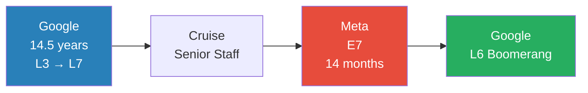
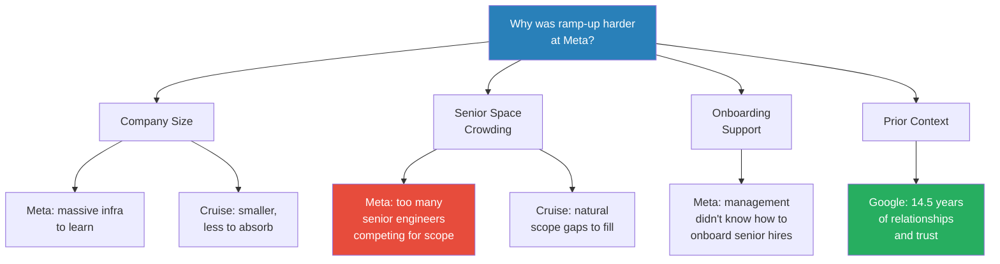
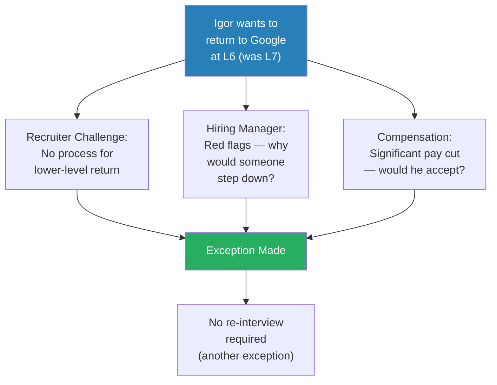
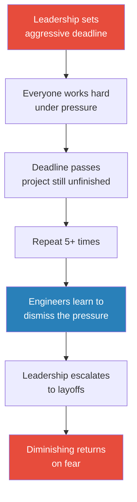
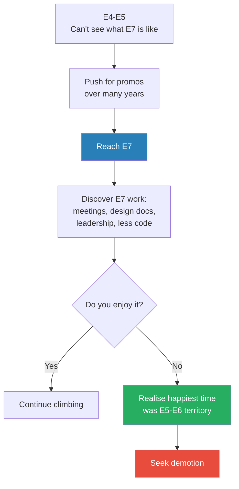
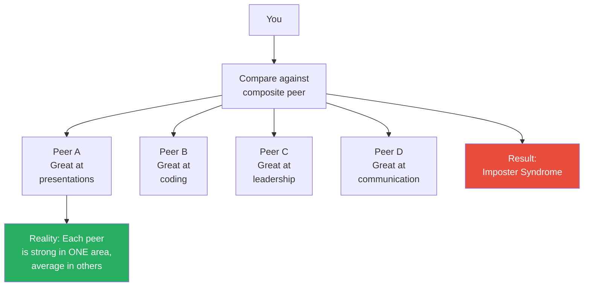

# Meta IC7 Honest Demotion Story

> Igor spent 14.5 years at Google climbing from L3 to L7 (senior staff engineer), then left for Cruise and later Meta. At Meta, he discovered that 14 months wasn't enough to ramp to E7-level productivity — and that he didn't even enjoy the work at that level. He asked Meta for a voluntary demotion; they had no process for it. He returned to Google at L6, taking a significant pay cut. This is a rare, honest account of what happens when a senior engineer chooses to step down — and why the industry has no infrastructure for that choice.

---

## Overview: Key Highlights

- <b style="color: #27ae60">E5/L5 is the best quality of life</b> — shielded from leadership noise, still doing the craft you love
- <b style="color: #e74c3c">Senior IC job mobility is far riskier than people admit</b> — you lose relationships, context, and trust overnight
- <b style="color: #2980b9">The Ramp-Up Ladder</b> — at a new company, you start at L0 regardless of title and must mentally climb every level
- <b style="color: #27ae60">What you enjoy matters more than what you're capable of</b> — Igor could do E7 work but chose not to
- <b style="color: #e74c3c">Neither Meta nor Google had a demotion process</b> — the system is built around promotion, not stepping down
- <b style="color: #2980b9">The Composite Peer Fallacy</b> — imposter syndrome comes from comparing yourself to a composite of everyone's strengths
- <b style="color: #e74c3c">Artificial deadline pressure erodes trust</b> — repeated unrealistic goals teach engineers to stop caring
- <b style="color: #27ae60">Sharing career failures requires specific privileges</b> — no visa dependency, financial cushion, family stability
- <b style="color: #2980b9">The Crowded Space Problem</b> — large companies at senior levels have too many people competing for scope
- <b style="color: #e74c3c">You hear success stories, never failures</b> — survivorship bias dominates career narratives at senior levels

| Concept | One-line summary |
|---------|-----------------|
| **Ramp-Up Ladder** | At a new company, you start at L0 and must climb through every level to reach your title |
| **Crowded Space** | Senior roles at large companies have too many people competing for limited scope |
| **Composite Peer Fallacy** | Imposter syndrome from comparing yourself to everyone's best trait combined |
| **Artificial Pressure Erosion** | Repeated fake deadlines teach engineers to ignore all pressure |
| **Demotion Process Gap** | No major company has a standard process for voluntary level drops |
| **Privilege Shield** | Public vulnerability about career setbacks requires financial and legal safety |
| **Scope-Level Mismatch** | Picking projects that are below your level makes it impossible to justify your title |
| **Marathon Analogy** | Being capable of something is different from wanting to do it |
| **Boomerang Risk** | Returning to a former employer at a lower level raises red flags for recruiters |
| **Context as Capital** | Relationships, infrastructure knowledge, and trust are career capital that doesn't transfer |

---

# The Conversation

## Why Igor Wanted a Demotion at Meta [0:00 - 8:00]

*Ryan introduces Igor, a senior staff engineer who worked at Google, Cruise, and Meta. Igor explains that joining Meta at E7 meant facing performance review expectations against senior staff veterans — with Meta's new policy of laying off the bottom 10%. He had at most one year to reach full productivity.*

*Igor's career arc: a long climb at Google, two shorter stints at Cruise and Meta, then a deliberate step back down.*

> [!tip] Core Insight
> At senior levels, switching companies means starting from zero — but being judged against people who've had years to build context, relationships, and trust.

> [!note]- Expand: Full Conversation
> - Ryan introduces the episode: Igor is a senior staff engineer at Meta, Google, and Cruise who wanted a demotion
> - Igor explains the core problem: joining a big company at a very high level means being judged against old-timers in performance review
> - Meta started doing "the Amazon thing" — laying off the bottom 10% of performers
> - <b style="color: #e74c3c">You have at most one year to ramp up to be comparable to other senior staff engineers</b>
> - Igor describes what E7 actually requires:
>   - Deep expertise in your field
>   - Knowing a lot of people — and them knowing and trusting you
>   - Familiarity with any piece of code your team works on
>   - Understanding what all surrounding teams are doing
> - He introduces the ramp-up ladder concept: day one at Meta, he knew less than an intern who'd been there two weeks
>   - He started at "level zero" and had to mentally climb through L3, L4, L5, L6
>   - After 14 months, he estimates he reached maybe E6 — never fully E7
> - The second realisation: he genuinely enjoyed the E5-E6 work — coding, debugging, designing, mentoring
>   - Senior staff is a different job: meetings, design docs, leadership, much less code
>   - <b style="color: #27ae60">Going through the ramp-up process made him realise he wanted to stay in E5-E6 territory</b>
>
> > [!quote] Igor
> > "I know less than an intern sitting next to me who spent maybe two weeks."

## The Demotion That Couldn't Happen [8:00 - 10:00]

*Igor describes asking his manager for a voluntary demotion at Meta. The manager went to HR; the answer was that no process exists for dropping a level within the same job category.*

> [!note]- Expand: Full Conversation
> - Igor asked management directly: "Can I actually drop a level?"
> - He understood the complexity — granted stock, compensation package, how do you execute that
> - Meta has some process for switching titles (e.g., director to IC) but not for staying IC and dropping a level
> - <b style="color: #e74c3c">HR's answer: it's not possible</b>
> - Igor reflects: maybe if he'd pushed harder, gone to the VP, it could have happened
> - But he also felt too far outside his comfort zone — and Google was the easy way out
> - A recruiter had been periodically reaching out; this time Igor said yes

## Google vs Cruise vs Meta — Why Ramp-Up Difficulty Varies [10:00 - 18:00]

*Igor compares his ramp-up experiences across three companies: his 14.5-year climb at Google, a successful (then disrupted) ramp at Cruise, and the struggle at Meta. The key variable is company size and how crowded the senior space is.*

*The more senior you are, the more your success depends on factors that only develop over years within one organisation.*

> [!note]- Expand: Full Conversation
> - Ryan asks what made it possible to perform at senior staff at Google and Cruise but not Meta
> - Igor: at Google he started at L3 and climbed slowly over many years, failing promotions multiple times
>   - His L7 promotion came from a big project where he was already the expert — he knew everybody, they knew him
> - Cruise was also difficult initially, but over time he found a comfortable zone
>   - <b style="color: #2980b9">Cruise was smaller — less infrastructure to learn, less crowded senior space</b>
>   - "You can easily carve out space for you to grow into — there is lack of people"
> - Then the Cruise autonomous vehicle accident happened — layoffs, people quitting, company instability
> - At Meta, the senior space felt crowded: "they have too many, frankly"
>   - You need to find scope for yourself, and there's intense competition for it
>
> > [!example] Cruise: Success Before the Crash
> > - Igor joined Cruise at senior staff level
> > - First year was difficult — starting from zero again
> > - Over time, found a comfort zone: coding, mentoring, guiding the team
> > - Then the autonomous vehicle accident happened
> > - Layoffs followed, people started quitting
> > - Igor decided to leave — but before the accident, he was actually quite happy
> > **The lesson:** Successful ramp-up at a smaller company is possible — but external events can destroy even a good situation.

## Onboarding Failures for Senior Hires [18:00 - 22:00]

*Igor explains that Meta's management didn't know how to onboard senior external hires because most of their senior engineers grew within the company. He also reflects on what he would have done differently.*

> [!note]- Expand: Full Conversation
> - Ryan asks if anything could have changed the onboarding process
> - Igor admits he's not experienced at switching companies — Google was 14.5 years, then only Cruise and Meta
> - <b style="color: #e74c3c">Meta's management also didn't know how to support senior external hires</b>
>   - Most senior people at Meta grew within the company — they already had "Meta knowledge"
>   - Even if they came from another org within Meta, they knew how to run jobs, the culture, the tooling
> - Igor spent too much time reading docs and building foundational knowledge
>   - Better approach: get your hands dirty immediately, learn by doing
>   - "I did more of the learning part, less of the building"
> - What he wished management had done: "If they said, 'this other person ramped up three quarters ago, here's what they did,' I would have followed that recipe"
>   - <b style="color: #27ae60">They just didn't have the recipe</b>
> - Ryan raises the broader point: senior IC job mobility is progressively riskier and scarier
> - Igor confirms: people who leave senior positions and struggle rarely share it
>   - "You hear the success stories, you don't hear the failures"

## The Project That Wasn't E7 Scope [22:00 - 24:00]

*Igor reveals that in his final months at Meta, he picked a project he thought would take two weeks — it turned out to be far more complex, and even if completed, it wouldn't justify E7-level performance.*

> [!note]- Expand: Full Conversation
> - Ryan asks if Igor ever received feedback from his manager about not meeting expectations
> - Igor confirms he did receive feedback but doesn't want to share details publicly
> - In his final months, he was working on a project initially estimated at two weeks
>   - It turned out to be "a lot more involved and a lot more complicated"
>   - He almost brought it to completion
> - <b style="color: #e74c3c">Even if he finished and launched it successfully, it was still not E7-level scope</b>
> - Igor acknowledges it was probably his fault — which projects you pick matters
>
> > [!quote] Igor
> > "You cannot still justify my level with the project being completed."

## The Google Boomerang at a Lower Level [24:00 - 30:00]

*Igor returns to Google, but at L6 instead of L7 — a move that had no standard process. The recruiter had to make exceptions, and the hiring manager had to take a gamble on someone voluntarily stepping down.*

*Every step of Igor's return required someone to make an exception — the system simply isn't built for voluntary demotion.*

> [!note]- Expand: Full Conversation
> - Ryan asks if Igor is going back to an org where he has existing context
> - Igor: no — everything will be new. New people, new infrastructure, new everything
>   - But at least he knows how Google operates — the culture, the systems
> - The recruiter process was challenging:
>   - Google has a process for bringing people back at the same level or higher — not lower
>   - <b style="color: #2980b9">"They don't have a process for bringing people at a level down, but they made it possible for me"</b>
>   - A person coming back at a lower level raises red flags — "What are you hiding?"
>   - Maybe a fireable offence, maybe something they're not disclosing
> - Igor had to assure the recruiter he'd accept lower compensation — "a lot of people will not do something like I did"
> - The interview exception: Google said if he came back as E7, no interview needed. At L6, they considered requiring a coding interview ("who knows if you wrote code while you were out")
>   - Igor got an exception from coding after 3.5 years away
> - Ryan notes how remarkable it is to boomerang after 3+ years
> - Igor isn't sure if this is standard Google policy or a special case for him

## Meta's Culture of Artificial Urgency [28:00 - 32:00]

*Igor contrasts Meta's deadline culture with Google's more reasonable approach. At Meta, leadership sets aggressive deadlines everyone knows won't be met — creating a cycle of pressure that engineers learn to ignore.*

*Artificial urgency has a half-life — repeated misuse teaches people to stop responding.*

> [!tip] Core Insight
> Pressure is a finite resource. Use it on artificial deadlines five times and engineers will stop believing the sixth. Then the only escalation left is layoffs — which also has diminishing returns.

> [!note]- Expand: Full Conversation
> - Igor describes Meta's deadline culture:
>   - Leadership gives "very arbitrary" deadlines — e.g., finish this project in one month
>   - Everyone works hard, sends constant updates to leadership on progress
>   - Deadline arrives, project is still unfinished, "and everybody's fine with it"
> - <b style="color: #e74c3c">After five cycles of artificial pressure, people say "5pm, I'm going home"</b>
> - Igor didn't feel the pressure personally but watched how it affected others
> - At Google (as of ~10 years ago), deadlines existed for good reasons
>   - You'd be pushed for exceptional cases, not as a permanent operating mode
> - Ryan notes the industry as a whole is becoming more intense on execution
> - Igor's leadership observation: when constant pressure stops working, the next move is layoffs
>   - "It might work to some degree, but people adjust to everything"
>
> > [!quote] Igor
> > "It almost feels like elementary school where the teacher is yelling but kids are still playing."

## The Privilege Required for Honesty [32:00 - 35:00]

*Igor explains why he can share this story when most people can't — and explicitly warns others not to follow his example unless they have the same safety net.*

> [!note]- Expand: Full Conversation
> - Ryan asks what makes Igor willing to share publicly about demotion
> - Igor: "I'm a generally very open person" — but openness alone isn't enough
> - <b style="color: #27ae60">He lists his specific privileges:</b>
>   - No work visa dependency — can live in the US without an employer sponsor
>   - Spouse has health insurance
>   - Kids are grown and in college
>   - No mortgage on his house
>   - Can afford not to work for a few years
> - "If Google says we don't want you for some reason, I'm totally fine"
> - Ryan: "You're entirely free. You're your own person."
> - Igor's advice to others considering sharing career struggles: "I would probably say no, unless you feel so safe and secure"

## From Promotion Hunter to Demotion Seeker [35:00 - 40:00]

*Ryan asks what changed between Igor's years of pushing for promotions and his current willingness to step down. Igor explains that you can't see what life looks like two levels up until you get there — and sometimes you discover you don't want it.*

*The promotion ladder is a one-way escalator — you can't preview the destination before you arrive.*

> [!note]- Expand: Full Conversation
> - Ryan: "You went from pushing for promos to pushing for demotion — what changed?"
> - Igor: at E4-E5, you can maybe imagine one level above, but you can't see two levels up
>   - Most people don't know what a principal engineer actually does day to day
> - <b style="color: #27ae60">His happiest time: small team, lots of coding, debugging, designing, mentoring junior people</b>
> - Ryan asks: money aside, which engineering level has the best quality of life?
> - Igor: "Senior engineer, E5/L5"
>   - You're shielded by a tech lead (E6) who handles upward communication
>   - Management shields you from leadership noise
>   - You can focus on the work you enjoy
> - Ryan: would your ideal be two levels of demotion then?
> - Igor: "That's too extreme. I think I can still enjoy E6"
>   - Maybe he hadn't been E7 long enough to get comfortable
> - Igor reflects on imposter syndrome:
>   - "Everybody has it regardless of level — I'm sure Elon Musk has imposter syndrome"
>   - His self-assessment: "partially qualified for E7 but not fully — it's multi-dimensional"
>
> > [!quote] Igor
> > "I'm capable of running a marathon, but I don't like running. So why would I do that?"

## The Composite Peer Fallacy [38:00 - 42:00]

*Igor describes a common mistake at senior levels: comparing yourself against a composite of your peers' best traits rather than any single individual.*

*You feel inadequate because you're measuring yourself against an impossible standard — a superhuman made of everyone's best trait.*

> [!note]- Expand: Full Conversation
> - Ryan asks if there were specific skills his peers had that would have closed the gap
> - Igor: "It's often a mistake to compare yourself against a group of people like that"
>   - That's exactly what creates imposter syndrome
>   - "Those people around me — they're so smart, so good at talking, so good at presentations, so good at communicating, so good at leading"
>   - "But it turns out one person is good at this, another person is good at that"
>   - <b style="color: #2980b9">You're comparing yourself against a team of people, not a single individual</b>
> - Igor believes that given enough ramp-up time, he would have reached full E7 productivity
> - The real issue: "I was not enjoying the ride, and I didn't have to"
> - He debated extensively with friends and family before leaving
>   - Everyone said: "Are you crazy? You're not laid off, nobody showed you the door"
>   - "Why don't you try E7 elsewhere? Why go level down?"
>   - <b style="color: #e74c3c">There is a lot of peer pressure against voluntary demotion</b>

## The TPU Project That Earned E7 [42:00 - 48:00]

*Igor describes the project that got him promoted to senior staff at Google: migrating Ads ML training from CPUs to TPUs — a multi-year, cross-team effort that required predicting chip orders 18 months ahead.*

> [!note]- Expand: Full Conversation
> - The project: Google Ads ML training infrastructure needed to move from CPUs to TPUs
> - TPUs were new hardware about to be released — Igor's role was ensuring the ads training infra could run on them
> - Started as a two-person exploratory team: Igor as TL plus one engineer
>   - Many teams helped: TPU team, compiler team, TensorFlow team
>   - <b style="color: #2980b9">Cross-team collaboration and credibility were essential — "if you don't have that, you cannot succeed"</b>
> - The challenge: TPUs are orders of magnitude faster than CPUs
>   - CPU training did input processing "for free" using the same CPU
>   - TPU hosts are weak computers with 8 TPU chips each — can't do input processing on the host
>   - Had to build entirely new input processing pipelines
> - The old CPU infrastructure had been polished over 10 years — the new TPU infra had to match that quality
> - Hardware ordering required predicting needs 18 months ahead — usually under-ordered to be conservative
>   - Contrast with LLMs today: "they just order more, none of these companies is profitable with LLMs"
>   - Ads is a mature business — you need to be making money
>
> > [!example] The Spinning Disc Bottleneck
> > - When TPUs made computation vastly faster, the bottleneck shifted to data throughput
> > - Training data (petabytes) was stored on spinning discs — cheap in storage cost
> > - Disc capacity grew from ~200GB to ~6TB over the years, but read speed stayed constant
> > - The data centre had fewer discs storing the same data, meaning less total throughput
> > - Igor went to the data centre team asking for more discs — not for storage, but for throughput
> > - "Discs are very cheap compared to everything else, but you cannot easily install thousands of them — you need racks, power"
> > - Igor compares it to the COVID toilet paper shortage: cheap but bulky, so stores couldn't stock enough
> > **The lesson:** The cheapest component can become your hardest bottleneck when surrounding systems change orders of magnitude.

## Mentorship, Regrets, and Disillusionment [48:00 - 54:00]

*Igor shares a favourite mentorship story, reflects on career regrets, describes his disillusionment with Google's values, and offers advice to his younger self.*

> [!note]- Expand: Full Conversation
> - Mentorship story:
>   - Igor hosted an intern when he was around L4
>   - That intern converted to full-time
>   - A few years later, the intern became the manager of the team he interned on
>   - <b style="color: #27ae60">"Don't underestimate your interns — they can be really really good"</b>
> - Career regrets:
>   - Not everything was smooth, but it was all a learning experience
>   - "I wouldn't be who I am today if I didn't go through those periods"
> - Disillusionment with Google:
>   - Igor was idealistic when younger — believed Google was a positive force in the world
>   - Worked there because of personal values, not just pay
>   - Over the years, got disillusioned: "It's just a corporation"
>
> > [!example] The Atlanta Office Shutdown
> > - Google shut down its Atlanta office — a few hundred people
> > - The senior VP sponsoring the office decided to pull out
> > - Nobody else was willing to take over the headcount
> > - Employees were told: relocate or here's your exit package
> > - Igor: "You feel like you're just a cell in the spreadsheet"
> > - Very little empathy shown — this was years before the post-COVID layoff era
> > **The lesson:** Corporate loyalty is a one-way street. The company's bottom line will always override individual relationships.
>
> - Advice to younger self: work on what matters
>   - Igor worked on projects that didn't make sense — "Why are we building this in the first place?"
>   - A year later, leadership would realise the same thing and shut the project down
>   - <b style="color: #27ae60">"Ask yourself: does my company really benefit from what I'm doing? If not, maybe you shouldn't be there"</b>
> - Ryan asks: if you're junior and recognise the project is useless, what do you do?
> - Igor: talk to other managers, find another project
>   - Depends on company culture: Intel made switching nearly impossible ("easier to quit and reapply")
>   - Google was very fluid for internal transfers; Meta likely similar
>
> > [!quote] Igor
> > "At the end of the day I'm just a cell in the spreadsheet."

---

## Connections

**Related episodes:**
- [[25 Year Old Staff Eng at Meta - Evan King]] — Evan King rose fast within Meta; Igor's story shows the opposite trajectory when joining externally at a senior level
- [[Meta IC9 on Influencing Engineers Failures and Learnings]] — Adam Ernst built influence over years inside Meta; Igor's struggle illustrates what happens without that tenure
- [[Amazon VP on Stack Ranking PIPs and Bezos - Ethan Evans]] — Ethan Evans on performance management systems; Igor experienced Meta's version of bottom-percentile culling
- [[Meta Senior Manager on Career Growth PIPs and Culture - Stefan Mai]] — Stefan Mai on Meta culture from the manager side; Igor gives the IC perspective of the same environment
- [[Retired Netflix Eng Director on Leetcode Regrets and Hiring]] — David Rumpka on regrets and honest career reflection; similar vulnerability to Igor's transparency

**Related books in vault:**
- [[The First 90 Days - Michael D. Watkins]] — the classic onboarding framework; Igor's story is a case study in what happens without structured senior onboarding
- [[So Good They Can't Ignore You - Cal Newport]] — career capital theory; Igor's capital (relationships, context, trust) didn't transfer across companies
- [[What Got You Here Won't Get You There - Marshall Goldsmith]] — the skills that earned E7 at Google (deep expertise, long tenure) were precisely what Igor lacked at Meta

---

## The Takeaway

Igor's story challenges one of the deepest assumptions in tech career culture: that more senior is always better. The entire industry infrastructure — compensation, recruiting, performance management — is built around climbing. There is no standard process at Meta or Google for someone who wants to step down. The recruiter didn't know how to handle it. The hiring manager saw red flags. Friends and family thought he was crazy. The system treats voluntary demotion as an error state rather than a legitimate career choice.

The most counterintuitive insight is how fragile senior-level career capital turns out to be. Igor spent 14.5 years building relationships, trust, and context at Google — the very things that made his E7 promotion possible. All of that vanished the moment he left. At Meta, he was starting from zero with a title that demanded immediate E7 output. The gap between title and actual productivity created a pressure that was structural, not personal. No amount of individual effort could compress 14.5 years of accumulated context into 14 months.

What remains unresolved is whether the industry will ever build infrastructure for downward mobility. Igor's case required exceptions at every step — from HR, from the recruiter, from the hiring manager. If even one person had said no, he would have been stuck: overlevelled at a company where he wasn't thriving, with no legitimate path to the work he actually enjoyed. The system forces people to either keep climbing or leave entirely. Igor found a third option, but only because he was privileged enough to take the financial hit and secure enough to weather the social stigma. Most people aren't.
