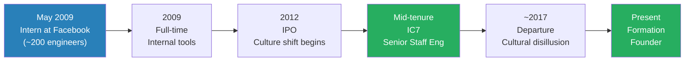
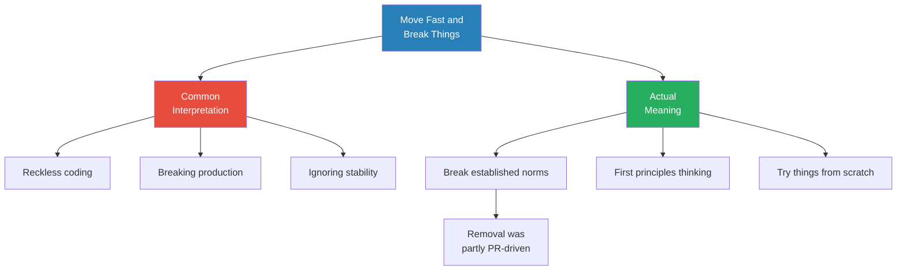
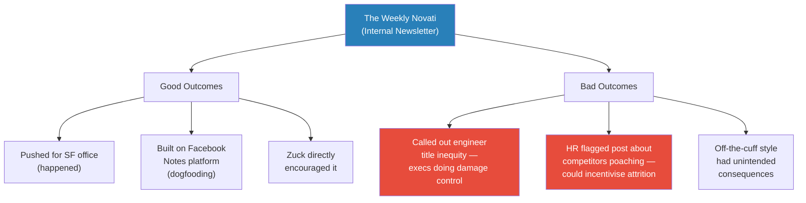
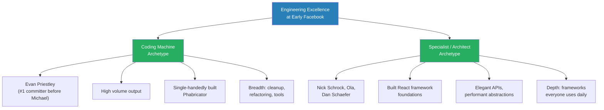
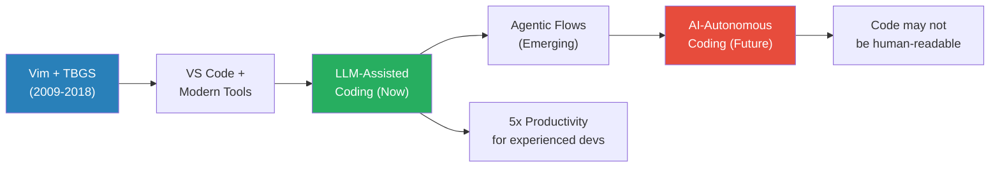
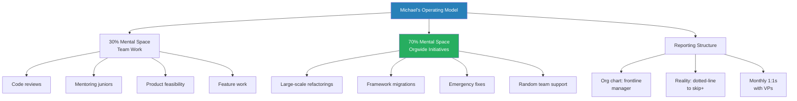
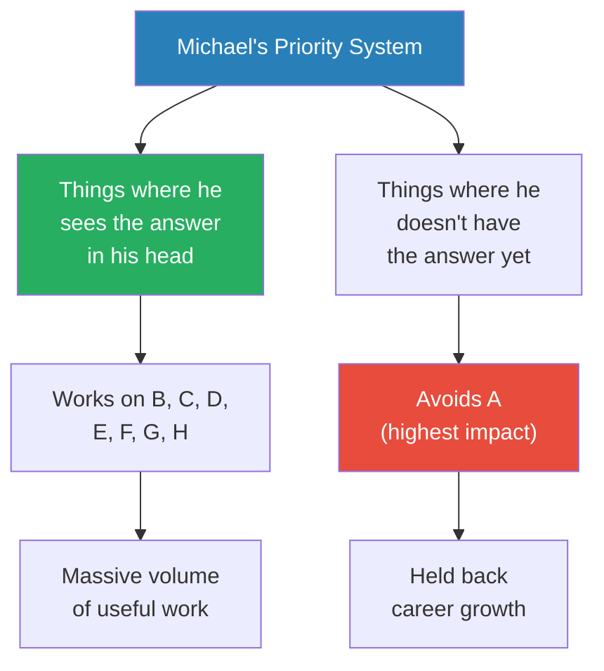
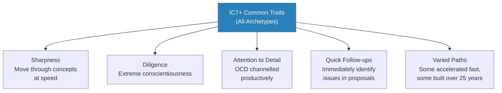
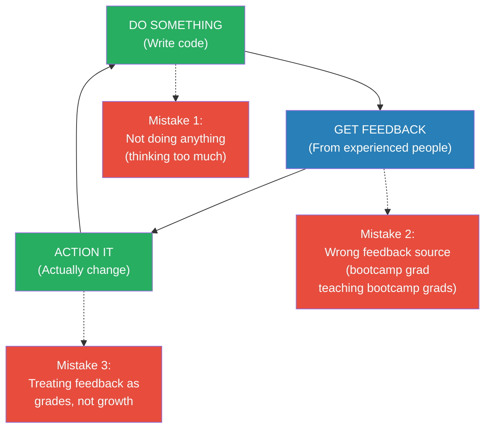

# Meta IC7 on Zuck Stories, Rapid Growth, and Code Machine Archetype

> Ryan Peterman interviews Michael Novati, who joined Facebook as an intern in 2009 when it had roughly 200 engineers and grew to Senior Staff Engineer (IC7) — one of the most prolific code committers in the company's history. What makes this conversation distinctive is Michael's combination of wild early-Facebook stories (betting Zuck he couldn't commit code, merging tools without telling anyone, the ripstick ban) with an unusually honest self-assessment of his weaknesses. He openly admits he was bad at prioritisation, arrogant about meetings, and would advise his younger self against the internal newsletter that made him famous. The episode builds toward a specific argument: that the coding machine archetype is real and valuable, but raw output is table stakes — taste, judgment, and social credibility are what separate IC5 output from IC7 impact.

---

## Overview: Key Highlights

- <b style="color: #27ae60">Raw output stays constant from day one — taste and judgment are what grow</b> — Michael's code volume was roughly the same from his first week; what changed was knowing what to change and how to manage consequences
- <b style="color: #27ae60">One coding machine can outperform four senior engineers in a familiar codebase</b> — context-dependent but real: single-person refactorings that would never happen with distributed teams
- <b style="color: #2980b9">The coding machine archetype</b> — not magic, but hard work, keeping code in mental RAM, obsessing over details, and building trust with the push team over years
- <b style="color: #2980b9">Taste as cast iron patina</b> — judgment builds through accumulated layers of experience burned into your instincts, like seasoning on a pan — cannot be rushed
- <b style="color: #e74c3c">Internal newsletters can backfire despite good intentions</b> — the Weekly Novati caused friction with executives and HR; in retrospect, Michael would not do it again
- <b style="color: #e74c3c">Optimising for what you can crank out instantly is a weakness</b> — Michael admits he often worked on B through H while ignoring the highest-impact A because he didn't have the answer in his head
- <b style="color: #27ae60">The do-feedback-iterate cycle compounds exceptionally fast</b> — three mistakes break it: not doing, getting feedback from wrong people, and treating feedback as grades rather than growth signals
- <b style="color: #2980b9">IC7+ common traits</b> — extreme sharpness, diligence, conscientiousness, channelled OCD, ability to move through complex concepts at speed
- <b style="color: #e74c3c">Move fast and break things was about breaking norms, not causing havoc</b> — its removal was partly PR-driven, not a real cultural shift
- <b style="color: #27ae60">LLMs amplify existing skill, not replace it</b> — experienced engineers with strong taste benefit most; Michael reports 5x productivity gains
- <b style="color: #2980b9">The 30/70 split</b> — 30% mental space on team work, 70% on codebase-wide initiatives — only works with manager support and established credibility
- <b style="color: #e74c3c">Seeking approval instead of internalising feedback is the biggest mistake ambitious people make</b> — wanting 100% on the test rather than genuinely improving

| Concept | One-line summary |
|---------|-----------------|
| **Coding machine archetype** | One person doing what distributed teams cannot — through volume, context, and relentless drive |
| **Taste & judgment** | Built through years of doing, failing, and learning — like cast iron patina or speed skating muscle memory |
| **Do-feedback-iterate cycle** | Do something, get feedback from experienced people, action it, repeat — the compound interest of engineering skill |
| **The 30/70 split** | 30% team work, 70% orgwide impact — requires credibility, manager buy-in, and established trust |
| **Move fast and break things** | Really meant first principles thinking and breaking norms, not reckless destruction |
| **Engineer empowerment** | Peaked at early Facebook where engineers had veto power; declined as company scaled to VP-level negotiations |
| **IC7+ sharpness** | Common trait: ability to move through complex concepts at speed, identify issues instantly, extreme attention to detail |
| **LLM productivity** | Extension of existing skill — 5x gains for those who already know what to build, intuition-driven prompting |
| **Feedback as improvement vs grades** | The critical distinction: treating feedback as growth signal rather than pass/fail judgment |
| **Trust with push team** | Credibility earned over years enables high-risk commits; burned credibility means even safe changes get blocked |

---

# The Conversation

## Joining Facebook at 200 Engineers [0:00 - 3:00]

*Michael Novati explains how he landed at Facebook almost by accident — he was heading to a PhD at the University of Washington in HCI, had housing and a research assistantship lined up, but interned at Facebook in May 2009 and never left.*

*Michael's arc traces the full lifecycle of early Facebook — from the scrappy 200-person startup through IPO to a scaled company where the culture no longer felt like home.*

> [!note]- Expand: Full Conversation
> - Ryan asks what drew Michael to Facebook when it was so small
> - Michael explains he was between undergrad and grad school, wanted work experience at a top company doing interesting product work
> - He applied online to both Facebook and Google — says getting interviews was not hard at the time
> - He randomly interviewed with an engineer working on internal collaboration tools (diff review, task tools, discussion tools)
> - This was exactly what Michael wanted to work on — the "social network for work" making people more productive
> - On his first day, he opened his dev environment: Apache, PHP, MySQL — just like a side project but with a larger federated database
>   - He describes the feeling: "I sat down and it just felt like I was home"
> - The social side mattered too: Facebook was a product everyone knew about and talked about
>   - He could get real feedback from people about what they liked and didn't like
>   - It was motivating to work on something people genuinely cared about

---

## PHP, Hack, and Engineering-First Culture [3:00 - 7:00]

*Ryan brings up the PHP stigma that many engineers felt when joining Meta. Michael explains how Facebook's approach was not to accept PHP's limitations but to systematically rebuild the language from the inside.*

> [!note]- Expand: Full Conversation
> - Ryan asks whether Michael was put off by PHP — many of his peers were
> - Michael explains the evolution: PHP → compiler for performance → adding strict typing → eventually Hack (a derivative/fork of PHP)
> - There was internal debate about rewriting the entire codebase in Java or Python
> - Facebook chose to optimise PHP instead: customise it at the language level for how the company uses it
> - The result: easier to use, more performant, with all the traits engineers wanted
> - Michael frames it as: Facebook said "we're going to make this better than any other language" by customising it to their needs
> - The culture was extremely engineering-driven — engineers had veto power over product decisions
>   - Designers and PMs had to win over engineers and get buy-in, because if the engineer wouldn't build it, it wouldn't get built
> - Almost all internal tools were written from scratch internally
>   - This set the tone: this is an engineering-first company that builds what it needs

> [!tip] Core Insight
> Facebook's approach to PHP reveals a broader engineering philosophy: instead of migrating to a trendy language, they invested in making their existing tools better than anything else could be — customised at the language level for their specific needs.

---

## Move Fast and Break Things — What It Really Meant [7:00 - 10:00]

*Ryan asks about the famous motto's evolution. Michael pushes back on the common interpretation — it was never about recklessness.*

*The motto's removal was more about external perception than internal reality — Facebook didn't want the public to think engineers were recklessly breaking everything.*

> [!note]- Expand: Full Conversation
> - Michael says he was definitely the "move fast and break things" person
> - He clarifies: the "breaking things" part was about breaking norms, not causing havoc
> - Draws direct parallel to first principles thinking — not following trends for the sake of following them
> - The removal of "break things" felt like it was driven by outside perception more than internal culture change
> - He acknowledges the rational case for removing it: at scale, even the smallest bug has tens of millions of dollars of impact
> - <b style="color: #e74c3c">Stability has real financial impact</b> — a reality that changes the cost-benefit calculus as a company grows

---

## The Culture Evolution and Engineer Empowerment [10:00 - 14:00]

*Ryan asks how the culture changed over Michael's tenure. Michael traces the decline of engineering autonomy from individual engineers making direct decisions to VP-level negotiations percolating downward.*

> [!note]- Expand: Full Conversation
> - Early on: senior engineers would have head-to-head discussions about how to build things, somewhat independently of management
> - Toward the end: VPs of two different teams would negotiate, and decisions would percolate down
> - <b style="color: #e74c3c">The IPO in 2012 was a turning point</b> — the stock tanked and the question became "how is Facebook going to make money?"
> - Michael admits: for three years (2009-2012), they didn't really talk about making money
> - He developed a more mature view over time — understood that ads optimisation and infrastructure efficiency mattered for sustaining the company
> - The shift: from engineer-driven decisions to business-driven decisions

---

## The IPO Experience and Zuck's Parents [14:00 - 19:00]

*Michael gives a first-person account of the Facebook IPO — from Zuckerberg's grounded approach to the surprisingly intimate moment of standing next to Zuck's parents in the crowd.*

> [!tip] Core Insight
> Zuckerberg was skilled at keeping the IPO grounded — framing it as a rational fundraising event, not a celebration. The culture stayed humble even as the numbers got enormous.

> [!note]- Expand: Full Conversation
> - Mark Zuckerberg kept things grounded and humble — the IPO was framed as a rational thing to raise funding, not a party
> - But it was also a moment that pulled employees together: NASDAQ brought the opening bell button to Facebook's campus
>   - There's an untold story about how they hooked the button up through a special networking system so it was actually the real button
> - Michael was standing right next to Zuck's parents in the crowd
>   - Tear in their eyes — a big moment watching their son
>   - He later told Mark about this
> - All stock vested six months after the IPO — on IPO day, nobody had any money
>   - When it did vest, the stock had tanked
>   - About 20 of them were in a movie theatre when the vested stock hit their accounts — all phones went off at once
> - Long-term impact: people could afford houses, could afford to have kids in the Bay Area
> - Short-term: didn't change behaviour at all
> - Michael held all his IPO stock and still has it today
> - Facebook provided financial literacy classes for younger employees — people who went through Google and Yahoo IPOs taught them
>   - Michael grew up in Canada, had no understanding of stock-based compensation
>   - These classes were "infinitely helpful"

> [!example] Vesting Day at the Movies
> - About 20 Facebook employees were at a movie theatre together
> - While watching the film, the stock hit their accounts simultaneously
> - Every phone in the group went off at once — "your vested stock has been deposited"
> - The stock had already tanked from the IPO price
> - Despite the financial milestone, short-term behaviour didn't change
> **The lesson:** Financial windfalls at scale companies arrive gradually and anti-climactically — the real impact is long-term, not the dopamine hit of a notification.

---

## Stock Fluctuations and Career Advice [19:00 - 22:00]

*Michael draws on his years watching Meta's stock swing from IPO crash to $90 trough to recovery, and turns it into practical career guidance for engineers comparing offers.*

> [!note]- Expand: Full Conversation
> - Michael mentions people who started during the $90 trough and have nearly 6x their stock in three years
> - At Formation, he advises people preparing for interviews and comparing offers
> - His key advice: stop sweating single-digit percentage differences between offers
>   - Offers are estimates based on current conditions — stocks go up and down, acquisitions happen, scandals happen
> - <b style="color: #27ae60">Prioritise a company where you will fit well and perform well — performance over time is more within your control than stock predictions</b>
> - Especially for early career: one promotion could mean 40% more compensation and is relatively within your control

---

## The Weekly Novati — Internal Newsletter Gone Wrong [22:00 - 28:00]

*Michael tells the surprisingly cautionary tale of his popular internal newsletter — how it started from genuine openness values, gained massive traction, but ultimately caused friction he didn't anticipate.*

*The newsletter was driven by Facebook's openness values but stepped on problems executives were already quietly solving — sometimes the biggest cost of transparency is forcing a public response to something being handled privately.*

> [!note]- Expand: Full Conversation
> - Started using Facebook Notes (the blogging platform), which was unowned when Michael joined in 2009
> - He improved Notes himself: added rich text editing in a single hackathon — an 11,000-line diff
>   - Had to organise an in-person code review because no one could review that much code
> - Started posting about hot topics — product building, controversial opinions
> - The "If I was CEO" series: argued Facebook needed a San Francisco office while the company insisted on Menlo Park only
>   - His argument: Stripe, Uber, and new startups were in SF and poaching Facebook employees
>   - Facebook eventually did open a South SF office — he was pleased
> - The engineer title inequity post: called out that network engineers and data engineers couldn't change teams easily and didn't have the same privileges as software engineers
>   - He didn't realise this was a huge tension already being worked on behind the scenes
>   - Executives were upset: "Michael, I'm working on this problem. You didn't help us. We have to do damage control now."
> - HR feedback on the competitors post: listing which companies were poaching and their stock grants could incentivise people to explore other opportunities
> - After the competitors incident, Michael messaged Zuckerberg directly to ask how he felt about it
>   - Zuck was totally fine with it and encouraged him to keep posting
> - <b style="color: #e74c3c">In retrospect, he would not do the newsletter again</b> — it was driven by values, not strategy, and the friction wasn't worth it

> [!quote] Michael Novati
> "There was no strategic reason to do it... it had nothing to do with performance reviews or growing influence."

---

## Zuck Stories: Hackathons, Code, and the Emoji Bet [28:00 - 35:00]

*Michael shares two remarkable Zuckerberg stories from early Facebook — one showing Zuck's product vision years ahead of the industry, the other showing his willingness to get back into the code.*

> [!example] The Emoji Reactions Hackathon (2009)
> - Zuck proposed that anyone should be able to put any emoji on any post as a reaction
> - This was 2009 — years before reactions became standard across all platforms
> - Michael and engineer Tom Whitner worked with Zuck to build it during a hackathon
> - They got it working, but the code quality was terrible — it never shipped
> - Years later, Sammy Krug (PM) led the reactions initiative and it launched properly
> - Michael's reaction: "This is so much better than Zuck's code"
> **The lesson:** Zuck's product instinct was years ahead, but shipping well requires both vision and execution quality. The idea was right in 2009; the implementation needed 2015's craft.

> [!example] The Google+ Lockdown and Zuck's Merged PR (2010)
> - Facebook went into "lockdown" mode fearing Google+ would steal their user base
> - Food served on weekends, intense in-person work, frantic feature shipping
> - At a company-wide Friday Q&A, Michael bet Zuck that he couldn't commit code by end of lockdown
>   - If Zuck committed: Michael would stop ripsticking indoors
>   - If Zuck failed: Michael can't remember the penalty
> - Zuck actually merged a PR — winning the bet
> - Michael was then banned from riding ripsticks (with some loopholes about indoors vs outdoors)
> **The lesson:** Zuck was still close enough to the code in 2010 to ship a real PR — and competitive enough to do it over a bet.

---

## The Ripstick Ban and HR's Buy-In Technique [35:00 - 38:00]

*A hilarious tangent that reveals a sophisticated HR technique — getting buy-in from opponents by including them in the process.*

> [!example] The Ripstick Ban (2012)
> - Ripsticks (two-wheeled skateboards) were scattered throughout Facebook's offices
> - Rumour: Facebook's health insurance premiums were significantly higher than other tech companies because of ripstick injuries
> - The week before the formal ban, the head of HR emailed the five most prominent ripstickers
> - The email: "Can you give us feedback on this draft email banning ripsticks?"
> - Michael didn't realise it at the time, but this is a classic technique: bringing opponents into the process to get buy-in
> - He marvels at the absurdity: the head of HR at a company of tens of thousands, having to manage ripstick diplomacy
> **The lesson:** When you need to implement an unpopular change, include the most vocal opponents in the drafting process — they become co-authors rather than resisters.

---

## Role Models and the Product Infrastructure Team [38:00 - 42:00]

*Michael names the engineers who shaped his aspirations — and draws a clear distinction between two archetypes of engineering excellence.*

*Two valid paths to engineering excellence: the coding machine who cleans up and builds through sheer volume, and the specialist who creates elegant abstractions everyone depends on daily.*

> [!note]- Expand: Full Conversation
> - The first wave of Facebook engineers were not known for code quality — but they wrote fast and got things done
> - A wave of more experienced engineers (some poached from Microsoft, including Boz) brought structure and frameworks
> - The product infrastructure team built core abstractions — people like Evan Priestley, Putnham
>   - Their names were all over the codebase — Michael's role models for the coding machine archetype
> - Evan Priestley: probably the #1 committer before Michael, single-handedly wrote the diff/code review tools (became Phabricator)
>   - Invented "Clown Town" — if you caused a silly bug, broke main, etc., you were philosophically added to Clown Town
> - Ryan asks: one Evan Priestley or four senior engineers?
>   - Michael says: Evan Priestley, without hesitation
>   - But qualifies: it's context-dependent — in a familiar codebase, choose the coding machine; for something brand new, diverse backgrounds and experiences might be better
> - The product infra team (Nick Schrock, Ola, Dan Schaefer) were a different archetype
>   - They built the React framework foundations, elegant APIs, performant abstractions
>   - Making things simpler is sometimes harder than writing a lot of code
> - Michael uses the sports team analogy: you want different specialists respecting each other's positions
>   - Even pitchers who only throw can hit better than most amateurs

> [!quote] Michael Novati
> "Making things simpler is sometimes more work than writing a lot of code."

---

## The Coding Machine in Action: Preparables and URL Routing [42:00 - 47:00]

*Michael gives concrete examples of what the coding machine archetype actually looks like in practice — single-person refactorings that would never happen through normal team allocation.*

> [!note]- Expand: Full Conversation
> - The canonical example: the Preparables framework
>   - Separated rendering code from data fetching in components — fetch function and render function
>   - Concepts have matured into React's suspense and modern patterns, but at the time it was simpler
>   - Thousands of classes throughout the codebase used Preparables (3,000-6,000)
>   - Michael single-handedly refactored and removed every single one over several months
>   - Until the parent class itself was removed from the codebase
>   - He doesn't think this would have happened otherwise — it would have required too many resources
> - Second example: removing legacy PHP endpoints
>   - When he joined, there were still raw PHP endpoints hit directly — old-school web development
>   - A routing framework existed but wasn't universally adopted
>   - Michael removed every single legacy endpoint and migrated to the routing framework
> - The pattern: these tasks weren't the most important thing for the company, but they made every engineer's life easier
>   - One person with drive and grit prevents the need to divert teams from new products to handle legacy cleanup

> [!tip] Core Insight
> The coding machine's unique value is doing things that would never be prioritised through normal resource allocation. Large-scale refactorings that improve everyone's daily experience but aren't anyone's top priority — only a single person with relentless drive makes them happen.

---

## LLMs and the Future of the Coding Machine [47:00 - 55:00]

*Ryan asks the obvious question: will LLMs kill the coding machine archetype? Michael's answer reveals how he actually uses AI tools day-to-day and where he sees the profession heading.*

*Each generation of tooling amplifies the coding machine rather than replacing them — but the agentic future is genuinely uncertain.*

> [!note]- Expand: Full Conversation
> - At Facebook, Michael used Vim and TBGS (proprietary indexed codebase search) — that was it
>   - Tab completion plugin for class names in Vim — nothing else
>   - Already extremely productive with these minimal tools
> - Now at Formation (500,000-line codebase): he knows most of the code structure in his head
>   - Not using many codebase-wide agentic flows — mostly LLMs to speed up what he would already do
>   - He already almost knows the code he wants to write; LLMs generate it faster
>   - Makes real-time judgment calls: can I type this faster, or can I prompt an LLM to generate it more efficiently?
>   - Building prompt intuition over time — every new model requires developing new instincts
> - <b style="color: #27ae60">Reports 5x productivity gains</b> — producing five times more code than six months ago through LLM optimisations
> - The current state: most engineers still don't use AI tools effectively
>   - Get off YouTube and Reddit and ask a random engineer — they're not using AI tools as much as the leading edge
> - The future he envisions: AI writing and maintaining its own code
>   - Won't be writing JavaScript — will manage its own services with APIs
>   - Code might not even be human-readable
>   - Bugs will happen, but AI will have its own ways to fix them
> - His stance: don't push back on it; think about how to make this AI world the best it can be
> - For experienced engineers with strong taste: LLMs make you more and more productive
> - <b style="color: #e74c3c">For inexperienced engineers: it's going to be harder and harder to build the foundational skills</b> — a concerning transitional period

---

## The Sports Team Analogy and Specialist Respect [55:00 - 58:00]

*Michael explains what impressed him about the React/framework engineers and why the coding machine and specialist archetypes need each other.*

> [!note]- Expand: Full Conversation
> - The React engineers solved problems other people couldn't — different type of value from the coding machine
> - Another example: an engineer who was one of 10 people in the world who deeply understood email protocols
>   - Not just specs — the practical side of spam, routing, edge cases
>   - Falls into the specialisation bucket
> - The sports team analogy: every player on a baseball team can play any position pretty well
>   - Even pitchers can hit better than most amateurs
>   - But you want different roles respecting each other's place on the field
> - There were similarities between archetypes: both the coding machine's cleanup work and the specialist's abstractions impacted all engineers daily
> - What he respected about the framework engineers: creating elegant APIs that reduced cognitive overhead for every engineer

---

## The 30/70 Split and Reporting Structure [58:00 - 63:00]

*Ryan digs into how Michael actually operated day-to-day — spending most of his energy on orgwide problems while nominally belonging to a small team.*

*The coding machine doesn't operate within normal team boundaries — but the structure only works because the manager's incentive (their reports having maximum impact) aligns with giving the coding machine freedom.*

> [!note]- Expand: Full Conversation
> - The 30% was not time-boxed — it was mental space and focus
>   - Still present on the team all day: reviewing code, bouncing ideas, mentoring, attending product meetings
>   - The volume of code produced for the team was more like a regular senior engineer
> - Often reported to more junior managers — almost a peer relationship
>   - The skip-level manager generally did his performance reviews
>   - He would meet with VPs monthly, skip-level every two weeks
> - Ryan frames it: almost a weapon of the org that goes wherever needed
> - Michael emphasises: managers at Meta saw their job as making reports perform exceptionally well
>   - If your reports get promoted and have huge impact, that makes you a high-performing manager
>   - So managers protected his time and shielded him from unnecessary meetings

---

## Merging Tools Without Permission and Building Taste [63:00 - 70:00]

*Michael tells the story of his very first week at Facebook — merging two competing internal tools without telling anyone — and uses it to illustrate how raw output stays constant while taste grows.*

> [!example] Merging Mantatuna and Cortana in Week One
> - Facebook had two competing UIs for the same internal task management data source
> - One was streamlined and fast; the other was bloated with features and slow
> - In less than a week, Michael merged the two codebases: speed of the slim one, all features of the bloated one
> - He didn't tell anyone — just did it, then posted to the entire company
> - "The tools are merged. It's done. Deal with it."
> - Everyone patted him on the back — no one else could have done it
> - But the lesson learned: you can't just surprise hundreds of people with URL changes
> **The lesson:** Raw output is necessary but not sufficient. The judgment to manage impact — knowing that surprising people with changes to their daily tools creates problems even when the change is objectively better — is what separates IC5 output from IC7 impact.

> [!note]- Expand: Full Conversation
> - Michael's central claim: his raw output was the same from week one to IC7
> - What grew was taste and judgment — a series of accumulated lessons:
>   - Don't surprise people with changes to tools hundreds of people use
>   - Pay attention to the consequences for other teams
>   - Build intuition about which spots in the codebase are more sensitive
>   - Some people will forever dislike you because of a bad judgment call — learn, take feedback, keep going at the same speed
> - The accumulation of judgment and taste is what crosses the line into IC7
> - His advice for building this: talk to your manager, talk to your skip, find a senior engineer who operates this way and ask how they did it

---

## Trust, Credibility, and "I Will Resign" [70:00 - 75:00]

*Michael explains the social infrastructure that enables a coding machine — the push team relationship, burned credibility, and the extreme measures he took to rebuild trust.*

> [!example] "I Will Resign If It Breaks the Site"
> - Before continuous integration existed at Facebook, the push team controlled what shipped to production
> - If you broke things too often, the push team would stop trusting you and push back on even safe changes
> - After burning credibility by shipping something too fast, Michael needed to rebuild trust
> - On a critical fix: "This needs to get in and if it breaks the site, I will resign"
> - Ryan asks: would you actually have resigned?
> - Michael: yes — saying it puts so much pressure on himself that he triple-checks every line, thinks about every edge case
> - The self-imposed stakes forced maximum diligence
> **The lesson:** The coding machine's ability to ship fast depends on accumulated trust. Burn it, and even your safe changes get blocked. Extreme commitments like "I will resign" are not theatrics — they are mechanisms for forcing your own maximum diligence.

> [!quote] Michael Novati
> "This needs to get in and if it breaks the site, I will resign."

> [!note]- Expand: Full Conversation
> - Code ownership philosophy: every line you write, you're responsible for
>   - Kent Beck talked about this recently — a strong sense of ownership
>   - If you're okay being woken up at 3am to fix a bug, do what you want with testing
>   - If you want to work 9-5, write more tests to keep code stable when you're not around
> - Michael didn't just refactor and forget — he was responsible for bugs in touched code
>   - Sometimes two years later: auto-assigned a bug because "you touched this code last"
>   - He would fix it even though he didn't cause it — "that is now my code"
> - Territorial conflicts never came up — part of judgment is performing surgery carefully
>   - Don't step on people's product judgment
>   - Learn where the line is between cleaning up and disrupting someone's workflow
> - One lesson learned the hard way: refactoring an old framework in a team's live tool when they were already building a newer version
>   - Caused merge conflicts for all their in-progress work
>   - They wanted to revert his changes — fair pushback

---

## Managing Focus and Walking Out of Meetings [75:00 - 78:00]

*Michael is disarmingly honest about his approach to meetings — including behaviour he now regrets.*

> [!note]- Expand: Full Conversation
> - Strategy: push back on every meeting without clear context — "what is this?" when someone just adds a mystery sync to his calendar
> - Didn't attend standups unless directly relevant (e.g., crunch time for a deadline)
>   - Some standups devolve into social chitchat — he would skip those
> - Manager support was critical: managers protected his time because maximum impact was the goal
> - He was very conscious about team changes — made deliberate choices when switching
> - The admission: he was sometimes too arrogant
>   - Walked out of meetings mid-conversation: "I don't think this meeting is useful for me anymore. I'm leaving."
>   - He now feels bad about it — the meeting runner probably felt terrible
> - Ryan asks if HR ever pushed back on his behaviour
>   - No — because it wasn't mean or table-flipping
>   - PMs actually liked him: he built fast, fixed bugs fast, even other teams' bugs
>   - If he left a meeting, PMs would often give him permission: "You're not needed for this next part"
> - <b style="color: #e74c3c">But he frames it as a weakness in retrospect</b> — that level of strictness about time crossed into arrogance

---

## The Prioritisation Weakness [78:00 - 82:00]

*In one of the episode's most honest moments, Michael admits that his greatest strength — cranking out code — was also his biggest career limitation.*

*Optimising for throughput rather than impact is the coding machine's blind spot — cranking out B through H because A doesn't have a clear answer yet.*

> [!note]- Expand: Full Conversation
> - Michael admits: he doesn't think he's great at prioritisation — and he's still not good at it
> - His system: pick things where he sees the answer in his head — then type as fast as possible
>   - This is also why LLMs help him so much: he has what he wants in his head and needs to get it out fast
> - Sometimes the thing in his head isn't the most impactful thing — but it's a tricky thing with a clear solution, so he does it
> - This frustrated managers who tried to redirect him: "Can you please work on A?"
>   - His response: "I don't see the answer to A. I don't have it in my head."
>   - He would work on B, C, D, E, F, G, H instead
> - <b style="color: #e74c3c">He explicitly frames this as a weakness that held him back</b>
>   - If A was truly the most important thing and it didn't get done, he got a "passing grade" for all the other work
>   - But company impact would have been higher by doing A
> - The paradox: if you crank out enough B-through-H, it adds up to huge impact anyway
>   - But it's a different way of thinking about work

---

## IC7+ Group: What the Best Have in Common [82:00 - 85:00]

*After getting promoted to IC7, Michael was added to an IC7+ only group. He describes the common traits across all archetypes at that level.*

*Regardless of whether they were coding machines, specialists, or fixers — every IC7+ engineer shared the same base traits of sharpness, diligence, and channelled obsessiveness.*

> [!note]- Expand: Full Conversation
> - Everyone had certain traits regardless of archetype (coding machine, specialist, fixer)
> - Extreme diligence and conscientiousness — universal
> - Sharpness: complex conversations moved fast
>   - Instead of an hour-long presentation on a new protocol, everyone immediately asks sharp follow-up questions
>   - "Oh, what about A, B, C, D?" — fast, precise, probing
> - Michael considers himself a pretty smart person (straight-A student) but acknowledges most of these people are smarter
> - For Michael, these traits feel like personality traits — channelling OCD productively
>   - Obsessed about every detail of the product instead of unproductive things
> - Others built the same traits over 25 years of experience — different path, same destination
> - Contrast with junior engineers: more context missing, follow-up questions less sharp, takes longer, projects smaller in scope as a result

---

## Taste and Judgment: The Cast Iron and Speed Skating Metaphors [85:00 - 90:00]

*Michael offers two vivid metaphors for how engineering taste develops — neither of which can be shortcut.*

> [!note]- Expand: Full Conversation
> - The cast iron patina metaphor:
>   - People who cook with cast iron talk about building a patina — layers of history burned into the pan
>   - Some people have stronger taste faster due to how they grew up, past experiences, natural instincts
>   - But generally it requires experience — doing, failing, learning, absorbing
> - The speed skating analogy:
>   - You can read a book about speed skating and have all the ambition
>   - But you have to spend years on the ice, building muscle memory
>   - Eventually you can feel the difference between a skate used once vs twice
>   - Every detail accumulates through putting in the time
> - <b style="color: #e74c3c">Too many people rush early in their careers</b> — trying to enter the Olympics without the foundation
>   - Nothing wrong with them — it just can't be built overnight
> - Taste applies differently to different roles:
>   - Product managers: taste for which features to build (built through shipping and failing)
>   - Engineers: taste for code itself and strategies for moving fast
>   - Exceptional PMs: 90% of what they shipped failed — that's why they're good, they learned each step

---

## The Do-Feedback-Iterate Cycle [90:00 - 97:00]

*Michael distills his advice for becoming a productive engineer into one cycle with three failure modes — the simplest and most actionable framework in the episode.*

*The cycle compounds exponentially when all three steps work. Any single failure mode — not doing, wrong feedback source, or treating feedback as judgment — breaks the compounding.*

> [!note]- Expand: Full Conversation
> - Step 1: Do something. Write code. Stop thinking and start building.
>   - A lot of people asking for advice are thinking too much about what to do and not doing enough
> - Step 2: Get feedback from respected, experienced people with taste and judgment
>   - Not from someone who graduated six months before you — their feedback doesn't encapsulate the experience you're trying to learn from
> - Step 3: Action the feedback. Actually change your behaviour.
>   - The third mistake (and the one Michael made himself): treating feedback as a grade, not a growth signal
>   - If someone gives feedback and you take it as pass/fail, you want to pass the test — but you're not reflecting on the feedback itself
>   - You might change the wrong things because you're not accepting the feedback
> - If all three steps work and you do it fast, progress compounds exceptionally quickly
>
> > [!example] Michael's Own Feedback Loop
> > - His manager was spending all day reviewing Michael's code because he was writing so much so fast
> > - The code was full of problems — style convention violations, quality issues
> > - The manager was visibly frustrated: "Please follow the style conventions"
> > - This sounds annoying but it's Step 1 — the raw gears turning
> > - Step 2: experienced manager providing direct feedback
> > - Step 3: actually following the style guidelines next time — then finding the next thing wrong, and fixing that
> > **The lesson:** The cycle only works if you're producing at high volume AND internalising feedback AND changing. Remove any element and growth stalls.

> - For already-productive engineers wanting the next level: be more ambitious
>   - Push beyond your department — the bigger the umbrella, the more recognition
>   - Reach out to senior people in different areas: "Hey Chris Cox, I want to talk about this thing"
>   - If you're a coding machine with credibility and you're stuck, those senior conversations can unlock wider-scoped projects

---

## Why He Left Meta [97:00 - 102:00]

*Michael traces his departure to a specific emotional shift — from all-in mutual commitment to a business relationship — accelerated by a dramatic compensation cliff.*

> [!note]- Expand: Full Conversation
> - About three-quarters through his tenure, the relationship with Facebook changed
>   - He had been all-in: "I had their back 100%, they had my back 100%"
>   - Describes it as "a little bit culty maybe" — then it shifted to feeling like a business relationship
> - Vesting logistics created a compensation cliff: take-home pay was going to drop about 80% in a month
>   - Certain years had longer grants, and the overlapping vesting cycles created a dramatic drop
> - After the performance review cycle before the cliff, he told his manager: "I'm going to be leaving in 3 months"
> - Did a farewell tour on Messenger for Kids — his manager offered one last project
> - Slowly ramped down: taking stuff home from his desk every day
> - At Formation now as a founder: has more control, back to the "all-in" feeling
> - <b style="color: #27ae60">He's either all-in or not — that dedication needed to go somewhere when Meta no longer felt like home</b>

---

## Talent, Hard Work, and 50/50 Luck [102:00 - 108:00]

*Ryan asks the perennial question about talent versus hard work. Michael gives a surprisingly specific answer and ties it to Formation's mission.*

> [!note]- Expand: Full Conversation
> - Talent is real: some people have more than others
>   - Might be biology, might be how you grew up, might be raw talent not yet discovered
> - If you feel you're not talented, you might be talented at something that isn't your day job
>   - Formation's long-term vision: help people find the work where they can have the most impact
> - Hard work is the one thing within your control — references friend Philip Zoo on this
>   - Luck is outside your control, talent is outside your control, hard work is within your control
> - His own career: 50/50 luck
>   - Coming from Canada, showing up at Facebook and being given a phone, accessories, red carpet treatment — "What is all this stuff? I just need a computer"
>   - The luck was landing at Facebook at the exact right time, being a perfect personality fit, values aligned, code aligned with what he could handle
>   - He's seen people without the same drive who got the luck piece — they're also doing well
>   - He got both luck and drive, and it worked out very well

---

## Advice to His Younger Self: Stop Seeking Approval [108:00 - 112:00]

*The episode closes on Michael's most personal reflection — the difference between wanting to pass the test and wanting to genuinely improve.*

> [!tip] Core Insight
> The most ambitious people are often the most approval-seeking — wanting 100% on the test, the green checkmark on LeetCode, the A+ grade. But that drive for approval prevents them from actually internalising feedback. They're optimising to pass, not to grow.

> [!note]- Expand: Full Conversation
> - Michael was the person who wanted the highest grades without really knowing what he was learning
>   - Just wanted 100%, the A+, the green checkmark
> - Because of this, he was not accepting feedback as feedback to improve
>   - He was accepting it as a grade to judge himself
>   - Putting pressure on himself to get 100% next time — but not putting pressure on himself to actually improve
> - His advice to ambitious people: reflect on feedback for how you can improve
>   - Push your comfort zone based on what feedback reveals
>   - Don't look at it as a judgment or a grade
> - This connects to the do-feedback-iterate cycle: mistake #3 is exactly this
>   - Wanting to pass the test rather than genuinely growing from the feedback

---

## Connections

**Other Peterman Pod episodes:**
- [[Meta IC9 on Influencing Engineers Failures and Learnings]] — Adam Ernst, another IC7+ archetype (influence-focused specialist vs Michael's coding machine); both discuss the challenge of operating at scale within Meta
- [[25 Year Old Staff Eng at Meta - Evan King]] — another Meta coding machine story from a different era; Evan's "simple beats complex" philosophy mirrors Michael's refactoring drive
- [[Meta Senior Manager on Career Growth PIPs and Culture - Stefan Mai]] — manager perspective on the culture evolution Michael describes; Stefan's 3X framework connects to Michael's do-feedback-iterate cycle
- [[How Corporate Politics Work - Best]] — Ethan Evans on empire building; Michael's anti-political, pure-output approach is the contrasting archetype
- [[Amazon VP on Stack Ranking PIPs and Bezos - Ethan Evans]] — contrasting culture: Amazon's stack ranking vs Meta's coding machine freedom
- [[Retired Netflix Eng Director on Leetcode Regrets and Hiring]] — David Rumpka on Netflix's engineering culture; different approach to engineering freedom

**Related books in vault:**
- [[Deep Work - Cal Newport]] — Michael's meeting minimisation and focus protection is Deep Work in practice
- [[Mastery - Robert Greene]] — the apprenticeship phase and building taste through accumulated experience maps directly to Greene's mastery framework
- [[Peak - Anders Ericsson]] — deliberate practice: the do-feedback-iterate cycle is Ericsson's framework applied to software engineering
- [[So Good They Can't Ignore You - Cal Newport]] — the coding machine as ultimate career capital; rare and valuable skills creating leverage

---

## The Takeaway

Michael Novati's career is a case study in one specific truth: that output without judgment is noise, and judgment without output is theory. The coding machine archetype works because it combines both — relentless volume with accumulated taste about what to change, when, and how to manage the human consequences. His most revealing admissions are the ones about his weaknesses: optimising for what he could crank out rather than what mattered most, being arrogant about meetings, and regretting the internal newsletter that made him famous. These aren't false modesty — they're the specific failure modes of the coding machine archetype, and understanding them matters as much as understanding its strengths.

The most surprising insight is how early the raw output was established and how late the judgment caught up. Michael's code volume was essentially the same from week one — what changed over nearly a decade was his ability to predict the social and technical consequences of his changes. The tools merger story from his first week and the Preparables refactoring years later involved the same fundamental skill (absorb a codebase, rewrite at speed) but radically different levels of judgment about how to execute. The cast iron patina metaphor captures this perfectly: you cannot shortcut accumulated experience any more than you can season a new pan in an afternoon.

The episode leaves one question genuinely unresolved: whether LLMs will transform or eliminate the coding machine archetype. Michael reports 5x productivity gains and believes experienced engineers will benefit most from AI tools in the near term. But he is honest about not knowing what happens when agentic flows mature — when AI can write, test, and maintain its own code. His stance is pragmatic rather than defensive: don't push back on the change, think about how to make the AI-enabled future the best it can be. For anyone watching the profession evolve in real time, that combination of honesty and adaptability may be the most useful trait of all.
