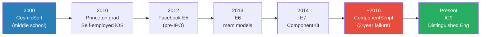
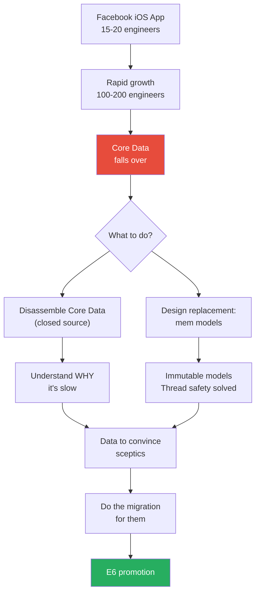
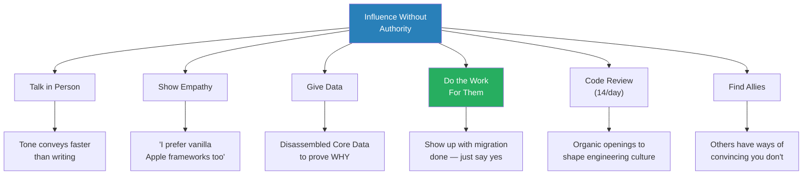
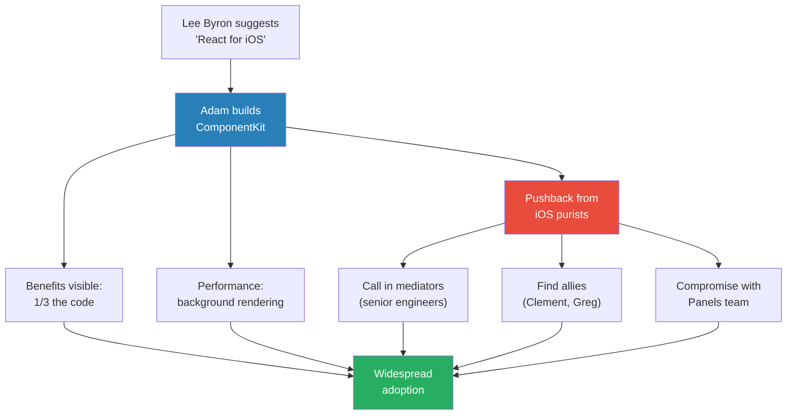
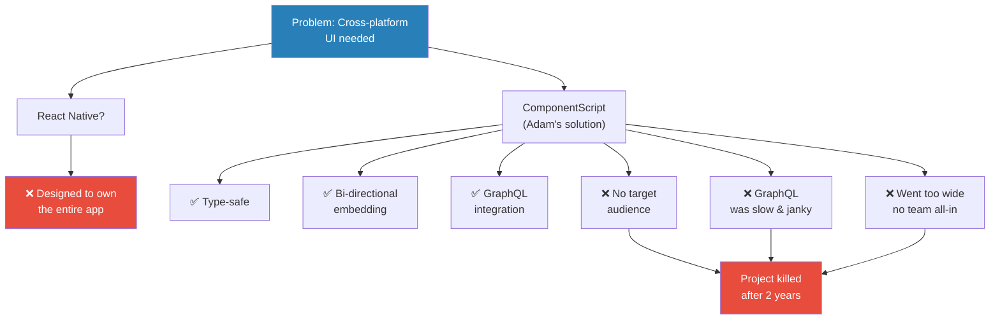
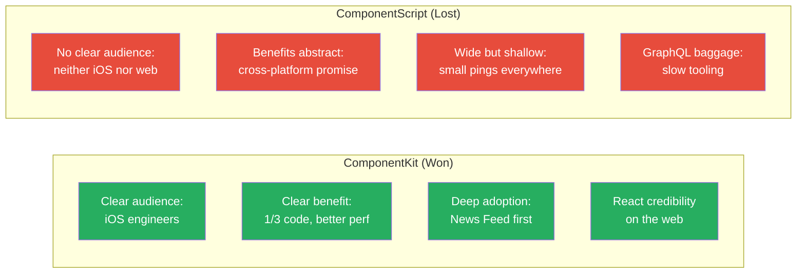
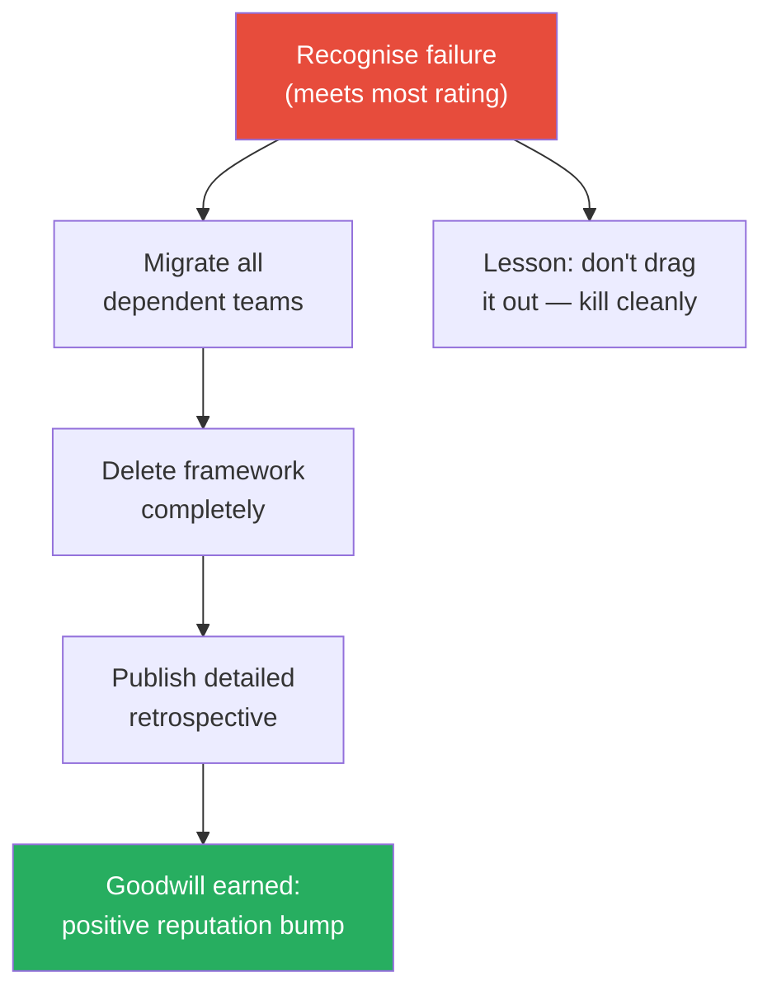
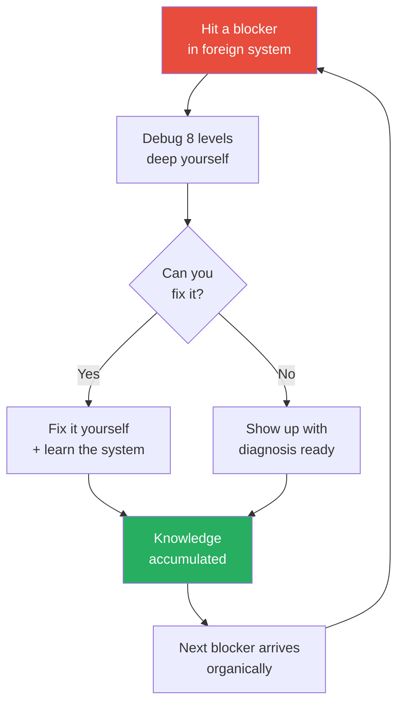
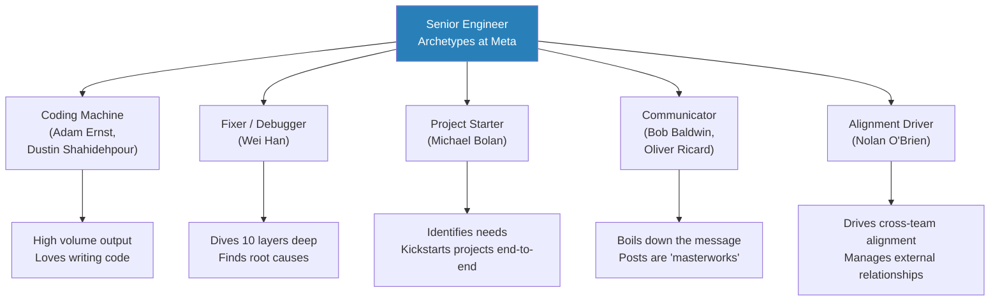

# Meta IC9 on Influencing Engineers, Failures, and Learnings

> Ryan Peterman interviews Adam Ernst, a Distinguished Engineer (IC9) at Meta who has spent over twelve years building iOS infrastructure that runs across the entire company. What makes this episode exceptional is Adam's unusual honesty: he walks through not just his promotions but a major two-year project failure, the sleepless nights that came with it, and exactly why technical excellence alone doesn't win. The conversation reveals that the highest-leverage tool for influencing engineers isn't a brilliant design doc — it's doing the migration work yourself so the only conversation left is "just say yes." Adam's ComponentScript postmortem is one of the most instructive failure stories in the series.

---

## Overview: Key Highlights

- <b style="color: #27ae60">Do the work for them — show up with the migration done, not a pitch deck</b> — Adam's most effective influence strategy: write the code yourself so teams only have to approve, not execute
- <b style="color: #27ae60">Code review is the highest-leverage organic influence tool</b> — 1,600 diffs in 6 months created constant openings to shape how engineers across Meta write code
- <b style="color: #2980b9">The Coding Machine archetype</b> — Adam's self-identified operating style: high volume, deep technical work, write code to solve problems rather than write docs to align people
- <b style="color: #2980b9">Influence Without Authority — the three-part model</b> — empathy first ("I prefer vanilla Apple too"), data second (disassembled Core Data internals), action third (do the work)
- <b style="color: #e74c3c">Technical excellence alone does not win</b> — ComponentScript checked every technical box but failed because it had no clear target audience
- <b style="color: #e74c3c">Refusing to compromise on technical purity is a project killer</b> — insisting on GraphQL data consistency when 60-80% of products didn't need it doomed the framework
- <b style="color: #27ae60">Kill failing projects cleanly for more goodwill than dragging them out</b> — migrating dependents, deleting code completely, and publishing a retrospective earned Adam a positive reputation bump
- <b style="color: #2980b9">Organic depth-building</b> — instead of studying systems from first principles, debug 8 levels deep when blocked; you build encyclopaedic knowledge naturally
- <b style="color: #e74c3c">The coding-machine trap: when your instinct is "write more code" but the answer is "stop and pivot"</b> — Adam had sleepless nights for a year before accepting ComponentScript was dead
- <b style="color: #27ae60">Flip the switch off on level anxiety</b> — at IC9, Adam stopped worrying about whether his work was "IC9-level" and just focused on solving important problems he enjoyed

| Concept | One-line summary |
|---------|-----------------|
| **Do the work for them** | Write the migration code yourself so teams only need to approve |
| **Code review as influence** | High-volume reviews create organic openings to shape engineering culture |
| **Three-part persuasion** | Empathy → data → do the work. In that order. |
| **Allies over solo advocacy** | Find engineers with credibility who can convince people you can't |
| **Target audience for internal tools** | Internal frameworks need product-market fit just like external products |
| **The responsible shutdown** | Migrate dependents → delete code → publish retrospective → earn goodwill |
| **Organic depth-building** | Debug 8 levels deep when blocked rather than studying systems abstractly |
| **Coding machine archetype** | High-output ICs who solve problems by writing code, not aligning people |
| **The level anxiety switch** | Stop worrying about whether work matches your level; check in with your manager and do what you love |

---

# The Conversation

## The Coding Machine Origin Story

*Adam Ernst has been writing software since middle school — not as a hobby but as a business. His earliest instincts reveal the pattern that would define his entire career: see a problem, build the solution yourself, ship it.*

*Adam's career arc shows steady upward trajectory punctuated by one major failure — ComponentScript — which he credits with some of his deepest learnings.*

> [!note]- Expand: Full Conversation
> - Ryan discovers Adam's LinkedIn lists "CosmicSoft" starting in 2000 — when Adam was in middle school
> - Adam's mother was a teacher; he spent afternoons in her classroom tinkering with computers
>
> > [!example] CosmicSoft — The Eighth-Grade Software Company
> > - Adam built online testing software using RealBasic (a cross-platform Visual Basic clone)
> > - Sold it through Eccelerate, an early online store service that generated unlock codes
> > - Teachers across the United States mailed him physical checks for $19.95
> > - He emailed them unlock codes in return
> > - His parents knew about the business but didn't quite know what to make of it
> > **The lesson:** The "coding machine" identity didn't start at Meta — it started at age 12, solving a real problem for real customers.
>
> - Ryan asks what RealBasic was like — Adam explains the Visual Basic drag-and-drop canvas model
>   - "You want a button? Drag, drop. When button clicked? Double-click and write code."
>   - Easy to start, not scalable, but perfect for a middle-schooler building a real product

---

## Infrastructure Crisis as Career Opportunity

*Adam joined Facebook in 2012, weeks before the IPO, as an E5. The company was in the middle of its famous HTML5-to-native rewrite. What followed was a classic infrastructure crisis — Apple's Core Data fell apart at scale — and Adam's response established the playbook he'd use for the next decade.*

> [!tip] Core Insight
> Infrastructure crises are the highest-leverage career moments for ICs. When the existing system is visibly failing and teams are desperate, you don't need to sell your solution — you just need to build one that works.

*The Core Data crisis gave Adam both the problem and the strategy — disassemble the black box, build the replacement, and do the migration yourself.*

> [!note]- Expand: Full Conversation
> - Adam was hired as E5 with industry experience (self-employed iOS developer)
> - At the time, all iOS engineers fit in one conference room and had weekly stand-ups
> - The native engineers were "ascendant" — they'd won the battle against HTML5 and needed to prove native would work
> - The codebase was brand new and full of scaling problems waiting to be discovered
>
> > [!example] The Core Data Crisis (2012-2013)
> > - Apple's Core Data is an ORM database framework — works fine for small teams
> > - At 15-20 engineers it was manageable; at 100-200 it "fell over completely"
> > - Meanwhile every product team (Groups, Events, Pages) was banging on the door wanting native rewrites
> > - The mobile infra team was saying "Core Data is going to fall over tomorrow"
> > - They needed an incremental migration path — couldn't do a Big Bang replacement
> > - The solution was "mem models": an immutable model system that solved thread safety and mutation reasoning
> > **The lesson:** The biggest career opportunities hide inside infrastructure crises that everyone else sees as problems to avoid.
>
> - Adam reviewed 1,600 diffs in 6 months (about 14 per workday) during this period
> - Some teams didn't need convincing — feed performance was obviously better
> - The harder challenge was the last holdouts, especially "Apple engineers" who believed in vanilla Apple frameworks
> - Adam also faced pushback from engineers who philosophically believed in using Apple's built-in solutions

---

## Influence Without Authority

*Ryan asks Adam directly: how do you influence other engineers without authority? Adam's answer is unusually concrete — a four-part model that he's used repeatedly across a decade of infrastructure work at Meta.*

> [!tip] Core Insight
> The most effective influence strategy for infrastructure engineers is not persuasion — it's removing the burden from the person you're trying to convince. Do the work for them, and the conversation changes from "should we do this?" to "is this okay?"

*Adam's influence model has six components, but "do the work for them" is the keystone — it changes the nature of the conversation entirely.*

> [!quote] Adam Ernst
> "If you show up and you're like, 'Hey, I did the work already for you' — much easier conversation."

> [!note]- Expand: Full Conversation
> - **Talk in person:** You spend a lot of time making writing clear, but tone conveys faster in person or on video
> - **Be sympathetic:** Always start by acknowledging their point of view — "Yes, I prefer vanilla Apple frameworks too. We're not going down this path just because I want to invent a new framework."
> - **Give data:** They disassembled Core Data's closed-source binary to understand why it was slow — having that data meant they could explain exactly why Apple's solution wouldn't work
> - **Do the work for them:** Adam identifies as a "coding machine" — his instinct is to write the migration code himself rather than convince teams to do it
>   - "Some engineers would go about this in the sense of 'I built this scaffolding, now my job is to convince other people to do the work of migration.' We call this archetype coding machine."
>   - This worked at Meta for a long time but is getting harder as the codebase grows
>   - One person can't necessarily do entire migrations anymore
> - **Code review as influence:**
>   - Adam considers code review "super undervalued"
>   - It creates organic openings: someone submits a diff, and now you have a concrete context to discuss how to write better code
>   - His review style: explain WHY you care, not just WHAT to change
>   - Be flexible — if the author feels strongly and you might be missing context, let it go
>   - Ask: "Is there some missing context that would change my mind? If so, fill me in and put it in your diff summary."
>   - The influence spreads virally — the diff author adopts your standards and applies them in their own reviews

### What Makes a Good Diff Comment?

> [!note]- Expand: Full Conversation
> - Don't say "change X to Y" — say "X has some problems, so I want you to use Y. But if you feel strongly, go ahead."
> - Always be open to missing context — and acknowledge it's still the diff author's fault if the diff doesn't contain enough context
> - Frame your objection as "I might be wrong" — this protects you from looking foolish when you are, and makes the author more receptive when you're right
> - Ask them to add the missing context to the diff summary so future reviewers benefit too

---

## ComponentKit: Winning the Adoption Battle

*Around 2014, Lee Byron — co-inventor of GraphQL and then one of Meta's most senior engineers — suggested Adam apply React's concepts to native iOS development. The result was ComponentKit, a declarative UI framework that predated Swift, SwiftUI, and React Native. Getting it adopted was a years-long persuasion campaign.*

*ComponentKit's adoption required multiple strategies running in parallel — visible benefits, allies, mediators, and a key compromise with a competing framework.*

> [!note]- Expand: Full Conversation
> - Lee Byron had done a lot of work with React on the web (which was itself new at the time)
> - His nudge to Adam: "Why don't you take some time and think about how React concepts would work in an iOS-first way?"
> - ComponentKit's key features:
>   - Components and immutability (like React)
>   - Conceptual rerender-everything when state changes
>   - View reconciliation — you declare "I want a button with this caption" and the framework manages the actual views
>   - Background-thread rendering with minimal main-thread work
>
> > [!example] The ComponentKit Adoption Battle
> > - Massive pushback from iOS engineers who found the approach alien — "a very different way of writing code on iOS"
> > - Some were convinced by seeing the same code in ComponentKit: one-third the line count
> > - Others were convinced by the performance story: background rendering
> > - Holdouts required intervention — senior engineers like Alan Kennaro mediated between groups
> > - Critical allies: Clement Gendmer and Greg Mech "carried a lot of weight" and could convince people Adam couldn't
> > - Adam's mentor Jonathan Dan was building a competing framework called Panels
> > - The compromise: adopt Panels' data source technology to power ComponentKit
> > - This brought the Panels team into the tent and gave everyone a win
> > **The lesson:** Finding allies who convince differently than you is as important as being right. And compromise — adopting a competitor's best ideas — turns enemies into co-owners.
>
> - Adam was aware of ComponentKit's trade-offs from the start — declarative UI is perfect for scrolling lists of complex content (like News Feed) but less natural for dynamic drag-and-drop interfaces
> - He never claimed ComponentKit was the only way to write iOS UIs — this nuance helped his credibility

---

## ComponentScript: A Total and Complete Failure

*This is the episode's centrepiece — a two-year project that Adam calls "a total and complete failure." ComponentScript was technically excellent, checked every infrastructure box, and still lost to a competitor that skipped data consistency entirely. The story is a masterclass in why internal developer tools need product-market fit.*

> [!tip] Core Insight
> Internal developer tools need product-market fit just like external products. A framework that targets no specific audience — where iOS engineers don't want to learn JavaScript and JavaScript engineers don't want to leave React — has nowhere to go.

> [!quote] Adam Ernst
> "Just because it was technically excellent didn't mean it was going to win."

*ComponentScript failed at three points simultaneously — no audience, infrastructure baggage, and a diffuse adoption strategy. Any one might have been survivable; all three together were fatal.*

> [!note]- Expand: Full Conversation
> - Context: Meta had per-platform silos — iOS used ComponentKit, Android used Litho. Everything was written twice.
> - Adam's manager Ari Grant pushed for cross-platform: "We need to get out of the per-platform silo."
> - React Native didn't work for their architecture — it was designed to own the entire app, not slot small cross-platform pieces into a large native app
>
> > [!example] ComponentScript's Three Fatal Mistakes
> > - **Mistake 1: No target audience**
> >   - iOS engineers: "I don't want to learn JavaScript"
> >   - Web/JS engineers: "I'll use React Native. I don't want this weird not-React API."
> >   - Result: stuck in no-man's-land
> > - **Mistake 2: GraphQL baggage**
> >   - The infra team cared deeply about data consistency via GraphQL
> >   - But GraphQL tooling at the time was slow and painful
> >   - A competitor framework skipped data consistency entirely: "What if we just didn't do it?"
> >   - Adam's team was horrified — but the competitor was right: 60-80% of products simply don't care
> >   - Adam refused to compromise. This was a problem.
> > - **Mistake 3: Going too wide**
> >   - Pitched to all mobile engineers — got small pings of interest everywhere
> >   - But no individual team said "this is how we write products from now on"
> >   - Without a single team going all-in, there was never enough momentum
> > **The lesson:** Technical excellence is necessary but not sufficient. If you can't answer "who specifically would use this and why would they choose it over alternatives?" — you don't have a product.
>
> - The cruel irony: just as Adam pulled the plug, the Groups team announced they were going all-in on ComponentScript — "too little, too late"

*The contrast between ComponentKit and ComponentScript reveals that the same engineer, using the same technical skills, can win or lose depending entirely on audience clarity and adoption strategy.*

---

## The Art of the Clean Shutdown

*How you end a failing project matters as much as how you start a successful one. Adam's shutdown of ComponentScript generated more goodwill than the project itself ever did.*

> [!note]- Expand: Full Conversation
> - The signal that killed it: a "meets most" performance rating from a new manager who could see the project with fresh eyes
> - Adam's shutdown process:
>   - Helped every team using ComponentScript migrate back to native code or React Native
>   - Completely deleted the framework from the repo — left no lingering code for someone else to clean up
>   - Published a detailed public retrospective explaining what went wrong
> - The result: "If anything, I got a positive bump after the fact"
>   - The cleanup showed others the right way to wind down a failing project
>   - The retrospective was cathartic and stopped the constant "how's ComponentScript going?" conversations
>
> > [!example] Sleepless Nights and the Coding-Machine Trap
> > - For the last year of the two-year project, Adam knew something was wrong
> > - He had literal sleepless nights — "it doesn't feel right, it's not going well"
> > - His coding-machine instinct kicked in: "I just need to write more code. I just need to help more features convert and it'll suddenly take off."
> > - This was exactly the wrong response — more code couldn't fix a product-market-fit problem
> > - His advice: "I should have listened to my gut. Just go do something you love and find a different way to have impact."
> > **The lesson:** When your gut says "this isn't working" but your hands keep writing code, stop and listen. The coding-machine instinct is a strength in execution and a trap in strategy.

*The responsible shutdown framework: recognise, migrate, delete, retrospect. Each step builds credibility rather than destroying it.*

---

## The IC9 Mindset

*The final section covers Adam's philosophy on the IC track: why he'll never manage, how he picks domains, and what he's learned about operating at the highest individual contributor levels.*

> [!quote] Adam Ernst
> "I've flipped the switch off. I just don't care."

> [!note]- Expand: Why Not Management?
> - "I like writing code. I really like writing code a lot. And as a manager, you can't write code."
> - He's less good at the non-code parts: driving alignment, writing docs, direction-setting without pointing to specific lines of code
> - His communication is strongest in technical contexts — "hey, we need to solve this technical problem, let's all get on the same page"
> - He's less effective when "more removed from the problem" — managers do a lot of influencing without directly engaging with the code

> [!note]- Expand: Domain Choice and Technical Depth
> - Adam has been on iOS infrastructure for 12+ years and has never voluntarily changed teams
> - "I just kind of roll with the punches. I like what I'm doing, I like the team, so why mess it up?"
> - This long tenure built deep knowledge across multiple systems — GraphQL codegen, Buck build system, value object generation
>   - When blocked by another system, his instinct is "screw it, I'm going to figure out what the problem is" — diving 8 levels deep into foreign codebases
>   - Either fixes it himself (impressing the owning team) or shows up with the problem already diagnosed
>   - Over time, this creates encyclopaedic cross-system knowledge
>   - "It's like a superpower to be able to dive into all these systems that you now know"
> - Ryan asks: technical depth or breadth for reaching the highest IC levels?
>   - Adam's answer: "I have breadth AND depth" — but the breadth came organically from debugging, not from planned study
>   - "They'll come to me. I'm going to have a problem that I run into. GraphQL is going to block my code from landing. Great. Now I have a reason to delve into GraphQL codegen."

*Adam's depth-building is a self-reinforcing loop: each blocker becomes a learning opportunity, and the accumulated knowledge makes future debugging faster.*

> [!note]- Expand: Level Anxiety and the IC9 Switch
> - Ryan asks how Adam makes sure his work is "IC9-level code"
> - Adam's answer: "I've flipped the switch off. I just don't care."
> - He used to worry but realised it was counterproductive
> - His system: check in with his manager regularly to ensure he's working on important problems, then just do the work
> - ComponentScript was the exception where the feedback loop worked — a "meets most" told him the work wasn't landing, and he course-corrected
> - "If that happens again, I'll know I went too deep and too hard and didn't listen"

---

## Engineers He Admires

*Adam lists senior engineers at Meta who operate in fundamentally different ways — each excelling through a different archetype. The list reveals that there is no single path to technical seniority.*

*Five distinct archetypes — each a valid path to senior IC. No single archetype is dominant; the common thread is going deep in whatever mode fits you.*

> [!note]- Expand: Full List
> - **Dustin Shahidehpour** — writes a lot of code, similar working style to Adam. They get along because they operate the same way.
> - **Wei Han** — joined Meta on the same day as Adam in 2012. A "fixer" who can dive into broken metrics and figure out what's going on. Multiple archetypes, doesn't fit one box.
> - **Michael Bolan** (no longer at Meta) — a great "project starter." Could identify a need (e.g., a fuzzy file searcher for massive repos), build it end-to-end including backend, deployment, documentation, naming. Started Buck (Meta's build system).
> - **Bob Baldwin** — senior product engineer, excellent communicator who can boil down complex messages. Adam considers this a critical and underrated skill.
> - **Oliver Ricard** — outstanding writer. When someone needs to improve their communication, Adam sends them to Oliver's posts as "the bar."
> - **Nolan O'Brien** — Adam's "polar opposite." Doesn't write as much code but excels at driving alignment between teams and managing the Meta-Apple relationship. Adam explicitly says "I'm aware of the skills I'm missing" and admires Nolan for having them.

---

## Career Advice: Do What You Love (And Mean It)

> [!note]- Expand: Full Conversation
> - Ryan asks: if you could go back to Princeton graduation and give yourself advice, what would you say?
> - Adam: "Nothing. It worked out pretty well for me. I'm not screwing with it."
> - He actually applied to Facebook in 2010 — they sent a mysterious puzzle, and he threw it in the trash
> - "What if I joined Facebook in 2010? It probably would have been a lot worse — I would have been around for all the HTML5 stuff."
> - General advice: do what you love. "It's really hard to fake enthusiasm for something you don't enjoy."
> - Ryan notes this sounds cliche but there's real substance: Adam's productivity, curiosity, and willingness to debug 10 layers deep all come from genuinely loving the work
> - Adam: "It's good if you like solving problems. It's not like every moment I'm loving what I'm doing. But I like the challenge of solving problems."

---

## Connections

**Other Peterman Pod episodes:** [[How Corporate Politics Work - Best]] (influence and power in large organisations), [[25 Year Old Staff Eng at Meta - Evan King]] (Meta IC career path, influence without authority, "coding machine" vs other archetypes)

**Related books in vault:** [[How to Win Friends and Influence People - Dale Carnegie]] (empathy-first persuasion), [[Never Split the Difference - Chris Voss]] (tactical empathy, data-driven persuasion), [[The 48 Laws of Power - Robert Greene]] (strategic compromise, never outshining), [[Staff Engineer - Will Larson]] (IC archetypes, influence without authority), [[An Elegant Puzzle - Will Larson]] (engineering management, migrations at scale)

---

## The Takeaway

Adam Ernst's career is a study in what happens when a single operating mode — write code, solve problems, repeat — meets both success and failure. The successes (mem models, ComponentKit) came when the technical work aligned with a clear audience and a willingness to compromise. The failure (ComponentScript) came when technical excellence ran ahead of product-market fit, and the coding-machine instinct kept producing more code when the answer was to stop and rethink.

The most transferable insight is his influence model. At its core, it's disarmingly simple: empathise with the person you're trying to convince, show them data they can't argue with, and then do the work for them so the conversation becomes "is this okay?" rather than "should we do this?" This is not a persuasion technique — it's a leverage technique. It works because it removes the burden from the other person entirely.

What makes this episode unusually valuable is Adam's honesty about failure. Most IC9-level engineers talk about their wins. Adam spends significant time on a two-year project he calls "a total and complete failure," the sleepless nights that preceded its death, and the coding-machine trap that kept him building when he should have been listening. His advice — kill failing projects cleanly, publish the retrospective, leave no mess — is the kind of wisdom that only comes from having lived through the alternative.
