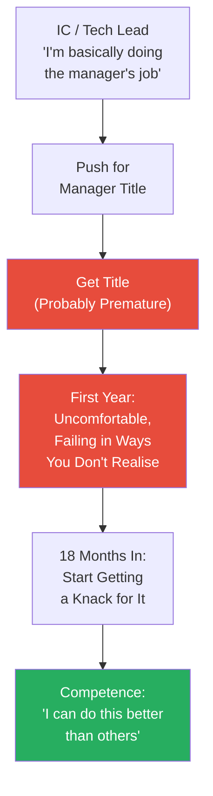
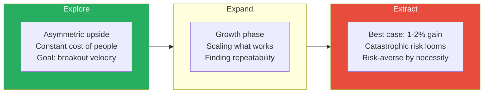
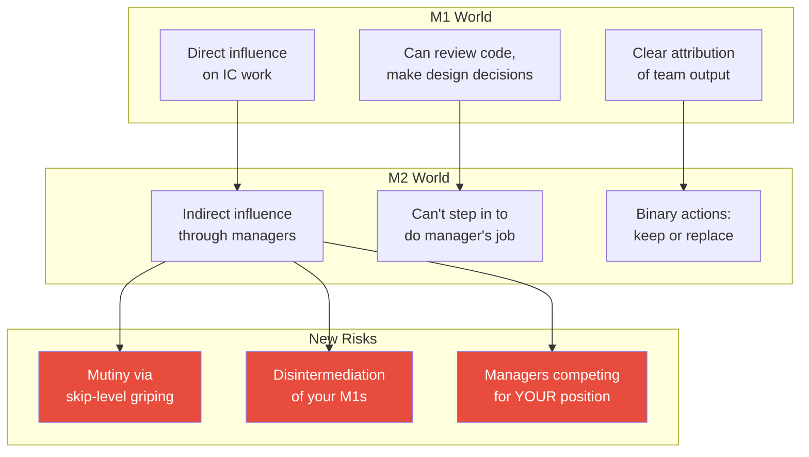
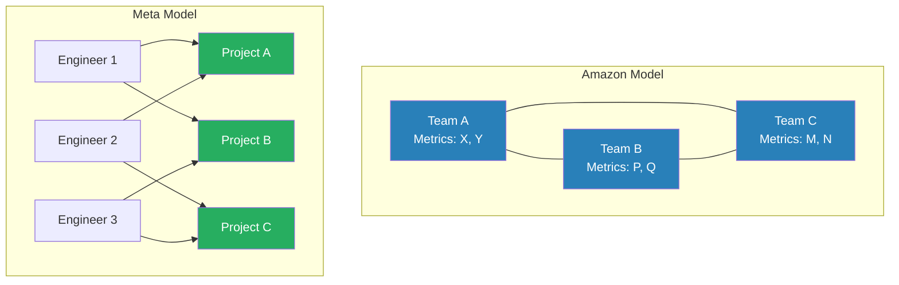
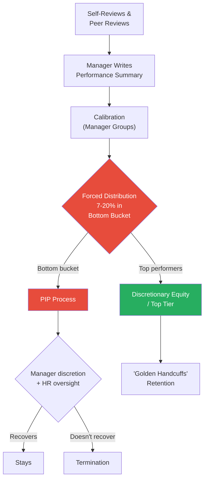
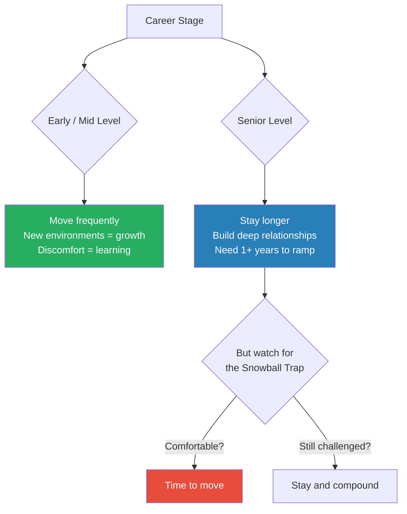

> Stefan Mai spent years climbing from scattered early-career engineering through Amazon's grinding advertising org to senior manager (M2) at Meta's integrity team — all while navigating seven different managers in three and a half years. In this conversation with Ryan Peterman, he pulls back the curtain on what management in big tech actually looks like: the premature promotions, the political chess, the $15,000-per-engineer performance review ceremony, and why the single most important thing a leader can do is make sure their team feels like it's winning. His parting advice — that career agency, writing down a plan and executing it, is the most underrated force in professional growth — lands with the weight of someone who has watched hundreds of careers unfold from both sides of the table.

---

## Overview: Key Highlights

- <b style="color: #27ae60">Winning is the root variable</b> — when a team feels like it's winning, collaboration, morale, and retention follow naturally; when winning stops, zero-sum politics emerge and fester
- <b style="color: #2980b9">Kent Beck's Explore-Expand-Extract (3X)</b> — early-stage companies need unconstrained executors; late-stage companies need risk-averse operators; Amazon culture is firmly in the Extract phase
- <b style="color: #e74c3c">Leading managers is not "more of the same"</b> — small behavioural mistakes at the M2 level have magnification effects that can disintermediate your reports and destroy trust overnight
- <b style="color: #2980b9">Amazon's API-style scaling</b> vs <b style="color: #2980b9">Meta's people-fluid model</b> — two fundamentally different approaches to growing an engineering organisation, each with distinct leadership requirements
- <b style="color: #27ae60">Active listening is the most underrated engineer-to-manager skill</b> — engineers default to transactional API-like conversations, but the real value is in getting people to open up about what's dragging on them
- <b style="color: #e74c3c">Performance review integrity is "the whole ballgame"</b> — companies spend enormous resources on review ceremonies because if employees don't believe the process is fair, they stop performing
- <b style="color: #27ae60">Storytelling defines what winning means</b> — the ability to look back at your team's journey and paint it as a compelling narrative is what separates average managers from great ones
- <b style="color: #e74c3c">Low performer quotas create the most heartbreaking management moments</b> — telling a team they kicked ass all half, then reversing course because someone must go in the bottom bucket
- <b style="color: #2980b9">The Snowball Trap</b> — credibility compounds over time, but can become a shackle when you become known only for one system
- <b style="color: #27ae60">Career agency is the highest-leverage trait</b> — writing a plan and executing it pays incredible dividends that remain underemphasised even by the people who benefit from it

| Concept | One-line summary |
|---------|-----------------|
| **Active listening** | Reflect back, show curiosity, use subverbals — unlock the information engineers won't volunteer |
| **Storytelling as leadership** | Critique your own narratives, paint team wins, and define what winning means |
| **Explore-Expand-Extract** | Kent Beck's framework mapping company stage to appropriate leadership style |
| **API-style vs people-fluid scaling** | Amazon's modular team boundaries versus Meta's engineer mobility and shared infrastructure |
| **Winning cascade** | Team success → collaboration → morale → retention; stagnation → politics → dysfunction |
| **Skip-level disintermediation** | How M2s accidentally undermine their M1s through well-intentioned but clumsy skip-level interactions |
| **Performance review integrity** | The ceremony matters because employees must believe the process rewards performance |
| **Low performer quotas** | 7-20% forced distribution that creates manager-report trust crises |
| **The Snowball Trap** | Long tenure builds credibility but can lock you into a single identity |
| **Career agency** | The practice of making a plan, writing it down, and executing it relentlessly |

---

## Stefan Mai's Career Journey

*From scattered consulting to Amazon's early advertising team to Meta's integrity org to founding a startup — Stefan's career arc illustrates every tension in big tech management.*

*Stefan's trajectory shows the two major growth inflection points — the IC-to-manager transition at Amazon and the M1-to-M2 promotion at Meta — each requiring fundamentally different skills.*

---

## Amazon Origins and the Grind

*Stefan joined Amazon's early advertising team in 2012, before the infamous culture exposés, and immediately experienced the company at its rawest.*

> [!tip] Core Insight
> The death march is emblematic of Amazon culture — a manager with a vision committing the team to months of nights and weekends without consent. It's formative, but it shapes leaders in ways that aren't always healthy.

> [!note]- Full Exchange: Amazon Origins
>
> - Stefan was an engineer who wasn't focused on school — always wanted to be building
> - Early career was scattered across consulting and startups without real technical depth
> - Amazon in 2012 was known for grinding engineers down, even before the NYT article about people crying under their desks
> - Joined the early advertising group — now one of Amazon's most profitable units, making up for retail's lack of profitability
> - His team built self-service advertising, allowing individual vendors to create ads and presence on the site
>
> > [!example] The Amazon Death March (2012)
> > - Within Stefan's first week, his manager gathered the team at 6pm in a conference room
> > - Announced his vision and declared they would work nights and weekends until October
> > - This committed the team to a 6-8 month death march without consultation
> > - Stefan had just left another job and told everyone he was going to big tech — felt trapped
> > - Looking back, he says if someone told him that today, his response would be "I don't think so"
> > - The experience was formative but emblematic of Amazon culture at its most negative
> > **The lesson:** Early career commitments can shape your entire leadership philosophy — for better or worse.
>
> - Amazon's recruiting at the time was org-specific — no general pipeline, you engaged with a specific team
> - Stefan chose the team with the most growth and opportunity — a good career bet given Amazon Ads became enormous
> - Average workload was 50-60 hours per week — not always nights and weekends, but consistently hard
> - The grind was typical of any big tech job, especially for ambitious people wanting to get things done

---

## The IC-to-Manager Transition

*Stefan's path from de facto tech lead to titled manager at Amazon reveals the universal trap: feeling ready before you actually are, and the 18-month learning curve that follows.*

> [!tip] Core Insight
> The power dynamic introduced when you become someone's manager is corrosive to the bonds you had as peers. The same information you once got freely dries up — and the information you actually need is much deeper than what friendship provided.

*The 18-month timeline from title to competence is consistent — almost everyone goes through it, and the support structure around you dictates how much damage you do in that window.*

> [!note]- Full Exchange: Early Manager Mistakes
>
> - Stefan felt like the de facto lead — his boss didn't have time for the "niceties" that normal managers provide
> - Title lagged behind his responsibilities, as it does for most manager transitions
> - Admits he got the title prematurely: "They should not have given in"
> - The first year was deeply uncomfortable — failing in ways he probably didn't fully realise
>
> **Key mistakes:**
> - Didn't spend enough time understanding individual goals and objectives of team members
> - Knew it was important but didn't know HOW to do it
> - Couldn't break through to people or get them to open up about what mattered most
> - Result: couldn't tailor support or work assignments to individuals — "an elementary mistake"
>
> **The power dynamic problem:**
> - Transitioning within a team that saw you as an IC peer creates a fundamentally different relationship
> - People think existing friendships will carry over — they won't
> - It's not enough to know your friend is having a good or bad time
> - You need deeper questions: career objectives, what's dragging on them, what they really want
>
> **Active listening as the solution:**
> - Familiar to non-engineers but takes time for engineers to learn
> - Show interest when someone is talking (subverbals: "oos and ahs" and "I heard you")
> - Reflect back what they've said so they feel heard and you verify understanding
> - Ask questions that show genuine curiosity and interest
> - <b style="color: #e74c3c">Engineers default to API-like transactional relationships</b> — most people aren't like that
> - The jewel you need — the thing that makes you effective for that person — won't be volunteered; you have to earn it

---

## Storytelling as a Bedrock Leadership Skill

*Stefan argues that storytelling is pervasive in everything we do — from motivating yourself to get out of bed to defining what winning means for your team — and that learning to critique stories is the first step to telling better ones.*

> [!quote] Stefan Mai
> "If your team is winning, a lot of other things are downstream of that."

> [!note]- Full Exchange: The Art of the Team Narrative
>
> - Storytelling is happening constantly — when you recall details, when you motivate yourself in the morning
> - Most people don't put attention to it — the first trick is recognising those moments and critiquing them
> - Compare two morning stories: "I go to work because it gives me money" vs "This is the most exciting work I could think of, and while it's hard now, here's the trajectory we're headed to"
> - One gets you out of bed. The other doesn't.
>
> **Stefan's team narrative practice:**
> - Every few months, look back at everything the team accomplished
> - Paint it in the clearest picture so people feel proud of their work
> - "We started with a team of two, our on-call was garbage, we invested in it and turned it around, and with the extra bandwidth we crushed it"
> - This provides the foundation for describing the future: where we came from → where we are → where we're going
>
> **Why winning is the root variable:**
> - As a manager, you get to define what winning actually is
> - A team that's winning: collaboration, no zero-sum mentality, excitement about work — all come naturally
> - A team that's NOT winning: bickering, political manoeuvring, redefining success ("our test coverage is awesome") — all fester and become insurmountable
> - The average manager doesn't have a good handle on this — their teams feel wishy-washy as a result

---

## Why Leave Amazon for Meta

*After years at Amazon, Stefan identified three forces pushing him out — identity overfitting, compensation stagnation, and the pull of more meaningful work.*

> [!note]- Full Exchange: Amazon's Push and Meta's Pull
>
> **Amazon's positives (acknowledged):**
> - Undoubtedly very successful company
> - Engineering discipline is very strong
> - Tremendous amount to learn
>
> **Three reasons to leave:**
>
> 1. **Identity overfitting** — Part of being successful at Amazon is assimilating into their "peculiar ways." After enough time, you're a good Amazonian but you're unsure whether you're a good engineering leader. Stefan wasn't sure he was growing anymore.
>
> 2. **Compensation stagnation** — Got a promotion or high rating with zero comp change. Explanation: "Stock appreciated, so you already got paid." But that applied to everyone on the team. Amazon's frugality principle frustrated him deeply.
>
> 3. **Mission pull** — Meta's integrity team (child safety, preventing terrorism) offered qualitatively different impact than moving Amazon's profitability. After the first two factors motivated him to look, this was enough to tilt the decision.

---

## Amazon's Leadership Style: Kent Beck's 3X Framework

*Stefan uses Kent Beck's Explore-Expand-Extract framework to explain why Amazon's micromanagement culture is rational for a late-stage company — and why it stifles innovation.*

*Amazon's culture leans toward Extract — every layer of management gets involved at a detailed level, which is effective for optimising 1% gains but stifles the ability to pursue new opportunities.*

> [!note]- Full Exchange: Micromanagement and the 3X Framework
>
> **Amazon's leadership mechanism:**
> - Built around the company's history as very low-margin and operationally lean
> - Each layer of management gets involved at a very detailed level beneath them
> - As a line manager, it was almost expected that Stefan knew what every person was doing at any moment
> - Benefit: things don't just happen — people are aware, closely tracking metrics
> - Downside: stifling to creativity and innovative new approaches
>
> **Kent Beck's framework (as Stefan describes it):**
> - **Explore:** Seed-stage energy. Asymmetric upside. You take a constant cost (people) and try to achieve breakout velocity. Moving quickly and not constraining yourself is critical.
> - **Extract:** Best case is 1-2% improvement, but catastrophic risk looms. Companies don't let employees represent them freely on social media — even a great post idea isn't worth the risk of trashing the company's reputation.
> - Amazon's culture naturally evolved toward Extract over 30 years
> - This explains why Amazon struggles to innovate with new products but excels at optimisation

---

## The ML Transition

*Stefan's pivot into machine learning — driven by genuine fascination with data-implied programs — offers a practical playbook for technical transitions: Kaggle, side projects, then finding ML applications within your current role.*

> [!note]- Full Exchange: Building ML Intuition
>
> - ML is fundamentally different from traditional software: shades of grey instead of binaries
> - Common to have bugs in training pipelines for years, fix them, and get only marginally better performance
> - Work is scientific and experiment-driven — unfamiliar to most SWE backgrounds
>
> **Stefan's transition playbook:**
> - Read books on ML fundamentals
> - Participated in Kaggle competitions (this was the key)
> - Built models on the side
> - Found ways to work ML into his present role to build real experience
>
> **Critical distinction:**
> - <b style="color: #e74c3c">Most people treat technical transitions as study sessions</b> — learn the 101 and stop
> - The 101 matters, but effectiveness depends on judgment and instinct
> - Judgment and instinct can only be honed through building something and practising
> - The nonobvious lessons don't emerge until you've done the work

---

## Promotion to Senior Manager (M2) at Meta

*Stefan's M2 promotion took three and a half years, involved seven different managers, and required a counterintuitive first move — acting like an engineer to build trust before shifting to recruiting and leading leaders.*

> [!note]- Full Exchange: The M2 Promotion Story
>
> **The turbulent path:**
> - Seven different managers over his tenure — one every six months
> - Very tumultuous for various reasons — this held him back
> - Part of the story is how to maintain momentum during organisational shifts
>
> **Phase 1: Build trust by acting like an IC**
> - Joined the on-call, wrote code, acted like an engineer
> - Built trust with engineers on his team and peer teams
> - Made him more comfortable with the work than peers who tried to stay hands-off
> - Not sustainable long-term — but the early credibility base was critical
>
> **Phase 2: Shift to recruiting**
> - Had a blank check on recruiting from his director
> - This was the expected shift — credibility was established, now scale the team
>
> **Phase 3: Leading another leader**
> - Eventually given an additional manager who reported to him — "she kicked ass"
> - The process of leading another leader required substantial new learning
> - Didn't get the M2 title until his org was 30-40 people
> - By that point, he was sitting in calibrations alongside other M2s — hard to deny he was doing the job
>
> > [!example] The Perception Lock
> > - How people perceive you, especially as a manager, is either a huge headwind or a major tailwind
> > - People have difficulty shifting what they think a person is going to be like in the future
> > - If people feel they "know who you are and where you fit," opportunities may not come to you
> > - This can be devastating for career growth — the early impression becomes a ceiling
> > **The lesson:** First impressions as a manager set a trajectory that's very hard to alter. Invest in getting them right.

---

## The M1-to-M2 Skill Gap: Managing Managers

*The jump from managing ICs to managing managers is not just "more of the same" — it introduces competition dynamics, reduced control, and behavioural magnification effects that can sink a new M2 in weeks.*

> [!tip] Core Insight
> The assumption that leading other managers is the same pattern as leading engineers will get you fired — or mutinied. Small actions at the M2 level have magnification effects. A clumsy skip-level question can disintermediate your M1, demotivate their report, and create problems where none existed.

*Every new lever at the M2 level comes with a magnification risk. The M1's toolkit was limited but safe; the M2's toolkit is powerful but can backfire catastrophically.*

> [!note]- Full Exchange: Mutiny, Skip-Levels, and Magnification
>
> **Why M2 is qualitatively different:**
> - Line managers assume: "I know how to lead people and have indirect impact. Layering a manager beneath me is the same pattern."
> - Stefan's response: "Yes and no. It's nowhere near the same degree of difficulty shift, but if you assume it's the same, you will fail very quickly."
>
> **The mutiny dynamic:**
> - In manager stacks, people are competing with each other — mostly unstated
> - If the org isn't growing, the path forward for leaf-node managers is to take the position of the person above them
> - Sometimes that person leaves and someone fills the spot; sometimes they get displaced because people beneath them are more competent
> - Mutiny surfaces as skip-level griping: "Jim isn't helping me, Jim doesn't understand my career, Jim changes priorities too much"
>
> > [!example] The Skip-Level Disintermediation Trap
> > - A new M2 sets up skip-level meetings with indirect reports
> > - Asks leading questions: "What do you think of Jim? Does he touch on career stuff?"
> > - A week later, Jim walks in angry: "You asked Jan leading questions about whether I was doing my job. Now she doesn't feel I'm supportive enough."
> > - Jan comes to the M2: "I think you can help me with my career — you seem to have insights Jim doesn't."
> > - Result: disintermediated Jim, demotivated Jan, created a host of new problems
> > **The lesson:** Small well-intentioned actions at the M2 level have magnification effects. You don't learn this until you've either experienced it or built a mental model for how actions propagate.
>
> **Reduced control at higher levels:**
> - If one of your managers is underperforming, you can't step in and do their job — they'll hate you and leave
> - If you give too many insights, they feel you're doing their job or that they're failing
> - As you walk up the org chart, the ability to make direct impact on reports diminishes
> - Actions become more binary: keep them or replace them
> - The promotion panel evaluates: does this person's boss have enough acumen to bail them out if things go wrong?

---

## Organisational Politics and Zero-Sum Behaviour

*Stefan's director taught him the most important lesson about large organisations: people have diverse personal objectives, and assuming they'll behave rationally toward business goals is naive.*

> [!quote] Stefan's Director
> "You could not be more naive."

> [!note]- Full Exchange: The Hidden Chess of Organisations
>
> > [!example] The Director's Redundant Teams Lesson
> > - Stefan suggested letting two teams with overlapping responsibilities compete — like a scientific experiment
> > - His director told him: "You could not be more naive. Let me tell you what's going to happen."
> > - The two teams would find ways to undercut each other and fight internally
> > - The noise and friction would dwarf any gain from the competition
> > - Both teams could end up worse than if one team had done it alone
> > **The lesson:** Internal competition between teams doesn't produce market-style innovation — it produces destructive politics.
>
> **People's real objectives:**
> - Most people's objective isn't to make their company more valuable
> - Some want more money, some want certain positions or influence, some want interesting problems, some want to work with specific people
> - These objectives are vast and rarely single-faceted
> - It would be foolish to assume people wouldn't act on them
>
> > [!example] Cookie-Licking and Coalition-Building
> > - Engineers who want a desirable project employ creative strategies:
> > - **Cookie-licking:** Rush to be first, write a post claiming ownership, making it hard to be pulled away
> > - **Coalition-building:** Pair up with others to create momentum
> > - **Competence signalling:** Demonstrate you're the best by showing why competitors are incompetent
> > - These behaviours are catalogued over time if you observe long enough
> > **The lesson:** Understanding the political dimension — then staying cognisant of it while taking actions — is the core skill of senior leadership.
>
> **When zero-sum behaviour intensifies:**
> - Zero-sum mentality emerges when winning slows — org stops growing, successes are less obvious
> - People redefine success in self-serving ways: "Our test coverage is awesome" (but is that what matters?)
> - This points back to the imperative of winning — performance focus solves most downstream problems

---

## Leadership Types by Company Stage

*Stefan draws a sharp contrast between the inspirational executors needed at early-stage companies and the organisational navigators needed at scale — and shows how Amazon and Meta evolved differently.*

*Amazon assembles modular teams like APIs — each with strict metric ownership. Meta lets engineers flow between projects, requiring leaders who understand people rather than processes.*

> [!note]- Full Exchange: Scaling Models and Leadership Requirements
>
> **Early-stage companies need inspirational executors:**
> - All hands on deck to deliver
> - People want to work for someone impressive who could do their job
> - SVPs and directors were in the trenches designing initial features
>
> **Late-stage companies need organisational navigators:**
> - Same individuals often lack the organisational aptitude needed at scale
> - Focus is a precious commodity in big companies — hard to achieve
> - Go-getters who chase opportunities without aligning up and down the org chart siphon energy from core initiatives
>
> **Amazon's scaling approach (fitness functions):**
> - Each team responsible for 2-3 metrics, labouring under them completely
> - Leadership assembles pieces like a system of APIs
> - Benefit: dependable pieces, tall stacks
> - Downside: value gets lost in organisational seams between teams; teams can't adapt to new changes; not responsive
>
> **Meta's scaling approach (people fluidity):**
> - Org is very malleable — engineers move between projects
> - Code was communally owned (at least historically)
> - Leaders needed to work soft alignment without strict boundaries
> - Engineers on Stefan's team collaborated with researchers in Paris and infrastructure teams in London — without manager involvement
>
> **OpenAI as a current example:**
> - Interviews focus on deep technical achievements over organisational skills
> - Guidance for candidates: go deep on impressive hacks, not "I built alignment between six parties"
> - Still has massive internal politics — not immune to organisational forces
> - Paints itself in the Explore phase, needing technical breakthroughs over process
>
> **The caveat:**
> - You can't staff a company only with organisationally savvy people — eventually it becomes negative-sum
> - "A bunch of sharks fighting each other and not getting anything done"
> - Balance is always required

---

## Amazon vs Meta: Culture Comparison

*Having managed at both companies, Stefan offers a nuanced comparison — Amazon's discipline and process versus Meta's openness and collaboration — acknowledging that each serves different types of leaders and engineers.*

> [!note]- Full Exchange: Discipline vs Collaboration
>
> **Amazon's strengths:**
> - Disciplined — very structured engineering design reviews
> - More predictable — teams meet SLAs, you can page them if they don't deliver
> - Process-oriented: when something fails, introduce a mechanism to prevent it
>
> **Meta's strengths:**
> - Engineers were on average a bit stronger, but less disciplined
> - Incredibly open and collaborative — people found each other and worked together without manager involvement
> - Acute focus on empowering people to make decisions
> - When something fails: "We learned our lesson" — trust over process
> - Shared data infrastructure — no need to build your own data lake for ML
>
> **Amazon's weakness (from Meta perspective):**
> - Process created friction: getting access to data was incredibly hard even without privacy constraints
> - Design reviews and handoffs were structured but slow
>
> **Meta's weakness (from Amazon perspective):**
> - Unstructured environment paralyses people who transition from Amazon
> - Design reviews can be fuzzy and handwavy
> - If someone's code isn't up to standard, you fix it yourself — the original author has moved on to photos
> - Many of Facebook's privacy issues stem from inability to implement Amazon-style process
>
> **Stefan's assessment:**
> - Tends to prefer Meta's approach, especially for leadership
> - But some individuals are clearly better fits for Amazon — accepts all trade-offs
> - Within 5-10 minutes of talking to someone, he can often tell which company would suit them better

---

## Performance Systems, Quotas, and PIPs

*Stefan pulls back the curtain on how performance management actually works in big tech — from the $15,000-per-engineer review ceremony to the gut-wrenching moment when a manager must reverse course on a high-performing team member.*

> [!tip] Core Insight
> The integrity of the performance review process is the whole ballgame. It looks wasteful — $15,000 per engineer in manager time — but if employees don't believe the process rewards performance, they will stop performing. The ceremony IS the point.

*The performance system is a funnel — from inflated self-reviews through calibration's forced distribution to the binary outcomes of retention investment or managed exit.*

> [!note]- Full Exchange: The Real Performance Machine
>
> **The two layers:**
> 1. **Public layer:** Ratings are established and handed out — managers discuss this openly
> 2. **Private layer:** Restricted to higher levels — deciding where to make retention investment (Amazon's "top tier," Meta's discretionary equity)
>
> **The $15K calculation:**
> - Stefan tracked all time spent on PSC (performance summary cycle) activities
> - Calculated the cost per engineer — approximately $15,000
> - First reaction: this is wasteful, we should be building products
> - Second reaction: this IS the product — process integrity is the whole ballgame
>
> **Meta vs Amazon on top performers:**
> - Meta was willing to really double down on top performers — engineers clearing twice their peers' compensation through additional equity investment
> - Amazon was more even — frugality and fairness pulled compensation back
> - Amazon's frugality leadership principle: "Nobody likes that one"
>
> **Discretionary equity decisions:**
> - Driven by VPs and directors — how much they involve managers varies
> - Two dimensions that matter: trajectory (who's the rocket ship?) and replaceability (if they leave tomorrow, does the org break?)
> - Getting into load-bearing positions is lucrative — companies will tighten golden handcuffs
>
> **Low performer quotas:**
> - Every company at scale has them — 7-20% target for the bottom bucket
> - Review inflation is universal: every half seems world-shaking when people write their reviews
> - Managers don't like letting people go — you have to beat them into doing it
> - It's mostly "group survival" — if you don't address underperformers, the team suffers and strong performers check out
>
> > [!example] The Manager's Egg-on-Face Moment
> > - Team kicks ass all half — manager tells them they're great
> > - At calibration, director mandates someone must be in the bottom bucket
> > - Manager has to reverse course: "Actually, you didn't kick ass that hard"
> > - This is the worst scenario — heartbreaking for everyone, especially the employee
> > - Better managers anticipate this and message appropriately throughout the half
> > - Immature or new managers end up in these situations repeatedly
> > **The lesson:** The political skill of performance management is not in the rating — it's in the messaging throughout the half that prevents surprises.
>
> **PIPs across companies:**
> - PIPs are first and foremost a legal paper trail
> - But to maintain legal credibility, some people must successfully exit PIPs — it can't be a rubber stamp
> - Most managers genuinely root for the person on the PIP to recover
> - **Amazon:** HR just wanted to make sure you were checking boxes — "a pretty savage culture." Manager held a lot of discretion on whether to pull the trigger.
> - **Meta:** HR wanted to exhaust every avenue before letting someone go — protecting employer reputation. Sometimes over-accommodating even when the employee had clearly checked out.
> - Modern Meta may be different, but historically they were far more protective than Amazon

---

## Interviewing in the AI Age

*Stefan brings his perspective from Hello Interview — the company he co-founded — on how AI cheating is reshaping technical interviews and why LeetCode isn't going away as fast as people think.*

> [!note]- Full Exchange: Cheating, Design Interviews, and What's Changing
>
> - Remote interviews have always been somewhat cheatable — current AI tools make it much worse
> - Recruiting teams are modestly aware but overly dependent on basic mechanisms (tab focus, copy-paste detection)
> - These catch only the least sophisticated cheaters — and surprisingly, they do catch some
>
> **What's changing:**
> - Companies experimenting with AI-proof assignments and questions AI routinely gets wrong
> - Design interviews (both system design and lower-level design) are growing — reasoning about abstractions is more valuable in an AI-coded world
> - LeetCode remains useful — people have called for its demise forever, but it serves companies' needs
>
> **The cheating paradox:**
> - Companies are ruthless with performance right now
> - People who cheat to get the role often end up on the rough side of performance reviews shortly after
> - Cheating doesn't serve anyone's purpose in the long run
>
> **Optimal prep for OpenAI / Anthropic:**
> - These companies look for depth in technical achievements
> - Behavioural and retrospective interviews are critical — they want to see you've walked the walk
> - Talk to a friend or coach to understand how you come across — hard to assess introspectively
> - Lean toward technical accomplishments, not organisational massaging
> - The common staff engineer story — "I wrote seven docs, aligned six teams, then wrote five lines of code" — these companies don't value that the same way

---

## Career Reflections: Job Hopping, Writing, and Agency

*Stefan's closing reflections crystallise around three themes: the mathematics of when to stay versus leave, writing as the hidden accelerator of every career, and the transformative power of simply making a plan.*

> [!quote] Stefan Mai
> "Most people don't have that level of agency to figure out where they want to go and then go and take it. But the world is very malleable to those kinds of plans."

*The job hopping calculus inverts as you get more senior — early career mobility drives growth, but senior leaders need roots to have real impact. The trap is staying too long and becoming the "system person."*

> [!note]- Full Exchange: Job Hopping, Writing, and the Power of Plans
>
> **Job hopping:**
> - Early career: moving around has lots of advantages — growth comes from discomfort and new environments
> - But Stefan personally didn't subscribe: his motivation was going deep on something, and the most rewarding parts came after 2 years of depth
> - At senior levels: moving every 18 months is a red flag — hiring managers know it takes a year just to ramp up
> - For staff-level hires, that's a tough pill to swallow
> - **The Snowball Trap:** credibility compounds like a snowball, but can become a shackle — you become "the person who built that system" and can't escape it
> - Good question to ask: am I comfortable? If you're not being challenged, even if you're senior, it may be time to move
>
> **Writing:**
> - A lot of Stefan's effectiveness as both IC and manager traces back to writing skills learned at Amazon
> - Amazon's writing culture: sometimes wasteful (people nitpicking stupid things), but it encourages good thinking
> - The PR FAQ exercise: fast-forward to the end state and sell it excitingly — if you can't, the project wasn't worthwhile
> - Common failure: "We will have a single pane of glass" — nobody's excited about that
> - They're excited about "50% reduction in time spent" or concrete outcomes
> - **Top tip for improving writing:** Learn to be a critic first — read docs, figure out what hits you and what doesn't, find imprecision, check logical support. Then practice relentlessly.
>
> **Career agency:**
> - Stefan's biggest career advice: find mentorship and make plans
> - He did too much alone — three questions to someone experienced could have saved months of toil
> - Written plans have paid incredible dividends: an ML transition plan, a post-promotion action list
> - "The world is very malleable to those kinds of plans" — most people don't exercise this level of agency
>
> > [!example] The Post-Promotion Plan That Proved Everything
> > - Shortly after his M2 promotion, Stefan went to his director with a long list of things he'd get done
> > - Many were things he didn't know how to do — "I'll figure it out"
> > - His director recalled later: that was the moment he knew Stefan would succeed
> > - For most people, the lack of agency is what holds them back
> > - Agency can be built through practice: force yourself to come up with a plan, ask what you really want, map the steps
> > **The lesson:** The act of making a plan and presenting it with confidence is itself the signal of future success — even when you don't yet know how to execute half of it.

---

## Connections

**Same series:** [[How Corporate Politics Work - Best]] (Ethan Evans covers similar organisational dynamics from an Amazon VP perspective), [[25 Year Old Staff Eng at Meta - Evan King]] (Meta IC perspective complements Stefan's management view)

**Related books in vault:**
- [[The 48 Laws of Power - Robert Greene]] — Law 1 (Never Outshine the Master) maps to skip-level disintermediation; organisational gamesmanship throughout
- [[Corporate Confidential - Cynthia Shapiro]] — Behind-the-scenes HR, performance management, how companies really make termination decisions
- [[Stealing the Corner Office - Brendan Reid]] — Cookie-licking, coalition-building, political behaviours Stefan describes
- [[What Got You Here Won't Get You There - Marshall Goldsmith]] — IC habits that fail in management, the transition trap
- [[Power - Jeffrey Pfeffer]] — Organisational power dynamics, why politics is inevitable
- [[Crucial Conversations - Kerry Patterson]] — Active listening, delivering difficult performance feedback
- [[The 33 Strategies of War - Robert Greene]] — Grand strategy, knowing when to fight vs. retreat, organisational warfare

---

## The Takeaway

Stefan Mai's conversation is valuable precisely because he refuses to simplify. Management in big tech is not a clean progression from IC to M1 to M2 — it is a series of qualitative shifts where the skills that got you promoted become liabilities at the next level. The IC who excels at execution discovers that management is about storytelling and influence. The M1 who masters individual relationships discovers that M2 is about managing competition, magnification effects, and the absence of direct control. Each transition comes with an 18-month window of incompetence that no amount of reading can shortcut — only practice and the right support structure.

The most counterintuitive insight is the centrality of winning. Stefan frames it not as motivation or morale, but as a root cause variable — when a team is winning, collaboration and trust emerge naturally; when winning stops, the same team descends into zero-sum politics and dysfunction. This reframes the manager's job: it is not primarily about coaching individuals or running processes, but about positioning the team so that success is legible and felt. Everything else — retention, alignment, cultural health — is downstream.

His parting note on agency resonates most. The world, Stefan says, is very malleable to plans — but most people never make one. The simple act of writing down where you want to go and mapping the steps creates a force that compounds over years. His director didn't remember Stefan's best technical decision or his most impressive project. He remembered the moment Stefan walked in with a plan.
