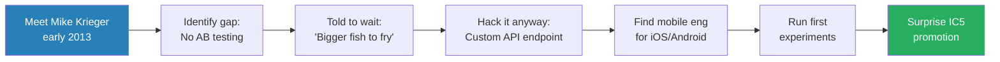
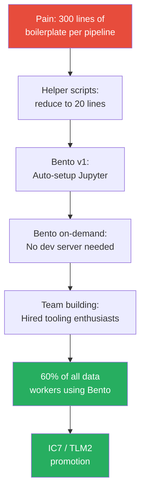
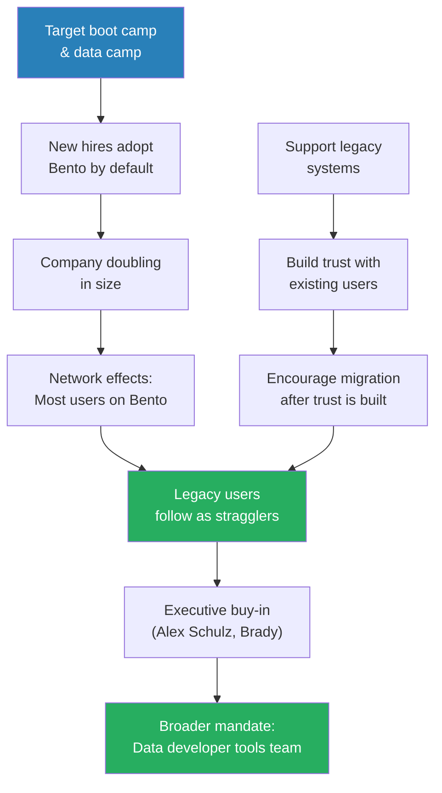
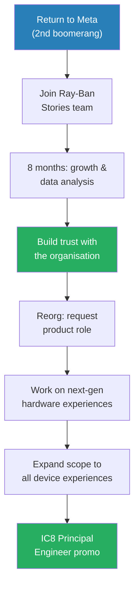
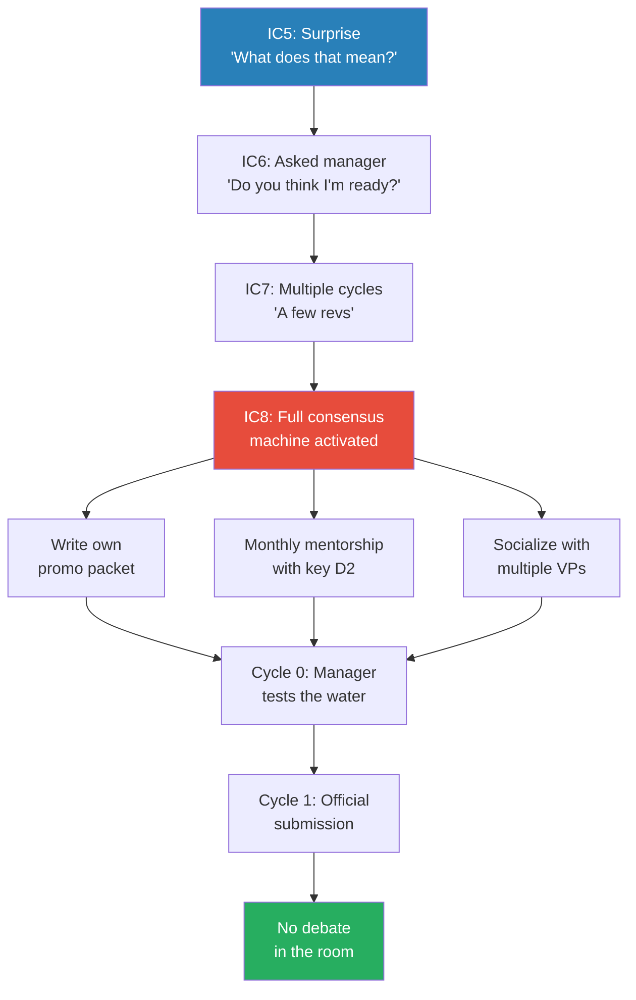
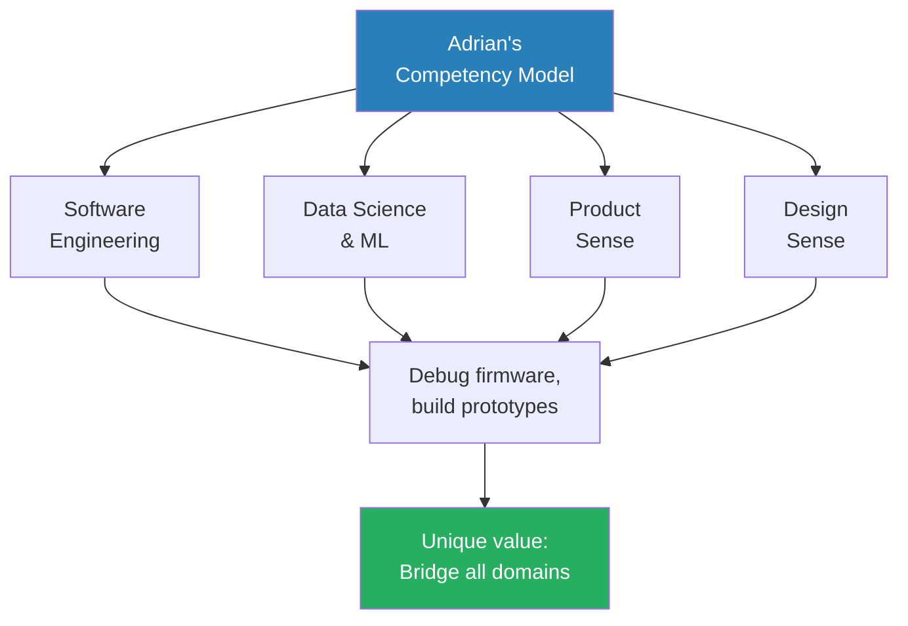

# New Grad to Principal Engineer (IC8) at Meta

> Adrian joined Facebook in 2011 as a PhD new grad on the data science team and spent the next thirteen years climbing from IC4 to IC8 (Principal Engineer) — with two departures and two boomerangs along the way. His career story is a masterclass in building things people actually need, creating scope through service rather than politics, and understanding that at the highest levels, promotion is a consensus-building exercise as much as a technical one. Every major career move was catalysed by a specific relationship, and every promotion came from work he started because he was genuinely excited about it — not because he was chasing a level.

---

## Overview: Key Highlights

- <b style="color: #27ae60">Build what you need, and the promotion follows</b> — Adrian's IC5 promo was a complete surprise; he built AB testing for Instagram because he needed it for another project
- <b style="color: #2980b9">The Calculated Risk Framework</b> — explicitly align with your manager before deviating from your job description, set a time window, have a fallback
- <b style="color: #27ae60">Target new users, not converts</b> — Bento's adoption strategy bypassed legacy resistance by targeting boot camp onboarding
- <b style="color: #2980b9">The Promotion Consensus Machine</b> — at IC8, Adrian spent two cycles socializing the promotion, writing his own packet, and getting VP-level support before the official submission
- <b style="color: #e74c3c">Not joining Instagram early was his biggest career regret</b> — peers who stayed hit IC7-IC10 years ahead of him
- <b style="color: #2980b9">Scope Creation Pattern</b> — volunteer for falling-through-the-cracks work, do it for a year, ask for the title post-hoc
- <b style="color: #27ae60">Overcommunicate everything</b> — the single thread running through every promotion, every risk taken, every scope carved out
- <b style="color: #e74c3c">Startup attempt revealed the gap between builder and entrepreneur</b> — couldn't delegate the interesting technical work to others
- <b style="color: #2980b9">BFS Ramp-Up Strategy</b> — breadth-first social network exploration when entering a new domain: talk, ask dumb questions, get hands dirty
- <b style="color: #27ae60">Relationships drive every career move</b> — Adrian never applied for a job on a website; every role came through someone he knew and trusted
- <b style="color: #2980b9">Product Hybrid Archetype</b> — at senior staff and above, well-roundedness (engineering + data + product + design) is where Adrian adds value
- <b style="color: #27ae60">Surface area for luck</b> — take more shots, invest in relationships without expecting return, help others succeed first

| Concept | One-line summary |
|---------|-----------------|
| **Calculated Risk Framework** | Align with manager, set time window, have a fallback before deviating from your job |
| **Promotion Consensus Machine** | Socialize the promotion over multiple cycles; by promo time there should be no debate |
| **Scope Creation Pattern** | Volunteer for uncovered work, do it for a year, then ask for the title |
| **Bento Adoption Flywheel** | Target new users via onboarding, build trust with legacy users, let network effects do the rest |
| **BFS Ramp-Up** | Breadth-first exploration of people and code when entering a new domain |
| **Surface Area for Luck** | More attempts + genuine relationships = more career opportunities |
| **Product Hybrid** | Well-roundedness across engineering, data, product, and design at senior levels |
| **Overcommunication** | The single constant across every promotion and scope expansion |
| **Identity Framing** | "You are a software engineer" — don't pigeonhole yourself into a narrow specialisation |
| **Post-Hoc Title** | Do the work first, then ask for the label once the role is already established |

---

# The Conversation

## Joining Facebook's Data Science Team [0:00 - 3:00]

*Adrian describes his entry into Facebook in 2011-12, joining a small data science team of 20 people that was building the company's AB testing platform and data pipelines. His first manager delivers a career-defining piece of advice over lunch.*

> [!tip] Core Insight
> Don't pigeonhole yourself by title or specialisation. At a tech company, being a software engineer is the highest-leverage identity — it gives you the widest scope to create impact.

> [!note]- Expand: Full Conversation
> - Adrian was pre-allocated to the data science team because of his PhD in social network analysis
> - The team was small (~20 people) — statisticians, computer scientists, and early ML researchers leveraging big data to build better products
> - This was the team that built Facebook's AB testing platform, data pipelines, and measurement infrastructure
>   - Adrian jokes: "At the end of the day, we were just doing big counting"
> - In his first 1:1 with manager Cameron Marlo, Adrian was standing in the lunch line being "a little pretentious" about his PhD
>   - He told Cameron he wasn't really a software engineer
>
> > [!example] Cameron Marlo's Lunch Line Advice
> > - Adrian's very first 1:1 with his manager, standing in line for lunch
> > - Adrian, fresh from his PhD, told Cameron he didn't consider himself a software engineer
> > - Cameron's response was direct and immediate: software engineers have power at this company — you are a software engineer
> > - Don't pigeonhole yourself into a category that isn't the most important job at the company
> > - From that day forward, Adrian always identified as a software engineer regardless of his displayed title
> > **The lesson:** Your identity framing shapes the scope of opportunities you allow yourself to pursue.
>
> - Around 2014, the "data scientist" title expanded across the company from ~20 PhD holders to ~500 product analysts
>   - Created an identity crisis for the original team
>   - Adrian's takeaway: "The title was not the important part. The important part was the impact of the work."

## The Rumor Spreading Research [3:00 - 6:00]

*Adrian's first project at Facebook — six months analysing how rumours and memes spread on social networks, with research legend Lada Adamic. The work produced academic papers but minimal company impact, setting up a pivotal career lesson.*

> [!note]- Expand: Full Conversation
> - Adrian worked with Lada Adamic (eventually director of data science at Facebook), Alex Dao, and others
> - Research focus: the shape of information cascades on social networks — do they spread in long chains or fan out?
> - Key finding: false rumours spread faster than true rumours, and pointing out that a rumour is false does not limit its spread
>   - Adrian's explanation: false rumours tend to be more egregious, and egregious content is inherently more shareable
>   - Ryan offers the alternative theory: polarised resharing (people share to agree or to debunk)
> - Published 2-3 papers in 6-8 months
> - Actual company impact: adjusting the weight of re-shares in News Feed — "Hey, if we continue doing too many re-shares, we're going to lose organic content"
> - Manager's verdict: "You wrote three papers, helped tweak News Feed — meets all. Go figure out something impactful for the company."
> **The lesson:** Academic output and company impact are different currencies. Papers don't substitute for product impact.

## Building AB Testing for Instagram — The IC5 Promotion [6:00 - 12:00]

*Adrian meets Instagram co-founder Mike Krieger, identifies that Instagram has no AB testing infrastructure, and hacks together a system despite being told the team has "bigger fish to fry." This accidental project becomes his first promotion — which he didn't even know existed.*

*Adrian's first promotion came from work he started because he needed the tool — not because he was targeting a level.*

> [!note]- Expand: Full Conversation
> - Instagram had been acquired in September 2012; core team was ~30 people
> - Adrian started talking to the Instagram team in early 2013 — they were tiny and had no data infrastructure
>   - "This is when the very first data pipelines to count how many users on Instagram were created"
> - Adrian's initial work: adding personalisation to the Explore tab (previously just the most popular content on Instagram)
> - The real need: Instagram had no AB testing system, so there was no way to measure if changes were actually good
> - Adrian pitched the idea to PMs, Krieger, and Kevin Systrom
>   - Response: "We have bigger fish to fry" — Instagram was migrating from AWS to Facebook infra
>   - "Please don't bug us"
>
> > [!example] The Hackiest AB Testing System Ever Built
> > - Adrian decided to build it anyway, roping in PM Jeff Caner for "air cover"
> > - Facebook had an AB testing system, but Instagram ran on completely different infrastructure (AWS)
> > - His solution: create a custom Facebook API endpoint, allowlisted on the Instagram app ID, to log exposures over the internet from AWS
> > - User hashing into test groups: "50-100 lines of code" replicated on the Instagram side
> > - Connected everything to Facebook's existing backend analysis system
> > - First test: a server-side AA test to prove the system worked
> > - Found a mobile engineer willing to help with iOS and Android code
> > - Started running small experiments to prove the system scaled
> > **The lesson:** Sometimes the hacky solution that ships today beats the elegant solution that ships never.
>
> - Adrian had no idea promotions existed: "I was a little IC4 who was completely naive, just working on things because I was excited about them"
>
> > [!quote] Adrian
> > "Come PSC season at the end of the year, my manager was like, 'Congratulations, we're promoting you to IC5.' I'm like, 'What does that even mean?'"
>
> - He transitioned the AB testing system to a newly created data team at Instagram, which went on to own and maintain it

## The Bottoms-Up Culture and Unusual Agency [12:00 - 14:00]

*Ryan points out Adrian's pattern of unusual agency — approaching CTOs, recruiting random engineers, building things nobody asked for. Adrian attributes it to Facebook's early culture rather than personal initiative.*

> [!note]- Expand: Full Conversation
> - Ryan observes: "No one told you to build this. You went up to the CTO of Instagram, you went up to a mobile engineer — that's pretty standout behaviour."
> - Adrian pushes back: "I never really thought about that this way. The early days of Facebook were very bottoms-up. Everyone kind of operated like that."
> - In his first 6 months, Adrian did ~6 hackathons — one per month, spending entire Thursday nights in the office hacking on things unrelated to his day job
>   - "That was the culture of Facebook — so naturally when it came to my day job, of course I'm going to hack on something"
> - Instagram's culture: "It really felt like a very small startup within a startup" — 30-40 people fitting in one big conference room
>   - Big focus on design and craft over data, which was different from Facebook proper

## The Instagram Regret — The Road Not Taken [14:00 - 16:00]

*Adrian reveals that not officially joining Instagram is probably the biggest mistake of his career — though he frames it carefully as a Bitcoin-style regret rather than a true regret.*

> [!note]- Expand: Full Conversation
> - Adrian never officially joined Instagram — he stayed on the data science team, operating as a consultant embedded in different teams
> - His reporting chain never changed despite working on very different projects
> - He was lucky to have few managers: only two in his first 2-3 years
> - Not joining Instagram: "Probably one of the biggest mistakes I've made in my career"
>   - Frames it as: "This is more the flavour of 'I didn't buy a bunch of Bitcoin in 2013' type of regret"
>   - Peers who stayed hit IC7, IC8, IC9, IC10 "way sooner than I have or probably ever will"
> - Adrian acknowledges the counterfactual is unknowable: "I'm also very happy with where I'm at in my career. It's just this is like a road not taken."

## Building Bento and the IC7 Promotion [16:00 - 24:00]

*The central story of Adrian's career — how frustration with boilerplate code became a personal helper library, then a platform used by 60% of Meta's data workers. This section covers the origin, the risk-taking, the adoption strategy, and the promotion.*

*What started as personal frustration with developer experience became the company's standard data platform — the pattern of solving your own problem first, then generalising.*

> [!tip] Core Insight
> The most successful internal tools start as solutions to the builder's own pain. Adrian didn't set out to build a platform — he set out to stop writing the same boilerplate. The platform emerged from making that fix available to everyone.

> [!note]- Expand: Full Conversation
> - Around 2015, Adrian was doing data processing and ML inference — "the tools we had were just icky"
>   - Had to switch between a data pipelining framework and a separate ML orchestration framework
>   - "I'm wasting so much time just going back and forth"
> - Started building a library to do data pipelining within Facebook's ML orchestration framework (FB Learner Flow)
>   - Initially just helper scripts for himself
>   - Then started eliminating boilerplate: "What would take you 300 lines of code would take you 20 lines"
>   - Default configuration did the right thing, with escape hatches for custom setup
> - The bigger problem: half the company used Jupyter, half used RStudio, all set up manually via "10 different wikis that were all outdated"
>
> > [!example] The Calculated Risk Conversation
> > - February, beginning of the half
> > - Adrian told his manager: "I'm going to take two, three months to just hack on this"
> > - If it doesn't pan out by April: "I'll just find another project to save the half and not get the needs improvement"
> > - Manager agreed — making it a calculated risk with known downside
> > - He roped in a couple more people and built the first version of Bento
> > **The lesson:** Ambitious bets are safer when you explicitly align expectations upfront and have a fallback plan.
>
> - Bento's vision: instead of an external tool you set up manually, an integrated platform — "Open a browser, type Bento, and now you have a notebook running with all the company's libraries already available"
> - Built Bento on-demand: request an instance, work, release it — no dev server maintenance
> - Adrian transitioned to tech lead manager, building the team by hiring people who were already building tooling in their spare time
>   - "Hey, do you want this to be your full-time job? Sounds like you like to do this thing."

*Bento's adoption strategy: capture new users at onboarding, earn trust with existing users through support, let network effects drive the rest.*

> [!note]- Expand: Adoption Strategy Detail
> - Ryan asks: how do you get tooling from an idea to something everyone uses?
> - Adrian's two-pronged approach:
>   - **Prong 1: Target boot camp and data camp** — told every new employee working with data: "This is the way you set up your developer environment"
>     - Company was growing rapidly — doubling in size within a year or two
>     - New hires had no legacy habits, so adoption was easy
>     - "You get your growth from newcomers who don't know the legacy systems, and then you get the stragglers"
>   - **Prong 2: Support legacy systems** — took over an unmonitored support group for manual Jupyter installations
>     - Provided help and built trust
>     - Over time, gently encouraged migration: "This thing you want to do takes 25 steps, or we've built it in Bento"
> - Executive engagement: went to Alex Schulz (now CMO, then head of analytics) and Brady Laach
>   - Brady's response: "Yeah, this is a good first step. There's like 20 other things you need to go fix."
>   - Adrian: "Let's take it one step at a time."
> - This led Adrian to leave the core data science team and reorg himself into the DevInfra organisation to start a team focused on data developer tools

## Risk-Taking and Management Alignment [24:00 - 27:00]

*Ryan asks whether taking the kind of risk Adrian took with Bento would be harder today. Adrian's answer: the consequences of failure are worse now, but the strategy for managing risk is the same.*

> [!note]- Expand: Full Conversation
> - Ryan: "The industry was not as intense when it comes to churning out short-term results. Do you think trying something like that today would be more difficult?"
> - Adrian: "The consequences of underperforming now are more drastic than they were 10 years ago. For sure."
> - But the strategy is the same: make sure you're aligned with your hierarchy
>   - "We are all evaluated based on our expectations. If you're not aligned on what is expected of you with your manager, then that is a problem."
> - Adrian explicitly changed his expectations: "Hey manager, I'm not going to do what my job is because I think there's an opportunity. Are you okay with this?"
>   - "We all agreed as a team — my manager, my skip, myself — that this was the thing I was going to do"
>
> > [!quote] Adrian
> > "It is a lot riskier to go and do your own thing, lock yourself in a room for 3 months, show up, and everyone's like, 'Yeah, but no one knew you were doing this.'"
>
> - "Overcommunicate is really the strategy I would recommend."
> - "Also be ready to hear no" — Adrian has had instances later in his career where he tried to build consensus for a deviation and was told no

## The TLM Transition and First Departure [27:00 - 31:00]

*Adrian explains why he became a manager (it was pragmatic, not aspirational) and then describes his first departure from Meta — a startup attempt that became a sabbatical.*

> [!note]- Expand: Full Conversation
> - Why become a manager?
>   - "We were building this product. I knew we had to scale and we needed more people."
>   - The alternative: hire someone external who might come in with a different vision
>   - "It was not really a thought-out 'I want to be a manager.' I was tech leading the team. We needed more people. The team needed a manager. I ended up being the manager."
>
> > [!example] The Failed Startup Attempt
> > - After 7 years at Facebook (the only company he'd ever worked at), Adrian left to start a company
> > - His reasoning: "I built this platform used by 60% of all people doing data at the company. If Facebook needed this in 2018, the world is going to need it in 2020."
> > - The reality: he wasn't an entrepreneur — couldn't delegate the interesting technical work
> > - "In order to be a successful entrepreneur, you need to be able to delegate the hard stuff. Whenever something became interesting, I would have to find someone else to do it."
> > - Built a few prototypes, found co-workers, nothing crystallised
> > - "I left the company to do a startup and I ended up taking a sabbatical instead. It was wonderful to travel the world."
> > **The lesson:** Being a great builder and being an entrepreneur require fundamentally different orientations toward interesting problems.
>
> - Adrian admits to "a little bit of hubris" — underestimated how much Meta's mature infrastructure contributed to what he'd built

## The Clubhouse Detour [31:00 - 35:00]

*Adrian boomerangs to Meta, spends seven months, then gets pulled to Clubhouse at its peak hype — a company of 10-11 people with insane growth.*

> [!note]- Expand: Full Conversation
> - First boomerang to Meta (summer 2020): moved to Denver, bought a house, needed a stable job
>   - The reason he came back: James Pierce, a director of engineering he admired
>   - "The draw of working with a few people I really knew and respected"
>   - Boomerang interview: just a behavioural interview — "They were like, yeah, you're still not crazy. You can come back."
> - After 7 months, a friend connected him with a Clubhouse co-founder
>   - Clubhouse was going viral in late 2020 / early 2021 — "Zuck is on Clubhouse and like there's all these people"
>   - Joined at 10-11 employees
>
> > [!example] Building Everything at Clubhouse (Again)
> > - One person was working on data when Adrian joined (Kenny Dika)
> > - No machine learning, no learned feed ranking — Clubhouse was "spamming people with notifications"
> > - Adrian built AB testing for the third time in his career (Facebook, Instagram, Clubhouse)
> > - Introduced ML to filter notifications
> > - Culture: mix of ex-Coinbase and ex-Facebook engineers — "very independent, self-driven, hungry engineers who just wanted to build a really cool authentic social network"
> > **The lesson:** The fundamentals transfer across companies at any scale — AB testing, measurement, and ML infrastructure are needed everywhere.

## Second Boomerang — Ray-Ban Stories and the Hardware Pivot [35:00 - 40:00]

*Adrian returns to Meta for a second time, drawn by manager Vincent Hardy and the opportunity to work on hardware — something completely outside his expertise.*

*Adrian spent a year building trust as the data expert before asking to pivot into the product/hardware role he actually wanted.*

> [!note]- Expand: Full Conversation
> - Why Meta again: Vincent Hardy, an engineering director who had been Adrian's manager before
>   - Vincent was leading Ray-Ban Stories (the Meta/Ray-Ban smart glasses partnership)
>   - Adrian's pitch to himself: "I've never worked on a product. I've never worked on hardware. I have this connection who is willing to take a chance on me."
> - Initial role was NOT the Uber TL position
>   - Came back as IC7; asked to help with growth/data for Ray-Ban Stories post-launch (quality and growth issues)
>   - Spent 8-12 months doing data analysis and building trust with the organisation
> - After a reorg at end of 2022, Adrian made his move:
>   - "Hey, the reason I joined smart glasses in the first place was I wanted to work on smart glasses. I didn't want to be the data guy anymore."
>   - His track record over the past year proved his product sense — manager agreed to the transition
> - Worked alongside another engineer (Jensen Yu) who was the Uber TL for the entire program
> - Over two years, gradually expanded scope to own all experiences across a specific hardware line

## The IC8 Promotion — A Consensus-Building Exercise [40:00 - 46:00]

*Adrian breaks down the mechanics of getting promoted to Principal Engineer — a multi-cycle process involving self-authored promo packets, strategic mentorship, and VP-level pre-alignment.*

*Each promotion level requires progressively more political sophistication — from zero awareness at IC5 to a multi-cycle consensus campaign at IC8.*

> [!tip] Core Insight
> At the highest levels, having the impact is necessary but not sufficient. You also need to build consensus before the promo discussion happens — so that when you walk into the room, there is no debate.

> [!note]- Expand: Full Conversation
> - Adrian's scope at IC8: responsible for all experiences on an unreleased device
>   - Working across multiple orgs, dozens of teams, ~35 PMs
>   - "My job became a lot of coordination and overall architecture"
>   - Responsible for making sure the right user experiences shipped on schedule
> - The promotion progression required increasing sophistication:
>   - **IC5:** "I had no idea the promo was a thing. It was a surprise."
>   - **IC6:** Had to ask his manager — "Do you think we can put me up for promo?" Manager agreed.
>   - **IC7:** "Took a couple of cycles to do a few revs"
>   - **IC8:** Full consensus machine
> - IC8 mechanics:
>   - Adrian's manager had never done an IC8 promo — "So how do we do this?"
>   - Adrian wrote a substantial amount of the promo packet himself, with manager's help
>   - Went to multiple VPs early: "This is the work I've been doing. Do you see IC8 scope here? Would you be supportive?"
>
> > [!example] The Strategic Mentorship Play
> > - Adrian identified a D2 (Director level 2) in the organisation who would be critical to the promotion decision
> > - Went to him directly: "You carry a lot of weight in this organisation. I'd love to understand how I can make it to that level. Would you mind having a monthly conversation with me?"
> > - Six months of monthly check-ins and course corrections
> > - When promo time came: "He was supportive because he had been involved in the process the whole time"
> > **The lesson:** The people who decide your promotion should never be surprised by your candidacy. Involve them early.
>
> > [!quote] Adrian
> > "You need to have the impact in the underlying work, but then it is also way easier to build the consensus ahead of time."
>
> - First cycle: manager didn't even officially submit — just talked to people, "feeling the water"
> - Second cycle: people already had context — "Oh, we're having this conversation. This is going to happen eventually."

## Creating Scope Without Stealing It [46:00 - 50:00]

*Ryan asks how to secure high-level scope when there's only one Uber TL role available. Adrian reveals he didn't compete for the role — he created a new one by taking work off someone's plate.*

> [!note]- Expand: Full Conversation
> - Ryan's question: "There's only one Uber tech lead. There's probably other people who would like that role. How do you secure that scope?"
> - Adrian's answer: he didn't take the existing role — he carved out a new one
>   - The Uber TL (Jensen Yu) was responsible for the entire program
>   - Adrian identified that experiences specifically (AI, music, photo capture, companion app) needed dedicated attention
>   - Gradually took that work off Jensen's plate with explicit permission
>   - "Instead of having to coordinate with 10-12 different engineering teams on experiences, he could just go through me"
> - The title came post-hoc:
>   - After about a year of doing the work, Adrian asked leadership: "People are asking why I'm doing this. Do you mind if we just say I'm the TL on experiences?"
>   - "It became a post-hoc thing — once I was already doing the work"
>
> > [!quote] Adrian
> > "Taking something off someone's plate doesn't mean that you're stealing from them. Or it is, if you're not talking to them about it."
>
> - The pattern: "I went to that engineer. 'Hey, I'm very excited about this space. Do you mind if I help with this?' He's like, 'Yeah, sure, I'm swamped.'"
> - A few weeks later: "Hey, there's this other related thing — is it okay if I talk to them?" "Yeah, sure, knock yourself out."
> - Ryan frames it as win-win: Jensen could chase IC9 scope and point to growing Adrian to IC8 as evidence of leadership
> - Adrian has done the same downward: "I had to actually fight with more junior engineers and tell them, 'Can you take that and just own it? It's going to be good for you.'"

## Well-Roundedness and the Product Hybrid [50:00 - 54:00]

*Adrian explains why breadth — not depth in one area — is his competitive advantage at the principal level, citing a Robert Heinlein quote that has guided his career.*

*At senior staff and principal levels, Meta recognises archetypes — Adrian has always been a product hybrid, adding value through breadth rather than singular depth.*

> [!note]- Expand: Full Conversation
> - Ryan asks: "You have a unique skill set that is very software engineering heavy and also very data heavy. What unique career experiences were only possible through that lens?"
> - Adrian: "I think all of them. I've always tried to be a well-rounded engineer."
> - Beyond software engineering and data: strong product sense and strong design sense
> - At Facebook, senior staff and principal engineers have archetypes — Adrian has always been a **product hybrid**
> - His value: "Being able to have a deep product conversation with product management leaders and the next day go down and debug some firmware code"
>
> > [!quote] Adrian
> > "Specialization is for insects." — Robert Heinlein (paraphrased)
>
> - In wearables, Adrian built little prototypes — designed circuit boards and hacked things together
>   - "Obviously not production ready. I'm not a hardware engineer, but having the ability to do that means you can start a conversation with people."
>   - "Go to a product lead and say, 'Hey, I have this idea. Here's a thing you can play with.'"

## Maximising Luck Through Relationships [54:00 - 60:00]

*Adrian reflects on the pattern running through his entire career — every major move was catalysed by a specific person. He offers his philosophy on relationships, asking, and increasing your surface area for luck.*

> [!tip] Core Insight
> Career growth is not a solo sport. Every promotion, every role change, every opportunity Adrian describes was unlocked by a specific relationship he had invested in without expecting anything in return.

> [!note]- Expand: Full Conversation
> - Ryan observes: "Throughout each leg of your story, there tends to be someone who either brought you along or was instrumental in one of the projects that got you promoted."
> - Adrian's response: "None of the stuff I've done would have been possible if I was working in a vacuum."
> - Early career rough edges: "I had very strong opinions about things and that didn't always work out in my favour"
> - The shift: "I started realising we can all succeed together"
>   - "We're all in this to succeed. The best way to succeed is to help others succeed."
>   - "Not to want anything in return — just fostering success around you"
>   - "A rising tide lifts all boats"
> - Practical advice:
>   - Build trust and respect — "You are a good person. You are a trustworthy person. You build trust and then you will reap the benefits."
>   - Don't be afraid to ask: "Every career change I've made, I have never applied for any job on a website. I have always reached out to someone I know."
>   - Accept rejection gracefully: "Don't be afraid to hear no or not hear back from people. People are busy. That's fine."
> - Surface area for luck: "Take more shots. The more shots you take, the more likely you are for one to land."

## Closing Advice — Letter to His Younger Self [60:00 - End]

*Adrian imagines what he would tell himself as a new graduate in France, knowing what he knows now after thirteen years.*

> [!note]- Expand: Full Conversation
> - **Be a good person** — the foundation of everything else
> - **Invest in things that are fun** — genuine interest drives better work than strategic calculation
> - **Invest in your relationships with your co-workers** — the people matter more than the projects
> - **It doesn't matter who gets the credit** — "Everyone is going to get credit for something"
>   - Adrian admits: "Early on in my career I was very credit-driven"
> - **Be patient** — "There were a few times in my career where I was pushing for a promo when I wasn't ready"
> - **Stay curious** — the thread running through every domain pivot
> - **Enjoy it** — "You're going to have an amazing adventure"

---

## Connections

**Other Peterman Pod episodes:**
- [[25 Year Old Staff Eng at Meta - Evan King]] — Evan's IC3-to-IC6 speed contrasts with Adrian's 13-year marathon; both emphasise building tools people need
- [[Meta IC9 on Influencing Engineers Failures and Learnings]] — Adam Ernst's influence patterns at IC9 mirror Adrian's consensus-building approach at IC8
- [[Frontline Manager to Senior Director in 3 Years - Rome]] — Rome's scope creation at Snapchat parallels Adrian's scope carving in wearables
- [[Amazon VP on Stack Ranking PIPs and Bezos - Ethan Evans]] — Ethan's Magic Loop (do great work → build relationships → get recognised) maps onto Adrian's career pattern
- [[Meta Senior Manager on Career Growth PIPs and Culture - Stefan Mai]] — Stefan's natural TLM transition mirrors Adrian's; both describe becoming a manager out of pragmatic necessity
- [[Retired Netflix Eng Director on Leetcode Regrets and Hiring]] — David Rumpka's long single-company arc parallels Adrian's 13-year Meta tenure

**Related books in vault:**
- [[Mastery - Robert Greene]] — the apprenticeship phase maps directly to Adrian's first 2-3 years absorbing Facebook's culture
- [[The 48 Laws of Power - Robert Greene]] — Law 1 (Never Outshine the Master) is the inverse of Adrian's approach to the Uber TL relationship: he elevated Jensen by taking work off his plate

---

## The Takeaway

Adrian's career story is a counterpoint to the "move fast, job-hop, chase the next title" narrative that dominates tech Twitter. He spent thirteen years at one company (with brief departures), and his promotions came not from strategic ladder-climbing but from a repeating pattern: find a genuine problem, build a solution, share it with others, and let the recognition follow. The AB testing system, Bento, the experiences TL role — none of these were projects he undertook because they would look good on a promotion packet. They were things he built because he needed them or because he saw they were needed.

The most counterintuitive insight is about the IC8 promotion itself. At that level, the technical work is necessary but not sufficient — the real work is political in the best sense of the word. Adrian spent two promotion cycles building consensus, seeking mentorship from decision-makers, writing his own promotion packet, and ensuring that by the time the discussion happened, there was nothing to debate. This is the opposite of the naive belief that great work speaks for itself. Great work at the principal level needs advocates, and building those advocates is itself a skill.

What remains unresolved is the tension between Adrian's advice to "be patient" and the reality that his peers who joined Instagram early hit IC8-IC10 years faster. Timing and luck matter enormously, and Adrian acknowledges this honestly. His framing — "increase your surface area for luck" — is the closest thing to a resolution: you cannot control when the right opportunity appears, but you can control how many shots you take and how many people trust you enough to bring you along when it does.
