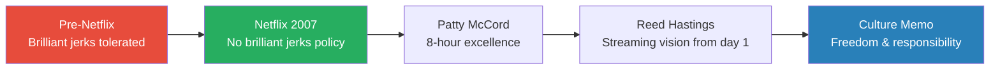
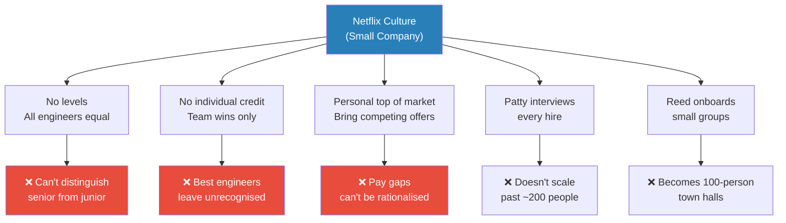
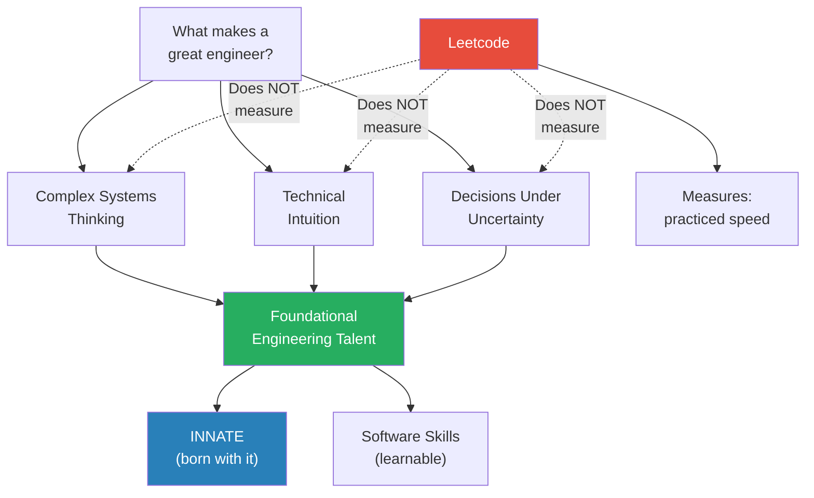
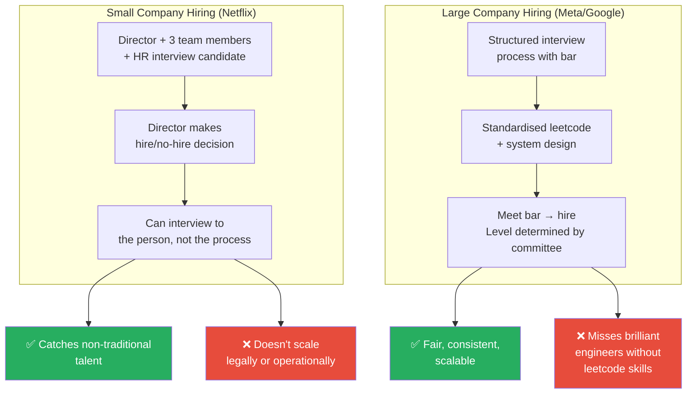
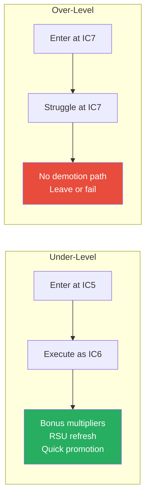
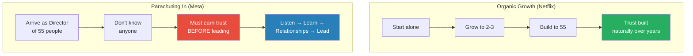
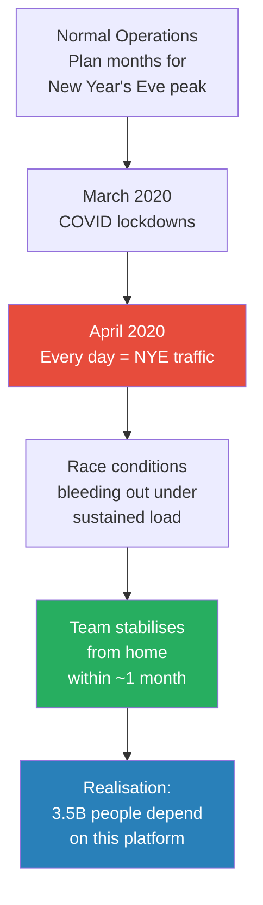
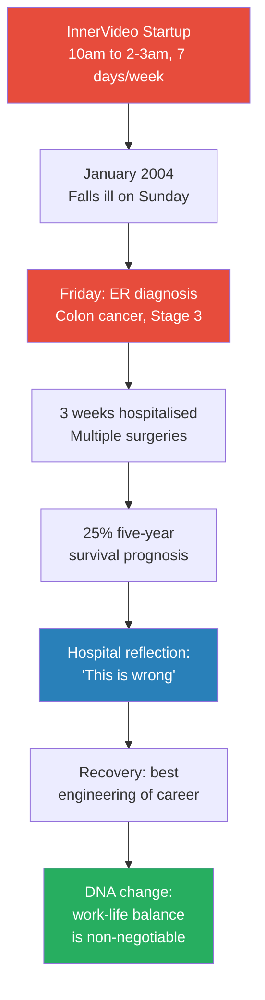
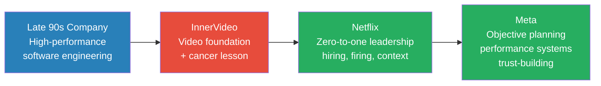
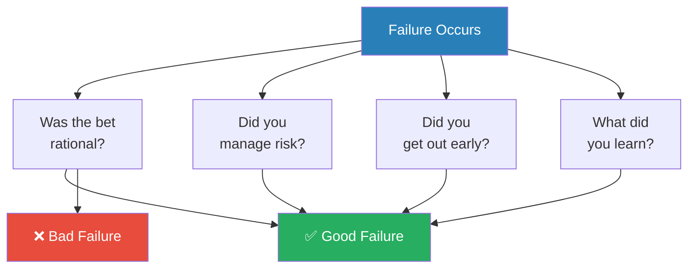

> David Rumpka spent 36 years in software engineering, including 12 years at Netflix building the encoding platform from scratch and 3 years at Meta managing video processing at billions-scale. Now retired, he is completely unfiltered about what actually matters in engineering: leetcode is a poor predictor of talent, Netflix's celebrated culture didn't scale, trust must be earned before authority, and a cancer diagnosis at 35 permanently rewired his understanding of work-life balance. This conversation is a masterclass in engineering leadership from someone with nothing left to prove and nothing left to sell.

---

## Overview: Key Highlights

- <b style="color: #27ae60">Netflix's "no brilliant jerks" policy was revolutionary in the early 2000s</b> — Patty McCord told David in his interview that 24/7 work wouldn't impress anyone; what mattered was what you could accomplish in eight hours
- <b style="color: #e74c3c">The Netflix culture memo was aspirational, not descriptive</b> — David pushes back on the mythology, saying the memo described what Netflix wanted to be, not what it always was
- <b style="color: #2980b9">Three pillars of engineering</b>: understanding complex systems, technical intuition, and making good decisions with incomplete data — these are innate, everything else is learnable
- <b style="color: #e74c3c">Leetcode does not predict engineering ability</b> — David saw engineers who nailed interviews but produced terrible work, and non-traditional hires with zero leetcode skills who became exceptional
- <b style="color: #27ae60">Netflix's no-levels, no-individual-credit compensation model broke down at scale</b> — best engineers left when their contributions went unrecognised and pay couldn't be rationalised
- <b style="color: #2980b9">Personal top of market</b>: Netflix encouraged engineers to interview elsewhere and bring back offers — the company would match or lose you
- <b style="color: #e74c3c">Parachuting into an existing team as a senior leader requires months of listening before leading</b> — David's direct report told him after two weeks: "You're already telling us what to do"
- <b style="color: #27ae60">A stage-3 cancer diagnosis at 35 permanently changed David's approach to work</b> — he realised companies use long hours to compensate for bad leadership
- <b style="color: #2980b9">Meta's PSC calibration system</b> taught David more about engineering leadership than any other experience — objective performance reviews with cross-team calibration
- <b style="color: #27ae60">Financial planning from day one is the most overlooked career advice</b> — engineers who plan early can be financially independent by their mid-40s

| Concept | One-line summary |
|---------|-----------------|
| **No brilliant jerks** | Netflix would fire anyone who was difficult to work with, regardless of talent |
| **8-hour excellence** | Patty McCord: impress us with what you do in a workday, not with overtime |
| **Three pillars of engineering** | Complex systems thinking + technical intuition + decisions under uncertainty |
| **Personal top of market** | Compensation tracked to what the market would pay you, not internal bands |
| **Culture memo as aspiration** | The famous Netflix culture deck described what they wanted to be, not what they were |
| **Trust before authority** | New leaders must listen and build relationships before making changes |
| **Motion vs progress** | Meta poster: a rocking horse moves a lot but goes nowhere |
| **Under-level entry** | Better to enter a company below your level and prove up than come in over-levelled |
| **Good failure** | Not whether you fail but how — was the bet rational, did you learn, did you manage risk |
| **Financial independence** | Start saving and planning from your first paycheck, not your last |

---

## What Made Netflix Culture Different?

*David arrives at Netflix in 2007 after years of dealing with brilliant jerks, screaming customers, and 24/7 startup burnout — and discovers a company that has already solved the problems everyone else is still ignoring.*

*Netflix's culture wasn't just progressive — it was built on the deliberate rejection of every dysfunction David had experienced in 15 years of prior work.*

> [!tip] Core Insight
> Patty McCord's interview statement — "We don't value 24/7 work. Blow us away with what you can do in an 8-hour day" — was not a perk. It was an engineering philosophy: sustainable output beats heroic effort.

> [!note]- Full Exchange: Netflix's Culture Shock
> - Before Netflix, David worked at companies where "primadonna" engineers were protected regardless of behaviour
> - At one 1990s company, the "most critical engineer" had a cubicle so full of junk the walls were bulging out — he refused to engage with anyone, worked all night, and was always the hero
>
> > [!example] The Packrat Hero Engineer (1990s)
> > - Company believed this one engineer was completely indispensable — managers had no idea what he did but were terrified of losing him
> > - He refused to engage with colleagues, worked alone through the night, and positioned himself as the centre of gravity for a critical system
> > - He quit — and the company didn't die
> > - Once he left, other engineers moved in and understood the system just fine
> > - The dependency was manufactured, not real
> > **The lesson:** The "indispensable" individual usually creates dependency through isolation, not through genuine irreplaceability.
>
> - At Netflix, the culture deck explicitly stated: if you're difficult to work with, you're gone — regardless of how smart you are
> - David calls this "revolutionary in 2000, in the early 2000s" — modern FAANG companies take it for granted, but at the time nobody operated this way
> - Patty McCord, Netflix's Chief People Officer, interviewed every single hire and had to bless each one
> - During David's interview, Patty said something that "floored" him: they don't value working all the time
> - She wanted people who lie in bed at night thinking about their Netflix problems — passionate, not compulsive
> - David also learned more about leadership from Patty than from Reed Hastings — she wasn't just an HR executive, she was a leadership educator
> - HR partners at Netflix challenged hire/no-hire decisions, pushed back on leaders, and actively shaped team quality — far beyond scheduling interviews and pushing resumes
> - Reed Hastings had a vision from the late 1990s: the company was called Netflix, not DVDbymail.com, because streaming was always the destination

> [!quote] Patty McCord (via David)
> "We don't value 24/7 work here. If you want to impress us, blow us away with what you can do in an 8-hour day."

---

## How Did Netflix Culture Handle Overwork?

*The no-overwork principle wasn't just talk — David watched Patty McCord enforce it in real time, and later enforced it himself with an engineer whose team was bleeding out.*

> [!note]- Full Exchange: Forcing Rest to Fix Systems
> > [!example] The Overworked Netflix Engineer
> > - An engineer announced in a meeting that he was working all the time and couldn't sustain it
> > - Patty McCord responded: first, she thanked him for his dedication and willingness to sacrifice
> > - Then: "Don't do this again. You're a manager, a leader. Figure out how to set up your team so you don't have to work all the time"
> > - David calls this "unthinkable in 2008, 2009"
> > **The lesson:** Overwork is a leadership failure, not a badge of honour. Fix the system, don't celebrate the suffering.
>
> > [!example] David Forces a Vacation (Netflix, ~2010s)
> > - David was talking to a phenomenal engineer on a weekend; the engineer said: "Must be nice having weekends off"
> > - His team believed they couldn't stop working or systems would collapse
> > - David told him: "If this company cannot survive without you here on the clock, we've got a problem. Take your vacation. If things break, they break."
> > - The engineer took a week off, came back refreshed
> > - The rest of the team also took time off — and were able to stabilise the system relatively quickly
> > - They stopped doing what management told them and decided themselves how to fix the stability issues
> > - The team that was killing themselves found better solutions only after being forced to rest
> > **The lesson:** Overwork prevents clear thinking. The team solved the problem they couldn't solve while exhausted — only after rest gave them the space to think differently.

---

## Why Didn't Netflix Culture Scale?

*The culture memo was perfect for a small, aggressive, engineering-focused company. As Netflix grew, every element that made it special started breaking.*

*Every element that made Netflix's culture special at 50 people became a liability at 5,000. The company eventually added levels, ranges, and structure — after David left.*

> [!tip] Core Insight
> Netflix had only two engineering titles: "engineer" and "senior software engineer." When every engineer is "equal," the system can't recognise that some are doing vastly more impactful work than others — and the best people eventually stop seeing a reason to stay.

> [!note]- Full Exchange: The Cracks in the Culture
> - Netflix had no engineering levels — just engineer and senior software engineer. You could make your business card say anything except manager, director, VP, or chief
> - As a small company with only senior people, this worked. As they hired more junior engineers, it created problems
> - With no objective system for recognising who was doing what, the best engineers' contributions got lost
> - The "team wins" philosophy meant no individual credit — even for breakthrough achievements
>
> > [!example] The PS3 Streaming Breakthrough
> > - Netflix built a streaming system for the PS3 that was so unconventional, Sony's DVD division told them to stop
> > - They didn't stop — they broke the rules and delivered
> > - But the credit was "Netflix won" — not "Scott, David, and Mitch were the foundational engineers who made it possible"
> > - At the time, this team-first approach felt right. But as the company grew, individual contributions of this magnitude started getting lost entirely
> > **The lesson:** Team credit works when everyone knows everyone. At scale, it becomes a way for leaders to absorb credit that belongs to individual engineers.
>
> - <b style="color: #2980b9">Personal top of market</b> compensation: Netflix encouraged engineers to interview at competitors and bring back offers — the company would match or lose them
> - The culture memo explicitly encouraged people to interview often so they understood their market value
> - David's starting salary was $175K in 2007 — solid at the time. 15 years into his career
> - If Google offered $200K a year later, David would tell his manager, and the manager had a choice: match it or lose him
> - This was "incumbent on us as leaders" — understanding where the market was, what offers were coming in, how much Google and Facebook were paying
> - By 2015, Facebook (as it was then) was aggressively building a video team and poaching Netflix engineers
> - The system broke in multiple ways as the company grew:
>   - An engineer who got a 2x competing offer three years earlier was now making more than almost everyone else — still contributing at that level, but no performance review context explaining why
>   - A leader would look at the numbers and ask: "Why is this person making three times that person?" — with no framework to explain it
>   - Five engineers received competing Facebook offers at 1.2x — the culture memo said "adjust to top of market," but without levelling, nobody could rationalise the increase
>   - With levels (which they didn't have), you could say "they got an IC6 offer at Google, here's the range on levels.fyi, we can adjust." Without levels, it was chaos
> - David was arguing for levels in the late 2010s — Netflix eventually added them and compensation ranges after he left
> - David had "a lot of disagreements" with his leadership over this — brought spreadsheets, year-over-year data, incoming offer analysis
> - He frames the transition as inevitable: success turns small companies into big companies, and what works small doesn't scale

---

## How Do You Identify Great Engineers?

*David's most controversial position: leetcode is a poor predictor of engineering ability. The best engineers he ever hired couldn't pass a standard coding screen — and some who aced interviews produced terrible work.*

*David's framework separates innate engineering talent from learnable skills — and argues that standard interview processes measure neither.*

> [!quote] David Rumpka
> "They nail these interviews and they get in and their engineering work is terrible."

> [!note]- Full Exchange: Leetcode and Engineering Intuition
> - David's controversial stance: he doesn't love leetcode — it tells you how fast someone can solve a problem they've probably practised a hundred times
> - At Meta, he saw engineers who nailed leetcode and canned system design questions but produced terrible work — bad engineering decisions, poor quality output
> - He believes all engineering disciplines share the same foundation: understanding complex systems, strong technical intuition, and the ability to make good decisions without enough data
> - This foundation is innate — like musical talent. You can practise guitar all day, but you'll never be great without the underlying gift
> - Engineers with that foundation from other disciplines (civil, mechanical, signal processing) can learn software quickly
> - Engineers without it can learn to code perfectly but will never make good engineering decisions
> - He acknowledges the counterpoint: at Meta/Google scale, you need standardised hiring. Leetcode doesn't scale down, but personalised hiring doesn't scale up
>
> > [!example] The Train Automation Engineer (late 1990s)
> > - David interviewed a woman who had been building software for driverless trains — automated train control systems
> > - His 45-minute interview went to 90 minutes; she covered two whiteboards explaining state transitions in a complex distributed system
> > - Her leetcode-style performance was only "okay" — the other interviewers were lukewarm
> > - David told his boss (also a woman): "This is one of the best systems engineers I've ever talked to. She understands complexity. We need her."
> > - His boss pushed back, citing the lukewarm feedback from others
> > - David insisted. They hired her. She "absolutely killed it"
> > - The team was struggling with integrating disparate systems — exactly her strength
> > **The lesson:** Systems thinking doesn't show up in leetcode. The ability to understand and explain complex distributed systems is far more predictive of engineering excellence than coding speed.
>
> > [!example] The Wastewater Treatment Engineer (~2017-2018)
> > - David was taking graduate classes at San Jose State when he met a woman finishing her master's in civil engineering, working in wastewater treatment
> > - Zero coding experience — it was her first software class
> > - David told Netflix colleagues: "I want to hire her. I don't know how."
> > - They gave her a video software engineering take-home problem. She took three weeks, made rookie mistakes, but impressed everyone
> > - To close the deal, David suggested: have her teach us something she knows
> > - She taught wastewater treatment for two hours on a whiteboard
> > - Halfway through, David realised: "This is a freaking state machine — a very complex state machine"
> > - The hiring manager grumbled: "What the hell does sewage treatment have to do with software?"
> > - David: "She's a damn good engineer. We can teach her to code. We can't teach her to think like this."
> > - They hired her. Years later, the hiring manager ran into David at a Meta event: "She's killing it. How did you know?"
> > - David's answer: "When you see a brilliant engineering mind, everything else doesn't matter"
> > **The lesson:** Engineering is engineering. A complex state machine in wastewater treatment is the same cognitive challenge as a complex state machine in video processing. Recognise the mind, not the resume.

---

## How Did Hiring Differ Between Netflix and Meta?

*The personalised hiring that produced David's best hires was only possible at Netflix's scale. At Meta, the system necessarily took over — and David explains why that trade-off is real but costly.*

*Neither system is wrong — they solve different problems. David's personalised approach found extraordinary talent but couldn't survive legal, policy, and volume requirements at scale.*

> [!note]- Full Exchange: The Hiring Trade-Off
> - At Netflix (during David's era), hiring was personal: David and three team members plus HR would interview someone he wanted to hire
> - He was literally making the hire/no-hire decisions — his "batting average" was very close to a thousand
> - The key: he "interviewed to the person, not to the process" — adapting questions and evaluation to each candidate's background
> - For the train engineer: extended the interview to 90 minutes and let her demonstrate systems mastery
> - For the wastewater engineer: invented a new evaluation method on the spot (teach us something)
> - At Meta, this approach is impossible — the company is too big, hires too many people, and needs fair and consistent standards
> - Legal and policy requirements alone would make personalised hiring break down: you can't defend ad-hoc evaluation criteria in a discrimination lawsuit
> - Netflix generally didn't hire new grads — David found "clever ways to break rules and work around" this policy, but it was the norm
> - At Meta, the structured bar exists for a reason: "hey, we're going to give you a bar. If you meet this bar, hire, yes. What level? This is what we can see."
> - David accepts the trade-off: the system misses talent that personalised hiring would catch, but the system is the only thing that works at 10,000+ hires per year

---

## What's the Right Levelling Strategy?

*David offers a counterintuitive piece of career advice: when joining a new company, aim to come in below your actual capability.*

*Over-levelling has no fix at companies like Meta or Google — there is no mechanism to demote someone. Under-levelling has a clear upside: rapid rewards for exceeding expectations.*

> [!note]- Full Exchange: The Under-Level Strategy
> - David advised engineers: if you get offered IC5 at Meta but believe you're an IC6, take the 5
> - Come in as a 5, start executing as a 6 immediately — bonuses, RSU refresh, and multipliers will blow you away
> - If you negotiate to IC7 and struggle to execute at that level, there is no fix — Meta and Google have no demotion mechanism
> - "You would have been a really good five, but you're struggling to execute at that sixth level — it's just not going to work"
> - The asymmetry is stark: under-levelling has upside (fast promotion, outsized rewards), over-levelling has only downside (no recovery path)

---

## Who Was the Best Engineer David Ever Worked With?

*David names names — something he deliberately avoids throughout the rest of the interview — because one engineer's work was too exceptional not to credit publicly.*

> [!note]- Full Exchange: Jannis Katzanetus — The Engineer's Engineer
> - David names Jannis Katzanetus as the strongest engineer he has ever worked with in 36 years
> - They first met at InnerVideo around 2000; Jannis had left the industry and was teaching signal processing as a professor in Greece
> - David brought him in during a summer break in 2010 to work on ideas around parallel encoding
> - Their collaboration gave birth to <b style="color: #2980b9">content-based encoding</b> — now how the entire video industry works. They wrote an early patent on it
> - Jannis went back to teaching, but David convinced him to join Netflix a few years later
> - At Netflix, Jannis took the work further, developing <b style="color: #2980b9">convex hull encoding</b> — a mathematically provable method for delivering the highest possible quality at a given bandwidth
> - This became the encoding model for both Netflix and Meta
> - They worked together across three companies: InnerVideo, Netflix, and Meta
> - Jannis also developed a cost-benefit model for codec evaluation — revolutionary because it bridged the academic and practical worlds
> - David describes his brilliance as forcing the theoretical into the practical: not what happens when you compress two test videos, but what happens across a billion
> - The classic joke: "In theory, theory and practice are the same. In practice, they're very different." Jannis's gift was making them converge

---

## What Humbled David About Facebook's Scale?

*Before leaving Netflix, David interviewed at Facebook in 2017 — and walked in with 12 years of building the world's highest-scale encoding platform. One sentence from an interviewer changed everything.*

> [!note]- Full Exchange: The CPU Revelation and Jannis's Departure
> - In late 2017, Facebook reached out to David. He told his wife he didn't want to work there but wanted to practise interviewing after 10-12 years
> - He went in, by his own admission, "a bit full of myself" — he had built Netflix's encoding platform, the highest-scale in the world
> - During one interview, an engineer stopped him: "David, you have to understand — Facebook cannot solve their video scale problem with CPUs"
> - David was floored. He had no concept of the scale difference between Netflix (~300M users) and Facebook (~3.5B users)
> - He turned down the offer but emailed the interviewer later to thank him for the humbling perspective
> - Shortly after, Jannis pulled David aside at Netflix: he had an offer from Facebook
> - Jannis described the ASIC work, the custom hardware, the problems he would work on — David saw a passion in him that had been fading
> - Netflix's culture of team-over-individual credit meant Jannis wasn't getting the recognition or intellectual challenge he needed
>
> > [!example] "How Can You Say No?" — Jannis Leaves Netflix
> > - Jannis told David about his Facebook offer, clearly excited about the technical problems
> > - He asked: "Aren't you going to try to talk me out of it?"
> > - David: "As your boss, I don't want to lose you. But as your friend, how can you say no? I'm not even going to try."
> > - David cared about Jannis's growth more than Netflix's retention needs
> > - Through watching Jannis leave, David started looking across the aisle himself and thinking about how much harder Facebook's problems were
> > - He had a good team, a successor lined up, and the timing worked out — he left Netflix in 2019
> > **The lesson:** The best thing a leader can do for someone who has outgrown their role is to let them go with full support. Trying to retain people who need bigger challenges is selfish, not loyal.
>
> - David's departure from Netflix wasn't driven by dissatisfaction — he had a strong team, good culture, meaningful work
> - But the pull of harder problems at a fundamentally different scale was irresistible
> - Facebook reached out quickly when word got out; David had to re-interview due to the gap, got an offer, and took it

---

## What Was the Transition to Meta Like?

*David left Netflix in 2019 after 12 years and joined Meta — where he immediately discovered that the leadership skills he'd built organically at Netflix didn't transfer to parachuting into an existing team.*

> [!tip] Core Insight
> If a team is already working well, your job as a new leader is to not break it first and then help it move forward second. David jumped straight to "move forward" — and his team pushed back within two weeks.

*David had never needed to build trust deliberately — at Netflix, he'd grown from one person to a 55-person org over 12 years. At Meta, he was given a 55-person team on day one.*

> [!quote] David's Direct Report at Meta
> "David, you've been here two weeks. You're already telling us what we need to do."

> [!note]- Full Exchange: Building Trust as an Outsider
> - David left Netflix in 2019 and joined Meta's video processing team — ~55-60 people
> - He knew the team had quality problems and came in ready to identify and fix them
> - Within two weeks, he was talking about changes in meetings
> - A direct report asked: "You say you like candid feedback. Can I be candid?" Then told David he was overstepping
> - David's response: "So what I hear is I need to shut up and work on building trust"
> - He had never developed the muscle of deliberate trust-building — at Netflix, trust came from growing together over 12 years
> - David spent months in one-on-ones: asking questions, making notes, understanding the system, the people, the roles
> - A reorganisation required promoting a manager — David refused to promote someone he didn't know yet, despite political pressure
> - He sat on the decision, built understanding, and eventually promoted the right person — who turned out to be the obvious internal candidate all along
> - The relationship with that manager was initially difficult — the manager felt overlooked
> - David eventually had a one-on-one: "I apologise for the delay, but I can't make a decision this big without understanding. I now believe you're the right person."
> - By the time the manager left Meta, they had a strong trust relationship — he would check interpretations rather than assume the worst
> - David's biggest regret: Meta was his last job. The leadership skills he learned there — deliberate trust-building, objective performance management — would have made him exceptional at the next company

> [!note]- Full Exchange: What David Learned Most at Meta
> - David initially came to Meta thinking he understood scale — he'd read the books, taken classes, knew about sharding and microservices
> - At Meta: "Those books don't know what they're talking about. Nobody understands scale except companies dealing with billions of users."
> - The two biggest things Meta taught him:
>   1. **Scale beyond comprehension:** Netflix has 300 million users (roughly the top 5% of world income). Meta has 3.5 billion (the wealthiest 50% of humanity, including people making $6-8 a day). The engineering challenges are categorically different.
>   2. **Objective performance systems:** <b style="color: #2980b9">PSC calibrations</b> — the system David came to Meta lacking and left Meta valuing above all else
> - How PSC calibrations work:
>   - Everyone writes self-reviews
>   - Managers turn self-reviews into performance packets — incorporating feedback, aligning with goals, documenting impact
>   - Packets go to "calibrations" — large group sessions where managers from across teams challenge each other
>   - Every manager thinks their team is the best. The calibration process forces you to convince OTHER managers through data, not through argument or political pressure
>   - The key questions: who worked on this project? Who did what? Who gets the credit? How did individual impact land? How did they move the needle?
>   - David describes this as "something we take so seriously" — hours of conversation across leadership teams
> - Meta overindexes on individual credit — the complete opposite of Netflix
> - Every performance review packet is permanently preserved — when you leave Meta, you take every review ever written about you
> - David half-jokes: "2,000 years from now when they're unearthing Meta hard drives, they'll find my stuff. They're going to know what I did at Meta."
> - PSC time was both "the most dreaded time of the year and my favourite time of the year"
> - Giving a "redefines expectations" rating to a direct report was the greatest joy of his leadership career — he had two REs over the course of a year
> - Even giving tough feedback — below expectations, needing to improve — was valuable work because it was honest, specific, and aimed at helping people grow
> - David had always heard horror stories about Meta's performance curves. Then he got there and realised: "This really matters. This is how you build excellent teams."
> - "The most valuable thing I got from Meta that I would bring to the next job was how to establish a system for objective planning, review, and performance"

---

## What Did COVID Reveal About Meta's Impact?

*David joined Meta in July 2019. By March 2020, nobody was coming to the office. The scale challenge that followed taught him something unexpected about the company's purpose.*

*The COVID traffic surge was not a spike — it was a permanent elevation. Systems designed for periodic peaks had never been tested under sustained maximum load.*

> [!note]- Full Exchange: Every Day Was New Year's Eve
> - Meta's video team planned for New Year's Eve starting in the summer — it was the annual peak traffic event
> - By April 2020, every single day hit New Year's Eve traffic levels — sustained, not just a 24-hour spike
> - Systems started bleeding out: race conditions surfacing under sustained load that had never been triggered before
> - The weight was terrifying — India's Prime Minister was addressing his country via Facebook Live
> - The team stabilised everything from home within about a month — finding and fixing race conditions, resolving every production issue
>
> > [!example] The Somali Uber Driver
> > - David was in an Uber going to a business meeting in Seattle
> > - The driver asked where he worked. David said Facebook
> > - The driver lit up: his family was scattered across the world — from Somalia — and WhatsApp was the only thing keeping them connected
> > - Without WhatsApp, they would completely lose touch
> > - David realised he had been thinking about Facebook with a US-centric view — "just a social app where we share stuff"
> > - In reality: mom-and-pop stores across India built their businesses on Instagram and Facebook, families across the developing world stayed connected through WhatsApp, people making $6-8 a day relied on the platform for their livelihood
> > **The lesson:** The engineers building Facebook's infrastructure are improving the lives of billions of people they'll never meet. The US debate about social media's harms is real but incomplete — it ignores the transformative impact for the other 3 billion users.
>
> - David's perspective shifted permanently during this period
> - When people in the US talk about social media — TikTok, Facebook, Instagram — they focus on the negatives: fake news, misinformation, the good-and-bad debate
> - "We are totally oblivious to how we are improving the lives of people in the rest of the world"
> - Nobody in India will say "David Rumpka changed my life" — but they will say Meta gave them a business, a way to connect with scattered family, a platform to share and earn money
> - David tried explaining this to people outside the company who complained about Facebook: "You just don't understand how good it feels to know you're making, in a small way, a difference in the world"
> - The difference in scale between Netflix and Meta was not just technical — it was moral. Netflix serves the wealthiest 5% of the world's population. Meta serves the wealthiest 50%, including the most economically vulnerable users who depend on it most

---

## How Did Cancer Change David's Approach to Work?

*In 2004, four years into a startup that demanded 24/7 work, David was diagnosed with stage-3 colon cancer. His 2-year-old son didn't know who he was.*

*The progression from startup burnout to cancer to permanent philosophy change is the emotional core of the episode.*

> [!tip] Core Insight
> Companies that demand 24/7 work are using hours to compensate for bad leadership. David did his best engineering AFTER cancer forced work-life balance on him — not despite the balance, but because of it.

> [!note]- Full Exchange: The Wake-Up Call
> - At InnerVideo, the expectation was clear: 10am arrival, early night was 10pm, late night was 2-3am, often seven days a week
> - The startup was chasing an IPO, then chasing bundling wins for revenue, then chasing stock price — always chasing
> - In January 2004, David fell ill on a Sunday and deteriorated through the week
> - Friday: his wife took him to the ER, where he was immediately diagnosed with colon cancer before they even had proof
> - His digestive system was blocked — creating a "catastrophic quick death situation"
> - He was a dad with a 2-year-old, a 4-year-old, and a 7-year-old
> - His youngest son didn't even know who he was — David was just the guy who came in late at night
> - Stage 3 with lymph node metastasis. Five-year survival prognosis: about 25%
> - Three weeks in hospital, multiple surgeries, then chemotherapy
> - Lying in hospital, thinking he was at the end of his life: "This is wrong"
> - After recovery, he told his boss he couldn't maintain those hours anymore
> - What happened next was counterintuitive: his best engineering at InnerVideo came after the cancer, during forced work-life balance as he ramped back up
> - David realised the company was using hours to compensate for terrible leadership
> - From that point forward, he committed to never being a leader who puts those expectations on people
> - At Netflix, Patty McCord's "we don't value 24/7 work" statement hit differently because of this experience
> - David references the Meta poster: a silhouetted rocking horse with the caption "Don't mistake motion for progress"
> - His practical framework for work-life balance at high-performance companies:
>   - Work with your boss to identify the most important things you need to do — the biggest impacts you can deliver
>   - Everything else: tell your boss "I don't have time for this. If it matters, we need someone else or you need to help me reprioritise."
>   - The worst thing you can do is try to do everything — you end up doing work that maybe wasn't important anyway
>   - There will be crunch periods — getting a feature across the finish line may require working weekends. That's fine, but it must be the exception, not the rule
>   - Plan for it: "I know in May-June I'll need to get my head down. Then I'll pull back and take a vacation."
>   - Always make sure your manager is giving you clear context on what really matters — and focus only on those things
> - His advice: don't wait for cancer or a heart attack to learn this lesson
> - "Leave your company alone for a week. If they can't survive without you for seven days, that's not your problem — that's their problem. The only way to make them understand that problem is for you to leave and make them face it."

---

## What Advice Would David Give His Younger Self?

*After 36 years across Hughes/GM, IBM/Siemens, InnerVideo, Netflix, and Meta, David distills his career into four lessons — each learned at a different company.*

*Each job taught David something the previous one couldn't. The tragedy is that Meta — where he learned the most about leadership — was his last.*

*David learned from Microsoft's book that failure is expected in healthy companies — what matters is how you fail. Meta applies this: it's not that the project failed, it's whether the bet was rational, the risk was managed, and the learnings were captured.*

> [!note]- Full Exchange: The Book That Shaped His Thinking
> - David recommends "12 Secrets to Microsoft Success" from the late 1990s — a book that introduced concepts he saw echoed across every company he later worked at
> - In the 1990s, Microsoft was the company everyone feared — "the evil empire, the dark side." Google's original motto "don't be evil" was a direct reference to Microsoft
> - But Microsoft pioneered engineering leadership concepts that David believes shaped the entire modern tech industry:
>
> > [!example] Bill Gates's Hiring Freeze During Peak Growth
> > - Somewhere between Windows 95 and the book's publication, while Microsoft was growing at an extraordinary rate, Bill Gates instituted a company-wide hiring freeze
> > - The rationale: they were hiring too many people too fast and investing money in things that didn't matter
> > - Microsoft was producing pointless products like Microsoft Bob — silly animated icons and features nobody needed
> > - The hiring freeze forced executives to kill projects and redeploy engineers to work that actually mattered
> > - They ended up cutting the bottom 20% of employees — something they should have done regardless
> > - David draws a direct line to 2021-2022: "If FAANG leaders had read this book, they would have recognised in late 2021 that hiring was out of control"
> > - During COVID, every tech company accelerated hiring. Nobody decelerated. Then boom — the 2022 contraction hit everyone
> > **The lesson:** Unchecked hiring growth is a sign of strategic laziness. When you can't say no to headcount, you've lost control of priorities.
>
> - Other Microsoft innovations David credits: betting the company on big opportunities (later echoed at Netflix, Amazon, Meta), embracing "good failure" (not whether you fail but how), hiring the top 5%, and the concept of dog-fooding
> - Dog-fooding was invented at Microsoft: Bill Gates forced the entire company onto NT Server when it was failing badly — putting all the bugs in front of every employee. The OS that couldn't ship suddenly started getting fixed
> - Microsoft also pioneered structured hiring for the top 5% of software engineers — the predecessor to modern FAANG interview processes
> - David sees Amazon, Google, Netflix, and Meta as all building on Microsoft's foundation: "As much as we all tried not to be evil like Microsoft, we ended up taking a lot of their thinking"

> [!note]- Full Exchange: Regrets and Career Growth
> - **Biggest regret:** First six years at large, failing companies (GM Hughes, IBM/Siemens) — David was making good money with an easy job but not growing
> - "I was only thinking in the moment" — not about long-term skill development
> - General Motors spun off Hughes, but Hughes failed. IBM sold off David's division to Siemens, but that division also failed
> - He wasn't thinking about growth — not stressing about ambition, but not intentionally pushing forward either
> - Everything in software engineering becomes obsolete within five years: when David joined Meta, the entire dev environment and boot camp system was completely replaced during his tenure
> - The only way to stay relevant is to keep pushing toward the edge, always learning new technologies and engineering skills
> - His four jobs each contributed something distinct:
>   - **Late 90s company:** turned him into a high-performance software engineer (performance = problems solved, not hours worked)
>   - **InnerVideo:** gave him a strong video engineering foundation
>   - **Netflix:** zero-to-one leadership — hiring, firing, context setting, cross-functional collaboration
>   - **Meta:** objective planning, performance reviews, calibration systems, deliberate trust-building

> [!note]- Full Exchange: Five Pieces of Advice
> - **Work on hard problems** — "If your job is not difficult, you're not growing." When things plateau, don't rest indefinitely. At a company like Meta where internal mobility is easy, go find a harder problem
> - **Work for visionary leaders who can execute** — vision alone is worthless without execution capability. Reed Hastings was visionary in 1999 when Netflix had four people — and he could execute. Mark Zuckerberg is navigating the AI transition while keeping Meta focused. Find leaders who inspire you to "dream of sailing the seas, not just cutting lumber for a ship"
> - **Company size is irrelevant** — everyone should try a startup, especially when young. But don't get enamoured by technology alone. What matters is whether leadership has vision AND execution capability
> - **Own your work-life balance** — be intentional about not working. Take vacation. Leave your company alone for a week. "If they can't survive without you for seven days, that's not your problem — that's their problem." Work with your boss to identify the highest-impact work and let everything else go
> - **Financial planning from day one** — this is the most overlooked advice for engineers:
>   - Start with small, regular contributions to long-term savings from your very first paycheck
>   - Manage your budget — don't let lifestyle inflation consume every raise
>   - Don't get over your skis with credit or debt
>   - By your early 40s, money should no longer be an existential concern — you could take a lesser-paying job without stress
>   - By your 50s, you should be able to retire comfortably
>   - "If you're a good engineer and you're gainfully employed for 30-35 years, there's no reason why you should not retire very comfortably"
>   - David has seen many engineers in their 50s with no rational retirement plan despite decades of high income — "there's no reason for that"
>   - His joking fear: "If I didn't get retirement right, I'd be a greeter at Walmart" — except it's not really a joke

---

## Connections

**Previous episodes:** [[How Corporate Politics Work - Best]] (empire building, organisational navigation), [[25 Year Old Staff Eng at Meta - Evan King]] (Meta IC levelling, speed over perfection)

**Related books in vault:** [[What Got You Here Won't Get You There - Marshall Goldsmith]] (leadership transitions, habits that stop working at higher levels), [[Corporate Confidential - Cynthia Shapiro]] (culture vs reality, career navigation), [[Stealing the Corner Office - Brendan Reid]] (credit dynamics, political awareness), [[Power - Jeffrey Pfeffer]] (performance reviews, organisational power), [[Crucial Conversations - Kerry Patterson]] (candid feedback, trust-building), [[Fierce Conversations - Susan Scott]] (direct feedback culture)

---

## The Takeaway

David Rumpka's career arc is a case study in how the same person can be a mediocre contributor in the wrong environment and an exceptional leader in the right one. His first six years were wasted at large, failing companies — not because he lacked talent, but because nothing forced him to grow. It took a startup that nearly killed him, a culture that redefined what "good" meant, and a company so large it humbled his assumptions about scale. The pattern is clear: growth comes from hard problems, not comfortable ones, and the best leaders are the ones who keep putting themselves in rooms where they're not the smartest person.

The episode's most lasting contribution is David's framework for evaluating engineering talent. His argument that leetcode measures practiced speed rather than engineering intuition is not new, but his evidence is unusually strong: two detailed hiring stories where non-traditional candidates with zero coding background became exceptional engineers, paired with his observation that leetcode-perfect hires at Meta produced terrible work. The implication is uncomfortable — that the entire FAANG hiring apparatus optimises for the wrong signal — but David is honest enough to acknowledge that personalised hiring doesn't scale. The system is imperfect because the problem is hard, not because the companies are stupid.

What stays with you is the cancer story. David was working 10am to 3am, seven days a week, and his two-year-old didn't know who he was. He lay in a hospital bed with a 25% chance of surviving five years and realised that companies use long hours to compensate for bad leadership. The punchline is that his best engineering came after the cancer — when forced work-life balance gave him the space to think clearly. The rocking horse moves a lot, but it goes nowhere.
