# The Peterman Pod - Complete Guide to Career Growth, Leadership & Big Tech

> Sixteen episodes. Fifteen guests spanning intern to VP, IC3 to IC9, frontline manager to CTO. One host who reached Staff Engineer at Meta by 25. The Peterman Pod is the most honest record of how careers actually work inside Big Tech — not the sanitised version, but the version where managers promote the squeaky wheel, PIPs are death sentences, the same performance data gets spun two ways, and the single luckiest moment of your career might be skimming one LeetCode problem the night before your interview. This guide synthesises every episode into a thematic reference: how promotions really work, how influence operates without authority, what changes at each level, and why the system rewards things most engineers refuse to believe matter. Expand any section for the full cross-episode detail.

---

## Series at a Glance

| Episode | Guest | Role | Core Topic |
|---------|-------|------|------------|
| [[25 Year Old Staff Eng at Meta - Evan King]] | Evan King | Ex-Meta IC6, Hello Interview founder | Speed budget, simple solutions, rapid IC growth |
| [[Frontline Manager to Senior Director in 3 Years - Rome]] | Rome | CTO of HeyGen, ex-Snapchat Sr Director | Northstar framework, manager-to-director leap, trust |
| [[Amazon VP on Stack Ranking PIPs and Bezos - Ethan Evans]] | Ethan Evans | Retired Amazon VP | Stack ranking, PIPs, narrative spinning, career escalator |
| [[Meta IC9 on Influencing Engineers Failures and Learnings]] | Adam Ernst | Meta Distinguished Engineer (IC9) | Influence without authority, project failure, coding machine archetype |
| [[Meta Senior Manager on Career Growth PIPs and Culture - Stefan Mai]] | Stefan Mai | Ex-Meta M2, Hello Interview co-founder | M1-to-M2 leap, storytelling, organisational politics |
| [[Retired Netflix Eng Director on Leetcode Regrets and Hiring]] | David Rumpka | Retired Netflix/Meta Director | Netflix culture, LeetCode critique, hiring philosophy |
| [[Meta IC7 Honest Demotion Story]] | Igor (anonymous) | Google/Cruise/Meta Senior Staff | Voluntary demotion, ramp-up risk, senior job mobility |
| [[Kubernetes Co-Creator on Engineering-Led Direction - Brendan Burns]] | Brendan Burns | Kubernetes co-creator, Microsoft CVP | Open source strategy, 10% rule, build-first culture |
| [[Industry Secrets Staff Engineers Wish They Knew - UCLA Panel]] | Ricky (Google Staff) | Panel with Ryan | Internship success, next-level behaviours, asking questions |
| [[Airbnb Staff Eng on Calibrations and Getting Past Senior]] | Laurent | Staff Eng — Stripe, Airbnb, Instagram | Calibration mechanics, surprise factor, situational leadership |
| [[New Grad to Principal Engineer IC8 at Meta]] | Adrian | Meta Principal Engineer (IC8) | Scope creation, Bento platform, promotion consensus machine |
| [[26 Year Old Meta Staff on Promotions and Equity Bonuses]] | Simon | Meta IC6 | Ownership radius, RE ratings, written communication |
| [[GoogleX Chief Scientist on Imposter Syndrome and Project Taste - Carey Nachenberg]] | Carey Nachenberg | Symantec Fellow, Google X, UCLA | Project taste, imposter syndrome, outcomes focus |
| [[Ex-Stripe CTO on Career Growth and Coding as a Leader]] | David Singleton | Ex-Stripe CTO, ex-Google VP | Engineeration, type two fun, culture as behaviour |
| [[Meta IC7 on Zuck Stories Rapid Growth and Code Machine Archetype]] | Michael Novati | Ex-Meta IC7, Formation founder | Coding machine archetype, taste vs output, early Facebook culture |
| How Corporate Politics Work | Ethan Evans | Retired Amazon VP | Empire building, headcount incentives, political navigation |

---

## How to Use This Guide

This guide works at three speeds:

- **2-minute scan:** Read the section titles and the italic previews beneath each heading. You will know every major theme the series covers.
- **10-minute review:** Read the previews plus any `> [!tip]` callouts and diagrams. You will understand the key frameworks and insights across all sixteen episodes.
- **Full reference:** Expand the `> [!note]-` collapsible sections for cross-episode detail, stories, and specific examples. This is where the depth lives.

Coloured text marks the most important ideas: <b style="color: #27ae60">green</b> for core insights, <b style="color: #e74c3c">red</b> for warnings, and <b style="color: #2980b9">blue</b> for named frameworks. Episode references appear as (Episode: [[Title]]) so you can jump to the full summary.

---

# Part 1: Getting Promoted

*The series' most consistent finding: being good at your job is necessary but radically insufficient for getting promoted. Promotions happen at the intersection of performance, manager advocacy, calibration politics, and timing. Every section below draws from at least five episodes to build the full picture.*

## 1. The Mechanics of Promotion at Big Tech

*Promotions are not meritocratic ceremonies where the best engineer wins. They are political-bureaucratic processes with hidden rules, forced distributions, narrative warfare, and a single decisive variable: whether your manager will stake their reputation on you. Every guest in this series — from IC4 to VP — confirms some version of this reality.*

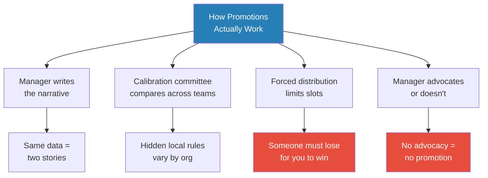
*The promotion process is a negotiation between your manager, the calibration committee, and the limited number of slots available. Your work is necessary but insufficient — the narrative your manager tells is what actually moves. Twelve of sixteen episodes touch on this theme — it is the series' central finding.*

> [!tip] Core Insight
> Ethan Evans, as an Amazon VP with 800 engineers, admits he promoted the person threatening to leave over the patient team player when both were equally qualified. Stefan Mai describes calibrations as a ceremony costing companies roughly $15,000 per engineer. Laurent reveals that calibration committees have unwritten local rules — like mandatory "meets expectations" ratings for anyone who changed roles mid-cycle — that are never communicated to ICs. The system is not designed to be fair. It is designed to be defensible.

> [!note]- Expand: Cross-Episode Detail

> **The manager controls the narrative**
> - Ethan Evans demonstrates with a thought experiment: take an engineer who did 700 code reviews in a quarter. The positive narrative: "Ryan is an amazing engineer — he makes everybody's code better, he's upleveling the whole team." The negative narrative: "Ryan doesn't contribute much — he spends all his time nitpicking other people's code instead of writing his own." Same data. Opposite outcomes. The manager chooses which story to tell. (Episode: [[Amazon VP on Stack Ranking PIPs and Bezos - Ethan Evans]])
> - Evans adds: the manager tells their story to HR and leadership first. When the employee later says "it's unfair, my boss hates me," HR has already heard the manager's version. Legitimate complaints sound identical to illegitimate ones.
>
> **Calibration mechanics**
> - Laurent describes the Airbnb calibration process: managers bring their reports' cases, a committee of peer managers compares across teams, and a forced distribution determines who gets top ratings (Episode: [[Airbnb Staff Eng on Calibrations and Getting Past Senior]])
> - Hidden rules he discovered only after becoming a manager:
>   - If you changed roles mid-cycle, you automatically get "meets expectations" regardless of performance
>   - There is often a minimum tenure requirement before a promotion is considered
>   - Interns have their own calibration where every manager walks in convinced their intern deserves RE — and most are wrong
> - Stefan Mai adds the emotional cost: after telling a team they performed brilliantly all half, a manager must reverse course because someone has to land in the bottom bucket. "It's heartbreaking — they kicked ass." (Episode: [[Meta Senior Manager on Career Growth PIPs and Culture - Stefan Mai]])
>
> **The Magic Loop — Evans' promotion framework**
> - Ethan Evans' VP promotion took 2.5 years of deliberate partnership with one manager
> - The deal, made explicit: "I'll do everything you need. You do one critical thing — make sure I'm rewarded."
> - His VP eventually told him: "I'm going to try and get your VP promotion through this cycle. I can't promise anything."
> - Timing was everything: his VP was reorged within 6 months after the promotion. Had Evans been six months later, he would have had a new boss and had to restart. (Episode: [[Amazon VP on Stack Ranking PIPs and Bezos - Ethan Evans]])
>
> **The promotion consensus machine at IC8**
> - Adrian spent two full performance cycles socialising his IC8 promotion before the official submission
> - He wrote his own promotion packet, identified all potential objectors, addressed their concerns in advance, and secured VP-level support
> - By the time it went to committee, there was no debate — the consensus was already built (Episode: [[New Grad to Principal Engineer IC8 at Meta]])
>
> **Ratings and promotions are not the same thing**
> - Simon received Meta's rarest rating — Redefines Expectations — without being promoted, because ratings measure what you achieved (impact) while promotions measure how you achieved it (next-level behaviours)
> - Enormous IC4-level impact does not check IC5 boxes about owning others' success (Episode: [[26 Year Old Meta Staff on Promotions and Equity Bonuses]])
>
> **Self-advocacy is not optional**
> - Evans: "Almost everyone's doing what I'm doing [promoting the squeaky wheel]. They're just not telling you."
> - Ryan Peterman asked his manager "what do I have to do to get promoted?" immediately after every promotion — aggressive, possibly annoying, but effective
> - Evan King's first promotion "just happened" thanks to a proactive manager — but that is the exception, not the rule (Episode: [[25 Year Old Staff Eng at Meta - Evan King]])

### The Overcommunication Principle

Adrian names overcommunication as the single thread running through every promotion and scope expansion in his career. The same principle appears, under different names, in at least six other episodes.

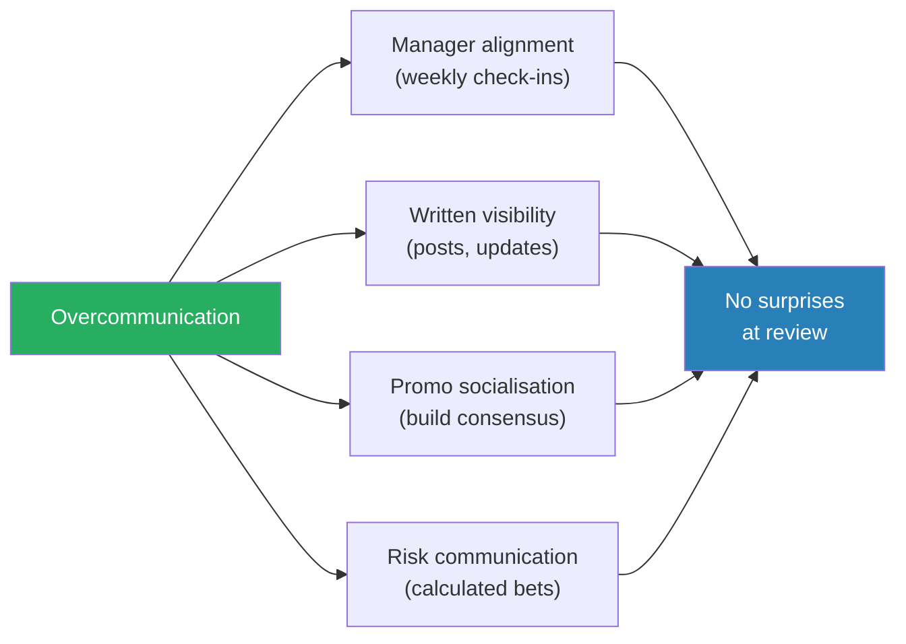
*Overcommunication is the default mode of every fast-promoted engineer in the series. The opposite — doing great work silently — is the most common career anti-pattern.*

> [!note]- Expand: Overcommunication in Practice
> - Adrian: "The single thread through every promotion, every risk taken, every scope carved out is overcommunication." He kept his manager informed at every stage — before starting Bento, during the risky hack phase, when seeking resources, when presenting results (Episode: [[New Grad to Principal Engineer IC8 at Meta]])
> - Simon: his written communication formula — flashy title, TLDR with numbers above the fold, then context — consistently got executive attention. He also used Meta-wide group posts to share wins, making his team's impact visible to people outside his org (Episode: [[26 Year Old Meta Staff on Promotions and Equity Bonuses]])
> - Laurent: his "surprise factor" metric is fundamentally about communication frequency. If both manager and report write down the expected rating independently and the papers do not match, the communication cadence was insufficient (Episode: [[Airbnb Staff Eng on Calibrations and Getting Past Senior]])
> - Ricky (UCLA Panel): "Visibility — if no one knows about your work, it cannot help you get promoted. The last few percent of effort is telling people." (Episode: [[Industry Secrets Staff Engineers Wish They Knew - UCLA Panel]])
> - Evans: "Being right is not a career strategy." The gap between being right and being recognised is communication — specifically, the kind of communication that builds alliances (Episode: [[Amazon VP on Stack Ranking PIPs and Bezos - Ethan Evans]])
> - David Singleton's "Rocket Doc" is a weekly planning habit built around communication: every Sunday night, write down "if I have a great week, what did I get done?" This prevents inbox and calendar from ruling your priorities — and it creates a written record of intention that makes retrospective review possible (Episode: [[Ex-Stripe CTO on Career Growth and Coding as a Leader]])
> - Carey Nachenberg: the "BS tax" at senior levels — strategic meetings, posturing, and politics consume time. You must actively resist by choosing which meetings actually require your presence and which are performative (Episode: [[GoogleX Chief Scientist on Imposter Syndrome and Project Taste - Carey Nachenberg]])

### How to Lose a Promotion: Anti-Patterns from the Series

> [!note]- Expand: What Kills Promotions
> - **Being a silent hard worker:** Evans' most uncomfortable admission — as VP, he promoted the person threatening to leave over the patient team player. "Almost everyone's doing what I'm doing. They're just not telling you." (Episode: [[Amazon VP on Stack Ranking PIPs and Bezos - Ethan Evans]])
> - **Not knowing the process:** Evans promised a star engineer a promotion from SDE1 to SDE2. But he had only worked at startups where promotions were informal. He missed Amazon's formal cycle deadline. The engineer left for another company. "It cost him a year. I feel terrible about it." (Episode: [[Amazon VP on Stack Ranking PIPs and Bezos - Ethan Evans]])
> - **Doing 10x work at your current level:** Ricky and Ryan (UCLA Panel) are emphatic: doing a hundred junior-level projects perfectly earns a great rating but checks zero boxes on the mid-level rubric. One solidly next-level project is worth more (Episode: [[Industry Secrets Staff Engineers Wish They Knew - UCLA Panel]])
> - **Picking below-level projects:** Igor picked a project at Meta he thought would take two weeks. Even if completed and shipped successfully, it was not E7-level scope. "You cannot still justify my level with the project being completed." (Episode: [[Meta IC7 Honest Demotion Story]])
> - **Changing managers too often:** Stefan Mai had seven managers in three and a half years at Meta. Each change reset the relationship-building clock. "Part of the story is how to maintain momentum during organisational shifts" (Episode: [[Meta Senior Manager on Career Growth PIPs and Culture - Stefan Mai]])
> - **Passive career management:** Laurent's core message — most engineers wait until year-end to present results and hope for the best, instead of explicitly aligning throughout the year. His "surprise factor" metric: if manager and employee expectations do not match at review time, something has gone wrong in the preceding months (Episode: [[Airbnb Staff Eng on Calibrations and Getting Past Senior]])
> - **Caring too much about level:** Adam Ernst at IC9 says the healthiest thing he did was "flip the switch off — I just don't care." He checks in with his manager to ensure he is working on important problems, then stops worrying about whether it is "IC9-level code." The anxiety was counterproductive (Episode: [[Meta IC9 on Influencing Engineers Failures and Learnings]])
> - **The perception lock:** Stefan Mai warns that how people perceive you early — especially as a manager — becomes a ceiling that is very hard to alter. "People have difficulty shifting what they think a person is going to be like in the future." First impressions set a trajectory (Episode: [[Meta Senior Manager on Career Growth PIPs and Culture - Stefan Mai]])

### PIPs: The System's Dark Side

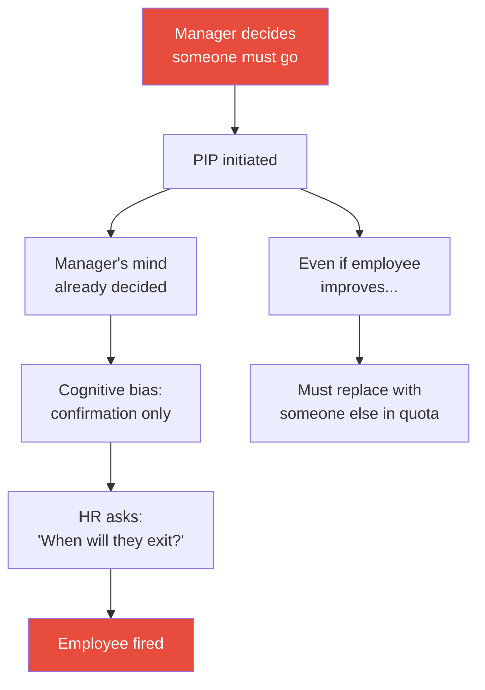
*Evans coached half a dozen Amazon PIP recipients. Every single one was fired. The PIP is a formality — the decision is already made.*

> [!note]- Expand: How PIPs Actually Work
> - Amazon's "unregretted attrition" (URA) target: 5-7% of the team annually
> - Managers can improve performance, pressure people to quit, or formally fire them
> - When Amazon removed the URA goal experimentally, managers immediately stopped having hard conversations with underperformers. The goal was reinstated the following year (Episode: [[Amazon VP on Stack Ranking PIPs and Bezos - Ethan Evans]])
> - Stefan Mai describes the emotional cost of forced distribution: "You tell a team they kicked ass all half, then reverse course because someone must go in the bottom bucket." This is the most heartbreaking management moment (Episode: [[Meta Senior Manager on Career Growth PIPs and Culture - Stefan Mai]])
> - Meta's version: started doing "the Amazon thing" — laying off the bottom 10% of performers. Igor's demotion story was partly driven by this policy: at E7, you have at most one year to ramp up to be comparable to veterans (Episode: [[Meta IC7 Honest Demotion Story]])
> - Evans' most chilling insight: "As a manager, I could get rid of any one employee I wanted." The nuance: cannot fire everyone (patterns get caught), but any single person is vulnerable. The manager makes the preemptive strike — tells HR their story first
> - His advice if you have a vindictive boss: "Don't fight — you're bringing a knife to a gunfight." Either make friends with them or find a different manager

### The Written Communication Multiplier

Several guests independently identify written communication as a career accelerator that most engineers neglect.

> [!note]- Expand: Writing as Career Strategy
> - Simon's formula: flashy title, TLDR with numbers above the fold, context, then technical details for "fellow nerds." Posts following this structure consistently got executive attention (Episode: [[26 Year Old Meta Staff on Promotions and Equity Bonuses]])
> - Ricky (UCLA Panel): "Writing is the job — design docs, code descriptions, result write-ups. The code itself is only part of what matters." (Episode: [[Industry Secrets Staff Engineers Wish They Knew - UCLA Panel]])
> - Carey Nachenberg: "People equate presentation skill with intelligence and open doors based on it." Communication is the multiplier that makes everything else visible (Episode: [[GoogleX Chief Scientist on Imposter Syndrome and Project Taste - Carey Nachenberg]])
> - Michael Novati's cautionary tale: his internal newsletter "The Weekly Novati" gained massive traction but caused friction with executives and HR. In retrospect, he would not do it again. Visibility is a tool that can backfire (Episode: [[Meta IC7 on Zuck Stories Rapid Growth and Code Machine Archetype]])
> - Laurent's approach: office hours instead of recurring one-on-ones at scale, and written surveys to audit every team process (Episode: [[Airbnb Staff Eng on Calibrations and Getting Past Senior]])

---

## 2. The Speed Budget: Why Fast Executors Get Promoted

*The single behaviour most consistently linked to rapid promotion across this series is speed of execution. Not brilliance. Not networking. Finishing your assigned work fast enough to create surplus time — then using that surplus for work beyond your scope. Evan King, Michael Novati, Ryan Peterman, Adrian, and Simon all describe the same pattern independently.*

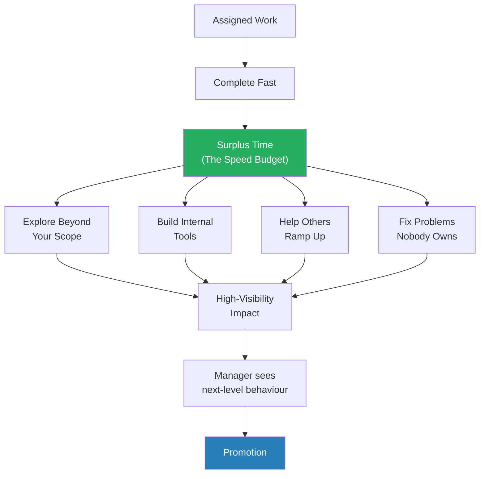
*The "Speed Budget" — Ryan and Evan's term — is the engine behind rapid IC promotion. It works because the surplus time creates exactly the kind of scope-expanding work that calibration committees look for at the next level.*

> [!tip] Core Insight
> Speed is not about raw talent. Ryan Peterman names three concrete levers: workflow optimisation (keybindings, memorising the codebase), working longer hours ("the answer nobody wants to hear"), and code search mastery (in Meta's monolith, the chance you are solving something for the first time is almost zero). Evan King adds: a personal knowledge base so you never solve the same problem twice, and asking for help after one hour of trying instead of burning a full day.

> [!note]- Expand: Cross-Episode Detail

> **The simplest solution wins**
> - Evan King's team of PhDs spent months building sophisticated ML models for suicide detection on live video — advanced embeddings, temporal sequencing, audio wave analysis — with no progress. Recall stayed at 9%
> - Evan noticed the user comments: "Don't do it." "Your family loves you." Adding comment signals to the model took recall from 9% to 55% overnight
> - Ryan's parallel: his biggest staff-level impact was a trivially simple compute efficiency fix — just eliminating redundant work. "The most impactful idea was the most obvious, easy thing to do." (Episode: [[25 Year Old Staff Eng at Meta - Evan King]])
>
> **Impact throughput as a decision framework**
> - Both Evan and Ryan frame prioritisation as a fraction: impact (numerator) divided by effort (denominator)
> - A one-line change with massive impact beats a year-long complex project
> - Meta's culture rewards this: "You had huge impact and nobody else thought to do it — you're rewarded for it." Other companies reward proportional to difficulty.
>
> **The coding machine archetype**
> - Michael Novati was one of Meta's most prolific code committers. His output volume was roughly the same from his first week — what changed was taste and judgment about what to change (Episode: [[Meta IC7 on Zuck Stories Rapid Growth and Code Machine Archetype]])
> - Adam Ernst reviewed 1,600 diffs in 6 months (about 14 per workday) during the Core Data crisis, building organic influence through sheer volume of high-quality code review (Episode: [[Meta IC9 on Influencing Engineers Failures and Learnings]])
> - Adrian at Meta built Bento — a data platform used by 60% of the company's data workers — starting from personal helper scripts that reduced 300 lines of boilerplate to 20. The speed of the initial hack created the window to build the full platform. (Episode: [[New Grad to Principal Engineer IC8 at Meta]])
>
> **Simon's velocity at Meta**
> - In his first half as IC3, Simon ran 20 of his org's 50 total experiments — exceptionally high velocity for any engineer, let alone a new grad
> - His IC3-to-IC4 promotion came in six months (Episode: [[26 Year Old Meta Staff on Promotions and Equity Bonuses]])
>
> **The 10% Rule — Brendan Burns' version**
> - Brendan Burns (Kubernetes co-creator) formalises the speed budget as: hide roughly 10% of your effort from management for side projects you believe in
> - A running prototype forces a "ship or kill" decision instead of a "should we build this" debate
> - The risk: it might be the difference between "exceeded expectations" and "met expectations" (Episode: [[Kubernetes Co-Creator on Engineering-Led Direction - Brendan Burns]])

### How to Actually Get Faster

> [!note]- Expand: Concrete Speed Levers from the Series
> - **Workflow optimisation:** Ryan at peak was doing ~10 diffs per day through keybindings, memorising the codebase layout, and knowing exactly which line to change before opening the file
> - **Working more hours (honestly):** Ryan would get in at 10am and leave on the latest shuttle at 9:27pm — "but I was enjoying it." He says: "If you want an extra 30% of time, you can also just work an extra 30%. That's the answer nobody ever wants to hear." (Episode: [[25 Year Old Staff Eng at Meta - Evan King]])
> - **Personal knowledge base:** Evan built a personal search engine at Zillow to store solutions. At Meta, just markdown files with Control+F. "I never needed to struggle to solve a problem twice"
> - **Asking for help without fear:** Spend an hour trying, then find the person who knows. "The ability to find the person at the company that knows and get the answer from them is a super powerful skill"
> - **Code search mastery:** In Meta's monolith, the chance you are solving something for the first time is "almost none." Guessing function names and hunting for similar patterns is "one of the absolute peak skills" — Ryan
> - **Pre-studying patterns:** Simon spent time exploring React, TypeScript, and building side projects before joining Meta full-time — not deep expertise, but awareness. "Engineers are pattern-matching machines — the more patterns you've seen, the faster you adapt." (Episode: [[26 Year Old Meta Staff on Promotions and Equity Bonuses]])
> - **Internship as ramp-up accelerator:** Simon's prior Meta internship saved four to eight weeks of ramp-up compared to peers who started cold
> - **David Singleton's Rocket Doc:** Every Sunday night, write: "If I have a great week, what did I get done?" Then follow that list — not your inbox, not your calendar. "Don't go to your inbox, go to the Rocket Doc." (Episode: [[Ex-Stripe CTO on Career Growth and Coding as a Leader]])

### The Taste Question: Speed Alone Is Not Enough

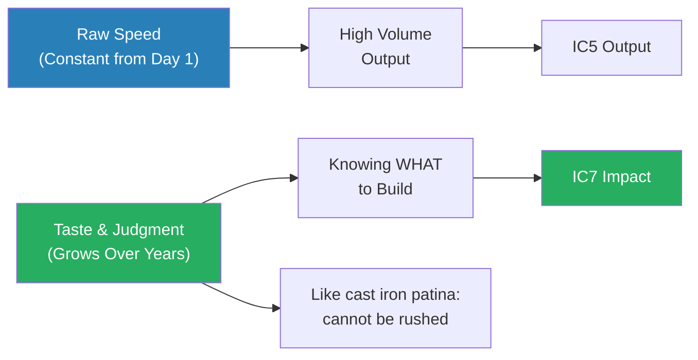
*Michael Novati's distinction: his code volume was the same from his first week. What changed over the years was taste — knowing what to change, anticipating consequences, picking the right problem. Speed creates the time. Taste determines how you spend it.*

> [!note]- Expand: Taste and Judgment Across the Series
> - Michael Novati: "Taste as cast iron patina — judgment builds through accumulated layers of experience burned into your instincts, like seasoning on a pan. Cannot be rushed." His biggest weakness was optimising for what he could crank out instantly (B through H) while ignoring the highest-impact A because he did not have the answer in his head (Episode: [[Meta IC7 on Zuck Stories Rapid Growth and Code Machine Archetype]])
> - Carey Nachenberg: "Project taste beats intelligence" — picking high-impact projects where gaps exist is the primary career differentiator, not raw IQ. He uses an intelligence baseline metaphor: you need enough, but beyond a threshold, taste and judgment matter more (Episode: [[GoogleX Chief Scientist on Imposter Syndrome and Project Taste - Carey Nachenberg]])
> - Michael Novati's do-feedback-iterate cycle: do something, get feedback from experienced people, action it, repeat. Three mistakes break it: not doing, getting feedback from wrong people, and treating feedback as grades rather than growth signals
> - David Singleton: "First principles over pattern matching" — Stripe taught him to stop asking "how did we do it last time?" and instead deeply understand the dynamics before choosing a path. His method: talk to people at 4 external companies, triangulate their approaches, then reason from the actual dynamics (Episode: [[Ex-Stripe CTO on Career Growth and Coding as a Leader]])
> - Adam Ernst's organic depth-building: instead of studying systems from first principles, his approach is to debug 8 levels deep when blocked. "I'm going to have a problem. GraphQL is going to block my code from landing. Great. Now I have a reason to delve into GraphQL codegen." Over years, this builds encyclopaedic cross-system knowledge — "it's like a superpower" (Episode: [[Meta IC9 on Influencing Engineers Failures and Learnings]])
> - Michael Novati on LLMs and taste: "LLMs amplify existing skill, not replace it." Experienced engineers with strong taste benefit most — Michael reports 5x productivity gains. The key is intuition-driven prompting: knowing what to ask for requires knowing what good looks like (Episode: [[Meta IC7 on Zuck Stories Rapid Growth and Code Machine Archetype]])

---

## 3. IC Levels Explained: What Changes at Each Level

*Every guest covers different segments of the IC ladder. Stitched together, they form a complete picture of what actually changes from new grad to Distinguished Engineer — and it is not just "more of the same." Each level requires a fundamentally different mode of operating, and the transition between levels is where most engineers stall.*

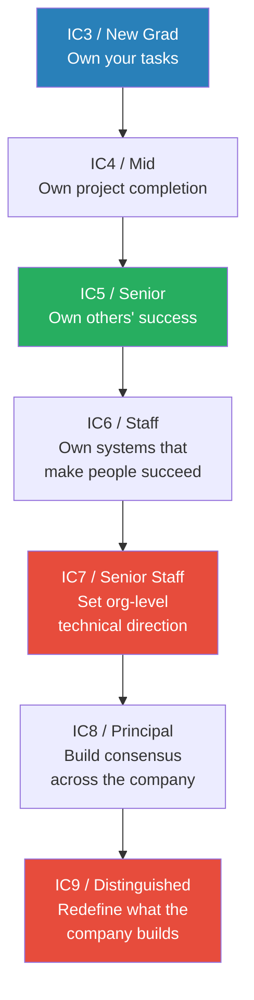
*Simon's "ownership radius" model, confirmed across multiple episodes: each level expands what you are responsible for — from tasks, to projects, to people, to systems, to organisational direction, to company-wide consensus.*

> [!tip] Core Insight
> The UCLA Panel episode distills it cleanly: doing 10x junior-level work earns you a great rating but checks zero boxes on the mid-level rubric. Promotions require demonstrating next-level behaviours on at least one project — not more volume at your current level. The word managers use is "behaviours," not "output."

> [!note]- Expand: Level-by-Level Detail from the Series

> **IC3 to IC4: Task ownership to project ownership**
> - Simon: at IC3, "you own your task." At IC4, "you own the completion of the project" — including investigating why experiments failed, not just reporting the failure
> - His first-half IC3-to-IC4 promo was driven by running 20 of the org's 50 experiments and taking ownership of end-to-end results (Episode: [[26 Year Old Meta Staff on Promotions and Equity Bonuses]])
> - Ricky (UCLA Panel): junior engineers code with help, mid-level engineers code independently. The shift is independence, not volume (Episode: [[Industry Secrets Staff Engineers Wish They Knew - UCLA Panel]])
> - Simon's specific IC4 behaviour: when experiment results were negative, he did not just report the failure — he investigated why, updated the targeting criteria, worked with the data scientist and designer to iterate, and re-launched. A neutral result became 20% of his half's impact
> - Evan King's first promotion (IC3-to-IC4) happened in six months without him asking — his manager pulled him into a room and said "you're promoted." This was the exception; most guests describe self-advocacy as essential
>
> **IC4 to IC5: Individual output to multiplying others**
> - Simon: IC5 requires "taking ownership of other people's success — not just your own output." His RE rating without promotion proved this gap — enormous personal impact did not demonstrate IC5 behaviours
> - Evan King's IC4-to-IC5 promotion came from becoming tech lead of the Graphic Violence team — running weekly meetings, setting road maps, having one-on-ones, mentoring junior engineers
> - Ryan frames the IC5 shift as "scaling yourself" — delegation, working through others, enabling impact beyond your direct hands (Episode: [[25 Year Old Staff Eng at Meta - Evan King]])
>
> **IC5 to IC6: Problem solver to problem discoverer**
> - Laurent: the staff-level shift is from "solve assigned problems" to "discover, pitch, solve, and document problems end-to-end." Seniors handle the middle steps. Staff engineers handle the full loop (Episode: [[Airbnb Staff Eng on Calibrations and Getting Past Senior]])
> - Adrian's Bento started as personal frustration with developer tools — nobody asked him to build it. He pitched his manager, set a time window, and created scope from nothing. The platform now serves 60% of Meta's data workers (Episode: [[New Grad to Principal Engineer IC8 at Meta]])
> - <b style="color: #2980b9">Adrian's Scope Creation Pattern</b>: volunteer for work that is falling through the cracks, do it for a year, then ask for the title post-hoc
>
> **IC6 to IC7: Team strategy to org-level direction**
> - Michael Novati operated on a 30/70 split at IC7: 30% on team work, 70% on codebase-wide initiatives — only possible with manager support and years of established credibility (Episode: [[Meta IC7 on Zuck Stories Rapid Growth and Code Machine Archetype]])
> - Evan King considered IC7 but his manager told him the path was "more deterministic" than management — fewer unknowns but higher compensation ceiling. Evan notes the "snowflake risk": IC7+ credibility is deeply tied to specific company context and may not transfer (Episode: [[25 Year Old Staff Eng at Meta - Evan King]])
> - Igor's demotion story illustrates the flip side: at IC7, you are judged against people who have built context over years. Switching companies at this level means "starting at level zero" while being evaluated against veterans (Episode: [[Meta IC7 Honest Demotion Story]])
>
> **IC7 to IC8: Org direction to company-wide consensus**
> - Adrian's IC8 promotion required two full performance cycles of socialising the case — writing his own packet, identifying objectors, securing VP support. "By promo time there should be no debate."
> - The work itself was building Bento into a company-wide platform, but the promotion was a consensus-building exercise as much as a technical one (Episode: [[New Grad to Principal Engineer IC8 at Meta]])
> - Adrian describes the Product Hybrid archetype at this level: well-roundedness across engineering, data, product, and design is where IC8+ engineers add value. Pure technical depth is necessary but no longer sufficient
> - His BFS (breadth-first search) ramp-up strategy for entering new domains: talk to everyone, ask dumb questions, get hands dirty. Build a wide social network before going deep on any single technical area
>
> **IC9: Redefining the company**
> - Adam Ernst (IC9) says he "flipped the switch off" on level anxiety — stopped worrying about whether his work was "IC9-level" and just focused on solving important problems
> - His influence model at this level: empathy first, data second, do the work for them third. One person cannot do entire migrations at scale anymore, so the role shifts from coding machine to strategic influence (Episode: [[Meta IC9 on Influencing Engineers Failures and Learnings]])
> - Carey Nachenberg (Symantec Fellow, roughly IC10 equivalent) says the hiring process at this level is entirely leadership conversations and mutual fit assessment — no LeetCode (Episode: [[GoogleX Chief Scientist on Imposter Syndrome and Project Taste - Carey Nachenberg]])
>
> **The sweet spot**
> - Igor argues E5/L5 is the best quality of life: "shielded from leadership noise, still doing the craft you love"
> - Simon says IC6 is the sweet spot for people-oriented engineers: "you get mentoring and coaching upside without the unconditional responsibility of managing everyone"

### Imposter Syndrome Across Levels

Imposter syndrome appears in at least five episodes — and the series collectively argues that it never fully goes away, but can be managed through reframing.

> [!note]- Expand: How Each Guest Handles Imposter Syndrome
> - **Evan King (IC6):** Felt behind peers in Seattle whose parents worked at Microsoft. Was "horrible" at AP Computer Science. His first promotion at Meta was the turning point: "From that moment on I had the assurance that I was good and I was capable." The confidence was unlocked by external validation, not internal certainty (Episode: [[25 Year Old Staff Eng at Meta - Evan King]])
> - **Igor (IC7):** Introduces the Composite Peer Fallacy — "imposter syndrome comes from comparing yourself to a composite of everyone's strengths." You compare your writing to the best writer, your coding to the best coder, your leadership to the best leader — and the person who is best at all three does not exist (Episode: [[Meta IC7 Honest Demotion Story]])
> - **Carey Nachenberg (Fellow/IC10):** Imposter syndrome kept him at Symantec for years too long, recurred at Google, and limited his risk-taking at every transition. His biggest regret: "Don't let fear of failure hold you back." Every career move was triggered by someone else pulling him into an opportunity, not by his own initiative (Episode: [[GoogleX Chief Scientist on Imposter Syndrome and Project Taste - Carey Nachenberg]])
> - **Adam Ernst (IC9):** "I've flipped the switch off. I just don't care." The healthiest approach to level anxiety he found was to stop thinking about whether his work matched his title and instead focus on solving important problems he enjoyed (Episode: [[Meta IC9 on Influencing Engineers Failures and Learnings]])
> - **Ryan and Ricky (UCLA Panel):** Both acknowledge feeling behind peers early in their careers. Ryan did not know what CS was until college. Ricky felt dumb in AP CS when classmates had been coding since childhood. Neither was a prodigy — both reached Staff by 25 (Episode: [[Industry Secrets Staff Engineers Wish They Knew - UCLA Panel]])

### The Senior-to-Staff Plateau

The single most common career stall point in the series is IC5 (Senior) to IC6 (Staff). Multiple guests address why this transition is so hard — and the answer is not technical difficulty.

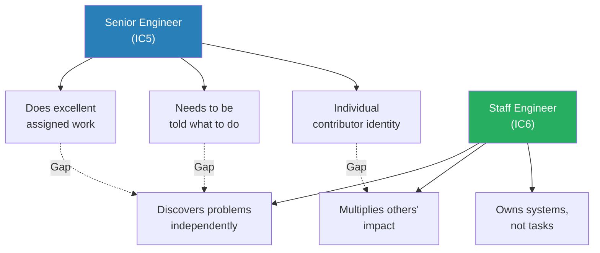
*The senior-to-staff gap is a mindset shift, not a skill gap. Seniors solve problems. Staff engineers find problems worth solving.*

> [!note]- Expand: Breaking Through Senior
> - Laurent's framework: Staff engineers handle the full problem discovery cycle — find, pitch, solve, document. Seniors handle only the solve step. The pitch is where most people stall — they wait for someone to assign them staff-level work instead of discovering it themselves (Episode: [[Airbnb Staff Eng on Calibrations and Getting Past Senior]])
> - Laurent's advice: boredom is a career signal. If you feel bored, something needs to change. He used boredom to trigger every major career transition — including leaving management to return to IC work
> - Adrian's pattern: "Volunteer for work that is falling through the cracks, do it for a year, then ask for the title post-hoc." His Bento platform started as personal frustration — nobody asked him to build it (Episode: [[New Grad to Principal Engineer IC8 at Meta]])
> - Adrian's calculated risk conversation: "I'm going to take two, three months to just hack on this. If it doesn't pan out by April, I'll find another project to save the half." His manager agreed — making it a calculated risk with known downside
> - Simon: the IC5-to-IC6 shift is about ownership expanding from "your own success" to "the systems that make people and projects succeed" — owning the infrastructure of success, not just executing well (Episode: [[26 Year Old Meta Staff on Promotions and Equity Bonuses]])
> - Ricky (UCLA Panel): promotions come from demonstrating next-level behaviours, not from volume at your current level. One solidly IC6-level project is worth more than ten excellent IC5 ones (Episode: [[Industry Secrets Staff Engineers Wish They Knew - UCLA Panel]])
> - The job hop strategy by level: Ricky advises hopping aggressively from junior to senior (each move brings a significant comp bump and fresh scope), then stopping and building credibility at staff and above (where context and relationships become the primary currency). This aligns with Igor's cautionary tale — switching companies at IC7 cost him years of accumulated capital (Episode: [[Industry Secrets Staff Engineers Wish They Knew - UCLA Panel]], [[Meta IC7 Honest Demotion Story]])

### Compensation Reality

> [!note]- Expand: Money Across the Series
> - Simon explains Meta's Additional Equity (AE) — secret director-level grants of extra RSUs given to top performers, delivered via mysterious 15-minute calendar slots. "You'd get a mysterious invite, go to the room, and your director would tell you about an equity refresh" (Episode: [[26 Year Old Meta Staff on Promotions and Equity Bonuses]])
> - David Rumpka: Netflix's "personal top of market" model encouraged engineers to interview elsewhere and bring back offers. Netflix would match or lose you. This worked at small scale but broke as the company grew — an engineer who got a 2x competing offer three years earlier was now making more than everyone else, with no framework to explain why (Episode: [[Retired Netflix Eng Director on Leetcode Regrets and Hiring]])
> - Stefan Mai's Amazon frustration: got a promotion with zero comp change. Explanation: "Stock appreciated, so you already got paid." But that applied to everyone on the team (Episode: [[Meta Senior Manager on Career Growth PIPs and Culture - Stefan Mai]])
> - Michael Novati: stop sweating single-digit percentage differences between offers. One promotion could mean 40% more compensation and is relatively within your control. "Prioritise a company where you will fit well and perform well" (Episode: [[Meta IC7 on Zuck Stories Rapid Growth and Code Machine Archetype]])
> - David Rumpka: "Financial planning from day one is the most overlooked career advice — engineers who plan early can be financially independent by their mid-40s" (Episode: [[Retired Netflix Eng Director on Leetcode Regrets and Hiring]])

---

## 4. The Role of Luck, Timing, and Manager Quality

*Every guest who reached Staff or above acknowledges luck as a genuine factor. But the series collectively argues that luck is not random — it has a surface area you can expand through preparation, relationships, and positioning. The tension between skill and circumstance is one of the series' most honest recurring themes.*

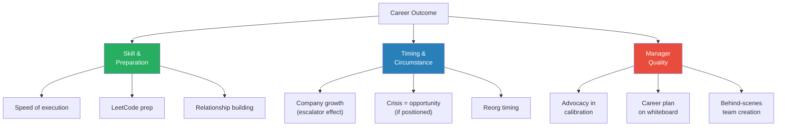
*Three forces shape every career in this series: personal skill, circumstantial timing, and the quality of your manager. You control the first, can position for the second, and must actively select the third.*

> [!tip] Core Insight
> Evan King's entire career traces to one lucky moment: skimming the exact LeetCode problem that appeared in his Meta interview the night before. "Had I not skimmed it I certainly wouldn't have passed, wouldn't work at Meta, you and I probably wouldn't be having this conversation." But luck only mattered because he had prepared extensively. Ricky frames it as two components: opportunity arriving (luck) and being prepared for it (agency).

> [!note]- Expand: Cross-Episode Detail

> **The career escalator**
> - Ethan Evans: Amazon grew from 10,000 to over 1,000,000 employees during his tenure. "My ladder was always an escalator. I could climb, but it was also moving up for me." Growth creates new roles, new teams, new VP slots that do not exist at stable companies (Episode: [[Amazon VP on Stack Ranking PIPs and Bezos - Ethan Evans]])
> - Rome: Snapchat went from 100 to 3,000 employees during his tenure. His team grew to 250 engineers. Ryan notes that some of Rome's growth was situational — Snapchat could have gone down instead of up. Rome agrees: "Manager career growth is heavily constrained by organisational structure and company strategy." (Episode: [[Frontline Manager to Senior Director in 3 Years - Rome]])
>
> **Crisis creates opportunity — for those already positioned**
> - Evan King's Christchurch crisis: the mosque shooting was live-streamed on Facebook. Evan, as tech lead for graphic violence, was in the war room with the VP of Integrity. His manager was on paternity leave. The crisis led to the creation of a new team — Real-Time Integrity — and ultimately to Evan's staff promotion. But this only happened because he had two years of context already built (Episode: [[25 Year Old Staff Eng at Meta - Evan King]])
> - Adam Ernst's Core Data crisis: Apple's framework fell apart at Facebook's scale. Because Adam was positioned in iOS infrastructure, the crisis became his career-defining opportunity to build mem models and ComponentKit (Episode: [[Meta IC9 on Influencing Engineers Failures and Learnings]])
>
> **Manager quality as career multiplier**
> - Simon's manager Baloa drew a plan to IC5 on a whiteboard during boot camp and delivered on it for five and a half years across two continents. Being the second engineer on Baloa's team gave Simon outsized one-on-one mentorship (Episode: [[26 Year Old Meta Staff on Promotions and Equity Bonuses]])
> - Evan King only learned later how much his manager advocated behind the scenes — the creation of the Real-Time Integrity team was driven by his manager's advocacy, not Evan's
> - Evans frames it starkly: "Your manager is the chicken. You're the pig." Your career is on the line, theirs is not. Test whether your manager knows the promotion deadlines by asking specific questions. If they say "why does September 15th matter?" — that is a red flag (Episode: [[Amazon VP on Stack Ranking PIPs and Bezos - Ethan Evans]])
>
> **When luck turns against you**
> - Igor: 14.5 years of context at Google, then two shorter stints at Cruise and Meta. At Meta, 14 months was not enough to ramp to E7-level productivity — and the bottom-10% layoff policy was ticking. He requested a voluntary demotion; HR had no process for it (Episode: [[Meta IC7 Honest Demotion Story]])
> - Igor's Cruise stint was going well — then the autonomous vehicle accident happened. Layoffs, quitting, company instability. External events destroyed a situation that was working
> - Adrian: not joining Instagram early was his biggest career regret. Peers who stayed hit IC7-IC10 years ahead of him. He frames it as a "Bitcoin in 2013" regret — unknowable at the time (Episode: [[New Grad to Principal Engineer IC8 at Meta]])
>
> **Expanding your luck surface area**
> - Adrian: "Take more shots, invest in relationships without expecting return, help others succeed first." Every role in his career came through personal connections — he never applied for a job through a website
> - Ricky (UCLA Panel): you can increase your luck by preparing deeply and applying widely. Ryan's escape from Amazon illustrates both — leaving was initiative, getting offers was preparation meeting opportunity (Episode: [[Industry Secrets Staff Engineers Wish They Knew - UCLA Panel]])
>
> **The Ramp-Up Ladder: when context is the real capital**
> - Igor introduces the concept: on day one at a new company, you know less than an intern who has been there two weeks
> - At senior levels, you start at "level zero" and must mentally climb through L3, L4, L5, L6 to reach your actual title
> - After 14 months at Meta, Igor estimates he reached maybe E6 — never fully E7
> - The ramp-up is hardest at large companies with crowded senior spaces: "Meta has too many senior engineers, frankly. You need to find scope for yourself, and there's intense competition for it" (Episode: [[Meta IC7 Honest Demotion Story]])
> - The cruel comparison: at Google he had 14.5 years of relationships, infrastructure knowledge, and trust. At Meta, none of it transferred. "Context as capital" — relationships and institutional knowledge are career capital that does not move with you
> - Igor's Cruise experience was the counterpoint: smaller company, less infrastructure to learn, natural scope gaps to fill. "You can easily carve out space to grow into — there is a lack of people." But then the autonomous vehicle accident destroyed everything external to his control
>
> **Choosing your team as a luck multiplier**
>
> > [!example] Ryan's Amazon Escape (UCLA Panel)
> > - After graduating from UCLA, Ryan joined Amazon and spent eight months "floundering" — not learning, not growing
> > - He decided to take matters into his own hands: applied to many companies, ground LeetCode
> > - Got offers from every company except one
> > - Chose Meta, which set up the rest of his career
> > **The lesson:** The worst place to be is a team where you are not growing. Leaving is harder than staying — but staying has a compounding cost.
>
> > [!example] Evan King Choosing the Terrorism Team Over Cybersecurity
> > - Evan expected to join a cybersecurity team given his hacking background
> > - Found cybersecurity teams "stoic, less friendly, less welcoming"
> > - Discovered Content Integrity — brand new terrorism team in Seattle: one manager (shared), one half-time engineer
> > - The obscure, understaffed team became the foundation for his entire career trajectory
> > **The lesson:** The best opportunities are often the ones nobody is competing for. A tiny team with massive scope creates acceleration that established teams cannot offer.
>
> **Timing and reorgs**
> - Evans' VP promotion required a stable reporting relationship for 2.5 years. His VP was reorged within 6 months after the promotion — had Evans been six months later, he would have had to start over with a new boss (Episode: [[Amazon VP on Stack Ranking PIPs and Bezos - Ethan Evans]])
> - Stefan Mai had seven different managers in three and a half years at Meta — one every six months. This turbulence directly held back his M2 promotion (Episode: [[Meta Senior Manager on Career Growth PIPs and Culture - Stefan Mai]])
> - Simon's advantage: the same manager (Baloa) for five and a half years. Consistency of relationship was itself a form of luck (Episode: [[26 Year Old Meta Staff on Promotions and Equity Bonuses]])
>
> **Company stage shapes opportunity**
> - Stefan Mai uses Kent Beck's Explore-Expand-Extract framework to explain why certain companies accelerate careers and others do not
>   - **Explore:** seed-stage energy, asymmetric upside, unconstrained executors thrive
>   - **Extract:** Amazon's current culture — best case is 1-2% improvement, catastrophic risk looms, risk-averse operators succeed
>   - Amazon's culture evolved toward Extract over 30 years, which explains why it struggles to innovate but excels at optimisation (Episode: [[Meta Senior Manager on Career Growth PIPs and Culture - Stefan Mai]])
> - David Singleton: Stripe operated in Expand mode — growing rapidly, hiring aggressively, building the infrastructure for scale. The engineering culture was about first principles over pattern matching (Episode: [[Ex-Stripe CTO on Career Growth and Coding as a Leader]])
> - Michael Novati: early Facebook was pure Explore — engineers had veto power over product decisions, hacking culture, Thursday night hackathons. The IPO in 2012 shifted the company toward Extract: "How is Facebook going to make money?" (Episode: [[Meta IC7 on Zuck Stories Rapid Growth and Code Machine Archetype]])
>
> **The regret no one talks about**
> - Evan King's closing advice: "I over-optimised for career growth at the expense of relationships." He tells younger engineers to invest in friendships and romantic relationships, not just the next promotion (Episode: [[25 Year Old Staff Eng at Meta - Evan King]])
> - David Rumpka: a stage-3 cancer diagnosis at 35 permanently rewired his understanding of work-life balance. "Companies use long hours to compensate for bad leadership" (Episode: [[Retired Netflix Eng Director on Leetcode Regrets and Hiring]])
> - Ricky (UCLA Panel): "Work is not everything — diminishing returns apply to career investment. The happiest moments are not promotions." (Episode: [[Industry Secrets Staff Engineers Wish They Knew - UCLA Panel]])
> - Rome: the happiest period in his career began when he stopped aiming for promotions and started focusing on impact. "Titles belong to the company, not to you" (Episode: [[Frontline Manager to Senior Director in 3 Years - Rome]])

### Agency: The Underrated Career Variable

> [!note]- Expand: Agency Stories Across the Series
> - Ryan begged a manager with no headcount to let him join Instagram infrastructure. The manager saw his earnestness and "borrowed headcount from somewhere." He stayed on that team his entire Meta career (Episode: [[25 Year Old Staff Eng at Meta - Evan King]])
> - Evan King chose an obscure terrorism team over the "obvious" cybersecurity path — the team was brand new, one manager shared with another team, one half-time engineer. "Who doesn't want to fight terrorism?" (Episode: [[25 Year Old Staff Eng at Meta - Evan King]])
> - Adrian approached Instagram CTO Mike Krieger, identified that Instagram had no AB testing infrastructure, was told "we have bigger fish to fry," and built it anyway. His first promotion — which he did not even know existed — came from that unsanctioned work (Episode: [[New Grad to Principal Engineer IC8 at Meta]])
> - Stefan Mai: "Career agency is the highest-leverage trait — writing a plan and executing it pays incredible dividends that remain underemphasised even by the people who benefit from it" (Episode: [[Meta Senior Manager on Career Growth PIPs and Culture - Stefan Mai]])
> - Rome's version: every career decision anchored against a single northstar — become CTO of an AI company. Each move filled a specific gap: Facebook for industry experience, Square for director leadership, Snapchat camera team for product experience. "Only the people who can think differently early can see the new opportunity that no one else can see" (Episode: [[Frontline Manager to Senior Director in 3 Years - Rome]])
> - Laurent: he pitched his own manager on letting him become a frontline manager — not because he was asked, but because he identified a structural problem with the team's support. His pitch was value-driven: here is the problem, here is how I solve it for you, here is why it benefits the team (Episode: [[Airbnb Staff Eng on Calibrations and Getting Past Senior]])
>
> > [!example] Ethan Evans' Director Promotion: Risk + Pressure
> > - A project opportunity came up that Evans' management advised against pursuing
> > - Evans told his SVP: "Unless you order me not to do this, I'm going to do it"
> > - The SVP essentially said "great, hang yourself"
> > - Evans built the TiVo partnership and it became a major success
> > - The key line in his promotion case: "Without Ethan, we wouldn't have had TiVo"
> > - Simultaneously, his VP was leaving the company. Evans applied pressure with calibrated language: "My career is very important to me, and I need to know if it's as important to Amazon"
> > - Neither the risky project NOR the polite pressure alone would have worked — he needed both
> > **The lesson:** Rapid advancement requires taking calculated risks AND making your ambition visible. Playing it safe and waiting patiently is the strategy most likely to leave you exactly where you are.
>
> **The common thread:** in every case, the engineer who advanced fastest was the one who created their own opportunity rather than waiting for one to be assigned. The series treats agency not as a personality trait but as a learnable skill — one that begins with the simple act of asking "what do I have to do to get promoted?" and following through on the answer.
>
> **Evans' personality transformation as ultimate agency**
> - Evans was fired twice from startups for abrasiveness — his performance review said his approach was to "knock heads together"
> - After his second firing, right after 9/11 and the dot-com bust, an interviewer said: "Everything sounds fine, but if you were that valuable, these companies would have found a way to keep you"
> - This broke through years of self-serving narrative and triggered a complete reinvention
> - He studied the psychology of work — motivation, interaction, asking questions instead of making declarations
> - "Engineers are trained to make statements. Leaders learn to ask questions. The moment I switched from declarations to inquiry, people stopped fighting me and started following me." (Episode: [[Amazon VP on Stack Ranking PIPs and Bezos - Ethan Evans]])
> - His formulation of the sweet spot: "strategic annoyance" — the middle ground between pushover and bully, where you push for what you want without escalating confrontation

---

# Part 2: Leadership & Influence

*Every guest above IC6 or M1 describes the same discovery: technical excellence stops being the primary lever. From staff engineer upward, the limiting factor is your ability to influence people who do not report to you, navigate organisational dynamics, and make others want to follow your direction without being told to.*

## 5. Influence Without Authority

*At Meta, IC levels are not public. You cannot say "I'm IC6, listen to me." At Google, Amazon, and Stripe, the dynamics differ but the principle is the same: trust must be earned daily by being right consistently, and the most effective influence tool is not a brilliant argument — it is removing the burden from the person you are trying to convince.*

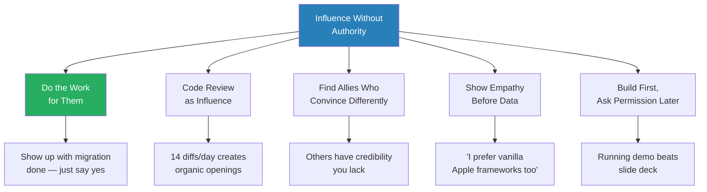
*Adam Ernst's influence model has five components, but "do the work for them" is the keystone — it changes the conversation from "should we do this?" to "is this okay?" This insight appears independently in at least four episodes.*

> [!tip] Core Insight
> The highest-leverage influence strategy is not persuasion. Adam Ernst's approach: write the migration code yourself so teams only need to approve, not execute. Brendan Burns' parallel: build the prototype first, then show management a running demo instead of a slide deck. Both eliminate the work of saying "yes" and make "no" require active effort.

> [!note]- Expand: Cross-Episode Detail

> **How code review becomes influence**
> - Adam Ernst reviewed 1,600 diffs in 6 months — about 14 per workday
> - His review style: explain WHY you care, not just WHAT to change. "Don't say 'change X to Y' — say 'X has some problems, so I want you to use Y. But if you feel strongly, go ahead.'"
> - Always be open to missing context — and acknowledge it is still the diff author's fault if the diff does not contain enough context
> - Frame objections as "I might be wrong" — this protects you from looking foolish when you are wrong, and makes the author more receptive when you are right
> - The influence spreads virally — the diff author adopts your standards and applies them in their own reviews (Episode: [[Meta IC9 on Influencing Engineers Failures and Learnings]])
>
> **Adam Ernst's six-part influence model (IC9)**
> - Talk in person: tone conveys faster than writing
> - Show empathy: acknowledge their position first — "Yes, I prefer vanilla Apple frameworks too"
> - Give data: they disassembled Core Data's closed-source binary to prove WHY it was slow
> - Do the work for them: write the migration code yourself
> - Code review as influence: 1,600 diffs in 6 months created constant organic openings to shape standards
> - Find allies: Clement Gendmer and Greg Mech "carried a lot of weight" and could convince people Adam could not
> - The critical lesson from ComponentKit adoption: his mentor Jonathan Dan was building a competing framework called Panels. Adam compromised by adopting Panels' data source technology. This turned enemies into co-owners (Episode: [[Meta IC9 on Influencing Engineers Failures and Learnings]])
> - Adam was also aware of ComponentKit's trade-offs from the start — declarative UI is perfect for scrolling lists but less natural for dynamic drag-and-drop interfaces. Acknowledging limitations increased his credibility with sceptics
>
> **Brendan Burns: reframing the choice**
> - The Kubernetes pitch to Google leadership: "There's going to be an open source container orchestrator. Do you want it to be ours or do you want it to be someone else's?"
> - This removed the proprietary option entirely — the only question was ownership
> - He also separated the Kubernetes brand from the Google brand, giving freedom to fail without damaging Google Cloud's reputation (Episode: [[Kubernetes Co-Creator on Engineering-Led Direction - Brendan Burns]])
>
> **Evan King: influence through hidden levels**
> - At Meta, IC levels are not public. Evan led a team without anyone necessarily knowing his rank
> - "There's no fallback of 'I'm IC6, listen to me' — it needed to be earned every day"
> - He was included in performance review conversations, had one-on-ones with all team members, and even tried to attend calibration as an IC (got turned down)
> - Ryan confirms: before becoming a manager and seeing everyone's levels, he had an accurate gauge just from observing who was consistently right in meetings. "There were no surprises." (Episode: [[25 Year Old Staff Eng at Meta - Evan King]])
>
> **Ethan Evans: influence without authority at Twitch**
> - Evans deliberately gave up his 800-person team to advise Emmett Shear (Twitch CEO) — a role with zero direct authority
> - Twitch's team initially did not see profitability as important: "Now that Amazon's bought us, why do we need to worry?"
> - Evans was trapped between a team that did not see the problem and a boss (Andy Jassy) who demanded results
> - The skill: achieving goals without giving anyone orders (Episode: [[Amazon VP on Stack Ranking PIPs and Bezos - Ethan Evans]])
>
> **Laurent: leading through questions at 70+ engineers**
> - At Stripe, leading 35 to 140 engineers across developer productivity
> - His rule: never tell anyone what to do or reject a design outright — only ask questions
> - "Lead through questions, not directives" (Episode: [[Airbnb Staff Eng on Calibrations and Getting Past Senior]])
>
> **Carey Nachenberg: collaboration over being right**
> - At Lyft's autonomous vehicle division, the architecture transformation succeeded through influence with roboticists, not authority over them
> - He frames "outcomes focus" as the key: understand how stakeholders measure success and speak to their metrics, not your technology (Episode: [[GoogleX Chief Scientist on Imposter Syndrome and Project Taste - Carey Nachenberg]])
>
> **David Singleton: culture as the ultimate influence mechanism**
> - "Culture is the behaviors you accept" — if anyone sees a cultural violation go unchallenged, that violation becomes the new culture
> - At Stripe, operating principles were distilled from the most effective employees' concrete behaviours — not abstract values
> - "Walk the store": publicly using the product in company meetings to demonstrate the quality bar. This sets the standard without giving a directive (Episode: [[Ex-Stripe CTO on Career Growth and Coding as a Leader]])
> - "Meticulous in your craft": Stripe's 404 error page tells you about test mode — a level of polish that signals to every engineer what excellence looks like
>
> **Adrian: target new users, not converts**
> - Bento's adoption strategy bypassed legacy resistance entirely
> - Instead of convincing veteran engineers to switch, Adrian targeted boot camp onboarding — new hires learned Bento as their first tool
> - Network effects did the rest: as more people used Bento, it became the default
> - By the time legacy holdouts noticed, 60% of the company's data workers were already on the platform (Episode: [[New Grad to Principal Engineer IC8 at Meta]])
>
> **Ethan Evans: the preemptive strike**
> - Whoever tells leadership their story first wins the conflict
> - When Evans wanted his Director promotion, his exact wording was deliberately crafted: "My career is very important to me, and I need to know if it's as important to Amazon"
> - No one could accuse him of making a threat — but the implication was unmistakable (Episode: [[Amazon VP on Stack Ranking PIPs and Bezos - Ethan Evans]])

### When Influence Fails: The ComponentScript Postmortem

The series' most instructive failure story comes from Adam Ernst — a two-year project that was technically excellent and still lost to a competitor that skipped data consistency entirely. It illustrates the limits of technical influence when the product has no audience.

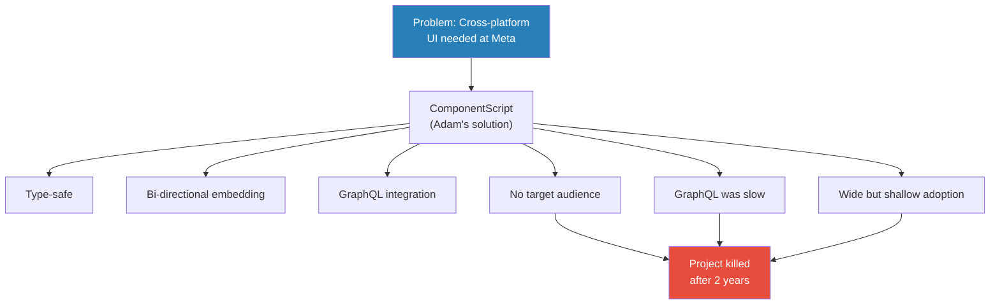

> [!note]- Expand: The Three Fatal Mistakes
> - **Mistake 1 — No target audience:** iOS engineers said "I don't want to learn JavaScript." Web engineers said "I'll use React Native." ComponentScript sat in no-man's-land
> - **Mistake 2 — GraphQL baggage:** The infra team cared about data consistency via GraphQL. A competitor skipped data consistency entirely: "What if we just didn't do it?" Adam's team was horrified — but 60-80% of products simply do not care about data consistency. Adam refused to compromise. This was fatal
> - **Mistake 3 — Going too wide:** Pitched to all mobile engineers, got small pings of interest everywhere, but no single team went all-in. Without one team committing fully, there was never enough momentum
> - Adam's coding-machine instinct made it worse: "I just need to write more code. I just need to help more features convert." This was exactly the wrong response — more code cannot fix a product-market-fit problem
> - The shutdown earned more goodwill than the project: Adam migrated every dependent team, completely deleted the framework, and published a detailed retrospective. "If anything, I got a positive bump after the fact" (Episode: [[Meta IC9 on Influencing Engineers Failures and Learnings]])
> - The meta-lesson: internal developer tools need product-market fit just like external products. If you cannot answer "who specifically would use this and why would they choose it over alternatives?" — you do not have a product

---

## 6. The Tech Lead Role: Managing Without the Title

*Tech leading is the first taste of leadership for most engineers — and almost nobody knows what it means when they get it. The series reveals that the role is far more about people than about technical direction, and that the transition exposes territorial instincts, delegation failures, and communication gaps that determine whether you grow into leadership or retreat to pure IC work.*

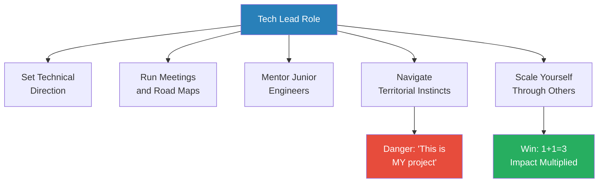
*Tech leading sits at the intersection of technical decision-making and people leadership. The engineers who grow through it learn to scale themselves; the ones who struggle treat it as a bigger IC role.*

> [!note]- Expand: Cross-Episode Detail

> **Evan King's Graphic Violence team**
> - Manager offered him tech lead of a three-person team. He did not know what "tech lead" meant — "it sounded cool and fancy"
> - He started running weekly meetings, setting road maps, having one-on-ones — "this was the transformative moment in my career where I grew leadership skills"
> - Then a senior engineer joined and Evan felt territorial: "This is MY project and MY things"
> - He corrected himself ("slapped myself across the face"), and the relationship became 1+1=3 — his best professional relationship
> - The lesson: scope is not zero-sum. The person you feel threatened by is often the person who will teach you the most (Episode: [[25 Year Old Staff Eng at Meta - Evan King]])
>
> **Adrian's Bento as tech lead platform**
> - Adrian hired tooling enthusiasts, built a team, and grew Bento from a personal tool to a company-wide platform
> - His approach was TLM (Tech Lead Manager) — a hybrid at Meta where you contribute 70% IC work and 30% managing a small team
> - The key to scope creation: volunteer for uncovered work, do it for a year, then ask for the title post-hoc (Episode: [[New Grad to Principal Engineer IC8 at Meta]])
>
> **Michael Novati: the coding machine as tech lead**
> - Michael's archetype is the coding machine — one person doing what distributed teams cannot, through volume, context, and relentless drive
> - But he admits his weakness: "optimising for what I can crank out instantly" while ignoring the highest-impact A because he did not have the answer in his head
> - At IC7, raw output is table stakes. Taste, judgment, and social credibility are what separate IC5 output from IC7 impact (Episode: [[Meta IC7 on Zuck Stories Rapid Growth and Code Machine Archetype]])
>
> **Adam Ernst: five archetypes of senior IC**
> - Coding Machine (Adam Ernst, Dustin Shahidehpour): high volume output, loves writing code
> - Fixer/Debugger (Wei Han): dives 10 layers deep, finds root causes
> - Project Starter (Michael Bolan): identifies needs, kickstarts end-to-end
> - Communicator (Bob Baldwin, Oliver Ricard): boils down complex messages
> - Alignment Driver (Nolan O'Brien): drives cross-team alignment, manages relationships
> - No single archetype dominates — the common thread is going deep in whatever mode fits you (Episode: [[Meta IC9 on Influencing Engineers Failures and Learnings]])
>
> **Written communication in the tech lead role**
> - Simon: effective engineering posts follow an inverted pyramid — flashy title, TLDR with numbers above the fold, context, then technical details for "fellow nerds"
> - "Nothing at Meta is someone else's problem" — Simon's interpretation: read the code, research the blocker, propose a solution before waiting for another team (Episode: [[26 Year Old Meta Staff on Promotions and Equity Bonuses]])
> - Evan King: the tech lead needs to understand every person's growth trajectory — he was included in performance review conversations to help his manager assess the team (Episode: [[25 Year Old Staff Eng at Meta - Evan King]])
>
> **Delegation as leverage**
> - Ryan discovered delegation through an intern: "I was always a workhorse taking on three work streams. I realised I could entrust the intern with some work — now I felt like I was two people at once, shipping twice as much impact"
> - Simon's manager's principle: "Delegation is Not Abdication — you delegate the work, never the responsibility. You must verify outcomes, not just hope." (Episode: [[26 Year Old Meta Staff on Promotions and Equity Bonuses]])
> - Simon tracks both a People Breakdown and a Project Breakdown separately — because a project can be on track while an individual contributor is drowning
> - This dual-tracking system catches problems that project-level dashboards miss entirely

### How Company Culture Shapes Careers: Amazon vs Meta vs Netflix vs Stripe

The series features guests from every major tech company, and the cultural contrasts are stark.

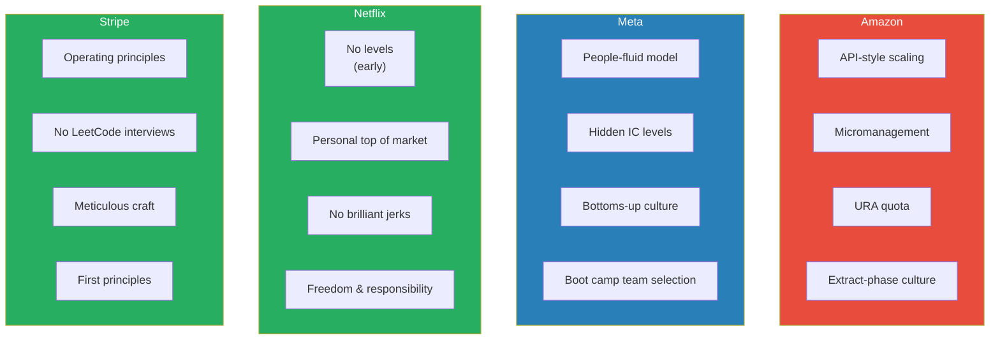
*Each company's culture creates different career dynamics. Amazon rewards risk-averse operators. Meta rewards speed and bottoms-up initiative. Netflix rewarded autonomy (until it broke at scale). Stripe rewards craft and first principles.*

> [!note]- Expand: Cultural Contrasts
> - **Amazon (Evans, Stefan Mai):** Built around low-margin operations and 30 years of Extract-phase culture. Each management layer gets involved at detailed level. Stack ranking with URA quotas. Evans describes a culture where "polite and civil" pressure is the only way to advance (Episode: [[Amazon VP on Stack Ranking PIPs and Bezos - Ethan Evans]])
> - **Meta (Evan King, Simon, Adrian, Adam Ernst, Michael Novati):** Bottoms-up culture where engineers historically had veto power. Boot camp lets new grads choose teams. Hidden IC levels force trust to be earned daily. "Move fast and break things" was about breaking norms, not causing havoc. Post-IPO shift toward business-driven decisions. Impact is rewarded regardless of effort — a one-line fix with massive impact beats a year-long complex project (multiple episodes)
> - **Netflix (David Rumpka):** Revolutionary in 2000: no brilliant jerks, 8-hour excellence. But the culture memo was "aspirational, not descriptive." Two titles — engineer and senior software engineer — could not distinguish contribution at scale. "Personal top of market" compensation broke when pay gaps could not be rationalised. Netflix eventually added levels after David left (Episode: [[Retired Netflix Eng Director on Leetcode Regrets and Hiring]])
> - **Stripe (David Singleton, Laurent):** Operating principles distilled from the most effective employees' concrete behaviours. "Walk the store" — publicly using the product to demonstrate the quality bar. "Meticulous in your craft" — the 404 error page that tells you about test mode. First principles thinking over pattern matching (Episode: [[Ex-Stripe CTO on Career Growth and Coding as a Leader]])
> - **Google (Igor, Ricky, Carey):** Long tenure rewarded — Igor's 14.5 years built irreplaceable context. Terminal level technically L4 but expectation to reach senior increasing. Crowded senior space at large scale. Boomeranging at a lower level required exceptions at every step (Episode: [[Meta IC7 Honest Demotion Story]])
> - **Snapchat (Rome):** Started with ~100 people, grew to 3,000 in two years. Internal culture was surprisingly similar to Facebook: move fast, break things, done is better than perfect. But LA's geographic diversity improved product thinking — Rome's neighbours included a medical doctor and a cryptographer for Michael Jackson, not just tech workers (Episode: [[Frontline Manager to Senior Director in 3 Years - Rome]])
> - **Evan Spiegel's leadership style:** Pixel-level product obsession (reviewed demos at the pixel level), deep personal loyalty to early employees (told leadership never to fire the first 15 engineers). Rome compares him to Steve Jobs (Episode: [[Frontline Manager to Senior Director in 3 Years - Rome]])
> - **Evans on Bezos vs Jassy:** Roughly 50 meetings with each. Bezos: "It's my toy" — takes huge gambles, emotionally supportive. Jassy: answers to the board, more measured risks, scrutinising. "The founder can bet the company on black; the steward must preserve what the founder built" (Episode: [[Amazon VP on Stack Ranking PIPs and Bezos - Ethan Evans]])

### The Side Project as Career Catalyst

Multiple guests describe side projects — either inside or outside the company — as the mechanism that created their biggest career leaps.

> [!note]- Expand: Side Projects Across the Series
> - **Brendan Burns:** The 10% Rule — hide ~10% of your effort for side projects management did not ask for. Kubernetes itself started this way — a small team hacking together an MVP in under a week. "A running prototype forces a 'ship or kill' decision instead of a 'should we build this' debate" (Episode: [[Kubernetes Co-Creator on Engineering-Led Direction - Brendan Burns]])
> - **Adrian:** Built Bento as a personal tool to reduce boilerplate. His manager gave him 2-3 months to hack on it with a clear fallback plan. It became a company-wide platform (Episode: [[New Grad to Principal Engineer IC8 at Meta]])
> - **Adrian (earlier):** Built Instagram's AB testing system despite being told "we have bigger fish to fry." Got his first promotion — one he did not know existed — from unsanctioned work (Episode: [[New Grad to Principal Engineer IC8 at Meta]])
> - **Evan King:** At Zillow, finished his internship project fast and built a gamified security awareness tool — a leaderboard tracking who left screens unlocked. His manager called him "the best intern he had ever worked with" (Episode: [[25 Year Old Staff Eng at Meta - Evan King]])
> - **Ryan Peterman:** Built a Raspberry Pi occupancy sensor for his engineering lab. Talked about it in interviews and it resonated with interviewers. "The best side projects solve real problems around you — not Redis clones nobody uses" (Episode: [[25 Year Old Staff Eng at Meta - Evan King]])
> - **Laurent:** Built a calendar defrag tool that looked at all his reports' calendars and defragmented meeting schedules. "Everyone liked it because it directly increased their productive hours" (Episode: [[Airbnb Staff Eng on Calibrations and Getting Past Senior]])
> - **Michael Novati:** Joined Facebook's internal tools team specifically because building the "social network for work" excited him. His most impactful contributions were internal developer tools that nobody explicitly asked for (Episode: [[Meta IC7 on Zuck Stories Rapid Growth and Code Machine Archetype]])

---

## 7. Transitioning from IC to Manager

*The IC-to-manager transition is the most discussed career fork in the series — and every guest who has crossed it describes the same pattern: feeling ready before you are, a brutally uncomfortable first year, the discovery that your peer relationships have fundamentally changed, and an 18-month learning curve before competence arrives. Six guests have crossed this boundary. Two went back. Their stories form the most complete picture of this transition available in any podcast series.*

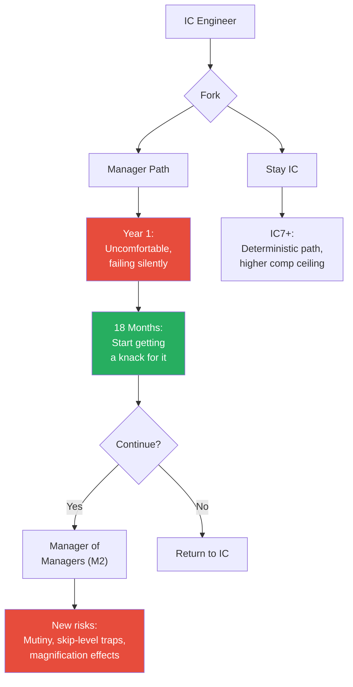
*The IC-to-manager transition has a consistent 18-month timeline from title to competence. The M1-to-M2 jump introduces qualitatively different risks that catch even experienced managers off guard.*

> [!tip] Core Insight
> Stefan Mai's warning: "The assumption that leading other managers is the same pattern as leading engineers will get you fired — or mutinied." At the M2 level, a clumsy skip-level question can disintermediate your M1, demotivate their report, and create problems where none existed. Small actions at M2 have magnification effects that simply do not exist at M1.

> [!note]- Expand: Cross-Episode Detail

> **The power dynamic shift**
> - Stefan Mai: the power dynamic introduced when you become someone's manager is "corrosive to the bonds you had as peers." The information you got freely as a peer dries up. The information you actually need (career objectives, what is dragging on them) is much deeper than friendship provided
> - His biggest early mistake: not spending enough time understanding individuals' goals. He knew it was important but did not know HOW to do it. The result: he could not tailor support or work assignments to individuals — "an elementary mistake" (Episode: [[Meta Senior Manager on Career Growth PIPs and Culture - Stefan Mai]])
> - Laurent: one report immediately tested him with a scenario — a missed interview email. "If you jump to punishment without understanding context, you fail the most basic test of leadership." Laurent's answer: "I'd ask you what happened and try to understand the facts." The report said: "You passed." (Episode: [[Airbnb Staff Eng on Calibrations and Getting Past Senior]])
> - Laurent also identifies inflexibility as the failure mode: micro-management works for new grads but fails with experienced engineers; hands-off works for experts but fails with juniors. He recommends <b style="color: #2980b9">situational leadership</b> — four coaching styles (directing, coaching, supporting, delegating) matched to the learner's skill and motivation level
>
> **Rome: the manager-to-director leap**
> - Rome joined Square as a director and immediately discovered that everything he knew about managing people was insufficient
> - At Facebook he had been the most senior person who knew the most details. At Square, his reports knew more. He could not use his old playbook of "I know the most, so I lead"
> - His reports started questioning why his layer even existed
> - The turning point: "If I'm a middle layer between them and the executive, what value should I bring?" — strategic direction, cross-department resource allocation, solving the most difficult organisational problems
> - He also faced the human challenge of being hired above people who wanted the role. First priority: build trust by proving you are a career promoter, not a career blocker (Episode: [[Frontline Manager to Senior Director in 3 Years - Rome]])
>
> **Simon: management burnout**
> - Simon tried management after IC6 — but his manager, skip, and director all went offline simultaneously
> - Without a support network, he burned out and returned to IC
> - His conclusion: IC6 is the sweet spot for people-oriented engineers — mentoring and coaching upside without unconditional management responsibility (Episode: [[26 Year Old Meta Staff on Promotions and Equity Bonuses]])
>
> **Laurent: the wedding quarter test**
> - Laurent left for 3 weeks for his wedding. When he returned, the team had planned the entire next quarter, assigned all projects, and figured out how to work together — without him
> - His reaction: "What am I doing here? I'm bored." He switched back to IC because the team no longer needed him
> - His framing: the best measure of a manager's success is whether the team can operate without them (Episode: [[Airbnb Staff Eng on Calibrations and Getting Past Senior]])
> - Laurent's advice for ICs considering management: start by managing an intern. It gives you a taste of management's emotional intensity — interns are earlier in their career, you direct more, you get very attached — without the full complexity. But the sampling bias means you should not judge the job by that experience alone
>
> **Stefan Mai: the M2 promotion story**
> - Stefan's M2 promotion took three and a half years, involved seven different managers, and required a counterintuitive first move
> - Phase 1: Build trust by acting like an IC — joined the on-call, wrote code, acted like an engineer. Built credibility with engineers on his team and peer teams
> - Phase 2: Shift to recruiting — had a blank check from his director. Credibility was established, now scale the team
> - Phase 3: Leading another leader — eventually given an additional manager. "She kicked ass." The process of leading another leader required substantial new learning
> - Did not get the M2 title until his org was 30-40 people — by that point he was sitting in calibrations alongside other M2s, making it hard to deny he was doing the job (Episode: [[Meta Senior Manager on Career Growth PIPs and Culture - Stefan Mai]])
>
> **Evan King: considered management, stayed IC**
> - Ryan chose management (transferable skills, broader career options); Evan stayed IC (deterministic promotion path, higher immediate comp)
> - Evan's manager told him IC7 was "more deterministic" — fewer unknowns — but warned about the "snowflake risk": IC7+ credibility is tied to specific company context
> - Ryan's calculation: management skills transfer across companies; IC7 context mostly does not (Episode: [[25 Year Old Staff Eng at Meta - Evan King]])
>
> **David Rumpka: trust before authority**
> - Parachuting into an existing team as a senior leader at Meta, his direct report told him after two weeks: "You're already telling us what to do"
> - The lesson: new leaders must listen and build relationships for months before leading. "Under-level entry" — coming in below your previous title and proving up — is safer than coming in over-levelled (Episode: [[Retired Netflix Eng Director on Leetcode Regrets and Hiring]])
>
> **David Singleton: the balanced CTO**
> - As Stripe CTO, David practised "Engineeration" — quarterly 3-day coding stints where he joined a team, coded a real project, and wrote a friction log
> - The "balcony metaphor": periodically step off the dance floor and look down at how everything is working, especially when you are also contributing IC work
> - His warning: perfectly happy teams are a red flag — he won Google's Great Manager Award early in his career and believes he did not deserve it, because he optimised for comfort over impact (Episode: [[Ex-Stripe CTO on Career Growth and Coding as a Leader]])
>
> **Active listening as the bridge skill**
> - Stefan Mai identifies active listening as the single most underrated engineer-to-manager skill
> - Engineers default to API-like transactional conversations: query in, response out
> - What management actually requires: showing interest when someone is talking (subverbals), reflecting back what they said, asking questions that show genuine curiosity
> - "The jewel you need — the thing that makes you effective for that person — won't be volunteered. You have to earn it." (Episode: [[Meta Senior Manager on Career Growth PIPs and Culture - Stefan Mai]])
>
> **Storytelling as bedrock leadership**
> - Stefan: the ability to look back at your team's journey and paint it as a compelling narrative is what separates average managers from great ones
> - "We started with a team of two, our on-call was garbage, we invested in it and turned it around, and with the extra bandwidth we crushed it"
> - When a team is winning, collaboration, morale, and retention follow naturally. When winning stops, zero-sum politics emerge
> - The manager gets to define what winning actually means — and that definition is itself a leadership act (Episode: [[Meta Senior Manager on Career Growth PIPs and Culture - Stefan Mai]])
>
> **The M1-to-M2 magnification effect**
>
> > [!example] The Skip-Level Disintermediation Trap (Stefan Mai)
> > - A new M2 sets up skip-level meetings with indirect reports
> > - Asks leading questions: "What do you think of Jim? Does he touch on career stuff?"
> > - A week later, Jim walks in angry: "You asked Jan leading questions about whether I was doing my job"
> > - Jan comes to the M2: "I think you can help me with my career — you seem to have insights Jim doesn't"
> > - Result: disintermediated Jim, demotivated Jan, created problems where none existed
> > **The lesson:** Small well-intentioned actions at the M2 level have magnification effects. The same question at M1 is routine. At M2 it can destroy trust overnight.
>
> **The mutual exclusion of management and code**
> - Adam Ernst: "I like writing code. I really like writing code a lot. And as a manager, you can't write code." He will never manage (Episode: [[Meta IC9 on Influencing Engineers Failures and Learnings]])
> - David Singleton solved this tension with "Engineeration" — quarterly 3-day coding stints to maintain ground-level context. But he acknowledges this is a compromise, not a solution
> - Rome still writes 2-3 pull requests per week as CTO, a practice planted when a Facebook VP did six weeks of bootcamp alongside him. His philosophy: "Everyone who works on engineering needs to be technical" (Episode: [[Frontline Manager to Senior Director in 3 Years - Rome]])
>
> **Netflix: the counterexample that broke at scale**
> - David Rumpka describes Netflix's culture as revolutionary in 2000: no brilliant jerks, 8-hour excellence, freedom and responsibility
> - Patty McCord told David in his interview: "We don't value 24/7 work. Blow us away with what you can do in an 8-hour day."
> - But the culture did not scale. Netflix had only two engineering titles: "engineer" and "senior software engineer." With no levels, the system could not recognise that some engineers were doing vastly more impactful work
> - Best engineers left when their contributions went unrecognised and pay could not be rationalised
> - Netflix eventually added levels and compensation ranges — after David left (Episode: [[Retired Netflix Eng Director on Leetcode Regrets and Hiring]])
>
> **Overwork as leadership failure**
>
> > [!example] David Rumpka Forces a Vacation (Netflix)
> > - David was talking to a phenomenal engineer on a weekend who said: "Must be nice having weekends off"
> > - His team believed they could not stop working or systems would collapse
> > - David told him: "If this company cannot survive without you here on the clock, we've got a problem. Take your vacation."
> > - The engineer took a week off. The rest of the team also took time off
> > - They solved the stability problem they could not solve while exhausted — only after rest gave them the space to think differently
> > **The lesson:** Overwork prevents clear thinking. Patty McCord said the same thing a decade earlier: overwork is a leadership failure, not a badge of honour.
>
> **The IC-vs-management decision framework**
>
> ```mermaid
> flowchart TB
>     D["Decision:<br/>IC or Manager?"]
>     D --> IC["Stay IC"]
>     D --> MG["Go Manager"]
>     IC --> P1["Deterministic promo path"]
>     IC --> P2["Higher immediate comp"]
>     IC --> P3["You keep coding"]
>     IC --> R1["Snowflake risk:<br/>context doesn't transfer"]
>     IC --> R2["Handcuffed by equity<br/>and credibility"]
>     MG --> P4["Transferable skills"]
>     MG --> P5["Broader career options"]
>     MG --> P6["Understanding the<br/>full system"]
>     MG --> R3["Opportunity-dependent"]
>     MG --> R4["Wall-to-wall meetings"]
>     MG --> R5["You stop coding"]
>     style IC fill:#2980b9,color:#fff
>     style MG fill:#27ae60,color:#fff
>     style R1 fill:#e74c3c,color:#fff
>     style R5 fill:#e74c3c,color:#fff
> ```
> *Evan and Ryan both reached IC6 and faced the same fork. Evan chose IC (deterministic, higher pay). Ryan chose management (transferable, broader options). Neither claims the other made the wrong choice.*

### Organisational Politics: The Hidden Layer

*Three episodes address organisational politics directly — and the series collectively argues that understanding politics is not optional at senior levels. It is not about becoming political. It is about understanding the game well enough to avoid being played.*

> [!note]- Expand: Politics Across the Series
> - **Stefan Mai's director taught him the most important lesson:** Stefan suggested letting two teams with overlapping responsibilities compete. His director said: "You could not be more naive." The two teams would find ways to undercut each other. The friction would dwarf any gain from the competition. "Internal competition between teams doesn't produce market-style innovation — it produces destructive politics" (Episode: [[Meta Senior Manager on Career Growth PIPs and Culture - Stefan Mai]])
> - **Zero-sum behaviour intensifies when winning slows:** When an org stops growing, people redefine success in self-serving ways: "Our test coverage is awesome." This points back to the imperative of winning — performance focus solves most downstream political problems
> - **Cookie-licking and coalition-building:** Stefan catalogues the tactics engineers use to claim desirable projects: rush to be first and write a post claiming ownership (cookie-licking), pair up with others for momentum (coalition-building), demonstrate you are the best by showing why competitors are incompetent (competence signalling)
> - **Ethan Evans on empire building:** Managers are financially incentivised to grow their teams — "there damn sure is a bonus, several hundred thousand dollars a year." The result: headcount becomes the proxy for importance, even when impact does not require it. The official Amazon leadership principle says no bonus for headcount; the reality is different (Episode: [[Amazon VP on Stack Ranking PIPs and Bezos - Ethan Evans]])
> - **Evans on the preemptive strike:** In any conflict, whoever tells leadership their story first has the structural advantage. The manager outranks you, has tenure, and has established relationships with HR. "Don't think HR is going to come investigate and rescue you. That just isn't what they do."
> - **Rome's trust-first approach:** When hired above people who wanted the role, the first priority is building trust — proving you are a career promoter, not a career blocker. "The most foundational layer for a successful team is trust. Everything builds on top of trust." He recommends The Five Dysfunctions of a Team by Patrick Lencioni (Episode: [[Frontline Manager to Senior Director in 3 Years - Rome]])
> - **Carey Nachenberg's credit attribution trap:** At senior levels, influence work is invisible. Someone else took credit for his biggest project at Lyft. The lesson: document your contributions proactively, because no one else will (Episode: [[GoogleX Chief Scientist on Imposter Syndrome and Project Taste - Carey Nachenberg]])

### The Hiring Question

> [!note]- Expand: How the Series Views Hiring and Interviewing
> - **David Rumpka is the series' strongest LeetCode critic:** "They nail these interviews and they get in and their engineering work is terrible." He identifies three innate pillars of engineering talent — complex systems thinking, technical intuition, and decisions under uncertainty — that LeetCode measures none of (Episode: [[Retired Netflix Eng Director on Leetcode Regrets and Hiring]])
> - **Stripe hired without LeetCode:** David Singleton describes pair programming on real laptops with realistic exercises. Maintaining this system required volunteer effort and recognition (Episode: [[Ex-Stripe CTO on Career Growth and Coding as a Leader]])
> - **Carey Nachenberg at Google X:** His interview was eight conversations — mostly about how he solved hard problems, handled conflicts, and where the field was going. Some interviews were literally sales pitches to get him excited (Episode: [[GoogleX Chief Scientist on Imposter Syndrome and Project Taste - Carey Nachenberg]])
> - **Rome's radical honesty recruiting:** At HeyGen, he tells every candidate there is a 1% chance of success. "When you go to a battlefield with soldiers, you want all soldiers to understand the difficulty they're going to face, but they are pumped for it." People who join knowing the odds will not leave at the first sign of difficulty (Episode: [[Frontline Manager to Senior Director in 3 Years - Rome]])
> - **Ryan and Ricky (UCLA Panel) on internship success:** The single biggest differentiator between interns who get return offers and those who do not is asking questions relentlessly from day one. Low performers stay silent, try to solve everything alone, and run out of time. High performers propose improvements to their senior mentors — sometimes wrong, but the logic is visible (Episode: [[Industry Secrets Staff Engineers Wish They Knew - UCLA Panel]])
> - **Evan King's LeetCode luck:** His Meta career exists because he skimmed the exact problem that appeared in his campus interview the night before. "Had I not skimmed it I certainly wouldn't have passed." The system's reliance on this kind of luck is one of the series' running concerns (Episode: [[25 Year Old Staff Eng at Meta - Evan King]])
> - **David Rumpka's three pillars:** Understanding complex systems, technical intuition, and making good decisions with incomplete data. These are innate — "born with it." Software skills are learnable. LeetCode measures neither category effectively (Episode: [[Retired Netflix Eng Director on Leetcode Regrets and Hiring]])
> - **The under-level entry strategy:** David Rumpka argues it is better to enter a company below your level and prove up than to come in over-levelled. Igor's Meta story is the cautionary counterexample — entering at E7 and being judged against people with years of context (Episode: [[Retired Netflix Eng Director on Leetcode Regrets and Hiring]], [[Meta IC7 Honest Demotion Story]])

### What the Series Leaves Open

No synthesis would be complete without acknowledging the gaps and tensions the series does not fully resolve.

> [!note]- Expand: Open Questions
> - **Survivorship bias:** Every guest succeeded at an exceptional level. The series has one honest demotion story (Igor) and one honest failure story (ComponentScript). But the base rate of engineers who try these strategies and fail is unknown. Rome acknowledges this: manager growth is "heavily constrained by organisational structure" — things entirely outside your control
> - **The relationship advice paradox:** Evan King says relationships are the biggest regret. David Rumpka says work-life balance matters most. But the series' success stories all involve years of intense focus and long hours. The contradiction is never fully resolved
> - **Big Tech specificity:** Nearly every guest works at Meta, Amazon, Google, Netflix, or Stripe. Whether these insights transfer to mid-size companies, startups, or non-FAANG enterprises is rarely addressed. Brendan Burns (Microsoft/Kubernetes) and Rome (HeyGen) are partial exceptions
> - **The LeetCode question:** David Rumpka hates it. David Singleton eliminated it at Stripe. But Meta, Google, and Amazon still use it — and the series' fastest risers all got in through it. No guest proposes a concrete alternative that scales
> - **Diversity of perspective:** The series features predominantly engineers at the highest levels of the same handful of companies. The extent to which these career patterns apply to engineers at different stages, in different geographies, or in different company cultures remains an open question
> - **What comes after:** Only a few guests address life after Big Tech — Evan King and Stefan Mai founded Hello Interview, Michael Novati founded Formation, David Singleton co-founded Dev Agents. Evan King describes the startup learning inversion: three years of Big Tech excellence left him unable to set up a database on his own. The ideal order may be startup first (breadth), Big Tech second (depth) — but most do the reverse (Episode: [[25 Year Old Staff Eng at Meta - Evan King]])
> - **The AI disruption question:** Carey Nachenberg and Michael Novati both address whether LLMs will replace engineers. Carey identifies an "AGI programming threshold" — if LLMs reach AGI-level coding, the role shifts from "how we build" to "what we build," making product thinking more valuable than coding ability. Michael argues LLMs amplify existing skill rather than replacing it — experienced engineers with strong taste benefit most. Neither sees coding becoming irrelevant in the near term, but both see the role evolving toward product judgment (Episode: [[GoogleX Chief Scientist on Imposter Syndrome and Project Taste - Carey Nachenberg]], [[Meta IC7 on Zuck Stories Rapid Growth and Code Machine Archetype]])
> - **Evans' zombie products observation:** "You can get excellent performance reviews for years while running a product that's going nowhere." The Amazon App Store hit every goal for a decade, then was shut down. Big companies confuse hitting interim goals with doing something meaningful. The tension: for your review, you want goals you know you can hit; for the company's good, you want goals you do not know how to achieve (Episode: [[Amazon VP on Stack Ranking PIPs and Bezos - Ethan Evans]])
# Part 3: Corporate Politics & Survival

## 8. Corporate Politics: The Unspoken Rules

*Every guest on The Peterman Pod eventually says some version of the same thing: politics is not optional. Refusing to engage does not make you virtuous — it makes you vulnerable. This section distils the political frameworks that recur across the series.*

The word "politics" triggers a flinch in most engineers. They picture backstabbing, manipulation, dishonesty. But the guests on this podcast use a different definition — one closer to "the art of getting things done when other people have their own agendas." Ethan Evans, the guest who addresses politics most directly, frames it this way: <b style="color: #27ae60">influence and politics use identical skill sets — the only difference is motive</b>.

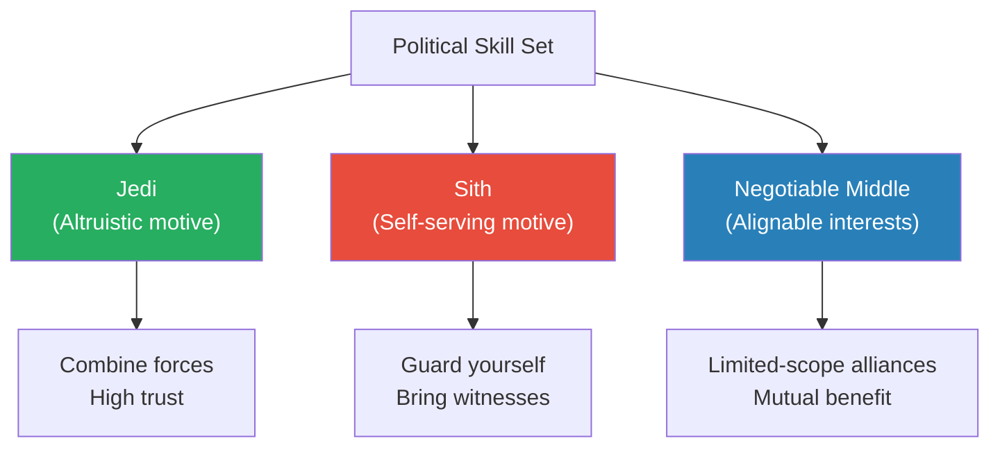
*Evans' Jedi vs Sith framework: categorise political operators by motive, then adjust your approach accordingly.* (Episode: [[How Corporate Politics Work - Narrative]])

> [!tip] Core Insight
> Politics is not something you choose to play. It is something that is done to you if you choose not to play. Every guest who has reached director level or above — Evans, Stefan Mai, Rome, David Singleton — describes the moment they stopped seeing politics as optional and started treating it as a core leadership skill.

**The Polite Fiction** is Evans' signature framework and arguably the single most actionable concept in the entire series. It is a pre-crafted statement that is technically true, strategically loaded, and delivered with warmth rather than aggression.

- The formula: think through your wording before entering the room, rehearse the key phrase, and deliver it with sincere concern rather than ultimatum
- Evans' example: "My career is very important to me, and I need to know if it's as important to Amazon" — unattackable on the surface, unmistakable in subtext
- The anti-pattern: "Promote me or I'll quit" — same message, but framed as extortion rather than aspiration
- <b style="color: #e74c3c">Pre-planning is non-negotiable</b> — Evans insists that most high-stakes conversations are either scheduled or predictable, so there is no excuse for walking in without your key phrase ready

**Managing Up** is the second political pillar. Evans condenses it into five words: "Solve problems for your boss." Stefan Mai extends it with his concept of <b style="color: #2980b9">winning as the root variable</b> — when a team is winning, collaboration and morale follow naturally; when winning stops, politics and dysfunction emerge. The manager's job is to define what winning means and ensure the team feels like it is happening.

> [!note]- Expand: Key Stories and Examples
>
> > [!example] Evans' Billion-Dollar T-Shirt Business
> > - Evans ran Amazon's App Store with 800 people
> > - He believed in custom-printed T-shirts and wanted to fund a small team
> > - His manager objected: "What does that have to do with the App Store?"
> > - Evans' reframe: "I have 800 people. If you're telling me I can't spend 1% of my resources on this, we have another discussion about micromanagement"
> > - The manager relented; Amazon now sells over a billion dollars a year in custom-printed merchandise
> > **The lesson:** With enough scope, carving out 1% for a personal bet is nearly impossible to argue against — and reframes resistance as micromanagement.
>
> > [!example] Stefan Mai's Director Lesson on Naive Competition
> > - Stefan suggested letting two overlapping teams compete — like a natural experiment
> > - His director's response: "You could not be more naive"
> > - The teams would undercut each other, create internal friction, and the noise would dwarf any gain
> > - Both teams could end up worse than if one had done it alone
> > **The lesson:** Internal competition between teams does not produce market-style innovation. It produces destructive politics.
>
> - <b style="color: #2980b9">The Three-Problem Framework</b> explains why escalating to your skip-level almost never works:
>   - Option A (dismiss your complaint): one small problem — you are "high maintenance"
>   - Option B (believe your complaint): three large problems — decide what to do with the manager, hire a replacement, cover their work in the interim
>   - The asymmetry is overwhelming — dismissing costs nothing, believing costs everything
>   - Evans' solution: "Never mutiny alone." Bring two or three corroborating voices
>
> - <b style="color: #2980b9">The Umbrella vs Funnel Manager</b>: when pressure comes from above, managers either shield their team (umbrella) or channel it onto them (funnel)
>   - Funnel managers choose the path of least resistance — pushing back on reports is safer than pushing back on their boss
>   - The only fix: help them feel safe pushing back on their boss, or help them feel not safe pushing down on you

**Scope Wars** are where politics becomes most visible. Evans rapid-fires four defensive tactics and three offensive tiers for when another organisation tries to take your team's scope:

- <b style="color: #2980b9">Defence tactics</b>:
  - **The Skunk Trick:** surface all the unsexy maintenance work nobody wants — "We run the Yugoslavia tax engine. Are you ready to take that on?"
  - **The Thorny Target:** overreact early and push back to signal you are not a soft target
  - **The Delay:** invoke the six-month productivity hit from reorgs — "We're crushing it on profitability. Let's not even talk about this for six months." By then, the attacker will have moved on
  - **Storytelling over facts:** people come to emotional conclusions and then rationalise them — if you are the better storyteller, you provide the narrative that wins
- <b style="color: #2980b9">Attack tiers</b>:
  - Tier 1 (legitimate value creation): make a genuine case with metrics
  - Tier 2 (efficiency arguments): consolidation for cost savings
  - Tier 3 (highlighting flaws): expose the other org's problems
  - **The Trojan Horse:** offer to help the struggling org, start contributing, then casually suggest consolidation — "now that I'm here, I see all these efficiencies" (Episode: [[How Corporate Politics Work - Narrative]])

**The Porcupine Defence** is Evans' metaphor for soft power. The goal is not to be the most powerful person in the room — it is to be the least attractive target. Allies, reputation, and relationships form the quills. An attacker who sees enough quills will find a softer target and tell themselves that target was the better opportunity all along.

**Empire Building** is not a character flaw — it is a rational response to a broken measurement system. Evans explains: "Empire building exists because it's rewarded. And it's rewarded because counting people is the easiest thing to do." Amazon formalised director thresholds at 80-90 reports, directly contradicting their own leadership principle that "there's no bonus for additional headcount." The result: leaders game headcount numbers, temporarily transferring reports for six months to cross numerical thresholds, then returning them after promotion. (Episode: [[How Corporate Politics Work - Narrative]])

**Back-Channeling** is the art of driving your message through private conversations. Evans splits it into two kinds:
- <b style="color: #27ae60">Positive back-channeling</b>: giving people a chance to ask questions privately before a public meeting — the value is emotional buy-in, not just information exchange
- <b style="color: #e74c3c">Manipulative back-channeling</b>: undermining another proposal behind closed doors — "not usually necessary" but some battles are lost to people who do it
- The executive making the decision is wondering: how will this make me look? What happens if it goes wrong? Will this person resolve conflicts reasonably? The backchannel lets them quiet all of those fears (Episode: [[How Corporate Politics Work - Narrative]])

**Soft Power Disproportionate to Title** — Evans tells two stories that prove you do not need positional authority to create major impact:
- A new college graduate at Amazon emailed Bezos directly with an idea for cloud storage, fought his way into an invite-only conference, and got the project funded — it became Cloud Drive
- A mid-level employee assembled the proposal for Fire TV and helped create one of Amazon's major living-room devices
- Evans' formula: a good idea based in real fact, told with enthusiasm and told repeatedly, specifically told to the people who have the power to act on it (Episode: [[How Corporate Politics Work - Narrative]])

> [!note]- Expand: The Political Survival Checklist
>
> A synthesis of political advice from across the series:
>
> - **Before any high-stakes conversation:** pre-plan your key phrase (Evans). Deliver with warmth and sincerity, not aggression
> - **When you want a promotion:** form an explicit deal with your manager — results for advocacy. The Magic Loop is a reinforcing partnership (Evans)
> - **When your manager is the problem:** never mutiny alone. Find 2-3 corroborating voices before going to the skip-level (Evans)
> - **When another org is attacking your scope:** deploy the skunk trick, thorny target, delay, or storytelling — read the situation and combine tactics (Evans)
> - **When you are being pushed out:** use the three levers — time/hassle cost, departure narrative, manager's self-image (Evans)
> - **When zero-sum behaviour emerges:** recognise it as a symptom of a team that has stopped winning. Fix the winning problem first (Stefan Mai)
> - **When people are competing for your position:** as an M2, expect it. Mutiny surfaces as skip-level griping. The question is whether you can handle it without disintermediating your own M1s (Stefan Mai)
> - **When you encounter a skilled political operator:** assess their motive (Jedi, Sith, or negotiable middle) before deciding your approach (Evans)
> - **Always:** build enough alliances that attacking you is not worth it — be the porcupine, not the prey (Evans)

---

## 9. PIPs, Stack Ranking, and Performance Systems

*Performance management is the machinery that determines who gets promoted, who gets pushed out, and how much everyone gets paid. Three guests — Ethan Evans, Stefan Mai, and Laurent — pull back the curtain on how it actually works.*

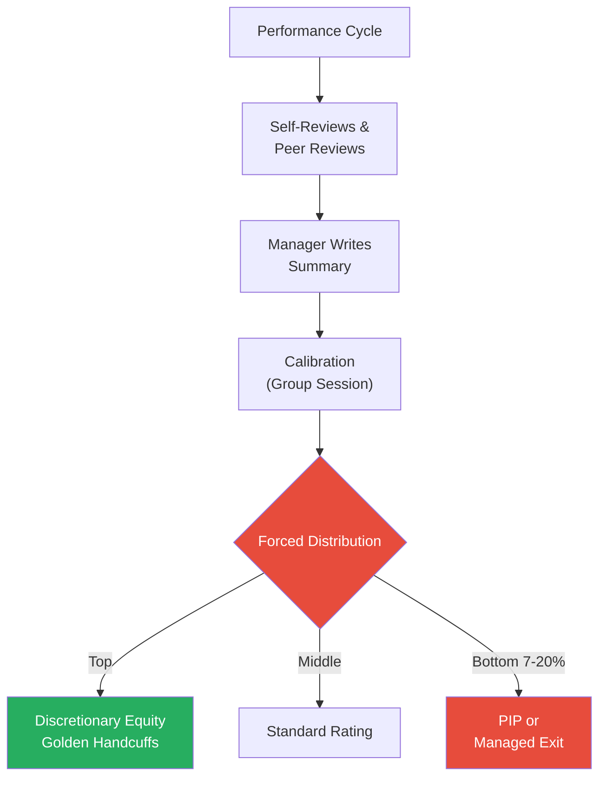
*The performance system is a funnel — from inflated self-reviews through forced distribution to the binary outcomes of retention investment or managed exit.* (Episodes: [[Amazon VP on Stack Ranking PIPs and Bezos - Ethan Evans]], [[Meta Senior Manager on Career Growth PIPs and Culture - Stefan Mai]])

> [!tip] Core Insight
> Stefan Mai calculated that Meta spends approximately $15,000 per engineer on the performance review process. His first reaction was that it was wasteful. His second reaction: the ceremony IS the point. If employees do not believe the process rewards performance, they stop performing.

**Amazon's Stack Ranking (URA)** is the system Evans discusses most candidly:

- <b style="color: #2980b9">Unregretted Attrition (URA)</b> is a euphemism for "people we want to leave" — annual target usually 5-7%
- Amazon once removed the URA goal as an experiment; managers immediately stopped managing underperformers
- The goal was reinstated the next year — without forced accountability, most managers avoid discomfort
- <b style="color: #e74c3c">PIPs are functionally death sentences</b> — every person Evans coached through one at Amazon was ultimately fired
- Once a manager initiates a PIP, their mind is already made up; cognitive bias makes it self-fulfilling
- HR and the manager's boss constantly ask "when are we going to exit that person?"

**Meta's Performance System** differs from Amazon's in important ways, as Stefan Mai explains:

- Meta was historically more protective — HR wanted to exhaust every avenue before letting someone go
- <b style="color: #27ae60">Meta doubled down on top performers</b> — engineers could clear twice their peers' compensation through discretionary equity
- Amazon was more even — the frugality principle pulled compensation back across the board
- The low-performer quota (7-20%) creates the hardest moments in management

> [!note]- Expand: The Manager's Worst Moment
>
> > [!example] The Egg-on-Face Calibration (Stefan Mai)
> > - A team kicks ass all half — the manager tells them they are great
> > - At calibration, the director mandates someone must be in the bottom bucket
> > - The manager has to reverse course: "Actually, you didn't kick ass that hard"
> > - This is the worst scenario — heartbreaking for everyone, especially the employee
> > - Better managers anticipate this and message appropriately throughout the half
> > **The lesson:** The political skill of performance management is not in the rating — it is in the messaging throughout the half that prevents surprises.
>
> > [!example] The Narrative Weapon (Ethan Evans)
> > - An engineer does 700 code reviews in a quarter
> > - Positive narrative: "Ryan makes everybody's code better. He's upleveling the whole team."
> > - Negative narrative: "Ryan doesn't contribute much. He spends all his time nitpicking other people's code."
> > - Same facts, opposite outcomes — the manager controls which story HR hears
> > **The lesson:** Nothing about software engineering performance is so objective that it cannot be spun. The manager gets to tell their story first.
>
> - Laurent from Airbnb introduces the <b style="color: #2980b9">surprise factor</b> metric: if the manager's assessment and the employee's self-assessment diverge at review time, something has gone wrong
> - <b style="color: #27ae60">Positive surprises are also failures</b> — if someone is doing great and does not know it, the manager missed a coaching opportunity
> - Calibration meetings have unwritten local rules — auto-meets for role changes, minimum tenure before promotion — that are rarely communicated to ICs
> - Evans' blunt summary: "As a manager, I could get rid of any one employee I wanted" — not everyone (patterns get caught), but any single person is vulnerable

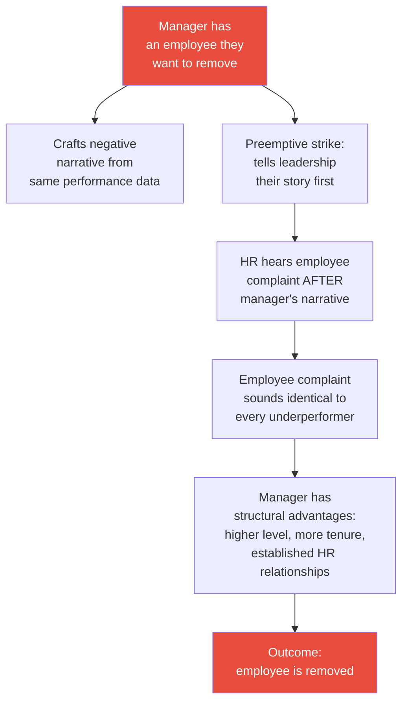
*Evans' most chilling revelation: a clever manager who wants one specific person gone can achieve it easily. Truly bad managers get caught eventually, but selective action against individuals is nearly undetectable.* (Episode: [[Amazon VP on Stack Ranking PIPs and Bezos - Ethan Evans]])

**The Hidden Reason People Get Fired** is rarely performance. Evans reveals that the real trigger is usually style incompatibility, operating on two dimensions:
- **Detail-oriented vs high-level:** one person wants granular specifics, the other wants strategic summaries
- **Tech-oriented vs business-outcome-oriented:** one cares about the best technology, the other only cares about what makes money
- What starts as a small style friction becomes a permanent label: "that person is technically clueless"
- Once the label is fixed, confirmation bias takes over — <b style="color: #e74c3c">at that point, nothing the labelled person does can change the outcome</b>
- The firing mechanism works because the written reason is always "performance" — the one thing that is legally defensible (Episode: [[How Corporate Politics Work - Narrative]])

**Calibration's Untold Rules** (Laurent — Airbnb/Stripe): The calibration meeting is where performance ratings are actually decided, and it has unwritten rules that are rarely communicated to ICs:
- Auto-meets for role changes (switching teams resets your performance clock)
- Minimum tenure before promotion eligibility
- The "surprise factor" metric: if manager and employee expectations diverge at review time, the management process has already failed
- <b style="color: #27ae60">Positive surprises are also failures</b> — if someone is doing great and does not know it, the manager missed a coaching opportunity
- Review inflation is universal: every half seems world-shaking when people write their self-reviews. The calibration process exists precisely to counter this
- David Rumpka learned more about leadership from Meta's PSC calibrations than any other experience — objective performance reviews with cross-team calibration, where every manager thinks their team is the best and the calibration forces them to prove it with data (Episodes: [[Airbnb Staff Eng on Calibrations and Getting Past Senior]], [[Retired Netflix Eng Director on Leetcode Regrets and Hiring]])

**What To Do If You Are Being Pushed Out** — Evans identifies three levers you still hold:
- The time and hassle cost of replacing you — make it clear that your departure will not be seamless
- The departure narrative you will tell — "I can make this easy for everyone, or I can tell a story"
- The manager's desire to feel like a good person — most managers want the process to end with their self-image intact
- <b style="color: #27ae60">The worst thing you can do is fight back from inside</b> — "you're bringing a knife to a gunfight." Either make friends with the vindictive boss or find a different manager
- Evans' advice for a vindictive boss: do not fight, do not expect HR to investigate and rescue you — "that just isn't what they do." Find a transfer or find the door (Episode: [[How Corporate Politics Work - Narrative]])

> [!note]- Expand: How Performance Systems Differ Across Companies
>
> **Amazon (Ethan Evans):**
> - URA quota of 5-7% annually — managers must identify bottom performers
> - When the quota was removed as an experiment, managers stopped having hard conversations immediately
> - PIPs are functionally predetermined — every person Evans coached through one was fired
> - The culture is described as "pretty savage" — HR just wanted to make sure you were checking boxes
> - Manager holds enormous discretion on whether to pull the trigger
>
> **Meta (Stefan Mai):**
> - HR wanted to exhaust every avenue before letting someone go — protecting employer reputation
> - Sometimes over-accommodating even when the employee had clearly checked out
> - Meta was willing to double down on top performers — engineers clearing 2x their peers' compensation through additional equity
> - Discretionary equity decisions driven by two dimensions: trajectory (who is the rocket ship?) and replaceability (if they leave tomorrow, does the org break?)
> - Getting into load-bearing positions is lucrative — companies tighten golden handcuffs
>
> **Netflix (David Rumpka):**
> - No formal performance review process during David's era — just conversations and market-based compensation
> - Personal top-of-market: interview elsewhere, bring back offers, company matches or loses you
> - The system broke as the company grew: pay gaps could not be rationalised without levels
> - No individual credit: the PS3 streaming breakthrough was "Netflix won" — not specific engineers
> - Eventually added levels and compensation ranges after David left
>
> **Airbnb (Laurent):**
> - Calibration has unwritten local rules rarely communicated to ICs
> - Auto-meets for role changes (switching teams resets clock)
> - Minimum tenure before promotion eligibility
> - The "surprise factor" should be zero at review time in both directions
> - Laurent built the practice of explicit alignment throughout the half, not just at review time

---

## 10. When Things Go Wrong: Demotions, Failures, and Recovery

*The series' most honest episodes are the ones where guests talk about what went wrong — getting fired, getting demoted, building something that failed, and making career choices they regret. These stories matter because the industry overwhelmingly tells success stories. Igor says it directly: "You hear the success stories, you don't hear the failures." Survivorship bias dominates career narratives at senior levels, and these episodes are the antidote.*

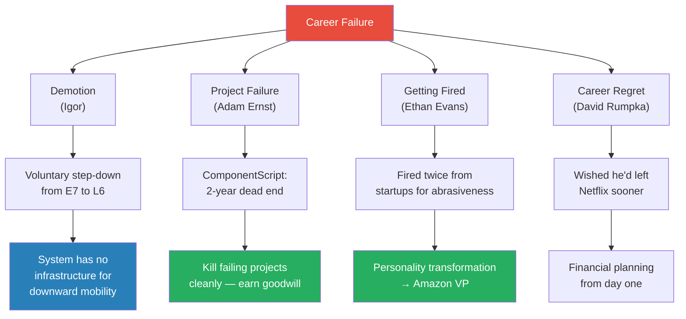
*Four types of career failure from the series — each with a different recovery path.*

**Igor's Demotion Story** is the series' most structurally revealing episode. After 14.5 years at Google climbing from L3 to L7, Igor left for Cruise and then Meta. At Meta, he discovered that <b style="color: #e74c3c">14 months was not enough to ramp to E7-level productivity</b> — and that he did not even enjoy the work at that level. He asked Meta for a voluntary demotion; they had no process for it. He returned to Google at L6.

- <b style="color: #2980b9">The Ramp-Up Ladder</b>: at a new company, you start at "level zero" regardless of title — Igor knew less than an intern who had been there two weeks
- The system is built around climbing — there is no standard process for stepping down
- Every step of Igor's return to Google required someone to make an exception
- His conclusion: <b style="color: #27ae60">E5/L5 is the best quality of life</b> — shielded from leadership noise, still doing the craft you love
- <b style="color: #2980b9">The Composite Peer Fallacy</b>: Igor identifies a common mistake at senior levels — comparing yourself against a composite of your peers' best traits rather than any single individual. "Those people around me — they're so good at talking, so good at presentations, so good at leading. But it turns out one person is good at this, another person is good at that." You feel inadequate because you are measuring yourself against an impossible standard
- There is enormous peer pressure against voluntary demotion — friends, family, and colleagues all asked: "Are you crazy? Why don't you try E7 elsewhere?"
- Igor's marathon analogy: "I'm capable of running a marathon, but I don't like running. So why would I do that?"
- <b style="color: #27ae60">Sharing career failures requires specific privileges</b> — Igor lists: no visa dependency, spouse has health insurance, kids in college, no mortgage, can afford not to work for years. His advice to others considering sharing: "I would probably say no, unless you feel so safe and secure" (Episode: [[Meta IC7 Honest Demotion Story]])

> [!note]- Expand: Failure Stories in Detail
>
> > [!example] ComponentScript — Adam Ernst's Two-Year Failure
> > - Adam built ComponentScript, a framework that checked every technical box
> > - But it had no clear target audience — no specific product team needed it badly enough
> > - He refused to compromise on technical purity (GraphQL data consistency) when 60-80% of products did not need it
> > - He had sleepless nights for a year before accepting the project was dead
> > - The clean shutdown — migrating dependents, deleting code completely, publishing a retrospective — earned him more goodwill than the project itself would have
> > **The lesson:** Internal frameworks need product-market fit just like external products. Technical excellence without a target audience is a dead end.
>
> > [!example] Ethan Evans — Fired Twice, Then VP
> > - Evans was fired from his first startup for fighting the product VP who turned out to be right
> > - Fired from his second startup in a "layoff of one" — removed to eliminate conflict
> > - An interviewer told him: "If you were that valuable, these companies would have found a way to keep you"
> > - That sentence broke through years of self-serving narrative
> > - He studied workplace psychology, learned to ask questions instead of making declarations
> > - Rose to VP at Amazon with 800+ engineers
> > **The lesson:** Being right is not a career strategy. If organisations keep discarding you despite your skills, the problem is how you make people feel, not what you can do.
>
> > [!example] David Rumpka — The Netflix Regret
> > - Spent 12 years at Netflix building the encoding platform from scratch
> > - Netflix's no-levels, no-individual-credit culture meant his contributions went unrecognised
> > - The best engineers eventually left when pay gaps could not be rationalised
> > - His biggest regret: not leaving sooner to learn deliberate trust-building and objective performance management
> > - The leadership skills he learned at Meta in his final role would have made him exceptional earlier
> > **The lesson:** Comfort is the enemy of growth. The skills you never build because your current environment does not require them are the skills that would transform your next role.
>
> **Evans' Zombie Products** — a counterintuitive form of career failure:
> - You can get excellent performance reviews for years while running a product that is going nowhere
> - Evans knew the Amazon App Store would eventually be shut down — a decade before it happened — but got good reviews every year because he hit his metrics
> - Prime Gaming was Jeff Bezos' vision to make Amazon as big as Tencent; Evans' team hit most goals but was never on track for that ambition
> - <b style="color: #e74c3c">Big companies confuse hitting interim goals with doing something meaningful</b>
> - The tension: for your review and your pay, you want goals you know you can hit; for the company's good, you want goals you do not know how to achieve
> - "Zombie products" persist because shutting them down is an admission of failure, but nobody knows how to make them big
>
> **Igor's observation on Meta's culture of artificial urgency:**
> - Leadership sets aggressive deadlines everyone knows will not be met
> - After five cycles of unmet artificial pressure, engineers learn to dismiss all pressure
> - The only escalation left is layoffs — which also has diminishing returns
> - <b style="color: #2980b9">Pressure is a finite resource</b> — use it on artificial deadlines five times and engineers will stop believing the sixth

---

# Part 4: The Bigger Picture

## 11. Big Tech vs Startups: The Trade-offs

*Nearly every guest on the series has experienced both sides — big tech depth and startup breadth. The pattern that emerges is not that one is better than the other, but that each teaches you things the other structurally cannot.*

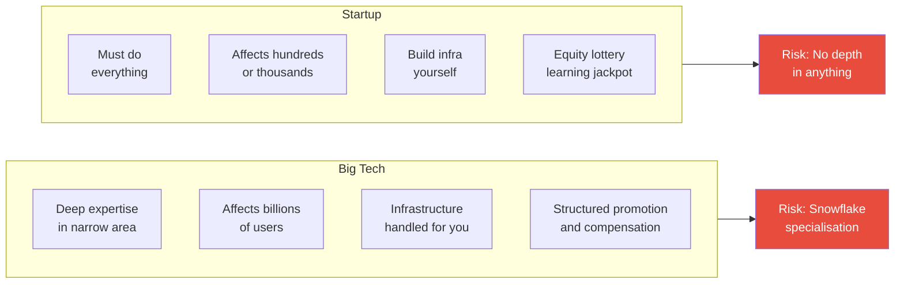
*The trade-off is structural, not philosophical. Big tech gives depth; startups give breadth. The risk in each direction is the mirror image of the other.*

Evan King's story is the most vivid illustration. He left Meta as a Staff engineer affecting 3 billion users — then discovered he had never set up caching, configured a database, or written a line of frontend code. His startup experience was "incredibly stressful, incredibly overwhelming" — but afterwards, he could be dropped into any situation and figure it out. His ideal career order: <b style="color: #27ae60">startup first (breadth), then big tech (depth)</b> — though he acknowledges most people do the reverse. (Episode: [[25 Year Old Staff Eng at Meta - Evan King]])

David Singleton (ex-Stripe CTO) stayed at Google for 12 years by applying one test every 18 months: "Have I learned a tremendous amount?" As long as the answer was yes, he stayed. When the last year felt identical to the one before, he left for Stripe. His career at Google involved roughly six different jobs, all with gradual transitions — he never needed to leave because the company kept providing new challenges. (Episode: [[Ex-Stripe CTO on Career Growth and Coding as a Leader]])

Brendan Burns (Kubernetes co-creator) offers the counterargument for staying inside big tech: <b style="color: #2980b9">the 10% Rule</b> — hide roughly 10% of your effort from management for side projects you believe in. A running demo forces management's decision from "should we build this?" to "do you want to ship this thing that already exists?" The trade-off: some bets will fail, and it might be the difference between "exceeded expectations" and "met expectations." But Kubernetes itself — one of the most consequential infrastructure projects in modern computing — started this way. (Episode: [[Kubernetes Co-Creator on Engineering-Led Direction - Brendan Burns]])

**The open source dimension** adds another layer to the big tech vs startup question. Burns explains that Google's decision to open-source Kubernetes was driven by a cautionary tale: Google published the MapReduce white paper, the open source community built Hadoop independently, and Google got zero credit and zero influence. The lesson: <b style="color: #27ae60">influence over an ecosystem requires shipping running code, not publishing ideas</b>. For engineers considering where to work, this means that some of the most career-defining work at big companies happens at the boundary between internal tooling and the open source ecosystem.

**The under-levelling strategy** (David Rumpka): If offered IC5 at Meta but you believe you are IC6, take the IC5. Come in, start executing at the IC6 level immediately — bonuses, RSU refresh, and multipliers will exceed your expectations. If you negotiate to IC7 and struggle to perform at that level, there is no fix — neither Meta nor Google has a demotion mechanism. Igor's story is the extreme version: he came in at E7 at Meta, could not ramp in time, and discovered that asking to step down was literally impossible within the system. The asymmetry is stark: under-levelling has upside (fast promotion, outsized rewards); over-levelling has only downside (no recovery path). (Episodes: [[Retired Netflix Eng Director on Leetcode Regrets and Hiring]], [[Meta IC7 Honest Demotion Story]])

**Compensation vs learning** is the trade-off nobody resolves cleanly. Evan King's startup has not yet out-earned what he would have made at Meta. David Rumpka's advice: <b style="color: #27ae60">start financial planning from your first paycheck</b> — engineers who plan early can be financially independent by their mid-40s, which gives them the freedom to make career decisions based on learning rather than salary. Igor could take a voluntary demotion with a significant pay cut because he had no mortgage on his house. The financial cushion does not just enable risk — it enables honesty.

**Culture as a trade-off** — Stefan Mai offers the most nuanced comparison of Amazon and Meta cultures:

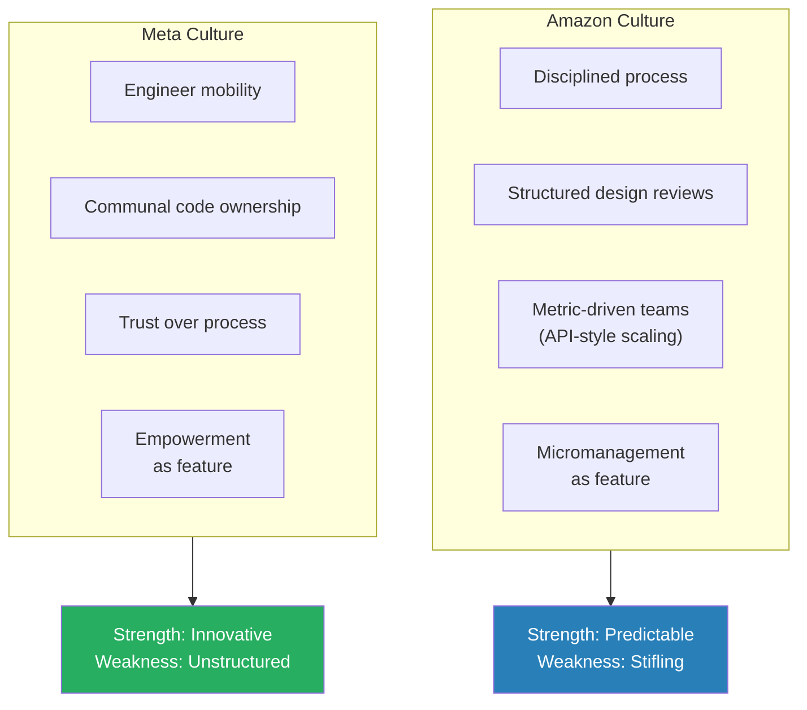
*Amazon assembles modular teams like APIs — each with strict metric ownership. Meta lets engineers flow between projects. Each serves different types of leaders and engineers.* (Episode: [[Meta Senior Manager on Career Growth PIPs and Culture - Stefan Mai]])

> [!note]- Expand: Culture Comparisons Across the Series
>
> - **Amazon's strength** (Stefan Mai): Disciplined — very structured engineering design reviews. More predictable — teams meet SLAs. When something fails, introduce a mechanism to prevent it
> - **Amazon's weakness** (Stefan Mai): Process creates friction — getting access to data was incredibly hard even without privacy constraints. Every layer of management gets involved at a detailed level beneath them — stifling to creativity
> - **Meta's strength** (Stefan Mai): Incredibly open and collaborative — people found each other and worked together without manager involvement. Shared data infrastructure — no need to build your own data lake
> - **Meta's weakness** (Stefan Mai): Unstructured environment paralyses people who transition from Amazon. If someone's code is not up to standard, you fix it yourself — the original author has moved on
> - **Netflix's strength** (David Rumpka): No brilliant jerks policy was revolutionary. The 8-hour excellence standard. Personal top-of-market compensation. Extraordinary for a small, aggressive company
> - **Netflix's weakness** (David Rumpka): No levels meant the system could not recognise that some engineers were doing vastly more impactful work. Best engineers left when contributions went unrecognised. The culture memo was aspirational, not descriptive
> - **Stripe's strength** (David Singleton): Hired without LeetCode — pair programming on real laptops. Operating principles (concrete behaviours) rather than abstract values. First-principles thinking over pattern matching
> - **Startup truth** (Evan King): "You can drop me into any situation and I can figure it out" — but the stress of total ownership is qualitatively different from big tech's structured support
>
> **Scale as a qualitative difference:**
> - David Rumpka initially came to Meta thinking he understood scale — he had read the books, taken classes, knew about sharding and microservices
> - At Meta: "Those books don't know what they're talking about. Nobody understands scale except companies dealing with billions of users"
> - Netflix has 300 million users (the top 5% of world income). Meta has 3.5 billion (the wealthiest 50% of humanity, including people making $6-8 a day). The engineering challenges are categorically different
> - David Singleton at Stripe discovered a different kind of scale: six nines of reliability for financial infrastructure, where downtime means real money is lost
>
> **When to leave big tech:**
> - David Singleton's 18-month test: "Have I learned a tremendous amount?" — as long as yes, stay
> - Stefan Mai's three-trigger exit from Amazon: identity overfitting ("am I a good Amazonian or a good engineering leader?"), compensation stagnation (promotion with zero comp change because stock appreciated), and mission pull (Meta's child safety work)
> - Evan King's test: when the after-hours side project became more fun than the day job, it was time
> - Rome's northstar: when the current role no longer fills a gap in your long-term plan, move
> - <b style="color: #e74c3c">The Snowball Trap warning</b>: if you are comfortable, that is the signal, not the reward

> [!note]- Expand: The Startup Humbling
>
> > [!example] Evan King's Post-Meta Reality Check
> > - Left Meta with an ego: fast promotions, leading 16 engineers, cool projects
> > - First startup: "slinging raw jQuery" — eventually evolved to React
> > - Had never set up a caching layer, configured a database, or stood up infrastructure
> > - The first few months were "incredibly stressful, incredibly overwhelming"
> > - Now: "You can drop me into any situation and I can figure it out"
> > - Has the startup out-earned Meta? "No. Not yet anyway"
> > - But: "The value in terms of experiences and purely technical knowledge has far outpaced Meta"
> > **The lesson:** Big tech specialisation is a luxury you do not recognise until it is gone.
>
> > [!example] Rome's Camera Over Data Decision
> > - At Snapchat, Rome had two options: director of data (his entire background) or director of camera (the first page of Snapchat)
> > - He chose camera despite knowing nothing about iOS or Android
> > - Spent two months learning iOS from scratch
> > - His northstar required product experience — the comfortable choice would have left a critical gap
> > - The first two years at Snapchat were "probably one of the happiest periods for my career"
> > **The lesson:** When your long-term goal requires a skill you do not have, choose the uncomfortable path that builds it.

---

## 12. Career Architecture: The Long Game

*The guests who have been in the industry longest — Ethan Evans (30+ years), David Rumpka (36 years), Carey Nachenberg (30+ years), Rome (20+ years) — share a perspective that shorter-tenured guests cannot. They see careers not in two-year increments but in decades, and the patterns they identify are strikingly consistent.*

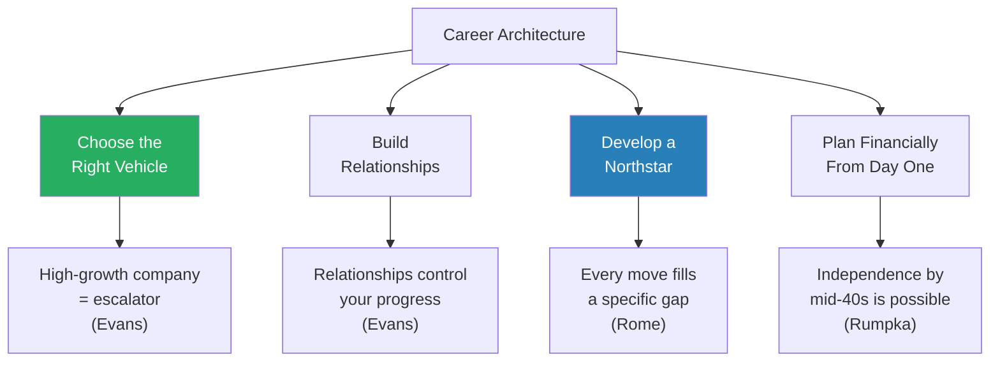
*Four pillars of long-term career architecture drawn from the series' most experienced guests.*

**The Career Escalator** (Evans): Amazon grew from 10,000 to over 1,000,000 employees during Evans' tenure. Growth creates new roles, new teams, new VP slots — opportunities that do not exist in stable companies. Evans could climb, but the escalator was also carrying him upward. His advice: always prefer high-growth companies. (Episode: [[Amazon VP on Stack Ranking PIPs and Bezos - Ethan Evans]])

**The Northstar Framework** (Rome): Every career move Rome made — from Facebook to Square to Snapchat to HeyGen — was evaluated against a single question: does this move me closer to becoming CTO of an AI company? He mapped his gaps (no industry experience, no infrastructure knowledge, no frontend skills, no leadership at scale) and filled each one deliberately. His conclusion: <b style="color: #27ae60">manager career growth is largely situational</b> — constrained by organisational structure and company strategy rather than personal effort. The only thing you can control is impact in your current role. Everything else is a lagging indicator. (Episode: [[Frontline Manager to Senior Director in 3 Years - Rome]])

**The 40-Year View** (Carey Nachenberg): Carey spent 21 years at Symantec, held back not by lack of ability but by imposter syndrome. He was comfortable but unhappy, afraid he would fail elsewhere. Every career transition required an external pull — someone inviting him into an opportunity he would never have pursued on his own. His advice: <b style="color: #e74c3c">do not let fear of failure hold you back</b> — it was his single biggest regret across a 30-year career. (Episode: [[GoogleX Chief Scientist on Imposter Syndrome and Project Taste - Carey Nachenberg]])

**Project Taste** (Carey Nachenberg): Carey argues that <b style="color: #27ae60">picking high-impact projects where gaps exist is the primary career differentiator</b>, not raw intelligence. Intelligence is a necessary baseline — you need enough of it — but beyond a threshold, project taste, communication, collaboration, and outcomes focus matter far more. His career pattern: roughly 6-7 times he identified a major gap at Symantec and spent weeks or months building prototypes. The other 80% of his career was incremental improvements. The lesson: the best career projects sit at the intersection of business urgency and technical difficulty — where the current approach clearly cannot scale.

**The Snowball Trap** (Stefan Mai): Credibility compounds over time like a snowball, but can become a shackle. You become known as "the person who built that system" — and opportunities outside that identity stop coming to you. Stefan's test: are you comfortable? If you are not being challenged, even if you are senior, it may be time to move. The trap is that comfort feels like success when it is actually stagnation. (Episode: [[Meta Senior Manager on Career Growth PIPs and Culture - Stefan Mai]])

**Writing as Career Accelerator** (Stefan Mai): A lot of Stefan's effectiveness traces back to writing skills learned at Amazon. Amazon's writing culture — the PR FAQ exercise, six-page narratives — forces good thinking. The common failure in writing: "We will have a single pane of glass" — nobody is excited about that. They are excited about "50% reduction in time spent." His tip for improving: learn to be a critic first — read documents, figure out what hits you and what does not, find imprecision, check logical support. Then practise relentlessly.

**Career Agency** (Stefan Mai): His single biggest piece of advice is that the world is very malleable to plans that are written down and executed. He wrote a transition plan for moving into ML, a post-promotion action plan for his M2 role, and multiple career roadmaps. His director later said: the moment Stefan walked in with a written plan was the moment the director knew he would succeed. Most people never make a plan. The act of making one and presenting it with confidence is itself the signal of future success — even when you do not yet know how to execute half of it. (Episode: [[Meta Senior Manager on Career Growth PIPs and Culture - Stefan Mai]])

> [!note]- Expand: Career Architecture Frameworks Across the Series
>
> **The Promotion Consensus Machine** (Adrian — IC8 at Meta):
> - At IC8, promotion is not a meritocracy exercise — it is a consensus-building exercise
> - Adrian spent two cycles socialising his promotion: writing his own packet, getting VP-level support, ensuring there would be no debate by promo time
> - His scope creation pattern: volunteer for work falling through the cracks, do it for a year, then ask for the title post-hoc
> - Every role came through a personal relationship — he never applied through a website
>
> **The Magic Loop** (Ethan Evans):
> - A reinforcing partnership with your manager: you deliver everything they need, they stake their reputation on your promotion
> - Evans' VP promotion took 2.5 years of deliberate partnership-building
> - The deal: "I'll do everything you need. You do one critical thing — make sure I'm rewarded."
> - Timing matters: Evans' VP was reorged within 6 months after the promotion — had he been just 6 months later, he would have had a new boss and had to start over
>
> **The Calculated Risk Framework** (Adrian — IC8 at Meta):
> - Explicitly align with your manager before deviating from your job description
> - Set a time window — "I'm going to spend 3 months on this"
> - Have a fallback — "If this doesn't work, I go back to my main project"
> - The alignment step is what separates career risk from career recklessness
>
> **David Singleton's Practices for Long-Term Effectiveness:**
> - <b style="color: #2980b9">The Rocket Doc</b>: every Sunday night, write down "if I have a great week, what did I get done?" — prevents email and calendar from ruling your priorities
> - <b style="color: #2980b9">Engineeration</b>: a quarterly practice of joining a team for 3 days to code a real project and write a friction log — gives senior leaders ground-level context
> - <b style="color: #2980b9">The Balcony Metaphor</b>: periodically step off the dance floor and look down at how everything is working — essential when you are also doing IC work
> - His warning: a "perfectly happy team" is a red flag — he won Google's Great Manager Award early in his career and believes he did not deserve it, because he optimised for comfort over impact
>
> **Job Hopping Calculus:**
> - **Early career** (Stefan Mai, Evan King): moving around has advantages — growth comes from discomfort and new environments
> - **Senior levels** (Stefan Mai, Igor): moving every 18 months is a red flag — hiring managers know it takes a year to ramp up. For staff-level hires, that is a tough pill to swallow
> - **Igor's cautionary data**: at senior levels, switching companies means starting from zero — but being judged against people who have had years to build context, relationships, and trust. His 14.5 years of accumulated capital at Google vanished the moment he left
> - **Rome's counterpoint**: he does not think job hopping is the best way to advance. Many of his Facebook teammates became VPs by staying put. His moves were driven by northstar alignment, not title-chasing
> - **The Stefan Mai rule**: ask yourself — am I comfortable? If you are not being challenged, even if you are senior, it may be time to move. But if you are still learning, depth compounds faster than breadth
>
> **The Promotion Paradox** (Rome):
> - Rome challenges the conventional career mindset: titles belong to the company, not to you
> - When senior executives leave, people say "the company did this," not "the VP did this"
> - He has seen mentees obsessively check every bullet point of the next level's rubric: "That's very wrong. Don't do that."
> - When you tie your happiness to promotion, you tie it to something you cannot fully control — organisational structure, company strategy, and headcount needs are all beyond your influence
> - Better approach: focus on controllable impact and drive your career towards a position you love long-term
> - The happiest period in his career began when he stopped aiming for promotions and started focusing on impact

> [!note]- Expand: Long-Game Strategies
>
> - **David Rumpka's financial advice:** start planning from your first paycheck, not your last. Engineers who plan early can be financially independent by their mid-40s. David's cancer diagnosis at 35 permanently changed his relationship with work — he realised companies use long hours to compensate for bad leadership, not to build better products
> - **Stefan Mai's Snowball Trap:** credibility compounds over time like a snowball, but can become a shackle — you become known only as "the person who built that system" and cannot escape it. Good question to ask: am I comfortable? If you are not being challenged, it may be time to move
> - **Rome's Regret Minimisation Test:** "If I retire in 15 years, will I feel regret for not doing this?" If yes, do it now
> - **Adrian's surface area for luck:** take more shots, invest in relationships without expecting return, help others succeed first. Adrian never applied for a job on a website — every role came through someone he knew and trusted

---

## 13. What They Wish They'd Known Earlier

*Every episode ends with reflection. Across sixteen conversations, the advice guests give their younger selves converges on a surprisingly small number of themes — none of which are technical.*

```mermaid
flowchart TB
    A["What They<br/>Wish They Knew"]
    A --> R["Relationships<br/>Matter More"]
    A --> F["Don't Fear<br/>Failure"]
    A --> S["Simplicity<br/>Beats Complexity"]
    A --> P["Take the<br/>Uncomfortable Path"]
    A --> W["Work Less,<br/>Think More"]
    R --> R1["Evans: Build relationships<br/>from day one"]
    R --> R2["Evan King: Invest in<br/>friendships, not just career"]
    F --> F1["Carey: Don't let imposter<br/>syndrome trap you"]
    F --> F2["Igor: Share failures —<br/>survivorship bias dominates"]
    S --> S1["Evan King: The comments<br/>signal beat months of ML"]
    S --> S2["Brendan: A demo<br/>beats a slide deck"]
    P --> P1["Rome: Choose camera<br/>over data"]
    P --> P2["David Singleton: Always<br/>be learning"]
    W --> W1["Rumpka: 8-hour excellence<br/>beats burnout"]
    W --> W2["Igor: Ask yourself if<br/>your company benefits"]
```
*The advice converges around five themes — relationships, courage, simplicity, discomfort, and sustainability.*

**Relationships over performance:** This is the single most repeated piece of advice across the series. Evans wishes he had woken up "much sooner to the fact that jobs are still with other humans." Evan King's biggest regret is not investing in friendships and romantic relationships — "you spend all this time road-mapping about career progression but in terms of general life, I didn't apply nearly the same vigour." Adrian's entire career was built on relationships — he never applied for a job through a website. (Episodes: [[Amazon VP on Stack Ranking PIPs and Bezos - Ethan Evans]], [[25 Year Old Staff Eng at Meta - Evan King]], [[New Grad to Principal Engineer IC8 at Meta]])

**Do not fear failure:** Carey Nachenberg's imposter syndrome kept him at Symantec for years too long. Igor's demotion story reveals that the industry has no infrastructure for honesty about setbacks — "you hear the success stories, you don't hear the failures." Evans' two firings were the catalyst for his entire transformation. The pattern: <b style="color: #27ae60">every guest who experienced a major setback credits it as the turning point that made everything else possible</b>.

**Simple beats complex:** Evan King's comments breakthrough (9% to 55% recall overnight by reading what users were already saying) is the series' most powerful illustration:

```mermaid
flowchart TB
    Q["Problem: 9% Recall<br/>on Live Suicides"]
    Q --> ML["PhD Team Approach"]
    Q --> EK["Evan's Approach"]
    ML --> M1["Pixel Analysis"]
    ML --> M2["Audio Wave Models"]
    ML --> M3["Temporal Sequencing"]
    M1 --> X["No Progress<br/>for Months"]
    M2 --> X
    M3 --> X
    EK --> C["Read the Comments"]
    C --> C1["'Don't do it'<br/>'Your family loves you'"]
    C1 --> V["9% → 55%<br/>Overnight"]
    style X fill:#e74c3c,color:#fff
    style V fill:#27ae60,color:#fff
```
*The PhD researchers had "horse blinders" — focused on optimising models with the most sophisticated technical means. Evan, with less ML expertise, looked at the holistic problem and found the obvious signal hiding in plain sight.* (Episode: [[25 Year Old Staff Eng at Meta - Evan King]])

Ryan Peterman's staff promotion came from a trivially simple compute efficiency fix. Brendan Burns built the Kubernetes MVP in under a week by taking every possible shortcut. Carey Nachenberg ported an antivirus engine from assembly to C and made it 5x faster — the original authors did not understand algorithms, using linear searches over 60,000 signatures. The lesson recurs: <b style="color: #e74c3c">the people closest to the complex technical details are often the last to see the simple solution</b>.

**Choose discomfort:** Rome chose the camera team over the data team. David Singleton chose Stripe over the comfort of Google. Evans took the TiVo partnership his management advised against. Adrian left a comfortable Instagram role to build something from scratch. Every guest's most meaningful career growth came from a moment where they chose the harder, less comfortable path. Rome's framing is the clearest: "Most people would go with director of data because that's the most comfortable selection." The northstar — become CTO of an AI company — made the "wrong" choice obvious.

**Work sustainably:** David Rumpka's cancer diagnosis at 35 is the starkest version. Patty McCord's Netflix philosophy — "blow us away with what you can do in an 8-hour day" — is the most structural. Igor's observation that artificial deadline pressure has a half-life is the most tactical. The convergence: <b style="color: #27ae60">overwork is a leadership failure, not a badge of honour</b>.

> [!note]- Expand: What They Would Tell Their Younger Selves (Full List)
>
> - **Ethan Evans:** "I would wake up much sooner to the fact that jobs are still with other humans. Being an expert and being right matters — but only if people want to work with you." Also: always prefer high-growth companies — "my ladder was always an escalator"
> - **Evan King:** "I was underinvested in friendships and romantic relationships. You spend all this time road-mapping about career progression, but I didn't apply nearly the same vigour to general life." Also: learn why things work, not just how to ship them
> - **Rome:** "You don't need to always follow conventional wisdom. Only the people who think differently early can see the new opportunity no one else can see." Also: titles belong to the company, not to you — focus on impact
> - **Igor:** "Ask yourself: does my company really benefit from what I'm doing? If not, maybe you shouldn't be there." Also: people share success stories, never failures — survivorship bias dominates career narratives
> - **Stefan Mai:** "Find mentorship and make plans. I did too much alone — three questions to someone experienced could have saved months of toil." Also: the world is very malleable to written plans that are executed relentlessly
> - **David Rumpka:** "Start financial planning from day one. Companies use long hours to compensate for bad leadership, not to build better products." Also: enter a new company below your level and prove up — over-levelling has no fix
> - **Carey Nachenberg:** "Don't let fear of failure hold you back." Also: communication is a career multiplier — people equate presentation skill with intelligence and open doors based on it
> - **Adam Ernst:** "Flip the switch off on level anxiety. Stop worrying about whether your work is 'IC9-level' and just focus on solving important problems you enjoy." Also: kill failing projects cleanly — it earns more goodwill than dragging them out
> - **David Singleton:** "Always be learning. Every 18 months, pick up your head and check whether you've learned a tremendous amount. If not, it's time to move." Also: culture is the behaviours you accept — if a cultural violation goes unchallenged, it becomes the new culture
> - **Brendan Burns:** "Follow energy, not trends. Learn what excites you because you'll put in the hours naturally." Also: never fall in love with your software — the inevitable trajectory of software is death
> - **Laurent:** "Eliminate surprises at performance review. If your manager's assessment and your self-assessment diverge, something went wrong months ago." Also: lead through questions, not directives — at 70+ engineers, never tell anyone what to do
> - **Adrian:** "Relationships drive every career move. I never applied for a job on a website — every role came through someone I knew and trusted." Also: overcommunicate everything — the single thread running through every promotion
>
> **The Speed Budget** (Evan King & Ryan Peterman): Both attribute their rapid growth to the same pattern — finishing assigned work fast enough to create a surplus of discretionary time, then using that surplus for high-visibility work beyond their scope:
> - Ryan's levers: workflow optimisation (keybindings, memorising the codebase, ~10 diffs/day at peak), and honestly, working more hours — "If you want an extra 30% of time, you can also just work an extra 30%"
> - Evan's levers: a personal knowledge base (never solving the same problem twice), and asking for help without fear — "spend an hour trying, then find the person who knows"
> - Ryan's additional lever: code search mastery — in Meta's monolith, the chance you are solving something for the first time is "almost none"
> - Both agree this is not about brilliance — it is about mechanics and willingness to work. The career acceleration comes not from the assigned work itself but from what you do with the time it frees up
>
> **The Territorial Instinct** (Evan King): One of the most honest admissions in the series — when a brilliant senior engineer joined his team, Evan felt threatened: "This is MY project and MY things." He had to consciously overcome that instinct ("slapped myself across the face"). The senior engineer became his closest professional relationship and they accomplished far more together. The lesson: scope is not zero-sum. The person you feel threatened by is often the person who will teach you the most
>
> **Organic Depth-Building** (Adam Ernst): Instead of studying systems from first principles, Adam built encyclopaedic knowledge by debugging 8 levels deep when blocked. Every time he hit a wall, he traced the problem through the entire stack — and learned the system as a side effect of solving real problems. This approach produces deeper knowledge than abstract study because the knowledge is always tied to a real use case

---

## 14. Managing People: Lessons for New Leaders

*Six guests have made the IC-to-manager transition, and their stories converge on a set of hard-won lessons that no management book captures as viscerally.*

```mermaid
flowchart TB
    T["IC → Manager<br/>Transition"]
    T --> S1["The Power Dynamic<br/>Shift"]
    T --> S2["The 18-Month<br/>Learning Curve"]
    T --> S3["Directing vs<br/>Managing"]
    T --> S4["The Magnification<br/>Effect"]
    S1 --> E1["Former peers treat<br/>you differently<br/>(Stefan Mai)"]
    S2 --> E2["Everyone goes through<br/>it — support structure<br/>dictates damage (Mai)"]
    S3 --> E3["Directors provide<br/>direction, not detail<br/>(Rome)"]
    S4 --> E4["Small M2 actions<br/>have outsized<br/>consequences (Mai)"]
    style S1 fill:#e74c3c,color:#fff
    style S3 fill:#2980b9,color:#fff
```
*Four structural challenges every new manager faces — the power dynamic, the learning curve, the mindset shift, and the magnification effect.*

**The Power Dynamic Shift** (Stefan Mai): The moment you become someone's manager, the information you once got freely dries up. Former peers treat you differently. The friendships do not carry over. And the information you actually need — career objectives, what is dragging on people, what they really want — is much deeper than what friendship provided. Stefan's solution: <b style="color: #2980b9">active listening</b>. Show interest, reflect back what they have said, ask questions that show genuine curiosity. Engineers default to API-like transactional conversations — most people are not like that. (Episode: [[Meta Senior Manager on Career Growth PIPs and Culture - Stefan Mai]])

**The 18-Month Learning Curve** (Stefan Mai): Almost everyone who transitions to management goes through an 18-month window of incompetence. Stefan got his title prematurely and spent the first year "failing in ways he probably didn't fully realise." The support structure around you dictates how much damage you do in that window. His biggest early mistake: not spending enough time understanding the individual goals and objectives of team members.

**Directing vs Managing** (Rome): Rome's first six months as a director at Square were a near-failure. He tried to manage like a line manager — knowing the details, being the anchor — but his reports were more tenured and knew more than he did. They started questioning why his layer even existed. The turning point: <b style="color: #27ae60">the word "director" literally means "one who directs"</b> — it is about positioning an organisation towards a better future, not managing individual people. Directors provide strategic direction, cross-department resource allocation, and solve the organisation's hardest problems. Managers know the details and use that as their anchor. (Episode: [[Frontline Manager to Senior Director in 3 Years - Rome]])

**The M1-to-M2 Magnification Effect** (Stefan Mai): The jump from managing ICs to managing managers is not "more of the same." Small actions have outsized consequences.

> [!note]- Expand: Management Lessons in Detail
>
> > [!example] The Skip-Level Disintermediation Trap (Stefan Mai)
> > - A new M2 sets up skip-level meetings with indirect reports
> > - Asks leading questions: "What do you think of Jim? Does he touch on career stuff?"
> > - A week later, Jim walks in angry: "You asked Jan leading questions about whether I was doing my job"
> > - Jan comes to the M2: "I think you can help me with my career — you seem to have insights Jim doesn't"
> > - Result: disintermediated Jim, demotivated Jan, created a host of new problems
> > **The lesson:** Small well-intentioned actions at the M2 level have magnification effects. The assumption that leading managers is the same pattern as leading engineers will get you fired — or mutinied.
>
> > [!example] The Invisible Director (Rome at Square)
> > - Rome joined Square as a director — his team started at 25 people
> > - At Facebook, he had always been the most senior person who knew the most details
> > - At Square, his reports were more tenured, knew more, and were more senior in the company context
> > - He could not use his old playbook of "I know the most, so I lead"
> > - His reports started questioning why his layer existed
> > - The turning point: "If I'm a middle layer, what value should I bring?"
> > **The lesson:** If you do not add value as a director, your reports will question why your layer exists — and they will be right.
>
> - **Trust as Foundation** (Rome): When hired above existing leaders, the first priority is proving you are a career promoter, not a career blocker. Rome only fully understood this six months in — after that, trust-building became his first action at every new role
> - **Ryan Peterman's TLM Transition**: The Tech Lead Manager role at Meta — 70% IC contribution, 30% managing a small team — is the entry point. Calendar becomes a solid block of meetings. As IC, he had fragmented meetings and worked later on code. The flexibility disappears
> - **Ethan Evans on Managing Through Others**: At the VP level (800 engineers), Evans deliberately gave up his team to take an advisory role at Twitch — achieving goals without giving anyone orders. The challenge: influence a young founder who had no reason to listen to a late-40s executive from a very different culture
>
> > [!example] David Rumpka — Trust Before Authority at Meta
> > - After 12 years building Netflix's encoding platform from scratch, David joined Meta to lead a 55-person team
> > - At Netflix, trust had been built organically over years — he never developed the muscle of deliberate trust-building
> > - Within two weeks, a direct report told him: "You've been here two weeks. You're already telling us what to do."
> > - David spent months doing nothing but one-on-ones: asking questions, making notes, understanding the system
> > - He refused to promote a manager he did not know yet, despite political pressure, until he understood the team
> > - His biggest regret: Meta was his last job — the leadership skills he learned there would have made him exceptional earlier
> > **The lesson:** If a team is already working well, your job as a new leader is to not break it first and help it move forward second.

**The Manager as Storyteller** (Stefan Mai): One of the most underappreciated management skills is the ability to look back at your team's journey and paint it as a compelling narrative. Stefan practises this every few months — "We started with a team of two, our on-call was garbage, we invested in it and turned it around, and with the extra bandwidth we crushed it." This provides the foundation for describing the future: where we came from, where we are, where we are going. The average manager does not do this — their teams feel wishy-washy as a result.

**The Manager as Psychological Doctor** (Rome): Understanding what each report needs for growth and aligning your work towards that is what separates adequate managers from exceptional ones. When hired above existing leaders, Rome compares the approach to a trust-building sequence: prove value through unblocking things they cannot solve alone, demonstrate career investment, earn respect, then drive performance. He explicitly recommends [[The Five Dysfunctions of a Team - Patrick M. Lencioni]] — the foundational layer is trust, and everything builds on top of it.

**Situational Leadership** (Laurent): Laurent introduces four coaching styles — directing, coaching, supporting, and delegating — matched to the learner's skill and motivation level. The mistake new managers make is applying the same style to everyone. A brand new engineer needs directing; a senior engineer who is bored needs supporting or a new challenge, not more instructions. At 70+ engineers, Laurent never told anyone what to do or rejected a design outright — he only asked questions. (Episode: [[Airbnb Staff Eng on Calibrations and Getting Past Senior]])

**The IC vs Management Fork** is the career decision that every Staff engineer faces. Evan King and Ryan Peterman faced it at the same time and chose opposite paths:

```mermaid
flowchart TB
    IC6["Staff Engineer<br/>(IC6)"]
    IC6 --> IC["Stay IC → IC7"]
    IC6 --> MG["Switch to<br/>Management"]
    IC --> P1["Deterministic promo path"]
    IC --> P2["Higher immediate pay"]
    IC --> P3["Risk: Snowflake<br/>specialisation"]
    IC --> P4["Risk: Golden handcuffs<br/>from equity"]
    MG --> P5["Transferable skills"]
    MG --> P6["Broader career options"]
    MG --> P7["Risk: Opportunity-dependent"]
    MG --> P8["Calendar becomes<br/>wall-to-wall meetings"]
    style IC fill:#2980b9,color:#fff
    style MG fill:#27ae60,color:#fff
```
*Evan King stayed IC chasing IC7; Ryan chose management for long-term transferability. Both paths have real trade-offs.* (Episode: [[25 Year Old Staff Eng at Meta - Evan King]])

- Ryan's concern: "If I grew to IC7, I would become a snowflake — a very unique tool only useful at a handful of very big companies." At IC8: "You're handcuffed — so much equity that leaving would be crazy"
- Evan's reasoning: the IC7 opportunity seemed clear, and switching to M2 later would let him skip the painful junior manager phase
- Ryan on TLM reality: calendar becomes a solid block of meetings 9-to-5; as IC, he had fragmented meetings and worked later on code — more flexibility
- <b style="color: #e74c3c">Manager career growth is proportional to the growth of your org</b> — in the "age of efficiency" with orgs being squeezed, coupling your career to org size is risky

**The Problem Discovery Cycle** separates staff engineers from senior engineers. Laurent defines it precisely: staff engineers discover, pitch, solve, and document problems end-to-end. Senior engineers handle only the middle steps — they solve problems that have already been identified and scoped. The transition from senior to staff is not about writing better code; it is about developing the ability to find problems worth solving before anyone else sees them. (Episode: [[Airbnb Staff Eng on Calibrations and Getting Past Senior]])

```mermaid
flowchart LR
    subgraph Senior["Senior Engineer"]
        S1["Receives<br/>problem"] --> S2["Solves<br/>problem"] --> S3["Ships<br/>solution"]
    end
    subgraph Staff["Staff Engineer"]
        T1["Discovers<br/>problem"] --> T2["Pitches<br/>solution"] --> T3["Solves<br/>problem"] --> T4["Documents<br/>& teaches"]
    end
    style Senior fill:#2980b9,color:#fff
    style Staff fill:#27ae60,color:#fff
```
*The full loop — find, pitch, solve, document — is what distinguishes staff from senior. Most engineers who get stuck at senior are missing the first and last steps.*

**Adam Ernst's Influence Model** adds another dimension to what separates senior ICs from distinguished engineers. At IC9, Adam's most effective strategy is not persuasion — it is removing the burden from the person he is trying to convince:
- <b style="color: #27ae60">Do the work for them</b>: write the migration code yourself so teams only need to approve, not execute
- The conversation changes from "should we do this?" to "is this okay?"
- Code review as influence: 1,600 diffs in 6 months (about 14 per workday) created constant openings to shape how engineers across Meta write code
- The three-part persuasion model: empathy first ("I prefer vanilla Apple frameworks too"), data second (he disassembled Core Data's closed-source internals to prove WHY it was slow), action third (do the migration yourself)
- Find allies with credibility who can convince people you cannot reach (Episode: [[Meta IC9 on Influencing Engineers Failures and Learnings]])

---

# Connections

**Power & Influence:**
- [[The 48 Laws of Power - Robert Greene]] — Law 1 (Never Outshine the Master), Law 5 (Reputation), Law 28 (Enter Action with Boldness). Evans' polite fictions, scope wars, and narrative control map directly to Greene's laws
- [[Power - Jeffrey Pfeffer]] — structural power, managing up, why performance alone does not get you promoted. The academic framework behind everything Evans describes
- [[Corporate Confidential - Cynthia Shapiro]] — HR exists to protect the company, not you. Evans confirms: "Don't think HR is going to rescue you"
- [[Never Split the Difference - Chris Voss]] — calibrated language, tactical empathy. Evans' "my career is important to me" is a textbook calibrated statement
- [[Influence - Robert Cialdini]] — the psychology behind back-channeling, emotional buy-in, and why the polite fiction works

**Career Strategy:**
- [[What Got You Here Won't Get You There - Marshall Goldsmith]] — the behavioural transformation from abrasive IC to skilled leader. Evans' entire arc is a case study
- [[Stealing the Corner Office - Brendan Reid]] — strategic visibility, cookie-licking, coalition-building. Stefan Mai catalogues these exact behaviours
- [[The First 90 Days - Michael D. Watkins]] — the classic onboarding framework. Igor's story is a case study in what happens without it; David Rumpka's Meta transition is another
- [[Expect to Win - Carla A. Harris]] — the performance-perception gap. Every guest confirms: doing good work is not enough if no one sees it
- [[Rise - Patty Azzarello]] — career acceleration through strategic positioning. Rome's northstar framework is a practitioner's version
- [[So Good They Can't Ignore You - Cal Newport]] — career capital theory. Igor's story shows that capital does not transfer across companies

**Leadership & Management:**
- [[An Elegant Puzzle - Will Larson]] — engineering management at scale. Rome's Snapchat growth mirrors many of Larson's patterns
- [[High Output Management - Andrew S. Grove]] — leverage and output-oriented thinking. Evans' "solve problems for your boss" is Grove's leverage model in five words
- [[The Culture Code - Daniel Coyle]] — the Stripe and Netflix culture stories map to Coyle's safety, vulnerability, and purpose framework
- [[Working Backwards - Colin Bryar & Bill Carr]] — Amazon's mechanisms. Evans and Stefan Mai describe them from the inside
- [[The Effective Executive - Peter Drucker]] — David Singleton's Rocket Doc and weekly prioritisation are Drucker's principles in action

**Workplace Navigation:**
- [[Secrets to Winning at Office Politics - Marie G. McIntyre]] — the academic version of Evans' practical frameworks
- [[Snakes in Suits - Babiak & Hare]] — Evans' Sith category and the self-narrative of unethical operators
- [[The Right and Wrong Stuff - Carter Cast]] — career derailers that map to Evans' firing stories and Igor's demotion

**Workplace Navigation:**
- [[Secrets to Winning at Office Politics - Marie G. McIntyre]] — the academic version of Evans' practical frameworks
- [[Managing Up - Mary Abbajay]] — the skill Evans calls "solve problems for your boss," systematised
- [[Snakes in Suits - Babiak & Hare]] — Evans' Sith category and the self-narrative of unethical operators
- [[The Right and Wrong Stuff - Carter Cast]] — career derailers that map to Evans' firing stories and Igor's demotion

**Strategy & Systems Thinking:**
- [[The 33 Strategies of War - Robert Greene]] — grand strategy, knowing when to fight vs retreat. Evans' scope war tactics are directly mapped
- [[Zero to One - Peter Thiel]] — contrarian startup thinking. Rome and Brendan Burns both embody Thiel's "doing what nobody else is doing"
- [[Thinking in Systems - Donella H. Meadows]] — the systems perspective on why performance systems, once built, create their own incentives and feedback loops
- [[The Art of War - Sun Tzu]] — Evans' porcupine defence, choosing battles, and the importance of knowing your terrain before engaging

**Mindset & Self-Mastery:**
- [[Extreme Ownership - Jocko Willink]] — Evans references this directly: "Don't be a victim. You have agency." Also Rome's philosophy of owning every outcome
- [[Mastery - Robert Greene]] — the apprenticeship phase mirrors Evan King's IC3-IC4 journey; the importance of mentors mirrors every guest's advice
- [[The Laws of Human Nature - Robert Greene]] — territorial instincts (Evan King's senior engineer story), imposter syndrome (Igor, Carey), reading people's true motivations (Evans on political operators)

**Psychology & Decision Making:**
- [[Thinking Fast and Slow - Daniel Kahneman]] — Evan King's comments breakthrough is a System 1 vs System 2 lesson; Evans' narrative spinning works because of confirmation bias
- [[Crucial Conversations - Kerry Patterson]] — how to raise high-stakes topics without escalation. The polite fiction is a practitioner's version of this framework

**Personal Brand & Presence:**
- [[Expect to Win - Carla A. Harris]] — the performance-perception gap. Every guest confirms: doing good work is not enough if no one sees it
- [[Career Warfare - David D'Alessandro]] — brand management for executives. Evans' narrative weapon, Stefan Mai's storytelling imperative

**Episode Cross-Reference Index:**

| Theme | Primary Episodes |
|-------|-----------------|
| Corporate politics | [[How Corporate Politics Work - Narrative]], [[Amazon VP on Stack Ranking PIPs and Bezos - Ethan Evans]] |
| Performance systems | [[Amazon VP on Stack Ranking PIPs and Bezos - Ethan Evans]], [[Meta Senior Manager on Career Growth PIPs and Culture - Stefan Mai]], [[Airbnb Staff Eng on Calibrations and Getting Past Senior]] |
| Career failures | [[Meta IC7 Honest Demotion Story]], [[Meta IC9 on Influencing Engineers Failures and Learnings]], [[Amazon VP on Stack Ranking PIPs and Bezos - Ethan Evans]] |
| Big tech vs startup | [[25 Year Old Staff Eng at Meta - Evan King]], [[Ex-Stripe CTO on Career Growth and Coding as a Leader]], [[Kubernetes Co-Creator on Engineering-Led Direction - Brendan Burns]] |
| Long-term career | [[Amazon VP on Stack Ranking PIPs and Bezos - Ethan Evans]], [[GoogleX Chief Scientist on Imposter Syndrome and Project Taste - Carey Nachenberg]], [[Frontline Manager to Senior Director in 3 Years - Rome]] |
| Management transition | [[Meta Senior Manager on Career Growth PIPs and Culture - Stefan Mai]], [[Frontline Manager to Senior Director in 3 Years - Rome]], [[Retired Netflix Eng Director on Leetcode Regrets and Hiring]] |
| Influence without authority | [[Meta IC9 on Influencing Engineers Failures and Learnings]], [[25 Year Old Staff Eng at Meta - Evan King]], [[How Corporate Politics Work - Narrative]] |
| Company culture | [[Retired Netflix Eng Director on Leetcode Regrets and Hiring]], [[Meta Senior Manager on Career Growth PIPs and Culture - Stefan Mai]], [[Ex-Stripe CTO on Career Growth and Coding as a Leader]] |

---

# The Meta-Takeaway

The Peterman Pod, taken as a whole, tells one story from sixteen different angles: <b style="color: #27ae60">technical excellence is necessary but nowhere near sufficient</b>. Every guest — from the 25-year-old Staff engineer to the retired VP — arrives at the same conclusion through different experiences. The engineers who advance are not the ones who write the best code. They are the ones who understand that careers happen between people, not between a person and a codebase. Relationships, strategic communication, managing perception, building alliances, choosing the right vehicle — these are not "soft skills" bolted onto a technical career. They are the career.

The second meta-lesson is about <b style="color: #2980b9">the system versus the individual</b>. Every performance system described in the series — Amazon's URA, Meta's PSC, Airbnb's calibrations, Netflix's flat structure — has structural flaws that no amount of individual effort can overcome. PIPs are predetermined. Narratives can be spun. Low-performer quotas must be filled regardless of team quality. The guests who thrive are not the ones who ignore these realities or rage against them — they are the ones who understand the machinery well enough to position themselves on the right side of it. Evans' blunt framing captures it: "I'm not encouraging manipulation. I'm warning you that if you don't understand how the game works, you'll be played by people who do."

The third lesson, and perhaps the most surprising, is about <b style="color: #e74c3c">the limits of ambition</b>. Igor voluntarily stepped down from E7 because he did not enjoy the work. David Rumpka's cancer diagnosis rewired his relationship with overwork. Evan King's biggest regret is under-investing in relationships outside of work. Rome stopped aiming for promotions and calls the period that followed the happiest of his career. Carey Nachenberg stayed too long at Symantec because imposter syndrome told him he was not good enough to leave. The series does not resolve the tension between ambition and contentment — it holds both truths simultaneously. You should be strategic about your career. You should also recognise when the strategy is consuming the life it was supposed to serve.

The final pattern is about honesty. These episodes work because the guests are retired, financially independent, or simply brave enough to say what active executives cannot. Evans can describe PIPs as "a combination of dishonest and psychologically unrealistic" because no boss is going to fire him for saying it. Igor can share his demotion story because he has no visa dependency and no mortgage. The Peterman Pod's greatest contribution may be the normalisation of career candour in an industry that overwhelmingly rewards curated success narratives. The failures, the setbacks, the moments of doubt — these are where the real lessons live.
