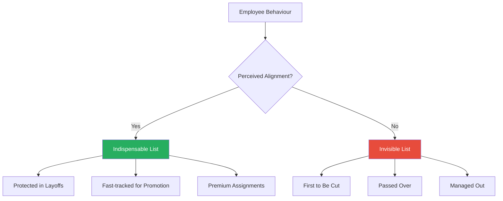
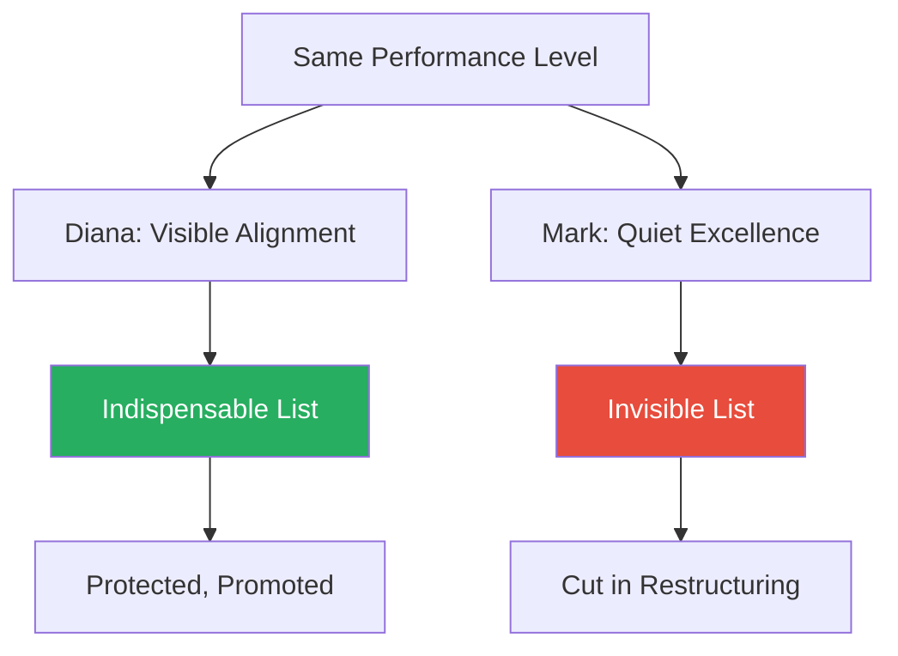
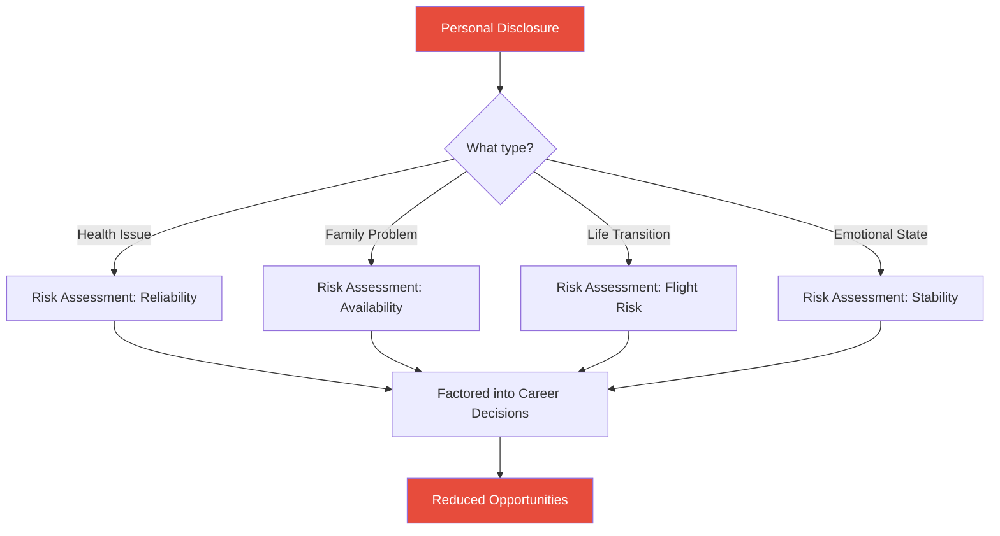
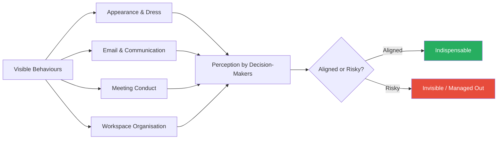
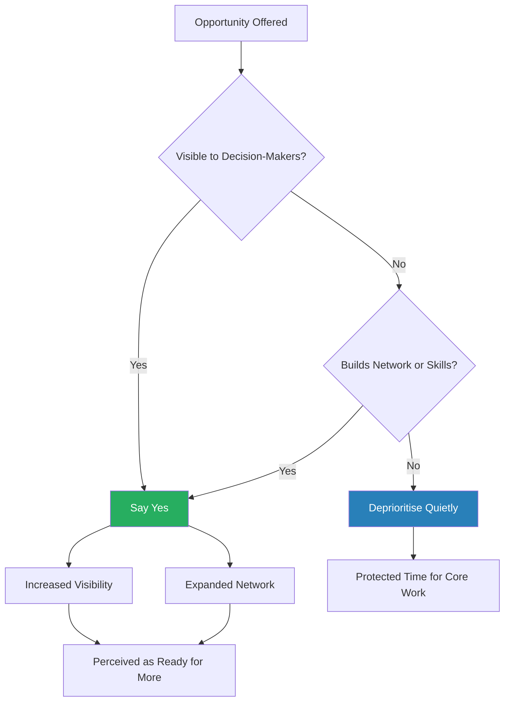
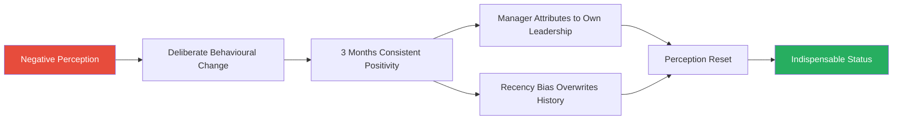

# Corporate Confidential — Cynthia Shapiro

> A former Human Resources executive pulls back the curtain on the hidden rules that actually determine who gets promoted, protected, and pushed out of corporate organisations.
> Cynthia Shapiro spent years as an HR Vice President, implementing the very mechanisms she now warns employees about — managing people out, compiling layoff lists, secretly voting on promotions, and weaponising personal disclosures.
> Her central claim is blunt: your company's **perception** of you matters more than your skills, talent, or results.
> Corporations run on two sets of values — the ones on the wall and the ones behind closed doors — and only the employees who learn to navigate the hidden set will survive and advance.
> The book is structured as 50 "secrets" that progress from defensive awareness (how not to get fired) through offensive positioning (how to become indispensable) to post-promotion survival (how not to fail after you get what you wanted).
> It is, at its core, a survival manual for the modern office — paranoid in tone, provocative in content, and uncomfortably recognisable to anyone who has ever been blindsided by a bad review or an unexpected layoff.

---

## About the Author

Cynthia Shapiro spent over a decade as a Human Resources executive, rising to the level of Vice President in multiple corporate environments. In that role, she participated in the full machinery of corporate people management: compiling layoff lists, conducting secret promotion votes, managing employees out of the organisation, and handling confidential disclosures that shaped career-determining decisions. She left corporate HR to become an employee-side career strategist, advising individuals on how to navigate the systems she once operated from the inside. That insider-turned-whistleblower perspective gives the book unusual credibility on the mechanical details of corporate politics — not the theory of how organisations work, but the operational reality of how people are evaluated, protected, sidelined, and removed. Her tone throughout is that of a defector briefing the other side: sympathetic but clinical, warning rather than hand-wringing.

---

## The Big Idea

- Corporations are <b style="color: #27ae60">fear-driven organisms</b> that prioritise self-protection above all else
- They are not the meritocracies they claim to be — they do not reward talent proportionally, and they do not promote the hardest workers
- Instead, they operate on a hidden set of criteria — entirely separate from stated corporate values — that determine who advances and who is discarded
- Those hidden criteria revolve around five true corporate priorities: **protection from liability, profit generation, open public support, marketplace competitive edge, and the image of success and forward momentum**

---

- Every employee, whether they know it or not, is secretly classified into one of two groups:
  - <b style="color: #27ae60">Indispensable</b> — protected, promoted, invested in
  - <b style="color: #e74c3c">Invisible</b> — replaceable workhorses who can be cut at any time without institutional loss
- The divide between these two groups has almost nothing to do with talent, output, or work ethic
- It has everything to do with whether the people who make decisions — your manager, their manager, the HR department — *perceive* you as aligned with the company's real interests
- The invisible employee works harder, delivers more, and gets less in return
- The indispensable employee may do less actual work, but they project alignment, loyalty, and the image of someone whose loss would damage the organisation

> [!tip] Core Insight
> The employees who thrive are not necessarily the most skilled. They are the ones who understand that the game is about **perception management** — ensuring the right people see you in the right light — rather than raw performance improvement.

- Shapiro does not present this as cynical advice — she presents it as the operating reality of corporate life, visible from the HR chair but invisible from the employee's desk
- Her book exists to close that information gap
- The asymmetry is what makes it dangerous: the company knows exactly how the game works; the employee does not
- Every "secret" in the book is something Shapiro saw HR professionals, managers, and executives act on daily — while the affected employees had no idea the game was even being played

---

## Key Concepts at a Glance

| Concept | One-line summary |
|---------|-----------------|
| **The Indispensable/Invisible Divide** | Every company secretly sorts people into two tiers based on perceived alignment, not actual performance |
| **The Gatekeeper Principle** | Your direct manager controls raises, reviews, promotions, and layoff selections — the single highest-leverage variable |
| **The Hidden Agenda Framework** | Companies operate on two layers of values: stated ones and true ones; only the true ones determine outcomes |
| **The Perception-Reality Gap** | How your boss thinks you are performing determines everything; your own assessment is irrelevant |
| **HR as Corporate Shield** | HR's primary function is to protect the company from employees, not to help employees |
| **Layoffs as "Cleaning House"** | Restructurings are legal cover to remove employees the company has already decided to get rid of |
| **The Public Voice Rule** | Any public expression of negativity labels you as a contagion risk, regardless of validity |
| **Guilt by Association** | You are judged by the company you keep at work; visible friendships with disfavoured employees will tar you |
| **The Turnaround Window** | Companies have short memories — a sincere behavioural change can reset perceptions within months |
| **The Service Entrance** | New managers who enter asking how they can help succeed at far higher rates than those announcing plans |
| **The Ownership Signal** | How you handle company money and resources is treated as a proxy for whether you think like an owner |
| **Appear Underwhelmed** | No company will promote you to greater responsibility if you appear to be struggling with your current workload |

---

This diagram captures the central mechanism of the entire book: a single perception fork determines two radically different career trajectories.

---

## Chapter 1: The Hidden Reality (Secrets 1-5)

### Job Security Is an Illusion

*Shapiro opens with her most provocative claim — that no amount of tenure, strong reviews, or critical project work can protect you if you fall out of perceived alignment.*

- <b style="color: #e74c3c">Job security does not exist</b> — no matter how long you have been at a company, you can and will be removed if you fall out of perceived alignment
- Companies evaluate employees not on a single axis of performance but on a complex, largely invisible matrix:
  - Perceived loyalty
  - Cultural fit
  - Political alignment
  - Future potential
- An employee can score highly on performance and still be classified as disposable if they have alienated their manager, been publicly negative, or disclosed personal information that makes them seem like a risk
- The inverse is equally true: an employee with mediocre output who projects perfect alignment, positivity, and loyalty can be classified as indispensable and protected through multiple rounds of cuts

> [!example] "Tom" — High Performer, Publicly Disagreed
> - Tom was a consistently high performer with excellent reviews
> - He publicly disagreed with his department head in front of several colleagues — a single incident
> - His output had not changed, but his perception had
> - The disagreement reframed Tom in his manager's mind from "reliable contributor" to "potential problem"
> - Within six months, Tom was gone — packaged out in a restructuring that conveniently eliminated his position
> **The lesson:** Performance is necessary but not sufficient — one perception shift can override years of strong output.

- The employee who understands this allocates attention not just to their work product but to how their work product — and they themselves — are perceived by the people who make decisions
- Shapiro draws a direct analogy to a courtroom: the facts matter, but presentation determines the verdict
- The employee's "case" is being tried constantly — in every meeting, every email, every hallway interaction — and the jury (management) is always watching

---

### The Five True Corporate Values

*Beneath the stated values on the company website, Shapiro identifies five priorities that actually drive corporate decision-making.*

- <b style="color: #2980b9">The Five True Corporate Values</b> that actually drive decision-making:

| Priority | What it means |
|----------|--------------|
| **Protection** | The company's first instinct is self-preservation; any employee who represents a legal, reputational, or operational risk will be managed out |
| **Profit** | Revenue generation and cost control; employees are investments, and investments that don't return are liquidated |
| **Open support** | Public cheerleading of the company's direction, leadership, and culture; dissent is interpreted as disloyalty |
| **Marketplace edge** | Competitive advantage through talent retention, innovation, and market positioning |
| **Image of success** | The appearance of forward momentum, competence, and stability, both internally and externally |

- The gap between stated values and true values is where most career surprises occur:
  - A company may talk about work-life balance but punish employees who use flexible working arrangements
  - It may celebrate innovation but promote the people who execute safely rather than the ones who take creative risks
  - It may claim to value diversity but consistently advance people who look, sound, and think like the existing leadership
- Shapiro's framework for decoding this gap is behavioural, not rhetorical:
  - Ignore the mission statement, the town hall speeches, and the corporate newsletter
  - Watch what actually happens: who gets promoted, who survives layoffs, who gets the premium assignments
  - The pattern of rewards reveals the true values with perfect accuracy

> [!tip] Core Insight
> Shapiro's test for identifying the true values is simple: look at what the company consistently rewards, not what it says it values. The behaviours that lead to promotions, protection during layoffs, and premium assignments tell you what the organisation actually cares about. Everything else is marketing.

Protection dominates the hidden agenda — companies will sacrifice profit, innovation, and even public image before they accept liability risk.

---

### The Indispensable/Invisible Divide

*The most important framework in the book is the classification system that Shapiro argues every company operates, whether consciously or not.*

- <b style="color: #2980b9">Indispensable employees</b> are the ones the company cannot afford to lose:
  - Protected during layoffs and given the best assignments
  - Fast-tracked for promotion and granted the benefit of the doubt when they make mistakes
  - Invited to strategic meetings and given corner offices
  - When they have a bad quarter, the company diagnoses it as a temporary slump, not a performance issue
  - Their mistakes are treated as learning experiences; their absences are noticed and felt
- <b style="color: #e74c3c">Invisible employees</b> are the reliable workhorses:
  - They do solid, consistent work and keep their heads down
  - They assume that if they just do their jobs well, the company will eventually recognise and reward them — it rarely does
  - When cuts come, invisible employees are the first to go — and they are always surprised, because they genuinely believed their output was what mattered
  - Their departures create no panic — the work is simply redistributed to whoever remains

---

- The distinction is not about who works harder — invisible employees typically work harder than indispensable ones
- The distinction is about who the company *perceives* as aligned with its real interests:
  - Indispensable employees project ownership, positivity, and loyalty
  - They treat the company's problems as their own
  - They publicly support leadership decisions
  - They make their managers look good
  - They are, in Shapiro's framing, the ones who have figured out the game and are playing it
- The classification is also self-reinforcing:
  - Once you are labelled indispensable, you get better assignments, more visibility, and more support — all of which make you perform better
  - Once you are labelled invisible, you get routine work, less face time with leadership, and fewer opportunities — all of which make you seem less capable
  - The initial perception creates a feedback loop that widens the gap over time

> [!example] "Diana" — Aligned by Design
> - Diana was a mid-level marketing employee, neither the most talented nor the hardest working on her team
> - She consistently, visibly aligned herself with the company's priorities
> - She volunteered for the unglamorous projects that mattered to senior leadership
> - She publicly championed the company at industry events
> - She made her boss's priorities her own and ensured he always looked well-prepared
> - When layoffs came, Diana was on the protected list before anyone else — not because of her output, but because the company perceived her as someone whose departure would leave a visible hole
> **The lesson:** Visible alignment with company priorities creates protection that raw performance cannot.

> [!example] "Mark" — Invisible Despite Strong Output
> - Mark was a stronger performer than Diana by objective metrics
> - But he had done his excellent work quietly, without ensuring the right people noticed
> - He had not invested in his relationship with his manager
> - He had not projected alignment with the company's values
> - He was, in Shapiro's taxonomy, invisible — and invisibility is a death sentence in a restructuring
> - Mark was let go
> **The lesson:** Doing excellent work is not enough if the work is invisible to decision-makers.

The Diana/Mark comparison illustrates the central paradox: the employee who invests in perception outperforms the employee who invests only in output, even when the output is objectively stronger.

---

## Chapter 2: Career Killers (Secrets 6-16)

Larger blocks represent higher career-damage severity — legal action and public negativity dominate because they trigger the corporate immune response most directly.

### HR Is Not Your Ally

*Shapiro makes one of the book's most provocative claims: HR's primary function is to protect the company from employees, not to help employees.*

- <b style="color: #2980b9">HR as corporate immune system</b> — it exists to identify threats to the organisation (legal risks, compliance violations, disgruntled employees) and neutralise them
- Employee support programmes (counselling, conflict mediation, career development) are secondary functions that exist primarily because they reduce the company's legal exposure
- The practical implication is devastating: <b style="color: #e74c3c">anything you disclose to HR becomes company property</b>
  - Health issues, family problems, workplace conflicts, relationship difficulties, even positive personal milestones like engagements or pregnancies
  - All of it enters the corporate information system and factors into decisions about your career
- When Shapiro says "HR confidentiality," she means they will not broadcast your information to your coworkers
- Decision-makers — your boss, the promotion committee, the executive team — will know everything
- The information does not stay in the file — it becomes an active ingredient in every decision about your trajectory

> [!example] "Judy" — The Confidential Divorce
> - Judy, a sales manager, confided to HR about a difficult divorce
> - She sought emotional support and believed the conversation was confidential
> - Within weeks, her manager knew
> - Within months, Judy was passed over for a promotion she had been positioned to receive
> - The stated reason was unrelated, but the real reason was that the company now perceived Judy as someone whose personal life might affect her reliability
> - The disclosure did not help Judy — it created a new variable in the company's risk assessment of her
> **The lesson:** Never treat HR as a counselling service — anything shared becomes data in the company's evaluation of you.

- Shapiro's advice is blunt:
  - Resolve conflicts privately, through your manager, or through external advisors
  - Never assume that "off the record" means anything in a corporate context
  - HR professionals may be genuinely sympathetic individuals, but they work for the company, and their professional obligation is to the company's interests
- The exception she acknowledges: genuine legal violations or safety concerns — harassment, discrimination, criminal behaviour — where formal processes may be the only recourse
  - But even then, the employee who files a complaint should understand that their career at the organisation is effectively over, regardless of the outcome
  - The company may be legally required to protect the complainant from retaliation, but social dynamics are not governed by legal requirements

---

### The Gatekeeper Principle

*Your boss holds disproportionate power over your career — more than any other single factor — and most employees are blind to the asymmetry this creates.*

- <b style="color: #2980b9">The Gatekeeper Principle</b>: the company delegates almost all career-determining decisions to the direct manager:
  - Raises and performance reviews
  - Assignment selections and promotion nominations
  - Layoff recommendations
- Senior leaders are too busy to independently evaluate individual contributors — they rely on the manager's assessment
- When your boss says you are excellent, you are treated as excellent
- When your boss says you are a problem, you are treated as a problem
- <b style="color: #e74c3c">There is rarely an independent verification step</b>
- One negative comment from your boss in a closed-door meeting can override years of strong output
- Conversely, a manager who actively champions you can accelerate your career beyond what your results alone would justify
- The boss does not just evaluate your work — they *narrate* your career to the rest of the organisation
- That narrative, once established, becomes the lens through which everyone else sees you

> [!example] "Julie" — The Changed Narrator
> - Julie was a consistently high-performing analyst
> - She alienated her new manager by continuing to work in the style preferred by her previous boss
> - Julie's output did not decline — her relationship with her gatekeeper did
> - The new manager began subtly reframing Julie's work in status meetings:
>   - Not unreliable, but "still adapting"
>   - Not incompetent, but "needs more support than expected"
> - Within a year, Julie's reputation had shifted from rising star to question mark — not because of anything she did, but because the person narrating her career had changed the story
> **The lesson:** Before optimising any other variable, ensure the relationship with your direct manager is solid — everything else is downstream of the gatekeeper.

- Shapiro adds a critical nuance: when you get a new boss, your career clock resets
  - Everything you built with the previous manager — trust, rapport, track record — does not automatically transfer
  - The new boss inherits a narrative but forms their own assessment quickly
  - <b style="color: #27ae60">The first 60 days under a new manager are the highest-leverage period</b> in an existing role
  - Employees who treat a new boss as just another manager — rather than as a completely new relationship to build — are making a high-stakes bet that the old reputation will carry over
  - It almost never does

---

### The Contagion of Negativity

*Shapiro reveals why companies treat public criticism — even when factually correct and strategically important — as a virus to be contained rather than feedback to be acted on.*

- <b style="color: #2980b9">The Public Voice Rule</b>: any public expression of negativity — about the company, management, policies, working conditions, or colleagues — will label you as a potential liability
- This applies regardless of whether the criticism is valid, constructive, or even objectively correct
- The mechanism: companies interpret public negativity as a <b style="color: #e74c3c">contagion risk</b>
  - One negative voice can infect a team
  - A team's negativity can spread to a department
  - The company sees a publicly negative employee not as someone with legitimate concerns but as a virus that must be contained
- This extends to all forms of communication, especially email:
  - <b style="color: #e74c3c">Never put negativity in writing</b>
  - Emails are permanent, searchable, and forwardable
  - A frustrated email sent to a trusted colleague can end up on the desk of the CEO
- The mechanism also operates through social media, even personal accounts:
  - Any platform where you are identifiable as an employee of the company becomes an extension of your corporate voice
  - A vague complaint about "management" on a personal social media post can and will be screen-captured and forwarded

> [!example] The Forwarded Email
> - An employee sent a critical email about a company policy to a trusted colleague
> - The email was forwarded through six levels of management until it reached the executive team
> - The executive team immediately placed the employee on the watch list
> - The employee was not flagged because the criticism was wrong — but because putting it in writing created a documentary trail of disloyalty
> **The lesson:** Never commit negativity to writing — emails are permanent evidence in the corporate immune system.

- The only safe public voice, in Shapiro's framework, is positive support
- Concerns must be raised privately, constructively, and through the right channel — ideally your direct manager, and only after you have earned enough trust to be heard rather than flagged
- Even then, the framing matters:
  - <b style="color: #27ae60">"I have a suggestion for improvement"</b> is acceptable
  - <b style="color: #e74c3c">"This policy is broken"</b> is not
- The distinction is not about substance — it is about signal:
  - The first framing positions you as a constructive partner
  - The second positions you as a critic
  - Decision-makers react to the signal, not the substance

---

### Guilt by Association

*Companies judge you by the company you keep — and the assignment is not always conscious, but the consequences are always real.*

- Associating with negative, disgruntled, or politically disfavoured employees can tar you by extension, even if you do not share their views or even discuss work with them
- Shapiro calls this the <b style="color: #2980b9">separate camp</b> dynamic:
  - In every organisation, employees are perceived as belonging to either the "management camp" (aligned with leadership, positive, forward-looking) or the "employee camp" (cynical, complaining, adversarial)
  - The assignment can be as simple as who you eat lunch with
  - Employees perceived as belonging to the management camp are promoted into management
  - Employees perceived as belonging to the employee camp are not
- The classification is often made unconsciously by managers who observe social patterns without actively analysing them:
  - The brain's pattern-matching machinery groups people together automatically
  - If you are always seen with someone who is viewed as negative, the negativity attaches to you through simple proximity

> [!example] "Vicky" — Laid Off by Lunch
> - Vicky was a solid performer with no performance issues
> - Her close visible friendship was with "Sally," a vocal critic of company policies
> - Vicky did not share Sally's views, but she ate lunch with Sally daily, was seen chatting with her in the hallways, and attended the same after-work social events
> - When the layoff list was compiled, Sally was on it — and so was Vicky
> - The company assumed that Vicky, by association, shared Sally's attitudes
> - Vicky was blindsided because she had evaluated her career prospects based on her own performance, not realising her visible associations were being factored in
> **The lesson:** You are evaluated not just on your own behaviour but on the perceived behaviour of the people you visibly associate with.

- The principle applies in reverse as well:
  - Being visibly associated with rising stars, senior leaders, and politically favoured colleagues signals that you belong in their orbit
  - The association itself becomes a form of endorsement — if those people choose to spend time with you, the organisation infers that you must be worth spending time with
- Shapiro is not advising employees to be calculating about friendships — she is advising them to be aware that the calculation is happening whether they participate in it or not

---

### Personal Information as Liability

*Shapiro reveals why the modern corporate emphasis on "bringing your whole self to work" can be a trap — because managers cannot unsee personal information once they have it.*

- <b style="color: #e74c3c">Any personal information shared at work becomes a variable in the company's assessment of you</b> — positive or negative
- The mechanism: once a manager knows about your health scare, marital difficulties, elderly parent's decline, or pregnancy, that information becomes part of every decision they make about you
  - The manager may be genuinely empathetic and sincerely intend not to let it influence their judgement
  - It will influence their judgement anyway
  - This is not malice — it is the unavoidable operation of cognitive bias
- Specific examples of how this plays out:
  - The manager who knows about your health issue will hesitate before assigning you the high-pressure project
  - The manager who knows about your difficult home situation will wonder whether you can handle the travel schedule
  - The manager who knows you are looking at houses in another city will start thinking about your replacement
  - None of this may be conscious — all of it is real

> [!example] The Disclosed Health Condition
> - A marketing professional disclosed a health condition to her manager, seeking support for occasional medical appointments
> - The manager was sympathetic and accommodating
> - Six months later, when the department restructured, the marketing professional was let go
> - The manager's unconscious assessment was that she was a higher risk than colleagues without disclosed health issues
> - The manager would have denied this was a factor — and may have genuinely believed it was not — but the data point had entered the equation
> **The lesson:** Even well-intentioned managers cannot prevent disclosed personal information from affecting their decisions about you.

> [!example] "Robyn" — The Wedding That Cost a Promotion
> - Robyn was a rising star in her department who became visibly excited about her upcoming wedding
> - She did not take excessive time off or let her performance slip
> - But her enthusiasm was visible — she discussed venues, showed photos, and radiated distraction
> - Her manager, preparing a promotion nomination, hesitated:
>   - The wedding signalled a life transition
>   - Life transitions signal uncertainty
>   - Uncertainty signals risk
> - Robyn was not promoted
> **The lesson:** Discretion, not dishonesty — share only what directly affects work scheduling and maintain calm professionalism.

- Shapiro's advice is not to lie or pretend personal life does not exist
- It is to manage the flow of personal information strategically:
  - Share what is necessary (medical appointments, family emergencies) with minimal detail
  - Frame it in terms of logistics, not emotions: "I need a few hours on Thursday for an appointment" — not "I'm dealing with a really difficult health situation"
  - <b style="color: #27ae60">The goal is to give the company the minimum information required while preventing unnecessary variables from entering their assessment</b>

---

Every category of personal information feeds into the same corporate risk-assessment engine — regardless of whether the manager consciously intends it to.

---

## Chapter 3: Corporate Myths Debunked (Secrets 17-30)

### How Layoffs Actually Work

*Shapiro dismantles the myth that layoffs are objective cost-cutting exercises and reveals them as political events with predetermined outcomes.*

- <b style="color: #2980b9">Layoffs as "cleaning house"</b> — Shapiro's most unsettling revelation is how layoff lists are actually compiled
- The popular belief: layoffs are driven by financial necessity, and positions are eliminated based on objective criteria — seniority, cost, redundancy
- The reality, according to Shapiro:
  - The company has already decided who it wants to remove — these are employees who are invisible, politically disfavoured, or perceived as problems
  - The restructuring provides legal cover to eliminate those employees without the risk of wrongful termination claims
  - The financial justification is real but secondary — it is the occasion, not the cause
- The process typically works like this:
  - Senior leadership announces a restructuring
  - Managers are asked to identify positions to eliminate
  - Managers consult the same mental list they have been maintaining all along — the invisible employees, the complainers, the ones who have fallen out of alignment
  - The positions are "eliminated" in a way that happens to coincide with the people the company already wanted gone

> [!example] The Convenient Restructuring
> - A department head had been quietly unhappy with three employees for months
> - None of them had documented performance issues severe enough to justify termination
> - When a company-wide restructuring was announced, the department head was asked to identify two positions for elimination
> - The two positions that were "eliminated" belonged to two of the three disfavoured employees
> - The third was given a reassignment that amounted to a demotion
> - The restructuring was genuine — the company did need to reduce headcount — but the selection was entirely political
> **The lesson:** Layoffs are not random or purely financial — they are the moment when the invisible list becomes actionable.

- The implication for employees is stark: <b style="color: #e74c3c">by the time a layoff is announced, it is too late to protect yourself</b>
- Protection happens in the months and years before the restructuring, through the steady accumulation of perceived alignment, strong relationships with decision-makers, and visible ownership
- Shapiro identifies the warning signs that a layoff is approaching:
  - Hiring freezes, travel restrictions, and sudden cost-consciousness
  - Consultants appearing in the building
  - Senior leaders becoming less accessible
  - An unusual number of closed-door meetings
  - Projects being quietly shelved or combined
- When you see these signals, it is not panic time — it is too late for panic:
  - Your position on the indispensable/invisible list was determined months or years ago
  - What you can do is ensure your manager knows your current contributions, that your visibility is as high as possible, and that no negative signals are being transmitted
  - But fundamentally, the layoff reveals your true status — it does not create it

> [!example] The "Safe" Employee
> - An engineer with fifteen years of tenure assumed his institutional knowledge made him irreplaceable
> - He had never cultivated relationships with decision-makers beyond his immediate team
> - When the restructuring came, his manager advocated to keep him — but his manager was also being let go
> - Without a surviving champion, the engineer's institutional knowledge was invisible to the people making the list
> - He was cut despite being the most experienced person in his department
> **The lesson:** Institutional knowledge only protects you if the people making layoff decisions know you have it — tenure alone is not protection.

---

### How Raises Actually Work

*Shapiro dismantles the common belief that raises are earned by working harder or staying longer — and reveals that the framing of the request matters more than the justification behind it.*

- Raises are won by <b style="color: #27ae60">proving worth, not expressing need</b>
- The distinction matters enormously:
  - An employee who says "I have a mortgage and children in school" is communicating **need**
    - The company hears: this person is financially vulnerable, which means they are unlikely to leave, which means there is no urgency to pay them more
  - An employee who says "I have generated two million in revenue this quarter, 40% above target, and the market rate for my results is 20% higher" is communicating **value**
    - The company hears: this person knows their worth, has evidence to back it up, and will leave if underpaid
- The psychology behind this distinction connects to fundamental principles of negotiation:
  - Need-based arguments appeal to sympathy — and sympathy has no leverage
  - Value-based arguments appeal to self-interest — and self-interest is the only reliable lever in a corporate context

| Raise Approach | What You Say | What the Company Hears |
|---------------|-------------|----------------------|
| **Need-based** | "I have a family to support" | "Financially trapped — no urgency to raise" |
| **Tenure-based** | "I've been here five years" | "Loyal enough to stay without a raise" |
| **Value-based** | "I generated 2M above target" | "Knows their worth — risk of losing them" |
| **Market-based** | "The market rate is 20% higher" | "Has options — must compete to retain" |

The only approaches with leverage are those that make the company fear losing you, not feel sorry for you.

Value-based and market-based approaches account for 80% of successful raise negotiations because they appeal to corporate self-interest rather than sympathy.

> [!abstract] Shapiro's Raise Conversation Formula
> 1. Bring market rate data for your role and performance level
> 2. Quantify your contributions in revenue, savings, or measurable impact
> 3. Build a narrative about your future value to the organisation
> 4. Never mention personal financial needs
> 5. Never threaten to leave (the company will begin planning your replacement immediately)
> 6. Frame it as what the market dictates, not what you deserve

- Timing is critical:
  - <b style="color: #e74c3c">Asking during a downturn, restructuring, or after a visible mistake is self-destructive</b>, regardless of how strong your case is
  - The best time is when you have just delivered a visible win and the company is in growth mode — when the cost of losing you is most vivid in the decision-maker's mind
- Shapiro also warns about the annual review trap:
  - Many employees wait for the formal review cycle to discuss compensation
  - By then, budgets are already allocated and raise pools are predetermined
  - The conversation should happen before budget planning, not after

---

### Promotions Are Pre-Decided

*By the time a promotion is publicly announced, the decision has already been made — and the person who asked for it is rarely the person who gets it.*

- The person selected was not chosen through a fair, open competition
- They were chosen because they were already visibly operating at the next level — the promotion is simply the formal recognition of a reality that has existed for months
- <b style="color: #e74c3c">Asking for a promotion is counterproductive</b>:
  - It signals naked ambition
  - It makes management nervous
  - It suggests that you care more about your title than about the organisation's needs
- <b style="color: #27ae60">The person who gets promoted is the one who demonstrated higher-level capability before the opportunity arose</b>, not the one who lobbied for it afterward

> [!example] "Michael" — The Eager Project Manager
> - Michael repeatedly told his boss that he was ready for a senior role
> - Each time, his boss nodded and said the right things
> - Michael interpreted this as encouragement
> - What his boss was actually thinking: Michael's eagerness was itself a disqualifying signal — someone truly operating at the senior level would not need to ask
> - When the senior role opened, it went to Michael's quieter colleague, who had been:
>   - Making senior-level decisions without being asked
>   - Mentoring junior team members
>   - Producing strategic analyses unprompted
> - All behaviours that demonstrated readiness rather than declared it
> **The lesson:** Companies view self-advocacy for promotion as evidence of misaligned priorities — demonstrate readiness through action, not requests.

- The mechanism: the ideal promotion candidate seems more focused on the work than on the title — so absorbed in performing at a higher level that the promotion feels like a natural, inevitable conclusion
- Shapiro describes this as the <b style="color: #2980b9">already-acting principle</b>:
  - The promoted person was already doing the job before the title caught up
  - The promotion was the company acknowledging what was already happening, not creating something new
  - This is why the best strategy is to find out what the next-level role requires and start doing it — visibly — without being asked or compensated for it
- **Limits Shapiro does not fully explore:**
  - This applies cleanly to internal promotions within stable organisational structures
  - It applies less well where the role does not yet exist and must be advocated for, or where the company's promotion machinery is dysfunctional and requires external pressure

---

### The Performance Review Illusion

*Performance reviews are not objective assessments of your work — they are subjective assessments of your manager's experience of working with you.*

- Shapiro calls the gap between how you think you are performing and how your boss thinks you are performing the <b style="color: #2980b9">perception-reality gap</b>
- She considers it the root cause of most career surprises
- The employee who receives a bad review despite strong work was not the victim of unfairness in the traditional sense — they were the victim of failing to manage their manager's experience

---

- The mechanism is structural:
  - Performance reviews are conducted by one person: your boss
  - That person has their own priorities, preferences, blind spots, and biases
  - They cannot objectively evaluate your contribution any more than you can objectively evaluate your own
  - What they *can* evaluate is how working with you *feels*:
    - Whether you make their life easier or harder
    - Whether you anticipate their needs or create surprises
    - Whether they feel supported or undermined
- The review document itself is not the real evaluation — it is a formalised version of the impression your manager already had:
  - Managers do not sit down at review time with an open mind
  - They sit down with months of accumulated impressions, and the review simply codifies what they already believe
  - <b style="color: #e74c3c">If the review surprises you, you were not paying attention to the signals</b>

> [!abstract] Shapiro's Perception Management Method
> 1. Schedule brief, frequent check-ins with your manager (weekly if possible)
> 2. Don't give status updates — ask questions instead:
>    - What are your top priorities this week?
>    - Is there anything I should be doing differently?
>    - What would make your job easier?
> 3. Use the answers to ensure you are working on what your boss cares about (not what you think they should care about)
> 4. Create a feedback loop that eliminates surprises at review time

> [!tip] Core Insight
> The employee who has weekly alignment conversations with their boss never gets a surprise bad review, because any misalignment is caught and corrected in real time. The employee who works independently for months is gambling that their definition of "good work" matches their boss's — it often does not.

---

### The Danger of Legal Action

*Shapiro warns that even when you are legally in the right, pursuing a lawsuit will effectively end your career at the company — through a thousand small signals rather than a single retaliatory act.*

- Even when you are legally in the right, pursuing litigation will effectively end your career at the company:
  - The company will comply with legal requirements
  - But you will be socially and professionally isolated
  - Your manager will be advised by legal counsel to document every interaction
  - You will be excluded from opportunities that cannot be formally denied but can be informally withheld
  - <b style="color: #e74c3c">The organisation's immune response will activate</b>, and you will be treated as a threat to be contained

> [!example] The Upheld Harassment Complaint
> - An employee filed a legitimate harassment complaint with proper documentation
> - The complaint was upheld and the harasser was disciplined
> - The employee was legally protected from retaliation
> - Within eighteen months, the employee had left the company
> - Not because of any single retaliatory act, but because the accumulation of small social exclusions, missed opportunities, and awkward interactions made the environment unbearable
> - The company had done nothing legally wrong — it had simply made it clear, through a thousand small signals, that the employee was no longer welcome
> **The lesson:** Legal victory and career survival are often mutually exclusive — pursue legal remedies only when the violation is severe enough to justify the career cost.

- Shapiro does not argue that employees should never pursue legal remedies
- She argues they should pursue them with clear eyes about the career cost, and only when the violation is severe enough to justify that cost
- The calculus is brutal but honest:
  - Minor violations are better addressed by leaving the company quietly
  - Major violations (sexual assault, criminal behaviour, systematic discrimination) justify the career cost because the alternative — silence — enables continued harm
  - The middle ground is where most employees get trapped: violations serious enough to feel wrong, but not serious enough to justify destroying your career over

---

### Appearance and Image

*Shapiro argues that appearance is a perception-management tool — and that every visible behaviour is a data point in the company's assessment of you.*

- Companies and individual managers make rapid judgements based on how employees present themselves
- These judgements are not fair, but they are real:
  - Dressing slightly above your current level signals aspiration
  - Dressing at or below your current level signals contentment with where you are
- This extends beyond clothing:
  - A messy desk signals disorganisation
  - Poorly formatted emails signal carelessness
  - Arriving late to meetings signals disrespect
  - None of these may be accurate readings — but they are the readings that decision-makers make
- <b style="color: #27ae60">Every visible behaviour is a data point in the company's assessment of you</b>, and you have more control over those data points than you think
- The employee who consciously curates their visible behaviours — appearance, communication style, workspace, meeting conduct — is doing perception management at the most granular level
- Shapiro frames this as a form of professional communication:
  - You are always communicating, whether you intend to or not
  - The question is whether you are communicating what you want to communicate, or letting random signals accumulate into an unintended message

---

Every micro-behaviour — from how you format an email to how you arrange your desk — feeds into the same perception engine that determines your career trajectory.

---

## Chapter 4: Becoming Indispensable (Secrets 31-40)

### The Loyalty Prerequisite

*Shapiro reveals a fundamental asymmetry in the corporate trust dynamic: the company requires proof of your alignment before it will invest in you — and the employee must always make the first move.*

- <b style="color: #27ae60">Companies will not show you loyalty until you demonstrably show loyalty to them first</b>
- The corporate trust dynamic is fundamentally asymmetric:
  - The more powerful party (the company) requires proof of alignment before it will invest in the less powerful party (the employee)
  - The employee must make the first move — visible, sustained, unrewarded loyalty — before the company reciprocates with protection, premium assignments, and promotion support
- The mechanism is psychological:
  - Companies have learned, through decades of experience with employee turnover, that most people are primarily self-interested
  - They expect employees to leave when a better offer comes along
  - The employee who visibly invests in the company's success stands out as a <b style="color: #2980b9">genuine believer</b>
  - Once the company identifies someone as a genuine believer, the calculation shifts: this person is worth protecting because they will stay, they will fight for us, and they will bring others along

> [!example] "Megan" — The Ownership Pattern
> - Megan was an operations analyst, neither the most talented nor the most senior on her team
> - She consistently, visibly demonstrated ownership:
>   - When the company faced a PR crisis, Megan volunteered to work the weekend
>   - When a senior leader needed data for a board presentation, Megan pulled it together without being asked
>   - When colleagues complained about a policy change, Megan publicly reframed it as an opportunity
> - None of these individual acts was extraordinary — the pattern was
> - Within two years, Megan was on the indispensable list — untouchable during layoffs, first in line for promotions, and granted latitude that her peers did not receive
> **The lesson:** Consistent, visible ownership behaviour compounds into indispensable status faster than raw talent alone.

- **The dark side Shapiro acknowledges:** some organisations exploit loyalty without reciprocating
  - The employee who gives and gives, waiting for the company to recognise their devotion, may find that the company simply consumes their devotion and asks for more
  - Shapiro's advice implicitly assumes the company is rational enough to reciprocate genuine loyalty — an assumption that does not always hold
  - Employees must calibrate: if six to twelve months of visible loyalty produce no reciprocal signals (better assignments, more trust, inclusion in strategic conversations), the company may be extracting rather than investing

---

### The Ownership Mentality

*Closely related to the loyalty prerequisite, Shapiro reveals that how you handle company resources is treated as a secret test of whether you think like an owner or an employee.*

- The distinction shows up in how you handle company resources
- Expense reports, budget requests, resource allocations, and purchasing decisions are all treated by the company as <b style="color: #2980b9">secret loyalty tests</b>:
  - The employee who expenses lavishly signals that they see the company's money as someone else's money
  - The employee who treats every pound as if it came from their own account signals ownership
- Shapiro claims that in layoff situations, companies review expense reports to identify "disloyal" employees
  - Whether or not this is universally true, the broader principle holds: how you handle resources is visible, concrete, and easy to evaluate
  - It becomes a high-weight signal for decision-makers trying to assess your character from limited information

---

- The ownership mentality extends beyond money to language and attitude:

| Ownership Signal | Owner Mindset | Employee Mindset |
|-----------------|---------------|------------------|
| **Language** | "We need to fix this" | "They should fix this" |
| **Company problems** | Challenges to solve | Annoyances to endure |
| **Company property** | Treated with care | Treated as someone else's |
| **Expenses** | Spent as if personal money | Spent freely |
| **After-hours** | Available when needed | Clock out at five sharp |

- Every one of these micro-behaviours contributes to the overall perception of whether you are psychologically invested in the company's success or merely exchanging labour for a salary
- The language distinction is particularly revealing:
  - "We" versus "they" is a subtle but powerful signal
  - The employee who says "we need to improve our customer service" is perceived as part of the solution
  - The employee who says "they need to improve customer service" is perceived as an observer — and observers are dispensable

> [!example] The "We" vs "They" Moment
> - In a team meeting, a manager noticed how two employees responded to a customer service failure
> - The first said: "They need to get their act together in support"
> - The second said: "We should figure out how to fix this — I have some ideas"
> - Both employees cared about the issue, but only the second communicated ownership
> - The manager mentally filed the distinction — and it surfaced months later when promotion nominations were due
> **The lesson:** The pronoun you use — "we" or "they" — is a micro-signal that accumulates into a macro-perception about whether you belong at the leadership table.

---

### Projecting Capacity

*Shapiro introduces one of her most counterintuitive principles: the natural instinct to let your effort show is self-defeating, because companies extrapolate from visible stress.*

- <b style="color: #27ae60">Appear underwhelmed, not overwhelmed</b> — this is one of Shapiro's most practical principles
- The natural instinct of hardworking employees is to let their effort show:
  - They want recognition for how much they are juggling
  - They want credit for how many hours they are putting in
  - Shapiro argues this instinct is self-defeating
- Companies extrapolate from visible stress:
  - If you seem barely able to manage your current role, giving you a bigger role feels risky
  - If you seem to be drowning in your current workload, the company will not throw you a lifeline — it will conclude that you have hit your ceiling
  - <b style="color: #27ae60">The employees who get promoted are the ones who make their current role look easy</b>
- This does not mean hiding genuine overload — it means organising your communication so the impression is one of effortless competence
  - If you need more resources, frame it as a strategic investment: "We could capture an additional market segment with one more hire"
  - <b style="color: #e74c3c">Not a stress signal:</b> "I'm overwhelmed and need help"

> [!example] Two Managers, Same Workload
> - The first manager regularly mentioned how busy she was, how many projects she was juggling, and how late she was working
>   - Her manager heard: she is at capacity
> - The second managed an equally heavy workload but never mentioned it
>   - When asked how things were going, she said "Under control — and I've been thinking about what we could do next"
>   - Her manager heard: she is ready for more
> - The second manager was promoted; the first was not
> **The lesson:** Projecting calm capacity signals readiness for more; projecting busyness signals you've hit your ceiling.

---

### Saying Yes Strategically

*Closely linked to projecting capacity, Shapiro explains why the answer to additional assignments should almost always be yes — but for visibility reasons, not people-pleasing ones.*

- <b style="color: #2980b9">Strategic availability</b>: when the company offers you an additional assignment, committee seat, cross-functional project, or after-hours responsibility, the answer should almost always be yes
- Not because the work itself matters, but because saying yes signals readiness, flexibility, and investment
- Shapiro distinguishes this from people-pleasing:
  - The employee who says yes to everything and then burns out has missed the point
  - The strategic version: say yes to opportunities that are **visible to decision-makers**, that **expand your network**, and that **demonstrate competence beyond your current role**
  - While quietly delegating or deprioritising the work that no one important will notice
- The calculus:
  - Saying no protects your time but costs you visibility
  - Saying yes costs you time but builds your reputation as someone who can be relied upon
  - In a corporate environment where perception drives outcomes, the visibility gain almost always outweighs the time cost — up to the point where it genuinely threatens your health or core deliverables

---

The strategic calculus is not about working more — it is about ensuring the work you take on is the work that decision-makers notice.

---

## Chapter 5: The Post-Promotion Gauntlet (Secrets 41-49)

### Why Internal Promotions Fail

*Shapiro opens the final substantive chapter with a warning: many internal promotions fail within the first year, and the failure is almost always relational, not technical.*

- Many internal promotions fail within the first year
- The newly promoted face what Shapiro calls a <b style="color: #2980b9">gauntlet</b> of shifting alliances, unclear expectations, and the loss of their previous support network
- The mechanism is relational, not technical — when you are promoted, the people around you change their relationship with you overnight:
  - Former peers become subordinates — they may resent your elevation, test your authority, or withhold the informal support they provided when you were equals
  - Former allies in other departments may become competitors now that you occupy a seat at the table they also want
  - Your manager's expectations shift instantly to the new level — <b style="color: #e74c3c">there is no grace period</b>
- The paradox: the skills that got you promoted are not the skills that will keep you promoted
  - Individual contributor excellence is about execution
  - Management is about relationships, delegation, and political navigation
  - These are fundamentally different skill sets, and the company rarely provides training for the transition

| Factor | Before Promotion | After Promotion |
|--------|-----------------|-----------------|
| **Peers** | Allies and equals | Subordinates who may resent you |
| **Success metric** | Personal output | Team output and politics |
| **Manager expectations** | Individual contribution | Strategic leadership |
| **Support network** | Peer group | Must be rebuilt from scratch |
| **Mistakes** | Forgiven easily | Judged harshly and quickly |

The transition is not a step up — it is a complete reset of every professional relationship and performance standard.

Relational failures (peer resentment, premature change plans) outweigh technical gaps — confirming Shapiro's thesis that post-promotion survival is a political challenge, not a competence one.

> [!example] "James" — Authority Asserted, Trust Destroyed
> - James was promoted to lead his former team
> - His former peers refused to accept his authority
> - They undermined his decisions in small, deniable ways:
>   - Missing deadlines by a day
>   - "Forgetting" to copy him on emails
>   - Expressing concerns about his decisions to his manager rather than to him
> - James responded by asserting authority more forcefully, which deepened the resentment
> - The cycle escalated until his manager concluded that James "wasn't ready"
> - The real issue: the relational dynamics of internal promotion had not been managed
> - James lasted nine months before being demoted
> **The lesson:** Internal promotion success depends on managing the relational shift, not asserting the new authority.

> [!example] "Carrie" — The 90-Day Plan That Killed Her Career
> - Carrie received a similar promotion and entered the role with a detailed plan for transformation
> - She announced changes in her first week
> - Her team and peers experienced this as arrogance — she had not earned the right to change things
> - She had not asked what was working
> - She had not built the alliances needed to implement her vision
> - The plan was probably sound; the approach was fatal
> - Carrie was fired within a year
> **The lesson:** Entering with a transformation plan before building trust is a reliable path to failure.

- Shapiro notes that external moves to a higher level are often safer because they carry none of this relational baggage
  - You start with a clean slate — no one knew you at the lower level, no one resents your rise
  - You are simply the new person at the new level, evaluated on that basis alone

---

### The Service Entrance

*Shapiro prescribes a specific approach for surviving the promotion gauntlet — enter asking how you can help, not announcing what you plan to change.*

- <b style="color: #27ae60">Enter through the service entrance, not the front door</b> — Shapiro's prescription for post-promotion survival
- New managers who enter telling everyone their plans are the ones who fail:
  - They alienate their team by implying the existing approach was wrong
  - They alienate their peers by claiming territory before understanding the landscape
  - They alienate their boss by committing to directions that may conflict with unstated priorities

> [!abstract] The Service Entrance Method
> 1. Meet every stakeholder — your boss, your peers, your team members, your key partners
> 2. Ask three questions:
>    - What are your biggest priorities?
>    - Where could I be most helpful to you?
>    - What is not working that I should know about?
> 3. Listen without committing to any direction
> 4. Build goodwill through the act of listening itself
> 5. Gather intelligence about real priorities, hidden politics, and unexploded mines
> 6. Form your own views before committing to a direction
> 7. Act only after the listening phase has built a foundation of trust and alliances

> [!tip] Core Insight
> The service entrance is not permanent — after the listening phase, you need to act. But the foundation of trust and intelligence built during the listening phase makes the action phase dramatically more likely to succeed.

- Shapiro contrasts this with the <b style="color: #e74c3c">command entrance</b> — the new manager who arrives with a 90-day plan, a reorganisation blueprint, and a list of changes:
  - That manager may be brilliant — but they are also alone
  - They have optimised for speed over support
  - When they encounter their first obstacle — and they will — they have no allies to help them navigate it

The service entrance takes longer to produce visible results, but it builds the foundation that makes those results sustainable.

---

### The Ongoing Discipline

*Shapiro's final secrets deal with the continuous practice required to maintain indispensable status — because the indispensable list is not permanent.*

- Becoming indispensable is not a one-time achievement — it is a continuous practice of:
  - Perception management
  - Relationship maintenance
  - Visible alignment
- <b style="color: #e74c3c">Complacency after success is the greatest risk</b>:
  - The employee who gets promoted and then relaxes their perception management — who stops the regular check-ins, who lets their public voice become negative, who assumes their position is secure — is the one who falls from grace
  - The indispensable list is not permanent — it is updated continuously
  - The standard for staying on it is higher than the standard for getting on it, because the company now expects you to perform at a higher level while maintaining the same alignment behaviours
- Shapiro frames this as a maintenance problem:
  - Reputation is like a garden — it requires constant tending
  - Neglect it for a few months and the weeds take over
  - The employee who was indispensable last year but has coasted through this year is being quietly reclassified

> [!example] The Coasting Director
> - A director who had been classified as indispensable for three years received a major promotion
> - After the promotion, she stopped the behaviours that had earned her the classification:
>   - Reduced her check-ins with her boss from weekly to monthly
>   - Stopped volunteering for cross-functional projects
>   - Became publicly critical of a policy change she disagreed with
> - Within six months, her boss's language about her shifted from "essential" to "needs development"
> - She had not failed at her job — she had stopped maintaining the perception that had protected her
> **The lesson:** Indispensable status requires ongoing maintenance — the moment you stop actively managing perception, the erosion begins.

---

### The Turnaround Window

*One of the more encouraging principles in the book: companies have surprisingly short memories, and a deliberate behavioural change can completely reset how you are perceived.*

- <b style="color: #27ae60">Companies have short memories</b> — a deliberate, sincere behavioural turnaround can completely reset the company's perception of you within a few months
- The mechanism has two components:
  - **Psychological:** managers are invested in believing that their influence transforms people
    - When an employee visibly changes — stops being negative, starts projecting positivity, begins aligning with priorities — the manager attributes the transformation to their own leadership
    - This makes the turnaround feel genuine, permanent, and personally gratifying
    - The manager *wants* it to be real because it validates their management
  - **Structural:** companies operate on recency-weighted heuristics
    - Recent, consistent behaviour overwrites older patterns surprisingly quickly
    - The employee who was a problem six months ago but has been exemplary for three months is evaluated based on the last three months, not the previous six

> [!example] From Termination List to "Keep No Matter What"
> - An employee went from being on the termination list to being classified as "keep no matter what" in under three months
> - The transformation was real — the employee genuinely changed their approach
> - But the speed of the perception shift was remarkable
> - Three months of consistent positive behaviour erased years of negative perceptions
> - The manager credited her own leadership for the transformation — which made her invested in maintaining the employee's new status
> **The lesson:** The turnaround window is real and surprisingly short — consistent positive behaviour can overwrite even deeply embedded negative perceptions.

- This principle works in reverse as well:
  - When entering a new role or new relationship, the first few months establish the perception that will stick
  - The initial impression window is the highest-leverage moment in any professional relationship
  - What you project in those first months becomes the baseline against which all future behaviour is measured

---

The turnaround window works because both psychological forces (manager's ego) and structural forces (recency bias) pull in the same direction — toward accepting the new behaviour as the real you.

---

## Chapter 6: The Final Secret (Secret 50)

### Corporations Are Not Families

*Shapiro closes with a warning that reframes the entire book: the language of "family" that companies use is a deliberate fiction designed to extract loyalty without contractual obligation.*

- Secret 50 is the capstone of the entire book: <b style="color: #e74c3c">your company is not a family, and treating it like one will leave you vulnerable</b>
- Companies deliberately cultivate family language — "we're all in this together," "we're a family," "we look after our own" — because it serves their interests:
  - Families forgive mistakes — so employees who believe the family myth tolerate unfair treatment
  - Families sacrifice for each other — so employees who believe the family myth work unpaid overtime without resentment
  - Families are permanent — so employees who believe the family myth do not negotiate aggressively or maintain external networks
- The reality is transactional:
  - The company will invest in you as long as you return value
  - The moment you stop returning value — or are perceived to stop — the "family" will cut you without hesitation
  - The restructuring memo will be warm and sympathetic, but the severance package will be calculated to the penny
- Shapiro is not arguing for cynicism — she is arguing for clarity:
  - Bring your best work, your genuine commitment, and your professional integrity
  - But maintain the understanding that the relationship is professional, not personal
  - Keep your network active, your skills current, and your options open
  - <b style="color: #27ae60">The employee who treats the company as a valued professional partnership — rather than a family — makes better decisions at every junction</b>

> [!example] The "Family" Layoff
> - A company that routinely described itself as a family announced a major restructuring
> - Employees who had believed the family narrative were devastated — not just by the layoff itself, but by the betrayal
> - They had genuinely believed that loyalty would be reciprocated
> - Employees who had maintained the professional partnership mindset were disappointed but not destroyed
> - They had maintained their networks, kept their resumes current, and were in new roles within weeks
> - The first group was paralysed by grief; the second group was mobile
> **The lesson:** The employee who treats the company as a professional partnership rather than a family recovers faster from inevitable disappointments.

| Belief | "Family" Mindset | Partnership Mindset |
|--------|-----------------|-------------------|
| **Loyalty** | "They'll look after me because I've been loyal" | "I'll be loyal while it serves both sides" |
| **Network** | "I don't need to network — I have a home here" | "My network is my insurance policy" |
| **Negotiation** | "Asking for more feels greedy — we're family" | "My market value determines my compensation" |
| **Layoff response** | Paralysed by betrayal | Disappointed but mobile |
| **Resume** | "I haven't updated it in years" | "Always current, always ready" |

The partnership mindset is not cynical — it is realistic, and it produces better outcomes in both stable and turbulent periods.

---

## Key Quotes

- "Your company's perception of you matters more than your skills, talent, or results."
- "The first question in a layoff is: who do we want to keep?"
- "HR confidentiality means they won't tell your coworkers. Everyone else will know."
- "Enter new positions through the service entrance, not the front door."
- "Companies will show you loyalty only after you demonstrate loyalty first."
- "No company will give you more if you look like you can barely handle what you've got."
- "Look at what your company rewards, not what it says it values."

---

## The Verdict

*Corporate Confidential* is a valuable insider account of how corporate politics operate at the mechanical level. Its greatest contribution is <b style="color: #27ae60">demystifying the hidden processes</b> — how layoff lists are really compiled, what HR actually does with your disclosures, how promotions are decided behind closed doors, why strong performers get blindsided by bad reviews, and what it really means when a company says it values work-life balance. For anyone who has ever been surprised by a corporate decision — passed over for a promotion they deserved, laid off despite strong performance, blindsided by a bad review — this book provides the operating manual they were never given. The frameworks (indispensable/invisible divide, gatekeeper model, hidden agenda identification) are genuinely useful mental models for understanding organisational behaviour.

Its greatest weakness is its evidentiary foundation. The entire book rests on anecdotal evidence — case studies with changed names, reconstructed scenarios, and Shapiro's personal experience. There is no systematic data, no academic research, no quantitative evidence. Every claim is supported by "I saw this happen" or "an employee I worked with experienced this." This makes the principles plausible — sometimes powerfully plausible — but not rigorously proven. A sceptical reader could argue that Shapiro has selected the most dramatic examples that support her worldview and ignored the many cases where companies do behave meritocratically. The absence of counter-evidence is itself a form of bias.

The book is also deeply **US-centric**, written in the context of American at-will employment law, where employees can be terminated for virtually any reason without notice. Many of the "managing out" tactics Shapiro describes — quietly reducing responsibilities, assigning undesirable projects, making the work environment subtly hostile — are significantly harder to execute in jurisdictions with stronger employee protections, such as the UK and much of Europe. Readers outside the American system should recognise that while the political dynamics Shapiro describes are universal, the specific mechanisms of removal are constrained by local employment law. The paranoia she prescribes may be proportionate in an at-will environment but excessive where structural protections exist.

Finally, the advice is optimised for **career survival rather than career ambition**. Shapiro's model employee is a loyal, positive, aligned cheerleader who never rocks the boat — someone who has mastered the art of making the company comfortable. This is excellent advice for job security at your current level. It is less useful for anyone trying to make a structural leap: defining new roles, proposing new structures, challenging existing approaches, or demonstrating the capacity to lead in ambiguity. At a certain point, advancement requires selectively breaking the very rules that keep you safe. The person who follows every one of Shapiro's secrets perfectly will be safe, valued, and — quite possibly — stuck. Read this book for the defensive playbook, understand the hidden mechanisms, and then decide which rules to follow, which to bend, and which to break deliberately.

---

## Related Reading

- [[The 48 Laws of Power - Robert Greene|The 48 Laws of Power]] — the strategic philosophy that Shapiro's tactical advice fits within; Greene provides the "why" of power, Shapiro provides the corporate "how"
- [[Power - Jeffrey Pfeffer|Power: Why Some People Have It and Others Don't]] — Pfeffer's academic counterpart to Shapiro's insider perspective, with research-backed analysis of why perception outweighs performance
- [[Secrets to Winning at Office Politics - Marie G. McIntyre|Office Politics]] — a more nuanced and culturally aware treatment of workplace political dynamics
- [[Stealing the Corner Office - Brendan Reid|Stealing the Corner Office]] — a more offensive-minded take on the same territory, focused on advancement rather than protection
- [[The First 90 Days - Michael D. Watkins|The First 90 Days]] — the practical complement to Shapiro's "enter in service" principle, with a structured framework for role transitions
- [[Snakes in Suits - Babiak & Hare|Snakes in Suits]] — the dark side of corporate politics, exploring how psychopathic personalities exploit the exact systems Shapiro describes
