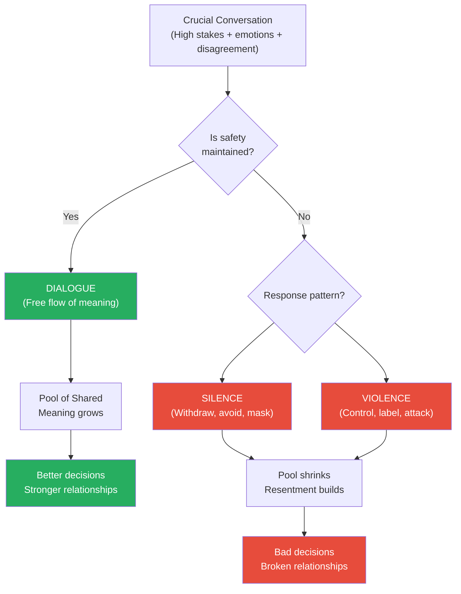
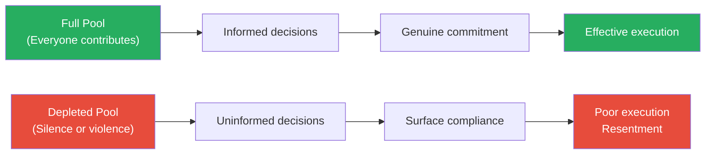
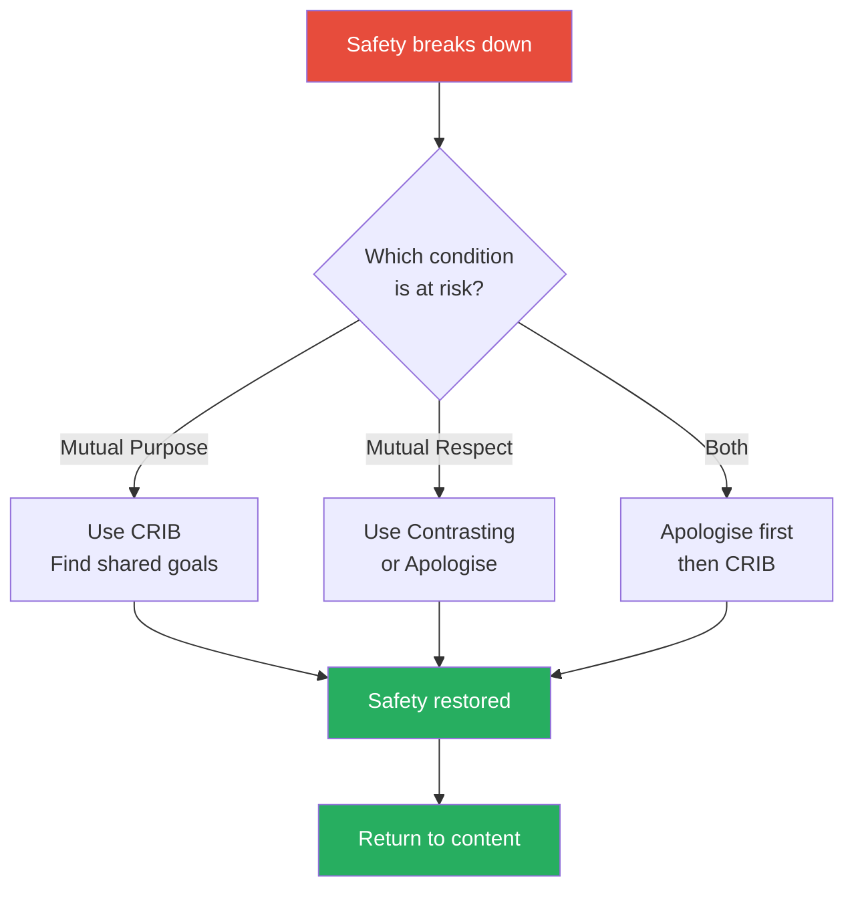
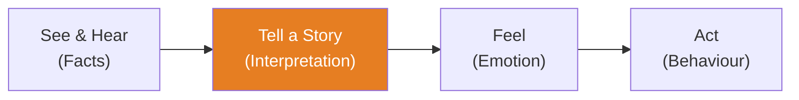
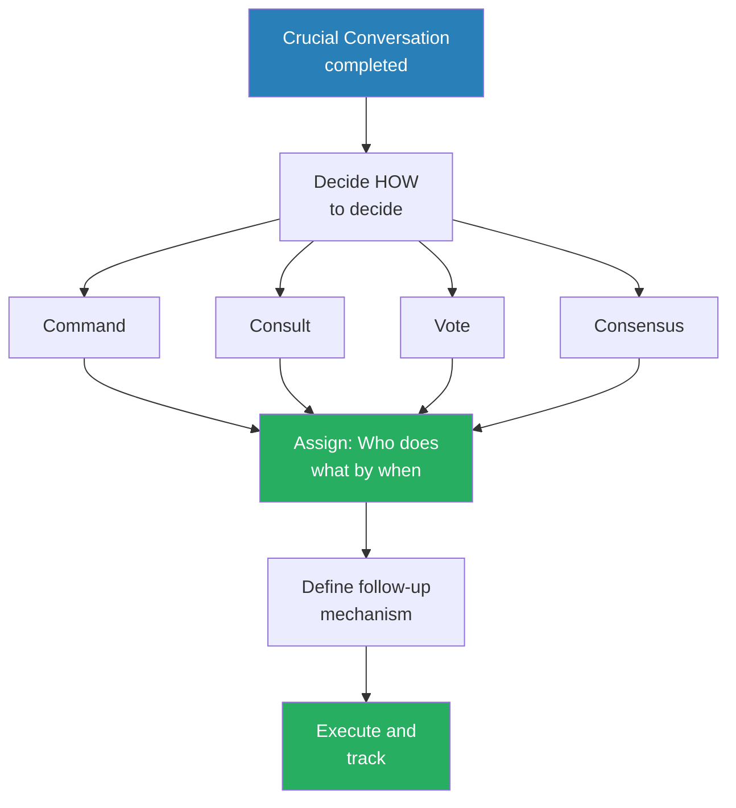
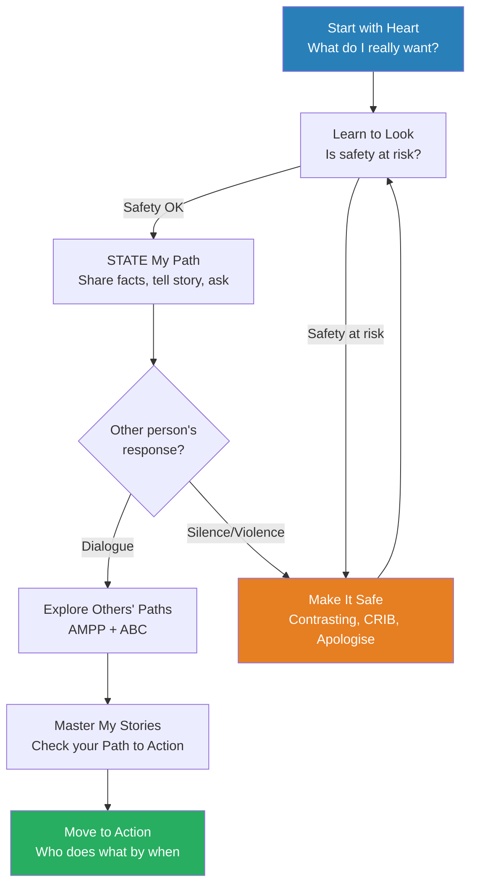

# Crucial Conversations — Kerry Patterson, Joseph Grenny, Ron McMillan & Al Switzler

> A crucial conversation is any discussion where three conditions collide: the stakes are high, opinions differ, and emotions run strong. These moments — asking for a raise, confronting a spouse's behaviour, challenging a boss's decision, addressing a team member's poor performance — define the trajectory of our careers and relationships. Most people handle them terribly: either avoiding them entirely (silence) or handling them with aggression (violence). Both destroy dialogue — the free flow of meaning between people — which is the only thing that produces good decisions and healthy relationships. The authors spent twenty-five years observing thousands of people in crucial moments to isolate what the most effective communicators do differently. This book distils those findings into a practical, repeatable framework that anyone can learn. If you master only one communication skill, make it this one — because the moments that matter most are exactly the moments most people handle worst.

---

## About the Author

Kerry Patterson, Joseph Grenny, Ron McMillan, and Al Switzler are the co-founders of VitalSmarts (now Crucial Learning), a corporate training company that has trained more than two million people worldwide. Their research methodology was distinctive: rather than starting with theory, they observed thousands of real-world interactions to identify what separated people who consistently produced results in high-stakes conversations from everyone else. Patterson led the initial research, Grenny brought deep experience in social influence, McMillan contributed expertise in team dynamics, and Switzler focused on recovery strategies when conversations go wrong. Together, they created one of the most widely adopted communication frameworks in corporate America — used by more than 300 of the Fortune 500.

---

## The Big Idea

- <b style="color: #2980b9">Dialogue</b> is the free flow of meaning between two or more people — the authors' central concept and the single thing that separates effective communicators from everyone else
- Every conversation involves a <b style="color: #2980b9">Pool of Shared Meaning</b> — the total reservoir of ideas, opinions, feelings, and information that both parties have access to
  - When the pool is full (everyone contributes openly), decisions are better, commitment is stronger, and relationships are healthier
  - When the pool is depleted (people withhold or distort), decisions are worse, execution is weaker, and resentment accumulates
- <b style="color: #27ae60">The goal of every crucial conversation is not to win — it is to get all relevant meaning into the shared pool</b>
- Dialogue breaks down in exactly two ways:
  - <b style="color: #e74c3c">Silence</b> — withdrawing meaning from the pool (masking, avoiding, withdrawing)
  - <b style="color: #e74c3c">Violence</b> — forcing meaning into the pool (controlling, labelling, attacking)
- Both silence and violence are driven by the same root cause: people feel unsafe
  - When safety is present, people will say almost anything — even uncomfortable truths
  - When safety is absent, even reasonable people resort to silence or violence
- The core skill is not rhetorical technique — it is the ability to make others feel safe enough to contribute honestly, even when the topic is threatening
- The authors' twenty-five years of research led to a single conclusion: <b style="color: #27ae60">people who are consistently effective in crucial conversations maintain safety while being completely candid</b>



The Pool of Shared Meaning is the engine of every group decision — the larger it grows, the better the outcome.

---

## Key Concepts at a Glance

| Concept | One-line summary |
|---------|-----------------|
| **Crucial Conversation** | Any discussion with high stakes, strong emotions, and differing opinions |
| **Pool of Shared Meaning** | The total information available to participants — bigger pool = better decisions |
| **Silence** | Withdrawing meaning from the pool (masking, avoiding, withdrawing) |
| **Violence** | Forcing meaning into the pool (controlling, labelling, attacking) |
| **Start with Heart** | Before speaking, clarify what you really want for yourself, others, and the relationship |
| **Sucker's Choice** | The false dilemma that you must choose between honesty and respect |
| **Learn to Look** | Monitor for signs that safety is breaking down in real time |
| **Make It Safe** | Step out of content to restore safety through mutual purpose and mutual respect |
| **CRIB** | Commit, Recognise, Invent, Brainstorm — the method for rebuilding mutual purpose |
| **Contrasting** | A don't/do statement that fixes misunderstanding ("I don't mean X, I do mean Y") |
| **Master My Stories** | Separate facts from interpretations to regain control of your emotions |
| **Path to Action** | See/Hear → Tell a Story → Feel → Act — the chain that drives all behaviour |
| **Clever Stories** | Victim, Villain, and Helpless stories that justify silence or violence |
| **STATE My Path** | Share facts, Tell your story, Ask for others' paths, Talk tentatively, Encourage testing |
| **AMPP** | Ask, Mirror, Paraphrase, Prime — four tools for drawing others out |
| **ABC** | Agree, Build, Compare — how to respond when you disagree |
| **Move to Action** | Convert dialogue into decisions: who does what by when, with follow-up |


Make It Safe and Master My Stories sit in the high-difficulty, high-impact zone — they are the hardest to learn but produce the greatest transformation in conversation outcomes.

---

## Chapter 1: What's a Crucial Conversation? And Who Cares?

*The authors define the moments that shape your life and explain why most people handle them so poorly.*

### The Three Defining Characteristics

- A conversation becomes <b style="color: #2980b9">crucial</b> when three conditions exist simultaneously:
  - **Opposing opinions** — you and the other person see things differently
  - **Strong emotions** — the topic triggers fear, anger, frustration, or hurt
  - **High stakes** — the outcome will significantly affect your life, career, or relationship
- Most daily conversations are not crucial — they are routine exchanges where stakes are low and emotions are calm
- But the handful of conversations that ARE crucial — confronting a colleague's behaviour, discussing a relationship problem, pushing back on a boss's decision — disproportionately determine the quality of your life

### Why We Fail at the Moments That Matter Most

- Nature works against us:
  - When emotions spike, blood flows away from the brain's higher reasoning centres and toward muscles — preparing for fight or flight, not nuanced dialogue
  - We are literally dumber in the moments when we most need to be smart
- Practice is rare:
  - Crucial conversations happen infrequently, so we never develop fluency
  - We rehearse our tennis serve more than we rehearse the conversation that could save our marriage
- Models are absent:
  - Most people learned conflict behaviour from their families — and most families model either silence or violence
  - Without seeing skilled dialogue in action, people default to what they know

> [!example] The Twenty-Year Study
> - The authors describe their foundational research project: identifying and observing people they called "opinion leaders" in organisations
> - These were individuals who, regardless of title, consistently influenced outcomes and were trusted by colleagues at every level
> - The researchers discovered that the single variable separating these individuals from everyone else was their ability to hold crucial conversations
> - When everyone else went silent or became aggressive, these people remained in dialogue — honest but respectful, candid but safe
> - The pattern held across industries, cultures, and organisational levels
> **The lesson:** The ability to hold crucial conversations is not a personality trait — it is a learnable skill, and it is the single most powerful predictor of influence and effectiveness.

> [!tip] Core Insight
> Your career, your relationships, and your health are largely determined by how you handle a handful of crucial conversations. Master these moments, and everything else improves.

---

### The Impact of Crucial Conversations

- The authors cite research connecting crucial conversation skills to measurable outcomes:
  - **Relationships** — couples who handle crucial conversations well are significantly less likely to divorce; those who resort to silence or violence eventually separate
  - **Health** — people who suppress opinions in crucial moments (habitual silence) show elevated stress hormones, weakened immune function, and higher rates of disease
  - **Organisations** — teams that handle crucial conversations effectively implement decisions faster, with higher commitment and fewer rework cycles
- <b style="color: #27ae60">The ability to speak up honestly when it matters is not just a social skill — it is a health and performance multiplier</b>

---

## Chapter 2: Mastering Crucial Conversations — The Power of Dialogue

*The authors introduce the Pool of Shared Meaning — the central metaphor that drives every technique in the book.*

### The Pool of Shared Meaning

- Every conversation involves a metaphorical pool into which participants contribute their opinions, feelings, theories, and experiences
- <b style="color: #2980b9">The Pool of Shared Meaning</b> is the group's total IQ — the full picture that no single person possesses alone
- When everyone contributes honestly, the pool is rich:
  - Decisions reflect more complete information
  - People understand the reasoning behind decisions, even if they initially disagreed
  - Commitment is genuine because people feel heard
- When people withhold (silence) or distort (violence), the pool is impoverished:
  - Decisions are made on incomplete information
  - People comply on the surface but resist beneath it
  - The same issues resurface repeatedly because they were never truly resolved

> [!example] The Medical Team That Couldn't Speak Up
> - The authors describe a hospital where nurses repeatedly observed a particular surgeon making questionable decisions during procedures
> - The nurses discussed their concerns with each other (hallway conversations) but never raised them with the surgeon directly
> - The power imbalance — surgeon vs. nurse — made the crucial conversation feel too dangerous
> - Meaning that should have entered the Pool of Shared Meaning stayed in private conversations
> - The result: preventable patient harm, because critical information never reached the decision-maker
> **The lesson:** When the Pool of Shared Meaning is depleted by silence, the consequences can be catastrophic. The information existed — it just never made it to the right conversation.

### Why People Leave the Pool

- People stop contributing to the pool for one reason: <b style="color: #e74c3c">they don't feel safe</b>
- Safety has nothing to do with the topic being comfortable — skilled communicators discuss extremely uncomfortable topics
- Safety means: "I believe you respect me and that we share a common purpose"
- When either belief is threatened, people default to their learned pattern:
  - Some people move to silence — they withdraw, mask their opinions, or change the subject
  - Some people move to violence — they try to force their meaning into the pool through aggression, sarcasm, or manipulation
  - Most people have a default style but can switch under extreme pressure



A full pool produces real commitment; a depleted pool produces compliance that crumbles under pressure.

---

## Chapter 3: Start with Heart — How to Stay Focused on What You Really Want

*Before opening your mouth in a crucial conversation, you must first win the battle with yourself — clarifying what you actually want versus what your emotions are tempting you to do.*

### The First Principle of Dialogue

- <b style="color: #27ae60">Skilled communicators begin every crucial conversation by asking themselves: What do I really want?</b>
  - For myself?
  - For the other person?
  - For the relationship?
- This sounds simple, but under emotional pressure, our goals shift without us noticing:
  - We start wanting to solve a problem — and end up wanting to win
  - We start wanting to improve a relationship — and end up wanting to punish
  - We start wanting clarity — and end up wanting to be right

### The Sucker's Choice

- When emotions escalate, the brain presents a false dilemma — what the authors call the <b style="color: #2980b9">Sucker's Choice</b>:
  - "I can either be honest OR keep a friend"
  - "I can either speak up OR keep the peace"
  - "I can either confront this OR preserve the relationship"
- <b style="color: #e74c3c">The Sucker's Choice is always a false binary</b> — it assumes you must sacrifice one good thing to get another
- The skilled communicator refuses the Sucker's Choice and instead asks: "How can I be 100% honest AND 100% respectful?"
  - This reframes the problem from either/or to both/and
  - It is harder — but it is the only path to genuine dialogue

> [!example] The VP Who Wanted to Win
> - The authors describe a vice president who needed to challenge a CEO's flawed strategy during a leadership meeting
> - He entered the meeting intending to share concerns constructively
> - When the CEO dismissed his first comment, the VP's goal shifted — he stopped trying to improve the decision and started trying to prove the CEO wrong
> - The conversation escalated: the CEO dug in, the VP got more aggressive, other executives went silent
> - Afterward, the VP recognised what happened: his goal had shifted from "help us make a good decision" to "win this argument"
> - The crucial conversation failed not because of the content, but because the VP lost sight of what he really wanted
> **The lesson:** The moment your goal shifts from shared outcome to personal victory, dialogue is already dead.

> [!example] The Couple and the In-Laws
> - A husband wanted to discuss his wife's parents visiting too frequently
> - He genuinely wanted to find a balance — but feared being seen as controlling
> - So he chose silence (the Sucker's Choice: "I can either bring it up OR keep the peace")
> - Over months, his resentment accumulated, and small passive-aggressive comments leaked out
> - When he finally exploded, the conversation was far worse than it would have been if he had spoken up early
> - His wife felt blindsided — she had no idea there was even a problem
> **The lesson:** The Sucker's Choice doesn't preserve peace — it delays and amplifies the conflict.

> [!abstract] The Start with Heart Check
> 1. Notice when you are shifting to silence or violence
> 2. Ask: "What do I really want for myself?"
> 3. Ask: "What do I really want for the other person?"
> 4. Ask: "What do I really want for the relationship?"
> 5. Ask: "How would I behave if I really wanted these results?"
> 6. Refuse the Sucker's Choice — ask "How can I do BOTH?"

---

## Chapter 4: Learn to Look — How to Notice When Safety Is at Risk

*Most people focus so hard on what is being said that they miss the signs that safety is collapsing — and once safety is gone, it doesn't matter how good your arguments are.*

### The Dual-Processing Challenge

- During a crucial conversation, you must simultaneously track two things:
  - **Content** — the topic being discussed
  - **Conditions** — the emotional climate of the conversation
- Most people fixate on content and are blindsided when the conversation suddenly goes off the rails
- <b style="color: #27ae60">Skilled communicators develop a "safety antenna" — a running background process that monitors conditions even while engaging with content</b>

### The Three Signals to Watch For

**Signal 1: The moment it turns crucial**
- Watch for the instant when a routine conversation becomes a crucial one
- The tells: someone's voice rises, body language tenses, topics suddenly feel loaded
- <b style="color: #2980b9">The earlier you recognise the shift, the more options you have</b>

**Signal 2: Signs of silence or violence in others**

| Signal Type | Silence Forms | Violence Forms |
|-------------|---------------|----------------|
| **Mild** | Changing the subject, understating concerns, using sarcasm to deflect | Subtle put-downs, loaded questions, dismissive tone |
| **Moderate** | Withdrawing from conversation, giving monosyllabic answers, avoiding eye contact | Raising voice, making accusations, interrupting repeatedly |
| **Severe** | Leaving the room, refusing to discuss, shutting down entirely | Personal attacks, ultimatums, absolute language ("you always," "you never") |

**Signal 3: Signs of silence or violence in yourself**
- <b style="color: #e74c3c">Your own silence and violence are the hardest to detect</b> — because they feel justified in the moment
- Physical cues that you have left dialogue:
  - Stomach tightens
  - Jaw clenches
  - Voice gets louder or quieter
  - You start rehearsing your rebuttal instead of listening

### The Three Forms of Silence

- <b style="color: #2980b9">Masking</b> — understating or selectively sharing your true opinion
  - Using sarcasm, sugarcoating, or couching to disguise meaning
  - "Oh, I'm sure your plan will work fine" (when you think it will fail)
- <b style="color: #2980b9">Avoiding</b> — steering away from sensitive topics entirely
  - Changing the subject, using humour to deflect, refusing to engage
  - Talking about everything except the real issue
- <b style="color: #2980b9">Withdrawing</b> — pulling out of the conversation completely
  - Going quiet, leaving the room, shutting down emotionally
  - The ultimate information withholding — nothing enters the pool

### The Three Forms of Violence

- <b style="color: #2980b9">Controlling</b> — forcing your views on others
  - Cutting people off, dominating the conversation, directing with absolutes
  - "This is how it's going to be" — shutting down input
- <b style="color: #2980b9">Labelling</b> — putting a dismissive label on people or ideas
  - "That's ridiculous," "You're being naive," "Only an idiot would think that"
  - Labels short-circuit analysis — they replace thinking with categorising
- <b style="color: #2980b9">Attacking</b> — moving from the issue to the person
  - Making it personal, belittling, threatening
  - The conversation shifts from "this idea is flawed" to "you are flawed"

> [!tip] Core Insight
> The moment you notice silence or violence — in yourself or others — stop focusing on content. The content doesn't matter if safety is gone. Fix safety first, then return to the topic.

---

## Chapter 5: Make It Safe — How to Make It Safe to Talk About Almost Anything

*This is the book's most counterintuitive and most important chapter: when a conversation is going badly, the fix is not to push harder on the content — it is to step out entirely and repair the conditions for dialogue.*

### The Two Conditions of Safety

- People feel safe in a conversation when they believe two things:
  - <b style="color: #2980b9">Mutual Purpose</b> — "We are working toward a shared goal; you care about my interests, not just your own"
  - <b style="color: #2980b9">Mutual Respect</b> — "You value me as a person, even if you disagree with my position"
- When either condition breaks, people feel unsafe and move to silence or violence
- <b style="color: #27ae60">The fix is always the same: step out of the content and restore the missing condition</b>

### Diagnosing Which Condition Is Broken

| Symptom | Likely Cause | Fix |
|---------|-------------|-----|
| The other person thinks you have a hidden agenda | Mutual Purpose is at risk | Use CRIB to find shared goals |
| The other person looks offended, defensive, or hurt | Mutual Respect is at risk | Use Contrasting to repair |
| You feel like the conversation has become adversarial | Both are at risk | Apologise if warranted, then use CRIB |
| Someone says "You don't care about..." or "You only want..." | Mutual Purpose is at risk | Explicitly restate your genuine purpose |

### Tool 1: Contrasting

- <b style="color: #2980b9">Contrasting</b> is a don't/do statement that addresses a misunderstanding before it poisons the conversation
- Structure: "I don't want [what they fear]. I do want [your actual purpose]."
- Examples:
  - "I don't want you to think I'm unhappy with your overall work. I do want to address one specific area where I think we can improve."
  - "I'm not trying to suggest this is entirely your fault. I am trying to figure out how we can both handle this differently."
- Contrasting is not an apology and not a take-back — it is a clarification that fixes a misunderstanding about your intent
- <b style="color: #27ae60">Use Contrasting the instant you sense the other person has misunderstood your purpose or feels disrespected</b>

> [!example] The Manager and the Report
> - A manager needed to give critical feedback on an employee's presentation
> - She opened with: "The presentation didn't go well and we need to discuss it"
> - The employee's face immediately tightened — he heard "your work is bad and you might be in trouble"
> - The manager noticed the shift and deployed Contrasting: "I don't want you to think I'm questioning your capability — your analytical work is consistently strong. I do want to talk about the delivery, because I think a few adjustments will make a big difference."
> - The employee's body language relaxed. He re-entered dialogue because Mutual Respect had been restored
> - The rest of the conversation was productive — specific, constructive, collaborative
> **The lesson:** Contrasting doesn't soften your message — it clarifies your intent so the other person can hear the message without a threat filter.

### Tool 2: CRIB — Rebuilding Mutual Purpose

When Mutual Purpose breaks down entirely — when it feels like you and the other person want fundamentally different things — use <b style="color: #2980b9">CRIB</b>:

> [!abstract] The CRIB Method
> 1. **Commit** to seek a mutual purpose — explicitly say you want to find something that works for both of you
> 2. **Recognise** the purpose behind the strategy — people often confuse their strategy (what they're asking for) with their purpose (why they want it). Dig beneath the strategy to find the underlying purpose
> 3. **Invent** a mutual purpose — if your purposes genuinely conflict, find a higher-level purpose you both share
> 4. **Brainstorm** new strategies — once you share a purpose, you can generate new strategies that serve it

- The key insight in CRIB is step 2: <b style="color: #27ae60">most conflicts are not about competing purposes — they are about competing strategies for the same purpose</b>
  - A husband wants to visit his family for the holidays (strategy). His wife wants to stay home (strategy). These look incompatible.
  - But the underlying purpose for both might be: "spend quality time together during the holidays"
  - Once they see the shared purpose, new strategies become possible: host the family at home, split the holiday, video call part of the family

> [!example] The Relocation Disagreement
> - Two business partners disagreed about relocating their company
> - Partner A wanted to move to a larger city for access to talent. Partner B wanted to stay in their current location to preserve team stability
> - The conversation became adversarial — each viewed the other as prioritising the wrong thing
> - When they applied CRIB, they recognised their strategies differed but their purpose was the same: build the strongest possible team
> - Once they agreed on the shared purpose, new strategies emerged: open a satellite office, hire remote workers, increase compensation to attract talent to the current location
> - None of these solutions were available while they were arguing about locations — because they were arguing strategies, not purposes
> **The lesson:** When you feel stuck in a binary disagreement, you are probably arguing strategies. Step back and find the shared purpose underneath.

### Tool 3: Apologising

- When you have genuinely violated Mutual Respect — you said something demeaning, lost your temper, made it personal — an apology is the fastest path back to safety
- The apology must be sincere and specific:
  - <b style="color: #e74c3c">Not: "I'm sorry if you were offended"</b> (conditional, deflecting)
  - "I'm sorry I raised my voice. That was disrespectful, and it's not how I want to handle this."
- After apologising, pause — give the other person time to recalibrate before jumping back into content



The fix for a broken conversation is never more content — it is always restoring the conditions that make content possible.

---

## Chapter 6: Master My Stories — How to Stay in Dialogue When You're Angry, Scared, or Hurt

*The authors reveal that emotions don't just happen to you — you create them through stories you tell yourself, and you can change those stories to change how you feel.*

### The Path to Action

- Between what happens and how we act, there is a chain with four links:
  1. **See and hear** — you observe facts (what actually happened)
  2. **Tell a story** — you interpret those facts (what they mean)
  3. **Feel** — your interpretation generates emotions
  4. **Act** — your emotions drive your behaviour



The story — not the facts — is what creates the emotion. Change the story and you change everything downstream.

- The problem: <b style="color: #e74c3c">we move through this chain so fast that we experience it as "facts → emotion" — we are unaware that we inserted a story</b>
- A colleague walks past you in the hallway without making eye contact:
  - **Fact:** colleague walked past without eye contact
  - **Story option A:** "She's angry at me about the meeting yesterday" → feel anxious → avoid her
  - **Story option B:** "She was distracted by something on her phone" → feel neutral → do nothing
  - **Story option C:** "She's upset about something and I should check in" → feel concerned → approach her
- Same fact, three different stories, three completely different emotional and behavioural outcomes

### The Three Clever Stories

- Under stress, the brain defaults to three types of stories that justify silence or violence — the authors call them <b style="color: #2980b9">Clever Stories</b> because they protect us from examining our own role:

| Clever Story | Core Claim | Function | Example |
|-------------|-----------|----------|---------|
| **Victim Story** | "It's not my fault" | Exaggerates our innocence | "I had no choice — they forced me into this" |
| **Villain Story** | "It's entirely their fault" | Exaggerates the other's malice | "He did it on purpose to undermine me" |
| **Helpless Story** | "There's nothing I can do" | Exaggerates our powerlessness | "There's no point in bringing it up — nothing will change" |

- <b style="color: #e74c3c">Clever Stories are never complete</b> — they always leave out crucial information:
  - The Victim Story omits what you did to contribute to the problem
  - The Villain Story omits any reasonable, human explanation for the other person's behaviour
  - The Helpless Story omits any action you could take but choose not to
- The combination is devastating: "I'm innocent (Victim), they're evil (Villain), and there's nothing I can do (Helpless)" — this trifecta produces either righteous silence or justified violence

> [!example] The Late Colleague
> - A team leader noticed a colleague was consistently late to meetings
> - Her Villain Story: "He doesn't respect anyone's time. He thinks he's too important to show up on time."
> - Her Victim Story: "I'm stuck running these meetings alone because of him."
> - Her Helpless Story: "There's no point saying anything — he'll just make excuses."
> - When the team leader finally challenged herself to tell the "rest of the story," she discovered:
>   - The colleague's previous meeting ran over every week due to a demanding client (a reasonable explanation she had omitted)
>   - She had never once mentioned the lateness to him (her contribution to the problem)
>   - She could request a schedule adjustment or talk to his manager (actions she could take but hadn't)
> **The lesson:** Clever Stories feel complete but are always missing information. The missing information is usually the key to resolving the problem.

### Mastering Your Stories — The Counter-Technique

- To break free of Clever Stories, work backward through the <b style="color: #2980b9">Path to Action</b>:

> [!abstract] The Story-Breaking Process
> 1. **Notice your behaviour** — Am I moving toward silence or violence? What am I actually doing?
> 2. **Identify your feelings** — What emotions am I experiencing right now? (Name them specifically: frustrated, embarrassed, afraid — not just "upset")
> 3. **Analyse your stories** — What story am I telling myself that creates these feelings? Is it a Victim, Villain, or Helpless Story?
> 4. **Separate fact from story** — What did I actually see and hear? Strip away all interpretation. What would a video camera have recorded?
> 5. **Tell the rest of the story** — ask three questions:
>    - "What am I pretending not to know about my own role?"
>    - "Why would a reasonable, rational, decent person do what they did?"
>    - "What should I do right now to move toward what I really want?"

- <b style="color: #27ae60">The most powerful of these questions is the second one</b>: "Why would a reasonable, rational, decent person do what they did?"
  - It does not mean the other person IS right
  - It means you are considering an explanation other than pure malice
  - This single question transforms Villain Stories into more nuanced — and more accurate — interpretations

> [!example] The Silent Treatment
> - A wife noticed her husband became distant and quiet every evening after work
> - Her Villain Story: "He doesn't want to spend time with me. He's checked out of this relationship."
> - Her emotions: hurt, resentment, loneliness
> - Her behaviour: she withdrew too (silence responding to perceived silence)
> - When she worked backward through the Path to Action:
>   - Fact: husband is quiet in the evenings
>   - Story she inserted: "He doesn't care about me"
>   - Rest of the story: his department was going through layoffs, and he was terrified of losing his job but didn't want to burden her with worry
> - Once she asked "Why would a reasonable person be quiet in the evenings?", she generated a completely different story — and felt compassion rather than resentment
> **The lesson:** The stories we tell ourselves are often wrong, and the wrong story produces the wrong emotion, which produces the wrong behaviour. Mastering your stories is mastering your behaviour.

> [!tip] Core Insight
> You don't get angry and then tell a story to justify it. You tell a story first, and the story makes you angry. Change the story — honestly, not self-deceptively — and the anger dissolves.

---

## Chapter 7: STATE My Path — How to Speak Persuasively, Not Abrasively

*The authors provide a specific five-step method for saying difficult things in a way that makes the other person more likely to listen — not less.*

### The STATE Framework

- <b style="color: #2980b9">STATE</b> stands for:
  - **S**hare your facts
  - **T**ell your story
  - **A**sk for others' paths
  - **T**alk tentatively
  - **E**ncourage testing

| Step | What to Do | Why It Works | Example |
|------|-----------|-------------|---------|
| **Share your facts** | Lead with the most objective, least controversial information | Facts are the least likely to trigger defensiveness | "I've noticed you've been late to the last three meetings" |
| **Tell your story** | Explain the conclusion you've drawn from the facts | Separating facts from interpretation shows intellectual honesty | "I'm starting to wonder if these meetings aren't a priority for you" |
| **Ask for others' paths** | Invite the other person's facts and story | You might be wrong — and even if you're right, they need to feel heard | "I'd like to hear how you see it" |
| **Talk tentatively** | Present your story as a story, not as a fact | Tentative language invites dialogue; absolutes invite resistance | "I'm starting to wonder..." not "Obviously you don't care" |
| **Encourage testing** | Make it explicitly safe for the other person to disagree | If they can't disagree, they can't contribute honestly | "I could be wrong. What am I missing?" |

### Why the Order Matters

- <b style="color: #27ae60">Facts first, stories second</b> — this is the foundation of the entire framework
- If you lead with your story ("You don't care about these meetings"), the other person hears an accusation and immediately becomes defensive
- If you lead with facts ("You've been late to the last three meetings"), the other person can't dispute the data — and is far more likely to engage with the story that follows
- <b style="color: #e74c3c">The most common mistake: leading with the story as if it were a fact</b>
  - "You're undermining me" (story presented as fact)
  - vs. "In the last two meetings, you've raised concerns about my proposal after I presented it, rather than before. I'm starting to feel like my ideas aren't being supported" (facts, then tentative story)

### Talking Tentatively — The Hardest Skill

- Tentative language does NOT mean weak language:
  - <b style="color: #e74c3c">Not:</b> "I guess maybe possibly you might have perhaps been slightly less than perfect" (waffling)
  - <b style="color: #27ae60">Yes:</b> "I'm starting to wonder if..." or "The pattern I'm seeing is..." or "I could be wrong, but it looks like..."
- Tentative language signals: "I have a perspective, and I'm open to being wrong"
- Absolute language signals: "I have the truth, and you'd better accept it"
- People who talk tentatively invite dialogue. People who talk in absolutes invite resistance.

> [!example] The STATE Framework in Action — Performance Conversation
> - A manager needed to address a team member's declining output
> - **Without STATE:** "You've clearly checked out. Your work has been terrible lately and I'm wondering if you even want to be here anymore." (Story as fact, violence through labelling)
> - **With STATE:**
>   - Share facts: "Your last three project submissions were past deadline, and two had errors that needed rework."
>   - Tell story: "I'm starting to wonder if something is going on that's affecting your work."
>   - Ask: "I'd like to hear your perspective — what's happening from your side?"
>   - Talk tentatively: "I could be completely off base here."
>   - Encourage testing: "If I'm missing something, please tell me."
> - The employee revealed she was dealing with a family medical crisis she hadn't felt safe disclosing
> - The conversation shifted from adversarial to collaborative — they worked out a temporary workload adjustment
> **The lesson:** STATE doesn't soften the message — it delivers the same message in a way that makes the other person want to engage rather than defend.

> [!example] The STATE Framework — Confronting a Friend
> - A man discovered his close friend had been gossiping about his divorce
> - His instinct: confront aggressively ("How dare you talk about my personal life behind my back!")
> - Using STATE:
>   - Facts: "Two different people told me this week that you've been discussing details of my divorce at social events."
>   - Story: "I'm starting to feel like our friendship might not be as private as I thought."
>   - Ask: "Is there context I'm missing? I want to hear your side."
>   - Tentative: "I may be getting a distorted version of what happened."
>   - Encourage testing: "If what I heard is wrong, I genuinely want to know."
> - The friend acknowledged it had happened, apologised, and explained he had been asked directly and answered without thinking
> - The conversation preserved the friendship while addressing the violation — something a violent approach would have destroyed
> **The lesson:** Facts disarm. Tentative language invites. Asking creates space. Together they deliver hard truths without destroying relationships.

---

## Chapter 8: Explore Others' Paths — How to Listen When Others Blow Up or Clam Up

*When the other person has moved to silence or violence, you need tools to draw them back into dialogue — not by pushing your view harder, but by genuinely understanding theirs.*

### Why Exploring Others' Paths Matters

- The other person has their own Path to Action — their own facts, stories, feelings, and behaviours
- When they move to silence or violence, it means their story has led them to an unsafe place
- <b style="color: #27ae60">Your job is not to fix their story — it is to understand it well enough that they feel heard, which restores safety</b>
- You cannot do this while simultaneously pushing your own point
- This is the most empathy-demanding skill in the book

### The AMPP Toolkit

- <b style="color: #2980b9">AMPP</b> is the set of four listening tools for drawing others out:

> [!abstract] The AMPP Method
> 1. **Ask** to get things rolling — "I'd really like to hear your concerns" or "What's going on?"
> 2. **Mirror** to confirm feelings — Describe what you observe in their behaviour or tone: "You seem frustrated" or "I can see this is upsetting"
> 3. **Paraphrase** to acknowledge the story — Put their meaning into your own words: "So from your perspective, the deadline was unrealistic from the start?"
> 4. **Prime** when nothing else works — If they are still silent, offer your best guess at what they might be thinking: "I'm wondering if you're concerned that this change will mean more work for your team?"

### When to Use Each Tool

| Tool | Use When | Purpose | Risk if Overused |
|------|---------|---------|-----------------|
| **Ask** | They seem reluctant to share | Opens the door | Can feel like interrogation |
| **Mirror** | They are showing emotion but not verbalising it | Validates their experience | Can feel like amateur therapy |
| **Paraphrase** | They have shared something and need to know you heard it | Confirms understanding | Can feel patronising if mechanical |
| **Prime** | They are completely shut down and other tools have failed | Breaks the ice by showing you've been thinking about their perspective | Can be manipulative if your guess is self-serving |

- <b style="color: #e74c3c">The most important thing about AMPP is sincerity</b> — these tools only work if you genuinely want to understand, not if you're using them to manipulate someone into agreeing with you
- If you ask "What's going on?" while mentally preparing your rebuttal, the other person will sense it and clam up further

> [!example] The Silent Employee
> - A manager noticed that a normally vocal team member had stopped contributing in meetings
> - She tried Ask: "I've noticed you've been quiet lately. I'd really like to hear what you're thinking." (The employee shrugged: "It's fine.")
> - She tried Mirror: "You seem frustrated, and that concerns me." (The employee denied it.)
> - She tried Paraphrase: "It sounds like everything is fine from your perspective." (Silence.)
> - She used Prime: "I'm wondering if you felt your idea about the client strategy was dismissed last month, and you've decided it's not worth speaking up anymore."
> - The employee's eyes widened — that was exactly it. A single unaddressed moment had caused weeks of withdrawal
> - Once the employee felt understood, he re-entered dialogue and shared several concerns that improved the team's approach
> **The lesson:** Sometimes you must guess what someone is thinking to break through silence. Priming is the tool of last resort — but when it works, it unlocks conversations that no amount of asking could reach.

### The ABC Method — How to Respond When You Disagree

- After exploring the other person's path, you may still disagree — and that's fine
- The authors introduce <b style="color: #2980b9">ABC</b> for disagreeing while maintaining dialogue:
  - **Agree** — start with the points where you agree (there are almost always some)
  - **Build** — where you agree with the direction but want to add to it: "And I'd also add..."
  - **Compare** — where you genuinely disagree, compare your view to theirs without labelling theirs as wrong: "I see it differently. Here's why..."
- <b style="color: #e74c3c">Never use "but" after agreement</b> — it erases everything that came before it
  - "I agree that we need to move faster, but your plan won't work" (the agreement disappears)
  - "I agree that we need to move faster. I see the plan differently — here's where I think we could adjust" (the agreement holds)

> [!tip] Core Insight
> When someone blows up or clams up, they are telling you that safety has collapsed from their perspective. Your job is not to correct their perception — it is to understand it well enough that they feel safe to re-enter dialogue.

---

## Chapter 9: Move to Action — How to Turn Crucial Conversations into Action and Results

*Dialogue without decisions is just therapy. This chapter ensures that every crucial conversation ends with clear, committed action.*

### The Two Traps

- **Trap 1: No decision** — The conversation ends with everyone "feeling better" but no one knowing what happens next
  - The same issue will resurface within weeks because nothing was actually resolved
- **Trap 2: Violated expectations** — Different participants leave with different assumptions about what was decided
  - Person A thinks they agreed to try the new approach for one month; Person B thinks they agreed to adopt it permanently
  - The unspoken assumptions create the next crucial conversation

### The Four Methods of Decision-Making

- Not every decision requires consensus. The authors identify four methods and when to use each:

| Method | How It Works | When to Use | Speed | Buy-in |
|--------|-------------|-------------|-------|--------|
| **Command** | One person decides, no discussion needed | Emergencies, low stakes, clear authority | Fastest | Lowest |
| **Consult** | One person decides after gathering input from others | Need expertise, one person is accountable | Fast | Moderate |
| **Vote** | Majority rules | Many options, efficiency matters, group can live with majority | Moderate | Moderate |
| **Consensus** | Everyone must agree | High stakes, full commitment needed, implementation requires everyone | Slowest | Highest |


Each segment's size represents buy-in strength — Consensus produces the deepest commitment but takes the longest, while Command is fastest but generates the least ownership.

- <b style="color: #27ae60">Choose the method based on who must be committed to the outcome</b>
  - If one person can execute alone → Command or Consult
  - If the group must execute together → Vote or Consensus
- <b style="color: #e74c3c">Using Consensus when Command would suffice wastes everyone's time; using Command when Consensus is needed guarantees sabotage</b>

### Turning Decisions into Commitments

- Every crucial conversation should end with four clear elements:

> [!abstract] The Action Commitment Framework
> 1. **Who** — a specific person is named for each action item (not "we" or "the team")
> 2. **Does what** — the action is described in precise, observable terms
> 3. **By when** — a specific deadline (date and time, not "soon" or "next week")
> 4. **How will we follow up** — the accountability mechanism is defined in advance

- The power of "Who does what by when" is that it eliminates the two traps:
  - There IS a decision (Trap 1 avoided)
  - Everyone shares the same understanding of the decision (Trap 2 avoided)

> [!example] The Meeting That Changed Nothing
> - A leadership team held a two-hour crucial conversation about declining customer satisfaction
> - The dialogue was excellent — everyone shared candidly, the Pool of Shared Meaning was full
> - But the meeting ended with "We all agree this is a priority and we need to do better"
> - No one was assigned a specific action. No deadline was set. No follow-up was scheduled.
> - Three months later, the same conversation happened again — customer satisfaction had not improved
> - In the second meeting, the team used the action commitment framework: specific owners, specific deliverables, specific dates, weekly check-ins
> - Within sixty days, three of the four key metrics had improved
> **The lesson:** Good dialogue is necessary but not sufficient. Without "who does what by when," even the best conversation produces nothing.

> [!example] The Home Renovation Agreement
> - A couple had a crucial conversation about renovating their kitchen — budget, timeline, and decision authority
> - The dialogue went well: they discussed fears about overspending, priorities, and aesthetics
> - But they failed to assign clear roles: Who approves the contractor? Who manages the budget? Who makes the final call on design choices?
> - Within two weeks, both had made conflicting commitments to the contractor
> - They returned to the framework: she would manage the budget and approve all costs over $500. He would manage the timeline and contractor relationship. They would review progress together every Sunday evening
> - The project completed on time and within budget — once roles were clear
> **The lesson:** "We agree" is not an action plan. Specificity prevents the next crucial conversation.



Every crucial conversation must end with a clear decision method AND specific commitments — otherwise, the same conversation will happen again.

---

## Putting It All Together — The Complete Framework

*The seven principles work as an integrated system, not a menu of options. Here is how they connect.*

### The Full Sequence



This diagram captures the complete flow of a crucial conversation — the iterative loop between content and safety that skilled communicators navigate fluidly.

- <b style="color: #27ae60">The framework is not linear — it is a continuous loop</b>
  - You may need to Make It Safe multiple times in a single conversation
  - You may need to Master Your Stories while the other person is talking
  - You may need to STATE Your Path, then Explore Their Path, then re-STATE your path with new information
- The principles reinforce each other:
  - Start with Heart gives you the motivation to stay in dialogue
  - Learn to Look gives you the awareness to catch problems early
  - Make It Safe gives you the tools to restore conditions for dialogue
  - Master My Stories keeps your emotions from hijacking your behaviour
  - STATE My Path lets you say hard things without triggering defensiveness
  - Explore Others' Paths lets you understand what you're missing
  - Move to Action ensures the dialogue produces results

---

## The Silence vs. Violence Spectrum — A Deeper Look

*The authors return repeatedly to the twin enemies of dialogue, and their taxonomy deserves deeper treatment.*

### Understanding Silence

- Silence is the more common and more insidious failure mode
- <b style="color: #e74c3c">Most people believe they are "keeping the peace" when they choose silence — but they are actually allowing problems to fester and resentment to accumulate</b>
- The progression of silence:
  1. **Masking** — you share your opinion, but you disguise it (sarcasm, sugarcoating, selective emphasis)
  2. **Avoiding** — you steer the conversation away from the sensitive topic entirely
  3. **Withdrawing** — you leave the conversation, either physically or emotionally
- Each stage removes more meaning from the Pool of Shared Meaning
- Chronic silence creates what the authors call a "culture of nice" — organisations or relationships where everyone is pleasant on the surface but seething underneath
- The irony of silence: people choose it to avoid conflict, but it guarantees worse conflict later — with accumulated resentment as fuel

### Understanding Violence

- Violence is louder but not always more destructive than silence
- The progression of violence:
  1. **Controlling** — you force your views: cutting people off, overstating your case, speaking in absolutes, changing the subject to something you can win
  2. **Labelling** — you dismiss others by categorising them: "That's a typical HR response," "You're being naive," "Only someone who's never worked in the field would say that"
  3. **Attacking** — you abandon the topic and go after the person: belittling, threatening, making personal attacks
- Each stage increases the danger to the other person's Mutual Respect, making it harder to return to dialogue

| | Silence | Violence |
|--|---------|----------|
| **What it looks like** | Withdrawal, avoidance, masking | Aggression, labelling, attacks |
| **What it feels like to the person doing it** | Keeping the peace, being diplomatic, choosing battles | Being direct, standing up for yourself, being honest |
| **What it does to the Pool** | Drains it — meaning is withheld | Poisons it — meaning is forced and distorted |
| **What it signals about safety** | "It's not safe to share my real view" | "I don't feel safe, so I'm going on offence" |
| **The hidden cost** | Resentment accumulates until it explodes | Trust erodes until the other person shuts down permanently |


Violence is most destructive at high visibility (public attacks destroy trust instantly), while silence is most destructive at low visibility (hidden resentment compounds undetected until it explodes).

> [!example] The Silent Executive
> - The authors describe a CEO who held a company meeting to announce a major strategic shift
> - When he asked for questions, the room was silent
> - He interpreted this as agreement — "Everyone's on board"
> - In reality, the entire senior team had concerns but felt it was unsafe to challenge the CEO publicly
> - The strategy was implemented without modification and failed within a year
> - Post-mortem interviews revealed that multiple executives had foreseen the specific problems that caused the failure
> - The information existed — it just never entered the Pool of Shared Meaning
> **The lesson:** Silence in a meeting is not agreement. If you are the most powerful person in the room, silence is almost always a sign that safety is absent, not that your idea is perfect.

> [!tip] Core Insight
> Silence and violence look like opposites, but they are the same thing — a response to feeling unsafe. The fix for both is the same: restore safety. Once safety is present, both silent and violent people return to dialogue naturally.

---

## Special Applications

*The authors dedicate significant attention to applying the framework in contexts where crucial conversations are especially difficult.*

### Crucial Conversations in Relationships

- Intimate relationships involve the highest-stakes crucial conversations because the emotional investment is deepest
- Common patterns:
  - One partner defaults to silence, the other to violence — creating a <b style="color: #2980b9">pursue-withdraw cycle</b>
  - Both partners resort to the same Clever Stories about each other for years without ever checking them
  - Small unaddressed issues accumulate until an explosion occurs over something trivial
  - Partners develop a "topic blacklist" — subjects that are silently agreed to be off-limits, even though they matter deeply
- The authors emphasise that relationship crucial conversations follow exactly the same principles as workplace ones:
  - Start with Heart (what do I really want for this relationship?)
  - Make It Safe (restore Mutual Purpose and Mutual Respect before discussing content)
  - STATE Your Path (facts first, story second, tentative language)
- But relationships add two complicating factors:
  - **History** — long-term partners carry years of accumulated stories about each other's motives, making it harder to separate fresh facts from old narratives
  - **Emotional intimacy** — the closer the relationship, the more devastating it feels when Mutual Respect breaks down, and the harder it is to restore
- <b style="color: #27ae60">The antidote is the same as everywhere else: return to facts, check your stories, and make it safe</b> — but the emotional discipline required is higher because the stakes feel existential

> [!example] The Couple Who Couldn't Discuss Money
> - A husband and wife had completely different spending philosophies
> - She was a saver; he was a spender. The topic was so volatile they had stopped discussing it entirely (silence)
> - The result: she secretly moved money into a savings account he didn't know about. He made purchases he hid from her.
> - When they finally addressed it using the framework:
>   - Start with Heart: "I want us to feel secure AND enjoy our lives — not just one or the other" (refusing the Sucker's Choice)
>   - Facts: "We've spent $4,000 more than our budget three of the last four months"
>   - Story (tentative): "I'm starting to worry that if we continue, we won't be able to handle an emergency"
>   - Ask: "How do you see our finances? What am I missing?"
> - The husband revealed that his spending was driven by a fear that the marriage was stale — he was trying to create experiences together
> - Their purposes were not opposed. Their strategies were. CRIB produced a new budget that included both a savings goal and an "experience fund"
> **The lesson:** The Sucker's Choice in relationships is always false. "I can be honest OR keep the marriage" is the lie that destroys marriages.

### Crucial Conversations with Authority

- <b style="color: #e74c3c">Power imbalances make crucial conversations harder, not impossible</b>
- The authors acknowledge that speaking up to someone who holds power over you carries real risk
- Their recommendations:
  - Choose the right time and place — never surprise someone with authority in a public setting
  - Lead with facts, not stories — "The project timeline has slipped by two weeks" is much safer than "Your management is causing delays"
  - Frame the conversation around their goals: "I know hitting the Q3 target matters to you. I'm concerned that the current approach puts that at risk."
  - Use Contrasting proactively: "I'm not trying to second-guess your decision. I do want to share some data that might be relevant."
- Additional strategies for upward crucial conversations:
  - **Ask permission** — "Can I share an observation about the project?" gives the authority figure a sense of control
  - **Make it about the mission, not the person** — keep the conversation about shared objectives
  - **Acknowledge the power dynamic** — "I know it can be awkward to hear this from someone on my team, but I respect you enough to be honest"
  - **Have the conversation privately** — protecting a leader's public image dramatically increases their willingness to listen

> [!example] The Junior Analyst Who Spoke Up
> - A junior analyst at a consulting firm spotted a significant error in a senior partner's client presentation
> - The error, if delivered to the client, would have undermined the firm's credibility
> - The analyst's instinct was silence — "Who am I to correct a partner?"
> - Instead, she used the framework:
>   - She approached the partner privately (protecting Mutual Respect)
>   - She led with facts: "On slide 14, the revenue projection uses Q2 data instead of Q3"
>   - She used Contrasting: "I'm not suggesting the analysis is flawed — the rest of it is excellent. I just want to flag this one data point"
>   - She talked tentatively: "I could be reading the spreadsheet wrong"
> - The partner checked, confirmed the error, corrected it, and thanked her
> - Six months later, the partner requested her on his next project
> **The lesson:** Speaking truth to power, done skillfully, builds your reputation rather than threatening it. The key is protecting the authority figure's face while being completely honest about the facts.

### When Crucial Conversations Fail

- The authors are honest that the framework does not guarantee success
- Some people are genuinely unwilling to enter dialogue regardless of how skilled you are
- Some power imbalances are so extreme that speaking up genuinely is not safe
- Some situations involve personality disorders or ingrained patterns that no communication technique can overcome
- What the framework does guarantee:
  - You will have done everything within your control to create dialogue
  - You will not have made the situation worse through your own silence or violence
  - You will have a clear picture of whether the problem is the conversation or the relationship
  - You will know sooner whether a relationship or situation is fundamentally unfixable — and you can make informed decisions accordingly
- <b style="color: #27ae60">The framework's value is not limited to success cases</b> — even when dialogue fails, the discipline of separating facts from stories, checking your Clever Stories, and attempting safety before escalation gives you clarity about what you are actually dealing with

---

## The Culture of Dialogue

*The authors argue that crucial conversation skills are not just individual tools — they shape the culture of every team, organisation, and family that practises them.*

### How Cultures Form

- Cultures are shaped by how people handle their hardest moments — not their easiest
- An organisation where crucial conversations are avoided becomes a "culture of silence":
  - Problems are discussed in hallways, not meetings
  - People agree in public and disagree in private
  - Decisions are made with incomplete information
  - The same issues cycle endlessly without resolution
- An organisation where crucial conversations are handled with skill becomes a "culture of dialogue":
  - Problems surface quickly because it is safe to raise them
  - Disagreement is normal, not threatening
  - Decisions reflect the full Pool of Shared Meaning
  - Issues are resolved, not recycled
  - New employees learn by observation that honesty is expected and safe
  - The organisation adapts faster because information flows freely rather than being trapped in silos of silence

> [!example] The Hospital Safety Transformation
> - The authors describe a hospital system that trained all staff — from surgeons to janitors — in crucial conversation skills
> - Before training: nurses reported feeling unable to challenge doctors' decisions even when they spotted errors
> - The culture was one of hierarchical silence — authority trumped accuracy
> - After training: the hospital created explicit norms that anyone could raise a safety concern with anyone, regardless of rank
> - Staff were given specific language from the STATE and AMPP frameworks
> - Within eighteen months, reported safety incidents dropped significantly, and employee satisfaction rose
> - The tools were the same — what changed was that the culture made it safe to use them
> **The lesson:** Individual skill matters, but cultural norms determine whether individuals feel safe enough to use their skills. The most powerful intervention is making crucial conversations a shared expectation, not an individual act of courage.

---

## Common Mistakes and How to Avoid Them

*The authors catalogue the most frequent errors people make when attempting crucial conversations — even after learning the framework.*

### Mistake 1: Leading with Your Story

- The most common error in the entire book
- People say: "You're undermining me" instead of "In the last two meetings, you raised objections after I presented — I'm starting to feel unsupported"
- <b style="color: #e74c3c">Leading with your story is leading with an accusation</b> — it triggers defensiveness immediately
- Fix: always start with facts. Hold your story in reserve until the facts are on the table.

### Mistake 2: Confusing Tentative with Weak

- People hear "talk tentatively" and deliver their message with so many qualifiers that it disappears
- Tentative does NOT mean uncertain — it means intellectually honest
  - Weak: "I guess maybe you might possibly have been somewhat less responsive than usual?"
  - Tentative: "I've noticed a pattern over the last month, and I want to check whether what I'm seeing is accurate"
- <b style="color: #27ae60">Tentative language is confident language that leaves room for being wrong</b>

### Mistake 3: Fixing Content When Safety Is Broken

- When the conversation goes off the rails, the instinct is to argue harder
- The fix is always to step out of the content and restore safety
- If you find yourself repeating the same point louder, safety is broken and more content will not fix it

### Mistake 4: Ignoring Your Own Silence or Violence

- Everyone thinks they are the reasonable one
- Most people can spot silence and violence in others but are blind to their own
- The physical cues are your early warning system: tight stomach, clenched jaw, rapid heartbeat

### Mistake 5: Skipping Move to Action

- A productive dialogue that ends without "who does what by when" will produce nothing
- It feels like resolution in the moment, but without commitments, it evaporates

### Mistake 6: Using the Tools as Weapons

- <b style="color: #e74c3c">The framework becomes manipulative when used without genuine intent</b>
- Asking "What do you think?" while mentally planning your rebuttal is not exploring their path — it is performing exploration
- Using Contrasting to smuggle in a harsher message: "I don't mean to be rude, but you're completely wrong" — the "don't" clause doesn't work if the "do" clause is an attack
- Talking tentatively while being certain you're right is not tentativeness — it is condescension
- The tools require genuine curiosity and genuine respect to function — without those, they are empty technique

### Mistake 7: Waiting Too Long

- The longer you wait to hold a crucial conversation, the harder it becomes
- Unaddressed issues accumulate emotional charge — what could have been a calm five-minute chat becomes a loaded confrontation
- <b style="color: #27ae60">The best time to have a crucial conversation is the first time you notice the issue</b> — not after weeks of Clever Stories have hardened your position
- Each day of delay adds another layer of Victim, Villain, and Helpless Stories that make dialogue harder

```mermaid
quadrantChart
    title Conversation Approaches — Honesty vs Respect
    x-axis Low Honesty --> High Honesty
    y-axis Low Respect --> High Respect
    quadrant-1 Dialogue (Goal)
    quadrant-2 People-Pleasing
    quadrant-3 Passive Aggression
    quadrant-4 Verbal Violence
    STATE Framework: [0.82, 0.85]
    Contrasting: [0.70, 0.78]
    Sugarcoating: [0.25, 0.72]
    Avoiding entirely: [0.12, 0.55]
    Sarcasm: [0.45, 0.30]
    Silent treatment: [0.15, 0.20]
    Labelling: [0.65, 0.18]
    Personal attacks: [0.80, 0.10]
    Blunt feedback: [0.85, 0.40]
    AMPP listening: [0.55, 0.90]
```

Only the upper-right quadrant — high honesty AND high respect — produces genuine dialogue; every other combination sacrifices either truth or safety.

---

## The Science Behind the Framework

*The authors draw on decades of behavioural research, though they wear the science lightly — here is the deeper foundation.*

### Why Safety Drives Everything

- The neuroscience is straightforward: the brain's threat detection system (the amygdala) operates faster than the reasoning centres (prefrontal cortex)
- When safety breaks — when you feel attacked, dismissed, or disrespected — the amygdala triggers a cascade:
  - Cortisol floods the system
  - Blood diverts from reasoning centres to muscles
  - The "fight or flight" response activates
  - Higher-order thinking — nuance, empathy, creativity — goes offline
- <b style="color: #2980b9">This is why you "can't think straight" during an argument</b> — your brain has literally redirected resources away from thinking
- Restoring safety reverses this process: when you feel respected and heard, the threat response deactivates, cortisol drops, and the prefrontal cortex comes back online
- The authors' emphasis on safety is not soft advice — it is brain science

### Why Facts Before Stories Works

- The cognitive mechanism behind "Share your facts first":
  - Facts activate the brain's analytical circuits — they invite evaluation and comparison
  - Stories (especially accusatory ones) activate the brain's threat circuits — they invite defence
  - By leading with facts, you engage the other person's thinking brain before their defending brain
- This is consistent with research on persuasion: people are more open to changing their minds when they feel they are evaluating evidence rather than being attacked

### Why Tentative Language Persuades

- Research on persuasion consistently shows that moderately confident statements are more persuasive than absolutely certain ones
- When someone speaks in absolutes ("This is obviously wrong"), the listener's brain automatically generates counter-arguments
- When someone speaks tentatively ("I'm seeing a pattern that concerns me"), the listener's brain engages with the pattern rather than fighting the conclusion
- <b style="color: #27ae60">Tentativeness is not weakness — it is a persuasion strategy grounded in how brains process claims</b>
- The practical implication: the more confident you feel about your position, the more tentatively you should present it — because overconfidence triggers the strongest resistance

---

## The Verdict

The greatest contribution of *Crucial Conversations* is a single, simple insight: safety is the prerequisite for dialogue, and dialogue is the prerequisite for good decisions. This reframes every failed conversation not as a content problem but as a safety problem — and safety is fixable. The STATE framework gives you a repeatable method for delivering hard truths without triggering defensiveness. The Path to Action model (See/Hear → Story → Feel → Act) gives you a way to catch your own emotional hijacking before it derails you. And the Move to Action discipline ensures that good dialogue actually produces results. Together, these tools transform how you handle the moments that matter most.

The book's weaknesses are real. The prose carries the flavour of corporate training — occasionally formulaic, sometimes over-acronymed (CRIB, STATE, AMPP, ABC). The examples lean heavily toward workplace scenarios, giving personal and family situations less depth. The framework also does not adequately address extreme power imbalances — it is much harder to "Make It Safe" when the other person has the authority to fire you, and the authors could do more to acknowledge the genuine risk that speaking up carries in hierarchical environments. The CRIB acronym, in particular, feels forced and is the least intuitive of the frameworks.

The reader who benefits most from this book is anyone who recognises a pattern of either avoiding hard conversations entirely or having them badly. Managers will find it indispensable — the ability to give direct feedback while preserving safety is the rarest and most valuable management skill. Couples stuck in pursue-withdraw cycles will find the safety framework transformative. Anyone who has ever left a conversation thinking "I wish I'd said that differently" will find practical, actionable tools here.

In the landscape of communication books, *Crucial Conversations* occupies the practical middle ground. [[Never Split the Difference - Chris Voss|Never Split the Difference]] teaches negotiation — how to get what you want from people who may not share your interests. [[How to Win Friends and Influence People - Dale Carnegie|How to Win Friends]] teaches warmth — how to be liked. *Crucial Conversations* teaches something more specific and arguably more valuable: how to say hard, uncomfortable, potentially relationship-threatening truths in a way that preserves both honesty and respect. It is not the most elegant book on communication, but it may be the most useful.

---

## Related Reading

- [[Never Split the Difference - Chris Voss|Never Split the Difference]] — High-stakes negotiation with tactical empathy, covering similar terrain through an FBI lens
- [[Fierce Conversations - Susan Scott|Fierce Conversations]] — Conversations that confront reality while building relationships — more aggressive stance than this book
- [[How to Win Friends and Influence People - Dale Carnegie|How to Win Friends]] — The warmth and respect that create safety — the relational foundation this book assumes
- [[Games People Play - Eric Berne|Games People Play]] — What happens when crucial conversations are avoided: Berne's "games" are the dysfunction this book aims to prevent
- [[Like Switch - Jack Schafer|The Like Switch]] — Building rapport and safety through nonverbal cues — the precursor skills to verbal dialogue
- [[Emotional Intelligence - Daniel Goleman|Emotional Intelligence]] — The self-awareness and empathy skills that underpin the "Master My Stories" and "Explore Others' Paths" chapters
- [[The Culture Code - Daniel Coyle|The Culture Code]] — How teams build psychological safety at scale — the organisational version of Make It Safe
