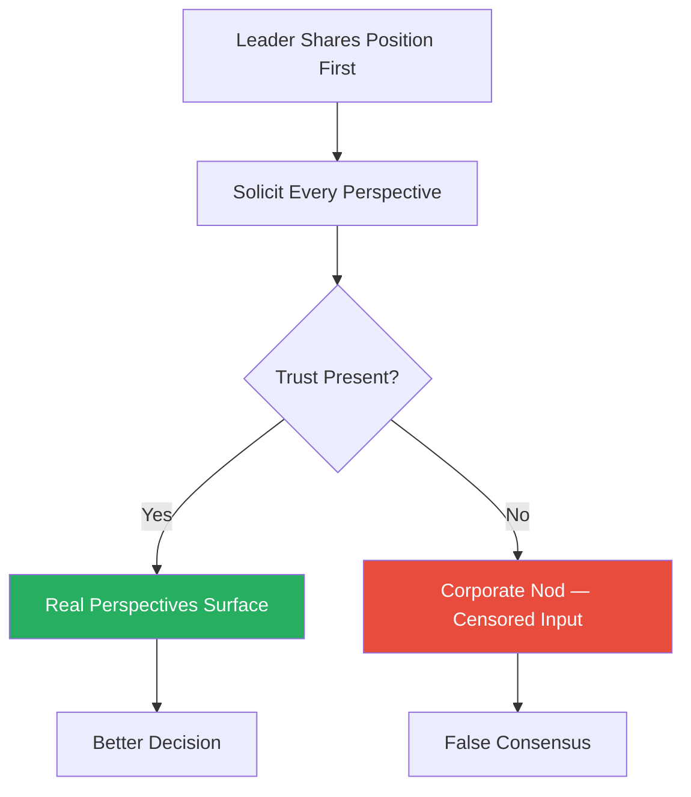
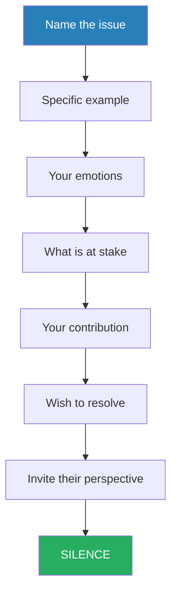
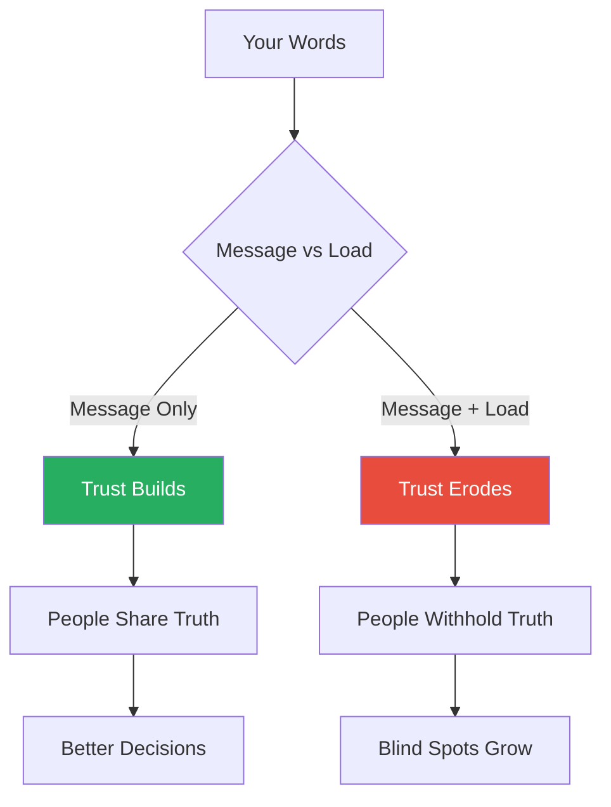
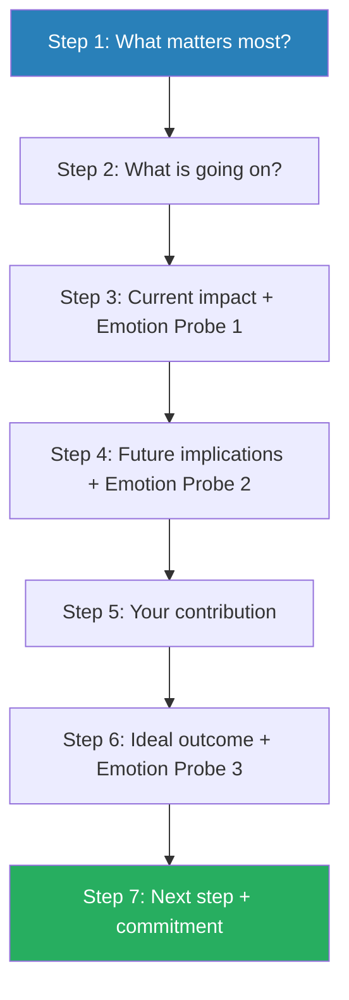
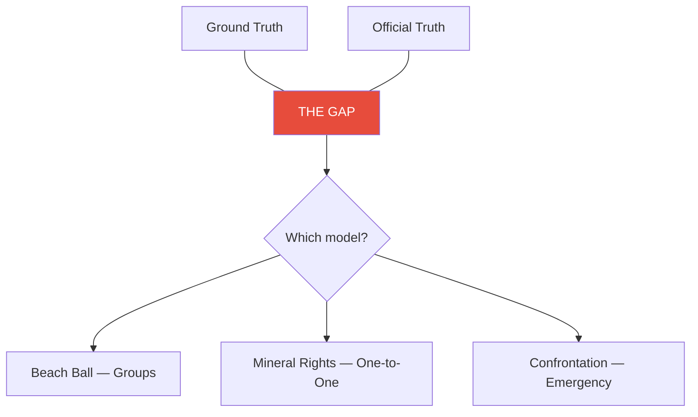

# Fierce Conversations — Susan Scott

> Susan Scott spent thirteen years as a corporate CEO before becoming a leadership consultant, and in that time she arrived at one deceptively simple conclusion: the conversation IS the relationship. Not a tool for managing it — the thing itself. Every career, company, marriage, and life succeeds or fails gradually, then suddenly, one conversation at a time. Most organisational failure traces back to conversations that either never happened or happened badly — the promotion that was never discussed, the underperformance that was tolerated for years, the strategic pivot no one had the nerve to name aloud. Scott provides seven principles and four conversational models for fixing this: the Beach Ball for group reality-checking, Mineral Rights for deep one-to-one coaching, a structured Confrontation opener for addressing tough issues, and the Decision Tree for delegation. The book is part framework, part manifesto — a sustained argument that authenticity in conversation is not a soft skill but the hardest, most consequential discipline in leadership.

---

## About the Author

Susan Scott founded Fierce Inc. (now Fierce Conversations) after a career that included thirteen years running her own company and over a decade coaching CEOs and senior leaders across industries. Her methodology was developed through thousands of hours of one-to-one conversations with executives at companies including Microsoft, Yahoo, Ernst & Young, and Starbucks — walking the trails around Green Lake in Seattle, asking questions and refusing to give answers. The original edition was published in 2002 and revised substantially in 2017; the core seven principles remained intact, but the examples and context were updated for a generation that communicates increasingly through screens. Scott writes from the perspective of someone who has sat across from leaders at their most vulnerable and watched, over years, what happens when they finally say the thing they have been avoiding — and what happens when they never do. Her intellectual lineage runs through Chris Argyris and Donald Schon (the left-hand column), Daniel Kahneman (emotional primacy), and Carl Jung (what we do not make conscious emerges later as fate).

---

## The Big Idea

*Scott redefines "fierce" — not as aggression, but as the disciplined courage to say what is real, and reveals that the conversations you avoid are quietly destroying the things you care about most.*

- <b style="color: #2980b9">Fierce</b> does not mean aggressive, hostile, or unkind
  - It means robust, intense, strong, powerful, passionate, eager, and unbridled
  - A fierce conversation is one in which you come out from behind yourself, make it real, and address what matters most — even when it is uncomfortable
  - The word comes from its original sense: a fierce loyalty, a fierce commitment to truth
- The premise rests on a striking claim: most people operate with a growing list of <b style="color: #2980b9">undiscussables</b> — topics they have silently agreed to avoid
  - Each time a conversation is dodged, the relationship loses a small piece of its vitality
  - Over months and years, these accumulated avoidances drain teams, marriages, and careers of their energy
  - Eventually the relationship does not fail in a dramatic explosion but in a quiet emptying out — one small dodge at a time, until one day there is nothing left to dodge around because there is nothing left at all
- <b style="color: #27ae60">The unreal conversations — the polite, careful, politically safe ones — should terrify us far more than the real ones ever could</b>

---

- Scott offers a full operating system for having the conversations that matter:
  - The book is structured around seven principles, each with a conversational model or discipline attached to it
  - The models range from interrogating reality in groups (Beach Ball) to coaching individuals toward self-generated insight (Mineral Rights), confronting problematic behaviour without blame (the 60-Second Opening Statement), and delegating decisions at the right level to develop people (Decision Tree)
  - The connecting thread is that authenticity, properly structured, produces better outcomes than diplomacy
  - Not authenticity as emotional vomiting — but authenticity as the disciplined practice of saying what needs to be said, in a way that can be heard, at the time it needs to be said
- What makes the book more than a communication manual is its philosophical insistence:
  - <b style="color: #27ae60">Conversations are not something you have about your life — they are your life</b>
  - Every relationship you have is only as good as the last conversation you had within it
  - This reframing turns every meeting, every phone call, every offhand comment in the corridor into a moment of consequence
  - Fixing a broken relationship does not require a grand gesture or a strategic intervention — it requires one good conversation, followed by another

---

## Key Concepts at a Glance

| Concept | One-line summary |
|---------|-----------------|
| **The conversation IS the relationship** | There is no relationship independent of the conversations you have within it |
| **Beach Ball Reality Model** | Surface every perspective in the room before making group decisions |
| **Mineral Rights Coaching Model** | Drill one hundred feet deep through questions-only coaching for self-generated insight |
| **Decision Tree** | Four levels of delegation (leaf, branch, trunk, root) that develop people by pushing decisions outward |
| **60-Second Confrontation Model** | A structured opening statement for addressing tough issues in under a minute |
| **Left-Hand Column** | Surface the gap between what you think and what you say as hypotheses, not accusations |
| **Emotional Wake** | Deliver the message without the load — every conversation leaves an aftermath |
| **Ground Truth vs Official Truth** | Close the gap between what is actually happening and what is publicly acknowledged |
| **The Corporate Nod** | The silence of non-participation disguised as agreement — the most dangerous meeting dysfunction |
| **Grendel's Mother** | The root cause behind the symptoms you keep treating |
| **The Crucible** | The leader as a strong vessel in which profound change can safely occur |
| **Integrity Outages** | Chronic misalignment between stated values and actual behaviour |

---

## Principle 1: Master the Courage to Interrogate Reality

### The Beach Ball Model

*Every person in an organisation stands on a different coloured stripe of the corporate beach ball — and the leader who mistakes their own stripe for the whole picture makes decisions that look brilliant from one vantage point and catastrophic from every other.*

- The <b style="color: #2980b9">Beach Ball</b> is Scott's model for group decision-making and reality-testing
  - Imagine a multicoloured beach ball: every person stands on a different stripe and experiences reality from that position
  - The finance team sees cost overruns
  - The product team sees innovation
  - The customer team sees churn signals
  - The CEO sees board pressure
- No one is lying — everyone is telling the truth from where they stand
- <b style="color: #e74c3c">The problem arises when any single perspective is treated as the whole truth</b>
  - The leader who believes their stripe is the only one that matters will make decisions that look brilliant from their vantage point and catastrophic from everyone else's
  - The Beach Ball model prevents this by creating a structured process that forces every stripe into the open before a decision is made

---

- Scott developed the model after years of watching meetings devolve into what she calls <b style="color: #2980b9">serial monologues</b>:
  - One person presenting their view, others nodding politely, the leader deciding, and everyone filing out having learned nothing
  - The meeting ends in apparent consensus, but the follow-through never materialises because people committed their mouths but not their minds
  - She calls this the <b style="color: #2980b9">Corporate Nod</b> — the most dangerous form of meeting dysfunction, because it looks like agreement from the outside
- The Corporate Nod is insidious because it masquerades as functioning:
  - The meeting minutes read like consensus
  - The action items are assigned
  - But the commitments are hollow — people agreed to stop the meeting, not because they believed in the outcome
  - The result is a pattern of meetings that produce decisions no one executes and plans no one follows

> [!tip] Core Insight
> The Corporate Nod — apparent consensus without real commitment — is the most dangerous form of meeting dysfunction, because it produces the appearance of agreement while guaranteeing that nothing changes.

---

- The Beach Ball model emerged because Scott identified a pattern across dozens of companies:
  - Leaders would announce a new direction in a town hall or leadership meeting
  - Heads would nod, questions would be polite and surface-level, and the room would disperse
  - Six months later, nothing had changed — the initiative had stalled, silos had reasserted themselves, and the leader was bewildered
  - The missing step was always the same: no one had interrogated reality before committing to the plan
  - The plan was built on one stripe of the beach ball — the leader's — while every other stripe went unexplored

> [!abstract] Beach Ball Model — Four Stages
> 1. **Prepare** — document the issue using Scott's Issue Preparation Form: what is the issue, why is it significant, what is the ideal outcome, what background is relevant, what has already been tried, what options have been considered, and what help is needed
> 2. **Invite the right people** — not just the usual suspects but those with the best vantage points and those who will be downstream of whatever decision gets made
> 3. **Facilitate** — share your own position first (modelling vulnerability and honesty), then actively solicit competing perspectives from every person in the room
> 4. **Wrap up** — have each participant write down their recommendation independently, read it aloud, and then summarise what was heard — creating a record that prevents the retroactive rewriting of consensus

---

### The "But" vs "And" Discipline

- The key linguistic discipline is replacing **"but"** with **"and"**:
  - "I understand your cost concerns BUT we need to invest" dismisses the first truth in favour of the second
  - "I understand your cost concerns AND we need to invest" holds both truths simultaneously, treating neither as disposable
  - <b style="color: #27ae60">This small shift changes the entire emotional tenor of a conversation</b>
  - The word "but" acts as an eraser — everything before it is negated
  - The word "and" acts as a bridge — both truths survive and must be reconciled
- The discipline extends beyond single conversations into an organisation's culture:
  - Teams that habitually use "but" develop a competitive dynamic — every perspective is positioned against every other, and meetings become zero-sum
  - Teams that adopt "and" develop a collaborative dynamic — perspectives are stacked rather than compared, and meetings become additive
  - The linguistic habit reflects and reinforces the underlying culture

---

> [!example] John Tompkins and the Fishing Company
> - Tompkins had built a successful commercial fishing company in Alaska
> - His two top captains, Ken and Rick, were running competing operations that were supposed to be collaborative — the rivalry was bleeding money and morale across the fleet
> - Tompkins knew the problem existed but had avoided addressing it for over a year
> - He was a classic conflict-avoider — a man who had built a business through technical excellence but never developed the skill of direct confrontation
> - Through a Mineral Rights conversation with Scott, he arrived at his own answer: sit Ken and Rick down, describe the problem without blame, tell them both the rivalry must end, and set clear consequences
> - He did so, and the situation resolved within days
> - Later, Tompkins used the Beach Ball model with all fifty-five crew members and office staff, running a full reality-interrogation meeting that surfaced issues no one had been willing to name
> - The meeting transformed the company's culture because, for the first time, every stripe of the beach ball was heard
> **The lesson:** When every perspective is forced into the open, problems that seemed intractable for years can resolve in days.

> [!example] The Consulting Firm's Real Problem
> - A consulting firm was losing million-dollar deals to competitors
> - The firm's partners assumed the problem was pricing or technical capability
> - When Scott ran a Beach Ball process, the truth emerged: clients were choosing competitors because of better relationships, not better solutions
> - The firm had been so focused on its own expertise that it had forgotten to listen to what clients actually wanted
> - The ground truth (we are losing because we do not listen) was fundamentally different from the official truth (we are losing because our pricing is too high)
> - The Beach Ball process forced the partners to hear a reality they had been avoiding for years
> **The lesson:** The official explanation for a problem is almost never the real one — structured reality-interrogation exposes the gap.

---

#### When the Beach Ball Works Best — and When It Does Not

- The Beach Ball is most powerful when:
  - The cost of a wrong decision is high
  - The problem is multi-dimensional
  - The people affected by the decision are available to contribute
  - It works best with root and trunk decisions — existential questions and strategic choices where multiple perspectives genuinely improve the outcome
- <b style="color: #e74c3c">It does not work well for leaf and branch decisions, where speed matters more than inclusion</b>
  - Running a full Beach Ball process for a decision that one person could make in five minutes is not thorough — it is wasteful
  - Over-applying the model creates meeting fatigue and the impression that every decision requires a group process
- It also requires a minimum level of trust in the room:
  - If people do not believe their perspectives will be heard without retaliation, they will censor themselves
  - The process then produces another form of the Corporate Nod — this time with the appearance of participation rather than the substance of it
  - The leader must have already established a track record of responding to dissent with curiosity rather than defensiveness

The Beach Ball model only works when trust is present — without it, the process generates the appearance of participation while the Corporate Nod operates underneath.

---

## Principle 2: Come Out from Behind Yourself into the Conversation and Make It Real

*Scott argues that most people live behind a mask of carefully managed impressions — and that two masks talking to each other is not a conversation but theatre.*

- Most people say what they think is expected, performing the version of themselves that feels safest, withholding the thoughts that might create discomfort
- The result is a world full of conversations where nothing real is being exchanged
- Scott describes the mask as a survival adaptation that has outlived its usefulness:
  - In childhood, we learn which truths are safe to speak and which are not
  - We carry those rules into adulthood long after the original danger has passed
  - The executive who cannot challenge a bad strategy may be obeying a childhood rule about not questioning authority — a rule that made sense at age seven and is catastrophic at age forty-seven
- The practice is to notice when you are hiding and to choose, deliberately, to step forward:
  - Not recklessly — not by dumping every thought in your head onto the table
  - But by asking yourself the diagnostic question Scott returns to throughout the book: <b style="color: #27ae60">"What am I pretending not to know?"</b>

---

- This is one of the most useful questions in the book:
  - It bypasses the rationalisation machinery that keeps us comfortable and goes straight to the thing we are avoiding
  - What am I pretending not to know about this project? About this relationship? About my own contribution to the problem?
  - The answer is almost always something we know perfectly well but have agreed with ourselves not to look at
- <b style="color: #e74c3c">"A careful conversation is a failed conversation,"</b> Scott writes:
  - A conversation where both parties are carefully managing their words, editing their thoughts, and presenting their most diplomatic selves is a conversation where nothing is happening
  - The real conversation — the one that could actually change things — is the one both parties are carefully avoiding

> [!tip] Core Insight
> "What am I pretending not to know?" — this single question cuts through every layer of self-deception and goes straight to the truth you are avoiding.

---

- The challenge is distinguishing between authenticity and recklessness:
  - Authenticity is sharing your truth because the relationship needs it
  - Recklessness is sharing your truth because you need to vent
  - The difference lies in the intent: are you speaking for the sake of connection or for the sake of release?
  - Scott's standard: a fierce conversation is one where the emotional investment is in the relationship's future, not in being right or being heard

| Quality | Authentic Fierceness | Reckless Honesty |
|---------|---------------------|------------------|
| **Intent** | Serve the relationship | Serve the need to vent |
| **Preparation** | Thought through, structured | Impulsive, reactive |
| **Tone** | Warm, direct, respectful | Heated, blaming, aggressive |
| **Outcome** | Connection deepens | Defensiveness escalates |
| **Ownership** | Includes your contribution | Focuses entirely on the other |

This table captures the distinction Scott draws throughout — fierceness without structure becomes recklessness, and recklessness destroys the very trust that fierceness is meant to build.

---

- <b style="color: #27ae60">The test of authenticity is whether you are willing to be changed by what the other person says</b>:
  - If you come into a conversation with a fixed conclusion and use "honesty" as a delivery mechanism for that conclusion, you are not having a fierce conversation — you are giving a speech
  - True authenticity requires vulnerability: the willingness to discover that you are wrong, that your contribution to the problem is larger than you thought, that the other person's perspective contains truths you had not considered
- Scott grounds this principle in a passage from Carl Jung that she returns to throughout the book: "What we do not make conscious emerges later as fate"
  - The things we know but refuse to say do not disappear
  - They accumulate underground, shaping our behaviour and our relationships in ways we cannot see until it is too late

---

> [!example] Jim and the T-Shirt Company
> - Jim was a CEO who ran a successful company making branded T-shirts for corporations
> - He sensed the market was shifting — online ordering was emerging, customisation expectations were rising, and his traditional sales model was becoming obsolete
> - He knew this at a gut level for months but never brought it up with his leadership team
> - He was afraid of the panic it might create, afraid of the questions he could not answer, afraid of looking uncertain
> - So he said nothing, and month by month, the company slid further behind
> - By the time the conversation finally happened, it was too late — the company lost its competitive position and eventually failed
> **The lesson:** The conversation that might have saved the company was available at any point. Choosing not to have it cost him everything.

> [!example] Alice's Marriage
> - Alice came to one of Scott's workshops and realised she had been having careful conversations with her husband for years
> - Their marriage looked fine from the outside — no arguments, no drama, no obvious problems
> - But they had stopped talking about anything that mattered — every potential source of conflict was silently sidestepped, every real feeling edited into something safer before it was spoken
> - After the workshop, Alice went home and had a sixty-second fierce conversation with her husband — naming the distance she felt, describing its impact, and inviting him to respond
> - The conversation transformed their relationship — not because it was pleasant, but because it was real
> **The lesson:** The absence of conflict is not the presence of connection. Marriages, like companies, fail not from too many arguments but from too few real conversations.

> [!example] The "Career-Enhancing Response" Incident
> - A leader in one of Scott's workshops shared that she had once told her boss a difficult truth about a project's viability
> - Her boss had responded: "I do not consider that a career-enhancing response"
> - The message was unmistakable — honesty would be punished
> - She never raised a concern again, and neither did anyone else on the team
> - The project eventually failed for exactly the reasons she had tried to flag
> - The boss's single sentence had extinguished not just one person's willingness to speak but the entire team's
> **The lesson:** It takes years to build a culture where people tell the truth, and one sentence to destroy it. The leader's response to honesty determines whether anyone ever risks it again.

---

#### The Mechanism of Compounding Avoidance

- The mechanism is <b style="color: #2980b9">compounding avoidance</b>:
  - Each time you duck a real conversation, the threshold for having it rises slightly
  - The issue grows, the emotional charge around it intensifies, and the consequences of finally addressing it become more severe
  - What could have been a simple course correction in month one becomes a crisis intervention in month twelve
  - <b style="color: #27ae60">This is what Scott means when she says relationships and careers fail "gradually, then suddenly" — the gradual part is invisible because it consists entirely of conversations that did not happen</b>
- The compounding effect works through three channels:
  - **Emotional escalation** — the longer you wait, the more charged the conversation becomes, and the more likely it is to be delivered with load rather than clarity
  - **Evidence accumulation** — each new instance becomes another item on the list, and when the conversation finally happens, it arrives as an avalanche of stored grievances rather than a clean, current observation
  - **Identity calcification** — the longer you avoid naming a problem, the more the other person's behaviour becomes fixed as "just how they are," and the harder it becomes to imagine change

Each avoided conversation raises the threshold for the next one, creating a compounding cycle that turns minor course corrections into full-blown crises.

What starts as a simple two-out-of-ten course correction in month one escalates to a ten-out-of-ten crisis by month twelve — the cost of avoidance compounds exponentially, not linearly.

---

## Principle 3: Be Here, Prepared to Be Nowhere Else

*Scott reveals that the purity of your attention is the greatest gift you can give another person — and that most people have never experienced being truly, fully listened to.*

- The practice is deceptively simple: when you are in a conversation, be in that conversation
  - Not preparing your next sentence
  - Not scanning the room
  - Not checking your phone under the table
  - Not waiting for the other person to finish so you can deliver your pre-prepared response
  - Actually listening — with your whole being, as Scott puts it
- The reason this matters is not sentimental — it is practical:
  - When people feel truly heard, they open up
  - When they open up, the real issues surface
  - When the real issues surface, they can be solved
- <b style="color: #e74c3c">The sequence breaks when the listener is distracted</b>:
  - The speaker senses the inattention (humans are remarkably good at detecting this)
  - They adjust by keeping things shallow and safe
  - The deepest, most important truths are only shared with someone who has demonstrated they will receive them with care

> [!tip] Core Insight
> The quality of a conversation is determined not by how well you speak but by how well you listen — and the test is whether the other person tells you things they have told no one else.

---

### The Three Levels of Listening

- Scott distinguishes between several levels of listening:
  - **Level 1 — Internal listening:** you are listening to yourself — your own reactions, judgements, and next moves. This is the default mode for most people most of the time
  - **Level 2 — Focused listening:** your attention is entirely on the other person — their words, their emotions, their body language, the things they are not saying
  - **Level 3 — Global listening:** you are listening to the whole environment — the energy in the room, the shifts in tone, the things that would go unnoticed by someone focused only on content
- <b style="color: #27ae60">Fierce conversations require sustained Level 2 and Level 3 listening</b>
  - Most people operate almost exclusively at Level 1
  - They hear the other person's words but process them through their own lens: "What does this mean for me? How should I respond? What do I think about this?"
  - The shift to Level 2 — genuine curiosity about the other person's reality — is what transforms a meeting into a conversation

| Listening Level | Focus | Inner Monologue | Conversational Quality |
|----------------|-------|-----------------|----------------------|
| **Level 1 — Internal** | Yourself | "What does this mean for me?" | Surface-level exchange |
| **Level 2 — Focused** | The other person | "What are they really saying?" | Deep, productive dialogue |
| **Level 3 — Global** | The whole environment | "What is happening in this room?" | Transformational insight |

Most people live at Level 1 — the shift to Level 2 is where conversations stop being transactional and start being transformational.

Most people spend roughly 70% of conversation time at Level 1 (listening to themselves), 25% at Level 2 (focused on the other person), and only 5% at Level 3 (sensing the whole environment) — fierce conversations demand inverting this ratio.

---

> [!example] Fred Timberlake and the Young Typist
> - Fred Timberlake, a charismatic business leader, once asked a sixteen-year-old typist in his office for her opinion on an advertising layout
> - Not as a management exercise or a performative show of inclusivity — he genuinely wanted to know what she thought
> - He listened to her answer with the same quality of attention he would have given to a board member
> - The girl was stunned — no one had ever asked her opinion about anything at work
> - Every employee who witnessed or heard about the interaction wanted to follow Timberlake
> - His attention was not a technique — it was a signal of respect that created loyalty far more effectively than any incentive programme could
> **The lesson:** Attention is not a management technique — it is a signal of respect that generates loyalty no incentive can match.

> [!example] Bob the Non-Stop Talker
> - Bob was a CEO who talked incessantly — every meeting was a monologue, every one-to-one was a lecture
> - His employees stopped trying to contribute because there was never any space for them
> - They showed up, waited for Bob to finish, and left
> - Over time, Bob lost his best people — not because he was cruel or unfair, but because he was never present to their reality
> - His wife eventually told him the same thing: "I have been lonely in this marriage for years"
> - Bob had been so focused on being heard that he never noticed no one else was
> **The lesson:** The leader who monopolises airtime is not having a conversation — they are giving a speech to a captive audience. Being present means creating space, not filling it.

---

#### The Zulu Greeting

- Scott draws on the Zulu greeting <b style="color: #2980b9">"Sawubona"</b> — which translates roughly as "I see you"
  - The response is "Sikhona" — "I am here"
  - Until I see you, the exchange implies, you do not exist
- Scott uses this to argue that <b style="color: #27ae60">presence is not a social nicety but an ontological act</b> — an acknowledgment of the other person's reality and worth
- In the context of fierce conversations, being present means treating the other person's perspective as real and their emotions as valid, even when you disagree with their conclusions
- The practical implication is that a five-minute conversation with full presence produces more than an hour-long meeting with divided attention:
  - Depth beats duration
  - One fully present exchange can shift a relationship that ten distracted meetings could not

---

#### The Multi-Tasking Myth

- Scott addresses the common objection that leaders are too busy for full presence:
  - The truth is that multi-tasking during conversations does not save time — it destroys it
  - The conversation that could have been resolved in ten minutes of full attention takes forty minutes of partial attention because the real issue never surfaces
  - The leader who checks email during a one-to-one is not being efficient — they are communicating that the person in front of them is less important than whatever just arrived in their inbox
  - <b style="color: #e74c3c">People never forget being made to feel unimportant — and they stop bringing you the information you need to lead effectively</b>
- The efficiency argument is inverted:
  - Presence is not the enemy of productivity — it is the precondition for it
  - A distracted conversation is not a faster conversation — it is a conversation that needs to happen again, and again, because the real content never arrived

---

## Principle 4: Tackle Your Toughest Challenge Today

*Scott argues that the things we fear most about having a difficult conversation are almost always things that will happen anyway if we avoid it — they just happen later, in worse form, with more collateral damage.*

- <b style="color: #27ae60">Burnout does not come from overwork — it comes from tackling the same problem over and over without ever addressing the root cause</b>
- Scott borrows from the Old English epic *Beowulf* to name this phenomenon:
  - You can kill <b style="color: #2980b9">Grendel</b> as many times as you like, but the attacks will keep coming until you go into the cave and confront <b style="color: #2980b9">Grendel's mother</b> — the source of the problem, not its symptoms
- The discipline is to identify the Grendel's mother in your work and life and to go after it directly, using the 60-Second Opening Statement as the entry point
- Most people instinctively prioritise urgency over importance:
  - They spend their energy on the Grendels — the visible, immediate symptoms — because those feel manageable
  - Grendel's mother lives in a cave at the bottom of a lake, and going after her requires diving into dark water
  - The metaphor captures why people avoid root causes: they are underground, they are frightening, and confronting them feels more dangerous than living with the symptoms

---

- Scott's insight is that <b style="color: #e74c3c">the danger is not in confronting Grendel's mother — it is in not confronting her</b>:
  - Every day spent fighting symptoms is a day the root cause grows stronger
  - The energy you spend whacking moles is energy unavailable for strategic work
- Scott offers a practical diagnostic for identifying Grendel's mother:
  - Ask: "What conversation am I not having that would change everything?"
  - Ask: "What problem keeps reappearing despite repeated attempts to solve it?"
  - Ask: "If I could wave a wand and eliminate one issue, which one would free the most energy?"
  - The answer to these questions points to the root cause — and the root cause is almost always a person, a relationship, or a structural misalignment that requires a conversation to resolve, not a process change or a reorganisation

---

### The 60-Second Opening Statement

*Scott's most structured and immediately usable tool — a format for initiating a difficult conversation that is honest, specific, and blame-free.*

> [!abstract] The 60-Second Opening Statement — Seven Components
> 1. **Name the issue** — one sentence, clear and direct, no euphemisms
> 2. **Select a specific example** — not a pattern-over-time generalisation ("you always...") but one concrete instance
> 3. **Describe your emotions** — how this situation makes you feel (the actual emotion, not a judgment disguised as an emotion)
> 4. **Clarify what is at stake** — for the relationship, the team, the project, the company
> 5. **Identify your own contribution** — what you have done or failed to do that contributed to the problem
> 6. **State your wish to resolve** — make clear this is about repair, not attack
> 7. **Invite their perspective** — then stop talking

- The stop is critical — after the opening statement, <b style="color: #27ae60">silence</b>:
  - The conversation begins with their response, not your elaboration
  - The overwhelming temptation is to keep talking — to soften, to justify, to preemptively address objections, to fill the uncomfortable silence
  - <b style="color: #e74c3c">Every one of these impulses must be resisted</b>
  - You have said what needs saying — now the other person gets to react, and their reaction is the conversation

> [!tip] Core Insight
> The 60-Second Opening Statement converts an amorphous emotional ordeal into a seven-step checklist — and the most important step is the silence that follows.

---

- Why sixty seconds matters:
  - Scott found that most people, when left to their own devices, either say too little (a vague hint that the other person cannot decode) or too much (a twenty-minute monologue that buries the point under a mountain of context and justification)
  - Sixty seconds is long enough to cover all seven components and short enough to force discipline
  - The format also prevents the most common failure mode of difficult conversations: the preamble that goes on so long the other person is defensive before the actual issue has even been named
  - <b style="color: #2980b9">Front-loading the issue</b> — naming it in the first sentence — is counterintuitive because most people want to ease in gradually, but it is far more respectful because it does not waste the other person's emotional energy on guessing what this is really about
- The two failure modes without the structure:

| Failure Mode | What Happens | Result |
|-------------|-------------|--------|
| **Too vague** | Hints, generalities, "I just wanted to check in about..." | Other person cannot decode the message; nothing changes |
| **Too much** | Twenty-minute monologue, every stored grievance | Other person becomes defensive before the real issue lands |
| **60-Second model** | Clear, specific, blame-free, followed by silence | Issue lands cleanly; conversation begins |

The 60-Second model sits between the two extremes — enough to be clear, not so much that it overwhelms.

---

#### The Distinction Between Feedback and Confrontation

- Scott makes a useful distinction that many communication books blur:

| Type | Purpose | Scope | Example |
|------|---------|-------|---------|
| **Feedback** | Addresses a specific behaviour that can be adjusted | Tune-up | "When you interrupt people in meetings, it shuts down discussion" |
| **Confrontation** | Addresses a pattern or attitude that threatens the relationship itself | Come-to-Jesus moment | "Your communication style is damaging this team, and I need to talk about it before the situation becomes irreversible" |

- The 60-Second Opening Statement is designed for confrontation — the bigger, harder conversation that most people spend months or years avoiding
- <b style="color: #e74c3c">Using it for minor feedback would be like bringing a fire hose to water a houseplant</b>
- The distinction matters because the emotional preparation and the stakes are fundamentally different:
  - Feedback is a course correction — it assumes the relationship is fundamentally sound
  - Confrontation is an intervention — it addresses something that, left unchecked, will damage or destroy the relationship itself
- Scott also distinguishes confrontation from attack:
  - Confrontation names the issue and invites dialogue
  - Attack assigns blame and demands capitulation
  - The 60-Second model is designed to keep the conversation on the confrontation side by requiring you to name your own contribution and state your wish to resolve

---

> [!example] John Tompkins Confronts His Captains
> - Returning to the fishing company case study, Tompkins used a version of the opening statement with his two warring captains, Ken and Rick
> - He named the issue (the rivalry is costing the company money and damaging morale)
> - Gave a specific example (a recent incident where the two crews refused to cooperate on a repair)
> - Described his feelings (frustrated and worried)
> - Clarified the stakes (the company's survival)
> - Acknowledged his own contribution (he had tolerated the rivalry for over a year without addressing it)
> - Stated his wish to resolve the situation, and then asked them both what they thought should happen
> - The confrontation had been avoided for so long that the buildup had become enormous — but the actual conversation lasted less than an hour and resolved the issue
> **The lesson:** Years of avoidance had made the problem seem far more intractable than it actually was. The hardest part was starting.

> [!example] Andy and Roger — The Cost of Silence
> - Andy was a manager who lost his best employee, Roger, not because of anything he said but because of what he never said
> - Andy valued Roger enormously — Roger was the best performer on the team, and Andy relied on him for everything
> - But Andy never told Roger any of this — he assumed Roger knew, assumed the good assignments and occasional nod of approval communicated what words would have said
> - Roger left for a competitor
> - When Andy asked why, Roger said something that haunted Andy for years: "I never felt like I mattered to you"
> **The lesson:** The absence of positive conversation is as destructive as the presence of negative conversation. Sometimes the toughest conversation is the one where you tell someone they matter.

---

The 60-Second Opening Statement flows through seven components in under a minute, then hands the conversation to the other person through deliberate silence.

---

## Principle 5: Obey Your Instincts

*Scott reveals that the gap between what you think and what you say is not diplomacy — it is data you are suppressing, and it is almost always more accurate than your conscious analysis.*

- This principle builds on the <b style="color: #2980b9">Left-Hand Column</b> concept, adapted from the work of Chris Argyris and Donald Schon
- In every conversation, three columns run simultaneously:
  - **Left:** your private thoughts — what you think but do not say
  - **Middle:** a neutral zone of awareness without attachment
  - **Right:** your public statements — what you actually say aloud
- Most people suppress their left-hand column entirely:
  - They sense that something is off — that the other person is not being honest, that the real issue has not been named, that the stated reason for a decision is not the actual reason
  - But they override their instinct in favour of politeness, self-doubt, or risk aversion
- <b style="color: #27ae60">Scott argues this is a profound mistake — those instincts are data</b>:
  - They are your mind processing information below the threshold of conscious awareness and delivering a verdict that your rational mind has not yet caught up to
  - "If you ignore those messages from yourself to yourself," she writes, "eventually you will stop getting them"

---

- The practice is not to blurt out your private column as fact — that would be reckless and often destructive
- The practice is to surface it as a **hypothesis** using perception-checking language:
  - "I am sensing some hesitation — am I reading that correctly?"
  - "My instinct says there is something else going on here — what do you think?"
- This transforms private suspicion into shared inquiry:
  - The instinct might be wrong — but even when it is wrong, naming it opens a door that would otherwise remain closed
- The framing as hypothesis is what makes this safe:
  - A statement — "You are hiding something" — is an accusation that triggers defensiveness
  - A hypothesis — "I am sensing something unspoken — am I reading this right?" — is an invitation that creates an opening
  - The difference is the difference between starting a fight and starting a conversation

---

- Scott connects this to the body's intelligence:
  - The gut feeling, the knot in the stomach, the sense that something is off — these are not noise to be overridden
  - They are the result of pattern recognition operating below conscious awareness
  - Your body has processed thousands of conversations and social situations, and it delivers its conclusions as feelings, not arguments
  - <b style="color: #e74c3c">The habit of dismissing these signals — telling yourself you are being paranoid, overly sensitive, or irrational — is one of the most costly mistakes in both professional and personal life</b>

> [!tip] Core Insight
> Your instincts about other people are data, not noise. Surface them as hypotheses — "I'm sensing X, am I reading that correctly?" — and let shared inquiry replace private suspicion.

---

> [!example] Phillip and the Alcoholism
> - Phillip was a senior executive whose performance was gradually deteriorating
> - Scott sensed for months that the problem was not stress or overwork but something deeper — something Phillip was hiding
> - She had no evidence, only instinct — for a long time she said nothing, respecting professional boundaries and her own uncertainty
> - Finally, she surfaced it as a hypothesis: "Phillip, I have a question, and I want you to know it comes from genuine concern. Is there something else going on — something personal that might be affecting your work?"
> - Phillip broke down — he was an alcoholic, and no one in his professional life had ever asked
> - Six months later, after treatment, he confirmed that the question had saved his career and possibly his life
> - Phillip's colleagues had all sensed something was wrong — none of them said anything
> - By the time Scott asked, Phillip had been suffering alone for over a year
> **The lesson:** Our instincts about other people are often accurate long before we have rational evidence. The cost of suppressing them is not just personal — it is relational.

> [!example] David's Fogbank
> - David was a client who seemed emotionally shut down — present in conversations but unreachable, as if behind a wall
> - During a Mineral Rights conversation, Scott asked David to describe what he was feeling
> - He paused for a long time before saying: "It is like I am in a fogbank"
> - The image arrived unbidden — David had not planned to say it — but once spoken, it unlocked an entire conversation about his emotional numbness, his disconnection from his family, and the toll that years of suppressed anger had taken on his capacity to feel anything at all
> - David's rational mind would never have produced the fogbank image — it came from somewhere deeper, and it carried more truth than any analysis could have
> **The lesson:** The practice of obeying instincts applies in both directions — to the questions you ask and to the answers that arrive when you stop editing them.

---

### The Integrity Scan

- Connected to this principle is Scott's concept of <b style="color: #2980b9">integrity outages</b> — chronic misalignment between your stated values and your actual behaviour
  - She draws on psychoneuroimmunology to argue that this misalignment weakens you in the same way a compromised immune system does
  - You might look fine from the outside, but you are vulnerable to collapse when stress arrives
- The practice is to conduct periodic integrity scans, asking: "Where am I out of alignment between what I say I value and how I actually behave?"
  - If you say you value honest feedback but consistently avoid giving it — that is an integrity outage
  - If you say you value your family but consistently choose work over time with them — that is an integrity outage
  - Each one drains energy and creates a gap between your <b style="color: #2980b9">ground truth</b> (what is actually happening) and your <b style="color: #2980b9">official truth</b> (what you present to the world)
- The scan is not about guilt — it is about data:
  - Knowing where your integrity outages are gives you a map of the conversations you need to have
  - Each outage points to an avoided conversation — either with yourself or with someone else
  - <b style="color: #27ae60">Closing integrity outages is not a moral project but an energy project — alignment generates energy, misalignment drains it</b>

---

## Principle 6: Take Responsibility for Your Emotional Wake

*Scott introduces a concept most leadership books ignore entirely: it is not enough to say the right thing if the way you say it leaves the other person feeling attacked, diminished, or dismissed.*

- <b style="color: #2980b9">Emotional wake</b> is the residue that every conversation leaves behind
  - Long after the words are forgotten, the feeling lingers
  - For leaders, there is no trivial comment — every interaction, no matter how brief, leaves a trace that accumulates over time into the story the organisation tells about you
- The core discipline is distinguishing between the **message** and the **load**:
  - The **message** is the content — what you need to communicate
  - The **load** is everything extra: the blame, the sarcasm, the exaggerated urgency, the passive aggression, the cold silence, the eye-roll, the heavy sigh
  - <b style="color: #27ae60">"Deliver the message without the load"</b> — this five-word instruction is one of the most practically useful sentences in the book

---

- Load-bearing behaviours include:

| Behaviour | What it does |
|-----------|-------------|
| **Blaming** | Assigns fault rather than describing impact |
| **Sarcasm** | Disguises aggression as humour |
| **Gunnysacking** | Saves up grievances to dump all at once |
| **Exaggerating** | Attaches global weight to small issues ("This is a disaster") |
| **Public criticism** | Humiliates rather than corrects |
| **Unresponsiveness** | Withholds engagement as a form of punishment |

- <b style="color: #e74c3c">Each of these poisons the conversational well and makes future honest exchange harder</b>
  - People who have been burned by your load will protect themselves the next time by withholding their truth
  - The load is what turns a potentially productive conversation into one that the other person dreads repeating
- The distinction between message and load is particularly important because most people are unaware of their load:
  - They believe they are being direct when they are being harsh
  - They believe they are being honest when they are being sarcastic
  - They believe their tone is neutral when it is dripping with frustration
  - The gap between your intention and the other person's experience of you is where the load lives

> [!tip] Core Insight
> The wake is the real message. People do not remember your points — they remember how you made them feel. And that feeling determines whether they come back to you with their truth or decide it is safer to keep it to themselves.

---

#### The Crucible Metaphor

- Scott introduces the <b style="color: #2980b9">crucible</b> as a metaphor for the leader's role in difficult conversations:
  - A crucible is a vessel designed to hold heat without melting or cracking
  - The leader who can hold space for difficult truths — without retaliating, shutting down, becoming defensive, or collapsing into apology — creates a container in which profound change can safely occur
- The crucible is not the same as stoicism:
  - It is not about suppressing your own reactions
  - It is about being strong enough to receive someone else's truth without breaking — and then responding with clarity rather than reactivity
  - <b style="color: #27ae60">The crucible leader makes it safe for others to be fierce because they demonstrate, through their own composure, that fierceness will not be punished</b>
- The metaphor extends to the physical chemistry:
  - A crucible must be stronger than whatever is placed inside it
  - The heat of difficult truth will crack a leader who is not prepared for it
  - The preparation is not rehearsing responses but developing the emotional capacity to sit with discomfort without fleeing into defensiveness

---

> [!example] The Husband and Wife
> - A couple had been together for years, and every interaction had become a low-grade battle
> - Neither could remember when it started or what any specific argument was about
> - What they remembered was the feeling — a corrosive, exhausting resentment that coloured every exchange
> - The words had long since been forgotten, but the emotional wake remained
> **The lesson:** You can say the right words, make the right arguments, present the most logical case — and still leave behind an emotional residue that contradicts everything you said.

> [!example] The Executive Who Could Not Stop Criticising
> - An executive Scott worked with had a habit of criticising team members publicly during meetings
> - He believed he was being direct and holding people accountable — in his mind, he was modelling exactly the kind of fierce honesty Scott taught
> - What he was actually doing was humiliating people in front of their peers
> - The message (your work needs improvement) was valid; the load (public shaming) was devastating
> - His team had stopped taking risks because any mistake would be dissected in front of everyone
> - When Scott played back recordings of his meetings, the executive was shocked — he had no idea how he sounded
> - The gap between his intention and his impact was enormous
> **The lesson:** The message may be right while the delivery is catastrophic. "Deliver the message without the load" means separating the content from the emotional baggage — and most people need a mirror to see the baggage they are carrying.

---

#### What About Positive Wake?

- The flip side matters as much as the negative:
  - Andy lost Roger not because of harsh words but because of the absence of kind ones
  - The emotional wake of silence — of never acknowledging someone's value, never expressing gratitude, never saying the simple thing that would have cost nothing — is as real and as damaging as the wake of cruelty
- Most leaders dramatically underestimate their impact:
  - The offhand comment in the hallway that you forgot five minutes later may be the thing someone carries for weeks
  - The meeting where you praised someone publicly may be the highlight of their quarter
  - This asymmetry of impact — where the leader's awareness of their effect is much smaller than the effect itself — is what makes emotional wake management not a nicety but a responsibility
  - <b style="color: #27ae60">The smallest positive conversation can have an outsized effect precisely because so few leaders bother with them</b>

Every conversation deposits trust or withdraws it — the load determines which, and over time, the balance determines what information reaches you as a leader.

---

## Principle 7: Let Silence Do the Heavy Lifting

*Scott reveals the most underused tool in conversation: saying nothing — and shows why silence is not empty space but the space in which the deepest thinking happens.*

- Most people fill silence reflexively — with chatter, with advice, with defensiveness, with the nervous energy of someone who cannot tolerate empty space
- <b style="color: #27ae60">But silence is not empty — it is the space in which the deepest thinking happens</b>:
  - When you stop talking, others go deeper
  - They move past their first, safest answer and touch something more real
- The music metaphor is Scott's favourite for this principle:
  - The magic is in the intervals, in the phrasing, not in the notes
  - A conversation without silence is like music without rests — noise, not art
- Scott observes that the first answer someone gives to a deep question is almost never their real answer:
  - It is the prepared answer, the safe answer, the answer that has been rehearsed
  - The real answer lives behind it, and it only emerges when the silence stretches long enough that the safe answer no longer fills the space
  - This is why silence is not merely polite — it is structurally necessary for depth

---

> [!example] The Software Company's Expensive Mistake
> - A company spent millions on a software implementation that nobody used
> - In meeting after meeting, the leadership team discussed adoption rates, training programmes, and change management strategies
> - No one said what everyone was thinking: the software was the wrong choice, and the person who had championed it was too senior to challenge
> - During a facilitated session, Scott allowed a silence to grow long enough for someone to finally break it with the truth
> - The silence had to become more uncomfortable than the truth for the truth to emerge — and that took longer than anyone expected
> **The lesson:** Sometimes the only way to surface an undiscussable is to let the silence stretch until someone cannot bear it any longer.

> [!example] Bob's Monologues Redux
> - Bob — the CEO who talked without stopping — reappears as a cautionary tale about what happens when silence is never permitted
> - His meetings were information-dense but insight-free
> - His employees had learned that there was no point in preparing thoughts because there would be no space to share them
> - His marriage echoed the pattern: his wife had stopped trying to be heard years ago — she was present in the house but absent from the relationship
> - Bob's inability to be silent was the mechanism that had driven her away
> **The lesson:** A leader who never stops talking creates a vacuum where insight should be — and eventually loses the people who had the most to offer.

---

#### The Discipline of Strategic Silence

- Scott is careful to distinguish between types of silence:

| Type | Nature | Effect |
|------|--------|--------|
| **Restful silence** | Invitational — creates space | The other person thinks and speaks more deeply |
| **Cold-war silence** | Weaponised — withholds warmth | Punishes through withdrawal |
| **Omerta silence** | Conspiratorial — protects dysfunction | Refuses to name what everyone sees |

- <b style="color: #27ae60">Only restful silence is recommended</b> — the others are themselves forms of load, emotional baggage that the other person is forced to carry
- The test is whether your silence is making space for the other person or making them anxious:
  - If the latter, a simple "Take your time — this is important" converts anxious silence into restful silence
- Cold-war silence is particularly destructive because it carries all the emotional weight of aggression without any of the clarity:
  - At least an angry outburst tells you what the person is feeling
  - Cold silence tells you nothing — except that you are being punished, and you may not even know why
  - <b style="color: #e74c3c">Weaponised silence is not restraint — it is cowardice disguised as composure</b>
- The practical discipline is threefold:
  - After asking a question, wait — do not fill the gap with clarification or a follow-up before they have answered
  - After someone finishes speaking, pause for two to three seconds before responding — this signals that you are processing their words, not just waiting for your turn
  - When someone is struggling to articulate something difficult, resist the urge to finish their sentence — the struggle is where the insight is forming

---

## The Mineral Rights Coaching Model (Extended)

*The single most deployable framework in the book — a coaching conversation format designed to produce self-generated insight, meaning the person being coached discovers their own answer rather than receiving advice from the coach.*

- The name comes from the metaphor of drilling: you want one well that goes a hundred feet deep, not a hundred wells that each go one foot
- Most conversations stay at the surface:
  - Recounting events, analysing options, weighing pros and cons, circling the issue without ever penetrating it
  - <b style="color: #2980b9">Mineral Rights</b> forces the conversation underground, to where the real issues live
- The surface conversation is where people are comfortable:
  - They can discuss facts, trade opinions, and debate options without ever touching the emotional core
  - But the emotional core is where the real answer lives, and reaching it requires a deliberate process of descent

### The Seven Steps

> [!abstract] Mineral Rights — Seven Steps
> 1. **What is the most important thing we should talk about?** — Prevents the conversation from being hijacked by whatever is most urgent or most recent; forces the person to choose what matters most
> 2. **Describe the issue — what is going on?** — Straightforward elicitation of the situation as they see it
> 3. **Current impact — who and what is being affected?** — And critically: "What do you feel?" The first emotion probe
> 4. **Future implications — if nothing changes in a year, what happens?** — Projecting the issue forward creates urgency. "What do you feel about that?" The second emotion probe
> 5. **Personal contribution — how have you helped create this situation?** — The hardest step; shifts the conversation from complaint to accountability
> 6. **Ideal outcome — what difference would resolution make?** — "What do you feel about that?" The third emotion probe
> 7. **Next most potent step — what will you do, and when?** — A concrete commitment, not a vague intention

---

### Why Emotions Are Probed Four Times

- This is the mechanism that makes Mineral Rights work:
  - People act for emotional reasons first and rational reasons second
  - Daniel Kahneman's research (referenced by Scott) established that emotional processing precedes and shapes rational analysis, not the other way around
  - <b style="color: #27ae60">Without surfacing emotions, the conversation produces understanding without commitment — like a race car with an empty fuel tank</b>
  - The person sees the issue clearly but has no energy behind their resolve to act
- The four emotion probes are spaced throughout the conversation because emotions change as the conversation deepens:
  - Step 3 (current impact): often frustration or helplessness
  - Step 4 (future implications): often anxiety or fear
  - Step 6 (ideal outcome): often hope or determination
  - By Step 7, the person has journeyed through a full emotional arc — from frustration through fear to hope — and the commitment they make is fuelled by all of it

---

- Without the emotion probes, Mineral Rights degenerates into a cognitive exercise:
  - The person analyses the problem intellectually, identifies a reasonable next step, and walks away without the emotional fuel to follow through
  - This is why so many coaching conversations produce insight that never becomes action — the analysis was sound but the emotions were never engaged
- The emotional arc is also what makes the conversation feel transformational rather than merely informative:
  - A conversation that stays cognitive feels like a meeting — efficient, perhaps, but unmemorable
  - A conversation that moves through frustration, fear, accountability, and hope feels like an event — it leaves a mark, and the commitment made at the end carries weight because it was forged through genuine feeling

The Mineral Rights model uses strategically placed emotion probes to move the coachee through a full emotional arc — from frustration through fear to hope — ensuring the final commitment carries genuine energy.

---

### The Questions-Only Rule

- The critical discipline is <b style="color: #e74c3c">questions only until Step 7 is answered</b>:
  - No declarative statements
  - No advice
  - No solutions
  - No "Have you considered...?" or "In my experience..." or "What I would do is..."
  - Nothing until the person being coached has formulated their own path forward
- This is extraordinarily difficult for most people, especially those in leadership positions who are accustomed to solving problems and giving direction:
  - The temptation to jump in with an answer is almost irresistible, particularly when the answer seems obvious
  - But the obvious answer is almost never the real answer — it is the surface answer, the one that has already been considered and rejected (or accepted and failed to produce results)
  - The real answer is deeper, and it can only be reached through the person's own excavation

---

- After Step 7, the coach may share their perspective:
  - The rule is not "never advise" but "withhold advice until the coachee has done the work"
  - When someone has already wrestled with a problem and arrived at their own conclusion, additional perspective from the coach is received as enrichment rather than direction — it supplements their thinking rather than replacing it

> [!tip] Core Insight
> Self-generated insight sticks because of ownership. When you discover your own answer, you own both the answer and the commitment to act on it — there is no one to blame and no one to credit except yourself.

---

### Why Self-Generated Insight Sticks

- Scott reports that after well-conducted Mineral Rights conversations, people often describe feeling "untangled" — they arrived knotted and inert and leave with clarity and momentum
- The mechanism is ownership:
  - When someone gives you advice and you follow it, you are executing their plan
  - If it fails, you can blame them
  - If it succeeds, the victory feels hollow because it was not really yours
  - When you discover your own answer through the Mineral Rights process, you own both the answer and the commitment to act on it
  - There is no one to blame and no one to credit except yourself — and that accountability produces action in a way that externally imposed solutions rarely do
- The neuroscience behind this is straightforward:
  - Self-generated insights activate reward circuits differently from received instructions
  - The "aha" moment of discovering your own answer creates a chemical signature that advice-receiving does not
  - This is why people remember and act on insights they generate themselves and forget instructions they receive from others
  - <b style="color: #27ae60">The coach's job is not to have the answer — it is to create the conditions in which the other person can find their own</b>

---

### Common Mineral Rights Mistakes

- Scott identifies several ways the model breaks down in practice:

| Mistake | What happens | How to fix |
|---------|-------------|------------|
| **Skipping emotion probes** | Conversation stays intellectual; no fuel for action | Ask "What do you feel about that?" after every impact/implications step |
| **Giving advice before Step 7** | The person stops thinking and starts evaluating your answer instead | Catch yourself, apologise, and return to questioning |
| **Allowing topic drift** | The conversation loses depth by spreading across multiple issues | Gently redirect: "Let's stay with this one — we can address that next" |
| **Rushing to Step 7** | The person commits to an action they do not truly understand or believe in | Slow down; revisit Steps 3-6 if the commitment feels shallow |
| **Asking leading questions** | The questions are thinly disguised advice ("Have you considered doing X?") | Replace with genuinely open questions: "What options do you see?" |

---

## The Decision Tree: Delegation as Development

*Scott reframes delegation from getting things off your plate into the primary mechanism for growing people — and shows that the leader who delegates poorly is not just inefficient but is actively stunting their team's development.*

### The Four Levels

| Level | Action | Reporting | Examples |
|-------|--------|-----------|----------|
| **Leaf** | Decide and act | Do not report | Scheduling meetings, choosing routine vendors, formatting reports |
| **Branch** | Decide and act | Report periodically | Hiring for junior roles, managing project timelines, handling customer complaints |
| **Trunk** | Decide | Report before acting | Changing project scope, reallocating significant budget, senior hires |
| **Root** | Decide jointly | Wide input required | Entering new markets, reorganising the company, shutting down a product line |

The Decision Tree progresses from full autonomy (leaf) to shared ownership (root) — the goal of leadership is to progressively move decisions outward over time.

Root decisions carry the highest organisational weight and require full collaborative input, while leaf decisions should flow freely without approval — the size of each block reflects how much leadership attention each level deserves.

---

### The Mole-Whacking Problem

- Scott coins the term <b style="color: #2980b9">"mole whacking"</b> for the pattern where leaders spend all their energy solving other people's problems:
  - Issues pop up like moles in a whack-a-mole game, the leader bats them down, and no sooner is one resolved than another appears
  - The leader feels busy, exhausted, and important — but nothing strategic ever gets done because all their energy is consumed by other people's decisions
- The mole-whacking problem is caused by a delegation failure:
  - <b style="color: #e74c3c">When people bring you leaf-level decisions for approval, you are both wasting your time</b>
  - They are not growing (because they are not making decisions) and you are not leading (because you are making their decisions instead of yours)
  - The Decision Tree diagnosis is simple: what level is this decision?
  - If it is a leaf, push it back
  - If it is a branch, let them act and report
  - Reserve your energy for trunk and root decisions where your involvement genuinely adds value

---

- The mole-whacking pattern is self-reinforcing:
  - When you solve people's problems for them, they bring you more problems
  - When you push decisions back, they learn to solve problems themselves
  - The transition is uncomfortable — people initially feel abandoned when you stop solving for them — but the long-term result is a team that can function (and grow) without you
- Scott identifies the emotional hook that keeps leaders trapped in mole-whacking:
  - Solving problems feels good — it provides immediate gratification, a sense of competence, and the comforting illusion of being indispensable
  - Pushing decisions back feels uncomfortable — it requires tolerating imperfect outcomes and resisting the urge to swoop in with the "right" answer
  - <b style="color: #e74c3c">The leader who cannot tolerate watching someone else make a less-than-perfect decision will never develop a team that can function without them</b>

---

### Progressive Development

- The goal of leadership, in Scott's model, is to <b style="color: #27ae60">progressively move decisions outward</b> — from root to trunk to branch to leaf:
  - Each time a decision moves one level out, the person handling it grows in capability and confidence
  - Over time, what started as a trunk decision becomes a branch decision and eventually a leaf decision
- This progression is the mechanism of leadership development:
  - It is not training programmes or workshops or feedback sessions — it is the actual, lived experience of making decisions and being accountable for the outcomes
  - <b style="color: #e74c3c">The leader who keeps decisions close to the root is not being careful — they are being controlling, and the cost is a team that cannot function without them</b>
- The Decision Tree also provides a diagnostic for team maturity:
  - If your team is constantly bringing you branch and leaf decisions, the problem is not that they are incapable — it is that you have never pushed those decisions outward
  - The remedy is not more training but more trust: assign the decision, accept that the outcome may be imperfect, and coach afterward rather than controlling beforehand

The arc of leadership development moves decisions from root to leaf — each shift outward grows the person's capability and frees the leader for strategic work.

---

## Ground Truth vs Official Truth

*One of Scott's most incisive concepts — the gap between what is actually happening and what is publicly acknowledged, and why unnamed gaps do not heal but grow.*

- <b style="color: #2980b9">Ground truth</b> is what is actually happening — on the factory floor, in the team's private conversations, in the customer's unfiltered experience
- <b style="color: #2980b9">Official truth</b> is what is available for general circulation — the press release version, the leadership narrative, the story the organisation tells itself
- <b style="color: #e74c3c">The gap between the two is where organisations and relationships fail</b>:
  - When the official truth says "we are aligned" and the ground truth says "three departments are quietly at war," the organisation is flying blind
  - When the official truth says "everything is fine at home" and the ground truth says "we have not had a real conversation in months," the marriage is in danger
  - When the official truth says "the project is on track" and the ground truth says "we have known for weeks it is going to miss the deadline," the leader who does not know the ground truth cannot act in time

---

- The leader's primary responsibility is to close the gap between the two truths:
  - Not by forcing the ground truth to match the official truth (which is propaganda)
  - Not by broadcasting the ground truth indiscriminately (which can be destructive)
  - But by creating conditions in which people feel safe enough to share what they actually see, think, and feel
- The three conversational models each serve as mechanisms for closing this gap:
  - The **Beach Ball model** is the structural mechanism for groups
  - The **Mineral Rights model** is the one-to-one mechanism
  - The **Confrontation model** is the emergency mechanism for when the gap has become dangerous
  - But all three rest on the same foundation: <b style="color: #27ae60">someone has to be willing to name the gap — as long as it remains unnamed, it widens</b>

---

- The gap is also self-protecting:
  - The wider it grows, the more dangerous it feels to name
  - This creates a paradox: the organisations that most need to close the gap are the ones least likely to try, because the distance between ground truth and official truth has become so large that bridging it feels impossible
  - Scott's answer is to start small — one honest conversation, one named gap — and let the momentum build
- The gap operates at every scale:
  - Between a leader and their direct reports
  - Between departments in a company
  - Between a company and its customers
  - Between partners in a marriage
  - Between nations in a geopolitical alliance
  - The dynamic is identical at every level — the unnamed gap does not heal, it grows

Scott's three conversational models each address the ground truth / official truth gap from a different angle — but all require someone willing to name the gap first.

---

> [!example] The U.S.-Saudi Analogy
> - Scott references the pre-9/11 relationship between the United States and Saudi Arabia as an example of what she calls "the polite dialogue of the deaf"
> - Both governments maintained an official truth of alliance and cooperation
> - The ground truth — deep structural tensions around religion, oil dependency, and regional politics — was never addressed directly
> - The gap between the two truths did not disappear because it was unnamed; it festered until it erupted in a way that was catastrophic for both sides
> **The lesson:** The scale does not matter — the dynamic is the same whether it is two nations, two departments, or two people in a marriage. Unnamed gaps do not heal. They grow.

> [!example] The CEO Who Thought Morale Was High
> - A CEO told Scott that her company's morale was excellent — engagement surveys confirmed it, turnover was low, and the leadership team reported no issues
> - When Scott conducted one-to-one Mineral Rights conversations with mid-level managers, a different picture emerged
> - Morale was not high — people had simply stopped caring enough to complain
> - The engagement surveys measured compliance, not commitment
> - Low turnover was explained by a tight job market, not loyalty
> - The gap between the CEO's official truth and the organisation's ground truth was enormous — and it was invisible from the top
> **The lesson:** The most dangerous gap is the one you cannot see because your information channels are filtering out the bad news before it reaches you.

---

## How the Models Connect

Principles 2 (Make It Real) and 4 (Tackle Toughest Challenge) are both the hardest to practise and the highest-impact when mastered — they sit at the intersection of maximum discomfort and maximum return.

*Scott's seven principles and four models are not isolated tools — they form an integrated system where each model serves a specific purpose and the principles provide the philosophical backbone.*

- The models map to different conversational contexts:
  - **Beach Ball** — when you need to make a group decision and want every perspective before you commit
  - **Mineral Rights** — when you need to help someone find their own answer to a problem they are stuck on
  - **60-Second Confrontation** — when you need to address a behaviour or pattern that is damaging a relationship
  - **Decision Tree** — when you need to calibrate delegation so people grow while the organisation stays safe
- The principles are the operating conditions that make the models work:
  - Without courage (Principle 1), the Beach Ball produces the Corporate Nod
  - Without authenticity (Principle 2), every model becomes theatre
  - Without presence (Principle 3), Mineral Rights stays at the surface
  - Without urgency (Principle 4), confrontation is perpetually postponed
  - Without instinct-trust (Principle 5), the left-hand column remains suppressed
  - Without wake-awareness (Principle 6), honest conversations leave emotional damage
  - Without silence (Principle 7), the other person never goes deep enough to find their own answer

> [!tip] Core Insight
> The models are the what; the principles are the how. A model deployed without the principles behind it is just a script — it will produce the form of a fierce conversation without the substance.

---

## Key Quotes

- "The conversation is the relationship." — Susan Scott, Introduction
- "Come out from behind yourself and make it real." — Susan Scott, Principle 2
- "A careful conversation is a failed conversation." — Susan Scott, Ch. 2
- "Deliver the message without the load." — Susan Scott, Ch. 6
- "What we do not make conscious emerges later as fate." — C.G. Jung, cited in Ch. 2
- "What am I pretending not to know?" — Susan Scott, recurring throughout
- "Burnout comes not from overwork but from tackling the same problem over and over." — Susan Scott, Ch. 4
- "The person who can most accurately describe reality without laying blame will emerge as the leader." — Susan Scott, Ch. 1

---

## The Verdict

*Fierce Conversations* is one of the most practically useful books on interpersonal communication written in the last twenty-five years. The Mineral Rights model alone is worth the price of admission — a genuinely powerful coaching framework that works in professional and personal contexts, and that produces lasting change where advice-giving consistently fails. The 60-Second Confrontation Model provides a structure that makes hard conversations dramatically less intimidating by converting an amorphous emotional ordeal into a seven-step checklist. The Beach Ball model transforms how group decisions get made by insisting that every perspective be heard before any decision is finalised. And the emotional wake concept fills a gap that most leadership books ignore entirely: it is not enough to say the right thing if the way you say it leaves the other person feeling attacked, diminished, or dismissed.

The book's main limitation is that it assumes a degree of psychological safety that does not exist in every environment. Scott writes from the perspective of an external consultant who can walk away from any engagement. For people operating inside rigid hierarchies, highly political environments, or under leaders who punish dissent, fierce authenticity is not always rewarded — and can sometimes be actively dangerous. The advice to "model courage yourself" is inspiring but insufficient when the person you are being fierce with has power over your livelihood and a track record of retaliating against honesty. Scott acknowledges this dynamic — she tells the story of a leader who responded to a brave truth with "I do not consider that a career-enhancing response" — but she does not offer a systematic framework for navigating environments where honesty is structurally punished.

The evidence base is another soft spot. Beyond a single reference to Kahneman's work on emotional processing and a somewhat overreaching appeal to psychoneuroimmunology, the book relies almost entirely on anecdotal evidence. The case studies are compelling and well-chosen, but they are also self-selected — we never hear about Mineral Rights conversations that went nowhere, Beach Ball sessions that deepened conflict rather than resolving it, or confrontations that produced retaliation rather than resolution. The survivorship bias in the evidence does not invalidate the models, but it does mean the reader should treat them as powerful tools with limits rather than universal solutions.

The reader who benefits most from this book is the one who treats it as a **selective deployment manual** rather than a universal philosophy. The models are extraordinarily effective when used in the right context — with people who share a genuine interest in resolution, in environments where honesty is rewarded or at least tolerated, and with enough preparation to channel authenticity into structure. In contexts where interests are fundamentally misaligned, where power is being wielded covertly, or where the other party has no interest in a real conversation, fiercer is not always better. The wisest application is to be fierce where fierceness is welcome, strategic where it is not, and wise enough to know the difference. Paired with the tactical empathy of [[Never Split the Difference - Chris Voss|Voss]] and the power awareness of [[The 48 Laws of Power - Robert Greene|Greene]], Scott's models become part of a complete conversational toolkit rather than a standalone philosophy.

---

## Related Reading

- [[Never Split the Difference - Chris Voss|Never Split the Difference]] — Chris Voss's negotiation framework complements Scott's confrontation model with tactical empathy, mirroring, and calibrated questions. Where Scott says "name the issue," Voss says "label the emotion." The combination is formidable.
- [[Crucial Conversations - Kerry Patterson|Crucial Conversations]] — Patterson's framework for high-stakes conversations shares Scott's emphasis on mutual purpose and psychological safety. Where Scott provides the Mineral Rights model for one-to-one coaching depth, Patterson provides the STATE model for maintaining dialogue when emotions run high. The two books are natural companions.
- [[The Laws of Human Nature - Robert Greene|The Laws of Human Nature]] — Robert Greene's deep read on what drives people beneath the surface. A useful complement to Scott's instinct-trusting approach, with a sharper lens on the darker motivations that Scott tends to underweight.
- [[How to Win Friends and Influence People - Dale Carnegie|How to Win Friends and Influence People]] — Carnegie's classic on the mechanics of rapport and likeability. Scott would argue that Carnegie's approach risks becoming a form of careful conversation — pleasant but not real. Read both to understand the tension between warmth and honesty.
- [[The Charisma Myth - Olivia Fox Cabane|The Charisma Myth]] — Cabane's work on presence and warmth directly supports Scott's Principle 3 (Be Here, Prepared to Be Nowhere Else). The science of presence that Cabane provides gives neurological grounding to Scott's more intuitive argument.
- [[The Culture Code - Daniel Coyle|The Culture Code]] — Coyle's research on what makes groups effective reinforces Scott's Beach Ball model and the importance of psychological safety. Where Scott provides the conversational tools, Coyle provides the cultural conditions that make those tools work.
