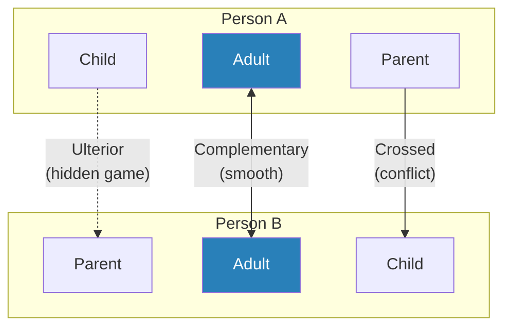
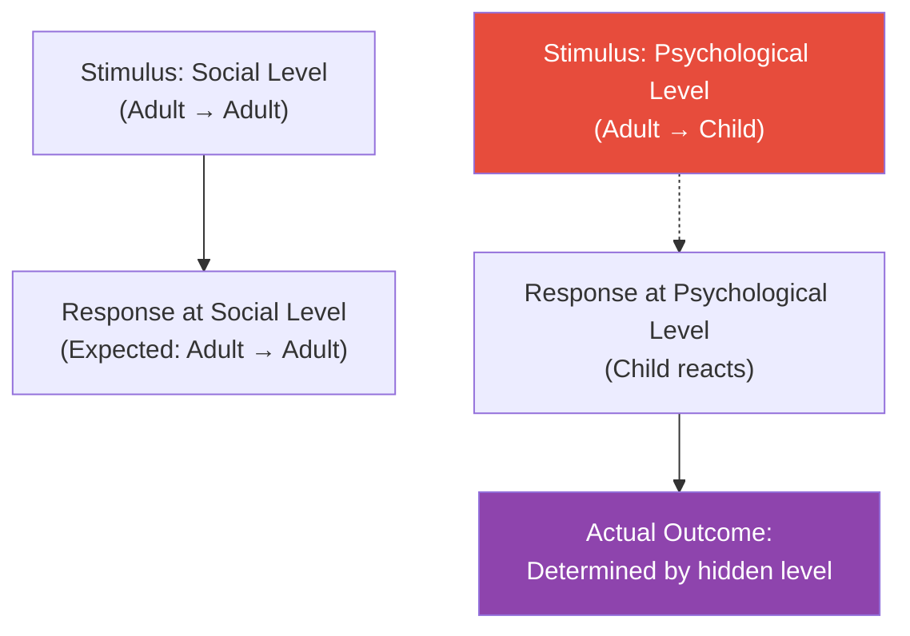
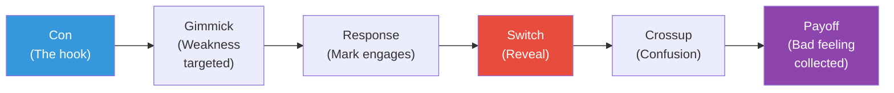
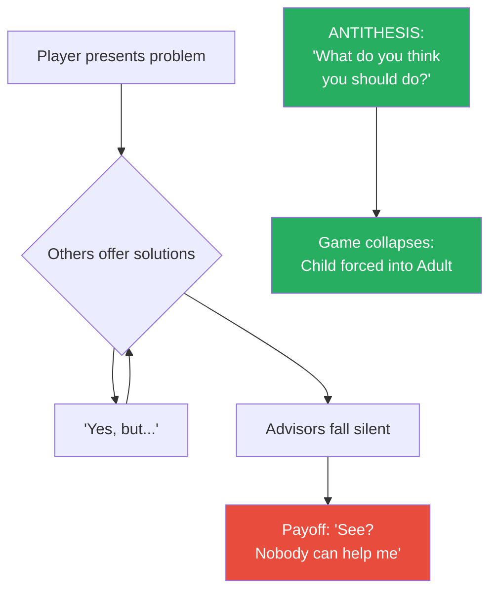
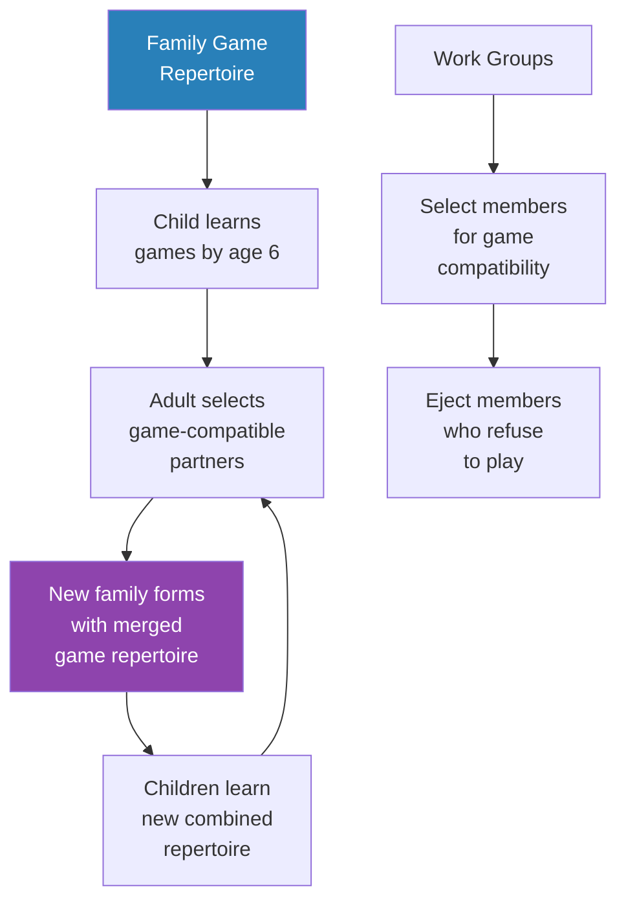
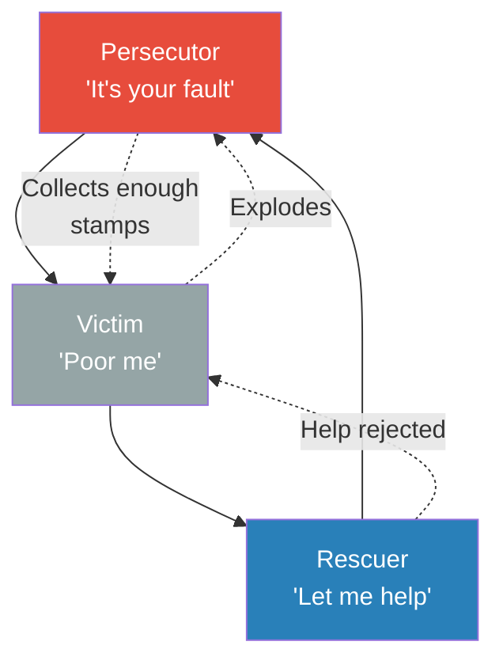
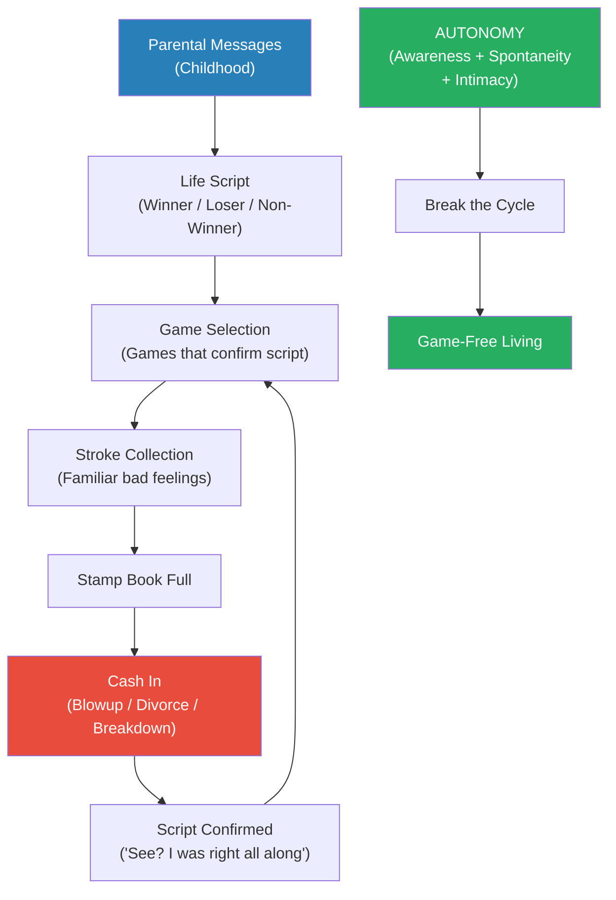

# Games People Play — Eric Berne

> Eric Berne's groundbreaking 1964 book reveals that most human social interaction is not what it appears to be on the surface. Beneath the polite exchanges of everyday life, people are engaged in repetitive psychological "games" — hidden transactions with concealed motives and predictable, usually negative, payoffs. Berne's framework, Transactional Analysis, proposes that every person operates from three ego states — Parent, Adult, and Child — and that games occur when the visible transaction masks a hidden one operating at a different ego-state level. The book catalogues dozens of these games across marriage, social life, the workplace, and even the therapy room, showing how each follows an identical underlying formula. Published in 1964, it spent two years on the New York Times bestseller list, introduced terms like "strokes" and "life scripts" into popular vocabulary, and remains the most accessible introduction to the hidden dynamics of human communication. Understanding these games does not just explain why conversations go wrong — it reveals the architecture of self-deception.

---

## About the Author

Eric Berne (1910-1970) was a Canadian-born psychiatrist trained in psychoanalysis at the New York Psychoanalytic Institute who grew disillusioned with the opacity and inaccessibility of Freudian theory. He developed Transactional Analysis (TA) as a framework simple enough for patients themselves to use — a radical departure from the analyst-knows-best tradition of mid-century psychiatry. Berne practised in San Francisco and founded the International Transactional Analysis Association. His clinical style was blunt, witty, and deliberately anti-pretentious — he named games in colloquial language ("Now I've Got You, You Son of a Bitch") rather than Latin terminology precisely to strip away professional mystification. *Games People Play* was his popular breakthrough, though he considered his more technical work, *Transactional Analysis in Psychotherapy* (1961), to be his real intellectual contribution.

---

## The Big Idea

- Every person carries three <b style="color: #2980b9">ego states</b> active simultaneously — not roles they choose, but actual internal states with distinct voices, postures, vocabularies, and emotional textures:
  - **Parent** — the internalised voice of authority figures, capable of both nurturing ("Let me help you") and controlling ("You should be ashamed")
  - **Adult** — the rational data-processor that evaluates reality without emotional distortion ("What are the facts?")
  - **Child** — the preserved emotional world of childhood, capable of both creative spontaneity ("Wow!") and adaptive compliance or rebellion ("I won't!" / "Whatever you say")
- These are not metaphors — Berne treated them as observable, diagnosable states. You can hear the shift when someone moves from Adult ("The report shows a 12% variance") to Parent ("Well, you should have caught that earlier") to Child ("Fine, I guess nothing I do is good enough")

- <b style="color: #27ae60">The revolutionary insight is that most social dysfunction is not caused by what people say but by which ego state is secretly driving the conversation</b>
- When two people communicate, six ego states are in play — three per person — and the real message often travels on a different channel than the apparent one
- A wife asking "Where are my cufflinks?" may be Adult-to-Adult (a factual question) or Parent-to-Child (an accusation of incompetence) — the words are identical, but the transaction is completely different
- <b style="color: #e74c3c">Games are what happen when people systematically use the gap between the apparent transaction and the real transaction to collect a familiar negative emotional payoff</b>

- Berne's most unsettling claim is that games are not accidents — they are chosen, even sought out
- People select friends, spouses, and colleagues who will play complementary games
- The payoff is always a familiar bad feeling — guilt, rage, helplessness, righteous indignation — that the player has been collecting since childhood
- Games persist because they provide three things that genuine intimacy cannot guarantee:
  - **Structure** — predictable patterns that fill time
  - **Strokes** — guaranteed attention, even if negative
  - **Safety** — emotional distance disguised as engagement

This diagram shows the three fundamental transaction types — complementary (productive), crossed (conflicting), and ulterior (the basis of all games).

---

## Key Concepts at a Glance

| Concept | One-line summary |
|---------|-----------------|
| **Parent ego state** | Internalised authority — nurtures or controls, absorbed from caregivers |
| **Adult ego state** | Rational data-processor — evaluates reality without emotional distortion |
| **Child ego state** | Preserved emotional world of childhood — spontaneous, adaptive, or rebellious |
| **Complementary transaction** | Both parties address the ego state the other is operating from — communication flows |
| **Crossed transaction** | Response comes from an unexpected ego state — communication breaks down |
| **Ulterior transaction** | Two messages at once — one overt, one hidden — the basis of all games |
| **Strokes** | Units of recognition — positive or negative, the fundamental currency of social life |
| **The Game Formula** | Con → Gimmick → Response → Switch → Crossup → Payoff |
| **Life scripts** | Unconscious life plans adopted in childhood that games serve to confirm |
| **Time structuring** | Six ways people fill time — from withdrawal through rituals to intimacy |
| **Autonomy** | The capacity for game-free living — awareness, spontaneity, and intimacy |
| **Antithesis** | The response that breaks a game by refusing to play the expected role |
| **Stamp collecting** | Accumulating grievances or self-pity to "cash in" for a dramatic payoff |
| **Trading stamps** | Collected bad feelings redeemed for a guilt-free blowup, divorce, or breakdown |
| **Stroke filter** | Habitual pattern of which recognition you accept and which you deflect |
| **Script matrix** | Diagram of messages flowing from parents' ego states to the child's ego states |

---

## Quick Lookup: All Games by Category

### Life Games

| Game | Core Dynamic | Payoff |
|------|-------------|--------|
| **Alcoholic** | Five-role cast enables addiction cycle | Self-punishment, guilt |
| **Debtor / Try and Collect** | Chronic financial instability as script fulfilment | Guilt and servitude |
| **Kick Me** | Unconsciously arranges mistreatment | Self-pity, loser script confirmed |
| **Now I've Got You, You SOB** | Lies in wait for a mistake, pounces with fury | Righteous rage |
| **See What You Made Me Do** | Blames others for own mistakes | Guilt deflected |

### Marital Games

| Game | Core Dynamic | Payoff |
|------|-------------|--------|
| **If It Weren't For You** | Blames partner for restrictions actually desired | Fear avoided, partner blamed |
| **Frigid Woman/Man** | Initiates or refuses intimacy to create conflict | Moral superiority, avoidance |
| **Harried / Look How Hard I've Tried** | Takes on everything, refuses help, collapses | Martyrdom |
| **Corner** | Manoeuvres partner into no-win position | Unsatisfiability confirmed |
| **Courtroom** | Both spouses seek vindication from a judge | Self-righteousness |
| **Sweetheart** | Public put-down disguised as affection | Humiliation delivered politely |
| **Uproar** | Escalates to a screaming fight to avoid intimacy | Physical distance |
| **If It Weren't For You (counter)** | The restricting partner's version — "I keep you safe" | Control maintained |

### Party / Social Games

| Game | Core Dynamic | Payoff |
|------|-------------|--------|
| **Ain't It Awful** | Competitive complaining and shared victimhood | Responsibility avoided |
| **Schlemiel** | Creates messes, apologises, forces forgiveness | Permission to destroy |
| **Why Don't You — Yes But** | Rejects every solution to prove helplessness | Helplessness confirmed |
| **Blemish** | Finds flaws in everything to avoid admiration | Sustained superiority |
| **Cavalier** | Slightly exaggerated compliments for warmth | Positive strokes (good game) |

### Sexual Games

| Game | Core Dynamic | Payoff |
|------|-------------|--------|
| **Rapo (1st, 2nd, 3rd degree)** | Seduction → engagement → reversal → punishment | Power, indignation |
| **Let's You and Him Fight** | Manoeuvres two people into fighting over initiator | Desirability confirmed |
| **Stocking Game / Perversion** | Exhibitionistic setup designed to provoke rejection | Script confirmation |
| **Indignation** | Uses another's sexual advance as licence for outrage | Moral superiority |

### Consulting Room Games

| Game | Core Dynamic | Payoff |
|------|-------------|--------|
| **I'm Only Trying to Help You** | Helper needs failure to feel needed | Martyrdom, ingratitude confirmed |
| **Psychiatry (patient's version)** | Collects insights without changing | Intellectual defence |
| **Wooden Leg** | Uses real or perceived handicap to excuse failure | Accountability avoided |
| **Stupid** | Feigns incomprehension to avoid engagement | Effort avoided |
| **Indigence** | "What do you expect? I'm poor/sick/disadvantaged" | Lowered expectations |
| **Peasant** | Feigns rural simplicity to disarm intellectual opponents | Superiority through modesty |

### Underworld Games

| Game | Core Dynamic | Payoff |
|------|-------------|--------|
| **Cops and Robbers** | The chase is the point, not the loot | Excitement, script confirmation |
| **Let's Pull a Fast One on Joey** | Con artistry — outsmarting the mark | Superior cleverness |
| **How Do You Get Out of Here** | Institutional game of manipulating release | Control over system |
| **Want Out** | Criminal engineers own capture when guilt peaks | Punishment, relief |

### Good Games

| Game | Core Dynamic | Payoff |
|------|-------------|--------|
| **Busman's Holiday** | Using professional skills socially | Positive strokes |
| **Cavalier** | Gracious compliments both parties enjoy | Warmth, connection |
| **Happy to Help** | Genuine helping rewarding for both | Mutual satisfaction |
| **They'll Be Glad They Knew Me** | Aspiring person shares journey for encouragement | Hope, positive recognition |
| **Homely Sage** | Shares wisdom modestly, seeks to educate | Respect, belonging |

Marital and Life Games dominate Berne's catalogue in both number and severity — these are the games that shape entire biographies, not just evenings, which is why Berne devoted the most analytical depth to them.

---

## Part I: The Foundations of Transactional Analysis

### The Three Ego States

*Before you can understand games, you must understand the players — and every person is three players at once.*

- Berne's ego states are not abstract personality types — they are <b style="color: #2980b9">phenomenological realities</b>, observable in real time through shifts in vocabulary, posture, facial expression, and vocal tone
- The Parent is not "the mature one" — it is the recorded voice of external authority, complete with all its biases, warmth, and rigidity
- The Adult is not "the best one" — it is simply the data-processing function, and it can be contaminated by Parent prejudices or Child fears
- The Child is not "the immature one" — it is the source of creativity, intuition, spontaneity, and joy, as well as fear, compliance, and rebellion

**Structural analysis** — Berne's term for diagnosing which ego state is active — is the foundation of everything that follows:

- <b style="color: #27ae60">You cannot analyse a transaction until you know which ego state each person is operating from</b>
- The Parent speaks in absolutes: "always," "never," "should," "must"
- The Adult speaks in probabilities and data: "the evidence suggests," "what are the options"
- The Child speaks in feelings and reactions: "I want," "I can't," "that's not fair"

| Ego State | Verbal Cues | Physical Cues | Emotional Tone |
|-----------|-------------|---------------|----------------|
| **Nurturing Parent** | "Let me help," "Poor thing" | Open arms, soft voice | Protective, soothing |
| **Controlling Parent** | "You should," "Don't you dare" | Pointed finger, furrowed brow | Judgmental, authoritative |
| **Adult** | "The data shows," "What options exist" | Level gaze, relaxed posture | Calm, objective |
| **Free Child** | "Wow!" "Let's try!" | Wide eyes, animated body | Excited, curious |
| **Adapted Child** | "Whatever you say," "I can't" | Downcast eyes, slumped shoulders | Compliant, defeated |
| **Rebellious Child** | "You can't make me," "I won't" | Clenched jaw, defiant posture | Angry, resistant |

- Berne insisted that ego states are not roles or performances — they are real, internally consistent states with their own memories, vocabularies, and worldviews

The Adult dominates in work meetings and crises, the Child peaks during creative work and romantic conflict, and the Parent surges at family dinners — recognising which ego state is driving you in each context is the first step of structural analysis.
- The Parent ego state literally replays recorded parental behaviour — a person in Parent is not imitating their mother, they *are* their mother in that moment
- The Child ego state is not "acting childish" — it is the actual emotional reality of the person at age five, preserved intact and activated by current triggers
- The Adult ego state processes current data without contamination — but contamination is the rule, not the exception:
  - **Parent contamination of Adult** — prejudices presented as facts ("Everyone knows that immigrants are lazy" — stated in Adult tone but containing Parent content)
  - **Child contamination of Adult** — fears presented as realities ("I just know the plane will crash" — stated as Adult prediction but driven by Child anxiety)
  - **Double contamination** — both Parent and Child distorting Adult processing simultaneously

**The exclusion problem:**

- Berne observed that some people have one or more ego states effectively excluded — shut out of operation:
  - **Excluded Parent** — the person who has no internalised authority, no rules, no "should" — they can be creative and free, but they lack structure and may be unable to set boundaries
  - **Excluded Adult** — the person who swings between Parent judgments and Child reactions without ever processing data rationally — they are either lecturing or emoting, never reasoning
  - **Excluded Child** — the person who has suppressed all spontaneity and feeling — they are efficient and responsible but emotionally dead, unable to experience joy or genuine connection
- The goal of TA therapy is not to strengthen one ego state at the expense of others but to restore free access to all three
- A healthy person can shift between ego states fluidly — being nurturing when nurturing is needed, analytical when analysis is needed, and playful when play is called for

> [!example] The Excluded Child
> - Berne describes a businessman in his fifties who was highly competent, respected, and utterly miserable
> - He could not recall the last time he had laughed spontaneously
> - His Adult was sharp — he processed data, made decisions, and managed complexity effortlessly
> - His Parent was reliable — he set rules, maintained standards, and cared for his employees' welfare
> - His Child was effectively excluded — shut down in early childhood by parents who punished spontaneity and rewarded seriousness
> - He had no hobbies, no playfulness, no capacity for genuine fun
> - When his therapist asked him to recall the last time he felt joy, he could describe achievements but not pleasure
> - His treatment involved literally relearning how to play — not games in Berne's technical sense, but actual play: throwing a ball, drawing, being silly
> - The process was excruciating for him — every time the Child began to emerge, the Parent immediately suppressed it with "Stop being ridiculous"
> **The lesson:** A person can be highly functional and deeply unhappy when one ego state is excluded. Competence without spontaneity is just efficient suffering.

> [!tip] Core Insight
> Every person you interact with is simultaneously a judging parent, a rational analyst, and a feeling child. The question is never "which one are they?" — it is "which one is driving right now?"

---

### Transactions: The Unit of Social Action

*Every exchange between two people is a transaction — and the type of transaction determines whether communication succeeds, fails, or conceals a hidden agenda.*

- A <b style="color: #2980b9">transaction</b> is the fundamental unit of social intercourse — one stimulus and one response between two people's ego states
- Berne identified three types, and the distinction between them is the entire diagnostic framework for understanding games

**Complementary transactions:**

- The response comes from the ego state that was addressed, and is directed back to the ego state that initiated
- Example: Adult→Adult ("What time is it?" / "It's three o'clock")
- Example: Parent→Child ("You should be more careful" / "I'm sorry, you're right")
- <b style="color: #27ae60">Communication can proceed indefinitely as long as transactions remain complementary</b>
- This is Berne's First Rule of Communication
- Complementary transactions feel smooth and natural — even when the content is negative
  - A Parent→Child lecture followed by a Child→Parent apology is complementary — it may be unhealthy, but it flows
  - Two people exchanging Adult→Adult data feel aligned even if they disagree on the content
  - The key: communication breaks down when the *channel* is crossed, not when the *content* is disputed

**Crossed transactions:**

- The response comes from an unexpected ego state or is directed to an unexpected ego state
- Example: Adult→Adult ("What time is it?") receives Parent→Child ("Why can't you keep track of time yourself?")
- <b style="color: #e74c3c">Crossed transactions break communication</b> — they are the source of most arguments, hurt feelings, and conversational dead ends
- This is Berne's Second Rule of Communication
- There are 72 possible crossed transactions (6 ego state combinations x 12 possible responses), but in practice, two types account for most interpersonal conflict:
  - Type I: Adult→Adult stimulus gets Parent→Child response (the "put-down")
  - Type II: Parent→Child stimulus gets Adult→Adult response (the "refusal to be dominated")

> [!example] The Classic Type I Cross
> - A husband says to his wife: "Do you know where my cufflinks are?" (Adult→Adult, seeking information)
> - She responds: "Why don't you keep track of your own things? You always leave everything for me to find" (Parent→Child)
> - He asked a factual question; she heard an accusation of domestic incompetence
> - The conversation is now derailed — he feels attacked, she feels burdened
> - Neither person intended the conflict, but the crossed transaction made it inevitable
> **The lesson:** Most arguments begin not with disagreement but with a transaction that crosses ego states.

> [!example] The Type II Cross — Refusal to Be Dominated
> - A boss tells an employee: "You should have proofread this more carefully. This is sloppy work" (Parent→Child)
> - Instead of responding from Child (apologising, feeling ashamed), the employee responds from Adult: "Which specific errors are you referring to? I'd like to correct them" (Adult→Adult)
> - The boss expected compliance or guilt; she received calm data-gathering
> - This cross is often therapeutic — it forces the conversation up from Parent-Child dominance to Adult-Adult problem-solving
> - But it can also infuriate the Parent-state speaker, who feels their authority has been dismissed
> **The lesson:** The Type II cross is the basis of all assertiveness — meeting judgment with facts rather than submission.

**Ulterior transactions:**

- Two messages are sent simultaneously — one at the social (overt) level and one at the psychological (covert) level
- The social-level message is the respectable cover; the psychological-level message is the real one
- Example (from Berne): A salesman says "This one is better, but you can't afford it" — social level is Adult→Adult (informational), psychological level is Adult→Child (challenging the buyer's pride)
- <b style="color: #e74c3c">The outcome of the transaction is always determined by the psychological level, not the social level</b>
- This is Berne's Third Rule of Communication — and it is the rule that governs all games

In ulterior transactions, the hidden psychological message always determines the real outcome — the social-level exchange is merely a cover story.

> [!example] The Car Salesman's Gambit
> - Berne describes a classic sales scenario where a salesman shows a customer an expensive car
> - Social level (Adult→Adult): "This is the top model. It has better features but costs more"
> - Psychological level (Adult→Child): "This one is too good for you — you probably can't afford it"
> - The customer's Child ego state is hooked — pride is challenged
> - Customer responds: "I'll take it" — not because the Adult evaluated and chose, but because the Child needed to prove something
> - The salesman got what he wanted by operating on the hidden channel
> **The lesson:** When you feel an unexpected surge of emotion during a conversation, check whether someone is operating on two levels at once.

---

### Strokes: The Currency of Human Contact

*Berne's most elegant insight may be his simplest: humans need recognition the way they need food — and they will do extraordinary things to get it.*

- A <b style="color: #2980b9">stroke</b> is any act of recognition — a hello, a compliment, a nod, a criticism, even an insult
- Berne borrowed the term from infant development research: babies who receive physical stroking (touch, holding, attention) develop normally; babies deprived of it can literally die — a condition called **marasmus**
- He extended this biological reality to adults: we never outgrow the need for strokes, we simply learn to accept symbolic ones (words, gestures, attention) in place of physical ones

**The stroke economy:**

- Positive strokes (compliments, attention, affirmation) are the most nourishing
- Negative strokes (criticism, anger, insults) are painful but still provide recognition
- <b style="color: #e74c3c">No strokes at all — being ignored, invisible, irrelevant — is the worst outcome</b>
- This hierarchy explains one of the most puzzling features of human behaviour: why people provoke negative attention rather than accept being ignored
- The child who misbehaves to get scolded, the employee who creates drama to get noticed, the spouse who picks fights rather than endure silence — all are choosing negative strokes over stroke deprivation

- Strokes can be further classified:
  - **Conditional** — given for what you do ("Great presentation")
  - **Unconditional** — given for who you are ("I love having you around")
  - Unconditional positive strokes are the most nourishing and the rarest
  - Most social life consists of exchanging conditional strokes according to unspoken rules

| Stroke Type | Example | Nourishment Level | Availability |
|-------------|---------|-------------------|-------------|
| **Unconditional positive** | "I love you just as you are" | Highest | Rarest |
| **Conditional positive** | "Great work on that report" | High | Common |
| **Conditional negative** | "That report was poorly written" | Low (painful but informative) | Common |
| **Unconditional negative** | "You're worthless" | Very low (damaging) | Varies |
| **No strokes** | Being ignored, invisible | Devastating | Too common |

> [!tip] Core Insight
> Games are stroke-generating machines. They are reliable, predictable ways to get attention — even though the attention is negative. People play games not because they enjoy the bad feelings but because bad feelings are better than no feelings at all.

**The stroke filter:**

- Berne observed that people develop a <b style="color: #2980b9">stroke filter</b> early in life — a habitual pattern of which strokes they accept and which they deflect
- Some people can accept praise but not criticism; others can absorb criticism but dismiss compliments
- The filter is script-determined: a person whose script says "I am unlovable" will systematically deflect positive unconditional strokes ("You're wonderful just as you are") while accepting negative conditional ones ("You messed up again")
- <b style="color: #e74c3c">This filtering mechanism is one of the most insidious features of the script</b> — even when the environment provides the strokes a person needs, the filter prevents them from landing
- Changing the stroke filter is one of the hardest tasks in therapy — it requires the person to accept forms of recognition that their script has been blocking since childhood

**The stroke economy's five restrictive rules:**

- Berne and his colleague Claude Steiner identified unspoken social rules that artificially restrict the supply of strokes:
  - **Don't give strokes** — withhold compliments and recognition ("Don't flatter people")
  - **Don't ask for strokes** — never request recognition or affirmation ("Don't fish for compliments")
  - **Don't accept strokes** — deflect praise when offered ("Oh, it was nothing")
  - **Don't reject strokes you don't want** — accept negative strokes without protest ("I deserve that criticism")
  - **Don't give yourself strokes** — never acknowledge your own accomplishments ("Don't brag")
- These rules create an artificial scarcity of positive strokes, which forces people into games to get the recognition they need
- Breaking the stroke economy's restrictive rules — freely giving, requesting, accepting, rejecting, and self-giving strokes — is one of the simplest paths to reducing game-playing

> [!example] The Compliment Deflector
> - Berne describes a patient who was objectively successful — good job, strong relationships, respected by colleagues
> - Every time someone complimented her, she immediately deflected: "Oh, I just got lucky" or "Anyone could have done it"
> - She could, however, absorb criticism with devastating precision — a single critical comment would replay in her mind for days
> - Her stroke filter was calibrated to her script: "I am not truly competent — my success is a fluke"
> - Positive strokes bounced off; negative strokes stuck — creating a lived experience that confirmed the script regardless of objective reality
> **The lesson:** Your stroke filter determines which reality you live in. Two people in identical circumstances can have opposite experiences depending on which strokes they let through.

---

### Time Structuring: The Six Ways People Fill Their Hours

*Berne observed that much of social life is driven by a single anxiety: what do I do with all this unstructured time with other people?*

- Berne identified six progressively intimate ways people structure their time with others, arranged from safest to most vulnerable:

| Level | Activity | Stroke Intensity | Risk Level |
|-------|----------|-----------------|------------|
| 1 | **Withdrawal** | None — no contact | Zero |
| 2 | **Rituals** | Low — "How are you?" "Fine, thanks" | Minimal |
| 3 | **Pastimes** | Moderate — small talk, social chitchat | Low |
| 4 | **Activities** | Moderate — working together on tasks | Low-moderate |
| 5 | **Games** | High (but negative) — hidden agendas, drama | High |
| 6 | **Intimacy** | Highest (and positive) — genuine, game-free exchange | Maximum |

- <b style="color: #27ae60">Games occupy the critical zone between safe-but-boring pastimes and terrifying-but-fulfilling intimacy</b>

Intimacy provides the highest stroke intensity but demands maximum vulnerability, while games offer nearly as much emotional charge with far less genuine exposure — which is precisely why most people settle for games instead of risking real connection.
- Most people spend the majority of their social time in levels 2-4 (rituals, pastimes, activities)
- Games (level 5) are where the real emotional action happens for most people — they are more exciting than pastimes but safer than intimacy
- True intimacy (level 6) is the rarest form of human contact because it requires dropping all pretence, games, and defences
- Berne was blunt: most people are more afraid of intimacy than of anything else, and games are the primary mechanism for avoiding it while still feeling emotionally engaged

**The function of pastimes:**

- Pastimes are not pointless — they serve as auditions for games
- During pastimes, people unconsciously advertise their game repertoire and scan others for compatibility
- The person who plays "Ain't It Awful" at a cocktail party is broadcasting: "I collect self-pity stamps. Are you a fellow collector?"
- The person who plays "PTA" (comparing children's achievements) is broadcasting: "I compete through my children. Will you play?"
- By the end of a social gathering, people have sorted themselves into compatible game partnerships — the real social work happened beneath the small talk

**Berne's catalogue of common pastimes:**

- He classified pastimes by the ego state that drives them:
  - **Parent-Parent pastimes** — "PTA," "Delinquent Husband," "Kids These Days" — evaluative comparison of institutions, spouses, or the younger generation
  - **Adult-Adult pastimes** — "General Motors," "Who Won," "What Became of..." — factual exchanges about cars, sports, or acquaintances
  - **Child-Child pastimes** — "Making Out," "Water Cooler" — shared emotional experiences, gossip, and mutual confession
- Each pastime has a specific social function: it identifies which games the speaker plays and auditions for compatible partners
- Berne noted that the particular pastime a person gravitates toward reveals their game repertoire more reliably than anything they say directly

> [!example] Cocktail Party Pastimes
> - Berne describes the typical cocktail party as an exercise in structured time-filling
> - Guests engage in pastimes he labels with deliberate irony — "PTA" (discussing children's schools), "General Motors" (comparing cars), "Ain't It Awful" (competitive complaining)
> - These pastimes serve a real function: they allow people to size each other up and select potential game partners
> - The person who plays "Ain't It Awful" at the cheese table is unconsciously advertising for someone who will play the complementary role
> - By the end of the evening, people have sorted themselves into compatible game partnerships — the real social work happened beneath the small talk
> **The lesson:** Pastimes are not pointless — they are auditions for games.

Berne's six levels of time structuring form a spectrum from complete safety (withdrawal) to maximum vulnerability (intimacy) — games sit just below intimacy, offering high emotional intensity without the risk of genuine exposure.

---

## Part II: The Game Formula

### Anatomy of a Game

*Every game, no matter how complex or culturally varied, follows the same six-step formula — learn it once and you can diagnose any game on the spot.*

- Berne defined a <b style="color: #2980b9">game</b> as "an ongoing series of complementary ulterior transactions progressing to a well-defined, predictable outcome"
- More colloquially: a game is a set of moves with a hidden agenda that ends in a predictable bad feeling
- Every game contains the same elements:

Berne's game formula shows the invariable sequence — every game begins with a hook, escalates through engagement, pivots at the switch, and ends with the player collecting their familiar bad feeling.

Every game flows through the same six-step pipeline and terminates in one of a handful of familiar stamp types — the formula is universal, only the specific emotions collected at the end vary by player and script.

> [!abstract] The Game Formula (Berne's Formula G)
> 1. **Con** — The initiator offers a hook disguised as a legitimate social transaction
> 2. **Gimmick** — The hook targets a specific vulnerability in the other person (greed, guilt, helpfulness, pride)
> 3. **Response** — The target takes the bait and engages in the game
> 4. **Switch** — The initiator changes the nature of the transaction — the hidden agenda surfaces
> 5. **Crossup** — A moment of confusion where the target realises something has shifted but cannot articulate what
> 6. **Payoff** — Both players collect their familiar negative emotion — this is the real purpose of the entire sequence

- <b style="color: #27ae60">The critical insight is that the payoff is not a side effect — it is the goal</b>
- Players do not play games despite the bad feelings; they play games *to collect* the bad feelings
- The payoff is always a familiar negative emotion that the player has been collecting since childhood — Berne called these collected feelings <b style="color: #2980b9">trading stamps</b>
- Just as supermarket shoppers collect trading stamps to cash in for a prize, game players collect bad feelings to "cash in" for a dramatic payoff — a blowup, a divorce, a resignation, a breakdown
- Some people collect guilt stamps, others collect anger stamps, others collect self-pity stamps
- The "prize" varies by the size of the collection: a small book of stamps might buy a guilt-free evening of drinking; a large book might buy a guilt-free divorce

**How to identify a game in the wild:**

- Berne offered several diagnostic markers:
  - A recurring pattern of interaction that always ends the same way
  - A moment of surprise or confusion ("How did we end up fighting again?")
  - A familiar bad feeling that the player recognises from past incidents
  - A sense that the outcome was somehow inevitable despite everyone's best intentions
- <b style="color: #e74c3c">If you keep having the same argument with the same emotional outcome, you are almost certainly playing a game</b>
- The content of the argument may vary — money, housework, parenting — but the emotional trajectory is identical each time
- Berne suggested a simple diagnostic test: after a confusing or upsetting social interaction, ask yourself three questions:
  - What just happened? (the objective sequence of events)
  - What did I end up feeling? (the emotional payoff)
  - Have I felt this specific feeling in this specific type of situation before? (the recurrence test)
- If the answer to the third question is yes, you have identified your game

**Berne's additional classification dimensions:**

- Beyond content, Berne classified games along several axes:
  - **Flexibility** — some games can be played with different equipment (the "Alcoholic" structure works with alcohol, drugs, food, gambling); others are rigid and require specific conditions
  - **Tenacity** — how stubbornly the player clings to the game when the antithesis is applied; some players give up a game easily, others escalate
  - **Intensity** — first, second, or third degree (social, serious, or lethal)
  - **Number of players** — some games need only two; others require a full cast (the five-player "Alcoholic")
- Berne also used a notation system for describing games concisely:
  - Each game could be described using its **thesis** (one-sentence summary of the hidden message), its **aim** (what the initiator wants), its **roles** (the minimum cast required), its **dynamics** (the underlying emotional need), its **advantages** (the payoffs, broken into psychological, internal social, external social, and biological), and its **moves** (the typical sequence)
  - This systematic approach allowed Berne to compare games with clinical precision — two games that look different on the surface (e.g., "Kick Me" and "Stupid") could be shown to share the same underlying dynamics and payoff structure
  - The notation system reinforced Berne's central claim: games are not unique events but instances of repeating patterns, as predictable and classifiable as chemical reactions

---

### Trading Stamps: The Currency of Games

*Berne's most vivid metaphor — bad feelings collected like supermarket trading stamps, saved up, and cashed in for a dramatic payoff.*

- In the 1960s, American supermarkets issued <b style="color: #2980b9">trading stamps</b> — small stickers given with each purchase, collected in books, and eventually redeemed for merchandise
- Berne used this as a metaphor for how people collect bad feelings:
  - Each game interaction produces a familiar negative emotion — a stamp
  - The stamp is carefully preserved and added to the collection
  - When the book is full, the collector cashes it in for a "prize" — a dramatic action that would normally require guilt or justification

**Types of stamp collections:**

| Stamp Colour (Berne's metaphor) | Emotion Collected | Typical Cash-In |
|--------------------------------|-------------------|-----------------|
| **Brown stamps** | Guilt | Permission for self-destructive behaviour ("I've suffered enough to deserve this binge") |
| **Red stamps** | Anger | Permission for explosive rage ("I've put up with enough — now I explode") |
| **Blue stamps** | Self-pity | Permission for withdrawal or collapse ("Nobody appreciates me — I give up") |
| **Grey stamps** | Depression | Permission for inaction ("What's the point?") |
| **White stamps** | Self-righteousness | Permission for moral aggression ("I've been so patient — now I'm entitled to be cruel") |
| **Gold stamps** | Positive feelings | The rare healthy collection — genuine good feelings accumulated and "spent" on celebration or generosity |

- <b style="color: #27ae60">The size of the stamp book determines the magnitude of the cash-in</b>:
  - A small book (one page of anger stamps): might buy a guilt-free evening of sulking
  - A medium book (several pages): might buy a guilt-free affair or a week of hostile silence
  - A full book: might buy a guilt-free divorce, a job resignation, or a complete breakdown
  - Multiple full books: might buy a suicide attempt or an act of violence
- Berne observed that some people are prolific stamp collectors — they enter every interaction ready to be offended, ensuring a steady supply
- Others collect slowly but never discard — they accumulate grievances over decades before cashing in spectacularly
- The most common pattern: the person who "never gets angry" for twenty years, then has a breakdown or rage episode that shocks everyone who knew them as calm and accommodating
  - They were not calm — they were collecting

> [!example] The Twenty-Year Marriage Collapse
> - Berne describes a husband who was described by all his friends as "the most patient man alive"
> - For twenty years, he absorbed his wife's criticisms, demands, and outbursts without visible reaction
> - His friends admired his patience; his wife took it as confirmation that she could say anything without consequence
> - One Tuesday evening, over a trivial disagreement about dinner, he calmly announced he wanted a divorce
> - His wife was devastated — "Where did this come from?"
> - It came from twenty years of carefully collected anger stamps, filed silently, never mentioned, never processed
> - The dinner disagreement was not the cause — it was the last stamp needed to fill the book
> - He had been preparing for this moment for two decades without knowing it
> **The lesson:** Patience is not always a virtue — sometimes it is a collection strategy. The person who never complains may be the person who is building toward the most dramatic payoff of all.

- <b style="color: #e74c3c">Berne's warning about "gold stamps"</b> — even positive feelings can be collected as a game:
  - The person who does a hundred favours, keeping meticulous track, then cashes in the gold stamps for a single enormous request that the recipient cannot refuse without guilt
  - "After everything I've done for you..." is the cash-in moment for gold stamps
  - This connects to the game of "Harried" and "I'm Only Trying to Help You" — both involve collecting positive-looking stamps that are actually redeemed for guilt and obligation

**The alternative to stamp collecting:**

- Berne proposed that the healthy alternative to stamp collecting is to process emotions in real time rather than storing them:
  - When you are angry, express the anger now — do not save it
  - When you are hurt, acknowledge the hurt now — do not file it for later use
  - When you are pleased, enjoy the pleasure now — do not bank it as credit
- This real-time processing is what Berne meant by the Adult's function in emotional life — not suppressing emotion but experiencing it without converting it into currency for future transactions
- The person who processes emotions in real time has no stamp collection and therefore no dramatic cash-in — their emotional life is less dramatic but far more honest

---

### Game Degrees

*Not all games are created equal — Berne classified games by their severity, from socially acceptable to lethal.*

- <b style="color: #2980b9">First-degree games</b> are socially acceptable — played in public, yielding mild discomfort
  - Example: A mild round of "Why Don't You — Yes But" at a dinner party
  - Everyone walks away slightly frustrated but no real harm done
  - First-degree games are part of normal social life — nearly everyone plays them
- <b style="color: #2980b9">Second-degree games</b> are played with greater intensity — participants prefer to keep them private
  - Example: A sustained "If It Weren't For You" game in a marriage
  - Real emotional damage occurs, but the game stays within the relationship
  - Second-degree games erode trust and intimacy over months and years
- <b style="color: #e74c3c">Third-degree games</b> are played for keeps — they end in the courtroom, the hospital, or the morgue
  - Example: "Now I've Got You, You Son of a Bitch" escalated to litigation
  - Example: "Rapo" played at lethal intensity, ending in violence
  - Berne was unflinching: some games kill people
  - Third-degree games involve people whose scripts demand dramatic, irreversible outcomes

| Degree | Setting | Intensity | Consequence | Example |
|--------|---------|-----------|-------------|---------|
| **First** | Social gatherings | Mild | Slight discomfort | Polite YDYB at a party |
| **Second** | Behind closed doors | Moderate | Emotional damage, relationship strain | IWFY eroding a marriage |
| **Third** | Courtroom, hospital, morgue | Severe | Physical harm, legal consequences, death | NIGYSOB escalated to assault |

> [!tip] Core Insight
> The same game can be played at any degree. "Alcoholic" played at first degree is the social drinker who uses drinking as a pastime. At second degree, it destroys a family. At third degree, it destroys a liver.

---

### The Antithesis: How to Break a Game

*Every game has a counter-move — a response that refuses to follow the script and collapses the game structure.*

- The <b style="color: #2980b9">antithesis</b> is the response that refuses the Con, declines to engage, and prevents the game from reaching its payoff
- It works because games require both players to follow the script — if one player exits, the game cannot continue
- The antithesis is almost always uncomfortable because it denies both players their expected strokes
- This is why games persist: <b style="color: #e74c3c">stopping a game means tolerating the anxiety of unstructured, stroke-deprived time</b>
- Berne noted that the period immediately after a game is broken is the most dangerous — the player whose game has been disrupted often escalates to a harder game or seeks a new partner who will play

> [!abstract] How to Apply the Antithesis
> 1. **Recognise the Con** — identify the hook being offered ("Can you help me with this problem?")
> 2. **Name the game internally** — label it ("This is 'Why Don't You — Yes But'")
> 3. **Refuse the expected role** — do not offer advice, do not take the bait, do not play Parent to their helpless Child
> 4. **Respond from Adult** — ask a genuine question ("What have you already tried?" or "What do you think you should do?")
> 5. **Tolerate the silence** — the other person may feel confused or frustrated; this discomfort is the game collapsing
> 6. **Offer genuine strokes** — replace the game's negative stroke economy with authentic positive recognition

**Why the antithesis is hard to sustain:**

- The antithesis disrupts the stroke supply for both players
- The person who stops playing must find alternative sources of strokes — genuine intimacy, authentic recognition, creative engagement
- These alternatives are unfamiliar and feel risky
- Social pressure is intense: other players often unconsciously conspire to restart the game
- Berne observed that when one spouse stops playing a marital game, the other spouse frequently escalates — increasing the intensity, switching to a different game, or threatening the relationship
- The escalation pattern is itself diagnostic: <b style="color: #e74c3c">the more violently someone resists an antithesis, the more important the game is to their script</b>
- A person who gracefully accepts a game-break was playing at first degree; a person who escalates to threats or ultimatums was playing at second or third degree

---

## Part III: A Thesaurus of Games

### Life Games

*These games shape the entire trajectory of a person's life — they are not social diversions but existential commitments played out over years and decades.*

- Life games differ from party or social games in a crucial way: they are not played for an evening's entertainment but for a lifetime's emotional structure
- A person may play "Why Don't You — Yes But" at a dinner party and forget it by morning — but a person who plays "Alcoholic" or "Kick Me" is playing for their whole biography
- <b style="color: #27ae60">Life games determine the shape of a life the way a riverbed determines the path of water</b> — the game creates the channel, and experience flows through it
- Berne observed that life games are almost always established by age 6 and refined through adolescence
- By adulthood, the game is so embedded in the personality that the player cannot distinguish between their game and their identity
- This is the essential challenge of therapy: asking someone to give up their life game feels like asking them to give up themselves

#### "Alcoholic"

*Berne's most fully analysed game — a five-role cast that reveals addiction as a social system, not just a chemical dependency.*

- This is Berne's most fully analysed game, and he uses it to demonstrate that addiction has a transactional structure, not merely a chemical one
- The game requires a cast of five roles:

| Role | Typical Player | What They Get |
|------|---------------|---------------|
| **The Alcoholic** | Central player | Self-punishment, guilt, morning-after suffering |
| **The Persecutor** | Usually a spouse | Righteous anger, moral superiority |
| **The Rescuer** | Friend or counsellor | Feeling needed and wise |
| **The Patsy** | Enabling colleague | Moral virtue from covering |
| **The Connection** | Bartender or supplier | Reliable customer, non-judgmental role |

- <b style="color: #27ae60">Berne's insight: removing the alcohol does not stop the game — the same roles and transactions continue with a different medium</b>
- The Alcoholic's real payoff is not intoxication but the morning-after self-punishment — the game's purpose is to collect guilt and self-degradation
- The Persecutor gets righteous anger; the Rescuer gets to feel needed; the Patsy gets to feel virtuous
- Each player needs the others — the system is self-reinforcing
- Berne observed that when one player is removed (the bartender cuts the Alcoholic off, the spouse leaves), the Alcoholic rapidly recruits a replacement
- The game can be played with substances other than alcohol — food, gambling, shopping, even overwork — as long as the five-role structure is maintained

**The setup:** The Alcoholic binges, creating a situation that activates all four supporting players.

**The players:** All five roles are essential — remove any one and the game stalls temporarily, but the Alcoholic will recruit a replacement.

**The payoff:** The Alcoholic collects guilt and self-punishment. The Persecutor collects righteous fury. The Rescuer collects the satisfaction of being needed. The Patsy collects moral superiority. The Connection collects steady income.

**The antithesis:** Berne suggested that the only effective antithesis is to refuse all five roles simultaneously — which is extraordinarily difficult because each role feels virtuous from the inside. The Rescuer believes they are helping. The Persecutor believes they are setting boundaries. The Patsy believes they are being kind. Each role is a game disguised as a virtue.

- The game also has an important variant Berne called <b style="color: #2980b9">"Dry Alcoholic"</b>:
  - The person stops drinking but continues playing the game with a different medium
  - The roles remain: the former Alcoholic becomes a compulsive worker, overeater, or gambler
  - The Persecutor shifts targets: "You used to drink too much, now you work too much"
  - The Rescuer adjusts: "Have you tried setting boundaries with your boss?"
  - The game's transactional structure survives intact — only the substance changes
  - This is why Berne insisted that treating the addiction without treating the game is incomplete
- Berne also noted that Alcoholics Anonymous, while effective, sometimes replaces the game with a structured ritual rather than eliminating it:
  - The AA meeting provides guaranteed strokes (sharing stories, receiving attention)
  - The sponsor relationship provides a structured Rescuer role
  - The "one day at a time" philosophy provides ongoing dramatic tension
  - This is not necessarily bad — it may be a constructive game replacing a destructive one — but it is still a game

> [!example] The Five-Handed Game of "Alcoholic"
> - Berne describes a typical scenario: a man drinks heavily, comes home, and his wife (Persecutor) berates him
> - The next morning, remorseful, he visits his friend (Rescuer) who talks about willpower and fresh starts
> - His colleague at work (Patsy) covers for his absence at a meeting
> - That evening, the bartender (Connection) serves him without comment or judgment
> - Each player gets their payoff: the wife gets righteous anger, the friend gets to feel wise and needed, the colleague gets moral superiority, the bartender gets a reliable customer
> - The Alcoholic gets the most complex payoff: the hangover itself — permission to wallow in self-punishment, which is the familiar bad feeling he has been collecting since childhood
> **The lesson:** Addiction is not a solo activity — it is a social system with assigned roles. Treating only the Alcoholic without addressing the other four players rarely works.

---

#### "Debtor" / "Try and Collect"

*The life game of chronic financial instability — not caused by low income but by a psychological commitment to owing.*

- The player arranges their life to always be in debt, then oscillates between the guilt of owing and the relief of partial repayment
- The game exists in several variants:
  - **"Debtor" proper** — the player who accumulates obligations (financial, emotional, social) and lives in a perpetual state of owing
  - **"Try and Collect"** — the debtor who takes perverse satisfaction in being owed to, extracting servitude from creditors
  - **"Creditor"** — the complementary game, played by someone who needs others to owe them
- <b style="color: #e74c3c">The game reveals that financial behaviour often serves psychological rather than economic purposes</b>
- Some players of "Debtor" are unconsciously recreating a childhood dynamic where they always "owed" emotional debts to demanding parents

**The setup:** The player borrows money, favours, or emotional support with implicit promises of future repayment.

**The players:** The Debtor and the Creditor — each needs the other. The Creditor who plays "Try and Collect" needs someone to owe them because the debt gives them power and the moral high ground.

**The payoff:** The Debtor collects guilt and the comfort of familiar obligation. The Creditor collects moral superiority and resentment.

**The antithesis:** For "Debtor," refuse to lend. For "Try and Collect," forgive the debt genuinely and completely — the game collapses when there is nothing to collect.

- Berne distinguished "Debtor" from genuine financial difficulty:
  - The genuine debtor wants to repay and feels bad about owing
  - The game-playing "Debtor" needs to owe — the debt is the point, not the problem
  - The diagnostic marker: does the player make genuine, sustained efforts to eliminate the debt, or do they arrange for new debts to replace old ones?
  - If the pattern is chronic and resistant to improved circumstances (earning more money, receiving a windfall), the behaviour is a game

- "Try and Collect" — the aggressive variant — is particularly common in business:
  - The player incurs obligations they have no intention of meeting
  - They derive satisfaction from the creditor's frustration
  - The hidden message: "I have power over you because you need something from me that I will not give"
  - Berne noted that "Try and Collect" players often have a background of emotional deprivation — they were owed love as children and never received it, so as adults they withhold what is owed to others as compensation

> [!example] The Perpetual Borrower
> - Berne describes a young professional who earned a respectable salary but was perpetually broke
> - He borrowed small amounts from friends and colleagues — never large enough to create a crisis, always large enough to create an obligation
> - Each loan came with elaborate justifications ("unexpected car repair," "medical bill," "family emergency") that were plausible individually but suspicious in their frequency
> - The borrowing maintained a web of small debts that kept him permanently in a subordinate position to everyone around him
> - His script message, from parents who withheld approval: "You owe us for everything we've given you"
> - As an adult, he recreated this dynamic with friends, colleagues, and even his dentist
> **The lesson:** Chronic debt is sometimes not a financial problem but a psychological position — the person who always owes is always subordinate, which is exactly where their script tells them to be.

> [!example] The Generous Creditor
> - Berne describes the complementary player — a woman who lent money compulsively
> - She never asked for repayment directly, but she kept meticulous mental records of every loan
> - When she needed a favour, she would mention the debt casually: "After I helped you with the rent last year..."
> - Her lending was not generosity but investment — she was buying future claims on others' behaviour
> - When someone repaid quickly and completely, she felt not relieved but deflated — the repayment removed her leverage
> - Her script message: "The only way to keep people close is to make them owe you"
> **The lesson:** The compulsive lender and the compulsive borrower are playing the same game from opposite sides. Each needs the other to maintain the dynamic.

---

#### "Kick Me"

*The player who unconsciously arranges to be punished or mistreated — a game of engineered victimhood.*

- The player enters situations — jobs, relationships, social groups — where mistreatment is predictable, then acts surprised when it occurs
- The overt message: "Why does this always happen to me?"
- The covert message: "Please kick me — it confirms my script"
- The payoff is self-pity and the vindication of a "loser" life script
- Berne noted that "Kick Me" players are often remarkably talented at selecting precisely the wrong partner, the wrong boss, or the wrong neighbourhood
- The game has a distinctive marker: the *consistency* of the bad outcomes
  - Random bad luck produces varied results — sometimes good, sometimes bad
  - "Kick Me" produces suspiciously uniform results — always the same type of mistreatment

**The setup:** The player enters an environment and behaves in a way that will predictably provoke punishment — arriving late, making inappropriate remarks, violating unspoken norms.

**The players:** The "Kick Me" player and any available Persecutor. The beauty of the game is that it does not require a specific partner — almost anyone can be provoked into delivering the kick.

**The payoff:** Self-pity, confirmation that the world is hostile, validation of the "loser" script.

**The antithesis:** Refuse to kick. Respond to the provocation with genuine warmth or curiosity rather than punishment. This is deeply disorienting for the "Kick Me" player because their script has no provision for being treated well. Berne warned that the "Kick Me" player whose game is broken will often escalate — doing increasingly provocative things to force the kick they need. If the antithesis holds, the player may eventually experience the genuine anxiety that the game was designed to prevent: the terrifying possibility that they are not, in fact, a loser.

- The game has an important relationship to NIGYSOB — they are natural complements:
  - The "Kick Me" player provides the mistake
  - The NIGYSOB player delivers the kick
  - Both get their payoff: self-pity for one, righteous anger for the other
  - Berne observed that "Kick Me" players and NIGYSOB players find each other with remarkable efficiency — in marriage, at work, in social groups
  - This mutual selection is not conscious but it is not random — the game repertoire acts as a social sorting mechanism

> [!example] The Repeat Offender at Work
> - Berne describes a man who lost four jobs in three years
> - At each job, he was initially competent and well-liked
> - In every case, he eventually did something guaranteed to provoke termination — arriving late to a critical meeting, making an inappropriate remark to a senior leader, "forgetting" a crucial deadline
> - After each firing, he presented himself as a victim of bad luck and unreasonable bosses
> - But the pattern was too consistent to be accidental — he was unconsciously engineering his own ejection
> - His script message, absorbed from a hypercritical father: "You'll never amount to anything"
> - Each firing confirmed the script and provided a fresh supply of self-pity stamps
> **The lesson:** When someone says "Why does this always happen to me?" — the answer is often that they are arranging for it to happen.

---

#### "Now I've Got You, You Son of a Bitch" (NIGYSOB)

*One of Berne's most vivid game descriptions — the game of collected righteous fury.*

- The NIGYSOB player lies in wait for the other person to make a mistake — any mistake, however small
- Once the mistake occurs, the player pounces with disproportionate fury
- The overt message: "You've done something wrong and I'm holding you accountable"
- The covert message: "I've been waiting for justification for my rage, and now I have it"
- <b style="color: #2980b9">The game's structure requires patience</b> — the player may endure weeks or months of minor irritations, carefully noting each one without responding, until they have accumulated enough grievances for a dramatic blowup
- The game frequently appears in employer-employee relationships, landlord-tenant disputes, and any situation where one party has formal authority over another

**The setup:** The NIGYSOB player creates a situation where the other person is likely to make a small error — setting expectations unreasonably high, providing ambiguous instructions, then watching carefully for a slip.

**The players:** The NIGYSOB player (waiting for a mistake) and any unsuspecting person who will eventually slip up. The game is particularly devastating because *everyone* eventually makes a mistake — so the NIGYSOB player always wins.

**The payoff:** Righteous rage — the most satisfying of all negative emotions because it comes with built-in moral justification. The player gets to be furious *and* right at the same time.

**The antithesis:** Do not give the NIGYSOB player their mistake. Be scrupulously correct, transparent, and documented. Without a trigger, the game cannot reach the Switch. If an error does occur, acknowledge it calmly from Adult before the NIGYSOB player can pounce — this removes the element of surprise that the Switch requires.

- Berne connected NIGYSOB to a deeper personality pattern:
  - The NIGYSOB player often has a background of unpredictable punishment — they learned early that the safest position is as the punisher, not the punished
  - The game reverses their childhood role: they were once the one who made mistakes and received disproportionate fury; now they deliver it
  - This reversal is itself a script fulfilment — the child who said "When I grow up, I'll be the one who catches people" is now living that promise
  - The irony: the game produces the exact emotional environment the player experienced as a child — tension, surveillance, disproportionate punishment — only now they are administering it rather than receiving it

> [!example] The Plumber and the Homeowner
> - Berne describes a homeowner who hires a plumber to fix a leaky faucet
> - The plumber charges $5 more than the original estimate (a trivial amount even in 1960s dollars)
> - The homeowner explodes with disproportionate fury — not just complaining about the $5 but about plumbers in general, about how workers cheat honest people, about the decline of integrity
> - The $5 overcharge is the trigger, not the cause — the homeowner has been collecting anger stamps for weeks, waiting for a legitimate target
> - The plumber is bewildered because the punishment vastly exceeds the offence
> - The homeowner's real payoff: righteous rage — the most satisfying of all negative emotions because it comes with built-in moral justification
> **The lesson:** When someone's anger is wildly disproportionate to the offence, they are cashing in a book of stamps they have been collecting long before you arrived.

> [!example] The Contract Lawyer
> - Berne describes an attorney who specialised in finding loopholes and breaches in contracts
> - In his personal life, he operated identically — every relationship was conducted as if searching for a contractual violation
> - His wife, his children, his friends all lived under a regime of precise expectations
> - When they inevitably failed — being ten minutes late, forgetting a preference, using the wrong word — he erupted with carefully documented grievance
> - "I asked you three times to call the repairman. I mentioned it on Tuesday, again on Thursday, and reminded you Saturday morning"
> - The meticulous documentation was the game's essential feature: it transformed a human lapse into an offence worthy of prosecution
> - His childhood: a father who punished inconsistently and unpredictably, creating a child who learned that the only safe position is being the one who catches others' mistakes
> **The lesson:** NIGYSOB players often have a background of unpredictable punishment — they learned early that the safest position is as the punisher, not the punished.

---

#### "See What You Made Me Do" (SWYMD)

*The player makes a mistake while someone else is present and immediately blames the other person — externalising every failure.*

- The player makes a mistake while someone else is present and immediately blames the other person
- Classic example: a man working on a household task asks his wife a question; she answers; he damages something and says "See what you made me do!"
- The hidden transaction: "I cannot be responsible for my own failures — someone else must always be the cause"
- <b style="color: #2980b9">The game reveals a deep fear of personal responsibility</b> — every mistake must be externalised
- The payoff is deflected guilt: the player avoids the discomfort of owning their error
- Berne noted that SWYMD players often select partners who are nearby and attentive — the more helpful and present the partner, the more available they are as a target for blame

**The setup:** The player undertakes a task with others present, creating conditions where any interruption can be blamed for any mistake.

**The players:** The SWYMD player and any convenient bystander. The game selects for attentive, helpful partners — the more caring the bystander, the more material they provide for blame.

**The payoff:** Deflected guilt, isolation (bystanders learn to stay away), and vindication that others are obstacles rather than supports.

**The antithesis:** Leave the room. SWYMD requires an audience — without someone to blame, the player must either own the mistake or play a different game.

- SWYMD has a more intense variant that Berne identified as a life game rather than a social one:
  - At first degree, it is a conversational habit — mildly annoying but harmless
  - At second degree, it becomes a relationship pattern — the player consistently externalises all failures, creating an environment where no one dares to be present during a task
  - At third degree, it becomes a justification for violence — "See what you made me do" spoken by someone who has just struck their partner
  - The third-degree variant is one of the most dangerous games because it provides a script for domestic abuse: the abuser is never responsible because the victim always "caused" the violence
- Berne also identified a workplace variant of SWYMD:
  - The manager who delegates poorly, then blames the subordinate when the task fails: "I told you to handle that project and look what happened"
  - The manager did not provide adequate instructions, but the blame is externalised to the person who was set up to fail
  - The game combines SWYMD with a structure similar to Corner — the subordinate cannot win because they were given insufficient resources from the start
  - The payoff for the manager: deflected responsibility for their own failure to communicate, plus confirmation that "good help is impossible to find"

> [!example] The Workshop Mechanic
> - Berne describes a man who was an amateur carpenter
> - Whenever his wife came into the workshop to bring coffee or ask a question, he would hit his thumb or make a crooked cut
> - Each time: "See what you made me do! If you hadn't distracted me..."
> - His wife learned to avoid the workshop entirely
> - This was the secondary payoff: isolation — the game trained his wife to leave him alone, which is what his Child ego state wanted
> - The surface game (blame deflection) served a deeper game (withdrawal from intimacy disguised as concentration)
> **The lesson:** Some games have a surface payoff and a deeper one — look for what the game achieves structurally, not just emotionally.

---

### Marital Games

*Berne found that marriages are often sustained not by love but by interlocking game structures — and that marital therapy fails when it disrupts the games without providing alternatives.*

- Marriage is the richest environment for game analysis because:
  - The partners have long-term, exclusive access to each other — game patterns have time to develop and entrench
  - The stakes are high enough to sustain second and third-degree games
  - Mate selection often involves unconscious game-partner selection — people choose spouses who will play complementary roles
  - The privacy of marriage allows games that would be socially unacceptable in public

#### "If It Weren't For You" (IWFY)

*The most common marital game — played millions of times daily around the world.*

- The player blames their partner for restricting them from doing something they actually fear doing
- Overt: "I'd love to take dance classes, but my husband won't let me"
- Covert: "I'm terrified of dance classes and I need someone to blame for not going"
- <b style="color: #27ae60">The game's genius is that it provides simultaneous protection from two fears: the fear of the activity itself, and the fear of discovering your own limitations</b>
- The domineering partner is not a bug but a feature — they were selected precisely because they could be relied upon to restrict

**The setup:** The player selects a restrictive partner, then identifies activities they "want" to do but "cannot" because of the partner's opposition.

**The players:** The restricted partner (who secretly wants to be restricted) and the restricting partner (who may or may not realise they are playing a role). Berne noted that the restricting partner often plays their own complementary game — "I'm doing this for your own good."

**The payoff:** Risk avoided, limitation hidden, partner blamed.

**The antithesis:** The restricting partner stops restricting. This forces the restricted partner to confront their actual fears — which is why this antithesis often destabilises the marriage rather than improving it. The exposed fear is worse than the game.

- Berne considered IWFY the most important marital game because it reveals the hidden logic of mate selection:
  - People do not choose restrictive partners by accident — they audition dozens of potential partners and select the one who will restrict them most reliably
  - The attractive qualities that draw the IWFY player to their partner — "strong," "decisive," "protective" — are the same qualities that will later be described as "controlling," "domineering," and "suffocating"
  - The partner has not changed; the game's narrative has progressed from courtship to complaint
- IWFY also reveals the secondary gain that keeps many unhappy marriages stable:
  - As long as the partner can be blamed, the player never has to face their limitations
  - Divorce, paradoxically, would be more threatening than continued unhappiness — because divorce would remove the excuse
  - This is why many IWFY players who do divorce quickly find another restrictive partner to replace the first
- Berne identified a variant he called the "counter-IWFY" — played by the restricting partner:
  - "If It Weren't For You, I'd have no one to take care of"
  - The restricting partner also needs the game — their identity depends on being the protector, the decision-maker, the strong one
  - Without someone to restrict, they lose their function
  - When the restricted partner begins to assert independence, the restricting partner often experiences not relief but panic — their role is disappearing
  - Both partners are trapped by the same game, playing opposite sides of the same coin
  - Berne observed that the most resistant IWFY games are those where both partners have explicitly agreed on their roles — he protects, she complains about being protected — because the game is stabilised from both sides

> [!example] The Housewife Who Got What She Wished For
> - Berne describes a woman who complained for years that her domineering husband prevented her from pursuing activities — socialising, taking classes, getting a job
> - After therapy, the husband became more permissive
> - The wife attempted several of the activities she had blamed him for preventing
> - She discovered she had severe social anxiety that made each activity excruciating
> - The husband's dominance had not been preventing her from living — it had been protecting her from confronting her own fears
> - She had unconsciously married him precisely because he would play the restrictor role
> - With the game exposed, the couple had to either develop genuine intimacy or find a new game
> **The lesson:** When someone chronically blames another person for holding them back, the question is whether they chose that person specifically because they could be blamed.

---

#### "Frigid Woman/Man"

*One partner uses sexual intimacy as a battlefield — the surface issue is physical, but the real dynamic is about control, avoidance, and moral positioning.*

- One partner repeatedly initiates intimacy in ways designed to be rejected, then uses the rejection as ammunition
- Or: one partner refuses intimacy, then blames the other for being oversexed or insensitive
- The game provides two payoffs simultaneously:
  - The refusing partner gets to feel virtuous and put-upon
  - The initiating partner gets to feel deprived and justified in their resentment
- <b style="color: #e74c3c">The surface issue appears to be sexual incompatibility — the real issue is that both partners are avoiding genuine intimacy by fighting about the mechanics of it</b>
- Berne noted that this game often escalates when either partner begins therapy, because therapy threatens to expose the game's function

**The setup:** One partner creates conditions where sexual intimacy is perpetually frustrated — through poor timing, unavailability, or hypersensitivity to perceived slights.

**The players:** Both partners are active players. The initiator needs the rejection to collect resentment stamps. The refuser needs the initiation to collect moral superiority stamps.

**The payoff:** Both partners collect familiar bad feelings while avoiding the vulnerability that genuine sexual intimacy requires. The initiator gets "I'm deprived." The refuser gets "I'm pressured."

**The antithesis:** Address the underlying game rather than the surface symptom. The question is not "how can we improve our sex life?" but "what are we both avoiding by fighting about sex?" Berne suggested that a therapist who focuses on the sexual symptoms is being recruited into the game — the couple wants the therapist to discuss sex so they can continue fighting about it with professional validation.

- Berne observed that "Frigid Woman/Man" often interlocks with other marital games:
  - Paired with "Uproar" — the fight about sex escalates to a screaming match that provides the distance both partners need
  - Paired with "Courtroom" — both partners present their sexual grievances to a therapist, seeking vindication rather than resolution
  - Paired with "If It Weren't For You" — "If you weren't so demanding/frigid, our sex life would be fine" — each partner blaming the other for a dynamic they both maintain
- The game has a generational transmission pattern:
  - A mother who played "Frigid Woman" may transmit the injunction "Don't enjoy your body" to her daughter
  - A father who played the complementary game may transmit "Women will always withhold from you" to his son
  - Both children then seek partners who will play the familiar complementary role

> [!example] The Escalation Pattern
> - Berne describes a couple where the wife consistently rejected her husband's advances
> - The husband's approach was always poorly timed — late at night when she was tired, or immediately after an argument
> - The wife's rejections were always accompanied by legitimate reasons — exhaustion, stress, the children
> - Over months, the husband accumulated resentment stamps; the wife accumulated "I'm-being-pressured" stamps
> - When the husband finally exploded, the wife's response was: "See? All you care about is sex"
> - Both players got their payoff: he got righteous frustration, she got moral superiority
> - Berne's observation: the husband unconsciously chose his moments poorly because a successful advance would have ended the game — and neither partner actually wanted the game to end
> **The lesson:** When one partner's timing is consistently terrible, the poor timing may be the point — not the obstacle.

---

#### "Harried" / "Look How Hard I've Tried"

*The game of exhaustion-as-virtue — the player takes on everything, refuses all help, and collapses spectacularly as proof that nobody cares.*

- The player takes on more and more obligations until they collapse, then uses the collapse as proof of their virtue and others' ingratitude
- In marriage, the "Harried" player is typically the one who does everything — housework, childcare, social planning, emotional labour — while refusing all offers of help
- The refusal of help is the game's essential feature: <b style="color: #e74c3c">if help were accepted, the game would end</b>
- The payoff is a spectacular collapse ("I do everything around here and nobody appreciates me!") that vindicates the player's martyrdom

**The setup:** The player takes on every task, says yes to every request, volunteers for every committee, and systematically prevents others from contributing.

**The players:** The "Harried" player and their family, colleagues, or friends — who are cast in the role of ungrateful beneficiaries whether they want to be or not.

**The payoff:** Martyrdom, vindication of the script that says "I must suffer for others to have any value."

**The antithesis:** Refuse to be an ungrateful beneficiary. Insist on helping and refuse to accept the refusal. Or: stop making requests altogether, which removes the material the "Harried" player needs to build their case.

- The game has a cultural dimension that Berne noted with characteristic sharpness:
  - Societies that valorise self-sacrifice create fertile ground for "Harried"
  - The game player receives cultural reinforcement: "She does so much for everyone! What a saint!"
  - This external validation makes the game almost invisible — how can something that everyone admires be a game?
  - The answer: it is a game when the player needs the collapse, when help is refused because accepting it would end the drama, when the sacrifice is driven not by love but by a script that says "I must suffer to have value"
- Berne observed that "Harried" is often passed from mother to daughter through modelling:
  - A daughter watches her mother refuse help, collapse in exhaustion, and receive sympathy
  - She learns that suffering = value, and replicates the pattern in her own family
  - The game becomes a family tradition — each generation of women plays it with fresh conviction

> [!example] The Overworked Mother
> - Berne describes a mother who volunteered for every committee, drove every carpool, baked for every event, and cleaned obsessively
> - Her husband and children repeatedly offered to help — she rejected every offer ("It's faster if I do it myself")
> - After months of escalation, she collapsed in exhaustion and resentment, announcing that nobody cared about her
> - The family was bewildered — they had offered help dozens of times
> - The collapse was not a failure of the system — it was the game's payoff
> - Her script message: "I am only valuable when I am suffering for others"
> - The exhaustion and resentment confirmed the script
> **The lesson:** The person who refuses all help is not selfless — they are building toward a collapse that will prove their thesis about the world.

---

#### "Corner"

*A game where one player manoeuvres another into a position where every possible response is wrong — a conversational trap with no exit.*

- Whatever the cornered player does — agree, disagree, comply, resist — the initiator has a prepared response that makes them wrong
- Classic pattern: "Do you love me?" If yes: "Then why don't you show it?" If no: "I knew it!"
- <b style="color: #2980b9">The game is structurally similar to a double bind</b> — the target cannot win because winning was never an option
- The payoff for the initiator is confirmation that no one can truly satisfy them — a "loser" script vindicated

**The setup:** The initiator poses a question or creates a situation with two or more possible responses, each of which has been pre-loaded with a negative interpretation.

**The players:** The initiator (who has prepared all counter-moves in advance) and the target (who is doomed regardless of their response).

**The payoff:** The initiator confirms that relationships are inherently unsatisfying. The target collects confusion and helplessness.

**The antithesis:** Name the structure. "I notice that whatever I say, you've already got a response that makes me wrong. Can we talk about that pattern instead of this specific question?" This is one of the few games where naming the game is itself the antithesis — the game depends on the target not recognising the trap structure.

> [!example] The Impossible Question
> - A wife asks her husband: "Do you want to go to my mother's this weekend?"
> - If he says yes, she responds: "You don't really want to go — you're just saying that to avoid a fight. I don't want you there if you're going to sulk the whole time"
> - If he says no, she responds: "You never want to spend time with my family. You clearly don't care about what matters to me"
> - If he says "Whatever you want," she responds: "You can't even make a simple decision. Why do I have to decide everything?"
> - Every exit has been blocked — the husband is cornered regardless of his response
> - The wife's payoff: confirmation that her husband cannot satisfy her, which her script predicted all along
> **The lesson:** When every answer to a question is wrong, the question itself is a game move, not a genuine inquiry.

> [!example] The Manager's Corner
> - Berne describes a manager who called an employee into his office
> - "I've noticed you've been staying late a lot. Are you having trouble managing your workload?"
> - If the employee said yes: "That's concerning. We need people who can handle the volume"
> - If the employee said no: "Then why are you staying late? Are you padding your hours?"
> - If the employee said they were just being thorough: "We value efficiency, not perfectionism"
> - The employee recognised — too late — that the meeting had a predetermined conclusion
> - The manager's payoff: confirming that the employee was inadequate, justifying a decision already made
> - The "question" was not a question — it was a verdict delivered in interrogative form
> **The lesson:** "Corner" is particularly dangerous in hierarchical settings because the power imbalance prevents the target from naming the game. A subordinate who says "It seems like whatever I answer is wrong" risks being labelled as defensive — which becomes further evidence against them.

---

#### "Courtroom"

*Both spouses present their cases to a third party — each seeking a verdict of "not guilty."*

- Both spouses present their cases to a third party — a therapist, a friend, a parent — each seeking a verdict of "not guilty"
- The game transforms a marriage into a trial, with each partner acting as plaintiff and defendant simultaneously
- <b style="color: #e74c3c">The game requires a judge — and the judge, by accepting the role, becomes a player</b>
- The couple is not seeking resolution; they are seeking vindication
- Berne observed this game most frequently when couples invited friends to "take sides" during arguments, or when they entered couples therapy with the hidden agenda of proving the other partner was at fault

**The setup:** One or both partners present a grievance to a third party, framing it as a factual account while subtly positioning themselves as the wronged party.

**The players:** Plaintiff, defendant, and judge. All three are necessary — without a judge, the game reverts to a simple argument.

**The payoff:** The "winning" spouse collects vindication. The "losing" spouse collects victimhood. The judge collects the gratification of being the wise arbiter.

**The antithesis:** The therapist or friend refuses to be the judge — "I'm not in a position to decide who is right. What outcome do you both want?"

- Berne identified several variants of "Courtroom":
  - **"Furthermore"** — one spouse builds an elaborate prosecution, stacking grievances: "And furthermore, last Tuesday you..." Each "furthermore" adds another exhibit to the case
  - **"Can You Believe It?"** — one partner tells the story to a friend, seeking not advice but shock: "Can you believe he said that to me?" The friend's horrified reaction is the payoff — external validation of the plaintiff's case
  - **"Let's Ask the Therapist"** — both partners use sessions to litigate rather than explore; the therapist is cast as judge, and whoever "wins" the session collects vindication stamps
- The game is particularly resistant to antithesis in couples therapy because the therapeutic setting naturally resembles a courtroom — two parties, a professional arbiter, and the expectation of a verdict
- Berne noted that "Courtroom" has a distinctive verbal marker — the word "fair":
  - "Don't you think it's fair that..." is always a move in "Courtroom" — the speaker is not asking about fairness but seeking a verdict
  - "All I want is to be treated fairly" — spoken by someone who has already defined fairness as agreement with their position
  - The invocation of fairness is the Con — it disguises advocacy as a neutral appeal to shared principles
  - The therapist or friend who accepts the frame of "fairness" has already been recruited as a judge

> [!example] The Dinner Party Court
> - Berne describes a couple who routinely turned dinner parties into impromptu trials
> - The wife would mention a domestic grievance casually: "Tell them about what happened with the washing machine"
> - The husband would present his defence; the wife would rebut with additional evidence
> - The other dinner guests were unconsciously cast as a jury
> - Each guest who nodded sympathetically or said "That does seem unfair" was delivering a verdict
> - The couple repeated this performance at multiple gatherings, collecting verdicts like trading stamps
> - Neither wanted resolution — they wanted a growing file of external opinions supporting their position
> **The lesson:** When someone tells you about their relationship conflict, notice whether they are seeking your help or your verdict. If they argue against every suggestion but light up when you take their side, you have been cast as a juror in "Courtroom."

---

#### "Uproar"

*A game of escalation — the players build a fight to screaming intensity, then use the fight as justification for physical withdrawal.*

- Two people — usually a parent and teenager, or two spouses — escalate a disagreement until it becomes a screaming match
- The fight ends with one or both parties storming off to separate rooms, slamming doors
- The surface purpose appears to be resolving a disagreement; the actual purpose is creating enough emotional intensity to justify physical separation
- <b style="color: #27ae60">Berne's insight: "Uproar" is most often played at bedtime, when the alternative to fighting would be physical intimacy</b>
- The game neatly solves the problem of avoiding closeness while appearing to want it

**The setup:** A minor disagreement is escalated through increasingly personal attacks until the emotional temperature makes being in the same room intolerable.

**The players:** Both parties are active — each contributes escalating moves. The game requires mutual participation; one calm player will prevent the necessary intensity.

**The payoff:** Physical separation achieved with a narrative of the other person being "impossible to talk to." Neither party has to confront the underlying avoidance of intimacy.

**The antithesis:** Refuse to escalate. Stay calm and Adult, which prevents the game from reaching the intensity needed for the dramatic exit. This is one of the hardest antitheses to apply because the escalation is designed to be provocative — the other player specifically targets emotional hot buttons to force engagement.

- Berne identified "Uproar" as particularly common between parents and teenage children:
  - The parent-teenager version often centres on curfews, friends, homework, or chores
  - The escalation follows a predictable path: request → resistance → lecture → rebellion → shouting → door-slam
  - The payoff for the teenager: independence achieved through conflict rather than negotiation (the door-slam creates physical separation)
  - The payoff for the parent: emotional distance from a child who is becoming sexually mature (the fight prevents the anxiety of acknowledging the child's emerging adulthood)
  - Berne's observation was characteristically blunt: many parent-teenager Uproars are driven by the parent's discomfort with the teenager's developing sexuality, expressed as fights about curfews
- The game is distinguished from genuine conflict by its predictability and its timing:
  - Genuine conflict is about content — once the content is resolved, the conflict ends
  - "Uproar" is about process — the content is interchangeable, and resolution is never the goal
  - The diagnostic question: if this specific issue were resolved, would the fighting stop? If the answer is no (because a new issue would immediately replace it), the fighting is a game

> [!example] The Bedtime Argument
> - Berne describes a couple who fought almost every evening between 9 and 10 pm
> - The subjects varied — money, housework, children, in-laws — but the pattern was identical: a small comment escalated into a shouting match that ended with the husband sleeping on the couch
> - When the content of their arguments was examined, none of the issues were insoluble — they were reasonable adults who could resolve disputes during daylight hours
> - The fights always occurred at bedtime because the fight's purpose was not resolution but avoidance — the escalation created justifiable distance at precisely the moment when proximity would require intimacy
> - When Berne pointed this out, both partners were initially outraged — then sheepish, because the pattern was unmistakable
> **The lesson:** When fights consistently occur at the same time of day or in the same context, the timing reveals the game's function. The fight is not about the stated topic — it is about what the fight prevents.

---

#### "Sweetheart"

*The art of public humiliation delivered with an affectionate wrapper.*

- One partner tells an embarrassing story about the other in public, concluding with "Isn't that right, sweetheart?"
- The other partner must smile and agree because the story was told with apparent affection
- The game is particularly effective in social settings where the victim cannot protest without appearing thin-skinned or humourless
- The payoff: the initiator gets to inflict humiliation while maintaining plausible deniability ("I was just telling a funny story!")

**The setup:** A social gathering where one partner reveals something embarrassing, awkward, or diminishing about the other, framed as an endearing anecdote.

**The players:** The initiator (who delivers the humiliation) and the target (who must absorb it publicly while smiling).

**The payoff:** Aggression discharged politely. The initiator collects dominance; the target collects resentment stamps that will be cashed in later.

**The antithesis:** "That's an interesting version of the story, but it's not quite how I remember it." Breaking the agreement publicly disrupts the game.

- "Sweetheart" is one of the most socially invisible games because it operates within the conventions of affectionate teasing:
  - The audience laughs because the story is told with warmth
  - The victim smiles because social convention requires it
  - The aggression is perfectly concealed by the tone
  - Only the victim knows it is an attack — and if they protest, they appear humourless
- Berne observed that "Sweetheart" is particularly common among couples who have achieved a superficial harmony:
  - The direct expression of hostility has been suppressed — fights are "not their style"
  - But the hostility has not disappeared — it has been redirected into public anecdotes
  - Each "funny story" is a precision instrument of humiliation, delivered with a smile
- The game often interlocks with stamp collecting:
  - The target cannot protest each individual story (each one is "just a joke")
  - But the resentment accumulates over years
  - Eventually the target cashes in the collected resentment for a disproportionate response — an affair, a separation, or a public outburst that shocks everyone
  - The initiator then points to the outburst as evidence: "See how unstable she is? I've always been the reasonable one"
  - The original aggression (years of "Sweetheart") is erased from the record; only the victim's explosive response is remembered

> [!example] The Dinner Party Anecdotist
> - Berne describes a husband who was famous among friends for his entertaining stories about his wife
> - "You know what she did last week? She locked herself out of the car — for the third time this month! Classic Marie, right sweetheart?"
> - The stories were always factually accurate, always told with apparent affection, and always revealed some failing — forgetfulness, clumsiness, naivete
> - His wife smiled through each story because she had learned that objecting made her look oversensitive
> - After ten years of marriage, she had absorbed hundreds of these micro-humiliations
> - Her self-confidence had eroded to the point where she genuinely believed she was the scatterbrained, incompetent person her husband's stories described
> - The game's cumulative effect was more damaging than any single fight would have been — because each individual anecdote was "just a joke"
> **The lesson:** "Sweetheart" is death by a thousand paper cuts. No single story is harmful enough to object to, but the cumulative pattern reshapes the victim's self-image.

---

### Party and Social Games

*Social gatherings are Berne's laboratory — he observed that parties have a game structure as predictable as a chemical reaction.*

#### "Ain't It Awful" (AIA)

*The game of competitive suffering — bonding through shared helplessness.*

- Two or more people compete to describe how terrible things are — the news, the government, the neighbours, the younger generation
- On the surface it looks like commiseration; underneath it is a game of competitive victimhood
- The hidden transaction: "Let's bond over shared helplessness so neither of us has to do anything"
- <b style="color: #27ae60">The game's social function is to create intimacy-without-vulnerability</b> — the players feel connected without revealing anything personal
- Berne classified several variants:
  - "Ain't It Awful" (general) — complaining about the world at large
  - "Ain't It Awful" (personal) — complaining about one's own circumstances
  - "Ain't It Awful" (professional) — complaining about work, used to fill entire lunch hours
  - "Ain't It Awful" (therapeutic) — complaining about one's symptoms or treatment

**The setup:** Someone offers an opening complaint. Others compete to match or exceed it.

**The players:** Any number of participants — the more the better. The game scales well to groups.

**The payoff:** Responsibility avoided (if everything is terrible, no one has to act). Group belonging (shared suffering creates bonds). Self-pity stamps collected.

**The antithesis:** Agree with the awfulness, then suggest a solution. "You're right, that is awful. What should we do about it?" This shifts the transaction from Child→Child (shared helplessness) to Adult→Adult (problem-solving), which is not what the players signed up for.

- Berne noted a structural feature that makes AIA particularly resilient:
  - The game disguises inaction as solidarity
  - A person who complains about the government with friends feels like they are doing something — they are "aware" and "concerned"
  - But the complaining replaces action, not supplements it
  - The more satisfying the commiseration, the less likely anyone is to actually do anything
  - This is why AIA can dominate entire organisations — it gives people the emotional experience of engagement without any of the costs
- The game has a competitive structure that Berne found darkly amusing:
  - The implicit contest is: whose situation is worse?
  - Each player raises the stakes — "You think that's bad? Let me tell you what happened to me..."
  - The "winner" is the person with the most terrible story — which means the payoff goes to the person most committed to their own misery
  - The escalation has a natural ceiling: the person whose complaint is genuinely catastrophic (terminal illness, death of a child) silences the room — and is retroactively resented for "winning" too decisively

> [!example] The Break Room Ritual
> - Berne observed a group of nurses who spent every break complaining about the administration — scheduling, pay, paperwork
> - When a new administrator implemented most of their requested changes, the complaints did not stop — they shifted to new targets
> - The specific complaints were interchangeable because the game was not about solving problems
> - It was about collecting self-pity stamps and reinforcing group identity through shared grievance
> - The one nurse who stopped complaining and began speaking positively about the changes was subtly excluded from the group
> **The lesson:** "Ain't It Awful" is not about the awfulness — it is about the bonding. Solving the problem threatens the game.

> [!example] The Commuter Carpool
> - Berne describes a group of men who carpooled to work together every morning
> - The entire thirty-minute drive was devoted to AIA — complaining about their wives, their bosses, their mortgages, and their health
> - One morning, a new carpool member mentioned that he had just received a raise and was feeling good about life
> - The car went silent
> - By the next week, conversations resumed their usual pattern — but the optimistic member had been subtly trained: he now contributed complaints rather than good news
> - He later admitted that he had begun manufacturing grievances to share, because the social cost of positivity was exclusion from the only social contact in his day
> **The lesson:** AIA enforces its own norms. The social reward for complaining is inclusion; the social punishment for optimism is isolation.

---

#### "Schlemiel"

*The art of licensed destruction — creating messes, apologising, and forcing forgiveness.*

- The player makes messes — spills drinks, breaks things, commits social gaffes — then apologises profusely
- The host or victim must accept the apology ("That's all right, no harm done") even though harm has clearly been done
- The hidden transaction: "I can be destructive as long as I say sorry"
- The payoff for the Schlemiel: permission to be destructive
- The payoff for the victim: the moral satisfaction of being forgiving (playing the complementary game "I Can Forgive Anything")
- <b style="color: #e74c3c">The antithesis is devastatingly simple: refuse to accept the apology</b> — or, more precisely, acknowledge the damage without granting absolution

**The setup:** The Schlemiel enters a social situation and begins creating "accidental" damage — spills, breakage, gaffes.

**The players:** The Schlemiel (who creates the damage) and the Schlimazel (the victim, who must forgive). Berne borrowed both terms from Yiddish humour — the Schlemiel spills the soup, the Schlimazel gets it in their lap.

**The payoff:** The Schlemiel collects permission to be destructive. The Schlimazel collects moral superiority through gracious forgiveness. The game is symbiotic — both players need each other.

**The antithesis:** Refuse to grant automatic forgiveness. "I accept your apology, but that carpet cost eight hundred dollars and I'd appreciate it if you replaced it." The Schlemiel's cover (innocent clumsiness) cannot survive a businesslike response.

- Berne distinguished "Schlemiel" from genuine clumsiness by the pattern:
  - A genuinely clumsy person is embarrassed by their accidents and takes steps to prevent them
  - A "Schlemiel" player needs the accidents — they create opportunities for the apology ritual
  - The diagnostic marker: does the player's behaviour improve after being forgiven, or does it continue unchanged?
  - If the same person spills wine at every party they attend, the "clumsiness" is strategic
- The game also has a social-climbing variant:
  - The new member of a social group who commits small violations of the group's norms, apologises, and is forgiven
  - Each forgiveness cycle deepens their membership — the group has invested emotional capital in forgiving them
  - The more they have been forgiven, the harder it is to exclude them — they have accumulated social debt in reverse
- Berne connected "Schlemiel" to the concept of <b style="color: #2980b9">licensed destruction</b>:
  - In medieval courts, the fool or jester was granted licence to say outrageous things — because he was "just a fool"
  - The "Schlemiel" operates on the same principle: by establishing the persona of the lovable klutz, they acquire licence to do real damage under the cover of accident
  - The question Berne asked was pointed: how many "accidents" does it take before the pattern becomes undeniable?
  - Most social groups never reach that threshold — they continue forgiving because each incident, taken individually, seems too minor to warrant a confrontation
  - This is the Schlemiel's genius: the damage is always just small enough to be forgiven, and the cumulative toll is never acknowledged

> [!example] The Dinner Party Wrecker
> - Berne describes a guest at a dinner party who spills red wine on the hostess's white carpet
> - He apologises with exaggerated remorse — "Oh, I'm so clumsy! I'm terribly sorry! Can you ever forgive me?"
> - The hostess, following social convention, says: "Don't worry about it, it's just a carpet"
> - Later the same evening, the guest bumps a table and breaks a vase — more elaborate apologies follow
> - The pattern reveals the game: the guest enjoys the destruction, the apology ritual is the cover story, and the hostess is trapped by social convention into granting absolution each time
> - If the hostess were to say "Actually, that carpet was very expensive and I'm upset" — the game would collapse, because the Schlemiel's cover (innocent clumsiness) would be exposed
> **The lesson:** Compulsive apologisers may be buying a licence to do damage. Forgiveness, when automatic, enables the game.

---

#### "Why Don't You — Yes But" (YDYB)

*Berne's most famous game — the one he analysed first and the one that led him to discover the concept of games altogether.*

- One player presents a problem; others offer solutions; every solution is rejected
- Social level: "I have a problem and I'd like help" → "Have you tried X?"
- Psychological level: "No solution exists for my problem" → "I'll prove it by defeating every suggestion"
- The game typically occurs in groups — one player is the "client," the rest are "advisors"
- The game ends when the advisors fall silent, having exhausted their suggestions
- <b style="color: #27ae60">The "client" wins when everyone gives up — this proves that no one can help, confirming the helplessness that was the real message all along</b>

**The setup:** The player presents a problem in a way that invites advice, typically using phrases like "I don't know what to do about..." or "I've tried everything but..."

**The players:** The presenting player (who needs solutions to fail) and any number of well-meaning advisors (who are unknowingly cast as inadequate helpers). The game works best in groups because more advisors mean more solutions to defeat.

**The payoff:** The presenting player confirms that no one can help them — their problem is uniquely unsolvable, their helplessness is vindicated, and everyone else's competence is subtly diminished. The advisors collect the familiar frustration of failed helpfulness.

**The antithesis:** When you recognise YDYB, stop offering solutions. Instead, ask: "That does seem like a difficult problem. What do you think you might do?" This shifts the transaction from Parent→Child (helper→helpless) to Adult→Adult (two people reasoning together).

- Berne also observed that YDYB is one of the most common games in committee meetings — someone presents a problem, the committee offers solutions, and each solution is defeated with objections that sound reasonable but serve the hidden agenda of demonstrating the problem's unsolvability
- The game scales perfectly to organisations: the more advisors present, the more solutions available to defeat, and the more impressive the "proof" of helplessness

- Berne noted that YDYB has a particular affinity for therapeutic settings:
  - The patient presents a problem; the therapist offers interpretations; the patient defeats each one
  - The therapist who plays along is providing the patient with an extended version of the game — confirmation that even a professional cannot solve their problems
  - The experienced therapist recognises YDYB within the first session and applies the antithesis immediately
  - The inexperienced therapist may play the game for months before realising that the patient has been winning every session

> [!example] Berne's Original Discovery
> - Berne observed a group therapy session where a patient described a domestic problem
> - Other group members immediately began offering solutions: "Why don't you talk to your husband about it?"
> - Patient: "Yes, but he never listens"
> - "Why don't you write him a letter?" — "Yes, but he'd just throw it away"
> - "Why don't you see a marriage counsellor?" — "Yes, but he'd never agree to go"
> - After ten minutes, the group fell silent — every suggestion had been deflected
> - Berne realised that the patient had not been seeking advice; she had been seeking confirmation that her problem was unsolvable
> - The silence at the end was her payoff: proof that even a room full of intelligent people could not help her
> - This observation led Berne to the concept of social games — transactions that look productive but serve a hidden, predetermined outcome
> **The lesson:** When someone rejects every solution you offer, they are not seeking solutions — they are seeking confirmation of helplessness. The antithesis is to stop offering advice.

This diagram shows the self-reinforcing loop of "Why Don't You — Yes But" — solutions are rejected until advisors give up, confirming the player's helplessness — and the antithesis that breaks it.

---

#### "Blemish"

*A game of critical observation — the player scans everything for flaws to maintain superiority.*

- The player scans every person and situation for flaws, then points them out
- "That's a lovely painting — but the frame is slightly crooked"
- "She gave a great presentation — but did you notice she mispronounced 'synergy'?"
- The hidden transaction: "If I can find something wrong with everything, I never have to feel inadequate by comparison"
- <b style="color: #2980b9">The game serves as a defence against admiration</b> — if nothing is ever quite good enough, the player never has to feel inferior to anyone
- The payoff is a sustained sense of superiority — the "Blemish" player positions themselves as the standard against which everything else falls short
- Berne noted that this game is especially common in academic and professional settings where evaluation is a valued skill — the culture rewards the behaviour, making the game invisible

**The setup:** The player encounters someone else's work, appearance, or achievement and scans for imperfections.

**The players:** The "Blemish" player and anyone who does, creates, or presents anything. The game requires no cooperation from the target — it can be played unilaterally.

**The payoff:** Sustained superiority, avoidance of admiration, never having to feel inferior.

**The antithesis:** Agree enthusiastically with the criticism, then ask: "What would you have done differently?" This forces the "Blemish" player to produce rather than critique — which is the position they are avoiding.

> [!example] The Art Gallery Critic
> - Berne describes a man who attended gallery openings with meticulous regularity
> - At each opening, he would study each painting, nod appreciatively, then deliver a precise criticism: the colour balance was off, the brushwork was derivative, the framing was inappropriate
> - He never purchased art, never created it, and never attended a class — his entire relationship with art was as a finder of flaws
> - When asked what kind of art he liked, he could not answer — he had no aesthetic preferences, only critical ones
> - His game protected him from two risks: the risk of admiring something fully (which would mean acknowledging someone else's superiority) and the risk of creating something himself (which would expose him to the criticism he dished out)
> **The lesson:** The chronic critic is often someone who has chosen the safety of evaluation over the vulnerability of creation.

- Berne connected "Blemish" to the broader concept of <b style="color: #2980b9">depreciation</b> — the systematic devaluation of others to maintain one's own position:
  - "Blemish" depreciates through flaw-finding
  - "NIGYSOB" depreciates through punishment
  - "Corner" depreciates through impossibility
  - All three share the same underlying mechanism: keeping others below the player's self-assessed position
- The game is self-reinforcing because the "Blemish" player never runs out of material — perfection does not exist, so every person and every work contains something to criticise
- This makes the game uniquely sustainable — it never ends because it never needs to

---

### Sexual Games

*Berne was remarkably frank about sexual games for a 1964 publication — his clinical directness stripped away the era's euphemisms to reveal the transactional structures underneath.*

#### "Rapo" (First, Second, and Third Degree)

*A game of seduction, engagement, reversal, and punishment — played at three levels of intensity.*

- First degree: Flirtation that is enjoyed by both parties with no serious consequences — essentially a social pastime
  - This is so common it barely counts as a game — it is the normal currency of mild sexual interest at parties and social gatherings
  - Both players enjoy the exchange and neither experiences a negative payoff
  - The distinction from genuine flirtation is subtle: in "Rapo" first degree, the initiator is testing the mechanism of attraction-and-withdrawal, not genuinely exploring interest
- Second degree: One player offers sexual interest, the other responds, then the initiator withdraws with indignation — "How dare you think I meant that?"
  - The reversal is the key move — it transforms the initiator from pursuer to victim
  - The respondent, who was responding to genuine signals, is now cast as the aggressor
  - This is played behind closed doors and creates real emotional damage
  - The respondent is left confused, humiliated, and questioning their own perceptions ("Did I misread the signals?")
- Third degree: Played for keeps — can end in false accusations, violence, or legal proceedings
  - Berne was clinically direct about this: third-degree "Rapo" can destroy lives
  - It is one of the few games that routinely involves the legal system as an unwitting player
- The game's structure: seduction → engagement → reversal → punishment
- <b style="color: #e74c3c">The payoff is power — the ability to attract and then reject, proving that the initiator controls the dynamic</b>
- Berne noted that the complementary game — the mark who repeatedly falls for the setup — is often playing "Kick Me"
- The game has a critical nuance: the initiator may not be consciously aware of the seduction phase — they may genuinely believe they were "just being friendly" and that the respondent "took things too far"
  - This lack of awareness is the game's most insidious feature — the initiator experiences themselves as the victim, which makes the game almost impossible to address directly

**The setup:** The initiator sends signals of sexual interest — eye contact, physical proximity, suggestive conversation — that are designed to provoke a response.

**The players:** The initiator (who controls the dynamic) and the respondent (who takes the bait). At third degree, additional players include lawyers, judges, and the court of public opinion.

**The payoff:** At second degree, the initiator collects moral indignation ("How dare you!") and power ("I control who gets close"). The respondent collects confusion and humiliation. At third degree, the payoff can include legal vindication, financial settlement, or social destruction of the respondent.

**The antithesis:** Do not respond to the signals. Treat the initiator's behaviour as social (Adult→Adult) rather than sexual (Child→Child). Without engagement, the game cannot reach the reversal.

> [!example] The Party Flirtation That Reversed
> - Berne describes a woman at a cocktail party who spent the evening in animated conversation with a man — leaning in, touching his arm, laughing at every remark
> - When the man suggested they continue the conversation over dinner, she recoiled with apparent shock
> - "I was just being friendly! I can't believe you would take it that way. What kind of person do you think I am?"
> - The man was left bewildered — the signals had been clear and sustained over two hours
> - The woman reported the incident to mutual friends as evidence that "men always ruin a good conversation by turning it sexual"
> - Her payoff was twofold: moral indignation (she was the innocent party) and confirmation that men are predatory (script validated)
> - The man's payoff, playing the complementary "Kick Me," was humiliation and self-doubt
> **The lesson:** When someone sends clear signals of interest and then reverses with moral outrage, the reversal was always the destination — the flirtation was the route.

---

#### "Let's You and Him Fight"

*One player manoeuvres two others into conflict while remaining above the fray.*

- The initiator presents themselves as the prize while engineering competition
- The payoff: being fought over confirms desirability without requiring vulnerability
- Variant: after the fight, the initiator sometimes chooses a third party entirely — the fight itself was the point
- Berne connected this to the broader pattern of <b style="color: #2980b9">triangulation</b> in relationships — one person regulating their self-worth through two others' competition

**The setup:** The initiator creates a situation where two people compete for their attention, affection, or approval.

**The players:** The initiator (who orchestrates the conflict) and two competitors (who are manipulated into fighting each other rather than recognising the initiator's role).

**The payoff:** Desirability confirmed, vulnerability avoided, drama enjoyed.

**The antithesis:** The two competitors recognise the dynamic and refuse to compete. "It seems like we're both being played. Let's talk to each other instead."

- Berne noted that "Let's You and Him Fight" can be played at any degree:
  - First degree: a mild flirtation that creates playful jealousy at a party — socially acceptable and mildly entertaining
  - Second degree: sustained triangulation in a relationship — confiding in a friend about a partner, then in the partner about the friend, generating real conflict
  - Third degree: engineering a physical confrontation — the two competitors fight while the initiator watches, and the resulting injuries or legal consequences are the game's dramatic climax
- The game has an important gender-neutral variant that Berne identified in professional settings:
  - A manager who praises one subordinate to another, creating competition rather than collaboration
  - A colleague who says "I probably shouldn't tell you this, but so-and-so said..." — engineering conflict between two peers while remaining the innocent messenger
  - In each case, the initiator gains influence by controlling the flow of information between parties who should be communicating directly

> [!example] The Bar Triangle
> - Berne describes a woman at a bar who engaged two men in conversation simultaneously
> - She spoke to each man while glancing at the other, creating the impression of divided but coveted attention
> - Small remarks were strategically placed: to Man A, "You're so much more interesting than most people here"; to Man B, "I feel so safe talking to you"
> - Each man believed he was winning the competition he did not realise he had entered
> - When tension between the two men became visible — cold stares, competitive drinking, territorial posturing — the woman appeared flustered: "Oh, I hope I haven't caused any trouble"
> - She had caused exactly the trouble she intended — the competition confirmed her desirability without requiring her to choose, commit, or be vulnerable
> - After the evening, she reported to friends that "men are so competitive and aggressive" — collecting indignation stamps from the very scenario she had engineered
> **The lesson:** "Let's You and Him Fight" often includes a post-game analysis where the initiator reframes their orchestration as victimhood — a secondary payoff that compounds the original one.

> [!example] The Office Triangle
> - Berne describes a secretary who cultivated the attention of two department managers
> - She confided in each man separately, subtly implying that the other was being inappropriate or aggressive
> - The two managers, previously friendly, developed a cold rivalry that expressed itself in budget meetings and project assignments
> - Neither manager realised that his antagonism toward the other was orchestrated — each believed his own grievance was genuine
> - The secretary's payoff: being the focus of two powerful men's attention without having to be genuinely intimate with either
> - When the managers eventually compared notes and discovered the game, the secretary was genuinely bewildered — she had not consciously planned the manipulation; her Child ego state had orchestrated it automatically
> **The lesson:** Triangulation rarely looks like manipulation from the inside. The person who creates the triangle often experiences themselves as caught in the middle rather than orchestrating from above.

---

#### "Stocking Game" / "Indignation"

*Games where sexual display or its response becomes a vehicle for moral outrage.*

- "Stocking Game" — exhibitionistic behaviour designed to provoke a response, followed by indignation at the response
  - Berne named this after the specific scenario of a woman adjusting her stockings in a way that draws attention, then reacting with outrage at being noticed
  - The game's structure is identical to second-degree "Rapo" but operates through display rather than direct engagement
  - The player arranges to be seen, then punishes the person who sees
- "Indignation" — using another's sexual advance (however mild) as licence for sustained moral outrage
  - The advance may be genuine or manufactured, but the response is always disproportionate
  - Berne observed that "Indignation" players often remember and recount sexual affronts for years, long after the incident itself — the stamp is collected and preserved with extraordinary care
  - The retelling of the story to new audiences is itself part of the game — each retelling generates fresh moral superiority stamps
- Both games use sexuality as a vehicle for collecting moral superiority stamps
- The payoff is always the same: the player gets to be the offended party, the moral victim
- Berne noted a cultural component: societies that heavily regulate sexual expression create more opportunities for these games because the gap between desire and convention is wider — more material for moral indignation

**The setup:** The player creates a situation with sexual undertones, then reacts with exaggerated shock or outrage at any response that acknowledges the undertones.

**The players:** The exhibitor/provocateur and any respondent whose reaction can be weaponised.

**The payoff:** Moral superiority, indignation, confirmation that others are crude or predatory.

**The antithesis:** Refuse to respond to the provocation, or acknowledge it with calm Adult observation: "I notice you seem to be inviting a reaction. Would you like to talk about what's going on?"

> [!example] The Perpetual Victim of Attention
> - Berne describes a woman who dressed provocatively for every social event, then spent the evening complaining about the attention she received
> - "I can't believe how men stare. It's disgusting. I just want to enjoy the party"
> - Friends who suggested dressing differently were met with indignation: "Are you saying it's my fault? I should be able to wear whatever I want!"
> - She was, of course, correct that she should be able to wear whatever she wanted — but the game was not about clothing rights
> - The game was about collecting indignation stamps: each man who looked provided another stamp, each complaint to a friend provided an audience for redeeming them
> - The game served her script: "Men are animals and I am their victim"
> - If men had genuinely ignored her, the game would have collapsed — and she would have felt invisible, which was worse
> **The lesson:** When someone consistently creates the conditions for the very experience they complain about, the complaint is the payoff, not the problem.

---

### Consulting Room Games

*Berne turned his sharpest eye on his own profession — he catalogued the games patients play in therapy and, more courageously, the games therapists play back.*

- Berne's willingness to catalogue the games of his own profession was unusual and courageous — most psychologists examine patients, not themselves
- He identified games played by patients and games played by therapists, noting that the therapeutic relationship is particularly game-prone because:
  - The power imbalance (therapist-patient) mirrors the Parent-Child dynamic
  - The patient has a built-in audience (the therapist) who is paid to pay attention
  - The therapeutic setting offers a safe arena for playing games at high intensity
  - Both patient and therapist have professional and personal stakes in the relationship continuing

#### "Psychiatry" (the Patient's Version)

*The game of collecting insights as if they were trading cards — without ever changing.*

- The patient collects insights and interpretations as if they were trading cards — "My problem is an unresolved Oedipus complex" — without ever changing behaviour
- The game is a sophisticated intellectual exercise that mimics therapy without producing any of its effects
- Social level: "I'm in therapy and making progress"
- Psychological level: "I can describe my neurosis in elaborate detail, which is itself a form of resistance"
- <b style="color: #27ae60">Berne's brutal observation: insight without behavioural change is just another game</b>

**The setup:** The patient presents symptoms, receives interpretations, and demonstrates impressive self-awareness — all while continuing the behaviours they came to change.

**The players:** The patient (who collects insights) and the therapist (who is seduced by the patient's apparent progress).

**The payoff:** The patient collects the satisfaction of self-knowledge without the discomfort of self-change. The therapist collects the satisfaction of being insightful without the discomfort of confrontation.

**The antithesis:** Berne: "So you understand why you do it. Are you going to stop doing it?" The direct question forces the game into the open. The patient who is genuinely in therapy will accept the challenge. The patient who is playing "Psychiatry" will deflect it — "Well, I think the timing has to be right" or "I need to understand it more deeply first" — buying more time for the game.

- Berne was particularly sharp about the cultural variant of "Psychiatry" that became common in the 1960s:
  - As psychoanalytic vocabulary entered mainstream culture, more and more people could play "Psychiatry" without ever entering a therapist's office
  - Cocktail party psychoanalysis — "Your hostility toward your boss is clearly a transference of your unresolved father issues" — became a sophisticated social game
  - The game confers two payoffs simultaneously: intellectual superiority (demonstrating psychological knowledge) and immunity from change (understanding is the end point, not the beginning)
- <b style="color: #e74c3c">Berne's most uncomfortable observation: Transactional Analysis itself can become a game</b>
  - A person who reads *Games People Play* and spends their time labelling other people's games — "You're playing YDYB!" "That's pure NIGYSOB!" — is playing "Psychiatry" with Berne's vocabulary
  - The vocabulary is being used as a weapon rather than a tool
  - The diagnostic question: does naming the game lead to changed behaviour, or does it lead to more naming?

> [!example] The Professional Patient
> - Berne describes a patient who had been in therapy for seven years with three different therapists
> - He could discuss his childhood dynamics with the fluency of a psychology lecturer — he knew his "attachment style," his "core wounds," his "defence mechanisms"
> - He carried this vocabulary like a shield: every time therapy approached genuine emotion, he retreated into analysis
> - "I'm feeling resistance right now, which is probably related to my fear of vulnerability rooted in my mother's emotional unavailability"
> - The statement was accurate — and completely useless, because naming the resistance had become the resistance itself
> - Each therapist had been charmed by his psychological sophistication, mistaking articulateness for progress
> **The lesson:** Psychological vocabulary can be the most sophisticated game of all. When someone can describe their problems with clinical precision but never changes, the description has become the defence.

---

#### "I'm Only Trying to Help You" (IOTHY)

*The therapist's complementary game — played by helpers who need to be needed.*

- The helper offers assistance that is rejected or fails, then expresses bewildered hurt: "I was only trying to help!"
- The payoff for the helper: confirmation that people are ungrateful, that helping is thankless, that the world does not appreciate good intentions
- <b style="color: #e74c3c">The game reveals that some helping behaviour is not about the person being helped — it is about the helper's need to occupy the Rescuer role</b>
- Berne noted that social workers, counsellors, and nurses are occupationally vulnerable to this game
- The game is the professional's complement to the patient's "Why Don't You — Yes But" — one needs solutions to fail, the other needs to offer them

**The setup:** The helper offers unsolicited advice, resources, or support that the recipient has not asked for and may not want.

**The players:** The helper (who needs to help) and the recipient (who is cast as the ungrateful beneficiary).

**The payoff:** The helper collects ingratitude stamps, martyrdom, and vindication that the world does not deserve their goodness. The recipient collects guilt.

**The antithesis:** "Thank you, but I didn't ask for help. If I need it, I'll let you know." Or, from the helper's side, asking first: "Would you like my thoughts on this, or would you prefer to work it out yourself?"

- Berne identified a critical diagnostic distinction:
  - Genuine helping is outcome-focused — the helper wants the person to succeed and is pleased when they do
  - Game-based helping is process-focused — the helper wants the opportunity to help, and success by the other person actually threatens the game
  - The diagnostic question: when the person you are helping succeeds without your help, do you feel pleased or displaced?
  - If success by the other person feels like a personal loss, the helping is a game
- Berne noted that IOTHY has an institutional version that is particularly difficult to address:
  - Social service organisations sometimes develop a collective "I'm Only Trying to Help You" game
  - The institution's identity becomes tied to the helplessness of its clients
  - Client empowerment — the stated goal — would threaten the institution's reason for existing
  - This creates a paradox: the more successful the organisation is at its stated mission, the less it is needed
  - Berne suggested this is why some charitable organisations unconsciously resist the very outcomes they are designed to achieve — the game needs the problem to continue

> [!example] The Exhausted Social Worker
> - Berne describes a social worker with a caseload of chronic, treatment-resistant clients
> - She worked overtime, brought cases home, and personally invested in each client's recovery
> - When clients failed to improve — which was frequent — she experienced not professional detachment but personal betrayal
> - She would tell colleagues: "I've done everything I can and they just don't want to change"
> - The statement reveals the game: "I'm Only Trying to Help You" requires clients who fail, because their failure confirms the helper's moral superiority and the world's ingratitude
> - When one client did improve dramatically, the social worker felt not satisfaction but anxiety — the game was threatened
> **The lesson:** If a helper is more invested in being helpful than in the person actually being helped, the helping is a game.

---

#### "Wooden Leg"

*The game of the blanket excuse — using a real limitation to avoid all accountability.*

- "What do you expect from someone with my handicap?"
- The player uses a real or perceived limitation — physical disability, childhood trauma, low education, difficult upbringing — as a blanket excuse for all failures
- The limitation may be genuine, but the game consists of using it to avoid accountability for things within the player's control
- Berne was deliberately provocative: he asked whether society's tendency to lower expectations for disadvantaged people might inadvertently reinforce the game
- <b style="color: #2980b9">The philosophical question at the game's heart: how much accommodation is genuine support, and how much is enabling a life script?</b>

**The setup:** The player identifies a genuine limitation and extends it to cover all areas of life, including those unrelated to the actual handicap.

**The players:** The player and society at large — the game does not require a specific partner because cultural norms provide automatic accommodation.

**The payoff:** Lowered expectations, reduced accountability, protection from the risk of trying and failing on one's own merits.

**The antithesis:** Berne suggested acknowledging the limitation while maintaining appropriate expectations: "You're right that your background was difficult. Given that, what do you think you can do?" This validates the reality without accepting it as a blanket excuse.

- The game has a critical nuance that Berne explored carefully:
  - The limitation is almost always real — the veteran does have a leg injury, the trauma survivor does carry genuine wounds
  - The game is not in having the limitation but in using it as a universal excuse
  - The diagnostic distinction: does the person work around the limitation in areas they care about while invoking it in areas they want to avoid?
  - A person with a genuine fear of public speaking who avoids all social interaction is probably playing "Wooden Leg" — the fear is real, but it has been extended to cover territory it does not actually reach
  - Berne was careful to note that challenging "Wooden Leg" requires sensitivity — dismissing real limitations is cruel and counterproductive
  - The art of the antithesis is holding two truths simultaneously: "Your limitation is real AND you are capable of more than your script tells you"

- Berne raised a question that remains politically charged:
  - How does a society distinguish between genuine accommodation (which helps people function despite limitations) and game-enabling accommodation (which reduces expectations to the point of helplessness)?
  - He did not offer a simple answer, but he insisted the question must be asked
  - The therapeutic principle: <b style="color: #27ae60">the goal is to help people do what they can, not to accept what they claim they cannot</b>
  - This requires an Adult assessment of actual limitations versus game-claimed limitations
- "Wooden Leg" is connected to "Indigence" and "Stupid" — all three use a real or perceived limitation as a blanket excuse:
  - "Wooden Leg" uses a specific handicap
  - "Indigence" uses general disadvantage
  - "Stupid" uses intellectual limitation
  - All three share the same payoff: lowered expectations and freedom from accountability
  - All three respond to the same antithesis: validated acknowledgment of the limitation combined with appropriate expectations for what remains within the player's control

> [!example] The Selective Disability
> - Berne describes a veteran with a genuine leg injury who used the disability to excuse every failure — missed appointments, incomplete tasks, relationship problems
> - His leg injury was real and limiting — but it did not prevent him from driving to the racetrack, walking through the casino, or standing at the bar for hours
> - The disability was selectively deployed: it appeared when obligations were due and disappeared when pleasures beckoned
> - His therapist pointed this out — not unkindly, but directly: "Your leg seems to bother you mainly when something is expected of you"
> - The patient was initially furious — then reflective, because the pattern was undeniable
> - The game had been providing such reliable protection from accountability that giving it up felt like losing a limb metaphorically as well as literally
> **The lesson:** The question is not whether the limitation is real — it usually is. The question is whether it is being used to explain only what it genuinely prevents, or everything that feels difficult.

---

#### "Stupid"

*The player feigns incomprehension to avoid the effort and risk of understanding.*

- The player presents themselves as incapable of understanding — "I'm just not smart enough to figure this out"
- The hidden payoff: freedom from the effort and risk of trying
- In therapy, "Stupid" is used to deflect interpretations: "I don't understand what you mean" (when they understand perfectly)
- Berne distinguished between genuine cognitive difficulty and the game of "Stupid" — the game player is often highly intelligent in areas where intelligence does not threaten their script
- The selectivity of the incomprehension is the diagnostic marker

**The setup:** The player encounters an interpretation, instruction, or insight that would require change, and responds with "I don't understand."

**The players:** The player and any authority figure or helper who offers something the player does not want to receive.

**The payoff:** Effort avoided, risk avoided, and the authority figure is subtly diminished — their "expertise" could not penetrate the player's "limitations."

**The antithesis:** "I think you understand perfectly. What part makes you uncomfortable?" This calls the bluff without being confrontational.

> [!example] The Brilliant Accountant
> - Berne describes a patient who was a highly competent accountant — meticulous with numbers, trusted by clients, respected by colleagues
> - In therapy, when Berne offered an interpretation of her behaviour, she consistently responded: "I don't understand — I'm not an intellectual, just a bean counter"
> - Yet when discussing her work, she demonstrated sophisticated analytical reasoning
> - Her "stupidity" was selective — it activated only when understanding would require emotional engagement or behavioural change
> - Her script message, from a father who dismissed women's intelligence: "Women can be good at details but never at big ideas"
> - "Stupid" protected her from the terrifying possibility that she might actually understand her own problems — and then have no excuse not to change
> **The lesson:** Selective incomprehension is not a cognitive deficit — it is a defence strategy. When someone is brilliant in one domain and "stupid" in another, the stupidity is serving a purpose.

---

#### "Indigence"

*The institutional version of "Wooden Leg" — played in clinics, welfare offices, and social service settings.*

- "What do you expect? I'm poor/sick/disadvantaged"
- The player uses socioeconomic status, health, or background as an all-purpose excuse
- Unlike "Wooden Leg" (which focuses on a specific handicap), "Indigence" uses general deprivation as a blanket immunity from expectations
- Berne observed that social institutions often inadvertently reinforce this game by asking so little of their clients that the clients learn to ask nothing of themselves
- The game has a systemic dimension that makes it particularly resistant to antithesis:
  - Helpers who challenge the premise are accused of being unsympathetic
  - Institutions that set expectations are accused of being punitive
  - The cultural narrative around disadvantage makes it socially unacceptable to question the game
  - This does not mean the disadvantage is not real — it means the game uses real disadvantage as raw material for psychological payoff

**The setup:** The player presents their circumstances as so overwhelming that any expectation of change is unreasonable.

**The players:** The player and institutional helpers (social workers, counsellors, administrators) who are culturally conditioned to accept the premise.

**The payoff:** Zero expectations, perpetual support, and confirmation that the system is both necessary and inadequate.

**The antithesis:** Setting small, achievable expectations and holding to them — demonstrating that capability exists alongside limitation.

> [!example] The Chronic Clinic Patient
> - Berne describes a patient who had been attending a free clinic for three years
> - At each visit, she presented a new complaint — headaches, fatigue, stomach trouble, insomnia — and received treatment, sympathy, and attention
> - When one physician suggested that she seemed physically healthy and might benefit from addressing her living situation, she responded: "Easy for you to say — you don't know what it's like to be on your own with three kids and no money"
> - The physician felt chastened and backed down — which was the game's Switch
> - Her circumstances were genuinely difficult, but the clinic visits had become a game: the real payoff was not medical treatment but the weekly dose of sympathetic attention from educated, caring professionals
> - Any suggestion that she might take active steps was deflected with "Indigence" — her disadvantage made all expectations unreasonable
> **The lesson:** Real hardship and game-playing are not mutually exclusive. A person can have genuine problems and still use those problems as the raw material for a game. The question is whether the "help" they seek addresses the problem or feeds the game.

---

#### "Peasant"

*Feigned simplicity as a sophisticated defence.*

- The player adopts an attitude of rural, uneducated simplicity — "I'm just a simple person, I don't understand all this fancy talk"
- Underneath the performance, the player may be extremely perceptive
- The game disarms intellectual opponents by making them feel foolish for using complex language
- Berne noted that "Peasant" is one of the most effective games in institutional settings because it reverses the power dynamic — the "simple" person makes the "expert" feel pretentious
- The game operates by exploiting a social norm: educated people are conditioned to feel uncomfortable when their language excludes others
- The "Peasant" player weaponises this discomfort, making the expert simplify and eventually defer
- Berne drew a sharp distinction between genuine simplicity (which is straightforward and unstrategic) and the game of "Peasant" (which is a calculated performance):
  - The genuine simple person asks for clarification because they want to understand
  - The "Peasant" player asks for clarification to make the expert feel pretentious

**The setup:** The player encounters an authority figure and adopts an exaggerated posture of simplicity and deference.

**The players:** The "Peasant" and any authority figure who relies on expertise or vocabulary for their position.

**The payoff:** Power reversed, intellectual opponents disarmed, and the player maintains control while appearing subordinate.

**The antithesis:** Match the simplicity. Respond in equally plain language, which removes the "Peasant's" tactical advantage.

> [!example] The Shrewd Farmer
> - Berne describes an encounter between a psychiatrist and a rural patient referred by a general practitioner
> - The patient arrived in overalls, cap in hand, speaking slowly: "Doc, I'm just a simple farmer. I don't know anything about all this psychology business"
> - The psychiatrist, trying to be accessible, abandoned his technical vocabulary and spoke in simple terms
> - The patient responded to each simplified explanation with "Well now, I'm not sure I follow all that. Maybe it's too complicated for a fellow like me"
> - By the end of the session, the psychiatrist felt incompetent and the patient felt triumphant
> - A colleague who knew the patient later informed the psychiatrist that the "simple farmer" was a shrewd businessman who ran a profitable operation and regularly outmanoeuvred bank officials and grain traders
> - His "simplicity" was a finely calibrated tool — deployed selectively to neutralise anyone who threatened his sense of control
> **The lesson:** The person who seems least sophisticated may be the most strategically effective player in the room. "Peasant" reverses the usual power hierarchy by making intelligence itself feel like a liability.

---

### Underworld Games

*Berne briefly catalogued games played in criminal and institutional settings — demonstrating that game theory applies even in extreme social environments.*

#### "Cops and Robbers"

*The criminal's game — where the chase matters more than the catch and the loot matters less than the script.*

- The criminal's game — the real payoff is not the loot but the excitement of evading capture, and the punishment when caught confirms the "outlaw" script
- Many repeat offenders are playing "Cops and Robbers" — they unconsciously arrange to be caught because the chase-and-capture sequence is the game's essential structure
- <b style="color: #2980b9">The antithesis</b>, Berne suggested, would be to deprive the criminal of the excitement — which the justice system conspicuously fails to do
- The game reveals why recidivism is so high: the prison experience itself — the trial, the drama of sentencing, the social separation, the eventual release — is part of the game's payoff structure
- Each arrest provides:
  - Excitement (the chase)
  - Identity confirmation ("I am an outlaw")
  - Social structure (prison provides the same role clarity that games provide in the outside world)
  - A dramatic narrative (the story of the crime, the trial, the time served)
- Berne observed that many repeat offenders leave clues, make unnecessary mistakes, or return to familiar locations — behaviour that appears stupid but is actually game-strategic: the chase requires the possibility of capture

**The setup:** The criminal commits a crime and then enters the chase dynamic — evading, hiding, being pursued.

**The players:** The criminal (Robber) and the police/justice system (Cops). Both sides need each other — the game cannot exist without a pursuer. Berne noted that some police officers are playing the complementary game — they need criminals the way Rescuers need Victims.

**The payoff:** Excitement during the chase. When caught, the punishment confirms the "outlaw" script. The cycle then restarts upon release.

**The antithesis:** Remove the excitement. Berne suggested that rehabilitation programmes that are boring and practical are more effective than dramatic interventions — the drama feeds the game. A mundane, undramatic consequence disrupts the game's emotional structure.

> [!example] The Careful Criminal Who Left Clues
> - Berne describes a burglar who was caught multiple times despite being highly intelligent and methodical
> - Each crime was carefully planned — the entry point, the timing, the escape route — all expertly executed
> - Yet each time, he left one inexplicable piece of evidence: a fingerprint on a window he could have wiped, a tool left at the scene, a recognisable shoe print
> - Detectives described him as "sloppy" — but his planning was meticulous in every other respect
> - The "sloppiness" was the game's requirement: without the possibility of capture, the chase loses its excitement
> - He needed to be pursued, and pursuit required clues
> - His script, from a father who played hide-and-seek with punishment ("I'll find out what you did"), required the cycle of hiding and being found
> **The lesson:** When an otherwise competent person makes one inexplicable mistake, the mistake may be the most important move in their game — it is the con that initiates the chase.

---

#### "Let's Pull a Fast One on Joey"

*The con artist's game — where outsmarting the mark is the prize, not the money.*

- A game of con artistry where the thrill is outsmarting the mark
- The money is secondary to the satisfaction of superior cleverness
- Berne connected this to legitimate business practices: "Some of the biggest 'Joey-pullers' are in board rooms, not prison yards"
- The game reveals an important distinction: professional fraud is often motivated by greed (Adult calculation), but habitual con artistry is motivated by contempt (Child satisfaction)
- The con artist who cannot stop conning — even when they have enough money — is playing for the stamp, not the cash

**The setup:** The con identifies a mark and constructs an elaborate scheme, deriving satisfaction from the planning and execution more than from the proceeds.

**The players:** The con (who needs to prove cleverness) and the mark (Joey, who provides the validation by being fooled).

**The payoff:** Intellectual superiority confirmed. The money is a bonus — the real prize is having been smarter than someone.

**The antithesis:** The mark who refuses to be impressed even when outsmarted removes the game's satisfaction.

- Berne identified a structural similarity between "Let's Pull a Fast One on Joey" and several respectable games:
  - The academic who publishes a deliberately obscure paper to see if reviewers accept it — outsmarting the establishment
  - The salesman who sells an unnecessary product through pure persuasion — outsmarting the customer
  - The consultant who charges premium rates for advice available in any textbook — outsmarting the client
  - In each case, the payoff is not the money or the publication but the confirmation of superior cleverness

> [!example] The Boardroom Joey-Puller
> - Berne describes a businessman who had a pattern of negotiating deals that were just barely ethical
> - He would find a loophole, exploit a technicality, or structure an agreement that looked fair but heavily favoured his side
> - Colleagues described him as "sharp" — he took it as the highest compliment
> - When his lawyer pointed out that a particular deal was risky and the potential gain was small, he went ahead anyway
> - The gain was not the point — the outwitting was the point
> - His script, from a father who praised cleverness above all other virtues: "The smart ones win; the honest ones get taken"
> **The lesson:** When someone takes unnecessary risks for small gains, the risk itself may be the payoff — not the money.

---

#### "How Do You Get Out of Here" / "Want Out"

*Institutional games played by those who are confined — physically or psychologically.*

- "How Do You Get Out of Here" — the patient or prisoner who makes performative gestures of rehabilitation designed to earn release rather than create change
  - The game requires identifying what the authorities want to see, performing it, and collecting the reward (release) without any internal shift
  - The payoff: freedom obtained through performance rather than transformation
  - This game is a variant of "Psychiatry" (patient's version) — collecting therapeutic tokens without therapeutic change
  - Berne noted that institutional staff often know the game is being played but are structurally unable to call it out — the system requires measurable progress, and the game player provides the appearance of it
- "Want Out" — the criminal who engineers their own capture when guilt becomes unbearable
  - The game involves increasingly careless behaviour until capture is inevitable
  - The payoff: punishment as relief from guilt
  - The game reveals that some criminals are not trying to evade justice — they are trying to receive it
  - This is the inverse of "Cops and Robbers": the "Want Out" player needs the capture, not the chase

**The setup:** For "How Do You Get Out of Here," the confined player identifies the institution's criteria for release and performs them. For "Want Out," the criminal becomes increasingly reckless until caught.

**The players:** The confined player and the institutional authority. Each needs the other — the institution needs to show results, the player needs the performance to be accepted.

**The payoff:** For "How Do You Get Out of Here," freedom without change. For "Want Out," punishment as relief — the guilt that has been building is discharged through capture and sentencing.

**The antithesis:** For "How Do You Get Out of Here," the institution must find ways to assess genuine change rather than surface compliance — which is extraordinarily difficult because game players are precisely the people most skilled at mimicking what authorities want to see. For "Want Out," addressing the guilt directly before it reaches the point where capture becomes necessary.

> [!example] The Model Prisoner
> - Berne describes an inmate who became the institution's exemplary success story
> - He attended every programme, earned every certificate, mentored other inmates, and impressed the parole board with his articulateness
> - He was released to great fanfare — and reoffended within three months
> - The institution was baffled: how could their best graduate fail so quickly?
> - Berne's analysis: the prisoner had been playing "How Do You Get Out of Here" — he had mastered the performance of rehabilitation without experiencing any of it
> - His game skills — reading what authorities want and performing it — were the same skills that made him an effective criminal
> - The institution had rewarded the game rather than recognising it
> **The lesson:** Performance of change and actual change are different things. Institutions that reward performance inadvertently train their best game players.

> [!example] The Reckless Burglar
> - Berne describes a thief who had operated successfully for years, committing carefully planned burglaries that were never traced back to him
> - Over a period of months, his behaviour changed — he began taking unnecessary risks, hitting homes in his own neighbourhood, and leaving obvious evidence
> - A detective observed that the crimes seemed almost designed to be solved
> - When arrested, the thief expressed not anger or fear but relief — "I'm glad it's over"
> - His guilt had been building with each crime; the recklessness was not carelessness but an unconscious drive toward the punishment he felt he deserved
> - His "Want Out" game served a different script function than "Cops and Robbers" — he needed not the excitement of the chase but the absolution of capture
> **The lesson:** When a competent person's behaviour suddenly deteriorates, they may not be failing — they may be engineering the consequences they unconsciously believe they deserve.

---

### Good Games

*Berne acknowledged that not all games are destructive — some serve constructive purposes, even if they still follow the game formula.*

- <b style="color: #2980b9">"Busman's Holiday"</b> — the doctor who treats people at parties, the mechanic who fixes cars on weekends — using professional skills in social settings for positive strokes
  - The game's structure: the professional offers expertise in an informal setting, the recipient receives free help, both collect positive strokes
  - The game is "ulterior" because the social pretext (a casual conversation) masks the real transaction (a professional consultation)
  - But the payoff is positive for both parties — no one loses
- <b style="color: #2980b9">"Cavalier"</b> — paying compliments that both parties know are somewhat exaggerated but that provide genuine warmth
  - The most elegant of the good games — it operates on the shared understanding that the literal truth is less important than the emotional truth
  - Both players know the compliment is slightly inflated; both enjoy it anyway
  - The game requires social sophistication — a clumsy "Cavalier" becomes flattery, which feels manipulative
- <b style="color: #2980b9">"Happy to Help"</b> — genuine helping behaviour that is rewarding for both parties
  - Distinguished from "I'm Only Trying to Help You" by its outcome orientation — the "Happy to Help" player is genuinely pleased when the other person succeeds
  - The helper does not need the other person to fail; they need them to succeed
- <b style="color: #2980b9">"They'll Be Glad They Knew Me"</b> — the aspiring artist or entrepreneur who shares their journey openly, providing hope to others while collecting encouragement for themselves
  - The game's structure: the aspiring person shares their struggles and progress, the audience provides encouragement, both feel connected
  - The game is positive as long as the aspiration is genuine — it becomes destructive if the aspiration is a permanent fantasy that replaces actual effort
- <b style="color: #2980b9">"Homely Sage"</b> — the wise elder who dispenses wisdom in a social setting, collecting respect while genuinely educating others
  - Distinguished from "Blemish" by its generosity — the Homely Sage shares knowledge to elevate others, not to demonstrate superiority
  - The game requires genuine wisdom — a person playing "Homely Sage" without actual insight is playing "Psychiatry" instead

- Berne was careful to note that even "good" games are still games — they involve ulterior transactions and serve psychological rather than purely rational purposes
- The distinction from destructive games: good games produce positive strokes for all players and do not require a victim
- Good games still follow the formula — Con, Gimmick, Response, Switch, Crossup, Payoff — but the payoff is positive for everyone involved
- Berne suggested that a healthy social life consists not of zero games but of a portfolio weighted toward good games and genuine intimacy

| Good Game | Mechanism | Positive Payoff |
|-----------|-----------|----------------|
| **Busman's Holiday** | Professional skills used socially | Competence strokes, gratitude |
| **Cavalier** | Gracious, slightly exaggerated compliments | Warmth for both parties |
| **Happy to Help** | Genuine mutual assistance | Satisfaction, connection |
| **They'll Be Glad They Knew Me** | Sharing ambition openly | Encouragement, hope |
| **Homely Sage** | Dispensing wisdom modestly | Respect, belonging |

- <b style="color: #27ae60">The critical difference between good and bad games is not structure but outcome</b>:
  - Both follow the Formula G (Con → Gimmick → Response → Switch → Crossup → Payoff)
  - Both involve ulterior transactions
  - Both serve psychological needs beyond their overt purpose
  - But good games produce positive strokes for all players, while bad games require someone to lose
- Berne's taxonomy of good games is deliberately shorter than his catalogue of destructive ones — not because good games are rarer, but because they are less interesting clinically
- Healthy people play good games effortlessly; troubled people play destructive games compulsively
- The therapeutic goal is not to eliminate all games but to shift the portfolio from destructive to constructive

> [!example] "Cavalier" in Action
> - Berne describes a middle-aged man at a dinner party who made a point of complimenting every woman present
> - His compliments were slightly exaggerated but delivered with such warmth and good humour that everyone knew the game and enjoyed it
> - "That is the most stunning dress I have ever seen" — said to a woman in a perfectly ordinary dress, with a twinkle that communicated: "We both know this is slightly over the top, and that's what makes it fun"
> - Both players benefited: the woman received a genuine warm stroke (the compliment), and the man received a genuine warm stroke (the appreciative smile)
> - No one was diminished, no stamps were collected, no bad feelings were produced
> - The game was "ulterior" (the literal truth of the compliment was exaggerated) but the emotional truth was genuine
> **The lesson:** Good games prove that ulterior transactions are not inherently destructive. The issue is whether the hidden message produces warmth or harm.

> [!tip] Core Insight
> The existence of "good games" reveals something important: the issue is not that games exist but that most games produce negative payoffs. A world without any games would be a world of pure Adult-to-Adult transactions — functional but emotionally barren. The goal is not to eliminate all games but to replace destructive ones with constructive ones.

---

### The Social Significance of Games

*Berne stepped back from individual games to consider their role in entire social systems — families, organisations, and cultures.*

- Games are not just individual pathologies — they are the operating system of most social groups
- Every family has a game repertoire — the games that are played, the games that are forbidden, and the games that outsiders must learn to play to gain admission
- <b style="color: #27ae60">When you join a new social group, you are unconsciously auditioning to find which games are played here and which role you will fill</b>

**Organisational games:**

- Organisations develop institutional games that mirror individual ones:
  - "Why Does This Always Happen to Us" — the corporate version of "Ain't It Awful," played by departments that define their identity through struggle
  - "Budget" — a game of competitive resource-claiming that follows the NIGYSOB formula
  - "We're All Overworked" — the organisational version of "Harried," where busyness becomes a status symbol
  - "If It Weren't for Them" — blaming another department, regulation, or market condition for internal failures
- Berne observed that <b style="color: #e74c3c">changing a game culture is extraordinarily difficult because the games are self-reinforcing</b> — new members are selected for game compatibility, and those who refuse to play are subtly ejected
- This insight connects to broader observations about why organisational culture is so resistant to change — culture is, in Berne's framework, a game repertoire

**Family game repertoires:**

- Every family has a characteristic set of games — typically 3-5 games that are played regularly
- Children learn the family's game repertoire by age 6, and carry it into adult relationships
- When two people marry, they bring their family game repertoires into the new household
- Marital compatibility, in Berne's framework, is partly game compatibility — do your games interlock productively?
- The most stable marriages are those where both partners play complementary games at the same degree of intensity
- The most troubled marriages are those where game repertoires clash — one partner plays "Uproar" while the other plays "Wooden Leg," creating confusion rather than the familiar pattern either expects
- Berne offered a provocative insight about marital compatibility:
  - A marriage between an "If It Weren't For You" player and a domineering partner can be remarkably stable — both games interlock
  - A marriage between two "NIGYSOB" players is explosive but also stable — mutual prosecution provides a reliable game structure
  - The least stable marriages are those between a game player and a relatively game-free person — the game-free partner has no complementary role to play, creating a vacuum that the game player experiences as rejection

> [!example] The New Employee Who Wouldn't Play
> - Berne describes a new hire at a clinic where the dominant game was "Ain't It Awful" — every coffee break was devoted to complaining about the administration
> - The new hire was enthusiastic and optimistic, commenting on aspects of the workplace she enjoyed
> - Within weeks, she was subtly excluded — not invited to breaks, not included in conversations
> - She was not rejected for incompetence but for refusing to play the group's defining game
> - She had two choices: join the game or remain an outsider
> - She eventually joined — not because she was unhappy, but because the social cost of not playing was too high
> **The lesson:** Social groups enforce their game repertoire through inclusion and exclusion. Refusing to play the group's games often costs more than playing them.

Games propagate through generations — families teach game repertoires to children, who carry them into adult relationships and workplaces, selecting environments and partners that sustain the familiar patterns.

---

## Part IV: Life Scripts

### The Script Apparatus

*Beyond individual games, Berne proposed that every person lives out a life script — an unconscious plan adopted in childhood that determines the trajectory of their entire existence.*

- A <b style="color: #2980b9">life script</b> is a preconscious life plan made in childhood, reinforced by parents, justified by subsequent events, and culminating in a chosen alternative
- Scripts are adopted between ages 2-6, when children are too young to critically evaluate the messages they receive
- They answer the most fundamental existential questions:
  - Am I a winner or a loser?
  - Am I lovable or defective?
  - Is the world safe or dangerous?
  - How will my story end?

**Script messages come from parents in several forms:**

- **Injunctions** — negative commands ("Don't be," "Don't feel," "Don't think," "Don't succeed," "Don't be important")
  - These are typically transmitted by the parent's Child ego state — not deliberately, but through emotional leakage
  - A mother who is frightened of her child's independence transmits "Don't grow up" — not through words but through anxiety responses to the child's autonomous behaviour
- **Attributions** — identity statements ("You're just like your father," "You'll never amount to anything," "You're the smart one")
  - These come from the parent's Parent ego state — explicit labels that the child internalises as identity
  - Positive attributions ("You're the smart one") can be as script-forming as negative ones — they constrain as much as they empower
- **Permissions** — positive grants ("It's okay to succeed," "You can be happy")
  - These come from the parent's Adult ego state — realistic assessments of the child's potential
  - Permissions are the rarest and most valuable script messages
  - A single genuine permission can counterbalance years of injunctions — which is why a single good teacher, mentor, or therapist can change a life trajectory
- The script is the child's best attempt to make sense of these messages and create a workable life plan

**Berne's catalogue of common injunctions:**

| Injunction | Message to Child | Resulting Script Pattern | Games Selected |
|-----------|-----------------|------------------------|---------------|
| **Don't be** | "I wish you hadn't been born" | Suicidal tendencies, self-destruction | Kick Me (3rd degree), Alcoholic |
| **Don't be you** | "I wanted a boy/girl" | Gender confusion, identity rejection | SWYMD, Stupid |
| **Don't be a child** | "Grow up!" "Act your age" | Premature seriousness, lost playfulness | Harried, NIGYSOB |
| **Don't grow up** | "You'll always be my baby" | Dependence, failure to launch | YDYB, IWFY |
| **Don't succeed** | "You'll never amount to anything" | Self-sabotage at the point of success | Kick Me, Debtor |
| **Don't be important** | "Who do you think you are?" | Self-effacement, hiding achievements | Stupid, Wooden Leg |
| **Don't belong** | "You're different from other children" | Social isolation, outsider identity | Ain't It Awful (solo variant) |
| **Don't be close** | Parent withdraws from emotional contact | Intimacy avoidance, game-heavy relationships | Uproar, Frigid Woman/Man |
| **Don't feel** | "Big boys don't cry" | Emotional numbing, intellectualisation | Psychiatry, Blemish |
| **Don't think** | "Don't ask questions" | Confusion, reliance on others' judgment | Stupid, Indigence |

- <b style="color: #e74c3c">The most dangerous injunction is "Don't be"</b> — it transmits the message that the child's existence is unwanted
  - This injunction is rarely delivered verbally — it comes through emotional absence, expressions of regret about the pregnancy, or depression that the child interprets as caused by their existence
  - It produces the most severe script outcomes, including third-degree games that end in self-destruction
  - Berne was clinical but compassionate: he noted that parents who transmit "Don't be" are usually unaware of doing so, and are often transmitting messages they received from their own parents

**The counter-script:**

- Berne distinguished between the script proper and the counter-script:
  - The **script** is the deeper plan, driven by injunctions from the parent's Child ego state — these are the messages that feel most like "fate"
  - The **counter-script** is the surface plan, driven by the parent's Parent ego state — these are the messages about working hard, being good, and following the rules
  - The counter-script creates the appearance of normality: the person goes to school, gets a job, forms relationships — all according to the counter-script
  - But underneath, the script is running — and when the counter-script is exhausted (through crisis, middle age, or accumulated disappointment), the script takes over
  - This is why some people's lives seem to "fall apart" in their forties or fifties — the counter-script that sustained them has worn thin, and the underlying script emerges

```mermaid
flowchart TD
    A["Parental Messages<br>(Ages 2-6)"] --> B["Injunctions<br>('Don't succeed')"]
    A --> C["Attributions<br>('You're the weak one')"]
    A --> D["Permissions<br>('It's okay to try')"]
    B --> E["Script Decision<br>('I am a loser')"]
    C --> E
    D --> F["Counter-Script<br>('Maybe I can win')"]
    E --> G["Game Selection<br>(Games that confirm script)"]
    F --> G
    G --> H["Life Course<br>(Script fulfilled)"]
    style A fill:#2980b9,color:#fff
    style E fill:#e74c3c,color:#fff
    style H fill:#8e44ad,color:#fff
```

This diagram shows how childhood messages become script decisions, which then determine which games a person selects — the games are chosen to confirm the script, not to solve real problems.

---

### Scripts and Game Selection

*The script does not just influence which games you play — it determines which games you need.*

- <b style="color: #27ae60">Games serve the script</b> — they are the individual scenes that enact the larger drama
- Someone with a "loser" script needs games that produce failure — "Kick Me," "Stupid," "Wooden Leg"
- Someone with a "rescuer" script needs games that produce martyrdom — "I'm Only Trying to Help You," "Harried"
- Someone with a "persecutor" script needs games that produce righteous anger — "Now I've Got You," "Blemish"
- The script provides the plot; games provide the scenes; strokes provide the currency

| Script Type | Script Message | Games Selected | Typical Payoff |
|-------------|---------------|----------------|---------------|
| **Loser** | "I will fail" | Kick Me, Stupid, Wooden Leg, Debtor | Self-pity, failure confirmed |
| **Rescuer** | "I must save others" | IOTHY, Harried, Alcoholic (as Rescuer) | Martyrdom, ingratitude |
| **Persecutor** | "Others deserve punishment" | NIGYSOB, Blemish, Corner | Righteous anger |
| **Victim** | "Life is against me" | Ain't It Awful, IWFY, Kick Me | Helplessness, blame |
| **Non-winner** | "I'll survive but not thrive" | AIA (mild), cautious pastimes | Mediocrity, safety |

> [!example] The Predetermined Marriage
> - Berne describes a woman whose mother repeatedly told her: "Men will always let you down"
> - At age 5, this became a script decision: "I will marry a man who lets me down, because that is what happens to women like me"
> - As an adult, she was remarkably skilled at selecting unreliable men — passing over stable partners in favour of exciting, unpredictable ones
> - Each relationship followed the same arc: initial excitement → growing unreliability → dramatic betrayal → confirmation that "men always let you down"
> - Her game repertoire — "See What You Made Me Do," "If It Weren't For You," "Now I've Got You" — all served the same script
> - She was not unlucky in love; she was executing a plan she adopted at age 5
> **The lesson:** When someone's life follows a suspiciously consistent pattern — always the same type of failure, always the same type of partner — they may be living out a script rather than encountering random misfortune.

---

### Winner, Loser, and Non-Winner Scripts

- Berne classified scripts into three basic types:

| Script Type | Characteristic | Life Pattern | Typical Games |
|-------------|---------------|-------------|---------------|
| **Winner** | "I will succeed" | Sets achievable goals and reaches them | Few destructive games; may play good games |
| **Loser** | "I will fail" | Sets self up for defeat; snatches defeat from victory | "Kick Me," "Stupid," "Wooden Leg" |
| **Non-winner** | "I will get by" | Neither wins nor loses dramatically; avoids risk | "Ain't It Awful," cautious pastimes |

- <b style="color: #27ae60">A winner is not someone who accumulates the most — it is someone whose life outcomes match their stated goals</b>
- A man who says "I'm going to be a doctor" and becomes a doctor is a winner
- A man who says "I'm going to be a doctor" and becomes a failure is a loser
- A man who says "I'm going to be a doctor" and becomes a moderately successful dentist is a non-winner — he survives but never quite reaches his own aspirations
- Berne noted that non-winner scripts are the most common and the hardest to change, because they never produce the dramatic crisis that forces re-examination
- The non-winner's life feels persistently unsatisfying but never catastrophic enough to justify the upheaval of change:
  - The loser hits bottom and may be forced to confront their script
  - The winner succeeds and has no reason to examine their script
  - The non-winner drifts in a grey zone — too comfortable to change, too unhappy to celebrate — and the years accumulate
  - Berne compared this to a low-grade fever: not dramatic enough to demand treatment, but persistently draining the patient's vitality

**The script matrix:**

- Berne visualised the script as a <b style="color: #2980b9">script matrix</b> — a diagram showing messages flowing from each parent's three ego states to the child's three ego states
- The father's Parent ego state might send the injunction "Don't feel" (Parent→Child)
- The mother's Child ego state might send the attribution "You're my little helper" (Child→Child)
- The father's Adult ego state might send a counter-script message: "Work hard and you'll succeed" (Adult→Adult)
- The child integrates all these messages into a single coherent plan — the script
- The counter-script (usually the Adult-to-Adult messages about working hard and being responsible) creates the surface appearance of normality, while the script proper (the deeper injunctions and attributions) drives the game selection underneath

**How scripts manifest in fairy tales:**

- Berne made a distinctive observation that children often select a favourite fairy tale that becomes the template for their script:
  - The girl who identifies with Cinderella is waiting to be rescued from drudgery by a prince — her script says "Suffer now, and eventually someone powerful will recognise your worth"
  - The boy who identifies with Jack and the Beanstalk is planning a life of bold gambles and narrow escapes — his script says "Take risks and you'll be rewarded, but there's always a giant to outrun"
  - The child drawn to Little Red Riding Hood may be absorbing the message "The world contains wolves disguised as grandmothers — trust is dangerous"
- Berne suggested asking patients: "What was your favourite fairy tale as a child?" — because the answer often reveals the script with remarkable precision
- The fairy tale does not cause the script — rather, the child selects the fairy tale that matches the script already being formed by parental messages
- The fairy tale then reinforces the script by providing a narrative structure: a beginning (the setup), a middle (the journey), and an ending (the script payoff)
- Berne found that asking "How does your fairy tale end?" often predicted the patient's expected life outcome with uncomfortable accuracy

> [!example] Two Brothers, Two Scripts
> - Berne describes two brothers raised in the same household
> - The older brother received the attribution "You're the responsible one" — his script became a non-winner pattern of reliable, joyless duty
> - The younger brother received the attribution "You're the wild one" — his script became a loser pattern of exciting failures and dramatic rescues
> - Both brothers played games that confirmed their scripts: the older played "Harried" (overwork leading to collapse); the younger played "Kick Me" (provocation leading to punishment)
> - Same parents, same household — but different messages created different scripts and different game repertoires
> - The brothers' wives, unknowingly, played complementary roles: one wife played Rescuer to the hardworking martyr, the other played Persecutor to the charming failure
> **The lesson:** Scripts are not determined by environment alone — they are determined by the specific messages directed at the specific child. Siblings in the same family can receive radically different scripts.

---

### The Drama Triangle and Game Roles

*Stephen Karpman, one of Berne's students, formalised the three core game roles into a model that became central to transactional analysis.*

- While Berne identified multiple roles across different games, three positions appear again and again:

| Role | Hidden Motivation | Says | Really Means |
|------|------------------|------|-------------|
| **Persecutor** | "I am powerful" | "It's your fault" | "I need someone to blame" |
| **Rescuer** | "I am needed" | "Let me help you" | "I need you to be helpless" |
| **Victim** | "I am helpless" | "Poor me" | "I need someone to save or blame" |

- The <b style="color: #2980b9">Drama Triangle</b> (named by Karpman but built on Berne's observations) shows that game players rotate through these positions
- The Persecutor in one game is the Victim in another
- The Rescuer frequently becomes the Victim when their help is rejected ("I was only trying to help!")
- The Victim who accumulates enough stamps becomes the Persecutor ("Now I've Got You, You Son of a Bitch")

- Berne observed that most people have a **preferred position** on the triangle — a "home base" they return to:
  - Habitual Victims seek games that place them in the helpless position
  - Habitual Rescuers seek people to save
  - Habitual Persecutors seek people to blame
- But no one stays in one position permanently — the rotation is what creates the drama
- A complete game cycle often involves moving through all three positions:
  - A Rescuer helps someone who does not want help → becomes the Victim when help is rejected → becomes the Persecutor when frustration peaks ("After everything I've done for you!")
  - This single rotation produces three different stamp types: gold stamps (from helping), self-pity stamps (from rejection), and anger stamps (from the blowup)

- The Drama Triangle connects to every game in Berne's catalogue:
  - "Alcoholic" places the central player as Victim, the spouse as Persecutor, and the counsellor as Rescuer — but all three positions rotate during each binge-and-recovery cycle
  - "IWFY" starts with the restricted partner as Victim and the restricting partner as Persecutor — but when therapy exposes the game, the restricted partner often becomes the Persecutor ("You controlled me for years!")
  - "IOTHY" starts with the helper as Rescuer — but when help fails, the Rescuer becomes the Victim ("Nobody appreciates me") and then the Persecutor ("You're ungrateful")

> [!example] A Complete Triangle Rotation
> - Berne describes a social worker (Rescuer) who devoted extra hours to a troubled teenager
> - When the teenager skipped appointments and returned to old behaviours, the social worker felt personally betrayed (Victim)
> - In a team meeting, the social worker recommended the teenager be transferred to a more restrictive programme — framed as professional judgment but carrying the emotional charge of punishment (Persecutor)
> - In a single case, the social worker had occupied all three positions on the Triangle
> - The teenager, correspondingly, moved from Victim (troubled youth) to Persecutor (rejecting help) to Victim again (facing punitive consequences)
> - Both parties collected their familiar stamps: the social worker collected ingratitude, the teenager collected further evidence that adults cannot be trusted
> **The lesson:** The Drama Triangle is not static — it is a dynamic system where every participant's position shifts as the game progresses. Watch for the moment of rotation, because that is where the Switch occurs.

The Drama Triangle shows how game players rotate through three positions — Persecutor, Rescuer, and Victim — with each role capable of flipping into the others when the game reaches its Switch point.

---

## Part V: Beyond Games — The Path to Autonomy

### What Autonomy Means

*Berne's endgame is not analysis but freedom — the capacity for genuine, game-free living that he called autonomy.*

- <b style="color: #2980b9">Autonomy</b> is the recovery of three capacities that most people lose in childhood:
  - **Awareness** — the capacity to see, hear, smell, taste, and feel without filtering experience through parental prejudices or childhood fears
  - **Spontaneity** — the freedom to choose from a full range of responses — Parent, Adult, or Child — rather than being locked into a single ego state by habit or script
  - **Intimacy** — the capacity for genuine, game-free exchange with another person — direct, honest, and unprotected by social conventions

- Awareness is not merely "paying attention" — it is perception unclouded by preconception
  - The person eating an apple with awareness tastes the apple; the person eating without awareness tastes their expectations about apples
  - Berne drew on Zen Buddhism here, noting that the quality of "beginner's mind" is essentially Adult awareness freed from Parent contamination
  - Most people see not what is actually in front of them but what their Parent tells them to expect and their Child fears they will find

- Spontaneity is not impulsiveness — it is the freedom to choose the appropriate response rather than the habitual one
  - A person locked into the Parent ego state responds to everything with rules and judgments
  - A person locked into the Child responds with emotions and reactions
  - A person locked into the Adult responds with data and logic
  - <b style="color: #27ae60">A spontaneous person can access all three and chooses the one that fits the situation</b>
  - Spontaneity means being able to comfort a crying child (Nurturing Parent), analyse a budget (Adult), and laugh at a joke (Free Child) — all within the same hour, without effort or dissonance

- Intimacy is the rarest and most frightening capacity because it requires complete vulnerability
  - In a moment of genuine intimacy, there is no game, no ritual, no pastime, no withdrawal — just two people in direct contact
  - Berne acknowledged that sustained intimacy is extraordinarily rare — most people can tolerate it only in brief flashes before retreating to safer forms of time structuring
  - These moments of intimacy — a shared laugh, a confession, a moment of wordless connection — are what most people describe as the best moments of their lives
  - And yet most people spend the majority of their time avoiding precisely these moments

> [!tip] Core Insight
> Autonomy does not mean living without ego states — it means having free access to all three. The autonomous person can be nurturing (Parent) when nurturing is needed, analytical (Adult) when analysis is needed, and playful (Child) when play is needed. They are not locked into any one position.

---

### Why Autonomy Is So Rare

*Berne was not an optimist about human potential for change — he was a clinical realist who catalogued the forces that keep people trapped in their scripts.*

- He identified several reasons why most people never achieve autonomy:

- **Script inertia** — the life script was adopted so early and reinforced so consistently that it feels like reality, not a decision
  - Challenging the script feels like challenging reality itself
  - This is why insight alone does not produce change — you can understand your script intellectually while still living it emotionally
  - The script has been in operation for decades — it has shaped every relationship, career choice, and emotional habit
  - Giving up the script means giving up the only life plan the person has ever known

- **The stroke economy** — games provide reliable strokes, and giving up games means accepting stroke uncertainty
  - The autonomous person must learn to generate positive strokes through genuine relationship rather than through game manipulation
  - This is a skill most people have never practised
  - Games are reliable: you know exactly what strokes they will produce
  - Intimacy is unreliable: you do not know whether your vulnerability will be met with warmth or rejection

- **Social pressure** — other people have a stake in your games
  - Your game partners need you to keep playing
  - When one person stops playing a game, the other players often escalate to force re-engagement
  - This is why individual therapy sometimes destabilises marriages — the "cured" partner stops playing, and the spouse's game collapses
  - Families, friend groups, and workplaces are all game systems — changing your game repertoire means disrupting everyone else's

- **Fear of intimacy** — genuine intimacy is the most vulnerable state a person can occupy
  - In a game, you know the rules, the roles, and the outcome
  - In intimacy, you know nothing — you are exposed, unscripted, and fully present
  - <b style="color: #e74c3c">Most people would rather have the predictable pain of games than the unpredictable vulnerability of intimacy</b>
  - The irony: games exist to avoid intimacy, but what people actually need — what would cure the underlying loneliness that games medicate — is intimacy itself

- **Parental sabotage** — perhaps the most painful barrier to autonomy
  - When a child's script originates from a parent's injunction, changing the script can feel like betraying the parent
  - The son whose father said "Don't succeed" may unconsciously sabotage his own achievements because succeeding would mean disobeying his father
  - The daughter whose mother said "Don't be happy" may feel guilty when she experiences joy — because happiness violates her mother's emotional legacy
  - Berne noted that patients who begin to change often dream about their parents being angry, disappointed, or dying — the unconscious is processing the script violation as an act of disloyalty
  - This is why therapy must address not only the game but the relationship to the parent who installed the game — the patient needs permission to disobey the original injunction

---

### Berne's Vision of the Game-Free Life

*The book ends not with a technique but with a vision — spare, unsentimental, and moving in its restraint.*

- Berne ended the book not with a technique but with a vision:
- The game-free person can enjoy each moment of experience directly — a sunset, a conversation, a meal — without filtering it through the Parent's judgments or the Child's anxieties
- They can love without possessing, give without calculating, and receive without owing
- They can say what they mean and mean what they say — not as a technique but as a natural consequence of operating from awareness, spontaneity, and intimacy
- Berne acknowledged this was an ideal, not a realistic expectation for most people — but he insisted that even partial progress toward autonomy produces measurable improvements in quality of life
- He noted that children, before socialisation corrupts their perception, are the most autonomous beings — they see clearly, respond freely, and connect genuinely
- The work of autonomy is not learning something new but recovering something lost

- Berne closed the book with an image that stayed with readers: the autonomous person walks into a room and sees the room — not a stage for games, not an arena for stamp collecting, not a marketplace for strokes, but a room with people in it
- They can hear what is actually being said, respond to what is actually happening, and connect with who is actually present
- This sounds simple — and it is, in the way that all the most difficult things are simple
- The difficulty is not in understanding autonomy but in living it — moment by moment, in a world designed around games

> [!abstract] Steps Toward Autonomy
> 1. **Learn the ego states** — begin noticing which ego state you are in at any given moment (Parent? Adult? Child?)
> 2. **Map your games** — identify your 2-3 most frequently played games and their payoffs
> 3. **Identify your favourite bad feeling** — what emotion do your games consistently produce? That is your "stamp collection"
> 4. **Trace the script** — what early messages created the script that your games serve?
> 5. **Practice the antithesis** — when you recognise a game starting, consciously refuse the hook
> 6. **Tolerate the discomfort** — the absence of games creates a stroke vacuum that is temporarily uncomfortable
> 7. **Seek genuine strokes** — replace game-generated negative strokes with authentic positive recognition
> 8. **Build intimacy tolerance** — start with small moments of genuine, unscripted contact and gradually extend them

---

### Recognising Your Own Games

*The hardest part of Berne's framework is turning it inward — most people can spot everyone else's games long before they recognise their own.*

- Berne was explicit that intellectual knowledge of games does not prevent you from playing them
- A therapist who can diagnose "I'm Only Trying to Help You" in other helpers may be playing it herself
- A reader who recognises "Why Don't You — Yes But" at dinner parties may play it with their own therapist
- <b style="color: #27ae60">The diagnostic marker of your own game is not intellectual recognition but emotional repetition</b> — the same feeling, in the same type of situation, with suspicious consistency

**Four questions to identify your games:**

- **What feeling do you keep collecting?** — If you regularly end up feeling the same way (angry, guilty, helpless, victimised, self-righteous), that feeling is your stamp. Work backward from it.
- **What role do you keep playing?** — Are you typically the Rescuer, the Victim, or the Persecutor? Most people have a default position on the Drama Triangle.
- **Who keeps disappointing you?** — If the same type of person keeps "doing the same thing" to you, you may be selecting them for their game compatibility.
- **What always happens next?** — If conversations, relationships, or projects follow a predictable emotional trajectory despite different content, the trajectory is your game script.

> [!abstract] Self-Diagnosis Protocol
> 1. Think of your three most frustrating recurring interpersonal situations
> 2. For each, identify the feeling you end up with (anger? guilt? helplessness? self-righteousness?)
> 3. Notice the consistency — if the same feeling appears in all three, that is your primary stamp
> 4. Identify the role you play in each (Rescuer? Victim? Persecutor?)
> 5. Recall: when did you first learn that this feeling was the expected outcome of social interaction?
> 6. The answer to question 5 is the beginning of your script

**The hierarchy of difficulty:**

| Skill | Difficulty | Why |
|-------|-----------|-----|
| Recognising games in strangers | Easy | No emotional stake |
| Recognising games in others you know | Moderate | You may be a player |
| Recognising games being played on you | Hard | Your gimmick is being targeted |
| Recognising your own games | Hardest | Your script depends on not seeing them |

- Berne warned that the period of game recognition — when you can see your games but cannot yet stop them — is the most frustrating phase of therapy
- You watch yourself taking the bait, making the move, collecting the stamp, and feel helpless to stop
- This is because games operate from the Child ego state, which moves faster than the Adult can intervene
- The Adult's knowledge is necessary but not sufficient — the Child must also be retrained, which takes repetition and emotional support, not just insight

> [!example] The Therapist Who Played "I'm Only Trying to Help You"
> - Berne describes, with characteristic honesty, a colleague who recognised the game in his patients but not in himself
> - He spent hours with treatment-resistant patients, offered extra sessions, lent books, made phone calls on their behalf
> - When they failed to improve — which was often — he experienced bewildered hurt: "After everything I've done..."
> - A supervisor pointed out the game: "You're collecting ingratitude stamps. What are you planning to cash them in for?"
> - The therapist was initially furious — then reflective
> - His stamp collection, when he examined it, was building toward a dramatic career change: "I've given everything to this profession and nobody appreciates it. I'm going to quit and do something where people are grateful"
> - His game served his script: a mother who was never satisfied, no matter how much he gave
> - Recognising the game did not immediately stop it — but it made the stamps visible, which reduced their purchasing power
> **The lesson:** Even game experts play games. The advantage of Berne's framework is not immunity but visibility — you may still collect stamps, but you know you are doing it, and a visible stamp is harder to cash in unconsciously.

---

## Connecting the Framework

This diagram captures Berne's complete system — childhood messages create scripts, scripts select games, games collect stamps, stamps get cashed in for dramatic payoffs that confirm the script, and the cycle repeats until autonomy breaks it.

---

## Game Comparison Tables

### Games by Emotional Payoff

| Payoff Emotion | Games That Produce It | Script It Serves |
|----------------|----------------------|-----------------|
| **Righteous anger** | NIGYSOB, Blemish, Uproar | "Others are wrong and I am justified" |
| **Self-pity** | Kick Me, Ain't It Awful, Wooden Leg | "The world is against me" |
| **Guilt** | Alcoholic, Debtor, SWYMD | "I deserve to suffer" |
| **Moral superiority** | IOTHY, Harried, Frigid Woman/Man | "I am better than those around me" |
| **Helplessness** | YDYB, Stupid, Indigence | "Nothing can be done" |
| **Indignation** | Rapo, Indignation, Corner | "Others are predatory or inadequate" |
| **Vindication** | IWFY, Courtroom, Psychiatry | "I was right all along" |

### Games by the Role They Require the Other Person to Play

| Your Game | You Play | They Must Play |
|-----------|----------|---------------|
| **YDYB** | Helpless Child | Inadequate Parent |
| **NIGYSOB** | Righteous Parent | Guilty Child |
| **IWFY** | Trapped Victim | Domineering Restrictor |
| **IOTHY** | Noble Rescuer | Ungrateful Recipient |
| **Schlemiel** | Clumsy Innocent | Gracious Forgiver |
| **Alcoholic** | Self-Punishing Child | One of four support roles |
| **Courtroom** | Plaintiff | Defendant (+ Judge) |

### Games by Degree of Danger

| Low Danger (1st Degree) | Moderate Danger (2nd Degree) | High Danger (3rd Degree) |
|------------------------|----------------------------|------------------------|
| YDYB at a dinner party | IWFY eroding a marriage | NIGYSOB escalated to assault |
| Blemish at a gallery | Alcoholic destroying a family | Rapo ending in criminal charges |
| AIA at a coffee break | Uproar between spouses | Kick Me leading to self-destruction |
| Cavalier at a party | Corner in a workplace | Cops and Robbers ending in prison |
| Sweetheart as mild teasing | Harried leading to breakdown | SWYMD justifying domestic violence |

---

## The Verdict

Berne's greatest contribution is the taxonomy of games itself. Once you learn to name the games, you see them everywhere — in your marriage, your workplace, your friendships, and most disturbingly, in your own behaviour. The game formula (Con → Gimmick → Response → Switch → Crossup → Payoff) is one of the most powerful diagnostic tools ever developed for interpersonal dysfunction. It transforms confusing, emotionally charged interactions into legible patterns with identifiable moving parts. The concept of strokes — that humans will accept negative attention over no attention — explains an enormous range of otherwise baffling behaviour, from the child who misbehaves to get scolded to the employee who creates drama to feel relevant. The idea that people choose their games, select game-compatible partners, and collect familiar bad feelings like trading stamps is profoundly uncomfortable — and profoundly useful.

The book's weaknesses are significant but predictable for a work published in 1964. Berne's descriptions of sexual games carry gendered assumptions that have not aged well — "Frigid Woman" and "Rapo" in particular reflect a clinical vocabulary that modern readers may find jarring. Some of the game descriptions are thin — named and categorised but not fully explored, as if Berne were eager to catalogue more games rather than examine each one deeply. The life scripts chapter, which is arguably the most important theoretical contribution, is underdeveloped compared to the games themselves — Berne wrote about scripts more fully in later works (*What Do You Say After You Say Hello?*, 1972), but within this book, the concept feels like a sketch rather than a complete framework. The evidence base is entirely clinical — Berne presents case studies, not controlled experiments — which gives the work intellectual richness but limits its scientific claims.

The reader who benefits most from *Games People Play* is anyone who keeps finding themselves in the same interpersonal patterns — the same type of argument with their spouse, the same frustrating dynamic with a particular colleague, the same feeling of being taken advantage of or misunderstood. Berne's framework does not just explain these patterns; it reveals that you may be choosing them, and that the "bad outcome" is not a failure but a payoff you have been unconsciously seeking. This is an uncomfortable but potentially liberating insight. Parents will find the script apparatus particularly illuminating — and sobering, since it reveals how easily casual remarks become the architecture of a child's life plan.

In the landscape of interpersonal psychology, *Games People Play* sits alongside [[Influence - Robert Cialdini|Influence]] (which maps the external compliance patterns that games exploit), [[Emotional Blackmail - Susan Forward|Emotional Blackmail]] (which focuses specifically on manipulative game dynamics), and [[Crucial Conversations - Kerry Patterson|Crucial Conversations]] (which offers practical tools for moving from game-based to Adult-to-Adult communication). Berne's contribution is unique because he is the only one who provides a complete system — ego states, transactions, games, scripts, and autonomy — that connects individual psychology to social behaviour in a single, coherent framework. The writing is clinical rather than warm, analytical rather than encouraging, but the insight is permanent. You will never listen to a conversation the same way again. Among psychology books that teach you to see the hidden structure of social life, only [[Games People Play - Eric Berne|this one]] names the structures with such precision that recognising them becomes automatic. The vocabulary alone — strokes, stamps, switches, antitheses — is worth the read.

---

## Related Reading

- [[Crucial Conversations - Kerry Patterson|Crucial Conversations]] — Practical tools for moving from game-based to Adult↔Adult communication
- [[Emotional Blackmail - Susan Forward|Emotional Blackmail]] — Games as manipulation patterns, with a focus on FOG (Fear, Obligation, Guilt)
- [[Influence - Robert Cialdini|Influence]] — The compliance patterns that games exploit at the social level
- [[The Laws of Human Nature - Robert Greene|The Laws of Human Nature]] — Character analysis through the lens of narcissism, envy, and repression
- [[Never Split the Difference - Chris Voss|Never Split the Difference]] — Negotiation as a game with ego states in play
- [[What Every Body Is Saying - Joe Navarro|What Every Body Is Saying]] — Reading the nonverbal signals that reveal which ego state someone is operating from
- [[The Charisma Myth - Olivia Fox Cabane|The Charisma Myth]] — Managing your internal state to change how others perceive you — the positive counterpart to Berne's game analysis
- [[In Sheep's Clothing - George K. Simon|In Sheep's Clothing]] — The covert aggression tactics that underlie many of Berne's "games"
