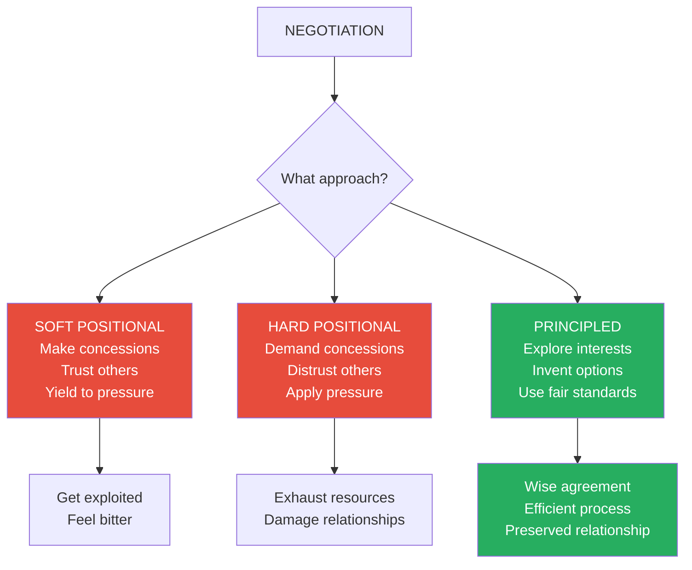
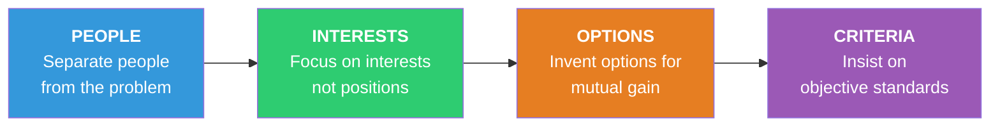
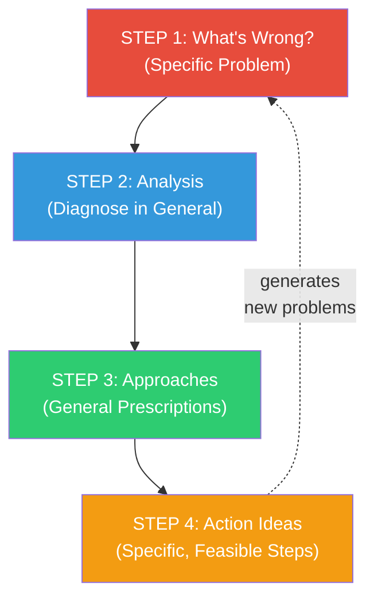
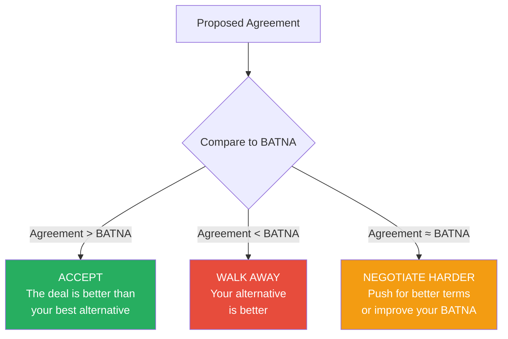
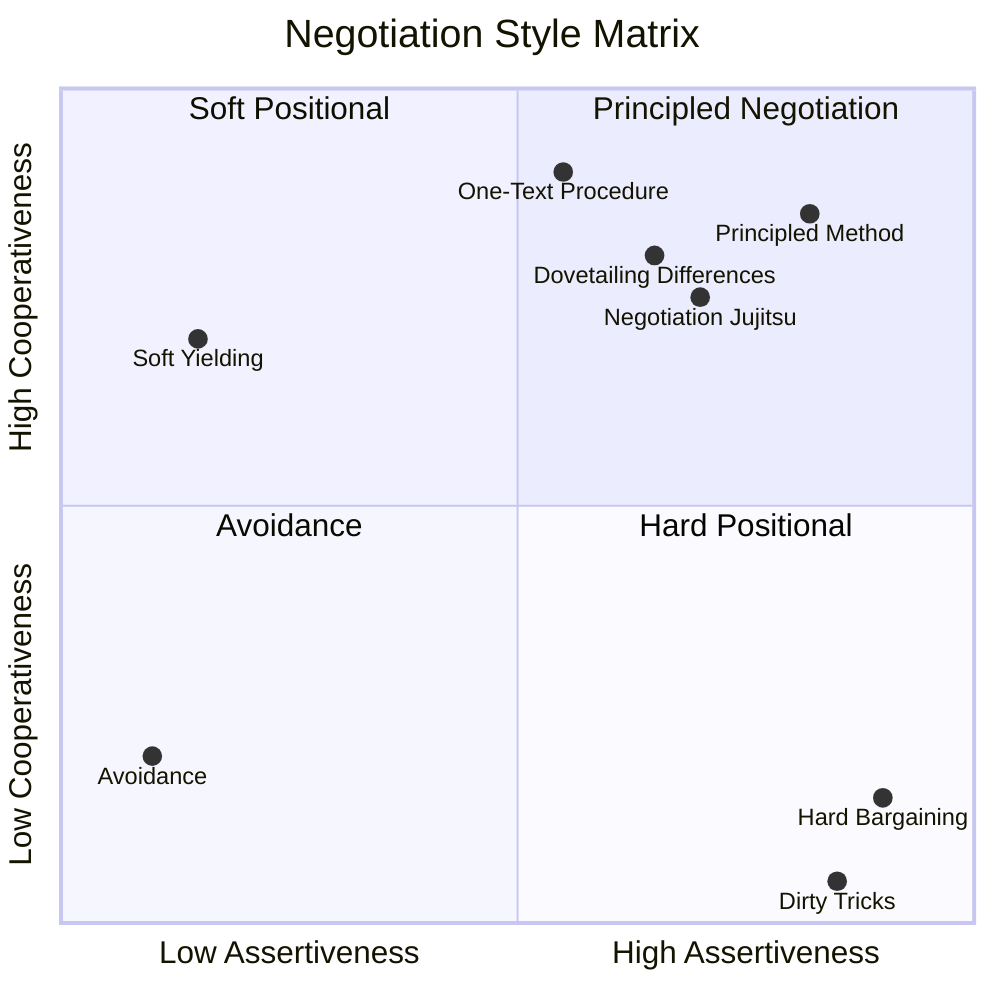
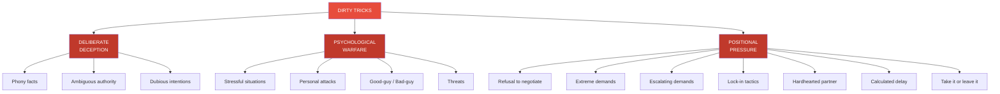
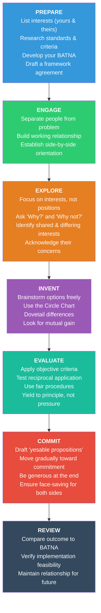

# Getting to Yes — Roger Fisher & William Ury

> Every day, families, neighbours, employees, businesses, lawyers, and nations face the same dilemma: how to get to yes without going to war. Roger Fisher and William Ury — working at the Harvard Negotiation Project since 1977 — developed a method called **principled negotiation** that resolves this dilemma. Most people see only two options: be soft (make concessions, preserve the relationship, risk being exploited) or be hard (demand concessions, apply pressure, damage the relationship). Fisher and Ury offer a third way that is neither soft nor hard but both simultaneously — hard on the merits, soft on the people. The method rests on four pillars: separate the people from the problem, focus on interests not positions, invent options for mutual gain, and insist on using objective criteria. It was tested in settings ranging from Middle East peace negotiations and nuclear arms control to landlord-tenant disputes and salary negotiations. First published in 1981, it became the most influential negotiation book ever written — the foundation that every subsequent negotiation thinker either builds upon or argues against. Whether you are negotiating a raise, settling a lawsuit, buying a house, or mediating an international crisis, this book provides the operating system.

---

## About the Authors

- *Roger Fisher* taught negotiation at Harvard Law School as Williston Professor of Law and directed the Harvard Negotiation Project
  - Served in World War II with the U.S. Army Air Force, worked with the Marshall Plan in Paris, and practised law in Washington D.C.
  - Originated and executive-edited the award-winning television series *The Advocates*
  - Consulted with governments, corporations, and individuals on conflict through Conflict Management, Inc.
- *William Ury* served as Director of the Negotiation Network at Harvard University and Associate Director of the Harvard Negotiation Project
  - Worked as consultant and third party in disputes from Palestinian-Israeli conflict to U.S.-Soviet arms control to Kentucky coal mine labour disputes
  - Educated in Switzerland with degrees from Yale in Linguistics and Harvard in Anthropology
- *Bruce Patton* — Deputy Director of the Harvard Negotiation Project, elevated from editor of the first edition to full co-author of the second
  - Taught negotiation to diplomats and corporate executives worldwide
- The three have collaborated since 1977, and their method emerged from years of working with practitioners, testing ideas on lawyers, businessmen, judges, diplomats, military officers, coal miners, and oil executives

---

## The Big Idea

- *Most negotiations fail because people bargain over positions rather than solving problems together*
- There are three ways to negotiate — and most people only know the first two:

| Approach | Philosophy | Typical Moves | Result |
|----------|-----------|--------------|--------|
| **Soft positional** | Make concessions, trust the other side, yield to avoid conflict | Change position easily, make offers, accept one-sided losses, search for a single answer they will accept | You get exploited |
| **Hard positional** | Demand concessions, distrust, apply pressure, hold firm | Dig into position, make threats, demand one-sided gains, search for the single answer you will accept | Exhaustion, damaged relationships |
| **Principled** | Decide issues on merits, explore interests, use fair standards | Explore interests, invent options, yield to principle not pressure, reason and be open to reason | Wise agreements, preserved relationships |

- <b style="color: #2980b9">Principled negotiation</b> is the method developed at the Harvard Negotiation Project — it changes the game entirely
- It rests on <b style="color: #2980b9">four pillars</b>:
  - **People** — Separate the people from the problem
  - **Interests** — Focus on interests, not positions
  - **Options** — Generate a variety of possibilities before deciding what to do
  - **Criteria** — Insist that the result be based on some objective standard
- <b style="color: #27ae60">The method is hard on the merits, soft on the people</b> — it employs no tricks and no posturing
- It shows you how to obtain what you are entitled to and still be decent
- <b style="color: #e74c3c">Positional bargaining</b> fails on all three criteria by which any negotiation method should be judged:
  - It produces **unwise agreements** (mechanical splitting rather than crafted solutions)
  - It is **inefficient** (extreme positions and small concessions waste time)
  - It **endangers relationships** (contest of wills breeds resentment)
- The principled alternative works whether there is one issue or many, two parties or a hundred, whether the other side is experienced or inexperienced, hard or friendly
- <b style="color: #27ae60">If the other side learns this method, it does not become harder to use — it becomes easier</b>
- This is the crucial test of any negotiation strategy: does it work only when the other side doesn't know about it (like a trick), or does it work better when both sides use it (like a system)?
- Principled negotiation is a system — one that improves with adoption
- If both sides focus on interests, the search space for solutions expands dramatically
- If both sides brainstorm options, creativity compounds
- If both sides appeal to objective criteria, agreement becomes nearly frictionless

The four pillars apply across all three stages of negotiation — analysis (diagnosing the situation), planning (generating ideas), and discussion (communicating back and forth toward agreement).

Principled negotiation scores highest on nearly every dimension — the only area where it deliberately avoids dominance is pressure, which it replaces with objective criteria and reasoning.

---

## How the Four Pillars Work Together

- The four pillars are not sequential steps — they are four simultaneous lenses applied throughout the negotiation
- In the **analysis stage**, you diagnose: What are the people problems (perceptions, emotions, communication)? What are the interests on each side? What options are already on the table? What criteria have been suggested?
- In the **planning stage**, you generate: How will you handle people problems? Which interests matter most? What are realistic objectives? What additional options and criteria can you prepare?
- In the **discussion stage**, you communicate: Acknowledge differences in perception, address feelings of frustration and anger, understand each other's interests, jointly generate mutually advantageous options, and seek agreement on objective standards

| Stage | People | Interests | Options | Criteria |
|-------|--------|-----------|---------|----------|
| **Analysis** | Identify perception gaps, emotions, communication failures | List interests on both sides; rank by importance | Note options already proposed | Identify criteria already suggested |
| **Planning** | Plan how to address people problems without concessions | Determine which interests to raise and when | Generate creative options using brainstorming and Circle Chart | Research precedents, standards, and fair procedures |
| **Discussion** | Acknowledge emotions, correct misperceptions, listen actively | Share your interests; ask about theirs; find shared ground | Present options as joint exploration; ask for criticism | Frame each issue as a search for fair standards; yield to principle only |

People and Criteria dominate the Discussion stage where human dynamics and fair standards converge, while Interests peak during Planning when you determine which needs to prioritize.

> [!tip] The Method's Superpower
> Principled negotiation is an all-purpose strategy. Unlike positional bargaining, it does not require matching the other side's approach. You can use it unilaterally. And if the other side also uses it, the negotiation becomes even more efficient and creative.

---

## Key Concepts at a Glance

| Concept | One-line summary |
|---------|-----------------|
| **Principled Negotiation** | Decide issues on merits, not through positional haggling — the book's core method |
| **Positional Bargaining** | Taking a position, arguing for it, making concessions — the default approach that fails |
| **The Four Pillars** | People, Interests, Options, Criteria — the irreducible framework |
| **BATNA** | Best Alternative to a Negotiated Agreement — the only valid measure for evaluating any deal |
| **Separate People from Problem** | Deal with human beings as humans and with the problem on its merits — never trade one for the other |
| **Interests vs. Positions** | Your position is what you decided; your interests are why — multiple positions can satisfy the same interest |
| **Invent Options for Mutual Gain** | Brainstorm first, evaluate later; expand the pie before dividing it |
| **Objective Criteria** | Fair standards and fair procedures independent of either side's will |
| **The People Problem Trinity** | Perception, Emotion, Communication — all people problems fall into these three categories |
| **Negotiation Jujitsu** | Don't push back — sidestep attacks and redirect energy toward the problem |
| **One-Text Procedure** | A mediator drafts, collects criticism, improves iteratively — used at Camp David with 23 drafts |
| **Dovetailing Differences** | Differences in interests, beliefs, time horizons, and risk create building blocks for agreement |
| **The Circle Chart** | Problem → Diagnosis → Prescription → Action — a method for generating creative options |
| **Trip Wire** | An early-warning threshold below your BATNA that triggers reassessment before you accept a bad deal |
| **Dirty Tricks** | Three categories: deliberate deception, psychological warfare, positional pressure tactics |
| **Six Sources of Power** | Relationship, interests, options, legitimacy, BATNA, and commitment |

---

## Part I — The Problem: Don't Bargain Over Positions

- *Whether a negotiation concerns a contract, a family quarrel, or a peace settlement, people routinely engage in positional bargaining* — each side takes a position, argues for it, and makes concessions to reach a compromise
- Any negotiation method should be judged by three criteria:
  - Does it produce a <b style="color: #2980b9">wise agreement</b> if agreement is possible?
  - Is it <b style="color: #2980b9">efficient</b>?
  - Does it <b style="color: #2980b9">improve or at least not damage the relationship</b>?
- Positional bargaining fails on all three

### Positional Bargaining Produces Unwise Agreements

- The more you clarify and defend your position, the more committed you become to it
- Your ego becomes identified with your position — you develop a new interest in "saving face"
- Agreement becomes less likely, and any agreement reached reflects a mechanical splitting of the difference rather than a solution crafted to meet legitimate interests
- As more attention is paid to positions, less attention is devoted to meeting the underlying concerns of the parties

#### The Soft vs. Hard vs. Principled Comparison

| Dimension | Soft Positional | Hard Positional | Principled |
|-----------|----------------|-----------------|-----------|
| **Participants are...** | Friends | Adversaries | Problem-solvers |
| **Goal** | Agreement | Victory | A wise outcome, efficiently and amicably |
| **Make concessions to...** | Cultivate the relationship | Demand concessions as price of relationship | Separate the people from the problem |
| **Approach to trust** | Trust the other side | Distrust the other side | Proceed independent of trust |
| **Position** | Change easily | Dig in | Focus on interests, not positions |
| **Offers** | Make offers | Make threats | Explore interests |
| **Bottom line** | Disclose | Mislead about | Avoid having one — use BATNA |
| **Concessions** | Accept one-sided losses for agreement | Demand one-sided gains for agreement | Invent options for mutual gain |
| **Search for** | The single answer they will accept | The single answer you will accept | Many options; decide later |
| **Insist on** | Agreement | Your position | Using objective criteria |
| **Yield to** | Pressure | Nothing (apply pressure) | Principle, never pressure |

> [!example] The Nuclear Test Ban Collapse
> Under President Kennedy, the U.S. and Soviet Union negotiated a comprehensive ban on nuclear testing. A critical question arose: how many on-site inspections per year? The Soviets agreed to three; the U.S. insisted on no fewer than ten. The talks broke down — over positions — despite the fact that no one had defined what an "inspection" even meant. Was it one person for one day, or a hundred people for a month? The parties never attempted to design an inspection procedure that reconciled the U.S. interest in verification with both countries' desire for minimal intrusion.

### Positional Bargaining Is Inefficient

- Starting with extreme positions and making small concessions creates incentives that stall settlement
- Each decision to yield creates pressure to yield further, so negotiators drag their feet
- Threatening to walk out, stonewalling, and other stalling tactics become commonplace
- The more extreme the opening positions and the smaller the concessions, the more time it takes

### Positional Bargaining Endangers Relationships

- <b style="color: #e74c3c">It becomes a contest of will</b> — each side tries to force the other to change through sheer stubbornness
- Anger and resentment result as one side sees itself bending to the rigid will of the other
- Commercial enterprises that have done business for years may part company
- Bitter feelings from one such encounter may last a lifetime

### With Many Parties, It Gets Worse

- If 150 countries are negotiating, positional bargaining is next to impossible
- It takes all to say yes, but only one to say no
- Reciprocal concessions are difficult: to whom do you make a concession?
- Even thousands of bilateral deals would fall short of a multilateral agreement
- Coalitions form around symbolic rather than substantive shared interests — at the United Nations, negotiations occur between "the" North and "the" South, or "the" East and "the" West
- Because there are many members in a group, it becomes more difficult to develop a common position
- Once a group has painfully agreed upon a position, changing it becomes nearly impossible
- Altering a position proves equally difficult when additional participants are higher authorities who must give approval despite being absent from the table
- <b style="color: #2980b9">This is precisely where principled negotiation and the one-text procedure become essential</b> — they allow large groups to move toward agreement without the impossibility of multilateral positional bargaining

### Being Soft Is No Answer

- The soft negotiator sees the other side as friends, emphasises agreement over victory, makes concessions readily
- The soft negotiating game emphasises building and maintaining a relationship — within families and among friends, much negotiation takes place this way
- The process tends to be efficient (producing results quickly) but may not be wise

> [!example] The O. Henry Gift
> The results of soft negotiation may echo O. Henry's story of the impoverished couple: the loving wife sells her hair to buy a chain for her husband's watch, while the unknowing husband sells his watch to buy combs for his wife's hair. Both sacrificed for the relationship — and both got nothing they could use. Any negotiation primarily concerned with the relationship runs the risk of producing a sloppy agreement.

- <b style="color: #e74c3c">In positional bargaining, a hard game always dominates a soft one</b>
  - If the hard bargainer insists on concessions and makes threats while the soft bargainer yields to avoid confrontation, the game is biased toward the hard player
  - The result: an agreement favouring the hard player, and a soft player who probably loses their shirt

### The Third Way: Change the Game

- <b style="color: #27ae60">Every negotiation takes place at two levels</b> — substance and procedure
  - Level 1: What are we negotiating about? (salary, rent, territory)
  - Level 2: How will we negotiate? (soft, hard, or principled)
- This second negotiation is a "meta-game" — a game about the game
- Each move you make is not only a move about substance — it also helps structure the rules of the game you are playing
- Your move may serve to keep negotiations within an ongoing mode, or it may constitute a game-changing move
- Most people never consciously address the second level — only when dealing with someone from a markedly different cultural background are you likely to see the necessity of establishing some accepted process
- But whether consciously or not, you are negotiating procedural rules with every move you make
- The answer to "soft or hard?" is <b style="color: #27ae60">neither — change the game</b>
- You can change the game simply by starting to play a new one — by using principled negotiation, you invite the other side to join you
- Principled negotiation can be boiled down to four basic points:

- These four points apply across three stages: **analysis** (diagnosing), **planning** (generating ideas), **discussion** (communicating toward agreement)
- The result: a gradual consensus on a joint decision, reached efficiently, without digging into positions only to dig yourself out

#### The Three Stages of Principled Negotiation

**Stage 1: Analysis** — diagnosing the situation, gathering information, organising it
- What are the people problems? (partisan perceptions, hostile emotions, unclear communication)
- What are your interests? What are theirs?
- What options are already on the table?
- What criteria have been suggested as a basis for agreement?

**Stage 2: Planning** — dealing with the same four elements to generate ideas and decide what to do
- How do you propose to handle the people problems?
- Of your interests, which are most important? What are realistic objectives?
- What additional options can you generate?
- What additional criteria for deciding among them?

**Stage 3: Discussion** — communicating back and forth, looking toward agreement
- Differences in perception, frustration, anger, and communication difficulties can be acknowledged and addressed
- Each side comes to understand the other's interests
- Both jointly generate mutually advantageous options
- Both seek agreement on objective standards for resolving opposed interests

> [!tip] The Core Insight
> The method of principled negotiation is an all-purpose strategy. Unlike almost all other strategies, if the other side learns this one, it does not become more difficult to use — it becomes easier.

---

## Part II — The Method

### Pillar 1: Separate the PEOPLE from the Problem

- *A basic fact about negotiation, easy to forget in corporate and international transactions, is that you are dealing not with abstract representatives of "the other side" but with human beings*
- They have emotions, deeply held values, different backgrounds — and they are unpredictable
- The human aspect can be either helpful or disastrous
- <b style="color: #e74c3c">Failing to deal with others sensitively as human beings prone to human reactions can be catastrophic</b>

> [!example] The Foreman and Jones
> A union leader asks who called the walkout. Jones steps forward: "It was that bum foreman Campbell. He sent me out as a replacement five times in two weeks. He's got it in for me." Later, the union leader confronts Campbell, who replies: "I pick Jones because he's the best. I send him on replacement only when it's a key man missing. I never knew he objected — I thought he liked the responsibility." Same situation, two completely different perceptions. Neither was lying. Neither was irrational. They simply saw the same events through different lenses. Most conflicts begin this way.

#### Every Negotiator Has Two Kinds of Interests

- **Substantive interests** — the deal itself (price, terms, outcomes)
- **Relationship interests** — maintaining the working relationship for future interactions
- An antiques dealer wants both to make a profit and to turn the customer into a regular one
- Most negotiations take place in the context of an ongoing relationship where each negotiation should help rather than hinder future relations
- The ongoing relationship is often far more important than any particular negotiation

> [!example] The Insurance Commissioner
> A lawyer visits a state insurance commissioner to discuss problems with a regulation. Before he can explain, the Commissioner interrupts: "Are you saying I made a mistake? Are you saying I'm unfair?" The Commissioner promised the public he'd end dangerous products, and his regulations have worked. He sees the lawyer's visit as an attack on his competence and integrity. The lawyer faces a dilemma: press the point and make the Commissioner angry (damaging the relationship that matters for future business in the state), or drop the matter (even though the regulation is genuinely unfair). Positional bargaining forces this choice. Principled negotiation would separate the relationship from the substance — addressing the Commissioner's concern for his reputation while exploring whether the regulation has had unintended consequences.

- <b style="color: #e74c3c">The relationship tends to become entangled with the problem</b>
  - A statement like "the kitchen is a mess" may be intended to identify a problem but is heard as a personal attack
  - Egos get involved in substantive positions
  - Positional bargaining puts relationship and substance in direct conflict
- <b style="color: #27ae60">The solution: deal with the relationship and the substance separately, each on its own merits</b>
  - Base the relationship on accurate perceptions, clear communication, appropriate emotions
  - Don't try to solve people problems with substantive concessions

#### The People Problem Trinity: Perception, Emotion, Communication

**PERCEPTION — Their thinking is the problem**

- Conflict lies not in objective reality but in people's heads
- Truth is simply one more argument — perhaps a good one, perhaps not — for dealing with the difference
- Fears, even if ill-founded, are real fears and need to be dealt with
- Hopes, even if unrealistic, may cause a war
- Facts, even if established, may do nothing to solve the problem
- Two parties may agree that one lost the watch and the other found it, but still disagree over who should get it
- As useful as looking for objective reality can be, it is ultimately the reality as each side sees it that constitutes the problem and opens the way to a solution
- People tend to see what they want to see — out of a mass of detailed information, they pick out facts that confirm their prior perceptions and disregard those that challenge them
- <b style="color: #2980b9">The ability to see the situation as the other side sees it is one of the most important skills a negotiator can possess</b>
  - It is not enough to know they see things differently — you need to understand empathetically the power of their viewpoint and feel the emotional force with which they believe in it
  - It is not enough to study them like beetles under a microscope — you need to know what it feels like to be a beetle
  - You may see a glass half full of cool water; your spouse may see a dirty, half-empty glass about to cause a ring on the mahogany finish
- Key techniques:
  - <b style="color: #2980b9">Put yourself in their shoes</b> — the most important skill a negotiator can possess; understand empathetically the power of their viewpoint
  - Be prepared to withhold judgment as you "try on" their views — they may believe their views are "right" as strongly as you believe yours
  - <b style="color: #2980b9">Don't deduce their intentions from your fears</b> — the most suspicious interpretation is not necessarily correct

> [!example] The Late Night Ride
> A story from the New York Times: "They met in a bar, where he offered her a ride home. He took her down unfamiliar streets. He said it was a shortcut. He got her home so fast she caught the 10 o'clock news." Why is the ending so surprising? Because we made an assumption based on our fears. It is all too easy to put the worst interpretation on what the other side says or does — and the cost is that fresh ideas toward agreement are spurned and subtle changes of position are ignored.

  - <b style="color: #2980b9">Don't blame them for your problem</b> — even justified blame is counterproductive; it makes them defensive
    - Instead of "Your company is totally unreliable — every time you service our generator, you do a lousy job," say: "Our generator has broken down again. That's three times this month. The first time it was out for a week. I want your advice on how we can minimise our risk of breakdown. Should we change service companies, sue the manufacturer, or what?"
    - Separate the symptoms from the person you are talking to
  - <b style="color: #2980b9">Discuss each other's perceptions</b> — make differing views explicit in a frank, non-blaming manner
    - Communicating things you are willing to say that they would like to hear can be one of the best investments a negotiator can make

> [!example] Technology Transfer at the Law of the Sea
> Developing nations expressed keen interest in exchanging technology — they wanted advanced technical knowledge for deep-seabed mining from industrialised nations. The United States and other developed countries saw no difficulty satisfying this desire — and therefore treated the issue as unimportant. This was a grave mistake. By devoting substantial time to working out practical arrangements for transferring technology, they could have made their offer far more credible and attractive to developing nations. By dismissing the issue, they gave up a low-cost opportunity to provide an impressive achievement and a real incentive to reach agreement on other issues. What seems unimportant to you may be crucial to them.

> [!example] Tenant and Landlady — Contrasting Perceptions
> The same apartment renewal looks entirely different from each side:
>
> **Tenant's view:** The rent is already too high. Everything is going up — I can't afford to pay more. The apartment needs painting. I know people who pay less for comparable apartments. Young people like me can't afford high rent. The rent should be low because the neighbourhood has run down. I am a desirable tenant — no pets, no noise. I always pay rent when asked. She makes a fortune from this overpriced apartment.
>
> **Landlady's view:** The rent hasn't been increased for a long time. With inflation, everything costs me more. He wears out the apartment. I know people who pay more for comparable apartments. Young, single people tend to be noisy and hard on the apartment. He should pay more because it's a good building. His hi-fi set drives me crazy. He never pays the rent until I ask for it. I get a lousy return on my investment.
>
> Understanding each other's thinking is not the same as agreeing with it — but reducing the area of conflict requires seeing through their eyes first.

  - <b style="color: #2980b9">Look for opportunities to act inconsistently with their perceptions</b> — send a message different from what they expect

> [!example] Sadat's Jerusalem Visit
> In November 1977, Egyptian President Sadat flew to Jerusalem — the capital of his enemy, a disputed capital not even recognised by the United States. The Israelis had seen Egypt as the country that launched a surprise attack four years before. Instead of acting as an enemy, Sadat acted as a partner. Without this dramatic move, it is hard to imagine the eventual Egyptian-Israeli peace treaty. The most powerful way to change someone's perception is to act inconsistently with it.

  - <b style="color: #2980b9">Give them a stake in the outcome by involving them in the process</b> — people who participate in drafting are far more likely to accept the result
    - This is precisely what people tend not to do — your instinct is to leave the hard part until last: "Let's be sure we have the whole thing worked out before we approach the Commissioner"
    - The Commissioner is much more likely to agree to a revision if he feels he had a part in drafting it
    - A revision becomes just one more small step in a long process rather than someone's attempt to butcher his completed product

> [!example] South African Pass Laws
> White moderates in South Africa were trying to abolish discriminatory pass laws. How? By meeting in an all-white parliamentary committee to discuss proposals. However meritorious those proposals might prove, they would be insufficient — not because of their substance, but because they were the product of a process in which no blacks were included. The blacks would hear: "We superior whites are going to figure out how to solve your problems." It would be the "white man's burden" all over again — which was the problem to start with.

    - Even if terms seem favourable, the other side may reject them out of suspicion born from being excluded from the drafting process
    - To involve the other side: get them involved early, ask their advice, give credit generously — the feeling of participation is perhaps the single most important factor in whether a negotiator accepts a proposal
    - <b style="color: #27ae60">In a sense, the process is the product</b>

  - <b style="color: #2980b9">Face-saving: make proposals consistent with their values</b> — a person needs to reconcile any agreement with their principles and past words
    - The judicial process concerns itself with the same subject — when a judge writes an opinion, he is saving face for himself, the judicial system, and the parties
    - Often people hold out not because a proposal is inherently unacceptable but because they want to avoid the feeling of backing down
    - If the substance can be rephrased so it seems like a fair outcome, they will accept it

> [!example] The Mayor's Campaign Promise
> Terms negotiated between a major city and its Hispanic community on municipal jobs were unacceptable to the mayor — until the agreement was withdrawn and the mayor was allowed to announce the same terms as his own decision, carrying out a campaign promise. Same substance, different framing, different result.

**EMOTION — Feelings may be more important than talk**

- In a bitter dispute, parties may be more ready for battle than for cooperative problem-solving
- People often come to a negotiation realising that the stakes are high and feeling threatened
- Emotions on one side generate emotions on the other — fear breeds anger, and anger breeds fear
- Emotions may quickly bring a negotiation to an impasse or an end
- Key techniques:
  - <b style="color: #2980b9">First recognise and understand emotions — theirs and yours</b>
  - Look at yourself: are you feeling nervous? Is your stomach upset? Are you angry?
  - Listen to them and get a sense of their emotions — you may find it useful to write down what you feel and then how you would like to feel
  - In dealing with negotiators who represent organisations, remember: they too have personal feelings, fears, hopes, and dreams; their careers may be at stake; there are issues on which they are particularly sensitive
  - Constituents have emotions too — and often a more simplistic, adversarial view
  - Ask yourself what is producing the emotions — past grievances? personal problems? spillover from other issues?
  - In the Middle East, both Israelis and Palestinians feel a threat to their existence as peoples — this makes it almost impossible to discuss even practical issues like water distribution
  - <b style="color: #2980b9">Make emotions explicit and acknowledge them as legitimate</b> — "You know, the people on our side feel we have been mistreated and are very upset. Rational or not, that is our concern. Do the people on your side feel the same way?"
  - Making feelings an explicit focus will underscore the seriousness of the problem and make the negotiations more "pro-active" rather than reactive
  - Freed from unexpressed emotions, people become more likely to work on the problem
  - <b style="color: #2980b9">Allow the other side to let off steam</b> — listen quietly without responding to attacks; the best strategy is to let them speak their last word
  - Letting off steam makes it easier to talk rationally later
  - If a negotiator makes an angry speech to their constituency, they may then have a freer hand in the actual negotiation — having proven they are not "soft"
  - Instead of interrupting or walking out, sit there and let them pour out their grievances — offer little support to the inflammatory substance, give every encouragement to speak themselves out
  - <b style="color: #2980b9">Don't react to emotional outbursts</b> — a steel industry committee adopted the rule that only one person could get angry at a time; this made it legitimate for others not to respond stormily and made outbursts themselves more legitimate
  - Breaking the rule meant you had lost self-control — so you lose some face
  - <b style="color: #2980b9">Use symbolic gestures</b> — a note of sympathy, a statement of regret, a visit to a cemetery, delivering a small present for a grandchild, shaking hands or embracing, eating together; an apology may be the least costly and most rewarding investment you can make
  - An apology can defuse emotions effectively even when you do not acknowledge personal responsibility or admit an intention to harm

**COMMUNICATION — Without it there is no negotiation**

- Negotiation is a process of communicating back and forth for the purpose of reaching a joint decision
- Communication is never easy, even between people with enormous shared experience — couples married for thirty years still have misunderstandings every day
- Three big problems:
  - **Not talking to each other** — negotiators may play to the gallery instead, trying to trip up their negotiating partner rather than dance toward a mutually agreeable outcome
  - **Not listening** — even when talking directly, they may be too busy thinking about what to say next, how to respond, or how to please their constituency
  - **Misinterpreting** — what one says, the other may hear differently; the chance of misinterpretation is compounded by different languages and cultures

> [!example] The Persian "Compromise"
> In early 1980, U.N. Secretary General Waldheim flew to Iran to seek the release of American hostages. In Persian, the word "compromise" has only a negative meaning — "our integrity was compromised." And "mediator" suggests "meddler." When Iranian radio broadcast that Waldheim came "as a mediator to work out a compromise," his car was stoned within the hour. A single word, misunderstood across cultures, destroyed a diplomatic mission.

- Key techniques:
  - <b style="color: #2980b9">Listen actively and acknowledge what is being said</b> — the cheapest concession is letting them know they have been heard
  - Pay close attention, ask them to spell out what they mean, request that ideas be repeated if there is ambiguity
  - Make it your task while listening not to phrase a response, but to understand them as they see themselves
  - Many consider it a good tactic not to give the other side's case attention — a good negotiator does just the reverse
  - Unless you acknowledge what they say and demonstrate understanding, they may believe you haven't heard them — then instead of listening to your point, they'll be considering how to restate theirs
  - Restate their case positively: "You have a strong case. Let me see if I can explain it. Here's the way it strikes me..."
  - <b style="color: #27ae60">Understanding is not agreeing</b> — one can at the same time understand perfectly and disagree completely
  - But unless you convince them you grasp their view, you cannot explain yours
  - Once you have made their case for them, then come back with the problems you find in their proposal — this maximises the chance of constructive dialogue
  - <b style="color: #2980b9">Speak to be understood</b> — talk to the other side, not the gallery; you are not in a debate or a trial
  - Try putting yourself in the role of two judges trying to reach agreement — it is clearly unpersuasive to blame the other party or engage in name-calling
  - To reduce the distracting effect of audiences, establish private and confidential means of communicating — limit group size
  - In the 1954 Trieste negotiations, little progress was made until the three principal negotiators abandoned their large delegations and met alone and informally in a private house
  - <b style="color: #2980b9">Speak about yourself, not about them</b> — "I feel let down" instead of "you broke your word"; "we feel discriminated against" rather than "you're a racist"
  - A statement about how you feel is difficult to challenge — you convey the same information without provoking a defensive reaction
  - <b style="color: #2980b9">Speak for a purpose</b> — sometimes full disclosure makes agreement harder, not easier
  - Before making a significant statement, know what you want to communicate and what purpose it will serve

#### Prevention Works Best

- Build a personal relationship with the other side before the negotiation begins
- Get to know them — find out about their likes and dislikes, meet informally
- Benjamin Franklin's favourite technique: ask an adversary if he could borrow a book — flattering them and creating a sense of reciprocity
- The time to develop such a relationship is before the negotiation begins — try arriving early to chat, linger after it ends
- <b style="color: #27ae60">Face the problem, not the people</b> — think of yourselves as partners in a side-by-side search for a fair agreement
  - Like two shipwrecked sailors in a lifeboat quarrelling over limited rations — to survive, they must disentangle objective problems from people, identify each person's needs, and treat meeting those needs as a shared problem along with other shared problems like keeping watch, catching rainwater, and getting to shore
  - Seeing themselves as engaged in side-by-side efforts, the sailors become better able to reconcile both conflicting and shared interests
  - You might raise this explicitly: "Look, we're both lawyers. Unless we try to satisfy your interests, we are hardly likely to reach an agreement that satisfies mine, and vice versa. Let's look together at how to satisfy our collective interests."
  - Alternatively, start treating the negotiation as a side-by-side process and by your actions make it desirable for them to join in
  - Sit literally on the same side of the table
  - Have the contract, map, or blank pad in front of both of you — depicting the shared problem
  - It helps to sit literally on the same side, even if your relationship is precarious — try to structure the negotiation as a side-by-side activity in which both of you, with your differing interests and perceptions, jointly face a common task
- To help them change from face-to-face to side-by-side: "Look, we're both lawyers. Unless we try to satisfy your interests, we are hardly likely to reach an agreement that satisfies mine, and vice versa. Let's look together at the problem of how to satisfy our collective interests."
- Separating the people from the problem is not something you do once — you have to keep working at it

#### Summary of People Techniques

| Problem Area | Key Techniques |
|-------------|---------------|
| **Perception** | Put yourself in their shoes; don't deduce intentions from fears; don't blame them; discuss perceptions openly; act inconsistently with their expectations; involve them in the process; enable face-saving |
| **Emotion** | Recognise emotions on both sides; make them explicit; allow steam to be released; don't react to outbursts; use symbolic gestures; remember that an apology costs almost nothing |
| **Communication** | Listen actively and acknowledge; speak to them not the gallery; speak about yourself not them; speak for a purpose; sometimes saying less is more |
| **Prevention** | Build relationships before problems arise; sit side by side; frame the process as joint problem-solving |

---

### Pillar 2: Focus on INTERESTS, Not Positions

- *Consider the story of two men quarrelling in a library — one wants the window open, the other wants it closed*

> [!example] The Library Window
> Two men bicker about how far to leave a window open — a crack, halfway, three-quarters. No solution satisfies both. The librarian asks one why he wants it open: "To get some fresh air." She asks the other why he wants it closed: "To avoid the draft." She opens wide a window in the next room — bringing in fresh air without a draft. The librarian looked behind positions to interests, and found a solution neither man could have invented while arguing about the window.

#### Interests Define the Problem

- The basic problem in a negotiation lies not in conflicting positions but in the conflict between each side's needs, desires, concerns, and fears
- <b style="color: #2980b9">Your position is something you have decided upon — your interests are what caused you to so decide</b>
- For every interest there usually exist several possible positions that could satisfy it

> [!example] The Sinai Solution
> In 1978, Egypt and Israel sat down at Camp David with incompatible positions: Israel insisted on keeping some of the Sinai; Egypt insisted on full return. Maps showing possible boundary lines were drawn and rejected. Looking behind positions revealed that Israel's interest was security (no Egyptian tanks near the border) and Egypt's interest was sovereignty (the Sinai had been Egyptian since the Pharaohs). The solution: full Egyptian sovereignty with demilitarisation. The Egyptian flag would fly everywhere, but Egyptian tanks would be nowhere near Israel. A creative reconciliation that no amount of positional compromise could have produced.

#### Behind Opposed Positions Lie Shared and Compatible Interests

- We tend to assume that because their positions oppose ours, their interests must too
- A close examination reveals many more shared or compatible interests than conflicting ones
- A tenant and landlord both want stability, a well-maintained apartment, and a good relationship
- <b style="color: #27ae60">Agreement is often made possible precisely because interests differ</b>
  - You like the shoes better than the thirty dollars; the seller likes the thirty dollars better than the shoes — hence the deal
  - Differences in interests, beliefs, time preferences, forecasts, and risk aversion are the building blocks of agreement

#### How to Identify Interests

- **Ask "Why?"** — examine each position and ask what needs, hopes, fears, or desires it serves
  - "What's your basic concern, Mr. Jones, in wanting the lease to run for no more than three years?"
  - Make clear you are asking not for justification but for understanding
- **Ask "Why not?"** — identify the basic decision you're asking the other side to make, then figure out why they haven't made it
  - Construct their presently perceived choice: what are the consequences of saying yes vs. no?
  - The first question: whose decision do I want to affect?
  - The second question: what decision do they now see you asking them to make?

> [!example] The Iranian Hostage Choice
> During the 1980 hostage crisis, a typical Iranian student leader's choice looked roughly like this: agreeing to release the hostages meant looking weak, losing status, and getting no clear benefit. Refusing meant being a hero, getting on TV, and keeping leverage. From that perspective, it was rational to keep holding the hostages day after day, waiting for a more promising moment. Understanding the other side's choice is the key to influencing it.

- **Realise each side has multiple interests** — not just one; and different people on the same "side" may have different interests
  - President Johnson lumped all of North Vietnam, the Vietcong, and their Soviet and Chinese advisers into "he" — making effective influence impossible
  - In a baseball salary negotiation, the general manager was insisting $500,000 was too much — not because it was unjustifiable, but because the club owners were in financial difficulties they didn't want public
  - Every negotiator has a constituency whose interests they must consider
- **The most powerful interests are basic human needs:**
  - Security
  - Economic well-being
  - A sense of belonging
  - Recognition
  - Control over one's life
  - These are fundamental but easy to overlook — even in monetary negotiations, look for needs behind the money
- **Make a list** — write down interests as they occur to you, rank them, and use the list to generate ideas

> [!example] The U.S.-Mexico Gas Negotiation
> The U.S. wanted a low price for Mexican natural gas. The U.S. Secretary of Energy refused to approve a price increase, assuming Mexico would simply lower its asking price since it had no other buyer. But Mexico had a strong interest not just in a good price but in being treated with respect and equality. The U.S. action seemed like one more attempt to bully Mexico. Rather than sell their gas, the Mexican government began to burn it off. Any chance of agreement on a lower price became politically impossible. Ignoring the human need for recognition destroyed the deal.

#### Talking About Interests

- <b style="color: #2980b9">Make your interests come alive</b> — be specific; concrete details add credibility and impact
  - Not "your trucks are dangerous" but "three times this week a child was almost hit — Tuesday at 8:30 your red gravel truck, going forty miles per hour, swerved and barely missed seven-year-old Loretta Johnson"
- <b style="color: #2980b9">Acknowledge their interests as part of the problem</b> — people listen better when they feel understood
- <b style="color: #2980b9">Put the problem before your answer</b> — give reasons first, conclusions later; if you lead with your proposal, they stop listening
- <b style="color: #2980b9">Look forward, not back</b> — instead of arguing about who caused the problem, ask "who should do what tomorrow?"
- <b style="color: #2980b9">Be concrete but flexible</b> — think in terms of "illustrative specificity"; present multiple options, not a single demand
- <b style="color: #27ae60">Be hard on the problem, soft on the people</b> — commit to your interests, not your positions; fight vigorously for your concerns while treating the other side with respect
  - Give positive support to the human beings equal in strength to the vigour with which you emphasise the problem
  - This combination creates cognitive dissonance — the other side dissociates from the problem and joins you in solving it

---

### Pillar 3: Invent OPTIONS for Mutual Gain

- *All too often, negotiators end up like the proverbial sisters who quarrelled over an orange*

> [!example] The Orange Sisters
> After they finally agreed to divide the orange in half, the first sister ate the fruit and threw away the peel, while the other threw away the fruit and used the peel for baking a cake. Both could have had everything they wanted. This is the cost of failing to invent options — negotiators "leave money on the table."

#### Four Obstacles to Inventing Options

1. <b style="color: #e74c3c">Premature judgment</b> — nothing is so harmful to inventing as a critical sense waiting to pounce; judgment hinders imagination
2. <b style="color: #e74c3c">Searching for the single answer</b> — looking for "the" solution short-circuits wiser decision-making from a broad range of possibilities
3. <b style="color: #e74c3c">The assumption of a fixed pie</b> — "either I get it or you do"; this zero-sum thinking ignores joint gains
4. <b style="color: #e74c3c">Thinking that "solving their problem is their problem"</b> — shortsighted self-concern leads to only partisan solutions

#### Four Prescriptions for Inventing Options

**1. Separate inventing from deciding**

- <b style="color: #27ae60">Invent first, decide later</b> — the creative act must be separated from the critical one
- Use brainstorming sessions with these rules:
  - Define your purpose beforehand
  - Choose 5-8 participants
  - Change the environment — make it feel different from a regular meeting; select a time and place distinguishing the session from regular discussions; the more different it seems, the easier it is for participants to suspend judgment
  - Design an informal atmosphere — drinks, a vacation lodge, taking off ties and jackets, first names
  - Choose a facilitator — someone to keep the meeting on track, ensure everyone speaks, enforce ground rules, and stimulate discussion
  - Postpone ALL criticism — wild ideas are explicitly encouraged
  - Seat participants side by side facing the problem — physical positioning reinforces the mental attitude of tackling a common problem together; people facing each other tend to argue; people facing a blackboard tend to respond to the problem
  - Clarify ground rules including the no-criticism rule — if ideas are shot down unless they appeal to everyone, the implicit goal becomes advancing an idea no one will attack; if wild ideas are encouraged, the group may generate options that no one would have previously considered
  - Make the entire session off the record; refrain from attributing ideas to any participant
  - Record ideas in full view on a blackboard or large paper — gives a tangible sense of collective achievement, reinforces the no-criticism rule, reduces repetition, stimulates new ideas
  - After brainstorming: star the most promising ideas, then improve them
    - Take one promising idea and invent ways to make it better and more realistic
    - Preface constructive criticism with: "What I like best about that idea is... Might it be better if...?"
    - Set up a time to evaluate ideas and decide which to advance in your negotiation

> [!example] The Coal Mine Brainstorm
> Union and management representatives sat around a table facing a blackboard to brainstorm ways to reduce unauthorised strikes. Ideas flew: foremen settling grievances on the spot, union meetings in the bathhouse, a 24-hour grievance procedure, joint training for foremen and union members, a union-management softball team, an annual family picnic. Many ideas would never have emerged except in a brainstorming session, and some proved effective at reducing strikes. Time spent brainstorming together is among the best-spent time in negotiation.

**2. Broaden your options**

- Don't look for the needle in the haystack — develop room within which to negotiate
- The key to wise decision-making lies in selecting from a great number and variety of options
- <b style="color: #2980b9">The Circle Chart</b> — shuttle between four types of thinking:

- Use the Circle Chart to generate options from different angles: one good idea leads to the general theory behind it, which generates more specific action ideas

> [!example] The Northern Ireland Circle Chart
> Starting with one idea — Catholic and Protestant teachers preparing a common history workbook for primary schools — you extract the general principles: "there should be common educational content," "Catholics and Protestants should work on small manageable projects," "understanding should be promoted in young children." These principles generate new ideas: a joint film project showing history through different eyes, teacher exchange programmes, common classes for primary-age children. One good option, examined for its underlying theory, generates a family of options.

- <b style="color: #2980b9">Look through the eyes of different experts</b> — how would a banker, psychiatrist, lawyer, economist, or football coach see this problem?
  - In thinking about custody of a child, look at it as an educator, a nutritionist, a doctor, a civil rights lawyer, a feminist might see it
  - Combine the Circle Chart with the expert perspective: how would each diagnose, prescribe, and act?
- **Invent agreements of different strengths** — if permanent is impossible, try provisional; if comprehensive is too much, try partial; if substantive fails, agree on procedure
  - Stronger → weaker: substantive, permanent, comprehensive, final, unconditional, binding, first-order → procedural, provisional, partial, in-principle, contingent, non-binding, second-order
  - At the very least, agree on where you disagree
- **Change the scope** — fractionate into smaller units ("How about editing the first two chapters for $120?"), or enlarge to "sweeten the pot"
  - The dispute between India and Pakistan over the Indus River waters became more amenable when the World Bank entered — parties were challenged to invent new irrigation projects funded with Bank assistance

**3. Look for mutual gain**

- <b style="color: #27ae60">Shared interests lie latent in every negotiation</b> — make them explicit and formulate them as a shared goal
- Three points about shared interests:
  - They are opportunities, not godsends — you have to make something out of them
  - Make them concrete and future-oriented
  - Stressing shared interests makes the negotiation smoother and more amicable

> [!example] Townsend Oil and Pageville
> The mayor wanted to raise the oil refinery's taxes from $1M to $2M. The company wanted to keep taxes low but was also planning to expand and attract a nearby plastics plant. Shared interest: both wanted industrial expansion and new businesses. Solution: a tax holiday for new industries, joint publicity campaigns, and reduced taxes for expanding businesses. The company saved money while filling the city's coffers.

- <b style="color: #27ae60">Dovetail differing interests</b> — "Vive la différence!"
  - Look for items of low cost to you and high benefit to them, and vice versa
  - Five types of differences to exploit:

| Difference | How it creates deals |
|-----------|---------------------|
| **Interests** | One cares about form, the other about substance |
| **Beliefs** | Each thinks they're right — both agree to arbitration, confident of victory |
| **Time value** | You care more about the present, they about the future — installment plans |
| **Forecasts** | Baseball star expects to win big; team owner disagrees — base salary + performance bonus |
| **Risk aversion** | Mining companies want low risk; international community wants revenue — low fees during investment, high fees after recovery |

- <b style="color: #2980b9">Ask for their preferences</b> — present several options equally acceptable to you and ask which they prefer, then improve that one
  - "What meets your interests better — a salary of $175,000 for four years, or $200,000 for three years?"
  - "The latter? OK, how about $180,000 for three years with a $50,000 bonus each year if performance exceeds a threshold?"
  - You want to know what is preferable, not necessarily what is acceptable
  - In this way, without anyone making a decision, you can improve a plan until you find no more joint gains
- <b style="color: #27ae60">If dovetailing had to be summed up in one sentence: look for items of low cost to you and high benefit to them, and vice versa</b>

**4. Make their decision easy**

- Success depends upon the other side making a decision you want — make it painless
- Focus on one person — the decision-maker you're dealing with
  - You cannot negotiate with an abstraction like "Houston" or "the University of California"
  - Pick one person and see how the problem looks from their point of view
  - Your role may be to strengthen their hand or give them arguments they need to persuade others
  - One British ambassador described his job as "helping my opposite number get new instructions"
- Draft a "yesable proposition" — a proposal to which "yes" is sufficient, realistic, and operational
  - If you want performance, don't add something for "negotiating room" — if you want a horse to jump a fence, don't raise the fence
  - It is never too early to start drafting — prepare multiple versions, starting with the simplest possible
- Use precedent and legitimacy to make agreement feel right
  - The other side is more likely to accept a solution that seems right in terms of being fair, legal, and honourable
  - Search for a decision or statement they may have made in a similar situation; try to base your proposal on it
- Write out how their most powerful critic might attack the decision you're asking for — then write their defence; this helps you understand their constraints
- <b style="color: #27ae60">Concentrate on offers, not threats</b> — offers are more effective and less dangerous than warnings of what will happen if they refuse
  - Making threats is not enough — people build up counter-pressure rather than yielding
  - Instead: make them aware of the consequences they can expect if they DO decide as you wish, and improve those consequences

---

### Pillar 4: Insist on Using Objective CRITERIA

- *However well you understand interests, however ingeniously you invent options, you will almost always face the harsh reality of interests that conflict*
- You want the rent lower; the landlord wants it higher — such differences cannot be swept under the rug
- <b style="color: #e74c3c">Deciding on the basis of will is costly</b> — whether the contest is about who is most stubborn or most generous, the process focuses on what each side is willing to accept rather than what is fair

#### The Case for Objective Criteria

- <b style="color: #27ae60">Commit yourself to reaching a solution based on principle, not pressure</b>
- Concentrate on the merits of the problem, not the mettle of the parties
- Be open to reason, but closed to threats
- Benefits of using objective criteria:
  - Produces **wiser** outcomes — consistent with precedent and community practice
  - Produces **fairer** outcomes — less vulnerable to attack by either side
  - **Protects relationships** — far easier to discuss standards than to force each other to back down
  - **More efficient** — less time defending positions and more time discussing solutions
  - **Essential for multilateral negotiations** — positional bargaining among many parties requires coalitions that are hard to change

> [!example] The Law of the Sea and the MIT Model
> India proposed a $60 million initial fee for deep-seabed mining companies. The United States proposed no fee. Both dug in. Then someone discovered that MIT had developed an economic model for deep-seabed mining. When the Indian representative was shown that his proposed fee — payable five years before the mine generated revenue — would make mining impossible, he announced he would reconsider. The MIT model helped the U.S. side too, showing that some fee was economically feasible. No one backed down; no one appeared weak — just reasonable. The existence of an objective model helped them reach a tentative agreement that was mutually satisfactory.

#### Developing Objective Criteria

- **Fair standards** — more than one is usually available:
  - Market value, replacement cost, depreciated book value, competitive prices
  - Precedent, professional standards, expert opinion, scientific judgment, custom, law
  - At minimum: independent of either side's will; ideally: legitimate and practical
  - <b style="color: #2980b9">Use the test of reciprocal application</b> — "Is this the same standard form you use when you buy a house?"

- **Fair procedures** — when you can't agree on substance, agree on process:
  - <b style="color: #2980b9">One cuts, the other chooses</b> — the age-old method for dividing cake between children
  - Taking turns, drawing lots, flipping a coin
  - Submitting to expert advice, mediation, or binding arbitration
  - "Last-best-offer" arbitration — the arbitrator must choose between the two final offers, pressuring both parties to be reasonable

> [!example] One Cuts, the Other Chooses — At Sea
> In the Law of the Sea negotiations, the question of how to allocate mining sites deadlocked. Private companies had superior technology for choosing sites; poorer nations feared the U.N. Enterprise would get bad locations. Solution: a private company must present two proposed sites; the Enterprise picks one and grants the company a license for the other. Since the company doesn't know which site it will get, it has an incentive to make both sites promising. Superior expertise is harnessed for mutual gain.

#### Negotiating with Objective Criteria

- Three basic points:
  1. **Frame each issue as a joint search for objective criteria** — "Let's figure out what a fair price would be"
  2. **Reason and be open to reason** — be willing to respond to persuasive arguments for applying a different standard
  3. **Never yield to pressure, only to principle** — a bribe, a threat, a manipulative appeal to trust are all pressure; respond the same way each time

- <b style="color: #2980b9">Ask "What's your theory?"</b> — when they give you a position, ask for the reasoning behind it
  - Treat the problem as though they too are looking for a fair price based on objective criteria
- <b style="color: #2980b9">Agree first on principles</b> — then apply them to the facts; each standard they propose becomes a lever you can use
  - "You say Mr. Jones sold the house next door for $60,000. Your theory is that houses should be sold for what comparable houses go for, am I right? In that case, let's look at what other houses in the area sold for."
  - What makes conceding difficult is accepting someone else's proposal — if they suggested the standard, deferring to it is carrying out their word, not an act of weakness
- <b style="color: #2980b9">Reason and be open to reason</b> — insisting on objective criteria does not mean insisting on your criterion alone
  - One standard of legitimacy does not preclude others
  - When two standards produce different results but both seem legitimate, splitting the difference between the results is fair — because the outcome remains independent of will
  - If you still can't agree on criteria, ask a mutually trusted third party which standards are fairest
- <b style="color: #27ae60">Never yield to pressure, only to principle</b> — this is the principled response to bribes, threats, and lock-in tactics
  - Pressure can take many forms: a bribe, a threat, a manipulative appeal to trust, or a simple refusal to budge
  - The principled response is always the same: invite them to state their reasoning, suggest objective criteria, and refuse to budge except on that basis
  - A refusal to yield except in response to sound reasons is easier to defend — publicly and privately — than a refusal to yield combined with a refusal to advance sound reasons
- You will usually prevail because you have the power of legitimacy and the persuasiveness of remaining open to reason
- <b style="color: #27ae60">At the least, you can usually shift the process from positional bargaining to a search for objective criteria</b> — principled negotiation is a dominant strategy over positional bargaining because insisting on the merits becomes the only way for the other side to advance their substantive interests

> [!example] Tom and the Insurance Adjuster
> Tom's parked car was totally destroyed by a dump truck. Rather than haggle with the insurance adjuster, he researched what the car could have been sold for, what a comparable replacement would cost, and what courts had awarded in similar cases. He presented these objective criteria calmly and consistently. A half-hour later, he walked out with a cheque for $8,024 — significantly more than the adjuster's opening figure.

---

## Part III — Yes, But...

### What If They Are More Powerful? Develop Your BATNA

- *No method can guarantee success if all the leverage lies on the other side — no book on gardening can teach you to grow lilies in a desert*
- But any method should meet two objectives:
  1. **Protect you** against making an agreement you should reject
  2. **Help you make the most** of the assets you do have

#### The Problem with a Bottom Line

- Negotiators commonly set a "bottom line" — the worst acceptable outcome
- <b style="color: #e74c3c">A bottom line is rigid by nature, almost certainly too rigid</b>
  - It limits your ability to benefit from what you learn during negotiation
  - It inhibits imagination — you won't explore creative solutions
  - It's likely to be set too high (family members bid it up) or too low (you'd be better off renting)
  - It's no measure of what you should actually accept

#### Know Your BATNA

- <b style="color: #2980b9">BATNA — Best Alternative to a Negotiated Agreement</b> — the standard against which any proposed agreement should be measured
- The reason you negotiate is to produce something better than the results you can obtain without negotiating
- Your BATNA is flexible enough to permit exploration of creative solutions — unlike a bottom line
- <b style="color: #e74c3c">If you haven't thought about what you'll do if negotiations fail, you're negotiating with your eyes closed</b>
  - Don't see alternatives in the aggregate — you can't have all of them; you'll have to choose just one
  - The greater danger: being too committed to reaching agreement and thus too pessimistic about alternatives

#### Develop Your BATNA

- Three operations:
  1. **Invent** a list of actions you might take if no agreement is reached
  2. **Improve** the most promising ideas into practical alternatives — turn a vague "I could work in Chicago" into an actual job offer there
  3. **Select** tentatively the one option that seems best
- Having a BATNA gives you confidence and willingness to break off negotiations — and the greater your willingness to walk away, the more forcefully you can present your interests
- <b style="color: #27ae60">The better your BATNA, the greater your power</b>
  - Power in negotiation comes not from resources but from how attractive each side finds the option of not reaching agreement
  - A wealthy tourist at a Bombay railroad station has no negotiating power over a brass pot vendor unless he knows what the pot would cost elsewhere
  - If apparent, the tourist's wealth actually weakens his ability to buy at a low price

> [!example] Two Job Offers vs. None
> Think about walking into a job interview with no other offers — only some uncertain leads. Now think about walking in with two other offers. How would the salary negotiation proceed differently? The difference is power. The same applies to organisations: the relative negotiating power of a large industry and a small town is determined not by budget size or political clout but by each side's best alternative.

> [!example] The Small Town vs. The Corporation
> A small town negotiated a factory from a "goodwill" payment of $300,000 per year to $2,300,000 per year. How? The town knew exactly what it would do if no agreement was reached: expand the town limits to include the factory and tax it at the full residential rate of $2,500,000. The corporation — one of the world's largest — had committed itself to keeping the factory and developed no alternative. Having an attractive BATNA, the small town had more negotiating power than a corporate giant.

- **Consider the other side's BATNA too** — learn their options; if they overestimate their alternatives, you'll want to lower their expectations
- **Use a trip wire** — a warning threshold worse than your BATNA that triggers a break for reassessment
- **The stronger they are, the more you benefit from negotiating on the merits** — when they have muscle and you have principle, the larger a role you can establish for principle, the better off you are

---

### What If They Won't Play? Use Negotiation Jujitsu

- *While you try to discuss interests, they state their position in unequivocal terms — while you invent options, they attack your proposals — while you attack the problem on its merits, they attack you*
- Three approaches when they won't play:
  1. **Principled negotiation itself** — concentrate on the merits; the method is contagious
  2. **Negotiation jujitsu** — counter positional moves by redirecting them to the merits
  3. **Third-party intervention** — the one-text procedure

The principled method uniquely occupies the top-right quadrant — high on both assertiveness and cooperativeness — while hard and soft positional approaches sacrifice one dimension for the other.

#### Negotiation Jujitsu

- When they push hard, you will be tempted to push back — <b style="color: #e74c3c">don't</b>
- Rejecting their position locks them in; defending yours locks you in; counterattacking creates a vicious cycle
- <b style="color: #27ae60">Instead of pushing back, sidestep their attack and deflect it against the problem</b>
- Like the martial arts of judo and jujitsu: avoid pitting your strength against theirs directly; use skill to step aside and turn their strength to your ends

**When they assert their position — look behind it:**
- Don't reject it or accept it — treat it as one possible option
- Ask what interests it serves: "What exactly are the budget tradeoffs involved?"
- Seek out the principles it reflects
- Discuss hypothetically what would happen if their position were accepted

> [!example] Nasser and the Hypothetical
> An American lawyer asked President Nasser of Egypt what he wanted from Golda Meir. "Withdraw!" Nasser replied — from every inch of Arab territory, with nothing in return. The lawyer asked: "What would happen to Golda Meir if she went on TV and promised unconditional withdrawal — with no commitment from any Arab?" Nasser burst out laughing: "Oh, would she have trouble at home!" Understanding what an unrealistic option Egypt was offering may have contributed to Nasser's willingness later that day to accept a ceasefire.

**When they attack your ideas — invite criticism:**
- Instead of defending, ask what's wrong with your proposal
- "What concerns of yours would this fail to address?"
- Turn criticism from an obstacle into an essential ingredient of the process
- Ask for their advice: "If you were in my position, what would you do?"

**When they attack you — recast it as an attack on the problem:**
- Sit back, let them let off steam, listen, show understanding
- Then redirect: "When you say a strike shows we don't care about the children, I hear your concern about education. We share that concern. What can we both do to reach agreement quickly?"

**Two key tools:**
- <b style="color: #2980b9">Use questions instead of statements</b> — statements generate resistance; questions generate answers and offer no target to attack
- <b style="color: #2980b9">Use silence</b> — if they make an unreasonable proposal, the best response may be to say nothing; people feel uncomfortable with silence, especially when they doubt the merits of what they've said

#### The One-Text Procedure

- When neither principled negotiation nor jujitsu works, bring in a third party
- The mediator listens to both sides, prepares a draft to which no one is committed, asks for criticism, improves it, and repeats

> [!example] Camp David — 23 Drafts to Peace
> In September 1978, the United States mediated between Egypt and Israel at Camp David. Rather than ask each side to make concessions, the U.S. prepared a draft, asked both sides to critique it, and improved it. After thirteen days and twenty-three drafts, the U.S. presented a final recommendation. President Carter recommended it. Israel and Egypt accepted. The one-text procedure limited decisions, reduced uncertainty, and prevented the parties from locking into positions.

- The procedure works because:
  - Neither side has to make concessions — they just critique
  - Inventing is separated from deciding
  - The number of decisions is reduced to one: yes or no on the final text
  - Both sides tend to raise their most important issues, not trivial details
- <b style="color: #27ae60">You can mediate your own dispute</b> — if your interests lie more in effecting an agreement than in affecting the specific terms, use the one-text approach yourself

#### The Turnbull Case: Principled Negotiation in Action

- Frank Turnbull discovered he'd been overcharged $67/month in rent (apartment was under rent control at $233 but he was paying $300)
- He negotiated reimbursement from a hostile landlady (Mrs. Jones) using every principled technique:
  - **"Please correct me if I'm wrong"** — establishing facts without threatening; inviting her to participate by agreeing with the facts or setting them right
  - **"We appreciate what you've done for us"** — separating people from problem; giving personal support to defuse any threat to her self-image
  - **"Our concern is fairness"** — taking a stand on principle, not position; announcing his basic standard while staying open to persuasion
  - **"We would like to settle this on principle, not power"** — when Mrs. Jones accused him of trying to get money, Turnbull nearly lost his temper but redirected to the merits; classic jujitsu
  - **"Trust is a separate issue"** — when Mrs. Jones tried to manipulate through guilt, Turnbull acknowledged gratitude but defined trust as irrelevant to the substantive question
  - **"Could I ask a few questions?"** — using questions instead of accusations; phrasing facts as questions lets the other side participate and evaluate rather than defend
  - **"What's the principle behind your action?"** — asking for reasons behind her position, not whether there were any; assuming good reasons, which motivates her to find some
  - **"Let me see if I understand you"** — restating her case positively before responding; once she felt understood, she could listen constructively
  - **"Let me get back to you"** — buying time to consult, regain perspective, and return with renewed commitment to principle
  - **"Let me show you where I have difficulty"** — presenting reasons before the proposal, so she listens to the logic
  - **"One fair solution might be..."** — presenting a proposal as jointly fair, not as his demand; not "the" solution but "one" fair solution
  - **"If we agree / If we disagree"** — making consequences clear by attributing them to a legal authority (the hearing examiner) rather than threatening personally
- Result: Mrs. Jones agreed to reimburse the overcharges, the relationship was preserved, and her tone became friendlier and apologetic by the end
- <b style="color: #27ae60">The case demonstrates that principled negotiation works even with an initially hostile counterpart who uses every emotional trick in the book</b>

---

### What If They Use Dirty Tricks? Taming the Hard Bargainer

- *There are many tactics and tricks people can use to take advantage of you — their purpose is to help the user "win" in an unprincipled contest of will*
- Most people respond in one of two ways: put up with it (and get exploited) or respond in kind (and escalate)
- <b style="color: #27ae60">The principled response: negotiate about the rules of the game</b>
- Three steps: **recognise the tactic**, **raise it explicitly**, **question its legitimacy — negotiate over it**

#### Taxonomy of Dirty Tricks

**Deliberate Deception**

- **Phony facts** — "This car was driven only 5,000 miles by a little old lady from Pasadena"
  - Counter: make the negotiation proceed independent of trust; verify factual assertions
- **Ambiguous authority** — they negotiate as if they have full authority, then say they need approval from someone else (a "second bite at the apple")
  - This is designed to give them a second chance: if only you have authority to make concessions, only you will make them
  - Do not assume the other side has full authority just because they are negotiating with you — an insurance adjuster, lawyer, or salesman may let you think your flexibility is being matched when it is not
  - Counter: before starting, ask "how much authority do you have in this particular negotiation?"; insist on reciprocity
  - If they announce unexpectedly that they are treating your agreement as a basis for further negotiation: "All right, we'll treat it as a joint draft to which neither side is committed. You check with your boss and I'll sleep on it and see if I come up with changes I want to suggest tomorrow."
- **Dubious intentions** — they may not intend to comply with the agreement
  - Counter: build compliance features into the agreement itself; use contingent commitments
  - "My client is afraid child support payments won't be made. Rather than monthly payments, how about giving her equity in the house?"
  - If they claim their client is perfectly trustworthy: "Then you won't mind a contingent agreement — if he misses two payments, my client gets the equity"
- <b style="color: #2980b9">Less than full disclosure is not the same as deception</b> — deliberate deception about facts or intentions is different from not fully disclosing your present thinking
  - Good faith negotiation does not require total disclosure
  - To questions like "what is the most you would pay?" — consider: "Let's not put ourselves under such a strong temptation to mislead. If you think no agreement is possible, perhaps we could disclose our thinking to some trustworthy third party, who can tell us whether there is a zone of potential agreement."

**Psychological Warfare**

- **Stressful situations** — room too hot, chairs too low, no place for private caucus
  - Much has been written about the physical circumstances in which negotiations take place
  - Contrary to accepted wisdom, it is sometimes advantageous to accept an offer to meet on the other side's turf — it may put them at ease, and it is easier for you to walk out
  - If the room is too noisy, the temperature too extreme, or there is no place for a private conference, be aware that the setting might have been deliberately designed to make you want to conclude quickly
  - Counter: identify the problem, raise it, negotiate better physical circumstances in an objective and principled fashion; don't hesitate to say "The sun is in my eyes — can we rearrange?"
- **Personal attacks** — comments on your appearance, making you wait, refusing eye contact
  - "Looks like you were up all night. Things not going well at the office?"
  - They can attack your status by making you wait, interrupt to deal with other people, imply you are ignorant, refuse to make eye contact
  - Simple experiments have confirmed the malaise people feel when eye contact is refused — and they are unable to identify the cause
  - Counter: recognise the tactic to nullify its effect; bringing it up prevents recurrence
- **Good-guy/bad-guy routine** — one negotiator threatens, the other plays the sympathetic friend
  - The starkest form appears in old police movies: the first policeman threatens, pushes the suspect around, then leaves; the good cop turns off the light, offers a cigarette, apologises for the tough cop, and says he'd like to help — if the suspect cooperates
  - In negotiation: "These books cost $8,000 and I won't accept a penny less." His partner looks pained: "Frank, you're being unreasonable. After all, the books are two years old." Turning to you: "Could you pay $7,600?" The concession isn't large, but it almost seems like a favour
  - Counter: ask the "good guy" the same question you'd ask the "bad guy" — "I appreciate that you're trying to be reasonable, but I still want to know why you think that's a fair price. What is your principle?"
- **Threats** — pressure that often accomplishes the opposite of its intent
  - Instead of making a decision easier, threats build up counter-pressure; moderates and hawks unite against perceived illegitimate coercion
  - Good negotiators rarely resort to threats — there are other ways to communicate the same information
  - Counter: <b style="color: #2980b9">warnings are more legitimate than threats</b>; suggest consequences that occur independently of your will rather than those you choose to bring about
  - "Should we fail to reach agreement, it seems highly probable the news media would insist on publishing the whole story. I don't see how we could suppress that. Do you?"
  - You can ignore threats, take them as unauthorised or irrelevant, or make it risky to communicate them
  - At a coal mine, false bomb threats dropped dramatically when the receptionist began answering: "Your voice is being recorded. What number are you calling?"
  - Perhaps the best response: "We have prepared countermoves for each of management's customary threats. However, we have delayed taking action to see whether we can agree that making threats is not the most constructive activity right now."

**Positional Pressure Tactics**

- **Refusal to negotiate** — using entry as a bargaining chip
  - When American diplomats were taken hostage in Tehran in 1979, the Iranian government announced demands and refused to negotiate
  - A lawyer will often do the same: "I'll see you in court"
  - Counter: recognise this as a possible negotiating ploy; talk about their refusal — are they worried about giving you status? Will negotiators be criticised as "soft"? Do they believe agreement is impossible?
  - Suggest options: negotiate through third parties, send letters, encourage journalists to discuss the issues
  - Insist on using principles: is this the way they would want you to play? Do they want you to set preconditions too?
- **Extreme demands** — designed to lower expectations
  - Counter: ask for principled justification until it looks ridiculous even to them
- **Escalating demands** — raising demands for every concession made
  - Counter: call it out, take a break, insist on principle

> [!example] Malta's Escalating Demands
> The Prime Minister of Malta negotiated with Great Britain in 1971 over base rights. Each time the British thought they had an agreement, he would say "Yes, agreed, but there is still one small problem." And the "small problem" would turn out to be a £10 million cash advance or guaranteed jobs for the life of the contract. Classic escalation.

- **Lock-in tactics** — making it impossible to yield (like throwing the steering wheel out the window in a game of chicken between two trucks on a single-lane road)
  - A union president makes a rousing speech pledging never to accept less than 15% — now he stands to lose face if he agrees to less
  - But lock-in tactics are gambles — you may call their bluff and force them into a concession they'll have to explain to their constituency
  - Counter: interrupt the communication; interpret the commitment weakly ("Oh, I see — you told the papers your goal was to settle for $200,000. We all have aspirations"); crack a joke; resist on principle: "My practice is never to yield to pressure, only to reason"
- **Hardhearted partner** — "I'd agree, but my partner won't let me" — perhaps the most common tactic
  - Counter: get agreement to the principle in writing; speak directly with the "hardhearted partner"
  - Recognise that the "partner" may not even exist or may not hold the attributed views
- **Calculated delay** — postponing decisions until a favourable moment
  - Labour negotiators delay until the last hours before a strike deadline; management waits until the strike fund runs out
  - Counter: make delays explicit; create a fading opportunity for the other side; look for objective deadlines (tax dates, contract expiration, legislative session end)
- **Take it or leave it** — not inherently wrong, but not negotiation either
  - There is nothing wrong with confronting the other side with a firm choice — most American business works this way; a can of beans at 75 cents is not a negotiation
  - Counter: ignore it initially and keep talking; look for a face-saving way for them to back off
  - After management announces a "final offer," the union might say: "A $1.69 raise was your final offer before we discussed cooperative efforts to make the plant more productive"

#### The Cardinal Rule

- <b style="color: #27ae60">Don't be a victim</b> — you can be just as firm as they can, even firmer
- It is easier to defend principle than an illegitimate tactic
- At the start of a negotiation, consider saying: "Are we both trying to reach a wise agreement quickly? Or are we going to play hard bargaining where the more stubborn one wins?"

---

## Part IV — In Conclusion

### Three Points

**You knew it all the time**
- There is probably nothing in this book that you did not already know at some level of experience
- The authors have tried to organise common sense and common experience into a usable framework for thinking and acting
- Skilled lawyers and businessmen have told them: "Now I know what I have been doing, and why it sometimes works"

**Learn from doing**
- A book can point you in a promising direction, but no one can make you skillful except yourself
- Reading about negotiation will not make you an expert — like tennis, swimming, or riding a bicycle, negotiation requires practice

**"Winning"**

> [!example] The Frisbee in Hyde Park
> In 1964, an American father and his twelve-year-old son were playing Frisbee in Hyde Park, London. A small crowd gathered to watch this strange sport. Finally, a bowler-hatted Britisher came over: "Sorry to bother you. Been watching you a quarter of an hour. Who's winning?" In most instances, asking "who's winning?" about a negotiation is as inappropriate as asking who is winning a marriage.

- The real question is not "who won" but "what kind of game are you playing?"
- <b style="color: #27ae60">The first thing you are trying to win is a better way to negotiate</b> — a way that avoids choosing between the satisfactions of getting what you deserve and of being decent
- You can have both

---

## Part V — Ten Questions People Ask

### On Fairness and Principled Negotiation

**Q1: Does positional bargaining ever make sense?**

- Positional bargaining is easy — it requires no preparation, it is universally understood, and in some contexts it is entrenched and expected
- In contrast, looking behind positions for interests, inventing options for mutual gain, and finding objective criteria take hard work, emotional restraint, and maturity
- In virtually every case, the outcome will be better with principled negotiation
- But consider these factors:
  - **How important is it to avoid an arbitrary outcome?** — higher stakes mean more reason for principled approach; building foundations for an office building vs. a tool shed
  - **How complex are the issues?** — more complexity calls for careful analysis of interests and brainstorming; the more complex, the more unwise it is to engage in positional bargaining
  - **How important is the relationship?** — if the other side is a valued customer, maintaining the relationship may be more important than any one deal; this doesn't mean being less persistent about your interests, but it does mean avoiding threats and ultimatums
  - **What are the other side's expectations?** — entrenched adversarial cultures may require a realistic timetable for change; some parties locked into adversarial ruts cannot consider alternatives until they reach mutual annihilation, and some not even then
  - **Where are you in the negotiation?** — positional bargaining does the least harm at the end, not the beginning
- <b style="color: #2980b9">Positional bargaining does the least harm when it comes after you've identified interests, invented options, and discussed standards of fairness</b>
- It took General Motors and the United Auto Workers four contracts to change the fundamental structure of their negotiations — and there remain constituents on each side who are not yet comfortable with the new regime
- In single-issue negotiations among strangers where transaction costs of exploring interests would be high and where each side is protected by competitive opportunities, simple haggling may work fine — but if the discussion starts to bog down, be prepared to change gears

**Q2: What if the other side believes in a different standard of fairness?**

- There will rarely be one "right" answer — people advance different standards
- But using external standards still beats haggling in three ways:
  - An outcome informed by standards — even conflicting ones — is wiser than an arbitrary result
  - Standards reduce the costs of "backing down" — easier to follow a principle than to surrender to a demand
  - Some standards are simply more persuasive than others
- <b style="color: #27ae60">Agreement on the "best" standard is not necessary</b>
  - Refine criteria until it's hard to argue one is more applicable, then use tradeoffs or fair procedures
  - Flip a coin, use an arbitrator, or split the difference between the results suggested by two legitimate standards

**Q3: Should I be fair if I don't have to be?**

- This book is practical advice, not a moral sermon
- The authors do not suggest being good for the sake of being good — nor do they discourage it
- They do not suggest giving in to the first offer that is arguably fair — nor asking for less than what a judge might think is fair
- They argue only that using independent standards to discuss fairness can help you get what you deserve and protect you from being taken
- But before taking an unfair windfall, consider:
  - **How much is the excess really worth to you?** — weigh the potential benefit against the costs below; are you overlooking something? Many negotiators are overly optimistic about being cleverer than their counterparts
  - **Will the unfair result be durable?** — if the other side later concludes the agreement is unfair, they may be unwilling to carry it out; courts may refuse to enforce an "unconscionable" agreement
  - There is no value in a super-favourable tentative agreement if the other side wakes up and repudiates it before it becomes final
  - **What damage might it cause to this or other relationships?** — how likely is it that you will negotiate with this party again? If they were "out for revenge," what might be the risks?
  - <b style="color: #e74c3c">A well-established reputation for fair dealing is much easier to destroy than to build</b> — such a reputation opens up creative agreements that would be impossible if others did not trust you
  - **Will your conscience bother you?** — many people find that they care about more in life than money and "beating" the other side

> [!example] The Kashmiri Rug
> A tourist bought a beautiful rug from a family who had laboured a full year to make it. He cleverly offered to pay in German marks — then paid with worthless pre-WWI Weimar marks. Only when he told the story to shocked friends back home did he begin to think about what he had done. In time, the very sight of the beautiful rug turned his stomach.

### On Dealing with People

**Q4: What do I do if the people ARE the problem?**

- "Separate the people from the problem" does not mean sweep people problems under the rug
- People problems often require **more** attention than substantive ones
- Key principles:
  - <b style="color: #2980b9">Build a working relationship independent of agreement or disagreement</b>
  - Such a relationship must cope with differences — it cannot be bought with substantive concessions
  - Appeasement rarely works — Chamberlain's concessions to Hitler encouraged the invasion of Poland
  - Nor should you coerce substantive concessions by threatening the relationship — "If you really cared for me, you'd give in" tends to damage the relationship whether it works or not

| Substantive Issues | Relationship Issues |
|-------------------|-------------------|
| Terms, conditions, prices | Balance of emotion and reason |
| Dates, numbers, liabilities | Ease of communication |
| Performance requirements | Degree of trust and reliability |
| Scope and duration | Attitude of acceptance or rejection |
| Penalties and remedies | Emphasis on persuasion vs. coercion |
| | Degree of mutual understanding |

  - A good working relationship tends to make good substantive outcomes easier — and good substantive outcomes tend to make the relationship better
  - Sometimes there are good reasons to give in — if you already have an excellent working relationship, you may decide that an issue is not worth fighting over; but you should not give in for the purpose of trying to improve the relationship
  - <b style="color: #2980b9">Negotiate the relationship on its merits</b> — raise concerns about their behaviour as you would a substantive difference; frame as looking forward, not back
  - Avoid judging them or impugning their motivations — explain your perceptions and feelings, and inquire into theirs
  - <b style="color: #2980b9">Distinguish how you treat them from how they treat you</b> — responding in kind reinforces the behaviour you dislike
  - Doing so may "teach them a lesson" — but often not the lesson you'd like; it encourages them to believe everyone behaves that way
  - Your behaviour should model and encourage the behaviour you would prefer
  - <b style="color: #2980b9">Deal rationally with apparent irrationality</b> — question your assumption; perhaps they see the situation differently
    - People who fear flying are responding rationally to the world as they see it — the perception is skewed, not the response
    - Neither telling them they are wrong nor punishing them will change how they feel
    - Inquire empathetically, trace their reasoning to its roots — look for the psychological interests behind their position
    - You may discover a logical leap, a factual misperception, or a traumatic association that, once brought to light, can be modified by the person themselves

**Q5: Should I negotiate even with terrorists or someone like Hitler?**

- Unless you have a better BATNA, the question is not whether to negotiate but how
- **With terrorists:** communication increases your influence; through dialogue it may be possible to convince them ransom will not be paid, or to find legitimate interests and arrangements where neither side gives in
  - Negotiation does not mean giving in — rewarding kidnapping encourages more kidnapping
  - Urban police negotiators have learned that direct personal dialogue with criminals holding hostages frequently results in the hostages being released and the criminals taken into custody
  - It is sometimes said that officials should refuse to talk with terrorists to avoid conferring status — but contact at a professional level is quite different from a heads-of-state meeting
  - The United States and Iran were able to negotiate the release of the 52 American diplomats in January 1981 — the basis was that each side got no more than what they were entitled to: hostages released, Iran pays its debts, balance of seized funds returned, U.S. recognises the Government of Iran

> [!example] Kuwait Airways Hijacking (1988)
> Kuwait refused from the start to release imprisoned Shiites — and never retreated from that principle. But local authorities in Cyprus and Algeria negotiated incessantly over small issues: permission to land, fuel, food deliveries. For each transaction they obtained the release of more hostages, while appealing to Islamic ideals of mercy. Eventually all hostages were released. The hijackers' prolonged failure contributed to a subsequent reduction in terrorist hijackings.

- **With someone like Hitler:** some interests are worth fighting for — but war offers no guarantee of better results
  - The West's patient opposition to Soviet communism — waiting until it collapsed of its own accord — achieved what military conquest could not in the nuclear age
- **When NOT to negotiate:** when your BATNA is fine and negotiation looks unpromising; but if your BATNA is awful, invest more effort even in unpromising negotiations
  - Don't assume you have a better BATNA than negotiating — or that you don't; think it through
  - Governments often make the mistake of assuming they have a "military option" — there is not always a viable military option
  - Consider most hostage situations: there is no military option that can realistically promise safe retrieval; raids like Israel's at Entebbe are exceptional and become harder with each success as terrorists adapt
  - Whether or not you have a self-help option depends on the situation: can the objective be achieved solely through your efforts, or will someone else have to make a decision?

**Should you negotiate when people act out of religious conviction?**
- Yes — religious convictions may not change through negotiation, but actions based on those convictions may be subject to influence
- Many situations only appear to be "religious" conflicts — the conflict in Northern Ireland between Protestants and Catholics, like the conflict in Lebanon between Christians and Muslims, is not truly about religion
- Religion serves as a boundary line for dividing groups — reinforced by where people live, work, socialise, and vote
- Negotiation between such groups is highly desirable — it improves the chance of pragmatic accommodations in their mutual interest

**Q6: How to adjust for personality, gender, culture differences?**

- In some ways people everywhere are similar — we want to be loved, respected, and not taken advantage of
- In other ways, even those of similar background are quite different — outgoing vs. shy, blunt vs. tactful, conflict-seeking vs. conflict-avoiding
- <b style="color: #2980b9">Get in step</b> — adapt your behaviour to the values, perceptions, and norms of those you're dealing with:

| Dimension | Range |
|-----------|-------|
| Pacing | Fast ↔ Slow |
| Formality | High ↔ Low |
| Physical proximity | Close ↔ Distant |
| Agreement type | Oral ↔ Written |
| Communication style | Direct ↔ Indirect |
| Time frame | Short-term ↔ Long-term |
| Relationship scope | Business-only ↔ All-encompassing |
| Negotiating venue | Private ↔ Public |
| Who negotiates | Equals in status ↔ Most competent |
| Commitment rigidity | Fixed ↔ Flexible |

- <b style="color: #e74c3c">Pay attention to differences of belief and custom, but avoid stereotyping individuals</b>
  - The "average" Japanese favours indirect methods, but individual Japanese span the full range
  - Making assumptions about someone based on group characteristics is insulting and factually risky

### Practical Questions

**Q7: Where to meet? Who makes the first offer? How high to start?**

- Good tactical advice requires knowledge of specific circumstances — there are no universal rules
- **Where to meet** — consider seclusion (if you need focus), their office (if they need comfort and you want freedom to walk away), or a conference room (if you need visual aids)
- **Who makes the first offer** — usually explore interests, options, and criteria first; an offer too early feels like railroading
  - Try to "anchor" the discussion around favourable standards
  - If you're ill-prepared, do more research before starting
- **How high to start** — start with the highest figure you can justify without embarrassment
  - Explain reasoning first, then give the number
  - Present early figures as illustrative, not firm: "One factor would be what others pay — in New York, $18/hour. How does that sound?"
- <b style="color: #27ae60">Strategy depends on preparation</b> — in almost all cases, strategy is a function of how well-prepared you are
  - A clever strategy cannot make up for lack of preparation
  - If you know the terrain, you can handle any path through the woods

**Q8: How to move from inventing options to making commitments?**

- <b style="color: #2980b9">Think about closure from the beginning</b> — envision what a successful agreement looks like, then work backwards
  - Imagine what it might be like to implement an agreement — what issues would need to be resolved?
  - Ask yourself how the other side might explain and justify an agreement to their constituents: "We will be in the top 10% of all electrical workers in Ontario" or "We are paying less than two out of three appraisers suggested"
  - Think about what it will take for you to do the same
  - Then ask what kind of agreement would allow you both to say such things
  - Focus on your goal — this will keep your negotiation on a productive track
- **Consider a framework agreement** — a document in the form of an agreement with blank spaces for each term
  - A standard purchase-and-sale form from a real estate broker is an example
  - In other cases, nothing more than a list of headings may be appropriate
  - Insures important issues are not overlooked
  - Serves as starting point and agenda
  - Draft as you go — keeps discussions focused, surfaces overlooked issues, provides a record
  - Whether or not you start with a framework, working on a draft as you go gives a sense of progress and reduces the chance of later misunderstanding
- **Move toward commitment gradually** — seek consensus on each issue; narrow options if you can't agree
  - "All right, so perhaps something like $28,000 or $30,000 might make sense on salary. What about starting date?"
  - Agree explicitly that all commitments are tentative until the final package
  - Write "Tentative Draft — No Commitments" at the top
  - The process of moving toward agreement is seldom linear — be prepared to move through the list of issues several times, going back and forth between particular issues and the total package
  - Difficult issues may be revisited frequently or set aside until the end
- **Be persistent in pursuing interests, not rigid in pursuing solutions** — when challenged, explain underlying interests; ask if they can think of a better way
  - Where disagreements persist, seek second-order agreement — agreement on where you disagree
  - Make sure each side's interests and reasoning are clear
  - Seek differing assumptions and ways to test them
- **Make an offer** — at some point, inventing and analysing produce diminishing returns
  - An offer should be a natural outgrowth of the discussion, not a surprise or an opening position
  - An early offer might pair a couple of key issues: "I would agree to a June 30 closing, if the down payment were not over $50,000"
  - Later, partial offers can be combined into more comprehensive proposals
  - Give some thought to how and where you convey an offer — if discussions have been public, you may want a more private occasion for exploring final commitments
  - Most agreements are made in one-on-one meetings between the top negotiators for each side, although formal closure may come later publicly
  - Where differences persist, look for fair closure procedures — splitting the difference between figures backed by legitimate standards is very different from splitting arbitrary numbers
  - Another approach: invite a third party to produce a final "last chance" recommendation
- <b style="color: #27ae60">Be generous at the end</b> — when close to agreement, give something you know they value; make clear it's a final gesture
  - You want the other side to leave feeling satisfied and fairly treated — that feeling pays dividends in implementation and in future negotiations
  - A satisfied counterpart is more likely to honour the agreement and to negotiate in good faith next time

**Q9: How to try these ideas without too much risk?**

- **Start small** — experiment where stakes are low, your BATNA is good, and the other side is amenable
  - Try negotiations where favourable objective standards are available and seem relevant
  - Start with ideas that build on your current skills, then try new techniques one at a time
  - As you gain experience and confidence, slowly raise the stakes by trying new techniques in more significant and challenging contexts
  - You don't have to try everything at once
- **Make an investment** — getting better sometimes means temporarily getting worse as you learn new approaches
  - Some people play tennis all their lives but never get better — because they are not willing to take a fresh look at what they do
  - Good players recognise that getting better often means making an investment in new approaches
  - For a while they may get worse as they wrestle with unfamiliar techniques, but eventually they surpass their old plateau
  - The new techniques offer more long-term potential
- **Review your performance** — keep a negotiation journal; schedule time to reflect after each significant negotiation
  - What worked? What did not? What might you have done differently?
  - Consider keeping a diary that you reread periodically
- **Prepare** — there is no risk in being well-prepared; it simply takes time
  - The better prepared you are, the more likely you are to use these ideas and find them valuable
  - Write out your interests and theirs
  - Invent options, find external benchmarks
  - Plan how to build and maintain a good working relationship
  - Consider what arguments you would like to make, then find the facts and information you would need
  - Also consider what benchmarks your counterpart might find persuasive in justifying an agreement to their constituents — if they would find it difficult to justify terms, agreement on those terms is unlikely
  - Consider what commitments you'd like and sketch a framework agreement
  - Ask a friend to role-play — try assuming the role of the other side and listening to your own arguments from the receiving end
  - This is a powerful technique for testing your case — you may also want to seek coaching from more experienced negotiators
- <b style="color: #27ae60">In many ways, negotiation is like athletics</b> — some people have more natural talent, and like the best athletes, they may gain the most from preparation, practice, and coaching; but those with less natural talent have more need for it, and much to gain by it

### On Power

**Q10: Can the way I negotiate really make a difference if the other side is more powerful?**

- <b style="color: #27ae60">How you negotiate can make an enormous difference, whatever the relative strengths</b>
- When the other side seems to hold all the cards, how you negotiate is absolutely critical
- "Resources" are not the same as "negotiation power" — the U.S. has lots of nuclear bombs, but they haven't been much help in freeing hostages
- <b style="color: #e74c3c">Don't ask "who's more powerful?"</b> — if you conclude you're stronger, you relax; if weaker, you despair; neither helps
- Sometimes people prefer feeling powerless — it avoids responsibility and the risk of trying and failing; but this is a self-defeating and self-fulfilling attitude
- The best rule: be optimistic — let your reach exceed your grasp; studies consistently show a strong correlation between aspiration and result
- Within reason, it pays to think positively

#### Six Sources of Negotiating Power

| Source | How it works |
|--------|-------------|
| **Good working relationship** | Trust, respect, clear communication make both sides more persuasive; negotiation power is not zero-sum — more power for the other side does not mean less for you |
| **Understanding interests** | The more clearly you understand their concerns, the better you can satisfy them at minimum cost to yourself; look for intangible or hidden interests |
| **Elegant options** | Creative brainstorming increases your ability to influence others; find solutions where interests dovetail |
| **External standards of legitimacy** | Precedents, principles, and fair criteria serve as both sword (to persuade) and shield (to resist pressure) |
| **Strong BATNA** | The walk-away alternative that gives you confidence and leverage; also develop your "micro-BATNA" for each meeting |
| **Carefully crafted commitments** | Three types: (1) commit to what you will do (firm offer), (2) commit to what you will not do (with care, after understanding their interests), (3) clarify what you want them to do |

BATNA delivers the strongest immediate persuasion impact, but Relationship generates the highest long-term value — Fisher argues the best negotiators invest in both simultaneously.

- <b style="color: #2980b9">Good communication is an especially significant source of power</b>
  - Crafting a forceful message: JFK — "Let us never negotiate out of fear. But let us never fear to negotiate"
  - A message does not have to be unequivocal to be clear — helping the other side understand your thinking, even when you're of two minds, can reduce fears and promote joint problem-solving
  - Good listening increases power by revealing information about their interests and possible options
  - Showing that you have heard them makes them more apt to listen to you — it is hardest to listen when they say things you disagree with, but that is exactly when listening is most effective

#### Making Commitments That Stick

- **Clarify what you will do** — a firm, well-timed offer simplifies their choice
  - Making an offer means giving up your chance to haggle for better terms — but you gain by making their decision easy
  - The more concrete the offer, the more credible: a written offer beats an oral one; a real estate agent stacks bundles of hundred-dollar bills on the table
  - Consider making your offer a "fading opportunity" — President Reagan's inauguration created a fading opportunity in the Iran hostage negotiations

- **Consider committing to what you will not do** — "take it or leave it"
  - Less risky after you've understood their interests and explored options for joint gains
  - A final offer tends to influence by worsening their micro-BATNA: if they say no, they lose the possibility of reaching agreement with you

- **Clarify what you want them to do** — vague demands produce no action
  - "Susan, promise never to interrupt me on the phone" could be disastrous in an emergency
  - In 1990, U.S. goals regarding Iraq shifted between withdrawal from Kuwait, destroying nuclear facilities, dismantling military capability, and overthrowing Saddam — ambiguity undercut influence

> [!example] The Radio Station Purchase
> A businessman was frustrated buying a radio station. The majority owner would sell at a reasonable price, but the one-third owner demanded an exorbitant amount. A consultant asked why. It turned out the minority owner was the young, successful manager of the station. She didn't want retirement money — she wanted to keep managing a station she partly owned. The businessman offered to buy only the portion he needed for tax reasons and to keep her on as manager. She accepted at a price saving him almost a million dollars. Understanding her underlying interests transformed the negotiation.

> [!example] The Elderly Hospital Patient
> An elderly man refused to be moved to a specialised hospital that his doctors said would be better for him. They explained the benefits repeatedly; he refused. They dismissed his reasoning as irrational. One intern took him seriously and asked why he didn't want to move. The man told of repeated abandonments in his life and his fear that moving might mean another. The intern addressed this concern directly — and the man happily agreed to be moved. Empathetic inquiry solved what rational argument could not.

- <b style="color: #27ae60">Use each source of power in harmony with the others</b> — the total impact is greater when elements reinforce each other
- You will be more effective if you believe in what you are saying — don't wear the ideas like someone else's clothes; cut and fit them until they're comfortable

---

## The Principled Negotiation Operating System

---

## Practical Application Guide

### Before the Negotiation

- [ ] **List your interests** — not positions, but the underlying needs, desires, concerns, and fears that drive them
- [ ] **List their interests** — what needs, hopes, fears, and constraints do they have? What constituency must they satisfy?
- [ ] **Research objective criteria** — what standards, precedents, expert opinions, or market data apply?
- [ ] **Develop your BATNA** — what will you do if no agreement is reached? Can you improve that alternative?
- [ ] **Consider their BATNA** — what will they do? Are they overestimating their options?
- [ ] **Set a trip wire** — an early-warning threshold below which you pause and reassess
- [ ] **Draft a framework agreement** — a document with blanks for each term to be negotiated
- [ ] **Build the relationship** — meet informally before the formal negotiation begins; learn about them as people

### During the Negotiation

- [ ] **Start with the problem, not your answer** — give your interests and reasoning first, conclusions later
- [ ] **Ask questions, don't make statements** — "What concerns would this fail to address?"
- [ ] **Listen actively** — restate their case positively before offering your own view
- [ ] **Speak about yourself, not them** — "I feel X" instead of "You did Y"
- [ ] **When attacked, don't counterattack** — sidestep and redirect to the problem
- [ ] **Use silence** — let uncomfortable pauses do your work
- [ ] **Brainstorm before deciding** — separate the creative act from the critical one
- [ ] **Look for dovetailing differences** — different interests, beliefs, time horizons, and risk preferences create joint gains
- [ ] **Frame proposals as fair standards** — "What would be a fair price?" not "Here's my price"
- [ ] **Draft as you go** — keep a running text that both sides can critique and improve

### After the Negotiation

- [ ] **Review your performance** — what worked? What didn't? What would you do differently?
- [ ] **Verify the agreement is operational** — can both sides actually implement it?
- [ ] **Maintain the relationship** — the way you close the negotiation sets the tone for everything that follows
- [ ] **Update your BATNA knowledge** — every negotiation teaches you more about alternatives for next time

---

## Key Phrases for Principled Negotiation

| Situation | What to say |
|-----------|------------|
| Opening a negotiation | "Let's figure out what a fair outcome would be" |
| When they state a position | "What are the interests behind that?" / "What's your theory?" |
| When they attack you | "I hear your concern about X — we share it. What can we both do?" |
| When you disagree | "Let me see if I understand your point of view..." |
| When emotions run high | "I notice we're both feeling strongly about this. Can we step back?" |
| When they use dirty tricks | "I'm getting the sense we're playing different games here" |
| When pressed for concessions | "I'd like to find a solution based on principle, not pressure" |
| When they refuse to negotiate | "What are your concerns about talking?" |
| When it's time to commit | "One fair solution might be..." |
| When closing | "We'd be happy to work out timing that suits you" |

---

## Common Negotiation Scenarios — Applying the Method

### Salary Negotiation

- **Identify interests:** Not just the number — security, recognition, career growth, work-life balance, feeling valued
- **Research criteria:** What do comparable roles pay? Industry surveys, competitor salaries, cost of living adjustments
- **Develop your BATNA:** Other job offers, staying in current role, freelance options
- **Invent options:** Base salary, bonus structure, equity, flexible hours, title change, education budget, performance review timeline
- **Dovetail differences:** You may value flexibility more than money; they may value retention more than saving $5,000
- **Apply principle:** "What would be a fair salary based on what others in similar roles earn in this market?"

### Business Contract

- **Separate people from problem:** Build a relationship with their team before diving into terms
- **Focus on interests:** Why do they want a long contract? (Stability.) Why do you want a short one? (Flexibility.) Perhaps: a medium-length contract with review clauses
- **Invent options:** Payment schedules, exclusivity provisions, volume discounts, performance guarantees, renewal options
- **Use objective criteria:** Industry-standard terms, precedent from similar deals, independent appraisal
- **Draft a framework agreement:** Start with a template and fill in blanks together

### Family Dispute

- **Acknowledge emotions first:** "I can see this matters a lot to both of us"
- **Look behind positions:** "You want to visit your parents for Christmas" (position) vs. "You miss your family and want them to feel important" (interest)
- **Brainstorm options:** Alternate years, split the holiday, invite them to visit, video call + separate trip
- **Use fair procedures:** Take turns choosing; let the children decide; flip a coin for this year

### Vendor/Client Disagreement

- **Recast the attack:** When they complain about quality, don't defend — "I hear your concern about quality. It's our concern too. Let's figure out how to solve this."
- **Use jujitsu:** "What would it take to make this right from your perspective?"
- **Offer options:** Replacement, discount on next order, extended warranty, rush re-delivery
- **Apply a standard:** "What does our contract say about this situation?" or "What would an independent quality inspector conclude?"

---

## The Principled Negotiation Checklist

### Preparation Phase

| Task | Question to ask |
|------|----------------|
| **Interests (yours)** | What do I really need? What are my fears and concerns? |
| **Interests (theirs)** | What do they really need? What constituency must they satisfy? |
| **BATNA (yours)** | What will I do if we don't reach agreement? Can I improve it? |
| **BATNA (theirs)** | What will they do? Are they overestimating their options? |
| **Criteria** | What objective standards, precedents, or expert opinions apply? |
| **Options** | What creative solutions might satisfy both sides? |
| **Relationship** | How can I build rapport before the formal negotiation? |
| **Framework** | Can I draft a template agreement with blanks for key terms? |
| **Trip wire** | Below what threshold should I pause and reassess? |

### Engagement Phase

| Principle | Practical application |
|-----------|----------------------|
| **People** | Sit on the same side; acknowledge their feelings; don't blame |
| **Interests** | Ask "why?" behind every position; share your reasoning first |
| **Options** | Brainstorm freely; postpone criticism; use the Circle Chart |
| **Criteria** | Frame each issue as a joint search; ask "what's your theory?" |
| **Jujitsu** | Don't push back — redirect; use questions and silence |
| **BATNA** | Compare every proposal to your best alternative; don't bluff |

### Closure Phase

| Step | How to execute |
|------|---------------|
| **Narrow options** | Star the most promising; improve them with criticism |
| **Draft proposals** | "One fair solution might be..." — present as jointly fair |
| **Move gradually** | All commitments tentative until the final package |
| **Be generous at the end** | One final gesture of value to them at low cost to you |
| **Verify implementation** | Can both sides actually carry this out? |
| **Close warmly** | "It's been a pleasure dealing with you" — set tone for future |

---

## The Verdict

*Getting to Yes* is the most important negotiation book ever written — not because it is flawless, but because it defined the language and framework that every subsequent negotiation thinker either builds upon or argues against. Before Fisher and Ury, negotiation was either an art of aggressive bluffing or a gentle dance of mutual concession. They showed that there was a third option — one that was simultaneously tougher and kinder, more creative and more disciplined, more principled and more practical. The four pillars — People, Interests, Options, Criteria — remain the foundation on which all serious negotiation thinking is built. Chris Voss's [[Never Split the Difference - Chris Voss|Never Split the Difference]] is its most famous counterpoint, arguing that the rational-actor model underestimates emotion — but a careful reading shows Fisher and Ury understood the emotional dimension too; the difference is emphasis, not absence. If you read only one book on negotiation, this should be it — not because it has all the answers, but because it asks all the right questions. If you read two, pair it with Voss for the emotional complement.

---

## Related Reading

- [[Never Split the Difference - Chris Voss]] — Explicitly critiques this book; builds an emotion-first system for System 1 persuasion where Fisher and Ury target System 2
- [[Crucial Conversations - Kerry Patterson]] — Similar emphasis on safety, shared meaning, and separating people from substance in high-stakes dialogue
- [[Influence - Robert Cialdini]] — The six principles of persuasion (reciprocity, commitment, social proof, authority, liking, scarcity) as the psychological machinery behind negotiation
- [[Pre-Suasion - Robert Cialdini]] — Setting conditions before the negotiation begins; "privileged moments" that shape receptivity
- [[How to Win Friends and Influence People - Dale Carnegie]] — Relationship-building as the foundation of influence; "become genuinely interested in other people"
- [[The Charisma Myth - Olivia Fox Cabane]] — Presence and warmth as persuasive tools; the internal state that makes empathy credible
- [[Games People Play - Eric Berne]] — Transactional analysis of the manipulative patterns that appear in the "dirty tricks" chapter
- [[Like Switch - Jack Schafer]] — FBI rapport-building techniques that complement principled negotiation's relationship emphasis
- [[The Art of Reading Minds - Henrik Fexeus]] — Reading nonverbal cues to understand the other side's emotions and perceptions
- [[What Every Body Is Saying - Joe Navarro]] — Body language intelligence for detecting discomfort, deception, and emotional states during negotiation
- [[Thinking in Bets - Annie Duke]] — Decision-making under uncertainty; evaluating outcomes versus processes
- [[The 48 Laws of Power - Robert Greene]] — The Machiavellian perspective on power dynamics that principled negotiation explicitly rejects
- [[Emotional Intelligence - Daniel Goleman]] — The self-awareness and empathy skills that underpin effective people-problem management
- [[Deep Work - Cal Newport]] — The focused preparation and deep thinking that principled negotiation demands
- [[The Almanack of Naval Ravikant - Eric Jorgenson]] — "Play long-term games with long-term people" — the relationship philosophy that makes principled negotiation a dominant strategy over time

---

*Getting to Yes changed the way the world thinks about negotiation. Before 1981, negotiation was either an art of aggressive bluffing or a gentle dance of mutual concession. Fisher and Ury showed that there was a third option — one that was simultaneously tougher and kinder, more creative and more disciplined, more principled and more practical. Every negotiation book written since is either an extension of their framework or a reaction against it. The four pillars — People, Interests, Options, Criteria — remain the foundation on which all serious negotiation thinking is built.*

---

## Deep Dive: The Psychology Behind Each Pillar

### Why "Separate the People" Works

- *The fundamental insight is that every negotiation operates on two tracks simultaneously — substance and relationship — and most people conflate them*
- When you criticise someone's proposal, they hear a personal attack
- When they reject your offer, you feel disrespected
- This entanglement is why negotiations escalate — it is not the issues that make people angry, but the feeling that the other side doesn't care about them as human beings
- <b style="color: #2980b9">The separation principle creates psychological space</b> — once people feel that you respect them as individuals, they can hear criticism of their proposals without feeling attacked
- This is why Turnbull's "We appreciate what you've done for us" was so powerful — it told Mrs. Jones: "You are valued. This is about the situation, not about you."
- The principle also protects you from your own emotional reactions — when you're aware that your frustration is a "people problem" separate from the "substantive problem," you can address each appropriately
- In practice, this means:
  - Before every substantive statement, ask: "Am I dealing with the people problem or the substance?"
  - When you feel angry, notice it as an emotion to be managed, not a signal to attack
  - When they seem unreasonable, wonder what perception or emotion is driving them before concluding they're irrational

### Why "Focus on Interests" Works

- *Positions are the tip of the iceberg — interests are the massive, invisible mass below the surface*
- A position is a conclusion someone has already drawn about how to solve a problem
- An interest is the underlying need, desire, concern, or fear that generated that conclusion
- The critical insight: <b style="color: #2980b9">for any single interest, there are usually multiple possible positions that could satisfy it</b>
  - Egypt's interest in sovereignty could be satisfied by full territorial return (their initial position) OR by full sovereignty with demilitarisation (the Camp David solution)
  - Israel's interest in security could be satisfied by keeping territory (their initial position) OR by a demilitarised zone (the creative alternative)
- When you argue about positions, you're arguing about one possible solution
- When you explore interests, you open up the entire space of possible solutions
- Moreover, behind opposed positions almost always lie more shared interests than conflicting ones
- The adversarial framing of negotiation — "us vs. them" — blinds both sides to these shared interests
- <b style="color: #27ae60">The question "Why?" is the most powerful tool in negotiation</b> — it transforms a contest of positions into a conversation about needs
- The question "Why not?" is equally powerful — it reveals the obstacles to agreement from the other side's perspective, which you need to understand to craft a proposal they can accept
- Together, these two questions do more to unlock creative solutions than any other technique in the negotiator's toolkit
- When you ask "Why?" behind a position, you often discover that the position was chosen almost arbitrarily — it was the most obvious way to satisfy an interest, but far from the only way
- When you ask "Why not?" about a proposed solution, you discover the specific fears and constraints that block agreement — and those specific fears are often solvable

### Why "Invent Options" Works

- *Most negotiations fail not because the parties have fundamentally incompatible interests, but because they run out of ideas*
- The default human response to a negotiation is to look for THE answer — the single best solution
- This search for a single answer is constrained by four psychological tendencies:
  - **Premature judgment** — we evaluate ideas before we've generated enough of them
  - **Fixed-pie bias** — we assume what's good for us must be bad for them
  - **Anchoring** — we fixate on the first number or option we hear
  - **Empathy gap** — we find it hard to invent solutions that meet the other side's needs because we can't fully feel their situation
- The brainstorming principle counters all four: by deferring judgment, you generate more ideas; by including both sides, you break the fixed-pie assumption; by generating many options, you reduce anchoring; by asking each side to critique proposals, you build empathy naturally
- The orange sisters remain the book's most haunting image: <b style="color: #e74c3c">two people who each got half of what they wanted when both could have had everything</b>
- The lesson: before dividing the pie, explore whether the pie can be expanded — and before splitting a resource, ask whether each side actually wants the same part
- In the Townsend Oil / Pageville example, the negotiation moved from "how much should the company pay?" (a fixed pie) to "how can we grow the tax base together?" (an expanding pie) — and both sides came out ahead
- The tragedy of most negotiations is not that they fail but that they succeed at a much lower level than was possible — because the parties settled for the first reasonable-seeming solution instead of exploring further

### Why "Objective Criteria" Works

- *The deepest insight in the book may be this: when you pit your will against theirs, the only tool available is stubbornness — when you both appeal to a shared standard, you can both defer to it without losing face*
- Face-saving is not a minor consideration — it is often the primary obstacle to agreement
- A negotiator who yields to the other side's position looks weak to their constituency
- A negotiator who defers to an objective standard looks reasonable and principled
- <b style="color: #2980b9">Objective criteria transform "I gave in" into "I followed the principle"</b>
- This explains why the MIT model was so powerful in the Law of the Sea negotiations — India didn't change its position because the U.S. pressured them; they changed it because the data showed their proposal was unworkable
- The principle also protects against your own emotional biases — when you commit in advance to deciding based on criteria, you're less likely to accept a deal that merely satisfies your desire to end the discomfort of negotiating
- <b style="color: #27ae60">The combination of openness to reason with insistence on principle is what makes principled negotiation simultaneously flexible and firm</b>

---

## Why This Book Still Matters

- *Getting to Yes* was first published in 1981 — over four decades ago — yet it remains the foundational text on negotiation
- Its core framework has been adopted by:
  - Law schools worldwide (negotiation courses are now universal)
  - Business schools (MBA programmes teach principled negotiation as a baseline skill)
  - Diplomatic services (the Camp David methodology is studied in every foreign policy programme)
  - Corporate consulting (the Harvard Negotiation Project continues to train executives and mediators)
  - Family mediation (the "interests not positions" framework revolutionised divorce and custody negotiations)
- Its most significant intellectual descendant — Chris Voss's [[Never Split the Difference - Chris Voss]] — explicitly defines itself in opposition to *Getting to Yes*, yet builds on many of the same foundations
  - Voss agrees that positional bargaining fails
  - Voss agrees that understanding the other side is essential
  - Voss agrees that creative options beat rigid positions
  - Where Voss differs is in method: he targets the emotional brain (System 1) rather than the rational brain (System 2)
  - But Fisher and Ury's emphasis on emotions, perception, and face-saving shows they understood the emotional dimension too — they simply chose a different entry point
- <b style="color: #27ae60">The four pillars remain the most widely applicable negotiation framework ever devised</b> — not because they solve every problem, but because they define the right questions to ask in any negotiation:
  - Am I dealing with the people separately from the problem?
  - Have I explored the interests behind the positions?
  - Have I generated enough options before deciding?
  - Am I insisting on principle rather than yielding to pressure?
- If you can answer yes to all four, you have the best possible chance of reaching a wise agreement efficiently and amicably — which is, in the end, all any negotiator can hope for

---

## Final Reflection

- *In the story of the Frisbee in Hyde Park, the Britisher asks "Who's winning?" — the answer is that both players are winning, because they're playing a cooperative game*
- <b style="color: #27ae60">The most important negotiation is the one about what kind of game to play</b>
- If you win that negotiation — establishing principled negotiation as the method — then every subsequent negotiation becomes easier, more creative, and more likely to produce outcomes that both sides can live with
- This is why Fisher and Ury devoted an entire book to changing the game rather than teaching tricks within the old game
- The method is not easy — it requires preparation, emotional discipline, and genuine curiosity about the other side's interests
- It requires the willingness to see the world through their eyes without abandoning your own perspective
- It demands the intellectual humility to admit that there may be standards of fairness more appropriate than the one you first proposed
- And it requires the creative energy to invent options that nobody has thought of yet
- But as the authors note: "You can have both" — both getting what you deserve and being decent
- The first thing you are trying to win is a better way to negotiate
- Everything else follows from that

---

## What This Book Does NOT Say

- *Many people misinterpret principled negotiation — these clarifications come directly from Fisher and Ury's Ten Questions section*

**"Be nice and they'll be nice back"**
- This is NOT the message — being soft is explicitly rejected as a losing strategy
- The method is hard on the merits, not accommodating
- You should fight vigorously for your interests — just without attacking people
- <b style="color: #e74c3c">Being conciliatory about substance does not build good relationships — it builds exploitation</b>

**"Always compromise"**
- Principled negotiation is NOT about splitting the difference
- Splitting between arbitrary positions produces arbitrary results
- The goal is wise agreements based on legitimate criteria, not mechanical compromises
- Sometimes the wise outcome gives one side much more than the other — if the criteria support it

**"Never negotiate from a position of power"**
- Power is not dismissed — it is reframed
- The book argues that BATNA is the most important source of negotiating power
- You should absolutely develop and leverage your BATNA
- The point is that resources (wealth, connections, military) don't automatically translate to negotiating power — they must be converted through preparation

**"Total transparency is required"**
- The authors are explicit: "Good faith negotiation does not require total disclosure"
- You are not obligated to reveal your bottom line, your BATNA, or your entire strategy
- What IS required: don't lie about facts, don't misrepresent your authority, don't make promises you don't intend to keep
- The distinction between withholding and deceiving is crucial

**"This method works with everyone"**
- Fisher and Ury acknowledge limits: "No method can guarantee success if all the leverage lies on the other side"
- When the other side absolutely will not engage on the merits, you have the jujitsu approach and the one-text procedure — but even these may fail
- In such cases, your BATNA becomes everything
- The method maximises your chances; it does not guarantee outcomes

**"Emotions don't matter"**
- This is perhaps the most common misreading, popularised by Chris Voss's critique
- Fisher and Ury devote an entire section to emotions: recognising them, making them explicit, allowing steam to be released, using symbolic gestures
- They understand that feelings may be more important than talk in a bitter dispute
- What they argue is that emotions should be dealt with directly rather than through substantive concessions — which is actually a sophisticated emotional strategy

---

## The Book in Three Sentences

1. Stop arguing about what you want and start exploring why you want it — behind every position lies an interest, and interests can be reconciled even when positions cannot.
2. Invent multiple options before choosing one, use objective criteria instead of willpower, and develop your Best Alternative to a Negotiated Agreement so you never accept a bad deal out of desperation.
3. Treat the other negotiator as a fellow problem-solver rather than an adversary — be hard on the problem but soft on the people — because the relationship and the substance are both important and should never be traded against each other.

---

## Key Principles — Quick Reference

| # | Principle | In practice |
|---|-----------|------------|
| 1 | Separate people from the problem | Attack the problem without blaming the people; give support to the humans equal in vigour to your attack on the issue |
| 2 | Focus on interests, not positions | Ask "Why?" and "Why not?"; share your reasoning before your conclusion; be specific and concrete |
| 3 | Invent options for mutual gain | Brainstorm before deciding; broaden options using the Circle Chart; dovetail differences |
| 4 | Insist on objective criteria | Frame each issue as a joint search; ask "What's your theory?"; never yield to pressure, only to principle |
| 5 | Know your BATNA | Develop it before negotiating; compare every offer against it; the better it is, the more power you have |
| 6 | Use negotiation jujitsu | Don't push back; sidestep attacks and redirect to the problem; use questions instead of statements |
| 7 | Make their decision easy | Focus on one decision-maker; draft a "yesable proposition"; use precedent and legitimacy |
| 8 | Build relationships before problems | Meet informally; get to know them as people; the time to build trust is before you need it |
| 9 | The process is the product | How you negotiate matters as much as what you negotiate; involving people in the process creates ownership |
| 10 | You can have both | Being principled and being decent are not in conflict; you don't have to choose between getting what you deserve and being a good person |

---

## Memorable Formulations

- "Separate the people from the problem"
- "Focus on interests, not positions"
- "Invent options for mutual gain"
- "Insist on using objective criteria"
- "Never yield to pressure, only to principle"
- "Be hard on the problem, soft on the people"
- "The cheapest concession you can make is to let them know they have been heard"
- "Their thinking IS the problem"
- "Vive la différence!"
- "Invent first, decide later"
- "Make their decision easy"
- "Don't push back — use jujitsu"
- "You can have both"
- "The first thing you are trying to win is a better way to negotiate"
- "In a sense, the process is the product"
- "An apology may be the least costly and most rewarding investment you can make"
- "A good negotiator rarely makes an important decision on the spot"

---

## How This Book Relates to the Broader Canon

- **Foundation layer:** This book sits at the base of the negotiation/influence canon — it established the vocabulary (BATNA, principled negotiation, interests vs. positions) that every subsequent work uses or argues against
- **The emotional challenge:** [[Never Split the Difference - Chris Voss]] emerged as the primary counterpoint, arguing that Fisher and Ury underestimate the emotional dimension — but a close reading shows they address it; the difference is emphasis, not absence
- **The persuasion layer:** [[Influence - Robert Cialdini]] and [[Pre-Suasion - Robert Cialdini]] provide the deeper psychological mechanisms (reciprocity, social proof, authority) that explain WHY the techniques in Getting to Yes work
- **The conversation layer:** [[Crucial Conversations - Kerry Patterson]] applies similar principles — safety, shared meaning, separating facts from stories — to everyday high-stakes conversations beyond formal negotiation
- **The relationship layer:** [[How to Win Friends and Influence People - Dale Carnegie]] and [[Like Switch - Jack Schafer]] provide the interpersonal skills that make the "soft on the people" half of principled negotiation effective
- **The strategic layer:** [[The 48 Laws of Power - Robert Greene]] represents the Machiavellian alternative that principled negotiation explicitly rejects — yet understanding power dynamics (even if you choose not to use them manipulatively) makes you a better principled negotiator
- **The cognitive layer:** [[Thinking in Bets - Annie Duke]] and [[Your Brain at Work - David Rock]] explain the decision-making biases and cognitive limitations that create the people problems Fisher and Ury describe
- **The self-mastery layer:** [[The Subtle Art of Not Giving a F-ck - Mark Manson]] and [[Essentialism - Greg McKeown]] provide the philosophical foundation for knowing which negotiations matter and which to walk away from — essential for developing a strong BATNA mindset

