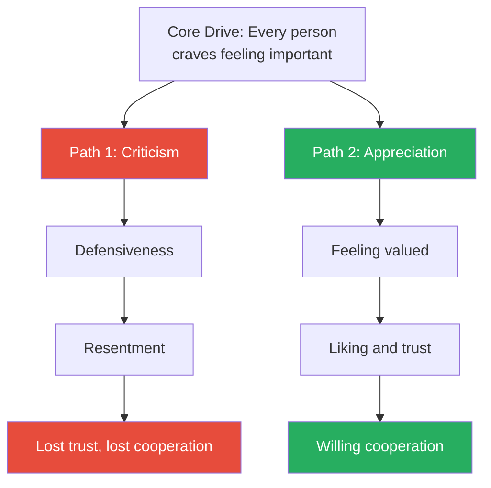
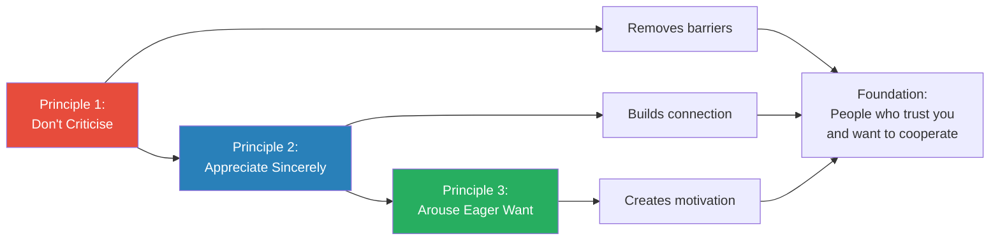
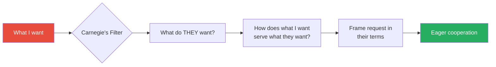
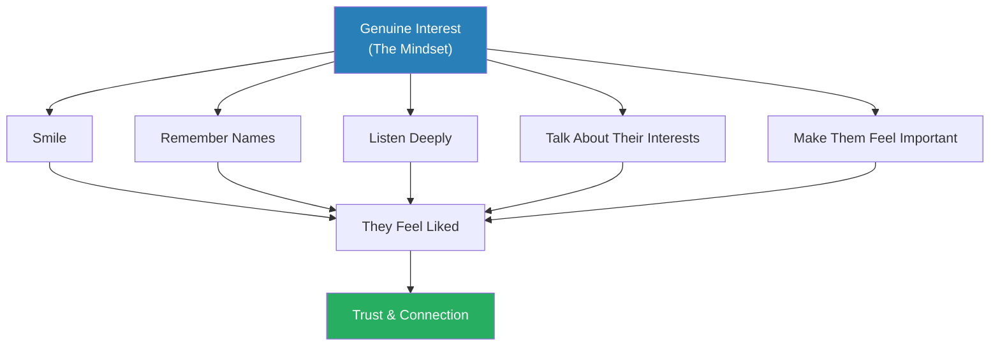
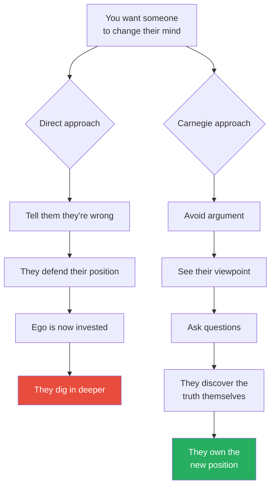
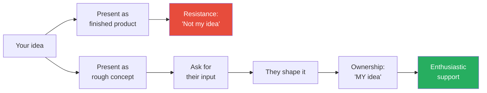
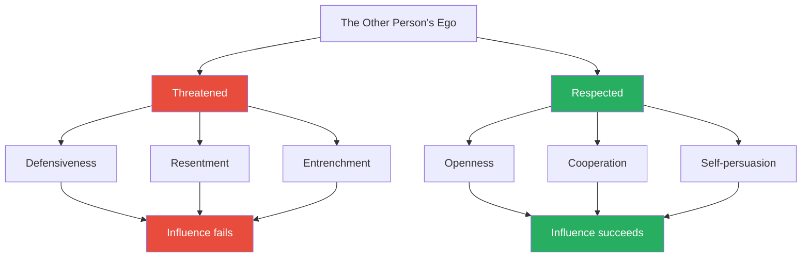
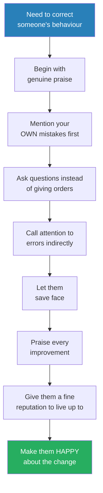
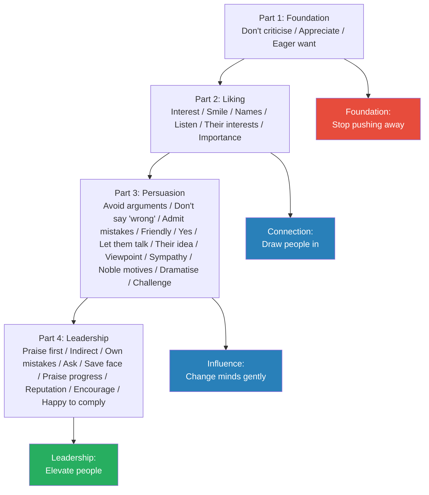
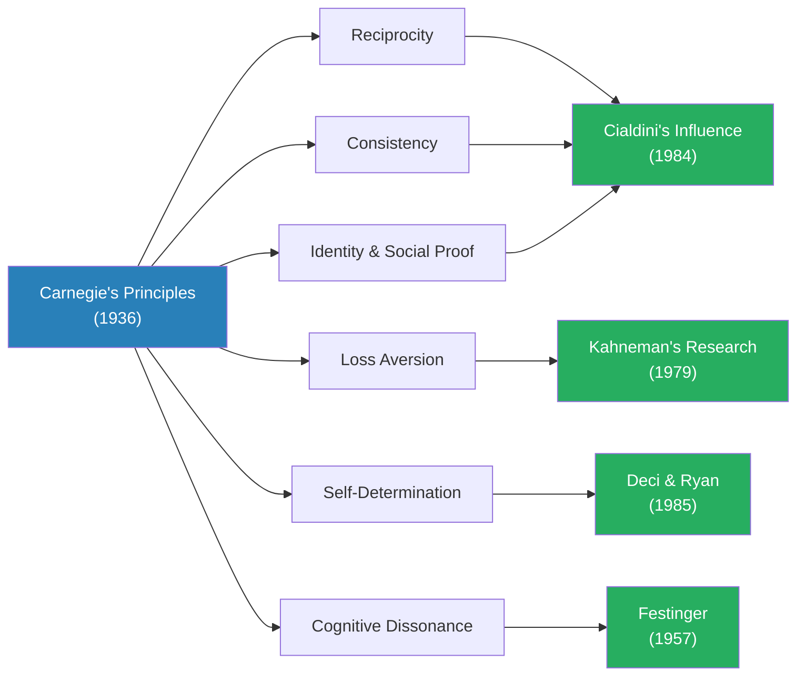

# How to Win Friends and Influence People — Dale Carnegie

> Published in 1936 and still in print ninety years later, Carnegie's masterwork is the original social skills manual — the book that taught the twentieth century how to get along with other people.
> Its thesis is disarmingly simple: you can get more of what you want by becoming genuinely interested in what other people want. Every person you meet is fighting for significance, approval, and the feeling of being important. Address that need sincerely, and they will like you, trust you, and cooperate with you. Criticise, condemn, or complain, and you will lose them.
> The thirty principles that follow are not tricks or techniques but habits of thought: habits of curiosity, of generosity, of listening, and of letting other people keep their dignity.
> It is the most widely read self-help book in history for a reason — it works, and it works because it is not about manipulation but about genuine human connection.

---

## About the Author

Dale Carnegie (1888-1955) was a Missouri farm boy who became America's most influential teacher of interpersonal skills. After failing at cattle trading and acting, he began teaching public speaking classes at a YMCA in New York City in 1912 — and discovered that what his students needed was not rhetorical technique but confidence and social skill. He developed this book from fifteen years of research and real-world testing in those classes, studying biographies, interviewing world leaders, and observing what actually worked in thousands of student interactions. The book has sold over 30 million copies and been translated into almost every language on earth.

---

## The Big Idea

- Carnegie's operating principle: <b style="color: #2980b9">every human being you meet is starving for appreciation and significance</b>
- This is not a minor social preference — it is one of the deepest drives in human nature, as fundamental as the desire for food or shelter
- William James, the father of American psychology, put it plainly: "The deepest principle in human nature is the craving to be appreciated"
- John Dewey phrased it differently but arrived at the same place: "The deepest urge in human nature is the desire to be important"
- <b style="color: #e74c3c">Criticism destroys this need. Appreciation fulfils it.</b> Everything else in the book follows from this single insight
- The thirty principles are thirty variations on a single theme: <b style="color: #27ae60">make the other person feel important — sincerely</b>
- Carnegie is emphatic about the word "sincerely" — he draws a sharp line between genuine appreciation and cheap flattery
  - Flattery is selfish, insincere, and universally despised
  - Appreciation is unselfish, sincere, and universally admired
  - One comes from the teeth out; the other comes from the heart out
- The principles work not because people are gullible, but because people are human — and humans respond to genuine warmth the way plants respond to sunlight
- Carnegie's method rests on a paradox: the fastest way to get what you want is to stop talking about what you want
  - Focus entirely on what the other person wants, needs, and values
  - When they feel understood and important, cooperation follows naturally
  - This is not altruism — it is practical psychology, tested across thousands of real interactions
- What distinguishes Carnegie from later influence writers is his absolute insistence on sincerity
  - Cialdini describes influence mechanisms objectively — Carnegie demands they be used honestly
  - Greene catalogues power tactics without moral judgment — Carnegie ties every tactic to genuine human warmth
  - Carnegie would rather you do nothing than do something insincere — because insincerity always backfires

Every principle in the book traces back to this fork — are you satisfying or threatening the other person's need to feel important?

The two approaches start from the same baseline but diverge dramatically — criticism compounds into resentment while appreciation compounds into deep trust, illustrating Carnegie's core argument that short-term correction through criticism always loses to long-term investment in genuine appreciation.

---

## Key Concepts at a Glance

| Concept | One-line summary |
|---------|-----------------|
| **Don't criticise** | Criticism is futile — it triggers self-defence, never self-improvement |
| **Sincere appreciation** | Honest praise for genuine qualities — not flattery, not manipulation |
| **Arouse an eager want** | Frame everything in terms of what the other person wants |
| **Genuine interest** | Ask about their life and actually care about the answer |
| **Smile** | The simplest signal that says "I like you" |
| **Remember names** | A person's name is the sweetest sound in any language |
| **Listen** | Encourage them to talk about themselves — then actually listen |
| **Their interests** | Talk about what matters to them, not what matters to you |
| **Make them feel important** | The golden rule applied to every single interaction |
| **Avoid arguments** | You cannot win an argument — even winning means losing |
| **Never say "you're wrong"** | Respect opinions even when you disagree |
| **Admit mistakes quickly** | Disarm criticism by being harder on yourself than they would be |
| **Begin friendly** | A drop of honey catches more flies than a gallon of gall |
| **Get "yes" early** | Start with questions they agree with, then build toward your point |
| **Let them talk** | The other person's favourite topic is themselves |
| **Their idea** | Let them feel they discovered the conclusion themselves |
| **See their viewpoint** | Understand before you attempt to be understood |
| **Be sympathetic** | "I don't blame you — I'd feel exactly the same way" |
| **Appeal to nobler motives** | People want to feel they act from high ideals |
| **Dramatise your ideas** | Make your point vivid, visual, and memorable |
| **Throw down a challenge** | The desire to excel and compete drives action |
| **Begin with praise** | Honest appreciation before correction opens the mind |
| **Indirect attention to errors** | Replace "but" with "and" after praise |
| **Own your mistakes first** | Admitting your faults makes others willing to admit theirs |
| **Ask, don't order** | Questions create cooperation; orders create resistance |
| **Let them save face** | Never humiliate — even when you have the power to |
| **Praise every improvement** | Reinforce progress, however slight |
| **Give a fine reputation** | Give people a standard to live up to, and they will |
| **Use encouragement** | Make the fault seem easy to correct |
| **Make them happy to comply** | Frame requests so the other person wants to say yes |

---

## Quick Lookup Table

| # | Principle | Section | Theme |
|---|-----------|---------|-------|
| 1 | Don't criticise, condemn, or complain | Part 1: Fundamentals | Restraint |
| 2 | Give honest, sincere appreciation | Part 1: Fundamentals | Warmth |
| 3 | Arouse in the other person an eager want | Part 1: Fundamentals | Perspective |
| 4 | Become genuinely interested in other people | Part 2: Making People Like You | Curiosity |
| 5 | Smile | Part 2: Making People Like You | Warmth |
| 6 | Remember names | Part 2: Making People Like You | Respect |
| 7 | Be a good listener | Part 2: Making People Like You | Presence |
| 8 | Talk in terms of the other person's interests | Part 2: Making People Like You | Perspective |
| 9 | Make the other person feel important — sincerely | Part 2: Making People Like You | Dignity |
| 10 | Avoid arguments | Part 3: Winning People to Your Thinking | Restraint |
| 11 | Never say "you're wrong" | Part 3: Winning People to Your Thinking | Respect |
| 12 | Admit mistakes quickly and emphatically | Part 3: Winning People to Your Thinking | Humility |
| 13 | Begin in a friendly way | Part 3: Winning People to Your Thinking | Warmth |
| 14 | Get "yes" responses early | Part 3: Winning People to Your Thinking | Momentum |
| 15 | Let the other person do the talking | Part 3: Winning People to Your Thinking | Presence |
| 16 | Let them feel the idea is theirs | Part 3: Winning People to Your Thinking | Ownership |
| 17 | See things from their point of view | Part 3: Winning People to Your Thinking | Empathy |
| 18 | Be sympathetic to their ideas and desires | Part 3: Winning People to Your Thinking | Empathy |
| 19 | Appeal to nobler motives | Part 3: Winning People to Your Thinking | Identity |
| 20 | Dramatise your ideas | Part 3: Winning People to Your Thinking | Impact |
| 21 | Throw down a challenge | Part 3: Winning People to Your Thinking | Competition |
| 22 | Begin with praise and honest appreciation | Part 4: Leadership | Warmth |
| 23 | Call attention to mistakes indirectly | Part 4: Leadership | Tact |
| 24 | Talk about your own mistakes first | Part 4: Leadership | Humility |
| 25 | Ask questions instead of giving orders | Part 4: Leadership | Autonomy |
| 26 | Let the other person save face | Part 4: Leadership | Dignity |
| 27 | Praise every improvement | Part 4: Leadership | Reinforcement |
| 28 | Give a fine reputation to live up to | Part 4: Leadership | Identity |
| 29 | Use encouragement | Part 4: Leadership | Confidence |
| 30 | Make them happy about doing what you suggest | Part 4: Leadership | Ownership |

Part 3 (Persuasion) contains 12 principles — the largest cluster — reflecting Carnegie's belief that winning people over requires far more nuanced technique than simply being likeable.

The thirty principles group naturally into four themes that run across the sections:

| Theme | Principles | Core Idea |
|-------|-----------|-----------|
| **Restraint** | 1, 10, 11 | Stop doing what damages people — criticism, arguments, "you're wrong" |
| **Warmth** | 2, 5, 13, 22 | Make people feel valued through appreciation, friendliness, and praise |
| **Perspective** | 3, 8, 17, 18 | See the world through their eyes, not yours |
| **Dignity** | 9, 25, 26, 28, 30 | Protect and elevate the other person's self-image |

Warmth and Dignity score highest across all dimensions — Carnegie's central argument is that making people feel valued and protecting their self-image produces the deepest, most lasting influence.

Dignity (5 principles) and Warmth (4 principles) together account for nearly a third of all principles — Carnegie believed protecting people's self-image is the single most important interpersonal skill.

---

## Part 1: Fundamental Techniques in Handling People

*Carnegie opens with three foundational principles that underpin everything else — the bedrock psychology of human interaction that most people violate daily without realising it.*

These three principles form a sequence: stop doing what pushes people away (criticism), start doing what draws them in (appreciation), and learn to frame everything through their desires (eager want).

---

### Principle 1: Don't Criticise, Condemn, or Complain

*Carnegie argues that criticism is not just ineffective — it is actively counterproductive, triggering the very defensiveness it tries to correct.*

- <b style="color: #e74c3c">Criticism is futile</b> because it puts a person on the defensive and immediately makes them strive to justify themselves
- It wounds a person's pride, hurts their sense of importance, and arouses resentment
- The person you criticise will rarely change — they will simply resent you and find reasons why they were right all along
- This is not weakness or sentimentality — it is observable human psychology
  - B.F. Skinner's animal experiments showed that animals rewarded for good behaviour learn faster than animals punished for bad behaviour
  - The same principle applies to humans — praise reinforces desired behaviour far more effectively than punishment
  - Hans Selye, the great endocrinologist, confirmed this: the stress response triggered by criticism puts the body into fight-or-flight mode, shutting down the higher reasoning centres that would be needed for genuine self-reflection
- Carnegie's key insight: <b style="color: #27ae60">even the worst people in history don't see themselves as villains</b>
  - If Al Capone and "Two Gun" Crowley justified their own actions, what chance do ordinary criticisms have of changing behaviour?
  - Every person has a story in which they are the hero — and your criticism attacks that story
  - The psychological term for this is self-serving bias — people attribute their successes to internal qualities and their failures to external circumstances
  - Criticism forces people deeper into their self-serving narratives, not out of them
- Carnegie identifies three things criticism triggers every time:
  - **Defensiveness** — the person immediately begins constructing justifications
  - **Resentment** — they develop a grudge against the critic that can last years
  - **Withdrawal** — they share less, communicate less, and trust less going forward

> [!example] Al Capone's Self-Image
> - Al Capone, one of America's most notorious criminals, did not see himself as a bad man
> - He actually said: "I have spent the best years of my life giving people the lighter pleasures, helping them have a good time, and all I get is abuse"
> - Capone genuinely saw himself as a public benefactor who was being unfairly persecuted
> - He ran soup kitchens during the Depression and was cheered in the streets of Chicago
> - In his own mind, he was not a gangster — he was a businessman providing services people wanted
> - The newspapers called him Public Enemy Number One; he called himself a public servant
> - If even a man responsible for multiple murders could construct a narrative in which he was the hero, what makes us think our mild criticisms will penetrate anyone else's self-justification?
> **The lesson:** People do not respond to criticism by changing — they respond by defending.

> [!example] "Two Gun" Crowley's Last Stand (1931)
> - Francis "Two Gun" Crowley, a notorious killer, was cornered by 150 policemen in his apartment on West End Avenue in New York
> - While bullets smashed into his apartment, Crowley wrote a letter: "Under my coat is a weary heart, but a kind one — one that would do nobody any harm"
> - This was a man who had shot a police officer for simply walking up to his car to check his licence
> - The officer had done nothing provocative — Crowley shot him simply because he was a policeman
> - Yet in the moment of his last stand, with bullets tearing through the walls around him, Crowley's self-image remained intact: he was kind, he was misunderstood
> - Carnegie uses Crowley not as a curiosity but as a demonstration of how universal self-justification is
> - If a man writing his final letter while being shot at cannot be critical of himself, what hope does your performance review have?
> **The lesson:** Self-justification is universal and almost unbreakable from the outside.

---

> [!example]- Lincoln's Unsent Letter to General Meade (1863)
> - After the Battle of Gettysburg, Lincoln was furious with General Meade for failing to pursue Robert E. Lee's retreating army
> - Lee's forces were trapped against a flooded Potomac River — a decisive attack could have ended the Civil War years early
> - Meade hesitated, called a council of war, telegraphed back to Washington asking for guidance
> - By the time he was ready to act, the floodwaters had receded and Lee had escaped across the river
> - Lincoln sat down and wrote a blistering letter: "I do not believe you appreciate the magnitude of the misfortune involved in Lee's escape"
> - The letter continued: "He was within your easy grasp, and to have closed upon him would have ended the war. As it is, the war will be prolonged indefinitely"
> - But Lincoln never sent the letter — it was found in his papers after his death, marked "Never sent. Never signed"
> - Lincoln had learned from bitter experience earlier in his career that criticism, however justified, creates enemies rather than allies
> - Sending the letter would have been satisfying for ten minutes; the resentment it created would have lasted for years
> - He chose restraint over righteousness, and Meade continued to serve loyally through the rest of the war
> **The lesson:** Even when criticism is entirely justified, the cost of delivering it often exceeds the benefit.

- <b style="color: #2980b9">Lincoln's growth on this principle</b> is one of the book's recurring themes
  - As a young lawyer in Illinois, Lincoln wrote a mocking public letter ridiculing a political opponent named James Shields
  - The letter was published anonymously in the Springfield newspaper, dripping with contempt and personal mockery
  - Shields discovered the author and was so enraged he challenged Lincoln to a duel
  - They met on a sandbar in the Mississippi River, swords drawn — duelling was illegal in Illinois, so they crossed state lines
  - Lincoln, being much taller, chose cavalry broadswords as the weapon, giving him a decisive reach advantage
  - The duel was narrowly averted at the last moment by mutual friends who negotiated a settlement
  - From that day forward, Lincoln almost never criticised anyone publicly again
  - His most famous quality as a leader — patience with generals, forgiveness of rivals, refusal to gloat — was not natural temperament but learned discipline forged in the terror of that near-duel
  - During the Civil War, when his wife and advisors urged him to condemn the South's leaders, Lincoln replied: "Don't criticise them; they are just what we would be under similar circumstances"

> [!example] The Warden of Sing Sing
> - Lewis Lawes, warden of Sing Sing Prison for many years, observed that virtually none of the criminals in his prison considered themselves bad people
> - Murderers, swindlers, and thieves all had elaborate explanations for why their actions were justified
> - "Few of the criminals in Sing Sing regard themselves as bad men," Lawes wrote
> - They rationalised, they explained, they justified — they told you why they had to crack a safe or pull a trigger
> - Most of them could present a twisted but internally consistent logic for their crimes
> - They saw themselves as victims of circumstance, not perpetrators of wrongdoing
> - If hardened criminals at Sing Sing could not be reached by punishment — the most extreme form of criticism society can deliver — then what chance does everyday criticism have?
> **The lesson:** If prison cannot make criminals see themselves as wrong, your disapproval certainly will not change anyone's behaviour.

> [!tip] Core Insight
> Before criticising anyone, ask yourself: "Has criticism ever changed my behaviour when I felt it was unjust?" The answer is almost always no — and the other person feels exactly the same way.

- Carnegie does not say problems should be ignored — he says criticism is the wrong tool for solving them
- The right tools are Principles 2 and 3: sincere appreciation (which opens people to hearing you) and arousing an eager want (which makes them want to change on their own terms)
- <b style="color: #2980b9">Father Forgets</b>, one of the most famous passages in the book, captures this principle in miniature:
  - A father watches his sleeping son and realises he has spent the entire day criticising the boy — for dragging his feet, for messy hands, for a wrinkled shirt, for eating too slowly
  - He has measured the child by the yardstick of adult expectations and found him wanting at every turn
  - Looking at the sleeping boy — small, vulnerable, trusting — he feels a wave of shame
  - This is a child, doing his best in a world built for adults, and his father has done nothing but criticise him all day
  - The passage ends with the father's resolution to be a real companion going forward — to praise the good rather than condemn the imperfect
  - Carnegie includes this passage because it captures the universal trap: we criticise the people we love most, because proximity breeds familiarity and familiarity breeds contempt for small imperfections

---

### Principle 2: Give Honest, Sincere Appreciation

*Carnegie draws a sharp, crucial line between flattery and appreciation — and stakes the entire book on the difference.*

- The deepest craving of human nature is the desire to feel important
- <b style="color: #2980b9">Sincere appreciation</b> — not flattery — is how you satisfy that craving
- Carnegie is emphatic about the distinction:
  - **Flattery** is insincere, selfish, and universally detected eventually — it tells people what they want to hear for your benefit
  - **Appreciation** is sincere, unselfish, and universally welcomed — it recognises genuine qualities that actually exist
  - "One comes from the teeth out; the other from the heart out"
  - Flattery is telling a mediocre cook their food is amazing; appreciation is telling a mediocre cook that the seasoning on the potatoes was really good — because it was
- <b style="color: #e74c3c">Flattery is counterfeit currency</b> — it works briefly but eventually brings trouble to anyone who uses it
  - People may not identify flattery immediately, but they sense something hollow in it
  - Over time, the flatterer is revealed and their credibility collapses
  - Even when flattery works in the short term, it creates a transactional relationship, not a genuine one
- The reason most people fail at appreciation is not insincerity but neglect — they simply forget to express the positive things they already notice
  - We take our partners, colleagues, and friends for granted
  - We notice when things go wrong but forget to comment when things go right
  - Carnegie calls this "the withholding of earned praise" — and considers it one of the most common failures in human relations
  - At funerals, people say beautiful things about the deceased that they never said while the person was alive
  - Carnegie's challenge: say the beautiful things now, while they can still be heard

> [!example] Charles Schwab's Million-Dollar Skill (early 1900s)
> - Charles Schwab was the first person in history to earn a salary of over one million dollars a year — paid by Andrew Carnegie (no relation to Dale)
> - Andrew Carnegie had plenty of employees who knew more about steel manufacturing than Schwab did
> - Schwab had no superior technical knowledge, no family connections, no special genius for the science of steelmaking
> - But Schwab had a skill no one else possessed to the same degree: the ability to deal with people
> - Schwab himself explained it: "I consider my ability to arouse enthusiasm among my people the greatest asset I possess"
> - "The way to develop the best that is in a person is by appreciation and encouragement. There is nothing else that so kills the ambitions of a person as criticisms from superiors"
> - Schwab said he was "hearty in his approbation and lavish in his praise"
> - He never criticised anyone — and he was rewarded with a million-dollar salary in an era when most workers earned two dollars a day
> - The premium placed on his people skills was a thousand times his workers' wages — because the skill of making others feel valued is that rare and that powerful
> **The lesson:** The ability to make others feel valued is worth more than technical expertise.

> [!example] The Drive for Importance — What People Will Do for It
> - Carnegie catalogues the extraordinary lengths people go to in order to feel important:
> - George Washington wanted to be called "His Mightiness, the President of the United States"
> - Columbus petitioned for the title "Admiral of the Ocean and Viceroy of India"
> - Catherine the Great refused to open letters not addressed to "Her Imperial Majesty"
> - Mrs. Lincoln in the White House turned on Mrs. Grant with ferocious jealousy because a young officer's wife sat closer to the President at a public function
> - Wealthy socialites would spend fortunes on homes, clothes, and parties — not for comfort but for the feeling of importance they conferred
> - Even mental illness, Carnegie notes, sometimes provides what reality cannot: some people who break down mentally find in insanity the feeling of importance that reality denied them
> - A patient at a hospital once told doctors: "I am the Duchess of Devonshire" — and in her world, she was, and she was happier than she had ever been in her real identity
> **The lesson:** The desire to feel important is so powerful that people will sacrifice money, time, health, and even sanity to satisfy it.

- <b style="color: #27ae60">The practical test:</b> stop right now and think of something genuinely good about the person you deal with most often — and tell them, specifically and sincerely
- Carnegie argues this is not soft or sentimental — it is the hardest and most important discipline in human relations
- Most of us are "too lazy to tell our wives we appreciate them" — and the same laziness extends to every relationship
- The great tragedy is not that we feel no appreciation — it is that we feel it and never express it

> [!example] Stevie Morris and the Power of One Teacher's Appreciation
> - A young boy named Stevie Morris had a teacher who asked him for help with a classroom problem
> - She had noticed a mouse loose in the classroom and asked Stevie — who had exceptional hearing due to his blindness — to listen for it
> - This was the first time anyone had treated Stevie's acute hearing as an asset rather than a consolation prize for his blindness
> - Every other adult in his life had focused on what he could not do — this teacher focused on what he could do better than anyone else
> - That moment of appreciation — of being valued for something he could do rather than pitied for something he could not — transformed his self-image
> - Stevie Morris went on to become Stevie Wonder, one of the greatest musicians of the twentieth century
> - Carnegie does not claim that one teacher's praise created a genius — but he argues that appreciation unlocked potential that criticism would have buried
> **The lesson:** A single moment of genuine appreciation can redirect a life.

> [!example] The Neglected Wife
> - Carnegie tells the story of a woman who attended one of his classes and heard the lesson on appreciation
> - She went home and thought about her husband — a good man, a good provider, but someone she had not genuinely complimented in years
> - She had spent years pointing out things he did wrong: the lawn wasn't mowed, the gutters needed cleaning, he forgot to pick up milk
> - That evening, she told him sincerely: "I want you to know that I think you're a wonderful father. The kids adore you, and I don't tell you often enough how much I appreciate everything you do"
> - Her husband was so shocked he nearly cried — it had been years since anyone had said anything genuinely positive to him
> - Their relationship shifted measurably from that single moment of expressed appreciation
> - Carnegie uses this story to illustrate the starvation principle: people are so deprived of genuine appreciation that even a single serving can transform a relationship
> **The lesson:** The people closest to you are often the most starved for your appreciation — because proximity breeds neglect.

> [!abstract] Carnegie's Appreciation Formula
> 1. Identify something genuinely praiseworthy — it must be real, not invented
> 2. Be specific — "You handled that difficult client with real patience" beats "Good job"
> 3. Express it promptly — praise loses power with delay
> 4. Make it about them, not you — "You're talented at this" not "I'm impressed by you"
> 5. Don't follow it with "but" — that erases everything you just said

---

### Principle 3: Arouse in the Other Person an Eager Want

*Carnegie reveals the only reliable way to influence anyone: stop talking about what you want and start talking about what they want.*

- "The only way on earth to influence other people is to talk about what they want and show them how to get it"
- <b style="color: #27ae60">This is the master principle of influence</b> — and it is astonishingly simple, yet almost nobody practises it
- Carnegie quotes Henry Ford: "If there is any one secret of success, it lies in the ability to get the other person's point of view and see things from that angle as well as from your own"
- Every act you have ever performed was performed because you wanted something
  - Even acts of apparent selflessness satisfy a want — the want to feel generous, moral, or connected
  - This is not cynicism — it is human nature, and understanding it is the key to influence
- <b style="color: #e74c3c">The fatal error most people make:</b> they walk into every conversation broadcasting their own needs
  - "I need you to do this"
  - "Here's why this is important to me"
  - "I want you to understand my position"
  - None of this addresses what the other person cares about
  - The other person hears your needs as static — irrelevant noise that interferes with their own concerns
- The shift Carnegie teaches: before opening your mouth, translate your desire into their desire
  - You want a raise? Think about what your boss wants — reliability, results, fewer problems — and frame your request in those terms
  - You want your children to eat vegetables? Think about what they want — to be strong, to be fast, to be like their favourite hero — and frame vegetables in those terms
  - You want a colleague to cooperate? Think about what they want — recognition, efficiency, less stress — and show how cooperating achieves their goal
  - You want a customer to buy? Think about what they want — to solve a problem, to save money, to impress someone — and show how your product delivers that

> [!example] The Fishing Analogy
> - Carnegie uses a simple analogy that encapsulates his entire approach
> - When you go fishing, you don't bait the hook with strawberries and cream — even though you personally love strawberries and cream
> - You bait it with what the fish wants: a worm
> - Yet when dealing with people, most of us bait the hook with what we want, not what they want
> - "Why not use the same common sense when fishing for people?"
> - This is not about deception — the fish genuinely wants the worm; you are genuinely offering something of value
> - The analogy is so simple it sounds trivial — but Carnegie argues that virtually every failed persuasion attempt in history fails for exactly this reason
> **The lesson:** Frame every request in terms of the other person's desires, not your own.

> [!example] Andrew Carnegie's Steel Mill Naming Strategy
> - Andrew Carnegie (the steel magnate, not the author) wanted to win the Pennsylvania Railroad's massive steel rail contract
> - His chief competitor was already well-established with the railroad and had a strong relationship with its leadership
> - Carnegie's move: he built a brand-new steel mill and named it the "J. Edgar Thomson Steel Works" — after the president of the Pennsylvania Railroad
> - Thomson could hardly award the contract to anyone else when a steel mill bore his name
> - Carnegie understood what Thomson wanted — recognition, legacy, importance — and he made that the bait
> - The strategy cost Carnegie nothing but a name — yet it won him one of the most lucrative contracts in American industry
> - Later, when Carnegie wanted to merge with the Pullman sleeping-car company, he offered to name the merged company "The Pullman Palace Car Company" — and Pullman, flattered, accepted terms he might otherwise have rejected
> **The lesson:** When you understand what the other person truly wants, influence becomes almost effortless.

> [!example] The Letter That Got Results
> - Carnegie describes a father whose son at boarding school never replied to letters
> - The family sent letter after letter — news, updates, pleas, demands to write back — and received nothing
> - The boy was not hostile — he simply had no motivation to respond to letters about things that interested his parents
> - Finally, they tried Carnegie's principle: they wrote a chatty letter that mentioned, almost as an afterthought, that they were enclosing five dollars for each of the boy's sisters
> - They did not enclose the money
> - The boy wrote back immediately — not to ask about the family, but to point out that the money was missing
> - The story is humorous, but the mechanism is universal: people respond to what they want, not to what you want them to respond to
> **The lesson:** People are motivated by their own interests, not yours. Align your request with what matters to them.

> [!example] The Child Who Wouldn't Eat
> - A father was desperate — his three-year-old son refused to eat and was underweight
> - The father had tried everything: pleading, threatening, bribing, forcing
> - A neighbour suggested the Carnegie approach: think about what the child wants
> - The child wanted to feel powerful — to be bigger and stronger than the neighbourhood bully who kept stealing his tricycle
> - The father started saying: "You know, if you eat your spinach, you'll grow big and strong like Daddy, and then Tommy won't be able to take your tricycle"
> - The child ate his spinach voluntarily — not because his parents wanted him to, but because he wanted to be strong enough to defend his tricycle
> - The food was the same; the motivation was completely different
> **The lesson:** Reframe what you want in terms of what they want, and resistance transforms into eagerness.

This filter is the foundation of Carnegie's entire system — every principle that follows is a specific application of this core idea.

> [!tip] Core Insight
> Before opening your mouth, ask: "What does this person want? How can I frame what I need in terms of what they need?" If you cannot answer that question, you are not ready to persuade.

---

## Part 2: Six Ways to Make People Like You

*Carnegie moves from foundational psychology to six specific behaviours that generate liking and trust — and each one is simpler than you expect.*

| # | Principle | The Core Behaviour | Why It Works |
|---|-----------|-------------------|-------------|
| 1 | Become genuinely interested in other people | Ask about their lives, their work, their passions — and actually care | People sense authentic curiosity and are drawn to it |
| 2 | Smile | A genuine smile says "I like you. I am glad to see you" | It signals warmth before a word is spoken |
| 3 | Remember names | Use their name in conversation — it's the sweetest sound | It says "you matter enough for me to remember" |
| 4 | Be a good listener | Encourage others to talk about themselves | People love to talk about themselves; let them |
| 5 | Talk about their interests | Find out what they care about and talk about that | You become fascinating by being fascinated |
| 6 | Make them feel important — sincerely | Apply the golden rule in every interaction | This satisfies the deepest drive in human nature |

---

### Principle 4: Become Genuinely Interested in Other People

*Carnegie argues that you can make more friends in two months by becoming interested in other people than you can in two years by trying to get other people interested in you.*

- <b style="color: #27ae60">The key word is "genuinely"</b> — not as a technique, not as a manipulation, but as a real shift in how you look at other human beings
- Carnegie's observation: every person you meet knows something you don't, has experienced something you haven't, and has a perspective that could teach you something
- The problem is not that people are uninteresting — the problem is that we are too self-absorbed to notice
- Dogs are the most popular animals on earth for precisely this reason
  - A dog is wildly, unconditionally thrilled to see you every single time
  - A dog never tries to sell you anything or impress you with its achievements
  - A dog simply radiates genuine interest and joy in your presence
  - The dog does not use techniques — it simply loves you, and you can tell
  - "You can make more friends in two months by becoming genuinely interested in other people than you can in two years by trying to get other people interested in you"
- <b style="color: #2980b9">The mechanism behind genuine interest:</b>
  - When you are genuinely curious about someone, you ask better questions — not formulaic ones, but real follow-ups that prove you were listening
  - Better questions generate more interesting answers, which generate more genuine curiosity — a virtuous cycle
  - The other person feels valued, which triggers reciprocal warmth
  - This is not a technique that simulates connection — it is connection itself
- The opposite — self-absorption — is the root cause of most social failures
  - The person who talks only about themselves, their accomplishments, their problems
  - The person who asks questions but does not listen to the answers
  - The person who views social interaction as a stage for their own performance
  - Carnegie is blunt: these people are boring, no matter how objectively interesting their lives may be

> [!example] Teddy Roosevelt at Oyster Bay
> - When Roosevelt returned to Oyster Bay after his presidency, he astonished everyone at the estate by remembering every servant's name
> - Not just their names — their personal circumstances, their families, their concerns
> - Before each visit, he would ask his staff to brief him on what had been happening with every person on the grounds
> - He would greet the kitchen maid by name, ask after the gardener's daughter, remember that the stable boy was saving for a new saddle
> - "It was easy to be fond of him," one valet recalled
> - Roosevelt did not do this because he was a natural extrovert — he did it because he genuinely believed every person mattered
> - He considered it a duty, not a skill — a reflection of character, not technique
> - The servants' loyalty to Roosevelt was not purchased with wages but earned with attention
> **The lesson:** Interest in others is not a social trick — it is a decision to value people as they are.

> [!example] Howard Thurston, the Magician
> - Howard Thurston was the top magician in America for over forty years, drawing audiences of millions
> - His secret was not superior tricks — other magicians could perform the same feats
> - His secret was that every night, before stepping on stage, he stood behind the curtain and repeated to himself: "I love my audience. I love my audience"
> - That genuine warmth radiated through his performance and made audiences feel individually valued, even in a crowd of thousands
> - Carnegie contrasts Thurston with magicians who looked at their audiences and thought: "Well, there's a bunch of suckers — I'll fool them"
> - The audience could always tell the difference, even if they could not articulate why one performer felt warm and another felt cold
> - The tricks were identical; the human connection was not
> **The lesson:** Genuine interest communicates itself — even across a stage, even to strangers.

> [!example] The Lonely Puppy
> - Carnegie tells of a Carnegie course student who was struggling to connect with people at his new job
> - The student noticed a puppy tied up outside a shop every morning, and every morning the puppy would wag its tail frantically at every passing stranger
> - The puppy made more friends in a single morning than the student had made in a month
> - The lesson hit him: the puppy was genuinely, unconditionally interested in every human being — no agenda, no calculation, just pure warmth
> - The student started approaching his colleagues the same way — with genuine curiosity about their lives, their weekends, their interests
> - Within weeks, his social life at the office transformed
> **The lesson:** Genuine interest requires no special skill — only the willingness to care about someone other than yourself.

- <b style="color: #2980b9">Alfred Adler</b>, the great psychologist, reinforced this: "It is the individual who is not interested in his fellow men who has the greatest difficulties in life and provides the greatest injury to others"
  - Adler found that most neuroses and social failures could be traced to a lack of interest in other people
  - The person fixated on themselves is anxious because they are constantly comparing themselves to others
  - The person genuinely interested in others is relaxed because their attention flows outward, not inward
  - Carnegie and Adler arrive at the same conclusion from different directions: self-absorption is the enemy of both happiness and social success
- Carnegie extends this to professional contexts — salespeople who are genuinely interested in their customers outsell those who are merely skilled at pitching
  - The interested salesperson asks: "What problem are you trying to solve?"
  - The self-absorbed salesperson says: "Let me tell you about our features"
  - The first approach discovers the customer's real need; the second broadcasts the salesperson's agenda
  - The customer buys from the first because they feel understood; they resist the second because they feel sold to
- Genuine interest is detectable because it produces real questions — not rehearsed ones, but follow-ups that prove you were actually listening
- The opposite — feigned interest — is equally detectable and equally damaging
  - People know when you are asking questions to tick a social box rather than because you care about the answer
  - The quality of your attention is visible in your eyes, your posture, and your follow-up questions
  - When someone genuinely cares, their questions are specific and contextual — "You mentioned your daughter was starting college last time we spoke — how did that go?"
  - When someone is faking it, their questions are generic and interchangeable — "So, how's the family?"

> [!abstract] Carnegie's Genuine Interest Checklist
> 1. Before meeting someone, recall what you know about them — their interests, their last conversation, their circumstances
> 2. Ask one question that proves you remember something personal about them
> 3. Listen to their answer without planning your next sentence
> 4. Ask a follow-up question that could only arise from genuine listening
> 5. Let them do most of the talking — your job is to be fascinated, not fascinating
> 6. After the conversation, make a mental note of what you learned for next time

---

### Principle 5: Smile

*The simplest principle in the book — and one of the most powerful, because a smile communicates warmth before a single word is spoken.*

- A smile says: "I like you. You make me happy. I am glad to see you"
- <b style="color: #27ae60">It must be genuine</b> — an insincere, mechanical grin fools nobody and actually creates distrust
- Carnegie cites a department store's hiring philosophy: "A person who does not smile should not open a shop"
- He quotes a Chinese proverb: "A man without a smiling face must not open a shop"
- The psychological mechanism:
  - Smiling changes your internal state as much as it changes others' perception of you
  - William James observed that action and feeling go together — by regulating the action (smiling), you can indirectly regulate the feeling (happiness)
  - Even forcing a smile activates the same facial muscles as a genuine one, which sends signals to the brain that shift your mood
  - This is what psychologists later called the facial feedback hypothesis — your expression influences your emotion, not just the reverse
- <b style="color: #e74c3c">The cost of not smiling</b> is invisible but real — people form their first impression in seconds, and a neutral or frowning face reads as unfriendly or hostile
  - You may be thinking about a problem, concentrating on a task, or simply lost in thought
  - But the person meeting you for the first time reads your neutral expression as coldness or disapproval
  - First impressions are notoriously sticky — once formed, they take enormous effort to correct
- Carnegie argues that your smile is a messenger of your goodwill — it enriches those who receive it without impoverishing those who give it
- The practical challenge of smiling: it sounds simple, but most people default to a neutral expression in professional settings
  - They are concentrating, they are stressed, they are thinking about the next meeting
  - Their face communicates coldness when their heart feels warmth — and the face is what the other person reads
  - Carnegie's advice: before entering any interaction — a meeting, a phone call, a casual encounter — consciously choose to smile
  - Make it a habit, not a reaction — the habit ensures warmth even when your mood does not naturally produce it
  - Over time, the habit of smiling creates genuine warmth — the facial feedback hypothesis works in your favour
- Carnegie also addresses the objection that smiling feels fake:
  - A forced smile is indeed detectable — but Carnegie does not ask you to force a smile at people you genuinely dislike
  - He asks you to find something genuinely pleasing about the interaction — the warmth of the room, the opportunity to connect, the simple pleasure of human contact — and let that feeling produce the smile
  - The smile is not fake if the underlying positive thought is real — it is simply a thought you chose to focus on rather than one that arose spontaneously

> [!example] The Telephone Smile
> - Carnegie describes a telephone company that trained its operators to smile while speaking on the phone
> - The operators could not be seen — customers never saw their faces
> - Yet customers consistently rated the smiling operators as warmer, more helpful, and more pleasant
> - The smile changed the quality of the voice — its tone, its warmth, its pace, its resonance
> - Something as invisible as a smile over a phone line was detectable in vocal quality alone
> - The company measured customer satisfaction before and after the training — the improvement was significant
> **The lesson:** A smile is not just visual — it changes your entire demeanour, including your voice.

> [!example] William B. Steinhardt's Experiment
> - William Steinhardt, a New York stockbroker, had been married for over eighteen years and rarely smiled at his wife
> - He was not unhappy — he was simply absorbed in his work and had fallen into the habit of emotional neutrality at home
> - Carnegie challenged him to try smiling at her every morning for a week
> - On the first day, Steinhardt forced himself to smile and greet his wife warmly at breakfast
> - She was shocked — then suspicious — then gradually warmed by the unfamiliar kindness
> - Within two weeks, Steinhardt reported more happiness in that period than in the past two years
> - He started smiling at the elevator operator, the doorman, the clerks at the stock exchange
> - Every relationship improved — not because the world changed, but because his expression changed
> - Colleagues who had been distant became friendly; strangers who had been indifferent became warm
> **The lesson:** A smile is not a response to feeling happy — it is a cause of feeling happy.

> [!example] The Job Interview
> - A Carnegie course student was preparing for a job interview and practised smiling in the mirror the night before
> - She felt foolish — but she committed to walking in with a genuine smile and maintaining warm facial expressions throughout
> - The interviewer later told her she was one of the most engaging candidates they had met that week
> - Her qualifications were not superior to other candidates — but her warmth was
> - She got the job, and the interviewer specifically mentioned her "positive energy" as a deciding factor
> **The lesson:** When qualifications are equal, the person who smiles wins.

---

### Principle 6: Remember That a Person's Name Is the Sweetest Sound

*Carnegie makes a case that most people dismiss as trivial — and then proves it is anything but.*

- <b style="color: #2980b9">A person's name is, to that person, the most important sound in any language</b>
- Remembering someone's name is a subtle but powerful compliment; forgetting it is a subtle but cutting slight
- The name is a symbol of the person's identity — using it says "you are important enough for me to remember"
- Carnegie points out that most people don't forget names — they simply don't bother to learn them in the first place
  - They are too busy thinking about what they will say next
  - They don't take the three seconds of focus required to lock the name into memory
  - The problem is not poor memory — it is poor attention
- The importance of names extends beyond social pleasantries:
  - Business deals have been won and lost on whether someone remembered a name
  - Political campaigns succeed partly because good politicians remember constituents' names for years
  - In customer service, using a person's name transforms a transaction into a relationship
  - A person whose name is remembered feels individually recognised — not like a number in a queue
- Carnegie's deeper insight: forgetting a name is not just a memory failure — it is a values failure
  - It communicates: "You were not important enough for me to pay attention"
  - Most people do not consciously mean this — they are simply distracted, thinking about themselves, or mentally rehearsing what they plan to say
  - But the effect is the same whether the neglect is intentional or accidental — the other person feels unimportant
  - The remedy is simple but requires discipline: make the decision, in advance, that every person's name matters — and act on that decision consistently

> [!example] Napoleon III's Memory Palace
> - Napoleon III, Emperor of France, boasted that despite his royal duties, he could remember the name of every person he met
> - His technique was simple but disciplined: if he didn't hear the name clearly, he would ask the person to repeat it
> - If the name was unusual, he would ask them to spell it — which also showed interest and flattered the person
> - During conversation, he would repeat the name several times and associate it with the person's features, expression, and general appearance
> - After the conversation, he would write the name down privately to reinforce the memory
> - He considered this effort not a burden but a basic courtesy that every leader owes to the people they serve
> - For Napoleon III, remembering names was not a party trick — it was statecraft
> **The lesson:** Remembering names is not a gift — it is a discipline anyone can practise.

> [!example] Andrew Carnegie's Name Strategy
> - Andrew Carnegie (the steel magnate) understood the power of names better than almost anyone in business history
> - When he wanted to win the Pennsylvania Railroad's steel contract, he named his new steel mill the "J. Edgar Thomson Steel Works" after the railroad's president
> - When he merged rival companies, he often kept the other company's name prominent to preserve goodwill
> - He named partnerships after the people he wanted to keep loyal
> - His rival Pullman learned this lesson when Carnegie offered to name a merged sleeping-car company "The Pullman Palace Car Company" — Pullman, flattered, accepted terms he might otherwise have rejected
> - Carnegie once even named a child — his friend's newborn — after a business associate he wanted to cultivate
> - He built an empire partly on steel and partly on the insight that people will go to extraordinary lengths for someone who honours their name
> **The lesson:** A person's name, used with genuine respect, is one of the most powerful tools in human relations.

> [!example] Jim Farley's Political Superpower
> - Jim Farley, Franklin Roosevelt's campaign manager, could call fifty thousand people by their first names
> - He claimed this ability was the single biggest factor in Roosevelt's rise to the presidency
> - Farley's system was methodical: whenever he met someone new, he learned their full name, the size of their family, their occupation, and their political opinions
> - He locked all of this into memory and could recall it years later when he met the person again
> - He would greet them by name, ask about their family by name, reference their last conversation
> - People who met Farley once at a political rally were astonished when he remembered them three years later at a different event
> - Politicians who remembered names won elections; those who didn't, lost them
> - Farley understood that in a democracy, each voter wants to feel individually important — and nothing says "you matter" like being remembered by name
> **The lesson:** In a world where most people cannot remember the name of someone they met last week, the person who remembers stands out dramatically.

> [!abstract] Carnegie's Name-Remembering Technique
> 1. Focus completely when you hear the name — don't let it pass while you plan your next sentence
> 2. If you didn't hear it clearly, ask immediately: "I'm sorry, could you say your name again?"
> 3. If it's unusual, ask them to spell it — this shows interest and locks it in memory
> 4. Repeat the name during the conversation naturally: "That's a great point, Sarah"
> 5. Associate the name with something visual about the person — their hairstyle, their glasses, their smile
> 6. Use the name when saying goodbye: "It was really good to meet you, Sarah"
> 7. After the conversation, write the name down with a note about where and when you met

---

### Principle 7: Be a Good Listener — Encourage Others to Talk About Themselves

*Carnegie demonstrates that the secret to being an interesting conversationalist is, paradoxically, to barely speak at all.*

- <b style="color: #27ae60">To be interesting, be interested</b> — ask questions that the other person will enjoy answering
- Encourage them to talk about themselves and their accomplishments
- The person you are talking to is a hundred times more interested in their own problems, their own toothache, their own ambitions than they are in yours
- <b style="color: #e74c3c">The most common conversational failure:</b> people don't listen — they simply wait for their turn to talk
  - While the other person speaks, they are rehearsing their own next point
  - The other person senses this lack of presence and feels unvalued
  - No amount of clever conversation can compensate for the feeling of not being heard
- Carnegie's mechanism: <b style="color: #2980b9">exclusive attention</b> is one of the highest compliments you can pay another person
  - In a world where everyone is distracted, half-listening, and glancing at their phone, full attention is startling
  - It creates an immediate sense of connection and trust
  - The listener doesn't need to be brilliant — they need to be present
- Most people are so starved for genuine listening that encountering it is an almost physical relief
  - They will talk for hours if given permission and genuine attention
  - They will leave the conversation feeling energised, valued, and warmly disposed toward you
  - And they will almost certainly describe you as "a wonderful conversationalist" — even though you barely said a word

> [!example] The Botanist Dinner Party
> - Carnegie once sat next to a botanist at a dinner party
> - He listened with genuine fascination as the botanist talked about exotic plants, indoor gardens, and botanical experiments for hours
> - Carnegie asked question after question, genuinely intrigued by a subject he knew almost nothing about
> - At the end of the evening, the botanist told the host that Carnegie was "most stimulating" and "a most interesting conversationalist"
> - Carnegie had barely spoken a word all evening — he had simply listened with genuine interest
> - The botanist did not want a debate partner or a fellow expert — he wanted someone who found his passion as fascinating as he did
> - Carnegie's near-silence had made him the most interesting person at the table — a paradox that reveals everything about how human connection works
> **The lesson:** You become a great conversationalist not by talking brilliantly but by listening intently.

> [!example] The Department Store Complaint
> - An angry customer stormed into a department store, furious about a purchase
> - She was loud, aggressive, and ready for a fight — she wanted to return the item and get her money back
> - Other clerks had already tried to explain store policy, which only made her angrier
> - The clerk assigned to handle her did something unexpected: he simply listened — patiently, attentively, without interruption
> - He let her talk until she had exhausted her anger — every grievance, every frustration, every complaint
> - He didn't argue, didn't correct her, didn't explain store policy
> - When she finished, he quietly asked what she would like him to do
> - The customer, deflated and somewhat embarrassed by her outburst, became reasonable and cooperative
> - The complaint was resolved in minutes — because the clerk understood that what she needed first was to be heard
> **The lesson:** When someone is upset, the fastest path to resolution is to let them talk until they feel heard.

> [!example] The Chronic Complainer
> - A Carnegie course student described a colleague who complained incessantly about everything — management, workload, the coffee, the temperature
> - Everyone avoided him, which made him complain more loudly to whoever was left listening
> - Instead of avoiding him, the student started genuinely listening to the complaints
> - He asked follow-up questions, acknowledged the man's frustrations, and let him talk without rushing to solutions
> - Within a few weeks, the chronic complainer became noticeably less negative
> - He even started asking the student about his life — reciprocating the attention he had received
> - The change was not because the student solved any problems — but because someone finally listened
> - Much of what we label as "complaining" is really a plea for acknowledgement — and when acknowledgement is given, the need to complain diminishes
> **The lesson:** Chronic negativity in others often has a surprisingly simple cure: genuine listening.

---

### Principle 8: Talk in Terms of the Other Person's Interests

*Before every meeting, find out what the other person is passionate about — and open with that.*

- Carnegie teaches a simple preparation habit: before meeting someone, learn what excites them
- Talk about what interests them, not what interests you
- <b style="color: #27ae60">This is not manipulation — it is courtesy</b>
  - You are choosing to engage with the human being in front of you rather than broadcasting your own concerns
  - The result is genuine connection, not calculated advantage
- The mechanism is straightforward:
  - When you talk about something a person cares about, they become animated, engaged, and open
  - When you talk about something you care about (and they don't), they become polite at best and bored at worst
  - The first conversation creates warmth and trust; the second creates distance
- <b style="color: #2980b9">This principle requires preparation</b> — you cannot talk about someone's interests if you don't know what they are
  - For a planned meeting: research the person beforehand
  - For an unexpected encounter: ask questions and listen for what lights them up
  - Once you find their passion, ask more questions about it — you don't need to be an expert; you need to be curious
- Carnegie views this as an extension of Principle 3 (arouse an eager want) — applied specifically to conversation
  - In Principle 3, you frame your request in terms of their desires
  - In Principle 8, you frame your conversation in terms of their interests
  - Both principles say the same thing: their world, not yours, is the starting point

> [!example] Roosevelt's Midnight Reading Sessions
> - Teddy Roosevelt had a remarkable habit: the night before receiving any visitor, he would stay up late reading about whatever subject was closest to the visitor's heart
> - If he was meeting a diplomat, he studied that country's politics and recent developments
> - If he was meeting a scientist, he read the latest papers in that scientist's field
> - If he was meeting a rancher, he brushed up on cattle breeding and agricultural policy
> - If he was meeting a cowboy, he learned about roping techniques and ranch life
> - Roosevelt understood that the royal road to a person's heart is to talk about the things they treasure most
> - His visitors invariably left amazed by his breadth of knowledge — but what really impressed them was that he cared enough to prepare
> - Roosevelt's midnight reading sessions were not a trick — they were an investment in genuine connection
> **The lesson:** Preparation is the secret ingredient of great conversationalists — they do their homework.

> [!example] Edward Chalif and the Boy Scouts
> - Edward Chalif needed a favour from a prominent businessman — he wanted a donation to support a Boy Scout trip to Europe
> - Before the meeting, Chalif learned that the businessman had recently written a cheque for one million dollars and was extremely proud of it
> - Chalif opened the conversation by asking about the cheque — what it looked like, how it felt to sign it, what the occasion was
> - The businessman talked enthusiastically about the experience for fifteen minutes, reliving the moment with pleasure
> - By the time Chalif raised the Boy Scout trip, the businessman was in such a warm, expansive mood that he not only agreed to support the trip but offered more than Chalif had planned to ask for
> - Chalif never mentioned the donation until the businessman was already feeling good about himself and warmly disposed toward his guest
> **The lesson:** Talk about what delights them, and they will be delighted to help you.

> [!example] The Bread Salesman
> - A bread salesman had been trying to sell bread to a particular hotel for four years without success
> - He attended every Carnegie course event, studied the principles, and decided to try the interest approach
> - He researched the hotel manager and discovered the man was president of a hotelkeepers' association and passionate about the organisation
> - At their next meeting, instead of talking about bread, the salesman asked about the association — its upcoming conventions, its challenges, its growth
> - The hotel manager talked passionately for an hour about his beloved organisation
> - At the end of the meeting, without the salesman having mentioned bread once, the manager called down to the purchasing department and placed an order
> - Four years of bread pitches had failed; one hour of genuine interest in the manager's passion succeeded
> **The lesson:** The fastest way to a sale is often the longest route — through the customer's passions.

---

### Principle 9: Make the Other Person Feel Important — and Do It Sincerely

*This is the golden rule applied with surgical precision to every interaction, from the boardroom to the corner store.*

- <b style="color: #2980b9">The golden rule</b>: treat others the way you want to be treated
- Carnegie operationalises this: in every interaction, ask yourself "What is there about this person that I can honestly admire?"
- Always make the other person feel important — sincerely
- Little courtesies carry enormous weight:
  - Thank the clerk at the post office
  - Compliment a stranger's tie or handbag — if you genuinely notice it
  - Ask the taxi driver how his day is going — and listen to the answer
  - Tell the waiter that the service was excellent — specifically what was good about it
  - Acknowledge the work of people who are usually invisible — cleaners, security guards, delivery workers
- <b style="color: #e74c3c">The danger:</b> this only works when sincere — people detect hollow importance-granting almost instantly
- Carnegie's deeper point: every person you encounter is in some way your superior — they know something you don't, have experienced something you haven't, or can do something you can't
  - If you approach each person with genuine curiosity about their superiority, you will never run out of sincere things to admire
  - The post office clerk is an expert in postal regulations; the taxi driver knows the city better than you; the waiter is performing a physically demanding job with grace
  - Find the genuine admiration, and express it
- Emerson captured this: "Every man I meet is my superior in some way, and in that I learn of him"
- <b style="color: #2980b9">Carnegie's full framework for making people feel important</b> includes five components:
  - **Notice them** — acknowledge their presence, their effort, their existence in a world that often renders people invisible
  - **Name them** — use their name, remember it, deploy it with warmth (connecting to Principle 6)
  - **Ask them** — solicit their opinion, their advice, their expertise on something genuine
  - **Praise them** — find something specific and real to appreciate, and express it sincerely
  - **Thank them** — express gratitude for their contribution, however small, and make the gratitude specific
- These five actions cost nothing, take seconds, and compound over time — each interaction builds on the last, creating a reputation for warmth that precedes you into every room
- Carnegie's deeper argument: making people feel important is not a social technique but a moral stance
  - It reflects a genuine belief that every human being has inherent worth
  - When you act on that belief consistently, you become the kind of person others naturally want to be around
  - This is the difference between Carnegie's approach and manipulation: a manipulator makes people feel important to extract something; Carnegie makes people feel important because they are

> [!example] The Lonely Post Office Clerk
> - Carnegie describes walking into a post office and noticing the clerk looked utterly bored and beaten down by routine
> - Hundreds of people passed through his window every day, and not one of them treated him as a human being
> - Carnegie decided he would leave the clerk feeling better about himself
> - He looked for something to genuinely admire and said: "I certainly wish I had your head of hair"
> - The clerk brightened instantly — it was probably the only sincere compliment he had received that week
> - A small, honest observation about something the clerk actually had transformed a dreary transaction into a human moment
> - The clerk's entire demeanour changed — he stood straighter, smiled, and handled Carnegie's transaction with unusual care
> - Carnegie left the post office having made someone's day measurably better at zero cost
> **The lesson:** Every person you meet is wearing an invisible sign that says "Make me feel important." Honour that sign.

> [!example] The Stamp Collector
> - A Carnegie course student needed cooperation from a notoriously difficult business contact who refused all meetings
> - He discovered the contact was an avid stamp collector — a passion that nobody in the business world had ever acknowledged
> - Before requesting a meeting, the student spent time gathering rare stamps from international correspondence in his own office
> - He presented these stamps to the contact as a gift for his collection
> - The contact, thrilled that someone finally showed interest in his passion, spent ninety minutes talking about stamps, showing his collection, and explaining what made certain stamps rare
> - By the end of the meeting, the contact had agreed to every business request the student had come to make — without the student needing to persuade, argue, or negotiate
> - The stamps were a gift of attention, not a bribe — they said: "What matters to you matters to me"
> **The lesson:** Discover what makes someone feel proud, and your genuine interest in that thing will open doors that persuasion never could.

> [!example] Chris and the Disengaged Team
> - A Carnegie course student named Chris managed a team that had become disengaged and unproductive
> - Instead of calling a performance meeting, Chris spent a week making individual trips to each person's desk
> - At each desk, he found something specific to praise: "That client presentation you did last Tuesday was genuinely impressive — the way you handled the Q&A showed real depth of knowledge"
> - He asked each person about their career goals, their interests outside work, their families
> - Within two weeks, the team's productivity improved measurably — not because of a new process or new incentives, but because each person felt individually valued by their manager
> **The lesson:** A team of people who feel important will outperform a team of people who feel interchangeable.

> [!tip] Core Insight
> The six principles of likability are not a checklist — they are six expressions of a single mindset: genuine, active interest in other human beings. Master the mindset and the behaviours follow naturally.

All six behaviours stem from the same root — genuine interest in people — and all six converge on the same result: the other person feels valued and trusts you.

---

## Part 3: How to Win People to Your Way of Thinking

*Carnegie now tackles the hardest interpersonal challenge: how do you change someone's mind without making them resent you? His answer: you almost never change minds directly — you create conditions where people change their own minds.*

Part 3 contains twelve principles, but they all serve one purpose: removing the ego barriers that prevent people from reconsidering their positions. Carnegie never argues anyone into agreement — he creates conditions where people argue themselves into agreement.

---

### Principle 10: The Only Way to Get the Best of an Argument Is to Avoid It

*Carnegie makes a counterintuitive case: even when you win an argument, you lose.*

- "You can't win an argument. If you lose it, you lose it; and if you win it, you lose it"
- <b style="color: #e74c3c">Even if you demolish the other person's position with devastating logic, you have made them feel inferior</b> — and they will resent you for it
- The resentment of being proved wrong outlasts the logic that proved it
- Carnegie's mechanism:
  - Arguments engage the ego, not the intellect
  - Once a person's ego is invested in a position, no amount of evidence will move them — it will only make them dig in deeper
  - This is why political arguments, family disputes, and online debates almost never change anyone's mind
  - The person who "loses" the argument does not think: "I was wrong and now I see the truth"
  - They think: "I was right but couldn't express it well enough" or "They cheated with sophistry" or "They're too stubborn to see my point"
- <b style="color: #27ae60">Carnegie's alternative:</b> avoid the argument entirely
  - Welcome the disagreement — it may reveal something you missed
  - Control your temper — your first reaction in a disagreement is usually your worst
  - Listen first — give the other person a chance to finish their thought completely
  - Look for areas of agreement — start with what you share
  - Be honest — if you discover you are wrong, say so immediately and gratefully
  - Promise to think over their points carefully — and mean it
  - Thank them sincerely for raising the issue
  - Postpone action — when emotions are high, delay the decision to give both sides time to cool down
  - Most importantly: ask yourself what the other person really needs — often it is not to win the argument but to feel heard
- Carnegie quotes Benjamin Franklin: "If you argue and rankle and contradict, you may achieve a victory sometimes; but it will be an empty victory because you will never get your opponent's good will"
- <b style="color: #2980b9">The distinction Carnegie draws:</b> avoiding arguments is not the same as avoiding disagreement
  - You can disagree profoundly while refusing to argue
  - Disagreement is intellectual; argument is emotional
  - When you disagree without arguing, you preserve the relationship while exploring the truth
  - When you argue, you sacrifice the relationship and rarely discover anything
- Carnegie identifies the anatomy of how arguments escalate:
  - Stage 1: A difference of opinion is stated calmly
  - Stage 2: One party feels their intelligence is being questioned
  - Stage 3: The issue shifts from the topic to personal credibility — "Are you calling me a liar?"
  - Stage 4: Both parties are now defending their egos, not their positions
  - Stage 5: The original topic is forgotten — the argument is now about who is smarter, more experienced, or more credible
  - Carnegie's intervention point is Stage 1 — before the ego engages
  - Once the ego engages (Stage 2+), rational discussion becomes impossible
  - The only way to prevent ego engagement is to never threaten the other person's intelligence in the first place
  - This is why "I may be wrong" is so powerful — it pre-empts Stage 2 entirely

> [!example] The Tax Inspector Argument
> - A Carnegie course student described being audited by a combative tax inspector who was determined to disallow a significant deduction
> - His first instinct was to fight — he had receipts, records, and the law on his side
> - Instead, he applied Carnegie's principle: he agreed with the inspector wherever he honestly could
> - He acknowledged that the inspector's job was difficult and that most people probably gave him a hard time
> - He asked the inspector to explain the regulations he wasn't sure about — treating the inspector as the expert he was
> - The inspector, disarmed by the lack of hostility, became increasingly cooperative and even friendly
> - By the end of the meeting, the inspector had actually reduced the assessment below what the student originally owed — not because of arguments, but because of rapport
> **The lesson:** The person who refuses to argue often gets a better outcome than the person who argues brilliantly.

> [!example] The White Motor Company's Sales Revolution
> - Patrick O'Haire of the White Motor Company used to spend his days arguing with trucking company owners about the merits of White trucks versus competitors
> - He won plenty of arguments — customers would leave unable to counter his points — and sold almost nothing
> - He then changed his approach entirely: when a customer said "I wouldn't buy a White truck if you gave it to me — I'm a Studebaker man," O'Haire would agree
> - "The Studebaker is a fine truck," he would say. "If you buy a Studebaker, you'll have a good truck"
> - The customer, expecting a fight, was completely disarmed — he had no idea how to respond to agreement
> - With no argument to win, the customer would often start asking O'Haire questions about White trucks on his own initiative
> - O'Haire went from one of the worst salesmen at White to the best — by refusing to argue
> - He didn't sell more because he had better arguments — he sold more because he had no arguments at all
> **The lesson:** Agreement disarms; argument entrenches. Let them come to you.

> [!example] The Dinner Party Debate
> - Carnegie recounts sitting next to a man at a dinner party who told an anecdote and attributed a quotation to the Bible
> - Carnegie knew with absolute certainty that the quotation was from Shakespeare, not the Bible
> - His first instinct was to correct the man — to demonstrate his superior knowledge in front of the table
> - His friend Frank Gammond, a Shakespeare expert, was also at the table — Carnegie turned to him for confirmation
> - Gammond kicked Carnegie under the table and said smoothly: "You're right, Dale — it's from the Bible"
> - Walking home afterward, Carnegie protested: "Frank, you know that quotation is from Shakespeare!"
> - Gammond replied: "Of course it is. But we were guests at a dinner party. Why prove him wrong? Would that make him like you? Why not let him save face?"
> - Carnegie absorbed the lesson: being right about a fact and being wise about a relationship are two entirely different things
> **The lesson:** The need to be right is the enemy of being liked — choose your battles with care.

> [!abstract] Carnegie's Disagreement Protocol
> 1. Resist your first instinct to fight back — pause
> 2. Listen to the other person's full position without interrupting
> 3. Look for areas of genuine agreement and state them first
> 4. Acknowledge what might be valid in their concerns
> 5. Promise to study their points carefully
> 6. Thank them for raising the issue
> 7. Postpone action to give both sides time to reflect

---

### Principle 11: Show Respect for the Other Person's Opinions — Never Say "You're Wrong"

*Carnegie teaches that telling someone they are wrong is not a shortcut to truth but a shortcut to resentment.*

- <b style="color: #e74c3c">The words "you're wrong" are among the most destructive in human interaction</b>
- They are a direct strike against the other person's intelligence, judgment, pride, and self-respect
- Even when you are absolutely, provably right, saying "you're wrong" triggers an emotional response that blocks all rational consideration
- The person does not think: "I should reconsider" — they think: "I need to defend myself"
- Carnegie quotes Benjamin Franklin, who learned this principle the hard way:
  - Young Franklin was argumentative, opinionated, and eager to prove his intellectual superiority in every conversation
  - A Quaker friend took him aside and delivered a blunt assessment: "Ben, you are impossible. Your opinions have a slap in them for everyone who differs with you"
  - The friend explained that people avoided Franklin not because he was wrong, but because he was so unpleasant about being right
  - Franklin adopted a new policy: he never used words of direct opposition like "certainly" or "undoubtedly"
  - Instead he said: "I conceive" or "I imagine" or "It appears to me at present"
  - These phrases conveyed the same intellectual position without the emotional slap
  - Franklin credited this single change for much of his success in politics, diplomacy, and the Constitutional Convention
- <b style="color: #2980b9">The diplomatic alternative:</b> "I may be wrong. I frequently am. Let's examine the facts together"
  - This costs you nothing — you lose no ground by being humble
  - But it opens a door that "you're wrong" slams shut
  - The other person, no longer under attack, can consider your position without feeling they are surrendering
- Carnegie connects this to Galileo, who observed: "You cannot teach a man anything; you can only help him find it within himself"
  - People resist being told they are wrong because it threatens their self-image as intelligent, capable beings
  - They do not resist discovering for themselves that they need to reconsider — because that discovery enhances their self-image
- <b style="color: #27ae60">Carnegie's practical phrases for diplomatic disagreement:</b>
  - "I may be wrong — I frequently am — but it seems to me..."
  - "I had a different impression, but I could be mistaken. What made you think that?"
  - "That's interesting. I've heard a different perspective — let me share it and see what you think"
  - "You may be right. Let me think about that"
  - Each of these phrases conveys the same intellectual content as "you're wrong" — but without the emotional slap
  - The humility is not weakness — it is strategy, because it keeps the other person's mind open instead of slamming it shut

> [!example] The Insurance Salesman's Transformation
> - A Carnegie course student named Mr. Zerhusen was an insurance salesman who regularly argued with prospects
> - When a prospect made a factual error about insurance — misunderstanding a policy, citing incorrect rates — Zerhusen would correct them immediately and emphatically
> - He would say: "That's wrong. The actual rate is..." or "No, that's not how it works"
> - He won the arguments and lost the sales — every single time
> - After taking Carnegie's course, he changed his approach entirely
> - When a prospect said something incorrect, instead of saying "you're wrong," he would say: "That's an interesting point. I used to think the same thing myself, until I discovered..."
> - The same correction was delivered, but it arrived as shared learning rather than humiliation
> - The prospect could accept the new information without feeling stupid
> - His sales increased dramatically — because his prospects no longer felt insulted for talking to him
> **The lesson:** You can deliver the same information kindly or brutally. The information is identical; the results are opposite.

> [!example] The Art Dealer and the Wrong Painting
> - A Carnegie course student was an art dealer who overheard a customer confidently telling a friend that a painting was by the wrong artist
> - The customer was factually wrong — the dealer knew the painting's provenance with certainty
> - His first instinct was to correct the customer publicly
> - Instead, he approached privately and said: "What an interesting perspective. I've heard that attributed to several artists — but our records suggest it might be by [correct artist]. Isn't it fascinating how attribution debates work in the art world?"
> - The customer, corrected without being humiliated, was grateful rather than resentful
> - He became a loyal customer for years — and always asked the dealer's opinion before making attributions
> **The lesson:** Being right about a fact and being right about how to share that fact are two entirely different skills.

> [!example] The Foreman and the Production Dispute
> - A factory foreman was told by a new quality inspector that his team's output did not meet the revised specification
> - The foreman had been running the same production line for twenty years and knew the specifications by heart
> - His instinct was to tell the inspector: "You're wrong — I've been doing this since before you were born"
> - Instead, he paused, invited the inspector to walk through the process together, and asked him to show exactly where the output failed to meet spec
> - As they walked, the inspector realised he had been reading an outdated version of the specification document — the foreman's output was correct
> - The inspector discovered his own error without the foreman having to say "you're wrong" even once
> - Had the foreman attacked the inspector's competence, the inspector would have dug in defensively — now, he was grateful for the foreman's patience and became a reliable ally on the floor
> **The lesson:** Let the facts do the correcting — your job is to create conditions where the truth becomes visible, not to announce it.

---

### Principle 12: If You Are Wrong, Admit It Quickly and Emphatically

*Carnegie turns the obvious on its head: admitting fault is not weakness — it is the most disarming thing you can do.*

- When you are wrong — and you know you are wrong — <b style="color: #27ae60">beat the other person to the criticism</b>
- Say everything about yourself that you know the other person is thinking — and say it with emphasis
- This takes the wind out of their sails completely
  - They were prepared for a fight and you gave them a surrender
  - The only thing left for them to do is be magnanimous — and most people will
- <b style="color: #2980b9">The psychology:</b> when you criticise yourself before the other person can, their instinct shifts from attack to defence — of you
  - They suddenly want to reassure you that it wasn't so bad
  - They become your ally instead of your adversary
  - This is deeply counterintuitive: the person who admits fault ends up in a stronger position than the person who defends their innocence
- Carnegie's reasoning: any fool can try to defend their mistakes — and most fools do
  - It takes character and self-control to admit when you are wrong
  - People respect the admission and punish the defence
  - "When we are right, let us try to win people gently and tactfully to our way of thinking; and when we are wrong — let us admit our mistakes quickly and with enthusiasm"
- <b style="color: #e74c3c">The most common mistake:</b> people know they are wrong but defend themselves anyway
  - They hedge, they qualify, they make excuses, they shift blame
  - Each of these tactics makes the other person angrier — because now they are dealing not only with the original offence but with dishonesty about it
  - A clean admission ends the confrontation; a hedged defence extends it

> [!example] Carnegie and the Park Policeman
> - Carnegie used to walk his dog Rex in a park near his home — often without a leash or muzzle, which violated local ordinances
> - A policeman caught him and gave him a stern warning: next time there would be a fine
> - Carnegie forgot — and the same policeman caught him again, dog running free, no leash in sight
> - This time, before the officer could say a word, Carnegie launched into self-criticism
> - "Officer, I'm guilty. I have no excuses. You warned me last week that you would fine me if you caught me again. I have no one to blame but myself"
> - He continued: "I know the law, I broke it willingly, and I deserve whatever penalty you give me"
> - The officer, disarmed by Carnegie's total admission, started defending Carnegie's dog: "Well, I know it's a temptation to let a little dog like that run free..."
> - He let Carnegie off with another warning — when a fine was entirely justified
> - Carnegie had done nothing except admit his guilt more harshly than the officer would have — and it completely reversed the interaction
> **The lesson:** When you are wrong, admit it with such energy that the other person's only option is to defend you.

> [!example] The Artistic Director's Client Meeting
> - An art director made a mistake on a set of advertising illustrations — the proportions were wrong, and the colours were off-spec
> - The client called a meeting specifically to criticise the work — he arrived with notes, complaints, and a list of grievances
> - Instead of defending the illustrations or explaining the error, the art director opened the meeting by saying: "You're absolutely right. This work is not up to standard. I should have caught this before it left our office. I'm embarrassed, and I want to redo the entire set at our expense"
> - The client, who had arrived ready for battle, immediately softened
> - He started pointing out the parts of the work that were actually good and suggested the problems might be fixable without a complete redo
> - By admitting fault emphatically, the art director turned an adversary into a collaborator
> - The final outcome was better than either party had expected — because the combative energy was redirected into creative problem-solving
> **The lesson:** The person who admits fault controls the conversation — because there is nothing left to attack.

> [!example] The Supplier's Late Delivery
> - A supplier missed a critical delivery deadline for a major retailer by two full days
> - The retailer's purchasing manager scheduled a call to terminate the contract and demand compensation
> - The supplier's account manager opened the call by saying: "I want to start by saying that what happened was unacceptable. We missed your deadline by forty-eight hours, and that put your team in a terrible position. I've already investigated the cause, and here's what went wrong — along with what we've changed to make sure it never happens again"
> - The purchasing manager, who had been ready to fire the supplier, found herself with nothing to argue about
> - She said: "Well, I appreciate you being upfront about it. What are the changes you've made?"
> - The conversation shifted from termination to problem-solving, and the contract was preserved
> - Had the supplier hedged, blamed shipping logistics, or minimised the delay, the contract would have been lost
> **The lesson:** Speed and honesty in admitting fault are more persuasive than any defence.

---

### Principle 13: Begin in a Friendly Way

*Carnegie invokes Lincoln's observation that a drop of honey catches more flies than a gallon of gall.*

- If you come at someone with your fists raised, they will raise theirs — this is as true psychologically as it is physically
- <b style="color: #27ae60">Begin every difficult conversation with warmth, kindness, and an appreciative tone</b>
- The opening seconds of any interaction set the emotional frame for everything that follows
  - A warm opening creates a warm frame — the other person relaxes, opens up, becomes receptive
  - A hostile opening creates a hostile frame — the other person tenses, closes down, prepares to fight
  - Changing the frame after it has been set is ten times harder than setting it correctly in the first place
- Carnegie quotes Lincoln: "If you would win a man to your cause, first convince him that you are his sincere friend"
- This is not about being a pushover — it is about creating the emotional conditions under which the other person can actually hear you
- <b style="color: #e74c3c">The psychological cost of a hostile opening:</b>
  - Once someone is in a defensive posture, every word you say is filtered through suspicion
  - They are no longer listening for truth — they are listening for threats
  - Even your best arguments are processed as attacks rather than as information
  - The conversation becomes a war of positions rather than an exploration of options
  - By the time you realise the opening has poisoned the well, the damage is already done — backtracking to friendliness after hostility feels fake
- Carnegie's insight connects to what psychologists later called the <b style="color: #2980b9">primacy effect</b> — the first piece of information we receive about a person or situation colours everything that follows
  - A warm opening primes the other person to interpret your words charitably
  - A hostile opening primes them to interpret your words suspiciously
  - The same words, preceded by warmth or hostility, are literally processed differently by the brain
- <b style="color: #2980b9">The sun and wind fable</b> is Carnegie's recurring metaphor:
  - The wind and the sun argued over who could make a traveller remove his coat
  - The wind blew harder and harder — and the traveller pulled his coat tighter
  - The sun shone warmly — and the traveller removed his coat voluntarily
  - Warmth accomplishes what force cannot
  - The fable is ancient, but Carnegie demonstrates it is still the most practical advice in human relations

> [!example] Rockefeller and the Striking Miners (1915)
> - In 1915, Colorado miners had been on strike for two years against the Colorado Fuel and Iron Company, which was controlled by John D. Rockefeller Jr.
> - Violence had erupted — soldiers had been called in, strikers had been killed in the infamous Ludlow Massacre
> - Public opinion was ferociously against Rockefeller — he was burned in effigy, threatened with death, vilified in the press
> - Rockefeller visited the miners' camp personally to address the situation — a move his advisors considered suicidal
> - Instead of defending the company or lecturing the miners, he opened by praising them
> - He called it "a red-letter day in my life" and said he was "proud to be here"
> - He spoke of shared interests, mutual respect, and common ground
> - He visited miners' homes, talked with their families, shared meals with them, danced with their wives at a social gathering
> - By the end of his visit, the miners — who had been ready to hang him in effigy days earlier — were cheering him
> - The strike was settled shortly afterward, and many of the miners' demands were met
> **The lesson:** Even in the most hostile situations, beginning with warmth and respect can transform the dynamic.

> [!example] The Landlord and the Rent Increase
> - A Carnegie course student was a tenant facing a significant rent increase she could not afford
> - Her first instinct was to threaten to leave or compile a list of the building's problems as leverage
> - Instead, she went to the landlord and began by praising him: she told him how much she enjoyed living in his building, how well it was maintained, and how much she appreciated his responsiveness to repairs
> - She mentioned that she would love to stay another year but simply could not manage the increase at this time
> - The landlord, disarmed by genuine appreciation rather than hostility, reduced the increase to a manageable level
> - He even offered to repaint her apartment — something she had not asked for
> - A fight would have produced stubbornness; warmth produced flexibility
> **The lesson:** The person who leads with appreciation opens negotiations that hostility would close.

> [!example] The School Board Meeting
> - A mother arrived at a school board meeting furious about a decision to reassign her daughter to a different school
> - Other parents had come with petitions, threatening letters, and angry speeches — the board was prepared for a fight
> - This mother opened by thanking the board for their dedication to education, acknowledging that redistricting decisions were painful for everyone, and expressing confidence that the board was trying to do right by all students
> - The board members, tense from an evening of hostile parents, visibly relaxed
> - When she then explained her daughter's specific situation — a medical condition that required proximity to the family physician near the current school — the board listened attentively
> - Her daughter was granted an exception — the only exception made that evening
> - Every other parent who had come with hostility was denied; the one who came with warmth was accommodated
> **The lesson:** Friendliness before the ask creates receptivity that hostility destroys.

---

### Principle 14: Get the Other Person Saying "Yes, Yes" Immediately

*Carnegie reaches back to Socrates to explain why early agreement creates psychological momentum.*

- <b style="color: #2980b9">The Socratic Method</b>: begin with questions the other person must agree with, and build step by step toward your conclusion
- Get the other person saying "yes" from the start
- When a person says "no," their entire organism — glands, nerves, muscles — sets itself in a condition of rejection
  - Reversing a "no" requires overcoming both intellectual disagreement and physical resistance
  - It is far harder to change a "no" to a "yes" than to maintain a string of "yeses"
- When a person says "yes," none of the withdrawal activities take place — the organism is in a forward-moving, accepting, open attitude
- <b style="color: #27ae60">Start with areas of agreement, no matter how small</b>, and build from there
  - "Don't you agree that quality matters more than speed?"
  - "You'd want to make sure this was done right, wouldn't you?"
  - "We both want what's best for the team, don't we?"
- By the time you reach the controversial point, the pattern of agreement is established
- <b style="color: #e74c3c">The deadly mistake:</b> starting with the point of disagreement
  - Once someone has said "no," their pride demands that they remain consistent with that "no"
  - They have staked out a position, and retreating from it feels like losing face
  - Every subsequent point you make is filtered through their commitment to the "no" they already uttered
- Carnegie's deeper point: the Socratic method is not a trick — it is a method of shared discovery
  - Socrates never told anyone they were wrong — he asked questions that led them to discover for themselves where their reasoning broke down
  - The student arrived at the truth through their own reasoning, not through being lectured
  - This is the most powerful form of persuasion because the "persuaded" person feels they persuaded themselves
- <b style="color: #27ae60">The physiological basis of the "yes" response:</b>
  - Carnegie's observation about the body's reaction to "yes" and "no" was later confirmed by neuroscience
  - When a person says "yes," their body relaxes — muscles loosen, posture opens, breathing deepens
  - When a person says "no," their body contracts — muscles tense, posture closes, breathing becomes shallow
  - These physical states create feedback loops: a relaxed body makes agreement feel natural; a tense body makes agreement feel like surrender
  - Starting with "yes" literally puts the other person's body in a state that favours continued agreement
- The practical application requires preparation:
  - Before any persuasion attempt, map out what you agree on — there is always something
  - Design your opening questions to harvest those agreements before introducing the controversial point
  - The controversial point, when it arrives, is received in a context of agreement rather than conflict
  - People who have said "yes" six times find it psychologically uncomfortable to say "no" on the seventh — consistency pressure works in your favour

> [!example] The Bank Teller's New Account
> - A bank employee was trying to get a new customer to fill out his complete financial information — but the customer refused several questions about income and assets
> - Instead of arguing or explaining the bank's policy, the teller started with questions the customer would happily answer: his name, his address, his birthday
> - With each "yes" and each piece of information freely given, the customer became more cooperative
> - The teller asked if the customer wanted a beneficiary named on the account — the customer said yes and provided next-of-kin details willingly
> - By the time they reached the sensitive financial questions, the momentum of agreement was so strong that the customer filled everything in willingly
> - The teller had not changed the questions — he had changed the sequence
> **The lesson:** Start with easy agreements and build toward difficult ones — momentum is more powerful than persuasion.

> [!example] The Motor Company's Overheating Problem
> - A Carnegie student worked in a motor company where a customer was disputing a bill, claiming the motors he purchased were overheating beyond specification
> - The student's predecessor had argued — insisting the motors were fine and the problem was the customer's installation
> - The new student took a different approach: he went to the customer's factory and asked questions designed to produce "yes" answers
> - "You'd agree the motors should run at the temperature specified in the manual, right?" — Yes
> - "You'd agree the factory ambient temperature could affect motor performance?" — Yes
> - "So if the ambient temperature in the motor room is too high, the motors would naturally run hotter than spec regardless of motor quality?" — Yes
> - Together, they checked the room temperature — it was 20 degrees above the manufacturer's recommended range
> - The customer solved the problem himself, having been guided by questions rather than told he was wrong
> - No argument was necessary — the customer's own reasoning, guided by sequential "yes" questions, led him to the truth
> **The lesson:** A sequence of "yes" questions leads people to your conclusion without the resistance that telling would create.

> [!example] The Union Negotiation
> - A factory manager faced an angry union delegation demanding a 25% pay increase during a period when the company was barely breaking even
> - Instead of opening with "We can't afford that," the manager began with questions both sides could agree on
> - "We'd all agree that job security matters more than anything else, right?" — Yes
> - "And we'd agree that if the company can't stay profitable, nobody has job security?" — Yes
> - "So anything we agree on today needs to keep the company healthy enough to guarantee those jobs?" — Yes
> - With the framework of shared interest established, the union representatives were willing to look at the company's financial data
> - They arrived at a 10% increase with a profit-sharing bonus — a solution nobody had proposed at the outset
> - The manager had started with "yes" and built toward a solution that both sides owned
> **The lesson:** When both sides start by agreeing on what matters most, the path to compromise reveals itself.

---

### Principle 15: Let the Other Person Do a Great Deal of the Talking

*Carnegie reveals why the person doing the most talking is usually the person with the least influence.*

- Most people, when trying to persuade others, talk too much
- <b style="color: #e74c3c">They think persuasion means overwhelming the other person with arguments</b> — it doesn't
- Let the other person talk themselves out — they know more about their problems and their business than you do
- Ask questions. Listen. Encourage them to express their ideas fully
- When they have talked enough, they feel heard, understood, and respected — and they are far more open to your suggestions
- <b style="color: #27ae60">People do not want to be told — they want to be asked</b>
- Carnegie's mechanism:
  - When people talk, they process their own thoughts aloud — and often talk themselves into the very conclusion you wanted to suggest
  - By letting them arrive there on their own, you avoid all the resistance that comes with being told what to do
  - Even if they don't arrive at your conclusion, the act of being heard creates goodwill that makes them receptive to your perspective
- This principle connects directly to Principle 7 (be a good listener) but applies it specifically to persuasion contexts
  - In Principle 7, listening creates liking
  - In Principle 15, listening creates influence — because the person who talks exhausts their resistance and opens their mind
- <b style="color: #2980b9">The psychology of self-persuasion:</b>
  - When people talk through a problem aloud, they are forced to confront their own reasoning
  - Inconsistencies that survive internal monologue often collapse when spoken aloud to an attentive listener
  - The listener doesn't need to point out the inconsistencies — the speaker discovers them naturally through the process of articulation
  - This is why therapists listen more than they talk — the act of talking is itself therapeutic and illuminating
- <b style="color: #e74c3c">The common trap:</b> even knowing this principle, most people cannot resist the urge to talk
  - They have prepared their arguments, marshalled their evidence, and rehearsed their points
  - The thought of sitting silently while the other person talks feels like wasting all that preparation
  - But Carnegie insists: your preparation is not wasted — it becomes the basis for the questions you ask, not the speeches you give
  - The best-prepared persuader asks the best questions, not the best arguments

> [!example] The French Linen Buyer
> - A department store buyer was known for being aggressive, opinionated, and impossible to sell to
> - Salesmen would come in with elaborate pitches, and he would demolish them within minutes — he enjoyed the sport of rejection
> - One salesman tried a different approach: he admitted the linen he was selling had an imperfection and asked the buyer's expert opinion on whether it was usable
> - The buyer, flattered at being treated as the expert, launched into a detailed analysis of the fabric
> - He talked about thread count, about weaving patterns, about what customers in his market expected
> - He talked himself into ordering the linen — arguing to the salesman why the imperfection was actually acceptable and might even be marketed as a feature
> - The salesman had said almost nothing — he let the buyer do the selling
> **The lesson:** When you let the other person talk, they often sell themselves on your product better than you ever could.

> [!example] The Rejected Author
> - An author was devastated when a prestigious publisher rejected his manuscript after a cursory review
> - He went to the publisher's office to argue his case — to explain why the book deserved another look
> - But at the door, he stopped himself and remembered Carnegie's principle
> - Instead of arguing, he asked the publisher to explain what kind of books sold well and why certain manuscripts were rejected
> - The publisher, happy to share his expertise with a respectful listener, talked for over an hour about the publishing business
> - During the conversation, the publisher began to see merit in the author's manuscript that he had initially missed — connections to current market trends that the author's pitch had not highlighted
> - He ended up suggesting revisions and agreeing to reconsider the manuscript — revisions that made the book genuinely better
> - The author had changed nothing except who was talking
> **The lesson:** The person doing the talking is the person doing the thinking — and the person doing the thinking is the person doing the persuading, even if they are only persuading themselves.

> [!example] The Reluctant Board Member
> - A charity president needed a wealthy board member to increase his annual donation, but the board member had already said no to a direct request
> - Instead of pressing the case again, the president invited the board member to lunch and asked him to share his vision for the charity's future
> - The board member talked passionately for an hour about programmes he wanted to see expanded, communities he wanted to reach, and the legacy he hoped the organisation would leave
> - As he described his ambitious vision, the gap between his aspirations and the current funding became obvious — to him, not to the president
> - By the end of lunch, the board member had volunteered to increase his donation significantly — without the president ever asking
> - He had talked himself into the very action he had refused when asked directly
> **The lesson:** Let people talk about their aspirations, and they will often commit to the actions those aspirations require — without being asked.

---

### Principle 16: Let the Other Person Feel That the Idea Is Theirs

*Carnegie explains why the most effective influence is invisible — the other person never realises they were influenced at all.*

- No one likes to feel they are being sold to or told what to do
- <b style="color: #2980b9">People have infinitely more faith in ideas they discover for themselves</b> than in ideas handed to them on a platter
- Instead of pushing your idea directly, ask questions that lead the other person to arrive at your conclusion independently
  - "What would happen if we tried it this way?"
  - "What do you think would be the best approach?"
  - "Have you considered whether X might work here?"
- When they arrive at "your" idea on their own, they own it — they will champion it, defend it, and implement it with enthusiasm
- <b style="color: #27ae60">This is influence at its most powerful — the other person does not feel influenced at all</b>
- Carnegie's reasoning:
  - When someone presents you with a finished idea, your first instinct is to find flaws — to assert your own judgment
  - When you arrive at an idea yourself, your first instinct is to defend it — to find supporting evidence
  - The same idea gets opposite treatment depending on whose idea it seems to be
  - This is not irrational — it is human nature, and fighting it is pointless; working with it is effective

> [!example] The Textile Designer's Rejection Problem
> - An interior decorator regularly tried to sell his design sketches to textile manufacturers
> - He would bring finished sketches and present them proudly — and they were almost always rejected
> - Buyers would find fault with colours, patterns, proportions — anything to assert their own judgment and demonstrate their expertise
> - He changed his approach: instead of showing finished designs, he brought rough, incomplete sketches to the buyers
> - He said: "I have some ideas here, but they're not quite right. With your experience, could you tell me how to finish them?"
> - The buyers eagerly offered suggestions, adjustments, and improvements
> - By the time the design was complete, the buyers felt it was their creation — and they bought every one without hesitation
> - The designer's revenue increased dramatically — by doing less work, not more
> **The lesson:** People support what they help create. Let them co-author the idea and they will champion it.

> [!example] The X-Ray Machine Sale
> - A medical equipment salesman was trying to sell a new X-ray machine to a hospital
> - Traditional approach: present the machine's features, cite technical specifications, offer a competitive price
> - Carnegie approach: the salesman asked the hospital's chief radiologist for advice on improving the machine's design
> - "We're developing a new model and would value your expert input — what features do you wish your current machine had?"
> - The radiologist spent several meetings suggesting modifications — some were incorporated, others were impractical but acknowledged
> - By the end of the process, the radiologist felt the machine had been designed partly to his specifications
> - He championed the purchase internally, arguing to the hospital board that this particular machine was superior because of features "he had helped develop"
> - The salesman had sold the most expensive machine in his catalogue by letting the customer design it
> **The lesson:** When the customer feels like the creator, the sale makes itself.

> [!example] The Frustrated VP's Reorganisation
> - A vice president wanted to reorganise her department's reporting structure — a change that would affect every manager
> - She had a detailed plan ready, but she knew from experience that presenting a finished plan would trigger resistance from managers who felt they had not been consulted
> - Instead, she called individual meetings with each manager and asked: "If you could redesign the reporting structure from scratch, what would you change?"
> - Most of the managers independently suggested changes that aligned closely with her plan
> - She compiled their suggestions into a "draft based on team input" and circulated it for feedback
> - The managers championed the reorganisation enthusiastically — defending it to their own teams as "our idea"
> - The VP got the structure she wanted, plus several improvements she had not anticipated, and zero resistance
> - The same outcome would have been met with weeks of pushback had she presented it as her plan
> **The lesson:** The smartest leaders disguise their best ideas as questions, then let their teams take credit for the answers.

The path from your idea to their enthusiastic support runs through their sense of ownership — never through your ability to argue.

---

### Principle 17: Try Honestly to See Things from the Other Person's Point of View

*Carnegie argues that this single principle, if genuinely practised, would transform every difficult conversation you ever have.*

- <b style="color: #27ae60">Stop for a moment and ask: "Why would this person feel that way? What would I want if I were in their exact position?"</b>
- Carnegie considers this among the most important principles in the entire book
- Most disagreements exist not because people are unreasonable but because they are operating from a different set of concerns, fears, and desires
- If you can genuinely see the world through their eyes — even for sixty seconds — you will understand their behaviour and know exactly how to respond
- "Cooperativeness in conversation is achieved when you show that you consider the other person's ideas and feelings as important as your own"
- <b style="color: #2980b9">The mechanism:</b>
  - When you see their viewpoint, you understand their resistance — and can address it instead of fighting it
  - When you understand their fears, you can reassure instead of argue
  - When you grasp their desires, you can show how your proposal serves them
  - This is not agreeing with them — it is understanding them, which is a precondition for any productive conversation
- Carnegie quotes Dr. Gerald Nirenberg: "The key to successful communication is to seek first to understand, then to be understood"
- This principle anticipates Stephen Covey's fifth habit by nearly fifty years
- <b style="color: #e74c3c">The failure most people make:</b> they assume the other person sees the situation the same way they do
  - This is the fundamental attribution error — we assume our perspective is reality and theirs is distortion
  - A boss who says "I don't understand why they're resisting this change" has usually not tried to understand — they have merely noted the resistance and labelled it irrational
  - The resistance always makes sense from the other person's perspective — they see costs, risks, or losses that you may not even be aware of
  - Until you can articulate their position as well as they can, you have not understood them — and until you understand them, you cannot persuade them
- <b style="color: #27ae60">Carnegie's practical exercise:</b> before any difficult conversation, sit down and write a paragraph from the other person's perspective
  - What are they worried about?
  - What have they been told or assumed that shapes their view?
  - What would they lose if they agreed with you?
  - What would they gain from maintaining their current position?
  - Once you can answer these questions honestly, you will know exactly how to frame your approach

> [!example] The Architecture Student's Perspective Shift
> - An architecture student was frustrated with a professor who consistently rejected his designs — always with vague criticisms that felt arbitrary
> - He decided to try Carnegie's principle: before his next submission, he asked himself what the professor wanted
> - He attended the professor's public lectures, read his published papers, and studied his favourite architects
> - He realised the professor valued structural integrity and historical context above all — not the bold aesthetic statements the student had been prioritising
> - He redesigned his project to lead with structural innovation and weave in historical references, while keeping his own aesthetic vision
> - The professor praised it as the best work the student had submitted all semester
> - The design was still the student's vision — but it was presented through the professor's values
> **The lesson:** Seeing from their viewpoint does not mean abandoning your position — it means presenting your position in terms they value.

> [!example] The Doctor and the Frightened Patient
> - A doctor had a patient who refused a necessary procedure out of fear
> - Other doctors had explained the medical facts, cited statistics, and even shown research papers — all to no effect
> - This doctor tried Carnegie's approach: he asked the patient what exactly she was afraid of
> - The patient did not fear the procedure itself — she feared being unconscious and helpless
> - Once the doctor understood her actual concern, he was able to address it directly: he explained the anaesthesia process, introduced her to the anaesthesiologist, and arranged for her husband to wait just outside the operating room
> - The patient agreed to the procedure the next day
> - The previous doctors had been right about the facts but wrong about the fear — because they never bothered to see the situation from the patient's perspective
> **The lesson:** You cannot solve a problem you do not understand — and you cannot understand a problem without seeing it from the other person's viewpoint.

> [!example] The Software Vendor's Lost Deal
> - A software company lost a major contract to a competitor with an objectively inferior product
> - The sales team was baffled — their demo was better, their pricing was competitive, their features were superior
> - A post-mortem revealed the issue: the client's IT director was six months from retirement and terrified of implementing a complex new system that might fail on his watch
> - The competitor had won not because their product was better but because their pitch was simpler — "easy to implement, minimal disruption, guaranteed timeline"
> - The superior product lost because the sales team never asked: "What does this specific buyer fear most?"
> - Had they understood the IT director's perspective — a man protecting his legacy, not optimising his infrastructure — they would have led with simplicity and risk mitigation, not features
> **The lesson:** The person who understands the buyer's deepest concern wins the deal — even with an inferior product.

---

### Principle 18: Be Sympathetic with the Other Person's Ideas and Desires

*Carnegie provides a magic phrase that defuses hostility in almost any situation.*

- <b style="color: #2980b9">The magic phrase:</b> "I don't blame you one iota for feeling as you do. If I were you, I would undoubtedly feel just as you do"
- This works because it is almost certainly true — if you had their experiences, their fears, their pressures, you would feel exactly as they feel
- Sympathy is not agreement — you can be sympathetic to someone's feelings without agreeing with their conclusions
- <b style="color: #e74c3c">The mistake most people make:</b> they jump straight to logic, facts, and counterarguments before the other person feels heard
  - Facts cannot penetrate a wall of unacknowledged emotion
  - First acknowledge the feeling, then address the facts
  - This is not a delay tactic — it is a necessary precondition for rational conversation
- Carnegie's mechanism:
  - When someone feels their emotions are dismissed, they become more emotional, not less — because now they are fighting to be heard on top of whatever they were originally upset about
  - When someone feels their emotions are acknowledged, the emotional intensity decreases — and rational conversation becomes possible
  - Sympathy does not mean you are weak or that you concede the point — it means you are human enough to recognise another human's experience
- <b style="color: #27ae60">The practical application is broader than conflict resolution:</b>
  - In sales: "I understand your hesitation — if I were spending that much money, I'd want to be absolutely sure too"
  - In management: "I can see why this change feels disruptive — I'd feel the same way if my routine were being upended"
  - In parenting: "I know it doesn't seem fair — if I were your age, I'd probably feel exactly the same"
  - In every case, the acknowledgement creates space for the conversation to move forward

> [!example] The Angry Parent at the School
> - A principal dealt with an angry parent who stormed in demanding that a teacher be fired
> - The parent was furious because his child had been disciplined in a way he considered humiliating — the child was made to stand in the corner in front of classmates
> - The principal's instinct was to defend the teacher and explain the school's disciplinary policy
> - Instead, she said: "I completely understand why you're upset. If someone treated my child that way, I'd feel the same way. Your child's dignity matters to us"
> - The parent, who had been ready for a fight, visibly relaxed — his shoulders dropped, his voice lowered
> - With the emotional pressure released, the principal was able to explain the situation calmly and acknowledge that the discipline method could have been handled more sensitively
> - They agreed on a resolution that satisfied both parties — and the parent left feeling heard rather than dismissed
> **The lesson:** Acknowledge the emotion before addressing the facts — sympathy opens the door that logic cannot.

> [!example] The Cancelled Holiday
> - A manager had to tell her team that their approved holiday leave was being rescinded due to a sudden project deadline from a major client
> - She knew the team would be furious — some had already booked flights and hotels
> - Instead of leading with the business justification, she opened with: "I know how unfair this feels. Several of you have already made plans, and if I were in your position, I'd be angry too. I'm angry about it myself"
> - The team, expecting corporate doublespeak, was disarmed by the honest acknowledgement
> - She then explained the situation, offered to personally cover any non-refundable booking costs from her budget, and asked the team for their help in meeting the deadline as quickly as possible
> - The team worked through the crisis with remarkable energy — not because the situation was fair but because their manager had treated their feelings as valid rather than inconvenient
> **The lesson:** People will endure unfairness if their feelings about it are acknowledged — what they cannot endure is being told their feelings don't matter.

> [!example] The Neighbour's Noisy Dog
> - A Carnegie student was frustrated by a neighbour's dog that barked incessantly every night
> - His first instinct was to complain — to knock on the door, cite noise ordinances, and demand action
> - Instead, he approached the neighbour and said: "I know having a dog is wonderful — I had one myself for years, and I understand they bark sometimes. I don't blame you at all. But I'm a light sleeper, and I wondered if there's anything we could work out together"
> - The neighbour, who had been dreading a hostile confrontation, was grateful for the sympathetic approach
> - She explained that the dog barked when left alone at night and offered to bring it inside after 9pm
> - The problem was solved in five minutes — because sympathy created cooperation where hostility would have created a feud
> **The lesson:** Sympathy costs nothing, buys goodwill, and solves problems that hostility only entrenches.

---

### Principle 19: Appeal to the Nobler Motives

*Carnegie reveals that people prefer to act from high ideals — and will do so if you give them the opportunity.*

- <b style="color: #27ae60">A person usually has two reasons for doing anything: the real reason and a noble-sounding reason</b>
- Most people like to think of themselves as honest, fair, and principled
- When you appeal to their nobler motives, you give them a chance to live up to their idealised self-image
- This is not naive — it is strategic understanding of human psychology
  - Even people who are acting from self-interest will respond to an appeal that allows them to frame their compliance as principled
  - People want to be seen — by themselves and by others — as acting from good motives
  - When you provide a noble framework for their action, you make it psychologically easier for them to do what you want
- <b style="color: #2980b9">The mechanism ties into identity theory:</b>
  - People are not single-minded profit maximisers — they are identity-maintaining beings
  - When you frame a request as an appeal to their best self, you activate their aspirational identity
  - Resisting that appeal means admitting to themselves that they are not the person they want to be
  - Most people will go to considerable lengths to avoid that admission
- <b style="color: #e74c3c">The opposite approach — appealing to baser motives — backfires:</b>
  - When you threaten, bribe, or coerce, you give the other person permission to act from self-interest
  - They comply grudgingly, do the minimum, and look for opportunities to retaliate or defect
  - But when you appeal to their honour, integrity, or fairness, they comply with pride — and go beyond the minimum because they are living up to an identity, not just following instructions
  - The noble appeal costs you nothing extra but produces qualitatively different cooperation
- Carnegie's practical insight: even when you suspect the other person's real motives are selfish, frame your appeal in terms of their nobler motives
  - They may or may not be genuinely noble — but given the choice between being seen as noble and being seen as selfish, almost everyone chooses noble
  - The choice itself shapes their behaviour — people act in ways consistent with the identity they have publicly claimed
  - This is not naive — it is tactical use of the human desire for self-consistency

> [!example] The Disgruntled Tenant
> - A tenant wanted to break his lease months early, and the landlord had every legal right to hold him to the contract
> - The landlord could have cited legal clauses, threatened litigation, or withheld the security deposit
> - Instead, the landlord said: "I've thought about your situation, and I believe you're a man of your word. I'm not going to force you to stay. I trust you to do what you think is fair"
> - The tenant, given the chance to be noble rather than cornered into compliance, agreed to stay two additional months and find a replacement tenant
> - This was a far better outcome than a hostile legal battle — and it cost the landlord nothing except an appeal to the tenant's self-image
> **The lesson:** Appeal to who people want to be, not who you're afraid they might be.

> [!example] John D. Rockefeller and the Press Photographers
> - When Rockefeller did not want his children photographed, he could have threatened the photographers, called security, or had his lawyers send cease-and-desist letters
> - Instead, he appealed to their nobler motives
> - He told the photographers: "You know how it is, boys. Some of you have children yourselves. You know it's not good for youngsters to get too much publicity"
> - The photographers, treated as fellow parents rather than adversaries, put their cameras away voluntarily
> - Rockefeller got what he wanted by giving the photographers a noble reason to cooperate — not by ordering, threatening, or complaining
> - He activated their identity as fathers, which overrode their identity as photographers looking for a shot
> **The lesson:** Give people a noble reason to do what you want, and they will do it with good grace.

> [!example] The Newspaper Correction
> - Carnegie tells of a newspaper that had published a photograph of someone without permission, alongside an article the person found embarrassing
> - The person could have written an angry letter, threatened a lawsuit, or demanded a retraction through lawyers
> - Instead, they wrote to the editor and said: "I know your newspaper has always stood for fairness and accuracy. I'm sure you would not want to cause unnecessary distress to a private citizen. I trust your judgment on how best to handle this"
> - The editor, appealed to as a champion of fairness rather than accused as a transgressor, published a gracious correction and personally apologised
> - The outcome was better than any legal threat could have produced — because the appeal activated the editor's self-image as a principled journalist
> **The lesson:** Accusation activates defensiveness; an appeal to noble character activates the desire to prove you right about them.

> [!example] The Overdue Account
> - A collections agent had a customer who owed a significant balance and had ignored three polite reminder letters
> - Instead of sending a fourth letter with legal threats, the agent wrote: "I've reviewed your account, and I must tell you that your record with us has been outstanding for seven years. You've always paid promptly, and we consider you one of our most valued customers. I'm sure there must be a reason this particular invoice has been overlooked, and I'd be grateful if you could look into it"
> - The customer, reminded of their seven-year record of integrity, paid the full balance within the week
> - A threatening letter would have produced resentment and possibly a lost customer; the appeal to their record produced immediate payment and a strengthened relationship
> **The lesson:** Remind people of who they have been at their best, and they will strive to match that image.

---

### Principle 20: Dramatise Your Ideas

*Carnegie argues that simply stating the truth is not enough — you must make it vivid, interesting, and dramatic.*

- This is the age of dramatisation — merely stating a truth is not enough
- <b style="color: #2980b9">You must make your ideas vivid, interesting, and dramatic</b>
- The movies do it. Television does it. Advertisers do it. And anyone who wants to hold attention must do it
- This doesn't mean being dishonest — it means presenting the truth in a way that captures imagination
  - Numbers don't persuade — stories do
  - Abstractions don't move people — concrete examples do
  - Telling someone "our product is reliable" means nothing — showing them a demonstration is unforgettable
- <b style="color: #27ae60">The mechanism:</b> human attention is captured by novelty, surprise, and concrete imagery
  - A fact stated plainly is processed intellectually and quickly forgotten
  - A fact demonstrated dramatically is processed emotionally and remembered for years
  - Carnegie is not teaching dishonesty — he is teaching presentation
- <b style="color: #e74c3c">The failure mode:</b> most people present important ideas in the least memorable way possible
  - They bury critical data in spreadsheets nobody reads
  - They make important announcements in monotone emails
  - They present proposals as bullet points when they should present them as stories
  - The information deserves better packaging — not because the facts are insufficient, but because human attention is limited and must be captured

> [!example] The Cash Register Demonstration
> - A cash register salesman was struggling to convince a grocer to replace his old register
> - He could have listed features, cited statistics, or offered a discount
> - Instead, the salesman threw a handful of coins on the counter and said: "You've been losing money just like this every day"
> - The grocer, seeing his own money scattered on the counter, felt the loss viscerally — not as an abstraction but as coins rolling across his countertop
> - He bought a new register that afternoon
> - The facts were the same either way — but the demonstration made them unforgettable
> **The lesson:** Make people feel the truth, not just hear it.

> [!example] The Rat Poison Packaging
> - A rat poison manufacturer was struggling with sales despite having an effective, well-priced product
> - Their advertising copy was accurate but dry: "Kills rats effectively"
> - Instead of improving the copy, they changed their packaging: they included a small display window showing two dead rats
> - Customers could see with their own eyes what the product did, rather than reading a claim about it
> - Sales increased dramatically — not because the product changed, but because the truth was dramatised
> **The lesson:** Show, don't tell. A visible demonstration is worth a thousand words of copy.

> [!example] The Safety Director's Empty Chair
> - A factory safety director had been presenting injury statistics at quarterly meetings for years — charts, graphs, year-over-year comparisons
> - The managers listened politely and changed nothing — the numbers were too abstract to motivate action
> - At the next meeting, the safety director placed an empty chair at the conference table, draped it with a worker's jacket, and set a hard hat on the seat
> - He said: "This is where Mike Thompson would be sitting today if the guard on press number seven had been properly maintained. Mike is in the hospital. He may not come back to work"
> - The room went silent — and for the first time, every safety recommendation was implemented within the week
> - Years of accurate statistics had failed; one empty chair succeeded — because the chair made the abstract human
> **The lesson:** Statistics inform the mind; drama moves the heart. Move the heart first.

> [!example] The Job Applicant's Portfolio
> - A young woman applying for a position at an advertising agency could have submitted a traditional resume listing her education and experience
> - Instead, she created a mock advertising campaign for the agency itself — complete with sample ads, target audience analysis, and a proposed media plan
> - She presented the campaign not as part of her application but as a "thank you gift" for the interview
> - The creative director was so impressed that he hired her on the spot — not because her qualifications were superior to other candidates, but because she dramatised her abilities instead of merely listing them
> - Every other candidate had stated they were creative; she proved it
> **The lesson:** Showing is always more persuasive than telling — dramatise your value, don't just describe it.

---

### Principle 21: Throw Down a Challenge

*Carnegie closes Part 3 with a principle that bypasses reason entirely: the desire to compete, to excel, to prove oneself.*

- When nothing else works, throw down a challenge
- <b style="color: #2980b9">The desire to excel</b> is one of the most powerful drives in human nature
- People want the chance to prove their worth, to express themselves, to show what they can do
- This drive is so powerful that it often overrides rational calculations about time, money, and effort
- Carnegie quotes Charles Schwab: "The way to get things done is to stimulate competition. I do not mean in a sordid, money-getting way, but in the desire to excel"
- <b style="color: #27ae60">The mechanism:</b> work itself can be a motivator when it is framed as a game or a test
  - Money motivates up to a point — but beyond basic needs, the desire to prove oneself, to win, to be the best is far more powerful
  - People who are bored by routine will throw themselves into the same work if it is presented as a contest
  - The challenge activates pride, competitiveness, and the desire for self-expression — all of which are stronger motivators than salary
- <b style="color: #e74c3c">When to use it:</b> when all rational incentives have been tried and failed
  - Money has not worked
  - Threats have not worked
  - Logical arguments have not worked
  - The challenge bypasses all of these by appealing to something deeper — the universal human desire to prove "I can do this"
- Carnegie connects this to what psychologists later called intrinsic motivation:
  - Extrinsic rewards (money, perks, promotions) work up to a point but have diminishing returns
  - Intrinsic rewards (the feeling of mastery, the thrill of achievement, the satisfaction of proving doubters wrong) have no ceiling
  - A challenge activates intrinsic motivation by creating a game — and humans are hardwired to play games, to compete, to keep score
  - This is why leaderboards, rankings, and contests work in every industry and every culture — they tap into a drive that is older and deeper than rational self-interest

> [!example] Schwab and the Failing Mill
> - Charles Schwab had a mill whose workers were not meeting their production quotas despite every rational incentive — money, threats, pep talks, meetings
> - Schwab walked onto the factory floor at the end of the day shift and asked the foreman how many heats the shift had made — "Six"
> - Without a word of commentary, he chalked a large "6" on the floor and left
> - When the night shift arrived, they asked what the "6" meant and were told the day shift had made six heats
> - The next morning, the night shift had rubbed out the "6" and written "7"
> - The day shift saw it and pushed even harder — by the end of the week they had written "10"
> - The competition escalated, and the underperforming mill soon led the company in production
> - Schwab didn't offer money, threaten punishment, or deliver a motivational speech — he simply created a game
> - The number on the floor cost nothing; the increased production was worth millions
> **The lesson:** Turn work into a competition and people will push themselves harder than any incentive could make them.

> [!example] The Reluctant Manager
> - A Carnegie course student needed to fill an undesirable management position — a struggling department that nobody wanted to run
> - Previous candidates had been offered money, perks, and promises — all refused
> - The student called in his top candidate and said: "I know this job is tough, and frankly, I'm not sure anyone in the company can handle it. But you're the only person I can think of who might have what it takes"
> - The candidate, challenged rather than bribed, accepted immediately
> - He attacked the role with energy and ambition, precisely because it had been presented as difficult
> - An obligation produces dread; a challenge produces excitement
> **The lesson:** People run from obligation but race toward a challenge.

> [!example] Al Smith's Political Rise
> - Al Smith, who rose from the streets of New York's Lower East Side to become governor and a presidential candidate, credited a single moment of challenge for redirecting his life
> - As a young man with no education or prospects, he was told by a local political figure: "I don't think you could handle a real job in politics — it takes a different kind of person"
> - Smith, stung by the suggestion that he lacked capability, threw himself into political education with ferocious energy
> - He read every document he could find, attended every meeting, volunteered for every campaign
> - Within years, he had become one of the most knowledgeable political operatives in New York — driven not by ambition but by the challenge to prove he could
> - The political figure who challenged him may not even have intended it as motivation — but the challenge activated a drive that no encouragement or reward ever had
> **The lesson:** Sometimes the most powerful motivation is someone suggesting you can't do it.

> [!tip] Core Insight
> All twelve principles in Part 3 share one foundation: the other person's ego is not an obstacle to overcome — it is the leverage point for all influence. Work with it, never against it.

Every principle in Part 3 works by protecting, honouring, or activating the other person's ego — never by threatening it.

---

## Part 4: Be a Leader — How to Change People Without Giving Offence or Arousing Resentment

*Carnegie's final section is a leadership manual disguised as manners instruction — how to correct, redirect, and improve people while leaving their dignity intact.*

This flowchart shows the full sequence Carnegie prescribes — each step builds on the previous one, creating a correction process that strengthens the relationship rather than damaging it.

| Conventional Leadership | Carnegie Leadership |
|------------------------|-------------------|
| Correct the error | First acknowledge what is right |
| State what went wrong | Ask questions that reveal the error |
| Demand improvement | Praise every step toward improvement |
| Use authority to enforce | Use reputation to inspire |
| The person feels diminished | The person feels elevated |

Carnegie's leadership principles share a common thread: the person being corrected should walk away feeling more confident, not less. This is counterintuitive — most leaders assume correction must involve some discomfort. Carnegie argues the opposite: correction that preserves dignity produces better results than correction that destroys it, because a person with intact self-respect has more energy available for improvement.

---

### Principle 22: Begin with Praise and Honest Appreciation

*Carnegie opens Part 4 with a principle borrowed from dentists: numb the area before you drill.*

- <b style="color: #27ae60">It is always easier to listen to unpleasant things after we have heard some praise of our good points</b>
- This is not empty flattery before the hammer falls — it is genuine recognition of something real
- The praise must be honest, specific, and substantial enough that it cannot be dismissed as a preamble to criticism
- Carnegie's mechanism:
  - Praise opens the mind — it puts the person in a receptive state
  - They feel valued, and when people feel valued, they are willing to consider feedback
  - Criticism without preceding praise feels like an attack — the mind closes defensively
  - The praise must be genuine — if they sense it is a setup, the technique backfires spectacularly
- <b style="color: #e74c3c">The common failure:</b> perfunctory praise that is obviously formulaic
  - "You're doing a great job, BUT..." — the person hears only what comes after the "but"
  - "I appreciate your hard work. However..." — same problem
  - The praise must be substantial, specific, and separated enough from the criticism that it feels independent
- <b style="color: #2980b9">The distinction between genuine lead-in praise and formulaic praise:</b>
  - Formulaic: brief, generic, and immediately followed by "but" — the listener can see the criticism coming a mile away
  - Genuine: specific, detailed, and delivered with visible sincerity — the listener feels valued before any correction arrives
  - The time between the praise and the correction matters — a longer pause between them feels more genuine
  - The specificity of the praise matters — "your attention to detail on the Henderson account was outstanding" beats "you're doing well"

> [!example] McKinley's Letter to a Speechwriter
> - President William McKinley had to reject a campaign speech written by a supporter
> - The speech was terrible — factually shaky, rhetorically flat, and politically tone-deaf
> - But McKinley could not afford to offend the man, who was a valuable political ally
> - He wrote back praising the speech: "This is a splendid speech — a magnificent speech. No one could have done better"
> - Then he added: "But in this particular instance, would it be equally good for the different situation we face? Could you write one more along the lines of..."
> - The man cheerfully wrote a new speech — because he felt his talent was respected, not his work rejected
> - McKinley got what he wanted (a new speech) without losing what he needed (a loyal supporter)
> **The lesson:** Lead with praise, and the correction that follows is received as guidance rather than attack.

> [!example] The Parents and the Report Card
> - Carnegie describes parents who received their child's report card — a mix of excellent and mediocre grades
> - Most parents focus immediately on the mediocre grades: "What happened in maths? Why did your science grade drop?"
> - Carnegie's recommended approach: begin with enthusiastic praise for the good grades
> - "Look at this English grade! That's wonderful. And your history teacher says great things about your class participation"
> - Only after the child is glowing with pride do they mention the other subjects — and even then, framed as opportunity
> - "I bet if you put the same effort into maths that you put into English, you'd surprise yourself"
> - The child, feeling competent and valued, is motivated to try harder — not shamed into rebellion or withdrawal
> **The lesson:** Children (and adults) respond to recognition of their strengths with more effort, not less.

> [!example] The New Hire's First Week
> - A manager noticed that a new hire's work was riddled with formatting errors and process mistakes — normal growing pains, but they needed correction
> - Instead of scheduling a corrective meeting, the manager dropped by the new hire's desk and said: "I wanted to tell you that the way you handled that client call yesterday was really impressive — most people in their first week wouldn't have had the confidence to manage a complaint that calmly"
> - The new hire beamed with pride
> - The manager then added: "While I'm here, let me show you a couple of formatting shortcuts that will save you time — the templates can be confusing when you're starting out"
> - The corrections were absorbed gratefully, embedded in a context of appreciation rather than criticism
> - The new hire left the conversation feeling valued and supported, not scrutinised and inadequate
> **The lesson:** A foundation of genuine praise makes correction feel like mentorship rather than judgment.

---

### Principle 23: Call Attention to People's Mistakes Indirectly

*Carnegie identifies a two-letter word that destroys praise — and offers a one-word replacement.*

- Many people begin with sincere praise, then follow it with the word <b style="color: #e74c3c">"but"</b>
  - "You did a great job on the report, BUT there are several errors in section three"
  - The "but" retroactively poisons the praise — the listener discounts everything before it
  - They hear: "The praise was fake — here comes the real message"
  - The word "but" is a linguistic signal that everything before it was a setup
- <b style="color: #27ae60">Carnegie's solution: replace "but" with "and"</b>
  - "You did a great job on the report, AND if you tighten up section three, it will be outstanding"
  - The praise survives because there is no signal that it was merely a setup
  - The correction feels like a path to even greater achievement, not a negation of what was done
- The second technique for indirect correction: <b style="color: #2980b9">mention the error without mentioning the person</b>
  - Instead of "You left the lights on," say "The lights were left on" — passive voice removes the accusation
  - Instead of "Your reports have been late," say "Reports have been arriving late" — the problem is stated without a personal attack
  - The person knows the criticism applies to them — but their dignity is preserved because it was not aimed at them directly
- A third technique: <b style="color: #2980b9">model the correct behaviour without comment</b>
  - Instead of saying "Your letter has three grammatical errors," quietly edit the errors and say: "I made a few tweaks — take a look and see what you think"
  - Instead of saying "You're presenting the data wrong," present a correct example and say: "Here's how I approached similar data last time — it might give you some ideas"
  - The correction is delivered through demonstration, not instruction
- A fourth technique: <b style="color: #2980b9">use a story about someone else</b>
  - Instead of saying "You need to improve your client follow-up," tell a story: "I had a colleague who struggled with follow-up until he started using a simple checklist — his close rate doubled in a month"
  - The listener applies the lesson to themselves without feeling personally criticised
  - The indirection preserves the relationship while delivering the message
  - This connects to Carnegie's broader method: teach through stories, not instructions

> [!example] Charles Schwab and the Smoking Workers
> - Charles Schwab walked through one of his steel mills and noticed several employees smoking directly beneath a "No Smoking" sign
> - He could have pointed at the sign and demanded compliance — he was the boss, and they were violating a safety rule
> - Instead, he walked over to each man, handed them a cigar, and said: "I'd appreciate it, boys, if you'd smoke these outside"
> - Every worker put out his cigarette immediately — not because they were ordered to, but because they were treated with respect
> - Schwab never mentioned the sign, never mentioned the rule, never mentioned the violation
> - The workers knew what they had done — and they corrected it without being humiliated
> - They also felt warmly toward Schwab for the way he handled it — and were more likely to follow the rules in the future, not less
> **The lesson:** Indirect correction preserves dignity and creates goodwill; direct correction creates resentment and rebellion.

> [!example] The Editor's Gentle Rejection
> - A newspaper editor received a story submission from an amateur writer that showed real talent but needed significant improvement
> - Instead of sending a rejection letter listing the story's flaws, he wrote: "This story shows real promise — the dialogue is natural and the setting is vivid. I wonder whether cutting the first three paragraphs might make the opening more compelling. And I think your ending deserves to be even stronger than it is — the setup is so good that the reader expects a bigger finish"
> - Every correction was framed as a path to excellence, not a catalogue of failures
> - The writer, encouraged rather than crushed, revised and resubmitted — the improved story was published
> - A direct rejection would have produced discouragement; indirect guidance produced a published author
> **The lesson:** Frame every correction as an invitation to reach a higher standard, not a verdict on current inadequacy.

> [!abstract] The "But" Elimination Technique
> 1. Write or say your praise statement
> 2. Write or say your correction statement
> 3. Connect them with "and" instead of "but"
> 4. Frame the correction as an opportunity, not a deficiency
> 5. Test: does the praise still feel genuine when you read the whole thing? If yes, you've done it right

---

### Principle 24: Talk About Your Own Mistakes Before Criticising the Other Person

*Carnegie explains why admitting your own faults before pointing out someone else's transforms the entire dynamic.*

- <b style="color: #27ae60">It is much easier to listen to a recital of your faults if the person criticising begins by admitting they are far from perfect themselves</b>
- This is not a technique — it is honesty with a purpose
- When you say "I made the exact same mistake when I started," you accomplish several things:
  - You signal that the mistake is normal and forgivable
  - You remove the hierarchy of judgment — you are a fellow human, not a superior pronouncing verdict
  - You demonstrate that mistakes can be overcome — you made this error and recovered from it
  - You make the other person feel safe enough to acknowledge the mistake rather than defend against it
- <b style="color: #2980b9">The psychological mechanism:</b>
  - Admitting your mistakes first triggers reciprocal honesty — the other person feels permission to be equally candid
  - It also demonstrates vulnerability, which builds trust
  - A leader who admits their own mistakes is seen as more credible, not less — because everyone knows leaders make mistakes, and only dishonest ones pretend they don't
- <b style="color: #e74c3c">The counterintuitive result:</b> vulnerability creates authority
  - A leader who says "I've never made that mistake" is not believed — and even if believed, creates impossible standards
  - A leader who says "I made that same mistake and here's what I learned" is respected — because they are both honest and helpful
  - Perfection is intimidating; shared imperfection is bonding
- Carnegie connects this to a deeper truth about trust:
  - Trust requires vulnerability — if you never admit weakness, people suspect you are hiding something
  - The leader who shares their mistakes first creates a culture where mistakes can be discussed openly
  - The leader who never admits error creates a culture where mistakes are hidden — and hidden mistakes compound into disasters
  - This principle is particularly important for new leaders:
    - A new boss who says "I'm still learning this role, and I'm going to make mistakes — please tell me when I do" earns immediate credibility
    - A new boss who projects infallibility earns immediate suspicion
    - The first approach invites feedback; the second suppresses it

> [!example] The CEO's Confession
> - A CEO needed to correct a young employee's report, which was full of factual errors and poor formatting
> - Instead of red-lining the document or sending a critical email, he called the employee in
> - He said: "When I was your age, I submitted a report to my boss that was so full of mistakes he used it as a teaching example of what not to do in a staff meeting. I learned more from that humiliation than from any success I'd had"
> - He then went through the report with the employee, pointing out errors as shared learning opportunities
> - "I made this exact mistake here — confusing gross and net — and it nearly cost my company a contract"
> - The employee left the meeting feeling motivated, not defeated — feeling mentored, not criticised
> - Had the CEO simply criticised the report, the employee would have felt attacked and resentful
> **The lesson:** Share your own failures before pointing out someone else's — it turns criticism into mentorship.

> [!example] The Father and the Smoking Son
> - A father discovered his teenage son was smoking
> - His first instinct was to lecture, threaten, and forbid — the standard parental response to teenage rebellion
> - Instead, he sat down with his son and said: "I started smoking when I was your age. I regret it deeply. I spent years trying to quit, and it cost me my health in ways I'm still paying for"
> - He did not forbid anything — he simply shared his own experience honestly and without drama
> - The son, who had been bracing for punishment, was disarmed by vulnerability
> - He agreed to think about quitting — and eventually did
> - A lecture would have produced rebellion; an honest confession produced reflection
> **The lesson:** Your own mistakes are more persuasive than your corrections of others.

> [!example] The Mentor and the Junior Analyst
> - A senior analyst needed to address a junior colleague's tendency to present conclusions without sufficient supporting data
> - Instead of saying "Your conclusions aren't backed up," the senior analyst said: "Early in my career, I had a brilliant insight about market trends — and I presented it to the board with total confidence and almost no data. The CEO tore it apart in front of everyone. Not because the insight was wrong — it was actually right — but because I hadn't built the case. I learned that being right without evidence is the same as being wrong"
> - The junior analyst, hearing a story rather than receiving a lecture, understood immediately
> - She started backing every conclusion with data — not because she was told to, but because the story made the lesson unforgettable
> - She later told colleagues it was the most valuable piece of advice she had ever received
> **The lesson:** A story about your own failure teaches more than a lecture about someone else's.

---

### Principle 25: Ask Questions Instead of Giving Direct Orders

*Carnegie demonstrates that a small change in phrasing — from command to question — transforms resistance into cooperation.*

- <b style="color: #e74c3c">Nobody likes to be ordered around</b> — direct orders bruise the ego and create resentment, even when the order is completely reasonable
- Carnegie's alternative: ask questions
  - Instead of "Do this," say "What do you think about this?" or "Do you think this would work?"
  - Instead of "File these reports by Friday," say "Could we get these reports together by Friday? What would that take?"
  - Instead of "Change this immediately," say "What would you think about trying a different approach here?"
- <b style="color: #2980b9">Questions accomplish the same directive while preserving the other person's sense of autonomy</b>
  - They feel consulted, not commanded
  - They are more likely to catch problems you missed, because they are thinking rather than merely obeying
  - They feel ownership of the decision, which drives better execution
- Carnegie's deeper insight: orders produce compliance at best and sabotage at worst
  - A person who is ordered to do something will do the minimum required
  - A person who is asked will do their best — because the task feels chosen, not imposed
  - The quality difference between compliance and commitment is enormous
- <b style="color: #27ae60">An additional benefit of questions:</b> they create a collaborative atmosphere
  - When you ask "How should we handle this?" you signal that the other person's judgment matters
  - When you say "Handle this," you signal that their judgment is irrelevant — only their obedience is required
  - Over time, the questioning leader builds a team of confident thinkers; the ordering leader builds a team of passive followers

> [!example] Owen D. Young's Leadership Style
> - Owen D. Young, head of General Electric and a prominent figure in American business, never gave direct orders
> - Instead of saying "Do this" or "Don't do that," he would say "You might consider this" or "Do you think that would work?"
> - He frequently said: "What do you think of this idea?" — even when the "idea" was clearly his decision
> - His staff felt consulted, respected, and valued — and they worked harder for him than for any boss who commanded them
> - Employees brought him problems voluntarily, because they knew he would ask their opinion rather than bark orders
> - Young understood that the question achieves everything the order achieves, plus goodwill
> **The lesson:** A question and an order produce the same action but opposite attitudes. The question creates an ally; the order creates a subordinate.

> [!example] The Factory Floor Redesign
> - A plant manager needed to reorganise the factory floor layout — a disruptive change that workers typically resisted through slowdowns, complaints, and passive sabotage
> - Instead of announcing the new layout, he gathered the floor workers and asked: "We need to improve our production flow. What changes to the floor layout do you think would help?"
> - The workers, consulted as experts rather than treated as obstacles, proposed changes that were remarkably similar to what the manager had planned
> - They also identified two problems the manager had missed — problems that would have caused costly delays
> - Because they felt the redesign was their idea, they implemented it with enthusiasm and minimal disruption
> - The transition that typically took three weeks was completed in one — with higher morale at the end than at the beginning
> **The lesson:** People implement their own ideas with energy — and other people's orders with reluctance.

> [!example] The Surgeon and the Residents
> - A teaching surgeon at a hospital noticed that his residents made more errors when he barked instructions during procedures
> - Under pressure, his instinct was to give orders: "Clamp there. Suction now. Move your hand"
> - He experimented with questions: "Where do you think we should clamp? What's your read on the bleeding source?"
> - The residents, forced to think rather than merely obey, made fewer errors — because they were engaged with the problem, not just following directions
> - They also asked better questions themselves, caught potential complications earlier, and developed surgical judgment faster
> - The surgeon realised that his orders had been training obedient technicians; his questions were training independent thinkers
> **The lesson:** Questions develop judgment; orders develop dependence. Choose which one you want your people to have.

---

### Principle 26: Let the Other Person Save Face

*Carnegie considers this one of the most violated principles in human interaction — and one of the most costly to violate.*

- <b style="color: #e74c3c">Never humiliate anyone — even when you have the power and the right to do so</b>
- Destroying someone's dignity costs you nothing in the moment but creates an enemy for life
- Carnegie's point: even when firing someone, correcting a public mistake, or overruling a subordinate, there is always a way to let them keep their self-respect
- The mechanism is simple:
  - A person who is humiliated will spend their energy on revenge or self-protection, not on improvement
  - A person whose face is saved will spend their energy on doing better next time
- "I have no right to say or do anything that diminishes a man in his own eyes"
- <b style="color: #27ae60">Saving face is not weakness — it is strategic intelligence</b>
  - The person whose dignity is preserved remains an ally, or at worst a neutral party
  - The person whose dignity is destroyed becomes an active opponent
  - A moment of public humiliation can create a lifelong enemy — and you may never know it until the damage is done
- Carnegie emphasises that this principle applies especially when you are right and they are wrong
  - The temptation to gloat, to prove your point, to say "I told you so" is strongest when you are most justified
  - Resisting that temptation is one of the highest forms of interpersonal discipline
- <b style="color: #2980b9">The cultural universality of face-saving:</b>
  - In Asian cultures, the concept of "face" is explicit and formalised — but the psychology is universal
  - Every human being in every culture recoils from public humiliation
  - The pain of losing face is disproportionate to the offence — a small embarrassment can create enormous resentment
  - Leaders who understand this build loyalty; leaders who ignore it build opposition
- Carnegie's practical guidance for face-saving in difficult situations:
  - **When correcting in public:** find a way to do it privately. If privacy is impossible, frame the correction as a shared learning moment rather than an individual failure
  - **When overruling a subordinate:** acknowledge their reasoning before explaining why you are going a different direction — "Your approach has real merit, and here is why I am going this way instead"
  - **When firing someone:** always give them a narrative they can tell others — "the role changed" is kinder and truer than "you failed"
  - **When someone fails publicly:** deflect attention from the failure and redirect to the recovery — "That was a tough moment, but the way you handled the aftermath showed real leadership"
  - **When you have to say no:** explain the constraint, not the deficiency — "Budget limitations this quarter" is easier to accept than "Your project isn't good enough"

> [!example] General Electric's Graceful Demotion
> - Charles Steinmetz, the brilliant electrical engineer, was placed in charge of a department at General Electric
> - He was a genius at engineering but a disaster at management — the department floundered under his leadership
> - GE could not fire him — his engineering brilliance was irreplaceable, and his departure would have been a gift to competitors
> - Instead, they gave him a new title — "Consulting Engineer of the General Electric Company" — and quietly moved someone else into the management role
> - Steinmetz was delighted with his new title, which sounded even more prestigious than his old one
> - His dignity was preserved, his engineering genius remained available to the company, and the department got the competent manager it needed
> - Everyone benefited — because someone thought about face-saving before acting
> **The lesson:** Saving face is not soft — it is smart. A humiliated genius is a wasted asset.

> [!example] The Dismissed Employee's Farewell
> - A company needed to let go of an employee whose skills no longer matched the evolving role
> - Instead of a blunt termination meeting, the manager called the employee in and said: "We've restructured the department, and the role you've been in no longer exists in its current form. Your specific skills — particularly your expertise in [area] — would be better suited to a company that focuses on that work. I want to help you find that position and give you the strongest recommendation I can write"
> - The employee left the company feeling respected rather than discarded
> - He remained a positive reference for the company for years afterward and even referred qualified candidates
> - A blunt firing would have produced bitterness, negative word-of-mouth, and possibly litigation
> **The lesson:** How you end a relationship determines whether the person becomes an advocate or an adversary.

> [!example] The Board Meeting Reversal
> - A board member proposed a strategy that was immediately and publicly criticised by the chairman: "That's the worst idea I've heard in twenty years on this board"
> - The board member, a respected executive, never made another suggestion in a board meeting — and quietly declined to stand for re-election
> - The company lost a valuable perspective because the chairman prioritised being right over being wise
> - Carnegie contrasts this with another board where the chairman, faced with a weak proposal, said: "That's an interesting angle. Let me think about how we might build on that. In the meantime, let's also consider..." — and then introduced a different approach
> - The proposer felt respected, the better idea was adopted, and the board member continued contributing actively
> - The chairman achieved the same outcome — redirecting the strategy — without the collateral damage of public humiliation
> **The lesson:** You can reject an idea while honouring the person who proposed it — but only if you choose to.

---

### Principle 27: Praise the Slightest Improvement and Praise Every Improvement

*Carnegie explains why recognition of progress, not just perfection, is the engine of lasting change.*

- <b style="color: #27ae60">When you praise specific improvements, you reinforce the behaviour — the person wants to keep earning that recognition</b>
- Most people only comment when something is done perfectly or when something goes wrong — the vast middle ground of gradual improvement goes unacknowledged
- This is a critical mistake, because improvement is where the real work happens
- Carnegie's mechanism is identical to B.F. Skinner's findings:
  - Behaviour that is positively reinforced is more likely to be repeated
  - Behaviour that is ignored tends to fade
  - Behaviour that is punished tends to go underground rather than disappear
- <b style="color: #2980b9">Specific praise is far more powerful than general praise</b>
  - "Good job" is nice but forgettable
  - "Your opening paragraph was much stronger than last time — the way you started with that specific example grabbed me immediately" is transformational
  - Specificity proves you actually noticed — which makes the praise feel genuine and the person feel seen
- Carnegie emphasises the word "every" — not just big improvements, but small ones
  - The first clumsy attempt in a new direction deserves praise, because it took courage
  - The slight improvement from terrible to mediocre deserves praise, because it represents real effort
  - Waiting to praise until perfection arrives means the person may give up before they get there
- <b style="color: #e74c3c">The trap of only praising perfection:</b>
  - It creates an impossible standard that discourages effort
  - People stop trying because they know they cannot meet the standard and will receive no recognition for partial progress
  - This is how talented people stagnate — not from lack of ability but from lack of encouragement

> [!example] Training the Dog
> - Carnegie borrows from animal behaviourists to illustrate this principle
> - When training a dog to perform a trick, you don't wait until the dog does it perfectly and then praise
> - You praise every small movement in the right direction — every hint of the desired behaviour
> - A slight turn of the head in the right direction gets a treat; a full turn gets more enthusiasm
> - The dog learns quickly because every incremental step is reinforced
> - Carnegie argues that human beings respond to the same principle — we just pretend we don't
> **The lesson:** Praise progress, not just perfection — and watch how fast progress accelerates.

> [!example] The Singing Student
> - A young man came to a vocal coach convinced he had no talent — he had been told by previous teachers that his voice was mediocre
> - His first performances were shaky at best
> - The coach, instead of listing everything wrong with the student's technique, praised what was right: "Your breath control in that phrase was excellent — did you feel how naturally it flowed?"
> - Each lesson, the coach found something specific to praise, no matter how small the improvement
> - Within months, the student was performing with confidence and skill that surprised everyone — including himself
> - The praise did not make him complacent — it made him hungry for more praise, which drove more effort
> - The same raw material — the same voice, the same lungs, the same musicality — produced different results under encouragement than under criticism
> **The lesson:** Encouragement releases potential that criticism buries.

> [!example] The Recovering Patient
> - A physical therapist worked with a stroke patient who was deeply depressed by his inability to perform simple tasks
> - The patient could barely grip a cup, could not dress himself, and struggled to walk across a room
> - Other therapists had focused on how far the patient had to go — which only deepened his despair
> - This therapist praised every tiny improvement: "Your grip was noticeably stronger today — did you feel that? Yesterday you couldn't hold the cup for three seconds; today you held it for five"
> - The patient, instead of measuring himself against his pre-stroke abilities, began measuring himself against yesterday
> - His rate of improvement accelerated — not because the therapy changed but because his motivation changed
> - He went from dreading sessions to looking forward to them — because each session was an opportunity to earn more specific praise
> **The lesson:** When you praise small improvements, you change the metric from "how far I have to go" to "how far I've come" — and that shift transforms motivation.

---

### Principle 28: Give the Other Person a Fine Reputation to Live Up To

*Carnegie reveals one of his most powerful principles: if you treat someone as if they already possess the quality you want to develop, they will move heaven and earth not to disappoint you.*

- <b style="color: #2980b9">The Pygmalion Effect</b>: people tend to become what you tell them they are
- If you tell someone "you're unreliable," they have no incentive to be reliable — you have already cast them in the role
- If you tell someone "you're one of the most dependable people I know — I'm sure this was just an off day," they will fight to prove you right
- <b style="color: #27ae60">Give them a reputation to live up to, and they will make extraordinary efforts not to disappoint</b>
- This is not lying — it is selecting the best version of the truth and presenting it as the expectation
- Carnegie's mechanism:
  - People have multiple identities — worker, parent, friend, expert, beginner — and any of these can be activated by the right label
  - When you label someone positively, you activate their positive identity
  - They then behave consistently with that identity — because people strive for internal consistency
  - The label becomes a self-fulfilling prophecy
- <b style="color: #e74c3c">The reverse is equally true:</b> label someone negatively and you activate their worst self
  - "You're always late" guarantees more lateness — because the person has been assigned that identity and will live down to it
  - "You never listen" guarantees less listening — because why bother trying to change an established identity?
  - Negative labels are self-fulfilling prophecies of failure
- This principle connects directly to Principle 19 (appeal to nobler motives) but applies it specifically to behaviour change
  - In Principle 19, you appeal to their ideal self to gain cooperation
  - In Principle 28, you assign them an ideal identity to drive long-term behavioural change
  - Both work by activating the person's aspirational self-image
- <b style="color: #e74c3c">The timing of reputation-assignment matters:</b>
  - The most powerful moment to assign a positive reputation is when the person is at a low point — when they have just made a mistake, when their confidence is shaken, when they are doubting themselves
  - At that moment, a positive label feels like a lifeline rather than a platitude
  - "I know this is a setback, but your track record tells me you'll come back from this stronger" is far more powerful when the person has just failed than when they are succeeding
  - Carnegie's insight: the reputation-assignment is not just a motivational tool — it is a reframing tool that changes how the person interprets their own setback
  - With a positive reputation, a failure becomes "a temporary deviation from my true standard"
  - Without one, a failure becomes "confirmation that I'm not good enough"

> [!example] The Struggling Mechanic
> - A shop foreman had a mechanic whose work had declined sharply — sloppy repairs, missed details, careless finishing
> - Instead of criticising the poor performance, the foreman called the mechanic in and said: "Bill, you are an excellent mechanic. You've been in this trade for years, and the work you used to do was outstanding. Recently there have been some problems, and I don't think the work reflects your real standard. What do you think is going on?"
> - The mechanic, treated as a skilled professional going through a rough patch rather than a failing employee, responded with renewed effort
> - Within weeks, his work had returned to its former quality — and stayed there
> - The foreman had given him a reputation to live up to — and the mechanic refused to let it down
> **The lesson:** People rise to the identity you assign them. Assign greatness, and you will be surprised how often they deliver.

> [!example] The Wayward Clerk
> - A department store had a clerk who was chronically late, frequently rude to customers, and on the verge of being fired
> - The store manager tried something counterintuitive: she called the clerk in and said: "I've been watching you, and I think you have real potential for customer service — more than most people who work here. I've seen flashes of it when you're at your best. I'd like to give you more responsibility, because I think you can handle it"
> - The clerk, stunned by the unexpected praise, asked what kind of responsibility
> - The manager assigned her to the returns desk — traditionally the hardest customer-facing position — and said: "I need my best person there"
> - The clerk's performance transformed within days — she arrived early, handled difficult customers with patience, and began mentoring other clerks
> - She lived up to the reputation she had been given — because to do otherwise would mean proving the manager wrong about her potential
> **The lesson:** The reputation you assign someone becomes the standard they strive to meet.

> [!example] The Teacher and the Troublemaker
> - A schoolteacher inherited a student with a reputation for disruption — every previous teacher had labelled him a troublemaker, and he had lived down to the label consistently
> - This teacher decided not to read his file and instead treated him as if he had a clean slate
> - On the first day, she told the class: "I've heard we have some exceptional students this year, and I'm looking forward to seeing what you can all accomplish"
> - She gave the "troublemaker" a special responsibility: he was put in charge of distributing and collecting materials — a role that required trust and reliability
> - She introduced the role by saying: "I need someone responsible for this — someone the class can depend on"
> - The student, assigned a reputation of responsibility for the first time in his school career, rose to meet it
> - His behaviour improved dramatically — not because of discipline or punishment but because someone expected the best of him instead of the worst
> - By the end of the year, his grades and behaviour had both improved significantly
> **The lesson:** The label you assign a person becomes the identity they fulfil — choose your labels wisely.

---

### Principle 29: Use Encouragement — Make the Fault Seem Easy to Correct

*Carnegie demonstrates that the framing of a problem determines whether someone feels empowered or defeated.*

- <b style="color: #e74c3c">Tell someone a task is difficult, and they will believe it is beyond them</b>
- Tell someone a task is within their reach, and they will stretch to grasp it
- Encouragement is not dishonesty — it is emphasis
  - The same fact ("your writing needs improvement") can be framed as "you have a long way to go" or as "you're already getting the main ideas right — with a bit more polish, you'll be excellent"
  - Both are true; only one motivates
- <b style="color: #27ae60">The teacher who says "you have real talent" to a struggling student creates more improvement than the teacher who provides a clinically accurate assessment of every weakness</b>
- Carnegie's mechanism: when people believe they can succeed, they invest effort; when they believe they will fail, they withdraw effort
  - This is not about avoiding reality — it is about framing reality in a way that empowers action
  - A person who feels hopeless does nothing; a person who feels capable tries harder
  - The difference between these two states is often nothing more than how the feedback was framed
- <b style="color: #2980b9">The critical distinction:</b> encouragement is not false praise
  - You do not tell someone their work is excellent when it isn't
  - You tell them the specific things they are doing right, and you frame the things they are doing wrong as easy to fix
  - "Your research is solid — if you reorganise the structure, this could be really strong" is encouraging without being dishonest
- Carnegie connects this to modern psychology's concept of self-efficacy:
  - People who believe they can improve do improve — because belief drives effort
  - People who believe improvement is impossible stop trying — because why waste effort on the impossible?
  - Encouragement creates self-efficacy; discouragement destroys it
  - The leader who makes faults seem easy to correct is not lying — they are strategically framing reality to maximise effort
- <b style="color: #27ae60">The practical technique:</b> whenever delivering feedback, follow the "easy to correct" formula
  - Acknowledge the current state honestly: "Your report needs some restructuring"
  - Frame the correction as minor: "The content is strong — it just needs reorganising, which is straightforward"
  - Express confidence in their ability: "With your analytical skills, the restructured version will be excellent"
  - Offer specific, actionable steps: "Try moving section three to the opening — it's your strongest material and should lead"
  - The person leaves feeling that improvement is both possible and close — not that they are fundamentally flawed
- Carnegie's warning: encouragement must never cross into dishonesty
  - If the work is genuinely terrible, do not pretend it is almost there
  - Instead, find the one thing that is genuinely good and build from there
  - Even the worst work usually contains a spark — a good idea, a strong sentence, a valid insight
  - Build on the spark: "This idea in paragraph three is excellent — if you build the whole piece around that idea, it will come alive"
  - The correction is delivered, the encouragement is genuine, and the person feels capable rather than defeated

> [!example] The Piano Student
> - A young woman wanted to learn piano but was told by her first teacher that her fingers were wrong, her hands were too small, and she had no natural talent
> - She gave up for years, convinced she was physically incapable of playing
> - A second teacher took a different approach: he praised her touch, told her she had naturally good rhythm, and predicted she would progress quickly
> - He mentioned the same technical issues but framed them as minor adjustments: "Your hand position just needs a small tweak — here, like this — and you'll notice an immediate difference"
> - Encouraged rather than discouraged, she practised with enthusiasm and made rapid progress
> - Nothing about her hands or her talent had changed — only the framing of her potential
> **The lesson:** Encouragement transforms the same raw material that discouragement wastes.

> [!example] The Bridge Student
> - Carnegie himself was a poor bridge player and was paired with a skilled partner at a social game
> - The partner could have criticised Carnegie's play — and would have been entirely justified, because Carnegie made several costly errors
> - Instead, the partner praised every good decision Carnegie made and treated mistakes as minor: "That was a tough hand — most people would have played it the same way"
> - Carnegie, encouraged rather than shamed, improved rapidly over the following weeks — he studied bridge strategy voluntarily because he wanted to earn more of his partner's praise
> - A critical partner would have made Carnegie dread the game; an encouraging partner made him eager to learn and practise
> **The lesson:** People practise more when they enjoy the process — and they enjoy the process when their efforts are acknowledged rather than criticised.

> [!example] The Struggling Salesman
> - A sales manager noticed that one of his team members — a naturally talented communicator — was performing well below his potential
> - The salesman had been told repeatedly by previous managers exactly what he was doing wrong: poor follow-up, inconsistent scheduling, weak closing
> - This manager took a different approach: "You have one of the best natural rapport-building abilities I've seen in twenty years of sales management. Your clients love talking to you — that's the hardest part to teach, and you already have it. If you just tighten up your follow-up process — which is really just a system, nothing difficult — you'll be the top performer in this region within six months"
> - The salesman, hearing his strengths amplified and his weaknesses minimised, threw himself into improving his follow-up with energy he had never shown before
> - Within four months, he was in the top three — driven by the vision of excellence the manager had painted, not by pressure to fix his flaws
> **The lesson:** Amplify strengths and minimise weaknesses in your feedback — people grow toward what you illuminate.

---

### Principle 30: Make the Other Person Happy About Doing the Thing You Suggest

*Carnegie's final principle brings the entire book full circle: frame your request so the other person genuinely wants to say yes.*

- The effective leader does not just get compliance — they get enthusiastic, willing cooperation
- <b style="color: #27ae60">Make the other person happy about doing what you suggest</b> by:
  - Being sincere — do not promise anything you cannot deliver
  - Knowing exactly what you want the other person to do
  - Being empathetic — asking yourself what they really want
  - Considering the benefits to them of doing what you suggest
  - Matching those benefits to their wants
  - Framing the request in a way that conveys those benefits
- This is Principle 3 ("arouse an eager want") applied specifically to leadership situations
- <b style="color: #2980b9">Carnegie's distinction between compliance and enthusiasm:</b>
  - Compliance is doing what is asked because you have to — it produces minimum effort
  - Enthusiasm is doing what is asked because you want to — it produces maximum effort
  - The difference between these two states is not what you ask but how you frame the asking
  - A leader who gets compliance gets the task done; a leader who gets enthusiasm gets the task done brilliantly
- <b style="color: #e74c3c">The failure mode:</b> leaders who rely on authority alone
  - Authority gets the task done — but barely, and with resentment
  - People who comply under authority do the minimum, watch the clock, and leave as soon as they can
  - People who comply with enthusiasm stay late voluntarily, solve problems proactively, and recruit others to help
  - The difference in output between these two groups is enormous — and it costs nothing to create
- Carnegie identifies six elements that make someone happy about a request:
  - **A title or authority** — giving them an official role makes the task feel important
  - **Recognition** — promising that their contribution will be acknowledged publicly
  - **Choice** — offering options rather than demands preserves autonomy
  - **Challenge** — framing the task as something only they can handle
  - **Meaning** — connecting the task to a larger purpose they care about
  - **Trust** — expressing confidence that they will do an excellent job
- These six elements are not always available simultaneously — but even one or two can transform reluctant compliance into willing enthusiasm
- Carnegie's final principle brings Part 4 full circle to Part 1's Principle 3 (arouse an eager want):
  - The entire book is a progression from "stop pushing people away" (Part 1) to "draw people toward you" (Part 2) to "change minds without creating enemies" (Part 3) to "lead by elevating people" (Part 4)
  - The thread connecting all four parts is the same: focus on what the other person needs, and everything else follows

> [!example] Napoleon's Legion of Honour
> - Napoleon created the Legion of Honour and distributed thousands of medals, ribbons, and titles to his soldiers
> - When criticised for giving "toys" to war veterans, Napoleon responded: "Men are ruled by toys"
> - He understood that recognition — a physical symbol of importance — was more motivating than money or threats
> - Soldiers fought harder for a piece of ribbon than for a pay raise, because the ribbon said: "You are exceptional"
> - Napoleon made his soldiers happy to follow his orders by making those orders a source of honour and pride
> - The medal cost almost nothing to produce but generated the most valuable thing an army needs: morale
> **The lesson:** People will do almost anything willingly if doing it makes them feel important.

> [!example] The Committee Chairman Nobody Wanted
> - A civic organisation needed someone to chair a difficult, time-consuming committee that everyone avoided
> - The first approach — "We need someone to chair this committee, would you be willing?" — produced refusal after refusal
> - The approach was changed: "We've been discussing who in this organisation has the leadership skills, the vision, and the commitment to handle our most important committee. Your name came up every time. We would be honoured if you would consider leading it"
> - The candidate, hearing that her peers considered her the most qualified person in the organisation, accepted enthusiastically
> - She attacked the role with energy and commitment — precisely because she felt chosen rather than burdened
> - The task was identical; only the framing changed — from obligation to honour
> **The lesson:** Frame requests as honours, not obligations — and people will accept with pride what they would have refused with resentment.

> [!example] The Volunteer Coordinator's Turnaround
> - A charity was struggling to recruit volunteers for weekend shifts — the work was unglamorous and the hours were inconvenient
> - The coordinator had tried guilt ("Think of the people who need help"), obligation ("Someone has to do it"), and desperation ("We're running out of volunteers")
> - She changed her approach entirely: "We're looking for a small, dedicated group of people who can commit to our most impactful programme. It's our weekend initiative, and it produces more measurable results than anything else we do. I'm only asking people who I believe have the capability and the heart for it"
> - Recruitment tripled — because the position was framed as an honour limited to exceptional people, not a chore dumped on anyone who would accept
> - The volunteers worked with greater dedication, stayed longer, and recruited others — because they felt chosen, not conscripted
> **The lesson:** The same task can be a burden or a badge of honour — the difference is entirely in the framing.

> [!abstract] Carnegie's Enthusiastic Compliance Checklist
> 1. Be sincere — only offer what you can genuinely deliver
> 2. Know exactly what you want the other person to do
> 3. Ask yourself: what does this person want?
> 4. Consider the benefits to them — not to you — of doing what you suggest
> 5. Match those benefits to what they value most
> 6. Frame your request so the benefits are clear and the person feels chosen, not obligated

> [!tip] Core Insight
> All nine leadership principles share one foundation: the person being corrected should leave the conversation feeling better about themselves, not worse. If your feedback damages self-respect, it will be resisted. If it builds self-respect, it will be embraced.

---

## The Carnegie System: A Comparison

| Approach | Conventional | Carnegie |
|----------|-------------|----------|
| **When someone makes a mistake** | Point it out directly | Mention your own mistakes first, then ask questions |
| **When you disagree** | Argue your position forcefully | Avoid the argument; see their viewpoint first |
| **When you need cooperation** | Give orders | Ask questions that suggest the desired action |
| **When someone is wrong** | Say "you're wrong" | Say "I may be wrong — let's examine the facts" |
| **When you want behaviour change** | Criticise the current behaviour | Praise every improvement toward the desired behaviour |
| **When giving feedback** | Praise, then "but," then criticism | Praise, then "and," then opportunity |
| **When you need buy-in** | Present your finished idea | Ask questions that lead them to discover the idea |
| **When correcting someone publicly** | Address the error directly | Find a way to let them save face |
| **When firing someone** | State the decision bluntly | Preserve dignity and offer a bridge |
| **When motivating a team** | Offer rewards or threaten consequences | Throw down a challenge and appeal to pride |

This table captures the fundamental shift Carnegie teaches — from direct confrontation to indirect influence, from ego-threatening to ego-preserving communication.

---

## The Thirty Principles as a System

*Carnegie presents his principles as individual rules, but they form an interconnected system — each principle reinforces the others, and violating one undermines the rest.*

- The four parts form a natural progression:
  - Part 1 removes the barriers (stop criticising, start appreciating)
  - Part 2 builds the relationship (genuine interest, warmth, attention)
  - Part 3 leverages the relationship for influence (without damaging it)
  - Part 4 uses influence to lead and develop people (while preserving their dignity)
- Each part depends on the ones before it:
  - You cannot persuade someone who does not like you (Part 3 requires Part 2)
  - You cannot build liking while criticising (Part 2 requires Part 1)
  - You cannot lead someone whose dignity you have damaged (Part 4 requires all three previous parts)
- This systemic quality is what distinguishes Carnegie from books that offer isolated tips — his principles form a coherent philosophy of human interaction
- The system also has a self-correcting quality:
  - If a principle fails, the failure usually indicates that an earlier principle was not properly established
  - If your appreciation (Principle 2) is not working, check whether you are still criticising (Principle 1)
  - If your persuasion (Part 3) is failing, check whether the relationship (Part 2) is solid
  - If your leadership corrections (Part 4) are creating resentment, check whether you are beginning with genuine praise (Principle 22)

---

## The Underlying Psychology

*Carnegie wrote before modern psychology had formalised these principles, but his observations align remarkably well with later research.*

- <b style="color: #2980b9">Reciprocity</b> (later formalised by Robert Cialdini in [[Influence - Robert Cialdini|Influence]]): when you give genuine appreciation, people feel compelled to reciprocate with cooperation
  - Carnegie's sincere appreciation triggers the reciprocity instinct
  - People who feel valued naturally want to return the favour
  - This is why Carnegie insists on sincerity — insincere appreciation does not trigger genuine reciprocity
  - The reciprocity principle explains why Principle 2 (appreciation) is so powerful — it creates a felt obligation to respond in kind
- <b style="color: #2980b9">Consistency and Commitment</b>: when people say "yes" early, they are more likely to continue saying "yes" — the Socratic method leverages this
  - Each "yes" creates a small commitment
  - People strive to be consistent with their prior commitments
  - This is the mechanism behind Principle 14 (get "yes" responses early)
  - Cialdini later documented this as one of the six weapons of influence — Carnegie discovered it through observation fifty years earlier
- <b style="color: #2980b9">Social Proof and Identity</b>: when you give someone a fine reputation to live up to, you activate their desire to be consistent with the identity you have assigned
  - People behave in ways that confirm their self-image
  - By shaping that self-image, you shape the behaviour
  - This is the mechanism behind Principle 28 (give a fine reputation)
  - Modern research on the Pygmalion Effect in education and management has confirmed this mechanism repeatedly
- <b style="color: #2980b9">Loss Aversion</b> (later formalised by Daniel Kahneman): letting people save face works because the pain of losing dignity is far greater than the satisfaction of being right
  - People will fight harder to avoid humiliation than they will to gain a reward
  - Every principle in Part 4 is designed to avoid triggering loss aversion
  - This is why Carnegie insists on face-saving even when the leader has every right to be blunt
  - Kahneman showed that losses are felt roughly twice as powerfully as equivalent gains — Carnegie intuited this asymmetry through observation
- <b style="color: #2980b9">Self-Determination Theory</b> (later formalised by Edward Deci and Richard Ryan): Carnegie's preference for questions over orders anticipates research on intrinsic motivation
  - People who feel autonomous are more motivated than people who feel controlled
  - Questions preserve autonomy; orders destroy it
  - This is the mechanism behind Principle 25 (ask questions instead of giving orders)
  - Deci and Ryan identified autonomy, competence, and relatedness as the three pillars of intrinsic motivation — Carnegie's thirty principles address all three
- <b style="color: #2980b9">Cognitive Dissonance</b> (Leon Festinger, 1957): when people's behaviour conflicts with their self-image, they experience discomfort and change one or the other
  - When you assign someone a positive identity (Principle 28), their current behaviour creates dissonance with that identity
  - To resolve the dissonance, they change their behaviour to match the identity — because changing one's self-concept is psychologically harder than changing one's behaviour
  - This is why reputation-assignment is so powerful — it creates internal pressure to change without any external pressure
- <b style="color: #2980b9">The Halo Effect</b>: Carnegie's emphasis on warmth, smiling, and genuine interest creates a positive first impression that colours all subsequent interactions
  - Once someone likes you, they interpret your behaviour more charitably — mistakes are forgiven, ambiguous statements are read positively
  - Once someone dislikes you, the reverse occurs — good intentions are suspected, and neutral actions are read as hostile
  - Carnegie's Part 2 principles (the six ways to make people like you) are essentially a manual for creating positive halo effects
  - The halo effect explains why Carnegie's principles compound: once you have created warmth, every subsequent interaction benefits from the goodwill you established
- <b style="color: #2980b9">Operant Conditioning</b> (B.F. Skinner): Carnegie's insistence on praising every improvement (Principle 27) is a direct application of positive reinforcement schedules
  - Behaviour that is rewarded tends to be repeated; behaviour that is ignored tends to extinguish
  - Punishment suppresses behaviour temporarily but does not change the underlying motivation — it merely teaches the person to hide the behaviour
  - Carnegie's approach — praising progress rather than punishing failure — aligns perfectly with Skinner's findings on the superiority of positive reinforcement over punishment
  - This is also the mechanism behind Principle 29 (use encouragement): when you frame faults as easy to correct, you create an expectation of success that drives effort
- <b style="color: #2980b9">Mirror Neurons and Emotional Contagion</b>: Carnegie's Principle 5 (smile) and Principle 13 (begin in a friendly way) leverage what neuroscience later discovered about emotional contagion
  - When you smile, the other person's mirror neurons fire — they unconsciously mirror your expression and begin to feel what you feel
  - When you approach with warmth, the other person's nervous system calms in response to your calm
  - This is not a metaphor — it is measurable neuroscience that explains why Carnegie's simplest principles are often his most powerful
  - The emotional state you bring to an interaction is literally contagious — it shapes the other person's emotional state before a word is spoken

Carnegie intuited in 1936 what behavioural scientists would formalise decades later — his principles are not just folk wisdom but anticipations of rigorous psychological research.

| Carnegie Principle | Psychological Mechanism | Later Research |
|-------------------|------------------------|---------------|
| Don't criticise | Self-serving bias, fight-or-flight | Skinner (1938), Selye (1956) |
| Sincere appreciation | Reciprocity norm | Cialdini (1984) |
| Arouse eager want | Perspective-taking, empathy | Batson (1991) |
| Get "yes" early | Commitment and consistency | Freedman & Fraser (1966) |
| Let them feel it's theirs | Endowment effect, ownership bias | Kahneman (1990) |
| Save face | Loss aversion, face theory | Kahneman & Tversky (1979) |
| Give a fine reputation | Self-fulfilling prophecy | Rosenthal & Jacobson (1968) |
| Ask, don't order | Autonomy, self-determination | Deci & Ryan (1985) |
| Praise every improvement | Positive reinforcement | Skinner (1953) |
| Use encouragement | Self-efficacy theory | Bandura (1977) |

This table demonstrates that Carnegie's 1936 observations have been validated by at least ten independent research programmes spanning five decades — a remarkable record for a man who had no formal training in psychology.

---

## Common Objections — and Carnegie's Answers

| Objection | Carnegie's Response |
|-----------|-------------------|
| "This is manipulation" | Manipulation is insincere; Carnegie demands sincerity at every step. If your appreciation is fake, don't give it |
| "Sometimes you need to be direct" | Directness and kindness are not opposites — you can be completely honest while preserving dignity |
| "This avoids necessary conflict" | Carnegie avoids unnecessary conflict; he never says to tolerate abuse or abandon your principles |
| "People will see through it" | They see through flattery. They do not see through genuine interest, because there is nothing to see through |
| "It's too idealistic" | It has worked for 90 years across every culture and industry on earth. The results speak for themselves |
| "It only works with nice people" | Carnegie acknowledges his principles assume fundamentally decent people — for bad actors, see [[In Sheep's Clothing - George K. Simon\|In Sheep's Clothing]] |
| "It makes you a pushover" | Carnegie distinguishes between being kind and being weak. You can preserve dignity while maintaining standards |
| "It's outdated" | The technology has changed; the psychology has not. The human need for appreciation, dignity, and significance is identical in 2026 to what it was in 1936 |

---

## What Carnegie Misses

Carnegie's optimistic framework has genuine blind spots that readers should be aware of:

- **Power asymmetries:** Carnegie assumes relatively equal relationships — boss and employee, husband and wife, salesperson and customer. He has little advice for situations where one party has overwhelming structural power (abusive relationships, oppressive workplaces, systemic inequality). In these situations, Carnegie's emphasis on accommodation can be actively harmful
- **Bad actors:** Carnegie assumes fundamentally decent people who respond to sincerity. For people dealing with narcissists, sociopaths, or manipulators, his principles can be exploited — the manipulator uses your genuine interest as a weapon, your accommodation as leverage, and your reluctance to criticise as cover for their behaviour. For these situations, see [[In Sheep's Clothing - George K. Simon|In Sheep's Clothing]]
- **Boundary-setting:** Carnegie never teaches when to say no, when to assert your own needs, when to stand your ground even at the cost of the relationship. His system is excellent for building goodwill but silent on protecting yourself from those who would exploit it
- **Conflict avoidance vs. conflict management:** Carnegie's emphasis on avoiding arguments can become an excuse for avoiding necessary confrontation. Some conflicts need to happen — ethical violations need to be challenged, safety concerns need to be raised, injustice needs to be named. Carnegie would likely argue that these confrontations should begin with friendliness and empathy, but his book does not explicitly address how to confront well, only how to avoid confrontation entirely
- **Cultural context:** Carnegie writes from a mid-twentieth-century American perspective. Some of his examples feel dated — the gender dynamics, the workplace hierarchies, the social norms. The principles themselves are universal, but the specific applications sometimes need updating for modern contexts

These gaps do not invalidate Carnegie's principles — they limit their scope. Carnegie is excellent for 90% of human interactions — the everyday encounters with colleagues, family, friends, strangers, and acquaintances where goodwill is present but social skill is lacking. For the remaining 10% — the situations involving bad faith, power imbalance, or genuine ethical conflict — supplement his framework with harder-edged material.

The test for when to apply Carnegie's principles and when to set them aside is simple:
- **Apply Carnegie** when the other person is fundamentally decent but socially clumsy, stressed, or poorly communicating
- **Apply Carnegie** when the relationship matters more than the specific disagreement
- **Apply Carnegie** when you want long-term cooperation rather than a one-time win
- **Set Carnegie aside** when the other person is deliberately manipulative or abusive
- **Set Carnegie aside** when ethical principles require direct confrontation regardless of consequences
- **Set Carnegie aside** when accommodating the other person would compromise your safety, integrity, or fundamental values
- In most situations, Carnegie's principles are not just appropriate but optimal — the exceptions are real but rare

---

## The Verdict

Carnegie's book has been in continuous print for ninety years because it articulates truths about human nature so fundamental that they were true in Lincoln's time, are true now, and will be true in a hundred years. The principles are deceptively simple — "be interested in other people," "don't criticise," "let them save face" — but the gap between knowing these principles and practising them under pressure is vast. That gap is where most interpersonal failures live, and Carnegie's contribution is not revealing new truths but making old ones unforgettable through the sheer weight of stories, examples, and repetition. Every principle is accompanied by so many real-world examples that the reader cannot possibly dismiss it as theoretical — the evidence is overwhelming, and the patterns are undeniable. The book's genius is not originality — most of these ideas appear in the New Testament, in Marcus Aurelius, in Benjamin Franklin — but accessibility. Carnegie took truths that were buried in philosophy and scripture and translated them into actionable, testable, repeatable habits that anyone could adopt.

The book's weakness is its relentless positivity. Carnegie sometimes glosses over situations where directness, confrontation, or honest disagreement are necessary and healthy. There are moments in life — abusive relationships, ethical violations, safety concerns — where "begin in a friendly way" and "let them save face" are not merely inadequate but dangerous. Carnegie's world is one of fundamentally well-meaning people who simply need better social habits, and he has little to say to those dealing with genuinely bad actors, power asymmetries, or structural injustice. The book also lacks any discussion of boundaries — knowing when not to accommodate, when not to let the other person have their way, when your own needs must take precedence. There is a subtle risk that readers who take Carnegie too literally may become chronic accommodators — people who give so much appreciation and avoid so much conflict that they lose their own voice. Carnegie would likely respond that sincerity prevents this — but the book does not explicitly address the danger. This is not a fatal flaw, but it is a significant gap that readers should supplement with harder-edged material.

The reader who benefits most is anyone who already has good intentions but struggles with execution — the person who knows they should listen more but doesn't, who means to praise colleagues but forgets, who understands that criticism is counterproductive but reaches for it anyway under stress. Carnegie is not teaching new ideas to these people; he is giving them a system for living out ideals they already hold. If you are naturally diplomatic, much of this will feel obvious. If you are naturally blunt, direct, or conflict-prone, this book will challenge you in ways that produce real, measurable change in how people respond to you. The stories are the secret weapon — they lodge in memory and surface automatically in the moments when you need them most. Decades after reading the book, people recall Lincoln's unsent letter, Schwab's chalk mark on the factory floor, and Carnegie's encounter with the park policeman — and those stories shape their behaviour in real time, in real conversations, under real pressure.

It pairs naturally with [[Influence - Robert Cialdini|Influence]] for the empirical science behind why these principles work, with [[Never Split the Difference - Chris Voss|Never Split the Difference]] for a harder-edged negotiation toolkit that builds on Carnegie's empathy foundation, and with [[The Charisma Myth - Olivia Fox Cabane|The Charisma Myth]] for the modern neuroscience of how warmth, presence, and power create the very magnetism Carnegie describes in story after story. For the dark side of these principles — what happens when they are weaponised by manipulators — see [[In Sheep's Clothing - George K. Simon|In Sheep's Clothing]] and [[The Sociopath Next Door - Martha Stout|The Sociopath Next Door]]. For the philosophical foundations Carnegie draws on without naming, see [[Discourses - Epictetus|Discourses]] — Epictetus's observation that we cannot control others but can control our own responses is the Stoic underpinning of everything Carnegie teaches. Together, these books form a comprehensive library on the art and science of human connection.

---

## Related Reading

Each of these books illuminates a different facet of Carnegie's core insight — that human connection, not intellectual dominance, is the foundation of all influence.

- [[Influence - Robert Cialdini|Influence]] — The science behind Carnegie's liking, reciprocity, and commitment principles
- [[Pre-Suasion - Robert Cialdini|Pre-Suasion]] — Building receptivity before the message, as Carnegie builds rapport before the ask
- [[Never Split the Difference - Chris Voss|Never Split the Difference]] — Modern tactical empathy rooted in Carnegie's "see the other person's viewpoint"
- [[The Charisma Myth - Olivia Fox Cabane|The Charisma Myth]] — Modern research supporting Carnegie's insights about presence and warmth
- [[Like Switch - Jack Schafer|The Like Switch]] — FBI friendship-building techniques that operationalise Carnegie's likability principles
- [[The Art of Reading Minds - Henrik Fexeus|The Art of Reading Minds]] — Reading nonverbal signals to detect whether your Carnegie approach is working
- [[Games People Play - Eric Berne|Games People Play]] — The transactional analysis behind why Carnegie's techniques shift people out of defensive ego states
- [[In Sheep's Clothing - George K. Simon|In Sheep's Clothing]] — What happens when Carnegie's techniques are weaponised by manipulative personalities
- [[What Every Body Is Saying - Joe Navarro|What Every Body Is Saying]] — The nonverbal signals that reveal whether Carnegie's principles are working
- [[Crucial Conversations - Kerry Patterson|Crucial Conversations]] — How to apply Carnegie's warmth principles when stakes are high and emotions run hot
- [[The Sociopath Next Door - Martha Stout|The Sociopath Next Door]] — Understanding the 4% of people for whom Carnegie's principles do not apply
- [[Seeking Wisdom - Peter Bevelin|Seeking Wisdom]] — The mental models and cognitive biases that underpin Carnegie's psychological observations
