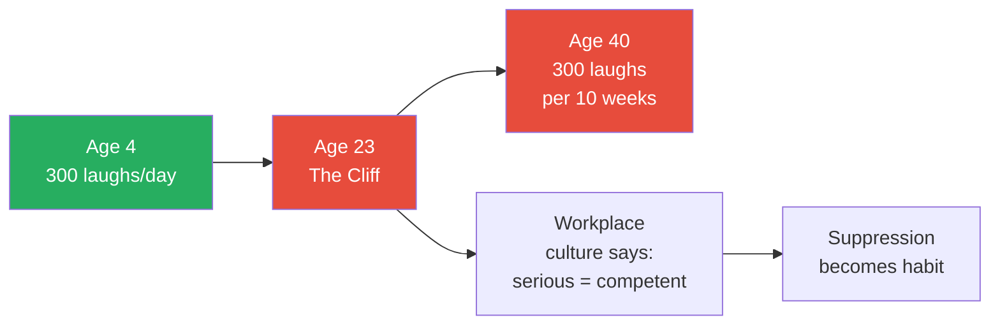
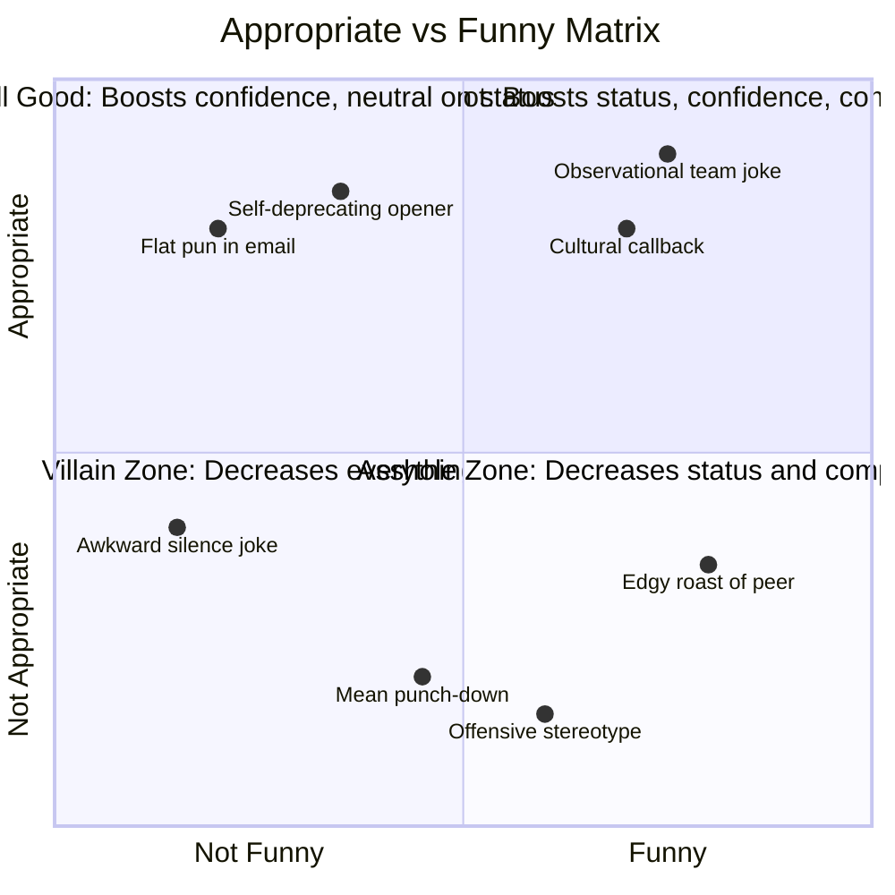
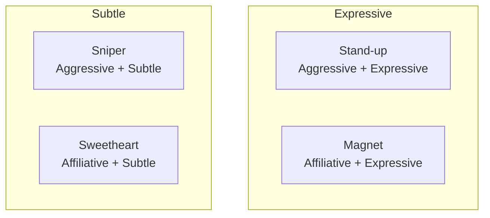
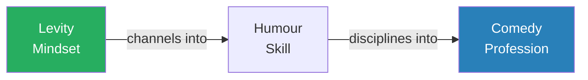
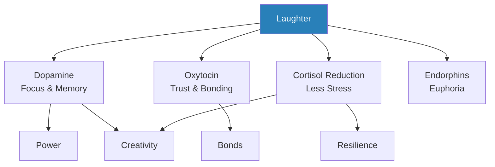
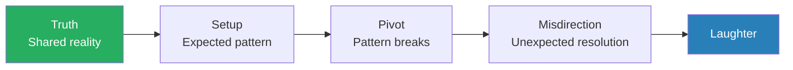
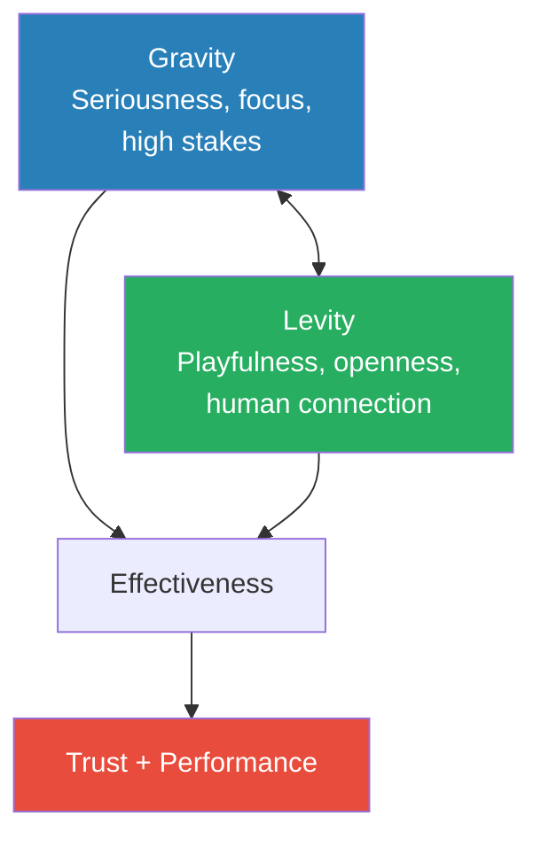
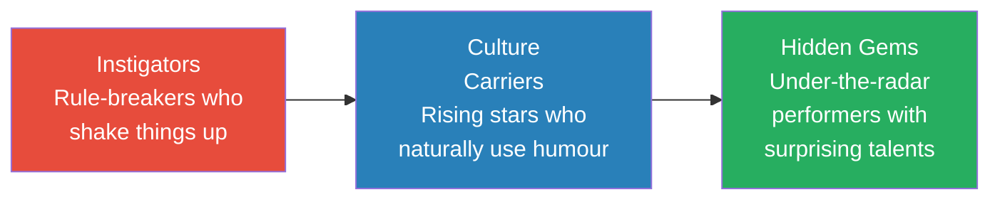
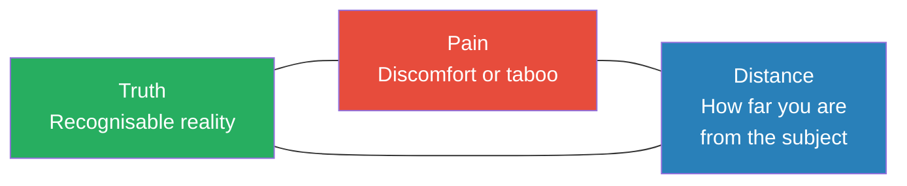

# Humour, Seriously — Jennifer Aaker & Naomi Bagdonas

> Jennifer Aaker, a behavioural scientist and chaired professor at Stanford, and Naomi Bagdonas, an executive coach who moonlights in comedy, spent six years studying why humour is one of the most powerful and underused tools in professional life. Drawing on research involving 1.5 million people across 166 countries, interviews with CEOs, comedians, and world leaders, and their Stanford MBA course "Humour: Serious Business," they build a compelling case that levity is not the opposite of seriousness — it is the complement that makes serious work possible.
> The book dismantles four myths that keep us from using humour at work, reveals the neuroscience behind why laughter unlocks power, trust, creativity, and resilience, teaches comedy techniques from professionals like Seth Meyers and Sarah Cooper, and shows how leaders from Madeleine Albright to Sara Blakely wield levity as a strategic advantage.
> This is not a book about being funny. It is a book about navigating the world with a mindset of levity — and discovering that when you stop taking yourself so seriously, you become more effective, more connected, and more human.

---

## About the Author

Jennifer Aaker is the General Atlantic Professor of Marketing at Stanford Graduate School of Business, where her research focuses on how meaning, purpose, and humour shape human behaviour. Naomi Bagdonas is a lecturer at Stanford GSB, an executive coach, and a graduate of the Upright Citizens Brigade and Second City comedy programs. Together they created the Stanford MBA course "Humour: Serious Business," which has become one of the school's most popular electives. Their partnership blends rigorous behavioural science with the practical craft of comedy — and their writing mirrors that blend, managing to be both deeply researched and genuinely funny.

> [!tip] Why This Book Matters
> Most advice about humour at work boils down to "be yourself" or "lighten up." Aaker and Bagdonas go further — they show the neuroscience of why laughter changes brain chemistry, the specific comedy techniques professionals use to craft humour, and the strategic frameworks that let leaders deploy levity without crossing lines. It is an instruction manual for a skill most people assume is unchartable.

---

## The Big Idea

- We are in the grip of a <b style="color: #2980b9">humour cliff</b> — Gallup data from 1.4 million people across 166 countries shows that laughter and smiling plummet around age twenty-three
- The average four-year-old laughs 300 times a day; the average forty-year-old laughs that many times every two and a half months
- This collapse is not natural — it is caused by a culture of "professionalism" that treats gravity and levity as opposites, when in reality <b style="color: #27ae60">the balance of gravity and levity gives power to both</b>
- When we laugh, our brains release a cocktail of hormones — dopamine (happiness), oxytocin (trust), reduced cortisol (less stress), and endorphins (euphoria) — that literally changes brain chemistry on the spot
- Humour is not a personality trait you either have or lack — it is a learnable skill built on identifiable techniques, and even signalling that you have a sense of humour (without being funny yourself) produces measurable benefits
- <b style="color: #e74c3c">The biggest barrier is not incompetence — it is fear</b>: fear of bombing, fear of seeming unprofessional, fear of crossing a line
- The authors distinguish three levels: **levity** (a mindset of openness to joy), **humour** (the intentional channelling of levity toward a goal), and **comedy** (the professional discipline)
  - Most people do not need to become comedians — they need to reclaim their natural levity
- The book is structured as a journey: first understand what you have lost (the cliff), then learn why it matters (brain science), then learn the mechanics (comedy craft), then apply it (workplace, leadership, culture), and finally navigate the risks (gray areas)

---

## Key Concepts at a Glance

| Concept | One-line summary |
|---------|-----------------|
| **The Humour Cliff** | Laughter plummets at age 23 as we enter the workforce and lose our playfulness |
| **Four Deadly Myths** | Serious Business, Failure, Being Funny, Born With It — all debunked by research |
| **Four Humour Styles** | Stand-up, Sweetheart, Magnet, Sniper — your natural style across two axes |
| **Levity-Humour-Comedy** | Three tiers: levity (mindset), humour (skill), comedy (professional discipline) |
| **Humour Hormone Cocktail** | Laughter releases dopamine, oxytocin, cortisol reduction, and endorphins |
| **Four Benefits** | Power, Bonds, Creativity, Resilience — the measurable returns of workplace humour |
| **Truth + Misdirection** | The two foundational principles underlying all humour |
| **Five Mining Techniques** | Incongruity, Emotion, Opinion, Pain, Delight — where to find funny material |
| **Five Forming Techniques** | Exaggerate, Contrast, Specifics, Analogies, Rule of Three — how to shape raw material |
| **Appropriate vs Funny Matrix** | Appropriateness matters more than whether people laugh |
| **Truth-Pain-Distance** | Anne Libera's framework for navigating humour's gray areas |
| **Humour Fail Lifecycle** | Recognize, Diagnose, Make It Right |
| **Three Culture Archetypes** | Instigators, Culture Carriers, Hidden Gems — who builds culture from below |
| **Peak-End Rule** | People remember the emotional peak and the final moment — design both |
| **Punching Up vs Down** | As you rise, make fun of others less and yourself more |

---

## Introduction: Gravity and Levity

*The authors reveal how two very different career paths converged on the same radical hypothesis: that humour, far from being frivolous, might be one of the greatest competitive advantages in business.*

### Two Origin Stories

- Naomi had been leading a double life — strategy consultant by day, comedy student by night
  - She studied and performed comedy at the Upright Citizens Brigade Theatre, while advising Fortune 50 clients during the day
  - For years she kept these worlds carefully siloed — neither screamed "transferable skills" to the other
  - A client named Bonnie once described Naomi's imagined Friday night as "re-ironing blouses" in a grey apartment with a cat named "Cat"
  - <b style="color: #e74c3c">The reflection was disheartening: she had erased her personality at work</b>
  - After this wake-up call, Naomi set out to prove that humour could be an asset at work, not a liability
  - The question she began asking: why do we leave the most human part of ourselves at the office door?
- Jennifer had no time for any of that — she was focused on research, writing, and getting work done
  - Her view changed fundamentally in 2010 when she wrote *The Dragonfly Effect* about the power of story and networks
  - That led her to meet Amit Gupta, a leukemia patient who infused levity into a life-or-death search for a bone marrow donor

> [!example] Amit Gupta's Bone Marrow Campaign (2010-2012)
> - Amit Gupta was diagnosed with leukemia and needed a bone marrow transplant, but no match existed in the national registry
> - South Asian donors are severely underrepresented in bone marrow registries — the odds of finding a match were vanishingly small
> - Rather than launch a sombre appeal, he and his friends created a lighthearted campaign — goofy T-shirts, "BYOSA: bring your own South Asian" swab parties, comedian PSAs with Aziz Ansari and Chris Pratt
> - The website greeted visitors with his silly grin and the line "bone marrow donations are painless, but boring"
> - The campaign registered tens of thousands of new South Asian donors in bone marrow registries
> - On 20 January 2012, Amit found a perfect match — levity had powered the campaign that saved his life
> **The lesson:** Humour does not trivialise serious things — it gives people the energy and motivation to act on them.

- The authors' research spans 1.5 million people across 166 countries, interviews with comedians and CEOs, workshops at McKinsey, Deloitte, and Forrester, and their Stanford MBA course
- Their central thesis crystallised into a single insight: <b style="color: #27ae60">gravity and levity are not opposites — they are complements, and the best leaders, teams, and cultures balance both</b>

> [!example] The Favourite Apple (2016)
> - After a two-day humour summit at The Second City in Chicago, Naomi stopped at an airport bodega
> - The cashier was curt and snappish with every customer in line
> - Instead of simply asking for an apple, Naomi asked: "Can I please have your favourite apple?"
> - The woman paused, confused — then began digging through the pile, laughing, carefully inspecting each one
> - She held one up triumphantly and handed it over
> - When Naomi went to pay, the woman replied: "Don't worry about it. I don't charge for my favourite apple."
> **The lesson:** A single moment of levity can transform an interaction from transactional to human.

---

## Chapter 1: The Humour Cliff

*The data is sobering: we are going over a humour cliff together, and four stubborn myths are pushing us over the edge. But understanding your humour style — and the difference between levity, humour, and comedy — is the first step back.*

### The Cliff

- Gallup poll of 1.4 million respondents across 166 countries: frequency of laughing or smiling starts to plummet around age twenty-three
- The four-year-old laughs 300 times a day; the forty-year-old manages that number every ten weeks
- <b style="color: #e74c3c">We enter the workforce and trade laughter for professionalism, leaving our sense of humour at the door</b>
- The result: sterile, measured, robotic interactions — and a fundamental misunderstanding about how to do serious work
- The cliff is not biological — it is cultural
  - Children do not lose their sense of humour; they learn to suppress it
  - The workplace signals that seriousness equals competence and levity equals frivolity
  - Over years, the suppression becomes habitual — adults forget they ever had a sense of humour
- The authors argue this cliff represents an enormous, unnecessary loss — of connection, creativity, resilience, and influence

The steepest drop occurs between ages 16 and 23 — precisely when people enter the workforce and internalise the myth that professionalism means suppressing joy.

The humour cliff is not a natural decline — it is a culturally imposed suppression that deepens with every year in the workforce.

---

### The Four Deadly Humour Myths

<b style="color: #2980b9">Myth 1: The Serious Business Myth</b>

- The belief that humour has no place amid serious work
- Reality: 98% of executive leaders prefer employees with a sense of humour; 84% believe those employees do better work (Robert Half / Hodge-Cronin surveys)
- Showing a sense of humour makes peers more likely to attribute higher status and vote you into leadership roles
- Leaders who use self-deprecating humour are rated higher on both trustworthiness and leadership ability
- In a study of 50+ teams, humour in team interactions predicted better communication and higher performance — both immediately and two years later
- The myth persists because we conflate seriousness with competence
  - Being grave does not make you better at your job — it simply makes you seem more worried about your job
  - The most effective leaders and teams are those who take their work seriously without taking themselves seriously

<b style="color: #2980b9">Myth 2: The Failure Myth</b>

- People are paralysed by the fear of bombing or offending
- Research by Bitterly, Schweitzer, and Brooks (Wharton/Harvard) reveals: <b style="color: #27ae60">the most important factor is not whether your joke gets laughs, but whether it is perceived as appropriate</b>

| Quadrant | Appropriate? | Funny? | Effect |
|----------|:----------:|:-----:|--------|
| Sweet spot | Yes | Yes | Boosts confidence, competence, and status |
| Still good | Yes | No | Boosts confidence; neutral on status and competence |
| Asshole zone | No | Yes | Decreases status and competence |
| Villain zone | No | No | Decreases everything |

- An appropriate joke that nobody laughs at still increases perceptions of confidence — only inappropriate humour truly "fails"
- This redefines failure completely: the risk most people fear (silence after a joke) barely matters; the risk that actually damages you (inappropriate content) is entirely within your control
- <b style="color: #27ae60">You control appropriateness. You cannot control whether people laugh.</b> Focus on what you can control

The quadrant chart shows that appropriateness is the dominant axis — an appropriate joke that falls flat (Still Good) carries almost no downside, while a funny but inappropriate joke (Asshole Zone) actively damages status and credibility.

<b style="color: #2980b9">Myth 3: The Being Funny Myth</b>

- You do not need to be funny — you need to signal that you have a sense of humour
- Managers with a sense of humour (regardless of personal funniness): 23% more respected, 25% more pleasant to work with, 17% friendlier (Wayne Decker study)
- Dick Costolo, former Twitter CEO: "The easiest way to have more humour at work is not to try to be funny — instead, just look for moments to laugh"
- The distinction is crucial:
  - "Being funny" puts pressure on you to perform — to create laughter
  - "Having a sense of humour" is about being receptive — noticing what is already funny and acknowledging it
  - One is a performance; the other is a posture
- Simply laughing at other people's jokes, appreciating absurdity, and not taking yourself too seriously all signal a sense of humour — without ever needing to crack a joke

<b style="color: #2980b9">Myth 4: The Born With It Myth</b>

- Humour is not a fixed trait — it is a skill that can be learned, like intelligence or creativity (Carol Dweck's growth mindset)
- Just as intelligence can be developed through effort and practice, humour can be cultivated through deliberate technique
- The rest of the book is structured as a proof of this claim: if humour were innate, there would be nothing to teach
- The authors' Stanford course demonstrates this repeatedly — students who arrive believing they are "not funny" leave with a repertoire of techniques and the confidence to use them

> [!example] Jennifer's Family Humour Hierarchy
> - Jennifer asked her family: "Who is the funniest member of our family?"
> - All three children and her husband went silent — eyes dropped to vegetables, invisible flies were batted
> - Her youngest daughter finally answered: "Dad is the funniest! Then comes us. Also, our dog Mackey. Then you."
> - The rest nodded firmly
> - Five years later, Jennifer co-authored a book about humour — proof the skill can be developed
> **The lesson:** Being voted least funny in your family (behind the dog) is not a life sentence.

---

### The Four Humour Styles

The authors identify four styles along two axes: **content** (affiliative to aggressive) and **delivery** (expressive to subtle).

Each style sits at the intersection of how edgy your content is and how loudly you deliver it.

| Style | Content | Delivery | Signature Move | Risk |
|-------|---------|----------|---------------|------|
| **Stand-up** | Aggressive | Expressive | Bold roasts, crowd energy, thick skin | Alienating Sweethearts |
| **Magnet** | Affiliative | Expressive | Warmth, impersonations, infectious laughter | Seen as unserious |
| **Sniper** | Aggressive | Subtle | Dry one-liners, deadpan delivery, "acquired taste" | Going over people's heads |
| **Sweetheart** | Affiliative | Subtle | Planned, understated lines woven into presentations | Too much self-deprecation |

Stand-up and Sniper styles carry the most edge and risk, while Magnet and Sweetheart trade boldness for warmth — each profile maps directly to how the style lands in different workplace contexts.

- <b style="color: #27ae60">Your style is not fixed — part of using humour effectively is adjusting your approach to the room</b>
- Stand-ups and Snipers tease to show affection but can feel alienating; Magnets and Sweethearts self-deprecate but can undermine their own power
- Each style has characteristic **pitfalls**:
  - Stand-ups can become "the one who makes the meeting about themselves"
  - Magnets risk being perceived as all warmth, no substance
  - Snipers may be so subtle that no one realises they were joking — or worse, the deadpan lands as sincere criticism
  - Sweethearts can erode their own authority through excessive self-deprecation
- The most effective communicators flex between styles depending on context:
  - In a tense negotiation, a Sweetheart move disarms
  - In a brainstorm, a Magnet move energises
  - In a one-on-one, a Sniper move creates intimacy through shared wit

---

### Levity, Humour, and Comedy

The authors use health psychologist Kelly McGonigal's movement/exercise distinction as an analogy:

<b style="color: #2980b9">Levity</b> is like movement — a baseline state of openness to joy that permeates everything, often without thinking.

- **Levity** — a mindset, an inherent state of receptiveness to joy
  - As simple as buying an apple with a smile instead of a scowl
  - It is not about making jokes — it is about being open to delight
  - Levity costs nothing and requires no talent
- **Humour** — intentional, channelling levity toward a specific goal
  - Like exercise: requires skill, effort, and practice
  - You choose when to deploy it and how to shape it
  - The bulk of this book teaches humour as a learnable craft
- **Comedy** — the structured professional discipline
  - Like professional sport: only a select few compete at this level
  - Requires years of dedicated practice, stage time, and failure
  - Most people will never need to operate at this level — and that is fine

> [!tip] Core Insight
> The book's goal is not to turn you into a comedian. It is to get you off the couch and dancing when a good song plays on shuffle.

---

## Chapter 2: Your Brain on Humour

*The science is unambiguous: laughter rewires brain chemistry and produces measurable gains across four domains — power, bonds, creativity, and resilience.*

### The Humour Hormone Cocktail

- When we laugh, our brains release a cocktail of four hormones:
  - **Dopamine** — makes us feel happier, sharpens focus and memory
  - **Oxytocin** — makes us feel more trusting and connected
  - **Reduced cortisol** — makes us feel less stressed and anxious
  - **Endorphins** — produces slight euphoria and reduces pain
- <b style="color: #27ae60">By using humour in professional interactions, you literally change the brain chemistry of everyone in the room</b>
- This is not a metaphor — it is measurable neurochemistry
  - The effect is immediate: within seconds of genuine laughter, brain chemistry shifts
  - The effect lingers: elevated dopamine and oxytocin persist well after the laughter stops
  - The effect compounds: repeated shared laughter builds stronger neural pathways for trust and collaboration

Laughter triggers a neurochemical cascade that fuels all four workplace benefits the authors identify.

The treemap weights each sub-benefit by research strength — resilience and power show the largest measurable effects, while bonds and creativity contribute through compounding psychological safety.

---

### Power: Climbing the Ladder of Levity

*Humour signals confidence, intelligence, and mental agility — and people treat funny people as higher-status, whether they intend to or not.*

- **Status boost**: In the VisitSwitzerland testimonial experiment, a six-word throwaway pun ("the flag is a big plus") made presenters appear 5% more competent, 11% more confident, and <b style="color: #27ae60">37% higher in status</b>
  - The funny presenter was also significantly more likely to be chosen as group leader
  - The pun was not particularly clever — what mattered was the signal of confidence it sent
- **Intelligence signal**: Research by Howrigan and MacDonald found that participants whose humorous replies were rated funniest had scored highest on general intelligence tests
  - Humour requires rapid cognitive processing — recognising patterns, making unexpected connections, reading social context
  - Others intuitively pick up on this: a funny person seems smart because humour is cognitively demanding
- **Negotiation leverage**: In the "pet frog" study, buyers paid 18% more when the seller added "and I'll throw in my pet frog" — and felt better about the deal afterward
  - The absurdity of the offer created a moment of shared amusement that reduced adversarial tension
  - The buyer's willingness to pay more was not irrational — the humour had built rapport and goodwill
- **Memory enhancement**: Viewers of humorous news shows (Daily Show, Colbert Report) recalled more about current events than newspaper or cable news consumers
  - Dopamine released during laughter improves memory encoding
  - If people are laughing, they are paying attention — and they remember what made them laugh

> [!example] Naomi vs Craig at Deloitte
> - Naomi was facilitating a workshop for an executive team, most of whom were fifteen to twenty years her senior
> - Craig, the group's alpha, interrupted: "Can you cut to the part where you just teach me how to make my team do what I want?"
> - The room stiffened — all heads turned to Naomi
> - Without thinking, she fired back: "Great question, Craig. You're thinking of the workshop I run on mind control. That one's next week."
> - A long second passed — then the room erupted in laughter
> - Craig smiled: "I respect you. You can continue." For the rest of the day, he was engaged and respectful
> - He later sent a note to her CEO praising the workshop — opening doors for her career
> **The lesson:** A well-placed moment of humour can rebalance power dynamics and earn lasting respect.

> [!example] Obama's Salmon Joke (2011 State of the Union)
> - During the State of the Union, President Obama noted that the Interior Department handles salmon in freshwater but Commerce handles them in saltwater
> - He paused: "I hear it gets even more complicated once they're smoked"
> - The entire chamber erupted — even opponents cracked smiles
> - When NPR asked listeners which words most stood out from the address, the most frequent answer was "salmon"
> - A single pun about fish became the most memorable moment of a 7,000-word speech on the economy
> **The lesson:** If people are laughing, they are paying attention — and they remember what made them laugh.

---

### Bonds: Building Bridges

*Shared laughter is the fastest shortcut to trust that humans have — and the research on why is both surprising and robust.*

- **Oxytocin and trust**: Shared laughter triggers oxytocin release — the same hormone released during sex and childbirth, prompting the brain to create emotional bonds
- In the blooper clip study (Gray, Parkinson, Dunbar), pairs who watched a funny clip together disclosed significantly more personal information afterward — observers rated their interactions as <b style="color: #27ae60">30% more intimate</b>
  - The funny clip did not make people more vulnerable — it made them feel safe enough to be vulnerable
  - Control groups who watched neutral clips showed no such effect
- In the Bazzini couples study, couples who reminisced about shared laughter reported 23% higher relationship satisfaction than those who recalled other positive moments
  - Shared laughter is not just one positive experience among many — it is uniquely bonding
  - The memory of laughing together reactivates the oxytocin response, reinforcing the bond each time it is recalled
- The mechanism works because laughter is involuntary and hard to fake — a genuine laugh signals: "I trust you enough to let my guard down"
  - This is why forced "team-building humour" often backfires — mandatory fun does not trigger genuine laughter

> [!example] Ben Bernanke's Tan Socks (2005)
> - It was Ben Bernanke's first briefing in the Oval Office as chairman of the Council of Economic Advisers
> - President Bush interrupted to josh Bernanke about pairing his dark grey suit with tan socks
> - Senior advisers Keith Hennessey and Al Hubbard saw an opportunity — they hatched a plan
> - At Bernanke's next briefing, every senior adviser shuffled into the Oval Office wearing tan socks
> - Bush's grin widened — then he turned to VP Cheney and realized he was in on it too
> - The room erupted in laughter; the meeting began more cheerfully than before
> - Hennessey recalled: "It was a trivial thing, but it was a wonderful bonding moment"
> **The lesson:** Small acts of solidarity through humour create trust and cohesion that outlast the moment.

> [!example] Loretta's "Sacred Sexy" Negotiation (Voss callback)
> - In their chapter on bonds, the authors reference a hostage negotiation where FBI negotiator Chris Voss spent hours building rapport with a barricaded gunman
> - The man was agitated, erratic, and dangerous — but through patient, empathetic dialogue, Voss drew him out
> - At one point, the man cracked a joke — and Voss laughed genuinely
> - That moment of shared laughter was the turning point — the man began cooperating shortly after
> - Voss later said the laugh was "the moment I knew we had him"
> **The lesson:** Even in life-or-death situations, a moment of genuine shared laughter signals safety and trust.

---

### Creativity: Sparking Ideas

*Laughter does not make people smarter. It makes them mentally flexible enough to see connections they were previously blind to — and psychologically safe enough to share ideas they would otherwise self-censor.*

- **Duncker's Candle Problem**: Participants who watched a funny video before attempting the puzzle were <b style="color: #27ae60">more than twice as likely to solve it</b> — laughter helped them overcome functional fixedness
  - The puzzle requires creative thinking — pinning a candle to a wall using only a box of thumbtacks and matches
  - Participants who watched the comedy clip were better at seeing the box as a shelf, not just a container
  - The mechanism: dopamine from laughter loosens cognitive rigidity, allowing novel associations
- **MRI evidence**: When brainstorming humorous captions (vs serious ones), participants showed heightened activity in brain regions associated with creativity and higher-level cognitive functions
  - The same neural networks that generate humour also generate creative solutions
  - This is not coincidence — both humour and creativity require making unexpected connections between disparate ideas
- **Kudrowitz (MIT)**: Comedians generated 20% more ideas than other groups in brainstorming tests, and their ideas were rated 25% more creative
  - The comedy training did not make them smarter — it trained them to override their internal censor and voice unusual associations
- Hiroki Asai, former head of Apple's Creative Design Studio: "Fear is the greatest killer of creativity, and humour is the most effective tool I've found for insulating cultures from fear"
  - Fear triggers the brain's threat-detection system, which narrows focus and inhibits creative exploration
  - Laughter does the opposite: it signals safety, broadens attention, and encourages risk-taking with ideas

> [!tip] Core Insight
> Laughter does not make people smarter. It makes them mentally flexible enough to see connections they were previously blind to — and psychologically safe enough to share ideas they would otherwise self-censor.

---

### Resilience: Surviving and Thriving

*When everything is falling apart, the ability to find humour is not a distraction from the crisis — it is the mechanism that makes survival possible.*

- **Cortisol reduction**: Even the anticipation of laughing reduces cortisol (stress hormone) by 39% and epinephrine (fight-or-flight) by 70%
  - Simply knowing you are about to watch something funny triggers the stress-reduction response
  - The implication: you do not even need to laugh — the expectation of laughter is enough to begin lowering stress
- **Bereavement study** (Keltner & Bonanno): People who displayed genuine "Duchenne" laughter when discussing a deceased loved one reported 80% less anger and 35% less distress
  - Duchenne laughter involves the muscles around the eyes — it cannot be faked
  - The finding suggests that the ability to find genuine humour even in grief is not denial — it is a coping mechanism that produces measurably better outcomes
- **Longevity**: A 15-year Norwegian study of 53,000+ people found women with a strong sense of humour had 73% lower risk of death from heart disease and 83% lower risk from infection
  - The effect remained significant even after controlling for other health behaviours
  - The mechanism likely involves chronic cortisol reduction — sustained lower stress levels over years translate to better cardiovascular and immune function

> [!example] Mike Nemeth's Center Stall (West Point, 2001)
> - After September 11th, sophomore Mike Nemeth watched the aftermath from West Point, knowing war was imminent
> - The atmosphere was grim — cadets were training for a war they knew was coming
> - He created an underground satirical newspaper with headlines like "ARMY: BIN LADEN AND AL QAEDA TO BLAME FOR FOOTBALL LOSS"
> - He distributed it covertly by taping copies to the insides of latrine stall doors — hence the name "Center Stall"
> - Cadets began making daily bathroom trips to check for new editions; content ideas were passed to Nemeth clandestinely
> - The Army brass discovered the operation but turned a blind eye after seeing its impact on morale
> - Center Stall became an integral part of West Point culture, surviving long after Nemeth's graduation
> **The lesson:** In times of extreme stress and uncertainty, even a sliver of levity helps people cope and carry on.

> [!example] The AIDS Quilt Humour (1987-ongoing)
> - The authors describe how activists during the AIDS crisis used humour as a survival mechanism — ACT UP's provocative protests mixed rage with dark comedy
> - Larry Kramer, the movement's most visible leader, was famous for his caustic wit — using humour not to diminish the crisis but to make people pay attention
> - The Names Project AIDS Memorial Quilt included panels with jokes, inside references, and playful tributes alongside solemn memorials
> - Volunteers who worked on the quilt reported that moments of shared laughter while sewing kept them going through unspeakable grief
> **The lesson:** Humour in crisis is not denial or disrespect — it is often the only thing that makes continued engagement possible.

---

## Chapter 3: The Anatomy of Funny

*Comedy is not magic — it is a craft built on identifiable mechanics. Every joke begins with truth and ends with surprise, and there are learnable techniques for both.*

### The Two Foundations

<b style="color: #2980b9">Principle 1: Truth</b>

- All humour is rooted in truth — shared, recognisable truth
- Seinfeld was the "show about nothing" precisely because it was about everything people actually experience
- Instead of asking "What is funny?", ask <b style="color: #27ae60">"What is true?"</b> — you will find humour from there
- The reason observational comedy works so well is that recognition is inherently pleasurable
  - When someone articulates a truth you have felt but never expressed, it creates a flash of connection
  - That connection is the foundation of humour — the audience thinks "yes, that is exactly right" before the surprise arrives

<b style="color: #2980b9">Principle 2: Misdirection</b>

- Laughter springs from the unexpected — when someone zigs and then ham sandwiches
- The <b style="color: #2980b9">Incongruity-Resolution Theory</b>: humour comes from the gap between what we expect and what happens
- The setup leads the brain in one direction; the punch line pivots unexpectedly
- Your prefrontal cortex springs into action to resolve the incongruity — generating the experience of humour
- The architecture of every joke follows this pattern:
  - **Setup** — Establishes the expected pattern or direction
  - **Pivot** — The moment the expected pattern breaks
  - **Punch** — The unexpected resolution that creates the laugh
- <b style="color: #e74c3c">Without truth, there is no setup. Without misdirection, there is no surprise. You need both.</b>

Every joke follows this architecture: establish a recognisable truth, build an expectation, then pivot to an unexpected resolution.

---

### Part 1: Finding the Funny — Five Mining Techniques

*The hardest part is not delivering humour — it is finding the raw material. The authors teach five systematic ways to mine your experience for comedy gold.*

| Technique | Question to Ask | Example |
|-----------|----------------|---------|
| **Incongruity** | What contrasts or contradictions do I notice? | Sarah Cooper's packing vs her husband's packing |
| **Emotion** | What makes me irrationally happy, angry, or proud? | Kevin Hart's rant about newly-in-love couples |
| **Opinion** | What widely accepted norm do I find absurd? | Michelle Wolf on jogging being objectively useless |
| **Pain** | What painful or cringe-worthy moment from my life makes a great story? | Maronzio Vance on being too poor to live in fire-prone Malibu |
| **Delight** | What made me smile today that I could share? | James Breakwell's daughter calling ranch dressing "salad frosting" |

- Del Close, the father of improvisational comedy: "The freshest, most interesting comedy is not based on mother-in-law jokes but on exposing our own personalities"
- Sarah Cooper's first instruction to students: "Never look for what's funny — look for what's true and go from there"
- Each mining technique works because it systematises what comedians do intuitively:
  - **Incongruity** trains you to notice gaps between how things are and how they should be
  - **Emotion** trains you to pay attention to disproportionate reactions — your own and others'
  - **Opinion** trains you to question the unquestioned — the norms everyone accepts without thinking
  - **Pain** trains you to transform personal embarrassment into shared connection
  - **Delight** trains you to notice the small absurdities that most people overlook

---

### Part 2: Forming the Funny — Five Techniques

*Once you have the raw material, these five techniques shape it into something that lands.*

> [!abstract] Five Comedy Forming Techniques
> 1. **Exaggerate** — Heighten observations to extremes (Mulaney getting a massage: "I put on a sweater and corduroy pants, and I felt safe")
> 2. **Create Contrast** — Juxtapose two extremes (Seth Meyers: Patriots buy a plane vs Browns downgraded to overhead bin on Spirit Airlines)
> 3. **Use Specifics** — Generic kills comedy; "kale" works where "vegetables" doesn't (Jimmy Fallon)
> 4. **Make Analogies** — Compare via shared emotion ("Big families are like waterbed stores" — Jim Gaffigan)
> 5. **Rule of Three** — Two normal items, then a surprising third ("rich, famous, and humble" — Amy Schumer)

- The **Rule of Three** exploits the brain's pattern-seeking: A, B establish a pattern; C subverts it
  - The first two items create a groove — the brain begins predicting what comes next
  - The third item violates that prediction, creating the incongruity that triggers laughter
  - This technique is so reliable that it appears in virtually every comedian's toolkit
- For **analogies**, the connective tissue is always the emotion — find what you feel about the observation, then find something universal that evokes the same feeling
  - Gaffigan does not compare big families to waterbed stores because of any logical similarity — he connects them through the feeling of "why would anyone choose this?"
- **Specifics** are powerful because they create vivid mental images
  - "I ate a vegetable" is forgettable; "I ate a single piece of kale and felt morally superior for three hours" is memorable
  - The more specific the detail, the more the audience sees it — and seeing is what makes them laugh
- **Exaggeration** works because it takes a truth everyone recognises and amplifies it until the absurdity becomes visible
  - The truth is the anchor; the exaggeration is the spotlight
- **Contrast** creates humour by juxtaposing two realities that should not exist in the same sentence
  - The gap between the two extremes is where the laugh lives

---

### Part 3: Spontaneous Humour

*The most impressive humour is not prepared — it arises in the moment. But even spontaneity has a method.*

- **Know your signature stories** — Catalog your go-to stories that always get a laugh; connect them to the situation at hand
  - Comedians are not making it up on stage — they have a library of tested material they can deploy when the right trigger appears
  - Build your own library: 5-10 stories from your life that reliably get a reaction
- **Notice the here and now** — Seth Herzog (Tonight Show warm-up): the fastest path to spontaneous humour is finding something specific to this group at this moment
  - A comment about the room, the weather, the previous speaker — anything that is shared and present
  - This works because it demonstrates attentiveness, which signals both intelligence and care
- **Use callbacks** — Reference a previous shared laugh to create new laughs and reinforce bonding
  - Callbacks work because they create an in-joke — and in-jokes are bonding agents
  - Each callback reinforces the memory of the original laugh, compounding the connection
  - The most effective callbacks reference something from earlier in the same conversation, not a rehearsed bit

---

### Part 4: Delivering the Funny

*The same line delivered two different ways can either land perfectly or fall flat. Delivery is not secondary to content — it is half the equation.*

> [!abstract] Six Delivery Techniques
> 1. **Pause before the punch** — Build anticipation with silence (Mitch Hedberg)
> 2. **Act it out** — Take on physical behaviours and voices (Sebastian Maniscalco)
> 3. **Dial up the drama** — Vary pitch, tone, and pacing (Maria Bamford)
> 4. **Repeat funny lines** — "Stay in the bit" (Chris Rock)
> 5. **Match delivery to content** — Authenticity trumps technique (Tig Notaro vs Chris Rock)
> 6. **Land with confidence** — Deliver punch lines emphatically and clearly (Ali Wong)

- The **pause** is the most underused and most powerful delivery technique:
  - Silence creates anticipation — the audience leans in
  - The longer the pause (within reason), the bigger the laugh when the punch line lands
  - Most amateurs rush through their punch lines because silence feels uncomfortable — but the discomfort is the point
- **Matching delivery to content** means there is no single correct delivery style:
  - Tig Notaro's deadpan understatement is perfect for her material
  - Chris Rock's explosive energy is perfect for his
  - The worst delivery is one that contradicts the content — being deadpan about something genuinely exciting, or being animated about something subtle
- <b style="color: #27ae60">Authenticity is the ultimate delivery technique</b> — any technique that does not feel natural to you will feel forced to your audience

---

## Chapter 4: Putting Your Funny to Work

*The rubber meets the road: practical, low-risk tactics for infusing levity into emails, bios, difficult conversations, and team brainstorms — without needing to be a comedian.*

### Communicating with Levity

<b style="color: #2980b9">Talk Like a Human</b>

- The Sapir-Whorf Hypothesis: the language we use literally shapes cognition, actions, and worldview
- <b style="color: #e74c3c">If we write like corporate drones, we start acting like them</b>
- The authors argue that corporate jargon is not just annoying — it is actively harmful
  - It distances us from our own thoughts
  - It signals to others that we are performing a role rather than being a person
  - It creates a culture where authenticity feels risky

> [!example] Deloitte's Bullfighter Software (2003)
> - CMO Brian Fugere asked clients what Deloitte could improve — expecting feedback on industry knowledge or global footprint
> - Instead, the most common answer: "So much bullshit! I wish they'd just talk straight to us"
> - Fugere's team compiled a dictionary of the worst jargon — "leverage," "synergize," "envisioneer" — and built software that scored messages on a "Bull Index" from 1 to 10
> - Low scores triggered humorous tongue-lashings: "You are absolutely dependent on other advanced obscurists to understand anything you are trying to communicate"
> - The tool, named "Bullfighter," went viral — downloaded 40,000+ times externally
> - Result: communications improved dramatically, and employees started taking risks and showing personality
> **The lesson:** Stripping corporate jargon is not just about clarity — it gives people permission to be human.

**Five Tactical Email Techniques:**

- **Use callbacks** — Reference a shared laugh from a previous interaction (Daria's "if my hair is perfect" email to her boss)
  - This transforms a routine email into a continuation of a relationship
- **Spice up sign-offs** — "With fingers and toes crossed," "Sheepishly," "Yours, heavily caffeinated"
  - The sign-off is the last thing the reader sees — a surprising one leaves a lasting impression
- **Add a PS** — 90% of people read the postscript before the body (Vögele study); use it for a lighthearted note
  - The PS is prime real estate — and most people waste it
- **Seize the OOO** — Turn out-of-office replies from scarcity ("nobody's home") to abundance ("well, that just made my day")
  - An OOO message is read by dozens of people — it is a micro-broadcast
- **Humanise your bio** — End an impressive professional bio with a self-deprecating line (Steve Reardon's podcast "affectionately described by his wife and two daughters as long, boring, and utterly devoid of substance")
  - The contrast between impressive credentials and self-deprecation creates warmth and approachability

---

### Navigating Difficult Moments

*Humour is not just for easy conversations — it is especially powerful when the stakes are high and the tension is thick.*

<b style="color: #27ae60">Saying the Hard Thing</b>

- The authors identify a paradox: the more serious the message, the more people resist hearing it
- Humour disarms resistance because it bypasses the defensive posture
  - A direct critique triggers defensiveness; the same message wrapped in humour triggers recognition
  - The person laughs first, agrees second — and by the time they realise they have agreed, the resistance has dissolved

> [!example] The CIA Simple Sabotage Field Manual
> - Consultant John Henry keeps a copy of the CIA's WWII-era sabotage manual in his briefcase
> - The manual's recommended sabotage tactics include: refer all matters to committees, make long speeches, haggle over wording, bring up irrelevant issues, reopen previously decided questions
> - When clients unwittingly perform these exact behaviours, Henry reads the manual aloud
> - The executives first laugh nervously in recognition — then laugh in earnest at the absurdity
> - The humour delivers the uncomfortable message without putting anyone on the defensive
> **The lesson:** Sometimes the funniest thing you can do is show people they are already doing what the CIA recommends for destroying organisations.

<b style="color: #27ae60">Persuading Others</b>

> [!example] Sara Blakely's Foot in the Door
> - In the early days of Spanx, Blakely cold-called major retailers — Neiman Marcus, Nordstrom, Saks — but nobody returned her calls
> - She bought pairs of shoes, put a single high heel in each shoebox with a note: "Just trying to get my foot in the door. Can I have a few minutes of your time?"
> - The Neiman Marcus buyer was so amused he called back — that deal gave her legitimacy
> - Within a year, she had accounts with every store on her original list
> **The lesson:** A creative, lighthearted approach cuts through the noise when conventional asks get ignored.

> [!example] Heidi Roizen and the Men's Room
> - As the only woman on a public tech company board, Roizen noticed that discussions and decisions continued in the men's room during breaks
> - She was systematically excluded from important conversations — not by malice, but by habit
> - One day, as the board left for a break, she said: "If you guys continue this conversation in the men's room — I'll come in"
> - The line got a laugh, and her colleagues stopped doing it
> - She had raised a serious structural problem without creating a confrontation — and the behaviour changed permanently
> **The lesson:** A lighthearted comment can address a serious structural problem without forcing a confrontation.

---

### Shifting Mindsets and Unlocking Creativity on Teams

*The most creative teams are not the smartest — they are the ones where people feel safe enough to share their strangest ideas.*

**Three ways to start work sessions with levity:**

| Approach | What It Is | Example |
|----------|-----------|---------|
| **Icebreaker** | Structured activity with personal, relevant questions | Stephen Curry's speed-dating question exercise at SC30 offsite |
| **Tone-setter** | Leader sends a signal through spontaneous action | Curry doing a Steve Ballmer impression ("WHO'S FIRED UP?!") |
| **Cold open** | Attention-grabbing surprise that illuminates a principle | Chris Ertel's Backwards Bicycle — demonstrating that change is hard |

- The **icebreaker** works by giving people a structured excuse to be personal — without the structure, vulnerability feels risky
- The **tone-setter** works by signalling from authority that playfulness is welcome — permission cascades down
- The **cold open** works by creating a shared experience that resets attention and establishes a frame

---

<b style="color: #2980b9">The Bad Idea Brainstorm</b>

- Astro Teller (head of Google X): instead of asking for good ideas, explicitly request "the silliest, stupidest ideas"
- <b style="color: #27ae60">When your brain censors your silliest thoughts, it is also censoring your most brilliant ones</b>
- "There are no genius ideas that don't sound crazy at first"
- The energy shifts, orthodoxies fall away, and unexpectedly brilliant solutions emerge
- The mechanism is psychological safety:
  - Asking for bad ideas removes the fear of judgment
  - Once the fear of judgment is gone, the internal censor relaxes
  - Once the censor relaxes, genuinely creative ideas flow alongside the silly ones
  - The silly ideas often contain seeds of brilliance that would never have surfaced in a "serious" brainstorm

> [!example] Matt Klinman's Comedy-Powered Consumer Insights
> - A global retailer facing declining foot traffic hired Matt Klinman, former head writer of The Onion Video
> - Klinman turned the strategic question "How should stores compete against e-commerce?" into a joke setup: "Reasons It's Better to Go to the Store than Buy Online"
> - Hundreds of comedy writers submitted punch lines: "Amazon never lets you keep the hanger," "We don't have a Sbarro at home," "My New Year's resolution was to meet new people"
> - Each joke contained a real consumer insight — little extras, food/experience, desire for human connection
> - The jokes directly informed a new in-store customer experience strategy
> - Traditional market research had failed to surface these insights — comedy unlocked them
> **The lesson:** Jokes are truth-mining machines. Turning a business problem into a joke setup can unlock insights that conventional brainstorming misses.

---

## Chapter 5: Leading with Humour

*At a time when 58% of employees trust a complete stranger more than their own boss, humour is not a luxury for leaders — it is a survival strategy.*

### The Trust Crisis

- Harvard Business Review 2019: 58% of employees trust a stranger more than their boss
- 45% cite lack of trust in leadership as the single biggest issue impacting their performance
- 55% of CEOs agree this crisis is a threat to organisational growth
- <b style="color: #e74c3c">In the trustworthiness power-rankings, powerful humans are losing to domesticated wolves (44% of Americans own dogs; only 34% of 18-29 year-olds trust business leaders)</b>
- Yet high-trust organisations are 32x more likely to take beneficial risks, 11x more likely to see higher innovation, 6x more likely to achieve higher performance (2016 HOW Report)
- The trust gap is not primarily about competence — it is about perceived humanity
  - Leaders who seem robotic, calculated, and guarded trigger suspicion
  - Leaders who show vulnerability, warmth, and humour trigger trust
  - Humour is one of the most efficient ways to close this gap because it is inherently human and hard to fake

### Leaders Who Wield Humour

> [!example] Leslie Blodgett's New York Times Ad (2009)
> - During the recession, bareMinerals founder Leslie Blodgett decided to take out a full-page ad in the Times
> - Instead of using copywriters, she wrote it herself at her kitchen table — authentic, vulnerable, and leavened with humour
> - The ad included a real phone number that connected to Hilda, who sat in the office lobby scheduling coffee dates with callers
> - "We measured the effectiveness of that ad by the camaraderie," Blodgett said — "it was a living and very public example of our values"
> - She had earlier discovered this power on QVC, where she would parent her son through the TV, kick off her shoes, and once played harmonica while spinning a hula hoop — and the phones lit up with orders every time
> **The lesson:** Authenticity and levity are not the opposite of professionalism — they are what make people trust you enough to buy, work for, and follow you.

> [!example] Madeleine Albright and "East West Story" (1998)
> - At the ASEAN Summit in the Philippines, Secretary of State Albright was handed lyrics to "Mary Had a Little Lamb" for the mandatory delegation skit
> - Her Russian counterpart Yevgeny Primakov (former KGB) had tried to intimidate her at their first meeting: "Given my background, you do know that I know everything about you?"
> - Both delegations needed theatrical help — so they decided to do something unprecedented: a duet
> - They rehearsed late into the night with "a lot of vodka" in the General MacArthur suite
> - The next day, after a difficult negotiation, Albright sang "Maria" from West Side Story; Primakov responded with "Madeleine Albright, I just met a girl called Madeleine Albright"
> - The relationship transformed — they became genuine friends, shared meals at Georgian restaurants, and their personal bond made difficult negotiations more productive
> **The lesson:** In high-stakes diplomacy, levity can build the human connection that makes tough conversations possible.

- Albright also used humour through her diplomatic **pins**: a snake pin when discussing Iraq (after Saddam called her a "serpent"), a bug pin after discovering the Russians had bugged the State Department
  - Each pin was a private joke that became a public signal — demonstrating wit, confidence, and an ability to defuse tension
  - The pins became so famous that they were exhibited at the Smithsonian

---

### Owning the Oops

*The most powerful thing a leader can do is not be perfect — it is to show how they handle imperfection.*

- Sara Blakely holds regular "Oops Meetings" at Spanx where she spotlights a recent mistake — then dances to a thematically appropriate song (once chose "Mr. Roboto" for a product that went on too long)
- <b style="color: #27ae60">When leaders laugh about their screw-ups, others feel safe owning up to theirs</b>
- Stanford research: people who frame their life stories as comedies (rather than tragedies or dramas) report less stress and more fulfilment
- The mechanism is psychological safety:
  - If the CEO can laugh about a mistake, it signals that mistakes are survivable
  - If mistakes are survivable, people take more risks
  - If people take more risks, innovation increases
  - The Oops Meeting is not a gimmick — it is a systematic tool for building a risk-tolerant culture

> [!example] The Southwest Airlines "Malice in Dallas" (1992)
> - Southwest Airlines unknowingly adopted Stevens Aviation's slogan "Just Plane Smart"
> - Rather than engage in a costly trademark lawsuit, Stevens CEO Kurt Herwald challenged Southwest CEO Herb Kelleher to an arm wrestling match for the rights
> - 4,500 spectators packed a Dallas stadium; Kelleher entered with cheerleaders and the Rocky theme song
> - Kelleher, a chain-smoker and bourbon drinker, was no athlete — the "match" lasted about 35 seconds; Herwald won
> - But Herwald offered to share the slogan anyway
> - Southwest earned an estimated $6 million in positive publicity; Stevens saw 25% higher growth over four years
> - Herwald: "For months and years after, the change to company culture was palpable"
> **The lesson:** A playful, creative solution can save millions in legal fees while strengthening both brands and cultures.

---

### Balancing Gravity and Levity

*The authors return to their central theme: gravity and levity are not opposites. The most effective leaders oscillate between both — and know when each is called for.*

> [!example] Branson, Carter, Tutu, and The Elders (2004)
> - Richard Branson hosted founding meetings of The Elders — Nelson Mandela's group for global peace — on Necker Island
> - Jean Oelwang's team had prepared elaborate daily schedules and hundreds of pages of presentations
> - Branson took one look and put the PowerPoints in the bin: "Half the day play, half the day work"
> - Oelwang pushed back — world leaders were flying in from across the globe
> - Branson prevailed — afternoons included teaching Archbishop Tutu to swim
> - The founding values of The Elders were created not during a structured session but during an afternoon when President Carter and Archbishop Tutu sat together on the beach, their feet in the sand
> - The most serious work — defining values for a global peace initiative — happened in the most relaxed setting
> **The lesson:** The most serious work often happens when you create room for play.

Neither gravity nor levity alone produces great leadership — it is the dynamic balance between the two that builds trust and drives performance.

---

## Chapter 6: Creating a Culture of Levity

*Culture is not created by one leader alone. The most powerful thing a leader can do is create the conditions in which humour can come from anywhere.*

### Set the Tone from the Top

- Leaders have disproportionate influence — public displays of levity give tacit permission for others to follow
- <b style="color: #27ae60">Spontaneous humour is more effective than planned humour because surprise is the key ingredient</b> — if it feels planned, it better be good
- Dick Costolo at Twitter would call on colleague April Underwood for companywide presentations — their natural rapport let employees vicariously rib the boss
  - The message was clear: if Underwood can joke with the CEO, anyone can
- Google's TGIF meetings: Larry Page and Sergey Brin's witty repartee became the cultural highlight; Eric Schmidt: "You get the leadership you inspire"
- The authors emphasise that tone-setting is not about the leader being funny — it is about the leader making space for others to be funny
  - Laughing at someone else's joke is as powerful as making one
  - Publicly appreciating a moment of levity signals that humour is valued

### Three Culture Archetypes

Each archetype contributes differently to culture — and leaders must identify and elevate all three.

| Archetype | Who They Are | How to Leverage Them |
|-----------|-------------|---------------------|
| **Instigators** | Rabble-rousers, nonconformists, rule-breakers | Give them cultural licence; they catalyse step changes |
| **Culture Carriers** | Rising stars respected for both performance and humour | Invite them into challenges; let them add their own flavour |
| **Hidden Gems** | Hardworking, under-the-radar performers with surprising talents | Spotlight their unique skills; signal that whole selves are welcome |

- **Instigators** are the spark — they do things nobody asked for and nobody expected
  - They are often seen as troublemakers, but the best leaders recognise them as culture catalysts
  - The risk: Instigators can go too far if unchecked — leaders must channel their energy, not suppress it
- **Culture Carriers** are the fire — they spread levity through their daily interactions
  - They are respected for their work, so their humour carries weight
  - They make others feel that being funny and being competent are compatible
- **Hidden Gems** are the fuel — they have talents and personalities that most people never see
  - Spotlighting them sends a message: "We value the whole person, not just the job title"
  - This message attracts and retains people who might otherwise feel they need to hide parts of themselves

> [!example] Johnny Damon Enters the Yankees Clubhouse (2006)
> - The New York Yankees had a formal, buttoned-up culture — George Steinbrenner's strict hair policy made them "the Goldman Sachs of baseball" (Alex Rodriguez's words)
> - New acquisition Johnny Damon walked in on day one at 6 AM with his boom box playing Kid Rock at full volume
> - Rather than creating friction, his energy electrified the group — "it unlocked a lot of people's sense of humour," Rodriguez said
> - Pitcher AJ Burnett started pie-ing teammates after home runs — a tradition that became a beloved ritual
> - The team went on to win the 2009 World Series — Rodriguez credits the culture shift as a key factor
> **The lesson:** One well-placed Instigator can transform an entire team's culture — but only if leaders are perceptive enough to embrace them.

> [!example] Connor Diemand-Yauman as "Sebastian Thrun" at Coursera
> - At Coursera, star employee Connor Diemand-Yauman showed up at the Halloween party dressed as rival CEO Sebastian Thrun
> - CEO Rick Levin invited him to reprise the character at a companywide all-hands meeting
> - "Thrun" heckled Levin from behind: "Oooo, you think you ist so fancy und smart, yah?"
> - Employees roared with laughter; Levin remained unfazed — by championing the bit, he gave permission for everyone to play
> - Years after Diemand-Yauman's departure, the culture of levity is still cited as a primary reason people join and stay at Coursera
> **The lesson:** When leaders amplify their Culture Carriers, the effects reverberate long after the original moment.

---

### Institutionalise Levity

*The best cultures do not leave humour to chance — they build systems and rituals that make levity inevitable.*

<b style="color: #2980b9">Curate Defining Moments (Peak-End Rule)</b>

- Daniel Kahneman's Peak-End Rule: we remember experiences by their most emotionally heightened moment (peak) and their final moment (end)
  - If you want people to remember an event positively, design the peak and the ending deliberately
  - Humour is the easiest way to create a peak — a moment of shared laughter becomes the moment people remember
- Hiroki Asai at Apple: crafted companywide All Hands meetings with surprise performances — gospel choirs, Blue Man Group costumes, elaborate chase scenes
  - These moments had nothing to do with business — but they became the defining memories of working at Apple
- Google X's "Dia X": an annual Day of the Dead ceremony where employees build altars to killed prototypes and deliver eulogies for shut-down businesses
  - The eulogies are funny, touching, and deeply human — celebrating failure rather than hiding it
  - This ritual transforms the pain of cancelled projects into shared folklore

<b style="color: #2980b9">Turn Accidents into Folklore</b>

- Ford Smart Mobility: an engineer remarked a problem was "harder than putting socks on a chicken" — the team now gives wild socks as weekly recognition awards
  - A spontaneous metaphor became a permanent ritual — and the ritual became a defining feature of team identity
- Allbirds CEO Joey Zwillinger: an employee bet him they would hit $1.25M revenue in a month, wagering a frose machine — they hit it, and Frose Fridays became a permanent tradition
  - The bet created a moment of levity; honouring it created a culture of follow-through and fun
- The pattern: accidents become stories, stories become traditions, traditions become culture
  - <b style="color: #27ae60">The leader's job is not to manufacture these moments but to recognise them when they happen and give them permanence</b>

<b style="color: #2980b9">The Walls Can Talk</b>

- Brendan Boyle (IDEO): "Physical space is the body language of an organisation — when verbal and physical language disagree, the physical reigns supreme"
- Google/Facebook conference rooms named "We Didn't Start the Firefox," "Toxicated"
- JibJab hung a misspelled "AGLITITY" sign and kept it — a reminder they embrace failure
- Tesla displayed "ALL OUR PATENT ARE BELONG TO YOU" on a factory wall
- At Pixar, an employee once cut an archway into a wall; when filled in later, they drew its outline as a memorial — a signal that traditions grow, evolve, and die organically
- The environment sends constant messages:
  - Sterile, beige walls say "this is a place for work, not personality"
  - Quirky, storied spaces say "this is a place for humans"

> [!tip] Core Insight
> Culture is not a top-down mandate. The strongest cultures emerge when leaders plant the right seeds, enable the right people, and then get out of the way.

---

## Chapter 7: Navigating the Gray Areas of Humour

*What people find funny — and appropriate — is far from universal. This chapter is about walking the line, and what to do when you stumble over it.*

### Truth, Pain, Distance

Anne Libera (The Second City) provides a three-component framework for understanding humour's gray areas:

All three components must be calibrated together — if any one is misaligned, humour crosses the line.

- **Truth** — We laugh at what we recognise; but truth coupled with pain and not enough distance feels insensitive
  - A joke about traffic is low-pain, high-recognition — safe territory
  - A joke about cancer is high-pain, variable-recognition — requires careful calibration
- **Pain** — Can be physical or emotional, from mild embarrassment to severe trauma
  - Finding humour in pain can be cathartic or re-traumatising — depends on distance
  - The same joke about a car accident lands differently one day after vs one year after
- **Distance** — Temporal (too soon?), geographic (happened to me vs someone far away), or psychological (how relevant to my personal experience)
  - Comedians often joke about their own painful experiences — the distance is personal ownership ("this happened to me, so I get to joke about it")
  - Joking about someone else's painful experience without their consent or shared experience is where humour most often crosses the line

**Three Rules for Walking the Line:**

- <b style="color: #27ae60">Examine the truth</b> — Remove the humour. Does the underlying statement still feel appropriate?
- <b style="color: #27ae60">Consider the pain and distance</b> — How deep is the pain? How far away is the audience from it?
- <b style="color: #27ae60">Read the room</b> — Not just what will make them laugh, but how it will make them feel

> [!example] The Cisco Tweet
> - Someone tweeted: "Cisco just offered me a job! Now I have to weigh the utility of a fatty paycheck against the daily commute to San Jose and hating the work"
> - The tweet was public — a Cisco employee saw it and flagged it
> - The truth stung: strip the humour, and the person is saying "working at Cisco sucks"
> - The job offer was rescinded
> - The poster had failed to apply the "remove the humour" test — the underlying message was inappropriate regardless of the comedic framing
> **The lesson:** Before posting, ask: "If I remove the humour, would I still say this publicly?" If not, don't say it publicly with humour either.

---

### The Lifecycle of a Humour Fail

*Everyone will eventually cross the line. The question is not whether you will fail, but how you will recover.*

> [!abstract] Three Steps to Recover from a Humour Fail
> 1. **Recognize** — Notice the silence, the nervous laughter, or someone telling you directly
> 2. **Diagnose** — Did you fail to read the room? Punch down? Choose the wrong medium? Fall into your style's pitfall?
> 3. **Make It Right** — Apologise sincerely, take action (not just words), and learn from it

**Three reasons recognition gets harder as you rise:**

- <b style="color: #e74c3c">Appropriateness is a moving target</b> — what worked as a middle manager may not land as CEO
  - As your power increases, the same joke carries different weight
  - A joke about working late hits differently from the person who can fire you
- <b style="color: #e74c3c">Higher status shrinks your targets</b> — punch up = brave; punch down = bully
  - At the top, there is no one left to punch up at — every joke punches down or sideways
  - Self-deprecation becomes the safest and most effective form of humour for senior leaders
- <b style="color: #e74c3c">Laughter becomes unreliable</b> — subordinates laugh at the boss regardless (Florida State muffin joke study: people laughed more at the exact same joke when told by someone of higher status — even on prerecorded video where the teller could not observe them)
  - This is a genuine trap: the higher you rise, the funnier you think you are, because everyone laughs — but the laughter is increasingly performative
  - The only reliable signal at the top is trusted confidants who will tell you the truth

> [!example] Thomas's "Take It Away, Jackie!"
> - Thomas, CEO of a small digital media company, had to fire an underperforming employee named Jackie
> - At the first team meeting after the firing, Jackie's absence was palpable — everyone was thinking about it
> - To cut the tension, Thomas opened with: "Take it away, Jackie!"
> - A few nervous chuckles, then silence — one employee stood up: "I don't think that's funny"
> - Thomas immediately recognised his mistake: "You're absolutely right. I'm so sorry"
> - He restarted the meeting with a sincere acknowledgment of Jackie's departure, invited concerns, and addressed them with candour
> - An employee responded: "That's okay. You can start over if you want"
> **The lesson:** Recognise fast, apologise sincerely, and take corrective action. Don't explain away the fail — own it and start over.

---

### Punching Up vs Punching Down

- April Underwood's career arc illustrates this perfectly:
  - At Google and Twitter (junior), her irreverent humour helped her climb — she was "punching up"
  - At Slack (chief product officer), the same humour could be scary to employees — she had nowhere to punch but down
  - "I had to figure out what humour looked like for me as the boss in the room"
- <b style="color: #27ae60">Rule of thumb: as you move up, make fun of others less, and yourself more</b>
- The direction of the punch determines how it lands:
  - **Punching up** (at authority, at institutions, at the powerful) reads as brave and relatable
  - **Punching sideways** (at peers) reads as camaraderie or competition — context determines which
  - **Punching down** (at subordinates, at the vulnerable) reads as bullying — regardless of intent

### The Responsibility of Superpower

- <b style="color: #e74c3c">Derogatory, identity-based humour perpetuates prejudice</b> — research shows that sexist men exposed to sexist jokes become more tolerant of harassment and recommend larger funding cuts to women's organisations
  - The joke does not create the prejudice — but it normalises it, making prejudiced behaviour feel more acceptable
- The Moth's number one storyslam rule: don't make another person's identity the prop, plot point, or punch line
- Seth Meyers's "Jokes Seth Can't Tell" segment: writers Amber Ruffin and Jenny Hagel deliver punch lines that Meyers, as a straight white male, cannot
  - The segment makes the point explicitly: who tells the joke matters as much as what the joke says
- Sarah Silverman's "mouthful-of-blood laugh": the danger that someone laughs not at the satire but because they agree with the stereotype
  - Satire requires the audience to understand the irony — when they don't, the satirist has inadvertently reinforced the very thing they were mocking

---

## Chapter 7.5: Why Humour Is a Secret Weapon in Life

*The book closes not with business advice but with something deeper: five wishes people express on their deathbeds — and how levity fulfils each one.*

Jennifer's mother has volunteered at hospice for nearly forty years. The wishes people express in their final days cluster around five themes — each one connected to humour:

| Wish | Connection to Humour |
|------|---------------------|
| **Boldness** — "I wish I had lived more fearlessly" | Humour does not make us braver — it opens us to change and helps us bounce back from setbacks |
| **Authenticity** — "I wish I had lived true to myself" | Humour empowers us to share risky, unconventional parts of ourselves |
| **Presence** — "I wish I'd stopped to appreciate the moment" | Humour requires watching carefully as life unfolds — it engenders presence |
| **Joy** — "I wish I had laughed more" | Joy is not an accident but a choice — being generous with laughter is how it flows |
| **Love** — "I wish I'd said 'I love you' one more time" | Sharing a laugh is a tiny expression of love — it quickens trust and deepens relationships |

- The shift from business to mortality is deliberate:
  - The authors want to make clear that humour is not a career hack — it is a way of being
  - Everything they have described — the neurochemistry, the techniques, the leadership strategies — matters not because it improves quarterly numbers but because it improves the quality of a life
- <b style="color: #27ae60">Nobody on their deathbed wishes they had been more serious</b>

---

### Michael Lewis on Humour

In the afterword conversation, Michael Lewis offers a crystallising metaphor:

- "Humour is not its own category — it's something that bleeds into all the other categories. It's like salt on airplane food — it makes everything better"
- "If 'being funny' is an outcome, and if you focus on that outcome too much, you can lose the flow. Much better not to focus on being funny. Let the funny just take care of itself"
- "Using humour is like starting a fire. It's cold and dark where you are; you want to get it to warm up and be lighter. So you cause a little trouble. And as long as there is love behind that trouble, it lands as fun"
- Lewis's metaphors reinforce the book's core distinction:
  - Trying to "be funny" is like trying to "be warm" — it is a forced outcome
  - Creating levity is like starting a fire — it is an act of care that produces warmth as a byproduct

---

## The Verdict

Aaker and Bagdonas have written a genuinely rare thing: a business book about humour that is both rigorous and funny. The neurochemistry is real (dopamine, oxytocin, cortisol reduction), the behavioural research is robust (status perceptions, negotiation outcomes, team performance over time), and the comedy techniques are drawn from actual professionals rather than pop-psychology generalisations. The four-quadrant appropriate/funny matrix alone is worth the read — it redefines failure in a way that should liberate anyone who has ever been afraid to crack a joke at work.

The book's weakness is one it shares with many business books that rely heavily on stories: the examples can feel cherry-picked for success. Almost every anecdote features someone who used humour and reaped rewards — the failures are largely confined to Chapter 7 and tend to be quickly resolved. A more honest treatment would include cases where humour backfired irreparably — careers derailed, relationships destroyed, cultures poisoned by the wrong kind of levity. The book also leans heavily toward corporate Western contexts; the cultural dimensions of humour across Asia, the Middle East, and Africa receive scant attention despite the Gallup data spanning 166 countries. Humour norms vary enormously across cultures, and a book drawing on 166 countries of data should have spent more time on that variation.

The reader who will benefit most is the person who already suspects humour matters but needs the science, the frameworks, and the practical techniques to deploy it with confidence — especially leaders who feel the tension between authority and approachability. The book is also valuable for anyone who has fallen off the humour cliff (most adults) and needs permission to climb back up. It is less useful for people who are already naturally funny — the comedy techniques will feel basic to anyone with stage experience, and the neurochemistry sections, while interesting, do not offer actionable depth beyond "laughter is good for you."

Compared to [[The Charisma Myth - Olivia Fox Cabane]], which focuses on the mechanics of personal magnetism, this book operates at the intersection of personal charisma and organisational culture. Where [[How to Win Friends and Influence People - Dale Carnegie]] teaches you to make others feel important, *Humour, Seriously* teaches you to make others feel human — and shows that the distinction matters more than ever in an era of eroded trust and sterile digital communication. It pairs well with [[The Culture Code - Daniel Coyle]] on building team trust and [[Crucial Conversations - Kerry Patterson]] on navigating high-stakes dialogue. For the psychology of why certain approaches to influence work at a neurological level, see [[Influence - Robert Cialdini]] and [[Pre-Suasion - Robert Cialdini]].

---

## Related Reading

- [[The Charisma Myth - Olivia Fox Cabane]] — Deeper mechanics of personal warmth and presence
- [[How to Win Friends and Influence People - Dale Carnegie]] — The foundational text on making people feel valued
- [[The Culture Code - Daniel Coyle]] — Building safety, vulnerability, and purpose in teams
- [[Crucial Conversations - Kerry Patterson]] — Navigating high-stakes dialogue with skill
- [[Influence - Robert Cialdini]] — The psychology of persuasion and likability
- [[Pre-Suasion - Robert Cialdini]] — Shaping receptiveness before the message
- [[Like Switch - Jack Schafer]] — FBI techniques for building rapport and trust
- [[Games People Play - Eric Berne]] — Understanding the social transactions beneath the surface
