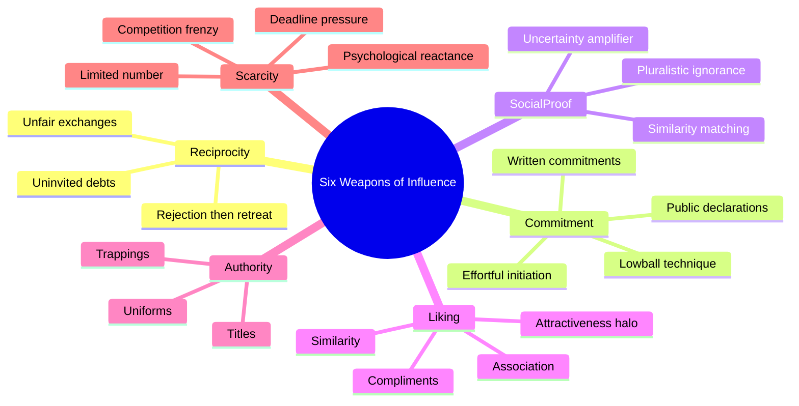
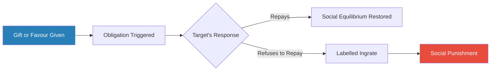
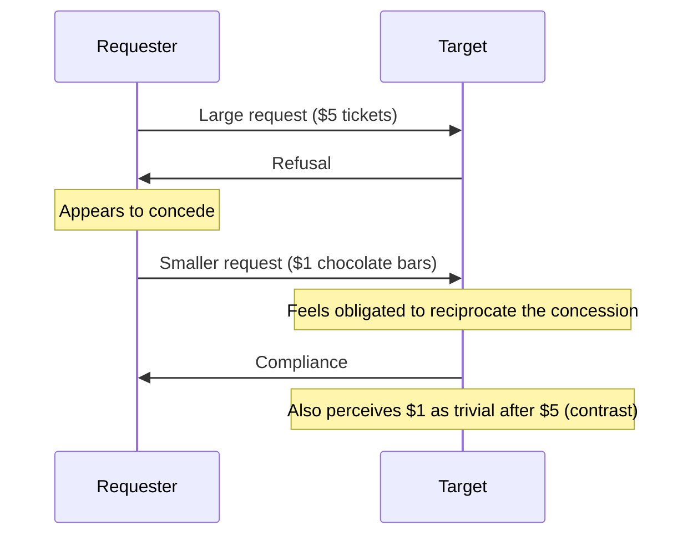
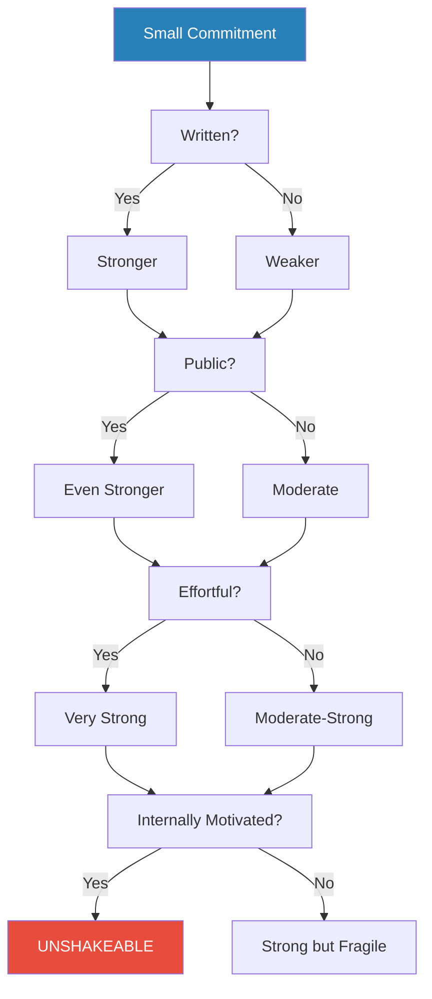
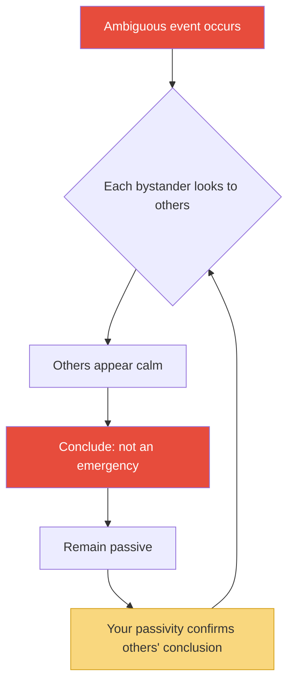
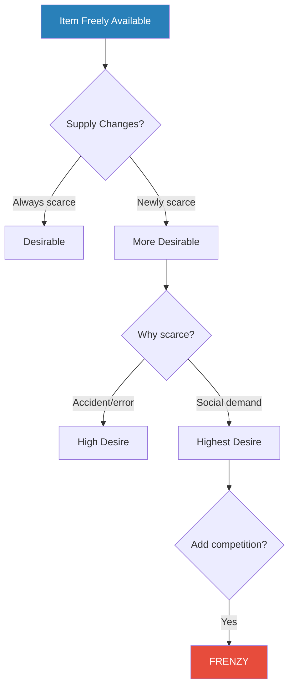
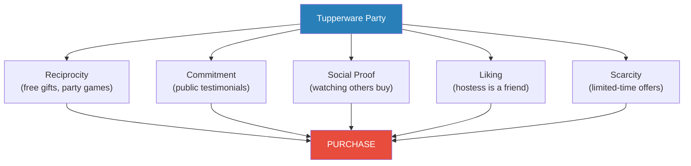
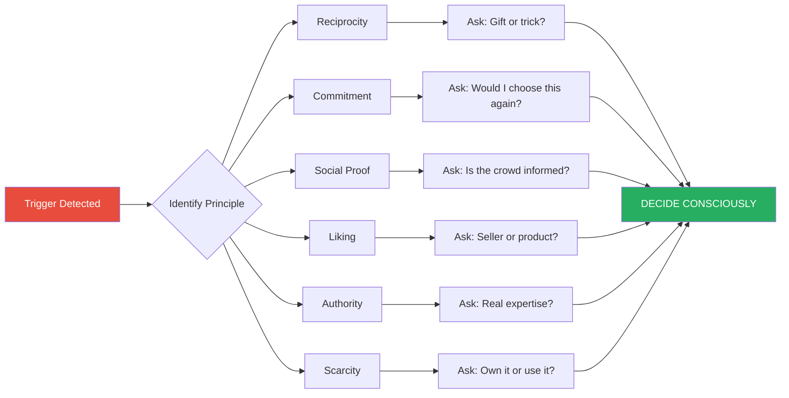

# Influence: The Psychology of Persuasion — Robert B. Cialdini

> Robert Cialdini spent three years undercover — posing as a sales trainee, a fundraiser, an advertising recruit — to answer a deceptively simple question: why do people say yes?
> What he found was that the thousands of tactics compliance professionals use to get their way nearly all reduce to six fundamental psychological principles, each exploiting the same basic human tendency: we rely on mental shortcuts to navigate an overwhelming world, and anyone who knows which shortcuts to trigger can make us comply without thinking.
> The result is the most important book on persuasion ever written — not because it teaches manipulation, but because it anatomises the automatic patterns that govern our decisions and shows exactly where we are vulnerable.
> Cialdini draws on ethology, social psychology, and his own fieldwork to build a framework that is simultaneously rigorous and readable, academic and street-smart.
> Every salesperson, negotiator, marketer, and self-aware human being should read it — and then read it again as a defence manual.

---

## About the Author

Robert B. Cialdini is Regents' Professor Emeritus of Psychology and Marketing at Arizona State University, where he spent his career studying the science of influence. What makes him unusual among academics is his methodology: before writing this book, he spent three years infiltrating the world of compliance professionals through participant observation — answering newspaper ads for sales trainees, posing as an aspiring fundraiser, embedding himself in advertising and public-relations agencies. The result is a book that combines the rigour of controlled experiments with the texture of firsthand field experience, a combination almost no one else in the persuasion literature has achieved. First published in 1984, *Influence* has sold over five million copies and has been translated into over forty languages, making Cialdini the most cited living social psychologist working on persuasion.

---

## The Big Idea

- Cialdini's central insight is that human beings are <b style="color: #2980b9">shortcut machines</b>
- We live in an environment so complex and fast-moving that we cannot possibly analyse every decision fully
- Instead, we rely on automatic responses triggered by specific cues — what Cialdini calls <b style="color: #2980b9">click, whirr</b> patterns
- These patterns are usually adaptive: they save cognitive energy and produce correct decisions most of the time
- The name comes from ethology — the "click" of a trigger feature followed by the "whirr" of a fixed-action pattern running its course

---

- The problem is that these same shortcuts can be <b style="color: #e74c3c">exploited by anyone who knows which trigger to pull</b>
- Compliance professionals — salespeople, fundraisers, con artists, negotiators, advertisers — have discovered through trial and error which triggers produce automatic "yes" responses
- They structure their requests to engage these triggers, producing compliance that feels voluntary but is largely mechanical
- <b style="color: #27ae60">Understanding these six triggers is the single most important defensive skill a person can develop against unwanted influence</b>

---

- Cialdini draws an ethological parallel that runs through the entire book
- Just as a mother turkey responds to the "cheep-cheep" sound of her chicks rather than to the chicks themselves — and will mother a stuffed polecat that plays the sound while attacking her own silent chick — humans respond to <b style="color: #2980b9">trigger features</b> rather than to full situational analysis
- The six weapons of influence are the human equivalents of "cheep-cheep": they activate automatic compliance programs in our brains
- Ellen Langer's "because" study demonstrates this vividly:
  - When people asked to cut in line at a photocopier said "May I use the machine because I'm in a rush," 94% were allowed to cut
  - When they gave no reason, only 60% complied
  - But when they said "May I use the machine because I need to make copies" — a non-reason — <b style="color: #2980b9">93% still complied</b>
  - The word "because" was the trigger feature — the actual content was irrelevant
- Langer's study demonstrates that when the stakes are low and cognition is minimal, a trigger feature alone can produce near-total compliance
- This is the operating system on which every principle in the book runs

The six principles are not independent — they combine and amplify each other in real compliance situations — but each is powerful enough on its own to produce compliance that the target would not otherwise give.

Each weapon branches into specific tactics that compliance professionals deploy — the treemap reveals that rejection-then-retreat, lowball, and psychological reactance carry disproportionate weight as the hardest-to-resist techniques within their respective categories.

Cialdini's brilliance lies in recognising that these six principles are not merely persuasion tactics but fundamental features of how humans navigate social reality. They are cognitive heuristics — mental rules of thumb that have served us well for millennia. The compliance professional's art is not creating new psychology but hijacking existing psychology that evolved for entirely different purposes.

---

## Key Concepts at a Glance

| Principle | Trigger | Core Mechanism | Classic Example |
|-----------|---------|---------------|-----------------|
| **Reciprocity** | Receiving a gift or concession | Obligation to repay | Hare Krishna flowers |
| **Commitment & Consistency** | Making a small commitment | Internal pressure to stay consistent | Chinese POW essay contests |
| **Social Proof** | Seeing others do something | Assuming it must be correct | Canned laughter on sitcoms |
| **Liking** | Feeling affinity for the requester | Compliance follows liking | Tupperware party hostess |
| **Authority** | Perceiving expertise or rank | Automatic deference | Milgram shock experiments |
| **Scarcity** | Learning something is limited | Fear of losing out | "Only 2 left in stock" |

| Sub-Concept | One-line summary |
|-------------|-----------------|
| **Click, Whirr** | Automatic behaviour triggered by a single cue, without conscious deliberation |
| **Trigger Features** | The specific environmental cue that activates an automatic response |
| **Contrast Principle** | Presenting two things sequentially changes how we perceive the second |
| **Rejection-then-Retreat** | Large request followed by refusal followed by smaller request that appears as a concession |
| **Foot-in-the-Door** | Small commitment leads to larger commitment via consistency pressure |
| **Lowball** | Secure commitment first, change terms later — the commitment holds |
| **Pluralistic Ignorance** | Everyone looks to everyone else for cues, and everyone concludes nothing is wrong |
| **Psychological Reactance** | When a freedom is threatened, we want it more than before |

---

## The Foundation: Weapons of Influence

No single weapon dominates every context — reciprocity and liking lead in face-to-face settings, social proof and scarcity dominate marketing, while authority peaks in leadership hierarchies.

*Before diving into the six principles, Cialdini establishes the operating system on which they all run: the human tendency toward automatic, shortcut-based responding.*

- The book opens with a story that captures the entire thesis in miniature
- A friend of Cialdini's owned an Indian jewelry store in Arizona and could not sell a batch of turquoise pieces despite prime tourist season, good quality, and reasonable prices
- She tried moving them to a more prominent case, instructing staff to push them — nothing worked
- In frustration, before leaving on a buying trip, she scrawled a note to her head saleswoman: "Everything in this display case, price x 1/2"
- The saleswoman misread the scrawl and <b style="color: #2980b9">doubled the price instead</b>
- Every piece sold out within days — at twice the original price
- The tourists were using the shortcut <b style="color: #e74c3c">"expensive = good"</b> and the accidentally inflated price triggered a buying frenzy
- They were not jewelry experts; they could not evaluate turquoise quality independently
- So they fell back on the automatic rule that higher price signals higher quality — and bought confidently
- This story encapsulates Cialdini's larger argument: we are not irrational creatures, but we are cognitive misers who lean on rules of thumb — and those rules of thumb can be gamed
- Cialdini uses the term <b style="color: #2980b9">fixed-action patterns</b> (borrowed from ethology) to describe these automatic sequences
- Once the trigger feature is detected, the entire behavioural sequence runs to completion — just as a bird's mating dance, once triggered, will play out in its full choreography regardless of whether a potential mate is still watching
- The human versions are more flexible than the animal ones, but the principle is the same: trigger features produce automatic responses with minimal deliberation
- This is not a flaw — it is how we survive an overwhelming world with limited cognitive resources
- The psychologist Herbert Simon coined the term <b style="color: #2980b9">satisficing</b> to describe this approach: rather than optimising every decision (which would take infinite time), we use good-enough heuristics that produce acceptable results most of the time
- Cialdini's contribution is to show that the same heuristics that serve us so well can be exploited by anyone who understands which triggers to pull
- The key word is "most of the time" — the heuristics work in 95% of situations, but the 5% where they fail is where compliance professionals make their living

> [!example] The Turkey and the Polecat
> - Animal behaviourist M. W. Fox demonstrated that a mother turkey's maternal instinct is triggered almost entirely by the "cheep-cheep" sound of her chicks
> - If a chick makes that sound, the mother will care for it — regardless of what it looks like
> - Fox placed a stuffed polecat (the turkey's natural enemy) near a mother turkey — she immediately attacked it
> - But when a small recorder inside the polecat played "cheep-cheep," the turkey gathered it underneath her and began mothering it
> - When the recording stopped, she attacked it again
> **The lesson:** The trigger feature overrides all other information. Humans are not turkeys — but we are closer than we think.

> [!tip] Core Insight
> We navigate an overwhelmingly complex world using rules of thumb — mental shortcuts that usually serve us well. But these same shortcuts make us predictable and exploitable. The compliance professional's entire trade is knowing which rule of thumb to activate.

---

### The Contrast Principle

*A secondary weapon that amplifies several of the main six — and one that Cialdini treats as a universal intensifier throughout the book.*

- The <b style="color: #2980b9">contrast principle</b> states that if we experience two things in sequence, the second is perceived as more different from the first than it actually is
- Put your hand in cold water, then in lukewarm water — the lukewarm water feels hot
- The principle is not just perceptual — it applies to price, attractiveness, quality, and even ethical judgements
- It is a psychophysical phenomenon, rooted in how our sensory systems process relative rather than absolute stimuli
- The brain is wired to detect differences, not to measure objective magnitudes — this makes it highly susceptible to sequencing effects

How compliance professionals exploit contrast:
- A $95 sweater seems cheap after a $495 suit — so clothing stores always sell the expensive item first
- A mediocre house seems wonderful after two deliberately terrible "setup" houses — so estate agents show the dumps first
- Car dealers add options one at a time after the big purchase — each $200 addition seems trivial against a $15,000 car
- The rejection-then-retreat technique (discussed under reciprocity) is fundamentally a contrast play
- Insurance agents present high-premium policies first, then show the "affordable alternative" — which would have seemed expensive on its own
- Cialdini reports that one clothing-store owner told him explicitly: "Always show the suit first. When a man has just spent $495 on a suit, a $95 sweater seems like nothing." He tested this claim with retail managers and confirmed it was standard practice across the industry
- The principle extends to negotiations of all kinds:
  - Start with your most ambitious demand — even if it will be rejected
  - Whatever you offer next will seem more reasonable by comparison
  - The contrast is doing your persuasive work before you even begin arguing the merits

> [!example] Sharon's Letter
> - A college student named Sharon writes home to her parents with alarming news
> - She describes a skull fracture from jumping out of her dorm window, a hospitalisation, a boyfriend named Buck who runs a gas station and never finished high school, and a pregnancy
> - Then she reveals: none of it is true
> - She just wanted them to know she has a D in French and an F in Chemistry — "I want you to see those marks in their proper perspective"
> **The lesson:** After imagining skull fractures and elopements, two failing grades seem almost comforting. Cialdini's verdict: "Sharon may be failing chemistry, but she gets an A in psychology."

> [!abstract] How Real Estate Agents Use Contrast
> 1. Maintain a "setup" property — overpriced, run-down, undesirable
> 2. Show this property first on every house tour
> 3. Then show the target property — the one they actually want to sell
> 4. The target property looks significantly better by comparison
> 5. The buyer's enthusiasm and willingness to pay increase — not because the house changed, but because the reference point did

---

## 1. Reciprocation: The Old Give and Take

*The first and perhaps most powerful of the six weapons. When someone gives us something, we feel an overwhelming obligation to give back — even if we didn't ask for it, didn't want it, and don't like the giver.*

- The rule of reciprocity is universal across human cultures — anthropologists have found no society that lacks it
- Anthropologist Richard Leakey called it the essence of what makes us human: "We are human because our ancestors learned to share their food and their skills in an honoured network of obligation"
- The rule enabled the development of division of labour, trade, and cooperative systems that gave human societies their competitive advantage
- One person could give resources away confident they would be repaid — this created a web of interdependence far more productive than isolated self-sufficiency
- <b style="color: #27ae60">Because the rule is so socially valuable, we are trained from childhood to comply with it and to despise those who violate it</b> — "moocher," "ingrate," and "freeloader" are loaded terms in every culture
- The rule is so deeply embedded that violating it produces genuine psychological discomfort — the feeling of being "indebted" is not metaphorical, it is visceral
- Sociologist Alvin Gouldner found the norm of reciprocity in every society he surveyed — it is, he argued, as universal as the incest taboo

The obligation created by receiving is so powerful that it overrides whether you wanted the gift, liked the giver, or benefited from the exchange.

---

### Reciprocity Overpowers Liking

*One of the most striking research findings in the book — the reciprocity rule is strong enough to override personal distaste for the giver.*

- In Dennis Regan's 1971 study at Cornell, subjects participated in an art-rating task with a researcher's assistant named "Joe"
- In one condition, Joe bought the subject a Coke during a break — an unsolicited favour
- In the other condition, Joe did nothing
- After the task, Joe asked subjects to buy raffle tickets at 25 cents each
- Subjects who received the Coke bought <b style="color: #2980b9">twice as many tickets</b> — regardless of whether they liked Joe personally
- <b style="color: #e74c3c">The reciprocity rule completely wiped out the liking effect</b>
- People who disliked Joe but received his Coke bought just as many tickets as people who liked him and received the Coke
- The uninvited favour created an obligation that trumped personal feelings
- This finding is crucial because it means that reciprocity allows even disliked compliance professionals to generate compliance — the gift does the work that charm cannot

> [!tip] Core Insight
> People you dislike — unsavoury salespeople, disagreeable acquaintances, representatives of organisations you'd rather avoid — can dramatically increase your compliance simply by doing you a small favour first. The favour does not need to be wanted or requested to create the obligation.

---

### Uninvited Debts: The Hare Krishna Strategy

*The most dramatic demonstration of reciprocity's power: an organisation universally disliked transformed its financial fortunes by giving people gifts they didn't want.*

- In the late 1960s and 1970s, the Hare Krishna Society faced a problem: their chanting, robes, and shaved heads repelled potential donors
- Traditional solicitation was failing — people crossed the street to avoid them
- Their solution was a masterclass in reciprocity exploitation: before asking for a donation, they pressed a "gift" into the target's hands — a flower, a book, or a copy of the Bhagavad Gita
- The target was not allowed to return it: "No, it is our gift to you"
- The unsuspecting passerby was now caught by the reciprocity rule — they had received something and felt obligated to give something back
- <b style="color: #2980b9">The flowers were so unwanted that people threw them in the trash within steps of donating</b>
- One Krishna member's dedicated job was to walk the garbage route, retrieve the discarded flowers, and recycle them back to the solicitors at the front
- The flowers were used, recycled, wilted — yet the donations kept coming, because the obligation had already been triggered
- The strategy funded the Krishna Society's expansion across North America, fuelling the purchase of temples, businesses, and real estate
- Eventually, public awareness caught up — people began refusing the flower before it was placed in their hands
- This counter-strategy worked precisely because it avoided triggering the reciprocity rule — once you accept the gift, the obligation is activated regardless of your feelings
- The Krishna example illustrates three critical features of reciprocity:
  - **The gift does not need to be wanted** — the flowers were universally unwanted, yet they created obligation
  - **The gift does not need to be valuable** — wilted, recycled flowers worked as well as fresh ones
  - **The giver does not need to be liked** — the Krishnas were actively disliked, yet people donated
- These three features make reciprocity perhaps the most robust of all six principles — it works even when liking, desire, and value are all absent
- The only reliable counter is prevention: do not accept the gift in the first place

> [!example] The German Soldier and the Bread (WWI)
> - During World War I, a German soldier was assigned to capture enemy soldiers for interrogation
> - He crept across no-man's-land and surprised a lone enemy soldier in a trench
> - The terrified captive had been eating — and in his panic, tore off a piece of his bread and offered it to the German
> - So affected was the German by this small gift that he could not complete his mission
> - He returned empty-handed across no-man's-land and faced the wrath of his superiors
> - A piece of bread — given in desperation, in the middle of a war — was enough to trigger the reciprocity rule and override military orders
> **The lesson:** Reciprocity operates even in life-or-death situations, between enemies, with gifts that have almost no objective value.

> [!example] Free Samples at the Supermarket
> - Cialdini describes the time-tested practice of offering free food samples in supermarkets
> - The Amway Corporation refined this with the "BUG" — a collection of their products left at a potential customer's home for 24-72 hours, free of charge
> - No obligation to buy was stated — yet the obligation was created by the gift
> - After the trial period, customers consistently purchased products at dramatically higher rates than when simply shown a catalogue
> - The key mechanism: once the gift is accepted, the recipient feels they owe something back — and buying the product discharges the debt
> - Amway sales reps reported that the BUG produced "an unbelievable increase" in orders
> **The lesson:** "Free" is never free when it creates a reciprocal obligation. The cost is built into your compliance.

---

### Unfair Exchanges: Small Gift, Big Return

- The reciprocity rule is vulnerable to exploitation because it does not require fair exchange
- A small favour can create an obligation to return a much larger one
- In Regan's study, Joe's 10-cent Coke generated an average return of 50 cents in raffle tickets — a 500% return on investment
- <b style="color: #e74c3c">The rule says we must repay, but it does not specify proportionality</b>
- Compliance professionals exploit this gap: give a small gift, then make a large request
- The discomfort of being indebted makes people willing to accept lopsided exchanges just to be free of the obligation
- Cialdini notes that this asymmetry is what makes reciprocity so dangerous in the hands of compliance professionals — the initial investment can be trivial while the return is enormous
- The Ethiopian Red Cross example illustrates the principle across entire nations:
  - In 1985, Ethiopia — one of the poorest, most famine-ravaged countries in the world — sent $5,000 in humanitarian aid to Mexico City after a devastating earthquake
  - The donation seemed baffling: Ethiopia could barely feed its own people
  - The explanation: Mexico had sent aid to Ethiopia when Italy invaded in 1935
  - Fifty years later, the reciprocity obligation was still active — powerful enough to override present-day economic reality
- The political dimension of reciprocity is equally striking:
  - In 2002, Cialdini analysed campaign contributions and found that politicians consistently supported legislation favoured by their donors — even when the support contradicted their public positions
  - The donors gave first (reciprocity), and the political favours followed
  - When questioned, politicians never framed their votes as repayment — they found independent reasons to justify their position
  - But the correlation between giving and receiving was overwhelming
- Reciprocity also structures personal relationships in ways we rarely examine:
  - We feel uncomfortable around people who have done us significant favours that we cannot repay
  - We actively avoid accepting gifts from people we do not want to be obligated to
  - We prefer to pay our own way rather than accept generosity from someone whose future requests we cannot predict
  - All of this is the reciprocity rule at work — managing future obligations through present-day behaviour

---

### Rejection-then-Retreat: The Boy Scout Technique

*This is Cialdini's personal favourite — a technique so elegant that it combines two separate weapons (reciprocity and contrast) into a single sequence.*

- Cialdini was walking across campus when an eleven-year-old Boy Scout asked him to buy $5 tickets to the annual Boy Scout circus
- He declined
- The boy then said: "Well, if you don't want to buy any tickets, how about buying some of our big chocolate bars? They're only a dollar each"
- Cialdini bought two — and immediately realised what had happened
- He didn't like chocolate bars, he did like dollars, yet he was standing there with two chocolate bars and the boy was walking away with two dollars
- "Something important had just happened, and I needed to understand what"

The <b style="color: #2980b9">rejection-then-retreat</b> technique combines two weapons:
1. **Reciprocity of concessions** — the retreat from a large to a small request looks like a concession, triggering an obligation to concede in return
2. **Contrast principle** — the smaller request looks even smaller by comparison to the larger one

This diagram shows how the technique works as a conversation sequence — the key moment is when the requester "concedes," activating the target's obligation to concede in return.

---

### Rejection-then-Retreat: The Research Evidence

- Cialdini and colleagues tested the technique experimentally by asking college students to chaperone a group of juvenile delinquents on a trip to the zoo
- When asked directly (small request only), 17% agreed
- When first asked to commit to two hours per week of counselling for two years (large request), then asked about the zoo trip after refusal, <b style="color: #2980b9">50% agreed</b> — a threefold increase
- Even more remarkable: those who agreed via rejection-then-retreat were more likely to actually show up and more likely to volunteer for future activities
- The technique produces not just compliance but <b style="color: #27ae60">genuine commitment and satisfaction</b>
- Cialdini explains why: the target feels responsible for the outcome because they feel they negotiated for it — they "chose" the smaller request, so they own it
- This finding has important implications for any negotiation context:
  - The party who makes a concession triggers obligation in the other party
  - The party who "wins" by extracting a concession feels greater ownership over the outcome
  - Both effects work in the concession-maker's favour — they get compliance AND commitment

---

### The Watergate Connection

*Cialdini argues that the rejection-then-retreat technique explains one of the most baffling political decisions in American history.*

- In 1972, G. Gordon Liddy presented his plans to the Committee to Re-elect the President (Nixon's campaign organisation)
- His first proposal was a <b style="color: #e74c3c">$1 million program</b> that included a communications chase plane, kidnapping squads, a yacht staffed with call girls for blackmail operations, and break-in teams for bugging
- John Mitchell, the Attorney General, found the plan excessive. Rejected
- Liddy returned with a scaled-down $500,000 proposal. Still rejected
- His third "bare-bones" plan: $250,000 for the Watergate break-in alone
- This time, it was approved — even though it was still stupid, risky, and unnecessary
- Jeb Magruder's testimony to the Senate: "After starting at the grandiose sum of $1 million, we thought that probably $250,000 would be an acceptable figure... We were reluctant to send him away with nothing"
- <b style="color: #27ae60">Only Frederick LaRue, who had NOT been present for the first two proposals, objected</b> — "Why would anyone want to bug the Democratic National Committee?"
- LaRue was the only person in the room not under the spell of reciprocal concessions — because he had not experienced the retreat from $1 million
- The Watergate case illustrates how rejection-then-retreat can produce compliance with genuinely bad ideas — the retreated-to request seems reasonable only because of the contrast with what came before

> [!example] Political Negotiation via Rejection-then-Retreat
> - Labour negotiators routinely begin with extreme demands they never expect to receive
> - Management negotiators do the same, starting with offers they know will be rejected
> - Each side makes a series of concessions, triggering reciprocal concessions from the other
> - The final agreement is typically close to what both sides privately wanted from the start
> - But the process of concession-making ensures both sides feel satisfied — they "won" their concessions through negotiation
> - Without the rejection-then-retreat dance, the same agreement would feel like a capitulation rather than a victory
> **The lesson:** Rejection-then-retreat does not just produce compliance — it produces compliance that feels like a personal achievement.

### The Three Side Effects of Reciprocal Concessions

*Cialdini's research uncovered something unexpected: rejection-then-retreat does not just get compliance — it produces three bonus effects that make the target more cooperative in the future.*

- **Greater compliance** — the target is more likely to agree to the second request (the data already showed this)
- **Greater follow-through** — the target is more likely to actually carry out the agreement
  - In the zoo trip study, those who agreed via rejection-then-retreat were significantly more likely to show up on the day
  - Those who agreed to a direct request were more likely to cancel or no-show
- **Greater willingness to agree to future requests** — the target is more likely to say yes to subsequent, unrelated requests
  - The feeling of having "negotiated" a good outcome creates satisfaction and a positive association with the requester
  - This makes the target more receptive to future interactions

These three bonus effects make rejection-then-retreat perhaps the most powerful single technique in the compliance professional's arsenal — it produces compliance, follow-through, and future goodwill all in a single interaction.

The mechanism behind all three effects is the same: the target feels they played an active role in shaping the outcome. They did not merely submit — they negotiated, they influenced the result, they exercised agency. This sense of ownership and participation creates genuine commitment rather than grudging compliance.

---

### How to Defend Against Reciprocity

> [!tip] Cialdini's Defence Against Reciprocity
> Redefine the trigger. When you receive a favour, ask: was this a genuine favour or a compliance device? If the latter, you owe nothing. Accept the Coke. Enjoy it. But recognise the raffle tickets as a separate transaction. "Favours" from compliance professionals are not favours — they are investments. You are not obligated to return a profit on someone else's investment.

- The key distinction is between favours and tricks
- A favour is given with genuine goodwill — reciprocating these is socially appropriate and desirable
- A trick is a favour-shaped device designed to exploit the reciprocity rule — recognising these neutralises the obligation
- <b style="color: #e74c3c">The danger is that we cannot always tell the difference in the moment</b> — which is why the default should be vigilance whenever a gift precedes a request
- Cialdini's rule: once you mentally reclassify a favour as a sales device, the obligation evaporates
- The practical steps for defending against reciprocity:
  - **Before accepting:** ask yourself whether accepting this gift will create an obligation you don't want
  - **After accepting:** if you realise the gift was a compliance device, consciously reject the obligation — say to yourself: "this was a trick, not a favour, and I owe nothing"
  - **In the moment of the request:** separate the gift from the request mentally — would you say yes to this request if no gift had been given?
  - **For uninvited favours:** remember that you did not choose to receive this — the giver chose to give it for their own strategic reasons
- The defence is not rudeness — it is clear-eyed classification
- You can still accept genuine favours and reciprocate them gladly
- The skill is in distinguishing the genuine from the manufactured

---

## 2. Commitment & Consistency: The Hobgoblin of the Mind

*Once we make a choice or take a stand, we encounter personal and interpersonal pressures to behave consistently with that commitment. Those pressures cause us to respond in ways that justify our earlier decision — even when the original reasons for the decision have disappeared.*

- The drive for consistency is a central motivator of human behaviour
- A foolish consistency may be, as Emerson wrote, "the hobgoblin of little minds" — but in everyday life, consistency is valued, expected, and rewarded
- Inconsistency is associated with being unreliable, confused, two-faced, or even mentally ill
- <b style="color: #27ae60">Consistency provides a valuable shortcut through complexity</b>: once you've decided, you don't have to think about the issue again
- This is why consistency is so comfortable — it shields us from the discomfort of reconsidering beliefs we've already settled
- <b style="color: #e74c3c">But this same drive can be exploited by anyone who can get you to make a small initial commitment</b>
- Cialdini identifies consistency as serving a second, darker function beyond cognitive economy: it provides a hiding place from the painful consequences of thought
- People sometimes cling to a commitment not because it is correct but because reconsidering it would force them to confront unpleasant truths
- This is why cult members, scam victims, and bad-bet gamblers often escalate their commitment rather than reversing it — admitting the error would be more painful than continuing it

> [!example] The Horse-Race Bettor's Confidence Shift
> - Researchers at a Canadian racetrack interviewed bettors in two conditions: just before placing their bet and just after
> - The same people, assessing the same horse on the same day with the same information, were significantly more confident their horse would win immediately after placing the bet
> - Nothing had changed except the commitment — the act of placing the bet created an internal pressure to see the decision as correct
> - The bettor's judgement did not drive the commitment; the commitment drove the judgement
> **The lesson:** The moment you commit, your brain begins restructuring reality to support the commitment. This happens instantly and unconsciously.

---

### The Chinese POW Camps: Commitment as Weapon

*The most chilling example in the book — a systematic program that turned American soldiers into collaborators without ever using physical torture.*

- During the Korean War, the Chinese took a radically different approach to managing American prisoners of war
- While the North Koreans used brutal force, the Chinese used something far more effective: a systematic program of escalating commitments
- It began with trivially true statements: "America is not perfect, is it?" — no one could disagree
- Once a prisoner agreed to this tiny concession, he was asked to elaborate: "What are some ways in which America is not perfect?"
- He might mention unemployment, or racial inequality — obvious facts
- The prisoner was then asked to make a list of these problems and sign it
- These signed statements were read aloud to other prisoners and broadcast on camp radio
- Essay competitions offered prizes (cigarettes, fruit) for essays discussing America's imperfections
- <b style="color: #2980b9">The genius was that the prisoners were not coerced into saying anything untrue</b> — each step was a tiny, seemingly harmless escalation from the last
- But the cumulative effect was devastating: the written, public commitments changed how the prisoners saw themselves
- A man who has written "America is not perfect" and heard his own voice say it on the radio has trouble maintaining a firm identity as an unshakeable patriot
- The Chinese understood four amplifiers of commitment that Cialdini uses as the organising framework for this chapter:
  - **Written commitments** are stronger than verbal ones
  - **Public commitments** are stronger than private ones
  - **Effortful commitments** are stronger than easy ones
  - **Internal ownership** — commitments feel strongest when the person believes they chose freely

> [!example] The POW Essay Contest
> - American POW camps under Chinese control ran essay competitions with modest prizes — cigarettes, fruit, small privileges
> - The topic was always some variation of "Why America is not perfect"
> - Many prisoners entered, reasoning that they could write mildly critical essays without betraying their country
> - What they did not realise was that the act of writing, signing, and publicly sharing these criticisms fundamentally altered their self-concept
> - Over time, many prisoners began genuinely collaborating — providing information, making propaganda broadcasts, reporting on fellow prisoners
> - After the war, American military psychologists were stunned: the Chinese had achieved through commitment and consistency what the North Koreans could not achieve through torture
> **The lesson:** Small commitments accumulate into identity change. By the time the prisoner realised he had shifted, he had too many public statements to retract.

> [!example] The Toy Company's Christmas Strategy
> - Cialdini noticed a pattern: certain large toy companies would heavily advertise a particular toy before Christmas, creating massive demand among children
> - Parents would promise the toy to their children
> - But the toy would be deliberately understocked — by Christmas, the shelves were empty
> - Parents, unable to deliver on their promise, would buy substitute toys of equal or greater value
> - Then in January and February, the original toy would reappear in stores, fully stocked
> - Children who had been promised the toy reminded their parents of the commitment
> - Parents, driven by consistency with their promise, bought the toy — on top of the substitute they had already purchased
> - The toy company had sold two toys where it would normally sell one
> **The lesson:** Once you have made a commitment — even a casual promise to a child — consistency pressure drives you to honour it, even when the circumstances that created it were deliberately manufactured.

> [!tip] Why Written Commitments Are More Powerful
> Writing creates a physical record that is hard to deny. It creates social proof of your position. And it requires more effort than speaking, which increases the commitment. The Chinese understood all three. So do modern compliance professionals who ask you to fill out forms, sign pledges, or write testimonials.

---

### The Foot-in-the-Door Technique

*Get a small "yes" first, and the big "yes" becomes dramatically easier — because the person has already become "the kind of person who says yes to this."*

- Freedman and Fraser's 1966 landmark study: researchers posing as safety volunteers asked homeowners in a residential neighbourhood to install a huge, poorly lettered "DRIVE CAREFULLY" billboard in their front yard
- The sign was so large and ugly it would obscure most of the house's facade
- Only 17% of homeowners agreed — a reasonable baseline
- But a different group of homeowners had been approached two weeks earlier with a tiny request: would they display a small 3-inch window sign that said "BE A SAFE DRIVER"?
- Nearly all agreed — it was a trivial commitment
- When these homeowners were later asked about the ugly billboard, <b style="color: #2980b9">76% agreed</b>
- The small sign had changed their self-image: they now saw themselves as the kind of people who support public-service causes and civic activism
- The billboard was consistent with this new self-image — so they said yes
- The mechanism is <b style="color: #2980b9">self-perception theory</b>: we observe our own behaviour to determine who we are — just as we observe others' behaviour to determine who they are
- The small sign told the homeowner something about himself: "I am the kind of person who supports public safety"
- The billboard request activated this new identity
- The foot-in-the-door technique is used systematically in many settings:
  - Charitable organisations ask for a small initial donation — not because they need $5, but because it creates a donor identity
  - Political canvassers ask for a lawn sign before asking for a financial contribution
  - Sales organisations ask for a moment of your time — then escalate to a full presentation
  - Each small yes builds the identity that makes the next, larger yes feel natural

> [!example] The Community Board and Theft Prevention
> - In a study by Tony Greenwald, voters were called the day before an election and asked to predict whether they would vote
> - Since most people want to see themselves as good citizens, a large percentage predicted they would vote
> - On election day, voter turnout among those who had made this prediction was significantly higher than among those who had not been called
> - The act of predicting — a trivial verbal commitment — created a self-image of "someone who votes" that drove actual behaviour
> - The researchers had not urged them to vote, had not provided information about candidates, and had not discussed civic duty
> - They had simply asked the person to predict their own behaviour — and the prediction became a commitment
> **The lesson:** Even predicting that you will do something creates consistency pressure to actually do it. Smart compliance professionals ask you to predict rather than promise — because predictions feel less like commitments while creating the same psychological pressure.

- Cialdini notes the dark beauty of the technique: the target does not feel manipulated — they feel consistent
- The compliance feels like an authentic expression of who they are, not a concession to pressure

Cialdini notes that the foot-in-the-door technique has been demonstrated across a wide range of contexts:
- Asking homeowners to place a small "safe driving" sign led to later agreement to install a huge billboard
- Asking people to wear a small lapel pin for a cause led to later agreement to donate money
- Asking people to answer a brief survey led to later agreement to participate in a lengthy in-home interview
- In each case, the initial request was trivially easy to agree to — and that was the point
- The small request was never about the small outcome; it was about the identity shift
- <b style="color: #e74c3c">The danger of foot-in-the-door is that the initial request is so small that refusing it seems unreasonable</b> — which is precisely what makes it effective

> [!example] The Petition and the Billboard
> - In a variation of Freedman and Fraser's study, researchers asked one group of homeowners to sign a petition favouring "keeping California beautiful"
> - Nearly everyone signed — a minimal commitment
> - Two weeks later, a different researcher asked these same homeowners to install the large, ugly "DRIVE CAREFULLY" billboard
> - Despite the petition being about beauty and the billboard being about driving safety, those who had signed were significantly more likely to agree
> - Signing the petition had not just created a commitment about beauty — it had created a self-image as a "civic-minded person who cooperates with good causes"
> - The billboard request fit this broader identity
> **The lesson:** A commitment changes not just your position on one issue but your entire self-concept — and any future request that fits the new self-concept gets an easier yes.

---

### The Four Amplifiers of Commitment

Cialdini identifies four factors that make commitments stick harder — and all four are systematically exploited by compliance professionals:

| Amplifier | Mechanism | Example |
|-----------|-----------|---------|
| **Written** | Creates a physical record; harder to deny | Chinese POW signed essays |
| **Public** | Social pressure to stay consistent with what others saw | Tupperware party testimonials |
| **Effortful** | We value what we suffer for (cognitive dissonance reduction) | Fraternity hazing rituals |
| **Internally motivated** | If we believe we chose freely, we own the commitment fully | Lowball technique |

Each amplifier builds on the others. A commitment that is written, public, effortful, and perceived as freely chosen is virtually unshakeable — the person will defend it against all evidence, find new reasons to justify it, and resist any attempt to reverse it.

Cialdini notes that compliance professionals instinctively understand these amplifiers and structure their requests to activate as many as possible:
- Insurance agents ask clients to fill out applications themselves rather than doing it for them (written + effortful)
- Weight loss programs ask members to publicly declare their goals (public + written)
- Multi-level marketing companies hold rally events where new recruits stand and announce their commitment (public + effortful)
- Each amplifier added makes the commitment harder to reverse and the target more resistant to changing course

The more amplifiers present, the more resistant the commitment becomes to reversal — even when the original reason for committing has disappeared.

---

### Effortful Commitment: Why Hazing Works

- Aronson and Mills demonstrated that people who undergo severe initiation to join a group value that group more than those who undergo mild initiation
- <b style="color: #2980b9">The more effort invested, the more the person needs to justify that effort</b> — and the easiest justification is "the group must be worth it"
- This explains fraternity hazing, military boot camps, arduous professional training, and cult initiation rituals
- Cialdini notes that fraternities have fiercely resisted attempts to eliminate hazing — not because they enjoy cruelty, but because they intuitively understand that the suffering creates loyalty
- "Persons who go through a great deal of trouble to attain something tend to value it more highly than persons who attain the same thing with a minimum of effort"
- The mechanism is <b style="color: #2980b9">cognitive dissonance</b>: having suffered for something creates an uncomfortable tension if you conclude the thing was not worth the suffering
- The mind resolves this tension by inflating the value of the thing — protecting the ego from admitting the suffering was pointless
- This is why group loyalty in elite military units, medical residencies, and demanding sports teams is so fierce — each member has suffered to belong, and that suffering is the bond
- Cialdini draws a crucial distinction between two types of group initiation:
  - **Hazing** (suffering that is arbitrary and imposed by others) — creates loyalty through effortful commitment
  - **Challenge** (demanding tasks that test genuine capability) — creates loyalty through both effort and pride in demonstrated competence
  - Both work through the commitment principle, but challenge-based initiation produces members who are loyal AND capable
  - Most effective groups combine both: the suffering bonds the group, and the challenge builds real skills
- The fraternity hazing literature reveals an additional mechanism: shared suffering creates <b style="color: #2980b9">in-group bonding</b>
  - Pledges who survived hazing together form lifelong bonds
  - The shared ordeal becomes a founding story for the group's identity
  - These bonds are stronger than bonds formed through pleasant shared experiences — because the suffering creates a unique, exclusive shared reality
  - Only those who went through it can truly understand it, which creates an inside/outside boundary that reinforces group cohesion

> [!example] Thonga Tribe Initiation
> - South African Thonga boys undergo a brutal initiation into manhood: beatings, exposure to cold, thirst, eating disgusting foods, and extended isolation
> - Western observers have long been puzzled by the persistence of these rituals
> - The explanation is commitment psychology: the suffering creates fierce loyalty to the tribal identity
> - A boy who endured agony to become a man will defend his manhood — and his tribe — far more passionately than one who was simply told "you're a man now"
> **The lesson:** Suffering for a cause creates attachment to that cause. This is not irrationality — it is a deeply functional mechanism that has been co-opted by every group from armies to cults.

---

### The Lowball Technique

*The most insidious of the commitment techniques — because the original reason for the commitment is removed, yet the commitment itself survives.*

- Car dealers are the masters of the <b style="color: #2980b9">lowball technique</b>
- The process works like this:
  - The salesperson offers a car at an attractively low price — $300-500 below competitors
  - The customer agrees and begins the purchase process: filling out forms, arranging financing, imagining the car in their driveway
  - The commitment deepens with each step — the customer has now invested time, emotion, and identity in the decision
  - At the last moment, the dealer "discovers" a calculation error, the manager won't approve the deal, or a factory rebate doesn't apply
  - The price rises to match or exceed competitors
  - <b style="color: #e74c3c">The customer buys anyway</b> — at a price they would have rejected at the start

- Why does it work? By the time the real price emerges, the buyer has:
  - Mentally committed to the car
  - Filled out paperwork (written commitment)
  - Told their spouse or friends about the purchase (public commitment)
  - Spent hours at the dealership (effortful commitment)
  - Generated new reasons to want the car beyond price (internal justification)
- <b style="color: #e74c3c">The commitment survives the removal of the reason that created it</b>
- The buyer finds new reasons to justify the purchase — the colour is perfect, the mileage is ideal, the seat feels right — reasons that were not part of the original decision
- Cialdini's metaphor is powerful: the lowball works like building a house, then removing the cornerstone — the other walls hold the structure up
- The lowball differs from rejection-then-retreat in a crucial way:
  - In rejection-then-retreat, the terms improve (the request gets smaller) — the target gets a "better" deal
  - In the lowball, the terms worsen (the price goes up) — the target gets a worse deal
  - Yet both produce compliance — rejection-then-retreat through reciprocity, and the lowball through consistency
  - This tells us something important: consistency pressure is so strong that it can make people accept worse terms than they started with
- The lowball is considered so effective — and so ethically problematic — that many consumer protection laws have been written to combat it
  - "Bait and switch" regulations target the most egregious forms
  - But the technique adapts: instead of changing the price explicitly, dealers discover "mistakes," invoke "manager overrides," or find that "the rebate has expired"
  - The legal structure changes but the psychology remains the same

> [!example] The Energy Conservation Lowball (Robert Cialdini's Own Study)
> - Cialdini and colleagues asked Iowa homeowners to conserve energy, telling them their names would be published in the newspaper as "public-spirited citizens"
> - Energy use dropped significantly — the public recognition was a strong motivator
> - After several weeks, the researchers informed the homeowners that the newspaper publication would not happen after all
> - The original inducement was removed — the cornerstone pulled out
> - But energy consumption did not return to previous levels — it dropped even further
> - The homeowners had generated their own internal reasons for conserving: it was good for the environment, it saved money, it felt responsible
> - These self-generated reasons sustained the behaviour after the external motivation was removed
> **The lesson:** Once a commitment is made and new reasons sprout to support it, removing the original reason does not collapse the commitment — the new pillars hold it up.

> [!abstract] How to Detect a Lowball
> 1. An offer seems significantly better than anything else available
> 2. You are asked to make a series of small commitments (paperwork, test drive, talking to the manager)
> 3. The original terms change late in the process — "the manager couldn't approve it," "the trade-in appraisal came in lower," "the rebate expired"
> 4. You feel an internal pull to proceed despite the changed terms
> 5. If you catch yourself generating new reasons to justify the purchase, that is the lowball working

> [!tip] How to Say No to Commitment Traps
> Ask yourself: "Knowing what I know now, if I could go back in time, would I make the same commitment?" If the answer is no, the commitment was manufactured, not genuine. Walk away. The consistency pressure you feel is real — but it is serving the compliance professional, not you.

Cialdini offers a second defence — what he calls the <b style="color: #2980b9">stomach test</b>:
- Sometimes, rational analysis fails us — we cannot articulate why a commitment feels wrong, but something in our gut rebels
- This is the body signalling that the commitment is externally imposed rather than internally generated
- Cialdini advises trusting this signal: "When you feel in your gut that you are being manipulated into compliance, pay attention to that feeling"
- The stomach churns when we are about to do something we do not truly want to do — but consistency pressure is pushing us to do it anyway
- The feeling is easy to override (the whole point of consistency is that it pushes through resistance) — but learning to listen to it is the first line of defence

---

### The Inner Choice Test

- Cialdini offers one more diagnostic tool for commitment traps — a thought experiment he calls going back in time:
  - Imagine you could transport yourself back to the moment before the commitment was made
  - With everything you know now, would you make the same choice?
  - If the answer is "no" or even "I'm not sure," the commitment was manufactured rather than genuine
  - This is particularly effective against the lowball, where the terms have changed since the original commitment
- The test works because it strips away the accumulated consistency pressure and forces you to evaluate the current situation on its current merits
- Car dealers fear this moment — which is why they keep the momentum moving and minimize any pause for reflection

---

## 3. Social Proof: Truth Is What Others Do

*When we are unsure what to do, we look to what other people are doing. The more people doing it, the more correct it seems. This principle is most powerful when we are uncertain and when the others are similar to us.*

- Cialdini calls social proof "one of our greatest strengths and greatest weaknesses"
- In most situations, when many people are doing something, it is the right thing to do — the behaviour of others carries genuine informational value
- But in some critical situations, social proof can produce catastrophically wrong behaviour — because everyone is following everyone else, and no one is leading
- <b style="color: #2980b9">Two conditions amplify social proof to its maximum power</b>:
  - **Uncertainty** — the less sure we are of what to do, the more we look to others
  - **Similarity** — the more the others resemble us, the more we follow their lead
- Cialdini distinguishes between two types of social proof:
  - **Descriptive social proof** — what most people do (e.g., "90% of hotel guests reuse their towels")
  - **Injunctive social proof** — what most people approve or disapprove of (e.g., "most people think littering is wrong")
  - Both are powerful, but they work through different mechanisms — descriptive tells you what is normal, injunctive tells you what is right
- The evolutionary logic is sound:
  - In ancestral environments, what most people in your tribe did was usually the right thing to do
  - Going along with the group was safer than striking out alone
  - The penalty for ignoring genuine social information was often death (failing to flee a predator, eating a poisonous food others avoided)
  - Natural selection favoured individuals who were attentive to group behaviour
  - The modern problem is that this ancient sensitivity now operates in environments where the "group" may be manufactured, anonymous, or uninformed

---

### Canned Laughter: Why We Laugh When Told To

*The most obvious example of social proof — and the one that reveals how deep the principle runs, because it works even when we know it is fake.*

- Canned laughter on television comedies works — even though everyone claims they hate it
- Research consistently shows that laugh tracks cause audiences to:
  - Laugh longer and more frequently
  - Rate material as funnier
  - Report greater enjoyment of the show
- <b style="color: #2980b9">The effect is strongest for the weakest jokes</b> — precisely where the audience is most uncertain about whether something is funny
- This is social proof in its purest form: when we're not sure, we let others decide for us
- Television producers know the research and continue using laugh tracks despite audience complaints — because the data is unambiguous
- The lesson extends far beyond television: when people are uncertain about the quality of a product, service, or experience, they look to what others think
- Testimonials, reviews, ratings, bestseller lists, and "most popular" labels all function as laugh tracks for commerce

> [!example] The Barman's Tip Jar
> - Cialdini describes the well-known practice among bartenders of "salting" the tip jar — placing their own money in the jar at the start of a shift
> - The jar appears to contain tips from previous customers, creating social proof that tipping is the norm
> - Church collection baskets work the same way — ushers seed them with bills so the plate never arrives empty
> - Street buskers place their own money in their open guitar case
> - In each case, the message is the same: "People like you have already given"
> **The lesson:** We use others' behaviour as a shortcut for determining what is correct and appropriate. Smart compliance professionals manufacture that social evidence.

> [!example] The Adelaide Nightclub Queue
> - Cialdini describes nightclub owners who deliberately limit the speed of entry to create a long queue outside
> - The queue serves as social proof to passersby: this club must be worth waiting for
> - Inside, the club may be half-empty — the queue is artificial
> - But the social proof effect is genuine: people walking past see the queue and conclude the club is popular, desirable, and worth joining
> - Some clubs go further, refusing to admit people who are already inside quickly enough to maintain the queue at its maximum visible length
> **The lesson:** Social proof can be manufactured through artificial scarcity of access. The queue IS the marketing.

---

### Pluralistic Ignorance: When Everyone Waits for Everyone Else

*The bystander effect is not caused by apathy or heartlessness — it is caused by social proof operating under conditions of ambiguity.*

- In an ambiguous emergency, each bystander looks to the others for cues about how to interpret the situation
- But everyone is trying to appear calm — because appearing panicked is socially costly
- <b style="color: #e74c3c">The result: everyone concludes from everyone else's calm demeanour that there is no emergency</b>
- Each person's passivity confirms every other person's decision to stay passive
- This creates a self-reinforcing feedback loop that Cialdini calls <b style="color: #2980b9">pluralistic ignorance</b>

The murder of Kitty Genovese has become the iconic case:
- Genovese was attacked and murdered in 1964 in Queens, New York, over a period of 35 minutes
- 38 witnesses watched from their apartment windows
- Not one called the police until it was too late
- The New York press characterised it as urban apathy — "big city indifference"
- But researchers Latane and Darley demonstrated that the explanation was social proof, not apathy
- <b style="color: #27ae60">The more witnesses, the LESS likely any single witness is to act</b> — because each one assumes someone else will
- Two separate mechanisms are at work:
  - **Pluralistic ignorance** — "nobody seems alarmed, so it must not be an emergency"
  - **Diffusion of responsibility** — "someone else will surely handle it"
- Together, they create a paralysis that intensifies as the crowd grows larger

The cycle is self-reinforcing: ambiguity creates looking, looking creates calm appearances, calm appearances confirm inaction, and inaction confirms further calm.

---

### Latane and Darley's Smoke Experiments

- To test the bystander effect under controlled conditions, Latane and Darley placed subjects in a room and pumped smoke under the door
- When alone, 75% of subjects reported the smoke within two minutes
- When in a group of three, only 38% reported it within six minutes — and in 62% of cases, nobody reported it at all, even as the room filled with smoke
- <b style="color: #e74c3c">In groups with two planted confederates who remained passive, only 10% of subjects reported the smoke</b>
- The subjects literally sat coughing and rubbing their eyes in a smoke-filled room, doing nothing — because the "other people" (confederates) were doing nothing
- The smoke experiment is striking because the danger was real — smoke pouring under a door is a genuine fire signal
- Yet social proof overrode survival instinct — the subjects chose to follow the crowd into passivity rather than trust their own senses
- Cialdini uses this to illustrate a fundamental point: social proof does not merely influence preferences or opinions — it can override basic threat detection

Latane and Darley also tested emergency responses to seizures:
  - When subjects believed they were the only witness to a person having a seizure, 85% sought help
  - When they believed four others were also listening, only 31% sought help
  - The presence of others did not reduce concern — subjects who did not act were visibly distressed — it reduced the sense of personal responsibility
  - Latane and Darley found that subjects who failed to help were not apathetic but genuinely agonised — they sweated, fidgeted, and showed signs of acute discomfort
  - The bystander effect is not a failure of caring but a failure of action — people care deeply but feel paralysed by the social situation

> [!abstract] How to Break Pluralistic Ignorance (If You Are the Victim)
> 1. Single out ONE specific person — "You in the blue jacket"
> 2. Make direct eye contact
> 3. Give a specific instruction — "Call 911 now"
> 4. Assign responsibility explicitly — "I need YOUR help"
> 5. Describe what is happening — "I'm having a heart attack"
> 6. Do not shout to the crowd — address ONE person, then another

This breaks both the diffusion of responsibility (someone specific is now responsible) and the pluralistic ignorance cycle (one person acting gives everyone else permission to act).

The implications extend beyond physical emergencies:
- In organisations, pluralistic ignorance explains why unethical behaviour goes unreported — everyone assumes someone else will speak up
- In meetings, it explains why bad ideas go unchallenged — everyone looks around the table and sees no objection, so they assume the idea must be acceptable
- In financial markets, it explains bubbles — everyone sees everyone else buying, assumes others know something they don't, and buys too
- The antidote in every case is the same: someone must break the cycle by acting first, visibly and explicitly

---

### The Werther Effect: Copycat Behaviour

*Social proof doesn't just guide trivial decisions — it can guide the decision to die.*

- After Goethe published *The Sorrows of Young Werther* in 1774, a wave of copycat suicides swept across Europe — young men dressed in Werther's signature blue jacket and yellow waistcoat and shot themselves exactly as the character did
- Sociologist David Phillips demonstrated the modern version: after a front-page suicide story, the number of people who die in plane and car crashes increases dramatically
- The increase is proportional to the publicity the story receives
- The demographic profile of the crash victims matches the original suicide victim — when the publicised suicide is a young person, single-vehicle crashes involving young drivers spike; when it is an older person, older drivers are affected
- <b style="color: #2980b9">Phillips called this the Werther effect</b>
- Cialdini connects it to uncertainty and similarity — troubled people who are uncertain whether life is worth living see someone similar to themselves choose death, and social proof tips the balance
- Phillips also found the pattern with heavyweight boxing matches:
  - After widely publicised championship fights, the U.S. homicide rate spiked
  - When the losing fighter was a young black man, homicides of young black men increased
  - When the loser was a young white man, homicides of young white men increased
  - The social proof of public violence activated similar violence in people who resembled the victim
- The Werther effect demonstrates that social proof operates on the most consequential decisions imaginable — not just which restaurant to choose, but whether to live or die
- Phillips' methodology was rigorous: he controlled for seasonal variation, day-of-week effects, and general trends in accident rates
- The spikes were too large, too precisely timed, and too demographically matched to be coincidental
- The implication is that some "accidents" are actually copycat suicides disguised as accidents — the driver matches the publicised suicide victim in age, gender, and sometimes race
- Cialdini's practical recommendation from this research is directed at media organisations:
  - Responsible reporting should minimise the celebrity treatment of suicide
  - Details of method should be omitted
  - The research shows that how suicide is reported directly affects the number of subsequent deaths
  - This is not censorship — it is the recognition that social proof can kill

---

### Social Proof and Similarity: The Crucial Modifier

*Not all social proof is created equal. The behaviour of similar others is vastly more influential than the behaviour of dissimilar others.*

- Cialdini presents this as the critical qualifier to the social proof principle:
  - We follow the behaviour of people who are like us far more than people who are different
  - A teenager is more influenced by what other teenagers do than by what adults do
  - A medical professional is more swayed by other medical professionals' choices than by lay opinions
  - A new employee watches what other new employees do, not what the CEO does
- The advertising industry has long understood this — which is why testimonials feature "ordinary people" rather than celebrities for many products
- "People like me use this product" is more persuasive than "a famous person uses this product"
- The similarity principle explains why peer groups are more influential than authority figures during adolescence — teenagers are more similar to each other than to their parents, so peer behaviour carries more social-proof weight
- It also explains why Cialdini believes Jonestown succeeded: Jones recruited people who were similar to each other, then removed every dissimilar reference point

> [!example] The Jonestown Mass Suicide (1978)
> - Jim Jones led over 900 followers of the People's Temple to commit mass suicide in Guyana by drinking cyanide-laced Flavor Aid
> - The common explanation is that Jones was extraordinarily charismatic and his followers were brainwashed
> - Cialdini offers a social proof explanation: Jones deliberately recruited people who were isolated, uncertain, and similar to each other
> - He then moved them to a jungle compound thousands of miles from everything familiar — maximising uncertainty
> - In that alien environment, with no external reference points, the only available social proof was each other
> - When Jones called for the "revolutionary act," the first followers who stepped forward created social proof for the rest
> - Each person who drank gave the next person evidence that drinking was the correct thing to do
> **The lesson:** Social proof is most lethal when uncertainty is highest and the reference group is most similar. Jones engineered both conditions with terrifying precision.

> [!tip] How to Say No to Social Proof
> When you feel the pull of "everyone is doing it," pause. Ask: is the "everyone" actually acting on real information, or are they all copying each other? Pluralistic ignorance means a million people doing the same thing can all be wrong — because not one of them made an independent decision.

---

Reciprocity and scarcity produce the highest automatic vulnerability because they operate on near-universal evolutionary wiring — the obligation to repay and the fear of loss are among the deepest human instincts.

## 4. Liking: The Friendly Thief

*We prefer to say yes to people we know and like. Compliance professionals exploit this either by making themselves likeable or — more powerfully — by harnessing existing bonds of friendship.*

- The Tupperware party is the quintessential American compliance setting
- It deploys nearly every weapon simultaneously: reciprocity (gifts and party games with prizes), commitment (public testimonials about products), social proof (watching others buy)
- But the real power comes from <b style="color: #2980b9">liking</b>: the purchase request comes not from a stranger but from a friend — the party hostess
- Research confirms: the strength of the social bond between hostess and guest is <b style="color: #27ae60">twice as likely to determine purchase as preference for the product itself</b>
- At its peak, Tupperware Home Parties was generating $2.5 million in sales per day — primarily through the exploitation of friendship bonds
- The genius of the model is that the company never has to make itself likeable — it outsources the liking to the hostess, who already has the social bond in place
- The hostess earns a percentage of sales, so the friendship bond is monetised — but the buyer rarely thinks of it that way because the friend's recommendation feels genuine
- Cialdini extends this beyond Tupperware to any setting where existing relationships are leveraged for compliance:
  - Referral programs ("tell a friend") exploit the existing liking bond between friends
  - Network marketing companies (Amway, Avon, Herbalife) are all structured around personal relationships
  - Even professional fundraisers recruit volunteers who know the target personally — a call from a friend raises more money than a call from a stranger, even when the cause and the ask are identical
  - In one study, personal referrals produced compliance rates four times higher than cold solicitation for the same product
- <b style="color: #e74c3c">The key insight is that the compliance professional does not need to be liked — they need to arrange for the request to come from someone who IS liked</b>
- This is why the Tupperware model has been so widely copied: the company provides the product and the structure, but the friend provides the persuasive power
- The hostess does not even need to make a hard sell — her mere endorsement ("I use these and love them") activates the liking principle automatically
- Guests buy not because they want Tupperware but because they want to please their friend — and this social obligation feels indistinguishable from genuine product preference

---

### What Produces Liking

Cialdini identifies five primary factors that create liking — and shows how each is systematically exploited:

| Factor | Mechanism | Exploitation |
|--------|-----------|-------------|
| **Physical attractiveness** | Halo effect: good-looking = good, honest, competent | Sales staff selected for looks; con artists are handsome |
| **Similarity** | We like people who are like us — in opinions, background, style | Salespeople mirror dress, interests, background |
| **Compliments** | We are "phenomenal suckers for flattery" | Joe Girard's 13,000 monthly "I like you" cards |
| **Familiarity** | Repeated contact in positive contexts breeds preference | Mere exposure effect; campaign advertising |
| **Association** | We connect messengers with their messages | Weathermen blamed for bad weather; celebrities endorse products |

---

### Physical Attractiveness: The Halo Effect

- Research shows we automatically assign attractive people favourable traits — talent, kindness, honesty, intelligence — with no evidence beyond their appearance
- This is the <b style="color: #2980b9">halo effect</b>, and it operates unconsciously
- Attractive defendants in court receive lighter sentences — and when sentences are the same, attractive defendants are less likely to be convicted
- Attractive political candidates receive more votes — and voters vehemently deny that appearance influenced their choice
- <b style="color: #e74c3c">The halo effect is particularly insidious because we are completely unaware of its influence</b> — we generate reasons to justify our preference that have nothing to do with the real cause
- The halo extends to hiring decisions, teacher evaluations, and even parental attention:
  - Attractive adults are perceived as better suited for management, more likely to be hired, and offered higher starting salaries
  - Teachers rate attractive students as more intelligent and more likely to succeed
  - Attractive children receive more affection and less punishment from parents — an effect documented as early as nursery school
- The courtroom data is particularly troubling:
  - In a Pennsylvania study, researchers rated the physical attractiveness of 74 separate defendants at the start of their trials
  - Those rated attractive received significantly lighter sentences
  - In one study, attractive defendants were twice as likely to avoid jail time entirely
  - The exception: when the crime involved using attractiveness to commit the offence (e.g., a swindle where the defendant's good looks were instrumental), the bias reversed — attractive defendants received harsher sentences
  - This reversal suggests that jurors punish the misuse of the halo effect more severely, perhaps because they feel personally betrayed by someone who weaponised a trait they instinctively trusted

> [!example] The Canadian Election Study
> - Researchers studied Canadian federal elections and found that attractive candidates received 2.5 times as many votes as unattractive ones
> - When voters were asked whether physical appearance influenced their vote, 73% said "definitely not"
> - Only 14% acknowledged even a possible influence
> - The researchers concluded that the physical attractiveness advantage was operating entirely outside conscious awareness
> **The lesson:** We are not just influenced by appearance — we are influenced while genuinely believing we are not. This makes the halo effect almost impossible to defend against through willpower alone.

---

### Joe Girard: The World's Greatest Car Salesman

*The single most successful car salesman in recorded history understood one principle above all others: people buy from people they like.*

- Joe Girard sold more than five cars and trucks every working day for twelve consecutive years — not fleet sales, but individual retail transactions
- The Guinness Book of World Records named him the world's greatest car salesman
- His formula was disarmingly simple: "I offered them two things: a fair price and someone they liked to buy from. That's it"
- Every month, each of his 13,000+ former customers received a greeting card with a personal message
- The message never varied in its core sentiment: <b style="color: #27ae60">"I like you"</b>
- It came twelve times a year — birthday, New Year, Thanksgiving, Valentine's Day, and eight other occasions
- It was a printed card that went to thirteen thousand other people too — there was nothing personal about it
- Yet it worked — because we are, in Cialdini's words, "phenomenal suckers for flattery," even when we know it's manufactured
- Girard understood that liking creates a psychological bond that brings customers back and generates referrals
- His customers didn't just buy from him — they sent him their friends, their family, their colleagues
- Girard also deployed <b style="color: #2980b9">Girard's Law of 250</b>: every person knows roughly 250 people who matter enough to attend their wedding or funeral — so every happy customer is a gateway to 250 potential new ones
- The Girard example illustrates a broader truth about liking and sales:
  - Most people believe they buy on rational criteria — price, features, quality
  - But Girard's success proves that the relationship often matters more than the product
  - He was not selling the best cars or offering the lowest prices — he was selling the feeling of buying from someone who liked you
  - This is why relationship-based selling consistently outperforms transactional selling across every industry studied

---

### Compliments: We Know They're Fake — and They Still Work

*Of all the liking factors, compliments may be the most surprising in their effectiveness — because they work even when we suspect they are insincere.*

- Research by Drachman, deCarufel, and Insko showed that evaluators who received flattery from someone who wanted something from them:
  - Liked the flatterer more — even when they knew the flattery was strategic
  - Were more compliant with the flatterer's subsequent requests
  - Did not discount the flattery as insincere, even when they intellectually understood it was motivated by self-interest
- <b style="color: #27ae60">We are, in Cialdini's words, "phenomenal suckers for flattery"</b>
- The mechanism appears to be that compliments trigger positive affect (good feelings) regardless of their perceived sincerity
- We may know the compliment is strategic, but we still enjoy hearing it — and the positive feeling transfers to the person who delivered it
- This is why "I like you" cards from a car salesman who sends 13,000 identical cards a month still produce results — the rational mind dismisses the sincerity, but the emotional response has already been triggered

---

### The Power of Similarity

- We like people who are similar to us — in background, opinions, personal style, and even name
- Cialdini notes that salespeople are trained to find points of similarity and mirror the customer: "Oh, you're from Milwaukee? My wife's from Milwaukee!"
- In negotiation studies, negotiators who found personal similarities before beginning business reached agreements 90% of the time, versus 55% when they got straight to business
- The similarity does not need to be meaningful — shared birthdays, shared hometowns, shared clothing choices all produce measurable increases in liking and compliance

> [!example] The Car Salesman's Pre-Inspection
> - Cialdini describes car salespeople who scan the customer's trade-in vehicle before the negotiation begins
> - They are not assessing the car's value — they are looking for cues about the customer's identity
> - Camping gear signals outdoor interests; golf clubs signal recreational habits; child seats signal family priorities; a university sticker signals alumni loyalty
> - Armed with these cues, the salesperson manufactures similarity: "Oh, you play golf? I just shot my best round last week!"
> - The customer feels an instant connection — this salesperson understands them, shares their values, is "their kind of person"
> - That feeling of connection is the liking trigger being activated — and it makes the customer more likely to buy and less likely to negotiate aggressively
> **The lesson:** Similarity does not need to be deep or genuine to produce liking. A single shared interest, discovered (or invented) at the right moment, can shift the entire dynamic of a transaction.

- Cialdini describes car salespeople who scan the customer's car before negotiation:
  - Camping gear in the back? "Oh, I love hiking too — where do you go?"
  - Golf clubs? "Do you play at the municipal course? I'm there every weekend"
  - The similarity is often fabricated, but it does not matter — the liking effect is triggered regardless of whether the similarity is genuine or manufactured

---

### Association: Shoot the Messenger

- We tend to dislike people who bring bad news — even when they had nothing to do with causing it
- Weathermen report receiving hate mail and threats during bad weather
- Imperial Persian messengers who brought news of military defeat were sometimes killed
- The principle works in reverse too: connecting yourself with positive things creates positive feelings
- This explains celebrity endorsements, patriotic branding, sports team loyalty, and the phrase "WE won" (after a team victory) versus "THEY lost" (after a defeat)
- <b style="color: #2980b9">Cialdini's research showed that university students were more likely to wear school-branded clothing on Mondays after a football victory</b> than after a defeat — basking in reflected glory
- He called this phenomenon <b style="color: #2980b9">BIRGing</b> — Basking In Reflected Glory
- The opposite phenomenon, <b style="color: #2980b9">CORFing</b> (Cutting Off Reflected Failure), explains why fans distance themselves from losing teams — saying "they lost" rather than "we lost"
- Association is the mechanism behind product placement, sponsorship deals, and the ancient practice of presenting gifts alongside important messages
- Cialdini notes that the association principle has a darker cousin: **negative association**
  - People who are merely present during bad news become associated with the bad news itself
  - A doctor who delivers a cancer diagnosis is liked less than a doctor who delivers a clean bill of health — even when both are equally competent and caring
  - Employees who bring problems to their boss's attention are sometimes penalised — not for causing the problem, but for being associated with it
  - This creates perverse incentives: people learn to avoid delivering bad news, which means problems fester unreported

> [!example] Good Cop/Bad Cop: Liking Through Contrast
> - The Good Cop/Bad Cop interrogation technique works not primarily through fear (Bad Cop) or reciprocity (Good Cop's favours) but through manufactured liking
> - Bad Cop creates a hostile environment — shouting, threatening, making the suspect uncomfortable
> - Good Cop appears as a saviour by comparison — offering coffee, speaking softly, showing concern
> - The suspect comes to see Good Cop as an ally, someone on his side, a protector
> - From saviour to trusted confessor is a short step — the suspect begins to cooperate with the person he has come to like
> - This is liking + contrast + reciprocity combined in a single tactical sequence
> **The lesson:** Liking can be manufactured through contrast. If your environment is hostile, anyone who treats you even marginally well feels like a friend.

---

### The Luncheon Technique and Conditioning

- Gregory Razran's research in the 1930s demonstrated that people become fonder of people and things they encounter while eating
- This is pure <b style="color: #2980b9">association</b> — the positive feelings from food transfer to whatever is nearby
- This is why political fundraisers are always dinners, why business deals happen over lunch, and why advertisements feature attractive people eating the product
- <b style="color: #27ae60">The association need not be logical — it just needs to be present</b>
- Razran also found that political statements were rated as more persuasive when the subjects encountered them during a meal than when they read them in a neutral setting
- The effect is not conscious — subjects did not report feeling differently about the statements, but their ratings shifted measurably
- The conditioning principle extends beyond food:
  - Advertisers associate their products with attractive models, popular music, and beloved sports teams
  - The product acquires the positive feelings originally attached to the associated stimulus
  - This is classical conditioning, adapted for commercial use — Pavlov's dogs in a marketing wrapper

### Cooperation: Liking Through Shared Goals

*One of the most powerful liking triggers is working together toward a common goal — and compliance professionals engineer cooperative situations to build bonds rapidly.*

- Cialdini discusses Muzafer Sherif's famous <b style="color: #2980b9">Robbers Cave experiment</b>:
  - Two groups of boys at summer camp were artificially turned into hostile tribes through competition
  - Simple contact between the groups did not reduce hostility — eating together, watching movies together, even attending church together failed
  - What worked was <b style="color: #27ae60">superordinate goals</b> — problems that required both groups to cooperate to solve
  - A broken water supply that needed both groups' efforts to fix; a truck stuck in mud that required both groups pulling a rope
  - After working together toward shared goals, hostility evaporated and friendships formed across group lines
- The compliance implications are clear:
  - Salespeople who position themselves as working WITH the customer toward a shared goal ("Let me see what I can do for you with my manager") create cooperative liking
  - The salesperson appears to be on the customer's team, fighting against the "common enemy" (the manager, the system, the corporate pricing structure)
  - This manufactured cooperation produces powerful liking effects — the customer sees the salesperson as an ally, not an adversary
  - The "let me fight for you" frame transforms a seller-buyer relationship into a teammate relationship

> [!tip] How to Say No to Liking
> Separate the requester from the request. Ask: "Do I like this product/proposal on its merits, or do I like the person selling it?" If you find yourself liking a salesperson unusually quickly, that is not a sign they are wonderful — it is a sign they are skilled. The liking IS the technique. Be especially alert when you feel a sudden bond of similarity, when compliments flow freely, or when you find yourself thinking "this person is really on my side."

---

## 5. Authority: Directed Deference

*We are trained from birth that obedience to legitimate authority is right and defiance is wrong. This deep conditioning makes us vulnerable to anyone who wears the symbols of authority — even when the authority is fake and the orders are dangerous.*

- Obedience to authority is functional — societies need hierarchies of expertise and command to operate
- We defer to doctors, pilots, judges, and engineers because their expertise usually produces better outcomes than our own judgement
- <b style="color: #e74c3c">But the problem is that we often respond to the symbols of authority rather than to genuine expertise</b> — and symbols can be faked by anyone with a costume and a confident voice
- Cialdini traces the roots of authority obedience to childhood:
  - Parents, teachers, and other authority figures are the primary sources of knowledge and protection
  - Obedience to them is rewarded; defiance is punished
  - Over time, the habit of deferring to authority becomes automatic — and it persists into adulthood even when the authority is illegitimate
  - The transition from functional deference to automatic deference is what creates the vulnerability
- Cialdini points out an important asymmetry: we are trained to recognise legitimate authority and obey it, but we are almost never trained to recognise illegitimate authority and resist it
- This makes us sitting targets for anyone who can successfully impersonate an authority figure
- The problem is compounded by the fact that genuine authorities often delegate — a real doctor tells a nurse to administer a drug, a real general tells a sergeant to execute an order
  - We are accustomed to obeying authority's representatives as well as authority itself
  - This chain of delegation creates additional points of vulnerability — each link in the chain is a place where a con artist can insert themselves
- Cialdini notes the irony: the more efficient and hierarchical a society becomes, the more vulnerable it becomes to authority exploitation
  - In a village where everyone knows everyone, a fake authority is instantly detected
  - In a large city or complex institution, credentials cannot be verified in the moment — we have to trust the symbols
  - This trust is what authority-exploiting con artists rely on

---

### The Milgram Experiments: Obedience to Destruction

*The centrepiece of this chapter — and one of the most important experiments in the history of psychology.*

- Stanley Milgram's experiments at Yale (1960s) were designed to test how far ordinary people would go in obeying an authority figure
- Subjects were told they were participating in a "learning experiment"
- They were assigned the role of "teacher" and asked to deliver electric shocks to a "learner" (actually an actor) whenever the learner answered a question incorrectly
- The shocks escalated in 15-volt increments from 15V to 450V
- The shock generator was labelled with descriptions ranging from "Slight Shock" to "Danger: Severe Shock" to an ominous "XXX"
- As the voltage increased, the learner (in the next room) began to protest, then scream, then pound on the wall, then fall silent
- When subjects hesitated, the lab-coated researcher issued a series of escalating prompts: "Please continue," "The experiment requires that you continue," "You have no other choice — you must go on"
- <b style="color: #e74c3c">65% of subjects went all the way to the maximum 450-volt shock</b>
- Not a single person stopped before 300 volts
- Psychiatrists surveyed beforehand had predicted that only 1 in 1,000 would go to the end — a miss of staggering proportions
- The subjects were not sadists — they trembled, sweated, bit their lips, dug their nails into their flesh, laughed nervously
- But when the lab-coated researcher said "The experiment requires that you continue," they continued
- Milgram's own explanation was chilling: in the presence of a legitimate authority, ordinary people enter an <b style="color: #2980b9">agentic state</b> — they see themselves as instruments of the authority's will, not as autonomous moral agents
- The responsibility shifts upward, and the individual's own conscience becomes secondary to the authority's instructions
- The relevance to real-world atrocities is impossible to ignore:
  - Milgram designed the experiment in the wake of the Eichmann trial, where Adolf Eichmann defended his role in the Holocaust by claiming he was "just following orders"
  - The popular assumption was that Eichmann and his collaborators were psychopaths — moral monsters fundamentally different from normal people
  - Milgram's results demolished this comfortable assumption: ordinary American citizens, selected for psychological normality, displayed the same obedience pattern
  - The problem was not evil people but an evil situation — and the situation's power came from the presence of an authority figure

> [!example] The Milgram Subject's Agony
> - One subject, a middle-aged businessman, began to sweat and tremble at 180 volts
> - At 270 volts, he was shaking so violently the experimenter had to hold his arm to guide it to the correct switch
> - He kept looking at the experimenter, silently pleading for permission to stop
> - Each time, the experimenter said calmly: "Please continue"
> - The subject continued to 450 volts, then collapsed in his chair, burying his head in his hands
> - Afterwards, he described the experience as the most distressing hour of his life
> - Yet he did not stop — because the authority figure told him to continue
> **The lesson:** Authority does not override our moral feelings — it overrides our willingness to act on them. The subjects knew it was wrong. They did it anyway.

---

### It's the Authority, Not the Person

- Milgram's follow-up experiments isolated the key variable with surgical precision:
  - When the researcher and the "learner" switched roles — the researcher in the chair, the fellow subject giving orders to continue — <b style="color: #2980b9">100% of subjects refused to continue</b>
  - When two researchers gave contradictory orders, subjects were paralysed and begged them to agree — then stopped
  - When the researcher left the room and gave instructions by phone, obedience dropped sharply — and many subjects lied about the voltage level they were delivering
  - When the experiment was moved from Yale to a run-down office building, obedience dropped — but only to 48%, still shockingly high
- The obedience was entirely directed at the authority figure, not at any personal desire to harm
- <b style="color: #27ae60">Authority, not aggression, is the engine of obedience</b>
- The variations tell us exactly which features of authority matter:
  - Physical proximity of the authority figure increases obedience
  - Institutional prestige increases obedience
  - The presence of dissenting peers dramatically reduces obedience — when two confederates refused to continue, only 10% of subjects obeyed to the end
  - This last finding is hopeful: authority's grip can be broken when someone models disobedience

---

### The Nurse Compliance Study

*If Milgram's experiment seems artificial, this study brings authority obedience into the real world — with terrifying results.*

- Researchers called twenty-two separate hospital nurses' stations, identifying themselves as a physician the nurse had never met
- They ordered the nurse to administer <b style="color: #e74c3c">double the maximum daily dose</b> of an unauthorised drug called "Astrogen" to a specific patient
- Four separate reasons existed for refusal:
  1. Phone orders from unknown physicians violated hospital policy
  2. The drug was unauthorised for the ward
  3. The dose was clearly dangerous (the bottle itself said "maximum daily dose: 10mg" and the order was for 20mg)
  4. The ordering "doctor" was completely unknown to the nurse
- <b style="color: #e74c3c">95% of nurses went immediately to the medicine cabinet to prepare the dose</b>
- They were stopped by a hidden observer before reaching the patient
- When interviewed afterward, the nurses admitted they knew it was wrong — but the "doctor" had ordered it
- When the same scenario was presented hypothetically to a different group of nurses, 83% said they would refuse — demonstrating the gap between how we think we would behave and how we actually behave under authority pressure

> [!tip] Core Insight
> The nurse compliance study reveals the dark side of authority's efficiency: the system that allows doctors' expertise to save lives also creates a vulnerability where a confident voice on the phone can override training, policy, and common sense simultaneously.

---

### Symbols Over Substance

*Authority works through symbols, not substance — and the three primary symbols can be acquired by anyone with a costume shop and a confident manner.*

- Cialdini identifies <b style="color: #2980b9">three symbols of authority</b> that trigger automatic deference:

| Symbol | Evidence | Implication |
|--------|----------|-------------|
| **Titles** | A man introduced as "professor" was perceived as 2.5 inches taller than when introduced as "student" | Titles distort even basic physical perception |
| **Clothes** | A man in a security guard's uniform got 92% compliance with odd requests; in street clothes, only 42% | The uniform IS the authority — the person inside is irrelevant |
| **Trappings** | Motorists waited significantly longer before honking at a luxury car stopped at a green light than at an economy model | Status symbols command automatic deference |

- The title study is particularly striking:
  - The same man was introduced to five different university classes under different titles — from "student" to "professor"
  - Students estimated his height differently for each title
  - As his status rose, so did their estimate of his physical height — the "professor" was judged 2.5 inches taller than the "student"
  - Authority literally distorts perception of physical reality

The luxury car study deserves more detail:
- Researchers had a car remain stationary at a green traffic light and measured how long following drivers waited before honking
- When the stalled car was a new luxury model, drivers waited significantly longer — in many cases, never honking at all
- When the same experiment used an economy car, honking was prompt and frequent
- <b style="color: #e74c3c">Most striking: when asked to predict their own behaviour, subjects said they would honk sooner at the luxury car</b> — the exact opposite of what actually happened
- The gap between predicted and actual behaviour is the signature of an automatic response operating outside conscious awareness

> [!example] The Credibility Trick: The Waiter Who Steers You Away
> - Cialdini describes a sophisticated authority technique used by skilled waiters
> - When a patron orders, the waiter frowns slightly and leans in: "I think the kitchen had some trouble with that tonight. May I suggest instead..." — and recommends a slightly less expensive dish
> - The waiter has just argued against his own financial interest (the tip is based on the bill total)
> - This creates a powerful perception of trustworthiness and expertise
> - Later, when the waiter recommends wine or suggests dessert, the patron follows his advice without question
> - The waiter's total tip ends up higher because the trust he built with the initial "sacrifice" produces greater compliance on subsequent, more profitable recommendations
> **The lesson:** The most effective authority play is not aggressive expertise but strategic vulnerability — argue against your own interest once, and you become an unquestioned advisor for everything that follows.

> [!example] Robert Young and the Sanka Con
> - Robert Young, the actor who played Dr. Marcus Welby on the TV show *Marcus Welby, M.D.*, appeared in Sanka coffee advertisements recommending decaffeinated coffee for health reasons
> - The ads were enormously successful — Sanka sales surged
> - Young was not a doctor — he played one on television
> - Yet the title-costume combination (white coat, medical set, doctor's name) triggered sufficient authority for millions of viewers to follow his "medical" advice
> - The advertisers were exploiting the automatic association between the symbol (doctor) and the substance (medical expertise) — even though everyone knew he was an actor
> **The lesson:** We respond to the symbols of authority so automatically that even transparently fake authority produces compliance.

> [!example] The Bank Examiner Scheme
> - Con artists posing as bank examiners target elderly victims
> - The "examiner" arrives in a suit, shows credentials (easily forged), and explains that the bank suspects an employee of stealing
> - The victim is asked to withdraw their savings as part of an "investigation" — the "examiner" will mark the bills and return them
> - The money disappears, and so does the con artist
> - The scheme works because it combines all three symbols: a title (bank examiner), clothes (business suit), and trappings (official-looking credentials and documents)
> **The lesson:** The more symbols of authority that are present, the more automatic the compliance — and the less likely the victim is to question the situation.

> [!example] The Jaywalking Experiment
> - Researchers had a man cross a street against the traffic light — jaywalking
> - When he wore a business suit, three and a half times as many pedestrians followed him into the street as when he wore casual work clothes
> - The followers were not consciously thinking "that man in a suit must know something about traffic signals"
> - They were responding automatically to the authority implied by his clothing
> - The effect was entirely unconscious — when asked later, followers denied that his clothing influenced their behaviour
> **The lesson:** Authority symbols operate below conscious awareness. We follow the suit, not the person.

> [!abstract] How to Say No to Authority
> 1. Ask: "Is this person truly an expert?" — focus on evidence of actual expertise, not on titles, uniforms, or trappings
> 2. Ask: "How truthful can I expect this expert to be here?" — consider their interests and potential conflicts
> 3. Watch for the credibility trick: a communicator who argues slightly against their own interest (a waiter who steers you away from the most expensive dish) is building trust so you will follow their next recommendation — which serves their interest
> 4. Remember the Milgram lesson: your moral discomfort is a signal, not a flaw — if something feels wrong, it probably is, regardless of who is telling you to do it

---

## 6. Scarcity: The Rule of the Few

*Opportunities seem more valuable when their availability is limited. We are more motivated by the thought of losing something than by the thought of gaining something of equal value.*

- Cialdini opens with a personal confession that demonstrates scarcity's pull on even an expert
- He read in the newspaper that the inner sanctum of the Mesa, Arizona, Mormon temple — normally off-limits to non-Mormons — would be briefly open for public tours after a renovation
- He immediately resolved to visit — despite having zero prior interest in Mormon temples, architecture, or religion
- The sole cause of his desire was that the opportunity was about to disappear
- When a colleague pointed out what was happening, Cialdini laughed at himself, recognised the scarcity trigger, and cancelled
- <b style="color: #27ae60">"The idea of potential loss plays a large role in human decision making"</b> — people are more motivated by the fear of losing than by the prospect of gaining something equivalent
- Loss aversion is not just a quirk — it is a fundamental feature of human cognition, later formalised by Kahneman and Tversky in [[Thinking Fast and Slow - Daniel Kahneman|prospect theory]]
- Scarcity provides information: things that are rare are often (but not always) more valuable than things that are common
- The shortcut "scarce = valuable" works often enough that we have learned to rely on it — and compliance professionals exploit this reliability
- Cialdini identifies three forms of scarcity that compliance professionals routinely deploy:
  - **Limited number** — "Only 5 left in stock," "Exclusive membership, limited to 50"
  - **Deadline** — "Offer expires at midnight," "Sale ends Sunday"
  - **Exclusive information** — "I'm not supposed to tell you this, but..." — information framed as scarce is more persuasive than the same information presented openly

> [!example] The Exclusive Information Technique
> - Cialdini describes a study of wholesale beef buyers
> - One group was told that Australian beef imports would be restricted (scarcity of supply)
> - A second group received the same information but was told it came from an exclusive, confidential source
> - The second group ordered more than twice as much beef as the first
> - The scarcity of the information amplified the scarcity of the product — a double scarcity trigger
> - When buyers believed they were privy to secret knowledge, their purchasing behaviour became almost frenzied
> **The lesson:** Scarce information about scarce products creates a compounding effect. If people believe they know something others do not, they act more aggressively to secure the advantage.

---

### The Cookie Study: Scarcity's Core Truth

*A simple experiment that isolates scarcity from every other variable — and produces a result that exposes the irrationality at the heart of the principle.*

- Stephen Worchel and colleagues conducted an experiment with chocolate-chip cookies
- Participants rated cookies taken from one of two jars:
  - A jar containing 10 cookies (abundant)
  - A jar containing 2 cookies (scarce)
- Cookies from the jar of 2 were rated significantly more desirable, more attractive, and more expensive-seeming
- But Worchel went further with two critical variations:
  - Cookies that <b style="color: #2980b9">went from 10 to 2</b> (newly scarce) were rated higher than cookies that had always been at 2
  - Cookies made scarce because of <b style="color: #2980b9">social demand</b> ("we need to give some to other raters") were rated highest of all conditions
- <b style="color: #e74c3c">But the scarce cookies did NOT taste any better</b> — when asked about actual flavour, the ratings were identical across all conditions
- This is the critical point: scarcity increases desire without increasing quality
- We want scarce things more — but they are not actually better
- This is the central irrationality of scarcity: it changes how much we want something without changing its actual quality or utility
- The emotional reaction to scarcity (heightened desire, urgency, arousal) tricks us into believing the scarce item is objectively better
- Worchel's study proves this empirically — the desire ratings changed dramatically, but the taste ratings did not
- This distinction between wanting and enjoying is what makes scarcity so exploitable:
  - The compliance professional only needs to create the perception of scarcity to increase desire
  - The product or opportunity itself does not need to change at all

> [!tip] The Critical Distinction
> The joy is not in experiencing a scarce commodity but in possessing it. Scarce things do not taste or feel or sound or ride or work any better because of their limited availability. We must not confuse wanting to have something with wanting to use it.

---

### Psychological Reactance: Forbidden = Desired

*Psychologist Jack Brehm's theory provides the mechanism behind scarcity's power: when a freedom is limited or threatened, the need to retain that freedom makes us want it more than before.*

- <b style="color: #2980b9">Psychological reactance</b> is the emotional resistance that arises whenever we perceive a threat to our freedom of choice
- It manifests as a surge of desire for the restricted item or behaviour — stronger than any desire we felt before the restriction
- Cialdini identifies several vivid demonstrations:

**The terrible twos:**
- Children around age two are first developing a sense of individual autonomy and testing boundaries
- They fight against every restriction — not because they particularly want the restricted thing, but because the restriction itself triggers reactance
- Parents who attempt to control a two-year-old's every behaviour create escalating reactance battles

**The Romeo and Juliet effect:**
- A study of Colorado couples found that when parents interfered in a romantic relationship, the couple reported stronger love and greater desire for marriage
- When parental interference decreased, romantic feelings cooled
- <b style="color: #27ae60">The interference itself was generating passion</b> — the lovers were not just defying their parents, they were experiencing genuine intensification of emotion
- Driscoll, Davis, and Lipetz documented this effect in couples over time — parental interference consistently predicted increases in romantic love

**Censorship and forbidden knowledge:**
- Cialdini presents extensive evidence that restricting access to information makes that information seem more valuable, more true, and more desirable
- This applies far beyond romantic relationships:
  - Banned books become bestsellers — the restriction is the best advertisement
  - Classified information is treated as more credible than publicly available information, even when the content is identical
  - Products pulled from shelves due to controversy become collector's items
  - Songs banned from radio playlists gain cult followings

> [!example] Censored Information Believed More (University of North Carolina Study)
> - Researchers told students that a speech opposing coed dormitories would be delivered on campus
> - One group was told the speech had been banned by the university administration
> - This group became significantly more sympathetic to the speech's anti-coed argument — without ever hearing a word of it
> - The censorship alone made the argument more persuasive
> - This pattern has been replicated with courtroom evidence: jurors told to disregard testimony about insurance gave larger awards ($46,000 vs $33,000) than jurors who received the same information without the instruction to disregard
> **The lesson:** Banning information makes it more believable. Every act of censorship is also an act of advertisement.

> [!example] The Dade County Phosphate Ban
> - When Dade County, Florida, enacted legislation banning phosphate-containing laundry detergents, residents did not simply accept the restriction
> - They began smuggling phosphate detergents in from neighbouring counties, hoarding supplies, and valuing the banned product far more than they had before the ban
> - Most striking: they rated phosphate detergents as better — more effective, gentler on fabric, superior in every way — compared to the legal alternatives
> - Before the ban, no such quality differential existed in their ratings
> - The restriction itself had inflated their assessment of the product's quality
> **The lesson:** Restriction does not just increase desire — it distorts evaluation. Banned products are perceived as literally better than they were perceived before the ban.

This flowchart captures Worchel's findings in visual form: scarcity creates desire, newly created scarcity creates more, social-demand scarcity creates the most, and adding visible competition produces outright frenzy.

---

### Revolution Theory: The Danger of Giving Then Taking

*The most counter-intuitive application of scarcity — applied not to consumer goods but to political freedom.*

- James C. Davies' <b style="color: #2980b9">J-curve theory of revolution</b>: revolts do not come from the perpetually oppressed
- They come from people whose improving conditions suddenly reverse
- People who have never had freedom do not feel its absence — but people who have tasted freedom and then had it withdrawn experience overwhelming reactance
- Historical evidence is compelling:
  - The French Revolution followed a period of rising living standards that was sharply curtailed
  - The Russian Revolution of 1917 followed decades of economic liberalisation under Tsar Alexander II that were reversed by later tsars
  - American black riots of the 1960s occurred after two decades of dramatic economic and political gains — then a sudden reversal in progress
  - The failed Soviet coup of 1991 occurred because Gorbachev had given freedoms through glasnost; when the junta tried to take them back, the people erupted
- <b style="color: #27ae60">Lesson for rulers: it is more dangerous to have given for a while than never to have given at all</b>
- Lesson for parents: inconsistent enforcement of rules creates established freedoms that become explosive when revoked
- The mechanism is identical to Worchel's cookie study: newly scarce freedoms are valued more intensely than freedoms that were never available — and social-demand scarcity (government taking them away) produces the strongest reaction of all
- The parenting application is direct and practical:
  - Parents who enforce rules inconsistently create a pattern of granted-then-revoked freedoms
  - A teenager who is allowed to stay out until midnight for six months and then told the curfew is now 10pm will rebel far more fiercely than a teenager who has always had a 10pm curfew
  - The inconsistency creates a newly scarce freedom — the worst trigger for reactance
  - <b style="color: #e74c3c">Cialdini's advice: if you must restrict a freedom, do it early and consistently — never give and then take away</b>

---

### Richard's Used Cars: Scarcity + Competition = Maximum Compliance

*Cialdini's own brother provided a real-world demonstration of scarcity at its most potent — combined with visible competition.*

- Cialdini's brother Richard supplemented his income by buying used cars cheaply from private sellers and reselling them at a profit
- His method used pure scarcity psychology:
  - He placed a newspaper ad at an attractive price
  - He received multiple calls from interested buyers
  - He <b style="color: #2980b9">scheduled every interested buyer for the same time</b>
  - When the first buyer arrived and was examining the car leisurely, the second buyer pulled up
  - The first buyer's casual assessment suddenly became a now-or-never decision
  - Richard would say to the second buyer: "Excuse me, can I ask you to wait on the other side of the driveway until this gentleman is finished looking? Then it'll be your turn"
  - When the third buyer arrived, panic set in
  - The first buyer either paid asking price immediately or left — and the second buyer pounced
- <b style="color: #e74c3c">The increased desire had nothing to do with the merits of the car</b> — the same vehicle was being examined with the same features and the same flaws
- What changed was the perception of competition and the threat of loss
- Cialdini notes that his brother never lied about anything — the car was as described, the price was as advertised, the other buyers were genuinely interested
- The technique was entirely honest — yet it dramatically increased the seller's power by structuring the situation to maximise the buyers' sense of urgency
- This is an important distinction: scarcity techniques do not require deception to work — they only require the strategic arrangement of genuinely existing conditions
- The technique adds social proof to scarcity: other people wanting the car provides evidence that it is worth wanting
- Richard's method reveals the pure mechanics of scarcity stripped of all sophistication:
  - No advertising budget, no sales script, no brand name
  - Just the simple visual of other people wanting what you are looking at
  - The technique works because it triggers both scarcity (the car might be gone in minutes) and social proof (these other people think it is worth buying)
  - The combination is devastatingly effective — and Richard used it to supplement his income significantly

> [!example] The Limited-Edition Sales Tactic
> - Cialdini describes manufacturers who produce "limited editions" of products — limited-run sneakers, numbered prints, seasonal flavours
> - The product is often identical in quality to the standard version
> - But the "limited edition" label transforms it from a commodity into a treasure
> - Collectors, sneakerheads, and enthusiasts pay premium prices not for superior quality but for the scarcity itself
> - Some companies deliberately destroy unsold inventory rather than discounting it — because discounting would undermine the scarcity signal and the brand's perceived value
> - The result: people pay more for less, and feel grateful for the opportunity to do so
> **The lesson:** Scarcity can be manufactured as easily as abundance. The perception of rarity, not the reality of it, drives the behaviour.

> [!example] The Poseidon Adventure Auction
> - Cialdini describes attending a real estate auction for a property connected to the filming of *The Poseidon Adventure*
> - The auctioneer was a master of scarcity and competition
> - He opened bidding below market value, attracting many participants
> - As bids escalated, the auctioneer drew attention to the competitive frenzy: "Look at how many people want this property"
> - Bidders who arrived with firm price limits watched themselves exceed those limits repeatedly
> - The winning bid was significantly above market value
> - Several losing bidders expressed genuine distress — not at losing money, but at losing the opportunity
> **The lesson:** Auction fever is scarcity + social proof + competition in a feedback loop. Each bid creates social proof of value, each competing bidder creates scarcity of opportunity, and the combination produces prices that no rational analysis would support.

> [!abstract] How to Say No to Scarcity
> 1. Use the emotional arousal as your alarm — when you feel the rush of "I might lose this," that is scarcity working, not rational evaluation
> 2. Ask: "Do I want this to own it or to use it?"
> 3. Remember the cookie study: scarce cookies don't taste any better — the function of the item is identical whether one exists or one million exist
> 4. Be especially vigilant when scarcity is combined with competition — the combination creates a frenzy state that overrides all other analysis
> 5. If you feel urgency, that urgency is probably manufactured — legitimate offers do not require instant decisions

---

## The Weapons Combined: How Principles Interact

*In practice, the six principles rarely appear alone — skilled compliance professionals layer them for maximum effect.*

The Tupperware party deploys five of six principles simultaneously — only authority is absent — demonstrating how the weapons work in concert to create compliance that feels natural and voluntary.

---

### Recognising Combinations in the Wild

| Scenario | Principles at Work |
|----------|-------------------|
| **Car dealership** | Liking (friendly salesperson), commitment (test drive, paperwork), lowball (price change), scarcity ("another buyer was looking at this one"), authority (manager's approval) |
| **Charity fundraiser** | Reciprocity (free gift), social proof ("your neighbours have already given"), liking (attractive volunteer), commitment (small initial pledge) |
| **Infomercial** | Social proof (testimonials), authority (expert endorsement), scarcity ("call in the next 10 minutes"), contrast (original price vs. sale price), reciprocity (free bonus items) |
| **Political campaign** | Liking (candidate's charm), social proof (rally size, polls), authority (endorsements), commitment (lawn signs, bumper stickers), association (flag, patriotic symbols) |
| **Online retail** | Social proof (star ratings, "bestseller" badge), scarcity ("only 3 left"), authority (expert reviews), commitment (adding to cart, wishlisting), contrast (crossed-out original price) |

The combinations table reveals a pattern: the most effective compliance environments deploy at least three principles simultaneously. A single principle can be resisted; three operating together overwhelm the target's defences because each principle works through a different psychological channel.

---

### The Defence Framework: Recognising the Click

*Cialdini's unified defence strategy across all six principles follows a single pattern.*

- The core defence is not knowledge of the principle — it is <b style="color: #27ae60">recognising the feeling</b> that signals a principle has been activated
- Each principle produces a distinctive internal sensation:
  - **Reciprocity** — a feeling of obligation, of being "in someone's debt"
  - **Commitment** — a pull toward consistency, a reluctance to change course
  - **Social Proof** — a sense that "everyone is doing it" or "this must be right because others think so"
  - **Liking** — a warm feeling toward the requester that seems to have appeared quickly
  - **Authority** — a sense of deference, a reluctance to question
  - **Scarcity** — urgency, the fear of missing out, a sudden increase in desire
- The feeling is the alarm bell — when you notice it, the next step is diagnosis:
  - Has someone triggered this feeling deliberately?
  - Would I feel this way if the trigger were removed?
  - Am I evaluating the request on its merits, or am I responding to the trigger?
- This three-step process (feel → diagnose → decide) is Cialdini's universal defence protocol

> [!abstract] Cialdini's Three-Step Defence Protocol
> 1. **Feel the click** — Notice the internal signal: obligation, consistency pressure, herd pull, warmth, deference, or urgency
> 2. **Diagnose the source** — Ask: "Has someone deliberately triggered this feeling? Would I feel this way without the trigger?"
> 3. **Decide on merits** — Strip away the principle and evaluate the request, product, or situation purely on its own merits. If you would say no without the trigger, say no with it

---

Scarcity is the hardest to defend against because it triggers the fastest emotional response — the fear of loss overwhelms rational analysis before you can invoke Cialdini's diagnostic questions, while commitment works slowly but becomes nearly unshakeable once the identity shift takes hold.

## The Epilogue: Instant Influence in an Automatic Age

*Cialdini closes with a warning and a call to action — the world is getting more complex, and our reliance on shortcuts is increasing, not decreasing.*

- Modern life presents more choices per day than any previous generation has faced
- The volume of information, choices, and decisions we face grows every year — from hundreds of cable channels to thousands of products on every supermarket shelf
- As complexity increases, we rely more — not less — on mental shortcuts
- We cannot evaluate each decision from first principles — there is simply not enough time or cognitive bandwidth
- This makes us more — not less — vulnerable to exploitation of those shortcuts
- Cialdini predicts that the age of information overload will be the golden age of compliance professionals — and the evidence since 1984 has overwhelmingly confirmed this
- <b style="color: #27ae60">The defence is not to abandon shortcuts (impossible) but to recognise when they are being deliberately triggered</b>
- Cialdini draws a distinction between two types of compliance professionals:
  - Those who use the principles fairly — arranging genuinely beneficial situations that happen to trigger automatic responses (a waiter who honestly recommends good wine)
  - Those who fabricate or exploit the triggers — manufacturing false scarcity, false authority, false social proof
- The first group should be rewarded; the second should be punished
- Our survival as a society of shortcut users depends on maintaining the integrity of the shortcuts themselves
- Every fraudulent use of a principle degrades its reliability for everyone
- The digital age has made this even more critical than when Cialdini first wrote:
  - Online reviews can be faked (social proof manipulation)
  - Authority credentials can be fabricated with a professional website
  - Scarcity can be manufactured with a countdown timer and a stock counter
  - Email personalisation can simulate familiarity and liking at scale
  - Digital commitments (clicking "agree," signing up for a free trial) create consistency pressure just as effectively as handwritten signatures
  - Reciprocity takes new forms: free content, free tools, free trials — all creating obligation at scale
  - The speed and scale of digital compliance techniques make defences even more important than they were in 1984
- <b style="color: #e74c3c">Cialdini warns that the information age is not the age of the informed consumer — it is the age of the overwhelmed consumer, and overwhelm drives more reliance on shortcuts, not less</b>
- Cialdini's metaphor is ecological: the compliance landscape is like a natural ecosystem
  - The six principles are reliable signals that organisms (humans) use to navigate
  - Honest users maintain the integrity of the signal — genuine expertise triggers authority, genuine scarcity signals value
  - Fraudulent users degrade the signal — fake authority, artificial scarcity, manufactured social proof
  - If the signals become unreliable, the entire system collapses — we lose the ability to make efficient decisions
  - This is why punishing fraudulent use is not just self-defence but a civic obligation
- Cialdini draws the distinction with a vivid analogy:
  - A waiter who genuinely recommends a good dish is using authority legitimately — his expertise produces a better dining experience
  - A waiter who recommends the most expensive dish because it increases his tip is exploiting authority — his "expertise" serves his interest, not yours
  - The first waiter maintains the reliability of the authority shortcut; the second degrades it
  - Over time, if enough waiters exploit the shortcut, customers stop trusting waiter recommendations entirely — and everyone loses, including the honest waiters
- Cialdini's vision is of an informed public that can distinguish between honest and dishonest triggering of automatic responses — and that actively punishes the dishonest variety
- This creates a selection pressure: compliance professionals who use the principles ethically survive and prosper, while those who abuse them face consequences
- The end result is a world where the shortcuts remain reliable and efficient — because the people who use them fraudulently have been weeded out
- This is not naive optimism — it is evolutionary logic applied to the marketplace
- Just as predators and prey engage in an arms race of adaptation, compliance professionals and their targets engage in a parallel arms race
- The better the target's defences, the more the compliance professional must rely on genuine rather than fabricated triggers
- This is why Cialdini sees *Influence* as ultimately a book about defence, not offence — by educating the public about how the weapons work, he makes it harder for anyone to use them dishonestly

> [!tip] Cialdini's Final Defence
> When you catch someone exploiting a principle fraudulently — false scarcity, manufactured authority, fake social proof — do not just walk away. Refuse to do business. Tell them why. The compliance professional's livelihood depends on the shortcuts working; when you punish fraudulent use, you protect the integrity of the shortcut for everyone.

---

## The Six Principles: A Comparative Summary

| Principle | Core Question | Trigger Phrase | Defence |
|-----------|--------------|----------------|---------|
| **Reciprocity** | "What do I owe them?" | "I did you a favour" | Redefine tricks as tricks, not favours |
| **Commitment** | "Am I being consistent?" | "You already said yes" | Ask: would I choose this again now? |
| **Social Proof** | "What is everyone else doing?" | "Everyone is buying" | Check if the crowd is informed or just following |
| **Liking** | "Do I like this person?" | "We're so alike!" | Separate the seller from the product |
| **Authority** | "Who is telling me this?" | "The expert recommends" | Verify real expertise and real objectivity |
| **Scarcity** | "Am I about to lose this?" | "Only 2 left!" | Scarce items don't work any better |

This decision tree converts Cialdini's six defences into a single systematic process: detect the trigger, identify the principle, ask the diagnostic question, then decide consciously rather than automatically.

---

## The Verdict

Cialdini's *Influence* is one of those rare books that genuinely changes how you see the world — and once you see it, you cannot unsee it. The six-principle framework is clean enough to remember and rich enough to apply to virtually every compliance situation you will ever encounter: sales pitches, negotiations, political messaging, charity appeals, romantic pursuit, parenting, advertising, and the daily social manoeuvring of everyday life. The ethological framing — mother turkeys, trigger features, click-whirr — is not just a metaphor but a genuine theoretical lens that illuminates why these principles work at such a deep level. They are not bugs in human cognition; they are features that usually serve us well, repurposed by those who understand them.

The book's deepest contribution is not any single principle but the meta-insight that ties them together: we are shortcut machines operating in a world that increasingly demands shortcuts, and this makes us both efficient and exploitable. The book teaches you to recognise the moment when a shortcut has been activated — the flash of obligation after a gift, the pull of consistency after a commitment, the herd instinct when others are acting. Once you can name the mechanism, you have the first line of defence against it.

Where the book falls short is in the defence department. The "How to Say No" sections at the end of each chapter are useful but thin relative to the richness of the offence. Cialdini tells you to "be alert" and "redefine the trigger" — good advice, but not as systematised or practicable as the attack strategies he documents. The defences amount to "notice the feeling and then think rationally" — which is sound in theory but difficult in practice, because the whole point of the six principles is that they bypass rational thought. A more actionable set of countermeasures — specific scripts, environmental modifications, pre-commitment strategies — would have made the book a stronger defensive manual.

The book also does not explore the ethics of using these principles in any depth, treating them as neutral tools rather than engaging with the moral complexity of deploying them deliberately. Is it ethical for a charity to use reciprocity to increase donations, even when the charity is legitimate? Is it ethical for a parent to use commitment techniques on a child? Cialdini sidesteps these questions in favour of a clean dichotomy — fair use versus exploitative use — but the boundary between the two is rarely as clear as he suggests. The evidence base, while impressive for 1984, has been both reinforced and complicated by subsequent research — some of the iconic studies (Milgram, Genovese) have faced methodological challenges that Cialdini does not address in earlier editions. The Kitty Genovese story, for instance, has been shown to be significantly exaggerated by the original reporting. His sequel, *Pre-Suasion*, addresses some of these gaps, but *Influence* itself leaves the ethical dimension largely to the reader.

The book's structure — six chapters, each built around a single principle with stories, research, and a defence section — is a model of clarity that has been endlessly imitated but never surpassed. Each principle is illustrated with enough stories and experiments that the reader does not merely understand it intellectually but recognises it viscerally from their own experience. This is what separates *Influence* from the academic literature it draws on: Cialdini makes the research feel personal and immediate, connecting laboratory findings to the reader's daily encounters with salespeople, politicians, and persuasive friends.

For anyone who wants to understand why they keep saying yes when they mean no — or who wants to understand why their sales pitch, fundraiser, or negotiation keeps falling flat — this is required reading. It is equally valuable as an offensive manual (how to structure requests for maximum compliance) and a defensive manual (how to recognise when these weapons are being used on you). The fact that it has remained continuously in print for over forty years, and that its framework has been adopted by virtually every subsequent book on persuasion, negotiation, and social influence, is testimony to its enduring explanatory power. It pairs naturally with [[Never Split the Difference - Chris Voss|Never Split the Difference]] (which applies many of these principles in high-stakes negotiation), [[The 48 Laws of Power - Robert Greene|The 48 Laws of Power]] (which embeds Cialdini's principles in historical narrative), [[Pre-Suasion - Robert Cialdini|Pre-Suasion]] (Cialdini's own sequel on preparing the ground before the influence attempt), and [[Thinking Fast and Slow - Daniel Kahneman|Thinking, Fast and Slow]] (which provides the cognitive science foundation for why these shortcuts exist in the first place).

---

## Related Reading

- [[Pre-Suasion - Robert Cialdini|Pre-Suasion]] — Cialdini's sequel on the moment before the message
- [[Power - Jeffrey Pfeffer|Power]] — How influence and reputation operate inside organisations
- [[Never Split the Difference - Chris Voss|Never Split the Difference]] — Tactical negotiation using reciprocity, liking, and commitment
- [[The 48 Laws of Power - Robert Greene|The 48 Laws of Power]] — Many laws are Cialdini's principles embedded in historical narrative
- [[Words That Change Minds - Shelle Rose Charvet|Words That Change Minds]] — Language patterns as trigger features for compliance
- [[Your Brain at Work - David Rock|Your Brain at Work]] — Why the brain needs shortcuts (the cognitive bandwidth argument)
- [[Thinking Fast and Slow - Daniel Kahneman|Thinking, Fast and Slow]] — The dual-process model that explains why click-whirr works
