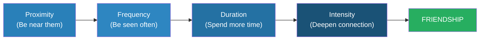
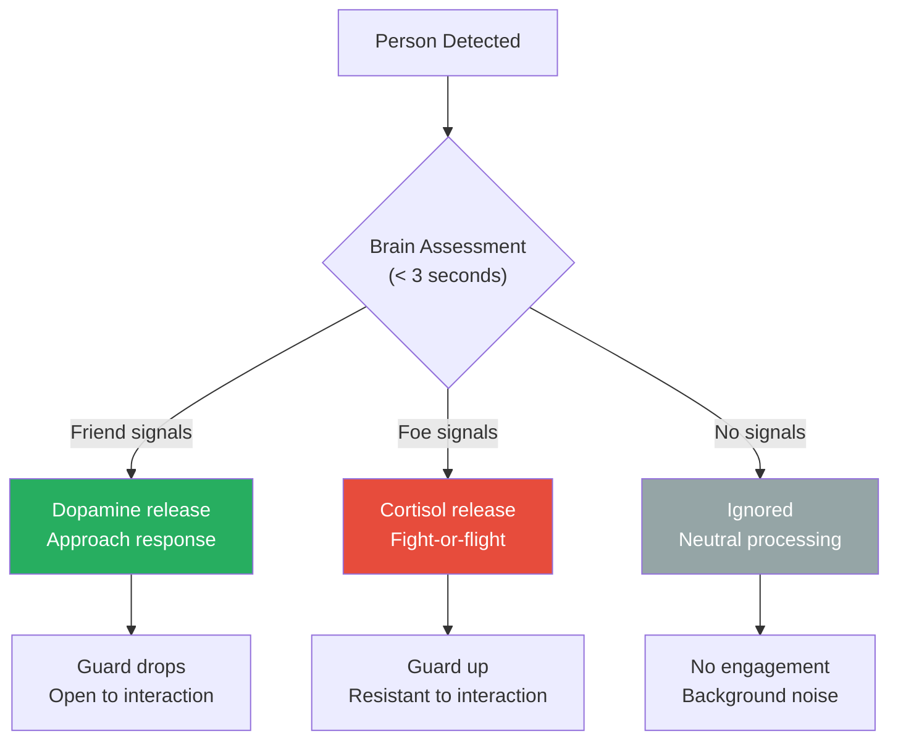
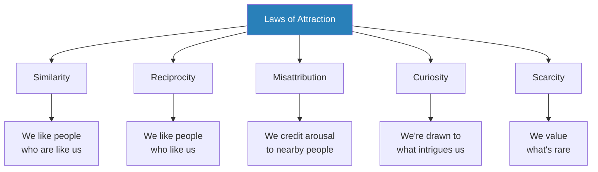
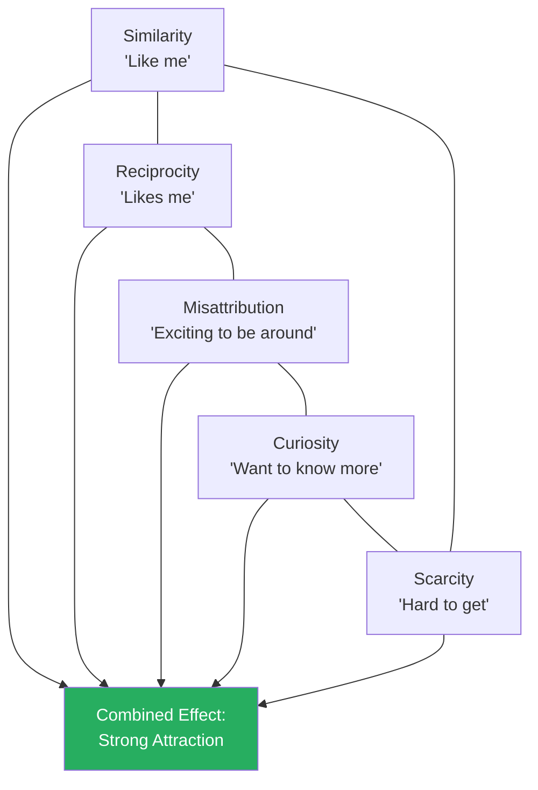
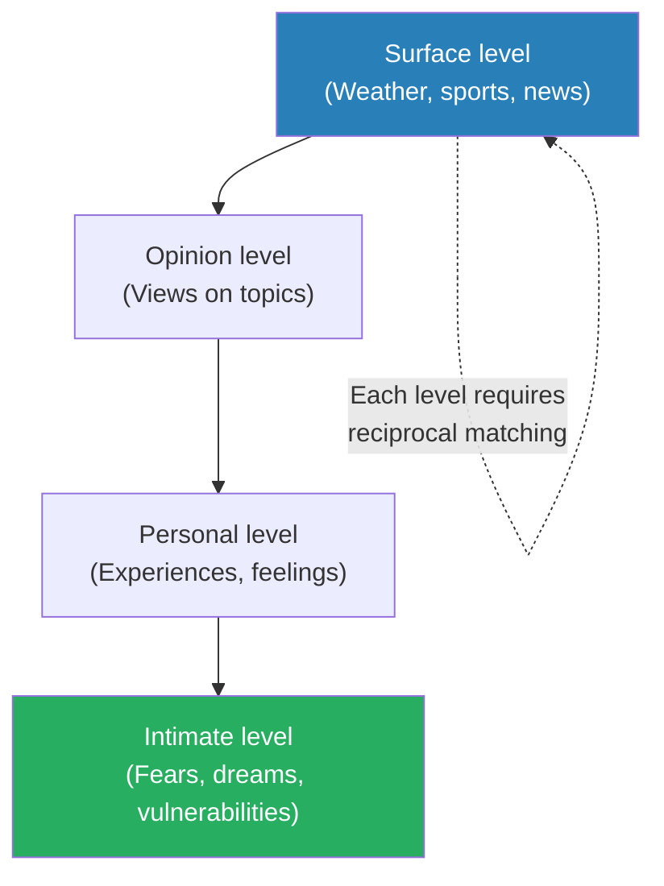
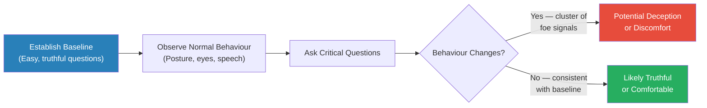
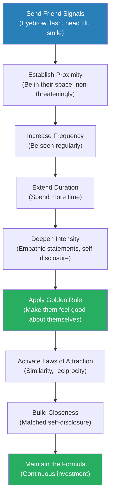

# The Like Switch — Jack Schafer

> Jack Schafer spent fifteen years as an FBI behavioural analyst in the National Security Division, where his job was to flip foreign spies, turn hostile prisoners into willing informants, and build trust with people who had every reason to distrust him. The techniques he developed in those high-stakes encounters form the backbone of this book.
> The core framework is the Friendship Formula: Friendship = Proximity + Frequency + Duration + Intensity. By systematically adjusting these four variables — and broadcasting the right nonverbal "friend signals" — you can make almost anyone like you before you ever open your mouth.
> Schafer pairs each principle with FBI field stories that show the techniques working in life-or-death situations, then translates them into everyday language for making friends, strengthening relationships, and navigating social encounters.
> This is Dale Carnegie's *How to Win Friends* filtered through FBI field experience, behavioural science, and the hard-earned wisdom of someone who built rapport for a living.

---

## About the Author

Jack Schafer, PhD, is a former FBI Special Agent and current professor of psychology at Western Illinois University. He spent fifteen years as a behavioural analyst for the FBI's National Security Division, specialising in recruiting foreign spies and extracting information from hostile subjects. His co-author, Marvin Karlins, PhD, is a professor of management at the University of South Florida who helped translate Schafer's field experience into accessible prose. Together they combine FBI operational knowledge with academic behavioural science — giving the book a credibility that most social-skills guides lack.

> [!tip] Why This Book Matters
> Most books on social skills are based on observation or theory. This one is based on operational necessity — Schafer's techniques had to work on people who were trained to resist them. If they can build rapport with foreign intelligence officers, they can work at a dinner party.

---

## The Big Idea

- Human beings are hardwired to sort every person they encounter into one of three categories: <b style="color: #2980b9">friend</b>, <b style="color: #2980b9">foe</b>, or <b style="color: #2980b9">neutral</b>
- This sorting happens in seconds, driven almost entirely by nonverbal cues — before a single word is spoken
- <b style="color: #27ae60">If you can control the signals your body sends, you can control which category the other person's brain places you in</b>
- Schafer's insight from FBI fieldwork: rapport is not personality-dependent — it is a systematic, learnable process with predictable inputs and outputs
- The process follows a formula: <b style="color: #2980b9">Friendship = Proximity + Frequency + Duration + Intensity</b>
  - You control each variable independently
  - You increase them in sequence, not all at once
  - Rushing any variable triggers foe signals and destroys trust
- Before you speak, your body has already been speaking for you — through eyebrow flashes, head tilts, smiles, and posture
  - <b style="color: #e74c3c">If your body sends foe signals, no amount of clever conversation will overcome them</b>
- The Golden Rule of Friendship is not "treat others as you want to be treated" — it is <b style="color: #27ae60">make the other person feel good about themselves</b>
  - Every technique in the book serves this single operating principle
  - People remember how you made them feel long after they forget what you said

---

## Key Concepts at a Glance

| Concept | One-line summary |
|---------|-----------------|
| **The Friendship Formula** | Friendship = Proximity + Frequency + Duration + Intensity — adjust each variable systematically |
| **Friend signals** | Nonverbal cues (eyebrow flash, head tilt, smile) that tell the brain "this person is safe" |
| **Foe signals** | Nonverbal cues (furrowed brows, compressed lips, staring) that trigger the brain's threat response |
| **The Golden Rule of Friendship** | Make the other person feel good about themselves — not about you |
| **Empathic statements** | Reflect observed emotions instead of asking questions — validates without interrogating |
| **The Laws of Attraction** | Similarity, reciprocity, misattribution, curiosity, and scarcity govern who we like |
| **The Seagull Principle** | Build trust gradually like feeding wary seagulls — patience is the core skill |
| **Primacy effect** | First impressions anchor all future interactions — get the first three seconds right |
| **Self-disclosure** | Gradual mutual sharing deepens rapport — but only when reciprocated at matched depth |
| **Verbal mirroring** | Matching the other person's language, pace, and energy signals similarity |

---

## Chapter 1: The Friendship Formula

*Schafer reveals that friendship is not luck or chemistry — it is a formula with four variables you can control, and he built his FBI career on it.*

### The Formula

<b style="color: #2980b9">Friendship = Proximity + Frequency + Duration + Intensity</b>

- **Proximity** — Physical closeness to the other person
  - You must be in the same space, repeatedly, before rapport can begin
  - Proximity alone does nothing — but without it, nothing else works
- **Frequency** — The number of contacts over time
  - More encounters = more familiarity = more comfort
  - The encounters do not need to be conversations — being seen is enough
- **Duration** — The length of each contact
  - As comfort increases, contacts naturally grow longer
  - Trying to extend duration before comfort is established feels invasive
- **Intensity** — The depth and quality of the interaction
  - This is where real connection happens — shared vulnerability, emotional exchange, meaningful conversation
  - <b style="color: #e74c3c">Jumping to intensity before establishing proximity, frequency, and duration is the most common rapport mistake people make</b>

Each variable builds on the previous one. Skip a stage and the whole sequence collapses.

| Variable | Definition | FBI Application | Everyday Application |
|----------|-----------|----------------|---------------------|
| **Proximity** | Physical nearness | Walk past target's routine locations daily | Use the same coffee shop, sit near them at meetings |
| **Frequency** | Number of contacts | Gradually increase "accidental" encounters | Be seen regularly — do not disappear for weeks |
| **Duration** | Length of contact | Start with brief exchanges, gradually extend | Short chats first, then longer conversations |
| **Intensity** | Depth of interaction | Move from small talk to personal topics | Use empathic statements, share appropriately |

Proximity dominates the earliest stage of relationship building, then frequency and duration take over during the middle phase, while intensity becomes the primary driver only after the foundation of comfort and familiarity is firmly established.

### The Key Insight: Independent Variables

- You can manipulate each variable independently
- Increasing one while holding others steady lets you calibrate the pace of rapport
- <b style="color: #27ae60">The most patient agent wins</b> — Schafer would spend weeks adjusting a single variable before touching the next

> [!example] Charles — The Spy Who Came In
> - A foreign intelligence officer was identified as a potential recruitment target
> - Schafer was assigned to "develop" him — FBI language for building rapport to the point where someone will cooperate
> - For weeks, Schafer did nothing but walk past the man's regular coffee shop at the same time each day
> - He established proximity — the man's brain began registering him as a familiar, non-threatening figure in his environment
> - Then Schafer increased frequency — appearing at the shop more often, sometimes sitting nearby
> - Only after weeks of silent proximity did Schafer make brief eye contact and offer a nod (duration)
> - Eventually the man initiated conversation himself — his brain had already classified Schafer as safe
> - Over the following months, Schafer gradually increased intensity, and the man became a cooperating source
> **The lesson:** The Friendship Formula works even on people trained to resist it — if you are patient enough to follow the sequence.

> [!example] The College Classroom Experiment
> - Schafer describes a university study where a researcher had a woman attend a large lecture class
> - She attended zero, five, ten, or fifteen times over the semester — but never spoke to anyone
> - At the end of the semester, students were shown photos and asked to rate how much they liked each person
> - The more frequently the woman had attended, the higher her likability ratings — despite never saying a word
> - Pure proximity and frequency created liking without any interaction
> **The lesson:** Being seen is the first step to being liked. Frequency breeds familiarity, and familiarity breeds comfort.

---

### The Seagull Principle

*Schafer's favourite metaphor captures the entire book in a single image.*

- Imagine feeding seagulls at the beach
  - At first they keep their distance — you are a potential threat
  - You toss bread far away from you — they eat it cautiously
  - You toss it a little closer — they edge forward
  - Gradually, over many tosses, they eat from your hand
- <b style="color: #27ae60">Human rapport works exactly the same way</b>
  - Start with non-threatening proximity
  - Gradually increase frequency and duration
  - Only attempt intensity when the other person's brain has classified you as safe
- <b style="color: #e74c3c">Rushing this process triggers foe signals</b> — the seagulls fly away and are harder to coax back
- Patience is not passive — it is the most active form of rapport building

> [!tip] Core Insight
> You cannot rush trust. Every attempt to skip a stage in the Friendship Formula — approaching too fast, talking too much too soon, sharing too deeply before comfort is established — triggers the brain's threat response and pushes the other person away.

---

### Adjusting the Variables — Practical Calibration

Schafer provides guidance on how to calibrate each variable depending on context:

- **High proximity, low frequency** — You work in the same building but rarely cross paths
  - Solution: increase frequency by finding excuses to be in shared spaces (break room, lobby, elevator)
- **High frequency, low duration** — You see someone daily but only for seconds
  - Solution: gradually extend each encounter — arrive a minute early, linger a moment longer
- **High duration, low intensity** — You spend hours with someone but only talk about surface topics
  - Solution: introduce empathic statements and slightly deeper self-disclosure
- **All variables high but no connection** — Rare, but possible if you are violating the Golden Rule
  - Solution: stop talking about yourself and start making them feel good about themselves

> [!example] The Neighbour Strategy
> - Schafer describes a woman who moved to a new city and knew no one
> - She identified the neighbours she most wanted to befriend
> - Week one: she walked her dog past their houses at consistent times (proximity + frequency)
> - Week two: she made eye contact and offered a wave — friend signals without pressure
> - Week three: she lingered near the mailbox and exchanged brief greetings (duration)
> - Week four: she commented on a neighbour's garden — an empathic observation that opened real conversation (intensity)
> - Within two months, she had built genuine friendships with three neighbours — all by following the formula in sequence
> **The lesson:** The Friendship Formula is not just for FBI operations. It works in any context where you want to build a new relationship from scratch.

---

## Chapter 2: Getting Noticed Before You Say a Word — Friend and Foe Signals

*Your brain sorts every person it encounters into friend, foe, or neutral within seconds — and the sorting happens entirely through nonverbal cues, before conscious thought begins.*

### The Three Categories

- <b style="color: #2980b9">Friend</b> — The brain releases dopamine. You feel drawn toward this person. Your guard drops.
- <b style="color: #2980b9">Foe</b> — The brain triggers a fight-or-flight response. You feel tense, wary, or hostile. Your guard goes up.
- <b style="color: #2980b9">Neutral</b> — The brain ignores this person. They are background noise. No approach, no avoidance.
- Most people walk around broadcasting neutral or mild foe signals without realising it
  - Furrowed brows from concentration look like anger
  - Looking at your phone reads as disinterest
  - A flat expression reads as unfriendly

### The Friend Signals

| Signal | What It Looks Like | Why It Works |
|--------|-------------------|-------------|
| **Eyebrow flash** | Quick raise and lower (~¼ second) | Universal cross-cultural signal: "I see you, I'm not a threat" |
| **Head tilt** | Slight tilt to either side | Exposes the carotid artery — a primal trust signal |
| **Genuine smile** | Eyes crinkle (Duchenne smile) | Fake smiles only use the mouth — the brain detects the difference |
| **Open torso** | Facing toward, arms uncrossed | Signals receptivity and vulnerability |
| **Brief touch** | Handshake, light shoulder touch | Releases oxytocin — the bonding hormone |
| **Comfortable eye contact** | Mutual gaze, 1-2 seconds | Longer than 3 seconds triggers threat response |

---

### The Eyebrow Flash

- The single most important friend signal in the book
- It is a universal, involuntary, cross-cultural gesture lasting about a quarter of a second
- It says: "I recognise you and I am not a threat"
- <b style="color: #27ae60">People who receive an eyebrow flash are significantly more likely to approach and engage</b>
- People who suppress it — or who do not return yours — are signalling caution or hostility
- Schafer recommends practising the eyebrow flash deliberately until it becomes automatic

> [!example] The Eyebrow Flash in the Field
> - Schafer describes approaching a foreign national in a neutral setting
> - Before walking over, he deployed the three-signal combination: eyebrow flash, head tilt, and genuine smile
> - The target's body language shifted immediately — shoulders dropped, posture opened, facial muscles relaxed
> - The conversation that followed was easy and productive
> - Schafer contrasts this with agents who approached targets with neutral or tense expressions — and found them guarded and resistant from the first second
> **The lesson:** The first three seconds determine the trajectory of the entire interaction. Get your friend signals right before you open your mouth.

### The Head Tilt

- Tilting your head to one side exposes the carotid artery — one of the most vulnerable points on the human body
- The brain reads this as a trust signal: "I feel safe enough around you to expose my neck"
- <b style="color: #2980b9">The head tilt is an unconscious vulnerability display</b> — predators do not tilt their heads toward prey
- Dogs tilt their heads when they are curious and non-threatening — same mechanism in humans
- Schafer recommends tilting slightly when listening to someone — it non-verbally communicates interest and trust

### The Genuine Smile vs. the Fake Smile

- Schafer devotes significant attention to the difference between genuine and fake smiles
- A <b style="color: #2980b9">Duchenne smile</b> (named after neurologist Guillaume Duchenne) involves two muscle groups:
  - The zygomatic major — pulls the corners of the mouth upward
  - The orbicularis oculi — crinkles the skin around the eyes (crow's feet)
- A fake smile only activates the zygomatic major — the mouth smiles but the eyes remain flat
- The brain detects this difference instantly, even if the person cannot articulate what is wrong
  - A fake smile triggers unease — "something is off about that person"
  - A genuine smile triggers approach behaviour — "I feel safe around them"
- <b style="color: #27ae60">To produce a genuine smile, Schafer recommends thinking of something that actually makes you happy</b> — the emotion activates the correct muscle groups automatically
  - Trying to manually crinkle your eyes while smiling looks forced
  - Recalling a happy memory or thinking about someone you care about produces the real thing

> [!example] The Smile Experiment
> - Schafer tested the power of smiling in his university classes
> - He had students enter a store and approach a sales associate with either a genuine smile or a polite but flat expression
> - The students who smiled genuinely received significantly more help, more conversation, and more favourable treatment
> - Sales associates later described the smiling students as "nice," "friendly," and "someone I'd want to help" — they described the non-smiling students in neutral or slightly negative terms
> - Same students, same words, different facial expression — dramatically different outcomes
> **The lesson:** A genuine smile is the single cheapest, fastest way to shift someone's brain from neutral to friend.

---

### The Foe Signals

- <b style="color: #e74c3c">These signals tell the other person's brain to stay away — and most people broadcast them without realising</b>

| Signal | What It Looks Like | What It Communicates |
|--------|-------------------|---------------------|
| **Furrowed brows** | Eyebrows compressed together | Anger, disapproval, concentration (reads as hostility) |
| **Compressed lips** | Lips pressed together, disappearing | Withheld disagreement, suppressed emotion |
| **Staring** | Eye contact longer than 3 seconds | Dominance, aggression, threat assessment |
| **Closed torso** | Arms crossed, body turned away | Defensive, unreceptive, disengaged |
| **Jaw clench** | Visible tension in jaw muscles | Restraint, suppressed anger |
| **Finger pointing** | Index finger directed at someone | Aggression signal — even in casual conversation |

The top five signals broadcast friendship with high reliability, while the bottom four reliably trigger foe responses — and notably, foe signals like jaw clenching are harder to consciously control, meaning they leak genuine hostility more honestly than friend signals can be faked.

> [!example] The Hostile Witness
> - Schafer was assigned to interview a witness who refused to cooperate
> - The previous interviewer had sat directly across the table, leaned forward, and maintained intense eye contact — all foe signals
> - The witness had crossed his arms, turned his body away, and given one-word answers
> - Schafer entered the room, sat at an angle rather than directly across, tilted his head, offered a genuine smile, and said nothing for several minutes
> - He opened a newspaper and began reading — the ultimate non-threat signal
> - After twenty minutes of silence, the witness began talking on his own
> - The absence of foe signals, combined with patient proximity, triggered the brain's social need for connection
> **The lesson:** Sometimes the most powerful thing you can do is stop sending foe signals and let silence do the work.

---

The brain's friend-foe assessment is a survival mechanism, not a conscious choice. You cannot talk someone out of a foe-signal response — you can only replace it by sending friend signals consistently over time.

---

## Chapter 3: The Golden Rule of Friendship

*Schafer argues that the single most powerful principle in all of human rapport is not about being interesting, charming, or impressive — it is about making the other person feel good about themselves.*

### The Rule

- <b style="color: #27ae60">Make the other person feel good about themselves — not about you</b>
- This is the operating principle behind every technique in the book
- People do not remember what you said — they remember how you made them feel
- If someone feels good about themselves when they are around you, they will want to be around you more
- <b style="color: #e74c3c">The most common mistake: trying to impress people by talking about yourself</b>
  - This makes YOU feel good, not them
  - The more you talk about your accomplishments, the less the other person enjoys the conversation

### Why It Works — The Neuroscience

- When people talk about themselves, the brain's reward centres activate — the same areas that respond to food, money, and sex
- <b style="color: #2980b9">Self-disclosure is neurologically pleasurable</b> — people literally get a dopamine hit from sharing about themselves
- By creating conditions where the other person talks about themselves, you are giving them a chemical reward
- They associate that reward with you — even though you did nothing but listen
- This is why the best conversationalists are often the people who talk the least

> [!tip] Core Insight
> The person who talks the most in a conversation walks away thinking it was a great conversation — and they think the person who listened is fascinating. You do not need to be interesting. You need to be interested.

### Tools That Serve the Golden Rule

Every conversational technique Schafer teaches is a delivery mechanism for this rule:

| Technique | How It Serves the Rule |
|-----------|----------------------|
| **Empathic statements** | Validates the other person's feelings — makes them feel understood |
| **Active listening** | Shows you care enough to pay attention — makes them feel valued |
| **Compliments** | Directly affirms their worth — makes them feel appreciated |
| **Allowing them to talk** | Gives them the dopamine of self-disclosure — makes them feel important |
| **Remembering details** | Shows they are memorable to you — makes them feel significant |

---

> [!example] The Car Salesman
> - Schafer describes a car salesman who consistently outsold his colleagues by a wide margin
> - His secret was not product knowledge or closing technique — it was the Golden Rule
> - When customers arrived, he asked about their lives, their families, their work — and listened with genuine interest
> - He remembered details from previous conversations and brought them up in follow-up calls
> - Customers did not buy from him because he had the best pitch — they bought because they felt good about themselves when they were around him
> - His competitors focused on features and price — he focused on making people feel valued
> **The lesson:** People buy from people they like. People like people who make them feel good about themselves.

> [!example] The Shy Student
> - Schafer describes a student in one of his university classes who was painfully shy and struggled to make friends
> - He gave her one assignment: in every conversation, find something genuine to compliment about the other person, and then ask them to tell you more about it
> - Within weeks, her social life had transformed — not because she became more outgoing, but because she became more focused on making others feel good
> - People sought her out because conversations with her left them feeling valued
> **The lesson:** You do not need charisma or confidence to build rapport. You need the Golden Rule.

---

## Chapter 4: The Laws of Attraction

*Schafer identifies the psychological forces that govern who we like and why — and shows how each one can be deliberately activated.*

### The Five Laws

These five laws operate below conscious awareness. Understanding them does not make you immune to them — but it does let you activate them deliberately.

---

### Law 1: Similarity — "We Like People Who Are Like Us"

- <b style="color: #27ae60">The similarity principle is the most consistently powerful law of attraction</b>
- We are drawn to people who share our values, experiences, backgrounds, interests, and communication styles
- The brain uses similarity as a shortcut for safety: "This person is like me, therefore they are probably not a threat"
- Schafer recommends finding common ground quickly and making it explicit

**How to activate similarity:**
- **Verbal mirroring** — Match the other person's language, vocabulary level, and pace of speech
  - If they speak slowly and thoughtfully, slow down
  - If they use casual language, do not speak formally
- **Postural mirroring** — Subtly match their body position
  - If they lean forward, lean forward
  - If they cross their legs, cross yours (after a brief delay)
  - <b style="color: #e74c3c">Do not mirror too precisely or too quickly — it becomes obvious and creepy</b>
- **Value mirroring** — Find shared beliefs and emphasise them
  - "You value quality over speed? Me too — I'd rather get it right than get it fast."
- **Experience matching** — Share similar experiences from your own life
  - "You grew up in a small town? So did I. There's something about that..."

> [!example] The Common Ground Technique in Action
> - Schafer describes meeting a potential informant at a bar
> - Within the first five minutes, he identified three points of similarity: both had served in the military, both had children roughly the same age, and both preferred a particular brand of whiskey
> - He made each similarity explicit: "No kidding — you were in the Army too? What unit?"
> - Each shared point of similarity strengthened the man's unconscious sense that Schafer was "one of us"
> - By the end of the evening, the man was sharing information he would never have given to a stranger
> **The lesson:** Similarity is not something you wait to discover. You actively search for it and surface it.

---

### Law 2: Reciprocity — "We Like People Who Like Us"

- When someone shows they like us, our brain is wired to like them back
- This is not just social politeness — it is a neurological response
- <b style="color: #2980b9">Reciprocity is the foundation of all social exchange</b>
- The easiest way to make someone like you: show them that you like them first
  - Genuine compliments
  - Warm friend signals
  - Remembering details about their life
  - Seeking their opinion (implies you respect them)

> [!abstract] Activating Reciprocity
> 1. Send friend signals before the conversation begins (eyebrow flash, smile, head tilt)
> 2. Open with a genuine compliment or expression of interest
> 3. Ask their opinion on something — this signals you value their judgment
> 4. Listen actively and respond with empathic statements
> 5. The other person's brain will register: "This person likes me" — and reciprocate

### Law 3: Misattribution — "We Credit Arousal to the Nearest Person"

- When people experience physiological arousal — excitement, adrenaline, even nervousness — they tend to attribute that feeling to whoever is nearby
- <b style="color: #2980b9">The misattribution effect</b> means that meeting someone during an exciting activity makes you more likely to find them attractive
- The classic study: men who crossed a swaying suspension bridge rated a female researcher as more attractive than men who met her on a stable bridge — they misattributed their bridge-induced adrenaline to the woman

**Practical implications:**
- Meet new people during exciting or novel activities — not in boring or stressful settings
- First dates at amusement parks, live concerts, or adventure activities outperform dinner-and-a-movie
- <b style="color: #e74c3c">Avoid meeting someone for the first time when they are stressed or exhausted — they will associate those negative feelings with you</b>

### Law 4: Curiosity — "We Are Drawn to What Intrigues Us"

- The brain is wired to pay attention to things that are slightly unexpected or mysterious
- <b style="color: #2980b9">Curiosity hooks</b> are statements or behaviours that are just unusual enough to make someone want to know more
- Schafer recommends being slightly unpredictable — breaking small patterns to maintain interest
- Examples:
  - Wearing something distinctive that invites comment
  - Making a surprising statement early in conversation
  - Having an unusual hobby or interest that people want to ask about
- The mechanism is the <b style="color: #2980b9">information gap</b> — when the brain detects a gap between what it knows and what it wants to know, it generates a compulsive urge to close the gap
  - This is why cliffhangers work in television
  - This is why incomplete stories are more interesting than complete ones
  - Schafer recommends leaving some things unsaid — creating small mysteries that make the other person want to see you again

> [!example] The Curiosity Hook at a Conference
> - Schafer describes attending a professional conference where everyone introduced themselves with their job title and company
> - One attendee broke the pattern — when asked what he did, he said, "I help companies find the money they didn't know they were losing"
> - Every person who heard this asked a follow-up question — "What do you mean by that?"
> - The man was an accountant who specialised in auditing for overpayments, but his curiosity hook turned a boring introduction into a conversation starter
> - He collected more business cards that evening than any other attendee
> **The lesson:** A well-crafted curiosity hook makes people come to you instead of you chasing them.

### Law 5: Scarcity — "We Value What's Rare"

- Things (and people) that are less available are perceived as more valuable
- If you are always available, you become background noise — neutral, not friend
- <b style="color: #27ae60">Creating natural gaps in your availability increases your perceived value</b>
- This does not mean playing games — it means having a full life that does not revolve around any single person
- Schafer notes that FBI agents use strategic unavailability when developing sources — occasionally being busy or unreachable makes the source value the agent's time more

### How the Laws Interact

- The five laws do not operate in isolation — they reinforce each other:
  - **Similarity + reciprocity** — When you find common ground and show you like them, they experience a double pull toward you
  - **Curiosity + scarcity** — Being intriguing and slightly unavailable creates a powerful attraction loop
  - **Misattribution + similarity** — Meeting someone in an exciting context while emphasising shared interests is the strongest combination

The more laws you activate simultaneously, the stronger the attraction. But even one law, applied consistently, is enough to build rapport.

Similarity dominates first meetings and business contexts, while misattribution peaks in dating scenarios and reciprocity compounds most powerfully in long-term relationships.

---

## Chapter 5: Speaking the Language of Friendship

*Schafer moves from nonverbal signals to verbal techniques — and reveals that the FBI's most powerful conversational weapon is not a question but a statement.*

### Empathic Statements

- <b style="color: #2980b9">Empathic statements</b> are the FBI's conversational workhorse
- Instead of asking questions (which feel like interrogation and trigger defensiveness), you make statements that reflect the other person's observed emotional state
- These statements accomplish three things simultaneously:
  - They prove you are listening
  - They validate the person's experience
  - They invite further disclosure without the pressure of a direct question

> [!abstract] The Empathic Statement Formula
> 1. Observe the person's emotional state (facial expression, body language, tone of voice)
> 2. Construct a statement that reflects that emotion back to them
> 3. Begin with "So you..." or "It sounds like..." or "You seem..."
> 4. Examples:
>    - "So you must have felt really proud of that."
>    - "It sounds like that was really difficult for you."
>    - "You seem really excited about this project."
>    - "That must have been a tough decision."
> 5. Wait. Let the silence work. They will fill it.

- <b style="color: #27ae60">Questions demand answers. Empathic statements invite sharing.</b>
- The difference is enormous — questions put the other person on the spot; empathic statements make them feel understood
- Schafer calls empathic statements "the most powerful verbal tool in the FBI's rapport-building arsenal"

> [!example] The Reluctant Witness
> - An FBI agent was interviewing a witness to a bank robbery who had stopped cooperating
> - The agent had been asking direct questions: "What did the man look like? What was he wearing? Which direction did he go?"
> - Each question was met with shorter, more defensive answers
> - Schafer coached the agent to switch to empathic statements: "It must have been terrifying to be in the bank when that happened."
> - The witness's posture changed — she uncrossed her arms, leaned forward, and began talking freely
> - She provided more useful detail in ten minutes of empathic conversation than she had in an hour of questioning
> **The lesson:** Questions interrogate. Empathic statements liberate. People share more when they feel understood than when they feel examined.

---

### Active Listening

- Most people do not listen — they wait for their turn to talk
- <b style="color: #2980b9">Active listening</b> means demonstrating that you are processing what the other person says, not just hearing it
- Key components:
  - **Paraphrasing** — Restate what they said in your own words: "So what you're saying is..."
  - **Verbal cues** — Short affirmations: "Right," "I see," "Go on"
  - **Non-verbal cues** — Nodding, leaning forward, maintaining comfortable eye contact
  - **Asking follow-up questions** — Based on what they just said, not on your own agenda
- <b style="color: #e74c3c">The most damaging thing you can do to rapport is check your phone while someone is talking</b>
  - It sends a foe signal: "You are less important than whatever is on my screen"

> [!abstract] The Active Listening Checklist
> 1. Face the person squarely — torso open, no barriers (bag, crossed arms) between you
> 2. Maintain comfortable eye contact — 60-70% of the time, not a fixed stare
> 3. Nod slightly at key points — signals "I'm tracking what you're saying"
> 4. Paraphrase periodically — "So what you're telling me is..." confirms understanding
> 5. Ask follow-up questions that reference what they just said — not your own agenda
> 6. Resist the urge to one-up — when they share a story, do not immediately share a "better" one
> 7. Let silences breathe — do not rush to fill every pause

- **The one-upping trap** is particularly destructive:
  - Person A: "I just ran my first 5K."
  - Person B: "Oh, I just finished a marathon."
  - Person B probably meant to connect through shared interest — but the effect is to diminish Person A's achievement
  - <b style="color: #27ae60">Better response: "That's great — how did it feel to cross the finish line?"</b>
  - This response honours their experience and invites them to feel good about themselves

### The Primacy Effect

- <b style="color: #2980b9">The primacy effect</b> means that the first piece of information we receive about someone anchors everything that follows
- First impressions are not just powerful — they are disproportionately resistant to change
- If someone's first impression of you is positive, they will interpret ambiguous behaviour charitably
- If the first impression is negative, they will interpret the same behaviour suspiciously
- Schafer's recommendation: front-load your friend signals
  - In the first three seconds: eyebrow flash, head tilt, genuine smile
  - In the first thirty seconds: a warm greeting, the person's name, and a genuine compliment or empathic statement
  - <b style="color: #27ae60">Invest more effort in the first thirty seconds than in the next thirty minutes</b>

> [!example] The Airport Experiment
> - Schafer tested the primacy effect by having two groups of students approach strangers at an airport
> - Group A opened with friend signals (smile, eyebrow flash, head tilt) and a warm greeting
> - Group B opened with neutral expressions and a direct request
> - Group A received significantly more cooperation, more smiles in return, and longer conversations
> - The content of what both groups said was identical — only the opening signals differed
> **The lesson:** What you say matters far less than how you say it — and the first three seconds matter most.

---

### Compliments That Work

- Not all compliments are equal — <b style="color: #e74c3c">compliments about fixed traits ("You're so pretty") are less effective than compliments about choices and effort ("That was a brilliant presentation — you must have worked really hard on it")</b>
- Schafer distinguishes between:
  - **Direct compliments** — Statements of admiration: "That's a great jacket"
  - **Indirect compliments** — Asking someone to teach you or help you (implies they are knowledgeable/capable)
  - **Third-party compliments** — Mentioning what someone else said about them: "Sarah told me you're the best editor she's ever worked with"
- Third-party compliments are the most powerful because:
  - They feel less like flattery (you are just reporting what you heard)
  - They imply the person's reputation extends beyond the room
  - They are harder to dismiss as insincere

> [!abstract] Schafer's Compliment Formula
> 1. Observe something specific about the person — a choice they made, an effort they put in, a result they achieved
> 2. Comment on the effort or choice, not the trait: "You clearly put a lot of thought into that" rather than "You're smart"
> 3. If possible, use a third-party frame: "I heard from [name] that you..."
> 4. Follow the compliment with a question that invites them to elaborate: "How did you learn to do that?"
> 5. The combination of compliment + question = sustained positive feeling

---

## Chapter 6: Building Closeness — The Art of Self-Disclosure

*Rapport gets you through the door. Closeness keeps you in the room. Schafer explains how relationships deepen through carefully managed mutual disclosure.*

### How Self-Disclosure Works

- <b style="color: #2980b9">Self-disclosure</b> is the gradual sharing of personal information that moves a relationship from acquaintance to friend
- It operates on a principle of matched depth:
  - You share something slightly personal
  - The other person reciprocates at roughly the same level
  - You go slightly deeper
  - They reciprocate again
  - This "disclosure dance" gradually builds intimacy
- <b style="color: #e74c3c">Going too deep too fast violates the Friendship Formula</b> — it is the intensity equivalent of invading someone's personal space
  - Telling a stranger about your divorce on a first meeting is not vulnerable — it is off-putting
  - The brain registers it as a boundary violation, not an intimacy signal

Self-disclosure deepens in layers. Each layer requires reciprocal matching before you can move to the next one.

Most conversations never progress beyond surface-level exchange — only 7% of interactions reach the intimate level where genuine bonds are forged, which is why deliberate, gradual deepening through matched disclosure is essential for building real closeness.

### The Testing and Ratcheting Process

- Schafer describes rapport-building as a "testing" process:
  - Share something at one level
  - Observe whether the other person matches your level, goes deeper, or pulls back
  - <b style="color: #27ae60">If they match or go deeper, you have permission to continue</b>
  - If they change the subject or give a superficial response, they are signalling: "not ready for that depth"
  - Respect the signal — pull back to the previous level and try again later

> [!example] The Ratcheting Technique in FBI Recruitment
> - Schafer was developing a relationship with a foreign diplomat he hoped to recruit
> - Over coffee, Schafer mentioned being frustrated with bureaucracy at work — a mildly personal disclosure
> - The diplomat reciprocated: "You think American bureaucracy is bad? You should see ours."
> - Schafer went slightly deeper: "Sometimes I wonder if the people at the top really know what they're doing."
> - The diplomat paused — then shared a specific complaint about his own government
> - Over months of gradually deepening disclosure, the diplomat eventually shared classified frustrations with his government's policies
> - Schafer never asked a single probing question — he let matched disclosure do the work
> **The lesson:** Self-disclosure is the engine of intimacy. But it must be mutual, gradual, and patient.

---

### Connecting Techniques

Schafer describes several techniques for building closeness beyond basic self-disclosure:

- **Finding common experiences** — Shared hardship, shared joy, shared background create instant bonds
  - "We both survived the merger" creates more closeness than months of casual conversation
- **Using the other person's name** — People's brains activate differently when they hear their own name
  - Use it early and occasionally — not so much that it feels like a sales technique
- **Remembering and referencing details** — Mentioning something from a previous conversation signals: "You are important enough to remember"
  - "How did your daughter's recital go?" is worth more than any compliment
- **Temporal synchrony** — Doing things at the same time (eating, drinking, walking) creates unconscious bonding
  - This is why meals are such powerful rapport builders — synchronised eating triggers bonding chemistry
- **The "favour" technique** — Asking someone for a small favour actually increases their liking of you
  - This is counterintuitive — you would expect giving favours to build rapport
  - But the <b style="color: #2980b9">Ben Franklin Effect</b> shows that doing a favour for someone creates cognitive dissonance: "I helped this person, so I must like them"
  - Schafer recommends asking for small, easy favours early in a relationship — borrowing a pen, asking for a restaurant recommendation, requesting their opinion on something
  - <b style="color: #27ae60">The person who helps you will like you more than if you had helped them</b>

> [!example] The Ben Franklin Approach
> - Schafer references the famous story of Benjamin Franklin and a political rival
> - Franklin heard that his rival owned a rare and valuable book
> - Rather than confronting the rivalry directly, Franklin wrote a polite letter asking to borrow the book
> - The rival was flattered and sent it immediately
> - After Franklin returned the book with a warm thank-you note, the rival became one of his closest allies
> - The act of doing Franklin a favour shifted the rival's internal narrative from "I dislike this man" to "I helped this man, therefore I must like him"
> **The lesson:** Asking for a favour is more powerful than giving one. It activates cognitive consistency — the brain rewrites the relationship to match the behaviour.

> [!tip] Core Insight
> Closeness is not created by grand gestures. It is created by the accumulation of small signals that say: "I see you. I remember you. You matter to me."

---

## Chapter 7: Nurturing and Sustaining Long-Term Relationships

*Building rapport is the beginning. Maintaining it requires continuous investment — and Schafer shows that the Friendship Formula applies to long-term relationships just as much as new ones.*

### Why Relationships Decay

- The Friendship Formula works in reverse too:
  - Decrease proximity (move away, change jobs) → rapport weakens
  - Decrease frequency (stop calling, stop showing up) → connection fades
  - Decrease duration (keep interactions short and rushed) → depth disappears
  - Decrease intensity (stop sharing, stop listening deeply) → intimacy erodes
- <b style="color: #e74c3c">Most relationships do not end in a dramatic fight — they slowly starve from neglect of the four variables</b>

### Maintaining the Formula

- **Proximity** — Even when physical proximity is impossible, you can maintain virtual proximity through calls, messages, and video
  - But virtual proximity is weaker than physical — it requires more frequency to compensate
- **Frequency** — Regular contact is more important than long contact
  - A five-minute call every week does more for rapport than a two-hour dinner once a year
- **Duration** — As relationships mature, duration naturally fluctuates — this is normal
  - What matters is that the quality of each interaction remains high
- **Intensity** — Long-term relationships require deliberate deepening
  - <b style="color: #27ae60">Ask deeper questions. Share more honestly. Do not let the relationship settle into a loop of surface-level exchange.</b>

> [!example] The Marriage That Starved
> - Schafer describes a couple who came to him for counselling
> - Both partners were good people with no major conflicts — but they felt disconnected and lonely
> - Analysis revealed that all four variables of the Friendship Formula had declined:
>   - Proximity: one partner travelled frequently for work
>   - Frequency: they rarely spent time together when both were home
>   - Duration: interactions had shrunk to logistics — "Did you pay the bill?" "Pick up the kids at four."
>   - Intensity: they had not had a meaningful conversation in months
> - Schafer prescribed a systematic reinvestment in all four variables — regular date nights (frequency + duration), undistracted time together (intensity), and physical closeness (proximity)
> - Within months, the connection had returned
> **The lesson:** Relationships do not die from conflict. They die from the slow withdrawal of the four variables.

---

### The Relationship Maintenance Toolkit

> [!abstract] Schafer's Maintenance Checklist
> 1. **Proximity** — Schedule regular in-person time; when apart, use video over text
> 2. **Frequency** — Brief daily contact beats occasional long conversations
> 3. **Duration** — Protect uninterrupted time together — no phones, no logistics
> 4. **Intensity** — Ask questions you have not asked before; share something you have been holding back
> 5. **The Golden Rule** — Continuously make the other person feel good about themselves
> 6. **Empathic statements** — They work just as well in year twenty as in week one

### The Relationship Bank Account

- Schafer uses the metaphor of a bank account to explain relationship health:
  - Every positive interaction is a deposit — compliments, empathic statements, remembering details, showing up
  - Every negative interaction is a withdrawal — criticism, broken promises, inattention, foe signals
  - <b style="color: #27ae60">The account must stay in surplus</b> — a relationship with more withdrawals than deposits is dying
- Research suggests the ratio needs to be roughly 5:1 — five positive interactions for every one negative
  - This does not mean avoiding conflict — it means surrounding conflict with enough positivity that the relationship can absorb it
  - <b style="color: #e74c3c">Relationships that drop below a 2:1 ratio are in serious trouble</b>
- Schafer's recommendation: make small deposits constantly
  - A quick text that says "Thought of you when I saw this" is a deposit
  - Remembering that their kid had a test and asking about it is a deposit
  - These micro-deposits accumulate into a robust relationship that can withstand occasional stress

> [!example] The Agent and the Source
> - Schafer maintained a relationship with a cooperating source for over five years
> - During that time, he made hundreds of small deposits — remembering the source's birthday, asking about his family, bringing his favourite coffee to meetings
> - When Schafer eventually needed to ask the source to take a significant personal risk, the source agreed without hesitation
> - The relationship bank account had accumulated so many deposits that even a large withdrawal did not threaten its balance
> - Schafer contrasts this with agents who only contacted sources when they needed something — those relationships were transactional and fragile
> **The lesson:** Long-term relationships require continuous investment. The deposits you make during quiet times are what sustain the relationship during demanding ones.

---

## Chapter 8: The Foe Framework — Detecting Deception and Hostility

*Schafer turns his rapport-building skills inside out and shows how the same signals that reveal friendship also reveal its absence — lying, hostility, and hidden agendas.*

### Reading Foe Signals in Others

- The same nonverbal cues that signal friendship have inversions that signal hostility or deception
- <b style="color: #2980b9">Foe signals are not proof of lying</b> — they indicate discomfort, which could be caused by many things
- The key is to look for clusters, not individual signals:
  - One foe signal means nothing — the person might just be cold or tired
  - Three or more foe signals occurring together indicate genuine discomfort or deception

| Signal | What to Look For | What It Indicates |
|--------|-----------------|-------------------|
| **Lip compression** | Lips pressed together, disappearing | Withheld disagreement or information |
| **Jaw clench** | Visible tension in jaw | Restraining anger or discomfort |
| **Asymmetric expressions** | One side of face shows emotion the other does not | Faking — genuine emotions are symmetrical |
| **Eye blocking** | Prolonged eye closure, looking away, hand over eyes | The brain trying to "block out" something unpleasant |
| **Grooming gestures** | Touching hair, adjusting clothing, fidgeting | Self-soothing in response to stress |
| **Distancing language** | "That woman" instead of a name; "It happened" instead of "I did it" | Psychological separation from the subject |

---

### Handling Foe Signals When You Receive Them

- When someone sends you foe signals, your natural response is to either retreat or escalate — both are wrong
- <b style="color: #27ae60">The correct response is to increase your friend signals</b>
  - Send more eyebrow flashes, more head tilts, more genuine smiles
  - Use empathic statements to acknowledge their discomfort: "It seems like this is a difficult conversation"
  - Reduce proximity slightly — give them more space, literally and figuratively
- Schafer describes this as "absorbing" foe signals rather than reflecting them
  - When you reflect foe signals back (crossing your arms because they crossed theirs), you create an escalation loop
  - When you absorb them and respond with friend signals, you create a de-escalation opportunity

> [!example] The Angry Customer
> - Schafer describes a retail scenario where a customer arrived visibly hostile — jaw clenched, lips compressed, pointing finger
> - The employee's natural instinct was to become defensive — which would have escalated the encounter
> - Instead, the employee was trained to: tilt their head (vulnerability), maintain a soft smile (non-threat), and open with an empathic statement: "It sounds like you've had a really frustrating experience"
> - The customer's body language shifted within seconds — shoulders dropped, arms uncrossed, voice lowered
> - The foe signals dissolved because the brain received no foe signals to react to
> **The lesson:** You cannot fight foe signals with foe signals. You can only dissolve them with friend signals.

---

### Verbal Deception Indicators

- <b style="color: #2980b9">Distancing language</b> is one of the most reliable verbal cues:
  - Liars avoid pronouns that connect them to the event: "The car was driven" instead of "I drove the car"
  - They use vague language: "around that time" instead of specific times
  - They over-qualify: "To tell you the truth..." or "Honestly..." — people who are being honest rarely need to advertise it
- **Response latency** — How long someone takes to answer:
  - Truthful responses are faster because the person is accessing memory
  - Deceptive responses are slower because the person is constructing a story
  - <b style="color: #e74c3c">Exception: rehearsed lies come quickly — so fast responses are not proof of truth</b>
- **Story consistency** — Truthful stories gain detail when retold; deceptive stories lose detail or change structure

> [!example] The "Honestly" Tell
> - Schafer describes interrogating a suspect who peppered his statements with "to be honest with you" and "I swear to God"
> - Truthful people do not constantly reassure you of their honesty — they just speak
> - The suspect's excessive truth claims were a verbal foe signal — he was compensating for the lie he knew he was telling
> - Combined with physical foe signals (lip compression, gaze avoidance, asymmetric expressions), the cluster confirmed deception
> **The lesson:** When someone keeps telling you they are being honest, they are often telling you the opposite.

---

### The Baseline Principle

- <b style="color: #27ae60">You cannot detect deception without a baseline</b>
- A "baseline" is the person's normal behaviour when they are relaxed and telling the truth
- To establish a baseline:
  - Start with easy, non-threatening questions you already know the answer to
  - Observe their posture, eye movement, speech pace, and hand gestures during truthful answers
  - Then ask the critical questions and watch for deviations from their baseline
- Deviations from baseline are the signal, not any single gesture
  - Some people naturally avoid eye contact — for them, avoidance is not a foe signal
  - Some people fidget constantly — for them, fidgeting is not deception

Without a baseline, you are guessing. With a baseline, you are observing deviations — which is the only reliable method.

### The Limitations of Deception Detection

Schafer is honest about the limits of these techniques — a refreshing quality in a book about reading people:

- <b style="color: #e74c3c">No single behaviour proves deception</b> — only clusters of deviations from baseline suggest it
- Nervous people look like liars — anxiety produces the same foe signals as deception
- Confident liars look truthful — psychopaths, experienced con artists, and trained operatives can produce friend signals while lying
- Cultural differences matter:
  - In some cultures, avoiding eye contact is a sign of respect, not deception
  - In some cultures, emotional suppression is normal, not a foe signal
- Schafer's rule of thumb: <b style="color: #27ae60">use deception indicators as prompts for further investigation, not as verdicts</b>
  - If you notice foe signals, probe gently with empathic statements — do not accuse
  - "It seems like this is a difficult topic for you" opens doors; "I think you're lying" slams them shut

> [!tip] Core Insight
> Detecting deception is about noticing deviations from baseline and investigating them with empathy — not about catching liars with gotcha moments. The best lie detectors are the best listeners.

---

## Chapter 9: The Digital Frontier — Online Relationships

*Schafer applies the Friendship Formula to digital communication — arguing that the same principles work online, but require deliberate adaptation.*

### The Friendship Formula Online

- The four variables still apply, but they manifest differently:
  - **Proximity** becomes digital presence — being visible in someone's social media feed, email inbox, or messaging app
  - **Frequency** becomes the regularity of digital contact — likes, comments, messages
  - **Duration** translates to the length and depth of digital exchanges
  - **Intensity** requires more deliberate effort online — nuance and emotion are harder to convey through text

### The Challenges of Digital Rapport

- <b style="color: #e74c3c">The biggest challenge: the absence of nonverbal cues</b>
  - No eyebrow flash, no head tilt, no genuine smile
  - The brain cannot perform its friend-foe assessment without these signals
  - This is why online interactions often feel more shallow, more prone to misunderstanding, and slower to build trust
- **Compensating for missing signals:**
  - Use warm, personal language — not formal or clipped
  - Include the person's name frequently
  - Mirror their communication style (length, formality, emoji usage)
  - Use video calls when possible — they restore some nonverbal channels
  - <b style="color: #27ae60">The more nonverbal channels you restore, the faster rapport builds</b>

### Digital Empathic Statements

- Empathic statements work in text, but they need to be more explicit:
  - In person: "You seem really excited about that" (you can see their excitement)
  - In text: "It sounds like you're really excited about that — I can hear it in how you're describing it"
- Without tone of voice, empathic statements in text can read as sarcastic or patronising
  - Add context: "I mean that genuinely — that's a big deal"
  - Use exclamation points sparingly but strategically to convey warmth

### The Speed of Digital Trust

- Schafer notes that online relationships progress through the same stages as offline ones — but at different speeds
- <b style="color: #e74c3c">People often mistake the speed of digital communication for the speed of trust</b>
  - Just because you can exchange fifty messages in a day does not mean you have built the equivalent of fifty face-to-face encounters
  - Digital frequency is "thinner" than physical frequency — each contact carries less nonverbal information
- To compensate:
  - Move to video calls as soon as both parties are comfortable — video restores facial expressions, tone, and posture
  - Use voice messages in addition to text — tone of voice carries emotional information that text cannot
  - <b style="color: #27ae60">Suggest in-person meetings when possible — one face-to-face interaction is worth dozens of text exchanges</b>

### Digital Foe Signals

- Just as there are friend and foe signals in person, there are digital equivalents:
  - **Delayed responses** — When someone who normally replies quickly starts taking hours or days, it signals withdrawal
  - **Shortening messages** — Replies that go from paragraphs to single words indicate decreasing interest
  - **Dropping personal details** — Shifting from "How was your weekend?" to "Got it. Thanks." signals formality and distance
  - **Disappearing** — Going silent without explanation triggers the brain's uncertainty response — worse than a clear "no"
- Schafer recommends watching for changes in pattern rather than judging individual messages
  - A single short reply means nothing — three weeks of increasingly terse communication means something

> [!tip] Core Insight
> Digital communication strips away most of the signals the brain uses to assess friend or foe. This is why online interactions feel riskier and take longer to build trust. To compensate, be warmer, more explicit, and more patient than you would be in person.

---

## Putting It All Together — The Schafer System

*The individual techniques are powerful. Together, they form an integrated system for building rapport in any context.*

This flowchart represents the complete Schafer system from first contact to sustained relationship.

### The Complete Toolkit Summary

| Phase | Key Actions | Watch For |
|-------|-------------|-----------|
| **First contact** | Eyebrow flash, head tilt, smile | Returned friend signals or foe signals |
| **Early rapport** | Proximity + frequency, no pressure | Their comfort level — are they relaxing or tensing? |
| **Conversation** | Empathic statements, active listening | Are they opening up or staying guarded? |
| **Deepening** | Matched self-disclosure, Golden Rule | Reciprocal sharing or deflection? |
| **Maintenance** | Regular contact across all four variables | Any decay in frequency, duration, or intensity? |

---

### Common Mistakes

- <b style="color: #e74c3c">Rushing the formula</b> — Trying to create intensity before establishing proximity and frequency
- <b style="color: #e74c3c">Making it about you</b> — Talking about yourself instead of making the other person feel good
- <b style="color: #e74c3c">Ignoring foe signals</b> — Plowing ahead when the other person's body is saying "back off"
- <b style="color: #e74c3c">Inconsistency</b> — Being warm one day and cold the next destroys trust faster than being cold consistently
- <b style="color: #e74c3c">Overusing techniques</b> — Empathic statements delivered robotically sound like therapy scripts, not conversation
  - The techniques must be genuine — if you do not actually care about the other person, no technique will save you

> [!example] The Agent Who Rushed
> - Schafer describes a junior FBI agent who was assigned to develop a source
> - Eager to produce results, the agent skipped proximity and frequency — he approached the target directly and immediately tried to build intensity
> - He asked personal questions, shared personal information about himself, and tried to create a bond in a single meeting
> - The target became suspicious, shut down, and was never successfully recruited
> - A more patient agent was assigned, followed the Friendship Formula in sequence, and developed the source over three months
> **The lesson:** Speed kills rapport. The Friendship Formula is a sequence, not a checklist.

---

## The Verdict

*The Like Switch* is a field-tested manual for building human connection, and its greatest contribution is giving structure to an intuitive process. Most people sense that rapport involves friendliness, eye contact, and good conversation — but they have no framework for understanding why some interactions click and others do not. The Friendship Formula provides that framework: four measurable variables that you can deliberately adjust. The FBI stories elevate the book from ordinary self-help to something more credible — these techniques were not developed in a university lab but in the field, under conditions where failure meant a spy stayed loyal to the wrong side.

The book's weaknesses are real but contained. Some techniques, described clinically, sound manipulative — "deploying" eyebrow flashes and "activating" reciprocity can make human connection sound like engineering. The writing is occasionally repetitive, circling back to the same principles from slightly different angles. The online relationships chapter has aged poorly — written before the social media landscape of the mid-2020s, its advice on digital communication is generic. And Schafer sometimes presents FBI anecdotes without enough detail to verify them, asking the reader to trust his authority rather than the evidence.

The reader who benefits most is someone who struggles with first impressions, finds networking exhausting, or simply wants to be more deliberate about building relationships. Introverts and analytical thinkers will especially appreciate the systematic approach — the Friendship Formula gives them a step-by-step process where others rely on instinct. It is also useful for anyone who needs to build rapport professionally: salespeople, consultants, managers, therapists, negotiators.

Compared to Dale Carnegie's *How to Win Friends and Influence People*, *The Like Switch* is lighter and more tactical — Carnegie gives you principles, Schafer gives you techniques. Compared to Joe Navarro's *What Every Body Is Saying*, Schafer focuses more on projecting friend signals and less on reading others (though Chapter 8 overlaps). Compared to Chris Voss's *[[Never Split the Difference - Chris Voss|Never Split the Difference]]*, Schafer's context is broader — he covers all relationships, not just negotiations. Together, these three FBI-trained authors form a comprehensive toolkit for understanding and influencing human behaviour.

---

## Related Reading

- [[How to Win Friends and Influence People - Dale Carnegie|How to Win Friends and Influence People]] — The classic rapport-building manual that Schafer modernises with behavioural science
- [[What Every Body Is Saying - Joe Navarro|What Every Body Is Saying]] — Navarro's FBI body-language companion, with more depth on reading others
- [[The Charisma Myth - Olivia Fox Cabane|The Charisma Myth]] — Warmth and presence as the internal state behind friend signals
- [[Influence - Robert Cialdini|Influence]] — The liking principle and reciprocity norm that the Like Switch exploits
- [[Never Split the Difference - Chris Voss|Never Split the Difference]] — Another FBI agent's communication playbook, focused on negotiation
- [[Words That Change Minds - Shelle Rose Charvet|Words That Change Minds]] — Language patterns for matching and influencing communication styles
- [[Fierce Conversations - Susan Scott|Fierce Conversations]] — Deep conversational techniques for building genuine connection through honest dialogue
