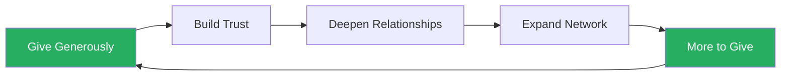
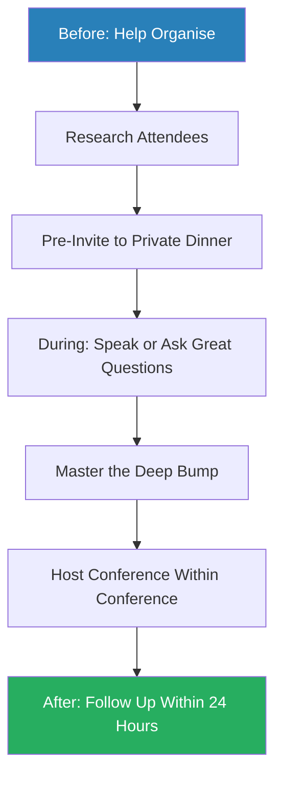
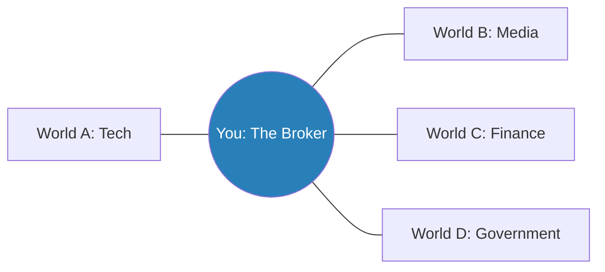
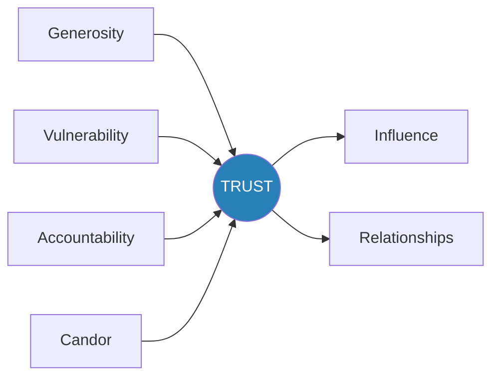
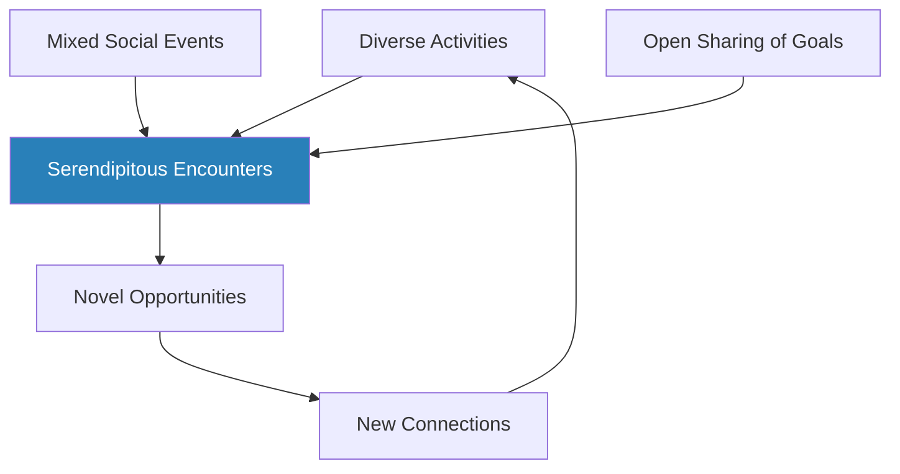
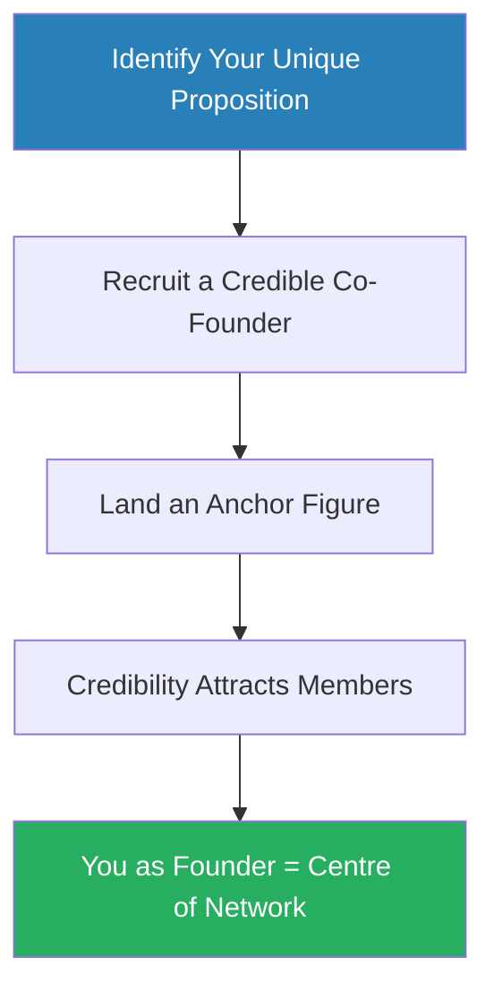
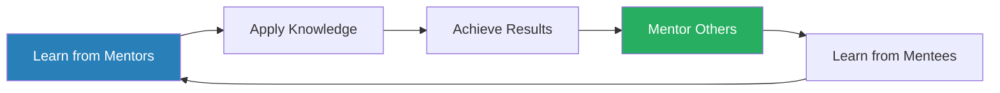

# Never Eat Alone — Keith Ferrazzi

> Keith Ferrazzi grew up poor in a Pennsylvania steel town, caddying for the wealthy at the local country club. Watching the rich help each other get richer, he learned a lesson that would shape his entire career: poverty is not just a lack of money -- it is isolation from the people who can help you succeed. *Never Eat Alone* is his field guide to building a life powered by relationships. Ferrazzi argues that success is never a solo act -- it is the product of generosity-driven connecting, where you give more than you get, never keep score, and treat every meal, meeting, and moment as a chance to deepen your web of human bonds. The book blends practical networking tactics with a genuine philosophy of mutual aid that has made it one of the most influential relationship-building guides of the last two decades.

---

## About the Author

Keith Ferrazzi is the son of a steelworker and a house cleaner from Youngstown, Pennsylvania. Sponsored by mentors who saw his drive, he attended the elite Kiski School on scholarship, then Yale and Harvard Business School. He became the youngest chief marketing officer in the Fortune 500 at Deloitte and later at Starwood Hotels, served as CEO of YaYa Media, and founded Ferrazzi Greenlight, a research and consulting firm focused on relationship-driven business transformation. Ferrazzi's career is itself the best case study for his philosophy: every major opportunity came through someone he had connected with authentically.

---

## The Big Idea

- <b style="color: #27ae60">Your network is your destiny</b> -- the people you know, and more importantly the people who know and trust you, determine your trajectory far more than raw talent, education, or pedigree
- Ferrazzi's core formula is blunt: **SUCCESS = (The People You Meet) + (What You Create Together)**
  - This is not soft sentiment -- it is backed by research in social networking and social contagion theory showing that our paychecks, moods, health, and opportunities are shaped by whom we choose to interact with
- The book demolishes the myth of the "self-made" individual
  - Every successful person Ferrazzi has met relied on a web of relationships to get where they are
  - The difference between those who rise and those who stall is not intelligence or hard work alone -- it is the willingness to reach out, help others, and ask for help in return
- Connecting is not "networking" in the sleazy, business-card-swapping sense
  - It is the conscious construction of genuine relationships through generosity, shared passion, and mutual investment
  - <b style="color: #e74c3c">The currency of real networking is not greed but generosity</b>

---

## Key Concepts at a Glance

| Concept | One-line summary |
|---------|-----------------|
| **Generosity-first mindset** | Give before you get; never keep score of favours |
| **Relationship Action Plan** | A goal-setting worksheet linking dreams to the specific people who can help |
| **Blue Flame** | The intersection of your passion and ability that defines your mission |
| **Audacity** | The boldness to reach out to anyone, regardless of status difference |
| **Pinging** | Consistent, low-effort touches that keep relationships alive over time |
| **Social Arbitrage** | Creating value by brokering introductions between disconnected worlds |
| **Anchor Tenants** | High-status guests who elevate the calibre of your gatherings |
| **Conference Commando** | A systematic approach to turning conferences into relationship goldmines |
| **Content is King** | Building trust and visibility by creating and sharing valuable knowledge |
| **GVAC Formula** | Generosity + Vulnerability + Accountability + Candor = Trust |
| **Mentoring cycle** | Find mentors, become a mentee, then mentor others -- repeat endlessly |
| **Shared passions** | Using activities you love as the vehicle for deepening relationships |

Ferrazzi's system demands mastery across all eight connector competencies — the average networker invests heavily in only one or two, leaving massive gaps in follow-up and social arbitrage.

The Relationship Action Plan and Follow-Up Protocol form the foundation of Ferrazzi's system — without these two operational tools, the more glamorous techniques like Conference Commando and Social Arbitrage have nothing to build on.

Follow-up delivers the highest impact for moderate effort — it is the single most underused skill in professional life and the one that separates Ferrazzi's system from generic networking advice.

---

## Connectors' Hall of Fame

*Throughout the book, Ferrazzi profiles legendary connectors whose stories illuminate his principles. Here are the most instructive.*

| Connector | Core Lesson |
|-----------|------------|
| **Bill Clinton** | Know your mission; record every person you meet; create instant intimacy |
| **Katharine Graham** | Use your position to convene the powerful for mutual benefit |
| **Paul Revere** | The right connector in the right moment can change history |
| **Benjamin Franklin** | If you can't join a club, start one -- then use it to change the world |
| **Vernon Jordan** | Make yourself indispensable by bridging disconnected worlds |
| **Eleanor Roosevelt** | Connecting should advance principles, not compromise them |
| **The Dalai Lama** | Genuine compassion is the most magnetic force in any room |

---

## Part 1: The Mind-Set

### Chapter 1 -- Becoming a Member of the Club

*Ferrazzi reveals how growing up poor in a rich man's world taught him the one lesson that wealthy people's children absorb by osmosis: success is a team sport, and the team is your network.*

- As a caddie at the Latrobe Country Club, young Ferrazzi watched something that changed his worldview:
  - The wealthy families helped each other constantly -- finding jobs, investing in ideas, getting their kids into the right schools and internships
  - Their web of relationships was the most potent tool in their bag
  - <b style="color: #27ae60">Poverty is not just a lack of money -- it is isolation from the people who can help you make more of yourself</b>
- This observation led to a fundamental insight:
  - Life is a game with rules, and the most powerful rule is that those who know the right people, for the right reasons, play it best
  - It matters less how smart you are, how talented, or where you came from -- you cannot get very far alone

> [!example] Mrs. Pohland and the Caddie Award
> - Caryl Pohland was married to the local lumberyard owner; her son Brett was Ferrazzi's friend
> - Ferrazzi became her dedicated caddie, hiding her cigarettes, walking the course early to scout pin placements and green speeds
> - She started winning tournaments left and right and bragged about him to everyone at the club
> - Ferrazzi won the annual caddie award and got to caddie for Arnold Palmer on his hometown course
> - Mrs. Pohland made sure Ferrazzi met everyone at the club who could help him, and if she saw him slacking, he heard about it
> **The lesson:** Generosity begets generosity -- help people succeed and they will help you in return. Ferrazzi calls this "care," not "reciprocity."

- At Harvard Business School, Ferrazzi discovered that his hyper-competitive classmates had it backwards:
  - They saw business as individual combat -- Ferrazzi saw it as a team game
  - The outrageous number of misperceptions about relationship-building is equalled only by misperceptions about how it is done properly
  - What he saw on the golf course -- friends helping friends -- had nothing to do with manipulation or quid pro quo
- <b style="color: #2980b9">Connecting</b> (Ferrazzi's term) is distinct from "networking":
  - It means sharing knowledge, resources, time, energy, friends, and empathy in a continual effort to provide value to others
  - It is about managing relationships, not managing transactions

---

### Chapter 2 -- Don't Keep Score

*The single most destructive habit in relationship-building is treating social capital like a finite resource that depletes when shared. Ferrazzi shows why the opposite is true.*

- <b style="color: #27ae60">Relationships are like muscles -- the more you work them, the stronger they become</b>
- The core principle: generosity without expectation of return
  - When Ferrazzi gives talks to students, he sums up the key to success in one word: **generosity**
  - His own life proves it -- his father's moxie led CEO Alex McKenna to fund his prep school scholarship; Elsie Hillman, chairwoman of the Pennsylvania Republican Party, lent him money for business school

> [!example] "Hollywood David" and the Finite Pie
> - A mutual friend introduced Ferrazzi to David, a smart Hollywood entrepreneur with studio connections
> - When Ferrazzi asked for a simple introduction to a Paramount executive, David refused flat out
> - David's reasoning: "I might need that equity with her someday. I don't want to spend it on you."
> - David treated relationships as a pie with limited slices -- take one away and there's less for him
> - Ten years later, nobody Ferrazzi knows has heard from David -- his network withered from hoarding
> **The lesson:** The exercising of relational equity is what builds relational equity. Hoarding it guarantees its decay.

- Five foundational insights from Ferrazzi's experience:
  1. Business cycles ebb and flow; friends and trusted associates remain -- your network is your only real job security
  2. Never keep track of favours done and owed -- it is better to give before you receive
  3. Yesterday's assistant is today's influence peddler -- treat everyone well because the hierarchy shifts constantly
  4. Contribute relentlessly -- giving time, money, and expertise is like Miracle-Gro for your network
  5. The most valuable currency is not money but information and trust, both of which multiply when shared

The virtuous cycle of generosity: giving creates trust, trust deepens relationships, deeper relationships expand your network, and a larger network gives you more resources to give.

---

### Chapter 3 -- What's Your Mission?

*Without a clearly defined mission, networking becomes aimless socialising. Ferrazzi lays out a three-step process for turning vague ambitions into concrete relationship-driven goals.*

- <b style="color: #27ae60">The more specific you are about where you want to go, the easier it becomes to develop a networking strategy to get there</b>
- Every successful person Ferrazzi has met shares a zeal for goal setting
  - As his dad said: "No one becomes an astronaut by accident"

**Step One: Find Your <b style="color: #2980b9">Blue Flame</b>**

- Your blue flame is the convergence of mission and passion, founded on a realistic self-assessment of your abilities
- Joseph Campbell's "follow your bliss" brought to life:
  - Campbell spent five years reading in a cabin in Woodstock after Columbia, following his love of Greek mythology with no career path in sight
  - His passion drew people to him; he was eventually invited to lecture at Sarah Lawrence and spent 28 years as a beloved professor there
- Two methods of self-assessment:
  - **Look inside:** Create two lists -- dreams/goals and things that bring you joy -- then map the intersections
  - **Look outside:** Ask trusted people about your greatest strengths and weaknesses

**Step Two: The <b style="color: #2980b9">Relationship Action Plan (RAP)</b>**

> [!abstract] The Relationship Action Plan
> 1. Set A and B goals for three years, one year, and ninety days
> 2. For each goal, name specific people who can help you get one step closer
> 3. For each person, determine the best way to reach out (cold call, mutual friend, conference, dinner)
> 4. For each outreach, find a way to lead with generosity -- what can you give them?
> 5. Post the plan where you see it daily; share goals openly with others

- Ferrazzi's friend Jamie used the RAP to transition from an unhappy Harvard Ph.D. in history to a tenured high school teacher in Beverly Hills within three years

**Step Three: Create a Personal Board of Advisors**

- An enlightened group of two or three counsellors who act as both cheerleader and eagle-eyed supervisor
- They hold you accountable and provide external vetting for your plans

> [!example] Virginia Feigles: Hairdresser to Engineer
> - At 44, Virginia Feigles decided she no longer wanted to be a hairdresser -- she wanted to be an engineer
> - She didn't even know algebra, so she taught herself in months
> - She enrolled at Bucknell University, competing against students half her age while working nights at her salon
> - She failed her first physics test; her study sessions were grinding and sleepless
> - She graduated with a class of 137 engineers, became chairperson of a Planning Commission where she had once taken notes as a secretary
> **The lesson:** With clear goals, a network of supporters, and relentless determination, reinvention is possible at any age.

---

### Chapter 4 -- Build It Before You Need It

*The worst time to build your network is when you need it. Ferrazzi explains why the foundation must be laid long before any crisis or opportunity arrives.*

- <b style="color: #e74c3c">The most common networking mistake is waiting until you're desperate</b>
  - Calling people only when you need a job or a favour is transparent and off-putting
  - The time to invest in relationships is when you have nothing to ask for
- Ferrazzi began building relationships at Deloitte long before he needed them:
  - He spent spare time reaching out to ex-classmates, professors, and anyone who might benefit from a relationship with his firm
  - He gave speeches at small conferences on weekends
  - He developed mentors throughout the organisation, including the CEO
- When his first annual review was devastating (low marks for not doing spreadsheet work with enough gusto), his relationships saved him:
  - His supervisors, aware of his extracurricular connecting, created a new job description for him
  - They gave him a $150,000 expense account to do what he had already been doing: developing business and representing the firm
  - Within a year, Deloitte's brand recognition in reengineering moved from bottom of the pack to the top

> [!tip] Core Insight
> Build your network before you need it. The relationships you invest in during good times are the ones that rescue you during bad times.

> [!example] Jack Pidgeon and the Midnight Phone Call
> - Ferrazzi was a sophomore working on a congressional campaign in Boston that ran out of money
> - He and eight other college kids were literally thrown out of their hotel room in the middle of the night
> - From a rest stop pay phone at 2 AM, Ferrazzi called Jack Pidgeon, his former headmaster at Kiski School
> - Pidgeon chuckled, then opened his Rolodex and started making calls
> - By the time the caravan reached Washington D.C., every kid had a place to stay and summer jobs lined up
> - One of Pidgeon's calls went to Jim Moore, a Kiski alum and former assistant secretary of commerce
> - Both Ferrazzi and Jim later joined the Kiski board of directors
> **The lesson:** Pidgeon had built his network over decades by helping Kiski alumni. The network was ready when it was needed because he had fed it for years.

---

### Chapter 4 -- Build It Before You Need It (continued) / Connectors' Hall of Fame: Bill Clinton

> [!example] Bill Clinton's Index Cards
> - As an undergraduate at Georgetown, Clinton made it a nightly habit to record on index cards the names and vital information of every person he met that day
> - At Renaissance Weekend in Hilton Head (1984), Clinton would roam from discussion to discussion, leaning casually against walls, seeming to know everyone -- not just from name tags but remembering what they did and what interested them
> - Former mayor Max Heller described it: "He hugs you not only physically, but with a whole attitude"
> - Clinton did not just recall personal information -- he used it to affirm a bond with each person he met
> **The lesson:** Specificity of mission drives specificity of connecting. Clinton knew exactly where he wanted to go, and that clarity made every relationship purposeful.

---

### Chapter 5 -- The Genius of Audacity

*Most people's greatest barrier to connecting is not lack of skill but lack of nerve. Ferrazzi argues that audacity -- the willingness to reach out to anyone -- is a learnable behaviour.*

- <b style="color: #27ae60">The driving force behind reaching out is not fearlessness but the refusal to let fear stop you</b>
- Audacity is not rudeness or entitlement -- it is the sincere belief that you have something to offer and the courage to act on it
- Ferrazzi's own audacity was forged from necessity:
  - Growing up without money or connections, he had to overcome the social barriers that wealth erases automatically
  - Every cold call, every approach to a stranger, was an act of courage that became easier with practice
- The key insight: most people are far more receptive to being approached than you expect
  - The worst they can say is no -- and even that is temporary
  - <b style="color: #e74c3c">Rejection is a minor inconvenience; invisibility is a career-killer</b>
- Ferrazzi on overcoming fear:
  - Fear of rejection is universal -- even the most confident connectors feel it
  - The difference is that confident connectors act despite the fear, and the act itself builds confidence
  - Start small: ask for a coffee meeting, not a major favour
  - Build momentum: each successful outreach makes the next one easier
  - Remember the asymmetry: the downside of asking is a polite "no"; the upside is a life-changing relationship

---

### Chapter 6 -- The Networking Jerk

*Ferrazzi draws a sharp line between genuine connecting and the behaviour that gives networking its bad reputation.*

- <b style="color: #e74c3c">The networking jerk treats people as transactions -- extracting value without giving any</b>
- Signs you are networking the wrong way:
  - You approach people only when you need something
  - You talk about yourself without asking about them
  - You drop names to impress rather than to connect
  - You collect business cards like trophies without any follow-up
  - You schmooze up and kick down -- treating powerful people well and ignoring everyone else
- The antidote is Ferrazzi's four pillars of genuine connecting:
  - **Generosity:** Lead with what you can give, not what you can get
  - **Vulnerability:** Share your real self, including struggles and failures
  - **Candour:** Be honest and direct, even when it is uncomfortable
  - **Accountability:** Follow through on every commitment you make

---

## Part 2: The Skill Set

### Chapter 7 -- Do Your Homework

*Preparation is what separates a meaningful connection from an awkward cold approach. Ferrazzi explains the research ritual that precedes every important meeting.*

- Before any meeting or call, Ferrazzi researches the person:
  - Their background, interests, current projects, and recent news
  - Mutual connections who might provide a warm introduction
  - Potential ways he can be helpful to them
- The goal is to arrive at every encounter with something to offer:
  - An article relevant to their interests
  - A connection they might benefit from
  - Insight into a problem they are facing
- <b style="color: #2980b9">Homework transforms a cold encounter into a warm one</b> -- it shows respect and signals that you value their time

---

### Chapter 8 -- Take Names

*Your contact list is the infrastructure of your network. Ferrazzi shows how to build and organise it systematically.*

- Create categories for your contacts:
  - **Personal:** Close friends and social acquaintances
  - **Customers:** Current business relationships
  - **Prospects:** People you want to do business with
  - **Important Business Associates:** Mission-critical professional relationships
  - **Aspirational Contacts:** People you would like to know better
- Rate each contact 1, 2, or 3 based on desired contact frequency:
  - **1 = Monthly:** Active relationships requiring regular nurturing
  - **2 = Quarterly:** Touch-base contacts and established friendships
  - **3 = Annually:** Acquaintances worth maintaining loosely

| Rating | Contact Frequency | Examples |
|--------|------------------|---------|
| 1 | Monthly | Active prospects, new relationships, close colleagues |
| 2 | Quarterly | Established friends, casual business contacts |
| 3 | Annually | Acquaintances, distant connections |

This rating system becomes the backbone of the pinging system discussed later.

---

### Chapter 9 -- Warming the Cold Call

*Cold calls do not have to be cold. Ferrazzi reveals how to turn any outreach into a warm approach through preparation and mutual connections.*

- The four rules of warming a cold call:
  1. **Find a mutual connection** -- even a tenuous one -- and mention them immediately
  2. **State your value proposition within seconds** -- what's in it for them
  3. **Be brief and respectful of their time** -- signal that you won't waste it
  4. **Offer an easy out** -- give them permission to say no without awkwardness
- <b style="color: #27ae60">The warmer the call, the higher the response rate</b>
- Credibility transfers through introductions -- a referral from a trusted friend carries more weight than any credential

---

### Chapter 10 -- Managing the Gatekeeper -- Artfully

*Executive assistants are not obstacles to be circumvented -- they are powerful allies to be cultivated.*

- <b style="color: #e74c3c">Never, ever get on a gatekeeper's bad side</b> -- they are their boss's minority partner, trusted friend, and often the real power behind the schedule

> [!example] Mary Abdo and Pat Loconto's Office
> - Mary was the assistant to Deloitte's CEO Pat Loconto, and Ferrazzi's early relationship with her gave him easy access to Pat
> - When Ferrazzi's new assistant Jennifer clashed with Mary, he made the mistake of siding with Jennifer and confronting Mary directly
> - Pat's calendar became impossible to access; expense accounts got micro-scrutinised; office life became a nightmare
> - Pat finally told Ferrazzi bluntly: "You've gone about this all wrong. Mary runs this place. Smooth things over."
> - Jennifer graciously resigned; Ferrazzi asked Mary to screen his next assistant hire and went with her first choice
> - Access to Pat was restored instantly
> **The lesson:** Gatekeepers wield enormous power. Treat them as respected allies, not obstacles.

> [!example] Kent Blosil's Persistence
> - Kent was one of twenty ad salespeople trying to reach Ferrazzi at Deloitte
> - He called Jennifer (Ferrazzi's assistant) weekly, was deferential and kind, brought chocolates and flowers
> - Jennifer repeatedly plugged Kent into Ferrazzi's calendar; Ferrazzi cancelled ten times
> - When Ferrazzi finally relented and gave Kent five minutes, Kent came prepared with real value
> - He offered introductions to Newsweek's senior editors and an invitation to a CMO conference -- 98% value-add, 2% sales pitch
> - Ferrazzi called his media buyer and directed the business to Newsweek
> **The lesson:** Win the gatekeeper and you win access. Come with value and you win the deal.

---

### Chapter 11 -- Never Eat Alone

*The chapter that gives the book its name. Ferrazzi's philosophy: invisibility is worse than failure, so never eat a meal alone.*

- <b style="color: #27ae60">Above all, never, ever disappear</b> -- keep your social calendar full and remain visible among your network
- Ferrazzi describes travelling with then-First Lady Hillary Clinton:
  - Up at 5 AM for calls, four or five speeches, cocktail parties touching 2,000 hands, then huddles with staff into the night
  - Her determination and recall of names was staggering
- The concept of <b style="color: #2980b9">"cloning the event"</b>:
  - When Ferrazzi had two days in New York and three people to see, he invited all three to the same dinner
  - Each would benefit from knowing the others; he could catch up with everyone while creating new connections
  - He constantly looks for ways to include others in whatever he is doing -- workouts, car rides to the airport, casual meals

> [!tip] Core Insight
> The more new connections you establish, the more opportunities you have to make even more. A network grows like a muscle -- the more you work it, the bigger it gets.

- For remote workers:
  - Budget time and money for conferences and city visits
  - Host virtual happy hours or weekly accountability groups
  - Use video calls to maintain face-to-face quality when geography prevents physical meetings

---

### Chapter 12 -- Share Your Passions

*Networking events are for the desperate. Real connections form when people share activities they genuinely love.*

- <b style="color: #e74c3c">Ferrazzi has never been to a "networking event" in his life</b>
  - The average attendees are often unemployed, passing resumes to other unemployed people
  - Credibility is hard to gain when everyone assumes you are in the same desperate boat
- <b style="color: #27ae60">Shared interests are the basic building blocks of any relationship</b>
  - Friendship is created out of the quality of time spent, not the quantity
  - You learn more about someone during one strenuous workout than in ten office meetings
- Ferrazzi's activity list for deepening connections:
  1. Fifteen minutes and a cup of coffee
  2. Conferences (invite local contacts to drop in)
  3. Shared workouts or hobbies
  4. Quick meals -- breakfast, lunch, or dinner
  5. Special events -- theatre, book signings, concerts
  6. Intimate dinner parties at home
  7. Volunteering together

> [!example] The Bank VP at the YMCA
> - A friend who is an executive VP of a large bank in Charlotte networks at the YMCA
> - At 5 and 6 AM, the place buzzes with exercise fanatics getting in workouts before office hours
> - While huffing on the StairMaster, he answers questions about investments and loans from entrepreneurs, customers, and prospects
> **The lesson:** Your networking hot spot does not have to be a fancy restaurant -- it can be anywhere you are passionate and present.

- Ferrazzi even takes people to his African American and Hispanic Catholic church in LA:
  - The gospel choir, the ten-minute hugging ritual, the unconventional warmth
  - He does not foist beliefs -- he shares a deeply personal part of his life, and people receive it as a gift

---

### Chapter 13 -- Follow Up or Fail

*Meeting someone means nothing if you don't follow up. Ferrazzi makes the case that follow-up is the single most underused skill in professional life.*

- <b style="color: #27ae60">Follow-up is the key to success in any field</b> -- good follow-up alone elevates you above 95 percent of your peers
- The follow-up timeline:
  - Send an email within 12-24 hours of meeting someone
  - Reference something specific from your conversation
  - Send a LinkedIn request; consider Facebook if appropriate
  - Programme a reminder to reach out again in one month

> [!abstract] The Follow-Up Checklist
> 1. Express gratitude
> 2. Include an item of interest from your meeting -- a joke, shared moment, or topic discussed
> 3. Reaffirm commitments made by both sides
> 4. Be brief and to the point
> 5. Address by name
> 6. Combine email and handwritten notes for personal touch
> 7. Connect through social media after email
> 8. Send within 24 hours -- timeliness is everything
> 9. Follow up with the person who made the introduction

- The power of the handwritten note:
  - In a digital world, a physical letter captures attention precisely because it is rare
  - It reinforces perception of continuity and creates an aura of goodwill

---

### Chapter 14 -- Be a Conference Commando

*Conferences are not for learning -- they are for meeting people. Ferrazzi lays out a military-grade strategy for maximising every conference you attend.*

This diagram shows Ferrazzi's conference commando sequence: preparation before, active engagement during, and rapid follow-up after.

- <b style="color: #2980b9">The Conference Commando Playbook:</b>

**Before the conference:**
- Volunteer to help organise -- this gives you insider access to attendee lists and VIP events
- Research who will be there and create a target list with one-page bios
- Scout nearby restaurants and send pre-invites to a private dinner

**During the conference:**
- <b style="color: #27ae60">Speak if possible</b> -- as a speaker, attendees expect you to reach out, and you gain instant credibility
  - Start small: ask organisers for an off-hour room for a small gathering
  - If not speaking, ask great questions during Q&A -- introduce yourself, state what you do, and ask something that leaves the audience buzzing
- **Master the Deep Bump** -- the two-minute encounter:
  - Make eye contact and introduce yourself with energy
  - Offer a specific compliment or reference to their work
  - Find a shared interest in 30 seconds
  - Close with a concrete reason to follow up: "I'd love to continue this over coffee"
- **Organise a conference within a conference:**
  - Host your own dinner at a nearby restaurant during a scheduled event
  - Fax the host hotel with invitations that arrive when VIPs check in
  - Organise informal activities -- a ski trip, a museum visit, a morning run

**After the conference:**
- Follow up on the plane home -- do not wait two weeks
- Write a blog post or photo recap while the conference high is still fresh

> [!example] The Deloitte-Hammer Conference
> - Ferrazzi and Michael Hammer co-hosted a conference, creating a tracking system for relationship goals
> - Each Deloitte partner was assigned two target attendees with one-page bios covering interests, challenges, and hobbies
> - Partners reported daily on whom they met and how it went; seating was strategically arranged
> - Partners who struggled to meet their target got help: Ferrazzi made introductions, or Hammer did personally
> - The results were unprecedented -- business flooded in, and Deloitte became a reengineering leader
> **The lesson:** Treating a conference as a coordinated campaign, not a passive retreat, produces measurable business results.

---

**A Note for Introverts: Susan Cain at TED**

- Susan Cain, an avowed introvert, gave one of the most-watched TED talks in history in 2012
- She prepared through what she called the "Year of Speaking Dangerously":
  - Joined Toastmasters for low-risk practice with supportive strangers
  - Spent two hours with TED's speaking coach learning to lower her voice and breathe from her belly
  - Practised all day, every day, for a week before TED with a second coach
- Her message: introverts should celebrate their gifts -- thoughtfulness, sensitivity, heightened listening
- <b style="color: #27ae60">Speaking publicly and attending conferences are high-impact, short-term opportunities that reward introverts as much as extroverts</b>
  - You may be exhausted afterward, but you will generate as many contacts as extroverts who are out six nights a week

---

### Chapter 15 -- Connecting with Connectors

*Some people are natural hubs -- they know everyone and love introducing people. Ferrazzi identifies the types of connectors you should befriend.*

- <b style="color: #2980b9">Super-connectors</b> are people whose professional or social position puts them in touch with large numbers of people:
  1. **Restaurateurs** -- make a favourite restaurant your home base; become a regular and the owner will introduce you to other clients
  2. **Headhunters** -- they know who is hiring, who is available, and who is on the move
  3. **Lobbyists** -- they bridge business, government, and media worlds
  4. **Public relations professionals** -- they are paid to know everyone and make introductions
  5. **Politicians** -- ambitious connectors by nature, always looking for supporters
  6. **Journalists** -- they need sources as much as you need coverage
  7. **Fundraisers** -- they have access to wealthy donors and institutional leaders

| Connector Type | Why They Matter | How to Approach |
|---------------|----------------|----------------|
| Restaurateurs | Hub of local business elite | Become a regular; bring groups |
| Headhunters | Know who's moving and hiring | Be helpful as a source of talent leads |
| Journalists | Need sources; can amplify your brand | Offer yourself as an accessible expert |
| Politicians | Bridge money, passion, and power | Volunteer, attend fund-raisers |
| Fundraisers | Access to wealth and institutions | Support their causes sincerely |

---

### Chapters 16-17 -- Expanding Your Circle and The Art of Small Talk

*Small talk is not trivial -- it is the gateway to deeper connection. And expanding your circle means deliberately reaching beyond your comfort zone of familiar faces.*

- **Expanding your circle** requires conscious effort against the natural tendency to stick with people like yourself:
  - Most people's networks are homogeneous -- same industry, same age, same background
  - The most valuable connections come from reaching across boundaries of industry, generation, and social class
  - Ferrazzi deliberately mixes his social circles: corporate executives with artists, tech founders with community organisers
- **The art of small talk** -- most people dread it because they approach it as performance rather than curiosity
- Ferrazzi's approach to transforming awkward chitchat into genuine rapport:
  - **Start with vulnerability** -- share something real about yourself rather than hiding behind pleasantries
  - **Ask genuine questions** -- not "What do you do?" but "What's exciting you right now?"
  - **Listen more than you talk** -- people reveal what matters to them if you give them space
  - **Find the shared passion** -- once you discover a common interest, the conversation stops being small
  - **Joie de vivre** -- bring energy and warmth to every conversation; enthusiasm is contagious
- <b style="color: #e74c3c">The cardinal sin of small talk is talking only about yourself</b>
  - The best conversationalists make the other person feel fascinating
  - Dale Carnegie's principle applies: become genuinely interested in other people and they will be interested in you

> [!tip] Core Insight
> Small talk is big talk in disguise. The person who masters it does not simply fill silence -- they create the opening through which real connection flows.

---

## Part 3: Turning Connections into Compatriots

### Chapter 18 -- Health, Wealth, and Children

*The deepest connections form around the things people care about most: their health, their money, and their children. Ferrazzi explains how to deepen relationships by engaging with what truly matters.*

- <b style="color: #27ae60">To move from acquaintance to ally, you must engage with the things that keep people up at night</b>
- The three topics that universally matter most:
  - **Health:** Physical and mental well-being -- when someone shares a health scare, responding with a doctor referral or genuine concern creates a bond that no business lunch can replicate
  - **Wealth:** Financial security and career advancement -- helping someone with their career, introducing them to a financial advisor, or sharing a job lead touches their deepest anxieties
  - **Children:** Their futures and well-being -- recommending a school, connecting them with a tutor, or simply asking how their kids are doing signals that you care about what they care about most
- When someone shares a concern in one of these three areas, they are offering you access to their inner circle
  - Most people respond with platitudes ("I'm sure it'll work out") -- the connector responds with action
  - A specific referral, an introduction, or even a relevant article shows you were genuinely listening
- <b style="color: #2980b9">The Health-Wealth-Children framework</b> is Ferrazzi's litmus test for relationship depth:
  - If you only talk business with someone, the relationship is shallow
  - If they share worries about their health, finances, or family with you, you have become a trusted advisor
  - This does not mean prying -- it means being present and responsive when people open up

> [!tip] Core Insight
> The most powerful currency in a relationship is not a business lead or an introduction -- it is showing up when someone is worried about their health, their finances, or their children.

---

### Chapter 19 -- Social Arbitrage

*Ferrazzi's most powerful concept: creating value by brokering connections between people from different worlds who would never otherwise meet.*

- <b style="color: #2980b9">Social arbitrage</b> is the practice of bridging different networks to create mutual benefit
  - Just as financial arbitrage exploits price differences between markets, social arbitrage exploits information and relationship gaps between groups
  - The broker who connects a tech entrepreneur with a traditional media executive creates value for both -- and becomes indispensable to each

The social arbitrageur sits at the intersection of multiple worlds, creating value by introducing people across boundaries.

- You do not need wealth or status to perform social arbitrage:
  - <b style="color: #27ae60">Knowledge is the most valuable currency in social arbitrage, and it is free</b>
  - A young consultant named Max interviewed key players at his firm to create an onboarding white paper for new employees -- it became official training material, and Max met and impressed every VIP in the process
  - Book summaries, event calendars, op-eds, and curated industry intelligence are all forms of knowledge brokering

> [!example] Vernon Jordan: Master of Social Arbitrage
> - Vernon Jordan, former Clinton advisor and Washington super-lawyer, sits on ten corporate boards including American Express, Dow Jones, and Xerox
> - He earns a seven-figure income from a law practice that requires no briefs and no courtrooms -- his billable hours are logged in restaurants, on phones, making introductions and smoothing situations
> - Jordan bridged civil rights and corporate America for decades: his involvement in one circle made him invaluable to the other
> - He connected Lou Gerstner with IBM, approached Colin Powell about becoming Secretary of State, and helped James Wolfensohn become president of the World Bank
> **The lesson:** Make yourself indispensable by being the person who connects worlds that don't normally talk to each other.

---

### Chapter 20 -- Pinging -- All the Time

*The art of staying in touch without being annoying. Ferrazzi's pinging system is the operational engine of long-term relationship maintenance.*

- <b style="color: #2980b9">Pinging</b> is a quick, casual greeting that keeps you top-of-mind:
  - A short voicemail, a text, a forwarded article, a birthday call, a quick email saying "thinking of you"
  - It must be consistent, personalised, and low-pressure
- Ferrazzi's contact frequency rules:

| Contact Stage | Requirement |
|--------------|-------------|
| New relationship | Three different modes of communication (email, call, face-to-face) before substantive recognition |
| Developing relationship | Phone call or email at least once a month |
| Becoming friends | Minimum two face-to-face meetings outside the office |
| Maintaining secondary relationship | Two to three pings per year |
| Social media maintenance | Ongoing but does not replace 1-on-1 pinging for priority contacts |

- Ferrazzi makes dozens of phone calls a day, mostly quick hellos left on voicemail
- He deliberately calls when people are not around to avoid lengthy conversations when he just wants to say hello
- <b style="color: #e74c3c">If you don't feed the fire of your network, it will wither and die</b>

> [!example] Kent Blosil's Birthday Call
> - Ferrazzi keeps birth dates in his phone for everyone he meets
> - One afternoon, he called Kent Blosil and launched into a full rendition of "Happy Birthday"
> - The phone went silent. Kent was choking back tears.
> - "This year none of my brothers or sisters or family -- nobody remembered my birthday. Nobody remembered. Thank you so much."
> - Kent never forgot that call
> **The lesson:** Personal touches -- especially birthday calls -- have disproportionate emotional impact. Everyone cares about their birthday, despite what they say.

---

### Chapter 21 -- Find Anchor Tenants and Feed Them

*Ferrazzi's strategy for elevating the calibre of your social events through strategic guest selection.*

- An <b style="color: #2980b9">anchor tenant</b> is a person outside your usual peer set whose presence attracts people who would not otherwise attend your events
  - Like the anchor store in a shopping mall that draws foot traffic for every other shop
  - They might be a mentor, a semi-famous friend, an interesting journalist, or a local celebrity
- Once you land an anchor tenant, you can invite people above your usual social tier:
  - "The CEO is coming to dinner" makes other executives want to come too
  - It overcomes the natural herd mentality where people congregate only with their own status level

> [!example] Ferrazzi's Dinner Party Formula
> - At Harvard Business School, Ferrazzi threw parties in his 400-square-foot apartment -- fifteen guests eating with plates in their laps
> - The mix was always diverse: professors, students, Boston locals, and people he met in the grocery line
> - Today, he hosts monthly dinners in LA with 6-10 guests plus 6 "bonus guests" who arrive for dessert and drinks
> - A live piano player starts as dessert is served; sometimes he hires Yale's Whiffenpoofs singing group
> - The night swings until 1 or 2 AM
> - His friend Mark Ramsay, who said he couldn't host because he had no dining table, was convinced to try with chips, salsa, deli chicken, a foldable tabletop, and plenty of wine -- the party was a huge success and won him new clients
> **The lesson:** Anyone can throw a dinner party. You don't need money or a dining table -- you need generosity, warmth, and good wine.

---

## Part 4: Connecting in the Digital Age

### Chapter 22 -- Tap the Fringe

*Your "fringe" network -- the outer ring of weak ties -- is where the biggest opportunities hide. Ferrazzi explains how social media has expanded this fringe dramatically.*

- Strong ties (close friends) give emotional support but tend to have the same information you do
- <b style="color: #27ae60">Weak ties -- acquaintances and distant contacts -- are the source of novel opportunities, ideas, and introductions</b>
- Social media has massively expanded the fringe:
  - "Followers" are a new dimension of your network -- not friends, but people aware of you
  - To graduate someone from follower to friend requires generous, one-to-one pinging
- Mindfulness in social media:
  - Reserve social media time for otherwise unproductive moments -- planes, trains, waiting rooms
  - Every post should pass a gut check: "How will this look in someone's feed? Is it useful or entertaining?"

---

### Chapter 23 -- Become the King of Content

*Trust is the foundation of influence, and content is how you build trust at scale. Ferrazzi presents his formula for creating content that connects.*

- <b style="color: #2980b9">The GVAC Trust Formula:</b> Generosity + Vulnerability + Accountability + Candor = Trust

The four pillars of trust-building content: each contributes independently, but together they create the foundation for lasting influence and relationships.

**Generosity in content:**
- Join conversations before you start them -- listen to what people are already discussing and contribute value
- Speak in language that matters to your audience, not to you

> [!example] Gary Vaynerchuk and WineLibrary.TV
> - When Gary Vaynerchuk decided to promote his family's wine shop on Twitter, he did not start with ten tweets a day about his Chardonnays
> - Instead, he hunted down existing conversations about wine and joined in, sharing enthusiasm with fellow wine lovers
> - He attracted followers who then clicked on links to his videos, which exuded his unpretentious, effervescent personality
> - A multimillion-dollar business and several bestselling books followed
> **The lesson:** Generosity in content means leading with value for others, not promotion for yourself.

**Vulnerability in content:**
- The more you can be yourself, the more people trust you
- Blend personal and professional messaging -- family and friends want to know about your work, and colleagues want to know you are human

> [!example] James Altucher's Radical Honesty
> - Altucher started a finance blog with articles about stocks and the economy -- traffic was meager
> - He pivoted to radical honesty about his fears, failures, and losses -- traffic increased 20,000 percent
> - Popular posts included "I Want My Kids to Be Drug Addicts" (about passion) and "How to Be an Effective Loser" (about grad school rejection)
> - His vulnerability attracted a loyal tribe of hundreds of thousands
> **The lesson:** Authenticity is the ultimate competitive advantage. When your competition is dishonest, radical honesty makes you stand out.

**Accountability and Candor:**
- Follow through on every promise made in your content
- Co-create with your audience -- invite input, then actually use it
- Every headline is a pitch: make the value immediately clear using either utility ("How to...") or curiosity ("You won't believe...")

---

### Chapter 24 -- Engineering Serendipity

*Luck is not random -- it can be manufactured through deliberate exposure to new people, ideas, and situations.*

- <b style="color: #27ae60">The more diverse your network and activities, the more "lucky" encounters you will have</b>
- Ferrazzi's approach to engineering serendipity:
  - Say yes to invitations outside your comfort zone -- the unfamiliar is where novel connections hide
  - Mix people from different worlds at your events -- a tech founder and a painter at the same dinner table creates unexpected sparks
  - Attend conferences in adjacent industries, not just your own -- cross-pollination of ideas often produces breakthrough connections
  - Share openly what you are working on -- you never know who has the missing piece
- The digital dimension:
  - Use social media to broadcast your interests and projects widely
  - When people know what you care about, they bring opportunities to you without being asked
  - <b style="color: #2980b9">Serendipity is not chance -- it is the residue of generous, open-minded design</b>
- Ferrazzi's own career is a case study in engineered serendipity:
  - His friendship with Sandy Climan (built during Deloitte days exploring entertainment) led directly to the YaYa CEO role years later
  - His dinner parties regularly produce collaborations between guests who arrived as strangers

Serendipity is not passive -- it emerges from deliberately creating the conditions where unexpected connections can form.

---

## Part 5: Trading Up and Giving Back

### Chapter 25 -- Be Interesting

*Nobody wants to network with boring people. Ferrazzi makes the case that being worth talking to is a prerequisite for connecting.*

- <b style="color: #e74c3c">How can you talk to people when they have nothing to say?</b>
- The "airport question" used by consulting firms:
  - After all the case studies and logic puzzles, the real hiring question is: "If I were stuck at JFK Airport for hours, would I want to spend it with this person?"
- Being interesting requires investment:
  - Read widely outside your field
  - Develop hobbies and passions that give you stories to tell
  - Have opinions and be willing to share them
  - Stay curious about the world -- travel, learn, explore

---

### Chapter 26 -- Build Your Brand

*Your personal brand is what people think when they hear your name. Ferrazzi shows how to design it deliberately.*

- <b style="color: #2980b9">Your Personal Branding Message (PBM)</b> is the set of words you want people to use when describing you
  - It flows from your mission and content
  - It must be authentic -- not a fabrication but a curated truth

> [!abstract] Three Steps to Building Your Brand
> 1. **Develop your PBM:** Write the words you want associated with your name. Ask trusted friends what they would say. Ferrazzi's once read: "One of the most innovative and bottom-line-focused marketers and CEOs in the world."
> 2. **Package the brand:** Your appearance, style, and visual identity matter. Stand out deliberately. Ferrazzi wore bow ties early in his career as a memorable signature.
> 3. **Broadcast the brand:** Become your own PR firm. Take on visible projects, speak at events, write articles, send creative ideas to leadership.

---

### Chapter 27 -- Broadcast Your Brand

*Having a great brand is useless if nobody knows about it. Ferrazzi explains how to get known beyond the walls of your own office.*

- Those who are known beyond their own cubicle have greater value:
  - They find jobs more easily
  - They rise faster
  - Their networks grow without heavy lifting
- <b style="color: #27ae60">If you don't promote yourself, however graciously, no one else will</b>

**Strategy One: Pop the Bubble**
- Social media algorithms create filter bubbles -- your content needs to be shareable enough to break through
- Go visual: images, infographics, and videos get clicked far more than text-heavy posts
- Caring is sharing: posts that trigger emotions (awe, amusement, even anger) get passed on

**Strategy Two: Build Media Relationships**
- Journalists need you as much as you need them -- most stories come from people who sought reporters out
- Build relationships with journalists before you have a story to pitch
- Be an accessible, reliable source of industry information

> [!example] YaYa Media vs. Big Boy Software
> - Ferrazzi's company YaYa had virtually no revenue and no recognised market
> - Their competitor "Big Boy Software" had vastly more money and resources
> - YaYa won by creating buzz: Ferrazzi worked with KPE agency to produce an unbiased white paper that introduced "advergaming" as a concept
> - Because Ferrazzi gave KPE deep access, YaYa became the primary case study and instant market leader
> - Within a year: cover of BrandWeek, Wall Street Journal, New York Times, Forbes
> - The competition got little press despite vastly outspending YaYa
> **The lesson:** Strategic PR built on genuine relationships and good content can defeat much larger competitors.

---

### Chapter 28 -- Getting Close to Power

*Seeking relationships with powerful people is not crass -- it is strategic and natural. Ferrazzi explains how to approach celebrities and leaders.*

- <b style="color: #2980b9">Power by association</b>: the influence that comes from being connected to influential people
  - Fame breeds fame -- a few well-known names in your network magnify every other connection
  - Aspirations grow proportional to the accomplishment level of the people you associate with

- Key principles for approaching powerful people:
  - **Don't fawn** -- treat them as peers, not as stars
  - **Focus on their interests**, not their fame
  - **Build trust through discretion** -- celebrities value people who are not dazzled or transactional
  - **Offer genuine value** -- even a powerful person appreciates smart feedback or a useful introduction

> [!example] Ferrazzi and Howard Dean
> - Ferrazzi saw the then-unknown Vermont governor speak at multiple events
> - At the third event, he approached Dean minutes before he went onstage and offered specific feedback on how to strengthen his speech
> - Dean implemented the suggestions on the spot
> - Ferrazzi then spent the rest of the event introducing Dean to major donors
> - Months later, at a Rob Reiner fundraiser, Dean introduced Ferrazzi as "one of the main people responsible for me getting the traction that made such a difference in the early days"
> **The lesson:** Famous people are human beings with the same insecurities as everyone else. Offer genuine help and they will be grateful.

- Places to find and connect with powerful people:
  - Young Presidents' Organisation (YPO) and similar professional groups
  - Political fund-raisers
  - Conference speaker circuits
  - Nonprofit boards
  - Sports -- especially golf, which remains the hub of America's business elite
  - Social media -- most leaders are now accessible online

---

### Chapter 29 -- Build It and They Will Come

*If you can't get into the right clubs, start your own. Ferrazzi shows how creating communities is one of the most powerful networking strategies.*

- <b style="color: #27ae60">If you can't find an organisation that lets you make a difference, build your own</b>

> [!example] Benjamin Franklin's Junto (1727)
> - At seventeen, Franklin arrived in Philadelphia knowing no one
> - Unable to join the clubs of Philadelphia's business elite, he organised twelve friends into a Friday-night social group called the Junto
> - Members produced questions on morals, politics, and science, and read essays of their own writing
> - From this humble club, Franklin went on to found America's first circulating library, its first fire company, the University of Pennsylvania, and Pennsylvania's first volunteer militia
> - Each project depended on his growing network, and each project expanded it further
> - More than 20,000 Americans attended his funeral
> **The lesson:** If the right club doesn't exist, create it. The founder always sits at the centre of the web.

> [!example] Ferrazzi Creates the Lincoln Award
> - As a young MBA in Chicago knowing nobody, Ferrazzi was too junior for the symphony board or country clubs
> - He founded the Lincoln Award for Business Excellence (ABE), a nonprofit modelled on the national Baldrige Quality Program
> - He recruited Aleta Belletete from First Chicago as co-founder, who brought in CEO Dick Thomas, who attracted the lieutenant governor
> - Within two years, Ferrazzi knew every major CEO in Chicago on a first-name basis
> - The organisation still exists today with hundreds of volunteers and a full-time staff
> **The lesson:** Start an organisation around your unique expertise, and leadership of that organisation becomes your greatest networking platform.

Ferrazzi's flywheel for creating a new organisation: start with your unique value, recruit credible allies, and let momentum build your network.

---

### Chapter 30 -- Never Give In to Hubris

*A cautionary tale about what happens when connecting success goes to your head.*

> [!example]- The William F. Buckley Disaster
> - As a Yale sophomore, Ferrazzi ran for New Haven City Council and attracted a New York Times article
> - William F. Buckley Jr. read the article and sent a note: "So happy to see at least one Republican at Yale. Come see me sometime."
> - Ferrazzi visited Buckley's home with three friends -- wine, harpsichord, lunch, swimming in a Roman-tiled pool
> - Ferrazzi pitched an idea for a conservative foundation at Yale; Buckley seemed to agree and mentioned money in an existing foundation
> - Back at campus, Ferrazzi's ego ran wild -- he told everyone about "his" foundation with Buckley, flew to New York to solicit alumni donations, name-dropping Buckley at every turn
> - One day, Buckley found himself in an elevator with one of the other donors who said he had "matched Buckley's contribution"
> - Buckley replied: "What foundation?" -- he had no memory of co-founding anything
> - Everything unravelled: pledges collapsed, Ferrazzi's friends did not defend him, and the college newspaper ran a cartoon of him being crushed by falling famous names
> **The lesson:** Arrogance is a disease that can betray you into forgetting your real friends. Never let the prospect of a powerful acquaintance make you lose sight of those who were there first. And always ensure both parties have absolute clarity on commitments.

- <b style="color: #e74c3c">Too much hubris and not enough humility will stir up other people's desire to put you in your place</b>
- The experience taught Ferrazzi three lasting lessons:
  1. Leadership must be inclusive -- getting things done is not enough if people around you feel excluded
  2. Commitments are not commitments unless everyone involved knows exactly what is on the table
  3. The world of the rich and powerful is astonishingly small -- word travels fast

---

### Chapter 31 -- Find Mentors, Find Mentees. Repeat

*Mentoring is the holy grail of connecting -- a lifelong process of giving and receiving that creates the deepest bonds.*

- <b style="color: #27ae60">A successful mentorship requires equal parts utility and emotion</b>
  - You cannot simply ask someone to invest in you -- there must be reciprocity (hard work, loyalty, results)
  - Over time, you mould your mentor into a coach for whom your success is their success

> [!example] Pat Loconto Recruits Ferrazzi
> - At a Deloitte cocktail party, Ferrazzi walked up to the big, gruff CEO holding court and asked: "Who are you?"
> - Pat Loconto was amused by his candour: "I'm the CEO of this firm."
> - They bonded over shared Italian-American, working-class backgrounds
> - When Ferrazzi was choosing between Deloitte and McKinsey, Pat called him directly: "You think the CEO of McKinsey knows who you are? We care about you."
> - Ferrazzi's counter-offer: "I'll accept if you give me three dinners a year at this restaurant for as long as I'm at Deloitte." Pat agreed.
> - For eight years, those dinners gave Ferrazzi the ear of the CEO, who monitored his career, protected him, and taught him to be a leader
> **The lesson:** The right mentor is worth more than prestige, salary, or title. Ferrazzi chose Deloitte over McKinsey because he chose the relationship over the brand.

- Ferrazzi's mentoring principles:
  - **Give help first** -- find a way to be useful before asking for guidance
  - **Mentors are everywhere** -- not just your boss; they can be peers, subordinates, or people from entirely different fields
  - **Be a mentee and a mentor simultaneously** -- the cycle never ends
  - **Don't be entitled** -- telling someone "be my mentor" without offering anything is the fastest way to be ignored

The mentoring cycle is bidirectional: you learn from those above you and from those you teach. Results create the credibility that attracts both.

---

### Chapter 32 -- Balance Is B.S.

*Work-life balance is a myth that creates more stress than it resolves. Ferrazzi argues for integration instead.*

- <b style="color: #27ae60">Balance is not an equation -- it is a mindset</b>
- Ferrazzi's typical day starts at 4 AM with calls to the East Coast, includes flights, meetings, speeches, dinners, and ends with late-night planning
- He does not see this as imbalanced because he does not separate professional and personal:
  - His business contacts are his friends
  - His dinners are both social and professional
  - His passions and his work overlap completely
- The key insight: when relationships are the core of both your career and your personal life, the division between the two dissolves
  - Where you find joy, you find balance
  - When you are out of balance, you feel rushed, angry, and unfulfilled
  - When you are balanced, you feel joyful, enthusiastic, and grateful

---

### Chapter 33 -- Welcome to the Connected Age

*Ferrazzi's final chapter looks forward, arguing that the principles of connecting are becoming more important, not less, in an increasingly networked world.*

- The connected age runs on social capital -- information, expertise, trust, and value embedded in your relationships
- Technology amplifies connecting but does not replace it:
  - Social media expands your reach but cannot substitute for genuine face-to-face investment
  - The fundamentals -- generosity, authenticity, follow-through -- are timeless
- <b style="color: #27ae60">In the end, we all live one life, and that life is all about the people we live it with</b>

---

## The Book in Action: Summit Series

> [!example] Eliot Bisnow and Summit Series (2008)
> - At twenty-two, Eliot Bisnow was hustling as an ad salesman for his father's small email newsletter business, which had grown beyond their ability to manage
> - Reading *Never Eat Alone* pushed him to reframe his problem: he didn't need business school, he needed access to people who could mentor him
> - Following Ferrazzi's approach, he created a Relationship Action Plan listing top entrepreneurs he wanted to meet
> - He charged $15,000 to his own credit card to fund an all-expenses-paid ski weekend for successful entrepreneurs -- cold-calling them with an offer so generous they couldn't refuse
> - The retreats grew into Summit Series, a thriving event business with both for-profit and nonprofit wings
> - In 2013, a group of Summit participants raised $40 million to purchase 10,000-acre Powder Mountain in Utah, where Peter Thiel and other billionaires bought plots for up to $2 million each
> - Summit's informal code includes: "Build friendships, not networks" and "Show love to the start-ups; don't fanboy the big-timers"
> **The lesson:** Ferrazzi's principles are not abstract -- they can be used to build entire organisations. Generosity, audacity, and social arbitrage, combined with a clear mission, created a multi-million-dollar community from nothing.

---

## The Verdict

**Greatest contribution:** *Never Eat Alone* is the most practical and comprehensive guide to relationship-building in print. Where most networking books offer platitudes ("be genuine!"), Ferrazzi delivers systems: the Relationship Action Plan, the pinging framework, the conference commando playbook, the anchor tenant strategy, and the social arbitrage concept. These are not abstract theories -- they are operational tools that any reader can implement immediately. The book's greatest insight is its reframe: networking is not a cynical career tactic but a generous way of living that creates mutual prosperity.

**Weaknesses:** Ferrazzi's lifestyle is extreme and may feel alienating to introverts or people who genuinely need solitude. His relentless energy -- the 4 AM wake-ups, the dozen phone calls a day, the constant social calendar -- can make the reader feel exhausted rather than inspired. The book also suffers from a certain naivety about power dynamics: Ferrazzi's charm-offensive approach works brilliantly for a charismatic extrovert but may backfire for someone less socially fluent. The updated edition's digital chapters feel dated already, focusing on platforms and tactics that have shifted significantly since 2014.

**Who benefits most:** Anyone who recognises that relationships matter but lacks a systematic approach to building them. Young professionals entering competitive fields will find the book transformative. Introverts, despite the book's extroverted energy, can extract enormous value from the systematic frameworks -- the pinging system, the RAP, and the follow-up discipline work regardless of personality type. The book is especially powerful for people from modest backgrounds who feel excluded from established networks.

**How it compares:** *Never Eat Alone* occupies a unique niche between [[How to Win Friends and Influence People - Dale Carnegie]], which teaches interpersonal warmth, and [[The Start-Up of You - Reid Hoffman & Ben Casnocha]], which treats your career as a network-powered venture. Carnegie provides the philosophy; Ferrazzi provides the operational playbook. Compared to [[The Charisma Myth - Olivia Fox Cabane]], which focuses on personal presence, Ferrazzi is less about how you show up and more about how you systematically build and maintain the web of relationships that sustain a career. For those interested in the psychology of influence, [[Influence - Robert Cialdini]] explains why generosity and reciprocity work; Ferrazzi shows you how to put them into daily practice.

---

## Related Reading

- [[How to Win Friends and Influence People - Dale Carnegie]] -- the foundational text on interpersonal warmth and genuine interest in others
- [[The Charisma Myth - Olivia Fox Cabane]] -- developing the presence and warmth that make connecting natural
- [[Influence - Robert Cialdini]] -- the psychology of reciprocity, social proof, and liking that underlies Ferrazzi's approach
- [[Like Switch - Jack Schafer]] -- tactical rapport-building from an ex-FBI agent
- [[Crucial Conversations - Kerry Patterson]] -- navigating high-stakes conversations within your network
- [[Pre-Suasion - Robert Cialdini]] -- setting the stage for influence before the conversation begins
- [[The Charisma Myth - Olivia Fox Cabane]] -- mastering warmth, presence, and power in social situations
