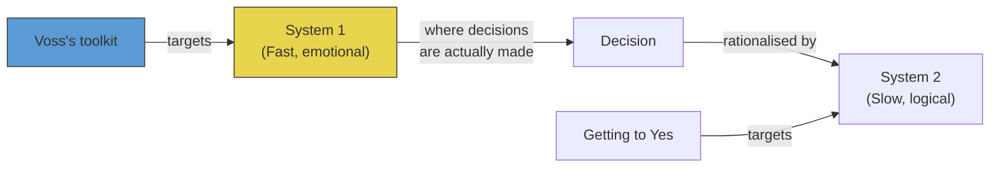
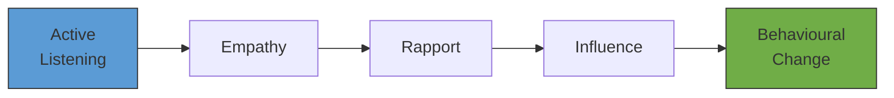
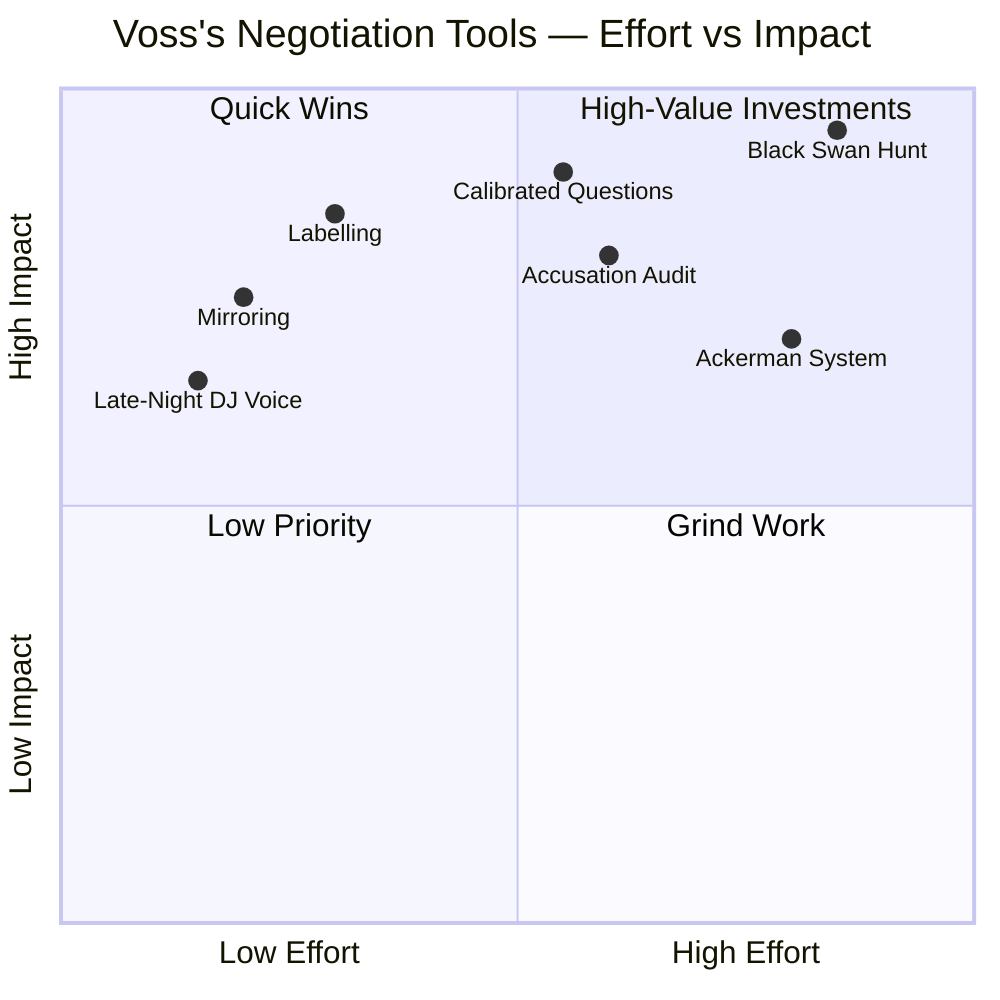
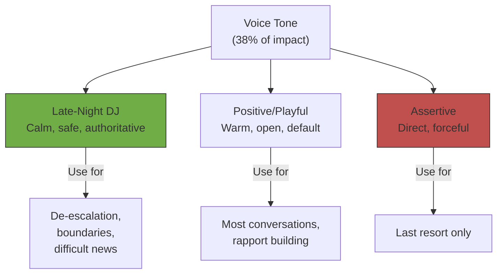
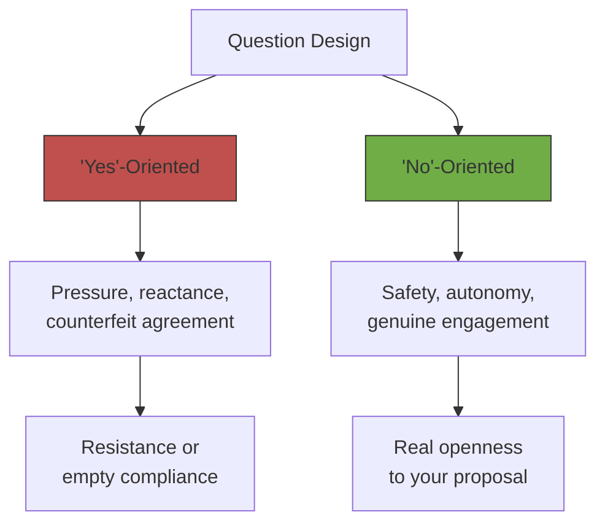
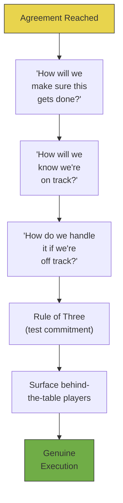
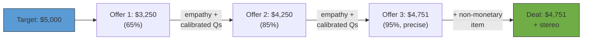
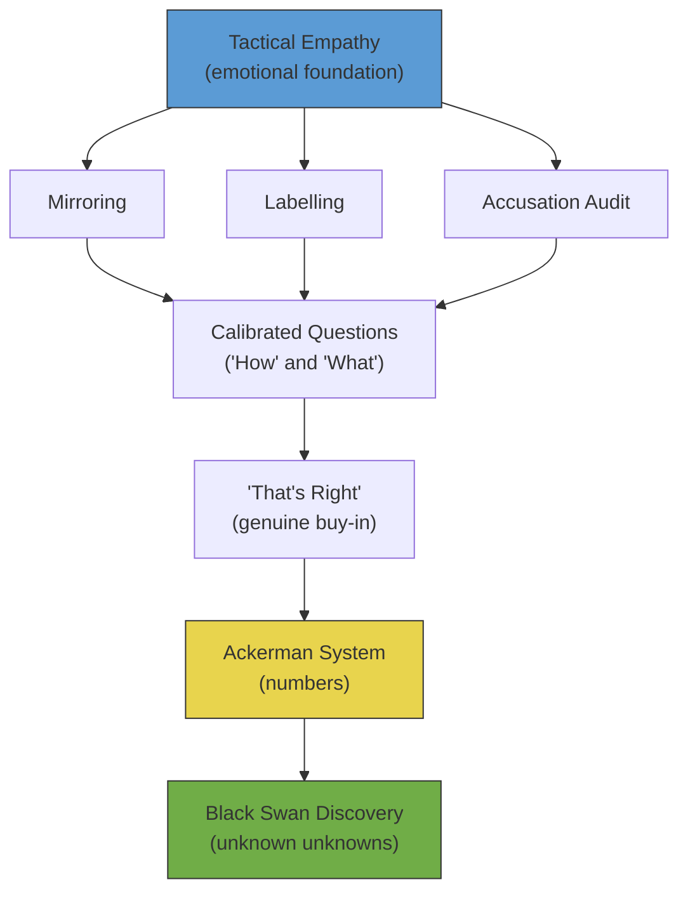
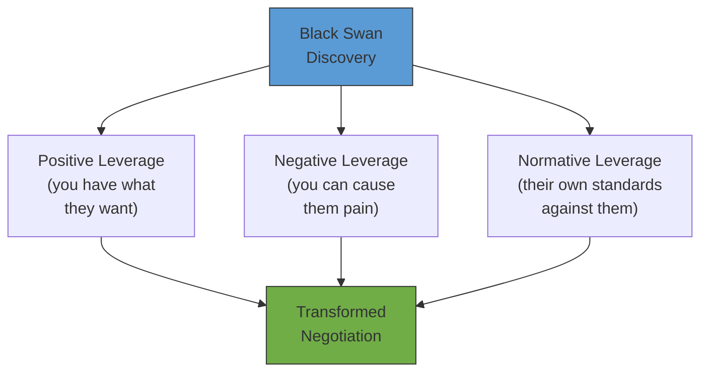

# Never Split the Difference — Chris Voss

> Chris Voss spent 24 years at the FBI, 15 of them as a hostage negotiator, and emerged with a thesis that overturns the dominant school of negotiation. The Getting to Yes paradigm treats negotiation as a rational problem between two logical actors seeking a fair outcome. Voss argues that this is a fantasy. Humans are irrational, emotional creatures who make decisions with their gut and rationalise with their brain. His system — built from situations where failure meant someone died — replaces logic-first persuasion with **tactical empathy**: a disciplined method for reading emotions, demonstrating understanding, and steering decisions by influencing the instinctive mind rather than arguing with the rational one. Each of the ten chapters introduces a field-tested technique, illustrates it with hostage stories, and translates it into everyday use. The result is the most immediately actionable negotiation book in print.

---

## About the Author

Chris Voss spent 24 years at the FBI, beginning as a beat cop on the dangerous streets of Kansas City and eventually rising to become the Bureau's lead international kidnapping negotiator.
His career included the Chase Manhattan bank siege, the Jill Carroll kidnapping in Iraq, kidnap-for-ransom cases in Haiti and the Philippines, and a period working alongside Scotland Yard on terrorist kidnappings.
His techniques were not designed in a university seminar room — they were developed iteratively in the field, under conditions where a failed negotiation meant someone died.
What did not work was discarded; what survived was pressure-tested across cultures, languages, and extremes of human desperation.
Post-FBI, Voss founded The Black Swan Group, a consulting firm that teaches negotiation to businesses and individuals.
He has taught at Georgetown, Harvard, and the University of Southern California's Marshall School of Business.
His co-author, Tahl Raz, helped translate the FBI methodology into a framework accessible to anyone who negotiates — which is to say, everyone.

---

## The Big Idea

*Voss rejects the rational-actor model of negotiation and builds his entire system around a single insight: decisions are made by the emotional brain, not the logical one.*

- The dominant negotiation paradigm — rooted in Roger Fisher and William Ury's *Getting to Yes* (1981) — assumes humans are rational actors who can find mutually beneficial solutions through principled argument
  - Define your interests, explore theirs, brainstorm options for mutual gain, appeal to objective criteria
  - It sounds elegant
- Voss watched this approach fail catastrophically in real negotiations and concluded that the model is built on a false premise

---

- <b style="color: #27ae60">Humans are not rational — they are driven by fear, desire, cognitive bias, and emotion</b>
- The decision to buy a house, accept a job offer, release a hostage, or walk away from a deal is made in the gut — in what Daniel Kahneman calls <b style="color: #2980b9">System 1</b>, the fast, instinctive, emotional brain — and then rationalised after the fact by <b style="color: #2980b9">System 2</b>, the slow, deliberative, logical brain
- The Getting to Yes school targets System 2
- <b style="color: #27ae60">Voss targets System 1</b>

Voss's entire system is designed to influence the emotional brain where decisions actually happen, then let the rational brain catch up with justifications afterward.

- His tools — voice tone, mirroring, labelling, calibrated questions, accusation audit — create three feelings in the counterpart:
  - **Safety** — when someone feels safe, they drop their defences
  - **Understanding** — when someone feels understood, they share guarded information
  - **Control** — when someone feels in control, they stop fighting and cooperate
- None of these effects are produced by presenting a well-reasoned argument
- They are produced by influencing the emotional machinery that drives human behaviour

---

- The title captures the philosophy
- <b style="color: #e74c3c">Compromise — splitting the difference — is not a noble middle ground</b>
  - It is a lazy capitulation driven by the discomfort of disagreement, not by rational assessment of value
  - If someone demands black shoes and you want brown shoes, "one black and one brown" is not a creative solution — it is worse than either alternative
  - <b style="color: #e74c3c">No deal is better than a bad deal</b>
- The book's ten techniques are designed to help you get a great deal without ever settling for a mediocre one

> [!tip] Core Insight
> Voss was not the first to bring psychology into negotiation. But he was the first to build a complete, practical system — from opening to close — grounded in field-tested emotional intelligence rather than academic theory.

- The FBI's <b style="color: #2980b9">Behavioural Change Stairway Model (BCSM)</b> provides the architecture:
  - Active listening leads to empathy
  - Empathy builds rapport
  - Rapport creates influence
  - Influence produces behavioural change
- <b style="color: #e74c3c">You cannot skip stages</b> — most people try to jump straight to influence without laying the foundations, and then wonder why nobody listens

The BCSM is sequential and non-negotiable — skip a stage and the entire stairway collapses.

---

## Key Concepts at a Glance

| Concept | One-line summary |
|---------|-----------------|
| **Tactical empathy** | Read and vocalise emotions to create safety |
| **Mirroring** | Repeat last 1-3 words, then go silent for four seconds |
| **The three voices** | Late-night DJ (calm authority), positive/playful (default), assertive (use sparingly) |
| **Labelling** | Name emotions aloud ("It seems like...") to diffuse negatives and reinforce positives |
| **The accusation audit** | Preemptively list every terrible thing they might think about you |
| **The power of "No"** | Design questions so "No" feels safe and opens genuine agreement |
| **"That's right"** | The two words that signal genuine buy-in, triggered by a summary |
| **Fairness** | The most dangerous word — defensive, accusatory, or constructive use |
| **Loss aversion** | Frame proposals around what they stand to lose, not what they gain |
| **Anchoring** | First number shapes everything; use extreme anchors and precise odd numbers |
| **Deadlines** | Almost always flexible; revealing yours creates shared urgency |
| **Calibrated questions** | Open-ended "How" and "What" questions that create the illusion of control |
| **Behind-the-table players** | Surface hidden decision-makers with "How does this affect everybody else?" |
| **The Rule of Three** | Get agreement three times, three ways, to test for genuine commitment |
| **The pronoun trick** | Liars use fewer first-person pronouns — watch for distancing language |
| **The Ackerman system** | Structured offers at 65% → 85% → 95% → 100% with precise final numbers |
| **Three negotiator types** | Analyst (data), Accommodator (relationships), Assertive (results) |
| **Black Swans** | Unknown unknowns that transform the entire negotiation |
| **Three types of leverage** | Positive (you can give), negative (you can cause pain), normative (their own standards) |

Business negotiators over-rely on anchoring while severely underutilising the emotional tools — tactical empathy, labelling, and mirroring — that Voss considers the foundation of every successful negotiation.

Each of Voss's techniques feeds a specific stage of the Behavioural Change Stairway — mirroring enables active listening, labelling deepens empathy, accusation audits accelerate rapport, and calibrated questions deliver influence.

Voss identifies three roughly equal negotiator types — each processes information differently, and using the wrong approach for the wrong type is the single most common cause of stalled negotiations.

Mirroring, labelling, and the late-night DJ voice sit in the "quick wins" quadrant — high impact for minimal effort — making them the first tools any negotiator should master.

---

## Chapter 1: The New Rules — Why Everything You Know About Negotiation Is Wrong

*The intellectual heirs of rational negotiation theory sit across from a street-level FBI agent with no graduate degree — and lose. Not because he argued better, but because he understood the emotional game they did not know they were playing.*

> [!example] Voss vs Harvard Professors (2008)
> - Voss was invited to a negotiation simulation at Harvard Law School, sitting across from professors who had literally written the textbooks on rational negotiation
> - They were confident, articulate, and armed with decades of academic research
> - Voss asked variations of "How am I supposed to do that?" over and over, until the professors found themselves designing his solution for him
> - They left the table genuinely uncertain about what had happened
> - The smartest people in the room, armed with the best rational frameworks, lost to someone who understood the emotional game
> **The lesson:** Superior intellectual preparation means nothing if the other side controls the emotional frame.

This opening is not just an anecdote — it is Voss's thesis statement. The new rules of negotiation are not about being smarter. They are about being more emotionally attuned.

- The professors made a classic mistake: they prepared for the negotiation they expected — a rational exchange of proposals and counterproposals — rather than the negotiation they got
  - Voss never engaged on their terms
  - He never made a counter-proposal
  - He simply asked questions that forced them to solve his problem
  - By the time they realised what had happened, they had already designed an agreement that served his interests
- This is Voss's core argument in miniature: <b style="color: #27ae60">the person who controls the emotional frame controls the outcome, regardless of who has the stronger rational position</b>

---

- <b style="color: #2980b9">Tactical empathy</b> is the book's central concept and the foundation for every technique that follows
  - It is not sympathy — you are not agreeing with the counterpart or being nice
  - It is not even standard empathy as most people understand it
  - It is a structured, deliberate method for understanding what someone is feeling, why they are feeling it, and then demonstrating that understanding aloud
- Voss distinguishes tactical empathy from its softer cousins:
  - **Sympathy** says "I feel sorry for you" — it is condescending and unhelpful
  - **Emotional empathy** says "I feel what you feel" — it is draining and often paralysing
  - **Tactical empathy** says "I understand what you feel and I can articulate it" — it is powerful and actionable
  - The tactical empathist does not absorb the counterpart's emotions — they observe them, name them, and use that understanding to steer the conversation
- The mechanism is neurological:
  - When a person feels understood, their brain shifts from defensive processing to collaborative processing
  - The <b style="color: #2980b9">amygdala</b> — the brain's threat-detection centre — calms down
  - Cortisol drops and trust increases
  - The counterpart becomes more willing to share information, more open to proposals, and more likely to cooperate
  - <b style="color: #27ae60">This happens not because you gave them a logical reason, but because you made them feel safe</b>

> [!tip] Core Insight
> When a person feels understood, their brain shifts from defensive processing to collaborative processing. You cannot persuade someone who does not yet feel heard.

---

- Voss frames this through the FBI's <b style="color: #2980b9">Behavioural Change Stairway Model (BCSM)</b>, developed by the Crisis Negotiation Unit:
  - Five sequential stages: active listening → empathy → rapport → influence → behavioural change
  - <b style="color: #e74c3c">You cannot skip stages</b>
  - A hostage negotiator who opens with "Let the hostages go and we'll talk about what you need" has jumped straight to influence without building the first three stages
  - The result is either silence or escalation
- The same dynamic plays out in every negotiation: you cannot persuade someone who does not yet feel heard

> [!example] Ruby Ridge and Waco — The Catastrophes That Changed Everything (1992-1993)
> - The Ruby Ridge standoff in Idaho in 1992 saw the FBI's confrontational approach lead to the deaths of Vicki Weaver and a US Marshal
> - The following year, the Waco siege with the Branch Davidians resulted in 76 deaths, including 25 children, when the FBI's tactical approach ended in a fire that consumed the compound
> - These tragedies forced the Bureau to fundamentally rethink its approach
> - The old model — assert authority, issue demands, escalate force — got people killed
> - The new model — listen, empathise, build rapport, influence — was born from that failure
> - Voss's entire career was shaped by this shift
> - The Crisis Negotiation Unit was restructured, new training protocols were written, and the BCSM became the standard framework
> - Every technique in this book descends from the lessons of those two catastrophes
> **The lesson:** The cost of ignoring the emotional dimension of negotiation is not just lost deals — it can be lost lives.

---

- The chapter also introduces Voss's adaptation of Kahneman's dual-process theory:
  - <b style="color: #2980b9">System 1</b> — fast, instinctive, emotional — is where decisions are actually made
  - <b style="color: #2980b9">System 2</b> — slow, deliberative, rational — is where those decisions are justified after the fact
  - Every technique in the book is designed to influence System 1, because that is where the real decision happens
  - System 2 follows along afterward, constructing a rational story for why the decision was right all along
- Voss's insight is that most negotiation training is aimed at the wrong system:
  - Rational arguments, data presentations, logical frameworks — all of these appeal to System 2
  - But by the time System 2 is processing your argument, System 1 has already decided
  - If System 1 does not feel safe, System 2 will construct a rational-sounding reason to reject your proposal
  - If System 1 feels understood and connected, System 2 will construct a rational-sounding reason to accept it
  - <b style="color: #27ae60">The rational reasons are post-hoc justifications either way — the emotional brain is in charge</b>

- Voss connects this to a simple test you can run in your own life:
  - Think about the last major purchase you made — a car, a house, a piece of technology
  - You likely had rational reasons for your choice: the fuel economy, the neighbourhood, the specifications
  - But if you are honest, the decision was made in a moment of feeling — the test drive that felt right, the house that felt like home, the product that felt exciting
  - The rational reasons came afterward, to justify what your gut had already chosen
  - <b style="color: #27ae60">Voss's entire system is designed to be the thing that makes the gut say "yes" — the rational justification will follow on its own</b>

> "Negotiation is not an act of battle; it's a process of discovery."

---

## Chapter 2: Be a Mirror — Active Listening, Voice Tone, and the Art of Repetition

*The simplest technique in the book — repeating three words and going silent — turns out to be one of the most powerful, because it exploits a neurobiological bonding mechanism that predates language itself.*

### Mirroring

- <b style="color: #2980b9">Mirroring</b> is disarmingly simple: repeat the critical one to three words (or the last three words) of what someone has just said
- Then go silent for at least four seconds
- That is the complete technique

> [!abstract] The Mirroring Technique
> 1. Listen carefully to the counterpart's statement
> 2. Identify the critical 1-3 words (or simply the last 1-3 words)
> 3. Repeat those words back, with a slightly upward inflection
> 4. Go silent for at least four seconds
> 5. Let the counterpart fill the vacuum — they will elaborate, clarify, or reveal new information
> 6. Repeat as needed

- The mechanism is <b style="color: #2980b9">isopraxism</b> — a neurobiological tendency, documented in primates and humans alike, to bond with individuals who display similar behaviour
  - When you repeat someone's words back to them, you trigger an unconscious instinct to elaborate
  - They feel heard
  - They feel that you are similar to them
  - They keep talking
- You gather information without revealing your own position, without making concessions, and without asking questions that might trigger defensiveness
- The beauty of mirroring is its asymmetry:
  - The counterpart does all the cognitive work — they elaborate, explain, justify
  - You do almost nothing — you repeat three words and wait
  - Yet the counterpart feels that you are deeply engaged, a wonderful listener, someone who truly cares about their perspective
  - This is the paradox of active listening: the less you say, the more the other person feels heard

---

- <b style="color: #27ae60">The silence is essential</b>
  - If you mirror and then immediately follow with a question or a statement, the mirror loses its power
  - The four-second pause creates a vacuum that the counterpart feels compelled to fill
  - Human beings are deeply uncomfortable with silence in conversation — more uncomfortable, usually, than with answering a question they would rather avoid
- The mirror combined with silence creates what Voss calls a "conversational crowbar":
  - You are prying open the counterpart's position without any visible effort
  - They do not feel interrogated — they feel listened to
  - The information flows freely because the social dynamic is connection, not confrontation

> [!tip] Core Insight
> Mirroring works because people bond with those who seem similar to them. Repeat their words, go silent, and they will tell you everything — without you ever asking a question.

> [!example] Richard Wiseman's Waiter Experiment
> - British psychologist Richard Wiseman instructed waiters at a restaurant to use two different techniques
> - One group responded to customer orders with positive reinforcement — "Great choice!" "Wonderful!" — the standard hospitality approach
> - The other group simply repeated the customer's order back to them, word for word
> - The mirroring waiters received 70% higher tips
> - Not because they were friendlier or the food was better, but because repeating the customer's words created a feeling of connection that translated directly into generosity
> **The lesson:** Mirroring triggers a bonding instinct that operates below conscious awareness — it works even in a transactional context like ordering dinner.

In the high-stakes world that Voss inhabited, mirroring served a far more critical function.

> [!example] The Chase Manhattan Bank Siege — Chris Watts (1993)
> - During the Chase Manhattan bank siege in Brooklyn, the lead robber Chris Watts was agitated and escalating rapidly
> - The police tactical team was ready to breach, and lives were on the line
> - The negotiation team deployed mirroring relentlessly, combined with the late-night DJ voice
> - They asked nothing and demanded nothing — they simply repeated Watts's words back to him, gently and slowly
> - Over hours, the temperature in the standoff dropped
> - Watts eventually surrendered, along with his accomplices
> - When asked afterward what made him come out, he said he did not know — he just felt that the negotiators "calmed us down"
> **The lesson:** Mirroring does not just gather information — it physiologically reduces the stress response in the listener.

---

- Voss also recounts how a student used mirroring in a business context to uncover critical information:
  - The student was a new hire given a project with impossible deadlines by her boss
  - Rather than arguing or complaining, she mirrored her boss's instructions
  - "I'm sorry, two copies?" the boss had said the project needed two copies
  - The boss elaborated, revealing that the real requirement was not what it appeared to be
  - Each mirror drew out more information, until the student understood the actual scope, the real deadline, and the hidden priorities the boss had not initially communicated
  - She solved the problem without a single confrontation — purely by listening and reflecting
  - The boss later commented that the student was "wonderful to work with" — unaware that she had been using a deliberate technique
  - This story illustrates a crucial feature of mirroring: it works without the counterpart knowing it is being used
  - Unlike explicit persuasion techniques that can feel manipulative when detected, mirroring simply feels like attentive listening
  - The counterpart never thinks "I'm being mirrored" — they think "This person really gets me"

- Mirroring also has a defensive application:
  - When someone makes an aggressive statement or an unreasonable demand, mirroring their words gives you time to think without escalating
  - Instead of reacting emotionally to "The price is $200,000 and that's non-negotiable," you simply say "Non-negotiable?" and wait
  - The counterpart usually softens, qualifies, or elaborates — and you have bought thinking time without conceding anything
  - <b style="color: #27ae60">Mirroring is both a sword and a shield — it gathers information on offence and buys time on defence</b>

> [!example] Bobby Goodwin — The Harlem Fugitive (Six-Hour Standoff)
> - Negotiators were dealing with Bobby Goodwin, a fugitive barricaded in an apartment in Harlem with weapons
> - Goodwin was paranoid, hostile, and convinced that the police intended to kill him
> - For six hours, the FBI negotiation team used nothing but mirroring, labelling, and the late-night DJ voice
> - They made no demands and issued no ultimatums
> - They simply listened, reflected, and acknowledged
> - Goodwin eventually walked out with his hands up
> - When debriefed later, he said the negotiators were the only ones who seemed to care about what happened to him
> **The lesson:** Patient repetition over hours can create a bond strong enough to override fear and paranoia.

---

### The Three Voices of Negotiation

*Voss identifies three distinct vocal tones that communicate directly to System 1 — bypassing the rational mind entirely.*

| Voice | Tone | When to use | Effect on listener |
|-------|------|-------------|-------------------|
| **Late-night FM DJ** | Calm, slow, downward-inflecting | Setting boundaries, de-escalating, delivering difficult news | Induces calm; lowers heart rate; conveys authority and safety |
| **Positive/playful** | Warm, encouraging, light | Default for most negotiations | Signals openness and goodwill; makes cooperation feel natural |
| **Assertive** | Direct, forceful, commanding | Rarely — only for absolute boundaries after other voices fail | Triggers fight-or-flight; shuts down cooperation |

**1. The late-night FM DJ voice:**
- Calm, slow, downward-inflecting — conveys authority and safety simultaneously
- The voice of a confident person who is in no hurry, who has nothing to prove, and who radiates control
- <b style="color: #27ae60">When you use this voice, you are not just projecting calm — you are physiologically inducing calm in your listener</b>
- Research on neurological mirroring shows that emotional states are contagious:
  - When you slow down, the other person slows down
  - When your heart rate is low, theirs tends to follow
- The DJ voice literally changes the biology of the person hearing it
- Use when you need to set firm boundaries, deliver difficult information, or de-escalate tension
- Voss used this voice relentlessly during the Chase Manhattan siege — the tactical team outside was ready to breach, and the DJ voice was the only thing keeping the robbers calm enough to keep talking

---

**2. The positive/playful voice:**
- Warm, encouraging, light — the default voice for most negotiations
- Signals openness, curiosity, and goodwill
- An easy-going, relaxed attitude makes the counterpart feel that cooperation is both natural and enjoyable
- Voss recommends smiling while you talk, even on the phone — a smile physically changes the muscles in your face, which changes the resonance of your voice, which the listener detects unconsciously
- This should be your voice roughly 80% of the time
- It creates an atmosphere where the counterpart feels safe to share information, explore options, and think creatively

**3. The assertive voice:**
- Direct, forceful, commanding — the voice most people default to in conflict
- <b style="color: #e74c3c">Almost always counterproductive</b>
  - Triggers the fight-or-flight response in the listener
  - Shuts down cooperation and produces either resistance or submission — neither serves a negotiator's interests
- Voss recommends using this voice extremely rarely, and only when the other two have failed and you need to communicate an absolute boundary
- The problem is that many people — particularly Assertive-type negotiators (see Chapter 9) — default to this voice without realising it
  - They think they are being direct and efficient
  - The listener hears aggression and shuts down
  - The more the Assertive pushes, the less the listener hears

---

- Voss references Albert Mehrabian's communication research:
  - Only 7% of a message's emotional impact comes from the words
  - 38% from the tone of voice
  - 55% from body language
  - Even if these exact percentages are debated, the directional point is powerful: <b style="color: #27ae60">how you say something matters far more than what you say</b>
- This means that voice tone is not a stylistic choice — it is a strategic weapon
- A negotiator who masters content but ignores delivery is like a chess player who can see ten moves ahead but cannot physically move the pieces

Voice tone is not decoration — it is the primary channel through which emotional states are transmitted between negotiators.

---

## Chapter 3: Don't Feel Their Pain, Label It — Tactical Empathy in Practice

*You do not need to feel the counterpart's pain. You need to name it — out loud, precisely, using specific phrases — and then watch as the neuroscience does the rest.*

### Labelling

- <b style="color: #2980b9">Labelling</b> is the practice of identifying the emotion driving your counterpart's behaviour and naming it aloud
  - Use phrases that begin with "It seems like...", "It sounds like...", or "It looks like..."
  - Then go silent and let the label do its work

- The mechanism is neuroscientific:
  - Research by Matthew Lieberman at UCLA used fMRI brain imaging to demonstrate the effect
  - The simple act of putting a name to an emotion activates the <b style="color: #2980b9">prefrontal cortex</b> — the brain's rational processing centre
  - Simultaneously reduces activity in the <b style="color: #2980b9">amygdala</b> — the brain's threat-detection and fear centre
  - In plain terms: when you name a fear, you expose it to rational scrutiny, and rational scrutiny diminishes its power
  - The fear does not vanish, but it shrinks from an overwhelming force to a manageable concern
  - Conversely, naming a positive emotion reinforces it — the counterpart feels validated and connected

- Labelling works in two directions:
  - **Negative labels** diffuse negative emotions — "It seems like you're frustrated" takes the heat out of frustration
    - The mechanism is what psychologists call <b style="color: #2980b9">affect labelling</b> — naming an emotion reduces its intensity by shifting processing from the reactive amygdala to the analytical prefrontal cortex
    - The emotion does not disappear — it becomes manageable
    - A negotiator who labels a counterpart's anger does not eliminate the anger, but transforms it from a blinding force into a topic of discussion
  - **Positive labels** reinforce positive emotions — "It sounds like you're really proud of what the team accomplished" amplifies pride
    - When a positive emotion is named, the counterpart dwells on it longer
    - The positive feeling becomes associated with you, the person who noticed and validated it
    - This is a form of rapport-building that most people completely overlook
  - <b style="color: #27ae60">Most people only use labelling defensively, to manage anger or fear — Voss emphasises that labelling positive emotions is equally powerful for building rapport</b>

> [!tip] Core Insight
> Never start a label with "I." The word "I" makes the statement about you and triggers defensiveness. "It seems like..." keeps the focus on the counterpart's experience.

---

- <b style="color: #e74c3c">Never start a label with "I"</b>
  - "I think you feel frustrated" makes the statement about you — your perception, your analysis — and triggers defensiveness because the counterpart can argue with your perception
  - <b style="color: #27ae60">"It seems like you're frustrated" keeps the focus on the counterpart's experience</b>
  - Tentative enough to be face-saving if wrong ("No, I'm not frustrated, I'm confused")
  - Accurate enough to create resonance if right
- The tentativeness is strategic, not timid:
  - "It seems like" and "It sounds like" are third-person constructions that create distance between you and the assertion
  - If the label is accurate, the counterpart feels deeply understood
  - If the label is inaccurate, they correct you — and the correction itself reveals useful information
  - Either way, you learn something

> [!example] The Harlem Fugitives — Labelling Under Fire
> - Three fugitives were holed up in an apartment in Harlem, wanted on multiple warrants, and surrounded by armed police
> - The standard approach would have been to list demands and consequences — come out or face tactical entry
> - Instead, the FBI negotiation team used labelling exclusively for six hours
> - "It seems like you don't want to come out." "It sounds like you're worried about what happens when you open the door." "It looks like you don't trust us to keep you safe."
> - No demands were made and no threats were issued
> - One by one, the three men came out voluntarily
> - They later said the negotiators were the first law enforcement officers who seemed to understand them
> **The lesson:** Six hours of labelling, with no demands and no threats, achieved what tactical entry would have risked lives to accomplish.

---

> [!example] Anna's $1 Million Contract Renewal
> - Anna was a consultant whose company had recently been acquired by a large prime contractor
> - She needed to renegotiate a $1 million contract with a client who was deeply suspicious of the acquisition and viewed the new parent company as a faceless bureaucracy
> - Rather than arguing that the acquisition would not change anything, Anna opened with labelling
> - "It seems like you're worried that we're going to become just another big company that doesn't care about you"
> - The client's response was immediate: "No, no, I don't think that at all. I know you'll still take care of us"
> - The contract was renewed without further negotiation
> **The lesson:** By naming a fear aloud, you make it sound exaggerated — and the counterpart's instinct is to correct the exaggeration, moving from hostility to cooperation.

- Voss also describes a case where he himself used labelling to rescue the FBI's operating relationship with a foreign government:
  - The Bureau had made errors in a country where it operated, and the local authorities were threatening to revoke their clearance entirely
  - Voss walked into the meeting and opened not with excuses or defences but with pure labelling
  - He listed every grievance the authorities might have, every failure the FBI had committed, every reason they might have to throw the Bureau out
  - He essentially said, "Bless me, Father, for I have sinned"
  - The hostility in the room evaporated — the authorities, prepared for a fight, found nothing to push against
  - <b style="color: #27ae60">By naming all the negatives first, Voss had disarmed them</b>
  - The meeting ended with the FBI retaining full access and the foreign government expressing appreciation for the Bureau's "honesty"

---

### The Accusation Audit

- The <b style="color: #2980b9">accusation audit</b> is labelling taken to its logical extreme
- Before a high-stakes conversation, you sit down and list every terrible thing the counterpart could possibly think about you, your proposal, or your intentions
- Then you say them all first, before the counterpart gets the chance

> [!abstract] The Accusation Audit Process
> 1. Before the conversation, brainstorm every negative thought the counterpart might have about you, your company, your proposal, or your motives
> 2. Write down the worst possible versions of each accusation
> 3. Open the conversation by stating these accusations aloud, using labelling language ("You're probably going to think...", "It's going to seem like...")
> 4. Wait in silence after delivering the audit
> 5. Let the counterpart correct the exaggerations — their instinct will be to reassure you

- The mechanism works on multiple levels:
  - **Accusations sound exaggerated when said aloud by the person they are aimed at** — the counterpart's instinct is to correct the exaggeration: "No, no, I don't think that at all"
    - This is a deeply ingrained social reflex — when someone is too hard on themselves, we rush to reassure them
  - **The audit clears the emotional path** — if the counterpart has a list of grievances in their head, those grievances colour everything they hear until addressed
    - Naming them first drains them of their power
  - **The audit signals humility and self-awareness**, which builds trust
    - Defence lawyers call this technique "taking the sting out" — they present damaging evidence themselves before the prosecution can, because information presented by a trusted source is received more favourably

---

- Voss emphasises that the accusations must be prepared in advance and rehearsed:
  - Improvising an accusation audit in the moment is risky — you may miss a critical grievance, or introduce a negative the counterpart had not considered
  - The preparation should be exhaustive: what do they think about me, about my company, about my proposal, about my timing, about my motives?
  - Say all of it — say the worst version — and then wait

- <b style="color: #e74c3c">When NOT to use the accusation audit:</b>
  - Do not use it in purely positive meetings
  - If the counterpart has no grievances and you introduce negatives they had not considered, you have created problems where none existed
  - The audit is a tool for difficult conversations where resistance is expected — not for routine interactions where rapport is already strong

> [!example] Voss's FBI International Relations Rescue
> - Voss was sent to smooth relations with a country's intelligence service after the FBI had committed a series of blunders on their soil
> - He arrived at the meeting knowing the counterparts were furious and expected excuses, deflections, or bureaucratic stonewalling
> - Instead, he opened with a full accusation audit: "You probably think the FBI doesn't respect your sovereignty. It's going to seem like we don't care about the damage we've caused. You might even think we're here to make excuses rather than fix the problem"
> - The intelligence officials, primed for a fight, found themselves saying "No, no, we know you're trying to do the right thing"
> - The relationship was not just preserved — it improved
> **The lesson:** The accusation audit works because it pre-empts hostility by voicing it first — the counterpart cannot attack a position you have already conceded.

> "Labelling is a way of validating someone's emotion by acknowledging it."

---

## Chapter 4: Beware "Yes" — Master "No"

*Voss dismantles the myth that "Yes" is the goal and shows why designing for "No" creates genuine agreement.*

- Conventional sales wisdom says you want to hear "Yes" — get the customer saying "Yes" early and often, build momentum
- <b style="color: #e74c3c">Voss argues this is not just wrong — it is dangerously counterproductive</b>
  - "Yes" has been so thoroughly weaponised by salespeople, telemarketers, and manipulators that human beings have built sophisticated psychological defences against it
  - When someone senses they are being steered toward "Yes," alarms go off
  - Resistance increases and trust evaporates
- The problem is not the word itself but what it represents:
  - "Yes" feels like a commitment — a door closing, an option being surrendered
  - When people feel trapped into saying "Yes," they experience what psychologists call <b style="color: #2980b9">reactance</b> — an instinctive pushback against perceived threats to autonomy
  - The harder you push for "Yes," the more reactance you generate
- Think about your own experience:
  - A telemarketer opens with "Would you agree that saving money is important?" — you know instantly that you are being manipulated
  - The question is designed to get you saying "Yes," and the transparency of the manipulation makes it repellent
  - Now imagine someone opening with "Is this a bad time?" — you relax, because you feel you have the power to end the conversation
  - That feeling of power, paradoxically, makes you more willing to continue

---

- Voss identifies three types of "Yes":

| Type | What it means | Reliability |
|------|--------------|-------------|
| **Commitment** | A genuine agreement to act | High — this is the real thing |
| **Confirmation** | A reflexive response, said without thought ("Yes, I hear you") | Low — means nothing |
| **Counterfeit** | Said to end the conversation, with no intention of follow-through ("Yes, sure, I'll think about it") | None — actively deceptive |

- Most of the "Yes" answers you collect in life are Confirmation or Counterfeit
  - They mean nothing
  - They predict nothing
  - A salesperson who gets ten "Yeses" in a call has, in most cases, collected ten meaningless sounds
- The challenge is telling them apart:
  - Commitment Yes is accompanied by specifics — who will do what, by when, using what resources
  - Confirmation Yes is automatic, flat, and followed by no elaboration
  - Counterfeit Yes is warm, enthusiastic, and followed by nothing happening

> [!tip] Core Insight
> "No" gives the counterpart a feeling of safety and autonomy. When you allow "No," the counterpart relaxes, stops fighting, and becomes genuinely open to hearing your actual proposal.

---

- <b style="color: #27ae60">"No" gives the counterpart a feeling of safety and autonomy</b>
  - Human beings have a primal, deep-seated need to feel in control of their environment
  - When you push for "Yes," you create pressure that triggers this need — the counterpart feels cornered
  - When you allow "No" — when you design questions so that "No" is the easy, natural answer — you create space
  - The counterpart relaxes, the threat has been named and rejected
  - From that position of safety, they become genuinely open to hearing your actual proposal

> [!abstract] "No"-Oriented Question Reframing
> Instead of pushing for "Yes," invert the question so "No" is the comfortable answer:
> - ~~"Do you have a few minutes to talk?"~~ → **"Is now a bad time to talk?"**
> - ~~"Do you agree with this approach?"~~ → **"Would it be a bad idea to try this?"**
> - ~~"Would you like to continue this partnership?"~~ → **"Have you given up on this project?"**
>
> The content is identical, but the emotional frame is inverted. "No" to a "bad time" question means "Yes, I can talk" — but it feels like self-protection rather than compliance.

- The nuclear version is for when someone is ignoring you:
  - Send a message designed to provoke "No" — "Have you given up on this project?"
  - The human need to correct a false attribution is almost irresistible
  - The person who has been ignoring your emails for weeks will respond within hours, not because they suddenly care about the project, but because they cannot allow the statement "I have given up" to stand uncorrected
  - Voss calls this the "email magic" — it has a near-perfect response rate

> [!example] The "Have You Given Up?" Email
> - One of Voss's students was trying to close a deal with a potential client who had gone completely silent — no response to three follow-up emails over two weeks
> - The student sent a single-sentence email: "Have you given up on this project?"
> - The response came within eight minutes
> - The client had not given up — they had been dealing with internal issues and simply had not prioritised the response
> - But the false attribution ("you've given up") was so intolerable that the client felt compelled to correct it immediately
> - The deal closed within the week
> **The lesson:** People will tolerate being ignored, but they cannot tolerate being mislabelled. A provoked "No" is more powerful than a requested "Yes."

- Voss stresses that the key to using "No" effectively is not to fear it:
  - Most people hear "No" and feel rejected — they retreat, apologise, or escalate
  - A trained negotiator hears "No" and feels relief — the counterpart has expressed their boundary, and now the real conversation can begin
  - "No" is information: it tells you what the counterpart does not want, which narrows the field and points toward what they do want
  - <b style="color: #27ae60">The negotiator who is comfortable with "No" has a structural advantage over the one who fears it</b>

---

The same content framed for "No" produces genuine engagement; the same content framed for "Yes" produces resistance or empty compliance.

> [!example] The Fund-Raising "No" Experiment
> - A fund-raising team tested "No"-oriented scripts against traditional "Yes"-oriented ones
> - The original script opened with: "Do you enjoy being a donor to the XYZ Foundation?" — a textbook "Yes"-seeking opening
> - The redesigned script opened with: "Is now a bad time to talk?" and then: "Have you given up on supporting the foundation?"
> - Both questions were designed to elicit "No"
> - The result: a 23% increase in donations
> - The donors who said "No, I haven't given up" felt they had made a free choice, not responded to pressure — and that feeling of autonomy translated into greater generosity
> **The lesson:** Autonomy is a more powerful motivator than momentum. People give more when they feel they chose to give.

> [!example] FBI Negotiator Marti's Bureaucratic Power Struggle
> - Marti was about to lose her position in a bureaucratic power struggle within the FBI
> - Rather than pleading her case — a "Yes"-seeking approach ("Don't you think I deserve this role?") — she asked a single question designed to let her boss say "No": "Do you want the FBI to be embarrassed?"
> - The answer, obviously, was "No"
> - But in saying "No," the boss had implicitly committed to a course of action — protecting the Bureau from embarrassment — that happened to require keeping Marti in her position
> - The "No" led directly to the outcome Marti wanted, without her ever having to beg for it
> **The lesson:** "No" is not a wall — it is a gate. When the counterpart says "No," they feel safe enough to start actually thinking about the substance of your proposal.

---

- In hostage scenarios, Voss found that the most effective questions were "No"-oriented:
  - "Is there anything you want me to stop doing?"
  - "Is there something I've said that's bothering you?"
  - These questions give the hostage-taker the experience of rejecting something — which satisfies their need for control — while simultaneously opening a channel for genuine communication
- Voss stresses that "No" is only the beginning:
  - After the counterpart says "No," you have their attention
  - Now you can begin the real conversation — summarise their position, label their emotions, ask calibrated questions
  - The "No" clears the defensive underbrush and opens a path to substance

> "No is the start of the negotiation, not the end of it."

---

## Chapter 5: Trigger "That's Right" — The Two Most Powerful Words

*The distinction between "That's right" and "You're right" is the difference between a breakthrough and a brush-off — and most people never learn to tell them apart.*

- The two most powerful words in negotiation are <b style="color: #27ae60">"That's right"</b>
  - They signal that the counterpart feels fully understood — that you have articulated their worldview back to them so accurately that they have nothing to add, nothing to correct, nothing to qualify

- <b style="color: #e74c3c">"That's right" is not the same as "You're right"</b> — the distinction is critical:

| Response | What it really means | What happens next |
|----------|---------------------|-------------------|
| **"That's right"** | "You understand me completely" | Emotional breakthrough — walls come down, real negotiation begins |
| **"You're right"** | "I want you to stop talking" | Nothing changes — the counterpart humours you and continues as before |

- **"You're right"** is a dismissal:
  - It means "Fine, whatever, you win this point, now can we move on?"
  - It produces no behavioural change and no genuine agreement
  - A hostage negotiator who hears "You're right" should be alarmed, not encouraged
- **"That's right"** is a breakthrough:
  - It means "You understand me"
  - It means "You have described my world as I see it"
  - People who say "That's right" have crossed an emotional threshold — they feel seen, and that feeling transforms the negotiation

---

- The tool for triggering "That's right" is the <b style="color: #2980b9">summary</b>:
  - A combination of paraphrasing (restating the counterpart's position in your own words) and labelling (naming the emotions underneath the position)
  - A good summary articulates the other person's world so completely — their facts, their feelings, their perspective — that they have no choice but to say "That's right"
- The summary must include both cognitive and emotional components:
  - Cognitive: "So what you're saying is that the timeline is too aggressive and the budget doesn't account for contingencies"
  - Emotional: "And it sounds like that makes you feel like we're setting the team up to fail"
  - When both components land, the counterpart experiences a moment of recognition — someone finally gets it

> [!tip] Core Insight
> "That's right" signals genuine understanding. "You're right" is a brush-off. A summary that combines paraphrasing with emotional labelling is the tool that triggers the breakthrough.

- This connects to psychologist Carl Rogers's concept of <b style="color: #2980b9">unconditional positive regard</b>:
  - The idea that people change most readily when they feel accepted as they are, not when they feel judged or pressured
  - You do not have to agree with the counterpart's position
  - You do not have to validate their logic
  - You just have to demonstrate that you understand their experience
  - That demonstration of understanding creates the psychological safety that makes change possible
  - <b style="color: #27ae60">Understanding is not agreement — and the counterpart knows the difference</b>

- Voss warns against a common mistake:
  - Negotiators who hear about the power of "That's right" sometimes try to force it by asking "Is that right?" or "Isn't that right?"
  - <b style="color: #e74c3c">This never works</b> — "That's right" must be spontaneous, not prompted
  - If you ask "Is that right?" you are seeking confirmation, not understanding
  - The counterpart hears "Agree with me" rather than "I understand you"
  - The only way to trigger "That's right" is through a summary so accurate that the words emerge involuntarily
  - Think of it like a reflex — when someone describes your world perfectly, "That's right" is not a choice, it is a physiological response
  - The goal is to become so good at summarising the counterpart's position that the words come out before they can stop them

- The practical structure of a summary that triggers "That's right":
  - **Step 1:** Paraphrase their factual position in your own words (not their words — paraphrasing demonstrates that you have processed the information, not just recorded it)
  - **Step 2:** Label the emotion beneath the position ("And it sounds like that makes you feel...")
  - **Step 3:** Validate the worldview that produces both the position and the emotion ("Given everything you've been through, that makes complete sense")
  - When all three components land, "That's right" is almost guaranteed

---

> [!example] Abu Sabaya and the Philippine Hostage Crisis (2001-2002)
> - Abu Sabaya, a leader of the Abu Sayyaf terrorist group in the Philippines, was holding American missionaries Martin and Gracia Burnham hostage and had demanded $10 million in ransom
> - Negotiations had dragged on for months with no movement
> - FBI negotiator Benjie was assigned to build rapport with Sabaya, who was a grandstanding, media-savvy figure who saw himself as a freedom fighter
> - Benjie did not argue with this self-image or challenge Sabaya's ideology
> - Instead, he listened deeply and then delivered a summary that captured Sabaya's entire worldview — his sense of injustice, his belief that his people had been marginalised, his self-image as a warrior and protector
> - Sabaya's response was immediate and unguarded: "That's right"
> - After that moment, the $10 million demand was never raised again
> - The demand had never been purely about money — it had been about recognition
> - Once Sabaya felt understood, the astronomical figure lost its emotional fuel
> **The lesson:** A man who feels understood is no longer driven by the desperate need to be heard. The demand had been, in large part, a scream for recognition.

> [!example] Brandon the Linebacker — Converting a Sceptic
> - Brandon was a former college linebacker who came to one of Voss's negotiation classes — brash, confrontational, and resistant to the idea that empathy had any place in negotiation
> - He viewed the world as a competition where the strongest will prevailed
> - Voss did not argue with him or lecture him about the neuroscience of empathy
> - Instead, he listened to Brandon's philosophy and delivered a summary: he described Brandon's belief that the world respected strength, that softness was a vulnerability, that you earned your place by imposing your will
> - Brandon stared at him and said: "That's right"
> - From that point, Brandon was open to learning — not because Voss had convinced him his worldview was wrong, but because Voss had demonstrated that he understood it completely
> **The lesson:** You cannot teach someone who does not feel understood. The summary is the bridge from resistance to receptivity.

---

> [!example] The Pharmaceutical Sales Rep and the Resistant Doctor
> - A pharmaceutical sales representative was struggling to sell a new drug to a doctor who had rejected data and clinical arguments from multiple reps
> - The doctor was deeply sceptical of the pharmaceutical industry and viewed sales reps as manipulative
> - The rep stopped selling and instead spent an entire meeting listening to the doctor's frustrations — his distrust of pharmaceutical companies, his belief that patient care was being subordinated to profit, his feeling that reps never understood his clinical reality
> - She summarised everything he had told her, and the doctor said: "That's right"
> - At the next visit, the doctor had already begun prescribing the drug — nobody had asked him to, nobody had shown him new data
> - The doctor did not prescribe because of superior clinical evidence — he prescribed because someone had finally listened to him
> **The lesson:** Crossing the emotional threshold from resistance to openness does not require new arguments — it requires feeling understood.

---

## Chapter 6: Bend Their Reality — Fairness, Loss Aversion, Anchoring, and Deadlines

*This is the book's most intellectually dense chapter, drawing on behavioural economics to show that the perception of value is not fixed — it can be bent, framed, and shaped by the person who understands the machinery of human bias.*

### The F-Word: Fairness

- "Fair" is the most powerful word in negotiation — and one of the most dangerous
- Human beings are hardwired to reject unfairness, even at significant personal cost
- The classic demonstration is the <b style="color: #2980b9">Ultimatum Game</b>:
  - One player is given $10 and can split it with another player any way they choose
  - If the second player rejects the split, neither player gets anything
  - Rational actors should accept any non-zero offer — $1 is better than $0
  - But in practice, offers below $3 are routinely rejected
  - People will sacrifice money to punish someone who is being unfair
- Brain imaging studies show that unfair offers activate the <b style="color: #2980b9">insular cortex</b> — the same region that processes disgust
- Unfairness is not just disliked; it is viscerally repellent

> [!tip] Core Insight
> "Fair" is a weapon. The only constructive use is: "I want you to feel treated fairly — stop me if you don't." This pre-commits you to transparency and paradoxically makes challenges less likely.

---

- This hardwiring means that the word "fair" can be used as a weapon — Voss identifies three distinct uses:

**1. The defensive use:** "We just want what's fair."
- <b style="color: #e74c3c">This is a manipulation</b>
- Triggers guilt in the counterpart and pressures them into concessions they would not otherwise make
- The word "fair" hijacks the emotional brain — hearing it triggers an immediate need to prove that you are not unfair
- If someone uses this on you, recognise it as emotional leverage and do not react to the guilt
- Response: take a breath, and say "I understand you want fairness — let's go back and look at where I've been unfair, because that's not my intention"

**2. The accusatory use:** "We've given you a fair offer."
- <b style="color: #e74c3c">Designed to shut down discussion entirely</b>
- Puts you on the defensive — if you continue negotiating after being told the offer is "fair," you risk appearing unreasonable
- Voss's recommended response is a mirror: "Fair?" — followed by silence
- Then ask them to explain what makes it fair — force them to justify the claim rather than allowing it to stand as an emotional assertion

**3. The constructive use:** "I want you to feel you're being treated fairly at all times. If at any point you feel I'm being unfair, please stop me and we'll address it."
- <b style="color: #27ae60">This is the only use that builds trust</b>
- Signals transparency and invites the counterpart to hold you accountable
- Paradoxically, by pre-committing to fairness, you make the counterpart less likely to challenge you on it
- Once they have been given explicit permission to cry foul, they rarely exercise it — the permission itself satisfies their need for fairness

---

- Voss illustrates the power of perceived unfairness with two examples:
  - **Robin Williams / Disney dispute over *Aladdin*:**
    - Williams agreed to voice the Genie for a reduced fee of $75,000 — far below his market rate — on the condition that Disney would not use his voice to sell merchandise
    - Disney reneged and used Williams's voice extensively in marketing
    - Williams was not angry about the money — he was already wealthy
    - He was angry about the unfairness — the broken promise, the exploitation of his goodwill
    - The entire conflict was driven not by economics but by the feeling of being treated unfairly
  - **Iran's nuclear programme:**
    - Western analysts were baffled by Iran's willingness to endure crippling sanctions rather than abandon nuclear ambitions
    - Voss argues Iran's leaders were making a fairness calculation, not an economic one
    - They believed the international community was applying a double standard — permitting nuclear programmes for some countries while prohibiting them for others
    - They were willing to pay an enormous price to resist what they perceived as unfairness
    - The insular cortex, again, overriding rational self-interest

> [!example] The Ultimatum Game in Practice
> - Researchers at the University of Chicago gave subjects $10 to split with a stranger
> - When proposers offered $5 (a 50/50 split), acceptance was nearly universal
> - When proposers offered $2 (an 80/20 split), rejection rates exceeded 50%
> - Subjects chose to walk away with nothing rather than accept an unfair split
> - Brain scans showed that unfair offers activated the insular cortex — the same region that processes physical disgust
> - The subjects were not making a rational calculation — they were experiencing a visceral, biological rejection of unfairness
> **The lesson:** Fairness is not an abstract principle — it is a biological imperative. People will sacrifice concrete gains to punish unfairness.

---

### Loss Aversion

- People take greater risks to avoid losses than to achieve equivalent gains
- This is <b style="color: #2980b9">Prospect Theory</b>, developed by Daniel Kahneman and Amos Tversky — one of the most robust findings in behavioural economics
  - A $100 loss feels roughly twice as painful as a $100 gain feels good
  - This asymmetry creates an enormous opportunity for anyone who understands how to frame proposals

- <b style="color: #27ae60">The same offer, reframed from gain to loss, becomes dramatically more compelling:</b>
  - "If you take this deal, you'll save $100" — moderately attractive
  - "If you don't take this deal, you'll lose $100" — urgently compelling
  - The content is identical, but the emotional weight is entirely different
- The practical implication is clear:
  - When making a proposal, frame it in terms of what the counterpart stands to lose by saying no, not what they stand to gain by saying yes
  - "You'll miss the opportunity" is more powerful than "You'll get the opportunity"
  - "The position will be filled" is more urgent than "The position is available"
  - "The current rate expires Friday" hits harder than "The new rate starts Monday"

- Voss also notes that loss aversion interacts powerfully with the <b style="color: #2980b9">endowment effect</b>:
  - Once people feel they own something — even psychologically — they value it more than they would if they did not own it
  - This is why free trials are so effective: once you have been using a product for 30 days, cancelling feels like a loss, not a return to the status quo
  - In negotiation, you can create a sense of ownership by letting the counterpart design elements of the deal:
    - When they contribute ideas, those ideas become "theirs"
    - Walking away from the deal now means walking away from their own ideas — a loss
  - <b style="color: #27ae60">Calibrated questions and the illusion of control create psychological ownership, which triggers loss aversion when the deal is threatened</b>

> [!example] The UAE Consultant Fee Cut
> - A consultant needed to cut fees for a team deployed in the UAE — the daily rate was being slashed from $2,000 to $500, a brutal reduction
> - Rather than framing this as "the new rate is $500" (a loss from the current state), the consultant used an accusation audit followed by loss framing
> - She opened by naming every negative the consultants might feel: "You're going to think this is unfair. You're going to feel like you're being taken advantage of"
> - Then she reframed the rate not as a cut but as a loss-prevention measure: "The alternative is that the project gets cancelled and the daily rate goes to zero"
> - Not a single consultant pushed back
> **The lesson:** The frame shifted from "you're losing $1,500 a day" to "you're protecting $500 a day that you could lose entirely."

---

### Anchoring and the Bolstering Range

- The first number placed on the table in any negotiation shapes all subsequent discussion
- This is the <b style="color: #2980b9">anchoring effect</b>, and it is remarkably resistant to awareness — even people who know about anchoring are affected by it
- The psychology is straightforward:
  - Once a number is introduced, the brain treats it as a reference point
  - All subsequent adjustments are made relative to that anchor
  - An extreme anchor pulls the entire range of "reasonable" outcomes toward it
  - Even if the counterpart knows the anchor is extreme, they cannot fully adjust away from it — a phenomenon Kahneman calls <b style="color: #2980b9">insufficient adjustment</b>

- When you must name a number first, Voss recommends using a <b style="color: #2980b9">bolstering range</b> rather than a specific figure:
  - Instead of "I want $100,000," say "Positions like this at comparable companies pay between $100,000 and $130,000"
  - Research from Columbia Business School found that job applicants who used a bolstering range — where the bottom was their target — received higher salaries than those who cited a specific number
  - The range signals knowledge and flexibility while anchoring the counterpart on the high end
  - It also seems less aggressive than a single number — the counterpart feels they have room to negotiate within the range

---

- <b style="color: #27ae60">Use odd, precise numbers</b>
  - $47,653 feels calculated, researched, and immovable
  - $48,000 feels like a round estimate — a number you made up, a placeholder that invites negotiation
  - Even if both numbers represent the same value, the precise number triggers a different psychological response
  - It suggests that the person behind it has done their homework, that there is a methodology behind the figure, that it would be difficult to move them
  - Research confirms: precise numbers receive smaller counter-adjustments than round numbers

> [!example] Angel Prado's 50% Salary Increase
> - Angel Prado, a student of Voss's, used the complete toolkit to negotiate a 50% salary increase at a new position
> - He opened with an accusation audit ("I know this is going to sound like a lot")
> - He used a bolstering range anchored above his target
> - He cited a precise, odd number on his final offer
> - He combined this with labelling and calibrated questions throughout the conversation
> - The employer accepted without pushback
> **The lesson:** The salary was 50% higher than the original offer — not because Prado was a uniquely talented negotiator, but because he followed Voss's system step by step.

---

### Deadlines

- Deadlines are almost always more flexible than they appear
  - They create urgency that impairs judgement — both yours and theirs
  - When someone uses a deadline against you, recognise it as a psychological lever, not as an immovable constraint

- <b style="color: #27ae60">The counterintuitive advice: when you are the one with a deadline, reveal it</b>
  - Hiding your deadline is dangerous because the other side cannot adjust their behaviour to accommodate it
  - If they do not know you are under time pressure, they will take their time — and the deal may collapse
  - If they do know, they can either accelerate or exploit the pressure, but at least the negotiation continues
  - Hiding information generally impairs negotiation outcomes; revealing it, handled skilfully, creates shared urgency

- Voss references the J.P. Morgan / Columbia University study:
  - Most deals close at the deadline — not before it
  - Negotiators who hide their deadlines tend to reach worse outcomes than those who reveal them
  - The hidden deadline creates internal panic that impairs their own decision-making without giving the counterpart any reason to move faster

- Voss points out that many deadlines are entirely artificial:
  - Fiscal year-end deadlines are real but flexible — the company does not cease to exist on April 1st
  - "We need an answer by Friday" often means "I would prefer an answer by Friday" — push back and the deadline moves
  - Even legal deadlines often have extension provisions that people do not mention
  - <b style="color: #27ae60">The first question to ask about any deadline is: what actually happens if it passes?</b>
  - If the answer is "nothing catastrophic," the deadline is a lever, not a wall

- The broader principle is that <b style="color: #e74c3c">deadlines create irrational behaviour in the person who feels pressured by them</b>:
  - People make concessions they would never make under normal circumstances
  - They accept terms they would otherwise reject
  - They stop thinking strategically and start thinking desperately
  - Awareness of this dynamic is defensive — when you feel deadline pressure, recognise that your judgement is compromised

---

## Chapter 7: Create the Illusion of Control — Calibrated Questions

*The most powerful move in negotiation is not to argue — it is to ask a question that makes the counterpart solve your problem for you, while they believe they are in charge.*

- <b style="color: #2980b9">Calibrated questions</b> are open-ended questions beginning with "How" or "What" that give the counterpart the feeling of being in charge while you direct the conversation toward your objectives

- The mechanism works on two levels:
  - **Level 1:** These questions force the counterpart to expend mental energy solving *your* problem — instead of arguing, you are asking for help, and people who feel needed tend to cooperate
  - **Level 2:** Calibrated questions suspend what Voss calls <b style="color: #2980b9">unbelief</b> — the active psychological resistance to being persuaded
    - When someone is trying to convince you of something, you instinctively search for flaws in their argument
    - But when someone asks you an open-ended question, you shift from evaluating to problem-solving
    - The resistance disappears because you are too busy thinking about the answer to resist the premise of the question
- There is also a third effect that Voss does not name but demonstrates repeatedly:
  - Calibrated questions force the counterpart to confront the practical implications of their own position
  - "How am I supposed to do that?" does not argue against the counterpart's demand — it asks them to consider whether their demand is implementable
  - The counterpart often discovers, in the process of answering, that their own position has flaws they had not considered

> [!tip] Core Insight
> The counterpart believes they are in control because they are providing the answers. But you are the one framing the questions. The illusion of control is total.

---

- <b style="color: #e74c3c">Question types to avoid:</b>
  - **"Why"** is dangerous because it sounds accusatory — "Why did you do that?" feels like a cross-examination
    - The only safe use of "Why" is when it supports your position: "Why would you ever change from the current approach?" (implying they should not)
  - **Closed-ended questions** ("Can you...?", "Is it...?", "Do you...?") generate reflexive yes/no answers and produce no useful information
  - **"Who," "When," and "Where"** are fact-based questions that gather data but do not require thought or engagement

- <b style="color: #27ae60">The master questions are all "How" and "What":</b>
  - "How am I supposed to do that?" — the single most useful question in any negotiation
  - "What about this is important to you?"
  - "How can I help make this better for us?"
  - "What does it take to be successful here?"
  - "How does this affect everybody else?"
  - "How on board are the people not on this call?"
  - "What are we up against here?"
  - "What is the biggest challenge you face?"

> [!abstract] Calibrated Question Toolkit
> **For surfacing hidden obstacles:**
> - "What are we up against here?"
> - "What is the biggest challenge you face?"
>
> **For creating the illusion of control:**
> - "How am I supposed to do that?"
> - "How can we solve this problem?"
>
> **For identifying behind-the-table players:**
> - "How does this affect everybody else?"
> - "How on board are the people not on this call?"
>
> **For testing commitment:**
> - "What does implementation look like?"
> - "How will we know we're on track?"

---

- The last two categories are particularly important because they surface <b style="color: #2980b9">behind-the-table players</b>:
  - The people who are not in the room but who have the power to kill any deal
  - The person you negotiate with is rarely the sole decision-maker
  - There is almost always a boss, a board, a spouse, a committee, a regulatory body, or a colleague who must sign off
  - One dissenting party who was not consulted can torpedo an agreement that both parties at the table believed was done
  - <b style="color: #e74c3c">The deal-killer is usually someone you never met</b>
- Voss estimates that in business negotiations, behind-the-table players derail agreements roughly 30-40% of the time:
  - The deal seems done, hands are shaken, the negotiation is considered a success
  - Then the counterpart goes back to their office, mentions the deal to a colleague, a boss, or a spouse
  - That person raises objections that were never addressed in the negotiation
  - The deal unravels — not because it was a bad deal, but because a key stakeholder was never consulted
  - <b style="color: #27ae60">The calibrated question "How does this affect everybody else?" is designed to surface these people before the deal is signed</b>

> [!example] Voss vs Harvard Professors — The Rematch
> - Voss was invited to a live negotiation exercise at Harvard, where a team of the school's best negotiation professors expected an intense back-and-forth of proposals and counterproposals
> - Voss simply repeated variations of "How am I supposed to do that?" and "What does that look like for my side?" until the professors found themselves designing his solution for him
> - They were doing his work without realising it
> - They left the exercise genuinely uncertain about how they had been outmanoeuvred
> - The questions were so soft, so collaborative-sounding, that the professors never felt they were in a negotiation — they felt they were helping
> **The lesson:** Their competitive energy had been channelled into problem-solving energy, and the problem they were solving happened to be Voss's.

---

> [!example] Julie and the Kidnapping of Jose (Pittsburgh)
> - Julie was the aunt of a kidnap victim named Jose, and the kidnappers called her to make their demands
> - Julie had been coached by Voss's team to use only calibrated questions
> - When the kidnappers stated their ransom figure, Julie did not argue, counter, or plead — she said: "How am I supposed to get that kind of money?"
> - The question forced the kidnappers to think about her constraints, which they had not previously considered
> - She continued: "How do I know he's all right?" "How will this get resolved?"
> - Each question redirected the kidnappers from demanding to problem-solving
> - The kidnappers, who had started with a large demand, began reducing it on their own — not because Julie argued them down, but because they had to confront the impracticality of their own demands
> - The kidnapping was resolved at a fraction of the original demand
> **The lesson:** Calibrated questions forced the kidnappers to participate in designing a solution that worked for both sides.

> [!example] The Pittsburgh Drug Dealer — Proof of Life
> - A drug dealer in Pittsburgh kidnapped a woman and called her family to make ransom demands
> - The family member, coached by the FBI, asked a single calibrated question: "How do I know she's all right?"
> - The question served two functions:
>   - It obtained proof of life — the most critical piece of information in any kidnapping
>   - It forced the drug dealer to shift from threatening mode to problem-solving mode
> - He had to figure out how to demonstrate that the hostage was alive, which required him to interact with her, changing the psychological dynamic from captor-property to captor-person
> - The hostage was eventually recovered alive
> **The lesson:** A single calibrated question changed the entire psychological dynamic of a hostage situation.

> "He who has learned to disagree without being disagreeable has discovered the most valuable secret of negotiation."

---

## Chapter 8: Guarantee Execution — "Yes" Is Nothing Without "How"

*An agreement that cannot be executed is worse than no agreement at all — it wastes time, erodes trust, and in hostage cases, costs lives.*

- Getting agreement is worthless if the deal is never implemented
- <b style="color: #27ae60">"Yes" is nothing without "How"</b>
- Voss learned this lesson the hard way through cases where agreements were reached but never executed — sometimes with fatal consequences
- The challenge is not just getting the deal done but ensuring the deal sticks:
  - People agree to things they cannot deliver
  - People agree to things they have no intention of delivering
  - People agree to things that other people — the behind-the-table players — will never allow
- Voss calls this the "implementation gap":
  - The distance between what was agreed at the table and what actually happens afterward
  - In hostage negotiations, this gap is literally fatal — a ransom is paid, but the hostage is not released
  - In business, the gap is less dramatic but equally destructive — a contract is signed, but the deliverables never materialise; a hire is made, but the promised resources never appear
  - <b style="color: #e74c3c">Every unexecuted agreement erodes trust and makes the next negotiation harder</b>

- After any agreement is reached, Voss recommends asking three implementation questions:
  1. "How will we make sure this gets done?"
  2. "How will we know we're on track?"
  3. "How do we handle it if we're off track?"

- These questions serve a dual purpose:
  - They force the counterpart to design the implementation themselves — which makes it *their* plan, and people are psychologically committed to executing plans they believe they created
  - They surface hidden obstacles, logistics challenges, and behind-the-table players that might sabotage execution

- Voss tells the story of a training deal that collapsed specifically because of this gap:
  - His firm negotiated a contract with a Fortune 500 company
  - The counterpart at the table was enthusiastic, the terms were agreed, the deal seemed done
  - But the counterpart had not consulted a key division head who would be affected by the training programme
  - That division head killed the deal in an internal meeting, citing concerns that were never raised in the negotiation
  - If Voss's team had asked "How does this affect the other divisions?" they would have surfaced the objection early enough to address it
  - The lesson transformed his approach: now every deal includes an explicit implementation conversation before anyone considers the negotiation complete

---

### The 7-38-55 Rule and Body Language in Execution

- Voss returns to the Mehrabian communication model in this chapter, applying it specifically to detecting false agreement:
  - When words say "Yes" but tone says "maybe" and body language says "no," trust the body
  - A counterpart who agrees verbally while avoiding eye contact, crossing arms, or leaning away is sending a signal that the words are not real
  - <b style="color: #27ae60">Pay attention to incongruence — when the 7% (words) contradicts the 93% (tone and body), the 93% is telling the truth</b>
  - This is particularly important during implementation discussions, where people agree to timelines and deliverables they have no intention of meeting

---

### The Rule of Three

- The <b style="color: #2980b9">Rule of Three</b> is the commitment-testing tool
- Get the counterpart to agree to the same thing three times in the same conversation, using three different approaches:
  1. Direct agreement ("So we're agreed on X?")
  2. A summary or label that triggers "That's right" ("It seems like this is important to you because... [summary]")
  3. A calibrated "How" question about implementation ("How do we make sure this gets done by Friday?")

- It is extremely difficult to repeatedly lie or fake conviction
  - A single "Yes" can be counterfeit — said to end the conversation
  - But three agreements, elicited through three different frames, test whether the commitment is real
  - If someone hesitates on the second or third confirmation, you have identified a problem before it becomes a crisis

> [!tip] Core Insight
> A single "Yes" can be counterfeit. Three agreements, elicited through three different frames, test whether the commitment is real. If someone hesitates on the second or third, you have identified a problem before it becomes a crisis.

- <b style="color: #e74c3c">The variation is important</b>
  - If you ask the same question three times word-for-word, you will irritate people and they will wonder what is wrong with you
  - The three approaches must feel natural, like different angles of the same conversation, not like a repetitive interrogation
  - The skill is in making each confirmation feel like a different topic even though you are testing the same commitment

---

### Detecting Liars: The Pronoun Trick and the Pinocchio Effect

- Voss offers a simple heuristic for detecting deception: <b style="color: #27ae60">liars use fewer first-person pronouns</b>
  - Someone who says "We'll make sure it gets done" is more likely to follow through than someone who says "It'll get done"
  - The deeper a person's genuine commitment, the more they use "I" and "We" — because they are psychologically inserting themselves into the execution
  - Distancing language — "The team will handle it," "That will be taken care of," "Someone will follow up" — is a red flag
  - The absence of the first person suggests the absence of personal commitment

- Voss also describes what he calls the <b style="color: #2980b9">Pinocchio Effect</b>:
  - Liars tend to use more words than truth-tellers
  - They over-explain, add unnecessary qualifiers, use third-person references and complex sentences
  - The truth is usually simple
  - Deception requires construction — and construction generates verbal excess
  - A truthful person says "I'll call the client Monday morning"
  - A liar says "Well, what we're going to try to do is, the team is going to be looking at the timeline and figuring out the best way to move forward with the appropriate stakeholders"

| Signal | What it suggests | Example |
|--------|-----------------|---------|
| First-person pronouns ("I will," "We are") | Genuine personal commitment | "I'll have it on your desk by 3pm" |
| Distancing language ("It will be," "Someone will") | Weak or absent commitment | "That will get handled at some point" |
| Simple, direct language | Truth | "Yes, I agreed to that" |
| Verbose, qualified language | Possible deception | "Well, what we discussed was more of a general direction..." |

---

### Behind-the-Table Players and the Burnham Tragedy

The story that haunts this chapter is the Burnham kidnapping in the Philippines.

> [!example] The Burnham Tragedy — When Execution Fails (Philippines, 2001-2002)
> - Martin and Gracia Burnham were American missionaries taken hostage by Abu Sayyaf
> - After protracted negotiations, $300,000 in ransom was paid — but the hostages were not released
> - The reason: Abu Sabaya, who had negotiated the ransom deal, was not the person physically holding the hostages
> - The armed militants in the jungle who had day-to-day custody of the Burnhams had never agreed to anything
> - The deal was made with a middleman who could not guarantee execution
> - The "behind-the-table" player — the one with actual physical control — had never been part of the negotiation
> - Martin Burnham was killed and Gracia was wounded during a military rescue attempt that followed the failed ransom exchange
> **The lesson:** The person you negotiate with may not be the person who executes the agreement. If the people who must carry out the deal were not consulted, your deal is written in sand.

- In a less tragic but equally instructive case, Voss describes a training company that negotiated a deal with a large corporation:
  - The deal was agreed upon by the counterpart at the table — but then killed by a division head who had not been consulted and did not support the initiative
  - The training company had done everything right at the table and still lost — because the decision-maker was not at the table
  - <b style="color: #27ae60">Always ask "How does this affect everybody else?" and "How on board are the people not on this call?"</b>
  - These questions feel innocuous, but they surface the hidden veto players who can destroy your agreement

---

Getting to "Yes" is only halfway — the implementation questions, the Rule of Three, and the behind-the-table player audit are what convert agreement into execution.

---

## Chapter 9: Bargain Hard — The Ackerman System and the Three Negotiator Types

*When the emotional groundwork is laid and it is time to haggle over numbers, Voss provides the mechanical structure — a six-step system designed to exploit cognitive biases so systematically that a $150,000 ransom demand gets resolved for less than $5,000.*

When the talking is done and it is time to haggle over numbers, Voss provides two major frameworks: the Ackerman bargaining system and the three negotiator types model.

### The Ackerman System

- The <b style="color: #2980b9">Ackerman system</b> is a structured offer-counteroffer method originally developed by ex-CIA operative Mike Ackerman for kidnap-for-ransom negotiations
- Howard Raiffa, the Harvard negotiation professor, independently validated its principles as applicable to all forms of negotiation
- The system is mechanical by design — it removes emotion from the numbers and replaces it with a calculated sequence

> [!abstract] The Ackerman System
> 1. **Set your target price** — this is your goal, what you actually want
> 2. **First offer: 65% of target** — this is your extreme anchor (e.g., $65,000 on a $100,000 target)
> 3. **Three raises at decreasing increments:** 85%, 95%, 100% of target
> 4. **Before each raise, use empathy and calibrated questions** — "How am I supposed to do that?" should precede every concession
> 5. **On your final number, use a precise, non-round figure** — $37,893 rather than $38,000
> 6. **On the final offer, throw in a non-monetary item** — this signals you have exhausted your monetary capacity

- The mechanism exploits multiple cognitive biases simultaneously:
  - The extreme first anchor exploits <b style="color: #2980b9">anchoring bias</b> — the first number on the table shapes all subsequent adjustments
  - The decreasing increments create the impression that you are being squeezed to your absolute limit — each concession is visibly harder to make
  - The precise final number triggers the perception that it is calculated and immovable
  - The non-monetary throwaway confirms that you have nothing left to give financially
- Together, these elements create a compelling narrative: "I started low, I've been pushed higher and higher, I've reached my absolute maximum, and I'm now offering you everything I have plus something extra"

---

> [!example] The Haiti Kidnapping — Ackerman in Its Original Context
> - A man was kidnapped in Port-au-Prince and a ransom of $150,000 was demanded
> - The FBI-advised team set a target of $5,000 — not because they believed the life was worth only $5,000, but because intelligence suggested this amount would satisfy the kidnappers without funding further operations
> - The first offer was $3,250 (65% of $5,000) — the kidnappers were outraged and made threats
> - The team used labelling and calibrated questions ("How am I supposed to come up with that kind of money?") before each raise
> - The second offer was $4,250 (85%), the third was $4,751 (95%) — a precise, odd number
> - The final offer included a non-monetary sweetener: an old, barely functional stereo described as a personal sacrifice
> - The kidnappers accepted $4,751 and the stereo
> - A demand of $150,000 was resolved for less than $5,000 — a 97% reduction
> **The lesson:** The Ackerman system is not theory — it was designed for life-or-death situations and has been validated thousands of times in the field.

Each step in the Ackerman system combines a numerical offer with an emotional tool — the numbers and the empathy work in concert.

> [!example] Mishary's Rent Negotiation
> - Mishary, a student of Voss's, faced a significant rent increase upon lease renewal
> - Rather than accepting the increase or searching for a new apartment, he prepared an Ackerman plan
> - He used calibrated questions to understand the landlord's pressures ("How does this compare to similar units in the area?")
> - He labelled the landlord's feelings ("It seems like costs have really gone up for you")
> - He made his offers at decreasing increments, with empathy preceding each raise
> - His final figure was $1,829 — a precise number that sounded researched and immovable
> - The landlord not only accepted but actually reduced the rent from the current level
> **The lesson:** The Ackerman system works in everyday negotiations — not just kidnappings. The precise number and decreasing increments communicate seriousness that round numbers cannot.

---

- <b style="color: #e74c3c">Nuance: the Ackerman system has limits</b>
  - Against sophisticated counterparts who recognise the Ackerman pattern, it can feel formulaic and damage trust
  - It is optimised for one-shot or adversarial negotiations — ransom payments, car purchases, freelance contracts
  - Not suited for collaborative long-term relationships where both parties are building something together
  - In an ongoing partnership, being caught running an Ackerman sequence can erode the goodwill you need for the next negotiation
  - The system also requires a clear target price — if you do not know what you want, the system has nothing to work with
- Voss also notes that the emotional tools must accompany the numerical structure:
  - An Ackerman sequence delivered in a cold, mechanical way will feel like a negotiation technique — because it is one
  - The same sequence delivered with genuine empathy, labelling, and calibrated questions feels like a collaborative problem-solving process
  - The numbers are the skeleton; the emotional tools are the muscle and skin that make the skeleton move
  - <b style="color: #e74c3c">Never run the Ackerman system without the emotional foundation — numbers without empathy are just haggling</b>

---

### The Three Negotiator Types

*Voss identifies three fundamental negotiating styles that shape how people communicate, what they prioritise, and how they interpret the behaviour of others.*

| Type | Core drive | Time means... | Silence means... | Strength | Blind spot |
|------|-----------|---------------|-----------------|----------|------------|
| **Analyst** | Data and preparation | Opportunity to prepare | Thinking time — processing internally | Thorough, minimises mistakes | Cold, slow, misses emotional cues |
| **Accommodator** | Relationships and harmony | Investment in the relationship | Something has gone wrong | Warm, builds rapport naturally | Over-promises, avoids conflict, counterfeit "Yes" |
| **Assertive** | Results and speed | Money — every minute counts | Opportunity to talk more | Decisive, gets things done | Bulldozes, triggers defensiveness, poor listener |

**The Analyst:**
- See time as an opportunity to prepare — methodical, data-driven, deeply uncomfortable with ambiguity
- Will spend hours researching, modelling scenarios, and building spreadsheets before entering a negotiation
- Silence is thinking time — they are processing internally and will not respond until they have formulated a carefully considered position
- Priority: minimising mistakes — they would rather make no deal than make a bad one
- Weakness: can come across as cold, slow, and uncollaborative — may over-prepare and under-connect, missing emotional cues
- <b style="color: #27ae60">How to handle an Analyst:</b> use data, be precise, give them time to process, and do not rush them
  - If you push an Analyst to decide before they are ready, they will either shut down or make a conservative choice that is worse for both of you
  - Send materials in advance so they can prepare
  - Expect silence — it is not hostility, it is processing

---

**The Accommodator:**
- See time as an investment in the relationship — warm, sociable, deeply concerned with maintaining harmony
- They want to be liked and believe that as long as people are communicating, progress is being made
- Silence is a sign that something has gone wrong — the other person is upset, angry, or withdrawing
- Priority: maintaining the relationship at all costs
- Weakness: over-promise and under-deliver because they cannot bring themselves to say "No" or surface uncomfortable truths
  - Will agree to things they cannot or will not execute, purely to avoid conflict in the moment
- <b style="color: #27ae60">How to handle an Accommodator:</b> be warm and personable (they need rapport before business), but pin them down on specifics
  - Ask calibrated "How" questions to force them to think through implementation
  - <b style="color: #e74c3c">Do not mistake their warmth for commitment — an Accommodator's "Yes" is the most likely to be Counterfeit</b>
  - Use the Rule of Three aggressively with Accommodators — test their agreement from multiple angles

**The Assertive:**
- See time as money — every minute spent talking is a minute not spent doing
- Direct, competitive, and focused on getting results
- A negotiation has been successful when they have been heard — they need to feel that their point has landed before they can listen to anyone else's
- Silence is an opportunity to talk more — they will fill any gap with their own words
- Priority: being heard and respected
- Weakness: they bulldoze, trigger defensiveness, and assume that their directness is a virtue when it is often an alienating force
- <b style="color: #27ae60">How to handle an Assertive:</b> listen first — let them talk until they feel heard
  - Use mirrors and labels to demonstrate that you have absorbed their position
  - An Assertive who does not feel heard will simply talk louder and longer
  - An Assertive who feels heard becomes dramatically more reasonable and flexible
  - Do not try to out-assert an Assertive — you will trigger an escalation spiral

---

- The crucial insight binding all three types is the <b style="color: #2980b9">"I am normal" paradox</b>:
  - Every person projects their own communication style onto others and assumes it is the default
  - An Assertive assumes directness is universally valued and interprets an Analyst's silence as hostility
  - An Accommodator assumes warmth is universally valued and interprets an Assertive's bluntness as rudeness
  - An Analyst assumes thoroughness is universally valued and interprets an Accommodator's chattiness as a waste of time
  - None of them are right
- There is approximately a 66% chance that your counterpart has a fundamentally different style from yours
- <b style="color: #e74c3c">If you treat them the way you want to be treated, you will almost certainly treat them wrong</b>

> "Don't treat others the way you want to be treated; treat them the way they need to be treated."

- Voss recommends taking a few minutes before any important negotiation to identify both your own type and your best guess at the counterpart's type, then consciously adjust:
  - If you are an Assertive dealing with an Analyst — slow down, present data, and tolerate silence
  - If you are an Analyst dealing with an Accommodator — warm up, chat before business, and ask relational questions
  - If you are an Accommodator dealing with an Assertive — skip the small talk, get to the point, and let them go first
- The type identification also helps you anticipate their likely tactics:
  - Analysts will anchor with data and precise numbers — prepare counter-data
  - Accommodators will try to build a relationship before talking substance — let them, but keep your eye on specifics
  - Assertives will push for quick closure — resist the pressure and use calibrated questions to slow them down

- The three types also predict specific failure modes in negotiation:

| Type | Most likely failure | Why it happens |
|------|-------------------|---------------|
| **Analyst** | Analysis paralysis — no deal gets made | Too focused on avoiding mistakes; cannot tolerate the ambiguity inherent in any agreement |
| **Accommodator** | Deal collapses in execution | Agreed to things they cannot deliver because they could not bear to say "No" in the room |
| **Assertive** | Counterpart walks away | Pushed too hard, too fast, triggered defensive reactions, lost the relationship |

- Knowing your own type helps you compensate for your natural weakness:
  - If you are an Analyst, force yourself to make decisions with 80% of the data — waiting for 100% means waiting forever
  - If you are an Accommodator, practice saying "Let me think about that" instead of "Yes" — buy time to assess whether you can actually deliver
  - If you are an Assertive, practice listening without speaking for thirty seconds after the counterpart finishes — you will be amazed at what you learn

---

### Black Swan Bargaining and Ackerman Together

- Voss also introduces the concept of the <b style="color: #2980b9">Black Swan rule</b> in bargaining: never look at your counterpart as an enemy
  - The person across the table has information that you need, and hostility prevents them from sharing it
  - Even in an adversarial negotiation — even with kidnappers — the posture must be curious and empathetic, not combative
- The Ackerman system provides the mechanical structure for numbers
- The emotional toolkit — mirroring, labelling, calibrated questions, voice tone — provides the atmosphere in which the Ackerman system can operate without triggering a breakdown
- The two work in concert: one handles the numbers, the other handles the humans

The negotiation toolkit flows from emotional foundation to mechanical execution — tactical empathy creates the conditions for calibrated questions, which build toward genuine agreement, which enables structured bargaining and the discovery of unknown unknowns.

---

## Chapter 10: Find the Black Swan — The Unknown Unknowns

*In every negotiation, there are three to five pieces of information that, if discovered, would change everything. You cannot ask about them because you do not know they exist. But you can create the conditions for them to surface.*

- In every negotiation, Voss argues, there are three to five pieces of information that, if discovered, would change everything
- He calls these <b style="color: #2980b9">Black Swans</b> — borrowing Nassim Taleb's term for events that are unpredictable, have massive impact, and are rationalised only in hindsight
  - In negotiation, Black Swans are not just hidden information
  - They are things you did not know existed — pieces of the puzzle you did not realise were missing
- The distinction between known unknowns and unknown unknowns is critical:
  - Known unknowns are things you know you do not know — the counterpart's budget, their deadline, their alternatives
  - You can ask about known unknowns: "What's your budget?" "When do you need this done?"
  - Unknown unknowns are things you do not even know to ask about — the counterpart's personal crisis, their company's pending acquisition, their religious beliefs that constrain their behaviour
  - You cannot ask about unknown unknowns because you do not know they exist
  - This is why conventional negotiation preparation — however thorough — always has gaps
  - You can prepare for what you know you do not know; you cannot prepare for what you do not know you do not know
  - <b style="color: #27ae60">Black Swan discovery is the art of finding what you did not know to look for</b>

- Black Swans live in:
  - Tone shifts
  - Throwaway comments
  - Body language that contradicts words
  - Most of all, in what is NOT said
- They cannot be found through conventional questioning, which only confirms known knowns
- <b style="color: #27ae60">They surface through deep listening, face-to-face observation, and a disciplined curiosity about what the counterpart's behaviour reveals about their hidden world</b>

---

### Knowing Their Religion

- The primary method for uncovering Black Swans is understanding the counterpart's <b style="color: #2980b9">"religion"</b>:
  - Not their actual faith (though that can matter), but their worldview, their values, their norms, and their belief system about how the world works

- When someone's behaviour seems irrational — when they make demands that appear to hurt their own interests, when they refuse offers that seem generous:
  - It is almost always because you are operating with incomplete information about what they value
  - You are applying your religion to their behaviour and finding it inexplicable
  - <b style="color: #27ae60">Once you understand their religion, the "irrational" behaviour becomes perfectly logical within their frame</b>
- Voss identifies three categories of seemingly irrational behaviour:
  - **They are ill-informed** — they are acting on bad data and would change their position if they had better information
  - **They are constrained** — they are under pressures you cannot see (a demanding boss, a legal obligation, a personal crisis) that limit their options
  - **They have other interests** — they are optimising for something you have not considered (status, fairness, revenge, legacy, ideology)
- The third category is where most Black Swans live — the counterpart is pursuing a goal you did not know existed

> [!tip] Core Insight
> When a counterpart's behaviour seems irrational, it almost always means you are operating with incomplete information about what they value. Discover their "religion" and the irrational becomes logical.

---

> [!example] The Korean MBA Student's Salary Negotiation
> - A Korean student was negotiating his return to a former employer after completing his MBA
> - The company was offering a salary well below market rate, and the student was preparing to walk away
> - But through deep listening during informal conversations with his old boss, the student uncovered two Black Swans
> - First, the boss needed a trusted ally at corporate headquarters — someone who understood both the field operations and the politics of the head office — he was isolated and needed a bridge
> - Second, the boss was himself angling for a VP promotion and needed someone who could make him look good to the executive team
> - Neither of these pieces of information had been discussed in the formal salary negotiation and neither would have surfaced through conventional questioning
> - Once discovered, they transformed the entire negotiation — the conversation was no longer about salary but about strategic partnership
> **The lesson:** The student's value expanded from "returning employee" to "political ally and career accelerant." The salary followed.

> [!example] Dwight Watson's Tractor on the National Mall (2003)
> - Dwight Watson, a farmer from North Carolina, drove his tractor into a pond on the National Mall in Washington, DC
> - He claimed he had explosives and was protesting the loss of government tobacco subsidies
> - Negotiators were baffled — he was making demands that could not be met, threatening violence over a policy dispute, and refusing to engage constructively
> - For two days, the standoff continued
> - Then a negotiator discovered a Black Swan: Watson was a devout Christian who believed deeply in the symbolism of the third day — the "Dawn of the Third Day" when, in the biblical narrative, transformation occurs
> - Watson was not planning to die — he was planning to make his stand and then, on the third day, emerge in a kind of resurrection
> - Once the negotiators understood Watson's religion, his behaviour became entirely predictable
> - They simply waited, and on the third day, Watson surrendered peacefully
> **The lesson:** The Black Swan — his faith and its specific narrative structure — explained what rational analysis never could.

---

> [!example] William Griffin — Suicide-by-Cop in Rochester, New York
> - William Griffin was a convicted sex offender who had barricaded himself in a house
> - The police negotiation team treated the situation as a standard domestic crisis — a man in emotional distress who could be talked out
> - They spent hours building rapport, labelling emotions, and offering promises about how things would be handled
> - Griffin seemed to engage, seemed to respond, seemed to be moving toward surrender
> - Then he emerged from the house firing a weapon at the police and was shot and killed — which was exactly what he wanted
> - The Black Swan that the negotiators never discovered was that Griffin had no intention of surrendering — he wanted suicide-by-cop
> - His "engagement" with the negotiators was not a sign of progress but a delay while he worked up the courage
> - Every signal the negotiators read as positive was actually neutral or deceptive
> **The lesson:** The failure to uncover that unknown unknown — his actual intent — resulted in a death that might have been prevented with different information.

---

### The Three Types of Leverage

- Black Swan discovery often reveals leverage that was previously invisible
- Voss identifies three types:

| Leverage type | Mechanism | Example | Risk |
|--------------|-----------|---------|------|
| **Positive** | You have something they want | "I'm the trusted ally you need at headquarters" | Requires that you actually possess something of value |
| **Negative** | You can cause them pain or loss | "What happens to the programme if key people leave?" | Stated threats backfire — imply, do not state |
| **Normative** | You use their own standards against them | "Your company says it promotes from within" | Feels fair, not coercive — exploits cognitive dissonance |

**1. Positive leverage:**
- You have something they want — the classic form: "I can walk away" or "I have what you need"
- The strongest and the simplest, but requires that you actually possess something of value to the counterpart
- The student negotiating with his former employer had positive leverage: the boss needed an ally at headquarters, and the student was uniquely positioned to be that ally
- Best alternative to a negotiated agreement (BATNA) is a form of positive leverage — if you can walk away to something better, you hold power
- But Voss cautions that positive leverage is only as strong as the counterpart's awareness of it:
  - If you have a great BATNA but the counterpart does not know, you have latent leverage — it exists but it is not working for you
  - Positive leverage must be communicated — not as a threat ("I have other options") but as a fact that emerges naturally in conversation
  - "Other companies have approached us about this" conveys positive leverage without issuing an ultimatum

**2. Negative leverage:**
- You can cause them pain or loss — the leverage of threats
- <b style="color: #e74c3c">Negative leverage must be handled with extreme care</b>
  - Stated threats trigger defensiveness and often backfire
  - The most effective negative leverage is implied rather than stated — you create awareness of the threat without issuing it
  - "What happens to the programme if the key people leave?" is an implied negative-leverage question
  - "If you don't promote me, I'll leave" is a stated threat — and it almost always damages the relationship more than it advances the negotiation
- Voss draws an analogy to hostage negotiation:
  - The FBI never threatens force directly — they let the SWAT team's visible presence communicate the threat
  - The negotiator stays empathetic and collaborative while the tactical team silently communicates consequences
  - The same principle applies in business: let circumstances communicate the threat while you remain warm and solution-oriented

---

**3. Normative leverage:**
- You use the counterpart's own standards, beliefs, and public commitments against them
  - "You've always said you believe in promoting from within"
  - "Your company's published values say that employee development is a priority"
- <b style="color: #27ae60">The most elegant form of leverage because it feels fair rather than coercive</b>
  - You are not threatening; you are holding someone to their own stated principles
  - People experience deep psychological discomfort when confronted with inconsistency between their stated values and their actions — what psychologists call <b style="color: #2980b9">cognitive dissonance</b>
  - Normative leverage exploits that discomfort
- Voss notes that normative leverage is the most underused form:
  - Most people focus on what they can offer (positive) or what they can threaten (negative)
  - Few think to research the counterpart's public statements, company values, or personal principles
  - But normative leverage often produces the most dramatic results because it is inarguable — you are not asking the counterpart to do what you want, you are asking them to do what they said they would do

> [!example] Normative Leverage in a Salary Negotiation
> - A Voss student was negotiating a raise at a company that publicly prided itself on "paying top quartile for all roles"
> - Rather than arguing that her work merited a raise (positive leverage) or implying she might leave (negative leverage), she simply quoted the company's own compensation philosophy back to the HR representative
> - "Your published compensation policy says the company pays top quartile. Here's the market data showing where I currently fall"
> - The HR representative could not argue against the company's own stated values — doing so would create cognitive dissonance
> - The raise was approved within the week
> **The lesson:** Normative leverage turns the counterpart's own words into your most powerful argument — they cannot disagree with themselves without admitting hypocrisy.

- Most people enter negotiations aware of only one or two types of leverage — Black Swan discovery reveals the others:
  - You may walk into a negotiation believing you have no leverage
  - A single Black Swan can reveal that the counterpart is under time pressure you did not know about (positive leverage), fears a consequence you had not considered (negative leverage), or has made public commitments that your proposal aligns with (normative leverage)

Black Swan discovery is the gateway to leverage you did not know you had — each unknown unknown reveals a new type of power in the negotiation.

---

### How to Find Black Swans

- You cannot schedule Black Swan discovery — by definition, you are looking for things you do not know exist
- But you can create conditions that make discovery more likely:

- <b style="color: #27ae60">Meet face-to-face whenever possible</b>
  - Black Swans live in body language, in tonal shifts, in the micro-expressions that accompany throwaway comments
  - Email and phone strip away the channels through which Black Swans are most commonly revealed
  - Voss estimates that you get seven times more information from a face-to-face meeting than from a phone call
  - The throwaway comment at the end of a meeting, the change in body language when a particular topic is raised, the pause before answering a specific question — these are the breadcrumbs that lead to Black Swans

- **Listen for what is NOT said**
  - If someone conspicuously avoids a topic, that avoidance is information
  - If someone changes the subject when a particular issue arises, the deflection is a signal
  - Silence, in the right context, is the loudest communication

- **Stay genuinely curious**
  - The greatest enemy of Black Swan discovery is the assumption that you already understand the situation
  - The moment you believe you know what the counterpart wants, you stop listening — and Black Swans swim past you unnoticed
  - Voss recommends treating every negotiation as a detective case — you are not there to prove your theory, you are there to discover theirs
  - Beginners prepare arguments; experts prepare questions
  - The negotiator who walks in knowing what they are going to say has already limited what they can learn

- **Leverage the unguarded moments**
  - Black Swans rarely appear during the formal negotiation
  - They surface in the moments before and after — the small talk in the elevator, the comment over coffee, the aside as people are gathering their things
  - Voss recommends arriving early and staying late for precisely this reason — the unstructured time around the structured negotiation is where guards drop and truth leaks out

- **Use labels to test hypotheses**
  - "It seems like there's something else going on here" is a label that invites the counterpart to share information they have been holding back
  - You are not asking a question — you are creating a space for revelation

- **Look for the counterpart's "religion"**
  - What do they believe about how the world works? What are their values? What do they see as fair?
  - When you understand their religion, their behaviour becomes predictable — and Black Swans that were invisible under your own frame become obvious under theirs

> [!abstract] Black Swan Discovery Checklist
> - Meet face-to-face (7x more information than phone)
> - Listen for what is NOT said — avoidance is data
> - Stay genuinely curious — never assume you understand
> - Use labels to test hypotheses ("It seems like something else is going on")
> - Research the counterpart's "religion" — values, worldview, public commitments
> - Pay attention to throwaway comments — Black Swans often arrive in casual asides
> - Watch for moments when behaviour contradicts words — the body reveals what the mouth conceals

> "Every case is new. Approach each one with a beginner's mind."

---

## The Verdict

*Never Split the Difference* is the most immediately actionable negotiation book available.

- Its greatest strength is that every technique comes with a clear script, a real-world story, and a neurological or psychological explanation for why it works
- These are not theoretical principles refined in a seminar room — they were field-tested in situations where failure meant someone died
- The stakes of origin give the techniques a credibility that business negotiation books, however well-researched, struggle to match
- Voss takes complex ideas from behavioural economics and neuroscience — Kahneman's dual-process theory, Prospect Theory, anchoring, loss aversion, the amygdala's role in threat detection — and translates them into scripts and protocols that anyone can use in their next conversation
- The result is not an academic synthesis but a practitioner's translation, and it works because Voss never loses sight of the goal: getting the other person to do what you want them to do while making them feel good about doing it

---

- The book's most important intellectual contribution is the integration of behavioural economics into negotiation practice:
  - Mirroring exploits isopraxism
  - Labelling activates the prefrontal cortex and calms the amygdala
  - Calibrated questions suspend unbelief and create the illusion of control
  - The Ackerman system weaponises anchoring bias and loss aversion
  - The accusation audit leverages the social reflex to correct perceived exaggeration
  - Each technique has a mechanism, not just a testimonial
- This mechanistic grounding separates Voss from the self-help tradition of negotiation advice, where techniques are presented as personal wisdom rather than as applications of cognitive science
- The toolkit is also refreshingly honest about its origins:
  - Voss does not pretend these techniques were invented in a university
  - They were developed under pressure, refined through failure, and validated by outcomes where the stakes were human lives
  - This practical lineage gives the book a directness that academic negotiation texts lack — there is no hedging, no "more research is needed," no qualifying every recommendation with caveats
  - Voss has seen what works and what does not, and he tells you plainly

---

- Its weakness is scope and context:
  - Voss's examples are overwhelmingly drawn from hostage negotiations and one-shot business deals — situations with a clear beginning, middle, and end, involving strangers or near-strangers
  - The book underexplores long-term relationship dynamics, where being too clever with tactical empathy can erode trust if the counterpart feels manipulated in hindsight
  - A colleague who discovers that your "How am I supposed to do that?" was a textbook calibrated question rather than a genuine plea for help may feel deceived — and the relationship damage can exceed whatever tactical gain the question produced
  - The book also underweights the role of preparation and substance
  - Psychological technique without a strong underlying position — without genuine leverage, without real alternatives, without substantive proposals — is manipulation without foundation
  - The most eloquent labelling in the world will not save you if you have nothing of value to offer
  - There is a risk that readers who master Voss's techniques become so enamoured of the tools that they neglect the substance beneath them
  - The best negotiators combine both: deep preparation on substance (what do I want, what can I offer, what are my alternatives) with mastery of emotional process (how do I create safety, demonstrate understanding, and guide decisions)
  - Voss provides the process; the reader must supply the substance

---

- The title's absolutism is also worth examining:
  - "Never split the difference" is a powerful rallying cry, and Voss is right that compromise is often driven by discomfort rather than rational assessment
  - But in ongoing collaborative relationships — with a long-term business partner, with a spouse, with a colleague you will see every day for the next decade — principled compromise is sometimes the wisest move
  - The person who refuses ever to meet in the middle may win individual negotiations but lose the relationship
  - Voss acknowledges this tension only briefly; a fuller treatment would strengthen the book
  - The one-black-shoe, one-brown-shoe metaphor from the introduction is memorable but misleading — it implies that every compromise is equally absurd, when in reality some compromises are genuinely wise
  - A hostage negotiator should never split the difference because lives are at stake — but a couple deciding where to go for dinner should probably compromise, and quickly

- The reader who benefits most is the person who recognises that negotiation is not limited to conference rooms and salary discussions — it is any conversation where someone wants something
  - Parents negotiating with teenagers, spouses discussing finances, managers delivering difficult feedback, employees asking for resources
  - The techniques work in all of these contexts because they target universal human psychology, not situation-specific tactics
  - But the most sophisticated readers will also recognise when to put the toolkit down — when authenticity matters more than technique, when vulnerability beats strategy, and when the relationship is more valuable than the outcome of any single conversation

- Despite these limitations, the core toolkit will make anyone a better negotiator, a better listener, and a better communicator
- The reader who benefits most is the one who treats Voss's techniques as a complement to preparation and substance, not a substitute for them — and who remembers that every technique in the book was designed not to dominate but to discover, not to overpower but to understand
- In the end, the book's deepest lesson is not about negotiation at all — it is about attention
  - Every technique Voss teaches is a form of paying attention to another human being
  - Mirroring is paying attention to their words
  - Labelling is paying attention to their emotions
  - Calibrated questions are paying attention to their constraints
  - Black Swan discovery is paying attention to what they are not saying
  - In a world where most people are thinking about their next argument while the other person is still talking, the person who genuinely listens has an almost unfair advantage

> "Tactical empathy is not about being nice or agreeing. It's about understanding."

---

## Related Reading

- [[Influence - Robert Cialdini|Influence]] — Cialdini's six principles of persuasion (reciprocity, commitment, social proof, authority, liking, scarcity) provide the academic foundation for many of Voss's techniques; the two books complement each other perfectly
- [[Thinking in Bets - Annie Duke|Thinking in Bets]] — Duke's framework for decision-making under uncertainty connects to Voss's emphasis on Black Swans and the limits of what we can know
- [[The Charisma Myth - Olivia Fox Cabane|The Charisma Myth]] — Cabane's work on presence and warmth aligns with Voss's emphasis on voice tone and emotional contagion
- [[How to Win Friends and Influence People - Dale Carnegie|How to Win Friends and Influence People]] — Carnegie's emphasis on listening and making others feel important anticipates Voss's tactical empathy, though Carnegie lacks the neurological grounding
- [[Games People Play - Eric Berne|Games People Play]] — Berne's transactional analysis illuminates the psychological games that Voss's calibrated questions are designed to disrupt
- [[Pre-Suasion - Robert Cialdini|Pre-Suasion]] — Cialdini's work on what happens before the ask connects directly to Voss's accusation audit and anchoring techniques
