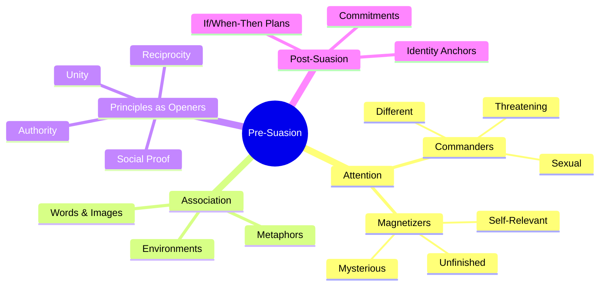
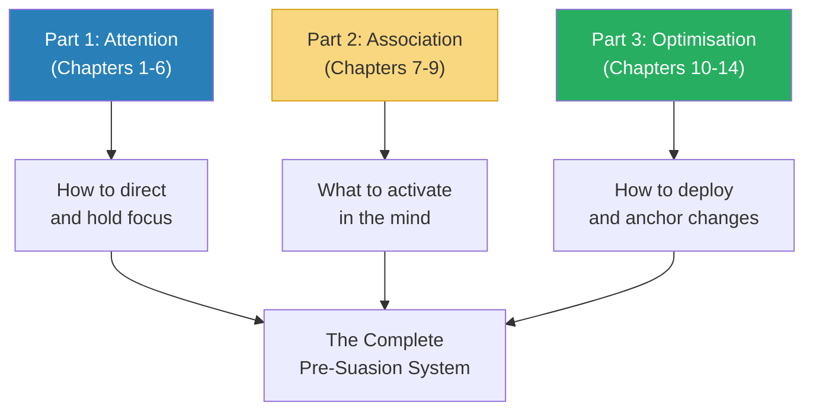
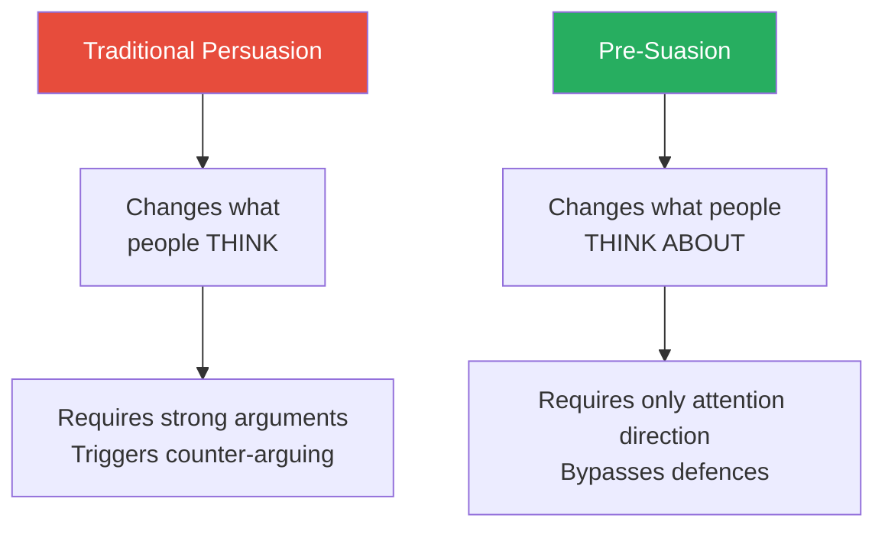
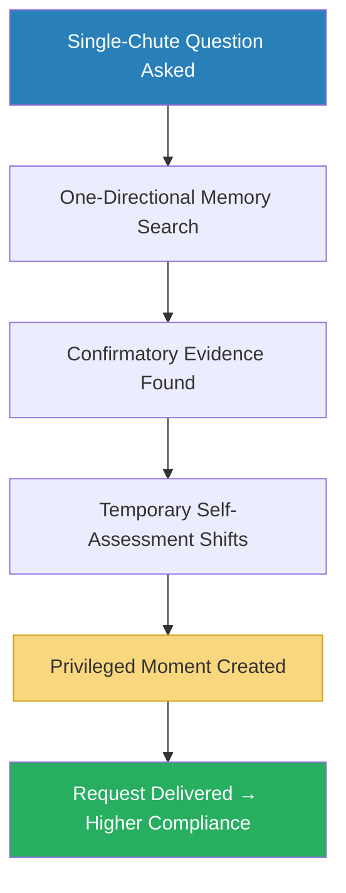
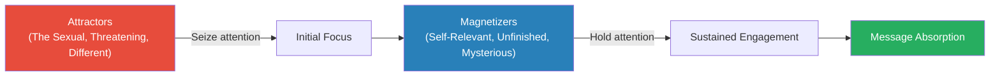
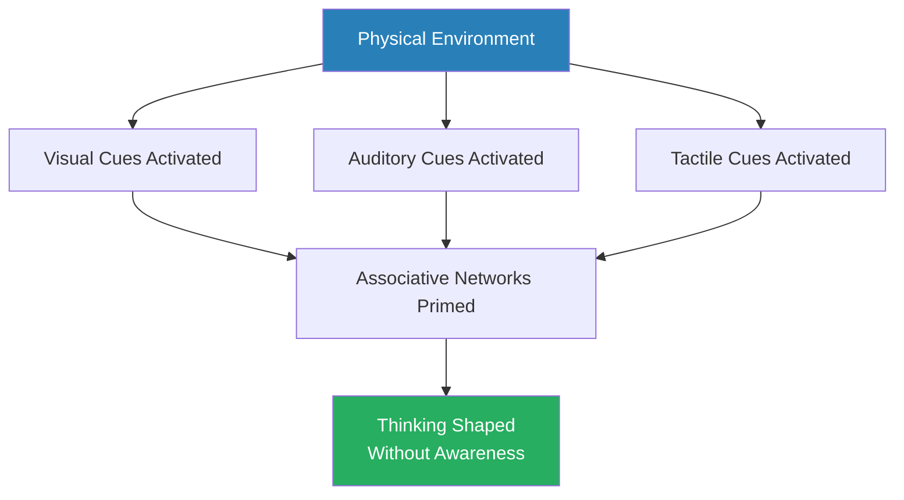
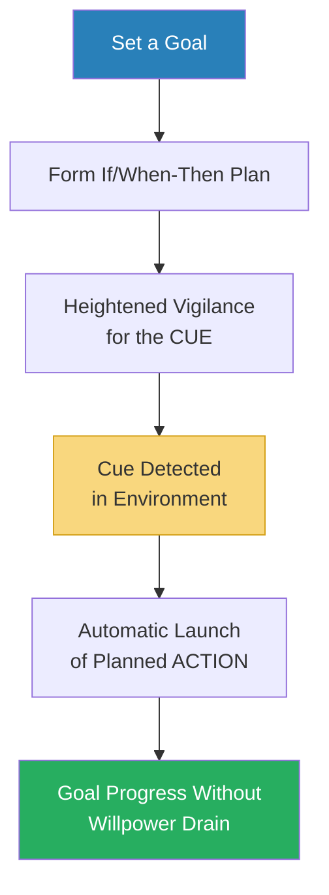
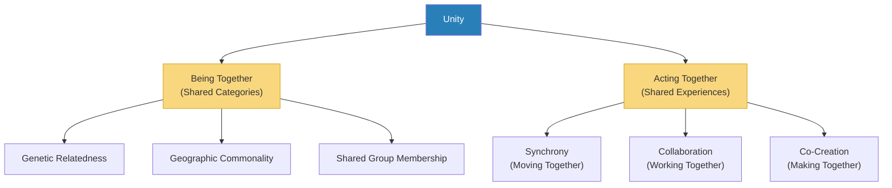
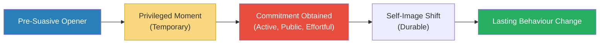
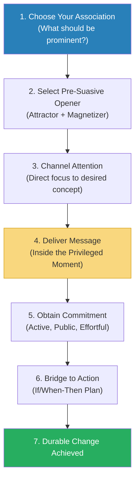

# Pre-Suasion — Robert B. Cialdini

> Cialdini's sequel to *Influence* answers a question the first book never asked: what should you do in the moment *before* you deliver your message?
> His answer — drawn from three decades of additional research — is that the highest-performing persuaders don't spend more time perfecting what they say; they spend more time crafting what happens immediately before they say it.
> They operate as skilled gardeners who know that even the finest seeds will not take root in stony soil.
> The book introduces the concept of "privileged moments" — brief windows of receptivity that a communicator can open through strategic attention-channeling — and builds a comprehensive framework for creating those moments using associations, environments, and the principles from *Influence* deployed as pre-suasive openers rather than direct appeals.
> Where *Influence* was a defence manual against manipulation, *Pre-Suasion* is an offence manual for ethical persuaders — and a masterclass in the psychology of timing.

---

## About the Author

Robert B. Cialdini is Regents' Professor Emeritus of Psychology and Marketing at Arizona State University and the author of *Influence*, one of the most cited books in social psychology. *Pre-Suasion* represents thirty additional years of research beyond the original, incorporating the explosion of behavioural science, behavioural economics, and neuroscience findings that have accumulated since 1984. Cialdini remains the rare academic who combines controlled experiments with extensive fieldwork among real-world compliance professionals — salespeople, fundraisers, advertisers, con artists, and negotiators. His undercover stints inside these organisations gave *Influence* its distinctive flavour, and that same observational rigour infuses *Pre-Suasion* with stories that make the science tangible.

---

## The Big Idea

- Cialdini's central claim is that <b style="color: #2980b9">the moment before the message matters more than the message itself</b>
- The best persuaders don't tinker endlessly with the merits of what they offer — they arrange for the psychological frame around it to be favourable before the offer even arrives
- This process is called <b style="color: #2980b9">pre-suasion</b>: arranging for recipients to be receptive to a message before they encounter it

---

- The mechanism is <b style="color: #2980b9">channeled attention</b>
- Whatever we focus on gains two automatic upgrades in our minds:
  1. It seems more **important** than it did before we focused on it
  2. It seems more **causal** — we assume it is a driver of outcomes
- This is Daniel Kahneman's <b style="color: #2980b9">focusing illusion</b>: "Nothing in life is as important as you think it is while you are thinking about it"
- The implications are profound: you do not need to change what someone believes, what they value, or what they have experienced
- <b style="color: #27ae60">You only need to change what is prominent in their mind at the moment of decision</b>

---

- Pre-suasion operates through three interconnected mechanisms:
  - **Attention direction** — guiding someone's focus to a concept, trait, or feeling
  - **Association activation** — once attention lands on something, related mental networks light up automatically
  - **Privileged moments** — these brief windows of heightened receptivity allow the message that follows to be received with less resistance
- A consultant who jokes "I'm not going to charge you a million dollars" before stating his $75,000 fee virtually eliminates price resistance — not by arguing for the fee's fairness, but by anchoring the number that precedes it
- A fire alarm salesman who "forgets" his materials and asks to let himself in and out of the house becomes associated with trust — because only trusted people are given that freedom

This is the core engine of the entire book — every chapter elaborates on one stage of this sequence.

---

## Key Concepts at a Glance

| Concept | One-line summary |
|---------|-----------------|
| **Pre-Suasion** | Arranging for receptivity before the message arrives |
| **Privileged Moments** | Brief windows of heightened receptivity after a pre-suasive opener |
| **Focusing Illusion** | Whatever we attend to seems more important than it is |
| **Focal = Causal** | Whatever we attend to seems to be causing outcomes |
| **Single-Chute Questions** | Questions that bias memory search in one direction ("Are you helpful?") |
| **Commanders of Attention** | Natural attractors: the sexual, the threatening, the different |
| **Magnetizers of Attention** | Sustained attractors: self-relevance, mystery, the unfinished |
| **Associative Coherence** | Mental elements fire when readied by connected concepts, not randomly |
| **Persuasive Geography** | Physical environments pre-load associations that shape thinking |
| **If/When-Then Plans** | Self-manufactured pre-suasive triggers for personal goals |
| **The Six Principles as Openers** | Reciprocity, liking, social proof, authority, scarcity, consistency reframed as priming tools |
| **Unity (7th Principle)** | Shared identity ("We" relationships) drives compliance beyond liking |
| **Post-Suasion** | Making temporary pre-suasive shifts durable through commitments |

Unity — the seventh principle introduced in Pre-Suasion — scores highest as a pre-suasive opener because shared identity bypasses rational evaluation entirely, creating immediate receptivity before any argument is made.

Each stage of Cialdini's pre-suasion pipeline narrows — attention must be channeled before associations activate, and compliance is fleeting unless locked in by post-suasive commitments.

Commanders of attention (the sexual, the threatening, the different) capture focus instantly but lose it quickly — magnetizers (self-relevance, the unfinished, mystery) are slower to grab attention but hold it far longer, making them more powerful for sustained persuasion.

Cialdini's pre-suasion framework operates on four layers — attention capture, associative priming, principle-based opening, and commitment anchoring — each building on the previous to create durable influence.

---

## Part 1: The Frontloading of Attention

### Chapter 1 — Pre-Suasion: An Introduction

*Cialdini opens with the story that made him realise the moment before the message was a separate field of study — and the master practitioner who showed him how it worked.*

- Cialdini had spent decades studying what makes messages persuasive — the content, structure, and delivery
- But observing top sales performers in the field revealed something his research hadn't captured:
  - The best persuaders spent disproportionate effort not on what they said, but on what they did just before saying it
  - They were setting the stage — arranging for the audience to be in a receptive state before the pitch even began
- <b style="color: #27ae60">The critical insight: persuasion is not just about the merits of the argument — it's about the state of the audience when the argument arrives</b>
- Cialdini calls this <b style="color: #2980b9">pre-suasion</b> — the practice of arranging for recipients to be sympathetic to a message before they receive it
- It is not about deception or trickery — it's about strategic sequencing
- The same message, delivered to the same person, can produce dramatically different results depending on what immediately preceded it

> [!example] Jim the Fire Alarm Salesman
> - Jim was the top-performing fire alarm salesman in a national company — consistently outselling every other representative
> - His technique was deceptively simple: during in-home presentations, he would pretend to forget an important piece of material in his car
> - Rather than asking for someone to accompany him, he would ask: "Do you mind if I let myself back in? I just need to grab something from the car"
> - The family would hand him a key or leave the door unlocked for him
> - This small act — giving a stranger unsupervised access to your home — is something people only do with **trusted** individuals
> - By the time Jim returned and began his actual sales pitch, the family had already categorised him as someone they trusted
> - Jim didn't argue for trustworthiness — he arranged a situation where the family's own behaviour proved it to themselves
> **The lesson:** The best pre-suasion doesn't tell people what to think about you — it gets them to act in a way that tells them what they already think about you.

- Jim's method reveals several hallmarks of effective pre-suasion:
  - The opener was **natural** — it didn't feel like a sales tactic
  - The audience's own action did the persuading — Jim didn't claim to be trustworthy; the family concluded it from their own decision to give him access
  - The privileged moment was **time-limited** — by the time the sales pitch began moments later, the trust feeling was at peak intensity
  - The family was **unaware** it had happened — they thought they were simply being polite

---

- The word "pre-suasion" carries intentional layers of meaning:
  - **Pre** — what comes before
  - **Suasion** — the act of persuading (from the Latin *suadere*, to advise or urge)
  - The hyphen is deliberate — it separates the preparation from the persuasion, emphasising that they are distinct activities
- Most people focus exclusively on suasion — perfecting the content of their pitch, their argument, their proposal
- <b style="color: #e74c3c">This is a mistake, because even the most compelling argument will fail if it lands on an unprepared audience</b>
- The pre-suader's question is not "How do I make my case?" but "How do I make my audience receptive to my case before they hear it?"

---

- Cialdini traces the idea to an observation he made during his undercover fieldwork for *Influence*:
  - He had embedded himself inside training programs for salespeople, fundraisers, and advertising firms
  - He noticed that the top performers in every organisation shared a pattern:
    - They spent proportionally more of their preparation time on the opening — what would happen before the main message
    - Average performers spent that time polishing the message itself
  - This distinction — between message quality and moment quality — became the seed that grew into *Pre-Suasion* over three decades
- The book's structure follows this logic:
  - Part 1 explores how attention works and how it can be channeled
  - Part 2 explores the associative mechanism underneath pre-suasion
  - Part 3 shows how to optimise pre-suasion using the principles from *Influence* and a new seventh principle

Each part of the book builds on the previous one — attention creates the opening, association fills it with the right content, and optimisation makes the effect durable.

---

### Chapter 2 — Privileged Moments

*Not all moments are created equal. Some carry a natural leverage that makes the message that follows disproportionately powerful — and Cialdini learned this the hard way.*

- A <b style="color: #2980b9">privileged moment</b> is a time-limited window when a person is particularly receptive to a message
- The word "moment" carries a dual meaning that Cialdini exploits deliberately:
  - A brief period of time
  - A leveraging force (from physics — "moment of force") that creates unprecedented movement
- Privileged moments share three characteristics:
  - They are **brief** — the window of receptivity closes quickly
  - They are **identifiable** — skilled communicators can recognise and create them
  - They are **exploitable** — the message delivered inside the window has outsized impact
- <b style="color: #e74c3c">These windows close quickly — they are not permanent attitude changes but temporary states of receptivity that must be used immediately</b>

> [!example] The Associate Dean's Perfect Timing
> - Cialdini was on sabbatical leave to write *Pre-Suasion* when an associate dean at his university called
> - The dean had secured everything Cialdini had requested — office space, computer, parking pass, library access
> - Cialdini expressed deep, sincere gratitude for the effort the dean had put in
> - The dean paused, then asked: would Cialdini be willing to teach an MBA class that semester?
> - This request would torpedo the entire purpose of his sabbatical — the book would be delayed by years
> - Cialdini agreed — he simply could not refuse in the moment immediately after expressing such gratitude
> - "If he had asked the day before or the day after, I would have been able to say no"
> - The book was indeed delayed significantly
> **The lesson:** The dean may not have consciously planned this sequence, but the effect was the same — he delivered his request inside a privileged moment created by Cialdini's own gratitude.

- This story illustrates something critical about privileged moments:
  - They don't require the practitioner to be consciously aware of what they're doing
  - Many of the most effective pre-suaders operate on intuition — they have learned through experience that certain sequences produce better results, even if they can't articulate why
  - The science of pre-suasion makes this intuition explicit, repeatable, and teachable

---

- Privileged moments can be created through several mechanisms:
  - **Reciprocity activation** — doing something generous moments before making a request
  - **Identity priming** — reminding someone of a role or trait before asking them to act on it
  - **Anchoring** — establishing a reference point that makes the subsequent number seem reasonable
  - **Emotional state shifting** — creating a mood (warmth, fear, nostalgia) that aligns with the coming message
- Each mechanism works through the same underlying logic:
  - Direct attention to a specific concept or feeling
  - That concept becomes temporarily dominant in the person's mental landscape
  - The message that follows is processed through the lens of that dominant concept
  - The result: the message is received more favourably than it would have been in a neutral state
- Cialdini stresses that privileged moments are not rare events that must be waited for:
  - They can be **manufactured** deliberately by the communicator
  - The manufacturing process is what separates a skilled pre-suader from someone who merely hopes for good timing
  - Each of the mechanisms above (reciprocity, identity priming, anchoring, emotional shifting) is a **tool for manufacturing** privileged moments on demand
  - The skilled practitioner doesn't wait for the right moment — they create it, then use it

> [!example] The $75,000 Consultant's Anchoring Joke
> - A management consultant was about to present his $75,000 fee proposal to a prospective client
> - Before stating his price, he joked: "As you can tell, I'm not going to be charging you a million dollars for this"
> - Everyone laughed — the number seemed absurd
> - When the actual fee of $75,000 followed, it felt modest by comparison
> - The client reported later that the price "seemed very reasonable"
> - The consultant hadn't argued for the fee's fairness — he'd arranged for the psychology of contrast to do the work
> **The lesson:** The million-dollar joke wasn't a joke at all — it was a pre-suasive anchor that made every subsequent number feel small.

> [!example] The Canadian Study on Personal Satisfaction
> - Researchers asked Canadians two questions: "How happy are you with your life?" and "How often do you go on a date?"
> - When the questions were asked in that order, the correlation between dating frequency and happiness was near zero — people considered many factors when evaluating their life
> - When the dating question was asked first, the correlation jumped dramatically — dating frequency had been made focal, so it became the lens through which people evaluated their entire life
> - The dating question didn't change anyone's life — it changed what was prominent in their minds at the moment the happiness question arrived
> - This is the focusing illusion in action: asking about one domain first elevates its perceived importance when you ask about life overall
> **The lesson:** The order of questions is not neutral. Each question creates a privileged moment for the question that follows.

> [!tip] Core Insight
> A privileged moment is not about finding the "right time" to make your case. It is about creating the right psychological state in your audience so that whenever you make your case, it lands as if the timing were perfect.

---

### Chapter 3 — The Importance of Attention: Attention = Importance

*Cialdini builds the theoretical backbone of the book: whatever we happen to be focusing on automatically seems more important — even when the focus was directed there by something completely irrelevant.*

- The <b style="color: #2980b9">focusing illusion</b> is a cognitive bias identified by Daniel Kahneman: whatever receives our attention gains an automatic boost in perceived importance
- This happens even when the attention was directed there by an irrelevant, arbitrary, or manipulative factor
- The effect is powerful, consistent, and largely invisible to the person experiencing it
- Kahneman's formulation: "Nothing in life is as important as you think it is while you are thinking about it"
- <b style="color: #27ae60">The pre-suader's power comes from directing attention — not from changing beliefs</b>

---

- The mechanism works through what psychologists call <b style="color: #2980b9">agenda setting</b>
- The media researcher Bernard Cohen captured it perfectly: the press "may not be successful most of the time in telling people what to think, but it is stunningly successful in telling people what to think *about*"
- When a topic receives attention — from media coverage, a question, a visual cue, or a conversation opener — it rises in perceived importance regardless of whether it objectively matters more than before
- This distinction — between telling people what to think and telling them what to think *about* — is the key insight that separates pre-suasion from traditional persuasion:
  - Traditional persuasion tries to change beliefs directly: "Here's why my product is better"
  - Pre-suasion changes what's salient: "Before we discuss options, let me ask — what matters most to you right now?"
  - The second approach doesn't argue for anything — it frames everything that follows

This is the central shift the book proposes: stop trying to change minds and start directing attention.

> [!example] The Dusseldorf Pipe Bomb and Agenda Setting
> - In 2000, a pipe bomb detonated near a group of immigrants in Dusseldorf, Germany
> - Media coverage of right-wing extremism spiked dramatically in the weeks that followed
> - The percentage of Germans who rated right-wing extremism as the nation's most important issue jumped from near zero to 35%
> - No new legislation had been passed, no new data had emerged, no new extremist groups had formed
> - The only thing that changed was what people were thinking about
> - When media coverage died down, the number dropped back to near zero
> **The lesson:** The issue hadn't changed — only its prominence in people's attention had changed. And that was enough to reshape what an entire nation considered "most important."

---

- Cialdini identifies an even more striking demonstration of this principle: the <b style="color: #2980b9">embedded reporter program</b> during the Iraq War

> [!example]- The Embedded Reporter Program (Iraq War, 2003)
> - The US military placed 600-700 journalists directly inside combat units during the Iraq invasion
> - These embedded reporters filed stories from the soldiers' perspective — daily life, bravery, tactical decisions, camaraderie
> - The effect on coverage was dramatic:
>   - 71% of front-page stories came from embedded reporters
>   - These stories focused almost entirely on the conduct of the war — how soldiers were performing
>   - Only 2% of all embedded stories mentioned the absence of weapons of mass destruction
> - The public was thereby directed to evaluate the war on its strongest dimension (military execution) rather than its weakest (strategic justification)
> - This was not a deliberate PR conspiracy — it was a natural consequence of making the reporters' task molecular (report what's in front of you) rather than molar (evaluate the big picture)
> - The reporters were honest — but their honesty was channeled into a narrow frame that happened to serve the military's interests
> **The lesson:** You don't need to censor information to control its impact. You only need to control what people are paying attention to.

---

- <b style="color: #2980b9">Single-chute questions</b> are one of the most reliable ways to exploit the focusing illusion
- When you ask someone "Are you unhappy with your current situation?", you force a one-directional memory search
- The mind goes looking for evidence of unhappiness — and it finds some, because everyone has some dissatisfaction
- This makes the person temporarily feel more unhappy than they did moments before
- Conversely, "Are you happy with your current situation?" sends the search in the opposite direction — and produces the opposite feeling
- The technique is called "single-chute" because the question funnels the search through one channel only:
  - It doesn't ask for a balanced assessment
  - It doesn't invite counterevidence
  - It sends memory through a narrow chute that leads in only one direction

> [!example] The "Are You Helpful?" Study
> - Researchers stopped people on the street and asked them to fill out a lengthy survey
> - Without any preamble, only 29% agreed
> - A second group was first asked a single-chute question: "Do you consider yourself a helpful person?"
> - Nearly everyone said yes — because the question forced a search for evidence of helpfulness, which everyone possesses
> - In that privileged moment, 77.3% agreed to take the survey — without any payment or incentive
> - The question didn't change who they were — it changed what was prominent in their minds at the moment of decision
> **The lesson:** A single well-chosen question can more than double compliance — not by changing the person, but by changing which version of themselves is active.

> [!example] The "Are You Adventurous?" Soda Study
> - Researchers asked college students to evaluate a new soft drink called "Epique"
> - One group was first asked: "Do you consider yourself adventurous?"
> - After conducting their one-directional memory search and concluding yes, these students were significantly more willing to provide their email address to receive information about the new product
> - A control group that wasn't primed with the adventurousness question showed far less interest
> - The question didn't change the drink — it activated an identity trait that made trying something novel feel consistent with who they were
> **The lesson:** Single-chute questions don't just shift mood — they activate a specific facet of identity that then seeks expression.

The single-chute question works because it creates a temporary identity shift — the person genuinely feels like the trait the question highlighted.

---

### Chapter 4 — What's Focal Is Causal

*Attention doesn't just make things seem important — it makes them seem responsible for outcomes. Whatever is in the spotlight gets the credit or the blame, regardless of whether it actually caused anything.*

- Cialdini extends the focusing illusion one step further: <b style="color: #2980b9">focal attention creates not just perceived importance but perceived causality</b>
- When something is visually, cognitively, or emotionally prominent, we automatically assume it is driving the events around it
- This is not a deliberate inference — it is an automatic cognitive shortcut that operates below conscious awareness
- The implications are enormous for persuasion, for justice, and for everyday judgment

---

- In interrogation settings, this effect produces measurable distortions:
  - When observers watch a videotaped interrogation, the person who is more visually prominent — better lit, more centred in the camera frame, or simply facing the camera — is judged more responsible for the conversation
  - This applies even when the audio content is identical
  - <b style="color: #e74c3c">Whoever the camera points at gets the blame</b>
- The effect is strong enough to influence judgments about false confessions:
  - False confessions typically emerge after an average of 16 hours of continuous questioning
  - At that point, the suspect is mentally exhausted and focused entirely on ending the ordeal
  - The confession becomes the most focal, dramatic element of the interrogation record
  - Observers (including judges and jurors) then over-attribute causality to the confessor — "They must have done it, because they said they did"
  - <b style="color: #e74c3c">The focal thing gets credit (or blame) regardless of whether it actually caused anything</b>

> [!example] Camera Angle and Perceived Guilt
> - Researchers videotaped the same mock interrogation from three different camera angles:
>   - Camera focused on the suspect
>   - Camera focused on the interrogator
>   - Camera showing both equally
> - Observers who watched the suspect-focused video rated the confession as significantly more voluntary and the suspect as more guilty
> - Observers who watched the interrogator-focused video were more sceptical of the confession and more likely to notice coercive tactics
> - Same interrogation, same words, same outcome — but the camera angle determined who observers held responsible
> - Subsequent research replicated this finding across multiple studies, consistently showing that the visually focal person absorbs causal attribution
> **The lesson:** The person in the spotlight gets the causal attribution — and in a courtroom, that can mean the difference between freedom and prison.

---

- This principle extends far beyond interrogations:
  - In group meetings, the person at the head of the table is perceived as having more influence over the group's decisions — even when an objective coder finds they contributed equally with others
  - In negotiations, the party who speaks first or who occupies the visual centre of the room is perceived as driving the outcome
  - In media coverage, the person whose photo accompanies a story is perceived as more responsible for the events described
- <b style="color: #27ae60">The practical implication: if you want to be perceived as the cause of positive outcomes, make yourself focal; if you want to deflect blame, reduce your visual prominence</b>

> [!example] The Seat at the Head of the Table
> - Social psychologists studying group dynamics found that the person seated at the head of a rectangular table is consistently rated as more influential by other group members
> - This holds even when researchers deliberately placed participants at the head randomly — the seat itself conferred perceived leadership
> - In one study, when the person at the head was instructed to say very little, other group members still attributed more of the final decision to them
> - The visual prominence of the head position — facing everyone, being the focal point of eye contact — automatically triggers the focal-is-causal bias
> **The lesson:** Position in space is position in mind. Where you sit determines how much credit or blame you receive.

---

- Cialdini connects the focal-is-causal bias to a broader phenomenon he calls <b style="color: #2980b9">the overvaluation of leaders</b>:
  - CEOs are the most visually focal members of their organisations — they appear in annual reports, press conferences, and media profiles
  - Because they are focal, observers (shareholders, journalists, analysts) automatically attribute more causal responsibility to them for organisational outcomes
  - Research shows that CEO impact on company performance is far smaller than the attention they receive would suggest — industry trends, macroeconomic forces, and employee quality explain more variance
  - Yet CEOs receive outsized credit during boom times and outsized blame during downturns — because they are the focal figure
  - This explains why CEO compensation has risen to 300+ times the average worker's salary: the focal-is-causal bias makes their contribution seem 300 times more important than it is

> [!example] The Sadat-Begin Negotiation Optics (Camp David, 1978)
> - During the Camp David peace negotiations between Egypt's Anwar Sadat and Israel's Menachem Begin, President Jimmy Carter served as mediator
> - Carter deliberately positioned himself between the two leaders in all photographs and press appearances
> - He wanted to be the focal figure — the person perceived as causing the breakthrough
> - When the accords were signed, Carter received the lion's share of credit for the peace deal — despite the fact that Sadat and Begin made the actual concessions
> - Carter's physical centrality in the visual record made him seem like the primary causal agent
> **The lesson:** In any negotiation or group achievement, the person who occupies the visual centre will receive disproportionate credit. Position is perception.

> [!tip] Core Insight
> Causality in the human mind is not primarily determined by logic or evidence — it is determined by attention. Whatever is focal is causal, and skilled pre-suaders arrange for the right things to be focal at the right times.

---

### Chapter 5 — Commanders of Attention: The Attractors

*Some types of information are so evolutionarily significant that they grab attention without any effort from the communicator — they are the brain's priority interrupts.*

- Cialdini distinguishes between two categories of attention-commanding stimuli:
  - **Attractors** — stimuli that seize attention involuntarily because they signal evolutionary priorities
  - **Magnetizers** — stimuli that hold attention once it's been captured because they create an ongoing need to know
- Chapter 5 covers the attractors; Chapter 6 covers the magnetizers
- Understanding both is essential because effective pre-suasion requires two steps:
  - First, capture attention (attractors)
  - Then, hold it long enough for the message to be processed (magnetizers)

---

**The Sexual:**

- Sexual stimuli command immediate attention because reproduction is an evolutionary imperative
- Advertisers exploit this ruthlessly — sexual imagery grabs eyeballs faster than almost anything else
- <b style="color: #e74c3c">But there is a critical trap: sexual imagery grabs attention so powerfully that it diverts it away from the product or message</b>
- Studies consistently show that ads with sexual imagery have high recall for the imagery and low recall for the brand
- The attention is captured but misallocated — the viewer remembers the model, not the product
- Sexual pre-suasion works best when the sexual content is relevant to the product (perfume, fashion) and fails when it is irrelevant (auto parts, software)

> [!example] The GoDaddy Super Bowl Ads
> - GoDaddy, a domain registrar and web hosting company, ran Super Bowl advertisements featuring overtly sexual content — attractive models, suggestive scenarios, and provocative imagery
> - The ads were among the most talked-about during Super Bowl broadcasts and generated enormous brand awareness
> - But analysis showed a critical failure: viewers remembered the models, remembered the provocations — and forgot the company name and what it sold
> - The sexual imagery had captured attention so completely that it diverted all processing power away from the brand message
> - GoDaddy eventually abandoned the strategy, switching to humour-based ads that generated less buzz but higher brand recall and conversion
> **The lesson:** Sexual attractors are so powerful they can cannibalise the very message they were meant to support. The attractor became the message, and the product disappeared.

- Cialdini cites research showing that men exposed to images of attractive women subsequently:
  - Rated themselves as less committed to their romantic partners
  - Spent more impulsively on consumer goods
  - Made riskier financial decisions
- The mechanism: sexual imagery activates a mating mindset, which triggers competitive display behaviours — even when the person has no conscious intention to compete for a mate
- <b style="color: #27ae60">The takeaway: sexual attractors are the sledgehammer of attention capture — use them only when the product or message is genuinely about sexuality, attraction, or intimacy, and never when it would compete with the actual message for processing resources</b>

---

**The Threatening:**

- Threats and dangers are the brain's highest-priority interrupt — they override everything else
- This is the survival circuitry at work: a predator in the bush demanded immediate attention from our ancestors, regardless of what else they were doing
- Fear-based health campaigns, alarming news headlines, and danger warnings all exploit this circuitry
- The limitation: threat-based attention is narrow and defensive
  - When afraid, people focus intensely on the threat but become poor at processing other information
  - <b style="color: #e74c3c">Fear motivates avoidance, not engagement</b> — so a fear opener works only when the desired action is to avoid something, not to approach something
- Cialdini illustrates this with research on health messaging:
  - Anti-smoking campaigns that emphasise the threat of death are effective at getting people to *want* to quit
  - But they are poor at getting people to take the specific steps needed to quit — because the fear narrows attention to the threat itself
  - Campaigns that combine a threat opener with a clear, actionable follow-up ("And here's exactly what you can do about it") outperform fear-only campaigns
  - The threat captures attention; the action plan channels it productively

> [!example] The Sunscreen Study
> - Researchers tested two versions of a health message about skin cancer and sunscreen use
> - Version A emphasised the terrifying consequences of skin cancer — graphic descriptions of treatment, survival statistics, images of advanced melanoma
> - Version B provided the same threat information but immediately followed it with a specific, actionable plan: "Apply SPF 30 sunscreen every morning before leaving the house"
> - Version A increased anxiety about skin cancer but did not significantly increase sunscreen use — participants felt overwhelmed and engaged in avoidance
> - Version B significantly increased both anxiety and sunscreen use — the specific action plan gave the fear somewhere productive to go
> **The lesson:** Threat captures attention; action channels it. A fear opener without a clear next step produces paralysis, not compliance.

---

**The Different:**

- Novelty and unexpectedness command attention because the brain is wired to ignore the familiar and flag the unusual
- Anything that violates expectations — an unexpected word, an unusual image, a surprising opening — triggers what psychologists call the <b style="color: #2980b9">orienting response</b>
- This is the mechanism behind effective advertising, storytelling, and public speaking
- The limitation: novelty fades quickly — the brain rapidly habituates to what was once new
- <b style="color: #27ae60">The practical rule: lead with the unexpected, then anchor to the familiar before the novelty wears off</b>
- Cialdini notes that the different is most effective when it is moderately novel:
  - Something completely alien may confuse rather than attract
  - Something slightly unusual — a familiar thing presented in an unfamiliar way — is the sweet spot
  - This is why the most memorable advertisements take something ordinary and present it from an unexpected angle

| Attractor | Mechanism | Strength | Limitation |
|-----------|-----------|----------|------------|
| **The Sexual** | Reproductive priority | Instant, powerful capture | Diverts attention from the message |
| **The Threatening** | Survival priority | Overrides all other processing | Narrows attention; motivates avoidance not approach |
| **The Different** | Novelty detection | Triggers orienting response | Fades quickly through habituation |

Each attractor is a double-edged tool — powerful enough to capture attention but dangerous if it diverts attention away from the intended message.

---

> [!example] The Asian American Women Math Test
> - Researchers recruited Asian American women — a group that sits at the intersection of two conflicting stereotypes
> - Stereotype 1: "Women are bad at maths" (gender identity)
> - Stereotype 2: "Asians are good at maths" (ethnic identity)
> - Before taking a maths test, one group was asked to record their gender; another group was asked to record their ethnicity
> - The gender-primed group performed worse than a control group — the "women are bad at maths" stereotype had been made focal
> - The ethnicity-primed group performed better than the control group — the "Asians are good at maths" stereotype had been made focal
> - Same women, same test, same abilities — but the single question asked before the test changed which identity was focal, and the focal identity shaped performance
> **The lesson:** Identity is not one thing — it is a collection of selves. Whichever self is made focal through attention becomes the self that drives behaviour.

- This study crystallises the entire pre-suasion argument:
  - Nothing about the women changed between the two conditions
  - Their abilities, their training, their motivation — all identical
  - The only difference was what was prominent in their minds when they sat down to take the test
  - <b style="color: #27ae60">Pre-suasion changed performance on an objective maths test — not attitudes, not opinions, but actual cognitive performance</b>
  - This demonstrates that pre-suasion operates at a deeper level than conscious attitude change — it reaches into the machinery of cognition itself

---

- Cialdini identifies a second dimension of "the different" that goes beyond mere novelty — <b style="color: #2980b9">the puzzle</b>
- When something violates our existing mental model (not just our expectations), it creates a type of cognitive dissonance that demands resolution:
  - A news headline that contradicts what we believed forces us to read the article
  - A product claim that seems impossible ("a battery that lasts 10 years") forces investigation
  - A speaker who opens with a contradiction ("Everything you know about motivation is wrong") forces continued listening
- The puzzle variant is more durable than simple novelty because it doesn't just attract attention — it creates a need to resolve the inconsistency, which requires sustained engagement
- This bridges the gap between attractors and magnetizers: the puzzle starts as a novelty attractor but transforms into an unfinished-business magnetizer

> [!example] The Polling Station Location Effect
> - Researchers examined voting patterns across Arizona precincts where polling stations were located in different types of buildings
> - Voters who cast ballots in schools were significantly more likely to support education funding measures than those who voted in churches, fire stations, or community centres
> - The school building activated education-related associations — classrooms, children, learning — that primed voters to weigh education issues more heavily
> - The effect persisted even after controlling for the demographics of the surrounding neighbourhood
> - The building itself was the pre-suasive opener, and the ballot was the message it primed
> **The lesson:** The environment where a decision is made is not neutral background — it is an active participant in the decision.

---

### Chapter 6 — Commanders of Attention: The Magnetizers

*While attractors seize attention, magnetizers hold it — they create an ongoing pull that keeps the audience engaged long enough for the message to do its work.*

- Attractors fire fast and fade fast — they are spikes of attention
- Magnetizers are slower but more durable — they create sustained engagement
- For pre-suasion to work, you need both: an attractor to capture initial attention and a magnetizer to hold it through the message
- Cialdini identifies three primary magnetizers: self-relevance, the unfinished, and the mysterious

---

**The Self-Relevant:**

- Nothing holds attention like information about ourselves
- The brain has a dedicated network — the <b style="color: #2980b9">self-referential processing network</b> — that activates whenever we encounter information connected to our identity, our name, our interests, or our situation
- This is why personalised messages consistently outperform generic ones across every medium tested
- Hearing your own name in a crowded room cuts through all other noise — the <b style="color: #2980b9">cocktail party effect</b>
- The self-relevance magnetizer explains why the most effective communicators frame their messages in terms of the audience's situation, not their own:
  - "You'll notice that..." not "We've developed a..."
  - "For someone in your position..." not "Our product offers..."
  - "What this means for your family..." not "Our company's mission is..."

> [!example] Coca-Cola's "Share a Coke" Campaign
> - In 2011, Coca-Cola was facing its first decline in US sales in over a decade
> - The solution was startlingly simple: replace the Coca-Cola branding on bottles with 150 of the most common first names in each market
> - Suddenly, a generic soda bottle became *your* soda bottle — "Share a Coke with Sarah" felt personal in a way that "Enjoy Coca-Cola" never did
> - The campaign produced the first increase in Coke sales in a decade
> - It worked not because the product changed but because the label activated self-referential processing — people noticed, reached for, and photographed the bottles bearing their own names
> - The campaign spread to 80+ countries and generated millions of social media posts
> **The lesson:** Make it about them and they cannot look away. Self-relevance is the most reliable magnetizer of human attention.

---

- The self-relevance principle has a critical nuance:
  - It is not enough for the information to be *about* the audience in a general sense
  - It must connect to something the audience is currently **concerned about** or **invested in**
  - A health message about heart disease will magnetize attention for a 55-year-old man with a family history of heart problems — and will be ignored by a healthy 22-year-old
  - The communicator's job is to identify what is personally relevant to this specific audience and make that the entry point

> [!example] The "Next in Line" Effect
> - Cialdini describes a common experience: you're in a group meeting, and each person is asked to speak in turn
> - When it's almost your turn, you stop listening to the current speaker and start rehearsing what you're going to say
> - You literally cannot process what the person before you is saying — because self-relevant information (your imminent performance) has commandeered your attention
> - This is the self-relevance magnetizer overpowering all other incoming information
> - Skilled presenters exploit this by making each audience member feel that the content is about *them* specifically — which prevents the audience from drifting into self-focused rehearsal
> **The lesson:** Self-relevance doesn't just attract attention — it monopolises it. When information is about us, we have no processing capacity left for anything else.

---

**The Unfinished:**

- The <b style="color: #2980b9">Zeigarnik effect</b>, named after Russian psychologist Bluma Zeigarnik, describes the brain's tendency to hold incomplete tasks in working memory and create a nagging urge to finish them
- Zeigarnik noticed that waiters remembered the details of unpaid bills perfectly but forgot them instantly once the bill was settled
- The incompleteness kept the information alive in their minds
- This mechanism explains:
  - Why cliffhangers work in television — the incomplete narrative nags at us until the next episode
  - Why we cannot stop thinking about unresolved arguments
  - Why open loops in presentations keep audiences engaged
  - Why half-completed tasks feel so uncomfortable — the brain keeps allocating processing power to them until they're done
- <b style="color: #27ae60">For pre-suasion: opening a loop (posing a question, starting a story, introducing a mystery) before delivering your message ensures the audience stays engaged until the loop is closed</b>

> [!example] The Cliffhanger Effect in Television
> - Television producers discovered the Zeigarnik effect decades before psychologists named it
> - The serialised format — ending each episode at a moment of maximum tension — exploits the brain's inability to let go of incomplete narratives
> - Charles Dickens used the same technique in 1836, publishing his novels in monthly instalments that ended at cliff-edge moments
> - Readers queued at docks in New York waiting for ships carrying the next instalment of *The Old Curiosity Shop*
> - Modern streaming services like Netflix exploit a variation: by auto-playing the next episode within seconds, they eliminate the Zeigarnik resolution that would let viewers stop watching
> **The lesson:** An unfinished story is a psychological leash — the audience cannot leave until it is resolved.

> [!example] Hemingway's Writing Trick
> - Ernest Hemingway reportedly used the Zeigarnik effect as a productivity technique
> - He would stop writing each day not at the end of a chapter or a natural stopping point, but in the middle of a sentence or paragraph
> - The incompleteness nagged at his mind all evening, keeping the creative momentum alive
> - The next morning, the unfinished sentence pulled him back to the desk with urgency — the brain needed to close the loop
> - This is self-manufactured pre-suasion: Hemingway used the Zeigarnik effect to magnetize his own attention toward the task he wanted to resume
> **The lesson:** The Zeigarnik effect is not just a vulnerability — it is a tool. You can use incompleteness to keep your own attention where you want it.

---

**The Mysterious:**

- Mystery combines novelty with incompleteness — it creates a need-to-know pull that can sustain attention across extended periods
- Cialdini argues that the most engaging scientific writing and the most compelling presentations share a structure: they open with a mystery and resolve it gradually
- The mystery format works because:
  - It activates the Zeigarnik effect (the reader needs to know the answer)
  - It generates emotional engagement (curiosity is a pleasurable state)
  - It creates a narrative arc that carries the audience forward through even complex material
  - It makes the audience an active participant — they are trying to solve the mystery alongside the author
- Cialdini reports that his most successful academic papers — the ones that got published in top journals and received the most citations — were the ones he restructured around a mystery opener
- The mystery format follows a specific structure that Cialdini recommends:
  1. **Pose the mystery** — present a puzzling finding, counterintuitive fact, or unexplained phenomenon
  2. **Deepen the mystery** — show why the obvious explanations don't work
  3. **Explore clues** — walk through partial explanations, each contributing a piece
  4. **Reveal the resolution** — deliver the answer with a sense of earned discovery
- This structure works because the audience has invested mental effort into the mystery — and that investment makes the resolution more satisfying and more memorable than if the answer had been delivered upfront

> [!example] Cialdini's Mystery-Formatted Paper
> - Early in his academic career, Cialdini wrote a paper about a counterintuitive finding in persuasion research
> - The original draft presented the finding conventionally: hypothesis, method, results, discussion
> - It was rejected by two journals
> - Cialdini rewrote the paper as a mystery: he opened with the puzzling finding, asked why it might occur, walked through the evidence step by step, and revealed the explanation at the end
> - The rewritten paper was accepted immediately by a top journal and became one of his most cited works
> - The data was identical — only the narrative structure changed
> **The lesson:** The mystery format doesn't change the evidence — it changes the audience's engagement with the evidence.

Attractors and magnetizers work as a relay: one captures attention, the other carries it through the message.

---

| Feature | Attractors | Magnetizers |
|---------|-----------|-------------|
| **Speed** | Instant — seize attention in milliseconds | Gradual — build sustained engagement |
| **Duration** | Short-lived — fade through habituation | Durable — persist until resolved or completed |
| **Mechanism** | Evolutionary priority interrupts | Cognitive need-to-know loops |
| **Risk** | Can divert attention from the message | Can delay the message if overused |
| **Examples** | Sex, threat, novelty | Self-relevance, open loops, mystery |

The best pre-suaders use both: an attractor to break through the noise, then a magnetizer to keep the audience engaged through the message.

---

- Cialdini offers a practical rule for combining attractors and magnetizers in sequence:
  - **Open with the different** — a surprising statistic, an unexpected claim, a counterintuitive opening
  - **Transition to the self-relevant** — "and here's what this means for you specifically"
  - **Sustain with the unfinished** — "but there's a catch that most people miss..." (open loop)
  - **Resolve with the mysterious** — walk through the evidence and reveal the resolution
- This four-step sequence captures attention, anchors it to the audience, holds it through the message, and rewards the audience for staying engaged
- Cialdini notes that the best TED talks, the most viral articles, and the most successful sales presentations all follow some version of this sequence — even when the speakers have never heard of attractors or magnetizers

> [!abstract] The Attractor-Magnetizer Sequence
> 1. **Attract** — open with novelty, surprise, or a pattern violation to trigger the orienting response
> 2. **Personalise** — connect the topic to the audience's specific situation, identity, or concerns
> 3. **Loop** — introduce an unresolved question or incomplete story that demands resolution
> 4. **Resolve** — deliver the answer, the punchline, or the call to action inside the sustained attention window

---

## Part 2: The Role of Association

### Chapter 7 — The Primacy of Associations: I Link, Therefore I Think

*Cialdini reveals the mechanism underneath pre-suasion: all mental activity is associative, and the associations you activate before your message determine how that message is received.*

- Cialdini's core mechanistic claim: <b style="color: #2980b9">mental elements don't fire when ready — they fire when readied</b>
- This single sentence captures the entire logic of pre-suasion:
  - Concepts in the mind are not floating independently, waiting to be called up
  - They exist in networks of association — and when one concept receives attention, closely linked concepts gain a privileged position in consciousness
  - At the same time, unlinked concepts are actively suppressed
- This is why pre-suasion works: the opener activates a network of associations that then colour everything that follows
- <b style="color: #27ae60">The pre-suader's job is not to implant new ideas — it is to activate existing associations that are favourable to the message</b>

---

**Language as Pre-Suasion:**

- Words are not neutral containers — every word carries a cloud of associations that activates related concepts
- Research demonstrates this repeatedly:
  - Participants exposed to words related to achievement subsequently performed better on tasks
  - Participants primed with words related to aggression behaved more aggressively in subsequent interactions
  - Even incidental exposure to words — on a poster in the hallway, in a questionnaire's instructions — shifted behaviour
- <b style="color: #e74c3c">The implication: every word you choose before your message is a pre-suasive act, whether you intend it or not</b>
- Choosing your words carelessly means you are pre-suading randomly — and random pre-suasion works against you as often as it works for you
- Cialdini emphasises that this is not about finding "magic words" — it's about understanding that every word primes a network:
  - "Cost" primes loss, expense, burden
  - "Investment" primes growth, returns, wisdom
  - Same financial outlay, completely different psychological framing

> [!example] The "Consumer" vs. "Citizen" Framing Study
> - Researchers primed participants with one of two identity labels before asking them about environmental behaviour
> - One group was referred to as "consumers" throughout the study materials — a word that primes buying, using, spending
> - The other group was referred to as "citizens" — a word that primes responsibility, community, shared obligation
> - The "citizen" group expressed significantly stronger environmental values and greater willingness to make personal sacrifices for sustainability
> - The "consumer" group prioritised personal convenience and economic benefit
> - Same people, same questions — but the identity label activated different associative networks that shaped all subsequent responses
> **The lesson:** The label you use to describe your audience pre-loads an entire identity framework. Choose the label that activates the identity you want to engage.

---

**The Power of Metaphor:**

- Metaphors are among the most potent pre-suasive tools because they transfer an entire network of associations from one domain to another in a single word
- They work because the brain processes metaphors not as decorative language but as literal instructions to activate a specific conceptual framework:
  - "Crime is a beast" tells the brain: activate your predator schema — hunt, capture, cage
  - "Crime is a virus" tells the brain: activate your disease schema — diagnose, treat, prevent, inoculate
- The frameworks are so different that they produce opposing policy recommendations from the same data

> [!example] Crime as Beast vs. Crime as Virus (Stanford, 2011)
> - Stanford researchers Paul Thibodeau and Lera Boroditsky gave two groups of participants identical crime statistics for a fictional city called Addison
> - The only difference: one group read that crime was "a beast ravaging the city" while the other read that crime was "a virus infecting the city"
> - The "beast" group recommended catch-and-cage solutions — more police, longer sentences, harsher penalties
> - The "virus" group recommended treat-the-cause solutions — better education, poverty reduction, community programs
> - The effect of changing a single word was 22% — more than double the effect of the participants' gender (9%) or their political party affiliation (8%)
> - When asked what influenced their recommendations, almost no one mentioned the metaphor — they pointed to the crime statistics instead
> **The lesson:** A single metaphor redirects people to a sector of reality pre-loaded with the associations you want — and they never notice it happened.

---

- <b style="color: #27ae60">Metaphor doesn't just describe reality — it redirects people to a sector of reality pre-loaded with the associations you want</b>
- "Beast" activates: predator, danger, cage, capture, strength, force
- "Virus" activates: disease, treatment, prevention, cure, immunity, public health
- The metaphor sets the associative landscape before the facts arrive — and the facts are then interpreted through that landscape
- This has profound implications for public policy:
  - How a problem is metaphorically framed determines which solutions feel natural
  - Reframing the metaphor can shift public support for policies without changing any facts
  - Political communicators intuitively understand this — "war on drugs" vs. "public health approach to addiction" activate entirely different mental architectures
- Cialdini offers a catalogue of everyday metaphors that pre-suade without anyone noticing:
  - "Time is money" — makes wasting time feel sinful and scheduling feel virtuous
  - "Argument is war" — makes compromise feel like surrender
  - "Love is a journey" — makes relationship difficulties feel like navigable obstacles rather than fatal flaws
  - Each metaphor pre-loads a set of associations that shape how we think about the target domain
  - <b style="color: #e74c3c">Changing the metaphor changes the thinking — and the person whose metaphor wins the framing battle wins the argument before it starts</b>

> [!example] Ben Feldman: The Greatest Insurance Salesman
> - Ben Feldman was a high school dropout from East Liverpool, Ohio — a small, shy man with a pronounced lisp
> - Despite these apparent disadvantages, he sold more life insurance by himself than 1,500 of the 1,800 insurance agencies in the United States
> - His secret weapon was metaphor — he never used the language of insurance; he used the language of life and death
> - People didn't "die" in Feldman's vocabulary — they "walked out" of life
> - This reframed death as an abdication of responsibility — something the policyholder was choosing to leave behind
> - "When you walk out, your insurance money walks in" — many a customer straightened up and walked right into a policy
> - At age 80, calling from his hospital bed after a cerebral hemorrhage, Feldman closed $15 million in new contracts in 28 days
> **The lesson:** The right metaphor doesn't just describe a product — it reframes the entire decision, pre-loading associations that make the desired choice feel obvious.

---

**Background Cues and Priming:**

- Pre-suasion doesn't require deliberate communication — environmental cues can do the work unconsciously
- Research findings that demonstrate this:
  - Online shoppers shown a website background of fluffy clouds preferred comfort features in products; those shown a background of pennies preferred low prices
  - Neither group was aware the background had influenced their choice
  - People walking past a French bakery with French music playing chose French wine more often; German music produced more German wine selections
  - Voters whose polling station was in a school (vs. a church or fire station) were more likely to support education funding measures
- <b style="color: #2980b9">These environmental cues function as pre-suasive openers that nobody recognises as persuasive</b>
- Cialdini calls this the <b style="color: #2980b9">invisible influencer</b> problem:
  - The most powerful pre-suasive cues are the ones people don't notice
  - When people are unaware of the cue, they attribute their shifted preferences to personal values, rational analysis, or genuine taste
  - This self-attribution is itself a form of post-suasion — the person commits to the preference as their own, making it durable

> [!example] The Voting Booth Study (Schools vs. Churches)
> - Researchers analysed voting data from the 2000 Arizona general election, correlating results with the type of building used as a polling station
> - Voters in schools were more likely to support a school-funding initiative than voters in other buildings — even after controlling for political affiliation and demographics
> - In a follow-up laboratory experiment, participants shown images of school classrooms before voting on an education tax increase were 56% more likely to support it than those shown control images
> - The classroom images were shown for seconds and were described as "unrelated to the study" — yet they shifted voting behaviour on a real financial question
> **The lesson:** Environmental primes don't need to be relevant or noticed. They work through automatic association, and the person who controls the environment controls the associations.

> [!example] The Website Background Study
> - Researchers created two versions of an online furniture store
> - Version A had a landing page background of fluffy clouds floating in a blue sky
> - Version B had a landing page background of shiny pennies scattered on a surface
> - Visitors who saw the clouds rated comfort features (softness, cushioning, plushness) as more important when evaluating furniture
> - Visitors who saw the pennies rated price features (value, discount, affordability) as more important
> - When asked what influenced their preferences, almost no one mentioned the background — they pointed to their personal values and lifestyle needs
> - The backgrounds had been removed by the time the actual product pages appeared — but the priming effect persisted through the entire shopping session
> **The lesson:** A background image that appeared for seconds reshaped how people evaluated products for minutes. Pre-suasion does not require a heavy hand — a light touch at the right moment is enough.

> [!abstract] The Pre-Suasive Cue Checklist
> 1. Identify the key association you want active in the audience's mind (trust, quality, value, urgency, etc.)
> 2. Audit the environment for cues that might activate competing associations
> 3. Introduce visual, verbal, or situational cues that prime the desired association
> 4. Deliver the message immediately — before the primed association fades
> 5. The cue must be subtle enough that the audience doesn't consciously recognise it as a persuasion attempt

---

### Chapter 8 — Persuasive Geographies: The Right Place, The Right Trace

*The places where we think shape what we think — and Cialdini discovered this through personal, embarrassing experience.*

- <b style="color: #2980b9">There is a geography of influence</b> — physical environments pre-load the associations that shape our thinking
- This is not a metaphor — it is a literal, measurable effect
- The objects, images, and spatial arrangements surrounding a person activate mental associations that colour their subsequent thoughts, judgments, and decisions
- Cialdini calls this <b style="color: #2980b9">persuasive geography</b> — the idea that where you are when you think determines what you think

> [!example] Cialdini's Two Desks
> - While writing *Influence*, Cialdini maintained two workspaces — one at his university office, one at his home
> - At his university desk, he faced academic buildings, was surrounded by journals and textbooks, and heard colleagues discussing research methodology
> - At his home desk, he faced a window overlooking a residential street where ordinary people walked dogs, pushed strollers, and carried groceries
> - He noticed a consistent pattern: his university writing was technical, jargon-heavy, and unsuitable for a general audience
> - His home writing was clear, engaging, and readable
> - The opening line at university: "My academic subdiscipline, experimental social psychology, has as a principal domain the study of the social influence process"
> - The opening line at home: "I can admit it freely now: all my life I've been a patsy"
> - Same author, same book, same day — different environments, radically different output
> **The lesson:** The environment didn't just affect Cialdini's mood — it activated different associative networks that produced fundamentally different writing.

---

- The effect of environment on cognition has been demonstrated across many contexts:
  - Students tested in a room with a briefcase on the table behaved more competitively in subsequent negotiations than those tested in a room with a backpack
  - Job interviewers sitting in a room with a motivational achievement poster rated candidates as more ambitious
  - People filling out a survey on a heavy clipboard rated issues as more "weighty" and important than those using a light clipboard
  - People holding a warm beverage judged strangers as having warmer personalities than people holding a cold beverage
- <b style="color: #27ae60">The objects around us are not passive backdrop — they are active psychological primes that shape our thinking without our knowledge or consent</b>

> [!example] The Briefcase vs. Backpack Study
> - Researchers placed either a briefcase or a backpack on a table in a room where participants would later play an economic game
> - The object was never mentioned or drawn attention to — it was simply present in the room
> - Participants in the briefcase room behaved significantly more competitively — they were less willing to share resources and more focused on winning
> - Participants in the backpack room behaved more cooperatively — they shared more and were more concerned with fairness
> - The briefcase activated business associations (competition, profit, status), while the backpack activated casual associations (leisure, friendship, collaboration)
> - When debriefed, participants denied that the object had influenced them — they attributed their behaviour to personality and strategy
> **The lesson:** A single unmentioned object in a room can shift the entire dynamic of a negotiation.

> [!example] The Glass-Walled Conference Room
> - A consultancy firm noticed that their best employee incentive programs — the ones that clients loved and that produced real results — were consistently designed in conference rooms with glass walls
> - Through the glass, the designers could see the actual employees the programs were meant to serve
> - When glass-walled rooms were unavailable, the consultants started downloading photographs of client employees and leaning them against the walls of whatever room they were in
> - Clients praised "the personalised touch" — they assumed the photos were a thoughtful gesture
> - The real cause: continuous visual exposure to the people they were designing for kept the right associations active in the designers' minds
> **The lesson:** Want to design for people? Make sure you can see them while you design. The environment programs the output.

The environment-to-cognition pipeline operates automatically and continuously — you are being pre-suaded by your surroundings right now, whether you recognise it or not.

---

- Cialdini draws a practical distinction between two types of environmental influence:
  - **Ambient cues** — background features of the environment that are always present (room colour, furniture, temperature, background music)
  - **Placed cues** — objects or images deliberately introduced into the environment to activate specific associations
- Both types work through the same mechanism — they prime associative networks — but placed cues are more actionable because you can control them
- The implication for any persuasion context:
  - Before you think about what to say, think about where you'll say it
  - Before you design a message, design the environment it will be received in
  - The geography of influence is the pre-suasion you can control before you even open your mouth

> [!example] The Warm Coffee Study (Williams & Bargh, 2008)
> - Researchers asked participants to hold either a warm cup of coffee or an iced coffee for a few moments — ostensibly while the researcher juggled some materials
> - Participants then evaluated a fictional person described in a brief character sketch
> - Those who had held the warm cup rated the person as significantly warmer in personality — more generous, more caring, more sociable
> - Those who had held the iced coffee rated the same person as colder — more selfish, more calculating, less approachable
> - The temperature of the cup had transferred metaphorical warmth to the judgment — and participants had no idea it had happened
> - When debriefed, they insisted their judgments were based entirely on the character description
> **The lesson:** The body's sensory experience pre-loads associations that colour mental judgments. Physical warmth becomes interpersonal warmth.

> [!abstract] The Persuasive Geography Audit
> 1. **Inventory the room** — what objects, images, and sensory cues are present?
> 2. **Map the associations** — what concepts do these cues prime? (Competition? Collaboration? Urgency? Calm?)
> 3. **Identify conflicts** — are any cues priming associations that work against your message?
> 4. **Remove or replace** — swap conflicting cues for ones that align with your message
> 5. **Test subtlety** — if the cues feel obvious or heavy-handed, they may trigger the correction mechanism instead of pre-suading

---

### Chapter 9 — The Mechanics of Pre-Suasion

*Cialdini explains the cognitive machinery that makes pre-suasion work — and introduces a technique for pre-suading yourself.*

- The mechanics of pre-suasion rest on three established psychological phenomena:
  - **Priming** — exposure to one stimulus influences the response to a subsequent stimulus
  - **Associative activation** — when one concept becomes active, linked concepts become more accessible
  - **Evaluative conditioning** — pairing a neutral stimulus with a positive (or negative) stimulus transfers the valence
- These three mechanisms operate simultaneously and reinforce each other:
  - A warm handshake (priming) activates warmth associations (associative activation) that transfer to your proposal (evaluative conditioning)
  - A fear-inducing news report (priming) activates danger associations (associative activation) that make a security product feel more valuable (evaluative conditioning)

---

- Cialdini is careful to distinguish pre-suasion from traditional persuasion at the mechanistic level:

| Feature | Traditional Persuasion | Pre-Suasion |
|---------|----------------------|-------------|
| **Target** | Beliefs, attitudes, values | Attention, salience, associations |
| **Timing** | During the message | Before the message |
| **Mechanism** | Argument quality, evidence | Priming, associative activation |
| **Duration** | Can be permanent (if compelling) | Temporary (unless anchored) |
| **Awareness** | Audience often aware of the attempt | Audience usually unaware |
| **Resistance** | Triggers counter-arguing | Bypasses counter-arguing |

This table captures why pre-suasion is so effective: it operates before the audience's defences activate.

---

**If/When-Then Plans: Pre-Suading Yourself:**

- Cialdini's research shows we translate good intentions into action only about half the time
- The gap between "I intend to" and "I actually did" is one of the most robust findings in behavioural science
- <b style="color: #2980b9">If/when-then plans</b> close this gap by manufacturing pre-suasive moments for ourselves
- Format: "If/when [specific situation + environmental cue], then I will [specific action]"
- They work through two mechanisms:
  - They put us on **heightened vigilance** for the triggering cue — we notice opportunities we would otherwise miss
  - They **automatically link** the opportunity to the desired behaviour — removing the need for deliberation or willpower in the moment
- The result: the cue functions as a pre-suasive opener, and the planned action follows with minimal resistance
- Research shows if/when-then plans increase follow-through rates from around 30% to over 80% across a wide range of goals:
  - Health behaviours (exercise, medication, diet)
  - Academic tasks (studying, homework completion)
  - Professional goals (networking, skill development)
- The mechanism is what psychologist Peter Gollwitzer calls <b style="color: #2980b9">strategic automaticity</b>:
  - Normally, habits become automatic only through hundreds of repetitions
  - If/when-then plans create instant automaticity — the cue-action link fires as if it has been rehearsed hundreds of times, even on the first occasion
  - This is because the plan delegates the decision from the deliberative system (which requires willpower and energy) to the cueing system (which fires reflexively)
  - The result: behaviour that feels effortful becomes behaviour that feels automatic — from the very first time

> [!example] Opiate Addicts in Withdrawal
> - Hospitalised opiate drug addicts were asked to prepare a written employment history by end of day — a task that could help them get a job after release
> - The control group was simply told what to do — but they were in the agonising early stages of withdrawal
> - Result: 0% completed the task (unsurprising — withdrawal pain dominates everything)
> - The experimental group was asked to form an if/when-then plan: "If/when lunch is over and the table is free, then I will sit down there and start writing"
> - Result: 80% turned in a completed resume by end of day
> - The plan didn't reduce their pain — it gave them a specific cue (lunch ending, table free) that automatically triggered the specific action (sit there, start writing)
> **The lesson:** If/when-then plans are self-manufactured pre-suasion — they create privileged moments in your own day that bypass the need for willpower.

> [!example] The Cervical Cancer Screening Study
> - Researchers working with women who had been advised to get cervical cancer screenings found that only about a third actually scheduled appointments
> - A second group was asked to form if/when-then plans: "When I next visit the pharmacy, I will ask about scheduling a screening"
> - The if/when-then group's screening rates nearly tripled compared to the control group
> - The plan worked not by increasing motivation (both groups knew the screening was important) but by linking a specific environmental cue to a specific action
> - When the women walked into the pharmacy, the plan fired automatically — no deliberation required
> **The lesson:** Motivation without a trigger is like a loaded gun without a finger on the trigger. The if/when-then plan provides the finger.

---

> [!abstract] How to Build an If/When-Then Plan
> 1. **Identify the goal** — what specific action do you want to take?
> 2. **Identify the cue** — what environmental signal will trigger it? (time of day, location, event, person)
> 3. **Form the sentence** — "If/when [cue], then I will [specific action]"
> 4. **Be specific** — "If/when I finish my morning coffee and put the cup in the sink, then I will sit at my desk and write for 30 minutes"
> 5. **Rehearse mentally** — visualise the cue occurring and yourself performing the action
> 6. **Trust the automation** — the plan works best when you stop deliberating and let the cue-action link fire automatically

The if/when-then plan converts an environmental cue into a self-triggered privileged moment — your own behaviour becomes the pre-suasive opener.

---

**The Correction Mechanism:**

- Cialdini acknowledges a natural objection: if pre-suasion works through unconscious processes, are we helpless against it?
- The answer is no — but only if you are aware it is happening
- Humans have a <b style="color: #2980b9">correction mechanism</b>: when we become aware that an external factor may be biasing our judgment, we can adjust for it
- The catch: the correction only works when:
  - We are **aware** of the potential bias
  - We have the **cognitive resources** (energy, time, motivation) to correct for it
  - We **want** to be accurate rather than simply agreeable
- <b style="color: #e74c3c">When any of these conditions is absent — which is most of the time — pre-suasion operates unopposed</b>
- This is why pre-suasion is so effective in everyday life: people are rarely aware they are being primed, rarely have the energy to correct for it, and rarely have a strong motivation to resist it
- Cialdini notes that the correction mechanism also has a paradoxical weakness:
  - People who believe they are immune to influence are actually *more* vulnerable — because their confidence in their own objectivity makes them less likely to look for biasing factors
  - The most resistant audience is not the one that thinks "I can't be manipulated" — it's the one that thinks "I might be being manipulated right now, so let me check"

---

## Part 3: Best Practices — Optimising Pre-Suasion

### Chapter 10 — The Six Main Roads to Change

*Cialdini revisits his six principles from Influence — but this time with a twist. Each principle works not just as a direct appeal but as a pre-suasive opener that primes the audience before the main message.*

- In [[Influence - Robert Cialdini|Influence]], the six principles were presented as levers to pull during the persuasion attempt
- In *Pre-Suasion*, Cialdini reframes them: their greatest power lies in being deployed *before* the main message as attention-directing openers
- <b style="color: #27ae60">When a principle is used as a pre-suasive opener, it doesn't just enhance the message — it shapes how the audience processes it</b>
- The distinction is subtle but transformative:
  - As a direct appeal, a principle works through argument and evidence
  - As a pre-suasive opener, a principle works through association and priming
  - The opener version is often more powerful because it bypasses the audience's counter-arguing defences

| Principle | As Direct Appeal | As Pre-Suasive Opener |
|-----------|-----------------|----------------------|
| **Reciprocity** | Give a gift, then ask for a favour | Do something generous just before the request to activate the obligation circuit |
| **Liking** | Build rapport during the pitch | Establish similarity or warmth before the conversation even begins |
| **Social Proof** | Show popularity data within the pitch | Mention how many others chose this option before presenting the choice |
| **Authority** | Display credentials during the pitch | Arrange to be introduced as an expert before you speak a word |
| **Scarcity** | Announce limited supply during the pitch | Mention upcoming unavailability before describing the offer |
| **Consistency** | Get a small commitment, then escalate | Ask a single-chute question ("Do you value adventure?") before presenting something adventurous |

---

**Reciprocity as Pre-Suasion:**

- The reciprocity principle states that people feel obligated to repay what they have received
- As a direct appeal: give a gift, then make a request
- As a pre-suasive opener: provide something of value — information, help, a compliment, a concession — immediately before the request
  - The value must be **perceived as genuine** — not a transparent setup for the ask
  - It must arrive **close in time** to the request — reciprocity fades quickly
  - It works best when it is **unexpected** — expected generosity activates less obligation
- <b style="color: #2980b9">The pre-suasive version of reciprocity creates a state of indebtedness that colours the audience's perception of whatever comes next</b>
- Cialdini identifies three forms that pre-suasive reciprocity can take:
  - **Meaningful** — the gift must be perceived as having real value, not as a marketing trinket
  - **Unexpected** — surprise gifts generate stronger reciprocity than expected ones
  - **Customised** — a gift that shows the giver understood the recipient's specific needs creates the strongest obligation
- The timing distinction is critical:
  - As a direct appeal, reciprocity is deployed during the persuasion: "I gave you this, now give me that"
  - As a pre-suasive opener, reciprocity is deployed before the persuasion even begins: the gift arrives, gratitude forms, and the subsequent request arrives on gratitude-softened ground
  - The pre-suasive version is more effective because the audience doesn't consciously link the gift to the request — it feels like two separate events, even though the practitioner designed them as one sequence

---

**Social Proof as Pre-Suasion:**

- Social proof states that people look to others' behaviour as a guide when they are uncertain
- As a pre-suasive opener, social proof can be deployed before presenting a choice:
  - "Most people in your situation choose Option A" — delivered before describing Options A, B, and C — makes Option A the psychologically default choice
  - The audience member then processes the subsequent information through a frame that favours Option A
- The pre-suasive power of social proof explains why:
  - Amazon shows "bestseller" badges before you read the product description
  - Restaurants mark certain dishes as "most popular" on the menu
  - Hotels leave cards saying "most guests reuse their towels" rather than making environmental arguments
- Cialdini notes a critical condition: social proof works best when the "others" are similar to the target:
  - "Most people" is good
  - "Most people like you" is better
  - "Most people in your exact situation" is best

> [!example] The Hotel Towel Reuse Study
> - Researchers tested different messages encouraging hotel guests to reuse their towels
> - The environmental appeal ("Help save the environment") produced modest compliance
> - The social proof appeal ("Most guests who stayed in this hotel reused their towels") produced significantly higher compliance
> - But the localised social proof appeal ("Most guests who stayed in **this room** reused their towels") produced the highest compliance of all
> - The more specific and proximate the social proof, the stronger its pre-suasive effect — "people in this room" creates a tighter sense of relevant similarity than "people in this hotel"
> **The lesson:** Social proof is most powerful when the reference group feels maximally similar and proximate to the target.

---

**Authority as Pre-Suasion:**

- Authority states that people defer to perceived experts
- As a pre-suasive opener: arrange for your expertise to be established before you begin speaking
  - The classic example: being introduced by a third party who lists your credentials
  - A self-stated credential is less powerful because it triggers suspicion ("Why are they bragging?")
  - A third-party introduction triggers deference without resistance
- Cialdini identifies a clever workaround for situations where no third party is available:
  - Mention a weakness or limitation of your position before presenting its strengths
  - This signals honesty, which establishes credibility, which functions as a form of authority
  - "I should tell you upfront — our product is more expensive than competitors. Here's why that price delivers value..."
  - The admission of weakness is the pre-suasive opener that makes the subsequent strength claims believable

> [!example] The Wine Store Music Experiment
> - Researchers played music in a wine store on alternating days: French music on some days, German music on others
> - On French music days, French wine outsold German wine by a ratio of five to one
> - On German music days, German wine outsold French wine by a similar margin
> - When asked, customers denied that the music had influenced their choice — they pointed to price, label, or taste preference
> - The music functioned as a pre-suasive opener: it activated national associations (France, Germany) that then coloured the product evaluation
> **The lesson:** Pre-suasion often works best when the audience has no idea it is happening — and when asked, they generate alternative explanations for their own behaviour.

---

**Consistency as Pre-Suasion:**

- Consistency states that people want to align their current behaviour with their past commitments and stated identity
- As a pre-suasive opener, consistency is activated through single-chute questions:
  - "Do you consider yourself health-conscious?" → primes the health identity → increases receptivity to health-related requests
  - "Are you the kind of person who supports the arts?" → primes the arts-supporter identity → increases donations when asked
- <b style="color: #27ae60">The single-chute question doesn't change who the person is — it changes which part of their identity is active at the moment of decision</b>
- This is why political pollsters, salespeople, and fundraisers often begin with a carefully constructed question before making their pitch — they are not gathering information, they are pre-suading

---

**Scarcity as Pre-Suasion:**

- Scarcity states that people value what is rare or diminishing more than what is abundant
- As a pre-suasive opener, scarcity works by creating a sense of urgency or exclusivity before the message even arrives:
  - "Before I tell you about this opportunity, I should mention it's only available until Friday"
  - "This information isn't widely known yet, so I wanted to share it with you first"
- The scarcity opener activates two psychological responses:
  - **Loss aversion** — the fear of missing out intensifies attention
  - **Exclusivity** — feeling that you are part of a select group elevates the perceived value of what follows
- <b style="color: #e74c3c">The danger: overused or fake scarcity triggers reactance — people feel manipulated and push back harder</b>
- Scarcity as a pre-suasive opener works best when it is genuine, time-bound, and verifiable

> [!example] The Rare Cookie Jar Study
> - Researchers presented participants with identical chocolate chip cookies from two jars
> - One jar contained ten cookies; the other contained only two
> - Participants who took a cookie from the nearly-empty jar rated it as significantly tastier, more desirable, and more expensive than participants who took an identical cookie from the full jar
> - In a variation, a third group was given a full jar that was then reduced to two cookies — told that others had taken them
> - This "recently scarce" group rated the cookies highest of all — scarcity that resulted from social demand was the most powerful trigger
> - The cookies were identical in every condition — but perceived scarcity reshaped the sensory experience
> **The lesson:** Scarcity doesn't just make things seem more valuable — it makes them literally taste better. The pre-suasive frame changes the subjective experience.

---

**Liking as Pre-Suasion:**

- Liking states that people comply more readily with those they find attractive, similar, or personally engaging
- As a pre-suasive opener, liking works by establishing warmth, similarity, or personal connection before any business discussion begins:
  - Cialdini's research on Tupperware parties showed that the single strongest predictor of purchase was not product quality but the buyer's relationship with the host
  - Real estate agents who share a personal anecdote before beginning the property tour generate higher trust ratings
- The mechanism: once liking has been established, it creates a halo effect that colours everything that follows
  - The product seems better because the person presenting it is likeable
  - The price seems more reasonable because the seller is someone you feel connected to
  - Objections seem less important because you don't want to disappoint someone you like

> [!tip] Core Insight
> The six principles from Influence are not just persuasion tools — they are pre-suasion tools. Used before the message, they reshape the psychological landscape the message lands on.

---

### Chapters 11-12 — Unity: The Seventh Principle

*Pre-Suasion introduces a principle that Cialdini did not include in Influence — and he argues it may be the most powerful of all: the sense of shared identity, of being "one of us."*

- <b style="color: #2980b9">Unity</b> is Cialdini's seventh principle of influence — a principle he considered important enough to introduce thirty years after the original six
- Unity is not the same as liking — it is deeper and more primal
  - **Liking** says: "I enjoy this person; they are pleasant and similar to me"
  - **Unity** says: "This person is *one of us* — part of the same family, tribe, nation, or identity group"
- The distinction matters enormously:
  - Liking produces cooperation and friendliness
  - Unity produces sacrifice, trust, loyalty, and unconditional help
  - <b style="color: #27ae60">We do for "one of us" what we would never do for someone we merely like</b>

| Feature | Liking | Unity |
|---------|--------|-------|
| **Feeling** | "I enjoy this person" | "This person is one of us" |
| **Basis** | Similarity, attractiveness, familiarity | Shared identity, kinship, tribal membership |
| **Depth** | Surface-level connection | Deep-level identification |
| **Produces** | Cooperation, friendliness | Sacrifice, unconditional loyalty |
| **Example** | "My neighbour is nice" | "My brother needs help" |

---

**The Two Paths to Unity:**

Cialdini identifies two distinct ways that unity can be established or activated:

Being Together (shared categories) and Acting Together (shared experience) are complementary routes to the same psychological destination: the sense that "we are the same kind."

---

**Being Together: Genetic and Geographic Commonality:**

- The most fundamental form of unity is kinship — shared blood
- People reliably make greater sacrifices for genetic relatives than for strangers, even when they barely know the relative
- Evolutionary biology explains this through <b style="color: #2980b9">inclusive fitness</b> — our genes "want" to survive, and helping relatives who carry copies of our genes serves that aim
- But kinship cues can be activated even between non-relatives:
  - People who discover they share a birthday become significantly more cooperative in subsequent interactions
  - People who share a first name rate each other as more trustworthy
  - People who share a hometown or alma mater extend favours they would not extend to others
- These are not rational calculations — they are automatic responses to <b style="color: #2980b9">kinship cues</b> that the brain processes as "same group" signals
- <b style="color: #e74c3c">Beware: skilled manipulators exploit unity signals — cults manufacture family language ("Brother," "Sister") precisely because it triggers loyalty circuits</b>

> [!example] Warren Buffett's Shareholder Letters
> - Warren Buffett's annual letters to Berkshire Hathaway shareholders are written in the voice of a family member explaining the family business
> - He refers to shareholders not as investors but as "partners" — a unity signal that says "we are in this together"
> - He discusses his own mistakes with the same candour he uses for successes — a transparency that signals shared identity rather than corporate distance
> - He writes as if addressing his sisters, Doris and Bertie — making every reader feel like an insider
> - The result: Berkshire shareholders demonstrate extraordinary loyalty, holding their shares far longer than shareholders of comparable companies
> - Buffett doesn't buy loyalty through returns alone — he manufactures it through unity language
> **The lesson:** When you communicate as "one of us" rather than "one of them," people don't just invest money — they invest identity.

> [!example] The Shared Birthday Effect
> - Researchers told participants they would be working with a partner on a collaborative task
> - Half were told (truthfully or not) that they shared a birthday with their partner
> - The shared-birthday participants cooperated significantly more, shared more resources, and worked harder on the task
> - They also rated their partner as more likeable and trustworthy — despite having never met them
> - A shared birthday is trivial information — it has no bearing on character, competence, or values
> - But it triggered the kinship heuristic: "same birthday = same kind = trustworthy"
> **The lesson:** Unity doesn't require deep connection. Even an arbitrary point of overlap can activate the "one of us" circuit.

---

**Geographic Unity:**

- Place-based identity is one of the strongest non-genetic unity signals
- People extend preferential treatment to others from the same:
  - Country (patriotism)
  - Region (Southern identity, Midwestern values)
  - City (civic pride)
  - Neighbourhood (local solidarity)
- The more specific the geographic overlap, the stronger the unity effect:
  - "We're both American" produces mild unity
  - "We're both from Ohio" produces stronger unity
  - "We grew up on the same street" produces powerful unity
- This is why politicians emphasise their local roots, why brands highlight their country of origin, and why "support local" campaigns resonate so deeply

> [!example] The Hometown Tipping Experiment
> - Researchers tested whether geographic unity affected tipping behaviour in restaurants
> - When a server mentioned that they were from the same hometown as the diner ("Oh, you're from Portland? Me too!"), tips increased by an average of 20%
> - The server and diner shared no other connection — same age, interests, values were not mentioned
> - The mere fact of geographic overlap triggered the unity heuristic: "same place = same tribe = deserves generosity"
> - The effect was stronger for smaller, more specific geographic overlaps ("same neighbourhood") than broader ones ("same state")
> **The lesson:** Geographic identity is tribal identity. The more specific the shared location, the stronger the We feeling.

---

**Acting Together: Synchrony and Collaboration:**

- Beyond shared categories, unity can be *created* through synchronised action
- When people move, sing, tap, march, or dance in unison, something remarkable happens:
  - They report feeling more connected to the group
  - They behave more cooperatively in subsequent interactions
  - They rate group members as more likeable and trustworthy
  - They are more willing to make personal sacrifices for the group
- <b style="color: #2980b9">Synchrony</b> creates the sensation of unity even among complete strangers
- The effect is so fundamental that it works even on infants:
  - 14-month-old babies who were bounced in synchrony with an adult subsequently helped that adult more than babies bounced out of sync
  - The babies couldn't articulate why — the synchrony created a felt sense of "togetherness" that translated into prosocial behaviour
  - This suggests the synchrony-unity link is not learned but hardwired — a deep evolutionary mechanism for identifying allies

> [!example] South Korean Hostage Negotiation (Afghanistan, 2007)
> - In 2007, the Afghan Taliban kidnapped 21 South Korean Christian aid workers and killed two of them
> - Initial negotiations were failing — the language barrier and cultural gulf created an unbridgeable distance
> - The head of South Korean intelligence flew in with a plan: replace the interpreter with a negotiator who spoke fluent Pashtun — the Taliban's own language
> - "When our counterparts saw that our negotiator was speaking their language, Pashtun, they developed a kind of strong intimacy with us, and so the talks went well"
> - The remaining hostages were released within weeks
> - The breakthrough wasn't a better offer or a more credible threat — it was a pre-suasive signal of shared identity: "I speak your language, therefore I am closer to being one of you"
> **The lesson:** Language is not just a communication tool — it is a unity signal. Speaking someone's language tells them you belong to a shared world.

> [!example] Soldiers Marching in Step
> - Military organisations throughout history and across cultures have trained soldiers to march in synchrony
> - The ostensible reason is discipline and coordination — but research reveals a deeper function
> - Soldiers who marched in step with their unit reported feeling more bonded to fellow soldiers, more willing to sacrifice for the group, and more confident in the group's collective capability
> - The effect was significantly stronger than bonding through shared meals, shared barracks, or shared conversations alone
> - The synchrony of marching — bodies moving in identical patterns at identical rhythms — triggers the same unity circuits that evolved to identify kin and allies
> **The lesson:** Synchrony doesn't just symbolise unity — it manufactures it. Moving together makes people feel they are together.

---

- <b style="color: #27ae60">The practical lesson: if you want to build We, don't just talk together — do something together</b>
- This is why:
  - Military units bond through synchronised marching and drill
  - Religious communities bond through synchronised prayer, singing, and ritual
  - Teams bond through shared meals, collaborative projects, and group challenges
  - Families bond through cooking together, playing together, and solving problems together
- The activity itself matters less than the synchrony — it is the coordinated movement that generates the unity feeling

> [!abstract] Building Unity: The Co-Action Toolkit
> 1. **Synchronised movement** — walk together, exercise together, dance together
> 2. **Collaborative creation** — build something together, cook together, solve a puzzle together
> 3. **Shared music** — sing together, drum together, listen to the same soundtrack
> 4. **Reciprocal self-disclosure** — take turns sharing personal stories ("I'll tell you mine if you tell me yours")
> 5. **Common language** — use insider terminology, shared references, or even a shared accent
> 6. **Shared suffering** — endure something difficult together (this is why hazing rituals, though harmful, reliably produce group cohesion)

---

**Asking for Advice vs. Asking for Opinions:**

- Cialdini identifies a subtle but powerful pre-suasive move: asking someone for their **advice** rather than their **opinion**
- The difference:
  - "What's your **opinion** of this proposal?" positions the person as an evaluator — outside the proposal, looking in
  - "What's your **advice** on this proposal?" positions the person as a collaborator — inside the proposal, working together
- Asking for advice activates unity — the advisor becomes psychologically merged with the project
- Research shows that people who are asked for advice subsequently rate the project more favourably and are more likely to support it
- <b style="color: #27ae60">This works because giving advice creates a sense of co-ownership — the advisor's identity becomes linked to the project's success</b>
- The word swap is tiny — "opinion" to "advice" — but the psychological shift is massive:
  - An opinion-giver evaluates from the outside and may find flaws
  - An advice-giver collaborates from the inside and wants the project to succeed
  - The advisor has merged their identity with the outcome — they now have skin in the game
- Cialdini connects this to a broader principle about the direction of pre-suasive framing:
  - **Outward-facing frames** ("evaluate this," "judge this," "give your opinion") position the audience as separate from the object — creating critical distance
  - **Inward-facing frames** ("advise on this," "help with this," "contribute to this") position the audience as part of the object — creating identification
  - <b style="color: #27ae60">The pre-suader's job is to choose the frame that serves the message, and the advice frame almost always serves it better than the opinion frame</b>
  - This applies beyond formal requests:
    - Teachers who ask students "What would you advise a friend to do?" get deeper engagement than those who ask "What do you think?"
    - Managers who ask team members "What's your advice on this problem?" get more ownership than those who ask "What's your opinion?"
    - Negotiators who invite the other party to "help me solve this" create more collaborative dynamics than those who present a position and ask for evaluation

> [!example] The Advice vs. Opinion Study
> - Researchers presented participants with a business plan for a new restaurant
> - One group was asked: "What is your opinion of this plan?"
> - The other group was asked: "What is your advice for this plan?"
> - The opinion group evaluated the plan more critically and identified more weaknesses
> - The advice group evaluated the plan more favourably and offered more constructive suggestions
> - When later asked if they would invest in the restaurant, the advice group was significantly more likely to say yes
> - The shift from "opinion" to "advice" moved participants from evaluator to collaborator — and collaborators protect their own work
> **The lesson:** Never ask for an opinion when you can ask for advice. The single-word change transforms a critic into a partner.

> [!tip] Core Insight
> Unity is the most powerful form of pre-suasion because it doesn't just change what someone thinks — it changes who they feel they are in relation to you. Once they feel like "one of us," their cooperation is not compliance — it is identity expression.

---

### Chapter 13 — Ethical Use: A Pre-Pre-Suasive Consideration

*Cialdini confronts the obvious question — can these tools be used for manipulation? — and argues that unethical pre-suasion is not just morally wrong but economically foolish.*

- Cialdini devotes an entire chapter to the ethics of pre-suasion because he knows his work is used by both ethical and unethical practitioners
- His argument is not primarily moral — it is pragmatic:
  - <b style="color: #e74c3c">Organisations that use deceptive practices attract employees who find cheating acceptable</b>
  - Those employees then cheat the organisation itself — through expense fraud, time theft, data manipulation, and internal dishonesty
  - The cost of employee turnover, internal fraud, and reputation damage far exceeds any short-term gains from unethical persuasion

---

- Cialdini identifies three specific costs of unethical influence:
  1. **Employee fraud** — dishonest cultures attract dishonest people who game the system from the inside
  2. **Turnover** — ethical employees leave organisations that pressure them to deceive, taking their skills and client relationships with them
  3. **Reputation damage** — in the age of social media, deceptive practices are exposed faster than ever, and the reputational cost is catastrophic
- The mechanism is <b style="color: #2980b9">self-selection</b>:
  - Organisations that signal "we cut corners" attract people who are comfortable cutting corners
  - Organisations that signal "we tell the truth even when it costs us" attract people who value honesty
  - Over time, the workforce reshapes itself to match the ethical signal the organisation sends
  - This means an unethical organisation doesn't just risk getting caught — it poisons its own talent pipeline

> [!example] Wells Fargo's Cross-Selling Scandal
> - Wells Fargo set aggressive cross-selling targets for its retail banking employees — each customer should have eight financial products
> - To meet these impossible targets, employees created over 3.5 million unauthorised accounts in customers' names
> - The company initially profited — cross-selling numbers looked spectacular
> - When the fraud was discovered in 2016, Wells Fargo paid $3 billion in fines, its CEO was forced to resign, and its stock dropped by billions
> - Thousands of employees were fired — but the culture that produced the fraud started at the top, with targets that could only be met through deception
> - The scandal triggered a mass exodus of ethical employees who didn't want to be associated with the brand
> - The employees who remained were disproportionately those who were comfortable with deception — creating a vicious cycle of declining ethical standards
> **The lesson:** Unethical persuasion targets don't just corrupt the customers — they corrupt the organisation from within. And the corruption is self-reinforcing: each ethical departure drives out the most ethical remaining employees.

> [!example] The Volkswagen Emissions Scandal
> - Volkswagen installed software in 11 million diesel vehicles to cheat emissions tests — the cars would detect when they were being tested and reduce emissions, then revert to high-pollution mode during normal driving
> - The deception was profitable for years — VW marketed "clean diesel" as an environmental advantage and gained market share
> - When the cheating was discovered in 2015, VW paid over $30 billion in fines, recalls, and settlements
> - The CEO resigned, several engineers were sentenced to prison, and the brand's trustworthiness rating plummeted
> - Just as Cialdini predicts, the culture of deception had not stayed contained — other corners were being cut throughout the organisation
> **The lesson:** Deception is never isolated. Once an organisation permits it in one domain, it metastasises.

---

- <b style="color: #27ae60">The strongest argument for ethical influence is not moral — it's economic</b>
- Cialdini's formulation: ethical pre-suasion is the only form of pre-suasion that works indefinitely
- Deceptive pre-suasion works once — and then the audience builds resistance, spreads warnings, and the practitioner must find new victims
- Ethical pre-suasion builds cumulative trust — each successful interaction makes the next one easier
- The practitioner who uses pre-suasion to genuinely help the audience make good decisions creates a self-reinforcing cycle of trust, repeat business, and referrals
- Cialdini presents a test he calls the <b style="color: #2980b9">"detective test"</b>:
  - If a skilled detective investigated your pre-suasive practices, would they find a genuine connection between what you primed and what you offered?
  - If yes — you are arranging for the audience to see a real feature of your offering more clearly. That's ethical pre-suasion.
  - If no — you are creating a false impression that will eventually be exposed. That's manipulation.
- The detective test creates a bright line:
  - A restaurant that plays Italian music to set the mood for its authentic Italian menu is highlighting a real feature — ethical
  - A restaurant that plays Italian music to disguise the fact that its food is microwaved from frozen is creating a false association — unethical
  - A financial advisor who shares client success stories to demonstrate real track record — ethical
  - A financial advisor who cherry-picks one lucky outcome while hiding dozens of failures — unethical
- <b style="color: #27ae60">Ethical pre-suasion spotlights what is genuinely true; unethical pre-suasion creates an illusion that will eventually be penetrated</b>

> [!tip] Core Insight
> Cialdini's ethics argument is not sentimental — it is structural. Unethical influence is a depreciating asset: each use makes the next use less effective. Ethical influence is an appreciating asset: each use makes the next use more powerful, because trust compounds.

---

### Chapter 14 — Post-Suasion: Making Pre-Suasive Changes Last

*Pre-suasion creates temporary shifts in attention and receptivity — but temporary shifts don't drive lasting behaviour. Cialdini closes by explaining how to make pre-suasive wins durable.*

- The fundamental challenge of pre-suasion: it works by changing what is prominent in the audience's mind at the moment of decision
- But prominence fades — as soon as attention shifts to something else, the pre-suasive effect dissipates
- <b style="color: #e74c3c">A pre-suasive win that doesn't get anchored is a win that evaporates</b>
- Cialdini identifies three mechanisms for making pre-suasive changes durable:
  - Commitment
  - Deep commitment qualities
  - Behavioural bridges

---

**1. Commitment:**

- The consistency principle from [[Influence - Robert Cialdini|Influence]] becomes a durability mechanism:
  - Once someone has taken an action (signed a pledge, made a public statement, written down a goal), they feel internal pressure to remain consistent with that action
  - A pre-suasive opener that leads to a commitment converts a temporary attention shift into a lasting self-image change
  - <b style="color: #2980b9">The commitment anchors the pre-suasive state</b> — the person doesn't just feel helpful in the moment; they become someone who committed to being helpful
- The key insight: the commitment must happen *while the privileged moment is still open*
  - If the audience leaves and thinks it over, the pre-suasive effect has faded and the commitment loses its emotional foundation
  - The best practitioners obtain commitments in the same conversation, often in the same breath as the message
- Cialdini offers an important caveat about the relationship between commitment and pre-suasion:
  - <b style="color: #e74c3c">Pre-suasion without commitment is theatre — impressive but impermanent</b>
  - Commitment without pre-suasion is coercion — the person complies but resents it
  - The combination — creating receptivity, then obtaining a genuine commitment while receptivity is high — is the complete persuasion sequence
  - This is why the book devotes its final chapter to durability: Cialdini knows that pre-suasion's Achilles heel is its temporary nature

> [!example] The Energy Conservation Commitment Study
> - Researchers asked homeowners to reduce their energy consumption over a four-week period
> - Group 1 received standard information about why conservation was important — compliance was minimal
> - Group 2 was told their names would appear in a newspaper article about community-minded citizens who were reducing energy use
> - Group 2 reduced consumption dramatically during the study period — the public commitment activated consistency pressure
> - Then researchers told Group 2 that the newspaper article would not be published after all
> - Rather than reverting to old habits, Group 2 maintained their reduced consumption — even increased it
> - The public commitment had created a self-image ("I am someone who conserves energy") that persisted even after the external reason disappeared
> **The lesson:** A commitment that changes self-image doesn't need the original motivation to sustain it. The identity becomes the motivation.

---

**2. The Deep Commitment Test:**

- Not all commitments are equally durable
- Cialdini identifies three qualities that make a commitment resistant to reversal:
  - **Active** — the person did something rather than passively agreed
  - **Public** — others know about the commitment
  - **Effortful** — the commitment required some cost or difficulty
- A commitment that is active, public, and effortful is nearly impossible to reverse — it becomes part of the person's self-image
- This is why:
  - Written commitments outperform verbal ones
  - Public pledges outperform private ones
  - Commitments that required sacrifice outperform those that were easy

| Commitment Quality | Mechanism | Example |
|-------------------|-----------|---------|
| **Active** | "I did this" creates ownership | Writing a goal down vs. hearing it read aloud |
| **Public** | Social accountability locks it in | Telling friends about a diet vs. deciding privately |
| **Effortful** | Cognitive dissonance: "I wouldn't suffer for nothing" | Training for a marathon vs. signing up for a charity walk |

The most durable commitments combine all three: the person actively did something difficult and others know about it.

---

**3. Behavioural Bridges:**

- The strongest form of post-suasion is getting the audience to take an immediate action that bridges the gap between the temporary pre-suasive state and lasting behaviour change
- <b style="color: #27ae60">The action should be taken while the pre-suasive state is still active — before the privileged moment closes</b>
- Examples of behavioural bridges:
  - A donation solicitor who gets a verbal commitment ("Can I count on you?") before the specific ask
  - A health counselor who has a patient schedule a follow-up appointment before leaving the office
  - A negotiator who gets the other party to initial key points of agreement before addressing areas of disagreement
  - A teacher who asks students to write a one-sentence summary of what they just learned before moving to the next topic
- The bridge converts a feeling into an action, and the action creates a commitment, and the commitment anchors the change

> [!example] The Health Counselor's Scheduling Tactic
> - A public health clinic was struggling with follow-up appointment attendance — patients would leave the initial consultation motivated to continue treatment but would fail to return
> - The counselors began a new practice: before the patient left the room, while they were still in the motivated state created by the consultation, the counselor would ask them to schedule the next appointment right there
> - Not "call us to schedule" — but "let's book it now, together"
> - The patient would pick a specific date and time, write it on a card, and confirm it verbally
> - Follow-up attendance increased dramatically — the act of scheduling while still in the privileged moment created a commitment that persisted after the moment faded
> **The lesson:** The best time to lock in the next step is while the current moment's momentum is still alive. Every minute of delay is a minute of dissipation.

> [!example] The Chinese POW Camp Writing Technique
> - During the Korean War, Chinese prison camps used a specific post-suasion technique on American prisoners of war
> - Guards would hold essay contests asking prisoners to write about "the advantages of communism" or "problems in American society"
> - Prizes were small — cigarettes, candy — but the act of writing was the point
> - Once a prisoner had written even mildly favourable words about communism, the written record served as a commitment anchor
> - Guards would then show the essay to other prisoners, making it public
> - The prisoner, having actively and publicly expressed a view, felt internal pressure to align future behaviour with what they had written
> - This was not brainwashing through torture — it was post-suasion through commitment escalation
> **The lesson:** The act of writing transforms a momentary thought into a durable commitment. What you write, you become.

---

Post-suasion is the critical last step — without it, pre-suasion is a firework that dazzles and vanishes.

---

**If/When-Then Plans as Post-Suasion:**

- The if/when-then plan introduced in Chapter 9 doubles as a post-suasion tool
- After a pre-suasive opener has created receptivity, asking the person to form a specific if/when-then plan:
  - Converts the temporary state into a concrete intention
  - Links the intention to an environmental cue that will trigger it later
  - Creates a self-reinforcing loop: the cue activates the plan, the plan produces the action, the action reinforces the identity
- <b style="color: #2980b9">If/when-then plans are the bridge between pre-suasion (temporary attention shift) and post-suasion (durable behaviour change)</b>
- Without post-suasion, pre-suasion is a momentary trick — a flash of receptivity that fades as soon as the audience's attention moves on
- With post-suasion, pre-suasion becomes the opening move in a sequence that produces lasting change
- The complete arc: pre-suade (create receptivity) → persuade (deliver the message) → post-suade (anchor the change through commitment and action)
- <b style="color: #27ae60">The best practitioners do all three in a single interaction — and the audience experiences it as one seamless, natural conversation</b>

---

**Signal vs. Noise in Post-Suasion:**

- Cialdini introduces a useful framework for thinking about what makes post-suasion work or fail:
  - **Signal commitments** — actions that genuinely reflect the person's new understanding or attitude
    - Writing a personal statement about why conservation matters
    - Scheduling a specific next step with a date and time
    - Making a public declaration to friends or colleagues
  - **Noise commitments** — actions that feel like commitments but don't engage identity
    - Clicking "I agree" on a terms-of-service page
    - Nodding during a presentation
    - Saying "sounds good" without specifying what comes next
- The distinction matters because noise commitments create the illusion of anchoring without the reality:
  - The practitioner walks away thinking the change is locked in
  - The audience walks away with no lasting shift in self-image
  - <b style="color: #e74c3c">A noise commitment is worse than no commitment at all — it gives false confidence while the pre-suasive effect quietly evaporates</b>
- The test: does the commitment require the person to do something specific, visible, and effortful? If yes, it's a signal. If no, it's noise.

| Type | Example | Durability | Why |
|------|---------|------------|-----|
| **Signal commitment** | Writing a personal pledge | High | Active, specific, identity-engaging |
| **Signal commitment** | Scheduling a specific appointment | High | Concrete, time-bound, observable |
| **Noise commitment** | Saying "sounds great" | Low | Passive, vague, no identity investment |
| **Noise commitment** | Clicking "subscribe" | Low | Effortless, anonymous, no social stakes |

The practitioner's goal is to convert every interaction's close into a signal commitment — something the audience does, not just says.

---

## The Full Pre-Suasion Framework

This seven-step sequence captures the entire arc of the book — from choosing what should be psychologically prominent, through creating the window, to making the change stick.

---

## The Verdict

*Pre-Suasion* is the rare sequel that expands the original rather than merely repeating it. Where [[Influence - Robert Cialdini|Influence]] identified the six levers of compliance, *Pre-Suasion* reveals that the real art lies not in pulling those levers but in positioning the audience's attention so the levers pull themselves. The book shifts the entire persuasion conversation from "what makes a good argument" to "what makes a good moment" — and that shift is genuinely transformative for anyone who communicates for a living or for life.

The book's strongest contribution is the focusing illusion framework — the idea that attention confers both importance and causality — which ties together dozens of otherwise disconnected research findings into a single, actionable insight. The stories are vivid (the embedded reporters analysis is genuinely revelatory), the research is rigorous, and the mechanism explanations are clear enough that a reader could begin applying them immediately. The distinction between attractors and magnetizers, between attention capture and attention retention, is the kind of clean framework that sticks in the mind and shapes how you see every subsequent interaction. The introduction of Unity as a seventh principle is a genuine contribution — it fills a gap in the original *Influence* framework that readers had sensed but couldn't articulate.

Where it falls short is in occasional repetition and a tendency to over-prove points that the reader has already accepted. Cialdini sometimes circles back to demonstrate the same principle with a third or fourth study when the reader was convinced after the first. The Unity chapters (11-12), while introducing a genuinely new principle, feel somewhat less developed than the rich treatment the original six received in *Influence* — unity deserves the kind of deep, multi-story exploration that reciprocity or social proof got in the first book. The ethics chapter, while welcome and necessary, reads more as a bolted-on obligation than an integrated part of the argument — it would have been stronger woven throughout the book rather than isolated in its own chapter. The post-suasion chapter (14), though critically important, arrives too late and too briefly — the durability problem is arguably the most important practical question the book raises, and it deserves more than one chapter's treatment.

For anyone who read *Influence* and wants to move from understanding persuasion to practising it with timing and precision, this is the essential next step. For negotiators, marketers, leaders, teachers, and anyone who needs others to be receptive before they can be persuaded, the pre-suasion framework is immediately actionable. For those who haven't read *Influence*, start there — *Pre-Suasion* builds on its foundation at every turn and assumes familiarity with the six principles. Together, the two books form the most comprehensive and research-backed framework for understanding and practising ethical influence available to a general reader. The combination is greater than the sum: *Influence* tells you what works, and *Pre-Suasion* tells you when and where to deploy it.

| Dimension | *Influence* | *Pre-Suasion* |
|-----------|------------|---------------|
| **Central question** | What makes messages persuasive? | What makes moments receptive? |
| **Timing** | During the message | Before the message |
| **Focus** | Six principles of compliance | Attention, association, and privileged moments |
| **New contribution** | The six principles framework | Unity (7th principle) + the pre-suasive opener concept |
| **Metaphor** | Weapons of influence | Gardening — preparing the soil before planting seeds |
| **Best read by** | Anyone encountering persuasion | Anyone who already understands Influence and wants to deploy it with precision |

Together, these two books form a complete system: *Influence* is the toolkit, and *Pre-Suasion* is the instruction manual for when, where, and how to use each tool for maximum effect.

---

## Related Reading

- [[Influence - Robert Cialdini|Influence]] — The six principles that Pre-Suasion builds upon and deploys as openers
- [[Never Split the Difference - Chris Voss|Never Split the Difference]] — Tactical empathy as a form of pre-suasive attention management
- [[The 48 Laws of Power - Robert Greene|The 48 Laws of Power]] — Greene's emphasis on timing, preparation, and strategic sequencing mirrors pre-suasion
- [[Thinking Fast and Slow - Daniel Kahneman|Thinking, Fast and Slow]] — Kahneman's System 1/System 2 framework underlies the cognitive mechanisms of pre-suasion
- [[The Charisma Myth - Olivia Fox Cabane|The Charisma Myth]] — Presence and warmth as pre-suasive states that shape others' receptivity
- [[How to Win Friends and Influence People - Dale Carnegie|How to Win Friends and Influence People]] — Carnegie's principles of genuine interest and appreciation function as pre-suasive unity builders
- [[Like Switch - Jack Schafer|The Like Switch]] — Rapport-building techniques that function as pre-suasive openers for trust
- [[What Every Body Is Saying - Joe Navarro|What Every Body Is Saying]] — Nonverbal cues as unconscious pre-suasive signals that shape first impressions
- [[Games People Play - Eric Berne|Games People Play]] — How transactional patterns function as pre-suasive frames that determine interaction outcomes
- [[Crucial Conversations - Kerry Patterson|Crucial Conversations]] — Creating safety before delivering difficult messages mirrors the pre-suasive opener logic
