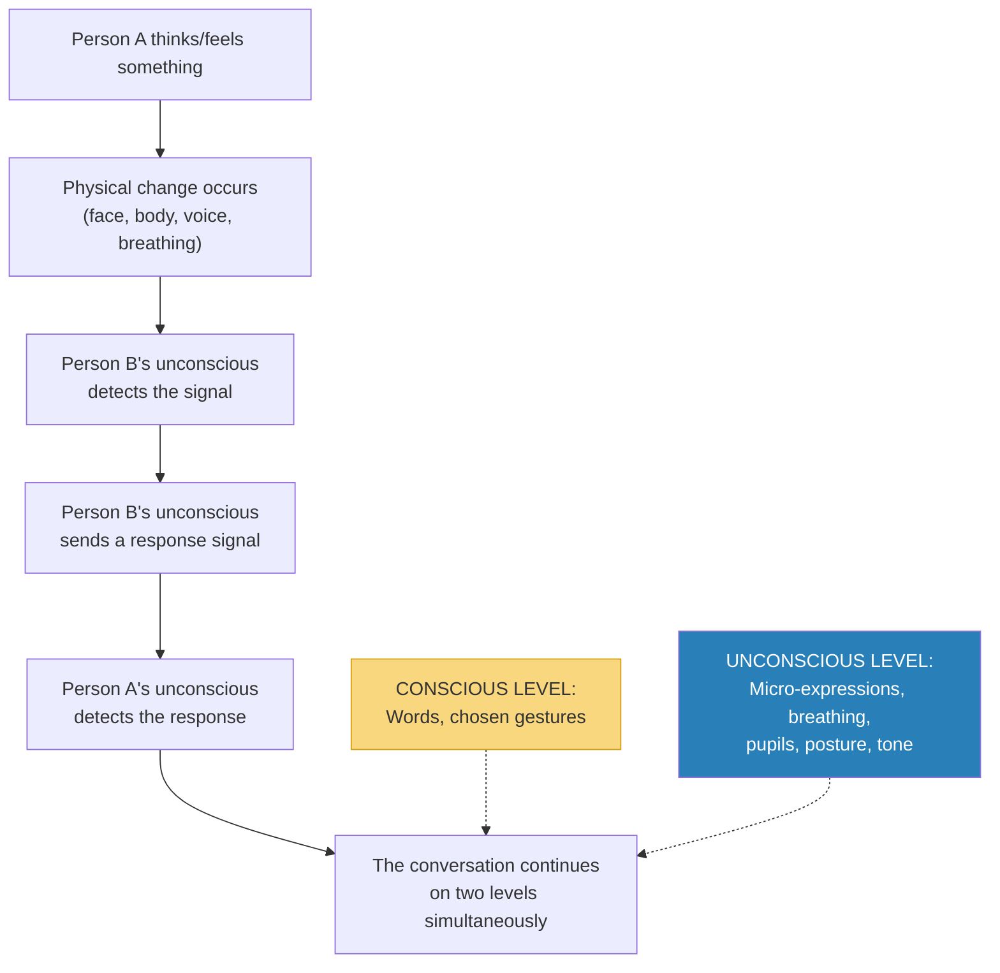
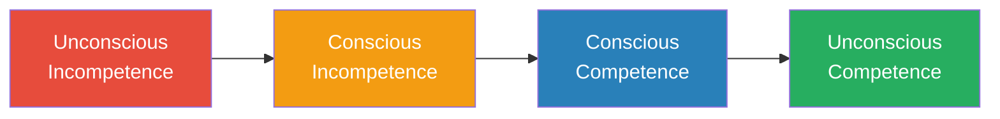
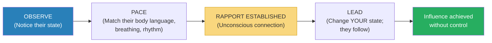
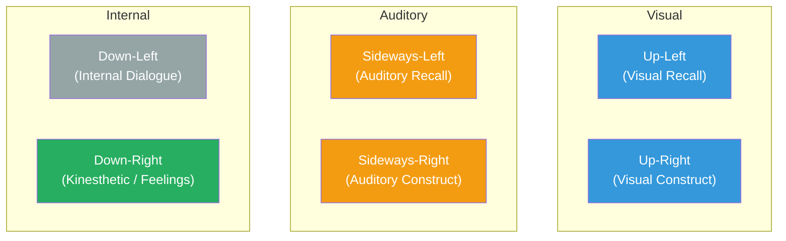
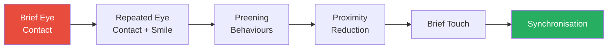
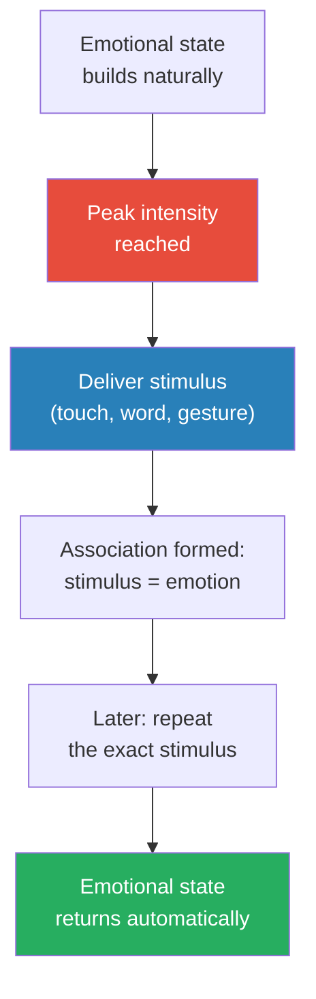

# The Art of Reading Minds — Henrik Fexeus

> Henrik Fexeus is Sweden's most famous mentalist, and his thesis is disarmingly simple: mind reading is not supernatural — it is the systematic observation of what people are already telling you without words.
> Every thought produces a physical reaction. Every emotion surfaces on the face, in the body, in the voice. Every person broadcasts a constant stream of information about their internal state through channels they neither control nor notice.
> The problem is not that this information is hidden — it is that we have never been taught to look for it.
> This book is the instruction manual. It teaches you to build deep rapport through matching and mirroring, to read emotional states through micro-expressions and body language, to identify people's preferred sensory channels, to detect deception through contradictory signals, and to use suggestion and anchoring to influence others ethically.
> Where Navarro's *What Every Body Is Saying* gives you the science of nonverbal communication and Cialdini's *Influence* gives you the psychology of compliance, Fexeus gives you the mentalist's toolkit: how to read the room, build instant connection, and understand what people are really thinking — all without a single word being spoken.

---

## About the Author

Henrik Fexeus is a Swedish author, mentalist, and lecturer on nonverbal communication and influence. He is Sweden's most well-known expert on body language and has appeared regularly on Swedish television demonstrating mind-reading techniques. His books have been translated into over 25 languages and have sold millions of copies worldwide.

Unlike many authors in the body language space, Fexeus is a practitioner first — a performing mentalist who has spent decades reading audiences in real time. His approach draws on NLP (Neuro-Linguistic Programming), the work of Paul Ekman on facial expressions, Milton Erickson's hypnotherapy techniques, the research of Antonio Damasio on the mind-body connection, and Desmond Morris's studies of human behaviour. He is not an academic psychologist but a synthesiser who translates research into immediately usable techniques.

His stated goal: to make the book "as clear and straightforward as an IKEA instruction sheet" — so that after reading it, you know exactly what to do, not just what to think about.

---

## The Big Idea

- Fexeus's foundational claim: <b style="color: #2980b9">you cannot think a single thought without something physical happening to your body</b>
- This is not metaphor — it is neuroscience
- When you think a thought, an electrochemical process occurs in your brain that affects your autonomous nervous system: breathing, pupil size, blood flow, sweating, blushing, muscle tension, posture, and facial expression
- <b style="color: #27ae60">Every thought produces a physical trace. Every emotion surfaces on the body. Nothing stays hidden.</b>
- The reverse is also true: what happens to your body affects your thoughts
  - Clench your jaw, lower your eyebrows, stare at a fixed point, clench your fists — and within ten seconds you will start to feel angry
  - Your pulse will increase by 10-15 beats per minute and blood flow to your hands will increase
  - You activated the muscle pattern for anger, and your nervous system responded as if you WERE angry

---

- Fexeus calls this the "Descartes demolition" — the 17th-century philosopher's claim that body and mind are separate is <b style="color: #e74c3c">the most damaging error in Western intellectual history</b>
- Antonio Damasio's neuroscience has now proven the opposite: body and mind are one system
- <b style="color: #2980b9">Mind reading, as Fexeus defines it, is simply observing the physical traces of thoughts and emotions as they surface on the body</b>
- We all do this unconsciously already — we "sense" that someone is angry, or nervous, or attracted to us
- The problem is that our unconscious mind is imprecise: it misses nuances, makes errors, and misinterprets signals
- The book's promise: train the skills you already have so they become conscious, precise, and reliable

---

- The majority of all communication between two people occurs without words
- Nonverbal communication constitutes approximately <b style="color: #2980b9">60-65% of all interpersonal communication</b>
- Yet we pay almost all our conscious attention to words — and miss most of the real message
- Our unconscious mind picks up the nonverbal signals, processes them, and sends out responses — also nonverbally, also unconsciously
- <b style="color: #e74c3c">This means we are constantly sending and receiving messages we are not aware of — and sometimes our unconscious signals contradict our conscious words</b>
- This is why you sometimes "feel" that someone who seemed very nice in conversation didn't actually like you — your unconscious detected hostile signals that your conscious mind missed

The entire book is built on this dual-channel model: every conversation operates simultaneously on a conscious (verbal) level and an unconscious (nonverbal) level, and the nonverbal level carries more information, is more honest, and is more influential.

---

## Key Concepts at a Glance

| Concept | One-line summary |
|---------|-----------------|
| **Mind Reading Defined** | Observing physical traces of thoughts and emotions — not telepathy but trained perception |
| **Rapport** | The unconscious sense of connection and trust between two people — foundation of all influence |
| **Matching & Mirroring** | Building rapport by subtly adopting the other person's body language, breathing, speech patterns |
| **Cross-Matching** | Matching rhythm with a different body part — they tap their foot, you tap your finger |
| **Breathing Synchronisation** | Matching the other person's breathing rhythm to create deep unconscious connection |
| **Pacing and Leading** | First match their state (pace), then change yours and they follow (lead) |
| **Representational Systems** | People process the world primarily through visual, auditory, or kinesthetic channels |
| **Sensory Acuity** | Training yourself to notice micro-changes in others' faces, breathing, skin colour, muscle tension |
| **The Seven Universal Emotions** | Surprise, sadness, anger, fear, disgust, contempt, joy — same in every culture |
| **Micro-expressions** | Fleeting facial expressions (1/25th of a second) that reveal concealed emotions |
| **Othello's Mistake** | Strong emotions distort perception — you only see what confirms the emotion |
| **Incongruence Detection** | Spotting when verbal and nonverbal channels contradict each other |
| **The Flirting Sequence** | The predictable nonverbal escalation from eye contact to touch to synchronisation |
| **Embedded Commands** | Hiding directives inside longer sentences so the conscious mind doesn't register them |
| **Presuppositions** | Statements that assume something is true without stating it directly |
| **Anchoring** | Associating a stimulus with an emotional state, then triggering it later |
| **The Four Learning Stages** | Unconscious ignorance → conscious ignorance → conscious competence → unconscious competence |

Rapport-building shows the largest jump from untrained to trained — it is both the most impactful and the most accessible skill in Fexeus's toolkit, while deception detection improves the least because it requires the longest practice period.

Rapport techniques dominate the effectiveness map — breathing synchronisation alone outscores every influence technique, confirming Fexeus's insistence that connection must precede persuasion.

Over 90% of interpersonal communication occurs through channels most people never consciously monitor — the nonverbal and tonal channels that Fexeus's entire system is designed to decode.

---

> [!tip] How This Book Is Structured
> Unlike most body language books that organise by body part (feet → face), Fexeus organises by SKILL: first rapport (chapters 2-3), then perception (chapters 4-5), then application (chapters 7-10), then demonstration (chapter 11). Each chapter builds on the previous one, and each includes practical exercises. Think of it as a progressive training programme, not a reference manual.

---

## Chapter 1: What Is Mind Reading?

*Fexeus opens by demolishing the popular myth that mind reading requires psychic powers, and replaces it with something far more useful — a learnable skill based on observation and neuroscience.*

### The Mind-Body Connection

- The entire premise rests on a single scientific fact: <b style="color: #27ae60">every mental event produces a corresponding physical event</b>
- When you think of something frightening, your body responds as if the threat were real — heart rate increases, pupils dilate, muscles tense
- When you recall a happy memory, your face softens, breathing deepens, shoulders drop
- This is not a choice — it is an automatic, unavoidable consequence of how the nervous system works
- <b style="color: #2980b9">Damasio's somatic marker hypothesis</b> provides the scientific backbone: emotional states are literally stored as body states, and the body feeds back to the brain in a continuous loop
- Descartes claimed the mind and body are separate substances — Fexeus argues this error set Western understanding of communication back centuries
  - We assumed the "real" information was in words (mind) and the body was just a vehicle
  - In reality, the body carries the more honest, more complete message

> [!example] The Anger Experiment
> - Fexeus asks readers to try a simple exercise: clench your jaw, lower your eyebrows, stare at a fixed point, and clench your fists
> - Hold the position for ten seconds
> - Nearly everyone reports beginning to feel genuinely angry — without any angry thought prompting it
> - Physiological measurements confirm: pulse increases by 10-15 beats per minute, blood flow to the hands increases
> - The body posture activated the neural pattern for anger, and the brain responded accordingly
> **The lesson:** The mind-body connection runs both directions. You can read emotions from the body because the body IS the emotion, not just a display of it.

---

### The Unconscious Conversation

- At any given moment, two conversations are happening simultaneously:
  - The <b style="color: #2980b9">conscious conversation</b> — words, chosen gestures, deliberate expressions
  - The <b style="color: #2980b9">unconscious conversation</b> — micro-expressions, breathing patterns, pupil dilation, skin colour changes, postural shifts, vocal tone
- The unconscious conversation is:
  - More honest — it is extremely difficult to fake or suppress
  - More influential — it shapes how the other person FEELS about you regardless of what you say
  - More information-rich — it operates on multiple channels simultaneously
- <b style="color: #e74c3c">When the conscious and unconscious messages conflict, the unconscious message wins</b>
  - If you say "I'm excited about this project" while your shoulders droop and your voice flattens, people believe the body
  - They may not be able to articulate why they don't trust your enthusiasm — they just "sense" something is off

> [!example] The "Nice" Colleague
> - Fexeus describes the common experience of meeting someone at a party who says all the right things — "Great to meet you," "That's so interesting," "We should get together"
> - Yet afterward you feel uneasy about them, without being able to explain why
> - What happened: their words were friendly (conscious message) but their body language — compressed lips, feet pointed toward the exit, fleeting micro-expressions of contempt — told a different story (unconscious message)
> - Your unconscious mind detected the contradiction and flagged it as a vague feeling of distrust
> - You were reading their mind — you just didn't know you were doing it
> **The lesson:** We are all mind readers already. The book's goal is to make this unconscious skill conscious, precise, and reliable.

---

### The Four Learning Stages

- Fexeus frames the entire book around a well-known competence model:

| Stage | Name | Description |
|-------|------|-------------|
| 1 | **Unconscious incompetence** | You don't know what you're missing — you can't read people and you don't realise it |
| 2 | **Conscious incompetence** | You know the signals exist but can't reliably detect or interpret them |
| 3 | **Conscious competence** | You can read signals but it requires deliberate effort and concentration |
| 4 | **Unconscious competence** | Reading people becomes automatic — you do it without thinking, like driving a car |

- The book takes you from Stage 1 to Stage 3
- Stage 4 requires practice — months of applying the techniques in real conversations
- <b style="color: #27ae60">The goal is not to become a mind reader overnight but to start noticing what you have been missing your entire life</b>

Most people live their entire lives at Stage 1 — unaware that a second, richer conversation is happening all around them. Simply reading this book moves you to Stage 2.

---

## Chapter 2: Rapport — The Foundation of All Mind Reading

*Rapport is Fexeus's starting point because without it, nothing else in the book works. You cannot read someone who is closed to you, and you cannot influence someone who doesn't trust you.*

### What Rapport Is

- Rapport comes from the French *le rapport* — to have a relationship or connection with someone
- It is the <b style="color: #2980b9">unconscious sense of mutual trust, consent, cooperativeness, and openness</b> between two people
- Without rapport, the person you're talking to won't listen to you — no matter how good your argument is
- <b style="color: #e74c3c">Without rapport, you might as well not bother</b>
- With rapport, the other person is naturally inclined to understand your point of view and agree with you — not because you've tricked them, but because they feel safe enough to genuinely consider your ideas
- Rapport is not a feeling you manufacture — it is the natural state between two people who are in sync
  - Think of two old friends who finish each other's sentences, mirror each other's posture, laugh at the same moments
  - That synchronisation IS rapport — and it can be deliberately created with anyone

> [!tip] The Basic Rule of Rapport
> Adapt to how the other person prefers to communicate. By becoming similar — in body language, speech rhythm, breathing, and energy level — you send an unconscious message: "I'm like you. You're safe with me. You can trust me."

---

### Why Rapport Works: The Similarity Principle

- We like people who are like us — this is one of the most robust findings in social psychology
- We choose friends, partners, and colleagues based on who makes us feel comfortable being who we are
- <b style="color: #2980b9">The similarity-attraction effect</b> has been demonstrated in hundreds of studies across cultures
- A study by the Gallup organisation found that one of the most important factors for new employees is "good rapport and trust between the immediate supervisor and the employee"
- By adapting to someone else's communication style, you achieve two things simultaneously:
  1. <b style="color: #27ae60">You make it easier for them to understand you</b> — they no longer have to "translate" your nonverbal communication into their preferred style
  2. <b style="color: #27ae60">You make them like you more</b> — because your expressions resemble their own, and people like people who remind them of themselves
- The mechanism is deeply evolutionary:
  - In tribal environments, people who looked, moved, and behaved like you were probably from your tribe — safe
  - People who moved differently, had different rhythms, different expressions — potentially hostile
  - This tribal sorting algorithm still runs in the modern brain, processed in milliseconds
- <b style="color: #e74c3c">Fighting this instinct is futile — the brain makes the friend/foe classification before conscious thought begins</b>

> [!example] The Salesperson's Mistake
> - Fexeus describes a high-energy salesperson pitching to a calm, methodical buyer
> - The salesperson talks fast, gestures expansively, leans forward with excitement
> - The buyer's unconscious mind registers: "This person is nothing like me. They are unpredictable. I don't trust them."
> - The buyer declines — not because the product was wrong but because the communication style created unconscious resistance
> - Had the salesperson matched the buyer's slow pace, measured gestures, and quiet energy, the buyer's brain would have registered: "This person is like me. I understand them. I can trust them."
> **The lesson:** The content of your pitch matters far less than whether the other person's unconscious mind classifies you as friend or foe.

---

### The Two Phases of Rapport

- <b style="color: #2980b9">Phase 1: Pacing</b> — you adapt to the other person's style (matching their body language, rhythm, energy)
- <b style="color: #2980b9">Phase 2: Leading</b> — once rapport is established, you change YOUR state and the other person unconsciously follows
- Pacing is the investment; leading is the return
  - You cannot lead without pacing first — just as you cannot withdraw from a bank account you never deposited into
  - Attempting to lead without rapport is what most people call "being pushy" — and it triggers resistance

Pacing builds the bridge; leading invites them to cross it. The sequence cannot be reversed.

- Fexeus is careful to distinguish this from manipulation: <b style="color: #27ae60">"We don't 'control' or deceive other people to give them opinions they don't really hold. We just make sure that they are in an optimal state to understand the actual advantages of whatever we are presenting."</b>
- If your idea isn't actually good, rapport won't save it — people in rapport are more receptive, not more gullible

> [!example] The Anxious Friend
> - Fexeus describes a friend who arrives at dinner visibly stressed — tight shoulders, rapid breathing, clipped speech
> - The natural instinct is to say "Relax! Everything's fine!" — which is leading without pacing
> - Result: the friend feels dismissed and becomes more stressed
> - Instead, Fexeus matches the friend's energy briefly — leaning forward, speaking at a slightly elevated pace, acknowledging the tension
> - Then he gradually slows his own breathing, lowers his voice, relaxes his posture
> - Within minutes, the friend mirrors the change — shoulders drop, breathing deepens, speech slows
> - The friend never notices the technique — they just feel that the evening helped them unwind
> **The lesson:** You have to enter someone's world before you can change it. Pace first, lead second.

---

### Testing Whether Rapport Is Established

- How do you know when pacing has worked and you can begin leading?
- <b style="color: #2980b9">The rapport test</b>: after matching for several minutes, make a small change to your own body language — uncross your legs, shift your posture, adjust your breathing rate
  - If they follow your change within 30-60 seconds, rapport is established — you can now lead
  - If they don't follow, continue pacing — they're not connected yet
- Other signs of rapport:
  - They begin matching YOU — the mirroring becomes mutual
  - Conversation flows easily — fewer awkward pauses
  - Their pupils dilate slightly — a sign of positive engagement
  - They orient their body toward you — feet, torso, face all pointing in your direction
  - They begin volunteering personal information — a sign of trust

---

## Chapter 3: Rapport in Practice — Matching and Mirroring

*This is the most technique-dense chapter in the book — a systematic guide to building rapport through body language, voice, and breathing.*

### Matching Body Language

- <b style="color: #2980b9">Mirroring</b>: subtly adopting the other person's posture, gestures, and movements
- If they lean forward, you lean forward. If they cross their legs, you cross yours. If they gesture with their right hand, you gesture with your left (mirror image)
- The key word is <b style="color: #27ae60">subtly</b> — if they scratch their nose and you immediately scratch your nose, they'll notice and it will feel creepy
- The delay should be 10-30 seconds — enough that it registers unconsciously but not consciously
- You don't need to match every movement — match the overall posture and the major gestures
  - Their general body orientation (leaning, angle, openness)
  - Their energy level (still vs animated)
  - Their gesture style (expansive vs contained)
- <b style="color: #e74c3c">Never match nervous tics or idiosyncratic movements — these are personal and matching them feels like mockery</b>

> [!abstract] Mirroring vs Cross-Matching
> - **Mirroring** — Match the same movement with the opposite side (mirror image): they cross right leg, you cross left leg
> - **Cross-matching** — Match the rhythm or energy with a different body part: they tap their foot, you tap your finger at the same rhythm
> - Cross-matching is less detectable and works well when direct mirroring would be too obvious
> - Use mirroring for posture and position; use cross-matching for repetitive movements and rhythms

> [!example] The Cycling Analogy
> - Fexeus compares rapport-building to cycling alongside someone
> - If you're both cycling at the same speed and rhythm, it feels natural and comfortable
> - If one person suddenly speeds up or changes direction, the other feels jarred
> - Matching someone's body language is like adjusting your cycling speed to match theirs
> - Once you're riding together, you can gradually change direction — and they'll follow naturally
> **The lesson:** Rapport is about rhythm, not imitation. Match the pace and the path, not every pedal stroke.

---

### Matching Voice

- Match the other person's <b style="color: #2980b9">tempo</b> (speed of speech), <b style="color: #2980b9">volume</b>, <b style="color: #2980b9">pitch</b>, and <b style="color: #2980b9">rhythm</b>
- A fast talker feels frustrated with a slow talker — not because of the content but because of the mismatch in communication rhythm
- A quiet person feels overwhelmed by a loud one
- <b style="color: #27ae60">Match first, then gradually lead them toward the pace and volume you want</b>
- If you want to calm someone down, don't start by speaking slowly — they'll just feel you're not taking their urgency seriously
  - Start at their speed, then gradually slow down
  - They'll follow without noticing the transition
- Vocal matching also includes:
  - **Pausing patterns** — some people leave long pauses between thoughts; others chain ideas continuously
  - **Vocabulary level** — formal vs casual, technical vs plain
  - **Emotional tone** — enthusiastic, cautious, analytical, warm

| Vocal Element | How to Match | Common Mistake |
|---------------|-------------|----------------|
| **Tempo** | Speak at the same speed | Calm people speaking fast to seem energetic |
| **Volume** | Match their loudness level | Loud people dropping to a whisper to "calm things down" |
| **Pitch** | Stay in a similar register | Speaking monotone to someone who is expressive |
| **Rhythm** | Match pauses and flow | Interrupting a deliberate speaker's pauses |
| **Vocabulary** | Mirror their word choices and formality | Using jargon with someone who speaks plainly |

---

### Matching Breathing

- This is Fexeus's most distinctive rapport technique — and the one most people have never heard of
- <b style="color: #2980b9">Synchronise your breathing with the other person's</b>
- Watch the rise and fall of their chest or shoulders to detect their breathing rhythm
- Breathe at the same rate and depth
- This creates an extraordinarily deep sense of connection because breathing is one of the most unconscious, intimate bodily rhythms
- <b style="color: #27ae60">If you can match someone's breathing, you are virtually guaranteed rapport</b> — it's like the master key
- Why breathing is so powerful:
  - It is the most continuous, unavoidable bodily rhythm — unlike gestures, breathing never stops
  - It is controlled by the autonomic nervous system — the same system that governs emotions
  - When two people breathe in sync, their nervous systems literally begin to synchronise
  - This is why people who sleep together often end up breathing in unison — and why it feels so intimate

> [!example] The Meeting Room Synchronisation
> - Fexeus describes sitting across from someone in a meeting, watching their chest rise and fall, and synchronising his own breathing to match
> - Within minutes, the other person relaxes visibly, leans forward, becomes more open
> - The person has no idea why they suddenly feel so comfortable
> - Their conscious mind attributes it to the conversation going well
> - Their unconscious mind knows: "This person is breathing with me. We are in sync. I am safe."
> **The lesson:** Breathing synchronisation is the most powerful and least known rapport technique — and it works even when nothing else seems to.

> [!abstract] How to Match Breathing — Step by Step
> 1. Observe the other person's breathing rhythm — watch the rise and fall of their chest or shoulders
> 2. Begin adjusting your own breathing to match their rate — don't rush the transition
> 3. If their breathing is much faster or slower than yours, use cross-matching — breathe out when they breathe out, but take two breaths to their one
> 4. Maintain the synchronised rhythm for 2-3 minutes
> 5. Test rapport by slightly changing your breathing rate — if they follow within a minute, rapport is established
> 6. Now you can lead: gradually shift your breathing to the rate you want (slower for calm, deeper for focus)

---

### Rapport by Email and Phone

- On the phone: match tempo, pitch, and energy level (you can't match body language)
- By email: match the other person's <b style="color: #2980b9">communication style</b> — length of messages, formality level, use of emoji, punctuation style
  - If they write three-word replies, don't send paragraphs
  - If they write formally, don't use slang
  - If they use bullet points, use bullet points back
  - If they sign off with "Best," you sign off with "Best" — not "Cheers!" or "XOXO"
- <b style="color: #27ae60">The principle is the same across all media: adapt to how the other person communicates to send the unconscious signal "I am like you"</b>
- Even in text-based communication, mismatched style creates friction:
  - A one-sentence reply to a detailed email feels dismissive
  - A three-paragraph response to a quick question feels overwhelming
  - <b style="color: #e74c3c">Style mismatch creates unconscious resistance even when the words are perfectly appropriate</b>

---

### When Rapport Goes Wrong

- <b style="color: #e74c3c">If someone is in bad rapport with you, adapting to them may feel like agreeing with their negativity</b>
- In this case, Fexeus recommends a modified approach: pace their energy level (not their negativity) and then gradually lead them toward a more positive state
- Start matching their intensity (they're frustrated, you acknowledge the frustration at their energy level) then slowly bring the energy down
- <b style="color: #2980b9">You can't calm someone down by being calm AT them. You have to meet them where they are first, then lead them where you want them to go.</b>
- This is perhaps the most counter-intuitive point in the book:
  - Every instinct tells you to respond to anger with calm, to panic with reassurance, to sadness with cheerfulness
  - But these are all forms of leading without pacing — and they fail almost every time
  - The angry person feels dismissed, the panicking person feels unheard, the sad person feels invalidated

> [!example] The Mismatched Rapport Attempt
> - Your colleague is furious about a failed project
> - You respond in a calm, measured tone: "Let's look at this rationally"
> - Result: they feel dismissed. Their frustration increases. "You don't understand!"
> - Instead, match their energy: "I know — this is really frustrating. We put a lot of work into this and it didn't land" (Pace)
> - Once they feel heard, gradually lower your energy: "OK. So what can we salvage from this?" (Lead)
> - Result: they feel understood, their emotional intensity drops naturally, and they become receptive to problem-solving
> **The lesson:** Meeting someone where they are is not agreeing with them — it is showing them you understand the intensity of what they feel.

---

### Rapport with Groups

- You can't mirror everyone in a group simultaneously
- Instead, identify the <b style="color: #2980b9">group leader</b> — the person whose body language the others unconsciously follow — and mirror THEM
  - The group leader is not always the person with the highest title
  - Watch who people look at when something unexpected happens — that person is the emotional leader
  - Watch whose posture shifts first and is then followed by others
- If you can get into rapport with the leader, the group's unconscious rapport with that leader transfers partially to you
- Alternatively, use <b style="color: #2980b9">general energy matching</b>: if the group's energy is high and animated, match that energy. If it's subdued and focused, match that
- <b style="color: #27ae60">Never be the odd one out in a group's energy level — it signals "I am not one of you"</b>
- Fexeus warns about a common mistake in presentations:
  - Speakers often try to "energise" a low-energy audience by being high-energy
  - This feels jarring — like someone shouting in a library
  - Instead, start at the audience's energy level and gradually lead them up

---

## Chapter 4: Senses and Thinking — Representational Systems

*Fexeus introduces the NLP-derived idea that people don't just think differently — they literally perceive the world through different sensory channels, and matching someone's channel creates instant rapport.*

### The Three Systems

- Everyone has a <b style="color: #2980b9">dominant representational system</b> — a preferred sensory channel through which they primarily process information
- The three primary systems are visual, auditory, and kinesthetic
- While everyone uses all three, most people have a strong preference that shapes how they think, communicate, and make decisions

| System | Language Cues | Behaviour | Breathing | Eye Direction |
|--------|--------------|-----------|-----------|---------------|
| **Visual** | "I see," "Looks good," "Picture this," "Clear" | Talks fast, gestures up, stands upright | Shallow, high in chest | Up (left for recall, right for construction) |
| **Auditory** | "Sounds right," "I hear you," "Rings a bell," "Harmony" | Moderate pace, rhythmic speech, tilts head | Moderate, mid-chest | Sideways (left for recall, right for construction) |
| **Kinesthetic** | "I feel that," "Solid," "Get a grip," "Weight of it" | Talks slowly, breathes deeply, looks down | Deep, low in abdomen | Down and right |

- <b style="color: #27ae60">Match their sensory language to deepen rapport instantly</b>
- If they say "I see what you mean," respond with "Let me show you" — not "Let me tell you"
- If they say "That doesn't sit right with me," respond with "What would feel better?" — not "How does it look to you?"

> [!tip] Core Insight
> Most communication failures are not about WHAT is being said but about which sensory channel it is being said in. Visual people need to "see" your point. Auditory people need to "hear" it. Kinesthetic people need to "feel" it. Same content, different delivery, dramatically different reception.

---

### Eye Accessing Cues

- <b style="color: #2980b9">Eye accessing cues</b> are the direction a person's eyes move when they think
- According to the NLP model Fexeus uses:
  - **Up and left** — visually remembering (recalling an image they've seen)
  - **Up and right** — visually constructing (imagining something they haven't seen)
  - **Sideways left** — auditory remembering (recalling a sound or conversation)
  - **Sideways right** — auditory constructing (creating new sounds or speech internally)
  - **Down and left** — internal dialogue (talking to themselves)
  - **Down and right** — kinesthetic processing (accessing feelings and bodily sensations)
- <b style="color: #e74c3c">Important caveat: Fexeus acknowledges that eye accessing cues are not scientifically validated with the same rigour as Ekman's micro-expressions</b>
  - They come from NLP, which has a mixed research track record
  - They work as rough guides, not reliable indicators
  - Left-handed people sometimes show reversed patterns
  - Cultural factors can also shift the pattern
- Use them as one data point among many — never as a single basis for conclusions

Each direction suggests which sensory system the person is currently using to process information — useful for knowing how to phrase your next question or statement.

---

### Matching Representational Systems in Practice

- Once you identify someone's dominant system, match your language to it:
  - For a **visual** person: use diagrams, sketches, colour-coded documents. Say "Let me paint you a picture" or "Can you see what I mean?"
  - For an **auditory** person: explain verbally, use analogies and stories. Say "Let me tell you about this" or "How does that sound?"
  - For a **kinesthetic** person: give them something to hold, walk through the process physically. Say "How does this feel to you?" or "Let's walk through this step by step"
- <b style="color: #27ae60">The single most common communication failure is a visual person trying to explain something to a kinesthetic person using visual language</b>
  - The visual person keeps saying "Look at this chart" and "See the trend"
  - The kinesthetic person nods politely but feels nothing — the information isn't landing
  - Switch to "What's your gut reaction?" and "Does this feel right?" — and suddenly the connection happens

> [!example] The Visual Manager vs Kinesthetic Employee
> - A manager presents quarterly results using detailed charts and colour-coded slides
> - "Can you SEE the big picture? LOOK at these numbers. It's CLEAR we need to change direction."
> - A kinesthetic employee feels disconnected, confused — not because they're slow, but because the manager is speaking the wrong sensory language
> - Fix: "How does this SIT with you? Does this FEEL like the right direction? What's your GUT sense?"
> - Same information, different channel, dramatically better reception
> **The lesson:** If someone "doesn't get it," you may be transmitting on the wrong frequency rather than sending the wrong message.

> [!example] The Couple's Argument
> - Fexeus describes a couple fighting about the same issue repeatedly without resolution
> - She is visual: "You never SEE what I need. It's so CLEAR, how can you not NOTICE?"
> - He is kinesthetic: "I just don't FEEL like you appreciate what I do. It doesn't SIT well with me."
> - They are both expressing the same frustration — feeling unseen and undervalued — but in incompatible sensory languages
> - Once they learn to translate — she says "I need you to FEEL how important this is to me" and he says "Let me SHOW you what I mean" — the fights begin to resolve
> **The lesson:** Many communication breakdowns are not about disagreement but about sensory mismatch. Learn the other person's language before trying to make your point.

---

## Chapter 5: Emotions — The Seven Universal Expressions

*Fexeus turns to Paul Ekman's groundbreaking research to show that regardless of culture, upbringing, or personality, every human face tells the same emotional stories — and you can learn to read them.*

### Ekman's Discovery

- In the 1960s and 70s, Paul Ekman travelled the world — including to the isolated Fore tribe in Papua New Guinea who had never seen a photograph or a television
- He showed them faces displaying various emotions and asked them to identify the feelings
- The Fore people identified the emotions correctly — proving that certain expressions are universal, not culturally learned
- <b style="color: #2980b9">Seven emotions are expressed identically in every culture: Surprise, Sadness, Anger, Fear, Disgust, Contempt, Joy</b>
- These are hardwired into the human nervous system — a product of evolution, not socialisation

| Emotion | Key Facial Markers | Duration | What It Signals |
|---------|-------------------|----------|----------------|
| **Surprise** | Raised eyebrows, wide eyes, dropped jaw | Brief (< 1 second) | Unexpected input — quickly shifts to another emotion |
| **Sadness** | Inner brow corners raised, lip corners down, drooping eyelids | Can be sustained | Loss, disappointment, helplessness |
| **Anger** | Lowered brow, compressed lips, flared nostrils, hard stare | Variable | Perceived injustice, blocked goals, threat |
| **Fear** | Raised eyebrows pulled together, wide eyes, tense open mouth | Brief to moderate | Perceived danger — triggers flight response |
| **Disgust** | Wrinkled nose, raised upper lip, chin pushed up | Brief to moderate | Rejection of something offensive — physical or moral |
| **Contempt** | One-sided mouth raise (asymmetric smirk) | Can be sustained | Superiority, dismissal — the only asymmetric universal expression |
| **Joy** | Raised cheeks, crinkled eyes (Duchenne), full smile | Variable | Safety, connection, genuine pleasure |

- <b style="color: #e74c3c">Contempt is the most dangerous emotion to detect in another person — it signals they believe they are superior to you</b>
  - John Gottman's research on marriage found that contempt is the single strongest predictor of divorce
  - If you see a one-sided mouth raise during a conversation, the person is dismissing you or your ideas — regardless of what their words say

---

### Real vs Fake Expressions

- <b style="color: #27ae60">The key to reading emotions is knowing the difference between genuine and performed expressions</b>
- The most important distinction: the **Duchenne smile** vs the social smile
  - A genuine smile activates two muscle groups: the **zygomatic major** (pulls the mouth corners up) AND the **orbicularis oculi** (crinkles the skin around the eyes)
  - A fake smile only activates the zygomatic major — the mouth smiles but the eyes don't
  - <b style="color: #e74c3c">If the eyes aren't crinkling, the smile is not genuine</b> — no matter how broad
- Other signs of faked expressions:
  - **Timing** — genuine expressions appear and fade gradually; faked ones switch on and off abruptly
  - **Symmetry** — genuine expressions are largely symmetrical; faked ones often show asymmetry
  - **Duration** — genuine surprise lasts less than a second; if someone holds a "surprised" face for several seconds, it's performed

> [!example] The Botox Problem
> - A New York store manager told Fexeus that Botox was ruining his negotiations
> - "I can't read my clients' reactions since they have no capacity for nuanced facial expressions. They feel artificial, inhuman."
> - The paralysed muscles couldn't form the micro-expressions that normally leak emotional truth
> - The manager's unconscious mind registered these frozen faces as eerie and untrustworthy — like talking to a mask
> - Fexeus's dry advice: "If you want to be understood, try not to inject nerve toxins in your face."
> **The lesson:** Facial expression is a two-way street. You need your face to communicate just as much as you need to read other people's faces.

---

### Micro-Expressions

- Even when people try to hide emotions, the truth leaks through as <b style="color: #2980b9">micro-expressions</b> — lasting approximately 1/25th of a second
- They are too fast for the conscious mind to suppress — the emotional trigger fires the facial muscles before the "poker face" command can override them
- Three types of leaked expressions:
  - **Slight expressions** — the whole face shows the emotion but at very low intensity (barely visible to the untrained eye)
  - **Partial expressions** — only part of the face shows the emotion (the eyebrows flash anger while the mouth stays neutral)
  - **Micro-expressions** — the full emotion appears at full intensity but vanishes almost instantly (1/25th of a second)
- <b style="color: #27ae60">Spotting micro-expressions requires training your eye to look for flickers rather than sustained expressions</b>
- The most common micro-expression leaks:
  - A flash of contempt (one-sided mouth raise) during a "friendly" conversation
  - A flicker of fear when someone claims to be confident
  - A split-second expression of disgust when someone says they're "happy" about a decision

> [!abstract] Training Your Eye for Micro-Expressions
> 1. Start by watching television with the sound off — focus entirely on faces
> 2. Practice identifying the seven universal emotions in photographs (Ekman published training materials for this)
> 3. In conversations, focus on one area of the face at a time — eyebrows first, then mouth, then eyes
> 4. Look for moments of incongruence — when the face says something different from the words
> 5. Don't try to read every micro-expression in real time — start by noticing THAT something flashed, even if you can't identify WHAT it was
> 6. With practice, identification speed increases naturally

---

### Othello's Mistake

*Fexeus introduces one of the book's most important warnings: strong emotions don't just affect the person feeling them — they distort the perception of everyone nearby.*

- <b style="color: #2980b9">Othello's Mistake</b> (named after the Shakespeare play): once a person enters a strong emotional state, their perception narrows to confirm that emotion
- Shakespeare's Othello interpreted Desdemona's fear as evidence of guilt — because his jealous rage blocked all other interpretations
  - In reality, she was terrified because she was being accused of something she hadn't done
  - Her fear was innocent — but Othello's emotion could only see guilt
- This applies to any strong emotion, not just jealousy:
  - An angry boss sees incompetence everywhere — even in competent work
  - A fearful negotiator interprets neutral statements as threats
  - An excited investor sees only opportunities and misses every risk signal
- <b style="color: #e74c3c">Once someone is deep in a strong emotion, their ability to read other people accurately drops to near zero</b>
- <b style="color: #27ae60">If you see someone heading into a negative state, intervene BEFORE it fully activates</b> — use pace-then-lead from the rapport chapter
  - Once the emotion is entrenched, it distorts all incoming information
  - Early intervention is ten times more effective than late intervention

> [!tip] Core Insight
> You cannot reason with someone in the grip of a strong emotion. Their perception has already narrowed to confirm whatever they feel. Your job is not to argue — it is to change their emotional state first, then present your reasoning once they can actually hear it.

---

### Sensory Acuity — Training the Eye

- <b style="color: #2980b9">Sensory acuity</b> is Fexeus's term for the trained ability to notice subtle changes in another person's physiology
- Most people observe at a very gross level — they notice someone is "happy" or "angry" but miss the nuances
- Trained sensory acuity means noticing:
  - Subtle shifts in skin colour (flushing, pallor)
  - Changes in breathing rate and depth
  - Micro-tension in specific muscle groups (jaw, shoulders, hands)
  - Pupil dilation and contraction
  - Subtle vocal changes (slight tightening, pitch shifts, tempo changes)
- <b style="color: #27ae60">The goal is to develop a "baseline" for each person you interact with regularly — their normal state — so that deviations become immediately visible</b>
- Without a baseline, you're guessing
- With a baseline, even tiny changes — a slight jaw clench, a micro-shift in breathing — become informative

---

## Chapter 6: The Moral Dimension

*In this brief but important chapter, Fexeus pauses the technique instruction to address the elephant in the room: if you can read and influence people, what stops you from becoming a manipulator?*

- Fexeus draws a clear line between <b style="color: #2980b9">influence</b> and <b style="color: #2980b9">manipulation</b>:
  - **Influence** — helping someone reach a state where they can clearly evaluate your ideas. The outcome genuinely benefits both parties.
  - **Manipulation** — pushing someone toward an outcome that benefits you at their expense
- <b style="color: #e74c3c">The techniques in this book are ethically neutral — like a hammer, they can build or destroy. The ethics come from the user, not the tool.</b>
- Fexeus argues that most people already use these techniques unconsciously — they're just bad at it
  - A naturally charismatic person builds rapport without trying — they're not "manipulating," they're just well-calibrated
  - Making these skills conscious doesn't make them less ethical — it makes them more deliberate and effective
- He also introduces a practical warning: <b style="color: #27ae60">techniques used against someone's genuine interest tend to backfire</b>
  - People eventually notice they were pushed into something that didn't serve them
  - The short-term win becomes a long-term trust deficit
  - The most sustainable use of influence is when both parties benefit from the outcome

> [!example] The Mentalist's Code
> - Fexeus describes being asked after a stage show whether he ever uses his skills to "take advantage" of people
> - His answer: "Of course I could. But why would I? If I manipulate someone into buying something they don't want, I've gained a sale and lost a relationship. If I use rapport to help them see clearly why they DO want something they genuinely need, I've gained a sale AND deepened the relationship."
> - He compares it to a martial arts master who could hurt anyone on the street but chooses not to — the skill includes the discipline of restraint
> **The lesson:** Power without ethics is just exploitation. The techniques work best when used to create outcomes that serve everyone involved.

---

## Chapter 7: Be a Human Lie Detector

*Fexeus's most important warning: detecting lies is far harder than you think — and overconfidence in your lie-detection abilities is more dangerous than the lies themselves.*

### The Pinocchio Problem

- There is <b style="color: #e74c3c">no single reliable indicator of deception</b> — no "Pinocchio effect"
- Popular culture is full of myths about lying:
  - "Liars avoid eye contact" — many liars actually INCREASE eye contact to appear trustworthy
  - "Liars fidget" — some do, some freeze completely
  - "Liars touch their nose" — this is a stress response, not a lie response
- Research consistently shows that even trained professionals (police, judges, psychologists) detect lies only slightly better than chance — approximately <b style="color: #2980b9">54% vs 50% random chance</b>
- Fexeus is honest about this: "The best you can do is detect discomfort and incongruence. Whether that incongruence is caused by deception or by nervousness or by indigestion — you can't know from body language alone."

### What You CAN Detect: Incongruence

- What you CAN detect is <b style="color: #2980b9">incongruence</b> — when verbal and nonverbal channels contradict each other
- Someone says "I'm fine" while their jaw clenches and they look away — the words and body disagree
- Signs of incongruence:
  - **Timing mismatches** — gesture comes after words instead of simultaneously (genuine emotion and gesture are synchronised; faked emotion produces the gesture late)
  - **Asymmetric expressions** — one side of the face shows a different emotion from the other
  - **Micro-expressions** that flash the opposite emotion from what's being verbally expressed
  - **Voice-body disconnect** — cheerful words delivered in a flat tone, or calm words with tense body

| Signal | What It Might Mean | What It Does NOT Necessarily Mean |
|--------|-------------------|----------------------------------|
| Avoiding eye contact | Discomfort, shame, thinking | Lying (many liars increase eye contact) |
| Touching nose/face | Self-soothing (pacifying behaviour) | Lying (it's a stress response, not a lie response) |
| Crossed arms | Discomfort, cold, self-hugging | Disagreement (sometimes it's just comfortable) |
| Incongruent expression | Words and body don't match | Deception (could be mixed emotions or social masking) |
| Increased blinking | Cognitive load, stress, discomfort | Lying (could be dry eyes or bright lights) |
| Vocal pitch rise | Anxiety, uncertainty, emphasis | Deception (could be genuine nervousness about a truthful topic) |

---

### Establishing a Baseline

- <b style="color: #27ae60">The most important step in detecting deception is establishing a baseline</b>
- Before you can notice deviations, you need to know what "normal" looks like for this specific person
- Everyone has different baselines:
  - Some people naturally avoid eye contact
  - Some people fidget constantly
  - Some people speak in a monotone
- What matters is not the absolute behaviour but the CHANGE from their baseline
  - If someone who normally makes strong eye contact suddenly looks away, that's informative
  - If someone who normally looks away suddenly locks eyes, that's also informative
  - The same behaviour in someone else might mean nothing

> [!abstract] The Baseline-and-Deviation Method
> 1. Spend the first few minutes of any conversation in casual small talk — topics where there's no reason to lie
> 2. During this time, observe their baseline: normal eye contact patterns, fidgeting level, breathing rate, vocal tone, typical gestures
> 3. Mentally catalogue their "comfort state" — how they look when relaxed and truthful
> 4. When you move to sensitive topics, watch for deviations from this baseline
> 5. Note CLUSTERS of deviations — a single change means little; three or four simultaneous changes indicate genuine discomfort
> 6. Use deviations as a signal to probe further — not as proof of deception

---

### Clusters, Not Single Signals

- <b style="color: #e74c3c">Never conclude anything from a single nonverbal signal</b>
- A single cue — a nose touch, a glance away, a shift in posture — could mean anything
- Fexeus insists on looking for <b style="color: #2980b9">clusters</b>: three or more signals occurring within a few seconds of each other
  - The person touches their nose, shifts their weight, AND breaks eye contact — that cluster suggests discomfort
  - The person touches their nose but maintains steady eye contact, relaxed posture, and even breathing — probably just an itchy nose
- Clusters linked to specific questions are most informative:
  - You ask "Were you at the meeting on Tuesday?" and the person's jaw tightens, their breathing becomes shallow, and they delay their answer — the cluster is specifically associated with that question
  - This doesn't prove they're lying — but it tells you that question caused significant internal stress

---

## Chapter 8: The Unconscious Pickup Artist

*Fexeus reveals that romantic interest follows a predictable nonverbal sequence — and most people are terrible at recognising it, both in others and in themselves.*

### The Flirting Sequence

- We signal romantic interest through a predictable sequence of nonverbal behaviours — usually without realising it
- <b style="color: #2980b9">The flirting sequence</b> (observed cross-culturally by anthropologists and ethologists):
  1. **Eye contact** — brief, then look away (signals initial interest)
  2. **Repeated eye contact** — longer duration, with smile (signals confirmed interest)
  3. **Preening behaviours** — adjusting hair, clothing, posture (unconscious display behaviours)
  4. **Proximity reduction** — moving closer (testing physical comfort)
  5. **Touch** — brief, "accidental," escalating (testing touch receptivity)
  6. **Synchronisation** — matching posture, drinking at the same time, laughing together (deep rapport)

Each stage must be completed before the next one begins. Skipping a stage triggers the same resistance as rushing the Friendship Formula — the other person's alarm system activates.

- Most people are terrible at recognising when someone is flirting with them — because the signals operate below conscious awareness
- <b style="color: #27ae60">Knowing the sequence lets you both recognise when interest is being signalled AND signal interest more effectively yourself</b>
- Fexeus notes that the sequence is remarkably consistent across cultures — Desmond Morris documented nearly identical patterns in Europe, Africa, Asia, and South America

---

### Male vs Female Display Behaviours

- While the overall sequence is universal, the specific display behaviours differ between genders:

| Behaviour | Male Version | Female Version |
|-----------|-------------|----------------|
| **Preening** | Straightening tie, adjusting collar, running hand through hair | Touching hair, tilting head to expose neck, adjusting clothing |
| **Space claiming** | Spreading out, wider stance, taking up more room | Crossing and uncrossing legs, drawing attention to body contours |
| **Touch** | Touch on arm or shoulder | Touch on forearm, brief hand contact |
| **Vocal shift** | Voice drops lower | Voice becomes more animated, laughter increases |
| **Posture** | Stands taller, chest forward | Posture becomes more upright, head tilt increases |

- <b style="color: #e74c3c">The biggest mistake in reading romantic signals: interpreting friendliness as flirting, or flirting as friendliness</b>
- The distinguishing factor is the SEQUENCE — friendliness involves some of these behaviours (eye contact, smiling) but does NOT follow the escalation pattern
- If someone makes eye contact and smiles but does NOT proceed to preening, proximity reduction, or touch — they are being friendly, not flirting

> [!example] The Misread Signal
> - Fexeus tells of a friend who was convinced a woman at a bar was interested in him
> - She made eye contact, smiled, and touched her hair
> - He approached — and she seemed confused and uncomfortable
> - What he missed: she made eye contact with everyone (social personality), her hair touch was a nervous habit (not preening), and she was leaning AWAY from him (no proximity reduction)
> - He read isolated signals instead of looking for the full sequence
> **The lesson:** Individual signals are ambiguous. The sequence is the message. Only read interest when you see the escalation pattern — eye contact, repeated eye contact with smile, preening, proximity, touch, synchronisation — in order.

---

## Chapter 9: The Art of Suggestion

*Fexeus moves from reading people to influencing them — drawing on Milton Erickson's hypnotherapy techniques to show how language itself can be used to bypass conscious resistance.*

### The Principle of Suggestion

- Suggestion is communication designed to <b style="color: #2980b9">bypass the conscious critical mind and speak directly to the unconscious</b>
- It is not hypnosis in the stage-show sense — it is a way of structuring language so that ideas land more deeply
- The conscious mind is analytical, skeptical, and resistant to direct influence
- The unconscious mind is literal, accepting, and responsive to pattern and implication
- <b style="color: #27ae60">Effective suggestion works by communicating your message in a way that the conscious mind doesn't flag as an attempt to persuade</b>

---

### Embedded Commands

- <b style="color: #2980b9">Embedded commands</b>: hiding a directive inside a longer sentence so the conscious mind processes the sentence while the unconscious mind extracts the command
- The command is marked out through subtle vocal emphasis — a slight shift in tone, volume, or pace that the conscious mind ignores but the unconscious registers
- Examples:
  - "I don't know if you'll **FEEL COMPLETELY COMFORTABLE** with this idea right away" — the embedded command is "feel completely comfortable"
  - "People often find that they **WANT TO LEARN MORE** about this topic" — the embedded command is "want to learn more"
  - "You don't have to **MAKE A DECISION NOW**" — the embedded command (paradoxically) is "make a decision now"
- <b style="color: #e74c3c">The key is subtlety — if the emphasis is obvious, the conscious mind catches it and the technique fails</b>
- The vocal shift should be barely perceptible — a slight lowering of pitch, a fractional slowing of tempo, nothing that would register consciously

> [!abstract] How to Deliver Embedded Commands
> 1. Decide what you want the other person to feel or do
> 2. Construct a longer sentence that contains the command as a natural phrase
> 3. Mark the command with a subtle vocal shift — slightly lower pitch, slightly slower pace
> 4. Maintain natural conversational flow — the sentence must make grammatical sense as a whole
> 5. Don't look for immediate results — embedded commands are cumulative, building over multiple uses
> 6. Never use the same command phrase more than twice in a conversation — repetition becomes obvious

---

### Presuppositions

- <b style="color: #2980b9">Presuppositions</b>: statements that assume something is true without stating it directly
- The conscious mind processes the surface question while the unconscious mind accepts the embedded assumption
- "When you decide to go ahead with this, which option will you choose?" presupposes they WILL go ahead — the question is only about WHICH option
- "Have you noticed how much MORE RELAXED you feel?" presupposes they feel more relaxed — the question is only about whether they've noticed
- Types of presuppositions:
  - **Time presuppositions**: "Before you agree, let me explain one more thing" (presupposes agreement)
  - **Awareness presuppositions**: "Do you realise how much this could help?" (presupposes it could help)
  - **Choice presuppositions**: "Would you prefer Tuesday or Thursday?" (presupposes they will choose a day)

> [!example] The Restaurant Choice
> - Fexeus describes wanting to go to an Italian restaurant while his companion prefers Thai
> - Instead of saying "Let's go Italian" (direct suggestion, easily resisted), he says: "When we get to the Italian place, should we sit inside or on the terrace?"
> - The presupposition — that they are going to the Italian place — slips past conscious scrutiny
> - The companion's conscious mind engages with the seating question while the unconscious mind accepts the restaurant choice
> - This doesn't always work (the companion might still object), but it significantly tilts the odds
> **The lesson:** Presuppositions work by directing the conscious mind's attention to a secondary question while the primary assumption bypasses scrutiny.

---

### The Yes-Set

- <b style="color: #2980b9">The yes-set</b>: a sequence of statements the other person must agree with, building momentum toward the suggestion you actually want them to accept
- Start with undeniable truths: "It's a beautiful day. We've been working hard. We could use a break."
- Each "yes" (even a mental one) makes the next "yes" more likely
- After 3-4 undeniable truths, introduce your actual suggestion — the pattern of agreement carries it through
- <b style="color: #27ae60">The mechanism is cognitive momentum — the brain resists breaking an established pattern</b>
- This technique comes directly from Milton Erickson's hypnotic induction methods

---

### Pacing Current Reality

- Related to the yes-set, <b style="color: #2980b9">pacing current reality</b> means describing what the other person is already experiencing before introducing a suggestion
- "You're sitting here, reading this page, and maybe you're starting to wonder how you might use these techniques in your own life..."
- The statements about current reality are undeniably true — which builds unconscious trust in your words
- When you then slip in a suggestion ("starting to wonder how you might use these techniques"), it rides on the credibility established by the accurate observations
- <b style="color: #e74c3c">If your pacing statements are inaccurate, the entire technique collapses — the person's unconscious registers you as unreliable</b>

---

## Chapter 10: Anchoring — Programming Emotional States

*Fexeus introduces the most controversial technique in the book: the ability to associate a specific stimulus with an emotional state, then trigger that state at will.*

### What Anchoring Is

- An <b style="color: #2980b9">anchor</b> is an association between a stimulus (touch, gesture, word, location) and an emotional state
- Anchoring is not exotic — it happens naturally all the time:
  - A song that instantly transports you back to a specific moment in your life
  - The smell of a specific food that reminds you of your grandmother's kitchen
  - A location that makes you feel anxious because of a bad experience there
- <b style="color: #27ae60">These are all anchors — stimulus-response patterns where a sensory trigger automatically activates an emotional state</b>
- What Fexeus teaches is how to create anchors deliberately

### How Anchoring Works

- You create an anchor by delivering the stimulus at the <b style="color: #2980b9">peak of the emotional state</b>
  - Not before the peak (too early — the association is weak)
  - Not after the peak (too late — the emotion is fading and the anchor captures the decline)
  - At the exact moment of maximum emotional intensity
- Later, you trigger the anchor by repeating the stimulus — and the emotional state returns

The timing of the anchor is everything. Too early or too late and the association either fails to form or captures the wrong emotional intensity.

---

### Types of Anchors

| Anchor Type | How It Works | Strength | Subtlety |
|-------------|-------------|----------|----------|
| **Touch** | A specific touch at a specific location (e.g., squeeze on the shoulder) | Strongest — physical contact creates powerful associations | Medium — the person may notice the touch |
| **Gesture** | A distinctive gesture you make (e.g., a specific hand movement) | Moderate — visual associations are strong but not as potent as touch | High — gestures are common and unremarkable |
| **Word/Phrase** | A specific word or phrase delivered in a specific tone | Moderate — auditory anchors work well when the tone is distinctive | High — words are natural in conversation |
| **Spatial** | A specific location or position you stand in | Moderate — location-based anchors are persistent | Very high — the person doesn't realise the location matters |

> [!example] The Handshake Anchor
> - Fexeus describes anchoring a positive emotional state to a specific handshake
> - When someone is laughing, engaged, and feeling great — at the peak of their positive emotion — you shake their hand in a distinctive way (e.g., with a slight extra squeeze or a specific placement)
> - The brain associates the distinctive handshake with the peak positive state
> - Later, when you want to recreate that positive feeling — perhaps at the start of a difficult conversation — you repeat the exact same handshake
> - The positive state resurfaces unconsciously
> - The person feels warmly toward you without knowing why
> **The lesson:** Anchors work because the brain is an association machine. It connects whatever happens simultaneously — and it doesn't distinguish between correlation and causation.

> [!example] The Presenter's Stage Anchor
> - Fexeus describes a presenter who unconsciously anchored different emotional states to different positions on stage
> - When delivering good news or positive content, she stood on the right side of the stage
> - When delivering challenges or difficult information, she stood on the left
> - Over time, the audience associated "right side" with positivity and "left side" with problems
> - She could then influence the audience's receptivity by choosing where to stand — even before speaking
> - Stepping to the right side primed the audience for good news; stepping left triggered mild anxiety
> **The lesson:** Spatial anchoring happens whether you intend it or not. Deliberate use of space can prime your audience's emotional state before you say a single word.

---

### Stacking and Chaining Anchors

- <b style="color: #2980b9">Stacking</b>: firing the same anchor during multiple peak emotional moments over time
  - Each firing strengthens the association
  - After 3-5 firings, the anchor becomes robust and reliable
  - Think of it like layering — each layer makes the connection stronger
- <b style="color: #2980b9">Chaining</b>: linking multiple anchors together in sequence to create an emotional journey
  - Anchor A triggers calmness → Anchor B triggers curiosity → Anchor C triggers excitement
  - By firing them in sequence, you guide someone through an emotional arc
  - Useful in presentations, negotiations, or any situation where you want to shift someone through multiple states

> [!abstract] Creating a Reliable Anchor — Step by Step
> 1. Identify the emotional state you want to anchor (e.g., confidence, enthusiasm, trust)
> 2. Wait for or help create that state naturally (through conversation, storytelling, rapport)
> 3. Watch for the peak — maximum intensity of the desired emotion
> 4. At the peak, deliver your chosen stimulus (a specific touch, gesture, or phrase)
> 5. Break state — change the topic, tell a joke, shift your body language
> 6. Test the anchor after a few minutes by repeating the exact stimulus and watching for signs of the emotional state returning
> 7. Stack the anchor by repeating steps 2-5 at least 2-3 more times over the conversation or over multiple meetings

---

### Ethical Boundaries of Anchoring

- <b style="color: #e74c3c">Anchoring can be used to install negative states as easily as positive ones — which is why Fexeus dedicates significant space to ethical guidelines</b>
- He insists that anchoring should be used to:
  - Help people access their own positive states more easily
  - Create a more positive atmosphere in meetings and conversations
  - Reduce anxiety in situations where someone is unnecessarily stressed
- It should NOT be used to:
  - Create false emotional associations that serve only your interests
  - Manipulate purchasing decisions by anchoring positive feelings to products
  - Install fear or anxiety to control someone's behaviour

---

## Chapter 11: Party Tricks — Mind Reading in Action

*The final substantive chapter demonstrates how the principles from earlier chapters combine to create what looks like magic — but is actually systematic observation and influence.*

### Cold Reading

- <b style="color: #2980b9">Cold reading</b> is the technique of appearing to know things about a stranger by making high-probability guesses and reading their reactions
- It combines several skills from the book:
  - **Sensory acuity** — noticing micro-reactions to your statements
  - **Barnum statements** — making statements vague enough to apply to anyone but specific enough to feel personal
  - **Hot reading** — picking up contextual clues (clothing, accessories, behaviour) before the interaction
  - **Calibration** — adjusting your statements based on the person's nonverbal feedback

> [!abstract] The Cold Reading Framework
> 1. Open with a Barnum statement — something true of most people: "You sometimes feel like people don't fully appreciate you"
> 2. Watch the reaction — if they nod, lean in, or their eyes widen, you've hit a nerve. Expand on it.
> 3. If the reaction is flat or negative, redirect: "But that's not what really matters to you — what matters is..."
> 4. Use sensory acuity to calibrate in real time — adjust your statements based on micro-expressions
> 5. Mirror their language back to them — if they say "I feel like..." use feeling words; if they say "I see..." use visual words
> 6. Close with a specific-sounding statement based on everything you've observed: "You've been thinking about a change recently — something related to [topic where they showed the strongest reaction]"

---

### The Ideomotor Effect

- Fexeus explains how many "mind reading" demonstrations rely on the <b style="color: #2980b9">ideomotor effect</b> — the unconscious muscular movements that accompany thoughts
- When you think about moving your arm, your arm muscles actually fire at a low level — not enough to create visible movement, but enough to be detected through sensitive touch
- This is the basis of "muscle reading" or "contact mind reading":
  - You hold someone's hand or wrist lightly
  - You ask them to think about a specific object or location
  - As they think about it, their muscles make tiny involuntary movements in the direction of the object
  - With practice, you can follow these movements to locate hidden objects or read choices
- <b style="color: #27ae60">The ideomotor effect is not pseudoscience — it is well-documented in neuroscience and explains phenomena from Ouija boards to dowsing rods</b>

> [!example] The Hidden Object Demonstration
> - Fexeus describes his signature stage demonstration: an audience member hides an object somewhere in the room
> - Fexeus takes the person's hand lightly and asks them to think about where they hid the object
> - By following the subtle muscular cues — tiny pulls, resistance patterns, tension changes — he navigates directly to the hidden object
> - The audience perceives this as mind reading; it is actually ideomotor response detection
> - The skill requires extensive practice and extreme sensitivity to micro-muscular cues
> **The lesson:** What looks like supernatural ability is actually trained perception of signals that everyone sends but almost no one notices.

---

## Chapter 12: Putting It All Together

*Fexeus closes by reminding the reader that knowing these techniques intellectually is the beginning, not the end — mastery requires deliberate practice over months.*

### The Integration Challenge

- The biggest obstacle is not learning the techniques — it is using them simultaneously in real-time conversation
- In the beginning, focusing on one technique (e.g., mirroring) means you miss everything else
- <b style="color: #27ae60">The solution is sequential practice — master one skill at a time, then stack them</b>:
  - Week 1: Focus only on observing body language (sensory acuity)
  - Week 2: Add mirroring while continuing to observe
  - Week 3: Add breathing synchronisation
  - Week 4: Add representational system matching
  - Continue adding one skill per week until the earlier skills become automatic

### The Practice Hierarchy

| Priority | Skill | Why First |
|----------|-------|-----------|
| 1 | **Observation (Sensory Acuity)** | Without noticing signals, nothing else works |
| 2 | **Rapport (Matching/Mirroring)** | Creates the connection that makes reading possible |
| 3 | **Emotional Recognition** | The seven universal expressions are the core reading vocabulary |
| 4 | **Representational Systems** | Adds depth to rapport and helps interpret responses |
| 5 | **Suggestion and Anchoring** | Only useful once the foundation skills are solid |

- <b style="color: #e74c3c">Fexeus warns against jumping to the "impressive" techniques (suggestion, anchoring, cold reading) before mastering the foundations</b>
  - Suggestion without rapport is manipulation — and it doesn't work on resistant people
  - Anchoring without sensory acuity means you can't tell if the anchor took
  - Cold reading without emotional recognition produces embarrassing misses

---

### Fexeus's Closing Philosophy

- The ultimate goal is not to become a "mind reader" in the mystical sense
- It is to become <b style="color: #27ae60">genuinely more present, more attentive, and more responsive to the people around you</b>
- Most social problems — misunderstandings, conflicts, missed connections — happen because people are not paying attention to the right channel
  - They listen to words and miss the body
  - They see the surface expression and miss the micro-expression
  - They respond to what was said and ignore how it was said
- <b style="color: #2980b9">The book's deepest promise is not power over others but connection with them</b>
- Someone who truly sees you — who notices your micro-expressions, matches your breathing, speaks your sensory language — feels like the most empathetic, attentive person you've ever met
- That is not manipulation. That is the highest form of social intelligence.

---

## The Verdict

*The Art of Reading Minds* is the most entertaining and accessible book on interpersonal influence in this collection. Fexeus writes with a mentalist's showmanship and a teacher's patience, combining the NLP-influenced techniques of Bandler and Grinder, the micro-expression science of Ekman, the hypnotherapy wisdom of Erickson, and the mind-body neuroscience of Damasio into a single, practical programme.

The rapport chapters (2-3) are the book's strongest contribution. The breathing-synchronisation technique alone is worth the price of the book — it is rarely taught elsewhere and produces almost magically fast connection. The progressive approach to rapport (observe → pace → lead) is the clearest formulation of the pacing-and-leading model in any popular book. And the distinction between matching (same body part) and cross-matching (same rhythm, different body part) gives practitioners a toolkit that feels natural rather than robotic.

The book's weaknesses are typical of NLP-adjacent material. Some claims are presented with more confidence than the evidence warrants — eye accessing cues, for example, have not been reliably validated in controlled research. The anchoring chapter, while practically useful, rests on a theoretical foundation that academic psychology views with skepticism. The "party tricks" chapter feels like padding — interesting as entertainment but less useful for the reader who wants to improve their real-world social skills. And the writing occasionally veers into self-help exuberance, promising more than the techniques can consistently deliver.

For practitioners who want to read people in real-time social situations — rather than in controlled research environments — this is the most practical toolkit available. It sits between the scientific rigour of Ekman and Navarro on one side and the conversational warmth of Carnegie and Schafer on the other. Readers who want hard science should start with Navarro's *What Every Body Is Saying*. Readers who want the full influence picture should pair this with Cialdini's *Influence*. But readers who want to sit across from someone and understand what they're really thinking — in the moment, in the room, with no instruments — should start here.

---

## Related Reading

- [[What Every Body Is Saying - Joe Navarro|What Every Body Is Saying]] — More scientifically rigorous nonverbal reading from another practitioner (FBI vs mentalist)
- [[Like Switch - Jack Schafer|Like Switch]] — FBI rapport-building techniques that complement Fexeus's matching/mirroring
- [[The Charisma Myth - Olivia Fox Cabane|The Charisma Myth]] — Managing the internal state (presence, power, warmth) that rapport requires
- [[Influence - Robert Cialdini|Influence]] — The psychological principles (especially liking) that explain why rapport produces compliance
- [[Pre-Suasion - Robert Cialdini|Pre-Suasion]] — Attention management and privileged moments — the timing dimension of Fexeus's techniques
- [[Never Split the Difference - Chris Voss|Never Split the Difference]] — Tactical empathy and mirroring in high-stakes negotiation — a natural companion to Fexeus's rapport model
- [[Emotional Intelligence - Daniel Goleman|Emotional Intelligence]] — The neuroscience of emotions that Fexeus's micro-expression reading builds on
- [[Games People Play - Eric Berne|Games People Play]] — What happens beneath the surface of conversations when rapport fails
- [[Crucial Conversations - Kerry Patterson|Crucial Conversations]] — How to maintain dialogue when emotional reading reveals trouble
