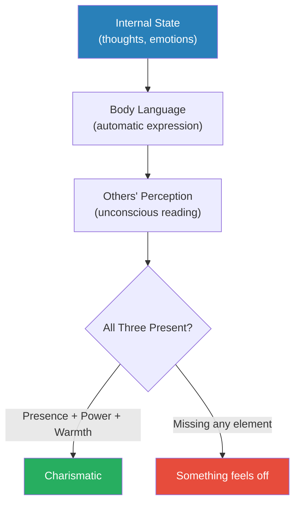
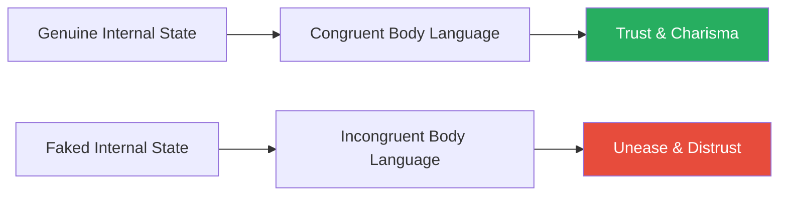
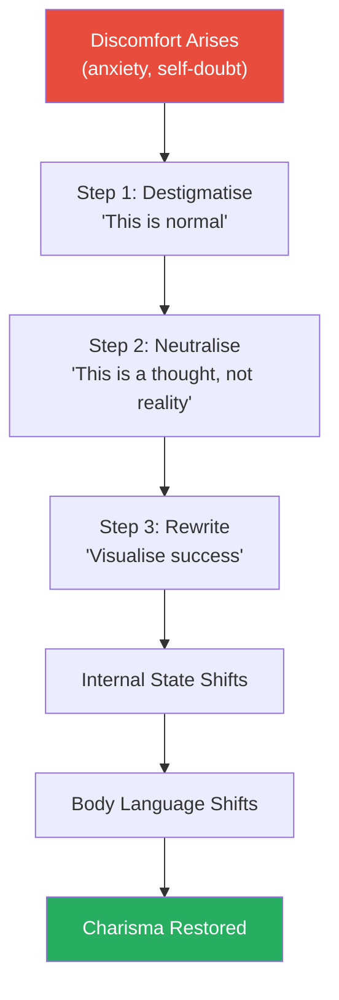
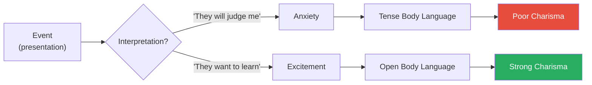
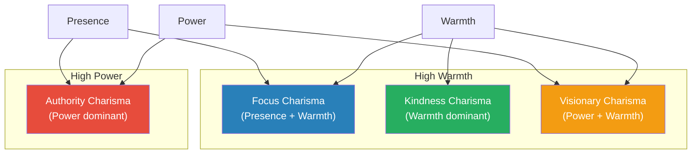
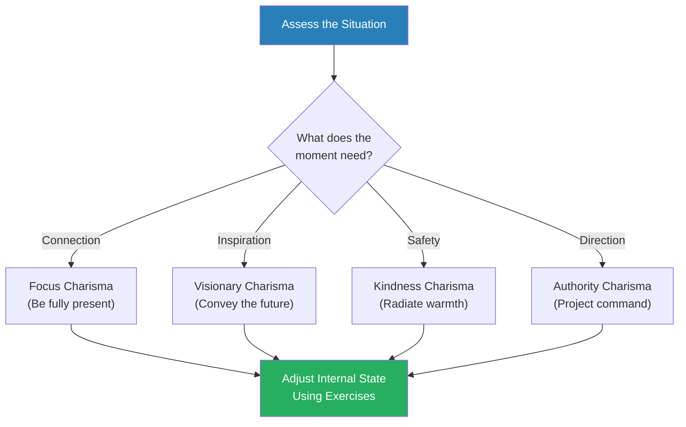
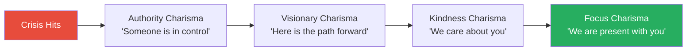
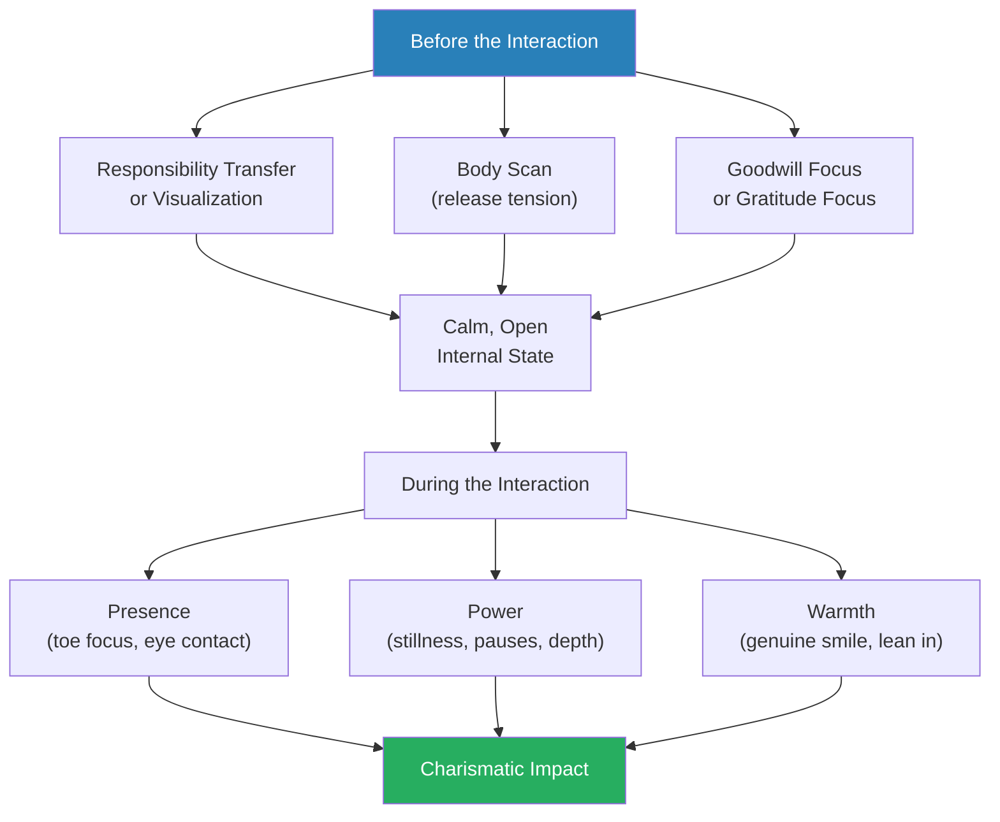
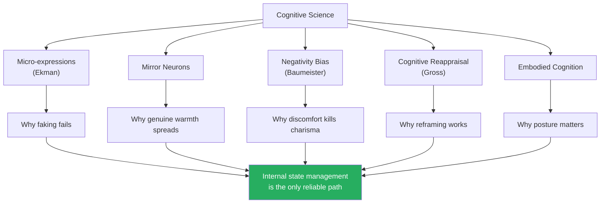

# The Charisma Myth — Olivia Fox Cabane

> Olivia Fox Cabane, an executive coach who lectures at Stanford, Yale, Harvard, and MIT, dismantles the popular belief that charisma is an innate gift — a magical quality that some people are born with and others simply lack.
> Drawing on cognitive science, behavioural psychology, and years of coaching Fortune 500 executives, she demonstrates that charisma is a learnable skill built on three observable behaviours: Presence (full engagement in the moment), Power (the perception that you can affect the world around you), and Warmth (the perception that you genuinely care about others).
> Different combinations of these three elements produce four distinct charisma styles — from Bill Clinton's laser-focused attention to Steve Jobs's electrifying vision to the Dalai Lama's radiating kindness to Colin Powell's commanding authority.
> The real obstacle to charisma is not a lack of technique but internal discomfort — anxiety, self-doubt, and self-criticism that leak through your body language in micro-expressions lasting as little as seventeen milliseconds.
> This is not theory — it is a manual, packed with specific mental exercises you can practise today to shift your internal state and, with it, how every person in the room perceives you.

---

## About the Author

Olivia Fox Cabane is a French-American executive coach and keynote speaker who has lectured on charisma and leadership at Stanford, Yale, Harvard, MIT, and the United Nations. She has coached C-suite executives and rising leaders at Fortune 500 companies including Google, Deloitte, and Citigroup. Before entering executive coaching, she studied at Harvard and the Sorbonne. Her work synthesises cognitive behavioural science, performance psychology, and practical body-language research into actionable techniques that anyone can use to increase their personal magnetism.

---

## The Big Idea

- <b style="color: #2980b9">Charisma is not a fixed personality trait — it is a set of behaviours</b> driven by your internal state, expressed through your body language, and read by others unconsciously
- The formula is deceptively simple: combine **Presence** (full engagement in the current moment), **Power** (the perception that you can affect the world), and **Warmth** (the perception that you genuinely care)
- All three must be present *and perceived by others* through nonverbal signals — your face, posture, voice, and micro-expressions
- Your body language is the delivery mechanism, and it is almost impossible to fake for long
  - The human face produces involuntary micro-expressions lasting 17-50 milliseconds
  - Others read these signals unconsciously — they may not be able to articulate what feels "off," but they feel it
  - This is why the "fake it till you make it" approach to charisma has a ceiling

- <b style="color: #27ae60">The solution is not to fake the body language but to genuinely change the internal state that produces it</b>
- If you can manage your internal state — eliminating anxiety, generating genuine warmth, cultivating real confidence — the right body language follows automatically
- This makes charisma far more accessible than most people believe: you do not need to memorise a catalogue of gestures, you need to learn to manage your own mind
- The book provides specific, research-backed mental exercises to shift your internal state in minutes — visualization, cognitive reframing, responsibility transfer, and goodwill generation

This diagram captures the central engine of the entire book — charisma is an inside-out process, not an outside-in performance.

---

## Key Concepts at a Glance

| Concept | One-line summary |
|---------|-----------------|
| **Presence** | Full moment-to-moment engagement with the person in front of you |
| **Power** | The perception that you have the ability to affect the world around you |
| **Warmth** | The perception that you genuinely care about others' wellbeing |
| **Focus Charisma** | Presence + Warmth — making others feel like the only person in the room |
| **Visionary Charisma** | Power + conviction projected outward — inspiring belief in a future |
| **Kindness Charisma** | Warmth-dominant — radiating unconditional acceptance and goodwill |
| **Authority Charisma** | Power-dominant — projecting status, confidence, and command |
| **Responsibility Transfer** | Mentally handing your worries to a higher power to relieve cognitive load |
| **Destigmatise-Neutralise-Rewrite** | Three-step process for overcoming internal discomfort that kills charisma |
| **Visualization** | Vividly imagining a scenario going perfectly to shift internal state |
| **Goodwill Focus** | Silently wishing the other person well to generate genuine warmth |
| **Cognitive Reappraisal** | Reframing a situation to change the emotions it produces |
| **The Discomfort Equation** | Physical + mental discomfort create micro-tensions that betray you |
| **Vocal Power** | Using pitch, pace, and pauses to project confidence through sound |
| **Alpha Body Language** | Space-claiming, stillness, and vocal depth that signal status |

Each charisma icon dominates one style — Clinton's laser focus, Jobs's electrifying vision, the Dalai Lama's radiating kindness, and Powell's commanding authority — proving that charisma is not a single trait but four distinct configurations of presence, power, and warmth.

Charisma flows from internal state through body language to perception — the techniques (visualization, responsibility transfer) work by shifting the internal state, which automatically produces the right body language without conscious effort.

Presence and goodwill focus deliver visible results on day one — making them the ideal entry points — while power projection and vocal control require weeks of sustained practice before the internal state shifts enough to produce authentic body language.

---

## Part 1: Demystifying Charisma

*Cabane begins by demolishing the myth that charisma is a birthright, then reveals the three measurable behaviours that produce it.*

### Charisma Is a Skill, Not a Gift

- The word "charisma" comes from the Greek *kharisma*, meaning "gift of grace" — implying something divine and unearnable
- This etymology has shaped our cultural belief: either you have it or you don't
- <b style="color: #e74c3c">This belief is wrong — and it keeps people from developing a skill that is entirely within their reach</b>
- Research in behavioural science shows that charisma is not a mystical quality but a set of specific, observable nonverbal behaviours
- These behaviours can be broken down into components, practised individually, and combined
- Cabane's core claim: "Charisma can be turned on and off" — it is a dial, not a light switch permanently wired into your personality
- Even people we consider naturally charismatic — Bill Clinton, Oprah Winfrey, Steve Jobs — learned and refined their charismatic behaviours over decades
- What we call "natural charisma" is usually the result of early social learning — a child who discovered that certain behaviours produced attention and warmth, and unconsciously practised them for years

> [!example] Marilyn Monroe's Subway Experiment
> - In the 1950s, Marilyn Monroe walked through the New York City subway with a journalist beside her
> - Nobody recognised her — she moved through the crowd as an ordinary woman
> - When they emerged onto the street, she turned to her companion and asked: "Do you want to see *her*?"
> - She adjusted her posture, lifted her chin, changed her gait, and shifted her expression
> - Within seconds, a crowd formed — people recognised her immediately
> - Nothing about her physical appearance had changed; everything about her nonverbal signals had
> **The lesson:** Charisma is a switch you can learn to flip.

> [!example] The Charisma Coaching Experiment
> - Cabane describes an experiment where researchers randomly assigned business school students to receive charisma coaching
> - The coached students learned specific techniques: managing their internal state, using pauses, projecting warmth through eye contact
> - After just a few weeks of practice, the coached students were rated significantly more charismatic by independent observers who did not know which students had been coached
> - The uncoached students showed no improvement over the same period
> - The students who improved most were not the ones who started highest — they were the ones who practised most consistently
> **The lesson:** Charisma responds to practice the way any skill does. The starting point matters far less than the effort.

---

### The Three Pillars of Charisma

Every charismatic behaviour Cabane has observed — across cultures, industries, and personality types — traces back to three components. All three must be present and perceivable by others.

**Presence:**
- Being fully engaged in the current moment, with the current person
- Not checking your phone, not planning your next sentence, not scanning the room
- When you are truly present, the other person feels it instantly — they feel *heard*
- Presence is the rarest of the three because modern life trains us to multitask and future-plan constantly
- <b style="color: #27ae60">Presence alone, without power or warmth, creates a sense of respect — the other person feels you are taking them seriously</b>
- Even partial presence is detectable — research suggests people notice a shift in your engagement within a quarter of a second
- Cabane argues that presence is the foundation stone: without it, power reads as arrogance and warmth reads as manipulation

**Power:**
- The perception that you have the ability to affect the world around you — through influence, authority, expertise, or resources
- Communicated through body language: confident posture, space-claiming, vocal depth, measured movements
- Without power, you may seem warm and attentive but ultimately ineffective — people enjoy talking to you but do not follow you
- Power does not require actual authority — it requires the *appearance* of capability and confidence
- Power signals include: taking up physical space, speaking at a deliberate pace, holding a pause without discomfort, maintaining steady eye contact, keeping movements minimal and intentional
- Cabane notes a key distinction: power is not about dominance over others, but about perceived capability to affect outcomes

**Warmth:**
- The perception that you genuinely care about the people around you — that your goodwill toward them is real
- Communicated through open body language, genuine smiles (Duchenne smiles that reach the eyes), leaning in, and vocal warmth
- <b style="color: #e74c3c">Without warmth, power becomes intimidation and presence becomes interrogation</b>
- Warmth is the hardest element to fake because it requires a genuinely caring internal state — your face will betray you within milliseconds if you are performing care you do not feel
- Cabane identifies warmth as the most important element for long-term relationships — people will tolerate gaps in power and even presence, but a perceived lack of warmth creates lasting distrust
- The physiological signature of genuine warmth includes: relaxation in the muscles around the eyes, a slight head tilt, an unconscious forward lean, and vocal patterns that rise and fall with engagement rather than nerves

| Pillar | Body Language Signal | Without It |
|--------|---------------------|------------|
| **Presence** | Eye contact, stillness, responsiveness | You seem distracted and fake |
| **Power** | Confident posture, space-claiming, vocal authority | You seem friendly but ineffective |
| **Warmth** | Open body, real smile, leaning in | You seem competent but cold or threatening |

> [!tip] Core Insight
> You cannot have charisma without all three pillars. Power without warmth is intimidation. Warmth without power is neediness. Presence without either is emptiness. The magic happens when all three are simultaneously perceived.

---

### The Presence Test

*Cabane offers a deceptively simple test for presence — and most people fail it.*

- She asks clients to try an experiment: in your next conversation, focus entirely on the other person for two full minutes without letting your mind wander
- Most people cannot do it — within thirty seconds, their mind drifts to their next meeting, their to-do list, what they will say next, or an evaluation of how the conversation is going
- This is not a character flaw — it is the brain's default mode network doing exactly what it evolved to do: plan, evaluate, and simulate
- But it means that for most people, "being present" is not their default state — it requires deliberate effort
- Cabane compares it to holding a yoga pose: the first few seconds are easy, but maintaining it requires continuous attention and gentle correction
- The good news is that presence, like a yoga pose, gets easier with practice — the neural pathways for sustained attention strengthen with use
- <b style="color: #27ae60">The two-minute presence test is both a diagnostic and a training exercise</b> — try it in your next conversation and notice how quickly your mind wanders

---

### Why You Cannot Fake Charisma

- The human brain evolved to detect deception in social signals — it was a survival advantage to know who was genuinely friendly and who was pretending
- Your face produces involuntary <b style="color: #2980b9">micro-expressions</b> — fleeting movements lasting 17-50 milliseconds that reveal your true emotional state
- Others read these micro-expressions unconsciously — they cannot articulate what they saw, but they register a feeling of something being "off"
- This is why people who try to fake confidence or warmth often trigger distrust instead — the conscious signals say one thing, the micro-expressions say another
- Cabane calls this <b style="color: #e74c3c">incongruence — the gap between your deliberate signals and your involuntary signals</b>
- The only reliable way to eliminate incongruence is to change the internal state that drives the involuntary signals
- Cabane emphasises that we are wired to detect incongruence but not to articulate it:
  - People will say "something about her seemed off" or "I couldn't put my finger on it, but I didn't trust him"
  - They are detecting the micro-expression mismatch without conscious awareness
  - This makes incongruence uniquely dangerous — it creates distrust that the target cannot defend against because the accuser cannot explain the basis for it
- The practical implication is stark: if you feel anxious but try to look confident, most people will unconsciously register the anxiety anyway

> [!example] The Incongruent Smile
> - Cabane describes a common scenario: a manager greets an employee with a broad smile and says "Great to see you!"
> - But the manager is distracted by a problem, and their eyes do not crinkle — the smile is mouth-only
> - The employee unconsciously registers the mismatch and walks away feeling vaguely uneasy
> - The manager has no idea the interaction went poorly — they said all the right words
> - But the micro-expression told the truth: the manager was not present, not warm, and not genuinely pleased
> **The lesson:** Words are easily controlled; micro-expressions are not. Manage the state, not the face.

> [!example] The Politician's Handshake
> - Cabane describes watching a politician at a fundraising event who had clearly been coached to make eye contact, smile, and deliver a firm handshake
> - He performed all three perfectly — but his eyes kept darting to the next person in line while his mouth was still smiling at the current one
> - Each person he greeted walked away feeling slightly used, though none could explain why
> - The politician's internal state was "work the room efficiently" — and that state leaked through despite technically perfect technique
> - The micro-expression of disinterest — the eye-dart — undermined all the trained warmth signals
> **The lesson:** Technique without genuine internal state is worse than no technique at all, because it adds the perception of manipulation to the underlying coldness.

When your internal state is genuine, your body language is congruent and others instinctively trust you; when you are performing, the mismatch triggers distrust.

---

## Part 2: The Obstacles to Charisma

*The biggest enemies of charisma are not skill gaps — they are internal discomfort, mental noise, and self-criticism that leak through your body language no matter how hard you try to hide them.*

### Physical Discomfort

- The most underestimated charisma killer is simple physical discomfort
- If you are hungry, cold, sleep-deprived, or wearing uncomfortable shoes, your body language will reflect it
- Discomfort creates micro-tension in your face and body that others read as irritability, impatience, or coldness
- <b style="color: #27ae60">Cabane's first rule: address physical discomfort before attempting charisma</b>
  - Eat before important meetings
  - Dress for comfort as well as appearance
  - Arrive early enough to adjust to the environment — temperature, noise, seating
  - If you cannot fix the discomfort, acknowledge it mentally ("I am uncomfortable because this room is cold, and that is affecting my face") — the acknowledgment itself reduces its grip on your body language
- Cabane explains the mechanism:
  - Physical discomfort activates the brain's threat-detection system
  - This system redirects cognitive resources away from social engagement and toward managing the discomfort
  - The redirection is automatic and involuntary — you cannot maintain full presence while your body is screaming for attention
  - The resulting body language — tight jaw, narrowed eyes, rigid posture — reads as hostility or withdrawal to others
- Even mild discomfort matters: a slightly tight collar, a chair that is too low, a room that is a few degrees too warm
  - Each of these creates micro-tensions that accumulate and erode your charismatic presence
  - The cumulative effect can be dramatic — a person who is comfortable projects an entirely different energy than a person managing four small discomforts simultaneously

> [!example] The Negotiator's Cold Room
> - Cabane describes a client preparing for a critical negotiation
> - He arrived at the meeting room early and found it unusually cold — the air conditioning was on full blast
> - Rather than ignoring it, he asked the receptionist to adjust the temperature
> - When the other party arrived, both sides were physically comfortable and the conversation flowed naturally
> - His counterpart later commented on how relaxed and confident he seemed
> **The lesson:** Charisma starts with physical comfort. Fix the environment before you try to fix your face.

> [!example] The Speaker's Tight Shoes
> - A client was preparing for a keynote address at a major conference
> - She had bought new shoes for the occasion — stylish but tight
> - During the first ten minutes of her talk, the discomfort in her feet produced micro-tension in her face and stiffness in her movement
> - The audience read her body language as nervousness — though she was not nervous, she was uncomfortable
> - After the event, she switched to well-fitted shoes for every subsequent speaking engagement
> - The difference in audience feedback was immediate — she was rated as more confident, more engaging, and more likeable
> **The lesson:** Your audience cannot see your shoes, but they can see the discomfort your shoes produce.

---

### Mental Discomfort

*The real enemies of charisma live inside your head — anxiety, self-doubt, and the relentless inner critic that tells you everyone in the room can see through you.*

- Mental discomfort is far more damaging than physical discomfort because it generates a cascade of negative body language signals
- <b style="color: #2980b9">Anxiety</b> produces tension in the jaw, shoulders, and forehead — creating a face that reads as closed, defensive, or hostile
- <b style="color: #2980b9">Self-doubt</b> produces hesitant movements, averted eye contact, and vocal uncertainty — signals that read as lack of power
- <b style="color: #2980b9">Self-criticism</b> produces internal distraction — you are so busy judging yourself that you cannot be present with the other person
- These internal states are incredibly common — even among the most successful people Cabane coaches
- <b style="color: #e74c3c">The myth that confident people do not experience self-doubt is itself one of the biggest obstacles to charisma</b> — it makes people think their doubt is uniquely disqualifying when it is actually universal
- Cabane identifies a vicious cycle:
  - Self-doubt produces negative body language
  - You notice the negative body language (or sense that the interaction is going poorly)
  - This produces more self-doubt
  - Which produces worse body language
  - And the spiral continues until you withdraw from the interaction entirely
- Breaking the cycle requires intervening at the source — the internal state — not at the symptom — the body language

> [!example] The Imposter Syndrome Executive
> - Cabane describes coaching a newly promoted VP who was convinced she had been promoted beyond her competence
> - In meetings with her new peers, her imposter syndrome produced subtle but detectable body language: she spoke slightly too fast, her eyes dropped when challenged, and she qualified her statements with "I think" and "maybe"
> - Her peers read these signals as uncertainty about her ideas — confirming the very perception she feared
> - Through the Destigmatise-Neutralise-Rewrite process, she learned that imposter syndrome affects an estimated 70% of people at some point in their careers
> - Knowing that her experience was normal — not a unique failing — reduced the shame component, which reduced the body language leakage
> - Within two months, her peers described her as "more authoritative" — though she reported feeling exactly as uncertain as before
> **The lesson:** You do not need to eliminate self-doubt to be charismatic. You need to stop treating self-doubt as evidence that something is wrong with you.

---

### The Negativity Bias

- The human brain has a built-in <b style="color: #2980b9">negativity bias</b> — it gives more weight to negative experiences, threats, and outcomes than to positive ones
- This bias was essential for survival on the savannah: the cost of missing a threat was death, while the cost of missing an opportunity was merely inconvenience
- In modern social settings, this bias creates chronic over-detection of potential threats:
  - "That person looked at me strangely — they must think I am incompetent"
  - "The room went quiet when I spoke — I must have said something wrong"
  - "She did not laugh at my joke — she does not like me"
- None of these interpretations may be accurate, but the negativity bias makes them feel true
- Once triggered, each negative interpretation creates discomfort, which creates negative body language, which creates a self-fulfilling prophecy
- Cabane identifies a specific mechanism: the negativity bias makes negative social signals roughly three to five times as impactful as positive ones
  - One frown in a sea of smiles captures your attention
  - One critical comment after ten compliments dominates your internal dialogue
  - One perceived slight during an otherwise warm interaction becomes the only thing you remember
- This asymmetry means that managing the negativity bias is not about being positive — it is about not letting the negative overwhelm the accurate

> [!tip] Core Insight
> Your brain is wired to scan for threats, not to radiate warmth. Charisma requires deliberately overriding your default programming — not through willpower, but through specific mental exercises that change the signal at the source.

---

### Uncertainty and the Wandering Mind

- Humans crave certainty — the brain treats uncertainty as a form of pain
- When you do not know how a meeting, presentation, or conversation will go, your brain enters threat-detection mode
- This mode is incompatible with Presence — you cannot be fully here if part of your brain is scanning possible futures for danger
- Cabane identifies <b style="color: #2980b9">the wandering mind</b> as one of the primary destroyers of charismatic presence:
  - You are in a conversation, but you are mentally rehearsing what you will say next
  - You are at a dinner, but you are worrying about a deadline tomorrow
  - You are meeting someone new, but you are evaluating whether they like you
- Each time your mind wanders, the person in front of you registers a subtle drop in engagement — your eyes glaze, your responses slow by a fraction of a second, your body language shifts from open to neutral
- They cannot articulate what changed, but they feel less important to you — and with that feeling, your charisma drops
- Cabane explains why the wandering mind is so persistent:
  - The brain's default mode network — active when you are not focused on a specific task — is designed to wander
  - It plans the future, replays the past, and evaluates the self
  - This default mode is useful for reflection but destructive for presence
  - Charismatic presence requires temporarily overriding the default mode and engaging the task-positive network — the part of the brain focused on the here and now
  - This is exactly what meditation trains, which is why Cabane draws heavily on mindfulness techniques

> [!example] The Distracted CEO
> - Cabane recounts coaching a CEO who was technically brilliant but consistently received feedback that he seemed "distant" and "hard to connect with"
> - In conversation, he was always two steps ahead — thinking about his next question or formulating his response before the other person finished speaking
> - His eye contact would break for microseconds as his mind processed, and his responses came a beat too fast — signalling that he had not truly listened
> - After practising presence exercises for two weeks, he began pausing before responding, maintaining eye contact through the other person's full statement
> - His direct reports described the change as "dramatic" — they felt he had become a completely different leader
> **The lesson:** The most powerful charisma technique is also the simplest — just be fully here.

> [!example] The Dinner Party Test
> - Cabane asks readers to recall the last time they were at a dinner party and spoke to someone who gave them their full, undivided attention
> - No phone-checking. No eye-darting. No premature responses. Just steady, warm, engaged presence
> - Most people can recall this experience vividly — and they remember the person who gave it to them
> - Now Cabane asks: how often do *you* give that gift to others?
> - Most people admit the answer is rarely — not because they do not care, but because their mind wanders without their permission
> - The gap between how much we value presence in others and how rarely we offer it ourselves is the gap that charisma training closes
> **The lesson:** You already know what charismatic presence feels like when you receive it. The challenge is learning to give it.

> [!example] The Self-Doubt Spiral at the Conference
> - Cabane describes a young executive who attended an industry conference feeling excited and prepared
> - During the first panel, she noticed a senior leader in the audience and immediately began comparing herself: "She has twenty years more experience. Everyone here probably thinks I do not belong."
> - The self-doubt produced visible changes: her voice thinned, her gestures became smaller, and she began qualifying her statements with "I might be wrong, but..."
> - A colleague pulled her aside and said: "You seem different today — less confident than usual"
> - The colleague's observation deepened the spiral — now she had external confirmation that her doubt was visible
> - Cabane taught her the Destigmatise step: recognising that every person at that conference had felt the same doubt at some point in their career
> - At the next conference, she spent five minutes before her session acknowledging the doubt ("this is normal"), neutralising it ("this is a thought, not a fact"), and rewriting ("I was invited because my work has value")
> - The difference in her presence and her audience's response was dramatic
> **The lesson:** The spiral of self-doubt is not a sign that you do not belong. It is a sign that you are human. Managing it — not eliminating it — is the skill.

---

### The Comparison Trap

- Cabane identifies <b style="color: #2980b9">the comparison trap</b> as a specific form of mental discomfort that particularly undermines charisma in group settings
- When you enter a room and unconsciously rank yourself against others — who is more successful, more attractive, more articulate — the comparison absorbs cognitive resources that should be devoted to presence
- If the comparison is unfavourable, it produces self-doubt, which produces submissive body language
- If the comparison is favourable, it can produce a subtle arrogance that reads as lack of warmth
- <b style="color: #e74c3c">Either direction of comparison undermines charisma</b> — self-doubt kills power signals, and superiority kills warmth signals
- Cabane's solution is not to stop comparing (which is nearly impossible — comparison is automatic) but to recognise the comparison as a thought, not a fact, and redirect attention to the present moment
- She offers a specific mental technique for escaping the comparison trap:
  - When you catch yourself comparing, label it: "I am doing the comparison thing"
  - Remind yourself that comparison is a cognitive habit, not a useful analysis
  - Redirect to curiosity: instead of "Am I better or worse than this person?" ask "What can I learn from this person? What might they teach me?"
  - Curiosity engages the same cognitive resources that comparison uses — but curiosity produces presence and warmth, while comparison produces anxiety and distance
- Cabane notes that the comparison trap is particularly insidious at industry events, conferences, and networking functions — exactly the situations where charisma matters most
  - The irony: the more you need charisma, the more likely you are to fall into the comparison trap, which destroys charisma
  - Breaking the cycle requires pre-emptive action: before entering a high-comparison environment, spend thirty seconds setting an intention to be curious rather than evaluative

> [!example] The Conference Comparison Trap
> - A client of Cabane's attended an industry conference where several speakers had more experience, bigger companies, and more public recognition
> - Throughout the first day, he unconsciously compared himself to every speaker — and found himself wanting each time
> - By the afternoon, his body language had shifted: he was sitting in the back, arms crossed, speaking to no one
> - When someone approached him for a conversation, he responded with clipped, defensive energy — the internal comparison had produced external hostility
> - The next morning, Cabane coached him to replace comparison with curiosity: before each session, he would silently ask "What can this person teach me?"
> - The shift from evaluative to curious changed his body language entirely — he sat forward, asked questions, and connected with three speakers he had previously been intimidated by
> **The lesson:** Comparison produces distance. Curiosity produces connection. Both use the same cognitive resources — you choose which one gets them.

---

## Part 3: Overcoming the Obstacles

*Cabane introduces a systematic three-step process for neutralising the internal discomfort that kills charisma, plus her single most powerful exercise: the Responsibility Transfer.*

### The Three-Step Process: Destigmatise, Neutralise, Rewrite

This is Cabane's core framework for managing the internal discomfort that blocks charisma. Each step builds on the previous one.

> [!abstract] The Destigmatise-Neutralise-Rewrite Process
> 1. **Destigmatise** — Recognise that what you are feeling is normal and universal. You are not uniquely broken.
> 2. **Neutralise** — Separate the thought from reality. "I am having a thought about failing" is very different from "I am going to fail."
> 3. **Rewrite** — Visualise an alternative scenario. Imagine the situation going well in vivid sensory detail.

**Step 1: Destigmatise**
- The first step is to recognise that whatever discomfort you are feeling — imposter syndrome, anxiety, self-doubt — is a normal human experience, not a unique personal failing
- <b style="color: #27ae60">Cabane's key move: shame about the feeling is worse than the feeling itself</b>
  - Feeling nervous before a presentation is manageable
  - Feeling nervous *and* ashamed of being nervous creates a spiral
  - Destigmatising breaks the spiral by removing the shame layer
- She asks clients to imagine that everyone in the room has experienced the same anxiety at some point — because they have
- Research shows that even the most charismatic people experience self-doubt; the difference is that they do not treat it as evidence that something is wrong with them
- Cabane sometimes goes further: she asks clients to imagine that twenty of the world's most admired leaders are standing behind them, nodding, saying "yes, we felt that too"
  - The image is deliberately vivid because the brain responds to vivid imagery
  - It connects the client's private shame to a universal human experience
  - Once the shame dissolves, the discomfort becomes much more manageable

**Step 2: Neutralise**
- Once you have destigmatised the feeling, the next step is to separate the thought from reality
- Cabane draws on <b style="color: #2980b9">cognitive behavioural science</b>: thoughts are not facts
- "I am going to embarrass myself" is a prediction, not a reality
- Reframing it as "I am experiencing a thought about embarrassing myself" creates distance between you and the thought
- That distance reduces the physiological response — your body relaxes because the brain is no longer treating the thought as an imminent threat
- The technique is simple but requires practice:
  - Notice the negative thought
  - Label it: "This is my brain's negativity bias generating a worst-case scenario"
  - Observe it without engaging: let it pass through like a cloud
- Cabane emphasises the difference between suppressing a thought and neutralising it:
  - Suppression ("don't think about it") actually increases the thought's power — the brain doubles down on what it is told to ignore
  - Neutralisation ("I notice I am having this thought") acknowledges the thought without giving it authority
  - The thought loses its grip not because you fight it, but because you stop treating it as a command

**Step 3: Rewrite**
- The final step leverages a powerful quirk of the human brain: <b style="color: #2980b9">it cannot fully distinguish between vivid imagination and lived reality</b>
- When you vividly imagine a scenario going well — seeing the faces, hearing the voices, feeling the handshakes — your brain generates many of the same neurochemical responses it would during the actual event
- This shifts your internal state from anxiety to confidence, and the shift shows in your body language
- Cabane recommends spending 1-2 minutes before any high-stakes interaction visualising it going perfectly:
  - See the room
  - See the people smiling
  - Feel your own confidence
  - Hear your voice, clear and steady
  - See the successful conclusion
- The visualisation must be sensory-rich to work — vague positive thinking ("it'll be fine") does not engage the brain's embodied simulation systems
- Cabane notes that elite athletes have used this technique for decades: a diver visualises the perfect dive before stepping onto the board, a gymnast rehearses the routine mentally before performing it physically
- The same neuroscience applies to social situations: your brain cannot fully distinguish between a vividly imagined successful interaction and a real one

> [!example] The Nervous Speaker
> - A client of Cabane's had a paralysing fear of public speaking that was limiting her career
> - Before every presentation, she would imagine everything going wrong — forgetting her lines, the audience looking bored, her voice cracking
> - These vivid negative visualisations produced exactly the body language she feared: tension, shallow breathing, darting eyes
> - Cabane taught her to replace the catastrophic visualisations with detailed positive ones — imagining the audience leaning forward, nodding, laughing at her stories
> - After six weeks of practice, the client delivered a keynote to 400 people and received a standing ovation
> - She later said: "The audience I imagined was kinder than the real one — and my body believed it"
> **The lesson:** Your brain does not distinguish well between vivid imagination and reality. Use that flaw as a feature.

> [!example] The Anxious Job Seeker
> - Cabane describes a client who had been unemployed for several months and was approaching interviews with mounting desperation
> - The desperation produced body language — hunched shoulders, a tight smile, an overeager voice — that interviewers read as low confidence
> - Before his next interview, Cabane walked him through a full Destigmatise-Neutralise-Rewrite cycle:
>   - Destigmatise: "Every person who has ever been unemployed has felt this desperation. It is human, not weak."
>   - Neutralise: "I am having thoughts about not getting this job. Those thoughts are predictions, not facts."
>   - Rewrite: he spent five minutes vividly imagining the interview going perfectly — the interviewer smiling, his own voice steady, a confident handshake at the end
> - He entered the interview with visibly different body language — shoulders back, pace slower, smile genuine
> - He received the offer. The hiring manager later mentioned that his "calm confidence" had been a decisive factor
> **The lesson:** The three-step process works because it addresses the root cause, not the symptom.

The three-step process works because it addresses the root cause — the internal state — rather than trying to override the symptoms through forced body language.

---

### The Responsibility Transfer

*This is Cabane's single most powerful exercise — and the one that surprises clients the most.*

- The <b style="color: #2980b9">Responsibility Transfer</b> involves mentally handing over your problems, worries, and anxieties to a benevolent entity — God, the universe, fate, luck, or whatever concept you are comfortable with
- This is not about religious belief. It is about temporarily relieving the cognitive burden of worry
- The mechanism is psychological, not metaphysical:
  - When you carry the weight of "I must solve everything, I must control every outcome," your body reflects that burden — shoulders rise, jaw tightens, breathing shallows
  - When you mentally hand over that burden — even for ten minutes — the physical tension releases
  - Your shoulders drop, your face softens, your breathing deepens
  - Others immediately perceive you as more present, more confident, and more at ease
- Cabane emphasises that you do not need to believe in a higher power for this to work — you just need to be willing to act *as if* you can hand the burden over
- The exercise works because the brain processes imagined scenarios and real scenarios through overlapping neural circuits
  - When you imagine handing over the weight, the brain partially processes the weight as *actually lifted*
  - This produces a real physiological change: reduced cortisol, lower muscle tension, deeper breathing
  - The physiological change produces a real body language change
  - And the body language change produces a real change in how others perceive you

> [!abstract] The Responsibility Transfer Exercise
> 1. Sit or stand comfortably and close your eyes
> 2. Take two or three deep breaths
> 3. Imagine lifting the weight of your current worries off your shoulders — visualise it as a physical weight
> 4. Hand this weight to whatever entity you choose: God, the universe, fate, a benevolent force
> 5. Imagine this entity taking the weight willingly and completely — they have it, you do not
> 6. Tell yourself: "For the next ten minutes, it is not my responsibility. Someone (or something) else has it."
> 7. Notice your body — the shoulders dropping, the jaw unclenching, the breathing deepening
> 8. Maintain this state as you enter the interaction

- Cabane reports that this exercise produces visible changes in body language within sixty seconds
- Clients consistently describe it as the most immediately impactful technique in her toolkit
- <b style="color: #27ae60">It works because charisma requires ease — and ease requires the absence of the felt need to control</b>
- The exercise can be done anywhere — in a parked car before a meeting, in a bathroom before a presentation, at your desk before a phone call
- It does not require privacy or silence — only thirty seconds of focused mental imagery

> [!example] The Executive Before the Board
> - A Cabane client, a CFO at a major corporation, had to present a difficult quarterly report to the board
> - In the hours before the meeting, his anxiety was producing visibly tense body language — crossed arms, furrowed brow, clipped speech
> - Cabane guided him through a responsibility transfer: he imagined placing the weight of the board's reaction on a shelf and telling himself "the outcome is not mine to control"
> - Within minutes, his posture shifted — shoulders dropped, voice deepened, face relaxed
> - The board meeting went well — not because the numbers were better, but because his calm confidence signalled competence even while delivering bad news
> **The lesson:** You cannot control the outcome. You can control the internal state you bring to the moment. The Responsibility Transfer achieves this faster than any other technique.

> [!example] The Surgeon Before Surgery
> - Cabane describes a surgeon who used the Responsibility Transfer before every major operation
> - He would spend sixty seconds in the scrub room imagining handing the outcome to the universe — not abdicating his responsibility to perform well, but releasing the weight of the outcome
> - The distinction was crucial: he still applied every ounce of his skill and training during the surgery
> - But by releasing the outcome, he eliminated the tension that would have produced slight tremors, shallow breathing, and tunnel vision
> - His colleagues noted that his hands were steadier and his decision-making clearer on days when he used the technique
> **The lesson:** Releasing the outcome does not mean caring less. It means freeing your body from the tension of trying to control what you cannot control.

---

### The Body Scan Technique

*Cabane introduces a rapid body awareness technique drawn from mindfulness practice that can reset your physical state in under a minute.*

- The <b style="color: #2980b9">body scan</b> is a complement to the Responsibility Transfer — it targets physical tension directly rather than working through cognitive reframing
- The technique:
  - Starting from the top of your head, rapidly scan downward through your body
  - Notice any points of tension: forehead, jaw, shoulders, chest, stomach, hands
  - At each point, consciously release the tension — let the muscles soften
  - The entire scan takes thirty to sixty seconds
- Cabane explains why this works:
  - Anxiety and stress produce physical tension patterns that are remarkably consistent across people
  - The jaw tightens, the shoulders rise, the hands clench, the breathing shallows
  - These tension patterns produce the body language that others read as stress, hostility, or withdrawal
  - By deliberately releasing the tension, you change the body language directly — and the changed body language feeds back into a calmer internal state
- The body scan is particularly useful when you do not have time for a full Responsibility Transfer — in the seconds before walking into a room, you can quickly scan and release

> [!abstract] 30-Second Body Scan
> 1. Notice your forehead — is it furrowed? Smooth it
> 2. Notice your jaw — is it clenched? Let it drop slightly
> 3. Notice your shoulders — are they raised? Let them drop
> 4. Notice your hands — are they clenched? Open them
> 5. Take one deep breath into your abdomen
> 6. Enter the interaction

---

### Warming Up Your Internal State

*Beyond removing obstacles, Cabane teaches specific techniques for actively generating the warmth, confidence, and goodwill that charisma requires.*

**The Gratitude Focus:**
- Before interacting with someone, mentally identify three things you genuinely appreciate about them
- These can be small: "They always show up on time." "They care about their team." "They have a great sense of humour."
- The appreciation does not need to be profound — it just needs to be genuine
- The act of focusing on what you appreciate about someone shifts your internal state from neutral (or anxious) to warm
- <b style="color: #27ae60">The warmth shows immediately in your face</b> — your eyes soften, your expression opens, your voice warms by a fraction of a tone
- Others cannot identify what changed, but they feel more welcomed and valued by you
- Cabane explains the neuroscience: when you think appreciative thoughts, the brain releases oxytocin — the same hormone involved in bonding and trust
- This oxytocin shift produces genuine warmth signals that others detect unconsciously

**The Metta (Loving-Kindness) Approach:**
- For situations where you must interact with someone you find difficult, Cabane borrows from Buddhist metta meditation
- The technique: silently direct phrases of goodwill toward the person:
  - "May this person be happy"
  - "May this person be free from suffering"
  - "May this person find what they are looking for"
- You do not need to believe the phrases or feel anything initially — the act of silently repeating them shifts the internal state over 30-60 seconds
- Cabane reports that clients who use this technique before meetings with difficult colleagues consistently describe the interaction going better than expected
- The mechanism: by generating goodwill internally, your body language shifts toward warmth, which the other person reads and mirrors unconsciously
- The metta approach is particularly useful for people who struggle to find anything to appreciate about a specific person — the goodwill phrases bypass the need for specific positive attributes and generate warmth toward the person's humanity

> [!example] The Hostile Client Meeting
> - A consultant Cabane coached was dreading a meeting with a client who had been openly critical and dismissive in previous interactions
> - Before the meeting, she spent two minutes silently wishing the client well: "May he find what he is looking for. May this meeting serve both of us."
> - She entered the room with softer body language than usual — her shoulders were down, her face was open, her voice was warmer
> - The client, who had expected defensiveness, responded to her warmth with unexpected openness
> - The meeting, which she had anticipated lasting a tense twenty minutes, ran to ninety minutes of productive collaboration
> - She later said: "I did not change my arguments. I changed my face."
> **The lesson:** You cannot control other people's behaviour, but you can change the body language you bring to the interaction — and others respond to body language before they respond to words.

---

### The Voice as a Charisma Instrument

- Cabane devotes significant attention to vocal qualities as a charisma signal, often overlooked in favour of visual body language
- The voice communicates power, warmth, and confidence independently of the words it carries
- <b style="color: #2980b9">Key vocal signals of charisma:</b>
  - **Depth** — A voice that resonates from the chest (not the throat) signals calm authority
  - **Pace** — Speaking slightly slower than conversational norm signals confidence and power; rushing signals anxiety
  - **Volume** — Moderate volume with variation signals engagement; too loud signals aggression; too quiet signals submission
  - **Inflection** — Ending statements with a downward inflection signals certainty; ending with an upward inflection (uptalk) signals uncertainty and deference
  - **The pause** — Silence before and after key points signals that you believe your words are worth waiting for
- <b style="color: #e74c3c">Uptalk — ending statements as if they were questions — is one of the most common charisma killers</b> because it signals to the listener that you are not sure of your own statements
- Cabane recommends practising vocal depth by humming for thirty seconds before important interactions — this relaxes the throat and drops the voice to its natural, lower register
- She also recommends a breathing exercise: breathe deeply into the abdomen (not the chest) to lower overall vocal pitch and create the resonance associated with authority
- The voice is the only charisma signal that works on the phone and in virtual meetings — where body language is reduced or absent, vocal quality carries the full weight of your charismatic presence

> [!example] The Phone Interview Breakthrough
> - Cabane describes a client who was consistently passed over in phone interviews despite excellent qualifications
> - When she recorded a practice call, the problem was immediately obvious: her voice was thin, fast, and ended every statement with an upward inflection
> - On the phone, without body language to compensate, the vocal pattern made her sound uncertain and junior
> - Cabane prescribed three changes: breathe from the abdomen before speaking, slow her pace by 20%, and end statements with a downward inflection
> - She practised for two weeks by recording herself and playing back the recordings
> - In her next phone interview, the hiring manager said: "You have a really confident voice — I could tell you'd be great to work with"
> - The same person, the same qualifications, the same answers — but a different voice produced a different outcome
> **The lesson:** On the phone, your voice IS your charisma. Every element of presence, power, and warmth must be conveyed through sound alone.

> [!abstract] Vocal Warm-Up Routine (2 Minutes)
> 1. Take five deep abdominal breaths — this relaxes the throat and lowers pitch
> 2. Hum at your natural pitch for 15 seconds — feel the vibration in your chest, not your throat
> 3. Speak a few practice sentences at a deliberately slow pace
> 4. Practice ending each sentence with a downward inflection
> 5. Speak one sentence, then pause for a full two seconds before the next — train yourself to be comfortable with silence

| Vocal Quality | Charisma Signal | Common Mistake |
|--------------|----------------|----------------|
| **Deep pitch** | Confidence, authority | Speaking from the throat (tight, thin voice) |
| **Slow pace** | Power, certainty | Rushing to fill silence (signals anxiety) |
| **Downward inflection** | Assertiveness, conviction | Uptalk on statements (signals seeking approval) |
| **Strategic pauses** | Gravitas, importance | Filling every silence (signals discomfort) |
| **Volume variation** | Engagement, emotion | Monotone delivery (signals detachment) |

> [!tip] Core Insight
> Your voice tells others whether you believe what you are saying. A deep, steady, downward-inflecting voice says "I am certain." A high, fast, upward-inflecting voice says "Am I making sense? Do you approve?" Manage the voice, and you manage the perception of confidence.

### The Power of the Pause

- Cabane identifies <b style="color: #2980b9">the deliberate pause</b> as one of the simplest yet most underused charisma techniques
- In conversation, most people rush to fill silence — because silence feels uncomfortable
- But silence communicates power:
  - A person who can sit in silence without discomfort signals that they do not need to perform
  - A pause before responding signals that you are thinking, not just reacting
  - A pause after making a point signals that you believe the point is worth absorbing
- <b style="color: #27ae60">The pause is the vocal equivalent of stillness</b> — and stillness is a core power signal
- Cabane recommends practising the pause in low-stakes situations:
  - When a colleague asks you a question, wait two seconds before responding
  - When you finish a sentence in conversation, let the silence hang for a beat before continuing
  - When someone makes a point you disagree with, pause rather than immediately countering
- The initial discomfort of pausing fades quickly — and the effect on others is immediate
  - They perceive you as more thoughtful
  - They give more weight to what you say (because you appear to give weight to it yourself)
  - They feel more respected (because your pause suggests you are taking their words seriously)

> [!example] The Lawyer Who Learned to Pause
> - Cabane describes coaching a litigator who was technically excellent but whose rapid-fire speaking style made juries feel overwhelmed rather than persuaded
> - In court, he would deliver closing arguments at full speed, afraid that any pause would lose the jury's attention
> - Cabane taught him to insert deliberate pauses after each key point — just two seconds of silence
> - The effect was transformative: jurors leaned forward during the pauses, absorbing the point
> - His win rate improved measurably — not because his arguments were better, but because the pauses gave the jury time to be persuaded
> **The lesson:** Speed signals anxiety. Pauses signal authority. Give your audience time to feel the weight of your words.

---

### Cognitive Reappraisal

- Beyond the three-step process and the Responsibility Transfer, Cabane introduces <b style="color: #2980b9">cognitive reappraisal</b> — the practice of deliberately reframing a situation to change the emotion it produces
- This is not positive thinking or denial — it is choosing a different but equally valid interpretation of events
- Examples:
  - Instead of "This audience is going to judge me," try "This audience showed up because they want to learn from me"
  - Instead of "My boss is angry at me," try "My boss is under pressure and is expressing frustration about the situation, not about me"
  - Instead of "I am terrified," try "I am excited — the physiological signature is identical"
- Research by psychologist James Gross at Stanford shows that cognitive reappraisal is one of the most effective emotion regulation strategies available — it changes not just the feeling but the physiological response
- <b style="color: #27ae60">The reframe must be believable to work</b> — you cannot tell yourself "this presentation does not matter" when you know it does, but you can tell yourself "I have prepared well and I am ready"
- Cabane notes a particularly useful reframe for anxiety: relabelling it as excitement
  - Anxiety and excitement share nearly identical physiological signatures: increased heart rate, heightened alertness, adrenaline release
  - The difference is the label your brain applies: "this is a threat" versus "this is an opportunity"
  - Research by Alison Wood Brooks at Harvard Business School found that people who said "I am excited" before a high-pressure task performed significantly better than those who tried to calm down
  - Trying to calm down is fighting your physiology; relabelling the arousal as excitement works *with* it

The same physiological arousal produces completely different body language depending on the interpretation you assign to it.

---

## Part 4: The Four Charisma Styles

*Not all charisma looks the same. Cabane identifies four distinct styles, each suited to different situations, personalities, and goals.*

### The Charisma Style Map

| Style | Primary Elements | Feels Like | Iconic Example |
|-------|-----------------|------------|----------------|
| **Focus** | Presence + Warmth | "This person is completely absorbed in me" | Bill Clinton |
| **Visionary** | Power + Warmth (projected outward) | "This person sees a future I want to join" | Steve Jobs |
| **Kindness** | Warmth (dominant) | "This person genuinely, unconditionally cares" | Dalai Lama |
| **Authority** | Power (dominant) | "This person is in charge and knows it" | Colin Powell |

Each style sits at a different point in the Presence-Power-Warmth space, producing a distinct effect on others.

---

### Focus Charisma

*The most universally applicable and easiest to learn — because it requires only one thing: being fully present.*

- <b style="color: #2980b9">Focus Charisma</b> is what you experience when someone gives you their complete, undivided attention
- They are not checking their phone. They are not scanning the room. They are not formulating their next clever remark. They are *here*, with *you*, right now
- The effect is extraordinary — people feel seen, heard, and valued in a way they rarely experience
- Focus charisma makes others feel like the most important person in the room

**Why it works:**
- Genuine attention is so rare in modern life that receiving it feels like a gift
- When someone is truly present with you, your brain registers it as a signal of respect and care
- This activates the warmth perception — the person must care about me, or why would they pay such close attention?
- The attention also signals power — someone confident in their own position does not need to scan the room for threats or opportunities
- Cabane notes that focus charisma has an additional effect that other styles lack: it makes the *receiver* feel more charismatic
  - When someone gives you their full attention, you become more articulate, more animated, more yourself
  - You associate that feeling with the person who gave it to you
  - This is why people who experience Bill Clinton's attention describe it as intoxicating — they felt like the best version of themselves in his presence

**How to develop it:**
- The core exercise is simple: during a conversation, focus entirely on the other person
- When your mind wanders — to your next meeting, to your phone, to what you will say next — notice the wandering and bring it back
- <b style="color: #27ae60">Focus on the sensation of your toes touching the ground</b> — this is Cabane's favourite grounding technique. It sounds absurd, but it works because it pulls your attention into the present moment and your body, which is where presence lives
- Maintain eye contact through the other person's full statement before looking away
- Pause a full beat after they finish speaking before you respond — this signals that you are absorbing, not just waiting for your turn
- When you notice your mind wandering mid-conversation, do not panic — simply notice the drift and return your attention to the person. The return is what matters, not the lapse
- Cabane notes that even brief lapses in presence are detectable — research suggests that listeners register a shift in your engagement within a quarter of a second
- The investment is small (full attention for five minutes) but the return is enormous (the other person remembers you as one of the most engaging people they have ever met)

> [!abstract] Focus Charisma Practice Technique
> 1. Before entering a conversation, take one breath and set the intention: "For the next few minutes, this person has my complete attention"
> 2. Focus on the sensation of your feet on the ground to anchor yourself in the present
> 3. Look at the person. Notice the colour of their eyes
> 4. Listen to their words without formulating your response
> 5. When your mind wanders, notice the drift without judgment and return to the person
> 6. After they finish speaking, pause one full beat before responding
> 7. Repeat steps 3-6 throughout the conversation

> [!example] Bill Clinton's Legendary Presence
> - Bill Clinton is the archetype of Focus Charisma
> - Multiple people who have met him describe the same experience: for the duration of your conversation, you feel like the only person in the world
> - His eye contact is unwavering, his body is angled toward you, and his responses show that he has genuinely listened — not just heard, but absorbed
> - Cabane notes that Clinton's Focus Charisma operates even in rooms of thousands — he makes brief eye contact with individuals and gives each person a moment of full attention
> - This is not a natural gift he was born with — it is a skill he developed and maintained through deliberate practice of presence
> **The lesson:** You do not need power or status to be charismatic. You need presence. And presence is available to everyone.

> [!example] The Venture Capitalist Who Listened
> - Cabane describes a venture capitalist known for making entrepreneurs feel uniquely valued during pitch meetings
> - His secret was not analytical brilliance — it was that he put down his phone, closed his laptop, and gave each presenter his complete attention for the full duration of their pitch
> - Entrepreneurs who pitched to him reported feeling "heard" in a way they rarely experienced with other investors
> - Several chose to work with him even when other VCs offered better terms — because they trusted him more
> **The lesson:** Focus charisma creates trust, and trust creates influence.

---

### Visionary Charisma

*The style that inspires movements, companies, and revolutions — because it makes others believe in a future they want to be part of.*

- <b style="color: #2980b9">Visionary Charisma</b> projects power and warmth outward — not toward the person in front of you specifically, but toward a compelling vision of the future
- It makes others feel that you can see something they cannot yet see, and that you will lead them there
- This is the charisma of founders, revolutionaries, and transformational leaders

**Why it works:**
- Humans are drawn to certainty, especially in uncertain times
- A person who radiates conviction about the future provides a psychological anchor — they reduce the anxiety of not knowing what comes next
- Visionary charisma also activates the power perception — someone who sees the future clearly seems capable of shaping it
- The warmth component comes from inclusion: "I see this future, and *you* are part of it"
- Cabane explains the neuroscience: when you hear someone describe a future with total conviction, your brain partially simulates that future as if it were already happening
  - This is why visionary speeches produce physical responses — goosebumps, tears, surges of energy
  - The listener's brain is not just processing words; it is experiencing a simulated reality
  - The more vivid and specific the vision, the stronger the simulation — and the stronger the charismatic effect

**The critical requirement — genuine belief:**
- <b style="color: #e74c3c">Visionary charisma cannot be faked</b> — it requires genuine conviction
- If you do not actually believe in the vision you are describing, incongruence will betray you through micro-expressions
- Steve Jobs could make engineers work hundred-hour weeks because his belief that they were "changing the world" was not a motivational tactic — it was his sincere, unwavering conviction
- The body language of genuine conviction — steady eye contact, forward lean, measured pace, vocal certainty — cannot be reliably manufactured by someone who is merely performing

> [!example] Steve Jobs and the Reality Distortion Field
> - Apple engineers coined the term "reality distortion field" to describe Jobs's ability to make the impossible seem achievable
> - When Jobs told his team they would ship a product in half the normal timeframe, he was not using a management technique — he genuinely believed it
> - His body language communicated absolute certainty: steady gaze, minimal movement, voice that rose and fell with meaning rather than nerves
> - Engineers who worked with him described being "swept up" — they left meetings believing things they had considered impossible ten minutes earlier
> - The mechanism was not manipulation but conviction: Jobs's internal state was so powerfully certain that his body language transmitted that certainty directly to others' brains
> **The lesson:** Visionary charisma requires real conviction. The audience does not follow the words — they follow the feeling of certainty radiating from the speaker's body.

> [!example] Martin Luther King Jr.'s Visionary Power
> - Though Cabane focuses on business leaders, she notes that Martin Luther King Jr. is the purest historical example of Visionary Charisma
> - King did not just describe a political platform — he described a world people could *see*: "I have a dream that my four little children will one day live in a nation where they will not be judged by the colour of their skin"
> - His body language during speeches radiated total conviction — steady gaze, measured gestures, a voice that rose and fell with the emotional terrain of the vision
> - Millions of people followed not because of a policy argument but because King's internal certainty was so powerful that it transmitted through his body and voice directly into their hearts
> **The lesson:** Visionary charisma is not about eloquence. It is about the speaker's internal state of conviction, transmitted through body language to the audience's emotions.

**How to develop it:**
- Cultivate genuine conviction about your vision — if you do not have one you truly believe in, visionary charisma will not work for you (choose a different style)
- Before speaking about your vision, spend two minutes in vivid visualization of the future you are describing — see it, feel it, inhabit it
- Speak with a measured pace — visionary charisma is not rushed; it is deliberate
- Use pauses to let the weight of your words land
- Make eye contact with individuals, not the crowd — connect the vision to *them*
- Cabane recommends building visionary charisma gradually:
  - Start by describing your vision to one trusted person and practise conveying it with genuine feeling
  - Pay attention to the moments when your conviction is strongest — what were you thinking about? What images were in your mind?
  - Before any presentation about your vision, spend time inhabiting the future state — do not just describe it, *feel* it
  - The feeling drives the body language, and the body language drives the audience's response

---

### Kindness Charisma

*The gentlest form of charisma — and the hardest to fake, because it requires a genuinely warm internal state.*

- <b style="color: #2980b9">Kindness Charisma</b> is warmth-dominant — it makes others feel unconditionally accepted, valued, and safe
- The effect is not "this person is impressive" but "this person makes me feel good about myself"
- It is the charisma of healers, counsellors, and spiritual leaders

**Why it works:**
- Unconditional warmth satisfies one of the deepest human needs: the need to feel accepted as you are
- In a world of constant evaluation — at work, on social media, in social hierarchies — encountering someone who radiates genuine, non-judgmental warmth is profoundly disarming
- People around a kindness-charismatic person relax, open up, and become more themselves
- This creates deep trust and loyalty — not the kind that follows power, but the kind that follows love
- Cabane identifies the specific body language of kindness charisma:
  - Soft, warm eyes — not evaluating, not scanning, just receiving
  - A genuine smile that creases the eyes (Duchenne smile)
  - A slight head tilt — universally read as a signal of concern and empathy
  - Open, relaxed body posture — no crossed arms, no tension
  - A voice that is warm, unhurried, and slightly lower in volume than normal
  - These signals collectively communicate: "You are safe with me. I accept you as you are."

**The challenge:**
- Kindness charisma is almost impossible to fake because it requires a genuinely warm internal state
- <b style="color: #e74c3c">If you are performing warmth while feeling judgment, your face will betray you</b> — the micro-expressions of disgust, contempt, or indifference flash too quickly to suppress
- Cabane notes that many people try to project kindness charisma while harboring internal criticism of others — this produces the "creepy nice" effect where someone seems warm on the surface but something feels wrong
- The "creepy nice" effect is especially damaging because it triggers the other person's threat-detection system at a deep level — they feel unsafe but cannot explain why

> [!example] The Dalai Lama's Radiating Warmth
> - Cabane uses the Dalai Lama as the archetype of Kindness Charisma
> - People who meet him consistently describe the same experience: feeling bathed in warmth and acceptance
> - He does not project power or paint a compelling vision — he simply radiates genuine goodwill toward every person he encounters
> - His body language is open, his smile reaches his eyes, and his attention is fully present
> - The key insight: the Dalai Lama's charisma works because his warmth is genuine — it is the product of decades of meditation and compassion practice, not a social technique
> **The lesson:** Kindness charisma flows from a genuinely warm internal state. You cannot perform it; you must cultivate it.

> [!example] The Teacher Who Changed Lives
> - Cabane describes a high school teacher whose students consistently credited her with changing the trajectory of their lives
> - She was not the most intellectually brilliant teacher in the school, nor the most entertaining
> - What set her apart was the quality of warmth she brought to every interaction — when she looked at a student, they felt genuinely seen and accepted
> - Struggling students who had been written off by other teachers thrived in her class — not because she lowered the bar, but because her unconditional warmth gave them the safety to try, fail, and try again
> - Former students described the same experience: "She made me feel like I mattered"
> **The lesson:** Kindness charisma does not require power or brilliance. It requires genuine warmth, and that warmth can be more transformative than any display of competence.

**The dangers of performed kindness:**
- Cabane dedicates particular attention to the <b style="color: #e74c3c">"creepy nice" phenomenon</b> — what happens when someone performs kindness without feeling it
- The micro-expression signature of performed warmth is distinctive:
  - The smile does not reach the eyes — the mouth curves but the orbicularis oculi muscle around the eyes does not engage
  - The voice goes warm but the posture stays rigid
  - The words say "I care" but the body says "I am calculating"
- Others detect this incongruence unconsciously and experience an unease they cannot articulate
- Cabane notes that performed kindness is actually more damaging than no kindness at all — it triggers the same alarm systems that detect social deception
- This is why the Goodwill Focus exercise is so critical for this style: it generates genuine warmth internally, so the external signals are congruent

**How to develop it:**
- The <b style="color: #2980b9">Goodwill Focus</b> exercise: before interacting with someone, silently wish them well
  - "I hope this person has a wonderful day"
  - "May this person find what they are looking for"
  - "I genuinely want good things for this person"
- This exercise generates real warmth — not performed warmth — and your body language shifts accordingly
- <b style="color: #27ae60">The goodwill does not need to be dramatic; it just needs to be genuine</b>
- Practise with strangers first — a barista, a taxi driver, a colleague you do not know well — because there is no emotional complexity to interfere
- Graduate to more challenging people as the practice becomes more natural
- Cabane notes that kindness charisma develops most powerfully through consistent daily practice:
  - Each time you genuinely wish someone well, you strengthen the neural pathway for warmth
  - Over weeks and months, the warmth becomes more automatic — requiring less deliberate effort
  - Eventually, warm body language becomes your default, not something you have to consciously generate
  - This is what distinguishes naturally charismatic people: they have practiced warmth so long that it has become automatic

> [!abstract] Goodwill Focus Exercise
> 1. Before entering a conversation, pause for ten seconds
> 2. Look at the person (or think about them if they are not yet present)
> 3. Silently think: "I wish this person well. I hope good things happen for them."
> 4. Feel the warmth that this generates in your chest — this is the internal state you want
> 5. Maintain this feeling as you begin the interaction
> 6. If you notice the warmth fading during the conversation, briefly re-engage the exercise: silently wish them well again

---

### Authority Charisma

*The most powerful but most dangerous style — it commands respect and obedience, but can suppress dissent and create distance.*

- <b style="color: #2980b9">Authority Charisma</b> is power-dominant — it projects status, confidence, and the clear impression that you are in charge
- Others respond with deference, respect, and compliance
- This is the charisma of military leaders, senior executives, and anyone who walks into a room and immediately feels like the most important person there

**Why it works:**
- Humans have a deep evolutionary tendency to follow confident leaders — in uncertain environments, deferring to someone who projects certainty is a survival strategy
- Authority charisma activates the brain's status-detection circuits: "This person is high-status, therefore they are probably competent, therefore I should listen"
- The body language signals are unmistakable:
  - Taking up space — wide stance, arms uncrossed, claiming territory
  - Minimal fidgeting — stillness signals confidence
  - Deep, measured vocal tone — speed and pitch convey calm control
  - Evaluative gaze — looking *at* people rather than looking *to* them for approval
- Authority charisma draws heavily on the appearance of certainty:
  - Hedging language ("I think," "maybe," "sort of") undermines it
  - Decisive language ("We will," "The answer is," "Here's what's happening") reinforces it
  - The vocal inflection must go down at the end of statements, not up
  - Pauses between statements signal that you are choosing your words, not searching for them

**The dangers:**
- <b style="color: #e74c3c">Authority charisma can intimidate people you do not intend to intimidate</b>
- It suppresses honest feedback — people are reluctant to disagree with someone who radiates power
- In team settings, it can create echo chambers where dissenting views are silenced
- Without warmth, authority charisma reads as coldness, arrogance, or tyranny
- Cabane warns that authority charisma is the style most likely to backfire if used without self-awareness
- She identifies a specific pattern: leaders who rely exclusively on authority charisma often believe they are creating alignment when they are actually creating compliance — people agree not because they are convinced but because disagreeing feels psychologically unsafe

> [!example] Colin Powell's Commanding Presence
> - Colin Powell exemplifies Authority Charisma
> - When Powell entered a room, people straightened up, lowered their voices, and directed their attention toward him — before he said a word
> - His body language communicated absolute command: erect posture, steady gaze, measured movements, deep voice
> - The effect was automatic deference — people assumed competence before he demonstrated it
> - Cabane notes that Powell's authority charisma was effective precisely because he paired it with enough warmth to prevent intimidation — he was commanding but not cold
> **The lesson:** Authority charisma is powerful but requires careful calibration. Too much power without warmth creates fear, not followership.

> [!example] The Surgeon Who Led With Authority
> - Cabane describes a trauma surgeon whose Authority Charisma was essential in the operating room
> - During emergencies, his voice dropped, his instructions became clipped and clear, and his posture radiated total control
> - Nurses and junior doctors responded instantly — not because of his formal rank, but because his body language said "I know exactly what to do"
> - Outside the operating room, however, the same demeanour created problems — residents avoided asking him questions, and colleagues found him unapproachable
> - When Cabane coached him to switch to Kindness Charisma in non-emergency settings — making eye contact, asking personal questions, slowing his pace — his team reported feeling dramatically more comfortable bringing concerns to him
> **The lesson:** Authority Charisma is a tool, not an identity. Use it in high-stakes moments that require command, then put it down.

| Style | Best For | Worst For | Risk |
|-------|----------|-----------|------|
| **Focus** | One-on-one conversations, networking, building trust | Large crowds, crises needing decisive leadership | Too passive in high-stakes situations |
| **Visionary** | Inspiring teams, fundraising, rallying a movement | Day-to-day management, sensitive conversations | Seems disconnected from immediate concerns |
| **Kindness** | Building loyalty, healing conflict, creating safety | Situations requiring tough decisions or dominance | Perceived as soft or lacking authority |
| **Authority** | Leading in crisis, commanding a room, setting direction | Brainstorming, receiving feedback, vulnerable moments | Suppresses dissent, intimidates, creates distance |

> [!tip] Core Insight
> No charisma style is universally best. The most effective people learn to shift between styles based on the situation. Start with Focus — it is the most universally applicable and the easiest to develop.

---

### Choosing and Switching Styles

- Cabane recommends starting with <b style="color: #27ae60">Focus Charisma</b> as your default — it requires only presence, it works in virtually every situation, and it has no significant downside
- Once you are comfortable with Focus, add elements of the other styles as situations require:
  - Presenting to a team? Layer in Visionary
  - Comforting a colleague? Shift to Kindness
  - Making a tough decision in a crisis? Activate Authority
- The ability to switch between styles is the hallmark of truly versatile charisma
- <b style="color: #e74c3c">The biggest mistake is using one style for all situations</b> — Authority charisma in a personal conversation creates distance; Kindness charisma in a crisis creates doubt
- Cabane suggests thinking of the four styles as instruments in a toolkit — a skilled craftsperson does not use a hammer for every job
- The switch between styles does not require a personality change — it requires an internal state change, which the exercises in this book are designed to produce
- With practice, the transition between styles becomes fluid — you can shift from Authority to Kindness within a single conversation as the situation demands
- The ultimate goal is not to master one style but to have all four available and to develop the self-awareness to know which one the moment requires
- As Cabane puts it: the most charismatic people are not those with the most power or the most warmth — they are those with the most range

**Which style is your natural default?**
- Cabane notes that most people have a natural gravitational pull toward one style based on their personality and life experiences:
  - Introverts often default to Focus or Kindness — they naturally gravitate toward depth over breadth
  - Extroverts often default to Visionary — they draw energy from projecting outward
  - People in positions of formal authority often default to Authority — the environment reinforces it
  - People from caregiving backgrounds often default to Kindness — the warmth patterns are deeply ingrained
- Your natural default is your strength and your limitation simultaneously:
  - Strength: you can deploy it effortlessly and congruently
  - Limitation: you will over-use it in situations that call for something else
- Cabane recommends identifying your default and then deliberately practising the style that is furthest from it:
  - If your default is Kindness, practise Authority in safe contexts
  - If your default is Authority, practise Kindness with people you trust
  - The discomfort of the unfamiliar style is temporary; the range it gives you is permanent

| Natural Default | Develop Next | Why |
|----------------|-------------|-----|
| **Focus** | Authority | Add power to your presence so you can lead, not just listen |
| **Visionary** | Focus | Add grounding — visionaries can seem disconnected from the person in front of them |
| **Kindness** | Authority | Add decisiveness — warmth without power reads as soft |
| **Authority** | Kindness | Add warmth — power without warmth reads as cold |

> [!example] The Manager Who Learned to Switch
> - Cabane describes a client who was a naturally warm, relationship-oriented leader — her default was Kindness Charisma
> - She excelled at building loyal teams and creating psychological safety
> - But when difficult decisions were needed — budget cuts, performance conversations, strategic pivots — her Kindness default made her seem indecisive
> - Her team respected her personally but did not fully trust her to lead through turbulence
> - Cabane coached her to consciously activate Authority Charisma in decision moments: deeper voice, more direct statements, more physical stillness
> - The shift felt unnatural at first, but within weeks her team described her as "someone I'd follow into a storm"
> - Crucially, she did not abandon Kindness — she added Authority to her repertoire and learned when each was needed
> **The lesson:** Range matters more than strength. A leader with two styles is more effective than a leader with one style, even if the one style is very strong.

Choosing a charisma style is not a personality choice but a situational decision, driven by reading what the moment requires and adjusting your internal state accordingly.

---

## Part 5: Charisma in Practice

*Cabane moves from theory to application — how to deploy charisma in the situations that matter most: first impressions, difficult conversations, presentations, and negotiations.*

### First Impressions

*You have roughly seven seconds to make a first impression, and that impression forms a frame that is remarkably difficult to break.*

- Research shows that first impressions form within seconds and are disproportionately sticky — once someone decides you are warm, competent, or cold, they filter all subsequent information through that initial judgment
- <b style="color: #2980b9">Confirmation bias</b> means that after the first impression is set, people unconsciously seek evidence that confirms it and dismiss evidence that contradicts it
- This makes the first few seconds of any interaction enormously high-leverage
- Cabane notes that the stickiness of first impressions means that managing them is not vanity — it is practical wisdom
  - A warm first impression means that subsequent mistakes are forgiven ("she's usually so warm — she must be having a bad day")
  - A cold first impression means that subsequent warmth is discounted ("she's being nice because she wants something")

**How to optimise first impressions:**
- Arrive in the right internal state — use the Responsibility Transfer or a quick visualization before entering
- The handshake matters:
  - Match the other person's grip strength — too strong reads as dominance-seeking, too light reads as submissive
  - Make eye contact during the handshake — looking away signals discomfort or disinterest
  - Slightly tilt your head to signal warmth
  - Keep the handshake to one or two pumps — holding on too long creates awkwardness
- Your first words matter less than your first nonverbals — people decide whether they like and trust you before you finish your opening sentence
- <b style="color: #27ae60">The "big three" for first impressions: genuine smile, eye contact, open body posture</b>
- Cabane adds a fourth element: the pace at which you enter the interaction
  - Rushing signals anxiety or over-eagerness
  - A measured approach signals confidence and control
  - Pause briefly after greeting — do not immediately launch into content
- She also identifies common first-impression killers:
  - Checking your phone while waiting signals that the meeting is not important to you
  - Arriving flustered signals that you are not in control
  - Launching immediately into business signals that you do not value the human connection
  - A weak or averted-eye handshake sets a submissive frame that is difficult to reverse

> [!abstract] First Impression Checklist
> 1. Arrive early — use the extra minutes for Responsibility Transfer or visualization
> 2. Put your phone away completely — not on the table, not in your hand
> 3. Do a quick body scan: release tension in jaw, shoulders, and hands
> 4. When the person arrives, stand, make eye contact, and smile genuinely
> 5. Deliver a firm (not crushing) handshake with slight head tilt
> 6. Use their name in your first sentence
> 7. Ask a genuine question before talking about yourself
> 8. Listen fully — do not plan your next statement while they are speaking

> [!example] The Job Interview Opening
> - Cabane describes two candidates for the same position, with identical qualifications
> - Candidate A arrived anxious, checked his phone in the waiting room, and entered the interview with tense shoulders and a tight smile
> - Candidate B arrived ten minutes early, spent those minutes doing a Responsibility Transfer in her car, and entered the interview with dropped shoulders, a genuine smile, and steady eye contact
> - Both gave competent answers. Candidate B received the offer.
> - The interviewer later said: "Something about Candidate B just felt right — she seemed more confident and more genuine"
> - What "felt right" was congruent body language produced by a well-managed internal state
> **The lesson:** First impressions are won or lost before the first word. Manage your state, not your script.

---

### Difficult Conversations

*Charisma is easiest when things are going well. The real test is maintaining it when delivering bad news, receiving criticism, or navigating conflict.*

- Most people lose charisma in difficult moments because discomfort floods their internal state
- The discomfort produces defensive body language — crossed arms, averted gaze, rushed speech — that the other person reads as hostility, dishonesty, or weakness
- Cabane's approach: treat difficult conversations as situations requiring *more* internal state management, not less

**Delivering bad news:**
- Lead with warmth — your face and body should communicate care before your words communicate the problem
- <b style="color: #27ae60">Maintain presence throughout</b> — do not rush through the bad news to "get it over with"
- Do not fill silence — after delivering bad news, pause. Let the other person process. Your willingness to sit in uncomfortable silence signals confidence and respect
- Avoid the "bad news sandwich" (positive-negative-positive) — research shows people see through it, and it undermines trust
- Use the Responsibility Transfer before the conversation to calm your own anxiety — if you are visibly anxious about delivering the news, the recipient will feel worse, not better
- Your goal is not to make the news painless (you cannot) but to deliver it with enough presence and warmth that the person feels respected and cared for in the moment

> [!example] The Layoff Conversation
> - Cabane describes a manager who had to lay off a valued team member due to budget cuts
> - Before the conversation, the manager did a two-minute Responsibility Transfer and a Goodwill Focus — silently wishing the employee well
> - She entered the meeting with soft but steady body language: open posture, eye contact, a voice that was warm but not falsely cheerful
> - She delivered the news directly, without preamble or sandwiching, then sat in silence for a full ten seconds while the employee processed
> - The employee later said: "It was terrible news, but she made me feel like a human being, not a line item"
> - The manager's charisma in that moment was not about charm — it was about presence and warmth under pressure
> **The lesson:** The most charismatic thing you can do in a bad-news conversation is be fully present and genuinely warm — not perform cheerfulness, not rush through discomfort, just be there.

**Receiving criticism:**
- The instinctive response to criticism is to defend, deflect, or counterattack — all of which destroy charisma
- Use the Destigmatise-Neutralise-Rewrite process:
  - Destigmatise: "It is normal to feel defensive right now"
  - Neutralise: "I am having a defensive reaction. That does not mean the criticism is wrong."
  - Rewrite: "This person is giving me information I can use"
- <b style="color: #e74c3c">Never respond to criticism in the first three seconds</b> — that is when your fight-or-flight response is loudest. Pause, breathe, then respond
- Cabane notes that the pause itself communicates power: someone who can absorb criticism without flinching projects more authority than someone who reflexively defends
- She identifies the body language of defensive versus charismatic criticism-receiving:

| Response | Body Language | Effect on Critic |
|----------|-------------|-----------------|
| **Defensive** | Arms cross, jaw tightens, eyes narrow, voice rises | Critic feels attacked, digs in harder |
| **Deflecting** | Eyes break contact, body turns away, voice goes quiet | Critic feels dismissed, loses respect |
| **Charismatic** | Body stays open, eyes maintain contact, slight nod, pause before responding | Critic feels heard, becomes more constructive |

- The charismatic response to criticism is not agreement — it is reception
  - You are not saying "you are right"
  - You are saying "I have the confidence to hear this without flinching"
  - That confidence is the most powerful signal you can send in the moment

> [!abstract] Handling Criticism Charismatically
> 1. When you feel the defensive reaction rise, do not speak — breathe
> 2. Destigmatise: silently acknowledge "this is a normal human reaction"
> 3. Neutralise: observe the feeling without acting on it
> 4. If appropriate, thank the person for the feedback (this is not weakness — it is power)
> 5. Ask a clarifying question: "Can you give me a specific example?"
> 6. Respond from a position of curiosity, not defense

---

### Presentations and Public Speaking

*Visionary charisma is the most effective style for presentations — but the foundation is always managing the internal state before you take the stage.*

- Cabane identifies public speaking as the highest-leverage charisma opportunity — you are communicating to many people simultaneously
- It is also the situation where charisma most often collapses, because performance anxiety floods the internal state with discomfort

**Pre-presentation routine:**
- Use the Responsibility Transfer exercise 10-15 minutes before
- Visualize the presentation going perfectly — see the audience engaged, hear your voice steady and confident
- <b style="color: #27ae60">Arrive early and stand on the stage or at the front of the room before anyone else arrives</b> — this allows your brain to encode the space as familiar rather than threatening
- Hum for thirty seconds to relax the throat and lower your vocal pitch

**During the presentation:**
- Pause before your first word — the silence creates anticipation and signals confidence
- Make eye contact with specific individuals, not the crowd as a mass — each person who receives eye contact feels personally included
- Use stillness — nervous pacing and fidgeting signal anxiety; standing still signals authority
- Vary your vocal pace and volume — monotone kills engagement regardless of content
- Use the power of the pause — a deliberate silence after an important point gives the audience time to absorb it and signals that you are in control of the room

> [!example] The Pause That Changed the Room
> - Cabane recounts coaching a senior executive for a company-wide address
> - The executive's habit was to rush through his opening, speaking quickly to "get the nerves out"
> - Cabane trained him to do the opposite: walk to the podium, place his notes down, look at the audience, and wait — for a full five seconds — before speaking
> - The silence was uncomfortable for the first two seconds but created a sense of gravitas and authority for the remaining three
> - The audience later rated his presentation significantly higher than any previous address
> - His content was no better than usual — but his body language communicated a level of confidence and control that the audience found compelling
> **The lesson:** Silence is not the absence of charisma. Used deliberately, it is one of the most powerful charismatic signals available.

> [!example] The Fundraising Pitch
> - Cabane describes a startup founder preparing to pitch to a room of potential investors
> - She was deeply passionate about her product but had been coached by a well-meaning advisor to "keep the emotion out of it — stick to the numbers"
> - The result was a technically sound but flat presentation that generated polite interest but no commitments
> - Cabane reversed the advice: she told the founder to let her genuine passion show — to visualise the future her product would create, to feel the conviction, and to let that feeling drive her voice and body
> - In the next pitch, the founder spoke with visible emotion — her eyes brightened, her voice rose with genuine excitement, her gestures became larger and more natural
> - She secured her funding round. One investor later said: "The numbers were the same, but this time I believed she would make it happen."
> **The lesson:** Technical competence gets you in the room. Visionary charisma — genuine conviction transmitted through body language — gets you the commitment.

---

### Charisma in Group Settings

- In groups, charisma must be distributed — you cannot give full Focus Charisma to ten people simultaneously
- Cabane recommends rotating brief moments of full attention:
  - During a meeting, make eye contact with each person for a few seconds at a time
  - When someone speaks, direct your full attention to them — body angled, eyes focused
  - When you respond, address the speaker directly before broadening to the group
- In group settings, <b style="color: #2980b9">alpha body language</b> signals which person in the room has the most influence:
  - Who takes up the most space?
  - Who speaks at the slowest pace?
  - Who is least reactive to what others say?
  - Others unconsciously track these signals to determine the social hierarchy

**The entrance and exit:**
- Cabane emphasises that how you enter and leave a room is disproportionately memorable
- <b style="color: #27ae60">Pause at the threshold</b> — before entering a group setting, stand in the doorway for one beat, survey the room, then walk in with purpose
- This micro-pause signals confidence: someone who rushes in is reacting to the room; someone who pauses is choosing when to engage
- Similarly, when leaving, do not slip away — make brief eye contact with key people, say a clear goodbye, and exit deliberately
- The last impression is nearly as sticky as the first

**Networking and social events:**
- The most common mistake at networking events is trying to work the room — moving rapidly from person to person, scanning for the "most important" person
- <b style="color: #e74c3c">This behaviour is the opposite of charisma</b> — it signals that no one you are currently talking to is interesting enough to hold your attention
- Cabane recommends the opposite: have fewer, deeper conversations
- Spend ten genuine minutes with three people rather than two surface minutes with fifteen
- The people who experience your full Focus Charisma will remember you; the people who received a handshake and a business card will not

> [!example] The Networking Event Transformation
> - A client of Cabane's, an entrepreneur, routinely left networking events with a stack of business cards and no meaningful connections
> - He was working the room efficiently — introducing himself, making his pitch, exchanging cards, and moving on
> - Cabane told him to try the opposite: attend the next event with the goal of having three conversations lasting ten minutes or more
> - At the next event, he spoke to only four people — but gave each one his full attention, asked genuine questions, and listened without scanning the room
> - Two of those four people became long-term business partners. He had met dozens of people at previous events without a single lasting connection.
> **The lesson:** Charisma is not efficiency. It is depth. Three real connections outweigh thirty surface ones.

---

## Part 6: Living With Charisma

*Charisma is not all upside. Cabane honestly addresses its costs, its risks, and the responsibility that comes with personal magnetism.*

### The Dark Side of Charisma

*Cabane is unusually honest about what happens when charisma goes wrong — or when it works too well.*

- <b style="color: #e74c3c">Charismatic people can intimidate others without intending to</b>
  - When you radiate confidence and presence, people who feel insecure may interpret your ease as a judgment of their inadequacy
  - This can create distance precisely when you intend to create connection
- Others may feel inadequate by comparison
  - Being around someone with high charisma can make people acutely aware of their own awkwardness, anxiety, or lack of confidence
  - This can produce resentment rather than admiration
- High charisma creates unrealistic expectations
  - Once people experience you "on," they expect you to always be "on"
  - Days when you are tired, distracted, or simply human get interpreted as coldness or rejection — because the baseline is so high
- <b style="color: #e74c3c">Authority charisma in particular can suppress dissent</b>
  - When a leader radiates power, subordinates are reluctant to challenge, disagree, or deliver bad news
  - This creates echo chambers and blind spots that can lead to catastrophic decisions

> [!example] The CEO Who Silenced the Room
> - Cabane describes a CEO whose Authority Charisma was so powerful that his leadership team stopped voicing disagreements
> - In meetings, he would state his position with such confidence and conviction that others assumed dissent was unwelcome
> - For two years, his team agreed with every strategic decision — not because the decisions were right, but because disagreeing with him felt psychologically unsafe
> - By the time a junior analyst finally raised a concern about a failing product line, the company had lost millions
> - The CEO had no idea his charisma was suppressing feedback — he genuinely wanted honest input, but his body language said otherwise
> **The lesson:** High Authority Charisma without deliberate warmth signals creates a silence that looks like agreement but is actually fear.

---

### Managing the Downsides

- The antidote to charisma's dark side is <b style="color: #27ae60">self-awareness and deliberate modulation</b>
- Cabane recommends:
  - Knowing when to dial charisma *down* — not every moment requires full intensity
  - Deliberately showing vulnerability in safe contexts — admitting uncertainty, asking for help, laughing at yourself
  - Switching from Authority to Kindness when receiving feedback — signal that you want honesty, not compliance
  - Periodically checking with trusted advisors: "Am I creating space for people to disagree with me?"
- Cabane introduces the concept of <b style="color: #2980b9">charisma bouncing</b> — deliberately redirecting the spotlight to others:
  - When someone compliments you, redirect attention to a team member's contribution
  - In group settings, use your charismatic presence to amplify others — ask them questions, reference their ideas, make them the centre of attention for a moment
  - This turns charisma from a potentially isolating force into a generous one

### Charisma and Vulnerability

*Cabane makes a counterintuitive argument: strategic vulnerability can increase charisma rather than diminish it.*

- Many people assume that showing vulnerability undermines power — and in some contexts, it does
- But Cabane argues that vulnerability, used strategically, increases warmth without proportionally decreasing power
- The mechanism:
  - When someone who clearly has power shows a moment of genuine vulnerability — admitting a mistake, sharing a doubt, acknowledging a struggle — others perceive it as courage, not weakness
  - It humanises the person and makes them more relatable
  - The key is that the vulnerability must come from a position of established power — vulnerability without any power base reads as helplessness, not courage
- <b style="color: #27ae60">The ideal formula: establish power first, then add measured vulnerability</b>
  - A CEO who leads with vulnerability seems uncertain
  - A CEO who leads with authority and then admits "I was wrong about that — here's what I learned" seems human and trustworthy
- Cabane warns against two extremes:
  - <b style="color: #e74c3c">Too much vulnerability without power</b> — reads as weakness, indecision, or insecurity
  - <b style="color: #e74c3c">All power without any vulnerability</b> — reads as cold, unapproachable, or robotic
- The balance varies by context:
  - In a crisis, power first, vulnerability later
  - In a team-building setting, vulnerability earlier creates psychological safety
  - In a first meeting, establish competence before sharing personal struggles

> [!example] The CEO's Admission
> - Cabane describes a CEO who was known for projecting flawless authority
> - At a company all-hands meeting following a product failure, he opened with: "I made the wrong call. I pushed for a timeline that the engineering team warned me was too aggressive, and I should have listened."
> - The room went silent — this was the first time many employees had heard him admit a mistake
> - But the effect was not diminished respect. It was deepened trust
> - Employees described feeling that he was "more real" and "someone I'd actually follow" after the admission
> - His authority charisma was not damaged because it was well-established — the vulnerability added warmth to an already-solid power base
> **The lesson:** Vulnerability from a position of power creates trust. Vulnerability without a power base creates pity. Sequence matters.

---

### Charisma in Crisis

- Crises are the moments when charisma matters most — and when it is hardest to maintain
- Fear and uncertainty flood your internal state, producing body language that signals panic rather than leadership
- <b style="color: #2980b9">The charisma of crisis leadership</b> requires:
  - Projecting calm when you do not feel calm (using Responsibility Transfer and cognitive reappraisal)
  - Choosing Authority Charisma for the initial response — people need to feel someone is in control
  - Transitioning to Visionary Charisma once the immediate crisis passes — people need to believe there is a way forward
  - Adding Kindness Charisma for those most affected — people need to feel cared for, not just managed
- The sequence matters — starting with Kindness in a crisis can signal that you are overwhelmed, while starting with Authority signals control

The sequence of charisma styles through a crisis: first project control, then direction, then care, then sustained attention.

> [!example] The Leader Who Walked Through the Crisis
> - Cabane describes a hospital administrator who faced a major crisis when a medication error affected several patients
> - In the first hours, she activated Authority Charisma: calm voice, clear instructions, decisive action
> - Staff who were panicking described feeling "immediately calmer" when she arrived — her body language communicated control
> - Once the immediate crisis was managed, she shifted to Visionary: "We are going to fix this, and we are going to build a system that makes sure it never happens again"
> - In the days that followed, she visited each affected family with Kindness Charisma: soft voice, genuine eye contact, sitting at their level
> - She later conducted individual check-ins with staff using Focus Charisma — giving each person her complete attention as they processed the event
> - The hospital's trust ratings actually increased after the crisis — not because of the error, but because of how she led through it
> **The lesson:** Crisis leadership is not one charisma style — it is all four, deployed in sequence as the situation evolves.

---

### Charisma and Envy

- One of the least-discussed consequences of charisma is that it generates envy
- People who feel diminished by your presence may not express it directly — instead, they may:
  - Withdraw from interactions with you
  - Undermine you subtly to others
  - Interpret your confidence as arrogance
  - Actively look for flaws to "level the playing field"
- Cabane's advice:
  - <b style="color: #27ae60">Reflect glory back onto others</b> — praise people publicly, share credit generously, highlight others' contributions
  - Show imperfection deliberately — mention a struggle, a mistake, a moment of doubt
  - Use Kindness Charisma when you sense someone is feeling intimidated — shift from projecting power to projecting warmth

---

### Charisma in Written Communication

- Cabane extends her framework beyond face-to-face interactions to written communication — emails, messages, and letters
- While body language is absent in text, the internal state still matters because it affects word choice, tone, and structure
- <b style="color: #2980b9">Written warmth signals</b> include:
  - Using the other person's name
  - Acknowledging their situation before making your request
  - Expressing genuine appreciation (not formulaic "thanks in advance")
  - Choosing warm phrasing over efficient phrasing: "I'd love to hear your thoughts" vs. "Please advise"
- <b style="color: #2980b9">Written power signals</b> include:
  - Short, clear sentences (long, qualifying sentences signal uncertainty)
  - Stating rather than asking: "Let's meet Tuesday" vs. "Would Tuesday work for you maybe?"
  - Ending with a clear action rather than trailing off
- Cabane recommends doing a brief Goodwill Focus before writing important emails — the warmth in your internal state shapes the words you choose, even when the reader cannot see your face

| Signal Type | Written Form | Effect |
|------------|-------------|--------|
| **Warmth** | Using names, acknowledging context, genuine appreciation | Reader feels valued and respected |
| **Power** | Short declarative sentences, clear action items | Reader perceives competence and authority |
| **Presence** | Referencing specific details from prior conversations | Reader feels remembered and important |
| **Anti-pattern** | Long hedging sentences, excessive qualifiers, "just wanted to..." | Reader perceives insecurity |

Cabane identifies several common written anti-patterns that undermine charisma:
- **"Just"** — "I just wanted to check in" signals that you are apologising for taking up space. Replace with: "I'm checking in on..."
- **"Actually"** — "I actually think we should..." signals surprise at your own opinion. Replace with: "We should..."
- **"Does that make sense?"** — Signals self-doubt about your own clarity. Replace with: "Let me know your thoughts"
- **Excessive exclamation marks** — One conveys warmth; three conveys anxiety
- **Late-night timestamps** — Sending emails at 2 a.m. may signal dedication but more often signals lack of control over your own schedule

> [!example] The Email Rewrite
> - Cabane shows a client's original email: "Hi! Just wanted to check in and see if maybe we could potentially set up a time to discuss the proposal? I know you're super busy so no rush at all!! Let me know if that makes sense. Thanks so much!!!"
> - The rewrite: "Hi [Name], I'd like to discuss the proposal with you this week. Would Thursday at 2pm work? Looking forward to it."
> - Both emails contain the same request — but the second projects confidence, warmth, and power
> - The client sent the rewritten version and received a response within an hour
> - She noted: "I used to think being deferential was being polite. Now I see it was signalling that my own time did not matter."
> **The lesson:** Written charisma follows the same rules as spoken charisma: project confidence (power), show genuine warmth, and be present (specific, attentive to details).

---

### The Mirror Effect

- Cabane identifies a powerful secondary effect of charisma: <b style="color: #2980b9">the mirror effect</b>
- When you display genuine warmth and presence, others unconsciously begin to mirror your body language
  - Your open posture produces their open posture
  - Your calm voice produces their calm voice
  - Your warmth produces their warmth
- This mirroring is driven by mirror neurons — the same neural circuits that fire both when you perform an action and when you observe someone else performing it
- The practical implication is significant: by managing your own internal state, you are indirectly managing the emotional state of everyone you interact with
- <b style="color: #27ae60">Charisma is contagious</b> — a charismatic person in a room raises the emotional temperature of the entire room
- This explains why charismatic leaders can transform the energy of a demoralised team without saying anything particularly brilliant — their body language shifts the group's internal state
- The mirror effect also works in reverse: if you enter a room tense and anxious, others will unconsciously absorb that tension
  - This is why Cabane insists on managing your internal state *before* entering any interaction
  - Your state is not just your state — it becomes the room's state

> [!example] The Team Meeting Transformation
> - A manager Cabane coached was struggling with low-energy, disengaged team meetings
> - The team would arrive tense, sit with crossed arms, and offer minimal participation
> - Cabane observed that the manager herself was entering the meetings in a rushed, stressed state — checking her phone until the last second, then launching straight into the agenda
> - She coached the manager to arrive two minutes early, do a brief body scan and Goodwill Focus, and greet each person with genuine eye contact and a warm hello
> - Within two weeks, the team's body language shifted: they arrived earlier, sat more openly, and participated more actively
> - The manager had not changed the agenda, the structure, or the incentives — she had changed her own body language, and the team mirrored it
> **The lesson:** You do not need to change other people's behaviour. Change your own state, and the mirror neurons do the rest.

---

### Developing Charisma as a Long-Term Practice

- Cabane is clear that charisma is a skill, and like all skills, it develops through practice, not through understanding alone
- Reading this book once will not make you charismatic, just as reading a book about tennis will not improve your serve
- The development path she recommends:
  1. **Week 1-2:** Practise presence — in every conversation, focus entirely on the other person. When your mind wanders, bring it back. Use the toe-focus grounding technique.
  2. **Week 3-4:** Add the Responsibility Transfer — use it before every high-stakes interaction until it becomes automatic
  3. **Week 5-6:** Practise the Goodwill Focus — generate genuine warmth before each interaction
  4. **Week 7-8:** Begin experimenting with different charisma styles — notice which feels most natural and which situations call for which style
  5. **Ongoing:** Refine through feedback — ask trusted friends or colleagues how you come across and adjust
- Cabane emphasises that the practice must happen in ordinary moments, not just high-stakes ones:
  - The barista at your morning coffee shop is a practice partner
  - The security guard you pass every day is a practice partner
  - The colleague you share the lift with is a practice partner
  - If you only practise charisma in "important" interactions, you will not have the skill when you need it
- She also notes that charisma, like fitness, requires maintenance:
  - You can develop strong charismatic skills, then lose them if you stop practising
  - The internal state management techniques need regular use to remain effective
  - This is not a "learn once, have forever" skill — it is a "practise always, improve continuously" discipline

**The feedback loop:**
- Cabane emphasises the importance of seeking external feedback as you develop
- Your self-perception of your charisma is unreliable — the negativity bias means you will overweight your failures and underweight your successes
- She recommends finding a "charisma buddy" — someone who agrees to give you honest, specific feedback after key interactions:
  - "Did I seem present?"
  - "Did I project warmth or did I seem cold?"
  - "Was there a moment where I seemed to check out?"
- Video recording is another powerful tool: watching yourself in a presentation reveals body language habits you were completely unaware of
  - Most people are shocked by what they see — they discover fidgets, expressions, and vocal patterns they did not know they had
  - The shock itself is useful: once you see the habit, you can address it
- Cabane warns against over-monitoring yourself during interactions — constantly evaluating your own charisma destroys the presence that charisma requires
  - The practice happens before and after interactions, not during
  - During the interaction, trust the preparation and focus on the other person

> [!tip] Core Insight
> Charisma is not a performance you turn on for important moments. It is a way of being that you develop through consistent practice in ordinary moments — with the barista, the taxi driver, the colleague you pass in the hallway. The ordinary moments are the training ground; the high-stakes moments are the performance.

---

## The Complete Charisma Toolkit

*A summary of every major technique in the book, organised by purpose.*

This diagram shows the complete pre-interaction and during-interaction workflow that Cabane recommends for maximising charismatic impact.

### Internal State Management

> [!abstract] The Core Exercises
> - **Responsibility Transfer** — Hand your worries to a higher power for 10 minutes before any high-stakes interaction
> - **Visualization** — Spend 1-2 minutes seeing the scenario go perfectly in vivid sensory detail
> - **Destigmatise-Neutralise-Rewrite** — When discomfort arises: (1) normalise it, (2) separate the thought from reality, (3) visualise success
> - **Cognitive Reappraisal** — Choose a different but equally valid interpretation of the situation
> - **Goodwill Focus** — Silently wish the other person well to generate genuine warmth
> - **Gratitude Focus** — Before a conversation, think of three things you appreciate about this person
> - **Metta Meditation** — For difficult people, silently direct phrases of goodwill to shift your internal warmth

### Body Language Essentials

| Signal | Communicates | How |
|--------|-------------|-----|
| **Eye contact** | Presence, interest, confidence | Hold through the other person's full statement |
| **Stillness** | Power, control, confidence | Reduce fidgeting, nodding, and unnecessary movement |
| **Open posture** | Warmth, accessibility | Uncrossed arms, visible palms, angled toward the speaker |
| **Space-claiming** | Authority, status | Wide stance, relaxed shoulders, taking up room |
| **Vocal depth** | Power, calm authority | Speak from the chest, not the throat; slow your pace |
| **Genuine smile** | Warmth, connection | Smile with the eyes (Duchenne smile), not just the mouth |
| **The pause** | Confidence, gravitas | Wait a beat before responding; silence is power |
| **Head tilt** | Empathy, concern | Slight lateral tilt signals care and listening |

### Situation-Specific Strategies

| Situation | Recommended Style | Key Technique | Common Mistake |
|-----------|------------------|---------------|----------------|
| **First meeting** | Focus | Gratitude Focus + full presence | Trying to impress instead of listening |
| **Presentation** | Visionary | Visualization + strategic pauses | Rushing through to manage nerves |
| **Bad news delivery** | Warmth-first, then honest | Responsibility Transfer | Sandwiching bad news between praise |
| **Receiving criticism** | Focus + Kindness | Destigmatise-Neutralise-Rewrite | Defending or counterattacking |
| **Team leadership** | Authority + Warmth | Cognitive Reappraisal | Using Authority without warmth (suppresses dissent) |
| **Crisis** | Authority → Visionary → Kindness | Full toolkit in sequence | Projecting panic through unmanaged body language |
| **Networking event** | Focus + Kindness | Goodwill Focus | Working the room instead of connecting with individuals |
| **Written communication** | Varies | Goodwill Focus before writing | Hedging language, excessive qualifiers |

---

## The Science Behind the Practice

*Cabane's techniques are not invented from thin air — they draw on established findings in cognitive and behavioural science.*

- **Mirror neurons** — When you display a genuine emotion through body language, others' mirror neurons fire in response, creating a shared emotional experience. This is why genuine warmth is contagious and faked warmth falls flat.
- **Micro-expressions** (Paul Ekman's research) — Involuntary facial expressions lasting 17-50 milliseconds reveal true emotions. Others detect these unconsciously, which is why incongruent body language triggers distrust.
- **Embodied cognition** — Your body posture affects your mental state, not just the reverse. Standing in an expansive posture for two minutes changes cortisol and testosterone levels, shifting your internal state toward confidence.
- **Negativity bias** (Baumeister et al.) — The brain gives more weight to negative stimuli. This explains why a single moment of distraction can undo minutes of warm engagement — the negative signal is weighted more heavily.
- **Cognitive reappraisal** (James Gross, Stanford) — Deliberately reframing a situation changes not just the emotional experience but the physiological response. This is why "I am excited" works better than "I am not nervous."
- **Default mode network** — The brain's resting state involves mind-wandering, self-evaluation, and future-planning. Charismatic presence requires temporarily overriding this default network — the same skill that meditation develops.
- **Oxytocin and trust** — Genuine warmth-generating exercises like the Goodwill Focus trigger oxytocin release, which produces real physiological warmth signals — softer facial muscles, more open posture, warmer vocal tone — that others detect and respond to unconsciously.
- **The anxiety-excitement relabel** (Alison Wood Brooks, Harvard) — Because anxiety and excitement share nearly identical physiological signatures, relabelling "I am anxious" as "I am excited" leverages the existing arousal rather than fighting it, producing better performance and more confident body language.

All five lines of research converge on the same conclusion: managing your internal state is the only reliable path to sustainable charisma.

---

## What Charisma Is Not

*Before closing, it is worth articulating what this book does NOT claim — because the word "charisma" carries baggage that can distort Cabane's actual argument.*

- <b style="color: #e74c3c">Charisma is not manipulation</b> — Cabane is explicit that the techniques work only when the internal state is genuine. Faking warmth, performing confidence, or manufacturing conviction will be detected and will backfire.
- **Charisma is not extroversion** — Some of the most charismatic people Cabane describes are introverts who learned to manage their internal state. Focus Charisma and Kindness Charisma are naturally suited to introverted temperaments.
- **Charisma is not about being liked** — Authority Charisma in particular is about being respected and followed, not liked. Cabane notes that the most effective leaders often sacrifice likeability for clarity and direction.
- **Charisma is not permanent** — It fluctuates based on your internal state, your physical comfort, your sleep, and your emotional health. Even the most charismatic people have off days.
- **Charisma is not a substitute for competence** — Cabane is clear that charisma without substance eventually collapses. It accelerates the impact of real skills but cannot replace them.
- <b style="color: #27ae60">Charisma is a multiplier, not a replacement</b> — it makes good ideas land harder, good leadership land deeper, and genuine warmth land wider. But it cannot make bad ideas good, weak leadership strong, or performed warmth genuine.
- **Charisma is not about you** — This is perhaps the deepest insight in the book, easily missed. The most charismatic people are not focused on themselves — on how they look, how they sound, how they are being perceived. They are focused on the other person, on the vision, on the moment. The paradox of charisma is that it is most powerful when you stop thinking about it.
- Cabane returns to this point repeatedly: every exercise in the book is designed to get you *out of your own head* and *into the present moment*
  - The Responsibility Transfer removes self-focused worry
  - The Goodwill Focus redirects attention to the other person
  - The toe-focus grounding technique pulls you out of mental abstraction and into bodily presence
  - Each technique solves the same underlying problem: charisma dies when you focus on yourself and thrives when you focus outward
- This is why the book's title is *The Charisma Myth* — the myth is not just that charisma is innate, but that charisma is about you. It is about the other person. It always was.

---

## The Verdict

Cabane's greatest contribution is making charisma demystifiable and actionable. Where most writing on personal magnetism relies on vague advice ("be more confident," "be authentic"), Cabane provides a clear three-component model (Presence + Power + Warmth), four distinct styles to choose from, and specific mental exercises — the Responsibility Transfer, visualization, Destigmatise-Neutralise-Rewrite — that produce measurable changes in body language within minutes. The insight that charisma flows from internal state through body language to perception, rather than from technique to performance, is both scientifically grounded and practically liberating. It reframes charisma from "something I lack" to "something I can develop."

The book's weaknesses are worth noting. The science is real but selectively cited — Cabane draws on cognitive behavioural research and neuroscience but does not always distinguish between well-established findings and more preliminary results. The body-language power-posing research she references has since faced serious replication challenges, and the embodied cognition claims are stronger than the evidence fully supports. There is occasional repetition that could have been tightened, and the self-help tone — particularly around visualization and the Responsibility Transfer — may put off readers who prefer drier, more evidence-heavy writing. The four charisma styles, while useful as a framework, are somewhat idealised; real-world charisma is messier and more context-dependent than four clean categories suggest. She also underplays cultural variation — what reads as confidence in one culture may read as arrogance in another, and what signals warmth in New York may signal weakness in Tokyo.

The reader who benefits most from this book is someone who already has competence — expertise, intelligence, ideas worth sharing — but struggles to translate that competence into personal impact. If people consistently underestimate you, overlook you in meetings, or respond to you with less enthusiasm than your ideas deserve, the problem is almost certainly at the body-language level, and this book addresses that problem directly. It is also invaluable for anyone who experiences imposter syndrome or social anxiety, because Cabane normalises these experiences and provides concrete tools to manage them. Leaders who suspect they might be inadvertently intimidating their teams will find the section on authority charisma's dark side particularly valuable.

Compared to other books on influence and personal presence, *The Charisma Myth* occupies a unique niche. [[Influence - Robert Cialdini|Influence]] explains the principles of persuasion at a social-psychology level; [[What Every Body Is Saying - Joe Navarro|What Every Body Is Saying]] catalogues body-language signals for reading others; [[The Art of Reading Minds - Henrik Fexeus|The Art of Reading Minds]] explores nonverbal communication from a rapport-building angle. Cabane's book is the only one that treats charisma as a *skill with a curriculum* — not just a concept to understand but a capability to develop, with exercises you can practise the same day you read them. [[How to Win Friends and Influence People - Dale Carnegie|How to Win Friends and Influence People]] covers similar warmth principles but without the neuroscience or the systematic internal-state framework. For pure practicality in building personal magnetism, nothing else comes close.

---

## Related Reading

- [[How to Win Friends and Influence People - Dale Carnegie|How to Win Friends and Influence People]] — Carnegie's warmth principles as the foundation of Focus Charisma
- [[What Every Body Is Saying - Joe Navarro|What Every Body Is Saying]] — The body language signals that charisma produces and that others read unconsciously
- [[Influence - Robert Cialdini|Influence]] — The liking principle and social proof that charisma activates
- [[Pre-Suasion - Robert Cialdini|Pre-Suasion]] — Priming your internal state and others' perception before interactions
- [[Never Split the Difference - Chris Voss|Never Split the Difference]] — Tactical empathy as a form of Focus Charisma in negotiation
- [[Like Switch - Jack Schafer|Like Switch]] — Nonverbal signals that create rapport and likeability
- [[The Art of Reading Minds - Henrik Fexeus|The Art of Reading Minds]] — Reading and projecting nonverbal signals for deeper connection
- [[Crucial Conversations - Kerry Patterson|Crucial Conversations]] — Maintaining presence and warmth during high-stakes dialogue
- [[Games People Play - Eric Berne|Games People Play]] — The hidden social dynamics that charisma navigates
