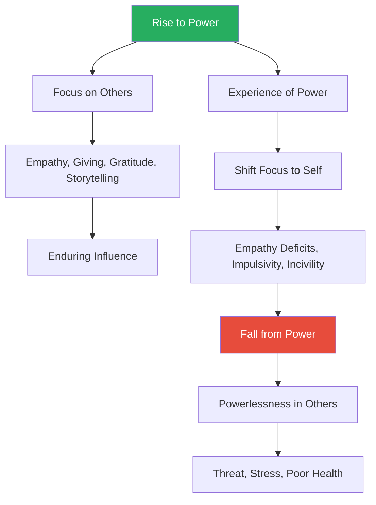
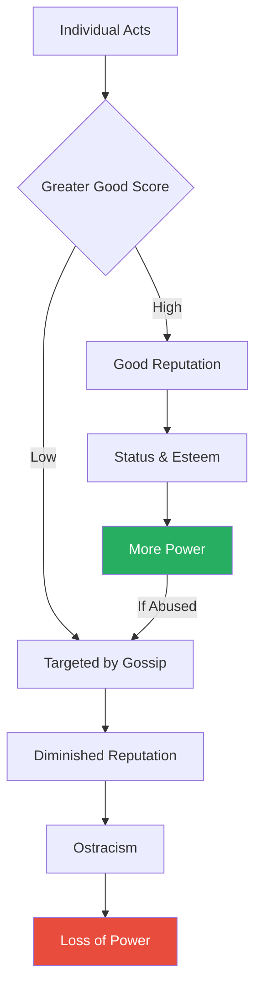
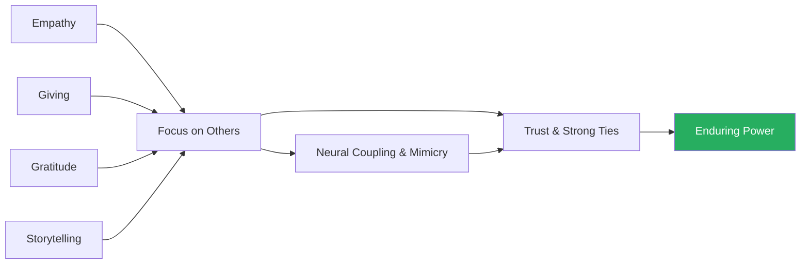
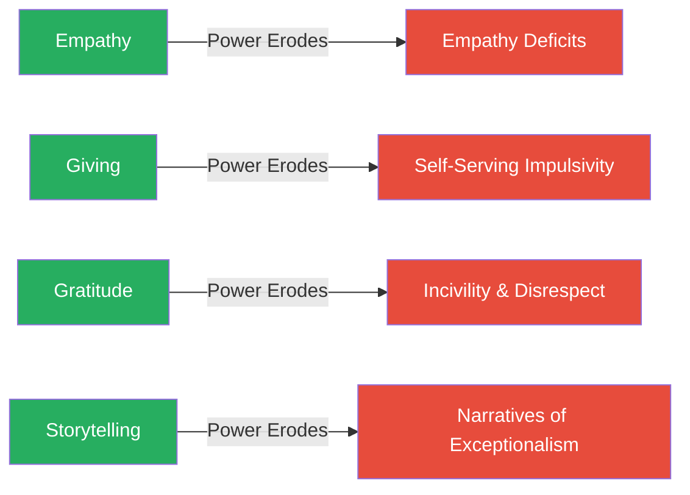
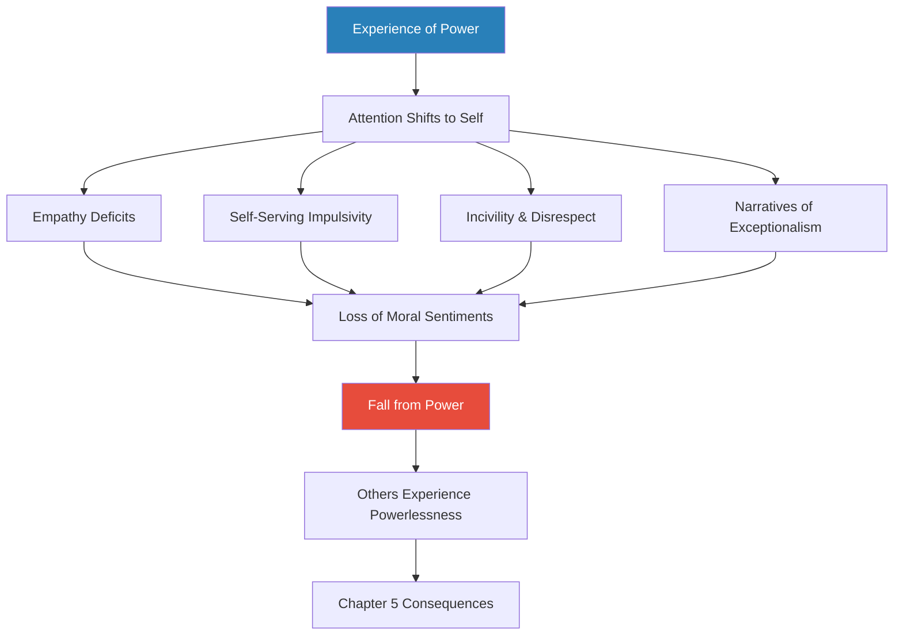
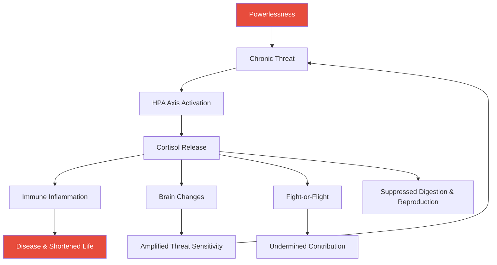
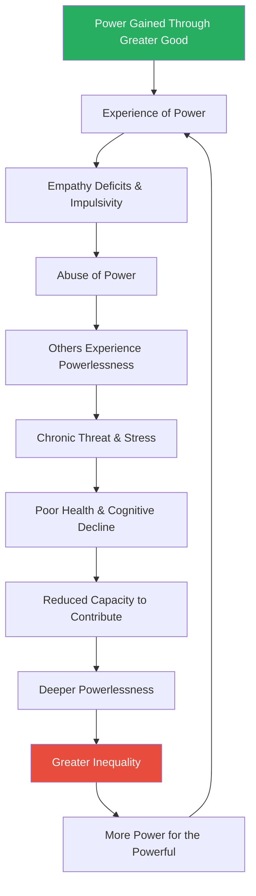
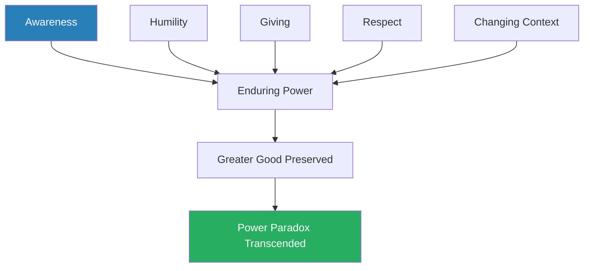

# The Power Paradox — Dacher Keltner

> Dacher Keltner, a UC Berkeley psychologist who has spent twenty years studying power in labs, dorms, playgrounds, and NBA arenas, dismantles the Machiavellian myth that power is seized through force, fraud, and ruthlessness.
> What he finds is the opposite: we rise in power by enhancing the lives of others — through empathy, generosity, gratitude, and storytelling — but the very experience of having power erodes these skills and turns us into impulsive, entitled, empathy-deficient versions of ourselves.
> This is the power paradox: the traits that earn us influence are the first casualties of wielding it.
> Keltner marshals evidence from primate studies, brain scans, dorm experiments, driving behaviour, and economic games to show that this paradox operates everywhere — in families, workplaces, friendships, and entire societies — and that its unchecked effects produce inequality, poor health, and social collapse.
> The book is both a warning and a manual: understand the paradox, stay focused on others, and your power endures; succumb to it, and you lose everything that made you influential in the first place.

---

## About the Author

Dacher Keltner is a professor of psychology at the University of California, Berkeley, and the founding director of the Greater Good Science Center. His research focuses on the biological and evolutionary origins of compassion, awe, love, and power — the social emotions that shape human group life. He has published over two hundred scientific papers and has consulted for organisations ranging from Pixar to Facebook to San Quentin State Prison. Keltner grew up in a poor rural town in the Sierra Nevada foothills, an experience that profoundly shaped his interest in how power and powerlessness operate in everyday life.

---

## The Big Idea

- Keltner's central argument overturns five centuries of Machiavellian thinking about power
- Since *The Prince* (1513), Western culture has treated power as something seized through force, fraud, and strategic violence — the domain of dictators, hostile-takeover artists, and playground bullies
- <b style="color: #2980b9">The new science of power</b> reveals something radically different: power is not grabbed but given
- Groups — from college dorms to hunter-gatherer tribes to corporate teams — systematically grant influence to individuals who advance the collective welfare, and they strip it from those who don't

---

- The book is organised around <b style="color: #2980b9">twenty power principles</b> distributed across five chapters, each covering a phase of the power paradox:
  - What power actually is (not force, but the capacity to alter others' states)
  - How groups give power to individuals who serve the greater good
  - How enduring power is maintained through empathy, giving, gratitude, and storytelling
  - How the experience of power corrupts these very skills
  - How the resulting powerlessness of others devastates health, cognition, and social fabric

---

- <b style="color: #27ae60">The paradox itself is devastatingly simple: we gain power through what is best in us and lose it through what is worst</b>
- The feeling of power — a dopamine-fuelled rush of confidence and purpose — seduces us away from focusing on others and toward self-gratification
- This shift erodes empathy, amplifies impulsivity, produces incivility, and generates self-serving narratives of exceptionalism
- The result is a cascade: the powerful abuse their position, the powerless suffer chronic threat and stress, and society's fabric frays
- But the paradox is not inevitable — Keltner argues that awareness, humility, generosity, respect, and attention to the powerless can break the cycle

The power paradox is a self-reinforcing cycle: the more power corrupts an individual's behaviour, the more it damages the people around them, which further degrades the social networks on which that power depends.

---

## Key Concepts at a Glance

| Concept | One-line summary |
|---------|-----------------|
| **The Power Paradox** | We rise through our best traits and fall through our worst |
| **Power as Altering States** | Power is the capacity to change others' conditions — not force or wealth |
| **The Greater Good** | Groups grant power based on how much you benefit the collective |
| **The Big Five** | Enthusiasm, kindness, focus, calmness, openness — traits that earn power |
| **Reputation** | A group's collective judgment of your character, tracking your greater-good score |
| **Gossip** | The sophisticated mechanism by which groups police abuses of power |
| **Four Practices of Enduring Power** | Empathy, giving, gratitude, and storytelling keep power alive |
| **Empathy Deficits** | Power erodes the ability to read and respond to others' emotions |
| **Self-Serving Impulsivity** | Power makes us eat greedily, cheat, drive recklessly, and have affairs |
| **Narratives of Exceptionalism** | The powerful rationalise inequality with stories of their own superiority |
| **Acquired Sociopathy** | Power mimics the effects of frontal lobe brain damage |
| **The Price of Powerlessness** | Chronic threat, stress, brain damage, shortened lives |
| **HPA Axis and Cortisol** | The biological machinery through which powerlessness destroys health |
| **Telomere Shortening** | Powerlessness accelerates cellular aging at the DNA level |
| **Fivefold Path** | Awareness, humility, giving, respect, changing the context of powerlessness |

The paradox unfolds as a devastating X-pattern: the empathy and generosity that earned power decline in lockstep with rising impulsivity — by the time the powerful person realises the shift, the traits that made them influential have already eroded past the point of recovery.

Kindness and empathy occupy the largest blocks — Keltner's research consistently shows these are the traits groups reward most when deciding who deserves power, upending the Machiavellian assumption that ruthlessness is the path to influence.

Every corruption symptom Keltner identifies — from empathy deficits to narratives of exceptionalism — appears at dramatically higher rates in high-power individuals, confirming that the paradox is not a character flaw but a structural feature of power itself.

---

## Key Definitions

Before diving in, Keltner establishes precise terminology that anchors the entire book:

| Term | Definition |
|------|-----------|
| **Power** | Your capacity to make a difference in the world by influencing the states of other people |
| **Status** | The respect and esteem others direct to you — often accompanies power, but separable |
| **Control** | Your capacity to determine your own life outcomes — a hermit has control but no power |
| **Social class** | The combination of family wealth, education, and occupational prestige — a societal form of power |
| **Greater good** | The collective well-being of a social network; how much an action benefits many and harms few |

These distinctions matter because <b style="color: #e74c3c">conflating power with money, fame, or control leads us to misunderstand how influence actually works</b> — and makes us more vulnerable to the paradox.

---

## Chapter 1: Power Is About Making a Difference in the World

*Keltner dismantles the Machiavellian equation of power with coercive force and replaces it with a definition rooted in everyday human interaction: power is the capacity to alter the states of others.*

### Principles 1-4

| Principle | Statement |
|-----------|-----------|
| **#1** | Power is about altering the states of others |
| **#2** | Power is part of every relationship and interaction |
| **#3** | Power is found in everyday actions |
| **#4** | Power comes from empowering others in social networks |

---

### The Machiavellian Myth

- For five hundred years, Machiavelli's *The Prince* has shaped how we think about power
- <b style="color: #2980b9">The Prince</b> treats power in its purest form as "force and fraud"
- Written during an era when murder was a hundred times more common than today, rape was acceptable, and torture was public entertainment accompanied by song and poetry
- This philosophy made sense for sixteenth-century Florence, but it fails to explain:
  - The abolition of slavery
  - The fall of apartheid
  - The civil rights, women's rights, and gay rights movements
  - The influence of art, satire, social media, and medical advances

- Machiavelli's framework persists in modern culture:
  - Television fills its executive suites and political chambers with backstabbing schemers
  - Self-help shelves overflow with titles about ruthless strategies and power plays
  - The assumption is baked into everyday language — we talk about "seizing" and "grabbing" power
- But the data tells a completely different story about how influence actually works

> [!example] Opposition Movements and Nonviolent Power (1900-2006)
> - Researchers Erica Chenoweth and Maria Stephan examined 323 opposition movements across a century, from East Timor to former Soviet states
> - Some used coercive force — bombs, assassinations, torture, civilian killings
> - Others relied on nonviolent tactics — marches, vigils, petitions, boycotts
> - Nonviolent movements were twice as likely to succeed (53% vs 26%)
> - They won broader citizen support, toppled more oppressive regimes, and achieved more lasting political gains
> - The violent movements often triggered backlash, consolidating opposition rather than dismantling it
> - The nonviolent movements worked by altering the states of bystanders — shifting beliefs, stirring moral outrage, creating new coalitions
> **The lesson:** Coercive force is a more likely path to powerlessness than to enduring power.

---

### Principle 1: Power as Altering States

- <b style="color: #27ae60">Power is the capacity to alter the states of others — their bank accounts, beliefs, emotions, physical health, political voice, or brain activation</b>
- This definition encompasses every form of influence, not just military or economic might
- It reveals that power pervades all of daily life, not just boardrooms and battlefields
- A teacher alters brain states with a well-timed question
- A comedian alters emotional states across an entire audience
- A nurse alters physical states with a competent injection
- A protest march alters the political states of millions watching at home

Keltner illustrates the breadth of "altering states" through vivid examples:

> [!example] Thomas Clarkson and the End of Slavery (18th Century)
> - In the eighteenth century, three-quarters of the world's people were enslaved
> - European economies depended on the slave triangle: goods to Africa, captured humans to the Caribbean, sugar back to Europe
> - A Cambridge student named Thomas Clarkson submitted an essay on the brutalities of the slave trade to a contest — and won
> - His essay reached a network of Quaker abolitionists, who enlisted him
> - Clarkson travelled thousands of miles interviewing those who had experienced slavery, publishing his discoveries in essays and pamphlets
> - He collected physical artefacts of the slave trade — shackles, branding irons, thumbscrews — and displayed them in meetings across England
> - His revelations stirred boycotts, aroused the conscience of Parliament, and eventually ended slavery
> **The lesson:** Knowledge — altering people's understanding of the world — is one of the most potent forms of power.

> [!example] Virginia Apgar's Neonatal Revolution (1952)
> - Virginia Apgar was the first female full professor at Columbia's College of Physicians and Surgeons
> - Tired of watching doctors deem premature babies too weak to survive and letting them die, she created the Apgar score
> - A ten-point measure of a newborn's breathing, heart rate, complexion, reflexes, and muscular activity, taken at one and five minutes after birth
> - Its adoption into medical practice has saved hundreds of thousands of lives
> - It also raised awareness of premature births (one in nine U.S. births, costing $26.2 billion annually)
> - Before Apgar, the prevailing medical attitude was fatalism; after Apgar, every newborn received immediate attention
> **The lesson:** Power lies in altering the physical states of others — sometimes with a simple measurement tool.

> [!example] Harriet Beecher Stowe and Uncle Tom's Cabin (1852)
> - Stowe's novel depicted the daily horrors of slavery through vivid characters — Tom, a devout enslaved man; Eliza, a mother fleeing across ice with her child
> - The book sold 300,000 copies in its first year, making it the best-selling novel of the nineteenth century
> - It altered the emotional states of millions of readers who had never witnessed slavery firsthand
> - When Lincoln allegedly met Stowe during the Civil War, he reportedly said, "So you're the little woman who wrote the book that started this great war"
> - Whether or not Lincoln actually said it, the sentiment captures a truth: Stowe's power lay not in wealth, office, or military command but in her capacity to alter the beliefs and emotions of a nation
> **The lesson:** Altering states through narrative and emotion can be more consequential than altering them through force.

**The breadth of "altering states" is what makes this definition revolutionary:**
- Traditional definitions of power focus on coercion, wealth, or authority — resources that can be hoarded
- Keltner's definition includes any capacity to change another person's condition — making it democratic, distributed, and available to anyone
- A child who makes a parent laugh has altered that parent's emotional state — and therefore has exercised power
- A stranger who holds a door has altered another person's experience of the world — and has, in that moment, made a difference
- This expansive definition strips power of its sinister connotations and reveals it as the basic currency of human social life

---

### Principle 2: Power in Every Relationship

- Social psychology once assumed some relationships were power-free — young lovers, parent and child
- But intensive studies worldwide reveal that <b style="color: #2980b9">power is part of every relationship</b>
- Even a developing fetus and its mother competitively vie for nutrients in the womb — a competition that helps explain certain pregnancy-related illnesses
- The fetus releases hormones that dilate maternal blood vessels, drawing more glucose and nutrients than the mother's body would voluntarily provide
- The mother's body resists with its own hormonal countermeasures — gestational diabetes may be partly explained by this tug-of-war
- Power dynamics begin before birth, at the cellular level

**Parent-child dynamics:**
- Parents hold enormous power over children — they control food, shelter, attention, and emotional climate
- But children hold power too: their cries summon adults, their smiles reward caregivers, and their distress triggers physiological anxiety in parents
- Research shows that the cry of an infant activates the same brain regions in parents that respond to physical pain — the child's distress literally hurts the parent
- This mutual power creates a negotiation: the parent provides security, the child provides attachment, and both adjust their behaviour in response to the other

**Sibling dynamics and identity formation:**
- Older siblings are bigger, more coordinated, more linguistically advanced — they enjoy greater power
- Young siblings experience six to eight conflicts per day, mostly about power — who controls the toy, who chooses the game, who sits where
- Out of these daily power negotiations, lasting identities form:
  - Older siblings → more likely to seek power, favour the status quo, be conventional
  - Younger siblings → more cooperative, more innovative, more likely to challenge the status quo, endorse scientific revolutions, steal bases in baseball, become stand-up comedians
- Frank Sulloway's research on birth order shows that younger siblings were significantly more likely to support Darwinism, Copernicanism, and other paradigm-shifting ideas
- The power dynamics of childhood shape not just personality but intellectual orientation

**Romantic relationships and power:**
- In egalitarian couples, partners feel more love, trust, and satisfaction
- When a woman feels disempowered, she is less likely to have orgasms
- When a man feels disempowered (e.g., job loss), he is more vulnerable to erectile dysfunction
- <b style="color: #e74c3c">Sexual desire cannot be separated from power</b>
- Studies of long-term couples find that when one partner consistently dominates decision-making, the other reports lower relationship satisfaction, less affection, and higher rates of depression
- The healthiest relationships are those where power flows back and forth depending on context and expertise

**Friendship and power:**
- Even friendships — seemingly the most egalitarian of relationships — contain power dynamics
- In friend pairs, one person typically has more influence over plans, decisions, and emotional tone
- This imbalance is not necessarily harmful — friends often have complementary power profiles:
  - One is better at planning, the other at emotional support
  - One takes initiative, the other provides stability
- Problems arise when the imbalance becomes rigid — when one friend always defers and the other always leads
- Keltner's research shows that the most enduring friendships are those where influence shifts depending on the situation

---

### Principle 3: Power in Everyday Actions

- Using the <b style="color: #2980b9">leaderless group discussion paradigm</b>, researchers bring strangers together to solve problems collectively — no roles assigned, no guidance given
- Power emerges instantly: outside observers agree within about a minute on who has power and who doesn't
- Among kindergartners, some five-year-olds are perceived as more influential within the first week of school
- Even among two-year-olds at day care, some quickly attract attention, guide play, and control the cherished scooter

> [!tip] Core Insight
> Power is not a permanent trait or a title — it is always in flux, emerging from specific everyday actions tailored to the needs of the moment.

- A woman might feel powerful supervising a team at work but powerless negotiating with a defiant teenager at home
- Even among gorillas and chimpanzees, rank is renegotiated nearly every hour through subtle glances, gestures, and proximity choices
- Hunter-gatherer anthropologists found it nearly impossible to identify a single leader — influence shifted from context to context
- The !Kung San of the Kalahari rotate leadership depending on the task: the best tracker leads hunts, the best storyteller leads evening gatherings, the best negotiator handles disputes with neighbouring groups
- The Tsimane people of Bolivia follow the same pattern — leadership rotates with context, and anyone who tries to claim permanent authority is ridiculed and marginalised

> [!example] The Kindergarten Pecking Order
> - Researchers observed five-year-olds during their first week of school
> - Some children quickly became the ones others looked to — not the biggest or loudest, but the most socially attuned
> - These influential children did three things consistently: they shared toys before being asked, they noticed when other children were upset, and they proposed games that included everyone
> - Children who tried to dominate through physical size or loudness were initially feared but quickly avoided
> - By the third week, the prosocial children had larger play networks and more consistent influence
> **The lesson:** Even at age five, power flows to those who make the group feel better, not to those who make themselves feel powerful.

> [!example] The Berkeley Dorm Power Dynamics
> - When Keltner tracked students through their first year of university, power hierarchies formed within two weeks
> - But they were not static — a student who dominated study groups might be marginalised in social planning
> - The students who maintained influence across multiple domains were those who adapted their behaviour to each context
> - They listened more in settings where they lacked expertise and stepped forward in areas where they had genuine knowledge
> - The students who tried to dominate every context — treating power as a fixed personal attribute — lost influence over the semester
> **The lesson:** Power is context-dependent; treating it as a permanent possession is the fastest way to lose it.

---

### Principle 4: Power Through Empowering Others

- <b style="color: #27ae60">Power is not located within individuals but distributed across social networks</b>
- Charles Darwin wrote 1,500 letters per year — four per day — to missionaries, neurologists, fur trappers, gardeners, zookeepers, and pigeon fanciers
- His revolutionary ideas were the collaborative product of many minds
- Darwin didn't hoard his findings — he shared observations freely, asked for corrections, credited correspondents by name, and built a web of intellectual collaborators who felt invested in his project

> [!example] Hannah Arendt on Power as Collective Action
> - While living in Berlin in the early 1930s, Arendt fought the rise of Nazism and was apprehended by the SS before fleeing Germany
> - In her famous *New Yorker* essay, she argued that Nazi mastermind Adolf Eichmann was not a sadistic psychopath but a bureaucratic functionary — the power of the Nazi state was distributed across networks, not housed in evil individuals
> - Her definition of power: "the human ability not just to act but to act in concert"
> - Power "is never the property of an individual; it belongs to a group"
> - Arendt's insight explains why totalitarian regimes invest so heavily in destroying civil society — breaking up labour unions, churches, civic associations — because distributed power in networks is the greatest threat to centralised coercion
> **The lesson:** Your power is only as strong as the networks you are connected to and the people you empower within them.

- Behaviour is infectious within networks:
  - If you share with a stranger, that person becomes 19% more generous with new strangers
  - That new stranger, in turn, becomes 7% more generous with yet other strangers — now twice removed from you
  - If you boost your own happiness, it lifts your friend's friend's spirits — someone you've never met
- Nicholas Christakis and James Fowler documented these cascading effects in their analysis of the Framingham Heart Study data:
  - Happiness, obesity, smoking cessation, and generosity all spread through social networks in waves
  - Your behaviour influences people three degrees of separation away
  - This means that every act of empowerment ripples outward far beyond the immediate recipient

> [!example] Rosa Parks and the Network Effect
> - Rosa Parks is often portrayed as a lone individual who spontaneously refused to give up her bus seat
> - In reality, she was deeply embedded in a network of civil rights activists — she had trained at the Highlander Folk School, served as secretary of the NAACP, and was connected to leaders across multiple organisations
> - Her act of defiance was powerful precisely because it activated a pre-existing network — the Montgomery bus boycott was organised within days by a coalition that had been building relationships for years
> - The boycott succeeded not because of one person's courage but because that courage was amplified through an empowered social network
> **The lesson:** Individual acts of power are amplified — or extinguished — by the networks they are embedded in.

---

### The Power Paradox Begins

- Having power — a capacity for influence — feels good
- It is accompanied by enthusiasm, inspiration, hope, and surges of dopamine
- But dopamine and feelings of power are also at the heart of cocaine addiction and bouts of mania
- <b style="color: #e74c3c">What feels so good can quickly turn to excess — the power paradox is always close by</b>
- The dopamine rush of power shares the same neural circuitry as substance addiction:
  - Both produce euphoria and a sense of invulnerability
  - Both reduce sensitivity to risk
  - Both create a tolerance effect — you need more to feel the same high
  - Both can trigger withdrawal symptoms when the feeling fades
- This neurochemical overlap helps explain why power is so hard to wield responsibly — the brain is literally wired to want more of it

Power is not a scarce resource hoarded by the few — it is a dynamic force created whenever humans interact and empower each other.

---

## Chapter 2: Power Is Given, Not Grabbed

*Keltner takes us inside dorm rooms, sororities, chimpanzee colonies, and economic games to prove that groups systematically grant power to those who serve the collective — and strip it from Machiavellian types through reputation, status, and gossip.*

### Principles 5-8

| Principle | Statement |
|-----------|-----------|
| **#5** | Groups give power to those who advance the greater good |
| **#6** | Groups construct reputations that determine the capacity to influence |
| **#7** | Groups reward those who advance the greater good with status and esteem |
| **#8** | Groups punish those who undermine the greater good with gossip |

---

### Principle 5: The Greater Good Determines Who Gets Power

- The chapter opens with *Lord of the Flies* — Golding's thought experiment about what happens when civilisation is stripped away
- Many assume the answer is Machiavellian: without rules, the coercive and violent grab power
- Keltner has spent twenty years running his own natural state experiments — and the findings are the opposite

> [!example] The Wisconsin Dorm Experiment
> - Keltner recruited an entire first-year dorm at the University of Wisconsin, Madison
> - Students were wealthy, middle class, and poor — representative of the U.S. distribution
> - At the start of the semester, each student rated every other student's "influence"
> - They also reported their own Big Five personality tendencies
> - Keltner returned at four months and nine months to re-measure power
> - Power flowed quickly: within two weeks, some students already had more influence
> - The strongest predictor of who rose to the top? Enthusiasm — followed by kindness, focus, calmness, and openness
> - There was zero evidence that coercive, Machiavellian behaviour earned power
> - Machiavellian students — those who scored high on willingness to deceive and manipulate — actually lost influence over the semester
> **The lesson:** Groups give power to those who advance the greater good through prosocial behaviour.

---

<b style="color: #2980b9">The Big Five</b> — five social tendencies that determine whether a person advances or undermines the greater good:

| Social Tendency | High Greater Good Score | Low Greater Good Score |
|----------------|------------------------|----------------------|
| **Enthusiasm** | Reach out to others, speak up, make bold assertions | Avoid social contact |
| **Kindness** | Cooperate, share, give | Exploit others for own gain |
| **Focus** | Focus on shared goals and rules | Neglect shared goals and rules |
| **Calmness** | Instil calm and perspective | Complain, be defensive |
| **Openness** | Be open to others' ideas and feelings | Disregard others' ideas |

- The dorm findings replicated across a Vanderbilt sorority, a Wisconsin fraternity, Berkeley dorms, and a summer basketball camp
- Across seventy studies in financial firms, hospitals, manufacturing plants, schools, and the military, those who rose to power displayed all five tendencies
- In a definitive summary of forty-eight studies of hunter-gatherer societies, leaders are described as "generous, brave, wise, apt at resolving conflicts, good speakers, fair, impartial, reliable, tactful, and morally upright" — and "strong and assertive" but "humble"
- The consistency across cultures is remarkable — from the Hadza of Tanzania to the Inuit of the Arctic to fraternities in Wisconsin, the same pattern holds:
  - Prosocial behaviour → power
  - Antisocial behaviour → rejection
- Keltner emphasises that this is not wishful thinking — it is the most replicated finding in the science of power

> [!example] The Vanderbilt Sorority Replication
> - Keltner replicated the dorm study in a Vanderbilt University sorority
> - In this all-female group, the same Big Five traits predicted who held influence
> - Enthusiasm was again the strongest predictor — women who reached out to others, initiated activities, and expressed positive emotion rose fastest
> - Machiavellian women — those who reported willingness to deceive and manipulate — were identified within weeks and systematically marginalised through gossip and social exclusion
> - By mid-semester, the Machiavellian women had fewer close friends, fewer leadership roles, and less influence than their prosocial peers
> **The lesson:** The greater-good mechanism for granting power operates regardless of gender, institution type, or cultural context.

> [!example] The Economics Game and Altruistic Punishment
> - In a classic public goods game, participants received money and chose how much to contribute to a shared pool
> - The pool was multiplied and redistributed equally — so cooperation benefited everyone
> - Free-riders who contributed nothing still received their share of others' contributions
> - When participants could spend their own money to punish free-riders (reducing the free-rider's earnings), they consistently did so — even at personal cost
> - The most generous contributors were the ones most willing to punish defectors
> - These altruistic punishers were subsequently chosen as group leaders when the game continued into new rounds
> **The lesson:** Groups don't just passively reward the generous — they actively punish those who exploit the collective, and elevate punishers to positions of influence.

---

### Principle 6: Reputation as Power Mechanism

- <b style="color: #2980b9">Reputation</b> is the collective judgment of a person's character — tracking their capacity to advance the greater good
- Groups arrive at these judgments quickly and use them in two ways:
  - **Creating opportunities**: people with good reputations receive more resources, more friendship offers, and more collaboration invitations
  - **Increasing awareness**: knowing that others are watching makes individuals act more cooperatively
- Reputation is not just an abstract concept — it has measurable neural and behavioural effects:
  - When people know their choices will be observed, they become significantly more cooperative
  - The effect persists even when the "observer" is nothing more than a pair of eyes on a poster

> [!example] The Shame Masks of 17th-Century Germany
> - In seventeenth-century German villages, people who acted in ways that undermined the community were forced to wear shame masks called Schandmasken
> - Drunkards, gluttons, and the greedy wore pig masks with giant snouts
> - Eavesdroppers wore masks with enormous ears
> - As they walked through town wearing their masks, they were ridiculed and mocked, suffering crushing losses of social status
> - The masks were not punishments in the modern sense — they were public reputation technologies
> **The lesson:** Groups have always constructed visible markers of reputation to constrain those who undermine the greater good.

- Even abstract facial cues trigger reputation awareness:
  - Participants who saw three dots arranged like a face (two eyes and a mouth) were half as likely to keep money for themselves compared to those who saw the dots inverted
  - The mere sensation of being watched activates our concern for reputation
  - This explains why we behave differently in public than in private — our brains are wired to track reputational consequences even from the faintest social cues

> [!example] The Honour Box Experiment
> - In a university coffee room, people paid for tea and coffee using an honour box — there was no cashier
> - Researchers alternated the image above the price list each week: sometimes a pair of watching eyes, sometimes flowers
> - During "eyes" weeks, people paid nearly three times as much as during "flower" weeks
> - The mere image of eyes — not a real person, not a camera, just a photograph — tripled honesty
> **The lesson:** Reputation awareness is so deeply wired that even a photograph of eyes triggers cooperative behaviour.

---

### Principle 7: Status as Social Reward

- <b style="color: #27ae60">Groups elevate the status of individuals in proportion to their contribution to the greater good</b>
- This is ancient: among the Netsilik Inuit, each person has twelve lifelong food-sharing partners; when one kills a seal, they cut it into fourteen parts, sharing twelve and keeping two
- In the New Guinea highlands, neighbouring tribes gather annually to ritualistically give away food — yams, pig carcasses, coconuts — and the more a person gives, the higher their status
- The potlatch ceremonies of the Pacific Northwest Coast peoples operated on the same principle — chiefs gained status through extravagant giving, not hoarding

**Status and the brain:**
- Being esteemed activates the dopamine-rich ventral striatum — the same reward circuit triggered by chocolate or a great massage
- In an fMRI study, participants listened to phrases from friends like "You have always stood up for me when I really needed it" — and showed activation in the brain's deepest pleasure centres
- This explains why esteem is such a powerful motivator — it literally feels like a reward
- The brain does not distinguish between the pleasure of a fine meal and the pleasure of social recognition — both light up the same circuits

**Status vs. power — a critical distinction:**
- Power and status usually go together, but they are separable
- A corrupt politician has power without status (low esteem, high influence)
- A professor may have status without power (high esteem, little practical influence)
- A retired coach may be deeply respected by former players but hold no decision-making authority
- This separation gives groups a lever: they can use status to encourage the powerful to keep serving the collective
- When the powerful lose status but retain formal authority, they become vulnerable — their subordinates comply but do not follow

| Configuration | Example | Group Response |
|--------------|---------|----------------|
| High power + high status | Respected leader | Full cooperation and loyalty |
| High power + low status | Corrupt boss | Minimal compliance, gossip, subversion |
| Low power + high status | Beloved elder | Sought for counsel, moral authority |
| Low power + low status | Marginalised individual | Ignored, excluded from networks |

This table explains why formal authority alone is never enough — without the esteem of the group, power is brittle and temporary.

---

### Principle 8: Gossip as Social Enforcement

- Far from being idle or sinful, <b style="color: #2980b9">gossip</b> is the sophisticated mechanism by which groups police power
- Gossip targets character flaws — specifically, actions that undermine the greater good
- Approximately 65% of daily conversation is gossip — discussions about absent third parties — and most of it centres on social conduct, not appearance or trivia

> [!example] The Sorority Gossip Network at UC Berkeley
> - Keltner measured Big Five traits and Machiavellianism in a sorority, then privately interviewed each sister about her gossip patterns
> - The frequent targets of gossip were highly visible women who reported being unkind and highly Machiavellian — willing to harm, lie, and manipulate to rise
> - On average, each act of gossip was passed along to 2.3 additional people, typically to high-status, well-connected members
> - Gossip flows upward to those with the greatest power to define and damage reputations
> - The Machiavellian sisters were aware they were being gossiped about but couldn't stop it — the network was too distributed
> **The lesson:** Gossip is the group's immune system — it targets those who seek power at the expense of others.

> [!example] The Rowing Team and the Slacker
> - Researchers eavesdropping on a crew team's banter found that gossip systematically targeted one teammate
> - He wasn't making practice on time, rowing hard enough, or staying in sync with the crew
> - He was literally not pulling his weight — and gossip concentrated on exactly this failure to advance the team's interests
> - The content of the gossip was remarkably specific: which practices he missed, which drills he coasted through, how his timing was off
> **The lesson:** Gossip zeroes in on specific failures to contribute to the collective good.

**Gossip makes groups work better — the experimental evidence:**
- In an economic game, when gossip was not allowed, contributions to the group fund declined over time (free-riders poisoned cooperation)
- When participants could gossip about former partners' behaviour, contributions held steady
- When they could gossip and ostracise, contributions actually rose
- <b style="color: #27ae60">Social penalties like gossip and shaming — painful as they are — elevate the standing of cooperative members and prevent Machiavellians from gaining power</b>

**The evolutionary logic of gossip:**
- In small hunter-gatherer bands of 50-150 people, everyone's behaviour was directly observable
- As groups grew larger, direct observation became impossible — gossip filled the gap
- Robin Dunbar's research suggests that language itself may have evolved partly as a "social grooming" mechanism, replacing the physical grooming of primates
- Gossip allows groups to track reputations across hundreds of relationships that no single person can monitor directly

Groups are not passive audiences to power — they actively construct, reward, and police it through reputation, status, and gossip.

---

## Chapter 3: Enduring Power Comes from a Focus on Others

*Keltner reveals the four ancient social practices — empathy, giving, gratitude, and storytelling — that maintain power over time, and shows that each one works by keeping attention focused outward rather than inward.*

### Principles 9-12

| Principle | Statement |
|-----------|-----------|
| **#9** | Enduring power comes from empathy |
| **#10** | Enduring power comes from giving |
| **#11** | Enduring power comes from expressing gratitude |
| **#12** | Enduring power comes from telling stories that unite |

---

### The Experience of Power

- When a person feels powerful, they experience higher levels of excitement, inspiration, joy, and euphoria
- They become sharply attuned to rewards and quickly grasp what goals define any situation
- But they also become less aware of risks
- This feeling propels the individual in one of two directions:
  - Toward benevolent behaviour that advances the greater good → enduring power
  - Toward the abuse of power and impulsive, unethical action → fall from power
- The choice between these two paths is not made once but moment by moment — every interaction is a fork

> [!tip] Core Insight
> The key to enduring power is devastatingly simple: stay focused on other people. Prioritise others' interests as much as your own.

---

### Principle 9: Enduring Power Through Empathy

> [!example] Abraham Lincoln and Thurlow Weed
> - Thurlow Weed was one of the great political strategists of his era, managing William Seward's campaign for the 1860 Republican nomination
> - Weed worked the delegates relentlessly — the numbers looked good, celebrations were planned
> - But on the third ballot, a relatively unknown lawyer named Abraham Lincoln pulled off the upset
> - Later, Weed reflected on Lincoln: "His mind is at once philosophical and practical. He sees all who go there, hears all they have to say, talks freely with everybody, reads whatever is written to him"
> - Lincoln's enduring power — widely regarded as the most enduring of any U.S. president — was rooted in knowing what other people felt
> - He assembled a "team of rivals" — including the very opponents he defeated — because he understood their perspectives well enough to harness their strengths
> **The lesson:** Empathy is the foundation of enduring influence.

**How empathy works mechanistically:**
- We understand others through their <b style="color: #2980b9">emotional expressions</b> — fleeting contractions of facial muscles, shifts in vocal tone, posture, gaze, and touch
- These expressions are fast (1-2 seconds) but they structure how people relate to one another
- They provide information about feelings, intentions, and moral judgments
- They evoke specific reactions: sadness triggers sympathy; anger triggers fear; embarrassment triggers forgiveness
- They serve as incentives: warm smiles reward; angry outbursts deter
- Paul Ekman's cross-cultural research established that the basic emotional expressions — happiness, sadness, anger, fear, disgust, surprise — are universal across human societies
- This means empathy has a built-in vocabulary that transcends language and culture

**The neuroscience of empathy:**
- Mirror neurons fire both when we perform an action and when we observe someone else performing it
- When you watch someone reach for a glass, the motor cortex regions that would guide your own reach become active
- This neural mirroring extends to emotions:
  - Watching someone in pain activates your own pain circuits
  - Hearing someone laugh activates your laughter circuits
  - Seeing someone's face crumple in grief triggers your own sadness regions
- <b style="color: #2980b9">Empathic accuracy</b> — the ability to correctly identify what others are feeling — is measurable, trainable, and strongly predictive of social success

**Empathy and group performance:**
- In a study of collective intelligence, groups of two to five solved practical and logical problems
- The high-performing groups were led by high-empathy individuals who focused on others' emotions, asked questions, and conveyed interest
- As the proportion of women in groups rose, so did performance on collective intelligence tasks — largely because women, on average, scored higher on empathic accuracy
- <b style="color: #27ae60">Having more women in leadership positions is likely to increase innovation and the bottom line</b>

**Empathy predicts social success at every age:**
- High-empathy five-year-olds have denser friend networks at age eight and greater peer status
- High-empathy adolescents have more friends, greater academic success, less depression
- Empathetic young adults are better negotiators, more satisfied at work, and rise to positions of increased power
- Teams led by empathetic managers are more productive, innovative, and less stressed
- A meta-analysis of leadership studies found that empathy was a stronger predictor of leadership effectiveness than intelligence, extroversion, or conscientiousness

> [!example] The Pixar Consultation
> - Keltner consulted with Pixar Animation Studios on the film Inside Out, helping the studio understand the science of emotions
> - His key insight for the filmmakers: emotions are not individual phenomena — they are social signals that evolved to coordinate group behaviour
> - Sadness, which the filmmakers initially wanted to portray as purely negative, turned out to be the emotion that most reliably triggers empathy and helping in others
> - A child's sadness brings parents running; an adult's tears signal vulnerability that draws support
> - The film's climactic scene — where Joy realises that Sadness is essential — reflects Keltner's research on how emotional expression builds connection
> **The lesson:** Empathy works because emotions evolved as social signals — expressing vulnerability is not weakness but an invitation for others to help.

---

### Principle 10: Enduring Power Through Giving

- One of the oldest ways humans reward others is through <b style="color: #2980b9">touch</b>
- Primates spend 15% of waking hours grooming each other — not for hygiene, but to form alliances and maintain social bonds
- In humans, touch triggers oxytocin (promoting trust and sharing), activates the brain's reward circuits, and calms the stress response
- Giving takes many forms beyond touch — sharing resources, offering time, providing emotional support, creating opportunities for others — but touch is the most primal and most studied

> [!example] The NBA Touching Study
> - Keltner's team coded every observable touch in a full game of every NBA team during the 2008 season
> - They catalogued more than twenty-five kinds of touch: high-fives, fist bumps, bear hugs, flying hip bumps, and a curious male gesture — rapping a colleague on the side of the head with a fist
> - On average, each player touched teammates for about two seconds per game — just two seconds
> - But those brief touches predicted team cohesion later in the season
> - The more a team's players touched early in the season, the better they played at season's end — on every sophisticated basketball metric
> - High-touch teams were more efficient on offence, helped more on defence, set better picks, and hustled for loose balls
> - They won about two extra games during the season — often the difference between making the playoffs and going home
> - The effect held even after controlling for preseason expectations and player salary (a proxy for talent)
> **The lesson:** Power is found in everyday acts that encourage and empower others.

> [!example] Kevin Garnett — Most Valuable Toucher
> - The player who touched teammates the most was Kevin Garnett, then with the Boston Celtics
> - When shooting a free throw, within half a second of releasing the ball, Garnett leaned forward for two fist bumps from teammates on the perpendicular lines, then stepped backward for touches from two defenders behind him — one continuous motion
> - That year, the Celtics' motto was Ubuntu, a South African concept meaning "I am human because I belong"
> - Desmond Tutu described Ubuntu as "the essence of being human — welcoming, hospitable, warm and generous, willing to share"
> - The Celtics won the NBA championship that season
> **The lesson:** The most empowering acts are often subtle, barely visible gestures of generosity.

**Touch and the body — the research evidence:**
- A reassuring pat triggers oxytocin release, promoting trust and cooperation
- Soft touches activate the orbitofrontal cortex, the brain's reward-mapping region
- Holding a loved one's hand deactivates stress regions of the brain even when anticipating an electric shock
- Babies cry less during painful medical procedures when touched by a loved one
- In a study of couples, partners who received a brief shoulder massage before a stressful task showed lower cortisol and faster cardiovascular recovery than those who didn't

**Giving beyond touch — the economics of generosity:**
- In dictator games (where one person decides how to split a sum with a stranger), most people give away 30-40% of the total — far more than the zero predicted by pure self-interest
- Generous players in repeated games are chosen more often as partners
- In organisations, "givers" who share credit, mentor colleagues, and volunteer their expertise are more likely to rise to senior positions — though they are also more likely to burn out if they don't set boundaries
- <b style="color: #27ae60">Generosity is not self-sacrifice — it is a strategy for building the social capital on which enduring power depends</b>

> [!example] The San Quentin Prison Consultation
> - Keltner brought his research on power and empathy to San Quentin State Prison, working with incarcerated men
> - Many prisoners had grown up in environments of extreme powerlessness — violence, neglect, poverty
> - They had learned to equate power with dominance and aggression because that was the only form of power they had observed
> - Through discussions of Keltner's research, some inmates began to reframe their understanding — recognising that the most respected men in the prison were not the most violent but the ones who mentored younger inmates, mediated conflicts, and shared resources
> - One participant described the shift: he had spent decades believing that toughness was power, only to realise that the men he most admired were the generous ones
> **The lesson:** Even in the most hierarchical, threat-laden environments, giving earns more lasting respect than taking.

---

### Principle 11: Enduring Power Through Gratitude

- Adam Smith — more famous for *The Wealth of Nations* — wrote in *The Theory of Moral Sentiments* (1759) that "the duties of gratitude are perhaps the most sacred of those which the beneficent virtues prescribe to us"
- <b style="color: #2980b9">Gratitude</b> is the reverence we feel for things given to us — things we sense are sacred, precious, or irreplaceable — that we did not attain through our own agency
- Gratitude is not just a feeling — it is a social glue that binds networks together by acknowledging the contributions of others

> [!example] The Grateful Mindset Experiment
> - Participants wrote about five things they were grateful for, once a week for nine weeks
> - Compared to those who wrote about hassles or neutral events, grateful writers reported:
>   - Better physical health
>   - Less stress
>   - More positive emotions like enthusiasm and savouring
>   - Greater trust in and generosity toward others
> - The effects were not trivial — they were measurable improvements across multiple domains of life
> - A separate study found that grateful people exercised more, slept better, and visited doctors less frequently
> **The lesson:** A simple weekly gratitude practice produces measurable improvements in health, mood, and social behaviour.

**Gratitude builds lasting relationships:**
- Keltner videotaped young romantic partners expressing gratitude to each other in conversations
- Those who subtly expressed gratitude — validating beliefs, nodding affirmatively, acknowledging contributions — were over three times more likely to still be together six months later
- <b style="color: #27ae60">Expressions of gratitude are among the most reliable predictors of relationship longevity</b>
- The mechanism: gratitude signals to the receiver that their contributions are seen, valued, and will be reciprocated — creating a virtuous cycle of mutual investment

**Gratitude is contagious:**
- In one study, a confederate rescued a participant whose computer had crashed, allowing them to finish on time
- Minutes later, the grateful participant encountered a stranger who needed help
- The participant volunteered more help and gave more resources to the stranger
- Gratitude doesn't just benefit the receiver — it radiates outward through the network
- This "upstream reciprocity" means that a single act of kindness, when met with genuine gratitude, can trigger a cascade of generosity through a social network

**The vagus nerve and gratitude:**
- The <b style="color: #2980b9">vagus nerve</b> — a long bundle of fibres running from the brain stem to the abdomen — plays a central role in the physiology of gratitude
- It activates when we feel moved by others' kindness, slowing the heart and producing a warm, expansive feeling in the chest
- People with higher vagal tone (stronger vagus nerve response) report more gratitude, more compassion, and more cooperative behaviour
- Vagal tone is partly heritable but also trainable — meditation and gratitude practices strengthen it over time
- This means that gratitude is not just a psychological habit but a physiological capacity that can be developed

> [!example] The Teacher's Touch and Student Performance
> - Teachers who pat students on the back after giving them a challenging problem see those students attempt hard problems at three to five times the rate of untouched students
> - The touch communicates encouragement, belief, and gratitude for the student's effort — all at once
> - Students who received the touch reported feeling "seen" and "valued" by the teacher
> **The lesson:** Gratitude expressed through even the smallest physical gesture can dramatically alter performance and motivation.

> [!abstract] Ways to Express Gratitude
> 1. Touch — brief clasps communicate gratitude at 55% accuracy (vs. 8.3% chance)
> 2. Spoken acknowledgment — simply saying "thank you" doubled the rate of subsequent help (66% vs 32%)
> 3. Validating others publicly — affirming what someone has said or done
> 4. E-mails, eye contact, deferential bows, embraces
> 5. Encouraging touch — teachers who pat students on the back see them 3-5x more likely to attempt hard problems

---

### Principle 12: Enduring Power Through Storytelling

- Abraham Lincoln rose to power not through looks or class — he came from poverty, wore rumpled clothes, and had no schooling in refinement
- He honed his storytelling touring small Illinois towns, recounting courtroom proceedings to small gatherings — building a grassroots network that proved decisive against better-funded rivals
- Lincoln's stories were not decoration — they were his primary instrument of influence, used to persuade juries, disarm opponents, and unite a fractured nation

> [!example] The Fraternity Teasing Study
> - Keltner brought an entire Wisconsin fraternity to his lab in groups of four (two pledges, two senior members)
> - Each was assigned random initials and asked to give the others nicknames and tell stories — factual or fictional — to justify them
> - Nicknames were what you'd expect from young men: "Anal Duck," "Turkey Jerk," "Human Fly"
> - Each tease lasted about forty-five seconds but generated howls of laughter, shoulder thumping, and threats of retaliation
> - Keltner coded all 144 teases frame-by-frame: provocation (how imaginative), off-record markers (exaggerated faces, amusing tones, winks)
> - The pledges who had been nominated most often for leadership told better stories — more imaginative, more playful, with more signals that the tease was meant in good fun
> - The less popular pledges told blunter, meaner teases with fewer playful markers
> **The lesson:** Good storytelling is a basis of enduring power — it builds ties, generates shared joy, and signals social intelligence.

> [!example] The Summer Basketball Camp Pressure Cooker
> - Campers aged ten to fourteen faced a "pressure cooker" drill: one shot from fifteen feet, harassed by a "fan" for ten seconds before shooting
> - The fans taunted with repetition ("you're gonna miss, miss, miss"), exaggeration ("you've never made a shot in your life"), metaphor ("brick!"), and ape-like imitations
> - The more respected, esteemed campers (as rated by coaches) harassed in funnier, more playful ways
> - Their taunts had the elements of good storytelling — imagination, exaggeration, and signals of playfulness
> - The lower-status campers used more direct, humourless insults
> **The lesson:** Even in childhood, social status and storytelling skill go hand in hand.

**Why storytelling works — the science:**
- Good stories generate shared mirth, levity, and joy — all dopamine-rich experiences that build strong ties
- In the fraternity study, funnier teasing generated more intense laughter, which predicted how much the four brothers liked each other at the end
- Stories also make light of the inevitable conflicts of group life, giving distance and perspective
- Research spanning decades shows that narrating emotions around stressful events (vs. describing facts) reduces stress, anxiety, and depression, improves grades, and boosts immune function
- James Pennebaker's expressive writing studies found that people who wrote about emotional experiences for fifteen minutes a day showed improvements in immune function, fewer doctor visits, and better grades — storytelling literally heals

**The neuroscience of shared stories:**
- When a speaker tells a compelling story, listeners' brain activity begins to mirror the speaker's — a phenomenon called <b style="color: #2980b9">neural coupling</b>
- The greater the coupling, the better the listener understands and remembers the story
- Effective storytellers produce coupling not just in language areas but in emotional and motor regions — listeners experience the story, not just comprehend it
- This explains why storytelling is the oldest and most universal form of influence: it synchronises brains

**The types of stories that build power:**
- Keltner identifies several categories of narratives that unite groups:
  - **Origin stories**: tales about how the group came to be — these create shared identity
  - **Struggle stories**: narratives about challenges overcome together — these build solidarity
  - **Humour stories**: jokes and teases that make light of shared difficulties — these release tension
  - **Moral stories**: parables that illustrate the group's values — these reinforce norms
- The powerful storyteller is not necessarily the funniest or most eloquent — they are the one who reads the group's emotional state and tells the story the group needs to hear at that moment
- Lincoln was a master of this: he could sense when a political meeting needed a joke to break tension, a parable to clarify a principle, or a story of shared struggle to rebuild resolve

All four practices share one common mechanism: they keep attention directed outward, toward the experiences and needs of others — the foundation of lasting influence.

---

## Chapter 4: The Abuses of Power

*Keltner shows, through studies of cookie-grabbing, reckless driving, sexual affairs, shoplifting, and incivility, that the experience of power systematically erodes empathy, amplifies impulsivity, produces rudeness, and generates self-serving stories of superiority — the four horsemen of the power paradox.*

### Principles 13-16

| Principle | Statement |
|-----------|-----------|
| **#13** | Power leads to empathy deficits and diminished moral sentiments |
| **#14** | Power leads to self-serving impulsivity |
| **#15** | Power leads to incivility and disrespect |
| **#16** | Power leads to narratives of exceptionalism |

---

### The Mechanism of Corruption

- <b style="color: #e74c3c">Attention is a limited resource — when we focus on ourselves, we necessarily lose focus on others</b>
- Power makes us feel less dependent on others, freeing us to shift attention from their needs to our own goals
- This simple attentional shift takes us away from every practice that earned us power in the first place
- Keltner compares the effect to <b style="color: #2980b9">acquired sociopathy</b> — brain damage to the frontal lobes that transforms kind, upstanding people into impulsive, unfiltered versions of themselves
  - They make sexual passes at strangers in front of spouses
  - They shout profanities at children
  - They shoplift and go on spending sprees
  - "Experiences of power and privilege are like a form of brain damage"
- The comparison is not casual — Keltner points to specific neurological overlaps:
  - Both acquired sociopathy patients and the powerful show reduced activation in the prefrontal cortex during social tasks
  - Both exhibit impaired ability to read others' emotions
  - Both show increased risk-taking and reduced sensitivity to consequences
  - Both display a gap between knowing what's right and actually doing it

> [!tip] Core Insight
> The power paradox strikes with full force: the very practices that enable us to rise in power vanish in our experience of power. Empathy fades, giving becomes taking, gratitude becomes rudeness, unifying stories become narratives of superiority.

Each of the four practices of enduring power has a corresponding abuse — power systematically transforms virtue into vice.

---

### Principle 13: Power Erodes Empathy

**The Ladder Exercise and Empathy:**
- Participants view a twelve-rung ladder representing social standing
- Some are asked to compare themselves to the wealthiest (they place themselves lower) — feeling less powerful
- Others compare to the poorest (they place themselves higher) — feeling more powerful
- Those made to feel powerful score significantly lower on a standard empathy test (reading emotions from photos of eyes)
- <b style="color: #e74c3c">A brief shift in perceived power is enough to degrade the ability to read other people's emotions</b>
- The effect is not subtle — it is a measurable, replicable decline in the most basic social skill: reading faces

**Power kills mimicry:**
- We instinctively mimic others — laughing when they laugh, smiling when they smile, tensing when they tense
- Mimicry is a foundation of empathy, because imitating someone's expression helps us feel what they feel
- In a study where participants watched someone squeeze a rubber ball, those feeling powerless showed strong muscle activation in their own hands — reflexive mimicry
- Those feeling powerful? No mimicry detected at all
- Power short-circuits the basic physical mechanism of understanding others
- Without mimicry, the powerful lose access to the emotional data that others broadcast continuously through facial expressions, posture, and gesture

> [!example] The E-on-the-Forehead Test
> - Participants were asked to draw an E on their foreheads so someone across from them could read it
> - This requires abandoning an egocentric perspective and drawing the letter backwards (from the drawer's point of view)
> - People feeling powerless had little difficulty — they instinctively oriented the letter for the other person's perspective
> - People feeling powerful were nearly three times more likely to draw it the wrong way — trapped in their own perspective
> - They literally could not see the world through someone else's eyes
> **The lesson:** Power narrows perspective to the self, making it physically harder to take another person's point of view.

**Social class and empathy in the brain:**
- Upper- and lower-class participants read first-person accounts of another student's everyday experiences
- Lower-class participants showed activation in the brain's empathy network — the cortical regions involved in understanding others' thoughts and feelings
- Upper-class participants showed no activation — their empathy networks were silent
- <b style="color: #e74c3c">Growing up with wealth, education, and prestige literally quiets the brain circuits responsible for understanding others</b>
- This is not about intelligence or education — upper-class participants were just as cognitively capable; their brains simply did not engage the empathy machinery when processing others' experiences

---

**Power diminishes moral sentiments:**
- Compassion, gratitude, and elevation all depend on empathy — on understanding what others feel
- Without empathy, these moral sentiments wither:
  - The poor report feeling more frequent and intense compassion throughout the day
  - When watching a video of children suffering from cancer, it was the poor who felt greater compassion
  - The vagus nerve — a bundle of nerves supporting caregiving behaviour — responds more strongly in people who grew up poor than in the affluent
- In a study of pairs telling inspiring stories, powerful people were more moved by their own story than by the other person's — even though outside raters judged both stories as equally inspiring
- This asymmetry is revealing: the powerful are not emotionally dead, they are emotionally self-focused — they feel plenty, but mainly about themselves

> [!example] The Compassion and Social Class Study
> - Participants from different social classes watched two videos: one of children suffering from cancer, and one neutral video
> - Researchers measured heart rate deceleration (a physiological marker of compassion — the heart literally slows when we feel for others)
> - Lower-class participants showed significant heart rate deceleration while watching the suffering children
> - Upper-class participants showed no change — their hearts continued beating at the same rate
> - The class difference could not be explained by age, gender, ethnicity, or mood
> **The lesson:** Wealth insulates people not just from suffering but from the physiological capacity to feel compassion for those who suffer.

---

### Principle 14: Power Leads to Self-Serving Impulsivity

> [!example] The Cookie Study
> - Three-person groups worked together on a policy-writing task
> - One member was randomly designated as supervisor, with authority to award credits to the other two
> - Thirty minutes in, the experimenter placed a plate of five chocolate chip cookies on the table
> - Five cookies for three people — a "politeness law" suggests nobody takes the last piece, so one person could take a second cookie
> - The randomly assigned powerful person was nearly twice as likely to grab a second cookie
> - But it got worse: the research team spent months coding the eating behaviour frame by frame
> - The powerful ate with their mouths open, smacked their lips, and let crumbs tumble down their sweaters
> - Their power was randomly assigned — they had no special talent or title — yet they felt entitled to take more and eat messily
> - The study has been replicated with candy, resources, and decision-making authority — the pattern holds
> **The lesson:** Even arbitrary power makes people act as if the normal rules of consideration don't apply to them.

---

**Power and sexual impulsivity:**
- Large-scale surveys of nationally representative samples found that upper-class people are more likely to express sexual impulses at every life stage:
  - Upper-class children are more likely to play sexual games
  - Upper-class young women are more likely to masturbate
  - Upper-class young adults experiment more with nontraditional sexual behaviour
  - Between 25 and 50, upper-class adults are more likely to be having sex
- In a Dutch survey of 1,275 employees, more powerful individuals were more likely to admit intentions to have an affair — and to have already had one (26.3% of the unfaithful were primarily people with power, both men and women)
- The effect was not gender-specific — both men and women in positions of power showed elevated sexual impulsivity
- Power removes the inhibitions that normally constrain sexual behaviour, just as it removes inhibitions around food, money, and rule-following

**Power and financial impulsivity:**
- The powerful are more likely to take financial risks that affect others
- In economic games, participants given the role of "allocator" (deciding how to distribute resources) gave themselves disproportionately large shares
- When the allocator role was randomly assigned, the effect was just as strong — proving that the tendency to self-serve was driven by the experience of power, not by pre-existing greed
- In real-world settings, the pattern is consistent:
  - CEOs with the highest compensation packages take the largest corporate risks — risks that often harm shareholders and employees while enriching the CEO through stock options
  - Executives who have held power longest show the largest gap between their stated values and their actual financial behaviour

> [!example] The Charity Donation Study
> - Participants were asked to imagine they earned $50,000 per year and to indicate what percentage they would donate to charity
> - Those primed to feel wealthy (by comparing themselves to people earning less) said they would donate a smaller percentage than those primed to feel poor
> - When researchers examined actual IRS data, the pattern held: households earning $25,000 donated about 4.2% of income, while those earning $100,000+ donated about 2.7%
> - The wealthy gave more in absolute dollars but a smaller proportion of their income
> - This is the impulsivity of power applied to generosity — the powerful feel less compelled to share because they feel less dependent on the goodwill of others
> **The lesson:** Power reduces generosity not by making people evil but by reducing the felt need for reciprocity.

---

> [!example] The Four-Way Stop Study
> - Two research assistants hid near a four-way stop in Berkeley, watching cars from three to six p.m.
> - They noted whether each driver waited their turn or cut in front of someone who arrived first — a violation of California law
> - They classified cars on a 1-5 status scale: beat-up Dodge Colts (1) to $130,000 Mercedes (5)
> - Overall, 12.4% of drivers cut in front of others
> - But drivers of the highest-status cars were nearly four times more likely to cut in front than those in cheaper cars
> - The correlation was linear: each step up in car status predicted a significant increase in cutting behaviour
> **The lesson:** Wealth predicts willingness to break rules at others' expense — even traffic laws.

> [!example] The Crosswalk Study
> - A pedestrian waited at a marked crosswalk on Berkeley's busiest street
> - California law requires drivers to yield to pedestrians at crosswalks
> - Assistants verified that each driver saw the pedestrian and that no other cars were nearby
> - Not a single driver of the cheapest cars (rank 1) ignored the pedestrian
> - Drivers of the wealthiest cars ignored pedestrians 46.2% of the time — nearly half
> - When the pedestrian was female, the rate of being ignored was even higher for luxury car drivers
> **The lesson:** The wealth gap is visible not just in bank accounts but in who stops for whom on the street.

> [!example] The Rigged Dice Game
> - Participants were told they would roll dice and that the higher their total, the greater their chance of winning a $50 prize
> - The dice were rigged so that the maximum possible score was 12
> - Those who had been primed to feel powerful reported significantly higher scores than were mathematically possible
> - They cheated — and they cheated more than those primed to feel powerless
> - The study controlled for need (wealthy participants cheated more, not less) and personality (the effect held across different temperaments)
> **The lesson:** Power doesn't just make people break rules for others' resources — it makes them lie to get rewards they don't need.

| Study | What it measured | What the powerful did |
|-------|-----------------|---------------------|
| Cookie study | Grabbing food meant for others | Took nearly twice as much, ate with mouths open |
| Four-way stop | Obeying traffic law | 4x more likely to cut ahead |
| Crosswalk | Yielding to pedestrians | 46% ignored pedestrians (vs. 0% for cheapest cars) |
| Rigged dice | Honesty for $50 prize | More likely to lie about their score |
| Candy for children | Taking from children | Took twice as much candy labelled "for the children" |
| Shoplifting survey (43,000) | Self-reported theft | Wealthy more likely to shoplift |
| 27-country ethics (27,000) | Endorsing unethical acts | Wealthier = more endorsement across all 27 countries |

The breadth of this table is the point — power-driven impulsivity is not an isolated quirk; it appears across dozens of studies, dozens of countries, and every type of ethical transgression researchers have tested.

---

### Principle 15: Power Leads to Incivility

- Every time you speak, you balance your impulse to express ideas immediately against your appreciation of listeners
- Power tips that balance toward impulsivity:
  - More likely to interrupt others
  - More likely to speak out of turn
  - More likely to violate rules of polite speech
  - More direct and imposing in requests
  - Comments and criticisms become sharp-edged
  - Instead of "Have you thought about going to the gym?" → "Hey, check out the Pillsbury doughboy!"

- By contrast, those feeling less powerful are nimbler practitioners of respectful speech:
  - More likely to use back channel responses (the "ohs" and "hms" that signal listening)
  - More likely to apologise when making requests
  - Use softening phrases: "You might think about..." or "I wonder if it would be better to..."

> [!example] The Conversation Interruption Study
> - Researchers recorded conversations between pairs of strangers who had been primed to feel either powerful or powerless
> - The powerful participants interrupted their partner an average of 2.8 times per five-minute conversation
> - The powerless participants interrupted 0.6 times — less than once
> - When interrupted, the powerless participants typically yielded immediately
> - The powerful showed no awareness that they were interrupting — when asked afterward, they described the conversations as "balanced" and "equal"
> **The lesson:** Power doesn't just make people rude — it makes them blind to their own rudeness.

- In a survey of 800 employees in seventeen industries, about 25% reported witnessing incivility every day at work
- <b style="color: #e74c3c">People in positions of power are three times more likely to perpetrate rudeness than those on lower rungs</b>
- The costs of workplace incivility are enormous:
  - Targeted employees spend significant time worrying about the incident
  - They deliberately reduce their work effort
  - They reduce their commitment to the organisation
  - They take their frustration out on customers
  - Some leave the organisation entirely — and the most talented leave first, because they have the most options

> [!example] The Candy-Taking Study
> - Researchers placed a bowl of candy in a lab and told participants it was intended for children in a nearby study
> - After completing tasks that made them feel either powerful or powerless, participants were left alone with the candy
> - Those who felt powerful took twice as much candy — candy explicitly labelled as being for children
> - They showed no signs of hesitation or guilt on video analysis
> - The powerless group took modest amounts or none at all
> **The lesson:** Incivility is not just about words — power makes people feel entitled to take from those who are most vulnerable.

**The body language of incivility:**
- Keltner's team coded the nonverbal behaviour of powerful and powerless people in conversations:
  - The powerful were more likely to make expansive gestures that invaded others' space
  - They touched others more frequently — but in ways that asserted dominance rather than warmth
  - They maintained less eye contact while listening and more while speaking (the reverse of the respectful pattern)
  - They checked their phones more often during conversations
- The powerless, by contrast, oriented their bodies toward the speaker, nodded more, and made their physical presence smaller — all signals of attentiveness and deference

---

### Principle 16: Power Generates Narratives of Exceptionalism

- When people feel powerful, they readily rationalise their own unethical actions — but condemn others for the same behaviour
- Studies show: powerful people are more likely to (a) admit they would speed or cheat on taxes, (b) say it's acceptable for them to do so, but (c) condemn others for doing the same thing
- <b style="color: #2980b9">Narratives of exceptionalism</b> are the stories the powerful tell to explain why they deserve what they have — and why those who have less deserve less

**How exceptionalism works:**
- Upper-class participants attribute income inequality to individual talent, genius, and hard work
- Lower-class participants attribute it to educational opportunities, political lobbying, and neighbourhood advantages
- The wealthy explain life events (divorce, awards, layoffs, disease) through individual character
- The poor see both individual qualities and environmental forces
- Neither perspective is complete, but the wealthy version is systematically self-serving — it credits the powerful for their success while blaming the powerless for their struggles

**The fundamental attribution error of power:**
- Keltner connects this to a well-known psychological bias: the <b style="color: #2980b9">fundamental attribution error</b>
- When explaining others' behaviour, we overweight personal character and underweight situational forces
- The powerful take this bias to an extreme — they explain their own success through character ("I'm talented, I work hard") and explain others' failure through character ("They're lazy, they don't try")
- The truth, Keltner argues, is that both success and failure are shaped by a complex interaction of individual traits, social networks, institutional structures, and chance
- But the powerful have a psychological incentive to see only the individual dimension — because acknowledging the situational dimension would undermine their claim to special deserving

> [!example] The "Just World" Study and Wealth
> - Psychologists showed participants descriptions of two people: one living in wealth, one in poverty
> - Both descriptions were identical in terms of character, work ethic, and values — only the outcomes differed
> - Participants who felt powerful rated the wealthy person as more competent, more hardworking, and more deserving
> - They rated the poor person as less intelligent, less motivated, and more responsible for their own condition
> - The powerful participants literally projected merit onto wealth and deficit onto poverty, despite having no evidence for either
> - Participants who felt powerless showed no such bias — they rated both people similarly on character traits
> **The lesson:** Power doesn't just make people tell stories of exceptionalism — it makes them genuinely believe those stories, even in the face of contrary evidence.

**This pattern has deep historical roots:**
- British aristocracy told stories of their virility, battlefield heroism, and foxhunt instincts
- Victorian-era elites invoked Social Darwinism — "survival of the fittest" applied to class
- The eugenics movement classified people as "morons" or "imbeciles" based on IQ tests designed to confirm existing hierarchies
- Today, narratives of "rare talent" and "genius" justify CEO compensation of tens or hundreds of millions — even though research finds minuscule effects of CEO behaviour on organisational performance

> [!example] The Monopoly Study
> - Researchers set up rigged Monopoly games where one player was randomly given massive advantages: more starting money, more dice to roll, and a bigger game piece
> - The advantaged player knew the game was rigged — they watched the experimenter set up the unequal conditions
> - Yet as the game progressed, the advantaged players behaved as if they deserved their winnings
> - They moved their pieces more aggressively, made louder sounds, slapped their pieces on the board
> - They ate more pretzels from a bowl placed between the players
> - When asked afterward why they won, they talked about their strategy and smart decisions — not the rigged starting conditions
> - They had watched the game being rigged in their favour and still told themselves a story about their own merit
> **The lesson:** Narratives of exceptionalism are so powerful that they override direct evidence of unearned advantage.

> [!tip] Core Insight
> Narratives of exceptionalism are more palatable than the truth: that the powerful got there partly through the greater-good-enhancing skills they are now rapidly losing.

---

### Warning Signs of the Paradox

- When those around you show stress, anxiety, and shame — you may be succumbing to the power paradox
- Failing to notice these signs amplifies the abuse — you flirt more inappropriately, tease more aggressively
- But attending to them re-engages empathy, compassion, and generosity — the very practices that prevent the paradox
- <b style="color: #27ae60">The signs of powerlessness in others are the early warning system for your own corruption</b>

**Recognising the warning signs in yourself:**
- You find yourself talking more and listening less in meetings
- You feel impatient when others speak slowly or tentatively
- You interrupt without noticing
- You take the best seat, the biggest portion, the first turn without thinking
- You feel that rules — traffic laws, social norms, ethical guidelines — apply to others more than to you
- You tell stories about your own accomplishments more than you ask about others'
- You feel annoyed by criticism rather than curious about it

> [!abstract] Self-Diagnostic Checklist for the Power Paradox
> 1. Do you talk more than you listen in most conversations?
> 2. Do you interrupt others without noticing?
> 3. Do you take the best seat, largest portion, or first turn automatically?
> 4. Do you feel that certain rules are beneath you?
> 5. Do you attribute your success primarily to your own talent and effort?
> 6. Do you find yourself less curious about others' lives than you used to be?
> 7. Do you feel impatient when subordinates or less experienced people speak?
> 8. Have people close to you mentioned that you've changed?

If you answer yes to three or more of these questions, the paradox may already be at work.

The four abuses share a single root cause: the attentional shift from others to self that accompanies the feeling of power.

---

## Chapter 5: The Price of Powerlessness

*Through his childhood on Kayo Drive — a poor rural road in California's Sierra Nevada foothills — Keltner shows that powerlessness is not a passive condition but an active destroyer: it amplifies threat, triggers chronic stress, stunts brains, shortens lives, and robs people of their capacity to contribute to the world.*

### Principles 17-20

| Principle | Statement |
|-----------|-----------|
| **#17** | Powerlessness involves facing environments of continual threat |
| **#18** | Stress defines the experience of powerlessness |
| **#19** | Powerlessness undermines the ability to contribute to society |
| **#20** | Powerlessness causes poor health |

---

### Keltner's Kayo Drive

> [!example] Life on Kayo Drive, Penryn, California (1970s)
> - In 1970, when Keltner was nine, his family moved from trendy Laurel Canyon near UCLA to Penryn, a poor rural town in the Sierra foothills
> - On Kayo Drive, front doors were always open, there was always another place at the dinner table, and children roamed until sunset
> - But the costs of powerlessness were visible everywhere:
>   - At the top of the road, a chronically unemployed father suffered from depression; his son seemed to break a bone every year
>   - Across the street, a man in his fifties never left his home — agoraphobia — seen only once or twice in eight years
>   - Best friend Memo Campos's father worked at a mill and owned a local bar; he would die of cancer in his sixties
>   - Memo's sister Yolanda battled childhood leukemia
>   - The Skellengers, who had moved from Oklahoma: Lorraine died in her forties at 350 pounds; her husband Jerry let alcohol deliver him to sleep
> - The children wanted good grades and tried hard but didn't fare well
> - Parents worked exhausting, mind-numbing, meagrely paid jobs — mills, restaurants, construction, fruit sheds, the McDonald's fry station
> - Keltner returned to the science of powerlessness in part to understand what he had witnessed growing up
> **The lesson:** Powerlessness isn't laziness or lack of caring — it is an active force that undermines health, cognition, and social functioning.

This personal opening is deliberate — Keltner wants the reader to understand that the science of powerlessness is not abstract. It describes the lives of real people he grew up with, whose suffering he watched firsthand.

> [!example] Keltner's Brother Rolf
> - Keltner's brother Rolf was a gifted artist and thinker who struggled with the constraints of powerlessness
> - Growing up without resources, Rolf lacked access to the mentors, institutions, and networks that channel talent into opportunity
> - He drifted through jobs and relationships, his potential constrained by circumstances he hadn't chosen
> - Keltner uses Rolf's story throughout the book as a personal anchor for the science — the data on powerlessness are not abstractions but descriptions of his brother's life
> - The experience shaped Keltner's career: he became a scientist of power in large part to understand why talented people from poor backgrounds so often fail to thrive
> **The lesson:** The science of powerlessness becomes real when you see it in the lives of people you love.

---

### The Galvanising Discovery

- In the 1990s, scientists led by Nancy Adler noticed something profound:
  - A person's social class — wealth, education, prestige — predicts vulnerability to disease
  - With each rung down the class ladder, a person is more likely to suffer hypertension, cervical cancer, painful arthritis, and chronic illness
  - These effects hold even after controlling for quality of medical care
  - It wasn't that the poor couldn't afford doctors — even in countries with universal healthcare, the gradient persisted
- <b style="color: #e74c3c">Something about reduced power gnaws at the nervous system itself</b>
- Michael Marmot's Whitehall Studies of British civil servants confirmed the pattern:
  - All participants had access to the same healthcare system (the NHS)
  - Yet those at the bottom of the civil service hierarchy had significantly higher mortality rates than those at the top
  - The gradient was not just between rich and poor — it operated at every level of the hierarchy
  - A mid-level manager was healthier than a clerk but less healthy than a director

> [!tip] Core Insight
> The health gradient is not a poverty threshold — it is a continuous slope. At every step of the hierarchy, those with less power are less healthy. This means powerlessness is not an on-off switch but a spectrum, and its biological costs scale accordingly.

---

### Principle 17: Powerlessness and Continual Threat

- The powerless face more threats of every kind:
  - **Physical environment**: higher levels of lead, pollution, pesticides, and noise in poorer neighbourhoods; homes near freeways, factories, and industrial zones
  - **Institutional threat**: African Americans are disproportionately stopped by police, searched, and imprisoned; they receive harsher sentences for the same crimes; their resumes are judged more harshly; they face housing discrimination
  - **Gender-based threat**: in cultures where women are underrepresented in education, politics, and the workforce, they are more likely to be victims of sexual violence
  - **Interpersonal threat**: when powerful people act rudely or aggressively, their subordinates feel more threatened; poor children express greater mistrust of authority figures

**Hypervigilant brains:**
- When matching angry facial expressions, children from low-income backgrounds showed greater activation in the amygdala — the threat-detection centre
- People experiencing powerlessness appear reserved and constrained — not because they're disengaged, but because they're hypervigilant
- <b style="color: #e74c3c">Powerlessness doesn't produce passivity — it produces a brain on constant high alert</b>
- This hypervigilance is metabolically expensive — the brain consumes roughly 20% of the body's energy, and maintaining threat detection around the clock diverts resources from growth, repair, and higher-order thinking
- The behaviour that outsiders read as apathy or disengagement in the powerless is often the opposite — it is the stillness of a system on high alert, conserving energy for the next threat

> [!example] The Police Stop Study
> - Researchers analysed body-camera footage of traffic stops involving Black and white drivers
> - Officers used more respectful language, more formal greetings, and more positive affect with white drivers
> - With Black drivers, officers were more likely to use commanding language, less likely to explain the reason for the stop, and less likely to use the driver's name
> - Black drivers, aware of these patterns from lifelong experience, showed elevated physiological stress markers (measured by wearable devices) even before the officer spoke
> - The anticipation of disrespectful treatment — not just the treatment itself — activated the threat response
> **The lesson:** For the powerless, threat is not an event but a background condition — the body braces for it before it arrives.

> [!example] The Lead Paint Study and Environmental Threat
> - Researchers mapped lead exposure levels across neighbourhoods in several U.S. cities
> - Children in the poorest neighbourhoods had blood lead levels four to five times higher than children in affluent areas
> - Lead exposure damages the prefrontal cortex — the brain region responsible for impulse control, planning, and decision-making
> - The same brain region that power-holders under-activate when they lose empathy is the region that environmental toxins destroy in the powerless
> - Children with elevated lead levels showed more behavioural problems, lower academic achievement, and higher rates of involvement with the criminal justice system
> **The lesson:** The threats facing the powerless are not just social — they are physical, chemical, and neurological.

---

### Principle 18: Stress as the Experience of Powerlessness

- The <b style="color: #2980b9">Trier Social Stress Task (TSST)</b> illustrates the biology: participants deliver a speech to an audience that responds with critical looks, skeptical headshakes, and contemptuous sounds
- This social threat activates the <b style="color: #2980b9">HPA axis</b> (hypothalamus → pituitary gland → adrenal glands), flooding the bloodstream with cortisol
- The TSST reliably produces the largest cortisol spikes of any laboratory procedure — because social evaluation is the most potent stressor the human body recognises

**What cortisol does — a cascade of effects:**
- Increases heart rate and blood pressure, distributing blood to muscles
- Triggers hand sweat for better grip in adversarial encounters
- Activates glucose production for metabolically demanding action
- Stimulates the immune system's cytokine branch, triggering inflammation
- Signals the brain to produce "sickness behaviours" — increased sleep and withdrawal
- Suppresses the digestive system (eating is not a priority during a threat)
- Suppresses reproductive function (reproduction is not a priority during a threat)
- Narrows attention to the immediate threat, reducing the ability to think broadly or creatively

**Powerlessness is the most potent trigger of cortisol:**
- Threats that devalue social identity are especially potent
- Low-income students at elite colleges show elevated cytokine responses when they sense their class background is devalued
- Female students reading about pervasive sexism show cortisol spikes
- African Americans receiving critical evaluations from whites show elevated defensive arousal
- Workers without a say in promotions, budgets, or decision-making have higher cortisol regardless of title or salary

> [!example] Power Poses and the Biology of Powerlessness
> - Participants arranged in powerless postures — drooped shoulders, clasped hands, crossed legs — showed elevated cortisol
> - Those in powerful postures — arms akimbo, leaning back, or hands on desk leaning in — showed decreased cortisol and increased testosterone
> - Simply arranging the body in a posture of powerlessness activates the stress response
> - The body does not distinguish between genuine powerlessness and performed powerlessness — the hormonal cascade is the same
> **The lesson:** Powerlessness is not just a social condition — it is a bodily state, inscribed in hormone levels by posture alone.

> [!example] The Stereotype Threat Experiment
> - African American students taking a standardised test were told either that the test measured intellectual ability (activating the stereotype that Black students are less intelligent) or that it was a routine problem-solving exercise
> - In the "stereotype threat" condition, students showed elevated cortisol, performed worse, and reported more anxiety
> - In the control condition, there was no performance gap
> - The threat was entirely psychological — same test, same students, same room — but the cortisol response was biologically real
> **The lesson:** The mere awareness of being in a devalued group triggers the stress biology of powerlessness.

- Chronically high cortisol increases myelin coating on neurons connecting the hippocampus (identity) to the amygdala (threat)
- This strengthens the neurochemical link between identity and threat — creating a self-amplifying feedback loop
- The result: powerless individuals become progressively more sensitive to threats, which triggers more cortisol, which further sensitises them

**Allostatic load — the cumulative toll:**
- <b style="color: #2980b9">Allostatic load</b> is the term for the cumulative wear and tear on the body from chronic stress
- It encompasses multiple biological systems: cardiovascular, metabolic, immune, and neurological
- Researchers measure it through a composite of biomarkers: blood pressure, cholesterol, cortisol, glucose, waist-hip ratio, and inflammatory markers
- People with lower social class consistently show higher allostatic load — more biological wear and tear — at every age
- By middle age, the gap is enormous: a fifty-year-old in the lowest social class has the allostatic load of a sixty-five-year-old in the highest
- This means that powerlessness does not just shorten life — it ages the body faster at every stage

The biology of powerlessness is a vicious cycle: threat triggers cortisol, cortisol rewires the brain to detect more threat, which triggers more cortisol.

---

### Principle 19: Powerlessness Undermines Contribution

- Cortisol suppresses the digestive system, disrupts sleep, and narrows attention to threat and peril
- The result: chronic stress compromises nearly every way a person might contribute to the world

**Sexual response:**
- A loss of income leads to sexual dysfunction in women and erectile dysfunction in men
- The delicate biology of arousal is disrupted by the stress of powerlessness
- This creates a cruel irony: one of the deepest sources of human connection and pleasure is degraded by the very condition that makes connection most needed

**Intellectual function:**
- A study brought graduate students into teams to recommend a hire; one group was led by a threatening person (loud, interrupting, staring, pointing)
- The threatened group chose the less qualified candidate — their decision-making was degraded by stress
- Under chronic stress, the prefrontal cortex — responsible for planning, reasoning, and weighing alternatives — becomes less active
- The amygdala takes over, producing reactive, threat-focused thinking rather than creative, strategic thinking

> [!example] The Rude Experimenter and the Creativity Test
> - Participants arrived to take a creativity test involving anagrams and novel uses of objects
> - While waiting, an experimenter lashed out at a latecomer, dismissing them rudely
> - Nearby participants — reacting to the abuse of power — felt stressed
> - They solved one fewer anagram and generated two fewer creative responses than the control group
> - The participants weren't even the targets of the rudeness — they merely witnessed it
> - Follow-up studies confirmed that witnessing incivility reduces creative thinking, careful reasoning, and willingness to help others
> **The lesson:** Witnessing abuse of power is enough to impair cognitive performance.

> [!example] The Scarcity Mindset and IQ
> - Researchers Sendhil Mullainathan and Eldar Shafir found that farmers in India scored significantly lower on cognitive tests before harvest (when they were cash-poor and financially stressed) than after harvest (when they had been paid)
> - The difference was equivalent to a 13-14 point drop in IQ — the difference between "average" and "borderline"
> - The farmers hadn't changed; their circumstances had
> - Financial scarcity — a form of powerlessness — consumed cognitive bandwidth, leaving less mental capacity for everything else
> **The lesson:** Poverty doesn't reflect low intelligence — poverty creates the conditions that reduce cognitive performance.

**Poverty and brain development:**
- Neuroscientists scanned brains of over 1,000 children at multiple points in development
- Early in life, brains of poor and wealthy children looked similar
- By age eleven, the brains of poorer children were 5% smaller
- The regions most stunted — like the parietal cortex — are precisely those that enable language, planning, reasoning, academic work, and stress regulation
- <b style="color: #e74c3c">Poverty literally stunts the brain regions children need to escape poverty</b>
- This creates a devastating catch-22: the cognitive tools required for upward mobility are the very tools that poverty degrades

**Happiness and mental health:**
- People with less power are less happy — this is true for adults and children, across groups and neighbourhoods
- The poor are more vulnerable to clinical anxiety and panic attacks
- They are nearly twice as likely to experience major episodes of depression
- The myth that the well-to-do suffer disproportionately from despair makes for great cinema but belies the reality
- The relationship between powerlessness and depression is partly mediated by the sense of lacking control — when people feel they cannot influence their circumstances, hopelessness follows

> [!example] The Moving to Opportunity Experiment
> - The U.S. Department of Housing and Urban Development randomly selected families in high-poverty neighbourhoods and gave some vouchers to move to lower-poverty areas
> - Families who moved showed significant improvements in mental health — reduced depression, reduced anxiety, and increased subjective well-being
> - Adolescent girls who moved showed the largest improvements
> - The intervention didn't change the families' income or education — it changed their environment, reducing the chronic threats and stressors associated with concentrated poverty
> - Years later, the children who had moved showed better economic outcomes as adults
> **The lesson:** Changing the context of powerlessness — even without changing income — produces measurable improvements in mental health and life outcomes.

---

### Principle 20: Powerlessness Causes Poor Health

- A study of women's health: controlling for diet, smoking, and other risk factors, lower-class women had worse physical health in every measure:
  - Greater difficulty sleeping
  - Faster heart rate and higher blood pressure (cardiovascular profile associated with strokes and heart attacks)
  - Greater abdominal obesity
  - Higher cortisol levels throughout the study

- Poorer mothers are more likely to have premature, underweight babies
- Those babies, as they develop, are more likely to suffer from asthma to obesity
- As adults, people who grew up poor are more prone to cardiovascular disease, diabetes, and respiratory illness
- The health consequences of powerlessness span the entire life course — from prenatal development to old age

**Telomere damage — aging at the DNA level:**
- <b style="color: #2980b9">Telomeres</b> are strands of DNA that hold chromosomes together, giving stability to cells — they function like the plastic tips on shoelaces
- They shorten with age, contributing to cellular aging
- A review of studies from fifteen countries found that less powerful individuals consistently had greater telomere shortening
- Elizabeth Blackburn's Nobel Prize-winning research showed that chronic psychological stress accelerates telomere shortening
- Caregivers of chronically ill children — people under extreme, uncontrollable stress — showed telomere shortening equivalent to ten additional years of aging
- <b style="color: #e74c3c">Feeling powerless is a fast track to a shorter life — it accelerates biological aging at the DNA level</b>

> [!example] The Whitehall Studies and the Health Gradient
> - Michael Marmot tracked thousands of British civil servants — all with access to the same healthcare through the NHS
> - Mortality rates were highest among the lowest-ranking workers and lowest among the highest-ranking
> - The gradient was not just between top and bottom — at every step of the hierarchy, those one rung up were healthier than those one rung down
> - The pattern could not be explained by diet, smoking, exercise, or healthcare access — all were measured and controlled for
> - The remaining variable was the experience of powerlessness: lower-ranking workers had less control over their work, less say in decisions, and less social recognition
> **The lesson:** It is not poverty alone that kills — it is the experience of being lower in a hierarchy, of having less power over your own life.

**The childhood calibration window:**
- Childhood is a critical period for calibrating the HPA axis and immune system
- Poor children learn early that threats are pervasive — their stress systems calibrate accordingly
- They show greater cardiovascular response to threatening stimuli, higher cortisol, and elevated inflammation
- Chronic inflammation predisposes them to plaque buildup in arteries, faster tumour growth, "frailty syndrome" (weakened bones, muscle loss), and earlier disease
- A child in poverty faces a 20-40% greater risk of dying from disease, stroke, or cardiovascular illness
- Growing up poor in the first twenty-five years shaves six years off life expectancy — even if the person later achieves upward mobility
- <b style="color: #e74c3c">Simply being born poor steals six years of life, regardless of what happens later</b>
- The biology is locked in early: the HPA axis calibrates during childhood, and once set to "high threat," it does not fully recalibrate even when circumstances improve

| Health Outcome | Effect of Powerlessness |
|---------------|------------------------|
| Cardiovascular disease | Higher blood pressure, faster heart rate, increased stroke risk |
| Immune function | Chronic inflammation, faster tumour growth, elevated cytokines |
| Brain development | 5% smaller brains by age 11, stunted parietal cortex |
| Mental health | 2x depression risk, higher anxiety, more panic attacks |
| Telomere length | Accelerated shortening — faster biological aging |
| Life expectancy | 6 years shorter, even with later upward mobility |
| Prenatal health | More premature births, lower birth weights |
| Childhood health | Higher rates of asthma, obesity, bone fractures |

This table represents one of the most important findings in modern social science: powerlessness is not just unfair — it is biologically destructive.

---

### The Full Cycle: How the Paradox Creates Inequality

- Chapters 4 and 5 form a devastating pair:
  - The powerful lose empathy, become impulsive, act rudely, and tell stories justifying their position (Chapter 4)
  - The powerless face chronic threat, experience persistent stress, suffer cognitive and health damage, and lose the capacity to contribute (Chapter 5)
- These are not independent phenomena — they are causally linked:
  - The abuses of power documented in Chapter 4 directly create the conditions of powerlessness documented in Chapter 5
  - The workplace incivility of a powerful boss produces the cortisol spikes and cognitive impairment in subordinates
  - The narratives of exceptionalism justify policies that concentrate resources, producing the environmental threats and health disparities that shorten lives

This diagram captures the book's deepest argument: the power paradox does not just corrupt individuals — it generates systemic inequality through a self-reinforcing cycle.

---

## Epilogue: A Fivefold Path to Power

*Keltner closes with five ethical principles for transcending the power paradox — practical guidance for maintaining enduring influence in daily life.*

> [!abstract] The Fivefold Path to Enduring Power
> 1. **Be aware of your feelings of power** — recognise the vital force, the sense of purpose when you stir others to action; let it guide you to your unique way of making a difference; don't confuse it with money, fame, or title
> 2. **Practice humility** — remember that power is a gift from others, not a personal achievement; stay critical of your own work; accept and encourage scepticism; remember that others enabled your influence
> 3. **Stay focused on others, and give** — the most direct path to enduring power is generosity; give resources, money, time, respect, and power; empowered individuals are happier; mutually empowered relationships have better outcomes at every level
> 4. **Practice respect** — there is no reward people value more than being esteemed; the powerful often abandon the practices of respect that the less powerful maintain; ask questions, listen with intent, acknowledge others, praise with gusto, express gratitude
> 5. **Change the psychological context of powerlessness** — fight stigma, racism, sexism, and homophobia; create opportunities that empower the disenfranchised; reduce environmental threats in poor communities; these are quiet revolutions, and they are very much needed

The Fivefold Path is not a formula for gaining power — it is a discipline for keeping the power you have earned by continuing to deserve it.

---

**On awareness:**
- The feeling of power — excitement, inspiration, a sense of purpose — is itself valuable information
- It tells you where your unique capacity to make a difference lies
- But you must distinguish between productive power feelings (the satisfaction of helping others) and dangerous ones (the thrill of domination)
- <b style="color: #27ae60">Awareness means noticing when the dopamine rush of power is pulling you toward self-focus rather than other-focus</b>

**On humility:**
- People who enact power with humility enjoy more enduring power
- The irony: the more we approach influence with humility, the greater that influence becomes
- Don't be impressed by your own work — stay critical
- Accept pushback with an open mind
- There is always more work to do
- Humility is not self-deprecation — it is an accurate assessment of how much of your success depends on others
- Research on "humble leaders" finds that they receive more candid feedback, catch errors sooner, and inspire greater loyalty
- Jim Collins's research on Level 5 leaders — the most successful long-term company builders — found that humility was their defining trait, not charisma

**On giving:**
- Mutually empowered romantic partners have better sex and more commitment
- Mutually empowered parents and children get along better
- When neighbours feel equally empowered, they feel greater trust
- Leaders who create atmospheres of empowerment build happier, more productive organisations
- More democratic nations tend to have healthier, happier citizens
- <b style="color: #27ae60">At every level of analysis, the more we empower others, the more the greater good increases</b>

**On respect:**
- There is no reward people value more than being esteemed
- The brain responds to social recognition with the same dopamine release as food and sex
- Being disrespected, conversely, activates the brain's pain circuits — the anterior cingulate cortex, the same region that responds to physical injury
- Social pain and physical pain share neural hardware, which explains why disrespect hurts so viscerally
- Yet the powerful systematically abandon the practices of respect:
  - They stop asking questions
  - They stop listening with full attention
  - They stop acknowledging others' contributions
  - They stop saying thank you
- Restoring these simple habits is the most direct way to combat the power paradox

**On changing the context of powerlessness:**
- Fight racism, sexism, homophobia, and inequality — these are identity-devaluing threats that activate the biology of powerlessness
- Simple interventions work:
  - Adding green spaces to poor urban neighbourhoods
  - Reducing lead in poor people's homes
  - Teaching children simple breathing exercises to calm stress
  - Enabling low-income college students to form casual friendships with peers
  - Providing stable housing — even modest improvements reduce cortisol and improve cognitive function
- In each case, the sense of threat fades, the feeling of being valued increases, and health and performance rise
- These are not heroic interventions — they are quiet, practical changes to the contexts that generate powerlessness

> [!example] The Green Space Intervention
> - Researchers partnered with a city government to add green spaces — small parks, community gardens, tree-lined paths — to three low-income neighbourhoods
> - Matched control neighbourhoods received no changes
> - After two years, residents in the greened neighbourhoods reported lower stress, greater sense of safety, and stronger social bonds
> - Cortisol levels in saliva samples were measurably lower in the intervention neighbourhoods
> - Crime rates in the greened areas dropped as well — the combination of reduced stress and increased social connection made the neighbourhoods safer
> **The lesson:** Changing the physical environment of powerlessness produces cascading improvements in health, social cohesion, and safety.

**The broader implications of the Fivefold Path:**
- Keltner is not naive about the limits of individual action — he acknowledges that structural forces perpetuate inequality regardless of personal virtue
- But he argues that the paradox operates at every scale:
  - In a marriage, awareness and humility prevent one partner from dominating
  - In a team, generosity and respect prevent a leader from becoming autocratic
  - In an organisation, feedback systems and distributed decision-making counteract the corruption of concentrated power
  - In a society, democratic institutions, a free press, and civil liberties are structural equivalents of the Fivefold Path — mechanisms for keeping power accountable
- <b style="color: #27ae60">The power paradox is not a counsel of despair — it is a map of the terrain, showing where the pitfalls are and how to navigate around them</b>

---

## The 20 Power Principles — Complete Reference

| # | Principle | Chapter |
|---|-----------|---------|
| 1 | Power is about altering the states of others | Ch 1 |
| 2 | Power is part of every relationship and interaction | Ch 1 |
| 3 | Power is found in everyday actions | Ch 1 |
| 4 | Power comes from empowering others in social networks | Ch 1 |
| 5 | Groups give power to those who advance the greater good | Ch 2 |
| 6 | Groups construct reputations that determine the capacity to influence | Ch 2 |
| 7 | Groups reward those who advance the greater good with status and esteem | Ch 2 |
| 8 | Groups punish those who undermine the greater good with gossip | Ch 2 |
| 9 | Enduring power comes from empathy | Ch 3 |
| 10 | Enduring power comes from giving | Ch 3 |
| 11 | Enduring power comes from expressing gratitude | Ch 3 |
| 12 | Enduring power comes from telling stories that unite | Ch 3 |
| 13 | Power leads to empathy deficits and diminished moral sentiments | Ch 4 |
| 14 | Power leads to self-serving impulsivity | Ch 4 |
| 15 | Power leads to incivility and disrespect | Ch 4 |
| 16 | Power leads to narratives of exceptionalism | Ch 4 |
| 17 | Powerlessness involves facing environments of continual threat | Ch 5 |
| 18 | Stress defines the experience of powerlessness | Ch 5 |
| 19 | Powerlessness undermines the ability to contribute to society | Ch 5 |
| 20 | Powerlessness causes poor health | Ch 5 |

---

## Verdict

**The book's greatest contribution:**

- Keltner demolishes the Machiavellian myth with empirical evidence
- For five centuries, the default assumption has been that power belongs to the ruthless — that nice guys finish last, that you must step on others to rise
- Keltner's twenty years of research, spanning dorms, NBA courts, crosswalks, brain scanners, and primate colonies, prove the opposite:
  - Groups consistently give power to those who advance collective welfare
  - They strip it from coercive Machiavellians through reputation, gossip, and status withdrawal
- This reframing changes how you think about every interaction — from a team meeting to a dinner conversation to how you drive through a crosswalk
- The research is not cherry-picked — it spans dozens of studies across multiple countries, age groups, species, and methodologies, all converging on the same conclusion
- After reading Keltner, you will never look at a boardroom, a dinner table, or a traffic intersection the same way

**The book's weaknesses:**

- Keltner sometimes oversimplifies the relationship between power and corruption
- His studies are ingenious but many involve brief laboratory manipulations — asking people to think about power for a few minutes, then measuring their behaviour
- Whether these momentary shifts predict the chronic corruption of actual leaders holding power for years is less clear
- The book also gives relatively short shrift to structural and institutional power — the kind that persists regardless of individual virtue:
  - A CEO practising empathy and gratitude is admirable, but it doesn't resolve the structural dynamics that concentrate wealth and opportunity
  - Corporate boards, legal systems, and political institutions have their own momentum that individual virtue cannot easily redirect
- The chapter on powerlessness, while deeply personal and scientifically grounded, can feel like it asks individual virtue to solve systemic problems
- Keltner acknowledges structural forces but doesn't fully grapple with the possibility that prosocial behaviour alone may be insufficient to counteract entrenched institutional hierarchies
- The book would also benefit from more attention to cultural variation — most studies draw from Western, educated, industrialised populations, and the dynamics of power in collectivist cultures may differ in important ways

**Who benefits most:**

- Anyone who holds power — formally or informally — and wants to understand why it so predictably goes wrong
- Managers, team leads, parents, teachers, and community leaders will find the four practices of enduring power (empathy, giving, gratitude, storytelling) immediately actionable
- The book is also essential for anyone interested in inequality:
  - The chapter on powerlessness is one of the most accessible summaries of the social determinants of health available to a general audience
  - If you have ever wondered why the rich seem to get ruder and the poor seem to get sicker, this book has the answers
- It is also valuable for anyone who has felt the creep of entitlement in themselves — the gradual shift from listening to lecturing, from asking to telling, from gratitude to expectation
- Students of psychology, public health, and political science will find Keltner's synthesis of research across these fields unusually clear and well-organised
- Anyone who has watched a good person gain authority and slowly become less kind, less attentive, and less generous will recognise the paradox immediately — and this book explains exactly why it happens and how to prevent it

**How it compares:**

- Compared to Robert Greene's power canon, Keltner is the scientific counterweight — where Greene catalogues the historical tactics of Machiavellian power players, Keltner shows why those tactics ultimately fail and what replaces them
- Compared to [[Influence - Robert Cialdini|Cialdini's *Influence*]], Keltner operates at a different level — Cialdini examines the mechanics of compliance, while Keltner examines the moral architecture of influence itself
- Compared to [[Emotional Intelligence - Daniel Goleman|Goleman's *Emotional Intelligence*]], Keltner shares the emphasis on empathy but grounds it in power dynamics rather than individual performance
- Compared to [[How to Win Friends and Influence People - Dale Carnegie|Carnegie's *How to Win Friends*]], Keltner provides the evolutionary and neuroscientific explanation for why Carnegie's advice actually works: focusing on others is not just polite — it is the mechanism by which groups grant and maintain power
- Compared to [[The Charisma Myth - Olivia Fox Cabane|Cabane's *The Charisma Myth*]], Keltner provides the deeper science behind why warmth and presence generate influence — they are not performance techniques but expressions of the other-focus that earns power
- Read alongside Greene for the full picture: Greene shows what people actually do with power; Keltner shows what they should do — and what happens when they don't
- Together, Keltner and Greene form the most complete modern treatment of power:
  - One empirical, one historical; one hopeful, one cautionary; both essential

---

## Related Reading

- [[The 48 Laws of Power - Robert Greene]] — The Machiavellian counterpoint; Greene's historical approach to power as strategic manipulation vs. Keltner's empirical case that such tactics fail
- [[Influence - Robert Cialdini]] — The mechanics of how influence works at the individual compliance level
- [[How to Win Friends and Influence People - Dale Carnegie]] — The practical playbook for the empathy and generosity that Keltner proves are the foundation of enduring power
- [[Emotional Intelligence - Daniel Goleman]] — Empathy as the core competency of social and professional life
- [[The Charisma Myth - Olivia Fox Cabane]] — How warmth and presence (forms of other-focus) generate personal magnetism
- [[Games People Play - Eric Berne]] — How power dynamics operate through unconscious social transactions
- [[The Culture Code - Daniel Coyle]] — How belonging, safety, and vulnerability (Keltner's "focus on others") build high-performing groups
- [[The Laws of Human Nature - Robert Greene]] — Comprehensive treatment of the psychological forces that Keltner's paradox exposes
- [[Snakes in Suits - Babiak & Hare]] — What happens when Keltner's "acquired sociopathy" of power meets actual psychopathy in the workplace
