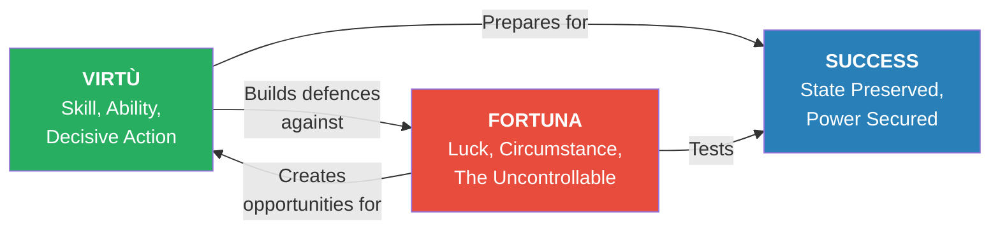
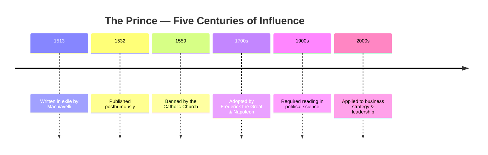
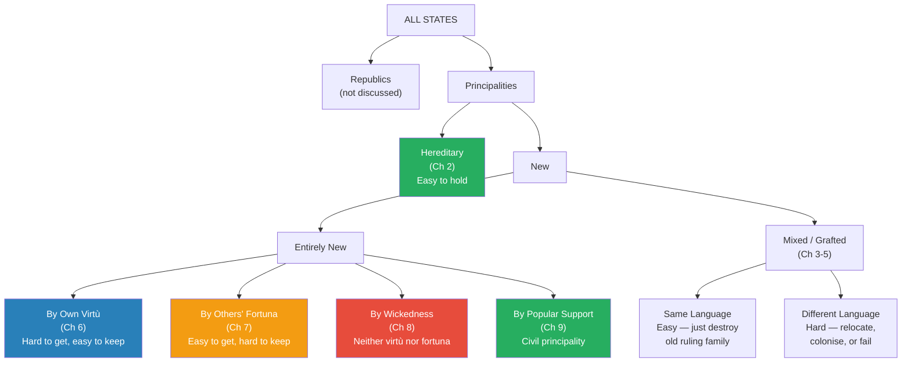
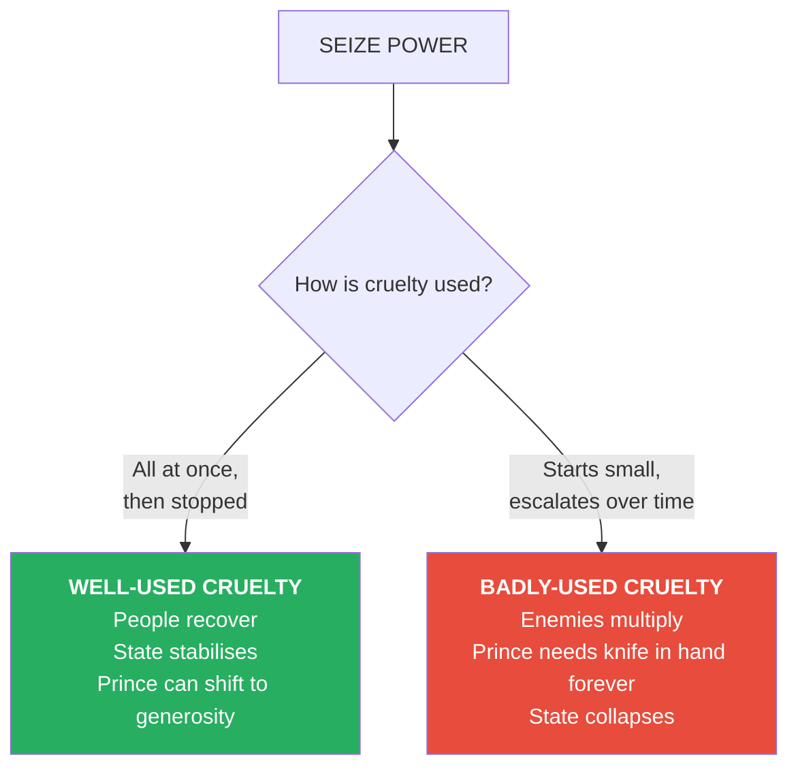
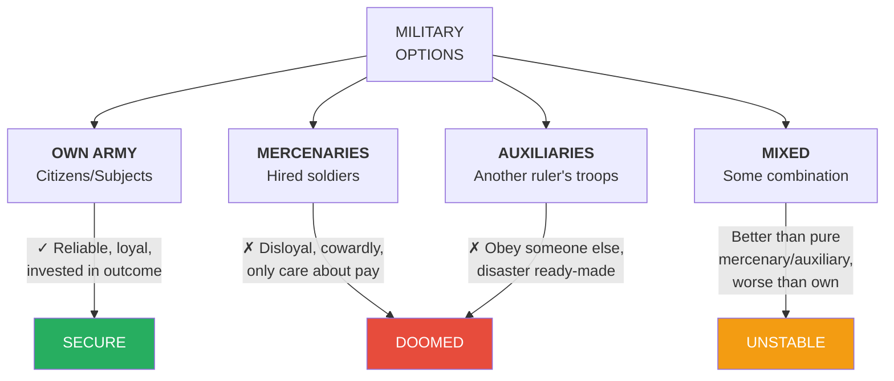
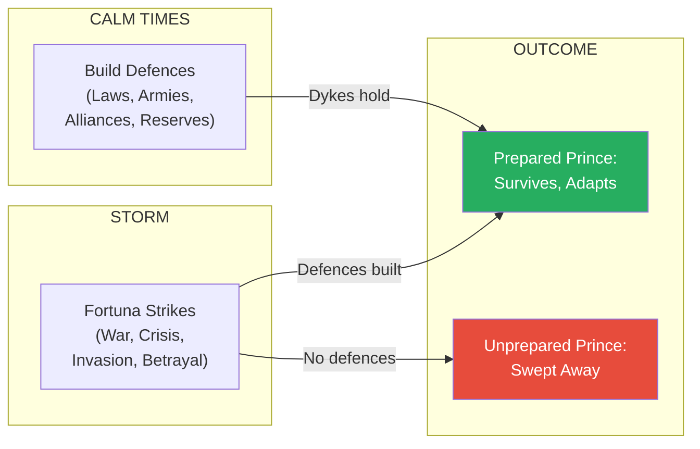

# The Prince — Niccolo Machiavelli

> *Written in exile, smuggled into history. In 1513, a disgraced Florentine diplomat—tortured, fired, banished to his farm—sat down and wrote the most dangerous political manual ever composed. Five centuries later, every leader who has ever chosen effectiveness over virtue is following a playbook Machiavelli drafted by candlelight. This is the book that made "Machiavellian" a word.*

---

## About the Author

- <b style="color: #2980b9">Niccolo Machiavelli (1469–1527)</b> served the Florentine Republic for 18 years as a senior diplomat and political adviser
- When the Medici recaptured Florence in 1512, he was stripped of his position, accused of conspiracy, and tortured on the rack
- He retired to his farm outside Florence, where he wrote *The Prince* in a matter of months — a concentrated distillation of everything he'd learned about power
- The book was dedicated to Lorenzo di Piero de' Medici (not the famous "Lorenzo the Magnificent," but his grandson) — Machiavelli's bid to return to political life
- He never regained a major position. *The Prince* was published five years after his death in 1527
- The word *"prince"* in this work means any ruler — king, duke, count, president. It is not a title but a role

## Historical Context — The Italy Machiavelli Knew

*To understand why The Prince reads with such urgency, you need to understand the catastrophe that was 16th-century Italy.*

- Italy was not a unified nation — it was a patchwork of independent city-states, papal territories, and small kingdoms, each with its own army (usually mercenary), its own foreign policy, and its own internal factional warfare
- The five major powers were the Papacy, Venice, Milan, Naples, and Florence — constantly scheming against each other while trying to prevent any single power from dominating the peninsula
- In 1494, King Charles VIII of France invaded Italy — and the entire system collapsed. Italy became a battlefield for French, Spanish, and Swiss armies over the next three decades
- <b style="color: #e74c3c">Machiavelli watched all of this happen from the inside</b> — he was a working diplomat during the French invasions, met Cesare Borgia personally, negotiated with Pope Julius II, and observed the destruction of the Italian political order at close range
- Key figures in the book are people Machiavelli dealt with directly:
  - **Cesare Borgia** — Machiavelli was sent as envoy to Borgia's court and witnessed his methods firsthand
  - **Pope Julius II** — Machiavelli negotiated with him on behalf of Florence
  - **Pope Alexander VI** — Borgia's father, whose papacy Machiavelli observed from Florence
  - **The Medici** — the family that destroyed the republic Machiavelli served, and to whom he dedicated this book
- This is not academic political theory — it's a field report from a disaster zone, written by someone who saw the bodies

> [!tip] Why This Book Matters
> Machiavelli didn't invent realpolitik — he just wrote it down first. Before him, political advice was dressed in moral philosophy. He stripped it bare: *here is how power actually works, here is what actually happens when you try to be virtuous in a world of wolves.* Every book on strategy, leadership, and influence published since exists in his shadow.

---

## The Big Idea

*Machiavelli's central argument is simple and shocking: a leader who governs by morality alone will be destroyed by those who don't. The successful prince must learn when to set aside virtue — when to deceive, when to be cruel, when to break promises — because the world is populated by people who will do all of these things to him first.*

- The book revolves around two Italian concepts that Machiavelli refuses to translate, because no single English word captures them:
  - <b style="color: #27ae60">Virtù</b> — ability, skill, decisive action, adaptability, force of will. What you *control*
  - <b style="color: #e74c3c">Fortuna</b> — luck, circumstance, the uncontrollable. What happens *to* you
- The tension between these two forces drives every chapter
- Machiavelli's position: <b style="color: #2980b9">fortuna decides about half of our actions, leaving the other half to our decisions</b>
- The prince's job is to maximise virtù and build defences against fortuna — like building dams and dykes before the river floods

*Virtù without opportunity achieves nothing. Opportunity without virtù is wasted. The great prince is the one who seizes the moment with both hands.*

- Machiavelli wrote this book as a practical gift: "the opportunity to get a grasp, quickly, of everything that it has taken me so many difficult and dangerous years to learn"
- He explicitly rejected decoration and pompous words — the book is meant to be useful, not beautiful
- His landscape-painter metaphor: "A landscape painter will place himself on the plain to see the mountains, and on a mountain to see the plain. To understand the people, one needs to be a prince; to understand princes, one needs to be of the people"
- This is a book written from below, looking up — by someone who understood both views

---

## Key Concepts at a Glance

| Concept | Meaning | Chapter |
|---------|---------|---------|
| **Virtù** | Ability, skill, decisive will — the controllable half of outcomes | Throughout |
| **Fortuna** | Luck, circumstance — the uncontrollable half | Throughout |
| **Fox and Lion** | Master both cunning (fox) and force (lion) — neither alone works | 18 |
| **Cruelty Well-Used** | All harsh acts done at once, then stopped — people recover | 8 |
| **Appearance vs. Reality** | Appear virtuous while prepared to act otherwise | 18 |
| **People as Foundation** | The people's goodwill is the best fortress any prince can build | 9, 19, 20 |
| **Military Self-Reliance** | Only your own citizen army is reliable; mercenaries will ruin you | 12–14 |
| **Tuberculosis Metaphor** | Problems are easy to cure when hard to see, impossible when obvious | 3 |
| **The Fortuna River** | Fortune is a flooding river — build dams in calm weather | 25 |
| **Armed Prophets** | Those who can enforce their vision succeed; those who can't, perish | 6 |

Borgia scores high across all seven dimensions while Louis XII fails on nearly every one — Machiavelli uses the contrast to demonstrate that power requires simultaneous mastery of multiple skills, and weakness in any single area creates a fatal vulnerability.

Only Marcus Aurelius and Septimius Severus survived — and they achieved it through opposite means (gentleness vs ruthlessness), proving Machiavelli's point that there is no single formula for power, only the requirement to match your approach to the circumstances of the times.

Machiavelli's most famous claim — that fortune decides about half our actions — frames the entire book as a manual for maximising the half you control while building defences against the half you cannot.

From banned manuscript to foundational political text — The Prince's journey through five centuries mirrors its own lesson: ideas backed by virtù survive any amount of fortuna.

### Machiavelli's Complete Taxonomy

*The entire first half of the book is organised around a classification system. Here's the complete map of how states are acquired and the challenges each type presents.*

*Each path to power has its own logic, its own dangers, and its own historical examples. Machiavelli treats the entire field of political power the way a physician treats disease: classify it first, then prescribe.*

---

## Part I: How States Are Won and Held

### The Taxonomy of Power

*Every state in history falls into one of two categories, and every acquisition of power follows a limited number of paths. Machiavelli begins by mapping the territory.*

- All states are either <b style="color: #2980b9">republics</b> or <b style="color: #2980b9">principalities</b> — Machiavelli sets republics aside entirely (he wrote about them elsewhere) and focuses only on principalities
- Principalities are either **hereditary** (ruled by the same family for generations) or **new** (recently acquired)
- New principalities may be **entirely new** or **grafted onto** an existing state
- The method of acquisition varies along three dimensions:
  - Was the territory previously free (self-governing) or under a prince?
  - Was it acquired by the prince's own arms or by others'?
  - Was it a product of virtù or of fortuna?

> [!abstract] The Hereditary Advantage
> - Hereditary princes have it easy: just don't offend your subjects and follow ancestral customs
> - The Duke of Ferrara survived attacks from Venice and from the Pope simply because his family had ruled for generations
> - People naturally support what they're used to — unless the prince is extraordinarily vicious
> - "The longer a family has ruled, the dimmer the memories of how they came to power"

---

### Mixed Principalities — The Real Challenge

*This is where the difficulties begin. When you graft a new territory onto an existing state, the problems multiply — and Machiavelli uses France's catastrophic Italian campaigns to show exactly how.*

- **Same language and customs:** relatively easy to hold
  - Destroy the old ruling family
  - Don't change the laws or taxes
  - Brittany, Burgundy, Gascony, and Normandy all stayed united with France this way

- **Different language and customs:** extremely difficult
  - <b style="color: #27ae60">Best option: relocate to the new territory personally</b> — you see problems as they arise, officials won't pillage, subjects have direct access
  - <b style="color: #27ae60">Second-best: establish colonies</b> — cheap, offend only a dispossessed minority, the rest stay quiet out of fear
  - <b style="color: #e74c3c">Worst option: military garrisons</b> — expensive (eats the entire income), alienates everyone, creates enemies who are still on their own ground

> [!tip] The Roman Model
> The Romans got empire management right. In every conquered territory they: sent colonies, maintained friendly relations with the weak (without increasing their power), kept down the strong, and never allowed foreign powers to gain a foothold. This four-part formula is Machiavelli's gold standard.

- <b style="color: #2980b9">The Tuberculosis Metaphor</b> — one of the book's most famous passages:
  - Problems in their early stages are hard to diagnose but easy to cure
  - Left untreated, they become visible to everyone but impossible to fix
  - The Romans dealt with threats early, even going to war prematurely, because they knew delay always favours the enemy
  - "Never let yourself be driven off-course by your desire to avoid a war — you won't avoid it, you'll merely postpone it to your disadvantage"

> [!example] Louis XII's Six Fatal Errors
> - France's King Louis XII came to Italy and proceeded to violate every principle Machiavelli lays down:
> - He eliminated the minor Italian powers who could have been his allies
> - He increased the strength of the Church — already the greatest power in Italy
> - He brought in Spain as a partner in conquering Naples — creating a rival
> - He didn't relocate to Italy to govern personally
> - He didn't establish colonies
> - He pulled down the Venetians — the one power that could have checked the Church and Spain
> - Machiavelli told the Cardinal of Rouen to his face: "The French don't understand politics" — and events proved him right

- <b style="color: #2980b9">The General Principle of Containment</b> — what Rome understood and France didn't:
  - Become protector of the weaker elements in a conquered territory
  - Weaken the stronger elements — never let them consolidate
  - Block any foreign power from gaining a foothold
  - These three rules, consistently applied, produce stability; violate any one and the whole position unravels
  - The Romans fought Philip and Antiochus in Greece specifically to avoid fighting them later in Italy — proactive containment over reactive crisis

- The chapter also contains Machiavelli's most pragmatic observation about ambition:
  - "It's a very natural and common thing to want to acquire territory; men do it whenever they can, and they are praised for this or anyway not blamed"
  - "But when they can't pull it off and yet push ahead regardless, that is folly"
  - The distinction is not between ambition and modesty — it's between ambition backed by capability and ambition without it

- <b style="color: #e74c3c">General rule: whoever causes another to become powerful brings about his own ruin</b> — because it takes skill or power to elevate someone, and those qualities will be seen as threatening by the one who benefited

---

### Two Kinds of Government — Why Some Conquests Stick

*Not all states are structured the same way, and the internal structure determines whether a conquest will be easy or hard, temporary or permanent.*

| Feature | Centralised (Turkey model) | Feudal (France model) |
|---------|---------------------------|----------------------|
| **Power structure** | One lord, all others are servants | King surrounded by hereditary barons |
| **Loyalty of officials** | Loyal to the prince who appointed them | Loyal to their own lands and people |
| **Conquering** | Hard — no disloyal insiders to exploit | Easy — always a disgruntled baron to recruit |
| **Holding** | Easy — destroy the ruling family, it's done | Hard — barons lead revolts for generations |
| **Historical example** | Alexander's conquest of Persia (held easily) | Rome's conquest of Gaul and Spain (constant revolts) |

- This explains why Alexander the Great's empire held together after his death — Persia was centralised, so once Darius was defeated, there was no one left to rally around
- It also explains why Rome faced constant rebellions in Spain and Gaul — each province had its own local lords with their own loyal subjects

---

### Governing Free Cities — The Hardest Problem

*What do you do with a city that governed itself before you took it? Machiavelli's answer is blunt, and it's one of the passages that earned him his reputation.*

- Three options for a conqueror:
  1. <b style="color: #e74c3c">Destroy it completely</b>
  2. Go and live there personally
  3. Let them keep their own laws, collect taxes, install a puppet government

- Machiavelli's recommendation is chilling but historically grounded:
  - The Spartans tried light-touch rule of Athens and Thebes — lost both
  - The Romans tried the same with Greece — failed, and had to destroy multiple cities
  - "In rebellions the rebels will always rally to the cry of *Freedom!*"
  - Pisa remembered its freedom and rebelled after a *century* of Florentine bondage

- People who lived under a prince adapt more easily — they're habituated to obedience and don't know how to organise themselves
- <b style="color: #e74c3c">Republics have more vitality, more hatred, more desire for revenge</b> — they never forget
- "The safest way is to destroy them or to go and live among them"

> [!warning] The Uncomfortable Truth
> Machiavelli is not saying destruction is *good*. He's saying it's *effective*. The entire book operates on this distinction: here is what works, here is what doesn't. Morality is a separate conversation.

---

## Part I (cont.): The Four Paths to Power

### Rising by Virtù — The Greatest Princes

*If you want to understand what real political greatness looks like, Machiavelli says, study the men who built something from nothing using only their own ability. These are his models.*

- The supreme examples: <b style="color: #27ae60">Moses, Cyrus, Romulus, Theseus</b>
- What they had in common:
  - Each found his **opportunity** in a crisis — enslaved Israelites, oppressed Persians, abandoned Romulus, scattered Athenians
  - Without the crisis, their ability would have had nothing to work with
  - Without the ability, the crisis would have produced nothing
  - "Opportunity enabled those men to prosper, and their great virtù enabled each to seize it"

- The paradox of innovation:
  - Princes who rise by virtù find it **hard to acquire** power but **easy to keep** it
  - The difficulty: they must introduce new systems, and <b style="color: #e74c3c">"nothing is more difficult to set up, more likely to fail, and more dangerous to conduct, than a new system of government"</b>
  - Everyone who benefited from the old system becomes your enemy
  - Those who might benefit from the new system offer only lukewarm support — partly from fear, partly from natural scepticism

- <b style="color: #2980b9">The Armed Prophet Principle</b> — one of the book's sharpest insights:
  - Can the innovator rely on himself, or must he depend on others?
  - If he needs others' help, he is doomed
  - If he can use force, he rarely fails
  - "Armed prophets always conquered, and the unarmed ones have been destroyed"
  - Savonarola dominated Florence with pure charisma — but when people stopped believing, he had no soldiers to compel them, and he was overthrown and burned

> [!example] Hiero of Syracuse — The Lesser Model
> - Rose from ordinary citizen to prince of Syracuse through pure military talent
> - The Syracusans, facing external threat, appointed him army commander — then rewarded him by making him prince
> - His first act: abolished the old army and created a new one, abandoned old alliances and made new ones
> - "He had everything needed to be a king except a kingdom"
> - Pattern: even at a smaller scale, the virtù-path requires the same ingredients — opportunity, ability, and your own armed force

---

### Rising by Fortuna — The Cesare Borgia Masterclass

*This is the book's most detailed case study: a man who was handed power by his father's position, then did everything right to keep it — and still lost. Machiavelli is fascinated, sympathetic, and ultimately heartbroken.*

- Those who rise by fortuna "float up" effortlessly — but they can't stay afloat
- They lack two things: **knowledge** (they've never had to learn command) and **power** (they don't have their own loyal army)
- States born overnight, "like everything in nature that grows fast, can't have roots"

- <b style="color: #2980b9">Cesare Borgia</b> (Duke Valentino) is Machiavelli's chosen model — not despite his failure, but because of the brilliance of his methods:

**Phase 1: Breaking free from dependence**
- Acquired Romagna using French auxiliary troops — but knew he couldn't trust them
- Switched to Orsini and Vitelli mercenaries — found them unreliable too
- Decision: never again rely on anyone else's arms or fortuna

**Phase 2: Building his own power base**
- Won over all the supporters of the Orsini and Colonna factions — made them his gentlemen, paid them well, gave them commands
- Within months, every former faction member was loyal to him personally
- Waited for an opportunity to crush the Orsini, then used trickery to lure their leaders to Sinigalia — and had them murdered

**Phase 3: Winning the people**
- Found Romagna lawless under weak local lords who preferred robbing subjects to governing them
- Installed Ramiro d'Orco — a decisive, ruthless enforcer — to restore order

> [!example] The Ramiro d'Orco Episode — Machiavelli's Most Chilling Story
> - Borgia needed Romagna pacified quickly, so he gave total authority to Ramiro d'Orco, a man known for decisiveness and brutality
> - d'Orco restored peace and order rapidly, building a considerable reputation
> - But Borgia sensed that the enforcer's severity was generating hatred — hatred that would attach to Borgia himself
> - Solution: he had d'Orco arrested and cut in two, leaving the pieces on the public square in Cesena with a bloody knife beside them
> - "This brutal spectacle gave the people a jolt, but it also reassured them"
> - The lesson: use cruelty through others, then publicly punish the cruelty to reclaim the people's love

**Phase 4: Long-term planning**
- Four preparations for a potentially hostile new pope:
  1. Exterminate the families of dispossessed lords (remove pretexts for interference)
  2. Win over the Roman gentlemen (create a political buffer)
  3. Control the college of cardinals (influence the papal election)
  4. Conquer enough territory to resist any pope's attack independently
- By the time his father Pope Alexander VI died, Borgia had completed three of four

**The Collapse:**
- Alexander died just five years after Borgia had begun
- Borgia was simultaneously mortally ill with the same sickness that killed his father
- Caught between two hostile armies, barely conscious, his plans unfinished
- His one fatal error: he allowed Cardinal Giuliano della Rovere — a man he had personally injured — to become Pope Julius II
- <b style="color: #e74c3c">"Anyone who thinks new benefits will cause great men to forget old injuries is wrong"</b>
- Borgia told Machiavelli personally that he had planned for every contingency — except being at death's door when his father died
- His foundations were genuinely solid: Romagna waited for him for over a month. In Rome, even half-dead, the hostile factions couldn't move against him
- If he'd been healthy, he could have blocked the election of any hostile pope — and the history of Italy might have been different

> [!tip] Why Borgia Is the Model Despite Failing
> Machiavelli's point is not that Borgia succeeded — he didn't. The point is that his *methods* were flawless. He failed because of "the extraordinary and extreme hostility of fortuna" — his father died too soon and he fell ill at the worst possible moment. Any prince who faces the same challenges should follow Borgia's playbook exactly.

---

### Rising Through Wickedness — The Third Path

*Some men seize power through pure criminality. Machiavelli acknowledges this as a distinct category — neither virtù nor fortuna — and draws from it a disturbing but precise lesson about the timing of violence.*

- <b style="color: #2980b9">Agathocles</b> — from potter's son to King of Syracuse:
  - Rose through the military ranks on pure ability
  - One morning, he assembled the people and senate as if for a public meeting — and at an agreed signal, his soldiers killed all the senators and the richest citizens
  - Seized power, defended against Carthage, and held Syracuse for decades
  - Yet Machiavelli refuses to call this virtù: "It can't be called virtù to kill one's fellow citizens, to deceive friends, to be without faith or mercy or religion"

- <b style="color: #2980b9">Oliverotto da Fermo</b> — a more intimate horror:
  - Wrote to his uncle claiming a ceremonial homecoming visit
  - Threw a grand banquet for his uncle and the leading citizens
  - Led them to a private room after dinner — soldiers emerged from hiding and slaughtered them all
  - Became prince of Fermo for exactly one year before Cesare Borgia had him strangled

- <b style="color: #27ae60">The Cruelty Calculus</b> — the chapter's real contribution:

- **Well-used cruelty:** committed all at once out of necessity, then discontinued and converted to benefits for the subjects. Agathocles followed this pattern — one mass killing, then stable rule for decades
- **Badly-used cruelty:** starts with a few acts but grows over time. The prince can never put down his knife, and the people can never trust him
- "A prince who seizes a state should commit all necessary injuries at the outset, then stop — so he can reassure people and win them over through generosity"
- The corollary: <b style="color: #e74c3c">"Men should be treated in such a way that there's no fear of their seeking revenge — either well-treated so they won't want it, or utterly crushed so they won't be capable of it"</b>

---

### Civil Principality — The People's Prince

*Not every prince rises through war or crime. Some are elevated by their fellow citizens — but the prince who forgets that the people are his foundation is doomed.*

- Two paths to civil principality:
  - Raised by the **nobles** — who want to oppress the people
  - Raised by the **people** — who want not to be oppressed

- <b style="color: #27ae60">Always choose the people as your power base</b>:

| Factor | Nobles as Base | People as Base |
|--------|---------------|----------------|
| **Their desire** | To oppress others | Not to be oppressed |
| **Their number** | Few — can be managed | Many — too numerous to fight |
| **Worst threat** | Will actively attack you | Will merely abandon you |
| **Satisfaction** | Impossible without harming others | Easy — just don't oppress them |
| **Flexibility** | Can be made and unmade at will | Always there — you can't replace them |

- A prince raised by the nobles must immediately work to win the people over — and this is possible, because they expected mistreatment and will be grateful for protection
- "The people ask of him only that he not oppress them"
- The old proverb "He who builds on the people builds on mud" is wrong — it's true only for private citizens, not for real princes who know how to lead

> [!warning] The Peacetime Trap
> - In quiet times, everyone promises loyalty and will "die for the prince" — when there's no prospect of actually dying
> - In troubled times, almost nobody shows up
> - A shrewd prince makes his citizens need the government at all times — not just in crisis
> - "The only rescue that is really helpful to you is the one performed by you"

---

### Measuring Strength and Ecclesiastical Principalities

*Two short but pointed chapters round out Part I: one on self-sufficiency, one on the unique case of Church-backed states.*

- **Can your state stand on its own?** The key question: can you field an army, or must you hide behind walls?
  - German cities as model: completely fortified, year's supply of food and fuel, public stockpiles of raw materials for a year's employment, strong military culture
  - A besieged prince whose people share sacrifice will find them more loyal, not less — "It's human nature to be bound by the benefits one gives as much as by those one receives"

- **Ecclesiastical principalities** are unique — they're backed by divine authority and don't need to be governed or defended:
  - "These are the only princes who have states they don't defend, and subjects they don't rule"
  - The real story: how papal *temporal* power grew
  - Before Alexander VI, the Italian powers kept the papacy weak by exploiting the Orsini/Colonna faction rivalry
  - Alexander VI destroyed the factions, Julius II expanded papal territory, Leo X inherited a strong position
  - Machiavelli's polite surface barely conceals his contempt: the Church became powerful through political manoeuvring, not divine favour

---

## Part II: The Foundations of Power

### Military Self-Reliance — The Non-Negotiable Foundation

*Machiavelli devotes three chapters to military matters, and his argument is absolute: without your own army, nothing else matters. Good laws, good alliances, good governance — all of it collapses if you're defended by someone else's soldiers.*

- "The chief foundations for all states are good laws and good armies. Because a poorly armed state can't have good laws, I can set the laws aside and address the armies"
- Four types of armed force:

- <b style="color: #e74c3c">Mercenaries</b> — Machiavelli's greatest contempt:
  - "Disunited, ambitious, undisciplined, disloyal; courageous with friends, cowardly before the enemy"
  - They fight for small wages — not enough to make them willing to die for you
  - If the mercenary commander is competent, he'll try to seize power for himself; if incompetent, he'll lose your wars
  - Italy's entire downfall came from decades of reliance on mercenary armies — "Italy has been overrun by France, robbed by France, ravaged by Spain, and insulted by the Swiss"
  - Mercenary commanders deliberately avoided real fighting: they didn't kill prisoners, didn't campaign in winter, and didn't protect their camps — all to minimise their own risk

- <b style="color: #e74c3c">Auxiliaries</b> — even worse than mercenaries:
  - An auxiliary army is united — but united in obedience to *someone else*
  - "What is most dangerous about mercenaries is their reluctance to fight; what is most dangerous about auxiliaries is their virtù"
  - If they lose, you lose; if they win, you're their prisoner
  - The Emperor of Constantinople brought 10,000 Turks into Greece to fight his neighbours — and that was the beginning of Greece's domination by the Ottomans

> [!example] Cesare Borgia's Military Evolution
> - Started with French auxiliaries — won battles but couldn't trust them
> - Switched to Orsini and Vitelli mercenaries — found them unreliable and disloyal
> - Finally built his own army from personal loyalists
> - His reputation grew with each transition: never more respected than when everyone saw he was master of his own forces
> - Pattern: own army → maximum respect; auxiliaries → maximum danger

- **David and Saul's armour:** David rejected Saul's armour to fight Goliath with his own sling and knife. "Someone else's armour will fall from your back, or weigh you down, or hamper your movements"
- <b style="color: #27ae60">"A principality that doesn't have its own army isn't safe — it is entirely dependent on fortuna"</b>

---

### A Prince's Military Duties — War Is Everything

*A prince who neglects military matters is a prince who has already begun to lose his state.*

- "A prince shouldn't devote any of his serious time or energy to anything but war"
- Francesco Sforza, a commoner with his own army, became Duke of Milan. His sons, who neglected military matters, went from being dukes back to being commoners
- There is no comparison between an armed man and an unarmed one — "It is not reasonable to expect an armed man to be willing to obey one who is unarmed"

- **Physical preparation:** hunting as military training — learn the terrain, harden the body
  - "How the mountains rise, how the valleys open out, how the plains lie, and the nature of rivers and marshes"
  - Knowledge of your own country's terrain makes it easier to understand any terrain

- **Mental preparation:** study the history of great commanders
  - Alexander modelled himself on Achilles, Caesar on Alexander, Scipio on Cyrus
  - "A wise prince will follow in the footsteps of great men, imitating ones who have been supreme"

> [!abstract] Philopoemen's Method
> - Philopoemen, prince of the Achaeans, thought about nothing but war — even in peacetime
> - Walking the countryside with friends, he would constantly pose tactical questions:
>   - "If the enemy were on that hill and we were here, who'd have the advantage?"
>   - "How could we attack without breaking ranks?"
>   - "If they tried to retreat, how could we cut them off?"
> - By this continual practice, he was prepared for any emergency

---

## Part II (cont.): The Prince's Character

### The Reality Principle — Chapter 15

*This is the hinge of the book. Everything before was about structure and strategy. Now Machiavelli turns to the prince's personal conduct — and announces that he's throwing out the entire tradition of moral advice to rulers.*

- "My aim is to write things that will be useful to the reader who understands them; so I find it more appropriate to pursue the real truth of the matter than to repeat what people have imagined"
- <b style="color: #e74c3c">"The gap between how men live and how they ought to live is so wide that any prince who thinks in terms not of how people do behave but of how they ought to behave will destroy his power"</b>
- A man who tries to act virtuously at all times "will soon come to grief at the hands of the unscrupulous people surrounding him"
- Therefore: **a prince must learn how to act immorally, using or not using this skill according to necessity**

- Machiavelli lists eleven pairs of qualities (generous/grasping, merciful/cruel, trustworthy/faithless, brave/cowardly, etc.) and acknowledges it would be wonderful to have all the "good" ones
- But reality: a prince must avoid the vices that would cost him his state, tolerate the vices that won't, and accept that "there's always something that looks like virtù but would bring him to ruin"

---

### The Free Spender and the Miser — Chapter 16

*Conventional wisdom says rulers should be generous. Machiavelli says that advice will bankrupt you.*

- If you spend freely in secret, nobody notices and you get called a miser anyway
- If you spend freely in public, you'll eventually run through your wealth and have to raise taxes
- Result: you've offended the many (through taxes) and rewarded the few (through gifts) — then you're "vulnerable, and at the first touch of danger will go down"

- <b style="color: #27ae60">Better to be called a miser</b>:
  - A miser who doesn't tax heavily is seen in time as generous — by everyone he *doesn't* take from
  - "Miserliness is one of the vices that enable a prince to govern"
  - Pope Julius II used his reputation for free spending to become pope — then immediately dropped it to fund his wars
  - The Kings of France and Spain succeeded through fiscal discipline, not lavish displays

- The one exception: spending wealth taken from others (plunder, conquered territories). Then spend freely — "or his soldiers will desert"
- "Open-handedness eats itself up faster than anything"

---

### Cruelty and Mercy — Is It Better to Be Loved or Feared?

*Chapter 17 contains the most famous passage in political philosophy. Machiavelli's answer has echoed through five centuries.*

- Every prince should want to be seen as merciful — but must be careful not to mismanage his mercy
- Cesare Borgia was called cruel, yet his "cruelty" restored order to Romagna, unified it, brought it peace. The Florentines, trying to avoid a reputation for cruelty, allowed the city of Pistoia to be torn apart by civil war
- <b style="color: #2980b9">"A few examples of punitive severity show more real mercy than those who are too lenient"</b> — because leniency leads to breakdown, which harms everyone

**The Famous Question:**

- Is it better to be loved than feared? Ideally both — but when you must choose:
- <b style="color: #e74c3c">"It is safer to be feared"</b>

- Why? Because of human nature:
  - Men are "ungrateful, fickle, deceptive, cowardly, and greedy"
  - They'll promise anything when the cost is low — blood, property, children — and abandon you the moment the bill comes due
  - Love operates through a sense of obligation — "and men are a low-down lot for whom that thought has no power"
  - Fear operates through the prospect of punishment — "and that thought never loses its power"

- **Critical qualification:** feared, yes — but <b style="color: #e74c3c">never hated</b>
  - Avoid seizing subjects' property and women — these are the triggers for hatred
  - "A man will forget the death of his father sooner than he would forget the loss of the property his father left to him"

> [!example] Hannibal vs. Scipio
> - Hannibal led an enormous mixed-race army across foreign lands for years — never a mutiny, never a breakdown of discipline. The explanation: "his inhuman cruelty, which combined with his enormous virtù to make him an object of respect and terror for his soldiers"
> - Scipio, by contrast, was too lenient: his army mutinied in Spain, and he failed to punish an officer who committed atrocities against the Locrians
> - Historians praise Hannibal's achievements while condemning his cruelty — but "they haven't thought hard enough," because the cruelty was the very foundation of those achievements

- Machiavelli's final formulation:
  - "Men decide whom they will love, while their prince decides whom they will fear"
  - <b style="color: #27ae60">"A wise prince will lay his foundations on what he controls, not what others control"</b>

---

### The Fox and the Lion — How Princes Should Keep Their Word

*Chapter 18 is the second most famous passage: Machiavelli's explicit instruction manual for political deception.*

- Everyone agrees that keeping your word is admirable — but recent experience shows that "princes who achieved great things haven't worried much about keeping their word"
- Two kinds of conflict: **law** (human) and **force** (bestial). When law fails, force is necessary
- The prince must embrace both the human and the beast in himself

- <b style="color: #2980b9">For the beast: choose the fox and the lion</b>
  - The lion can't defend against traps — needs the fox's cunning
  - The fox can't defend against wolves — needs the lion's strength
  - "Those who try to live by the lion alone don't understand what they are up to"

- A prince can't and shouldn't keep his word when:
  - Keeping it would work against him, AND
  - The reasons for giving it no longer exist
- "If men were entirely good this advice would be bad; but in fact they are dismally bad"
- A prince will never lack legitimate excuses for breaking promises

- <b style="color: #2980b9">The Appearance Doctrine</b> — the chapter's core:
  - A prince doesn't need to *have* all the good qualities — he needs to *appear* to have them
  - "To have those qualities and always act by them is injurious; to appear to have them is useful"
  - Appear merciful, trustworthy, friendly, straightforward, devout — but be mentally prepared to switch any of these off
  - "Men judge by the eye rather than by the hand; everybody gets to see, but few come in touch"

> [!example] Pope Alexander VI — The Master Deceiver
> - Alexander VI "was deceptive in everything he did — used deception as a matter of course — and always found victims"
> - "No man ever said things with greater force, reinforcing his promises with greater oaths, while keeping his word less"
> - His deceptions always worked because "he well understood this aspect of mankind"

- <b style="color: #27ae60">"Let the prince conquer and hold his state — his means will always be regarded as honourable, and he'll be praised by everybody"</b>
- Why? "Because the common people are always impressed by appearances and outcomes, and the world contains only common people"

---

### Avoiding Hatred and Contempt — The Master Rule

*Chapter 19 is the longest in the book, and it contains Machiavelli's most comprehensive advice: the two things that actually destroy princes are hatred and contempt. Avoid both, and almost nothing else matters.*

- What generates **hatred**: seizing subjects' property and women. Don't do it
- What generates **contempt**: being seen as variable, frivolous, effeminate, cowardly, irresolute. Don't be it
- "If he succeeds in avoiding hatred and contempt, he'll have played his part"

- Two constant worries for any prince:
  - **(a) Internal** — his own subjects (solved by not being hated)
  - **(b) External** — foreign powers (solved by being well-armed and having allies)

- <b style="color: #2980b9">Why conspiracies almost always fail</b>:
  - A conspirator can't act alone — he must recruit dissatisfied people
  - By revealing the plot, he puts each recruit in a position to earn great rewards by betraying him
  - "When he sees a certain gain from turning you in, and great uncertainty from joining your conspiracy, he'll turn you in"
  - A prince with popular support makes conspiracy nearly impossible — the conspirator must fear what happens *after* the crime, because the people will hunt him down

> [!example] The Bentivoglio Rescue — When People Love Their Prince
> - Annibale Bentivoglio, prince of Bologna, was murdered by the Canneschi faction in 1445
> - The people immediately rose up and killed every single Canneschi
> - The only surviving Bentivoglio was an infant — but the people's loyalty was so great they sent to Florence for a Bentivoglio rumoured to be there (thought to be a blacksmith's son) and gave him the government until the child was old enough to rule
> - The lesson: popular loyalty is the ultimate defence against conspiracy

- **The French Solution:** the French parliament was set up as a buffer between the king, the nobles, and the people
  - It could restrain the nobles and protect the common people — without the king being blamed
  - "Princes should leave unpopular policies to be implemented by others, and keep in their own hands any that will be accepted with gratitude"

- **The Roman Emperor Case Studies** — Machiavelli analyses ten consecutive emperors to prove his point:

| Emperor | Approach | Outcome | Why |
|---------|----------|---------|-----|
| Marcus Aurelius | Gentle, virtuous | Survived | Inherited throne, immense virtù commanded respect |
| Pertinax | Gentle, disciplined | Murdered | New prince who couldn't be gentle — soldiers hated discipline |
| Alexander Severus | Gentle, just | Murdered | Seen as effeminate, under his mother's thumb — contemned |
| Septimius Severus | Ruthless, cunning | Survived 18 years | Master of fox-and-lion, immense virtù held everyone in check |
| Commodus | Cruel, undignified | Murdered | Fought gladiators, ignored dignity — hated *and* contemned |
| Caracalla | Ferocious, cruel | Murdered | Unlimited cruelty, killed a centurion's brother — hatred from within |
| Maximinus | Warlike, lowborn | Murdered | Peasant origin (contempt) + extreme cruelty (hatred) = everyone rebelled |

> [!example] Septimius Severus — The Fox-and-Lion Emperor
> - When Pertinax was murdered by his bodyguard, Severus was commanding an army in Slavonia
> - Knowing that Julian (who bought the throne from the guards) was feeble, Severus convinced his army it would be right to march on Rome and "avenge Pertinax"
> - He moved so fast he reached Italy before anyone knew he'd left Slavonia — the frightened Senate elected him emperor and had Julian killed
> - Now facing two rival claimants (Niger in Asia, Albinus in the west), he couldn't fight both at once
> - **Fox move:** he wrote to Albinus offering to share the title of emperor — gave him the title "Caesar"
> - **Lion move:** with Albinus neutralised, he marched east, conquered and killed Niger
> - **Fox move again:** returning to Rome, he told the Senate that Albinus had "ungratefully" tried to murder him
> - **Lion move:** he hunted Albinus down in France and killed him
> - Pattern: pretence, deception, selective violence, speed — always mixing cunning and force

- The lesson: a new prince can't imitate Marcus Aurelius (who inherited his position), but shouldn't blindly follow Severus either. Take from Severus what's needed to *found* a state, and from Marcus what's needed to *maintain* one

---

## Part II (cont.): Princely Tools and Prestige

### Fortresses and Other Devices — Six Princely Strategies

*Should you disarm your subjects? Build fortresses? Encourage factions? Machiavelli evaluates six common princely tactics, and arrives at one overriding conclusion.*

- **Six devices** that princes have used to secure their states:

| Device | Machiavelli's Verdict |
|--------|----------------------|
| **(1) Disarming subjects** | Bad — offends them, shows cowardice or distrust, forces reliance on mercenaries |
| **(2) Encouraging factions** | Outdated — worked once, now factions just invite foreign attackers |
| **(3) Fostering hostility against yourself** | Can work — gives you enemies to crush publicly, raising your prestige |
| **(4) Winning over former opponents** | Often effective — men who were hostile and are then won over serve more loyally than original supporters |
| **(5) Building fortresses** | Sometimes useful — depends entirely on whether you fear your people or foreign powers |
| **(6) Destroying fortresses** | Sometimes wise — eliminates a crutch that creates false security |

- <b style="color: #27ae60">The best possible fortress is not being hated by your people</b>
  - "If you have fortresses, and your people hate you, the fortresses won't do you any good"
  - A rebellious populace will always find foreigners willing to help them
  - The Countess of Forlì survived one crisis behind her fortress walls — but when Cesare Borgia came with foreign allies backing the rebellious people, the fortress was useless

- On winning over former opponents: men who were initially hostile become the most loyal servants — they know they need to cancel the prince's bad impression of them
- But beware: men who helped you seize power out of *dissatisfaction with the previous government* will be impossible to satisfy — their discontent is permanent

---

### Acquiring Prestige — Be Decisive, Never Neutral

*A prince builds his reputation through bold action and clear choices. Sitting on the fence is the surest way to be destroyed.*

- Nothing builds prestige more than **great enterprises** and **setting a fine example**

> [!example] Ferdinand of Spain — The Master of Momentum
> - Ferdinand began with the conquest of Granada — keeping the barons busy thinking about war instead of plotting against him
> - Under cover of religion, he expelled the Jews, attacked Africa, invaded Italy, attacked France
> - His actions followed one another so rapidly that his enemies never had time to organise against him
> - "He has always planned and acted on a grandiose scale, keeping his subjects' minds in a state of amazement"

- <b style="color: #2980b9">On alliances — the critical rule: never be neutral</b>
  - When two neighbours fight, you must pick a side
  - If you stay neutral, the winner despises you (unreliable) and the loser hates you (you abandoned him)
  - If you pick a side and your side wins, you have a grateful, indebted ally
  - If you pick a side and your side loses, the loser will shelter you as a companion in shared misfortune
  - "Indecisive princes usually try to avoid immediate danger by taking the neutral route, and they are usually ruined by this choice"

- Other prestige-builders:
  - Honour talent and craft in all fields — encourage citizens to pursue their work without fear of confiscation or excessive taxation
  - Entertain the people at appropriate times
  - Treat guilds and clans with respect
  - Always maintain the majesty of rank

---

### Ministers, Flatterers, and the Three Kinds of Intellect

*Two short chapters on the people closest to the prince — and the single test that separates a good adviser from a dangerous one.*

- **The Minister Test:** "When you see the minister thinking more for himself than for you, he'll never be a good minister"
  - Judge a prince by the quality of his advisers — the first opinion people form of a ruler's intelligence comes from the men he has around him
  - A minister should think never of himself but always of his prince
  - In return, the prince should enrich and honour the minister — make him so comfortable that he fears any change of regime

- <b style="color: #2980b9">Three kinds of intellect</b>:
  1. **Superb** — understands things unaided
  2. **Good** — understands things when others explain them
  3. **Useless** — doesn't understand anything, even with help
  - A prince needs at least the second kind — enough judgment to evaluate what others tell him

- **The Flatterer Problem:**
  - Courts are full of flatterers
  - If you tell everyone they can speak freely, you lose respect — anyone can tell you the truth
  - If you surround yourself with yes-men, you make terrible decisions

- <b style="color: #27ae60">The solution: a cabinet of selected wise men</b>
  - Give the freedom to speak truth *only to them*, and *only when asked*
  - Question them about everything, listen carefully, then form your own conclusions
  - Never listen to uninvited advice — but when you sense someone is holding back, let your anger be felt
  - "An infallible rule: a prince who isn't wise himself can't take good advice"

> [!example] Emperor Maximilian — The Opposite of Good Practice
> - Maximilian never consulted anyone, yet never got his own way in anything
> - He made his plans in secret, told no one, then started implementing them
> - When courtiers raised objections, he'd change course
> - "He does something on one day and undoes it the next, no one ever understands what he wants"

---

## Part II (cont.): Fortune and the Future

### Why Italian Princes Lost Their States — Chapter 24

*A short, brutal chapter that condemns an entire generation of Italian rulers for their laziness.*

- Two defects all the failed princes shared:
  1. Poor military arrangements
  2. Either hated by the people or unable to protect themselves from the nobles

- The real culprit is not fortuna but **indolence** — going through quiet times without preparing for change
  - "It's a common human fault, failing to prepare for tempests unless one is actually in one"
  - When bad times came, they chose flight over self-defence
  - <b style="color: #e74c3c">"The only rescue that is really helpful to you is the one performed by you, the one that depends on yourself and your virtù"</b>

---

### Fortuna — The River and the Seasons

*Chapter 25 is Machiavelli's philosophical climax: his meditation on what humans can and cannot control, and his argument for boldness in the face of the unknown.*

- Many believe the world is governed by fortune and God in such a way that human prudence can do nothing about it
- Machiavelli's counter: <b style="color: #2980b9">"Fortuna decides half of our actions, leaving the other half — or perhaps a bit less — to our decisions"</b>

- **The River Metaphor** — the book's most powerful image:
  - Fortune is like a flooding river — when it overflows, it devastates everything in its path
  - But in calm weather, men can build dykes, dams, and channels so the next flood stays within banks
  - Italy was "open countryside with no dams, no dykes" — if virtù had built defences (as Germany, Spain, and France had done), the foreign invasions might not have happened at all

- **The Temperament Problem:**
  - A prince succeeds when his approach matches the spirit of the times
  - Of two cautious men, one succeeds and one fails — because the times suited one and not the other
  - But men can't change their temperament — a cautious person can't suddenly become impetuous
  - This is why fortunes rise and fall: the times change, but people don't

> [!example] Pope Julius II — Impetuous and Victorious
> - Julius II did everything impetuously — and the times rewarded it
> - His campaign against Bologna: Venice opposed it, Spain opposed it, France was undecided
> - Julius simply moved — leading the army himself, so fast that everyone was caught flat-footed
> - Spain and Venice froze. France was drawn in by momentum
> - "If he had stayed in Rome until everything had been agreed and settled, as any other pope would have done, he would never have succeeded"
> - The king of France would have made excuses and the others would have raised fears

- <b style="color: #2980b9">Machiavelli's final verdict on fortune and temperament</b>:
  - "It is better to be adventurous than to be cautious"
  - Fortuna "is more apt to submit to those who approach boldly than to those who go about the business coolly"
  - Fortune "is always more partial to young men, because they are less cautious, more aggressive, bolder"

---

### A Plea to Liberate Italy — Chapter 26

*The book's final chapter abandons analysis for passion. Machiavelli drops the mask of the detached observer and reveals himself as a patriot, pleading for someone — anyone — to unite Italy and drive out the foreign occupiers.*

- Italy has reached rock bottom: "more enslaved than the Hebrews, more oppressed than the Persians, more scattered than the Athenians"
- No leader, no government — beaten, robbed, lacerated, overrun
- There was once a man (Cesare Borgia) who showed a spark of greatness — but fortuna turned against him
- Italy is "begging God to send someone who will deliver it"

- Machiavelli addresses the Medici family directly:
  - Your family has the fortuna and virtù, favoured by God and by the Church
  - Moses needed enslaved Israelites; Cyrus needed oppressed Persians; Theseus needed scattered Athenians — **your opportunity is Italy's misery**
  - "God doesn't like doing everything, depriving us of our free will and of our share in the glory"

- The practical requirement: <b style="color: #27ae60">build your own citizen army</b>
  - Individual Italian soldiers are superb — strong, dexterous, skilful
  - But Italian armies fail because of bad leadership — nobody's virtù and fortuna have made them stand out enough for the others to follow
  - Create a national army and the foreign invaders can be beaten

- The chapter ends with a quotation from Petrarch: "Ancient valour is still strong in Italian hearts"

---

## Machiavelli's Maxims — The Sharpest Lines

*Throughout the book, Machiavelli drops principles that read like proverbs forged in acid. Here are the ones that have echoed through five centuries of political thought.*

**On Power and Human Nature:**
- <b style="color: #e74c3c">"Men should be treated in such a way that there's no fear of their seeking revenge — either well-treated so they won't want it, or utterly crushed so they won't be capable of it"</b>
- "Men are ungrateful, fickle, deceptive, cowardly, and greedy"
- "Men decide whom they will love, while their prince decides whom they will fear"
- "A man will forget the death of his father sooner than he would forget the loss of the property his father left to him"
- "Men are so naive and so dominated by present necessities that a deceiver will always find someone who'll let himself be deceived"

**On Strategy and Foresight:**
- <b style="color: #2980b9">"Whoever causes another to become powerful brings about his own ruin"</b>
- "Never let yourself be driven off-course by your desire to avoid a war — you won't avoid it, you'll merely postpone it to your disadvantage"
- "Nothing is more difficult to set up, more likely to fail, and more dangerous to conduct, than a new system of government"
- "Armed prophets always conquered, and the unarmed ones have been destroyed"
- "A principality that doesn't have its own army isn't safe"

**On Appearance and Reputation:**
- <b style="color: #27ae60">"Everyone sees what you appear to be, but few feel what you are"</b>
- "Let the prince conquer and hold his state — his means will always be regarded as honourable"
- "The common people are always impressed by appearances and outcomes"
- "To have all the good qualities and always act by them is injurious; to appear to have them is useful"
- "Miserliness is one of the vices that enable a prince to govern"

**On Fortune and Adaptability:**
- "Fortuna decides half of our actions, leaving the other half to our decisions"
- "It is better to be adventurous than to be cautious"
- "The only rescue that is really helpful to you is the one performed by you"
- "Anyone who thinks new benefits will cause great men to forget old injuries is wrong"

---

## The Five Key Frameworks — How They Connect

*Machiavelli's individual insights are powerful, but the real strength of the book emerges when you see how the frameworks interlock. Here's how the five core principles work as a system.*

### 1. The Virtù–Fortuna Balance → Everything Else

- Virtù without preparation is wasted talent; fortuna without defences sweeps you away
- Every other framework is a specific *application* of this tension:
  - Military self-reliance = building virtù
  - Foresight (tuberculosis metaphor) = preparing defences against fortuna
  - Fox and lion = the dual skills that constitute virtù in action
  - Appearance management = controlling the fortuna of public perception

### 2. People vs. Nobles → The Foundation Choice

- This isn't just about who to please — it's about what kind of power you build:
  - Nobles-based power requires constant compromise and is vulnerable to betrayal
  - People-based power is self-reinforcing: the people ask only not to be oppressed, and a content populace is the strongest defence against both conspiracy and invasion
  - Every other piece of advice (avoid hatred, maintain appearances, be feared not hated) flows from this choice

### 3. The Cruelty Calculus → The Timing of All Action

- The front-loading principle applies far beyond literal cruelty:
  - Reforms: implement all changes at once, then stabilise
  - Conflicts: deal with threats early when they're small
  - Alliances: commit decisively rather than hedging
  - Spending: be frugal consistently rather than generous then taxing

### 4. Fox and Lion → The Duality of Leadership

- This is Machiavelli's answer to the question "What kind of person should a prince be?"
  - Not consistently honest (the lion alone falls into traps)
  - Not consistently cunning (the fox alone is devoured by wolves)
  - The prince must shift between modes according to circumstance — and that adaptability *is* virtù

### 5. Appearance vs. Reality → The Layer Cake of Politics

- The deepest framework, and the one that makes the book genuinely uncomfortable:
  - Surface layer: what the prince says and how he presents himself (pious, merciful, trustworthy)
  - Middle layer: what the prince actually does (whatever the situation requires)
  - Foundation layer: what the prince *must* achieve (security for the state, loyalty of the people)
  - The surface layer must always serve the foundation — appearances are tools, not values

> [!tip] The Integrated Lesson
> A prince who has the people's support (Framework 2), acts decisively at the right moment (Framework 3), masters both cunning and force (Framework 4), manages his image carefully (Framework 5), and does all of this to prepare for the storms that fortune will inevitably send (Framework 1) — that is the prince who survives. Remove any one of these, and the system collapses.

---

## Modern Applications — Why This Still Matters

*The Prince was written for 16th-century Italian city-states, but its principles have proved eerily durable. Here's where Machiavelli's advice maps directly onto modern leadership.*

- **"Better feared than loved"** — in management, this translates to: respect and clear consequences are more reliable than trying to be liked. The manager who avoids difficult conversations (Machiavelli's "mismanaged mercy") allows dysfunction to spread
- **The armed-prophet principle** — having a vision without the power to implement it is useless. In organisations: ideas without execution capability are just wishful thinking
- **Appearance management** — every modern leader manages their public image. Machiavelli simply acknowledged this openly. The leader who refuses to "play politics" usually loses to the one who does
- **The tuberculosis metaphor** — problems caught early are solvable; problems ignored until they're obvious are catastrophic. This is the core of crisis management
- **Military self-reliance** — in business terms: build your own capabilities. Outsource too much and you lose the ability to compete independently
- **People as power base** — leaders who prioritise the many over the elite minority tend to last longer. Machiavelli was an early democrat in practice if not in theory
- **Neutrality is death** — in competitive environments, hedging your bets and refusing to commit ensures that neither side trusts you when things get difficult

> [!note] The Machiavellian Manager
> If you stripped the historical examples and translated the book into corporate language, *The Prince* would read like a brutally honest management manual:
> - Build your own team (don't rely on contractors or inherited staff)
> - Address performance problems immediately (don't let them fester)
> - Be consistent — don't change direction every time someone objects
> - Never trust that generosity alone will create loyalty — people follow strength
> - Win the support of the broad team, not just the inner circle
> - If you must make cuts, make them all at once and then stabilise
> - Choose your battles, but when you fight, fight decisively
> - Your reputation matters more than your intentions
> - Study the people who held your role before you — learn from their mistakes
>
> Machiavelli would recognise every modern office as a principality in miniature.

### What Machiavelli Got Wrong

- His cynicism about human nature is overstated — people are more cooperative and altruistic than he allows, especially in high-trust societies
- His model assumes a zero-sum world of constant competition between states — which describes Renaissance Italy but not all political contexts
- His dismissal of morality as a *guiding* principle (as opposed to an *appearance* to be managed) has been used to justify genuine tyranny — something he likely would have opposed
- He underestimates the power of institutions: his focus on the individual prince misses the fact that the most durable political systems are those that don't depend on any single leader's virtù
- His advice about republics (written elsewhere) is more nuanced and more admirable than anything in *The Prince* — this book presents only half of his political thought

---

## The Verdict

*The Prince* is the most misunderstood book in Western political thought. It is not a celebration of evil. It is not an instruction manual for tyrants. It is something far more uncomfortable: a completely honest account of how political power actually works, written by a man who had spent two decades watching it from the inside.

Machiavelli's central insight — that a leader must sometimes act against conventional morality to preserve the state and protect its people — is not shocking because it's wrong. It's shocking because it's obviously true, and because saying it out loud violates a taboo that every society maintains. We want to believe that good leadership and moral virtue are the same thing. Machiavelli observed that they often aren't, and he refused to pretend otherwise.

What makes the book endure is not its cynicism but its precision. Every principle is grounded in specific historical examples. Every generalisation is qualified by circumstance. Machiavelli doesn't say "always be cruel" — he says cruelty must be used well (all at once, then stopped) or not at all. He doesn't say "never keep your word" — he says keep it when you can, break it when keeping it would destroy you. He doesn't say "ignore morality" — he says appear moral at all times, because appearances are what most people see and outcomes are what they judge you by.

The book's deepest lesson may be its most personal: Machiavelli wrote *The Prince* to regain political employment, and it failed at that purpose entirely. He never returned to power. The Medici ignored him. The book was published after his death and immediately condemned by the Church. But here we are, five centuries later, still arguing about it — which suggests that the disgraced diplomat, writing by candlelight on his impoverished farm, understood something about power that most people still prefer not to acknowledge.

What separates *The Prince* from the countless imitators it spawned is its refusal to be comfortable. Robert Greene's *48 Laws of Power* draws heavily on Machiavelli but packages the lessons as entertainment. Modern management books that echo Machiavelli ("have difficult conversations early," "build your own team," "manage your reputation") file down the sharp edges. Machiavelli doesn't file anything. He hands you the blade and says: here, this is what it takes.

The final irony is that the man history calls "Machiavellian" — meaning cynical, manipulative, amoral — was in fact a passionate republican and patriot. He served the Florentine Republic, not a prince. He wrote *The Prince* not because he loved tyranny but because he wanted Italy free from foreign domination, and he believed that only a strong, unified principality — led by someone willing to do what was necessary — could achieve that. The most "Machiavellian" thing about Machiavelli was his willingness to tell uncomfortable truths to people who didn't want to hear them. Five centuries later, that remains the most valuable and rarest form of political courage.

---

## Related Reading

| Book | Connection |
|------|-----------|
| [[The 48 Laws of Power - Robert Greene]] | Greene's entire framework is built on Machiavellian foundations — Laws 3, 15, and 17 are direct echoes |
| [[The 33 Strategies of War - Robert Greene]] | Military self-reliance, calculated aggression, strategic deception |
| [[The Art of War - Sun Tzu]] | The Eastern counterpart: preparation, terrain, deception as strategy |
| [[The Dictator's Handbook - Bruce Bueno de Mesquita]] | Modern political science that formalises Machiavelli's intuitions about power bases and winning coalitions |
| [[Strategy A History - Lawrence Freedman]] | Machiavelli as foundational figure in Western strategic thought |
| [[Power - Jeffrey Pfeffer]] | Modern application of "reality over idealism" in organisational politics |
| [[The Art of Seduction - Robert Greene]] | Appearance management, human nature, the role of boldness |
| [[Influence - Robert Cialdini]] | The psychology behind Machiavelli's advice on appearances and manipulation |
| [[Meditations - Marcus Aurelius]] | The philosophical counterpoint — Machiavelli discusses Marcus as the gentlest of the Roman emperors |
| [[The Changing World Order - Ray Dalio]] | Rise and fall of empires through the same dynamics Machiavelli observed in Italian city-states |

---

## Reading Guide — How to Approach The Prince

*The Prince is short — under 100 pages in most editions — but it rewards multiple readings. Here's how to get the most from it.*

### First Reading: The Argument
- Read straight through. Don't stop for the historical examples you don't recognise — Machiavelli's points are always clear from context
- Pay attention to the structure: Part I (how states are won) builds the empirical foundation; Part II (how princes should behave) draws the controversial conclusions
- Note the shift at Chapter 15 — this is where the book becomes dangerous

### Second Reading: The Examples
- Now slow down with the historical cases. Machiavelli chose each one carefully:
  - **Cesare Borgia** — the model prince (did everything right, defeated by fortune)
  - **Louis XII** — the anti-model (had every advantage, made every mistake)
  - **Ferdinand of Spain** — the pragmatic success (ruthless but effective)
  - **The Roman Republic** — the systemic ideal (consistent principles, applied over centuries)
  - **Pope Alexander VI** — the master of deception (proof that appearances trump reality)

### Third Reading: The Subtext
- Machiavelli is often ironic — his "praise" of the Church is barely veiled contempt
- The dedication to the Medici is simultaneously flattering and threatening — "here is how power works, and here is what I know about your vulnerabilities"
- Chapter 26's passionate nationalism breaks completely from the book's analytical tone — and reveals Machiavelli's true motivation: not personal power, but Italy's salvation

### Key Terms to Watch
- **Virtù** — appears ~60 times; never simply "virtue." It means ability, skill, decisive will, force of character
- **Fortuna** — appears ~60 times; broader than "luck." It means all circumstances beyond your control
- **Prince** — any ruler of any kind, not a hereditary title
- **Free / Freedom** — self-governing (as in a republic), not "liberty" in the modern sense
- **Gentlemen** — men of rank or title, not "nice people"

---

## A Note on the Translation

*This summary is based on Jonathan Bennett's modernised English translation (Early Modern Texts, 2017). Bennett preserves the key Italian terms — virtù, fortuna — untranslated, which is essential. The original Italian is muscular, direct, and often darkly funny. Any translation that makes Machiavelli sound academic has missed the point: this is a man writing with the urgency of someone who has been tortured for his political convictions and wants to make sure the next generation doesn't make the same mistakes.*
