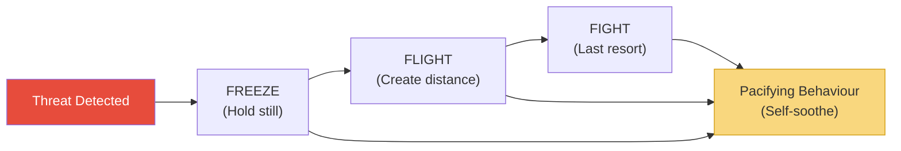
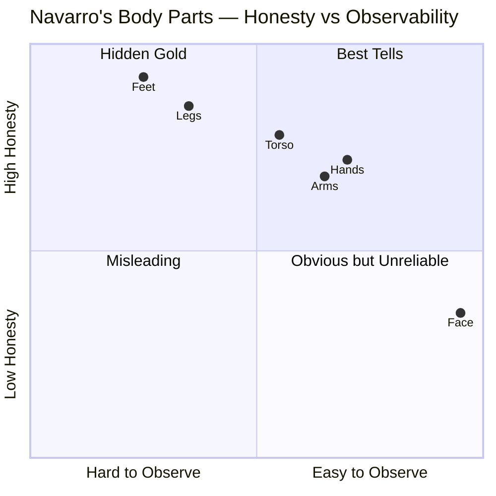
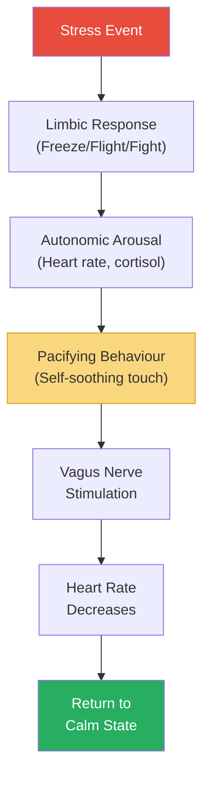
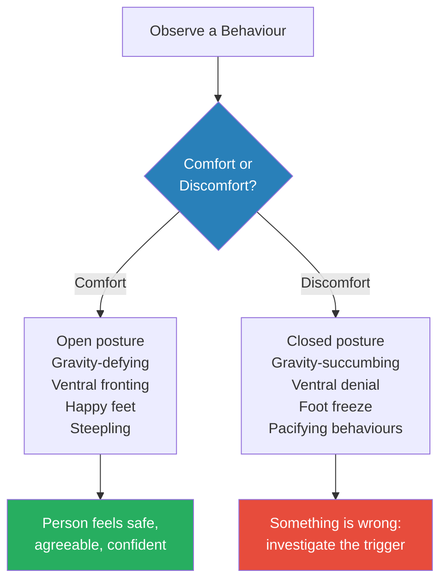
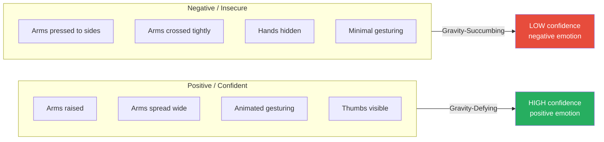
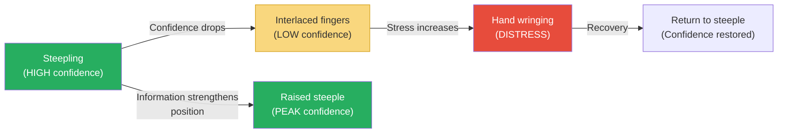
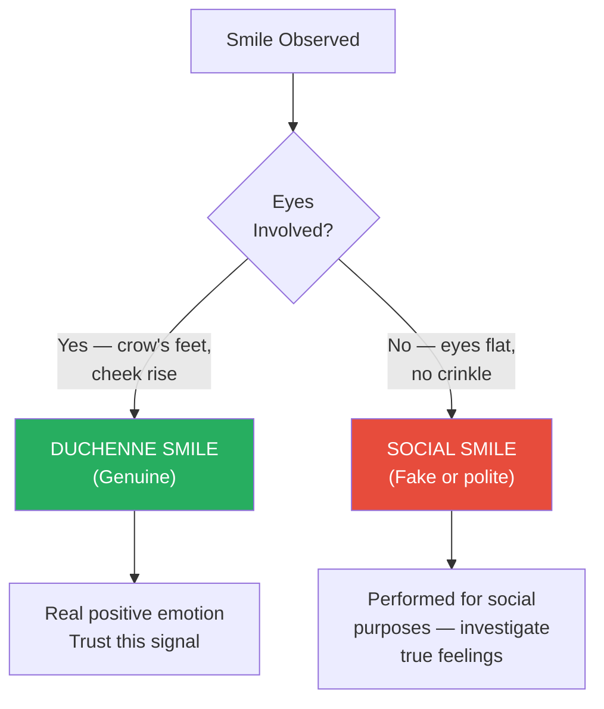
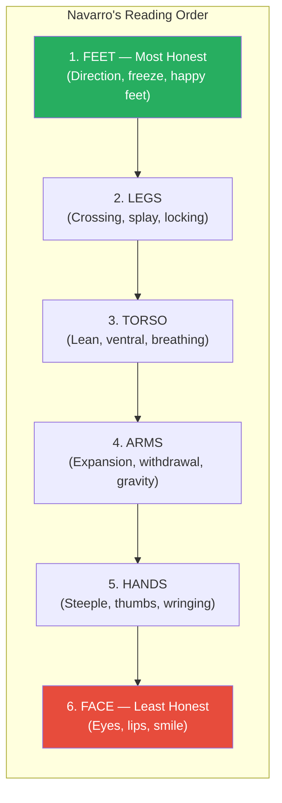
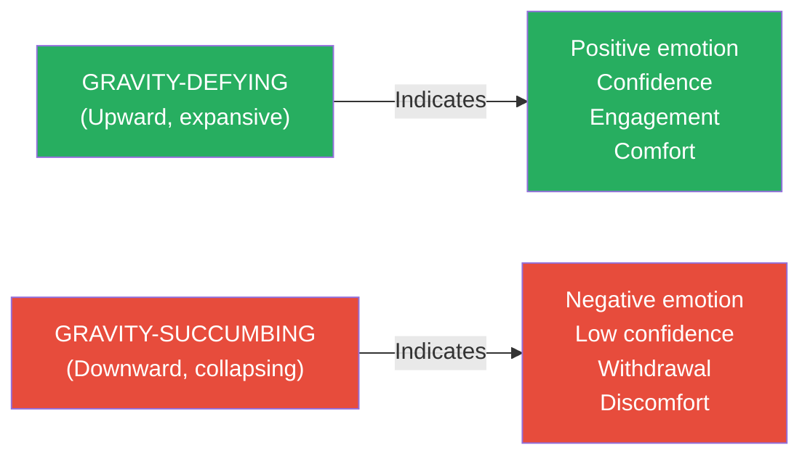
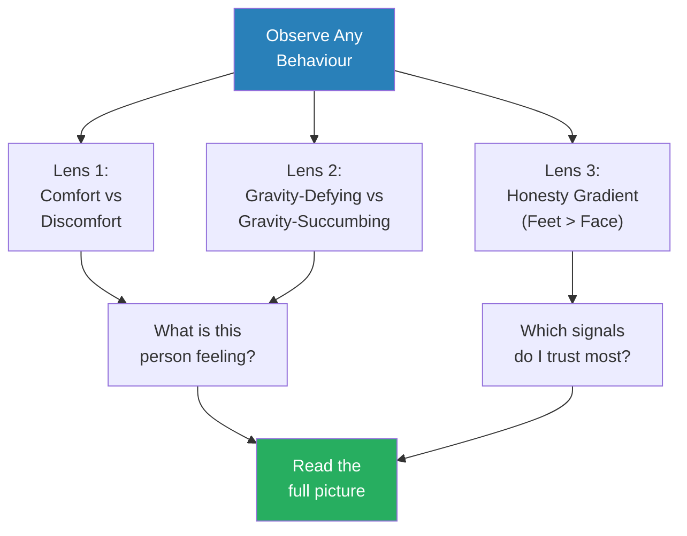

# What Every Body Is Saying — Joe Navarro

> Joe Navarro spent twenty-five years as an FBI Special Agent reading the nonverbal behaviour of spies, terrorists, and criminals — and before that, he spent his childhood as a Cuban refugee learning to read the body language of American classmates because he couldn't speak their language.
> This book distils both experiences into a systematic, body-part-by-body-part guide to decoding what people are really thinking, feeling, and intending — starting with the feet (the most honest part of the body) and working upward to the face (the least honest).
> The framework is built on one scientific insight: the limbic brain — the ancient, emotional brain — reacts reflexively and cannot be consciously controlled. Its freeze, flight, and fight responses, and the pacifying behaviours that follow them, are the true language of the body.
> Where most body language books focus on the face, Navarro argues that the face is the biggest liar on the body, and that real tells live in the feet, legs, torso, and hands — places most people never think to look.
> After twenty-five years of reading nonverbal cues in interrogation rooms, airport intercepts, and counterintelligence operations, Navarro teaches you to see what you have been looking at your entire life but never truly observed.

---

## About the Author

Joe Navarro served twenty-five years in the FBI, specialising in counterintelligence, behavioural assessment, and interviewing. He is one of the Bureau's original members of the elite Behavioural Analysis Program and was instrumental in developing the FBI's nonverbal communication training curriculum. His interest in body language began at age eight, when he arrived in the United States from Cuba unable to speak English and had to rely entirely on reading people's physical signals to navigate his new world — an experience that gave him a head start of several decades over his FBI colleagues. He now teaches nonverbal communication for the FBI, CIA, and at medical schools, and has become one of the world's foremost authorities on body language and its practical applications.

---

## The Big Idea

- Navarro's central claim is that <b style="color: #2980b9">the body is more honest than the mouth</b>
- All behaviour is governed by the brain, but different parts of the brain have different levels of honesty
- The <b style="color: #2980b9">limbic brain</b> (the ancient mammalian brain) reacts reflexively and cannot be consciously controlled — it is the "honest brain"
  - It evolved over millions of years to keep us alive
  - Its responses are hardwired, universal across cultures, and nearly impossible to suppress
  - When it detects a threat, it responds before the thinking brain even knows what happened
- The <b style="color: #2980b9">neocortex</b> (the thinking brain) is capable of complex reasoning, language, and abstract thought — but also of deception
  - It is the "lying brain" because it can override authentic emotional expression with manufactured signals
  - Every poker face, forced smile, and rehearsed expression is a neocortex production
- Nonverbal behaviour generated by the limbic system is therefore more reliable than words generated by the neocortex
- <b style="color: #27ae60">The master skill is reading the binary of comfort vs discomfort across the entire body, then looking for pacifying behaviours that confirm what you have seen</b>

---

- When the limbic brain detects a threat, it triggers three responses in a specific order:
  1. <b style="color: #2980b9">Freeze</b> — hold still to avoid detection (NOT fight, as commonly believed)
  2. <b style="color: #2980b9">Flight</b> — create distance from the threat
  3. <b style="color: #2980b9">Fight</b> — confront the threat as a last resort
- <b style="color: #e74c3c">The popular phrase "fight or flight" gets the order wrong and omits the most common response entirely</b>
- After any limbic stress response, the brain recruits the body to perform <b style="color: #2980b9">pacifying behaviours</b> — self-soothing actions that calm the nervous system
- These pacifiers (neck touching, face rubbing, hair playing, leg cleansing) are involuntary and observable
- They tell you that something just caused the person stress — even if you cannot see what triggered it

Every limbic response is followed by pacifying behaviour — whether the person froze, fled, or fought, the body needs to calm itself afterward.

---

## Key Concepts at a Glance

| Concept | One-line summary |
|---------|-----------------|
| **Limbic Brain** | The ancient, reflexive brain that produces honest nonverbal behaviour |
| **Neocortex** | The thinking brain that can reason, speak — and lie |
| **Freeze/Flight/Fight** | The three survival responses, in that order — freeze first, fight last |
| **Pacifying Behaviours** | Self-soothing actions (neck touch, face rub, leg cleanse) that follow stress |
| **Comfort vs Discomfort** | The master binary: every nonverbal signal falls into one of these two categories |
| **Ten Commandments** | Navarro's ten rules for accurate observation of nonverbal behaviour |
| **Gravity-Defying Behaviours** | Upward movements (bouncy walk, raised arms, arched brows) = positive emotions |
| **Gravity-Succumbing Behaviours** | Downward movements (slumped posture, lowered chin, limp arms) = negative emotions |
| **Ventral Fronting/Denial** | Exposing your torso to someone = comfort; turning it away = discomfort |
| **Steepling** | Fingertip-to-fingertip hand position = the highest confidence display |
| **Thumb Displays** | Visible thumbs = confidence; hidden thumbs = insecurity |
| **Lip Compression** | Lips pressed together until they disappear = distress or disagreement |
| **Eye Blocking** | Eyelids closing or narrowing = the brain trying to block out a threat |
| **Baseline** | A person's normal behaviour — deviations from baseline are what matter |
| **Clusters** | Multiple tells occurring together are far more reliable than any single signal |
| **Honesty Gradient** | The further a body part is from the brain, the more honest its signals |
| **Synchrony** | When words and body language match, the message is likely truthful |

The fundamental disconnect: most people fixate on the face — the least honest body part — while ignoring the feet and pacifying behaviours that carry the most reliable limbic signals.

Every limbic response triggers specific pacifying behaviours — freeze leads most often to neck touching, flight to leg cleansing, and fight to lip compression — creating observable patterns that trained observers can decode in real time.

Steepling — fingertips pressed together — is Navarro's single most reliable confidence indicator, appearing consistently across cultures and contexts.

The feet sit in the "hidden gold" quadrant — extremely honest but rarely observed — while the face occupies the "obvious but unreliable" zone, which is why Navarro insists readers learn to read the body from the ground up.

---

## Chapter 1: Mastering the Secrets of Nonverbal Communication

*Navarro opens not with theory but with a Supreme Court case — and the argument that reading body language is so fundamental it has been validated by the highest court in the land.*

### Terry v. Ohio — Body Language in the Supreme Court

- In 1968, the U.S. Supreme Court heard the case of <b style="color: #2980b9">Terry v. Ohio</b>
- A plainclothes detective named Martin McFadden watched two men pacing back and forth in front of a store, pausing to peer inside, then walking away — repeating this pattern multiple times
- McFadden recognised the nonverbal pattern: these men were casing the store for a robbery
- He approached them, patted them down, and found concealed weapons
- The case went to the Supreme Court, which ruled that McFadden's observation of their nonverbal behaviour was sufficient to justify the stop-and-frisk
- <b style="color: #27ae60">The ruling established that nonverbal behaviour is legally meaningful — a trained observer's reading of body language can constitute reasonable suspicion</b>
- Navarro uses this case to make a larger point: if the Supreme Court recognises the validity of nonverbal observation, ordinary people should take it seriously too

> [!example] Detective McFadden's Observation (1968)
> - Detective Martin McFadden, a 39-year veteran of the Cleveland police, was patrolling downtown when he noticed two men behaving strangely
> - They would walk past a store, pause to look in the window, continue walking, then circle back and do it again
> - One of them made this pass at least a dozen times; the other, roughly half a dozen
> - They also conferred with a third man at a nearby corner between passes
> - McFadden recognised the pattern: these men were "casing" the store for a daylight robbery
> - He approached, identified himself, and when one man mumbled a response, McFadden spun him around and patted him down — discovering a concealed pistol
> - The second man also had a weapon
> **The lesson:** Nonverbal behaviour communicates intentions — McFadden read their plan before they executed it, simply by observing what their bodies were doing.

---

### The Ten Commandments of Observation

*These are the rules Navarro teaches every new FBI agent before they begin studying specific nonverbal cues.*

<b style="color: #2980b9">Navarro's Ten Commandments</b> form the foundation for everything that follows in the book. Without these rules, individual body language observations are unreliable:

1. **Be a competent observer of your environment** — Most people sleepwalk through life, seeing but not observing. Navarro spent years training himself to notice what others missed.
2. **Observing in context is key** — A person rubbing their neck after a car accident means something different from a person rubbing their neck after a question about finances.
3. **Learn to recognise and decode universal nonverbal behaviours** — Some signals (freeze, flight, fight; pacifying behaviours) are universal across all humans, regardless of culture.
4. **Learn to recognise and decode idiosyncratic nonverbal behaviours** — Some signals are unique to an individual. A person who always crosses their arms when thinking is different from a person who only crosses them when defensive.
5. **When you interact with others, establish a baseline** — You cannot spot a deviation if you do not know what normal looks like for this particular person.
6. **Always try to watch for multiple tells (clusters)** — <b style="color: #e74c3c">A single signal means almost nothing. Clusters of signals in the same direction mean something.</b>
7. **Look for changes in behaviour** — The shift matters more than the position. If someone was relaxed and suddenly stiffens, the stiffening is the signal — not their current posture.
8. **Learn to detect false or misleading signals** — The face is particularly skilled at generating misleading expressions. The limbic system's genuine signals rarely appear where you expect them.
9. **Know how to distinguish comfort from discomfort** — This is the master skill. Everything in the book reduces to this binary.
10. **Be subtle in your observations** — <b style="color: #e74c3c">Staring at someone's feet or hands is not subtle observation — it is creepy behaviour that will distort what you are trying to observe.</b>

> [!abstract] How to Establish a Baseline
> 1. Observe the person in a neutral, low-stress context first (waiting room, casual conversation)
> 2. Note their resting posture: how do they normally sit, stand, hold their hands?
> 3. Note their resting facial expression: are they naturally animated or flat?
> 4. Note their typical gestures: do they talk with their hands? Cross their arms often?
> 5. Note their energy level: are they bouncy and kinetic, or still and contained?
> 6. Once you have this baseline, any deviation becomes meaningful data

> [!tip] Core Insight
> The question is never "what does this gesture mean?" — it is "what changed, and what was happening in the environment when it changed?" Context and change are everything. Static positions mean little without a baseline.

---

### The Origin Story — Why Navarro Sees What Others Miss

- Navarro arrived in the United States from Cuba at age eight, unable to speak a word of English
- He could not understand his classmates, his teachers, or the world around him
- To survive socially, he became intensely attuned to nonverbal signals — facial expressions, postures, gestures, tones
- He learned to read whether a teacher was pleased or angry, whether a classmate was friendly or hostile, whether an adult was trustworthy or dangerous — all without understanding a single word
- This childhood necessity became a lifelong skill, and eventually a career
- <b style="color: #27ae60">Navarro's edge was not intelligence or training — it was thousands of hours of practice that began when he was eight years old</b>

> [!example] The Eight-Year-Old Observer
> - Young Joe Navarro arrived in Miami from Cuba, part of the wave of refugees fleeing Castro's regime
> - He spoke only Spanish and was placed in an American school where nobody spoke his language
> - On his first day, a group of boys approached him on the playground — he could not tell if they were friendly or threatening
> - He learned to read their postures, their pace of approach, their facial expressions, the tension in their shoulders
> - Within months, he could predict who would be kind and who would be cruel before they opened their mouths
> - This skill became so refined that by the time he joined the FBI decades later, his supervisors noticed he could read people faster and more accurately than agents with decades more experience
> **The lesson:** Nonverbal literacy is a skill, not a gift. Navarro developed it out of necessity, but anyone can develop it through deliberate practice.

---

### Nonverbal Communication in Numbers

- Navarro cites research by Albert Mehrabian and others suggesting that <b style="color: #2980b9">60 to 65 percent of all interpersonal communication is nonverbal</b>
- In some emotional contexts, the proportion is even higher — up to 80 percent
- This means that when people say "I could tell something was wrong even though she said she was fine," they are reading the dominant communication channel, not the minor one
- Words are the minor channel — the body is the major one
- Most people are unconsciously fluent in reading nonverbal behaviour but have never studied it consciously:
  - You can tell when someone is angry even before they speak
  - You can sense when a room is tense the moment you walk in
  - You can feel when someone does not like you, even if they are perfectly polite
- Navarro's argument is that you are already reading body language — the book simply teaches you to do it systematically, accurately, and with full awareness of what you are observing

---

## Chapter 2: Living Our Limbic Legacy

*Navarro lays the scientific foundation: the brain has three layers, and only one of them tells the truth.*

### The Triune Brain

- The brain has three major regions, each with a different evolutionary age and a different relationship to honesty:

| Brain Region | Evolutionary Age | Function | Honesty Level |
|-------------|-----------------|----------|---------------|
| **Reptilian (brain stem)** | Oldest | Basic survival: breathing, heart rate, body temperature | Not relevant to body language |
| **Limbic (mammalian)** | Middle | Emotions, survival responses, social bonding | **Most honest** — cannot be consciously controlled |
| **Neocortex (human)** | Newest | Language, abstract thought, planning, deception | **Least honest** — capable of lying |

- <b style="color: #2980b9">The limbic brain</b> is the key to reading people
- It evolved in mammals to handle social living, threat detection, and emotional processing
- Its responses are reflexive — they happen before the thinking brain can intervene
- When you touch a hot stove, you pull your hand away before you consciously register pain — that is the limbic brain in action
- The same mechanism applies to social threats: when someone says something that upsets you, your body reacts before your mouth can formulate a polite response
- <b style="color: #27ae60">The limbic response is always the first response — and it is always the honest one</b>

---

### Freeze, Flight, Fight — In That Order

*The sequence is not what you learned in school. Freeze comes first, fight comes last — and understanding this sequence changes how you read every nonverbal signal.*

- When the limbic brain detects a threat, it triggers a survival response sequence:
  - **Freeze** — The oldest response, inherited from our earliest ancestors
    - When a predator appeared, the safest option was to hold perfectly still — movement attracts attention
    - In modern life, freeze manifests as: suddenly going rigid in a chair, locking the ankles behind chair legs, holding your breath, becoming very still during a difficult conversation
    - <b style="color: #27ae60">Freeze is the most common limbic response in modern social situations and the most overlooked</b>
  - **Flight** — If freezing does not resolve the threat, the body tries to create distance
    - In ancient times: running away
    - In modern life: leaning back in a chair, turning feet toward the exit, closing the eyes, rubbing the eyes (blocking the threat from sight), placing objects between you and the threat (a pillow, a bag, a crossed arm)
    - Flight does not require literal running — any behaviour that creates physical or psychological distance counts
  - **Fight** — The last resort, used only when freeze and flight have failed
    - In ancient times: physical combat
    - In modern life: argument, invasion of personal space, aggressive posture, finger-pointing, puffing up the chest
    - <b style="color: #e74c3c">Most body language books start with fight — but fight is actually the rarest limbic response in civilised settings</b>

---

### Modern Manifestations of Freeze, Flight, and Fight

- Navarro emphasises that these ancient survival responses have been repurposed in modern life
- Recognising their modern forms is the key to reading people in everyday contexts:

| Response | Ancient Form | Modern Social Form | What to Watch For |
|----------|-------------|-------------------|-------------------|
| **Freeze** | Hold still to avoid predator | Going rigid in a chair; locking ankles | Sudden stillness in a previously moving person |
| **Freeze** | Hold still to avoid predator | Restricting arm movements mid-gesture | Hands that were animated suddenly stop |
| **Flight** | Run away from danger | Leaning away from someone at the table | Torso shifts backward during a specific topic |
| **Flight** | Run away from danger | Feet pointing toward exit | Lower body is preparing to leave |
| **Flight** | Run away from danger | Eye blocking, closing eyes | The brain is trying to "flee" from visual input |
| **Flight** | Run away from danger | Placing objects as barriers (bag, cup) | Creating symbolic distance |
| **Fight** | Physical combat | Jaw clenching, finger pointing | Aggression channeled into small motor signals |
| **Fight** | Physical combat | Puffing out the chest, widened stance | Making the body appear larger to intimidate |
| **Fight** | Physical combat | Invading personal space | Aggressive territorial behaviour |

> [!example] Freeze in the Interrogation Room
> - Navarro describes interviewing a suspect who had been relaxed and conversational for an hour
> - When Navarro mentioned a specific date — the date of the crime — the suspect's feet, which had been moving freely, suddenly locked behind the legs of the chair
> - His hands, which had been gesturing, went flat on the table
> - His breathing became shallow
> - He was still talking, still sounding calm — but his body had gone into a full limbic freeze
> - The freeze told Navarro that the date was significant — and that the suspect was concealing something about it
> - The subsequent investigation confirmed that the date was the date of the crime
> **The lesson:** The freeze response is subtle — it is not dramatic like fight or obvious like flight. But it is the first response the body produces, and it is the one most people miss.

> [!example] Flight at the Dinner Table
> - Navarro recalls attending a dinner party where a husband and wife were seated next to each other
> - For most of the evening, both were oriented toward the table, engaged in conversation, leaning slightly inward
> - When another guest mentioned an upcoming trip — a trip it turned out the wife wanted to take but the husband had vetoed — the wife's body shifted
> - She leaned away from her husband, angled her torso toward the guest who mentioned the trip, and her feet rotated under the table to point away from her husband
> - She never said a word about it — but her body had performed a full flight response away from the source of stress (her husband and the reminder of the disagreement)
> **The lesson:** Flight does not require standing up and leaving. The body can "flee" while staying seated — through leaning, turning, and reorienting the feet. Watch for directional shifts in the torso and lower body.

---

### Pacifying Behaviours — The Body's Self-Medication

*After any limbic stress response, the body needs to calm itself. The way it does this is observable, predictable, and remarkably informative.*

- <b style="color: #2980b9">Pacifying behaviours</b> are self-soothing actions that the body performs automatically after experiencing stress
- They are the equivalent of a mother stroking a crying baby — except you are doing it to yourself
- The mechanism is physiological: touching certain areas of the body stimulates nerve endings that activate the vagus nerve, which in turn slows heart rate and lowers blood pressure
- This is not metaphorical — it is a genuine calming response that the nervous system produces
- Navarro catalogues the most common pacifiers:

| Pacifying Behaviour | Description | What It Signals |
|---------------------|-------------|-----------------|
| **Neck touching** | Hand to the front or side of the neck, rubbing or covering the suprasternal notch | High distress — the neck is a vital, vulnerable area |
| **Face rubbing** | Stroking the cheeks, chin, or forehead | Moderate stress — stimulates nerve endings that calm the vagus nerve |
| **Hair playing/stroking** | Running fingers through hair, twisting strands | Self-soothing — especially common in women under stress |
| **Leg cleansing** | Rubbing palms along the thighs (often under a table, invisible) | Significant stress — the large surface area of the thigh provides maximum calming |
| **Lip licking** | Tongue across the lips | Mild to moderate stress — the lips dry when the body enters a stress state |
| **Exhale puffing** | Puffing out the cheeks and exhaling slowly | Acute stress — the body is trying to lower its heart rate |
| **Ventilating** | Pulling the collar away from the neck, lifting hair off the neck | High stress — the body is overheating due to the stress response |
| **Arm rubbing/self-hugging** | Rubbing one's own arms, or crossing arms and gripping the upper arms | Moderate to high stress — simulates the comfort of being held |
| **Object manipulation** | Playing with a pen, ring, watch, or jewelry | Mild, ongoing stress — redirecting nervous energy into an object |

- <b style="color: #27ae60">Pacifying behaviours are the most reliable nonverbal signals because they are performed unconsciously and serve a genuine physiological function</b>
- A person can fake a smile, but nobody fakes rubbing their neck after a stressful question — the behaviour serves no social purpose, only a physiological one
- The specific pacifier chosen often reveals the intensity of the stress:
  - Low stress: playing with a pen, adjusting clothing
  - Medium stress: rubbing the face, playing with hair
  - High stress: touching the neck, covering the suprasternal notch, exhale puffing, ventilating

Pacifying behaviours are the visible link between a hidden stress event and the body's recovery process — they reveal the stress even when the source is invisible to you.

> [!example] The Fugitive's Mother and the Suprasternal Notch
> - FBI agents were searching for a fugitive and visited his mother's home
> - They asked her if she knew where her son was — she said no
> - They asked if he had contacted her — she said no
> - Each time she denied knowledge, her right hand moved to her neck and covered her suprasternal notch — the small, visible dip between the collarbones at the base of the throat
> - She did this three times in response to three questions about her son's location
> - The agents recognised the pacifying behaviour: touching the suprasternal notch is one of the highest-distress pacifiers, and she was performing it in direct response to questions about her son
> - They obtained a search warrant and found the fugitive hiding in the house
> **The lesson:** The suprasternal notch touch is one of the most powerful stress indicators — especially in women, who tend to cover this vulnerable area when they feel threatened or are concealing something.

---

### Gender Differences in Pacifying Behaviours

- Navarro notes that men and women tend to favour different pacifiers:
  - **Men** more commonly touch or rub their faces — stroking the chin, rubbing the forehead, touching the nose
  - **Men** also tend to adjust their ties, touch their collars, or rub the back of their neck
  - **Women** more commonly touch or cover the suprasternal notch — placing a hand flat over the dip at the base of the throat
  - **Women** also tend to play with hair, touch necklaces, or stroke their own arms
- These are tendencies, not absolutes — individuals vary
- The important principle is: whatever pacifier a person uses, the appearance of that pacifier tells you stress just occurred

---

### The Comfort vs Discomfort Binary

*Every nonverbal signal in the entire book reduces to one question: is this person displaying comfort, or discomfort?*

- Navarro argues that you do not need to memorise hundreds of individual gestures
- <b style="color: #27ae60">You need to master one distinction: comfort versus discomfort</b>
- Once you can reliably identify which state a person is in, you can:
  - Determine their true feelings about a topic, a person, or a situation
  - Track changes in their emotional state in real time
  - Identify which specific stimulus caused the shift

The master question is always: did this person just shift from comfort to discomfort (or vice versa), and what triggered the shift?

---

## Chapter 3: The Feet and Legs — The Most Honest Body Part

*Navarro's most counterintuitive insight: when trying to read someone, start at the bottom, not the top. The feet are the most honest part of the body — the further from the brain, the less controlled the signal.*

### Why the Feet Are the Most Honest

- Most people, when trying to read others, look at the face first
- <b style="color: #e74c3c">This is exactly backwards</b> — the face is the most practised deceiver on the body
- The feet receive almost zero conscious attention
  - Nobody thinks "I should control what my feet are doing right now"
  - Nobody practises "foot expressions" in the mirror
  - Nobody has been told since childhood to make their feet "look polite"
- As a result, the feet broadcast genuine limbic responses with almost no filtering
- <b style="color: #27ae60">If you learn to read feet before faces, your accuracy in reading people will increase dramatically</b>
- The reason is evolutionary:
  - The feet were the survival organs — when a predator appeared, survival depended on the feet reacting instantly
  - The limbic brain maintains a direct, fast connection to the lower body
  - This connection never developed the filtering layers that the face acquired over thousands of generations of social deception

### Happy Feet

- <b style="color: #2980b9">Happy feet</b> are any bouncing, wiggling, or jiggling movements of the feet
- They signal genuine excitement, anticipation, or happiness
- When someone receives good news, their feet often begin bouncing — even if their face remains composed
- A person who is enjoying a conversation will have energetic, moving feet; a person who wants to leave will have still or direction-shifting feet
- Happy feet are especially reliable in seated contexts where the person cannot see their own feet and has no reason to control them
- The bouncing is a <b style="color: #2980b9">gravity-defying behaviour</b> — the feet are literally rising against gravity, which maps to positive emotion across the entire body

> [!example] The Poker Player's Happy Feet
> - Navarro describes a case from a law enforcement poker training seminar
> - A player received his cards and his face showed nothing — years of practised poker face
> - But under the table, his feet began bouncing rhythmically — a clear display of happy feet
> - An observer who could see below the table immediately knew the player had a strong hand
> - The player bet aggressively and won — his hand was indeed excellent
> - He had no awareness that his feet had broadcast his excitement
> **The lesson:** Happy feet bypass all conscious control. A person can train their face to show nothing, but almost nobody thinks to train their feet. Check below the table before trusting what you see above it.

---

### Foot Direction — Where the Feet Point

- <b style="color: #2980b9">Feet always point toward what we want and away from what we do not</b>
- In a group conversation:
  - If a person's feet point toward you, they are engaged with you
  - If their feet point toward someone else, that person has their real attention
  - If their feet point toward the door, they want to leave — regardless of what their face or words are saying
- This is one of the most reliable nonverbal indicators because it operates almost entirely below conscious awareness
- The mechanism is limbic: the feet orient toward the escape route or toward the object of interest, preparing the body for action
- In romantic contexts, foot direction is especially revealing:
  - A person attracted to someone will point their feet toward that person, even if their head is turned elsewhere
  - A person who has lost interest will orient their feet toward the exit even while maintaining polite conversation

> [!example] The Direction of Desire in a Group
> - Navarro describes watching a group conversation at a cocktail party
> - Three people were standing in a triangle, apparently all engaged with each other
> - But two of the three had their feet pointed toward the same person — the third member of the group
> - The third person's feet were pointed toward the exit
> - Within minutes, the third person excused themselves and left — their feet had broadcast the intention long before the words came
> - The remaining two turned to face each other fully — their feet had already been pointed toward each other the entire time
> **The lesson:** Watch the feet in any group conversation. They will tell you who is genuinely interested in whom, and who is about to leave, before anyone says a word.

> [!example] The Unwanted Visitor
> - Navarro describes an observation at an office where he was consulting
> - An employee was standing at a colleague's desk, chatting
> - The colleague's face was polite and engaged — smiling, making eye contact, nodding
> - But the colleague's feet were pointed directly away from the visitor, toward the computer screen
> - The colleague's torso was angled slightly away — ventral denial — though the head was turned to face the visitor
> - Navarro predicted the colleague would end the conversation quickly — within 30 seconds, the colleague said "Well, I should get back to this" and turned to the computer
> - The feet had been broadcasting "I want this conversation to end" the entire time
> **The lesson:** When someone's face says "I'm engaged" but their feet point elsewhere, believe the feet. The person is being polite, not interested.

---

### Foot Freeze — The Limbic Response in the Feet

- <b style="color: #2980b9">Foot freeze</b> occurs when previously moving feet suddenly go still
- This is the freeze response manifesting in the most honest body part
- It is highly reliable: if someone's feet were bouncing happily and suddenly stop, something just caused them distress
- In interrogations, Navarro watched suspects' feet under the table — a sudden foot freeze in response to a specific question told him exactly which topic caused distress
- The freeze is often accompanied by other stillness cues:
  - Hands stopping mid-gesture
  - Breathing becoming shallow
  - The entire body going rigid
- When you see foot freeze, note exactly what was being said or done at that moment — that is the trigger

### The Foot Lock

- <b style="color: #2980b9">Foot locking</b> — wrapping one foot behind the other ankle or hooking feet around chair legs — is a restraint signal
- The person is literally anchoring themselves in place
- This can mean:
  - They want to leave but are preventing themselves from doing so
  - They are anxious and seeking stability
  - They are restraining an impulse (to flee, to argue, to react)
- In interrogation settings, Navarro observed foot locking when suspects were concealing something but trying to maintain composure:
  - The limbic brain wanted to flee
  - The neocortex was saying "stay calm, act normal"
  - The compromise was locking the feet in place — the body's way of suppressing its own flight response

---

### Leg Signals — Crossing, Splaying, and the Departure Cue

- Crossed legs in a standing position signal comfort — you cannot cross your legs while standing if you feel threatened, because it compromises your ability to flee
- <b style="color: #27ae60">Standing leg crosses are one of the highest comfort displays in the body</b>
  - The person is literally making it harder for themselves to run — a signal that their limbic brain sees no threat
  - If two people are standing and talking with crossed legs, both feel comfortable and at ease
- Seated leg crossing is more ambiguous — it can be comfort or habit
  - The key is watching for changes: if someone uncrosses their legs suddenly during a conversation, something just made them uncomfortable
  - The direction of the cross also matters: people tend to cross toward someone they like, with the top knee pointing toward the preferred person
- <b style="color: #2980b9">The leg splay</b> — sitting with legs spread wide — is a territorial/dominance display
  - The person is claiming more physical space than they need
  - Common in people who feel they are in a position of authority or superiority
  - In meetings, the person who splays the widest often perceives themselves as having the most power
- <b style="color: #2980b9">Leg locking</b> — wrapping one leg around the other or around a chair leg — signals restraint or anxiety
  - The person is literally anchoring themselves — either holding back an impulse or trying to feel more secure
  - Common during stressful interviews or uncomfortable conversations

---

### Leg Cleansing — The Hidden Pacifier

- <b style="color: #2980b9">Leg cleansing</b> is one of Navarro's most valuable observations:
  - The person places both hands on their thighs (usually palms down) and slides them toward the knees in a single, smooth motion
  - This is often done below the table, invisible to anyone sitting across from them
  - It is a pacifying behaviour — the large surface area of the thigh provides maximum nerve stimulation for calming
- Navarro describes this as one of the most commonly missed signals because it happens out of sight:
  - In interrogations, he positioned himself to see suspects' legs whenever possible
  - A leg cleanse in response to a question meant that question hit a nerve
- <b style="color: #e74c3c">If you can only see a person from the waist up, you are missing some of the most honest signals on the body</b>

> [!example] The Knee Clasp — Ready to Leave
> - Navarro describes a tell he calls the "knee clasp" or "ready position"
> - When someone is sitting and places both hands on their knees, fingers pointing downward, it means they are about to stand up and leave
> - The body is unconsciously preparing for the act of rising
> - Navarro used this in interviews: when a witness placed their hands on their knees, he knew the interview was over in their mind — even if he had more questions
> - He learned to wrap up quickly or change the topic to re-engage before the witness physically departed
> **The lesson:** The knee clasp is a "departure cue" — the body is preparing to leave before the mouth has announced it.

> [!tip] Core Insight
> Start every observation at the feet and work upward. The feet are the body's most honest broadcasters because they receive the least conscious attention. If the feet and the face disagree, believe the feet.

---

### The Complete Feet and Legs Vocabulary

| Signal | What It Looks Like | What It Means | Reliability |
|--------|-------------------|---------------|-------------|
| **Happy feet** | Bouncing, wiggling, jiggling | Excitement, positive emotion | Very high |
| **Foot direction** | Feet pointing toward person or exit | Engagement or desire to leave | Very high |
| **Foot freeze** | Previously moving feet go suddenly still | Limbic freeze — stress detected | Very high |
| **Foot lock** | Feet hooked behind chair legs or around ankles | Restraint, anxiety, suppressed flight | High |
| **Standing leg cross** | Legs crossed while standing | High comfort — no perceived threat | Very high |
| **Seated leg cross toward** | Top knee points toward someone | Preference for that person | Moderate-high |
| **Leg splay** | Legs spread wide while seated | Territorial, dominance | High |
| **Leg locking** | One leg wrapped around the other | Anxiety, restraint | High |
| **Leg cleansing** | Palms slide down thighs | Pacifying — significant stress | Very high |
| **Knee clasp** | Both hands grip knees, fingers down | About to leave — departure cue | Very high |
| **Toe pointing up** | Toes of one foot rise while seated | Positive feeling about current topic | High |
| **Foot withdrawal** | Pulling foot back under chair | Discomfort, retreat impulse | High |

---

## Chapter 4: The Torso — Ventral Fronting, Ventral Denial, and the Lean

*The torso is the body's largest surface area, and how we orient it tells others everything about how safe we feel around them.*

### Ventral Fronting and Ventral Denial

- The ventral side of the body (the front — chest, stomach, groin) contains our most vulnerable organs
- How we orient this vulnerable surface toward or away from others is a powerful limbic signal:
  - <b style="color: #2980b9">Ventral fronting</b> — facing someone squarely, exposing your full torso to them
    - Signals comfort, trust, and openness
    - "I feel safe enough around you to expose my most vulnerable surface"
    - The person is not preparing to flee or protect themselves
  - <b style="color: #e74c3c">Ventral denial</b> — turning your torso away, angling your body, crossing arms over your chest
    - Signals discomfort, distrust, or disagreement
    - "I need to protect my vital organs from this perceived threat"
    - Even a slight angle away from someone is significant — the body is creating a protective barrier
- Ventral fronting/denial is difficult to fake because it involves the entire torso, not just a facial muscle
- People unconsciously orient their torsos toward people they like and away from people they dislike — even in photographs
- The degree of ventral fronting is proportional to the level of comfort:
  - Full fronting (squared up, open chest) = high comfort and trust
  - Partial angle = moderate comfort or politeness
  - Full denial (back turned or side-on) = discomfort or active dislike

---

### The Lean — Toward and Away

- The <b style="color: #2980b9">lean-in</b> is one of the simplest and most reliable comfort indicators
  - People lean toward things they find interesting, attractive, or agreeable
  - In a conversation, a lean-in says "I am engaged" more honestly than any words
  - Even a slight forward lean — a few degrees — is significant when it represents a change from the person's baseline
- The <b style="color: #e74c3c">lean-away</b> is equally reliable as a discomfort indicator
  - People lean back from things they find threatening, disagreeable, or boring
  - A sudden lean-away during a conversation means something just shifted negatively
  - The person's limbic brain is creating distance from a perceived threat
- The lean operates below conscious awareness — most people have no idea they are doing it
- In meetings and negotiations, the lean is one of the fastest ways to read agreement or disagreement in real time:
  - When a proposal is well-received, people lean forward slightly
  - When a proposal is problematic, people lean back or angle away
  - These micro-movements happen before the person has formulated a verbal response

> [!example] The Business Meeting Lean
> - Navarro describes observing a business negotiation from behind a one-way mirror
> - When the discussion covered terms both parties agreed on, both sides leaned slightly forward — ventral fronting, engaged posture
> - When a controversial clause came up, one negotiator leaned back sharply and crossed his arms over his chest — ventral denial
> - His words were measured and diplomatic, but his torso had already voted "no"
> - The other side's lead negotiator noticed the lean-away and immediately offered a concession on that clause
> - The first negotiator's body relaxed — he leaned forward again, arms opened
> **The lesson:** The torso lean is a real-time readout of agreement and disagreement. In negotiations, watching for the lean-away tells you exactly which terms are problematic — often before the other party has articulated their objection.

---

### Torso Shield Behaviours

*When the torso cannot physically move away from a threat, the body finds other ways to protect it.*

- <b style="color: #2980b9">Object shielding</b> — placing an object between yourself and the other person
  - Holding a laptop or binder across the chest
  - Pulling a pillow onto the lap
  - Placing a bag on the table between you and the other party
  - These are all forms of ventral denial using an intermediary object
- <b style="color: #2980b9">Arm barrier</b> — crossing both arms over the chest
  - Creates a physical shield over the vital organs
  - While sometimes habitual, a sudden arm crossing during a specific topic is a reliable discomfort indicator
- <b style="color: #2980b9">The self-hug</b> — crossing the arms and gripping the upper arms
  - Combines ventral protection with self-soothing touch
  - More distressed than simple arm crossing — the person is not just shielding, they are comforting themselves
- These shield behaviours are the modern equivalent of crouching behind a rock when a predator appears:
  - The threat is social, not physical
  - But the limbic brain does not distinguish between the two — it deploys the same protective responses

> [!example] The Student and the Professor
> - Navarro describes observing a university classroom where a professor was grilling students with questions
> - One student who had not prepared began displaying escalating shield behaviours as the professor moved closer to her seat
> - First, she pulled her notebook off the desk and held it against her chest — object shielding
> - Then she crossed her arms over the notebook — arm barrier plus object shield
> - Then she angled her torso away from the professor — ventral denial
> - When the professor asked her a direct question, she pulled her knees up slightly and hunched forward — the turtle effect
> - The progression from object shield to arm barrier to ventral denial to turtle is a textbook escalation of torso protection as the perceived threat increases
> **The lesson:** Watch for escalating torso protection. The body adds layers of shielding as stress increases. Each additional layer tells you the person's discomfort is growing.

---

### The Shoulder Shrug

- A <b style="color: #2980b9">full, symmetrical shoulder shrug</b> (both shoulders rising simultaneously and evenly) means "I truly do not know"
- It is a universal gesture that appears across all cultures
- <b style="color: #e74c3c">A partial or one-sided shrug is a red flag</b>
  - One shoulder rising, or both shoulders rising unevenly, often signals uncertainty about what the person is saying
  - It may indicate that the person does not fully believe their own statement
  - It does not prove deception — but it signals that the person's confidence in their own words is low
- Navarro pays close attention to the timing of the shrug relative to the statement:
  - A shrug that appears simultaneously with the words "I don't know" is congruent — the person genuinely does not know
  - A shrug that appears after the words — even a fraction of a second later — is incongruent and may signal doubt about what was just said

### The Turtle Effect

- <b style="color: #2980b9">The turtle effect</b> — raising the shoulders toward the ears while lowering the head — signals insecurity, humiliation, or loss of confidence
- It is named after the way a turtle retracts into its shell when threatened
- Navarro noticed this frequently in suspects who were caught in a lie — their shoulders would rise and their head would drop, as if trying to disappear
- In daily life, the turtle effect appears when someone is embarrassed, chastised, or put on the spot
- The opposite of the turtle effect is <b style="color: #2980b9">neck exposure</b>:
  - When people feel confident, they lower their shoulders and extend their neck
  - A long, exposed neck is a high-confidence signal — the person feels so secure they are not protecting their most vulnerable area
  - Leaders and executives tend to display more neck exposure than subordinates

---

### Breathing Changes

- The torso also reveals stress through breathing patterns:
  - Shallow, rapid breathing = anxiety or fear (the body preparing for action)
  - <b style="color: #2980b9">Exhale puffing</b> — inflating the cheeks and blowing out slowly — is a pacifying behaviour that signals the person has just experienced significant stress
    - Navarro calls this one of the easiest pacifiers to spot — the puffed cheeks are visible from across a room
  - Holding the breath = freeze response in action
    - Watch for a person whose chest stops moving during a tense moment — they are literally freezing in place
  - Sighing = the body attempting to reset after a stress spike
  - Deep, slow breathing = a conscious or unconscious calming technique — the person is managing their own stress response
- Breathing is one of the few stress signals that bridges the autonomic and voluntary nervous systems:
  - The initial breathing change is involuntary (limbic)
  - But a person who notices their own rapid breathing can consciously slow it down (neocortex)
  - If you see someone deliberately controlling their breathing in a tense situation, they are aware of their own stress and managing it

> [!tip] Core Insight
> The torso is too large to fake. A person can control their facial expression and even their hand gestures, but orienting an entire torso toward or away from someone is almost entirely unconscious. The lean and the ventral orientation are among the most reliable signals in the entire nonverbal repertoire.

---

### The Complete Torso Vocabulary

| Signal | What It Looks Like | What It Means | Reliability |
|--------|-------------------|---------------|-------------|
| **Ventral fronting** | Full torso facing someone | Comfort, trust, openness | Very high |
| **Ventral denial** | Torso angled or turned away | Discomfort, distrust | Very high |
| **Lean-in** | Upper body inclines forward | Engagement, interest, agreement | Very high |
| **Lean-away** | Upper body inclines backward | Discomfort, disagreement, boredom | Very high |
| **Object shield** | Object held against chest/lap | Seeking protection — mild discomfort | High |
| **Arm barrier** | Arms crossed over chest | Protection — moderate discomfort | Moderate (context needed) |
| **Self-hug** | Arms crossed, gripping upper arms | Protection + self-soothing — higher distress | High |
| **Full shoulder shrug** | Both shoulders rise evenly | Genuine uncertainty — "I don't know" | Very high |
| **Partial shrug** | One shoulder or uneven rise | Low confidence in own statement | High |
| **Turtle effect** | Shoulders rise, head drops | Insecurity, humiliation, defeat | Very high |
| **Neck exposure** | Shoulders down, neck extended | High confidence, security | High |
| **Exhale puffing** | Cheeks inflate, slow exhale | Significant stress just experienced | Very high |
| **Breath holding** | Chest stops moving | Freeze response in action | High |

---

## Chapter 5: The Arms — Territory, Gravity, and the Withdrawal Signal

*Arms are the body's billboards — they broadcast confidence and comfort when open, and insecurity and distress when withdrawn.*

### Gravity-Defying vs Gravity-Succumbing Arm Movements

- <b style="color: #2980b9">Gravity-defying arm movements</b> — arms raised, spread wide, thumbs up, animated gesturing — signal positive emotions and confidence
  - Think of a sports fan whose team just scored: arms fly upward
  - Think of a child seeing a parent after a long absence: arms spread wide
  - These upward, expansive movements are limbic expressions of joy, excitement, and confidence
  - The body is literally fighting gravity to expand — a sign of positive emotional energy
- <b style="color: #e74c3c">Gravity-succumbing arm movements</b> — arms hanging limp, pressed tight against the body, hands in pockets — signal negative emotions and low confidence
  - Think of a person receiving bad news: their arms drop and their body seems to deflate
  - Think of a person walking into a room where they feel unwelcome: their arms press close to their sides, minimising their physical presence
  - The body succumbs to gravity when positive energy is absent — everything droops

Gravity-defying behaviours appear across the entire body — not just the arms — but arms are where they are most visible.

---

### Arm Restriction — When Gestures Shrink

- One of the subtler arm signals Navarro teaches is <b style="color: #2980b9">gesture restriction</b> — when a person's arm movements become progressively smaller and more contained
- A confident person at the start of a conversation might use wide, sweeping gestures — arms extending fully, hands moving far from the body
- As discomfort increases, the same person's gestures will shrink:
  - First, the arms stay closer to the body
  - Then the gestures become smaller — wrist-only movements replacing full-arm movements
  - Then the hands may stop moving altogether, resting on the table or dropping to the sides
- This gradual restriction is a real-time readout of declining confidence:
  - It often tracks with the specific content being discussed
  - The topic that causes the greatest arm restriction is the topic causing the greatest stress
- <b style="color: #27ae60">Gesture restriction is especially valuable because it happens gradually, giving you a continuous signal rather than a binary one</b>

---

### Arm Crossing — Nuance Required

- Arm crossing is the most misunderstood gesture in body language
- <b style="color: #e74c3c">The common belief that crossed arms always mean "closed off" or "defensive" is an oversimplification</b>
- Navarro's nuanced view:
  - Some people cross their arms out of habit or physical comfort — it is their baseline
  - Some people cross their arms because they are cold
  - <b style="color: #27ae60">What matters is the change: if someone who was NOT crossing their arms suddenly does so during a specific topic, that is meaningful</b>
  - Sudden arm crossing in response to a stimulus = limbic discomfort response
  - Habitual arm crossing in someone's resting posture = no signal at all
- The key question is always: "Did they just cross their arms, and what was happening when they did?"
- Related arm positions that add nuance:
  - **Loose arm cross** (arms crossed, hands visible, relaxed posture) = comfort cross, not defensive
  - **Tight arm cross** (arms crossed, hands gripping upper arms, body tense) = high discomfort, self-protective
  - **One arm across** (one arm crosses the body to grip the other arm) = partial barrier, moderate discomfort

### Arm Withdrawal — The Shrinking Signal

- When people feel insecure, their arms withdraw toward the body
- The space they occupy shrinks — they are trying to become smaller, less noticeable, less of a target
- In meetings, a person who feels outranked or intimidated will keep their arms close to their body and their gestures small
- A person who feels confident and in control will spread their arms, take up space, and gesture expansively
- <b style="color: #2980b9">Territorial arm displays</b> — spreading arms across the backs of chairs, resting them on wide surfaces — are dominance signals that claim physical space
- The contrast between territorial and withdrawal displays is one of the fastest ways to read the power dynamics in a room:
  - The person who takes up the most space with their arms usually perceives themselves as having the most authority
  - The person who takes up the least space usually perceives themselves as having the least

> [!example] The Arms That Told the Truth
> - Navarro describes observing a job candidate in a panel interview
> - During easy, rehearsed questions, the candidate gestured freely, arms moving with energy and confidence
> - When the panel asked about a gap in the candidate's resume, the arms suddenly withdrew to the sides, gestures shrank to near-zero, and the candidate's hands disappeared below the table
> - The words remained smooth and confident — the candidate had clearly prepared an answer for this question
> - But the arms told the real story: whatever happened during that gap caused significant discomfort
> - The panel, untrained in nonverbal communication, never noticed — they accepted the verbal answer at face value
> **The lesson:** Arms amplify what the person is feeling. When arms are expansive and free, the person feels confident about what they are saying. When arms withdraw and shrink, something about the topic is causing them distress — even if their words sound fine.

---

### Arm Cues in Specific Contexts

- <b style="color: #2980b9">Arms akimbo</b> (hands on hips, elbows out) — a territorial display that makes the person appear larger
  - Can signal confidence, authority, or dominance
  - Can also signal confrontation or readiness for action
  - Context determines which interpretation applies
  - Police officers, military personnel, and authority figures adopt this posture frequently — it is a signal of "I am in charge here"
- <b style="color: #2980b9">The arm behind the back</b> — the royal posture (hands clasped behind the back, chest exposed)
  - A high-confidence display: "I am so unthreatened that I will expose my entire front and restrain my own arms"
  - Common in authority figures: military officers, royalty, senior executives walking through their domain
  - Navarro notes that this is one of the few arm positions that simultaneously displays both confidence (exposed front) and restraint (hands restrained)
- <b style="color: #e74c3c">The arm barrier</b> — holding a book, a folder, a laptop, or a bag across the chest
  - A partial ventral denial — the person is using an object to shield their torso
  - Common in people who feel uncomfortable but do not want to overtly cross their arms
  - Particularly common in new employees walking through unfamiliar offices, students entering new classrooms, and anyone in an environment where they feel they do not belong

> [!example] The Territorial CEO
> - Navarro describes visiting a corporate office where the CEO met him in a conference room
> - The CEO stood with arms akimbo — hands on hips, elbows out — as Navarro entered
> - He kept this posture while greeting Navarro, only dropping it when he sat down
> - At the conference table, the CEO spread both arms wide across the backs of adjacent chairs — territorial display
> - His subordinates, by contrast, kept their arms close to their bodies, gestured minimally, and occupied as little space as possible
> - The power dynamics in the room were readable within seconds, purely from arm positioning
> **The lesson:** Arms are the primary tool for claiming or ceding territory. The person whose arms take up the most space is broadcasting dominance. The person whose arms take up the least is broadcasting submission.

> [!tip] Core Insight
> Arms are the body's volume dial for confidence. Expanded, animated, gravity-defying arms = high confidence. Withdrawn, still, gravity-succumbing arms = low confidence. The change from one state to the other is the signal — not the static position.

---

## Chapter 6: Hands and Fingers — The Confidence Indicators

*Hands are the most expressive part of the body after the face — and unlike the face, they are much harder to control deliberately. The key displays involve steepling, thumb visibility, and hand wringing.*

### The Importance of Visible Hands

- Navarro opens the hands chapter with a fundamental point: <b style="color: #2980b9">humans are wired to pay attention to hands</b>
- Throughout evolutionary history, hands were the primary instruments of both help and harm
  - Hands could offer food or wield a weapon
  - The first thing our ancestors needed to know about a stranger was: what are their hands doing?
- This is why hidden hands create unease:
  - Hands in pockets make people slightly less trustworthy
  - Hands under a table make interviewers slightly more suspicious
  - Hands behind the back can read as either authority (if the posture is upright) or concealment (if the posture is tense)
- <b style="color: #27ae60">Making your hands visible is one of the simplest ways to increase trust — visible hands say "I have nothing to hide and nothing to harm you with"</b>

### Steepling — The Highest Confidence Display

- <b style="color: #2980b9">Steepling</b> is when a person presses their fingertips together (fingers spread, palms apart) to form a shape resembling a church steeple
- Navarro calls it the single most powerful confidence display in the human nonverbal repertoire
- It is used by people who feel certain of their position:
  - Lawyers who know they will win the case
  - Executives about to deliver good news
  - Academics explaining their area of expertise
  - Poker players holding a strong hand
- Steepling is rarely faked because most people are not aware they do it
- <b style="color: #27ae60">When you see steepling, the person believes they are in a strong position</b>
- Navarro identifies several variations:
  - **Raised steeple** — fingertips together at chin level or higher — the strongest form, broadcasting maximum confidence
  - **Lowered steeple** — fingertips together at waist level or on the table — confident but less assertive, more commonly seen in women
  - **Modified steeple** — one hand steepled against the other, or steepled fingers resting against the lips — thinking combined with confidence

---

### The Steeple-to-Wringing Shift

- One of the most valuable tells Navarro teaches is the <b style="color: #2980b9">steeple-to-wringing shift</b>
- If a person is steepling (high confidence) and then shifts to interlaced fingers, hand wringing, or prayer position (low confidence), something has just changed their assessment of their situation
- <b style="color: #27ae60">In a negotiation, this shift is the moment to press — the other party's confidence has just dropped</b>
- The reverse is also informative: a person who shifts from low-confidence hand positions to steepling has just received information that strengthens their position
- The shift itself is more valuable than either position alone — it tells you the exact moment when confidence changed
- Navarro recommends watching hands throughout any important conversation, looking specifically for these transitions

> [!example] The British Shipping Negotiation
> - Navarro describes a colleague who observed a shipping contract negotiation in London
> - The lead negotiator for one side was reading through clauses of the contract, steepling confidently as each clause was discussed
> - When they reached clause 49 — concerning insurance liability — the negotiator's hands dropped from a steeple to interlaced fingers, then to hand wringing
> - He was still nodding and saying "yes, that seems fine" — his words showed agreement
> - But his hands had shifted from the highest confidence display to the lowest
> - The observer advised his team to push harder on clause 49 — the opposition's verbal agreement masked significant concern
> - They renegotiated the clause and saved an estimated 13.5 million pounds
> **The lesson:** The shift from steepling to wringing is one of the most valuable nonverbal tells in business. It reveals the moment confidence drops — often before the person themselves has consciously registered the change.

The hand confidence spectrum runs from steepling (peak confidence) through interlaced fingers (low confidence) to hand wringing (distress). Watch for the direction of travel.

---

### Thumb Displays — Confidence in Miniature

- <b style="color: #2980b9">Visible thumbs</b> signal confidence and assertiveness
  - Thumbs sticking out of pockets
  - Thumbs resting on a belt or waistband
  - Thumbs-up gestures (conscious or unconscious)
  - Thumbs displayed while steepling
- <b style="color: #e74c3c">Hidden thumbs</b> signal insecurity and low status
  - Thumbs tucked inside fists
  - Thumbs hidden inside pockets (fingers out, thumbs in)
  - Thumbs wrapped under interlaced fingers
- Thumb visibility is such a reliable confidence indicator that Navarro teaches it as a standalone observation tool
- The mechanism:
  - The thumb is the most powerful digit — without it, grip strength drops by roughly 40 percent
  - Displaying the thumb is a subtle signal of "I have strength and I am not afraid to show it"
  - Hiding the thumb is a subtle signal of "I am diminished and uncertain"
- Navarro notes that thumb displays are especially useful in group settings:
  - The person with visible thumbs is usually the most confident person in the room
  - The person with hidden thumbs is usually the least confident
  - When someone's thumbs disappear mid-conversation, they just lost confidence in whatever was being discussed

> [!example] The Courtroom Thumbs
> - Navarro describes observing a trial where the defence attorney was presenting his case
> - During his opening statement, the attorney stood with his hands in his suit pockets, thumbs protruding — a classic confident thumb display
> - As the prosecution began its cross-examination and presented damaging evidence, the attorney's posture shifted
> - His thumbs gradually disappeared into his pockets — first one, then both
> - By the time a particularly damaging exhibit was presented, his hands were fully in his pockets with no thumbs visible at all
> - Navarro, observing from the gallery, could track the attorney's declining confidence in real time through nothing but thumb visibility
> **The lesson:** Thumbs are miniature confidence gauges. When they are out, confidence is high. When they disappear, confidence is dropping. The transition from visible to hidden tells you the exact moment something changed.

---

### Hand Wringing and Interlaced Fingers

- <b style="color: #2980b9">Hand wringing</b> — rubbing the hands together repeatedly — is a pacifying behaviour that signals significant stress
- <b style="color: #2980b9">Interlaced fingers with tightly pressed palms</b> — the "prayer" position without the steeple — is a low-confidence display
  - Often seen in people who are worried, uncertain, or feel they have lost control
  - The tighter the interlock, the greater the distress
- <b style="color: #2980b9">Nail biting</b> — a pacifying behaviour that signals sustained anxiety, not momentary stress
  - People who bite their nails in specific situations are displaying chronic stress related to those contexts
- <b style="color: #2980b9">Finger rubbing</b> — rubbing the thumb against the fingertips repeatedly — is another pacifying behaviour
  - The friction generates mild sensory stimulation that calms the nervous system
  - Often unconscious and nearly invisible — but once you know to look for it, you see it everywhere

### Palm Displays — Open and Closed

- <b style="color: #2980b9">Open palms</b> — palms facing upward or toward the other person — signal honesty, openness, and submission
  - This is the gesture of "I have nothing to hide"
  - Palms-up gestures are used by people who are being sincere and want to be believed
- <b style="color: #e74c3c">Palms-down gestures</b> — palms facing the ground or pressed downward — signal authority, control, and finality
  - This is the gesture of "this is how it is"
  - Palms-down gestures are used by people who are asserting dominance or closing a topic
- <b style="color: #e74c3c">Finger pointing</b> — extending a single finger toward someone — is one of the most aggressive hand gestures
  - It is an abbreviated form of a club or weapon being wielded
  - Almost universally perceived as hostile, accusatory, or domineering
  - Navarro notes that the most effective communicators almost never point at people — they use open-palm gestures instead

### Hands Behind the Back vs Hands in Front

| Hand Position | Meaning | Mechanism |
|--------------|---------|-----------|
| **Steepling** | Highest confidence | Fingertips touching = "I have this under control" |
| **Raised steeple** | Peak assertive confidence | Steeple at chin level or higher |
| **Lowered steeple** | Quiet confidence | Steeple at waist level — common in women |
| **Thumbs out** | Confidence, assertiveness | Exposing the thumb = willingness to engage |
| **Hands behind back** | Authority, composure | Exposing the entire front = no need for protection |
| **Hands in pockets, thumbs out** | Casual confidence | Relaxed but assertive |
| **Hands in pockets, thumbs in** | Low confidence | Hiding the assertiveness signal |
| **Open palms** | Honesty, openness, sincerity | Showing empty hands = nothing to hide |
| **Palms down** | Authority, control, finality | Pressing down = asserting dominance |
| **Interlaced fingers** | Low confidence, worry | Self-restraining gesture |
| **Hand wringing** | Stress, anxiety | Pacifying behaviour |
| **Nail biting** | Chronic anxiety | Sustained self-soothing |
| **Finger pointing** | Aggression, accusation | Abbreviated weapon gesture |

> [!abstract] How to Read Hands in a Meeting
> 1. Note the person's hand position at the start of the meeting (baseline)
> 2. Watch for shifts — especially from steepling to interlaced fingers or vice versa
> 3. Link the shift to what was being discussed at that moment
> 4. If multiple people shift simultaneously, the topic is emotionally charged for the group
> 5. Thumb visibility tells you about overall confidence level throughout
> 6. Pacifying behaviours (hand wringing, nail biting, finger rubbing) tell you about stress level
> 7. Open palms during statements suggest sincerity; palms-down suggests finality or dominance

> [!tip] Core Insight
> Hands are the body's confidence meter. Steepling = peak confidence. Visible thumbs = solid confidence. Hidden thumbs = dropping confidence. Interlaced fingers = low confidence. Hand wringing = distress. Watch the direction of travel, not just the current position.

---

## Chapter 7: The Face — The Biggest Liar on the Body

*Despite being where most people look first, the face is the least reliable body part for reading others. We have been training our faces to lie since childhood. But certain signals remain difficult to fake.*

### Why the Face Lies

- The face has more muscles under conscious control than any other body part
- We have been managing our facial expressions since infancy:
  - Children learn to smile when they receive gifts they do not like
  - Teenagers learn to look interested during boring classes
  - Adults learn to maintain composure during stressful meetings
- <b style="color: #e74c3c">By adulthood, the face has had decades of deception practice — making it the worst body part for reading genuine emotion</b>
- This does not mean the face is useless — it means you must know which facial signals are harder to fake
- Navarro's approach to the face is therefore more cautious than his approach to any other body part:
  - He treats facial signals as lower-confidence data points
  - He never relies on a facial signal alone — it must be confirmed by signals from the rest of the body
  - He specifically warns against the common tendency to over-read the face and under-read everything else

---

### Signals the Face Cannot Easily Fake

| Signal | What It Looks Like | Why It Is Reliable |
|--------|-------------------|-------------------|
| **Eyebrow flash** | Quick raise-and-lower on greeting (~1/4 second) | Genuine recognition; happens too fast to fake convincingly |
| **Eye blocking** | Eyelids close, narrow, or squeeze | Limbic response — the brain is trying to block a perceived threat |
| **Lip compression** | Lips pressed together until they virtually disappear | Universal distress signal controlled by the limbic system |
| **Duchenne smile** | Eyes crinkle, cheeks rise, crow's feet appear | The orbicularis oculi muscle around the eyes is very difficult to activate voluntarily |
| **Fake smile** | Mouth stretches but eyes remain uninvolved | Easy to spot: no eye crinkle, no cheek rise, often asymmetrical |
| **Nose flare** | Nasal wings dilate visibly | Oxygenating before physical action — an intention cue |
| **Jaw tightening** | Masseter muscles visibly clench | Limbic fight preparation — anger or frustration |
| **Chin drop** | Chin lowers toward chest | Insecurity or defeat — a gravity-succumbing movement |
| **Furrowed brow** | Horizontal lines across forehead, eyebrows drawn together | Processing difficulty, confusion, or displeasure |
| **Flash of contempt** | One corner of the mouth pulled up briefly | Contempt — the most dangerous facial expression in relationships |

---

### Eye Blocking — The Brain's Emergency Shut-Off

- <b style="color: #2980b9">Eye blocking</b> is one of the most reliable facial signals because it is a direct limbic response
- When the brain encounters something it does not want to see — a threat, an unpleasant image, a disturbing piece of information — the eyelids close or narrow
- This is not a conscious decision to look away; it is an involuntary protective reflex
- Navarro observed eye blocking thousands of times in interrogations:
  - A suspect's eyes would slam shut for a fraction of a second when a sensitive topic was raised
  - The suspect often was not aware they had done it
  - The eye block told Navarro exactly which topics were hitting a nerve
- Eye blocking comes in several forms:
  - **Hard close** — eyelids slam shut and stay closed for a beat (highest distress)
  - **Narrowing** — eyelids squeeze together, reducing the visible area of the eye (moderate distress)
  - **Eye rubbing** — touching or rubbing the eyes (flight behaviour — trying to physically remove the disturbing input)
  - **Delayed blink** — eyelids close at normal speed but stay closed slightly longer than a normal blink (mild distress)

> [!example] The Ice-Pick Murder
> - An FBI agent was interviewing a suspect in a murder case
> - The murder weapon was unknown to the public — only the killer would know what it was
> - During questioning, the agent casually listed several possible weapons: a knife, a screwdriver, a hammer, an ice pick, a razor
> - When "ice pick" was mentioned — the actual weapon — the suspect's eyelids slammed shut and stayed shut for a full second before opening again
> - He showed no reaction to any other weapon name
> - This eye-blocking response was the tell that made him the primary suspect
> - He later confessed to the murder — the weapon was indeed an ice pick
> **The lesson:** Eye blocking is one of the most diagnostic nonverbal signals in existence. The brain literally tries to shut out information it does not want to process. When you see a person's eyelids slam shut in response to something specific, that something has touched a nerve.

---

### Eye Direction and Gaze Patterns

- Navarro addresses the popular myth that eye direction indicates lying:
  - The belief that "eyes moving up and to the right = lying" has no reliable scientific support
  - <b style="color: #e74c3c">Navarro specifically warns against using eye direction as a deception indicator</b>
  - It is one of the most persistent myths in popular body language culture, and it is wrong
- What eye gaze CAN tell you:
  - **Sustained eye contact** = engagement, confidence, or sometimes aggression/intimidation
  - **Breaking eye contact frequently** = discomfort, submission, or (in some cultures) respect
  - **Pupil dilation** = genuine interest, attraction, or arousal — this is a limbic response that cannot be consciously controlled
  - **Pupil constriction** = negative reaction, aversion — also limbic and involuntary
- The cultural caveat: eye contact norms vary significantly across cultures
  - In Western cultures, direct eye contact signals confidence and honesty
  - In many Asian, African, and Indigenous cultures, direct eye contact with authority figures signals disrespect
  - Navarro warns against applying Western eye contact norms universally

---

### Lip Compression — The Disappearing Lips

- <b style="color: #2980b9">Lip compression</b> occurs when a person presses their lips together so tightly that the lips virtually disappear
- It is a universal sign of distress, disagreement, or information being withheld
- The mechanism is limbic: the lips are one of the body's most sensitive areas, and compressing them is a protective response
- Navarro distinguishes lip compression from several related signals:
  - **Lip pursing** — pushing the lips outward, as if about to whistle — signals disagreement or an alternative viewpoint the person has not yet expressed
  - **Lip biting** — a pacifying behaviour that signals the person is restraining themselves from speaking
  - **Lip pulling** — sucking the lips inward — a high-distress variation of compression
  - **Lip quiver** — the lower lip trembles — signals extreme emotional distress, approaching tears
- Each of these is diagnostically different:
  - Compression = "I disagree or I am withholding"
  - Pursing = "I have a different view I haven't stated"
  - Biting = "I want to say something but I am stopping myself"
  - Pulling = "I am highly distressed"
  - Quiver = "I am on the edge of emotional collapse"

> [!example] The Lip Purse That Saved Millions
> - During a contract negotiation observed by one of Navarro's colleagues, the parties were reviewing terms
> - One negotiator was reading through clauses aloud, and the opposing party's lead was nodding agreement
> - On one specific clause, the lead's lips pursed slightly — pushed outward, as if he had an alternative he was not stating
> - The observer noted this and advised his team: "He has a different position on that clause — he just hasn't voiced it"
> - They probed further and discovered the clause contained terms significantly more favourable to their side than the opposition had intended
> - By pressing on this clause, they locked in the favourable terms before the opposition raised their objection
> **The lesson:** Lip pursing means "I have an alternative opinion." It is different from lip compression (distress) — pursing indicates the person is holding back a specific counter-position.

---

### Real vs Fake Smiles

- The <b style="color: #2980b9">Duchenne smile</b> (named after the French neurologist who identified it) involves two muscle groups:
  - The zygomatic major (pulls the corners of the mouth upward)
  - The orbicularis oculi (crinkles the skin around the eyes, creating "crow's feet")
- Most people can only voluntarily control the zygomatic major — meaning they can pull their mouth into a smile shape
- <b style="color: #e74c3c">The eye crinkle is nearly impossible to produce on command — making it the key differentiator between real and fake smiles</b>
- A genuine smile involves the whole face: eyes narrow and crinkle, cheeks rise, mouth widens
- A fake smile involves only the mouth: lips stretch, but eyes remain unchanged
- Additional clues to fake smiles:
  - **Timing** — fake smiles appear and disappear too quickly or too slowly; genuine smiles have a natural onset and fade
  - **Symmetry** — genuine smiles are relatively symmetrical; fake smiles are often slightly lopsided
  - **Duration** — fake smiles are sometimes held too long, as if frozen in place

If you can only check one thing about a smile, check the eyes. The mouth lies; the eyes do not.

---

### Nose Flare — The Intention Cue

- <b style="color: #2980b9">Nasal wing dilation</b> (nose flare) is a preparatory signal: the body is drawing in extra oxygen before taking physical action
- It is an intention cue, not an emotion cue — it tells you the person is about to DO something
- In most social situations, nose flare precedes aggressive action (standing up abruptly, raising their voice, confronting someone)
- It can also appear before non-aggressive action (a sprinter before the starting gun, a swimmer before diving)
- The key is context: if someone's nose flares during a tense conversation, they are preparing for confrontation
- Navarro describes nose flare as a "pre-attack indicator" — one of the few body language signals that gives you advance warning of a physical action

> [!example] The Hardware Store Robbery
> - Navarro describes a case where a robbery was captured on security camera
> - A man approached the counter of a hardware store, seemingly to make a purchase
> - Seconds before lunging across the counter to attack the clerk, the man's nostrils flared visibly — his nasal wings dilated as he drew in a deep breath
> - The clerk did not notice this intention cue and was caught off guard
> - Navarro uses this footage in training to show how nasal wing dilation provides a critical few seconds of warning
> **The lesson:** Nose flare is the body oxygenating before action. When you see someone's nostrils flare in a tense situation, they are about to act — you have a few seconds of warning to prepare or de-escalate.

---

### The Eyebrow Flash — The Friend Signal

- The <b style="color: #2980b9">eyebrow flash</b> is a rapid raise-and-lower of the eyebrows lasting about a quarter of a second
- It is a universal signal of recognition and positive regard — seen across all cultures, even in remote tribes with no contact with the modern world
- When you see someone you know and like, your eyebrows flash automatically
- <b style="color: #27ae60">The absence of an eyebrow flash when you would expect one (greeting a colleague, meeting an acquaintance) signals dislike or discomfort</b>
- Navarro teaches this as both a reading tool and a broadcasting tool — deliberately giving someone an eyebrow flash makes them feel recognised and welcomed

### Jaw Tightening and the Masseter Muscle

- <b style="color: #2980b9">Jaw tightening</b> — the visible clenching of the masseter muscles on the sides of the jaw — is a fight-preparation signal
- It occurs when a person is angry, frustrated, or preparing for confrontation
- The mechanism is limbic: the jaw clenches to protect the teeth and prepare the mouth as a weapon (biting is one of the oldest forms of combat)
- In modern social life, jaw tightening signals:
  - Suppressed anger
  - Frustration that is being held back
  - Strong disagreement that the person has not yet voiced
- Like nose flare, it is a pre-action indicator — if you see the jaw clench in a tense moment, the person is preparing to escalate

### Flash of Contempt

- The <b style="color: #2980b9">flash of contempt</b> — one corner of the mouth pulled upward briefly, creating an asymmetrical expression — is one of the most dangerous facial signals in interpersonal relationships
- Researcher John Gottman found that contempt is the single most reliable predictor of divorce — more predictive than anger, sadness, or even hostility
- The flash is brief — typically less than a second — making it easy to miss
- Navarro teaches observers to watch for this specific micro-expression because of its diagnostic power:
  - It reveals that the person does not just disagree with you — they look down on you
  - Disagreement can be resolved; contempt cannot, because the person has already decided you are beneath consideration
- <b style="color: #e74c3c">If you see a flash of contempt directed at you during a conversation, the relationship has a fundamental problem that words alone cannot fix</b>
- Unlike anger (which is hot and temporary), contempt is cold and enduring — it signals a settled judgment, not a momentary reaction

---

### The Complete Face Vocabulary

| Signal | What It Looks Like | What It Means | Reliability |
|--------|-------------------|---------------|-------------|
| **Eyebrow flash** | Quick raise-and-lower (~1/4 second) | Recognition, positive regard | Very high |
| **Absence of eyebrow flash** | No brow movement on greeting | Dislike or discomfort | High |
| **Eye blocking (hard)** | Eyelids slam shut | High distress — blocking unwanted input | Very high |
| **Eye blocking (narrow)** | Eyelids squeeze together | Moderate distress | High |
| **Eye rubbing** | Touching or rubbing eyes | Flight behaviour — removing input | Moderate |
| **Pupil dilation** | Pupils enlarge | Interest, attraction, arousal | Very high (involuntary) |
| **Pupil constriction** | Pupils shrink | Aversion, negative reaction | Very high (involuntary) |
| **Duchenne smile** | Eyes crinkle, cheeks rise, mouth widens | Genuine positive emotion | Very high |
| **Social smile** | Mouth only — eyes unchanged | Performed for social purposes | Moderate |
| **Lip compression** | Lips pressed thin, nearly disappear | Distress, disagreement, withholding | Very high |
| **Lip pursing** | Lips pushed outward | Alternative viewpoint not yet stated | High |
| **Lip biting** | Biting the lip | Restraining speech | Moderate |
| **Nose flare** | Nasal wings dilate | Intention to act — oxygenating | High |
| **Jaw tightening** | Masseter muscles clench | Anger, fight preparation | High |
| **Chin drop** | Chin lowers to chest | Insecurity, defeat | High |
| **Flash of contempt** | One mouth corner pulls up briefly | Contempt — highly diagnostic | Very high |
| **Furrowed brow** | Eyebrows drawn together, forehead lines | Confusion, concentration, displeasure | Moderate |

> [!tip] Core Insight
> The face is the body part most capable of deception, but certain signals — eye blocking, lip compression, the Duchenne smile, pupil changes, and nose flare — are harder to fake because they are driven by the limbic system or by muscles not under voluntary control. Read the face last, weight it least, and always confirm facial signals with signals from the rest of the body.

---

## Chapter 8: Detecting Deception — Proceed with Extreme Caution

*Navarro's most important chapter is paradoxically the one that argues against the book's own marketing. Most people buy body language books hoping to become human lie detectors. Navarro's honest admission: you cannot reliably detect lies through body language alone.*

### The Pinocchio Problem

- <b style="color: #e74c3c">There is no single behaviour — no nose touch, no eye shift, no specific gesture — that reliably indicates someone is lying</b>
- The popular belief that liars avoid eye contact is wrong — many liars make MORE eye contact to appear truthful
- The belief that liars fidget is wrong — many liars become unnaturally still (the freeze response)
- The belief that liars touch their noses is wrong — nose touching is a pacifying behaviour that can be caused by any stressor, not just deception
- Research consistently shows that even trained professionals — police, judges, psychologists, customs agents — perform only slightly above chance (50-60% accuracy) at detecting deception
- <b style="color: #e74c3c">People who claim they can detect lies with 90%+ accuracy are almost certainly overestimating their ability</b>
- Navarro's intellectual honesty on this point is remarkable — he is essentially telling readers that the most marketable promise of his book (detecting liars) is not something body language can reliably deliver

### The Othello Error

- Navarro describes what psychologist Paul Ekman calls the <b style="color: #2980b9">Othello error</b> — misreading fear of disbelief as guilt
- In Shakespeare's play, Othello interprets Desdemona's distress as evidence of guilt — but her distress is actually caused by the fear that Othello will not believe her innocence
- The same error occurs in interrogations, interviews, and everyday conversations:
  - An innocent person accused of wrongdoing may display the same stress signals as a guilty person
  - The stress is not caused by guilt — it is caused by the fear of being falsely accused
  - If the observer interprets all distress as evidence of deception, they will convict innocent people
- <b style="color: #e74c3c">This is one of the most dangerous mistakes in nonverbal reading — assuming that stress in response to an accusation confirms the accusation</b>
- Navarro's safeguard against the Othello error:
  - Never conclude that stress = guilt
  - Always investigate further — stress reveals which topics need deeper probing, not which conclusions to draw
  - Consider alternative explanations for the distress before settling on deception

---

### What Nonverbal Analysis CAN Do

- Navarro does not say body language is useless for detecting deception — he says it must be used correctly
- What nonverbal analysis CAN reliably do:
  - Detect <b style="color: #2980b9">discomfort</b> in response to specific questions or topics
  - Identify <b style="color: #2980b9">which topics cause stress</b> — by watching for clusters of distress signals and pacifying behaviours
  - Reveal <b style="color: #2980b9">where to investigate further</b> — the behaviours point you toward areas worth probing
- What nonverbal analysis CANNOT do:
  - Tell you definitively that someone is lying
  - Replace investigation, evidence, and corroboration
  - Work reliably with a single observation (you need clusters)

> [!abstract] The Correct Approach to Deception Detection
> 1. **Establish a baseline** — observe the person's normal behaviour in a low-stress context
> 2. **Ask questions and observe** — watch for deviations from baseline in response to specific questions
> 3. **Note clusters** — look for multiple discomfort signals occurring together (foot freeze + lip compression + pacifying behaviour)
> 4. **Link questions to reactions** — identify which specific questions triggered the behavioural changes
> 5. **Investigate, do not conclude** — the behaviours tell you WHERE to dig, not WHAT to conclude
> 6. **Seek corroboration** — use the nonverbal data to guide your investigation, then verify with evidence

---

### Synchrony and Emphasis — Two Subtle Deception Clues

- While no single signal indicates deception, Navarro identifies two patterns that are slightly more reliable than others:

**Lack of synchrony:**
- When people tell the truth, their words and their body language are synchronised
  - "I didn't do it" accompanied by a confident head shake, open posture, and direct gaze
- When people lie, their words and body sometimes fall out of sync
  - "I didn't do it" accompanied by a slight nod (yes) instead of a head shake (no)
  - "I went left" accompanied by a hand gesture pointing right
  - The verbal and nonverbal channels are being managed by different parts of the brain, and the neocortex sometimes cannot keep them perfectly aligned

**Lack of emphasis:**
- Truthful people tend to emphasise their statements with congruent nonverbal behaviour
  - Pounding the table while saying "I am innocent" — the emphasis matches the words
- Deceptive people sometimes produce statements that lack nonverbal emphasis
  - Saying "I am innocent" in a flat tone with minimal gesture — the words are right, but the conviction is missing
- <b style="color: #27ae60">Navarro's key teaching: look for congruence between the verbal and nonverbal channels. When they match, trust the message. When they conflict, investigate further.</b>

> [!example] The Parker Indian Reservation Rape Case
> - FBI agents interviewed a suspect in a sexual assault on the Parker Indian Reservation
> - The suspect claimed that after the encounter (which he said was consensual) he went to the left, toward the nearby town
> - As he said this, his hand unconsciously gestured to the right — toward the victim's home
> - The words said "left" but the body said "right"
> - Investigators followed up on the rightward direction and found physical evidence that the suspect had indeed gone toward the victim's home — not the town
> - This lack of verbal-nonverbal synchrony was a key piece of evidence in building the case
> **The lesson:** When words and gestures point in different directions — literally or figuratively — the gesture is often more honest. The limbic brain knows the truth even when the neocortex is constructing a cover story.

---

### Common Myths About Deception

Navarro dedicates significant space to debunking popular myths:

| Myth | Reality |
|------|---------|
| "Liars avoid eye contact" | Many liars make MORE eye contact to seem credible |
| "Liars fidget and squirm" | Many liars become unnaturally still (freeze response) |
| "Liars touch their noses" | Nose touching is a general pacifier, not specific to lying |
| "You can tell someone is lying by their face" | The face is the most practised deceiver on the body |
| "Trained professionals can spot liars" | Even professionals average only 50-60% accuracy |
| "There is a universal sign of lying" | No such sign exists — there is no Pinocchio's nose |
| "Nervous = lying" | Nervousness can be caused by the situation, not deception |
| "Eye direction reveals lying" | No reliable scientific support for this claim |
| "Crossing arms means they are hiding something" | Arm crossing has many non-deceptive causes |

- <b style="color: #e74c3c">The most dangerous myth is overconfidence</b> — people who believe they are expert lie detectors are often the worst at it, because they trust their flawed instincts instead of following a systematic process

> [!tip] Core Insight
> You cannot detect lies with body language. You CAN detect discomfort — and discomfort in response to specific questions tells you where to investigate further. The body language shows you where to look. Evidence shows you what to conclude.

---

### Comfort Displacement — The Subtle Tell

*When someone needs to appear comfortable but is not, the body produces a fascinating compromise: comfort behaviours that are slightly off.*

- <b style="color: #2980b9">Comfort displacement</b> is when a person performs behaviours that look comfortable but are timed, placed, or executed in a way that reveals underlying discomfort
- Navarro describes several forms:
  - **The overdone lean** — leaning back so far that it becomes performative, as if the person is trying to show how relaxed they are
  - **The stiff smile** — a smile that is held too long, too evenly, or too symmetrically — it is a comfort display being manufactured by the neocortex
  - **Exaggerated casualness** — someone crossing their legs, draping an arm over a chair back, and whistling — an assembly of comfort cues that together look rehearsed
  - **Misplaced laughter** — laughing too much, too loudly, or at the wrong moments — the person is trying to signal ease but the timing betrays anxiety
- The key to spotting comfort displacement is that genuine comfort is effortless:
  - A truly relaxed person does not look like they are working at being relaxed
  - Their comfort behaviours flow naturally and shift organically
  - Displaced comfort feels performed — there is a stiffness to it that a trained observer can detect
- <b style="color: #e74c3c">Comfort displacement is especially important in high-stakes situations like negotiations, interviews, and interrogations — where people most need to appear at ease and are least likely to actually be at ease</b>

> [!example] The Spy Who Tried Too Hard
> - Navarro describes an FBI counterintelligence operation where agents were interviewing a suspected mole
> - The suspect appeared remarkably calm — feet crossed, leaning back, arms behind his head
> - But Navarro noticed the comfort was too complete, too carefully assembled
> - The suspect had arranged every body part into a textbook comfort position — as if he had read a body language book and was performing the poses
> - Genuine comfort is messy and asymmetrical — one foot up, one arm relaxed, the other holding a coffee
> - This suspect's comfort was symmetrical, static, and deliberate — every limb in a "relaxed" position simultaneously
> - Navarro flagged the suspect for further investigation — the performative relaxation was itself a tell
> - The suspect was eventually confirmed as an intelligence asset for a foreign government
> **The lesson:** When comfort looks too perfect, it is probably being performed. Genuine relaxation is casual, asymmetrical, and shifting. Manufactured relaxation is composed, symmetrical, and frozen.

---

### Personal Space — The Invisible Boundary

- Navarro discusses <b style="color: #2980b9">proxemics</b> — the study of how people use physical distance to communicate
- The anthropologist Edward T. Hall identified four distance zones:

| Zone | Distance | Used For |
|------|----------|----------|
| **Intimate** | 0-18 inches | Close relationships, lovers, parents and children |
| **Personal** | 18 inches - 4 feet | Friends, trusted colleagues, casual conversation |
| **Social** | 4-12 feet | Professional interactions, acquaintances, formal settings |
| **Public** | 12+ feet | Lectures, performances, addressing strangers |

- Navarro's contribution is linking proxemics to comfort/discomfort reading:
  - When someone allows you into their intimate or personal zone without tension, they feel genuine comfort around you
  - When someone subtly steps back or angles away as you approach, you have crossed their comfort boundary
  - The body's distancing behaviours (leaning back, angling torso, stepping away) are flight responses triggered by proximity violation
- <b style="color: #27ae60">Watching for distance adjustments is one of the fastest ways to read how someone feels about you — if they consistently close the gap, they feel comfortable; if they consistently maintain or increase the gap, they do not</b>
- Navarro also notes that proxemic violations are a dominance tool:
  - Authority figures often stand closer than social convention dictates — invading subordinates' personal space to assert dominance
  - The subordinate's response to this invasion (tolerating it vs. stepping back) reveals the power dynamic between them

---

### The Millennial Bomber — When Observation Saves Lives

> [!example]- Diana Dean and Ahmed Ressam (1999)
> - On December 14, 1999, Ahmed Ressam drove his rented car onto a ferry from Victoria, British Columbia, heading to Port Angeles, Washington
> - He was carrying a trunk full of explosives intended for a bomb at Los Angeles International Airport on New Year's Eve
> - When he reached U.S. Customs, Officer Diana Dean asked him routine questions
> - Ressam was sweating profusely, his hands were trembling, and he appeared extremely nervous — far beyond what was normal for a routine border crossing
> - Dean did not conclude he was lying about anything specific — she simply noted that his nonverbal behaviour was wildly inconsistent with the low-stress context of a routine crossing
> - She ordered a secondary inspection, and bomb-making materials were found in the trunk
> - Ressam was arrested, and the planned Millennium Bombing of LAX was prevented
> - Dean did not detect a lie — she detected discomfort out of proportion to the situation, and she acted on it
> **The lesson:** Dean's observation followed Navarro's principles perfectly: she established a mental baseline (how people normally behave at customs), noted a massive deviation (extreme nervousness in a low-stress context), and investigated further. She did not diagnose deception — she identified discomfort that warranted investigation.

---

## Chapter 9: Putting It All Together — From Knowledge to Practice

*Navarro's final chapter is about integration: how to use everything from the preceding chapters simultaneously, in real time, without becoming a social robot who stares at people's feet.*

### The Body Map — Reading From Bottom to Top

- Navarro recommends a systematic approach to full-body reading:
  1. Start with the **feet** — most honest signals, least likely to be controlled
  2. Move to the **legs** — crossing patterns, direction, energy level
  3. Observe the **torso** — lean direction, ventral orientation, breathing
  4. Read the **arms** — expansion vs withdrawal, gravity-defying vs gravity-succumbing
  5. Check the **hands** — steepling vs wringing, thumb visibility, pacifying behaviours
  6. End with the **face** — but weight it least, knowing it is the most deceptive

Start at the bottom where the signals are most honest and work your way up. Weight earlier observations more heavily than later ones.

---

### The Observation Cycle

Navarro teaches a repeating cycle for real-world observation:

> [!abstract] The Observation Cycle
> 1. **Baseline** — Notice the person's resting state before any important conversation begins
> 2. **Observe** — Watch for changes as topics shift or stimuli occur
> 3. **Decode** — Ask yourself: comfort or discomfort? What just shifted?
> 4. **Confirm** — Look for clusters: is this a single signal or part of a pattern?
> 5. **Contextualise** — What was happening in the environment when the shift occurred?
> 6. **Repeat** — Continuously cycle through these steps

### The Subtlety Principle

- <b style="color: #e74c3c">Navarro's final warning: do not become "that person" who stares at people's feet, announces that someone is lying, or points out body language in social settings</b>
- Good nonverbal observation is invisible — nobody should know you are doing it
- The moment you signal that you are reading someone, you contaminate the data:
  - They become self-conscious
  - They start managing their body language
  - Their genuine limbic signals become polluted with performance anxiety
- The goal is to observe naturally, as part of normal social interaction, with your observations happening in the background of a genuine conversation
- Navarro calls this the paradox of observation: the better you get at reading people, the less anyone should be able to tell that you are doing it

---

### Comfort and Discomfort — The Master Reference Table

*A comprehensive comparison of comfort and discomfort signals across every body region, designed as a quick-reference tool.*

| Body Region | Comfort Signals | Discomfort Signals |
|------------|----------------|-------------------|
| **Feet** | Bouncing, wiggling (happy feet); pointing toward person; toes up | Frozen; pointing toward exit; locked behind chair legs; withdrawn |
| **Legs** | Crossed while standing; open and relaxed; legs spread (territorial) | Leg locking; sudden uncrossing; knee clasp (departure cue); leg cleansing |
| **Torso** | Ventral fronting; leaning in; open chest; neck exposed | Ventral denial; leaning away; arms shielding chest; turtle effect |
| **Arms** | Spread wide; animated gestures; gravity-defying; arms akimbo | Pressed to sides; minimal gesture; crossed suddenly; self-hug |
| **Hands** | Steepling; visible thumbs; open palms; animated gestures | Wringing; hidden thumbs; interlaced fingers; fists; nail biting |
| **Face** | Eyebrow flash; Duchenne smile; relaxed brow; dilated pupils | Eye blocking; lip compression; jaw clenching; chin drop; constricted pupils |

This table is the single most practical tool in the book. Print it, memorise it, and use it as a lens for every interaction.

---

### Practical Integration — How Navarro Reads a Room

- When Navarro enters a room — a meeting, a party, an interview — he follows a consistent sequence:
  - **First pass:** General scan for overall comfort/discomfort levels — who looks relaxed and who looks tense?
  - **Second pass:** Feet check — where are people's feet pointing? Who is engaged and who wants to leave?
  - **Third pass:** Hands — who is steepling (confident) and who is wringing (stressed)?
  - **Ongoing:** Watch for changes — the shifts from one state to another are where the real information lives
- He does all of this while engaging in normal conversation, making eye contact, and behaving naturally
- <b style="color: #27ae60">The mark of a skilled observer is that nobody knows they are being observed</b>

### The Practice Protocol

- Navarro emphasises that nonverbal literacy is a skill, not a talent — and like all skills, it requires deliberate practice
- He recommends a gradual approach:
  - **Week one:** Focus exclusively on feet — watch feet in meetings, at restaurants, in waiting rooms
  - **Week two:** Add torso observation — lean direction, ventral orientation
  - **Week three:** Add hands — steepling, wringing, thumb displays
  - **Week four:** Add the face — but consciously weight it less than everything below
  - **Ongoing:** Practise reading full-body clusters in real time
- The key to development is practice in low-stakes environments:
  - Coffee shops, airports, and parks are ideal observation laboratories
  - Watch strangers interact and practise reading their comfort/discomfort levels
  - Then watch the outcome — did they leave happy? Did one leave first? Did they argue?
  - Over time, your predictions will become increasingly accurate
- <b style="color: #27ae60">Navarro estimates it takes about six months of daily practice to become proficient at real-time full-body reading</b>

> [!abstract] The Six-Month Practice Plan
> 1. **Month 1:** Feet and legs only — observe lower body in every interaction
> 2. **Month 2:** Add torso — lean direction, ventral orientation, breathing
> 3. **Month 3:** Add hands — steepling, thumbs, wringing, pacifiers
> 4. **Month 4:** Add arms — expansion vs withdrawal, gravity patterns
> 5. **Month 5:** Add face — but weight it least; confirm with body signals
> 6. **Month 6:** Full integration — read all body regions simultaneously, in real time, while holding a normal conversation

---

### Reading Nonverbal Cues in Specific Contexts

*Navarro provides guidance on applying his framework across different real-world situations.*

**Negotiations:**
- Watch the other party's hands throughout — steepling and wringing track confidence in real time
- The lean-in/lean-away response to each proposal tells you which terms they find acceptable and which they find problematic
- Pacifying behaviours after a specific clause is discussed reveal which clauses are causing the most stress
- Foot direction under the table tells you whether they are engaged or want to leave
- <b style="color: #27ae60">The most valuable moment in any negotiation is the steeple-to-wringing shift — it reveals the exact instant when the other party's confidence drops</b>

**Job interviews:**
- The interviewer's nonverbal behaviour is more revealing than the interviewee's, because interviewers are under less pressure to perform
- Watch for ventral fronting vs. denial — an interviewer who angles away from a candidate has already formed a negative impression
- Happy feet from the interviewer = genuine engagement with the candidate
- Lip compression during a candidate's answer = the interviewer disagrees with or doubts what they are hearing

**Social gatherings:**
- Foot direction in group conversations reveals true alliances and interests
- The eyebrow flash (or its absence) on greeting reveals who genuinely wants to see whom
- Proxemic choices — who stands close to whom, who maintains distance — map the social hierarchy and relationship quality

**Romantic contexts:**
- Navarro notes that courtship displays follow the comfort/discomfort framework closely
- Mutual ventral fronting, close proximity, happy feet, and gravity-defying behaviours = genuine interest
- Ventral denial, increased distance, foot direction toward the exit, and gravity-succumbing behaviours = disinterest, regardless of polite words
- Hair preening, clothing adjustment, and posture straightening are additional signals of attraction — the person is unconsciously trying to look their best

> [!example] The Airport Observer
> - Navarro describes practising his observation skills at airports throughout his career
> - Airports are ideal because people are in transit, emotional, and under time pressure — producing amplified nonverbal signals
> - He would watch couples at departure gates: those about to be separated for a long time displayed maximum ventral fronting, minimal distance, mutual touching, and synchronised movements
> - He would watch business travellers on phones: their feet would reveal whether the call was going well (bouncing, energetic) or badly (frozen, locked)
> - He would watch families reuniting at arrivals: the genuine joy produced textbook gravity-defying behaviour — arms raised, bouncing, running
> - These airport observations were his laboratory for refining the system described in the book
> **The lesson:** Airports, coffee shops, parks, and public spaces are free laboratories for developing nonverbal literacy. The more you observe in low-stakes environments, the better you read in high-stakes ones.

---

### The Gravity Principle — A Unified Framework

*Across the entire body, Navarro identifies a single meta-pattern that ties all his observations together.*

- <b style="color: #2980b9">Gravity-defying behaviours</b> = positive emotions, confidence, engagement
  - Bouncy feet (defying gravity)
  - Standing tall (defying gravity)
  - Rising on the balls of the feet (defying gravity)
  - Arms raised (defying gravity)
  - Eyebrows arched upward (defying gravity)
  - Steepling (fingertips up, defying gravity)
  - Thumbs visible, pointing upward (defying gravity)

- <b style="color: #e74c3c">Gravity-succumbing behaviours</b> = negative emotions, low confidence, withdrawal
  - Frozen feet (succumbing to gravity)
  - Slumped posture (succumbing to gravity)
  - Drooping shoulders (succumbing to gravity)
  - Arms hanging limp (succumbing to gravity)
  - Drooping eyelids (succumbing to gravity)
  - Chin lowered (succumbing to gravity)
  - Thumbs hidden (succumbing to gravity)

This is the simplest lens for reading the entire body: is the person rising or sinking? Expanding or contracting? Reaching up or pulling down?

---

## The Honesty Gradient — Navarro's Most Counterintuitive Insight

*Most people look at the face to read others. Navarro says this is exactly backwards — and provides a framework that inverts everything you have been taught about reading people.*

- The further a body part is from the brain, the more honest it is
- The closer to the brain, the more controlled and potentially deceptive
- This gradient exists because:
  - We have been consciously managing our facial expressions since infancy
  - We have been somewhat conscious of our hand gestures since childhood
  - We have been almost completely unconscious of our feet, legs, and torso orientation our entire lives

| Body Part | Distance from Brain | Conscious Control | Honesty Rating |
|-----------|-------------------|-------------------|----------------|
| **Feet** | Furthest | Almost none | Highest |
| **Legs** | Far | Very little | Very high |
| **Torso** | Medium-far | Moderate | High |
| **Arms** | Medium | Moderate-high | Moderate |
| **Hands** | Medium-close | High | Moderate-low |
| **Face** | Closest | Highest | Lowest |

- <b style="color: #27ae60">The practical implication: when the face and feet disagree, believe the feet. When the hands and torso disagree, believe the torso. Always weight the signal from the body part with less conscious control.</b>
- This is the single most counterintuitive insight in the book — and the one that separates Navarro's approach from every other body language system

> [!example] The Conflicting Signals
> - Navarro describes interviewing a suspect who displayed a calm, composed face throughout — relaxed brow, easy smile, direct eye contact
> - His hands were resting on the table, occasionally steepling — apparently confident
> - But under the table, his feet were locked behind the chair legs (freeze), and his legs were pressed tightly together (withdrawal)
> - When Navarro mentioned the location of the crime, the suspect's feet froze completely and his ankles locked — while his face continued to smile and his hands continued to gesture calmly
> - The face and hands (close to the brain, high control) said "I am relaxed"
> - The feet and legs (far from the brain, low control) said "I am terrified"
> - Navarro followed the feet — and he was right
> **The lesson:** When the upper body and lower body tell different stories, the lower body is telling the truth. The honesty gradient is not theory — it is a practical tool that resolves contradictory signals.

---

### The Three Lenses — A Summary Framework

- Navarro gives readers three universal lenses that, together, can interpret any nonverbal behaviour:

With these three lenses applied simultaneously, you can read any nonverbal behaviour the body produces — even ones Navarro does not specifically cover in the book.

---

## The Verdict

*What Every Body Is Saying* is the most practical body language book available — not because it teaches magic tricks, but because it teaches systematic observation grounded in neuroscience. The body-part-by-body-part structure makes it immediately usable: after reading the feet chapter, you start watching feet; after the hands chapter, you notice steepling everywhere. Navarro has created a genuine operating manual for reading nonverbal behaviour, one that respects the reader's intelligence while remaining completely accessible.

Navarro's most valuable contribution is the limbic framework. By grounding everything in the freeze/flight/fight response and the comfort/discomfort binary, he gives readers a reliable way to interpret any behaviour — even ones not specifically covered in the book. You do not need to memorise hundreds of gestures. You need to master one question: is this person comfortable or uncomfortable, and what just changed? The honesty gradient — feet most honest, face least honest — is a genuinely counterintuitive insight that, once understood, transforms how you observe people. The gravity principle adds a second universal lens: is the person rising or sinking? Between these two frameworks — comfort/discomfort and gravity-defying/gravity-succumbing — you have a tool that covers every nonverbal behaviour the body can produce.

The deception chapter is the book's most important — precisely because it argues against the book's own marketing. Most people buy body language books hoping to become human lie detectors. Navarro's honest admission that deception detection is unreliable, and his reframing toward discomfort detection instead, is what separates this book from the charlatans. He could have filled the chapter with confident claims about catching liars. Instead, he tells you the truth: you can detect stress, you can identify which topics cause it, and then you need to investigate with real evidence. This intellectual honesty makes him more trustworthy, not less.

The writing is accessible but occasionally repetitive — Navarro makes the same point about limbic honesty in nearly every chapter, which reinforces the lesson but can feel redundant on a close read. Some of the FBI stories feel embellished for dramatic effect, though they serve their teaching purpose well. The face chapter is notably thinner than the feet and hands chapters, which may be intentional — Navarro wants to redirect your attention away from the face and toward the body parts you have been ignoring your entire life. As a companion to books like [[Never Split the Difference - Chris Voss|Never Split the Difference]] (which teaches verbal negotiation) and [[The Laws of Human Nature - Robert Greene|The Laws of Human Nature]] (which teaches character reading), this book fills a critical gap: it teaches you what to observe in the physical world while those books teach you what to do with what you observe. Paired with [[The Charisma Myth - Olivia Fox Cabane|The Charisma Myth]] (which teaches you to project warmth and presence) and [[Like Switch - Jack Schafer|The Like Switch]] (which teaches you to project friend signals), Navarro's book completes the cycle: he teaches you to read what others are broadcasting while those books teach you to control what you broadcast.

---

## Related Reading

- [[Like Switch - Jack Schafer|The Like Switch]] — Schafer's complementary guide to projecting friend signals and building rapport, written by another FBI behavioural specialist
- [[Never Split the Difference - Chris Voss|Never Split the Difference]] — Voss's negotiation framework relies heavily on reading nonverbal cues — Navarro teaches you what to observe, Voss teaches you what to do next
- [[Influence - Robert Cialdini|Influence]] — The psychological triggers that Navarro's nonverbal signals reveal in action
- [[Pre-Suasion - Robert Cialdini|Pre-Suasion]] — Channeled attention and what to look for before the message arrives — complements Navarro's observation framework
- [[The Laws of Human Nature - Robert Greene|The Laws of Human Nature]] — Greene's character-reading framework, less scientific but more strategic — pairs well with Navarro's observational toolkit
- [[The Charisma Myth - Olivia Fox Cabane|The Charisma Myth]] — Cabane's guide to projecting warmth and presence — the broadcasting side of what Navarro teaches you to read
- [[The Art of Reading Minds - Henrik Fexeus|The Art of Reading Minds]] — Fexeus's approach to rapport and influence through nonverbal attunement — complements Navarro's observational toolkit with Scandinavian directness
