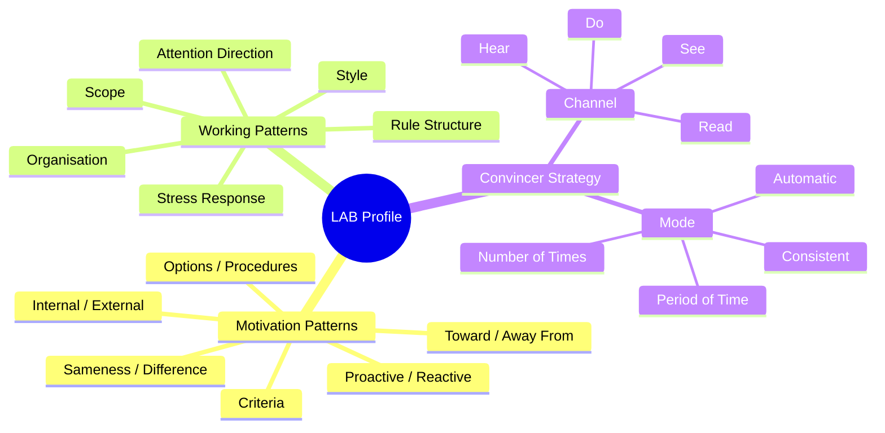
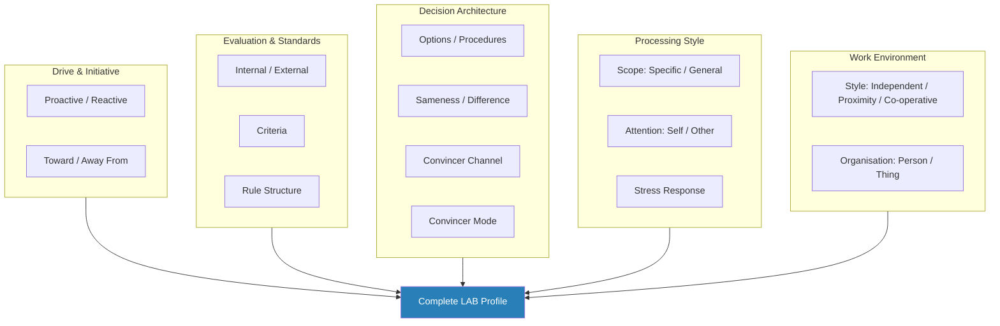
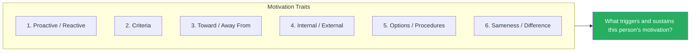
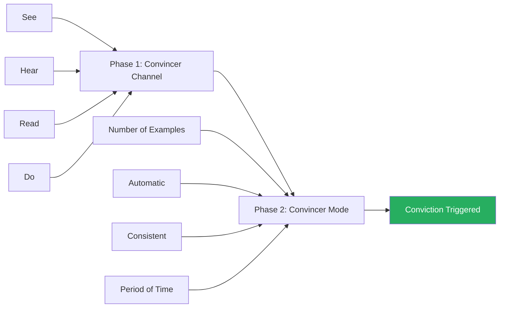
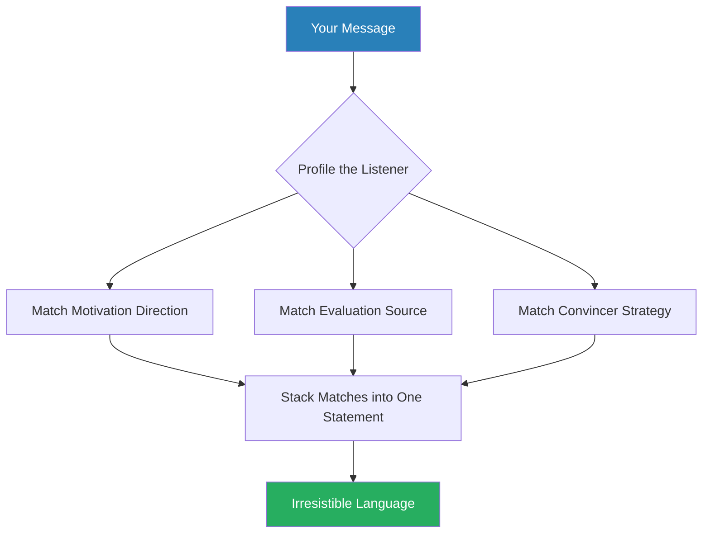
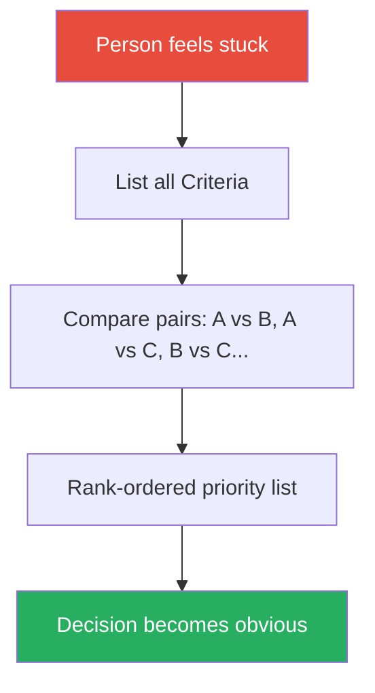
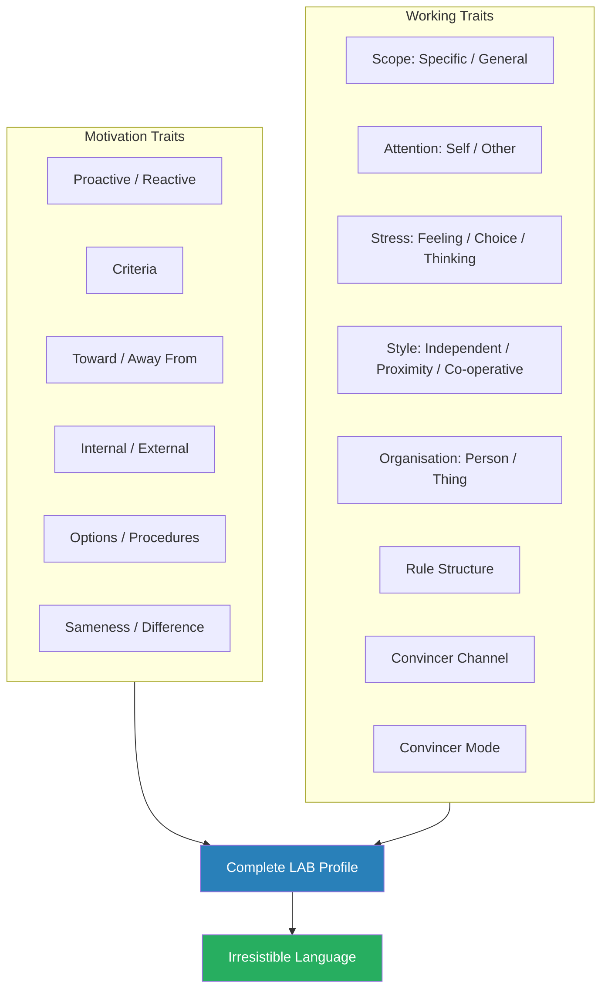

# Words That Change Minds — Shelle Rose Charvet

> Shelle Rose Charvet's contribution to the influence literature is a deceptively simple claim with far-reaching consequences: people reveal their unconscious motivational patterns through the *structure* of their language, not the content. By asking a small set of diagnostic questions and listening to how someone answers — not what they say — you can identify 14 behavioural patterns that govern how they get motivated and how they make decisions. Once you know someone's patterns, you speak directly into their cognitive operating system, bypassing resistance because your message arrives pre-formatted for their mind. The model is called the **LAB Profile** (Language and Behaviour Profile), and its most radical feature is that patterns are context-dependent: the same person can operate completely differently at work, at home, and in a negotiation. This is not a personality-typing book. It is a field manual for reading people in real time and adjusting your language to match.

---

## About the Author

Shelle Rose Charvet is an NLP practitioner and international business consultant who adapted Rodger Bailey's LAB Profile for corporate and professional contexts. She has trained clients across five continents in sales, management, HR, and negotiation. Her intellectual lineage runs through Noam Chomsky (Transformational Grammar), Richard Bandler and John Grinder (NLP), Leslie Cameron-Bandler (who identified approximately 60 Meta Programs), and Rodger Bailey (who reduced these to 14 actionable patterns and created the diagnostic questions that became the LAB Profile). Charvet's contribution is making Bailey's research accessible, commercial, and applicable to everyday professional influence. She brings a practitioner's sensibility to the work — the book reads like a training manual seasoned with consulting war stories rather than an academic treatment.

---

## The Big Idea

*Most influence books tell you what to say — Charvet tells you how to say it, calibrated to the specific person you are speaking to.*

- Communication failures are not about content disagreement — they are about <b style="color: #2980b9">structural mismatch</b> between how people process, decide, and get motivated
- The mechanism is elegantly simple: when your message arrives in someone's native cognitive format, no translation is required, no energy is lost, and resistance drops to near zero
- When it arrives in the wrong format, the listener spends mental effort converting your words into terms they understand — and most of the persuasive impact evaporates in translation

---

- The book's deepest insight is that these patterns are <b style="color: #27ae60">context-dependent, not personality traits</b>
  - A person who is fiercely independent at work may defer entirely to their partner at home
  - Someone who craves novelty when choosing restaurants may want absolute stability in their career
- This makes the LAB Profile more nuanced than personality-type systems like MBTI or DISC, which assign fixed labels and call it a day
- The same individual may need completely different influencing approaches depending on whether you are discussing their budget, their team, or their weekend plans

---

- The practical implication is that <b style="color: #27ae60">influence becomes a craft of observation and calibration, not a set of universal scripts</b>
- You cannot memorise one "power phrase" and deploy it everywhere
- You must learn to listen for structure, diagnose the pattern, and match your language in real time
- The diagnostic questions Charvet provides are the entry point — deceptively casual questions that reveal which of the 14 patterns are active:
  - "What do you want in your work?"
  - "Why did you choose your current job?"
  - "How do you know you've done a good job?"

---

## Key Concepts at a Glance

| Concept | One-line summary |
|---------|-----------------|
| **LAB Profile** | A taxonomy of 14 behavioural patterns with diagnostic questions and matching Influencing Language |
| **Context-dependency** | Patterns shift across situations — never assume one context transfers to another |
| **Influencing Language** | Specific vocabulary and sentence structures that match each pattern for frictionless communication |
| **Criteria** | A person's emotionally charged hot-button words, which must be used back verbatim |
| **Proactive vs Reactive** | The pattern governing initiative and timing, revealed through sentence structure |
| **Toward vs Away From** | Motivational direction — energised by goals or galvanised by problems |
| **Internal vs External** | Source of evaluation — trusts own judgment or needs outside validation |
| **Options vs Procedures** | Motivated by possibilities or by following the right steps in the right order |
| **Sameness vs Difference** | Appetite for change — from decades of stability to revolution every year |
| **Scope (Specific vs General)** | Information chunk size — detail-first or big-picture-first |
| **Attention Direction (Self vs Other)** | Whether nonverbal cues register at all |
| **Stress Response** | Emotional reactivity under pressure — Feeling, Choice, or Thinking |
| **Style** | Optimal work arrangement — Independent, Proximity, or Co-operative |
| **Organisation (Person vs Thing)** | Focus on feelings and relationships, or on tasks, systems, and efficiency |
| **Rule Structure** | Who has rules for whom — determines management capability |
| **Convincer Strategy** | A two-phase conviction process (Channel + Mode) explaining why some commit instantly and others need months |
| **Irresistible Language** | Stacking multiple pattern matches into a single statement for maximum influence |
| **Default Profile** | A risk-based assumption set for unknown audiences (Internal + Away From + Consistent) |

The same words that energise an entrepreneur (Options-Proactive-Toward) will alarm a compliance officer (Procedures-Reactive-Away From) — Charvet's system reveals why one-size-fits-all communication fails so predictably.

Charvet's system flows from a single diagnostic question through language analysis to pattern identification and finally to matched influencing language — each stage narrows the possibilities until the right words become obvious.

Toward/Away From has the highest impact on communication effectiveness — matching someone's motivational direction (what they move toward vs what they flee from) is the single most powerful adjustment a communicator can make.

The LAB Profile's 14 patterns organise into three functional layers — motivation (what drives action), working traits (how they process), and convincer strategy (what it takes to commit) — giving practitioners a complete diagnostic framework for any communication context.

---

## Quick Lookup Table — All 14 LAB Profile Patterns

| # | Pattern | Category | Poles / Positions | Diagnostic Question |
|---|---------|----------|-------------------|---------------------|
| 1 | Proactive / Reactive | Motivation | 2 poles + blend | Sentence structure observation |
| 2 | Criteria | Motivation | Individual words | "What do you want in your [context]?" |
| 3 | Toward / Away From | Motivation | 2 poles + blend | "What do you want in your [context]?" + "Why is that important?" |
| 4 | Internal / External | Motivation | 2 poles + blend | "How do you know you've done a good job?" |
| 5 | Options / Procedures | Motivation | 2 poles + blend | "Why did you choose your current [context]?" |
| 6 | Sameness / Difference | Motivation | 4 positions | "What is the relationship between your work this year and last year?" |
| 7 | Scope (Specific / General) | Working | 2 poles | Observed — no diagnostic question |
| 8 | Attention Direction (Self / Other) | Working | 2 poles | Observed — nonverbal responsiveness |
| 9 | Stress Response | Working | 3 positions | Observed — emotional display under pressure |
| 10 | Style (Independent / Proximity / Co-operative) | Working | 3 positions | "Tell me about a work situation that was [Criteria word]" |
| 11 | Organisation (Person / Thing) | Working | 2 poles + blend | "Tell me about a work situation that was [Criteria word]" |
| 12 | Rule Structure | Working | 4 configurations | "What is a good way to increase your success at [context]?" |
| 13 | Convincer Channel | Working | 4 types | "How do you know someone else is good at their work?" |
| 14 | Convincer Mode | Working | 4 types | "How many times do you have to [see/hear/read/do] that before you are convinced?" |

This table maps every LAB Profile pattern to its category, its poles, and the question that reveals it — the complete diagnostic toolkit on one page.

---

## Thematic Clusters

The 14 patterns organise into five functional clusters:

The five clusters show how the 14 patterns cover every aspect of how someone gets motivated, evaluates options, makes decisions, processes information, and prefers to work.

---

## Part One: The Foundations

### How the LAB Profile Works

*Charvet opens by establishing the book's central diagnostic premise — people do not know their own patterns, so you must observe their language structure rather than ask them directly.*

- <b style="color: #e74c3c">Self-report is unreliable</b> — if you ask someone "Are you motivated by goals or by avoiding problems?" they give a socially desirable answer, not an accurate one
- The LAB Profile sidesteps self-report entirely by using questions that force people to *demonstrate* their patterns rather than *describe* them
- The entire system rests on this distinction between description and demonstration:
  - A questionnaire asks you to describe yourself — and you perform for the questionnaire
  - A diagnostic question asks you to respond naturally — and your cognitive filters reveal themselves in the structure of your response

---

- The mechanism traces back to Noam Chomsky's observation that when we speak, we delete, distort, and generalise from our full internal experience
- The specific *way* someone deletes, distorts, and generalises reveals their cognitive filters:
  - A Procedures person asked "Why did you choose your current job?" unconsciously distorts the question from "Why?" into "How did it come about?"
  - They tell a chronological story instead of listing reasons
  - They are not being evasive — they genuinely heard a different question, because their filter converts "why" questions into "how" questions automatically
- <b style="color: #27ae60">The diagnostic questions must be asked conversationally, not as a formal interview</b>
  - The moment someone feels assessed, they shift into self-presentation mode that distorts the results
  - The best profiling happens when the other person thinks they are simply having a conversation
  - Charvet stresses that the entire LAB Profile questionnaire can be embedded into a casual five-minute exchange without anyone noticing

> "The structure of language reveals what content conceals."

> [!tip] Core Insight
> People reveal their unconscious cognitive patterns through the *structure* of their language — not through what they say, but through *how* they say it. Match that structure, and resistance dissolves.

The LAB Profile operates as a diagnostic-then-match cycle — ask a question, listen for structure, identify the pattern, and speak the matching language.

---

> [!example] The Consultant Who Worked Less and Earned the Same
> - A consultant Charvet trained reported that after learning the LAB Profile, she worked two-thirds of her usual year
> - Her income remained the same — she was not closing bigger deals or working harder
> - She had simply eliminated the wasted effort of speaking to clients in the wrong cognitive format
> - Every conversation landed faster because every word arrived pre-formatted for the listener's mind
> - The time savings came not from efficiency but from the absence of friction — no more repeated pitches, no more proposals that missed the mark
> **The lesson:** Matching language patterns does not add effort — it removes friction.

> [!example] The Engineering Firm's Job Advertisement
> - An engineering firm had been running job ads that attracted one good candidate out of every 300 applicants
> - After rewriting the advertisement using LAB Profile Influencing Language — matching the patterns of the ideal candidate rather than the patterns of the HR department — the firm received eight good candidates out of the next 100 applications
> - The job did not change
> - The requirements did not change
> - The language changed, and the right people suddenly heard the message
> - The shift was a 24x improvement in candidate quality per applicant
> **The lesson:** The same role attracts completely different applicants depending on the language used to describe it.

---

### The Intellectual Lineage

*Understanding where the LAB Profile comes from helps you evaluate its strengths and its blind spots.*

- The ancestry runs through four generations of thinking:
  - **Noam Chomsky** — Transformational Grammar established that spoken language is a surface structure built on top of deeper structures, and that the transformations between deep and surface structure are systematic and revealing
  - **Richard Bandler and John Grinder** — Founded NLP in the 1970s, which attempted to model the communication patterns of highly effective therapists
  - **Leslie Cameron-Bandler** — Identified approximately 60 "Meta Programs" — habitual cognitive filters that shape perception, decision-making, and motivation
  - **Rodger Bailey** — Reduced 60 Meta Programs to 14 actionable patterns and created the specific diagnostic questions that became the LAB Profile
- Charvet's contribution is the fifth generation — she took Bailey's academic framework and created a commercially viable training system:
  - Simplified the terminology for business audiences
  - Added practical applications for sales, hiring, marketing, and management
  - Wrote the field manual that Bailey's research needed to become useful
- The NLP lineage creates both a strength and a vulnerability:
  - **Strength:** The observation-based diagnostic method is genuinely practical — it works in real conversations without requiring questionnaires, assessments, or formal tools
  - **Vulnerability:** NLP as a field has faced significant criticism from academic psychology for insufficient empirical validation — and Charvet never addresses this critique directly

---

### Context-Dependency: The Book's Most Important Insight

*Before introducing any specific pattern, Charvet establishes the principle that will distinguish her model from every personality-typing system on the market.*

- <b style="color: #2980b9">Patterns are not personality traits</b> — a person's LAB Profile shifts depending on the context
- The same individual who is fiercely independent and internally motivated at work may defer completely to their spouse on household decisions
- Someone who is Proactive in sales meetings may be deeply Reactive when it comes to their own health
- A person who craves novelty in their social life may want absolute predictability in their financial planning
- This is not inconsistency — it is the natural result of having different cognitive modes for different life domains

> [!example] The Man with Opposite Holiday Patterns
> - Charvet was profiling a man at a workshop
> - At work, he showed a clear Sameness with Exception pattern — gradual evolution, building on what already works
> - When she asked him the same diagnostic question about his holidays, he could not even understand the word "relationship" in the question
> - He was so strongly Difference in that context — wanting completely new experiences every time — that the concept of comparing this year's holiday to last year's was literally incomprehensible to him
> - The same person, the same diagnostic question, yielded opposite results depending on the context
> **The lesson:** Same person, different context, opposite pattern.

> [!example] The Sales Manager at Home
> - Charvet describes a sales manager who was the most Proactive person in her company — first to act, impatient with deliberation, constantly pushing for faster decisions
> - At home, this same person was deeply Reactive — she waited for her partner to suggest dinner plans, deferred to her children on weekend activities, and spent hours deliberating before committing to a holiday destination
> - Her colleagues would have been astonished — the person they knew would never wait, never defer, never deliberate
> - But her cognitive pattern genuinely shifted when she crossed the threshold from work to home
> **The lesson:** Profiling someone in one context tells you nothing about how they operate in another.

- This context-dependency has a profound practical consequence: <b style="color: #e74c3c">you cannot profile someone once and file the result</b>
  - You must profile them *for the specific context* of the conversation you are about to have
  - Your colleague's pattern in a budget meeting may differ from their pattern in a career development conversation
  - Which may differ again from their pattern when discussing team structure
- Research by Sirois (1997) found that LAB patterns could differentiate decisive from indecisive people across eight categories of career decision-making, supporting the claim that patterns operate at a contextual level rather than a fixed personality level
- The implication for personality-typing systems is damning:
  - MBTI assigns you four letters and calls it done
  - DISC gives you a quadrant and says that is who you are
  - The LAB Profile says your type changes depending on what you are talking about — which is both harder to work with and closer to reality

| System | Fixed or context-dependent? | Diagnostic method | Number of categories |
|--------|---------------------------|-------------------|---------------------|
| **MBTI** | Fixed | Self-report questionnaire | 16 types |
| **DISC** | Fixed | Self-report questionnaire | 4 quadrants |
| **Enneagram** | Fixed | Self-report + interview | 9 types |
| **LAB Profile** | Context-dependent | Observation of language structure | 14 patterns, each on a continuum |

The LAB Profile's context-dependency makes it harder to learn and apply than fixed-type systems, but closer to how people actually operate.

> "You cannot not communicate a pattern."

---

### The Two Domains: Motivation and Working Traits

*Charvet organises the 14 patterns into two domains that answer different questions about human behaviour.*

- **Motivation Traits** (Patterns 1-6) answer: What gets this person moving?
  - These are the trigger mechanisms — the patterns that determine whether someone becomes energised and engaged, or bored and resistant
  - They cover: initiative (Proactive/Reactive), emotional hot buttons (Criteria), direction (Toward/Away From), evaluation source (Internal/External), approach style (Options/Procedures), and change appetite (Sameness/Difference)
  - Motivation Traits are the patterns you need to match *first*, because if you do not trigger motivation, nothing else matters — the person is not engaged enough to process your message

- **Working Traits** (Patterns 7-14) answer: Once motivated, how does this person actually process and decide?
  - These are the processing mechanisms — the patterns that determine how someone handles information, interacts with others, and reaches conclusions
  - They cover: information scope (Specific/General), nonverbal processing (Self/Other), emotional reactivity (Stress Response), work arrangement (Style), focus orientation (Person/Thing), management wiring (Rule Structure), and conviction architecture (Convincer Channel and Mode)
  - Working Traits matter *after* you have engaged the person's motivation — they determine how to deliver your message so it is processed and retained

- The practical sequencing:
  - When meeting someone new, diagnose Motivation Traits first — these tell you how to get their attention
  - Then observe Working Traits — these tell you how to deliver your proposal so it sticks
  - The Motivation Traits have dedicated diagnostic questions; many Working Traits are observed rather than asked
  - This means you can diagnose Motivation Traits in a structured five-minute conversation, while Working Traits accumulate through observation over a longer interaction

---

## Part Two: Motivation Traits

*The first domain of the LAB Profile covers what triggers and sustains motivation — six patterns, each on a continuum, not binary categories.*

Motivation Traits answer the fundamental question: what gets this person moving, and what keeps them moving?

---

### Pattern 1: Proactive vs Reactive

*This pattern governs initiative and timing, and it reveals itself through sentence structure before anything else.*

- <b style="color: #2980b9">Proactive</b> people act first and think later:
  - Speak in short, active sentences with strong verbs — "I'll get it done," "Let's go," "I made it happen"
  - Body language is impatient — leaning forward, tapping, ready to move
  - Get frustrated by deliberation, by committees, by anything that delays action
  - They are the "Ready, fire, aim" people
  - At their best, they generate momentum and break through inertia
  - At their worst, they create messes that others must clean up
  - They tend to knock people over — socially, not physically — because they move before checking whether anyone is in the way
- <b style="color: #2980b9">Reactive</b> people analyse first and act later:
  - Speak in longer sentences with passive constructions and conditional clauses — "It will get done once we've considered the options"
  - Body language is still, watchful, considered
  - Get frustrated by pressure to decide before they have thought things through
  - They are the "Let me think about that" people
  - At their best, they prevent costly mistakes through careful analysis
  - At their worst, they delay past the point where action is still useful
  - They can spend so much time understanding a problem that the window for action closes

---

**How to detect it:**
- There is no single diagnostic question — the pattern reveals itself in the structure of every sentence the person speaks
- The grammatical markers are surprisingly reliable:
  - Active voice, imperative mood, short declarative sentences signal Proactive
  - Passive voice, conditional mood, complex subordinate clauses signal Reactive
  - These are unconscious — no one chooses to speak in passive constructions to signal Reactivity
- Listen for who is the subject of their sentences:
  - Proactive: "I called the client" — the person is the actor
  - Reactive: "The client was called" or "It was necessary to contact the client" — the person removes themselves from the action
- Nike's "Just do it" is pure Proactive language — it lands with visceral force for Proactive people and leaves Reactive people cold

**Influencing Language:**

| Direction | Language that works | Language that fails |
|-----------|-------------------|---------------------|
| **Proactive** | "Let's do this now" — "Jump on it" — "Why wait?" — "Go for it" — "Take charge" | "Let's think about it" — "Once you've considered..." — "There's no rush" |
| **Reactive** | "Once you've had a chance to consider this..." — "Let's understand this first" — "Think it through" — "This might be worth analysing" | "Just do it" — "Decide now" — "Stop overthinking" |
| **Blend** | "Think it through and then go for it" — "Consider the options and take action" | Pure language from either pole |

---

| Characteristic | Proactive | Reactive |
|---------------|-----------|----------|
| **Sentence style** | Short, active verbs | Long, passive constructions |
| **Body language** | Leaning forward, restless | Still, watchful |
| **Frustration trigger** | Deliberation and delay | Pressure to decide |
| **Strength** | Speed of action | Thoroughness of analysis |
| **Weakness** | Acts before thinking | Delays past the window |
| **Ideal roles** | Sales, entrepreneurship, crisis response | Research, compliance, quality control |

> [!example] The Client Who Needed Three Meetings
> - Charvet had a client who needed three meetings before he could act on a straightforward decision
> - She had initially pushed for a faster resolution, creating friction
> - When she matched his Reactive pattern — "When is this likely to happen?" rather than "Let's decide now" — he relaxed, completed his analysis, and acted with full commitment
> - The Reactive person often arrives at the same decision the Proactive person would have made instantly
> - But they need the *process* of deliberation to feel confident in the outcome
> - Pushing them faster does not accelerate the decision — it delays it, because the pressure triggers resistance
> **The lesson:** Matching the pace of someone's decision process matters as much as matching the content.

> [!example] The Proactive Manager's Morning Tornado
> - Charvet describes a Proactive manager who arrived at the office every morning like a whirlwind — issuing instructions, changing priorities, demanding updates before people had taken their coats off
> - His Reactive team members felt assaulted — they needed time to settle in, review the situation, and prepare before engaging
> - The manager interpreted their slowness as laziness; they interpreted his urgency as chaos
> - When he learned to delay his morning barrage by thirty minutes — sending emails for them to review at their own pace before any face-to-face interaction — the entire team dynamic transformed
> - His energy was the same; his timing shifted
> **The lesson:** Proactive energy directed at Reactive people before they are ready creates resistance, not speed.

- **Distribution:** Roughly 15-20% of people are strongly Proactive, 15-20% are strongly Reactive, and 60-65% are a blend that leans one way
- <b style="color: #e74c3c">The trap:</b> using Reactive language with a Proactive person (they hear hesitation and lose interest) or Proactive language with a Reactive person (they feel pressured and shut down)
- In teams, the tension between Proactive and Reactive members is one of the most common sources of frustration:
  - The Proactive person thinks the Reactive person is a blocker
  - The Reactive person thinks the Proactive person is reckless
  - Neither is wrong — they are simply operating from different processing patterns
  - The best teams have both — Proactive people to generate momentum, Reactive people to prevent mistakes
- The pattern interacts powerfully with organisational culture:
  - Start-up cultures tend to select for Proactive — speed is valued over thoroughness
  - Government and regulatory cultures tend to select for Reactive — thoroughness is valued over speed
  - When a Proactive person joins a Reactive culture (or vice versa), the friction is immediate and mutual
  - Neither the person nor the culture is wrong — but the mismatch creates daily frustration that has nothing to do with competence
- Charvet notes that the Proactive/Reactive pattern is the most immediately observable of all 14 patterns:
  - You can often identify it within the first thirty seconds of a conversation
  - The sentence structure, the pace of speech, and the body language all signal simultaneously
  - This makes it the best pattern for beginners to practice — the feedback loop is fastest
- The Proactive/Reactive pattern has a significant interaction with the Toward/Away From pattern, creating four combinations with distinct energy profiles:

| Combination | Energy profile | How they show up | Watch out for |
|------------|---------------|-----------------|---------------|
| **Proactive + Toward** | Charging forward toward goals | High-energy achievers who launch things constantly | Can ignore risks entirely and crash into obstacles they never saw coming |
| **Proactive + Away From** | Charging forward to extinguish fires | Urgent problem-solvers who attack threats immediately | Can create chaos by reacting to every perceived risk without prioritising |
| **Reactive + Toward** | Carefully planning toward goals | Methodical strategists who map the path before walking it | Can over-plan and never actually begin |
| **Reactive + Away From** | Carefully analysing every possible risk | Exhaustive risk assessors who see danger everywhere | Can be paralysed by the sheer volume of threats they identify |

These four combinations are among the most common archetypes you will encounter, and recognising them quickly enables faster language calibration.

---

### Pattern 2: Criteria — The Hot-Button Words

*Criteria are not generic values — they are emotionally charged labels connected to deep memories and associations that are unique to each individual.*

- <b style="color: #2980b9">Criteria</b> are the specific words a person uses to describe what matters to them in a given context
- The diagnostic question is simple: "What do you want in your work?" (or any other context)
- The person answers with a list of words — "challenge," "recognition," "flexibility," "impact"
- These words *sound* like ordinary vocabulary, but each one is a key that unlocks a specific emotional cluster in that person's mind:
  - The word "challenge" means something different to every person who uses it
  - For one person, it triggers memories of overcoming obstacles, adrenaline, the thrill of being tested
  - For another, it triggers associations with intellectual complexity, puzzles, novelty
  - The emotional clusters are different even though the word is the same

---

- Criteria are not the same as values — values are abstract and philosophical; Criteria are concrete, specific, and emotionally hot
- They are context-dependent like every other LAB pattern:
  - Someone's Criteria for work ("challenge," "autonomy") may be completely different from their Criteria for holidays ("relaxation," "simplicity")
  - Using the right word in the wrong context is still a mismatch

> [!tip] Core Insight
> Use their exact words back to them. Never paraphrase. Never substitute your synonym. Your synonym activates *your* emotional cluster, not theirs.

- <b style="color: #27ae60">The critical rule — use their exact words back to them</b>
  - If they say "challenge" and you say "difficulty," you have switched channels
  - The word that resonates in your head has no particular resonance in theirs
  - Synonyms activate your emotional associations, not theirs
  - This is not about being pedantic — it is about precision at the level of neural association
- The order of Criteria matters as well:
  - The first Criterion mentioned is usually the most important
  - The last is usually the least important
  - When making a pitch, lead with their first Criterion and close with it
- **How to elicit Criteria:**
  - Ask the open question: "What do you want in your [context]?"
  - Listen for the nouns and adjectives they use — not the explanations, but the labels
  - Write them down in order — you need the exact words, not your paraphrases
  - If they give only one or two, ask: "What else is important?"
  - Stop when they have listed three to five — beyond that, you get diminishing returns

---

> [!example] The Workshop Job Demonstration
> - Charvet was demonstrating the technique at a workshop and asked a woman what she wanted in her work
> - The woman listed her Criteria
> - Charvet then described a completely fictional job opportunity using only those exact Criteria words — without mentioning the job title, the company, the salary, or any concrete details
> - The woman said she wanted the job
> - She was ready to accept a position she knew nothing about, purely because the description activated every one of her emotional hot buttons
> - The emotional resonance was so powerful that it bypassed the rational evaluation process entirely
> - The audience watched in astonishment as a completely empty description triggered genuine desire
> **The lesson:** Criteria words bypass rational evaluation — the right words create instant desire, regardless of substance.

> [!example] The Couple's Holiday Disagreement
> - Charvet describes a couple who could never agree on holiday destinations
> - The husband's Criteria were "adventure" and "discovery" — he wanted somewhere new and challenging
> - The wife's Criteria were "relaxation" and "comfort" — she wanted somewhere easy and rejuvenating
> - Neither was wrong, but they were describing holidays using their own Criteria and failing to hear each other's
> - When Charvet taught them to use each other's words — "We could discover a comfortable resort that's new to us and adventurous in its relaxation options" — the conversation immediately unstuck
> - The solution was not compromise on the destination; it was translation of the language
> **The lesson:** When two people's Criteria conflict, matching both sets of words in a single description can resolve the conflict without anyone conceding.

- The difference between traditional active listening and Criteria playback:
  - Active listening — a counsellor paraphrases the client's words into their own vocabulary — creates the feeling of being understood at a surface level
  - Criteria playback creates the feeling of being understood at a visceral, almost eerie level, because the exact words trigger the exact emotional associations
  - The listener feels that you are speaking their private language, even though you are simply using the words they gave you
- The technique extends to marketing and advertising:
  - A job advertisement that uses the Criteria of the ideal candidate will attract that candidate far more effectively than one written in the HR department's vocabulary
  - A sales pitch that uses the buyer's own words will close faster than one that uses the seller's preferred terminology

> [!example] The Real Estate Agent's Criteria Mastery
> - Charvet describes a real estate agent who learned to elicit Criteria before showing any properties
> - She asked every couple: "What do you want in your next home?"
> - One couple said "character," "space," and "neighbourhood" — in that order
> - Instead of showing them the newest listings (her own preference), she led every property tour with "Notice the character of these original hardwood floors" and "The neighbourhood has a real community feel"
> - She closed three sales in the first month after learning the technique — her previous average was one per month
> - The properties were not better; the language was calibrated
> - Other agents in her office were showing identical properties but describing them in their own Criteria — "investment potential," "modern finishes," "low maintenance"
> - The properties spoke to different buyers depending on the language wrapped around them
> **The lesson:** The same product becomes irresistible or ignorable depending on whose Criteria words describe it.

- The number of Criteria a person lists also contains information:
  - Most people list 3-5 Criteria when asked
  - Those who list fewer (1-2) tend to have highly focused motivations and can be influenced with surgical precision
  - Those who list many (6+) may have difficulty prioritising, which is where the Hierarchy of Criteria technique becomes essential
- Criteria are the foundation on which all other patterns operate:
  - You can match someone's Toward direction and Internal source perfectly, but if you are not using their Criteria words, the message still feels generic
  - Criteria are the emotional fuel; the other patterns are the delivery mechanism
  - Master Criteria first, then layer on the other patterns

---

### Pattern 3: Toward vs Away From

*This is perhaps the most immediately useful pattern in the entire book, because it governs how every proposal, pitch, and argument should be framed.*

- <b style="color: #2980b9">Toward</b> people are energised by goals, gains, and achievements:
  - Filter for benefits — they hear what they could gain and literally do not notice what they could lose
  - Talk about what they want to attain, achieve, and accomplish
  - Motivated by the carrot and literally do not perceive the stick until it hits them
  - Excellent at setting priorities and pursuing goals with single-minded focus
  - Poor at identifying problems, troubleshooting, and anticipating what could go wrong
  - Their language markers: "achieve," "attain," "get," "accomplish," "gain," "benefits," "goals"
  - They describe what they *want* — not what they want to avoid
- <b style="color: #2980b9">Away From</b> people are energised by threats, risks, and problems:
  - Filter for danger — they see what could go wrong and struggle to focus on what could go right
  - Talk about what they want to avoid, prevent, and eliminate
  - Galvanised by crisis and demotivated by positive visions
  - Excellent at spotting problems, managing risk, and quality control
  - Struggle to stay motivated when things are going well and can have difficulty prioritising because they are busy fighting fires on all fronts
  - Their language markers: "avoid," "prevent," "eliminate," "get rid of," "problems," "issues," "won't have to"
  - They describe what they *do not want* — not what they are pursuing

---

**How to detect it:**
- The diagnostic question "What do you want in your work?" (combined with "Why is that important?") reveals the direction:
  - Toward answers describe desired states: "I want growth, learning, challenge"
  - Away From answers describe undesired states or the absence of problems: "I don't want to be bored, I want to avoid stagnation, I don't want to be micromanaged"
- The prepositions and verbs are the giveaway:
  - Toward language moves *toward* something: "achieve," "gain," "reach"
  - Away From language moves *away from* something: "avoid," "prevent," "get rid of," "not have to deal with"
- When someone gives a Toward answer, follow up with "Why is that important?" — sometimes the *reason* behind a Toward goal is Away From:
  - "I want financial security" (sounds Toward)
  - "Why?" "Because I never want to worry about money" (Away From)

---

- <b style="color: #27ae60">The same proposal framed differently lands completely differently</b>:
  - "This will enable innovation" — Toward framing
  - "This will prevent a six-month capability gap" — Away From framing
  - The content is identical; the motivational direction determines whether anyone cares
- The mechanism behind this is not mere preference — it is perceptual:
  - Toward people literally filter out threat information because their cognitive system is tuned to opportunity
  - Away From people literally filter out opportunity information because their cognitive system is tuned to danger
  - It is not that they *choose* not to hear the opposite framing — they *cannot* hear it without deliberate effort

**Influencing Language:**

| Direction | Language that works | Language that fails |
|-----------|-------------------|---------------------|
| **Toward** | "Here's what you'll gain" — "This achieves..." — "The benefits include..." — "You'll get..." | "This prevents..." — "You won't have to worry about..." — "It eliminates the risk of..." |
| **Away From** | "This prevents..." — "You'll avoid..." — "It eliminates..." — "You won't have to deal with..." | "Here's the opportunity" — "Imagine what you could achieve" — "The upside is..." |
| **Blend** | "Here's what you'll gain, and here's what you'll avoid" | Pure language from either pole |

> "People do not resist change — they resist being changed."

---

> [!example] The Automobile Association's Marketing Mismatch
> - The AA had been marketing with positive imagery — sunny days, open roads, the joy of motoring
> - When they surveyed their members, they discovered that roughly 90% had joined to *avoid* breakdown problems
> - The members were Away From; the marketing was Toward
> - The entire communication strategy was structurally mismatched with the actual customer base
> - When the AA redesigned their marketing around Away From language — emphasising protection, rescue, prevention of roadside emergencies — their conversion improved dramatically
> - The old creative looked beautiful but spoke a language the customers could not hear
> **The lesson:** Match the language to the market's motivation, not the advertiser's.

> [!example] The Incontinence Product Advertisement
> - Charvet analyses an advertisement for a urinary incontinence product featuring a golfer with the tagline "18 holes and no accidents"
> - The ad worked because it matched the Away From motivation of the target market — people buying the product to *avoid* embarrassment, not to *achieve* something
> - A Toward-framed ad ("Enjoy the freedom to play golf!") would have missed the emotional trigger entirely
> - The Away From framing acknowledged the actual fear driving the purchase decision
> **The lesson:** Products bought to avoid problems need Away From language — positive framing misses the trigger.

> [!example] Insurance vs Investment — Same Company, Opposite Language
> - Charvet describes the challenge faced by financial services companies that sell both insurance and investment products
> - Insurance is inherently Away From — people buy it to avoid catastrophic loss
> - Investment products are inherently Toward — people buy them to achieve financial growth
> - Insurance salespeople who are personally Away From struggle when cross-selling investment products because they instinctively use threat language for everything
> - They describe investment opportunities in terms of "not missing out" and "avoiding being left behind" rather than "building wealth" and "achieving financial freedom"
> - The product needs Toward language, but the salesperson's own pattern keeps pulling them back to threats and risks
> **The lesson:** Your own motivational direction shapes the language you naturally use — and it may not match the product you are selling.

- **Distribution:** At work, roughly 40% of people are mainly Toward, 40% are mainly Away From, and 20% are equally both
- For the blended 20%, the most effective communication uses both directions: "Here's what you'll gain, and here's what you'll avoid"
- <b style="color: #e74c3c">The most common mistake is assuming everyone shares your direction</b>:
  - Toward managers often dismiss Away From employees as "negative" when they are simply doing the critical work of risk identification
  - Away From managers often dismiss Toward employees as "naive" when they are simply doing the necessary work of goal-setting and priority management
- Away From people can be difficult to manage long-term because their motivation is crisis-dependent:
  - They work intensely when a problem looms — then stall once the immediate threat passes
  - Their energy is reactive to threat levels, not self-sustaining
  - Managers who understand this can create periodic "check-ins" that surface emerging problems, keeping the Away From person's threat-detection system engaged

> [!example] The Toward Sales Team That Could Not Sell Insurance
> - A financial services company had a top-performing investment sales team — all strongly Toward
> - When the company added insurance products to their portfolio, the team's insurance sales were near zero
> - Management assumed the team was not trying hard enough and increased incentives
> - The actual problem was structural: the Toward salespeople could not generate compelling Away From language
> - They described insurance as "an investment in peace of mind" and "building security" — Toward framings of an Away From product
> - The customers who needed insurance were motivated by fear of loss, not desire for gain
> - When the company hired Away From salespeople specifically for insurance, insurance revenue tripled in a quarter
> - The Toward team continued to excel at investment products; the Away From team excelled at insurance
> **The lesson:** Your own motivational direction limits the language you can naturally produce — sometimes the solution is hiring the right pattern, not training the wrong one.

- The Toward/Away From pattern has a particularly strong interaction with the Criteria pattern:
  - A person's Criteria words often reveal their direction: "growth," "achievement," "success" are Toward Criteria; "security," "protection," "stability" can be Away From Criteria
  - But not always — "stability" could be Toward (I want to build stability) or Away From (I want to avoid instability)
  - The follow-up question "Why is that important?" disambiguates: the *reason* behind the Criterion reveals the direction

---

### Pattern 4: Internal vs External

*This pattern governs where someone's evaluation standards live — inside themselves or in the judgments of others — and it shapes how they respond to praise, criticism, and direction.*

- <b style="color: #2980b9">Internal</b> people have their own standards and judge their own performance:
  - Carry the evaluation criteria inside themselves
  - Know when they have done well because they feel it — do not need anyone else to confirm it
  - Resist being told what to do, treat instructions as information to be evaluated against their own standards
  - Become adversarial when they feel someone is deciding for them
  - Difficult to manage through praise and nearly impossible to manage through criticism — neither external signal overrides their internal compass
  - Their language markers: "I know," "I decided," "I feel it's right," "in my opinion"
- <b style="color: #2980b9">External</b> people need outside feedback, validation, and direction:
  - Motivated by praise, demotivated by ambiguity
  - Genuinely uncertain about their own performance until someone else confirms it
  - Seek data, benchmarks, endorsements, and approval
  - Excellent at reading social signals and adapting to expectations
  - Can be paralysed without external input — if no one tells them how they are doing, they assume they are doing badly
  - Their language markers: "people tell me," "the feedback says," "according to the data," "others think"

---

**How to detect it:**
- The diagnostic question — "How do you know you've done a good job?" — separates them instantly:
  - Internal: "I just know" or "I can feel when it's right" or "I have my own standards"
  - External: "My boss tells me" or "The numbers show it" or "When the client is happy" or "I get positive feedback"
- The follow-up is equally revealing:
  - If you say to an Internal person "That's excellent work," they process it as interesting data — not as validation they needed
  - If you say the same to an External person, it fills a genuine need and produces visible relief or pleasure
- Internal people often struggle when they receive contradictory feedback:
  - Not because the contradiction troubles them, but because they find it irrelevant — they already know whether the work is good
  - They may become irritated that someone is telling them something they already know

**Influencing Language:**

| Source | Language that works | Language that fails |
|--------|-------------------|---------------------|
| **Internal** | "You might want to consider..." — "Here's some information for you to evaluate" — "Only you can decide" — "What do you think?" | "You should do this" — "Everyone agrees you need to..." — "The experts say..." |
| **External** | "The data confirms..." — "Experts recommend..." — "Your team thinks highly of..." — "Here are the benchmarks" | "Trust your gut" — "You probably already know" — "Go with your instinct" |

---

> [!example] Margaret Thatcher — Textbook Internal
> - At a meeting of 50 leaders discussing sanctions, Thatcher was outvoted 49 to 1
> - Her response: she "felt sorry for the other forty-nine"
> - She processed the vote as information confirming that 49 people had poor judgment
> - The external data (49 people disagreeing with her) did not create a flicker of doubt — it confirmed her conviction
> - For a truly Internal person, consensus against them is not humbling — it is proof that everyone else has not thought it through
> **The lesson:** For a truly Internal person, being outnumbered is evidence that everyone else is wrong.

> [!example] The Career Counselling Firm's Intake Process
> - A career counselling firm changed their approach from "We're the best — you should sign up" to "Here's what we do. You might want to take some time to think about whether this is right for you. Go away and decide"
> - Their retention of Internal clients jumped dramatically
> - The old approach — pushing for a commitment — had been triggering resistance in every Internal prospect
> - The new approach — presenting information and stepping back — let Internal people feel they were making their own decision, which is the only way an Internal person will commit
> - The firm did not change its services, its pricing, or its team — only its intake language
> **The lesson:** Internal people commit only when they feel the decision is theirs.

> [!example] The Manager Who Could Not Praise Effectively
> - A manager Charvet worked with had an External team member who consistently underperformed despite being talented
> - The manager, who was strongly Internal himself, rarely gave feedback — he assumed people knew when they were doing well because he always knew when he was doing well
> - When Charvet pointed out that the team member needed regular external validation, the manager started providing specific, frequent praise
> - The team member's performance improved within weeks — not because she learned new skills, but because the motivational fuel she needed was finally being supplied
> - The manager found it exhausting to praise so frequently — it felt unnecessary to him — but the results were undeniable
> **The lesson:** An Internal manager who does not provide feedback is starving External team members of their primary motivation.

- The Canada Trust mortgage advertisement illustrates the principle:
  - Slogan: "The best mortgage package in Canada? You be the judge"
  - The question mark honours the Internal customer's need to evaluate independently
  - "You be the judge" explicitly hands the decision back to the listener
  - A directive version ("We have the best mortgage package — come get it") would have worked for External customers but triggered resistance in Internal ones
- <b style="color: #e74c3c">"You should do X" is the single most reliable way to make an Internal person do the opposite</b>
- **Distribution:** Roughly 40% Internal, 40% External, 20% blend at work

---

- The interaction between Internal/External and Toward/Away From creates four distinct influence profiles:

| Combination | Effective language | Ineffective language |
|------------|-------------------|---------------------|
| **Internal + Toward** | "You might find this achieves exactly what you're looking for" | "Everyone says you should do this" |
| **Internal + Away From** | "You can decide whether this addresses the risks you've identified" | "Trust me, this will solve the problem" |
| **External + Toward** | "The data shows this will deliver the results experts recommend" | "Think about it and see what you conclude" |
| **External + Away From** | "Industry benchmarks confirm this eliminates the top three risks" | "You probably already know what to do" |

These four combinations are among the most common pattern pairs you will encounter — getting this two-dimensional match right covers a large portion of the influence territory.

- The Internal pattern has significant implications for feedback culture:
  - 360-degree feedback systems work well for External people — they welcome the data
  - For Internal people, 360-degree feedback often triggers defensiveness, because the implicit message is "other people's opinions should shape your behaviour"
  - Charvet suggests that for strongly Internal individuals, feedback should be framed as "information you might find useful" rather than "areas for improvement"
  - The reframing honours the Internal person's need to be the final judge while still delivering the data
- The Internal/External distinction also affects how people respond to authority:
  - Internal people evaluate instructions against their own standards — they comply when their judgment aligns and resist when it does not
  - External people comply with authority more readily, but also need authority figures more — a leadership vacuum is more disorienting for External people than for Internal people
  - In flat organisations with minimal hierarchy, External people sometimes struggle because the validation mechanisms they depend on are absent
- The Internal/External pattern has significant implications for how people handle uncertainty and ambiguity:
  - Internal people are more comfortable with ambiguity — they generate their own assessment of the situation and act on it, even when external signals are unclear or contradictory
  - External people are more distressed by ambiguity — without clear signals from the environment, they have no mechanism for evaluating whether they are on the right track
  - In rapidly changing environments (start-ups, crises, restructuring), Internal people tend to maintain direction while External people tend to freeze — not because they lack competence, but because their evaluation mechanism requires external data that is temporarily unavailable
  - <b style="color: #27ae60">The practical implication for leaders: during ambiguous periods, provide frequent, clear signals to External team members</b> — even if the signal is "we don't know yet, but here's what we're doing in the meantime"
  - Silence is interpreted differently by each pattern: Internal people read silence as freedom; External people read silence as abandonment
- The Internal/External pattern also shapes how people experience recognition:
  - For an Internal person, a public award ceremony may be pleasant but not motivating — they already know whether their work was good
  - For an External person, the same ceremony is deeply motivating — it provides the external confirmation they need to feel confident about their contribution
  - Internal people are often puzzled by External colleagues who seem to "need" praise — "Can't they just tell when they've done a good job?"
  - External people are often puzzled by Internal colleagues who seem indifferent to recognition — "Don't they care what anyone thinks?"
  - Neither is right or wrong — they are operating from different evaluation architectures

---

### Pattern 5: Options vs Procedures

*The diagnostic question for this pattern contains one of the cleverest structural tricks in the LAB Profile — Options people and Procedures people literally hear a different question.*

- <b style="color: #2980b9">Options</b> people are motivated by possibilities, alternatives, and the thrill of breaking rules:
  - Excellent at creating systems, developing strategies, and envisioning new approaches
  - Terrible at following through, completing established processes, and doing anything repetitive
  - Light up when they hear about choices, opportunities, and alternatives
  - Deflate when they hear about steps, sequences, and obligations
  - They want to know why they are doing something, and then they want to find a better way to do it
  - Their language markers: "opportunities," "choices," "alternatives," "possibilities," "break the rules," "there's got to be a better way"
- <b style="color: #2980b9">Procedures</b> people are motivated by completing established processes in the right order:
  - Excellent at execution, follow-through, and consistent delivery
  - Struggle to innovate, deviate from the plan, or handle ambiguity
  - Feel comfortable when they know the steps — deeply uncomfortable when they do not
  - Feel anxious when asked to improvise — it is not stubbornness but a genuine need for structure
  - Once they start a procedure, they feel compelled to finish it — interruptions are deeply unsettling
  - Their language markers: "first... then... finally," "the right way," "the process," "step by step"

---

**How to detect it:**
- The diagnostic question — "Why did you choose your present job?" — reveals the pattern through structural listening:
  - Options people hear "Why?" as a genuine request for reasons: "I chose it because it offered challenge, variety, and the chance to build something new"
  - Procedures people hear the same question as "How did it come to be?": "Well, I was working at my previous company, and then a friend told me about this opening, and I sent in my CV, and they called me..."
  - This is not evasion — the Procedures person genuinely heard a different question, because their cognitive filter converts reasons into sequences automatically
- The word "chose" in the diagnostic question is another structural tell:
  - Procedures people often do not feel they chose anything — things happened in sequence and they ended up here
  - The concept of "choice" implies alternatives, which is an Options frame
  - A Procedures person describing their career path describes a chain of events, not a decision tree

> [!tip] Core Insight
> The diagnostic question "Why did you choose your present job?" works because Options people hear "Why?" and give reasons, while Procedures people unconsciously convert it to "How did it come about?" and tell a chronological story. The cognitive filter itself is the data.

**Influencing Language:**

| Style | Language that works | Language that fails |
|-------|-------------------|---------------------|
| **Options** | "Here are the possibilities" — "You could..." — "There are alternatives" — "Think about what you could do with this" — "Expand your options" | "Follow these steps exactly" — "The procedure requires..." — "Do it this way" |
| **Procedures** | "Here's the proven process" — "Step one, step two, step three" — "The right way to do this is..." — "First you... then you..." | "Figure it out your own way" — "There are many possibilities" — "Be creative" |

---

> [!example] Procedures Telemarketers Outsell Options Telemarketers 3:1
> - Charvet cites a striking finding from the telemarketing industry
> - Procedures telemarketers sell three times as much as Options telemarketers
> - Selling is fundamentally a procedure — a sequence of steps executed in order: greet the prospect, ask qualifying questions, present the product, handle objections, close
> - Options telemarketers keep improvising, trying new approaches, skipping steps — and their close rate suffers because they are constantly reinventing a process that works best when followed consistently
> - The Options telemarketers were more creative but less effective, because the task rewarded consistency over creativity
> **The lesson:** When the work is procedural, Procedures people outperform — regardless of talent or enthusiasm.

> [!example] The MLM Recruitment Trap
> - MLM companies attract recruits with pure Options language — "unlimited possibilities," "be your own boss," "no limits on your income"
> - The people who respond to this language are Options people
> - But the actual work of MLM — making the same pitch to the same kinds of prospects day after day — is Procedures work
> - Only about 1 in 10 MLM recruits succeeds
> - Charvet argues this is partly because the recruitment language attracts exactly the wrong pattern for the work required
> - The people who would actually thrive at the repetitive work never apply because the advertisement does not speak their language
> **The lesson:** When recruitment language mismatches the work, high attrition is inevitable.

> [!example] The Options Employee in a Compliance Role
> - Charvet describes a financial services company that hired a bright, enthusiastic candidate into a regulatory compliance role
> - The candidate's interview was impressive — she was articulate, creative, and full of ideas for improving the department
> - Within six months, she had modified three standard procedures, skipped documentation steps she considered redundant, and created a compliance gap that required an external audit to resolve
> - She was not being malicious — her Options pattern made it psychologically impossible to follow a procedure without trying to improve it
> - The procedure changes she made were individually clever but collectively undermined the regulatory framework that compliance exists to maintain
> - The company moved her to a process-design role where her Options pattern was an asset rather than a liability
> **The lesson:** Options people will modify procedures — it is not optional for them. Put them where modification is the job.

- <b style="color: #e74c3c">The mismatch between pattern and task is a reliable predictor of both poor performance and low job satisfaction</b>:
  - Airlines need Procedures pilots who will follow checklists without improvising
  - Architecture firms need Options designers who will envision novel solutions
  - Putting an Options person in a compliance role is a recipe for rule-breaking
  - Putting a Procedures person in an innovation role is a recipe for frustration
- **Distribution:** Roughly 40% Options, 40% Procedures, 20% blend at work
- The Options/Procedures interaction with management is critical:
  - Options managers tend to change direction frequently — their teams experience whiplash as priorities shift
  - Procedures managers tend to stick to the plan even when the plan is no longer working — their teams experience frustration as the world changes and the plan does not
  - The best leaders are aware of their own pattern and deliberately compensate:
    - Options leaders hire Procedures deputies to provide execution consistency
    - Procedures leaders hire Options advisors to provide strategic flexibility
- The Options/Procedures pattern has a direct interaction with the Convincer Strategy:
  - An Options person with a Convincer Mode of Automatic makes snap decisions about new approaches — they see a possibility and commit instantly, often without testing whether the new approach is actually better than the existing one
  - A Procedures person with a Convincer Mode of Number of Examples wants to see a process work three times before adopting it — they are the last to adopt but the most committed once they do
  - Understanding both patterns simultaneously explains why some people adopt new tools instantly (Options + Automatic) and others take months to switch (Procedures + Period of Time)
- The Options/Procedures split is visible in how people approach instructions:
  - Give an Options person an IKEA instruction manual — they will glance at the picture on the box and start assembling, consulting the manual only when stuck
  - Give a Procedures person the same manual — they will read every step before touching a single piece, and follow the sequence precisely
  - Neither approach is faster — but the Options person's approach produces more errors that need correcting, while the Procedures person's approach produces more frustration at the start but fewer corrections

> [!example] The Procedures Pilot and the Options Emergency
> - Charvet recounts an airline industry example where Procedures pilots saved lives precisely because they followed checklists under extreme stress
> - An Options pilot in the same situation might have improvised — and in aviation, improvisation under stress has a poor track record
> - The checklists exist because thousands of hours of engineering have encoded the optimal response to every known emergency
> - A Procedures pilot follows the checklist automatically; an Options pilot considers whether there might be a better way — and that moment of consideration can be fatal at 35,000 feet
> - Aviation has learned to select for Procedures precisely because the cost of Options thinking in the cockpit is measured in lives
> **The lesson:** Some contexts demand Procedures so strongly that Options thinking is not just inefficient — it is dangerous.

---

### Pattern 6: Sameness vs Difference (Decision Factors)

*This pattern governs appetite for change and sits on a more complex spectrum than most of the other patterns — four positions, not two.*

| Pattern | Change appetite | Cycle length | Population % |
|---------|----------------|--------------|-------------|
| **Sameness** | Stability, status quo | 15-25 years | ~5% |
| **Sameness with Exception** | Gradual evolution | 5-7 years | ~65% |
| **Difference** | Revolution, radical change | 1-2 years | ~20% |
| **Sameness with Exception + Difference** | Evolution with occasional breaks | Mixed | ~10% |

- <b style="color: #2980b9">Sameness</b> people notice what is the same between this year and last year, between this product and the one they already use:
  - They are the most loyal customers, the longest-tenured employees, the most resistant to disruption
  - They buy the same brand, eat at the same restaurant, take the same holiday
  - They are a small minority (roughly 5%) but disproportionately valuable for retention
  - When they find something that works, they stick with it for decades
  - They are distressed by change even when the change is objectively positive

---

- <b style="color: #2980b9">Sameness with Exception</b> people notice what is the same *and* what has improved — they are the largest group at work:
  - They want evolution, not revolution — "the same, but better"
  - They are comfortable with gradual change and upgrade cycles
  - They represent the mainstream market for most products and services
  - Their language: "more," "better," "improved," "upgraded," "the same except"
  - They accept new features as long as the familiar foundation remains intact
- <b style="color: #2980b9">Difference</b> people notice what is different, what is new, what has been transformed — they are bored by continuity and energised by disruption:
  - They change jobs every 1-2 years, redecorate constantly, seek novelty in everything
  - They are early adopters, first movers, and restless innovators
  - They can be exhausting to manage because they want to change things that are already working
  - Their language: "new," "different," "unique," "revolutionary," "changed," "transformed"
  - When they hear "the same," they lose interest immediately
- <b style="color: #2980b9">Sameness with Exception and Difference</b> is a double pattern — people who want evolution most of the time but occasionally crave a complete break:
  - They follow the "steady improvement" path but periodically blow it up and start fresh
  - The periodicity varies by individual

---

**How to detect it:**
- The diagnostic question: "What is the relationship between your work this year and last year?"
  - Sameness: "It's the same" — they emphasise continuity and stability
  - Sameness with Exception: "It's the same but we've improved the..." — they note what evolved
  - Difference: "It's completely different" — they emphasise the changes, often with enthusiasm
  - Double: "It's mostly evolved but some things are totally new"
- The word "relationship" in the question is carefully chosen — it forces the person to make a comparison, and the *type* of comparison they make reveals their pattern

**Influencing Language:**

| Position | Language that works | Language that fails |
|----------|-------------------|---------------------|
| **Sameness** | "Same as always" — "Unchanged" — "Identical to what you know" — "As you've always done" | "New!" — "Revolutionary" — "Completely different" |
| **Sameness with Exception** | "Better" — "Improved" — "Advanced" — "More of what works" — "The same, plus..." | "Totally new" — "Everything has changed" — "Start fresh" |
| **Difference** | "New" — "Completely different" — "Unlike anything before" — "Revolutionary" — "Transformed" | "Same as before" — "Nothing has changed" — "Status quo" |

---

> [!example] The Typing Pool Panic (1980s)
> - When typing pools in the 1980s were told they would be getting "revolutionary new machines," many workers resigned rather than face the upheaval
> - The machines in question were word processors — essentially the same keyboard they already used, with some extra keys and a screen
> - The actual change was minor, but the *language* of the change — "revolutionary," "new" — triggered a panic response in the Sameness and Sameness with Exception workers who made up the majority of the pool
> - Framing the same change as "exactly like a typewriter with a few improvements" would have eliminated the resistance entirely
> - The workers who resigned did so because of the words, not the machines
> **The lesson:** The language of change matters more than the substance of the change.

> [!example] New Coke — A Failure of Language Matching
> - In blind taste tests, New Coke consistently beat the original formula — the product was objectively better
> - But Coca-Cola framed it as a *replacement*, a *new* product, a break from the past
> - The majority of their customer base — Sameness and Sameness with Exception people — experienced the change as an attack on something they valued precisely because it was familiar and unchanging
> - Coca-Cola Classic succeeded because it honoured the existing relationship
> - The product was the same liquid that had lost the taste test — but wrapped in language that matched the market
> **The lesson:** The failure of New Coke was not a failure of product quality — it was a failure of language matching.

> [!example] Software Upgrade Resistance in Enterprise
> - Charvet describes an IT department rolling out a new software system to a large organisation
> - They promoted it as "a completely new platform that will transform how you work"
> - Resistance was massive — users refused training, complained to management, and some reverted to workarounds using the old system
> - When Charvet helped them re-frame the rollout as "the same workflow you know, with improved speed and a few extra features," adoption rates jumped
> - The software was identical in both cases — the change was purely in the language used to describe it
> - The majority Sameness with Exception audience needed to hear "improved," not "new"
> **The lesson:** Adoption language must match the dominant pattern of the user base.

- <b style="color: #27ae60">Labatt Blue ran a brilliantly calibrated campaign</b>: "Tired of the same old thing? Neither are we"
  - It appears to ask about Difference ("Tired of the same old thing?") but then pivots to honour Sameness ("Neither are we" — we are not tired of it, and neither should you be)
  - It reassured the majority Sameness with Exception market while winking at the Difference minority
  - A masterclass in speaking to multiple patterns simultaneously
- The cycle lengths have practical implications:
  - Sameness customers will use the same product for 15-25 years if you let them
  - Sameness with Exception customers expect meaningful upgrades every 5-7 years
  - Difference customers want something new every 1-2 years
  - <b style="color: #e74c3c">Forcing upgrades on Sameness customers destroys loyalty</b> — they did not want a new version; they wanted the old one to keep working
- The Sameness/Difference pattern has profound implications for change management:
  - Any change initiative in an organisation is fundamentally a language-matching challenge
  - The change team is usually staffed with Difference people — they *want* change, which is why they volunteered for the initiative
  - But the majority of the workforce is Sameness with Exception — they will accept change only if it is framed as evolution, not revolution
  - <b style="color: #27ae60">The most successful change leaders frame even radical change in Sameness with Exception language</b>: "We're building on what works and making it better"
  - The most unsuccessful change leaders frame even minor change in Difference language: "Everything is about to change"
- The Sameness/Difference pattern has a direct application in product development and marketing:
  - **For a Sameness audience:** Emphasise continuity, reliability, and the unchanged core — "Same trusted quality since 1952"
  - **For a Sameness with Exception audience:** Emphasise improvement upon a familiar base — "Now even better," "Upgraded version," "Everything you love, plus..."
  - **For a Difference audience:** Emphasise newness, revolution, and break from the past — "Introducing something completely new," "Nothing like this has existed before"
  - The Apple product launch strategy is a masterclass in Sameness with Exception language: each product is presented as a recognisable evolution of the previous one — the same form factor, the same ecosystem, but improved, upgraded, and enhanced
  - A product launch that uses pure Difference language for a mass-market audience alienates the 65% Sameness with Exception majority who need to see the connection to what they already know
- The Sameness/Difference pattern also shapes how people experience their careers:
  - Sameness people stay in one role for decades and are the most loyal employees — they leave only under extreme duress
  - Sameness with Exception people accept promotions, lateral moves, and gradual scope increases — they are comfortable with career evolution
  - Difference people need role changes every 1-2 years or they disengage — their boredom is not a character flaw but a pattern requirement
  - <b style="color: #e74c3c">Forcing a Difference person to stay in the same role for five years virtually guarantees disengagement</b> — no amount of compensation offsets the cognitive mismatch

> [!example] The Difference CEO's Failed Transformation
> - Charvet describes a CEO who was strongly Difference — she had been hired specifically to "shake things up"
> - Her first all-hands meeting was full of Difference language: "Nothing will be the same. We're starting from scratch. The old way is dead"
> - The 65% Sameness with Exception employees in the audience heard an existential threat to everything they valued
> - Within three months, the company's best talent was updating their CVs — not because the changes were bad, but because the language made them feel their existing expertise was being discarded
> - A consultant helped the CEO reframe: "We're keeping everything that makes us great and adding new capabilities" — the same changes, described in Sameness with Exception terms
> - Attrition dropped; engagement scores recovered
> - The CEO later admitted that her Difference pattern had been a blind spot — she genuinely could not understand why anyone would resist change, because in her experience change was always energising
> **The lesson:** Difference leaders must learn Sameness with Exception language to bring the majority with them — or they lead an army of one.

> "Communication is not what you say — it is what they hear."

---

## Part Three: Working Traits

*The second domain covers how people process information, interact with others, and make decisions — eight patterns, some of which are observed rather than diagnosed with questions.*

Working Traits answer the question: once motivated, how does this person actually process information, interact with others, and reach decisions?

---

### Pattern 7: Scope — Specific vs General

*This pattern has no diagnostic question — you observe it in how someone speaks, and mismatching it is one of the fastest ways to lose an audience.*

- <b style="color: #2980b9">Specific</b> people think in sequences and details:
  - Need the step-by-step breakdown
  - Process information in small chunks, where each chunk must connect logically to the next
  - Can handle large volumes of detail without becoming overwhelmed — in fact, become uncomfortable when detail is missing
  - Sometimes struggle to see the overall picture because they are immersed in the parts
  - Answer questions with extensive detail, qualifications, and sequential logic
  - Use precise language — exact numbers, specific names, detailed descriptions
  - If you skip a step in an explanation, they will ask you to go back
- <b style="color: #2980b9">General</b> people think in overviews and concepts:
  - Need the big picture first
  - Process information in large chunks and become overwhelmed by too much granularity
  - Comfortable with abstractions, summaries, and high-level patterns
  - Sometimes struggle with implementation because they have not thought through the specifics
  - Answer with summaries, overviews, and occasional random jumps between topics (because in their mind, the topics are connected at the big-picture level)
  - Use approximate language — "roughly," "about," "in general"

---

**How to detect it:**
- There is no diagnostic question — observation is the tool:
  - Listen to how they answer any question
  - Specific people give you the details before the conclusion
  - General people give you the conclusion before the details (if they give details at all)
- Ask them about a recent project:
  - Specific: "Well, first we reviewed the Q3 data, which showed a 12.3% decline in the northeast region, so then we..."
  - General: "It was a data project — we found some issues and fixed them"
- <b style="color: #e74c3c">Giving a General person too much detail overwhelms and irritates them</b> — they feel bogged down when they want to soar
- <b style="color: #e74c3c">Giving a Specific person too little detail leaves them unmoored</b> — they feel lost when they need anchoring

**Influencing Language:**

| Scope | Language that works | Language that fails |
|-------|-------------------|---------------------|
| **Specific** | "Here are the exact steps..." — "Specifically..." — "In precise terms..." — "Let me walk you through the details" | "In general..." — "Big picture..." — "Roughly speaking..." |
| **General** | "The overall picture is..." — "In essence..." — "The key idea is..." — "Here's the framework" | "Let me go through all 47 data points..." — "Step 14 of 23 is..." |

- The practical rule — start with the level your audience needs:
  - For a General audience: give the overview, then offer detail for those who want it
  - For a Specific audience: give the detail, then summarise at the end
  - For mixed audiences: "Here's the big picture — and let me walk you through the specifics"

---

> [!example] The Executive Presentation That Lost the Room
> - A Specific project manager gave a 60-slide presentation to a General executive team
> - By slide 5, the executives were checking their phones
> - By slide 15, one executive interrupted: "Just tell me what you need and what it costs"
> - The project manager had prepared meticulously — every data point, every sub-step, every contingency
> - The problem was not preparation but scope mismatch — the executives needed a three-slide overview, not a sixty-slide walkthrough
> - When the project manager learned to lead with "Here's the bottom line" and keep the detail in appendices, his proposals started getting approved in the first meeting instead of the third
> **The lesson:** A Specific presentation to a General audience is not thorough — it is inaudible.

> [!example] The General Manager and the Engineering Team
> - A General VP described a new initiative as "a game-changing platform that will redefine how we serve customers"
> - Her engineering team sat in confusion — they needed architecture diagrams, technical specifications, and implementation timelines
> - "Game-changing" meant nothing to them without specifics about what exactly was changing and how
> - When she added a Specific project lead to translate her vision into detailed requirements, implementation speed doubled
> **The lesson:** General vision without Specific translation leaves detail-oriented teams unable to act.

> [!example] The Specific Report That Killed the Deal
> - A sales engineer prepared a 40-page technical analysis for a General CEO who had asked for "an overview of our options"
> - The CEO opened the document, flipped through three pages of dense technical detail, and set it aside
> - He later told the account manager: "Your team doesn't understand what I'm looking for"
> - The sales engineer had delivered exactly what a Specific person would want — exhaustive, sequential, precise
> - What the General CEO needed was a one-page executive summary with three options and a recommendation
> - The deal nearly died not because the analysis was wrong but because the *scope* was wrong
> - The account manager learned to ask "Would you prefer a summary or the full detail?" before commissioning any deliverable
> **The lesson:** Scope mismatch is not about quality — perfect work at the wrong level of detail is useless to the recipient.

- The Scope pattern has particular importance in written communication:
  - Emails are a minefield — a Specific person writes three-paragraph emails that General readers skim and miss the point of
  - A General person writes two-sentence emails that Specific readers find insufficient and confusing
  - The best communicators learn to lead with the General headline and follow with the Specific detail: "Summary: we need to delay the launch by two weeks. Details below for those who want them"
  - This structure serves both patterns — General readers stop at the summary; Specific readers continue into the detail
- **Distribution:** Roughly 25% Specific, 60% General, 15% blend at work (though this varies significantly by industry — engineering and law skew Specific; senior management skews General)

- The Scope pattern interacts powerfully with other patterns:
  - **Scope + Proactive/Reactive:** A Specific + Proactive person wants to execute detailed steps immediately — they can overwhelm a team with rapid-fire instructions. A General + Reactive person wants to contemplate the big picture before acting — they can frustrate people who need granular direction
  - **Scope + Options/Procedures:** A Specific + Procedures person is the gold standard for compliance and quality control — they follow every step in exact order and notice when any step is skipped. A General + Options person is the archetypal strategist — they see possibilities at the big-picture level but may never specify how to implement any of them
  - **Scope + Internal/External:** A Specific + Internal person trusts their own detailed analysis — they are nearly impossible to overrule because they have worked through every sub-step and are confident in their logic. A General + External person defers to expert summaries — they want the bottom line confirmed by a credible source
- Charvet notes that Scope mismatch is responsible for more meeting frustration than any other pattern mismatch:
  - When a General executive asks "What do you need?" and a Specific manager responds with a 15-minute walkthrough of sub-requirements, the executive has mentally left the room by minute three
  - When a Specific engineer asks "What exactly are the requirements?" and a General leader says "Just make it better," the engineer has no actionable information
  - <b style="color: #e74c3c">Neither party is being deliberately unhelpful — they are operating at different processing altitudes</b>

---

### Pattern 8: Attention Direction — Self vs Other

*Approximately 1 in 14 people are primarily Self — and for them, nonverbal cues are as invisible as radio waves.*

- <b style="color: #2980b9">Self</b> people do not pick up nonverbal cues:
  - Tone, body language, facial expressions, and hints are invisible to them
  - They process the words — and only the words
  - A raised voice means the speaker is speaking louder, not that the speaker is angry
  - Sarcasm is taken literally; subtle cues are missed entirely
  - They are not being rude, cold, or dismissive — they genuinely do not have the processing channel for nonverbal information
  - They respond to content, not to emotional atmosphere
- <b style="color: #2980b9">Other</b> people respond automatically to nonverbal behaviour:
  - Read body language, tone, and facial expressions as fluently as they read words
  - Need rapport before they can process content — if the relationship does not feel right, the argument does not register, no matter how logical it is
  - Are often puzzled by Self people, interpreting their flat affect as hostility or indifference
  - Their antennae are always scanning for emotional data — they notice a shift in someone's posture across a conference table

---

**How to detect it:**
- This pattern is observed, not diagnosed with a question:
  - Watch their face while you speak — does it mirror your emotional tone?
  - Change your emotional energy mid-conversation — do they notice and adjust?
  - Self people maintain the same expression regardless of your emotional state
  - Other people shift with you — if you lean in and lower your voice, they lean in too
- In group settings:
  - Self people appear disconnected from the emotional temperature of the room
  - Other people are the first to notice when someone is uncomfortable or upset

**Influencing Language:**

| Direction | Language that works | Language that fails |
|-----------|-------------------|---------------------|
| **Self** | Direct, explicit, content-focused — "Here is the logical case" — "The data shows..." — state things plainly | Hints, implications, emotional appeals, rapport-building small talk |
| **Other** | Warm, rapport-first — "How are things going?" — connect emotionally before presenting content | Jumping straight to data without connection — ignoring the relational layer |

---

> [!example] The CERN Engineer Who Could Not Read Body Language
> - At CERN, the European nuclear research facility, Charvet asked participants to observe the nonverbal behaviour of a partner
> - One engineer could not do it — he was not being uncooperative
> - The task was structurally outside his processing capability
> - He could see his partner's face and body, but the idea of reading emotional information from physical cues was as foreign to him as reading Chinese characters would be to someone who had never encountered the language
> - Other participants were bewildered — how could someone not see what was so obvious to them?
> - The answer is that what is "obvious" depends entirely on which processing channels are active
> **The lesson:** Self is not a choice or a deficiency — it is a structural processing difference.

> [!example] The Self Partner Who "Never Notices"
> - Charvet describes a couple where one partner was Other and the other was Self
> - The Other partner would come home upset, show it through body language and tone, and expect the Self partner to notice and respond
> - The Self partner would continue reading, oblivious to the emotional signals
> - The Other partner interpreted this as not caring — "You never notice when I'm upset"
> - But the Self partner genuinely did not perceive the signals — the information was being broadcast on a channel they did not receive
> - When the Other partner learned to say explicitly "I had a bad day and I need to talk," the Self partner responded immediately and supportively
> - The Self partner was not uncaring — they needed verbal input because they could not process nonverbal input
> **The lesson:** With Self people, say it in words. Hints and signals are invisible, not ignored.

- <b style="color: #27ae60">The practical implication is direct</b>:
  - Investing in rapport with a Self person wastes time — they do not process rapport signals
  - Skipping rapport with an Other person wastes your argument — they cannot hear content without a relationship foundation
  - For Self people: lead with logical content and clear, explicit communication — hints will not land
  - For Other people: invest in the relationship first — ask about their weekend, make eye contact, match their energy, only then move to substance
- The Self pattern explains many communication breakdowns that get attributed to personality flaws:
  - "He never notices when I'm upset" — Self pattern, not insensitivity
  - "She ignores my hints" — Self pattern, not stubbornness
  - "He doesn't care about my feelings" — Self pattern, not cruelty
- **Distribution:** Approximately 7% of people are primarily Self; the vast majority are Other
- The Self/Other distinction has direct implications for specific professional roles:
  - **Roles requiring Other:** Counselling, therapy, customer relations, hospitality, teaching, nursing — any role where reading emotional states is a core skill, not an optional bonus
  - **Roles where Self is not a liability:** Programming, engineering, data analysis, accounting — roles where the work is primarily about systems and the interaction is primarily informational
  - <b style="color: #27ae60">Self is not a deficiency — it is a processing difference that becomes a liability only when the role demands nonverbal reading</b>
  - Charvet warns against pathologising the Self pattern: in clinical contexts, extreme Self might overlap with certain presentations of neurodivergence, but within the general population, most Self people are simply people who process verbal content and do not process nonverbal content — it is a channel limitation, not a disorder
- The Self/Other pattern also affects how someone should be managed:
  - Self employees need explicit, verbal instructions — do not rely on tone, body language, or "the atmosphere in the room" to communicate expectations
  - Other employees need emotional acknowledgment before substantive conversation — ignoring the relational layer makes them feel unsafe, and unsafe people do not process information well
  - A manager who is Self running a team of Other people will be perceived as cold unless they deliberately add verbal warmth that would not occur to them naturally
  - A manager who is Other running a Self team member will waste time on rapport-building that the Self person finds irrelevant

---

### Pattern 9: Stress Response — Feeling vs Choice vs Thinking

*This three-way pattern governs emotional reactivity under pressure and has significant implications for team dynamics and leadership.*

| Pattern | Under pressure | Appearance | Drawn to |
|---------|---------------|------------|----------|
| **Feeling** | Strong emotional responses, visibly displayed | Expressive, intense | Counselling, creative arts, empathic roles |
| **Thinking** | Emotionally flat, processes internally | Neutral face, even voice | Analytical roles, crisis management |
| **Choice** | Feels emotion, recovers quickly, redirects to action | Versatile, balanced | Leadership, most common pattern |

- **Feeling** people cry when moved, raise their voices when frustrated, and display their inner state openly:
  - Their emotional transparency can be both a strength (people always know where they stand) and a vulnerability (they are easy to manipulate through emotional triggers)
  - They experience situations intensely — a difficult meeting may affect them for the rest of the day
  - In customer-facing roles, their empathy creates powerful connections — customers feel genuinely heard
  - Under severe stress, their emotions can overwhelm their capacity to act
- **Thinking** people remain emotionally flat — they can appear cold or disengaged when actually deeply invested:
  - Their composure under pressure can be both a strength (steady in crisis) and a liability (others may feel they do not care)
  - They process emotions internally and may not even recognise their own emotional state until much later
  - In crisis situations, their steadiness is invaluable — they can make clear decisions when others are panicking
  - They may struggle to connect with Feeling colleagues who need emotional acknowledgment
- **Choice** people feel the emotion, acknowledge it briefly, and channel the energy into problem-solving:
  - Their versatility makes them natural leaders, but they can sometimes dismiss others' emotions by moving too quickly to solutions
  - They have access to both emotional data and analytical processing
  - They can empathise with Feeling people and collaborate with Thinking people
  - In meetings, they are often the ones who say "I understand the frustration — here's what we can do about it"

---

**How to detect it:**
- This pattern is observed, not diagnosed with a question:
  - Tell an emotional story — does the listener's face change? (Feeling)
  - Does it stay neutral? (Thinking)
  - Does it change briefly then return to composed? (Choice)
- Under pressure:
  - Feeling: visible emotional response — voice changes, face flushes, body language shifts
  - Thinking: no visible response — flat affect, steady voice, logical processing continues
  - Choice: brief emotional flash followed by rapid recovery and redirection

- Leadership implications:
  - A Feeling leader can inspire intense loyalty but also create emotional volatility
  - A Thinking leader can provide stability but may be perceived as uncaring
  - A Choice leader can navigate both emotional and analytical demands
  - Teams with mixed Stress Responses benefit from understanding that different people process pressure differently — not better or worse, but differently

> [!example] The Feeling Manager in a Crisis
> - Charvet describes a manager whose Stress Response was Feeling — she cried during a difficult restructuring meeting
> - Her Thinking colleagues interpreted the tears as weakness — "She can't handle the pressure"
> - In reality, her emotional response was a processing mechanism — she was deeply engaged with the human impact of the decisions being made
> - After the emotional moment passed, she made clear, compassionate decisions that addressed both the business need and the people affected
> - Her Thinking colleagues made faster decisions but missed the human consequences — leading to a grievance from an employee who felt discarded without acknowledgment
> - The Feeling manager's slower but more emotionally attuned process produced better outcomes precisely because the situation required emotional intelligence
> **The lesson:** The Feeling response is not weakness — in people-intensive situations, it can be a decision-making advantage that Thinking managers lack.

> [!example] The Thinking Doctor in an Emergency Room
> - Charvet references a doctor whose Thinking Stress Response made him the most effective emergency physician in his hospital
> - While other doctors showed visible stress during trauma cases — which transmitted anxiety to the nursing team and sometimes to the patient — this doctor maintained a flat, steady composure
> - His emotional processing happened hours later, at home, when the shift was over
> - In the moment, his Thinking pattern allowed him to make rapid, clear decisions without emotional interference
> - His colleagues initially found his composure unsettling — "Doesn't he care?" — until they realised his clinical outcomes were consistently among the best
> **The lesson:** In high-stakes, time-critical environments, Thinking is a structural advantage — but the delayed emotional processing still needs an outlet.

**Influencing Language:**

| Stress Response | Language that works | Language that fails |
|-----------------|-------------------|---------------------|
| **Feeling** | "I understand how frustrating this is" — "I can see this matters to you" — acknowledge first, then suggest | "Let's stick to the facts" — "Don't be emotional about it" — "Let's be rational" |
| **Thinking** | "Here are the facts" — "The data shows..." — "Logically, the best option is..." — lead with analysis | "How do you feel about this?" — "Let's take a moment to process our emotions" |
| **Choice** | "This is tough — and here's what I think we should do" — brief emotional nod, then action | Extended emotional processing (too slow) or pure logic (too cold) |

- **Distribution:** Roughly 15% Feeling, 50% Choice, 35% Thinking — but this varies significantly by industry and role
- The distribution skews differently across professions:
  - Helping professions (counselling, nursing, social work) attract and select for Feeling
  - Analytical professions (engineering, finance, law) attract and select for Thinking
  - Management and leadership roles often select for Choice, because the ability to toggle between emotional acknowledgment and analytical decision-making is the core of what effective leadership requires
- The Stress Response pattern has a critical interaction with the Person/Thing pattern:
  - **Feeling + Person** creates deep empathy — these people are the emotional heart of any team, but they can be overwhelmed by conflict because they feel it and they focus on the people affected
  - **Thinking + Thing** creates the classic analytical mind — efficient, data-driven, excellent under pressure, but potentially perceived as robotic or uncaring in people-intensive situations
  - **Choice + Person** is the natural mediator — they feel the emotion, redirect it productively, and remain focused on human outcomes
  - **Feeling + Thing** is a less common but notable combination — they experience strong emotions about *systems* and *processes*, becoming genuinely distressed when a process is broken or a system is inefficient, while remaining relatively unmoved by interpersonal dynamics

---

### Pattern 10: Style — Independent vs Proximity vs Co-operative

*This pattern determines the optimal work arrangement — matching it reduces friction, mismatching it drains motivation.*

- <b style="color: #2980b9">Independent</b> — works best alone with sole responsibility:
  - Needs their own space, tasks, and authority
  - Uncomfortable sharing responsibility
  - Well-suited to researcher, writer, or sole-practitioner consultant roles
  - Takes ownership naturally but struggles to delegate or collaborate
  - Prefers to be judged on individual output, not team results
- <b style="color: #2980b9">Proximity</b> — needs others around but wants their own territory:
  - Wants to be part of a team but needs a defined area of responsibility that is clearly theirs
  - Most common pattern in office environments
  - Natural fit for roles requiring collaboration with individual accountability
  - Likes to check in, compare notes, and know what others are doing — but not to merge their work with someone else's
- <b style="color: #2980b9">Co-operative</b> — wants shared responsibility and joint work:
  - Energised by collective effort, team decision-making, and mutual ownership of outcomes
  - Uncomfortable working alone and frustrated by individual accountability when they feel the work was a group effort
  - Thrives in brainstorming sessions, joint projects, and pair-based work
  - Struggles in solo roles where they cannot share the process with others

---

**How to detect it:**
- The diagnostic question "Tell me about a work situation that was [Criteria word]" reveals the pattern through pronouns and descriptions:
  - Independent: "I did this, I managed that, I achieved..."
  - Proximity: "I was responsible for my part, and the team handled..."
  - Co-operative: "We did it together, the team achieved..."
- The pronoun pattern is the fastest tell:
  - Heavy "I" usage = Independent
  - Mixed "I" and "we" = Proximity
  - Heavy "we" usage = Co-operative

**Influencing Language:**

| Style | Language that works |
|-------|-------------------|
| **Independent** | "You will have sole responsibility" — "This is your project" — "You'll be in charge" |
| **Proximity** | "You'll be responsible for your area, with the team around you" — "Your contribution to the group" |
| **Co-operative** | "We'll do this together" — "The team will share the work" — "Let's collaborate" |

- <b style="color: #e74c3c">Putting an Independent person in a co-operative team structure frustrates everyone</b>
- <b style="color: #e74c3c">Isolating a Co-operative person in a solo role drains their motivation</b>
- The rise of remote work has made this pattern more visible:
  - Independent people thrive working from home
  - Co-operative people wither without the physical presence of colleagues
  - Proximity people need the option to collaborate but also need private space for focused work

> [!example] The Independent Researcher Forced onto a Team
> - Charvet describes a pharmaceutical researcher — a classic Independent — who had produced breakthrough work for years in her own lab
> - A reorganisation placed her into an open-plan "collaboration pod" with four other researchers
> - Within three months, her output dropped by half
> - She was not being difficult — the constant presence of others and the expectation of joint decision-making drained the cognitive energy she needed for deep thinking
> - She described the experience as "trying to read with the television on" — the noise was not loud, but it was constant and impossible to ignore
> - When the company created a hybrid arrangement — her own lab for focused work, weekly team meetings for coordination — her output returned to previous levels
> **The lesson:** Independent people are not anti-social — they need solo cognitive space to do their best work.

> [!example] The Co-operative Employee Working from Home
> - During a shift to remote work, a Co-operative marketing coordinator experienced a dramatic drop in motivation and creativity
> - She had always drawn energy from brainstorming with colleagues, bouncing ideas in real time, and sharing the creative process
> - Working alone at home, she found it nearly impossible to generate ideas — not because she lacked talent, but because her creative process was inherently collaborative
> - Her manager, who was Independent, could not understand the problem: "Just do the work — you have everything you need"
> - When the team set up daily video brainstorming sessions and a shared digital workspace where they could see each other's work in progress, her performance recovered
> - The Co-operative person's productivity is not independent of their social environment — it *depends* on it
> **The lesson:** Co-operative people do not merely prefer company — their cognitive processing requires it.

- **Distribution:** Roughly 20% Independent, 60% Proximity, 20% Co-operative at work
- The Style pattern has particular relevance for modern workplace design:
  - Open-plan offices are built for Co-operative people — shared spaces, no barriers, constant interaction
  - They frustrate Independent people, who need physical separation to think clearly
  - Proximity people are the compromise constituency — they want the *option* of collaboration but the *reality* of their own workspace
  - The most effective offices provide all three arrangements and let people gravitate to the one that matches their Style pattern
  - Charvet observes that most workplace design arguments are really Style pattern conflicts: Independent people lobbying for private offices, Co-operative people lobbying for open plans, and Proximity people asking for pods with doors that can close
- The Style pattern interacts with the Person/Thing pattern:
  - Independent + Thing people are the classic lone-wolf engineers — brilliant but hard to integrate
  - Co-operative + Person people are the quintessential team players — warm, collaborative, but sometimes unable to produce without the group
  - Proximity is the most flexible style and the most common, which is why most office designs assume it as the default

---

### Pattern 11: Organisation — Person vs Thing

*This pattern determines whether someone focuses on feelings and relationships or on tasks, systems, and efficiency — and 55% of people at work are mainly Thing-oriented.*

- <b style="color: #2980b9">Person-oriented</b> people focus on feelings, relationships, and human experience:
  - When they describe an achievement, they talk about how people felt, who was involved, what the interpersonal dynamics were
  - Drawn to coaching, teaching, customer relations, HR
  - In meetings, they notice the emotional temperature before the agenda items
  - Use people's names frequently and track relational dynamics naturally
  - When giving feedback, they consider how the message will make the person feel before considering accuracy
- <b style="color: #2980b9">Thing-oriented</b> people focus on tasks, systems, results, and efficiency:
  - When they describe an achievement, they talk about what was built, what metrics improved, what problems were solved
  - Drawn to engineering, finance, operations, project management
  - In meetings, they notice the time being wasted before the feelings being hurt
  - Use process language — "deliverables," "outputs," "efficiency," "system"
  - When giving feedback, they prioritise accuracy over emotional impact

---

**How to detect it:**
- The diagnostic question "Tell me about a work situation that was [Criteria word]" reveals whether the person talks about people or about tasks:
  - Person: "The team felt great about the result and it really brought everyone together. Sarah was particularly proud of..."
  - Thing: "It delivered a 20% efficiency gain and eliminated two bottlenecks in the supply chain"
  - Neither framing is wrong — but only one will resonate with a given listener

**Influencing Language:**

| Focus | Language that works | Language that fails |
|-------|-------------------|---------------------|
| **Person** | "The team will appreciate..." — "People will feel supported" — "This strengthens relationships" | "The metrics improve by..." — "System efficiency increases..." |
| **Thing** | "This delivers measurable results" — "The process improves..." — "ROI is..." — "Output increases" | "Everyone will feel better about..." — "The team dynamic will improve" |

---

- Person-oriented managers sometimes let meetings drift into personal storytelling at the expense of decisions
- Thing-oriented managers sometimes hurt people by dismissing feelings as irrelevant
- Politicians often reveal a Thing orientation when they refer to "the electorate" — a Thing label for millions of individual people with feelings and concerns

> [!example] The Thing Manager's Blind Spot
> - Charvet describes a Thing-oriented operations manager who was technically brilliant and consistently delivered results
> - But his department had the highest turnover rate in the company
> - In meetings, he focused exclusively on metrics, processes, and deadlines — never asking how people were doing or acknowledging their contributions
> - His team felt invisible — their work was noticed but they were not
> - When Charvet coached him to spend the first five minutes of each team meeting asking about people's experiences before diving into metrics, turnover dropped by a third within a year
> - He found the personal check-ins awkward and unnecessary — but the data on retention was undeniable
> **The lesson:** Thing managers who ignore the Person dimension lose their people, even when the work itself is excellent.

> [!example] The Person Interviewer Who Missed Red Flags
> - A Person-oriented HR director conducted interviews that felt warm, connected, and deeply relational
> - Candidates loved the interview experience — but the director consistently missed technical red flags because she was focused on rapport and cultural fit
> - She would describe candidates as "a wonderful person who would fit in beautifully" without having probed their technical qualifications
> - A Thing-oriented colleague eventually joined the interview panel to ask the process and competency questions that the Person interviewer skipped
> - Together, they became the most effective interview team in the company — one evaluated the person, the other evaluated the capability
> - Neither could do both well alone, because their Organisation pattern filtered out half the relevant data
> **The lesson:** Person interviewers miss task data; Thing interviewers miss people data. Pair them for complete coverage.

- The Person/Thing pattern shows up clearly in how people describe achievements:
  - Ask someone "Tell me about something you're proud of at work" and listen:
  - Person: "I mentored a junior colleague who was struggling, and watching her grow into a confident professional was incredibly rewarding. The team really came together and everyone felt valued"
  - Thing: "I redesigned the supply chain process, which reduced costs by 18% and cut delivery times from five days to three. The system now handles 40% more volume"
  - Both are describing genuine achievements — but the Person answer focuses on human outcomes and the Thing answer focuses on system outcomes
  - The pattern reveals not just what they notice but what they *value* — and what they value determines what language will motivate them

- In sales:
  - Person-oriented salespeople can struggle to close because they prioritise the relationship over the sale — they do not want to pressure the buyer, even when the buyer is ready
  - Thing-oriented salespeople can struggle to build trust because they prioritise the transaction over the relationship — they push for the close before the buyer feels comfortable
- <b style="color: #27ae60">The ideal sales team has both</b> — Person people for relationship building and Thing people for execution and closing
- **Distribution:** Roughly 15% Person, 55% Thing, 30% blend at work
- The Person/Thing pattern reveals itself clearly in how people describe workplace problems:
  - Person: "The team is frustrated and morale is dropping — people feel undervalued and the trust between departments has broken down"
  - Thing: "The process is broken — we have three bottlenecks in the workflow that are adding twelve days to the delivery cycle"
  - Both descriptions may be about the same situation — but each person filters for the dimension that their pattern notices
- The Person/Thing pattern has a particular impact on how feedback is delivered and received:
  - A Person manager giving feedback says: "I want to talk about how the team felt during that project — some people were really struggling"
  - A Thing manager giving feedback says: "The project was three weeks late and 12% over budget — here's where the process broke down"
  - A Person employee receiving Thing feedback feels unseen — the manager addressed the work but not the worker
  - A Thing employee receiving Person feedback feels impatient — the manager addressed feelings but not the actionable problem
  - <b style="color: #27ae60">The most effective feedback matches the recipient's Organisation pattern while addressing both dimensions</b>: "The project came in late [Thing], and I know that was frustrating for you and the team [Person] — let's look at what we can adjust [Thing] so everyone feels better about the next one [Person]"

---

### Pattern 12: Rule Structure — Who Can Manage

*This pattern determines whether someone has the psychological architecture for management, and it comes in four configurations that explain many puzzling management failures.*

| Rule Structure | Rules for self? | Rules for others? | Natural role |
|---------------|----------------|-------------------|-------------|
| **My/My** | Yes | Yes — will tell others what to do | Manager |
| **My/Your** | Yes | No — will not impose on others | Coach, mediator |
| **No/My** | No | Yes — "do as I say, not as I do" | Middle management relay |
| **My/.** | Yes | Does not care about anyone else | Independent contributor |

- <b style="color: #2980b9">My/My</b> is the natural manager pattern — they know what they expect of themselves, and they are comfortable communicating those expectations to others:
  - They set standards and hold people to them
  - They give clear direction without ambiguity
  - They can be perceived as controlling, but their clarity is often appreciated
  - They believe rules should apply equally — to themselves and to everyone they manage

---

- <b style="color: #2980b9">My/Your</b> is the natural coach or mediator — "I know how I work, but I do not want to tell you how you should work":
  - As managers, they create anxiety because they never communicate expectations clearly
  - Their reports are left guessing about what is required
  - As coaches, they are excellent — they help people find their own answers rather than imposing solutions
  - They believe everyone should figure out their own rules — which works for coaching but fails for management
- <b style="color: #2980b9">No/My</b> is the classic middle-management pattern — relays directives from above without modelling the behaviour themselves:
  - Charvet notes that No/My managers were disproportionately eliminated in 1990s corporate restructuring
  - They were perceived as relay mechanisms for rules rather than actual standard-setters
  - When organisations flattened their hierarchies, the first layer to go was the one that added no original standards
  - The "do as I say, not as I do" dynamic erodes trust over time
  - They enforce the dress code while wearing casual clothes; they demand punctuality while arriving late
- <b style="color: #2980b9">My/.</b> is the natural independent contributor — does their work to their own standards with no interest in directing, coaching, or evaluating others:
  - They make excellent specialists and terrible managers
  - Promoting them to management removes a great contributor and creates a disengaged manager
  - They have clear personal standards but genuinely do not think about what others should be doing
  - When asked to evaluate someone else's work, they find it uncomfortable or irrelevant

---

**How to detect it:**
- The diagnostic question: "What is a good way to increase your success at [context]?"
  - My/My: Gives rules for themselves and others — "I should... and my team should..."
  - My/Your: Gives rules for themselves only — "I need to..." (does not mention others)
  - No/My: Gives rules for others — "People should..." (does not mention themselves)
  - My/.: Gives rules for themselves with no mention of or interest in others — "I just do my thing"

> [!tip] Core Insight
> Understanding Rule Structure explains many puzzling management failures. A brilliant individual contributor (My/.) promoted to management has no psychological architecture for directing others. A My/Your manager will be perceived as weak. A No/My manager will be perceived as hypocritical.

> [!example] The Brilliant Engineer Promoted to Failure
> - Charvet describes a software company that promoted its best engineer — a classic My/. — to engineering manager
> - Within six months, the team was in chaos
> - The new manager could not bring himself to set expectations, give performance feedback, or direct the team's priorities
> - He was not lazy or incompetent — his Rule Structure simply had no architecture for telling others what to do
> - He had rules for himself (My) and complete indifference to others' standards (.)
> - The company eventually moved him back to an individual contributor role and hired a My/My manager, resolving the team dysfunction immediately
> **The lesson:** Rule Structure is not about capability or intelligence — it is about whether someone has the psychological wiring for management.

> [!example] The My/Your Department Head
> - A department head in a government agency was a classic My/Your — she had rigorous personal standards but refused to impose standards on her team
> - She saw her role as creating an environment where people could flourish, not as directing their work
> - Her team experienced this as ambiguity — they did not know what was expected, what "good" looked like, or whether they were performing well
> - When a crisis hit and clear direction was needed, she could not provide it — not because she lacked knowledge, but because telling people what to do violated her Rule Structure
> - The department eventually restructured, placing a My/My deputy beneath her to provide the direction she could not give
> **The lesson:** My/Your managers create environments that feel open but lack the structure most people need.

> [!example] The No/My Manager and the Dress Code
> - Charvet describes a No/My middle manager who rigidly enforced the company dress code — sending employees home to change, documenting violations, escalating repeat offenders to HR
> - The same manager routinely wore casual clothing that violated the code he was enforcing
> - When confronted by his team about the inconsistency, he was genuinely confused — he did not see himself as subject to the rules he enforced
> - His No/My pattern meant he had rules for others (My) but no comparable rules for himself (No)
> - The team's trust eroded rapidly — they saw him as a hypocrite, even though from his perspective he was simply doing his job (enforcing rules)
> - The pattern was not conscious hypocrisy — it was a structural absence of self-directed rules
> **The lesson:** No/My managers are perceived as hypocrites not because they intend to be, but because their Rule Structure genuinely has different architectures for self and others.

- **Influencing Language by Rule Structure:**
  - My/My: "Here's what I expect, and here's what I hold myself to" — they respond to mutual accountability
  - My/Your: "You decide what's best for you" — they respond to autonomy and self-determination
  - No/My: Direct instructions work well — "Do this" — but only if the instruction comes from above them in the hierarchy
  - My/.: "Here's your project — do it your way" — they respond to being left alone to execute

- The Rule Structure pattern is particularly important in succession planning:
  - Promoting a My/. to replace a My/My creates a leadership vacuum that the team feels immediately
  - Promoting a No/My to replace a My/Your can actually improve team clarity — the No/My will at least communicate expectations, even if they do not model them
  - The ideal management succession is My/My to My/My — the standards remain clear and consistently modelled
- **Distribution:** Charvet does not provide precise population percentages for Rule Structure, but observes:
  - My/My is less common than you would expect in management roles — many managers are actually My/Your or No/My who were promoted for technical skills rather than management wiring
  - My/. is common among highly skilled individual contributors — and unfortunately common among people who get promoted to management based on technical excellence rather than management capability
  - No/My was historically common in large bureaucracies with many management layers, where the middle manager's role was literally to relay directives from above
- The Rule Structure pattern interacts revealingly with the Internal/External pattern:
  - **My/My + Internal** is the most forceful management combination — they set their own standards, hold others to them, and trust their own judgment about what those standards should be
  - **My/My + External** is the collaborative standard-setter — they set expectations for everyone, but they also seek input on what those expectations should be
  - **My/Your + Internal** is the classic independent coach — they know their own mind but will not impose it on anyone else
  - **No/My + External** is the classic rule-relay — they pass on directives from above and enforce them without personal investment, looking to authority for validation that they are doing their job correctly

---

### Pattern 13 and 14: The Convincer Strategy — Channel and Mode

*This is the most immediately actionable sub-framework in the book, and it answers one of the most frustrating questions in professional life: "Why won't this person commit?"*

- Every person has a <b style="color: #2980b9">two-phase conviction process</b> — both phases must be satisfied before the person will commit to a decision
- Understanding someone's Convincer Strategy tells you exactly what kind of evidence to present and how many times to present it
- Failing to match either phase leaves the person in a state of non-commitment that looks like indecision but is actually unmet conviction requirements

The two phases must align sequentially — delivering the right channel with the wrong mode (or vice versa) leaves the person unconvinced.

---

**Phase 1 — Convincer Channel:** What sensory mode does the person need information in?

- **See** — needs to see it: visual evidence, demos, charts, diagrams, physical prototypes
  - Telling them about the results is insufficient; they need to see the data on a screen or the product in action
  - They use visual language: "Show me," "I need to see it," "That looks right"
- **Hear** — needs to hear about it: verbal testimony, discussions, phone conversations
  - Written reports are insufficient; they need someone to talk them through it
  - They use auditory language: "Tell me about it," "That sounds good," "I've heard great things"
- **Read** — needs to read it: written proposals, reports, emails with data
  - Verbal presentations are insufficient; they need a document they can study at their own pace
  - They use reading language: "Send me the details," "I'll review the report," "Put it in writing"
- **Do** — needs to experience it: hands-on trial, working together, physical interaction
  - No amount of telling, showing, or documenting will substitute for personal experience
  - They use kinesthetic language: "Let me try it," "I need to get my hands on it," "Let me work with it"

**How to detect the Channel:**
- The diagnostic question: "How do you know someone else is good at their work?"
  - See: "I watch them do it" or "I can see the quality"
  - Hear: "People tell me" or "I hear good things"
  - Read: "I read their reports" or "Their written work shows it"
  - Do: "I work with them and judge from experience"

---

**Phase 2 — Convincer Mode:** How many times or how long must that information be presented?

| Mode | How it works | Population % | Key challenge |
|------|-------------|-------------|---------------|
| **Number of Examples** | Needs a specific count of demonstrations | ~52% | Find out the number and deliver exactly that many |
| **Automatic** | Decides on minimal data, rarely changes mind | ~8% | First impressions are everything |
| **Consistent** | Never completely convinced; resets each time | ~15% | Must re-convince at every interaction |
| **Period of Time** | Needs a specific duration to pass | ~25% | Cannot be accelerated with more data |

- **Number of Examples** — needs a specific count of demonstrations before convinced:
  - The average number is 3, and 52% of people fall into this category
  - If someone needs three examples and you give them two, they will say "I need to see more"
  - If you give them four, the fourth is redundant — they were already convinced at three
  - The diagnostic question: "How many times do you have to [see/hear/read/do] that before you are convinced?" — most people can give a specific number
- **Automatic** — decides on minimal data and rarely changes their mind:
  - First impressions are everything — they have already decided before you have finished your opening sentence
  - If the first interaction is positive, you are in; if negative, recovery is nearly impossible
  - <b style="color: #e74c3c">These are the people who "just know" within seconds</b> — and they trust that snap judgment completely
  - For Automatic people, preparation for the first meeting is disproportionately important
- <b style="color: #e74c3c">Consistent</b> — is never completely convinced:
  - Credibility resets at every interaction
  - They liked your proposal last week, but that does not mean they like it this week
  - Each meeting is a new audition — you can never "bank" your credibility
  - Charvet notes this is the hardest mode to deal with because you can never rest on prior success
  - The silver lining: if they had a negative impression last time, it does not carry over either — every meeting is a genuine fresh start
- **Period of Time** — needs a specific duration to pass before committing:
  - "I need to sit with this for two weeks"
  - No amount of additional evidence will accelerate the timeline — the conviction is about elapsed time, not data
  - Pushing for a faster decision creates resistance, not commitment
  - The best approach: present the information, acknowledge the time needed, and schedule a follow-up at the end of their required period
  - The time period varies by individual — some need days, others need weeks or months
  - Crucially, the clock starts when they first receive information in their preferred Channel — a Period of Time + See person starts counting from the moment they *see* the proposal, not from when they first *hear* about it
  - This interaction between Channel and Mode means that presenting in the wrong Channel does not just fail to convince — it fails to even *start* the conviction timer
  - Charvet describes cases where a deal stalled for months because the initial presentation was verbal (Hear) when the buyer's Channel was Read — the buyer's internal clock never started because information in the wrong channel does not register as real evidence

---

> [!abstract] Diagnosing the Full Convincer Strategy
> 1. Ask: "How do you know someone else is good at their work?" — reveals the **Channel**
> 2. Listen for sensory language: see/watch, hear/told, read/written, do/experience
> 3. Ask: "How many times do you have to [their channel word] that before you are convinced?" — reveals the **Mode**
> 4. Listen for: a number (Number of Examples), "right away" (Automatic), "never fully" or "each time" (Consistent), a time period (Period of Time)
> 5. Deliver evidence in their Channel, repeated according to their Mode

> [!example] The Executive Who Needed to Do, Not See
> - A manager could never get commitment from a particular executive
> - The manager presented beautiful slide decks (See channel), articulate verbal arguments (Hear channel), and detailed written proposals (Read channel)
> - The executive nodded politely at each one but never committed
> - Finally, the manager learned that the executive's Convincer Channel was Do — he needed to experience the proposal in action
> - The manager arranged a small pilot project that let the executive work with the concept directly
> - After a single hands-on experience, the executive was fully committed
> - All the previous presentations had been noise — not because they were bad, but because they were in the wrong channel
> **The lesson:** Delivering evidence in the wrong Convincer Channel is like broadcasting on a frequency no one is tuned to.

> [!example] The Consistent Client Who Never Stayed Sold
> - Charvet describes a consultant who had a client that enthusiastically approved proposals at every meeting
> - But at the next meeting, the client would question everything again, as if the previous approval had never happened
> - The consultant initially thought the client was being difficult or manipulative
> - After learning about Convincer Modes, she realised the client was Consistent — his conviction genuinely reset between interactions
> - She stopped expecting prior agreement to carry forward and instead treated each meeting as a fresh pitch
> - The relationship immediately improved because the consultant stopped showing frustration at having to "re-sell" what was already sold
> **The lesson:** A Consistent person is not being difficult — they genuinely need to be re-convinced every time, and expecting otherwise creates unnecessary friction.

> [!example] The Period of Time Buyer Who Could Not Be Rushed
> - A sales team had a prospect who was clearly interested — asked detailed questions, attended every demo, engaged enthusiastically
> - But he would not sign — week after week, he kept saying "I'm not ready yet"
> - The sales team escalated discounts, added bonuses, brought in senior leadership — nothing worked
> - When profiled, the prospect's Convincer Mode was Period of Time — specifically, six weeks
> - He needed six weeks to pass from first serious engagement before he could commit, regardless of how compelling the evidence was
> - Once the team understood this, they stopped pushing and simply maintained contact
> - At exactly six weeks, the prospect called and signed the contract
> - All the discounts and escalation had been unnecessary — time was the only variable
> **The lesson:** Period of Time buyers commit when their internal clock says it is time, not when your sales process says it is time.

- The Convincer Strategy has an important interaction with the Internal/External pattern:
  - An Internal + Automatic person is the fastest decision-maker — they know instantly and trust their own judgment
  - An External + Consistent person is the most challenging — they need outside validation that resets every time
  - An Internal + Number of Examples person is reliable once convinced — they need to see it three times, but once they decide, the decision sticks
  - An External + Period of Time person requires patience and sustained social proof — they need both time and ongoing endorsement from others

> [!example] The Automatic Buyer Who Made a Mistake
> - Charvet describes a senior executive whose Convincer Mode was Automatic — he decided within the first five minutes of any meeting
> - A vendor made a terrible first impression — their presentation equipment failed, and they spent the first three minutes fumbling with cables
> - The executive mentally dismissed the vendor before the presentation even began
> - The vendor's product was actually superior to the competitor's, and the price was better
> - But the Automatic decision had already been made — no amount of subsequent data could overcome the initial negative impression
> - The vendor lost a seven-figure contract because of three minutes of technical difficulty
> - The executive's Automatic pattern meant that first impressions were not just important — they were the entire decision
> **The lesson:** With Automatic buyers, the first thirty seconds determine the outcome — preparation for the opening moment is disproportionately important.

- Advertising theory suggests roughly six repetitions of a message are needed to capture most people's attention
  - This aligns with the Number of Examples mode: if the average person needs three demonstrations, and advertising also targets people who are not actively paying attention, six repetitions provides enough redundancy to reach the majority
- The Convincer Strategy also explains why some negotiations stall at the last moment:
  - The substance has been agreed, the terms are clear, but the person will not sign
  - The issue is almost always an unmet Convincer requirement:
    - They need to *see* the final document formatted properly (See channel) but have only discussed it verbally
    - They need three stakeholders to agree (Number of Examples) but only two have confirmed
    - They need two weeks to sit with the decision (Period of Time) but you are pushing for same-day signature
  - Identifying and satisfying the unmet Convincer requirement often closes deals that have been stalled for weeks
- The Convincer Strategy is one of the few LAB patterns that remains stable across contexts for most people:
  - Someone who needs to See in their work life usually needs to See in their personal life too
  - Someone whose Mode is Number of Examples (3) typically needs three demonstrations whether they are evaluating a supplier, a restaurant, or a holiday destination
  - This makes the Convincer Strategy one of the more reliable patterns to carry from one context to another — though Charvet still advises checking rather than assuming
- **Distribution across Channels:** Roughly 55% See, 30% Hear, 10% Read, 5% Do at work
  - The dominance of the See channel explains why visual presentations, demos, and prototypes are so effective for the majority of people
  - But the 30% who need to Hear and the 10% who need to Read are systematically underserved by presentation-heavy sales processes
  - The 5% Do group is the most underserved of all — most sales processes never offer a hands-on experience, which means 1 in 20 prospects is structurally unable to reach conviction
- The relationship between Convincer Channel and marketing medium:
  - **Television and video** serve the See channel — visual demonstration, product in action, results on screen
  - **Radio and podcasts** serve the Hear channel — verbal testimonials, expert interviews, spoken endorsements
  - **Print and email** serve the Read channel — detailed written analysis, reports, case studies
  - **Samples and trials** serve the Do channel — free trials, test drives, pilot programmes
  - A marketing strategy that uses only one medium systematically excludes the audiences whose Convincer Channel does not match that medium

> "How you present something determines whether it is received."

---

## Part Four: Applications

### Irresistible Language — Stacking Pattern Matches

*Maximum influence occurs when you stack multiple pattern matches into a single statement — each match removes one layer of cognitive friction.*

- A single match reduces friction somewhat — the person feels you are speaking their language on one dimension
- Two matches create a sense of real rapport
- <b style="color: #27ae60">Three or four simultaneous matches eliminate virtually all resistance</b>, because the message arrives perfectly formatted across the person's entire cognitive architecture
- The stacking effect is multiplicative, not additive:
  - One match might get a nod
  - Two matches might get engagement
  - Three or four matches create the feeling of being deeply understood — which is the precondition for influence

---

> [!abstract] Stacking Pattern Matches — Worked Example
> **Scenario:** Internal + Away From boss; you want them to approve a proposal.
>
> **Wrong approach:** "Here's the proposal. I think it's really good. You should approve it."
> - Triggers Internal resistance ("don't tell me what to do")
> - Misses the Away From trigger (no problems being solved)
> - Comes across as presumptuous
>
> **Right approach:** "I've drafted the proposal to deal with the issues. It's not perfect. Would you take a look at it?"
> - **Internal match:** "Would you take a look at it?" — *you* decide, I am just presenting information
> - **Away From match:** "Deal with the issues" and "It's not perfect" — problems are being solved
> - **Correction instinct:** By admitting imperfection, you trigger the Internal person's desire to fix things — they grab the paper, make corrections, and hand it back approved

- The technique is powerful precisely because it does not feel like a technique:
  - The message arrives so naturally in the listener's cognitive format that there is nothing to resist
  - There is no moment where the listener thinks "I am being manipulated" because the language matches their expectations for how communication *should* sound
- Charvet emphasises that Irresistible Language is not about manipulation — it is about <b style="color: #27ae60">translation</b>:
  - You are not changing the substance of your message
  - You are delivering the same substance in a format the listener can receive without friction
  - The ethical line is between translating a genuine proposal into language the listener can process (legitimate) and manufacturing a false impression using pattern-matched language (manipulative)

---

> [!abstract] Stacking for Complex Profiles — Worked Example
> **Scenario:** External + Toward + Procedures + Sameness with Exception prospect; you are selling a software upgrade.
>
> **Matched message:** "Industry leaders confirm [External] this upgrade delivers measurable improvement [Toward] through the same proven workflow you already use [Sameness with Exception]. Here are the three steps to get started [Procedures]: step one..."
>
> Each clause matches one pattern. The prospect hears a message that feels natural across four dimensions simultaneously.

- For group communication, where multiple patterns are present simultaneously, Charvet recommends stacking Toward *and* Away From language, Internal *and* External framing, Options *and* Procedures descriptions
- The result is a message that has something for everyone — each person hears the elements that match their pattern and filters out the rest
- Political speeches often do this instinctively: "We will build a better future" (Toward + Options) "and protect what we have earned" (Away From + Sameness)

Irresistible Language is the result of profiling first, then stacking multiple pattern matches into a single statement so the message arrives pre-formatted for the listener's mind.

---

### Default Profiles for Unknown Audiences

*When you cannot profile someone in advance — a first meeting, a cold call, a presentation to strangers — Charvet recommends assuming the pattern set that is most costly to get wrong.*

> [!abstract] Default Profile for Unknown Audiences
> 1. **Internal** — assume they are sceptical of your authority, so present information, not directives
> 2. **Away From** — assume they will notice your mistakes, so anticipate objections and address risks
> 3. **Consistent** — assume prior rapport does not carry forward, so re-establish credibility at every interaction

- The asymmetry of consequences drives the choice:
  - If they turn out to be External and you assumed Internal, the worst that happens is you were overly respectful of their autonomy
  - If they turn out to be Internal and you had been directive, you would have triggered resistance immediately
  - If they turn out to be Toward and you assumed Away From, you will seem thorough but slightly cautious
  - If they turn out to be Away From and you had been all-positive, you would have missed their primary concern
  - If they turn out to be Automatic and you assumed Consistent, the extra effort is wasted but not harmful
  - If they turn out to be Consistent and you had assumed prior rapport was banked, you would have seemed presumptuous
- <b style="color: #27ae60">These defaults are a starting point, not a conclusion</b>
  - Once you observe actual patterns in conversation — typically within the first five minutes — update immediately
  - The defaults exist for the opening moments, before your ears have had time to do the diagnostic work
- The logic mirrors risk management in other domains:
  - Medical diagnosis assumes worst case until evidence rules it out
  - Engineering design assumes maximum load until testing confirms otherwise
  - Communication should assume maximum resistance until observation confirms otherwise

> "Assume Internal until proven External."

- Charvet likens the default profile to a risk-management strategy:
  - Under-preparing for resistance is far more costly than over-preparing
  - <b style="color: #e74c3c">If you assume a room is friendly and it is hostile, recovery is extremely difficult</b>
  - If you assume a room is hostile and it turns out to be friendly, you simply relax and enjoy the warmth
- The Default Profile is especially useful in three situations:
  - **Cold calls and first meetings:** You have no prior data, so the defaults protect you from the most costly mistakes
  - **Written communication to unknown audiences:** Emails, proposals, and advertisements that will be read by people you have never spoken to
  - **Large group presentations:** When you cannot profile individuals, the defaults ensure your language does not trigger the most common forms of resistance
- Once you observe the actual patterns — typically within three to five minutes of conversation — the defaults should be abandoned in favour of the observed profile
- Clinging to the defaults after observation data is available is itself a mistake — the defaults are a safety net, not a strategy

---

### Hiring and Recruitment

*Charvet devotes considerable attention to using the LAB Profile in hiring — the core insight is that most job advertisements are written in the patterns of the person writing the ad, not the patterns of the person who would be ideal for the role.*

- An HR department staffed with Options people will write ads emphasising "opportunities," "possibilities," and "variety"
  - If the role actually requires Procedures execution — following established processes, completing sequences, meeting compliance requirements — the ad will attract the wrong candidates
  - The Options people who respond will be frustrated by the work
  - The Procedures people who would thrive in the role will not respond because the ad does not speak their language
- The same principle applies to every pattern dimension:
  - A Toward HR team writes about "growth opportunities" for a risk management role that needs Away From people
  - An Internal hiring manager writes the ad as a challenge ("Are you good enough?") when the role needs External people who will follow established guidelines

---

> [!abstract] LAB Profile Hiring Process
> 1. Profile the role first — what patterns does the work itself demand?
> 2. Write the ad in the Influencing Language that matches those patterns
> 3. In interviews, use diagnostic questions as part of the structured conversation:
>    - "What do you want in your work?" — elicits Criteria
>    - "Why did you choose your current job?" — reveals Options vs Procedures
>    - "How do you know you've done a good job?" — reveals Internal vs External
>    - "What is the relationship between your work this year and last year?" — reveals Sameness/Difference
> 4. Match the candidate's patterns to the role's requirements
> 5. Use Influencing Language in the job offer to resonate with the ideal candidate's patterns

- The engineering firm example is the proof point: from 1 in 300 good applicants to 8 in 100, purely by matching the ad language to the role's requirements
- These diagnostic questions are natural enough to fit any interview format and diagnostic enough to produce actionable information
- <b style="color: #27ae60">The questions feel like normal conversation</b> — the candidate does not realise they are being profiled, which means the results are authentic rather than performative
- Charvet identifies several common hiring errors that the LAB Profile can prevent:
  - **The "hire yourself" bias:** Interviewers unconsciously favour candidates who share their own patterns — a Proactive manager hires Proactive people, an Options director hires Options people — even when the role requires a different pattern
  - **The "impressive interview" trap:** A strongly Proactive + Options + Internal candidate can dominate an interview with confident vision and bold ideas — but if the role requires Reactive + Procedures + External (such as compliance or customer support), the impressive interview predicts poor performance
  - **The "culture fit" fallacy:** When "culture fit" is defined by the interviewer's own patterns rather than the role's requirements, it becomes a mechanism for pattern homogeneity rather than team effectiveness
  - Each of these errors is invisible without the LAB Profile framework — the interviewer is not aware that they are selecting for patterns rather than competence
  - The LAB Profile does not replace competency assessment — it adds a pattern-matching layer that predicts whether the candidate's cognitive architecture fits the role's demands
- Charvet also recommends using the LAB Profile for internal role transitions:
  - Before promoting someone, profile the new role's pattern requirements and compare them to the candidate's patterns
  - A My/. individual contributor promoted to a My/My management role is a predictable failure — not because of capability but because of Rule Structure mismatch
  - A Proactive salesperson promoted to a Reactive quality assurance role will struggle daily — the cognitive dissonance between their natural pattern and the role's demands creates chronic frustration

> [!example] The Customer Service Role Written in the Wrong Language
> - A company wrote a customer service job advertisement using Options and Internal language: "Are you a creative problem-solver who likes to find your own way?"
> - The role actually required Procedures and External people — staff who would follow the scripted process and respond to customer feedback
> - The candidates who applied were talented but mismatched — they improvised on calls, deviated from scripts, and frustrated customers who expected consistency
> - When Charvet rewrote the ad using Procedures and External language — "Follow our proven customer care process and receive daily feedback on your performance" — the quality of hire improved immediately
> - The people who responded to the rewritten ad naturally wanted to follow procedures and craved the feedback loops the role provided
> **The lesson:** Profile the role, then write the ad in the role's language — not in your language.

---

### Negotiation and Sales

*In negotiation, the LAB Profile provides a layer of tactical precision that sits on top of whatever negotiation framework you use.*

- <b style="color: #27ae60">The key principle: profile before you pitch</b>
  - Before framing any proposal, determine the other party's Toward/Away From direction, Internal/External source, and Convincer Strategy
  - The same proposal — identical in substance — will produce dramatically different results depending on how it is framed
- A buyer whose Direction is Away From and whose Source is Internal needs:
  - "Here is the data on how this prevents three specific risks. You can evaluate whether those risks are worth addressing"
- The same product pitched to a buyer whose Direction is Toward and whose Source is External needs:
  - "Industry experts agree this delivers three specific benefits. Here are the endorsements"

---

- For sales specifically, Charvet's most actionable insight is about the Convincer Strategy:
  - The reason a prospect will not close is usually not that they dislike the product — it is that their Convincer Channel or Mode has not been satisfied
  - They need to *see* it but you have only *told* them about it
  - They need three demonstrations but you have given them one
  - They need two weeks to sit with it but you are pushing for a decision today
- <b style="color: #27ae60">Matching the Convincer Strategy does not guarantee the sale</b> — the product still needs to be good and the price still needs to be right
- But <b style="color: #e74c3c">not matching the Convincer Strategy almost guarantees the sale will stall</b>, because the prospect's conviction mechanism has not been triggered
- The sales cycle can often be shortened dramatically by diagnosing the Convincer Strategy early:
  - Ask "What would it take for you to be confident this is right?"
  - Listen for channel clues: "I'd need to see it in action" (See), "I'd want to talk to someone who's used it" (Hear), "Send me the data" (Read), "Let me try it" (Do)
  - Then deliver exactly that — in that format, in that quantity

> [!example] The Four-Channel Sales Blunder
> - Charvet describes a salesperson who had four meetings with a prospect and presented in a different channel each time — first slides (See), then a verbal pitch (Hear), then a detailed proposal document (Read), then a product demo (Do)
> - The salesperson was covering all bases — but the prospect's channel was Read
> - The first meeting (slides) registered as "nice but not convincing"
> - The second meeting (verbal) registered as "interesting but I need something concrete"
> - The third meeting (written proposal) finally landed — the prospect read it carefully and felt conviction building
> - But the fourth meeting (hands-on demo) confused the prospect by presenting yet another format
> - If the salesperson had diagnosed Read in the first meeting, meetings two and four could have been replaced by well-crafted documents, accelerating the sale by weeks
> **The lesson:** Scattershot across all four channels is less effective than precision in the right one.

> [!example] The Negotiation Where Both Sides Won by Pattern Matching
> - Charvet describes a contract negotiation between a supplier and a retail chain
> - The retail buyer was Internal + Away From + Procedures: she wanted to evaluate risks on her own terms and needed a clear, step-by-step contract process
> - The supplier's negotiator was Toward + External + Options: he naturally pitched aspirational possibilities backed by industry endorsements
> - Every meeting ended in frustration — the buyer felt the supplier was ignoring her concerns; the supplier felt the buyer was impossibly negative
> - When Charvet coached the supplier to reframe: "Here is the contract process [Procedures], step by step. At each stage, you can evaluate [Internal] whether the risk protections [Away From] meet your standards"
> - The buyer engaged immediately — the same deal, repackaged in her language
> - The supplier was initially resistant to the reframing: "I'm hiding all the benefits!" — but he was not hiding anything; he was delivering the same substance in a different format
> - The contract was signed in the next meeting
> **The lesson:** Matching the other party's LAB Profile in negotiation is not conceding ground — it is removing the communication barrier so the substance can be evaluated clearly.

---

### Writing and Presentations

*Charvet extends the LAB Profile to written communication, where the inability to observe the audience in real time makes pattern-matching more challenging — and more important.*

- In face-to-face conversation, you can adjust in real time — if the listener's eyes glaze over, you shift your approach
- In writing, you get one chance — the document either matches the reader's pattern or it does not
- <b style="color: #27ae60">The solution for written communication is stacking</b> — including language that matches multiple patterns so each reader finds their elements:
  - Lead with a General overview (for General readers) followed by Specific detail (for Specific readers)
  - Frame the proposal in both Toward ("this delivers...") and Away From ("this prevents...") terms
  - Provide both Options ("here are the possibilities...") and Procedures ("here is the process...") language
  - Include both Internal cues ("you can evaluate...") and External cues ("experts confirm...")
- Charvet recommends a specific structure for high-stakes written proposals:

> [!abstract] LAB Profile-Optimised Proposal Structure
> 1. **Opening paragraph:** General overview + Toward benefits + Away From risk mitigation
> 2. **Section 2:** Specific detail + Procedures (step-by-step process)
> 3. **Section 3:** Options (alternatives and possibilities)
> 4. **Evidence section:** External proof (endorsements, data, benchmarks) + Internal space ("you can evaluate these findings")
> 5. **Close:** Criteria words from the reader (if known) + Convincer Channel match (visual summary for See, verbal discussion offer for Hear, detailed appendix for Read)

- For presentations to groups, the challenge is multiplied:
  - Every person in the audience has a different LAB Profile
  - The speaker cannot match all 14 patterns for each individual simultaneously
  - The best approach: stack the four most impactful patterns (Toward/Away From, Internal/External, Options/Procedures, Sameness/Difference) and alternate between poles throughout the presentation
  - This ensures every audience member hears their language at least some of the time

---

### Marketing and Advertising

*Charvet's analysis of marketing through the LAB Profile lens reveals why so many campaigns fail despite excellent creative work.*

- The fundamental error is creating advertising that matches the *advertiser's* patterns rather than the *audience's* patterns:
  - A Toward creative director will produce Toward advertisements — aspirational imagery, goal-oriented language, the promise of achievement
  - If the product's target market is Away From — as with insurance, security systems, health products, and many financial services — the entire campaign is structurally mismatched
- The Automobile Association case is the flagship example, but Charvet provides others:
  - A pharmaceutical company running positive imagery for a product that people buy to *avoid* problems
  - A car company emphasising innovation and disruption to a customer base that chose the brand for its reliability and continuity
- <b style="color: #27ae60">The correction is not complex: match the language to the market's patterns, not the advertiser's</b>
- But implementing it requires the advertiser to step outside their own cognitive patterns, which is harder than it sounds:
  - A strongly Toward person finds it genuinely difficult to write compelling Away From copy, because their own brain does not process threats as motivating
  - A strongly Internal creative team may struggle to write External copy that uses endorsements and social proof, because they instinctively distrust authority appeals

> [!example] The Health Campaign That Worked and the One That Did Not
> - Charvet contrasts two public health campaigns from different countries
> - The first campaign used Toward language: "Eat well, feel great, live longer!" — aspirational, positive, goal-oriented
> - The second used Away From language: "One in three people who ignore these symptoms will develop serious complications" — threat-based, problem-focused
> - The Away From campaign produced significantly better compliance rates
> - The reason: most people engage with health messaging because they are worried about something — an Away From trigger
> - People who are already healthy and feel great (Toward) tend not to read health campaigns at all — they do not perceive a need
> - The audience self-selects for Away From motivation, making Away From language the natural match
> **The lesson:** Understanding the audience's likely motivation direction is more important than the creative team's preference.

- Charvet identifies several industries where the advertiser's pattern routinely mismatches the customer's:
  - **Insurance:** Advertiser teams often use Toward imagery (happy families, sunny futures) for a product bought entirely from Away From motivation (fear of loss)
  - **Security systems:** Often marketed with technology-forward Options language ("smart features," "innovative design") to customers who want simple Procedures solutions ("press one button, police arrive")
  - **Financial planning:** Advisors who are personally Toward struggle to sell retirement planning, which is fundamentally an Away From product ("avoid running out of money in old age")
- The correction for each is the same: <b style="color: #27ae60">research the customer's pattern, not the advertiser's, and write the language to match</b>

---

### Education and Parenting

*Charvet extends the LAB Profile to education and parenting contexts, arguing that many learning difficulties are actually pattern mismatches between teacher and student.*

- A Specific teacher delivering detailed, sequential instruction frustrates a General student who needs the overview first
- A General teacher painting broad conceptual pictures frustrates a Specific student who needs concrete steps
- A Proactive student told to "think carefully before you start" feels constrained
- A Reactive student told to "just dive in" feels panicked
- An Options child told "follow the steps exactly" rebels
- A Procedures child told "figure it out your own way" freezes
- <b style="color: #27ae60">The application is straightforward</b>: teachers and parents who learn to diagnose their children's patterns and adjust their communication style see immediate improvements in engagement and comprehension
  - The child has not changed
  - The content has not changed
  - The language has changed, and the child can suddenly hear the lesson

---

> [!example] The Difference Child Labelled "Difficult"
> - Charvet describes a child whose teachers labelled him as disruptive and uncooperative
> - He refused to do repetitive practice exercises, constantly suggested alternative ways to solve problems, and became visibly agitated when told to follow the standard method
> - His parents were told he might have behavioural issues
> - When profiled, the child was strongly Difference — he needed novelty in the presentation format and became cognitively distressed when forced to repeat the same exercise structure
> - His teachers, mostly Sameness with Exception, interpreted his need for variety as disobedience
> - When one teacher started presenting the same mathematical concepts through different problem formats each day, the child's engagement transformed overnight
> - He was not difficult — he was Difference, in a Sameness with Exception classroom
> **The lesson:** Pattern mismatch between teacher and student can be mistaken for behavioural problems.

- Charvet argues that what gets labelled as "learning difficulties" sometimes reflects pattern mismatch rather than cognitive limitation:
  - A Difference child who is bored by repetitive practice is not disobedient — they need novelty in the presentation format
  - A Sameness child who resists new methods is not stubborn — they need familiar frameworks with gradual enhancements
  - A Procedures child who struggles with open-ended assignments is not uncreative — they need structure before they can produce

| Student pattern | Teacher approach that works | Teacher approach that fails |
|----------------|---------------------------|--------------------------|
| **Proactive** | "Start now and adjust as you go" | "Wait until I explain everything first" |
| **Reactive** | "Take time to understand before you begin" | "Just dive in — you'll figure it out" |
| **Toward** | "Here's what you'll be able to do once you learn this" | "You'll fall behind if you don't learn this" |
| **Away From** | "This prevents the common mistakes" | "Imagine the great things you'll achieve" |
| **Options** | "There are several ways to solve this" | "Follow the steps exactly as shown" |
| **Procedures** | "Step one is... step two is... step three is..." | "Figure it out your own way" |
| **Specific** | Detailed, sequential explanations | "Here's the big idea — work out the details" |
| **General** | Overview first, then optional detail | "Let me go through every step one by one" |
| **Difference** | New problems, varied formats each day | Same worksheet, same format, every day |
| **Sameness with Exception** | "Like yesterday's lesson, with one new element" | "Forget everything — today is completely new" |

This table maps the most common teaching mismatches and their corrections. The pattern-matching adjustment does not change the curriculum — it changes the delivery wrapper around the curriculum.

- Charvet also notes that parental communication is subject to the same pattern dynamics:
  - An Internal child told "Because I said so" resists more, not less — the directive triggers opposition rather than compliance
  - An External child told "You decide" feels abandoned — they need the parent's opinion to feel anchored
  - A Toward child responds to rewards; an Away From child responds to consequences — using the wrong motivational direction creates confusion about what the parent wants
  - Understanding a child's LAB Profile does not replace parenting — it enhances the parent's ability to communicate in ways the child can actually receive

---

### Conflict Resolution

*Charvet extends the LAB Profile to conflict resolution, where pattern mismatch is often the invisible driver of disputes.*

- Most conflicts that appear to be about substance are actually about process:
  - Two people disagree not because they want different outcomes but because they want different *processes* for reaching the outcome
  - A Proactive person and a Reactive person arguing about a project deadline are not arguing about the deadline — they are arguing about how fast decisions should be made
  - An Options person and a Procedures person arguing about a new system are not arguing about the system — they are arguing about whether to follow the existing process or create a new one
- <b style="color: #27ae60">The LAB Profile reframes conflict from "who is right?" to "what patterns are clashing?"</b>:
  - When you identify the patterns, you can often find language that honours both
  - "Let's move quickly [Proactive] on the things we've already analysed [Reactive]"
  - "Let's follow the proven process [Procedures] for this phase, and explore new approaches [Options] for the next"
- Charvet describes using the LAB Profile to mediate between warring departments:
  - One department was staffed with Toward + Options people who wanted to innovate
  - The other was staffed with Away From + Procedures people who wanted to maintain quality standards
  - Each department described the other in pathological terms — "reckless cowboys" vs. "bureaucratic dinosaurs"
  - When Charvet showed each department that the other's behaviour was a predictable result of legitimate cognitive patterns, the hostility decreased immediately
  - The departments did not have to agree — but they stopped treating the other's pattern as a character flaw

> [!example] The Budget Meeting That Went Nowhere
> - A Toward finance director and an Away From operations director had been deadlocked on a budget proposal for three months
> - The finance director kept presenting the budget in terms of growth opportunities — "This allocation positions us for 20% revenue growth"
> - The operations director kept rejecting it — "But what about the risk exposure? What if the market contracts?"
> - They were not disagreeing about the numbers — the numbers were identical in both their analyses
> - They were presenting the same budget in opposite motivational directions and neither could hear the other's framing
> - When a mediator reframed the proposal to address both: "This budget captures the growth opportunity while protecting against the three key downside risks" — both directors agreed within twenty minutes
> - Three months of deadlock resolved by one sentence that matched both patterns
> **The lesson:** When two people cannot agree, check whether they are speaking different motivational languages before assuming they have incompatible positions.

---

### Team Building and Organisational Design

*Charvet argues that many team dysfunctions are not personality clashes but pattern clashes — and once you identify the patterns, the dysfunction becomes predictable and fixable.*

- <b style="color: #27ae60">The most productive teams have pattern diversity with pattern awareness</b>:
  - A team of all Proactive people generates momentum but creates chaos — no one pauses to check whether they are heading in the right direction
  - A team of all Reactive people analyses everything but never acts — they are still studying the problem when the deadline passes
  - A balanced team with both patterns — and awareness of why they frustrate each other — combines speed with accuracy
- The same principle applies to every pattern dimension:
  - All Toward teams are blind to risks; all Away From teams are blind to opportunities
  - All Options teams generate ideas but never execute; all Procedures teams execute but never innovate
  - All Internal teams resist outside input; all External teams cannot function without it

> [!example] The Start-up That Needed Procedures People
> - Charvet describes a technology start-up that was staffed entirely with Proactive + Options + Difference people — classic entrepreneurs
> - The company was brilliant at generating ideas, launching products, and creating buzz
> - But nothing ever got finished — each new idea displaced the last one before it was complete
> - Customer support was non-existent because no one wanted to follow a support process — they wanted to build the next product
> - The company nearly failed before the CEO hired three Procedures + Sameness with Exception people to manage operations, customer support, and quality assurance
> - These hires were not innovative and not exciting — but they were the people who made the innovation sustainable
> - Within six months, the company had its first product that actually worked reliably, because someone was following up on the bugs that the Options founders had dismissed as "minor details"
> **The lesson:** Start-ups fail not because they lack innovation but because they lack the Procedures people who turn innovation into reliable products.

- Charvet provides a framework for role profiling — determining which LAB patterns are required by a specific role:

| Role Type | Key Patterns Needed | Patterns to Avoid |
|-----------|-------------------|-------------------|
| **Sales** | Toward, External, Options, Proactive | Strongly Reactive, Strongly Away From |
| **Compliance** | Away From, Procedures, External, My/My | Strongly Options, Strongly Difference |
| **Innovation** | Difference, Options, Proactive, Internal | Strongly Sameness, Strongly Procedures |
| **Customer support** | Other, Person, Procedures, External | Self, Strongly Thing, Strongly Internal |
| **Leadership** | My/My, Choice, General, Internal (with ability to produce External language) | My/., No/My, Strongly Feeling |
| **Research** | Specific, Independent, Internal, Reactive | Strongly Proactive, Strongly Co-operative |

This table is a starting point — the actual profile for a specific role depends on the organisation, the team it sits within, and the culture.

---

### Cross-Cultural Considerations

*Charvet briefly addresses the cross-cultural application of the LAB Profile, noting both its universal elements and its cultural limitations.*

- The 14 patterns themselves appear to be culturally universal — every culture has Proactive and Reactive people, Toward and Away From motivations, Internal and External evaluation sources
- But the *distribution* of patterns varies significantly across cultures:
  - Cultures that emphasise individual achievement (US, UK, Australia) tend to show higher Internal and Proactive distributions
  - Cultures that emphasise group harmony (Japan, many Southeast Asian cultures) tend to show higher External and Reactive distributions
  - This is not stereotyping — it is acknowledging that cultural norms shape which patterns are reinforced and which are suppressed
- <b style="color: #e74c3c">The danger is assuming that one culture's distribution applies to another</b>:
  - Charvet's population percentages are drawn from North American work contexts in the 1980s and 1990s
  - They may not hold for other regions, industries, or eras
  - Use the diagnostic method in real time rather than relying on statistical defaults when working across cultures
- The diagnostic questions themselves may need cultural adjustment:
  - "Why did you choose your current job?" assumes a culture where individual career choice is the norm
  - In cultures where family or community expectations heavily influence career paths, the question may produce confusing results
  - The structural listening principles still apply — you are listening for *how* they answer, not *what* they answer — but the questions may need to be adapted
- Charvet's cross-cultural observations, while limited, point to a useful principle:
  - The *patterns* are universal — every human being falls somewhere on the Proactive/Reactive spectrum, somewhere on Toward/Away From, and so on
  - The *distributions* are cultural — different cultures reinforce different patterns through norms, institutions, and social expectations
  - The *diagnostic method* is universal — listening for language structure works in every language, because every language has active and passive voice, reasons and sequences, self-reference and other-reference
  - The specific *questions* may need adaptation, but the structural listening approach is language-agnostic

---

### Telephone and Digital Communication

*Charvet devotes attention to profiling and influencing over the telephone — and by extension, digital channels — where visual cues are absent.*

- On the phone, you lose the body language channel entirely:
  - Proactive/Reactive must be diagnosed purely from sentence structure and pace
  - Self/Other cannot be diagnosed at all — you cannot observe nonverbal mirroring without seeing the person
  - Stress Response is harder to read — you have vocal tone but not facial expression
- The patterns that remain fully diagnosable by phone:
  - Criteria — the words are the words, regardless of channel
  - Toward/Away From — the directional language is auditory
  - Internal/External — "I know" vs "people tell me" is purely verbal
  - Options/Procedures — reasons vs sequences are purely verbal
  - Sameness/Difference — comparison language is purely verbal
  - Convincer Channel and Mode — the diagnostic questions work identically by phone
- <b style="color: #27ae60">Email strips away even more</b> — you lose tone, pace, and vocal energy:
  - But email provides one advantage: you can re-read the message and analyse it at leisure
  - The language patterns that reveal Toward/Away From, Options/Procedures, and Internal/External are just as visible in writing as in speech
  - Criteria words stand out clearly in email — people use the same emotionally charged terms in writing as in speech
- Charvet's advice for digital communication:
  - Profile from their emails before responding — read for structure, not just content
  - An email full of bullet-pointed action items signals Proactive + Procedures
  - An email full of questions and caveats signals Reactive + Options
  - An email that references what others think signals External; one that states conclusions without attribution signals Internal
  - Match your reply format to their pattern — if they write in bullets, reply in bullets; if they write in flowing paragraphs, adjust accordingly

---

### The Hierarchy of Criteria

*One of the book's most practical tools for decision-making — it reveals the true priority structure that people often cannot articulate directly.*

- <b style="color: #2980b9">The Hierarchy of Criteria</b> technique resolves stuck decisions by surfacing which values actually rank highest
- When someone cannot decide between options, it is usually because they have multiple Criteria competing for priority and they cannot sort them
- The prioritisation is emotionally encoded rather than logically structured, which is why people often cannot articulate it directly

> [!abstract] The Hierarchy of Criteria Technique
> 1. Present two Criteria in separate hands — literally, one in each hand
> 2. Ask: "If you could have this [left hand] but not this [right hand], or this [right hand] but not this [left hand], which would you choose?"
> 3. Repeat with all possible pairs
> 4. The result is a rank-ordered list of the person's true priorities

- Charvet describes using this technique with coaching clients who felt stuck in career decisions:
  - When forced to choose between pairs of Criteria, the true priority structure emerged quickly
  - The "right" decision became obvious once the priorities were clear
  - The feeling of being stuck was not caused by the complexity of the decision — it was caused by the absence of a clear priority structure
- The technique works because it bypasses the logical mind's tendency to assign equal weight to everything:
  - When you list five priorities, your conscious mind insists they are all important
  - When you are forced to choose between them in pairs, your emotional system reveals the actual hierarchy
  - The result often surprises the person doing the exercise — they did not know their own priorities until forced to choose

> [!example] The Career Crossroads Client
> - A coaching client of Charvet's was stuck between two job offers and had been deliberating for weeks
> - She listed her Criteria: "challenge," "stability," "autonomy," "income," "meaning"
> - When forced to choose between pairs, the hierarchy emerged: meaning > autonomy > challenge > income > stability
> - She had been agonising because one job offered more income and stability (her two lowest-ranked Criteria) while the other offered meaning and autonomy (her two highest)
> - The logical mind had been treating all five as equal; the pairwise comparison revealed they were not
> - She accepted the lower-paying job and reported immediate relief — the decision had been obvious once the priorities were clear
> **The lesson:** When decisions feel stuck, the problem is usually unranked priorities, not insufficient information.

By forcing pairwise comparisons between competing values, the Hierarchy of Criteria technique surfaces the emotional priority structure that logical analysis cannot reach.

---

## Putting It All Together

*The LAB Profile's 14 patterns form a complete diagnostic system — but the real skill is in combining them fluently in real-time conversation.*

The 14 patterns combine into a complete cognitive profile that enables precisely calibrated communication.

- The expert LAB Profile user does not mechanically check each pattern — they develop an ear for the structural signals in everyday conversation
- With practice, profiling becomes automatic:
  - You hear an active sentence and register "Proactive"
  - You hear "I want to avoid..." and register "Away From"
  - You hear "I just know" and register "Internal"
  - These registrations happen in parallel, building a profile in the first few minutes of any conversation
- <b style="color: #27ae60">The ultimate goal is fluency</b> — the ability to profile and match in real time, without pausing to consult a framework
- Charvet estimates that most people can develop basic profiling competence in a single day of training, but fluency takes months of deliberate practice in everyday conversations

---

> [!abstract] The Five-Minute Profiling Conversation
> 1. "What do you want in your [context]?" — elicits **Criteria** and reveals **Toward/Away From**
> 2. "Why is that important?" — confirms motivational direction and deepens Criteria
> 3. "Why did you choose your current [context]?" — reveals **Options/Procedures**
> 4. "How do you know you've done a good job?" — reveals **Internal/External**
> 5. "What is the relationship between your [context] this year and last year?" — reveals **Sameness/Difference**
> 6. Throughout: observe sentence structure (**Proactive/Reactive**), scope (**Specific/General**), pronoun use (**Style**), and emotional display (**Stress Response**)

- These questions can be asked in any order and embedded in natural conversation
- None of them sound like an assessment — they sound like genuine interest
- The entire profiling process takes five minutes or less for a skilled practitioner
- The profile is context-specific — remember to re-profile when the context changes

---

### Building Profiling Fluency

*Charvet describes a progression from conscious competence to unconscious competence that mirrors learning any language.*

- **Stage 1: Conscious incompetence** — you know the patterns exist but cannot identify them in real time
  - You read the book and understand the concepts intellectually
  - In actual conversation, you are too focused on content to notice structure
  - This is where most readers stop — they understand the model but never develop the diagnostic skill
- **Stage 2: Conscious competence** — you can identify patterns, but it requires deliberate effort
  - You start asking the diagnostic questions in conversations
  - You notice "that was an Away From response" but only after the conversation is over
  - The delay between hearing the pattern and recognising it shortens with practice
  - Charvet recommends practising on low-stakes conversations first — friends, family, shop assistants — before using the skill in professional settings
- **Stage 3: Unconscious competence** — profiling happens automatically in the background
  - You hear an active sentence and register "Proactive" without conscious effort
  - You hear Criteria words and note them automatically
  - Your language starts matching the other person's pattern without deliberate planning
  - This stage takes months of daily practice, not hours
- Charvet's recommended practice progression:
  - Week 1-2: Focus on one pattern only (she recommends starting with Toward/Away From, as it is the most immediately useful)
  - Week 3-4: Add a second pattern (Internal/External)
  - Week 5-6: Add a third (Options/Procedures)
  - Continue adding patterns until you can track four or five simultaneously
  - Full fluency across all 14 patterns may take six to twelve months of daily practice

> [!example] The Sales Manager Who Practised on His Children
> - A sales manager Charvet trained decided to practise LAB profiling at home before using it at work
> - He profiled his three children across different contexts — school, chores, holiday planning
> - His eldest was Internal + Options + Difference: she resisted being told what to do, wanted alternatives, and demanded novelty in everything
> - His youngest was External + Procedures + Sameness with Exception: he craved praise, followed routines happily, and liked gradual improvements to familiar activities
> - The middle child shifted patterns depending on context — at school she was Proactive, at home she was Reactive
> - The father reported that understanding these patterns transformed his parenting before it ever improved his sales: "I stopped trying to motivate all three kids with the same language"
> - Within two months, the same skill transferred to his sales conversations — he could profile a prospect within three minutes and match his language accordingly
> **The lesson:** The best way to build profiling fluency is to practise in low-stakes environments where the feedback loop is immediate and personal.

---

### Common Pattern Combinations and What They Mean

Some pattern combinations are particularly instructive because they create recognisable archetypes:

| Combination | Archetype | How they show up |
|------------|-----------|-----------------|
| Proactive + Toward + Options | The Entrepreneur | Launches things constantly, struggles to maintain them |
| Reactive + Away From + Procedures | The Risk Manager | Thorough, cautious, process-driven, identifies every possible failure |
| Internal + Toward + My/My | The Visionary Leader | Sets bold direction, communicates it clearly, resists outside input |
| External + Away From + Procedures | The Compliant Employee | Follows rules, seeks validation, avoids risk |
| Proactive + Internal + Difference | The Disruptor | Acts fast on their own judgment and wants everything to change |
| Reactive + External + Sameness | The Loyalist | Stays where they are, does what is expected, values stability above all |

- These are simplifications — real profiles are more complex — but recognising the archetypes helps you develop pattern-recognition speed
- The goal is to move from "let me run through the 14 patterns" to "I recognise this person — they are a Disruptor / Risk Manager / Loyalist" within the first few minutes of conversation

---

### Pattern Conflict — When Your Patterns Clash with Theirs

*The hardest part of using the LAB Profile is not identifying patterns — it is producing language that matches someone else's pattern when it conflicts with your own.*

- Every practitioner has their own LAB Profile, and it creates blind spots:
  - An Internal person finds it genuinely difficult to produce External language — phrases like "experts agree" or "others recommend" feel manipulative to them because they would never be persuaded by such appeals
  - A Toward person finds it effortful to generate Away From language — dwelling on risks and threats feels negative and counterproductive
  - An Options person finds Procedures language tedious to produce — listing step-by-step instructions feels like wasting everyone's time
- <b style="color: #e74c3c">Your most difficult pattern matches are the ones that conflict with your own strongest patterns</b>
- Charvet's solution is deliberate practice:
  - Identify your own patterns first — profile yourself honestly
  - Recognise which opposite patterns you find hardest to produce
  - Practice producing the opposite language until it becomes available (if not natural)
  - You do not have to *believe* the language — you have to *produce* it

> [!example] The Internal Consultant Learning External Language
> - Charvet describes a strongly Internal management consultant who found it nearly impossible to use social proof in his pitches
> - His natural instinct was to say "Here's my analysis — make up your own mind"
> - When he tried External language — "Leading firms are adopting this approach, and industry benchmarks confirm it" — it felt dishonest to him, even though the statements were true
> - His Internal pattern was so strong that using External framing triggered a sense of inauthenticity
> - Through practice, he learned to think of External language not as manipulative but as providing information that External clients genuinely needed to feel confident
> - He was not lying — he was translating his legitimate expertise into a format his External clients could receive
> - His close rate improved by 40% once he could fluently produce External language for External clients while maintaining his Internal language for Internal clients
> **The lesson:** Your own pattern is the biggest obstacle to producing language that matches the opposite pattern — and overcoming it requires deliberate, uncomfortable practice.

- The most advanced LAB Profile skill is code-switching between patterns in real time:
  - In a meeting with six people, you may need to produce Internal language for the CEO, External language for the finance director, Toward language for the sales head, and Away From language for the risk manager — all in the same presentation
  - This is why Charvet recommends stacking: building sentences that contain elements from multiple patterns so each person hears what they need
  - It is also why the five-minute profiling conversation is so valuable — if you can profile the key decision-makers before the meeting, you can prepare matched language in advance

---

### Ethical Boundaries

*Charvet addresses the ethics of pattern-matching directly, drawing a clear line between translation and manipulation.*

- <b style="color: #27ae60">The ethical principle: matching language is translation, not deception</b>
  - You are not changing the substance of what you are saying — you are changing the format
  - This is no different from translating a document from English to French — the content is the same; the delivery is adapted for the audience
  - The ethical line is crossed when you use pattern-matched language to sell something you know is wrong for the person, or to create a false impression that would not survive rational scrutiny
- Charvet argues that *not* matching language is itself a form of disrespect:
  - When you speak exclusively in your own patterns, you force the listener to do all the translation work
  - This is cognitively lazy on your part and cognitively exhausting for them
  - Matching their pattern shows that you care enough to communicate in a way they can receive
- The manipulation concern:
  - People who learn the LAB Profile sometimes worry that using it is manipulative
  - Charvet's response: "Is speaking French to a French person manipulative? You are simply using the language they understand"
  - The technique becomes manipulative only when the substance is fraudulent — when you use perfectly matched language to sell a bad product, make a false promise, or create an impression that does not reflect reality
  - The tool is morally neutral; the intent determines the ethics

---

### Common Mistakes When Using the LAB Profile

*Charvet identifies several errors that practitioners make when first applying the model, and addressing them accelerates the learning curve significantly.*

- **Mistake 1: Profiling content instead of structure**
  - The most common beginner error is listening to *what* someone says rather than *how* they say it
  - A person who says "I want growth" might be Toward (seeking growth) or Away From (trying to escape stagnation) — the word alone does not tell you
  - The structural cues — prepositions, verb direction, sentence architecture — are what reveal the pattern
  - Content is what they think they are telling you; structure is what they are actually revealing

- **Mistake 2: Assuming one context transfers to another**
  - After profiling someone in a work context, assuming the same patterns apply to their personal life
  - After profiling someone in a budget meeting, assuming the same patterns apply to a team-building conversation
  - <b style="color: #e74c3c">Every context requires fresh observation</b> — the diagnostic questions take five minutes, and skipping them costs far more in mismatched communication

- **Mistake 3: Treating patterns as binary when they are continua**
  - Labelling someone as "Toward" when they are actually 70% Toward and 30% Away From
  - The blend matters — a 70/30 person responds best to language that is predominantly Toward with some Away From seasoning, not to pure Toward language
  - Charvet emphasises that most people are blends rather than pure poles on most patterns
  - Treating someone as pure Toward when they have a significant Away From component means missing 30% of their motivational architecture

- **Mistake 4: Profiling too quickly**
  - Hearing one sentence and assigning a pattern based on a single data point
  - Reliable profiling requires hearing the pattern confirmed across multiple responses
  - A single passive sentence does not confirm Reactive — the person might be pausing for thought while being fundamentally Proactive
  - Charvet recommends hearing a pattern confirmed at least two to three times before acting on it

- **Mistake 5: Forgetting to profile yourself first**
  - Practitioners who do not know their own patterns cannot identify their blind spots
  - A strongly Internal practitioner will unconsciously resist producing External language, even when they know intellectually that it is needed
  - Self-profiling is not a one-time exercise — your own patterns may shift across contexts too

---

### Limitations of the LAB Profile

*No framework is complete, and acknowledging the LAB Profile's boundaries makes you a better practitioner, not a worse one.*

- The model accounts for how people process language but not for power dynamics, institutional authority, or structural constraints:
  - A perfectly matched message to a junior employee has different impact than the same message from a CEO
  - The LAB Profile does not address the role of authority, hierarchy, or power in shaping how messages are received
  - Charvet assumes a relatively level playing field of communication, which does not always exist

- The diagnostic questions are designed for one-on-one conversation and become harder to use in group settings:
  - In a meeting with eight people, you cannot ask each person the diagnostic questions individually
  - Group profiling relies on observation, which is less precise than direct questioning
  - The stacking technique (matching multiple patterns simultaneously) is the pragmatic solution, but it sacrifices precision for breadth

- The model does not account for emotional state:
  - Someone who is usually Proactive may become temporarily Reactive when frightened, exhausted, or overwhelmed
  - Someone who is usually Internal may temporarily seek External validation during a personal crisis
  - These transient shifts can mislead a practitioner who assumes the observed pattern is stable
  - Charvet acknowledges this but does not provide a systematic way to distinguish between a stable pattern and a temporary emotional state

- The research base remains thin by academic standards:
  - The primary validation studies are two Master's theses from the University of Moncton in New Brunswick, Canada
  - Sample sizes of 34 and 84 are not sufficient to establish the kind of reliability that academic psychology demands
  - Three of the 13 categories tested failed to achieve inter-judge reliability (Stress Response, Scope, and Level)
  - These limitations do not mean the model is wrong — but they mean the population distributions should be treated as rough heuristics, not established facts

---

## Key Quotes

- "The structure of language reveals what content conceals."
- "People do not resist change — they resist being changed."
- "You cannot not communicate a pattern."
- "Communication is not what you say — it is what they hear."
- "How you present something determines whether it is received."
- "Assume Internal until proven External."
- "Each pattern has a language — speak it, and resistance dissolves."
- "The map is not the territory — but the right map gets you there faster."

---

## The Verdict

*Words That Change Minds* is a strong practical framework built on a weak theoretical foundation, and understanding both its power and its limits is essential to using it well.

**The book's greatest contribution** is giving you a systematic way to listen. Most influence books tell you what to say; Charvet tells you how to listen first, diagnose second, and speak third. The diagnostic questions are elegant in their simplicity — they sound like casual conversation but produce genuinely actionable data about how someone's mind processes motivation, evaluation, and decisions. The **Convincer Strategy** alone is worth the read — it answers "why won't this person commit?" with a concrete, testable framework (Channel + Mode) that no other influence book provides with this level of specificity. The **context-dependency** principle is the book's most important intellectual contribution, and it is genuinely more nuanced than any personality-typing system on the market — MBTI, DISC, Enneagram, and others all assign fixed labels; Charvet's model insists that labels shift with context, which is both more realistic and more useful. The 14-pattern taxonomy is comprehensive enough to cover the major dimensions of human communication without being so complex that it is impractical — you can learn the basics in a day and develop useful profiling competence within weeks.

**The book's weaknesses** are real and should be acknowledged. The NLP lineage and thin academic grounding — two Master's theses from one Canadian university, with sample sizes of 34 and 84 — mean you should treat the specific population distributions (65% Sameness with Exception, 55% Thing-oriented, etc.) as rough heuristics rather than precise measurements. Inter-judge reliability was not achieved for three of the 13 LAB categories tested (Stress Response, Scope, and Level), and these happen to be the categories without specific diagnostic questions, which raises the question of whether the diagnostic method itself is doing the heavy lifting and the observational categories are less reliable. The NLP provenance is a liability the book never addresses — NLP has been widely criticised in academic psychology for its lack of empirical validation, and Charvet simply ignores this critique rather than confronting it. The population distributions are drawn from 1980s and 1990s North American work contexts and may not transfer cleanly to other cultures, industries, or eras. The book could also benefit from a more rigorous treatment of how LAB patterns interact with power dynamics and institutional authority — pattern-matching is necessary but not sufficient for influence.

**Who benefits most** from this book: anyone whose effectiveness depends on communication with diverse audiences — salespeople, managers, consultants, trainers, negotiators, marketers, and anyone in a leadership role. The book is particularly valuable for people who have strong personal patterns that create blind spots — the strongly Internal person who cannot understand why their team needs external validation, the strongly Toward person who cannot understand why their Away From colleague keeps raising objections, the strongly Options person who cannot understand why the Procedures employee just wants clear steps. Understanding your own patterns is the first step to producing language that matches someone else's. The book is less useful for people in purely technical roles with minimal human interaction, or for those who want deep theoretical grounding — Charvet provides a practitioner's toolkit, not an academic theory.

**How it compares:** Within the influence literature, Charvet occupies a unique niche. [[Influence - Robert Cialdini|Cialdini's Influence]] explains the psychology of persuasion at the mechanism level — why reciprocity, social proof, and commitment work. Charvet operates one layer closer to implementation — given that you want to deploy social proof, *how* do you calibrate it to this specific person? [[Never Split the Difference - Chris Voss|Voss's Never Split the Difference]] provides similar calibration but for negotiation contexts specifically. [[The Charisma Myth - Olivia Fox Cabane|The Charisma Myth]] provides the interpersonal warmth and presence that Charvet's linguistic precision sits within. [[How to Win Friends and Influence People - Dale Carnegie|Carnegie's How to Win Friends]] operates at the relational level that complements Charvet's pattern-matching approach. For readers who want the theoretical depth that Charvet lacks, pair this book with Cialdini for the psychology and [[Thinking Fast and Slow - Daniel Kahneman|Kahneman's Thinking, Fast and Slow]] for the cognitive science. Read it sceptically on the science, practice it diligently as a skill, and remember that communication quality is only one variable in the influence equation.

---

## Related Reading

- [[Never Split the Difference - Chris Voss|Never Split the Difference]] — Chris Voss's tactical negotiation framework, which shares the emphasis on calibrated language but focuses specifically on high-stakes conversations
- [[Influence - Robert Cialdini|Influence]] — Robert Cialdini's six principles of persuasion operate at the psychological level that Charvet's linguistic patterns sit on top of
- [[Pre-Suasion - Robert Cialdini|Pre-Suasion]] — Cialdini's follow-up on how to set the stage before delivering a message, complementing Charvet's focus on calibrating the message itself
- [[The Charisma Myth - Olivia Fox Cabane|The Charisma Myth]] — Olivia Fox Cabane's framework for presence and warmth provides the interpersonal layer that the LAB Profile's linguistic precision sits within
- [[The Art of Reading Minds - Henrik Fexeus|The Art of Reading Minds]] — Henrik Fexeus covers nonverbal reading and rapport-building, filling the gap where Charvet's model focuses exclusively on verbal patterns
- [[How to Win Friends and Influence People - Dale Carnegie|How to Win Friends and Influence People]] — Carnegie's principles of genuine interest and appreciation operate at the relationship level that Charvet's language-matching complements
- [[What Every Body Is Saying - Joe Navarro|What Every Body Is Saying]] — Joe Navarro's body language expertise provides the nonverbal diagnostic layer that the LAB Profile's verbal diagnostics do not cover
