# Yes! 50 Scientifically Proven Ways to Be Persuasive — Goldstein, Martin & Cialdini

> Where *Influence* explains the six principles of persuasion and *Pre-Suasion* reveals the art of timing, *Yes!* is the recipe book — fifty short, research-backed chapters, each describing one specific technique that has been scientifically proven to increase the likelihood of hearing "yes."
> Co-authored by Robert Cialdini himself with two of his research collaborators, Noah Goldstein and Steve Martin, the book translates decades of social psychology experiments into immediately actionable tactics for business, marketing, negotiation, management, and daily life.
> Each chapter follows the same elegant format: a surprising research finding, the psychological principle behind it, and a concrete suggestion for how to apply it.
> The genius is in the specificity — this is not "be more persuasive" advice but "change these three words in your hotel bathroom sign and towel reuse will jump 33 percent" advice.
> It is the most immediately applicable persuasion book in existence — you can read a chapter in five minutes and deploy the technique the same afternoon.
> And because every technique is grounded in peer-reviewed research rather than anecdote, you can trust the advice in a way that most influence books do not earn.

---

## About the Author

Noah J. Goldstein is a professor of management and organisations at the UCLA Anderson School of Management, where his research focuses on the science of social influence and persuasion. He has published extensively in top academic journals including the *Journal of Personality and Social Psychology* and the *Journal of Consumer Research*.

Steve J. Martin is a behavioural science author, speaker, and consultant based in the UK. He is the co-author of several books with Cialdini and regularly advises organisations including the UK government's Behavioural Insights Team on applying persuasion science to policy and business.

Robert B. Cialdini is Regents' Professor Emeritus of Psychology and Marketing at Arizona State University and the author of [[Influence - Robert Cialdini|Influence: The Psychology of Persuasion]], one of the most cited books in social psychology. His involvement in *Yes!* ensures that the fifty techniques are grounded in the same empirical rigour that made *Influence* the foundational text of the field.

Together, the three authors bridge academic research and real-world application in a way that neither pure academics nor pure practitioners can match alone. The book has sold over a million copies and has been translated into dozens of languages, making it one of the most widely read applied psychology books of the twenty-first century.

---

## The Big Idea

*The fifty chapters all share a single meta-insight: the difference between a message that works and one that doesn't is rarely about content — it's about framing, sequence, and context.*

- The book's central insight is both obvious and underappreciated: <b style="color: #2980b9">small changes in how a message is framed can produce enormous differences in compliance</b>
- These are not vague "be more confident" tips — they are precise, tested modifications: change three words, rearrange the sequence, add one piece of information, remove another
- The fifty techniques are organised loosely around Cialdini's six principles of influence — reciprocity, commitment/consistency, social proof, authority, liking, and scarcity — but many chapters reveal additional mechanisms that operate independently
- <b style="color: #27ae60">The persuasion process is governed by psychological laws, which means that similar procedures produce similar results across a wide range of situations</b>
- This means persuasion is learnable, teachable, and systematically improvable — it is not a gift reserved for the charismatic or the extroverted
- The authors draw a sharp distinction between persuasion as an art (relying on talent and intuition) and persuasion as a science (relying on tested principles and replicable methods)
- The art view leads to mystification: "Some people are just naturally persuasive"
- The science view leads to democratisation: "Anyone can learn these techniques and deploy them effectively"
- The fifty chapters that follow prove the science view — each technique has been tested, measured, and replicated, which means it can be taught and adopted by anyone willing to study the evidence
- The book itself is evidence of its own thesis: small, precise changes in framing produce large differences in outcome — and the fifty chapters are fifty demonstrations of exactly that principle in action
- Perhaps the most radical implication: if persuasion is a science rather than an art, then poor persuasion is not a character flaw — it is a knowledge gap that can be closed by studying the evidence
- <b style="color: #e74c3c">The most common mistake in persuasion is relying on introspection — asking "what would motivate me?" rather than consulting the evidence</b>

---

- The research consistently shows that people are poor judges of what influences their own behaviour
- When asked whether other people's behaviour influences their choices, subjects insist it does not — yet experiments show it does, dramatically
- This self-knowledge gap is the single most important finding in the book: if people understood what truly motivates them, persuasion science would be unnecessary
- But they don't — and that gap between what people think motivates them and what actually motivates them is exactly what the fifty chapters exploit
- This means that the most effective persuasion strategies are often counterintuitive — they work not because they feel like they should work, but because the science proves they do
- <b style="color: #2980b9">The book's promise: by making small, evidence-based adjustments to your messages, you can achieve dramatically better outcomes at virtually no additional cost</b>

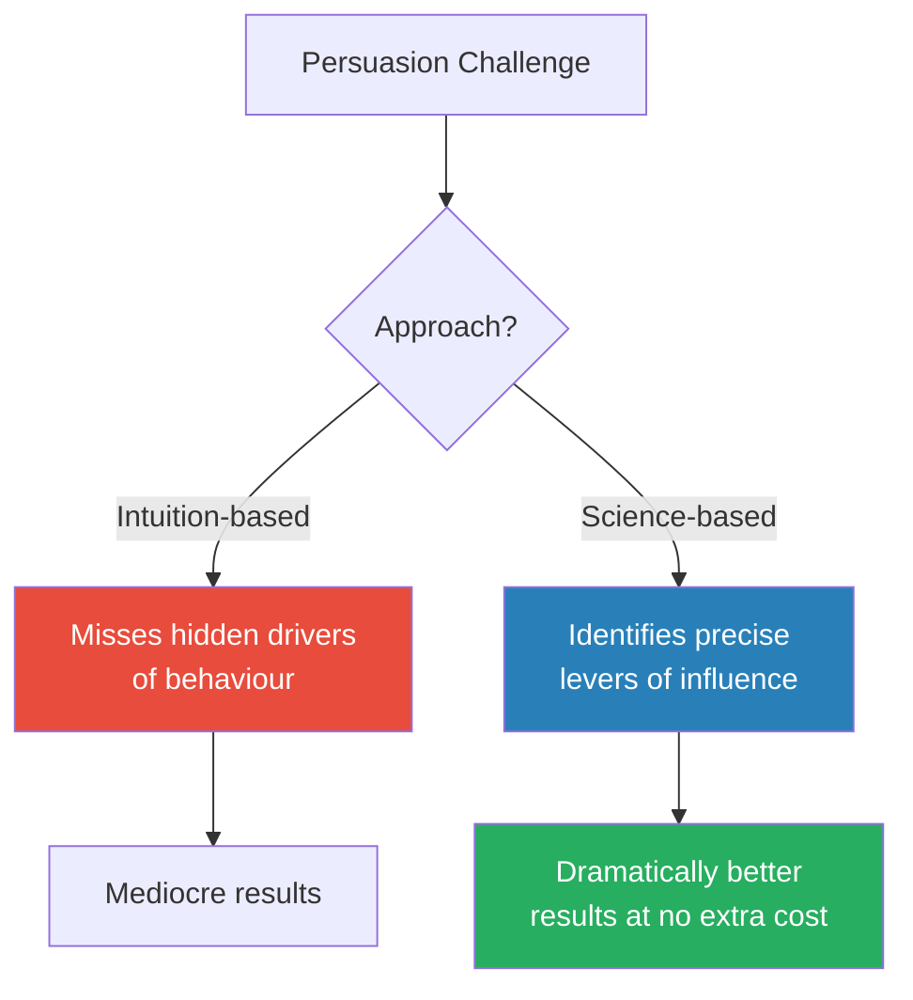

The core choice the book presents: rely on gut instinct, or rely on tested evidence.

---

## Key Concepts at a Glance

| Concept | One-line summary |
|---------|-----------------|
| **Social proof** | People follow what similar others are doing, especially under uncertainty |
| **Negative social proof trap** | Publicising bad behaviour normalises it — highlight the positive majority instead |
| **Reciprocity** | Unconditional, personalised, unexpected gifts create the strongest obligations |
| **Commitment & consistency** | Small written, public, effortful commitments snowball into large behaviour changes |
| **Labelling** | Assign a positive identity and people live up to it |
| **Authority** | Third-party introductions and admitted weaknesses build trust faster than self-promotion |
| **Loss framing** | "What you'll lose" outperforms "what you'll gain" by 30-40% |
| **Cognitive fluency** | Easy to process = perceived as true, valuable, and trustworthy |
| **Decoy effect** | Adding a premium option makes the mid-range look like a wise compromise |
| **Fear + action plan** | Fear motivates only when paired with specific, achievable steps |
| **Goal gradient** | The closer people perceive themselves to a goal, the harder they work |
| **Genuine dissent** | Real dissenters improve group decisions; appointed devil's advocates do not |
| **Benjamin Franklin effect** | Asking a rival for a favour makes them like you through cognitive dissonance |
| **Emotional state effects** | Sadness makes you overpay; cognitive depletion makes you believe everything |
| **Interleaved practice** | Mixed practice beats blocked repetition for long-term skill retention |

Social proof dominates the book's 50 strategies — appearing in eight different techniques — confirming Cialdini's research that what similar others are doing is the single most powerful lever of human behaviour.

A handwritten Post-it note on a survey produced a 75% compliance boost — the largest effect in the book — demonstrating that personalised, unexpected reciprocity is the most powerful persuasion lever available.

While Cialdini's six principles account for the majority of strategies, 40% of the techniques draw on additional mechanisms — cognitive fluency, anchoring, choice architecture, and emotional state effects — showing that persuasion science extends well beyond the classic six.

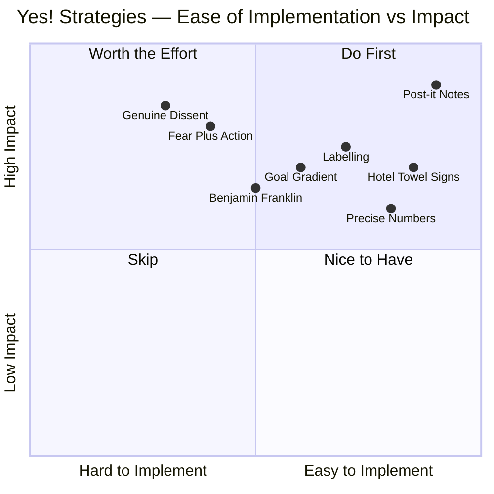

Post-it notes and hotel towel reframing sit in the "do first" quadrant — trivially easy to implement with outsized impact — embodying the book's core promise that small, evidence-based changes produce dramatic results.

---

## Quick Lookup Table — All 50 Strategies

| # | Strategy | Cluster | Core Principle |
|---|----------|---------|---------------|
| 1 | "If operators are busy, please call again" | Social Proof | Implied demand signals popularity |
| 2 | Hotel towel signs — "Most guests reuse" | Social Proof | Matched social proof beats environmental appeals |
| 3 | Negative social proof backfire | Social Proof | Publicising bad behaviour normalises it |
| 4 | The smiley face effect | Social Proof | Pair norms with approval signals to prevent boomerang |
| 5 | Too many choices paralyse | Choice Architecture | Fewer options produce more sales |
| 6 | Free gifts that backfire | Reciprocity | Bundling a free item devalues it — state its true worth |
| 7 | The decoy effect | Choice Architecture | An inferior option makes the target option attractive |
| 8 | Fear without action plan | Fear Appeals | Fear paralyses without a concrete next step |
| 9 | Post-it notes on surveys | Reciprocity | Handwritten personal touches double compliance |
| 10 | Mints and tips | Reciprocity | Unexpected, personalised gifts maximise returns |
| 11 | "No strings attached" gifts | Reciprocity | Unconditional giving outperforms conditional incentives |
| 12 | Favours are like wine | Reciprocity | Giver's perceived value grows; receiver's shrinks |
| 13 | Foot-in-the-door | Commitment | A small "yes" primes a much larger "yes" later |
| 14 | Active commitments | Commitment | Written, public, effortful commitments stick |
| 15 | Labelling people positively | Commitment | Assign a trait and people live up to it |
| 16 | "Do you consider yourself helpful?" | Commitment | A self-affirming question traps consistency |
| 17 | Benjamin Franklin effect | Cognitive Dissonance | Asking a rival for a favour makes them like you |
| 18 | Fighting consistency with consistency | Commitment | Validate old decisions, then redirect with new info |
| 19 | Start low on eBay | Anchoring | Low starting prices attract bidders, drive prices up |
| 20 | "Even a penny will help" | Commitment | Legitimising tiny contributions increases giving |
| 21 | Start high in one-on-one negotiations | Anchoring | High anchors pull final outcomes upward |
| 22 | Have someone else introduce you | Authority | Third-party credential citations beat self-promotion |
| 23 | The smartest person in the room | Collaboration | Groups outperform even their best individual member |
| 24 | Devil's advocate vs true dissent | Collaboration | Authentic disagreement beats assigned contrarianism |
| 25 | Error-based learning | Learning | Studying failures teaches more than studying successes |
| 26 | Admit a weakness first | Authority | Leading with a flaw builds trust for subsequent strengths |
| 27 | Weakness-then-strength sequence | Authority | The admitted weakness must relate to the claimed strength |
| 28 | When to admit you were wrong | Authority | Internal attribution of failure signals control |
| 29 | Name similarity — implicit egoism | Liking | People favour things that resemble themselves |
| 30 | Mirroring and matching | Liking | Reflecting someone's language builds instant rapport |
| 31 | What waiters teach about rapport | Liking | Verbatim repetition of orders increases tips 70% |
| 32 | Genuine smile detection | Liking | Authentic warmth persuades; fake performance repels |
| 33 | Similarities even when trivial | Liking | Shared birthdays and initials increase cooperation |
| 34 | Loss framing | Scarcity | "What you'll lose" outmotivates "what you'll gain" |
| 35 | The word "because" | Fluency | Any reason after "because" triggers compliance |
| 36 | Rhyming = believable | Fluency | Rhyming statements feel more true |
| 37 | Easy-to-pronounce names | Fluency | Processing ease is mistaken for quality and truth |
| 38 | The power of simple language | Fluency | Unnecessarily complex language reduces credibility |
| 39 | Interleaved practice | Learning | Mixed practice beats blocked repetition |
| 40 | The head start effect | Goal Gradient | Illusory progress motivates real completion |
| 41 | Small steps and the endowed progress effect | Goal Gradient | Showing progress already made increases effort |
| 42 | Concrete, vivid messages stick | Message Design | Specific stories beat abstract statistics |
| 43 | The mirror that changed behaviour | Self-Awareness | Self-awareness triggers alignment with internal standards |
| 44 | Sadness makes negotiations bad | Emotional State | Sad people pay more and accept less |
| 45 | Cognitive depletion = gullibility | Cognitive Load | Tired people cannot disbelieve — default is acceptance |
| 46 | Caffeine as a persuasion enhancer | Cognitive State | Caffeine improves processing of strong arguments |
| 47 | Email vs face-to-face | Communication | Rich media prevents misread intentions and impasse |
| 48 | Cross-cultural persuasion (individualist) | Culture | Commitment/consistency strongest in Western cultures |
| 49 | Cross-cultural persuasion (collectivist) | Culture | Social proof and authority strongest in Eastern cultures |
| 50 | Cross-cultural persuasion (relationship) | Culture | Liking and reciprocity strongest in relationship cultures |

---

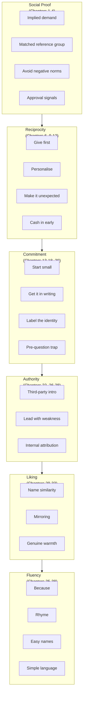

The fifty strategies cluster around Cialdini's core principles, with additional mechanisms like fluency, goal gradient, and emotional state adding depth beyond the original six.

---

> [!tip] How to Use This Summary
> The fifty techniques are grouped below into thematic clusters. Each cluster covers techniques that share a common psychological principle, with the research details and practical applications for each. Think of this as a persuasion reference manual — dip in when you need a specific technique, not necessarily read front to back.

---

## Cluster 1 — Social Proof: The Power of What Others Do

*The largest cluster of techniques in the book revolves around social proof — our tendency to look at what others are doing to determine what we should do. The research shows this tendency is both more powerful and more specific than most people realise.*

### Chapter 1: "If Operators Are Busy, Please Call Again"

- Infomercial writer Colleen Szot changed three words in a standard call-to-action and shattered a nearly twenty-year sales record on a major US home-shopping network
- The old line: "Operators are waiting, please call now"
- The new line: <b style="color: #2980b9">"If operators are busy, please call again"</b>
- On the surface, this seems foolish — telling customers they might have to wait should reduce sales, not increase them
- But the old line conjured an image of bored operators filing their nails by silent phones — signalling low demand
- The new line conjured an image of operators going from call to call without a break — signalling <b style="color: #27ae60">massive demand</b>
- Viewers unconsciously reasoned: "If the lines are busy, other people like me are calling too — this must be worth buying"

The mechanism at work:

- People use other people's behaviour as a shortcut for evaluating quality
- When we cannot judge a product's value directly, we look for signals of what others have decided
- Busy phone lines, long queues, sold-out signs — all communicate that many people have already said "yes"
- <b style="color: #27ae60">The most powerful social proof is implied, not stated</b> — it lets the audience draw the conclusion themselves
- Stating "We're popular" feels like marketing; showing evidence of demand feels like reality
- This is why nightclubs keep lines outside even when there is room inside — the queue IS the advertisement
- Apple stores were designed to look perpetually packed for the same reason — density signals desirability

> [!tip] Core Principle
> Social proof operates most powerfully when it is implied rather than stated. Don't say "Our product is popular." Create conditions where the audience infers popularity from environmental cues — busy phone lines, waitlists, sold-out signs, "limited stock" labels.

When to use implied social proof:

- Product launches: "Ships in 4-6 weeks" signals demand better than "Available immediately"
- Service businesses: "Our next available appointment is three weeks from now"
- Online platforms: displaying the number of active users, reviews, or current viewers
- Restaurants: the "reservation required" sign tells potential diners other people want to eat there before they've read the menu

> [!example] The Empty Restaurant vs. The Packed Restaurant
> - The authors describe the universal experience of choosing between two restaurants on an unfamiliar street — one with a queue out the door, one completely empty
> - Almost everyone chooses the busy one, even though the empty one would seat them immediately
> - The queue is not a deterrent — it is the advertisement
> - No amount of signage, menu design, or Yelp ratings can match the persuasive power of visible demand
> - Smart restaurateurs understand this: they seat customers at window tables first, creating the APPEARANCE of fullness visible from the street
> **The lesson:** The most credible form of marketing is other people's behaviour. Create conditions where your popularity is visible, not stated.

- The difference between stated and implied social proof has profound implications for marketing:
  - Stated social proof ("We've served 1 million customers") feels like a claim — the audience evaluates it sceptically
  - Implied social proof (a busy restaurant, a waitlist, a "limited availability" notice) feels like reality — the audience infers popularity without feeling sold to
  - <b style="color: #27ae60">The most persuasive evidence of demand is the kind that audiences discover for themselves</b>

---

### Chapter 2: The Hotel Towel Experiments

*The book opens with the research that started it all — a series of hotel towel reuse experiments that demonstrate the precision of social proof.*

- Hotels typically encourage guests to reuse towels with environmental messages: "Help save the environment by reusing your towels"
- The authors tested an alternative: <b style="color: #2980b9">"The majority of guests at this hotel reuse their towels at least once during their stay"</b>
- Result: the social proof message increased towel reuse by <b style="color: #27ae60">26%</b> compared to the environmental message
- The environmental appeal spoke to values; the social proof message spoke to behaviour — and behaviour wins
- This matters because hotel chains spend millions on these cards — and the science shows their standard messaging is dramatically underperforming

> [!example] The Same-Room Effect
> - In a follow-up study, the authors tested an even more specific social proof message: "The majority of guests who stayed IN THIS ROOM reused their towels"
> - This same-room message outperformed both the environmental message AND the general hotel social proof message — a **33% increase** over the industry standard
> - There is no rational reason why the behaviour of previous occupants of your specific room should matter more than the behaviour of all hotel guests
> - But it does, because the more similar the reference group, the more powerful the social proof
> **The lesson:** Match the reference group to the target audience as closely as possible.

- A salon owner is more persuaded by what other salon owners did than by what GM executives did
- A student is more persuaded by a similar student's experience than by a star pupil's
- <b style="color: #27ae60">Specificity of the reference group is the single biggest lever for amplifying social proof</b>
- The practical implication is immediate: whenever you cite social proof, make the reference group as similar to your audience as possible
  - "Other companies like yours" beats "many companies"
  - "Other parents of toddlers" beats "other parents"
  - "Other first-time homebuyers in your neighbourhood" beats "other buyers"
- The authors note that the hotel industry was initially sceptical — why would guests care about previous occupants of their room? But the data was unambiguous
- The same principle applies to testimonials: a testimonial from someone who matches your target customer's demographics, industry, and situation is worth more than a celebrity endorsement
- This finding has been replicated in dozens of contexts:
  - Energy conservation messages work better when they reference neighbours on the same street
  - Vaccination campaigns work better when they reference parents of similar-age children
  - Fitness programmes recruit better when referencing people of similar body type and starting fitness level

> [!example] The Hospital Hand-Washing Sign
> - In a follow-up application, the authors tested social proof messaging in a hospital setting to improve hand-washing compliance among doctors and nurses
> - The standard sign read: "Hand hygiene prevents you from catching diseases"
> - The social proof sign read: "Hand hygiene prevents patients from catching diseases"
> - Both signs failed to outperform a third version that combined social proof with a specific reference group: "The majority of your colleagues on this ward wash their hands regularly"
> - The reference-group version was most effective because it matched the specific audience — not "people in general" but "your colleagues on THIS ward"
> **The lesson:** The closer the reference group matches the target audience in identity, location, and situation, the more powerful the social proof becomes.

---

### Chapter 3: The Petrified Forest Disaster — When Social Proof Backfires

*One of the book's most striking findings: a well-intentioned anti-theft sign almost TRIPLED theft.*

- Arizona's Petrified Forest National Park loses 14 tons of petrified wood to theft every year
- The park posted signs reading: <b style="color: #e74c3c">"Your heritage is being vandalized every day by theft losses of petrified wood of 14 tons a year, mostly a small piece at a time"</b>
- The sign was accompanied by images of several visitors taking wood
- The authors conducted an experiment: they placed marked pieces of wood along pathways and varied the signage

| Sign Type | Theft Rate |
|-----------|:----------:|
| No sign (control) | 2.92% |
| "Please don't remove wood" (with image of one thief + red "No" symbol) | 1.67% |
| "Many visitors have removed wood" (negative social proof) | **7.92%** |

- <b style="color: #e74c3c">The negative social proof sign almost tripled theft compared to no sign at all</b>
- It was not a crime prevention strategy — it was a crime promotion strategy
- The mechanism: by telling people "many visitors steal wood," the sign communicated that stealing was normal, common, and therefore acceptable
- People who would never have thought of taking wood now had social permission

> [!example] A Former Graduate Student's Fiancee
> - One of the authors learned about the Petrified Forest problem from a former graduate student who visited the park with his fiancee — "the most honest person he'd ever known, someone who had never borrowed a paper clip without returning it"
> - Upon reading the sign about how much wood was being stolen, she nudged him and whispered: "We'd better get ours now"
> - The sign had converted the most honest person the student knew into a would-be thief — through the sheer power of negative social proof
> **The lesson:** Whenever you publicise a problem's scale, you simultaneously normalise the behaviour causing it.

- The fix: reframe the statistic to highlight the positive majority
- "The vast majority of visitors leave the petrified wood untouched" turns the same data into a persuasion tool rather than a sabotage tool
- <b style="color: #e74c3c">Any campaign that says "many people do this bad thing" is accidentally encouraging the bad thing</b>
- "Most people don't recycle" makes not-recycling seem acceptable
- "Voter turnout is at an all-time low" makes not-voting seem normal
- The authors identify this as the <b style="color: #2980b9">negative social proof trap</b> — one of the most widespread and damaging errors in public campaigns, health messaging, and organisational communication

Real-world examples of the trap in action:

- Tax authorities who publicise "Millions of citizens fail to file on time" inadvertently give permission to delay
- Schools that announce "Bullying is a widespread problem affecting many students" normalise bullying
- Corporate emails stating "Many employees are not completing their timesheets" teach employees that incomplete timesheets are the norm
- Health campaigns that announce "Binge drinking is on the rise among young people" frame binge drinking as a normal youth behaviour
- In every case, the fix is the same: highlight the positive majority and make the undesirable behaviour look like the exception, not the rule

> [!abstract] The Negative Social Proof Audit
> 1. Review all public-facing communications — signs, emails, reports, campaigns
> 2. Search for any message that publicises undesirable behaviour ("Many people don't...", "X% of people fail to...", "A growing number of people are...")
> 3. Reframe each message to highlight the positive majority: "The vast majority of people DO...", "X% of people successfully...", "Most people in your group already..."
> 4. If you must cite the scale of a problem, do so in a way that positions the problem-behaviour as the minority exception, not the norm
> 5. Pair any descriptive norm with an injunctive norm signal (Chapter 4) — a symbol of approval for the desired behaviour

- The negative social proof trap is one of the most actionable findings in the entire book — virtually every organisation commits this error, and fixing it costs nothing
- The authors suggest that organisations conduct what they call a <b style="color: #2980b9">negative social proof audit</b> — systematically reviewing every public communication for inadvertent normalisation of undesirable behaviour
- In their consulting experience, every organisation they've audited has found at least one major instance of the trap in their communications — and often five or ten

---

### Chapter 4: The Smiley Face That Saved Energy

*A tiny symbol of approval can counteract the most powerful descriptive norm — if you know when to deploy it.*

- In a California study led by Robert Cialdini and Wesley Schultz, 300 households received feedback on their energy consumption relative to the neighbourhood average
- Those who used more than average reduced consumption by 5.7% — encouraging
- <b style="color: #e74c3c">But those who used less than average INCREASED consumption by 8.6%</b> — the norm acted as a "magnetic middle," pulling both groups toward the average
- This is the <b style="color: #2980b9">boomerang effect</b>: descriptive norms pull outliers toward the centre — including people who were already doing better than average
- The fix was remarkably simple: researchers added a <b style="color: #27ae60">smiley face</b> to the feedback for low-consumption households
- The smiley face completely eliminated the boomerang effect — low users maintained their good behaviour
- <b style="color: #27ae60">A tiny symbol of social approval was enough to counteract the pull of the descriptive norm</b>

The distinction between two types of norms is crucial here:

- <b style="color: #2980b9">Descriptive norm</b>: what people actually do — "Most people in your neighbourhood use 800 kWh per month"
- <b style="color: #2980b9">Injunctive norm</b>: what people approve of — the smiley face communicates "Society approves of your low usage"
- When the descriptive norm pulls in a bad direction (toward the average), the injunctive norm can override it
- But the injunctive norm must be explicitly communicated — without the smiley face, the descriptive norm rules unopposed
- The researchers also tested a frowning face for above-average households — it amplified the reduction effect, though the smiley face on below-average households was the more important finding

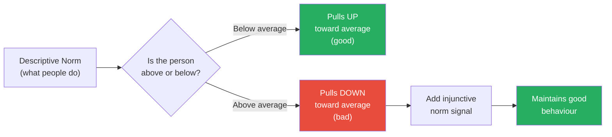

The smiley face acts as an injunctive norm — it communicates "society approves of your behaviour," which is powerful enough to override the magnetic pull of the descriptive norm.

- Utility companies now use this exact technique — energy reports showing smiley faces alongside below-average consumption — saving millions of kilowatt-hours annually
- Opower (now part of Oracle) built an entire business on this research, sending personalised energy reports to millions of households that used both descriptive norms (your usage vs. neighbours) and injunctive norms (smiley faces for low users)
- The Opower reports have been credited with saving over 25 terawatt-hours of electricity globally — making this chapter's finding one of the most consequential applications of behavioural science in history
- The technique applies to any feedback system: employee performance reviews, student progress reports, health metrics
- <b style="color: #27ae60">Whenever you tell someone they're doing better than average, always pair it with a signal of approval</b> — otherwise you're accidentally telling them they can relax
- This connects directly to Chapter 3's negative social proof trap — both chapters are about how well-meaning information can backfire when it inadvertently normalises the wrong behaviour

> [!example] The School Report Card Boomerang
> - A school district sent parents report cards showing their child's performance relative to the class average
> - Students who were ABOVE average showed a slight decline in effort in subsequent months — the "magnetic middle" pulled them downward
> - Parents of above-average students relaxed: "My child is already ahead — no need to push"
> - When the school added a "Star Student" badge to above-average report cards — an injunctive norm signal identical to the smiley face in the energy study — the decline disappeared
> - The badge communicated: "We approve of your child's effort. Keep it up."
> - Without the badge, the descriptive norm ("you're above average") sent the unintended message: "You can afford to coast"
> **The lesson:** The boomerang effect is not limited to energy reports. Any feedback system that tells people they're "better than average" risks accidentally giving them permission to relax. Always pair descriptive norms with injunctive approval signals.

---

## Cluster 2 — Reciprocity: The Power of Giving First

*The second major cluster applies the reciprocity principle — our deep-seated obligation to return favours, gifts, and concessions. The research reveals that small, personalised, unexpected gifts produce disproportionate returns.*

### Chapter 6: When a Bonus Becomes an Onus

*Sometimes giving something for free does not add value — it actively destroys it.*

- Priya Raghubir's study: a pearl bracelet bundled FREE with a bottle of liquor was valued at <b style="color: #e74c3c">35% less</b> than the identical bracelet presented alone
- <b style="color: #2980b9">Offering something for free signals that it has no value</b> — "If it were good, why would they give it away?"
- The fix: always state the true value of the free item
- Don't say "Free security software included" — say <b style="color: #27ae60">"$250 security software included at no cost to you"</b>
- Numerically, "free" = $0.00 — not the message you want to send about your product

> [!example] The Luggage and the Bracelet
> - Researchers showed participants either (a) a pearl bracelet on its own, or (b) the same bracelet offered as a free bonus with a bottle of premium liquor
> - The standalone bracelet was valued at roughly $45
> - The "free bonus" bracelet was valued at roughly $29 — a 35% drop
> - The bundling didn't add value to the liquor; it subtracted value from the bracelet
> - The same effect appeared with luggage bundled free with a laptop — participants devalued the luggage
> **The lesson:** "Free" is not a neutral word. It actively communicates worthlessness. Always state what the "free" item would cost on its own.

- The mechanism is an inference chain:
  - "This item is free" leads to "It must not be worth much"
  - Which leads to "The company is trying to get rid of it"
  - Which leads to "I don't want it either"
- The solution preserves the gift while preventing the inference:
  - Stating the retail price interrupts the chain — "This $250 item is included at no additional cost" communicates value while removing the price barrier
- This explains why premium brands rarely use the word "free" — Rolex would never offer a "free" watch strap with purchase; they would describe it as a "$400 alligator strap, included with your purchase"
- The devaluation effect is particularly dangerous for service businesses:
  - "Free consultation included" makes the consultation seem worthless
  - "A $300 strategy consultation, included with your engagement" preserves its perceived value
  - The same time, the same expertise, the same outcome — but the framing determines the perceived worth

> [!example] The "Free" Oil Change
> - A car dealership offered a "free oil change with every service visit"
> - Customer feedback surveys revealed that customers perceived the oil change as low-quality — "If they're giving it away, they're probably cutting corners"
> - The dealership reframed: "A $49.95 premium synthetic oil change, included at no additional cost with your service"
> - Customer satisfaction with the oil change improved significantly — even though nothing about the oil, the filter, or the process had changed
> - The word "free" had been actively destroying the perceived quality of a service they were proud to offer
> **The lesson:** Never describe something as "free" if you want people to value it. Always state what it would cost if purchased separately, then explain that it's included at no charge.

- The broader principle connects to mental accounting — people categorise "free" items in a different mental bucket than "purchased" items, and the "free" bucket is associated with low quality
- Chris Anderson's book *Free: The Future of a Radical Price* explores this tension: free can drive adoption, but it also signals worthlessness
- The solution the authors propose is specific: keep the gift, but change the label from "free" to "included at no additional cost" while stating the retail value

| Framing | Perceived Value | Customer Reaction |
|---------|----------------|-------------------|
| "Free gift included" | Low — "must be worthless" | Devalues both the gift and the main product |
| "$X value, included at no additional cost" | High — the stated price anchors value | Gift enhances the overall offering |
| "Complimentary" (no price stated) | Medium — better than "free" | Works for services but underperforms price anchoring |

The word "free" is the enemy of perceived quality. State the retail value of everything you give away.

---

### Chapter 9: The Post-It Note That Doubled Compliance

*A tiny piece of adhesive paper can double your response rate — if it signals personal effort.*

- Social scientist Randy Garner sent out surveys with one of three conditions:
  - (a) A handwritten Post-it note requesting completion, attached to a cover letter
  - (b) A similar handwritten message on the cover letter itself
  - (c) The cover letter and survey alone

| Condition | Response Rate |
|-----------|:------------:|
| Handwritten Post-it note | **75%** |
| Handwritten message on cover letter | 48% |
| Cover letter alone | 36% |

- A follow-up test: blank Post-it note (43%) vs handwritten Post-it note (69%) vs no Post-it (34%)
- <b style="color: #2980b9">The Post-it note worked not because it grabbed attention but because it signalled personal effort</b>
- Recipients recognised the extra touch — finding a note, writing on it, sticking it on — and felt obligated to reciprocate
- When Garner added initials and "Thank You!" to the note, response rates climbed even higher
- Those who received the personalised note also returned surveys <b style="color: #27ae60">faster, with more detailed answers and greater care</b>
- The mechanism is reciprocity at its most granular: a tiny investment of personal effort creates a felt obligation in the recipient
- The effort must be visible — the Post-it is a physical marker that says "a human being took extra time for you specifically"
- The blank Post-it (43%) outperformed no Post-it (34%) — even the shape of the Post-it, without a handwritten message, signals that someone took a physical action on your behalf
- But the handwritten note (69%) dramatically outperformed the blank — because it adds personalisation to the effort signal

> [!tip] The Personalisation Principle
> An ounce of personalised effort is worth a pound of persuasion. The more a request feels like it was crafted for you specifically — not mass-produced — the more you feel obligated to respond.

- The digital equivalent: a personalised email that references something specific about the recipient outperforms a generic template
- The physical equivalent in the modern age: a handwritten note included with a proposal, a personalised cover with a report, a custom video message instead of a stock email
- The cost of personalisation is minutes; the return is measured in dramatically higher compliance rates

> [!example] The Insurance Renewal Letter
> - An insurance company tested two versions of their annual renewal letter
> - Version A was the standard template letter — professionally printed, correctly addressed, perfectly competent
> - Version B included a small handwritten Post-it note from the agent saying "Just wanted to make sure you saw this — let me know if you have questions. — Sarah"
> - Version B produced a renewal rate 12 percentage points higher than Version A
> - The cost of the Post-it note was negligible — a few seconds of writing per letter
> - But the signal it sent — "a real person cares about your specific account" — was worth thousands in retained premiums
> **The lesson:** In any mass communication, find a way to inject a visible signal of individual attention. The Post-it note, the handwritten margin note, the personalised PS — these tiny gestures punch far above their weight.

---

### Chapter 10: The Mint Experiment — How Waiters Increased Tips by 23%

*Three factors turn a forgettable gesture into a memorable obligation.*

- Behavioural scientist David Strohmetz tested the effect of giving diners candy with the bill at an upscale Italian restaurant in New Jersey
- <b style="color: #2980b9">One candy per diner:</b> tips increased 3.3% — modest, predictable
- <b style="color: #2980b9">Two candies per diner:</b> tips increased 14.1% — proportional to the gift
- <b style="color: #2980b9">The genius condition:</b> the waiter gave one candy, turned to leave, then turned back and said "Oh, for you nice people, here's an extra candy each" — tips increased <b style="color: #27ae60">23%</b>

- The third condition used the same number of candies as the second — but the tips were 64% higher
- The difference: the second candy was <b style="color: #27ae60">unexpected</b> (the waiter had already turned away) and <b style="color: #27ae60">personalised</b> ("for you nice people")
- The turning-back motion created a micro-narrative: "This waiter was going to leave, but liked us so much he came back with something extra"
- That narrative transforms a routine gesture into a personal connection
- The cost per table: approximately 10 cents in candy. The return: a 23% increase in tips worth several dollars per table

> [!abstract] Three Factors of a Persuasive Gift
> 1. **Significant** — two candies felt meaningful where one felt pro forma (even though both cost pennies)
> 2. **Unexpected** — the waiter turning back after appearing to leave created surprise
> 3. **Personalised** — "for you nice people" made it feel like a special gesture, not a routine
> Any gift or favour you give can be enhanced by maximising these three factors.

- The practical applications extend well beyond restaurants:
  - After closing a deal, send a small unexpected gift — a book relevant to the client's interests, a handwritten note
  - When providing a deliverable, include a small bonus that wasn't promised — an extra analysis, a personalised recommendation
  - When giving feedback, start with an unexpected compliment that shows you paid individual attention
- The turning-back gesture is particularly powerful because it creates a narrative of spontaneous generosity:
  - The first candy is "the system" — routine, expected, impersonal
  - The second candy is "the person" — spontaneous, unexpected, personal
  - Diners responded to the person, not the system

> [!example] The Hotel Checkout Surprise
> - A boutique hotel tested the mint experiment in a different context: at checkout
> - Standard checkout: desk clerk processes the bill and says "Thank you for staying with us"
> - Enhanced checkout: desk clerk processes the bill, then says "Oh, before you go — we had some complimentary chocolates made by a local chocolatier, and I'd love for you to try them" while handing over a small box
> - The enhanced checkout produced significantly higher scores on post-stay satisfaction surveys and higher rates of positive online reviews
> - The timing was crucial: the chocolates arrived AFTER the transaction was complete, making them feel like a genuine personal gesture rather than a transaction sweetener
> - The personalisation ("I'd love for you to try them" rather than "here are some free chocolates") echoed the waiter's "for you nice people" framing from the original mint study
> **The lesson:** The three factors — significant, unexpected, personalised — apply far beyond restaurants. Any business that delivers a small unexpected gift at a moment when the customer isn't expecting it can generate disproportionate goodwill.

---

### Chapter 11: No Strings Attached — Why Unconditional Gifts Outperform Incentives

*The sequence matters more than the size: giving first beats promising later.*

- Many hotels try incentive-based towel reuse: "If you reuse your towels, we'll donate to an environmental charity"
- The authors tested this against a reciprocity-based message: "We've already donated to an environmental charity on your behalf — please reuse your towels"
- <b style="color: #27ae60">The reciprocity-based message produced 45% more towel reuse than the incentive-based message</b>
- Both messages mentioned the same donation — but the sequence was reversed
- The incentive says: "Do something for us and we'll give you something" — an economic transaction
- The reciprocity message says: "We've already given you something — now it's your turn" — a social obligation
- <b style="color: #2980b9">Unconditional gifts create social obligations. Conditional incentives create economic transactions. Social obligations are far more powerful.</b>

> [!example] The Dollar in the Envelope
> - A classic direct-mail experiment: researchers sent surveys either with a promise ("Complete this and we'll send you $5") or with a gift ("Here's $1 enclosed — we appreciate your time in advance")
> - The $1 gift produced a higher response rate than the $5 promise
> - Five times the money, delivered conditionally, was less powerful than one-fifth the money, delivered unconditionally
> - The $1 bill created a social obligation; the $5 promise created an economic calculation
> **The lesson:** Give first. Give unconditionally. The social obligation you create is worth far more than the economic incentive you save.

- The distinction between economic exchange and social exchange is critical:
  - Economic exchange: both parties calculate costs and benefits — the relationship is transactional
  - Social exchange: both parties feel mutual obligation — the relationship is personal
  - <b style="color: #e74c3c">Conditional incentives push interactions into the economic frame, where people haggle and optimise</b>
  - Unconditional gifts push interactions into the social frame, where people feel gratitude and obligation
- This connects to Dan Ariely's research on social norms vs market norms: the moment you introduce a price, you destroy the social dynamic
- A daycare that introduced fines for late pickup actually INCREASED late pickups — the fine turned a social obligation ("I shouldn't be late") into an economic transaction ("I can buy extra time")
- The authors note that the unconditional gift must be given before the request, not simultaneously — the sequence is what creates the obligation
- When the gift and the request arrive together, the recipient perceives it as a trade, not a gesture

> [!example] The Hotel Towel Reciprocity Experiment
> - The authors compared three hotel towel signs:
> - Sign A (incentive): "If you reuse your towel, we will donate to an environmental charity"
> - Sign B (reciprocity): "We have already donated to an environmental charity on your behalf. Would you reuse your towel?"
> - Sign C (reciprocity + specificity): "We have already donated to an environmental charity on behalf of guests in this room. Would you reuse your towel?"
> - Sign C produced the highest reuse rate — combining unconditional reciprocity with the same-room social proof from Chapter 2
> - The lesson was double: give first (reciprocity) AND match the reference group (social proof) for maximum effect
> **The lesson:** The most powerful persuasion combines multiple principles. Unconditional reciprocity plus matched social proof is stronger than either alone.

---

### Chapter 12: Favours Are Like Wine, Not Bread

*One of the book's most counterintuitive findings — and one that explains countless broken reciprocity expectations.*

- Francis Flynn's research on how the perceived value of favours changes over time:
- <b style="color: #2980b9">For the RECEIVER:</b> a favour's perceived value is highest right after it's performed, then fades over time (like bread going stale)
- <b style="color: #e74c3c">For the GIVER:</b> a favour's perceived value is lowest right after it's performed, then grows over time (like wine improving with age)
- This asymmetry creates a dangerous gap: the giver remembers the favour as increasingly significant while the receiver remembers it as increasingly trivial
- If you've done someone a favour, <b style="color: #27ae60">cash in the reciprocity soon — don't wait</b>
- If someone has done you a favour, <b style="color: #27ae60">be aware that you're probably undervaluing it over time</b>

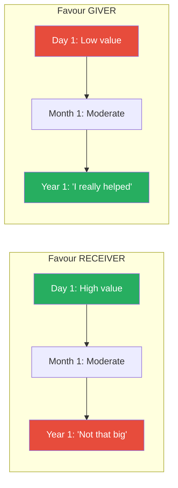

The giver-receiver value gap widens over time, making delayed reciprocity requests feel disproportionate to the receiver.

- This explains why so many workplace conflicts arise from unreciprocated favours — the giver feels increasingly owed while the receiver has increasingly forgotten
- The asymmetry exists because of two different memory processes:
  - Givers remember the effort they invested, which grows in their memory as they reconstruct and embellish it
  - Receivers remember the outcome they received, which shrinks as it becomes just another event in a long sequence of events
- Flynn's research also showed that the asymmetry is predictable and consistent — it is not a matter of personality but of psychological position
- The practical solution is to establish the reciprocity frame at the time of the favour, while both parties agree on its value
- Flynn's research suggests two strategies for managing the asymmetry:
  - **For givers:** Don't wait. Cash in reciprocity within days or weeks, not months or years. The window of perceived obligation narrows as the receiver's memory of the favour fades
  - **For receivers:** Actively counter the natural tendency to downgrade the favour's value over time. When someone reminds you of a past favour, resist the instinct to minimise it — your brain is systematically undervaluing what they did

> [!tip] Practical Application
> When doing a favour for a colleague, gently establish the reciprocity frame at the time of the favour: "Happy to help — I know you'd do the same for me if the situation were reversed." This anchors the value of the favour while it's still fresh in the receiver's mind.

> [!example] The Business Partnership That Fell Apart
> - The authors describe a business scenario where a consultant spent an entire weekend helping a friend prepare a critical investor presentation — for free
> - At the time, both parties agreed it was a significant favour
> - Six months later, the consultant asked the friend for an introduction to a potential client
> - The friend hesitated, feeling the request was "too much" — by now, his memory of the weekend favour had faded to "he helped me with a few slides"
> - Meanwhile, the consultant's memory of the weekend had grown — "I gave up my entire weekend, missed my son's football game, and didn't charge a penny"
> - The friendship suffered because the natural asymmetry in favour-perception made both parties feel the other was being unreasonable
> **The lesson:** The giver-receiver perception gap is not a character flaw — it is a systematic bias built into human memory. The only fix is to establish the reciprocity frame while the favour is fresh and both parties agree on its value.

---

### Bobby Fischer and the Power of Long-Term Reciprocity

- In 1972, Bobby Fischer played Boris Spassky in Iceland in the Chess Match of the Century — putting Iceland on the international map for the first time
- Over thirty years later, when Fischer was a fugitive from US law enforcement, Iceland's parliament voted overwhelmingly to grant him citizenship — despite strong pressure from the United States
- An Icelandic foreign affairs representative explained: "He contributed to a rather special event here, over thirty years ago but that people remember very well"
- <b style="color: #2980b9">The norm of reciprocity transcended three decades, international politics, and Fischer's widely disliked personality</b>
- Dennis Regan's classic study confirmed this: people who received a small unsolicited gift (a Coke) bought twice as many raffle tickets from the giver — regardless of whether they liked the giver or not
- <b style="color: #27ae60">You don't have to be liked to benefit from reciprocity. You just have to be generous.</b>
- This separates reciprocity from liking — you can dislike someone and still feel obligated to reciprocate their generosity
- The Fischer story also demonstrates that reciprocity can operate at the national and institutional level, not just between individuals
- The Regan study is especially important because it shows that reciprocity overrides personal feelings — the most unlikeable giver still triggers the obligation to reciprocate if the gift was genuine
- The authors note that this makes reciprocity fundamentally different from liking as a persuasion tool:
  - Liking requires the other person to find you appealing — which you cannot fully control
  - Reciprocity requires only that you give first — which you can always control
  - <b style="color: #27ae60">This makes reciprocity the most universally deployable of all six principles — it works regardless of whether the other person likes you</b>

---

## Cluster 3 — Commitment & Consistency: The Stickiness of Small Steps

*Once we commit to something — especially publicly, in writing, or through effort — we feel internal pressure to behave consistently with that commitment. The book's commitment techniques exploit this with surgical precision.*

### Chapter 13: The Foot-in-the-Door Technique

*A tiny initial "yes" can unlock a dramatically larger one later — because the first commitment changes who we believe ourselves to be.*

- Freedman and Fraser's landmark study: homeowners asked to place a huge, ugly "DRIVE CAREFULLY" billboard on their lawn
- <b style="color: #2980b9">Without prior commitment: 17% agreed</b>
- <b style="color: #27ae60">With a tiny prior commitment (displaying a small window sign two weeks earlier): 76% agreed</b>
- The small sign changed their self-image — they now saw themselves as the kind of people who support public safety causes
- When the large request came, agreeing was consistent with who they had become
- The escalation factor is remarkable: a 4.5x increase in compliance from a trivial initial commitment

> [!example] The Drive Safely Billboard
> - Researchers went door to door asking homeowners if they would allow a large, poorly lettered "DRIVE CAREFULLY" sign to be installed on their front lawn
> - They showed homeowners a photo of the sign — it was enormous and ugly, blocking most of the house
> - Only 17% of homeowners agreed — a reasonable refusal rate for an unreasonable request
> - But in a second group, homeowners had been asked two weeks earlier to display a tiny 3-inch window sign supporting safe driving
> - Almost all had agreed to the small sign — it was trivial
> - When the billboard request came two weeks later, 76% agreed
> - The small sign had changed their identity, not just their behaviour
> **The lesson:** Start with a request so small that no one can refuse. The identity shift does the heavy lifting for your larger request later.

- The mechanism is not about habit or momentum — it is about <b style="color: #2980b9">identity shift</b>
  - The small action creates a new piece of self-concept: "I am a civic-minded person"
  - The large request then aligns with that self-concept
  - Refusing the large request would create cognitive dissonance: "I supported this cause before — why wouldn't I support it now?"
- The technique has been replicated across dozens of domains:
  - Charity fundraising: a small initial donation leads to larger subsequent donations
  - Political campaigns: signing a petition leads to volunteering time
  - Sales: agreeing to a free trial leads to purchasing the full product
  - Health: agreeing to wear a small health awareness pin leads to agreeing to donate blood
- The critical element is the TIME GAP between the small request and the large one — too short and it feels like a pressure tactic; too long and the identity shift fades
- Two weeks appears to be the sweet spot in most research

> [!example] The Blood Donation Escalation
> - Health researchers applied the foot-in-the-door technique to blood donation recruitment
> - Phase 1: they asked students to wear a small red pin supporting blood donation for one day — nearly everyone agreed
> - Phase 2 (two weeks later): they asked the same students to donate blood
> - Students who had worn the pin were three times more likely to agree to donate than students who had not been asked to wear the pin
> - The pin was trivial — a few grams of plastic worn for a day — but it created a self-concept: "I support blood donation"
> - The donation request then felt like a natural extension of that identity
> **The lesson:** The smaller and less costly the initial commitment, the more people will agree to it — and the identity shift it creates is just as powerful as if the initial commitment had been large.

- The foot-in-the-door technique has a mirror image: the <b style="color: #2980b9">door-in-the-face technique</b>, where you start with an absurdly large request (which is refused) and then follow with a moderate request (which feels like a concession)
- Both techniques work, but through different mechanisms:
  - Foot-in-the-door works through identity shift — the small "yes" changes self-concept
  - Door-in-the-face works through reciprocity — the retreat to a smaller request feels like a concession that must be reciprocated
- The book focuses primarily on foot-in-the-door because the identity shift is more durable than the reciprocity obligation

| Technique | Mechanism | Best For | Limitation |
|-----------|-----------|----------|------------|
| **Foot-in-the-door** | Identity shift from small "yes" | Long-term behaviour change | Requires time gap between requests |
| **Door-in-the-face** | Reciprocity from perceived concession | Immediate large requests | Short-term effect; no identity shift |

The foot-in-the-door technique creates lasting change because it modifies self-concept; the door-in-the-face technique creates immediate compliance because it triggers reciprocity, but the effect fades once the reciprocity obligation is discharged.

---

### Chapter 14: The Active Ingredient in Lasting Commitments

*Not all commitments are created equal. Written, public, effortful commitments outlast everything else.*

- <b style="color: #2980b9">Written commitments are more durable than verbal ones</b>
- <b style="color: #2980b9">Public commitments are more durable than private ones</b>
- <b style="color: #2980b9">Effortful commitments are more durable than easy ones</b>
- Chinese POW camp commanders in the Korean War understood this perfectly — they had prisoners write essays, sign petitions, and read statements on camp radio, each small step reinforcing a shift in self-image (as described in [[Influence - Robert Cialdini|Influence]])
- The practical application: whenever you need someone to follow through on a commitment, get it in writing, make it public, and ensure they invested effort in creating it
- The act of writing forces the person to articulate their commitment in their own words — which strengthens the identity connection
- Making it public adds social accountability — others will expect consistency
- Effort invested creates sunk cost attachment — "I worked hard on this commitment, so it must be important to me"

> [!abstract] The Commitment Checklist
> - Written down (not just spoken)
> - Made publicly (others know about it)
> - Required effort to create (not just a checkbox)
> - Voluntary (not coerced)
> - Linked to identity ("I'm the kind of person who...")
> The more of these present, the more likely the commitment will stick.

- <b style="color: #e74c3c">Commitments that feel coerced do not produce lasting behaviour change</b> — the person attributes their compliance to external pressure rather than internal motivation
- The commitment must feel voluntary for the identity shift to occur
- This is why compliance gained through threats dissolves the moment the threat is removed, while compliance gained through small voluntary commitments persists indefinitely
- The authors note a medical application: patients who write their next appointment date on the appointment card themselves (rather than having the receptionist write it) are significantly less likely to miss the appointment
- The physical act of writing creates ownership of the commitment

> [!example] The Restaurant No-Show Problem
> - A high-end restaurant in Chicago was losing thousands of dollars per week from no-shows — guests who made reservations and never appeared
> - The receptionist's standard script: "Please call if you need to change or cancel your reservation"
> - The revised script: "WILL you please call if you need to change or cancel your reservation?" — and then WAITED for the guest to say "Yes"
> - That single change — asking for a verbal commitment and waiting for a response — reduced no-shows from 30% to 10%
> - The verbal "yes" activated the consistency drive: having promised to call, guests felt obligated to follow through
> - The pause after the question was critical — it forced the guest to actively commit rather than passively listen
> **The lesson:** The difference between telling someone to do something and asking them to commit to doing it is enormous. A commitment, even a brief verbal one, activates the consistency drive that a mere instruction does not.

---

### Chapter 15: The Jedi Master of Persuasion — Labelling

*Assign someone a positive trait and watch them work to earn it.*

- In *Star Wars*, Darth Vader tells Luke "You don't know the power of the Dark Side" — but Luke responds by labelling Vader with his better self: "I know there is still good in you"
- <b style="color: #2980b9">Labelling</b> is the technique of assigning a positive trait to someone and watching them live up to it
- Alice Tybout and Richard Yalch's research: voters told they were "above-average citizens who are more likely to vote" were <b style="color: #27ae60">significantly more likely to vote</b> than those who were simply told it was important to vote
- The label creates a self-image that the person then works to maintain — a commitment/consistency mechanism
- <b style="color: #27ae60">When you want someone to behave a certain way, label them as the kind of person who already behaves that way</b>
- This works because refusing to act consistently with the label creates cognitive dissonance

> [!example] The "Above-Average Citizen" Experiment
> - Researchers randomly assigned voters to one of two groups
> - Group A was told: "Voting is important. Please make sure to vote"
> - Group B was told: "Based on your record, you appear to be an above-average citizen who is likely to vote in the upcoming election"
> - Group B's turnout was significantly higher — despite the label being assigned randomly
> - The voters in Group B didn't just hear a message — they received an identity they felt compelled to live up to
> **The lesson:** Labels don't describe reality. They create it.

- The label must be positive and aspirational — negative labels also create self-fulfilling prophecies, but in the wrong direction
- Teachers who tell students "You're the kind of class that cares about neatness" get neater classrooms than those who simply say "Keep the room clean"
- The principle connects directly to Chapter 4's injunctive norms — both communicate what is approved of, not just what is done
- Managers can use labelling to reshape team culture: "This team has always been known for its attention to detail" creates a standard people want to uphold
- The label works even when the recipient knows it's a label — the conscious awareness doesn't cancel the unconscious desire to live up to it
- Parents use this instinctively: "You're such a kind child" produces more kindness than "Be kind" — the label works on adults just as effectively

> [!example] The Littering and Labelling Experiment
> - Researchers studied littering behaviour in school children
> - One group was told: "You should be neat and tidy. You should not litter" — a direct instruction
> - Another group was told: "You are the kind of students who care about keeping your school clean" — a label
> - In follow-up observation, the labelled group littered significantly less than the instructed group
> - The instruction told them WHAT TO DO; the label told them WHO THEY ARE
> - Behaviour that flows from identity is far more persistent than behaviour that flows from compliance
> **The lesson:** Instructions fade. Identity persists. If you want lasting behaviour change, assign an identity, not a rule.

---

### Chapter 16: "Do You Consider Yourself a Helpful Person?"

*A single question can trap someone into compliance through the consistency drive.*

- Researchers stopped people and asked them to take a survey
- Standard request: <b style="color: #e74c3c">29% agreed</b>
- Pre-question "Do you consider yourself a helpful person?" followed by the survey request: <b style="color: #27ae60">77.3% agreed</b>
- 97% of people answered "yes" to the helpful question — because saying "no" would feel like a negative self-assessment
- In that privileged moment after publicly affirming their helpful identity, they were trapped by consistency: refusing the survey would contradict who they had just declared themselves to be
- <b style="color: #2980b9">This is Cialdini's Pre-Suasion in miniature — a single question that reshapes the decision context before the real request arrives</b>

The technique works through a two-step mechanism:

- Step 1: The question forces a public self-declaration ("Yes, I am helpful")
- Step 2: The request arrives while the declaration is still active — refusal would create immediate cognitive dissonance
- The timing is critical: the question must come immediately before the request, while the self-declaration is fresh
- The question must be phrased so that "yes" is the only socially acceptable answer
- Variations that work equally well:
  - "Do you consider yourself environmentally conscious?" (before asking for a green initiative)
  - "Would you say you're the kind of person who supports their community?" (before asking for a donation)
  - "Do you pride yourself on being open-minded?" (before presenting a new idea)

> [!example] The Door-to-Door Charity Trap
> - In a separate study, researchers went door to door collecting for charity
> - They asked half the households: "Do you consider yourself a generous person?" — nearly everyone said yes
> - When the donation request followed immediately, the "generous" households gave at dramatically higher rates
> - The pre-question didn't change their generosity — it trapped their existing self-image into a specific behaviour
> **The lesson:** The most powerful setup for a request is a question that forces the other person to affirm the very identity your request depends on.

---

### Chapter 17: The Benjamin Franklin Effect — Turn Enemies into Allies

*Asking for a favour is more powerful than giving one — because of cognitive dissonance.*

- Benjamin Franklin once dealt with a hostile political rival in the Pennsylvania legislature by asking to borrow a rare book from the man's library
- The rival was flattered, lent the book, and — counterintuitively — <b style="color: #27ae60">became friendlier toward Franklin afterward</b>
- Franklin wrote: "He that has once done you a kindness will be more ready to do you another, than he whom you yourself have obliged"
- The mechanism: <b style="color: #2980b9">cognitive dissonance</b> — "I did a favour for this person, so I must like them. Why else would I have helped?"
- The favour-doer adjusts their attitude to match their behaviour
- This is the REVERSE of the expected direction — normally we do favours for people we like, but the Franklin effect shows that doing a favour CREATES liking

> [!example] Jecker and Landy's Confirmation Study
> - Students who won money in a contest were either (a) asked by the researcher to return the money because the department was short on funds, (b) asked by a secretary to return it, or (c) not asked at all
> - Those asked by the researcher — and who returned the money — rated the researcher as MORE likeable than either of the other groups
> - Doing the researcher a favour (returning the money) made them like him more
> **The lesson:** If you have a difficult colleague, don't try to win them over by doing favours FOR them — ask them to do a small favour for YOU.

- The favour must be small enough that the person will agree but significant enough that they notice they've helped
- Borrowing a book, asking for advice, requesting a recommendation — all work
- <b style="color: #e74c3c">The worst response to a hostile colleague is to shower them with gifts — this often increases suspicion rather than liking</b>
- The Franklin effect reverses the arrow: behaviour shapes attitude, not the other way around
- This has profound implications for conflict resolution: rather than trying to make an adversary like you through concessions, engage them by asking for their input, their expertise, their help with a problem
- The effect works because people have a deep need for internal consistency — they cannot hold the belief "I don't like this person" simultaneously with the behaviour "I just helped them" without experiencing discomfort
- The easiest resolution is to update the belief: "I must like them after all"

> [!example] The Hostage Negotiator's Secret
> - FBI hostage negotiators have independently discovered the Franklin effect
> - When dealing with a barricaded subject, experienced negotiators ask for small favours: "Could you let one hostage go as a sign of good faith?" or "Could you toss out the gun from the window?"
> - Each favour the subject performs creates a tiny shift in their attitude toward the negotiator — from adversary to someone they've helped
> - Over hours, these micro-favours accumulate into genuine rapport
> - The negotiator is not weakened by asking — they are building the psychological bridge that eventually leads to surrender
> **The lesson:** Asking for help is not a sign of weakness. It is a rapport-building tool that works precisely because it reverses the normal direction of liking — from feeling to behaviour, to behaviour creating feeling.

---

### Chapter 18: How to Fight Consistency with Consistency

*What do you do when someone's existing commitment works AGAINST you?*

- You can't simply argue against their commitment — that triggers the consistency drive to defend it
- <b style="color: #2980b9">Instead, acknowledge the wisdom of their original decision given what they knew THEN, and show how new circumstances call for a new, equally consistent decision NOW</b>
- "You made a great decision when you chose X — that was the right call at the time. But the situation has changed since then, and the same careful analysis that led you to choose X now points toward Y"
- This respects the person's self-image as a good decision-maker while redirecting their consistency drive
- The key insight: you're not attacking their past decision — you're honouring it while showing that the logical extension of their own reasoning now leads somewhere different

> [!abstract] The Consistency Pivot
> 1. Validate the past decision ("That was smart given what you knew")
> 2. Introduce new information ("Since then, X has changed")
> 3. Show that the SAME reasoning now leads to your preferred option ("The same logic now points to...")
> This maintains their self-image while redirecting their behaviour.

- <b style="color: #e74c3c">Never say "You were wrong to choose X"</b> — this attacks their identity and triggers defensive entrenchment
- Instead, frame the switch as the most consistent thing they could do: "The fact that you chose X proves you care about quality — and the latest quality data now favours Y"
- This technique is particularly valuable in long-term client relationships where the client has committed to a competitor's product
- Rather than attacking their choice, validate it and show how changed circumstances now favour switching
- The authors note this is one of the hardest techniques to execute because it requires genuine respect for the other person's reasoning, not just the appearance of respect
- People can tell the difference between "You were smart" (genuine) and "You were smart, BUT..." (manipulative setup) — the validation must be real

> [!example] The Technology Upgrade Pitch
> - A consulting firm was trying to convince a long-term client to switch from a software platform the client had championed internally for years
> - The wrong approach: "Your current system is outdated and losing you money" — this attacks the client's past decision and triggers entrenchment
> - The right approach: "When you chose this system five years ago, it was the best option available. Your analysis was spot-on at the time. Since then, the market has evolved — cloud computing didn't exist at the same scale, and your data volumes have grown 400%. The same analytical rigour that led you to choose that system now points to this one"
> - The client switched — not because they felt their original choice was wrong, but because switching was the most CONSISTENT thing they could do with their identity as a careful evaluator
> **The lesson:** Never fight consistency head-on. Instead, redirect it: "The same intelligence that led you THERE now leads you HERE."

---

### Chapter 20: "Even a Penny Will Help"

*Legitimising the smallest possible contribution removes the excuse for not contributing at all.*

- Researchers went door to door asking for donations to the American Cancer Society
- Half used the standard request; the other half added: "Even a penny will help"
- The even-a-penny group received donations from <b style="color: #27ae60">nearly twice as many people</b> — and the average donation was NOT smaller
- By legitimising the smallest possible contribution, they removed the excuse for not giving at all
- Once people committed to giving (even a penny), they gave generously to stay consistent with their self-image as charitable people
- <b style="color: #2980b9">The technique works by lowering the barrier to the initial commitment — the consistency drive does the rest</b>

The two-phase mechanism:

- Phase 1: "Even a penny" eliminates the excuse "I can't afford to donate" — nobody can claim a penny is beyond their means
- Phase 2: Once the person has decided to donate (cleared the commitment hurdle), they give generously because giving a literal penny would feel embarrassing
- The technique is brilliant because it works on both the hesitant AND the generous:
  - Hesitant givers are unblocked by the low barrier
  - Generous givers are unaffected — they were going to give anyway
  - The result: more donors, with no decrease in average donation size
- The same logic applies to other domains:
  - "Even five minutes of your time would help" — for volunteer recruitment
  - "Even a short testimonial would be valuable" — for collecting reviews
  - "Even a single referral would make a difference" — for business development
- The technique has an interesting interaction with social norms:
  - If you say "Even a penny will help" to a wealthy donor, they don't give a penny — they give generously, because giving a penny would feel embarrassingly cheap
  - The low bar removes the excuse for not giving, but social norms prevent them from actually giving at the minimum
  - This is why the average donation stays constant — the technique unblocks new donors without cheapening the donations of existing ones
- The approach also works in reverse for high-commitment requests:
  - "Could you spare just one afternoon?" unblocks volunteers who would refuse "Could you commit to weekly volunteering?"
  - Once they show up for one afternoon, the identity shift (Chapter 13) makes future volunteering more likely
- The "even a penny" technique is one of the best examples of how multiple principles interact:
  - It uses commitment/consistency (the small commitment leads to generous giving)
  - It uses social norms (nobody wants to be the person who gives a literal penny)
  - It removes the "I can't afford it" excuse that blocks the initial decision
  - The combination is more powerful than any single principle operating alone

> [!example] The Charity Door-to-Door Comparison
> - In the standard condition, collectors used a straightforward appeal: "Would you be willing to help by giving a donation?"
> - In the even-a-penny condition, collectors added: "Even a penny will help"
> - The even-a-penny condition nearly doubled the number of donors
> - Crucially, the average donation size did not drop — people who gave, gave generously
> - The "even a penny" line did not make people cheap — it made them willing to start
> **The lesson:** The hardest part of persuasion is getting the first "yes." Make that first "yes" as easy as possible, and generosity takes over from there.

---

## Cluster 4 — Authority & Trust: The Paradox of Admitting Weakness

*Several of the book's most counterintuitive findings involve the authority principle — and the surprising discovery that admitting weakness INCREASES perceived authority.*

### Chapter 22: How to Show Off Without Being a Show-Off

*The most effective way to establish credentials is to have someone else establish them for you.*

- If you tell people you're an expert, they'll think you're arrogant
- If someone ELSE tells people you're an expert, they'll believe it — even if that person is obviously paid to say it
- <b style="color: #2980b9">The fundamental attribution error</b>: we underestimate how much situational factors (like being paid) influence behaviour, so we take the agent's praise at face value
- A study showed that an author was rated more favourably on nearly every dimension — especially likability — when praised by his agent than when praising himself, despite identical words
- The third-party introduction activates the authority principle without triggering the arrogance penalty

> [!example] The Real Estate Receptionist
> - The authors worked with a real estate agency where the receptionist simply said "Let me put you through to Judy" or "Let me transfer you to Sheldon"
> - After the intervention, the receptionist said: "Rentals? You need Judy — she has over fifteen years' experience renting properties in this neighbourhood. Let me put you through"
> - And: "I'm going to put you through to Sheldon, our head of sales. Sheldon has twenty years of experience and recently sold a property very similar to yours"
> - Four things to note: (1) everything said was true, (2) it didn't matter that the receptionist was obviously connected to Judy and Sheldon, (3) appointments increased significantly, and (4) it cost nothing to implement
> **The lesson:** Arrange for someone else to introduce your expertise. If that's not possible, display your credentials visibly.

- A group of physicians' assistants who were struggling with patient non-compliance simply put their diplomas and certificates on the wall of the examining room — patient compliance increased dramatically
- <b style="color: #27ae60">Authority can be communicated through environment (diplomas, awards, titles on email signatures) as well as through third parties</b>
- The key constraint: the credentials must be real — fabricated authority eventually destroys trust far more than it builds
- In the digital world, the same principle applies: LinkedIn endorsements, published articles, conference speaking credits, and client testimonials all serve as third-party authority signals
- The authors emphasise that the "agent" in their study was someone the participants knew to be connected to the author — yet the authority effect still worked
- This suggests that even transparent third-party endorsement is more effective than self-promotion

> [!example] The Medical Practice Transformation
> - A group of physicians' assistants were frustrated by low patient compliance — patients weren't following their treatment plans
> - The intervention was remarkably simple: they hung their diplomas, certifications, and professional awards on the wall of the examining room
> - Patient compliance increased measurably — the visible credentials made patients take the assistants' advice more seriously
> - The diplomas had always existed — the assistants had always been qualified — but the credentials needed to be VISIBLE for the authority principle to operate
> - The authors note that many professionals are reluctant to display their qualifications, fearing it will seem boastful
> - But research consistently shows that environmental authority signals (diplomas, awards, published work on display) create trust without triggering the arrogance penalty that verbal self-promotion does
> **The lesson:** Authority signals work even when they're passive and environmental. If you have credentials, make them visible. A diploma on the wall does the persuading that modesty prevents you from doing verbally.

> [!abstract] The Third-Party Introduction Script
> 1. Identify the specific credential most relevant to the upcoming interaction
> 2. Brief the person who will introduce you on exactly what to say
> 3. Keep the credential statement factual, not evaluative: "She has fifteen years of experience" (fact) beats "She's the best in the business" (opinion)
> 4. Have the introducer mention one specific accomplishment relevant to the audience: "She recently completed a project very similar to yours"
> 5. The introduction should take 15-30 seconds — long enough to establish authority, short enough to avoid feeling like a sales pitch

---

### Chapter 21: Start High in One-on-One Negotiations

*In competitive one-on-one settings, the opposite of the eBay rule applies — starting high anchors the negotiation in your favour.*

- While Chapter 19 shows that low starting prices work in auctions, one-on-one negotiations follow the reverse logic
- When there is no crowd of bidders to create competition, the opening offer sets the <b style="color: #2980b9">anchor</b> — the reference point around which all subsequent negotiation revolves
- A high opening offer pulls the counterpart's expectations upward
- Research shows that final negotiated outcomes correlate strongly with the first number on the table
- <b style="color: #27ae60">In salary negotiations, proposal discussions, and any one-buyer-one-seller context, start high with justification</b>
- The justification is critical — an unjustified high number feels like bluster; a justified high number feels like a reasoned position
- The mechanism: <b style="color: #2980b9">anchoring bias</b> causes people to adjust insufficiently from whatever starting point they encounter
  - Even when they know the anchor is arbitrary, the pull is measurable
  - Kahneman and Tversky demonstrated this with random numbers influencing estimates of African UN membership

| Scenario | Best Starting Price | Why |
|----------|-------------------|-----|
| **eBay auction** (many bidders) | Low | Attracts crowd, creates competition |
| **Salary negotiation** (one-on-one) | High | Anchors the counterparty's expectations |
| **Proposal to client** (one decision-maker) | High with justification | Sets the reference point for discussion |
| **Fundraising** (many donors) | Low | "Even a penny will help" removes excuses |

The contrast between Chapters 19 and 21 is one of the book's most valuable insights — the optimal starting point depends entirely on whether you're in a competitive (many-bidder) or dyadic (one-on-one) environment.

> [!tip] Core Anchoring Rule
> The optimal starting point depends on the competitive structure: many bidders = start low (create a crowd); one-on-one = start high (set the anchor). Getting this backwards — starting high in an auction or low in a salary negotiation — is one of the most expensive mistakes in persuasion.

> [!example] The Real Estate Anchor Study
> - In a real estate negotiation experiment, researchers varied the listing price of identical houses
> - When the listing price was set 10% above comparable sales, the final sale price was significantly higher than when it was set at or below comparable sales
> - Even professional real estate agents were affected by the anchor — despite claiming they were not influenced by listing prices
> - The study demonstrated that anchoring bias is not a novice's error — it affects trained professionals who should know better
> - The mechanism: the high listing price created a reference point that all subsequent negotiations revolved around
> **The lesson:** In any one-on-one negotiation, the first number on the table has outsized influence on the final outcome. Make sure that number is yours, and make sure it's high.

> [!example] The Salary Negotiation Anchor
> - In a classic negotiation study, researchers assigned pairs of participants to negotiate a salary
> - When the candidate opened with a high number ($65,000), the final agreed salary was significantly higher than when the candidate opened low ($45,000)
> - The employer's counteroffer was pulled upward by the high anchor — they adjusted down from $65,000 rather than up from $45,000
> - Even experienced negotiators were affected by the anchor — awareness of the bias did not eliminate it
> **The lesson:** In one-on-one negotiations, always make the first offer — and make it high. The anchor you set determines the midpoint around which the deal will close.

---

### Chapters 26-27: The Power of Admitting Weakness

*Leading with your flaw is the fastest way to build the trust that makes your strengths believable.*

- Volkswagen Beetle's legendary campaign: "Ugly is only skin deep" and "It will stay uglier longer"
- Rather than hiding the car's aesthetic weakness, they led with it — and sales exploded
- The mechanism: <b style="color: #2980b9">arguing against your own interest creates the perception of honesty and trustworthiness</b>
- Once you're perceived as honest, your genuine strengths become far more persuasive
- This works because listeners expect communicators to present only positive information — when a communicator voluntarily shares a negative, it violates that expectation and triggers the inference "This person is honest"

| Brand | Admitted Weakness | Hidden Strength Amplified |
|-------|------------------|--------------------------|
| **Volkswagen** | "Ugly" | Durability, fuel economy, price |
| **Avis** | "We're #2" | "But we try harder" |
| **Listerine** | "The taste you hate" | "Three times a day" (implied effectiveness) |
| **L'Oreal** | "We're more expensive" | "But you're worth it" |
| **Motel 6** | "Our rooms aren't fancy" | "But our prices aren't fancy" |

Each of these campaigns succeeded because the admitted weakness was genuinely minor AND the strength that followed was directly related to the weakness.

> [!example] Ronald Reagan's Age (1984)
> - During the 1984 presidential debate, Reagan (73) addressed concerns about his age head-on
> - His line: "I will not make age an issue of this campaign. I am not going to exploit for political purposes my opponent's youth and inexperience"
> - The audience — and his opponent Walter Mondale — laughed
> - Reagan won in one of the biggest landslides in presidential history
> - He didn't hide the weakness — he transformed it into a strength
> **The lesson:** The best defence against a known weakness is to own it with humour and redirect to a related strength.

- <b style="color: #e74c3c">Critical rule: the weakness you admit must be genuinely minor AND the strength that follows must be RELATED to the weakness</b>
- Research by Gerd Bohner showed that a restaurant described as "small but cosy" was rated higher than one described as "small but great parking"
- The positive must neutralise the specific negative, not just exist alongside it
- "Small but cosy" works because cosiness is a direct consequence of being small
- "Small but great parking" fails because parking is unrelated to size — it feels like a deflection
- The technique also applies to job interviews: acknowledging a genuine gap in experience ("I haven't worked in healthcare before") and connecting it to a strength ("which means I bring a fresh perspective unclouded by industry assumptions") creates trust
- The authors note that this technique requires genuine courage — most people's instinct is to hide weaknesses, and doing the opposite feels dangerous
- But the trust dividend is enormous: once an audience believes you're honest enough to share negatives, they believe everything else you say

> [!example] The Avis "We're Number Two" Campaign
> - In the early 1960s, Avis Rent-a-Car was a distant second to Hertz — and everyone knew it
> - Their advertising agency, Doyle Dane Bernbach, proposed a campaign that violated every rule of competitive marketing: admit the weakness openly
> - "We're number two. We try harder."
> - The campaign worked brilliantly — Avis's market share climbed from 11% to 35% over the course of the campaign
> - The admitted weakness (second place) made the claimed strength (effort, service quality) believable in a way that no amount of "We're the best!" advertising could have achieved
> - If Avis had simply said "We try harder" without the "We're number two" admission, it would have sounded like empty marketing
> - The weakness-then-strength sequence created the perception of honest self-assessment that made the strength claim credible
> **The lesson:** Leading with a weakness is not self-sabotage — it is the most efficient route to credibility. The audience that trusts you after hearing your weakness will believe you completely when they hear your strength.

- The authors identify three conditions that must all be met for the weakness-then-strength technique to work:
  1. The weakness must be genuine and known — admitting something the audience already suspects disarms them; "revealing" something nobody cared about feels manipulative
  2. The weakness must be minor relative to the strength — admitting a fatal flaw does not build trust; it confirms fears
  3. The strength must directly address or compensate for the weakness — "small but cosy" works; "small but has good coffee" feels like a deflection

> [!example] The Job Interview Weakness Question
> - Every interviewer asks "What's your greatest weakness?" — and most candidates give a disguised strength ("I'm too much of a perfectionist")
> - The research suggests a different approach: admit a genuine, minor weakness, then pivot to the related strength
> - Wrong: "My weakness is that I care too much about quality" (transparent false modesty — destroys trust)
> - Right: "I don't have direct experience in your industry — but that means I bring a fresh perspective and won't make the assumptions that insiders make"
> - The genuine admission creates trust; the related strength redirects that trust into a positive inference
> - Interviewers consistently rate candidates who use the genuine-weakness-then-related-strength approach as more likeable, more trustworthy, and more competent than those who give false modesty answers
> **The lesson:** The weakness question is not a trap — it is an opportunity to build trust. But only if you use a genuine weakness, and only if the strength you pivot to directly compensates for that weakness.

---

### Chapter 28: When to Admit You Were Wrong

*Blaming yourself paradoxically makes you look stronger than blaming circumstances.*

- After JetBlue stranded thousands of passengers in a 2007 winter storm, they had a choice: blame the weather or blame themselves
- They chose to blame themselves — admitting internal failures in preparation and decision-making
- Fiona Lee's research: companies that attribute failures to internal causes are perceived as having MORE control over their future
- <b style="color: #27ae60">Blaming external factors makes you look powerless. Blaming yourself makes you look capable of fixing the problem.</b>
- A study of annual reports over 21 years found that companies attributing poor performance to internal factors had <b style="color: #27ae60">higher stock prices one year later</b> than those blaming external factors
- <b style="color: #2980b9">Admit the mistake, then immediately present the action plan to fix it</b>

> [!example] Two Annual Report Strategies
> - Researchers analysed the language in hundreds of annual reports from publicly traded companies
> - Companies that wrote "The drop in earnings is attributable to unexpected market conditions" — blaming external forces — saw weaker stock performance the following year
> - Companies that wrote "The drop in earnings is primarily attributable to strategic decisions we made" — taking internal responsibility — saw stronger stock performance
> - Investors rewarded internal attribution because it signalled the company understood what went wrong and could fix it
> - External attribution signalled helplessness
> **The lesson:** Ownership of failure signals control over the future.

- The mechanism is about perceived agency:
  - Internal attribution: "We made a mistake" implies "We can unmake it"
  - External attribution: "The market did this" implies "We're at the mercy of forces beyond our control"
- <b style="color: #27ae60">The formula: admit the error + explain what you learned + present the corrective action</b>
- This triad — ownership, learning, action — is the most trust-building sequence available after a failure
- JetBlue's CEO David Neeleman went further: he published a customer bill of rights and personally apologised in media appearances, creating a template that other airlines still struggle to match
- The distinction from Chapters 26-27 is important: those chapters deal with admitting a structural weakness (we're ugly, we're expensive); this chapter deals with admitting a mistake (we failed, we messed up)
- Both build trust through the same mechanism — arguing against your own interest — but the mistake admission adds the critical element of the corrective action plan

> [!example] Johnson & Johnson's Tylenol Crisis (1982)
> - When seven people died from cyanide-laced Tylenol capsules in the Chicago area, Johnson & Johnson faced a choice: minimise the crisis or take full responsibility
> - CEO James Burke immediately pulled ALL 31 million bottles of Tylenol from store shelves nationwide — at a cost of over $100 million
> - He appeared on television to accept responsibility for consumer safety, even though the tampering was clearly the work of an external criminal
> - He introduced tamper-proof packaging as a corrective action — a concrete step that demonstrated control over the future
> - Within a year, Tylenol had recovered nearly all of its lost market share
> - The crisis is now taught in every business school as the gold standard of crisis management
> - Burke's approach perfectly illustrates the Chapter 28 formula: admit the problem (even if it's not your fault) + present the corrective action + take visible ownership
> **The lesson:** The speed and completeness of your admission determines whether a crisis destroys or strengthens your brand. Burke's willingness to absorb a $100 million loss signalled a company that valued its customers over its quarterly earnings.

---

## Cluster 5 — Choice Architecture: The Paradox of Options

*More choice feels like it should be better. The research says it's often worse.*

### Chapter 5: When Too Many Choices Paralyse

*Reducing options does not reduce sales — it increases them, often dramatically.*

- Sheena Iyengar's famous jam study: a supermarket displayed either 6 or 24 flavours of jam
- <b style="color: #2980b9">6 flavours: 30% of samplers purchased. 24 flavours: only 3% purchased.</b>
- A tenfold difference in sales from reducing options
- The same pattern appeared in retirement plans: for every 10 additional fund choices offered, participation dropped nearly 2%
- When Procter & Gamble reduced Head & Shoulders from 26 varieties to 15, sales jumped 10%
- <b style="color: #27ae60">The fix: reduce unnecessary options. Help customers make decisions rather than forcing them to choose among overwhelming alternatives.</b>

The mechanism is <b style="color: #2980b9">choice overload</b>:

- Too many options increase the cognitive effort of comparison
- The effort makes the decision feel more stressful and less enjoyable
- People resolve the stress by not choosing at all — the default to inaction
- Even when they do choose from a large set, they report less satisfaction — because they imagine the options they didn't pick might have been better
- The paradox: more options = more expected satisfaction but less actual satisfaction

> [!tip] The Paradox of Choice
> If you sell multiple products or services, review your portfolio for redundancy. Where customers are uncertain about what they want, fewer options produce MORE sales, not fewer. This is counterintuitive but replicable across domains — from jam to retirement plans to shampoo.

- Practical applications:
  - Restaurants: shorter menus outperform longer ones (this is why many high-end restaurants offer tasting menus with no choices)
  - Software: fewer features with better defaults outperform feature-bloated products
  - Consultants: presenting three clear options outperforms presenting eight
- The connection to Chapter 7 (the decoy effect) is important: the goal is not to eliminate choice but to structure it — fewer options, strategically arranged, produce better outcomes than many options dumped on the customer

> [!example] The Jam Study in Detail
> - Sheena Iyengar and Mark Lepper set up a tasting booth in a gourmet food store
> - On some days, the booth displayed 24 varieties of jam; on others, only 6
> - The large display attracted more people to stop and taste (60% vs 40%)
> - But when it came to actual PURCHASING, the results reversed dramatically
> - 6-variety display: 30% of tasters bought jam
> - 24-variety display: only 3% of tasters bought jam
> - The large display was more attractive as entertainment but paralysing as a decision
> - Customers who faced 24 options couldn't determine which was "best" — so they bought nothing
> - Customers who faced 6 options could compare, decide, and act
> **The lesson:** Attracting attention and generating decisions are different goals. More options attract attention; fewer options generate decisions. Design for the outcome you actually need.

- The practical rule of thumb: <b style="color: #27ae60">three to five options is the sweet spot for most decision contexts</b>
- Below three, people feel constrained; above five, they feel overwhelmed
- The same principle explains why political systems with two or three parties produce higher voter turnout than systems with ten — too many choices suppress action even in the domain of civic duty

> [!example] The Retirement Plan Participation Drop
> - An analysis of retirement plan participation across hundreds of companies revealed a striking pattern
> - Companies offering 2-5 fund choices had participation rates above 75%
> - Companies offering 15-20 fund choices had participation rates that dropped by nearly 2 percentage points for every 10 additional options
> - Some companies with 50+ fund options had participation rates below 60%
> - The cost of this choice overload was enormous — employees were leaving thousands of dollars of employer matching on the table because they couldn't decide which fund to choose
> - The fix: "target date" funds that automatically adjust based on the employee's retirement year — a single, easy default that eliminated the paralysis
> - Companies that introduced target date funds as the default saw participation rates climb back above 80%
> **The lesson:** When your audience is uncertain, the best thing you can do is reduce their choices and provide a clear default. The paralysis of too many options costs more than the imagined benefit of "maximum flexibility."

---

### Chapter 7: The Bread Maker That Doubled Sales of Its Rival

*Adding an option you don't expect to sell can dramatically boost the one you do.*

- Williams-Sonoma introduced a premium bread maker that was far superior to their existing best-seller
- <b style="color: #27ae60">Sales of the EXISTING best-seller nearly doubled</b>
- Why? Itamar Simonson's <b style="color: #2980b9">compromise effect</b>: when choosing between two options, people favour the compromise — the middle option
- With only one bread maker, it was either "buy or don't buy" — a difficult decision
- With two bread makers (moderate and premium), the moderate one became the safe "compromise choice"
- The premium option made the original look like a wise, economical purchase by comparison

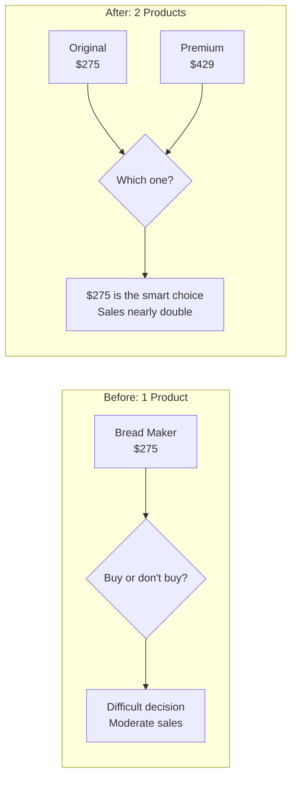

The premium option's purpose is not to sell itself — it's to make the mid-range option look like the smart compromise.

- This is why restaurants put an extremely expensive wine at the top of the list — not to sell it, but to make the second-most-expensive wine look reasonable
- Consulting firms present three-tier proposals for the same reason: the premium tier makes the mid-tier feel like prudent value
- <b style="color: #27ae60">If you want to sell Option B, introduce Option C above it — Option C's purpose is to make B look like the wise choice</b>
- The contrast with Chapter 5 is important: reducing total options reduces choice paralysis, but adding a strategic decoy option within a small set guides the decision toward your preferred outcome

> [!tip] The Decoy in Practice
> If you want to sell your mid-range product, introduce a premium option above it. Wine lists should put expensive bottles at the TOP, not hidden at the bottom. If you're pitching three options to a client and want them to choose the middle one, present the most expensive option first.

> [!example] The Real Estate Three-House Trick
> - Real estate agents have long known the decoy principle intuitively
> - They show buyers three houses: one slightly below budget (underwhelming), one at budget (the target), and one well above budget (aspirational but out of reach)
> - The above-budget house makes the at-budget house feel like a smart compromise
> - Without the expensive option, buyers wonder if they could do better; with it, they feel satisfied they found the sweet spot
> **The lesson:** The decoy does not need to sell. Its job is to make your target option look like the rational middle ground.

---

## Cluster 6 — Liking & Similarity: The Hidden Drivers of Preference

*We say yes to people we like — and we like people who are like us, even in trivially superficial ways.*

### Chapter 29: When Your Name Is Your Game

*We unconsciously gravitate toward things that resemble ourselves — including our own names.*

- People named Dennis are disproportionately likely to become dentists
- People named Louis are disproportionately likely to live in St. Louis
- People named Georgia are disproportionately likely to live in Georgia
- <b style="color: #2980b9">This is "implicit egoism" — we unconsciously gravitate toward things that resemble ourselves, including our own names</b>
- The effect extends to brands and products:
  - Coca-Cola's "Share a Coke" campaign replaced its branding with 150 common first names — producing the first sales increase in a decade
  - Microfinance loans on Kiva are more likely to be funded when the lender's initials match the borrower's
- The mechanism: anything that reminds us of ourselves triggers a tiny warm feeling — not enough to notice consciously, but enough to shift behaviour at scale
- <b style="color: #27ae60">When you can personalise a message to include the recipient's name, location, or other self-relevant information, compliance increases measurably</b>
- The Dennis-dentist finding is controversial in academic circles — some researchers argue the effect is statistical artefact — but the broader principle of implicit egoism has been replicated many times with different methodologies
- The practical takeaway survives any debate: people respond more positively to communications that reference something about themselves
- The implicit egoism research also explains the power of personalised marketing — when Coca-Cola put first names on their bottles, they turned a mass-produced commodity into something that felt personally relevant
- The name on the bottle didn't change the taste — but it changed the emotional relationship between the consumer and the product
- In an age of mass communication, any signal that says "this is for YOU specifically" stands out dramatically against the background noise of generic messaging
- Email subject lines that include the recipient's name get opened more often
- Direct mail addressed to a person (not "Resident") gets read more often
- The lesson: personalise wherever possible, even when the personalisation is superficial

> [!example] The Name-Letter Effect
> - Researchers found that people disproportionately prefer the letters in their own name — a phenomenon called the **name-letter effect**
> - When asked to rate how much they liked each letter of the alphabet, people consistently rated the letters in their first and last names higher than other letters
> - This preference is entirely unconscious — participants had no idea their name was driving their ratings
> - The effect even extends to brand preferences: people named Charles show a measurable preference for Charlie's Tuna over StarKist
> - The preference is tiny in each individual case — but across millions of purchasing decisions, it produces a measurable market effect
> **The lesson:** Self-resemblance creates warmth, even when the resemblance is as superficial as a shared letter. The more you can make your message, product, or brand echo something about your audience's identity, the warmer their response.

---

### Chapter 30: Mirroring and Matching — The Parrot's Advantage

*Reflecting someone's language back to them creates instant rapport without adding any new content.*

- Tanya Chartrand and John Bargh's "chameleon effect" research showed that people unconsciously mimic the posture, gestures, and speech patterns of interaction partners
- Those who are mimicked like the mimicker more — and this works even when the mimicry is deliberate
- In negotiation studies, participants who were subtly mimicked by their counterpart were:
  - More likely to reach agreement
  - More likely to report satisfaction with the outcome
  - More likely to want to work with the counterpart again
- <b style="color: #2980b9">Mirroring works because it signals "I am like you" at a level below conscious awareness</b>
- The person being mirrored feels an unexplained sense of rapport and comfort — they don't know why they trust you, they just do
- Chris Voss covers this same principle extensively in [[Never Split the Difference - Chris Voss|Never Split the Difference]] — his "mirroring" technique of repeating the last 1-3 words a person says is the negotiator's version of the waiter's verbatim repetition

> [!example] The Chameleon Effect in Action
> - Chartrand and Bargh had a confederate mirror the gestures and postures of participants during a casual conversation
> - When the participant crossed their legs, the confederate crossed theirs. When the participant leaned forward, the confederate leaned forward
> - Participants who were mirrored rated the confederate as significantly more likeable and the interaction as smoother
> - Crucially, participants had no idea they were being mirrored — the effect operated entirely below conscious awareness
> - Even when told afterward that the mirroring was deliberate, participants did not revise their positive feelings
> **The lesson:** Mirroring creates rapport at a subconscious level. Subtly matching someone's posture, speech rhythm, and vocabulary makes them feel you are on the same wavelength.

- The mechanism connects to the broader similarity principle (Chapter 33): similarity of any kind triggers liking, and behavioural mimicry is the most immediate form of similarity available
- The mimicry must be subtle — obvious copying feels mocking rather than connecting
- The optimal delay for mirroring is 2-4 seconds — immediate copying feels robotic; a short delay makes it feel natural
- Mirroring works across modalities: posture, speech rate, vocabulary, and even breathing rhythm can be mirrored
- In negotiations, mirrored pairs produced joint outcomes that were 13% higher than non-mirrored pairs — a significant improvement simply from reflecting the other party's behaviour

---

### Chapter 31: What Waiters Teach About Rapport

*Verbatim repetition outperforms paraphrasing by 70% in tips — because it makes people feel heard.*

- Dutch researcher Rick van Baaren studied restaurant servers and found that <b style="color: #2980b9">waiters who repeated customers' orders verbatim received 70% higher tips</b> than those who paraphrased
- Simply mirroring language — without adding anything — created a sense of rapport and liking
- <b style="color: #27ae60">You don't need to add value to what someone says to build rapport — sometimes you just need to reflect it back accurately</b>

> [!example] The Verbatim Advantage
> - In van Baaren's study, waiters were randomly assigned to two conditions
> - Group A paraphrased orders: Customer says "I'll have the grilled salmon with lemon butter" — waiter says "One salmon, got it"
> - Group B repeated verbatim: Customer says "I'll have the grilled salmon with lemon butter" — waiter says "The grilled salmon with lemon butter, absolutely"
> - Group B received 70% higher tips — not because the food was better, but because the customer felt heard
> **The lesson:** Mirroring is not about adding cleverness. It's about making the other person feel that their exact words matter.

- The broader principle: <b style="color: #2980b9">precise repetition of someone's words creates a stronger connection than any paraphrase, however accurate</b>
- When you paraphrase, you filter the other person's words through your own understanding — and they feel it
- When you repeat verbatim, you communicate: "I heard you exactly. Your words are worth preserving."
- The underlying psychology is <b style="color: #2980b9">validation</b> — people need to feel heard before they are willing to be influenced
- This applies to customer service (repeating the customer's complaint in their exact words), therapy (Carl Rogers' reflective listening), sales (echoing the prospect's stated priorities), and management (summarising a team member's concern using their precise phrasing)
- The 70% tip increase from such a simple change is one of the largest effect sizes in the book — a reminder that influence often comes from precision, not power

> [!example] The Call Centre Mirroring Test
> - A telecommunications company tested verbatim repetition in their customer service call centre
> - Agents in the control group paraphrased customer complaints: "So you're having trouble with your internet connection"
> - Agents in the test group repeated the customer's exact words: "So your internet has been cutting out every evening around 8pm since Tuesday"
> - The test group received significantly higher customer satisfaction scores and lower escalation rates
> - Customers who heard their exact words repeated back felt understood at a deeper level — and understood customers are cooperative customers
> - The precision of the repetition was the key: even small alterations ("cutting out" vs. "dropping" when the customer said "cutting out") reduced the effect
> **The lesson:** In any service interaction, resist the urge to translate the customer's language into your own. Their exact words are the most powerful rapport tool you have. Reflect them back precisely.

---

### Chapter 32: Genuine Smile Detection

*People can detect fake warmth — and it destroys rather than builds trust.*

- People can detect fake smiles — the difference is in the <b style="color: #2980b9">orbicularis oculi</b> muscles around the eyes, which contract in genuine smiles (Duchenne smiles) but not in polished performance smiles
- Authentic warmth persuades; performance does not
- Research shows that people unconsciously track the congruence between someone's words and their facial expressions
- When the two don't match — warm words with cold eyes — trust drops
- <b style="color: #27ae60">The most effective persuaders are not the best performers but the most genuinely interested</b>
- Paul Ekman's research on micro-expressions confirms that emotional leakage — brief flashes of true feeling — is detectable even when someone is actively trying to conceal their emotions

> [!example] The Duchenne Smile Test
> - Researchers showed participants videos of people smiling and asked them to rate their trustworthiness
> - Smiles that engaged only the mouth muscles (the "social smile") were rated as significantly less trustworthy than smiles that also engaged the eye muscles (the "Duchenne smile")
> - Participants could not articulate how they knew which smiles were genuine — they just felt it
> - The detection was equally accurate across cultures, suggesting it is a universal human ability
> **The lesson:** You cannot fake genuine warmth reliably enough to fool most people most of the time. The better strategy is to cultivate genuine interest.

- The practical implication: rather than learning to fake warmth more convincingly, learn to generate genuine interest in the people you interact with
  - Ask yourself: "What can I learn from this person?" or "What do I genuinely appreciate about them?"
  - The warmth that follows from real curiosity is indistinguishable from the real thing — because it IS the real thing
- This connects to [[The Charisma Myth - Olivia Fox Cabane|The Charisma Myth]], which teaches that charisma comes from genuine presence, not performance
- The danger for salespeople and leaders: training programmes that teach "smile more" and "look enthusiastic" without addressing underlying attitude are training people to be detectably fake
- The authors cite research showing that service employees who genuinely enjoy customer interaction produce measurably higher customer satisfaction scores than those who are trained to perform enjoyment
- The performance training creates what psychologists call <b style="color: #2980b9">emotional labour</b> — the effort of faking an emotion you don't feel, which produces burnout in the employee and detectable inauthenticity for the customer
- The solution is not better acting — it is better casting: hiring people who genuinely enjoy the interaction, or restructuring the role so that the interaction becomes genuinely enjoyable
- The authors note that the Duchenne smile distinction has been validated across cultures — people in Japan, Brazil, and Sweden can all detect the difference between genuine and performed smiles with similar accuracy
- This means that faking warmth is not just locally risky — it is universally detectable

> [!example] The Sales Representative Study
> - A retail chain compared customer satisfaction scores for sales representatives who scored high on genuine extraversion (they genuinely enjoyed meeting people) versus those who scored high on "emotional regulation" (they were good at performing warmth they didn't feel)
> - Genuine extraverts consistently produced higher satisfaction scores, more repeat visits, and larger purchase sizes
> - "Emotional regulators" produced acceptable but unremarkable scores — and they burned out faster, because the effort of sustained performance is exhausting
> - The most effective sales teams were built around genuine personality fit, not performance training
> **The lesson:** You can train skills, but you cannot sustainably train genuineness. The Duchenne smile cannot be faked long enough to matter. Hire for authentic warmth; train for everything else.

- The authors also note a paradox of experience: the more skilled a salesperson becomes at faking warmth, the more their customers can detect the fakery
- Early in a career, performance training helps — new employees learn to smile and make eye contact
- But as interactions accumulate, the gap between performance and authenticity becomes increasingly visible
- <b style="color: #27ae60">Long-term persuasion success correlates with genuine interest in others, not with performance skill</b>
- This is why the most successful salespeople in longitudinal studies are not the most aggressive or the most skilled at closing techniques — they are the ones who genuinely enjoy helping their customers solve problems
- The book's broader message is implicit: persuasion science teaches you what works, but it works best when deployed by someone who genuinely cares about the outcome for both parties
- The techniques are tools — they amplify whatever intention lies behind them, whether genuine or exploitative

---

### Chapter 33: Similarities Even When Trivial

*Even the most superficial shared characteristic can measurably increase cooperation.*

- People who share a birthday, a first name, or even fingerprint similarity with a stranger are more likely to comply with that stranger's requests
- <b style="color: #27ae60">When possible, highlight any genuine similarity between yourself and your audience — shared birthplace, shared experience, shared challenge</b>
- Even trivial similarities (same birthday, same initials) measurably increase cooperation and compliance
- In a negotiation study, parties who exchanged personal information before negotiating reached agreements more often and produced better joint outcomes
- <b style="color: #2980b9">The mechanism: similarity triggers the liking heuristic — "this person is like me, so I can trust them"</b>
- The similarity principle has been validated in contexts ranging from trivial to life-altering:
  - In organ donation decisions, families are more likely to consent when the recipient shares demographic characteristics with the donor
  - In legal settings, defendants who share demographic characteristics with jurors receive more favourable treatment
  - In education, students perform better when taught by teachers who share their background
  - In medicine, patients are more compliant with doctors who share their ethnicity, gender, or cultural background
- The universality of the similarity-liking connection suggests it is a deep evolutionary adaptation — throughout human history, people who resembled us (in appearance, language, and customs) were more likely to be members of our group and therefore more trustworthy

> [!example] The Fingerprint and the Favour
> - In one study, participants were told their fingerprint patterns matched those of another participant (a confederate)
> - This trivial, meaningless similarity — sharing a fingerprint type — significantly increased compliance when the confederate later asked for help
> - Participants could not articulate why they felt more cooperative — the similarity operated below conscious awareness
> - The effect was just as strong when the shared characteristic was objectively meaningless (fingerprint type) as when it was meaningful (shared hometown)
> **The lesson:** Any genuine similarity, no matter how trivial, can be the foundation for rapport. Find one and mention it.

- The authors note that the similarity must be genuine — fabricated similarities that are later discovered destroy trust far more than they built
- In practice, spending a few minutes before any negotiation or sales conversation looking for authentic common ground pays measurable dividends
- This does not mean manufacturing false connections — it means noticing the real ones that already exist and making them explicit
- The negotiation study is particularly compelling: pairs who shared personal information before negotiating (hometown, hobbies, family) produced deals worth 18% more in joint value than pairs who jumped straight to business
- The personal information exchange cost nothing — just a few minutes of conversation — but it shifted the interaction from adversarial to collaborative

> [!example] The Shared Birthday Compliance Study
> - Researchers told participants that they shared a birthday with another participant (a confederate) — even when they didn't actually share a birthday
> - When the "birthday twin" asked for help with a tedious task, compliance was dramatically higher than when a non-similar stranger made the same request
> - Sharing a birthday is objectively meaningless — it provides no information about competence, trustworthiness, or compatibility
> - But the participants' brains treated it as a meaningful connection: "This person is like me, so I should help them"
> - The effect held even when participants were told afterward that the birthday match was random — the warm feeling had already been generated
> **The lesson:** Similarity operates below the threshold of rational evaluation. Even when people KNOW a shared trait is meaningless, the warm feeling it creates still influences their behaviour.

---

## Cluster 7 — Scarcity, Loss Framing & Fear: The Urgency Drivers

*Loss aversion is one of the most reliable findings in all of behavioural science. The book shows exactly how to deploy it — and when fear paralyses instead of motivating.*

### Chapter 34: Loss Framing — What You Stand to Lose

*The same information, framed as a loss rather than a gain, becomes 30-40% more motivating.*

- People are <b style="color: #e74c3c">more motivated by the thought of losing something than by the thought of gaining something of equal value</b>
- Homeowners told how much money they could LOSE from inadequate insulation were more likely to insulate than those told how much they could SAVE
- Health pamphlets urging breast self-examination were more successful when framed as "what you stand to lose by NOT examining" than "what you stand to gain by examining"
- <b style="color: #2980b9">When crafting any persuasive message, ask: can I frame this in terms of what the audience will lose if they DON'T act?</b>

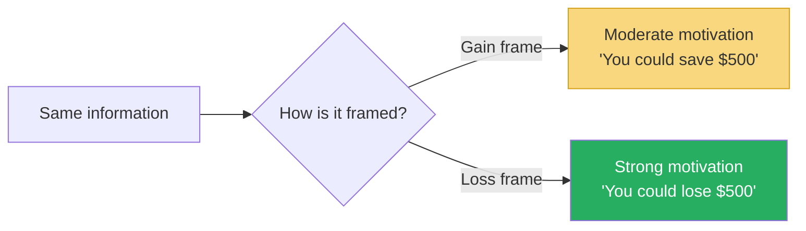

Loss framing consistently outperforms gain framing by 30-40% across domains — from home insulation to health to energy conservation.

- The mechanism is <b style="color: #2980b9">loss aversion</b>, identified by Kahneman and Tversky as one of the foundational findings of prospect theory:
  - Losses feel approximately twice as painful as equivalent gains feel pleasurable
  - This asymmetry is hard-wired — it appears across cultures, age groups, and contexts
  - It means that framing a message as a potential loss activates a more powerful emotional response than framing it as a potential gain
- Practical applications:
  - "You'll lose $500 a year in energy costs" beats "You'll save $500 a year"
  - "You'll miss out on this opportunity" beats "You'll benefit from this opportunity"
  - "Your competitors are already doing this — you risk falling behind" beats "You could gain an advantage"
  - "This offer expires Friday" creates loss aversion for the deal itself

> [!example] The Insulation Study
> - Researchers sent homeowners information about energy costs and insulation
> - Group A received a gain-framed message: "If you insulate your home, you will save $500 per year on energy costs"
> - Group B received a loss-framed message: "If you fail to insulate your home, you will lose $500 per year on energy costs"
> - The loss-framed group was significantly more likely to request information about insulation and to actually schedule installation
> - The dollar amount was identical — only the framing changed
> **The lesson:** Rewrite your gain-framed messages as loss-framed messages. The information stays the same; the motivation doubles.

- The authors note an important nuance: loss framing works best for messages promoting action to PREVENT a negative outcome
- For messages promoting action to ACHIEVE a positive outcome, gain framing can sometimes be more effective
- The general rule: when you want people to avoid a risk, use loss framing; when you want people to pursue an opportunity, gain framing may work better — but loss framing is the safer default

> [!example] The Credit Card Fee Debate
> - When credit card companies lobbied against legislation that would allow merchants to charge higher prices for credit card purchases, they made a strategic framing request
> - They didn't object to price differences — they objected to calling the difference a "surcharge" for credit card users
> - They preferred the difference be framed as a "discount" for cash users
> - Same price difference. Same economics. But a "surcharge" triggers loss aversion (losing money for using credit) while a "discount" triggers the weaker gain frame (gaining a saving for using cash)
> - The credit card companies understood that the label determines the emotional response, and loss aversion is far more powerful than gain attraction
> **The lesson:** The words you choose to frame a price difference determine how people respond emotionally. "Surcharge" and "discount" describe the same financial reality, but one triggers the powerful loss-avoidance drive and the other does not.

---

### Chapter 8: Fear Without an Action Plan Is Useless

*Fear is the most commonly misused persuasion tool. Without a clear escape route, it causes paralysis, not action.*

- Franklin Roosevelt: "The only thing we have to fear is fear itself — which paralyses needed efforts to convert retreat into advance"
- Research confirms Roosevelt was right — but with a critical qualification
- <b style="color: #2980b9">Fear-arousing messages DO motivate action — but ONLY when accompanied by clear, specific, achievable steps to reduce the danger</b>
- Without those steps, fear causes denial, avoidance, and paralysis

> [!example] The Tetanus Study
> - Howard Leventhal gave students a pamphlet about the dangers of tetanus
> - High-fear pamphlet WITHOUT specific action plan: students were scared but took no action
> - High-fear pamphlet WITH a specific plan (where to get a tetanus shot, when the clinic was open, a campus map with the route): students got the shot
> - Low-fear pamphlet WITH action plan: students also got the shot, but less urgently
> - The action plan was the decisive variable — not the fear level
> **The lesson:** Fear without a clear, simple action plan does not motivate — it paralyses.

- The practical implication is stark: if you're trying to motivate behaviour change through fear (health warnings, security briefings, environmental campaigns), you MUST pair the scary message with a concrete, easy-to-follow action step
- <b style="color: #e74c3c">A physician who tells a patient "You'll get diabetes if you don't lose weight" without providing a specific diet and exercise plan is likely creating denial, not motivation</b>
- The amended version of Roosevelt's quote: "The only thing we have to fear is fear BY ITSELF"
- The formula: <b style="color: #27ae60">Threat + specific action + evidence the action works = motivated behaviour</b>
- Remove any one element and the persuasion breaks down:
  - Threat alone = paralysis and denial
  - Action alone = no urgency to act
  - Evidence alone = no direction for effort
- Anti-smoking campaigns that show diseased lungs but don't provide a quit-line number or a specific first step are less effective than those that do
- Cybersecurity warnings that describe threats without providing specific protective actions create anxiety, not compliance

> [!abstract] The Fear + Action Formula
> 1. **Establish the threat** — make it vivid, specific, and personally relevant (not abstract and global)
> 2. **Provide a clear, specific action step** — not "be more careful" but "do THIS specific thing"
> 3. **Show that the action works** — cite evidence, data, or examples of the action reducing the threat
> 4. **Make the action easy** — remove barriers (provide the phone number, include the map, schedule the appointment for them)
> Without all four elements, fear-based persuasion produces paralysis rather than action.

> [!example] The Earthquake Preparedness Study
> - In a follow-up to the tetanus research, other investigators tested earthquake preparedness pamphlets
> - A vivid description of earthquake damage WITHOUT specific preparedness steps produced lower compliance than a control group that received no pamphlet at all
> - The fear-only pamphlet actually REDUCED preparedness — because the threat felt overwhelming and uncontrollable without a specific response plan
> - Adding a simple checklist (secure bookshelves, buy a flashlight, store water) reversed the effect completely
> **The lesson:** Fear makes people feel powerless. An action plan restores the sense of control that makes action possible.

---

## Cluster 8 — Cognitive Fluency: When Easy = True

*The ease with which we process information is unconsciously mistaken for truth, quality, and value. The book devotes several chapters to this deceptively powerful mechanism.*

### Chapter 35: The Word "Because"

*A single word can raise compliance from 60% to 93% — even when the reason it introduces is meaningless.*

- Ellen Langer's famous Xerox study (also covered in [[Influence - Robert Cialdini|Influence]]): people waiting to use a copy machine were asked "May I use the Xerox machine?"
- Without a reason: 60% complied
- With a real reason ("because I'm in a rush"): 94% complied
- With a fake reason ("because I need to make copies"): <b style="color: #27ae60">93% complied</b>
- <b style="color: #2980b9">The word "because" triggers automatic compliance, even when the reason is meaningless</b>
- The mechanism: our brains have a "click-whirr" shortcut — the word "because" signals "a reason is coming" and the compliance circuit fires before the reason is even evaluated

The nuance the authors add:

- The "because" effect is strongest for small requests — when the stakes are low, people don't bother evaluating the reason
- For large requests, the quality of the reason matters more — "because" alone won't get you a 50% discount
- But even for larger requests, providing a reason (any reason) outperforms providing no reason at all
- <b style="color: #27ae60">Always give a reason, even a weak one — it outperforms no reason in virtually every context</b>
- The practical application: when making any request, always include "because" followed by a reason, however obvious
  - "Could you review this by Friday, because we need it for the Monday meeting" outperforms "Could you review this by Friday"
  - The reason adds no new information — of course it's needed for the Monday meeting — but the word "because" activates the compliance shortcut
- Langer called this <b style="color: #2980b9">mindless compliance</b> — much of our daily behaviour runs on autopilot scripts, and "because" is one of the most reliable script triggers
- The word functions as a signal that a legitimate structure is in place — reason-based requests feel more legitimate than bare requests, even when the reason is circular

> [!example] The Copy Machine Queue
> - In Langer's original study, the experimenter approached people waiting in line for the copy machine with three different requests:
> - Request 1: "Excuse me, I have five pages. May I use the Xerox machine?" — 60% compliance
> - Request 2: "Excuse me, I have five pages. May I use the Xerox machine because I'm in a rush?" — 94% compliance
> - Request 3: "Excuse me, I have five pages. May I use the Xerox machine because I have to make copies?" — 93% compliance
> - Request 3 is logically absurd — of course they need to make copies; why else would they be at the copy machine?
> - But the word "because" triggered the compliance script regardless of the content that followed it
> - The study demonstrates how much of human behaviour runs on automatic scripts rather than conscious evaluation
> **The lesson:** The word "because" is a key that unlocks an automatic compliance script. The quality of what follows matters less than the presence of the word itself — at least for small, everyday requests.

---

### Chapter 36: How Rhyme Makes Influence Climb

*Fluency of sound is mistaken for truth of content.*

- "Caution and measure win you treasure" was rated as <b style="color: #27ae60">MORE TRUE</b> than "Caution and measure will win you riches" — despite identical meaning
- Rhyming statements feel more fluent to process — and <b style="color: #2980b9">fluency is mistaken for truth</b>
- "If the glove don't fit, you must acquit" — Johnnie Cochran's famous defence of O.J. Simpson — leveraged this exact effect
- <b style="color: #27ae60">When you want a message to be believed, make it rhyme. When you want a name to be liked, make it easy to pronounce.</b>

The mechanism:

- Rhyme creates processing fluency — the brain handles the information more easily
- That ease is unconsciously attributed to the content rather than the form
- "This feels right" becomes "This IS right"
- The same principle explains why familiar ideas feel more true than novel ones — familiarity creates fluency, and fluency creates perceived truth
- Advertisers have understood this intuitively for decades: "A Mars a day helps you work, rest and play" is more believable than "Mars chocolate helps you work, rest, and relax"
- Political slogans use rhyme for the same reason: "I like Ike" was more memorable and felt more natural than any policy argument could
- The danger: <b style="color: #e74c3c">rhyme can make false statements feel true</b> — a tool that can be used ethically or exploitatively
- The fluency effect of rhyme is so powerful that researchers have found it persists even when people are told the statement is false — the rhyming version still FEELS more true
- This is because the fluency effect operates at a level below conscious reasoning — you can know something is false and still feel it is true, simply because it rhymes

> [!example] The Courtroom Rhyme
> - During the O.J. Simpson trial, defence attorney Johnnie Cochran coined the phrase: "If the glove don't fit, you must acquit"
> - The rhyme made the argument feel self-evidently true — not just a legal strategy, but a logical necessity
> - Prosecutors had no equivalent phrase, leaving the jury with a fluent, memorable defence and a complex, forgettable prosecution
> - Regardless of the trial's merits, the rhyme shaped how jurors processed the evidence
> **The lesson:** A rhyming phrase can carry more persuasive weight than pages of argument — because fluency is mistaken for truth.

---

### Chapter 37: Easy Names Win

*Processing ease is mistaken for quality, truth, and even professional competence.*

- An analysis of 500 attorneys at 10 US law firms: <b style="color: #e74c3c">the harder an attorney's name was to pronounce, the lower they stayed in the firm's hierarchy</b>
- Stocks with easy-to-pronounce ticker symbols outperformed those with hard-to-pronounce ones in early trading
- This held independent of the foreignness of the name — a hard-to-pronounce foreign name performed worse than an easy-to-pronounce foreign name
- <b style="color: #2980b9">Cognitive fluency — the ease of processing — is mistaken for quality, truth, and value</b>

> [!example] The Stock Ticker Experiment
> - Researchers analysed newly listed stocks and found that companies with easy-to-pronounce ticker symbols (like KAR) outperformed those with hard-to-pronounce ones (like RDO) in the first days of trading
> - The effect was independent of company size, sector, or actual financial performance
> - Investors — who are supposed to be rational — were systematically biased by how easy the company's name was to say
> **The lesson:** If you're naming anything — a product, a company, a project — choose something easy to pronounce. Fluency translates directly to perceived value.

- The fluency effect has been replicated across domains:
  - Food additives with easy-to-pronounce names are rated as less harmful
  - Amusement park rides with easy names are rated as less risky
  - People with easy-to-pronounce names are rated as more trustworthy
- The implication for anyone in business: <b style="color: #27ae60">before choosing any name — for a product, a brand, a project, a team — test whether it rolls off the tongue easily</b>
- This creates an uncomfortable reality for people with difficult-to-pronounce names — but awareness of the bias is the first step to compensating for it
- The authors note that the bias is not about prejudice against specific ethnicities — it is purely about pronunciation difficulty
  - An easy-to-pronounce Japanese name outperforms a hard-to-pronounce English name
  - The bias tracks fluency, not familiarity
- The naming implications extend to product design and branding:
  - Google, Apple, Nike, Uber — all easy to pronounce, easy to remember, easy to spell
  - Contrast with companies that have struggled with name recognition: Xobni (inbox backwards), Qwikster (Netflix's failed brand), Xfinity (Comcast's rebrand)
  - <b style="color: #27ae60">The best product names are two syllables, easy to pronounce in multiple languages, and impossible to misspell</b>
  - Pharmaceutical companies have long understood this: drugs with easy-to-pronounce brand names (Lipitor, Viagra, Prozac) consistently outsell those with harder names, controlling for drug efficacy

> [!example] The Law Firm Hierarchy Study
> - Researchers examined the careers of 500 attorneys at 10 major US law firms
> - After controlling for every observable variable (law school ranking, years of experience, practice area, firm size), they found that attorneys with easier-to-pronounce names held higher positions
> - The effect was not about ethnicity — Anglo attorneys with complex surnames were equally disadvantaged
> - The mechanism: in the thousands of small interactions that determine promotion (introductions, referrals, casual mentions in meetings), an easy name creates a tiny positive impression each time
> - Over years, those tiny impressions compound into measurable career advantages
> - The authors do not suggest people change their names — but they do suggest awareness of the bias so it can be compensated for through other means (stronger credentials display, more visible work)
> **The lesson:** Fluency bias is real, pervasive, and operates below conscious awareness. People with hard-to-pronounce names should invest more in other credibility signals — published work, visible accomplishments, strong third-party introductions — to offset the fluency penalty they face.

---

### Chapter 38: The Power of Simple Language

*Complex vocabulary does not signal intelligence — it signals insecurity.*

- Students who used unnecessarily complex vocabulary in essays were rated as <b style="color: #e74c3c">less intelligent</b> than those who wrote simply
- Daniel Oppenheimer's research (titled, with deliberate irony, "Consequences of Erudite Vernacular Utilized Irrespective of Necessity") showed that <b style="color: #2980b9">complexity signals insecurity, not intelligence</b>
- Simple, clear language is perceived as more competent, more trustworthy, and more persuasive
- <b style="color: #27ae60">If a 12-year-old can't understand your sentence, rewrite it</b>
- The fluency mechanism again: easy to process = perceived as true and competent; hard to process = perceived as suspicious and weak

> [!example] The Translation Experiment
> - Oppenheimer took graduate school admissions essays and created two versions of each
> - Version A: the original essay with its natural vocabulary
> - Version B: the same essay with simple words replaced by unnecessarily complex synonyms (using a thesaurus)
> - Evaluators consistently rated the complex version as coming from a less intelligent writer
> - The students who used simple language were perceived as smarter, more confident, and more competent
> **The lesson:** Never use a long word when a short one will do. Complexity does not impress — it alienates.

- The mechanism connects to all four fluency chapters: "because," rhyme, easy names, and simple language all work through the same pathway
  - Easy processing leads to a positive feeling
  - The positive feeling is attributed to the content rather than the form
  - The content is then perceived as true, high-quality, and competent
  - Hard processing reverses the chain: negative feeling leads to perceived deception, low quality, incompetence

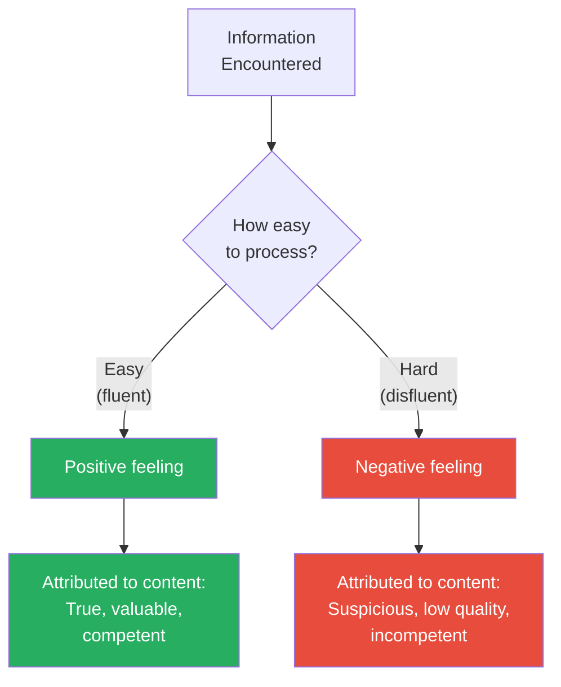

The fluency pathway explains why rhyming, easy names, simple language, and the word "because" all increase persuasion — they all make processing easier, which the brain mistakes for truth.

- The practical implication for professional communication is clear: every corporate memo, marketing copy, proposal, and presentation should be tested for readability
- The Flesch-Kincaid readability score is a useful proxy — aim for a score that suggests 8th-grade reading level or lower
- The paradox: the people most prone to complex language (academics, lawyers, consultants) are the ones who lose the most credibility from it
- Warren Buffett's annual letters to Berkshire Hathaway shareholders are a masterclass in simple language used to explain complex topics — Buffett deliberately aims for the reading comprehension level of his sisters, who are not financial professionals
- The result: Buffett's letters are among the most widely read and trusted documents in finance, precisely because their simplicity signals confidence rather than sophistication

> [!example] The Needlessly Complex Email
> - The authors tested two versions of a business proposal email
> - Version A used simple, direct language: "We think the new pricing will increase revenue by 12% because customers will see more value in the premium tier"
> - Version B used unnecessarily complex language: "We anticipate the revised remuneration structure will facilitate a 12% augmentation in revenue attributable to enhanced consumer perception of value proposition differentiation in the premium echelon"
> - Both said the same thing. Version A was rated as more intelligent, more trustworthy, and more persuasive
> - Version B made evaluators suspicious — they assumed the writer was either hiding something or compensating for a weak argument
> **The lesson:** Complexity is a tax on your audience's attention and trust. Every unnecessary word costs you credibility. Write for clarity, not for impressiveness.

---

## Cluster 9 — Anchoring & Starting Prices

*Where you start determines where you end — but the optimal starting point depends on the competitive dynamics.*

### Chapter 19: Start Low on eBay

*In competitive auction environments, low starting prices paradoxically produce higher final prices.*

- Conventional wisdom says: start high and negotiate down
- But eBay data tells a different story: <b style="color: #2980b9">lower starting prices often produce HIGHER final prices</b>
- Why? Lower starting prices attract more bidders. More bidders create more competition. More competition drives the price up
- Additionally, bidders who have invested time and effort in the auction process experience the <b style="color: #2980b9">sunk cost effect</b> — they've committed to winning and don't want to "waste" their earlier bids

> [!example] The Two Auction Strategies
> - Researcher Gillian Ku studied eBay auctions and found that items starting at $0.01 often ended at higher prices than identical items starting at a "reasonable" reserve price
> - The low starting price attracted a crowd — the crowd created social proof (many bids = popular item)
> - Social proof attracted more bidders — competition kicked in
> - The final price exceeded what a high starting price would have produced
> **The lesson:** In competitive environments with many potential buyers, starting low creates a crowd effect that drives prices up.

- The caveat: this works best when there are many potential bidders and the product's value is somewhat ambiguous
- For unique, high-value items with few potential buyers, starting high may still be better
- <b style="color: #27ae60">In one-on-one negotiations (like salary): starting HIGH is better because there's no crowd effect to drive the price up</b>
- The auction dynamic creates a virtuous cycle:
  - Low price attracts many bidders
  - Many bidders create social proof ("this item is popular")
  - Social proof attracts more bidders
  - Competition drives the final price higher than a high starting price would have achieved
- Ku's research also found that the sunk cost effect was amplified by the number of bids placed — bidders who had placed 10+ bids were far more reluctant to drop out than those who had placed 1-2
- The emotional investment in "winning" the auction becomes its own motivation, separate from the item's actual value

> [!example] The Penny Auction Phenomenon
> - Penny auction websites (like Swoopo, now defunct) exploited this principle to its extreme
> - Each bid raised the price by only one penny but cost the bidder $0.60 to place
> - A $1,000 laptop might sell for $50 in displayed price — but the auction operator collected $0.60 per penny of that price, meaning thousands of dollars in bid fees
> - Bidders who had invested $20, $50, or $100 in bids felt unable to walk away — the sunk cost of their earlier bids made them increasingly irrational
> - The low starting price attracted crowds; the crowd created competition; the competition triggered sunk costs; the sunk costs prevented rational exit
> - The model collapsed because bidders eventually realised the system was extractive — but not before demonstrating the raw power of low starting prices combined with sunk cost psychology
> **The lesson:** Low starting prices in competitive environments create a self-reinforcing cycle of crowd attraction, social proof, and sunk cost commitment. The combination is extraordinarily powerful — and can be used ethically or exploitatively.

---

## Cluster 10 — Goal Gradient & Progress

*The closer we perceive ourselves to a goal, the harder we work to reach it — even when the "progress" is an illusion.*

### Chapter 40: The Head Start Effect

*Illusory progress motivates real completion — because we care more about how far we've come than how far we have to go.*

- A coffee shop loyalty card experiment by researchers Ran Kivetz, Oleg Urminsky, and Yuhuang Zheng: customers got either a 10-stamp card (blank) or a 12-stamp card with 2 stamps pre-filled
- Both required 10 purchases to complete
- <b style="color: #27ae60">The 12-stamp card (with head start) was completed by 34% of customers vs only 19% for the 10-stamp card</b>
- The illusion of progress motivates continued effort — even when the "progress" was given for free
- <b style="color: #2980b9">This is the "goal gradient effect" — the closer we perceive ourselves to a goal, the harder we work to reach it</b>
- Additionally, customers with the head start card increased the frequency of their visits as they got closer to the finish — they accelerated

> [!example] The Car Wash Loyalty Card
> - In a variation of the study, a car wash gave customers either a blank 8-wash card or a 10-wash card with 2 washes already stamped
> - Both cards required exactly 8 more washes to earn a free wash
> - The pre-stamped card was completed by nearly twice as many customers
> - Customers with the pre-stamped card also completed their cards faster — the average time between visits decreased as they approached the reward
> - The artificial head start created real momentum
> **The lesson:** When designing any goal-tracking system, give people a head start — even if it's artificial.

> [!tip] Business Application
> When designing loyalty programmes, give customers a head start. A "Buy 12, get 1 free" card with 2 stamps pre-filled outperforms a "Buy 10, get 1 free" blank card — even though both require exactly 10 purchases. The perception of progress matters more than the reality.

- The goal gradient effect has been observed in many contexts beyond loyalty cards:
  - Runners accelerate as they approach the finish line
  - Rats in a maze run faster as they get closer to the food
  - Fundraising campaigns receive more donations as they approach their goal
  - Software download bars that start at 10% feel faster than those that start at 0%
- The mechanism connects to loss aversion: the closer you are to a goal, the more painful it feels to abandon it — the "progress" becomes a sunk cost you don't want to waste

> [!example] The LinkedIn Profile Completion Bar
> - LinkedIn's profile completion bar is a textbook example of the goal gradient effect in digital design
> - When users create an account, the bar immediately shows 20-30% completion — even though they've only entered their name and email
> - As users add a photo, headline, and work experience, the bar climbs — each addition feels like meaningful progress
> - LinkedIn reports that users who see the completion bar are significantly more likely to fill out all profile sections
> - The bar creates a psychological itch — being at 70% feels worse than being at 0% because the goal is visible but unfinished
> - This is the endowed progress effect in action: the artificial head start (the initial 20-30%) plus the visible goal (100%) creates a motivational pull that a blank profile does not
> **The lesson:** Progress bars, completion percentages, and milestone trackers are not just decorative — they are persuasion tools. The closer people perceive themselves to completion, the harder they work to finish.

---

### Chapter 41: Small Steps and the Endowed Progress Effect

*Showing people how far they've already come motivates more than showing them how far they have to go.*

- The head start effect extends beyond loyalty cards to any goal-tracking system
- Software download bars that start at 10% instead of 0% feel faster — even though the actual download speed is identical
- Charitable campaigns that show "We've already raised $5,000 of our $25,000 goal" attract more donors than those starting from zero
- <b style="color: #2980b9">The endowed progress effect</b>: people given artificial advancement toward a goal are more motivated to complete it
- The mechanism: we evaluate progress relative to both the starting point and the end point — artificial advancement makes the end feel closer while making the effort already invested feel real
- <b style="color: #27ae60">Always show people how far they've already come, not just how far they have to go</b>

The endowed progress effect connects to several other principles in the book:

- It uses commitment/consistency (Chapter 14): the pre-filled stamps create a sense of having already committed to the programme
- It uses sunk cost psychology (Chapter 19): the "progress" already made feels like an investment worth protecting
- It uses social proof implicitly: a card with stamps on it suggests that others have used the system before
- The combination of these forces makes the endowed progress effect one of the most reliably effective tools in the book
- Applications: fundraising thermometers that start above zero, onboarding checklists with early items pre-checked, professional development programmes that credit prior experience
- The principle also explains why Kickstarter campaigns that seed early pledges (often from the creators' friends and family) reach their goals more often than those that start from zero — the visible "progress" attracts more backers
- The endowed progress effect has important implications for employee motivation:
  - New hires who are shown what they've "already accomplished" during orientation (completed paperwork, passed background check, finished training prerequisites) feel more invested than those who start with a blank to-do list
  - Project managers who frame a project as "20% complete" rather than "80% remaining" create a sense of momentum that drives faster execution

> [!example] The Fundraising Thermometer
> - A university fundraising campaign tested two versions of their progress display
> - Version A started the thermometer at zero and showed the target
> - Version B started the thermometer at 20% (including seed donations from the organising committee) and showed the same target
> - Version B attracted significantly more donors and reached its goal faster
> - The seed donations were real but small — their psychological impact as "evidence of progress" far outweighed their monetary value
> **The lesson:** When tracking progress toward any goal, make sure people can see how far they've already come — even if the early progress was easy or artificial.

---

## Cluster 11 — Learning, Training & Group Decision-Making

*Four chapters challenge conventional wisdom about how to learn, how to train others, and how to make better decisions in groups.*

### Chapter 23: The Danger of Being the Smartest Person in the Room

*Groups outperform even their best member — but only when they actually listen to each other.*

- James Watson, co-discoverer of DNA's double helix, said their success came partly because they were NOT the most intelligent scientists working on the problem
- The most intelligent was Rosalind Franklin: "Rosalind was so intelligent that she rarely sought advice"
- Patrick Laughlin's research: groups that cooperate outperform not just the average member but even the BEST member working alone
- Two reasons: (1) diversity of perspectives sparks insights the lone thinker misses, (2) parallel processing — a group can distribute subtasks
- <b style="color: #e74c3c">Leaders who are the most experienced or most knowledgeable are the most likely to skip seeking input — and the most likely to make avoidable errors as a result</b>
- The paradox of expertise: the better you are, the less likely you are to seek help — and the less likely you are to recognise when you need it
- <b style="color: #27ae60">The antidote: systematically seek input before making decisions, especially when you feel most confident</b>
- Watson was not modest about his intelligence — his point was that collaboration, not individual brilliance, was the decisive factor in cracking the structure of DNA
- The authors draw a distinction between tasks that have a "demonstrably correct" answer (where showing the group the right approach is enough) and tasks that require judgement (where the collective filtering function is most valuable)
- For judgement tasks — the kind that dominate business decisions — groups consistently outperform even their best members

> [!example] The Rosalind Franklin Paradox
> - Rosalind Franklin had the best X-ray crystallography data in the world — her Photo 51 provided the key evidence for the double helix structure
> - But she rarely shared her findings or sought collaborative input — her brilliance made her self-sufficient
> - Watson and Crick, who were arguably less technically skilled, succeeded precisely because they collaborated relentlessly — sharing ideas, inviting criticism, testing each other's models
> - Franklin's data eventually reached Watson and Crick through her colleague Maurice Wilkins — and they immediately recognised its significance
> - The irony: Franklin's solo approach delayed her own discovery, while Watson and Crick's collaborative approach accelerated theirs
> - This is not a story about Franklin's failure — it is a story about how even extraordinary intelligence benefits from collective processing
> **The lesson:** The paradox of expertise is that the better you are, the less you feel you need help — and the more vulnerable you become to errors that a collaborator would catch.

> [!example] Laughlin's Cooperative Groups Study
> - Laughlin gave complex problems to individuals and to groups, then compared their solutions
> - The groups didn't just average their members' abilities — they systematically outperformed even the best individual solver
> - The mechanism: when one member proposed a correct approach, others could recognise it and build on it
> - But when the best individual worked alone, they had no one to catch their errors or offer alternative angles
> - The group's advantage was not in generating more ideas but in FILTERING ideas — the collective could distinguish good approaches from bad ones more reliably than any individual
> **The lesson:** Even the smartest person in the room benefits from the group's filtering function. Seeking input is not a sign of weakness — it is a strategy for better decisions.

---

### Chapter 24: Devil's Advocate vs True Dissenter

*Assigned contrarianism feels like performance. Authentic disagreement forces genuine reconsideration.*

- The Roman Catholic Church used a <b style="color: #2980b9">Devil's Advocate</b> for nearly four centuries to argue against candidates for sainthood
- But Charlan Nemeth's research found that <b style="color: #e74c3c">appointed devil's advocates are much less effective than authentic dissenters</b>
- Why? The group perceives the devil's advocate as disagreeing for the sake of disagreement — it feels like a performance, a role, not a genuine belief
- A true dissenter, on the other hand, is perceived as principled, which forces the group to genuinely engage with the opposing view
- Pope John Paul II eliminated the devil's advocate position in the 1980s — perhaps recognising its limitations
- After the position was removed, the rate of sainthood approvals accelerated dramatically — which some see as evidence that the devil's advocate had at least some effect, even if weaker than genuine dissent

> [!example] The Columbia Investigation
> - An investigator asked the chairwoman of the mission management team: "As a manager, how do you seek out dissenting opinions?"
> - Her answer: "Well, when I hear about them..."
> - The investigator: "By their very nature, you may not have heard about them. What techniques do you use to GET them?"
> - She had no answer
> - Both NASA shuttle disasters (Challenger 1986, Columbia 2003) have been traced partly to a culture where subordinates were afraid to voice dissent
> **The lesson:** If you wait to "hear about" dissent, you'll only hear it after the disaster.

- <b style="color: #27ae60">The lesson for leaders: don't appoint someone to play devil's advocate. Instead, create an environment where genuine dissent is welcomed and expected.</b>
- Practical techniques for encouraging authentic dissent:
  - Ask team members to write their opinions before discussion begins — preventing anchoring to the first view expressed
  - Explicitly reward people who raise concerns, even when those concerns prove unfounded
  - Separate the decision-maker from the discussion — the boss's presence suppresses dissent
  - Use anonymous input channels for high-stakes decisions
- Nemeth's research also showed that genuine dissenters improved the quality of the group's thinking even when the dissenter's specific position was wrong
- The value of dissent is not in being right — it is in forcing the group to think more carefully about why they believe they are right

> [!example] The Bay of Pigs and the Cuban Missile Crisis
> - Kennedy's disastrous Bay of Pigs invasion in 1961 was planned by a group where no one dissented — advisors were reluctant to challenge the emerging consensus
> - Arthur Schlesinger later wrote that he regretted not voicing his doubts more forcefully
> - Just eighteen months later, during the Cuban Missile Crisis, Kennedy deliberately restructured his advisory process to encourage genuine dissent
> - He split his advisors into sub-groups that debated independently, he absented himself from some sessions so his presence wouldn't suppress disagreement, and he actively sought contrary viewpoints
> - The result: a far more nuanced, effective response that many historians credit with preventing nuclear war
> - Same president, same advisors, different process — the quality of the decision was determined by the structure, not the intelligence of the individuals
> **The lesson:** The single most important structural change a leader can make is to ensure genuine dissent reaches the decision-maker before the decision is made.

---

### Chapter 25: Error-Based Learning

*We learn more from studying what went wrong than from studying what went right.*

- Researcher Wendy Joung tested two types of training for firefighters:
  1. Case studies of firefighters who made GOOD decisions — moderate improvement
  2. Case studies of firefighters who made BAD decisions — <b style="color: #27ae60">significantly greater improvement in judgment and adaptive thinking</b>
- <b style="color: #2980b9">We learn more from studying errors than from studying successes</b>
- This runs counter to how most organisations train: they focus on "best practices" and success stories
- The evidence says they should dedicate significant training time to studying past errors — what went wrong and how it could have been avoided

The mechanism:

- Success stories are often ambiguous — many things went right simultaneously, making it hard to isolate what mattered
- Error stories are diagnostic — they reveal the specific decision point where things went wrong
- Studying errors activates a different type of cognitive processing: "What would I have done differently?" forces engagement that "Here's what to do" does not
- Errors are also more memorable — the emotional weight of failure creates stronger memory traces than the satisfaction of success

> [!tip] Training Redesign
> If you run any training programme, review the balance between success-based and error-based content. The research suggests substantial time should cover: (1) real or realistic errors, (2) the context in which they occurred, (3) why they seemed like reasonable decisions at the time, and (4) what should have been done differently.

> [!example] The Firefighter Training Study
> - Joung divided firefighters into two training groups
> - Group A studied cases where experienced firefighters made textbook-perfect decisions under pressure
> - Group B studied cases where experienced firefighters made errors that led to injury, property damage, or death
> - When tested on new, unfamiliar scenarios, Group B performed significantly better — they were more flexible, more cautious, and more creative in their problem-solving
> - The error-based group didn't just avoid the specific mistakes they studied — they developed a more adaptive thinking style overall
> **The lesson:** Studying failure builds better judgment than studying success, because failure forces you to think about WHY things went wrong, not just WHAT went right.

- The connection to [[Seeking Wisdom - Peter Bevelin|Seeking Wisdom]] is direct — Bevelin's argument that inversion (studying what to avoid) is more powerful than direct optimisation (studying what to pursue) is supported by Joung's experimental data
- The medical profession has adopted this insight through **Morbidity and Mortality (M&M) conferences** — regular meetings where physicians discuss cases that went wrong, not cases that went well
- Aviation's extraordinary safety record is partly attributable to mandatory incident reporting and review — pilots study errors, not successes
- The lesson extends to persuasion training: if you want to teach people to be more persuasive, have them study cases where persuasion FAILED — the analysis of what went wrong teaches more than the celebration of what went right

---

### Chapter 39: What Batting Practice Teaches About Persuasion

*The training method that feels hardest actually produces the best long-term results.*

- In baseball, batters don't face the same pitch over and over in practice — they face varied pitches in random order
- This is <b style="color: #2980b9">interleaving</b> — mixing up practice rather than doing the same thing repeatedly (blocked practice)
- Research shows that interleaved practice produces better long-term retention and performance than blocked practice, even though it FEELS harder
- For persuasion: if you're training salespeople, don't have them practise the same pitch 20 times — have them practise different scenarios in random order
- <b style="color: #27ae60">Difficulty during practice produces fluency during performance</b>

| Training Approach | During Practice | Long-Term Performance |
|-------------------|----------------|----------------------|
| **Blocked** (same skill repeated) | Feels easy, looks smooth | Weaker retention and transfer |
| **Interleaved** (skills mixed randomly) | Feels hard, looks messy | Stronger retention and transfer |

The counterintuitive finding: the training method that feels worse actually works better.

- The mechanism: interleaving forces the brain to repeatedly retrieve and reconstruct the relevant skill from memory, which strengthens the neural pathways
- Blocked practice allows the brain to coast on short-term memory — it feels smooth but doesn't build lasting skill
- This connects to Robert Bjork's concept of <b style="color: #2980b9">desirable difficulty</b> — learning conditions that feel challenging in the moment produce superior long-term outcomes
- The trap: trainers and trainees both prefer blocked practice because it FEELS more productive — performance during practice is smoother, creating an illusion of learning
- The solution: educate both trainers and trainees about the interleaving research so they don't mistake comfortable practice for effective practice
- The authors connect this to persuasion training specifically: salespeople who practise objection handling by facing the SAME objection twenty times feel confident but perform poorly in the field, where objections come in unpredictable order
- Salespeople who practise handling DIFFERENT objections in random order feel frustrated during training but adapt far better to real-world selling conditions
- The principle applies to any skill that must be deployed flexibly under unpredictable conditions
- Medical training has increasingly adopted interleaving: rather than spending a week on cardiology followed by a week on neurology, some programmes now mix cases from different specialties in each training session
- Early studies suggest that interleaved medical training produces better diagnostic accuracy in real clinical settings — where patients do not arrive pre-sorted by specialty

> [!example] The Motor Skill Study
> - In a study of motor skill learning, participants practised three different throwing tasks
> - Group A practised each task in blocks: 10 throws of type A, then 10 of type B, then 10 of type C
> - Group B practised all three tasks in random, interleaved order
> - During practice, Group A looked better — their throws were more accurate
> - On a test one week later, Group B dramatically outperformed Group A
> - The interleaved practice had built stronger, more durable skill — even though it felt worse in the moment
> **The lesson:** If your training feels too easy, it probably is. The most effective practice is the kind that feels slightly frustrating in the moment.

---

## Cluster 12 — Emotional States, Cognitive Load & Message Design

*How you feel, how tired you are, and how messages are constructed profoundly shape vulnerability to persuasion — in predictable, exploitable ways.*

### Chapter 42: Concrete, Vivid Messages Stick

*The identifiable victim beats the statistic every time — because stories activate empathy and numbers activate analysis.*

- Messages that stick are <b style="color: #2980b9">Simple, Unexpected, Concrete, Credible, Emotional, and Story-driven</b> — echoing the SUCCESs framework from Chip and Dan Heath's *Made to Stick*
- The authors find that <b style="color: #27ae60">concrete, vivid information is remembered and acted on far more than abstract statistics</b>

> [!example] Rokia vs. the Statistics
> - Researchers tested two appeals for a charity
> - Version A: "Every day, 10,000 people die of starvation" — abstract, statistical, overwhelming
> - Version B: "This is Rokia, a 7-year-old girl from Mali, who is facing starvation" — concrete, personal, vivid
> - Version B produced significantly more donations — even though Version A described a far larger problem
> - The identifiable victim effect: a single story activates empathy in a way that statistics cannot
> **The lesson:** When crafting persuasive messages, always prefer the specific story over the general statistic.

- The mechanism: statistics activate analytical processing (System 2), which competes with the emotional processing (System 1) that drives giving
- A single vivid story keeps System 2 quiet and lets System 1 — the empathy engine — drive the response
- <b style="color: #e74c3c">Combining statistics with stories actually REDUCES giving — the statistics activate the analytical mind, which suppresses the emotional response to the story</b>
- The practical lesson: lead with the story. If you must include statistics, present them separately, after the emotional connection has been established
- This explains why charity advertisements feature a single child with a name rather than mentioning millions of children — one face is more powerful than a million numbers
- The authors cite Joseph Stalin's chilling (and instructive) observation: "One death is a tragedy; a million deaths is a statistic"
- The brain is wired to respond to individual stories, not aggregate data — this is not a design flaw but an evolutionary adaptation
- Our ancestors needed to respond to the specific threat (a predator nearby) and the specific opportunity (a friend who needs help), not to abstract statistical trends
- The implication for persuasion: <b style="color: #27ae60">always lead with a specific, vivid story, not with data — even if the data is more "objectively" compelling</b>

> [!example] The Insurance Claim Study
> - In a related study, jurors awarded significantly higher damages when a plaintiff's injuries were described with vivid, concrete detail ("Her skin was torn from her forearm in a six-inch strip") than with abstract language ("She suffered moderate lacerations")
> - The same injury, described concretely, produced awards roughly 2-3 times higher than the abstract description
> - Vividness made the injury feel more real, more painful, and more deserving of compensation
> **The lesson:** Concrete, vivid language does not just inform — it makes people FEEL. And feelings drive decisions far more than information does.

---

### Chapter 43: The Mirror That Changed Behaviour

*Self-awareness triggers alignment with internal standards — a mirror is sometimes all it takes.*

- Researchers placed a mirror behind a bowl of Halloween candy with a sign saying "Take one"
- Without the mirror, most children took more than one candy
- <b style="color: #2980b9">With the mirror, 71% of children took only one</b>
- Seeing their own reflection triggered self-awareness, which activated their internal standards of honesty
- <b style="color: #27ae60">Self-awareness makes people behave more consistently with their values</b>
- Placing mirrors in environments where you want honest behaviour (surveys, voting booths, self-reporting forms) measurably increases compliance with norms

The broader mechanism:

- Most of the time, people operate on autopilot — they don't actively evaluate whether their behaviour matches their values
- A mirror forces self-focus, which activates the internal standards that autopilot behaviour ignores
- This is why people report more honestly on surveys when they can see themselves — the mirror makes self-deception harder
- <b style="color: #2980b9">Any environmental cue that increases self-awareness — mirrors, name tags, personalised greetings — nudges behaviour toward internal standards</b>
- The connection to Chapter 15 (labelling): both techniques work by activating a positive self-concept that the person then feels compelled to live up to
- Retailers use the opposite strategy: removing self-awareness cues (dim lighting, anonymous browsing) reduces the internal governor and encourages impulse purchases
- The connection to online behaviour is direct: anonymity on the internet removes self-awareness cues, which is why people behave more aggressively, more dishonestly, and more impulsively online than in person
- Any system that increases the user's sense of being seen (profile pictures, real names, contribution histories) tends to improve the quality of behaviour
- The principle has been used by governments: countries that include a photo of the taxpayer on their tax forms (or a mirror-like reflective panel in the envelope) report higher levels of honest reporting
- The mechanism is simple: <b style="color: #27ae60">self-awareness activates internal standards, and internal standards produce more honest and prosocial behaviour than external monitoring</b>
- A mirror is cheaper than a security camera — and in many contexts, more effective

> [!example] The Office Supply Honour Box
> - A company tested whether placing a mirror near the office supply honour box (where employees paid on the honour system) would reduce theft
> - Before the mirror: supplies frequently disappeared without payment
> - After the mirror was installed: payment rates increased significantly
> - Employees who could see themselves in the act of taking supplies were far more likely to leave the correct payment
> - The mirror didn't add surveillance — it added self-awareness
> **The lesson:** When you want people to behave honestly, make them visible to themselves. A mirror, a name tag, or a personalised greeting activates the internal standards that anonymous environments suppress.

---

### Chapter 44: Does Being Sad Make Your Negotiations Bad?

*Sadness makes you overpay, undersell, and accept worse deals — all without realising it.*

- Jennifer Lerner's research: <b style="color: #e74c3c">sadness makes people willing to pay MORE and accept LESS</b>
- Sad buyers offered 30% more for the same product than neutral buyers
- Sad sellers accepted 33% less than neutral sellers
- The mechanism: sadness triggers a desire to CHANGE your circumstances — which makes you more willing to make trades, even bad ones
- <b style="color: #2980b9">The practical implication: never negotiate when you're sad</b> — reschedule if possible
- And if you detect sadness in a negotiating partner, recognise that any deal you make may not hold — they may experience "buyer's remorse" when the emotion passes
- The most insidious aspect: sad participants in Lerner's studies had no idea their sadness was affecting their judgments — they attributed their offers to "rational assessment"

> [!tip] The 24-Hour Rule
> If you've just received bad news — a family illness, a professional setback, even a sad movie — you are measurably worse at evaluating offers. Build a 24-hour cooling-off period into any major decision. If you can't postpone, at minimum recognise that your judgment is compromised and compensate accordingly.

- The ethical dimension: knowingly exploiting a sad counterpart's impaired judgment may produce a short-term win, but it creates a deal that the counterpart will later regret and potentially seek to reverse
- Lerner's research also found that anger has different effects — angry negotiators become more aggressive and seek more punitive outcomes, but they don't systematically overpay or undersell
- The sadness effect is specific: it is not that sad people make worse decisions in general — it is that sadness creates a specific desire for change that makes any offered trade seem more attractive
- This connects to the broader concept of <b style="color: #2980b9">incidental affect</b> — emotions triggered by one event spilling over into completely unrelated decisions
- A bad commute can make you a worse negotiator at work; a sad movie can make you overpay at dinner
- The spillover is invisible to the person experiencing it — sad participants consistently denied that their mood was affecting their judgments

> [!example] The Sad Seller Study
> - Researchers induced mild sadness in half of their participants by having them watch a short film clip about a death
> - They then asked all participants to set a selling price for a set of highlighter pens they had been given
> - Neutral participants set their price at an average of roughly $4.50
> - Sad participants set their price at roughly $3.00 — a 33% discount driven entirely by their emotional state
> - When asked whether their mood had affected their pricing, sad participants uniformly said no
> **The lesson:** Sadness makes you undervalue what you have and overvalue what you don't. The bias is invisible to the person experiencing it.

---

### Chapter 45: What Can Make People Believe Everything They Read?

*The brain's default is to believe. Disbelief requires energy. When energy runs out, everything seems true.*

- When people are cognitively depleted (tired, distracted, overloaded), they lose the ability to critically evaluate claims
- <b style="color: #2980b9">Daniel Gilbert's research shows that the human brain's default is to BELIEVE</b> — disbelief requires a separate, effortful cognitive step
- When that second step is compromised (by fatigue, time pressure, multitasking), people believe whatever they encounter
- This is why infomercials air late at night — tired viewers can't muster the cognitive resources to resist

> [!example] The Infomercial Late-Night Strategy
> - One of the authors attended a conference of infomercial producers
> - He initially assumed ads aired late at night solely because of lower broadcast costs
> - He was wrong — the producers explained that ads perform BETTER at night because exhausted viewers cannot resist the emotional triggers — likable hosts, enthusiastic audiences, dwindling supplies
> - The late-hour time slot is not a budget decision — it's a cognitive exploitation strategy
> **The lesson:** Never make important decisions when you're tired, rushed, or distracted. That is precisely when your "disbelief muscle" is weakest.

- The mechanism has two stages, based on Gilbert's model:
  - Stage 1: Comprehension — the brain automatically represents any statement as TRUE while processing it
  - Stage 2: Assessment — the brain then evaluates whether the statement should be UN-believed
  - Stage 2 requires cognitive resources — attention, energy, motivation
  - When those resources are depleted, Stage 2 fails to execute, and everything encountered in Stage 1 remains believed
- <b style="color: #e74c3c">This means cognitively depleted people are not just less discerning — they are actively gullible</b>
- The defensive application: schedule your most important decisions for when you are freshest, not when you are most pressed for time
- The offensive application (which the authors flag as ethically fraught): if you have a weak argument, present it when your audience is tired, distracted, or overwhelmed
- The ethical implication is clear: understanding cognitive depletion helps you both DEFEND against exploitation (by scheduling important decisions when you're alert) and recognise when you might be EXPLOITING someone else's depleted state
- The authors note that the modern information environment — constant notifications, email overload, social media — keeps many people in a state of chronic mild cognitive depletion
- This means that the default psychological state of the average person is tilted toward gullibility, not scepticism
- The proliferation of misinformation, conspiracy theories, and clickbait advertising is partly enabled by a population too cognitively depleted to activate Stage 2 (the disbelief engine) consistently

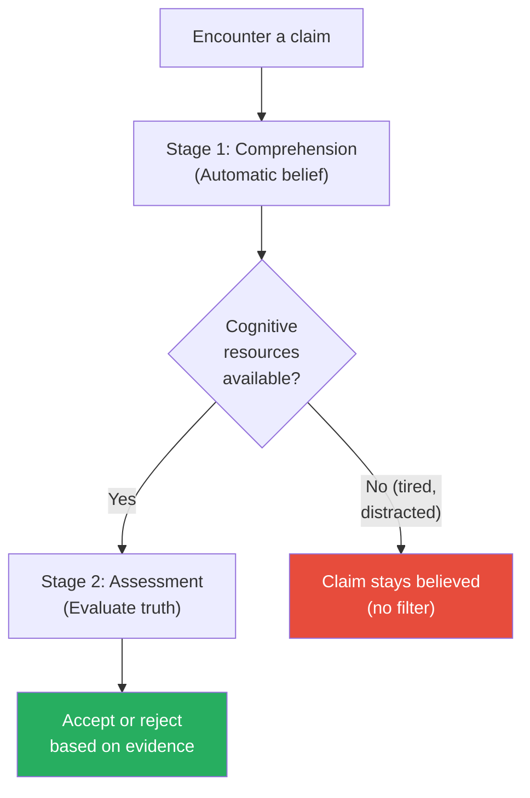

Gilbert's two-stage model explains why fatigue and distraction make people believe everything — Stage 2 (the disbelief engine) requires energy that depleted minds don't have.

> [!example] The Sentencing Study
> - In a study of judicial decision-making, judges who were cognitively depleted (by performing a difficult task beforehand) gave sentences that were more heavily influenced by the prosecution's recommendation than those who were well-rested
> - The depleted judges were unable to adequately assess and push back against the prosecution's framing
> - They defaulted to believing the prosecution's claim because their cognitive resources for critical evaluation were exhausted
> - This mirrors research showing that parole board decisions become harsher as the day wears on and judges become more fatigued
> **The lesson:** The most important decisions should be made at the beginning of the day, not the end. Cognitive depletion does not just make you tired — it makes you gullible.

---

### Chapter 46: Caffeine — The Legal Persuasion Drug

*Caffeine does not make people gullible — it makes them better at recognising strong arguments.*

- 1,3,7-trimethylxanthine is the scientific name for caffeine — a substance consumed daily by billions of people worldwide
- Research by Pablo Brinol and colleagues found that people who had consumed caffeine were <b style="color: #27ae60">significantly more persuaded by strong arguments</b> than those who had not
- Caffeine didn't make people gullible — it made them <b style="color: #2980b9">better at processing</b> the quality of the argument
- <b style="color: #27ae60">If your argument is genuinely strong, presenting it with coffee can measurably improve its reception</b>
- If your argument is weak, however, caffeine will make your audience MORE critical, not less
- The practical implication: serve coffee before your strongest presentations — avoid it when your case is thin
- This finding explains why business deals are so often done over coffee or meals — the stimulant effect of caffeine enhances the audience's ability to appreciate strong arguments
- Conference organisers who provide coffee breaks before keynote presentations are inadvertently optimising their audiences' cognitive processing
- The connection between Chapters 45 and 46 is the most important pairing in the book:
  - Chapter 45 reveals the vulnerability: cognitive depletion makes people accept EVERYTHING
  - Chapter 46 reveals the opportunity: caffeine makes people accept only what is GENUINELY GOOD
  - Together, they suggest a meta-principle: <b style="color: #27ae60">if your argument is strong, help your audience process it well (caffeine, alertness, time); if your argument is weak, don't exploit their fatigue — improve the argument</b>
  - The ethical persuader wants an alert, caffeinated audience — because a clear mind will appreciate a strong case more deeply

The asymmetry is important:

- Caffeine enhances elaboration — the depth of processing applied to the argument
- For strong arguments, deeper processing reveals the strength — and increases persuasion
- For weak arguments, deeper processing reveals the weakness — and DECREASES persuasion
- This connects to Chapter 45: cognitive depletion makes people accept EVERYTHING; caffeine makes people accept only what is GENUINELY GOOD
- <b style="color: #2980b9">The two chapters together suggest a meta-principle: match the audience's cognitive state to the quality of your argument</b>
  - Strong argument? Serve coffee, present when they're alert, give them time to process
  - Weak argument? You have bigger problems — fix the argument, don't exploit the audience

> [!example] The Caffeine and Persuasion Experiment
> - Brinol's team had participants consume either a caffeinated or decaffeinated beverage before reading a persuasive message
> - The message presented either strong arguments (well-supported, logical, evidence-based) or weak arguments (poorly supported, anecdotal)
> - For strong arguments: caffeinated participants were MORE persuaded than decaffeinated participants
> - For weak arguments: caffeinated participants were LESS persuaded than decaffeinated participants
> - Caffeine amplified the difference between strong and weak arguments — it made people more discerning, not more gullible
> **The lesson:** Caffeine is the ally of the well-prepared. If your argument is strong, coffee helps your audience appreciate it. If your argument is weak, coffee helps them see through it.

---

## Cluster 13 — Communication Medium & Cross-Cultural Persuasion

*The channel through which you communicate changes the message. And the culture of your audience determines which principles carry the most weight.*

### Chapter 47: Email vs Face-to-Face — When Technology Backfires

*The richer the medium, the less likely your intentions are to be misread.*

- Researchers found that negotiators who communicated by email were <b style="color: #e74c3c">significantly more likely to reach impasse</b> than those who communicated face-to-face or by phone
- Email strips away nonverbal cues — tone, expression, body language — that build rapport and convey intent
- Without these cues, people assume the worst about ambiguous messages
- <b style="color: #2980b9">The more important or contentious the communication, the richer the medium should be</b>

| Communication Type | Best Medium | Why |
|-------------------|-------------|-----|
| Routine information sharing | Email | Speed and record-keeping |
| Persuasive pitch | Face-to-face | Full access to nonverbal influence tools |
| Negotiation | Face-to-face or video | Need to read and send nonverbal signals |
| Conflict resolution | Face-to-face | Email escalates conflict through misread tone |
| Sensitive feedback | Face-to-face or phone | Written criticism feels harsher than spoken |

- The fix for email negotiations: before diving into substance, exchange personal information
- Negotiators who shared a few personal details (hobbies, hometown) before emailing about business produced better outcomes than those who jumped straight to business
- <b style="color: #27ae60">A few minutes of personal connection can compensate partially for the rapport deficit of email</b>

> [!example] The Email vs. Phone Negotiation Study
> - Researchers paired negotiators and assigned them to communicate either by email only or by phone
> - Email negotiators reached impasse (no deal) significantly more often
> - When they did reach deals, the outcomes were less favourable for both sides — more zero-sum, less creative
> - Phone negotiators reported higher satisfaction, more trust, and greater willingness to work together again
> - The critical difference: phone conversations included vocal tone, pacing, and laughter — all of which signal cooperative intent
> **The lesson:** When the stakes are high, pick up the phone. When the stakes are very high, meet in person.

- The authors also found that even a brief phone conversation BEFORE an email negotiation significantly improved outcomes — the personal connection established by voice carried over into the text-based exchange
- This has implications for remote work: teams that rely exclusively on text-based communication (Slack, email) lose access to the rapport-building tools that prevent misunderstandings
- The Covid-19 pandemic accelerated this problem: organisations that moved all communication to Slack and email saw a measurable increase in misunderstandings, conflict, and negotiation breakdowns compared to those that maintained video calls for important discussions
- The broader principle: every step down in medium richness (face-to-face to video to phone to email to text) strips away another layer of human connection that lubricates persuasion
- The authors suggest a simple rule: <b style="color: #27ae60">if a message could be misread, choose a richer medium; if a message is purely informational, email is fine</b>
- The emotional valence of the message determines the minimum acceptable medium:
  - Positive news (praise, good results, congratulations): any medium works — even email carries positive emotions well
  - Neutral information (facts, updates, data): email is efficient and appropriate
  - Negative or ambiguous news (criticism, bad results, requests): phone at minimum, face-to-face if possible — written criticism feels harsher and more permanent than spoken criticism

| Medium | Nonverbal Channels Available | Best For |
|--------|------------------------------|----------|
| **Face-to-face** | Body language, facial expression, tone, proximity, touch | High-stakes negotiations, conflict resolution, relationship building |
| **Video call** | Facial expression, tone, some gesture | Remote collaboration, presentations, interviews |
| **Phone** | Tone, pacing, laughter, silence | Quick negotiations, sensitive feedback, rapport maintenance |
| **Email** | None (words only) | Information transfer, documentation, routine requests |
| **Text/chat** | None (abbreviated words) | Quick coordination, low-stakes updates |

Each step down in medium richness removes nonverbal channels that prevent misunderstanding and build trust. Match the medium to the stakes.

> [!example] The "Get to Know You" Email Fix
> - In a follow-up experiment, email negotiators were randomly assigned to two conditions
> - Group A jumped straight to business in their emails
> - Group B was instructed to exchange personal information (name, hobbies, background) in a brief "get to know you" email exchange before negotiating
> - Group B produced significantly better joint outcomes — closer to the results achieved by face-to-face negotiators
> - The personal exchange created a reservoir of goodwill that cushioned against the misread intentions that normally plague email
> **The lesson:** If you must negotiate by email, start with a personal exchange. The investment of five minutes of small talk can save hours of misunderstanding.

---

### Chapters 48-50: Persuasion Across Cultures

*The six principles of influence are universal — but their relative power varies dramatically by culture.*

- The six principles of influence are universal but their relative power varies by culture
- The authors studied managers from four cultural groups and asked which influence strategies they found most persuasive
- The results revealed systematic cultural patterns:

In <b style="color: #2980b9">individualist cultures</b> (US, UK, Australia):

- Commitment/consistency and personal choice are the dominant drivers
- People are most influenced by their own prior statements and decisions
- The argument "You said X last month — acting consistently with X means doing Y now" carries significant weight
- The self is the primary reference point for decision-making
- Freedom of choice is paramount — restrictions trigger reactance
- This connects to the American emphasis on personal responsibility and individual agency
- The foot-in-the-door technique (Chapter 13) and labelling (Chapter 15) are particularly effective in these cultures because they leverage the individual's self-concept

In <b style="color: #2980b9">collectivist cultures</b> (China, Japan, South Korea):

- Social proof and authority carry more weight
- People are most influenced by what their group or superiors endorse
- The argument "Your team is already doing X" or "Your manager recommends X" carries more weight than personal consistency
- The group is the primary reference point for decision-making
- Harmony and hierarchical respect take precedence over individual assertion
- The hotel towel experiment (Chapter 2) would likely show even stronger effects in collectivist cultures, where group norms are more binding
- Authority signals (Chapter 22) are amplified in cultures where hierarchical respect is a core value

In <b style="color: #2980b9">relationship-oriented cultures</b> (Latin America, Middle East, parts of Southern Europe):

- Liking and reciprocity are the dominant drivers
- Business relationships must be personal before they can be transactional
- The argument "As a favour to me" or "Given our long relationship" carries weight that it would not in task-oriented cultures
- The relationship is the primary reference point for decision-making
- Trust is earned through personal connection, not credentials or data
- The Benjamin Franklin effect (Chapter 17) and similarity techniques (Chapter 33) are particularly powerful in these cultures
- Unconditional gift-giving (Chapter 11) activates stronger reciprocity obligations where relationships are the foundation of business

| Culture Type | Strongest Principle | Example |
|-------------|-------------------|---------|
| **Individualist** (US, UK, Australia) | Commitment/Consistency | "You committed to quality — this is the quality option" |
| **Collectivist** (China, Japan, Korea) | Social Proof / Authority | "Your team is adopting this" / "Director Kim endorsed it" |
| **Relationship-oriented** (Latin America, Middle East) | Liking / Reciprocity | "Given our friendship, I'd appreciate your support" |

- <b style="color: #27ae60">Before deploying any persuasion technique internationally, consider which principles are most culturally resonant for your audience</b>
- A technique that works brilliantly in New York may fall flat in Tokyo — not because the psychology is different, but because the relative weighting of the principles shifts
- The universality of the six principles means you don't need different tools for different cultures — you just need to lead with different ones
- The practical implication for anyone working across cultures is significant: before any cross-cultural persuasion attempt, ask "Which principle carries the most weight in THIS culture?" rather than defaulting to whatever works at home
- The cultural dimension also explains why marketing campaigns often fail when exported without modification:
  - A US campaign that uses testimonials from individual satisfied customers (consistency/personal choice) may fall flat in Japan, where group endorsement matters more
  - A Japanese campaign that emphasises organisational harmony (social proof/authority) may feel impersonal and corporate to American consumers who value individual authenticity
  - The six principles are the constants; the cultural weighting is the variable that must be calibrated for each market
- The authors recommend that any organisation doing international business should conduct a <b style="color: #2980b9">cultural persuasion audit</b> — mapping each target market to the principles most likely to resonate, and adjusting messaging, sales processes, and marketing campaigns accordingly
- This is not about stereotyping cultures — it is about respecting the empirical evidence that different cultural contexts amplify different psychological drives
- The most sophisticated international communicators do not abandon their toolkit when crossing borders — they reshuffle their deck, leading with whatever card their audience values most
- Getting the cultural calibration wrong is not merely ineffective — it can be actively offensive, as deploying the wrong principle first signals misunderstanding of, or disrespect for, the audience's values
- The cross-cultural chapters, despite being the shortest in the book, may be the most consequential for anyone working in a globalised economy

> [!example] The Cross-Cultural Manager Study
> - Researchers asked managers from the US, China, Germany, and Spain what kinds of arguments they found most persuasive when a colleague tried to influence them
> - American managers were most influenced by consistency arguments: "I've already committed to this approach"
> - Chinese managers were most influenced by authority arguments: "My superior endorsed this approach"
> - Spanish managers were most influenced by liking arguments: "My friend recommended this approach"
> - German managers showed a more balanced profile but leaned toward evidence and authority
> - The same principle (say, authority) was present in all cultures — but its RELATIVE weight varied dramatically
> **The lesson:** The principles are universal. The emphasis is cultural. Lead with the principle your audience values most.

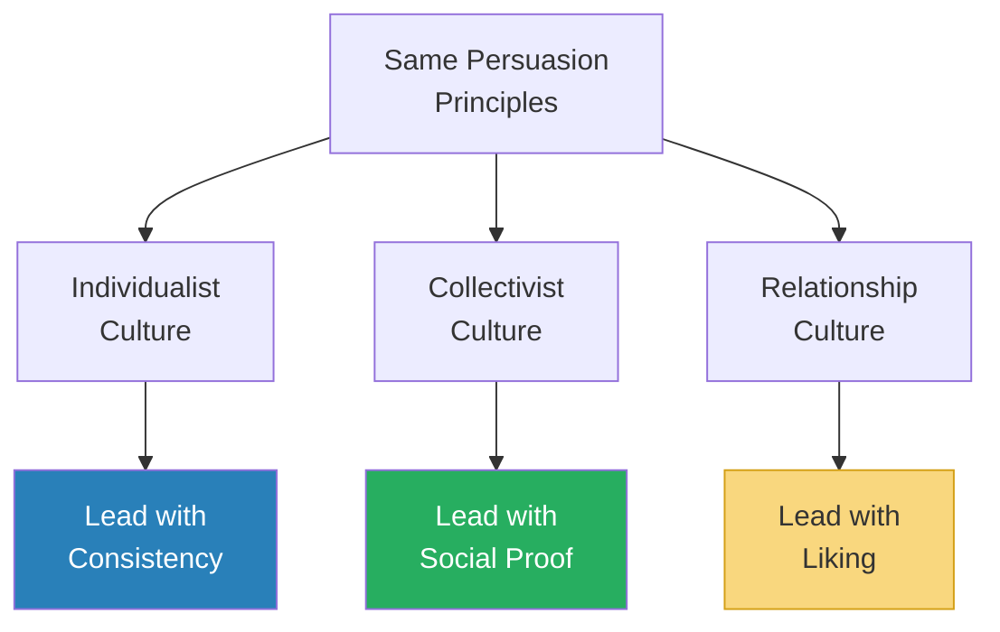

All six principles work everywhere — the difference is which principle to LEAD with, based on the cultural values of your audience.

> [!example] The American and Japanese Negotiation
> - The authors describe a case where an American company sent a negotiating team to Tokyo
> - The American team led with consistency arguments: "Based on what you agreed to in our last meeting, the logical next step is..."
> - The Japanese team was unmoved — their decision-making process was based on group consensus and deference to senior management, not individual consistency
> - When the American team adjusted their approach and led with authority ("Your industry association has endorsed this standard") and social proof ("Seven of the ten largest firms in your sector have already adopted this approach"), the negotiation moved forward
> - The principles were the same — the emphasis shifted to match the cultural context
> **The lesson:** Cultural mismatch in persuasion strategy is one of the most common causes of failed international negotiations. The fix is not different principles — it's different emphasis.

> [!example] The Latin American Relationship Priority
> - In contrast, a European consulting firm found that their data-driven, authority-based pitches consistently failed in Latin American markets
> - Their local partners explained: "You're leading with credentials before you've built a relationship. Here, people do business with friends first, experts second"
> - When the consulting firm restructured their approach — spending the first meeting entirely on relationship-building (dinner, personal stories, shared interests) and saving the credentials for the second meeting — their close rate tripled
> - The same consulting skills, the same data quality, the same track record — but the SEQUENCE of persuasion principles made the difference
> **The lesson:** In relationship cultures, liking and reciprocity must come BEFORE authority and evidence. Leading with data in a culture that prioritises personal connection is not just ineffective — it signals disrespect for the cultural norms that govern business trust.

---

## The Master Comparison Table

| Principle | Key Technique | Core Finding | When to Use |
|-----------|--------------|-------------|-------------|
| **Social Proof** | "Most people do X" | People follow the crowd, especially similar others | When your audience is uncertain or the behaviour is already common |
| **Reciprocity** | Give first, unconditionally | Gifts create social obligations stronger than incentives | When you need future compliance and can invest upfront |
| **Commitment** | Start small, get it in writing | Small commitments shift identity, producing larger compliance later | When you need sustained behaviour change over time |
| **Authority** | Have someone ELSE cite your credentials | Third-party introductions bypass the arrogance penalty | When you need credibility without self-promotion |
| **Liking** | Mirror language, highlight similarities | Even trivial similarities increase cooperation | In any interpersonal influence situation |
| **Scarcity** | Frame as loss, not gain | Loss aversion is 2x stronger than gain motivation | When the audience needs urgency to act |
| **Fluency** | Make it rhyme, make it easy to say | Easy-to-process = perceived as true and valuable | In naming, slogans, messaging |
| **Fear** | ALWAYS pair with specific action plan | Fear without a clear action produces paralysis, not motivation | Health, safety, and risk communications |
| **Decoy** | Add a premium option | Makes the mid-range option look like a smart compromise | Pricing, proposals, menu design |
| **Admission** | Lead with a minor weakness | Creates trust that amplifies subsequent strengths | Sales, negotiations, PR crises |

---

### The Decision Tree: Which Technique Should I Use?

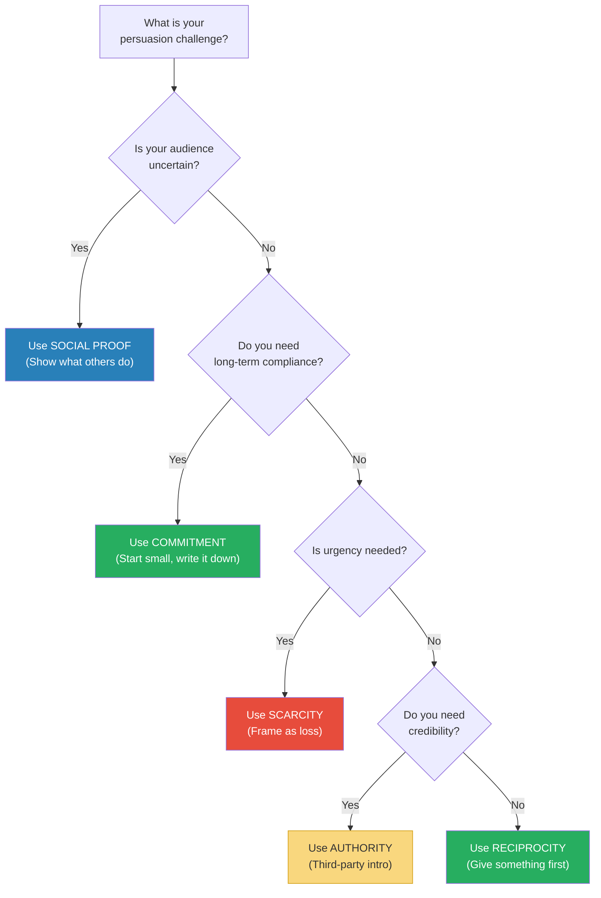

Use this as a starting point for selecting techniques — in practice, the most powerful persuasion combines multiple principles simultaneously.

---

### The Stacking Principle — Combining Multiple Techniques

*The book's techniques become exponentially more powerful when combined.*

- The authors repeatedly show that the most effective real-world persuasion uses multiple principles simultaneously
- The hotel towel study (Chapter 2) combined social proof with reciprocity (Chapter 11) and specificity (same-room matching) for maximum effect
- The waiter's mint technique (Chapter 10) combined reciprocity (gift), scarcity (unexpected extra), and liking (personalisation)
- The pre-question trap (Chapter 16) combines commitment/consistency with the foot-in-the-door technique
- The key insight: <b style="color: #27ae60">each additional principle layered on top of the first does not merely ADD to the effect — it MULTIPLIES it</b>
- A message that uses social proof alone might increase compliance by 25%
- The same message that adds loss framing might increase compliance by 50%
- Add a personalised touch (reciprocity) and the effect might reach 75%
- The authors caution against over-stacking: more than 3-4 principles at once can make the persuasion attempt feel manipulative, which triggers reactance

> [!example] The Perfect Persuasion Stack — The Hotel Towel Experiment Maximised
> - Consider how the hotel towel experiment could stack multiple principles:
> - **Social proof** (Chapter 2): "The majority of guests who stayed in this room reused their towels"
> - **Reciprocity** (Chapter 11): "We have already donated to an environmental charity on your behalf"
> - **Commitment** (Chapter 14): Including a small card for the guest to sign: "I will reuse my towels during my stay"
> - **Injunctive norm** (Chapter 4): A smiley face icon on the sign
> - **Loss framing** (Chapter 34): "Without towel reuse, your room contributes to X gallons of water waste per stay"
> - Each additional principle layers on top of the previous ones, creating a persuasive message that attacks the decision from multiple psychological angles simultaneously
> - The authors note that the most successful real-world persuasion campaigns almost always combine 2-3 principles, not just one
> **The lesson:** A single persuasion principle is a tool. Multiple principles working together are a system. Design your persuasion as a system, not a single technique.

> [!abstract] The Persuasion Stack — Combining Techniques
> 1. **Choose your primary principle** based on the situation (use the decision tree above)
> 2. **Layer a supporting principle** that reinforces the first (e.g., social proof + loss framing)
> 3. **Add a personalisation element** (name, similarity, handwritten note) to activate liking/reciprocity
> 4. **Test and measure** — not all combinations work equally well; the science is in the testing
> Maximum recommended stack: 3-4 principles per persuasion attempt. Beyond that, diminishing returns and detection risk.

---

## The Verdict

*Yes! 50 Scientifically Proven Ways to Be Persuasive* is the most actionable persuasion book ever written — and it earns that title not through bold claims but through relentless specificity. Where [[Influence - Robert Cialdini|Influence]] gives you the six principles and [[Pre-Suasion - Robert Cialdini|Pre-Suasion]] gives you the timing, *Yes!* gives you the recipe for each dish. Every chapter delivers a single, testable, immediately deployable technique: change three words and sales double, add a sticky note and response rates jump from 36% to 75%, put a smiley face on a utility report and energy waste stops.

The research base is impeccable — these are not anecdotes or opinions but controlled experiments published in peer-reviewed journals, conducted by the authors themselves or by their academic colleagues. The practical applications are spelled out in each chapter's final paragraphs, which read like consulting recommendations rather than academic hedging. And because Cialdini himself is a co-author, the techniques are firmly anchored in the theoretical framework that made *Influence* the foundational text of the field. The book's greatest contribution is democratising persuasion science — making it accessible not just to academics or natural salespeople but to anyone willing to read a three-page chapter and try a small change.

The book's weakness is structural: fifty two-to-four-page chapters with no overarching narrative means it reads as a collection of research briefs rather than a cohesive argument. There is no character development, no story arc, no through-line beyond "here is another technique." For readers who want narrative, this format can feel fragmented. Some techniques receive only cursory treatment — the cross-cultural chapters at the end, in particular, deserve a full book rather than three short chapters. And the research, while rigorous, is drawn overwhelmingly from Western, educated, industrialised samples — the authors acknowledge cultural variation but cannot fully address how these techniques perform in non-Western contexts. Some of the studies cited are small-sample lab experiments that may not replicate perfectly in real-world conditions, though the sheer number of converging findings across different studies provides reasonable confidence. The replication crisis in social psychology has cast doubt on a few of the specific findings (particularly the implicit egoism name-career correlation), though the core principles remain well-supported.

For anyone who already understands the principles of persuasion from *Influence* and wants to move from understanding to deployment, this is the essential next step. It serves best as a reference manual — keep it on your desk, open it before any meeting where you need a "yes," and deploy the specific technique that matches your situation. The reader who gains the most is someone who has already internalised the six principles and now wants fifty specific ways to apply them. Marketers, salespeople, negotiators, managers, and anyone who regularly needs compliance from others will find immediate value. Readers who are new to persuasion science should start with *Influence* first — *Yes!* is the cookbook, but *Influence* is the culinary theory that explains why the recipes work.

Compared to the rest of the Cialdini canon, *Yes!* sits between the theoretical depth of *Influence* and the pre-framing precision of *Pre-Suasion*. It lacks the narrative power of [[Never Split the Difference - Chris Voss|Never Split the Difference]] or the strategic sweep of [[The 48 Laws of Power - Robert Greene|The 48 Laws of Power]], but it compensates with a density of applicable research that no other persuasion book matches. If *Influence* is the textbook and *Pre-Suasion* is the advanced seminar, *Yes!* is the lab manual — and every lab manual needs to be on the bench, not on the shelf.

One final observation: the book's greatest meta-lesson may be that persuasion is not about what feels right to the persuader — it is about what has been proven to work on the audience. The research consistently shows that human intuition about what will persuade is poor. The most effective techniques are often the most counterintuitive: admitting weakness builds trust, starting low in auctions drives prices up, reducing options increases sales, and a smiley face can save millions of kilowatt-hours. The fifty chapters are not just a toolkit for getting more "yeses" — they are a sustained argument that evidence beats instinct, and that small, tested changes outperform grand persuasion strategies every time.

---

## Related Reading

- [[Influence - Robert Cialdini|Influence]] — The theoretical foundation for all fifty techniques — the six principles explained in depth
- [[Pre-Suasion - Robert Cialdini|Pre-Suasion]] — The timing dimension: what to do in the moment BEFORE you deploy these techniques
- [[How to Win Friends and Influence People - Dale Carnegie|How to Win Friends and Influence People]] — The warmth, curiosity, and genuine interest that make these scientific techniques feel human rather than mechanical
- [[The Charisma Myth - Olivia Fox Cabane|The Charisma Myth]] — Managing the internal state (presence, power, warmth) that makes the external techniques land
- [[Never Split the Difference - Chris Voss|Never Split the Difference]] — Tactical negotiation that deploys many of these same principles under high-stakes pressure
- [[Thinking in Bets - Annie Duke|Thinking in Bets]] — Why we misjudge the effectiveness of our own persuasion attempts (resulting)
- [[What Every Body Is Saying - Joe Navarro|What Every Body Is Saying]] — Reading the nonverbal signals that tell you whether your persuasion is working
- [[Crucial Conversations - Kerry Patterson|Crucial Conversations]] — How to maintain dialogue when persuasion meets resistance
- [[Games People Play - Eric Berne|Games People Play]] — The hidden psychological games that undermine straightforward persuasion
- [[Noise - Cass R. Sunstein|Noise]] — Why professional judgments vary so wildly — and how structured decision-making reduces that variance
- [[The Art of Reading Minds - Henrik Fexeus|The Art of Reading Minds]] — Reading the nonverbal and psychological signals that tell you which technique to deploy
- [[Like Switch - Jack Schafer|Like Switch]] — FBI-derived rapport-building techniques that complement the liking principles in Chapters 29-33
