# Antifragile — Nassim Nicholas Taleb

> Nassim Taleb's central insight is that we have no word for the opposite of fragile — and that this linguistic gap has blinded us to one of the most important properties a system can possess.
> "Robust" is not the opposite of fragile. Robust things merely resist shocks. The true opposite is *antifragile*: things that actually get stronger from disorder, volatility, stress, and uncertainty.
> Muscles are antifragile (they grow from stress). Immune systems are antifragile (they need exposure to pathogens). Evolution is antifragile (it needs random mutation and death). But the modern world — with its obsession with prediction, control, planning, and smoothing — systematically eliminates the very volatility that these systems need to thrive.
> The result: we create artificial calm that makes catastrophic blowups inevitable. The solution: structure your life, investments, and institutions to be antifragile.
> This is not a self-help book. It is a philosophical treatise disguised as a rant — brilliant, combative, repetitive, and indispensable.

---

## About the Author

Nassim Nicholas Taleb is a former options trader turned risk philosopher. Born in Amioun, Lebanon, in 1960, he grew up during the Lebanese Civil War — an experience that gave him a lifelong distrust of stability narratives and an intimate understanding of how quickly orderly systems can collapse into chaos. He holds an MBA from Wharton and a PhD from the University of Paris. He spent two decades as a derivatives trader and hedge fund manager before turning to full-time writing and academic work. He is Distinguished Professor of Risk Engineering at NYU Tandon School of Engineering and the author of the *Incerto* series: *Fooled by Randomness*, *The Black Swan*, *Antifragile*, *Skin in the Game*, and *The Bed of Procrustes*. His career trading options on extreme events gave him firsthand experience with fat tails and Black Swans, which became the empirical foundation for his philosophical work.

---

## The Big Idea

- There are three categories of things in the world, not two — and the missing category is the most important:
  - <b style="color: #2980b9">Fragile</b> things break under stress — a porcelain cup, a highly leveraged bank, a rigid plan
  - <b style="color: #2980b9">Robust</b> things resist stress — a rock, a fireproof safe, a stoic personality
  - <b style="color: #2980b9">Antifragile</b> things *gain* from stress — muscles, immune systems, evolution, certain business models
- We had words for the first two but not the third, and this gap in language created a gap in thinking
- The modern world is obsessed with eliminating volatility — smoothing out fluctuations, predicting the future, controlling outcomes
- But <b style="color: #e74c3c">suppressing volatility does not eliminate risk — it hides it, concentrates it, and makes the eventual blowup catastrophic</b>
- Small forest fires prevent big ones. Small business failures prevent systemic collapses. Small stressors build resilience.
- <b style="color: #27ae60">The solution is not to predict the future but to build systems that benefit from whatever the future throws at them</b>
- Taleb argues this principle applies everywhere: finance, health, politics, technology, education, diet, career decisions
- The book is Taleb's attempt to create a complete philosophical framework — a "blueprint for living in a world we don't understand"

| | Fragile | Robust | Antifragile |
|--|---------|--------|-------------|
| **Responds to shock** | Breaks | Resists | Gets stronger |
| **Needs** | Calm, stability, prediction | Nothing changes | Stress, volatility, disorder |
| **Mythology** | Damocles (sword above head) | Phoenix (survives fire) | Hydra (cut a head, two grow back) |
| **Example** | A glass | A rock | Your immune system |
| **Likes** | Certainty | Indifference | Surprises |
| **Hates** | Variation | Nothing in particular | Stasis |

This table is the foundation of everything in the book — every chapter applies the Triad to a different domain. The Triad is not just a classification system — it is a diagnostic tool. For any system, institution, career, or habit, you can ask: which column does this belong in? The answer tells you how that thing will respond to the next shock.

The radar chart shows how antifragile approaches consistently outperform fragile and robust strategies across every domain Taleb examines — the green envelope dominates the red core in every direction.

- Taleb argues that the Triad reveals a deeper truth about how the world works:
  - Most people assume there are only two categories: things that break under stress and things that don't
  - The missing third category — things that *improve* under stress — changes everything
  - Once you see it, you realise that nature overwhelmingly favours antifragility: evolution, immune systems, ecosystems, markets, and even human psychology
  - The modern world's obsession with robustness (making things shock-proof) is actually a second-best strategy — antifragility is what nature actually selects for

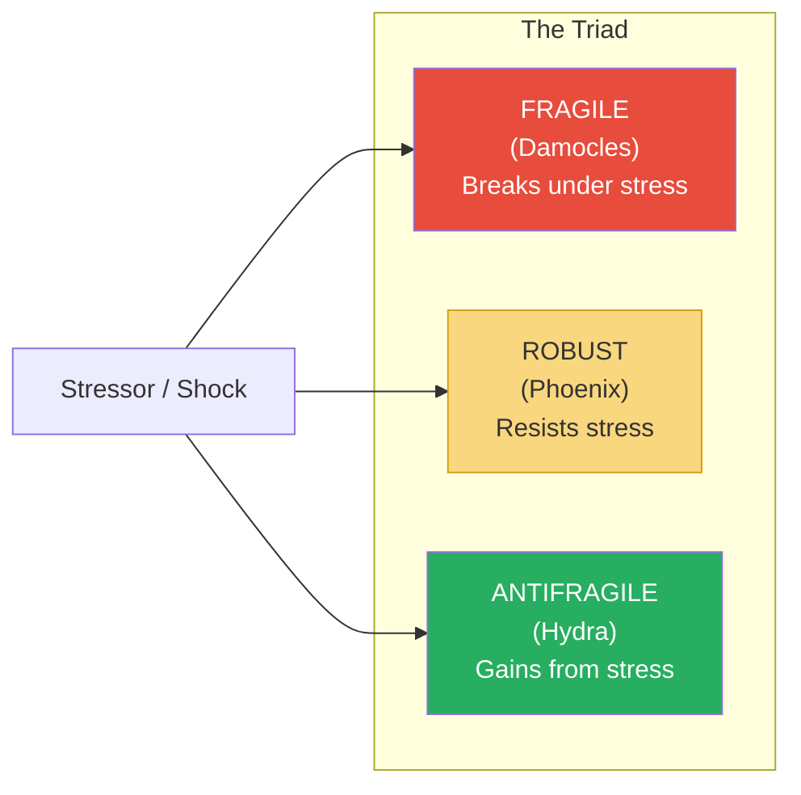

The Triad is the organising principle of the entire book — Taleb applies it to biology, economics, medicine, ethics, politics, and personal decision-making.

- Taleb provides an extended Triad table that maps the concept across every major domain:

| Domain | Fragile | Robust | Antifragile |
|--------|---------|--------|-------------|
| **Biology** | Over-protected organism | Hardy organism | Organism that grows from stress |
| **Finance** | Leveraged bank | Cash-heavy company | Barbell portfolio |
| **Career** | Single employer, no savings | Government job with pension | Day job + creative side venture |
| **Health** | No exercise, all comfort | Moderate routine exercise | Intense intervals + full rest |
| **Diet** | Processed food, constant meals | Balanced regular meals | Feast/fast cycle, traditional food |
| **Politics** | Centralised nation-state | Federal system | Swiss canton model |
| **Education** | Standardised curriculum | Diverse curriculum | Self-directed learning |
| **Knowledge** | Theoretical expertise only | Broad general knowledge | Tinkering + practical wisdom |
| **Relationships** | One deep dependency | Several stable relationships | Deep bonds + wide acquaintances |

---

## Key Concepts at a Glance

| Concept | One-line summary |
|---------|-----------------|
| **The Triad** | Fragile/Robust/Antifragile — the three responses to volatility |
| **Via Negativa** | Improve by removing, not adding — what you don't do matters more than what you do |
| **Barbell Strategy** | Extreme safety + extreme risk; avoid the middle |
| **Skin in the Game** | Those who take risks must bear the consequences |
| **Iatrogenics** | Harm done by the healer — intervention that makes things worse |
| **Lindy Effect** | Non-perishable things that have survived long will survive longer |
| **Optionality** | Having options is antifragile; being locked in is fragile |
| **Green Lumber Fallacy** | You don't need to understand theory to profit from practice |
| **Turkey Problem** | The turkey is fed for 1,000 days and concludes it's safe — then Thanksgiving arrives |
| **Hormesis** | Small doses of poison strengthen; what doesn't kill you makes you stronger (literally) |
| **Naive Interventionism** | The urge to do something when doing nothing would be better |
| **Soviet-Harvard Illusion** | The false belief that top-down design beats bottom-up tinkering |
| **Convexity / Concavity** | Antifragile payoffs are convex (more upside than downside); fragile payoffs are concave |
| **Neomania** | The love of the new for its own sake — the enemy of the Lindy Effect |
| **Fat Tony** | Taleb's fictional street-smart trader who embodies antifragile thinking |
| **Fragilista** | Someone who makes things fragile while believing they are helping |
| **Nonlinear effects** | Small causes can have enormous consequences in complex systems |
| **Domain dependence** | Applying knowledge correctly in one domain but failing to transfer it to another |

---

## Book I: The Antifragile — An Introduction

### Chapter 1: Between Damocles and Hydra

*Taleb introduces the core concept by exposing a hole in every human language — we have no word for the true opposite of fragile.*

- If you send a package and label it "fragile," you mean "please don't shake this"
- What is the opposite label? "Robust" means "shake it all you want, it won't break"
- But there is a third category: something that actually *benefits* from being shaken
- <b style="color: #2980b9">Antifragility</b> is beyond resilience or robustness:
  - The resilient resists shocks and stays the same
  - The antifragile gets better
- Taleb uses three mythological figures to anchor the Triad:
  - **Damocles** sat under a sword hanging by a single horsehair — one shock and he dies (fragile)
  - **The Phoenix** dies in fire and is reborn the same — it survives but doesn't improve (robust)
  - **The Hydra** grows two heads for every one cut off — it gains from the attack (antifragile)
- The linguistic gap matters because what we cannot name, we cannot think about clearly:
  - Engineers design for robustness but never for antifragility
  - Economists model stability and instability but miss the category that benefits from instability
  - Doctors aim to "do no harm" (robustness) rather than to build systems that gain from challenges (antifragility)

> [!example] The Sword of Damocles
> - In Greek mythology, Damocles was a courtier who envied King Dionysius II of Syracuse
> - Dionysius offered to let Damocles sit on the throne to experience "the good life"
> - Above the throne hung a sword suspended by a single horsehair
> - Damocles could not enjoy a single moment — aware that one tiny shock would kill him
> - Taleb uses Damocles as the perfect image of fragility: apparent comfort hiding catastrophic vulnerability
> **The lesson:** Many modern institutions sit on Damocles' throne — everything looks fine until the single hair snaps.

- <b style="color: #27ae60">The key insight is that antifragility is not just a nice property — it is necessary for survival in a world of uncertainty</b>
- Systems that are merely robust will eventually be overwhelmed by a shock large enough to exceed their tolerance
- Only antifragile systems actually improve over time, because each shock makes them stronger
- Taleb draws a critical distinction between **risk** and **ruin**:
  - Risk is acceptable when it doesn't threaten survival
  - Ruin ends the game permanently — no recovery is possible
  - Antifragile systems are structured so that risks cannot compound into ruin
  - Fragile systems disguise ruin risk as ordinary risk — until the catastrophe arrives

> [!example] The Hydra in Practice — How Silicon Valley Works
> - A startup ecosystem like Silicon Valley functions as a Hydra
> - Individual startups die constantly — the failure rate exceeds 90%
> - But each failure generates knowledge: what business models don't work, which technologies are premature, which markets are too small
> - Founders from failed companies become better at their next venture
> - Investors allocate capital away from losing patterns toward winning ones
> - The ecosystem as a whole gets smarter and more productive with every death
> **The lesson:** The Hydra mechanism requires death at the component level to produce strength at the system level.

---

### Chapter 2: Overcompensation and Overreaction Everywhere

*The biological world is saturated with antifragility — organisms overcompensate for stressors in ways that leave them stronger than before.*

- <b style="color: #2980b9">Hormesis</b> is the phenomenon where small doses of a harmful substance actually produce beneficial effects:
  - Muscles grow only when stressed beyond their current capacity — the body overcompensates by building more muscle than was lost
  - Bones become denser in response to impact stress
  - The immune system requires exposure to pathogens to develop antibodies
  - Vaccines work on this exact principle: a tiny controlled dose of the threat makes you stronger
- Taleb extends this beyond biology:
  - Economies overcompensate after recessions — the weakest firms die and resources flow to stronger ones
  - Post-traumatic growth: some people emerge from trauma not just recovered but transformed
  - Innovation is highest under pressure — necessity truly is the mother of invention
- The mechanism of overcompensation is precise:
  - The system receives a stressor
  - It responds by building capacity *beyond* what was needed to handle the stressor
  - This excess capacity is the "overcompensation" — it prepares the system for an even larger stressor
  - The cycle repeats, and the system gets progressively stronger
- <b style="color: #27ae60">Overcompensation is the secret engine of all biological improvement — and it only works when the system is exposed to stressors</b>

> [!example] The Mithridates Strategy
> - Mithridates VI, King of Pontus (around 120-63 BC), was so afraid of being poisoned that he ingested small, increasing doses of various poisons throughout his life
> - He built up such tolerance that when he was finally defeated by the Romans and tried to poison himself to avoid capture, the poison had no effect
> - He had to order a soldier to run him through with a sword
> - Taleb uses Mithridates as the original example of deliberate antifragility through hormesis
> **The lesson:** Controlled exposure to harm is the mechanism by which biological systems become stronger — avoidance creates fragility.

> [!tip] Core Insight
> Overcompensation is the secret mechanism of antifragility. Systems don't just recover from stress — they overshoot, building excess capacity that wasn't there before. This is not a bug; it is the fundamental engine of biological improvement.

- <b style="color: #e74c3c">The dangerous implication: when you remove all stressors from a system, you don't protect it — you weaken it</b>
- Overprotective parenting produces fragile children
- Antibacterial everything produces weaker immune systems
- Bailouts for failing banks produce a more fragile financial system
- Taleb draws on research showing:
  - Children raised in overly sterile environments develop more allergies and autoimmune disorders
  - Athletes who train in completely controlled conditions perform worse under race-day stress than those who train with variability
  - Economies that suppress small recessions experience larger, more devastating crashes

> [!example] The Streisand Effect as Antifragility
> - In 2003, Barbra Streisand sued a photographer to remove an aerial photo of her Malibu mansion from a public archive
> - Before the lawsuit, the photo had been downloaded six times — two of those by her own lawyers
> - After the lawsuit made news, over 420,000 people visited the site in a single month to see the photo
> - The attempt to suppress information made it orders of magnitude more visible
> - Taleb cites this pattern repeatedly: censorship, banning, and suppression often make their targets antifragile
> **The lesson:** Trying to suppress something can make it stronger. Antifragility often hides in the things we try hardest to control.

> [!example] Post-Traumatic Growth
> - Psychologist Richard Tedeschi coined the term "post-traumatic growth" to describe people who emerged from severe adversity not just intact but genuinely stronger
> - Studies of cancer survivors, combat veterans, and disaster victims showed that a significant minority reported fundamental positive changes: deeper relationships, greater appreciation for life, new possibilities, increased personal strength
> - This is not "getting over" trauma — it is being transformed by it
> - Taleb argues this is the human version of hormesis: extreme stress triggers overcompensation at the psychological level
> **The lesson:** The opposite of post-traumatic stress disorder is not the absence of trauma — it is post-traumatic growth. Some people are psychologically antifragile.

- Taleb also discusses **redundancy** as a key mechanism of antifragility:
  - Nature builds redundancy everywhere — two lungs, two kidneys, two eyes
  - This is not "waste" — it is the margin of safety that makes organisms antifragile
  - An engineer might look at two kidneys and say: "Inefficient. One would suffice."
  - But the second kidney is what allows you to survive the loss of the first
  - <b style="color: #2980b9">Redundancy is the hidden ingredient of antifragility — it looks wasteful in calm times and essential in chaotic ones</b>
  - Modern efficiency thinking systematically eliminates redundancy — "lean" operations, just-in-time supply chains, minimised inventory
  - This makes systems fragile: there is no buffer when the shock arrives
- The contrast between efficiency and redundancy maps directly onto the Triad:
  - **Fragile systems** are optimised for efficiency — no slack, no waste, no redundancy
  - **Robust systems** have some redundancy — enough to survive a known range of shocks
  - **Antifragile systems** have excess redundancy — they overcompensate for each shock and build even more capacity

---

### Chapter 3: The Cat and the Washing Machine

*Taleb draws a crucial distinction between living systems (which are antifragile) and mechanical systems (which are not) — and argues we treat the former as if they were the latter.*

- A washing machine is mechanical — it wears down with use and benefits from gentle treatment
- A cat is organic — it needs stimulation, stress, and variety to thrive
- <b style="color: #2980b9">The error of modernity is to treat complex living systems as if they were washing machines</b>:
  - We treat the economy like a machine to be "fine-tuned" by central bankers
  - We treat the human body like a machine to be "optimised" with supplements
  - We treat children like machines to be "programmed" with standardised education
  - We treat ecosystems like machines to be "managed" by park services
- Living systems have a fundamentally different relationship with stress:
  - Mechanical things are degraded by stressors
  - Organic things are *informed* by stressors — the stressor carries information that the system uses to adapt
- The distinction turns on the concept of **information**:
  - When you stress a machine, you give it wear — pure entropy
  - When you stress an organism, you give it information — data about the environment it needs to adapt to
  - A muscle that is stressed "learns" that it needs to be stronger
  - A bone that receives impact "learns" that it needs to be denser
  - An immune system that encounters a pathogen "learns" to fight it
- <b style="color: #e74c3c">The catastrophic mistake is to apply mechanical thinking to organic systems</b>

| Characteristic | Mechanical (Washing Machine) | Organic (Cat) |
|---------------|------------------------------|---------------|
| **Stress effect** | Degradation | Adaptation |
| **Needs** | Stability, predictability | Variety, stimulation |
| **Optimal treatment** | Gentle, consistent use | Challenge, variability |
| **Information** | None from stress | Rich from stress |
| **Over time** | Wears out | Gets stronger (up to a point) |
| **Failure mode** | Gradual decline | Sudden collapse if overstressed |

> [!example] The Bedridden Patient
> - Doctors once prescribed extended bed rest for patients recovering from surgery or illness
> - The logic seemed mechanical: the body is damaged, keep it still so it can "repair"
> - In reality, extended immobility causes muscle atrophy, bone loss, blood clots, and depression
> - The body needs movement — even painful movement — to heal properly
> - Modern medicine has reversed course: early mobilisation is now standard practice after most surgeries
> **The lesson:** Treating a living system like a machine (keep it still, protect it) produces the opposite of the intended effect.

> [!example] The Over-Scheduled Child
> - Modern parenting tends to fill every hour of a child's day with structured activities — lessons, sports, tutoring, enrichment programmes
> - The logic is mechanical: maximise inputs to maximise outputs
> - But children are organic systems that need unstructured time — boredom, free play, and self-directed exploration
> - Research consistently shows that children with excessive structure develop less creativity, less resilience, and weaker problem-solving skills
> - The child's brain needs the "stressor" of having nothing to do — it overcompensates by inventing, imagining, and self-organising
> **The lesson:** Organic systems need disorder. Filling every gap with structure is the mechanical fallacy applied to human development.

- Taleb argues that the distinction between organic and mechanical is the most important dividing line in his entire framework:
  - Everything on the organic side needs some volatility
  - Everything on the mechanical side needs protection from volatility
  - <b style="color: #27ae60">The first question for any system should be: is this organic or mechanical? Then treat it accordingly.</b>

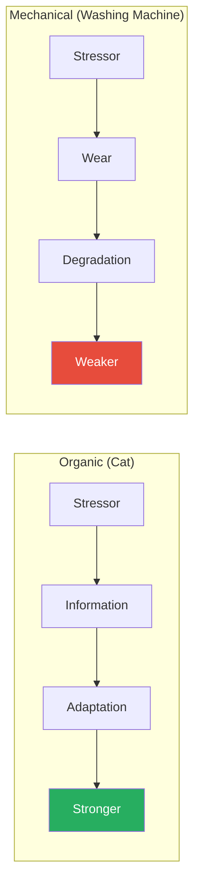

The organic-mechanical distinction determines whether stress is information (useful) or entropy (destructive) — and therefore whether a system should be protected from stress or exposed to it.

---

## Book II: Modernity and the Denial of Antifragility

### Chapter 4: What Kills Me Makes Others Stronger

*Taleb reveals a dark truth: antifragility at one level often requires fragility at another. Evolution needs individual death to improve the species.*

- The restaurant business is antifragile *as a system* because individual restaurants are fragile:
  - Most new restaurants fail within a few years
  - The failures carry information — they reveal what doesn't work
  - The survivors absorb that information and improve
  - The overall quality of restaurants in a city gets better over time *because* of the failures
- <b style="color: #27ae60">The system is antifragile precisely because its components are fragile</b>
- This is evolution's core mechanism: individual organisms die so that the species can adapt
- Taleb applies this to economics:
  - Small businesses failing is healthy — it is economic natural selection
  - <b style="color: #e74c3c">Preventing business failures (through bailouts, subsidies, or "too big to fail" policies) makes the entire economic system fragile</b>
  - The 2008 financial crisis happened because years of bailouts and interventions had prevented the small failures that would have kept the system honest

> [!example] The Restaurant Business in New York City
> - New York City has some of the best restaurants in the world
> - It also has one of the highest restaurant failure rates in the world
> - These facts are not in tension — they are causally connected
> - Every restaurant that fails teaches the market something: this location doesn't work, this cuisine isn't wanted here, this price point is wrong
> - The restaurants that survive absorbed those lessons — often because their owners previously failed
> - Taleb argues that if you prevented restaurant failures (subsidised every struggling restaurant), you would destroy the quality of dining in New York within a decade
> **The lesson:** System-level antifragility requires component-level fragility. You cannot have one without the other.

- This creates a profound ethical tension:
  - The system needs individual failure, but individuals don't want to be the ones who fail
  - Taleb acknowledges this but argues the solution is not to prevent failure — it is to ensure that failure is survivable
  - Small failures that individuals can recover from → system learns → system improves
  - Catastrophic failures that destroy individuals → system shocked → system may collapse
  - <b style="color: #2980b9">The art is calibrating the size of failure: large enough to carry information, small enough to be survivable</b>

> [!example] The Airline Industry as Antifragile Safety System
> - Commercial aviation is one of the safest forms of transportation
> - This safety was not designed from theory — it was built from crashes
> - Every plane crash triggers an investigation, new regulations, design changes, and pilot training modifications
> - The system literally learns from death
> - Airlines are required to report every incident, no matter how minor — creating a constant stream of information
> - Taleb contrasts this with banking: banks hide their near-misses, learn nothing from them, and eventually produce catastrophic failures
> **The lesson:** Aviation achieved antifragile safety by letting small incidents inform the system. Banking achieved fragile "stability" by hiding small incidents until they became large catastrophes.

> [!tip] Core Insight
> The strength of a system is often inversely proportional to the strength of its individual components. Fragile parts, freely allowed to fail, create antifragile wholes.

- Taleb introduces a key distinction: **errors of commission vs. errors of omission**
  - An error of commission is doing something that causes harm (prescribing the wrong drug)
  - An error of omission is failing to do something that would have helped (not prescribing the right drug)
  - Society punishes errors of commission far more harshly than errors of omission
  - But from a system-design perspective, errors of omission — failing to let components fail — may be more dangerous
  - When regulators prevent bank failures (error of omission — they omit the natural selection process), they commit a systemic error of commission by making the whole system fragile
- This connects to Taleb's Lebanon example:
  - Lebanon appeared stable for decades under a carefully balanced political system
  - Small political conflicts were suppressed in the name of national unity
  - When the system finally broke in 1975, the result was a 15-year civil war
  - Taleb's childhood in wartime Beirut shaped his entire worldview: the most dangerous systems are the ones that look most stable

---

### Chapter 5: The Souk and the Office Building

*Taleb contrasts the messy, volatile, bottom-up world of the souk (bazaar) with the clean, controlled, top-down world of the modern office — and argues the souk is far more antifragile.*

- A Middle Eastern souk is chaotic: hundreds of small merchants, no central plan, constant haggling, frequent small failures
- A modern corporate office building is orderly: hierarchy, process, planning, control, stability
- The souk is antifragile because:
  - No single merchant's failure threatens the whole
  - Merchants adapt instantly to changing conditions
  - Information flows freely through gossip and observation
  - Stressors (competition, price changes) improve the system
  - Every merchant has skin in the game — they risk their own money
- The office building is fragile because:
  - Centralised planning means centralised failure points
  - Hierarchy slows information flow
  - Employees are insulated from consequences (no skin in the game)
  - Stability is enforced, not earned — and when it breaks, it breaks catastrophically
  - The CEO's bad decision affects everyone; a single merchant's bad decision affects only himself

| Souk (Bottom-Up) | Office Building (Top-Down) |
|-------------------|---------------------------|
| Many small, independent actors | Few large, interdependent units |
| Constant small failures | Rare but catastrophic failures |
| Information flows freely | Information filtered by hierarchy |
| Adapts to shocks in real time | Plans against shocks in advance |
| Messy but resilient | Clean but brittle |
| Everyone has skin in the game | Decision-makers insulated from risk |

- <b style="color: #27ae60">Taleb's preference is always for the messy, decentralised, bottom-up system over the clean, centralised, top-down one</b>
- This is not aesthetic preference — it is a structural argument about where fragility hides
- Taleb extends the souk-versus-office analogy to political systems:
  - City-states and cantons (Switzerland's model) are like souks — small, independent, self-governing units
  - Large nation-states with centralised power are like office buildings — one bad leader can damage everything
  - <b style="color: #2980b9">Switzerland, with its 26 cantons and radical decentralisation, is Taleb's model of political antifragility</b>
  - It has survived centuries of European wars, revolutions, and economic crises
  - Its stability comes not from control but from the absence of centralised control

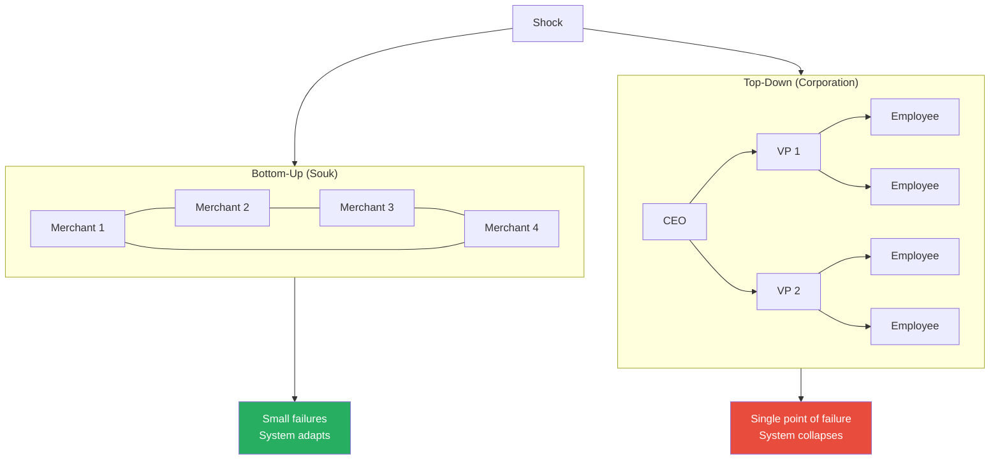

This diagram illustrates why decentralised systems handle shocks better — the damage is distributed and absorbed rather than concentrated at a single failure point.

> [!example] Switzerland vs. the Soviet Union
> - Switzerland and the Soviet Union represent opposite ends of Taleb's spectrum
> - The Soviet Union centralised all economic decisions in Moscow — one planning committee for 290 million people
> - Switzerland distributed governance across 26 cantons — each essentially self-governing, with a weak federal government
> - The Soviet Union survived 69 years before collapsing catastrophically
> - Switzerland has survived as a coherent political entity for over 700 years, through two World Wars, the Reformation, and countless European upheavals
> - Switzerland's messiness is its strength; the Soviet Union's order was its fatal flaw
> **The lesson:** Clean, centralised systems look superior on paper. Messy, decentralised systems survive in reality.

---

### Chapter 6: Tell Them I Love (Some) Randomness

*Taleb argues that randomness and volatility are not just tolerable — they are essential nutrients for antifragile systems.*

- <b style="color: #2980b9">Volatility is information</b> — it tells a system what works and what doesn't
- A career with small setbacks produces a professional who can handle anything
- An economy with small recessions produces businesses that can survive anything
- A child exposed to playground scrapes and minor conflicts develops emotional resilience
- Taleb distinguishes between two types of volatility:
  - **Mild volatility** (Mediocristan) — variations around a mean, predictable range, bell curve territory
  - **Wild volatility** (Extremistan) — dominated by rare extreme events, fat tails, Black Swan territory
- <b style="color: #27ae60">Antifragile systems thrive on mild volatility and can survive wild volatility</b>
- Fragile systems cannot handle even mild volatility — and are destroyed by wild volatility
- The critical error: <b style="color: #e74c3c">suppressing mild volatility doesn't create stability — it creates the conditions for wild volatility</b>
- Taleb identifies a universal pattern:
  - Suppress small variations → system appears stable → hidden pressures accumulate → catastrophic blowup
  - This pattern appears in forestry, economics, geopolitics, parenting, medicine, and diet
  - It is perhaps Taleb's single most important empirical observation

> [!example] The Forestry Paradox
> - For decades, the US Forest Service suppressed every small forest fire it could find
> - The logic seemed sound: fires are bad, so prevent fires
> - But small fires serve a crucial ecological function — they clear underbrush and dead wood
> - By suppressing small fires for decades, enormous amounts of fuel accumulated on forest floors
> - When a fire finally escaped suppression, it was catastrophic — burning hotter and wider than any natural fire would have
> - The Yellowstone fires of 1988 burned nearly 800,000 acres — a direct result of decades of fire suppression
> **The lesson:** Suppressing small fires guarantees large fires. Suppressing small economic corrections guarantees large crashes. Suppressing small stressors guarantees catastrophic fragility.

> [!example] The Great Moderation and the 2008 Crash
> - Economists celebrated the period from 1987 to 2007 as "The Great Moderation" — two decades of unusually low economic volatility
> - Federal Reserve chair Ben Bernanke gave a speech praising the achievement of having tamed the business cycle
> - But the volatility had not disappeared — it had been suppressed through aggressive intervention
> - Low interest rates, repeated bailouts, and backstopping of risk encouraged excessive leverage
> - When the accumulated pressures finally broke through in 2008, the crisis was the worst since the Great Depression
> - The "moderation" was the calm before the storm — exactly what the fire suppression analogy predicts
> **The lesson:** Twenty years of artificial calm doesn't mean stability has been achieved. It means instability has been stored and compressed.

- Taleb formalises this pattern with a principle he calls the **volatility paradox**:
  - Measured volatility and actual risk move in opposite directions
  - When measured volatility is low, actual risk is high (because fragility is accumulating beneath the surface)
  - When measured volatility is high, actual risk may be lower (because the system is releasing pressure)
  - <b style="color: #27ae60">Low volatility is a *warning signal*, not a comfort signal — it means pressure is building</b>
- This principle applies beyond finance:
  - A marriage with no arguments is not necessarily healthy — it may mean conflicts are being suppressed
  - A country with no protests is not necessarily stable — it may mean dissent is being silenced
  - A body with no minor illnesses is not necessarily strong — it may mean the immune system is unchallenged and unprepared
  - A career with no setbacks is not necessarily on track — it may mean you are avoiding the risks that produce growth

---

## Mediocristan vs Extremistan

*Before diving deeper, Taleb insists you understand the two types of worlds we inhabit — one where averages are meaningful and one where they are lethal distractions.*

- <b style="color: #2980b9">Mediocristan</b> is the world of the bell curve:
  - Human height, weight, calorie consumption — these cluster around an average and extreme outliers barely move the needle
  - If you sample 1,000 people and add the world's tallest person, the average barely changes
  - In Mediocristan, the past is a reasonable guide to the future
  - Single observations cannot dominate the total
- <b style="color: #2980b9">Extremistan</b> is the world of power laws, fat tails, and Black Swans:
  - Wealth, book sales, city sizes, earthquake magnitudes, pandemic deaths — these are dominated by extreme outliers
  - If you sample 1,000 people's net worth and add Jeff Bezos, the average becomes meaningless — one observation dominates
  - In Extremistan, the past is a treacherous guide to the future
  - A single event can change everything
- <b style="color: #e74c3c">The catastrophic error: applying Mediocristan tools (averages, bell curves, standard deviation) to Extremistan problems (financial markets, pandemics, geopolitics)</b>
- Most of the world's important phenomena live in Extremistan — and most of our statistical and planning tools were designed for Mediocristan
- The Turkey Problem is an Extremistan problem disguised as a Mediocristan one: 1,000 days of evidence suggest a bell-curve world of predictable feeding, until the single extreme event (Thanksgiving) reveals you were in Extremistan all along

| Mediocristan | Extremistan |
|-------------|-------------|
| Bell curve / normal distribution | Power law / fat tails |
| Averages are meaningful | Averages are misleading |
| Outliers don't matter | One outlier changes everything |
| Past predicts future | Past is a poor guide |
| Height, weight, IQ | Wealth, book sales, wars |
| Risk is manageable | Risk is unknowable |
| Prediction works | Prediction is futile |

> [!tip] Core Insight
> The question is never "what is the average?" — it is "which world am I in?" In Mediocristan, plan from averages. In Extremistan, plan from extremes. Most people apply Mediocristan thinking to Extremistan problems — and are destroyed when the tail event arrives.

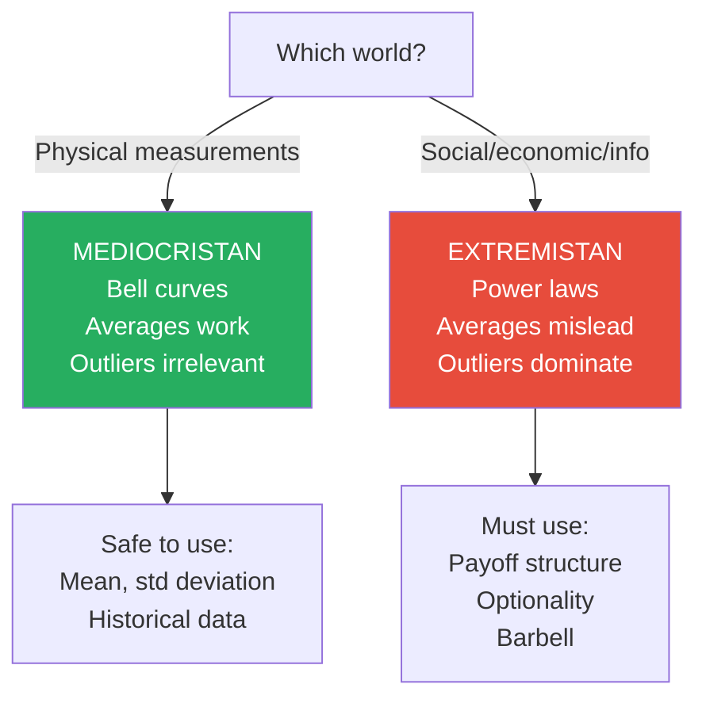

Knowing which world you are operating in — Mediocristan or Extremistan — determines which tools are safe to use and which are dangerously misleading.

The treemap makes the asymmetry visceral: Extremistan domains dwarf Mediocristan ones in outlier impact — a single observation in wealth or war casualties can dominate the entire dataset, while height and weight barely budge.

---

## Book III: A Nonpredictive View of the World

### Chapter 7: Naive Interventionism

*Taleb attacks our most deeply held instinct — the urge to "do something" — and shows how intervention often causes more harm than the problem it was meant to solve.*

- <b style="color: #2980b9">Iatrogenics</b> is the technical term for "harm done by the healer"
  - Originally a medical concept: a patient made worse by the treatment
  - Taleb extends it to every domain: economic iatrogenics, political iatrogenics, educational iatrogenics
- The problem is not that intervention is always bad — it is that we systematically underestimate the harm of intervention and overestimate the harm of doing nothing
- <b style="color: #e74c3c">Naive interventionism</b> is the belief that action is always better than inaction:
  - A child has a fever → give them medicine to bring it down (but the fever is the immune system fighting infection — suppressing it may slow recovery)
  - The economy slows → cut interest rates and stimulate (but the slowdown was purging weak businesses — stimulus preserves the weakness)
  - A country has a dictator → invade and install democracy (but the resulting chaos may be worse than the dictatorship)
- Why we default to intervention:
  - **Action bias** — doing nothing feels irresponsible, especially for people in positions of authority
  - **Asymmetric visibility** — the harm of doing nothing is visible and attributable; the harm of intervention is diffuse and deniable
  - **Incentive misalignment** — doctors get paid to treat, consultants get paid to recommend changes, politicians get credit for action
  - **Narrative fallacy** — a story where "we identified the problem and fixed it" is more satisfying than "we did nothing and the problem resolved itself"
- Taleb's rule: <b style="color: #27ae60">intervene only when the potential benefit dramatically exceeds the potential harm, and when you can clearly see the harm of not intervening</b>

> [!example] Bloodletting — The Textbook Case of Iatrogenics
> - For centuries, European doctors treated nearly every ailment by draining blood from the patient
> - George Washington, in December 1799, developed a throat infection
> - His doctors drained nearly 2.5 litres of blood from him over 12 hours — roughly 40% of his total blood volume
> - Washington almost certainly died from the treatment, not the infection
> - The doctors were well-intentioned, well-educated, and following the best medical consensus of their era
> - They simply could not see that their intervention was more dangerous than the disease
> **The lesson:** The fact that an intervention is well-intentioned and consensus-approved does not mean it helps. The history of medicine is largely a history of iatrogenics.

> [!abstract] Taleb's Intervention Rule
> 1. If the patient is not in critical danger, the default should be to do nothing
> 2. Nature has had millions of years to develop self-healing mechanisms — respect them
> 3. Intervene only when the danger is clear and severe (a broken bone, a heart attack, a hemorrhage)
> 4. The burden of proof is on the intervention, not on the status quo
> 5. Small, reversible interventions are always preferable to large, irreversible ones
> 6. If you're not sure whether to intervene, don't

- The <b style="color: #2980b9">fragilista</b> is Taleb's term for someone who creates fragility while believing they are reducing it:
  - Central bankers who smooth out economic cycles
  - Helicopter parents who remove all challenge from their children's lives
  - Doctors who prescribe medication for every minor symptom
  - Urban planners who design "perfect" cities with no room for organic growth
  - The fragilista's signature move: intervene, create new problems, then intervene again to fix those problems, creating still more problems

> [!tip] Core Insight
> The first question should never be "What should we do?" It should be "What would happen if we did nothing?" — because in most cases, the system has its own repair mechanisms that intervention disrupts.

> [!example] The Libya Intervention (2011)
> - In 2011, Western powers intervened in Libya to remove Muammar Gaddafi
> - The stated goal was to protect civilians and install democracy
> - Gaddafi was removed, but the resulting power vacuum produced civil war, tribal conflict, a failed state, and a migrant crisis that destabilised the entire Mediterranean
> - The "cure" was catastrophically worse than the disease
> - Taleb repeatedly points to foreign policy interventions as the most dramatic example of naive interventionism: the interveners bear no consequences, and the people who suffer most had no say in the decision
> **The lesson:** The urge to "fix" another country's problems often creates worse problems — because the intervener doesn't understand the complex system they are disrupting, and doesn't bear the consequences of failure.

- Taleb classifies intervention into a hierarchy of legitimacy:

| Condition Severity | Intervention Justified? | Reason |
|-------------------|------------------------|--------|
| **Life-threatening** | Yes, aggressively | Benefit of action far exceeds risk of iatrogenics |
| **Serious but stable** | Cautiously, reversibly | Moderate benefit, moderate iatrogenic risk — use small interventions |
| **Mild or improving** | No — let nature work | Small benefit, large iatrogenic risk relative to benefit |
| **Nothing wrong** | Absolutely not | Zero benefit, all iatrogenic risk — pure harm |

- The tragedy of modern medicine, Taleb argues, is that the profession has shifted from treating category 1 (where it saves lives) to aggressively treating categories 3 and 4 (where it causes net harm):
  - Prescribing statins for slightly elevated cholesterol (category 3)
  - Screening healthy people for diseases they'll never develop (category 4)
  - Treating mild depression with powerful psychoactive drugs (category 3)
  - Performing elective surgeries with real risks for marginal conditions (category 3)

---

### Chapter 8: Prediction as a Child of Modernity

*Taleb dismantles the modern obsession with prediction, arguing that our inability to forecast the future is not a bug to be fixed but a permanent feature to be designed around.*

- Modernity has created an entire class of people — economists, analysts, consultants, pundits — whose job is to predict the future
- <b style="color: #e74c3c">Their track record is terrible, and it has not improved despite decades of better data and more sophisticated models</b>
- Taleb argues this is not because we haven't found the right model yet — it is because complex systems are inherently unpredictable
- The <b style="color: #2980b9">Turkey Problem</b> illustrates why:
  - A turkey is fed every day for 1,000 days
  - Every day, the evidence "proves" that the farmer loves the turkey and wants it well-fed
  - The turkey's confidence in its safety grows with each passing day
  - On Day 1,001 — Thanksgiving — the turkey's model is catastrophically falsified
  - <b style="color: #e74c3c">The turkey was most confident precisely the day before it was most wrong</b>
- Taleb distinguishes between two different kinds of unpredictability:
  - **Known unknowns** — things we know we don't know (e.g. which horse will win the race)
  - **Unknown unknowns** — things we don't even know we don't know (e.g. the internet in 1950, COVID in 2019)
  - The second category is where the real danger lies — and it is fundamentally unpredictable
  - No model can capture what you cannot even imagine

> [!example] The Turkey Problem Applied to Finance
> - Before the 2008 financial crisis, risk models at major banks showed historically low levels of risk
> - Housing prices had risen consistently for decades — the data "proved" they would continue
> - Banks leveraged up based on these models, confident that the past predicted the future
> - Moody's, Standard & Poor's, and Fitch rated mortgage-backed securities as AAA — the safest possible rating
> - When the crash came, the "safest" securities became worthless
> - The banks were most leveraged (most confident) at the exact moment they were most vulnerable
> **The lesson:** Past stability is not evidence of future stability. It may be evidence of hidden fragility — like the calm before the storm, or the 1,000 days before Thanksgiving.

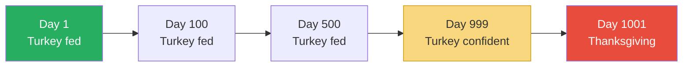

The Turkey Problem shows that the longest track record of stability can be the worst predictor of future safety — confidence grows as danger approaches.

- Taleb documents the abysmal track record of expert prediction:
  - Philip Tetlock's research showed that expert political forecasters performed worse than random chance — and worse than simple algorithms
  - Economic forecasters failed to predict every major recession in the past century
  - Technology forecasters in the 1960s predicted flying cars and moon colonies but missed personal computers and the internet
- Taleb's alternative: <b style="color: #27ae60">don't try to predict — instead, make yourself antifragile so that you benefit regardless of what happens</b>
- This is the philosophical core of the book: shift from forecasting to positioning
- You don't need to know *what* will happen — you need to know *how you're structured* when it happens

> [!example] The Tragedy of Fukuyama's "End of History" (1989)
> - In 1989, political scientist Francis Fukuyama published his famous essay arguing that liberal democracy was the final form of government — the "end of history"
> - The Cold War was ending, the Soviet Union was collapsing, and Western-style democracy seemed destined to spread everywhere
> - Within two decades: the September 11 attacks reshaped geopolitics; the rise of China offered an alternative development model; the Arab Spring collapsed into civil wars; populist movements challenged liberal democracy across Europe and America
> - Fukuyama's confident prediction was the intellectual equivalent of the turkey's Day 999: maximum confidence at maximum vulnerability
> - The narrative was elegant, the evidence was strong, the conclusion was wrong
> **The lesson:** The most convincing narrative about the future is not the most accurate — it is often the most dangerous, because it encourages complacency.

> [!example] Forecasters and the Gulf War (1990)
> - In August 1990, Iraq invaded Kuwait — an event that almost no political forecaster had predicted
> - After the invasion, oil prices surged and a consensus quickly formed: a long war would push prices even higher
> - The war was short, prices dropped, and the forecasters were wrong again
> - Taleb's point: the forecasters weren't just wrong about whether the war would happen — they were wrong about what would happen *after* their revised forecast
> - Being wrong twice in a row didn't reduce anyone's confidence in forecasting as a profession
> **The lesson:** Forecasters fail not occasionally but systematically — and then construct narratives explaining why their failure was an exception.

- Taleb identifies two types of errors in forecasting:
  - **Type 1: Predicting something that doesn't happen** — this is embarrassing but recoverable
  - **Type 2: Failing to predict something that does happen** — this is where the real damage lies
  - Most forecasters optimise for Type 1 avoidance: they make vague, hedged predictions that are difficult to falsify
  - The critical errors — the ones that destroy — are almost always Type 2: things nobody saw coming
  - The entire forecasting profession is structured to protect itself from accountability while providing the illusion of foresight
- Taleb's alternative to prediction is what he calls <b style="color: #2980b9">preparedness through structure</b>:
  - Instead of asking "will there be a recession?" → ask "am I structured to survive a recession?"
  - Instead of asking "which stocks will go up?" → ask "am I structured so it doesn't matter which stocks go up?"
  - Instead of asking "will I get fired?" → ask "am I structured so that being fired wouldn't ruin me?"
  - The structural approach works regardless of what happens — because it doesn't depend on knowing what will happen

---

## Book IV: Optionality, Technology, and the Intelligence of Antifragility

### Chapter 9: Fat Tony and the Fragilistas

*Taleb introduces his most vivid characters — Fat Tony, the street-smart trader, and Dr. John, the credentialled expert — to dramatise the difference between antifragile and fragile thinking.*

- <b style="color: #2980b9">Fat Tony</b> is a fictional character Taleb uses across his books:
  - A Brooklyn-based trader with no formal education
  - Makes decisions based on payoffs, not predictions
  - Distrusts theory and trusts practice
  - Rich not because he's right more often, but because when he's right, he wins big, and when he's wrong, he loses small
- **Dr. John** is his opposite:
  - Ivy League PhD, extensive knowledge of financial theory
  - Makes decisions based on models and forecasts
  - Trusts theory over practice
  - Confident in his ability to predict outcomes
- The fundamental difference is in how they handle uncertainty:
  - Dr. John tries to *eliminate* uncertainty through better models
  - Fat Tony tries to *exploit* uncertainty through better positioning
  - Dr. John asks "what is the probability?" — Fat Tony asks "what is the payoff?"

| Fat Tony | Dr. John |
|----------|----------|
| Asks: "What is the payoff?" | Asks: "What is the probability?" |
| Distrusts forecasts | Lives by forecasts |
| Keeps maximum optionality | Commits to specific predictions |
| Wins big on rare events | Destroyed by rare events |
| Street-smart | Book-smart |
| Antifragile | Fragile |
| Survives crises | Wiped out by crises |

> [!example] The Billion-Dollar Bet
> - In one of Taleb's thought experiments, Fat Tony and Dr. John are both told a fair coin has landed heads 99 times in a row
> - Dr. John calculates the probability: each flip is independent, so the next flip is still 50/50 heads
> - Fat Tony says: "The coin is loaded. I'm betting tails."
> - Dr. John is technically correct about probability theory — but Fat Tony is correct about reality
> - In the real world, 99 heads in a row almost certainly means the coin is rigged
> - Fat Tony's street wisdom detects what Dr. John's theoretical framework misses
> **The lesson:** Theoretical correctness and practical wisdom are different things. In conditions of uncertainty, practical wisdom wins.

> [!tip] Core Insight
> Focus on the payoff structure, not the probability. It doesn't matter how likely or unlikely an event is — what matters is how much you stand to gain or lose when it happens.

- Taleb uses Fat Tony and Dr. John to illustrate <b style="color: #2980b9">domain dependence</b>:
  - Dr. John can solve probability equations brilliantly in one domain (the classroom) but fails catastrophically in another (the trading floor)
  - Fat Tony cannot solve any equations but intuitively grasps payoff asymmetry in every domain
  - Domain dependence is the failure to transfer knowledge from one context to another
  - Taleb argues that formal education creates massive domain dependence — you know things in the classroom that you cannot apply in life

> [!example] The Nero Tulip Trader
> - Taleb introduces another character from *Fooled by Randomness*: Nero Tulip, a cautious trader
> - Nero understands probability and knows that unlikely events happen more often than models predict
> - But his caution means he underperforms in calm markets — he misses the easy gains that come from ignoring tail risk
> - He watches less sophisticated traders make money year after year while he hedges conservatively
> - When the crash finally comes, those traders are wiped out and Nero survives — even profits
> - But the years of underperformance were psychologically brutal: his boss pressured him, his colleagues mocked him, and he constantly questioned his own approach
> - Taleb uses Nero to illustrate the emotional cost of antifragility: being right about rare events means being "wrong" about common ones for extended periods
> **The lesson:** The antifragile strategy often looks foolish during long periods of calm. Surviving the psychological pressure of appearing wrong is as important as being structurally right.

- Fat Tony embodies what Taleb calls <b style="color: #2980b9">practical wisdom</b> — the kind of intelligence that cannot be taught in a classroom:
  - Pattern recognition developed through decades of exposure to real consequences
  - Intuitive understanding of payoff asymmetry without formal mathematical training
  - Healthy scepticism of any narrative that sounds too clean or too confident
  - The ability to distinguish between "I don't understand this because I'm ignorant" and "I don't understand this because it doesn't make sense"
- <b style="color: #27ae60">Fat Tony's cardinal rule: "If something sounds too good to be true, it is"</b>
  - This simple heuristic would have prevented most of the major financial disasters of the past century
  - Banks offering guaranteed high returns? Too good to be true. (Lehman Brothers, 2008)
  - Investments with consistent returns and no volatility? Too good to be true. (Bernie Madoff, 2008)
  - Housing prices that only go up? Too good to be true. (The entire mortgage market, 2008)

---

### Chapter 10: Seneca's Barbell

*Taleb reveals his most actionable framework — the barbell strategy — by drawing on the ancient Stoic philosopher Seneca, who was simultaneously Rome's wealthiest man and its most eloquent advocate for poverty.*

- The <b style="color: #2980b9">Barbell Strategy</b> is Taleb's signature practical tool:
  - Combine extreme safety with extreme risk
  - Avoid the moderate middle
  - This structure is antifragile because your maximum loss is capped while your maximum gain is unlimited
- The name comes from a barbell: heavy weights on both ends, nothing in the middle
- In investing:
  - 90% in the safest possible assets (Treasury bills, cash)
  - 10% in the most speculative possible bets (options, venture capital, moonshots)
  - Never the "balanced" portfolio of medium-risk investments
- <b style="color: #27ae60">The barbell ensures you can survive any downside while capturing unlimited upside</b>
- The "balanced" middle is the most dangerous position because:
  - It gives you the *illusion* of safety
  - When the Black Swan arrives, "moderate risk" turns out to be catastrophic
  - You suffer enough downside to be destroyed but capture too little upside to recover
- Why the middle is treacherous:
  - A "moderate" portfolio of corporate bonds looks safe in normal times
  - But in a crisis, those bonds can lose 40-60% of their value
  - You get hit hard enough to matter but don't have the speculative upside to recover
  - The barbell investor, meanwhile, loses at most 10% (the speculative portion) and their 90% in T-bills is untouched

> [!example] Seneca — The Richest Stoic (c. 4 BC - 65 AD)
> - Seneca was both a Stoic philosopher who wrote eloquently about the virtues of simple living and one of the wealthiest men in the Roman Empire
> - Critics called him a hypocrite — how can you preach poverty while owning estates across the Mediterranean?
> - Taleb sees genius in the contradiction: Seneca mentally practised poverty every day
> - He would sleep on the floor, fast, wear rough clothing — not because he was poor, but because he wanted to remove the *fear* of poverty
> - By eliminating his dependence on wealth psychologically, he made himself antifragile: he could enjoy his riches without being destroyed by their loss
> - When Nero finally demanded his fortune and his life, Seneca faced it with equanimity
> **The lesson:** True wealth is not having a lot — it is not needing a lot. Seneca's barbell: maximum material comfort combined with maximum psychological independence from that comfort.

> [!abstract] The Barbell Strategy Applied Across Domains
> - **Investing:** 90% ultra-safe (T-bills) + 10% ultra-speculative (options, startups). Never "balanced" mutual funds.
> - **Career:** Stable day job + wild creative moonshots on the side. Never the "safe but ambitious" corporate middle.
> - **Health:** Intense exercise + complete rest. Never chronic moderate exercise that grinds you down.
> - **Reading:** Deep classics (Lindy-approved) + cutting-edge experimental. Never the middle-brow bestseller.
> - **Social life:** Deep intimate friendships + wide casual acquaintances. Never a large number of medium-depth connections.
> - **Diet:** Occasional feasting + occasional fasting. Never constant "moderate" caloric intake.

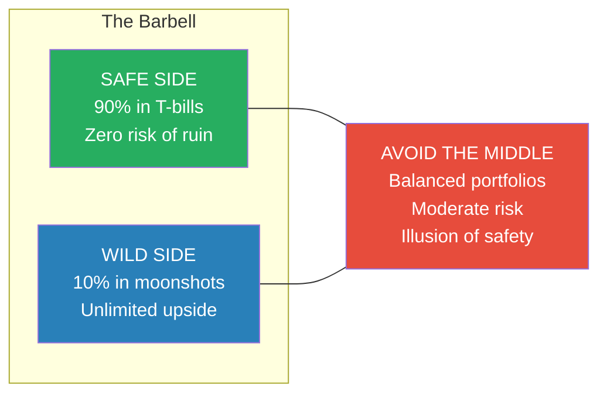

The barbell structure ensures that no matter what happens, your downside is capped at 10% while your upside is theoretically unlimited.

> [!example] The Corporate Employee vs. the Taxi Driver/Writer
> - Taleb compares two career strategies through the Triad
> - The corporate employee has a steady salary, benefits, and apparent stability — but is totally dependent on a single employer
> - If fired (the one big shock), they face catastrophic disruption: lost income, lost identity, lost professional network
> - The taxi driver who writes novels on the side has a barbell career: guaranteed small income from driving + unlimited upside from writing
> - If one novel fails, the taxi income continues; if one novel succeeds, the upside is enormous
> - The corporate employee looks stable but is fragile; the taxi driver/writer looks precarious but is antifragile
> **The lesson:** The appearance of stability is not stability. A diversified income structure with one safe and one speculative component is more robust than a single "safe" salary.

---

### Chapter 11: Never Marry the Rock Star

*Taleb makes the case that having options — and never being locked in — is the essence of antifragility in practice.*

- <b style="color: #2980b9">Optionality</b> means having the right but not the obligation to do something
  - A financial option gives you the right to buy a stock at a set price — you exercise it only if the stock goes up
  - An antifragile life works the same way: you put yourself in positions where the upside is large and the downside is small
- Optionality is valuable precisely *because* we cannot predict the future:
  - You don't need to know which startup will succeed — you invest in ten and need only one winner
  - You don't need to know which skill will be valuable — you learn widely and deploy what becomes relevant
  - You don't need to predict the next technology — you position yourself to benefit from whatever emerges
- <b style="color: #e74c3c">The opposite of optionality is being locked in — committed to a single path with no ability to change course</b>
- Locked-in is fragile: if your one bet fails, you're destroyed
- Optional is antifragile: if nine of your ten bets fail, the one winner more than compensates
- <b style="color: #27ae60">The strategy: always maintain the ability to change your mind, reverse your decision, or walk away</b>
- Taleb identifies the key features of optionality:
  - **Asymmetric payoff:** the upside is much larger than the downside
  - **Right, not obligation:** you choose whether to exercise the option — no one forces you
  - **Time value:** options become more valuable over time because more things can happen
  - **Volatility benefit:** the more uncertain the future, the more valuable your options are

> [!example] Thales of Miletus and the Olive Presses (c. 600 BC)
> - The pre-Socratic philosopher Thales was mocked for being poor — proof, his critics said, that philosophy was useless
> - Thales responded by purchasing options on every olive press in the region during winter, when demand was low and prices were cheap
> - When spring brought an extraordinary olive harvest, every producer needed the presses
> - Thales exercised his options, rented out the presses at a massive premium, and made a fortune
> - He didn't predict the harvest — he positioned himself to benefit if the harvest was good, while his downside (the cost of the options) was trivial
> **The lesson:** You don't need to predict the future to profit from it. You need optionality — asymmetric positions where the upside vastly exceeds the downside.

> [!example] The Venture Capital Model
> - Venture capital is the purest institutional expression of optionality
> - A VC fund invests in 20-30 startups knowing that most will fail
> - The fund's structure ensures that the maximum loss on any single bet is the amount invested
> - But the maximum gain is unlimited — a single winner can return 100x or 1000x the investment
> - Peter Thiel invested $500,000 in Facebook in 2004; that stake became worth over $1 billion
> - The entire VC model is a barbell: many small, capped losses + rare but enormous gains
> **The lesson:** Optionality works because it caps the downside and uncaps the upside. You don't need to be right often — you need to structure your bets so that being right once pays for being wrong many times.

- Taleb distinguishes between **option blindness** and option awareness:
  - Most people undervalue the options they already have
  - A person with savings has optionality — they can walk away from a bad situation
  - A person with diverse skills has optionality — they can switch fields when conditions change
  - A person with no debt has optionality — they are not locked into earning a minimum amount
  - <b style="color: #e74c3c">Debt is the enemy of optionality — it locks you into a path and removes your ability to walk away</b>
  - Taleb argues that the most important financial decision you can make is to avoid debt, not to pick good investments
  - With no debt, your downside is limited; with debt, your downside can exceed everything you own

> [!tip] Core Insight
> Optionality is the property that makes you antifragile. If you have options, volatility is your friend — it creates new opportunities. If you are locked in, volatility is your enemy — it can destroy you. The single most important financial question is not "what should I invest in?" but "how much optionality do I have?"

---

### Chapter 12: The Green Lumber Fallacy

*Taleb tells one of his most memorable stories to show that understanding why something works is not required for profiting from it — and that theory can actually get in the way of practice.*

- The <b style="color: #2980b9">Green Lumber Fallacy</b> comes from a story told by trader Aaron Brown:
  - One of the most successful green lumber traders in history didn't know that "green lumber" meant freshly cut (not dried) wood
  - He thought it meant lumber that was painted green
  - Despite this fundamental misunderstanding of his product, he made millions — because his trading instincts (practical knowledge) were superb
  - A rival trader who understood everything about the lumber industry lost money — because his theoretical knowledge didn't translate to trading skill
- <b style="color: #27ae60">The fallacy: confusing theoretical knowledge with practical knowledge, and assuming one is necessary for the other</b>
- This applies broadly:
  - Academics who study entrepreneurship are not good entrepreneurs
  - Nutritional scientists don't eat better than grandmothers who follow traditional diets
  - Economists don't manage money better than street-smart traders
  - Bird-watching experts can identify every species but couldn't design a wing that flies
- Taleb's point is not anti-intellectual — it is that <b style="color: #e74c3c">formal theory often leads people to overestimate their understanding and underestimate what they don't know</b>
- Practical knowledge includes pattern recognition, intuition, and tacit skills that cannot be articulated or taught in a classroom
- Taleb calls this gap the difference between "narrative knowledge" (stories about how things work) and "practical knowledge" (the ability to make things work)

> [!example] The Soviet-Harvard Illusion
> - Taleb groups two seemingly unrelated entities — the Soviet Union and Harvard Business School — under the same label
> - Both believed in top-down, theory-driven management of complex systems
> - Soviet central planners tried to manage an entire economy from theory — it collapsed
> - Harvard-trained MBAs try to manage complex businesses from theory — they produce fragile, over-optimised corporations
> - Meanwhile, the real economy thrives on tinkering, experimentation, and trial-and-error by practitioners who couldn't articulate a theory if their life depended on it
> - Silicon Valley's greatest successes came from dropouts and tinkerers, not MBAs and consultants
> **The lesson:** The world is too complex for theory to capture. The people who change it are not the ones who understand it — they are the ones who tinker with it.

- Taleb introduces a related concept: the <b style="color: #2980b9">lecturing-birds-how-to-fly effect</b>
  - Birds flew for millions of years before humans understood aerodynamics
  - Then academics claimed that aerodynamics theory enabled flight — as if birds needed the lecture
  - In reality, practice almost always precedes theory:
    - Steam engines preceded thermodynamics by about a century
    - Bridges were built long before structural engineering was formalised
    - Agriculture preceded botany by millennia
  - The academic temptation is to claim credit for practice after the fact — to write the theory and then pretend the theory caused the practice

> [!example] The Jet Engine — Practice Before Theory
> - Frank Whittle, the inventor of the jet engine, was a Royal Air Force officer and tinkerer
> - He designed and built the first jet engine through trial and error, not through theoretical physics
> - The theoretical understanding of gas dynamics and turbine efficiency came *after* the engine worked
> - Academics later wrote papers explaining why jet engines work — and then claimed that theoretical physics had "enabled" jet engines
> - Taleb calls this "lecturing birds how to fly" — the theory came after the practice, not before
> **The lesson:** The narrative that theory drives practice is often backwards. In complex domains, practitioners discover what works; theorists explain it later.

---

## Book V: The Nonlinear and the Nonlinear

### Chapter 13: The Physician and the Corpses

*Taleb makes his most aggressive argument yet: most of what harms us comes from people trying to help — and we systematically fail to account for the damage of intervention.*

- Taleb returns to <b style="color: #2980b9">iatrogenics</b> with devastating force:
  - Before Ignaz Semmelweis discovered that doctors washing their hands could prevent infections in 1847, doctors were killing patients by going directly from autopsies to delivering babies
  - Hospitals were more dangerous than staying home
  - The medical profession resisted Semmelweis's findings for decades — he died in an asylum
- Taleb's broader argument: iatrogenics is not limited to medicine
  - <b style="color: #e74c3c">Every domain has its version of the unwashed doctor's hands — well-intentioned interventions that cause more harm than the problem they address</b>
  - Economic stimulus that prevents necessary recessions
  - Foreign policy interventions that create worse instability
  - Parenting interventions that create anxious, helpless children

> [!example] Ignaz Semmelweis and the Unwashed Hands (1847)
> - Semmelweis was a Hungarian physician working in a Vienna maternity ward
> - He noticed that the ward staffed by doctors had a mortality rate five times higher than the ward staffed by midwives
> - The difference: doctors went directly from dissecting corpses to delivering babies — without washing their hands
> - When Semmelweis introduced handwashing with chlorinated lime, the mortality rate dropped from 10% to under 2%
> - Rather than celebrating, the medical establishment rejected his findings — they were offended by the suggestion that their hands were dirty
> - Semmelweis was eventually committed to a mental asylum, where he died at age 47
> **The lesson:** The people causing the most harm are often the most confident and credentialled. Iatrogenics is hardest to see when the intervener has authority and good intentions.

- Taleb's rule for evaluating intervention:
  - If the patient is healthy or mildly ill, the burden of proof is on the intervention (because the potential for iatrogenics is high relative to the potential benefit)
  - If the patient is critically ill, the burden of proof shifts — intervention is justified even with significant side effects because the alternative is death
  - <b style="color: #27ae60">This is the asymmetry principle: intervene only when the harm of not intervening clearly outweighs the harm of intervening</b>
- Taleb presents a practical threshold for intervention:
  - **Condition is severe and worsening** → intervene aggressively (the harm of inaction exceeds the risk of iatrogenics)
  - **Condition is moderate and stable** → intervene cautiously, prefer reversible interventions
  - **Condition is mild or improving** → do nothing — let the body's own antifragile mechanisms work
  - **Condition is unknown** → definitely do nothing — you cannot treat what you don't understand without causing harm

> [!example] The Overmedication of America
> - Taleb cites research suggesting that the third leading cause of death in the United States is medical error
> - Not just dramatic errors like wrong-site surgery — but the cumulative effect of unnecessary prescriptions, excessive testing, and aggressive treatment of mild conditions
> - Statins prescribed to people with mildly elevated cholesterol — drugs with real side effects given for a condition that may never cause a problem
> - Antibiotics prescribed for viral infections — they cannot help, but they can create resistant bacteria
> - Screening tests that detect "abnormalities" that would never have caused symptoms, leading to surgery, radiation, and chemotherapy that cause real harm
> **The lesson:** The medical system's bias toward action — doing something rather than nothing — is itself a major source of harm. Inaction is often the most therapeutic option.

---

### Chapter 14: The Convexity of Tinkering

*Taleb introduces the mathematical concept that underlies all antifragility: convexity — the shape of the payoff curve that determines whether you gain or lose from volatility.*

- <b style="color: #2980b9">Convexity</b> means that the upside from a positive outcome is larger than the downside from a negative outcome of the same magnitude
  - If gaining 10% earns you $200 but losing 10% costs you $100, your payoff is convex
  - Convex payoffs benefit from volatility — the more things bounce around, the more you gain
- <b style="color: #2980b9">Concavity</b> is the opposite: the downside is larger than the upside
  - If gaining 10% earns you $100 but losing 10% costs you $200, your payoff is concave
  - Concave payoffs are harmed by volatility — the more things bounce around, the more you lose
- <b style="color: #27ae60">Antifragility IS convexity. Fragility IS concavity.</b> This is the mathematical foundation of the entire book.

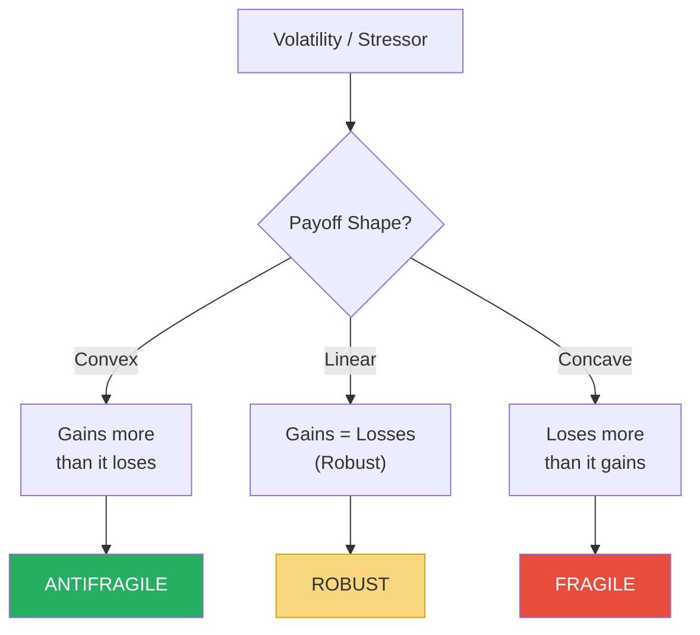

The shape of your payoff curve — convex or concave — determines whether volatility is your friend or your enemy.

- Tinkering is convex:
  - Each experiment has a small, known downside (the cost of the experiment)
  - But an unknown, potentially massive upside (the discovery)
  - This is why trial-and-error beats planning in complex systems
  - Evolution tinkers: random mutations mostly fail (small cost) but occasionally produce breakthroughs (massive gain)
- Taleb argues that most of human progress came from tinkering, not from theory:
  - The jet engine was developed by practitioners, not physicists
  - Antibiotics were discovered by accident (Fleming's petri dish)
  - The Industrial Revolution was driven by craftsmen and tinkerers, not scientists
  - America's technological dominance came from garage tinkerers and hobbyists, not central planning

| Approach | Payoff Shape | Volatility Effect | Historical Success |
|----------|-------------|-------------------|-------------------|
| **Tinkering** | Convex | Benefits | Industrial Revolution, Silicon Valley |
| **Planning** | Linear at best | Neutral | Works for simple, predictable projects |
| **Theory-first** | Often concave | Harmed | Soviet planning, MBA-managed corporations |

> [!example] Alexander Fleming and Penicillin (1928)
> - Fleming returned from holiday to find that a mould had contaminated one of his bacterial cultures
> - Rather than discarding it (as procedure dictated), he noticed that bacteria near the mould had died
> - He investigated — and discovered penicillin, the world's first antibiotic
> - The discovery was pure accident — the result of sloppy laboratory practice, not brilliant theory
> - But Fleming had the tinkerer's instinct: when something unexpected happens, investigate rather than dismiss
> - A theory-driven scientist would have discarded the contaminated plate and missed the discovery entirely
> **The lesson:** The greatest discoveries come from convex tinkering — small experiments with small downsides and potentially enormous upsides. You cannot plan a discovery, but you can create the conditions for one.

- Taleb introduces <b style="color: #2980b9">nonlinearity</b> as the formal mathematical property that connects convexity to antifragility:
  - In a linear system, doubling the input doubles the output — effects are proportional and predictable
  - In a nonlinear system, doubling the input might quadruple the output — or halve it
  - Most real-world systems are nonlinear, but we model them as if they were linear because linear maths is easier
  - <b style="color: #e74c3c">Applying linear thinking to nonlinear systems guarantees that you will be surprised by the size of the effects</b>
- Nonlinearity explains why small causes can have enormous consequences:
  - A single match in a forest with decades of accumulated underbrush produces a conflagration
  - A single mortgage default in a highly leveraged financial system produces a global crisis
  - A single mutation in a virus produces a pandemic
- The connection to the Triad:
  - **Fragile systems** have concave nonlinearity: small shocks have disproportionately large negative effects
  - **Antifragile systems** have convex nonlinearity: small shocks have disproportionately large positive effects
  - **Robust systems** are approximately linear: effects are proportional to causes

---

### Chapter 15: History Written by the Losers

*Taleb argues that we systematically misattribute technological and scientific progress to theory and planning when it actually came from practice and tinkering.*

- The conventional narrative: science produces theory → theory produces technology → technology produces economic growth
- Taleb's counter-narrative: tinkering produces technology → technology works → academics explain why it works → academics claim credit
- This is the <b style="color: #2980b9">lecturing-birds-how-to-fly effect</b> applied to the entire history of technology
- Evidence for Taleb's claim:
  - The steam engine (1712) preceded the science of thermodynamics (1824) by over a century
  - Vaccination (Jenner, 1796) preceded germ theory (Pasteur, Koch, 1860s-1880s) by decades
  - Architecture and engineering produced magnificent structures for millennia before the mathematics of structural analysis existed
  - Cooking — humanity's most important technology — preceded nutritional science by all of human history
- <b style="color: #e74c3c">The dangerous consequence: we overinvest in theory and underinvest in tinkering, because we wrongly believe theory drives progress</b>
- Taleb calls this the <b style="color: #2980b9">epiphenomenal fallacy</b> — mistaking the academic description of a phenomenon for the cause of the phenomenon
- Universities didn't produce the Industrial Revolution — they produced explanations of it
- <b style="color: #27ae60">The real driver of innovation is optionality applied through tinkering: cheap experiments with capped downside and unlimited upside</b>

> [!example] The Wright Brothers vs. Samuel Langley (1903)
> - Samuel Langley was a distinguished scientist, Secretary of the Smithsonian Institution, and recipient of $50,000 in government funding to build a flying machine
> - He approached flight through theory — aerodynamic calculations, careful engineering, top-down design
> - His Aerodrome crashed into the Potomac River nine days before the Wright Brothers flew at Kitty Hawk
> - The Wright Brothers were bicycle mechanics with no scientific credentials and a budget of less than $1,000
> - They succeeded through relentless tinkering — building, testing, crashing, modifying, and testing again
> - Langley's theory-first approach produced an expensive failure; the Wrights' tinkering-first approach produced powered flight
> **The lesson:** In complex domains, a thousand cheap experiments beat one expensive theory. The tinkerer's convex payoff defeats the theorist's concave one.

- Taleb documents a pattern he calls the <b style="color: #2980b9">narrative of directed research</b>:
  - Governments and corporations spend billions on "directed research" — identifying a goal and funding scientists to achieve it
  - Most breakthroughs actually come from undirected tinkering, serendipity, and accidental discovery
  - The internet was a military communications project that became the world's information infrastructure — nobody planned this
  - Aspirin was used for pain relief for decades before anyone understood how it worked
  - Viagra was developed as a heart medication — its most famous use was an unexpected side effect
- <b style="color: #27ae60">The lesson for innovation policy: fund many small experiments rather than a few large programmes, and let practitioners follow unexpected results wherever they lead</b>

> [!example] The Microwave Oven — Accidental Discovery (1945)
> - Percy Spencer, an engineer at Raytheon, was testing a magnetron (a vacuum tube used in radar systems)
> - He noticed that a chocolate bar in his pocket had melted during the test
> - Rather than dismissing this as a nuisance, he experimented: he put popcorn kernels near the magnetron — they popped
> - He then tried an egg — it exploded
> - Within a year, Raytheon had filed a patent for the microwave oven
> - No one at Raytheon had been tasked with inventing a new cooking method — the discovery was pure tinkering serendipity
> **The lesson:** The microwave oven, one of the most ubiquitous technologies in the world, was discovered by accident because a practitioner was curious about something unexpected. This is convex tinkering in action.

---

### Chapter 16: A Lesson in Disorder

*Taleb examines how our systematic love of order and hatred of disorder creates hidden fragility across medicine, diet, and daily life.*

- Taleb returns to the organic-versus-mechanical distinction with specific applications:
  - **Exercise:** The body responds best to random, varied stress — not to a predictable routine
    - Hunter-gatherers didn't jog for 30 minutes at a steady pace; they sprinted, climbed, rested, lifted, and walked unpredictably
    - Modern "chronic cardio" (steady-state jogging) is the mechanical approach to an organic system
    - Intense, varied, unpredictable exercise with periods of complete rest — the barbell of fitness — is antifragile
  - **Diet:** The body responds best to variation in food intake — not to regular, predictable meals
    - Our ancestors didn't eat three meals a day at scheduled times; they feasted when food was available and fasted when it wasn't
    - The body's metabolic systems evolved for irregular feeding — they are antifragile to caloric variability
    - Constant, predictable caloric intake is the mechanical approach to an organic system
  - **Sleep:** The modern obsession with "eight hours every night" may itself be a mechanical imposition on an organic system
    - Historical sleep patterns were often biphasic (two periods of sleep separated by a period of wakefulness)
    - The rigid eight-hour block is a product of industrial-era work schedules, not biology

> [!abstract] The Antifragile Lifestyle
> - **Exercise:** High-intensity intervals + complete rest days. Vary the routine constantly. Never the same workout twice in a row.
> - **Diet:** Occasional feasts + occasional fasts. Eat real food, avoid processed. Skip meals when not hungry.
> - **Information:** Read old books deeply. Ignore daily news entirely. Consume nothing you cannot act on.
> - **Social:** Cultivate a few deep relationships. Maintain many casual ones. Avoid the "medium friend" trap.
> - **Work:** Seek autonomy and optionality over salary and status. A lower-paying job with freedom is antifragile; a higher-paying job with dependence is fragile.

- <b style="color: #27ae60">The unifying principle: organic systems need disorder to thrive — predictability, regularity, and smoothness weaken them</b>
- The "disorder family" includes:
  - Randomness, uncertainty, variability, disorder, volatility, stressors, errors, dispersal, unknowledge
- The "order family" includes:
  - Determinism, certainty, uniformity, order, stability, comfort, correctness, concentration, knowledge
- <b style="color: #e74c3c">The modern world has declared war on the disorder family — and this war is making us fragile</b>
- Taleb identifies the institutional sources of order-worship:
  - **Government bureaucracies** exist to create order — they measure success by how much disorder they eliminate
  - **Corporate management** is taught to minimise variability — "Six Sigma" literally aims to eliminate deviation
  - **Education systems** are designed to produce uniformity — identical curricula, identical testing, identical outcomes
  - **Medical systems** pathologise natural variation — any number outside "normal range" triggers intervention
  - All of these institutions are doing what seems logical — reducing disorder — while actually making their systems fragile

| Disorder (Antifragile Needs This) | Order (Fragile Prefers This) |
|-----------------------------------|------------------------------|
| Randomness | Determinism |
| Uncertainty | Certainty |
| Volatility | Stability |
| Stressors | Comfort |
| Errors | Correctness |
| Disorder | Order |
| Unknowledge | Knowledge |

- Taleb's meta-point: any system that systematically eliminates the left column in favour of the right column is making itself fragile
- This is why overly controlled economies crash, overly protected children struggle, and overly optimised businesses fail

> [!example] The Procrustean Bed of Standardised Education
> - In Greek mythology, Procrustes was a smith who offered travellers a bed for the night
> - If the guest was too long for the bed, Procrustes cut off their legs; if too short, he stretched them
> - Taleb uses the Procrustean bed as a metaphor for standardised systems that force variation into a single mould
> - Modern education is Procrustean: all children must learn the same material at the same pace in the same way
> - Children who learn faster are bored; children who learn differently are labelled "disordered"
> - The disorder is not in the children — it is in the system that cannot tolerate natural variation
> - A system that embraces different learning styles, speeds, and interests would be antifragile — it would improve from the diversity of its students
> **The lesson:** Forcing natural variation into standardised moulds does not create order — it creates fragility and wastes human potential.

- Taleb summarises the disorder-versus-order battle with a provocation:
  - The obsession with order is itself a disorder
  - The people who cannot tolerate any uncertainty, variability, or messiness are the most fragile of all
  - <b style="color: #27ae60">True robustness comes not from eliminating disorder but from building the capacity to benefit from it</b>

---

## Book VI: Via Negativa

### Chapter 17: The Via Negativa Principle

*Taleb presents what he considers the most profound and most neglected principle in the book: the idea that improvement comes from removing bad things, not from adding good ones.*

- <b style="color: #2980b9">Via Negativa</b> is a theological concept that Taleb repurposes:
  - In theology, it means defining God by what God is *not* (God is not mortal, not limited, not finite)
  - Taleb applies it to practical life: define what is good by removing what is bad
- The case for subtraction over addition:
  - We know with much greater certainty what is bad for us than what is good
  - Smoking is definitively harmful — but the benefits of any given supplement are uncertain
  - Removing a toxic employee has a clearer positive impact than hiring a new star
  - Stopping a bad habit produces more reliable improvement than starting a good one
- <b style="color: #27ae60">The most powerful intervention is usually to stop doing something harmful, not to start doing something helpful</b>

The bar chart makes via negativa concrete: subtractive interventions (green) consistently deliver high-reliability improvements, while additive ones (red) are uncertain — removing known harms beats chasing speculative benefits.
- The epistemological argument:
  - We know much more about what is wrong than what is right
  - Science advances more by disproving theories (Popper's falsification) than by proving them
  - A doctor who stops prescribing a harmful drug does more good than one who starts prescribing a new one
  - An investor who avoids catastrophic losses outperforms one who picks winners
- <b style="color: #2980b9">Via negativa is knowledge through subtraction</b> — and it is far more reliable than knowledge through addition
- Taleb draws on Karl Popper's philosophy of science to support this:
  - Popper argued that science cannot prove theories true — it can only prove them false
  - "All swans are white" cannot be proven by observing white swans — but it can be disproven by finding one black swan
  - This means negative knowledge (knowing what is false) is more rigorous than positive knowledge (claiming what is true)
  - Via negativa is the practical application of Popper's insight:
    - We cannot be sure that exercise X is good for you (the evidence keeps changing)
    - We *can* be sure that smoking, excessive sugar, and prolonged immobility are bad for you (the evidence is overwhelming and stable)
    - Acting on what we know is bad is more reliable than acting on what we think might be good

> [!example] Charlatans vs. Grandmothers
> - Taleb contrasts modern nutritional science with traditional dietary wisdom
> - Nutritional science changes its recommendations every decade: fat is bad, then fat is good; eggs are dangerous, then eggs are fine; carbs are essential, then carbs are poison
> - Grandmother's wisdom has remained stable for centuries: eat real food, don't eat too much, fast occasionally
> - The problem with nutritional science is that it operates by addition ("add this supplement, eat this superfood")
> - Grandmother operates by subtraction ("don't eat that junk")
> - Subtraction is more robust because it removes known harms rather than betting on uncertain benefits
> **The lesson:** When in doubt, subtract. The most reliable path to health, wealth, and wisdom is not adding new things but removing harmful ones.

> [!tip] Core Insight
> "The learning is in the removal." We know more about what is wrong than what is right. Via negativa — improvement through subtraction — is the most reliable form of knowledge.

- Taleb applies via negativa to medicine with particular force:
  - The greatest medical achievements were subtractive: removing infections (hand washing), removing contaminated water (sanitation), removing exposure (quarantine)
  - The additive interventions (new drugs, new procedures) have a much more mixed record
  - Taleb argues that the entire history of medicine can be divided into two eras:
    - The era when doctors did more harm than good (roughly everything before 1900)
    - The era when doctors began doing more good than harm (sanitation, antibiotics, surgery under anaesthesia)
  - The transition was driven almost entirely by subtractive interventions — removing things that caused harm

---

### Chapter 18: The Subtraction of Harm in Practice

*Taleb applies via negativa concretely — to diet, medicine, information consumption, and personal decision-making.*

- Taleb's personal via negativa practices:
  - **Diet:** Don't eat sugar. Don't eat processed food. Don't eat anything your great-grandmother wouldn't recognise. Fast periodically. Beyond that, eat whatever you want.
  - **Medicine:** Don't take medication for mild conditions. Don't have surgery unless the condition is life-threatening. Let the body heal itself for anything non-critical.
  - **Information:** Don't read newspapers. Don't follow the news cycle. Don't consume information you cannot act on. Read old books.
  - **Social:** Don't spend time with people who make you feel smaller. Don't engage in arguments with people who have no skin in the game. Don't take advice from people who don't bear the consequences of their advice.
- <b style="color: #27ae60">The elegance of via negativa: it requires no expertise, no prediction, no complex theory — just the willingness to stop doing things that are obviously harmful</b>
- Via negativa also applies to decision-making itself:
  - **Stop making decisions when emotional** — remove the harmful decision context before trying to decide well
  - **Stop accepting default options** — remove the anchoring effect of the status quo before evaluating alternatives
  - **Stop consulting too many advisors** — remove the noise before trying to find the signal
  - **Stop tracking metrics you can't influence** — remove the distraction before trying to focus
  - Each of these is a subtraction that improves decision quality more reliably than any additive technique
- Taleb's via negativa approach to diet is particularly detailed:
  - Grandmother's rule: "Don't eat anything your grandmother wouldn't recognise as food"
  - This is via negativa — it doesn't tell you *what* to eat, it tells you what *not* to eat
  - Eliminating sugar, processed food, and trans fats is more powerful than adding any superfood
  - Fasting (periodic removal of all food) is the ultimate via negativa diet strategy — and it has survived the Lindy test for thousands of years
  - Every major religious tradition includes fasting — this is Lindy-validated via negativa

> [!abstract] Via Negativa — A Practical Checklist
> - **Stop** eating sugar and processed food before **starting** any diet plan
> - **Stop** reading the news before **starting** any information management system
> - **Stop** spending time with toxic people before **starting** any networking strategy
> - **Stop** taking unnecessary medication before **starting** any supplement regimen
> - **Stop** trying to predict the future before **starting** any planning framework
> - **Stop** adding complexity before **starting** any optimisation programme

> [!example] The Steve Jobs Via Negativa
> - When Jobs returned to Apple in 1997, the company was making dozens of products across multiple lines
> - Jobs didn't add new products — he killed 70% of the existing ones
> - He reduced Apple's product line from over 350 items to just 10
> - This subtraction — removing products, removing complexity, removing distraction — saved the company
> - The innovations that followed (iMac, iPod, iPhone) were possible because the subtractive step cleared the way
> - Jobs famously said he was as proud of what Apple chose *not* to do as what it chose to do
> **The lesson:** The most transformative business decision is often not what you add but what you remove. Via negativa applied to product strategy.

- Taleb connects via negativa to the Lindy Effect:
  - Traditional wisdom is almost entirely via negativa — the Ten Commandments are mostly prohibitions ("thou shalt not")
  - Hippocrates' primary rule for medicine was subtractive: "first, do no harm"
  - Grandmother's health advice is subtractive: "don't eat that," "don't stay up late," "don't go out in the cold without a coat"
  - All of these have survived the Lindy test — they are thousands of years old
  - The additive advice changes constantly ("take this vitamin," "eat this superfood," "try this exercise programme")
  - <b style="color: #2980b9">Via negativa advice is Lindy-compatible; via positiva advice is neomanic</b>
- The information diet is Taleb's most radical via negativa application:
  - He argues that consuming daily news is not just unhelpful but actively harmful
  - News creates the illusion of understanding without genuine knowledge
  - It triggers emotional reactions to events you cannot influence
  - It replaces deep thinking with shallow reactivity
  - Taleb's alternative: read books that have survived at least 50 years and ignore everything else
  - This is simultaneously via negativa (remove harmful information) and Lindy-compatible (trust what has survived)

---

## Book VII: The Ethics of Fragility and Antifragility

### Chapter 19: Skin in the Game

*Taleb argues that the single most important factor determining whether a system is fragile or antifragile is whether decision-makers bear the consequences of their decisions.*

- <b style="color: #2980b9">Skin in the game</b> is Taleb's ethical principle:
  - Those who take risks must bear the consequences — both positive and negative
  - Those who don't bear consequences will inevitably take reckless risks with other people's wellbeing
- Systems become fragile when decision-makers are insulated from consequences:
  - Bankers who take risks with depositors' money and get bailed out when they fail
  - Politicians who start wars they and their children will never fight in
  - Consultants who give advice they'll never have to live with
  - Academics who make predictions they'll never be held accountable for
- <b style="color: #e74c3c">No skin in the game = fragile system</b>
- Taleb traces this to ancient legal codes:
  - Hammurabi's Code (c. 1754 BC) required that if a builder constructed a house that collapsed and killed the occupant, the builder would be put to death
  - This is perfect skin in the game — the builder bears the same risk as the occupant
  - Modern equivalent: if bank CEOs lost their personal fortunes when their banks failed, they would take far less risk
- Taleb identifies three levels of skin in the game:
  - **Skin in the game** — you bear your own risk (entrepreneurs, small business owners)
  - **Skin in other people's game** — you bear risk on behalf of others (soldiers, firefighters, whistleblowers)
  - **No skin in the game** — you create risk for others without bearing it yourself (bankers, bureaucrats, pundits)
- <b style="color: #27ae60">The ethical hierarchy is clear: those who bear risk for others are heroic; those who bear their own risk are honourable; those who create risk for others are parasitic</b>

> [!example] The Bailout Problem (2008-2009)
> - In the 2008 financial crisis, major banks took enormous risks with mortgage-backed securities
> - When those bets failed, the banks were bailed out with taxpayer money
> - The executives who made the disastrous decisions kept their bonuses, their homes, and their careers
> - The people who suffered most — homeowners, taxpayers, small investors — had no role in the decisions
> - Taleb argues this is the perfect recipe for systemic fragility: the people making the bets don't bear the losses
> - The bailouts didn't solve the problem — they guaranteed it would happen again, because they removed the consequences
> **The lesson:** A system where decision-makers don't bear the downside of their decisions is guaranteed to be fragile. Skin in the game is not optional — it is the foundation of antifragility.

> [!example] Hammurabi's Code (c. 1754 BC)
> - The Code of Hammurabi, one of the oldest known legal documents, contained a rule for builders
> - If a builder constructed a house that collapsed and killed the owner, the builder would be executed
> - If the collapse killed the owner's son, the builder's son would be executed
> - Taleb sees this as the oldest and most elegant solution to the skin-in-the-game problem
> - Modern regulation tries to prevent risk through rules and oversight — Hammurabi simply ensured the builder bore the same risk as the occupant
> **The lesson:** The simplest way to prevent reckless risk-taking is not to regulate the risk-taker but to ensure they bear the full consequences of failure.

- Taleb's practical rule: <b style="color: #27ae60">"Don't tell me what you think. Tell me what's in your portfolio."</b>
- Anyone who gives advice without bearing the consequences of that advice is, by definition, a fragilista
- This is why Taleb distrusts economists (who bear no cost for wrong predictions), consultants (who bear no cost for bad advice), and pundits (who bear no cost for wrong opinions)
- The skin-in-the-game principle has profound implications for how we evaluate expertise:
  - A doctor who recommends a treatment she would give her own child → credible
  - A financial advisor who invests his own money the same way he advises clients → credible
  - A general who would send his own children into the battle he orders → credible
  - An economist who predicts a recession but doesn't short the market → not credible
  - A nutrition expert who doesn't eat the diet he recommends → not credible
  - <b style="color: #2980b9">Taleb's filter: "Does this person eat their own cooking?"</b>

> [!example] Warren Buffett's Skin in the Game
> - Warren Buffett keeps virtually all of his net worth in Berkshire Hathaway stock
> - He eats his own cooking — his financial fate is identical to his investors' financial fate
> - If Berkshire loses 50%, Buffett personally loses 50%
> - This alignment of incentives is, Taleb argues, the primary reason Buffett has been such a trustworthy steward of capital
> - Compare this with hedge fund managers who charge 2% management fees regardless of performance — they get paid whether they win or lose
> - Buffett's structure is antifragile (aligned incentives); the typical hedge fund structure is fragile (misaligned incentives)
> **The lesson:** The simplest test of an advisor's trustworthiness is whether they have their own wealth at risk in the same way you do.

---

### Chapter 20: The Agency Problem

*Taleb extends the skin-in-the-game principle to show how the modern world has systematically separated risk-taking from risk-bearing — creating fragility at civilisational scale.*

- The <b style="color: #2980b9">agency problem</b> occurs when someone (the agent) acts on behalf of someone else (the principal) but has different incentives:
  - A fund manager (agent) manages your money (principal's) but gets paid whether they win or lose
  - A doctor (agent) recommends surgery for you (principal) but bears none of the surgical risk
  - A politician (agent) makes policy for citizens (principals) but is insulated from the consequences
- Taleb's observation: the modern world has massively expanded the number of agents and reduced their accountability
  - Corporate executives manage companies they don't own
  - Politicians govern countries they can flee
  - Regulators write rules they don't live under
  - Journalists write stories about people they'll never meet again
- <b style="color: #e74c3c">The result is a civilisation-wide transfer of risk from those who create it to those who can't avoid it</b>
- Taleb's solution is radical simplicity: <b style="color: #27ae60">restore skin in the game at every level of decision-making</b>
  - Make bank CEOs personally liable for losses
  - Make politicians serve on the front lines of wars they start
  - Make regulators live under their own regulations
  - Make advisors stake their wealth on their own advice

> [!example] The Bob Rubin Trade
> - Robert Rubin served as US Treasury Secretary and then as a senior advisor at Citigroup
> - At Citigroup, he earned over $120 million in compensation over a decade
> - He advocated for the aggressive risk-taking strategies that contributed to Citigroup's near-collapse in 2008
> - When the crisis hit, Citigroup received $45 billion in taxpayer bailouts
> - Rubin kept his $120 million. The taxpayers absorbed the losses.
> - Taleb calls this the "Bob Rubin trade" — heads I win, tails the taxpayer loses
> - It is the purest example of transferring fragility: Rubin was antifragile at the public's expense
> **The lesson:** When agents can capture the upside and transfer the downside, the system becomes catastrophically fragile. The Bob Rubin trade is the structural formula for systemic risk.

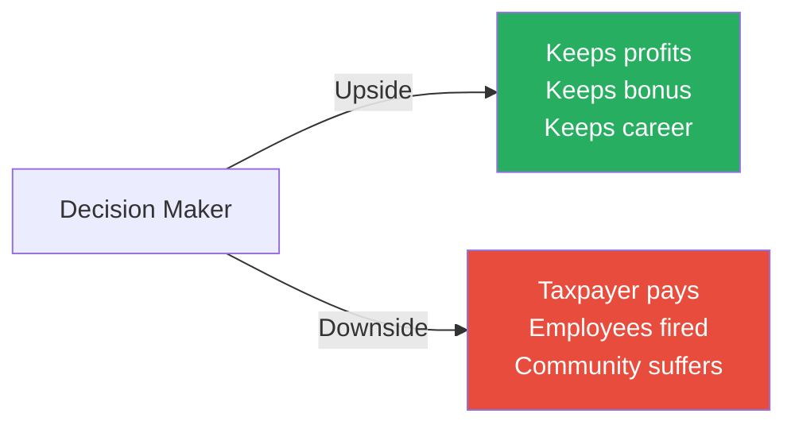

The agency problem in one picture: the decision-maker captures the upside while the downside falls on everyone else.

- Taleb identifies a specific mechanism by which the agency problem creates fragility — the <b style="color: #2980b9">bonus culture</b>:
  - Modern compensation structures reward agents for short-term gains
  - A trader who makes $10 million this year gets a $2 million bonus
  - If those gains reverse next year (because they were based on hidden risk), the trader keeps the bonus
  - The incentive is clear: take maximum risk in the short term, pocket the gains, and let someone else deal with the long-term consequences
  - Taleb argues that any compensation structure with a floor (you can't lose your bonus) and no cap (the bonus can be unlimited) is a formula for fragility
  - The agent rationally maximises risk because the downside is borne by someone else

> [!example] Long-Term Capital Management (1998)
> - LTCM was a hedge fund run by two Nobel Prize-winning economists and a team of PhDs
> - They used sophisticated mathematical models to identify tiny mispricings in bond markets
> - They leveraged these tiny mispricings with massive borrowed capital — at peak, $125 billion in assets on $4.7 billion in equity
> - When Russia defaulted on its debt in August 1998, the mispricings widened instead of narrowing
> - LTCM lost $4.6 billion in less than four months
> - The Federal Reserve had to coordinate a bailout by 14 major banks to prevent a cascading financial crisis
> - The partners had skin in the game — they lost their own money — but the systemic risk they created fell on everyone else
> - Two Nobel prizes in economics could not protect against a tail event that the models said was virtually impossible
> **The lesson:** No amount of theoretical sophistication eliminates tail risk. LTCM is the ultimate example of fragility disguised as genius — the turkey model taken to its most sophisticated extreme.

---

### Chapter 21: The Lindy Effect

*Taleb introduces his most elegant heuristic for navigating an uncertain world — the idea that time itself is the most reliable filter of quality.*

- The <b style="color: #2980b9">Lindy Effect</b> is named after Lindy's delicatessen in New York, where comedians would gather and observe that Broadway shows that had been running longer tended to run even longer
- For non-perishable things (books, ideas, technologies, religions, recipes), <b style="color: #27ae60">expected future life span is proportional to current age</b>:
  - A book in print for 100 years will likely be in print for another 100
  - A restaurant that has survived 50 years will likely survive another 50
  - A religion that has persisted for 2,000 years will likely persist for another 2,000
  - A technology in use for 1,000 years (the wheel, fire, writing) will likely be in use for another 1,000
- This applies only to non-perishable things — a 90-year-old human is not expected to live another 90 years
- The Lindy Effect is antifragile because *every year of survival increases expected future life*
- The mechanism behind Lindy:
  - Survival is a filter — everything that exists has already passed a test that most things fail
  - Each additional year adds another layer of testing
  - A book that has survived 500 years has survived plague, war, revolution, technological change, and shifting tastes
  - A book published last month has survived nothing
  - <b style="color: #2980b9">Time is the ultimate fragility detector</b>

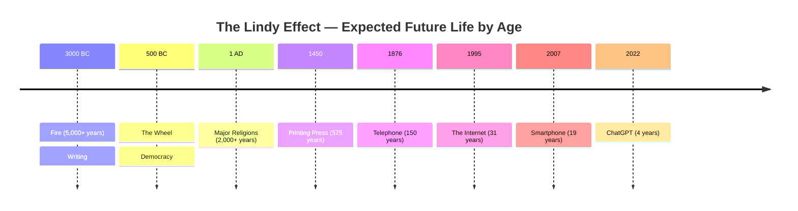

The timeline illustrates the Lindy Effect visually: older technologies and ideas have earned longer expected futures, while recent innovations carry proportionally shorter survival expectations.
- Taleb's application to everyday decisions:
  - Read old books, not new ones — the classics have passed the Lindy test
  - Eat traditional foods, not new superfoods — traditional diets are Lindy-approved
  - Use time-tested technologies before adopting new ones
  - Trust old proverbs over new research — the proverb has survived centuries of testing
- The Lindy Effect has an important corollary for career decisions:
  - Professions that have existed for centuries (doctor, lawyer, merchant, craftsman) will likely exist for centuries more
  - Professions invented in the last decade (social media manager, growth hacker, blockchain developer) may not exist in another decade
  - <b style="color: #27ae60">If you want career antifragility, build skills in Lindy-compatible domains — human skills that have been valuable for millennia: persuasion, writing, building, healing, teaching</b>
  - Technical skills in rapidly changing fields are neomanic: valuable today, obsolete tomorrow

> [!example] The Persistence of the Wheel
> - The wheel was invented around 3500 BC — roughly 5,500 years ago
> - Despite every technological revolution since — steam, electricity, internal combustion, computing — the wheel remains fundamental to human civilisation
> - No technology expert in 1900 predicted we would still use wheels in 2000. No expert in 2000 predicted we would still use wheels in 2025.
> - The Lindy Effect predicts with confidence that we will still use wheels in 7500 AD
> - Meanwhile, technologies invented five years ago are already obsolete
> **The lesson:** Time is the most brutal and most reliable filter. What survives centuries will survive more centuries. What is new is almost certainly fragile.

> [!example] Homer vs. Today's Bestseller
> - Homer's *Iliad* and *Odyssey* were composed around 800 BC — nearly 3,000 years ago
> - They have survived the fall of Greece, the fall of Rome, the Dark Ages, the Reformation, two World Wars, and the digital revolution
> - The Lindy Effect predicts they will be read for at least another 3,000 years
> - Meanwhile, the average bestseller published today will be out of print within five years
> - Taleb's reading strategy follows Lindy: read Homer, Seneca, Montaigne, and the Stoics before reading anything published this decade
> **The lesson:** A book that has survived 3,000 years has been filtered by billions of readers. A book published last month has been filtered by a marketing department.

- The Lindy Effect has a counterintuitive implication for human knowledge:
  - New scientific findings are the *least* reliable — they have survived the shortest testing period
  - The much-discussed "replication crisis" in psychology, medicine, and social sciences confirms this
  - Studies published last year fail to replicate at alarmingly high rates (50-70% in some fields)
  - Meanwhile, folk remedies that have survived centuries (chicken soup for colds, honey for wounds, fasting for health) keep getting validated by modern research
  - <b style="color: #27ae60">Taleb's provocative claim: your grandmother's advice is more reliable than the latest published research — because it has survived a longer and more demanding testing period</b>
- Taleb also applies Lindy to ideas and ideologies:
  - Democracy (2,500 years old) is more likely to survive than any political ideology from the 20th century
  - Monotheistic religions (3,000+ years) are more likely to persist than any modern secular philosophy
  - Proverbs like "measure twice, cut once" will outlast any management consultant's framework
  - The principles in Seneca's letters will outlast the principles in any business book published this year

---

### Chapter 22: Neomania and the Treadmill of the New

*Taleb attacks the modern obsession with novelty — neomania — and argues it is one of the primary sources of fragility in contemporary life.*

- <b style="color: #2980b9">Neomania</b> is the love of the new for its own sake:
  - Replacing a perfectly functional phone every year
  - Adopting the latest management fad
  - Following the newest diet trend
  - Consuming the latest bestseller instead of re-reading the classics
- Neomania is the enemy of the Lindy Effect:
  - The Lindy Effect tells you to trust what has survived
  - Neomania tells you to trust what just appeared
  - <b style="color: #e74c3c">Neomania guarantees that you will waste enormous resources on things that will not last</b>
- Taleb's observation: technology evolves *much more slowly* than we think
  - In 1960, people predicted flying cars by 2000
  - In 2000, the fundamental technologies of daily life were: cars (1880s), planes (1903), telephones (1876), refrigerators (1913)
  - The "revolutionary" technologies that actually persisted were all at least 50 years old
  - Most "innovations" are marginal improvements on old technologies, not genuine revolutions
- <b style="color: #27ae60">Taleb's heuristic: the older a technology, the longer it will survive. The newer a technology, the more likely it is to be replaced.</b>
- Taleb introduces the concept of <b style="color: #2980b9">technological regression to the mean</b>:
  - New technologies initially overshoot their usefulness — they are adopted with exaggerated enthusiasm
  - Then they regress: the hype fades, the limitations emerge, and adoption stabilises at a realistic level
  - Many technologies never even reach the "realistic level" — they simply disappear
  - The Lindy-compatible technology is the one that survives this regression and continues to be used after the hype cycle ends
  - <b style="color: #e74c3c">Adopting a technology during the hype phase guarantees that you are paying maximum price for something of uncertain value</b>
  - The antifragile strategy: wait for the regression, then adopt what survives
- The psychology of neomania:
  - We are wired to pay attention to novelty — it once signalled potential threats or opportunities
  - Modern marketing exploits this wiring to sell us things we don't need
  - The newest phone, car, or gadget triggers the same novelty response that once helped us survive
  - But in a consumer economy, the novelty response makes us fragile: constantly replacing, constantly spending, never building lasting value

> [!abstract] The Lindy Filter for Daily Decisions
> 1. When choosing what to read: pick books at least 50 years old before anything published this decade
> 2. When choosing what to eat: eat what humans have eaten for centuries before trying any modern "superfood"
> 3. When choosing tools: prefer technologies that have survived decades over those released this year
> 4. When evaluating advice: trust proverbs and traditional wisdom over the latest research findings
> 5. When choosing exercise: walking, lifting heavy things, and occasional sprinting have survived millennia — the latest fitness trend probably won't

> [!example] The E-Reader Prediction
> - When e-readers launched, many predicted the death of physical books within a decade
> - The physical book has survived 560 years since Gutenberg (Lindy-approved)
> - E-readers have survived about 15 years
> - The Lindy prediction: physical books will outlast e-readers
> - Indeed, after an initial surge, e-reader sales plateaued and then declined, while physical book sales stabilised and began growing again
> - Taleb would not be surprised — Lindy predicted exactly this
> **The lesson:** When the new claims it will replace the old, bet on the old. The Lindy Effect is an underrated prophet.

- Taleb provides a table of "Lindy predictions" — things the Lindy Effect predicts will outlast their supposed replacements:

| Old (Lindy-Approved) | New (Neomanic) | Lindy Prediction |
|---------------------|----------------|-----------------|
| Physical books | E-readers | Books will outlast e-readers |
| Walking | Treadmills | Walking will outlast treadmills |
| Mediterranean diet | Latest superfood | The diet will outlast the fad |
| Chairs | Standing desks | Chairs will outlast standing desks |
| Cash | Cryptocurrency | Cash will outlast most cryptocurrencies |
| Face-to-face conversation | Social media platforms | In-person connection will outlast any app |
| Pen and paper | Note-taking apps | Pen and paper will outlast the apps |

- Taleb's practical heuristic for evaluating new technologies:
  - If a new technology has been around for less than 10 years, it will probably be replaced by something else within 10 years
  - If a technology has survived 100 years, it will probably survive another 100
  - Before adopting the new, ask: "What old technology does this replace, and how long has the old one survived?"
  - If the old one has survived centuries, be very cautious about replacing it with something untested

---

## Book VIII: Practical Applications and the Grand Summary

### Chapter 23: The Ethics of Fragility Transfer

*Taleb makes his most provocative ethical argument: transferring fragility to others — making yourself antifragile at someone else's expense — is the central sin of modernity.*

- Taleb defines a new ethical framework based on fragility transfer:
  - <b style="color: #e74c3c">It is immoral to be antifragile at someone else's expense</b>
  - Bankers who profit from risk but are bailed out by taxpayers are committing fragility transfer
  - Corporations that externalise pollution are transferring their fragility to the environment and future generations
  - Pundits who make bold predictions without consequences transfer their fragility to those who act on their advice
- <b style="color: #27ae60">The ethical person is one who absorbs fragility from others rather than transferring it to them</b>
- This connects directly to skin in the game: if you bear the consequences of your actions, you cannot transfer fragility
- Taleb argues this is not a new ethical system — it is the oldest:
  - Hammurabi's Code enforced it
  - Roman soldiers who built bridges had to stand under them
  - Ship captains were expected to go down with their ship
  - <b style="color: #2980b9">The modern world has abandoned these ancient accountability mechanisms and replaced them with nothing</b>
- The ethics of fragility transfer create a simple moral classification:
  - **Heroes** absorb fragility from others — soldiers, firefighters, whistleblowers
  - **Honourable people** bear their own fragility — entrepreneurs, craftsmen, artisans
  - **Parasites** transfer their fragility to others — bankers with bailouts, executives with golden parachutes, pundits without accountability

> [!tip] Core Insight
> Fragility transfer is the hidden structure of modern injustice. Whenever someone profits from risk without bearing the consequences of failure, someone else — usually someone less powerful — is absorbing that fragility.

> [!example] The Corporate Golden Parachute
> - Senior executives negotiate "golden parachutes" — enormous severance packages triggered by termination
> - A CEO who runs a company into the ground can receive $50-100 million in departure compensation
> - The employees who lose their jobs receive nothing comparable
> - The shareholders who lose their investment receive nothing
> - The executive's fragility has been entirely transferred to others
> - Taleb argues that golden parachutes are not merely bad incentives — they are ethically indefensible because they institutionalise fragility transfer
> **The lesson:** Any compensation structure where the decision-maker profits from failure is a fragility-transfer mechanism. It creates the moral hazard that produces systemic fragility.

- Taleb connects fragility transfer to the concept of <b style="color: #2980b9">moral hazard</b>:
  - Moral hazard is the economic term for when someone takes more risk because they know someone else will bear the consequences
  - Insurance creates moral hazard: people drive less carefully when they're insured
  - Bailouts create moral hazard: banks take more risk when they know the government will save them
  - But Taleb argues moral hazard is not just an economic problem — it is an ethical one:
    - The banker who takes risks knowing they'll be bailed out is not just making a bad economic calculation — they are committing an injustice
    - They are transferring their fragility to people (taxpayers, employees, communities) who have no say in the decision
    - This is, in Taleb's framework, the central ethical violation of modern capitalism
- Taleb proposes a simple ethical test: <b style="color: #27ae60">would you do this if you personally bore all the consequences?</b>
  - If yes, proceed — you have skin in the game
  - If no, you are transferring fragility and the action is ethically suspect
  - This test applies to business decisions, policy decisions, medical advice, financial recommendations, and military interventions
  - It is the oldest ethical test in human history — and the most neglected

---

### Chapter 24: The Turkey Revisited — How to Detect Fragility

*Taleb offers a practical method for identifying fragility before the Thanksgiving moment arrives.*

- <b style="color: #2980b9">The fragility detection heuristic:</b>
  - Does this system need things to go as planned to survive? → Fragile
  - Does this system have hidden debts, leverage, or dependencies? → Fragile
  - Has this system been artificially stabilised for a long time? → Fragile
  - Does this system punish whistle-blowers and reward conformity? → Fragile
  - Are the decision-makers insulated from the consequences of failure? → Fragile
- The antifragility detection heuristic:
  - Does this system improve after setbacks? → Antifragile
  - Does this system have many small, independent components? → Antifragile
  - Does this system allow for experimentation and failure? → Antifragile
  - Do decision-makers bear the consequences of their decisions? → Antifragile
  - Has this system survived multiple crises? → Antifragile

| Fragility Markers | Antifragility Markers |
|-------------------|----------------------|
| Requires prediction to survive | Doesn't need prediction |
| Centralised decision-making | Distributed decision-making |
| Decision-makers insulated from risk | Decision-makers bear consequences |
| Optimised for a single scenario | Robust to multiple scenarios |
| Hides or suppresses volatility | Embraces and learns from volatility |
| Relies on experts and models | Relies on trial-and-error and time |
| Punishes failure | Learns from failure |
| Large, concentrated bets | Many small, diverse bets |
| Long periods of artificial calm | Regular small disruptions |

- Taleb provides a powerful test: <b style="color: #27ae60">apply the second-order test — ask not "is this stable?" but "what makes it stable?"</b>
  - If stability comes from internal strength (many independent actors, skin in the game, adaptation) → genuinely stable
  - If stability comes from external support (bailouts, suppression, regulation, hiding risk) → artificially stable and therefore fragile
  - The artificially stable system is the turkey on Day 999 — it looks safer than it has ever been, and that appearance is precisely the danger signal

> [!tip] Core Insight
> You don't need to predict which shock will come. You just need to look at the structure of the system and ask: would a shock make this better or worse? If worse, you're looking at fragility. If better, you're looking at antifragility.

> [!example] Detecting Fragility in the Pre-2008 Banking System
> - In 2006, the banking system appeared safer than ever: record profits, low default rates, sophisticated risk models
> - But applying Taleb's fragility detection heuristic reveals the hidden danger:
>   - Did the system need things to go as planned? Yes — it relied on housing prices continuing to rise
>   - Were there hidden dependencies? Yes — mortgage-backed securities were tangled through every major institution
>   - Had volatility been suppressed? Yes — the Great Moderation had eliminated normal economic fluctuations for two decades
>   - Were decision-makers insulated from consequences? Yes — bank executives had guaranteed bonuses regardless of outcomes
>   - Every single fragility marker was present
> **The lesson:** The fragility was visible to anyone who asked the right structural questions. The problem was not that the crash was unpredictable — it was that everyone was asking the wrong questions (what is the probability?) instead of the right ones (what is the structure?).

- Taleb introduces a related concept: the <b style="color: #2980b9">Lucretius problem</b>
  - Named after the Roman poet Lucretius, who argued that the tallest mountain in the world must be whatever mountain he could see
  - The Lucretius problem is the tendency to assume the worst case is whatever worst case has already happened
  - Banks assumed the worst possible crash was similar to previous crashes — and built their risk models accordingly
  - But the worst case is always *worse* than the worst case you've seen, because the past is a limited sample of what is possible
  - The Lucretius problem is a specific form of the turkey problem: using historical data to bound future risk, when the future can always exceed the historical bound
- <b style="color: #e74c3c">The Lucretius problem explains why "stress testing" is often useless — the tests only stress for shocks that have already happened, not for the unprecedented ones that actually destroy</b>

> [!example] The Fukushima Disaster (2011)
> - The Fukushima Daiichi nuclear plant in Japan was designed to withstand earthquakes and tsunamis based on historical data
> - Engineers calculated the maximum possible tsunami height using the tallest tsunami ever recorded in the region
> - The 2011 tsunami exceeded this historical maximum — the seawall was too low, and the plant was flooded
> - Three reactors melted down, producing the worst nuclear disaster since Chernobyl
> - The engineers had committed the Lucretius problem: they assumed the worst possible tsunami was the worst one that had already happened
> - But the worst possible tsunami is always worse than any tsunami in the historical record
> **The lesson:** Designing for the worst historical case does not protect against unprecedented events. The Lucretius problem — bounding risk by historical experience — is a recipe for catastrophic surprise.

---

### Chapter 25: The Grand Summary — Living With Antifragility

*Taleb pulls together the threads of the entire book into a unified philosophy for navigating the unknowable.*

- The world is fundamentally uncertain and will remain so — no amount of data, models, or expertise will make it predictable
- Given this permanent uncertainty, the question is not "what will happen?" but "how am I positioned?"
- <b style="color: #27ae60">The antifragile life is structured around three principles:</b>
  - **Optionality:** Maintain the ability to change direction. Never be fully committed to a single path.
  - **Via negativa:** Remove what harms you before adding what might help. Subtraction is more reliable than addition.
  - **Skin in the game:** Bear the consequences of your decisions. Never advise, invest, or act without personal risk.
- These three principles are mutually reinforcing:
  - Optionality creates convex payoffs (small downside, large upside)
  - Via negativa removes concave payoffs (large downside, small upside)
  - Skin in the game prevents you from transferring your fragility to others
  - Together, they make you antifragile — you benefit from disorder rather than being harmed by it

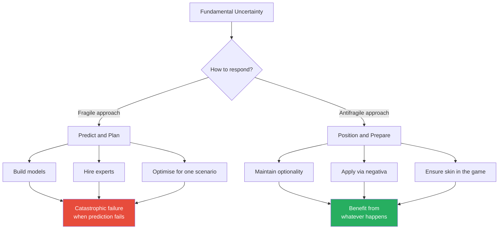

The choice is between two fundamentally different approaches to uncertainty — and Taleb argues that the fragile approach is not just less effective but actively dangerous.

- Taleb's meta-argument: the modern world's greatest weakness is not ignorance but the *illusion of knowledge*
  - We believe we understand more than we do
  - We believe our models capture reality when they capture only a simplified version
  - We believe stability is the norm when it is the exception
  - We believe prediction is possible when it is a mirage
- <b style="color: #e74c3c">The most dangerous person in any system is the one who is confident they understand it</b>
- The antifragile person embraces their ignorance:
  - They don't try to predict — they position
  - They don't try to optimise — they diversify
  - They don't try to control — they adapt
  - They don't add — they subtract
  - They don't follow the new — they trust the old
  - They don't seek stability — they seek the ability to benefit from instability
- Taleb draws all of the book's threads together into a single unified image:

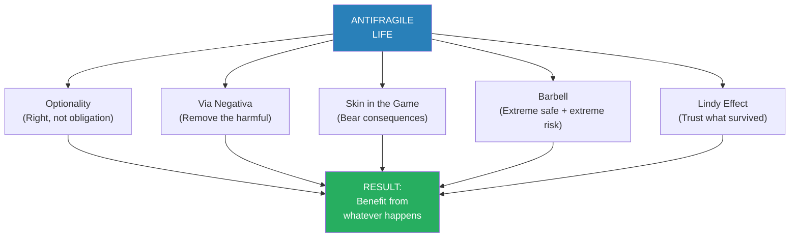

The five pillars of the antifragile life — each reinforces the others, and together they create a philosophy that does not require prediction, control, or certainty.

The force-directed graph reveals how Taleb's five pillars are not independent strategies but a mutually reinforcing system — optionality feeds the barbell, via negativa reinforces the Lindy Effect, and skin in the game anchors them all to reality.

- Taleb ends with what amounts to a philosophical creed:
  - Respect the Lindy Effect — trust what has survived
  - Use the barbell — protect the downside, free the upside
  - Apply via negativa — subtract the harmful before adding the helpful
  - Demand skin in the game — from yourself and from those who advise you
  - Embrace disorder — it is the raw material of improvement
  - Distrust prediction — it is a mirage in Extremistan
  - Prefer tinkering — it is convex; planning is concave
  - Study antifragility — it is the property that separates what will survive from what will not

> [!abstract] Taleb's Antifragile Framework — Complete Summary
> 1. **Identify your position on the Triad:** Is your current situation fragile, robust, or antifragile?
> 2. **Apply the barbell:** Move to extreme safety on one side, extreme optionality on the other. Evacuate the middle.
> 3. **Use via negativa:** Remove what is fragile before adding what might be antifragile.
> 4. **Check for skin in the game:** Are you bearing the consequences of your decisions? Are those advising you?
> 5. **Apply the Lindy test:** Prefer what has survived. Distrust what is new.
> 6. **Seek convexity:** Structure every bet so the upside exceeds the downside. Never take a bet where the worst case is ruin.
> 7. **Embrace stressors:** Small, manageable stressors build strength. Avoiding them builds fragility.
> 8. **Refuse to predict:** Instead of asking "what will happen?" ask "how am I positioned when anything happens?"

---

## The Verdict

*Antifragile* is Taleb at his most ambitious — attempting nothing less than a new philosophical framework for understanding risk, uncertainty, and resilience across every domain of human life. The concept is genuinely original: once you grasp the triad of fragile/robust/antifragile, you see the world differently. You notice how institutions suppress volatility to their eventual doom. You notice how small stressors build strength. You start asking of everything: is this fragile, robust, or antifragile? The barbell strategy, via negativa, the Lindy Effect, and skin in the game are permanent additions to any serious thinker's mental toolkit. Few books introduce a genuinely new concept into the language — *Antifragile* does.

The book's weaknesses are real and worth acknowledging. Taleb is repetitive — the same ideas appear in slightly different forms across multiple chapters, and the book is at least 150 pages longer than it needs to be. He is combative and self-congratulatory, spending considerable energy attacking people he considers intellectual frauds (economists, consultants, journalists, academics) with a tone that ranges from dismissive to contemptuous. His fictional characters (Fat Tony, Dr. John) sometimes feel like vehicles for settling personal scores rather than illustrating ideas. And his disdain for formal theory, while making an important point, occasionally tips into anti-intellectualism — as if all academic knowledge were worthless. The book would benefit from a tighter edit and a less antagonistic posture. There are also domains where his framework is harder to apply than he suggests — large-scale infrastructure, for example, genuinely requires planning and prediction, and "tinkering" with nuclear power plants or bridge design is not obviously superior to engineering them from theory.

The readers who benefit most are those who deal with uncertainty professionally or personally — investors, entrepreneurs, policy-makers, and anyone making decisions in domains where the future is genuinely unknowable. If you have a tendency to over-plan, over-predict, or over-optimise, this book will rewire how you think. It is also invaluable for anyone who has sensed that the modern obsession with control, efficiency, and smoothing-out is making things worse rather than better — Taleb gives that intuition a rigorous vocabulary and a philosophical foundation. Practitioners who work in volatile environments — trading, venture capital, emergency medicine, military strategy — will find immediate applicability.

Compared to Taleb's other works: *The Black Swan* is the more focused and tighter book — if you read only one Taleb, read that. But *Antifragile* is the more complete and practical framework — it moves beyond identifying the problem (unpredictable extreme events) to proposing a solution (structure yourself to benefit from them). It is more ambitious than *Fooled by Randomness* and more systematic than *Skin in the Game*. Alongside [[Thinking in Systems - Donella H. Meadows|Thinking in Systems]], which examines the feedback loops that create fragility, and [[Thinking in Bets - Annie Duke|Thinking in Bets]], which offers practical tools for decision-making under uncertainty, *Antifragile* forms part of a powerful triad for anyone serious about navigating a world they cannot predict. It also pairs well with [[Noise - Cass R. Sunstein|Noise]], which examines a different dimension of decision-making failure, and [[The Psychology of Money - Morgan Housel|The Psychology of Money]], where Housel's concept of "room for error" is essentially applied antifragility.

---

## Related Reading

- [[Thinking in Bets - Annie Duke|Thinking in Bets]] — Decision-making under uncertainty from a practitioner's perspective
- [[The Psychology of Money - Morgan Housel|The Psychology of Money]] — Housel's "room for error" is applied antifragility
- [[Thinking in Systems - Donella H. Meadows|Thinking in Systems]] — Systems dynamics and feedback loops that produce fragility or antifragility
- [[Range - David Epstein|Range]] — Epstein's case for generalism maps onto Taleb's optionality and tinkering
- [[Noise - Cass R. Sunstein|Noise]] — How variability in human judgment creates fragile decision-making systems
- [[You Are Not So Smart - David McRaney|You Are Not So Smart]] — The cognitive biases that make us systematically fragile
- [[Essentialism - Greg McKeown|Essentialism]] — McKeown's case for doing less is via negativa applied to productivity
