# Atlas of the Heart — Brene Brown

> Brene Brown spent two decades researching emotions, and her conclusion is humbling: most of us can only name three feelings — happy, sad, and angry.
> Yet we experience roughly eighty-seven distinct emotions and experiences, each with its own texture, its own trigger, and its own consequence for how we connect with other people.
> *Atlas of the Heart* is Brown's attempt to map that territory — to give us the language for what we actually feel so we can stop misidentifying our inner experience and start building real connection.
> The book is organised as a taxonomy: thirteen chapters, each named "Places We Go When..." followed by an emotional landscape (uncertainty, comparison, grief, connection, and so on), covering everything from schadenfreude to foreboding joy to the critical difference between fitting in and belonging.
> Brown argues that language is not decoration — it is the portal to meaning, and meaning is the portal to connection.
> If you cannot name what you feel, you cannot share it. And if you cannot share it, you are alone with it.
> This is the most comprehensive emotional vocabulary book written for a popular audience, and it earns that distinction by being both rigorously researched and deeply human.

---

## About the Author

Brene Brown is a research professor at the University of Houston, where she has spent more than twenty years studying courage, vulnerability, shame, and empathy. Her 2010 TEDx talk, "The Power of Vulnerability," has been viewed over sixty million times and remains one of the five most-watched TED talks in history. She is the author of six number-one New York Times bestsellers, including *Daring Greatly*, *Rising Strong*, and *Dare to Lead*. In 2022, she joined the Brene Brown Education and Research Group at the University of Texas at Austin. Brown's research is distinctive because she combines qualitative grounded theory methodology — thousands of interviews over two decades — with the narrative accessibility of a gifted storyteller.

---

## The Big Idea

- We live in an epidemic of emotional illiteracy
- Most people, when asked what they feel, default to "fine," "stressed," or "angry" — collapsing dozens of distinct emotional experiences into three or four blunt labels
- <b style="color: #2980b9">Emotional granularity</b> — the ability to make fine-grained distinctions between similar emotions — is not a personality trait; it is a learnable skill
- Research by psychologist Lisa Feldman Barrett shows that people with high emotional granularity:
  - Navigate difficult situations more effectively
  - Are less likely to respond with aggression when provoked
  - Use alcohol less frequently to cope with negative emotions
  - Recover faster from setbacks

---

- <b style="color: #27ae60">Language is the mechanism that converts raw emotional experience into something we can understand, share, and act on</b>
- Without precise language, emotions remain a fog — we know something is happening inside us, but we cannot work with it
- With precise language, we gain what Brown calls <b style="color: #2980b9">grounded confidence</b> — not the brittle certainty of "I know everything," but the flexible assurance of "I can navigate what I feel"
- The book's central framework: naming an emotion accurately is the first step toward regulating it, communicating it, and connecting through it

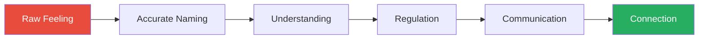

This diagram captures Brown's core argument: emotional literacy is not self-indulgent navel-gazing — it is the foundation of every meaningful human connection.

---

- Brown's taxonomy covers 87 emotions and experiences grouped into 13 chapters
- Each chapter is a "place we go" — a psychological landscape we enter when we encounter a particular category of life experience
- The groupings matter because emotions that share a landscape often get confused with each other:
  - We say "I'm stressed" when we mean "I'm overwhelmed" — and the distinction changes what we need
  - We say "I feel guilty" when we mean "I feel ashamed" — and the distinction changes whether we can recover
  - We say "I'm jealous" when we mean "I'm envious" — and the distinction changes who we blame
- Brown grounds this in a key research finding: people who can accurately distinguish between 12+ emotions show measurably better outcomes in mental health, relationships, and self-regulation compared to people who operate with just 3-4 emotional labels
- The book's organising metaphor is geographical: emotions are places we go, not things that happen to us
  - This framing is deliberate — it implies agency
  - We are not passive recipients of our emotions; we are travellers moving through an emotional landscape
  - If we know the terrain — what grows here, what dangers lurk, what paths lead where — we can navigate with intention rather than stumbling blindly
  - The atlas metaphor also implies that the map can be learned, that anyone can become a better emotional navigator
  - Brown argues that this is the book's central promise: you will not stop feeling difficult emotions, but you will stop being lost in them
- Brown grounds her work in the concept of <b style="color: #2980b9">meaning-making</b>:
  - Humans are meaning-making machines — we cannot tolerate experiences that have no narrative
  - When we cannot name an emotion, the mind fills the gap with a story, and that story is often wrong
  - "I feel something unpleasant" becomes "Something is wrong with me" — a narrative that produces shame and isolation
  - Accurate naming interrupts the false narrative and replaces it with understanding
  - This is why Brown calls language "the portal to meaning" — without the right word, the meaning we make is distorted

---

## Key Concepts at a Glance

| Concept | One-line summary |
|---------|-----------------|
| **Emotional granularity** | The ability to draw precise distinctions between similar emotions |
| **Near enemies** | Emotions that look alike but have opposite effects (pity vs. compassion) |
| **Grounded confidence** | Security that comes from emotional vocabulary, not from certainty |
| **BRAVING** | Trust acronym: Boundaries, Reliability, Accountability, Vault, Integrity, Non-judgement, Generosity |
| **Comparative suffering** | Dismissing your own pain because someone has it worse — never leads to empathy |
| **Foreboding joy** | Rehearsing tragedy in moments of happiness to protect yourself from disappointment |
| **Shame vs. guilt** | Shame says "I am bad"; guilt says "I did something bad" — only guilt drives change |
| **Fitting in vs. belonging** | Fitting in requires you to change who you are; belonging requires you to be yourself |
| **Empathy vs. sympathy** | Empathy is feeling with someone; sympathy is feeling for them from a safe distance |
| **Cognitive dissonance** | The discomfort of holding two contradictory beliefs simultaneously |
| **Anguish** | Trauma expressed through the body — not just emotional pain but physical collapse |
| **Dehumanisation** | Psychologically reclassifying people as less than human to justify cruelty |
| **Self-compassion** | Treating yourself with the same kindness you would offer a friend in pain |
| **Schadenfreude / Freudenfreude** | Pleasure from others' pain vs. joy from others' success — opposite responses to comparison |
| **Perfectionism** | A shame-management strategy disguised as striving for excellence |

---

## Quick Lookup Table

| Emotion/Experience | Chapter | Thematic Group |
|--------------------|---------|---------------|
| Stress | 1 | Uncertainty & Overwhelm |
| Overwhelm | 1 | Uncertainty & Overwhelm |
| Anxiety | 1 | Uncertainty & Overwhelm |
| Worry | 1 | Uncertainty & Overwhelm |
| Avoidance | 1 | Uncertainty & Overwhelm |
| Excitement | 1 | Uncertainty & Overwhelm |
| Dread | 1 | Uncertainty & Overwhelm |
| Comparison | 2 | Comparison & Social Ranking |
| Admiration | 2 | Comparison & Social Ranking |
| Reverence | 2 | Comparison & Social Ranking |
| Envy | 2 | Comparison & Social Ranking |
| Jealousy | 2 | Comparison & Social Ranking |
| Resentment | 2 | Comparison & Social Ranking |
| Schadenfreude | 2 | Comparison & Social Ranking |
| Freudenfreude | 2 | Comparison & Social Ranking |
| Boredom | 3 | Unmet Expectations |
| Disappointment | 3 | Unmet Expectations |
| Expectations | 3 | Unmet Expectations |
| Regret | 3 | Unmet Expectations |
| Discouragement | 3 | Unmet Expectations |
| Resignation | 3 | Unmet Expectations |
| Frustration | 3 | Unmet Expectations |
| Awe | 4 | Transcendence & Wonder |
| Wonder | 4 | Transcendence & Wonder |
| Confusion | 4 | Transcendence & Wonder |
| Curiosity | 4 | Transcendence & Wonder |
| Interest | 4 | Transcendence & Wonder |
| Surprise | 4 | Transcendence & Wonder |
| Amusement | 5 | Irony & Paradox |
| Bittersweetness | 5 | Irony & Paradox |
| Nostalgia | 5 | Irony & Paradox |
| Cognitive dissonance | 5 | Irony & Paradox |
| Paradox | 5 | Irony & Paradox |
| Irony | 5 | Irony & Paradox |
| Sarcasm | 5 | Irony & Paradox |
| Anguish | 6 | Deep Pain |
| Hopelessness | 6 | Deep Pain |
| Despair | 6 | Deep Pain |
| Sadness | 6 | Deep Pain |
| Grief | 6 | Deep Pain |
| Compassion | 7 | Being With Others |
| Pity | 7 | Being With Others |
| Empathy | 7 | Being With Others |
| Sympathy | 7 | Being With Others |
| Boundaries | 7 | Being With Others |
| Comparative suffering | 7 | Being With Others |
| Shame | 8 | Falling Short |
| Self-compassion | 8 | Falling Short |
| Perfectionism | 8 | Falling Short |
| Guilt | 8 | Falling Short |
| Humiliation | 8 | Falling Short |
| Embarrassment | 8 | Falling Short |
| Belonging | 9 | Connection & Disconnection |
| Fitting in | 9 | Connection & Disconnection |
| Connection | 9 | Connection & Disconnection |
| Disconnection | 9 | Connection & Disconnection |
| Insecurity | 9 | Connection & Disconnection |
| Invisibility | 9 | Connection & Disconnection |
| Loneliness | 9 | Connection & Disconnection |
| Love | 10 | The Open Heart |
| Lovelessness | 10 | The Open Heart |
| Heartbreak | 10 | The Open Heart |
| Trust | 10 | The Open Heart |
| Self-trust | 10 | The Open Heart |
| Betrayal | 10 | The Open Heart |
| Defensiveness | 10 | The Open Heart |
| Flooding | 10 | The Open Heart |
| Hurt | 10 | The Open Heart |
| Pride | 11 | Self-Assessment |
| Hubris | 11 | Self-Assessment |
| Humility | 11 | Self-Assessment |
| Joy | 12 | Life Is Good |
| Happiness | 12 | Life Is Good |
| Calm | 12 | Life Is Good |
| Contentment | 12 | Life Is Good |
| Gratitude | 12 | Life Is Good |
| Foreboding joy | 12 | Life Is Good |
| Relief | 12 | Life Is Good |
| Tranquility | 12 | Life Is Good |
| Anger | 13 | Feeling Wronged |
| Contempt | 13 | Feeling Wronged |
| Disgust | 13 | Feeling Wronged |
| Dehumanisation | 13 | Feeling Wronged |
| Hate | 13 | Feeling Wronged |
| Self-righteousness | 13 | Feeling Wronged |

---

## Thematic Clusters

Brown's 87 emotions and experiences fall into natural groupings that cut across chapter boundaries. Understanding these clusters reveals the architecture of emotional experience.

| Cluster | Core Theme | Key Emotions | Chapters |
|---------|-----------|--------------|----------|
| **The Uncertainty Cluster** | Not knowing what comes next | Stress, anxiety, worry, dread, overwhelm, avoidance, excitement | 1 |
| **The Comparison Cluster** | Measuring self against others | Envy, jealousy, admiration, reverence, resentment, schadenfreude, freudenfreude | 2 |
| **The Expectation Cluster** | Gap between hope and reality | Disappointment, regret, frustration, discouragement, resignation, boredom | 3 |
| **The Transcendence Cluster** | Experiences larger than self | Awe, wonder, curiosity, interest, confusion, surprise | 4 |
| **The Dissonance Cluster** | Reality is layered or contradictory | Cognitive dissonance, paradox, irony, sarcasm, nostalgia, bittersweetness, amusement | 5 |
| **The Pain Cluster** | Deep suffering and loss | Anguish, hopelessness, despair, sadness, grief | 6 |
| **The Togetherness Cluster** | Being with others in their experience | Compassion, pity, empathy, sympathy, boundaries, comparative suffering | 7 |
| **The Self-Evaluation Cluster** | Falling short or measuring up | Shame, guilt, humiliation, embarrassment, perfectionism, self-compassion, pride, hubris, humility | 8, 11 |
| **The Connection Cluster** | Finding or losing belonging | Belonging, fitting in, connection, disconnection, loneliness, insecurity, invisibility | 9 |
| **The Vulnerability Cluster** | Opening the heart | Love, lovelessness, trust, self-trust, betrayal, heartbreak, hurt, defensiveness, flooding | 10 |
| **The Positivity Cluster** | When life is good | Joy, happiness, calm, contentment, gratitude, foreboding joy, relief, tranquility | 12 |
| **The Injustice Cluster** | Feeling wronged | Anger, contempt, disgust, dehumanisation, hate, self-righteousness | 13 |

These clusters are not rigid categories — emotions bleed across boundaries. Shame (Chapter 8) connects to belonging (Chapter 9) because shame is the fear of disconnection. Envy (Chapter 2) connects to resentment (Chapter 2) which connects to contempt (Chapter 13). The map is interconnected, not compartmentalised.

The doughnut chart reveals that Self-Evaluation and Vulnerability contain the most emotions (9 each), suggesting these are the richest and most frequently confused emotional territories — exactly where greater granularity yields the biggest payoff.

---

## Chapter 1: Places We Go When Things Are Uncertain or Too Much

*Brown opens with the emotions we misname most frequently — the ones we collapse into a single word ("stressed") when they are actually five or six different experiences, each requiring a different response.*

### Stress and Overwhelm

- <b style="color: #2980b9">Stress</b> is what we feel when the demands placed on us exceed our perceived ability to cope
- It is situational — tied to a specific event, deadline, or pressure — and it generally resolves when the situation resolves
- <b style="color: #e74c3c">The danger is when we use "stressed" as a catch-all for everything we feel when life is hard</b>
- Brown's research participants frequently said "I'm stressed" when what they actually meant was one of several different emotions:
  - **Overwhelmed** — the feeling that we have too much to do and not enough resources (time, energy, support) to do it
  - **Anxious** — a future-oriented emotion characterised by persistent worry about things that haven't happened yet
  - **Worried** — a more specific form of anxiety, focused on a particular concern rather than diffuse unease
- The consequences of mislabelling matter enormously:
  - If you are stressed, you need to reduce the demands or increase your resources
  - If you are overwhelmed, you need to narrow the field — cancel, delegate, or postpone
  - If you are anxious, you need grounding and presence
  - Each requires a fundamentally different intervention

---

- <b style="color: #2980b9">Overwhelm</b> is distinct from stress because it involves a sense of being unable to function:
  - Stress says: "This is hard, but I'm managing"
  - Overwhelm says: "I can't. There's too much. I'm shutting down."
- When overwhelmed, people don't need productivity advice — they need help identifying what can be removed from their plate
- <b style="color: #27ae60">The antidote to overwhelm is not trying harder — it is narrowing the field of attention</b>
- Brown identifies a pattern in her research: overwhelm often disguises itself as laziness or procrastination
  - The person who cannot start anything is frequently not unmotivated — they are paralysed by too many competing demands
  - The physiological response to overwhelm mirrors the freeze response in trauma: the system shuts down because it cannot decide what to prioritise
- Brown offers a practical test for distinguishing stress from overwhelm:
  - Ask yourself: "If someone took one thing off my plate right now, would I feel better?"
  - If yes → you are stressed (demands exceed resources, but removal of a demand helps)
  - If you cannot even identify which thing to remove → you are overwhelmed (the system has overloaded and needs a reset, not an adjustment)
  - This distinction matters for helpers too: offering to "take something off someone's plate" is helpful for the stressed person but insufficient for the overwhelmed person, who may need someone to step in and make decisions for them temporarily

> [!example] Brown's Overwhelm Story
> - Brown describes a period in her career when she was juggling a book deadline, a speaking tour, a university teaching load, and her children's school schedules
> - She went to her therapist and said "I'm so stressed"
> - Her therapist asked: "Are you stressed, or are you overwhelmed?"
> - Brown paused — and realised she wasn't just under pressure; she was unable to function, unable to make decisions, unable to even identify what to do next
> - The correct label changed the response: instead of trying to work harder (which is what you do with stress), she needed to cancel things (which is what you do with overwhelm)
> **The lesson:** The wrong label produces the wrong solution.

---

### Anxiety, Worry, and Dread

- <b style="color: #2980b9">Anxiety</b> is characterised by persistent, diffuse apprehension about future events:
  - It is often disproportionate to the actual threat
  - It tends to be free-floating — you feel anxious without being able to point to exactly why
  - It manifests physically: racing heart, tight chest, shallow breathing, muscle tension
  - Brown draws on clinical literature to distinguish anxiety as an emotion from anxiety as a disorder — many people experience the emotion without having the disorder, and conflating the two prevents them from addressing it
  - She notes an important cultural shift: anxiety has gone from something people hid to something people identify with
    - "I have anxiety" has become a common identity marker rather than a description of a temporary emotional state
    - While destigmatisation is positive, Brown warns that making anxiety an identity rather than an experience can make it harder to regulate — if anxiety is who I am rather than what I feel, then managing it feels like denying myself
    - The healthier framing: "I feel anxious right now" rather than "I am an anxious person"
- <b style="color: #2980b9">Worry</b> is anxiety's more focused cousin:
  - It attaches to a specific concern: "Will I get the job?", "Is my child okay?"
  - Worry can actually be functional — it motivates preparation and problem-solving
  - <b style="color: #e74c3c">But chronic worry is a loop, not a process — it rehearses problems without solving them</b>
  - Brown's research participants described worry as feeling productive: "At least I'm thinking about it." But thinking about a problem in circles is not the same as working through it
- <b style="color: #2980b9">Dread</b> is the most visceral of the three:
  - Dread combines anxiety with a sense of impending doom — not just "something bad might happen" but "something terrible is coming and I can feel it in my body"
  - It often accompanies situations where we anticipate pain but feel powerless to avoid it
  - Brown notes that dread has a unique temporal quality: it stretches time, making the period before the dreaded event feel interminable
  - The Sunday-night dread many people feel before a work week they hate is a common example — it is not anxiety (which is diffuse) or worry (which focuses on a solvable problem), but dread: the certainty that something unpleasant is approaching and cannot be avoided

> [!example] The Doctor's Waiting Room
> - Brown describes a research participant who spent two weeks waiting for biopsy results
> - She initially called what she felt "anxiety" — but when Brown asked her to describe it in detail, the participant said: "It's not just worry. It's like something heavy sitting on my chest, pressing me into the floor. I feel like I'm walking toward something terrible and I can't stop."
> - That description does not match anxiety (which is diffuse and unfocused) — it matches dread (which is specific, embodied, and doom-laden)
> - Once named as dread, the participant could ask for what she actually needed: not reassurance ("It'll be fine"), but presence ("Will you just sit with me?")
> **The lesson:** Dread does not respond to reassurance. It responds to companionship.

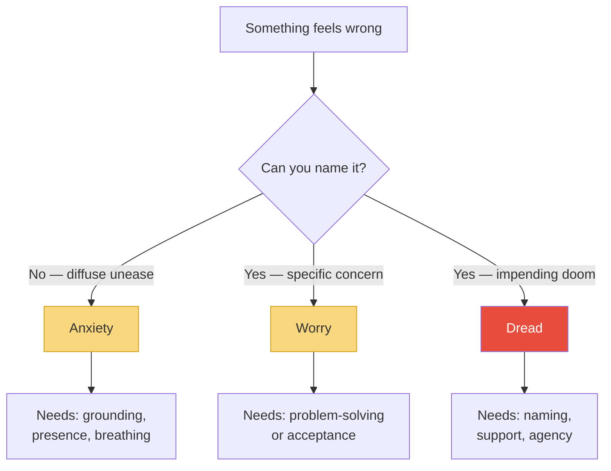

Each of these emotions requires a different intervention, which is why collapsing them all into "stressed" is counterproductive.

---

### Excitement and Avoidance

- <b style="color: #2980b9">Excitement</b> is included in this chapter because Brown's research found that excitement and anxiety feel almost identical in the body:
  - Same racing heart, same heightened arousal, same energy surge
  - The difference is in the appraisal: excitement says "something good might happen"; anxiety says "something bad might happen"
  - Research by Alison Wood Brooks at Harvard Business School found that reappraising anxiety as excitement improved performance on public speaking, math tests, and karaoke
  - The reappraisal works because the physiological state is identical — you are not trying to calm down (which fights the arousal) but redirecting the arousal toward a positive frame
- <b style="color: #2980b9">Avoidance</b> is the behavioural consequence of unchecked anxiety:
  - We avoid the thing that makes us anxious, which provides short-term relief
  - But avoidance reinforces the anxiety — the brain learns "this is dangerous because we ran from it"
  - <b style="color: #e74c3c">Avoidance is the most common and most destructive emotional regulation strategy</b>
  - Brown describes the avoidance cycle in detail:
    - A trigger creates anxiety
    - Avoidance provides immediate relief
    - Relief reinforces the avoidance behaviour
    - Next time the trigger appears, the anxiety is stronger because the brain now has "evidence" of danger
    - More avoidance follows, and the cycle tightens
  - Breaking the cycle requires what therapists call <b style="color: #2980b9">exposure</b> — gradually facing the feared thing in manageable doses

> [!example] The Email That Went Unread
> - Brown describes a participant who avoided opening an email from a colleague for three days because she feared it contained criticism
> - During those three days, her anxiety compounded — she imagined devastating feedback, career consequences, and personal attacks
> - When she finally opened the email, it was a routine scheduling request
> - The avoidance had generated three days of suffering over nothing — and had reinforced the pattern of treating emails as threats
> **The lesson:** Avoidance does not prevent pain. It manufactures it.

> [!tip] Core Insight
> Stress, anxiety, worry, overwhelm, dread, and avoidance are six different experiences — not synonyms. Using the wrong word leads to the wrong response.

### Why This Chapter Matters

- Brown places this chapter first deliberately — uncertainty is the emotional territory we visit most often, and it is the one where our vocabulary is poorest
- The seven emotions in this chapter share a common physiological signature (elevated cortisol, increased heart rate, muscle tension) but require fundamentally different responses:

| Emotion | What it feels like | What it needs |
|---------|-------------------|---------------|
| **Stress** | Pressure, but still managing | Reduce demands or increase resources |
| **Overwhelm** | Paralysis, can't function | Remove items from the list, narrow focus |
| **Anxiety** | Diffuse dread about the future | Grounding, presence, breathing |
| **Worry** | Focused concern about a specific thing | Problem-solving or conscious acceptance |
| **Dread** | Impending doom, embodied heaviness | Companionship, naming, restoring agency |
| **Excitement** | Arousal with positive appraisal | Lean in, channel the energy |
| **Avoidance** | Short-term relief, long-term tightening | Gradual exposure, breaking the cycle |

- The practical implication: the next time someone says "I'm stressed," the most helpful thing you can do is help them get more specific — because the response to "I'm overwhelmed" is the opposite of the response to "I'm anxious"

> [!example] The Anxious Reappraisal
> - Brown describes research by Alison Wood Brooks at Harvard, in which participants about to give a public speech were divided into two groups
> - One group was told: "Try to calm down"
> - The other group was told: "Try to get excited"
> - The "get excited" group performed significantly better — their speeches were rated as more persuasive, more confident, and more competent
> - The reason: anxiety and excitement share identical physiological signatures (racing heart, sweaty palms, heightened arousal)
> - Trying to calm down fights the body's arousal system — a battle you usually lose
> - Reappraising the arousal as excitement redirects the same energy toward a positive frame — and the body does not know the difference
> - Brown connects this to emotional granularity: the difference between anxiety and excitement is not what your body feels but what your mind tells you about what your body feels
> **The lesson:** The body cannot distinguish between anxiety and excitement. The mind's label determines the experience. Choose "excited" over "anxious" and the same physiology becomes an advantage.

---

## Chapter 2: Places We Go When We Compare

*Brown maps the emotional landscape of social comparison — from the healthy (admiration) to the corrosive (resentment) — and introduces a concept most people have never heard of: freudenfreude.*

### Comparison, Admiration, and Reverence

- <b style="color: #2980b9">Comparison</b> is the engine that drives most of the emotions in this chapter
- Leon Festinger's <b style="color: #2980b9">social comparison theory</b> (1954) established that humans evaluate themselves by comparing to others — it is wired in, not optional
- The question is not whether we compare but what we do with the comparison:
  - **Upward comparison** — comparing ourselves to people who have more, which can inspire (admiration) or corrode (envy)
  - **Downward comparison** — comparing ourselves to people who have less, which can comfort or breed contempt
- Brown notes that social media has supercharged comparison:
  - We now compare ourselves not to our neighbours but to millions of curated highlight reels
  - The comparison is almost always unfair — we compare our behind-the-scenes to someone else's greatest hits
  - The result is a baseline of inadequacy that previous generations never experienced
- <b style="color: #2980b9">Admiration</b> is the healthy outcome of upward comparison:
  - We see someone's skill, achievement, or character and it inspires us
  - Admiration says: "I want to be like that" — it pulls us upward
  - Admiration requires a secure sense of self — you can only admire without envy when you believe in your own capacity
- <b style="color: #2980b9">Reverence</b> goes beyond admiration:
  - Reverence involves a sense of awe at someone's moral or spiritual depth
  - It is rarer and more humbling — reverence says: "I am in the presence of something greater than myself"
  - Brown connects reverence to the transcendence emotions in Chapter 4 — it shares territory with awe but is specifically directed at another person's character

> [!example] The Social Media Spiral
> - Brown describes a research participant, a freelance graphic designer, who spent an hour each morning scrolling through Instagram feeds of designers she admired
> - She told herself it was "research" and "inspiration"
> - But Brown asked: "How do you feel after the scrolling session?"
> - The participant paused: "Worse. I always feel worse."
> - What she called "inspiration" was actually a daily ritual of upward comparison, and the comparison was not producing admiration — it was producing envy
> - She was comparing her works-in-progress to other designers' final products, her behind-the-scenes to their highlight reels
> - When she stopped the morning scrolling and replaced it with thirty minutes of her own design work, her creative output improved and her self-worth stabilised
> - Brown uses this to illustrate that the medium of comparison matters: social media is designed to maximise upward comparison, which in turn maximises envy
> **The lesson:** "Inspiration" that leaves you feeling worse is not inspiration — it is comparison wearing a productive mask.

---

### Envy vs. Jealousy

- This is one of the most commonly confused pairs in the English language, and Brown makes the distinction razor-sharp:

| Feature | Envy | Jealousy |
|---------|------|----------|
| **What triggers it** | Someone has something you want | You fear losing something you have |
| **How many people** | Two-person dynamic (you + the person who has it) | Three-person dynamic (you + what you have + the threat) |
| **Core feeling** | "I want what they have" | "I might lose what I have" |
| **Example** | Envying a colleague's promotion | Being jealous when your partner talks to an attractive stranger |
| **Typical response** | Resentment, self-diminishment, or motivation | Possessiveness, suspicion, or vigilance |

- <b style="color: #27ae60">Envy is about lacking; jealousy is about losing</b>

The radar chart shows why Brown insists on distinguishing these four emotions: envy peaks on self-worth threat, jealousy spikes on relationship impact and body response, resentment is hardest to recover from, and admiration — the healthy comparison response — has a completely different shape.
- Brown notes that envy is one of the emotions people are most reluctant to admit — it feels petty, and admitting it means admitting inadequacy
- But unacknowledged envy does not disappear; it mutates into resentment, passive aggression, or schadenfreude
- The relationship between envy and admiration is particularly interesting:
  - Both involve seeing something in someone else that you value
  - The difference is whether your self-worth can hold the comparison
  - If you feel fundamentally "enough," you admire; if you feel "less than," you envy
  - This is why shame (Chapter 8) and envy are deeply connected — shame creates the inadequacy that turns admiration into envy

> [!example] The Promotion That Stung
> - Brown describes a participant in her research who learned that a close friend had received a major promotion
> - The participant's first reaction was happiness — she said "Congratulations!" and meant it
> - But within hours, a darker feeling settled in: "Why not me? I work just as hard. I'm just as qualified."
> - She couldn't name the feeling, so she labelled it "frustration with my own career"
> - When Brown helped her name it as envy, the participant initially resisted — "Envy sounds so ugly"
> - But once named, the envy lost some of its power; the participant could separate "I want what she has" from "She doesn't deserve it"
> **The lesson:** Unnamed envy becomes resentment. Named envy becomes information about what you value.

> [!example] The Jealous Parent
> - A father in Brown's research described an uncomfortable experience at his daughter's recital
> - His ex-wife's new partner was there, and his daughter ran to the new partner first after the performance
> - He initially called what he felt "anger" — anger at his ex, anger at the situation
> - But when Brown probed, what he actually felt was jealousy: the fear of losing his daughter's love and primary attachment
> - Naming it as jealousy (not anger) changed his response: instead of confronting his ex about boundaries, he focused on strengthening his own relationship with his daughter
> **The lesson:** Misidentifying jealousy as anger produces the wrong target and the wrong response.

---

### Resentment, Schadenfreude, and Freudenfreude

- <b style="color: #2980b9">Resentment</b> is what happens when envy festers:
  - Brown defines it as the feeling that arises when we perceive that someone has something we deserve or that the situation is unfair
  - It is one of the most corrosive emotions because it is self-reinforcing — the more we resent, the more evidence we find to justify the resentment
  - <b style="color: #e74c3c">Resentment is almost always a signal that a boundary has been violated or a need is going unmet</b>
  - Brown offers a diagnostic question: "What is the boundary I need to set?" — resentment almost always points to a place where we are giving more than we can sustain or tolerating something that violates our values
- <b style="color: #2980b9">Schadenfreude</b> — pleasure derived from someone else's misfortune:
  - Brown traces the word to German (Schaden = damage + Freude = joy)
  - Schadenfreude is the dark twin of empathy — instead of feeling with someone, we feel against them
  - It tends to emerge when:
    - We perceive the other person's success as undeserved
    - We are in direct competition with them
    - We feel they have violated fairness norms
  - Brown is careful not to shame people for feeling schadenfreude — she notes it is universal — but she warns that normalising it erodes our capacity for compassion
  - Research shows that schadenfreude is strongest when self-esteem is threatened: the more insecure we feel, the more pleasure we take from others' failures

> [!example] The Celebrity Fall
> - Brown describes the public reaction when a famous wellness guru was exposed for fabricating research credentials
> - The reaction was not just relief or vindication — it was glee
> - Comment sections and social media filled with barely concealed delight at the guru's downfall
> - Brown's analysis: the guru had made people feel inadequate by presenting an impossible standard of perfection. When she fell, the schadenfreude was proportional to the envy she had provoked
> - The people who felt most inadequate next to her were the ones who celebrated most loudly
> **The lesson:** Schadenfreude reveals what we envy. The intensity of our glee at someone's fall measures the inadequacy they triggered in us.

- <b style="color: #2980b9">Freudenfreude</b> — joy derived from someone else's success:
  - This is the opposite of schadenfreude, and Brown argues it is a skill we can deliberately cultivate
  - <b style="color: #27ae60">Freudenfreude is the antidote to the comparison trap — instead of asking "Why not me?" you practice "I'm glad for them"</b>
  - Brown identifies two practices that build freudenfreude:
    - **Shoy** (shared joy) — deliberately seeking out and celebrating others' good news
    - **Bragitude** — creating space for people to share their accomplishments without minimising or deflecting
  - Brown notes that we are socialised against freudenfreude: celebrating your own success is "bragging," and being too enthusiastic about someone else's success is "suspicious"
  - The result is a culture where good news gets minimised and bad news gets amplified
  - Brown offers practical guidance for building freudenfreude:
    - When someone shares good news, match their energy — if they are excited, be excited with them
    - Resist the urge to immediately relate their success back to yourself ("That reminds me of when I...")
    - Ask follow-up questions that let them savour the moment: "How did it feel?" rather than "What's next?"
    - Notice when schadenfreude arises and use it as diagnostic information: "What am I envious of?"

> [!example] The Best Friend's Book Deal
> - Brown describes a participant, a writer, whose best friend received a major book deal
> - The participant's first feeling was genuine happiness — followed almost immediately by a sharp pang of envy
> - She felt guilty about the envy, which led to shame ("What kind of friend am I?"), which led to withdrawal
> - She stopped returning her friend's calls because being around the friend's success made her own unrealised dream feel more painful
> - The friendship nearly ended — not because of the friend's success but because of the unnamed envy that metastasised into avoidance
> - When the participant finally named what she felt — "I'm envious, and I'm ashamed of being envious" — the shame dissolved and she could re-engage with the friendship
> - She also used the envy as information: "I want what she has" became "I need to prioritise my own writing"
> **The lesson:** Freudenfreude is not spontaneous in a comparison culture. It is a deliberate practice — and the first step is naming the envy that stands in its way.

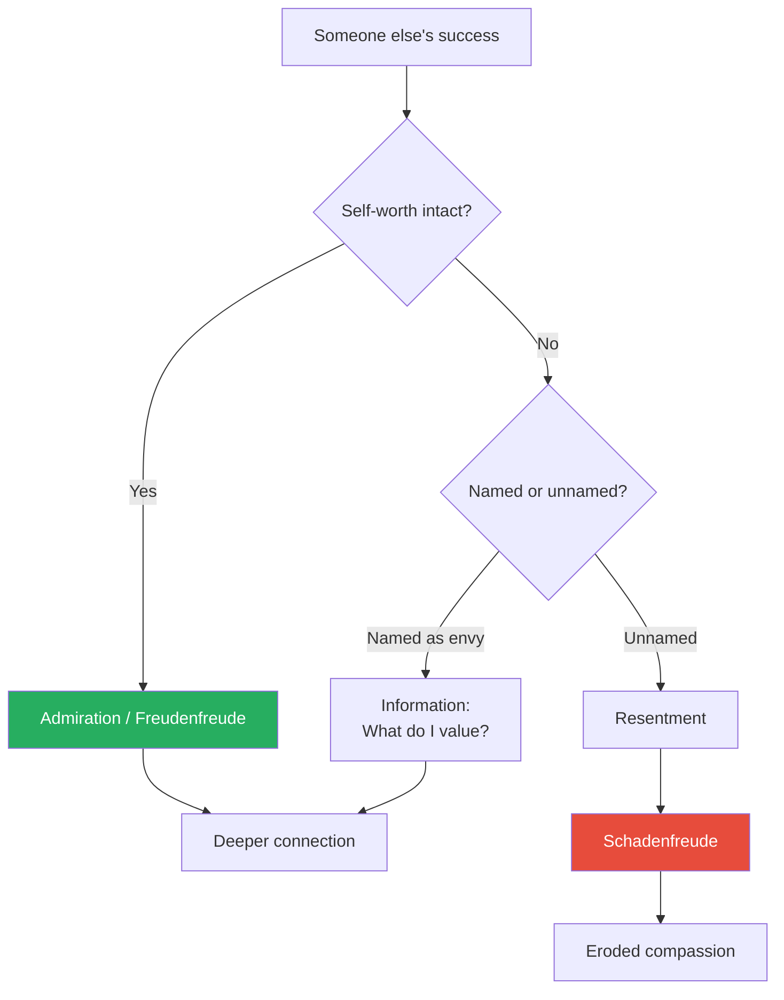

The path from comparison to either connection or corrosion depends on two factors: whether your self-worth can hold the comparison, and whether you can name what you feel.

> [!tip] Core Insight
> Comparison is inevitable. Whether it leads to admiration or resentment depends on whether you can name what you feel and decide what to do with it.

---

## Chapter 3: Places We Go When Things Don't Go as Planned

*Brown examines the emotions of unmet expectations — from the manageable (disappointment) to the dangerous (resignation) — and makes a case for why boredom deserves more respect.*

### Boredom

- <b style="color: #2980b9">Boredom</b> is rarely discussed in emotional literacy frameworks, but Brown argues it is more important than we think
- Boredom is the feeling of wanting to engage with something but finding nothing engaging available
- It is uncomfortable, and modern technology has made it almost extinct — we fill every moment with a phone, a screen, a podcast
- <b style="color: #27ae60">But research shows that boredom is a creative catalyst — it forces the mind to wander, and mind-wandering is where new ideas come from</b>
- Brown cites research by Sandi Mann at the University of Central Lancashire:
  - Participants who were bored before a creative task outperformed those who were not
  - Boredom seems to prime the brain for divergent thinking
- Brown connects boredom to a deeper cultural problem:
  - We have become intolerant of unstimulated moments
  - Children who are never bored never learn to generate their own engagement
  - Adults who are never bored never access the creative processing that requires idle time
  - The constant stimulation of phones and social media has created a generation that confuses being un-stimulated with being broken

> [!example] The Boredom Experiment
> - Brown describes a parent who decided to implement a "boredom hour" for her children — one hour each weekend with no screens, no planned activities, no parental entertainment
> - The first few weekends were miserable: the children whined, argued, and declared the exercise "stupid"
> - By the fourth weekend, something shifted: one child started drawing maps of imaginary countries; the other began writing stories
> - By the eighth weekend, the children were requesting the boredom hour
> - Brown uses this to illustrate that boredom is a gateway — but only if we resist the urge to fill it immediately
> **The lesson:** Boredom is not the absence of something. It is the precondition for something new to emerge.

---

### Disappointment and Expectations

- <b style="color: #2980b9">Disappointment</b> is the gap between expectation and reality:
  - It requires an expectation — you cannot be disappointed by something you never anticipated
  - Brown notes that many people try to avoid disappointment by refusing to hope: "If I don't expect anything, I can't be let down"
  - <b style="color: #e74c3c">But this strategy — preemptive disappointment — kills joy without actually preventing pain</b>
  - Disappointment carries a self-assessment component: "Was my expectation unreasonable?" — this reflection is what separates disappointment from entitlement
- <b style="color: #2980b9">Expectations</b> are the hidden architecture of disappointment:
  - Brown's research found that unspoken expectations are the number one source of conflict in relationships
  - We expect without articulating, and then feel betrayed when the expectation is not met
  - The other person had no idea the expectation existed
  - Brown identifies three types of problematic expectations:
    - **Unstated expectations** — expectations we hold but never communicate
    - **Unrealistic expectations** — expectations that no one could reasonably fulfil
    - **Unexamined expectations** — expectations we have absorbed from culture, family, or media without questioning whether they reflect our actual values
  - All three produce the same result: disappointment that feels like betrayal, directed at someone who never agreed to the terms

> [!example] The Unspoken Birthday Expectation
> - A research participant described a devastating fight with her partner on her birthday
> - She had imagined a specific kind of celebration: a surprise, a meaningful gift, evidence that he "knew" her
> - He took her to dinner at a restaurant she liked
> - She was crushed — and he was baffled by her tears
> - When they unpacked it, the core problem was that she had a detailed expectation she had never communicated
> - She expected him to read her mind, and then felt betrayed when he couldn't
> **The lesson:** Unexpressed expectations are premeditated resentments.

---

### Regret

- <b style="color: #2980b9">Regret</b> is the painful recognition that a different choice would have led to a better outcome:
  - Brown distinguishes between two types:
    - **Action regret** — regretting something you did ("I shouldn't have said that")
    - **Inaction regret** — regretting something you didn't do ("I should have applied for that job")
  - Research consistently shows that inaction regrets are more painful and longer-lasting than action regrets
  - <b style="color: #27ae60">Regret is not something to avoid — it is information about what matters to you</b>
- Brown notes that our relationship with regret reveals our relationship with vulnerability:
  - People who refuse to feel regret often say things like "No regrets!" or "Everything happens for a reason"
  - But refusing to feel regret means refusing to learn from experience
  - Regret, properly processed, sharpens future decision-making
  - The question is not "How do I avoid regret?" but "What is this regret teaching me about what I value?"
- Brown connects regret to Daniel Pink's research (from *The Power of Regret*):
  - Pink surveyed thousands of people about their deepest regrets and found four categories:
    - **Foundation regrets** — "If only I had done the work" (education, health, finances)
    - **Boldness regrets** — "If only I had taken the chance" (risks not taken)
    - **Moral regrets** — "If only I had done the right thing" (ethical failures)
    - **Connection regrets** — "If only I had reached out" (relationships neglected)
  - Brown notes that connection regrets are the most common — and the most preventable
  - The pattern: people let relationships lapse through inaction, and by the time they feel the regret, the window has closed

> [!example] The Unsent Letter
> - A research participant described spending years composing a letter of forgiveness to her estranged father
> - She revised it dozens of times, never satisfied with the wording
> - Her father died before she sent it
> - The regret was not about the letter — it was about using perfectionism as a shield against the vulnerability of reaching out
> - She had told herself she was "working on the letter" — but really she was avoiding the risk of rejection
> **The lesson:** Inaction regret often hides behind productive-sounding excuses. "I'm not ready yet" is frequently "I'm too afraid to try."

> [!example] The Risk Not Taken
> - Brown describes a research participant in his sixties who was asked about his deepest regret
> - He immediately said: "I was offered a chance to move to Paris for a year when I was twenty-eight. My company was opening an office there and they asked me to lead it."
> - He declined because his girlfriend at the time did not want to go — a relationship that ended six months later anyway
> - Thirty years on, the regret had not faded — it had sharpened
> - He did not regret the lost year in Paris specifically — he regretted the version of himself he might have become if he had been willing to take the risk
> - Brown notes that boldness regrets are uniquely painful because they haunt us with an unlived alternative self
> **The lesson:** We regret our inactions more than our actions — because actions have endings, while unlived possibilities remain open wounds.

---

### Discouragement, Resignation, and Frustration

- <b style="color: #2980b9">Discouragement</b> is the loss of confidence that effort will lead to results:
  - It is not yet giving up — it is the wobble before the fall
  - Discouragement says: "I'm not sure this is going to work"
  - It is the critical intervention point — this is where support, recalibration, or a change of approach can prevent the slide into resignation
- <b style="color: #2980b9">Resignation</b> is what happens when discouragement wins:
  - Resignation says: "It doesn't matter. Nothing I do makes a difference."
  - <b style="color: #e74c3c">Resignation is one of the most dangerous emotions because it masquerades as acceptance — but acceptance is active and clear-eyed, while resignation is passive and defeated</b>
  - Brown draws a critical distinction between the two:
    - **Acceptance** says: "This is what's happening. I can grieve it, adapt to it, and find meaning within it."
    - **Resignation** says: "This is what's happening. Nothing matters. I give up."
  - The difference is agency — acceptance preserves choice; resignation abandons it
- <b style="color: #2980b9">Frustration</b> sits between discouragement and resignation:
  - Frustration says: "Something is blocking me, and I don't know how to get past it"
  - Unlike resignation, frustration still contains energy — the frustrated person is still trying
  - Brown argues that frustration is often a better sign than calm — it means you haven't given up
  - The danger with frustration is misdirection: frustrated people often lash out at the nearest available target (partner, colleague, child) rather than addressing the actual source of the blockage
  - Brown offers a diagnostic for frustration:
    - When you feel frustrated, ask: "What specifically is blocking me?"
    - If you can identify the block, the frustration is productive — it is pointing you toward the problem
    - If you cannot identify the block, the frustration may be displaced — you may be frustrated about one thing and expressing it toward another
    - Displaced frustration is one of the most common sources of relational conflict: the person who is frustrated with their boss comes home and is "frustrated" with their spouse's cooking
- Brown identifies a key pattern that connects all three emotions in this section:
  - Frustration, discouragement, and resignation represent a progressive loss of agency
  - Frustration says: "I can still affect this but I'm stuck" (high agency, temporarily blocked)
  - Discouragement says: "I'm not sure my efforts matter" (agency wavering)
  - Resignation says: "Nothing I do makes a difference" (agency gone)
  - Recognising where you are on this spectrum determines what kind of help you need — and what kind of help will actually work

> [!example] The Student Who Resigned
> - Brown describes a college student who went from a passionate first year to a disengaged, withdrawn senior
> - In her first year, she was frustrated by difficult coursework — but the frustration was energising: "I'm going to figure this out"
> - In her second year, repeated setbacks (a failed exam, a rejected internship application) moved her from frustration to discouragement: "Maybe I'm not cut out for this"
> - No one intervened at the discouragement stage — her professors did not notice, her friends assumed she was "just stressed"
> - By her third year, she had slid into resignation: "It doesn't matter what I do. The outcome will be the same."
> - Brown notes that resignation looks like acceptance from the outside — the student was calm, not distressed — but it is fundamentally different: acceptance has agency ("I understand the situation and I'm choosing how to respond"); resignation has none ("Nothing matters")
> - The intervention that eventually helped: a mentor who recognised the resignation and said "I notice you've stopped trying. Can we talk about what happened?"
> **The lesson:** The slide from frustration to discouragement to resignation happens gradually and often invisibly. The critical intervention point is discouragement — once resignation sets in, recovery is much harder.

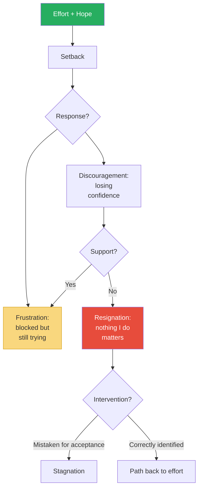

The trajectory from frustration to resignation is not inevitable — support and accurate naming can interrupt the slide at the discouragement stage.

> [!tip] Core Insight
> Frustration is energy. Discouragement is a warning. Resignation is the death of agency. Knowing which one you feel determines whether you can be helped.

---

## Chapter 4: Places We Go When It's Beyond Us

*Brown explores the emotions of transcendence — the experiences that make us feel small in a good way, and the ones that open us to new understanding.*

### Awe and Wonder

- <b style="color: #2980b9">Awe</b> is the emotion we feel in the presence of something vast that challenges our existing framework of understanding:
  - It can be triggered by nature (a mountain, a starry sky), by human achievement (a symphony, an act of extraordinary courage), or by ideas (a concept that reorganises how you see the world)
  - Dacher Keltner's research at UC Berkeley identifies two key features:
    - **Perceived vastness** — the stimulus feels much larger than the self
    - **Need for accommodation** — the existing mental schema cannot contain what we are experiencing; the mind must expand
  - Awe has measurable psychological effects:
    - It reduces self-focus — people who experience awe become more generous and more community-oriented
    - It expands our perception of time — people who experience awe feel like they have more time
    - It increases critical thinking — awe makes people less susceptible to weak arguments
  - Brown notes that awe is increasingly scarce in modern life:
    - We spend most of our time indoors, looking at small screens, in environments specifically designed not to surprise us
    - The routine nature of daily life actively suppresses the conditions for awe
    - People who deliberately seek awe — through nature, art, travel, or simply paying attention — report higher life satisfaction
- <b style="color: #2980b9">Wonder</b> is awe's more playful sibling:
  - Wonder is the desire to explore and understand — it pulls us forward with curiosity rather than stopping us in our tracks
  - <b style="color: #27ae60">Awe says "I am small"; wonder says "There is so much more to learn"</b>
  - Awe can be overwhelming — sometimes even uncomfortable; wonder is almost always pleasurable
  - Brown notes that wonder is the emotion most associated with childhood, and most endangered in adulthood
  - Adults who maintain access to wonder tend to be more creative, more open to new experiences, and more resilient in the face of setbacks

> [!example] The Grand Canyon Moment
> - Brown describes taking her children to the Grand Canyon for the first time
> - Her daughter stood at the rim, silent for several minutes — unusual for a child who narrated everything
> - When Brown asked what she was thinking, her daughter said: "I don't have words for this"
> - Brown uses this as a perfect illustration of awe's central feature: it exceeds our capacity to process
> - The inability to find words is not a failure of language — it is a signal that the experience is genuinely stretching the mind's boundaries
> **The lesson:** Awe is the emotion that tells us our current map of the world is too small.

> [!example] The First Day of Medical School
> - A research participant described the moment in her first anatomy class when the professor uncovered a cadaver
> - The room went completely silent
> - She felt simultaneously terrified and humbled — this was a person who had donated their body so she could learn
> - The feeling was not excitement or nervousness: it was reverence combined with awe
> - She described it as the moment medicine stopped being an ambition and became a calling
> **The lesson:** Awe in the presence of human generosity can redefine our sense of purpose.

---

### Curiosity, Interest, Confusion, and Surprise

- <b style="color: #2980b9">Curiosity</b> is the desire to know — and Brown argues it is one of the most undervalued emotions in adult life:
  - Children are naturally curious; adults learn to suppress curiosity because it requires vulnerability
  - Admitting "I don't know" or "I'm confused" feels like weakness in professional settings
  - <b style="color: #e74c3c">But curiosity cannot coexist with certainty — and certainty is the enemy of learning</b>
  - Brown cites Todd Kashdan's research identifying two forms of curiosity:
    - **Diversive curiosity** — the broad, novelty-seeking urge to explore ("I wonder what's over there")
    - **Epistemic curiosity** — the deeper drive to build knowledge and understanding ("I want to understand how this works")
  - Diversive curiosity gets us started; epistemic curiosity is what produces mastery
  - Brown notes that curiosity has an important relationship with anxiety:
    - You cannot feel genuinely curious and genuinely anxious at the same time — curiosity requires a sense of safety that anxiety undermines
    - This is why curiosity disappears in threatening environments: the brain cannot simultaneously explore and defend
    - Creating conditions for curiosity — psychological safety, permission to be wrong, freedom from judgement — is therefore one of the most important things a leader, parent, or teacher can do
- <b style="color: #2980b9">Interest</b> is curiosity's calmer form:
  - Interest is a state of wanting to learn more about something without the urgency of curiosity
  - It is the emotional foundation of sustained attention and deep engagement
  - Brown notes that interest is the emotion that makes learning feel voluntary rather than forced
  - Without interest, education becomes compliance — and compliance does not produce understanding
- <b style="color: #2980b9">Confusion</b> is commonly treated as a negative emotion, but Brown reframes it:
  - Confusion is a signal that our current understanding is insufficient — that we are at the edge of new learning
  - The discomfort of confusion is productive: it means the brain is working to integrate new information
  - <b style="color: #27ae60">People who tolerate confusion learn more deeply than people who insist on immediate clarity</b>
  - Brown points to research in educational psychology: students who experience confusion during learning perform better on later assessments than students who experience smooth, uninterrupted comprehension
  - The reason: confusion triggers deeper processing. When understanding comes too easily, we do not encode it as deeply
- <b style="color: #2980b9">Surprise</b> is the briefest of all emotions — it lasts approximately one-quarter of a second:
  - Surprise is neither positive nor negative; it is an interruption in expectation
  - What follows surprise determines everything: the same surprise can lead to delight, fear, or anger depending on the appraisal that follows
  - Brown notes that surprise is physiologically distinctive: the eyebrows rise, the eyes widen, the mouth drops open — this universal facial expression exists to take in more sensory information rapidly

> [!example] The Student Who Was Afraid to Be Confused
> - Brown describes a graduate student who came to her in distress because she "didn't understand" a complex research methodology
> - The student interpreted her confusion as evidence that she was not smart enough for the programme
> - Brown reframed it: confusion in the face of genuinely complex material is not a failure — it is the beginning of deep learning
> - She told the student: "If you understood this immediately, I would be worried. The fact that you're confused means you're engaging with it at the level it requires."
> - The student's relief was visible — she had been interpreting a growth signal as a deficiency signal
> **The lesson:** Confusion is the emotion of the learning edge. Refusing to feel it means refusing to grow.

> [!example] The Curious Journalist
> - Brown describes a research participant, a journalist, who attributed her career success entirely to curiosity
> - She said: "Every good story I've ever written started with me not understanding something and refusing to pretend I did"
> - She noted that her colleagues who struggled were often the ones who felt they needed to appear knowledgeable before they could ask questions
> - The journalist's practice: she kept a notebook of things she did not understand, and each entry became a potential story
> - Brown uses this to illustrate that curiosity is not just a pleasant emotion — it is a competitive advantage, because the people who are willing to admit "I don't know" are the ones who eventually know more
> **The lesson:** Curiosity requires the vulnerability of admitting ignorance. That admission is the doorway to expertise.

> [!tip] Core Insight
> Awe, wonder, curiosity, and confusion are not weaknesses — they are the emotions of growth. They require the vulnerability of admitting that we do not yet understand.

### How These Emotions Connect

- The six emotions in this chapter form a natural progression:

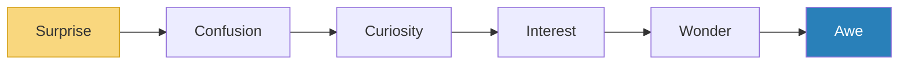

- Surprise interrupts our expectations; confusion signals that our current map is incomplete; curiosity motivates exploration; interest sustains engagement; wonder opens us to larger possibilities; awe confronts us with vastness that reorganises our understanding
- Brown notes that this progression requires increasing vulnerability:
  - Surprise happens to us — it requires no courage
  - Curiosity requires admitting we do not know
  - Awe requires admitting we are small
  - Each step up the ladder asks us to let go of more control
- The enemies of this progression are certainty ("I already know"), cynicism ("There's nothing new"), and self-protection ("I can't afford to be confused")
- Brown draws a connection between this progression and age:
  - Children live in the wonder-to-awe end of the spectrum naturally — everything is new, everything is vast
  - Adults, through accumulated experience and social conditioning, drift toward the certainty-cynicism end
  - The choice to remain curious is not just a personality trait — it is an act of courage, because curiosity requires admitting that the world is still larger than our understanding
  - Brown argues that the most vital people she has studied — regardless of age — are the ones who have maintained access to wonder

---

## Chapter 5: Places We Go When Things Aren't What They Seem

*Brown maps the emotions of dissonance and doubleness — the experiences that arise when reality is layered, contradictory, or laced with hidden meaning.*

### Amusement and Bittersweetness

- <b style="color: #2980b9">Amusement</b> is one of the most socially important emotions:
  - It is not the same as happiness or joy — amusement is specifically the pleasure of finding something funny, clever, or incongruous
  - Shared amusement is one of the fastest ways to build connection — Brown notes that couples who laugh together report higher relationship satisfaction
  - Brown notes that amusement requires cognitive engagement — you have to "get it" for something to be funny
  - This is why humour varies so dramatically across cultures and individuals: what we find amusing reveals our mental models, our assumptions, and our shared knowledge
- <b style="color: #2980b9">Bittersweetness</b> is the simultaneous experience of happiness and sadness:
  - It is a distinctly mature emotion — children rarely feel it because they haven't accumulated enough loss
  - Common triggers: graduations, weddings, children growing up, revisiting a place tied to someone who is gone
  - <b style="color: #27ae60">Bittersweetness is the emotional proof that love and loss are inseparable — you cannot have one without the risk of the other</b>
  - Brown argues that bittersweetness is a marker of emotional depth — people who can hold both happiness and sadness simultaneously have a richer emotional life than those who insist on feeling only one thing at a time
  - She connects it to the broader theme of paradox: emotional maturity is the ability to hold contradictions without needing to resolve them
  - Brown distinguishes bittersweetness from sadness:
    - Sadness involves only loss
    - Bittersweetness involves loss woven into something beautiful — and it is the beauty that makes the loss hurt
    - You cannot feel bittersweetness about something you do not love

> [!example] The Last Family Dinner
> - Brown describes a participant whose elderly father had been declining for months
> - The family gathered for what everyone silently knew might be the last Thanksgiving dinner
> - The dinner was warm, funny, and full of old stories — her father was in good spirits
> - The participant described sitting there, laughing at her father's jokes, while simultaneously thinking: "This might be the last time I hear him laugh"
> - She was experiencing pure bittersweetness: profound joy (he is here, he is laughing) and profound sadness (he may not be here next year) existing simultaneously
> - She said: "I wanted to freeze the moment. And the wanting to freeze it was part of the sadness."
> **The lesson:** Bittersweetness is the emotional evidence that we are paying attention to both the beauty and the impermanence of what we love.

> [!example] The Graduation Walk
> - Brown describes watching her daughter walk across the stage at a school graduation
> - She felt overwhelming pride — and simultaneously, a deep sadness that this chapter of her daughter's life was closing
> - She noticed other parents around her crying, and when she asked them what they felt, most said "happy tears"
> - Brown gently pushed: "Is it purely happiness?"
> - Almost everyone, when given permission to be more precise, admitted it was bittersweetness — joy at the achievement braided with grief at the passage of time
> **The lesson:** "Happy tears" is often our shorthand for an emotion we do not have permission to name — the bittersweetness of loving something while simultaneously losing it.

---

### Nostalgia and Cognitive Dissonance

- <b style="color: #2980b9">Nostalgia</b> was once classified as a mental disorder — Swiss physicians in the 17th century believed it was a disease of soldiers stationed far from home
- Modern research reframes nostalgia as psychologically healthy:
  - It provides a sense of continuity between past and present selves
  - It strengthens social bonds by reminding us of meaningful relationships
  - It can counteract loneliness and existential anxiety
  - Constantine Sedikides' research at the University of Southampton found that nostalgia literally warms us — participants in cold rooms who were prompted to feel nostalgic reported feeling physically warmer
  - <b style="color: #e74c3c">But nostalgia can become unhealthy when it idealises the past at the expense of the present — "Things were better then" becomes an escape from "Things are hard now"</b>
  - Brown distinguishes between restorative nostalgia (which tries to recreate the past — often unhealthy) and reflective nostalgia (which savours the past while remaining grounded in the present — often healthy)

> [!example] The Old Neighbourhood Visit
> - Brown describes a research participant who drove past his childhood neighbourhood after twenty years away
> - Everything had changed: the corner store was a chain pharmacy, the park had been developed, his family's house had been painted a colour he did not recognise
> - He sat in his car and wept — not because the changes were tragic, but because the neighbourhood in his memory no longer existed anywhere except inside him
> - He was experiencing reflective nostalgia: savouring the warmth of what was, while acknowledging it was gone
> - Brown contrasts this with another participant who spent years trying to recreate the Christmas celebrations of his childhood for his own children — down to the same tree, the same ornaments, the same menu
> - His children found it forced and exhausting. He was practising restorative nostalgia — trying to rebuild the past rather than let it be what it was
> **The lesson:** Healthy nostalgia visits the past with gratitude. Unhealthy nostalgia tries to move back in.

---

- <b style="color: #2980b9">Cognitive dissonance</b> is the psychological discomfort of holding two contradictory beliefs:
  - Leon Festinger coined the term in 1957
  - The discomfort of dissonance motivates us to reduce the inconsistency — by changing a belief, changing a behaviour, or rationalising the contradiction
  - Brown notes that cognitive dissonance is a daily experience, not an exotic psychological phenomenon:
    - "I value honesty" + "I just lied to avoid an awkward conversation" = dissonance
    - "I believe in equality" + "I notice I treat people differently based on appearance" = dissonance
    - "I value health" + "I just ate a whole bag of crisps" = dissonance
  - <b style="color: #27ae60">The discomfort of cognitive dissonance is a signal of integrity — it means your values are alive and paying attention</b>
  - The danger is not the dissonance itself but the strategies we use to resolve it:
    - **Healthy resolution**: changing the behaviour to align with the value
    - **Unhealthy resolution**: changing the belief to justify the behaviour ("Everyone lies a little — it's no big deal")
    - **Most common resolution**: rationalisation — constructing a story that makes the contradiction seem acceptable

| Resolution Strategy | Example | Outcome |
|--------------------|---------|---------|
| **Change behaviour** | "I value honesty, so I'll stop lying" | Alignment restored |
| **Change belief** | "Honesty isn't that important" | Integrity eroded |
| **Rationalise** | "It wasn't really a lie" | Temporary comfort, long-term drift |
| **Compartmentalise** | "That's different" | Values become situational |

- Brown argues that the capacity to sit with cognitive dissonance — to feel the discomfort without rushing to resolve it — is a sign of emotional maturity
- People who resolve dissonance too quickly often choose rationalisation because it requires the least effort
- People who can tolerate the discomfort long enough to examine it tend to choose behaviour change — the harder but more integrity-preserving path

> [!example] The Environmentalist Who Flies
> - Brown describes a researcher who studies environmental policy and advocates passionately for carbon reduction
> - The same researcher flies to conferences forty times a year
> - The cognitive dissonance is sharp: "I believe carbon emissions are destroying the planet" + "My career depends on high-carbon travel"
> - Rather than resolving this through either rationalisation ("My work is too important") or martyrdom ("I must quit academia"), the researcher chose to sit with the dissonance and make incremental changes: fewer flights, carbon offsets, advocacy for virtual conferences
> - Brown uses this to illustrate that cognitive dissonance does not always have a clean resolution — sometimes the most honest response is to acknowledge the contradiction and do what you can
> **The lesson:** Cognitive dissonance is not always resolvable. Sometimes integrity means acknowledging the contradiction rather than pretending it does not exist.

---

### Paradox, Irony, and Sarcasm

- <b style="color: #2980b9">Paradox</b> is the experience of two apparently contradictory truths both being true:
  - "I love my children and I miss my freedom" — both are true
  - "This job is deeply meaningful and deeply exhausting" — both are true
  - Brown argues that emotional maturity is the ability to hold paradox without needing to resolve it
  - She notes that people who cannot hold paradox tend toward extremes: everything is either wonderful or terrible, and complexity is experienced as threat rather than reality
  - Brown identifies common paradoxes that her research participants struggled with:
    - "I love my partner AND I sometimes fantasise about being single" — not infidelity, just honest complexity
    - "I am grateful for my children AND I sometimes wish I hadn't had them" — not cruelty, just the full spectrum of experience
    - "I believe in forgiveness AND I'm not ready to forgive" — not hypocrisy, just timing
  - The capacity to hold paradox is closely related to the capacity for bittersweetness — both require the ability to let two truths coexist without one cancelling the other
  - <b style="color: #27ae60">People who can hold paradox make better partners, better parents, and better leaders — because they can tolerate complexity in others, which is the foundation of genuine empathy</b>
- <b style="color: #2980b9">Irony</b> is the gap between what appears to be and what actually is
  - It requires recognition — you have to see the gap to experience irony
  - Some irony is humorous (the fire station that burns down); some is painful (the marriage counsellor whose own marriage fails)
- <b style="color: #2980b9">Sarcasm</b> is irony weaponised:
  - Brown defines sarcasm as "using irony to mock or convey contempt"
  - <b style="color: #e74c3c">Sarcasm is the most passive-aggressive form of humour — it allows the speaker to express hostility while maintaining deniability ("I was just joking")</b>
  - Brown's research found that habitual sarcasm erodes trust — the target never knows whether the speaker means what they say
  - Sarcasm is particularly damaging in intimate relationships because it substitutes contempt for vulnerability: instead of saying "I feel hurt," you say "Oh sure, you're SO thoughtful"
  - Brown identifies a key mechanism: sarcasm provides plausible deniability
    - If the recipient calls out the hostility, the speaker can retreat to "I was just joking"
    - This creates a double bind: the recipient feels hurt but is told they are overreacting
    - Over time, this pattern trains people not to trust their own emotional responses — which connects to the broader theme of emotional literacy
  - Brown distinguishes sarcasm from other forms of humour:
    - **Self-deprecating humour** — directs the joke at yourself, which can be connecting when done lightly but destructive when it masks real self-contempt
    - **Observational humour** — directs the joke at situations, which is generally safe and connecting
    - **Sarcasm** — directs the joke at another person, which is always at least partially hostile
  - The cultural normalisation of sarcasm is a problem: many people pride themselves on being "sarcastic" as though it were a personality trait rather than a communication pattern
  - Brown's position is clear: occasional sarcasm among people who have deep trust and can genuinely laugh together is fine. Habitual sarcasm as a default communication style is corrosive.

> [!example] The Sarcasm Trap in Relationships
> - A couple in Brown's research described a pattern: whenever one partner felt hurt, they responded with sarcasm instead of vulnerability
> - "Oh sure, you're SO attentive" instead of "I feel ignored"
> - The sarcastic partner felt safer — they had communicated the hurt without exposing themselves
> - But the receiving partner felt attacked — and responded with defensiveness, not empathy
> - Over time, sarcasm replaced honest communication entirely — every emotional exchange was coded in contempt
> - Their therapist told them: "Sarcasm is the shield you use to avoid being vulnerable. But it also blocks connection."
> **The lesson:** Sarcasm communicates the hurt but blocks the healing.

> [!tip] Core Insight
> Emotional maturity is the ability to hold paradox: two contradictory things can both be true, and the tension between them is where wisdom lives.

---

## Chapter 6: Places We Go When We're Hurting

*Brown enters the darkest territory on the emotional map — anguish, hopelessness, despair, sadness, and grief — and argues that these emotions are not problems to be solved but experiences to be survived with support.*

### Anguish

- <b style="color: #2980b9">Anguish</b> is the emotion Brown's research participants described as "the worst":
  - It is not just intense sadness — it is a full-body experience of trauma
  - People described it using physical language: "My chest caved in," "I couldn't breathe," "I felt like I was being torn apart"
  - Anguish often accompanies acute trauma: the sudden death of a loved one, receiving a devastating diagnosis, witnessing violence
- <b style="color: #27ae60">The critical thing about anguish is that it needs a witness — it cannot be survived alone</b>
- Brown distinguishes anguish from the other painful emotions in this chapter:
  - Sadness is painful but navigable
  - Grief is prolonged and heavy but allows for moments of lightness
  - Anguish is acute and overwhelming — it swallows everything
- Brown notes a specific physical marker of anguish that distinguishes it from other painful emotions:
  - People in anguish often double over, clutch their chests, or rock back and forth
  - The body responds as though it has been physically wounded
  - This is not metaphor — research shows that emotional pain activates the same neural pathways as physical pain
- Brown notes a critical practical point about anguish:
  - When someone is in anguish, they do not need advice, perspective, or encouragement
  - They need physical presence — someone to sit with them, hold their hand, breathe alongside them
  - Verbal communication often fails in anguish because the capacity for language temporarily shuts down
  - The most helpful thing a supporter can do is be physically present and silent — not trying to fix, not trying to comfort with words, just being there
  - Brown describes this as "holding space" — a concept she returns to throughout the book: the ability to be present with someone's pain without trying to make it go away
  - She warns against the instinct to fill anguish with words: "It'll be okay," "Stay strong," and "Everything happens for a reason" are particularly harmful during anguish because they impose a narrative on an experience that has not yet become a story
  - Anguish is pre-narrative — it is raw, unshaped, and overwhelming. It needs to be survived before it can be understood

---

### Hopelessness and Despair

- <b style="color: #2980b9">Hopelessness</b> is the belief that things will never get better:
  - It is not the same as sadness — sadness acknowledges loss but does not preclude hope
  - Hopelessness is the absence of hope — and <b style="color: #e74c3c">without hope, people stop trying, stop connecting, stop looking for a way forward</b>
  - Brown cites research showing that hopelessness is a stronger predictor of suicide than depression
  - This is a critical clinical insight: a depressed person who still has hope is at lower risk than a non-depressed person who has lost hope entirely
  - Hopelessness has a cognitive component: it is not just a feeling but a belief — "Things will never get better" — and beliefs can be examined and challenged
  - Brown draws on C.R. Snyder's hope theory to explain why hope matters:
    - Hope is not passive wishing — it is the combination of three elements:
      1. **Goals** — having something to work toward
      2. **Pathways thinking** — believing there are routes to the goal
      3. **Agency thinking** — believing you have the capacity to pursue those routes
    - Hopelessness collapses when any of these three disappears: no goal to aim for, no path to follow, or no belief in your own agency
    - Restoring hope therefore requires rebuilding whichever element has collapsed — often starting with the smallest, most manageable goal

> [!example] The Teacher Who Nearly Quit
> - Brown describes a high school teacher in an under-resourced school who reached a point of hopelessness
> - She had spent years fighting for her students — extra tutoring, grant applications, parent meetings — and felt nothing was changing
> - She told Brown: "I used to believe I could make a difference. Now I think the system is too broken."
> - The hopelessness was not about her students — it was about the collapse of pathways thinking: she could see no route from effort to outcome
> - A colleague helped her recover by narrowing the scope: instead of "change the system," the goal became "help these three students pass the exam"
> - The smaller goal restored pathways thinking, which restored agency, which restored hope
> **The lesson:** Hope collapses when the goal is too large to see a path toward. Restoring hope often means shrinking the goal until a path becomes visible.

- <b style="color: #2980b9">Despair</b> is the next step beyond hopelessness:
  - Despair adds a component of suffering to hopelessness — it is not just "things won't get better" but "this pain is unbearable and will not end"
  - Brown notes that people in despair often cannot ask for help because they have lost the belief that help is possible
  - She connects despair to [[Man's Search for Meaning - Viktor Frankl|Frankl's observation]] that suffering without meaning is unbearable, while suffering with meaning can be endured
  - The antidote to despair, then, is not the removal of suffering (which may not be possible) but the restoration of meaning

> [!example] The Researcher's Breakdown
> - Brown describes a period during her own research when she encountered so many stories of trauma that she went into what she calls "a spiritual breakdown"
> - She was not depressed in the clinical sense — she was functional, working, parenting
> - But she felt a pervasive sense that the pain she was witnessing would never stop, that the world was fundamentally broken
> - Her therapist helped her distinguish what she felt: not depression, not burnout, but despair — the specific experience of losing faith that goodness can prevail
> - Naming it as despair, rather than something vaguer, helped her find the specific antidote: not rest (which is the antidote for burnout), but reconnection with meaning (which is the antidote for despair)
> **The lesson:** Even a researcher who studies emotions can fail to name her own — and the wrong label leads to the wrong medicine.

---

### Sadness and Grief

- <b style="color: #2980b9">Sadness</b> is the most universal painful emotion:
  - It signals loss or disconnection — something we valued is gone or out of reach
  - Brown notes that sadness, unlike anger, turns us inward and slows us down
  - This slowing serves a function: sadness invites reflection and processing
  - <b style="color: #e74c3c">The cultural impulse to rush past sadness — "Cheer up," "Stay positive," "Everything happens for a reason" — actually prolongs it</b>
  - Sadness that is allowed to be felt moves through; sadness that is suppressed accumulates
- Brown identifies a critical pattern around sadness and gender:
  - Men in Western cultures are socialised away from sadness — they learn to convert sadness into anger because anger is "allowed" for men while sadness is "weakness"
  - Women sometimes overidentify with sadness because it is one of the few "permitted" emotions for them, when what they actually feel is anger
  - Both distortions produce misidentified emotions and inappropriate responses
  - <b style="color: #27ae60">The healthiest relationship with sadness treats it as information — "Something I value has been lost or is out of reach" — rather than as a problem to be solved or an identity to be claimed</b>
- Brown also addresses the distinction between sadness and depression:
  - Sadness is an emotion — it is a response to a specific loss or disconnection and it passes when the loss is processed
  - Depression is a clinical condition — it involves a persistent change in mood, energy, and cognition that may not be tied to any specific event
  - Brown is careful to validate both: sadness does not need to become depression to be real, and depression should not be dismissed as "just sadness"
  - The confusion between the two causes harm in both directions:
    - People with genuine depression are told to "cheer up" as though they are experiencing ordinary sadness
    - People experiencing intense but appropriate sadness are told they are "depressed" and need medication, when what they need is time, support, and permission to grieve

---

- <b style="color: #2980b9">Grief</b> is sadness's longer, heavier companion:
  - Brown defines grief as the emotional response to loss — any loss, not just death
  - We grieve the end of relationships, the loss of a job, the fading of a dream, the change in a child who grows up
  - Brown highlights three things research has established about grief:
    - It is not linear — the Kubler-Ross "stages" model (denial, anger, bargaining, depression, acceptance) was never meant to describe a sequence, and grief does not follow one
    - It is not time-limited — the idea that grief has a shelf life is harmful
    - It requires community — grief was never meant to be processed alone
  - Brown introduces the concept of <b style="color: #2980b9">non-death grief</b> — grief for things other than death:
    - The end of a marriage
    - The loss of a friendship
    - A career change that closes a chapter of identity
    - A health diagnosis that changes what your body can do
    - The version of your child who existed before they grew up
  - Non-death grief is often dismissed ("You should be grateful — no one died"), which makes it even harder to process
  - Brown argues that non-death grief may actually be harder to process than death grief in some ways:
    - Death grief has cultural rituals: funerals, condolence cards, bereavement leave
    - Non-death grief has no rituals — there is no ceremony for the end of a friendship, no bereavement leave for a dream that died
    - The absence of ritual means the absence of social permission to grieve

> [!example] The Anguish of the Phone Call
> - Brown describes a research participant who received a phone call telling her that her sister had been in a serious car accident
> - She described the moment the phone rang as "before" and everything after as "after" — a permanent line drawn through her life
> - Her legs gave out. She dropped to the floor. She could not speak, could not think, could not breathe
> - She later said: "Anguish is not sadness. Sadness lets you function. Anguish takes your body away from you."
> - Her sister survived, but the participant described the thirty minutes between the phone call and learning her sister was alive as the most devastating experience of her life
> - Brown uses this to distinguish anguish from grief: grief unfolds over time; anguish is acute, immediate, and physically incapacitating
> **The lesson:** Anguish is not extreme sadness — it is a different category entirely, and it manifests in the body as much as in the mind.

> [!example] The Empty Bedroom
> - A research participant described walking into her son's bedroom after he left for university
> - The room was clean, the bed was made, and his childhood things were in boxes
> - She sat on the bed and cried for an hour
> - Her husband found her and said: "He's not dead — he's at college. You can visit him anytime."
> - She felt dismissed and ashamed of her grief
> - When she shared this with Brown, Brown validated it as non-death grief: "You are mourning a version of your life that is over. That is real grief, and you are allowed to feel it."
> **The lesson:** Grief does not require death. Any meaningful loss deserves to be mourned.

> [!example] The Widower Who Stopped Crying
> - Brown describes a research participant whose wife died after a long illness
> - In the first months, he cried freely — and friends and family were supportive
> - After six months, people began saying: "It's time to move on," "She wouldn't want you to be sad," "Have you thought about dating?"
> - He stopped crying — not because the grief had passed, but because the social permission to grieve had expired
> - He told Brown: "I didn't stop being sad. I just stopped being allowed to be sad."
> - Brown uses this to illustrate the cultural problem with grief: we give people a window — weeks, perhaps months — and then expect them to "get over it"
> - Grief does not follow a timeline. The expectation that it should adds shame to an already devastating experience
> **The lesson:** Grief has no expiration date. When we impose one, we do not help the grieving person — we silence them.

> [!tip] Core Insight
> Pain is not a problem to solve. It is an experience to survive — and surviving requires accurate naming, genuine support, and the willingness to not rush the process.

---

## Chapter 7: Places We Go With Others

*Brown maps the critical distinctions between compassion, empathy, sympathy, and pity — four words we use interchangeably that produce dramatically different effects on connection.*

### Compassion vs. Pity

- <b style="color: #2980b9">Compassion</b> is the daily practice of recognising and accepting our shared humanity:
  - It literally means "to suffer with" (Latin: com = with + pati = to suffer)
  - Compassion involves four components:
    1. Awareness of suffering
    2. Feeling moved by the suffering
    3. Understanding the universality of suffering
    4. Motivation to help alleviate it
  - <b style="color: #27ae60">Compassion is empathy plus action — it is not just feeling with someone but being moved to do something about their pain</b>
  - Brown emphasises that compassion is not self-sacrifice — it is sustainable care that operates within healthy boundaries
- <b style="color: #2980b9">Pity</b> is compassion's <b style="color: #2980b9">near enemy</b> — a concept Brown borrows from Buddhist psychology:
  - Near enemies are emotions that look similar on the surface but have opposite effects
  - Pity looks like compassion but creates distance instead of connection
  - Pity says: "I feel sorry for you" — which positions the pitier as above the pitied
  - Compassion says: "I feel with you" — which positions both people as equals
  - Brown notes that pity often masquerades as compassion in charity and social justice contexts: "Those poor people" maintains a hierarchy that genuine compassion dismantles

| Feature | Compassion | Pity |
|---------|-----------|------|
| **Power dynamic** | Equal — "We are alike" | Unequal — "I'm glad I'm not you" |
| **Effect on recipient** | Seen, connected, less alone | Diminished, othered, patronised |
| **Effect on giver** | Shared humanity, warmth | Separation, moral superiority |
| **Action it produces** | Help offered alongside | Help given down to |
| **Requires vulnerability** | Yes | No |

The near-enemy framework is one of Brown's most useful contributions: it explains why well-intentioned responses can damage rather than heal.

> [!example] The Hospital Visit
> - Brown describes a research participant who was hospitalised with a serious illness
> - Some visitors came with pity: they looked at her with sad eyes, spoke in hushed tones, and said things like "You poor thing" and "I can't imagine what you're going through"
> - One visitor came with compassion: she sat on the bed, held her hand, and said: "This is scary. I've been scared too. What do you need right now?"
> - The participant said the pity visitors made her feel like a victim — like something was wrong with her, not just happening to her
> - The compassion visitor made her feel like a person — someone going through something hard, but still herself
> - Brown notes the critical difference: pity reinforces separation ("I'm healthy, you're sick"); compassion affirms connection ("We are both human, and being human includes this")
> **The lesson:** The distance between pity and compassion is the distance between "poor you" and "I'm with you." One diminishes; the other dignifies.

---

### Empathy vs. Sympathy

- This distinction is one of the most important in the entire book
- <b style="color: #2980b9">Empathy</b> is feeling WITH someone — entering their emotional experience alongside them:
  - It requires vulnerability because you must access your own painful experiences to connect with theirs
  - Brown draws on Theresa Wiseman's four attributes of empathy:
    1. **Perspective-taking** — seeing the situation from the other person's point of view
    2. **Staying out of judgement** — not evaluating whether they "should" feel this way
    3. **Recognising the emotion** — identifying what the other person feels
    4. **Communicating that recognition** — letting them know you see it
  - Empathy is not about having had the same experience — it is about accessing the same emotion
  - You do not need to have lost a parent to empathise with grief; you need to have felt loss
- Brown identifies a critical nuance: there are multiple types of empathy, and not all are equally connecting:
  - **Cognitive empathy** — understanding someone's perspective intellectually ("I can see why you would feel that way")
  - **Affective empathy** — actually feeling what the other person feels (the emotional resonance)
  - **Empathic concern** — being moved to help
  - Cognitive empathy alone can feel cold; affective empathy alone can be overwhelming; empathic concern alone can feel patronising
  - <b style="color: #27ae60">The most connecting empathy combines all three: understanding the perspective, feeling the resonance, and being moved to respond</b>
- <b style="color: #2980b9">Sympathy</b> is feeling FOR someone — acknowledging their pain from a safe distance:
  - Sympathy says: "That's really hard, I'm sorry you're going through that"
  - It is well-intentioned but does not create connection because the sympathiser stays outside the emotional experience
  - <b style="color: #e74c3c">The most damaging form of sympathy is the "silver lining" response: "At least..." ("At least you have your health," "At least you still have one parent")</b>
  - Brown is emphatic: "At least" is never helpful. It communicates: "Your pain is making me uncomfortable, so I'm going to minimise it"
  - Brown catalogues the common sympathy responses that masquerade as empathy:
    - **The silver lining:** "At least..." — minimises the pain
    - **The comparison:** "I know how you feel — when I..." — redirects the conversation to the sympathiser
    - **The fix:** "Have you tried...?" — treats the person as a problem to solve rather than a person to sit with
    - **The perspective shift:** "It could be worse" — dismisses the pain's validity
    - **The platitude:** "Everything happens for a reason" — packages the pain in a narrative the speaker finds comfortable
  - None of these are malicious. All of them are attempts to reduce the speaker's discomfort with someone else's pain. The cost is paid by the person in pain, who learns that their feelings make others uncomfortable — and therefore should be hidden.

> [!example] Brown's "At Least" Video Illustration
> - In her widely shared animated short (narrated over Brown's own voice), Brown illustrates the difference between empathy and sympathy
> - She describes empathy as climbing down into a dark hole where someone is sitting in pain and saying: "I know what it's like down here. You're not alone."
> - Sympathy is peering over the edge of the hole and saying: "Wow, that looks bad. Want a sandwich?"
> - The sympathy response is well-intentioned — the person genuinely wants to help
> - But it communicates distance: "I can see your pain, but I'm staying up here where it's safe"
> - The empathy response requires the willingness to access your own pain — and that is why most people default to sympathy
> **The lesson:** Empathy is choosing connection over comfort. Sympathy is choosing comfort over connection.

> [!example] The Miscarriage Conversation
> - Brown recounts a story from her research: a woman who had a miscarriage shared the news with a close friend
> - The friend's response: "At least you know you can get pregnant"
> - The woman felt the gap between her experience and her friend's response like a physical blow
> - What she needed was not silver lining but presence: "I'm so sorry. I don't know what to say, but I'm glad you told me."
> - Brown uses this to illustrate that the best empathy response is often the simplest — and the hardest: just being present in the pain without trying to fix it
> **The lesson:** The most empathic thing you can say is often: "I don't know what to say. I'm just glad you told me."

- Brown offers a practical guide for choosing empathy over sympathy in the moment:

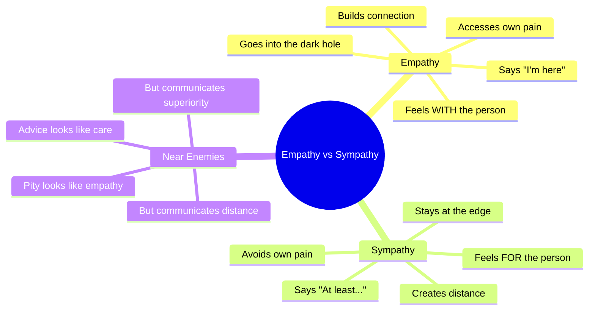

The mindmap captures the structural difference Brown draws between empathy and sympathy: one goes into the hole with the person, the other stays safely at the edge — and the "near enemies" of pity and advice-giving masquerade as connection while actually maintaining distance.

> [!abstract] Choosing Empathy Over Sympathy
> 1. **Resist the urge to fix:** The person does not need a solution. They need to feel heard.
> 2. **Resist the urge to silver-line:** Never start a sentence with "At least..."
> 3. **Access your own experience:** Ask yourself: "When have I felt something like this?" — you do not need the same event, just the same emotion
> 4. **Communicate presence, not expertise:** "I'm here" is better than "I know what you should do"
> 5. **Tolerate silence:** Sometimes the most empathic response is to say nothing and simply be present
> 6. **Match energy, not content:** If someone is devastated, do not be cheerful. Meet them where they are.

---

### Boundaries and Comparative Suffering

- <b style="color: #2980b9">Boundaries</b> appear in this chapter because Brown argues that <b style="color: #27ae60">the most compassionate people she has studied are also the most boundaried</b>:
  - This was one of her most counterintuitive research findings
  - It makes sense once you understand it: people without boundaries burn out, build resentment, and eventually withdraw
  - People with clear boundaries can be generous without depleting themselves
  - "I can empathise with your pain AND hold the line on what I need" — these are not contradictory
  - Brown describes boundaries as "what's okay and what's not okay" — simple language that makes the concept accessible
  - Setting boundaries requires vulnerability: you have to be willing to displease someone in order to protect your own wellbeing
- <b style="color: #2980b9">Comparative suffering</b> is the belief that your pain is not valid because someone else has it worse:
  - "I shouldn't complain — there are people starving"
  - "My problems are nothing compared to what she's going through"
  - <b style="color: #e74c3c">Comparative suffering never leads to more empathy — it leads to less</b>
  - Brown's logic: if you dismiss your own pain, you will eventually dismiss others' pain too
  - Empathy is not a finite resource that gets "used up" by acknowledging your own suffering — it is a practice that grows with use
  - Brown notes that comparative suffering often appears in families: "Your sister has real problems. You should be grateful." This teaches children that their feelings are invalid unless they are the worst in the room

> [!example] The Pandemic Comparison Trap
> - Brown describes a pervasive pattern during the early months of the COVID-19 pandemic
> - People who were struggling — with isolation, anxiety, lost income — would preface every complaint with: "I know I shouldn't complain because healthcare workers have it so much worse"
> - Brown observed that this comparative suffering did not lead to more empathy for healthcare workers — it led to less empathy for everyone
> - When you dismiss your own pain, you build the muscle of dismissal — and that muscle does not discriminate
> - The person who says "My problems don't count" eventually starts thinking "Your problems don't count either"
> - Brown's alternative: "I can acknowledge my own pain AND hold space for the pain of others. These are not competing demands."
> - She notes that empathy is not a zero-sum resource: feeling your own pain does not use up the empathy available for others; it actually builds it
> **The lesson:** Comparative suffering sounds humble but functions as a blockade. It does not increase empathy — it trains you to dismiss pain, starting with your own.

> [!tip] Core Insight
> Compassion requires boundaries. Empathy requires vulnerability. Sympathy requires neither — which is why it is easier but less connecting.

---

## Chapter 8: Places We Go When We Fall Short

*Brown returns to her foundational research territory — shame — and presents the distinctions that made her career: shame vs. guilt, the anatomy of perfectionism, and why self-compassion is not self-indulgence.*

### Shame vs. Guilt

- This is the distinction Brown has spent twenty years refining, and it is the one she considers most important for human wellbeing:

| Feature | Shame | Guilt |
|---------|-------|-------|
| **Self-talk** | "I am bad" | "I did something bad" |
| **Focus** | Identity | Behaviour |
| **Leads to** | Withdrawal, hiding, rage, addiction | Repair, apology, change |
| **Adaptive?** | Almost never | Often — guilt motivates correction |
| **Relationship to empathy** | Inversely correlated — shame destroys empathy | Positively correlated — guilt enables empathy |

- <b style="color: #2980b9">Shame</b> is the intensely painful feeling that we are flawed and therefore unworthy of love and belonging:
  - It is the most primitive social emotion — it signals "You are at risk of being expelled from the group"
  - Shame is universal — Brown has never found a single research participant who does not experience it
  - <b style="color: #e74c3c">Shame is positively correlated with addiction, depression, violence, aggression, bullying, eating disorders, and suicide</b>
  - <b style="color: #27ae60">Shame is inversely correlated with every single outcome we want for our children and ourselves</b>
  - Shame relies on three conditions to survive: secrecy, silence, and judgement
  - Bring any of these down and shame begins to dissolve
- <b style="color: #2980b9">Guilt</b>, by contrast, is the discomfort of recognising that our behaviour fell short of our values:
  - It is behaviour-focused, not identity-focused: "I made a mistake" vs. "I am a mistake"
  - Guilt is adaptive because it motivates repair: apology, correction, behaviour change
  - People who feel guilt are more likely to empathise with the person they harmed
  - People who feel shame are more likely to blame, deny, or attack
  - Brown notes a crucial parenting insight: saying "You did a bad thing" (guilt-inducing) is fundamentally different from saying "You are a bad kid" (shame-inducing) — and the outcomes are measurably different

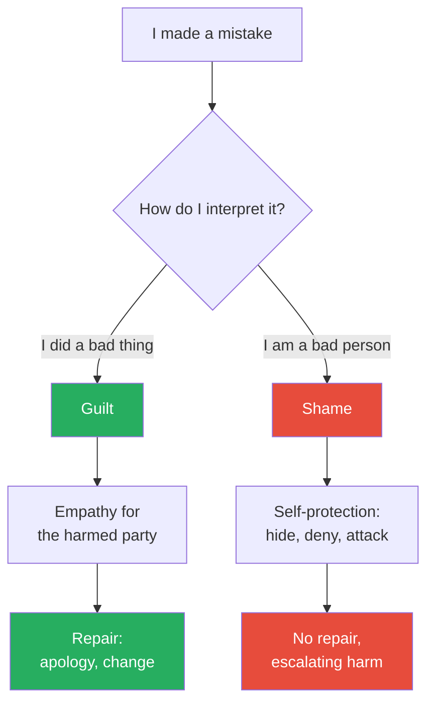

The trajectory of shame is almost always destructive, while the trajectory of guilt is almost always constructive — which is why knowing which one you feel changes everything.

- Brown notes a critical implication for accountability culture:
  - Shame-based accountability ("You should be ashamed of yourself") does not produce better behaviour — it produces self-protection, denial, and blame-shifting
  - Guilt-based accountability ("What you did was wrong. How will you make it right?") produces repair and genuine change
  - This has implications far beyond parenting — it applies to criminal justice, organisational management, public discourse, and political life
  - The question "Do we want people to feel ashamed or to feel accountable?" has dramatically different downstream effects
  - Shame says: "You are broken." Guilt says: "You can fix this." Only one of those invitations leads to actual repair.

---

### Humiliation vs. Embarrassment

- Brown carefully distinguishes these from shame:
- <b style="color: #2980b9">Humiliation</b> is the feeling of being unjustly diminished:
  - The key word is "unjustly" — the humiliated person does NOT believe they deserved the treatment
  - This is what separates humiliation from shame: in shame, you believe you deserve the pain; in humiliation, you believe it is unfair
  - Humiliation is dangerous because of the rage it produces — research by Evelin Lindner connects humiliation to cycles of violence and retaliation
  - Lindner's work documents how national humiliation has been used to mobilise populations toward war: the Treaty of Versailles humiliated Germany; Hitler exploited that humiliation to build a movement
  - At the personal level, humiliation creates a demand for justice or revenge — and when justice is unavailable, revenge often fills the void
- <b style="color: #2980b9">Embarrassment</b> is the lightest of the four:
  - It is fleeting, often humorous in retrospect, and does not threaten identity
  - We laugh about our embarrassing moments; we do not laugh about our shame
  - Embarrassment says: "I did something awkward" — and the knowledge that everyone does awkward things provides built-in comfort
  - Brown notes that the capacity to feel embarrassment is actually a sign of social health — it means you are aware of social norms and care about how you are perceived, but without the identity-crushing weight of shame

| Emotion | Self-belief | Duration | Social function |
|---------|-----------|----------|-----------------|
| **Shame** | "I deserve this because I'm flawed" | Can last years | Withdrawal, hiding |
| **Guilt** | "I did something wrong and I can fix it" | Until repair is made | Apology, correction |
| **Humiliation** | "I did NOT deserve this" | Variable — can fuel rage | Desire for justice or revenge |
| **Embarrassment** | "Everyone does awkward things" | Minutes to hours | Shared laughter, connection |

This four-part distinction is one of the most practically useful frameworks in the book — misidentifying which one you feel leads to dramatically different responses.

> [!example] The Shame-Guilt Confusion in Parenting
> - Brown describes a mother who discovered her son had cheated on a test at school
> - Her first instinct was to say: "I'm so ashamed of you. How could you do this? What kind of person cheats?"
> - Brown helped her see the difference: those words target identity ("What kind of person...") and produce shame
> - The guilt-inducing alternative: "Cheating is not okay. That's not who you are. How are you going to fix this?"
> - This version addresses the behaviour, preserves the child's identity, and opens a path to repair
> - The mother's initial response would have produced shame — which correlates with more cheating, not less, because the child concludes "I'm a cheater" rather than "I did something wrong that I can correct"
> - The guilt-inducing response produces accountability — the child feels bad about the behaviour but retains the self-concept of being a good person who made a bad choice
> **The lesson:** "I'm ashamed of you" and "That behaviour is not okay" sound similar but produce opposite outcomes. The first attacks identity; the second addresses behaviour.

> [!example] The Humiliated Employee
> - Brown describes a participant who was publicly criticised by a manager during an all-hands meeting
> - The manager said: "I don't know how you got hired, but your work on this project was embarrassing for the whole team"
> - The participant did not feel shame — she believed the criticism was unjust and her work had been adequate
> - What she felt was humiliation: the experience of being publicly diminished in a way she did not deserve
> - The humiliation produced rage, not withdrawal — she wanted to fight back, to expose the manager's own mistakes
> - Brown notes that this is the key distinction: shame makes us want to hide; humiliation makes us want to retaliate
> - The danger is that humiliation without a path to justice can metastasise into lasting resentment or even aggression
> **The lesson:** When someone is publicly diminished and they know it was unfair, they do not feel shame — they feel humiliation. And humiliation demands justice.

---

### Perfectionism and Self-Compassion

- <b style="color: #2980b9">Perfectionism</b> is not the same as striving for excellence:
  - Striving for excellence is internally motivated: "I want to do my best because the work matters"
  - Perfectionism is other-focused: "If I look perfect, do it perfectly, work perfectly, and live perfectly, I can avoid criticism, blame, and shame"
  - <b style="color: #e74c3c">Perfectionism is a shame-management strategy, not a performance strategy</b>
  - It does not lead to higher performance — it leads to paralysis, procrastination, and burnout
  - Brown calls perfectionism "the twenty-ton shield" — it is too heavy to carry but feels too dangerous to put down
  - She identifies three types of perfectionism in the research literature:
    - **Self-oriented perfectionism** — demanding perfection of yourself
    - **Other-oriented perfectionism** — demanding perfection of others
    - **Socially prescribed perfectionism** — believing that others demand perfection of you
  - All three are associated with anxiety, depression, and relationship difficulties
  - Brown emphasises that perfectionism is increasing, particularly among young people: social media creates a constant performance stage where imperfection feels catastrophic

> [!example] The Perfect Presentation
> - Brown describes a participant who spent three weeks preparing a work presentation
> - She revised the slides forty-seven times. She practised in the mirror until she could deliver it flawlessly.
> - The presentation went well — her colleagues praised it
> - But she went home and cried, because she had stumbled over one sentence in the middle
> - That single imperfection overshadowed the entire success
> - When Brown asked her what she was feeling, she said "frustrated with myself" — but the real emotion was shame: "If I can't do this perfectly, I'm not good enough"
> - The perfectionism was not about the presentation. It was about using flawless performance as proof of worthiness.
> **The lesson:** Perfectionism does not produce excellence. It produces exhaustion, because the goal is not a good outcome — the goal is avoiding shame.

---

- <b style="color: #2980b9">Self-compassion</b> is the antidote to both shame and perfectionism:
  - Kristin Neff's three components:
    1. **Self-kindness** — treating yourself with the same warmth you would offer a friend
    2. **Common humanity** — recognising that suffering and imperfection are part of the shared human experience
    3. **Mindfulness** — holding painful feelings in awareness without over-identifying with them
  - <b style="color: #27ae60">Self-compassion is not self-indulgence — research shows it leads to HIGHER motivation, not lower</b>
  - People who practise self-compassion are more likely to try again after failure, not less
  - The logic: if failing means "I am a failure" (shame), then trying again risks confirming that identity — so people stop trying. If failing means "I made a mistake and that's human" (self-compassion), then trying again carries no identity threat
- Brown addresses the common objection to self-compassion: "If I'm kind to myself, I'll become lazy"
  - The research contradicts this completely:
    - Self-compassionate people set higher goals, not lower
    - Self-compassionate people persist longer after failure
    - Self-compassionate people are more likely to take responsibility for mistakes (because the mistake is not threatening to their identity)
    - Self-compassionate people are more, not less, motivated to improve
  - The mechanism: shame creates a threat response that prioritises self-protection over growth
  - Self-compassion creates a safe base from which to take risks, learn from failure, and try again
  - Brown draws an analogy: a child who falls off a bicycle and is met with "What's wrong with you?" (shame) is less likely to get back on than a child who is met with "That was a hard fall. Everyone falls. Are you ready to try again?" (self-compassion)

> [!example] The Self-Compassion Conversion
> - Brown describes a research participant, a high-performing attorney, who prided herself on harsh self-criticism
> - She believed her inner critic was the source of her success: "If I stop being hard on myself, I'll lose my edge"
> - Brown challenged her: "Would you speak to a friend the way you speak to yourself?"
> - The attorney paused: "If I spoke to a friend like that, I wouldn't have any friends"
> - Over several months, the attorney experimented with self-compassion — replacing "You idiot" with "That was a tough case. What can you learn?"
> - Her performance did not decline. It improved. She was less anxious before trials, more creative in her legal arguments, and more resilient after losses
> - She later told Brown: "I thought my harshness was driving me. It was actually holding me back."
> **The lesson:** Self-criticism feels productive but functions as a brake. Self-compassion feels indulgent but functions as fuel.

> [!example] Brown's Shame Resilience Research
> - Brown's original research began with hundreds of interviews about shame
> - She noticed a pattern: some people bounced back from shame experiences quickly, while others were devastated for months or years
> - The difference was not personality or toughness — it was a set of learnable practices she called "shame resilience"
> - The four elements of shame resilience:
>   - Recognising shame and its triggers
>   - Practising critical awareness (checking the messages and expectations that drive the shame)
>   - Reaching out to others (shame cannot survive being spoken)
>   - Speaking shame — naming the experience out loud to someone who has earned the right to hear it
> - The single most important finding: "Shame cannot survive being spoken"
> **The lesson:** Shame depends on secrecy and silence. The act of naming it to a trusted person is the act of dissolving it.

> [!abstract] Brown's Shame Resilience Process
> 1. Recognise shame when you feel it (physical cues: tunnel vision, dry mouth, time slowing)
> 2. Reality-check the narrative: "Is this actually about me being fundamentally flawed, or about something I did?"
> 3. Reach out to someone who has earned the right to hear the story
> 4. Speak the shame out loud — "I feel ashamed about..."
> 5. The act of speaking dismantles the secrecy and silence that shame requires to survive

---

## Chapter 9: Places We Go When We Search for Connection

*Brown draws the most important distinction in her entire body of work: the difference between belonging and fitting in — and reveals why loneliness is not a character flaw but a public health crisis.*

### Belonging vs. Fitting In

- This is the distinction Brown considers foundational to everything else she has written:
- <b style="color: #2980b9">Belonging</b> is being accepted for who you are:
  - It does not require you to change, hide, or perform
  - Belonging says: "You are welcome here as you are"
  - <b style="color: #27ae60">True belonging only happens when we present our authentic selves — the moment we start changing to fit in, belonging disappears</b>
  - Brown elaborates that belonging has a paradoxical quality: it sometimes requires standing alone
  - In *Braving the Wilderness*, she wrote: "True belonging is not passive — it is a practice that requires us to be vulnerable, get uncomfortable, and learn how to be present with people AND with the wilderness of solitude"
- <b style="color: #2980b9">Fitting in</b> is the opposite of belonging:
  - Fitting in requires you to assess the group, determine what they want, and become that
  - It is shape-shifting — and it is exhausting
  - Fitting in says: "You are welcome here if you become like us"
  - <b style="color: #e74c3c">Fitting in is the greatest barrier to belonging — the more we fit in, the less we belong</b>
  - Brown identifies the tragic irony: we fit in to avoid rejection, but fitting in guarantees a different kind of rejection — the rejection of our authentic selves by ourselves
  - She traces the distinction to her earliest research: across thousands of interviews, people who reported the deepest sense of belonging were not the most socially skilled or the most popular — they were the most willing to be themselves, even at the cost of social approval

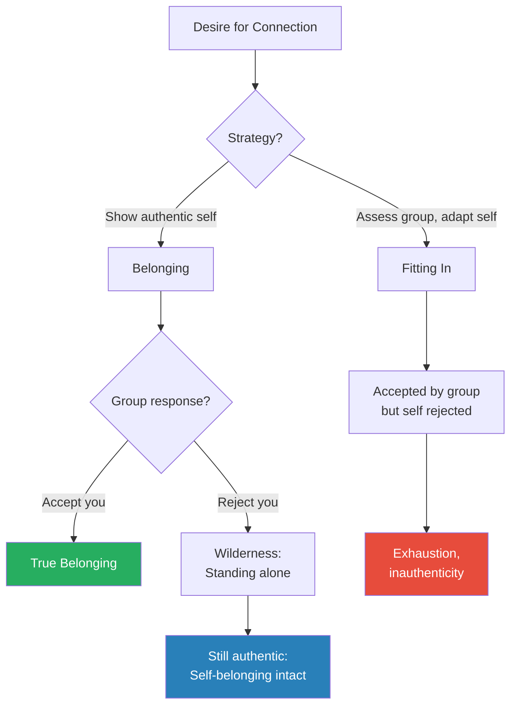

Brown's framework reveals that belonging and fitting in lead to fundamentally different outcomes — even when fitting in "works" socially, it fails psychologically.

| Feature | Belonging | Fitting In |
|---------|-----------|-----------|
| **Requirement** | Be yourself | Be like them |
| **Emotional cost** | Vulnerability | Exhaustion |
| **What's at risk** | Rejection of who you are | Loss of who you are |
| **Sustainability** | Sustainable — no performance required | Unsustainable — constant performance |
| **Effect on identity** | Strengthens self-knowledge | Erodes self-knowledge |

> [!example] The Lunchroom Survey
> - Brown describes conducting research with middle school students about belonging
> - She asked them: "What's the difference between belonging and fitting in?"
> - A twelve-year-old girl answered: "Belonging is being somewhere where you want to be, and they want you. Fitting in is being somewhere where you want to be, but they don't really care one way or another."
> - Another student said: "Belonging is when you can be yourself. Fitting in is when you have to be like them."
> - Brown was struck that children understood the distinction immediately — while adults had spent decades conflating the two
> **The lesson:** Children know the difference between belonging and fitting in. Adults have forgotten it.

> [!example] The Executive Who Belonged Nowhere
> - Brown describes a senior executive who was a member of multiple professional organisations, country clubs, and community boards
> - On paper, he was one of the most socially connected people in his city
> - In Brown's research interview, he admitted: "I don't belong anywhere. I fit in everywhere."
> - He had perfected the art of reading a room and becoming whatever the room required — charming at the country club, decisive in the boardroom, warm at the neighbourhood barbecue
> - But in each setting, he was performing a version of himself that was calibrated to the audience
> - He had no space where he could simply be — no group that knew the real version
> - The irony: his social skills, which looked like connection, were actually the mechanism preventing it
> - Brown uses this to illustrate that fitting in and belonging are not just different — they are opposite strategies that produce opposite results
> **The lesson:** The person who fits in everywhere may belong nowhere. Social fluency is not the same as authentic connection.

---

### Connection, Disconnection, and Loneliness

- <b style="color: #2980b9">Connection</b> is the energy that exists between people when they feel seen, heard, and valued:
  - It requires vulnerability — you cannot connect through a mask
  - It requires reciprocity — connection is not a one-way transmission
  - Brown calls connection "the reason we are here" — it is not a luxury but a biological necessity
  - Neuroscience supports this: Matthew Lieberman's research at UCLA demonstrates that social connection is processed in the brain as a basic need, as fundamental as food and water
- <b style="color: #2980b9">Disconnection</b> is the painful experience of being out of connection:
  - It can occur even when we are physically surrounded by people
  - The loneliest people in Brown's research were not hermits — they were people in relationships, organisations, and communities where they felt unseen
  - Disconnection often triggers a shame spiral: "I feel disconnected" becomes "Something is wrong with me" becomes "I am unlovable" — and the shame drives further withdrawal
- <b style="color: #2980b9">Loneliness</b> is the emotional response to perceived social isolation:
  - John Cacioppo's research at the University of Chicago established that loneliness is as dangerous to health as smoking fifteen cigarettes a day
  - <b style="color: #e74c3c">Loneliness is not about the number of relationships you have — it is about whether those relationships are emotionally reciprocal</b>
  - Brown notes that loneliness creates a self-reinforcing loop:
    - Lonely people become hypervigilant for social threat
    - This hypervigilance makes them interpret neutral social cues as rejection
    - The perceived rejection drives withdrawal
    - The withdrawal deepens the loneliness

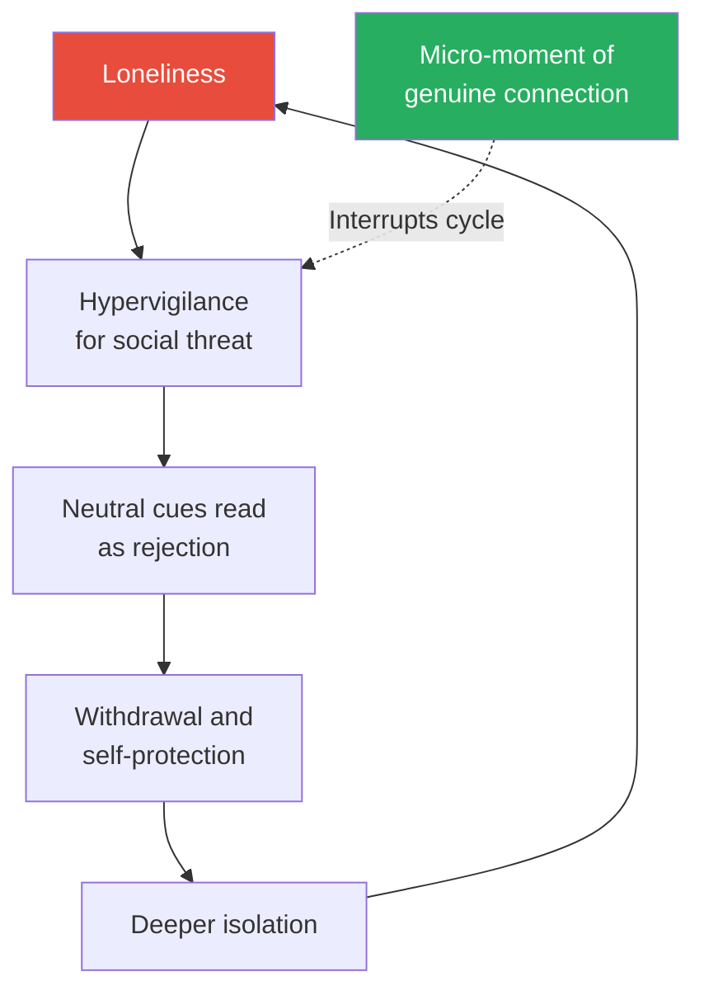

Brown emphasises that breaking the loneliness cycle requires an external interruption — the lonely person cannot break it from inside because the hypervigilance distorts every social signal.
  - Breaking the loop requires what Brown calls "micro-moments of connection" — small, genuine interactions that begin to rebuild the sense of social safety
  - Brown emphasises the public health dimension of loneliness:
    - Vivek Murthy, the U.S. Surgeon General, declared loneliness a public health epidemic in 2023
    - Loneliness increases risk of heart disease by 29%, stroke by 32%, and dementia by 50%
    - These are not correlations driven by other factors — the relationship holds after controlling for age, income, and pre-existing conditions
    - Loneliness literally kills — and it does so not through dramatic mechanisms but through the chronic activation of the body's stress-response system
  - The solution to loneliness is not more social contact but better social contact:
    - One authentic conversation per day has more impact on loneliness than attending a dozen social events where you perform a version of yourself
    - Brown connects this back to belonging vs. fitting in: social events where you fit in can actually increase loneliness, while a single conversation where you belong can dissolve it

> [!example] The Crowded Room
> - Brown describes a research participant who attended a large holiday party surrounded by colleagues and friends
> - From the outside, she was socially connected — laughing, talking, sharing stories
> - But internally, she felt a profound sense of disconnection: "I was performing. I was saying the right things, making the right jokes, asking the right questions. But no one in that room knew me — the real me."
> - She went home feeling lonelier than if she had stayed home alone
> - Brown uses this to illustrate that loneliness is not about physical proximity — it is about emotional authenticity
> **The lesson:** You can be surrounded by people and still be alone. Loneliness is not the absence of people — it is the absence of connection.

---

### Insecurity and Invisibility

- <b style="color: #2980b9">Insecurity</b> is the painful uncertainty about whether we are enough:
  - It is not vanity — insecurity is the fear of social rejection, which is biologically as threatening as physical danger
  - Brown notes that insecurity is normal and universal — the people who claim they are never insecure are either lying or deeply disconnected from themselves
  - Insecurity becomes problematic when it drives avoidance: we stop raising our hands, stop sharing ideas, stop taking risks — because the possibility of rejection feels too threatening
  - Brown connects insecurity to the need for <b style="color: #2980b9">grounded confidence</b>: the antidote to insecurity is not eliminating it but building a foundation solid enough to hold it
  - She also identifies a critical pattern: insecurity is often misread as arrogance
    - The person who talks too much at dinner is not always showing off — sometimes they are insecure and filling silence to avoid the vulnerability of being seen without a performance
    - The person who name-drops or exaggerates achievements is not always vain — sometimes they are insecure and seeking external validation to soothe an internal sense of inadequacy
    - <b style="color: #27ae60">What looks like too much confidence on the outside is often not enough confidence on the inside</b>

> [!example] The Insecure Overachiever
> - Brown describes a research participant, a surgeon, who was widely admired by her peers for her technical skill
> - Behind the scenes, she described paralysing insecurity: she checked and re-checked her work obsessively, lost sleep before every procedure, and interpreted any question from a colleague as evidence that they doubted her competence
> - She told Brown: "Everyone thinks I'm confident. I'm terrified. Every single day."
> - Brown uses this to illustrate that insecurity is invisible to outsiders — the people who appear most confident are sometimes the most insecure, because insecurity drives the very overperformance that creates the illusion of confidence
> **The lesson:** Insecurity is not the absence of achievement. It is the inability to let achievement settle into genuine self-worth.

- <b style="color: #2980b9">Invisibility</b> is the experience of not being seen:
  - It is distinct from loneliness — loneliness is about lacking connection; invisibility is about lacking acknowledgement
  - Brown's research participants described invisibility as one of the most painful social experiences:
    - "Being in a meeting and saying something, and no one responds, and then a man says the same thing five minutes later and everyone agrees"
    - "Walking into a room and no one looks up"
    - "Being in a conversation where people talk about you in the third person while you're standing right there"
  - <b style="color: #27ae60">Invisibility is not about being introverted or shy — it is about being present but unacknowledged</b>
  - Brown notes that invisibility is disproportionately experienced along lines of race, gender, age, and social status — it is not equally distributed
  - The connection between invisibility and dehumanisation (Chapter 13) is significant:
    - Invisibility is a mild form of dehumanisation — it says "You are not important enough to acknowledge"
    - When invisibility becomes systematic (applied to entire groups), it becomes the first stage of the dehumanisation process
    - Brown notes that one of the most powerful acts of re-humanisation is simply seeing someone — making eye contact, using their name, acknowledging their presence

> [!example] The Invisible Employee
> - Brown describes a research participant who worked as an administrative assistant at a large corporation
> - She attended meetings where senior leaders would discuss strategy while she took notes
> - In three years, not a single leader had asked her name, asked for her opinion, or acknowledged her presence beyond "Can you send the minutes?"
> - She was not mistreated — she was simply invisible
> - The effect was cumulative: she stopped speaking up even in contexts where she had expertise, stopped suggesting improvements, and eventually stopped caring about the quality of her work
> - When a new leader joined the team and said "I don't think we've met — what's your name? What do you notice about how these meetings work?" — she was so startled that she cried
> - Brown uses this to illustrate that invisibility is not dramatic — it is the quiet erosion of personhood through sustained non-acknowledgement
> **The lesson:** You do not have to actively harm someone to damage them. Simply failing to see them is enough.

> [!example] The Meeting Where No One Listened
> - Brown describes a common experience reported by women and people of colour in her research: offering an idea in a meeting, receiving no response, and then hearing a white male colleague say the same thing minutes later to enthusiastic agreement
> - The participants described this not as a single event but as a pattern — repeated hundreds of times across years
> - The cumulative effect was a specific form of self-doubt: "Am I actually invisible, or am I just not saying it right?"
> - Brown identifies this as a structural form of invisibility: it is not one person's decision to ignore another but a system that consistently fails to register certain voices
> - The antidote is not just individual awareness but deliberate practices: naming contributions ("As [name] just said..."), explicitly inviting voices that have been quiet, and noticing whose ideas get attributed and whose get absorbed
> **The lesson:** Invisibility is often structural, not personal. Fixing it requires changing systems, not just changing individuals.

> [!tip] Core Insight
> Belonging is not fitting in. Fitting in is the greatest barrier to belonging. True belonging requires the courage to be yourself — even when that means standing alone.

---

## Chapter 10: Places We Go When the Heart Is Open

*Brown maps the most vulnerable emotional territory: love, trust, betrayal, heartbreak — and introduces her BRAVING framework for understanding trust at a granular level.*

### Love and Lovelessness

- <b style="color: #2980b9">Love</b> is the emotion Brown's research participants found hardest to define:
  - After two decades of research, Brown's working definition: love is not something we give or get — it is something we nurture and grow
  - Love is a connection that can only be cultivated between two people when it exists within each one of them
  - <b style="color: #27ae60">You can only love others as much as you love yourself — not in a narcissistic sense but in the sense that love requires believing you are worthy of it</b>
  - Brown draws a distinction between love as an emotion and love as a practice:
    - Love as emotion is what we feel — warmth, tenderness, longing, protectiveness
    - Love as practice is what we do — showing up, being present, choosing courage over comfort, investing in the relationship even when it is difficult
  - The practice dimension is what distinguishes lasting love from infatuation: feelings fluctuate, but practices sustain
  - Brown identifies a key paradox about love: it is the emotion we most desperately want and the one we most resist
    - We resist it because love makes us vulnerable — to love someone deeply is to accept that you could lose them
    - This connects to foreboding joy (Chapter 12): the people who resist love and the people who rehearse tragedy during joy are responding to the same fear — the fear of loss
    - The willingness to love despite the certainty of eventual loss is what Brown calls "wholehearted living" — and it is the central aspiration of her work
- <b style="color: #2980b9">Lovelessness</b> is not the absence of being loved by others:
  - It is the absence of self-love — the internal conviction that you are not worth loving
  - Brown argues that lovelessness is at the root of many forms of violence and cruelty
  - When people believe they are unlovable, they either withdraw from connection or try to force it through control
  - She references bell hooks' insight that lovelessness in childhood produces adults who do not know how to love — they confuse love with control, possession, or domination
  - Brown expands on hooks' analysis with her own research:
    - Many of her research participants grew up in homes where love was conditional — tied to performance, obedience, or meeting parental expectations
    - The lesson they absorbed: "I am lovable when I am good/successful/useful, and unlovable when I fail"
    - This conditional lovability produces adults who cannot rest in relationships — they are always performing, always earning, always anxious that the love will be withdrawn
    - <b style="color: #e74c3c">Unconditional love is not about accepting all behaviour — it is about separating the person's worth from their actions</b>

> [!example] The Father Who Couldn't Say It
> - Brown describes a research participant, a man in his fifties, who had never told his children he loved them
> - He showed love through actions — coaching their teams, fixing their cars, working overtime to fund their education
> - But the words "I love you" felt impossible
> - When Brown explored this with him, the root was not coldness — it was lovelessness toward himself
> - His own father had never said those words to him, and deep down, he believed that saying "I love you" required believing he was worth loving — a belief he had never developed
> - Love expressed through actions but never words left his children with an ambiguity he never intended: "Dad does things for us, but does he actually love us?"
> - The participant wept when he recognised the pattern — he was replicating the emotional deprivation he had experienced, not out of cruelty but out of his own unresolved lovelessness
> **The lesson:** Lovelessness is not about refusing to love others. It is about not believing you are lovable yourself — and that belief shapes every relationship you have.

---

### Trust and the BRAVING Framework

- <b style="color: #2980b9">Trust</b> is one of the most important concepts in the book, and Brown gives it the most structured treatment:
  - Trust is not a single thing — it is made up of specific, identifiable components
  - Brown developed the <b style="color: #2980b9">BRAVING</b> framework to make trust concrete and actionable:

> [!abstract] The BRAVING Framework
> 1. **B — Boundaries:** You respect my boundaries, and when you're not clear about what's okay and not okay, you ask. I do the same.
> 2. **R — Reliability:** You do what you say you'll do. Not once, but repeatedly. I can only trust you if I can count on you.
> 3. **A — Accountability:** You own your mistakes, apologise, and make amends. I do the same.
> 4. **V — Vault:** You don't share information or experiences that are not yours to share. I need to know that my confidences are kept.
> 5. **I — Integrity:** You choose courage over comfort. You practise your values rather than just professing them.
> 6. **N — Non-judgement:** I can ask for what I need, and you can ask for what you need. We can talk about how we feel without judgement.
> 7. **G — Generosity:** You extend the most generous interpretation possible to the intentions, words, and actions of others.

- <b style="color: #27ae60">The BRAVING framework works for both interpersonal trust and self-trust</b>:
  - Am I reliable to myself? Do I follow through on my commitments to myself?
  - Am I accountable to myself? Do I own my mistakes?
  - Am I generous with myself? Do I extend the most generous interpretation to my own intentions?
  - Do I maintain my own vault? Do I keep my own confidences rather than over-sharing from a place of anxiety?
- Brown argues that self-trust is the foundation of all other trust — if you cannot trust yourself, you will struggle to trust anyone else
- The BRAVING framework also provides diagnostic power: when trust is broken, instead of saying "I don't trust you anymore" (which is vague and unhelpable), you can say "The vault was broken" or "Reliability is the issue" — which gives both people something specific to work with

> [!example] The Vault Violation
> - Brown describes a participant who confided in her best friend about a struggle in her marriage
> - Weeks later, she discovered that the friend had shared the information with mutual friends — not maliciously, but casually, as gossip
> - The participant felt a devastating sense of betrayal, but when she tried to articulate it, all she could say was "I don't trust her anymore"
> - Using the BRAVING framework, Brown helped her identify the specific breach: the Vault
> - The friend had failed to keep confidences that were not hers to share
> - This specificity made repair possible: instead of the vague accusation "I don't trust you," the participant could say "You shared something I told you in confidence, and I need to know that won't happen again"
> - The friend apologised, acknowledged the violation, and the trust was rebuilt — but only because the framework provided a specific, addressable component
> **The lesson:** "I don't trust you" is a door slammed shut. "The vault was broken" is a door that can be opened with repair.

---

### Betrayal, Defensiveness, and Flooding

- <b style="color: #2980b9">Betrayal</b> is the violation of trust that was freely given:
  - Brown defines it specifically: betrayal is when someone we trust acts in a way that harms us, and the harm is a violation of what we expected from the relationship
  - The most common form of betrayal in Brown's research is not dramatic (affairs, theft) — it is what she calls <b style="color: #2980b9">betrayal through disengagement</b>:
    - Not standing up for someone when they are attacked
    - Gradually withdrawing attention, presence, and investment
    - Choosing comfort over courage when someone needs you
  - <b style="color: #e74c3c">The most dangerous betrayals are the ones that happen slowly — they erode trust so gradually that by the time you notice, the relationship is hollowed out</b>
- <b style="color: #2980b9">Defensiveness</b> is the automatic response to perceived attack:
  - Brown notes that defensiveness is not always wrong — sometimes we are actually being attacked
  - But chronic defensiveness makes connection impossible because it replaces listening with self-protection
  - The physiological signature of defensiveness: crossed arms, turned body, shortened breathing, rapid counter-arguments — the body prepares for combat rather than conversation
  - Brown connects defensiveness to shame: when feedback triggers shame ("I am bad"), the natural response is to protect the self — and that protection looks like defensiveness
- <b style="color: #2980b9">Flooding</b> is the physiological overwhelm that occurs during intense emotional exchanges:
  - John Gottman's research showed that when heart rate exceeds 100 BPM during a conflict, the ability to hear and process information drops dramatically
  - Flooded people cannot have productive conversations — they need a physiological break (at least twenty minutes) before continuing
  - Brown emphasises that flooding is not weakness — it is biology. The brain has shifted into fight-or-flight mode, and no amount of willpower can override that shift
  - The sign of emotional intelligence is not avoiding flooding but recognising it and calling a pause

> [!abstract] Managing Flooding in Conflict
> 1. Recognise the physical signs: racing heart, heat in the face, clenched jaw, difficulty hearing the other person
> 2. Name what is happening: "I think I'm flooding"
> 3. Request a pause: "I need twenty minutes before I can continue this conversation"
> 4. Use the break for physiological reset, not rumination — walk, breathe deeply, drink water
> 5. Return to the conversation: "I'm ready to continue. Can you say that last part again?"
> 6. Critical rule: the person who calls the break must be the one who returns — abandoning the conversation without returning is stonewalling, not self-care

- Brown notes that flooding is especially common in conversations about betrayal, shame, and belonging — the topics where the emotional stakes are highest
- She connects flooding to the broader theme of the book: flooding is what happens when emotion exceeds vocabulary — the body takes over because the mind cannot process quickly enough
- Building emotional granularity actually reduces the frequency and intensity of flooding, because naming an emotion activates the prefrontal cortex (the thinking brain), which calms the amygdala (the reactive brain)
- Matthew Lieberman's research at UCLA calls this <b style="color: #2980b9">affect labelling</b> — the simple act of naming an emotion reduces its physiological intensity
- Brown draws a critical connection between flooding and the other emotions in this chapter:
  - Defensiveness is the precursor to flooding — it is the body beginning to armour up
  - Flooding is what happens when defensiveness fails to contain the emotional intensity
  - Stonewalling (complete shutdown and withdrawal) is what follows flooding when the flooded person has no tools for re-engagement
  - Gottman identified this sequence — criticism, defensiveness, contempt, stonewalling — as the "Four Horsemen" of relationship collapse
  - Brown adds that each stage in the sequence represents a failure of emotional vocabulary: the person who could name their emotion might never reach the stage of flooding

> [!example] The Slow Betrayal
> - Brown describes a research participant whose marriage ended not with a dramatic event but with a thousand small moments of disengagement
> - Her husband stopped asking about her day
> - He stopped looking up when she walked into the room
> - He stopped defending her when his family made critical comments
> - No single moment was dramatic enough to confront — but cumulatively, they communicated: "You don't matter to me"
> - She described the end of the marriage: "It wasn't that he did something terrible. It was that he stopped doing anything at all."
> **The lesson:** The most common betrayal is not an act of commission but an act of omission — the slow withdrawal of care.

---

### Heartbreak and Hurt

- <b style="color: #2980b9">Heartbreak</b> is more than romantic loss:
  - Brown's research participants described heartbreak in response to failed dreams, broken friendships, children's suffering, and professional disappointments
  - Heartbreak is the experience of loving something deeply and losing it — or realising it was never what you believed it to be
  - The "break" in heartbreak is not metaphorical for Brown's participants — many described it as a physical sensation: "Something cracked inside me"
  - Heartbreak often carries an element of lost innocence: "I believed the world worked this way, and I learned it doesn't"
- <b style="color: #2980b9">Hurt</b> is the broadest term in this cluster:
  - It encompasses many emotions — sadness, betrayal, disappointment, rejection
  - Brown notes that when someone says "I'm hurt," they are often unable to identify the specific emotion beneath the hurt
  - <b style="color: #27ae60">Helping someone move from "I'm hurt" to a more specific emotion is one of the most valuable things a listener can do</b>
  - The question "What kind of hurt?" opens the door to precision: are you disappointed? Betrayed? Rejected? Grieving? Each one has a different trajectory and requires a different response

> [!example] The Non-Romantic Heartbreak
> - Brown describes a participant who experienced devastating heartbreak — not from a romantic relationship but from a business partnership that dissolved
> - He had built a company with his best friend over twelve years
> - When business disagreements arose, his partner chose to dissolve the partnership rather than work through the conflict
> - The participant described the aftermath: "People kept asking if I was worried about the money. I wasn't worried about the money. My best friend chose leaving over fighting for us."
> - He was experiencing heartbreak — the grief of learning that a relationship he thought was permanent was, in fact, conditional
> - Brown uses this to expand the definition of heartbreak beyond romance: any time we discover that what we believed was permanent is actually fragile, heartbreak is the appropriate word
> **The lesson:** Heartbreak is not exclusive to romance. It is the experience of discovering that something you trusted was more fragile than you believed.

> [!example] The Child's Heartbreak
> - Brown describes a research participant, a mother, whose ten-year-old daughter came home from school in tears
> - Her best friend had announced at lunch: "I don't want to be your friend anymore. I'm going to be friends with [another girl]."
> - The mother's first instinct was to minimise: "You'll make new friends. It's not a big deal."
> - But Brown points out that for a ten-year-old, this is heartbreak — genuine, full-spectrum heartbreak
> - The child's world had cracked: a relationship she believed was permanent turned out to be disposable
> - The healthier response: "That sounds really painful. Tell me about it."
> - Brown notes that children's heartbreak is often dismissed because the context seems trivial to adults — but the emotion is identical to adult heartbreak in its mechanism and its intensity
> **The lesson:** The magnitude of heartbreak is not determined by the "importance" of what was lost. It is determined by how much the person loved it.

> [!tip] Core Insight
> Trust is not a single feeling — it is made up of specific, nameable components. When trust breaks, diagnosing which component failed makes repair possible.

---

## Chapter 11: Places We Go to Self-Assess

*Brown explores the emotional spectrum of self-evaluation — from the grounded (authentic pride) to the destructive (hubris) — and makes a surprising case for humility.*

### Pride vs. Hubris

- <b style="color: #2980b9">Pride</b> is the positive emotion that arises when we accomplish something meaningful through effort:
  - It is tied to specific achievements and is proportionate to the effort invested
  - Authentic pride says: "I worked hard and it paid off"
  - It motivates continued effort and is associated with genuine self-esteem
  - Jessica Tracy's research distinguishes authentic pride from hubristic pride — the same word covers two fundamentally different emotional states
- <b style="color: #2980b9">Hubris</b> is pride untethered from reality:
  - It is an inflated sense of superiority that is not tied to specific achievements but to a generalised belief that one is better than others
  - Hubris says: "I am special" — not "I did something well"
  - <b style="color: #e74c3c">Hubris is fragile — it requires constant external validation and collapses under challenge</b>
  - Brown connects hubris to narcissism: both involve a grandiose self-image that masks deep insecurity
  - The person operating from hubris cannot tolerate feedback because feedback threatens the inflated self-image — and without feedback, growth stops

| Feature | Authentic Pride | Hubris |
|---------|---------------|--------|
| **Source** | Specific accomplishments | Generalised superiority |
| **Stability** | Stable — based on evidence | Fragile — needs constant validation |
| **Effect on others** | Inspiring | Alienating |
| **Response to failure** | "I need to try harder" | "This is beneath me" or "Someone else is to blame" |
| **Underlying emotion** | Genuine self-worth | Masked insecurity |

> [!example] The Award That Revealed the Gap
> - Brown describes a research participant, a scientist, who received a prestigious award for her work
> - She felt genuine pride — months of rigorous research had been recognised
> - A colleague at the same event, who had received a lesser award, responded differently: he spent the evening telling everyone that the judges "clearly didn't understand" his work and that his research was actually more significant
> - The contrast illustrated the difference perfectly: authentic pride was quiet and grounded; hubris was loud and defensive
> - The scientist's pride motivated her to continue her research with renewed energy
> - The colleague's hubris produced resentment toward the judges, contempt for the process, and no motivation to improve — because in his own mind, he was already superior
> **The lesson:** Authentic pride says "My work was good and I'm glad it was recognised." Hubris says "I am better than everyone else, and any evidence to the contrary is wrong."

---

### Humility

- <b style="color: #2980b9">Humility</b> is not thinking less of yourself — it is thinking of yourself less:
  - This reframe (which Brown attributes to C.S. Lewis) is critical: humility is not self-deprecation
  - Humble people are not weak or uncertain — they are grounded
  - <b style="color: #27ae60">Humility is openness to new learning, willingness to acknowledge mistakes, and the ability to celebrate others' strengths without feeling threatened</b>
- Brown's research found that humble leaders were consistently rated as more effective than arrogant ones:
  - Humble leaders asked more questions
  - They credited their teams for successes
  - They took responsibility for failures
  - They were more open to feedback and more willing to change course
- Brown notes that humility has a paradoxical relationship with confidence:
  - We assume that humble people lack confidence — but research shows the opposite
  - Humble people are more confident, not less, because their confidence is rooted in reality rather than performance
  - They do not need every room to recognise their brilliance because their worth is not contingent on external approval
- Brown draws a three-part spectrum of self-assessment:

| Posture | Self-view | Effect on others | Sustainability |
|---------|----------|-----------------|----------------|
| **Self-deprecation** | "I'm not good enough" | Makes others uncomfortable | Unsustainable — erodes confidence |
| **Humility** | "I have strengths and limitations" | Builds trust and respect | Sustainable — grounded in reality |
| **Hubris** | "I am superior" | Alienates and intimidates | Unsustainable — requires constant inflation |

- Humility sits in the middle — neither inflation nor deflation but accurate self-knowledge
- Brown notes that many people confuse humility with self-deprecation, which is why they avoid it: they think being humble means diminishing themselves, when it actually means being honest about both strengths and limitations

> [!example] The Leader Who Said "I Don't Know"
> - Brown interviewed a CEO who described a pivotal board meeting where he was asked about a market trend he had not studied
> - His instinct was to bluff — to offer a confident-sounding answer that would preserve his credibility
> - Instead, he said: "I don't know enough about that to give you a good answer. Let me look into it and come back to you."
> - He was terrified — he expected the board to lose confidence in him
> - Instead, they respected him more: "That's the first time a CEO has told us 'I don't know' — and it's the first time we've trusted the answer."
> **The lesson:** Hubris says "I know everything." Humility says "I don't know, and I'm willing to find out." Humility builds more trust.

> [!example] The Coach Who Apologised
> - Brown describes a sports coach who made a tactical error during a championship game, costing his team the win
> - In the post-game press conference, his first instinct was to deflect — blame the referee, the weather, or a player's mistake
> - Instead, he said: "I made the wrong call. My players did their jobs. I didn't do mine."
> - His players described this as a turning point: they had never seen a coach take full responsibility without qualification
> - The next season, the team's cohesion and performance improved measurably — because the coach had modelled accountability, his players felt safe to make mistakes and learn from them
> - Brown uses this to illustrate that humility in leadership is not a weakness — it is the foundation of psychological safety
> **The lesson:** When a leader admits a mistake, they do not lose credibility — they build the trust that makes everyone around them braver.

> [!tip] Core Insight
> Pride earned through effort is healthy. Pride inflated beyond evidence is hubris. Humility is not the absence of confidence — it is confidence grounded in reality.

---

## Chapter 12: Places We Go When Life Is Good

*Brown maps the surprisingly complex emotional territory of positive experience — and introduces her most counterintuitive concept: foreboding joy, the universal tendency to rehearse tragedy in moments of happiness.*

### Joy vs. Happiness

- <b style="color: #2980b9">Joy</b> and <b style="color: #2980b9">happiness</b> are often used interchangeably, but Brown's research reveals they are different experiences:

| Feature | Joy | Happiness |
|---------|-----|-----------|
| **Trigger** | Connection, gratitude, meaning | Circumstances, events, achievements |
| **Duration** | Brief, intense, piercing | Can be sustained |
| **Relationship to vulnerability** | Deeply connected — joy requires openness | Less vulnerable — happiness is safer |
| **Physical experience** | Often described as overwhelming — tears, chest tightening | More diffuse — lightness, ease, smiling |
| **Dependence on external conditions** | Less dependent — can feel joy in difficult times | More dependent — tied to things going well |

- <b style="color: #27ae60">Joy is the most vulnerable positive emotion — it arrives in moments of deep connection, and the very intensity of it triggers fear of loss</b>
- This is why Brown found that the emotion most people are afraid to feel is not sadness, anger, or shame — it is joy
- The paradox: the better things get, the more terrified we become, because we now have more to lose
- Joy is also distinctly physical: research participants describe it as a "full-body" experience — tears, shaking, warmth — which distinguishes it from the cognitive quality of happiness
- Brown notes that the distinction between joy and happiness has practical consequences:
  - If you pursue happiness, you focus on arranging your circumstances — the right job, the right partner, the right house
  - If you pursue joy, you focus on deepening your connections — being present, being vulnerable, being grateful
  - The happiness strategy has diminishing returns (hedonic adaptation means each upgrade provides less satisfaction)
  - The joy strategy has increasing returns (each act of vulnerability deepens the capacity for future joy)
  - Brown argues that many people are pursuing happiness when what they actually crave is joy — and the strategies for each are fundamentally different

---

### Foreboding Joy

- <b style="color: #2980b9">Foreboding joy</b> is Brown's most original and important contribution to emotional vocabulary:
  - It is the act of rehearsing tragedy in moments of joy:
    - You are watching your child sleep and suddenly imagine something terrible happening to them
    - You get a promotion and immediately start worrying about what could go wrong
    - You are deeply in love and find yourself imagining the relationship ending
  - <b style="color: #e74c3c">Foreboding joy is a protective mechanism — the unconscious logic is: "If I prepare for the worst, the worst won't hurt as much"</b>
  - But the logic is flawed: rehearsing tragedy does not reduce the pain of loss; it simply steals the joy of the present moment
  - Brown draws on terror management theory: we are the only species that knows it will die, and that awareness creates a background hum of existential dread that surfaces during moments of peak happiness
- Brown's research found that foreboding joy is nearly universal — it appeared in every demographic, culture, and age group she studied
- The people who did NOT experience foreboding joy were not more courageous or more optimistic — they had simply developed a specific practice:
  - When the foreboding thought arrives ("What if something happens to my child?"), the practice is to lean into the joy rather than away from it
  - "I am so grateful for this moment" replaces "Something terrible could happen"
  - This is not denial — it is choosing to be present rather than rehearsing an imaginary future
- <b style="color: #27ae60">Gratitude is the antidote to foreboding joy</b> — not gratitude as a feeling but gratitude as a deliberate, active practice
- Brown explains the mechanism behind foreboding joy in more detail:
  - Joy makes us feel vulnerable because it reminds us of everything we have to lose
  - The brain's threat-detection system (the amygdala) responds to vulnerability by scanning for danger
  - In the absence of actual danger, the brain manufactures imaginary danger — the "what if" scenarios
  - Rehearsing tragedy feels protective: "If I imagine the worst, the worst can't blindside me"
  - But the data shows otherwise: people who rehearse tragedy are NOT better prepared for actual loss — they are simply less present for actual joy
  - Brown summarises: "We cannot selectively numb. When we numb the dark, we numb the light."

> [!example] The Terrifying Photo
> - Brown describes looking at a family photo from a vacation — everyone smiling, healthy, together
> - Her first thought was joy
> - Her second thought, within seconds, was: "What if something happens to one of them?"
> - She caught herself — she was doing the thing she had studied for years
> - Instead of following the fear, she said to herself: "I am grateful for this moment. I will not dress-rehearse tragedy."
> - She notes that gratitude is not passive — it is an active, deliberate practice that interrupts the foreboding cycle
> **The lesson:** Joy is the most terrifying positive emotion because it reminds us how much we have to lose. Gratitude is the practice that lets us feel joy anyway.

> [!example] The Parent's Bedside Vigil
> - Another research participant described tucking her children in at night
> - Every night, she would stand in their doorway watching them sleep — and every night, she would imagine terrible things happening to them
> - She called it "the nightly check" — but it was not really checking on them; it was rehearsing their loss
> - When she learned about foreboding joy, she recognised the pattern instantly
> - She replaced the catastrophising with a gratitude practice: "I am grateful for this night. I am grateful for their breathing. I am grateful for this moment."
> - The fear did not disappear — but it no longer consumed the moment
> **The lesson:** You cannot eliminate foreboding joy, but you can interrupt it with gratitude before it steals the experience.

---

### Calm, Contentment, and Tranquility

- <b style="color: #2980b9">Calm</b> is not the absence of emotion:
  - Brown defines calm as the ability to bring perspective and mindfulness to a situation
  - It is an active state — not passive relaxation but deliberate emotional regulation
  - <b style="color: #27ae60">Calm is contagious — the calmest person in the room often determines the emotional temperature for everyone</b>
  - This is particularly important in leadership, parenting, and crisis situations: the person who can maintain calm does not just manage their own emotions — they provide a regulatory anchor for everyone around them
- <b style="color: #2980b9">Contentment</b> is the quiet satisfaction of having enough:
  - It is distinct from happiness: happiness is about having what you want; contentment is about wanting what you have
  - In a culture that constantly promotes striving, contentment can feel like giving up — but Brown argues it is one of the most psychologically healthy states
  - Contentment requires what Brown calls "enough-ness" — the deeply countercultural belief that what you have and who you are is sufficient
  - Brown notes a key paradox about contentment:
    - People who are content actually achieve more over time, not less
    - The mechanism: contentment eliminates the anxiety-driven striving that produces burnout and replaces it with intrinsically motivated effort that is sustainable
    - <b style="color: #e74c3c">The constant message "You need more" is not a motivational tool — it is an anxiety generator that produces diminishing returns</b>
- <b style="color: #2980b9">Tranquility</b> is calm without effort — a state of deep, untroubled peace that requires no maintenance:
  - It is the rarest of the positive emotions in this chapter
  - Tranquility is not something you achieve through striving — it emerges when external pressure and internal resistance both fall away
  - Brown notes that many of her research participants could describe tranquility but had experienced it only a handful of times
  - She connects tranquility to the broader theme of emotional vocabulary: many people have felt tranquility but could not name it — they called it "relaxed" or "calm" or "peaceful," collapsing a distinct experience into a more familiar word

> [!example] The Morning Before the Storm
> - Brown describes a research participant who experienced a moment of pure tranquility the morning before a major surgery
> - She was sitting on her porch, watching birds, holding a cup of coffee — and everything was still
> - Not calm (which implies effort), not peaceful (which implies contrast with something unpeaceful), but tranquil — an effortless settling of everything
> - She said: "I wasn't trying to feel anything. I wasn't managing my anxiety. I just... was."
> - Brown notes that tranquility often arrives in the spaces between big events — not during them — as though the psyche briefly releases all its grip
> **The lesson:** Tranquility cannot be manufactured. It arrives when we stop trying to feel something and simply allow what is.

- Brown draws a useful comparison table for the positive states in this section:

| State | Active or passive? | Requires effort? | Relationship to circumstances |
|-------|-------------------|-----------------|------------------------------|
| **Relief** | Reactive | No — it happens to you | Fully dependent on removal of stressor |
| **Calm** | Active | Yes — deliberate regulation | Partially dependent — maintained despite circumstances |
| **Contentment** | Settled | Some — a practice of enough-ness | Partially independent — chosen regardless of conditions |
| **Tranquility** | Passive | No — it arrives uninvited | Fully independent — emerges when striving ceases |

These four states are often collapsed into a single word — "relaxed" — but each has a different texture, a different cause, and a different relationship to the person's inner life.

---

### Gratitude and Relief

- <b style="color: #2980b9">Gratitude</b> is not just a feeling — it is a practice:
  - Brown's research found that grateful people are not grateful because they are happy — they are happy because they are grateful
  - The practice matters more than the disposition: people who actively practise gratitude (journaling, sharing, pausing to notice) experience more joy than those who simply "feel grateful"
  - Brown identifies a key distinction: an attitude of gratitude (general thankfulness) is less powerful than a practice of gratitude (specific, deliberate, regular acts of noticing and naming what you are grateful for)
  - The specificity matters: "I'm grateful for my life" is less psychologically effective than "I'm grateful for the conversation I had with my daughter this morning"
  - Brown connects gratitude practice to her neuroscience findings:
    - Gratitude activates the prefrontal cortex, which down-regulates the amygdala
    - This is the same mechanism as affect labelling (naming emotions) — both are ways of engaging the thinking brain to calm the reactive brain
    - Gratitude is essentially a form of positive affect labelling: "I notice this good thing and I name it"

> [!example] The Gratitude Journal That Worked
> - Brown describes a research participant who had dismissed gratitude journals as "self-help nonsense"
> - During a period of severe anxiety, her therapist suggested she try writing three specific things she was grateful for each night before bed
> - She resisted for weeks, then grudgingly complied
> - The first entries were generic: "my family," "my health," "my job"
> - The therapist pushed for specificity: not "my family" but "the way my son laughed at his own joke during dinner tonight"
> - Within a month, the participant noticed something unexpected: her anxiety had not disappeared, but her relationship with it had changed
> - She was no longer consumed by what might go wrong because she had trained her brain to notice what was going right
> - The gratitude practice did not eliminate foreboding joy — it provided a counterweight that allowed joy to exist alongside the fear
> **The lesson:** Gratitude is not a feeling you wait to have. It is a practice you do — and the doing changes the feeling.

- <b style="color: #2980b9">Relief</b> is the emotional release that follows the removal of stress or the passing of danger:
  - It is one of the most physical emotions — people describe relief as a literal lightening, as though a weight has been lifted
  - The physical signature of relief is distinctive: shoulders drop, breathing deepens, muscles release, and sometimes tears come — not tears of sadness but tears of tension finally releasing
  - Relief is reactive — it requires a preceding state of tension or fear
  - Brown notes that relief, while positive, is not the same as happiness or joy — it is closer to "the absence of suffering" than "the presence of flourishing"
  - She identifies a common pattern: people mistake relief for happiness
    - After a stressful project ends, people often say "I'm so happy"
    - But what they actually feel is relief — the removal of pressure
    - Relief fades quickly because it is dependent on the preceding stress; happiness requires different conditions (meaning, connection, engagement)
    - This misidentification explains the "post-achievement emptiness" many people experience: the project is over, the relief fades, and they are left wondering why they feel flat rather than fulfilled
  - Brown connects relief to the hedonic treadmill: we adapt to positive states quickly, which means the relief of ending a stressor is fleeting, and we soon need the next relief-producing resolution to feel "okay"
  - She notes a concerning pattern: some people become addicted to the relief cycle
    - They unconsciously create stress (procrastination, overcommitment, drama) because the relief that follows its resolution is one of the few positive emotions they know how to access
    - The pattern: create stress --> experience anxiety --> resolve the stress --> feel relief --> mistake relief for happiness --> create more stress
    - Breaking this cycle requires developing access to positive emotions that do not require preceding suffering — joy, contentment, gratitude

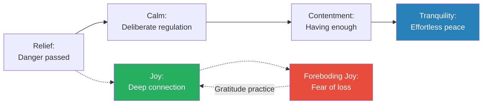

The positive emotions exist on a spectrum from reactive (relief) to deeply settled (tranquility), with joy as the most intense and most vulnerable.

> [!tip] Core Insight
> The most surprising finding in Brown's research: the emotion we are most afraid to feel is not pain but joy. Gratitude is the bridge that lets us cross into joy without falling into foreboding.

---

## Chapter 13: Places We Go When We Feel Wronged

*Brown maps the emotions of injustice and moral violation — from the functional (anger) to the civilisation-threatening (dehumanisation) — and shows why contempt is the most dangerous emotion in a relationship.*

### Anger

- <b style="color: #2980b9">Anger</b> is the emotion that signals a boundary has been crossed:
  - It is not inherently destructive — anger is an indicator emotion, telling us that something is wrong
  - <b style="color: #27ae60">The problem is never anger itself but what we do with it</b>
  - Anger channelled into action produces justice movements, boundary-setting, and change
  - Anger channelled into aggression produces destruction, broken relationships, and cycles of violence
- Brown distinguishes between anger and rage:
  - Anger is a signal: "Something is wrong here"
  - Rage is anger overwhelmed: "Something is wrong and I cannot contain my response"
- She also notes that anger is often a secondary emotion — a more socially acceptable cover for what lies beneath:
  - Underneath anger, you frequently find hurt, fear, shame, or sadness
  - <b style="color: #e74c3c">If you only address the anger without exploring what's underneath, the real emotion remains unresolved</b>
  - Brown uses the iceberg metaphor: anger is the visible tip; the bulk of the emotional mass is below the surface
- She identifies gender dynamics around anger:
  - Men are socialised to express anger but suppress sadness ("Boys don't cry, but boys can fight")
  - Women are socialised to suppress anger but express sadness ("Don't be angry, be nice")
  - The result: men often feel anger when they are actually sad, and women often feel sad when they are actually angry
  - Neither distortion serves the person well — both produce misidentified emotions and inappropriate responses
- Brown also distinguishes between anger and resentment (connecting back to Chapter 2):
  - Anger is immediate — it flares in response to a specific event
  - Resentment is accumulated — it is the residue of unprocessed anger over time
  - Anger says: "This is wrong." Resentment says: "This has always been wrong and no one cares."
  - The transition from anger to resentment is one of the most common and most dangerous emotional progressions, because resentment is much harder to resolve than anger
  - Anger has a clear object; resentment has become a worldview

> [!example] The Angry Father
> - Brown describes a participant, a father, who came home from a difficult day at work and snapped at his children for being noisy
> - He called what he felt "anger" and justified it: "They were being too loud"
> - When Brown asked him to go deeper — what was underneath the anger? — he paused
> - Underneath the anger was fear: he had learned that day his department was being downsized
> - Underneath the fear was shame: "If I lose my job, I'm a failure as a provider"
> - He was not actually angry at his children — he was terrified and ashamed, and anger was the only emotion he had permission to express
> - Brown uses this to illustrate the "iceberg model": anger is visible; what lies beneath it determines everything
> **The lesson:** When anger seems disproportionate to the trigger, it is almost always covering a more vulnerable emotion. The real work is not managing the anger — it is naming what lies beneath it.

> [!abstract] The Anger Iceberg
> 1. Notice the anger: "I feel angry"
> 2. Check the proportion: "Is this anger proportionate to what just happened?"
> 3. If disproportionate, ask: "What else am I feeling?"
> 4. Common emotions beneath anger: fear, shame, hurt, sadness, helplessness
> 5. Name the underlying emotion: "I'm not just angry — I'm afraid" or "I'm not just angry — I'm ashamed"
> 6. Address the underlying emotion rather than just the anger

---

### Contempt and Disgust

- <b style="color: #2980b9">Contempt</b> is the most dangerous emotion in relationships:
  - John Gottman's research identified contempt as the single greatest predictor of divorce — more predictive than any other variable
  - Contempt is anger plus superiority: "You are beneath me"
  - It communicates not just "I'm angry at you" but "You are worthless"
  - <b style="color: #e74c3c">There is no constructive version of contempt — it always destroys connection</b>
  - Contempt is expressed through specific behaviours: eye-rolling, sneering, name-calling, mocking, hostile humour, and the dismissive tone that signals "You are not worth my respect"
- <b style="color: #2980b9">Disgust</b> is the evolutionary emotion designed to protect us from contamination:
  - In its original form, disgust kept us from eating spoiled food or touching disease
  - But disgust has been co-opted socially: we feel "disgusted" by people, ideas, and behaviours
  - When we apply the contamination logic of disgust to people, we begin the process of dehumanisation
  - The language of disgust applied to people — "filthy," "vermin," "plague," "infestation" — is a reliable precursor to violence

> [!example] The Eye-Roll That Ended a Marriage
> - Brown describes a couple in her research where the wife had developed a habit of eye-rolling whenever her husband expressed an opinion
> - She was not consciously aware of it — but the eye-roll was visible to everyone else in the room
> - The husband described it: "Every time I open my mouth, she rolls her eyes. It makes me feel like everything I say is stupid."
> - The wife's defence: "I don't do that. And even if I do, it's just frustration."
> - When Brown pointed out that eye-rolling is the facial expression of contempt — not frustration — the wife was startled
> - Frustration says "I disagree." Eye-rolling says "You are not worth taking seriously."
> - The distinction mattered because the wife genuinely did not feel contempt — she felt frustrated. But the behaviour communicated contempt regardless of her intention
> - Brown uses this to illustrate a crucial point: contempt can be expressed through behaviours we do not consciously intend, and the effect on the relationship is determined by the behaviour, not the intention
> **The lesson:** You may not feel contempt. But if your behaviour expresses it — eye-rolling, sneering, dismissive tone — the relationship processes it as contempt regardless of your intention.

> [!example] Gottman's "Four Horsemen" and Contempt
> - John Gottman studied thousands of couples in his "Love Lab" at the University of Washington
> - He identified four communication patterns that predict divorce with over 90% accuracy — the "Four Horsemen": criticism, defensiveness, stonewalling, and contempt
> - Of the four, contempt was the deadliest
> - Contempt looks like: eye-rolling, sneering, name-calling, mocking, hostile humour
> - Gottman could watch a couple interact for fifteen minutes and predict with 93% accuracy whether they would divorce — primarily by measuring contempt
> - Brown connects this to her own research: contempt is shame directed outward, and shame — whether directed inward or outward — destroys connection
> **The lesson:** Anger says "I disagree." Contempt says "You are less than." One can be repaired; the other corrodes the relationship beyond repair.

---

### Dehumanisation and Hate

- <b style="color: #2980b9">Dehumanisation</b> is the psychological process of reclassifying people as less than human:
  - It is not a fringe phenomenon — Brown argues it is disturbingly common in everyday language:
    - Calling people "animals," "cockroaches," "parasites," "illegals"
    - Describing groups as "infestations" or "plagues"
  - Dehumanisation is the precondition for atrocity — David Livingstone Smith's research shows that every genocide in history was preceded by systematic dehumanisation of the target group
  - <b style="color: #e74c3c">Dehumanisation is not a feeling — it is a process that makes violence psychologically possible by removing the moral restraints we apply to fellow humans</b>
  - Brown emphasises that dehumanisation begins with language — when we stop calling people "people" and start calling them categories, objects, or animals, we have begun the process
  - The antidote is what she calls <b style="color: #2980b9">re-humanisation</b>: deliberately restoring the individuality, complexity, and humanity of people who have been reduced to labels
- <b style="color: #2980b9">Hate</b> is the desire to see another person suffer:
  - Brown distinguishes hate from anger: anger wants the wrong to stop; hate wants the person to suffer
  - Hate is often the terminal stage of a progression: hurt --> anger --> resentment --> contempt --> hate
  - <b style="color: #27ae60">Understanding this progression is critical because it reveals intervention points — addressing hurt before it becomes anger, addressing anger before it becomes resentment</b>
  - Brown notes that hate is cognitively demanding: it requires sustained mental energy to maintain hostility toward someone. People who hate are not at peace — they are consumed
  - She identifies the paradox of hate: it is often an attempt to regain power after feeling powerless, but it consumes the hater rather than affecting the hated
  - Brown draws on her own research to show that the progression from hurt to hate is not inevitable — it can be interrupted at multiple points:
    - At the hurt stage: by naming the hurt and seeking empathy
    - At the anger stage: by channelling anger into boundary-setting rather than aggression
    - At the resentment stage: by examining what boundary has been violated
    - At the contempt stage: by restoring the other person's humanity through curiosity
  - Once dehumanisation has occurred, the interruption becomes much harder — re-humanisation requires deliberately seeking out the individual stories and circumstances of the people who have been reduced to categories

> [!example] The Dehumanising Headline
> - Brown describes showing her students a news headline that referred to a group of people using dehumanising language
> - She asked the students: "What happens in your brain when you read this?"
> - Most admitted that the dehumanising language made them feel less empathy for the people described — even though they knew intellectually that the language was wrong
> - One student said: "I know these are people. But the word used makes me picture something less than people. And once I picture that, I feel less."
> - Brown uses this to illustrate that dehumanisation works precisely because it is linguistic: change the word and you change the perception; change the perception and you change the moral calculation
> - The antidote is what she calls "narrative re-humanisation": seeking out the individual stories of people who have been reduced to labels
> **The lesson:** Dehumanisation does not require malice. It requires only language — and language is something we can choose.

> [!example] The Re-Humanisation Exercise
> - Brown describes an exercise she conducts with her students at the University of Houston
> - She asks them to read a news article about a group of people described in dehumanising terms
> - Then she shares the individual stories of three people from that group: their names, their families, their dreams, their struggles
> - The shift in the room is immediate and visible — students who had been dispassionate become emotional
> - One student described it: "When they were a category, I felt nothing. When they were people, I felt everything."
> - Brown uses this to demonstrate that dehumanisation is reversible — but reversal requires effort. It requires choosing to seek out individual stories rather than accepting categorical labels
> - The mechanism: individual stories activate the empathy circuits that categorical language suppresses
> **The lesson:** Re-humanisation is as simple — and as difficult — as learning someone's name, hearing their story, and allowing them to be a person rather than a label.

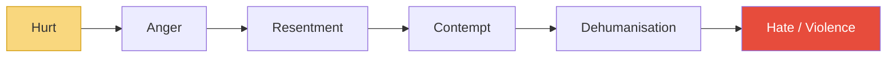

Brown's central argument: dehumanisation and hate are not sudden — they are the end of a chain that begins with unprocessed hurt and unresolved anger.

---

### Self-Righteousness

- <b style="color: #2980b9">Self-righteousness</b> is the conviction that you are morally superior:
  - It is different from having strong moral beliefs — everyone has those
  - Self-righteousness adds a layer of contempt: "I am right AND you are wrong AND your wrongness makes you lesser"
  - <b style="color: #e74c3c">Self-righteousness is addictive because moral superiority feels good — it activates the brain's reward centres</b>
  - But it prevents dialogue, learning, and connection: you cannot learn from someone you believe is beneath you
- Brown notes that self-righteousness is rampant in public discourse:
  - Social media rewards moral certainty and punishes nuance
  - The outrage cycle feeds on self-righteousness: each side is certain the other is not just wrong but morally deficient
  - <b style="color: #27ae60">The antidote to self-righteousness is not moral relativism but intellectual humility — holding strong beliefs while remaining open to new evidence</b>
- Brown draws an important distinction between conviction and self-righteousness:
  - Conviction says: "I believe this is right, and here is why"
  - Self-righteousness says: "I believe this is right, and anyone who disagrees is morally deficient"
  - Conviction can coexist with respect for disagreement; self-righteousness cannot
  - The test: can you disagree with someone without thinking less of them as a person? If not, you have crossed from conviction into self-righteousness
  - Brown notes that this test is increasingly hard to pass in a culture where political and social positions have become identity markers — disagreeing with someone's position feels like attacking their identity, and vice versa
- Brown connects self-righteousness back to the book's through-line: emotional granularity
  - When we are self-righteous, we are not engaging with the complexity of a situation — we are collapsing it into a simple narrative of good vs. evil
  - This is the same failure of granularity that leads us to say "stressed" when we mean "overwhelmed" — but applied to moral judgement rather than personal emotion
- Brown identifies the dopamine loop that sustains self-righteousness in digital environments:
  - Someone says something wrong --> you respond with moral indignation --> you receive likes and supportive comments --> the social validation triggers a dopamine release --> you seek the next opportunity for moral indignation
  - The loop is self-reinforcing: each cycle trains the brain to seek opportunities for outrage because outrage has become a source of social reward
  - Brown notes that this loop does not discriminate between genuine injustice and manufactured outrage — the dopamine hit is the same
  - The result: a culture that is increasingly unable to distinguish between "I disagree" and "You are morally deficient"
- She connects self-righteousness to belonging (Chapter 9):
  - Self-righteousness often functions as a belonging strategy: by publicly denouncing the "wrong" people, we signal our membership in the "right" group
  - But this is fitting in, not belonging — it is performing moral correctness to gain group acceptance, which is the opposite of authentic self-expression

> [!example] The Online Pile-On
> - Brown describes observing an online controversy where a public figure made a poorly worded comment
> - The response was immediate and overwhelming: thousands of people denounced the person in the most absolute terms
> - Brown noticed that the denunciations were not about correcting the mistake — they were about performing moral superiority
> - Each person who piled on was signalling: "I would never say something like that. I am better than this person."
> - The original comment deserved critique. But the pile-on was not critique — it was collective self-righteousness, and it felt intoxicating to the participants
> - Brown's concern: the pleasure of moral superiority becomes its own reward, disconnected from any desire for actual change
> **The lesson:** Self-righteousness feels like justice but functions like contempt. It is concerned with punishing the person, not correcting the wrong.

> [!tip] Core Insight
> Anger is a signal. Contempt is a weapon. Dehumanisation is a process. Understanding the progression from hurt to hate reveals where intervention can stop the slide.

---

## Cultivating Meaningful Connection — The Book's Through-Line

*Across all thirteen chapters, Brown returns to a single argument: language creates meaning, meaning creates connection, and connection is the purpose of human life.*

### The Central Framework: Language --> Meaning --> Connection

- Brown's entire body of work converges on this chain:
  - <b style="color: #27ae60">If you cannot name what you feel, you cannot understand it</b>
  - If you cannot understand it, you cannot communicate it
  - If you cannot communicate it, you cannot connect through it
  - And without connection, you are alone with your experience
- This is why emotional vocabulary is not soft-skills window-dressing — it is the infrastructure of human relationships
- Brown draws an analogy to physical pain: imagine going to a doctor and being unable to describe where it hurts, how it feels, when it started, or what makes it worse. The doctor cannot help you. The same is true of emotional pain — without vocabulary, even the most willing helper is working blind.
- The practical implication cuts across every chapter:
  - In Chapter 1, naming anxiety vs. dread changes what you need
  - In Chapter 2, naming envy vs. jealousy changes who you blame
  - In Chapter 7, naming empathy vs. sympathy changes whether you connect
  - In Chapter 8, naming shame vs. guilt changes whether you can repair
  - In Chapter 12, naming joy vs. happiness changes how you hold the moment
  - In Chapter 13, naming anger vs. contempt changes whether the relationship survives
- Brown returns to this point again and again: precision of language is not pedantic — it is the difference between healing and harm

> [!example] The Couple Who Learned to Name
> - Brown describes a couple she worked with who had been stuck in repetitive arguments for years
> - The pattern: he would come home withdrawn; she would ask "What's wrong?"; he would say "Nothing"; she would press; he would get angry; they would fight
> - The breakthrough came when Brown taught them to replace "What's wrong?" with "What are you feeling?"
> - And instead of "Nothing" or "I'm fine," he learned to pause and identify: "I feel discouraged" or "I feel invisible at work" or "I feel anxious about money"
> - The specific label changed everything — "discouraged" invites support; "angry" invites defensiveness; "nothing" invites frustration
> - Within three months, the repetitive argument pattern had largely dissolved — not because they had fewer problems but because they could name what they felt, which meant they could communicate what they needed, which meant the other person could actually help
> **The lesson:** Most relationship conflicts are not about the topic being discussed. They are about emotions that are present but unnamed.

---

### Emotional Granularity as a Learnable Skill

- <b style="color: #2980b9">Emotional granularity</b> is the capacity to make fine-grained distinctions between emotional states
- Lisa Feldman Barrett's research demonstrates that people with higher emotional granularity:
  - Have better mental health outcomes
  - Use more adaptive coping strategies
  - Are less likely to react with aggression
  - Experience richer, more textured emotional lives
- The book itself is a training tool for emotional granularity:
  - By reading the distinctions (envy vs. jealousy, shame vs. guilt, belonging vs. fitting in), the reader's emotional vocabulary expands
  - Expanded vocabulary leads to more accurate self-assessment
  - More accurate self-assessment leads to better emotional regulation
  - Better emotional regulation leads to deeper connection
- Brown notes that emotional granularity is not just about knowing definitions — it is about having the vocabulary available in the moment of emotional experience
  - Knowing the difference between shame and guilt while reading a book is one thing
  - Recognising "This is shame, not guilt" while in the grip of the emotion is another — and that is the skill that matters

> [!abstract] Building Emotional Granularity — A Practice
> 1. **Start with the body:** Notice where you feel the emotion physically (chest tightening, stomach dropping, jaw clenching)
> 2. **Name the broad category:** Am I in painful territory, connecting territory, or expansive territory?
> 3. **Get specific within the category:** Am I stressed, overwhelmed, anxious, worried, or dreading?
> 4. **Check the fit:** Does this label feel accurate? Does saying "I feel [this]" produce a sense of recognition?
> 5. **Notice what shifts:** Accurate naming often produces a small but noticeable sense of relief — the feeling of being understood, even if only by yourself
> 6. **Communicate with precision:** Replace "I feel bad" with the specific emotion: "I feel envious," "I feel ashamed," "I feel disconnected"

- Brown's research found that the practice of emotional granularity improves over time:
  - Early attempts feel clumsy — you may not find the right word on the first try
  - Over weeks and months, pattern recognition develops: you start recognising shame by its physical signature before you have consciously named it
  - Eventually, the recognition becomes automatic — the same way a musician identifies notes without conscious effort
  - The investment pays compound interest: every emotion you can name accurately is an emotion you can regulate, communicate, and ultimately connect through
- Brown acknowledges a nuance: language is necessary but not sufficient
  - Knowing the word "shame" does not automatically resolve a shame experience — but it gives you the first foothold
  - The naming must be followed by sharing (with someone who has earned the right to hear it), and sharing must be followed by integration (understanding the shame in the context of your story)
  - Language is the beginning of the process, not the end — but without it, the process cannot start
  - Brown draws an analogy to navigation: a map does not walk the trail for you, but without a map, you are lost
  - The 87 emotions in this book are the map. Walking the trail — feeling, naming, sharing, connecting — is the work of a lifetime

---

### Grounded Confidence vs. Armoured Certainty

- Brown draws a distinction that runs through her work:
- <b style="color: #2980b9">Armoured certainty</b> is the posture of someone who cannot tolerate ambiguity:
  - "I know exactly what I feel. I am always right. I am in control."
  - It looks strong but is profoundly fragile — it collapses when reality introduces complexity
  - Armoured certainty produces the "knowing-doing gap": people who insist they understand emotions perfectly but whose relationships tell a different story
- <b style="color: #2980b9">Grounded confidence</b> is the posture of someone who has done the inner work:
  - "I may not know exactly what I feel, but I have the vocabulary and the skills to figure it out"
  - It is flexible, curious, and resilient
  - <b style="color: #27ae60">Grounded confidence does not come from having all the answers — it comes from knowing you can navigate the questions</b>

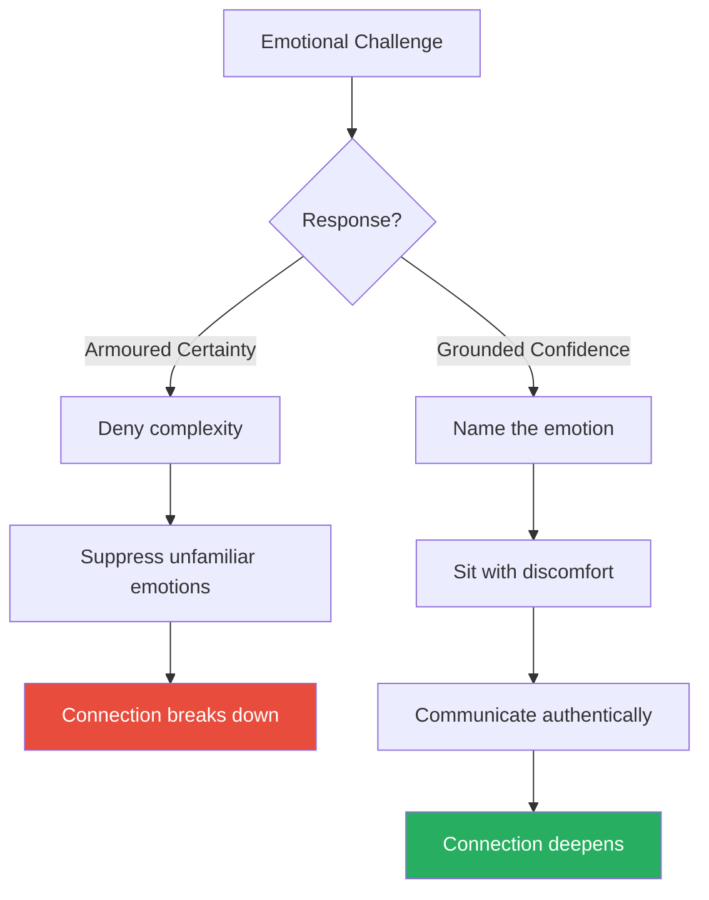

The difference between armoured certainty and grounded confidence is not knowledge — it is the willingness to admit what you do not know.

| Dimension | Armoured Certainty | Grounded Confidence |
|-----------|-------------------|-------------------|
| **Response to "I don't know"** | Shame, bluffing | Curiosity, seeking |
| **Response to feedback** | Defensiveness | Openness |
| **Response to complexity** | Oversimplification | Nuance |
| **Response to vulnerability** | Armour up | Lean in |
| **Effect on relationships** | Distance | Connection |
| **Sustainability** | Brittle — breaks under pressure | Flexible — bends without breaking |

- Brown notes that armoured certainty is especially common in cultures that reward confidence and punish uncertainty — corporate environments, political leadership, and public discourse
- The tragedy is that armoured certainty often develops as a response to shame: "If I show uncertainty, I'll be seen as weak" — so people perform certainty to manage their fear of being seen as inadequate
- Grounded confidence requires the same courage as vulnerability: the willingness to say "I don't know" in a room that rewards "I'm sure"

> [!example] The Therapist's Challenge
> - Brown describes a therapist who worked with a couple on the verge of divorce
> - The husband insisted he was "fine" — he denied anger, sadness, fear, or any emotional complexity
> - His wife said: "He's a wall. I can't reach him. He won't tell me what he feels."
> - The therapist gave the husband a list of 87 emotions and asked him to circle anything he had felt in the past week
> - He circled three: "fine," "tired," and "frustrated"
> - Over months of work, his vocabulary expanded — he began identifying disappointment, loneliness, shame, tenderness, gratitude
> - As his vocabulary grew, so did his capacity for connection — his wife said: "I finally feel like I know him"
> **The lesson:** Emotional vocabulary is not a luxury — it is the doorway to intimacy. Without the words, even the most loving person remains a stranger.

---

## The Emotional Landscape — A Map of the Whole Book

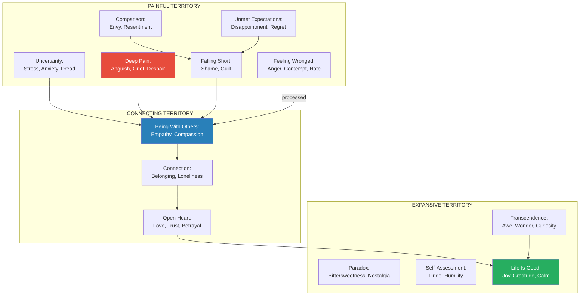

Brown's emotional map is not a hierarchy — it is a geography. We move between these territories constantly, often visiting several in a single conversation.

The force-directed network reveals Brown's central insight: emotions are not isolated states but an interconnected web — shame links to both envy and belonging, grief connects to compassion, and the path from trust through love to joy forms the backbone of human connection.

---

## Key Distinctions — Summary Table

The most practically useful distinctions in the book, collected for quick reference:

| Often Confused | Key Distinction | Why It Matters |
|---------------|----------------|----------------|
| Stress vs. Overwhelm | Stress still has agency; overwhelm has lost it | Stress needs support; overwhelm needs subtraction |
| Anxiety vs. Worry | Anxiety is diffuse; worry is specific | Anxiety needs grounding; worry needs problem-solving |
| Envy vs. Jealousy | Envy lacks; jealousy fears losing | Envy is two people; jealousy is three |
| Empathy vs. Sympathy | Empathy feels with; sympathy feels for | Empathy connects; sympathy distances |
| Compassion vs. Pity | Compassion is equal; pity looks down | Compassion dignifies; pity diminishes |
| Shame vs. Guilt | Shame attacks identity; guilt addresses behaviour | Shame destroys; guilt repairs |
| Belonging vs. Fitting In | Belonging accepts you; fitting in requires change | Fitting in is the barrier to belonging |
| Joy vs. Happiness | Joy is intense, vulnerable, brief; happiness is sustained, safer | Joy requires openness; happiness depends on circumstances |
| Anger vs. Contempt | Anger addresses the wrong; contempt addresses the person | Anger can repair; contempt only corrodes |
| Pride vs. Hubris | Pride is earned; hubris is inflated | Pride motivates; hubris alienates |
| Acceptance vs. Resignation | Acceptance preserves agency; resignation abandons it | Acceptance adapts; resignation gives up |
| Humility vs. Self-deprecation | Humility is honest; self-deprecation diminishes | Humility grounds; self-deprecation erodes |

---

## The Verdict

Brown's greatest contribution with *Atlas of the Heart* is not any single insight but the cumulative effect of eighty-seven carefully drawn distinctions. By the time you finish the book, you see emotions differently. You catch yourself saying "I'm stressed" and pause — is it stress, overwhelm, anxiety, or dread? You notice envy before it mutates into resentment. You recognise foreboding joy and reach for gratitude instead of catastrophising. The book functions as a training manual for emotional granularity, and that granularity pays dividends in every relationship you have. It is the rare book that changes your vocabulary, and therefore changes your perception.

The weaknesses are real but modest. Brown leans heavily on her own research and her own stories, which gives the book warmth but sometimes limits its intellectual range — readers familiar with [[Emotional Intelligence - Daniel Goleman|Goleman]], Barrett, or Ekman may find some sections introductory. The 87-emotion taxonomy, while useful, is not rigorously defended as a definitive list — it is more of a curated collection than a scientifically validated classification system. Some emotions receive deep treatment (shame, empathy, foreboding joy) while others get a paragraph or two (relief, interest, tranquility). And Brown's writing style, while accessible, occasionally slips into the motivational-speaker register that divides readers — you either find it warm and authentic or slightly sermonic.

The book is most valuable for anyone who has ever said "I don't know what I feel" — which is most of us. It is particularly useful for people in close relationships (romantic, parenting, deep friendships) where emotional precision is the difference between connection and conflict. Therapists, coaches, and leaders will find it a practical reference for helping others articulate their inner experience. And anyone interested in [[The Gaslight Effect - Robin Stern|emotional manipulation]], [[Games People Play - Eric Berne|hidden emotional transactions]], or [[Crucial Conversations - Kerry Patterson|high-stakes dialogue]] will benefit from the vocabulary this book provides.

Compared to [[Emotional Intelligence - Daniel Goleman|Goleman's *Emotional Intelligence*]], this book is less neuroscience-heavy and more relational — Brown cares less about brain regions and more about what happens between people. Compared to Lisa Feldman Barrett's *How Emotions Are Made*, it is less theoretically ambitious but far more practically useful — Barrett deconstructs the category of "emotion" itself, while Brown takes the categories as given and teaches you to use them. Compared to Susan David's *Emotional Agility*, it covers more ground but goes less deep on any single technique — David offers a method for working with difficult emotions, while Brown offers a map of the entire emotional landscape. Compared to [[Crucial Conversations - Kerry Patterson|*Crucial Conversations*]], it operates one level deeper: that book teaches you what to say; this book teaches you what you are feeling before you figure out what to say.

*Atlas of the Heart* occupies a unique position: it is the most comprehensive emotional vocabulary book available for a general audience, and it earns that position by combining rigorous research with the storytelling instinct that made Brown one of the most influential social scientists of her generation. The book's greatest practical value may be as a reference: keep it on your shelf and return to it when you feel something you cannot name. The act of looking it up — of moving from "I feel bad" to "I feel anguish" or "I feel disappointed" or "I feel ashamed" — is itself the first step toward recovery. That is the book's promise, and it delivers.

---

## Related Reading

- [[Emotional Intelligence - Daniel Goleman]] — the neuroscience of emotional processing and the five-domain EQ framework
- [[Crucial Conversations - Kerry Patterson]] — applying emotional literacy in high-stakes dialogue
- [[Games People Play - Eric Berne]] — hidden emotional transactions and the games we play to avoid genuine connection
- [[The Gaslight Effect - Robin Stern]] — when emotional vocabulary is weaponised — manipulation, betrayal, and trust erosion
- [[The Charisma Myth - Olivia Fox Cabane]] — presence, warmth, and power as the building blocks of interpersonal connection
- [[Man's Search for Meaning - Viktor Frankl]] — meaning-making as the antidote to despair
- [[The Laws of Human Nature - Robert Greene]] — envy, narcissism, and the shadow side of human emotion
- [[What Every Body Is Saying - Joe Navarro]] — reading the nonverbal signals that emotions produce in the body
- [[You Are Not So Smart - David McRaney]] — the cognitive biases that distort our emotional self-knowledge
- [[Like Switch - Jack Schafer]] — the behavioural science of rapport, trust, and connection
