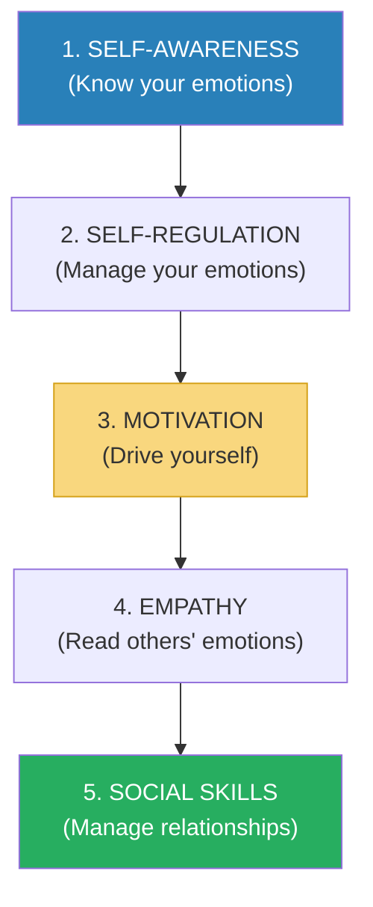
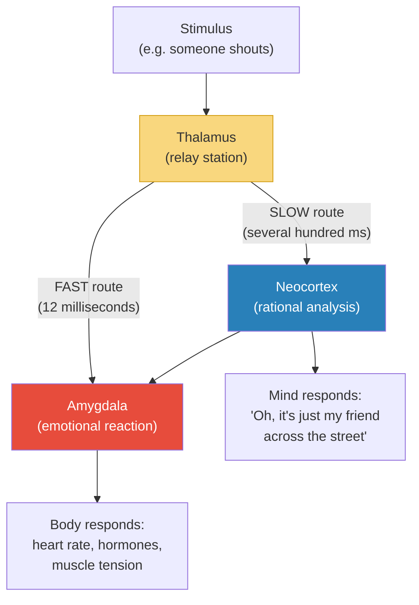
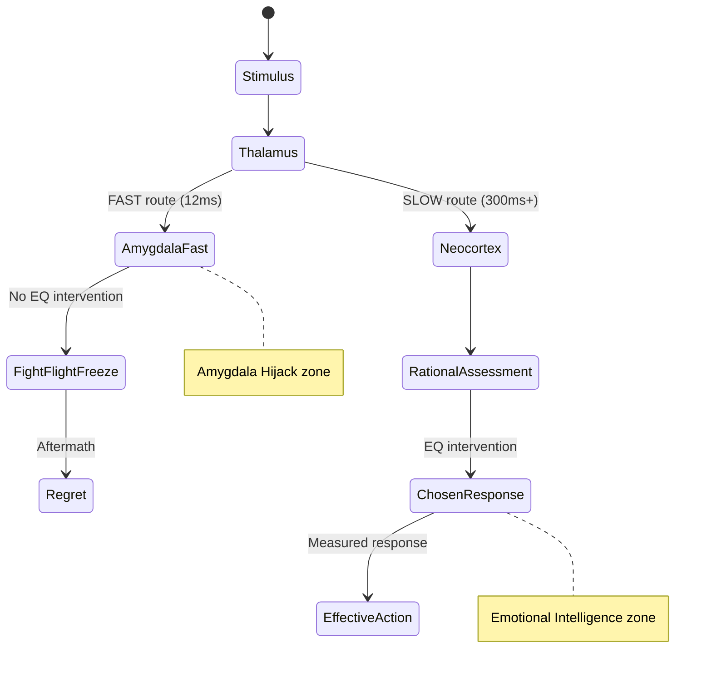
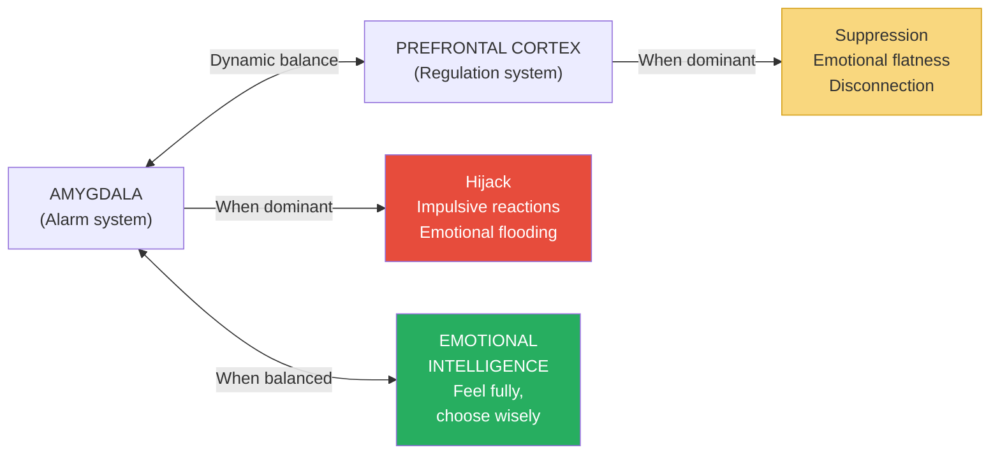
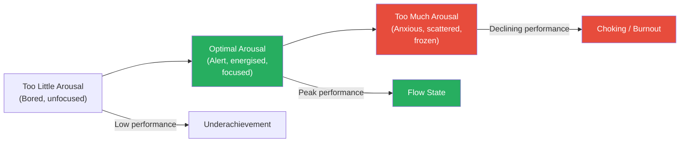
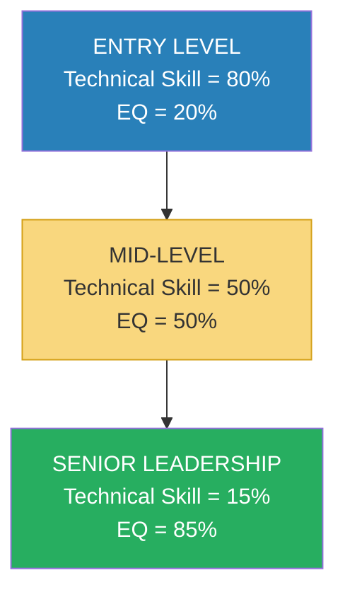
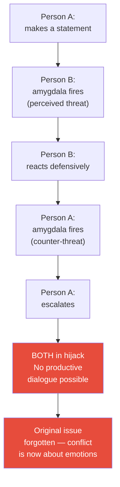
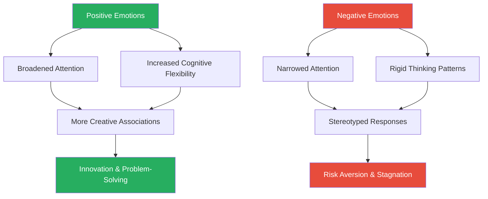
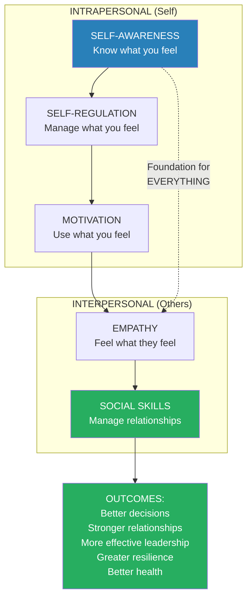

# Emotional Intelligence — Daniel Goleman

> Daniel Goleman's thesis shook the business and education worlds: IQ is not destiny.
> The abilities that matter most for success in life — self-awareness, impulse control, persistence, empathy, and social skill — are not measured by any intelligence test, yet they determine outcomes in career, relationships, and health far more powerfully than cognitive ability alone.
> He called these abilities "emotional intelligence" and built a five-domain framework — Self-Awareness, Self-Regulation, Motivation, Empathy, and Social Skills — that has since become one of the most widely used models in leadership development, education, and psychotherapy.
> Drawing on neuroscience (the amygdala hijack), developmental psychology (the Marshmallow Test), and hundreds of studies on workplace and life success, Goleman makes an empirical case that EQ matters more than IQ — and, crucially, that unlike IQ, EQ can be developed at any age.
> The book spent 18 months on the New York Times bestseller list, has been translated into 40 languages, and launched an entire field of research and practice.
> It is the book that made "emotional intelligence" a household phrase — and the book that every leader, teacher, parent, and human being should read.

---

## About the Author

Daniel Goleman is a psychologist, science journalist, and former New York Times reporter on the brain and behavioural sciences. He holds a PhD from Harvard, where he studied under David McClelland, a pioneer in competence-based assessment who first argued that traditional IQ tests were poor predictors of real-world success. Before writing this book, Goleman spent twelve years covering psychology and neuroscience for the New York Times, which gave him unusual access to cutting-edge research and the narrative skill to make it accessible.

His subsequent books — *Working with Emotional Intelligence*, *Social Intelligence*, and *Focus* — extended the framework into workplace leadership, social neuroscience, and attention management. But it is this first book that remains the most important, because it established the foundational argument: <b style="color: #2980b9">what you feel and how you manage those feelings matters at least as much as what you think</b>.

---

## The Big Idea

- <b style="color: #2980b9">IQ accounts for approximately 20% of the factors that determine life success</b>
- The remaining 80% is largely attributable to what Goleman calls <b style="color: #2980b9">emotional intelligence (EQ)</b>
- EQ is the ability to recognise, understand, manage, and effectively use emotions — in yourself and in others
- <b style="color: #27ae60">Unlike IQ, which is largely fixed by late adolescence, EQ can be developed throughout life</b>
- This is the book's most hopeful message: emotional intelligence is not a gift you're born with or without — it is a set of learnable skills

---

- Goleman's framework identifies five domains, arranged in a progression from internal to external:

The first three domains are intrapersonal — they concern your relationship with yourself — while the last two are interpersonal, concerning your relationship with others.

The radar chart reveals that high-EQ individuals show balanced development across all five domains, while low-EQ profiles collapse inward — confirming Goleman's argument that the domains build sequentially and weakness in one undermines the rest.

- <b style="color: #27ae60">The progression matters: you cannot regulate what you cannot recognise (Self-Awareness must precede Self-Regulation), you cannot read others if you cannot read yourself (intrapersonal skills must precede interpersonal ones)</b>
- This sequence is not arbitrary — it reflects a genuine developmental logic in which each domain builds on the foundations of the previous one

---

## Key Concepts at a Glance

| Concept | One-line summary |
|---------|-----------------|
| **Self-Awareness** | Recognising your own emotions as they happen — in real time, not after the fact |
| **Self-Regulation** | Managing disruptive emotions so they inform rather than hijack your behaviour |
| **Motivation** | Using emotional energy — persistence, optimism, delayed gratification — to drive toward goals |
| **Empathy** | Sensing what others feel by reading the emotional signal beneath the words |
| **Social Skills** | Managing relationships effectively through influence, collaboration, and conflict resolution |
| **Amygdala Hijack** | The emotional brain overriding the rational brain before you can think |
| **The Marshmallow Test** | Children who delayed gratification at age 4 outperformed peers on virtually every measure decades later |
| **Emotional Contagion** | Emotions spread between people — a leader's mood infects the entire team |
| **The Rational-Emotional Partnership** | Good decisions require BOTH reason and emotion — pure reason without emotional input produces poor choices |
| **Alexithymia** | The inability to identify or describe one's own emotions — the extreme end of low self-awareness |
| **Flow** | The state of total absorption where emotions are channelled productively into an activity |
| **The Gut Feeling** | Somatic markers (body signals) that encode emotional learning and guide rapid decision-making |
| **Affect Labelling** | Simply naming an emotion reduces its intensity by activating prefrontal regulation |
| **Emotional Flooding** | When the amygdala overwhelms the prefrontal cortex so completely that rational thought becomes temporarily impossible |
| **Broaden-and-Build** | Positive emotions expand cognitive repertoire; negative emotions narrow it |
| **Emotion-Coaching** | The parenting style that produces the highest EQ in children — validating feelings while redirecting behaviour |

---

## Part 1: The Emotional Brain — The Neuroscience of EQ

*Goleman's opening chapters establish the biological foundation for his argument: emotions are not irrational noise to be suppressed but an ancient, sophisticated guidance system that works ALONGSIDE reason.*

### The Architecture of Emotion

- The human brain has two processing systems for emotional information:
  1. <b style="color: #2980b9">The thalamus-amygdala expressway</b> — a fast, rough route that triggers an emotional reaction BEFORE the thinking brain has even registered what happened
  2. <b style="color: #2980b9">The thalamus-cortex-amygdala scenic route</b> — a slower, more accurate route that processes the stimulus through the thinking brain first
- Neuroscientist Joseph LeDoux at New York University discovered this dual-pathway architecture in the early 1990s through his work on fear conditioning in rats
  - LeDoux severed the connection between the auditory cortex and the amygdala in rats, then played a tone paired with a mild shock
  - The rats still developed a conditioned fear response — proving that the amygdala could receive sensory input and trigger a reaction WITHOUT any involvement from the cortex
  - This was a paradigm-shifting discovery: it showed that the brain has a "back channel" for emotional processing that completely bypasses conscious thought

The fast route exists because evolution prioritised speed over accuracy.

- <b style="color: #e74c3c">It's better to jump at a shadow (false positive) than to deliberate while a predator attacks (false negative)</b>
- But in modern life, the fast route creates problems: you snap at a colleague, send an angry email, make a fear-based decision — all before your rational brain has had time to weigh in
- <b style="color: #2980b9">This is the "amygdala hijack" — Goleman's most famous concept</b>
- The amygdala stores emotional memories with great fidelity — a single traumatic event can create a lifelong trigger
- It does not distinguish between genuine danger and perceived social threat: a dismissive comment in a meeting and a snake on a trail both activate the same alarm system
- This biological reality is why emotional intelligence matters — your ancient wiring will misfire in modern contexts unless you learn to manage it

The state diagram maps the two neural pathways in sequence: the amygdala hijack produces fight-flight-freeze followed by regret, while the emotionally intelligent route through the neocortex produces a chosen response — EQ lives in the gap between these two paths.
- The amygdala is also implicated in positive emotional processing — it responds to rewards, novelty, and social cues — but its threat-detection function is the one that causes the most trouble in everyday life

---

### The Amygdala Hijack

- The <b style="color: #e74c3c">amygdala hijack</b> occurs when the emotional brain takes over before the rational brain can intervene
- Characteristics of a hijack:
  - It happens fast — before you've had time to think
  - It produces a disproportionate response — the reaction is out of scale with the trigger
  - You only realise what happened afterward — "Why did I say that? That wasn't like me."
  - It is accompanied by physical symptoms: racing heart, flushed face, muscle tension, dry mouth
- The term itself has entered common usage in leadership development, therapy, and conflict resolution — a testament to how precisely Goleman named something everyone experiences
- Goleman traces the hijack mechanism through several key neurochemical processes:
  - The amygdala signals the hypothalamus, which activates the sympathetic nervous system
  - Adrenaline and cortisol flood the bloodstream
  - Blood redirects from the digestive system and prefrontal cortex to the large muscle groups
  - The prefrontal cortex — the seat of planning, judgment, and impulse control — is literally starved of resources
  - This is why people in hijack mode cannot think clearly: the thinking brain has been defunded by the emotional brain

> [!example] The Road Rage Hijack
> - You're driving to work and someone cuts you off
> - In a flash, you're honking, shouting, and tailgating — heart pounding, face flushed, hands gripping the wheel
> - Thirty seconds later, you think: "What am I doing? I'm going to be late for a meeting over someone I'll never see again"
> - Your amygdala reacted to the lane intrusion as a THREAT (fast route)
> - Your neocortex, arriving late (slow route), recognised it as a minor inconvenience
> - But by then, you were already honking
> **The lesson:** The hijack was over before the thinking brain even arrived at the scene.

> [!example] The Email Hijack
> - You open an email from a colleague that feels dismissive
> - Your amygdala fires: this is a STATUS THREAT
> - Within 30 seconds you've composed a scathing reply
> - Your finger hovers over "Send" — and your neocortex finally catches up
> - "Wait. Is this really dismissive, or am I reading it wrong? Is this reply going to help the situation?"
> - The gap between finger-on-Send and actually-Sending is where emotional intelligence lives
> **The lesson:** EQ is not about not FEELING the anger. It's about creating enough space between the feeling and the action to CHOOSE your response.

> [!example] The Hijack That Made Headlines — The Dan White Case
> - Goleman opens the book with a dramatic example: a woman whose amygdala had been surgically removed could no longer feel fear — or any emotion
> - She could recognise faces but not read expressions; she understood words but not tone
> - She was intelligent, articulate, and completely unable to navigate social life
> - Without the amygdala, she had no emotional compass — she could not sense danger, read intent, or connect with others
> - Her IQ was intact. Her life was in ruins.
> **The lesson:** The amygdala is not an evolutionary mistake to be overridden — it is a survival system to be managed.

---

### Why Emotions Are Not the Enemy of Reason

*Goleman dismantles the centuries-old Western assumption that emotions cloud rational thinking — and shows that without emotions, rational thinking cannot function at all.*

- The traditional Western view: emotions are irrational impulses that cloud clear thinking — the goal is to suppress them
- <b style="color: #2980b9">Goleman argues the opposite: emotions are ESSENTIAL to good decision-making</b>
- He draws on Antonio Damasio's research with brain-damaged patients who had lost the ability to feel emotions but whose rational faculties were intact
- Damasio called his theory the <b style="color: #2980b9">somatic marker hypothesis</b>: the body stores emotional memories as physical sensations (gut feelings, hunches, unease) and these markers guide rapid decision-making by flagging options as "feels right" or "feels wrong" before conscious analysis can complete
- Without these markers, the rational brain has infinite options and no way to prioritise among them

> [!example] Damasio's Patients — When Reason Alone Fails
> - Neuroscientist Antonio Damasio studied patients with damage to the ventromedial prefrontal cortex — the brain region that connects emotion to decision-making
> - These patients scored normally on IQ tests and could reason logically about hypothetical problems
> - But they could not make real-world decisions — even trivial ones like what to eat for lunch or where to sit
> - Without emotional input (what Damasio calls "somatic markers" — gut feelings encoded in the body), the rational brain has no way to assign VALUE to options
> - One patient spent 30 minutes deliberating between two possible appointment dates, listing pros and cons endlessly, unable to choose
> - His reasoning was impeccable — but without feelings to weight the options, every choice looked equally valid
> **The lesson:** You need emotions to tell you what MATTERS — then you use reason to figure out what to DO about it.

> [!example] The Iowa Gambling Task
> - Damasio designed a card game where players chose from four decks — two that gave large payoffs with devastating losses, and two that gave smaller payoffs with smaller losses
> - Normal players developed "gut feelings" about which decks were bad BEFORE they could consciously articulate why — their palms began sweating when they reached for a bad deck
> - Patients with ventromedial prefrontal cortex damage never developed these somatic markers — they kept choosing the bad decks despite accumulating massive losses
> - Their rational analysis of the game was intact — they could explain the rules, calculate probabilities, describe what was happening
> - But without the emotional warning system, they could not translate that knowledge into adaptive behaviour
> **The lesson:** The gut feeling is not mystical — it is the body's way of transmitting emotional learning to the conscious mind. Without it, knowledge does not become wisdom.

- <b style="color: #27ae60">The goal of emotional intelligence is not to suppress emotions but to use them wisely — to harness them as information, not be enslaved by them as compulsion</b>
- This insight aligns with the Stoic tradition — not the popular caricature of Stoics as emotionless, but the actual teaching: emotions are data, not commands (see [[Discourses - Epictetus|Discourses]])

> [!tip] The Damasio Lesson
> If you ever think emotions are "getting in the way" of good decisions, consider Damasio's patients: people who CAN'T feel emotions CAN'T decide anything.
> Your emotions are not the problem. Your RELATIONSHIP with your emotions is the problem.
> The emotionally intelligent person doesn't feel less. They feel just as much — but they CREATE SPACE between the feeling and the response, so the response is chosen rather than automatic.

---

### The Two Minds

- Goleman describes the human psyche as having <b style="color: #2980b9">"two minds"</b> — the rational mind and the emotional mind
- In most situations, these two work in harmony: the emotional mind provides the motivation and the values; the rational mind provides the plan and the execution
- <b style="color: #e74c3c">Problems arise when the emotional mind overwhelms the rational mind (hijack) or when the rational mind ignores the emotional mind (cold, disconnected decisions)</b>
- The emotionally intelligent person maintains a <b style="color: #27ae60">partnership between the two</b> — neither suppressing emotions nor being controlled by them

| State | Emotional Mind | Rational Mind | Result |
|-------|---------------|---------------|--------|
| **Hijack** | Dominant | Suppressed | Impulsive, disproportionate reactions |
| **Suppression** | Suppressed | Dominant | Cold, disconnected, unable to connect with others or identify values |
| **Partnership** | Active, informing | Active, directing | Wise decisions that account for both logic and feeling |

- <b style="color: #27ae60">EQ is the skill of maintaining the partnership — keeping both minds online and working together</b>
- This two-mind model anticipates Kahneman's System 1/System 2 framework by several years — Goleman arrived at the insight through neuroscience rather than cognitive psychology, but the structure is strikingly similar (see [[Thinking in Bets - Annie Duke|Thinking in Bets]])
- The key difference: Kahneman framed System 1 as a source of cognitive error to be corrected; Goleman frames the emotional mind as a source of wisdom to be harnessed
- Both are right — the emotional mind produces both invaluable intuitions and dangerous distortions, depending on whether it is managed or left to run unchecked

---

### The Emotional Memory System

*The amygdala does not simply react to threats in the present — it stores emotional memories from the past and uses them to colour every new experience.*

- The amygdala functions as an <b style="color: #2980b9">emotional memory bank</b>
- Unlike the hippocampus (which stores factual, conscious memories), the amygdala stores the emotional CHARGE associated with an experience
- This means you can have a strong emotional reaction to something without understanding why — the amygdala has matched the current stimulus to an old emotional memory, but the conscious brain hasn't made the connection
- A person who was humiliated publicly as a child may feel intense anxiety before every presentation as an adult — not because presentations are dangerous, but because the amygdala has linked "being watched" with "humiliation"
- <b style="color: #e74c3c">These emotional memories are imprecise — they match on partial patterns, which produces many false alarms</b>
- The amygdala doesn't need an exact match; a rough similarity is enough to trigger the old emotional response
- This explains why certain people, tones of voice, or situations can provoke disproportionate reactions — the amygdala is responding to the past, not the present
- Goleman emphasises a critical distinction between the two memory systems:
  - **Hippocampal memory** is explicit — you can recall it consciously and place it in context ("I was bullied in third grade by a boy named James")
  - **Amygdala memory** is implicit — it operates below conscious awareness and produces reactions without explanations ("I feel anxious around assertive men, but I don't know why")
  - Therapy often works by reconnecting the two systems: bringing implicit emotional memories into explicit awareness so they can be re-evaluated

> [!example] The Vietnam Veteran's Startle Response
> - Goleman describes a Vietnam veteran who, decades after combat, hit the ground in a panic when a car backfired on a quiet suburban street
> - His amygdala had stored the sound of gunfire with life-or-death urgency
> - A car backfire was "close enough" to trigger the full combat response — diving, heart racing, scanning for threats
> - His rational brain knew immediately that it was a car backfire — but by then, his body was already in survival mode
> - The emotional memory (stored in the amygdala) had overridden the factual memory (stored in the hippocampus)
> **The lesson:** Emotional memories are fast, imprecise, and powerful — they fire before conscious thought can intervene.

> [!example] The Abused Child's Hypervigilance
> - Goleman describes research on children raised in abusive homes who develop what psychologists call "hypervigilance" — a state of constant emotional alertness
> - These children become extraordinarily skilled at reading adult facial expressions, particularly anger — they can detect a shift toward anger faster than any other children
> - This is the amygdala adapting to a dangerous environment: faster threat detection means faster self-protection
> - But in safe environments (school, friendships, adult relationships), the same hypervigilance produces constant false alarms — the child reads hostility where none exists
> - Their amygdala was shaped by an environment where threat was real and constant; it continues to fire in that pattern even when the environment changes
> **The lesson:** The emotional brain is shaped by experience — and it does not automatically update when the experience changes. That update requires conscious, deliberate work.

---

### The Prefrontal-Amygdala Dance

*The relationship between the prefrontal cortex and the amygdala is not one of dominance but of dynamic balance — and that balance IS emotional intelligence.*

- The <b style="color: #2980b9">left prefrontal cortex</b> acts as a dampener on the amygdala — it can inhibit emotional reactions, reduce the intensity of feelings, and restore rational processing after a hijack
- People with more active left prefrontal cortexes tend to recover from negative emotions faster, maintain more positive mood baselines, and show greater emotional resilience
- <b style="color: #27ae60">This prefrontal-amygdala circuit is the neurological substrate of self-regulation — and it is strengthened by practice</b>
- Every time you pause before reacting, name an emotion, or choose a response rather than defaulting to one, you are strengthening this circuit
- Richard Davidson's research at the University of Wisconsin showed that:
  - The ratio of left-to-right prefrontal activation predicts emotional temperament
  - People with greater left prefrontal activation are more resilient, more optimistic, and recover from setbacks faster
  - Meditation — particularly mindfulness meditation — shifts the ratio toward left prefrontal dominance, producing measurable improvements in emotional regulation
  - These changes are not temporary mood boosts — they represent structural changes in brain function that persist over time

> [!example] Davidson's Meditation Study
> - Davidson brought experienced Buddhist meditators (10,000+ hours of practice) into his lab at the University of Wisconsin and compared their brain scans with those of meditation novices
> - The meditators showed dramatically higher left-to-right prefrontal activation ratios — both during meditation AND at rest
> - This meant their BASELINE emotional state was more positive, more resilient, and more regulated than the novices' — not just during practice, but all the time
> - Even more striking: when exposed to a sudden loud noise (a startling stimulus), the meditators showed a faster recovery to baseline — their amygdalas responded normally, but their prefrontal cortexes brought the response back under control far more quickly
> - Davidson also studied novice meditators after just 8 weeks of mindfulness training: even this brief period produced measurable shifts in prefrontal activation ratios
> - The immune function of the 8-week meditators also improved — they showed stronger antibody responses to a flu vaccine than the control group
> **The lesson:** Emotional regulation is not a talent — it is a trainable skill with measurable neurological and immunological effects. Eight weeks is enough to start.

The goal is not prefrontal dominance (that produces emotional suppression) but dynamic balance — the amygdala feels, the prefrontal cortex evaluates, and together they produce wise responses.

---

## Part 2: The Five Domains of Emotional Intelligence

### Domain 1: Self-Awareness — The Foundation of Everything

*Self-awareness is the keystone of emotional intelligence. Without it, every other domain collapses — you cannot regulate emotions you don't recognise, empathise with feelings you can't name in yourself, or manage relationships when you're blind to your own impact.*

- <b style="color: #2980b9">Self-awareness</b> is the ability to recognise your own emotions as they happen — not after the fact, not through reflection the next day, but in real time
- Goleman calls this "attention to one's own internal states" — a kind of neutral, non-judgmental observation of what you're feeling at any given moment
- It is NOT the same as being overwhelmed by emotions (that's the opposite — the emotion controls you instead of you observing it)
- <b style="color: #27ae60">The self-aware person can say: "I'm feeling angry right now. The anger is rising. I notice my jaw is clenching and my heart rate is increasing. I'm going to take a breath before I respond."</b>
- The non-self-aware person simply IS angry — they ARE the anger, with no observer between the emotion and the action
- Goleman traces this capacity back to what psychologists call <b style="color: #2980b9">metacognition</b> — thinking about thinking — but he extends it to the emotional domain: feeling about feeling, awareness of the feeling WHILE you're feeling it
- John Mayer (the psychologist, not the musician), who co-developed the concept of emotional intelligence with Peter Salovey at Yale, describes self-awareness as the ability to be "aware of both our mood and our thoughts about that mood"

---

### Three Levels of Emotional Self-Awareness

| Level | Description | Example | Impact on Behaviour |
|-------|-------------|---------|-------------------|
| **Engulfed** | Completely captured by the emotion; no awareness that you're emotional | Shouting at someone before you even realise you're angry | Reactive, impulsive, unpredictable |
| **Accepting** | Aware that you're emotional but choosing to go with the feeling | "I know I'm angry, and right now I want to be angry" | Conscious but not managed — the emotion still dictates behaviour |
| **Self-aware** | Observing the emotion as it happens, with enough distance to choose a response | "I notice I'm angry. This isn't the right moment to act on it." | Responsive rather than reactive — the emotion informs but doesn't control |

- <b style="color: #27ae60">The goal of EQ is not to eliminate emotions but to move from Level 1 (engulfed) to Level 3 (self-aware) as often as possible</b>
- This shift doesn't require years of meditation (though meditation helps) — it starts with the simple practice of PAUSING before responding and asking: "What am I feeling right now?"
- Goleman notes that most people operate at Level 1 for a surprising proportion of their day — their emotions rise and fall without any conscious registration
- The research supports the value of even brief self-awareness interventions:
  - Simply asking people to rate their emotional state on a 1-10 scale before a decision measurably improved decision quality in laboratory studies
  - Journaling about emotions for 15 minutes daily produced significant improvements in emotional awareness within 4 weeks
  - Leaders who practised "emotional check-ins" before meetings were rated as more effective by their teams

> [!example] The Executive Who Didn't Know He Was Afraid
> - Goleman describes an executive who consistently avoided strategic risk-taking, always choosing the safe option even when the opportunity was clear
> - He described himself as "cautious" and "analytical" — positive frames for his risk aversion
> - Only through coaching did he recognise that his "caution" was actually fear — fear of failure, fear of looking foolish, fear of losing what he'd built
> - The moment he named the emotion — "I'm afraid" — he could begin to manage it
> - As long as it was disguised as "caution," it was invisible to him and therefore unmanageable
> **The lesson:** Self-awareness is the act of seeing through your own PR. The stories you tell yourself about your emotions are often not the emotions themselves.

> [!example] The Trader Who Read His Own Body
> - Goleman describes a Wall Street trader who learned to use his body as an emotional barometer
> - He noticed that when a trade was going wrong, he felt a tightness in his stomach BEFORE the numbers confirmed the loss
> - He began tracking these body signals and discovered they were remarkably accurate — his gut was reading the market dynamics before his conscious analysis caught up
> - He started using the body signals as early warning systems: "When my stomach tightens, I review the position. When my shoulders tense, I reduce exposure."
> - This is the somatic marker hypothesis in action — the body stores emotional learning and communicates it through physical sensation
> **The lesson:** Self-awareness is not only a mental skill — it is a body skill. Your body knows things before your mind does.

---

### Alexithymia: The Extreme of Low Self-Awareness

- <b style="color: #e74c3c">Alexithymia</b> (from the Greek: "without words for emotions") is the clinical inability to identify or describe one's own emotional states
- People with alexithymia FEEL emotions — their bodies respond (racing heart, tense muscles, tears) — but they cannot NAME what they're feeling
- They might say "I feel bad" but cannot distinguish between anger, sadness, fear, shame, or frustration
- <b style="color: #2980b9">This is not a rare condition — it exists on a spectrum, and many otherwise functional adults operate with significant emotional vocabulary deficits</b>
- Goleman argues that emotional vocabulary IS emotional intelligence: the more precisely you can name what you feel, the more effectively you can manage it
- Research estimates that roughly 10% of the general population has clinically significant alexithymia — but low-level emotional vocabulary deficits are far more widespread
- The condition correlates strongly with difficulty in relationships, psychosomatic illness, and substance abuse — all consequences of being unable to identify and process what you feel
- People with alexithymia often experience emotions as physical symptoms rather than psychological states:
  - Anxiety manifests as stomachache rather than "I'm worried"
  - Anger manifests as headache rather than "I'm frustrated"
  - Sadness manifests as fatigue rather than "I'm grieving"
  - They visit doctors for physical complaints that have emotional roots — and neither the patient nor the doctor recognises the connection

> [!abstract] The Emotional Vocabulary Practice
> Goleman recommends expanding your emotional vocabulary as a core self-awareness practice:
> Instead of "I feel bad," try:
> - "I feel disappointed" (expectation unmet)
> - "I feel frustrated" (blocked from a goal)
> - "I feel anxious" (uncertain about an outcome)
> - "I feel resentful" (treated unfairly)
> - "I feel ashamed" (violated my own standards)
> - "I feel overwhelmed" (too much to process)
> - "I feel envious" (someone has what I want)
> - "I feel guilty" (I did something that conflicts with my values)
>
> Each of these has a different cause, a different trajectory, and a different solution. "I feel bad" gives you nothing to work with. "I feel resentful because I wasn't credited for my work" gives you a specific problem to address.

- <b style="color: #27ae60">Naming is the first step to managing. What you can name, you can examine. What you can examine, you can change.</b>

---

### Domain 2: Self-Regulation — Managing the Inner Storm

*If self-awareness is knowing what you feel, self-regulation is choosing what to DO with that feeling.*

- <b style="color: #2980b9">Self-regulation</b> is the ability to manage disruptive emotions and impulses — not by suppressing them but by channelling them productively
- It includes: impulse control, emotional recovery, adaptability, comfort with ambiguity, and trustworthiness (acting consistently with your values even under pressure)
- <b style="color: #e74c3c">Self-regulation is NOT the same as emotional suppression</b>
- Suppression means pushing emotions down, pretending they don't exist — which research shows actually INCREASES physiological stress and impairs cognitive function
- Self-regulation means acknowledging the emotion AND choosing not to act on it impulsively
- The distinction matters clinically: people who chronically suppress emotions show elevated cortisol, weakened immune function, and increased cardiovascular risk — their bodies pay the price for what their minds refuse to acknowledge
- James Gross at Stanford studied the difference between suppression and reappraisal (a self-regulation strategy):
  - **Suppression:** "I'm not angry" (denying the feeling) — produces elevated blood pressure, reduced memory, and increased physiological stress
  - **Reappraisal:** "I'm angry, and here's why — but is my interpretation of the situation accurate?" (acknowledging the feeling and re-evaluating the trigger) — produces reduced amygdala activation and no physiological cost

| Strategy | What It Does | Physiological Cost | Effectiveness |
|----------|-------------|-------------------|---------------|
| **Suppression** | Hides the emotion externally but does not reduce it internally | High — elevated blood pressure, cortisol, impaired memory | Low — the emotion persists and often intensifies |
| **Distraction** | Redirects attention away from the emotional trigger | Moderate — temporarily effective but does not resolve the underlying cause | Medium — useful for acute situations but not sustainable |
| **Reappraisal** | Re-evaluates the situation that triggered the emotion | None — reduces both the subjective experience and the physiological response | High — changes the emotional response at the source |
| **Acceptance** | Acknowledges the emotion without trying to change it | None — reduces the secondary distress of fighting the emotion | High — particularly effective for emotions that cannot be reappraised |

- <b style="color: #27ae60">The key insight: self-regulation is not ONE skill but a repertoire of strategies, deployed based on the situation</b>
- Sometimes reappraisal is the right choice (when the trigger is ambiguous and might be misinterpreted)
- Sometimes acceptance is the right choice (when the emotion is appropriate to the situation — genuine grief, justified anger)
- Sometimes distraction is the right choice (when you need to function NOW and can process later)
- <b style="color: #e74c3c">Suppression is almost never the right choice — yet it is the default strategy for most people, because it's what they were taught as children</b>

---

### The Six-Second Gap

- Neuroscience research suggests that the intense phase of an emotional reaction lasts approximately <b style="color: #2980b9">six seconds</b>
- After six seconds, the initial neurochemical cascade (the amygdala hijack) begins to subside, and the prefrontal cortex starts to regain control
- <b style="color: #27ae60">The most powerful self-regulation technique is simply: wait six seconds before responding</b>
- In those six seconds, the rational brain comes back online and you regain the ability to choose rather than react
- This is the neurological basis for every "count to ten" piece of advice ever given — the number isn't arbitrary, it's physiological
- The six-second gap is not about thinking during those seconds — it's about NOT acting during them
  - You don't need to solve the problem in six seconds
  - You just need to not make it worse
  - The simple act of pausing — taking a breath, unclenching your jaw, dropping your shoulders — buys time for the prefrontal cortex to come back online

> [!example] Before: Reacting Within the Hijack Window (0-6 Seconds)
> - Boss makes a critical comment in a meeting
> - Your amygdala fires: STATUS THREAT
> - Within 2 seconds, you're defending yourself aggressively, voice raised, body tense
> - The room goes silent and the boss's expression hardens
> - You've just confirmed your reputation for being "defensive"
> - Three hours later, you realise the boss's comment was reasonable and your reaction was disproportionate
> - But the damage is done
> **The lesson:** Two seconds of reaction can undo months of reputation-building.

> [!example] After: Waiting Past the Hijack Window (6+ Seconds)
> - Same comment, same amygdala firing, same surge of defensive anger
> - But this time you take a breath — you count silently to six
> - The surge begins to subside
> - You say: "That's a fair point. Can you give me a specific example so I can address it properly?"
> - The room relaxes; the boss appreciates the professionalism
> - You've demonstrated self-regulation in real time
> **The lesson:** The difference between the two scenarios is six seconds.

- Viktor Frankl captured this same insight: "Between stimulus and response there is a space" (see [[Man's Search for Meaning - Viktor Frankl|Man's Search for Meaning]])
- Goleman's contribution is making the space measurable — approximately six seconds — and physiological rather than philosophical

---

### Emotional Flooding: When Self-Regulation Fails

- <b style="color: #e74c3c">Emotional flooding</b> occurs when the amygdala overwhelms the prefrontal cortex so completely that rational thought becomes temporarily impossible
- The person is no longer capable of listening, empathising, or problem-solving — they are in pure survival mode
- Physical signs: heart rate above 100 bpm at rest, sweating, tunnel vision, inability to hear what others are saying
- <b style="color: #2980b9">Gottman's research on marriages</b> (cited by Goleman) found that when either partner's heart rate exceeds 100 bpm during a conflict, productive dialogue is physiologically impossible
- The only effective intervention is <b style="color: #27ae60">physical removal + time</b>: "I need to take a 20-minute break. I'll come back when I'm calmer."
- This is NOT avoidance — it is the intelligent recognition that continuing the conversation while flooded will produce destruction, not resolution
- <b style="color: #27ae60">The 20-minute minimum is physiological</b>: it takes approximately 20 minutes for the stress hormones (cortisol, adrenaline) to clear enough for rational processing to resume
- Goleman emphasises that during the break, you must NOT rehearse your argument or stew in resentment — that re-triggers the flooding cascade and resets the clock
- The distinction between flooding and ordinary upset is crucial:
  - **Ordinary upset:** Heart rate elevated but below 100 bpm; can still hear the other person; can still think about the problem; self-regulation is difficult but possible
  - **Flooding:** Heart rate above 100 bpm; tunnel vision; cannot process new information; self-regulation has failed; the only option is removal

> [!abstract] The Flooding Protocol
> 1. Recognise the signs: racing heart, tunnel vision, inability to hear the other person
> 2. Say: "I need to step away for 20 minutes. I want to continue this conversation, but I can't do it well right now."
> 3. LEAVE — go for a walk, do breathing exercises, splash cold water on your face (the "dive reflex" activates the parasympathetic nervous system)
> 4. Do NOT use the 20 minutes to rehearse your argument or stew in resentment — that re-triggers the flooding
> 5. Use the time for genuine physiological calming: deep breathing, physical movement, distraction
> 6. Return after 20 minutes and resume the conversation from a regulated state

---

### The Marshmallow Test: Self-Regulation Predicts Life Success

*Walter Mischel's famous experiment is the centrepiece of Goleman's argument that emotional skills matter more than cognitive ones.*

- Walter Mischel's study at Stanford in the late 1960s: four-year-olds were given a choice — eat one marshmallow now, or wait 15 minutes and get two
- The children who waited showed remarkable self-regulation strategies: covering their eyes, singing to themselves, inventing games, deliberately looking away from the marshmallow
- <b style="color: #2980b9">The children who couldn't wait were not less intelligent — they simply lacked the self-regulation techniques to manage the impulse</b>
- The follow-up was the stunning part: the researchers tracked these children for decades

| Outcome | Waited (high self-regulation) | Didn't wait (low self-regulation) |
|---------|------------------------------|----------------------------------|
| **SAT scores** | 210 points higher on average | 210 points lower |
| **Social competence** | Rated significantly more socially skilled | More likely to be described as "stubborn" and "prone to frustration" |
| **Stress management** | Handled stress better; less likely to fall apart under pressure | More likely to be overwhelmed; more likely to use avoidance coping |
| **Career success** | Higher incomes, higher job satisfaction | More job instability, lower career achievement |
| **Relationships** | More stable, longer-lasting relationships | More relationship conflict, higher divorce rates |
| **Health** | Lower BMI, lower rates of addiction | Higher BMI, higher rates of substance abuse |

- <b style="color: #e74c3c">The ability to manage impulses at age four predicted life outcomes better than IQ</b>
- Goleman uses this study as the centrepiece of his argument that EQ is not a "nice to have" — it is a primary determinant of life success
- What made the study even more powerful was the follow-up brain imaging:
  - In their 40s, the original subjects underwent fMRI scans
  - Those who had waited as children showed more active prefrontal cortexes and less reactive amygdalas
  - Those who had grabbed the marshmallow showed the reverse pattern — stronger amygdala responses and weaker prefrontal regulation
  - The neural patterns established in childhood persisted into middle age — but (crucially) they were not immutable

> [!example] The Marshmallow Strategies
> - What's remarkable is HOW the successful four-year-olds managed the wait:
> - One girl sang "Row, Row, Row Your Boat" to herself repeatedly
> - One boy deliberately turned his chair away from the marshmallow and stared at the wall
> - One girl pretended the marshmallow was a cloud, not food — reframing the stimulus
> - One boy fell asleep — the ultimate self-regulation move
> - None of these children were born with more willpower
> - They had discovered TECHNIQUES for managing their impulses — and those techniques proved more predictive of future success than raw intelligence
> **The lesson:** Self-regulation is a skill, not a trait. It can be taught, learned, and practised.

> [!example] Mischel's Later Teaching Experiment
> - In subsequent studies, Mischel taught the "grabbers" (children who couldn't wait) specific strategies: imagine the marshmallow is just a picture, think about how fluffy it looks rather than how it tastes, play a game with yourself
> - With training, previously impulsive children were able to delay gratification successfully
> - The effect lasted beyond the lab — teachers reported improved self-control in the classroom
> - This confirmed Goleman's central thesis: self-regulation is learnable, not innate
> **The lesson:** The four-year-old who grabs the marshmallow is not doomed — they just haven't been taught the techniques yet.

---

### Domain 3: Motivation — The Emotional Engine

*Motivation in EQ terms is not about external rewards (bonuses, promotions, praise) but about the internal emotional states that drive sustained effort. Goleman argues that how you feel about your work determines how well you do it — and that emotional self-management is the key to sustained high performance.*

- <b style="color: #2980b9">Goleman identifies four components of emotionally intelligent motivation:</b>
  1. **Achievement drive** — the desire to meet a standard of excellence, set challenging goals, and improve continuously
  2. **Commitment** — aligning personal values with the goals of a group or organisation — not mere compliance but genuine identification with the mission
  3. **Initiative** — readiness to act on opportunities without being told, seizing the moment rather than waiting for permission
  4. **Optimism** — persistence in pursuing goals despite setbacks, maintaining the belief that effort will produce results

- Each component has an emotional foundation:
  - Achievement drive is powered by the emotional thrill of mastery — the deep satisfaction of doing something well
  - Commitment comes from feeling emotionally connected to a purpose larger than yourself
  - Initiative requires managing the fear of failure that prevents most people from acting without explicit authorisation
  - Optimism is an emotional stance toward setbacks — interpreting them as temporary and specific rather than permanent and global

- The critical distinction: <b style="color: #27ae60">intrinsic motivation</b> (doing something because you find it meaningful) vs <b style="color: #e74c3c">extrinsic motivation</b> (doing something for external reward)
- Research shows that intrinsic motivation produces higher quality work, greater persistence, more creativity, and deeper satisfaction
- Extrinsic motivation can actually UNDERMINE performance on complex tasks — a finding known as the <b style="color: #2980b9">overjustification effect</b>
- When you pay someone to do something they previously did for love, they often lose interest once the payment stops — the external reward "crowds out" the internal one
- This has profound implications for how organisations design incentive systems: rewarding creativity with bonuses can actually reduce creative output
- Goleman connects motivation to the concept of <b style="color: #2980b9">hope</b> — not as a vague feeling, but as a specific cognitive-emotional state:
  - Hope = the belief that you have both the WILL and the WAY to achieve your goals
  - C.R. Snyder at the University of Kansas found that students' hope scores at the beginning of their freshman year predicted their grades better than SAT scores
  - High-hope students set themselves appropriately challenging goals, developed multiple pathways to those goals, and recovered faster from setbacks

> [!example] The Deci Reward Study
> - Edward Deci at the University of Rochester conducted a classic experiment on the overjustification effect
> - College students were given an intrinsically interesting puzzle to solve — and they enjoyed it
> - One group was then paid to solve the puzzles; a control group continued unpaid
> - When the payment was removed, the paid group showed significantly LESS interest in the puzzles than they had before being paid — and less interest than the control group that was never paid at all
> - The external reward had "overjustified" the activity — the students shifted from "I'm doing this because it's interesting" to "I'm doing this for the money"
> - When the money disappeared, so did the motivation — and the original intrinsic interest had been extinguished
> - This has profound implications: performance bonuses for creative work can actually REDUCE creative motivation over time
> **The lesson:** Pay people enough that money is not a concern — then get out of the way and let intrinsic motivation drive the work. See [[The Psychology of Money - Morgan Housel|The Psychology of Money]] for more on how financial incentives shape behaviour.

---

### The Anxiety-Performance Relationship

*Goleman highlights that motivation is not simply about maximising positive emotions — the relationship between arousal and performance follows a curve.*

- A moderate amount of anxiety or arousal IMPROVES performance — it sharpens focus, heightens attention, and energises effort
- <b style="color: #2980b9">This is the Yerkes-Dodson Law</b>: performance increases with arousal up to a point, then declines sharply as arousal becomes overwhelming
- The sweet spot varies by task complexity:
  - Simple, well-practised tasks tolerate higher arousal
  - Complex, novel tasks require lower arousal for optimal performance
- <b style="color: #e74c3c">Many high achievers sabotage themselves by pushing past the optimal point</b> — they mistake their mounting anxiety for motivation, when in fact it is beginning to impair them
- The emotionally intelligent performer learns to recognise when they've crossed the threshold and uses self-regulation techniques to dial back arousal to the optimal zone
- Goleman cites research on anxiety and academic performance:
  - Students with moderate test anxiety outperformed both low-anxiety students (who weren't energised enough) and high-anxiety students (who were overwhelmed)
  - The relationship was not linear — it was an inverted U
  - Teaching anxious students to reinterpret their anxiety as "excitement" or "readiness" shifted them back toward the optimal zone without reducing their arousal

The key insight is that anxiety is not the enemy of performance — too MUCH anxiety is.

---

### Flow: The Optimal Motivational State

- <b style="color: #2980b9">Flow</b> (a concept from psychologist Mihaly Csikszentmihalyi, extensively cited by Goleman) is the state of total absorption in an activity where:
  - The challenge matches your skill level (too easy = boredom; too hard = anxiety)
  - You have clear goals and immediate feedback
  - Self-consciousness disappears — you lose track of time
  - Emotions are channelled productively — they fuel the activity rather than disrupting it

- <b style="color: #27ae60">Goleman argues that emotionally intelligent people are better at creating flow states</b> because they can manage the anxiety that prevents entry (self-regulation) and sustain the focus that maintains it (attention management)
- Flow also requires sufficient self-awareness to recognise when you're in it — and to structure your environment to protect it from interruption
- The neural signature of flow is distinctive:
  - Cortical arousal is moderate — not the high arousal of anxiety or the low arousal of boredom
  - The prefrontal cortex enters a state of "transient hypofrontality" — it partially deactivates, reducing the self-monitoring and self-criticism that usually interrupt performance
  - The brain releases a cocktail of performance-enhancing neurochemicals: dopamine (focus), norepinephrine (alertness), endorphins (pain reduction), and anandamide (lateral thinking)
- The connection to [[Deep Work - Cal Newport|Deep Work]] is direct: Newport's concept of deep work is essentially the cognitive productivity that flow enables
- Goleman emphasises that flow is the intersection of all three intrapersonal domains working in harmony:
  - **Self-awareness** allows you to notice the conditions that produce flow and intentionally seek them
  - **Self-regulation** manages the intrusive thoughts and emotions that break flow
  - **Motivation** provides the intrinsic drive that sustains engagement with the task
- The emotional quality of flow is distinctive: not happiness exactly, but a kind of concentrated engagement that is deeply satisfying and often reported as the best moments in a person's life
- Csikszentmihalyi's research found that people in flow report higher wellbeing than people engaged in passive leisure — meaning that active, absorbing work produces more positive emotion than relaxation

> [!example] The Surgeon in Flow
> - Goleman describes a surgeon who reported entering flow during complex operations
> - "Time disappears. I'm not thinking about my problems, my schedule, my life. There is only the procedure. My hands move before I think about what they should do. I am completely HERE."
> - The surgeon also reported that when emotions intruded — anxiety about the outcome, frustration with equipment — he lost flow immediately
> - His performance measurably declined whenever the flow state was broken
> **The lesson:** Flow requires emotional management — the ability to set aside intrusive emotions and channel all emotional energy into the task.

---

### The Optimism Advantage

- <b style="color: #2980b9">Optimism</b>, in Goleman's framework, is not naive positivity but a specific cognitive-emotional pattern: <b style="color: #27ae60">the tendency to attribute setbacks to temporary, specific, and changeable causes rather than permanent, global, and fixed ones</b>
- This comes from Martin Seligman's research on "explanatory styles"

| Event | Pessimistic Explanation | Optimistic Explanation |
|-------|------------------------|----------------------|
| Failed to get the promotion | "I'm not good enough" (permanent, global, internal) | "I need to develop my presentation skills" (temporary, specific, changeable) |
| Lost a major client | "I'm terrible at sales" | "This client wasn't a good fit; the next one will be different" |
| Made an error in a report | "I always make mistakes" | "I rushed this one; next time I'll build in more review time" |

- <b style="color: #27ae60">Optimists outperform pessimists in virtually every domain</b> — not because they deny reality but because they maintain the motivation to keep trying after setbacks

The bar chart illustrates the consistency of Seligman's finding: optimists outperform pessimists in every domain measured, with the largest gap in sales (37% higher) and the pattern holding across health, relationships, and academic performance.
- <b style="color: #2980b9">Seligman's study of MetLife insurance salespeople</b>: optimistic salespeople sold 37% more insurance in their first two years than pessimistic ones
- Even more striking: salespeople hired specifically for their optimism (despite lower scores on the standard aptitude test) outperformed pessimistic high-aptitude salespeople
- The mechanism is motivational: the optimist interprets rejection as temporary and specific ("this prospect wasn't right"), so they pick up the phone again; the pessimist interprets it as permanent and global ("I can't sell"), so they give up
- Seligman's research extended beyond sales:
  - Optimistic swimmers who were given false bad times recovered and swam faster; pessimistic swimmers swam even slower
  - Optimistic West Point cadets were less likely to drop out during the brutal "Beast Barracks" summer than pessimistic ones — controlling for physical fitness and academic scores
  - The pattern was consistent: optimism predicted persistence, and persistence predicted outcomes

> [!example] The MetLife Experiment
> - Seligman convinced MetLife to hire a special group of applicants who had failed the standard aptitude test but scored in the top 10% on optimism
> - These optimistic "rejects" outsold the pessimistic high-aptitude hires by 21% in the first year and 57% in the second year
> - The optimistic hires also had dramatically lower turnover — they didn't quit when sales were slow
> - MetLife changed its hiring practices as a result, incorporating optimism assessment alongside aptitude testing
> **The lesson:** Attitude isn't a soft skill — it is a measurable predictor of performance that can outweigh aptitude.

> [!tip] The Explanatory Style Check
> When something goes wrong, notice how you explain it to yourself:
> - **Permanent vs temporary:** "I always..." vs "This time..."
> - **Global vs specific:** "Everything is..." vs "This particular thing..."
> - **Internal vs external:** "I'm..." vs "The situation was..."
>
> Optimistic people default to temporary, specific, and changeable explanations.
> Pessimistic people default to permanent, global, and fixed explanations.
> Neither is automatically "right" — but the optimistic pattern sustains motivation, while the pessimistic one kills it.

---

### Domain 4: Empathy — Reading the Room

*Empathy is the first interpersonal domain — the bridge between understanding yourself and understanding others.*

- <b style="color: #2980b9">Empathy</b> is the ability to sense what others feel — to read the emotional signal beneath the words
- It is NOT the same as sympathy (feeling sorry for someone) or agreement (sharing their view)
- Empathy is a <b style="color: #27ae60">perceptual skill</b>: the ability to detect and interpret emotional cues — facial expressions, tone of voice, body language, word choice, silences
- Goleman identifies three types:

| Type | Description | Example |
|------|-------------|---------|
| **Cognitive empathy** | Understanding another person's perspective intellectually | "I can see why you'd think that, given your situation" |
| **Emotional empathy** | Feeling what another person feels — emotional resonance | You feel sad when they cry, anxious when they're stressed |
| **Empathic concern** | Being moved to help because you understand AND feel their distress | You not only understand and feel their pain — you want to do something about it |

- <b style="color: #2980b9">Leaders need primarily cognitive empathy + empathic concern</b>
- Pure emotional empathy without cognitive empathy leads to emotional contagion — you get swept up in others' feelings and lose your ability to help
- Cognitive empathy without emotional empathy can become manipulative — you understand what they feel but use that understanding instrumentally rather than compassionately
- The ideal is all three working together — but the balance depends on the situation and the role

The heatmap reveals that different roles demand different empathy blends — therapists and parents need high emotional empathy, while executives and negotiators rely more heavily on cognitive empathy, confirming Goleman's point that empathy is not one skill but three.
- The neuroscience of empathy involves multiple brain systems:
  - **Mirror neurons:** discovered by Giacomo Rizzolatti at the University of Parma, these neurons fire both when you perform an action and when you observe someone else performing it — creating a neural "echo" of another person's experience in your own brain
  - **The insula:** maps the physiological states of others onto your own body — you literally feel a version of what they feel
  - **The anterior cingulate cortex:** processes empathic pain — when you wince watching someone else get hurt, this region is active

---

### Empathy Is Built on Self-Awareness

- <b style="color: #27ae60">You can only read emotions in others that you can recognise in yourself</b>
- This is why self-awareness is the foundation of the entire EQ framework
- A person who cannot identify their own anger will miss anger in others
- A person who suppresses sadness in themselves will be blind to sadness in those around them
- <b style="color: #2980b9">Goleman's core claim: emotional vocabulary for yourself leads to emotional perception of others</b>
- The person who can distinguish between "frustrated," "disappointed," "resentful," and "hurt" in themselves can see those same distinctions in others — and respond appropriately to each
- Research on empathy development shows that it begins in infancy:
  - Newborns cry in response to other newborns crying — the earliest form of emotional resonance
  - By 2-3 years, children show genuine empathic concern — not just distress contagion, but attempts to comfort others
  - By 8-10 years, children develop cognitive empathy — the ability to understand that someone else's perspective may differ from their own
  - <b style="color: #e74c3c">Each stage can be disrupted by poor parenting, trauma, or emotional neglect — producing adults with significant empathy deficits</b>

> [!example] The Doctor Who Couldn't Read the Room
> - Goleman describes a brilliant oncologist whose diagnostic skills were unmatched but whose patient interactions were consistently rated "cold" and "insensitive"
> - The problem wasn't that he didn't care — he did
> - The problem was that he had spent decades suppressing his own emotional responses to death and suffering (a common coping mechanism in medicine)
> - Having suppressed his own emotional register, he could no longer detect the same emotions in his patients
> - He would deliver devastating diagnoses with clinical precision but completely miss the patient's fear, confusion, or grief
> - After EQ training that focused on RECONNECTING with his own emotional responses (not suppressing them), his ability to read patients improved dramatically
> - His patient satisfaction scores followed
> **The lesson:** He didn't need to learn empathy. He needed to recover it — by first recovering access to his own emotional life.

> [!example] The Nonverbal Accuracy Test
> - Robert Rosenthal at Harvard developed the PONS (Profile of Nonverbal Sensitivity) test — a measure of how accurately people read emotional cues from facial expressions, tone of voice, and body language
> - People who scored high on the PONS were rated by their peers as more interpersonally sensitive, more popular, and more effective in relationships
> - The correlation held across cultures, ages, and professions
> - Teachers who scored high on the PONS had students who performed better academically — because the teachers could read when students were confused, frustrated, or disengaged and adjust their teaching accordingly
> - Salespeople who scored high on the PONS earned more — because they could read when a prospect was interested, sceptical, or ready to buy
> **The lesson:** Empathy is not a warm feeling — it is a perceptual accuracy that produces measurable advantages in every domain.

---

### The Neuroscience of Empathy: Mirror Neurons and Beyond

*Goleman devotes significant attention to the biological machinery that makes empathy possible — and what happens when that machinery is damaged or underdeveloped.*

- The discovery of <b style="color: #2980b9">mirror neurons</b> by Giacomo Rizzolatti's team at the University of Parma in the early 1990s provided the first neurological evidence for how empathy works at the cellular level:
  - A monkey's brain was being monitored when a researcher accidentally reached for a peanut
  - The same neurons that fired when the MONKEY reached for the peanut fired when the monkey WATCHED the researcher reach for the peanut
  - The brain did not distinguish between doing and observing — it created an internal simulation of the other's action
- In humans, the mirror neuron system is far more sophisticated:
  - It responds not just to actions but to emotions — seeing someone smile activates the same facial muscle motor neurons as if you were smiling yourself
  - This creates a "neural resonance" between people — you literally experience a faint version of what you observe in others
  - The system operates below conscious awareness — you are empathising before you decide to empathise
- <b style="color: #27ae60">This means empathy is not a decision — it is a built-in biological process that happens automatically, unless it is damaged, suppressed, or overwhelmed</b>
- The <b style="color: #2980b9">insula</b> — a brain region deep within the lateral sulcus — plays a crucial role in translating observed emotions into felt experiences:
  - It maps the physiological states associated with observed emotions onto your own body
  - When you see someone in pain, your insula activates — and you may feel a phantom version of their discomfort
  - People with larger, more active insulas show higher empathy scores on standardised tests
  - Meditators who practise compassion meditation show increased insula thickness — suggesting empathy can be physically developed through practice

> [!example] The Pain Observation Study
> - Tania Singer at University College London scanned couples' brains while one partner received a mild electric shock and the other watched
> - The observing partner showed activation in the same pain-processing brain regions as the partner receiving the shock — particularly the anterior insula and anterior cingulate cortex
> - The degree of activation correlated with the observer's self-reported empathy: high-empathy observers showed stronger neural pain responses than low-empathy observers
> - Crucially, the response could be modulated: when told the partner had cheated in a game, male observers showed reduced empathic pain responses (but female observers did not)
> - This demonstrated that empathy is not purely automatic — it can be amplified or dampened by context, relationship, and cognitive evaluation
> **The lesson:** Empathy has a biological basis (mirror neurons, insula), but it is not fixed — it is influenced by attention, relationship, and even moral judgment.

---

### Empathy Failures: When Perception Goes Wrong

*Goleman examines not just empathy's power but its absence — and the specific patterns that produce empathy failure.*

- <b style="color: #e74c3c">Empathy can fail in three ways:</b>
  - **Absence:** The person cannot detect emotional cues at all (autism spectrum conditions, severe alexithymia, certain personality disorders)
  - **Distortion:** The person detects emotional cues but misreads them (projecting their own feelings onto others, interpreting neutral expressions as hostile)
  - **Selective deactivation:** The person CAN empathise but CHOOSES not to — or has learned to shut empathy down for specific targets (dehumanisation, in-group/out-group bias)
- The third category is the most dangerous in organisational and social contexts:
  - Leaders who empathise with their direct reports but not with the people their decisions affect
  - Teams who empathise with members but dehumanise competitors or other departments
  - Societies that empathise with "people like us" but not with outsiders
- Goleman argues that empathy is not automatic or universal — it requires conscious attention and can be strengthened or weakened by habit, culture, and choice

---

### Domain 5: Social Skills — Managing Relationships

*The fifth domain integrates all the others: self-awareness + self-regulation + motivation + empathy leads to the ability to manage relationships effectively.*

- <b style="color: #2980b9">Social skills</b> in Goleman's framework include:
  - **Influence** — persuading others effectively
  - **Communication** — sending clear, convincing messages
  - **Conflict management** — negotiating and resolving disagreements
  - **Leadership** — inspiring and guiding groups
  - **Change catalyst** — initiating and managing change
  - **Collaboration** — working with others toward shared goals
  - **Team capabilities** — building group synergy
  - **Building bonds** — nurturing instrumental relationships
- <b style="color: #27ae60">Social skills are the OUTPUT of the EQ system — the visible, measurable behaviours that emerge when the four internal domains are functioning well</b>
- A person with high self-awareness, strong self-regulation, intrinsic motivation, and good empathy will NATURALLY exhibit effective social skills — because they understand both themselves and others, can manage their own impulses, and are driven by purpose rather than ego
- Conversely, <b style="color: #e74c3c">trying to develop social skills without the internal foundations is like building a house without a foundation</b> — the behaviours may look right temporarily but collapse under pressure

---

### Emotional Contagion: The Leader's Superpower (and Weapon)

- <b style="color: #2980b9">Emotions are contagious</b> — they spread from person to person through nonverbal channels (facial expression, tone, body language)
- This happens automatically and unconsciously — you "catch" the emotions of the people around you, especially high-status people (leaders)
- <b style="color: #e74c3c">A leader's mood infects the entire team</b>
- Research shows that:
  - When the leader is in a positive mood, the team is more creative, more collaborative, and more productive
  - When the leader is in a negative mood, the team becomes defensive, competitive, and risk-averse
  - The leader's mood accounts for up to 70% of the emotional climate of the group
- The mechanism is biological: mirror neurons fire when we observe others' emotional expressions, creating a faint copy of that emotion in our own brain — we literally FEEL what we SEE others feeling
- Contagion research reveals additional dynamics:
  - The person with the most expressive face in a group tends to set the emotional tone — regardless of their formal role
  - Emotional contagion happens faster and more completely in close physical proximity — phone and video reduce it; text eliminates it almost entirely
  - Negative emotions are more contagious than positive ones — it takes more positive signals to shift a group's mood upward than negative signals to shift it downward
  - This asymmetry means leaders must be disproportionately positive to maintain a neutral or positive team climate

> [!example] The Sigal Barsade Contagion Study
> - Psychologist Sigal Barsade planted a trained actor in groups performing a collaborative task
> - When the actor displayed positive energy (smiling, upbeat tone, enthusiastic gestures), the entire group became more cooperative, less conflictual, and performed better
> - When the actor displayed negative energy (irritability, pessimism, hostility), the group became more competitive, more conflictual, and performed worse
> - The group members were not aware that their mood had been influenced by the actor — they attributed their emotional state to the task itself
> - The effect was strongest when the actor occupied a position of perceived authority within the group
> **The lesson:** Emotional contagion is invisible, automatic, and enormously powerful — and it flows disproportionately from leaders to followers.

> [!tip] The Pre-Meeting Emotional Check
> Before entering any meeting, ask yourself:
> 1. What emotion am I carrying right now?
> 2. Is this the emotion I want to spread to the room?
> 3. If not, what do I need to do to shift my state before I walk in?
>
> This takes 30 seconds. It can change the outcome of the entire meeting — because the leader's emotional state IS the meeting's emotional climate.

---

### The Art of Influence

*Goleman argues that genuine influence — as opposed to coercion — is fundamentally an EQ skill, not a power play.*

- <b style="color: #27ae60">The most influential people are not the most forceful — they are the most emotionally attuned</b>
- They read the room (empathy), manage their own reactions (self-regulation), connect their message to what others care about (social skill), and persist through resistance (motivation)
- Goleman distinguishes between:
  - **Coercive influence** — using position or threats to force compliance (low EQ, temporary results, breeds resentment)
  - **Inspirational influence** — using vision, empathy, and emotional resonance to create genuine buy-in (high EQ, lasting results, builds loyalty)
- The connection to [[Influence - Robert Cialdini|Influence]] is direct: Cialdini's principles of liking, reciprocity, and social proof all operate through emotional channels that EQ governs
- The connection to [[The Charisma Myth - Olivia Fox Cabane|The Charisma Myth]] is equally strong: Cabane's three pillars of charisma (presence, power, warmth) are all EQ competencies
- Goleman emphasises that influence requires reading the other person's emotional state and adapting your message accordingly:
  - Presenting facts to someone who is emotionally flooded is futile — they cannot process information until their emotions are regulated
  - Appealing to values when someone needs concrete evidence is equally ineffective
  - The emotionally intelligent influencer reads what the other person needs — reassurance, data, acknowledgment, time — and provides it

> [!example] The Hospital Negotiation
> - Goleman describes a hospital administrator tasked with reducing staff overtime costs — a decision that would affect nurses' income and workload
> - The administrator's predecessor had tried a command-and-control approach: issued a memo, enforced the policy, and faced a staff rebellion that led to union grievances and ultimately his resignation
> - The new administrator used emotional intelligence: she met with each nursing unit separately, listened to their concerns about patient safety (the real emotional driver — not money), acknowledged the fear that reduced overtime would mean worse care, and co-designed solutions that addressed both cost concerns and patient safety concerns
> - The same policy reduction was achieved — with staff buy-in rather than resistance
> - The difference was not the CONTENT of the decision but the EMOTIONAL PROCESS by which it was communicated and implemented
> **The lesson:** The same decision, delivered with EQ, produces cooperation. Delivered without EQ, it produces rebellion. The policy was identical — the emotional intelligence was the variable.

---

### Managing Others' Emotions

*Social skill, at its highest expression, is the ability to manage not just your own emotional state but the emotional states of those around you.*

- <b style="color: #2980b9">Goleman calls this "the art of managing emotions in others"</b> — and he views it as the ultimate EQ competency
- It requires all four preceding domains working together:
  - Self-awareness: knowing your own emotional state so it doesn't leak into the interaction unintentionally
  - Self-regulation: managing your own reactions so you can focus on the other person's needs
  - Motivation: persisting through difficult emotional terrain rather than retreating
  - Empathy: accurately reading what the other person is feeling
- The ability to manage others' emotions is what distinguishes effective leaders, therapists, negotiators, teachers, and parents
- It is NOT manipulation — the distinction is intent:
  - Managing emotions to serve the other person's wellbeing and the shared goal = leadership
  - Managing emotions to serve only your own agenda at the other person's expense = manipulation

> [!example] The Nurse Who Changed the Room
> - Goleman describes a study of hospital nurses and the emotional climate they created
> - One nurse was consistently rated highest in patient satisfaction — not because she spent more time with patients, but because of HOW she spent that time
> - She would enter the room and immediately read the patient's emotional state — anxious, depressed, frustrated, scared
> - She would address the emotion BEFORE addressing the medical need: "You look worried. What's on your mind?"
> - Once the patient's anxiety was acknowledged and reduced, compliance with treatment improved, pain reports decreased, and recovery times shortened
> - The medical care was identical; the emotional care made all the difference
> **The lesson:** Managing others' emotions is not a "soft" addition to the real work — in many contexts, it IS the real work.

---

### The Rapport Mechanism

*Goleman identifies rapport as the fundamental unit of social skill — the feeling of being "in sync" with another person that enables all other social competencies.*

- <b style="color: #2980b9">Rapport</b> is the state of mutual attunement between two people — a feeling of being understood, connected, and in emotional harmony
- The mechanism is neurological: when two people are in rapport, their brain activity literally synchronises
  - Uri Hasson at Princeton used fMRI to show that the brain patterns of a speaker and an engaged listener begin to mirror each other — the listener's brain "couples" with the speaker's brain
  - When rapport is high, the listener's brain actually ANTICIPATES the speaker's brain patterns — arriving at the same neural state before the words are spoken
  - When rapport is low, this coupling breaks down — the listener's brain activity diverges from the speaker's, and comprehension drops
- <b style="color: #27ae60">Rapport is established through three nonverbal channels:</b>
  - **Mutual attention:** both people are focused on each other (not on their phone, the clock, or their own thoughts)
  - **Shared positive feeling:** both people experience pleasant emotion during the interaction
  - **Nonverbal synchrony:** body language, speech patterns, and facial expressions begin to align — people in rapport unconsciously mirror each other's posture, gestures, and vocal rhythms
- <b style="color: #e74c3c">Rapport cannot be faked for long</b> — conscious attempts to mimic someone's body language without genuine attention and positive feeling are detected as inauthentic and produce discomfort rather than connection
- The connection to [[Like Switch - Jack Schafer|Like Switch]] is direct: Schafer's rapport-building techniques are the tactical application of the rapport mechanisms Goleman describes at the neurological level

> [!example] The Chameleon Effect
> - Chartrand and Bargh at NYU demonstrated that people unconsciously mimic the posture, mannerisms, and facial expressions of their interaction partners
> - When a confederate deliberately rubbed their face or shook their foot during a conversation, the research subject began doing the same — without any conscious awareness
> - More strikingly, people whose gestures were mimicked by the confederate reported liking the confederate MORE and rated the interaction as smoother
> - The mimicry created a feeling of rapport — "this person is like me, this person understands me" — without either party being consciously aware of the mechanism
> - Chartrand called this the "chameleon effect" — the automatic, unconscious tendency to synchronise with social partners
> **The lesson:** Rapport is built through unconscious nonverbal synchrony — and this synchrony creates the feeling of connection that is the foundation of all effective social interaction.

---

## Part 3: EQ in the Real World

### EQ at Work

*Goleman's most provocative workplace claim: the higher you climb, the more EQ matters and the less IQ matters.*

- Goleman argues that <b style="color: #2980b9">EQ becomes MORE important, not less, as you rise in an organisation</b>
- At entry level, technical competence is the primary differentiator
- At mid-level, the mix shifts toward interpersonal skill
- At the C-suite, <b style="color: #27ae60">EQ accounts for 80-90% of the competencies that distinguish star performers from average ones</b>
- This pattern holds across industries: Goleman cites studies from engineering, banking, healthcare, education, and the military
- The reason is structural: at senior levels, everyone has sufficient IQ and technical skill — those are table stakes. The differentiator becomes the ability to lead people, manage conflict, build coalitions, and navigate ambiguity — all EQ skills
- David McClelland (Goleman's Harvard mentor) studied competency models across hundreds of organisations and found:
  - Technical and cognitive competencies were "threshold capabilities" — necessary but not sufficient for outstanding performance
  - Emotional competencies (self-awareness, self-management, social awareness, relationship management) were the distinguishing capabilities — the ones that separated stars from average performers
  - The ratio shifted dramatically by level: at entry level, technical skills accounted for most of the variance; at senior levels, emotional competencies accounted for nearly all of it

As you climb the organisation, the balance shifts dramatically from technical to emotional competence.

> [!example] The Bell Labs Study
> - Researchers at Bell Labs (AT&T's legendary research facility) studied what differentiated star engineers from average engineers
> - The star performers and average performers had virtually identical IQs and technical skills
> - The difference: the stars had built informal networks of relationships — they knew who to call when they were stuck, who had the information they needed, and how to frame requests to get fast responses
> - The average engineers would send an email and wait
> - The stars would pick up the phone, use rapport to engage the expert, and get their answer in hours instead of days
> **The lesson:** At the frontier of technical excellence, where everyone is brilliant, EQ is the only remaining differentiator.

> [!example] The Competency Study Across 500 Organisations
> - Goleman cites a massive study by Hay/McBer (a consulting firm founded by McClelland) that analysed competency models across 500 organisations worldwide
> - They examined what competencies distinguished the top 10% of performers from the average
> - For entry-level positions: 1 in 3 distinguishing competencies was emotional
> - For middle management: 2 in 3 were emotional
> - For C-suite: virtually ALL distinguishing competencies were emotional — self-confidence, political awareness, achievement drive, influence, team leadership, change catalyst
> - The single technical competency that appeared at the C-suite level was "analytical thinking" — and even that was less predictive than the emotional competencies
> **The lesson:** Organisations promote people for technical excellence, then wonder why they fail at leadership. The skills that got them promoted are not the skills the new role requires.

---

### The Cost of Low EQ to Organisations

*Goleman quantifies the financial impact of emotional incompetence — making the business case that EQ is not a luxury but an economic necessity.*

- The US Air Force found that using EQ criteria to select recruiters resulted in a 92% retention rate (compared to 35% previously) — saving $3 million annually in recruitment and training costs
- A multinational consulting firm found that partners scoring above the median in EQ competencies delivered 139% more revenue than partners scoring below the median
- L'Oreal found that sales agents selected for EQ outsold those hired on traditional criteria by $91,370 per year — and had 63% lower turnover
- <b style="color: #27ae60">The pattern is consistent across industries: EQ predicts not just individual performance but the financial metrics that organisations actually care about — revenue, retention, and cost reduction</b>
- The cost of low EQ is equally measurable:
  - Toxic leaders (high competence, low EQ) generate measurable increases in turnover, absenteeism, and health-related costs
  - Teams led by low-EQ leaders show higher conflict rates, lower engagement scores, and reduced innovation output
  - The "brilliant jerk" archetype — tolerated because of individual output — typically costs the organisation more than they contribute when the full effects on team performance, retention, and culture are calculated

---

### The EQ Gap: Why Smart People Fail

- Goleman devotes significant attention to the puzzle of <b style="color: #e74c3c">highly intelligent people who fail at leadership, relationships, or life</b>
- The common pattern:
  1. High IQ leads to academic success, then entry to elite institutions
  2. Technical excellence leads to early promotions based on individual contribution
  3. Promotion to leadership role produces sudden failure
  4. The person cannot understand why: "I'm smarter than everyone here. Why can't I lead them?"
- <b style="color: #2980b9">The answer: they were promoted for technical skill but the job requires emotional skill — and they have none</b>
- This is not a rare pattern — it is the DOMINANT pattern in technical professions (engineering, medicine, finance, law, technology)
- <b style="color: #27ae60">What isn't said (the emotional subtext) is often more important than what is said (the logical content)</b>
- The technically brilliant leader who cannot read a room, cannot sense when a team is demoralised, cannot modulate their own frustration — that leader will fail regardless of their IQ
- Goleman identifies several specific EQ deficits common in high-IQ leaders:
  - **Emotional tone-deafness:** inability to read how their communication lands on others — they craft logically perfect messages that emotionally devastate the recipients
  - **Empathy gaps:** solving problems without understanding the person experiencing them — jumping to solutions before the person feels heard
  - **Self-regulation failures:** impatience, irritability, and intellectual arrogance that alienate team members — sighing, eye-rolling, and interrupting when others are "too slow"
  - **Motivation blindness:** assuming everyone is motivated by the same things they are (usually intellectual challenge) and failing to connect with people driven by belonging, security, recognition, or purpose
  - **Feedback insensitivity:** delivering feedback with surgical precision but no emotional awareness — technically accurate, relationally destructive
  - **Emotional dismissiveness:** treating others' emotional reactions as irrelevant or irrational — "Just focus on the facts" — which communicates that feelings are unwelcome and people who have them are weak
- <b style="color: #e74c3c">The tragedy of the high-IQ, low-EQ leader is that they genuinely want to help — they just cannot understand why their help is rejected</b>
- They see the solution clearly but cannot see the human being who needs to feel understood before they can accept the solution
- This pattern is particularly common in STEM fields, where training rewards analytical thinking and devalues emotional awareness — creating a systematic selection bias for high-IQ, low-EQ leaders

> [!example] The Brilliant Engineer Who Couldn't Lead
> - Goleman describes an engineer promoted to run a division of 200 people
> - His technical contributions had been extraordinary — patents, innovations, problem-solving that saved millions
> - As a leader, he treated every interaction as a problem to be solved: he would listen to a team member's concern, immediately identify the logical solution, and deliver it with impatience
> - He couldn't understand why morale plummeted — he was SOLVING their problems
> - What he missed: people don't come to leaders just for solutions. They come to be heard, to feel valued, to have their emotions acknowledged before their problems are fixed
> - His team described him as "brilliant but cold" — the same label that follows high-IQ, low-EQ leaders everywhere
> **The lesson:** IQ gets you in the door. EQ determines what happens once you're inside.

---

### EQ in Education

- Goleman devotes substantial chapters to the role of EQ in education — and the consequences of ignoring it
- <b style="color: #e74c3c">Children are not taught emotional skills in school</b> — they learn reading, writing, mathematics, and science, but not how to identify their feelings, manage their impulses, resolve conflicts, or empathise with others
- This is despite research showing that emotional competence is a stronger predictor of academic success than IQ
- Goleman advocates for <b style="color: #27ae60">"Social and Emotional Learning" (SEL) programmes</b> — structured curricula that teach emotional skills alongside academic skills
- The argument for SEL is not that academic skills don't matter — they do — but that emotional skills are the FOUNDATION on which academic skills are built:
  - A child who cannot manage frustration will give up on difficult maths problems
  - A child who cannot regulate anxiety will underperform on tests regardless of knowledge
  - A child who cannot cooperate will miss the social learning that peer interaction provides
  - A child who cannot empathise will struggle with literature, history, and any subject that requires perspective-taking
- <b style="color: #2980b9">EQ is not an alternative to academic education — it is a prerequisite for it</b>
- Studies of SEL programmes show: improved academic performance, reduced behavioural problems, better attendance, fewer suspensions, improved mental health, and better social relationships
- A meta-analysis of 213 SEL programmes involving 270,000 students found:
  - 11 percentile-point gain in academic achievement
  - 25% reduction in antisocial behaviour
  - 10% reduction in emotional distress
  - These effects were durable — they persisted in follow-up studies conducted months and years later

> [!example] The PATHS Programme
> - One of the most studied SEL programmes is PATHS (Promoting Alternative Thinking Strategies), designed for elementary school children
> - Children learn to: identify emotions in themselves and others, label them with specific vocabulary, express them appropriately, manage them when they're disruptive, and resolve conflicts without violence
> - Results from randomised controlled trials showed:
>   - 50% reduction in aggressive behaviour
>   - 30% improvement in ability to handle conflicts
>   - Significant improvement in academic test scores compared to control groups
> - The improvement in academic performance was not because PATHS taught academic content
> - Children who can manage their emotions can focus better, persist longer, and collaborate more effectively — all of which drive learning
> **The lesson:** Teaching emotional skills does not come at the expense of academic skills — it enhances them.

> [!example] The New Haven Schools Experiment
> - In the early 1990s, New Haven, Connecticut implemented a district-wide SEL programme in its public schools
> - The programme taught emotional literacy: identifying feelings, managing anger, resolving conflicts, resisting peer pressure, and developing empathy
> - Within two years: suspension rates dropped, attendance improved, and standardised test scores rose — despite the SEL programme taking time away from academic instruction
> - Teachers reported that classrooms were calmer, students were more engaged, and conflicts that previously escalated to violence were being resolved through dialogue
> - The programme was cost-effective: the reduction in disciplinary incidents freed up teacher and administrator time that was redirected to instruction
> **The lesson:** Emotional education is not a luxury that competes with academic education — it is an infrastructure that supports it.

- <b style="color: #2980b9">Goleman identifies the specific emotional competencies that predict academic success — beyond and independent of IQ:</b>

| Emotional Competency | Academic Impact | How It Works |
|---------------------|----------------|-------------|
| **Impulse control** | Students who can delay gratification focus longer on difficult material | Resisting distractions in class is a self-regulation skill, not an intelligence skill |
| **Emotional self-awareness** | Students who can name their frustration can address it; those who can't act out | Labelling "I'm frustrated because I don't understand" enables help-seeking behaviour |
| **Anxiety management** | Test performance depends heavily on managing anxiety, not just knowing content | Students with equal knowledge but better anxiety management score significantly higher |
| **Empathy and cooperation** | Group projects, classroom discussions, and peer learning all require interpersonal skill | Students who can read peers and collaborate learn from social interaction, not just from teachers |
| **Optimism and persistence** | Learning requires tolerance for confusion and repeated failure before mastery | Students who interpret confusion as "I'm stupid" give up; those who interpret it as "I'm learning" persist |

- These competencies are teachable, learnable, and — once established — self-reinforcing: the child who manages anxiety performs better, which reduces anxiety about future tests, which improves future performance further

---

### EQ in Relationships

*Goleman draws extensively on John Gottman's research on marriages to show that relationship success is fundamentally an EQ challenge.*

- Gottman can predict divorce with <b style="color: #2980b9">94% accuracy</b> by observing a couple interact for just 15 minutes
- The predictors are ALL emotional intelligence skills (or their absence):
  - <b style="color: #e74c3c">Criticism</b> (attacking the person, not the behaviour): "You never clean up. You're so lazy."
  - <b style="color: #e74c3c">Contempt</b> (treating the partner as inferior): eye-rolling, sneering, name-calling
  - <b style="color: #e74c3c">Defensiveness</b> (refusing to accept responsibility): "It's not my fault, you're the one who..."
  - <b style="color: #e74c3c">Stonewalling</b> (withdrawing from interaction): shutting down, refusing to engage
- Gottman calls these the **"Four Horsemen of the Apocalypse"** of relationships

| Four Horsemen (Low EQ) | Four Antidotes (High EQ) |
|------------------------|------------------------|
| Criticism: "You always..." | Specific complaint: "When you [behaviour], I felt [emotion]" |
| Contempt: Eye-rolling, sneering | Appreciation: "I value [specific thing] about you" |
| Defensiveness: "It's not my fault" | Accountability: "You're right. I'll do better." |
| Stonewalling: Shutting down | Self-soothing: "I need a 20-minute break, then let's continue" |

- <b style="color: #27ae60">Every "antidote" is an EQ skill</b>: specific complaints require self-awareness (knowing what you feel), appreciation requires empathy (seeing the other's value), accountability requires self-regulation (overriding the defensive impulse), and self-soothing IS self-regulation
- Contempt is the single strongest predictor of divorce — because it communicates fundamental disrespect, which destroys the psychological safety necessary for intimacy
- Gottman's research also revealed the <b style="color: #2980b9">5-to-1 ratio</b>:
  - Stable couples maintain a ratio of at least 5 positive interactions for every 1 negative interaction
  - Couples heading for divorce have ratios closer to 0.8-to-1 — nearly equal negative and positive interactions
  - This means that eliminating negativity is not enough — you must actively build positive emotional reserves
  - The implication for EQ: self-regulation (reducing negative interactions) is necessary but not sufficient; you also need social skill (creating positive interactions) and empathy (understanding what your partner experiences as positive)

---

### EQ and Health

- <b style="color: #e74c3c">Chronic negative emotions (anger, anxiety, depression) measurably impair physical health</b>
- The mechanism: chronic emotional distress leads to sustained activation of the sympathetic nervous system, which leads to elevated cortisol, which leads to weakened immune function, cardiovascular damage, impaired sleep, and chronic inflammation
- People with chronic hostility are <b style="color: #2980b9">4-7 times more likely to die of heart disease</b> than those without
- People with chronic anxiety are significantly more likely to develop autoimmune disorders
- People with depression have weakened immune responses and slower recovery from illness and surgery
- <b style="color: #27ae60">Emotional regulation is therefore not just a psychological skill — it is a health skill</b>
- Goleman argues that EQ should be considered a component of preventive medicine: teaching people to manage their emotions reduces disease burden at the population level
- The research is bidirectional: just as chronic negative emotions damage health, cultivating positive emotional states (gratitude, compassion, joy) measurably strengthens immune function and cardiovascular health
- Specific health findings Goleman cites:
  - Heart patients who completed anger management programmes had significantly fewer subsequent cardiac events than controls
  - Cancer patients in support groups (which taught emotional expression and processing) survived on average 18 months longer than those without support groups — David Spiegel's Stanford study
  - Students who wrote about traumatic experiences for 15 minutes a day for 4 days showed improved immune function for up to 6 months — James Pennebaker's research on emotional disclosure

> [!example] The Hostility-Heart Disease Connection
> - Redford Williams at Duke University followed medical students for 25 years after administering a hostility questionnaire during their first year
> - Those who scored in the top quartile for hostility had heart disease rates FOUR to SEVEN times higher than those in the bottom quartile
> - The finding controlled for smoking, diet, and exercise — hostility was an independent risk factor
> - The mechanism: chronic hostility keeps the sympathetic nervous system on high alert, bathing the cardiovascular system in stress hormones that damage arteries over decades
> - Williams's conclusion: managing anger is not just good for your relationships — it is literally good for your heart
> **The lesson:** Emotional regulation is preventive medicine. The person who learns to manage their anger may be adding years to their life.

> [!example] The Pennebaker Writing Studies
> - James Pennebaker at the University of Texas found that people who wrote about their deepest emotional experiences for just 15 minutes a day over 4 days showed measurable immune system improvements
> - Specifically: T-cell counts increased, visits to the health centre decreased, and liver enzyme function improved
> - The effect was not about catharsis (just venting); it was about PROCESSING — putting emotional experience into a coherent narrative
> - People who wrote purely emotionally (just expressing feelings) did not improve; people who wrote with emotional AND cognitive processing (making sense of the experience) did
> - This mirrors the affect labelling research: processing emotions verbally — whether speaking or writing — reduces their physiological impact
> **The lesson:** Unexpressed emotions are not neutral — they are actively damaging. Finding words for what you feel is not self-indulgence; it is self-care with measurable health benefits.

---

### EQ and Depression: The Emotional Skill Deficit

*Goleman treats depression not merely as a mood disorder but as a failure of emotional regulation — a state in which the emotional brain has locked into a self-reinforcing negative pattern.*

- <b style="color: #2980b9">Depression, in Goleman's framework, is a self-reinforcing cognitive-emotional loop:</b>
  - Negative events trigger negative interpretations
  - Negative interpretations produce negative emotions
  - Negative emotions bias attention toward more negative information (confirmation bias in the emotional domain)
  - The more negative information you attend to, the more negative your interpretations become
  - The cycle accelerates until it becomes self-sustaining — external events are no longer needed to maintain the depressive state
- This loop mirrors Aaron Beck's <b style="color: #2980b9">cognitive triad</b> of depression: negative view of self, negative view of the world, negative view of the future
- <b style="color: #27ae60">The EQ intervention point is at the INTERPRETATION stage</b> — if you can catch the negative interpretation before it spirals into negative emotion, you can break the cycle
- This is why self-awareness (Domain 1) is protective against depression: the person who can observe "I'm interpreting everything negatively right now" has a chance to interrupt the pattern
- The person who is engulfed (Level 1 self-awareness) has no chance — they ARE the negativity
- Goleman cites research showing that:
  - Depressed people show reduced left prefrontal cortex activity (the region associated with positive emotion and approach motivation) and increased right prefrontal activity (associated with negative emotion and withdrawal)
  - Cognitive behavioural therapy — which essentially teaches emotional self-awareness and cognitive reappraisal — produces measurable changes in this brain activity pattern
  - The therapeutic effect of CBT is comparable to medication for moderate depression — and the relapse rate is lower, because CBT teaches SKILLS that persist after treatment ends

> [!example] The Rumination Trap
> - Susan Nolen-Hoeksema at Stanford studied the role of rumination in depression
> - Rumination is the tendency to replay negative events, asking "why?" and "what if?" without moving toward action or resolution
> - Ruminators are significantly more likely to become clinically depressed than non-ruminators — even when exposed to the same negative life events
> - The mechanism is emotional: rumination keeps the amygdala activated, sustains cortisol production, and prevents the prefrontal cortex from engaging in constructive problem-solving
> - Crucially, women are twice as likely to ruminate as men — which Goleman argues partially explains the gender gap in depression rates
> - The antidote is NOT distraction (which suppresses rather than processes the emotion) but CONSTRUCTIVE processing: acknowledging the feeling, labelling it specifically, and then shifting attention to what can be done about the situation
> **The lesson:** Depression is not just sadness — it is sadness plus rumination. The emotional skill of redirecting attention from "Why did this happen?" to "What can I do?" is a powerful protective factor.

---

### EQ Across Cultures and Gender

*Goleman examines how emotional intelligence manifests differently across cultures and between genders — and what is universal versus culturally specific.*

- <b style="color: #2980b9">The five domains of EQ are universal — but the EXPRESSION of emotional intelligence varies significantly across cultures</b>
- What counts as "self-regulation" in one culture may be different from another:
  - In individualist cultures (US, Western Europe), self-regulation often means controlling negative emotions while expressing positive ones (the "upbeat" norm)
  - In collectivist cultures (Japan, China), self-regulation means controlling ALL strong emotional expressions to maintain group harmony (the "reserved" norm)
  - Neither is inherently better — both are functional within their cultural context
- Empathy also takes culturally specific forms:
  - In high-context cultures (Japan, Korea), empathy means reading UNSPOKEN emotional cues — what is NOT said is often more important than what IS said
  - In low-context cultures (US, Germany), empathy means reading EXPRESSED emotional cues — what is said and how it's said
  - People from high-context cultures often rate as lower in empathy on Western-designed tests — not because they lack empathy but because the test measures expression-based empathy, not silence-based empathy
- On gender:
  - <b style="color: #27ae60">Women, on average, score higher on empathy and emotional expression; men, on average, score higher on self-regulation and stress tolerance</b>
  - These differences are partly biological (hormonal influences on brain development) and partly cultural (differential socialisation from birth)
  - Boys are more likely to be told "don't cry" and "be strong" — teaching suppression, not regulation
  - Girls are more likely to be encouraged to express and discuss emotions — developing vocabulary but potentially encouraging rumination
  - <b style="color: #e74c3c">Neither gender pattern represents complete emotional intelligence — both leave gaps that need conscious development</b>
  - The emotionally intelligent person, regardless of gender, develops BOTH the capacity to feel and express emotions AND the capacity to regulate and manage them

| EQ Component | Typical Male Socialisation | Typical Female Socialisation | EQ Development Need |
|-------------|--------------------------|----------------------------|-------------------|
| **Self-awareness** | Discouraged ("Don't be emotional") | Encouraged ("Tell me how you feel") | Men: develop emotional vocabulary. Women: distinguish between feeling and ruminating |
| **Self-regulation** | Overemphasised as suppression | Underemphasised for sadness/anxiety | Men: learn to regulate WITHOUT suppressing. Women: learn to regulate rumination |
| **Empathy** | Underdeveloped ("Toughen up") | Well-developed but sometimes overwhelming | Men: develop emotional reading skills. Women: develop cognitive empathy alongside emotional empathy |
| **Social skills** | Action-oriented, competitive | Relationship-oriented, collaborative | Men: develop relational skills. Women: develop assertive influence skills |

- Goleman's key point is that these are AVERAGES, not destinies — individual variation within each gender is far greater than the average difference between genders
- The goal for everyone is the same: full-spectrum emotional intelligence that includes feeling, naming, regulating, reading, and managing emotions in self and others

---

## Part 4: Developing Emotional Intelligence

### Can EQ Be Taught?

*This is the question the entire book builds toward — and Goleman's answer is an emphatic yes.*

- <b style="color: #27ae60">Yes — and this is the book's most important claim</b>
- Unlike IQ, which is approximately 50% heritable and largely fixed by late adolescence, EQ is highly malleable throughout life
- The brain's emotional circuitry is shaped by experience — every time you practise self-awareness, regulate an impulse, or read an emotion in someone else, you strengthen the neural pathways involved
- <b style="color: #2980b9">EQ development is essentially habit formation</b> — replacing automatic emotional reactions with chosen emotional responses, through repetition and practice
- This is why Goleman's framework aligns with Goldsmith's habit-change methodology (see [[What Got You Here Won't Get You There - Marshall Goldsmith|What Got You Here]]) and Duke's deliberate practice of decision-making (see [[Thinking in Bets - Annie Duke|Thinking in Bets]])

### The Three Conditions for EQ Growth

| Condition | Description | Without It |
|-----------|-------------|-----------|
| **Motivation** | The person must WANT to change — external pressure alone isn't enough | Compliance without internalisation; the old habit returns as soon as the pressure lifts |
| **Practice** | Repeated application of the new behaviour in real situations — not just classroom learning | Knowledge without skill; "I know I should listen better, but I still don't" |
| **Feedback** | External input on whether the new behaviour is actually improving (stakeholder perception) | Self-deception; "I think I've improved" when others see no change |

- <b style="color: #27ae60">These are the same three conditions that Goldsmith identifies for habit change</b> — which is not coincidental. EQ development IS habit change, applied to the domain of emotional behaviour.
- <b style="color: #e74c3c">One-off workshops don't work</b> — Goleman is emphatic about this. A two-day EQ seminar produces awareness but not skill. The neural pathways require months of sustained practice to rewire.
- The failure of most corporate EQ training is not that the content is wrong but that the delivery model is wrong:
  - A workshop gives knowledge — but knowledge without practice is inert
  - Practice without feedback is blind — you might be practising the wrong thing
  - Feedback without motivation is coercive — you change behaviour when observed and revert when unsupervised
  - All three must be present simultaneously, sustained over months, for lasting change

---

### Neuroplasticity and Emotional Learning

- <b style="color: #2980b9">The brain's emotional circuitry is plastic — it changes in response to experience throughout life</b>
- This is the neurological basis for Goleman's claim that EQ can be developed at any age
- Every time you:
  - Pause before reacting — you strengthen the prefrontal cortex's ability to inhibit the amygdala
  - Name an emotion accurately — you activate the left prefrontal cortex, which reduces amygdala activation (the "affect labelling" effect)
  - Practise empathy — you strengthen the mirror neuron system and the insula (the brain region that maps others' emotional states onto your own body)
  - Manage a difficult conversation without losing your temper — you build new neural pathways for emotional regulation

- <b style="color: #27ae60">EQ development is literally brain development</b> — you are building and strengthening neural circuits through practice
- This is why one-off training programmes don't work: reading about EQ doesn't change the brain. PRACTISING EQ changes the brain.
- <b style="color: #2980b9">The minimum effective dose for lasting neural change: 3-6 months of daily practice</b>
- The neuroplasticity evidence comes from multiple sources:
  - London taxi drivers (studied by Eleanor Maguire) developed larger hippocampi from years of spatial navigation — proving that repeated practice physically changes brain structure
  - Violinists develop larger somatosensory cortex representations for their left hand fingers — the brain region grows in proportion to use
  - Meditators show increased cortical thickness in the prefrontal cortex and insula — the brain regions most involved in emotional regulation and empathy
  - The same principle applies to emotional circuits: repeated emotional regulation practice increases prefrontal cortex capacity and reduces amygdala reactivity

### The Window of Emotional Plasticity

*Goleman identifies specific life periods when emotional learning is most potent — and warns that missed windows make later development harder (though never impossible).*

- The brain's emotional circuitry has <b style="color: #2980b9">sensitive periods</b> — windows when it is most receptive to emotional learning:
  - **Infancy (0-2 years):** attachment patterns are established — the foundation of trust, security, and basic emotional regulation
  - **Early childhood (3-6 years):** emotional vocabulary develops — children learn to name, differentiate, and communicate emotions
  - **Middle childhood (7-12 years):** social-emotional skills consolidate — empathy, cooperation, conflict resolution, and friendship skills
  - **Adolescence (13-18 years):** the prefrontal cortex undergoes massive remodelling — a second "sensitive period" when emotional regulation circuits are refined and strengthened
- <b style="color: #e74c3c">Missing a sensitive period does not close the window permanently — but it means later learning requires more deliberate effort</b>
- An adult who never learned emotional vocabulary as a child CAN learn it — but it takes conscious practice rather than the effortless absorption that characterises childhood learning
- This is why Goleman advocates for SEL programmes in schools: intervening during sensitive periods is far more efficient than remediating deficits in adulthood
- The adolescent sensitive period is particularly important and particularly neglected:
  - The prefrontal cortex is being physically remodelled — pruning unused synapses and myelinating frequently used pathways
  - The emotional experiences adolescents have during this period literally shape the adult brain they will carry for the rest of their lives
  - Adolescents who practise emotional regulation (through sport, music, mentoring, structured social activities) develop stronger prefrontal circuits
  - Adolescents who are chronically stressed, traumatised, or emotionally neglected develop weaker prefrontal circuits and more reactive amygdalas

---

### The Affect Labelling Effect

- One of the most powerful findings in emotional neuroscience: <b style="color: #27ae60">simply NAMING an emotion reduces its intensity</b>
- When you say (or think) "I'm angry," the left prefrontal cortex activates and partially inhibits the amygdala
- This is not suppression — it's regulation. The emotion is still there, but it's been "downgraded" from a hijack to an input
- <b style="color: #2980b9">This is why self-awareness (Domain 1) is the foundation: the act of noticing and naming an emotion is itself a regulatory act</b>
- Goleman's recommendation: when you feel a strong emotion, LABEL IT. "I notice I'm feeling frustrated." "I'm anxious about this meeting." "I feel hurt by what she said."
- The labelling doesn't make the feeling go away. It gives you SPACE — the same space that the six-second gap creates through timing.
- The research on affect labelling has grown substantially since Goleman's original publication:
  - Matthew Lieberman's UCLA studies showed that affect labelling reduced amygdala activation by approximately 50% — comparable to the effect of clinical-grade anti-anxiety medication
  - The effect works even when the labelling is done silently (in your own mind) rather than spoken aloud
  - More specific labels produce greater regulation than vague ones: "I feel betrayed" is more effective than "I feel bad"
  - Third-person labelling ("He's feeling angry") is even more effective than first-person labelling for some people — it creates additional psychological distance

> [!example] The Brain Scan Evidence
> - Lieberman's fMRI research at UCLA showed that when subjects were shown frightening images and asked to label the emotion they felt ("fear," "disgust"), amygdala activation decreased by approximately 50% compared to subjects who simply viewed the images without labelling
> - The labelling activated the right ventrolateral prefrontal cortex — a region associated with emotional regulation — which then inhibited the amygdala
> - In other words: the simple act of putting a name on your feeling literally turns down the volume on the brain's alarm system
> - This is not meditation, not therapy — it's neuroscience, and it works in seconds
> **The lesson:** Naming an emotion is the fastest, simplest emotional regulation tool available — and it's free.

---

## Part 5: EQ in Context — Parenting, Conflict, Creativity, and Leadership

### The Emotionally Intelligent Parent

*Goleman argues that parents are a child's first EQ teachers — and most are teaching terrible lessons without realising it.*

- The way parents respond to their children's emotions shapes the child's emotional circuitry for life
- <b style="color: #2980b9">Three common parental responses to a child's distress:</b>

| Response Style | What the Parent Does | What the Child Learns |
|---------------|---------------------|----------------------|
| **Dismissing** | "Stop crying, it's nothing." "You're fine." | My emotions are wrong. I should suppress them. Feeling things is weakness. |
| **Disapproving** | "If you don't stop crying, I'll give you something to cry about." | My emotions are dangerous. Expressing them leads to punishment. I should hide what I feel. |
| **Emotion-coaching** | "I can see you're upset. Tell me what happened. That must have felt really frustrating." | My emotions are valid. I can name them. Someone understands. I can learn to manage them. |

- <b style="color: #27ae60">Children of emotion-coaching parents develop higher EQ, better self-regulation, stronger friendships, better academic performance, and better physical health</b>
- Children of dismissing or disapproving parents develop lower EQ, more behavioural problems, and — critically — they learn to suppress emotions rather than manage them, which leads to emotional flooding later in life
- The pattern is self-perpetuating: parents who were dismissed as children tend to dismiss their own children's emotions, passing low EQ across generations
- John Gottman (the marriage researcher) extended his work to parenting and found that emotion-coaching parents share five behaviours:
  1. They are aware of the child's emotions even at low levels of intensity
  2. They see the child's emotional expression as an opportunity for connection and teaching
  3. They validate the child's feelings verbally
  4. They help the child name the emotion with specific vocabulary
  5. They set limits on behaviour while accepting the emotion: "It's OK to feel angry. It's not OK to hit."

> [!example] The Angry Child — Three Responses
> - A five-year-old is furious because his sister took his toy
> - **Dismissing parent:** "It's just a toy. Stop making a fuss."
>   - Child learns: my anger isn't valid. I shouldn't feel this way.
> - **Disapproving parent:** "Stop screaming or you're going to your room!"
>   - Child learns: if I show anger, I'll be punished. I need to hide it.
> - **Emotion-coaching parent:** "You look really angry. I can see your sister took your toy and that upset you. It's OK to feel angry — but it's not OK to hit. Let's figure out how to handle this together."
>   - Child learns: I can name this feeling (angry). The feeling is acceptable. The behaviour (hitting) is not. There are better ways to handle it.
> **The lesson:** The emotion-coaching parent validates the emotion while redirecting the behaviour. This is the same skill Goleman teaches adults — but applied at the formative stage where it has the greatest impact.

---

### The Attachment Foundation

- Goleman draws on John Bowlby's <b style="color: #2980b9">attachment theory</b> to argue that the parent-child relationship is the original EQ classroom
- Securely attached children — those whose parents are consistently responsive to their emotional needs — develop:
  - Greater emotional vocabulary
  - Better self-regulation
  - Stronger empathy
  - More resilience under stress
  - Better social skills
- <b style="color: #e74c3c">Insecurely attached children develop the opposite pattern</b> — and carry these deficits into adulthood, where they manifest as difficulty in relationships, emotional volatility, and poor impulse control
- The good news: attachment patterns, like EQ itself, are malleable. Adults can develop "earned secure attachment" through therapy, healthy relationships, and deliberate emotional skill-building
- This plasticity is consistent with Goleman's central thesis: the emotional brain is not fixed at birth. It can be rewired at any stage of life — though earlier is easier.

> [!example] The Romanian Orphans — Attachment Recovery
> - Some of the most compelling evidence for attachment plasticity comes from studies of Romanian orphans adopted into British and American families after Ceausescu's regime fell in 1989
> - These children had spent their early years in institutions with minimal human contact — one caregiver for every 30-40 infants
> - At adoption, most showed severe attachment disorders, emotional dysregulation, and social deficits
> - After several years in responsive, emotionally attuned adoptive families, many showed significant recovery — developing secure attachment patterns, improved emotional regulation, and age-appropriate social skills
> - Recovery was not complete in all cases — children adopted before age 2 showed better outcomes than those adopted later, confirming the sensitive period principle
> - But even late-adopted children showed meaningful improvement, demonstrating that the emotional brain remains plastic even after extreme early deprivation
> **The lesson:** The emotional brain is remarkably resilient — even severe early damage can be partially reversed by consistent, responsive emotional care. The window narrows with age but never fully closes.

- The research on attachment and emotion regulation shows a clear developmental sequence:
  - **0-12 months:** The caregiver IS the child's regulation system — soothing, calming, and containing distress externally
  - **1-3 years:** The child begins to internalise regulation strategies — using the caregiver's presence as a "secure base" from which to explore
  - **3-6 years:** The child develops internal working models of emotion — "When I'm upset, I can get help" vs "When I'm upset, I'm alone"
  - **6-12 years:** These working models become increasingly automatic, shaping how the child approaches friendships, school challenges, and stress
  - **Adolescence and beyond:** The patterns are deeply embedded but remain modifiable through conscious effort, therapy, and corrective emotional experiences

---

### EQ and Conflict Resolution

*Most conflicts escalate not because of the substantive issue at stake but because of the emotional dynamics between the parties.*

- The pattern:
  1. Person A says something that Person B's amygdala interprets as a threat
  2. Person B reacts defensively (raised voice, accusation, withdrawal)
  3. Person B's reaction triggers Person A's amygdala
  4. Now both parties are in amygdala hijack — and productive dialogue is impossible
  5. The original issue is forgotten; the conflict becomes about the emotions themselves

The escalation spiral is automatic and physiological — it takes conscious EQ skill to break it.

- <b style="color: #27ae60">The person who breaks this cycle first — by regulating their OWN emotional reaction — determines whether the conflict resolves or escalates</b>
- This is why self-regulation (Domain 2) is so crucial for leadership: the leader who can stay regulated while others are flooding is the leader who can de-escalate any situation

---

### The Emotionally Intelligent Approach to Conflict

| Step | Action | EQ Domain Used |
|------|--------|---------------|
| 1 | **Pause** — recognise your own emotional state before responding | Self-Awareness |
| 2 | **Regulate** — if you're flooding, take a break. If you're reactive, breathe. | Self-Regulation |
| 3 | **Listen** — hear the OTHER person's emotional state, not just their words | Empathy |
| 4 | **Acknowledge** — "I can see this is really frustrating for you" (validate without agreeing) | Empathy + Social Skill |
| 5 | **Reframe** — shift from adversarial ("you vs me") to collaborative ("us vs the problem") | Social Skill |
| 6 | **Problem-solve** — only AFTER emotions are managed, address the substantive issue | All five domains |

- <b style="color: #2980b9">Steps 1-4 are emotional. Step 6 is rational. The mistake most people make is jumping straight to step 6 while steps 1-4 are unresolved.</b>
- You cannot problem-solve while either party is emotionally flooded — the prefrontal cortex is offline
- <b style="color: #27ae60">The sequence is: manage the emotions FIRST, solve the problem SECOND. Always.</b>
- This aligns directly with [[Crucial Conversations - Kerry Patterson|Crucial Conversations]]' concept of "making it safe" — safety is the emotional precondition for dialogue
- Goleman identifies the most common conflict mistakes — all of which are EQ failures:
  - **Escalation matching:** meeting anger with anger, volume with volume — this satisfies the amygdala but guarantees mutual destruction
  - **Content focus while emotions are unmanaged:** trying to solve the logical problem while one or both parties are emotionally flooded — productive dialogue is physiologically impossible in this state
  - **Mind reading:** assuming you know what the other person feels or intends without checking — the amygdala fills in gaps with worst-case interpretations
  - **Kitchen-sinking:** bringing up past grievances during a current conflict — each additional issue triggers additional amygdala activation, making resolution progressively less likely
  - **Stonewalling disguised as calm:** withdrawing emotionally while remaining physically present — the other person senses the disconnect, which triggers their own threat response

> [!example] The Labour Negotiation
> - Goleman describes a labour dispute between a hospital administration and its nursing union that had devolved into mutual hostility and legal threats
> - A mediator trained in emotional intelligence intervened — not by addressing the substantive issues (pay, hours, staffing ratios) but by first addressing the emotional ones
> - She had each side describe how they FELT about the situation — not what they wanted, but how they felt
> - The administrators described feeling "disrespected" and "taken for granted" — they believed the nurses didn't appreciate the financial constraints
> - The nurses described feeling "invisible" and "undervalued" — they believed the administrators didn't care about patient safety
> - Once each side heard the OTHER side's emotional experience, the tone shifted: they were no longer adversaries but two groups who both felt unappreciated and misunderstood
> - From this emotional foundation, the substantive negotiations proceeded quickly — because the emotional barriers had been removed
> **The lesson:** Most "intractable" conflicts are emotionally intractable, not logically intractable. Address the emotions, and the logic becomes negotiable.

> [!tip] The Acknowledgment That Changes Everything
> The single most powerful conflict de-escalation technique: ACKNOWLEDGE the other person's emotion before doing anything else.
> "I can see you're really frustrated right now." (NOT: "You shouldn't be frustrated.")
> "This clearly matters a lot to you." (NOT: "You're overreacting.")
> "I hear you." (NOT: "But here's what I think.")
>
> Acknowledgment doesn't mean agreement. It means: "Your emotion is real and I'm not dismissing it."
> Once the other person feels heard, their amygdala begins to calm — and productive dialogue becomes possible.

---

### EQ and Creativity

*Goleman connects emotional states to creative capacity through Barbara Fredrickson's research.*

- <b style="color: #2980b9">Creativity is not a purely cognitive process — it requires specific emotional conditions</b>
- Research shows that positive emotions broaden attention and cognitive flexibility (Barbara Fredrickson's <b style="color: #2980b9">"broaden-and-build" theory</b>)
- People in positive emotional states:
  - See more possibilities
  - Make more unusual associations (the basis of creative thinking)
  - Are more willing to take risks
  - Collaborate more effectively
- <b style="color: #e74c3c">People in negative emotional states show the opposite: narrowed attention, rigid thinking, risk aversion, and social withdrawal</b>
- This is why Goleman's emotional contagion finding has such significant implications for innovation:
  - <b style="color: #27ae60">A leader who walks into a brainstorming session in a positive mood enables creativity. A leader in a negative mood kills it — before anyone has said a word.</b>
  - The team's creative output is partially determined by the leader's emotional state, which infects the room through nonverbal contagion
- Fredrickson's research demonstrated the mechanism precisely:
  - She induced positive, negative, or neutral emotional states in subjects, then measured their cognitive performance
  - Positive-mood subjects showed broader visual attention (literally seeing more of their visual field), generated more creative solutions, and performed better on tasks requiring cognitive flexibility
  - Negative-mood subjects showed narrowed attention and rigid, stereotyped thinking patterns
  - The positive mood didn't need to be intense — mild, everyday positive states were sufficient to produce the broadening effect

The emotional climate of a team or organisation directly determines its creative capacity — positive emotions broaden, negative emotions narrow.

- The practical implications for leaders and teams are significant:
  - Creative work should be scheduled during positive emotional states, not after stressful meetings or negative feedback sessions
  - The physical environment affects emotional state: natural light, colour, open spaces, and playful elements induce mild positive emotions that enhance creative thinking
  - <b style="color: #e74c3c">Fear of judgment is the single most powerful inhibitor of creative expression</b> — which is why psychological safety (see [[The Culture Code - Daniel Coyle|The Culture Code]]) is a prerequisite for innovation
  - "Brainstorming rules" (defer judgment, build on ideas, quantity over quality) are essentially emotional regulation protocols — they create the emotional conditions under which creativity can function

> [!example] The IDEO Culture
> - IDEO, the legendary design firm, deliberately manages the emotional climate of its creative process:
> - Offices are playful, colourful, and filled with prototyping materials (positive environmental cues)
> - "Wild ideas" are explicitly encouraged in brainstorming — judgment is deferred (removing the fear that kills creativity)
> - Failure is celebrated as learning — teams share their "best failures" at regular meetings
> - Leaders model curiosity and openness rather than expertise and judgment
> - This is emotional intelligence applied at the organisational level — creating the emotional conditions (safety, positivity, curiosity) that enable creativity to function optimally
> **The lesson:** Innovation requires emotional safety. See [[The Culture Code - Daniel Coyle|The Culture Code]] for more on how organisations build these environments.

---

### Goleman's Six Leadership Styles

*In his subsequent work (cited in the book's later editions), Goleman identified six leadership styles, each rooted in different EQ competencies.*

| Style | EQ Foundation | When It Works | When It Fails | Climate Impact |
|-------|-------------|---------------|--------------|------------------|
| **Visionary** | Self-confidence, empathy, change catalyst | When a new direction is needed | When the leader lacks credibility | Strongly positive |
| **Coaching** | Empathy, self-awareness, developing others | When developing long-term capabilities | When the person resists coaching | Positive |
| **Affiliative** | Empathy, relationship management | When healing rifts; during stressful periods | When poor performance needs direct address | Positive |
| **Democratic** | Collaboration, empathy, communication | When buy-in is needed | When the team lacks expertise or time is short | Positive |
| **Pacesetting** | Conscientiousness, achievement drive | When the team is already skilled and motivated | Used chronically, it burns people out | Negative (when overused) |
| **Commanding** | Self-confidence, achievement drive | In genuine crises; when safety requires compliance | In any other situation — it destroys motivation | Negative (except in crisis) |

- <b style="color: #27ae60">The most effective leaders don't use one style — they switch between them based on the situation</b>
- The ability to switch requires ALL five EQ domains: self-awareness (knowing which style you default to), self-regulation (not falling back on your comfort zone), empathy (reading what the situation requires), and social skill (executing the chosen style effectively)
- <b style="color: #e74c3c">The two negative-impact styles (Pacesetting and Commanding) are the ones most commonly used by technically brilliant leaders who lack EQ</b>
- They default to "set a high bar and demand people meet it" or "tell people what to do" because these styles don't require empathy or relationship skill — they only require competence and willpower
- <b style="color: #2980b9">The four positive-impact styles ALL require significant EQ — which is why EQ development is fundamentally leadership development</b>

> [!example]- The New CEO Who Used All Six
> - Goleman describes a CEO who took over a struggling division and used all six styles in sequence:
> - **Commanding** (week 1): stopped the bleeding — cancelled failing projects, ended unproductive meetings, set clear non-negotiable priorities
> - **Visionary** (month 1): painted a compelling picture of where the division was headed and why it mattered
> - **Affiliative** (month 2): rebuilt trust — spent time with each team, listened to grievances, acknowledged past failures
> - **Democratic** (month 3): involved the team in designing the new strategy — "What do YOU think we should prioritise?"
> - **Coaching** (months 4-8): worked individually with each direct report on their development
> - **Pacesetting** (month 9+): once the team was motivated, skilled, and aligned, raised the performance bar
> - The sequence mattered: Commanding first (to stop chaos), then Visionary (to create hope), then Affiliative (to rebuild trust), then Democratic (to build ownership), then Coaching (to build capability), then Pacesetting (to drive performance)
> **The lesson:** Any style used out of sequence would have failed. Leadership style is not about preference — it is about diagnosis.

---

### The EQ of Teams, Not Just Individuals

- Goleman extends the EQ framework from individuals to teams
- <b style="color: #2980b9">Team emotional intelligence</b> is the group's collective ability to recognise, understand, and manage emotions — both within the team and in interactions with external stakeholders
- A team can have high-EQ individuals who, together, form a low-EQ team — if the team norms are emotionally unintelligent
- Conversely, a team with average-EQ individuals can become a high-EQ team if the norms support emotional awareness and constructive expression
- <b style="color: #27ae60">Team EQ depends more on NORMS than on individual competencies</b>

| High-EQ Team Signs | Low-EQ Team Signs |
|---------------------|---------------------|
| Members check in on each other's emotional state | Emotional states are ignored or treated as irrelevant |
| Conflict is addressed directly and respectfully | Conflict simmers underground as passive aggression |
| Team can give and receive feedback without defensiveness | Feedback is avoided (too risky) or weaponised |
| Mistakes prompt "How do we fix this?" | Mistakes prompt "Whose fault is this?" |
| The team regularly discusses HOW they work together | Process is never discussed — only outcomes |
| Celebration of collective wins is genuine | Success is hoarded or attributed to individuals |

- The research on team EQ (Vanessa Urch Druskat and Steven Wolff) identified three dimensions:
  - **Group emotion awareness:** the team's ability to recognise emotions in individual members and in the group as a whole
  - **Group emotion regulation:** the team's ability to manage emotional dynamics — de-escalating conflict, maintaining engagement, processing difficult emotions constructively
  - **Group emotional capacity:** the team's resilience — its ability to recover from setbacks, absorb stress, and maintain performance under pressure

> [!example] The Google Aristotle Study (Confirming Goleman)
> - Years after Goleman's book, Google's Project Aristotle studied 180 teams to identify what made the best teams effective
> - They expected to find that the best teams had the smartest people, or the best individual performers
> - Instead, they found that the single most important factor was "psychological safety" — the team members' belief that they could take interpersonal risks without being punished
> - Psychological safety is essentially team-level emotional intelligence: the group norm that emotions are acknowledged, that vulnerability is accepted, and that mistakes are treated as learning opportunities rather than evidence of incompetence
> - The finding confirmed Goleman's argument: technical excellence is table stakes — emotional dynamics determine whether that excellence is deployed effectively or sabotaged by fear
> **The lesson:** Google spent millions confirming what Goleman argued two decades earlier: team performance is an emotional phenomenon, not just a cognitive one.

---

### The EQ Development Path: A Summary

> [!abstract] The EQ Development Sequence
> 1. **Start with self-awareness:** Practise naming your emotions in real time — "I'm feeling frustrated right now"
> 2. **Build the six-second habit:** When triggered, pause before responding — count silently, breathe, unclench
> 3. **Expand your emotional vocabulary:** Replace "I feel bad" with specific labels — disappointed, resentful, anxious, ashamed
> 4. **Practise affect labelling daily:** When strong emotions arise, say (or write) what you're feeling — this literally reduces amygdala activation
> 5. **Develop empathy through listening:** In conversations, listen for the emotion beneath the words — "What is this person FEELING right now?"
> 6. **Manage your emotional contagion:** Before entering any interaction, check your own emotional state — "Am I going to infect this room with what I'm carrying?"
> 7. **Seek feedback:** Ask trusted others how you come across emotionally — the gap between your self-perception and their perception IS your development opportunity
> 8. **Sustain for 3-6 months:** Neural rewiring requires sustained daily practice — treat it like physical training, not a workshop

---

## The EQ Master Framework

This diagram captures the entire book: five domains building on each other, flowing from internal to external, producing measurable life outcomes.

| Domain | Key Question | Daily Practice | Warning Sign It's Missing |
|--------|-------------|---------------|------------------------------|
| **Self-Awareness** | "What am I feeling right now?" | Pause 3x daily and name your emotion | You're surprised by your own reactions |
| **Self-Regulation** | "Is this the response I want to give?" | Count to 6 before responding to any trigger | You regularly regret what you said in emotional moments |
| **Motivation** | "Why does this matter to me?" | Start each day by connecting your work to your purpose | You need external rewards to stay motivated |
| **Empathy** | "What is the other person really feeling?" | In every conversation, listen for the emotion beneath the words | People tell you "You don't understand" |
| **Social Skills** | "What emotional outcome do I want?" | Set an emotional intention before every important conversation | You struggle to build teams or resolve conflicts |

---

## The Verdict

*Emotional Intelligence* is one of those books that permanently alters how you see the world — and yourself. Before reading it, most people believe that intelligence is the primary determinant of success and that emotions are noise to be managed or suppressed. After reading it, that view is impossible to maintain. The evidence is overwhelming: emotional competencies — self-awareness, impulse control, persistence, empathy, social skill — matter at least as much as cognitive ability, and in many domains, considerably more.

Goleman's greatest contribution is the five-domain framework, which is both intuitively clear and empirically grounded. The progression from Self-Awareness to Self-Regulation to Motivation to Empathy to Social Skills is not arbitrary — it reflects a genuine developmental sequence in which each domain builds on the previous one. The neuroscience (amygdala hijack, the two routes of emotional processing, affect labelling) gives the framework a hard-science foundation that elevates it above mere self-help. And the Marshmallow Test remains one of the most powerful illustrations in all of psychology: the four-year-old who can wait for two marshmallows is more likely to succeed at everything than the four-year-old who cannot.

The book's weaknesses are real and should be acknowledged. Published in 1995, the neuroscience has advanced significantly — the amygdala's role is now understood to be more nuanced than Goleman presented (it is involved in positive emotions too, not just threat), and some claims about the percentage of life success attributable to EQ have been challenged as overstated. The writing, while accessible, can be repetitive — the same point is sometimes made three or four times with different examples. And Goleman's later commercial ventures (the EQ certification industry) have attracted criticism from researchers who feel the construct has been oversimplified for mass consumption. The "80% of success is EQ" claim, in particular, is more rhetorical than scientific — the actual research supports a weaker but still significant version of the claim. John Mayer and Peter Salovey, who originally developed the EQ construct, have publicly distanced themselves from some of Goleman's more expansive claims, arguing that he broadened the concept beyond what the data supports.

Who benefits most from this book? Nearly everyone — but particularly those who have relied primarily on intellect and technical skill to get where they are. Engineers moving into management, doctors navigating patient relationships, lawyers managing client emotions, parents trying to raise emotionally healthy children, and anyone who has ever said "I don't understand why people are so irrational" will find their worldview productively challenged. The book is less useful for people already deeply embedded in therapeutic or mindfulness traditions — they will recognise familiar ideas presented with less nuance than they are accustomed to.

But as the foundational text that introduced emotional intelligence to the world — and that argued, with data, that how you handle your emotions is at least as important as how you handle your spreadsheets — it remains essential reading. The book's core insights have been validated repeatedly in the three decades since publication. If you read only one book on the psychology of human effectiveness, this should be a strong contender. It pairs powerfully with [[Thinking in Bets - Annie Duke|Thinking in Bets]] (on decision-making under uncertainty), [[Crucial Conversations - Kerry Patterson|Crucial Conversations]] (on managing emotions during high-stakes dialogue), [[The Culture Code - Daniel Coyle|The Culture Code]] (on building emotionally intelligent organisations), and [[Seeking Wisdom - Peter Bevelin|Seeking Wisdom]] (on the broader landscape of human misjudgment that emotional intelligence helps correct).

---

## Related Reading

- [[Your Brain at Work - David Rock|Your Brain at Work]] — Rock's SCARF model builds directly on Goleman's amygdala hijack and emotional threat concepts
- [[The Culture Code - Daniel Coyle|The Culture Code]] — Psychological safety (Coyle) requires collective emotional intelligence (Goleman)
- [[Crucial Conversations - Kerry Patterson|Crucial Conversations]] — Managing emotions during high-stakes dialogue — applied self-regulation
- [[The Charisma Myth - Olivia Fox Cabane|The Charisma Myth]] — Presence and warmth as emotional intelligence in action
- [[What Got You Here Won't Get You There - Marshall Goldsmith|What Got You Here]] — Goldsmith's twenty habits are largely failures of emotional intelligence
- [[What Every Body Is Saying - Joe Navarro|What Every Body Is Saying]] — The nonverbal signals that empathy reads
- [[Influence - Robert Cialdini|Influence]] — The liking principle is the compliance consequence of social skill
- [[Thinking in Bets - Annie Duke|Thinking in Bets]] — Self-regulation applied to decision-making under uncertainty
- [[Man's Search for Meaning - Viktor Frankl|Man's Search for Meaning]] — "Between stimulus and response there is a space" — the same insight as the six-second gap
- [[Gravitas - Caroline Goyder|Gravitas]] — The physical expression of emotional self-regulation under pressure
- [[Deep Work - Cal Newport|Deep Work]] — Flow and sustained focus as the cognitive output of emotional self-management
- [[Discourses - Epictetus|Discourses]] — The Stoic tradition of treating emotions as information rather than commands
- [[The Sociopath Next Door - Martha Stout|The Sociopath Next Door]] — What happens when empathy is absent entirely — the clinical zero-empathy condition
- [[Noise - Cass R. Sunstein|Noise]] — How emotional variability introduces noise into supposedly rational judgment processes
