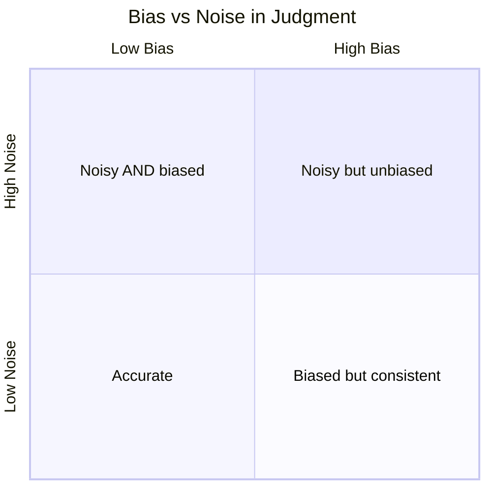
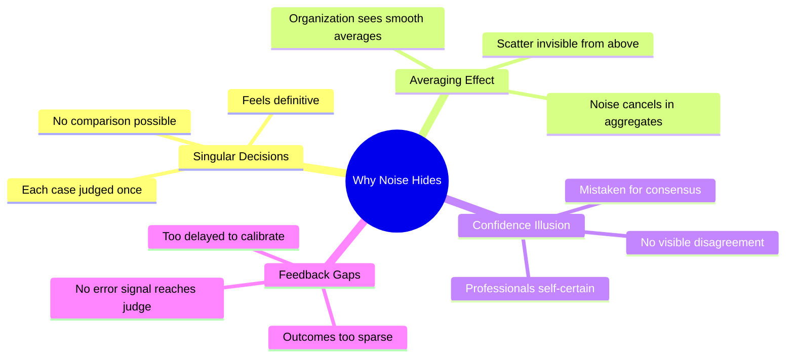
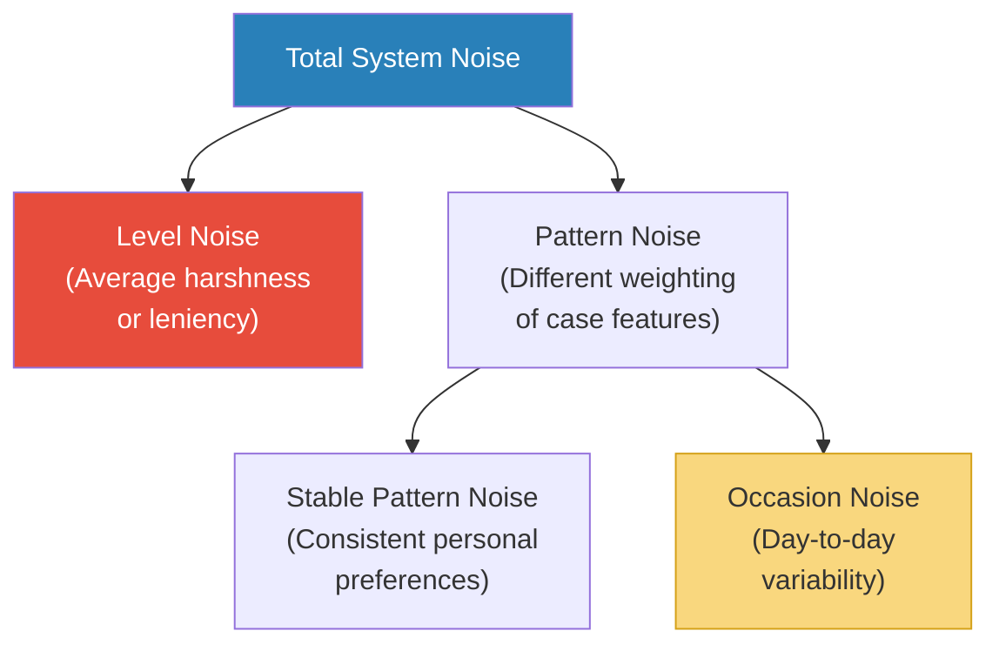
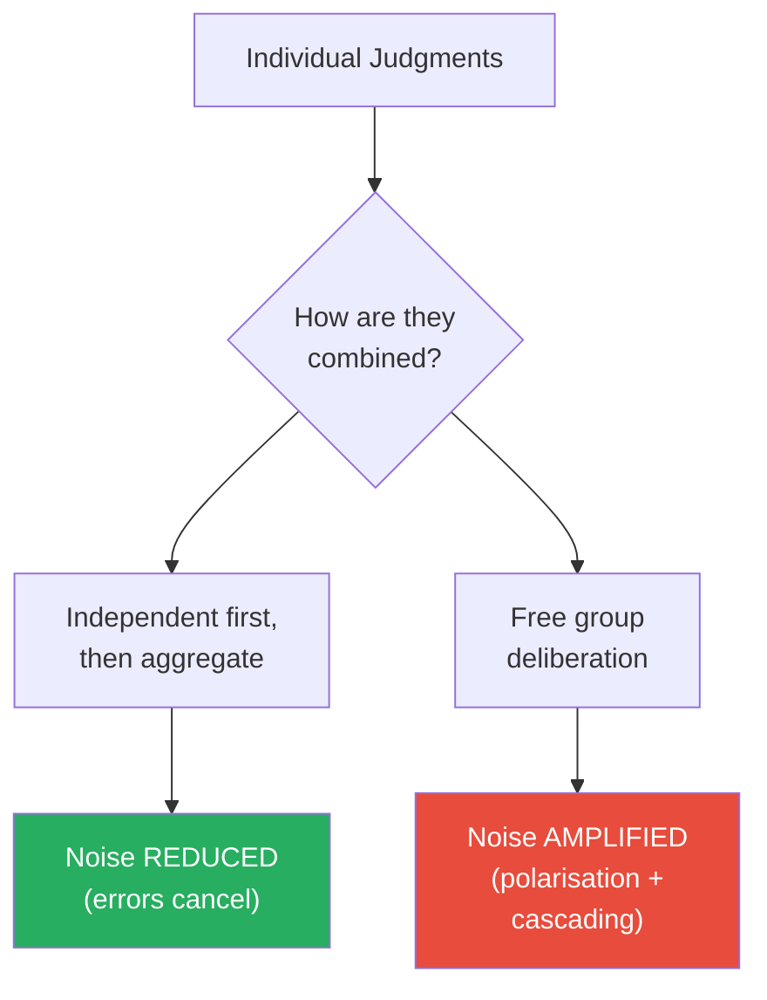
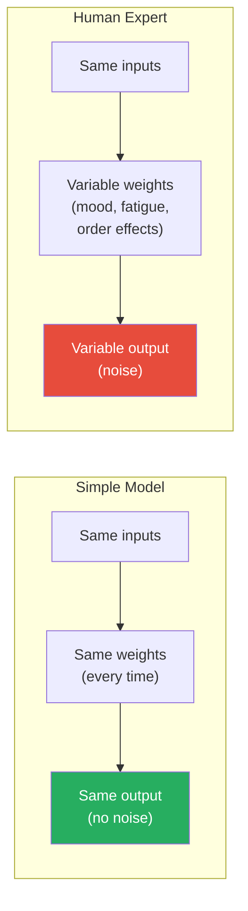
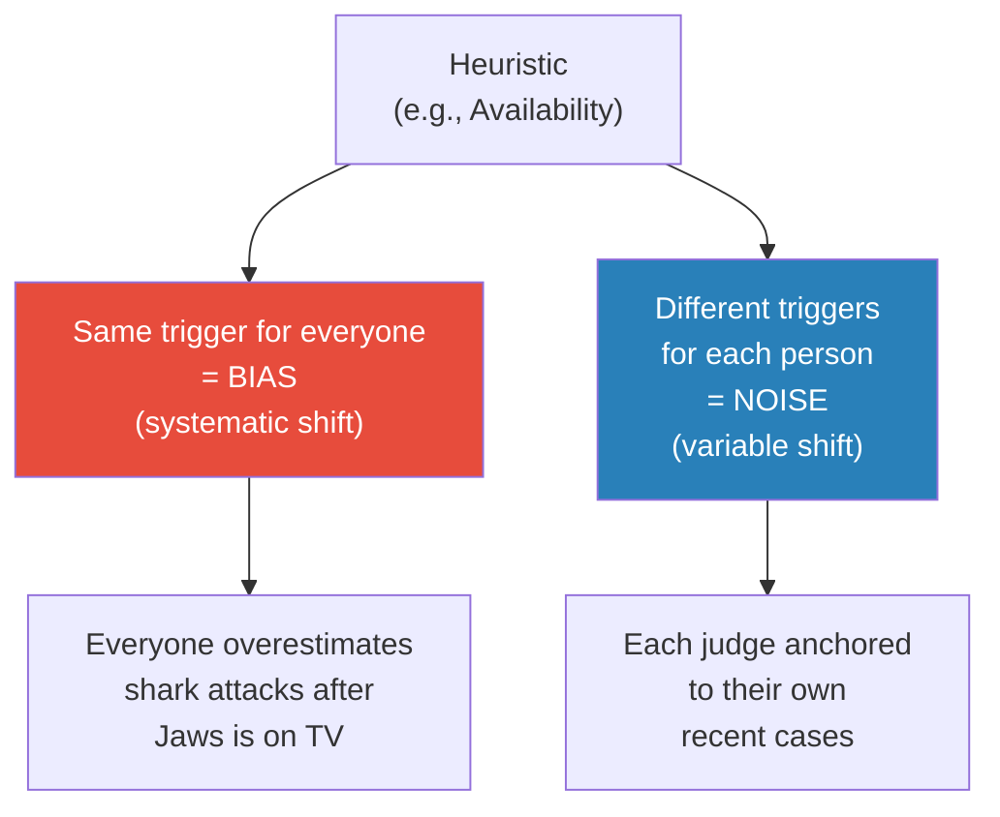
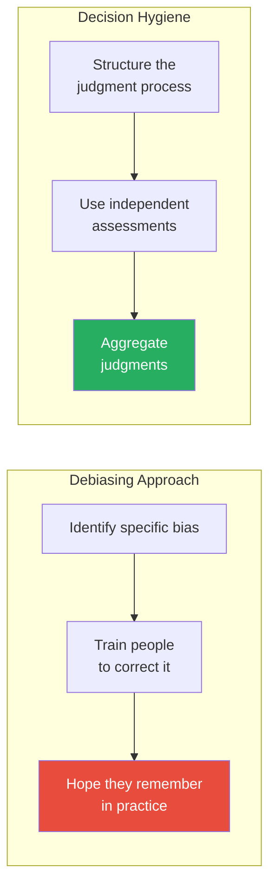
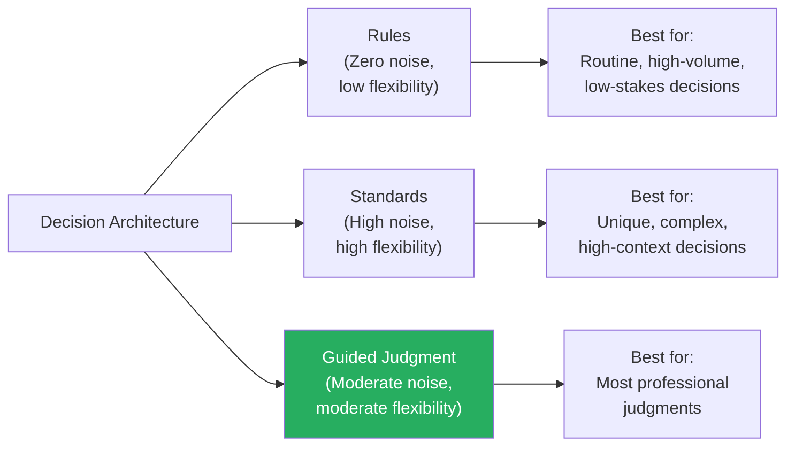
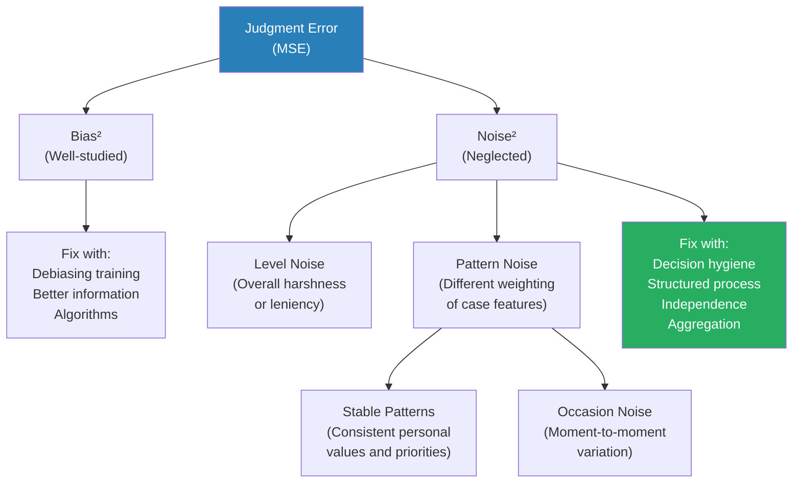
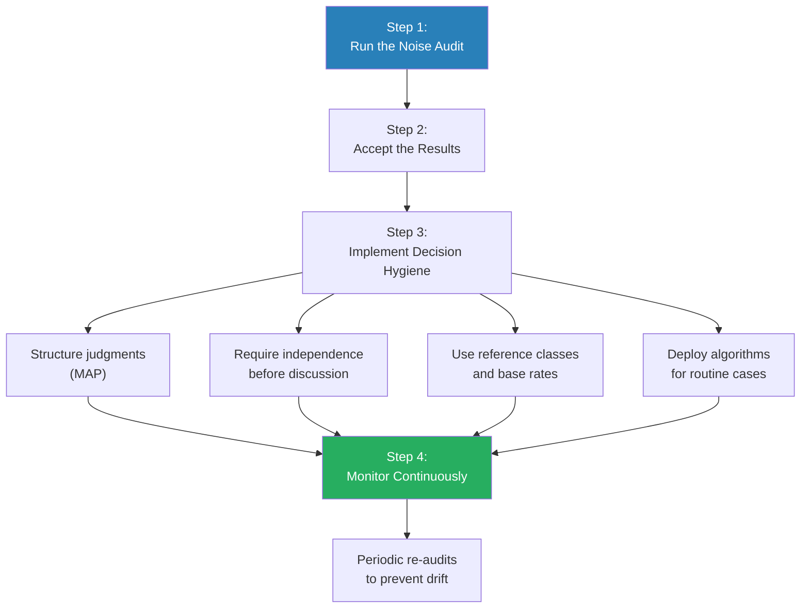

# Noise — Daniel Kahneman, Olivier Sibony & Cass R. Sunstein

> Daniel Kahneman spent decades teaching the world about bias — the systematic errors in human judgment that push thinking in one predictable direction. In this book, his final major work, he and his co-authors reveal an equally damaging but almost entirely ignored source of error: noise — the unwanted variability in judgments that should be identical. When two judges sentence the same offender differently, when two doctors diagnose the same patient differently, when two underwriters price the same risk differently, that is noise. The book's devastating finding: wherever professionals make judgments, the variability between their judgments is far greater than anyone expects or accepts — and it causes as much harm as bias, sometimes more. This is the most important book on decision-making since *Thinking, Fast and Slow* — and its implications for how organisations should structure professional judgment are profound.

---

## About the Authors

Daniel Kahneman (1934-2024) was a Nobel Prize-winning psychologist and the author of *Thinking, Fast and Slow*, widely regarded as the most influential behavioural scientist of the twentieth century. Olivier Sibony is a former senior partner at McKinsey & Company and a professor of strategy at HEC Paris, where he specialises in strategic decision-making and organisational judgment. Cass R. Sunstein is the Robert Walmsley University Professor at Harvard Law School, a former Administrator of the White House Office of Information and Regulatory Affairs under President Obama, and one of the most-cited legal scholars in the world. Together, these three bring a rare combination of deep psychological research, corporate consulting experience, and regulatory policy expertise to the problem of judgment error.

---

## The Big Idea

- Everyone knows about <b style="color: #2980b9">bias</b> — systematic errors that push judgments in one direction (always too high, always too harsh, always too optimistic)
- Almost no one thinks about <b style="color: #2980b9">noise</b> — the random scatter in judgments that should be consistent
- <b style="color: #27ae60">Noise is unwanted variability in judgments where you would expect agreement</b>
- When multiple judges sentence the same case differently, that is noise
- When the same doctor disagrees with herself on the same X-ray viewed weeks apart, that is noise
- When performance reviews tell you more about the reviewer than the employee, that is noise
- The authors argue that noise has been hiding in plain sight for decades, causing enormous harm, and nobody has bothered to look

---

- The relationship between bias and noise is captured in a deceptively simple equation:
  - <b style="color: #2980b9">Mean Squared Error (MSE) = Bias² + Noise²</b>
  - Total judgment error is the sum of both components
  - Reducing either one reduces total error by the same mathematical amount
- But while bias gets all the attention — books, TED talks, training programmes, media coverage — <b style="color: #e74c3c">noise is often the bigger problem, and it is almost completely invisible</b>
- The reason noise hides: bias pulls everyone in the same direction, so you can see it in the average. Noise scatters in all directions, so it cancels out in the average — making it invisible unless you look at individual variation
- The authors spent years studying noise in organisations and found the same pattern everywhere:
  - Professionals believe their colleagues would reach the same conclusions they do
  - They are consistently wrong
  - When organisations actually test for agreement, the results are shocking

---

- The shooting-target analogy is the book's signature visual metaphor:
  - **Low bias, low noise:** all shots cluster tightly around the bullseye — this is accurate and consistent judgment
  - **High bias, low noise:** all shots cluster tightly but away from the bullseye — systematic error, but at least predictable
  - **Low bias, high noise:** shots scatter widely but are centred on the bullseye on average — individually wrong, but no directional error
  - **High bias, high noise:** shots scatter widely AND away from the bullseye — the worst of both worlds
- Most organisations focus on the bias quadrant and ignore the noise quadrant entirely
- The authors argue this is like a company obsessing over whether their factory produces items that are systematically too heavy, while ignoring that each item comes out a completely different weight

The shooting-target analogy captures this visually: bias is when all shots cluster away from the bullseye in the same direction; noise is when shots scatter widely even if they're centred correctly on average.

---

## Key Concepts at a Glance

| Concept | One-line summary |
|---------|-----------------|
| **Noise** | Unwanted variability in judgments that should be identical |
| **Bias** | Systematic error in one direction — predictably too high or too low |
| **System noise** | Variability across different judges within the same system |
| **Level noise** | Some judges are simply harsher or more lenient than others on average |
| **Pattern noise** | Different judges weight the same factors differently |
| **Occasion noise** | The same person gives different judgments at different times |
| **Noise audit** | Have multiple people judge the same cases independently, then compare |
| **Decision hygiene** | Structured protocols that reduce noise without knowing its specific causes |
| **Predictive judgment** | Judgments that aim to estimate a quantity or predict an outcome |
| **Evaluative judgment** | Judgments that express what the decision-maker believes should be done |
| **Mediating assessments** | Breaking a complex judgment into independent factual sub-questions |
| **Objective ignorance** | The irreducible unpredictability that even perfect analysis cannot overcome |
| **The wisdom of crowds** | Aggregating independent judgments produces better results than any individual |
| **Noise as injustice** | When like cases are treated differently, the system is unfair by definition |
| **Matching** | Translating a subjective impression into a number on a scale |
| **Algorithm aversion** | People's emotional resistance to mechanical decision-making, even when it outperforms humans |
| **Linear sequential unmasking** | Analysing evidence "blind" before exposing the analyst to case context |

---

## Part I: Finding Noise

### Chapter 1: Crime and Noisy Punishment

*The book opens with the courtroom — a place where noise has devastating consequences for real human lives, and where the evidence for it is overwhelming.*

- In the early 1970s, federal judge Marvin Frankel became alarmed by the enormous variation in sentencing across American courts
- He observed that defendants convicted of essentially the same crime under the same statute could receive sentences that differed by a factor of five or more — depending entirely on which judge was assigned
- Frankel called this a "scandal" — a system that pretended to deliver justice while operating, in practice, as a lottery
- His outrage was not theoretical — he was a sitting judge who could see the randomness from the inside
- <b style="color: #2980b9">Sentencing disparity</b> was not about different crimes or different circumstances; it was about different judges applying wildly different internal standards to identical facts

> [!example] The Sentencing Study (1974)
> - Researchers gave fifty federal judges the same twenty case files to sentence
> - The cases were identical — same crimes, same backgrounds, same circumstances
> - For a case involving bank robbery, sentences ranged from 5 years to 18 years
> - For a case involving extortion, one judge gave 20 years and another gave 3 years
> - For a fraud case, the range stretched from probation to seven years in prison
> - The variation was not random — certain judges were consistently harsh and others consistently lenient — but the *amount* of variation was far beyond what anyone expected
> - The judges themselves were surprised by the results when shown them
> **The lesson:** When the lottery of judge assignment matters more than the facts of the case, the system is fundamentally unjust.

- Frankel's work led directly to the Sentencing Reform Act of 1984 and the creation of the US Federal Sentencing Guidelines
- The guidelines attempted to impose consistency by specifying sentencing ranges based on offence severity and criminal history
- The results were mixed:
  - Noise decreased substantially — sentences became more predictable
  - But the guidelines introduced rigidity and perceived unfairness — judges felt unable to account for genuine individual circumstances
  - Mandatory minimums produced sentences that many judges considered disproportionate
  - In 2005, the Supreme Court's *United States v. Booker* decision made the guidelines advisory rather than mandatory
  - Post-*Booker*, noise increased again as judicial discretion expanded — the pendulum swung back

- The authors use this opening to establish a key point: <b style="color: #e74c3c">noise is not a theoretical problem — it is an injustice problem</b>
- When two people convicted of the same crime receive sentences that differ by a factor of three or four, one of them is being treated unfairly
- But which one? That is part of what makes noise so insidious — you cannot tell which judgment is "right" just by looking at the variation
- The sentencing story also introduces the book's recurring tension: noise reduction requires constraining professional discretion, and professionals resist being constrained

- The concept of <b style="color: #2980b9">noise as injustice</b> is central to the book's moral argument:
  - Fairness requires that like cases be treated alike — this is a fundamental principle of justice in every legal tradition
  - Noise violates this principle at random — not because the system is designed to be unfair, but because different humans process the same information differently
  - Unlike bias, which at least has a direction (you can say "the system is biased against group X"), noise has no direction — it harms different people in different ways, unpredictably
  - The authors argue that this randomness makes noise *worse* than bias from a justice perspective — at least bias can be identified and corrected; noise is a perpetual lottery
  - A society that tolerates high noise in its justice system is effectively saying: "We accept that identical defendants will receive wildly different sentences based on nothing more than the luck of judge assignment"

> [!tip] Core Insight
> Bias means the system is unfair in a predictable direction. Noise means the system is unfair at random — which is arguably even more troubling, because you cannot even predict who will be harmed.

---

### Chapter 2: A Noisy System

*The authors move from sentencing to a more systematic argument: noise is not confined to courts — it is everywhere professionals make judgments.*

- They introduce the <b style="color: #2980b9">noise audit</b> — the simple but powerful test of having multiple professionals judge the same cases independently
- The process is straightforward:
  - Select a set of realistic cases (5-10 is usually enough)
  - Have multiple professionals evaluate each case independently (no discussion, no knowledge of others' answers)
  - Compare the results
  - Calculate the variation between judges for each case
- The authors emphasise that almost no organisation does this — and the ones that do are consistently shocked by the results
- The reason organisations never test is telling:
  - They assume their professionals are consistent
  - They never verify this assumption
  - The assumption feels so obvious that testing it seems pointless

The bar chart reveals the "noise shock" — in every domain studied, actual variation between professionals exceeded expectations by a factor of 4 to 100, with asylum decisions showing the most extreme gap between assumption and reality.

> [!example] The Insurance Underwriters (The Book's Signature Study)
> - A large insurance company asked 48 experienced underwriters to set premiums for five case files
> - Before running the test, executives were asked to predict how much variation there would be
> - The executives predicted a median variation of about 10% — in other words, they expected their professionals to be quite consistent
> - The actual median variation: **55%**
> - For identical risks, one underwriter might charge $9,500 while another charged $16,700
> - The company was pricing the same risk at wildly different rates depending on which underwriter happened to handle it
> - The 55% figure was the *median* — for some cases, the variation was even higher
> - When the CEO saw the results, he called it "terrifying"
> **The lesson:** Organisations assume their professionals are interchangeable. They are not — and organisations almost never test this assumption.

- <b style="color: #27ae60">The noise audit is the book's most practically explosive idea</b>
- It requires no theory, no statistics, no consultants — just the willingness to run the experiment
- And the results are almost always worse than anyone expects
- The authors report running similar exercises in multiple industries — insurance, finance, medicine, government — with the same pattern of results:
  - Prediction of variation: modest (10-15%)
  - Actual variation: enormous (40-60%)
  - Executive reaction: shock and disbelief

> [!example] Asylum Judges in the United States
> - Researchers studied asylum decisions in the US immigration court system
> - They found that individual judges' grant rates varied from 5% to 88% within the same courthouse
> - The single most powerful predictor of whether an asylum claim was granted was not the strength of the claim, the country of origin, or the legal representation — it was which judge was randomly assigned to hear the case
> - In Miami, one judge granted asylum in 5% of cases; a colleague down the hall granted it in 88%
> - The system was, in effect, a lottery dressed up as a judicial process
> - For asylum seekers, the consequence of this noise was not abstract — it was the difference between safety and deportation to a country where they might face persecution or death
> **The lesson:** When the person making the judgment matters more than the case itself, you have a noise problem that masquerades as a functioning system.

- The authors also describe noise audits in other domains:
  - **Patent examination:** the same patent application is granted or rejected depending on which examiner reviews it — and patent grant rates vary by a factor of 3 across examiners
  - **Child custody decisions:** judges vary enormously in their custody preferences, independent of case facts — some default to mothers, others to fathers, others to shared custody
  - **Clinical diagnoses:** psychiatrists diagnosing the same patient reach different conclusions at rates that would be unacceptable for any measuring instrument
  - **Bail decisions:** the same defendant faces dramatically different bail amounts depending on the judge — one study found variation from release on recognisance to $250,000 bail for identical case profiles

> [!abstract] How to Run a Noise Audit
> 1. Select 5-10 realistic case files from your organisation's actual work (anonymised if needed)
> 2. Distribute the same files to at least 10-15 professionals independently — each person works alone
> 3. Ensure no communication between participants — no discussion, no shared notes, no knowledge of others' answers
> 4. Collect the judgments (sentences, prices, ratings, diagnoses — whatever the professionals normally produce)
> 5. For each case, calculate the standard deviation of the judgments across professionals
> 6. Express the variation as a percentage of the mean judgment — this is the "noise index"
> 7. Compare the noise index to what leadership expected — the gap between expected and actual variation is the "noise shock"
> 8. Present the results without identifying individual professionals — the goal is to reveal system noise, not to blame individuals

- The authors note that the noise audit's value lies not just in the number it produces but in the organisational conversation it forces:
  - Before the audit, everyone assumed consistency
  - After the audit, the assumption is destroyed — and the organisation must decide what to do about it
  - Most organisations that run audits are sufficiently disturbed by the results to take action
  - The hardest part is not fixing the noise — it is getting leaders to run the audit in the first place

---

### Chapter 3: The Singular Decision

*Kahneman, Sibony, and Sunstein confront a statistical puzzle: how do you measure noise when each real-world decision is made only once?*

- In the real world, most judgments are <b style="color: #2980b9">singular decisions</b> — a judge sentences one defendant, a doctor diagnoses one patient, an underwriter prices one policy
- You never get to see what another judge or doctor would have done with the same case
- This is why noise hides so effectively:
  - Bias is visible because the average error shows up in aggregate data — if all judges are too harsh, the average sentence is too long
  - Noise is invisible because it scatters around the average and cancels out in the aggregate — some judges are too harsh and others too lenient, and the average looks fine
  - The average masks the scatter
- The noise audit creates the conditions that real life doesn't provide — multiple judges evaluating the same case
- Without the audit, noise is undetectable:
  - No individual can feel their own noise (you never see your own inconsistency because you only judge each case once)
  - No manager can see noise in the system (each case looks like it was handled individually and reasonably)
  - No organisation has feedback loops that reveal noise (outcome data is usually too sparse and too delayed to calibrate individual judges)

- <b style="color: #e74c3c">The authors warn that the absence of evidence of noise is not evidence of its absence</b>
- The fact that an organisation has never noticed noise does not mean it does not exist
- It almost certainly means the organisation has never looked
- This is a deeply counterintuitive point — we naturally assume that if something were this wrong, someone would have noticed

> [!tip] Core Insight
> Noise is the hardest kind of error to detect because the conditions needed to reveal it — multiple independent judgments of the same case — almost never occur in real life.

- The authors draw an analogy to measurement science:
  - Every measuring instrument has a specification for precision (repeatability) and accuracy (closeness to the true value)
  - Professionals are measuring instruments — their job is to produce a reading (a diagnosis, a sentence, a premium) from inputs (case facts)
  - But unlike a thermometer, no one ever tests professional judgment for precision
  - Thermometers are regularly calibrated; judges, doctors, and underwriters almost never are
  - <b style="color: #27ae60">The noise audit is simply calibration applied to human judgment</b>

> [!example] The Radiologist Calibration Problem
> - A hospital discovered through an internal review that its radiologists had markedly different rates of flagging suspicious findings on mammograms
> - One radiologist flagged 15% of scans for follow-up; another flagged only 3%
> - The high-flagger caught more cancers — but also generated far more false positives, leading to unnecessary biopsies and patient anxiety
> - The low-flagger missed some cancers entirely — with potentially fatal consequences
> - Neither radiologist knew their rate was unusual until the hospital compared them
> - After the comparison, the hospital introduced a peer calibration process — radiologists periodically reviewed the same scans and discussed their reasoning
> - The variation decreased, and diagnostic accuracy improved
> **The lesson:** Professionals cannot calibrate themselves. Calibration requires comparison — and comparison requires the noise audit.

- The singular decision problem also explains why professionals are so confident in their judgments:
  - Each judgment feels definitive because the professional has no opportunity to see alternative readings of the same case
  - A judge who sentences a defendant to ten years never learns that a colleague would have given five — or fifteen
  - Without that comparison, the judge's internal feeling is: "This is the right sentence"
  - The professional mistakes the absence of visible disagreement for the presence of consensus
  - <b style="color: #e74c3c">Confidence in singular decisions is systematically miscalibrated — professionals are more certain than the evidence warrants, precisely because they never see the evidence of their own variability</b>

The mindmap captures the four reinforcing reasons noise remains invisible: decisions are singular, averaging masks scatter, professionals are overconfident, and feedback loops are broken — all of which make noise audits the only reliable detection method.

---

## Part II: Your Mind Is a Measuring Instrument

### Chapter 4: Matters of Judgment

*The authors step back from specific examples to define what "judgment" actually means — and why it is different from other forms of decision-making.*

- A <b style="color: #2980b9">judgment</b> is an assessment where:
  - There is an expected answer (a "right" answer, or at least a range of reasonable answers)
  - The answer requires professional skill and experience
  - Different qualified professionals might reasonably disagree
- Not all decisions are judgments in this sense:
  - Computation is not judgment (2 + 2 = 4 is not a judgment call — it has one right answer)
  - Personal preference is not judgment (chocolate vs vanilla is not a judgment call — there is no "right" answer)
  - Judgment sits in the middle: matters where accuracy is expected, but variability is tolerated
- The authors define the space where noise operates:
  - It exists wherever multiple qualified professionals, given the same information, should converge on similar answers — but don't
  - The key phrase is "should converge" — if we expect variation (film reviews, artistic taste), that is not noise
  - If we expect consistency (medical diagnosis, sentencing, risk pricing), variation is noise

| Type | Example | Noise possible? |
|------|---------|----------------|
| **Computation** | Calculating a tax return | No — there is one right answer |
| **Personal preference** | Choosing a holiday destination | No — there is no "right" answer |
| **Predictive judgment** | Forecasting next quarter's revenue | Yes — experts should converge |
| **Evaluative judgment** | Sentencing a criminal, pricing a risk | Yes — professionals should be consistent |

- The distinction between <b style="color: #2980b9">predictive judgment</b> and <b style="color: #2980b9">evaluative judgment</b> is important:
  - Predictive judgments have a verifiable outcome — you can check later whether the forecast was right
  - Evaluative judgments have no verifiable outcome — you cannot prove that a sentence of 7 years is "correct"
  - Noise affects both, but it is harder to detect in evaluative judgments because there is no ground truth to compare against
  - Predictive noise can at least be measured against what actually happened; evaluative noise can only be measured against other professionals' judgments
- The authors note that most professional judgments in the real world are evaluative:
  - Hiring decisions, performance reviews, sentencing, diagnosis, risk assessment — all involve evaluation without a definitively "right" answer
  - This makes noise both more prevalent and more invisible in evaluative domains
- The important practical consequence: for evaluative judgments, the *only* way to detect noise is by comparing professionals against each other
  - There is no "correct answer" to check against
  - If two doctors diagnose differently, you cannot always know which one is right
  - But you *can* know that the system is producing inconsistent outputs — and that inconsistency itself is a problem worth fixing

> [!example] The Wine Tasting Competition Paradox
> - Robert Hodgson, a retired statistics professor and winemaker, studied the California State Fair wine competition over multiple years
> - He discovered that when the same wines were entered in the same competition multiple times (submitted under different labels), they received wildly different scores
> - A wine that won a gold medal one year might receive no medal the following year — despite being the identical wine
> - The judges were experienced professionals — but their evaluative judgments were high in noise
> - Hodgson's study is a perfect illustration of evaluative judgment noise: there is no objectively "correct" wine score, but the enormous variability in professional ratings reveals that the scores tell you more about the occasion and the judge than about the wine
> **The lesson:** In evaluative domains without a clear "right answer," noise can persist indefinitely because there is no feedback mechanism to reveal it. Only direct comparison between judges exposes the inconsistency.

---

### Chapter 5: Measuring Noise

*The authors introduce the statistical tools for decomposing noise into its components — and show that the components are more interesting than the total.*

- Total system noise can be broken into two primary components:
  - <b style="color: #2980b9">Level noise</b> — some judges are simply harsher than others on average
  - <b style="color: #2980b9">Pattern noise</b> — different judges respond differently to the same features of a case

The decomposition matters because each component has different causes and different solutions.

- **Level noise** is the easiest to understand and the easiest to fix:
  - Judge A gives an average sentence of 4 years; Judge B gives an average of 8 years
  - This is a calibration problem — you could partially fix it with guidelines, training, or shared anchor points
  - But level noise typically accounts for only a modest fraction of total system noise — usually less than half
  - Organisations often assume level noise is the whole problem ("some people are just too tough or too soft")
  - In reality, it is the smaller piece

- **Pattern noise** is the larger and more interesting component:
  - Judge A is tough on drug crimes but lenient on white-collar crimes
  - Judge B is the opposite — lenient on drugs but tough on fraud
  - Both might have the same average sentence, but they *disagree about which cases deserve severity*
  - This is not a calibration problem — it reflects genuine differences in values, priorities, and interpretation
  - Pattern noise is harder to fix because people believe their patterns are correct
  - A judge who is tough on drug crimes genuinely believes drug crimes are more serious — they are not being randomly noisy; they are applying a consistent but idiosyncratic set of values

- <b style="color: #e74c3c">The authors' key finding: pattern noise typically accounts for more system noise than level noise does</b>
- This is counterintuitive — people assume that the main problem is "some judges are too harsh"
- The deeper problem is "different judges care about different things"
- <b style="color: #27ae60">This means that calibrating judges to the same average harshness would only partially solve the noise problem — the pattern differences would remain</b>

The doughnut chart reveals the counterintuitive finding: level noise (different average strictness) is only about a quarter of the total — pattern noise, where judges weight case features differently based on personal values, is nearly half, making it both the biggest contributor and the hardest to fix.
- The decomposition has important policy implications:
  - If level noise dominates → calibration and training can help (align everyone to the same average)
  - If pattern noise dominates → structural change is needed (specify which factors should be weighted and how)
  - If occasion noise dominates → environmental and procedural changes are needed (reduce fatigue, control order effects, mandate breaks)
  - In practice, all three coexist — but knowing their relative proportions guides the intervention strategy

> [!example] The Criminal Sentencing Decomposition
> - When researchers decomposed sentencing noise into its components, they found that level noise (some judges being harsher overall) accounted for roughly one-third of the total
> - The remaining two-thirds was pattern noise — judges disagreeing about which *types* of cases deserved severity
> - One judge might view a first-time offender's youth as a strong mitigating factor; another might view the same youth as irrelevant
> - These were not random differences — each judge had consistent, deeply held views about what mattered
> - But the fact that the views were genuine did not make the resulting variability any less of a problem for defendants
> **The lesson:** The biggest source of noise is not that some judges are too harsh. It is that judges disagree about what matters — and each one believes they are right.

---

### Chapter 6: The Analysis of Noise

*A deeper dive into the mechanics of pattern noise — and the introduction of occasion noise, the most troubling component of all.*

- <b style="color: #2980b9">Occasion noise</b> is variability within the same person:
  - The same judge, the same case, presented on different days — different sentences
  - The same doctor, the same X-ray, shown weeks apart — different diagnoses
  - The same reviewer, the same employee, evaluated at different times — different ratings
- Occasion noise is a subset of pattern noise — it represents the part of an individual's judgment that varies from one occasion to the next
- While level noise reflects stable differences between people, and stable pattern noise reflects consistent individual preferences, occasion noise reflects moment-to-moment fluctuation in how a single person applies their own standards

> [!example] Doctors Disagreeing with Themselves
> - In a study of radiologists, the same doctors were shown the same set of X-rays on two separate occasions (weeks apart, without knowing it was a repeat)
> - The doctors disagreed with their own previous readings 20% of the time
> - In studies of pathologists examining biopsies, the self-disagreement rate was even higher — reaching 40% in some diagnostic categories
> - For skin lesion diagnosis, experienced dermatologists changed their own diagnosis about one-third of the time
> - The doctors were not learning between sessions or applying new information — they simply reached a different conclusion on a different day
> **The lesson:** We assume professionals are like measuring instruments — stable and consistent. They are not. They are more like weather-sensitive instruments that give different readings depending on conditions.

- What causes occasion noise?
  - **Mood and fatigue:** tired, hungry, or stressed professionals make different judgments than rested ones
  - **Order effects:** the previous case influences the current one through contrast or anchoring
  - **Weather and environment:** studies show that judicial decisions, stock market behaviour, and medical assessments are all influenced by weather
  - **Priming:** whatever happens to be on the professional's mind when they see the case
  - **Cognitive depletion:** as the day wears on, judgment quality degrades — the brain's capacity for deliberate, careful processing is a depletable resource
  - **Sequential contrast effects:** a mediocre candidate who follows three terrible ones looks better than the same mediocre candidate following three excellent ones
  - **Recency of similar cases:** a doctor who recently saw a patient with a rare disease is more likely to diagnose the next ambiguous case as the same rare disease
  - None of these should influence professional judgment — but they do, reliably and measurably
  - The professional is typically unaware of these influences — they feel like they are making the same kind of judgment they always make

> [!example] The Weather Effect on Stock Returns
> - Studies by Hirshleifer and Shumway found a statistically significant correlation between morning sunshine and stock market returns across 26 countries
> - On sunny days, traders were slightly more optimistic — and their collective optimism moved markets
> - The effect was small but consistent and could not be explained by any rational economic mechanism
> - Traders would deny that weather influenced their decisions — yet the data showed it did
> - This is occasion noise operating at scale: individual mood fluctuations, driven by an irrelevant environmental factor, produce measurable aggregate effects
> **The lesson:** Occasion noise is not confined to individual decisions. When many professionals are subject to the same environmental influence simultaneously, their shared occasion noise can move entire systems.

> [!example] The Lunch Effect in Israeli Parole Hearings
> - Researchers Danziger, Levav, and Avnaim-Pesso studied 1,112 parole hearing decisions over a ten-month period
> - They found that judges granted parole roughly 65% of the time right after meals
> - Just before the next meal, the approval rate dropped to nearly zero
> - The pattern repeated after every break — a sawtooth pattern driven by blood sugar and cognitive depletion
> - The content of the cases did not change throughout the day — only the judges' mental state changed
> - Whether a prisoner gained freedom depended in measurable part on whether the judge had recently eaten
> **The lesson:** The time of day your case is heard can matter as much as the facts. This is occasion noise in its most disturbing form.

> [!tip] Core Insight
> Occasion noise is uniquely troubling because it undermines the assumption that professionals are at least consistent with themselves. You might accept that two doctors disagree. It is harder to accept that one doctor disagrees with herself.

---

### Chapter 7: Occasion Noise

*The authors dedicate an entire chapter to occasion noise because it is the most psychologically unsettling form — and because it reveals something important about how the mind works.*

- Occasion noise is not caused by negligence or incompetence — it is a fundamental property of how human cognition operates
- It arises from the normal operation of <b style="color: #2980b9">System 1 thinking</b> (the fast, automatic, associative system described in [[Thinking Fast and Slow - Daniel Kahneman|Thinking, Fast and Slow]])
- When a professional encounters a case, they do not mechanically apply a formula
- Instead, a complex pattern-matching process occurs:
  - Features of the case trigger associations in memory
  - Recent experiences weight certain features more heavily than they would otherwise be weighted
  - Mood and energy affect how deeply the professional considers alternatives before settling on an answer
  - A judgment "feels right" without the professional being able to fully articulate why
- <b style="color: #e74c3c">The problem is that the same case can feel different on different occasions because the context has changed, even though the case has not</b>

- This connects to a deep point about the nature of professional expertise:
  - We assume experts have stable, reliable internal models — a doctor's diagnostic framework, a judge's sentencing philosophy, an underwriter's risk assessment
  - In reality, expert judgment is a noisy measuring instrument that produces reasonable readings most of the time, but with significant random variation
  - And the expert is usually unaware of this variation — each individual judgment feels definitive when it is made
  - The expert cannot detect their own inconsistency because they encounter each case only once in the natural course of work

- The authors use a powerful metaphor: your mind is like a camera with a shaky hand
  - The image it captures is roughly accurate — it sees what is there
  - But each shot is slightly different — the shake introduces random variation
  - A professional does not have a steadier hand than a layperson (they are not less noisy)
  - They have a better lens (they see more relevant features)
  - But the shake remains — and no amount of lens quality eliminates it
  - <b style="color: #27ae60">The only way to get a sharp image from a shaky camera is to take multiple shots and average them — which is exactly what aggregation and structured protocols achieve</b>

- The authors connect occasion noise to the broader psychology of judgment:
  - **Substitution:** when a difficult question is unconsciously replaced with an easier one (e.g., "Is this defendant dangerous?" becomes "Does this defendant remind me of someone who was dangerous?")
  - **Affect heuristic:** the role of current emotional state in colouring all assessments
  - **Associative coherence:** once a tentative impression forms, the mind selectively searches for confirming evidence and suppresses contradictory evidence
- Each of these processes is sensitive to momentary context — what the professional was thinking about just before, what happened that morning, what the last case looked like
- <b style="color: #27ae60">The implication: even highly skilled, well-meaning professionals cannot eliminate occasion noise through willpower or training alone — it requires structural intervention</b>

- The authors make an important distinction between occasion noise and mere sloppiness:
  - Occasion noise is not about professionals being careless or lazy
  - It is about the fundamental architecture of human cognition — System 1 is context-sensitive by design
  - This sensitivity is usually adaptive (you want to respond differently to different situations)
  - But when the "different situations" are irrelevant to the judgment at hand (mood, weather, previous case), the sensitivity becomes noise
  - The professional is not failing to do their job — they are doing it the only way their brain knows how

> [!example] The GPA Prediction Study
> - Researchers asked admissions officers to predict the first-year GPA of applicants based on their files
> - The same officers evaluated the same files on two different occasions, separated by weeks
> - Their predictions differed by an average that was roughly half as large as the difference between two different officers evaluating the same file
> - In other words, about half of what looks like disagreement between professionals is actually inconsistency within individuals
> - The officers had no awareness of their own inconsistency — each time they felt equally confident in their assessment
> **The lesson:** Occasion noise is not a small effect operating at the margins. It accounts for a substantial fraction of total system noise — and its invisibility to the individual makes it especially dangerous.

> [!example] Football Referees and Crowd Noise
> - Studies of football referees found that crowd noise influenced their decisions — more fouls were called against the away team when the home crowd was large and loud
> - During the COVID-19 pandemic, when matches were played in empty stadiums, the home-team advantage in refereeing decisions largely disappeared
> - The referees were not consciously biased — the crowd noise was creating occasion noise by shifting their perception of borderline incidents
> - The same tackle looked different depending on whether 50,000 people were screaming about it
> **The lesson:** Occasion noise often comes from environmental factors the professional is not even aware of. You cannot correct for an influence you do not know exists.

---

### Chapter 8: How Groups Amplify Noise

*Groups were supposed to be the solution — aggregate many judgments and the noise cancels out. But the authors show that groups often amplify noise instead of reducing it.*

- The <b style="color: #2980b9">wisdom of crowds</b> principle says that averaging many independent judgments produces a result more accurate than any individual — because individual noise cancels out
- But this only works when the judgments are truly independent
- In most real-world settings, groups deliberate — and deliberation introduces two noise-amplifying mechanisms:

- <b style="color: #2980b9">Group polarisation</b> is the tendency for groups to end up at more extreme positions than the average of their members' individual views:
  - If most members lean toward a harsh sentence, the group discussion pushes toward an even harsher one
  - If most members lean toward leniency, the group moves further toward leniency
  - The group does not converge on the average — it amplifies the majority tendency
- This happens because of two mechanisms:
  - **Informational influence:** people share arguments supporting the majority position, creating a lopsided information pool — the group hears more reasons for the dominant view and fewer against it
  - **Social influence:** people want to be accepted by the group and shift toward the perceived consensus — especially on issues where they are uncertain

> [!example] The Colorado Jury Experiment
> - Researchers assembled mock juries from Boulder (liberal-leaning) and Colorado Springs (conservative-leaning)
> - Before deliberation, individual jurors recorded their views on controversial issues like climate change policy, affirmative action, and civil unions
> - After deliberation, the groups were far more extreme than the average of their members' pre-discussion views
> - Boulder juries became far more liberal; Colorado Springs juries became far more conservative
> - Deliberation did not moderate views — it radicalised them
> - Internal diversity *decreased* — group members became more similar to each other and more different from the other group
> - The effect was not small — groups moved 15-20 percentage points further in their pre-existing direction
> **The lesson:** Group deliberation does not automatically average out noise. If the group starts with a lean, deliberation amplifies it — creating systematic noise at the group level.

- <b style="color: #2980b9">Cascading</b> is another amplification mechanism:
  - The first person to speak in a group disproportionately influences the rest
  - Others anchor on that initial view and adjust insufficiently
  - The group "cascades" toward the early speaker's position
  - This means the group outcome depends heavily on the arbitrary accident of who speaks first
  - If the most senior person speaks first (as often happens), the group cascades toward seniority, not toward accuracy

> [!example] The Music Lab Experiment (Salganik, Dodds, and Watts)
> - Researchers created a website where participants could listen to and download songs by unknown bands
> - Some participants saw only the song titles (independent condition)
> - Others could see how many times each song had been downloaded (social influence condition)
> - In the social influence condition, participants were randomly assigned to one of eight "worlds" — each with its own download counter
> - The same songs became massive hits in some worlds and obscure failures in others — driven entirely by early random downloads
> - Quality predicted success only weakly; cascading social influence overwhelmed quality
> - The experiment demonstrated that in social-influence conditions, outcomes were both more unequal and more unpredictable than in the independent condition
> **The lesson:** When people can see others' judgments, small initial differences cascade into massive divergence. This is how noise at the individual level becomes amplified noise at the group level.

> [!tip] Core Insight
> Groups reduce noise only when members judge independently first and then aggregate. When groups deliberate freely, they typically amplify noise through polarisation and cascading.

- The practical implications for organisations are stark:
  - **Hiring panels** that discuss candidates before recording individual assessments amplify noise — the first person's impression anchors the rest
  - **Investment committees** where the most senior person speaks first cascade toward that view — junior members suppress their independent analysis
  - **Medical case conferences** where the presenting physician frames the case anchor the group — diagnostic alternatives are insufficiently explored
  - **Performance calibration meetings** where managers negotiate ratings in real time produce consensus that is really conformity — the loudest voice wins, not the most accurate assessment
- <b style="color: #27ae60">The fix is always the same: require independent assessment before any group discussion</b>
- This is the single most impactful noise-reduction practice the authors recommend — and the one most organisations resist, because it feels awkward and slows things down

> [!abstract] The "Write First, Then Discuss" Protocol
> 1. Before any meeting where judgments will be made, each participant writes down their independent assessment
> 2. The assessments are collected and shared simultaneously (not sequentially — avoid anchoring on the first one shared)
> 3. Disagreements are identified and discussed explicitly — "You rated this candidate a 4 on technical skill; I rated them a 2. What did you see?"
> 4. The discussion focuses on resolving specific disagreements, not on reaching a general consensus
> 5. The final judgment is a structured integration of the independent assessments, not the result of free-form persuasion

- This protocol is simple, free, and immediately implementable in any organisation — yet fewer than 10% of organisations use it for high-stakes decisions

The structure of how judgments are combined matters as much as the quality of the individual judges.

- The authors also address a subtler form of group amplification: <b style="color: #2980b9">shared information bias</b>
  - Groups spend most of their discussion time on information that all members already share — and very little time on unique information that only one member possesses
  - This means the group fails to benefit from the diversity of its members
  - The one person who noticed a critical flaw in a candidate may never share that observation because the group is busy discussing things everyone already knows
  - Structured protocols that explicitly ask each member to share their unique observations counteract this tendency — but unstructured discussion does not

---

## Part III: Noise in Predictive Judgments

### Chapter 9: Judgments and Models

*The authors present the most uncomfortable finding in the book: simple mechanical models consistently outperform expert human judgment — not because the models are brilliant, but because they have zero noise.*

- Paul Meehl's 1954 book *Clinical vs. Statistical Prediction* presented a devastating finding: simple formulas beat clinical experts in predicting outcomes:
  - Whether a parolee would reoffend
  - Whether a patient would respond to treatment
  - Whether a student would succeed academically
  - Whether a business loan would default
- The finding has been replicated in over 200 studies across medicine, criminal justice, personnel selection, and business
- In nearly every study, the model wins — not by a huge margin, but reliably
- <b style="color: #27ae60">The reason models win is not that they are smarter — it is that they are noiseless</b>
- A model applies the same weights every time:
  - It never has a bad day
  - It is never anchored by the previous case
  - It never gets hungry before lunch
  - It never lets a charismatic defendant or patient change its weighting
  - It never mistakes confidence for competence
- The expert, by contrast, has valuable knowledge but applies it inconsistently — and the inconsistency costs more than the knowledge gains

The expert has more knowledge than the model but applies it less consistently — and the consistency advantage typically wins.

- The authors note a particularly humbling finding: even "broken-leg" cases — situations where the expert has specific information the model lacks — do not reliably give the expert an advantage
  - In theory, a clinician who knows a patient broke their leg should predict they won't go to the movies this week, overriding a model that predicts they will
  - In practice, experts overuse the "broken-leg" exception — they believe every case is special, and their adjustments add more noise than information

- The model-vs-expert finding provokes strong emotional resistance among professionals:
  - Doctors resist the idea that a formula could outperform their clinical judgment — they have spent years developing expertise
  - The resistance is understandable but misplaced: the model does not have *better* judgment; it has *more consistent* judgment
  - The expert's advantage is in identifying the rare, genuinely unusual case that the model cannot handle
  - But the expert's disadvantage is in applying their knowledge differently each time — and the inconsistency costs outweigh the insight gains in the aggregate
  - <b style="color: #e74c3c">The punchline: experts are best used as inputs to the model (their assessments become variables in the formula) rather than as replacements for the model</b>

> [!example] The Goldberg Rule
> - Psychologist Lewis Goldberg demonstrated an especially humbling version of the models-beat-experts finding
> - He built a simple model of an expert's *own* judgment — a formula that captured the expert's average weighting of different factors
> - Then he compared the model-of-the-expert to the expert themselves on new cases
> - The model of the expert outperformed the actual expert — because it applied the expert's own knowledge with zero noise
> - The expert had better insight than any formula, but they could not apply that insight consistently
> - The formula captured their average judgment and applied it every time — beating the expert with their own expertise
> **The lesson:** You do not even need a theoretically correct model to beat an expert. A model of the expert's own past judgments — applied consistently — outperforms the expert on new cases.

> [!example] The Bordeaux Wine Study (Orley Ashenfelter)
> - Princeton economist Orley Ashenfelter developed a simple regression model to predict Bordeaux wine quality using just three weather variables: summer temperature, harvest rain, and winter rain
> - The model outperformed expert wine critics — including Robert Parker, the most influential wine critic in the world
> - Wine experts were outraged and mocked the model publicly
> - But the model kept winning because it captured the same climate-quality relationship every time without noise
> - Expert tasters, by contrast, were influenced by labels, bottle shapes, vineyard reputations, and their own physical state on the day of tasting
> - The model had no palate, no experience, no refined sensibility — just consistency
> **The lesson:** You do not need a sophisticated model to beat an expert. You need a consistent one.

> [!example] The Apgar Score (1952)
> - Before 1952, decisions about whether a newborn needed emergency medical attention were made by subjective clinical judgment
> - Different doctors assessed the same infants differently — some intervened too late, some intervened unnecessarily
> - Virginia Apgar, an anaesthesiologist, created a five-component scoring system: heart rate, respiration, muscle tone, reflexes, and skin colour
> - Each component scored 0, 1, or 2 — total score out of 10
> - The Apgar score was not based on any new medical knowledge — it simply structured the judgment that doctors were already making
> - It dramatically reduced variation in neonatal assessment and is credited with saving countless infant lives
> - The score is still used in every delivery room in the world, more than seventy years later
> **The lesson:** The Apgar score did not add knowledge. It subtracted noise — by turning an unstructured impression into a structured protocol.

---

### Chapter 10: Noiseless Rules

*The authors explore when rigid rules should replace human judgment entirely — and when the cost of inflexibility is worth paying.*

- <b style="color: #2980b9">Rules</b> are the ultimate noise-reduction tool — they eliminate human judgment entirely:
  - Speed limits instead of "drive at a reasonable speed"
  - Tax tables instead of "pay what seems fair"
  - Mandatory minimum sentences instead of judicial discretion
  - Blood alcohol limits instead of "don't drive if you're too drunk"
- Rules have zero noise by definition — everyone gets the same treatment for the same inputs
- But rules are also blind to context:
  - A speed limit of 65 mph applies whether the road is empty or congested, whether it's a clear day or a blizzard
  - A mandatory minimum sentence applies whether the defendant is a first offender or a career criminal
  - Rules can produce outcomes that everyone agrees are unjust in specific cases
  - <b style="color: #e74c3c">Rules trade noise for rigidity — and sometimes the rigidity is worse than the noise</b>

| Approach | Noise | Bias risk | Flexibility | Fairness |
|----------|-------|-----------|-------------|----------|
| **Pure rules** | None | High (if rule is wrong) | None | Consistent but rigid |
| **Pure judgment** | High | Low (if expert is good) | High | Variable |
| **Guided judgment** | Moderate | Moderate | Moderate | Structured consistency |
| **Algorithm + override** | Low | Low | Some | Best balance |

- <b style="color: #27ae60">The authors advocate for "guided judgment" — structured frameworks that constrain noise while preserving enough flexibility for genuine exceptions</b>
- The goal is not to eliminate human judgment but to structure it so that irrelevant factors lose their influence while legitimate considerations are preserved
- The key design principle: start with the rule or algorithm, allow human override, but require the human to document and justify any departure from the default
- This creates both consistency (the default is the same for everyone) and flexibility (unusual cases can be handled differently) while generating data on when and why overrides occur

> [!example] The Three Strikes Law
> - California's Three Strikes law (1994) required a mandatory sentence of 25 years to life for a third felony conviction — regardless of the nature of the third offence
> - In one notorious case, a man received 25 years to life for stealing a slice of pizza — it was his third "strike"
> - The law eliminated noise perfectly — every third-time offender received the same sentence
> - But the rigidity produced outcomes so extreme that public outrage eventually led to reform (Proposition 36 in 2012, which restricted the law to serious or violent felonies)
> - The case illustrates the tension at the heart of noise reduction: zero noise is achievable, but the cost may be unacceptable injustice in edge cases
> **The lesson:** Rules can eliminate noise entirely, but the rigid outcomes they produce may be worse than the variability they replace. The art is finding the right balance.

- The authors note that the choice between rules and judgment should be informed by data:
  - How much noise exists in the current judgment process? (Run the audit)
  - How much does that noise cost? (What are the consequences of inconsistency?)
  - How much rigidity would rules introduce? (How often do edge cases arise?)
  - What is the cost of that rigidity? (What happens when the rule produces an absurd result?)
  - <b style="color: #27ae60">The answers to these questions determine where each domain should sit on the rules-judgment spectrum</b>

The heatmap exposes the central tradeoff the authors illuminate: pure rules eliminate noise but sacrifice flexibility, pure judgment maximizes flexibility but introduces massive noise, and the structured middle approaches (guided judgment and algorithm + override) offer the best balance.
- The authors also observe that real-world rule systems rarely stay "pure" for long:
  - When rules produce absurd outcomes, pressure builds to add exceptions — and each exception reintroduces a judgment call
  - Over time, rule systems tend to drift toward guided judgment as practitioners carve out exceptions for cases the original rules never anticipated
  - This drift is not a failure — it is the natural evolution of a decision system learning from its own rigidity
  - The key is to manage the drift deliberately rather than letting exceptions accumulate informally and without documentation

---

### Chapter 11: Objective Ignorance

*The authors introduce a humbling concept: for many predictions, the world is simply less predictable than we think — and no amount of expertise can overcome that ceiling.*

- <b style="color: #2980b9">Objective ignorance</b> is the inherent unpredictability that remains even when you have access to all available information and apply it perfectly
- Some events are simply not predictable beyond a certain accuracy:
  - Long-range weather forecasts degrade rapidly after 10 days — not because meteorologists are bad, but because the atmosphere is chaotic
  - Stock prices are essentially unpredictable in the short term — not because analysts are incompetent, but because markets are efficient
  - Individual human behaviour is far less predictable than we assume — even knowing everything about a person, you cannot predict their actions with high accuracy
- The <b style="color: #e74c3c">illusion of predictability</b> is the belief that if you just had more data or better experts, you could predict accurately
- In reality, many prediction tasks have a hard ceiling — and experts are often more confident than that ceiling warrants
- This matters for noise because:
  - When objective ignorance is high, experts fill the unpredictable space with their own idiosyncratic patterns — creating noise
  - The expert feels confident because they have constructed a compelling narrative for their prediction
  - But the narrative is built on sand — the underlying event is simply not that predictable

> [!abstract] The Predictability Ceiling
> 1. Identify the prediction task (e.g., will this parolee reoffend?)
> 2. Determine the best achievable accuracy with all available information
> 3. Recognise that this ceiling is often shockingly low (e.g., 70% accuracy for recidivism, even lower for long-term career success)
> 4. Accept that more data and better experts may push you closer to the ceiling but cannot exceed it
> 5. Design decision systems that acknowledge this irreducible uncertainty rather than pretending it doesn't exist

- The practical implication:
  - When objective ignorance is high, there is little point in seeking the "best" expert judgment — because even the best expert cannot be very accurate
  - What you can still do is <b style="color: #27ae60">reduce noise</b> — make sure the imperfect judgments are at least consistent
  - Reducing noise is valuable even when the ceiling on accuracy is low — you cannot predict perfectly, but you can at least avoid adding unnecessary error on top of the inherent unpredictability

> [!example] Predicting Recidivism
> - Judges and parole boards believe they can assess which prisoners are likely to reoffend and which are safe to release
> - They base these assessments on interviews, case history, and clinical impression — and they feel confident in their assessments
> - Studies show that even the best actuarial models predict recidivism with only moderate accuracy (AUC around 0.70 — far from perfect)
> - Expert clinical judgment is worse than the models — and adds noise on top of the inherent unpredictability
> - The gap between expert confidence and actual predictive accuracy is substantial
> **The lesson:** Objective ignorance means the world is noisier than you think. Humility about what can be known is the first step toward better judgment.

> [!example] The Track Record of Political Forecasters
> - Philip Tetlock's research (described in his book *Expert Political Judgment*) showed that political pundits' predictions were barely better than chance
> - Experts with strong theoretical frameworks (Tetlock's "hedgehogs") were actually worse predictors than those with broad, flexible thinking ("foxes")
> - The hedgehogs were more confident, more compelling on television, and more wrong
> - The reason: political events are high in objective ignorance — they depend on contingent, cascading factors that no theoretical framework can reliably capture
> - Confidence in prediction is not correlated with accuracy when objective ignorance is high
> **The lesson:** In domains of high objective ignorance, the most confident expert is often the most dangerous — they create a false sense of predictability.

- The authors connect objective ignorance to a broader philosophical point about the limits of human knowledge:
  - We are wired to construct explanatory narratives for everything — even events that are fundamentally unpredictable
  - After a stock market crash, pundits explain exactly why it happened — but none of them predicted it
  - After a political upset, commentators explain the "obvious" causes — but their models failed to foresee it
  - <b style="color: #e74c3c">Hindsight creates an illusion that the world is more predictable than it is — and this illusion fuels overconfidence in future predictions</b>
  - The authors suggest that one mark of a wise predictor is the willingness to say: "I don't know, and neither does anyone else — because this event is simply not very predictable"

---

### Chapter 12: The Valley of the Normal

*The authors explore why professionals so rarely see extreme outcomes — and how this distorts their judgment calibration.*

- Most professionals spend their careers in the <b style="color: #2980b9">"valley of the normal"</b>:
  - Most insurance claims are routine — a fender bender, a water leak, a minor theft
  - Most patients have common conditions — a cold, a sprain, a standard fracture
  - Most criminal cases are straightforward — a clear offence, a guilty plea, a routine sentence
- This creates a calibration problem:
  - Professionals become very good at judging normal cases because they see hundreds of them
  - They have almost no experience with extreme or unusual cases — rare diseases, massive fraud, unprecedented claims
  - When an extreme case appears, they have no reliable basis for judgment — and noise explodes

- Noise is *highest* at the extremes — precisely where the stakes are highest:
  - The difference between judges sentencing a typical theft is modest (they all have reference points)
  - The difference between judges sentencing an unusual, complex fraud case is enormous (they have no shared reference points)
  - The difference between doctors diagnosing a common flu and a rare autoimmune condition follows the same pattern
  - Ordinary cases have strong reference points; unusual cases force each professional to improvise

- <b style="color: #e74c3c">This creates a perverse pattern: noise is lowest for cases where the stakes are lowest, and highest for cases where the stakes are highest</b>
- The authors call this the "valley" because the distribution of case difficulty looks like a valley — most cases cluster in the middle where professionals are well-calibrated, and the extremes are where they flounder
- The practical implication is that organisations should invest most of their noise-reduction effort in unusual, high-stakes cases — the very cases where current judgment is weakest

> [!example] The Rare Disease Diagnostic Challenge
> - A study of diagnostic accuracy across thousands of emergency room visits found that doctors correctly diagnosed common conditions (heart attacks, appendicitis, pneumonia) at rates above 90%
> - For rare conditions (pulmonary embolism with atypical presentation, aortic dissection, mesenteric ischaemia), diagnostic accuracy dropped below 50%
> - The noise between doctors was minimal for common diagnoses — everyone recognises a classic heart attack
> - But for rare conditions, the noise between doctors was enormous — one doctor's "probable pulmonary embolism" was another's "anxiety attack"
> - The cases where noise was highest were also the cases where missed diagnoses had the most devastating consequences
> **The lesson:** The valley of the normal means that professionals are well-calibrated precisely where they are least needed — and poorly calibrated precisely where lives depend on getting it right.

- The authors suggest specific interventions for valley-of-the-normal cases:
  - **Checklists for rare conditions:** even experienced doctors benefit from structured reminders of what to look for in unusual presentations (see [[The Checklist Manifesto - Atul Gawande|The Checklist Manifesto]])
  - **Mandatory second opinions:** for high-stakes, unusual cases, require a second independent assessment before the decision is finalised
  - **Decision support tools:** algorithms and databases that can surface rare diagnoses when symptoms match unusual patterns — helping the professional escape the gravitational pull of the normal

> [!tip] Core Insight
> Noise is not uniform across all cases. It is worst for unusual, complex, or high-stakes cases — which are precisely the cases where getting it wrong matters most.

- The valley-of-the-normal concept also has implications for training:
  - Traditional professional training emphasises exposure to a wide range of cases — but most training cases are common ones, because those are what exist in abundance
  - Rare and unusual cases are, by definition, rarely encountered during training
  - Simulation-based training can help — exposing professionals to rare scenarios in a controlled setting where they can practise and receive feedback
  - But even with simulation, the fundamental asymmetry remains: professionals are overexposed to the normal and underexposed to the extreme
  - <b style="color: #27ae60">Organisations that recognise this asymmetry can design systems that compensate for it — requiring extra scrutiny, second opinions, and structured protocols specifically for unusual cases</b>

---

## Part IV: How Noise Happens

### Chapter 13: Heuristics, Biases, and Noise

*The authors connect noise to the heuristics and biases research programme that Kahneman pioneered with Amos Tversky — showing that biases do not just create systematic error but also amplify noise.*

- <b style="color: #2980b9">Cognitive heuristics</b> are the mental shortcuts that System 1 uses to make quick judgments:
  - **Anchoring:** being influenced by an initial number, even when it is irrelevant — a high anchor pulls estimates up, a low anchor pulls them down
  - **Availability:** judging frequency or probability by how easily examples come to mind — vivid, recent events are overweighted
  - **Representativeness:** judging probability by how well something matches a stereotype — a tidy, quiet person "seems like" a librarian
  - **Substitution:** answering a difficult question by answering a related easier question — "How safe is this investment?" becomes "How comfortable do I feel about this investment?"

- These heuristics create bias when they push everyone in the same direction
- But they also create *noise* when different people are influenced by different anchors, different available examples, and different substitutions:
  - Judge A was recently exposed to a horrific drug crime (availability) and sentences drug cases harshly
  - Judge B just read an article about rehabilitation (availability) and sentences leniently
  - Both are being biased by availability — but in opposite directions, creating noise between them
  - Neither is aware that their recent experience is driving their judgment

The same cognitive shortcut can produce either bias or noise depending on whether the triggering information is shared or idiosyncratic.

- <b style="color: #27ae60">This means that many sources of noise are also sources of bias — and the standard strategies for reducing bias (awareness training, debiasing workshops) may not reduce noise at all</b>
- Knowing that anchoring exists does not stop you from being anchored
- Knowing that availability distorts judgment does not change what happens to come to mind
- The mismatch: debiasing training targets the person's awareness; noise reduction requires changing the process
- This is a key difference between the bias literature (which has been around for decades) and the noise literature (which is new) — the interventions are different even though the underlying psychology overlaps

> [!example] The Anchoring Experiment in Sentencing
> - Researchers gave experienced German judges a criminal case to sentence
> - Before sentencing, the judges were asked to roll a pair of loaded dice — the dice always came up either 3 or 9
> - Judges who rolled 9 gave significantly longer sentences than judges who rolled 3
> - The judges were fully aware that the dice roll was irrelevant — yet it still influenced their sentencing
> - This demonstrates that anchoring operates below conscious awareness and cannot be eliminated by knowing about it
> **The lesson:** Awareness of bias is not a cure for noise. The anchor changes from person to person and from day to day, creating variability that no amount of training can eliminate.

- The authors also discuss a particularly insidious interaction between heuristics and noise: the <b style="color: #2980b9">coherence effect</b>
  - Once a professional forms a tentative impression of a case, all subsequent evidence is interpreted through the lens of that impression
  - Confirming evidence is noticed and weighted heavily; disconfirming evidence is ignored or explained away
  - This means that two professionals who form different initial impressions of the same case will end up even further apart after reviewing the same additional evidence
  - The divergence is not caused by different information — it is caused by the same information being filtered through different initial frames
  - <b style="color: #e74c3c">The coherence effect means that noise does not just persist as professionals review more evidence — it can actually grow</b>

---

### Chapter 14: Matching

*The authors explore "matching" — the mental process of translating an impression into a number — and show it is one of the richest sources of noise in professional judgment.*

- When a judge must sentence a criminal, they go through two steps:
  - Step 1: Form an impression of the severity of the crime and the character of the defendant
  - Step 2: Translate that impression into a number (months or years of prison time)
- <b style="color: #2980b9">Matching</b> is Step 2 — the translation from subjective impression to quantitative judgment
- Even when two judges have identical impressions, they may produce different numbers because their internal "scales" are different:
  - Judge A thinks "this is a moderately serious case" and translates that to 5 years
  - Judge B has the same impression of "moderately serious" but translates that to 8 years
  - They agree on the impression but disagree on the number
  - Neither knows their scale differs from the other's
- Matching noise affects any domain where subjective impressions must be converted to quantities:
  - A teacher grading an essay (impression of quality → percentage score)
  - An interviewer rating a candidate (impression of fit → 1-5 rating)
  - A doctor estimating a prognosis (impression of severity → months to live)
  - An underwriter setting a premium (impression of risk → dollar amount)

> [!example] The Performance Review Problem
> - Researchers studied performance reviews in a large corporation
> - They found that the single most important factor explaining a performance rating was not the employee's actual performance but the identity of the reviewer
> - Different managers had systematically different internal scales: one manager's "excellent" was another manager's "good"
> - Employees who moved between managers saw their ratings change — not because their performance changed, but because the new manager had a different matching function
> - The result: performance reviews contained more information about the reviewer's personal scale than about the employee's actual work
> - Employees were being rewarded or penalised for the accident of who reviewed them
> **The lesson:** Matching noise is invisible to everyone involved. Both the reviewer and the employee believe the rating reflects reality. It mostly reflects the reviewer's scale.

- <b style="color: #e74c3c">Matching noise is particularly insidious because people do not know they have different scales</b>
- If you ask two judges whether they consider drug trafficking "serious," both will say yes
- But "serious" maps to very different numbers in their heads — and there is no external reference that would reveal the discrepancy
- The word "serious" feels precise, but it is psychologically vague — it connects to a different number in every person's head

> [!example] The Grading Experiment
> - Researchers gave the same set of student essays to multiple experienced English teachers and asked them to grade on a 100-point scale
> - The teachers broadly agreed on which essays were better and which were worse (the ranking was consistent)
> - But their numerical grades varied enormously — one teacher's "average" essay received a 72; another teacher's "average" essay received an 85
> - When the grades were used for consequential decisions (pass/fail, honours eligibility), the matching noise determined outcomes
> - A student could pass or fail the same essay depending on which teacher graded it — not because the teachers disagreed about quality, but because their internal number lines were different
> **The lesson:** Matching noise creates injustice even when professionals agree on the underlying impression. The translation from impression to number is where much of the damage occurs.

---

### Chapter 15: Scales

*Extending the matching problem, the authors show that the scales we use to make judgments are themselves sources of noise.*

- Likert scales (rate from 1 to 5, or 1 to 10) are used everywhere in organisations:
  - Employee evaluations, customer satisfaction surveys, medical pain assessments, risk ratings, candidate scorecards
- <b style="color: #e74c3c">These scales appear precise but are psychologically vague</b>
- What does a "7 out of 10" mean?
  - For some people, 7 is their default "good" rating — they almost never give higher than 8
  - For others, 7 is below average — they reserve it for mediocre performances and routinely give 9s and 10s
  - The number looks objective, but it is filtered through each person's idiosyncratic scale
- This creates noise that is entirely invisible in the data:
  - A spreadsheet of ratings looks clean and numerical — it invites mathematical operations like averaging and ranking
  - But the numbers are not commensurable — each rater's "7" means something different
  - Aggregating these numbers (as in performance reviews, hiring panels, or medical assessments) produces meaningful-looking averages that contain hidden noise

- The authors discuss potential fixes:
  - **Behavioural anchoring:** instead of "rate communication skills 1-5," describe what each level looks like ("Level 3: presents ideas clearly in team meetings; Level 5: persuades senior stakeholders to change course")
  - **Relative ranking:** instead of rating each person on a scale, rank people against each other — forcing a distribution
  - **Case-based anchoring:** provide reference cases ("this candidate is similar in quality to Candidate X, whom we rated a 4") to calibrate raters to the same reference points
- None of these fully eliminates matching noise, but they significantly reduce it by giving raters shared reference points

> [!example] The Pain Scale Problem in Hospitals
> - Hospitals use the 0-10 numerical pain scale to assess patient suffering and guide treatment decisions
> - Research shows that the same objective pain stimulus produces wildly different self-reports depending on the patient's cultural background, prior pain experience, and personality
> - A stoic patient may report "5" for pain that another patient reports as "9"
> - Nurses and doctors then calibrate their treatment decisions to these numbers — giving more medication to the "9" and less to the "5"
> - The numbers look precise and medical, but they are filtered through each patient's idiosyncratic internal scale
> - Some hospitals have moved toward behavioural pain scales (observing facial expressions, body movements, vital signs) to supplement self-report — reducing the matching noise inherent in subjective numerical ratings
> **The lesson:** Whenever humans must translate a subjective experience into a number, matching noise is inevitable. The more consequential the number, the more dangerous the noise.

- The authors connect scales and matching to a broader principle:
  - <b style="color: #27ae60">The precision of a number creates an illusion of agreement that masks underlying disagreement</b>
  - Two people who say "7" appear to agree — but their internal experiences of "7" may be completely different
  - This is true of pain scores, satisfaction ratings, risk assessments, and every other domain where subjective experience is compressed into a number
  - The fix is not to abandon numbers — they are necessary for aggregation, comparison, and tracking — but to anchor them to concrete, observable behaviours rather than leaving them as abstract points on a line

---

### Chapter 16: Patterns

*The authors take a deep dive into pattern noise — the most important and most counterintuitive component — and show it reflects genuine differences in values, not just random variation.*

- <b style="color: #2980b9">Pattern noise</b> arises when different judges interact differently with the features of a case:
  - Judge A cares most about criminal history; Judge B cares most about employment status
  - Underwriter A worries about geographic risk; Underwriter B focuses on claim history
  - Doctor A is aggressive about screening; Doctor B is conservative
- Pattern noise is not random — each judge's pattern is consistent and reflects their genuine beliefs about what matters
- But the patterns *differ between judges*, creating variability that looks random at the system level
- This makes pattern noise philosophically interesting and practically difficult:
  - Level noise (some judges are harsher) feels like a calibration problem that should be fixed — most people agree that overall harshness should be standardised
  - Pattern noise (judges disagree about what matters) feels like legitimate professional disagreement — each judge sincerely believes their weighting is correct
  - <b style="color: #e74c3c">But from the defendant's perspective, "legitimate professional disagreement" is indistinguishable from "noise" — you still get a different sentence depending on which judge you draw</b>

- The authors argue that pattern noise often reflects values that the professional has never been asked to articulate or justify:
  - A judge who is tough on drug crimes may never have explicitly decided "I believe drug crimes are more serious than financial crimes"
  - The weighting happened implicitly, through experience, personal history, and cultural values
  - Making these implicit weightings explicit — through guidelines, case conferences, or calibration exercises — can reduce pattern noise without eliminating genuine professional discretion

> [!example] The Psychiatric Diagnosis Controversy
> - In the 1970s, psychiatrist Robert Spitzer was alarmed by a famous study (Rosenhan, 1973) in which healthy volunteers got themselves admitted to psychiatric hospitals by claiming to hear voices
> - Once admitted, the "pseudopatients" acted normally — yet none were identified as imposters by staff
> - The study revealed enormous pattern noise in psychiatric diagnosis — different psychiatrists weighted different symptoms differently and reached different conclusions from the same presentation
> - Spitzer led the creation of the DSM-III (1980), which replaced vague psychodynamic descriptions with specific diagnostic criteria — essentially a noise-reduction tool for psychiatric diagnosis
> - Before the DSM-III, two psychiatrists examining the same patient could reach completely different diagnoses — one might say schizophrenia while another said bipolar disorder
> - The DSM-III dramatically reduced diagnostic variability by specifying exactly which symptoms were required for each diagnosis
> - Critics argued it reduced psychiatry to a "checklist"; supporters argued the alternative was diagnostic chaos
> **The lesson:** Pattern noise in professional judgment is often defended as "clinical judgment" or "professional art." The DSM-III showed that much of it was simply inconsistency — and that structuring the diagnostic process improved reliability without eliminating clinical nuance.

> [!example] Insurance Underwriting Patterns
> - When the authors analysed the insurance underwriter study in more detail, they found that the noise was not random
> - Different underwriters consistently weighted different risk factors — one cared most about the applicant's industry, another about geographic location, another about claims history
> - Each underwriter could articulate a reasonable justification for their weighting — none was obviously wrong
> - But the result was that the same risk was priced differently depending on which underwriter's pattern was applied
> - The company had, in effect, multiple pricing philosophies operating simultaneously — without anyone being aware of it
> **The lesson:** Pattern noise often hides behind reasonable-sounding justifications. Each individual's pattern makes sense on its own — but the system-level variability is indefensible.

---

## Part V: Improving Judgments

### Chapter 17: Better Judges for Better Judgments

*Can you reduce noise by selecting better judges? The authors explore what makes some professionals less noisy than others — and why individual improvement has limits.*

- Some judges, doctors, and underwriters are genuinely more accurate and more consistent than others
- What distinguishes better judges:
  - <b style="color: #27ae60">High-quality judges tend to be high in general cognitive ability and open to experience</b>
  - They actively search for disconfirming evidence rather than confirming evidence
  - They update their views in response to new information rather than defending their initial impression
  - They are calibrated — they know the limits of their own knowledge and express appropriate uncertainty
  - They resist anchoring and other heuristic traps more effectively (though not perfectly)
- The psychological profile of a good judge maps closely onto what Philip Tetlock calls the "fox" — someone who draws on multiple frameworks, is comfortable with ambiguity, and treats their own conclusions as hypotheses to be tested

- But selecting for individual quality has limits:
  - Even the best individuals are still subject to occasion noise — they have bad days, get anchored, and are influenced by context
  - Even the most accurate judge still has a personal pattern that differs from other accurate judges — they still weight factors idiosyncratically
  - <b style="color: #e74c3c">Improving the quality of individual judges reduces noise modestly — changing the structure of the judgment process reduces it dramatically</b>
  - The authors estimate that selection effects are roughly one-third as powerful as structural effects

- The implication is not that individual quality doesn't matter — it does — but that organisations should invest primarily in process improvement and secondarily in personnel selection
- A mediocre judge following a structured protocol will produce less noisy judgments than a brilliant judge following an unstructured process
- This is deeply counterintuitive for organisations that pride themselves on hiring "the best people" — but the data is clear

- The authors also discuss what makes judges *worse*:
  - **Overconfidence** is the single strongest predictor of noisy judgment — professionals who are most certain of their assessments are often most variable across occasions
  - **Closed-mindedness** — judges who treat their initial impression as a conclusion rather than a hypothesis generate more pattern noise
  - **Experience without feedback** — years of experience without outcome feedback does not improve judgment; it simply calcifies initial patterns
  - **Emotional reactivity** — judges whose moods fluctuate more show higher occasion noise
  - <b style="color: #e74c3c">Length of experience, by itself, is not a reliable predictor of judgment quality — what matters is experience with feedback</b>

| Trait | Effect on noise | Mechanism |
|-------|----------------|-----------|
| **High cognitive ability** | Reduces noise | Better at applying consistent frameworks |
| **Openness to experience** | Reduces noise | More willing to consider disconfirming evidence |
| **Overconfidence** | Increases noise | Overrides base rates with idiosyncratic impressions |
| **Need for closure** | Increases noise | Locks onto first impression; more vulnerable to priming |
| **Emotional stability** | Reduces occasion noise | Less influenced by mood, fatigue, and context |
| **Years of experience** | Mixed | Only helps when paired with outcome feedback |

The data suggests that cognitive style matters more than credentials — a thoughtful, well-calibrated generalist often outperforms a confident, uncalibrated specialist.

> [!example] Tetlock's Superforecasters
> - Philip Tetlock's Good Judgment Project identified "superforecasters" — ordinary people who consistently outperformed intelligence analysts in predicting geopolitical events
> - What made them super was not superior information or credentials — it was a cognitive style characterised by active open-mindedness, probabilistic thinking, and constant updating
> - But even superforecasters performed best when working in structured teams with clear protocols — their individual quality was amplified by good process
> - Superforecasters who worked alone were good; superforecasters in structured teams were substantially better
> **The lesson:** Individual quality and structural quality are both important — but structure amplifies talent, while talent alone cannot compensate for bad structure.

---

### Chapter 18: Debiasing and Decision Hygiene

*The authors draw a sharp distinction between debiasing (trying to fix the judge) and decision hygiene (fixing the process) — and argue that hygiene is far more effective.*

- <b style="color: #2980b9">Debiasing</b> is the traditional approach: teach people about their biases, hope they correct for them
  - The evidence that debiasing works is weak — knowing about biases does not reliably change behaviour
  - Knowing about anchoring does not prevent you from being anchored — the heuristic operates below conscious control
  - Awareness training often produces overconfidence ("I know about bias, so I am not biased") without actually changing judgment — this is worse than no training at all
  - Debiasing workshops are popular because they are intellectually interesting and make people feel enlightened — but the effect on actual decision quality is modest at best

- <b style="color: #2980b9">Decision hygiene</b> is the authors' alternative: change the process, not the person
  - The metaphor is hand-washing in surgery:
    - Surgeons in the 1840s did not know about specific germs or which diseases were caused by which pathogens
    - Ignaz Semmelweis introduced hand-washing anyway — and maternal mortality rates in his ward plummeted from over 10% to under 2%
    - You do not need to identify the specific cause of error to benefit from the protocol
    - Similarly, decision hygiene reduces noise without requiring anyone to diagnose the specific biases in play

Decision hygiene works without requiring anyone to understand or remember the psychology of error.

- <b style="color: #27ae60">The six principles of decision hygiene:</b>
  1. **The goal of judgment is accuracy, not individual expression** — professionals must accept that consistency is a value, not a constraint
  2. **Think statistically** — compare each case to a reference class rather than evaluating it in isolation
  3. **Structure judgments into independent assessments** — break complex judgments into components (mediating assessments)
  4. **Resist premature intuitions** — defer the overall judgment until all components have been assessed
  5. **Obtain independent judgments from multiple judges** — then aggregate
  6. **Favour relative judgments and scales** — use comparison rather than absolute scales where possible

> [!tip] Core Insight
> Debiasing tries to fix the person. Decision hygiene fixes the process. The evidence strongly favours the process approach — not because people cannot improve, but because structural changes are more reliable and more lasting.

- The hand-washing analogy is particularly apt because it captures a crucial point about *generality*:
  - Hand-washing works against all germs, not just the ones you have identified
  - Decision hygiene works against all sources of noise, not just the specific biases you are aware of
  - This is its great advantage over debiasing: you do not need a diagnosis to benefit from the treatment
  - <b style="color: #27ae60">A structured judgment process reduces anchoring noise, availability noise, matching noise, occasion noise, and halo-effect noise — all simultaneously, without knowing which one was the biggest problem</b>

---

### Chapter 19: Sequencing Information in Forensic Science

*A vivid case study of how information contamination creates noise in forensic science — and how restructuring information flow can fix it.*

- Forensic examiners (fingerprint analysts, ballistics experts, DNA analysts) are supposed to make objective, scientific judgments
- But their judgments are contaminated by <b style="color: #2980b9">contextual bias</b> — information about the case that should not influence a scientific analysis but does:
  - When a fingerprint examiner knows that the suspect has confessed, their analysis of a borderline fingerprint shifts toward "match"
  - When they know the suspect has an alibi, the same print shifts toward "no match"
  - When they know the case involves terrorism, their threshold for declaring a "match" drops — they become more willing to accept imperfect similarity
- This contamination is not conscious fraud — the examiners genuinely believe their analysis is objective
- But the contextual information shifts their perception at the System 1 level — they literally see the evidence differently when they know the expected answer

> [!example] The Brandon Mayfield Case (2004)
> - After the Madrid train bombings in March 2004, the FBI ran a latent fingerprint from the crime scene through their Automated Fingerprint Identification System
> - The system identified Oregon lawyer Brandon Mayfield as a potential match
> - Four separate FBI fingerprint examiners confirmed the identification — each one independently declaring a "match"
> - Spanish authorities disagreed and identified a different person — an Algerian national named Ouhnane Daoud
> - An investigation revealed that the FBI examiners had been influenced by contextual information: Mayfield was a convert to Islam married to an Egyptian woman, and he had previously represented a terrorism suspect in a child custody case
> - The fingerprint was actually a poor match — but contextual expectations shifted the examiners' perception of ambiguous ridge patterns
> - Mayfield was arrested, held for two weeks, and eventually released with an apology and a $2 million settlement
> - The case became a landmark example of how contextual bias can corrupt supposedly objective forensic analysis
> **The lesson:** Even "objective" scientific analysis is contaminated by contextual noise. The examiner's judgment is shaped by what they expect to find, not just what they see.

- The solution the authors highlight is <b style="color: #2980b9">Linear Sequential Unmasking (LSU)</b>, developed by forensic scientist Itiel Dror:

> [!abstract] Linear Sequential Unmasking (LSU)
> 1. The forensic examiner first analyses the evidence "blind" — without any information about the suspect or the case
> 2. They record their initial assessment (match, no match, inconclusive) in writing before any context is provided
> 3. Only then are they given case context — one piece at a time, in order of relevance
> 4. At each stage, they record whether the new information changes their assessment and why
> 5. This creates a documented trail of how context influenced judgment — making contamination visible and auditable
> 6. The key: the examiner's initial blind assessment is preserved and cannot be unknowingly contaminated by subsequent context

- <b style="color: #27ae60">LSU is a perfect example of decision hygiene — it does not require examiners to be superhuman; it simply structures the information flow so that irrelevant context cannot contaminate the judgment</b>
- The protocol does not prevent the examiner from considering context — it just ensures they form an independent assessment first
- This is the same principle as requiring independent assessment before group discussion — prevent premature contamination

> [!example] The Fingerprint Bias Experiment (Dror, 2006)
> - Itiel Dror gave five fingerprint examiners the same pairs of prints they had previously analysed in real casework — but this time with misleading contextual information
> - The context suggested the prints did not match (e.g., "the suspect was in custody at the time")
> - Four of the five examiners changed their conclusions — from "match" to "no match" or "inconclusive"
> - These were the same prints they had previously declared a definitive match in actual criminal cases
> - The examiners were not incompetent — they were simply demonstrating that fingerprint analysis is not purely objective pattern matching; it is a judgment that is influenced by expectations
> - The study led to significant reforms in forensic science practice, including wider adoption of LSU
> **The lesson:** Context does not inform forensic judgment — it contaminates it. The same evidence literally looks different when you expect a different answer.

- The LSU principle extends well beyond forensics:
  - **Medical diagnosis:** present lab results before clinical history to prevent the history from biasing interpretation
  - **Auditing:** review financial statements before knowing the client's reputation or past audit history
  - **Hiring:** screen resumes blind (without names, photos, or university names) before conducting interviews
  - **Performance evaluation:** review objective metrics before reading qualitative assessments from managers
  - The common principle: <b style="color: #27ae60">always assess the evidence before you know what answer you're expected to find</b>

---

### Chapter 20: Selection and Aggregation in Forecasting

*The authors explore the "wisdom of crowds" and show when aggregating multiple judgments works — and when it fails.*

- The <b style="color: #2980b9">wisdom of crowds</b> is the finding that the average of many independent judgments is often more accurate than any individual judgment:
  - Francis Galton's 1907 ox-weight experiment: the crowd's median guess was within 1% of the actual weight, despite no individual coming close
  - The principle works because individual errors — noise — tend to cancel out when averaged across many independent judges
  - Overestimates and underestimates balance each other, and the aggregate converges on the truth
- But the principle has strict conditions:
  - **Independence:** each judge must form their opinion independently (no discussion, no seeing others' answers, no social influence)
  - **Diversity:** the judges must bring different information and perspectives (if everyone relies on the same source, their errors are correlated)
  - **Absence of systematic bias:** if everyone is biased in the same direction, averaging does not help — it just gives you the consensus error
- <b style="color: #e74c3c">When these conditions are violated — as they usually are in real organisations — aggregation fails</b>

> [!example] The Challenger Disaster and Market Wisdom (1986)
> - When the Space Shuttle Challenger exploded on 28 January 1986, the stock market immediately reacted
> - Within minutes, investors began selling shares of the four main contractors: Rockwell, Lockheed, Martin Marietta, and Morton Thiokol
> - By the end of the day, three of the four had recovered most of their losses — but Morton Thiokol remained down 12%
> - Six months later, the Rogers Commission identified the cause: Morton Thiokol's O-ring seals had failed due to cold temperatures
> - The market "knew" within hours what the official investigation took six months to determine
> - This is the wisdom of crowds at work — thousands of independent assessments, aggregated through the price mechanism, identified the culprit before any formal investigation
> **The lesson:** When crowds judge independently, their aggregate judgment can be astonishingly accurate. The key word is *independently*.

- The authors introduce the <b style="color: #2980b9">"select-crowd" strategy</b>:
  - Not all judges are equally good — some have better information, better calibration, or better judgment
  - Selecting a smaller group of the best judges and averaging their judgments often outperforms averaging the entire crowd
  - This is a compromise between the pure wisdom of crowds (average everyone) and the traditional approach (pick the one best expert)
  - The select-crowd typically includes 5-15 high-quality judges — enough to benefit from aggregation, but curated enough to exclude the worst performers

- The authors also discuss the <b style="color: #2980b9">"inner crowd"</b> — the idea that you can get some wisdom-of-crowds benefits from a single person by having them make the same judgment on multiple occasions:
  - Ask someone to estimate something, wait a few days, ask them again — and average the two estimates
  - The second estimate will be somewhat independent from the first (occasion noise works in your favour here)
  - The average of the two estimates is typically more accurate than either one alone
  - This is a single-person noise-reduction strategy — cheap and easy to implement

- The authors summarise the aggregation strategies in order of effectiveness:

| Strategy | Description | Noise reduction | Practical difficulty |
|----------|-------------|----------------|---------------------|
| **Full crowd** | Average all available judges | Moderate | Easy |
| **Select-crowd** | Average the best 5-15 judges | High | Moderate (requires quality data) |
| **Dialectical bootstrapping** | Same person, two estimates, averaged | Low-moderate | Very easy |
| **Model-based aggregation** | Weight judges by past accuracy | Highest | Hard (requires outcome data) |

- The key insight across all strategies: <b style="color: #27ae60">aggregation works because it cancels noise, not because it adds intelligence</b>
- The average of ten mediocre judges is often better than one excellent judge — not because the mediocre judges know more, but because their individual noise cancels out
- This is a mathematically guaranteed result when judgments are independent — it does not depend on the skill level of the judges, only on their independence

---

### Chapter 21: Guidelines

*The authors turn to one of the most practical and widely applicable noise-reduction strategies: guidelines.*

- <b style="color: #2980b9">Guidelines</b> sit between rigid rules and unconstrained judgment:
  - They structure the judgment process without eliminating professional discretion
  - They provide reference points, recommended ranges, and frameworks for thinking
  - They make the judgment process more transparent and more consistent
  - They allow departure from the default but require documentation and justification for departures
- The Federal Sentencing Guidelines are the most famous example — but guidelines can be applied anywhere:
  - Medical guidelines for diagnosis and treatment (clinical pathways)
  - Insurance guidelines for underwriting (reference rates and risk bands)
  - Corporate guidelines for performance evaluation (standardised rubrics)
  - Hiring guidelines for candidate assessment (structured interview protocols)

> [!abstract] Designing Effective Guidelines
> 1. Identify the key dimensions of the judgment (what factors should matter and in what proportion)
> 2. Specify the relevant reference classes (what similar cases have been decided in the past)
> 3. Provide anchor points (what the typical judgment looks like for typical cases)
> 4. Allow structured deviation (professionals can depart from the guideline but must explain why in writing)
> 5. Monitor actual judgments against the guideline to detect drift over time

- <b style="color: #27ae60">Guidelines work by attacking all three components of noise simultaneously</b>:
  - They reduce **level noise** by anchoring everyone to the same reference points — professionals who might otherwise be too harsh or too lenient are pulled toward the shared standard
  - They reduce **pattern noise** by specifying which factors should matter and how much — professionals who might otherwise weight factors idiosyncratically are guided toward a shared weighting
  - They reduce **occasion noise** by providing a structured process that is less susceptible to mood and context — the guideline provides a stable framework that the professional follows regardless of how they feel that day

- The authors note a critical implementation lesson: guidelines must be perceived as helpful, not punitive
  - When professionals see guidelines as imposed constraints on their expertise, they resist and find workarounds
  - When professionals see guidelines as tools that improve their own consistency, they adopt them willingly
  - The framing matters enormously — "we're standardising your judgment" provokes resistance; "we're giving you better calibration tools" provokes cooperation

> [!example] The Medical Guidelines Revolution
> - Before the 1990s, most medical decisions were left to individual physician judgment — each doctor treated patients based on their training, experience, and intuition
> - The evidence-based medicine movement introduced clinical practice guidelines — standardised protocols for diagnosing and treating common conditions
> - Early resistance was fierce: doctors felt guidelines were "cookbook medicine" that reduced them to technicians
> - But outcomes data showed that guidelines-adherent care consistently produced better patient outcomes — lower mortality, fewer complications, shorter hospital stays
> - Over time, the framing shifted: guidelines were not constraints on expertise but tools that codified the best available evidence
> - Today, clinical practice guidelines are standard in every major medical speciality — and doctors who deviate from them must document their reasons
> **The lesson:** Guideline adoption follows a predictable arc: initial resistance ("this threatens my expertise") → evidence of improvement ("the data is clear") → normalisation ("this is just how we do things"). The transition is faster when leaders frame guidelines as expertise amplifiers, not expertise replacements.

---

### Chapter 22: The Mediating Assessments Protocol (MAP)

*The authors present their most detailed practical recommendation — a structured protocol for making complex judgments that reduces noise at every step.*

- The <b style="color: #2980b9">Mediating Assessments Protocol (MAP)</b> is the authors' answer to the question "how should an organisation structure professional judgment?"
- It breaks a complex judgment into smaller, independent components — and requires each to be assessed separately before any overall judgment is formed:

> [!abstract] The Mediating Assessments Protocol (MAP)
> 1. **Define the judgment** clearly — what exactly is being decided, and what is the scale?
> 2. **Identify mediating assessments** — break the complex judgment into 4-6 independent factual sub-questions that are relevant to the final decision
> 3. **Assess each mediating dimension independently** — complete one assessment fully before starting the next; do not let impressions bleed across dimensions
> 4. **Use facts, not impressions** — each assessment should be anchored to observable evidence rather than subjective "gut feel"
> 5. **Have multiple assessors judge independently** — no discussion until all assessments are recorded in writing
> 6. **Aggregate the assessments** — use structured discussion to resolve disagreements, not free-form debate; weight disagreements by evidence strength
> 7. **Defer the overall judgment until the end** — do not form a global impression until you have assessed each component individually

- The logic of MAP:
  - Complex judgments (hiring, sentencing, medical treatment) involve many dimensions
  - When professionals make a single holistic judgment, they inevitably weight dimensions idiosyncratically — creating pattern noise
  - Worse, a strong impression on one dimension contaminates assessments of all other dimensions (the **halo effect**)
  - By breaking the judgment into components and assessing each independently, MAP prevents premature integration and forces attention to each relevant factor
  - By deferring the overall judgment, MAP prevents the halo effect — a charming candidate does not get inflated scores on technical competence

> [!example] MAP Applied to Hiring
> - Instead of asking interviewers "would you hire this person?" after a free-form conversation:
>   - Define the role requirements explicitly: technical skill, communication, teamwork, motivation, culture fit
>   - Design structured interview questions that assess one or two dimensions each
>   - Each interviewer assesses their assigned dimensions using a rubric with behavioural anchors
>   - Each records their assessment independently before any group discussion — in writing, not verbally
>   - The hiring committee reviews the component assessments and discusses specific disagreements (not global impressions)
>   - The overall hire/no-hire decision is made only after all component assessments are reviewed
> - This process produces less noisy hiring decisions because it prevents a single strong impression from dominating the evaluation
> - It also creates an auditable record of which dimensions drove the decision — useful for evaluating the hiring process over time
> **The lesson:** MAP does not require better interviewers. It requires a better process — one that structures the judgment so that noise has fewer places to hide.

> [!example] MAP Applied to Medical Diagnosis
> - Instead of asking a physician "what does this patient have?" as a single question:
>   - Break the diagnosis into component assessments: symptom pattern, lab results, imaging findings, patient history, risk factors
>   - Assess each component independently — what do the lab results suggest, considered in isolation?
>   - Only after each component is assessed, integrate the assessments into an overall diagnostic impression
>   - Compare the integrated impression against base rates for the candidate diagnoses
>   - Seek a second opinion for high-stakes cases — independently assessed before discussion
> **The lesson:** MAP works in any domain where complex judgments can be decomposed into independent components — which is most domains.

- The authors emphasise that MAP is not a rigid formula — it is a framework that accommodates professional judgment while reducing its noisiest features:
  - Professionals still exercise judgment at each step — they assess the evidence, weigh the factors, and draw conclusions
  - But they do so within a structure that prevents the most common sources of noise: premature integration, halo effects, anchoring on first impressions, and idiosyncratic weighting
  - <b style="color: #27ae60">MAP preserves the expert's knowledge while disciplining their process — giving them the best of both worlds</b>

---

### Chapter 23: Noise in Scales of Punishment

*The authors return to criminal sentencing — the domain where noise has the most obvious human cost — and show how the history of sentencing reform illustrates the tension between noise reduction and flexibility.*

- The history of the US Federal Sentencing Guidelines illustrates the full arc of the noise problem:
  - **Before 1984:** wide judicial discretion, enormous noise — the same crime could produce sentences differing by 5-to-1 depending on the judge
  - **1984-2005:** mandatory guidelines based on a sentencing grid (offence severity × criminal history) — noise decreased dramatically but rigidity increased
  - **After 2005 (post-*Booker*):** advisory guidelines — noise increased again as judicial discretion expanded, but judges could now account for individual circumstances

| Era | Discretion level | Noise level | Key problem |
|-----|-----------------|-------------|-------------|
| **Pre-1984** | Unlimited | Very high | Defendants treated like lottery tickets |
| **1984-2005** | Minimal | Low | Inflexible, disproportionate sentences |
| **Post-2005** | Moderate | Moderate | Noise returns, but with more awareness |

- <b style="color: #e74c3c">The lesson is that noise reduction is not free — it comes at the cost of reduced flexibility, and societies must decide how much noise they are willing to tolerate</b>
- The authors argue that most organisations tolerate far more noise than they realise or should accept
- But they acknowledge that the "right" level of noise depends on the domain:
  - In medical imaging, any noise is bad — the same X-ray should get the same reading, period
  - In creative fields, some variability is desirable — you want different film critics to have different opinions
  - In criminal sentencing, the right level of noise is a policy question, not a technical one — society must weigh the cost of inconsistency against the cost of inflexibility

> [!example] The Crack vs. Powder Cocaine Disparity
> - Under the original Federal Sentencing Guidelines, 5 grams of crack cocaine triggered the same mandatory minimum sentence as 500 grams of powder cocaine — a 100-to-1 disparity
> - This was a rule that eliminated noise (everyone with 5 grams of crack got the same sentence) but introduced enormous bias (the rule disproportionately affected Black defendants, who were more likely to be charged with crack offences)
> - The rule was consistent — but consistently unjust
> - In 2010, the Fair Sentencing Act reduced the disparity to 18-to-1, and in 2023 it was further debated
> - This case illustrates that zero noise is not the same as justice — a consistent rule can be consistently wrong
> **The lesson:** Noise reduction and justice are not the same thing. A system can be perfectly consistent and deeply unfair.

- The authors draw an analogy to traffic safety:
  - Nobody argues for zero traffic fatalities at any cost — that would require banning cars
  - Similarly, nobody should argue for zero noise at any cost — that would require eliminating all professional judgment
  - The question is always: at what point does the cost of additional noise reduction exceed the benefit?
  - For most organisations, the authors argue, we are far from that point — there is enormous room to reduce noise at low cost

---

## Part VI: Optimal Noise

### Chapter 24: The Costs of Noise Reduction

*The authors acknowledge what many readers are thinking: is all noise bad? Are there cases where variability in judgment is actually desirable?*

- Noise reduction has real costs:
  - **Rigidity:** structured processes cannot handle every case — there will always be situations where the guideline produces a suboptimal result
  - **Reduced motivation:** professionals may feel that their expertise is being devalued, leading to disengagement — "why bother developing expertise if I'm just going to follow a checklist?"
  - **Moral objections:** some people believe that identical treatment is not the same as fair treatment — each person is unique and deserves to be judged as an individual, not processed through a formula
  - **Administrative burden:** structured protocols take time and resources to design, implement, and maintain — and they create bureaucratic overhead
  - **Loss of beneficial variability:** in some domains, noise actually helps — genetic variation protects species; portfolio diversification protects investors; experimentation in policy produces valuable information
  - **The "best expert" argument:** in some rare domains, a single outstanding expert may genuinely outperform any structured process — but this is far rarer than professionals believe

- The authors take these objections seriously but argue that most organisations dramatically underestimate the costs of noise and overestimate the costs of noise reduction
- They offer a simple thought experiment: imagine you are the defendant whose sentence depends on which judge you draw. Would you prefer:
  - A system with high noise, where you might get a lenient judge but equally might get a harsh one?
  - A system with low noise, where your sentence is predictable and similar to what others convicted of the same crime receive?
  - Most people, when they imagine themselves as the subject of the judgment rather than the maker of it, strongly prefer consistency
  - <b style="color: #e74c3c">The authors argue that professionals tend to overvalue their own discretion because they see themselves as the judges — not as the judged</b>

| Argument against noise reduction | Authors' response |
|----------------------------------|------------------|
| "Professionals need discretion" | Structure the discretion, don't eliminate it — guidelines with override |
| "Each case is unique" | Yes, but uniqueness should be documented, not assumed — most "unique" cases are actually typical |
| "Algorithms are dehumanising" | Noisy human judgment is also dehumanising — ask the defendant who got 15 years while their co-defendant got 5 |
| "Our experts are good" | Even good experts are noisy — run the audit and see |
| "Guidelines are too rigid" | Guidelines with structured override are not rigid — they are flexible within a framework |

- <b style="color: #27ae60">The authors' bottom line: noise is a tax on decision quality. Most organisations are paying far more of this tax than they know, and the cost of reducing it is lower than they think.</b>

> [!example] The Child Protection Dilemma
> - Child protection agencies face agonising decisions: remove a child from a home (risking trauma of separation) or leave the child (risking continued abuse)
> - Studies show enormous variation in caseworker decisions — the same case file produces "remove immediately" from one caseworker and "monitor and support" from another
> - Structured decision-making tools (like the Structured Decision Making model used in many US states) reduce this variation by guiding caseworkers through specific risk factors
> - Critics argue that the tools oversimplify; supporters argue that the alternative — unconstrained caseworker judgment — is effectively a lottery for vulnerable children
> - The authors acknowledge the genuine difficulty but argue that structured tools with professional override are better than unstructured judgment alone
> **The lesson:** The cost of noise reduction (some loss of flexibility) must be weighed against the cost of noise itself (children's fates decided by which caseworker answers the phone).

---

### Chapter 25: Rules vs. Standards

*The authors explore the fundamental legal distinction between rules and standards — and show that this distinction illuminates the noise debate in every domain.*

- A <b style="color: #2980b9">rule</b> specifies exactly what to do in a defined situation:
  - "The speed limit is 65 mph"
  - "Anyone convicted of a third felony serves a minimum of 25 years"
  - "Interest income is taxed at the marginal rate"
  - Rules have zero noise but may produce absurd results in edge cases
- A <b style="color: #2980b9">standard</b> specifies a goal and lets the decision-maker figure out how to achieve it:
  - "Drive at a reasonable speed"
  - "Sentence appropriately given the totality of circumstances"
  - "Pay a fair share of taxes"
  - Standards allow flexibility but introduce noise

- The choice between rules and standards is really a choice about where to locate the risk of error:
  - Rules risk being wrong in predictable, rigid ways — the same injustice is applied consistently
  - Standards risk being wrong in unpredictable, variable ways — different injustices are applied inconsistently
  - <b style="color: #e74c3c">Neither is inherently superior — the right choice depends on the domain, the stakes, and the frequency of edge cases</b>

For most professional judgments, guided judgment — standards with structure — is the sweet spot between rigid rules and unconstrained discretion.

- The authors argue that the binary framing of "rules vs. discretion" is misleading:
  - Most real-world decision architectures sit on a spectrum between pure rules and pure discretion
  - The most effective designs combine elements of both — the guideline provides a default, and the professional can override it with documented justification
  - This preserves both consistency (the default) and flexibility (the override) while creating data on when and why overrides occur

> [!example] Tax Law as Rules, Negligence Law as Standards
> - The US tax code is overwhelmingly rule-based — specific rates, specific deductions, specific thresholds
> - This produces near-zero noise in routine cases — everyone with the same income pays the same tax
> - But the complexity required to handle edge cases has produced a tax code that runs to thousands of pages
> - Negligence law, by contrast, uses a standard: "did the defendant behave as a reasonable person would?"
> - This produces flexibility (every case can be judged on its merits) but significant noise (different juries reach different conclusions about what is "reasonable")
> - Neither approach is wrong — tax collection benefits from consistency; liability assessment benefits from flexibility
> **The lesson:** The choice between rules and standards is a design decision, not a moral one. Each domain has a different optimal point on the spectrum.

- The authors also note an underappreciated advantage of standards over rules in rapidly changing environments:
  - Rules must be written in advance — they cannot anticipate novel situations
  - Standards can adapt to new circumstances because they delegate the judgment to the decision-maker at the point of application
  - In domains where the environment changes faster than rules can be updated (technology regulation, emerging medical treatments, novel financial instruments), standards may be preferable despite their noise — because the alternative is rules that are outdated before the ink dries
  - <b style="color: #27ae60">The optimal choice shifts over time as domains mature: new and rapidly evolving domains benefit from standards; mature and stable domains benefit from rules</b>

---

### Chapter 26: The Dignity Objection

*The authors confront the most emotionally powerful objection to noise reduction: that algorithmic decision-making strips people of their dignity.*

- Many people feel that being judged by an algorithm — even an accurate one — is dehumanising
- There is something important about being seen, heard, and evaluated by a fellow human
- The <b style="color: #2980b9">dignity objection</b> says: I have a right to be judged by a human being who considers my individual circumstances, not by a formula that reduces me to a set of variables
- The authors take this objection seriously but argue it contains a hidden assumption:
  - The assumption is that human judgment is *better* than algorithmic judgment — more nuanced, more fair, more just
  - The evidence shows it is often worse — not because humans are stupid but because they are noisy
  - The human judge who "considers individual circumstances" is also the human judge who is influenced by their lunch, the previous case, and the defendant's attractiveness
- <b style="color: #e74c3c">Is it more dignified to be judged by a human who is influenced by their lunch, the previous case, and the weather — than by an algorithm that treats you the same regardless?</b>
- The authors suggest a reframing:
  - The dignity objection is really an objection to *replacing* human judgment entirely with a machine
  - Decision hygiene does not replace human judgment — it structures it
  - A structured interview is still a human interaction — just a better one
  - A sentencing guideline still allows a judge to exercise judgment within a framework — just a more consistent framework
  - The goal is not to eliminate the human but to help the human be more consistent

- The authors also note a fascinating asymmetry in how people react to errors:
  - When a human makes a bad judgment (a judge sentences unfairly), people are upset but accept it as a flaw in a human system — "judges are only human"
  - When an algorithm makes the *same* bad judgment, people are outraged and want the algorithm abolished — "the machine got it wrong!"
  - This is <b style="color: #2980b9">algorithm aversion</b> — a bias against mechanical decision-making that persists even when the algorithm demonstrably outperforms human judges
  - The implication: the biggest barrier to noise reduction may not be technical but psychological — people's emotional attachment to the idea that important decisions should be made by humans, even noisy ones
  - Algorithm aversion means that even a clearly superior decision process will be rejected if it feels "inhuman"

> [!example] The COMPAS Sentencing Algorithm Controversy
> - COMPAS (Correctional Offender Management Profiling for Alternative Sanctions) is an algorithm used in some US courts to assess recidivism risk
> - A ProPublica investigation in 2016 found that COMPAS had racial disparities — Black defendants were more likely to be falsely flagged as high-risk
> - Critics used this finding to argue against algorithmic sentencing entirely
> - But the investigation also found that human judges had *larger* racial disparities — and that judges who used COMPAS scores alongside their own judgment produced more consistent and less biased sentences than judges who relied on intuition alone
> - The public debate focused entirely on the algorithm's imperfections and ignored the baseline: human judgment was worse
> - The case illustrates algorithm aversion in action — the algorithm was held to a standard of perfection that no human judge has ever met
> **The lesson:** Algorithm aversion holds machines to a higher standard than humans. The question is not "is the algorithm perfect?" but "is it better than the alternative?"

- The authors note that algorithm aversion can be partially overcome:
  - When people are allowed to slightly adjust the algorithm's output (even by tiny amounts), their resistance drops dramatically
  - The feeling of having *some* input — even if it is negligible — satisfies the psychological need for agency
  - This suggests a practical design principle: give people the ability to override algorithms, even if the overrides are monitored and rarely improve accuracy
  - <b style="color: #27ae60">The hybrid model — algorithm as default, human as override — satisfies both the statistical need for consistency and the psychological need for dignity</b>

> [!tip] Core Insight
> People tolerate error from humans but not from machines — even when the machine errs less often. This asymmetry makes noise reduction politically difficult even when it is technically straightforward.

- The dignity objection also raises a deeper question the authors do not fully resolve:
  - Even if algorithms produce better outcomes on average, is there a *process value* in being judged by a human — independent of outcome quality?
  - Some legal philosophers argue yes: the experience of being heard, of telling your story, of looking your judge in the eye — these have intrinsic value, separate from whether the judgment is accurate
  - The authors acknowledge this point but argue it does not require abandoning structure
  - A judge who follows a structured protocol can still listen, still empathise, still look the defendant in the eye — they just do so within a framework that prevents their empathy or irritation from producing wildly inconsistent outcomes
  - <b style="color: #e74c3c">The deepest form of respect may not be "I will judge you with my unconstrained intuition" but "I will judge you with the most accurate and fair process available"</b>

---

## Conclusion: Less Noise

*In the book's final section, the authors synthesise their argument into a practical agenda for organisations — and a call to action.*

- The core message, restated:
  - <b style="color: #27ae60">Noise is a massive, invisible problem in every organisation that relies on professional judgment</b>
  - It causes as much error as bias — and receives almost no attention
  - It hides because the conditions needed to detect it (multiple independent judgments of the same case) rarely occur naturally
  - The first step is a noise audit: find out how bad it is
  - The second step is decision hygiene: structure the process to reduce noise
  - The third step is ongoing monitoring: noise creeps back if you stop watching

> [!abstract] The Noise Reduction Playbook
> 1. **Conduct a noise audit** — have multiple professionals judge the same cases independently and compare results
> 2. **Accept the results** — they will be worse than expected; do not explain them away or dismiss them as anomalies
> 3. **Break complex judgments into components** — use the Mediating Assessments Protocol to prevent premature integration
> 4. **Require independent assessment before discussion** — prevent anchoring, cascading, and group polarisation
> 5. **Use reference classes and base rates** — compare each case to statistical norms before assessing it individually
> 6. **Use algorithms for routine decisions** — let humans focus on genuinely exceptional cases that require judgment
> 7. **Train for reliability, not just accuracy** — calibrate professionals against each other, not just against outcomes
> 8. **Monitor noise continuously** — run periodic audits to prevent drift and complacency

---

- The six key principles of decision hygiene, summarised:

| Principle | Mechanism | Noise component targeted |
|-----------|-----------|------------------------|
| **Structure the judgment** | Decompose into independent assessments | Pattern noise |
| **Ensure independence** | Prevent anchoring and social influence | All types |
| **Think statistically** | Use base rates and reference classes | Level noise, pattern noise |
| **Aggregate wisely** | Average independent judgments; use structured discussion | All types |
| **Favour algorithms** | Use mechanical rules for routine cases | Occasion noise, pattern noise |
| **Audit regularly** | Measure noise and track it over time | All types |

- The authors note that most organisations never act on noise audit results — not because the results are unpersuasive, but because:
  - Noise reduction requires changing processes that professionals are attached to — and professionals resist change
  - Professionals interpret structure as a threat to their autonomy and expertise — "you're saying I can't be trusted"
  - Senior leaders who rose through the unstructured system see it as having worked — survivorship bias makes the current system look functional
  - The political cost of mandating change is immediate and personal; the benefit is statistical and delayed — no one gets credit for "reduced noise by 20%"
- The authors draw a parallel to quality control in manufacturing:
  - In the 1980s, the total quality management (TQM) movement transformed manufacturing by measuring and reducing variability in production processes
  - Before TQM, manufacturers accepted a certain level of defects as inevitable
  - TQM showed that defects were not inevitable — they were the result of uncontrolled process variation that could be measured and reduced
  - <b style="color: #27ae60">The authors argue that professional judgment is where manufacturing was before TQM — full of unmeasured, unmanaged variability that everyone accepts as the cost of doing business</b>
  - The noise audit is the equivalent of statistical process control — it makes the invisible variability visible and therefore manageable

> [!example] Google's Structured Interviewing Transformation
> - In the early 2000s, Google's hiring process was famously unstructured — brainteasers, free-form conversations, and subjective "Googleiness" assessments
> - Internal analysis by Google's People Analytics team found that interviewer scores were poor predictors of employee performance — different interviewers varied enormously in their assessments of the same candidate
> - Google moved to structured interviews with predefined questions, rubrics for evaluating answers, and independent scoring by each interviewer before any group discussion
> - The change met fierce resistance from interviewers who valued their "gut instinct" and believed they could spot talent intuitively
> - But the data showed structured interviews predicted job performance significantly better than unstructured ones
> - Laszlo Bock, Google's head of people operations, later wrote that "the interviewer's confidence in their assessment had almost no relationship to the candidate's actual performance"
> - Over time, the structured process became the norm — but only because senior leadership insisted on following the data
> **The lesson:** Even the most data-driven organisations resist noise reduction until the evidence becomes overwhelming — and even then, the emotional resistance persists.

---

### The Noise Equation: A Final Summary

*Everything in the book comes down to a single equation and its implications.*

- <b style="color: #2980b9">Total Error (MSE) = Bias² + Noise²</b>
- This is not just a formula — it is a way of seeing the world:
  - Bias is the error everyone talks about — systematic, directional, predictable
  - Noise is the error nobody sees — variable, scattered, invisible in averages
  - Both contribute equally to total error (mathematically)
  - But noise has been almost entirely neglected — in research, in practice, in policy
- The equation has a powerful implication:
  - Reducing bias is hard because it requires knowing the right answer — you need to know which direction you're off in
  - <b style="color: #27ae60">Reducing noise is easier because it only requires consistency — you do not need to know the right answer to notice that people disagree</b>
  - This makes noise reduction the lower-hanging fruit — organisations can reduce total error significantly by reducing noise, even if they have no idea which answers are "correct"

- The full decomposition of noise:

This flowchart captures the book's entire argument: total error has two components, bias and noise, but noise receives far less attention even though it can be reduced with practical, implementable protocols.

- The book's final message is one of cautious optimism:
  - Noise is a massive problem — but it is a *solvable* problem
  - The tools exist: noise audits, structured protocols, mediating assessments, aggregation, algorithms
  - The obstacle is not technical but organisational — institutions must first acknowledge that noise exists before they can reduce it
  - And the first step to acknowledging it is simple: run the audit

This four-step process — audit, accept, implement, monitor — is the practical framework the authors offer to any organisation serious about reducing judgment error.

- The authors close with a reflection on Kahneman's career:
  - His earlier work with Tversky revealed bias — the systematic errors in individual cognition
  - This final work reveals noise — the unsystematic variability across individuals and occasions
  - Together, bias and noise form the complete picture of human judgment error
  - And the MSE equation — Error = Bias² + Noise² — provides the unifying framework
  - <b style="color: #27ae60">The world spent fifty years focused on one half of the equation. This book reveals the other half — and argues it may be the easier half to fix.</b>

---

## The Verdict

*Noise* is one of those rare books that makes you see a problem you never knew existed — and then makes you realise it is everywhere. The core insight is profound: bias has received decades of attention from researchers, organisations, and the media, but noise — the other half of the error equation — has been almost completely ignored even though it causes equal or greater damage. After reading this book, you will never again assume that a professional judgment — a medical diagnosis, a hiring decision, a performance review, a criminal sentence — reflects an objective assessment of the case. You will ask: "Would a different professional have reached the same conclusion?" And you will know that the answer, more often than you want to believe, is no.

The noise audit is the book's most practically explosive idea. Any organisation that employs professionals to make judgments — and that is nearly all of them — should run one. The process is simple: have multiple people independently judge the same set of realistic cases and compare the results. The results will almost certainly be disturbing. Executives who predict 10% variation among their underwriters will find 55%. Courts that assume judicial consistency will find sentencing disparities of 3-to-1 or worse. That disturbance is the first step toward improvement, and the Mediating Assessments Protocol gives organisations a concrete framework for structuring judgments to reduce the scatter. The decision hygiene metaphor — hand-washing for judgment — is powerful precisely because it does not require understanding the specific germs; it just requires following the protocol.

The book's weakness is length and repetition. At over 400 pages, *Noise* belabours points that could be made more concisely — the authors make the same core argument (noise is bad, nobody sees it, structure fixes it) in chapter after chapter with different examples but the same conclusion. The academic rigour is admirable but sometimes throttles the pace — some chapters read like journal articles that wandered into a popular book. The middle sections on statistical decomposition (level noise, pattern noise, occasion noise) are important but will test the patience of non-technical readers. There is also a tension the authors acknowledge but do not fully resolve: when is noise actually *desirable* variability reflecting legitimate differences in values, and when is it genuine error? The criminal sentencing example cuts both ways — some variation may reflect judges appropriately weighing individual circumstances that guidelines cannot capture. The dignity objection gets only one chapter when it deserves three — the philosophical question of whether humans have a right to be judged by humans is not adequately addressed. And the book's examples, while compelling, lean heavily on sentencing and insurance — readers in education, healthcare administration, creative industries, and other domains may wish for more direct application to their field. Finally, the authors are notably silent on the political economy of noise — who benefits from noisy systems? Defence lawyers benefit from sentencing noise (it creates grounds for appeal); professionals benefit from the perception that their expertise is irreplaceable. Noise reduction is not just a technical challenge but a political one, and the book underserves this dimension.

Who benefits most from this book? Leaders, managers, and anyone who designs or participates in evaluation systems — hiring panels, performance reviews, medical assessments, risk pricing, legal sentencing. If you are responsible for a process where professionals make judgments that affect other people's lives, this book is essential reading. The noise audit is something you can implement tomorrow, and the results will change how you think about your organisation's decision quality. It pairs naturally with [[Thinking Fast and Slow - Daniel Kahneman|Thinking, Fast and Slow]] (Kahneman's work on bias — the other half of the MSE equation), [[Thinking in Bets - Annie Duke|Thinking in Bets]] (separating decision quality from outcome quality), and [[The Checklist Manifesto - Atul Gawande|The Checklist Manifesto]] (structured protocols for reducing error in high-stakes environments). It is more important and more practical than most readers expect from three academics — the noise audit alone is worth the price of admission. Compared to other books in the decision-making canon, *Noise* occupies a unique position: it is not about how individuals think (like Kahneman's earlier work) but about how *systems* of judgment fail — and how to fix them. If *Thinking, Fast and Slow* taught you that your brain is flawed, *Noise* teaches you that organisations composed of flawed brains are even worse than you thought — and then hands you the tools to do something about it. As Kahneman's final major contribution to the science of judgment, it is a fitting capstone: where his earlier work revealed the biases hiding inside each mind, his last work reveals the noise hiding between minds — completing the picture of human judgment error.

---

## Related Reading

- [[Thinking Fast and Slow - Daniel Kahneman|Thinking, Fast and Slow]] — The bias half of the equation, by the same lead author
- [[Thinking in Bets - Annie Duke|Thinking in Bets]] — How to separate decision quality from outcome quality
- [[You Are Not So Smart - David McRaney|You Are Not So Smart]] — The cognitive biases that contribute to noisy judgments
- [[Antifragile - Nassim Nicholas Taleb|Antifragile]] — A contrarian view on systems that benefit from variability
- [[Influence - Robert Cialdini|Influence]] — Anchoring and social proof as sources of both bias and noise
- [[The Checklist Manifesto - Atul Gawande|The Checklist Manifesto]] — Checklists as a practical noise-reduction tool in medicine and beyond
- [[How to Measure Anything - Douglas Hubbard|How to Measure Anything]] — Calibrated estimation as a noise-reduction discipline
- [[Seeking Wisdom - Peter Bevelin|Seeking Wisdom]] — Mental models for reducing judgment error
- [[The Psychology of Money - Morgan Housel|The Psychology of Money]] — How individual patterns shape financial decisions
- [[Storytelling with Data - Cole Nussbaumer Knaflic|Storytelling with Data]] — How data presentation can either reveal or hide noise
