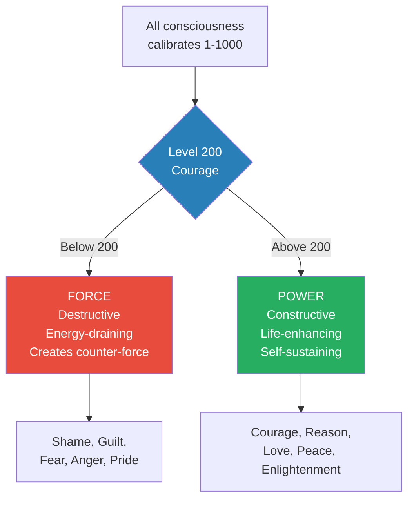
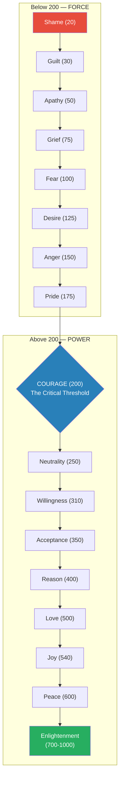
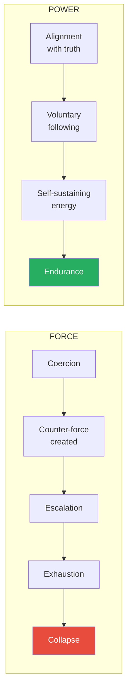
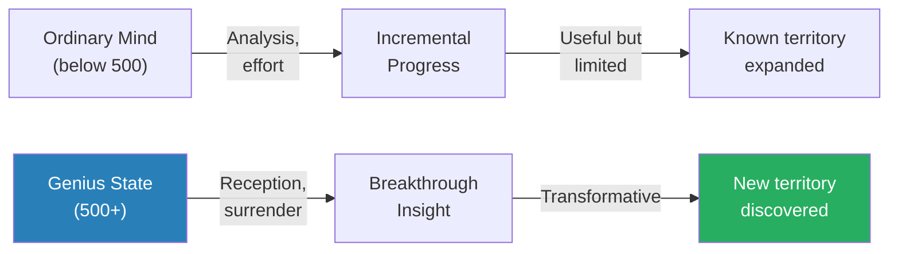
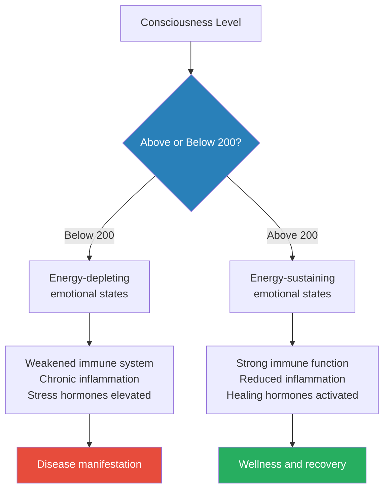
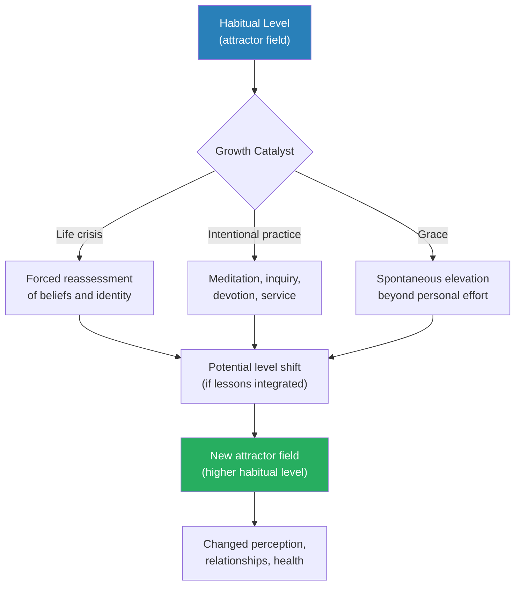
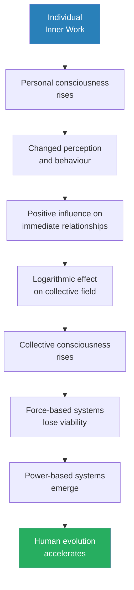

# Power vs. Force — David R. Hawkins

> David R. Hawkins was a psychiatrist who ran one of the largest psychiatric practices in America — over a thousand patients a year, fifty therapists, twenty-five offices — before a transformative spiritual experience redirected his life toward the study of consciousness itself.
> *Power vs. Force* is his argument that all human behaviour, all institutions, and all ideas can be placed on a measurable scale of consciousness from 1 to 1,000, and that the dividing line between destructive and constructive energy sits at exactly 200 — the level of Courage.
> Using applied kinesiology (muscle testing) as his instrument, Hawkins claims to have created a map of human consciousness that distinguishes truth from falsehood, power from force, and integrity from manipulation.
> Below 200, people and systems survive through force — coercion, manipulation, fear, shame. Above 200, they operate through power — courage, reason, love, peace.
> The book crosses psychiatry, physics, philosophy, and spirituality to argue that consciousness is not a vague metaphor but a measurable field, and that understanding where you stand on the scale is the first step toward rising higher.
> Whether you accept the kinesiology methodology or remain sceptical, the power-versus-force framework offers a genuinely useful lens for evaluating leaders, organisations, ideologies, and personal choices.

---

## About the Author

David R. Hawkins, M.D., Ph.D. (1927-2012), was a nationally renowned psychiatrist, physician, researcher, and spiritual teacher. He co-authored *Orthomolecular Psychiatry* with Nobel laureate Linus Pauling in 1973 and ran one of the largest psychiatric practices in the United States. In midlife, after decades of clinical practice, Hawkins underwent a profound spiritual transformation that shifted his work from conventional psychiatry to the study of consciousness. He spent the rest of his career developing and refining his Map of Consciousness, lecturing internationally, and writing a series of books exploring the intersection of science, spirituality, and human development. His work draws on quantum physics, nonlinear dynamics, chaos theory, and the traditions of contemplative spirituality.

---

## The Big Idea

- Hawkins proposes that <b style="color: #2980b9">consciousness is not just a subjective experience but a measurable energy field</b> that can be calibrated on a logarithmic scale from 1 to 1,000
- Every person, every organisation, every idea, every work of art, every political system vibrates at a particular level on this scale
- The critical dividing line is <b style="color: #2980b9">Level 200 — Courage</b>
  - Below 200: consciousness is destructive, energy-draining, and operates through **force**
  - Above 200: consciousness is constructive, life-enhancing, and operates through **power**
- <b style="color: #27ae60">True power arises from meaning, truth, and alignment with life itself — it never needs to justify itself or fight for survival</b>
- Force, by contrast, always creates counter-force — it is inherently unstable, requires constant energy input, and eventually collapses

---

- The measurement tool Hawkins uses is <b style="color: #2980b9">applied kinesiology</b> — a simple muscle-testing technique where a subject holds out their arm while making or thinking about a statement
  - If the statement is true or the stimulus is life-enhancing, the muscle stays strong
  - If the statement is false or the stimulus is life-depleting, the muscle goes weak
- Hawkins claims this response bypasses the conscious mind entirely — it is a direct readout from what he calls the "database of consciousness," an infinite field of information accessible to all living things
- The muscle test, in Hawkins' framework, is not subjective — it produces the same results regardless of the tester's beliefs, background, or expectations
- <b style="color: #e74c3c">The most dangerous trap is confusing force with power</b> — force looks impressive, but it always carries the seeds of its own destruction

---

- The implications Hawkins draws from this framework are sweeping:
  - Individual choices, habits, and beliefs each calibrate at specific levels
  - Organisations, governments, and cultural movements calibrate collectively
  - A single individual at a high level of consciousness can counterbalance millions at lower levels (because the scale is logarithmic)
  - The evolution of human consciousness is directional — humanity is slowly rising, and each person's inner work contributes to the whole

This diagram captures the book's central architecture: every level of consciousness falls on one side of the 200 threshold, and that threshold determines whether energy operates as constructive power or destructive force.

---

## Key Concepts at a Glance

| Concept | One-line summary |
|---------|-----------------|
| **Map of Consciousness** | Logarithmic scale from 1-1000 mapping every level of human awareness |
| **Level 200 — Courage** | The critical threshold separating destructive force from constructive power |
| **Power vs. Force** | Power is self-sustaining and life-aligned; force requires constant energy and creates opposition |
| **Applied kinesiology** | Muscle-testing technique claimed to produce a binary truth/falsehood response |
| **Attractor fields** | Consciousness levels act as gravitational attractors organising behaviour and perception |
| **Logarithmic scale** | Each level represents an enormous increase in energy — one person at 700 counterbalances millions |
| **The Database of Consciousness** | An infinite field of information accessible through kinesiology, beyond space and time |
| **Critical point analysis** | Using calibration to evaluate decisions, people, organisations, and ideas |
| **Spiritual evolution** | Consciousness evolves through levels; each person's growth raises the collective |
| **Integrity vs. ego** | The ego operates through force and positioning; integrity operates through power and truth |

---

# Part I: Tools — The Science and Method

## Chapter 1: Critical Advances in Knowledge

*Hawkins opens by arguing that humanity has been missing a critical tool — a reliable way to distinguish truth from falsehood — and claims that applied kinesiology provides exactly that.*

- The fundamental problem Hawkins identifies: <b style="color: #27ae60">humanity has no reliable method for distinguishing truth from falsehood in real time</b>
- We rely on opinion, argument, credentials, consensus — all of which can be manipulated, biased, or simply wrong
- Science works but is slow, expensive, and limited to the physical domain
- Philosophy works but produces endless disagreement
- Hawkins argues that <b style="color: #2980b9">applied kinesiology</b> fills this gap — a simple, instantaneous, universally accessible test that bypasses the intellect entirely
- The body, he claims, already knows what is true and what is false — and the muscle response is the readout
- This is not a minor claim — Hawkins is proposing a universal truth detector built into the human body
- He traces the history of the discovery:
  - Dr. George Goodheart developed applied kinesiology in the 1960s
  - Dr. John Diamond expanded it into behavioural kinesiology in the 1970s, discovering that muscles respond not just to physical stimuli but to emotional and intellectual ones
  - Hawkins took it further, systematising the responses into a numerical scale and applying it to every domain of human experience

> [!example] The Artificial Sweetener Discovery
> - In the early days of behavioural kinesiology, researchers noticed something unexpected during routine muscle testing
> - When test subjects held artificial sweeteners near their bodies — even sealed in envelopes so they didn't know what they were holding — their muscles went weak
> - Natural sweeteners produced no such effect
> - The body appeared to distinguish between life-supporting and life-depleting substances without any conscious awareness
> - This finding, replicated across many subjects, was one of the early signals that the muscle response operated below the level of conscious knowledge
> **The lesson:** The body's response to truth and falsehood operates beneath conscious awareness — it detects what the mind cannot.

- Hawkins presents this as a paradigm shift comparable to the discoveries of Galileo or Newton
- He positions the discovery within the lineage of transformative scientific breakthroughs:
  - Each major advance required overcoming resistance from the established paradigm
  - Galileo was persecuted, Darwin was ridiculed, quantum mechanics was resisted by Einstein himself
  - Hawkins frames kinesiology as the next frontier — a tool so simple that the scientific establishment dismisses it precisely because it does not fit existing models
- <b style="color: #e74c3c">The limitation he acknowledges only briefly: kinesiology has not been validated by mainstream science as a truth-detection tool</b>
- He argues this is because the scientific paradigm itself calibrates at a level (the 400s — Reason) that cannot comprehend phenomena above its own level

---

## Chapter 2: History and Methodology

*The mechanics of the muscle test are surprisingly simple — but Hawkins insists the simplicity is a feature, not a bug, because it means anyone can verify the results independently.*

- The basic procedure:
  - Two people are needed — a tester and a subject
  - The subject extends one arm horizontally
  - The tester presses down on the wrist with two fingers using moderate, steady pressure
  - A statement is made or a stimulus is introduced
  - If the response is "true" or the stimulus is life-enhancing, the arm stays strong
  - If the response is "false" or the stimulus is life-depleting, the arm goes weak

> [!abstract] The Kinesiology Test Protocol
> 1. Subject stands upright, one arm extended horizontally to the side
> 2. Tester places two fingers on the subject's wrist
> 3. Tester says "resist" and applies brief, firm, downward pressure
> 4. Establish baseline strength with a neutral statement
> 5. Introduce the test stimulus (a statement, substance, image, or concept)
> 6. Tester presses again — the arm either holds firm (true/positive) or gives way (false/negative)
> 7. Repeat for verification

- Hawkins claims the test has been replicated millions of times across all demographics, cultures, and belief systems
- The response is <b style="color: #2980b9">non-volitional</b> — the subject cannot fake it, because the muscle response bypasses conscious intention
- Key conditions for valid testing:
  - Both tester and subject must calibrate above 200 (Courage) themselves
  - The question must be framed as a declarative statement, not a question
  - The motivation must be integrous — testing for ego purposes or to "win" arguments corrupts results
  - The tester must remain neutral and not invest in a particular outcome
- <b style="color: #e74c3c">Hawkins concedes that approximately 10% of the population cannot reliably participate in kinesiology testing</b>, though he does not fully explain why
- Additional methodological details:
  - The arm must be horizontal, not raised or lowered — the angle affects baseline strength
  - The tester applies a quick, firm press, not a sustained push — it should take under two seconds
  - Results are not affected by the subject's physical fitness, because the test measures relative rather than absolute strength
  - Hawkins recommends testing each calibration three times for reliability

---

## Chapter 3: Test Results and Interpretation

*Hawkins moves from method to data, reporting findings from over twenty years of testing that he says reveal consistent, reproducible patterns across cultures and populations.*

- Hawkins reports testing thousands of subjects over two decades
- Key findings:
  - The test produces the same results regardless of who is testing or who is being tested (provided both calibrate above 200)
  - Historical figures, artworks, political systems, and philosophical positions all produce consistent calibrations when tested by different groups
  - The response is instantaneous — it takes less than a second
  - It works even when the subject has no conscious knowledge of the thing being tested

> [!example] Blind Testing with Hidden Envelopes
> - To rule out suggestion and expectation, Hawkins' research team placed photographs inside sealed, opaque envelopes
> - Subjects held each envelope against their solar plexus while being muscle-tested
> - Without knowing the contents, subjects consistently went strong for photographs of positive figures (e.g. Mother Teresa, Nelson Mandela) and weak for negative ones (e.g. dictators, serial killers)
> - The researchers rotated subjects, envelopes, and testers — the results remained consistent
> - Hawkins interpreted this as evidence that the body responds to the energy field of the subject in the photograph, not to any conscious association
> **The lesson:** The kinesiological response appears to operate independent of conscious knowledge — the body seems to detect the calibration level of the stimulus directly.

- The calibration numbers are presented as objective measurements, not opinions:
  - Hawkins tested foods, music, art, literature, political leaders, religions, philosophical systems, and historical events
  - Each receives a specific number on the 1-1000 scale
  - These calibrations, he claims, do not change over time and are not culturally relative
- <b style="color: #27ae60">The practical implication: you can use kinesiology to evaluate any decision, relationship, product, or belief system before committing to it</b>
- Hawkins also reports what he calls "contextual calibrations":
  - The same person can calibrate differently depending on what context is being tested
  - A politician may calibrate at 450 regarding domestic policy but 190 regarding foreign affairs
  - A teacher may calibrate at 375 in the classroom but 160 in personal relationships
  - This adds nuance to the scale — people are not a single number but a constellation of levels across different domains

---

## Chapter 4: Levels of Human Consciousness

*This is the centrepiece of the book — the Map of Consciousness itself, a detailed taxonomy of every major level of human awareness from the depths of Shame to the heights of Enlightenment.*

The <b style="color: #2980b9">Map of Consciousness</b> is Hawkins' signature contribution. It assigns a numerical calibration to each level of consciousness, along with the dominant emotion, the way reality is perceived, and the process that characterises life at that level.

### The Full Map

| Level | Calibration | Emotion | Life View | Process |
|-------|:-----------:|---------|-----------|---------|
| **Enlightenment** | 700-1000 | Ineffable | Is | Pure consciousness |
| **Peace** | 600 | Bliss | Perfect | Illumination |
| **Joy** | 540 | Serenity | Complete | Transfiguration |
| **Love** | 500 | Reverence | Benign | Revelation |
| **Reason** | 400 | Understanding | Meaningful | Abstraction |
| **Acceptance** | 350 | Forgiveness | Harmonious | Transcendence |
| **Willingness** | 310 | Optimism | Hopeful | Intention |
| **Neutrality** | 250 | Trust | Satisfactory | Release |
| **Courage** | 200 | Affirmation | Feasible | Empowerment |
| **Pride** | 175 | Scorn | Demanding | Inflation |
| **Anger** | 150 | Hate | Antagonistic | Aggression |
| **Desire** | 125 | Craving | Disappointing | Enslavement |
| **Fear** | 100 | Anxiety | Frightening | Withdrawal |
| **Grief** | 75 | Regret | Tragic | Despondency |
| **Apathy** | 50 | Despair | Hopeless | Abdication |
| **Guilt** | 30 | Blame | Evil | Destruction |
| **Shame** | 20 | Humiliation | Miserable | Elimination |

Each level is not merely an emotional state — it is an entire way of perceiving and relating to reality.

The polar area chart makes the logarithmic nature of Hawkins' scale visceral — the jump from Courage (200) to Love (500) to Peace (600) dwarfs the differences between the sub-200 levels, illustrating why a single person at a high level can counterbalance millions at lower ones.

---

### Below 200: The Realm of Force

> [!tip] Core Insight
> Everything below 200 is characterised by force — it takes energy from the environment, creates opposition, and cannot sustain itself without external input.

**Shame (20)** — the level closest to death:
- Shame is so destructive that it drives people toward elimination — either of the self or the source of shame
- It is the energy behind self-harm, hiding, and the desire to become invisible
- Shamed individuals often become rigid and punitive — they project their shame outward
- Hawkins calibrates this as barely above physical death in terms of life energy
- Entire communities trapped in shame (victims of genocide, systemic humiliation) produce patterns of self-destruction that can persist for generations

**Guilt (30)** — the level of self-punishment:
- Guilt dominates through preoccupation with sin, blame, and unworthiness
- It produces psychosomatic disease more readily than almost any other emotion
- Religious manipulation often operates at this level — keeping followers trapped in guilt to maintain control
- <b style="color: #e74c3c">Guilt-based systems present themselves as moral but actually drain life energy from their adherents</b>
- Guilt differs from genuine remorse: remorse motivates change and calibrates higher, while guilt creates paralysis and self-punishment

**Apathy (50)** — learned helplessness:
- The world looks hopeless from this level — nothing matters, nothing can change
- This is the level of the chronically homeless, the addicted, the abandoned elderly in institutions
- Apathy is not active despair — it is the absence of enough energy to even despair
- People at this level need energy from outside to begin moving — they cannot bootstrap themselves
- Hawkins notes that many populations under prolonged oppression settle into apathy — it is the psyche's way of conserving whatever energy remains

**Grief (75)** — perpetual loss:
- Sadness, regret, and the sense that life is tragic dominate at this level
- More energy than apathy — at least the person can feel — but the feeling is constant loss
- Grief can become a habitual lens rather than a temporary response to a specific event
- People stuck in grief often unconsciously create situations that reinforce the grief narrative

**Fear (100)** — the great limiter:
- Fear sees danger everywhere and organises all of life around avoidance
- It is the dominant energy of much of the world's population
- Fear-based thinking produces rigid, controlling behaviour — fearful people try to control their environment because they cannot control their internal state
- <b style="color: #e74c3c">Fear is the primary tool of authoritarian systems — keep people afraid and they will trade freedom for the illusion of safety</b>
- Hawkins draws a distinction between healthy alertness (which can calibrate above 200) and habitual fearfulness (which locks people into avoidance patterns)

**Desire (125)** — the engine of addiction:
- Desire is more energetic than fear — it pulls toward rather than pushing away
- But its energy is enslaving — the desired object or state controls the person, not the reverse
- Advertising, consumerism, and addictive substances all operate at this level
- Desire is never satisfied — obtaining the object simply produces a new desire
- Hawkins notes that entire economies run on manufactured desire, keeping populations locked at this level through endless cycles of wanting

**Anger (150)** — the first level with enough energy to change things:
- Anger can be constructive if it leads upward — "I'm angry enough to do something about this"
- But if it becomes a habitual stance, it sees the world as antagonistic and responds with aggression
- Anger calibrates higher than fear because it at least produces movement — fearful people freeze, angry people act
- <b style="color: #27ae60">Anger is a critical transition point — it can be a springboard to Courage or a trap that loops endlessly</b>
- Social movements often begin in collective anger — the key question is whether they evolve upward into Courage and Acceptance or remain stuck in rage

**Pride (175)** — the highest level still below the threshold:
- Pride feels positive — and compared to shame, guilt, and fear, it is
- But pride is fragile and defensive — it depends on external conditions
- Nationalistic pride, religious pride, identity-based pride all calibrate here
- The problem: pride needs something to look down on to sustain itself
- <b style="color: #e74c3c">Pride is the most dangerous sub-200 level because it feels like strength but is actually a vulnerability</b> — threaten the source of pride and the person collapses into anger or fear

The line chart reveals the non-linear acceleration of consciousness: below the red threshold of 200, levels increment slowly through the force territory, but above it, consciousness accelerates dramatically — the jump from Reason (400) to Love (500) to Peace (600) dwarfs all the sub-200 transitions combined.
- Hawkins warns that many self-help programmes inadvertently keep people at Pride by encouraging superiority rather than genuine growth

---

This diagram shows the full Map of Consciousness as a progression. The critical threshold at 200 (Courage) separates the realm of force from the realm of power.

---

### Above 200: The Realm of Power

> [!tip] Core Insight
> Above 200, consciousness becomes self-sustaining. Power does not need to take energy from others — it generates its own.

**Courage (200)** — the gateway level:
- <b style="color: #2980b9">Courage is where life shifts from "I can't" to "I can"</b>
- At this level, a person can face truth, take responsibility, and engage with challenges
- The world looks "feasible" — not perfect, not safe, but possible
- This is where growth begins in earnest — below 200, energy is spent on survival; above 200, energy becomes available for development
- Hawkins considers this the most important threshold in human consciousness
- The quality of Courage here is not physical bravery but moral and psychological willingness to face reality without flinching

**Neutrality (250)** — the end of positioning:
- Neutral people are not passive — they are flexible
- They can see multiple perspectives without needing any of them to be "right"
- The emotional tone is trust — things will work out, one way or another
- Neutral people are easy to work with because they do not need to control outcomes
- <b style="color: #27ae60">The shift from 200 to 250 marks the transition from "I can handle this" to "I don't need this to go my way"</b>
- Neutrality is the first level where genuine tolerance — not forced politeness but actual ease with difference — becomes possible

**Willingness (310)** — the open door:
- Willingness is characterised by optimism and genuine openness to growth
- People at this level are excellent learners, good employees, and reliable community members
- They do not resist feedback or change — they welcome it
- The limitation: willingness without discernment can lead to being exploited
- Hawkins notes that people at Willingness often serve as the backbone of communities — they are the reliable volunteers, the team players, the people who show up

**Acceptance (350)** — the level of personal responsibility:
- At Acceptance, the individual stops blaming external circumstances and fully owns their experience
- The emotional tone is forgiveness — not as a moral duty but as a natural release
- <b style="color: #2980b9">Acceptance is where people discover they are the source of their own happiness</b>, not the recipient of it
- Major life transformations — leaving destructive relationships, changing careers, releasing addictions — often happen at this level
- Hawkins sees Acceptance as the level where true emotional maturity begins — the individual stops needing circumstances to be different and starts working with what is

**Reason (400)** — the power of the intellect:
- Science, medicine, law, and philosophy all operate primarily at this level
- Reason is enormously productive — it has given humanity technology, medicine, and constitutional democracy
- The limitation Hawkins identifies: <b style="color: #e74c3c">Reason cannot reach beyond itself</b>
  - It can organise and analyse data brilliantly, but it cannot access the domains of meaning, love, or spiritual insight
  - Einstein calibrated at 499 — the very peak of Reason — but the insights that produced his breakthroughs came from above Reason (intuition, thought experiments, aesthetic beauty)
- Reason can become a trap when intellect becomes an end in itself — the "paralysis of analysis"
- Hawkins notes that academia, at its worst, represents Reason ossified into Pride — defending positions rather than seeking truth

> [!example] Einstein at the Border of Reason and Love
> - Hawkins calibrated Albert Einstein at 499 — the upper boundary of Reason
> - Yet Einstein himself described his greatest discoveries not as products of calculation but of imagination and aesthetic intuition
> - His famous thought experiments — riding a beam of light, falling in an elevator — were not logical deductions but leaps of creative vision
> - Hawkins interpreted this as evidence that genius occurs when consciousness touches the level above its habitual home
> - Einstein's intellect operated at the 400s, but his breakthroughs came from momentary access to the 500s (Love/Revelation)
> **The lesson:** The greatest products of Reason come from moments when consciousness temporarily reaches beyond Reason into intuitive knowing.

---

**Love (500)** — not the emotion, but the state:
- <b style="color: #2980b9">Hawkins is emphatic that Love at 500 is not romantic love, emotional attachment, or sentimentality</b>
- It is an unconditional state — a way of relating to all of existence with reverence
- At this level, perception shifts from seeing the world as full of separate objects to seeing it as a unified, living whole
- Love at 500 is rare — Hawkins estimates only 4% of the world's population calibrates here or above
- The great spiritual teachers, the greatest humanitarians, and the most transformative leaders operate from this level
- <b style="color: #27ae60">Love at 500 is not something you do — it is something you become</b>
- The distinction between personal love (emotion, attachment, desire — calibrates much lower) and unconditional love (a state of being — calibrates at 500) is one of the book's most important clarifications

**Joy (540)** — sustained inner radiance:
- Joy is not happiness dependent on circumstances — it is a constant inner state independent of what is happening externally
- Hawkins associates this level with the great saints, healers, and advanced spiritual practitioners
- Near-death experiences typically report touching this level temporarily
- The world looks "complete" — nothing is missing, nothing needs fixing
- People at Joy radiate a palpable quality that others experience as warmth, peace, or inspiration — Hawkins describes it as a field effect rather than a personality trait

**Peace (600)** — transcendence of ordinary perception:
- At Peace, the distinction between subject and object begins to dissolve
- This is the level of the great mystics — a state beyond description in ordinary language
- Hawkins says only one in ten million people reaches this level
- The experience is of infinite silence, stillness, and perfection
- Time ceases to feel linear — everything appears to exist in an eternal present

**Enlightenment (700-1000)** — the highest levels ever attained:
- Hawkins calibrates the great avatars of history — Jesus, Buddha, Krishna — at 1,000
- At this level, individual identity has merged entirely with universal consciousness
- These levels are not achievable through effort — they are states of grace
- Hawkins calibrates very few historical figures above 700
- The field effect of individuals at this level is so powerful that, in Hawkins' framework, a single person at 700 counterbalances the consciousness of 70 million people below 200

---

## Chapter 5: Social Distribution of Consciousness Levels

*Most of humanity operates far below the levels we associate with wisdom, and the distribution has profound implications for how civilisations function and fail.*

- Hawkins presents a startling claim about the distribution of consciousness:
  - The average level of human consciousness on Earth is approximately **207** — barely above the threshold of Courage
  - This average only crossed 200 in the late 1980s — for most of human history, the collective calibration was below 200
  - 85% of the world's population calibrates below 200
  - Only 15% calibrates above 200
  - Only 4% reaches 500 (Love) or above
  - Only 0.4% reaches 540 (Joy) or above

> [!tip] Core Insight
> Because the scale is logarithmic, a single individual at a high level counterbalances enormous numbers at lower levels. One person at 700 counterbalances 70 million people below 200.

- This logarithmic property is crucial to Hawkins' worldview:
  - It means that a small number of highly conscious individuals exert an outsized influence on the collective field
  - The great spiritual teachers, in this framework, are not just moral examples — they are literal counterweights to the mass of lower-consciousness humanity
  - <b style="color: #27ae60">Every individual who raises their own consciousness contributes disproportionately to the elevation of the whole</b>
- The practical implication: you do not need to change the world — you need to change yourself, and the world changes as a consequence

| Population Percentage | Calibration Level | Significance |
|----------------------|:-----------------:|-------------|
| 85% | Below 200 | Operating through force — survival mode |
| 15% | Above 200 | Operating through power — constructive mode |
| 4% | Above 500 | Love and beyond — transformative influence |
| 0.4% | Above 540 | Joy — sustained spiritual awareness |
| ~0.00001% | Above 600 | Peace — mystic-level consciousness |

This distribution table reveals how top-heavy human consciousness is toward the lower levels — and why the rare individuals at high levels exert disproportionate influence.

The treemap makes the population distribution stark: the vast majority of humanity operates in the red/orange "force" territory below 200, with the constructive "power" levels forming a thin band and the transformative levels (Love, Joy, Peace) barely visible — illustrating why Hawkins claims each person's inner work has outsized collective impact.

> [!example] The Critical Mass Theory
> - Hawkins points to the late 1980s as a turning point in human history
> - He claims that during this period, the collective consciousness of humanity crossed above 200 for the first time
> - The evidence he cites: the fall of the Berlin Wall, the collapse of the Soviet Union, the end of apartheid in South Africa, and a general global movement toward democracy and human rights
> - These events, in Hawkins' reading, were not primarily political — they were symptoms of a collective shift in consciousness
> - When enough individuals crossed above 200, the collective field shifted, and systems built on force (totalitarianism, apartheid, colonial oppression) could no longer sustain themselves
> **The lesson:** Systems built on force collapse when the collective consciousness rises above their calibration level — they don't need to be defeated, they need to be outgrown.

---

## Chapter 6: New Horizons in Research

*Hawkins sketches the potential applications of consciousness calibration across medicine, law, commerce, and education — a vision of what would be possible if the methodology were widely adopted.*

- Hawkins envisions kinesiology as a universal diagnostic tool:
  - **Medicine:** Test whether a particular treatment, medication, or practitioner is beneficial for a specific patient
  - **Nutrition:** Test foods, supplements, and diets against the body's response
  - **Law:** Determine truth from falsehood in testimony (replacing unreliable polygraphs)
  - **Business:** Evaluate the integrity of potential partners, investments, and strategies
  - **Education:** Calibrate the consciousness level of curricula, teaching methods, and educational philosophies
- <b style="color: #2980b9">Critical point analysis</b> is the term Hawkins uses for applying calibration to everyday decisions
  - Rather than relying on analysis, opinion, or gut feeling, you muscle-test the decision
  - "Is this job offer above 200?" "Does this relationship calibrate above 200?" "Is this investment integrous?"
- Hawkins also sees applications in research methodology itself:
  - Before conducting a study, calibrate whether the hypothesis is true or false
  - Before publishing a finding, calibrate whether the interpretation is accurate
  - This would, in his view, eliminate enormous waste in scientific research
- <b style="color: #e74c3c">The obvious objection — that kinesiology has not been validated by controlled scientific studies as a truth-detection method — is one Hawkins addresses only obliquely</b>
  - He argues that the methodology works at a level above Reason (400) and therefore cannot be validated by tools that operate at Reason's level
  - This is a circular argument that critics have identified as the book's central vulnerability

---

## Chapter 7: Everyday Critical Point Analysis

*Hawkins makes the Map of Consciousness personal — how to use calibration as a daily decision-making tool for navigating relationships, career, health, and personal growth.*

- The concept of <b style="color: #2980b9">critical point analysis</b> is Hawkins' term for applying the consciousness scale to everyday life
- Every decision, relationship, and commitment either raises or lowers your overall calibration
- The principle is simple: <b style="color: #27ae60">choose what calibrates above 200, avoid what calibrates below 200</b>
- Practical domains:
  - **Relationships:** Are the people in your life predominantly above or below 200? Spending time with sub-200 individuals drains energy; spending time with above-200 individuals is energising
  - **Media consumption:** News, entertainment, music, and social media all have calibration levels — what you consume affects your field
  - **Work:** Is your organisation's culture above or below 200? Is your boss above or below 200?
  - **Health choices:** Foods, exercise regimes, and medical treatments can be tested individually
  - **Spiritual practices:** Different practices calibrate at different levels — some meditation techniques calibrate in the 500s, while others, contaminated by cult dynamics, calibrate well below 200

> [!example] The Media Consumption Test
> - Hawkins and his research team tested various forms of media for their effect on consciousness
> - Violent video games, sensationalised news coverage, and shock entertainment consistently made test subjects go weak
> - Classical music, nature documentaries, and inspirational biographies consistently made them go strong
> - The effect was measurable even when subjects were not consciously aware of the content — playing music in the background produced the same weakening or strengthening response
> - Hawkins used this finding to argue that media consumption is not a passive activity — it actively raises or lowers the consumer's calibration level
> **The lesson:** What you expose yourself to literally changes your level of consciousness — media is not entertainment, it is nourishment or poison.

- The limitation Hawkins acknowledges: critical point analysis requires you to be at or above 200 yourself to get reliable results
- <b style="color: #e74c3c">If your own consciousness is below 200, your muscle-test results will be unreliable</b> — a catch-22 for those who might benefit most
- Hawkins' advice for navigating this limitation:
  - Begin by testing things where you already know the answer (establish reliability)
  - Test with a partner who calibrates above 200 if you are unsure of your own level
  - Notice the body's response to environments, people, and activities even without formal testing — the body always gives signals

---

## Chapter 8: The Source of Power

*Hawkins argues that power and force are not degrees of the same thing but fundamentally different phenomena — and understanding this distinction changes how you see every conflict, institution, and relationship.*

- The core distinction:

| Attribute | Power | Force |
|-----------|-------|-------|
| **Source** | Aligned with truth and life | Aligned with ego and falsehood |
| **Sustainability** | Self-sustaining, enduring | Requires constant energy input |
| **Effect on others** | Inspires, elevates | Coerces, depletes |
| **Response it creates** | Voluntary alignment | Counter-force and resistance |
| **Need for justification** | None — it simply is | Constant — must explain itself |
| **Relationship to time** | Timeless | Temporary |
| **Relationship to opposition** | Has none — creates allies | Always generates enemies |
| **Examples** | Gandhi, gravity, truth | Armies, propaganda, threats |

- <b style="color: #27ae60">Power is like gravity — it does not need to advertise, justify, or defend itself. It simply is, and everything organises around it.</b>
- Force is like a gust of wind — it can move things temporarily, but it always dies down, and the things it moved tend to return to their natural position
- This is not merely a metaphor for Hawkins — he means it literally:
  - Power arises from alignment with truth, and truth is a property of the universe itself
  - Force arises from the ego's attempt to impose its will on reality
  - The universe favours power over force the same way physics favours entropy — it is a fundamental tendency
- Hawkins draws the analogy to martial arts:
  - A skilled martial artist uses the attacker's force against them — this is power
  - A brawler relies on overwhelming force — this works until they meet someone stronger
  - The martial arts master is relaxed, centred, and responsive; the brawler is tense, rigid, and reactive
  - This mirrors the broader power-force dynamic in every domain

> [!example] Gandhi vs. the British Empire
> - The British Empire was the greatest concentration of military and economic force the world had ever seen — it controlled a quarter of the earth's surface
> - Gandhi was a single man with no army, no weapons, no economic leverage, and no political office
> - Yet Gandhi prevailed — not by opposing force with greater force, but by operating from a level of consciousness (he calibrated at 760 according to Hawkins) that the Empire's force could not touch
> - Every act of British violence against nonviolent resisters weakened the Empire's moral position and strengthened Gandhi's
> - The Empire's force created counter-force — international outrage, domestic dissent, economic costs
> - Gandhi's power created alignment — millions of Indians, many international observers, and eventually the British public themselves aligned with his vision
> - The Empire collapsed not because it was defeated militarily but because force cannot sustain itself against power
> **The lesson:** Force creates counter-force and eventually destroys itself. Power attracts voluntary alignment and endures.

---

Force follows a cycle of escalation and collapse. Power generates a self-reinforcing cycle of alignment and endurance.

---

# Part II: Work — Power in the World

## Chapter 9: Power Patterns in Human Attitudes

*Hawkins applies the Map of Consciousness to the attitudes people carry through life, showing how your habitual level determines what you see, what you attract, and what you create.*

- Your <b style="color: #2980b9">attractor field</b> is the consciousness level at which you habitually operate
  - It acts like a gravitational pull — organising your perceptions, relationships, and life outcomes
  - Two people can experience the same event and perceive entirely different realities based on their attractor fields
  - A person at Fear (100) walks into a room and scans for threats; a person at Love (500) walks into the same room and notices connection and beauty
- Attractor fields are not fixed — they can shift, but the shift requires genuine internal work, not just intellectual understanding
- <b style="color: #27ae60">The most powerful change you can make is not changing your circumstances but shifting your attractor field</b> — because when the field shifts, circumstances reorganise around the new level
- Hawkins borrows the concept of "attractors" from chaos theory:
  - In mathematics, an attractor is a set of values toward which a system tends to evolve
  - In Hawkins' model, each consciousness level functions as a strange attractor — pulling perceptions, interpretations, and behaviours into consistent patterns
  - Breaking free of an attractor field requires enough energy to escape its gravitational pull and settle into a higher attractor

> [!example] Two Doctors, Same Hospital
> - Hawkins describes two physicians working in the same hospital system with similar training and credentials
> - One operates from Pride (175) — he needs recognition, competes with colleagues, and measures success in status markers
> - The other operates from Willingness (310) — she is genuinely curious about each patient, collaborates easily, and finds fulfilment in the work itself
> - Over a decade, the Pride-driven doctor accumulates resentments, conflicts with administration, and growing cynicism
> - The Willingness-driven doctor accumulates trust, referrals, and deepening satisfaction
> - Same environment, same profession, radically different trajectories — because the attractor field shaped every interaction differently
> **The lesson:** Your consciousness level is not a response to your circumstances — it is the lens that creates your experience of those circumstances.

- Hawkins identifies common attractor patterns in dysfunctional systems:
  - **Fear-based organisations** micromanage, punish mistakes, and generate compliance without commitment
  - **Pride-based organisations** celebrate winners and humiliate losers, creating internal competition that cannibalises collective energy
  - **Anger-based organisations** run on righteous indignation — they have energy but burn people out
  - **Desire-based organisations** chase quarterly results at the expense of long-term integrity
- <b style="color: #e74c3c">An organisation cannot rise above the consciousness level of its leadership</b> — the leader's attractor field sets the ceiling for the entire system

---

## Chapter 10: Power in Politics

*Hawkins calibrates political systems and leaders, arguing that the durability of any government is directly proportional to the consciousness level at which it operates.*

- <b style="color: #2980b9">Political systems calibrate just like individuals</b>, and their longevity correlates with their level:
  - Totalitarian regimes operate through force (below 200) and always collapse eventually
  - Democracies operate through power (above 200) and tend to endure
  - The critical factor is not the system's military strength but its alignment with truth

| Political System | Calibration | Outcome |
|-----------------|:-----------:|---------|
| Fascism | Below 200 | Collapsed within decades |
| Soviet Communism | Below 200 | Collapsed after 70 years |
| Maoist China | Below 200 | Required massive reform to survive |
| US Constitution | ~700 | Endured 230+ years |
| British Democracy | ~400 | Endured centuries |
| Gandhian Nonviolence | ~700 | Defeated the British Empire |

> [!example] The Fall of the Soviet Union
> - The Soviet Union was the most heavily armed state in human history — 45,000 nuclear warheads, the largest standing army on earth, total control of media, education, and economy
> - It calibrated below 200 on Hawkins' scale — its power was entirely force-based
> - Force always creates counter-force: internal dissent, economic stagnation, the human spirit's resistance to coercion
> - When Mikhail Gorbachev introduced glasnost and perestroika — policies that effectively shifted the system upward toward transparency and truth — the entire structure collapsed
> - It did not collapse from external military pressure — it collapsed because once truth was permitted, the falsehood on which the system was built could not sustain itself
> - Hawkins calibrated the moment of collapse as an example of force encountering power — the power of truth dissolved decades of accumulated force in a matter of months
> **The lesson:** Force-based systems are always held together by falsehood. Introduce truth, and the force structure disintegrates — no external enemy required.

> [!example] The US Constitution
> - Hawkins calibrated the United States Constitution at approximately 700 — one of the highest calibrations he assigned to any political document
> - He attributed this to the fact that the document's framers were operating from exceptionally high levels of consciousness
> - The Constitution's power lies not in its enforcement mechanism but in its alignment with universal principles: individual dignity, freedom of conscience, limitation of governmental force
> - Documents that calibrate this high, Hawkins argues, create attractor fields that organise society for centuries — they do not need to be defended by force because they generate voluntary alignment
> **The lesson:** The most enduring political structures are those aligned with truth and human dignity — they operate through power, not force.

- <b style="color: #27ae60">The practical test for any political movement: does it seek to empower or to coerce?</b>
  - Movements that empower (civil rights, women's suffrage, abolition) calibrate above 200 and tend to prevail
  - Movements that coerce (totalitarianism, ethnic cleansing, theocratic rule) calibrate below 200 and tend to collapse
- Hawkins warns that propaganda is the use of force disguised as power — it mimics truth but calibrates below 200
- He also notes that political parties and movements can start above 200 and degenerate below it:
  - Revolutionary movements often begin in Courage or Anger and descend into Pride, Fear, or even Shame once they achieve power
  - The consciousness level of the founding vision does not guarantee the consciousness level of the institution it creates

---

## Chapter 11: Power in the Marketplace

*The same principles that govern politics govern business — companies built on force eventually fail, while companies built on genuine value endure.*

- <b style="color: #2980b9">Marketplace power operates on the same principles as all other power</b>:
  - Companies that create genuine value (power) build lasting enterprises
  - Companies that exploit, manipulate, or deceive (force) may profit short-term but erode their foundation
- Hawkins calibrates several business principles:
  - Customer service that genuinely solves problems calibrates above 200
  - Manipulation, high-pressure sales, and planned obsolescence calibrate below 200
  - Quality craftsmanship calibrates higher than marketing hype
  - <b style="color: #27ae60">Integrity in business is not just ethical — it is the most effective long-term strategy</b>
- The marketplace as a truth-testing mechanism:
  - Over time, markets tend to reward power and punish force — not always immediately, but eventually
  - Brands built on genuine quality develop loyal customers (power creates voluntary alignment)
  - Brands built on deception require ever-increasing marketing spend (force requires constant energy input)

> [!example] The Rise and Fall of Force-Based Corporations
> - Hawkins points to companies that dominated through force — monopolistic practices, exploitative labour, deceptive marketing — and notes that they invariably face crises
> - Enron, which calibrated well below 200 despite its corporate rhetoric about innovation and values, imploded spectacularly when the force of its deceptions encountered the power of truth (auditing, whistleblowers, investigation)
> - By contrast, companies that calibrate above 200 — those built on genuine customer service, fair dealing, and authentic value — tend to weather crises and grow over decades
> - The pattern is consistent: force creates the appearance of success but generates the counter-forces (lawsuits, regulation, customer defection) that eventually destroy it
> **The lesson:** Business success built on force is always temporary — the market eventually calibrates truth.

- <b style="color: #e74c3c">The trap for entrepreneurs: confusing aggressive growth tactics (force) with genuine value creation (power)</b>
  - Growth through manipulation looks like success but builds on sand
  - Growth through genuine service looks slower but builds on rock

---

## Chapter 12: Power and Sports

*Athletic performance provides a vivid demonstration of the power-force distinction — the greatest athletes transcend mere physical force through alignment with something beyond ego.*

- Hawkins distinguishes between athletes who operate through force and those who operate through power:
  - Force-based athletes rely on aggression, intimidation, and raw physical dominance
  - Power-based athletes operate from what athletes call "the zone" — a state of effortless performance that transcends conscious effort
- <b style="color: #2980b9">The zone</b> is Hawkins' term for moments when consciousness temporarily elevates above its habitual level:
  - Time seems to slow down
  - Movements become effortless and precise
  - The athlete feels guided rather than effortful
  - Self-consciousness disappears entirely
- Athletes who can access this state consistently outperform those who rely on force alone
- <b style="color: #27ae60">Peak performance is not the result of trying harder — it is the result of surrendering effort and allowing power to operate through you</b>
- Hawkins uses kinesiology to demonstrate this in real time:
  - Athletes asked to visualise winning through dominance and aggression (force) tested weaker
  - The same athletes asked to visualise performing with joy, gratitude, or dedication to excellence (power) tested stronger
  - The body itself reveals that force-based motivation depletes physical capacity while power-based motivation enhances it

> [!example] The Champion's Paradox
> - Hawkins describes research showing that championship-level athletes consistently report that their greatest performances felt effortless — not forced
> - A tennis player in the zone does not think about her stroke mechanics — her body moves with a precision that conscious effort cannot match
> - A golfer in the zone does not "try" to make the shot — he simply sees the trajectory and the body follows
> - The paradox: the harder you try, the worse you perform; the more you surrender, the better the performance
> - Hawkins interprets this through the consciousness scale — force (effort, trying, straining) calibrates below the level where peak performance occurs
> **The lesson:** The zone is not a mental trick — it is a temporary elevation of consciousness to a level where power operates without interference from the ego.

- The broader principle extends far beyond sports:
  - Musicians who perform with force (trying to impress) sound stiff; those who perform with power (serving the music) sound transcendent
  - Writers who force prose produce lifeless text; those who surrender to the creative flow produce work that moves readers
  - Speakers who force charisma come across as inauthentic; those whose presence arises from genuine conviction naturally command attention
  - <b style="color: #e74c3c">In every domain of human performance, trying too hard is the enemy of excellence</b>

---

## Chapters 13-14: Social Power, the Arts, and the Human Spirit

*Hawkins extends the power-force analysis to society, art, and culture, arguing that civilisations rise and fall based on the collective consciousness level they embody.*

- **Social power** does not come from institutions — it comes from the consciousness level of the individuals within them
  - A hospital staffed by people at Willingness (310) heals; the same hospital staffed by people at Anger (150) harms
  - A school led by a principal at Acceptance (350) educates; the same school led by someone at Pride (175) merely sorts
  - A family led by parents at Love (500) nurtures resilient children; the same family led by parents at Fear (100) produces anxious ones
- <b style="color: #2980b9">Art calibrates</b> — and its calibration level determines its lasting impact:
  - Bach's music calibrates in the high 500s; it has endured for three centuries and continues to elevate listeners
  - Propagandistic art calibrates below 200; it feels powerful in the moment but does not last
  - <b style="color: #27ae60">Great art endures because it connects the audience with levels of consciousness above their habitual range</b>
  - This is why people weep at certain music, feel awe before certain paintings, and are transformed by certain books — the art is temporarily elevating their field

| Art Form | High-Calibrating Examples | Effect |
|----------|--------------------------|--------|
| Music | Bach, Beethoven, Mozart | Elevates, opens, inspires |
| Painting | Vermeer, Rembrandt | Creates reverence and stillness |
| Literature | Shakespeare, Tolstoy | Deepens understanding of human nature |
| Architecture | Gothic cathedrals, Taj Mahal | Evokes transcendence |

- <b style="color: #e74c3c">Art created to shock, provoke, or manipulate calibrates below 200 and ultimately depletes both creator and audience</b>
- Hawkins' controversial claim: the decline of Western civilisation in the twentieth century correlates with the decline of art's average calibration level — from the high-calibrating works of the Romantic era to the sub-200 productions of much post-modern art

> [!example] Churchill's Words as Power
> - Hawkins calibrates Winston Churchill's wartime speeches as operating well above 200 — they were not mere rhetoric but genuine emanations of power
> - When Churchill told Britain "we shall fight on the beaches," he was not using force (threats, coercion) but power (truth, courage, vision)
> - The effect was not compliance but inspiration — an entire nation voluntarily aligned with his vision, not because they were forced to but because his words resonated with something true
> - Nazi propaganda, by contrast, calibrated below 200 — it was effective through force (fear, manipulation, spectacle) but created the counter-forces that eventually destroyed the regime
> - Churchill's words endure as literature; Nazi propaganda endures only as a cautionary tale
> **The lesson:** Words spoken from power inspire voluntary alignment that lasts. Words deployed as force may compel obedience but create the resistance that eventually overthrows them.

---

## Chapters 15-16: Genius, Creativity, and Surviving Success

*Genius is not exceptional intelligence — it is access to levels of consciousness where insight arrives unbidden, and the greatest danger for genius is the ego's attempt to claim credit for what power provides.*

- <b style="color: #2980b9">Genius</b> in Hawkins' framework is not a measure of IQ — it is a level of consciousness:
  - Genius operates at or above 500 (Love), where perception shifts from analytical to revelatory
  - The genius does not "figure things out" — they receive insights from a field of awareness beyond the rational mind
  - Newton, Mozart, Einstein — all described their greatest discoveries as arriving fully formed, not as products of logical deduction

Genius, in Hawkins' model, is not harder thinking — it is a different mode of consciousness entirely, one that receives rather than constructs.

> [!example] Mozart's Musical Downloads
> - Mozart reportedly described his compositions as arriving complete in his mind — he did not compose note by note but received entire symphonies as unified wholes
> - His role, as he described it, was not creative in the conventional sense — it was receptive
> - He served as a channel for music that already existed in some form beyond his conscious mind
> - Hawkins calibrated Mozart at 540 (Joy) and interpreted his creative process as evidence that genius operates by accessing levels of consciousness where information exists in complete form
> - The conscious mind's role is not to generate the insight but to translate it into a form the physical world can receive
> **The lesson:** Genius is not thinking harder — it is listening to a frequency of consciousness that most people cannot access.

- **Surviving success** is one of Hawkins' more practical chapters:
  - Success often triggers a drop in consciousness — from power back to force
  - The pattern: achieve something through genuine alignment, then the ego claims credit, then the shift from power (gratitude, service) to force (pride, entitlement, defensiveness)
  - <b style="color: #e74c3c">Many successful people destroy themselves not despite their success but because of it</b> — success feeds the ego, and the ego operates through force
  - The antidote: remain aware that success came through power (alignment with truth), not through the ego's efforts
  - Humility is not self-deprecation — it is accurate recognition that you are a channel for something larger than yourself
- Common patterns in the fall from power to force after success:
  - The artist who produces a masterpiece, then chases commercial success with formulaic work
  - The leader who builds something great, then starts believing it was all their personal genius
  - The athlete who reaches the zone, then tries to force the experience to repeat
  - In each case, the shift from surrender to control — from power to force — marks the beginning of decline

---

## Chapters 17-18: Health, Wellness, and Disease

*The body's health is not separate from the mind's consciousness level — Hawkins argues that disease originates in consciousness and that healing requires raising one's calibration, not just treating symptoms.*

- <b style="color: #2980b9">Every illness has a corresponding consciousness level</b>, and healing requires raising consciousness above that level:
  - Shame and guilt (20-30) are associated with autoimmune diseases, where the body attacks itself
  - Fear (100) is associated with chronic anxiety, panic disorders, and stress-related conditions
  - Anger (150) is associated with cardiovascular disease and inflammatory conditions
  - Love (500) and above is associated with spontaneous remissions and seemingly miraculous healings
- Hawkins claims to have witnessed numerous cases where patients who underwent consciousness shifts experienced dramatic physical improvements

| Consciousness Level | Associated Health Pattern | Mechanism |
|:-------------------:|--------------------------|-----------|
| Shame (20) | Autoimmune disease, self-harm | Body attacks itself, mirroring psyche |
| Guilt (30) | Psychosomatic illness, chronic pain | Self-punishment manifests physically |
| Fear (100) | Anxiety disorders, stress diseases | Chronic fight-or-flight activation |
| Anger (150) | Heart disease, inflammation | Sustained cortisol and adrenaline |
| Courage (200) | Recovery begins | Enough energy to engage healing |
| Love (500+) | Spontaneous remission | Radical field shift transforms physiology |

This table illustrates Hawkins' claim that consciousness level and physical health are directly linked — the body manifests what the mind habitually holds.

The body's physical state, in Hawkins' model, is downstream from the mind's consciousness level — raise the level, and the body follows.

- Hawkins distinguishes between <b style="color: #2980b9">curing</b> and <b style="color: #2980b9">healing</b>:
  - Curing addresses the physical symptom — it operates at the level of the body
  - Healing addresses the consciousness pattern that produced the symptom — it operates at the level of the field
  - Both are valuable, but curing without healing means the underlying pattern will eventually produce new symptoms
- <b style="color: #27ae60">The most powerful healing occurs when a patient shifts from a sub-200 attractor field to an above-200 attractor field</b>
  - This often involves forgiveness, acceptance, or the release of long-held resentments
  - Hawkins reports case after case where patients who let go of anger, guilt, or fear experienced rapid physical improvement
- <b style="color: #e74c3c">The danger: using this framework to blame sick people for their illness</b>
  - Hawkins does not fully address this risk
  - If disease originates in consciousness, then the sick person is implicitly responsible for their condition
  - This reasoning can become cruel when applied to children, victims of environmental toxins, or people with genetic conditions

> [!example] The Cancer Patient Who Forgave
> - Hawkins describes a patient with advanced cancer who had been given months to live
> - During therapy, the patient uncovered decades of suppressed rage toward a family member who had abused her in childhood
> - The rage had calibrated her attractor field in the low 100s — a level Hawkins associates with chronic disease
> - Through a process of confronting, expressing, and ultimately releasing the rage — moving through Grief, into Courage, and eventually to Acceptance — her calibration shifted above 350
> - Her cancer went into remission within months
> - Hawkins presents this not as proof that forgiveness cures cancer but as evidence that consciousness shifts have physical consequences
> **The lesson:** The body reflects the mind's habitual state. Change the state of consciousness, and the body's condition often changes with it.

---

# Part III: Meaning — Consciousness, Spirit, and Truth

## Chapter 19: The Database of Consciousness

*Hawkins introduces his most metaphysical claim — that there exists an infinite, non-local database of all information that has ever existed, and that kinesiology provides access to it.*

- <b style="color: #2980b9">The Database of Consciousness</b> is Hawkins' term for what others have called the Akashic Record, the collective unconscious, or the mind of God:
  - It contains all information — past, present, and future
  - It is non-local — not stored in any physical location
  - It is accessible to anyone through kinesiology (or through advanced states of consciousness)
  - It responds to any properly framed question with a binary yes/no answer
- Hawkins draws on several scientific and philosophical sources:
  - Carl Jung's concept of the collective unconscious
  - Rupert Sheldrake's morphic fields
  - David Bohm's implicate order
  - Quantum nonlocality (Bell's theorem)
- <b style="color: #27ae60">The practical implication: truth is always available — the limitation is not in the universe's willingness to answer but in our willingness to ask with integrity</b>

> [!tip] Core Insight
> Truth is not something you discover through analysis — it is something you access through alignment. The database is always there; the question is whether your consciousness is calibrated to receive its answer.

- Hawkins claims the database can answer questions about:
  - Historical events (what actually happened, regardless of the accepted narrative)
  - Future probabilities (what is likely to happen given current conditions)
  - Personal decisions (what is truly aligned with your highest good)
  - The calibration level of any person, organisation, or idea
- He draws an analogy to a search engine:
  - The database is like the internet — vast, containing all information
  - Kinesiology is like a search engine — it queries the database and returns results
  - The quality of the answer depends on the quality of the question
  - The integrity of the tester determines whether the "connection" is reliable
- <b style="color: #e74c3c">The unfalsifiable nature of this claim is its greatest weakness</b>:
  - If you get a wrong answer, it is attributed to improper technique or insufficient calibration on the part of the tester
  - There is no way to get a result that would disprove the existence of the database
  - This makes the claim, by scientific standards, non-scientific — it is a matter of faith, not evidence

---

## Chapter 20: The Evolution of Consciousness

*Hawkins argues that consciousness is not static — it evolves, both individually and collectively, and that this evolution is the purpose of human existence.*

- Consciousness evolution is Hawkins' term for the process by which an individual (or humanity as a whole) moves up the scale over time
- This is not automatic — most people stay at approximately the same level throughout their lives
- <b style="color: #2980b9">The average person's consciousness level changes only about 5 points in an entire lifetime</b>
- Major shifts require either:
  - Extreme life circumstances (near-death experience, profound loss, spiritual crisis)
  - Sustained, intentional inner work (meditation, contemplation, self-inquiry, devotion)
  - Grace — an unexpected elevation that arrives from beyond the individual's control

Consciousness evolution requires a catalyst — and the shift is not merely intellectual but restructures the individual's entire relationship with reality.

- Key principles of consciousness evolution:
  - <b style="color: #27ae60">You cannot skip levels</b> — each level must be experienced and integrated before the next becomes accessible
  - The transitions between levels are not smooth — they involve crises, as the old identity structure dissolves and the new one has not yet formed
  - The ego resists every upward transition because each transition means the ego loses some control
  - <b style="color: #e74c3c">The biggest trap is mistaking intellectual understanding for actual consciousness shift</b> — you can understand the Map of Consciousness perfectly at 175 (Pride) while living there your entire life
- Hawkins identifies specific transition points that are particularly difficult:
  - **175 to 200 (Pride to Courage):** Requires surrendering the ego's need to be right
  - **350 to 400 (Acceptance to Reason):** Requires embracing the intellect without becoming enslaved by it
  - **400 to 500 (Reason to Love):** The most difficult transition in most people's lives — requires transcending the mind itself
  - **500 to 540 (Love to Joy):** Requires releasing the last traces of attachment to outcomes

---

## Chapter 21: The Study of Pure Consciousness

*Hawkins enters explicitly spiritual territory, describing states of awareness where the individual self dissolves into infinite consciousness — and arguing that these states are the natural destination of human evolution.*

- Above 600 on the Map, consciousness enters territory that cannot be adequately described in language:
  - The distinction between self and other dissolves
  - Time becomes irrelevant
  - Perception shifts from seeing individual objects to seeing a unified field
  - The experience is of infinite peace, love, and completeness
- <b style="color: #2980b9">Pure consciousness</b> is Hawkins' term for awareness without content — awareness itself, prior to thought, emotion, or perception:
  - It is not a state you achieve — it is what remains when all states are surrendered
  - It is not "nothing" — it is the infinite source from which all experiences arise
  - Every spiritual tradition points to this same reality using different language: nirvana, moksha, the kingdom of heaven, satori, union with God
- Hawkins distinguishes between mystical experience and psychotic experience:
  - Both involve the dissolution of ordinary perception
  - The difference: mystical states calibrate above 600 and are experienced as bliss, clarity, and unity
  - Psychotic states calibrate well below 200 and are experienced as fragmentation, terror, and confusion
  - <b style="color: #e74c3c">Confusing these two is dangerous — both for the individual and for those around them</b>
- Hawkins describes the phenomenology of high states:
  - At 600, awareness becomes panoramic — it includes everything without focusing on anything
  - At 700+, the sense of a separate self dissolves entirely
  - At 1,000, there is no longer anyone to report the experience — consciousness is all that remains

> [!example] Hawkins' Own Transformation
> - As a young man in rural Wisconsin, Hawkins experienced what he describes as a near-death episode
> - During the experience, his ordinary sense of self dissolved entirely
> - He reports experiencing infinite awareness, complete peace, and the absence of all suffering
> - The experience was not frightening — it was, he says, the most real thing he had ever experienced
> - When he returned to ordinary consciousness, he was fundamentally changed — his fear of death had vanished entirely
> - This experience became the foundation of his life's work — his psychiatric practice, his research, and eventually the Map of Consciousness all grew from this single, searing encounter with what he calls pure consciousness
> **The lesson:** The highest states of consciousness are not theoretical — they are experiential, and a single encounter can redirect an entire life.

---

## Chapter 22: Spiritual Struggle

*The path of consciousness evolution is not peaceful — it involves the systematic dismantling of everything the ego has built, and the ego does not go quietly.*

- Hawkins identifies the central paradox of spiritual growth: <b style="color: #27ae60">the very self that seeks enlightenment is the obstacle to enlightenment</b>
  - The ego cannot achieve transcendence because ego is what must be transcended
  - Every ego-driven attempt to "become enlightened" actually strengthens the ego
  - The path is not about gaining something new but about surrendering what is false
- Common traps on the spiritual path:
  - **Spiritual pride:** Believing you are more evolved than others — this is Pride (175) wearing spiritual clothing
  - **Spiritual bypass:** Using spiritual concepts to avoid dealing with emotional pain — this keeps you stuck at whatever level the avoided pain occupies
  - **Guru dependency:** Outsourcing your consciousness to a teacher — this is Apathy (50) disguised as devotion
  - **Experience-chasing:** Pursuing peak experiences rather than doing the sustained work of integration
- <b style="color: #e74c3c">The ego's favourite strategy is to co-opt spiritual language for its own purposes</b>:
  - "I am at peace" can be genuine acceptance (350) or emotional deadness (50)
  - "I forgive them" can be genuine release (350) or passive aggression (150)
  - "Nothing matters" can be enlightened non-attachment (600) or nihilistic apathy (50)
  - The calibration level reveals which one is actually operating

| Spiritual Statement | At High Calibration | At Low Calibration |
|--------------------|--------------------|-------------------|
| "I am at peace" | Genuine acceptance (350+) | Emotional deadness (50) |
| "I forgive them" | Authentic release (350+) | Passive aggression (150) |
| "Nothing matters" | Non-attachment (600+) | Nihilistic apathy (50) |
| "I surrender" | Devotional openness (540+) | Helpless resignation (75) |
| "All is one" | Direct perception (700+) | Intellectual concept (400) |

This table reveals one of Hawkins' most useful insights: the same words can express radically different levels of consciousness, and only calibration (or deep honest self-inquiry) reveals which is actually operating.

- Hawkins identifies specific signs that distinguish genuine progress from spiritual ego:
  - **Genuine progress** feels like lessening — fewer opinions, fewer needs, less reactivity, less need to be seen as spiritual
  - **Spiritual ego** feels like accumulation — more knowledge, more experiences, more credentials, more certainty about being "ahead" of others
  - The person genuinely advancing becomes quieter, simpler, more ordinary
  - The person trapped in spiritual ego becomes louder, more complex, more extraordinary in their own estimation
- <b style="color: #27ae60">The most reliable sign of genuine spiritual growth is increasing humility — not humility as a posture, but as a natural consequence of seeing how vast consciousness is compared to the individual self</b>

> [!tip] Core Insight
> The ego cannot enlighten itself. Every attempt by the ego to "become spiritual" is the ego strengthening its own position. Genuine progress comes from surrender, not acquisition.

---

## Chapter 23: The Search for Truth

*Hawkins frames the search for truth as the deepest human impulse — and argues that truth is not a concept but a frequency of consciousness that can be directly experienced.*

- <b style="color: #2980b9">Truth</b> in Hawkins' framework is not a philosophical position — it is a calibration level:
  - Statements, beliefs, and ideas either calibrate as true (muscle stays strong) or false (muscle goes weak)
  - Truth is not relative — it is absolute, the same for all testers at all times
  - What changes is not truth but the individual's capacity to perceive it
- Hawkins identifies levels of truth:
  - **Subjective truth (below 200):** "True for me" — emotional positions masquerading as facts
  - **Rational truth (400s):** Logical, evidence-based, verifiable — but limited to what reason can access
  - **Transcendent truth (500+):** Self-evident, requiring no proof, experienced directly rather than argued
  - **Absolute truth (700+):** The truth of existence itself — beyond all categories and distinctions
- <b style="color: #27ae60">The search for truth is ultimately the search for consciousness itself</b> — because truth and consciousness are not two things but one

| Level of Truth | Calibration Range | Method | Limitation |
|---------------|:-----------------:|--------|------------|
| Opinion | Below 200 | Assertion | Subjective and unreliable |
| Rational truth | 400-499 | Logic and evidence | Cannot access transrational domains |
| Revealed truth | 500-599 | Direct experience | Difficult to communicate |
| Absolute truth | 600+ | Being itself | Beyond language entirely |

- The implications for everyday life:
  - Most disagreements occur because people are operating at different levels of truth
  - Arguing with someone at a different level is futile — you are literally perceiving different realities
  - <b style="color: #e74c3c">The most dangerous falsehoods are those that mix truth with untruth</b> — propaganda, ideological narratives, and charismatic deception all operate by embedding lies within a framework of partial truths
  - The muscle test, Hawkins claims, detects the overall calibration — it responds to the net truth content, not to the surface plausibility
- Hawkins notes that the search for truth has been humanity's driving impulse across all civilisations:
  - Science is the search for truth about the physical world
  - Philosophy is the search for truth about meaning
  - Religion is the search for truth about the transcendent
  - All three are valid at their respective calibration levels — the problem arises when any one claims to be the only path

---

## Chapter 24: Resolution

*Hawkins closes with a vision of human potential — that the evolution of consciousness is the actual purpose of life, and that every individual's inner work contributes to the elevation of all humanity.*

- The book's final argument brings everything together:
  - Consciousness is the fundamental reality of the universe — matter, energy, and space-time are secondary
  - Human life exists for the purpose of consciousness evolution — every experience, including suffering, serves this purpose
  - The Map of Consciousness is not just a diagnostic tool — it is a roadmap for the evolution of the species
- <b style="color: #27ae60">The ultimate resolution is the realisation that you are not a separate self having experiences — you are consciousness itself, temporarily appearing as an individual</b>
- Hawkins' vision is both ambitious and personal:
  - At the collective level: humanity is slowly evolving upward, and each person's inner work accelerates this evolution
  - At the individual level: the highest purpose of your life is to raise your own consciousness as high as possible
  - The two are not separate — raising your own consciousness is your greatest contribution to the world
- Hawkins closes with what he considers the practical implications of the entire framework:
  - You do not need to save the world — you need to raise your own calibration
  - You do not need to defeat force — you need to embody power
  - You do not need to argue for truth — you need to align with it
  - The rest follows naturally, because the logarithmic nature of consciousness ensures that each individual's shift upward has an outsized collective effect

This diagram captures Hawkins' vision of how individual inner work cascades into collective transformation through the logarithmic nature of consciousness.

> [!example] The Hundredth Monkey Revisited
> - Hawkins references the "hundredth monkey" phenomenon — the idea that when enough individuals in a species learn a new behaviour, it spontaneously spreads to the entire species
> - While the original hundredth monkey story has been disputed as science, Hawkins uses it as an analogy for how consciousness works
> - When enough humans shift above 200, the collective field shifts, and behaviours that were previously impossible become natural
> - He points to historical examples: the abolition of slavery, the extension of voting rights, the end of colonialism — each representing a collective consciousness shift that made the previously unthinkable obvious
> - The shift does not happen through argument or persuasion — it happens when the field itself changes
> **The lesson:** Collective transformation does not require convincing everyone individually — it requires enough individuals raising their own consciousness to shift the collective field.

---

## The Power-Force Distinction in Daily Life

*Beyond the metaphysics and the muscle testing, the power-force framework offers a practical lens for evaluating every interaction, decision, and institution you encounter.*

- You can apply the power-force distinction without accepting the kinesiology methodology:

> [!abstract] The Power-Force Diagnostic
> When evaluating any person, organisation, idea, or decision, ask:
> 1. Does it require constant justification and defence? (Force)
> 2. Does it create enemies or opposition by its nature? (Force)
> 3. Does it drain energy from participants? (Force)
> 4. Does it depend on coercion, manipulation, or secrecy? (Force)
> 5. Does it inspire voluntary alignment? (Power)
> 6. Does it generate more energy than it consumes? (Power)
> 7. Does it endure without needing to fight for survival? (Power)
> 8. Is it transparent and able to withstand scrutiny? (Power)

- Examples of force in everyday life:
  - A manager who controls through threats and micromanagement
  - A relationship sustained by guilt, obligation, or fear of abandonment
  - A business model based on creating anxiety in customers
  - A political argument that relies on demonising the opposition
  - A parenting style built on shame and punishment
- Examples of power in everyday life:
  - A leader who inspires through vision and personal integrity
  - A relationship sustained by mutual respect, growth, and genuine care
  - A business model based on creating genuine value
  - A political argument that relies on evidence, principle, and appeal to shared values
  - A parenting style built on connection, modelling, and clear boundaries

---

# Verdict

The greatest contribution of *Power vs. Force* is not its kinesiology methodology — which remains scientifically unvalidated and probably unvalidatable — but its central distinction between power and force. This distinction, once understood, becomes a remarkably useful lens for evaluating leaders, organisations, relationships, and personal choices. The idea that force always creates counter-force and eventually collapses, while power generates voluntary alignment and endures, is not just spiritual philosophy — it is observable in history, politics, business, and personal relationships. You do not need to believe in muscle testing to find this insight genuinely transformative.

The book's weaknesses are significant and should not be glossed over. The kinesiology methodology has not been validated by peer-reviewed science, and Hawkins' defence — that science cannot validate phenomena above its own level — is circular. The specific calibration numbers (Gandhi at 760, the US Constitution at 700) feel arbitrary and unverifiable. Hawkins does not adequately address the problem of confirmation bias in muscle testing, nor does he grapple with the ethical implications of his health claims — telling sick people that their disease originates in their consciousness level is a short step from blaming them for their illness. The book also suffers from a lack of engagement with counterarguments — Hawkins presents his framework with a certainty that does not invite debate.

The readers who benefit most from this book are those interested in consciousness, personal development, and the intersection of psychology and spirituality — and who are willing to extract the useful framework while remaining sceptical of the methodology. If you approach it as a literal scientific manual, you will be frustrated. If you approach it as a provocative model for understanding why some leaders, systems, and ideas endure while others collapse, you will find genuine insight. The Map of Consciousness, taken as a metaphor rather than a measurement, is one of the more useful frameworks for thinking about personal growth.

*Power vs. Force* occupies a unique position — part [[Antifragile - Nassim Nicholas Taleb|Antifragile]] (systems that gain from stress vs. those that break), part [[Man's Search for Meaning - Viktor Frankl|Man's Search for Meaning]] (consciousness as the ultimate human freedom), and part spiritual treatise. It is less rigorous than Taleb, less grounded than Frankl, but more ambitious than either in its attempt to map the entire spectrum of human consciousness. Where it stands strongest is alongside [[Influence - Robert Cialdini|Influence]] and [[Seeking Wisdom - Peter Bevelin|Seeking Wisdom]] — not as science but as a framework that, once absorbed, changes how you see power, leadership, and truth in every domain of life.

---

## Related Reading

- [[Antifragile - Nassim Nicholas Taleb]] — A rigorous framework for understanding why some systems grow stronger under stress (power) while others break (force)
- [[Man's Search for Meaning - Viktor Frankl]] — Frankl's discovery that consciousness can transcend any circumstance — the ultimate case study in power over force
- [[Influence - Robert Cialdini]] — How persuasion operates through psychological mechanisms — a more empirical take on how humans respond to power and force
- [[Seeking Wisdom - Peter Bevelin]] — Mental models for distinguishing reality from illusion — a complementary toolkit for navigating truth and falsehood
- [[The Psychology of Money - Morgan Housel]] — How emotional and psychological forces shape financial decisions — the power-force dynamic applied to wealth
- [[Thinking in Bets - Annie Duke]] — Decision-making under uncertainty — relevant to Hawkins' argument that truth can be accessed beyond rational analysis
