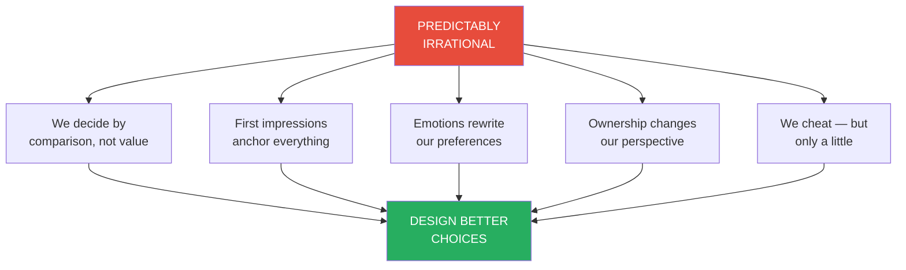
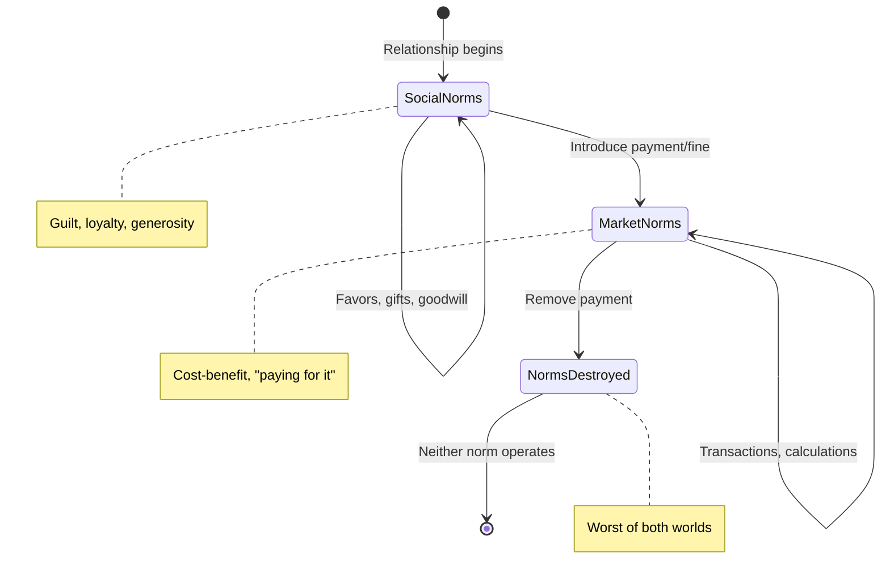
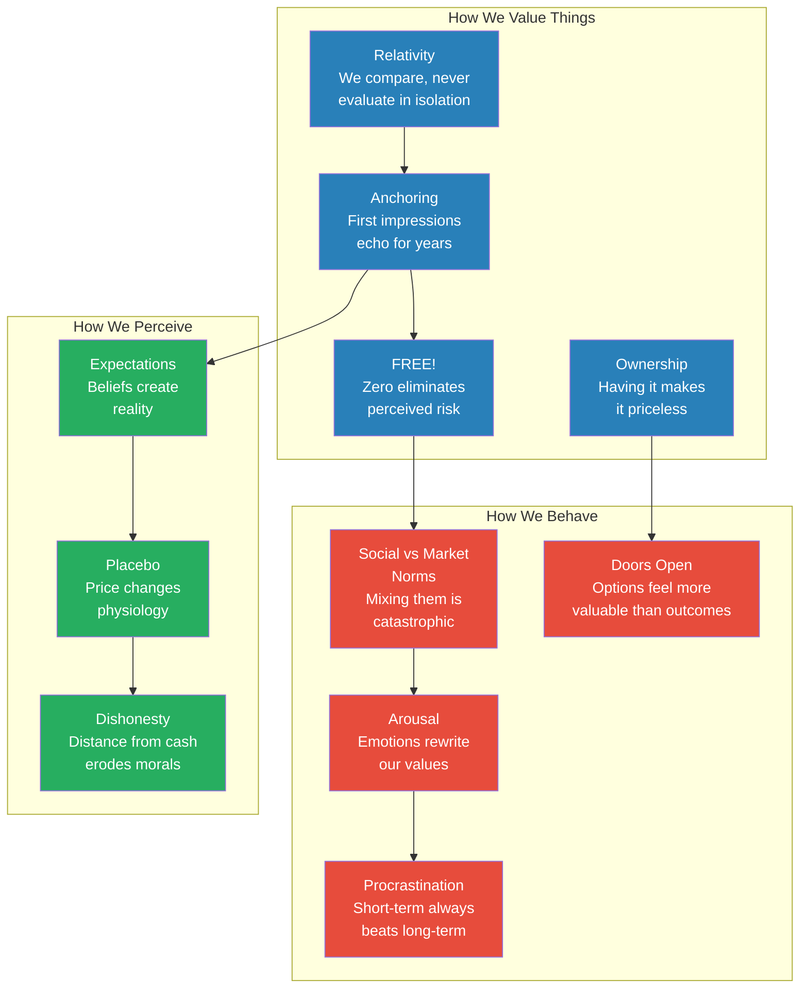

# Predictably Irrational — Dan Ariely

> The central argument of Predictably Irrational is that we are not just irrational — we are irrational in the same ways, again and again, in patterns so consistent that they can be anticipated, measured, and even exploited. Standard economics assumes we are rational agents who compute the value of every option and choose the best path. Dan Ariely, a behavioral economist who found his calling after a devastating burn injury, shows through dozens of ingenious experiments that this model is dangerously wrong. We make decisions based on relative comparisons rather than absolute values. We anchor to arbitrary numbers and let them shape years of choices. We go berserk for anything FREE! We behave like different people when emotions take hold. We overvalue what we own, chase options we don't need, and cheat just a little when we think nobody's watching.
> The good news is that because our irrationality is *predictable*, it is also *correctable*. By understanding the hidden forces that shape our decisions — from the decoy effect to the hot-cold empathy gap, from social norms to the placebo effect — we can design better choices for ourselves, better policies for society, and better institutions for everyone.
> Written with warmth, humor, and the hard-won wisdom of a man who spent three years in a burn ward questioning everything, Predictably Irrational is both a field guide to our cognitive failures and a manifesto for a smarter, more honest approach to the choices we make every day. It is behavioral economics at its most accessible and most actionable — not a catalogue of doom, but a treasure map to the "free lunches" hiding in plain sight.

---

## About the Author

- Dan Ariely was born in 1967 in New York City and raised in Israel
- At age 18, he suffered a catastrophic explosion of a magnesium flare that left 70% of his body covered with third-degree burns — the event that redirected his entire intellectual life
- He spent three years in a hospital burn ward, enduring daily bandage-removal treatments that became his first informal study in the psychology of pain
- His research on optimal pain delivery proved the nurses wrong — slower, lower-intensity bandage removal caused less total suffering than their quick-rip method — despite their years of experience
- He holds a PhD in cognitive psychology from the University of North Carolina at Chapel Hill and a second PhD in business administration from Duke University
- He is the James B. Duke Professor of Psychology and Behavioral Economics at Duke University, and a founding member of the Center for Advanced Hindsight
- His work sits at the intersection of psychology and economics — using controlled experiments to reveal the systematic ways humans deviate from rational behavior
- He is one of the most widely cited behavioral economists in the world, with subsequent books including *The Upside of Irrationality*, *The Honest Truth About Dishonesty*, and *Dollars and Sense*
- His personal experience with sustained pain, medical bureaucracy, and recovery gives his work an emotional depth and moral urgency that purely academic treatments lack
- He frequently uses his own life — his burn, his marriage, his car purchases, his decisions about university positions — as experimental material, making the book feel both scientifically rigorous and deeply personal
- His TED talks on irrationality and dishonesty have been viewed tens of millions of times, making him one of the most publicly visible behavioral scientists in the world

---

## The Big Idea

- <b style="color: #e74c3c">We are not merely irrational — we are predictably irrational</b>
- Standard economics assumes humans are rational agents who compute the value of all options and choose the best path — and that when individuals make mistakes, market forces correct them
- Behavioral economics shows this is wrong: <b style="color: #2980b9">our mistakes are not random but systematic, repeatable across populations, and consistent across contexts</b>
- Every chapter in the book demonstrates a specific pattern of predictable irrationality through controlled experiments:

| Irrationality | What Happens | Why It Matters |
|--------------|-------------|----------------|
| **Relativity** | We evaluate options by comparison, not absolute value | Decoys manipulate our choices without us noticing |
| **Anchoring** | Arbitrary initial numbers shape all subsequent decisions | First prices set trajectories for years of spending |
| **The Zero Price Effect** | FREE! triggers an emotional response that overrides logic | We take worse deals just because something is free |
| **Social vs. Market Norms** | Two parallel systems govern behavior — mixing them is catastrophic | A fine can destroy the guilt that kept people honest |
| **The Hot-Cold Gap** | We cannot predict our emotional selves from a calm state | "Just say no" fails because passion rewrites our values |
| **Procrastination** | We systematically favor immediate gratification over long-term goals | Self-imposed deadlines help, but external ones work best |
| **The Endowment Effect** | Owning something makes us value it far more | Sellers demand 14× what buyers will pay for the same item |
| **Door-Keeping** | We irrationally chase options even at significant cost | Keeping all doors open means none get fully explored |
| **Expectations** | Prior beliefs literally alter sensory experience | Expensive wine tastes better — even when it's the same wine |
| **Price-Placebo** | Higher prices create stronger expectations and better outcomes | A $2.50 sugar pill reduces pain; a 10¢ one doesn't |
| **Dishonesty** | Most people cheat a little, not a lot — and moral reminders eliminate it | The Ten Commandments reduce cheating to zero |
| **Cash Distance** | The further from physical cash, the more we cheat | Tokens double dishonesty; expense reports enable fraud |

- <b style="color: #27ae60">Because these patterns are predictable, we can design environments — choice architectures — that account for our irrationality and help us make better decisions</b>
- These are what Ariely calls "free lunches" — improvements that cost nothing but attention to how humans actually behave

The radar chart reveals Ariely's key insight: the biases with the highest impact (anchoring, zero price effect) are not always the easiest to design around — the hot-cold empathy gap and social/market norm confusion are highly impactful but notoriously hard to correct through choice architecture alone.

---

## Key Concepts at a Glance

| Concept | Definition | Key Experiment |
|---------|-----------|----------------|
| **Decoy Effect** | An inferior option makes a similar-but-superior option look disproportionately better | The Economist's three subscription options — a useless middle choice changed 68% of decisions |
| **Arbitrary Coherence** | Initial prices are arbitrary, but once set, all subsequent choices follow coherently | Social security digits shaped bids by 216-346% — a random number became a price anchor |
| **Zero Price Effect** | FREE! is qualitatively different from any price, triggering irrational emotional excitement | Lindt truffle at 14¢ lost to a FREE! Hershey's Kiss — one penny changed the entire market |
| **Social vs. Market Norms** | Two parallel systems of exchange — social (warm, reciprocal) and market (sharp, transactional) | Lawyers refused $30/hour pro bono work but volunteered for free — money killed motivation |
| **Hot-Cold Empathy Gap** | We cannot predict our behavior in emotional states from a rational state | Berkeley students underestimated arousal's effect on morality by 136% |
| **Precommitment** | Self-imposed constraints that limit future choices to overcome procrastination | Students with self-chosen deadlines outperformed those with total freedom |
| **Endowment Effect** | We value what we own far more than identical things we don't own | Duke ticket holders demanded $2,400; non-holders offered $175 — a 14× gap |
| **Door-Keeping** | The irrational compulsion to keep options open, even at significant cost | MIT students earned 15% less by chasing disappearing doors in a computer game |
| **Expectation Effect** | Prior beliefs alter actual sensory perception and physiological response | MIT Brew (beer + vinegar) tasted good blind, terrible when told about vinegar beforehand |
| **Price-Placebo** | Higher prices create stronger expectations and measurably better outcomes | $2.50 vitamin C pill reduced pain in nearly all subjects; 10¢ version only helped half |
| **The Fudge Factor** | People cheat just enough to maintain a positive self-image, not to maximize gain | Average cheating: claiming 6 solved matrices instead of 4 — modest but universal |
| **Cash Distance** | The further a transaction is from physical cash, the more dishonesty increases | Cokes from a fridge vanished in 72 hours; dollar bills on a plate were never taken |

---

## How an Injury Revealed Our Irrationality

*Before the experiments, before the professorships, before the field of behavioral economics had a name — there was a burn ward and a teenager wrapped in bandages.*

- At 18, Dan Ariely was an Israeli soldier when a magnesium flare exploded, covering 70% of his body with third-degree burns
- He spent three years in a hospital — wrapped in bandages, emerging occasionally in a tight synthetic suit and mask
- Every day, nurses performed the "bath treatment": soaking him in disinfectant, then ripping off bandages that had stuck to raw flesh
- <b style="color: #e74c3c">The nurses ripped quickly, believing a short burst of intense pain was better than a long period of moderate pain</b>
- They had also concluded there was no difference between starting with the most painful areas versus the least painful
- As a patient with no power to change the procedure, Ariely began questioning: Were the nurses right? Could experienced professionals be systematically wrong about something they did every day?

> [!example] The Bandage Discovery
> - After leaving the hospital, Ariely enrolled at Tel Aviv University and began studying pain
> - Over several years, he conducted laboratory experiments using heat, cold water, pressure, and loud sounds
> - His conclusion: <b style="color: #27ae60">lower intensity over longer duration causes less total suffering than high intensity over short duration</b>
> - The nurses had it exactly backward — slow removal would have been better
> - When he returned to present his findings, his favorite nurse, Etty, admitted their understanding had been wrong
> - She also pointed out something Ariely hadn't considered: the nurses' own psychological pain from hearing patients scream may have driven their preference for speed
> - The episode left a permanent impression: if nurses with thousands of repetitions could be systematically wrong about their patients' pain, perhaps all of us misunderstand the consequences of our behaviors

- This insight — that experience does not automatically correct our errors, because our errors are built into how we perceive the world — became the foundation of Ariely's career
- He asks: if the nurses, with all their experience, could be systematically wrong about their patients' pain, perhaps other people similarly misunderstand the consequences of their behaviors
- The parallel to everyday life is direct: investors with decades of experience still fall for market bubbles; managers who have fired hundreds of people still misjudge how employees will react; parents who raise multiple children still apply the same wrong theories about motivation
- <b style="color: #2980b9">Experience gives us confidence, not accuracy</b> — and the gap between the two is where predictable irrationality lives
- The field he entered is called <b style="color: #2980b9">behavioral economics</b>: the study of the systematic, predictable ways humans deviate from rational decision-making
- Standard economics says: we are rational; when we err, the errors are random and cancel out; market forces correct the rest
- Behavioral economics says: we are irrational; our errors are systematic and do not cancel out; and market forces often amplify them
- His core observation: we are not only irrational — we are **predictably** irrational, making the same mistakes the same way, over and over
- This predictability is both the problem and the solution: if we can map the patterns, we can design around them
- The book is both a diagnostic manual — cataloging our cognitive failures — and a prescription guide — showing how better-designed choices, environments, and institutions can help us overcome them
- As Ariely writes: "Wouldn't it make sense to modify standard economics, to move it away from naive psychology, which often fails the tests of reason, introspection, and — most important — empirical scrutiny?"

---

## The Hidden Power of Relativity

*We don't know what we want until we see it next to something else. The Economist's marketing team understood this — and so should you.*

### The Economist's Three-Option Trick

- Ariely found an ad on the Economist's website offering three subscription options:
  1. **Internet-only** — $59
  2. **Print-only** — $125
  3. **Print-and-Internet** — $125
- Option 2 seems absurd — why would anyone pay the same price for less? But Ariely suspected the "clever people at the Economist's London offices" were deliberately manipulating him
- He tested the options on 100 MIT Sloan MBA students:
  - With all three options: **84** chose print-and-Internet, **16** chose Internet-only, **0** chose print-only
  - With the print-only decoy removed: only **32** chose print-and-Internet, **68** chose Internet-only
- <b style="color: #2980b9">The option nobody chose changed what everybody chose</b>
- This is the **decoy effect**: an inferior option that exists only to make a similar-but-superior option look irresistible

> [!tip] The Decoy in Daily Life
> - A TV salesman displays three models: $690, $850, $1,480 — knowing most people will pick the middle one
> - A restaurant consultant places an expensive entrée on the menu that nobody buys — but it makes the second-most-expensive dish the bestseller
> - Williams-Sonoma's bread maker only sold after they introduced a larger, 50% pricier model — the original suddenly looked like a bargain
> - At a singles event, bringing a friend who looks slightly less attractive than you makes *you* look better by comparison

### The Dating Decoy Experiment

- Ariely photographed 60 MIT students, paired them by attractiveness, then used Photoshop to create slightly less attractive versions
- He gave participants sheets with three photos: a regular person (A), the "decoy" version of that person (-A), and another regular person (B)
- **75% of the time**, participants chose the person who had a decoy — not because that person was objectively more attractive, but because the comparison with the decoy made the choice easy

### Relativity and Misery

- <b style="color: #e74c3c">Relativity doesn't just help us choose — it makes us miserable</b>
- A young investment banker earning $300,000 was unhappy because colleagues at the next desk earned $310,000
- When the SEC forced companies to disclose executive pay in 1993 (hoping to restrain it), CEO salaries skyrocketed — from 131× average worker pay to 369× — because every CEO could now compare
- A Harvard-trained physician abandoned cancer research for Wall Street because his classmates' yachts made him feel poor
- H. L. Mencken observed: a man's satisfaction with his salary depends on whether he makes more than his wife's sister's husband

### Breaking the Cycle of Relativity

- Can we control the "circles of comparison" around us?
- Ariely says yes — but it requires conscious effort:
  - At a class reunion, if there's a "big circle" boasting about his salary, physically walk away and talk to someone else
  - When house-hunting, skip the open houses that are above your means — they'll just make the affordable houses feel inadequate
  - When car-shopping, focus only on models within budget — the $25,000 car feels fine until you see the $40,000 model
- James Hong, cofounder of Hotornot.com, sold his Porsche Boxster and bought a Toyota Prius: "I don't want to live the life of a Boxster, because when you get a Boxster you wish you had a 911, and you know what people who have 911s wish they had? They wish they had a Ferrari"
- <b style="color: #27ae60">"The more we have, the more we want. And the only cure is to break the cycle of relativity"</b>

> [!warning] The Pen and the Suit
> - Would you drive 15 minutes to save $7 on a $25 pen? Most people say yes
> - Would you drive 15 minutes to save $7 on a $455 suit? Most people say no
> - But $7 is $7 — the question is whether 15 minutes of your time is worth $7, regardless of what you're buying
> - We think relatively, not absolutely — and this is why we easily add $3,000 for leather seats on a $25,000 car but agonize over a $3,000 leather sofa

---

## Anchoring and the Illusion of Demand

*The price of Tahitian black pearls, the taste of Starbucks coffee, and whether you enjoy Dan Ariely's poetry — all depend on arbitrary first impressions that echo for years.*

### How Black Pearls Became Priceless

- In 1973, Salvador Assael (the "pearl king") acquired Tahitian black pearls — gunmetal gray, musket-ball sized, with no existing market
- His first marketing attempt failed completely — he didn't make a single sale
- Instead of discounting, <b style="color: #27ae60">Assael placed the pearls in Harry Winston's Fifth Avenue window, surrounded by diamonds, rubies, and emeralds, with an outrageously high price tag</b>
- He ran a full-page ad in the glossiest magazines
- Within a year, black pearls were "parading through Manhattan on the arched necks of the city's most prosperous divas"
- Assael didn't discover the value of the pearls — he *created* it, by anchoring them to the world's most expensive gems

### The Social Security Number Auction

- At MIT, Ariely, Drazen Prelec, and George Loewenstein asked 55 MBA students to write the last two digits of their social security numbers
- Then they asked: "Would you pay this amount in dollars for each of these products?" (wine, chocolates, a keyboard, a trackball, a design book)
- Then students submitted real bids in an auction
- <b style="color: #e74c3c">Students with SSN digits 80-99 bid 216-346% more than those with digits 01-20</b>
- The bottom 20% bid an average of $16 for a cordless keyboard; the top 20% bid $56
- Yet within each group, relative pricing was perfectly logical — everyone paid more for the better wine, more for the keyboard than the trackball
- This is **arbitrary coherence**: <b style="color: #2980b9">initial prices are arbitrary (influenced by irrelevant numbers), but once established, all subsequent decisions follow coherently from the anchor</b>

### How Starbucks Broke the Dunkin' Donuts Anchor

- If we were anchored to Dunkin' Donuts prices, how did Starbucks persuade us to pay $4 for coffee?
- Howard Shultz designed Starbucks to feel completely different from any existing coffee shop — continental ambience, French presses, Italian drink names (Tall, Grande, Venti), alluring pastries
- <b style="color: #27ae60">By making every sensory cue different, Starbucks prevented us from using Dunkin' Donuts as a reference point</b> — we were open to a new anchor
- Once we paid $4 once and enjoyed it, we "herded ourselves" — lining up behind our own initial decision, visit after visit
- This is **self-herding**: we don't re-evaluate the decision each time; we simply remember that we made it before, assume it was wise, and repeat it
- "I went to Starbucks before, and I enjoyed myself and the coffee, so this must be a good decision for me"
- Over weeks and months, the habit becomes so ingrained that we forget it was ever a choice
- And once we're comfortable paying $4 for a Tall, the jump to a $5 Venti or a $6 Frappuccino feels perfectly logical — even though the entire price trajectory started with an arbitrary anchor

### Self-Herding and the Examined Life

- Ariely asks a disturbing question: "Could it be that the lives we have so carefully crafted are largely just a product of arbitrary coherence?"
- "Is that how we chose our careers, our spouses, the clothes we wear, and the way we style our hair? Were they smart decisions in the first place? Or were they partially random first imprints that have run wild?"
- Descartes said "Cogito ergo sum" — but <b style="color: #2980b9">suppose we are nothing more than the sum of our first, naive, random behaviors?</b>
- The practical advice: periodically inventory the imprints and anchors in your life. Even if they once were reasonable, ask whether they still are
- "Socrates said that the unexamined life is not worth living. Perhaps it's time to inventory the imprints and anchors in our own life"

### The Tom Sawyer Poetry Reading

- Ariely asked half his students whether they'd hypothetically **pay him** $10 to hear him recite poetry; the other half whether they'd listen **if he paid them** $10
- Those anchored to paying offered ~$1-3 to attend; those anchored to being paid demanded $1.30-4.80
- The same ambiguous experience was transformed into something worth paying for — or something requiring compensation — purely by the initial framing
- Neither group knew whether Ariely's poetry reading was worth paying for or worth enduring only for payment — they had no reference point
- But once the first impression was formed (pay him or get paid), all subsequent decisions followed coherently
- Those willing to pay offered more for longer readings; those demanding payment demanded more for longer readings — internally coherent, but built on an arbitrary foundation
- As Mark Twain wrote of Tom Sawyer: "Work consists of whatever a body is *obliged* to do, and play consists of whatever a body is *not obliged* to do"
- Twain also observed: "There are wealthy gentlemen in England who drive four-horse passenger-coaches twenty or thirty miles on a daily line in the summer because the privilege costs them considerable money; but if they were offered wages for the service, that would turn it into work, and then they would resign"
- <b style="color: #2980b9">The implication is staggering: the subjective value of an experience — whether it is pleasurable or painful, whether it is worth paying for or must be compensated — may be determined not by the experience itself but by the initial framing</b>

The Sankey diagram traces the flow from arbitrary initial anchors (SSN digits, first prices, store ambiance) through self-herding into coherent preferences that shape lifetime spending, career choices, and lifestyle — making visible the alarming chain Ariely describes from random imprint to life trajectory.

---

## The Irrational Power of FREE!

*Zero is not just another price. It is an emotional hot button that rewires our decision-making — and it can change the world if we use it right.*

### The Chocolate Experiment

- Ariely, Kristina Shampanier, and Nina Mazar set up a table offering Lindt truffles (exquisite Swiss chocolate, ~30¢ wholesale) and Hershey's Kisses (ordinary, mass-produced)
- **Round 1**: Truffle at 15¢, Kiss at 1¢ → 73% chose the truffle (rational — better chocolate for a reasonable premium)
- **Round 2**: Truffle at 14¢, Kiss at FREE! → 69% chose the Kiss
- <b style="color: #e74c3c">Both chocolates dropped by exactly one penny. The relative price difference was unchanged. But FREE! flipped the entire market</b>

The stacked bars make the zero price effect unmistakable: dropping both chocolates by one penny preserved the rational choice (left), but making the Kiss FREE! completely inverted the market (right) — the same one-cent reduction produced opposite outcomes depending on whether it crossed the zero boundary.
- The experiment was replicated at MIT's cafeteria (eliminating the "no change in pocket" explanation) — same result
- They also tested stepping down from 2¢/27¢ to 1¢/26¢ — no change in behavior. Then from 1¢/26¢ to 0¢/25¢ — massive shift to the Kiss
- <b style="color: #2980b9">The zero price effect operates at the boundary between any price and no price — it is not about the magnitude of the discount but about the qualitative leap from "something" to "nothing"</b>

> [!example] Why FREE! Is Different
> - When something is FREE!, we forget the downside — there is no visible possibility of loss
> - With any non-zero price, there's a risk we've made a poor decision
> - <b style="color: #2980b9">FREE! eliminates the fear of loss entirely</b>, creating an emotional charge that makes the free item seem immensely more valuable than it is
> - A $10 Amazon gift certificate (FREE!) beats a $20 certificate for $7 (profit: $13) — because $13 of rational profit cannot compete with zero risk
> - Ariely tested this exact scenario at a mall in Boston — and most people jumped for the FREE! certificate, leaving $3 of profit on the table
> - "Can you see the irrational behavior in action?"

### Amazon and the One-Franc Lesson

- Amazon offered free shipping on orders over a certain amount — and sales doubled everywhere except France
- In France, the shipping cost was set at one franc (~20¢) instead of zero
- When France switched to truly free shipping, sales exploded to match every other country
- <b style="color: #27ae60">The difference between one cent and zero is not one cent — it is the difference between hesitation and excitement</b>

### AOL and the Stampede of FREE!

- When America Online switched from pay-per-hour to a flat $19.95/month (unlimited use), they expected a modest increase in demand
- What they got: an overnight surge from 140,000 to 236,000 simultaneous users, and a doubling of average time online
- The result was catastrophic — busy phone lines, forced leasing of bandwidth from competitors at premium prices
- Bob Pittman, AOL's president, had not realized that consumers would respond to the allure of unlimited FREE! "like starving people at a buffet"
- <b style="color: #e74c3c">The lesson: FREE! is not merely attractive — it is explosive, and organizations that offer it must be prepared for exponential demand</b>

### The Museum Trap and Time as Currency

- Ariely loves free-entrance days at museums — even though the experience is objectively worse (overcrowded, long lines, hard to see anything)
- "Do I realize that it is a mistake to go to a museum when it is free? You bet I do — but I go nevertheless"
- Time spent in line for a FREE! ice cream cone, or filling out forms for a tiny rebate, is time taken from other activities
- We systematically undervalue our time when FREE! is on the table
- The concept of zero also affects food purchases: "zero calories" on a label is disproportionately more appealing than "one calorie" — even though the difference is negligible
- <b style="color: #2980b9">This suggests policy opportunities: want to encourage healthy behavior? Make the zero-calorie, zero-trans-fat, zero-carb label work for you — the emotional power of zero applies to nutrition labels, not just price tags</b>

### Halloween and the Kids

- Ariely offered trick-or-treaters a choice: trade one Hershey's Kiss for a large Snickers bar, or trade two Kisses for an even larger one
- Nearly all kids took the bigger bar — the math was obvious
- But when the small Snickers bar was FREE! (no Kisses required) and the large one cost just one Kiss — **70% chose the worse deal**
- The gravitational pull of FREE! overwhelmed six-times-better return on investment, even for nine-year-olds

### Using FREE! for Good

- Want people to drive electric cars? Don't just lower the registration fee — eliminate it
- Want people to get colonoscopies, mammograms, and cholesterol checks? Don't reduce the co-pay — make them FREE!
- Ariely bought an Audi over a Honda minivan partly because of free oil changes for three years — saving him roughly $150, or 0.5% of the car's price — "not a good reason to base my decision on"
- "A few months later, while I was driving on a highway, the transmission broke" — now he has an Audi "packed to the ceiling with action figures, a stroller, a bike, and other kids' paraphernalia. Oh, for a minivan"
- The broader lesson for policy: <b style="color: #27ae60">FREE! is an ace that most policy strategists don't realize they have</b>
- It's counterintuitive in times of budget cutbacks to make something free — but when we stop to think about it, the behavioral power of zero can make a small investment produce enormous returns
- A free checking account with no benefits will beat a $5/month account with free traveler's checks, online billing, and better features — even though the paid account saves more money
- We choose the free mortgage with no closing costs but terrible interest rates
- We grab the product we don't want because it comes with a free gift
- <b style="color: #e74c3c">FREE! is the most powerful word in the marketer's vocabulary — and the most dangerous word in the consumer's environment</b>

---

## The Fragile Line Between Social and Market Norms

*We live in two worlds — one governed by warmth and community, the other by prices and transactions. Mixing them is catastrophic, and the damage may be permanent.*

### Two Worlds, Two Rules

- <b style="color: #2980b9">Social norms</b>: friendly, warm, no immediate payback required — helping a friend move, opening a door, a mother-in-law's Thanksgiving dinner
- <b style="color: #2980b9">Market norms</b>: sharp-edged, transactional — wages, prices, costs and benefits, comparable returns
- When kept separate, both work beautifully. When mixed, disaster follows
- Ariely's opening scenario: you finish your mother-in-law's Thanksgiving dinner, pull out your wallet, and offer her $400. "Next year's Thanksgiving celebration may be a frozen dinner in front of the television set"

### The Circle-Dragging Experiment

- James Heyman and Ariely had participants drag circles across a computer screen for five minutes — a deliberately boring task, chosen precisely because social science has a tradition of using tedious tasks to isolate motivation
- Three conditions:
  - **Paid $5**: dragged an average of 159 circles
  - **Paid 50¢**: dragged only 101 circles
  - **Asked as a favor (no payment)**: dragged **168 circles** — more than the $5 group
- <b style="color: #e74c3c">People worked harder for free than for 50 cents</b>
- The 50-cent group didn't think "Great, I'm getting paid AND doing a favor" — they switched entirely to market norms, decided 50 cents was insulting, and worked halfheartedly
- When the same experiment used gifts instead of cash (a Snickers bar worth 50¢, Godiva chocolates worth $5), all groups worked equally hard (~162-169 circles) — gifts maintained social norms
- But when experimenters mentioned the gift's price ("a 50-cent Snickers bar"), effort dropped to the 50-cent cash level — <b style="color: #e74c3c">naming the price destroyed the social norm</b>
- The experimenters also replicated this with a physical task — asking passersby to help unload a sofa from a truck. Same results: people helped willingly for free, helped willingly for a reasonable wage, but walked away when offered a small payment
- Offering a small gift got them to help; mentioning what the gift cost made them leave "faster than you can say market norms"

> [!example] The AARP Lawyers
> - The AARP asked lawyers to offer discounted services to needy retirees at $30/hour — they refused
> - Then AARP asked if they'd volunteer their time for free — they overwhelmingly said yes
> - At $30/hour, the lawyers applied market norms and found the offer insulting relative to their rates
> - At zero, they applied social norms and felt good about contributing
> - A martial arts master in Japan, when students offered to pay for his instruction, replied: "If I charged you, you would not be able to afford me"

### The Day Care That Destroyed Trust

- Uri Gneezy and Aldo Rustichini studied an Israeli day care center where parents were chronically late for pickup
- The center introduced a fine for lateness — and <b style="color: #e74c3c">tardiness immediately increased</b>
- Before the fine: parents felt guilty (social norm) and tried to be on time. They saw their relationship with the teachers as a social contract — being late meant letting down people who cared for their children
- After the fine: parents treated lateness as a market transaction — "I'm paying for extra time, so I'll take it." The guilt disappeared. The teachers were no longer caregivers being disrespected; they were service providers being compensated
- The worst part: when the fine was removed weeks later, parents didn't return to the old behavior — they were even later than before
- Why? Because now both motivations were gone: the social norm (guilt) had been destroyed by the introduction of market norms, and the market norm (the fine) had been removed
- <b style="color: #e74c3c">Once a social norm is replaced by a market norm, the social norm rarely returns</b>

The state diagram captures Ariely's most consequential finding: the transition from social to market norms is a one-way door — once you introduce money into a social relationship, removing the money leaves you in a wasteland where neither guilt nor payment motivates behavior.
- This is perhaps the most consequential finding in the entire book — it implies that every time a company, school, or government introduces a monetary incentive into a previously social relationship, it risks permanent damage
- The Israeli day care study has become one of the most cited experiments in behavioral economics, and for good reason: it demonstrates that the tools we instinctively reach for (fines, incentives, penalties) can backfire spectacularly when they collide with social norms

### Implications for Companies and Society

- Companies that market themselves as "family" (State Farm: "Like a good neighbor") must behave like family consistently — one bounced-check fee charged to a "family member" destroys the relationship permanently
- Google's free lunches, flexible hours, and social perks generate loyalty that salary alone cannot
- Open-source software communities (Linux) produce extraordinary work for free because social norms — pride, reputation, contribution — motivate more powerfully than cash
- Standardized testing and performance pay in education risk pushing learning from social norms to market norms — "You can't buy the love of learning, and if you try, you might chase it away"
- <b style="color: #27ae60">Money is often the most expensive way to motivate people. Social norms are not only cheaper but often more effective</b>

### The Employee Loyalty Paradox

- In the old industrial economy, work was a pure market exchange — clock in, clock out, get your paycheck Friday
- Today's knowledge economy asks employees to think about work in the shower, answer emails at midnight, and cancel vacations for deadlines
- Companies want social-norm loyalty from employees — passion, flexibility, creativity — while offering market-norm treatment: cost cutting, outsourcing, benefits reduction
- <b style="color: #e74c3c">You cannot have it both ways</b> — if you cut child care, pensions, and medical benefits, employees will apply market norms and jump ship for a better offer
- Should you give an employee a $1,000 bonus or a $1,000 gift? Most employees prefer cash. But the gift maintains the social relationship and produces more lasting loyalty
- A gift says "I thought about you." Cash says "Here's your transaction"

### The Burning Man Economy

- Ariely was invited by John Perry Barlow (former Grateful Dead lyricist) to attend Burning Man — an annual festival of 40,000+ people in the Nevada desert
- The festival operates as a gift exchange economy: no money is accepted
- People who can cook make meals; psychologists offer free counseling; masseuses give massages; Ariely brought puzzles he'd made at MIT's hobby shop
- "Before long I found that Burning Man was the most accepting, social, and caring place I had ever been"
- He's not suggesting we restructure society as Burning Man — but the experience proved that <b style="color: #27ae60">life with fewer market norms and more social norms can be more satisfying, creative, fulfilling, and fun</b>
- Police officers, firefighters, and soldiers don't risk their lives for their salaries — they do it for pride, duty, and sense of purpose. A customs agent Ariely met had an unspoken agreement with drug runners: neither side would fire. His salary wasn't worth dying for. The fix isn't higher pay — it's elevating the social norm
- Kathleen Vohs, Nicole Mead, and Miranda Goode showed that merely *thinking* about money changes behavior: participants who unscrambled sentences containing money-related words ("high-paying salary") became more self-reliant but also more selfish
- They struggled alone with puzzles for 5.5 minutes before asking for help (vs. 3 minutes for the control group)
- They were less willing to help others enter data, less likely to assist confused strangers, and less likely to help someone who "accidentally" spilled pencils
- They chose seats farther away from partners and preferred individual tasks over teamwork
- <b style="color: #e74c3c">Just thinking about money makes us behave as economists think we behave — and less like the social animals we actually are</b>
- Ariely's advice for anyone on a date: "For heaven's sake don't mention the price of the selections" — even though the prices are printed on the menu, naming them shifts the relationship from social to market norms
- Your mother-in-law may think the bottle of wine you brought is a $10 blend when it's actually a $60 reserve merlot — that's the price you pay to keep the relationship in the social domain

---

## The Stranger Inside: Why Passion Rewrites Our Values

*We think we know ourselves. We don't. When emotions take over, we become someone we wouldn't recognize — and we can't predict the transformation.*

### The Berkeley Arousal Study

- At Berkeley, Ariely and George Loewenstein recruited 25 male students for a study on decision-making under sexual arousal
- Each participant answered identical questions in two sessions:
  - **Cold state**: sitting calmly, imagining how they'd behave when aroused
  - **Hot state**: while sexually aroused (viewing erotic images, masturbating), answering the same questions
- The questions covered three domains: sexual preferences, moral boundaries, and condom use

> [!danger] The Results Were Overwhelming
> - Across 19 questions about sexual preferences, aroused students predicted **72% higher** desire for unusual activities than they had in their cold state
> - Across 5 questions about immoral behavior (Would you keep trying after she said no? Would you slip a woman a drug?), arousal predicted **136% higher** propensity
> - On condom use, they were **25% less likely** to commit to using one
> - Every single participant underestimated the transformation — and the gap was not slight but enormous
> - The idea of enjoying contact with animals was rated **167% higher** when aroused
> - "Would you keep trying after your date says no?" jumped from 20 to 45 — a **125% increase**

- <b style="color: #e74c3c">The magnitude of underprediction was the key finding — we are not just slightly wrong about our emotional selves, we are catastrophically wrong</b>
- Robert Louis Stevenson's Dr. Jekyll and Mr. Hyde captured the same insight: "Man is not truly one, but truly two"
- Ariely's practical conclusions:
  - "Just say no" fails because it assumes cold-state rationality persists in hot states
  - Condoms must always be available — deciding in advance to carry them is the only reliable strategy
  - Teens should learn to walk away from temptation *before* it starts — avoiding the fire is easier than escaping it
  - Pregnant women who promise to refuse painkillers may want to test their pain tolerance first (Ariely's wife tried an ice bucket — and immediately understood the appeal of an epidural)

### Driving, Anger, and the Two Selves

- A recent study found that a teenager driving alone was 40% more likely to crash than an adult — but with one other teen in the car, the risk doubled, and with a third, it doubled again
- The car full of laughing friends, the blaring CD player, the search for french fries — who's thinking about risk?
- Ariely proposes cars with modified OnStar systems: if a teen exceeds 65 mph on the highway, the radio switches from 2Pac to Schumann's Second Symphony; or the car automatically calls Mom
- The same principle applies to road rage, angry emails, and impulse purchases — <b style="color: #27ae60">we need to build cooling-off mechanisms into our lives for moments when our Mr. Hyde might take over</b>
- When the boss criticizes you publicly, put your response in the "draft" folder for a few days
- When you're smitten by a sports car after a test drive, take a break and discuss the minivan before signing anything
- "There is no such thing as a fully integrated human being. We may, in fact, be an agglomeration of multiple selves"

---

## Procrastination: The Enemy We Can See but Cannot Fight

*We know what we should do. We know when we should do it. And yet we don't — because the dessert cart is right here, and the diet can start tomorrow.*

### The Three-Class Experiment

- Ariely taught three sections of the same course, each with three papers due. He gave each class a different deadline structure:
  - **Class 1**: Students chose their own deadlines (with 1% per day penalty for lateness)
  - **Class 2**: No deadlines — all papers due at the end of the semester
  - **Class 3**: Dictated deadlines — papers due at weeks 4, 8, and 12
- Results:
  - **Dictated deadlines → best grades**
  - **Self-chosen deadlines → middle grades**
  - **No deadlines → worst grades**
- <b style="color: #27ae60">Self-imposed constraints beat total freedom — but externally imposed structure beat both</b>
- Most students in Class 1 spaced their deadlines wisely — but a few didn't, pulling down the class average
- The students who *recognized* their procrastination problem and took action (by setting early deadlines) performed nearly as well as those in the dictatorial condition

### The Ford vs. Honda Service Story

- Ford's cars had ~18,000 parts needing service on different schedules, across 20+ vehicle types — an impossible tangle that caused customers to procrastinate on maintenance
- Honda bundled all maintenance into three simple intervals (every 5,000/10,000/25,000 miles) displayed on a wall board — anyone could understand it
- Ford's engineers initially resisted ("You can't change the axle bolt from 3,602 miles to 5,000!") but were convinced: better to have customers service at somewhat compromised intervals than not at all
- Ford copied Honda's approach, and their 40%-vacant service bays filled up within three years

### The Self-Control Credit Card That Never Was

- Ariely imagined a credit card that let users set their own spending limits by category and time frame — $20/week on coffee, $600/semester on clothing — with self-chosen penalties for violations (card rejection, automatic donation, email to spouse)
- The card could even implement the "ice glass" method electronically — a cooling-off period for large purchases, or automatic alerts:

> [!quote] The Self-Control Email
> "Dear Sumi, This e-mail is to draw your attention to the fact that your husband, Dan Ariely, who is generally an upright citizen, has exceeded his spending limit on chocolate of $50 per month by $73.25. With best wishes, The self-control credit card team"

- He pitched it to a major bank in New York. The executives loved it — many shared personal stories of relatives with credit card debt
- "My bet is that thousands of consumers would cut up their other credit cards — and sign up with you!"
- The bankers shook his hand warmly and promised to call back. They never did — perhaps because they earned $17 billion a year in interest charges. "Or maybe it was just good old procrastination"

### The Procrastination of Health Care

- Preventive medicine is universally acknowledged as more cost-effective than remedial treatment — but getting a colonoscopy, mammogram, or even a cholesterol check is unpleasant
- So we procrastinate on the tests that could save our lives
- <b style="color: #27ae60">Ariely proposes a middle ground between authoritarianism and total freedom</b>: what if doctors charged a refundable $100 deposit for a blood test — returned only if you showed up on time?
- This replicates the self-chosen deadline condition that helped students — just enough constraint to overcome procrastination, without eliminating freedom
- The Ford/Honda insight applies directly: bundle all preventive screenings into simple, predictable packages — like ordering a Value Meal at McDonald's
- If medical maintenance were as clear as Honda's three-interval wall board, millions of people would stop procrastinating and start showing up

### America's Savings Crisis

- In 2006, America's personal savings rate fell below zero — negative one percent — for the first time since the Great Depression
- The average family had six credit cards and ~$9,000 in credit card debt
- The closets tell the story: houses built in 1890 had no closets; 1970s houses had small ones; today's "walk-in closets" are rooms — and still not big enough
- <b style="color: #e74c3c">We are not just failing to save — we are spending more than we earn</b>, driven by the same procrastination, anchoring, and social comparison that Ariely's experiments reveal
- Blogging about debt (sites like "Poorer than You" and "Blogging Away Debt") helps create accountability — but what we really need is intervention at the moment of temptation, not complaint after the fact
- The "ice glass" method — freezing your credit card in a block of ice so you must wait for it to thaw before buying — is crude but captures the right principle: create a cooling-off period between impulse and action
- You can't microwave the card (destroys the magnetic strip), so you must stand there watching ice melt while your compulsion to purchase subsides
- Ariely sees this as a metaphor for all precommitment devices: they don't require willpower in the moment — they recruit our rational self to constrain our impulsive self before the impulse arrives

---

## The High Price of Ownership

*The moment something becomes ours — a basketball ticket, a house, an idea — we value it far more than we should. And we cannot see that we are doing it.*

### The Duke Basketball Ticket Lottery

- Duke basketball tickets are rationed through weeks of camping out, followed by a lottery — some campers get tickets, some don't
- Ariely and Ziv Carmon called both groups:
  - **Non-winners** offered an average of **$175** to buy a ticket
  - **Winners** demanded an average of **$2,400** to sell
- <b style="color: #e74c3c">A 14× gap between buyers and sellers — created by nothing more than a random lottery drawing</b>
- William (non-winner) reasoned he could watch at a sports bar, buy food and CDs with the savings — his thinking was grounded in what else the money could buy
- Joseph (winner) said the game would be "a defining memory" he'd pass to his grandchildren — "So how can you put a price on that? Can you put a price on memories?" His thinking was grounded in what he would lose
- Both had camped out for weeks. Both wanted to go equally badly before the lottery. The only difference was a random drawing — yet it created an emotional chasm so wide that not a single transaction was possible
- Not a single ticket holder was willing to sell at a price any non-holder was willing to pay
- <b style="color: #2980b9">From a rational perspective, both groups should have valued the game identically — the anticipated atmosphere and enjoyment shouldn't depend on winning a lottery. Yet ownership transformed the experience from a fungible commodity into an irreplaceable memory</b>

### Three Quirks of Ownership

1. **We fall in love with what we already have** — two friends who adopted a baby from China were convinced the random assignment was a perfect match; every couple in their group felt the same way
2. **We focus on what we'll lose, not what we'll gain** — the ticket holder thinks about missing the game, not about having $2,400
3. **We assume others share our perspective** — the VW seller remembers road trips; the buyer notices the smoke puff when shifting gears

### Virtual Ownership and the IKEA Effect

- **The IKEA effect**: the more work you put into something, the more you value it — Ariely and Mike Norton's term for why that wobbly bookshelf you assembled yourself is somehow precious
- **Virtual ownership** begins before purchase — the longer you're the highest bidder in an online auction, the more the item feels like "yours," driving irrational escalation
- **30-day money-back guarantees** exploit this: we take the sofa home "to try," but once it's ours, returning it feels like a loss we can't bear
- **Trial promotions** (the "digital gold package" at a special rate) work the same way — once we have it, downgrading feels like amputation
- <b style="color: #27ae60">Ariely's advice: try to view all transactions as a non-owner — put distance between yourself and the item</b>

### Ownership of Ideas

- The endowment effect is not limited to physical possessions — it applies powerfully to beliefs, political positions, and ideologies
- Once we take ownership of an idea — whether about politics, sports, or strategy — we love it more than we should, prize it more than it's worth, and cannot stand the idea of losing it
- The result is intellectual rigidity: <b style="color: #e74c3c">"What are we left with then? An ideology — rigid and unyielding"</b>
- This explains why political debates are so intractable, why couples fight the same fights for decades, and why organizations resist change even when the evidence is overwhelming
- The more effort we invest in defending a position, the more we value it (the IKEA effect applied to ideas)

### The Ratchet of Lifestyle

- Ownership creates a one-way ratchet: moving up in lifestyle is easy; moving down feels like amputation
- We indulge ourselves with the fantasy that we can always "ratchet back" if needed — but we can't
- Downgrading from a larger house to a smaller one is psychologically experienced as a devastating loss, even when it would solve our financial problems
- <b style="color: #2980b9">This is why the mortgage crisis destroyed so many families — they would make almost any sacrifice to avoid the perceived loss of "their" home, even when selling would have been the rational choice</b>

---

## The Compulsion to Keep Doors Open

*In 210 BC, a Chinese commander burned his ships to force his army forward. Most of us would have stationed guards on the ships — just in case.*

### Xiang Yu and the Burning Ships

- General Xiang Yu led his troops across the Yangtze, then burned their ships and crushed their cooking pots
- Without retreat or sustenance options, the army charged ferociously and won nine consecutive battles
- The story is remarkable because it is "completely antithetical to normal human behavior" — we cannot stand closing doors

### The Door Game

- MIT students played a computer game with three colored doors, each offering different payoffs per click (100 clicks total)
- **Without disappearing doors**: students explored, found the best room, and stayed — earning well
- **With disappearing doors** (any door not visited for 12 clicks vanished): students frantically chased every shrinking door, earning **15% less**
- Even when:
  - Each door-click cost 3 cents (direct financial loss)
  - Exact payoffs were revealed in advance
  - Hundreds of practice trials were given
  - "Disappeared" doors could be revived with one click
- Students still couldn't stop chasing closing doors

> [!warning] The Real Cost of Optionality
> - Ariely's friend spent three months choosing between two nearly identical cameras — losing more in missed photos than the camera cost
> - His student Dana maintained a dying relationship rather than commit to a clearly better one — and nearly lost both
> - Ariely himself spent weeks agonizing between MIT and Stanford (nearly identical in appeal) while his research productivity collapsed
> - A hungry donkey between two identical haystacks starves — not because the choice is hard, but because it refuses to close a door

- <b style="color: #27ae60">The remedy: consciously close doors</b> — drop committees, end dying relationships, commit to one camera and take the pictures
- The most memorable line in cinema history — Rhett Butler's "Frankly, my dear, I don't give a damn" — resonates because it is the emphatic closing of a door

### The Marriage That Improved with Distance

- One of Ariely's friends reported that the best year of his marriage was when he lived in New York and his wife lived in Boston — they met only on weekends
- When they lived together, weekends were consumed by catching up on work
- Once time together was scarce and had a clear end (the return train), they dedicated it to each other
- <b style="color: #2980b9">Sometimes the door that's visibly closing is the one we should be attending to — not the ones we're frantically propping open</b>
- We work feverishly to keep options open that don't matter, while the doors to our children's childhood, our marriages, and our deepest relationships close so slowly we don't notice

### The Student, the Lover, the Donkey

- Ariely's student Joe couldn't choose between computer science and architecture at MIT — by trying to keep both doors open, he nearly lost both and needed an extra year
- His student Dana couldn't let go of a dying relationship even while a better one was forming — "Do you really want to risk losing the boy you love for the remote possibility that you may discover you love your former boyfriend more?"
- Even Ariely himself fell victim: choosing between MIT and Stanford (virtually identical in appeal), he spent weeks comparing neighborhoods, schools, and colleagues while his actual research productivity collapsed
- The lesson of Buridan's donkey (starving between two identical haystacks) applies to Congress gridlocked over minor details, to friends paralyzed between two identical cameras, and to all of us: <b style="color: #e74c3c">the cost of not deciding is almost always greater than the cost of choosing "wrong"</b>

---

## Supply and Demand Revisited: Why Prices Are Not What You Think

*Standard economics says prices emerge from the dance of supply and demand — two independent forces meeting at equilibrium. Ariely's experiments suggest both forces are deeply contaminated by psychology.*

### The Implications of Arbitrary Coherence

- If consumers' willingness to pay can be manipulated by arbitrary anchors (social security numbers, suggested retail prices, first encounters), then <b style="color: #e74c3c">demand is not an independent force — it is shaped by supply-side variables</b>
- Manufacturer's suggested retail prices, advertised prices, and product introductions are all supply-side anchors that directly influence what consumers are willing to pay
- This reverses the standard economic story: instead of consumers' preferences driving prices, prices drive consumers' preferences
- If the government doubled the price of gasoline overnight, people would initially cut consumption — but over time, as they adjusted to the new anchor, consumption would creep back toward pre-tax levels
- <b style="color: #2980b9">Our sensitivity to price changes is largely a product of memory for past prices and desire for coherence with past decisions — not a reflection of true preferences</b>

### The Housing Anchor

- Uri Simonsohn and George Loewenstein found that people who move from cheap cities (Lubbock, Texas) to moderate ones (Pittsburgh) don't increase housing spending — they stay anchored to their previous market
- People from expensive cities (Los Angeles) moving to Pittsburgh don't downsize either — they spend at Los Angeles levels
- The only way to break the anchor: rent for a year in the new location before buying
- This suggests that many of the decisions that define our lives — where we live, how we spend, what we consider "normal" — may be products of our first arbitrary anchors, not our true preferences
- <b style="color: #e74c3c">If our choices are often affected by random initial anchors, the choices and trades we make in the marketplace may not reflect how much pleasure we actually derive from products</b>
- This challenges the foundational assumption of free markets: that voluntary trade makes both parties better off
- If one party is anchored to a high price (from a random first encounter) and another to a low price, both may be trading based on distorted values — not genuine utility
- Ariely doesn't advocate abandoning markets, but he does argue that for essential goods — health care, education, water, electricity — we may need government to play a larger role in regulating prices and choices
- "If we can't rely on the market forces of supply and demand to set optimal market prices, and we can't count on free-market mechanisms to help us maximize our utility, then we may need to look elsewhere"

---

## The Effect of Expectations

*If you tell people the beer has vinegar in it, they'll hate it. If you don't, they'll love it. And if you tell them after they've tasted it — they'll still love it. Expectations don't just filter experience; they create it.*

### The MIT Brew Experiment

- At the Muddy Charles pub at MIT, Ariely, Leonard Lee, and Shane Frederick offered patrons two beers: one was Budweiser, the other was "MIT Brew" — Budweiser with two drops of balsamic vinegar per ounce
- **Blind condition** (no information about vinegar): most patrons preferred the MIT Brew
- **Told before tasting**: patrons winced at the first sip and chose the regular Budweiser
- **Told after tasting**: patrons liked the MIT Brew just as much as in the blind condition
- <b style="color: #2980b9">The critical finding: expectations must be set *before* the experience to alter perception</b>
- Knowledge that came after tasting did not retrospectively spoil the experience — the taste had already been established
- In a follow-up, participants told about the vinegar *after* tasting were twice as likely to add vinegar to their own beer as those told *before*

> [!tip] Practical Applications of Expectations
> - Describe dinner dishes with rich, specific language ("succulent organic breast of chicken drizzled with a merlot demi-glace") — the description changes the taste
> - Remove takeout food from Styrofoam containers and serve it on nice plates — presentation creates expectation, which creates experience
> - Invest in proper wine glasses — even though controlled studies show the glass shape makes no objective difference, the expectation of quality changes the subjective experience
> - Don't tell guests the cake is from a mix or that the juice is generic — at least not before they taste it

### The Coffee Condiment Experiment

- Ariely, Elie Ofek, and Marco Bertini served free coffee to MIT students, sometimes with unusual condiments (cloves, nutmeg, cardamom) in elegant glass-and-metal containers, and sometimes in ragged, hand-cut Styrofoam cups
- Nobody used the unusual condiments in either condition
- But <b style="color: #2980b9">when the condiments were displayed in fancy containers, students rated the coffee higher, were willing to pay more, and recommended it for the cafeteria</b>
- The coffee was identical — only the ambience changed

### The Coke vs. Pepsi Brain Scan

- Sam McClure and colleagues at Baylor College of Medicine put participants in an fMRI machine and delivered Coke or Pepsi through tubes
- **Blind tasting**: brain activation was similar for both drinks — the ventromedial prefrontal cortex (pleasure center) responded equally
- **When participants knew they were drinking Coke**: the dorsolateral prefrontal cortex (higher-order associations, memory, branding) also activated — and the pleasure response was stronger
- <b style="color: #e74c3c">Coke's advantage was not chemical but cognitive — decades of marketing had created neural associations that literally enhanced the taste</b>
- "The bright red can, swirling script, and myriad messages are as much responsible for our love of Coke as the brown bubbly stuff itself"

### Stereotypes as Self-Fulfilling Expectations

- Margaret Shin, Todd Pittinsky, and Nalini Ambady tested Asian-American women on math
- One group was primed to think about their **gender** (questions about coed dorms) — they performed worse
- Another group was primed to think about their **race** (questions about languages spoken at home) — they performed better
- <b style="color: #2980b9">The same women, taking the same test, performed differently depending on which stereotype was activated</b>
- In a separate study by John Bargh, participants who unscrambled sentences containing words like "Florida," "bingo," and "ancient" literally walked more slowly afterward — primed by the concept of aging, even though they were college students
- Participants who worked with "rude" words interrupted a conversation after 5.5 minutes; those primed with "polite" words waited 9.3 minutes

### Why This Matters for Conflict

- Two friends watching the same football play — one an Eagles fan, one a Giants fan — genuinely see different things: one sees a clear touchdown, the other sees an obvious out-of-bounds
- This isn't deception or wishful thinking — their prior expectations literally altered their perception
- The same mechanism drives political polarization: Democrats and Republicans can look at the same struggling child and see completely different policy implications
- In the Israeli-Palestinian conflict, the Belfast troubles, and every major dispute, both sides read the same history and reach opposite conclusions about blame, causation, and who should concede first
- <b style="color: #27ae60">Ariely's suggestion: present the facts without revealing which party took which action — a "blind" condition that might help people see past their expectations</b>
- When that's impossible, accepting a neutral third party is the next best option — uncomfortable, but far better than letting dueling expectations perpetuate conflict

---

## The Price-Placebo Effect

*A $2.50 sugar pill relieves pain. A 10-cent sugar pill doesn't. The same surgery heals you — whether or not the surgeon actually operates. Price is not just a number. It is medicine.*

### The History of Placebos

- "Placebo" comes from the Latin "I shall please" — first used in the 14th century for sham mourners hired to wail at funerals
- In 1794, the Italian physician Gerbi found that rubbing worm secretions on aching teeth eliminated pain for 68% of patients — for a year
- Before modern medicine, almost all remedies were placebos: eye of toad, ground Egyptian mummy, dried fox lungs, mercury, cocaine, electric currents
- When Lincoln lay dying, his physician applied "mummy paint" — ground Egyptian mummy was listed in the E. Merck catalog as late as 1908

### Sham Surgery Works

- In the 1950s, internal mammary artery ligation was a popular heart surgery for angina — patients felt better for months
- In 1955, Dr. Leonard Cobb performed the real procedure on half his patients and merely made incisions on the other half
- <b style="color: #e74c3c">Both groups reported identical relief — the 25-year-old procedure was no better than two cuts in the chest</b>
- In 2002, Dr. J. B. Moseley tested arthroscopic knee surgery for osteoarthritis on 180 veterans
  - Group 1: full surgery (cartilage removal, saline wash)
  - Group 2: partial procedure (scopes inserted, saline wash, no cartilage removal)
  - Group 3: sham surgery (incisions only, no instruments inserted — the surgeon simulated the entire procedure, including splashing saline to create authentic sounds)
- Over two years, all three groups reported identical improvements in pain and walking
- The study, published as the lead article in the New England Journal of Medicine, questioned $1 billion in annual spending on these procedures
- Surgeons were furious. Dr. Moseley responded: "Surgeons who routinely perform arthroscopy are undoubtedly embarrassed at the prospect that the placebo effect — not surgical skill — is responsible for patient improvement"
- <b style="color: #2980b9">In the United States, very few surgical procedures are tested against placebos — meaning we don't really know how many operations work through genuine biological mechanisms versus the power of belief</b>

### The Veladone-Rx Pain Experiment

- Ariely, Rebecca Waber, Baba Shiv, and Ziv Carmon created a fake painkiller called "Veladone-Rx" — actually vitamin C
- Participants read a glossy brochure (92% efficacy, opioid family), had blood pressure taken, were hooked to an electrical shock machine
- After establishing baseline pain levels, they took the "drug," waited 15 minutes, and were shocked again
- **At $2.50 per pill**: almost all participants reported reduced pain
- **At $0.10 per pill** (crossed-out discount price): only half reported relief
- <b style="color: #e74c3c">The same vitamin C pill, the same shocks — but the expensive version worked nearly twice as well</b>
- People with more pain experience showed an even larger gap — those who depended most on medication were most affected by price
- This finding has profound implications for healthcare policy: if we give discount drugs to people who need them most, and those drugs work less well because of the price signal, we may be systematically undertreating the most vulnerable populations
- The relationship between price and efficacy is not just a curiosity — it is a mechanism that could widen health disparities

### SoBe and the Anagram Puzzles

- Students bought SoBe Adrenaline Rush (which claims to enhance mental function) at either full price or a deep discount, then solved 15-word anagram puzzles
- **No SoBe**: average 9 out of 15 correct
- **Full-price SoBe**: average 9 out of 15 correct — no actual cognitive benefit
- **Discounted SoBe**: average **6.5** out of 15 — a **28% performance drop** compared to full price
- <b style="color: #2980b9">The drink didn't make anyone smarter — but the cheap version made people measurably dumber</b>
- When a message on the quiz booklet hyped the drink's effectiveness ("50 scientific studies..."), both groups improved — but the full-price group improved far more

> [!warning] The Healthcare Dilemma
> - If expensive medicine works better as a placebo, do we indulge this irrationality — at the cost of skyrocketing healthcare prices?
> - If we insist on cheap generics, are we giving disadvantaged populations less effective treatment — not because the chemistry differs, but because the expectations do?
> - Should doctors prescribe placebos knowingly? They already do — more than one-third of antibiotic prescriptions for sore throats treat viral infections where antibiotics do nothing
> - Ariely's personal Jobst suit story: months of painful treatment (a pressurized garment for burn recovery) that ultimately proved useless — the areas covered looked no different from those that weren't

### Ariely's Jobst Suit: A Personal Placebo Story

- While in the burn ward, Ariely's occupational therapist told him about a revolutionary garment called the Jobst suit — a skintight compression garment that would massage his scars and reduce redness
- He was electrified with hope. His physiotherapist, Shula, told him it came in different colors — he imagined himself in a tight blue skin, like Spider-Man
- Shula cautioned that the colors were only brown for white patients and black for black patients — and that people sometimes called the police when someone in a Jobst mask entered a bank
- The suit arrived weeks later. "The feeling wasn't silky like something that would gently massage my scars. The material felt more like canvas that would tear my scars"
- He had gained weight since the measurements were taken (the hospital fed him 7,000 calories and 30 eggs daily) — the suit didn't fit
- Even after a better-fitting replacement, the Jobst was torturous: intense heat, constant itching, blood rushing to his scars making them redder, and his delicate new skin tearing every time he put it on or took it off
- <b style="color: #e74c3c">"At the end I learned that this suit had no real benefits, at least not for me. The areas of my body that were better covered looked and felt no different from the areas that were not as well covered"</b>
- The moral: if the Jobst suit had been tested against a placebo suit, Ariely could have been spared months of daily misery — and research into better alternatives would have been stimulated
- "My wasted suffering, and the suffering of other patients like me, is the real cost of not doing such experiments"

### The Royal Touch and the Power of Belief

- From AD 800 onward, European kings practiced the "royal touch" — healing subjects by laying hands on them
- Charles II of England touched some 100,000 people during his reign (1660-1685); records include American colonists who crossed the Atlantic just to be touched
- The royal touch "worked" — enough patients improved to sustain the practice for centuries
- Shakespeare described it in Macbeth: "Strangely visited people, All sworn and ulcerous, pitiful to the eye... the healing benediction"
- The mechanism was pure placebo — belief in divinely anointed healing triggered genuine physiological responses
- <b style="color: #2980b9">Two mechanisms drive placebos: belief (faith in the healer or drug) and conditioning (the body's learned association between treatment and relief)</b>
- Ariely recalls lying in the burn ward in terrible pain: "As soon as I saw the nurse approaching, with a needle almost dripping with painkiller, what relief! My brain began secreting pain-dulling opioids, even before the needle broke my skin"

### Can We Overcome the Price-Placebo?

- Ariely found that consumers who stop to reflect about the relationship between price and quality are far less likely to assume a discounted product is worse
- The discount-placebo effect is largely an unconscious reaction — rational deliberation can break the spell
- But this requires awareness: we must know the trap exists before we can avoid it
- For healthcare, this creates a genuine policy dilemma: do we pay more to get better placebos, or educate people to overcome the bias and save money?

---

## The Context of Our Character: Why We Cheat — and How to Stop

*Most people are not crooks. But most people cheat a little — and the conditions that enable small dishonesty are all around us.*

### The Matrix Experiment

- Participants were given a sheet with 20 matrices, each containing 12 numbers, and had to find the pair that summed to 10 — they had 5 minutes and were paid per correct answer
- **Control condition** (answers checked): average 4 correct
- **Shredder condition** (shred your sheet, report your own score): average **6** claimed — cheating, but modestly
- <b style="color: #2980b9">Almost nobody claimed to have solved all 20 — the pattern was many people cheating a little, not a few people cheating a lot</b>
- When the potential reward was doubled (from 50¢ to $1 per matrix), cheating did not increase — proving that rational cost-benefit analysis doesn't drive dishonesty
- When the chance of being caught was reduced (shredding the entire sheet, not just the answers), cheating increased only slightly
- The conclusion upends the economic model of crime (rational actors weighing benefit vs. punishment): <b style="color: #2980b9">most dishonesty is driven by self-image maintenance, not by rational calculation</b>
- People cheat just enough to maintain a positive image of themselves as honest people — what Ariely calls the "fudge factor"
- We don't think of ourselves as cheaters, so we cheat only to the extent that we can rationalize: "Everyone does it," "It's just a small thing," "I deserve this"

### The Ten Commandments Effect

- Before the matrix test, one group was asked to recall as many of the Ten Commandments as they could
- <b style="color: #27ae60">Cheating dropped to zero</b> — even among self-declared atheists
- Nobody could remember all ten commandments, but the act of trying to recall them activated an internal moral compass
- Similarly, MIT students who signed an honor code before the test did not cheat — even though MIT has no honor code
- Swearing on a Bible produced the same effect
- The mechanism is not religious belief but <b style="color: #27ae60">activation of personal moral standards at the moment of temptation</b>
- Ariely argues most dishonesty is small-scale and can be reduced by moral reminders at the point of temptation
- The implication is profound: the problem of dishonesty is not that a few bad apples spoil the barrel — it's that the barrel itself contains a mechanism for universal, small-scale rot
- Traditional approaches to dishonesty (heavier punishment, more surveillance) target the wrong model — they assume rational criminals weighing costs and benefits
- <b style="color: #27ae60">The far more effective approach is to activate the moral compass that everyone already has — right at the moment when temptation presents itself</b>
- This is why professional oaths (Hippocratic, bar admission) work: they prime the person's identity as someone who does not cheat, just before they enter situations where cheating is possible

### Cash Distance and the Fudge Factor

- When participants in the matrix experiment were paid in **tokens** (later exchanged for cash) rather than direct cash, cheating roughly doubled
- <b style="color: #e74c3c">The further we get from physical money, the easier it is to be dishonest</b>
- The MIT Coke experiment: Ariely placed six-packs of Coke in communal refrigerators across MIT dorms, and plates with six one-dollar bills
  - The Cokes disappeared within 72 hours
  - The dollar bills were never touched
- Nobody would steal a dollar from a fridge — but taking a Coke (worth the same amount) felt acceptable because it wasn't cash
- This explains why people cheat more on expense reports, stock options, and insurance claims than by stealing from the petty cash drawer
- <b style="color: #e74c3c">As society moves toward digital payments, tokens, and non-cash instruments, the "fudge factor" zone expands — making small dishonesty easier and more pervasive</b>

### What This Means for the Modern World

- Stock options don't feel like stealing money from shareholders — but they can be
- Expense reports don't feel like stealing from the company — but they can be
- Insurance claims don't feel like fraud — but they can be
- In each case, the distance from physical cash makes the moral calculus fuzzy
- Ariely warns that <b style="color: #e74c3c">the entire architecture of modern finance — credit cards, derivatives, electronic transfers, cryptocurrency — is designed to increase abstraction, which increases the fudge factor</b>
- The antidote is not more surveillance but more salience: making the moral dimension of transactions visible at the moment of decision
- Professional oaths (for doctors, lawyers, accountants) work the same way as honor codes — they activate moral standards just before the person enters a situation where cheating is possible
- We should consider requiring similar oaths before filing tax returns, submitting insurance claims, or signing expense reports

---

## The Subprime Mortgage Crisis Through Behavioral Eyes

*In the revised edition's bonus material, Ariely reflects on how the principles of predictable irrationality — anchoring, social norms, hot-cold gaps, and the fudge factor — converged to produce the 2008 financial catastrophe.*

- **Mr. Logic** — a composite of every Chicago economist who told Ariely that irrationality disappears when real money is on the table — was proven spectacularly wrong when Alan Greenspan told Congress in October 2008 that he was "shocked" the markets did not self-correct
- The crisis was not an anomaly but a predictable product of multiple irrational forces:
  - **Anchoring**: homebuyers anchored to rising prices and assumed the trend was permanent
  - **Social norms destroyed**: the mortgage relationship shifted from a handshake-based social contract to a market-norm transaction — brokers sold products they knew were toxic because the fees were immediate and the consequences distant
  - **Hot-cold empathy gap**: in the heat of a housing boom, no one could imagine the bust — just as aroused students couldn't predict their sober selves
  - **Cash distance**: derivatives, mortgage-backed securities, and credit default swaps put enormous distance between the transaction and real money — enabling massive fraud through expanded fudge factors
  - **Procrastination**: regulators, rating agencies, and banks all knew the risks but kept deferring action — the short-term rewards were too tempting
- <b style="color: #2980b9">Ariely's key argument: the mistakes that caused the crisis were not random — they were predictably irrational, the same patterns he had demonstrated in laboratory experiments, now playing out at global scale</b>
- The lesson: "Relying on standard economic theory alone as a guiding principle for building markets and institutions might, in fact, be dangerous"
- As economist Al Roth put it: "In theory, there is no difference between theory and practice, but in practice there is a great deal of difference"

---

## Beer, Uniqueness, and the Free Lunch

*The final chapter ties the threads together — and demonstrates that even ordering a beer can be an act of predictable irrationality.*

### The Beer Ordering Experiment

- At a bar, Ariely offered groups of four a free beer from a menu of several options
- **Sequential public ordering** (each person announces their choice aloud): people chose more variety, apparently to signal uniqueness — and reported lower satisfaction with their choices
- **Secret simultaneous ordering** (written on paper): people chose more similarly and reported higher satisfaction
- <b style="color: #2980b9">When we order aloud, we sacrifice personal preference for social signaling</b> — choosing something different just to be different, and ending up with a beer we don't actually like
- The exception: the first person to order aloud was equally satisfied as those who ordered secretly — they hadn't heard anyone else's choice yet
- In Hong Kong, where cultural norms favor conformity over uniqueness, the pattern reversed — public orderers chose more similarity

### The Lesson of the Beer

- This small experiment captures a core truth about predictable irrationality: <b style="color: #2980b9">we often sacrifice our genuine preferences to manage how others perceive us</b>
- The first person to order got what they wanted and enjoyed it; everyone after was performing for the table
- In individualistic cultures (America), performance means signaling uniqueness; in collectivist cultures (Hong Kong), it means signaling belonging
- Either way, the social context overrides the personal preference
- <b style="color: #27ae60">Ariely's practical advice: if you're at a restaurant with friends, decide what you want before hearing anyone else's order — or better yet, write it down</b>
- The same principle applies to any group decision: once you hear others' opinions, your own preferences get contaminated by social pressure

### The Promise of Free Lunches

- Standard economics says there are no free lunches — every benefit comes at a cost
- <b style="color: #27ae60">Behavioral economics says free lunches exist everywhere — situations where better-designed choices can make everyone better off at no additional cost</b>
- By understanding that people can't resist FREE!, overpay because of anchoring, procrastinate despite their best intentions, overvalue what they own, and cheat when cash is abstract — we can design:
  - Automatic enrollment in retirement savings (overcoming procrastination)
  - Free preventive medical checkups (leveraging the zero price effect)
  - Self-control features in credit cards (providing precommitment)
  - Honor codes at the point of temptation (activating moral standards)
  - Clear, simple maintenance schedules instead of impenetrable manuals (defeating complexity-driven procrastination)
- These are the "free lunches" of behavioral economics — improvements that cost nothing but attention to how people actually behave

### The Bigger Picture: What Behavioral Economics Offers

- Ariely positions behavioral economics not as a replacement for standard economics but as a necessary correction
- Shakespeare celebrated human rationality: "What a piece of work is a man! how noble in reason!"
- Standard economics took this literally — building policy, law, and institutional design on the assumption that people compute optimal decisions
- <b style="color: #2980b9">Behavioral economics says: we are indeed noble, but we are also systematically flawed — and ignoring those flaws is not just naive but dangerous</b>
- The 2008 financial crisis proved this at global scale
- The path forward: not cynicism about human nature, but realistic design that accounts for predictable irrationality
- "Wouldn't it make sense to modify standard economics, to move it away from naive psychology?" — this is the mission of the entire field, and of this book

---

## The Architecture of Irrationality

*A visual map of how the book's key concepts connect and reinforce each other.*

---

## Best Stories and Examples

| Story | Chapter | Why It Sticks |
|-------|---------|---------------|
| **Ariely's burn bandages** | Introduction | The founding parable — experienced professionals were systematically wrong about pain |
| **The Economist's three options** | Ch 1 | A useless option nobody chose changed what 68% of people chose |
| **Assael's black pearls** | Ch 2 | A worthless product became priceless through a single brilliant anchor |
| **Social security number auction** | Ch 2 | A random number shaped willingness to pay by 216-346% |
| **FREE! Lindt vs. Kiss** | Ch 3 | One penny of price reduction flipped an entire market |
| **Amazon's French shipping** | Ch 3 | One franc vs. zero: a 20¢ difference that doubled sales |
| **Israeli day care fines** | Ch 4 | A fine destroyed guilt and made parents later — permanently |
| **AARP lawyers** | Ch 4 | Refused $30/hour, volunteered for free — money killed motivation |
| **Berkeley arousal study** | Ch 5 | Students underestimated passion's effect on morality by 136% |
| **Three deadline classes** | Ch 6 | Dictated deadlines beat self-chosen beat no deadlines |
| **Self-control credit card** | Ch 6 | Bankers loved the idea but never called back — $17B in interest |
| **Duke basketball tickets** | Ch 7 | Winners demanded $2,400; losers offered $175 — 14× gap |
| **The door game** | Ch 8 | Chasing closing doors cost 15% of earnings — even when doors could be revived |
| **MIT Brew (vinegar beer)** | Ch 9 | Tasted great blind; terrible when told beforehand; great when told afterward |
| **Coke vs. Pepsi fMRI** | Ch 9 | Branding activated higher brain regions that enhanced taste |
| **Veladone-Rx placebo** | Ch 10 | $2.50 vitamin C cured pain; 10¢ version only helped half |
| **Sham knee surgery** | Ch 10 | Patients improved identically with or without actual surgery |
| **Ten Commandments cheating** | Ch 11 | Recalling moral codes reduced cheating to zero — even for atheists |
| **Cokes vs. dollars in fridge** | Ch 12 | Cokes vanished in 72 hours; dollar bills were never touched |
| **Beer ordering uniqueness** | Ch 13 | Public orderers chose variety over preference and were less happy |

---

## Practical Application

### For Personal Decisions

- **Question your first anchor**: when making any significant purchase, ask how your reference price was set — and whether it was arbitrary. If you moved from a cheap city to an expensive one, rent for a year before buying
- **Beware FREE!**: before grabbing anything free, ask what you're giving up — time, attention, or a better deal. Ariely lost this battle when he bought an Audi over a minivan for free oil changes worth $150
- **Set precommitments**: use automatic deductions, scheduled deadlines, and self-imposed rules to fight procrastination. The "ice glass" method (freeze your credit card in a block of ice) is crude but effective
- **Close doors deliberately**: stop maintaining dying relationships, drop pointless committees, commit to a choice and move forward. The cost of not deciding is almost always greater than the cost of choosing "wrong"
- **Imagine you don't own it**: before selling (or refusing to sell) anything, try to evaluate it as if you'd never seen it before. The IKEA effect makes that wobbly bookshelf feel like a masterpiece
- **Plan for your emotional self**: carry the condom, draft the angry email but don't send it, test-drive the minivan before the sports car. You are a different person when emotions take hold — plan for that person
- **Beware self-herding**: just because you bought Starbucks yesterday doesn't mean it's the right choice today. Question habitual decisions periodically — your first anchor may have been arbitrary
- **Shrink your comparison circles**: if your neighbor's new car makes you unhappy, stop looking at it. James Hong sold his Porsche Boxster for a Toyota Prius because "when you get a Boxster you wish you had a 911"

### For Organizations and Policy

- **Design choices, not just options**: the structure of the choice (decoys, defaults, framing) matters as much as the options themselves. The Economist's marketing team understood this; policymakers should too
- **Protect social norms**: don't put a price on what works better as a favor — once market norms enter, social norms exit permanently. The Israeli day care study is a cautionary tale for every organization
- **Make the right thing FREE!**: preventive health screenings, retirement enrollment, electric car registration — eliminate the price to eliminate procrastination. The difference between one cent and zero is the difference between inaction and action
- **Keep money visible**: where honesty matters, use cash rather than tokens; where dishonesty creeps in, it's usually because the transaction feels abstract. Expense report fraud flourishes because the money feels imaginary
- **Place moral reminders at the point of temptation**: honor codes, ethical pledges, and conscience-prompts work — but only if they come *before* the decision, not after. The Ten Commandments effect is real and cheap to implement
- **Simplify**: Ford's maintenance boards, Honda's three intervals — when the path is clear and simple, people follow it; when it's complex, they procrastinate and do nothing. This applies to tax forms, medical procedures, and retirement planning
- **Use social norms for motivation**: Google's free lunches produce more loyalty than equivalent cash bonuses. The open-source movement shows that people will do extraordinary work for pride and reputation. Stop assuming that money is the only motivator
- **Build cooling-off periods into high-stakes decisions**: car purchases, home buying, surgical consents — require a pause between the emotional decision and the irreversible commitment

---

## Connections

This book connects to a web of related ideas across the vault:

- [[Thinking Fast and Slow - Daniel Kahneman]] — Kahneman provides the theoretical framework (System 1 and System 2) that underlies many of Ariely's experiments; Ariely provides the vivid experimental demonstrations
- [[The Black Swan - Nassim Nicholas Taleb]] — Both Ariely and Taleb attack the rational-agent model of standard economics, but from different angles: Ariely shows systematic small-scale biases; Taleb shows catastrophic blindness to extreme events
- [[Influence - Robert Cialdini]] — Cialdini's principles of persuasion (reciprocity, social proof, scarcity) overlap with Ariely's findings on anchoring, social norms, and the power of FREE!
- [[Pre-Suasion - Robert Cialdini]] — Cialdini's concept of priming as pre-persuasion directly connects to Ariely's findings on expectations and anchoring
- [[The Psychology of Money - Morgan Housel]] — Housel's stories about irrational financial behavior mirror Ariely's experiments on anchoring, loss aversion, and the endowment effect
- [[Thinking in Bets - Annie Duke]] — Duke's approach to decision quality under uncertainty complements Ariely's focus on how emotions and context distort judgment
- [[Noise - Cass R. Sunstein]] — Kahneman, Sibony, and Sunstein's work on variability in judgment extends Ariely's demonstrations of how context shifts decisions
- [[You Are Not So Smart - David McRaney]] — McRaney catalogs many of the same cognitive biases that Ariely tests experimentally
- [[The Expectation Effect - David Robson]] — A deep dive into how expectations shape physiological reality, directly extending Ariely's chapters on expectations and the placebo effect
- [[Antifragile - Nassim Nicholas Taleb]] — Taleb's concept of fragility from overoptimization connects to Ariely's observations about how "rational" systems break when they don't account for irrational behavior
- [[Emotional Intelligence - Daniel Goleman]] — Goleman's work on how emotions drive decision-making complements Ariely's hot-cold empathy gap research
- [[The Charisma Myth - Olivia Fox Cabane]] — Cabane's insights on how internal states create external perceptions connect to Ariely's expectation-shapes-experience findings

---

## Final Reflection

The deepest lesson of Predictably Irrational is not that we are foolish — it is that we are *consistently* foolish, in ways that can be mapped, measured, and mitigated. Ariely's personal story grounds this insight in lived experience: a young man wrapped in bandages, watching nurses repeat the same painful mistake thousands of times, and wondering whether the rest of us might be doing the same thing in every domain of life.

The answer, resoundingly, is yes. We anchor to arbitrary numbers and let them shape decades of spending. We go berserk for anything FREE! We destroy social relationships by introducing market norms. We become strangers to ourselves when passion takes hold. We overvalue what we own, chase options we don't need, and cheat just enough to maintain our self-image as honest people.

But the book is ultimately optimistic. Because our irrationality is predictable, it is also addressable. We can design better defaults, better choice architectures, better institutions. We can set our own deadlines, freeze our credit cards in blocks of ice, and place moral reminders at the point of temptation. We can shrink our comparison circles, close unnecessary doors, and question the anchors we've been following since our first naive decisions.

The free lunches are there. We just have to understand ourselves well enough to find them.

> [!info] A Note on the Revised Edition
> The expanded edition of Predictably Irrational, published after the 2008 financial crisis, added reader reflections, anecdotes from Ariely's public lectures, and a substantial essay connecting behavioral economics to the subprime mortgage meltdown. Ariely describes years of being dismissed by "Mr. Logic" — economists who insisted that irrationality disappears when real money is at stake. The crisis proved them catastrophically wrong. Alan Greenspan's 2008 confession to Congress ("I was shocked that the markets did not self-correct") was, for Ariely, a vindication — but one purchased at the terrible price of millions of lost homes and jobs. The revised edition makes the case that behavioral economics is not merely an academic curiosity but a necessary framework for building institutions that work in the real world, for real people, with real cognitive limitations.

> [!quote] The Central Insight
> "My further observation is that we are not only irrational, but predictably irrational — that our irrationality happens the same way, again and again. Whether we are acting as consumers, businesspeople, or policy makers, understanding how we are predictably irrational provides a starting point for improving our decision making and changing the way we live for the better."
> — Dan Ariely

---

## The Revised Edition: Trust, Revenge, and the Highway Analogy

*The expanded edition adds substantial new material — experiments on trust and revenge, the counterproductive effects of large bonuses, the dangers of globalized irrationality, and Ariely's most vivid metaphor for why standard economics is dangerous.*

### The Trust Game and the Neuroscience of Revenge

- Ariely describes the classic Trust Game, a two-player experiment conducted over the Internet:
  - Player 1 receives $10 and must decide: keep it, or send it to Player 2
  - If sent, the experimenter quadruples the money — Player 2 now has $50 total ($10 original + $40)
  - Player 2 then decides: keep all $50, or split evenly and send $25 back
- Standard economics predicts neither trust nor reciprocity: Player 2 would never return money (not in self-interest), and knowing this, Player 1 would never send it
- <b style="color: #27ae60">Reality: a significant majority of Player 1s trust their partner and send the $10, and most Player 2s reciprocate by sending $25 back</b>
- Swiss economist Ernst Fehr extended the game to study revenge: if Player 2 keeps all $50, Player 1 can spend their own money to punish — for every $1 they sacrifice, $2 is taken from the betrayer
- Most betrayed players punished severely, despite the personal cost
- PET brain scans during the revenge phase revealed that the **striatum** — a brain region associated with reward and pleasure — activated strongly during revenge planning
- <b style="color: #2980b9">Those with the highest striatum activation punished most aggressively — revenge is not merely rational deterrence but neurologically pleasurable</b>
- Ariely uses this to explain why revenge might have evolutionary value: if you know someone will irrationally chase you "to the end of the world" to reclaim a stolen mango, you won't steal the mango in the first place
- The mechanism is not rational cost-benefit analysis but an emotional enforcement system that sustains social cooperation

> [!example] The Mango Parable
> Imagine two people in an ancient desert 2,000 years ago. You have a mango. If the thief knows you are perfectly rational, he calculates: "It took Dan 20 minutes to find this mango. If I steal it and hide, he'll just go find another one — the rational cost-benefit analysis is in my favor." But if the thief knows you are an irrational, vengeful person who will chase him across the desert to reclaim the mango *and* take all his bananas — he won't steal it. <b style="color: #2980b9">Irrationality, paradoxically, can enforce better social outcomes than rationality</b>.

### Why Large Bonuses Hurt Performance

- In the revised edition, Ariely presents experiments directly challenging the assumption that higher pay produces better work
- In rural India, participants performed tasks requiring attention, memory, concentration, and creativity under three bonus conditions:
  - **Low bonus** (50¢, about one day's pay): normal performance
  - **Medium bonus** ($5, about two weeks' pay): similar performance
  - **Very high bonus** ($50, about five months' pay): **worst performance of all three groups, on every single task**
- <b style="color: #e74c3c">The group offered the highest bonus performed worse than both other groups in every task — the exact opposite of what business students predicted</b>
- At MIT, a replication found the same pattern: for cognitive tasks (adding numbers), higher bonuses hurt performance; only for purely mechanical tasks (tapping a keypad) did more money help
- A separate study at the University of Chicago tested public performance pressure: participants solving anagrams in front of observers wanted to do better but actually performed worse — social pressure, like money, is a two-edged sword
- When Ariely presented these findings to banking executives, they assured him their work would not follow this pattern — but declined to be tested
- <b style="color: #27ae60">The implication is devastating for compensation theory: if the executives earning tens of millions had been subject to the same performance-crushing stress, their astronomical bonuses may have actively harmed the economy they were supposed to protect</b>
- Ariely argued that Obama's proposed $500,000 salary cap for bailed-out banks would fail — not because the amount was insufficient, but because existing bankers were anchored to millions. Their sense of "normal" made $500,000 feel offensive, even though new banks could attract excellent talent at that level

### Learned Helplessness and the Economic Shock Chamber

- Ariely draws on Seligman and Maier's 1967 learned helplessness experiments:
  - A control dog heard a bell before each mild shock and could press a switch to stop it — the dog quickly learned control
  - A "yoked" dog received identical shocks but with no warning bell and no control switch
  - In a later test, the control dog easily learned to jump a low fence to escape shocks; the yoked dog just lay in the corner whimpering, having concluded the world was unpredictable and uncontrollable
- Ariely maps this directly onto the 2008 consumer experience:
  - Internet bubble — bzzz — housing collapse — bzzz — gas prices spike — bzzz — then drop — bzzz — giant institutions fail — bzzz — some get bailouts — bzzz — others don't — bzzz
  - <b style="color: #e74c3c">Each shock was unpredictable, unexplained, and apparently random — turning consumers into the economic equivalent of the yoked dog</b>
- Consumer confidence in late 2008 hit its lowest since measurement began in 1967
- The 24-hour news cycle amplified the damage: quick, sensational sound bites aimed at emotions, not understanding
- <b style="color: #27ae60">The antidote, from psychologist James Pennebaker: actively writing reflections about confusing events helps people recover — making sense of chaos, even privately, restores the feeling of control</b>
- Ariely proposes that leaders who explain the *reasons* behind economic shocks — even imperfectly — would have reduced public helplessness far more than any bailout package

### The Highway Analogy: Ariely's Most Powerful Metaphor

- Ariely asks: what if we designed highways under the assumption that all drivers are perfectly rational?
  - No paved margins — rational drivers never leave their lane
  - No rumble strips — rational drivers never drift
  - Lane width reduced to car width — rational drivers maintain exact position
  - No speed limits — rational drivers optimize velocity
  - Traffic lanes filled to 100% capacity — rational drivers maintain perfect spacing
- "There is no question that this would be a more rational way to build roads — but is this a system you would like to drive in?"
- <b style="color: #2980b9">In the physical world, we readily acknowledge human limitations and build margins of safety. In the cognitive world — financial regulation, health policy, retirement planning — we pretend humans are perfect and design zero-margin systems</b>
- We build cars with seatbelts, airbags, and crumple zones; we build financial systems with no equivalent protections
- Ariely's argument: behavioral economics provides the intellectual equivalent of paved margins and rumble strips — not because humans are stupid, but because we are human, and designing for actual behavior is always smarter than designing for theoretical perfection

### The Globalization of Irrationality

- Ariely cites Michael Crichton's *The Lost World* (the character Malcolm, played by Jeff Goldblum in the movie):
  - "Put a thousand birds on an ocean island and they'll evolve very fast. Put ten thousand on a big continent, and their evolution slows down"
  - "Mass media swamps diversity. It makes every place the same"
  - "Intellectual diversity — our most necessary resource — is disappearing faster than trees"
- Ariely applies this to global financial markets: connecting many semi-independent markets into one mega-market reduces diversity of thinking, financial instruments, and approaches
- <b style="color: #e74c3c">When everyone accepts the same model of how finance works, everyone makes the same mistakes simultaneously — and there is no isolated market to serve as a control group or safe harbor</b>
- He argues for multiple, somewhat independent markets that are each less efficient but collectively more resilient — the financial equivalent of biodiversity
- The parallel to Taleb's concept of antifragility is direct: systems that eliminate all redundancy in pursuit of efficiency become fragile to the exact shocks they never modeled

---

## Deeper Experiment Details

*Several experiments in the book deserve closer attention for their methodological ingenuity and the specificity of their findings.*

### The Chocolate Experiment: Every Condition Tested

- Ariely and colleagues didn't stop at two rounds — they systematically tested every price point transition:
  - Truffle at 27¢, Kiss at 2¢ → strong preference for truffle
  - Truffle at 26¢, Kiss at 1¢ → still strong preference for truffle (no change from dropping both by one penny)
  - Truffle at 25¢, Kiss at FREE! → massive flip to Kiss
- The 2¢-to-1¢ transition produced no behavioral change; the 1¢-to-0¢ transition transformed the entire market
- This precision confirmed that the zero price effect is not about small numbers — it is about the qualitative boundary between "something" and "nothing"
- The cafeteria replication at MIT eliminated the "no change in pocket" explanation: even when students had ample small change, FREE! dominated

### The Circle Experiment: The Gift Price Revelation

- The circle-dragging experiment had a particularly elegant condition that revealed how fragile social norms are:
  - **Gift condition** (a Snickers bar, no price mentioned): 162 circles dragged — equivalent to the $5 cash condition
  - **Gift with price mentioned** ("a 50-cent Snickers bar"): effort collapsed to 101 circles — identical to the 50-cent cash condition
- <b style="color: #e74c3c">Simply naming the price of a gift destroyed its social power and converted it into a market transaction</b>
- This has profound implications for gift-giving: a $200 bottle of wine maintains social warmth; mentioning "this $200 bottle" converts the gesture into a $200 transaction
- The same principle explains why many cultures consider it rude to leave price tags on gifts — the tag converts a social gesture into a market one

### The Arousal Study: Methodological Courage

- The Berkeley arousal study was remarkable not just for its findings but for its methodological boldness:
  - Participants used Apple iBook laptops specially configured with a 12-item-per-screen format
  - Questions were presented in a small, easily scrollable interface during both cold and aroused states
  - The aroused condition required participants to answer questions while actively engaged in sexual stimulation
  - Every participant served as his own control — the same person answered the same questions in both states
- The within-subjects design was critical: the gap was not between two different types of people but between two states of the same person
- <b style="color: #2980b9">This meant the underestimation was not an artifact of sampling — it was a genuine blindness to our own transformation under emotional arousal</b>
- Ariely notes the ethical and logistical challenges: IRB approval was difficult, participants needed complete privacy, and the experimenters needed to ensure data integrity without direct observation
- The study was published in the *Journal of Behavioral Decision Making* in 2006

### The Door Game: Exhaustive Robustness Tests

- Shin and Ariely didn't merely run the door game once — they systematically eliminated every possible rational explanation:
  - **Condition 1**: Doors disappeared after 12 unvisited clicks → students chased doors, earned 15% less
  - **Condition 2**: Cost of switching doors was made explicit (3 cents per click wasted) → students still chased
  - **Condition 3**: Exact payoff rates for each room were displayed → students still chased, even knowing which room was best
  - **Condition 4**: Hundreds of practice rounds were given before the real game → no improvement
  - **Condition 5**: "Disappeared" doors could be revived with a single click → students *still* couldn't stop chasing them
- The final condition was the most damning: even when losing a door cost nothing (one click to revive), and keeping a door open cost real money, participants kept all doors open
- <b style="color: #e74c3c">The compulsion to keep options alive was not driven by the actual cost of losing them — it was driven by the emotional pain of watching a door close, regardless of its value</b>

---

## What Would Ariely Do? A Quick-Reference Guide

*Ariely's experiments suggest specific interventions for common life situations. Here are the behavioral economics prescriptions, distilled to their essence.*

| Situation | The Irrational Trap | Ariely's Prescription |
|-----------|--------------------|-----------------------|
| **Buying a house** | Anchored to previous city's prices | Rent for a year in the new city before buying |
| **Salary negotiation** | First number anchors the entire conversation | Let the employer state a number first; or anchor high |
| **Choosing between options** | Keeping all doors open wastes resources | Set a deadline; commit; accept that imperfect action beats perfect paralysis |
| **Restaurant with friends** | Public ordering contaminates preferences | Decide before hearing others; or write your order down |
| **Making a major purchase** | Emotional arousal distorts judgment | Build in a mandatory cooling-off period (48 hours minimum) |
| **Fighting procrastination** | Total freedom produces worst results | Set external deadlines; use precommitment devices |
| **Evaluating "free" offers** | FREE! overrides cost-benefit analysis | Ask: what am I giving up in time, attention, or better alternatives? |
| **Selling something you own** | The endowment effect inflates your price | Imagine you don't own it; ask what a stranger would pay |
| **Managing employees** | Cash bonuses destroy social motivation | Use gifts, recognition, and flexibility — never mention dollar values |
| **Staying honest** | Distance from cash erodes moral awareness | Use cash for discretionary spending; place moral reminders at decision points |
| **Buying medication** | Cheaper drugs feel less effective | Consciously remind yourself that generics contain identical active ingredients |
| **Setting savings goals** | Future self feels like a stranger | Automate savings; use "Save More Tomorrow" (increase savings rate with each raise) |
| **Evaluating your beliefs** | The endowment effect applies to ideas | Periodically argue the opposite position; seek out disconfirming evidence |
| **Motivating teenagers** | "Just say no" assumes cold-state rationality | Remove temptation preemptively; ensure condom availability; build environments, not willpower |

---

## The Experiments That Changed the Field

*A comprehensive reference of every major experiment in the book, with the precise numbers that make each argument irrefutable.*

| Experiment | Participants | Key Finding | Exact Numbers |
|-----------|-------------|-------------|---------------|
| Economist subscriptions | 100 MIT MBA students | A decoy nobody chose changed 68% of decisions | 84→32% chose combo when decoy removed |
| Dating decoy photos | 60 MIT students | Photoshopped "inferior" version made original 75% more attractive | 75% chose the person with a decoy |
| Social security auction | 55 MIT MBA students | Random number shaped bids by up to 346% | Bottom-20% SSN: $16; Top-20%: $56 for same keyboard |
| Lindt vs. Kiss (Round 1) | MIT students | Rational pricing preferences | 73% truffle at 15¢ vs. Kiss at 1¢ |
| Lindt vs. Kiss (Round 2) | MIT students | FREE! flipped entire market | 69% Kiss when FREE! vs. truffle at 14¢ |
| Amazon France shipping | Real-world A/B test | 1 franc ≠ zero | Sales doubled only when shipping became truly free |
| Circle dragging (paid $5) | Lab participants | Market-norm effort | 159 circles |
| Circle dragging (paid 50¢) | Lab participants | Insulting pay reduces effort below free | 101 circles |
| Circle dragging (free favor) | Lab participants | Social norms beat market norms | 168 circles |
| Israeli day care fines | Real-world field study | Fine destroyed guilt permanently | Tardiness increased, never recovered after fine removed |
| Berkeley arousal study | 25 Berkeley males | Arousal rewrites moral boundaries | 72% higher unusual desire; 136% higher immoral propensity |
| Three deadline classes | MIT students (3 sections) | External structure beats freedom | Dictated > self-chosen > no deadlines |
| Duke basketball lottery | Duke students | Ownership creates 14× valuation gap | Sellers: $2,400; Buyers: $175 |
| Door game | MIT students | Chasing options costs 15% of earnings | Even with revealed payoffs, revival option, and practice |
| MIT Brew (vinegar beer) | MIT pub patrons | Expectations must precede experience | Told-before: hated it; told-after: loved it |
| Coke vs. Pepsi fMRI | Baylor College participants | Branding activates higher brain regions | DLPFC activated only when brand visible |
| Veladone-Rx pain | Lab participants | Price doubles placebo efficacy | $2.50: nearly all improved; $0.10: only half |
| SoBe anagrams | Students | Discount price impairs performance | Full-price: 9/15; Discounted: 6.5/15 |
| Sham knee surgery | 180 veterans over 2 years | Placebo surgery = real surgery | Three groups: identical improvement |
| Matrix cheating | Lab participants | Universal small-scale dishonesty | Control: 4 solved; Shredder: 6 claimed |
| Ten Commandments effect | Lab participants | Moral priming eliminates cheating | Cheating dropped to zero — including atheists |
| Cokes vs. dollars | MIT dorms | Distance from cash enables dishonesty | Cokes gone in 72 hours; dollars untouched |
| Token cheating | Lab participants | Non-cash doubles dishonesty | Cheating roughly doubled with tokens vs. cash |
| Trust game (India bonus) | Rural Indian participants | Very high bonuses hurt performance | Highest bonus group performed worst on every task |
| Beer ordering | Bar patrons | Public ordering sacrifices preference | Sequential orderers less satisfied than secret orderers |

---

## Ariely's Rules for a Less Irrational Life

*Distilled from every chapter, these are the operating principles that Ariely's research supports.*

1. <b style="color: #2980b9">Question every anchor</b> — The first price you see, the first salary you earn, the first neighborhood you live in — all set trajectories that may be entirely arbitrary. Periodically audit whether your reference points still serve you.

2. <b style="color: #e74c3c">Treat FREE! as a warning sign, not a gift</b> — When something is free, your emotional brain has already hijacked the decision. Pause and compute the real cost in time, attention, and forgone alternatives.

3. <b style="color: #27ae60">Never put a price on a social relationship</b> — Once you convert a favor into a transaction, the warmth doesn't come back. This applies to friendships, family, volunteer work, and employees you want to retain through loyalty.

4. <b style="color: #2980b9">Design for your worst self, not your best</b> — You will be tired, angry, aroused, or hungry at the critical moment. Set up precommitments, cooling-off periods, and automatic defaults when you are calm, because your calm self is the only one who can protect your impulsive self.

5. <b style="color: #e74c3c">Close doors deliberately and early</b> — The cost of keeping every option open is almost always higher than the cost of choosing "wrong." Commit, learn, adjust. The people who earned the most in the door game were those who found the best room and stayed.

6. <b style="color: #27ae60">Simplify the path to good behavior</b> — Honda's three-interval maintenance board worked because it was simple. Ford's 18,000-part schedule failed because it was complex. If you want people (including yourself) to do the right thing, make it the easiest thing.

7. <b style="color: #2980b9">Set expectations deliberately</b> — Describe the meal before serving it. Present the product in elegant packaging. Prime yourself with positive expectations before a challenging experience. Your brain cannot distinguish between "I expected this to be good" and "this is good."

8. <b style="color: #e74c3c">Beware the endowment effect on ideas</b> — You love your opinions partly because they are yours, not because they are right. The more effort you've invested in defending a position, the more irrationally attached you become. Regularly argue the other side.

9. <b style="color: #27ae60">Keep money visible where honesty matters</b> — Cash in the drawer is never stolen; Cokes disappear in 72 hours. Where you want integrity — expense reports, insurance claims, tax filings — make the real-money consequences tangible and immediate.

10. <b style="color: #2980b9">Place moral reminders at the point of temptation</b> — The Ten Commandments, honor codes, and professional oaths work not through fear of punishment but by activating the moral identity people already have. The effect is cheap, universal, and powerful — but it must come *before* the decision, not after.

---
