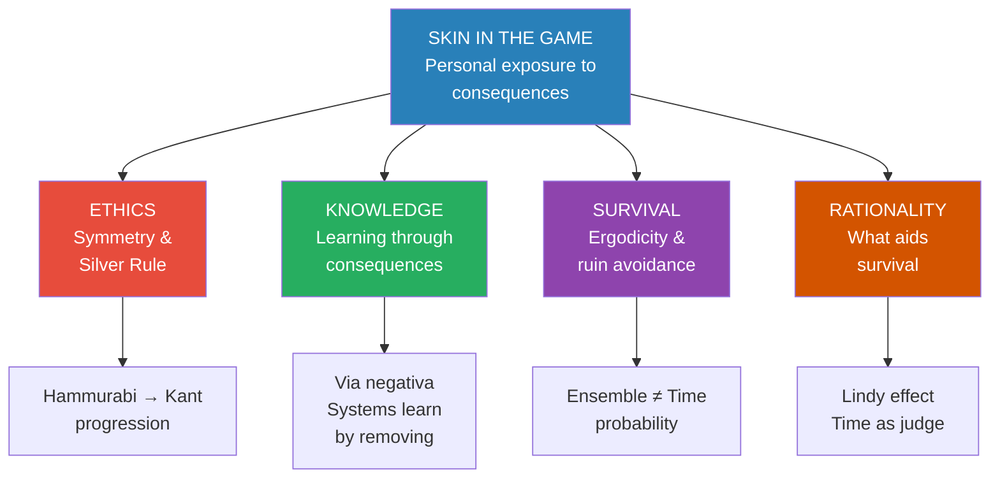
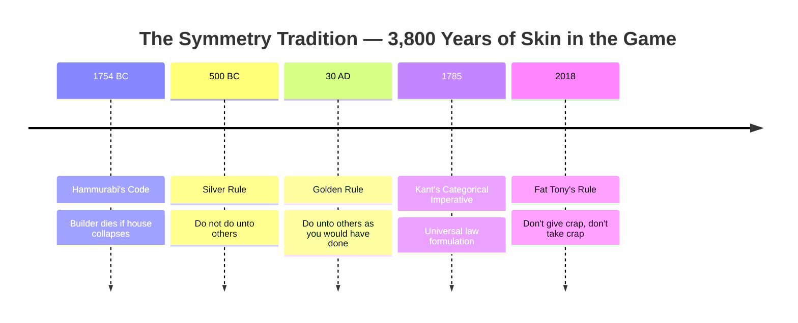
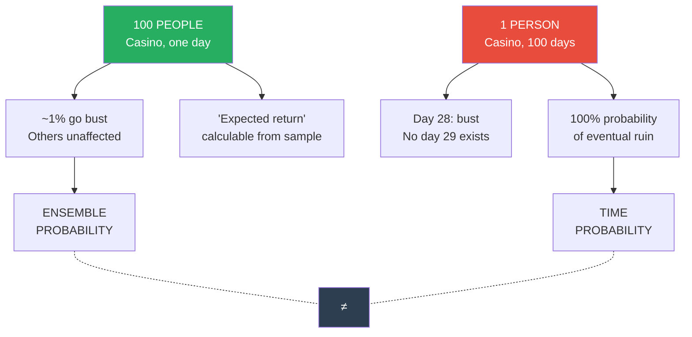
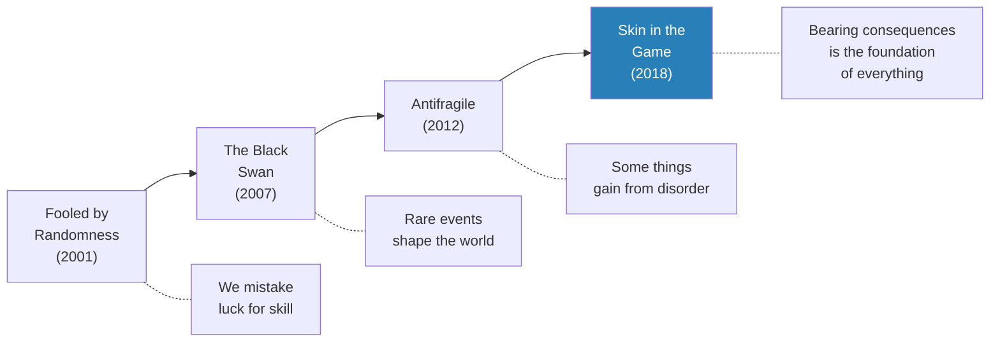

# Skin in the Game — Nassim Nicholas Taleb

> The core argument of Skin in the Game is that the most reliable mechanism for ensuring fairness, generating knowledge, and keeping civilization intact is deceptively simple: make people bear the consequences of their own decisions. Taleb calls this skin in the game — personal exposure to the downside of your actions — and shows that it is simultaneously the oldest ethical principle (Hammurabi's code, 3,800 years ago), the foundation of evolutionary learning (systems improve by eliminating those who make fatal errors), and the key to understanding rationality itself (what is rational is what allows you to survive).
> Without skin in the game, systems rot. Bankers keep their bonuses while taxpayers absorb their losses. Interventionistas destroy countries from the comfort of air-conditioned offices. Intellectuals prescribe policies they never have to live with. Bureaucrats generate complexity because they are rewarded for perception, not results. The book traces this single principle across ethics, religion, risk theory, political philosophy, and probability — revealing that the hidden asymmetries of daily life, where some people transfer risk to others, are the root cause of most systemic failures.
> This is the fifth and final volume of Taleb's *Incerto* — a project that began with randomness (*Fooled by Randomness*), moved to extreme events (*[[The Black Swan - Nassim Nicholas Taleb|The Black Swan]]*), explored how to benefit from disorder (*[[Antifragile - Nassim Nicholas Taleb|Antifragile]]*), and now arrives at its ethical and mathematical foundation: you cannot understand the world unless you have something at stake in it.

---

## About the Author

- Nassim Nicholas Taleb was born in 1960 in Amioun, Lebanon, to a prominent Greek Orthodox family — his grandfather was a former deputy prime minister
- He grew up during the Lebanese Civil War, an experience that taught him the "triplet of opacity": the illusion of understanding, retrospective distortion, and the overvaluation of factual information
- He holds an MBA from the Wharton School and a PhD from the University of Paris-Dauphine
- He spent twenty-one years as a derivatives trader and hedge fund manager specializing in tail-risk hedging — profiting from rare, extreme events others failed to price
- He is Distinguished Professor of Risk Engineering at NYU Tandon School of Engineering
- Skin in the Game is the fifth book in his *Incerto* series: *Fooled by Randomness* (2001), *[[The Black Swan - Nassim Nicholas Taleb|The Black Swan]]* (2007), *The Bed of Procrustes* (2010), *[[Antifragile - Nassim Nicholas Taleb|Antifragile]]* (2012), and *Skin in the Game* (2018)
- He describes his philosophical lineage as running from Hammurabi through Sextus Empiricus, Montaigne, and the Silver Rule tradition — ancient practical wisdom confirmed by modern probability theory
- His intellectual life bridges two worlds: the rigorous mathematics of probability and the messy, high-stakes reality of trading floors — making him a practitioner-philosopher, not an armchair theorist

---

## The Big Idea

- <b style="color: #2980b9">The most important principle in ethics, risk, knowledge, and survival is skin in the game</b> — having personal exposure to the consequences of your decisions
- Skin in the game operates across four inseparable dimensions:
  - **Bull***t detection** — the difference between theory and practice, between cosmetic expertise and real expertise
  - **Symmetry** — if you get the rewards, you must also bear the risks; if you inflict risk on others, you must pay a price when they are harmed
  - **Information sharing** — how much a seller should reveal to a buyer (the used car problem scaled to civilization)
  - **Rationality** — what is rational is not what some psychologist calls rational, but what allows you to survive
- <b style="color: #e74c3c">The most dangerous people in modern civilization are those who make decisions that affect others without bearing the downside</b> — interventionistas, bureaucrats, bankers, and the "Intellectual Yet Idiot" class
- The principle has a 3,800-year intellectual lineage:
  - **Hammurabi's code**: if the house collapses, the builder dies
  - **The Silver Rule**: do not treat others the way you would not like them to treat you
  - **Evolutionary filtering**: systems learn by removing those who make fatal errors, not by adding knowledge
- <b style="color: #27ae60">Without skin in the game, three things collapse simultaneously</b>: ethics (no penalty for bad advice), knowledge (no contact with reality), and survival (hidden risks accumulate until systemic blowup)

The radar chart visualizes Taleb's central claim: systems with skin in the game dominate on every dimension, while systems without it collapse toward the center — the gap is not marginal but catastrophic across all six performance dimensions.
- The **Bob Rubin trade** is the archetypal violation: Robert Rubin collected $120 million from Citibank, then when the bank went insolvent in 2008, he invoked Black Swan uncertainty — heads he wins, tails the taxpayer loses
- <b style="color: #2980b9">The mathematical foundation is ergodicity</b>: the critical distinction between what happens to a group at one moment (ensemble probability) and what happens to one person over time (time probability). Under ruin conditions, these are not interchangeable — and ignoring this distinction is the root error of modern economics and psychology

| | With Skin in the Game | Without Skin in the Game |
|--|----------------------|--------------------------|
| **Ethics** | Symmetry — you bear your own risks | Asymmetry — you transfer risks to others |
| **Knowledge** | Learning through consequences (*pathemata mathemata*) | "Explaining" without understanding |
| **Systems** | Self-correcting via filtering | Accumulating hidden risks until blowup |
| **Survival** | Ruin-aware, precautionary | Ruin-blind, fragile |
| **Example** | Entrepreneur who goes bust with own money | Banker who keeps bonus, taxpayer absorbs loss |
| **Ancient principle** | Hammurabi: builder dies if house collapses | Bob Rubin: invokes uncertainty after blowup |
| **Rationality** | What aids survival | What looks good on paper |

---

## Key Concepts at a Glance

| Concept | Definition | Why It Matters |
|---------|-----------|----------------|
| **Skin in the Game** | Personal exposure to the downside of your decisions | The foundation of ethics, knowledge, and survival — without it, systems rot |
| **The Bob Rubin Trade** | Asymmetric payoff: gains kept, losses transferred to others | The archetypal violation — explains bank bailouts, interventionism, and bureaucratic failure |
| **The Silver Rule** | Do not treat others the way you would not like them to treat you | More robust than the Golden Rule — via negativa prevents busybodies |
| **The Minority Rule** | A small intransigent minority (3-4%) can impose preferences on the majority | Explains kosher products, language spread, religious conversion, and moral progress |
| **Ergodicity** | Ensemble probability ≠ time probability under ruin conditions | The deepest insight: what works for a group at one moment can kill an individual over time |
| **The Lindy Effect** | For non-perishable things, life expectancy increases with survival | Time is the ultimate expert — old ideas, technologies, and religions are more trustworthy |
| **Via Negativa** | Acting by removal rather than addition | Subtraction is more powerful and less error-prone than addition — applies to ethics, medicine, and knowledge |
| **IYI (Intellectual Yet Idiot)** | Paternalistic expert without skin in the game | Gets first-order logic right, misses second-order effects; the disease of modernity |
| **Interventionista** | Someone who intervenes in complex systems without bearing consequences | Creates fragility through naive action — Libya, Iraq, Syria |
| **Uncle Point** | The threshold of ruin from which there is no recovery | Once you cross it, the game is over — no amount of subsequent success matters |
| **Gharar** | Islamic concept: inequality of uncertainty in a transaction | No person should have certainty about an outcome while the other has uncertainty |
| **Synkyndineo** | Greek: taking risks together; proportional risk sharing | Rhodian maritime law: all merchants share losses equally, regardless of whose cargo was jettisoned |
| **Pathemata Mathemata** | Greek: learning through suffering/consequences | The original formulation of skin in the game — knowledge comes from contact with reality, not theory |

---

## Book 1 — The Foundation: Why Skin in the Game Matters

*Taleb opens with the myth of Antaeus, traces the ethical lineage from Hammurabi to Fat Tony, and establishes the four dimensions of skin in the game.*

### The Antaeus Principle

- Antaeus was a giant who derived his strength from contact with his mother, Earth — Hercules killed him by lifting him off the ground
- <b style="color: #2980b9">You cannot separate knowledge from contact with the ground</b> — having exposure to the real world, paying a price for consequences good or bad
- The "abrasions of your skin guide your learning and discovery" — the Greeks called this *pathemata mathemata*, learning through pain
- Taleb showed in [[Antifragile - Nassim Nicholas Taleb|Antifragile]] that most things we attribute to university invention were actually discovered through tinkering — knowledge from contact with reality vastly exceeds knowledge from reasoning

### The Interventionista Problem

- Libya has slave markets in 2017 — the direct result of "regime change" promoted by interventionistas who never bear the costs
- Bill Kristol, Thomas Friedman, and State Department officials promoted the Iraq invasion, the Libyan overthrow, and Syrian intervention without personal consequences
- <b style="color: #e74c3c">The interventionista's three fatal flaws</b>:
  1. They think in **statics**, not dynamics — they can't see second, third, nth-order effects
  2. They think in **low dimensions**, not high — they reduce complex systems to single-dimensional metrics (like removing a dictator while ignoring everything else)
  3. They think in **actions**, not interactions — they can't see how their interventions create feedback loops

> [!warning] The Interventionista's Immunity
> The interventionista "continues his practice from the comfort of his thermally regulated suburban house with a two-car garage, a dog, and a small play area with pesticide-free grass for his overprotected 2.2 children." The downside doesn't affect him. This is why the same people who promoted the Iraq war promoted the Libyan intervention — they never paid for the first mistake.

### The Bob Rubin Trade

- Robert Rubin, former Treasury Secretary, collected more than $120 million from Citibank in the decade before the 2008 crash
- When Citibank went insolvent and was rescued by taxpayers, Rubin invoked uncertainty — "Black Swan!" — and kept his money
- <b style="color: #e74c3c">Heads he wins, tails he shouts "Black Swan"</b>
- The real victims: Spanish grammar specialists, assistant schoolteachers, supervisors in tin can factories — ordinary taxpayers who absorbed the risk
- This is the archetype of skin-in-the-game violation: gains are privatized, losses are socialized
- The same structure appears in banking bonuses (yearly bonus period, once-per-decade blowup), foreign policy (politicians start wars they don't fight in), and bureaucracy (no downside for bad decisions)

### The Symmetry Tradition

- Skin in the game has a 3,800-year lineage — it is not a new idea but a rediscovery of ancient wisdom
- <b style="color: #2980b9">Hammurabi's code</b> (circa 1754 BC): "If a builder builds a house and the house collapses and causes the death of the owner — the builder shall be put to death"
- **Lex Talionis** ("eye for an eye"): metaphorical, not literal — the Talmud discusses that a one-eyed man would only pay half, and a blind man would go free
- **The Silver Rule**: "Do not treat others the way you would not like them to treat you" — more robust than the Golden Rule because:
  - It is *via negativa* — it tells you what NOT to do
  - It prevents busybodies from deciding what is "good" for you
  - "We know with much more clarity what is bad than what is good"
- **The Golden Rule**: "Treat others the way you would like them to treat you"
- **Kant's Categorical Imperative**: "Act only according to that maxim through which you can will that it become a universal law"
- <b style="color: #27ae60">Taleb's key insight</b>: Kant's universalism fails in practice because we are local and practical animals — "the general kills the particular"

| Rule | Formulation | Direction | Robustness |
|------|------------|-----------|------------|
| Hammurabi | Builder dies if house collapses | Symmetric punishment | High — 3,800 years old |
| Silver Rule | Don't do to others what you wouldn't want done to you | Via negativa | Very high — prevents busybodies |
| Golden Rule | Treat others as you want to be treated | Via positiva | Moderate — can justify imposition |
| Kant | Act as if your maxim were universal law | Abstract universal | Low in practice — fails at scale |
| Fat Tony | Don't give crap, don't take crap | Vernacular | Highest — immediately actionable |

The timeline shows that skin in the game is not a modern innovation but a rediscovery of the oldest ethical principle in human civilization — each formulation is a variation on the same theme of symmetry between action and consequence.

- **Intellectualism**: the belief that one can separate an action from its results, theory from practice — the most dangerous modern tendency
- **Scientism**: a naive interpretation of science as complication rather than as a skeptical enterprise — "replacing your well-functioning hand with something more technological is not more scientific"
- Things designed by people without skin in the game tend to grow in complication — because "when you are rewarded for perception, not results, you need to show sophistication"
- The tilted coffee ledge on Metro North trains: designers made it aesthetically "improved" but functionally useless — because "architects today build to impress other architects"
- The stage light problem: speakers are blinded by lights aimed at them because "those who lecture to large audiences don't work on lighting, and light engineers don't lecture to large audiences"
- <b style="color: #e74c3c">Skin in the game brings simplicity</b>: "people who see complicated solutions do not have an incentive to implement simplified ones"

The Sankey diagram traces Taleb's two divergent paths: absence of skin in the game flows through hidden risk transfer, complexity, and interventionism into systemic fragility and blowup, while its presence channels through accountability and simplicity into antifragility.
- Taleb's confession about his own learning: "When I don't have skin in the game, I am usually dumb. My knowledge of technical matters did not come from books. It came from the thrills and hormonal flush one gets while taking risks"

### Regulations vs. Legal Systems

- Two approaches to protecting citizens from large predators:
  1. **Regulation** — top-down, rigid, gameable, additive, and prone to regulatory capture
  2. **Legal liability** — bottom-up, adaptive, and based on the Anglo-Saxon common law tradition
- "If a big corporation pollutes your neighborhood, you can get together with your neighbors and sue the hell out of it"
- The common law is "about the spirit while regulation, owing to its rigidity, is all about the letter"
- Taleb's position: **deontic libertarianism** — "I would still prefer to be as free as possible, but assume my civil responsibility, face my fate, and pay the penalty if I harm others"
- "Freedom is one's first most essential good. This includes the freedom to make mistakes (those that harm only you); it is sacred to the point that it must never be traded against economic or other benefits"

### Soul in the Game

- Beyond mere skin in the game, Taleb argues for **soul in the game** — doing things for existential reasons, not instrumental ones
- <b style="color: #2980b9">Artisans embody this principle</b>:
  - They do things for existential reasons first, financial ones later
  - They combine art and business — staying away from industrialization
  - They would never sell something defective because "it hurts their pride"
  - They have sacred taboos — things they would not do even if profitable
- The writer Fay Weldon was paid by Bulgari to weave product placement into a novel — "a nightmare ensued; there was a generalized feeling of disgust"
- Alexandre Dumas, who ran a workshop of 45 ghostwriters, "may be the exception that confirms the rule"
- The citizenship test: Taleb took U.S. citizenship despite higher-tax consequences because "it would have felt fake to see my bearded face on a French passport" without emotional attachment — "a country should not tolerate fair-weather friends"
- <b style="color: #27ae60">"If you do not take risks for your opinion, you are nothing"</b>

- The interventionista case is central because absence of skin in the game has both ethical AND epistemological effects
- "You will never fully convince someone that he is wrong; only reality can"
- <b style="color: #2980b9">There is no evolution without skin in the game</b> — the filtering mechanism of consequences is what makes systems intelligent
- Bad pilots end up at the bottom of the Atlantic — transportation gets safer not because individuals learn, but because the system removes those who make fatal errors
- The experience of the system is different from the experience of individuals — it is grounded in filtering, not education

---

## Book 2 — Equality in Uncertainty

*The ancient roots of fair dealing, from Stoic philosophers to Islamic law to Talmudic ethics.*

### The Corn Merchant in Rhodes

- Classic Stoic debate (via Cicero): a merchant brings corn to famine-stricken Rhodes knowing more ships are coming — must he disclose this?
- **Diogenes of Babylon**: disclose only what civil law requires
- **Antipater of Tarsus**: disclose everything — no informational asymmetry
- Taleb sides with Antipater: <b style="color: #27ae60">"The ethical is always more robust than the legal. Over time, the legal should converge to the ethical, never the reverse"</b>
- Islamic law's concept of **gharar** goes further: "no person in a transaction should have certainty about the outcome while the other one has uncertainty" — inequality of uncertainty is equivalent to theft
- The word gharar is "an extremely sophisticated term in decision theory that does not exist in English" — it means both uncertainty and deception
- Taleb views Islamic financial law (Sharia) as "a museum of the history of ideas on symmetry in transactions" — preserving lost Mediterranean and Babylonian practices
- Selling a defective product falls under gharar; having slightly better market information does not — the distinction is sophisticated and context-dependent

### The Lecture Agent's Trap

- Taleb received a letter from a lecture agent insisting that hiring him would be "good for you" — the phrase appeared multiple times
- Taleb smelled a rat: "at no phase in the discussion did he refrain from letting me know that it was 'good for me'"
- Six years later, a surprise tax bill from the agent's foreign country arrived — the agent's response was curt: "I am not your tax attorney"
- <b style="color: #e74c3c">"It always turns out that what is presented as good for you is not really good for you but certainly good for the other party"</b>
- The antidote from trading culture: upright people declare their interest openly — "Do you have an ax?" means "I'm disclosing that I want to sell"
- The Wall Street version: "rip them off, don't tick them off" — one veteran salesperson boasted that "every day a new customer is born"
- The white-shoe investment bank ethos: cultivate an image of ethics while instructing salespeople to "unload" unwanted inventory on unsuspecting clients — a $2,000 wine bottle buys you $100,000 in profits

### Rav Safra's Radical Honesty

- A third-century Babylonian scholar-trader was praying silently when a buyer offered a price for his goods
- Unable to respond, the buyer raised the offer — but Rav Safra had intended to accept the original price
- He sold at the lower price, honoring his original intention
- This represents maximal transparency — not just of information but of *intention*
- Practically speaking: "What if he sold to one client at the marked-up price and another at the initial price, and the two buyers knew each other?"

### The Scaling Problem

- Ethics work differently at different scales — this is why Kant's universalism fails
- **Elinor Ostrom's discovery**: there exists a community size below which people act as collectivists, protecting the commons
- Above that threshold, individual self-interest dominates — "the tragedy of the commons"
- <b style="color: #2980b9">The "diagonal" political identity</b>: "I am, at the Fed level, libertarian; at the state level, Republican; at the local level, Democrat; and at the family and friends level, a socialist"
- This fractal view of ethics resolves the apparent contradiction between tribalism and universalism — you need BOTH, operating at different scales
- The U.S.A. works well precisely because it is a federation, not a republic — decisions are made at the lowest effective level
- "Better fences make better neighbors" (physicist Yaneer Bar-Yam showed this quantitatively) — putting Shiites, Christians, and Sunnis in one pot and asking them to sing "Kumbaya" has never worked
- The Ottoman system was more sophisticated than Western nation-building: separate tribes for administrative purposes, and "they suddenly become friendly to one another"
- <b style="color: #e74c3c">Modern interventionistas make the fatal error of applying universal solutions to local problems</b>
- **Synkyndineo** (Greek: taking risks together): ancient Rhodian maritime law required all merchants to share losses proportionally when cargo was jettisoned in a storm — regardless of whose cargo was lost
- This is the opposite of the Bob Rubin trade: equal risk sharing vs. risk transfer
- The doctor's visit is another scaling problem: the doctor has skin in the game (legal liability) but the incentive structure pushes toward radiation therapy over laser surgery because five-year metrics look better, even though twenty-year outcomes are worse
- "You need to remember that, when you visit a medical office, you will be facing someone who, in spite of his authoritative demeanor, is in a fragile situation"

---

## Book 3 — The Minority Rule

*How a tiny intransigent minority can force its preferences on the entire population — the mother of all asymmetries.*

### The Kosher Lemonade Discovery

- At a New England Complex Systems barbecue, Taleb offers lemonade to a kosher friend expecting rejection — the friend drinks it
- A tiny U-in-a-circle symbol indicates it is kosher — almost all American beverages are kosher despite Jews being 0.3% of the population
- <b style="color: #2980b9">The asymmetric rule</b>: a kosher person will never eat nonkosher food, but a nonkosher person will eat kosher food
- This same structure explains: peanut-free zones, disabled-accessible bathrooms, halal meat in the U.K., automatic vs. manual cars, and organic food

### The Renormalization Group

- From mathematical physics: the mechanism by which a minority preference cascades from small to large scale
- **Step 1**: One family member eats only non-GMO → the family eats non-GMO
- **Step 2**: The non-GMO family goes to a barbecue → all guests eat non-GMO
- **Step 3**: The local grocery notices the neighborhood trend → stocks only non-GMO
- **Step 4**: The wholesaler follows → the entire supply chain shifts
- <b style="color: #e74c3c">It suffices for 3-4% of the population to be intransigent for the entire population to submit</b>

> [!example] The Minority Rule in Action
> - **Kosher products**: 0.3% of Americans are Jewish, yet nearly all beverages are kosher
> - **Halal meat in the U.K.**: 3-4% Muslim population, yet 70% of lamb imports from New Zealand are halal
> - **Language spread**: Aramaic spread not by Semites but by Persians — because the scribes could only write in Aramaic
> - **Genes vs. languages**: genes follow majority rule (slow mixing), languages follow minority rule (rapid adoption)
> - **Religious conversion**: Islam spread partly through asymmetric marriage rules — if either parent is Muslim, the child is Muslim; apostasy is punished by death
> - **Science**: one disproof outweighs any amount of consensus — the Popperian asymmetry

### The Veto Effect and Market Dynamics

- McDonald's thrives not because it's the best food but because it's rarely vetoed — a safe, universally acceptable minimum
- Markets react disproportionately to the most motivated buyer or seller — a single stubborn seller crashed the market by nearly 10% in 2008 (Société Générale's rogue trader unwind)
- "The market is like a large movie theater with a small door" — stampedes happen because those who want out MUST get out
- <b style="color: #27ae60">The political implication</b>: society doesn't evolve by consensus, voting, or committees — "all one needs is an asymmetric rule somewhere and someone with soul in the game"

### Popper-Gödel's Paradox

- Should a tolerant society tolerate intolerance? Kurt Gödel found this inconsistency in the U.S. Constitution during his naturalization exam
- Taleb's answer via the minority rule: <b style="color: #e74c3c">an intolerant minority can destroy democracy</b> — we must be "more than intolerant with some intolerant minorities"
- The Silver Rule provides the test: Salafism denies others' right to their own religion, violating the fundamental symmetry

### Imposing Virtue and the Morality of Minorities

- The minority rule explains how moral progress actually happens — not through consensus but through stubborn minorities
- **Prohibition of alcohol** in the U.S. was driven by a small but intransigent temperance movement
- **Book banning** requires only a few motivated activists — philosopher Bertrand Russell lost his job at the City University of New York because of a single angry mother's letter
- The formation of moral values doesn't come from majority evolution: <b style="color: #2980b9">"It is the most intolerant person who imposes virtue on others precisely because of that intolerance"</b>
- In Arabic, *halal* has one opposite: *haram* — the same interdict governs food AND all moral behavior. "Haram is haram and is asymmetric"
- Civil rights, ethical norms, and religious spread all follow the same dynamic: a small group with unconditional rules overrides a larger flexible majority
- <b style="color: #27ae60">"All one needs is an asymmetric rule somewhere — and someone with soul in the game"</b>
- The stability property: moral rules enforced by the minority rule tend to be **binary and black-and-white** — "you cannot steal 'a little bit' or murder 'moderately'"
- This explains why moral codes across cultures converge on similar prohibitions: they are the product of intransigent minorities, not consensus — and binary rules are easier to enforce than nuanced ones
- The probabilistic argument: a minority-rule moral code produces *lower variance* in outcomes — like cyanide (which follows a minority rule: one drop poisons the whole drink) vs. a "majority-style" poison requiring more than 50% concentration to kill

### The Failure of Aggregates

- "The average behavior of the market participant will not allow us to understand the general behavior of the market"
- Psychological experiments on individuals showing "biases" do not translate to collective behavior — this is the curse of dimensionality
- **Zero-intelligence markets**: researchers Gode and Sunder showed that markets populated with agents buying and selling *randomly* produce the same allocative efficiency as intelligent agents — under the right structure
- Friedrich Hayek vindicated: the invisible hand works through structure, not individual intelligence
- "Individuals don't need to know where they are going; markets do"
- <b style="color: #e74c3c">The selfish gene theory is flawed at the aggregate level</b> — Yaneer Bar-Yam showed that local properties fail and the mathematics used to prove the selfish gene are "woefully naive"
- The deeper point: "The higher the dimension, the more disproportionally difficult it is to understand the macro from the micro"

*Why employees exist, what freedom really costs, and the curious economics of human domestication.*

### The Gyrovague Monks

- In the early centuries of Christianity, there were itinerant monks called **gyrovagues** — wandering, unaffiliated, totally free beggars
- They survived on the charity of townspeople, owned nothing, and answered to no institution
- They were banned by the Council of Chalcedon (fifth century) and again by the second Council of Nicaea
- <b style="color: #2980b9">Saint Benedict replaced them with institutional monasticism</b> — hierarchy, supervision, obedience, probation periods
- Why? "Complete freedom is the last thing you want if you have an organized religion to run"
- The same applies to firms: total employee freedom is devastating for organizations that need reliability

### The Pilot Bob Problem

- Imagine you own a small airline and have contracted pilot Bob for tomorrow's Oktoberfest flight to Munich — full plane, motivated passengers, retired lawyers among them
- Bob calls at 5 PM: a Saudi Sheikh has offered more money for a Las Vegas run — the penalty for breach of contract is covered
- <b style="color: #e74c3c">You are finished</b> — no replacement pilots, cascade of missed flights, financially ruined
- The realization: employees would never do this — they have reputation to protect, regularity of paycheck to lose
- "You are buying dependability" — an employee has skin in the game through the risk of losing their position
- Contractors are free but unreliable; employees are domesticated but dependable
- This resolves Ronald Coase's theory of the firm from a risk perspective: employees exist not just to reduce transaction costs, but because they provide risk management

> [!tip] The Dog vs. The Wolf
> From Ahiqar's ancient fable (later adopted by Aesop and La Fontaine): a dog boasts of his comforts to a wolf — food, shelter, warmth. The wolf is almost convinced to enlist — until he asks about the collar. "Of all your meals, I want nothing." He ran away and is still running.
> Freedom is never free. But "whatever you do, just don't be a dog claiming to be a wolf."

### The Company Man and the Expat Slave

- The **company man** is someone whose identity is stamped by his firm — IBM required white shirts, dark blue suits, nothing fancy
- In return, the firm kept him until mandatory retirement — a mutual pact of dependability
- This system collapsed when technology made large corporations mortal (IBM's lifers couldn't find jobs elsewhere)
- The **expat slave** is the modern evolution: a bank sends an employee to a tropical country with a villa, driver, country club, first-class flights home
- He earns far more than locals, builds a social life among expats, becomes addicted to the lifestyle
- <b style="color: #e74c3c">Ninety-five percent of his mind will be on company politics</b> — which is exactly what the company wants
- "The best slave is someone you overpay and who knows it, terrified of losing his status"

### Loss Aversion as Ergodicity

- What matters is not what a person has but what they are afraid of losing
- The more you have to lose, the more fragile you are
- CIA Director David Petraeus — could risk people's lives but couldn't have an extramarital affair
- <b style="color: #2980b9">Putin vs. elected officials</b>: the autocrat projects "I don't care" (f***-you money equivalent), while elected leaders need committees, approval, and poll numbers
- "It is much easier to do business with the owner of the business than some employee who is likely to lose his job next year"
- Traders as wolves among dogs: "you are free — but only as free as your last trade"
- Strategic foul language as a status signal: "cursing today is a status symbol, just as oligarchs in Moscow wear blue jeans at special events to signal their power"

### The Expat Trap and Modern Slavery

- The Roman system was explicit: families customarily had **a slave for treasurer** — because "you can inflict a much higher punishment on a slave than a free person"
- The modern equivalent is subtler but structurally identical:
  - **Multinational expats**: sent to tropical countries with villas, drivers, club memberships, first-class flights — then terrified of losing it all
  - **Mortgage holders**: banks prefer employees with families and large mortgages — "those with downside risk are easier to own"
  - **Companies that exceed the entrepreneur stage**: they "start to rot" because assignees think "it's not my problem anymore" when they change positions
- <b style="color: #e74c3c">"The skills at making things diverge from those at selling things"</b>
- Products that bear the owner's name (Paul Wilmott's journal, for instance) signal commitment — "eponymy indicates both a commitment to the company and a confidence in the product"
- "Arrogant will do" — a person with their name on the product has skin in the game that an anonymous corporation never has

### Bureaucracy: The Enemy of Skin in the Game

- "Bureaucracy is a construction by which a person is conveniently separated from the consequences of his or her actions"
- <b style="color: #2980b9">People whose survival depends on qualitative "job assessments" by someone of higher rank cannot be trusted for critical decisions</b>
- The employee paralysis: if you discover a huge opportunity selling anti-diabetes products to Saudi visitors, you can't pursue it if you're officially in the light fixtures business
- The Vietnam War dynamic: "most people (sort of) believed that certain courses of action were absurd, but it was easier to continue than to stop"
- The Saudi Arabia problem: since 9/11, where most attackers were Saudi citizens, no bureaucrat made the right call about the source of terrorism — "because that was not a course that was optimal for their jobs"
- The solution is always decentralization: <b style="color: #27ae60">"It is easier to macrobull***t than microbull***t"</b>

- Imagine you work for a corporation concealing a cancer-causing product — you could alert the public, but you'd lose your job, face smear campaigns, and compromise your children's future
- <b style="color: #e74c3c">The vulnerability of people with families has been exploited throughout history</b>: samurai hostages in Edo, Roman-Hun child exchanges, Ottoman janissaries extracted from Christian families
- James Bond is celibate for a reason — you can't have ethical dilemmas between the particular (family) and the general (humanity)
- The Essenes were celibate. Socrates overcame the dilemma at his family's expense — at seventy, with young children, he chose death over compromising his principles
- Big Ag's smear campaigns against Taleb targeted NYU staff and university administrators — "they resorted to harassing New York University's staff, using web-mobs to flood them with emails"
- General Motors harassed Ralph Nader's mother, Rose, calling her at 3 AM — she turned out to be an activist herself and "felt flattered by the calls"

---

## Book 5 — Being Alive Means Taking Certain Risks

*On authenticity through peril, the disease of the Intellectual Yet Idiot, the mathematics of inequality, and why time is the only expert.*

### David Blaine's Ice Pick

- At a literary dinner party in New York, a courteous man named David pulls out an ice pick and makes it go through his hand
- Later, at the coat check, blood drips from the wound — it was real
- <b style="color: #2980b9">"He was now real. He took risks. He had skin in the game"</b>
- This crystallized the theological necessity of Christ's dual nature: the church kept insisting Jesus was both man AND god across centuries of councils (Chalcedon, Nicea)
- If Jesus didn't truly suffer on the cross, he'd be "like a magician who performed an illusion"
- The Orthodox Church goes further with **theosis**: "Jesus Christ was incarnate so we could be made God" (Athanasius of Alexandria)
- **Pascal's wager refuted**: belief cannot be a free option — it requires sacrifice, an entry fee, skin in the game
- **The experience machine** (philosophy thought experiment): you cannot substitute real life with simulated experience because "life is sacrifice and risk taking"

### The Donald and the Signaling of Scars

- When Taleb saw Trump on stage in the Republican primary, he became certain Trump would win
- Not despite his flaws, but because of them: <b style="color: #27ae60">"Scars signal skin in the game"</b>
- "You'd even rather have a failed real person than a successful one, as blemishes, scars, and character flaws increase the distance between a human and a ghost"
- His bankruptcy and personal losses of nearly $1 billion removed resentment — there is "something respectable in losing a billion dollars, provided it is your own money"
- Fat Tony's wisdom: "always do more than you talk. And precede talk with action"

### The Intellectual Yet Idiot

- The IYI is a product of modernity — paternalistic, Ivy League-labeled experts telling the rest of us what to do, eat, think, and whom to vote for
- They "can't find a coconut on Coconut Island" — their main skill is passing exams written by people like them
- <b style="color: #e74c3c">They get first-order logic right but not second-order effects</b>, making them "totally incompetent in complex domains"
- The IYI subscribes to *The New Yorker*, has attended TED talks, never curses on social media, talks about "equality of races" but never goes drinking with a minority cab driver
- Has been wrong about Stalinism, Maoism, GMOs, Iraq, Libya, Syria, lobotomies, urban planning, low-carb diets, trans-fats, portfolio theory, and election forecasting — but is still convinced his current position is right
- <b style="color: #2980b9">Nietzsche's *Bildungsphilisters*</b> — educated philistines: "beware the slightly erudite who thinks he is an erudite"
- Easy marker: "he doesn't even deadlift"

### IYI in the Wild — A Field Guide

- The IYI has been wrong on a remarkable number of things, but never pays a price for being wrong — this is the fundamental problem:

| Domain | What the IYI Got Wrong | What Actually Happened |
|--------|----------------------|----------------------|
| Diet | Fat is bad (30+ years) | Completely reversed — sugar is the culprit |
| Economics | Models predict markets | Every major crisis was a surprise to modelers |
| Foreign policy | Regime change brings democracy | Libya: slave markets. Iraq: ISIS. Syria: civil war |
| Psychiatry | Lobotomies cure mental illness | Horrific outcomes, now banned |
| Urban planning | High-rise projects help the poor | Created crime-ridden ghettos |
| Nutrition | Trans-fats are safe, butter dangerous | Trans-fats banned; butter rehabilitated |
| Finance | Portfolio theory manages risk | LTCM, 2008 — catastrophic failures |
| Elections | Trump/Brexit impossible | Both happened |

- The IYI's central error: confusing **first-order effects** (the direct, visible consequence) with **second-order effects** (the indirect, invisible, often opposite consequence)
- GMOs are "science" to the IYI — but he mistakes the technology for the risk category, confusing conventional breeding (thousands of years of testing) with transgenic modification (novel, untested, potentially multiplicative risk)
- <b style="color: #e74c3c">"There is no difference between 'pseudointellectual' and 'intellectual' in the absence of skin in the game"</b>

- There are two types of inequality:
  - **Tolerable**: Einstein, Michelangelo, entrepreneurs, artists — people you can be a fan of
  - **Intolerable**: bankers, bureaucrats, corporate executives — people who game the system with no downside
- <b style="color: #2980b9">The key distinction is static vs. dynamic</b>:
  - **Static inequality**: a snapshot — the top 1% at this moment
  - **Dynamic inequality**: the full movie — do people rotate in and out?
- In America, 10% of people spend at least a year in the top 1%; more than half spend a year in the top 10%
- In France, 60% of the wealthiest are heirs; in Florence, the same families have held wealth for five centuries
- <b style="color: #27ae60">"Dynamic equality is what restores ergodicity"</b> — making time probability substitutable for ensemble probability
- The solution is not redistribution but rotation: "force the rich to be subjected to the risk of exiting from the 1 percent"
- Piketty's *Capital in the Twenty-First Century* is flawed: his methods don't account for fat tails, and he mistakes static measures for dynamic processes
- Taleb and collaborators published formal mathematical proofs showing Piketty's inequality measures were biased — "the papers had enough theorems and proofs to make them ironclad"
- The Mandarin class (Piketty's supporters) got "prematurely excited" and dismissed the critique — Paul Krugman wrote "If you think you've found an obvious hole in Piketty, you're very probably wrong"
- When Taleb pointed out the flaw to Krugman in person, "he evaded it — not necessarily out of malice, but most likely because probability and combinatorics eluded him"
- The deepest irony: "the likes of Krugman and Piketty have no downside in their existence — lowering inequality brings them up in the ladder of life"
- <b style="color: #2980b9">Class envy comes from the Mandarin class, not from truck drivers</b> — "cobbler envies cobbler, carpenter envies carpenter" (Hesiod, via Aristotle)
- Michèle Lamont's research found that blue-collar Americans resent high-paid salaried employees but not the rich — "the spectacle of a rich slave" is what triggers resentment
- The Swiss held a referendum to cap executive pay relative to the lowest wage — they see the problem intuitively
- <b style="color: #e74c3c">The ethics of civil service</b>: when Barack Obama accepted $40M+ for his memoirs upon leaving office, Taleb saw it as a violation — "having rich people in public office is very different from having public people become rich"
- The revolving door: regulators make industry-friendly rules, then get hired by the industry at multiples of their salary — "there is an implicit bribe in civil service"

> [!info] Ergodicity — The Key Concept
> - **Ensemble probability**: take a snapshot of 1,000 people — some are rich, some poor, most in the middle
> - **Time probability**: follow one person through their lifetime — do they rotate through all conditions?
> - **Perfect ergodicity**: each person, living forever, would spend proportional time in each economic condition
> - **Absorbing state** (the opposite): once rich, always rich; once poor, always poor
> - <b style="color: #e74c3c">The no-absorbing-barrier condition means that someone who is rich should never be certain to stay rich</b>
> - This is why bureaucrats and tenured academics are the most egregious contributors to inequality — they face zero downside risk

### An Expert Called Lindy

- **The Lindy effect**: for non-perishable things (ideas, books, technologies, religions), life expectancy increases with each day of survival
- Named after Lindy's Deli in New York, where actors noticed that Broadway shows lasting 100 days had a future life expectancy of 100 more
- <b style="color: #2980b9">Fragility is sensitivity to disorder; time is equivalent to disorder; survival is the ability to handle disorder</b>
- Therefore: that which is fragile has a limited lifespan, while that which is robust or antifragile has an increasing one
- **Lindy answers "who judges the expert?"** — the answer is: time, through skin in the game
- Things that have survived are hinting they have robustness — conditional on exposure to harm
- Technology should be subject to Lindy: a book that has survived 100 years will likely survive 100 more; today's New York Times bestseller has a five-year survival rate worse than pancreatic cancer
- The expert problem resolved: plumbers, electricians, and London cabbies are experts (Lindy-validated). Clinical psychologists, macroeconomists, and management theorists are not
- <b style="color: #27ae60">Grant-funded academia has no filtering mechanism</b> — no skin in the game means no Lindy pressure

### Who Is and Isn't an Expert?

- Lindy creates a clear dividing line between real and fake experts:

| Real Experts (Lindy-Validated) | Fake Experts (Not Lindy-Validated) |
|-------------------------------|-----------------------------------|
| Plumbers | Clinical psychologists |
| Electricians | Macroeconomists |
| London cabbies | Management theorists |
| Algebraic geometers | Publishing executives |
| Scholars of Portuguese irregular verbs | State Department bureaucrats |
| Dentists | Journalists |
| Traders with P&L | Financial economists with models |

- The test: does the expert have a track record verified by survival and filtering, or merely by credentials and peer approval?
- "Effectively Lindy answers the age-old meta-questions: *Who will judge the expert? Who will guard the guard?*"
- Two ways things handle time: (1) **aging/perishability** — biological clock, senescence; (2) **hazard** — rate of accidents
- Non-perishable things (ideas, books, technologies) face only hazard — if they survive, they become *more* likely to survive
- The deli Lindy is now a tourist trap, "but Lindy's cheesecake is…much less distinguished. Odds are the deli will not survive, by the Lindy effect"

*On hidden asymmetries: why surgeons shouldn't look like surgeons, why the news is fake, and why virtue requires risk.*

### Surgeons Should Not Look Like Surgeons

- When you see a surgeon who looks like a movie surgeon — tall, silver-haired, distinguished — be worried
- <b style="color: #2980b9">If someone had to overcome looks-based prejudice to reach the top, they had to be exceptionally skilled</b>
- The person who doesn't look the part but has arrived has passed a higher filter — their competence must exceed expectations enough to overcome bias
- This is the **Green Lumber fallacy** applied to appearances: we mistake the visible attributes of expertise for the substance of expertise
- Applies to books (best-seller that doesn't "look serious" may be the most serious), entrepreneurs (scruffy vs. suited), and ideas (counterintuitive truths)

### Only the Rich Are Poisoned

- Rich people are the biggest suckers in the economy — vendors target them with complexity because <b style="color: #e74c3c">wealth creates an insatiable appetite for complication</b>
- The richer you get, the more people try to sell you things you don't need: complicated financial products, organic hand-ground coffee delivered by bicycle, "wellness" treatments, and advice from people whose main skill is sounding knowledgeable
- Taleb's rule: sophistication is a disease of the well-off; simplicity is a virtue that requires confidence
- The ancient insight is better: "the villainous takes the short road, virtue the longer one" (*Compendiaria res improbitas, virtusque tarda*)

### Deeds Before Words

- Taleb's personal rule: "always do more than you talk, and precede talk with action"
- "Action without talk supersedes talk without action"
- This is not mere preference — it is a risk-management filter. Talk is cheap because it has no downside; action reveals commitment
- <b style="color: #2980b9">"Don't tell me what you 'think,' just tell me what's in your portfolio"</b>
- Forecasting "bears no relation to speculation" — rich horrible forecasters and poor "good" forecasters abound
- "What matters in life isn't how frequently one is 'right' about outcomes, but how much one makes when one is right"

- After a 59-minute discussion with David Cameron about robustness and decentralization, the press reported only 20 seconds of a tangential climate remark — taken out of context
- "99 percent of my discussion with Cameron was about things other than climate change" — but no reader would know
- <b style="color: #e74c3c">Journalism is not Lindy-compatible</b>: information naturally flows two-way (souks, barber shops, social networks)
- The one-sided media era (mid-20th century to 2016) was a historical aberration — "social networks returned the mechanism to its natural format"
- Journalists worry about opinions of other journalists, not readers — creating monoculture and collective mirages
- **The principle of charity**: "You can criticize either what a person said or what a person meant" — the charlatan focuses on the former, the honest thinker on the latter
- Karl Popper would start debates with an exhaustive, fair representation of his opponent's position before systematically dismantling it

### The Merchandising of Virtue

- Susan Sontag declared she was "against the market system" and turned her back on Taleb for being a trader — she lived in a Manhattan mansion later sold for $28 million
- <b style="color: #e74c3c">"It is much more immoral to claim virtue without fully living with its direct consequences"</b>
- Hotel bathroom signs saying "PROTECT THE ENVIRONMENT" — they want you to reuse towels because it saves them money, not because they love polar bears
- Virtue signaling is modern **simony** — buying a spot in paradise through charitable donations and black-tie dinners
- Matthew 6:1-4: "When you give to the needy, do not announce it with trumpets"
- True virtue has three properties:
  1. It serves the collective, especially those others neglect
  2. It is unpopular — "the highest form of virtue is unpopular"
  3. It requires risk — <b style="color: #27ae60">"Courage is the only virtue you cannot fake"</b>
- Taleb's advice to young people who "want to help mankind": (1) never virtue signal, (2) never rent-seek, (3) start a business

### Peace, Neither Ink nor Blood

- The Israeli-Palestinian problem has lasted 70 years with "way too many cooks in the same tiny kitchen"
- Arab states prodded Palestinians to fight while their potentates sat in "carpeted alcohol-free palaces"
- <b style="color: #2980b9">If people are left alone, they tend to settle for practical reasons</b> — bread, beer, outdoor picnics, and not being humiliated
- History is peace punctuated by wars, not wars punctuated by peace — but we see more lions than impalas because of the availability heuristic
- On a safari in South Africa, Taleb spent a week looking for lions — saw one, which caused a traffic jam. Meanwhile, hundreds of collaborative animals gathered peacefully at the watering hole
- Italian city-states had "constant warfare" for five centuries with fewer total casualties than unified Italy lost in World War I alone
- Historians have a structural bias: they select for drama, not the boring-but-dominant peace. "If we got rid of 'peace' experts, the world would be safer"

---

## Book 7 — Religion, Belief, and Skin in the Game

*Why religion is about practice not verbal belief, why the gods demand sacrifice, and why the Pope goes to the hospital.*

### They Don't Know What They Are Talking About

- People use the word "religion" to mean entirely different things — this confusion is at the root of most arguments about faith:
  - For early **Jews and Muslims**: religion was *law* (*din* means both)
  - For **Romans**: religion was social events, rituals, festivals — *religio* was the opposite of *superstitio*
  - For **Orthodox and Catholic Christians**: religion is largely aesthetics, pomp, and ritual
  - For **Protestants**: religion is belief without aesthetics or law
  - For **Buddhists, Shintoists, Hindus**: religion is practical and spiritual philosophy
- <b style="color: #2980b9">The critical mistake of modern bureaucrats</b>: treating all "religions" as the same animal
- Salafism is not a religion but a totalitarian political system — "very similar to atheistic Soviet Communism in its heyday: both have all-embracing control over all of human activity and thought"
- The European Union makes the fatal error of treating Salafi movements as just another religion deserving houses of "worship" and tolerance
- Jesus's directive — "give to Caesar what belongs to Caesar" — separated the holy from the profane; Islam and Judaism historically did not make this separation

### No Worship Without Skin in the Game

- In the ancient Aramaic-speaking town of Maaloula, the altar of Saint Sergius has a **drain for blood** — recycled from a pre-Christian pagan temple
- <b style="color: #e74c3c">In the entire pagan Mediterranean world, no worship was done without sacrifice</b>
- "Altar" in spoken Levantine and Aramaic is *maḋbaḣ*, from DBH — "ritual slaying by cutting the guttural vein"
- The gods did not accept cheap talk — worship required *revealed preferences*: actual sacrifice, not words
- Burnt offerings were literally burned so no human could consume them — the economic loss was the point
- **Christianity ended literal sacrifice** by making Christ the final sacrifice — his crucifixion was the ultimate skin in the game
- The Eucharist is a simulacrum: wine representing blood, flushed in the piscina (drain) — exactly as in the Maaloula altar
- The progression: animal sacrifice → Isaac's near-sacrifice (unconditional gift to God) → Christ's final sacrifice → symbolic Eucharist
- The Abrahamic progression: bribery of deities (pagan) → unconditional gift (Abraham/Isaac) → reciprocal gift-giving (Jewish) → final sacrifice (Christian) → fasting and self-discipline (all Abrahamic traditions)
- Maimonides explained why God didn't immediately abolish animal sacrifice: "to obey such a commandment would have been contrary to the nature of man, who generally cleaves to that to which he is used"
- The deep message: <b style="color: #27ae60">humans need tangible, costly commitment to take beliefs seriously — even when the beliefs are about abstract principles</b>
- Secular equivalents — charitable donations, marathon running "for a cause," corporate social responsibility — are all attempts to get the feeling of sacrifice at a discount
- The Shia commemoration of Imam Hussein's death at Ashoura involves literal self-flagellation with open wounds — skin in the game in the most visceral sense
- Fasting (Greek Orthodox Lent, Ramadan, Yom Kippur) is the entry fee that makes the celebration real: "it is when you break a fast that you understand religion"

> [!quote] The Entry Fee of Belief
> "Love without sacrifice is theft" (Procrustes). The main theological flaw in Pascal's wager is that belief cannot be a free option. It entails a symmetry between what you pay and what you receive. The strength of a creed did not rest on "evidence" of the powers of its gods, but evidence of the skin in the game on the part of its worshippers.

### Is the Pope Atheist?

- When Pope John Paul II was shot in 1981, he was rushed to the **Agostino Gemelli University Polyclinic** — the best doctors Italy could produce
- "At no point during the emergency period did the drivers of the ambulance consider taking John Paul the Second to a chapel for a prayer"
- No pope has ever chosen prayer over medicine when his life was at stake — and "nobody seems to see a conflict with such inversion of the logical sequence"
- <b style="color: #2980b9">The atheist equivalent would behave identically in a medical emergency</b> — same hospital, same doctors, same "hopes" and "wishes" in their own vocabulary
- The real difference between the Pope and an atheist is in the decorative, not the functional: celibacy vows, prayer schedules, rituals — but never in life-threatening decisions
- Taleb's conclusion: <b style="color: #27ae60">"There are people who are atheists in actions, religious in words"</b> (most Orthodox and Catholic Christians) — and "others who are religious in actions, religious in words" (Salafi Islamists)
- Practical implication: **judge people by what they do under pressure, not by what they say they believe**

### The Decorative vs. The Functional in Belief

- There is a critical difference between beliefs that are decorative (identity markers, social rituals, aesthetic preferences) and beliefs that are functional (affecting survival-critical decisions)
- The Pope's behavior in a medical emergency reveals the truth: functional beliefs follow the rules of reality, decorative beliefs follow the rules of social identity
- "Many atheists engage in yoga and similar collective activities, or sit in concert halls in awe and silence" — their rituals are functionally equivalent to religious ones
- <b style="color: #2980b9">This insight resolves the "are religious people irrational?" debate</b>: they are not, because their beliefs are mostly decorative and do not interfere with survival-critical behavior
- The genuinely dangerous case is when decorative beliefs become functional — when Salafis treat theological conclusions as engineering specifications
- Libertarianism, like paganism, "cannot be pigeon-holed" into a party structure — it is inherently decentralized, fractal, and resistant to hierarchical organization
- The problem with treating all religions as equivalent is that some (Salafism, Soviet Communism) extend their rules to ALL human activity and thought, while others (Christianity, Buddhism, paganism) leave large domains of life to secular governance

*The book's mathematical and philosophical crescendo: why rationality is survival, why ensemble averages can kill you, and why courage and prudence are the same thing.*

### How to Be Rational About Rationality

- Greek and Roman architects deliberately misrepresented their columns — tilting them inward to create the *impression* of straightness
- The Parthenon's floor is curved so we see it as flat; the columns are unevenly spaced so we see them as aligned
- <b style="color: #2980b9">This is not deception — it is optimization for function over literal truth</b>
- The same principle applies to beliefs: superstitions can be rational if they aid survival
- "We do not need to understand something for it to be beneficial — we have survived for several hundred million years without understanding most of what kept us alive"

- **Simon's bounded rationality**: we cannot compute everything perfectly, so we use shortcuts and heuristics — these are features, not bugs
- **Gigerenzer's ecological rationality**: many "biases" are actually well-adapted solutions to real-world problems
- **Binmore's revelation of preferences**: there is no such thing as the "rationality" of a belief — only the rationality of an action, judged by its survival consequences

- The only rigorous definition of rationality:
  - <b style="color: #27ae60">"What is rational is that which allows for survival"</b>
  - Unlike modern psychology's definition, this one doesn't fall apart under logical scrutiny
  - "If something stupid works (and makes money), it cannot be stupid"
  - Anything that hinders survival at the individual, collective, tribal, or general level is irrational

> [!tip] The Lindy Test for Rationality
> - If a practice has survived for thousands of years, it is rational — even if we don't understand why
> - Jewish kashrut (500+ dietary laws) has survived millennia not because of its "rationality" but because populations following it survived
> - "Rationality does not depend on explicit verbalistic explanatory factors; it is only what aids survival, what avoids ruin"
> - **Not everything that happens happens for a reason, but everything that survives survives for a reason**

### The Logic of Risk Taking — The Central Chapter

*This is the most important chapter in the book — and arguably the most important chapter in the entire Incerto.*

#### Ensemble vs. Time Probability

- **First case**: 100 people go to a casino, each gambling a set amount. Some win, some lose. About 1% go bust. You can calculate the "edge" by counting the money left in wallets
- **Second case**: one person — your cousin Theodorus Ibn Warqa — goes to the casino 100 days in a row. On day 28 he goes bust. Will there be day 29? **No.**
- <b style="color: #e74c3c">The probabilities of success from a collection of people do NOT apply to cousin Theodorus</b>
- The first is **ensemble probability** (across a population at one moment); the second is **time probability** (one individual over time)
- Under conditions of ruin, these are not interchangeable — **this is the ergodicity problem**

#### The Uncle Point

- An **absorbing barrier** (uncle point) is a threshold from which there is no recovery — ruin is irreversible
- "No matter how good or alert your cousin Theodorus Ibn Warqa is, you can safely calculate that he has a 100 percent probability of eventually going bust"
- <b style="color: #2980b9">If there is a possibility of ruin, cost-benefit analyses are no longer possible</b>
- Russian roulette: 83.33% chance of gaining $1 million per shot — the "expected return" is $833,333. But keep playing and you end up dead with certainty
- "Never cross a river if it is on average four feet deep"

#### Peters and Gell-Mann's Breakthrough

- For 250 years since Jacob Bernoulli, almost everyone in decision theory missed the difference between ensemble and time probabilities
- Physicist **Ole Peters** and Nobel laureate **Murray Gell-Mann** formalized the mathematical structure of ergodicity
- The practitioners who got it right: **Claude Shannon**, **Ed Thorp**, **J.L. Kelly** (the Kelly Criterion), **Harald Cramér** — and Taleb and Mark Spitznagel, who built their entire trading careers around it
- Why did academics miss it? <b style="color: #e74c3c">Lack of skin in the game</b> — "you need a lot of intelligence to figure probabilistic things out when you don't have skin in the game"

#### Repetition of Exposures

- "If one claimed that there is 'statistical evidence that a plane is safe' with a 98% confidence level, practically no experienced pilot would be alive today"
- Smoking a single cigarette is benign — but **the act of smoking** (serial exposure) kills
- Every risk you take adds up: climbing mountains AND riding motorcycles AND flying small planes reduces life expectancy even if no single activity is very dangerous
- <b style="color: #2980b9">The flaw in psychology experiments</b>: they subject someone to a single risk and declare humans "irrational" for overweighting it — as if the subject will never take any other risk in their remaining life
- "Ruin is indivisible and invariant to the source of randomness that may cause it"

#### The Kelly Criterion and Playing with House Money

- The correct strategy under ergodicity is the **Kelly Criterion** (from Claude Shannon and Ed Thorp): increase your bets when you're winning, contract when you're losing
- Practitioners call this "playing with the house money" — you risk more when you have a surplus, less when you don't
- Behavioral economists like Richard Thaler call this "mental accounting" and deem it a mistake — <b style="color: #e74c3c">Taleb considers this one of the most dangerous errors in modern psychology</b>
- Thaler "invites government to 'nudge' us away from it, and prevent strategies from being ergodic"
- "I believe that risk aversion does not exist: what we observe is, simply, a residual of ergodicity. People are, simply, trying to avoid financial suicide"

#### Mediocristan vs. Extremistan Risks

- <b style="color: #2980b9">The fundamental error of naive empiricism</b>: comparing risks across categories
- **Mediocristan risks** (thin-tailed, non-multiplicative): bathtub drownings, car accidents, individual health events — one event cannot change the aggregate
- **Extremistan risks** (fat-tailed, multiplicative, systemic): pandemics, terrorism, financial crises — one event can dominate everything
- The Chernoff bound: the probability of bathtub drownings doubling next year is "one per several trillions lifetimes of the universe"
- No such bound exists for pandemics or terrorism — they are multiplicative, meaning they can scale without limit
- "Never compare a multiplicative, systemic, and fat-tailed risk to a non-multiplicative, idiosyncratic, and thin-tailed one"
- This is why the precautionary principle applies to GMOs, pandemics, and nuclear weapons but NOT to individual health choices, traffic, or personal finance

- In a seminar, Taleb asked 90 people: "What's the worst thing that can happen to you?" — 88 answered "my death"
- Follow-up: "Is your death plus that of your children, nephews, cousins, cat, dogs, and hamster worse than just your death?" — obviously yes
- <b style="color: #27ae60">"Individual ruin is not as big a deal as collective ruin"</b>
- The precautionary principle applies to the highest layer: ecocide (irreversible environmental destruction) is the ultimate uncle point
- "My death at Russian roulette is not ergodic for me, but it is ergodic for the system"
- The renewable vs. non-renewable distinction: "I am renewable, not humanity or the ecosystem"

#### Courage and Prudence Are the Same Thing

- Apparently contradictory classical virtues — courage (*andreia*) and prudence (*sophrosyne*) — are actually identical under the skin-in-the-game framework
- <b style="color: #2980b9">"Courage is when you sacrifice your own well-being for the sake of survival of a layer higher than yours"</b>
- Saving children from drowning at the risk of your own life is simultaneously courageous AND prudent — you sacrifice a lower layer (yourself) for a higher one (the collective)
- Selfish courage is not courage: "a foolish gambler is not committing an act of courage, especially if he is risking other people's funds"
- Warren Buffett's principle: "in order to make money, you must first survive" — and "really successful people say no to almost everything"
- **The precautionary principle formalized**: there is no equivalence between risks from the bathtub (Mediocristan, thin-tailed, individual) and risks from terrorism or pandemics (Extremistan, fat-tailed, multiplicative, systemic)

> [!danger] Naive Empiricism — The Deadly Comparison
> "Ebola causes fewer deaths than people drowning in their bathtubs" — this is comparing multiplicative, systemic, fat-tailed risk (Extremistan) with individual, thin-tailed risk (Mediocristan).
> The probability that bathtub drownings double next year is "one per several trillions lifetimes of the universe." The probability that pandemic deaths double is non-trivial.
> **Never compare a multiplicative, systemic, fat-tailed risk to a non-multiplicative, idiosyncratic, thin-tailed one.**

#### The Final Summary of Rationality

- "One may be risk loving yet completely averse to ruin"
- <b style="color: #e74c3c">"In a strategy that entails ruin, benefits never offset risks of ruin"</b>
- "Every single risk you take adds up to reduce your life expectancy"
- <b style="color: #27ae60">"Rationality is avoidance of systemic ruin"</b>

---

## Lindy's Maxim — The Epilogue

Taleb closes with a *via negativa* maxim — not a summary of what to do, but of what has no substance without its complement:

> No muscles without strength, friendship without trust, opinion without consequence, change without aesthetics, age without values, life without effort, water without thirst, food without nourishment, love without sacrifice, power without fairness, facts without rigor, statistics without logic, mathematics without proof, teaching without experience, politeness without warmth, values without embodiment, degrees without erudition, militarism without fortitude, progress without civilization, friendship without investment, virtue without risk, probability without ergodicity, wealth without exposure, complication without depth, fluency without content, decision without asymmetry, science without skepticism, religion without tolerance, and, most of all: **nothing without skin in the game.**

---

## Best Stories

> [!example] 1. The Bob Rubin Trade — The $120 Million Man
> Robert Rubin, former U.S. Treasury Secretary — one of those who sign their names on the banknote you used to buy coffee — collected more than $120 million from Citibank in the decade preceding the 2008 crash. When the bank became literally insolvent and had to be rescued by taxpayers, Rubin didn't write a check. He invoked uncertainty. "Heads he wins, tails he shouts 'Black Swan.'" The people who "stopped him out" — Spanish grammar specialists, assistant schoolteachers, clerks for assistant district attorneys — they paid for his losses. The worst casualty? Free markets, as the public started conflating capitalism with cronyism.

> [!example] 2. The Kosher Lemonade — The 0.3% That Rules America
> At a New England Complex Systems barbecue, Taleb offers lemonade to his observant Jewish friend, expecting rejection. The friend drinks it. A tiny U-in-a-circle on the carton: kosher. "I realized that I had been drinking kosher liquids without knowing it." Despite Jews being less than 0.3% of the U.S. population, nearly all American beverages are kosher — because it is cheaper for producers to go full kosher than to maintain separate inventories. The intransigent minority makes the rule.

> [!example] 3. Libya's Slave Markets — The Interventionista's Paradise
> A collection of interventionistas promoted "regime change" in Libya to "remove a dictator." Result: active slave markets in parking lots in 2017, "where captured sub-Saharan Africans are sold to the highest bidders." The interventionistas — Bill Kristol, Thomas Friedman, and State Department officials — continued advocating for more such interventions from air-conditioned offices. "By the exact same reasoning, a doctor would inject a patient with 'moderate' cancer cells to improve his cholesterol numbers."

> [!example] 4. David Blaine's Ice Pick — The Theology of Risk
> At a literary dinner party in New York, surrounded by people in corduroy and ascots, a quietly dressed man named David pulls out an ice pick and drives it through his hand. Later, at the coat check, blood drips from the wound. "He suddenly became another person in my eyes. He was now real." This led Taleb to understand why the church insisted on Christ's dual nature across centuries of councils: a god who didn't truly suffer on the cross would be "like a magician who performed an illusion, not someone who actually bled."

> [!example] 5. Pilot Bob and the Oktoberfest Special
> You own a small airline. Tomorrow's Munich Oktoberfest flight is full of motivated budget passengers who've been dieting for a year. At 5 PM, your contracted pilot Bob calls: a Saudi Sheikh has offered more money for a Las Vegas flight. The penalty for breach is covered. You're ruined — no replacement pilots, cascade of missed flights, litigious retired lawyers among your passengers. The realization: employees would never do this. "You are buying dependability."

> [!example] 6. The Gyrovague Monks — Freedom's Enemies
> In early Christianity, itinerant beggars called gyrovagues wandered freely, owned nothing, and answered to no one. They were the ultimate freelancers — and the ultimate threat to institutional power. The church banned them repeatedly. Saint Benedict replaced them with obedient monks under strict rules. "Complete freedom is the last thing you want if you have an organized religion to run." The modern equivalent: every corporation prefers employees with mortgages to contractors with options.

> [!example] 7. Rav Safra's Price — The Transparency of Intention
> A third-century Babylonian scholar and trader was praying silently when a buyer offered a price for his goods. Unable to speak, the buyer raised the offer. But Safra had intended to accept the original price — and sold at that lower price. Not just transparency of information, but transparency of *intention*. The lesson Taleb draws: maximal transparency is not just ethical but sustainable — "no compensation is worth the feeling of shame."

> [!example] 8. Susan Sontag's Mansion — Virtue Without Skin
> The literary icon Susan Sontag, upon learning Taleb was a trader, declared she was "against the market system" and turned her back on him mid-sentence. She lived in a Manhattan mansion later sold for $28 million and squeezed her publisher for millions. "It is much more immoral to claim virtue without fully living with its direct consequences." If you are against the market system, live in a hut.

> [!example] 9. The Camera as Civilizer
> Taleb discovered accidentally that photographing rude strangers instantly reforms their behavior. A well-dressed man heaping insults on him in the New York subway "freaked out and ran away from me, hiding his face in his hands" when photographed. Mountain bikers illegally riding through a forest preserve "have never returned" after being calmly photographed. The camera restores skin in the game in an anonymous world.

> [!example] 10. The Safari and the Watering Hole
> Spending a week in a South African wild reserve, Taleb went looking for lions. In an entire week, he saw one — it caused a traffic jam. Meanwhile, hundreds of animals of different species gathered peacefully at the watering hole. "The image of the lion in a state of majestic calm dominates my memory." History's equivalent: we see wars because they're dramatic, but the watering hole of peaceful commerce is where most of life happens.

---

## Key Vocabulary

Taleb introduces or redefines many terms. These are essential for understanding not just this book but the entire Incerto:

| Term | Definition |
|------|-----------|
| **Skin in the Game** | Personal exposure to the downside of your decisions — the foundation of ethics, knowledge, and survival |
| **Bob Rubin Trade** | Asymmetric payoff: gains kept, losses transferred — named after the Treasury Secretary who kept $120M while taxpayers absorbed Citibank's losses |
| **Interventionista** | Someone who causes fragility by intervening in complex systems without bearing consequences |
| **IYI (Intellectual Yet Idiot)** | Paternalistic expert without skin in the game who gets first-order logic right but misses higher-order effects |
| **Via Negativa** | Acting by removal — more powerful and less error-prone than addition |
| **Ergodicity** | Property where ensemble (cross-sectional) and time (longitudinal) probabilities are interchangeable — violated under ruin |
| **Uncle Point** | Absorbing barrier from which there is no recovery — irreversible ruin |
| **Lindy Effect** | For non-perishable things, life expectancy increases with each day of survival |
| **Gharar** | Islamic concept: inequality of uncertainty — no one should have certainty while the other has uncertainty |
| **Synkyndineo** | Greek: taking risks together — proportional risk sharing (opposite of Bob Rubin trade) |
| **Pathemata Mathemata** | Greek: learning through suffering/consequences — knowledge from contact with reality |
| **Minority Rule** | Mechanism by which a small intransigent minority imposes its preferences on the flexible majority |
| **Renormalization Group** | Mathematical physics technique showing how minority preferences cascade from small to large scale |
| **Revealed Preferences** | People's true beliefs are shown by what they do (especially under risk), not what they say |
| **Scalability** | Properties change at different scales — ethics, governance, and community behavior are not scale-invariant |
| **Scientism** | Mistaking the appearance of science for actual science — "using mathematics when it's not needed is not science but scientism" |
| **Regulatory Capture** | When regulations are gamed by the industries they're meant to control — "the more regulations, the easier it was to make money" |
| **Virtue Merchandising** | Using virtue as marketing, career strategy, or status signal — the modern form of simony |
| **Naive Rationalism** | Belief that we have access to what makes the world work and that what we don't understand doesn't exist |
| **Absorbing State** | A condition from which there is no escape — the mathematical opposite of ergodicity |

---

## Practical Application

### The Skin in the Game Filter

Use this framework to detect hidden asymmetries in any domain:

| Question | If "No" → Red Flag |
|----------|-------------------|
| Does the person giving advice bear consequences if their advice is wrong? | They are a Bob Rubin — disregard |
| Does the decision-maker experience the downside of their decision? | They are an interventionista — oppose |
| Has this practice/technology/idea survived the Lindy test? | It may be fragile — proceed with extreme caution |
| Can this risk lead to irreversible ruin? | No cost-benefit analysis applies — avoid unconditionally |
| Is the person's stated belief matched by their actions under pressure? | They are virtue signaling — distrust |

### Personal Risk Management

1. **Never cross a river if it is on average four feet deep** — averages can conceal lethal depth
2. **Treat every risk as if you'll take it repeatedly** — a "one-off" risk that you take repeatedly becomes certain ruin
3. **Apply the barbell strategy**: maximize safety on one end (no ruin risk) and maximize opportunity on the other (unlimited upside) — avoid the "medium risk" middle
4. **Judge by Lindy**: old is more trustworthy than new for non-perishable things — a book surviving 100 years will likely survive 100 more
5. **Build in the uncle point**: know your point of no return and stay well away from it

### The Silver Rule in Daily Life

- <b style="color: #27ae60">Do not give advice unless you have skin in the game for the outcome</b>
- Don't tell people what's "good for them" when the real beneficiary is you
- Mind your own business before trying to improve others
- "Avoid taking advice from someone who gives advice for a living, unless there is a penalty for their advice"

### The Artisan's Ethic

- Put soul in your work — never sell something defective or compromised
- Artisans combine existential purpose with financial necessity — "they do things for existential reasons first, financial and commercial ones later"
- Yossi Vardi's advice: have no assistant — "the mere presence of an assistant suspends your natural filtering"
- "Anything you do to optimize your work, cut some corners, or squeeze more 'efficiency' out of it will eventually make you dislike it"

### The Ergodicity Test for Any Decision

Before making any significant decision, ask:

1. **Can this lead to ruin?** If yes — no expected-value calculation applies; avoid unconditionally
2. **Am I treating this as a one-off when it's actually a repeated exposure?** Every "small" risk compounds over a lifetime
3. **Am I confusing ensemble probability with time probability?** What works for 100 people at once may kill one person over time
4. **Would I take this risk if I had to take it every day for the rest of my life?** The sustainability principle
5. **Is the person recommending this exposed to its consequences?** If not, apply extreme skepticism

### The Hammurabi Test for Institutions

- Any institution, policy, or system can be evaluated by asking: **who bears the downside?**
- If decision-makers are insulated from consequences → the system will accumulate hidden risks
- If advisors don't have skin in their advice → the advice will drift toward what sounds good, not what works
- If success is measured by inputs (meetings held, papers published, money spent) rather than outputs → the system rewards perception over results
- The fix is always structural: <b style="color: #27ae60">connect consequences to decisions</b>, don't try to make people "smarter" or "more ethical"

- **Decentralize**: "it is easier to macrobull***t than microbull***t" — large structures accumulate hidden asymmetries
- **Prefer legal liability to regulation**: common law (bottom-up, adaptive) beats regulation (top-down, rigid, gameable)
- **Seek employees over contractors for critical roles**: you need dependability, and employees have skin in the game through career risk
- **Never separate decision-making from consequences**: "people who are better at explaining than understanding" are the curse of modernity

### Taleb's Rules for Life (Via Negativa)

Based on the principles in this book, these are the rules Taleb follows — expressed as prohibitions, not prescriptions:

1. **Never take advice from someone who doesn't bear the consequences of their advice** — especially if they give advice for a living
2. **Never trust someone who talks about "we should" or "society needs to"** — they are outsourcing risk to an abstraction
3. **Never invest in something you don't understand** — if you need someone to explain it, that someone has an information advantage over you (gharar)
4. **Never take a risk that could cause irreversible ruin** — no expected-value calculation applies when the uncle point is on the table
5. **Never trust a forecast** — "forecasting bears no relation to speculation"
6. **Never confuse the appearance of science with science** — peer-reviewed papers that can't survive replication are scientism, not science
7. **Never scale what works locally to the universal** — "the general kills the particular"
8. **Never virtue signal** — if your private life contradicts your public position, your public position is the fraud
9. **Never work for an institution that separates you from the consequences of your work** — you'll become an IYI or a bureaucrat
10. **Never mistake survival for mediocrity** — "what is rational is what allows for survival, period"

### Reading This Book — How to Navigate the Incerto

- You can read Skin in the Game standalone, but it gains enormous depth when read as the culmination of the Incerto series
- If you have only read one other Incerto book, make it [[The Black Swan - Nassim Nicholas Taleb|The Black Swan]] — it provides the Mediocristan/Extremistan framework essential for understanding Chapter 19
- If you have read [[Antifragile - Nassim Nicholas Taleb|Antifragile]], you will recognize the Lindy effect, via negativa, and the fragile/robust/antifragile triad — Skin in the Game adds the ethical and mathematical (ergodicity) dimensions
- The book reads best when treated as essays — each chapter is somewhat standalone, and the political commentary dates faster than the philosophical arguments
- Chapter 19 (The Logic of Risk Taking) is the single most important chapter in the entire Incerto — it is worth reading multiple times
- The glossary and technical appendix are unusually valuable — the appendix contains the formal proofs of ergodicity that underpin the entire book

### The Incerto Thread

This book completes a five-volume arc:

- **[[The Black Swan - Nassim Nicholas Taleb|The Black Swan]]** diagnosed the problem: we live in Extremistan, where rare events dominate, but our tools are built for Mediocristan. The Bob Rubin trade first appeared there. The barbell strategy was the solution. Skin in the Game reveals that the deeper cause of our blindness is *lack of skin in the game* — without consequences, people don't learn, and systems accumulate hidden risks until they explode.

- **[[Antifragile - Nassim Nicholas Taleb|Antifragile]]** proposed the solution: build systems that gain from disorder. The key principle was "thou shalt not become antifragile at the expense of others" — which became the seed of Skin in the Game. The Lindy effect, via negativa, and the fragile/robust/antifragile triad all reappear here but are now grounded in the mathematical framework of ergodicity.

### Related Ideas in the Vault

- **[[Thinking Fast and Slow - Daniel Kahneman]]** — Taleb directly challenges Kahneman's framework: what psychologists call "biases" and "loss aversion" may be rational survival strategies when viewed through the lens of ergodicity. The "overestimation" of small probabilities is not a bug but a feature under repeated exposure.

- **[[The Psychology of Money - Morgan Housel]]** — Housel's central insight that "getting wealthy requires risk-taking; staying wealthy requires risk-aversion" is a vernacular statement of Taleb's ergodicity principle. His emphasis on tail events and compounding mirrors the uncle point framework.

- **[[Thinking in Bets - Annie Duke]]** — Duke's emphasis on process over outcome and calibrated probabilistic thinking complements Taleb's revealed preferences approach. Both argue that the quality of a decision cannot be judged by a single outcome.

- **[[Influence - Robert Cialdini]]** — Cialdini's reciprocity principle is the psychological mechanism behind Taleb's Silver Rule. The principle of social proof maps to the minority rule — consensus can be manufactured by a tiny intransigent minority.

- **[[Antifragile - Nassim Nicholas Taleb|Antifragile]]** and **[[The Black Swan - Nassim Nicholas Taleb|The Black Swan]]** — Essential companion volumes. Reading Skin in the Game without the earlier Incerto books misses the mathematical substrate (Mediocristan/Extremistan, power laws, the Fourth Quadrant) that grounds the ethical and practical arguments.

- **[[Noise - Cass R. Sunstein]]** — Taleb attacks Sunstein by name throughout, arguing that his "nudge" philosophy represents the worst of the IYI class: paternalistic experts without skin in the game trying to override organic, evolved decision-making heuristics.

- **[[The 48 Laws of Power - Robert Greene]]** and **[[The Laws of Human Nature - Robert Greene]]** — Greene's strategic analysis of power dynamics and human nature provides practical tools for navigating the asymmetries Taleb identifies. Greene's emphasis on reading people's actions rather than words aligns perfectly with revealed preferences.

- **[[How to Win Friends and Influence People - Dale Carnegie]]** — Carnegie's emphasis on seeing things from others' perspectives is a practical application of the Silver Rule. His focus on genuine interest over manipulation embodies the symmetry principle.

- **[[Seeking Wisdom - Peter Bevelin]]** — Bevelin's compilation of mental models (via Munger) overlaps extensively with Taleb's frameworks, especially via negativa, the Lindy effect, and survival-first thinking.

- **[[The Checklist Manifesto - Atul Gawande]]** — Gawande's simple, via negativa approach to reducing errors in complex systems (surgery, aviation) embodies the principle that simplicity with skin in the game beats sophisticated models without it.

- **[[Sapiens - Yuval Noah Harari]]** — Harari's argument that large-scale human cooperation depends on "imagined orders" provides context for Taleb's scaling problem: ethical rules that work at the tribal level collapse when applied universally, and the narrative fictions that enable cooperation can also enable interventionista catastrophes.

- **[[Good Strategy Bad Strategy - Richard Rumelt]]** — Rumelt's distinction between good strategy (clear diagnosis, guiding policy, coherent action) and bad strategy (fluff, failure to face the problem) maps to Taleb's distinction between practitioners with skin in the game and IYIs who confuse complexity with understanding.

### The Skin in the Game Principle Across Domains

This table maps the core principle to every domain the book touches:

| Domain | Skin in the Game Looks Like | Absence Looks Like |
|--------|---------------------------|-------------------|
| **Finance** | Trader who loses own money | Banker who keeps bonus, taxpayer absorbs loss |
| **Politics** | Monarch who fights in battle | Bureaucrat who starts wars from an office |
| **Medicine** | Doctor with legal liability | Doctor who over-treats to avoid lawsuits |
| **Religion** | Fasting, sacrifice, pilgrimage | "Believing" without behavioral consequences |
| **Journalism** | Reporter who discloses portfolio | Pundit who pronounces on stocks he doesn't own |
| **Academia** | Researcher who bets on their findings | Professor with tenure and no real-world exposure |
| **Ethics** | Person who lives their values at personal cost | Virtue signaler at a black-tie charity dinner |
| **Entrepreneurship** | Founder who risks own capital | CEO with golden parachute |
| **Law** | Common law (liability-based, adaptive) | Regulation (rigid, top-down, gameable) |
| **Knowledge** | Tinkerer who discovers through trial and error | Theoretician who "explains" without doing |
| **Food** | Grandmother's traditional recipes (Lindy-validated) | Nutritionist's latest fad diet |
| **Risk** | Avoid ruin unconditionally | Cost-benefit analysis applied to existential risks |

### The Mathematical Heart of the Book

For those who want to understand the formal structure:

- **Ensemble probability** = what happens to N people at time t → cross-sectional average
- **Time probability** = what happens to 1 person from t=0 to t=T → longitudinal average
- Under **ergodicity**, these are equal → you can use cross-sectional data to predict individual trajectories
- Under **ruin** (absorbing barrier), they diverge → cross-sectional averages are meaningless for individuals
- The **Kelly Criterion** restores ergodicity by making bet sizes proportional to edge and inversely proportional to risk
- The **precautionary principle** says: when ruin is possible, don't rely on models — avoid the risk entirely
- <b style="color: #2980b9">For 250 years, decision theorists confused these two probability measures</b> — because they had no skin in the game to discover the error
- The only people who got it right were practitioners: traders (Shannon, Thorp, Taleb), insurance mathematicians (Cramér), and one physicist-genius team (Peters and Gell-Mann)
- The formal proof is in the technical appendix: it shows that under ruin conditions, the expected value of a strategy over time is strictly less than the expected value across a population — and in the limit, converges to ruin

### Why This Book Matters Now

- We live in an era of unprecedented separation between decision-makers and consequences
- Government has grown to 5-10x its size a century ago (as percentage of GDP)
- Technology enables interventionism at global scale without local knowledge
- Social media creates the illusion of expertise through verbal display rather than track record
- The COVID-19 pandemic (which arrived two years after publication) proved many of Taleb's points: the precautionary principle, the failure of "experts," the importance of tail risks, and the difference between multiplicative and non-multiplicative dangers
- The financial crises of the 21st century continue to follow the Bob Rubin trade pattern: privatized gains, socialized losses
- <b style="color: #27ae60">Taleb's prescription remains simple</b>: make people bear the consequences of their decisions, prefer the time-tested over the novel, decentralize, and never, ever separate power from accountability
- The book's final word belongs to Lindy: the principles here are not new — they are 3,800 years old, validated by survival. What is new is their mathematical formalization in the language of probability and ergodicity
- And the most important sentence in the entire Incerto: **nothing without skin in the game**

---

## Book 4 — Wolves Among Dogs (Extended)

*On whistleblowers, the vendetta as justice, talking one's book, and why financial independence is the prerequisite for moral independence.*

### The Skin of Others in Your Game

- Chapter 4 addresses the hardest case: when having skin in the game puts not just you but your family at risk
- The whistleblower's dilemma is structurally identical across centuries: <b style="color: #e74c3c">the person who exposes wrongdoing must sacrifice their livelihood, their reputation, and often their family's security</b>
- Imagine you work for a corporation that conceals a cancer-causing compound in its products — you could alert the public, but the corporation will fire you, smear your name, fund lawsuits to bankrupt you, and harass your family
- The historical pattern: in feudal Japan, samurai families were held hostage in Edo (modern Tokyo) to ensure the daimyo's loyalty — the wives and children were skin in the game
- The Roman-Hun child exchange: both empires exchanged hostages' children as collateral for peace treaties — Aetius, who eventually defeated Attila, grew up as a hostage among the Huns
- The Ottoman janissary system extracted Christian children from Balkan families, converted them to Islam, and trained them as elite soldiers — the children were simultaneously hostages and investments
- <b style="color: #2980b9">James Bond is celibate for a reason</b> — you cannot simultaneously serve the universal (humanity, justice, the greater good) and the particular (your spouse, your children, your mortgage) when they conflict
- The Essenes, the monastic order from which Christianity partly emerged, required celibacy — eliminating the vulnerability that families create
- Socrates resolved the dilemma at his family's expense: at seventy, with young children, he chose to drink hemlock rather than compromise his principles by escaping Athens
- <b style="color: #27ae60">Financial independence is the prerequisite for moral independence</b> — "f***-you money" is not about luxury but about the freedom to tell the truth without fear of retaliation
- Taleb's personal experience: Big Ag companies targeted not him but his associates at NYU — "they resorted to harassing New York University's staff, using web-mobs to flood them with emails" — attacking the vulnerable to silence the unvulnerable

### The Vendetta as Justice

- Taleb makes a provocative argument: <b style="color: #2980b9">the vendetta system, often dismissed as barbaric, was a sophisticated skin-in-the-game mechanism</b>
- In the Levant, the Druse have a saying: "to keep my enemies' teeth at bay, I start by biting my own lips" — meaning you must demonstrate willingness to suffer costs yourself
- The logic of collective punishment in tribal societies: if your family member commits a wrong and you cannot produce them for justice, the entire family bears the penalty
- This creates an internal policing mechanism — families self-regulate because each member's actions can destroy the whole group
- Tribal vendettas work like the Hammurabi code at the group level: they create deterrence through symmetry, not through top-down enforcement
- <b style="color: #e74c3c">The modern alternative — impersonal bureaucratic justice — removes the personal stake and with it the deterrent effect</b>
- A corporation can harm thousands and pay a fine that amounts to a rounding error on quarterly earnings — no individual within the corporation bears consequences
- Taleb's proposed deterrent for terrorism: make the families of suicide bombers bear consequences — this is not collective punishment as revenge but collective punishment as deterrence
- The argument is uncomfortable but structurally identical to Hammurabi: if the builder's house kills the owner's son, the builder's son dies — the point is to make the builder careful, not to punish the innocent
- The Gypsies (Roma) operate a parallel legal system based on mutual obligations and clan-level accountability — "they are still here" after centuries of persecution, which is Lindy validation of their governance model

### Talking One's Book

- In financial markets, "talking your book" means publicly promoting a position you hold — if you own Apple stock, you talk up Apple
- The naive view is that this is dishonest — the "objective" analyst who owns nothing is supposedly more trustworthy
- <b style="color: #27ae60">Taleb inverts this completely</b>: the person who talks their book has skin in the game — they will suffer if they are wrong
- The "objective" analyst has no stake — their advice costs them nothing if it destroys you
- "In my experience, those who give financial advice without having their own money at risk are the most dangerous"
- The Wall Street maxim "always ask the salesman 'do you have an ax?'" reflects ancient market wisdom: disclosed bias with downside risk is safer than undisclosed impartiality without consequences
- <b style="color: #2980b9">The broader principle</b>: conflict of interest with personal exposure is always more trustworthy than apparent objectivity without personal exposure
- This is why Taleb prefers the surgeon who recommends surgery she will perform (and can be sued for) over the consultant who recommends a course of treatment he will never administer
- The concept applies to book reviewers (have they written a book?), political commentators (have they governed?), business professors (have they run a business?), and military strategists (have they fought?)

---

## Fat Tony and Dr. John — The Incerto's Essential Characters

*Two archetypes that run through all five Incerto books, representing the practitioner and the theoretician.*

- **Fat Tony** is a Brooklyn-born Italian-American trader — not formally educated, instinctively skeptical, wealthy from street smarts and risk awareness
- **Dr. John** (sometimes "Nero Tulip" in earlier books) is a highly educated, analytically brilliant, university-credentialed professional who repeatedly falls for theoretical elegance over practical wisdom
- When told "a coin has been tossed 99 times and come up heads each time — what is the probability of tails on the 100th toss?", Dr. John says 50% (textbook answer), Fat Tony says "less than 1% — the coin is obviously rigged"
- <b style="color: #2980b9">Fat Tony's reasoning is not irrational — it is meta-rational</b>: he is reasoning about the reliability of the setup, not the mathematics within the setup
- This difference maps to the distinction between the IYI and the practitioner: the IYI optimizes within the model, the practitioner questions the model
- In Skin in the Game, Fat Tony appears as the embodiment of the Silver Rule: "don't give crap, don't take crap" — the most actionable and least theoretically impressive formulation
- Fat Tony is also the archetype of <b style="color: #27ae60">the person who talks his book</b> — he openly declares his positions, bears the consequences, and never pretends to objectivity
- Dr. John is the archetype of the person who "explains" without "understanding" — he can derive the formula but cannot survive the market
- The pairing is Taleb's most effective pedagogical device: every abstract principle in the Incerto is grounded by asking "what would Fat Tony do?" versus "what would Dr. John do?"
- <b style="color: #e74c3c">The entire Incerto can be read as an argument that civilization should be governed by Fat Tonys, not Dr. Johns</b> — by practitioners with skin in the game, not theoreticians with credentials
- Fat Tony's test for any proposition: "Does the person saying this have something to lose if they're wrong?" If not, ignore them

---

## The Precautionary Principle — A Deeper Treatment

*Why GMOs, pandemics, and nuclear weapons require a fundamentally different risk calculus than car accidents, bathtub drownings, and individual health choices.*

### The Non-Naive Precautionary Principle

- Taleb co-authored a formal paper with Yaneer Bar-Yam, Rupert Read, and Joseph Norman: "The Precautionary Principle (with Application to the Genetic Modification of Organisms)"
- The paper distinguishes between two fundamentally different risk categories:

| Property | Thin-Tailed (Mediocristan) | Fat-Tailed (Extremistan) |
|----------|---------------------------|--------------------------|
| **Distribution** | Gaussian, bounded variance | Power law, unbounded variance |
| **Multiplication** | Risks don't multiply | Risks can cascade exponentially |
| **Systemic** | Local, contained | Global, interconnected |
| **Reversibility** | Recoverable | Potentially irreversible |
| **Example** | Car accidents, drowning | Pandemics, GMOs, nuclear war |
| **Appropriate response** | Cost-benefit analysis | Precautionary principle |

- <b style="color: #e74c3c">The key technical distinction is multiplicativity</b>: thin-tailed risks are additive (one car accident doesn't cause another), while fat-tailed risks are multiplicative (one pandemic case causes many more)
- GMOs are dangerous not because any single modification is necessarily harmful, but because modifications interact with complex ecological systems in ways that cannot be predicted — the risk is systemic and potentially irreversible
- <b style="color: #2980b9">The naive critique</b>: "People have been genetically modifying crops for 10,000 years through selective breeding." Taleb's response: selective breeding is Lindy-validated, limited in scope, and operates within natural variation. Transgenic modification introduces entirely novel genetic material across species boundaries — there is no Lindy track record
- The precautionary principle is NOT "be cautious about everything" — it applies ONLY when the potential harm is systemic, irreversible, and multiplicative
- "Never compare a multiplicative, systemic, and fat-tailed risk to a non-multiplicative, idiosyncratic, and thin-tailed one" — comparing pandemic deaths to bathtub drownings is the signature error of the IYI
- <b style="color: #27ae60">The practical test</b>: can this risk, in any plausible scenario, lead to the destruction of the system itself? If yes, no cost-benefit analysis applies — avoid unconditionally

### Ecocide as the Ultimate Uncle Point

- Taleb extends the precautionary principle to its logical maximum: planetary ecological collapse is an absorbing barrier for the entire species
- Individual ruin (your bankruptcy) is tragic but renewable — someone else continues
- Collective ruin (a civilization's collapse) is devastating but potentially recoverable — other civilizations continue
- <b style="color: #e74c3c">Ecocide (irreversible destruction of the biosphere) is the uncle point for all life</b> — there is no "someone else" to continue
- "My death at Russian roulette is not ergodic for me but is ergodic for the system" — meaning the system can survive any individual's ruin
- But the system itself faces a non-ergodic risk: once it crosses the uncle point, there is no recovery
- This creates a hierarchy of caution: take risks freely with your own money (individual ruin is acceptable), be cautious with others' money (collective ruin is worse), and be absolutely intransigent about systemic risks (ecocide is unacceptable under any expected-value calculation)
- The ethical implication: <b style="color: #27ae60">anyone who argues for taking systemic risks by pointing to expected returns is committing the fundamental error of confusing ensemble probability with time probability</b> — at the species level

---

## The Dynamics of Belief — Extended Treatment

*How Taleb's framework resolves apparently contradictory religious behavior and reveals the deep structure of human commitment.*

### Superstition as Survival

- Taleb argues that many superstitions are "rational" in the survival sense — not because they are factually accurate, but because populations holding them survived
- Avoiding black cats, not walking under ladders, ritual purification — these practices cost little and may provide survival advantages we cannot articulate
- <b style="color: #2980b9">The test is not "is this belief true?" but "have populations holding this belief survived?"</b>
- Jewish kashrut (500+ dietary laws) has survived for millennia — the survival of the practice is stronger evidence of its value than any modern nutritional analysis for or against it
- "Not everything that happens happens for a reason, but everything that survives survives for a reason"
- The IYI dismisses superstitions as "irrational" because he applies a static, one-shot rationality test — "Is this belief factually accurate right now?"
- Taleb applies a dynamic, ergodic rationality test: "Has this belief aided the survival of populations that hold it over thousands of years?"
- The grandmother's wisdom is Lindy-validated: she doesn't know *why* her recipes are healthy, but they have been tested by time — the nutritionist's latest theory has been tested by a three-year grant cycle

### The Separation of Creed and Deed

- The most important distinction in understanding religion is between **creed** (what people say they believe) and **deed** (what people actually do under pressure)
- Christians who say they believe in the afterlife behave identically to atheists when rushed to the emergency room — they choose the best hospital, not the nearest church
- <b style="color: #e74c3c">This is not hypocrisy — it is the normal, healthy separation of decorative from functional belief</b>
- Decorative beliefs serve social bonding, identity formation, and community cohesion — they are "true" in the way that a national anthem or a team logo is "true"
- Functional beliefs affect survival-critical decisions — they must be accurate or the holder dies
- The danger zone: when someone converts decorative beliefs into functional ones — when a Salafi treats theological conclusions as engineering specifications for how to build a society
- Taleb's framework cuts through centuries of theological debate: "Is religion rational?" is the wrong question. The right question is: "Does this religion, as practiced, aid the survival of its adherents?"
- By this measure, all major surviving religions are rational — <b style="color: #27ae60">their survival IS the evidence of their rationality</b>, regardless of whether their doctrines are factually accurate

### The Sacrifice Hierarchy Revisited

- The progression from pagan sacrifice to modern "commitment devices" reveals a deep human need for costly signaling:

| Era | Form of Sacrifice | Cost to Believer | What It Signals |
|-----|-------------------|-----------------|-----------------|
| Pagan Mediterranean | Animal sacrifice (burnt offerings) | Economic loss — animal destroyed | Commitment to the gods |
| Abrahamic | Near-sacrifice of Isaac | Willingness to lose everything | Unconditional devotion |
| Christian | Christ's crucifixion | Ultimate sacrifice (God's son) | God has skin in the game |
| Islamic | Fasting (Ramadan), pilgrimage (Hajj) | Physical deprivation, time, money | Submission (*islam*) to God's will |
| Jewish | Kashrut, Sabbath observance | Daily inconvenience, economic cost | Covenant maintenance |
| Secular modern | Marathon "for a cause," charity galas | Moderate discomfort, tax-deductible | Virtue merchandising (often) |

- <b style="color: #e74c3c">The secular equivalent is weaker precisely because the cost is lower</b> — running a marathon "for cancer research" while posting about it on social media is sacrifice at a discount
- The Shia commemoration of Ashoura, where participants flagellate themselves with open wounds, represents the visceral extreme: skin in the game in the most literal possible sense
- Taleb's point is not that self-flagellation is admirable but that <b style="color: #2980b9">the willingness to suffer real costs for a belief is what makes the belief durable</b>
- Christianity survived the Roman Empire's persecution not despite the martyrs but because of them — "the blood of the martyrs is the seed of the Church" (Tertullian)
- A religion that costs nothing to practice will be abandoned the moment something more convenient appears — this is why Taleb predicts that religions with demanding practices will outlast those that have relaxed their requirements

---

## The Incerto as a Single Argument

*Reading backwards from Skin in the Game, the entire five-volume project becomes a single, progressive argument about surviving in a world we cannot understand.*

### The Logical Progression

1. **Fooled by Randomness** (2001): We systematically confuse luck with skill. The world is driven by randomness we cannot perceive, and we tell ourselves stories to make it appear orderly. *Problem identified: we are blind to randomness.*

2. **[[The Black Swan - Nassim Nicholas Taleb|The Black Swan]]** (2007): The most consequential events in history are rare, unpredictable, and retrospectively narrativized. Our models — Gaussian, economic, political — are built for a world (Mediocristan) that is not the world we live in (Extremistan). *Problem magnified: the randomness we are blind to is dominated by extreme events.*

3. **The Bed of Procrustes** (2010): A collection of aphorisms crystallizing the themes of the first two books. "An idea starts to be interesting when you get scared of taking it to its logical conclusion." *Problem distilled into portable maxims.*

4. **[[Antifragile - Nassim Nicholas Taleb|Antifragile]]** (2012): Some things gain from disorder. The solution to living in Extremistan is not to predict Black Swans but to build systems that benefit from them. Via negativa (subtraction), the barbell strategy (maximum safety + maximum optionality), and the Lindy effect (time as the ultimate filter) are the tools. *Solution proposed: antifragility.*

5. **Skin in the Game** (2018): The ethical and mathematical foundation of everything. Why does antifragility work? Because skin in the game — bearing the consequences of your actions — is the mechanism that makes systems learn, keeps knowledge honest, and prevents catastrophic accumulation of hidden risk. Ergodicity is the mathematical proof. *Foundation revealed: consequences are everything.*

- <b style="color: #2980b9">Read as a single work, the Incerto says</b>: the world is random (FBR) → the randomness is dominated by extremes (TBS) → the solution is to gain from the extremes (Antifragile) → this only works if people bear the consequences of their actions (SITG)
- Each book can be read independently, but the full argument requires all five
- The *Bed of Procrustes* serves as the connective tissue — its aphorisms appear as epigraphs throughout the later books

### Unresolved Tensions in the Incerto

- Taleb never fully reconciles his libertarianism with his precautionary principle — if individuals should be free to make mistakes, who enforces the precautionary principle against systemic risks?
- His treatment of democracy is ambivalent: the minority rule shows that democracy is largely fiction (small intransigent minorities drive outcomes), but he defends democratic institutions as Lindy-validated
- <b style="color: #e74c3c">The biggest unresolved question</b>: in a world of interconnected systems, where does individual skin in the game end and collective skin in the game begin? A trader's personal ruin can cascade into systemic collapse (as in 2008) — making the boundary between Mediocristan individual risks and Extremistan systemic risks blurry
- Taleb acknowledges this tension but does not resolve it — the Incerto is a work in progress, a series of explorations rather than a closed system
- His honesty about what he does not know is itself an application of his principles: <b style="color: #27ae60">"The curse of modernity is that we are increasingly populated by a class of people who are better at explaining than understanding"</b> — and Taleb would rather understand imperfectly than explain precisely

---

## Additional Stories

> [!example] 11. The Coin Flip and Fat Tony
> "A coin has been tossed 99 times and come up heads every time. What is the probability of tails on the 100th toss?" Dr. John, the highly educated theoretician, answers "exactly 50% — each toss is independent." Fat Tony, the Brooklyn street trader, laughs: "No more than 1 percent — the coin is obviously loaded." Fat Tony is reasoning about the *reliability of the setup*, not the mathematics within the setup. Taleb argues Fat Tony is more rational: in the real world, the probability of encountering a rigged coin is far higher than encountering 99 honest heads. "In academia there are no rigged coins; in life, most coins are rigged."

> [!example] 12. The Hammurabi Builder — 3,800 Years of Skin in the Game
> The Code of Hammurabi, carved into a basalt stele around 1754 BC, contains the oldest known skin-in-the-game law: "If a builder builds a house for a man and does not make its construction firm, and the house which he has built collapses and causes the death of the owner of the house — that builder shall be put to death." If the collapse kills the owner's son, the builder's son shall be put to death. The modern equivalent would be: if a bank's risk models fail and destroy the depositors' savings, the risk officers' personal savings are wiped out first. We had this system 3,800 years ago and abandoned it. "We went backwards."

> [!example] 13. The Expat and the Golden Cage
> A European bank sends a mid-level employee to Singapore: villa with a pool, driver, international school for the children, country club membership, first-class flights home twice a year. His salary doubles. His wife joins the expat social circuit. His children make friends. Within eighteen months, he is psychologically trapped — "ninety-five percent of his mind will be on company politics." The bank now owns him more completely than any employment contract could achieve. "The best slave is someone you overpay and who knows it, terrified of losing his status." The collar is invisible, but the dog never runs.

> [!example] 14. General Motors vs. Ralph Nader's Mother
> When Ralph Nader published *Unsafe at Any Speed*, General Motors hired private investigators to dig up dirt on him — wiretaps, surveillance, even attempting to entrap him with prostitutes. When those failed, they tried a different pressure point: harassing his mother, Rose Nader, calling her at 3 AM. But Rose turned out to be an activist herself and "felt flattered by the calls." The lesson: targeting someone's family to silence them is the oldest pressure tactic in civilization — from Roman hostages to corporate intimidation. The antidote is what Taleb calls "f***-you money": enough financial independence that no one can threaten your livelihood.

> [!example] 15. The Zero-Intelligence Market
> Researchers Dhananjay Gode and Shyam Sunder ran an experiment: they created a market populated entirely by agents making random buy and sell decisions — no intelligence, no strategy, no information processing. The result: the zero-intelligence market produced the same allocative efficiency as a market of sophisticated agents. Friedrich Hayek was vindicated posthumously. Markets work not because individuals are smart but because the *structure* channels individual randomness into collective intelligence. "Individuals don't need to know where they are going; markets do." The invisible hand doesn't require invisible brains.

---

## The Taleb Glossary — Extended

These additional terms complete the vocabulary needed to navigate the Incerto:

| Term | Definition |
|------|-----------|
| **Fat Tony** | Brooklyn trader archetype — meta-rational, street-smart, survival-first, bearer of the Silver Rule in vernacular |
| **Dr. John / Nero Tulip** | Educated theoretician archetype — analytically brilliant but fragile because he optimizes within models rather than questioning them |
| **Deontic Libertarianism** | Taleb's political philosophy: maximum freedom combined with full civil liability for harm caused to others |
| **Theosis** | Orthodox Christian doctrine: "God became man so that man could become God" (Athanasius) — the ultimate skin in the game by the divine |
| **Bildungsphilister** | Nietzsche's term for the educated philistine — one who has credentials and cultural markers but lacks genuine understanding |
| **Simony** | Medieval practice of buying church offices; Taleb uses it as the template for modern virtue merchandising |
| **Talking One's Book** | Publicly promoting positions you hold — paradoxically more honest than "objective" advice because the speaker bears consequences |
| **The Principle of Charity** | In debate, represent your opponent's position as strongly as possible before critiquing it — Karl Popper's practice |
| **F***-You Money** | Enough financial independence that you cannot be coerced through economic threats — the prerequisite for moral independence |
| **Eponymy** | Putting your name on your product — signals commitment because you cannot hide behind a corporate shield |
| **Non-Naive Precautionary Principle** | Applies ONLY to systemic, multiplicative, fat-tailed risks with potential for irreversible harm — not to all risks |
| **Renormalization** | How a local property (one family's food preference) cascades through society to become universal — borrowed from statistical physics |

---

## Final Synthesis — The Operating System for Life Under Uncertainty

Skin in the Game is not merely a book about ethics or risk or philosophy — it is Taleb's attempt to provide an integrated operating system for navigating a world that is fundamentally opaque, dominated by extremes, and hostile to those who confuse their models for reality.

The operating system has five rules:

1. <b style="color: #2980b9">**Never separate decision from consequence**</b> — this is the master rule from which all others flow. If you advise, you must bear the cost of bad advice. If you govern, you must live under your own laws. If you design, you must use your own product.

2. <b style="color: #e74c3c">**Avoid ruin unconditionally**</b> — no expected-value calculation justifies a risk that can end the game. The uncle point is non-negotiable. This applies at every scale: personal (don't risk bankruptcy for a slight edge), collective (don't risk civilizational collapse for economic growth), and planetary (don't risk ecocide for anything).

3. <b style="color: #27ae60">**Prefer the time-tested to the novel**</b> — the Lindy effect is the only expert that cannot be corrupted, bribed, or fooled. Grandmother's recipes over the nutritionist's fad. Common law over regulation. Religion over ideology. What has survived is hinting at robustness.

4. <b style="color: #2980b9">**Act locally, think fractally**</b> — ethics scale differently at different levels. Be a socialist with your family, a libertarian with the state. Better fences make better neighbors. The Ottoman millet system worked; the nation-building project has failed everywhere it was tried.

5. <b style="color: #e74c3c">**Judge by deeds, never by words**</b> — revealed preferences are the only reliable data. The Pope goes to the hospital. The "environmentalist" hotel wants to save on laundry. The forecaster who doesn't bet his own money is not a forecaster. "Don't tell me what you think — tell me what's in your portfolio."

These five rules, combined with the mathematical substrate of ergodicity, form what Taleb considers the most ancient and most modern framework for living — ancient because Hammurabi knew it 3,800 years ago, modern because Peters and Gell-Mann only formalized it in the 21st century.

<b style="color: #27ae60">The deepest message of the Incerto</b>: we live in a world we cannot understand (Fooled by Randomness), shaped by events we cannot predict (The Black Swan), but we can thrive in it if we build systems that gain from what we don't understand (Antifragile) — provided we never allow anyone to transfer their risks to us, and we never transfer ours to anyone else (Skin in the Game).

Nothing without skin in the game. Nothing.

