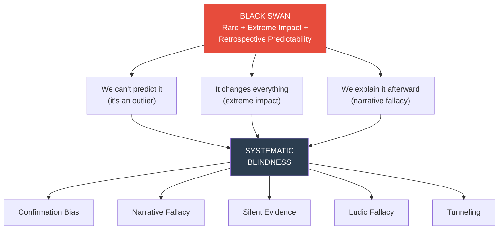
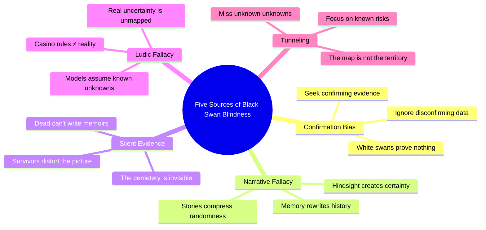
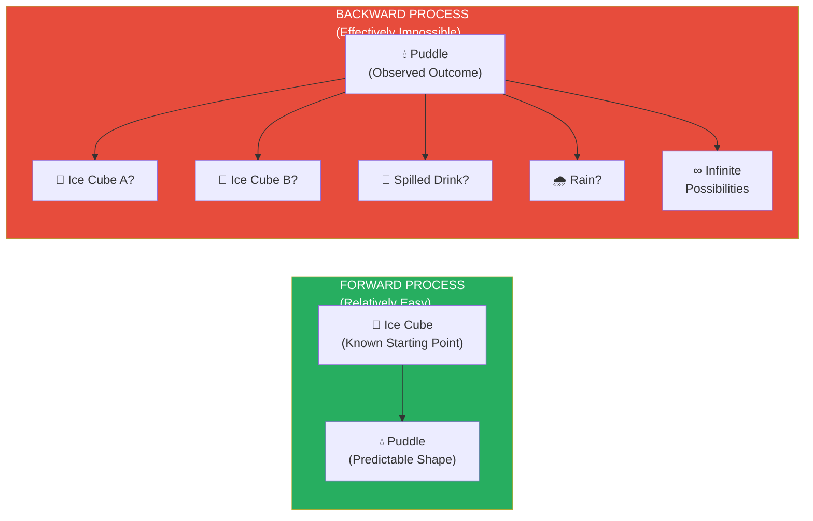
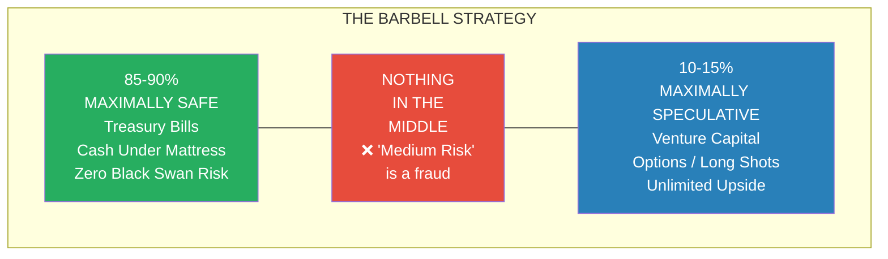
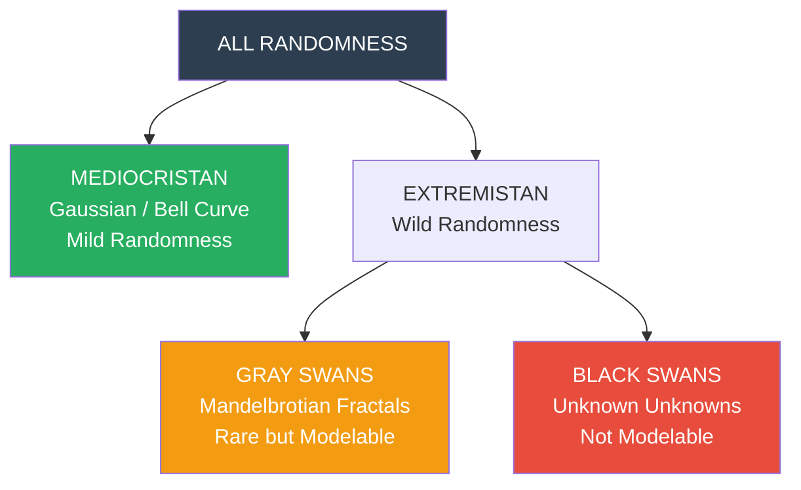

# The Black Swan — Nassim Nicholas Taleb

> The core argument of The Black Swan is deceptively simple and profoundly unsettling: the events that matter most in history, markets, science, and personal life are precisely the ones we cannot predict. Taleb calls these events Black Swans — rare, high-impact, and retrospectively "explainable" — and argues that our entire intellectual apparatus, from statistics to economics to journalism, is built to make us blind to them.
> We live not in the tame province of Mediocristan, where averages rule and extremes cancel out, but in wild Extremistan, where a single observation can dominate everything. The bell curve is a fraud. Experts cannot forecast. History does not crawl — it jumps. And the tools we use to measure risk actually make us more vulnerable to catastrophe.
> This is not a gentle book. Taleb writes with the combative confidence of a man who has made his fortune betting against the crowd, and the philosophical depth of someone who has traced the problem of uncertainty from Sextus Empiricus through Hume, Popper, and Mandelbrot. The result is one of the most important — and most infuriating — books of the twenty-first century.

---

## About the Author

- Nassim Nicholas Taleb was born in 1960 in Amioun, a village in northern Lebanon, to a prominent Greek Orthodox family
- He grew up during the Lebanese Civil War — an experience that gave him a lifelong distrust of stability narratives and an intimate understanding of how quickly orderly systems collapse into chaos
- He holds an MBA from the Wharton School and a PhD from the University of Paris-Dauphine
- He spent two decades as a derivatives trader and hedge fund manager, specializing in tail-risk hedging — profiting from rare, extreme events
- He made significant returns during the 1987 crash, the 2000 dot-com bust, and the 2008 financial crisis
- He is Distinguished Professor of Risk Engineering at NYU Tandon School of Engineering
- The Black Swan is the second book in his five-volume philosophical essay, the *Incerto*: *Fooled by Randomness* (2001), *The Black Swan* (2007), *The Bed of Procrustes* (2010), *[[Antifragile - Nassim Nicholas Taleb|Antifragile]]* (2012), and *Skin in the Game* (2018)
- His career trading options on extreme events gave him the empirical foundation for his philosophical work — he is a practitioner who became a philosopher, not the reverse
- He describes himself as an "empirical skeptic" — someone skeptical in matters that have implications for daily life, not in the philosophical cabinet

---

## The Big Idea

- <b style="color: #e74c3c">We are blind to the most consequential events in the world</b> — the ones Taleb calls Black Swans
- A Black Swan has three properties:
  - It is an **outlier** — nothing in the past can convincingly point to its possibility
  - It carries **extreme impact** — it reshapes history, markets, careers, or lives
  - After the fact, human nature makes us concoct **retrospective explanations** that make it seem predictable
- <b style="color: #2980b9">A small number of Black Swans explain almost everything</b> — the rise of religions, the dynamics of wars, the success of ideas, the crashes of markets, even the turning points of our personal lives
- We have built our entire intellectual apparatus — statistics, economics, forecasting, historical narrative — for a world of mild, predictable randomness
- But <b style="color: #e74c3c">we actually live in a world of wild, unpredictable randomness</b>, and our tools not only fail to measure it but actively increase our vulnerability to it
- The book identifies five sources of blindness:
  - **Confirmation bias** — we look for evidence that confirms what we already believe
  - **The narrative fallacy** — we impose causal stories on random sequences
  - **Silent evidence** — we only see survivors, never the full cemetery of failures
  - **The ludic fallacy** — we confuse clean, rule-bound games with messy, rule-free reality
  - **Tunneling** — we focus on a narrow list of known uncertainties and miss the unknown ones
- <b style="color: #27ae60">The solution is not to predict better but to build systems that benefit from — or at least survive — whatever the future throws at them</b>
- This means: the barbell strategy (extreme caution + extreme speculation), maximizing exposure to positive Black Swans, and cultivating epistemic humility

| | Mediocristan | Extremistan |
|--|-------------|-------------|
| **Randomness** | Mild, type 1 | Wild, type 2 |
| **Distribution** | Gaussian bell curve | Scalable / power laws |
| **Typical member** | Close to average | Giant or dwarf — no "typical" |
| **Single observation** | Cannot change the aggregate | Can dominate everything |
| **Example** | Height, weight, calorie intake | Wealth, book sales, war deaths, city size |
| **History** | Crawls | Jumps |
| **Black Swan vulnerability** | Low | Extreme |
| **Prediction** | Relatively feasible | Fundamentally limited |

---

## Key Concepts at a Glance

| Concept | Definition | Why It Matters |
|---------|-----------|----------------|
| **Black Swan** | Outlier + extreme impact + retrospective predictability | The events that shape our world are precisely the ones we cannot foresee |
| **Mediocristan** | Province of mild randomness where no single event matters | Safe zone: height, weight, dentist income, calorie consumption |
| **Extremistan** | Province of wild randomness where one event can dominate | Danger zone: wealth, book sales, war casualties, markets |
| **Turkey Problem** | Induction from positive experience right up to catastrophe | Every day of feeding increases the turkey's confidence — until Thanksgiving |
| **Confirmation Bias** | Looking only for evidence that supports your theory | We can always find confirmation; disconfirmation is what matters |
| **Narrative Fallacy** | Imposing causal stories on random sequences of events | Reduces complexity, increases the illusion of understanding |
| **Silent Evidence** | The invisible cemetery of failures, dead people, lost manuscripts | History only shows us survivors, distorting our sense of what works |
| **Ludic Fallacy** | Confusing casino-style probability with real-world uncertainty | In real life, you don't know the rules of the game |
| **Epistemic Arrogance** | The gap between what we know and what we think we know | We are systematically overconfident about our predictions |
| **Barbell Strategy** | 85-90% maximally safe + 10-15% maximally speculative | Eliminates catastrophic downside while preserving unlimited upside |
| **Fourth Quadrant** | Zone where payoffs are extreme and distributions unknown | Where all standard statistical tools are not just useless but dangerous |
| **Gray Swan** | Rare event that is modelable via fractal/power-law mathematics | Mandelbrot domesticates some Black Swans — but not all |
| **Epistemocrat** | Person who holds their own knowledge in greatest suspicion | Montaigne as the model: intellectual humility as a way of life |
| **Platonicity** | Mistaking the clean, abstract model for the messy, real world | The source of the ludic fallacy and much of modern economics |

---

## Part One — Our Blindness to Black Swans

*Taleb opens with autobiography, then methodically dismantles the cognitive machinery that keeps us blind to the most important events in the world.*

### The Triplet of Opacity

- Taleb grew up in Lebanon during a civil war that nobody predicted, that nobody understood while it was happening, and that everybody claimed to understand afterward
- This experience taught him three things about history — what he calls <b style="color: #2980b9">the triplet of opacity</b>:
  - The **illusion of understanding** — everyone thinks they know what is going on in a world that is more complicated than they realize
  - **Retrospective distortion** — we can only assess matters after the fact, as if looking in a rearview mirror (history seems clearer in hindsight)
  - The **overvaluation of factual information** — we privilege "hard" information over what we don't know
- His key observation from Lebanon: <b style="color: #e74c3c">the war was a Black Swan — nobody predicted it, it had massive impact, and afterward every taxi driver in Beirut could explain exactly why it had to happen</b>

> [!example] The Apprenticeship of an Empirical Skeptic
> - Taleb was a teenager in Beirut when the civil war broke out in 1975
> - Lebanon had been praised as a model of cosmopolitan coexistence — Christians, Muslims, and Druze living in apparent harmony
> - The war came as a total surprise to all inhabitants, including Taleb's well-connected family
> - His grandfather, a former deputy prime minister, had enemies who dynamited the family homes — destruction that took hours but required years to rebuild
> - This asymmetry between destruction and construction became a lifelong theme
> - After the war, Taleb noticed that everyone — diplomats, journalists, his own relatives — spoke as if the war had been perfectly predictable all along
> - "The human mind suffers from three ailments as it comes into contact with history — the triplet of opacity"

### Mediocristan vs. Extremistan

- This is the book's most important conceptual distinction — <b style="color: #2980b9">two fundamentally different provinces of randomness</b>
- **Mediocristan** — the province of the physical and the bounded:
  - No single observation can meaningfully affect the aggregate
  - If you add the heaviest person on earth to a sample of 1,000 people, the average weight barely changes
  - Governed by the Gaussian bell curve
  - Examples: height, weight, calorie consumption, IQ scores, car accidents
  - History crawls; prediction is relatively feasible
- **Extremistan** — the province of the informational and the unbounded:
  - A single observation can dominate or even define the aggregate
  - If you add Bill Gates to a sample of 1,000 people, he alone may represent 99.9% of total wealth
  - Governed by power laws and scalable distributions
  - Examples: wealth, book sales, city population, war casualties, stock returns, web traffic
  - History jumps; prediction is fundamentally limited
- <b style="color: #e74c3c">The central error of modern thinking is applying Mediocristan tools to Extremistan problems</b>

The bar chart makes the Mediocristan/Extremistan divide visceral: in green domains, the largest single observation barely registers (adding the tallest person to 1,000 people changes nothing), while in red domains, a single observation can dominate 90-99% of the entire dataset.
- The confusion is not innocent — it leads to systematic underestimation of risk, overconfidence in models, and catastrophic policy failures

> [!tip] The Scalability Test
> - Ask yourself: Is this quantity *scalable*? Can someone be a thousand times richer, but not a thousand times taller?
> - If yes → Extremistan. If no → Mediocristan.
> - Scalable professions (author, musician, trader) belong to Extremistan — winner-take-all dynamics apply
> - Non-scalable professions (dentist, baker, prostitute) belong to Mediocristan — income is roughly proportional to effort
> - The modern world has been steadily migrating from Mediocristan to Extremistan through technology, globalization, and network effects

### The Turkey Problem

*The most famous parable in the book — and possibly the most powerful illustration of the problem of induction ever written.*

- <b style="color: #2980b9">Imagine a turkey that is fed every day</b>
- Every single feeding firms up the bird's belief that it is the general rule of life to be fed by friendly members of the human race
- On the afternoon of the Wednesday before Thanksgiving, something unexpected happens
- The turkey's confidence was at its **maximum** when the risk was at its **highest**

The line chart captures the turkey problem perfectly: green confidence rises steadily as more feeding data accumulates, while red risk was always high and invisible — the catastrophic divergence on Day 1000 (Thanksgiving) shows that maximum confidence coincides precisely with maximum danger.
- <b style="color: #e74c3c">The turkey problem generalizes to any situation where the same hand that feeds you can be the one that wrings your neck</b>

> [!example] Captain Smith and the Bankers
> - Captain E.J. Smith of the RMS Titanic declared in 1907: "In all my experience, I have never been in any accident of any sort worth speaking about"
> - His ship sank in 1912 in the most famous shipwreck in history
> - The pattern repeats in banking: large American banks lost close to all their past earnings in the summer of 1982 when South American countries defaulted simultaneously
> - The pattern repeated in the early 1990s (real estate collapse), in 1998 (LTCM), and in 2008 (subprime mortgage crisis)
> - Each time, the bankers appeared "conservative" right up to the moment of catastrophe
> - Taleb: "They are not conservative; just phenomenally skilled at self-deception by burying the possibility of a large, devastating loss under the rug"

- The turkey problem is ancient — Sextus Empiricus formulated it in the second century, Algazel in the eleventh century, Hume in the eighteenth
- But <b style="color: #27ae60">awareness of the problem does not solve it</b> — the empirical medicine movement identified the issue two millennia ago, yet medicine only became truly evidence-based in the last century
- A Black Swan is relative to knowledge — what is a Black Swan for the turkey is not a Black Swan for the butcher
- You can eliminate some Black Swans by science, or by keeping an open mind — but you can also *create* them by giving people false confidence

### Confirmation Bias and Negative Empiricism

*We are wired to seek evidence that confirms what we already believe — and this wiring is lethal in Extremistan.*

- <b style="color: #2980b9">Seeing white swans does not confirm the nonexistence of black swans</b>
- But seeing one black swan **does** confirm that not all swans are white
- This asymmetry is the foundation of Popper's falsification and of what Taleb calls <b style="color: #27ae60">negative empiricism</b> — we get closer to the truth by disconfirmation, not by verification
- The **round-trip fallacy**: confusing "no evidence of Black Swans" with "evidence of no Black Swans"
  - A doctor says "no evidence of disease" — fine
  - But people hear "evidence of no disease" — which is an entirely different and much stronger claim
  - The two statements are logically worlds apart, yet our brains swap them effortlessly

> [!example] Wason's 2-4-6 Experiment
> - Subjects are given the sequence 2, 4, 6 and must guess the underlying rule by proposing new sequences
> - The correct rule is simply "numbers in ascending order"
> - Almost nobody discovers it because they keep proposing sequences that *confirm* their hypothesis (e.g., "even numbers") instead of trying to *falsify* it
> - To find the rule, you must try a sequence like 1, 3, 5 — but people instinctively avoid disconfirming evidence
> - Exception: chess grandmasters do focus on where a move might be weak; rookies look for confirmation

- <b style="color: #e74c3c">Domain specificity</b> makes this worse — we can solve a logic problem in the classroom but commit the same error in daily life
  - Statisticians leave their training at the classroom door
  - Doctors confuse "no evidence of cancer" with "evidence of no cancer"
  - Mothers' milk was dismissed because doctors saw no immediate evidence of its benefits — a confusion that harmed a generation

### The Narrative Fallacy

*We are biologically compelled to impose causal stories on sequences of facts — and this compulsion is the enemy of clear thinking about uncertainty.*

- <b style="color: #2980b9">The narrative fallacy is our limited ability to look at sequences of facts without weaving an explanation into them</b>
- It is not a psychological quirk but an informational necessity — our brains must compress data to function, and narratives are the compression algorithm
- The mathematician Kolmogorov showed that the degree of randomness in a sequence is defined by how much you can compress it — <b style="color: #e74c3c">the more you can summarize, the more order you impose, the less randomness you see</b>
- "The king died and the queen died" is just two facts — but "The king died, and then the queen died of grief" is a *narrative* that is actually easier to remember despite containing more information
- We don't just tell stories after the fact — <b style="color: #e74c3c">our brains literally cannot perceive raw data without imposing interpretation</b>
  - Split-brain experiments show the left hemisphere automatically generating explanations for actions it didn't initiate
  - The left brain is an "interpreter module" that works outside our awareness
  - Dopamine increases pattern detection — L-dopa patients become compulsive gamblers because they see patterns in randomness

> [!example] The Bloomberg Saddam Headline Flip
> - On December 14, 2003, when Saddam Hussein was captured, Bloomberg News flashed at 13:01: "U.S. TREASURIES RISE; HUSSEIN CAPTURE MAY NOT CURB TERRORISM"
> - Half an hour later, when Treasury bonds fell: "U.S. TREASURIES FALL; HUSSEIN CAPTURE BOOSTS ALLURE OF RISKY ASSETS"
> - The same cause explained an event and its exact opposite
> - This is not a failure of journalism — it is a feature of the human narrative instinct
> - We are so uncomfortable with unexplained events that we will force any available cause into the gap

- The narrative fallacy distorts our memory of the past — we remember facts that fit the story and forget those that don't
- Memory is not a recording device but <b style="color: #2980b9">a self-serving dynamic revision machine</b> — you remember the last time you remembered, and change the story at each retelling
- The practical consequence: we dramatically overestimate how predictable past events were, which makes us overconfident about predicting the future

The mindmap organizes the five sources of blindness Taleb identifies as a reinforcing system: each bias feeds the others, creating an increasingly confident but increasingly fragile understanding of the world.
- Taleb's defense against the narrative fallacy: favor experimentation over storytelling, experience over history, and clinical knowledge over theories

> [!example] The Italian Scholar's Trap
> - At a conference in Rome, a prominent Italian professor congratulates Taleb for demonstrating the dangers of over-interpreting causation
> - Then he immediately explains *why* Taleb sees the world this way: "Because of your Eastern Orthodox Mediterranean heritage"
> - He used the very causal logic he had just denounced
> - Neither man noticed the contradiction at first — the narrative fallacy operates outside our awareness

### Silent Evidence — The Cemetery of Failures

*History hides Black Swans from us by only showing survivors. The dead can't write memoirs.*

- <b style="color: #2980b9">The problem of silent evidence is simple but devastating</b>: we systematically misjudge reality because we only see the visible portion of outcomes
- Cicero told the story over two thousand years ago: Diagoras was shown paintings of worshippers who prayed and survived a shipwreck; he asked, "Where are the pictures of those who prayed, then drowned?"
- The drowned worshippers, being dead, cannot advertise their experiences from the bottom of the sea

> [!example] The Rat Health Club
> - Take a large, diverse population of rats and subject them to increasing radiation
> - At each level, the naturally stronger rats survive; the weaker ones die
> - The surviving group looks impressively healthy — far stronger than the average rat
> - An observer would conclude that radiation makes rats stronger
> - But every single surviving rat is *weaker* than it was before the radiation
> - The selection effect masks the true damage
> - This is exactly how we evaluate Gulag survivors, successful entrepreneurs, or stock-picking geniuses

- <b style="color: #e74c3c">Silent evidence distorts every domain</b>:
  - **Success stories** — we study millionaires and find they share courage, risk-taking, and optimism; but the cemetery of failed people has the same traits, plus one difference: luck
  - **Literature** — the Phoenicians allegedly had no literary tradition, but their papyrus simply didn't survive; Balzac's "nightingales" — books that sit unsold on shelves forever
  - **Evolution** — 99.5% of all species that ever lived are now extinct; our perception of biodiversity is based only on survivors
  - **Crime** — newspapers report criminals who get caught; the smarter ones never make the sample
  - **Beginner's luck** — newcomers who lose quit immediately and disappear from the pool; only the lucky beginners continue, creating the illusion that beginners are lucky
  - **The swimmer's body** — people with the genetic build for swimming gravitate to pools; we then attribute their physique to swimming

- Bastiat's "what is seen and what is not seen" generalizes the point: governments get credit for visible actions but not blame for invisible opportunity costs
- <b style="color: #27ae60">To correct for silent evidence, you must always ask: what is missing from this picture? Who is not in the room? What stories are not being told?</b>

The treemap makes Taleb's point about survivorship bias visceral: the tiny green sliver of visible success stories (entrepreneurs, authors, traders) sits atop a vast red cemetery of invisible failures — and we systematically build our understanding of the world from only the green portion.

### The Ludic Fallacy — Gambling with the Wrong Dice

*The nerd's fatal mistake is treating real-world uncertainty as if it were a casino game with known rules.*

- Taleb introduces two characters: <b style="color: #2980b9">Fat Tony</b> (a street-smart Brooklyn trader) and <b style="color: #e74c3c">Dr. John</b> (a risk-obsessed academic)
- They are asked: "A coin has been tossed 99 times and has come up heads every time. What is the probability of heads on the hundredth toss?"
- Dr. John says 50% — it is a fair coin, and each toss is independent
- Fat Tony says less than 1% — "the coin is loaded, you idiot"
- Dr. John applies the rules of a known game; Fat Tony questions whether he's in that game at all
- <b style="color: #e74c3c">The ludic fallacy (from *ludus*, Latin for game) is the belief that the structured randomness of games resembles the unstructured randomness of real life</b>
- In a casino, you know the rules, the odds, and the range of possible outcomes
- In real life, you don't know the rules, the odds are unknown, and the range of outcomes is unbounded
- The casino is Mediocristan; real life is Extremistan
- The ludic fallacy is a special case of "Platonicity" — the human tendency to mistake neat, abstract models for messy reality
  - Galileo claimed nature was written in triangles and circles — but look outside: where are the triangles?
  - Nature is jagged, fractal, rough — not smooth and Platonic

> [!tip] Fat Tony's Razor
> When an expert presents a model of risk based on past data and precise probability distributions, ask Fat Tony's question: "Are the rules of this game known?" If not, the model is worse than useless — it creates false confidence. The most dangerous risk is the risk that is invisible to the model.

---

## Part Two — We Just Can't Predict

*Having dismantled our cognitive machinery, Taleb now presents the empirical and philosophical case that prediction in Extremistan is fundamentally impossible — not just difficult, but logically incoherent.*

### The Scandal of Prediction

- <b style="color: #2980b9">Experts systematically fail at prediction in complex domains</b> — not because they are stupid, but because the domains are unpredictable
- Taleb ran calibration tests: when people gave a number they were 98% confident was correct, they were right only about 45% of the time
- The gap between what we know and what we think we know is <b style="color: #e74c3c">epistemic arrogance</b>
- The Makridakis forecasting competition showed that sophisticated statistical methods do not outperform simple ones — and that "expert" forecasts are barely better than chance in complex systems
- <b style="color: #e74c3c">Information can actually be bad for knowledge</b> — the more data we consume, the more confident we become, without becoming more accurate
  - Adding information increases the number of hypotheses we form but not our ability to rank them
  - Journalists with more information produce more confident but not more accurate predictions

> [!example] The Expert Problem
> - Clinical psychologists' predictions are barely better than those of non-experts using simple rules
> - Political analysts perform about as well as dart-throwing monkeys (Philip Tetlock's study of 27,000 predictions)
> - Stockbrokers cannot consistently beat the market, yet they sell their "expertise" for millions
> - Risk managers at banks use models that systematically exclude the very events that cause banks to fail
> - The word "expert" should be treated with suspicion in any domain that belongs to Extremistan

### Serendipity and the Limits of Knowledge

- <b style="color: #2980b9">Almost everything consequential in the world was discovered by accident</b>
- Penicillin, the cosmic background radiation, the laser, Viagra, the Internet's social applications — none were the intended result of the projects that produced them

> [!example] Looking for Bird Poop, Finding the Big Bang
> - In 1965, two radio astronomers at Bell Labs heard persistent static in their large antenna
> - They cleaned bird excrement from the dish, convinced that was the source
> - The noise turned out to be cosmic background microwave radiation — the afterglow of the birth of the universe
> - They were looking for bird poop and found the origin of everything
> - Bell Labs' president later praised them for their "creativity and technical excellence" — they were trying to eliminate static

- Poincare's three-body problem shows that even in simple physical systems, prediction degrades explosively
  - Two planets in orbit: predictable indefinitely
  - Add a tiny third body: the system becomes chaotic — small differences in initial conditions explode into wildly different futures
  - To predict the ninth impact of a billiard ball, you must account for the gravitational pull of a person standing next to the table
  - To predict the fifty-sixth impact, you need every single particle in the universe
- Popper's deepest insight: <b style="color: #e74c3c">to predict the future, you must predict future knowledge; but if you already know what you'll discover, you've already discovered it</b>
  - If a Stone Age planner must predict the future, he must predict the invention of the wheel
  - But if he can predict the wheel, he already knows how to build one
  - Therefore the future is inherently unpredictable
- Hayek extended this to economics: <b style="color: #27ae60">no central planner can aggregate the distributed, tacit knowledge of millions of individuals</b> — society as a whole "thinks" better than any individual or institution

### Epistemocracy — Montaigne's Dream

- An <b style="color: #2980b9">epistemocrat</b> is someone who holds his own knowledge in greatest suspicion
- Montaigne is Taleb's model: the French essayist who retired to his tower, inscribed it with maxims about the vulnerability of human knowledge, and spent the rest of his life interrogating his own ignorance
- Taleb's utopia is an "epistemocracy" — a society governed from the awareness of ignorance, not from the pretense of knowledge
- **Future blindness** — we cannot mentally simulate the future because we cannot account for what we don't yet know
  - This is like autism: autistic people cannot model other minds; we cannot model the future's unknowns
  - We laugh at past generations for believing they had reached "definitive knowledge" — but we make the same mistake
- The **melting ice cube** thought experiment:
  - *Forward process*: given an ice cube, predict the shape of the puddle → relatively easy
  - *Backward process*: given a puddle, reconstruct the shape of the ice cube → effectively impossible (infinite solutions)
  - History is the puddle; we are always doing the backward process, but pretending we're doing the forward one

### What To Do When You Cannot Predict

- <b style="color: #27ae60">The barbell strategy</b> — Taleb's most practical advice:
  - Put 85-90% of your assets in maximally safe instruments (Treasury bills)
  - Put 10-15% in maximally speculative bets (venture capital, options, wild long shots)
  - **Never** put anything in "medium risk" — because you don't actually know what medium risk means
  - This way, no Black Swan can hurt you beyond a known floor, but you have unlimited upside
- Distinguish <b style="color: #2980b9">positive-contingency businesses</b> (where surprise is good) from <b style="color: #e74c3c">negative-contingency businesses</b> (where surprise is bad):
  - Positive: publishing, biotech, venture capital, scientific research, film — you lose small, potentially win big
  - Negative: banking, insurance, lending — you win small, potentially lose everything
- Maximize **serendipity** — expose yourself to as many positive accidents as possible
  - Go to parties, collect opportunities, say yes to unexpected invitations
  - Pasteur: "Luck favors the prepared" — but preparation means exposure, not prediction
- Do not look for the precise and the local — "do not try to predict precise Black Swans"
- <b style="color: #27ae60">Invest in preparedness, not in prediction</b>

---

## Part Three — The Bell Curve Fraud and Mandelbrot's Alternative

*The mathematical heart of the book: why the Gaussian distribution is the Great Intellectual Fraud, and why fractal/power-law mathematics offers a better — though still imperfect — model of reality.*

### The Great Intellectual Fraud

- <b style="color: #e74c3c">The bell curve (Gaussian distribution) is the most dangerous idea in the history of statistics</b> — not because it is wrong in its domain, but because it has been applied far outside it
- In Mediocristan, the bell curve works beautifully: heights, weights, measurement errors in physics experiments
- In Extremistan — wealth, markets, book sales, war casualties, city sizes — it is catastrophically wrong
- How the Gaussian is constructed: imagine flipping a coin many times and plotting the results — you get the classic bell shape
  - This works because each flip is independent and bounded
  - But in real life, outcomes are neither independent (the rich get richer) nor bounded (there's no cap on wealth)
- <b style="color: #e74c3c">The bell curve systematically underestimates extreme events</b>:
  - According to the Gaussian, events beyond 4 standard deviations are practically impossible
  - Yet the 1987 crash was a 20+ sigma event — which the bell curve says should happen once every several billion lifetimes of the universe
  - The ten most extreme days in fifty years of stock market history account for *half* of all returns

> [!example] The LTCM Collapse
> - Long-Term Capital Management was founded by two Nobel laureates (Scholes and Merton) who used Gaussian mathematics to "compute" risk
> - Their models told them large losses were virtually impossible
> - In the summer of 1998, they lost everything in a single Black Swan — the Russian financial crisis
> - The same models that excluded catastrophe allowed them to take catastrophic leverage
> - The fund nearly brought down the global financial system
> - None of the Nobel laureates faced professional consequences; MBAs continued learning the same methods

### Mandelbrot and Fractal Randomness

- <b style="color: #2980b9">Benoit Mandelbrot is the intellectual hero of the book</b> — the mathematician who showed that nature's geometry is not Euclidean but fractal
- **Fractals** are shapes that repeat at different scales: the veins in a leaf look like branches; branches look like trees; coastlines look the same from an airplane and from a magnifying glass
- Mandelbrot applied this insight to randomness: <b style="color: #2980b9">the distribution of wealth, book sales, city sizes, and market returns follows fractal/power-law patterns, not bell curves</b>
- Power laws have a key property: the ratio between events is *scale-invariant*
  - If there are 96 books selling 250,000+ copies, about 34 sell 500,000+, and about 12 sell 1,000,000+
  - The rich are similar to the super-rich, only richer — the inequality pattern repeats at every level
- The **exponent** of the power law determines how wild the inequality is:
  - Low exponent (near 1) → extreme concentration; the top 1% owns nearly everything
  - Higher exponent (near 3) → more moderate inequality
  - But we cannot measure exponents precisely — small differences lead to wildly different predictions

| Exponent | Share of Top 1% | Share of Top 20% |
|----------|----------------|-----------------|
| 1.1 | 66% | 86% |
| 1.5 | 22% | 58% |
| 2.0 | 10% | 45% |
| 3.0 | 4.6% | 34% |

- <b style="color: #27ae60">Fractals don't solve the Black Swan problem, but they make it gray</b>
  - A gray swan is a rare event that is *modelable* — you know it can happen, even if you can't say when
  - The 1987 crash is not an outlier if you use fractal mathematics
  - But truly unknown unknowns remain Black
- Mandelbrot's key distinction: *hasard* (tractable randomness, like dice) vs. *fortuit* (the purely accidental and unforeseen — the true Black Swan)

---

## Part Four — The Fourth Quadrant and What To Do About It

*The postscript essay, added after the 2008 financial crisis, contains some of the book's most practical and important material — and explicitly seeds the ideas that become [[Antifragile - Nassim Nicholas Taleb|Antifragile]].*

### The Fourth Quadrant

- Taleb maps the world into four quadrants based on two dimensions:
  - **Simple vs. complex payoffs** — binary (yes/no) vs. variable (how much)
  - **Mediocristan vs. Extremistan distributions**
- The <b style="color: #e74c3c">Fourth Quadrant</b> — complex payoffs in Extremistan — is where all standard tools fail:
  - You don't know the distribution
  - You don't know the extremes
  - You can't compute risk
  - Every model is a potential bomb
- <b style="color: #27ae60">The solution is not better models but different behavior</b>:

| Quadrant | Payoff | Distribution | Tools Work? |
|----------|--------|-------------|------------|
| **First** | Simple (binary) | Mediocristan | Yes |
| **Second** | Complex (variable) | Mediocristan | Yes |
| **Third** | Simple (binary) | Extremistan | Mostly yes |
| **Fourth** | Complex (variable) | Extremistan | **NO — danger zone** |

### Practical Rules for the Fourth Quadrant

- <b style="color: #27ae60">Seven rules for surviving where you cannot predict</b>:
  - **Avoid optimization** — love redundancy; savings under the mattress; diversify skills (a Wall Street analyst who moonlights as a belly dancer is more robust)
  - **Avoid predicting small-probability payoffs** — they are inherently unknowable
  - **Beware the "atypicality" of remote events** — stress tests based on the past miss the next crisis because crises are always different
  - **Beware moral hazard with bonus payments** — bankers bet on hidden risks, collect bonuses, then blow up on society's tab
  - **Avoid standard risk metrics** — standard deviation, Sharpe ratio, R-square, Value-at-Risk are meaningless in the Fourth Quadrant
  - **Distinguish positive from negative Black Swans** — biotech faces positive uncertainty (potential blockbusters); banks face negative uncertainty (potential blowups)
  - **Do not confuse absence of volatility with absence of risk** — the calmest periods often precede the biggest crashes

### Ten Principles for a Black-Swan-Robust Society

- Written after the 2008 financial crisis as a manifesto:

1. **What is fragile should break early, while it's still small** — nothing should ever become too big to fail
2. **No socialization of losses and privatization of gains** — "In France, the socialists took over the banks. In the United States, the banks took over the government"
3. **People who drove a school bus blindfolded should never be given a new bus** — the economics establishment lost its legitimacy in 2008
4. **Don't let someone making an incentive bonus manage a nuclear plant** — capitalism is about rewards *and* punishments
5. **Compensate complexity with simplicity** — complex economies need simple financial products, not more complexity layered on top
6. **Do not give children dynamite sticks, even with a warning label** — ban complex financial products nobody understands
7. **Only Ponzi schemes should depend on confidence** — a robust system doesn't need "confidence restoration"
8. **Do not give an addict more drugs for withdrawal pains** — using leverage to cure over-leverage is denial
9. **Citizens should not depend on financial assets as a store of value** — "investments should be for entertainment"
10. **Make an omelet with the broken eggs** — rebuild the hull, don't patch it

### Amor Fati — How to Become Indestructible

- The book ends with Taleb visiting his ancestral cemetery in Amioun, Lebanon
- He carries Seneca in the original Latin — the Stoic philosopher who taught that <b style="color: #2980b9">to philosophize is to learn how to die</b>
- Seneca's method: make yourself ready to lose everything every day
  - He was one of the wealthiest men of his era, but held nothing he owned as truly his
  - When Nero ordered his suicide, he carried it out "in an exemplary way, unperturbed, as if he had prepared for it every day"
- Stilbo's country was captured, his wife and children killed; asked about his losses, he replied: <b style="color: #2980b9">*Nihil perditi* — "I have lost nothing. My goods are all with me."</b>
- Nietzsche's *amor fati* — "love fate" — comes from Seneca: the ability to shrug off adversity by accepting it in advance
- <b style="color: #27ae60">A Black Swan cannot easily destroy a person who has an idea of his final destination</b>
- Seneca ended his letters with *vale* — "be strong" and "be worthy"

> [!tip] The Stoic Barbell
> Taleb's philosophy is itself a barbell: on one side, extreme intellectual humility about what we can know; on the other, extreme practical preparation for what we cannot. The point is not to predict the future but to be robust to it — and, as he develops in [[Antifragile - Nassim Nicholas Taleb|Antifragile]], to actually benefit from its shocks.

---

## The Verdict

- <b style="color: #2980b9">The Black Swan is one of those rare books that permanently changes how you see the world</b>
- Its central insight — that the most important events are precisely the ones we cannot predict — is both obvious once stated and radically subversive in its implications
- The Mediocristan/Extremistan distinction is one of the most useful frameworks in modern thinking about risk and uncertainty
- The identification of our cognitive biases (confirmation, narrative, silent evidence, ludic fallacy) is richly illustrated and deeply sourced in both philosophical tradition and modern psychology
- <b style="color: #e74c3c">The weakness is repetition</b> — the same core ideas are restated across many chapters, and Taleb's combative, sometimes arrogant tone can alienate readers who would benefit most
- Part Three's mathematical arguments are important but less accessible than the rest
- The practical advice (barbell strategy, maximize serendipity, invest in preparedness not prediction) is genuinely actionable
- The book is best read as the first half of a two-part argument: The Black Swan diagnoses the problem; [[Antifragile - Nassim Nicholas Taleb|Antifragile]] proposes the solution
- <b style="color: #27ae60">If you read only one book about uncertainty, risk, and the limits of human knowledge, this should be it</b>

---

## Related Reading

- [[Antifragile - Nassim Nicholas Taleb]] — The direct sequel; develops the Fragile/Robust/Antifragile triad as the solution to Black Swan vulnerability
- [[Thinking in Bets - Annie Duke]] — Probabilistic decision-making and calibration as antidotes to epistemic arrogance
- [[The Psychology of Money - Morgan Housel]] — Narrative-driven exploration of how tail events drive financial outcomes
- [[Noise - Cass R. Sunstein]] — The variability in human judgment that compounds prediction failure
- [[Seeking Wisdom - Peter Bevelin]] — Mental models compilation overlapping with Taleb's cognitive biases (Bevelin is acknowledged in The Black Swan)
- [[You Are Not So Smart - David McRaney]] — Catalog of the same cognitive biases Taleb discusses: confirmation, narrative, survivorship
- [[How to Measure Anything - Douglas Hubbard]] — Calibration training as a practical antidote to the epistemic arrogance Taleb identifies
- [[Sapiens - Yuval Noah Harari]] — "Imagined orders" and the cognitive revolution align with Taleb's narrative fallacy
- [[The Expectation Effect - David Robson]] — How expectations shape perception, extending Taleb's confirmation bias analysis
- [[The Checklist Manifesto - Atul Gawande]] — Simple heuristics as protection against the complexity that generates Black Swans
- [[Emotional Intelligence - Daniel Goleman]] — System 1 vs. System 2 thinking, the emotional brain's role in risk perception

---

## Deep Dive — The Five Blindnesses

*Taleb identifies five interlocking cognitive failures that keep us systematically blind to Black Swans. Here they are explored in detail with their practical consequences.*

### Blindness #1: Confirmation Bias — Looking for White Swans

*We are wired to seek confirmatory evidence — and in Extremistan, this wiring can be lethal.*

- The confirmation bias was first systematically tested by the psychologist P.C. Wason in 1960
- <b style="color: #2980b9">The deeper problem is not that we seek confirmation but that confirmation is easy to find</b>
  - A diplomat shows you his "accomplishments," not his failures
  - A mathematician points to cases where math helped society, not where it inflicted costs
  - A newspaper finds a "cause" for every market move within minutes
- The confirmation bias operates at the level of individual beliefs, institutional knowledge, and entire scientific disciplines
- **The round-trip fallacy** makes this worse:
  - "Almost all terrorists are Muslims" does NOT mean "Almost all Muslims are terrorists"
  - If 99% of terrorists are Muslim and there are 1 billion Muslims and 10,000 terrorists, then only 0.001% of Muslims are terrorists
  - Yet our brains conflate the two statements effortlessly, overestimating the risk by about 50,000 times
- John Stuart Mill complained: "I never meant to say that Conservatives are generally stupid. I meant to say that stupid people are generally Conservative"
- <b style="color: #e74c3c">The antidote is Popper's falsification: look for evidence that your theory is wrong, not right</b>
  - George Soros, when making a financial bet, keeps looking for instances that would prove his initial theory wrong
  - Chess grandmasters focus on where a move might be weak; rookies look for confirmatory instances
  - This is "true self-confidence: the ability to look at the world without the need to find signs that stroke one's ego"

> [!example] The Red Mini Cooper
> - If you believe that seeing white swans confirms that no black swans exist, then by pure logic, seeing a red Mini Cooper should *also* confirm no black swans exist
> - Why? Because "all swans are white" is equivalent to "all nonwhite objects are not swans"
> - A red Mini Cooper is a nonwhite non-swan — so it "confirms" the theory
> - Taleb's friend Bruno Dupire, during a rainy London walk, pointed at a red Mini and shouted: "Look, Nassim, look! No Black Swan!"
> - The absurdity reveals how worthless confirmation really is

### Blindness #2: The Narrative Fallacy — The Story Machine

*Our brains are compression engines that transform raw data into tidy stories — and the stories feel more real than the data ever did.*

- The informational basis for narrative: the mathematician Kolmogorov defined randomness as incompressibility
  - A truly random sequence cannot be shortened without losing information
  - A patterned sequence can be compressed into a rule
  - <b style="color: #2980b9">Our brains crave compression — which means they crave pattern, even when there is none</b>
- The **biological basis** for narrative:
  - Split-brain patients whose left hemisphere is instructed to perform an action will immediately generate a plausible explanation even though no reason exists
  - If you ask the left brain why it raised a finger, it will say "I was pointing at something interesting on the ceiling"
  - The left brain is an automatic "interpreter module" — it makes sense of everything whether sense exists or not
  - Higher dopamine levels increase pattern detection — L-dopa patients see patterns in pure randomness and become compulsive gamblers
- **Memory as narrative revision**:
  - We don't remember events — we remember the last time we remembered them, and revise the story at each retelling
  - The poet Baudelaire compared memory to a palimpsest — parchment on which old texts are erased and new ones written over them
  - Posterior information reshapes prior memory: we recall facts that fit the updated narrative and lose those that don't
- The **practical damage** of narrative:
  - We dramatically overestimate how predictable past events were (hindsight bias)
  - We dramatically overconfident about predicting the future
  - We see causes where only coincidence exists
  - We create internally consistent but factually wrong explanations

> [!example] Agatha Christie and Probability
> - Give someone a detective novel with five plausible suspects
> - Ask them the probability of each suspect being the murderer
> - Unless they carefully track the numbers, the probabilities will add up to well over 200%
> - The better the writer, the higher the total — because better narratives make each story more compelling
> - The same inflation applies to real-world explanations: when multiple causal stories all "make sense," we overestimate the probability of each

- <b style="color: #27ae60">The defensive use of narrative</b>: writing a diary helps people make adverse events feel more unavoidable, reducing guilt and regret
  - "Hey, it was bound to happen" feels better than "I should have known"
  - This is one of the few cases where the narrative fallacy is beneficial

### Blindness #3: Silent Evidence — The Invisible Graveyard

*History is written by the survivors — and that's the problem.*

- <b style="color: #2980b9">Every visible success story is surrounded by an invisible graveyard of equivalent talent that failed</b>
- The Phoenicians "produced no literature" — but their papyrus simply degraded; they may have written extensively
- The literary canon (the Pléiade collection in France) represents a tiny, survivorship-biased fraction of all writing
- Balzac's novel *Lost Illusions* describes the publishing world with devastating accuracy — manuscripts accepted or rejected without being read, reputations driven by luck rather than talent

- **The millionaire self-help problem**:
  - Study millionaires and find their common traits: courage, optimism, risk-taking, hard work
  - Now study the cemetery of failed people: they have the *same* traits
  - The only reliable differentiator is luck — which is precisely what the methodology cannot detect
  - <b style="color: #e74c3c">This means most business success advice is logically equivalent to telling you to be lucky</b>

- **The Casanova problem** — named for the famous lover who attributed his sexual success to divine favor:
  - If you survive long enough and get lucky enough, you will always find a narrative that explains your success
  - The people who followed the same strategy and failed are not available for interview
  - The "New York is invincible" narrative relies on the fact that New York has not yet experienced its terminal event — not that it can't

- **Bastiat's unseen** — the most dangerous category of silent evidence:
  - Government spending on Hurricane Katrina relief comes from somewhere — possibly cancer research funding
  - The cancer patients who die from the diverted funding are invisible victims of the hurricane
  - "Not only do these cancer patients not vote (they will be dead by the next ballot), but they do not manifest themselves to our emotional system"
  - After 9/11, about 1,000 additional people died in car accidents in the following three months — people who switched from flying to driving out of fear, without realizing that driving is far more dangerous

### Blindness #4: The Ludic Fallacy — Dice Are Not the World

*The most insidious form of Platonicity: believing that the clean, bounded uncertainty of games represents the open-ended, unbounded uncertainty of life.*

- The casino is the perfect model of Mediocristan: the rules are known, the range of outcomes is bounded, the probabilities are computable
- <b style="color: #e74c3c">Real life is not a casino</b> — in real life:
  - You don't know the rules
  - The range of outcomes is unbounded
  - The probabilities are unknown or unknowable
  - The game itself can change without warning
- The ludic fallacy explains why the most sophisticated risk models failed:
  - LTCM's Nobel laureates used casino-style mathematics to compute risks in a non-casino world
  - Their models said the 1998 loss was virtually impossible — which is why they took positions large enough to threaten the global financial system
  - The models didn't fail because they were badly computed; they failed because they assumed the wrong game

- <b style="color: #2980b9">Fat Tony's worldview vs. Dr. John's worldview</b>:

| | Fat Tony | Dr. John |
|--|---------|----------|
| **Approach** | Bottom-up, empirical | Top-down, theoretical |
| **Probability** | "Can't compute it" | "Here's the formula" |
| **Models** | Suspicious of all | Trusts elegant ones |
| **Risk** | Focuses on what can go wrong | Focuses on what the model says |
| **History** | Learns from practice | Learns from textbooks |
| **Attitude** | "The game is rigged" | "The rules are clear" |
| **Motto** | "I don't want to be a sucker" | "The math is rigorous" |

### Blindness #5: Tunneling — Focusing on the Known Unknowns

*We worry about specific scenarios and miss the ones we haven't imagined.*

- <b style="color: #2980b9">Tunneling</b> is the tendency to focus on a narrow list of known uncertainties at the expense of unknown ones
- After the stock market crash of 1987, half of American traders braced for another October crash — ignoring all the other ways they could be hurt
- After 9/11, massive resources went to preventing *another 9/11* — but the next Black Swan was the 2008 financial crisis, which came from a completely different direction
- <b style="color: #e74c3c">The Black Swans we worry about are not the Black Swans that will hit us</b>
  - We overestimate *narrated* Black Swans (specific scenarios we can visualize)
  - We underestimate *abstract* Black Swans (the unknown unknowns)
  - We buy terrorism insurance more readily than general insurance — even though general insurance covers terrorism plus everything else
- The military version: Andy Marshall at the Department of Defense advocates investing in preparedness, not in predicting the next specific threat
- <b style="color: #27ae60">The antidote to tunneling is the barbell strategy — protect against all downside, not just the scenarios you can imagine</b>

---

## Deep Dive — The Scandal of Prediction

*Part Two of the book presents devastating empirical evidence that expert prediction in complex domains is essentially worthless — and explains why we keep listening to experts anyway.*

### Epistemic Arrogance

- Taleb's calibration tests reveal a consistent pattern:
  - Ask people for a 98% confidence interval on a factual question (e.g., population of a country)
  - They should be wrong only 2% of the time
  - They are actually wrong about 45% of the time
  - <b style="color: #e74c3c">Our confidence intervals are off by a factor of roughly 20</b>
- This is not ignorance — it is systematic, consistent, measureable overconfidence
- The error is worse for experts than for laypeople in some domains
  - CFOs' forecasts of S&P 500 returns were no better than random — but the CFOs were extremely confident
  - Clinical psychologists' predictions about patient outcomes were barely better than those generated by simple algorithms
  - Philip Tetlock's study of 27,000 expert political predictions showed they performed roughly at the level of dart-throwing monkeys

- **The anchoring effect** compounds epistemic arrogance:
  - Present someone with a random number before asking them to estimate an unknown quantity
  - Their estimate will be systematically pulled toward the random number
  - This means our "independent" estimates are contaminated by whatever number we happened to encounter first
  - Professional forecasters are not immune

> [!example] The Five-Year Plan That Lasted Five Weeks
> - In the summer of 1998, a European-owned financial institution sent five senior managers around the world to compose a five-year strategic plan
> - They met in Barcelona, Hong Kong, and other glamorous locations
> - Before the plan was complete, the Russian financial crisis hit
> - None of the five managers was still employed at the firm a month later
> - "Yet I am confident that today their replacements are still meeting to work on the next five-year plan. We never learn."

### Why We Listen to Experts Anyway

- Specialization and the division of knowledge give us a natural tendency to defer to experts
- <b style="color: #2980b9">In some domains, expertise works</b> — livestock judges, chess masters, physicists, accountants, grain inspectors
- <b style="color: #e74c3c">In other domains, expertise is an illusion</b> — stock brokers, clinical psychologists, intelligence analysts, long-range economic forecasters, political pundits
- The key variable is whether the domain belongs to Mediocristan or Extremistan
- In Mediocristan, past patterns repeat reliably enough for expertise to develop
- In Extremistan, the next data point can invalidate everything that came before — and "experts" are simply people who are overconfident about patterns that will break

### Information Is Bad for Knowledge

- <b style="color: #e74c3c">More information increases confidence without increasing accuracy</b>
- In experiments, giving people more data about a situation makes them more confident in their predictions but not more accurate
- Newspaper reading may actually *decrease* your knowledge of the world by giving you the illusion of understanding
  - The news reports the sensational, not the relevant
  - It provides narratives for random fluctuations
  - It creates the impression that events have identifiable causes
- Taleb's personal practice: avoid the newspaper, read old books, focus on timeless patterns rather than daily noise
- "The more data we consume, the more confident we become, without becoming more accurate"

---

## Deep Dive — The Bell Curve Wars

*Part Three of the book is an extended intellectual war against the Gaussian distribution and the establishment that depends on it.*

### Why the Bell Curve Dominates

- The bell curve became dominant because it is mathematically convenient, not because it is empirically accurate
- It yields precise numbers — and humans crave precision, even false precision
- It allows entire industries (finance, insurance, risk management) to compute "risk" and produce reassuring reports
- The academy rewards Gaussian-based research because it is tractable and produces publishable papers
- The alternative — acknowledging deep uncertainty — is professionally unrewarding

### Why the Bell Curve Is Wrong in Extremistan

- The Gaussian requires two assumptions:
  1. **Independence** — each event is independent of previous events (but in real life, success breeds success — preferential attachment)
  2. **Bounded steps** — each increment is small and known (but in real life, jumps can be of any size)
- When either assumption fails, the bell curve no longer applies
- In financial markets, <b style="color: #e74c3c">the ten most extreme days in fifty years account for half of all returns</b>
- The 1987 crash was a 20+ sigma event — the bell curve assigns it a probability so small that it should not happen in the lifetime of the universe
- Yet every few years, we see events that the Gaussian calls "virtually impossible"

### The Nobel Prize Scandal

- The Bank of Sweden has given "Nobel Prizes" in economics to scholars whose Gaussian-based theories have demonstrably failed:
  - Harry Markowitz and William Sharpe — Modern Portfolio Theory (built on the Gaussian)
  - Myron Scholes and Robert C. Merton — option pricing models that LTCM used to near-catastrophic effect
- Taleb's reaction to the first awards: "In a world in which these two get the Nobel, anything can happen. Anyone can become president."
- <b style="color: #e74c3c">The Nobel gives institutional legitimacy to what is essentially an intellectual fraud</b>
  - Software vendors sell "Nobel-crowned" risk management tools
  - Pension funds choose investments based on portfolio theory
  - Regulators approve bank risk models derived from the Gaussian
  - When the models fail, everyone has cover: "We used the best available science"
- Paul Cootner's 1960s lament: "If Mandelbrot is right, almost all our statistical tools are obsolete or meaningless"
- Taleb's correction: replace "almost all" with "all" — and note that the blood-and-sweat part is wrong; Mandelbrotian thinking is actually *easier* than Gaussian thinking once you shed the old assumptions

### Mandelbrot's Gray Swans

- Mandelbrot's fractal mathematics can model some extreme events — the "gray swans"
- <b style="color: #2980b9">A gray swan is an event that is rare and consequential but *conceivable* and roughly modelable</b>
- If you know that stock markets *can* crash (as in 1987), the crash is not a Black Swan under fractal mathematics
- If you know that biotech companies *can* produce mega-blockbusters, that outcome is modelable
- But fractal models still cannot:
  - Tell you *when* the extreme event will occur
  - Give precise probabilities (exponents are notoriously hard to estimate)
  - Account for events that lie outside all previous experience (true Black Swans)
- <b style="color: #27ae60">The practical value is enormous</b>: knowing that extreme events are *possible* — and roughly how frequent — is infinitely better than being told they are "virtually impossible" by the bell curve
- But we should never mistake gray for white: some swans remain irreducibly Black

```mermaid
flowchart LR
    subgraph GAUSSIAN["GAUSSIAN WORLD<br>(The Fraud)"]
        G1["Extremes are<br>'impossible'"]
        G2["Risk is<br>computable"]
        G3["Models give<br>precise answers"]
    end
    subgraph FRACTAL["FRACTAL WORLD<br>(Gray Swans)"]
        F1["Extremes are<br>rare but real"]
        F2["Risk is roughly<br>estimable"]
        F3["Models give<br>approximate answers"]
    end
    subgraph REAL["REAL WORLD<br>(Black Swans)"]
        R1["Extremes are<br>unknown unknowns"]
        R2["Risk is<br>not computable"]
        R3["No model<br>captures it"]
    end
    GAUSSIAN -->|"Better than"| FRACTAL
    FRACTAL -->|"Better than"| REAL
    style GAUSSIAN fill:#e74c3c,color:#fff
    style FRACTAL fill:#f39c12,color:#fff
    style REAL fill:#2c3e50,color:#fff
```

---

## The Incerto Connection

*The Black Swan is the second book in Taleb's five-volume philosophical essay. Understanding its place in the larger architecture illuminates its purpose.*

- **Fooled by Randomness** (2001) — the first volume; focuses on how we confuse luck with skill, noise with signal
- **The Black Swan** (2007) — the diagnosis; identifies the types of events that fool us and the cognitive apparatus that keeps us blind
- **The Bed of Procrustes** (2010) — aphorisms; condensed wisdom about our tendency to force the world into neat categories
- **[[Antifragile - Nassim Nicholas Taleb|Antifragile]]** (2012) — the prescription; moves from "what to avoid" to "how to benefit from disorder"
  - The Fragile/Robust/Antifragile triad extends and supersedes the Mediocristan/Extremistan distinction
  - The barbell strategy from The Black Swan becomes the central organizing principle
  - The ten principles for a Black-Swan-robust society become the basis for antifragile system design
  - Seneca and the Stoics, introduced briefly in The Black Swan's epilogue, become central philosophical figures
- **Skin in the Game** (2018) — the ethical dimension; those who make predictions should bear the consequences of being wrong

- <b style="color: #27ae60">The Black Swan identifies the disease; Antifragile proposes the cure</b>
- Reading them together is essential — The Black Swan alone can leave you in a state of productive paranoia; Antifragile shows you how to turn that paranoia into advantage

---

## Taleb's Intellectual Lineage

*One of the book's greatest strengths is its rich philosophical genealogy. Taleb positions himself in a tradition stretching back millennia.*

| Thinker | Era | Contribution to the Black Swan Argument |
|---------|-----|----------------------------------------|
| **Sextus Empiricus** | 2nd century | First formulation of the turkey problem; empirical medicine without theory |
| **Algazel (Al-Ghazali)** | 11th century | Attacked dogmatic philosophy (*Tahafut al falasifah*); skepticism of causation |
| **Michel de Montaigne** | 16th century | The model epistemocrat; intellectual humility as a way of life |
| **Francis Bacon** | 17th century | Identified silent evidence but introduced the confirmation problem |
| **Pierre-Daniel Huet** | 17th century | Bishop who wrote the most complete pre-modern exposition of skepticism |
| **Pierre Bayle** | 17th century | Introduced Hume to ancient skepticism; massive *Dictionnaire* |
| **David Hume** | 18th century | Canonical formulation of the problem of induction |
| **Frédéric Bastiat** | 19th century | "What is seen and what is not seen" — silent evidence in economics |
| **Henri Poincaré** | 19th-20th century | Three-body problem; fundamental limits on prediction; nonlinearity |
| **Karl Popper** | 20th century | Falsification; the open society; fundamental unpredictability of the future |
| **Friedrich Hayek** | 20th century | "The Pretense of Knowledge"; against central planning; tacit knowledge |
| **Benoît Mandelbrot** | 20th century | Fractal geometry; power laws; Gray Swans; the aesthetics of randomness |
| **Daniel Kahneman** | 20th century | Heuristics and biases; System 1 and System 2; prospect theory |
| **Seneca** | 1st century | Stoic preparation for loss; *amor fati*; the robust life |

> [!tip] The Empirical Skeptic's Library
> Taleb distinguishes between erudites (who read widely and question everything) and specialists (who know one thing deeply but cannot see its limits). He models himself on the former tradition — Montaigne, Bayle, Huet — and argues that erudition without specialization is better protection against Black Swans than specialization without erudition. "Scholarship without erudition can lead to disasters."

---

## Personal Application — How to Live in Extremistan

*Extracted from Taleb's scattered practical advice throughout the book, consolidated into actionable principles.*

- **Career design:**
  - Avoid professions where your income is entirely non-scalable (you'll be safe but will never benefit from positive Black Swans)
  - But also avoid professions that are *purely* scalable (the cemetery is enormous; most starving artists stay starving)
  - The ideal: a stable base income + exposure to unlimited upside (a day job + a creative side venture — the barbell)

- **Financial strategy:**
  - Never invest in "medium risk" — you cannot actually know what medium risk means
  - The barbell: ultra-safe assets (Treasury bills, cash, no debt) + a small allocation to maximum optionality (venture capital, far out-of-the-money options, speculative bets)
  - Redundancy is not waste — it is insurance against Black Swans
  - "Savings under the mattress" is the opposite of debt, and debt makes you fragile

- **Decision-making:**
  - Focus on consequences, not probabilities — you cannot estimate probabilities in Extremistan, but you can assess the magnitude of outcomes
  - Maximize exposure to positive Black Swans: go to parties, say yes to opportunities, collect lottery-ticket-like options where downside is small and upside is unbounded
  - Minimize exposure to negative Black Swans: avoid leverage, avoid concentration, avoid single points of failure

- **Knowledge and learning:**
  - Read old books, not newspapers — timeless wisdom outperforms daily noise
  - Seek disconfirming evidence for your most cherished beliefs
  - Maintain intellectual humility — hold your opinions as conjectures, not convictions
  - "Do not read the newspaper or watch the news on television" — it fills your mind with narrative and starves it of understanding

- **Emotional resilience:**
  - Prepare to lose everything every day (Seneca's practice)
  - A Black Swan cannot destroy you if you have already accepted the possibility of your own destruction
  - Find your Bastiani Fortress — a community of like-minded people who understand the long game
  - "It is better to lump all your pain into a brief period rather than have it spread out over a longer one"

---

## Memorable Quotes and Formulations

*The phrases and formulations from The Black Swan that have entered the broader culture — and some that deserve to.*

- "The inability to predict outliers implies the inability to predict the course of history"
- "What you don't know is far more relevant than what you do know"
- "The same hand that feeds you can be the one that wrings your neck"
- "We are just a great deal better at explaining than at understanding"
- "History does not crawl. It jumps."
- "Read books are far less valuable than unread ones" (Umberto Eco's antilibrary)
- "Missing a train is only painful if you run after it"
- "The strategy for the discoverers is to rely less on top-down planning and more on maximum tinkering and recognizing opportunities"
- "Heroes are heroes because they are heroic in behavior, not because they won or lost"
- "The cemetery of closed restaurants is very silent"
- "One death is a tragedy; a million is a statistic" (attributed to Stalin)
- "You need to love to lose" (Mark Spitznagel)
- *Nihil perditi* — "I have lost nothing" (Stilbo, via Seneca)
- *Vale* — "Be strong. Be worthy." (Seneca's closing)

---

## Deep Dive — Serendipity and the Architecture of Discovery

*Chapter 11 is one of the book's richest, arguing that nearly every important invention and discovery was accidental — and that this has radical implications for how we should organize research, business, and life.*

### The Accidental Nature of Progress

- <b style="color: #2980b9">The classical model of discovery — someone sits down with a plan and executes it — is the exception, not the rule</b>
- Almost every consequential invention resulted from serendipity:
  - **Penicillin** — Alexander Fleming found mold contaminating an experiment he was cleaning up
  - **Cosmic background radiation** — Penzias and Wilson at Bell Labs were trying to eliminate static from their antenna; they cleaned bird poop from the dish before realizing they were hearing the echo of the Big Bang
  - **The laser** — a "solution looking for a problem"; its inventor Charles Townes had no application in mind; decades later it underpins CDs, eye surgery, data storage, microsurgery
  - **Viagra** — originally developed as a hypertension drug; the "side effect" became one of the most profitable pharmaceutical products in history
  - **The Internet's social applications** — designed for military communications; became the infrastructure of human connection
- <b style="color: #e74c3c">The people who found these things were not looking for them</b> — and the people who were looking for them often never found anything

> [!example] The Five-Year Plan vs. Reality
> - A European financial institution sent five senior managers to compose a five-year strategic plan
> - They met in Barcelona, Hong Kong, and other cities
> - The firm's most profitable department had been created accidentally — from a chance phone call from a customer asking for a strange financial product
> - Before the plan was finished, the 1998 Russian crisis hit and all five managers were gone within a month
> - The organic, bottom-up, accidental growth of the company was systematically more successful than any top-down plan

### Poincare's Fundamental Limit

- Henri Poincare — the last great mathematical polymath — proved that even simple physical systems become unpredictable
- The **three-body problem**: two planets in orbit are predictable; add a tiny third body, and the system becomes chaotic
- The billiard ball calculation by mathematician Michael Berry:
  - To predict the **first** impact: straightforward
  - To predict the **ninth** impact: you must account for the gravitational pull of a person standing next to the table
  - To predict the **fifty-sixth** impact: you need the position of every elementary particle in the universe
  - <b style="color: #e74c3c">And this is for a simple, rule-bound physical system — not the infinitely more complex world of human affairs</b>
- Lorenz's butterfly effect (rediscovered from Poincare's work): a butterfly flapping its wings in India can cause a hurricane in North Carolina
  - But the reverse is effectively impossible: given a hurricane, you cannot identify which butterfly caused it
  - <b style="color: #2980b9">The forward process is tractable; the backward process is not</b>

### Popper's Devastating Argument

- Karl Popper made the most powerful philosophical argument against prediction:
  - To predict the future of society, you must predict future technological innovation
  - To predict a technology, you must know what it does — but if you know what it does, you've already invented it
  - Therefore, <b style="color: #e74c3c">you cannot predict the future without already living in it</b>
- The **law of iterated expectations**: if you expect that you will know tomorrow that your boyfriend is cheating, then you already know it today and will act today
  - Similarly: if you expect to discover X in the future, you essentially already have the knowledge — so the discovery has already happened
  - The Black Swan, by definition, cannot be predicted because predicting it would make it not a Black Swan

### Hayek and Distributed Knowledge

- Friedrich Hayek argued that no central planner can aggregate the dispersed, tacit knowledge of millions of individuals
- Society as a whole "thinks" better than any institution — not because people are smart, but because the system integrates information that no individual possesses
- <b style="color: #27ae60">This is an argument for decentralization, trial-and-error, and bottom-up experimentation over top-down planning</b>
- Hayek called the planners' mistake "scientism" — the false application of methods from hard science to social science
- Taleb extends this: even hard science faces these limits (weather forecasting, earthquake prediction, epidemiology)

---

## Deep Dive — Living in the Antechamber of Hope

*Chapter 7 is the book's most emotionally resonant, exploring what it means to pursue Black Swan-dependent activities in a world that rewards steady, predictable output.*

### The Brother-in-Law Problem

- <b style="color: #2980b9">Most creative and intellectual pursuits belong to Extremistan</b> — their rewards come in rare, unpredictable lumps
- The scientist, the writer, the artist, and the entrepreneur all face the same challenge: long periods of nothing punctuated by rare moments of extraordinary reward
- Meanwhile, the brother-in-law in sales gets steady commissions, renovates his kitchen, and radiates success at family reunions
- The comparison is psychologically devastating:
  - Your hormonal reward system craves steady, frequent positive signals
  - Making $100,000 every year for ten years feels much better than making $1 million once and nothing for nine years — even though the total is the same
  - <b style="color: #e74c3c">Our hedonic system is adapted for Mediocristan but we live in Extremistan</b>

> [!example] Giovanni Drogo's Fortress
> - From Dino Buzzati's *Il deserto dei tartari* — Taleb's and his character Yevgenia's favorite novel
> - Giovanni Drogo is a young officer assigned to a remote outpost guarding against a Tartar invasion
> - He plans to stay only four months, then return to his glamorous city life
> - But the fortress captivates him — the anticipation of the great battle becomes his sole reason for existing
> - He spends 35 years watching the horizon, waiting for the enemy
> - At the end of the novel, the Tartars finally arrive — but Drogo is dying at a roadside inn, having missed his moment
> - The novel captures the existential trap of Black Swan-dependent lives: you sacrifice everything for an event that may never come, or that comes too late

### The Bleed-or-Blowup Strategy

- <b style="color: #2980b9">Nero Tulip</b> (Taleb's fictional trader alter ego) practices a strategy called "bleed":
  - Lose small amounts steadily, every day — like Chinese water torture
  - But position yourself so that a rare, large event produces extraordinary gains
  - No single event can blow you up; some events can pay for decades of small losses
- The strategy is logically sound but emotionally excruciating:
  - Nero's hippocampus takes physical damage from the chronic stress of daily losses
  - He can only sustain the strategy if he avoids looking at daily performance numbers
  - He focuses on ten-year track records, never shorter
- <b style="color: #e74c3c">The opposite strategy — winning small and steadily until a blowup destroys everything — looks great until it doesn't</b>
  - Banks, "conservative" fund managers, and Captain Smith all follow this strategy
  - They collect pennies in front of steamrollers
  - Their annual bonuses reward the appearance of skill while masking hidden catastrophic risk

> [!example] Nero Tears Up the Evaluation Form
> - Early in his career, Nero was given an employee evaluation form designed to measure "performance"
> - He recognized that the form rewarded short-term profits at the expense of hidden blowup risk — like a bank that makes foolish loans to hit quarterly targets
> - He sat down, listened calmly to his supervisor's evaluation, then slowly tore the form into small pieces
> - "He focused on his undramatic, slow-motion act, elated by both the feeling of standing up for his beliefs and the aesthetics of its execution"
> - The supervisor was too stunned to fire him
> - Nero was left alone after that

### The Hedonic Calculus of Lumpy Rewards

- Making $1 million in one year and nothing in nine feels worse than $100,000 every year — even though the total is the same
- Losing $10 million then gaining $1 million back feels worse than never having the $10 million — even though you end up richer
- <b style="color: #2980b9">Our happiness depends on the frequency of positive events, not their magnitude</b>
- The reverse is also true: it is better to lump all your pain into a brief period than to spread it out
- This means that <b style="color: #e74c3c">the "right" strategy (barbell, bleed) is precisely the one that makes you most miserable on a daily basis</b>
- The solution: find your Bastiani Fortress — a community of like-minded people who understand the long game
  - Taleb notes that throughout history, unusual thinkers have formed schools: Stoics, Skeptics, Cynics, Surrealists, Dadaists
  - "If you engage in a Black Swan-dependent activity, it is better to be part of a group"
  - Being ostracized together is better than being ostracized alone

---

## Deep Dive — Robustness, Fragility, and the Seeds of Antifragile

*The postscript essay, added after the 2008 crisis, is where Taleb begins the transition from diagnosis to prescription — and where the ideas that become [[Antifragile - Nassim Nicholas Taleb|Antifragile]] first appear.*

### Learning from Mother Nature

- <b style="color: #2980b9">Nature is the oldest and wisest risk manager</b> — and she builds with redundancy, not optimization
- Redundancy looks wasteful to the efficiency-minded planner, but it is the foundation of robustness
  - You have two kidneys, two lungs, two eyes — not because nature is inefficient but because she is wise
  - Extra capacity is insurance against the unexpected
- <b style="color: #e74c3c">The modern obsession with optimization and efficiency is the enemy of robustness</b>
  - Lean supply chains, just-in-time manufacturing, and leveraged financial systems are all optimized — and all fragile
  - They eliminate the "waste" that would have saved them in a crisis
  - "Big is ugly — and fragile": large systems are more vulnerable to Black Swans than small ones

### The Fourth Quadrant Map

- Taleb organizes the world into four quadrants:

| | Simple Payoffs | Complex Payoffs |
|--|---------------|----------------|
| **Mediocristan** | 1st Quadrant (safe) | 2nd Quadrant (safe) |
| **Extremistan** | 3rd Quadrant (mostly safe) | **4th Quadrant (DANGER)** |

- <b style="color: #e74c3c">The Fourth Quadrant is where standard statistical tools become weapons of mass financial destruction</b>
- All the great financial blowups — 1987, LTCM, 2008 — occurred in the Fourth Quadrant
- The tools that failed: Value-at-Risk (VaR), standard deviation, correlation, Sharpe ratio, R-square, regression
- <b style="color: #27ae60">The solution is behavioral, not computational</b>: change what you do, not what you compute

### From Robustness to Antifragility

- The postscript contains the seeds of the idea that some systems don't just resist shocks — they *benefit* from them
- Taleb notes that muscles grow from stress, immune systems need pathogens, and markets need failures
- He introduces the distinction between:
  - **Fragile** systems — harmed by volatility (like a porcelain cup)
  - **Robust** systems — indifferent to volatility (like a rock)
  - Something that *gains* from volatility — which he does not yet name but will call **antifragile** in his next book
- The key insight: <b style="color: #27ae60">suppressing volatility does not eliminate risk — it hides it, concentrates it, and makes the eventual blowup catastrophic</b>
  - Small forest fires prevent big ones
  - Small business failures prevent systemic collapse
  - Small stressors build resilience
- This is the bridge to [[Antifragile - Nassim Nicholas Taleb|Antifragile]], which develops these observations into a complete philosophical and practical framework

---

## The Human Dimension — Taleb's Philosophical Heroes

*One of the book's deepest pleasures is its portrait gallery of thinkers who understood uncertainty before it had a name.*

### Sextus Empiricus — The First Black Swan Thinker

- A second-century physician-philosopher who practiced "empirical medicine" — treating patients based on observed results rather than theory
- He formulated the turkey problem 1,500 years before Hume
- His school advocated suspending belief to achieve serenity (*ataraxia*)
- <b style="color: #2980b9">Taleb named his own trading firm "Empirica" after the empirical medical school</b>
- The lesson: awareness of a problem does not mean it gets solved — it took fourteen centuries after Sextus for medicine to become genuinely evidence-based

### Montaigne — The Patron Saint of Uncertainty

- The French essayist who retired to his tower at age thirty-eight and spent the rest of his life questioning what he knew
- His study was inscribed with Greek and Latin maxims about the fragility of knowledge
- He was a doer turned thinker — a former magistrate, businessman, and mayor of Bordeaux
- <b style="color: #2980b9">He accepted human weaknesses rather than fighting them</b> — no philosophy that ignores our imperfections can be effective
- Taleb's model for the "epistemocrat" — someone who governs from awareness of ignorance

### Mandelbrot — The Man Who Made Swans Gray

- Born in Warsaw, moved to France in 1936, survived Nazi occupation through improvisation and luck
- Largely self-taught due to the disruptions of war — which may have freed him from conventional mathematical thinking
- Spent most of his career at IBM, outside the mainstream academy
- His fractal geometry revealed that nature is rough, jagged, and self-similar at every scale — not smooth and Euclidean
- <b style="color: #2980b9">He presented his ideas on financial randomness to economists in 1963</b> — they got excited, then realized they would have to relearn their entire trade, and quietly returned to the Gaussian
- Taleb: "I had to invent my predecessors, so people take me seriously"

### Seneca — The Stoic Barbell

- Roman Stoic philosopher, tutor to Emperor Nero, one of the wealthiest men of his era
- Practiced daily preparation for total loss — not from asceticism but from practical wisdom
- <b style="color: #27ae60">His credibility comes from the fact that he was rich, powerful, and still genuinely prepared to lose everything</b>
- When Nero ordered his suicide, he carried it out with perfect composure — "as if he had prepared for it every day"
- His closing word was *vale* — "be strong, be worthy"
- Taleb carries Seneca in the original Latin on all his travels

---

## The 2008 Vindication

*The Black Swan was published in 2007, one year before the global financial crisis proved its central argument with devastating force.*

- <b style="color: #e74c3c">The 2008 crisis was a textbook Black Swan</b>:
  - Nobody in the mainstream predicted it (outlier)
  - It was the largest financial catastrophe since the Great Depression (extreme impact)
  - Afterward, everyone claimed they had seen it coming (retrospective predictability)
- The crisis was caused by exactly what Taleb warned about:
  - Gaussian risk models that excluded the possibility of extreme losses
  - Banks taking massive hidden risks while appearing "conservative"
  - Regulators relying on the very models that were causing the problem
  - Socialization of losses (bailouts) and privatization of gains (bonuses)
- The people who should have lost their jobs — risk modelers, regulators, Nobel laureates — mostly kept them
- The tools that should have been abandoned — VaR, Modern Portfolio Theory, Gaussian-based risk management — continue to be taught in every business school
- <b style="color: #27ae60">Taleb's personal trading strategy (the barbell, betting on tail events) produced extraordinary returns in 2008</b>
- Yet the vindication was bittersweet: "I would rather have been wrong about the fragility of the system than right — the consequences were too severe for too many people"

---

## Final Reflection — The Stoic's Wager

*At its heart, The Black Swan is not a book about probability. It is a book about how to live with dignity in a world you cannot understand.*

- <b style="color: #2980b9">The deepest message is philosophical, not technical</b>: we must accept that the world is fundamentally opaque to us
- This acceptance is not defeatism — it is the beginning of wisdom
- Knowing that you cannot predict allows you to prepare instead of forecast
- Knowing that you are blind to Black Swans allows you to build barbells instead of false certainties
- Knowing that experts are mostly guessing allows you to think for yourself
- Knowing that narratives are post-hoc fabrications allows you to hold your stories more lightly
- And knowing that everything you have can be taken in an instant — <b style="color: #27ae60">like Seneca, like Stilbo, like Taleb's family in the Lebanese war — allows you to be truly robust</b>
- "A Black Swan cannot so easily destroy a man who has an idea of his final destination"
- *Vale.*

---

## Deep Dive — The Mechanics of Extremistan

*Part Three's mathematical argument is one of the book's most important but least accessible sections. Here is the conceptual core, stripped of jargon.*

### Why Winner-Take-All Happens

- In Mediocristan, rewards are roughly proportional to effort — a dentist who works twice as many hours earns roughly twice as much
- In Extremistan, <b style="color: #2980b9">rewards follow preferential attachment: success breeds more success, and the rich get richer</b>
- This happens because of two mechanisms:
  - **Scalability** — a book can be copied a million times at near-zero marginal cost; a dental appointment cannot
  - **Network effects** — the more people use a language, operating system, or social platform, the more valuable it becomes for each user
- The result: extreme concentration where a tiny minority captures most of the rewards

> [!example] The Matthew Effect in Action
> - Named after the Gospel of Matthew: "For unto every one that hath shall be given"
> - The sociologist Robert K. Merton documented this in academia: a well-known scientist gets disproportionate credit for joint work, which makes them more well-known, which generates more credit
> - The same applies to book sales: a bestseller gets placed at the front of bookstores, which makes it sell more, which makes it a bigger bestseller
> - J.K. Rowling submitting under a pseudonym received rejection letters from the same publishers who had made her rich under her real name
> - In Extremistan, initial advantage compounds until the gap between winners and losers becomes astronomical

### The Long Tail and the Invisible Majority

- For every blockbuster book, there are hundreds of thousands of "nightingales" — books that sit unsold on shelves in permanent silence
- For every tech billionaire, there are millions of failed entrepreneurs
- For every famous scientist, there are legions whose equally good work disappeared because it was never cited by the right person at the right time
- <b style="color: #e74c3c">The New Yorker alone rejects close to a hundred manuscripts per day</b> — the pool of unrecognized genius is vast
- This concentration has accelerated through globalization and technology:
  - Before the gramophone, every town had its own opera singer — Mediocristan
  - After recording technology, one singer could serve the entire world — Extremistan
  - The Internet has intensified this to the point where a single viral video can reach billions while millions of comparable videos get zero views

### The Coin Toss Construction — Where the Bell Curve Comes From

- <b style="color: #2980b9">The Gaussian bell curve emerges from a specific, idealized process</b>: independent steps of known, bounded size
- Imagine a drunk staggering left or right with each step being exactly one foot
  - After many steps, his position follows a bell curve
  - Extreme deviations (being very far from the starting point) become vanishingly unlikely
  - The curve captures this beautifully — most observations cluster near the average
- But this construction requires two assumptions:
  1. **Each step is independent** — winning doesn't make the next win more likely
  2. **Each step is bounded** — you can't jump 100 feet in one step
- <b style="color: #e74c3c">In Extremistan, both assumptions fail</b>:
  - Success breeds success (preferential attachment violates independence)
  - Single events can be of any magnitude (no bound on step size)
  - The construction collapses, and the bell curve no longer applies
- Yet the entire edifice of modern statistics, finance, and social science is built on this construction

### The Power Law Alternative

- Power laws describe distributions where the ratio between events is scale-invariant:
  - If there are 96 books selling 250,000+ copies, about 34 sell 500,000+
  - If the top 20% of people own 80% of wealth, then the top 20% of that 20% own 80% of that 80%
  - The pattern repeats at every scale — this is self-similarity applied to probability
- <b style="color: #2980b9">Power laws are characterized by an exponent</b> that determines the degree of inequality:
  - Low exponents (near 1): extreme concentration — one person can own almost everything
  - Higher exponents (near 3): more moderate inequality — still wildly unequal by Gaussian standards
- The practical problem: <b style="color: #e74c3c">we cannot measure exponents with any precision</b>
  - A difference of 0.2 in the exponent can change the top 1%'s share from 66% to 34%
  - And we don't know where the "crossover point" is — the threshold above which the power law kicks in
  - This means we can know that extreme events are possible without knowing how extreme they will be

> [!example] The Masquerade Problem
> - When you try to measure a power law exponent from data, you systematically overestimate it
> - A higher exponent means less extreme inequality — so your estimate always makes reality look tamer than it is
> - This is the "masquerade problem": the distribution disguises itself as more Gaussian than it really is
> - What you see is likely to be less Black Swannish than what you do not see
> - The practical consequence: always assume reality is wilder than your data suggests

### Scale Invariance in Nature and Society

- Fractal/power-law patterns appear across remarkably diverse phenomena:

| Phenomenon | Approximate Exponent |
|-----------|---------------------|
| Frequency of word usage | 1.2 |
| Website hits | 1.4 |
| Book sales in the U.S. | 1.5 |
| Net worth of Americans | 1.1 |
| Population of U.S. cities | 1.3 |
| Magnitude of earthquakes | 2.8 |
| Intensity of wars | 0.8 |
| Market moves | ~3 (or lower) |
| Company size | 1.5 |
| Terrorist attack casualties | ~2 |

- <b style="color: #27ae60">The universality of power laws is one of the most remarkable findings in modern science</b>
- It suggests that the same fundamental dynamics — preferential attachment, network effects, multiplicative processes — operate across radically different domains
- But Taleb warns: universality does not mean precision — knowing the approximate shape of the distribution does not tell you when the next extreme event will hit

---

## Deep Dive — The Psychology of Risk Perception

*Taleb draws heavily on the work of Kahneman, Tversky, and Slovic to explain why our intuitions about probability are systematically wrong.*

### System 1 vs. System 2

- Cognitive scientists distinguish two modes of thinking:
  - <b style="color: #2980b9">System 1</b> — fast, automatic, emotional, intuitive; operates outside our awareness
  - <b style="color: #2980b9">System 2</b> — slow, effortful, logical, deliberate; what we call "thinking"
- Most of our mistakes come from System 1 acting when System 2 should be engaged
  - The round-trip fallacy (confusing "no evidence of X" with "evidence of no X") is a System 1 error
  - It takes conscious effort (System 2) to correct it — and we rarely bother
- Emotions are System 1's weapon for directing quick action:
  - We react to the presence of danger milliseconds before we consciously perceive it
  - This is life-saving in the African savanna but disastrous in financial markets
  - <b style="color: #e74c3c">The emotional brain reacts to vivid, specific scenarios (terrorism) far more strongly than to abstract, statistical risks (car accidents) — even when the latter are far more dangerous</b>

### The Overestimation/Underestimation Paradox

- We simultaneously overestimate *narrated* Black Swans and underestimate *abstract* ones:
  - If you describe a specific disaster scenario in vivid detail, people overestimate its probability
  - If you simply ask about the probability of "a large-scale disaster," they underestimate it
  - Adding a *because* to a scenario makes it seem more likely, not less — even though it narrows the possibilities
- <b style="color: #2980b9">Kahneman and Tversky's classic experiment</b>:
  - Scenario A: "A massive flood somewhere in America kills 1,000+ people"
  - Scenario B: "An earthquake in California causes a massive flood that kills 1,000+ people"
  - Respondents judged Scenario B as *more* likely than Scenario A — even though A includes B as a subset
  - The specificity of "earthquake in California" made the flood more imaginable and therefore more "likely"
- The insurance implication: <b style="color: #e74c3c">people buy terrorism insurance more readily than general insurance</b> — even though general insurance covers terrorism plus everything else

### Scorn of the Abstract

- "One death is a tragedy; a million is a statistic" — attributed to Stalin
- We cannot emotionally process large numbers or abstract probabilities
- The Italian toddler who fell into a well captivated all of Italy and even war-torn Lebanon — while thousands were dying in the Lebanese civil war five miles away
- This is not irrationality — it is the architecture of our emotional system, evolved for a world of small groups and immediate threats
- <b style="color: #27ae60">The practical implication: never trust your emotional reaction to probability; instead, focus on consequences</b>
  - You cannot reliably estimate the probability of rare events
  - But you *can* estimate how bad the consequences would be
  - Protect against the consequences, regardless of the "probability"

### Elders as Black Swan Repositories

- Taleb notes that respect for elders may be an evolutionary adaptation to compensate for our short memories
  - *Senate* comes from *senatus* (the aged); *sheikh* in Arabic means both "elder" and "leader"
  - Elephant matriarchs serve as living repositories of rare-event knowledge
  - Elders can scare us with stories of past disasters — making us briefly overweight specific Black Swans
- <b style="color: #2980b9">This is a feature, not a bug</b> — it compensates for our tendency to ignore events we haven't personally experienced
- But it has a flaw: we overweight the *specific* Black Swans our elders describe and remain blind to novel ones

---

## Deep Dive — Taleb's Intellectual Wars

*The Black Swan is not just an intellectual argument — it is a polemic against specific institutions, methods, and people. Understanding the targets clarifies the argument.*

### The War Against the Gaussian Establishment

- <b style="color: #e74c3c">Taleb's primary target is not the bell curve itself but the people who apply it where it doesn't belong</b>
- The bell curve works perfectly for:
  - Measurement errors in physics experiments
  - Heights, weights, and other physical quantities
  - Quality control in manufacturing
  - Sample means (the Central Limit Theorem applies in Mediocristan)
- The bell curve is catastrophically wrong for:
  - Financial returns, wealth distribution, book sales, war casualties
  - City sizes, web traffic, insurance claims from natural disasters
  - Anything where a single observation can dominate the total
- The establishment's response to Taleb (and earlier, to Mandelbrot) has followed a predictable pattern:
  1. Initial excitement ("this is revolutionary!")
  2. Realization that it invalidates decades of work ("wait, we'd have to start over")
  3. Return to business as usual ("well, the Gaussian is a good enough approximation")
  4. Hostile dismissal when challenged ("he's obsessive, commercial, not rigorous")

### The War Against False Experts

- Philip Tetlock's study of 27,000 expert predictions found that <b style="color: #e74c3c">political and economic experts perform about as well as dart-throwing monkeys</b>
- The more famous the expert, the *worse* their predictions — because fame selects for confidence, not accuracy
- Specific targets:
  - **Risk managers** who use VaR (Value-at-Risk) to compute "the maximum you can lose" — when the real maximum is unknowable
  - **Portfolio theorists** (Markowitz, Sharpe) whose "optimal portfolio" is optimal only under Gaussian assumptions that don't hold
  - **Central bankers** (Greenspan, Bernanke) who confused absence of volatility with absence of risk
  - **Economics Nobelists** (Scholes, Merton Jr., Samuelson) who built elegant mathematical structures on fraudulent foundations

### The War Against Platonicity

- "Platonicity" is Taleb's term for the human tendency to mistake neat, abstract models for messy reality
  - Plato believed we should be ambidextrous because asymmetry "didn't make sense"
  - It took until Pasteur to discover that molecular handedness matters enormously
- <b style="color: #2980b9">The Platonic instinct is everywhere</b>:
  - Economists who assume people are "rational" because irrationality is harder to model
  - Risk managers who use the Gaussian because power laws are harder to compute
  - Historians who impose causal narratives because randomness is harder to accept
  - Galileo who claimed nature was written in "triangles and circles" — even though nature contains almost no triangles or circles
- <b style="color: #27ae60">The antidote is what Taleb calls "a-Platonic" thinking: bottom-up, empirical, suspicious of neat theories, comfortable with messiness</b>

---

## Chapter-by-Chapter Architecture

*A map of the book's nineteen chapters plus postscript, showing how the argument builds.*

```mermaid
flowchart TD
    subgraph P1["PART ONE: How We Seek Validation<br>(Cognitive Foundations)"]
        C1["Ch 1: Autobiography<br>Triplet of Opacity"]
        C2["Ch 2: Yevgenia's<br>Black Swan"]
        C3["Ch 3: Mediocristan<br>vs. Extremistan"]
        C4["Ch 4: Turkey Problem<br>Problem of Induction"]
        C5["Ch 5: Confirmation<br>Bias & Falsification"]
        C6["Ch 6: Narrative<br>Fallacy"]
        C7["Ch 7: Antechamber<br>of Hope"]
        C8["Ch 8: Silent<br>Evidence"]
        C9["Ch 9: Ludic<br>Fallacy"]
    end
    subgraph P2["PART TWO: We Just Can't Predict<br>(Empirical & Philosophical Case)"]
        C10["Ch 10: Scandal of<br>Prediction"]
        C11["Ch 11: Serendipity &<br>Poincare's Limit"]
        C12["Ch 12: Epistemocracy<br>& Future Blindness"]
        C13["Ch 13: Barbell<br>Strategy"]
    end
    subgraph P3["PART THREE: Gray Swans of Extremistan<br>(Mathematical Case)"]
        C14["Ch 14: Preferential<br>Attachment"]
        C15["Ch 15: Bell Curve<br>Fraud"]
        C16["Ch 16: Mandelbrot &<br>Fractals"]
        C17["Ch 17: Nobel Prize<br>Scandal / LTCM"]
        C18["Ch 18: Fourth<br>Quadrant"]
    end
    subgraph P4["PART FOUR + POSTSCRIPT<br>(What To Do)"]
        C19["Ch 19: Half<br>and Half"]
        PS["Postscript:<br>10 Principles<br>Amor Fati<br>Seeds of Antifragile"]
    end
    P1 --> P2 --> P3 --> P4
    style P1 fill:#2980b9,color:#fff
    style P2 fill:#e74c3c,color:#fff
    style P3 fill:#f39c12,color:#fff
    style P4 fill:#27ae60,color:#fff
```

---

## Taleb's Vocabulary — A Quick Reference

*The specialized language of The Black Swan — essential terms you'll encounter throughout the Incerto.*

| Term | Meaning |
|------|---------|
| **Black Swan** | Outlier + extreme impact + retrospective predictability |
| **Mediocristan** | Province of mild, bounded, Gaussian randomness |
| **Extremistan** | Province of wild, unbounded, scalable randomness |
| **Platonicity** | Mistaking the neat model for the messy world |
| **Ludic Fallacy** | Treating real-world uncertainty like a casino game |
| **Narrative Fallacy** | Imposing causal stories on random sequences |
| **Silent Evidence** | The invisible graveyard of failures and losers |
| **Epistemic Arrogance** | The gap between what we know and what we think we know |
| **Round-trip Fallacy** | Confusing "no evidence of X" with "evidence of no X" |
| **Tunneling** | Focusing on known unknowns while ignoring unknown unknowns |
| **Epistemocrat** | Someone who governs from awareness of ignorance |
| **Barbell Strategy** | Maximum safety + maximum speculation; nothing in between |
| **Fourth Quadrant** | Complex payoffs + Extremistan = all tools fail |
| **Gray Swan** | Rare event that is roughly modelable with fractal math |
| **Bildungsphilister** | Nietzsche's term for a philistine with cosmetic culture |
| **Nerd Knowledge** | The belief that what can't be modeled doesn't exist |
| **Domain Specificity** | We can solve a problem in one context but fail at it in another |
| **Scalable** | Can grow without bound (book sales, wealth, web traffic) |
| **Nonscalable** | Bounded by physical constraints (height, dental appointments) |
| **Epilogism** | Learning from history without theorizing from it |
| **Amor Fati** | Nietzsche/Seneca: "love fate" — embrace whatever comes |
| **Vale** | Seneca's closing: "be strong, be worthy" |

---

## Deep Dive — The Forward vs. Backward Problem

*One of Taleb's most original contributions is his insistence on the distinction between forward and backward processes — an idea borrowed from physics that has devastating implications for history, social science, and everyday reasoning.*

### The Ice Cube and the Puddle

- <b style="color: #2980b9">The forward process</b>: given an ice cube, predict the shape of the puddle
  - This is relatively straightforward — a specific engineering problem
  - You know the starting conditions, the physical laws, the environment
  - You can compute a reasonable answer
- <b style="color: #e74c3c">The backward process</b>: given a puddle, reconstruct the shape of the ice cube
  - This is effectively impossible — there are infinite possible ice cubes that could have produced this puddle
  - And the puddle may not have come from an ice cube at all — it could be rain, a spill, condensation
  - The number of possible "generators" is unbounded
- <b style="color: #e74c3c">History is a puddle</b> — we observe the outcome and try to reconstruct the process that generated it
  - But we are always doing the backward process while pretending we are doing the forward one
  - We say "X caused Y" when in fact we mean "given Y, X is a plausible narrative"
  - Plausible narratives are infinite; the truth is singular

### The Butterfly and the Hurricane

- Lorenz's butterfly effect: a butterfly flapping its wings in India *can* cause a hurricane in North Carolina
- But <b style="color: #e74c3c">given a hurricane in North Carolina, you cannot identify which butterfly caused it</b>
  - There are billions of billions of tiny events that could have been the trigger
  - The forward process (butterfly → hurricane) is causally traceable in principle
  - The backward process (hurricane → butterfly) is not — even in principle
- A French filmmaker made a movie called *Happenstance* based on the butterfly metaphor, encouraging viewers to pay attention to small events that could change their lives
  - The filmmaker confused the forward and backward processes
  - Yes, a small event *can* change your life — but you cannot identify which small event *will* change it, because there are trillions of candidates every day

### Implications for History and Social Science

- Historians routinely perform the backward process and present their results as the forward process
  - "The Great War happened because of the assassination of Archduke Franz Ferdinand"
  - But before the assassination, nobody predicted that this particular event would trigger a world war
  - Infinite other events could have been the trigger — or the war might not have happened at all
- <b style="color: #2980b9">Taleb advocates "epilogism"</b> — learning from history without theorizing from it
  - Accumulate facts with minimal generalization
  - Enjoy the narrative without believing it is causal
  - Use history for negative knowledge (what to avoid) not positive knowledge (what to predict)
- The practical rule: <b style="color: #27ae60">be suspicious of any historical explanation that sounds clear, simple, and satisfying — the truth is almost certainly messier</b>

---

## Deep Dive — The Problem of Induction Across Civilizations

*Taleb traces the Black Swan problem through a remarkable intellectual lineage spanning two millennia and three civilizations.*

### The Ancient Empirics (2nd century)

- Sextus Empiricus and the school of empirical medicine
- They treated patients based on observed results, not theory
- Their "empirical tripod": observation, recorded history, and judgment by analogy — nothing more
- They refused to theorize about *why* treatments worked — only *whether* they worked
- <b style="color: #2980b9">This makes them the ancestors of modern evidence-based medicine — 1,800 years before it became standard</b>

### The Islamic Golden Age (11th century)

- Al-Ghazali (Algazel) wrote *Tahafut al falasifah* ("The Incompetence of Philosophers")
- He attacked the Aristotelian-influenced Islamic philosophers who claimed to derive certain knowledge through reason
- His core argument: observing that fire burns cotton does not prove that fire *causes* burning — there may be a deeper mechanism we cannot perceive
- <b style="color: #e74c3c">The debate between Algazel and Averroes was "won by both" — with tragic consequences</b>:
  - Many Arab thinkers exaggerated Algazel's skepticism into a rejection of all scientific inquiry
  - The West embraced Averroes's rationalism through Aquinas
  - The split may have contributed to the divergence of Islamic and Western intellectual traditions

### The European Enlightenment (18th century)

- Hume formalized the problem of induction: how can we logically go from specific instances to general conclusions?
- But Hume was preceded by:
  - Pierre Bayle (17th century) — whose *Dictionnaire historique et critique* was the most-read scholarly work of the 18th century
  - Bishop Pierre-Daniel Huet (17th century) — who wrote the most complete pre-modern exposition of skepticism
  - Nicolas of Autrecourt (14th century) — an "Algazelist" who anticipated Hume by four centuries
- <b style="color: #2980b9">The lesson: the problem of induction has been independently discovered by brilliant minds across civilizations — and each time, it was eventually forgotten</b>

### The Modern Synthesis (20th century)

- Popper: falsification as the demarcation of science; the fundamental unpredictability of the future
- Hayek: the pretense of knowledge; against central planning; distributed intelligence
- Mandelbrot: fractal geometry as a better model for wild randomness; Gray Swans
- Kahneman and Tversky: systematic documentation of how our cognitive biases make us blind to Black Swans
- <b style="color: #27ae60">Taleb sees himself as connecting these dots into a unified argument that spans philosophy, mathematics, psychology, and practical decision-making</b>

---

## The Black Swan in Practice — A Decision Framework

*Distilling the book's scattered practical advice into a single coherent framework.*

- **Step 1: Classify your domain**
  - Is this Mediocristan or Extremistan?
  - If Mediocristan (physical quantities, bounded outcomes): standard tools work; proceed normally
  - If Extremistan (informational quantities, unbounded outcomes): standard tools are dangerous; proceed with extreme caution

- **Step 2: Identify your exposure**
  - Are you exposed to positive or negative Black Swans?
  - Positive: you can lose a little but win a lot (biotech, publishing, venture capital)
  - Negative: you can win a little but lose everything (banking, insurance, lending)

- **Step 3: Apply the barbell**
  - Maximum safety on one end (Treasury bills, cash, zero debt, diversified income)
  - Maximum optionality on the other (speculative bets, venture investments, creative projects)
  - Nothing in the "medium risk" middle — it is a fraud

- **Step 4: Maximize serendipity**
  - Go to parties, say yes to unusual invitations, talk to strangers
  - Collect opportunities the way others collect data
  - Remember: the most important discoveries were accidental

- **Step 5: Practice negative empiricism**
  - Focus on what you know is wrong, not what you think is right
  - Disconfirm rather than confirm
  - Know what to avoid — this knowledge is more robust than knowing what to pursue

- **Step 6: Prepare for the worst**
  - Ask: what is the maximum I can lose? Can I survive it?
  - If the answer is "no" or "I don't know" — change your exposure immediately
  - The Stoic practice: every morning, imagine losing everything, and verify that you can bear it

- **Step 7: Cultivate epistemic humility**
  - Hold your opinions as conjectures, not convictions
  - Be wary of anyone who speaks with certainty about the future
  - Remember: the map is not the territory, the model is not reality, and the past is not the future

---

## Deep Dive — What Taleb Gets Wrong (and What Critics Miss)

*No honest summary should shy from the book's weaknesses — particularly because Taleb himself advocates for negative knowledge.*

### What Critics Get Right

- <b style="color: #e74c3c">The book is repetitive</b> — the same core ideas (turkey problem, Mediocristan/Extremistan, narrative fallacy) are restated across many chapters with different examples
  - This may be deliberate pedagogy, but it can test patience
  - A careful editor could have reduced Part One by 30% without losing substance
- <b style="color: #e74c3c">Taleb's tone is combative to the point of self-defeat</b>
  - He insults the very people who most need to hear his argument
  - Calling professional economists "charlatans" and Nobel laureates "frauds" makes him easy to dismiss
  - The substance deserves a wider hearing than the style allows
- <b style="color: #e74c3c">The treatment of expertise is overly broad</b>
  - Taleb lumps all forecasters together, but some domains do produce genuine expertise (weather forecasting has improved dramatically; chess experts are genuinely expert)
  - The key variable is whether the domain has stable patterns and rapid feedback — not whether someone calls themselves an "expert"
  - Philip Tetlock (whom Taleb admires) makes a more nuanced distinction between "foxes" (humble, eclectic forecasters who perform well) and "hedgehogs" (overconfident ideologues who don't)
- The fictional characters (Yevgenia, Nero, Fat Tony) serve as vehicles but are thinly drawn — they are philosophical placeholders, not people
- Part Three's mathematical arguments are genuinely important but may lose general readers

### What Critics Get Wrong

- <b style="color: #27ae60">The most common criticism — "this is obvious" — misses the point</b>
  - Yes, it is obvious that we cannot predict the future; but the entire institutional apparatus of modern society (economics, finance, insurance, government planning) is built on the assumption that we can
  - The book's contribution is not the insight itself but the rigorous demonstration of its implications and the identification of specific institutional failures
- <b style="color: #27ae60">The accusation that Taleb is "nihilistic" is wrong</b>
  - He does not say we should give up trying to understand the world
  - He says we should use negative knowledge (what doesn't work), prepare for the worst, and position ourselves to benefit from surprise
  - The barbell strategy is a deeply practical, constructive prescription
- <b style="color: #27ae60">"But the bell curve works for many things" — yes, and Taleb agrees</b>
  - He is not anti-Gaussian; he is anti-Gaussian-in-Extremistan
  - The bell curve is fine for height, weight, IQ, measurement errors
  - It is catastrophically wrong for wealth, markets, war, and anything where single events dominate

---

## The Black Swan Checklist — Questions to Ask Yourself

*A practical diagnostic tool extracted from the book's arguments — run through these before any major decision.*

- [ ] Am I in Mediocristan or Extremistan? Can a single event dominate everything?
- [ ] Am I exposed to positive Black Swans (unlimited upside) or negative ones (unlimited downside)?
- [ ] Am I using Gaussian tools (standard deviation, VaR, correlation) in a non-Gaussian domain?
- [ ] Am I confusing "no evidence of risk" with "evidence of no risk"?
- [ ] Am I relying on experts who have no track record of accurate prediction in this domain?
- [ ] Am I telling myself a satisfying story about why something happened instead of accepting uncertainty?
- [ ] Am I looking at survivors and ignoring the cemetery?
- [ ] Am I treating this situation like a casino game when the rules are actually unknown?
- [ ] Am I focused on a specific list of threats and missing the ones I haven't imagined?
- [ ] Am I prepared to lose everything? If not, am I overexposed?
- [ ] Am I maximizing my exposure to positive accidents — or hiding from all uncertainty?
- [ ] Would I be comfortable explaining my risk position to Seneca, Montaigne, or Fat Tony?

---

## The Last Word — Why This Book Matters

*What remains when you strip away the polemics, the mathematics, and the stories — the irreducible core of The Black Swan.*

- <b style="color: #2980b9">The Black Swan is ultimately a book about intellectual honesty in the face of radical uncertainty</b>
- It asks: what do you do when you realize that the most important things in the world are the ones you cannot see, cannot predict, and cannot control?
- Taleb's answer is neither despair nor false confidence — it is a particular kind of courage:
  - The courage to say "I don't know"
  - The courage to act without certainty
  - The courage to prepare for loss without being paralyzed by fear
  - The courage to remain exposed to surprise without being destroyed by it
- This is the Stoic wager at the heart of the book: <b style="color: #27ae60">bet your behavior on the assumption that the worst can happen, and arrange your life so that when it does, you are still standing</b>
- Or, as Seneca taught Nietzsche, who taught Taleb:
  - *Amor fati* — love your fate, whatever it brings
  - *Vale* — be strong, be worthy
