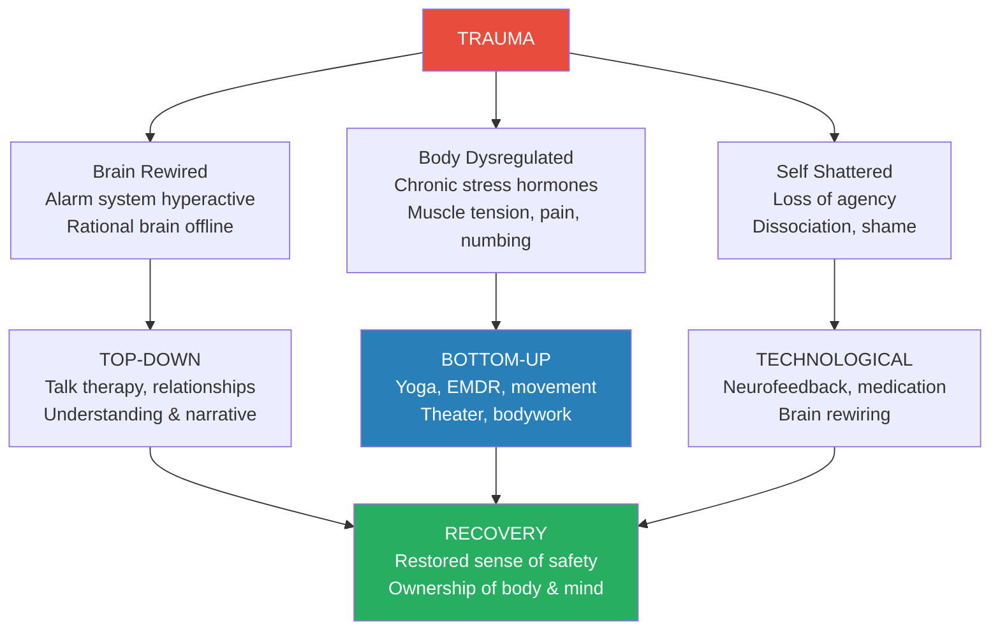
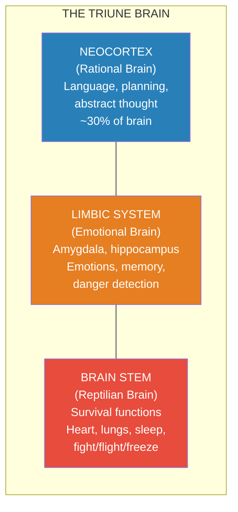
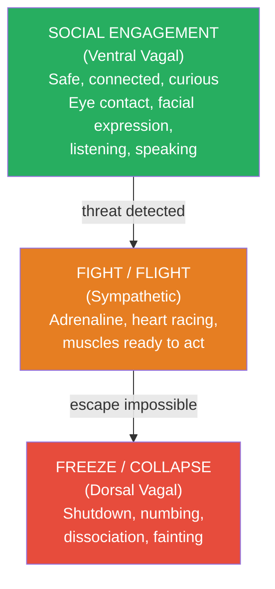
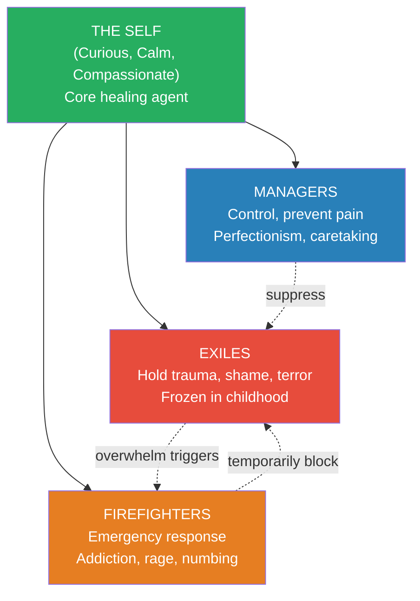
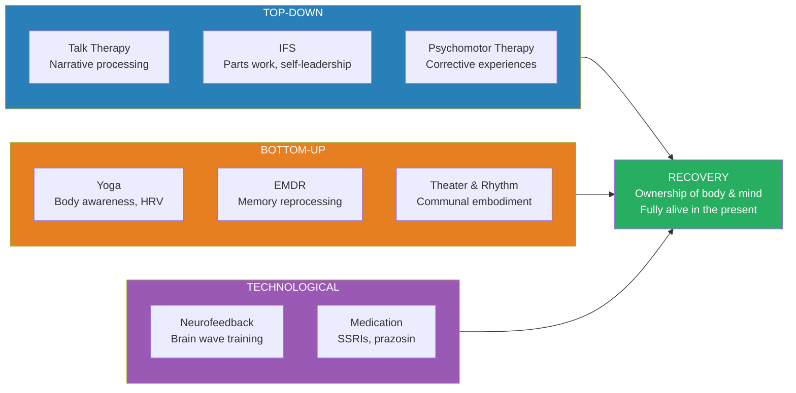
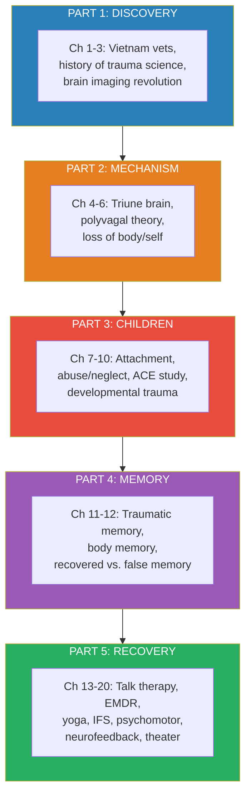

# The Body Keeps the Score — Bessel van der Kolk

> Bessel van der Kolk has spent more than forty years studying how trauma reshapes the human brain, body, and sense of self. His central discovery — hard-won through decades of treating Vietnam veterans, abused children, and assault survivors, and confirmed by brain imaging, epidemiological data, and clinical trials — is that trauma is not primarily a story about something terrible that happened in the past. Trauma lives in the body. It manifests as a rewired alarm system that fires when no danger is present, as muscles that brace against threats that ended years ago, as a nervous system stuck in fight-or-flight or frozen in collapse. The rational brain can understand what happened. But understanding alone cannot reach the emotional and survival brains where trauma is encoded.
> This means that healing cannot come from talk therapy and medication alone. Recovery requires restoring the body's sense of safety — through physical experiences that viscerally contradict helplessness: yoga, EMDR, rhythmic movement, theater, neurofeedback. Van der Kolk's career has been a sustained argument that the psychiatric establishment's overreliance on drugs and diagnostic labels has obscured the real nature of trauma and blocked the treatments that actually work.
> This is a sprawling, deeply personal, scientifically rigorous, and occasionally angry book — part memoir, part neuroscience primer, part clinical manual, part institutional critique. It is the most important single volume on trauma published in the last thirty years.

---

## About the Author

- *Bessel van der Kolk was born in the Netherlands* in 1943, the son of a man interned by the Nazis and a mother whose own childhood trauma shaped the household in ways young Bessel could feel but not name
- His father's explosive rages and his mother's fainting spells when asked about her childhood gave him a visceral, pre-professional education in how trauma passes through generations
- He arrived at the Boston Veterans Administration Clinic on July 4th weekend, 1978 — his first day as a staff psychiatrist — and met Tom, a Marine lawyer who couldn't stop reliving Vietnam
- That encounter launched a forty-year career at the intersection of neuroscience, psychiatry, and body-based healing
- He founded the Trauma Center in Boston, one of the world's leading clinical and research facilities for traumatic stress
- He is professor of psychiatry at Boston University School of Medicine
- He participated in creating the PTSD diagnosis in 1980 and later fought (unsuccessfully) to add Developmental Trauma Disorder to the DSM-5
- His research, funded by NIMH, the CDC, and private foundations, spans brain imaging, EMDR, yoga, neurofeedback, theater, and Internal Family Systems therapy
- He has treated thousands of trauma survivors: combat veterans, abuse victims, accident survivors, refugees, trafficking victims
- He practices every treatment modality he describes in this book — and has experienced many of them himself

---

## The Big Idea

- <b style="color: #e74c3c">Trauma is not something you "get over" — it is something your body continues to live</b>
- The brain's alarm system (the amygdala) becomes recalibrated after trauma — it fires in the absence of real danger, flooding the body with stress hormones
- The rational brain (prefrontal cortex) goes offline during flashbacks — the survivor literally cannot distinguish past from present
- The body stores what the mind cannot articulate: as muscle tension, chronic pain, autoimmune disease, sensory numbing, or explosive reactivity
- <b style="color: #2980b9">Traumatized people don't just remember the event differently — they experience the world differently</b> — their brains filter information through a lens of danger, their bodies brace against threats that no longer exist
- The psychiatric establishment has systematically misdiagnosed traumatized people — labeling them with ADHD, bipolar disorder, borderline personality, oppositional defiant disorder — obscuring the underlying trauma behind a blizzard of diagnoses
- <b style="color: #e74c3c">Medication can dampen symptoms but cannot heal trauma</b> — SSRIs suppress the alarm system without addressing the dysregulated body, the fragmented memories, or the shattered sense of self
- <b style="color: #27ae60">Recovery requires three avenues working together</b>:
  - **Top-down**: talking, connecting, understanding (cognitive/relational)
  - **Pharmacological/technological**: medication, neurofeedback (dampening/rewiring)
  - **Bottom-up**: physical experiences that contradict helplessness — yoga, EMDR, movement, theater (somatic/embodied)
- The most neglected avenue — and often the most powerful — is bottom-up: <b style="color: #27ae60">changing the body changes the mind</b>

- Van der Kolk's deepest conviction: <b style="color: #2980b9">the body keeps the score — and the body is where healing must begin</b>

Trauma dramatically inverts the brain's functioning — hyperactivating the alarm system while shutting down rational thought, body awareness, and social engagement — and recovery partially restores the balance through bottom-up and top-down interventions.

---

## Key Concepts at a Glance

| Concept | One-line summary |
|---------|-----------------|
| **The Smoke Detector** | The amygdala — brain's threat sensor — becomes hypersensitive after trauma |
| **The Watchtower** | Medial prefrontal cortex — monitors inner experience, goes offline during flashbacks |
| **The Cook** | Thalamus — integrates sensory information; breaks down under extreme stress |
| **Polyvagal Theory** | Three-tier autonomic response: social engagement → fight/flight → freeze/collapse |
| **ACE Score** | Adverse Childhood Experiences — 10-item questionnaire predicting adult health outcomes |
| **HRV** | Heart rate variability — the best biomarker of nervous system flexibility and resilience |
| **Alexithymia** | Inability to identify or describe one's own emotions — affects ~50% of trauma survivors |
| **Default State Network** | Brain regions constituting sense of self — go dark in chronic PTSD |
| **Interoception** | Ability to sense internal body states — the foundation of emotional awareness |
| **IFS (Parts Work)** | Internal Family Systems — treats the psyche as managers, exiles, and firefighters led by a core Self |
| **Developmental Trauma** | Chronic childhood adversity that shapes the developing brain and attachment system |
| **EMDR** | Eye Movement Desensitization and Reprocessing — bilateral stimulation reprocesses frozen memories |
| **Epigenetics** | Trauma changes gene expression — and these changes can pass to the next generation |
| **Window of Tolerance** | The zone of optimal arousal between hyperactivation and hypoactivation |
| **Bottom-Up Regulation** | Changing the body's state directly changes the brain's state — yoga, movement, breath |
| **Reenactment** | The unconscious compulsion to recreate conditions of the original trauma |

---

## Part One: The Rediscovery of Trauma

### Lessons from Vietnam Veterans

- *On July 4th weekend, 1978, a large disheveled man named Tom burst into van der Kolk's office at the Boston VA*

> [!example] Tom — The Marine Who Couldn't Come Home
> - Tom was a Marine in Vietnam, a platoon leader who survived ambushes and jungle warfare
> - He came home, went to law school on the GI Bill, married his high school sweetheart, built a thriving practice
> - But he couldn't feel anything — he described himself as "dead inside"
> - Every Fourth of July, the fireworks, heat, and dense foliage triggered flashbacks — he'd hole up in his office drinking rather than risk hurting his family
> - Nightmares of an ambush in a rice paddy woke him nightly — his wife found him passed out on the couch each morning
> - He rode his Harley at dangerous speeds because it was the only thing that made him feel alive

- Van der Kolk recognized Tom's pattern: his own father, interned by the Nazis, had the same explosive rages and emotional absence
- His uncle, a slave laborer on the bridge over the River Kwai, showed identical symptoms — neither man ever discussed what happened
- At the VA, van der Kolk discovered that <b style="color: #2980b9">traumatized people re-experience their trauma in the present rather than remembering it as past</b>
- He gave veterans Rorschach inkblot tests — where normal subjects saw butterflies or faces, veterans saw body parts, blood, and combat scenes
- The inkblots revealed a crucial principle: <b style="color: #e74c3c">traumatized people superimpose their trauma onto ambiguous situations</b> — they see danger everywhere
- Van der Kolk joined the committee that created the PTSD diagnosis in 1980 — the first official recognition that trauma causes lasting psychiatric illness
- But he quickly realized PTSD was only the beginning: the diagnosis captured the symptoms but not the underlying mechanism

### The Neuroscience Revolution

- *In 1994, van der Kolk and colleague Scott Rauch conducted one of the first brain imaging studies of trauma*
- They asked a woman named Marsha to relive her trauma while in an fMRI scanner
- The results were stunning:

| Brain Region | During Flashback | Normal Function |
|---|---|---|
| **Amygdala** (smoke detector) | Lit up intensely | Detects threats |
| **Broca's area** (speech center) | Went dark | Produces language |
| **Visual cortex** | Activated as if seeing the event NOW | Processes visual input |
| **Medial prefrontal cortex** (watchtower) | Went offline | Distinguishes past from present |

- <b style="color: #e74c3c">During a flashback, the brain's speech center shuts down — trauma literally renders people speechless</b>
- The visual cortex lights up as if the event is happening right now — the brain cannot tell the difference between memory and reality
- The "watchtower" (medial prefrontal cortex) — the part of the brain that normally says "this is just a memory, you're safe now" — goes offline
- This explained why talk therapy alone is often insufficient: <b style="color: #2980b9">you cannot talk your way out of a state that has shut down your capacity to speak</b>
- Van der Kolk traces the history of trauma science back to the 1880s — to Charcot and Pierre Janet in Paris, who first described how traumatic memories are stored differently from ordinary memories
- Janet's key insight (1889): traumatic memories are stored as sensory fragments — images, sounds, body sensations — not as coherent narratives
- Freud initially agreed, then made what van der Kolk considers a catastrophic wrong turn: he abandoned trauma theory in favor of the Oedipus complex, reframing patients' reports of abuse as fantasy
- This set psychiatry back by nearly a century — it took the Vietnam War to force the profession to rediscover what Janet knew in 1889

---

## Part Two: This Is Your Brain on Trauma

### The Anatomy of Survival

- *Five-year-old Noam Saul watched the first plane hit the World Trade Center from his classroom window, 1,500 feet away*

> [!example] Noam's Trampoline — Imagination as Recovery
> - On September 12, 2001, Noam drew what he had seen: the airplane, the fireball, people jumping from windows
> - But at the bottom he drew a black circle — a trampoline — "so that the next time when people have to jump they will be safe"
> - His imagination had already begun processing the horror and creating an alternative outcome
> - He could do this because he was surrounded by loving caregivers, he had been able to run (taking active role in his own rescue), and he knew the danger was over

- Noam illustrates two critical elements of surviving trauma without lasting damage: <b style="color: #27ae60">being able to take action</b> and <b style="color: #27ae60">reaching safety where the alarm system can quiet</b>
- When these conditions are not met — when people are trapped, held down, or unable to act — the brain keeps secreting stress chemicals indefinitely
- Van der Kolk explains the brain's survival architecture using three metaphors:

| Brain Metaphor | Structure | Function |
|---|---|---|
| **The Smoke Detector** | Amygdala | Scans for danger, triggers alarm — becomes hair-trigger after trauma |
| **The Watchtower** | Medial prefrontal cortex | Monitors inner experience, decides if alarm is real — goes offline during flashbacks |
| **The Cook** | Thalamus | Integrates sensory information into coherent experience — breaks down under extreme stress |

- The brain is built from the bottom up: reptilian brain (online at birth), limbic system (develops through childhood), neocortex (last to mature, not fully developed until mid-twenties)
- <b style="color: #e74c3c">Trauma hijacks the bottom-up system</b> — the reptilian and limbic brains take over, shutting down the rational neocortex
- Fight/flight/freeze: when the alarm sounds, the body automatically runs, fights, or — if escape is impossible — freezes
- Immobilization is the most damaging response: <b style="color: #e74c3c">when the body cannot act, stress hormones have nowhere to go and turn against the organism itself</b>

### Body-Brain Connections and the Polyvagal Theory

- *Darwin observed in 1872 that emotions are expressed through the body — they are not just felt in the mind*
- The autonomic nervous system has two branches:
  - **Sympathetic** (gas pedal): adrenaline, activation, fight-or-flight
  - **Parasympathetic** (brake): acetylcholine, calming, rest-and-digest
- Stephen Porges's <b style="color: #2980b9">polyvagal theory</b> added a crucial third tier to this model:

- The vagus nerve — the longest nerve in the body — is the highway connecting brain to gut, heart, lungs, and throat
- <b style="color: #2980b9">Heart rate variability (HRV)</b> measures the balance between sympathetic and parasympathetic systems — it is the single best biomarker of resilience
- Traumatized people typically have poor HRV: their systems are stuck in either chronic activation or chronic shutdown
- Porges's key insight: <b style="color: #27ae60">the social engagement system is the body's first line of defense</b> — we seek safety through connection before we fight, run, or collapse

> [!tip] The Body's Three-Level Defense System
> When you feel safe, your ventral vagal system is active — you can make eye contact, listen, speak, connect. When threatened, your sympathetic system mobilizes you to fight or flee. When escape is impossible, the dorsal vagal system shuts you down — numbing, dissociation, collapse. Trauma survivors often get stuck at levels two or three, unable to access the social engagement that could restore safety.

### Losing Your Body, Losing Your Self

- *Sherry picked at her skin until she bled — not because she wanted to die, but because it was the only way she could feel alive*

> [!example] Sherry — The Woman Who Couldn't Feel Her Body
> - Sherry had been kidnapped and raped for five days during a college vacation
> - When she escaped and called her mother collect, her mother refused the call
> - She began picking at her skin compulsively — the physical sensation cut through the numbness that had swallowed her
> - Previous psychiatrists had hospitalized her for "suicidal behavior" — but van der Kolk recognized she was trying to feel, not to die
> - When a massage therapist gently held Sherry's feet, Sherry panicked: "Where are you?" — she couldn't feel the touch
> - Van der Kolk realized: Sherry was completely disconnected from her own body

- <b style="color: #e74c3c">Alexithymia</b> — the inability to identify or describe feelings — affects roughly half of all trauma survivors
- Many of van der Kolk's patients could not identify objects placed in their hands with their eyes closed — their sensory integration was broken
- Ruth Lanius's groundbreaking brain scan study compared "normal" resting brains to those of chronic PTSD patients:
  - Normal subjects showed activation of the <b style="color: #2980b9">"Mohawk of self-awareness"</b> — midline brain structures responsible for sense of self
  - Chronic PTSD patients showed almost no activation in any self-sensing brain areas
- <b style="color: #e74c3c">In order to shut off terrifying sensations, traumatized people also deadened their capacity to feel fully alive</b>
- This explains why survivors often can't make decisions, follow plans, or describe what they want — their relationship with their own inner reality is impaired
- The fundamental question for recovery: how can people learn to feel safe inside their own bodies again?

---

## Part Three: The Minds of Children

### Attachment and Attunement

- *The children's clinic at Massachusetts Mental Health Center was filled with wild creatures who hit and bit other children, masturbated compulsively, and could not recognize themselves in mirrors*
- Van der Kolk and colleague Nina Fish-Murray showed abused children and normal children the same ambiguous pictures
- The normal children told hopeful stories: dad fixes the car, they drive to McDonald's
- The abused children told gruesome tales: the girl smashes her father's skull with a hammer; the boy kicks away the jack and blood spurts everywhere
- <b style="color: #e74c3c">For abused children, the whole world is filled with triggers</b> — even ordinary images produce terror, aggression, and sexual arousal
- The children's medical records were filled with diagnostic labels — conduct disorder, bipolar, ADHD — but rarely mentioned the actual trauma
- Van der Kolk traces the science of attachment to John Bowlby and colleagues — upper-class Englishmen torn from their families as boys and sent to boarding schools
- Mary Ainsworth's <b style="color: #2980b9">Strange Situation</b> experiment identified four attachment patterns:

| Pattern | Child's Behavior | Caregiver Pattern | Adult Outcome |
|---|---|---|---|
| **Secure** | Upset at separation, comforted by return | Responsive, attuned | Trusting, resilient |
| **Avoidant** | Ignores caregiver's departure and return | Emotionally distant | Self-reliant but emotionally shut down |
| **Anxious/Ambivalent** | Clingy, not comforted by return | Inconsistent, unpredictable | Anxious, preoccupied with relationships |
| **Disorganized** | Freezes, approaches then retreats | Frightening OR frightened | Most vulnerable to later psychopathology |

- <b style="color: #e74c3c">Disorganized attachment is the most damaging pattern</b> — it occurs when the caregiver is simultaneously the source of comfort and the source of fear
- The child faces an impossible dilemma: the person they need to run to for safety is the person they need to run from
- Beatrice Beebe's microanalysis of mother-infant interactions showed that attunement happens in milliseconds — tiny mismatches that are quickly repaired build resilience; chronic misattunement builds fragility

### The ACE Study: The Hidden Epidemic

- *In 1985, Vincent Felitti was running an obesity clinic in San Diego when he noticed something strange*

> [!example] The Discovery That Changed Public Health
> - Felitti's clinic had a 50% dropout rate — patients who were successfully losing weight suddenly quit
> - He interviewed dropouts and discovered a pattern: many had been sexually abused as children
> - One woman told him she had gained weight after being raped — the weight felt like protection
> - Felitti partnered with Robert Anda at the CDC to survey 17,421 Kaiser Permanente patients
> - They asked about ten categories of childhood adversity: physical, sexual, emotional abuse; physical, emotional neglect; household dysfunction (violence, substance abuse, mental illness, incarceration, divorce)
> - Each "yes" added one point to the ACE score (0-10)

- The results were devastating:
  - **Two-thirds** of participants reported at least one ACE
  - **One in eight** had an ACE score of 4 or higher
  - The relationship between childhood adversity and adult illness was a <b style="color: #e74c3c">dose-response curve</b> — the more ACEs, the worse the outcomes
  - ACE score of 4+: 240% increased risk of hepatitis, 390% increased risk of COPD, 1,220% increased risk of suicide attempt

| ACE Score | Depression Risk | Suicide Attempt Risk | IV Drug Use Risk | Alcoholism Risk |
|---|---|---|---|---|
| 0 | Baseline | Baseline | Baseline | Baseline |
| 1-3 | 2-3x higher | 3-5x higher | Moderately elevated | 2x higher |
| 4+ | 4.6x higher | 12.2x higher | 10x higher | 7.4x higher |
| 6+ | Extremely high | 30x higher | 46x higher | Extremely high |

The ACE study's dose-response curve is devastating: four or more childhood adversities multiply suicide risk by 12x and drug use by 10x, proving that childhood trauma is the largest preventable cause of adult illness.

- <b style="color: #2980b9">The most common ACE was not dramatic abuse but emotional neglect</b> — the quiet absence of attunement, warmth, and responsiveness
- The ACE study revealed that childhood trauma is not a mental health issue — it is the single most significant public health crisis in America
- And yet: the APA rejected van der Kolk's proposal to add "Developmental Trauma Disorder" to the DSM-5
- Their official reason: "There is no known evidence of developmental disruptions preceded by any type of trauma syndrome"
- Van der Kolk considers this rejection one of the great failures of modern psychiatry — it condemned millions of children to be treated for symptoms (ADHD, bipolar, ODD) while the underlying cause goes unaddressed
- <b style="color: #27ae60">Epigenetics</b> shows that trauma doesn't just change behavior — it changes gene expression
- Michael Meaney's rat pup studies: how much a mother rat licks her pups in the first twelve hours permanently changes stress-response genes — and these changes pass to the next generation
- The body keeps the score at the deepest level of the organism — and passes that score to our children

---

## Part Four: The Imprint of Trauma

### The Problem of Traumatic Memory

- *In 2002, van der Kolk was asked to examine Julian, a twenty-five-year-old former military policeman who claimed Father Paul Shanley had sexually abused him as a child*

> [!example] Julian — When Memory Comes Flooding Back
> - Julian had served as an MP at an air force base with excellent evaluations
> - One day his girlfriend mentioned a newspaper article about Father Shanley being investigated for child molestation
> - "Did he ever do anything to you?" she asked — and Julian's world collapsed
> - He suddenly saw Shanley silhouetted in a doorframe, hands stretched out, staring at him
> - Over the following week, images kept flooding in: strip poker in a room with red velvet cushions, the priest's hands, fragments of oral sex
> - The memories were incoherent and fragmentary — sensory flashes, not narrative
> - Julian scratched his body until he bled, had seizures, felt like a zombie observing himself from a distance
> - He received an administrative discharge ten days short of full benefits

- Julian's experience illustrates the central paradox of traumatic memory: <b style="color: #e74c3c">trauma can be simultaneously unforgettable and forgotten</b>
- Van der Kolk traces this understanding back to Pierre Janet (1889): traumatic memories are stored differently from ordinary memories

| Feature | Ordinary Memory | Traumatic Memory |
|---|---|---|
| **Format** | Narrative, verbal, sequential | Sensory fragments: images, sounds, body sensations |
| **Time-stamp** | Located in the past | Feels like it's happening NOW |
| **Controllability** | Can be recalled and put away | Intrudes involuntarily |
| **Coherence** | Organized story with beginning/middle/end | Disjointed, illogical, chaotic |
| **Emotional charge** | Fades over time | Retains full intensity indefinitely |
| **Modifiability** | Updated with new information | Frozen, resistant to change |

- The hippocampus — the brain's memory librarian — files ordinary experiences with context, time-stamps, and narrative structure
- Under extreme stress, the hippocampus shrinks and malfunctions — traumatic experiences get stored as raw sensory data without context
- This is why flashbacks feel timeless: <b style="color: #2980b9">the brain literally filed the memory wrong — without a date stamp saying "this is over"</b>
- Van der Kolk's own research confirmed Janet's 1889 findings: traumatic memories are initially remembered as sensory flashbacks and only gradually — with therapeutic help — become narratives
- The "memory wars" of the 1990s — "false memory" advocates vs. "recovered memory" advocates — nearly destroyed the field
- Van der Kolk's position: both sides have partial truth — trauma can absolutely be forgotten and later remembered AND false memories can absolutely be implanted
- The real question is not whether a specific memory is "true" but whether the body's responses are consistent with trauma having occurred
- <b style="color: #27ae60">The body remembers what the conscious mind cannot articulate</b> — Julian's seizures, skin-scratching, and explosive reactions to touch were all body memories of abuse he couldn't consciously recall

### The Unbearable Heaviness of Remembering

- Sleep plays a critical role in memory consolidation — during REM sleep, the brain processes and integrates the day's experiences
- Traumatized people have disrupted sleep architecture — their nightmares interrupt the normal consolidation process
- The result: <b style="color: #e74c3c">traumatic memories remain raw, unprocessed, and perpetually intrusive</b> because the brain's overnight filing system cannot complete its work
- Body memory is real and measurable: muscles tense, heart rates spike, stress hormones surge in response to trauma cues — even when the person has no conscious recall of the event
- Van der Kolk describes examining twelve adults who had been abused as children in a Catholic orphanage in Vermont — none had been in contact for four decades, yet they independently described the same rooms, the same furniture, the same specific abuses by the same named perpetrators
- The convergence of their body-stored memories was more compelling than any single narrative account

---

## Part Five: Paths to Recovery

### The Recovery Framework — Owning Your Self

- *"Nobody can 'treat' a war, or abuse, rape, molestation, or any other horrendous event — what has happened cannot be undone"*
- But what CAN be treated are the imprints of trauma: the crushing chest sensations, the hypervigilance, the self-loathing, the nightmares, the fog
- <b style="color: #27ae60">The challenge of recovery is to reestablish ownership of your body and your mind — of your self</b>
- This means four goals (not sequential steps — they overlap):
  1. Finding a way to become calm and focused
  2. Learning to maintain that calm when triggered by reminders of the past
  3. Finding a way to be fully alive in the present and engaged with people
  4. Not having to keep secrets from yourself — including secrets about how you survived

> [!tip] Van der Kolk's Three Avenues of Recovery
> **Top-down**: Talking, connecting, understanding — processing memories through language and relationship. Effective but limited because trauma often lives below the level of language. **Bottom-up**: Physical experiences — yoga, EMDR, movement, bodywork — that directly change the body's alarm state. Often the most powerful and most neglected avenue. **Pharmacological/technological**: Medications (SSRIs, prazosin) and neurofeedback — dampening or rewiring the brain's electrical and chemical patterns. Useful as support but not sufficient alone.

- Medications: SSRIs like Prozac can take the edge off hyperarousal but do not resolve the underlying trauma
- Prazosin (a blood pressure medication) helps suppress traumatic nightmares — one of the more useful pharmacological discoveries
- But van der Kolk's conviction, earned over four decades: <b style="color: #2980b9">the body-based treatments are where the real breakthroughs happen</b>

### Language: Miracle and Tyranny

- James Pennebaker's research showed that writing about traumatic experiences produces measurable health benefits — improved immune function, fewer doctor visits, better mood
- But van der Kolk identifies a paradox: <b style="color: #e74c3c">premature narrative coherence can shut down emotional processing</b>
- When people are pushed to create a "story" too early, they may produce a polished account that keeps the actual feelings at bay
- The tyranny of narrative: forcing trauma into words can sometimes contain it rather than transform it
- The therapeutic relationship matters more than any specific technique — it is the "safe container" within which healing becomes possible
- But talk therapy has hard limits: when Broca's area goes offline during flashbacks, words simply cannot reach where the trauma lives

### Letting Go of the Past: EMDR

- *David, a middle-aged contractor, had lost his left eye to a broken beer bottle thirty years ago — and his rage was destroying his family*

> [!example] David — Five Sessions to Inner Peace
> - David was attacked by drunk teenagers while working as a lifeguard at age twenty-three — one stabbed out his left eye with a broken beer bottle
> - Thirty years later he still had nightmares and flashbacks, was merciless with his teenage son, and could not show affection to his wife
> - In his second session, van der Kolk introduced EMDR — asked David to hold the memory while following a moving finger with his eye
> - Within seconds, a cascade of rage and terror surfaced — vivid sensations of pain, blood on his cheek, the realization he couldn't see
> - As the session continued, memories surfaced rapidly: schoolyard fights, barroom brawls, a plan to have his attacker killed in prison — then the decision NOT to
> - Recalling that he chose mercy over murder was profoundly liberating — he reconnected with a generous side of himself he'd forgotten
> - He realized he was treating his son the way he felt toward his teenage attackers
> - After five sessions: better sleep, inner peace, closer marriage, yoga with his wife, laughter, pleasure in gardening

- Francine Shapiro discovered EMDR in 1987 while walking through a park — she noticed that rapid eye movements produced dramatic relief from painful memories
- How EMDR works: bilateral stimulation (eye movements, tapping, or auditory tones) while holding a traumatic memory allows the brain to reprocess it
- The mechanism resembles REM sleep — the same kind of rapid eye movement that accompanies the brain's overnight memory-consolidation process
- <b style="color: #2980b9">EMDR allows people to access traumatic memories without being hijacked by them</b> — they can observe the experience from the perspective of their adult self while simultaneously re-experiencing it

> [!example] Maggie — The Psychologist Who Blamed Herself
> - Maggie ran a halfway house for sexually abused girls but was wild and self-destructive herself
> - She told van der Kolk's therapy group that her father had raped her at ages five and seven — and she was convinced it was her fault
> - After an EMDR training, she reported a transformative experience: she relived the rape from inside her child's body — felt how small she was, felt her father's huge body, smelled the alcohol
> - But simultaneously she observed from the perspective of her twenty-nine-year-old self
> - She burst into tears: "I was such a little girl. How could a huge man do this to a little girl?"
> - For the first time she knew — not just intellectually but in her body — that it wasn't her fault

- Van der Kolk's own research: a head-to-head study comparing EMDR to Prozac for PTSD
  - After eight weeks: EMDR produced significantly better outcomes than the leading SSRI
  - At follow-up: EMDR patients continued to improve after treatment ended; Prozac patients relapsed when the drug was stopped
  - <b style="color: #27ae60">One-third of EMDR-treated civilian patients were completely cured — zero Prozac patients achieved full remission</b>
- EMDR is not magic — it doesn't work for everyone, and it works better for single-incident adult trauma than for complex developmental trauma
- But for many survivors it accomplishes something remarkable: it transforms a frozen, timeless sensory fragment into a painful but manageable memory — something that happened long ago

### Learning to Inhabit Your Body: Yoga

- *Annie shuffled into van der Kolk's office and remained standing, barely breathing, looking like a frozen bird*

> [!example] Annie — The Teacher Who Couldn't Feel
> - Annie was forty-seven, taught special-needs children, and had been dreadfully abused by both parents as a very young child
> - She could not make eye contact, could not provide her address — her body communicated pure terror
> - Van der Kolk stood six feet away, made sure she had clear access to the door, and spent thirty minutes just breathing with her
> - He used qigong arm movements — raising arms on inhale, lowering on exhale — and she slowly, stealthily followed
> - Eventually her breath slowed, her spine straightened, her eyes lifted, and she showed a glimmer of a smile
> - "You sure are weird," she said
> - Annie was extraordinarily skilled with her special-needs students but shut down instantly when adult relationships were involved
> - She coped with overwhelm by cutting her arms and breasts with a razor blade
> - Years of talk therapy and medication had done little — they addressed her rational brain while the trauma lived in her body
> - When Annie started to like van der Kolk, she arrived in panic — her mind automatically associated excitement about seeing someone she loved with the terror of being molested by her father

- Annie became one of the patients who taught van der Kolk that <b style="color: #2980b9">understanding the source of a destructive impulse doesn't help control it</b> — the body does what the body does
- Traditional therapy asked Annie to use her rational brain to manage her survival brain — like asking the CEO to control a fire alarm by writing a memo
- <b style="color: #27ae60">Yoga offered something different: a way to befriend the body rather than fight it</b>
- Van der Kolk's introduction to yoga as therapy came through heart rate variability (HRV) research in 1998:
  - HRV measures the flexibility of the autonomic nervous system — the balance between gas pedal (sympathetic) and brake (parasympathetic)
  - Good HRV means your system can speed up and slow down fluidly — poor HRV means you're stuck in one gear
  - Traumatized people typically have very low HRV: their systems are either chronically revved or chronically shut down
  - Yoga dramatically improves HRV — it teaches the body to toggle between activation and relaxation

- Van der Kolk's Trauma Center yoga study (published in peer-reviewed journals):
  - Twenty weeks of trauma-sensitive yoga
  - Significant reduction in PTSD symptoms
  - Improved HRV — the autonomic nervous system became more flexible
  - Participants reported reconnecting with their bodies for the first time
  - <b style="color: #27ae60">Yoga was at least as effective as the best available medication — with no side effects</b>

- Why yoga works for trauma:
  - **Interoception**: yoga trains you to notice internal body states — breath, heartbeat, muscle tension — without reacting to them
  - **Befriending**: instead of fighting the body or numbing it, yoga teaches you to observe sensations with curiosity
  - **Agency**: every pose is a choice — you decide how far to stretch, when to breathe, when to rest — restoring the sense of control that trauma destroyed
  - **Bottom-up regulation**: changing the body's state directly changes the brain's state — you don't need to understand your trauma to calm your nervous system

- Van der Kolk emphasizes that trauma-sensitive yoga is different from standard yoga classes:
  - No hands-on adjustments (touch can trigger flashbacks)
  - Invitational language ("you might try..." rather than "do this now")
  - Emphasis on internal sensation rather than external form
  - No mirrors — the focus is on how the body feels, not how it looks

### Putting the Pieces Together: Self-Leadership (IFS)

- *Van der Kolk opened his waiting room door and found Mary — usually shy and physically collapsed — standing provocatively in a miniskirt with flaming red hair*

> [!example] Mary and Jane — One Body, Many Selves
> - "You must be Dr. van der Kolk," she said with a snarl. "My name is Jane, and I came to warn you not to believe any of the lies that Mary has been telling you"
> - Over that session, van der Kolk met not just Jane but a hurt little girl and an angry male adolescent — all living inside Mary's body
> - This was his first encounter with dissociative identity disorder (DID)
> - It taught him that the internal splitting DID represents is not a freak condition — it is the extreme end of a universal spectrum
> - We all have parts — the difference is that trauma makes them rigid, extreme, and disconnected from each other

- Van der Kolk's encounter with Richard Schwartz's <b style="color: #2980b9">Internal Family Systems (IFS)</b> therapy transformed his understanding of trauma treatment
- IFS proposes that the mind is naturally multiple — a system of parts, each with its own feelings, beliefs, and agendas:

| IFS Part Type | Role | Trauma Adaptation |
|---|---|---|
| **Managers** | Control daily life, prevent vulnerability | Perfectionism, caretaking, emotional suppression |
| **Exiles** | Hold the pain, shame, and terror of trauma | Frozen in childhood, carrying unbearable feelings |
| **Firefighters** | Emergency response when exiles break through | Bingeing, cutting, rage, dissociation, addiction |
| **The Self** (capital S) | Core consciousness — curious, calm, compassionate | Always present but often buried under protective parts |

- The soldier who erupts at his girlfriend illustrates how parts interact:
  - A **vulnerable part** (exile) is triggered when physical intimacy makes him feel passive — the same passivity he felt when his friend was killed
  - An **angry manager** steps in to create distance and safety — he yells at his girlfriend without knowing why
  - He may never realize that the rage is a protective response to a terrified child part that equates surrender with death
- <b style="color: #27ae60">IFS therapy works by helping the Self — the core consciousness — develop a compassionate relationship with all the parts</b>
- Instead of trying to eliminate or suppress the angry part, the frightened part, or the addicted part, IFS asks: what is this part protecting? What does it need?
- When parts feel heard and understood by the Self, they can "unburden" — release the extreme beliefs and emotions they've been carrying since the trauma
- Van der Kolk describes IFS as the treatment most capable of addressing the internal fragmentation that is the hallmark of complex trauma:
  - Talk therapy addresses the story but not the parts
  - Medication suppresses parts without healing them
  - EMDR can process specific memories but doesn't reorganize the internal system
  - <b style="color: #2980b9">IFS provides a framework for the survivor to become the leader of their own internal family — to move from being ruled by protective parts to being guided by the Self</b>

- The concept of self-leadership parallels what van der Kolk sees in healthy people: they have the same parts — angry parts, scared parts, ashamed parts — but the Self is in charge, listening to all parts without being dominated by any
- Many traumatized people discover through IFS that the "symptoms" they were diagnosed with — the rage, the dissociation, the self-harm — are actually parts that were once necessary for survival
- <b style="color: #27ae60">The goal is not to eliminate these parts but to honor their service and help them find new roles</b>

### Filling in the Holes: Creating Structures

- Many trauma survivors did not simply experience terrible events — they missed critical developmental experiences that build a healthy sense of self
- A child who was never comforted does not know what comfort feels like; a child who was never protected does not know what safety feels like
- <b style="color: #2980b9">You cannot process a memory of something that never happened — the absence of love and safety leaves holes, not scars</b>
- Van der Kolk describes **psychomotor therapy** (developed by Albert Pesso and Diane Boyden-Pesso): staged scenes using role-players to create the experience the person needed but never received
- In a psychomotor "structure," the patient directs a scene with other group members playing roles:
  - An "ideal mother" who provides the comfort and protection the real mother never gave
  - An "ideal father" who offers the encouragement and safety the real father withheld
  - A "witness" — someone who simply sees and acknowledges what happened
- The key insight: <b style="color: #27ae60">the body responds to corrective emotional experiences as if they were real</b>
- When a person who was never held as a child is held by an "ideal mother" in a structure, their nervous system responds — muscles relax, breathing deepens, stress hormones decrease
- Van der Kolk is careful to note this does not change the past — it creates a new template alongside the old one
- The old memory of neglect or abuse remains, but it is no longer the only template the brain has for what relationships feel like
- Psychomotor therapy is one of the least well-known approaches in the book but one van der Kolk finds profoundly effective for people whose trauma was primarily about what DIDN'T happen rather than what did

### Rewiring the Brain: Neurofeedback

- *In the summer after his first year of medical school, van der Kolk worked in a sleep laboratory, pasting electrodes onto subjects' scalps and recording their brain waves through the night*
- Decades later, that early exposure to electroencephalography (EEG) would lead him to one of his most unexpected therapeutic discoveries
- Alexander McFarlane's "oddball paradigm" study revealed something crucial about traumatized brains:
  - Normal subjects' brains produce coherent, synchronized patterns when processing new information
  - Traumatized subjects' brain waves are loosely coordinated and fail to filter irrelevant information
  - <b style="color: #e74c3c">The traumatized brain cannot properly pay attention to the present because its electrical patterns are disorganized</b>
  - This explains why so many trauma survivors struggle with focus, learning, and completing college degrees — their brains are processing the world through static

- **Neurofeedback** offers a direct route to changing these patterns:
  - Sensors placed on the scalp read the brain's electrical activity in real time
  - The patient watches a screen that responds to their brain waves — a movie plays smoothly when waves are in the target range, stutters when they drift
  - Over sessions, the brain learns to produce healthier patterns — essentially exercising itself into better functioning
  - No drugs, no talking, no reliving trauma — the brain rewires itself through operant conditioning

> [!example] The Boy Who Couldn't Draw His Family
> - A ten-year-old boy with severe temper tantrums, learning disabilities, and behavioral problems was referred for neurofeedback
> - Before treatment, his family portrait drawing was at the developmental level of a three-year-old — stick figures, no faces, chaotic arrangement
> - After twenty sessions of neurofeedback, his drawing showed recognizable people with expressions, organized spatially, with detail and care
> - His tantrums decreased, his ability to focus in school improved, and his relationships with family members transformed
> - The change was visible not just in behavior but in the architecture of his brain's electrical activity

- Sebern Fisher, a clinician who specialized in attachment-disordered children, found that neurofeedback could produce dramatic improvements in children who had not responded to any other treatment
- Van der Kolk conducted his own neurofeedback research at the Trauma Center:
  - Patients with chronic PTSD who had not responded to medication or talk therapy
  - Significant improvements in attention, emotional regulation, and PTSD symptoms
  - Brain-wave patterns became more organized and coherent
- <b style="color: #27ae60">Neurofeedback addresses the nonverbal imprint of trauma directly</b> — it changes the brain's operating system without requiring the patient to revisit painful memories
- Van der Kolk sees neurofeedback as particularly promising for developmental trauma — children whose brains were shaped by chronic adversity and whose electrical patterns were disrupted before they ever learned to speak
- Limitations: neurofeedback requires specialized equipment and trained practitioners; it is not widely available; insurance often doesn't cover it; more large-scale research is needed

### Finding Your Voice: Communal Rhythms and Theater

- *Van der Kolk's son Nick spent most of seventh and eighth grade in bed with chronic fatigue syndrome — bloated, exhausted, unable to attend school*

> [!example] Nick — The Boy Who Found Himself on Stage
> - Nick was becoming entrenched in his identity as a self-hating, isolated kid
> - When his mother noticed he had a burst of energy around 5 PM, they signed him up for evening improvisational theater
> - He was cast as Action in *West Side Story* — a tough kid always ready to fight
> - Van der Kolk caught him at home walking with a swagger, practicing what it felt like to be somebody with power
> - Then he was cast as the Fonz in *Happy Days* — being adored by girls and keeping an audience spellbound became the tipping point
> - Unlike therapy, which talked about how bad he felt, theater gave him a physical experience of being someone else
> - Being a valued contributor to a group gave him a visceral sense of power and competence
> - Van der Kolk believes this embodied version of himself set him on the road to becoming the creative, loving adult he is today

- Van der Kolk connects theater to the oldest known form of communal trauma processing:
  - Ancient Greek theater grew out of religious rites involving dancing, singing, and mythical reenactment
  - Sophocles and Aeschylus were soldier-playwrights writing for audiences of combat veterans
  - The tragedies allowed citizen-soldiers to collectively witness and process the horrors of war
  - <b style="color: #2980b9">Theater transforms private suffering into shared experience — it breaks the isolation that trauma creates</b>

- Three theater programs van der Kolk highlights:
  - **Sketches of War**: Vietnam veterans worked with David Mamet, then performed alongside Al Pacino, Donald Sutherland, and Michael J. Fox — three of van der Kolk's patients showed sudden improvement in vitality, optimism, and relationships
  - **Urban Improv**: theater program for at-risk youth — students physically enact conflict scenarios and practice alternative responses
  - **Shakespeare & Company**: trauma survivors perform Shakespeare — embodying characters who face extreme situations gives survivors a controlled way to experience and express extreme emotions

- Why communal rhythms and theater heal trauma:
  - **Embodied action restores agency** — you are doing, not being done to
  - **Collective experience breaks isolation** — trauma tells you that you are alone with your suffering; theater shows you that you are not
  - **Rhythm and synchrony regulate the nervous system** — singing, drumming, dancing, and martial arts all involve rhythmic bilateral movement that calms the autonomic nervous system
  - **Playing a role allows safe exploration** — you can feel rage, grief, power, and tenderness inside a character's skin without the stakes of your own life

> [!tip] Theater vs. Traditional Therapy
> Talk therapy asks you to describe your experience from a distance. Theater asks you to inhabit a different experience from the inside. For people whose trauma has left them disconnected from their bodies and unable to articulate their feelings, the embodied, communal, rhythmic nature of theatrical performance can reach places that words cannot.

---

## The Institutional Critique

Body-based and parts-based therapies (EMDR, IFS, yoga) dominate the recovery landscape, while pharmaceutical approaches alone occupy the smallest space — the body must be engaged for healing to occur.

- Running through the entire book is van der Kolk's sustained attack on the psychiatric establishment:
- <b style="color: #e74c3c">The DSM's diagnostic categories systematically obscure trauma</b> — a child with four ACEs might receive five separate diagnoses (ADHD, bipolar, ODD, anxiety, depression) without any of them identifying the underlying cause
- The pharmaceutical industry's influence has pushed psychiatry toward a "chemical imbalance" model that privileges medication over all other treatments
- Van der Kolk submitted a formal proposal for "Developmental Trauma Disorder" to the DSM-5 committee — it was rejected in 2011
- The APA's official response: "There is no known evidence of developmental disruptions that were preceded in time in a causal fashion by any type of trauma syndrome"
- Van der Kolk considers this a denial of overwhelming evidence — the ACE study alone showed dose-response relationships between childhood adversity and virtually every major adult disease
- The rejection meant that millions of traumatized children would continue to be treated for symptoms rather than causes
- <b style="color: #2980b9">The consequences are not academic — they are measured in lives</b>: children medicated into compliance rather than helped to heal, adults cycling through the mental health system for decades without anyone asking what happened to them

---

## Epilogue: Choices to Be Made

- Van der Kolk closes with a call to action: trauma is not just an individual problem — it is a public health crisis that demands systemic response
- <b style="color: #27ae60">Every dollar spent on trauma prevention saves many dollars in later costs</b> — healthcare, criminal justice, welfare, lost productivity
- He advocates for:
  - **Trauma-informed schools**: teachers trained to recognize trauma responses instead of punishing "bad behavior"
  - **Trauma-informed courts**: judges who understand that criminal behavior often has its roots in childhood adversity
  - **Universal ACE screening**: routine assessment of childhood adversity as part of standard medical care
  - **Body-based treatments**: insurance coverage and institutional support for yoga, EMDR, neurofeedback, and theater programs
  - **Prevention**: home visiting programs, parenting support, early intervention for at-risk families
- The final message: we have the knowledge to treat trauma effectively — what we lack is the societal will to implement what we know

---

## The Complete Recovery Toolkit

| Treatment | Best For | Mechanism | Evidence Level |
|---|---|---|---|
| **Talk therapy** | Processing narrative, building relationship | Top-down: rational brain processes experience | Extensive |
| **EMDR** | Single-incident trauma, PTSD flashbacks | Bilateral stimulation reprocesses frozen memories | Strong (RCTs) |
| **Yoga** | Chronic hyperarousal, body disconnection | Bottom-up: improves HRV, restores interoception | Strong (RCTs) |
| **IFS** | Complex trauma, dissociation, internal conflict | Self-leadership: integrates fragmented parts | Growing |
| **Psychomotor therapy** | Developmental neglect, absence of safety | Corrective emotional experiences fill developmental gaps | Clinical |
| **Neurofeedback** | Attention problems, emotional dysregulation | Operant conditioning rewires brain electrical patterns | Promising |
| **Theater/rhythm** | Isolation, loss of agency, body disconnection | Communal embodiment restores voice and belonging | Clinical |
| **Medication** | Acute symptom relief, nightmare suppression | Chemical dampening of alarm system | Extensive |

---

## Key Principles for Understanding Trauma

- <b style="color: #e74c3c">Trauma is not the story of what happened — it is the imprint left on body, mind, and brain</b>
- The rational brain cannot overrule the survival brain through understanding alone
- Traumatized people are not weak, lazy, or morally deficient — their behaviors are caused by actual changes in the brain
- <b style="color: #2980b9">The most important question is not "What's wrong with you?" but "What happened to you?"</b>
- Childhood trauma is the most devastating because it shapes the developing brain and attachment system during their most plastic period
- The body stores what the mind cannot articulate — and the body is where healing must begin
- <b style="color: #27ae60">Recovery is possible at any age</b> — the brain's neuroplasticity means that new experiences can create new neural pathways
- No single treatment works for everyone — the most effective approach combines multiple modalities
- The therapeutic relationship — feeling safe with another human being — is the foundation for all other healing
- Prevention is always better than treatment: safe, attuned caregiving in the first years of life is the most powerful vaccine against trauma

---

## The Verdict

*The Body Keeps the Score* is the most important single volume on trauma published in the last thirty years. Van der Kolk's integration of neuroscience, clinical experience, developmental psychology, and body-based treatment is unmatched in the field. The patient stories — Tom, Noam, Sherry, Annie, David, Maggie, Mary/Jane, Maria, Julian, Nick — are not mere illustrations of scientific concepts; they are the beating heart of the book, making complex neuroscience emotionally real and personally urgent. The ACE study chapter alone justifies reading every page.

The book's weaknesses are worth acknowledging. The triune brain model, while clinically useful, is considered oversimplified by many contemporary neuroscientists. Van der Kolk's advocacy for body-based therapies sometimes reads as dismissive of cognitive-behavioral approaches (Prolonged Exposure, Cognitive Processing Therapy) that also have strong evidence. The neurofeedback enthusiasm outpaces the current evidence base. The DSM-5 campaign narrative occasionally feels like score-settling. And the book gives limited attention to cultural, racial, and socioeconomic factors in trauma and recovery.

These are real limitations — but they do not diminish the book's fundamental achievement. Van der Kolk has given millions of people the language to understand their own suffering, has validated body-based treatments that mainstream psychiatry dismissed for decades, and has made the case — backed by four decades of research — that childhood trauma is the most significant public health crisis in the modern world. Paired with [[Complex PTSD - Pete Walker]] for the survivor's practical toolkit, [[Emotional Intelligence - Daniel Goleman]] for the emotional regulation framework, and [[Atlas of the Heart - Brene Brown]] for the vocabulary of feeling, this book provides the scientific foundation on which all modern trauma-informed care is built. It is essential reading for survivors, therapists, parents, educators, and anyone who wants to understand why people suffer and how they heal.

---

## Related Reading

- [[Complex PTSD - Pete Walker]] — Walker writes from the dual perspective of clinician AND survivor; his emotional flashback model maps directly onto van der Kolk's neuroscience of the alarm system; his 4F typology (fight/flight/freeze/fawn) expands the framework van der Kolk describes in Chapter 4
- [[Emotional Intelligence - Daniel Goleman]] — Goleman's "amygdala hijack" is the same phenomenon van der Kolk describes as the smoke detector taking over; both books argue that emotional regulation is a learnable skill, not a fixed trait
- [[Atlas of the Heart - Brene Brown]] — Brown's mapping of emotional vocabulary addresses the alexithymia van der Kolk describes; her concept of "near enemies" of emotions parallels the way trauma distorts feeling states
- [[Adult Children of Emotionally Immature Parents - Lindsay C. Gibson]] — Gibson's work on emotional neglect maps directly to the ACE study finding that neglect (not abuse) is the most common adverse childhood experience
- [[Running on Empty - Jonice Webb]] — Webb's framework for childhood emotional neglect addresses the "holes" that van der Kolk says psychomotor therapy is designed to fill — the developmental experiences that never happened
- [[Toxic Parents - Susan Forward]] — Forward's clinical approach to abusive family systems parallels van der Kolk's attachment and developmental trauma chapters
- [[Disarming the Narcissist - Wendy Behary]] — Behary's schema therapy concepts overlap with IFS parts work; both approaches treat rigid defensive patterns as adaptations rather than character flaws
- [[Thinking in Bets - Annie Duke]] — Duke's work on decision-making under uncertainty gains depth when you understand how trauma distorts the brain's risk-assessment circuits
- [[The Expectation Effect - David Robson]] — Robson's exploration of how beliefs shape physiology connects to van der Kolk's findings about how traumatic expectations alter brain structure
- [[Power vs Force - David R. Hawkins]] — Hawkins's consciousness calibration offers a complementary framework for understanding the mind-body connection that van der Kolk maps through neuroscience
- [[Antifragile - Nassim Nicholas Taleb]] — Taleb's concept of antifragility finds a biological parallel in van der Kolk's evidence that moderate stress builds resilience while overwhelming stress destroys it
- [[The Four Agreements - Don Miguel Ruiz]] — Ruiz's agreement "Don't take anything personally" is a simplified version of the IFS insight that other people's reactions come from their parts, not from their core selves
- [[How to Win Friends and Influence People - Dale Carnegie]] — Carnegie's emphasis on making people feel seen and heard maps to van der Kolk's discovery that attunement — being truly felt by another person — is the foundation of psychological health

---

## Deep Dive: The Neuroscience of Trauma

### The Alarm System in Detail

- The amygdala is an almond-shaped cluster deep in the limbic system — van der Kolk calls it the "smoke detector" because its job is to detect threat and sound the alarm
- In a healthy brain, the amygdala works in concert with the medial prefrontal cortex (the "watchtower") — the watchtower evaluates whether the alarm is warranted and can override false alarms
- <b style="color: #e74c3c">After trauma, the smoke detector becomes hypersensitive — it fires at stimuli that resemble the original threat, even when there is no actual danger</b>
- Simultaneously, the connection between the smoke detector and the watchtower weakens — the rational brain loses its ability to say "false alarm, stand down"
- The result is a nervous system that lives in perpetual emergency mode:
  - Heart rate elevated at baseline
  - Startle response amplified
  - Sleep disrupted by hypervigilance
  - Stress hormones (cortisol, adrenaline) chronically elevated
  - Immune system compromised
  - Digestive system disrupted

- Van der Kolk's brain imaging work (with Scott Rauch at Massachusetts General Hospital) was among the first to visualize this directly:
  - They triggered traumatic memories in a scanner using personalized scripts read aloud to participants
  - The scans showed three consistent patterns across trauma survivors:
    1. Amygdala hyperactivation — the alarm blaring
    2. Broca's area deactivation — the speech center going dark
    3. Visual cortex activation — seeing the trauma as if it were happening now
  - These patterns explain the phenomenology of flashbacks: speechless terror accompanied by vivid visual re-experiencing

### The Thalamus: The Brain's Cook

- Van der Kolk uses the metaphor of a cook to describe the thalamus — the brain structure that integrates sensory information from eyes, ears, skin, and internal organs into a coherent experience
- Normally the thalamus takes raw sensory data and "cooks" it into a unified perception — you see, hear, smell, and feel a scene as one experience
- Under extreme stress, the thalamus breaks down — <b style="color: #e74c3c">sensory information comes through as disconnected fragments rather than a coherent whole</b>
- This is why traumatic memories are stored as isolated images, sounds, smells, and body sensations — the cook couldn't put the meal together
- It also explains dissociation: when the thalamus can't integrate experience, consciousness fragments into disconnected pieces
- The thalamus breakdown has practical implications for treatment: <b style="color: #2980b9">you cannot process a memory that was never properly assembled in the first place</b> — which is why simply "talking about" trauma is often insufficient

### Stress Hormones and the Body's Long Memory

- The hypothalamic-pituitary-adrenal (HPA) axis is the body's central stress-response system
- Under threat, the hypothalamus signals the pituitary, which signals the adrenal glands to release cortisol and adrenaline
- In a healthy system, the stress response has a clear beginning, middle, and end — hormones spike, you deal with the threat, hormones return to baseline
- <b style="color: #e74c3c">In chronic trauma, the HPA axis becomes dysregulated</b> — some people produce too much cortisol (chronic hyperarousal), others produce too little (the system burns out, leading to numbness and fatigue)
- Chronic cortisol elevation damages the hippocampus — literally shrinking the brain structure responsible for converting short-term memories into long-term narratives
- This hippocampal damage creates a vicious cycle: the memory system that could help file trauma as "past" is damaged by the trauma itself
- Van der Kolk notes that stress hormones are not inherently bad — they are essential for survival and peak performance
- The problem is when the "off switch" breaks: <b style="color: #27ae60">the goal of treatment is not to eliminate stress responses but to restore the off switch</b>

### The Default State Network: Where the Self Lives

- Ruth Lanius's study on the brain's resting state revealed something van der Kolk calls "the most important finding in trauma neuroscience in decades"
- When healthy people rest quietly with their minds wandering, specific brain regions activate together — the "default state network" (DSN)
- These regions form what van der Kolk calls the "Mohawk of self-awareness" — a strip of midline structures running from forehead to back of skull:

| Brain Structure | Function in Self-Awareness |
|---|---|
| **Orbital prefrontal cortex** | Evaluating personal significance of experiences |
| **Medial prefrontal cortex** | Monitoring inner states, self-reflection |
| **Anterior cingulate** | Coordinating emotions and thinking |
| **Posterior cingulate** | Internal GPS — sense of where you are in space |
| **Insula** | Relaying messages from gut and viscera to emotional centers |
| **Parietal lobes** | Integrating sensory information from across the body |

- In Lanius's chronic PTSD patients: <b style="color: #e74c3c">almost none of these self-sensing areas activated</b>
- The only structure that showed slight activation was the posterior cingulate — basic spatial orientation
- These people could tell where they were in a room but could not tell what they felt, what they wanted, or who they were
- Van der Kolk describes this as a "tragic adaptation": to survive unbearable terror, they shut down the brain systems that register all feeling — and in doing so, shut down their capacity to feel alive
- This finding has direct therapeutic implications: <b style="color: #27ae60">any effective trauma treatment must reactivate the self-sensing brain areas</b> — which is exactly what yoga (interoception), neurofeedback (brain-wave normalization), and EMDR (memory reprocessing) do

---

## Deep Dive: The ACE Study and Its Implications

### The Numbers That Changed Everything

- The Adverse Childhood Experiences (ACE) Study remains one of the largest and most important epidemiological studies ever conducted
- 17,421 participants — predominantly white, middle-class, college-educated, with health insurance (Kaiser Permanente members in San Diego)
- This is crucial: these were not people from disadvantaged backgrounds — they represented mainstream America
- Ten categories of childhood adversity were assessed:

| ACE Category | Type |
|---|---|
| **Physical abuse** | Abuse |
| **Sexual abuse** | Abuse |
| **Emotional abuse** | Abuse |
| **Physical neglect** | Neglect |
| **Emotional neglect** | Neglect |
| **Household substance abuse** | Household dysfunction |
| **Household mental illness** | Household dysfunction |
| **Domestic violence witnessed** | Household dysfunction |
| **Parental separation/divorce** | Household dysfunction |
| **Incarcerated household member** | Household dysfunction |

- The dose-response finding was unambiguous: each additional ACE increased the risk of negative outcomes in a stepwise fashion
- <b style="color: #e74c3c">An ACE score of 6 or higher was associated with a 20-year reduction in life expectancy</b>
- But the study revealed something even more disturbing than the health outcomes: the prevalence
  - 28% reported physical abuse
  - 21% reported sexual abuse
  - 15% reported emotional neglect
  - 27% grew up with substance abuse in the household
  - 13% witnessed domestic violence
- <b style="color: #2980b9">Two-thirds of all participants — mainstream, insured, employed Americans — reported at least one ACE</b>
- Van der Kolk emphasizes that the ACE study reframes trauma from a rare catastrophe to a ubiquitous public health issue
- It also reveals why purely medical approaches to adult diseases like heart disease, diabetes, and cancer will always be incomplete — many of these diseases have roots in childhood adversity that no amount of adult medication can fully address

### Why the Medical System Misses Trauma

- Van der Kolk describes a typical trajectory:
  - A woman with chronic pain visits her doctor — she is prescribed painkillers
  - She develops depression — she is prescribed antidepressants
  - She gains weight — she is referred to a nutritionist
  - She develops insomnia — she is prescribed sleep medication
  - She develops irritable bowel syndrome — she is referred to a gastroenterologist
  - At no point does anyone ask about her childhood
- <b style="color: #e74c3c">Each specialist treats their organ system in isolation — no one sees the traumatized human being behind the symptoms</b>
- The cost is staggering: traumatized individuals consume vastly more healthcare resources than non-traumatized individuals, often for decades, without anyone addressing the root cause
- Van der Kolk's argument: routine ACE screening should be as standard as checking blood pressure — it would transform medicine from a reactive, symptom-treating enterprise into a proactive, cause-addressing one

---

## Deep Dive: Developmental Trauma — The Children

### Why Children Are Different

- Adult trauma hits a fully formed brain and personality — it can damage and distort, but there is an intact self to return to
- <b style="color: #e74c3c">Childhood trauma hits a brain and personality that are still forming — it shapes the very architecture of the self</b>
- The developing brain is maximally plastic in the first years of life — this is both its greatest vulnerability and its greatest opportunity
- Key developmental processes that trauma disrupts:

| Process | Normal Development | Trauma's Impact |
|---|---|---|
| **Attachment** | Secure bond → trust, emotional regulation | Disorganized attachment → fear of intimacy, inability to self-regulate |
| **Stress response** | Calibrated by attuned caregiving | Hypersensitive alarm system, chronic hyperarousal or shutdown |
| **Self-awareness** | Develops through being mirrored by caregiver | Impaired interoception, alexithymia, disconnection from body |
| **Emotional regulation** | Learned through co-regulation with caregiver | Explosive reactivity or emotional numbing |
| **Executive function** | Prefrontal cortex matures through safe exploration | Impaired planning, impulse control, attention |
| **Memory** | Develops narrative capacity through storytelling | Fragmented sensory memory, poor autobiographical coherence |
| **Identity** | Cohesive self built through consistent relationships | Fragmented self, shame-based identity, dissociation |

- Van der Kolk introduces three composite case studies to illustrate developmental trauma:

> [!example] Three Children, One Pattern
> - **Anthony** (age 2.5): constant biting, head-banging, inconsolable crying — his mother (herself abused since age thirteen) called him "good for nothing, just like his father"
> - **Maria** (age 15): obese, aggressive, mute, self-harming — twenty foster placements since age eight — described herself as "garbage, worthless, rejected" — found healing only through equine therapy, grooming and caring for a horse that was patient and constant
> - **Virginia** (age 13): thirteen crisis hospitalizations, seductive with any male — diagnoses included bipolar, intermittent explosive, reactive attachment, ADD, ODD, and substance use — but who, really, is Virginia?

- Each child had accumulated multiple psychiatric diagnoses — but <b style="color: #2980b9">none of the diagnoses captured the central problem: they were terrified children whose brains had been shaped by chronic danger</b>
- Van der Kolk fought for over a decade to add "Developmental Trauma Disorder" (DTD) to the DSM as a single diagnosis that would capture the full picture:
  - Exposure to chronic interpersonal trauma in childhood
  - Dysregulated affect and physiology (the body's alarm system)
  - Disrupted attachment patterns
  - Impaired self-regulation and identity formation
  - Functional impairment across domains (school, relationships, health)
- The APA rejected DTD in 2011 — a decision van der Kolk regards as a catastrophic failure of institutional responsibility
- Without a unifying diagnosis, traumatized children continue to receive fragmented treatment: stimulants for ADHD, mood stabilizers for bipolar, antipsychotics for aggression — each drug addressing a symptom while the underlying trauma goes untreated

### The Epigenetic Inheritance of Trauma

- <b style="color: #2980b9">Epigenetics reveals that trauma doesn't just change the person who experiences it — it changes their children and potentially their grandchildren</b>
- Michael Meaney's landmark rat pup studies at McGill University:
  - Rat pups intensively licked by their mothers in the first twelve hours of life grew up braver, calmer, with better memory and lower stress hormones
  - Pups who received less licking were more anxious, more reactive, with poorer cognitive function
  - The difference was not genetic — it was epigenetic: maternal behavior altered gene expression through methylation, changing how stress-response genes functioned
  - These changes persisted throughout life AND were passed to the next generation
- Human studies confirmed the pattern:
  - Children whose pregnant mothers were trapped in unheated houses during a Quebec ice storm showed major epigenetic changes
  - Moshe Szyf found that abused children from both wealthy and poor backgrounds showed specific modifications in seventy-three genes
  - <b style="color: #e74c3c">The social world literally talks to the hard-wired world</b> — changing gene expression through experience
- The implication is profound: when we fail to address childhood trauma, we are not just failing individual children — we are allowing damaged gene expression to propagate through generations

---

## Deep Dive: What Van der Kolk Learned from His Patients

### The Rorschach Revelation

- Early in his career, van der Kolk gave Rorschach inkblot tests to Vietnam veterans and was startled by the results
- Where normal subjects see butterflies, faces, or abstract patterns, traumatized veterans saw severed heads, wounded bodies, and combat scenes
- A single inkblot card would produce such intense re-experiencing that veterans would have to leave the room
- Van der Kolk realized this was not a memory problem — it was a perception problem: <b style="color: #e74c3c">trauma changes how the brain interprets ambiguous information</b>
- Any stimulus that is even vaguely reminiscent of the trauma gets coded as dangerous
- This explained why veterans couldn't enjoy fireworks, why abuse survivors couldn't tolerate touch, why car accident victims couldn't ride in cars — their brains had rewired ambiguity as threat
- The Rorschach finding became one of van der Kolk's most important insights: traumatized people don't just have bad memories — they have a changed brain that creates a changed reality

### The Discovery of Reenactment

- Van der Kolk noticed that many of his veteran patients seemed compelled to recreate aspects of their trauma in their daily lives
- Some became addicted to danger — motorcycle racing, barroom fights, extreme sports
- Others found themselves in relationships that replicated the power dynamics of combat or captivity
- <b style="color: #2980b9">Freud called this the "repetition compulsion" — the mysterious tendency of trauma survivors to unconsciously recreate the conditions of their original trauma</b>
- Van der Kolk's neurobiological explanation: the brain's alarm system, once recalibrated by trauma, creates a kind of addiction to the neurochemistry of extreme states
- Stress hormones produce a powerful physiological response — and in the absence of genuine danger, some survivors unconsciously seek situations that produce the same chemical cocktail
- This is not masochism or self-destruction — it is a brain trying to complete an interrupted survival response
- Understanding reenactment is crucial for clinicians: <b style="color: #27ae60">the patient who keeps ending up in crisis is not failing treatment — they are showing you the pattern their brain is stuck in</b>

### The Paradox of Self-Harm

- Van der Kolk consistently found that patients who cut themselves, burned themselves, or picked at their skin were not trying to die
- They were trying to feel — to cut through the emotional and sensory numbing that trauma had imposed
- Self-harm produces endorphins — the body's natural painkillers — which paradoxically create a sense of calm and relief
- For someone whose nervous system is stuck in either hyperarousal (panic) or hypoarousal (numbing), self-harm creates a brief window of regulation
- <b style="color: #27ae60">This understanding transforms treatment: instead of punishing self-harm (hospitalization, restraint), the goal becomes teaching the body alternative ways to regulate</b>
- Yoga, vigorous exercise, cold water immersion, rhythmic drumming — these can provide the same regulatory effect without tissue damage
- Van der Kolk's approach: never shame a patient for self-harm, never demand they stop as a condition of treatment — instead, offer alternatives that serve the same biological function

### What Trauma Does to Relationships

- Van der Kolk observes that the most devastating long-term effect of trauma is often relational, not psychological
- Traumatized people frequently:
  - Cannot read social cues accurately — they see threat in neutral faces
  - Cannot tolerate physical closeness without dissociating or becoming hyperaroused
  - Alternate between desperate clinging and angry withdrawal
  - Choose partners who recreate familiar dynamics of control, neglect, or abuse
  - Cannot set boundaries — either too rigid or completely absent
  - Feel fundamentally unlovable and unworthy of care
- <b style="color: #2980b9">The cruelest paradox of trauma is that the one thing survivors need most — safe human connection — is the one thing trauma makes most difficult</b>
- This is why van der Kolk emphasizes that therapy must ultimately be relational: the experience of being truly seen, heard, and understood by another person is itself a form of treatment
- But the therapeutic relationship is also why therapy with trauma survivors is so challenging: the patient's brain is wired to expect betrayal, rejection, or exploitation from anyone who gets close

---

## The Science of Safety

- Running through every chapter is van der Kolk's conviction that safety is not just a feeling — it is a measurable physiological state
- A safe person has:
  - Flexible heart rate variability (the autonomic nervous system can speed up and slow down)
  - Active social engagement system (the ventral vagal complex)
  - Functioning interoception (can sense internal body states)
  - Integrated default state network (the brain's self-sensing areas are online)
  - Regulated stress hormones (the HPA axis has a working off switch)
- <b style="color: #27ae60">Every treatment van der Kolk describes aims to restore one or more of these physiological markers of safety</b>
- Yoga improves HRV and interoception
- EMDR reprocesses memories so the alarm system can stand down
- Neurofeedback normalizes brain-wave patterns so the default state network can come back online
- IFS restores the internal sense of Self-leadership so protective parts can relax
- Theater and communal rhythms activate the social engagement system
- Psychomotor therapy creates corrective experiences that fill developmental gaps in the sense of safety
- <b style="color: #2980b9">The common thread: healing is not about understanding what happened — it is about restoring the body's capacity to feel safe in the present</b>

---

## Van der Kolk's Most Provocative Claims

- **Medication is vastly overused and often counterproductive** — SSRIs can dampen symptoms but they also dampen the emotional vitality needed for recovery; they treat the alarm system without addressing the underlying dysregulation
- **The DSM is a political document, not a scientific one** — diagnostic categories reflect institutional consensus, insurance requirements, and pharmaceutical influence more than clinical reality
- **Childhood trauma is the single largest public health issue in America** — more costly and more prevalent than cancer, heart disease, or diabetes — yet it receives a fraction of the research funding
- **Talk therapy has hard limits** — when the speech center shuts down during flashbacks, verbal processing cannot reach the trauma; body-based approaches are essential, not optional
- **The body is smarter than the mind** — the survival brain knows things the rational brain has suppressed or never had access to; healing requires listening to the body, not just the story
- **The psychiatric establishment has systematically failed trauma survivors** — by rejecting developmental trauma disorder, overrelying on medication, and ignoring body-based treatments

---

## Who Should Read This Book

- **Trauma survivors** who want to understand what is happening in their bodies and brains — and what treatments might help
- **Therapists and clinicians** who treat trauma — this book provides the neuroscientific foundation for body-based and parts-based approaches
- **Parents** who want to understand how early experiences shape their children's brains — and how to provide the attunement that builds resilience
- **Educators and school administrators** looking for a scientific basis for trauma-informed education
- **Policymakers** who need to understand the public health case for investing in trauma prevention and treatment
- **Anyone who has wondered** why they feel stuck, disconnected, or unable to feel fully alive — this book offers both explanation and hope

---

## Final Reflection

- *Van der Kolk's career has been defined by a single question: how can people gain control over the residues of past trauma and return to being masters of their own ship?*
- His answer, refined over forty years, is that <b style="color: #27ae60">mastery requires more than understanding — it requires physical experiences that contradict the helplessness trauma installed</b>
- The body keeps the score — every muscle tension, every startle response, every sleepless night is the body faithfully recording what the mind may have forgotten
- But the body can also lead the way out: through breath, movement, rhythm, touch, and the radical act of learning to feel safe inside your own skin
- This book is van der Kolk's life's work — and his argument that we must face the reality of trauma, use every means available to heal it, and commit ourselves as a society to preventing it
- <b style="color: #2980b9">The knowledge exists. The treatments work. What remains is the will to act.</b>

---

## Chapter-by-Chapter Key Insights

### Part One: The Rediscovery of Trauma (Chapters 1–3)

**Chapter 1 — Lessons from Vietnam Veterans**
- Van der Kolk's very first patient at the VA, Tom, taught him the central paradox: you can build a successful external life while being dead inside
- The Rorschach studies revealed that trauma is not just about memory — it fundamentally alters perception
- Veterans did not just remember Vietnam — they saw Vietnam in every ambiguous stimulus
- The political battle to create the PTSD diagnosis was fierce: many senior psychiatrists insisted that trauma reactions were a sign of pre-existing weakness, not a legitimate condition
- <b style="color: #2980b9">The creation of PTSD in the DSM-III (1980) established for the first time that an external event could cause a psychiatric disorder</b>
- But van der Kolk quickly realized the diagnosis was too narrow: it focused on a single traumatic event and missed the complex, developmental forms of trauma

**Chapter 2 — Revolutions in Understanding Mind and Brain**
- Van der Kolk traces three historical revolutions:
  - **First revolution** (1880s-1890s): Charcot, Janet, and early Freud discover that "hysteria" is caused by traumatic experiences stored in the body
  - **Counter-revolution** (1900-1970s): Freud abandons trauma theory; psychiatry turns to psychoanalysis (fantasies, not reality) and later to psychopharmacology (chemistry, not experience)
  - **Second revolution** (1980s-present): Vietnam, brain imaging, and epidemiology force a return to trauma as a central cause of mental illness
- Pierre Janet's original formulations (1889) were so accurate that van der Kolk considers them superior to much of what followed for the next century
- Janet understood that traumatic memories are stored as "fixed ideas" — sensory fragments that cannot be integrated into the normal autobiographical narrative
- <b style="color: #e74c3c">Freud's abandonment of the seduction theory — reframing patients' reports of abuse as fantasy — was one of the most consequential wrong turns in the history of medicine</b>

**Chapter 3 — Looking into the Brain: The Neuroscience Revolution**
- The arrival of fMRI and PET scanning in the 1990s finally made it possible to see what trauma does to the living brain
- Van der Kolk and Rauch's studies demonstrated that flashbacks are not just vivid memories — they are neurobiological events in which the brain literally re-experiences the trauma
- The speech center shutdown (Broca's area) during flashbacks explains why so many survivors say "I can't put it into words"
- The time-keeping function of the brain fails — the medial prefrontal cortex cannot stamp the experience as "past"
- <b style="color: #27ae60">Brain imaging transformed trauma from a psychological concept to a neurobiological reality — you could now show a scan and say "this is what trauma looks like"</b>

### Part Two: This Is Your Brain on Trauma (Chapters 4–6)

**Chapter 4 — Running for Your Life: The Anatomy of Survival**
- The triune brain model (reptilian/limbic/neocortex) organizes the book's entire framework
- Van der Kolk acknowledges the model is simplified but argues it remains the most useful clinical heuristic
- The critical distinction: when the survival brain takes over, the thinking brain goes offline — this is not a choice, it is a neurological event
- <b style="color: #e74c3c">Being held down, trapped, or restrained is the most damaging form of trauma because it blocks the body's natural action response</b>
- The body needs to complete the survival response: fight, flee, or at minimum move — when this is prevented, the stress chemicals have nowhere to go and turn inward
- Van der Kolk uses the famous Hurricane Katrina evacuation photos to illustrate: men strapped to stretchers, unable to run, with terror on their faces — their stress hormones will continue to fire long after the immediate danger is past

**Chapter 5 — Body-Brain Connections**
- Stephen Porges's polyvagal theory is presented as the most important recent advance in understanding how the body processes threat
- The vagus nerve — the tenth cranial nerve — is a superhighway connecting the brain to the heart, lungs, gut, and throat
- The "ventral vagal complex" (the newest evolutionary addition) controls social engagement: facial expression, vocal prosody, listening, making eye contact
- <b style="color: #2980b9">When the ventral vagal system is active, we feel safe, connected, and curious — this is the physiological state that makes learning, intimacy, and creativity possible</b>
- When it goes offline — through trauma, overwhelming stress, or chronic danger — we drop to fight/flight (sympathetic) or collapse (dorsal vagal)
- Darwin's insight, recovered by Porges: emotions are fundamentally bodily states, not mental states — fear is not a thought, it is a cardiovascular, muscular, and visceral event
- This means that <b style="color: #27ae60">you can change emotional states by changing bodily states</b> — breathing, movement, posture, and rhythm can all shift the autonomic nervous system

**Chapter 6 — Losing Your Body, Losing Your Self**
- This chapter introduces van der Kolk's most sobering research finding: traumatized people often cannot feel their own bodies
- The "Mohawk of self-awareness" — the midline brain structures that create our sense of self — go dark in chronic PTSD
- Van der Kolk describes patients who:
  - Cannot identify objects placed in their hands with eyes closed
  - Cannot tell you what they are feeling (alexithymia)
  - Cannot make decisions because they have no access to gut feelings
  - Experience depersonalization — feeling like a ghost in their own life
  - Experience derealization — the world looks flat, unreal, distant
- William James's 1884 case: a woman reported having "no human sensations" — "each part of my proper self is separated from me and can no longer afford me any feeling"
- <b style="color: #e74c3c">This is the tragic adaptation: to survive unbearable terror, the brain shuts down the capacity to feel anything — and in doing so, shuts down the capacity to feel alive</b>
- The therapeutic imperative: any effective treatment must restore the brain's self-sensing capacity — which is why body-based therapies (yoga, movement, bodywork) are not adjuncts to "real" therapy but central to it

### Part Three: The Minds of Children (Chapters 7–10)

**Chapter 7 — Getting on the Same Wavelength: Attachment and Attunement**
- Van der Kolk's TAT studies with abused and non-abused children revealed the profound difference in worldview:
  - Non-abused children from violent neighborhoods still trusted in a basically benign universe — they could imagine good outcomes
  - Abused children saw danger, aggression, and sexual threat in every image — their entire perceptual world was contaminated
- <b style="color: #2980b9">The difference was not exposure to violence (both groups had plenty) but the presence of at least one attuned, protective caregiver</b>
- Bowlby's attachment theory: the infant's relationship with the primary caregiver creates an "internal working model" of relationships that persists throughout life
- Secure attachment teaches the developing brain three crucial lessons:
  1. I am worthy of care
  2. The world is basically safe
  3. I can influence what happens to me
- Disorganized attachment — when the caregiver is simultaneously the source of comfort and the source of terror — teaches the opposite:
  1. I am unworthy and defective
  2. The world is fundamentally dangerous
  3. Nothing I do makes any difference
- <b style="color: #e74c3c">Disorganized attachment is the strongest predictor of psychiatric problems in adulthood</b> — stronger than any single traumatic event
- Beatrice Beebe's microanalysis work showed that attunement happens in fractions of seconds — a mother's face responding to her infant's expression, a slight adjustment in holding, a vocal modulation matching the baby's state
- These micro-moments of attunement literally build the neural circuitry for emotional regulation — they teach the infant's brain how to manage arousal

**Chapter 8 — Trapped in Relationships: The Cost of Abuse and Neglect**
- Chronic abuse creates what van der Kolk calls "traumatic bonding" — the paradoxical attachment to someone who hurts you
- The mechanism is partly neurochemical: intermittent reinforcement (unpredictable alternation between cruelty and kindness) produces stronger attachment than consistent warmth
- <b style="color: #e74c3c">Abused children develop distorted internal working models: they believe they deserve the abuse, they believe love always comes with pain, they believe they must earn safety through compliance or vigilance</b>
- These models become self-fulfilling prophecies in adult relationships
- Van der Kolk describes patients who:
  - Leave abusive partners only to find identical ones
  - Sabotage healthy relationships because they feel "boring" or "suspicious"
  - Confuse intensity with intimacy — the familiar chaos of abuse feels like love
  - Cannot tolerate kindness without waiting for the other shoe to drop
- Dissociation becomes a survival strategy: the child splits off the experience of abuse from everyday consciousness, allowing them to continue functioning in the family
- The cost emerges later: fragmented memory, unstable identity, difficulty distinguishing safe from unsafe people

**Chapter 9 — What's Love Got to Do with It?**
- This chapter is centered on the ACE study — which van der Kolk considers one of the most important studies in the history of medicine
- Vincent Felitti's accidental discovery: obesity clinic dropouts had been sexually abused — they gained weight because it felt like protection
- The genius of the ACE study was its simplicity: ten yes/no questions about childhood adversity, correlated with adult health records
- The most underappreciated finding: <b style="color: #2980b9">the ACEs do not operate independently — they cluster</b>
  - A child who experiences one ACE is likely to experience several
  - An alcoholic parent often comes with domestic violence, emotional neglect, and potential sexual abuse by others
  - The ACE score captures cumulative adversity, not isolated incidents
- The dose-response curve was brutally clear: every additional ACE increased the risk of virtually every major health outcome
- But the most common ACE was not dramatic abuse — it was the quiet devastation of <b style="color: #e74c3c">emotional neglect: the absence of love, encouragement, and attunement</b>
- Emotional neglect is the hardest ACE to identify because nothing "happens" — it is defined by what is missing
- Van der Kolk connects this to the attachment literature: a child who is hit at least receives attention (distorted, harmful attention, but attention); a child who is emotionally neglected receives nothing — they become invisible

**Chapter 10 — Developmental Trauma: The Hidden Epidemic**
- This chapter documents van der Kolk's decade-long campaign to add Developmental Trauma Disorder to the DSM-5
- He assembled a working group of researchers, clinicians, and epidemiologists
- They proposed a diagnosis that would capture the full picture of chronic childhood adversity:
  - A. Exposure to interpersonal violence, disrupted caregiving, or emotional deprivation
  - B. Affective and physiological dysregulation
  - C. Attentional and behavioral dysregulation
  - D. Self and relational dysregulation
  - E. Posttraumatic spectrum symptoms
  - F. Functional impairment
- The APA rejected the proposal — a decision van der Kolk attributes to institutional inertia, pharmaceutical industry influence, and the committee members' personal investment in existing diagnostic categories
- <b style="color: #27ae60">The practical consequence: a child with developmental trauma may receive five or six separate diagnoses, each treated with its own medication, while the unifying cause — chronic childhood adversity — goes unrecognized and untreated</b>
- This chapter also contains the epigenetics material — Michael Meaney's rat pups, Moshe Szyf's human studies — establishing that trauma literally changes gene expression across generations

### Part Four: The Imprint of Trauma (Chapters 11–12)

**Chapter 11 — Uncovering Secrets: The Problem of Traumatic Memory**
- Julian's case anchors this chapter — the recovered memory of Father Shanley's abuse
- Van der Kolk navigates the "memory wars" with careful nuance:
  - Yes, traumatic memories can be suppressed and later recovered — this is well-documented
  - Yes, memories can be distorted, confabulated, and implanted — this is also well-documented
  - The scientific question is not whether recovered memories are always true or always false — it is how traumatic memory works differently from ordinary memory
- Janet's framework (1889) remains the most useful: traumatic memories are encoded as sensory fragments because the brain's integrative capacity fails under extreme stress
- <b style="color: #2980b9">The body's reactions are often more reliable indicators of trauma than verbal narrative</b> — Julian's seizures, skin-scratching, and panic reactions were consistent with abuse even before coherent memories emerged
- Van der Kolk describes examining twelve adults abused at a Vermont orphanage — independently naming the same perpetrators, rooms, and specific acts — providing convergent evidence that body-stored memories can be accurate

**Chapter 12 — The Unbearable Heaviness of Remembering**
- This chapter explains why traumatic memories feel so different from ordinary ones:
  - They lack temporal context — they feel like they're happening now
  - They are dominated by sensory fragments — images, sounds, smells, body sensations
  - They resist verbal description — they exist below the level of language
  - They intrude involuntarily — triggered by sensory cues the person may not consciously recognize
- The hippocampus — the brain's memory librarian — shrinks under chronic stress
- <b style="color: #e74c3c">A smaller hippocampus cannot properly file memories with time stamps and context</b> — which is why traumatic memories feel timeless and perpetually present
- Sleep disruption compounds the problem: REM sleep is when the brain normally processes and consolidates the day's experiences, but traumatic nightmares interrupt this process
- The result: traumatic memories remain in their raw, unprocessed form — as vivid, terrifying, and present as the day they were encoded

### Part Five: Paths to Recovery (Chapters 13–20)

**Chapter 13 — Healing from Trauma: Owning Your Self**
- Van der Kolk's recovery framework rests on a single principle: <b style="color: #27ae60">the goal is not to revisit the trauma but to restore ownership of your body and mind</b>
- He distinguishes between "processing the trauma" (necessary but not sufficient) and "restoring self-regulation" (the foundation for everything else)
- Limbic system therapy: the experience of safe human connection is itself therapeutic — it activates the ventral vagal system and teaches the brain that relationships can be safe
- Van der Kolk is candid about medication: SSRIs helped many of his patients manage symptoms, but they also "made them care less" — dampening not just the alarm but the vitality needed for engagement with life
- Prazosin (originally a blood pressure medication) emerged as one of the more useful pharmacological tools — it suppresses the norepinephrine surge that causes traumatic nightmares

**Chapter 14 — Language: Miracle and Tyranny**
- James Pennebaker's experiments showed that writing about trauma for just fifteen minutes a day for four days produced measurable improvements in immune function and reduced doctor visits
- But van der Kolk identifies the paradox of narrative: <b style="color: #e74c3c">creating a coherent story too soon can become a defense against feeling</b>
- Some patients develop a polished "trauma narrative" they can recite without any emotional engagement — the story has become a wall, not a window
- Effective therapy requires holding the tension: enough narrative to make sense, enough embodied feeling to stay real
- The therapeutic relationship is the container: the therapist's calm, attuned presence helps regulate the patient's nervous system, creating conditions where the trauma can be approached without overwhelming

**Chapter 15 — Letting Go of the Past: EMDR**
- EMDR's mechanism may resemble REM sleep — the bilateral eye movements appear to facilitate the same kind of memory consolidation that normally occurs during dreaming
- Van der Kolk's research showed EMDR to be superior to Prozac for civilian PTSD
- Key clinical observation: EMDR allows the traumatic memory to connect with other, related memories — creating a network of associations that gives the original experience context and meaning
- The process is often rapid: some patients achieve significant resolution in three to five sessions
- <b style="color: #27ae60">EMDR's greatest strength is that it accesses the traumatic imprint without requiring the patient to narrate the experience in detail</b> — making it useful for people whose trauma exists below the level of language

**Chapter 16 — Learning to Inhabit Your Body: Yoga**
- Van der Kolk's yoga research at the Trauma Center was one of the first randomized controlled trials of yoga for PTSD
- The key finding: yoga improved interoception — the ability to notice and identify internal body states
- For people whose survival strategy has been to disconnect from their bodies, learning to feel a stretch in the hamstring, or notice the breath moving through the chest, is a profound and sometimes terrifying experience
- <b style="color: #2980b9">Yoga teaches that sensations have a beginning, a middle, and an end — they are tolerable, they change, and they don't destroy you</b>
- This is the opposite of what trauma taught: that body sensations are dangerous, overwhelming, and must be suppressed at all costs

**Chapter 17 — Putting the Pieces Together: Self-Leadership (IFS)**
- Richard Schwartz developed IFS by listening to his patients — they kept describing inner "parts" with distinct personalities, beliefs, and agendas
- Instead of dismissing this language as metaphor, Schwartz took it literally — and discovered that treating the psyche as a system of parts was profoundly therapeutic
- Van der Kolk sees IFS as uniquely suited to complex developmental trauma because it addresses the internal fragmentation that other modalities miss
- The Self (with a capital S) is not a part — it is the core consciousness that emerges when parts step back
- <b style="color: #27ae60">Every person has a Self, no matter how buried it may be — IFS therapy is about creating the conditions for it to emerge</b>

**Chapter 18 — Filling in the Holes: Creating Structures**
- Psychomotor therapy addresses a gap that other modalities cannot: what do you do when the trauma is an absence rather than an event?
- You cannot "process" a memory of never being held, never being seen, never being protected
- Instead, psychomotor therapy creates the experience in the present — using real people in real bodies to provide what was missing
- Van der Kolk reports that patients often describe these sessions as among the most powerful experiences of their lives
- <b style="color: #2980b9">The body responds to corrective emotional experiences as if they were real — muscles relax, breathing deepens, the nervous system shifts out of defensive mode</b>

**Chapter 19 — Rewiring the Brain: Neurofeedback**
- Neurofeedback directly targets the brain's electrical patterns — the disorganized, dysregulated brain waves that Alexander McFarlane documented
- It works through operant conditioning: the brain learns to produce healthier patterns because it receives immediate feedback when it does
- No narrative required, no reliving trauma, no medication — the brain trains itself
- Van der Kolk sees it as particularly promising for children with developmental trauma whose brains were shaped before language developed
- <b style="color: #27ae60">Neurofeedback may address the most "bottom" layer of bottom-up treatment — the electrical infrastructure that underlies all other brain functions</b>

**Chapter 20 — Finding Your Voice: Communal Rhythms and Theater**
- This final treatment chapter returns to van der Kolk's deepest conviction: we are social creatures, and healing must include community
- The Vietnam veterans who performed with David Mamet improved more dramatically than any therapy could account for
- Ancient Greek theater was communal trauma processing for citizen-soldiers returning from war
- Shakespeare's tragedies give performers a structured container for extreme emotions — rage, grief, betrayal, madness — that trauma survivors know intimately but cannot safely express in daily life
- <b style="color: #2980b9">Theater combines every element van der Kolk values: embodied action, communal belonging, rhythmic synchrony, emotional expression, and the restoration of voice and agency</b>

---

## Practical Takeaways

### For Trauma Survivors

- **Your reactions make sense** — they are not signs of weakness, moral failure, or permanent damage; they are your brain and body doing exactly what trauma trained them to do
- **Understanding is not enough** — insight into your trauma is valuable but cannot by itself change the body's alarm system; you also need physical, embodied experiences
- **Find the right modality for you** — not every treatment works for every person; EMDR may work brilliantly for one and not at all for another; yoga may be transformative or terrifying; the goal is to find what helps YOUR body feel safe
- **Start with safety** — before processing any traumatic memories, establish ways to calm your nervous system: deep breathing (especially long exhales), movement, grounding techniques
- **Your body is not your enemy** — it has been faithfully recording and responding to everything that happened; learning to listen to it — rather than fight or numb it — is the foundation of recovery
- **Connection heals** — isolation maintains trauma; finding even one person who can be present with you without judgment activates the social engagement system that trauma shut down
- <b style="color: #27ae60">Recovery is possible at any age — neuroplasticity means your brain can always create new pathways</b>

### For Therapists and Clinicians

- **Ask "What happened to you?" before "What's wrong with you?"** — the diagnostic label is less important than the underlying experience
- **Watch the body** — the patient's posture, breathing, muscle tension, eye contact, and vocal tone tell you more about their state than their words
- **Don't push narrative too fast** — creating a coherent story is important but premature; first establish safety and self-regulation
- **Learn body-based modalities** — talk therapy is necessary but not sufficient; yoga, EMDR, somatic experiencing, and IFS should be in every trauma clinician's toolkit
- **Respect protective parts** — the patient's defenses are not obstacles to treatment; they are adaptations that once served survival; honor their function while helping them find new roles
- <b style="color: #2980b9">The therapeutic relationship IS treatment</b> — your attuned presence regulates the patient's nervous system in ways that transcend any specific technique

### For Parents and Educators

- **Attunement matters more than perfection** — you don't need to be a perfect parent; you need to be a good-enough parent who repairs ruptures and stays emotionally available
- **Behavior is communication** — a child who is aggressive, withdrawn, hyperactive, or "defiant" may be telling you about fear, not misbehavior
- **Routine ACE screening** should be standard in pediatric care and schools
- **Physical activities** — play, movement, sports, dance, theater — are not luxuries; they are neurobiological necessities for developing brains
- **Safe relationships** are the most powerful vaccine against trauma — a single attuned adult can change a child's developmental trajectory

### For Policymakers

- **Invest in prevention** — home visiting programs, parenting support, and early intervention are orders of magnitude cheaper than the downstream costs of untreated trauma
- **Mandate trauma-informed training** — for teachers, judges, police officers, social workers, and physicians
- **Fund body-based treatments** — yoga, EMDR, neurofeedback, and theater programs for trauma survivors deserve the same research funding and insurance coverage as medication
- **Screen for ACEs** — make routine ACE assessment part of standard medical practice
- <b style="color: #27ae60">The science is clear: preventing childhood trauma and treating it early would save hundreds of billions of dollars and millions of lives</b>

---

## Deep Dive: The Eight Treatment Modalities

### Talk Therapy — What It Can and Cannot Do

- Van der Kolk has practiced talk therapy for forty years and considers it essential — but insists on its limitations
- **What talk therapy does well**:
  - Creates a safe, attuned relationship — the foundation for all other healing
  - Helps survivors make sense of their experiences — constructing narrative from chaos
  - Reduces shame by allowing the unspeakable to be spoken
  - Develops the "observing self" — the capacity to notice one's own reactions without being consumed by them
  - Provides psychoeducation: understanding that your reactions are normal responses to abnormal experiences
- **Where talk therapy reaches its limits**:
  - When Broca's area shuts down during flashbacks, words cannot reach the trauma
  - The rational brain cannot overrule the survival brain through understanding alone — knowing WHY you panic doesn't stop the panic
  - Some trauma occurred before language developed — preverbal trauma cannot be narrated because it was never encoded in words
  - <b style="color: #e74c3c">Insight without embodied change is incomplete — you can understand your trauma perfectly and still be controlled by it</b>
- Van der Kolk's clinical rule: talk therapy is the container; body-based therapy is the content
- The therapeutic alliance — feeling truly seen and heard by another human being — is the single most important predictor of therapeutic outcome, regardless of modality

### EMDR — The Most Studied Body-Based Trauma Treatment

- EMDR has been studied in more than thirty randomized controlled trials — more than any other trauma-specific therapy
- It is recommended by the World Health Organization, the American Psychological Association, and the Department of Defense for the treatment of PTSD
- Van der Kolk's own study comparing EMDR to Prozac:
  - **Eight sessions of EMDR** produced significantly better outcomes than eight weeks of Prozac
  - **Six months after treatment ended**: EMDR patients continued to improve; Prozac patients who stopped the drug relapsed
  - **Most striking finding**: one-third of EMDR-treated civilian trauma patients achieved complete remission — scores dropped below the threshold for PTSD
  - Zero Prozac-only patients achieved complete remission
- The mechanism remains debated, but leading theories include:
  - **REM sleep analogy**: bilateral stimulation may recruit the same memory-consolidation processes that occur during dreaming
  - **Working memory taxing**: holding a traumatic image while tracking a moving finger taxes working memory, reducing the vividness and emotional intensity of the memory
  - **Interhemispheric communication**: bilateral stimulation may enhance communication between the brain's two hemispheres, promoting integration
- <b style="color: #2980b9">What is not debated: EMDR works — the evidence is robust, the effect sizes are large, and the results are durable</b>
- Limitations: EMDR is more effective for single-incident adult trauma than for complex developmental trauma; some patients cannot tolerate the intensity of reprocessing without extensive preparatory work

### Yoga — Restoring the Body's Relationship with Itself

- Van der Kolk's yoga research emerged from a specific clinical observation: traumatized people have poor heart rate variability (HRV)
- HRV measures the autonomic nervous system's flexibility — its ability to speed up and slow down in response to changing demands
- People with good HRV can shift smoothly between activation and relaxation — people with poor HRV are stuck in one gear
- The Trauma Center's yoga study (randomized controlled trial):
  - Twenty weeks of trauma-sensitive yoga (one class per week)
  - Compared to a dialectical behavior therapy discussion group
  - Yoga group showed significant reduction in PTSD symptoms
  - Yoga group showed significant improvement in HRV
  - <b style="color: #27ae60">Participants reported that for the first time in years, they could feel their bodies without terror</b>
- The yoga used was specifically designed for trauma survivors:
  - **No hands-on adjustments** — touch can trigger flashbacks
  - **Invitational language** — "you might try" rather than "do this now"
  - **Focus on interoception** — noticing breath, heartbeat, muscle sensation
  - **No mirrors** — the practice is about internal experience, not external appearance
  - **Choice in every moment** — the participant decides how deep to go
- Why interoception matters so much:
  - <b style="color: #2980b9">Every emotion begins as a physical sensation</b> — before you "feel" angry, your jaw tightens, your fists clench, your heart rate accelerates
  - If you can't perceive these early signals, you can't regulate your emotions — you go from zero to overwhelm with no warning
  - Yoga trains the brain to notice sensations as they arise — creating a window of awareness between stimulus and response
  - This window is the foundation of all self-regulation

### Internal Family Systems (IFS) — Healing the Parts

- Richard Schwartz, a family therapist, discovered IFS when he noticed his patients spontaneously describing internal "parts" with distinct voices, feelings, and agendas
- Instead of interpreting this as metaphor or pathology, he explored it — and found that relating to these parts with curiosity and compassion produced rapid therapeutic change
- The IFS model:
  - **Every person has a Self** — a core consciousness characterized by calm, curiosity, compassion, clarity, courage, creativity, connectedness, and confidence (the "8 Cs")
  - **Parts are not pathological** — they are adaptive responses that developed to protect the system; even the most destructive parts had a once-valid purpose
  - **Managers** run daily life and prevent vulnerability — they show up as perfectionism, people-pleasing, intellectual control, emotional suppression
  - **Exiles** are young parts frozen in the moment of trauma — they carry the unbearable pain, shame, fear, and loneliness that the system cannot tolerate
  - **Firefighters** deploy when exiles threaten to break through — they use extreme measures (bingeing, cutting, rage, dissociation, addiction) to douse the emotional fire
- The therapeutic process:
  1. Identify the protector parts (managers and firefighters)
  2. Ask the protectors to step back — not to disappear, but to allow the Self to come forward
  3. The Self approaches the exile with curiosity and compassion
  4. The exile shares its story and its burden
  5. The exile "unburdons" — releases the extreme beliefs and emotions it has been carrying
  6. The protectors, seeing that the exile is no longer in pain, can relax and find new roles
- <b style="color: #27ae60">IFS treats the internal system as a family — just as a family therapist would never tell a family member to "just stop" their behavior, IFS never forces a part to change without understanding its purpose</b>
- Van der Kolk considers IFS uniquely suited to complex developmental trauma because:
  - It addresses internal fragmentation — the hallmark of chronic childhood adversity
  - It works with dissociation rather than against it — dissociative parts are simply extreme protectors
  - It restores internal leadership — the Self becomes the compassionate leader of the system
  - It does not require narrating the trauma in detail — parts can unburden experientially

### Psychomotor Therapy — Creating What Was Missing

- Albert Pesso and Diane Boyden-Pesso developed psychomotor therapy in the 1960s, drawing on their backgrounds in dance and movement
- The premise: much psychological suffering comes not from what happened but from what DIDN'T happen — the developmental experiences that were needed but never received
- In a psychomotor "structure":
  - The patient identifies a feeling or need (e.g., "I never felt safe" or "No one ever stood up for me")
  - Group members are assigned roles: an "ideal mother," an "ideal father," a "witness"
  - The patient directs the scene — placing the role-players where they need to be, telling them what to say
  - The "ideal" figures provide what the real ones never did: protection, comfort, encouragement, presence
- <b style="color: #2980b9">The body does not distinguish between real and enacted experience as sharply as the mind does</b>
  - When a person who was never held is gently held by an "ideal mother," their muscles relax, their breathing deepens, their heart rate decreases
  - The nervous system registers the experience as real — a new template is created alongside the old one
  - The old template of neglect or abuse is not erased — but it is no longer the ONLY template the brain has
- Van der Kolk sees psychomotor therapy as filling a gap that no other modality addresses:
  - Talk therapy can help you understand what you missed — but understanding doesn't fill the hole
  - EMDR can reprocess traumatic events — but it can't create experiences that never occurred
  - Yoga can restore body awareness — but it can't give you the feeling of being protected by a loving parent
  - <b style="color: #27ae60">Psychomotor therapy provides the body with what the mind has always longed for</b>

### Neurofeedback — Training the Brain's Operating System

- Neurofeedback targets the brain's electrical infrastructure — the patterns of brain-wave activity that underlie attention, emotional regulation, and information processing
- Van der Kolk describes it as working at the deepest level of the nervous system — below the level of thoughts, feelings, or even sensations
- The process:
  - Sensors placed on specific scalp locations read brain-wave activity in real time
  - The patient watches a screen — a movie, a game, or a visual display
  - When the brain produces waves in the target frequency range, the display responds positively (movie plays smoothly, game advances)
  - When waves drift outside the range, the display responds negatively (movie stutters, game pauses)
  - Over sessions (typically 20-40), the brain learns to produce the target patterns more consistently
- Clinical results van der Kolk has observed:
  - Children with severe behavioral problems becoming calmer and more focused
  - Adults with chronic PTSD reporting improved sleep, attention, and emotional stability
  - Drawings by children before and after treatment showing dramatic developmental leaps
  - Brain-wave patterns becoming more organized and coherent on EEG
- <b style="color: #e74c3c">Neurofeedback's greatest advantage: it requires no verbal processing, no reliving trauma, no conscious effort</b>
  - This makes it particularly suited to:
    - Preverbal trauma (abuse or neglect before age 2-3)
    - Severe dissociation (patients who cannot stay present during talk therapy)
    - Children too young or too dysregulated for other modalities
    - Adults who have not responded to medication, talk therapy, or EMDR
- Limitations:
  - Requires specialized equipment and trained practitioners
  - Not widely available, especially in rural areas
  - Insurance coverage is inconsistent
  - Large-scale randomized controlled trials are still needed
  - The mechanism of action is not fully understood

### Theater and Communal Rhythms — The Social Body

- Van der Kolk's inclusion of theater and communal rhythms as a treatment modality reflects his deepest theoretical conviction: <b style="color: #2980b9">humans are fundamentally social creatures, and trauma that isolates must be healed in community</b>
- The neurobiological basis:
  - Rhythmic, bilateral movement (drumming, dancing, marching, singing) activates the parasympathetic nervous system
  - Synchronizing with others — moving, breathing, or vocalizing together — activates the ventral vagal complex and produces oxytocin
  - Embodying a character in a theatrical performance engages the entire brain-body system: motor cortex, emotional centers, language areas, social cognition — simultaneously
- The therapeutic principles:
  - **Agency**: on stage, you are acting — not being acted upon; this restores the sense of control that trauma destroyed
  - **Embodiment**: theater requires physical presence — standing, moving, breathing, projecting voice — the opposite of the dissociative withdrawal that trauma creates
  - **Community**: performing with others creates bonds of trust and mutual dependence — the exact relational experience that trauma survivors most need and most fear
  - **Narrative**: theater gives structure to emotional experience — characters feel intense emotions within a contained story arc
  - **Transformation**: playing a character who is powerful, brave, or loved gives the survivor a physical reference point for states of being they may never have experienced
- Programs van der Kolk highlights:
  - **Sketches of War** (Vietnam veterans performing with Al Pacino and Donald Sutherland)
  - **Urban Improv** (at-risk youth practicing conflict resolution through improvisation)
  - **Shakespeare & Company** (trauma survivors performing Shakespeare's most psychologically complex characters)
- <b style="color: #27ae60">Theater combines every element that van der Kolk's forty years of research have shown to be essential: embodied action, social connection, rhythmic synchrony, emotional expression, and the restoration of agency and voice</b>

---

## The Book's Enduring Legacy

- Published in 2014, *The Body Keeps the Score* became one of the most influential books of the 2010s and 2020s — spending years on the New York Times bestseller list
- It fundamentally changed public understanding of trauma: the phrase "the body keeps the score" entered everyday language
- It gave millions of people a framework for understanding their own suffering: "It's not that something is wrong with me — it's that something happened to me"
- It validated body-based therapies that had been dismissed by mainstream psychiatry as "alternative" or "unscientific"
- It brought the ACE study to popular attention, catalyzing a movement toward trauma-informed care in schools, courts, hospitals, and social services
- It made the case — backed by neuroscience, epidemiology, and clinical evidence — that trauma is not a niche psychiatric issue but the central public health crisis of our time
- <b style="color: #2980b9">Van der Kolk's deepest message is one of hope: the brain that was changed by trauma can be changed again by experiences of safety, connection, and embodied agency</b>
- The body keeps the score — but the body can also lead the way home

---

## Deep Dive: The Stories That Carry the Science

Van der Kolk's greatest rhetorical strength is his ability to make neuroscience emotionally real through patient stories. Each story illuminates a principle that no brain scan could convey alone.

### Tom — The Lesson of the Living Dead

> [!example] What Tom Taught Van der Kolk
> - Tom came to the Boston VA with a thriving law practice, a picture-perfect family, and a secret: he felt nothing
> - His Fourth of July ritual — drinking alone in his office rather than risk exploding at his children during fireworks — captured the central paradox of trauma: you can build an impressive external life while being dead inside
> - Tom's nightmares replayed a single ambush in a rice paddy — the same scene, night after night, for a decade
> - Van der Kolk noticed that Tom's father, a World War II veteran, had the same explosive rages and emotional absence — trauma passing silently between generations
> - Tom taught van der Kolk the first principle: trauma doesn't go away on its own; it waits, patiently, in the body

- Tom's story establishes the book's central pattern: a patient encounter that reveals a scientific truth
- <b style="color: #2980b9">The truth Tom revealed: traumatized people organize their entire lives around avoiding reminders of what happened to them — and in doing so, they narrow their lives to the point of functional death</b>

### The Vietnam Veterans' Rorschach Tests

- When van der Kolk showed inkblots to Vietnam veterans, their responses were radically different from non-traumatized controls
- Card after card, they saw body parts, blood, weapons, and combat scenes where others saw butterflies and dancing figures
- One card — commonly seen as two people cooking together or playing a game — was described by veterans as "two guys being hung up by their arms" or "a body that had been bombed"
- <b style="color: #e74c3c">The veterans weren't just remembering differently — they were perceiving differently</b>
- Their brains had been rewired to interpret ambiguous stimuli as threats
- This discovery — that trauma changes perception, not just memory — became one of van der Kolk's foundational insights
- It explained why traumatized people seem to "overreact" to harmless situations: from the brain's perspective, they are not overreacting — they are responding accurately to what their rewired perceptual system tells them is real

### The Children and the Pictures

- The TAT study with Nina Fish-Murray revealed the same phenomenon in children — but with an even more disturbing twist
- When shown a picture of a pregnant woman looking out a window, non-abused children told wistful stories: "She misses her husband, but she'll find a loving man"
- Abused children became sexually agitated — a seven-year-old who had been molested at age four started asking "How many people have you humped?" and became so overwhelmed they had to stop the session
- A picture of a father fixing a car under his children's gaze produced stories of murder from abused children and of trips to McDonald's from non-abused children
- <b style="color: #e74c3c">The most innocent images in the world are triggers for children whose world has taught them that nothing is innocent</b>
- The staff at the children's clinic had filled medical records with diagnostic labels — conduct disorder, ADHD, bipolar — but rarely mentioned the actual horrific experiences that had shaped these children's brains
- Van der Kolk's indictment: <b style="color: #2980b9">the diagnostic system was not just incomplete — it was actively harmful, substituting labels for understanding</b>

### Sherry's Feet — The Discovery of Bodily Disconnection

- When massage therapist Liz held Sherry's feet, Sherry panicked: "Where are you?"
- Liz was right there, touching Sherry's feet — but Sherry could not feel it
- This moment crystallized van der Kolk's recognition that many trauma survivors have lost the ability to feel their own bodies
- He began systematically testing this:
  - Asking patients to close their eyes and identify objects placed in their hands
  - Many could not — their sensory integration was broken
  - The brain was receiving the signals but could not assemble them into coherent perceptions
- <b style="color: #27ae60">Sherry taught van der Kolk that therapy focused exclusively on insight and understanding was missing the most fundamental problem: his patients could not feel themselves</b>
- This shifted his entire therapeutic approach toward body-based modalities

### David's Five Sessions — The Power of EMDR

- David's story is the book's most compact illustration of therapeutic transformation:
  - Session 1: assessment and history
  - Session 2: EMDR on the stabbing — cascade of rage and terror, then memory after memory surfacing
  - Session 3: EMDR on the aftermath — drugs, alcohol, the plan to have his attacker killed, then the decision for mercy
  - Session 4: family session — telling his son what happened, asking forgiveness
  - Session 5: report of transformation — better sleep, inner peace, closer marriage, yoga, laughter, pleasure in daily life
- <b style="color: #27ae60">Thirty years of suffering resolved in five sessions</b> — not through insight, not through medication, but through a process that allowed his brain to reprocess a frozen memory
- Van der Kolk is careful not to present this as typical — many patients require much more extensive treatment
- But David's case demonstrates what is possible when the right treatment meets the right person at the right time

### Maria and Her Horse — When Words Aren't Enough

> [!example] The Girl Who Learned Trust from a Horse
> - Maria, fifteen, had been in more than twenty foster placements — obese, aggressive, mute, self-harming
> - Her medical chart described her as "vengeful, impulsive, reckless, and self-harming with extreme mood swings"
> - She described herself as "garbage, worthless, rejected"
> - After multiple failed interventions, she was placed in an equine therapy program
> - She groomed her horse daily, learned simple dressage, and gradually began to feel safe
> - The horse was patient, consistent, and — crucially — non-verbal; he responded to her presence, not her words or her diagnoses
> - Two years later, at her high school graduation, van der Kolk asked what had helped most
> - "The horse I took care of," she said — she first started to feel safe with him, then started talking to the other kids, then to her counselor
> - Maria's recovery bypassed the verbal, cognitive therapy that had failed — it went straight to the body and the relational

- Maria's story illustrates van der Kolk's conviction that <b style="color: #2980b9">the most effective treatments often look nothing like traditional therapy</b>
- A horse cannot diagnose, cannot prescribe medication, cannot offer cognitive restructuring
- But a horse can be consistently present, responsive, and non-threatening — providing exactly the relational experience Maria's twenty foster placements had denied her

### Annie and Yoga — The Frozen Bird Who Learned to Breathe

- Annie's transformation through yoga illustrates the bottom-up principle more fully than any other case in the book
- Before yoga: Annie could not tolerate conversation about her adult relationships, coped by dissociating and cutting, and had spent years in therapy and on medication without progress
- The first two years of treatment focused on helping Annie learn that physical sensations are just sensations — they have a beginning, a middle, and an end
- When Annie was introduced to trauma-sensitive yoga:
  - She learned to notice her breath without trying to control it
  - She learned to feel a stretch in her hamstrings and recognize it as sensation, not danger
  - She learned that she could hold a challenging pose and survive — that discomfort was not the same as annihilation
  - She gradually reconnected with her body as something that could feel pleasure, not just pain
- <b style="color: #27ae60">Annie's body, which had been her enemy for forty-seven years, became her ally — and this shift in relationship to her own physical self was the foundation on which all other healing was built</b>

---

## The Map of the Book

---

## Glossary of Key Terms

| Term | Definition |
|---|---|
| **ACE** | Adverse Childhood Experience — one of ten categories of childhood adversity measured in the landmark Kaiser Permanente study |
| **Alexithymia** | Inability to identify, describe, or name one's own emotions — affects roughly half of all trauma survivors |
| **Amygdala** | Brain's threat-detection center — van der Kolk's "smoke detector" — becomes hypersensitive after trauma |
| **Broca's area** | Brain's speech production center — shuts down during flashbacks, rendering survivors literally speechless |
| **Default state network** | Brain regions active during rest — constitute sense of self — go dark in chronic PTSD |
| **Depersonalization** | Feeling disconnected from one's own body — "watching yourself from outside" |
| **Derealization** | The world appearing flat, unreal, or dreamlike |
| **Developmental trauma** | Chronic childhood adversity that disrupts brain development, attachment, and identity formation |
| **Disorganized attachment** | Attachment pattern in which the caregiver is simultaneously source of comfort and source of fear — strongest predictor of adult psychopathology |
| **Dissociation** | Splitting off parts of experience from conscious awareness — ranging from mild "spacing out" to full dissociative identity disorder |
| **EMDR** | Eye Movement Desensitization and Reprocessing — bilateral stimulation therapy that helps the brain reprocess frozen traumatic memories |
| **Epigenetics** | Changes in gene expression caused by experience (not changes in DNA sequence) — can be inherited across generations |
| **Exiles** | IFS term for parts frozen in traumatic memory, carrying unbearable pain, shame, and fear |
| **Firefighters** | IFS term for parts that deploy extreme measures (addiction, self-harm, rage) to suppress exiles' pain |
| **HPA axis** | Hypothalamic-pituitary-adrenal axis — the body's central stress-response system |
| **HRV** | Heart rate variability — measure of autonomic nervous system flexibility; the best biomarker of resilience |
| **IFS** | Internal Family Systems therapy — treats the psyche as a system of parts led by a core Self |
| **Interoception** | The ability to sense internal body states — breath, heartbeat, muscle tension, gut feelings |
| **Managers** | IFS term for parts that control daily life and prevent vulnerability — perfectionism, caretaking, emotional suppression |
| **MPFC** | Medial prefrontal cortex — van der Kolk's "watchtower" — monitors inner experience and distinguishes past from present |
| **Neurofeedback** | Brain-wave training using real-time EEG feedback — the brain learns healthier electrical patterns through operant conditioning |
| **Polyvagal theory** | Stephen Porges's three-tier model: social engagement (ventral vagal) → fight/flight (sympathetic) → collapse (dorsal vagal) |
| **Psychomotor therapy** | Pesso-Boyden method — staged scenes using role-players to create corrective developmental experiences |
| **Self** (IFS) | Core consciousness — curious, calm, compassionate — the healing agent in IFS therapy |
| **Thalamus** | Van der Kolk's "cook" — integrates sensory information into coherent experience; breaks down under extreme stress |
| **Trauma-sensitive yoga** | Yoga adapted for trauma survivors — no touch, invitational language, focus on interoception, emphasis on choice |
| **Vagus nerve** | Longest cranial nerve — connects brain to heart, lungs, gut — central to Porges's polyvagal theory |
| **Window of tolerance** | The zone of optimal arousal between hyperactivation (panic) and hypoactivation (shutdown) |

---

## The Numbers That Matter

| Statistic | Source | Significance |
|---|---|---|
| 1 in 5 Americans sexually molested as a child | CDC research | Trauma is not rare — it is ubiquitous |
| 1 in 4 beaten by a parent leaving marks | CDC research | Physical abuse is far more common than reported |
| 1 in 3 couples engages in physical violence | CDC research | Domestic violence is endemic |
| 2/3 of ACE study participants had at least 1 ACE | Felitti & Anda, 1998 | Childhood adversity is the norm, not the exception |
| ACE score 4+: 12x suicide attempt risk | ACE Study | Dose-response relationship is unambiguous |
| ACE score 6+: 20-year reduction in life expectancy | ACE Study | Childhood trauma shortens lives |
| 80%+ of combat veterans with GI Bill don't complete degrees | DOD estimates | Trauma impairs focus and learning |
| 50% of traumatized people have alexithymia | Research consensus | Half of survivors can't name their own feelings |
| EMDR: 1/3 achieved complete remission | Van der Kolk's study | Body-based therapy can cure, not just manage |
| Prozac: 0% achieved complete remission | Van der Kolk's study | Medication alone is insufficient |
| $10,000+ per year excess healthcare cost per ACE | Economic analyses | Untreated trauma costs billions annually |

Van der Kolk's head-to-head study showed EMDR achieving 33% complete remission while Prozac achieved 0% — the most powerful evidence that body-based treatment outperforms medication for trauma.

---

## Van der Kolk's Most Important Quotable Insights

- *"Being traumatized means continuing to organize your life as if the trauma were still going on — unchanged and immutable — as every new encounter or event is contaminated by the past"*
- *"The challenge is: How can people gain control over the residues of past trauma and return to being masters of their own ship?"*
- *"Nobody can 'treat' a war, or abuse, rape, molestation, or any other horrendous event — what has happened cannot be undone. But what can be dealt with are the imprints"*
- *"As long as you keep secrets and suppress information, you are fundamentally at war with yourself"*
- *"Traumatic stress is an illness of not being able to be fully alive in the present"* — Pierre Janet (1889), cited repeatedly by van der Kolk
- *"The greatest sources of our suffering are the lies we tell ourselves"*

---

## How This Book Changed the Field

- **Before van der Kolk's work**: trauma was treated primarily through talk therapy and medication; body-based approaches were considered "alternative" or "fringe"
- **After**: EMDR, yoga, and neurofeedback have entered the mainstream trauma treatment toolkit; the ACE study is taught in medical schools; "trauma-informed care" is now a recognized framework in education, criminal justice, and social services
- **The shift in question**: from "What's wrong with you?" to "What happened to you?" — arguably the most important reframing in modern mental health
- **The unfinished business**: Developmental Trauma Disorder still does not exist in the DSM; insurance coverage for body-based therapies remains inconsistent; routine ACE screening is not yet standard medical practice; the pharmaceutical industry continues to dominate treatment paradigms

---

## The Book in One Sentence

<b style="color: #2980b9">Trauma rewires the brain and dysregulates the body — and recovery requires physical experiences that restore the body's sense of safety, not just cognitive understanding of what happened.</b>

---

## Reading Path Recommendations

- **If you read nothing else**: The Prologue, Chapter 4 (The Anatomy of Survival), Chapter 9 (the ACE study), Chapter 13 (Recovery overview), and Chapter 16 (Yoga)
- **For the neuroscience**: Chapters 3–6 form a complete primer on how trauma affects the brain — the smoke detector, the watchtower, the cook, the polyvagal theory, and the Mohawk of self-awareness
- **For child development**: Chapters 7–10 are essential reading for parents, teachers, pediatricians, and anyone who works with children — attachment theory, the ACE study, and the developmental trauma disorder campaign
- **For treatment options**: Chapters 13–20, each covering a distinct modality with clinical case studies and research evidence — from talk therapy to theater
- **For the institutional critique**: Chapter 10 (the DSM-5 rejection) and the Epilogue (the call for systemic change)
- **For the human stories**: Tom (Ch 1), Noam (Ch 4), Sherry (Ch 6), Maria (Ch 10), Julian (Ch 11), David (Ch 15), Annie (Ch 16), Mary/Jane (Ch 17), Nick (Ch 20)
- **For related reading**: Start with [[Complex PTSD - Pete Walker]] for the survivor-clinician perspective, then [[Emotional Intelligence - Daniel Goleman]] for the emotional regulation framework, then [[Adult Children of Emotionally Immature Parents - Lindsay C. Gibson]] for the neglect dimension

> [!warning] A Note on Reading This Book as a Trauma Survivor
> Van der Kolk's clinical stories are vivid and specific — they include descriptions of sexual abuse, childhood neglect, combat trauma, and their physiological effects. If you are a trauma survivor, you may find some passages triggering. This is not a reason to avoid the book, but it is a reason to read it in the company of support — a therapist, a trusted friend, or at minimum an awareness that you can close the book at any time and return when you're ready. Van der Kolk himself would insist: never push past your window of tolerance.

---

## The Debate Around This Book

### What Critics Say

- Some neuroscientists argue the **triune brain model** is outdated and oversimplified — the brain does not actually have three neatly separable layers with distinct evolutionary origins
  - Van der Kolk acknowledges the simplification but defends it as the most useful clinical heuristic
- Van der Kolk's advocacy for **body-based therapies** has been criticized as sometimes dismissive of cognitive-behavioral approaches (CBT, CPT) that also have strong evidence bases
  - Prolonged Exposure (PE) and Cognitive Processing Therapy (CPT) are the VA's standard PTSD treatments — neither is discussed in depth in this book
  - Critics argue this creates an incomplete picture of the treatment landscape
- The **neurofeedback** evidence, while promising, is thinner than for EMDR or yoga — some critics consider van der Kolk's enthusiasm premature given the limited number of large-scale RCTs
- The **DSM-5 rejection narrative** occasionally reads as score-settling — van der Kolk was deeply personally invested in the Developmental Trauma Disorder proposal, and some reviewers felt this colored his account of why it was rejected
- Van der Kolk was **fired from the Trauma Center** in 2018 amid allegations of creating a hostile work environment — an irony not lost on critics, given the book's emphasis on safe relationships
- The book gives **limited attention to cultural, racial, and socioeconomic factors** in trauma and recovery — the patients described are disproportionately white and middle-class

### What Supporters Say

- The book's synthesis of neuroscience, clinical experience, and storytelling is **unmatched in the field** — no other single volume covers this much ground with this much clarity
- Van der Kolk's willingness to **challenge his own profession** — calling out pharmaceutical overreliance, DSM politics, and institutional failures — is courageous and necessary
- The body-based treatments he champions have since **accumulated substantial evidence** — the field has largely moved in the direction he advocated
- The book has **reached millions of non-specialists** who would never read a clinical textbook — it has democratized trauma knowledge
- The ACE study's implications, which van der Kolk helped popularize, have **catalyzed a genuine shift** in how schools, courts, and healthcare systems approach adversity
- <b style="color: #2980b9">Whatever its limitations, this book has done more to change public understanding of trauma than any other publication in the last fifty years</b>

---

## The Researcher's Personal Journey

- Van der Kolk's career has been marked by controversy and courage in equal measure
- He was born in the Netherlands in 1943, grew up with a father interned by the Nazis and a mother whose own childhood trauma shaped the household in ways young Bessel could feel but not name
- His father's explosive rages and his mother's fainting spells taught him — before medical school — that trauma passes silently between generations
- He fought for the PTSD diagnosis when senior psychiatrists called trauma reactions a sign of pre-existing weakness
- He fought for EMDR when his academic colleagues dismissed it as a fad and refused to examine the data
- He fought for yoga and neurofeedback when the medical establishment demanded pharmaceutical solutions above all else
- He fought for Developmental Trauma Disorder when the APA committee dismissed the evidence
- He conducted research on every modality he describes — often funding it through grants he personally secured
- He has treated thousands of patients and practiced every treatment he advocates
- His willingness to be wrong, to change his mind, and to follow the evidence wherever it leads is one of the book's most compelling through-lines
- <b style="color: #27ae60">Van der Kolk's career demonstrates a principle he teaches his patients: real healing requires the courage to face what is, not what you wish were true</b>

---

## Bottom Line

- This is a book about what trauma does to the human organism — brain, body, and soul — and what we can do about it
- It is science with a heart, neuroscience with a face, and clinical wisdom earned through forty years of sitting with people in their worst moments
- It argues that the body is not just a passive victim of psychological trauma but the primary site where trauma lives and the primary vehicle through which it can be healed
- The three-avenue framework — top-down (talk/relationship), bottom-up (yoga/EMDR/movement), and technological (neurofeedback/medication) — provides a comprehensive map of recovery that no other book matches
- Van der Kolk has given us the language, the science, and the clinical tools to understand and treat what may be the most pervasive form of human suffering
- The book's five-part structure mirrors the journey from darkness to light: discovering trauma, understanding its mechanisms, seeing its effects on children, grappling with memory, and finally — paths to healing
- The patient stories — Tom, Noam, Sherry, Annie, David, Maggie, Mary/Jane, Maria, Julian — are not illustrations of the science; they ARE the science, made human
- The ACE study alone justifies reading this book: the realization that childhood adversity is not a niche issue but the most common, most damaging, and most preventable public health crisis in America
- The institutional critique — the DSM's blindness, the pharmaceutical industry's dominance, the rejection of developmental trauma disorder — is not anger for its own sake but a moral argument about what happens when systems fail the people they are meant to serve
- <b style="color: #27ae60">Van der Kolk's ultimate message is one of radical hope: the brain that was changed by trauma can be changed again — through safety, through connection, through movement, through the simple, profound act of learning to inhabit your own body once more</b>
- <b style="color: #2980b9">The body keeps the score. And with the right help, the body can write a new one.</b>

---

*"I wrote this book to serve as both a guide and an invitation — an invitation to dedicate ourselves to facing the reality of trauma, to explore how best to treat it, and to commit ourselves, as a society, to using every means we have to prevent it."*
— Bessel van der Kolk
