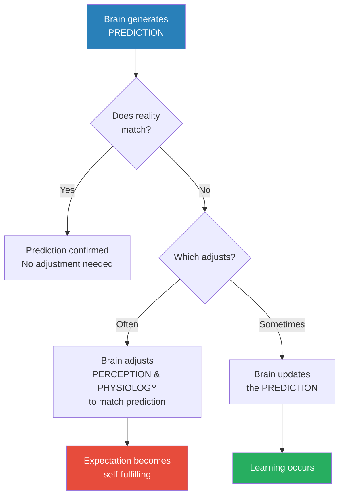
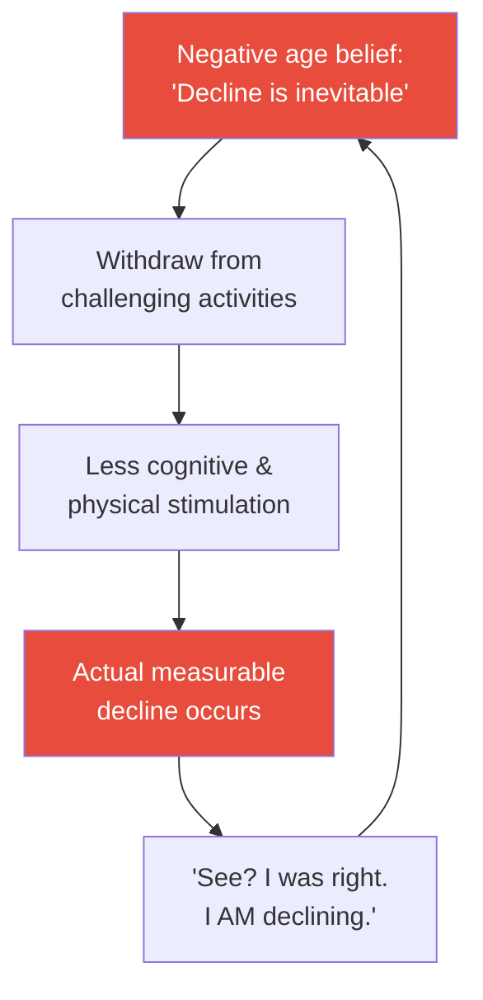
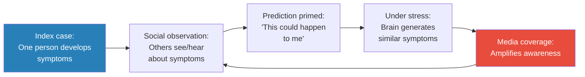
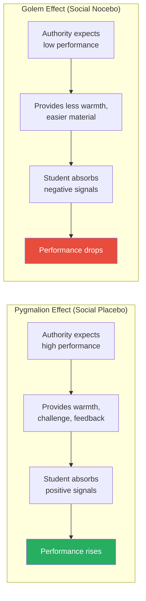
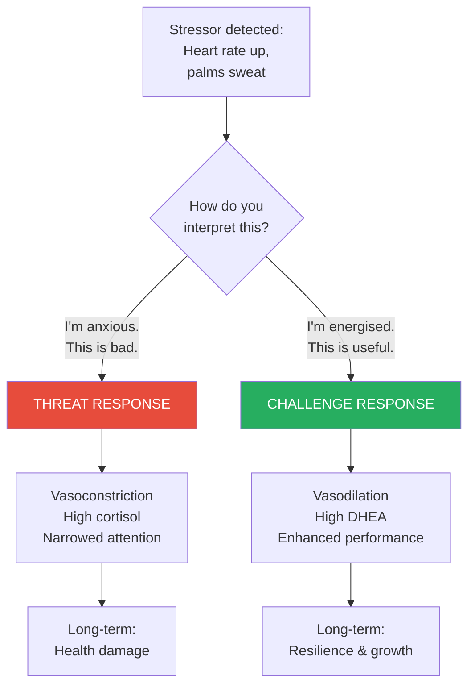
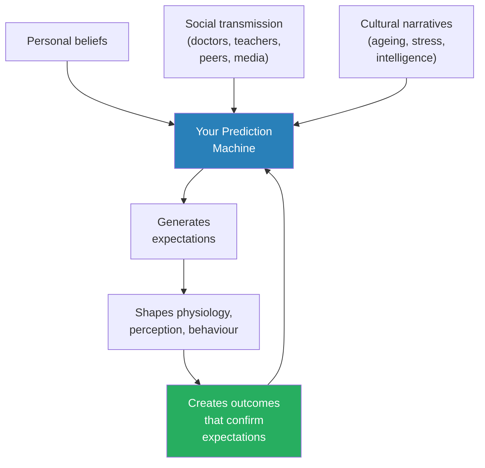

# The Expectation Effect — David Robson

> David Robson, a Cambridge-trained science journalist and former features editor at BBC Future, presents a startling argument backed by hundreds of studies: your brain is not a passive receiver of reality but an active prediction machine that shapes your body, your health, and your performance to match whatever it expects to find.
> *The Expectation Effect* shows how placebos trigger real biochemical changes, how believing stress is harmful literally makes it harmful, how your beliefs about ageing can add or subtract years from your life, and how the very concept of "limited willpower" may itself be an expectation effect.
> This is not positive thinking or self-help mysticism — it is hard neuroscience explaining why what you believe about yourself becomes biologically true.
> The book draws on research from Alia Crum, Becca Levy, Fabrizio Benedetti, Carol Dweck, and dozens of other researchers to reveal a single unifying principle: expectations do not just change how you feel — they change what your body actually does.

---

## About the Author

David Robson is a British science journalist who studied mathematics at Cambridge University before turning to science writing. He spent years as a features editor at BBC Future and as a staff writer at New Scientist, covering psychology, neuroscience, and decision-making. His first book, *The Intelligence Trap* (2019), explored why smart people make dumb mistakes. *The Expectation Effect* is his second book, and it reflects his signature approach: taking a body of complex scientific research and making it genuinely accessible without sacrificing nuance or rigour. Robson lives in London.

---

## The Big Idea

- The central argument of the book rests on a single insight from modern neuroscience: <b style="color: #2980b9">the brain is a prediction machine</b>
- It does not passively receive information from the world and body and then react
- Instead, it continuously generates predictions about what SHOULD be happening — and then adjusts perception, physiology, and behaviour to match those predictions
- When the brain expects pain, it primes pain pathways and you feel more pain — even if the stimulus hasn't changed
- When it expects a drug to work, it releases the same neurotransmitters the drug would release — even if the drug is a sugar pill
- When it expects ageing to mean decline, it accelerates biological ageing

---

- This is not the power of positive thinking, and Robson is careful to draw the line
- He is describing a <b style="color: #27ae60">measurable, physiological mechanism</b> — the brain's predictive processing system — not a motivational poster
- The expectation effect operates through specific, traceable biological pathways:
  - Endorphin and dopamine release in response to placebo treatments
  - Ghrelin hormone modulation based on what you believe you ate
  - Cardiovascular profile shifts based on how you frame stress
  - Cortisol and inflammatory marker changes based on age beliefs
- The implication is profound: <b style="color: #27ae60">the stories you tell yourself about your body, your mind, and your future become self-fulfilling prophecies — not metaphorically, but biochemically</b>

---

- Robson acknowledges the risks of this argument
- Taken too far, "your beliefs shape your reality" becomes victim-blaming: "you're sick because you didn't believe hard enough"
- He is explicit that expectations cannot cure cancer, regrow limbs, or override serious pathology
- What they CAN do is modulate the body's response within a meaningful range — reducing pain, improving recovery, extending healthspan, and enhancing performance
- The practical question is not "can I think my way to perfect health?" but rather <b style="color: #e74c3c">"are my current expectations making things worse than they need to be?"</b>
- For most people, the answer is yes

The brain's default is to adjust reality to match its predictions rather than update the predictions themselves — which is why expectations are so powerful and so persistent.

---

## Key Concepts at a Glance

| Concept | One-line summary |
|---------|-----------------|
| **The prediction machine** | The brain generates expectations and adjusts physiology to match them |
| **Placebo effect** | Positive expectations trigger real biochemical changes, not just subjective feelings |
| **Nocebo effect** | Negative expectations cause real physiological harm and symptoms |
| **Open-label placebos** | Placebos work even when patients know they are placebos |
| **Stress reappraisal** | Reframing stress as enhancing shifts the body from threat response to challenge response |
| **Limitless willpower** | Ego depletion may be an expectation effect — belief in limited willpower creates it |
| **Age expectations** | Beliefs about ageing predict longevity better than exercise, smoking, or BMI |
| **The milkshake study** | Identical foods labelled differently produce different hormonal responses |
| **Stereotype threat** | Activating negative group stereotypes measurably impairs performance |
| **Pygmalion effect** | Others' expectations of you shape your actual performance |
| **Mass psychogenic illness** | Nocebo effects can spread socially, creating real symptoms in groups |
| **Functional overlay** | Genuine symptoms amplified or created by expectation layered on top of real conditions |

---

## Chapter 1: The Prediction Machine

*Robson introduces the foundational neuroscience: your brain is not a camera recording reality but a simulator running predictions — and those predictions shape what you actually experience.*

### How the Brain Really Works

- The old model of the brain: sensory input comes in through eyes, ears, skin → brain processes it → brain produces a response
- The new model, supported by decades of neuroscience: <b style="color: #2980b9">predictive processing</b>
  - The brain continuously generates predictions about what it expects to encounter
  - Incoming sensory data is compared against these predictions
  - Only the DIFFERENCE (the "prediction error") gets processed in detail
  - If the prediction matches reality, the brain barely registers the input — it just confirms its model
- This is enormously efficient — the brain doesn't have to process every pixel, every sound wave, every nerve signal from scratch
- But it has a profound side effect: <b style="color: #27ae60">when predictions are wrong, the brain often adjusts perception rather than updating the prediction</b>
- The framework draws on the work of neuroscientists like Karl Friston, whose free energy principle formalises how the brain minimises surprise
- In essence, the brain is constantly running a simulation of the world and updating it only when forced to by overwhelming evidence
- Most of the time, your conscious experience is not "what is happening" but "what your brain predicted would happen"

---

### The Placebo as Proof

- The placebo effect is not a curiosity or a nuisance that researchers need to control for
- It is the most direct demonstration of the prediction machine in action
- When you take a pill you believe will reduce pain, your brain makes a prediction: "Pain will decrease"
- It then releases endorphins and activates descending pain-modulation pathways — the same pathways activated by real painkillers
- The result: you actually feel less pain, and the pain reduction is measurable on brain scans

> [!example] Fabrizio Benedetti's Morphine Experiments (2000s)
> - Benedetti, an Italian neuroscientist at the University of Turin, studied how morphine works in post-surgical patients
> - In one condition, a doctor visibly administered morphine while telling the patient what they were receiving
> - In another condition, a hidden pump delivered the exact same dose without the patient's knowledge
> - The visible morphine was significantly more effective than the hidden morphine — same drug, same dose
> - The difference was the patient's expectation: knowing you're receiving a painkiller activates the brain's own pain-relief systems ON TOP of the drug
> - When Benedetti blocked endorphin receptors with naloxone, the placebo component of the pain relief disappeared — proving it was biochemically real
> **The lesson:** A drug's effectiveness is not just chemistry — it is chemistry PLUS expectation. Remove the expectation and you lose a significant portion of the effect.

- <b style="color: #e74c3c">This means that every time a doctor says "this might not work" or "some patients don't respond well," they may be actively reducing the treatment's effectiveness</b>
- The framing of a treatment is not separate from the treatment — it IS part of the treatment

---

### Placebo Variability Across Conditions

- Robson notes that placebo effects are not uniform — they vary by condition and context:
  - Pain relief: among the strongest placebo responses, with endorphin release matching low-dose opioids in some studies
  - Depression: placebo response rates in antidepressant trials have climbed over decades, now accounting for a large portion of measured drug effects
  - Parkinson's disease: placebo treatments trigger real dopamine release in the brains of Parkinson's patients — the exact neurotransmitter they are deficient in
  - Immune function: more limited, but some studies show placebo-conditioned immune responses
- The strength of the placebo depends on:
  - How elaborate the treatment ritual is (injections beat pills, surgery beats injections)
  - How authoritative the provider seems
  - How much the patient trusts the provider
  - How expensive or exclusive the treatment appears
- <b style="color: #27ae60">The brain calibrates its prediction partly on how "serious" the treatment feels — more ritual means a stronger expectation, which means a stronger physiological response</b>

---

### Open-Label Placebos

- The most surprising finding in placebo research: <b style="color: #2980b9">open-label placebos</b> — placebos that patients are told are placebos — still work
- Ted Kaptchuk at Harvard has run multiple trials:
  - Patients with irritable bowel syndrome told "these are placebo pills with no active ingredients" still experienced significant symptom improvement
  - The improvement was comparable to some active medications
- How is this possible? Robson explains:
  - The brain's prediction machine responds to the RITUAL of treatment, not just the belief in a specific drug
  - Taking a pill, following a regimen, engaging with a healthcare provider — all of these activate healing expectations
  - Even knowing something is a placebo, the learned association between "taking medicine" and "getting better" triggers real physiological responses
  - The body has spent a lifetime learning: pills → feeling better. That conditioning does not switch off just because you know the mechanism

> [!example] Kaptchuk's IBS Open-Label Trial (2010)
> - Ted Kaptchuk recruited 80 patients with irritable bowel syndrome at Harvard Medical School
> - Half received no treatment; half received pills clearly labelled as placebos
> - The placebo group was told explicitly: "These pills contain no active ingredient whatsoever"
> - But they were also told that placebos have been shown in clinical research to produce significant mind-body healing
> - After three weeks, the open-label placebo group reported nearly double the symptom improvement of the no-treatment group
> - The improvement was clinically meaningful — comparable to the best IBS medications
> **The lesson:** You don't need to be tricked for the prediction machine to activate. The ritual of treatment, combined with the knowledge that placebos work, is enough to trigger real physiological change.

> [!tip] Core Insight
> The placebo effect is not "all in your head" — it is in your endorphins, your dopamine, your immune function, and your cardiovascular system. It is the prediction machine doing exactly what it evolved to do: preparing the body for what it expects to happen next.

---

### The Dark Side: Nocebo Effects

- If positive expectations produce positive physiological changes, <b style="color: #e74c3c">negative expectations produce negative physiological changes</b>
- This is the <b style="color: #2980b9">nocebo effect</b> — the prediction machine working in reverse
- Robson argues nocebo effects may be more dangerous than placebo effects are beneficial, because:
  - Bad news spreads faster than good news
  - Warnings about side effects are legally required (and therefore universal)
  - Cultural narratives about ageing, stress, and decline are overwhelmingly negative
  - Fear and anxiety prime the prediction machine more powerfully than hope

> [!example] The Japanese Lacquer Tree Experiment (1960s)
> - Researchers blindfolded thirteen boys who were known to be allergic to Japanese lacquer trees (similar to poison ivy)
> - They rubbed one arm with harmless chestnut tree leaves while telling the boys it was lacquer
> - They rubbed the other arm with actual lacquer tree leaves while telling the boys it was harmless chestnut
> - Twelve of thirteen boys developed a rash on the arm rubbed with the HARMLESS leaves
> - Only two developed a rash from the ACTUAL allergen
> - The expectation of contact with an allergen triggered a real allergic response; the expectation of safety suppressed one
> **The lesson:** The immune system itself responds to expectations — the body doesn't just feel what it expects to feel, it DOES what it expects to do.

> [!example] Statin Side Effects and the Nocebo Problem
> - Robson describes the controversy around statin medications prescribed for high cholesterol
> - Clinical trials consistently show that patients who know they are taking statins report far higher rates of muscle pain than patients who receive the same drug without knowing
> - In double-blind conditions, the difference in side effects between statin and placebo groups is minimal
> - Yet in open-label use (real-world prescriptions where patients know what they're taking), side effect rates are dramatically higher
> - Patient forums and media coverage of statin side effects create a self-reinforcing nocebo loop: patients read about muscle pain, expect muscle pain, and experience muscle pain
> **The lesson:** The nocebo effect doesn't just create phantom symptoms — it can cause patients to abandon effective, life-saving treatments because they experience side effects that are partly or wholly expectation-driven.

---

## Chapter 2: A Miserable Old Age?

*Robson reveals that our beliefs about ageing may be the single largest modifiable factor in how we age — larger than exercise, diet, or even smoking.*

### The 7.5-Year Gap

- <b style="color: #2980b9">Becca Levy</b>, a psychologist at Yale, has spent decades studying how beliefs about ageing affect actual ageing
- Her most famous finding comes from the Ohio Longitudinal Study of Aging and Retirement:
  - In 1975, researchers surveyed 660 adults aged 50+ about their views on ageing
  - They asked questions like: "As you get older, are you less useful?" and "Do things keep getting worse as you get older?"
  - They then tracked these people for over two decades
- The result: <b style="color: #27ae60">people with positive age beliefs lived an average of 7.5 years longer than those with negative age beliefs</b>
- This effect persisted after controlling for age, gender, socioeconomic status, loneliness, and functional health at baseline

> [!tip] Core Insight
> The 7.5-year longevity gap from age beliefs is larger than the gains from exercising regularly (1-3 years), maintaining a healthy weight (1-3 years), or not smoking (3-5 years). What you believe about getting older may matter more than what you do about it.

---

### How Age Beliefs Kill

- Levy's subsequent research traced the biological mechanisms:
  - People with negative age beliefs show higher cortisol levels and greater cardiovascular stress reactivity
  - They have higher rates of the **APOE e4 gene expression** — the gene most associated with Alzheimer's disease
  - Negative age beliefs were associated with greater accumulation of amyloid plaques and neurofibrillary tangles — the physical hallmarks of Alzheimer's
  - <b style="color: #e74c3c">Even people carrying the APOE e4 gene were partially protected from Alzheimer's if they held positive age beliefs</b>
- The mechanism is a self-fulfilling prophecy loop:
  - You expect decline → you withdraw from challenging activities → your brain and body receive less stimulation → you actually decline → this confirms your expectation → you withdraw further

This vicious cycle shows how age expectations become self-fulfilling: the belief in decline creates the conditions for decline, which confirms the belief.

---

### Cross-Cultural Evidence

- Robson strengthens the case by looking across cultures:
  - In cultures where elders are respected and ageing is associated with wisdom (many East Asian societies), age-related cognitive decline is measurably slower
  - In cultures where ageing is framed as loss and decay (much of Western society), decline is faster
  - This cannot be explained by genetics alone — Japanese Americans who adopt Western attitudes about ageing show Western patterns of decline
- The implication is not that you can think your way out of ageing
- It is that <b style="color: #27ae60">the degree of age-related decline you experience is significantly modulated by what your culture and your own beliefs tell you to expect</b>

> [!example] Becca Levy's Subliminal Priming Study (2000s)
> - Levy brought older adults into a lab and exposed them to subliminal flashes of either positive age-related words ("wise," "experienced," "accomplished") or negative ones ("senile," "decrepit," "dependent")
> - The words flashed too quickly for conscious recognition — participants didn't know what they'd seen
> - Those primed with positive age words performed significantly better on memory tests and walked faster afterward
> - Those primed with negative age words performed worse and walked more slowly
> - The priming didn't change their actual ability — it changed the brain's predictions about what their ability SHOULD be
> **The lesson:** Age-related performance is partly driven by the brain's expectations, which can be shifted even by stimuli too fast to consciously perceive.

---

### Stereotype Embodiment Theory

- Levy developed <b style="color: #2980b9">Stereotype Embodiment Theory</b> to explain these findings:
  - Age stereotypes are absorbed from culture throughout life, starting in childhood
  - They operate unconsciously — you don't choose to believe ageing means decline; the belief is installed by thousands of cultural messages
  - Once internalised, these stereotypes become self-relevant when you reach the age they describe
  - They then shape health outcomes through three pathways:
    - **Psychological:** Reduced motivation, lower self-efficacy, withdrawal from challenges
    - **Behavioural:** Less exercise, worse diet, fewer preventive health behaviours, not following medical advice because "what's the point at my age"
    - **Physiological:** Elevated cortisol, inflammatory markers, cardiovascular stress response

| Pathway | Mechanism | Example |
|---------|-----------|---------|
| Psychological | Reduced motivation and self-efficacy | "I'm too old to learn new things" → stops trying |
| Behavioural | Withdrawal from health-promoting activities | "Exercise is for young people" → becomes sedentary |
| Physiological | Elevated stress hormones and inflammation | Chronic cortisol → accelerated cellular ageing |

These three pathways reinforce each other — psychological withdrawal leads to behavioural changes, which produce physiological effects, which confirm the psychological belief.

The 7.5-year longevity gap from positive age beliefs exceeds the gains from exercise, healthy weight, and even not smoking — making belief about ageing the single largest modifiable factor in how long you live.

---

## Chapter 3: Tormented by Thin Air

*Robson explores how expectations shape physical symptoms — from altitude sickness to chronic pain — revealing that the body's response to a stressor is inseparable from what it expects that stressor to do.*

### When Expectations Create Symptoms

- Altitude sickness provides a natural experiment in the expectation effect
- The symptoms — headache, nausea, dizziness, fatigue — are real and can be dangerous
- But research shows that <b style="color: #27ae60">a significant portion of altitude sickness symptoms are driven by expectation rather than oxygen deprivation alone</b>
- Studies have found that:
  - People told they are at a higher altitude than they actually are report more symptoms
  - People given "oxygen" (actually normal air) at altitude report rapid improvement
  - The correlation between actual oxygen levels and symptom severity is weaker than you'd expect

> [!example] The Sham Altitude Study
> - Researchers brought participants to a moderate altitude research facility
> - One group was told they were at a significantly higher elevation than they actually were
> - Another group was given the accurate elevation
> - The group with inflated altitude expectations reported significantly more severe symptoms — headaches, nausea, dizziness
> - Objective oxygen saturation levels were identical between groups
> - The expectation of altitude sickness literally made the body produce altitude sickness symptoms
> **The lesson:** The brain's prediction of how the body should respond to a stressor can be more powerful than the stressor itself.

---

### Pain: Where Expectation Is Everything

- Pain is the domain where expectation effects are most dramatic and best understood
- Robson presents the modern neuroscience of pain:
  - Pain is NOT a direct readout of tissue damage
  - It is the brain's INTERPRETATION of signals from the body, filtered through context, expectation, and prior experience
  - The same nerve signal can be experienced as agony or as mild discomfort depending on what the brain expects
  - Soldiers wounded in battle frequently report no pain until they reach safety — the brain suppresses pain signals when survival demands focus on escape
  - Conversely, people with chronic pain conditions can experience excruciating pain in areas where scans show no tissue damage at all

- <b style="color: #2980b9">The biopsychosocial model of pain</b> has replaced the old "damage → pain" model:
  - **Bio:** Tissue signals from the body (nociception)
  - **Psycho:** Expectations, beliefs, fears, attention, emotional state
  - **Social:** Cultural norms, medical framing, what others tell you about your pain
- All three factors modulate the actual experience of pain — they don't just affect how you REPORT pain, they change the pain itself
- The old model suggested a direct pipeline: tissue damage → nerve signal → brain registers pain
- The new model recognises that the brain is actively constructing the pain experience:
  - It weighs nociceptive signals against context, memory, and expectation
  - It can amplify faint signals into severe pain (when it expects danger) or suppress strong signals (when it expects safety)
  - <b style="color: #27ae60">This means that changing what the brain expects can genuinely change how much pain a person experiences — not their report of pain, but the pain itself</b>

> [!example] The Thermal Grill Illusion
> - Researchers place participants' fingers on alternating warm and cool bars arranged in a grill pattern
> - Neither the warm nor the cool temperature is painful on its own
> - But the combination produces a sensation of burning pain — the brain interprets the conflicting temperature signals as tissue damage
> - The pain is real — participants withdraw their hands and show pain-related brain activation
> - Yet there is zero tissue damage, zero nociceptive input that would normally trigger pain
> - The brain's prediction system has constructed pain from non-painful inputs based on a pattern it interprets as dangerous
> **The lesson:** Pain is a construction of the prediction machine, not a readout of damage. The brain creates pain when it predicts danger — and that prediction can be wrong.

---

### Chronic Pain and the Expectation Trap

- Robson pays particular attention to chronic pain — pain that persists long after any original injury has healed
- The prediction machine framework explains why chronic pain is so stubborn:
  - After an injury, the brain learns to predict pain from the affected area
  - Even after tissues heal, the prediction remains active
  - Every twinge or sensation from the area gets interpreted through the lens of the existing prediction: "This area is damaged and painful"
  - The brain amplifies normal sensory signals into pain because it EXPECTS pain from that location
  - <b style="color: #e74c3c">The patient is not imagining the pain — their prediction machine is genuinely generating it — but the cause has shifted from tissue damage to expectation</b>
- This understanding is transforming chronic pain treatment:
  - Education about the neuroscience of pain (explaining that the brain constructs pain) has been shown to reduce chronic pain
  - Graded exposure to movement reduces pain by updating the prediction machine's model of what movements are "dangerous"
  - The key shift: from "my body is broken" to "my brain's alarm system is overprotective"

---

### The Power of Medical Framing

- <b style="color: #e74c3c">How a doctor describes a procedure measurably changes how much it hurts</b>
- Research on medical procedures shows:
  - "You'll feel a sharp sting" produces more pain than "You'll feel a small pinch"
  - "This is a very effective painkiller" produces more relief than "This might help"
  - Warning patients extensively about side effects increases the rate of side effects
- Robson argues this creates an ethical dilemma:
  - Doctors are legally required to disclose risks and side effects
  - But disclosing side effects can CREATE those side effects through the nocebo mechanism
  - The solution is not to withhold information but to frame it differently:
    - Instead of "30% of patients experience nausea," say "70% of patients tolerate this well"
    - Instead of "this will hurt," say "most patients find this manageable"
    - The facts are identical — the framing is different — and the outcomes change

> [!abstract] Framing Medical Information to Reduce Nocebo Effects
> 1. Lead with positive statistics ("70% tolerate this well" rather than "30% get side effects")
> 2. Normalise the experience ("You may feel some warmth — that's the medication working")
> 3. Emphasise agency ("Many patients find that deep breathing during the procedure reduces discomfort")
> 4. Avoid nocebo-loaded language ("sharp," "painful," "burning," "dangerous")
> 5. Provide contextual reassurance without dishonesty

---

## Chapter 4: The Origins of Mass Hysteria

*Robson shows how nocebo effects can spread socially — from one person to hundreds — producing real, medically documented symptoms with no physical cause.*

### When Expectations Are Contagious

- If one person's expectations can produce real symptoms, can expectations spread through a group?
- The answer is unambiguously yes — and the result is <b style="color: #2980b9">mass psychogenic illness</b> (MPI)
- MPI is not "mass hysteria" in the dismissive sense — the symptoms are real, measurable, and genuinely distressing
- But they have no identifiable environmental or infectious cause — they spread through social expectation

> [!example] The Le Roy Tic Outbreak (2011-2012)
> - In October 2011, a high school cheerleader in Le Roy, New York, developed sudden, severe tics — jerking movements and vocal outbursts resembling Tourette's syndrome
> - Within weeks, over a dozen students, mostly female, developed similar symptoms
> - Specialists were called in; environmental toxins were investigated; the story made national news
> - No environmental cause was found — the site was thoroughly tested
> - Neurologists diagnosed conversion disorder (functional neurological disorder) — the brain was producing real motor symptoms in response to psychological stress, amplified by social contagion
> - The media attention made it worse: each news report introduced the symptoms to more potential sufferers
> - As attention faded and students received appropriate psychological treatment, symptoms resolved
> **The lesson:** The prediction machine doesn't operate in isolation — it picks up expectations from the people around you, especially in conditions of stress and uncertainty.

---

### The Mechanism of Social Nocebo

- Robson explains why MPI happens:
  - <b style="color: #27ae60">The brain's prediction machine absorbs information from the social environment, not just from direct experience</b>
  - Seeing someone else experience symptoms activates mirror neuron systems and primes the prediction machine: "This could happen to me"
  - Under conditions of stress, the threshold for symptom generation drops — the brain becomes more willing to generate symptoms in response to predictions
  - Media amplification creates a feedback loop: more coverage → more people become aware of the symptoms → more people's prediction machines are primed → more cases appear

Mass psychogenic illness follows a social contagion loop: each new case feeds back into the prediction system of those exposed to it.

---

### The Wind Turbine Effect

- Robson describes a modern example of social nocebo: opposition to wind turbines
- Communities near wind farms report symptoms: headaches, insomnia, nausea, dizziness
- These symptoms are real and genuinely experienced
- But controlled studies show:
  - Communities warned about potential health effects of wind turbines report significantly more symptoms
  - Communities where turbines are installed without prior nocebo-loaded warnings report few or no symptoms
  - Blinded laboratory tests (playing wind turbine sound frequencies without telling subjects) produce no symptoms
  - <b style="color: #e74c3c">The symptoms are caused by the expectation of symptoms, not by the turbines themselves</b>
- This creates a policy dilemma: informing communities about potential risks may CREATE those risks

---

### Historical Pattern

- Robson traces mass psychogenic illness through history:
  - Medieval dancing plagues
  - Factory fainting epidemics in the 19th and 20th centuries
  - Gulf War Syndrome — elements of genuine toxic exposure combined with significant expectation effects
  - "Havana Syndrome" — mysterious illness among US diplomats, where evidence increasingly points toward psychogenic factors amplified by intelligence community narratives
- The common factors across all cases:
  - A plausible threat narrative (real or perceived)
  - An index case that makes the symptoms visible
  - Social transmission through observation, conversation, and media
  - Stress or anxiety that lowers the prediction machine's threshold for generating symptoms
  - <b style="color: #27ae60">Symptoms resolve when the threat narrative is defused and appropriate psychological support is provided</b>

| Factor | Role in MPI | Modern Amplifier |
|--------|------------|------------------|
| Plausible threat narrative | Gives the prediction machine a "what to expect" | 24-hour news cycle |
| Visible index case | Primes observation-based prediction | Social media sharing |
| Social transmission | Spreads the prediction through a group | Online patient forums |
| Background stress | Lowers the threshold for symptom generation | Pandemic anxiety, economic uncertainty |
| Medical investigation | Can legitimise and amplify the narrative | Sensationalised health reporting |

Each factor compounds the others — modern communication technology has made MPI outbreaks faster and wider-reaching than at any point in history.

---

## Chapter 5: Faster, Stronger, Fitter

*Robson takes the expectation effect into the gym and shows that your beliefs about exercise may matter almost as much as the exercise itself.*

### The Housekeeper Study

- This is one of the most famous studies in expectation research, and Robson uses it as the centrepiece of this chapter

> [!example] Alia Crum and Ellen Langer's Hotel Housekeepers (2007)
> - Crum and Langer studied 84 hotel housekeepers across seven hotels
> - All of them were getting significant daily exercise — vacuuming, scrubbing, carrying, lifting, climbing stairs — but when surveyed, 67% said they did not exercise regularly and most said they got no exercise at all
> - They didn't categorise their work as "exercise" — it was just work
> - The researchers split the housekeepers into two groups:
>   - **Informed group:** Told that their daily work met or exceeded the Surgeon General's recommendations for an active lifestyle, with specific calorie counts for each task
>   - **Control group:** Received no information
> - Four weeks later, the informed group had lost weight, reduced blood pressure, reduced body fat percentage, and improved their waist-to-hip ratio
> - The control group showed no changes
> - Neither group had changed their actual behaviour — same work, same diet, same routines
> **The lesson:** Simply knowing that your existing activity counts as exercise caused the body to respond AS IF it were exercising more. The prediction machine adjusted physiology to match the new expectation.

- This study has been replicated and extended:
  - Similar effects have been found with perceived exertion during workouts
  - <b style="color: #27ae60">People who believe their daily activity is beneficial extract more health benefit from that activity</b>
  - The mechanism likely involves hormonal responses — stress hormones, growth factors, and metabolic markers that shift based on the brain's categorisation of activity

---

### Exercise Beliefs and Mortality

- Robson presents a large-scale follow-up:
  - Researchers followed 60,000+ adults and measured both their actual activity levels AND their perception of how active they were relative to peers
  - People who perceived themselves as less active than their peers had a higher mortality rate — even after controlling for actual activity level
  - <b style="color: #e74c3c">Believing you're unfit may be independently harmful, regardless of whether you actually are</b>
- The finding inverts how we usually think about health messaging:
  - Campaigns that emphasise how sedentary modern people are may inadvertently make those people less healthy
  - Telling someone "you don't exercise enough" installs a prediction of unfitness that the body then enacts
  - A more effective message might be: "You're already more active than you think — here's what counts"

---

### Genetic Expectations

- Robson describes Alia Crum's follow-up research on genetic expectations:

> [!example] Crum's Gene Belief Study (2014)
> - Participants were given a genetic test for a variant of the CREB1 gene related to exercise capacity
> - They were then told either that they had the "high endurance" or "low endurance" variant
> - The assignment was random — it had nothing to do with their actual genetics
> - Those told they had the low-endurance variant performed worse on a treadmill test and quit sooner
> - Those told they had the high-endurance variant performed better
> - Physiological measurements confirmed the differences were real: different CO2 levels, different lung efficiency, different cardiovascular responses
> - The genetic label changed their actual physical capacity
> **The lesson:** Being told you have a genetic limitation can create that limitation — your body adjusts its performance to match the prediction.

> [!tip] Core Insight
> Exercise is not a purely mechanical process. The brain's expectations about your fitness, your genetic potential, and whether your activity "counts" as exercise all modulate the actual physiological benefits you receive.

---

## Chapter 6: The Food Paradox

*Robson reveals that what you believe you're eating may matter as much as what you're actually eating — your expectations shape hunger hormones, metabolic response, and satiety.*

### The Milkshake That Changed Endocrinology

- <b style="color: #2980b9">Alia Crum's milkshake study</b> is one of the most elegant demonstrations of the expectation effect

> [!example] The Milkshake Study (Crum, 2011)
> - Participants came to the lab on two occasions, one week apart
> - Each time they drank a milkshake
> - On one visit, the shake was labelled "Indulgence" — described as a rich, 620-calorie treat
> - On the other visit, the same shake was labelled "Sensi-Shake" — described as a guilt-free, 140-calorie health drink
> - The shakes were identical — same recipe, same calories (actually 380 calories)
> - Researchers measured ghrelin levels (the "hunger hormone") via blood draws before and after each shake
> - After the "indulgent" shake: ghrelin dropped steeply — the body signalled strong satiety
> - After the "sensible" shake: ghrelin remained relatively flat — the body acted as if it hadn't consumed much
> - Same shake, same calories — different label, different hormonal response
> **The lesson:** The metabolic system does not respond to what you eat — it responds to what your brain PREDICTS you ate. Expectations literally shape your hormones.

---

### Why Diets Backfire

- Robson uses the milkshake study to explain a paradox in dieting:
  - Labelling food as "low-calorie" or "diet" may make it LESS satisfying at the hormonal level
  - Your ghrelin doesn't drop as much, so you feel hungrier sooner, so you eat more
  - <b style="color: #e74c3c">The diet label itself may sabotage the diet</b>
- This connects to broader evidence:
  - People who eat "guilt-free" versions of foods report less satisfaction and eat more total calories over the day
  - People who eat the same food described as "indulgent" report greater satisfaction and eat less later
  - The framing is not just psychological comfort — it is hormonal reality

---

### Mindful Indulgence

- Robson's practical conclusion on food is not about tricking yourself:
  - He is not suggesting you label everything as "indulgent" and ignore nutrition
  - The point is that <b style="color: #27ae60">approaching food with enjoyment, attention, and positive expectation — rather than guilt, restriction, and fear — produces better metabolic outcomes</b>
  - This aligns with research on mindful eating: paying attention to food, savouring it, and eating without distraction all improve satiety signals
  - French eating culture (smaller portions, greater pleasure, less snacking) may partially reflect this dynamic
- The implication for diet culture is uncomfortable:
  - Labelling foods as "bad," "guilty pleasures," or "cheat meals" primes the prediction machine for conflict
  - The guilt triggers cortisol, which promotes fat storage — the opposite of what the dieter wants
  - The restriction framing triggers weaker satiety signalling, which promotes overeating
  - <b style="color: #e74c3c">The entire psychological architecture of restrictive dieting may work against the body's own regulatory systems</b>
- Robson does not argue against healthy eating — he argues against the punitive framing that surrounds it
- Eating well AND enjoying it is not a contradiction — the enjoyment is part of the mechanism that makes healthy eating effective

| Eating Mindset | Hormonal Response | Behavioural Result |
|---------------|-------------------|-------------------|
| "This is indulgent and satisfying" | Steep ghrelin decline → strong satiety | Eat less later, feel satisfied |
| "This is diet food, low-calorie" | Flat ghrelin → weak satiety | Eat more later, feel deprived |
| "I shouldn't be eating this" | Cortisol spike + flat ghrelin | Guilt + continued hunger |

The metabolic response to food is shaped by the story you tell yourself about what you're eating — not just by the calories themselves.

---

## Chapter 7: Limitless Willpower

*Robson dismantles one of psychology's most popular ideas — ego depletion — and shows that "running out of willpower" may itself be an expectation effect.*

### The Ego Depletion Story

- For decades, the dominant model of willpower came from Roy Baumeister:
  - <b style="color: #2980b9">Ego depletion</b>: willpower is like a muscle that gets tired with use
  - Every act of self-control drains a finite pool of willpower
  - After exerting self-control on one task, you have less available for the next
  - The resource was hypothesised to be blood glucose — literally running out of sugar
- This model was enormously influential — it appeared in hundreds of studies and popular books
- It suggested that willpower was fundamentally limited, and the best strategy was to conserve it

---

### The Cracks in the Theory

- The ego depletion model began to fall apart under scrutiny:
  - A massive replication attempt (the "ego depletion replication project" involving 23 labs) found little to no evidence for the effect
  - The glucose theory was undermined — just rinsing your mouth with sugar water (without swallowing) reversed the "depletion," which makes no sense if the mechanism is actually running out of glucose
  - Cross-cultural studies showed that ego depletion effects were smaller or absent in non-Western populations
- Enter <b style="color: #2980b9">Veronika Job and Carol Dweck</b>:

> [!example] Job and Dweck's Willpower Beliefs Study (2010)
> - Job and Dweck surveyed students about their beliefs regarding willpower
> - Some believed willpower was a limited resource that gets depleted (the "limited" theory)
> - Others believed willpower was self-generating — that exerting self-control is energising, not draining (the "unlimited" theory)
> - They then gave both groups the standard ego depletion task sequence: a demanding self-control task followed by a second task measuring remaining willpower
> - Those who believed willpower was limited showed the classic ego depletion effect — they performed worse on the second task
> - Those who believed willpower was unlimited showed no depletion whatsoever
> - In follow-up studies, students with unlimited willpower beliefs had better grades, better emotional regulation, and healthier habits during exam periods
> **The lesson:** Ego depletion may not be a biological fact — it may be an expectation effect. Believing you'll run out of willpower creates the experience of running out.

---

### The Cultural Dimension

- <b style="color: #27ae60">Indian participants in ego depletion studies consistently show weaker or absent depletion effects</b>
- Robson suggests this reflects cultural differences in willpower beliefs:
  - Many Indian philosophical traditions frame self-discipline as self-reinforcing, not depleting
  - Western culture frames willpower as limited and precious — "I've had a long day, I deserve a treat"
  - These cultural beliefs may literally determine whether ego depletion occurs

Whether willpower depletes or replenishes depends on what you believe it does — the expectation shapes the experience.

---

### What This Means in Practice

- Robson is careful not to say "willpower is infinite — just believe harder"
- Genuine fatigue, sleep deprivation, and metabolic stress are real
- But within normal daily life, <b style="color: #27ae60">the belief that you've "used up" your willpower is doing far more to exhaust you than any actual resource depletion</b>
- The practical implication:
  - Stop telling yourself you're "out of willpower" at the end of a hard day
  - Reframe self-control as a skill that gets easier with practice, not a reservoir that drains
  - Notice the narrative: "I've had a tough day, I deserve to give in" is a story, not a biological fact
- <b style="color: #e74c3c">The biggest danger of the ego depletion model is that it gives you scientific-sounding permission to quit</b>

---

## Chapter 8: The Origins of Genius

*Robson examines how beliefs about intelligence — fixed or growable — shape academic achievement, and how stereotypes about groups become self-fulfilling prophecies.*

### Growth Mindset: The Evidence

- <b style="color: #2980b9">Carol Dweck's growth mindset</b> framework is one of the most cited in modern psychology:
  - **Fixed mindset:** Intelligence is a stable trait — you're either smart or you're not
  - **Growth mindset:** Intelligence is malleable — effort, strategy, and learning can expand your abilities
- Robson presents the core evidence:
  - Students with growth mindsets perform better academically, particularly when they hit difficulty
  - Fixed-mindset students interpret struggle as evidence of low ability and give up
  - Growth-mindset students interpret struggle as part of the learning process and persist
  - Brain imaging studies show that growth-mindset individuals process errors differently — they pay more attention to errors and show greater neural activity in correction-related regions
- The prediction-machine lens explains why this works:
  - A fixed mindset tells the prediction machine: "Difficulty means I've reached my limit"
  - The brain then reduces motivation, triggers threat physiology, and withdraws effort
  - A growth mindset tells the prediction machine: "Difficulty means I'm about to learn something"
  - The brain then maintains or increases effort, triggers challenge physiology, and allocates more resources to the task
  - <b style="color: #27ae60">The mindset doesn't change your raw cognitive capacity — it changes whether the prediction machine gives you access to the capacity you already have</b>

> [!example] Dweck's Praise Studies (1990s-2000s)
> - Dweck and colleagues gave children a moderately difficult puzzle task
> - After the first round, one group was praised for intelligence: "You must be smart at this"
> - Another group was praised for effort: "You must have worked hard at this"
> - In subsequent rounds, the "smart" group chose easier puzzles, lied about their scores, and showed declining performance when tasks got harder
> - The "effort" group chose harder puzzles, persisted longer, and showed improving performance
> - A single sentence of praise — one framing of what caused success — changed the children's prediction machine
> - Intelligence praise installed a fixed prediction: "I succeed because I'm smart, so if I struggle, I must not be smart"
> - Effort praise installed a growth prediction: "I succeed because I try, so if I struggle, I should try more"
> **The lesson:** How you explain success to yourself determines how you respond to difficulty. The brain's prediction about the source of competence shapes future effort.

---

### The Replication Debate

- Robson is honest about the controversy:
  - Large-scale replication studies of growth mindset interventions have shown mixed results
  - Some interventions produce significant effects; others produce small or null effects
  - The effect size debate: even when effects are significant, they tend to be small in magnitude
- His resolution:
  - <b style="color: #27ae60">Growth mindset is not a magic bullet — it is one component of a broader expectation ecosystem</b>
  - It works best when combined with:
    - Teachers who actually believe in growth and communicate that belief
    - Institutional structures that reward effort and learning, not just performance
    - Cultural narratives that normalise struggle as part of mastery
  - A brief workshop that says "your brain can grow" is less powerful than an environment that embodies that belief at every level

---

### Stereotype Threat

- <b style="color: #2980b9">Claude Steele's stereotype threat</b> research demonstrates the nocebo effect on intellectual performance:

> [!example] Steele and Aronson's Stereotype Threat Experiment (1995)
> - Black and white Stanford students were given the same difficult verbal test
> - In one condition, the test was described as a measure of intellectual ability
> - In another condition, it was described as a problem-solving exercise unrelated to ability
> - When the test was framed as measuring ability, black students performed significantly worse than white students with equivalent preparation
> - When the same test was framed as a neutral exercise, the gap disappeared
> - The performance gap was not caused by ability — it was caused by the activation of a negative stereotype ("Black students perform worse on intellectual tests") which consumed cognitive resources and triggered anxiety
> **The lesson:** Stereotypes do not just describe group differences — they create them. The expectation of poor performance generates poor performance.

- <b style="color: #e74c3c">Stereotype threat has been demonstrated across dozens of groups and domains:</b>
  - Women on maths tests when gender is made salient
  - Elderly people on memory tests when age is made salient
  - White athletes on athletic tasks when racial stereotypes are activated
  - Low-income students on academic tests when class is made salient
- The mechanism is the prediction machine:
  - Activating a stereotype primes the brain's prediction: "People like me perform poorly on this"
  - This prediction consumes working memory (you're monitoring your own performance for signs of failure)
  - It generates anxiety (which further impairs cognitive function)
  - It shifts physiology toward a threat response (vasoconstriction, cortisol release)
  - All of this produces the very performance deficit the stereotype predicts

---

## Chapter 9: The Prediction Machine Goes to School

*Robson shows that other people's expectations of you — especially authority figures — have the power to shape your actual abilities, for better or worse.*

### The Pygmalion Effect

- <b style="color: #2980b9">The Pygmalion effect</b> (also called the Rosenthal effect) is one of the most famous findings in educational psychology:

> [!example] Rosenthal and Jacobson's Pygmalion Experiment (1968)
> - Robert Rosenthal and Lenore Jacobson went into an elementary school in San Francisco
> - They administered a standard IQ test to all students
> - They then told teachers that certain students had been identified as "late bloomers" — children who were about to experience a dramatic intellectual growth spurt
> - In reality, the "late bloomers" were chosen at random — there was nothing special about them
> - At the end of the school year, they re-tested all students
> - The randomly designated "late bloomers" showed significantly greater IQ gains than the control group — especially in the younger grades (first and second graders gained up to 15-27 IQ points more)
> - The teachers' expectations had literally changed the children's measured intelligence
> **The lesson:** When teachers believe a student has high potential, they unconsciously provide more encouragement, more challenging material, more feedback, and more patience — all of which produce real cognitive growth.

---

### How Teacher Expectations Transmit

- Robson traces the mechanisms through which expectations pass from teacher to student:
  - **Warmth:** Teachers are warmer and more encouraging toward students they believe are capable
  - **Input:** They provide more challenging material and more learning opportunities
  - **Output:** They call on expected-to-succeed students more often and give them more time to answer
  - **Feedback:** They provide more detailed, specific feedback — not just "good job" but genuine engagement with the student's thinking
- <b style="color: #27ae60">These behavioural differences are unconscious — teachers don't realise they're treating students differently</b>

| Teacher Behaviour | High-expectation student | Low-expectation student |
|------------------|------------------------|------------------------|
| Wait time after question | Longer (more patience) | Shorter (moves on quickly) |
| Difficulty of material | Challenging, stretching | Simplified, remedial |
| Feedback quality | Specific and constructive | Vague or absent |
| Emotional warmth | More smiling, eye contact | Less engagement |
| Tolerance for errors | Errors seen as learning | Errors seen as confirmation of low ability |

The Pygmalion effect operates through dozens of small, unconscious teacher behaviours that accumulate into dramatically different learning environments.

---

### The Golem Effect

- The opposite of the Pygmalion effect is the <b style="color: #2980b9">Golem effect</b>:
  - When authority figures expect poor performance, they unconsciously behave in ways that produce it
  - Less encouragement, less challenging material, less patience, less feedback
  - The student internalises these signals and adjusts their self-image downward
  - Performance drops to meet the low expectation
- <b style="color: #e74c3c">The Golem effect is particularly dangerous because it disproportionately affects students from marginalised groups</b>
  - Teachers are more likely to hold low expectations for students of colour, low-income students, and students with behavioural difficulties
  - These lowered expectations produce lowered achievement, which confirms the teacher's bias
  - This is not conscious racism — it is the prediction machine operating through social stereotypes
- Robson connects this to the broader expectation framework:
  - The Pygmalion effect is a social placebo — someone else's positive expectation triggers real improvement in you
  - The Golem effect is a social nocebo — someone else's negative expectation triggers real decline in you
  - Neither requires the target to be aware of the expectation — the mechanism operates through subtle behavioural cues that the target absorbs unconsciously
  - <b style="color: #27ae60">This makes other people's expectations about you a genuine force in your development — not through mysticism, but through the thousands of micro-behaviours that communicate belief or doubt</b>

The Pygmalion and Golem effects are mirror images — one is a social placebo, the other a social nocebo, both operating through unconscious behavioural transmission from authority figure to subordinate.

> [!tip] Core Insight
> You are not just shaped by your own predictions — you are shaped by the predictions other people are running about you. Teachers, managers, doctors, and parents all transmit expectations that your prediction machine absorbs and acts on.

---

## Chapter 10: Untangling Anxiety

*Robson presents one of his most practical chapters: the science of stress reappraisal — how reframing anxiety as excitement or useful energy transforms both the experience and the physiological effects of stress.*

### The Stress-Is-Harmful Belief

- The dominant cultural narrative about stress: <b style="color: #e74c3c">stress is a killer</b>
- Headlines constantly tell us:
  - Stress causes heart disease
  - Stress weakens the immune system
  - Stress shortens your life
  - You need to reduce stress or it will destroy your health
- Robson presents research suggesting this narrative is itself a health risk

> [!example] Keller et al.'s Stress Belief Study (2012)
> - Researchers analysed data from nearly 29,000 US adults who had been asked two questions:
>   - How much stress have you experienced in the past year?
>   - Do you believe stress is harmful to your health?
> - Over the follow-up period, high stress was associated with a 43% increased risk of premature death — but ONLY among people who believed stress was harmful
> - People who experienced high stress but did NOT believe it was harmful had no increased mortality risk — in fact, they had among the lowest mortality of any group, including people reporting low stress
> - The researchers estimated that the belief "stress is harmful" may have contributed to over 20,000 premature deaths per year in the US
> **The lesson:** It may not be stress that kills — it may be the belief that stress kills.

---

### The Two Stress Responses

- Robson explains the physiological mechanism through <b style="color: #2980b9">Alia Crum's stress mindset research</b>:

| Response Type | Cardiovascular Profile | Hormonal Profile | Performance |
|--------------|----------------------|------------------|-------------|
| **Threat response** | Vasoconstriction, reduced cardiac efficiency | High cortisol, low DHEA | Impaired cognition, tunnel vision |
| **Challenge response** | Vasodilation, efficient cardiac output | Moderate cortisol, high DHEA | Enhanced focus, working memory, creativity |

- Both responses involve arousal — your heart rate goes up, your palms sweat, your attention sharpens
- But the CARDIOVASCULAR profile is completely different:
  - <b style="color: #e74c3c">Threat response:</b> Blood vessels constrict, the heart works harder against greater resistance, cognitive function narrows — this is what causes the long-term damage associated with chronic stress
  - <b style="color: #27ae60">Challenge response:</b> Blood vessels dilate, the heart pumps efficiently, cognitive function broadens — this is actually healthy and performance-enhancing
- What determines which response you get? <b style="color: #27ae60">Your interpretation of the arousal</b>

The same physical arousal becomes harmful or helpful depending entirely on how your prediction machine categorises it.

---

### Stress Reappraisal in Practice

- Robson describes multiple studies showing that simple reappraisal interventions work:
  - Students told "anxiety improves exam performance" before a test show better cardiovascular profiles and higher scores
  - Public speakers told "excitement and anxiety are the same arousal" perform better than those told to "calm down"
  - The key insight: <b style="color: #27ae60">trying to suppress anxiety is counterproductive — reframing it as useful is far more effective</b>

> [!example] Alison Wood Brooks' "Get Excited" Study (2014)
> - Brooks, a Harvard Business School researcher, asked participants to sing karaoke in front of judges
> - Before performing, one group was told to say "I am anxious" and the other was told to say "I am excited"
> - The "excited" group sang better, more accurately, and were rated as more confident by judges
> - The physiological arousal was identical — racing hearts, sweaty palms — but the label changed the output
> - In follow-up experiments with public speaking and maths performance, "get excited" consistently outperformed "calm down"
> **The lesson:** The fastest path to better performance under pressure is not to suppress arousal but to relabel it. One word — "excited" instead of "anxious" — shifts the brain from threat to challenge mode.

> [!abstract] The Stress Reappraisal Protocol
> 1. Notice the arousal — racing heart, sweating, butterflies
> 2. Label it as energy, not danger — "My body is preparing me for a challenge"
> 3. Recall that arousal improves performance — "This feeling means I'm ready"
> 4. Direct the energy toward the task — focus on what you need to DO, not what you're FEELING
> 5. After the event, attribute success to the arousal — "That energy helped me perform"

- Robson is careful to distinguish this from toxic positivity:
  - Reappraisal does not work for genuinely traumatic or overwhelming stress
  - It works for the everyday performance anxiety, work stress, and social stress that most people experience daily
  - It is not about pretending stress doesn't exist — it is about giving the prediction machine better data about what the stress means

---

## Chapter 11: The Super-Agers

*Robson returns to ageing — his most powerful topic — and shows how entire communities of "super-agers" demonstrate the expectation effect on lifespan, cognitive function, and physical health.*

### What Makes a Super-Ager?

- <b style="color: #2980b9">Super-agers</b> are people in their 70s, 80s, and 90s who maintain the cognitive function and brain volume typical of people decades younger
- Research at Northwestern University has identified key characteristics:
  - They maintain thick cortical structures, particularly in the anterior cingulate cortex
  - They show less age-related brain shrinkage than typical agers
  - They perform on memory tests at levels equivalent to people 20-30 years younger
- What distinguishes them?
  - They remain cognitively and socially engaged — they don't withdraw from challenges
  - They maintain a sense of purpose and curiosity
  - Crucially, <b style="color: #27ae60">they hold positive beliefs about ageing and do not accept decline as inevitable</b>
- Robson notes a critical nuance:
  - It is difficult to disentangle cause from correlation — do positive beliefs cause healthy ageing, or does healthy ageing produce positive beliefs?
  - Levy's experimental work (subliminal priming studies, intervention studies) provides the causal evidence: changing beliefs changes outcomes, not just the reverse

---

### Levy's Intervention Studies

- Becca Levy has moved beyond observational research to test whether changing age beliefs can change outcomes:
  - In one study, older adults who received implicit positive age-belief priming over several weeks showed improved physical function, better balance, and improved gait speed
  - In another, positive age beliefs were associated with better recovery from acute illness and surgery
  - The mechanism connects back to the prediction machine:
    - Positive age beliefs → continued engagement with challenging activities → maintained cognitive and physical function → healthier biomarkers → longer life

> [!example] The Blue Zones and Age Expectations
> - Dan Buettner's research on Blue Zones — communities with unusually high concentrations of centenarians — reveals a common thread: positive cultural attitudes toward ageing
> - In Okinawa (Japan), the concept of "ikigai" (reason for being) gives elders a sense of purpose that persists throughout life
> - In Sardinia (Italy), elders are respected figures who remain central to family and community life
> - In Loma Linda, California (Seventh-day Adventists), community and purpose keep older members active and engaged
> - In all these communities, old age is not framed as a period of decline and irrelevance — it is framed as a continuation of meaningful life
> - While diet, exercise, and social connection all contribute, the EXPECTATION framework in these communities — the prediction that old age will be meaningful — may be an underappreciated factor
> **The lesson:** Communities that expect ageing to be rich and purposeful produce people who age well. The cultural prediction becomes the biological reality.

---

### Practical Implications for Ageing

- Robson's recommendations are not about naively denying the reality of ageing:
  - Bodies do change with age — reaction times slow, recovery takes longer, some cognitive functions shift
  - The question is how MUCH of what we attribute to ageing is biological inevitability and how much is expectation-driven self-fulfilling prophecy
  - Robson argues the proportion driven by expectations is much larger than most people assume
- Concrete changes:
  - <b style="color: #e74c3c">Stop using "senior moments" and other decline-framing language</b> — every time you joke about your ageing brain, you're priming the prediction machine for decline
  - Seek out positive models of ageing — people who remain sharp, active, and engaged into their 80s and 90s
  - Challenge the assumption that any new difficulty is "because of age" — younger people forget where they put their keys too
  - Remain engaged with cognitively and physically challenging activities — not despite your age, but because challenge maintains function
- The data on what happens when you shift age beliefs is remarkable:
  - Levy found that even brief interventions — subliminal priming sessions spread over a few weeks — produced measurable improvements in walking speed, balance, and memory
  - These are FUNCTIONAL improvements in people who had already begun to decline
  - The prediction machine had been running a "decline" program; changing the prediction partially reversed the decline
  - This does not mean ageing is imaginary — it means the SPEED and SEVERITY of age-related decline is modulated by expectations, and that modulation can be shifted

> [!abstract] Robson's Age Expectation Audit
> 1. Notice when you use decline language — "I'm getting old," "my memory isn't what it used to be," "I'm too old for that"
> 2. Ask whether a younger person would attribute the same experience to ageing — forgetting a name at 30 is "busy"; at 65 it becomes "decline"
> 3. Seek exposure to positive age models — people thriving in their 70s, 80s, 90s
> 4. Continue engaging with cognitively demanding activities — learning new skills, tackling unfamiliar problems
> 5. Reduce exposure to decline-focused media — stories about dementia and dependency prime the prediction machine

---

## Chapter 12: The Expectation Effect in Practice

*Robson synthesises the book's findings into a unified framework for applying the expectation effect across health, performance, ageing, and daily life.*

### The Unified Framework

- Robson draws the threads together:
  - The brain is a prediction machine that shapes perception, physiology, and behaviour to match expectations
  - This operates across every domain: health, pain, exercise, diet, willpower, intelligence, ageing, stress
  - Expectations come from three sources:
    - **Personal beliefs:** What you think about your own abilities, health, and future
    - **Social transmission:** What others tell you, show you, and expect of you
    - **Cultural narratives:** The stories your society tells about ageing, stress, intelligence, and health

The expectation effect is not a single phenomenon — it is the result of three layers of input (personal, social, cultural) feeding the brain's prediction system, which then shapes biology to match.

---

### What to Change — And What Not To

- Robson is explicit about limits:
  - <b style="color: #e74c3c">The expectation effect cannot cure serious disease, override genuine pathology, or replace medical treatment</b>
  - It is not "think yourself well" or "the secret" repackaged with science
  - It IS a meaningful modulator — within the range of possible outcomes, your expectations shift where you land
- His practical recommendations synthesise the whole book:

> [!abstract] Robson's Practical Framework
> 1. **Audit your beliefs:** What do you assume about your health, your ageing, your stress, your willpower? Which of these assumptions are being treated as facts?
> 2. **Check the source:** Where did these beliefs come from — personal experience, medical authority, cultural narrative, media? Are they evidence-based or absorbed?
> 3. **Reframe, don't deny:** Don't pretend stress doesn't exist. Reframe it as energy. Don't deny ageing. Reframe it as a period of growth and purpose.
> 4. **Curate your inputs:** Reduce exposure to nocebo-loaded narratives (catastrophic health news, decline-focused ageing media). Increase exposure to models of health, performance, and ageing that are positive and evidence-based.
> 5. **Monitor your language:** "Senior moment," "I'm so stressed," "I have no willpower" — each phrase is a prediction that your brain may fulfil.

---

### The Ethics of the Expectation Effect

- Robson addresses the uncomfortable implications:
  - If expectations shape outcomes, is it ethical to tell patients about side effects?
  - If teacher expectations shape student achievement, should we test for and monitor teacher biases?
  - If cultural narratives about ageing accelerate decline, is ageism in media a public health issue?
- His position:
  - The solution is not to withhold information but to <b style="color: #27ae60">frame information in ways that minimise nocebo effects while maintaining honesty</b>
  - "70% of patients tolerate this well" communicates the same information as "30% experience side effects" — but produces different outcomes
  - Teacher training should include awareness of how expectations transmit and strategies for maintaining high expectations for all students
  - Cultural representations of ageing need to expand beyond decline narratives

---

### The Responsibility Question

- Robson grapples with the most uncomfortable implication of his argument:
  - If beliefs shape health outcomes, are people responsible for their own suffering?
  - His answer is firmly no:
    - Most beliefs are absorbed unconsciously from culture — you didn't choose to believe ageing means decline
    - Structural factors (poverty, discrimination, lack of healthcare access) create the conditions in which nocebo effects thrive
    - The expectation effect is not a tool for blaming the sick — it is a tool for understanding why some interventions work better than others and how framing matters
  - <b style="color: #e74c3c">The ethical application of this research is not "believe harder" — it is "design systems, communications, and cultures that prime better expectations"</b>
- This shifts responsibility from the individual to:
  - Healthcare providers (how they frame diagnoses and treatments)
  - Educators (how they communicate potential to students)
  - Media (how they represent ageing, stress, and health)
  - Policymakers (how health information is communicated to the public)

---

### Connecting the Domains

- Robson shows how the expectation effect operates as a single mechanism across all the domains he covers:

| Domain | Negative Expectation | Positive Expectation | Mechanism |
|--------|---------------------|---------------------|-----------|
| Health | "This treatment won't work" | "This will help me heal" | Placebo/nocebo biochemistry |
| Pain | "This will hurt" | "This is manageable" | Descending pain modulation |
| Ageing | "Decline is inevitable" | "I can age well" | Cortisol, inflammation, behaviour |
| Stress | "Stress is killing me" | "Stress is energising me" | Threat vs challenge cardiovascular profile |
| Willpower | "I'm out of willpower" | "Self-control is energising" | Ego depletion as belief effect |
| Intelligence | "I'm not smart enough" | "I can grow my abilities" | Growth mindset + neural error processing |
| Exercise | "I'm unfit" | "My activity counts" | Metabolic and hormonal response |
| Food | "This is diet food" | "This is satisfying" | Ghrelin and satiety signalling |

The prediction machine is domain-general — the same mechanism that creates placebo effects in medicine creates performance effects in education and longevity effects in ageing.

The expectation effect operates with roughly equal power across all eight domains Robson covers — with stress and ageing showing the largest measurable effects on biological outcomes.

The three sources of expectation — cultural narratives, medical framing, and social transmission — flow through specific belief channels into measurable biological outcomes, from 7.5 years of longevity to 15-27 IQ points.

> [!tip] Core Insight
> You don't need to become a relentless optimist. You need to become aware of the predictions your brain is running — and ask whether those predictions are serving you or sabotaging you.

---

## Verdict

The Expectation Effect's greatest contribution is its unifying framework. Placebo effects, nocebo effects, growth mindset, stereotype threat, ego depletion, stress reappraisal, and age-related decline are usually discussed as separate phenomena in separate literatures. Robson shows they are all manifestations of a single mechanism — the brain's predictive processing system. Once you see this framework, you cannot unsee it. Every domain of life becomes a question: "What is my prediction machine expecting here, and is that expectation helping or hurting?" This is a genuinely useful lens that compounds across decades of life choices.

The book's weaknesses are real but manageable. Some of the studies Robson relies on have faced replication challenges — the growth mindset literature and ego depletion literature in particular are contested terrain. Robson acknowledges this honestly, but a sceptical reader may feel the overall argument rests on a foundation that is still settling. There is also an inherent tension in the book's structure: it is too scientific to be a self-help book and too practical to be pure science journalism. Robson navigates this well, but readers expecting either a rigorous academic treatment or a step-by-step protocol may feel it doesn't fully commit to either. The line between "evidence-based expectation management" and "positive thinking" is thinner than the book sometimes admits.

The book is ideal for anyone interested in how psychology and neuroscience apply to everyday life — especially people who feel trapped by narratives about their own limitations. If you have ever told yourself you have no willpower, that stress is destroying your health, or that cognitive decline is simply what happens as you age, this book provides the scientific basis for questioning those beliefs. It is particularly valuable for healthcare professionals, teachers, coaches, and managers — anyone whose expectations about others may be shaping those others' outcomes without either party realising it.

In the broader landscape of popular psychology, *The Expectation Effect* sits alongside [[Thinking in Bets - Annie Duke]] (on how framing shapes decisions), [[You Are Not So Smart - David McRaney]] (on cognitive self-deception), and [[Antifragile - Nassim Nicholas Taleb]] (on how systems can benefit from stress). It offers a more rigorous treatment than Carol Dweck's *Mindset* alone, because it embeds growth mindset within the broader prediction-machine framework rather than presenting it as a standalone concept. For readers of [[Influence - Robert Cialdini]] and [[Pre-Suasion - Robert Cialdini]], the expectation effect provides the neurological mechanism behind many of the persuasion phenomena Cialdini documents — framing effects, priming effects, and expectation-setting are all prediction-machine operations.

---

## Related Reading

- [[Thinking in Bets - Annie Duke]] — How framing and probability shape decision-making
- [[You Are Not So Smart - David McRaney]] — Catalogue of cognitive biases and self-deceptions
- [[Antifragile - Nassim Nicholas Taleb]] — How systems benefit from stress when framed correctly
- [[Noise - Cass R. Sunstein]] — How variability in human judgement distorts outcomes
- [[The Psychology of Money - Morgan Housel]] — How stories and beliefs about money shape financial behaviour
- [[Influence - Robert Cialdini]] — The psychology of persuasion (framing as prediction-setting)
- [[Pre-Suasion - Robert Cialdini]] — Setting expectations before the message arrives
- [[Deep Work - Cal Newport]] — How beliefs about focus and distraction shape cognitive output
- [[Man's Search for Meaning - Viktor Frankl]] — How meaning-making shapes survival and resilience
