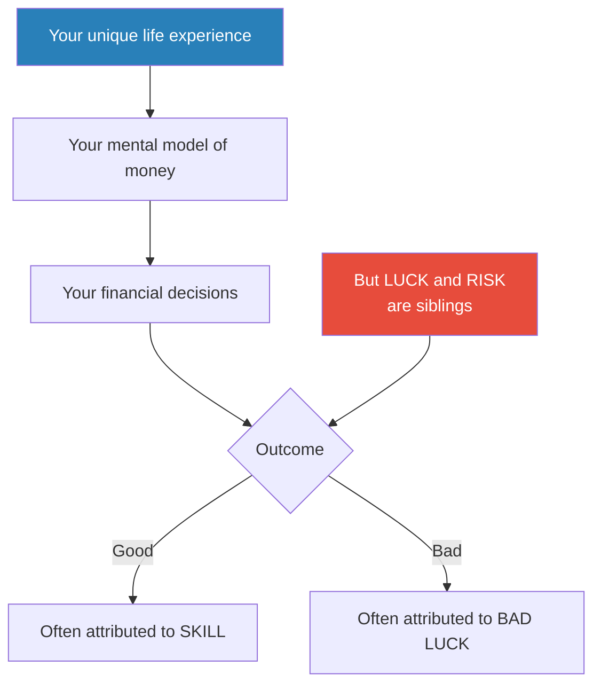
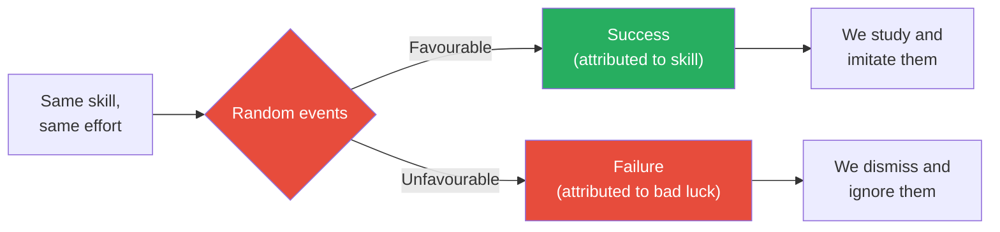
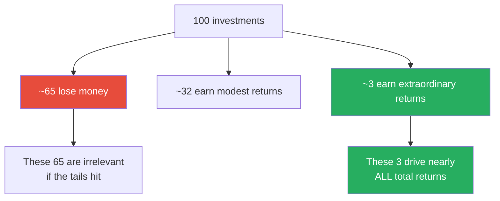
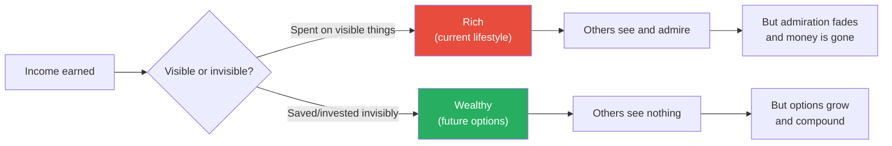
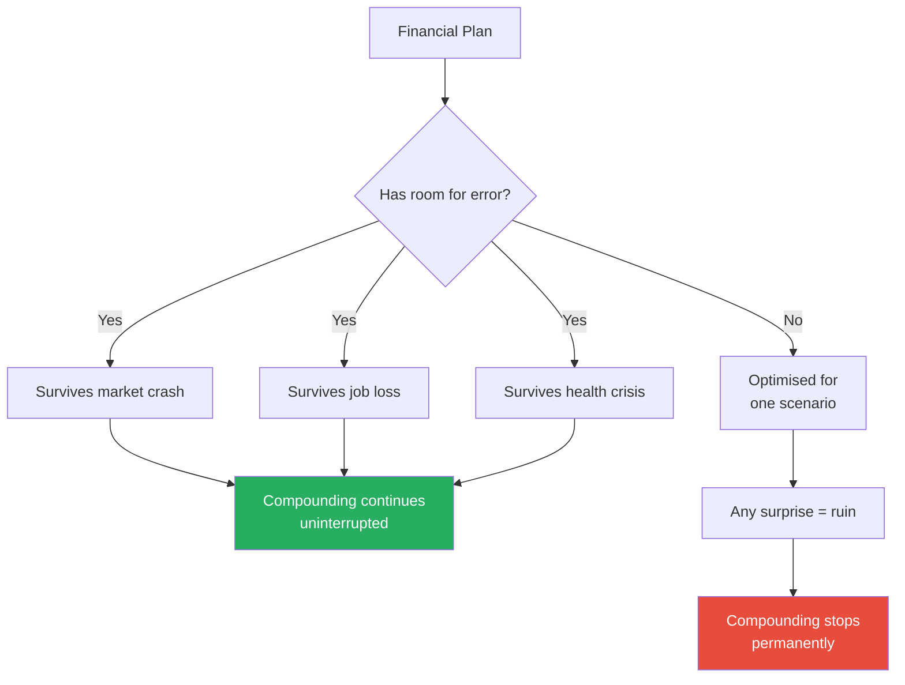
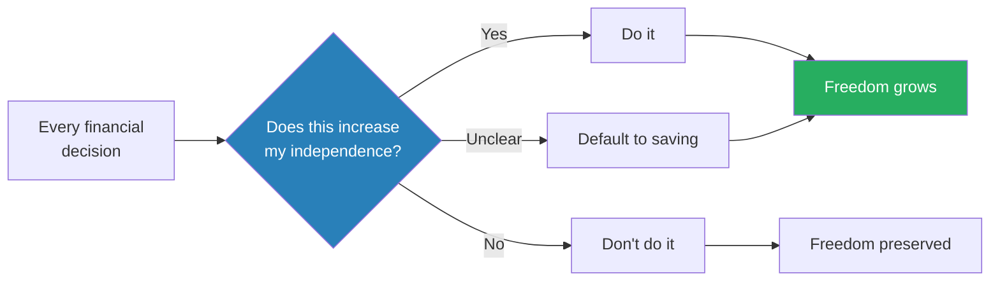
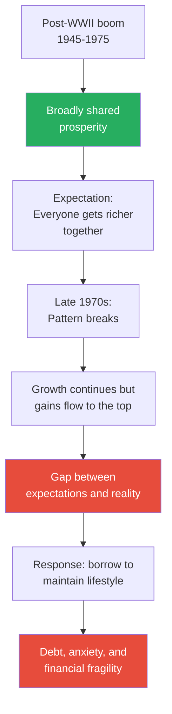

# The Psychology of Money — Morgan Housel

> Morgan Housel's thesis is devastatingly simple: doing well with money has little to do with how smart you are and everything to do with how you behave.
> Through twenty short, story-driven chapters, he demonstrates that the decisions people make about money are not driven by spreadsheets or financial literacy but by personal history, ego, pride, envy, fear, and the narratives they've absorbed about what money means.
> A janitor with no financial education can outperform a Harvard-trained investment banker — and regularly does — because wealth is built by behaviour, not intellect.
> The book is part financial history, part behavioural psychology, and entirely free of jargon, formulas, or condescension.
> It reframes every conversation about money from "what should I do?" to "what kind of person do I want to be?" — a question that turns out to be far more useful.
> It is the best book on money for people who don't want to read a book about money.

---

## About the Author

Morgan Housel is a partner at the Collaborative Fund and a former columnist for the Motley Fool and the Wall Street Journal. He has won multiple Society of American Business Editors and Writers awards for his financial writing. His style is distinguished by brevity, clarity, and a reliance on historical narrative over financial theory — he teaches through stories rather than spreadsheets. Housel's background is not in finance but in journalism, which is precisely what makes his writing accessible to non-specialists.

---

## The Big Idea

- <b style="color: #2980b9">Financial success is a soft skill, not a hard science</b>
  - How you behave with money matters more than what you know about it
  - People don't make financial decisions in a spreadsheet — they make them at the dinner table, late at night, in moments of fear, greed, envy, and ego
  - Two equally intelligent people with access to the same information can make completely opposite financial choices — and both can be acting rationally given their personal histories
- <b style="color: #27ae60">No one is crazy</b> — everyone's financial behaviour makes perfect sense to them given the unique set of experiences they've had
  - A person who grew up during hyperinflation will behave completely differently from one who grew up during a boom
  - Both are acting rationally given their data — the data is just different
  - This is the single most generous and most accurate lens through which to view other people's relationship with money
- The book's twenty chapters are twenty variations on one theme: the gap between what makes sense on a spreadsheet and what people actually do with money
  - Each chapter takes one behavioural pattern — compounding, risk, envy, fear, narrative, identity — and shows how it bends financial decisions away from the "rational" path
  - The stories are the argument: Ronald Read the janitor who died with $8 million proves that patience beats expertise; Rajat Gupta the McKinsey CEO who committed insider trading proves that "enough" is a skill, not a number
- <b style="color: #27ae60">Wealth is what you don't spend</b> — the central paradox of the entire book
  - The visible markers of financial success (cars, houses, watches) are actually evidence of money leaving your possession
  - True wealth is invisible — it's the investments, the savings, the options you haven't exercised yet
  - This paradox makes wealth uniquely hard to learn by observation, because the thing you're trying to emulate is literally invisible

This diagram captures Housel's core argument: outcomes depend on luck and risk as much as skill, but humans systematically attribute success to ability and failure to misfortune.

Despite earning triple the annual returns, Simons's fortune is dwarfed by Buffett's — because Buffett started 40 years earlier and 96% of his wealth came after age 65, proving that time is the most powerful variable in compounding.

---

## Key Concepts at a Glance

| Concept | One-line summary |
|---------|-----------------|
| **No One's Crazy** | Everyone's financial behaviour is rational given their personal experience |
| **Luck & Risk** | They are siblings — you cannot have one without the other |
| **Never Enough** | There is no amount of money that satisfies without the ability to say "enough" |
| **Confounding Compounding** | 99.7% of Buffett's wealth came after age 50 — time is the variable |
| **Getting vs Staying Wealthy** | Getting rich requires risk-taking; staying rich requires humility and paranoia |
| **Tails, You Win** | A tiny number of events drive the vast majority of outcomes |
| **Freedom** | The highest dividend money pays is control over your time |
| **Man in the Car Paradox** | No one admires the driver; they imagine themselves in the car |
| **Wealth Is What You Don't See** | Spending is the enemy of wealth — rich is current income, wealth is hidden |
| **Save Money** | The only financial variable fully within your control |
| **Reasonable > Rational** | Financially rational decisions that make you lose sleep are worse than reasonable ones |
| **Room for Error** | The single most important concept in finance |
| **You'll Change** | Long-term plans break because future-you is a stranger |
| **Nothing's Free** | Market volatility is the price of admission, not a fine to be avoided |
| **You & Me** | Beware taking cues from people playing a different financial game |
| **The Seduction of Pessimism** | Pessimism sounds smarter than optimism but is almost always wrong over time |
| **When You'll Believe Anything** | Narratives beat data because humans need the world to make sense |
| **Confessions** | Housel's own money philosophy — simple, boring, and effective |

---

## Chapter 1: No One's Crazy

*The most important chapter in the book — it establishes why smart people do dumb things with money, and why those dumb things aren't actually dumb at all.*

- Your personal experience with money makes up maybe 0.00000001% of what has happened in the world, but maybe 80% of how you think the world works
- <b style="color: #2980b9">Experiential learning</b> trumps every other kind when it comes to money
  - You can read every finance textbook ever written, and you will still make decisions based primarily on what happened to you, your family, and your community during your formative years
  - This isn't a bug in human cognition — it's a feature. We learn from experience because experience is the only data source that carries emotional weight
- A person born in the US in 1970 saw the S&P 500 increase almost tenfold, adjusted for inflation, during their teens and twenties
  - They learned, viscerally, that stocks are a money machine
  - Their body and brain absorbed this lesson in a way that no amount of historical data about the Great Depression could override
- A person born in 1950 saw the market go essentially nowhere during their teens and twenties
  - They learned, with equal conviction, that stocks are a pointless gamble
  - They are not irrational — they are drawing on the only data their nervous system trusts
- <b style="color: #27ae60">Both are right, given their data. Neither is crazy.</b>

> [!example] The Lottery Ticket Buyer
> - Low-income Americans spend an average of $412 per year on lottery tickets — four times the amount spent by the highest income group
> - From a spreadsheet perspective, this is irrational — the expected value is deeply negative
> - But for someone who has never had savings, never owned stock, and never seen compound interest work in their favour, a lottery ticket is the only financial product that offers the possibility of a life-changing outcome
> - It is not ignorance — it is a rational response to a lived experience in which conventional financial advice has never applied to them
> **The lesson:** Before judging someone's financial behaviour, ask what their experience has taught them about money. The answer will almost always make their choices make sense.

- The implication is profound: <b style="color: #e74c3c">there is no single "right" answer to how to manage money</b>
  - What works for a trust-fund baby who has never known scarcity is not what works for a first-generation immigrant who watched their parents lose everything
  - Financial advice that ignores personal history is not advice — it's projection
- Housel's test: if you want to understand someone's financial behaviour, don't look at their bank statement — look at their biography
  - Where they grew up, when they grew up, what their parents' relationship with money looked like, whether they ever went hungry or ever watched an investment pay off
  - All of these shape financial behaviour more than any textbook or advisor ever could
  - This is not an excuse for bad decisions — it is a framework for understanding why those decisions were made

> [!tip] Core Insight
> Nobody is working with the same information. Your financial worldview was formed by a unique set of experiences that no one else shares. Respecting that — in yourself and in others — is the beginning of financial wisdom.

---

## Chapter 2: Luck & Risk

*Housel dismantles the clean narrative of success by showing that luck and risk are identical forces viewed from different angles — and that we systematically overweight skill in both directions.*

- <b style="color: #2980b9">Luck and risk are siblings</b> — they are both the acknowledgement that outcomes are influenced by forces beyond individual effort
  - When things go well, we call it skill
  - When things go badly, we call it bad luck
  - In both cases, the role of randomness is underestimated
- The difficulty: you cannot measure luck. You can't run the experiment twice to see if the same person with the same skill set would succeed in a parallel universe.
  - This means we're forced to judge outcomes, not processes
  - And outcomes are noisy — they contain both signal (skill) and noise (luck)

> [!example] Bill Gates and the Lakeside Computer (1968)
> - Bill Gates attended Lakeside School in Seattle — one of the only high schools in the world that had a computer terminal in 1968
> - The odds of a high school student having access to a computer at that time were roughly one in a million
> - Gates was brilliant and obsessively hardworking — but so was his equally talented classmate Kent Evans
> - Evans died in a mountaineering accident before he could graduate
> - Gates got the luck of access AND the luck of survival; Evans got the risk
> - Both had the same skill set — the difference in outcome was entirely luck and risk
> **The lesson:** Success stories always contain hidden luck. Failure stories always contain hidden risk. Be careful building narratives around either.

> [!example] Bill Gates's Own Words
> - In an interview, Gates acknowledged: "I had a better chance of dying from a lightning strike than of having access to a computer in 1968"
> - He does not deny his skill or work ethic — but he recognises the precondition that made them matter
> - Without Lakeside, his programming talent would have remained dormant for years, possibly forever
> **The lesson:** Talent needs a stage. The stage is often provided by luck.

- <b style="color: #e74c3c">Be careful who you praise and who you look down upon</b>
  - The billionaire might have succeeded mostly through luck in ways even they don't recognise
  - The bankrupt person might have made reasonable decisions that were undone by risks they could not foresee
  - This is not an argument against effort — it is an argument against certainty in judging outcomes
- Housel's practical takeaway:
  - When studying success, focus less on specific individuals and more on broad patterns
  - Individual stories are too contaminated by luck to be useful templates
  - <b style="color: #27ae60">Look for patterns that appear across many successful people and many failures — those are more likely to reflect genuine principles rather than survivorship bias</b>
- Housel offers a useful rule of thumb for navigating luck and risk:
  - When things go right, assume some of it was luck and act with humility
  - When things go wrong, assume some of it was risk and act with compassion — both toward yourself and others
  - When studying role models, study patterns across many people rather than building your strategy around one person's story
  - "The trick when dealing with failure is arranging your financial life in a way that a bad investment here and a missed financial goal there won't wipe you out"

This diagram shows the asymmetry Housel identifies: identical starting points diverge through randomness, but we construct clean skill-based narratives around the winners and ignore the losers entirely.

---

## Chapter 3: Never Enough

*When rich people do crazy things — and why the inability to say "enough" has destroyed more fortunes than any market crash.*

- The hardest financial skill is getting the goalpost to stop moving
  - You make your first million and the goalpost moves to ten million
  - You reach ten million and it moves to a hundred million
  - <b style="color: #e74c3c">The goalpost moves because you compare yourself to people who have more, not to where you started</b>
- <b style="color: #2980b9">Social comparison</b> is the engine of "never enough"
  - A baseball player earning $5 million per year feels poor because his teammate earns $10 million
  - A hedge fund manager worth $500 million feels inadequate next to a billionaire
  - The comparison set always shifts upward — there is no ceiling at which comparison stops

> [!example] Rajat Gupta — The Man Who Had Everything (2008-2011)
> - Rajat Gupta was the CEO of McKinsey & Company — the most prestigious consulting firm in the world
> - His net worth was estimated at $100 million
> - He sat on the boards of Goldman Sachs and Procter & Gamble
> - By any objective measure, he had won the game of wealth and status
> - But Gupta wanted to be a billionaire — he wanted to transition from "rich" to "ultra-rich"
> - He began passing insider information from Goldman Sachs board meetings to hedge fund manager Raj Rajaratnam
> - He was caught, convicted of insider trading in 2012, and sentenced to two years in federal prison
> - He lost his reputation, his board seats, his freedom, and much of his wealth
> **The lesson:** There is no amount of money that satisfies a person who has not decided what "enough" means. Gupta risked everything he had and needed for something he didn't have and didn't need.

> [!example] Bernie Madoff — The Man Who Stole Enough
> - Before the Ponzi scheme, Madoff ran a legitimate market-making business that reportedly earned him between $25 million and $50 million per year
> - He was already rich — genuinely, legally, spectacularly rich
> - The Ponzi scheme was not born out of desperation but out of the inability to accept that what he had was enough
> - He destroyed thousands of lives, spent the rest of his own in prison, and his son committed suicide
> - The legitimate business alone would have placed him among the wealthiest people in America
> **The lesson:** Crime in pursuit of more money when you already have more than enough is not greed in the traditional sense — it is a psychological disorder of comparison and identity.

- Housel identifies the antidote: <b style="color: #27ae60">"Enough" is not a number — it's a skill</b>
  - It requires actively deciding what you value and refusing to let comparison override that decision
  - It means accepting that someone will always have more, and that this fact says nothing about your life
  - Reputation, freedom, family, and independence are things that no amount of additional money can buy back once lost
- The mechanism of "never enough" is social, not financial:
  - A ceiling on ambition feels like defeat in a culture that celebrates relentless growth
  - But the alternative — relentless comparison with an ever-shifting peer group — is a recipe for misery at any income level
  - The hedge fund manager earning $10 million a year who feels poor because his neighbour earns $20 million is experiencing the same psychological pain as the office worker who feels poor because his colleague got a raise
  - The scale changes; the suffering is identical
  - "Enough" is the decision to opt out of that comparison race — not because you lack ambition, but because you recognise the race has no finish line

> [!tip] Core Insight
> "There is no reason to risk what you have and need for what you don't have and don't need." The inability to internalise this single sentence has destroyed more wealthy people than any recession.

---

## Chapter 4: Confounding Compounding

*Why the most powerful force in finance is also the most underestimated — and why even Warren Buffett's genius is secondary to his patience.*

- <b style="color: #2980b9">Compounding</b> — the process by which returns generate their own returns — is counterintuitive because the human brain thinks linearly
  - We naturally project forward in straight lines: if I save $1,000 a month, in 10 years I'll have $120,000
  - Compounding doesn't work that way — it starts slowly and then curves dramatically upward
  - The hockey-stick shape of compound growth means the vast majority of results come at the very end
- Housel's centrepiece example: Warren Buffett
  - Buffett's net worth is approximately $84.5 billion
  - He began investing at age 10
  - By age 30, his net worth was $1 million (impressive, but not world-changing)
  - By age 50, it was $3.8 billion
  - <b style="color: #2980b9">$81.5 billion — roughly 96% of his total wealth — was accumulated after his 65th birthday</b>
  - Buffett's skill is investing. His secret is time.
- The reason compounding is underappreciated is biological:
  - The human brain evolved to think in linear terms — if you walk for two hours, you go twice as far as one hour
  - Exponential growth violates this intuition completely
  - After 30 years of 10% annual returns, your money hasn't tripled — it has grown to over 17 times
  - Our inability to feel this difference in our bones is why most people underestimate long time horizons and overestimate short-term returns

> [!example] The Ice Age Compounding Analogy
> - Housel compares compounding to the formation of ice ages
> - Ice ages don't begin with a single catastrophic freeze — they begin with slightly cooler summers
> - A summer that's a few degrees cooler means a bit of last winter's snow doesn't fully melt
> - The remaining snow reflects more sunlight the next year, cooling things further
> - This tiny, self-reinforcing loop repeats for thousands of years until ice sheets cover continents
> - The trigger is laughably small — a slight change in the Earth's tilt — but the compounding effect is planet-altering
> **The lesson:** Compounding works the same way with money. Small, consistent returns that are never interrupted build to results that seem impossible when viewed in reverse.

> [!example] Jim Simons vs Warren Buffett
> - Jim Simons of Renaissance Technologies has arguably the best investing track record in history — 66% annual returns since 1988
> - Warren Buffett has earned roughly 22% annually — less than a third of Simons's rate
> - Yet Buffett is 75% richer than Simons
> - Why? Because Buffett has been compounding since age 10, while Simons didn't start his fund until age 50
> - Simons's superior annual performance cannot overcome Buffett's 40-year head start
> **The lesson:** Good investing is not about getting the highest returns — it is about earning pretty good returns consistently for the longest period of time.

- The counterintuitive implication: <b style="color: #27ae60">time is the single most important variable in wealth creation, not skill, not returns, not intelligence</b>
  - If Buffett had started investing at 30 instead of 10, and retired at 60, his net worth — assuming the same returns — would be roughly $11.9 million, not $84.5 billion
  - That's 99.9% less wealth, simply from having 20 fewer years of compounding

> [!abstract] The Compounding Math
> 1. Starting early matters more than earning high returns
> 2. Never interrupt compounding — withdrawals in early years destroy decades of future growth
> 3. "Pretty good" returns maintained for decades beat "exceptional" returns maintained for a short period
> 4. The majority of compound growth happens in the final years — patience is non-negotiable

---

## Chapter 5: Getting Wealthy vs Staying Wealthy

*Two completely different skills that most people confuse — and why survival is the only strategy that matters in the long run.*

- Getting wealthy requires optimism, risk-taking, and boldness
  - You need to believe an opportunity will work out
  - You need the courage to act on that belief
  - You need to concentrate your bets enough that winning actually matters
- Staying wealthy requires the exact opposite: <b style="color: #2980b9">humility, fear, and frugality</b>
  - You need to acknowledge that some of your success was luck
  - You need to fear that what luck gave, luck can take away
  - You need to spend less than you could, because compounding needs time, and time requires survival

| | Getting Wealthy | Staying Wealthy |
|--|----------------|-----------------|
| **Requires** | Optimism, risk-taking, boldness | Humility, fear, paranoia |
| **Mindset** | "This will work" | "I need to survive to keep playing" |
| **Key skill** | Offence | Defence |
| **Hero** | Entrepreneurs who bet big | Those who endure through every crisis |
| **Greatest risk** | Not taking enough risk | Taking too much risk |

Housel's point is not that one column is better than the other — it's that the skills are fundamentally different and that most people never make the transition.

> [!example] Jesse Livermore — The Man Who Won and Lost Everything (1929)
> - Jesse Livermore was one of the most famous stock traders of the early 20th century
> - In 1929, as the stock market crashed, Livermore had positioned himself perfectly — he shorted the market and made the modern equivalent of over $3 billion in a single day
> - He was arguably the richest private individual in the United States at that moment
> - But Livermore could not stop. He kept trading, kept swinging for the fences
> - By 1933, he had lost everything
> - He took his own life in 1940
> **The lesson:** Getting wealthy and staying wealthy are different skills. Livermore mastered the first and was destroyed by the absence of the second.

- <b style="color: #27ae60">Survival is the cornerstone of financial strategy</b>
  - You have to give compounding the time it needs — and the only way to do that is to not get wiped out along the way
  - A plan is only useful if it can survive contact with the real world
  - Plans that work on paper but require everything to go right are not plans — they are fantasies
- Housel introduces the concept of a <b style="color: #2980b9">barbelled personality</b>:
  - Optimistic about the future (so you keep investing and building)
  - Paranoid about the present (so you keep cash reserves, avoid catastrophic risk, and never bet the farm)
  - This is not a contradiction — it is the only stable strategy for long-term wealth

> [!tip] Core Insight
> More than big returns, more than brilliant stock picks, more than timing the market — the ability to stick around for a long time, without being wiped out or forced to sell, is what makes the biggest difference. Survival is its own strategy.

---

## Chapter 6: Tails, You Win

*A tiny number of events drive the vast majority of outcomes — and this is true in business, investing, art, and nearly every domain that involves uncertainty.*

- <b style="color: #2980b9">Tail events</b> — rare, extreme outcomes at the far ends of a probability distribution — drive most results in finance
  - In the stock market, a small handful of stocks drive nearly all long-term gains
  - Most individual stocks underperform cash — the overall market goes up because a tiny fraction of stocks go up enormously
  - This means you can be wrong most of the time and still make a fortune — if your winners are big enough

> [!example] Heinz Berggruen — The Art Collector Who Was Wrong Most of the Time
> - Heinz Berggruen was one of the most successful art dealers of the 20th century, amassing a collection worth over $1 billion
> - He purchased thousands of pieces of art over his career
> - The vast majority of those purchases did not appreciate meaningfully
> - But a small number — pieces by Picasso, Klee, Matisse, and Braque that he bought early — became extraordinarily valuable
> - Those few pieces were worth so much that they made every "wrong" purchase irrelevant
> **The lesson:** In any domain driven by tail events, your success is determined by the few big winners, not by the average of all your bets.

> [!example] Venture Capital's Brutal Mathematics
> - In venture capital, roughly 65% of investments lose money
> - About 2.5% of investments produce returns of 10x or more
> - That tiny fraction — the tail — produces nearly all of the industry's returns
> - The best venture capitalists are not the ones who avoid losers — they are the ones who are in the room when a tail event happens
> - Y Combinator's investment in Airbnb alone returned more than every other investment the firm has ever made, combined
> **The lesson:** The business model of venture capital is the business model of life: you will be wrong often, and you must structure your approach so that the occasional extreme winner compensates for the many losses.

- The psychological challenge of tails is that <b style="color: #e74c3c">being wrong most of the time feels terrible</b>, even when it's the mathematically correct strategy
  - Amazon launched the Fire Phone, invested heavily in failed products, and suffered countless flops — but Amazon Web Services alone generated enough profit to cover all of it and more
  - Walt Disney made over 400 cartoons before Snow White. Most are forgotten. One film turned his company into an empire
- <b style="color: #27ae60">The implication for individuals: don't judge your financial strategy by individual decisions — judge it by the overall portfolio of outcomes</b>
  - A few terrible investments are expected, not a sign of failure
  - What matters is whether you were positioned to capture the tails when they arrived

This diagram illustrates the power law at the heart of tail-driven outcomes — the vast majority of bets lose, but the rare extreme winners overwhelm everything else.

Only 3% of investments produce extraordinary returns — but those tail events generate nearly all of the industry's total profits, making it mathematically correct to be wrong most of the time.

Housel's hierarchy reveals that the highest financial value is not returns or intelligence but freedom — the ability to control your time — built on a foundation of savings, compounding, and room for error.

---

## Chapter 7: Freedom

*Housel argues that the true purpose of money is not consumption but autonomy — and that the ability to control your time is the highest dividend money can pay.*

- <b style="color: #27ae60">Controlling your time is the highest dividend money pays</b>
  - This is not a hippie sentiment — it is backed by research
  - The single most reliable predictor of positive well-being is not income, not career prestige, not material possessions — it is having a sense of control over your daily life
  - Money's greatest intrinsic value is its ability to give you that control
- Housel draws on research by Angus Campbell, a psychologist who in 1981 studied what made Americans feel satisfied with their lives
  - Campbell found that the strongest predictor of well-being was not demographic (age, race, income) but psychological: <b style="color: #2980b9">having control over one's life</b>
  - "Having a strong sense of controlling one's life is a more dependable predictor of positive feelings of well-being than any of the objective conditions of life we have considered"
- The irony of modern wealth: many high earners have traded time control for income
  - A doctor earning $500,000 but on call every night and weekend has less freedom than a teacher earning $50,000 with summers off
  - A partner at a law firm who bills 2,400 hours a year is rich and miserable
  - They have money but have surrendered the thing that money is supposed to buy

> [!example] The Paradox of Derek — The Man Who Had Nothing and Everything
> - Housel describes a friend (name changed) who saved aggressively and lived frugally for decades
> - He never earned more than a modest salary, never invested in anything exotic
> - By his mid-40s, he had enough saved that he could stop working whenever he wanted
> - He kept working — but on his own terms, on projects he chose, at times he chose
> - His net worth was a fraction of his higher-earning peers, but his day-to-day experience of life was qualitatively different
> - He woke up each morning with a sense of possibility that no salary can purchase
> **The lesson:** The highest form of wealth is the ability to wake up every morning and say "I can do whatever I want today."

- <b style="color: #e74c3c">The trap: using money to buy things that reduce your freedom</b>
  - A bigger house means a bigger mortgage, which means a greater need for income, which means less negotiating power with your employer
  - An expensive car means higher payments, which means less ability to quit a job you hate
  - Every luxury that locks you into recurring payments reduces the freedom that money was supposed to provide
- Housel connects this to a broader cultural shift:
  - In previous generations, wealth was measured in land, livestock, or gold — tangible assets that provided direct utility
  - In the modern economy, the most valuable form of wealth is time — the ability to choose how you spend your days
  - But our cultural signals still point toward consumption: bigger houses, nicer cars, luxury vacations
  - <b style="color: #27ae60">The person who quietly accumulates savings and lives below their means is building the most valuable form of wealth — and the least visible</b>

> [!example] The High-Earning Trap
> - Housel describes professionals who earn $300,000-$500,000 per year but feel financially stressed
> - They live in expensive neighbourhoods where the social baseline is high: private school tuition, luxury cars, country club memberships
> - Their spending is not extravagant by their peer group's standards — it is simply "normal"
> - But this "normal" requires every dollar of their income, leaving nothing for the savings that would buy actual freedom
> - They are high-income and low-wealth — rich on paper, trapped in practice
> **The lesson:** Income is not freedom. Savings are freedom. A person earning half as much but spending a third as much has more options, more security, and more control over their life.

> [!tip] Core Insight
> Money's greatest value is not what it buys, but what it lets you not do. The ability to say "no" to a bad boss, a boring project, or a stressful commute is worth more than any car, house, or vacation.

---

## Chapter 8: Man in the Car Paradox

*The uncomfortable truth about status purchases: no one is thinking about you the way you think they are.*

- <b style="color: #2980b9">The Man in the Car Paradox</b>: people buy expensive things to signal that they are wealthy, interesting, or admirable — but the people who see those expensive things almost never think about the owner. They imagine themselves with the item.

> [!example] Housel as a Parking Valet
> - As a young man, Housel worked as a valet at a luxury hotel in Los Angeles
> - Every day, he watched wealthy people pull up in Ferraris, Lamborghinis, and Rolls-Royces
> - Not once did he look at a driver and think "That person is impressive"
> - Every single time, he thought "If I had that car, people would think I'm impressive"
> - He used the cars as a prop in his own fantasy — the drivers were invisible
> - The irony: the drivers bought the car precisely to be seen, and nobody was seeing them
> **The lesson:** No one is as interested in your possessions as you are. People don't admire you for your stuff — they use your stuff as a benchmark for their own desires.

- <b style="color: #e74c3c">People don't admire you for your possessions — they use your possessions as a prop in their own fantasy</b>
  - This is not cynicism — it is a well-documented feature of human psychology
  - We project ourselves into other people's lives and possessions constantly
  - The person driving the Ferrari is usually thinking about themselves, and the person watching is also thinking about themselves. Nobody is thinking about the other person.
- The implication: if you're spending money to earn admiration, you've entered a game you can't win
  - The admiration you receive is thinner and more fleeting than you imagine
  - The money you spend to generate it is real and permanent
  - <b style="color: #27ae60">Humility, kindness, and empathy generate more genuine admiration than any possession</b>

---

## Chapter 9: Wealth Is What You Don't See

*The distinction between being rich and being wealthy — and why the most important financial quality is completely invisible.*

- <b style="color: #2980b9">Rich</b> is a current income — it's what you see: the big house, the new car, the designer clothes
- <b style="color: #2980b9">Wealth</b> is hidden — it's the money not spent, the investments not liquidated, the options not exercised
  - Wealth is financial assets that haven't yet been converted into stuff you can see
  - Wealth is the car not purchased, the renovation not done, the vacation not taken
  - Wealth is defined by what it could buy but hasn't yet bought

> [!example] Ronald Read vs Richard Fuscone
> - Ronald Read was a janitor and gas station attendant in rural Vermont who died in 2014 at age 92
> - He had no financial education, no high-paying career, no inheritance
> - When he died, his estate was worth over $8 million — accumulated through decades of quiet, consistent investing in blue-chip stocks
> - Richard Fuscone was a former Merrill Lynch executive with an MBA from Harvard
> - He lived in a $5 million home in Greenwich, Connecticut
> - He filed for bankruptcy in the same year Read died, crushed by debt from an extravagant lifestyle
> - Read was wealthy because he never spent. Fuscone was rich because he always did.
> **The lesson:** The only way to be wealthy is to not spend the money that you have. Wealth is, by definition, what you don't see — because the moment you spend it, it becomes visible and ceases to be wealth.

- This creates a fundamental learning problem:
  - You cannot learn wealth by observing wealthy people, because wealth is invisible
  - What you observe are spending patterns — the opposite of wealth
  - <b style="color: #e74c3c">Role models for wealth are almost impossible to find because the truly wealthy are, by definition, not showing off their wealth</b>
- <b style="color: #27ae60">The exercise of restraint — saving money that you could have spent — is the only way to build wealth</b>
  - Restraint is not glamorous. Nobody posts their savings rate on Instagram.
  - But it is the single most reliable path to financial security
- The cultural problem is that our economy runs on spending:
  - Advertising exists to make you feel dissatisfied with what you have
  - Social media creates a 24/7 highlight reel of other people's consumption
  - The entire infrastructure of modern life is designed to convert income into spending as quickly as possible
  - <b style="color: #e74c3c">Building wealth requires swimming against this current every single day</b>
  - This is why behaviour matters more than intelligence — resisting a culture designed to make you spend is a character trait, not a math problem

This diagram visualises the core paradox: visible spending looks like wealth but destroys it; invisible saving looks like nothing but builds it.

---

## Chapter 10: Save Money

*The only financial variable entirely within your control — and the one most people ignore in favour of chasing higher returns.*

- Everyone thinks about earning more. Fewer people think about spending less. Almost nobody thinks about the gap between the two as the primary driver of wealth.
- <b style="color: #2980b9">The savings rate</b> is the one variable that is 100% within your control
  - You cannot control stock market returns
  - You cannot control inflation, interest rates, or economic cycles
  - You cannot control whether you get fired, sick, or unlucky
  - But you can always, always control how much of your income you spend
- Housel's key insight on savings: <b style="color: #27ae60">you don't need a specific reason to save</b>
  - Most financial advice says "save for retirement" or "save for a house" or "save for emergencies"
  - Housel argues that saving for no specific reason is the most powerful form of saving
  - Savings without a specific goal give you something more valuable than any planned purchase: options
  - Options to change careers, move cities, quit a toxic job, take a sabbatical, or seize an unexpected opportunity

> [!tip] Core Insight
> Saving is the gap between your ego and your income. Wealth is created by restraining what you could spend, not by earning more. A high income with a zero savings rate is a hamster wheel, not a wealth engine.

- Beyond a certain income level, what you need is below what you earn
  - Past that point, everything you spend is a choice, not a necessity
  - <b style="color: #e74c3c">The danger is that spending rises to match income</b> — lifestyle inflation is the silent destroyer of wealth
  - The person earning $200,000 who spends $200,000 is no wealthier than the person earning $50,000 who spends $50,000
- Housel connects saving to freedom (Chapter 7): savings give you control over your time, which is the highest form of wealth
  - Every dollar saved is a unit of future time purchased
  - Every dollar spent on something unnecessary is a unit of future freedom surrendered
- There is a further, less obvious point: savings give you flexibility in a world where flexibility is increasingly valuable
  - In a fast-changing economy, the ability to retrain, relocate, or wait out a downturn is a competitive advantage
  - Intelligence and skills can become obsolete; savings never do
  - The person with six months of expenses saved has negotiating power that no credential can match
  - "Having more control over your time and options is becoming one of the most valuable currencies in the world"

---

## Chapter 11: Reasonable > Rational

*Why the theoretically optimal financial strategy is often the worst one for real humans — and why "good enough" beats "perfect" in the real world.*

- <b style="color: #2980b9">Rational</b> decisions are what a spreadsheet would recommend — the mathematically optimal move given the available data
- <b style="color: #2980b9">Reasonable</b> decisions are what a human being can actually live with — strategies that might be slightly suboptimal on paper but that let you sleep at night and stay the course
- Housel argues that reasonable is better than rational because the biggest risk in any financial plan is not making the wrong choice — it's abandoning the plan entirely
  - A slightly suboptimal plan that you stick with for 30 years will crush a perfect plan that you abandon after 2 years of stress
  - The financial industry is built on "rational" advice — maximise returns, minimise fees, optimise tax efficiency
  - But this advice ignores the most important variable: the human being who has to live with the plan
  - Fear, anxiety, sleepless nights, and marital arguments about money are not footnotes — they are the primary drivers of long-term financial outcomes
  - <b style="color: #27ae60">Any plan that ignores the emotional experience of the investor will eventually be abandoned by the investor</b>

> [!example] Fever as Financial Strategy
> - Medical research shows that fevers help the body fight infection — they speed up immune response and make the body less hospitable to pathogens
> - The "rational" response to a fever is to let it run its course
> - But virtually every parent gives their sick child fever-reducing medicine — and every doctor supports this decision
> - Why? Because the marginal benefit of letting the fever run is overwhelmed by the suffering and anxiety it causes
> - The "reasonable" decision (reduce the fever) beats the "rational" decision (let it run) because it accounts for the full human experience, not just the biological optimum
> **The lesson:** A financial strategy that causes you anxiety and sleepless nights is not a good strategy — even if the spreadsheet says it's optimal. The best strategy is one you can maintain through stress, doubt, and temptation.

- Practical implications:
  - Holding some cash (even though stocks earn more in the long run) is reasonable if it helps you not panic-sell during a crash
  - Paying off a low-interest mortgage early is "irrational" (you'd earn more investing the difference) but reasonable if the peace of mind keeps you from making worse decisions elsewhere
  - <b style="color: #27ae60">Investing in companies you admire (even if the returns are slightly lower) is reasonable because emotional connection keeps you invested through downturns</b>

> [!example] The Day Trader Who "Should" Have Won
> - Housel describes investors who followed mathematically optimal strategies — high equity allocations, no cash buffer, maximum leverage at low interest rates
> - On paper, these strategies maximised expected returns over a 30-year horizon
> - In practice, every market downturn of 30% or more (which happens roughly once a decade) triggered panic selling
> - The investors abandoned their "optimal" plans at the worst possible time, locking in losses and missing the recovery
> - Meanwhile, investors with "suboptimal" plans — holding some bonds, keeping cash, paying off mortgages early — stayed the course
> - Over 30 years, the "suboptimal" investors who stayed invested earned more than the "optimal" investors who panicked
> **The lesson:** The best financial plan is not the one with the highest expected return. It is the one you can actually stick with when the world is falling apart.

---

## Chapter 12: Surprise!

*History is the study of change — but people use it as a guide to the future, assuming the events of the past will repeat. They almost never do in the ways people expect.*

- <b style="color: #e74c3c">The most important events in financial history were not predicted by anyone</b>
  - The September 11 attacks, the 2008 financial crisis, the COVID-19 pandemic — none were in anyone's forecast
  - These "surprises" drove more financial change than any predicted event
- Housel's point is structural: the events that matter most are, by definition, the ones no one sees coming
  - If they could be predicted, they would have been priced in and would not have mattered as much
  - The events that move markets the most are the ones that fall outside all existing models
- <b style="color: #2980b9">Historian's fallacy</b>: looking backward, everything seems inevitable. Looking forward, nothing is.
  - After 2008, everyone could explain why the housing crisis happened
  - Before 2008, almost nobody predicted it — including the people whose job it was to predict it
  - This asymmetry between hindsight clarity and foresight blindness is permanent
- The practical implication: <b style="color: #27ae60">plan for surprise rather than planning for specific scenarios</b>
  - Don't ask "what will happen?" — ask "what can I survive?"
  - Build a financial life that is robust to surprises, not optimised for a specific forecast

> [!example] The 2020 Pandemic — An Event No Financial Model Predicted
> - In January 2020, virtually no financial model, economic forecast, or risk assessment included "global pandemic shuts down the world economy for months" as a scenario
> - The S&P 500 dropped 34% in 23 trading days — one of the fastest declines in history
> - Investors who had room for error (cash reserves, no leverage, diversified holdings) survived the crash and participated in the recovery
> - Investors who were fully optimised for "normal" conditions — leveraged, fully invested, no cash buffer — were forced to sell at the bottom
> - The recovery that followed was equally unpredictable: the market reached new highs within months, rewarding those who simply survived
> **The lesson:** The most important events are the ones nobody forecasts. The only defence is a financial position that can absorb any shock — not a position optimised for the most likely scenario.

> [!tip] Core Insight
> History is not a map of the future — it is a catalogue of surprises. The only useful lesson from financial history is that things you never imagined will happen, and the only preparation is resilience.

---

## Chapter 13: Room for Error

*The most important concept in finance is not returns, not diversification, not asset allocation — it is margin of safety.*

- <b style="color: #2980b9">Room for error</b> (also called <b style="color: #2980b9">margin of safety</b>, a term borrowed from Benjamin Graham) is the practice of building a gap between what you expect to happen and what could happen
  - It means saving more than you think you need
  - It means not leveraging your investments
  - It means having a plan that works even if your assumptions are wrong
- "The purpose of the margin of safety is to render the forecast unnecessary" — Benjamin Graham
  - This is profound: you don't need to predict the future if you've built enough cushion to survive any version of it
  - Room for error makes forecasting irrelevant — and forecasting is something humans are terrible at anyway

> [!example] The Russian Roulette Problem
> - Imagine you are offered $1 million to play Russian roulette — one bullet, six chambers
> - The expected value is strongly positive: 5/6 chance of $1 million
> - On a spreadsheet, you should play
> - In real life, no sane person would play, because the 1/6 downside (death) is catastrophic and irreversible
> - Every financial decision with irreversible downside risk is a version of Russian roulette
> - Room for error means refusing to play games where the downside is ruin, no matter how attractive the odds appear
> **The lesson:** The expected value of a bet is meaningless if the downside is catastrophic. Room for error is how you avoid betting your life on being right.

- Room for error is uncomfortable because it feels like wasted potential:
  - Holding cash "wastes" returns you could earn by investing it
  - Saving an extra 10% of income "wastes" money you could enjoy now
  - Diversifying "wastes" returns you could earn by concentrating in the best-performing asset
  - <b style="color: #e74c3c">But the alternative — being positioned perfectly for one scenario and destroyed by another — is far more wasteful</b>
- <b style="color: #27ae60">Room for error lets you endure the range of potential outcomes and stay in the game long enough for the odds to work in your favour</b>
  - This connects directly to Chapter 5 (getting wealthy vs staying wealthy) and Chapter 4 (compounding needs uninterrupted time)

> [!abstract] Building Room for Error
> 1. Save more than you think you need — Housel targets saving where there is no specific reason beyond "life is unpredictable"
> 2. Avoid single points of failure — no one stock, no one income source, no one plan
> 3. Assume your forecasts are wrong — plan for the range of outcomes, not the expected outcome
> 4. Avoid leverage — borrowed money magnifies both returns and losses, and losses can be permanent
> 5. Value endurance over optimisation — a plan that survives bad times matters more than one that thrives only in good times

This diagram shows why room for error is so powerful — it protects compounding from interruption, which is the single greatest destroyer of long-term wealth.

---

## Chapter 14: You'll Change

*The person making your 20-year financial plan today will not be the person living with it in 20 years — and this is the source of more regret than any bad investment.*

- <b style="color: #2980b9">The End of History Illusion</b>: psychologists have found that people at every age recognise how much they've changed in the past but dramatically underestimate how much they'll change in the future
  - A 30-year-old can easily describe how different they are from their 20-year-old self
  - But that same 30-year-old assumes their 40-year-old self will have roughly the same values, priorities, and desires
  - This is consistently, measurably wrong — people change far more than they predict
- The financial implication: <b style="color: #e74c3c">long-term financial plans are built by a person who will not exist when the plan matures</b>
  - The 25-year-old who saves aggressively for early retirement might, at 40, discover they actually love working and wish they'd spent more in their twenties
  - The 35-year-old who takes on debt for a bigger house "for the kids" might, at 50, find the kids have left and the house is an anchor
- Housel's advice: accept that you will change, and build financial plans that accommodate that change
  - <b style="color: #27ae60">Avoid extreme financial plans</b> — neither extreme frugality nor extreme spending accounts for the fact that you'll want different things in a decade
  - Aim for balance and flexibility rather than optimisation for a single future state
  - Keep options open — savings provide options; debt removes them

> [!example] The Sunk Cost of Past Dreams
> - Housel describes people who spent their twenties saving aggressively for financial independence by age 40
> - When they reached 40, some discovered that they actually enjoyed working — but they had sacrificed relationships, experiences, and health along the way
> - Others spent lavishly in their twenties, assuming their income would always increase, only to face layoffs, illness, or industry shifts in their forties
> - Both groups made plans that assumed their future selves would want the same things as their present selves
> - Both were wrong — but the group that left room for change (moderate saving, moderate spending, open options) fared best
> **The lesson:** The End of History Illusion means every financial plan has an expiration date. The best plans are the ones that can be adjusted without catastrophic cost.

> [!tip] Core Insight
> The most dangerous financial assumption is that the person you are today is the person you'll be forever. Plan for change, not for a fixed future.

---

## Chapter 15: Nothing's Free

*Everything has a price — the price of investing returns is volatility, and the people who treat it as a fine to be avoided rather than a fee to be paid will always underperform.*

- <b style="color: #2980b9">The price of market returns is volatility</b> — periods of fear, uncertainty, loss, and doubt
  - This is not a bug in the system — it is the entry fee
  - Just as Disneyland charges admission in exchange for a great experience, the stock market charges emotional discomfort in exchange for long-term returns
- The critical distinction is between a <b style="color: #2980b9">fee</b> and a <b style="color: #2980b9">fine</b>:
  - A fee is a price you willingly pay for something worth having
  - A fine is a penalty for doing something wrong
  - Most investors treat volatility as a fine — they feel punished by market drops and try to avoid them
  - <b style="color: #27ae60">But if you reframe volatility as a fee — the cost of admission for long-term returns — it becomes something you expect and accept rather than something you flee from</b>

> [!example] The Disneyland Analogy
> - A day at Disneyland costs $100 and involves long lines, sore feet, and tired children
> - Nobody thinks this is a fine for doing something wrong — it's the price of a great experience
> - They might wish it were cheaper, but they understand the trade
> - If you treated the $100 as a fine — something you were being punished for — you'd either avoid Disneyland entirely or try to sneak in without paying
> - Both of those strategies are worse than just paying the price and enjoying the ride
> **The lesson:** The price of stock market returns is periodic volatility, fear, and doubt. Pay it willingly, or find yourself locked out of the gains entirely.

- <b style="color: #e74c3c">The people who try to avoid the fee almost always end up paying more</b>
  - They sell at market bottoms (trying to avoid further losses)
  - They buy high-fee products that promise lower volatility
  - They time the market, missing the best days (which tend to cluster near the worst days)
  - Over a lifetime, the cost of avoiding volatility vastly exceeds the cost of enduring it
- The data on market timing is devastating:
  - J.P. Morgan research shows that if you missed the 10 best trading days in the S&P 500 over a 20-year period, your returns were cut in half
  - Six of the 10 best days occurred within two weeks of the 10 worst days
  - Selling to avoid the worst days almost guarantees missing the best days
  - The investor who endures every crash and every panic — who pays the fee willingly — dramatically outperforms the investor who tries to time the market

> [!tip] Core Insight
> Volatility is not a sign that something is wrong. It is the price of long-term returns. The question is not "how do I avoid it?" but "am I willing to pay it?"

---

## Chapter 16: You & Me

*The most dangerous financial mistake is not a bad investment — it is taking financial cues from people who are playing a different game than you are.*

- <b style="color: #2980b9">Different investors are playing different games</b>:
  - A day trader needs stock prices to move in minutes — they don't care about long-term fundamentals
  - A retirement saver needs stock prices to move over decades — they don't care about daily fluctuations
  - A pension fund has different time horizons, risk tolerances, and obligations than an individual investor
  - When a day trader says "this stock is a buy," they mean something completely different from what a retirement saver means by the same words

| Player | Time Horizon | Goal | What "Buy" Means |
|--------|-------------|------|------------------|
| Day trader | Minutes to hours | Quick profit from movement | "The price will rise today" |
| Swing trader | Days to weeks | Capture short-term trends | "Momentum is building" |
| Long-term investor | Decades | Compound growth | "This company will grow for 30 years" |
| Pension fund | Multi-generational | Meet obligations | "This asset class stabilises our portfolio" |

- <b style="color: #e74c3c">Bubbles form when long-term investors start taking cues from short-term traders</b>
  - During the dot-com bubble, day traders were buying tech stocks for quick flips — and making money
  - Long-term investors saw this and thought "I should buy tech stocks too"
  - But the day traders had an exit strategy measured in hours; the long-term investors had a horizon measured in years
  - When the music stopped, the day traders had already left the party. The long-term investors were stuck holding worthless stock.

> [!example] The Dot-Com Cisco Trap (1999-2000)
> - In 1999, Cisco Systems stock price was rising 10-15% per month
> - Day traders were buying Cisco not because they believed in its long-term business but because the price was going up
> - Their "investment thesis" was simple: buy today, sell tomorrow at a higher price
> - For a day trader, paying $80 per share was rational — they planned to sell at $85 next week
> - Long-term investors watched the day traders making money and drew the wrong conclusion: "Cisco at $80 is a good investment"
> - For a long-term investor, Cisco at $80 was catastrophically overvalued — the stock fell to $11 by 2002 and didn't recover for over a decade
> - Same stock, same price, completely different games — and the long-term investor lost because they imported the day trader's logic into their own strategy
> **The lesson:** A price that makes sense for one type of investor can be disastrous for another. Always know which game you're playing before you take advice from someone else.

> [!tip] Core Insight
> Before taking any financial cue from someone else, ask: "Are they playing the same game I'm playing?" If the answer is no, their advice is irrelevant — and potentially destructive — no matter how smart they are.

---

## Chapter 17: The Seduction of Pessimism

*Why pessimism sounds smarter than optimism, why it's almost always wrong over time, and why optimism is not the same thing as complacency.*

- <b style="color: #2980b9">Pessimism is seductive</b> because it sounds intellectually rigorous
  - An optimist sounds naive: "Everything will work out!"
  - A pessimist sounds thoughtful: "Here are seventeen reasons this could fail"
  - Media rewards pessimism because fear drives engagement more than hope
  - The pessimist who is wrong faces no consequences — people forget. The optimist who is wrong is mocked.
- But the data overwhelmingly favour the optimist:
  - Real GDP per capita in the United States increased 20-fold during the 20th century
  - Global life expectancy doubled
  - Extreme poverty declined from 90% of the world's population to under 10%
  - <b style="color: #27ae60">The world has gotten dramatically better on nearly every measurable dimension over any meaningful time horizon</b>

> [!example] The Asymmetry of News (September 11 vs the Internet)
> - The September 11, 2001 attacks killed nearly 3,000 people and triggered wars, recessions, and a decade of geopolitical turmoil
> - This event dominated the news cycle for years and shaped global policy
> - Meanwhile, in the same decade, the internet connected billions of people, created trillions of dollars of wealth, and transformed nearly every industry on earth
> - The internet's creation was more consequential than September 11 by almost any measure — but it happened gradually, one day at a time, without a single dramatic event
> - Pessimism arrives suddenly and dramatically; optimism creeps in so slowly that nobody writes headlines about it
> **The lesson:** Bad news arrives in shocks. Good news arrives in increments. This structural asymmetry makes pessimism feel more real and more urgent than it actually is.

> [!example] The 2008 Financial Pessimists
> - In 2008-2009, many prominent commentators predicted the end of capitalism, the collapse of the dollar, and permanent economic decline
> - Some predicted gold would reach $5,000 an ounce and recommended converting all assets to precious metals
> - Instead, the stock market began one of the longest bull runs in history
> - The commentators who predicted doom were treated as wise truth-tellers in 2009 and quietly forgotten by 2015
> - The optimists who said "this too shall pass" were mocked in 2009 and proven right by the subsequent decade of growth
> **The lesson:** Pessimism about the economy has been wrong at every major crisis point in the last century. Not because crises aren't real — they are — but because human ingenuity, adaptation, and problem-solving consistently outweigh the crisis.

- <b style="color: #27ae60">Optimism is not naivete — it is the recognition that most people, most of the time, are trying to solve problems and improve their situation</b>
  - This doesn't mean nothing bad ever happens — it means the long-term trend is positive because humans adapt
  - The pessimist bets against human ingenuity; the optimist bets on it
  - History suggests the optimist is making the better bet
- The asymmetry between optimism and pessimism is also structural:
  - Destruction is fast and visible — a building can be destroyed in hours
  - Construction is slow and invisible — a building takes years to design and build
  - This means pessimistic stories (crashes, pandemics, wars) are always more dramatic and newsworthy than optimistic stories (gradual improvement in health, education, technology)
  - <b style="color: #27ae60">The slow, boring, steady improvement of the world is the most important story of our time — and the one least likely to make headlines</b>

---

## Chapter 18: When You'll Believe Anything

*The power of narrative to override data — and why humans will always choose a good story over accurate numbers.*

- <b style="color: #2980b9">Narrative bias</b>: humans are storytelling creatures who need the world to make sense, even when it doesn't
  - We don't process information — we process stories
  - A compelling narrative about why the stock market will go up is more persuasive than a mountain of data suggesting it might go down
  - This is not a flaw that can be educated away — it is a fundamental feature of how human cognition works
- The more you want something to be true, the more likely you are to believe a story that says it is true
  - People who desperately want to retire early will believe almost any investment narrative that promises outsized returns
  - People who are afraid of losing money will believe almost any doom narrative that validates their fear
  - <b style="color: #e74c3c">The desire for an outcome warps your ability to evaluate the likelihood of that outcome</b>

> [!example] GE's Narrative Machine (1990s-2000s)
> - In the late 1990s, General Electric under Jack Welch was the most admired company in America
> - The narrative: Welch was a genius CEO who had reinvented management itself
> - GE's stock price reflected this narrative — the company was valued at over $500 billion
> - In reality, a massive portion of GE's profits came from GE Capital, its financial services arm, which was essentially a giant bank taking on huge risks
> - When the 2008 financial crisis hit, GE Capital's risks materialised and nearly destroyed the entire company
> - The "genius CEO" narrative had blinded investors to the actual composition and riskiness of GE's business
> **The lesson:** A compelling narrative about a company, an economy, or a financial product can blind you to risks that are visible in the data but invisible in the story.

- <b style="color: #27ae60">The antidote is not to stop telling stories — you can't — but to recognise how much your beliefs are shaped by the stories you've absorbed rather than the data you've analysed</b>
  - Be suspicious of any financial belief you hold strongly, especially if you can't articulate the counter-argument
  - The stronger your conviction, the more likely it is that narrative, not evidence, is driving it
- Housel connects this to the broader concept of <b style="color: #2980b9">appealing fictions</b>:
  - An appealing fiction is a story that you believe because you want it to be true, not because the evidence supports it
  - Examples abound in finance:
    - "Real estate always goes up" (appealing to homeowners; demonstrably false in many periods and locations)
    - "This time is different" (appealing to optimists during a bubble; almost never actually different)
    - "Gold is the only safe investment" (appealing to fearful people; historically underperforms stocks over long periods)
  - The more emotionally attached you are to a financial outcome, the more vulnerable you are to appealing fictions that support that outcome
  - <b style="color: #e74c3c">The cure is not to eliminate bias — that's impossible — but to build enough room for error that being wrong about your narrative doesn't destroy you</b>

---

## Chapter 19: All Together Now

*Housel synthesises the preceding chapters into a unified philosophy of money — a set of principles that, taken together, form a complete approach to financial life.*

- This chapter pulls the threads together into Housel's core principles:
  - <b style="color: #27ae60">Go out of your way to find humility when things are going well and forgiveness/compassion when they go poorly</b>
    - Success involves luck; failure involves risk. Neither tells the full story.
  - Less ego, more wealth
    - Saving money is the gap between your ego and your income. Shrink the ego, grow the gap.
  - Manage your money in a way that helps you sleep at night
    - There is no right answer — only the answer that lets you maintain your strategy through good times and bad
  - <b style="color: #27ae60">If you want to do better as an investor, the most powerful thing you can do is increase your time horizon</b>
    - Time is the most powerful force in investing. Everything else is secondary.
  - Become okay with a lot of things going wrong
    - You can be wrong half the time and still make a fortune if your winners are large enough
  - Use money to gain control over your time
    - This is the highest and most reliable dividend money pays
  - <b style="color: #e74c3c">Be nicer and less flashy</b>
    - Nobody is as impressed with your possessions as you are. Use wealth for freedom, not display.
  - Save. Just save. You don't need a reason.
    - Savings without a goal give you options. Options are the most valuable thing money can buy.
  - Define the cost of success and be ready to pay it
    - Volatility is the fee, not the fine. Pay it willingly.
  - Worship room for error
    - The forecast is always wrong. Build enough cushion that it doesn't matter.
  - Avoid the extreme ends of financial planning
    - Neither extreme frugality nor extreme risk accounts for the fact that you'll change

> [!abstract] Housel's Unified Financial Philosophy
> 1. Accept that luck and risk contaminate every outcome — be humble in success, compassionate in failure
> 2. Define "enough" and stop moving the goalpost
> 3. Let compounding work by never interrupting it — time is the variable
> 4. Get wealthy through boldness, stay wealthy through paranoia
> 5. Expect to be wrong often — position for tails, not averages
> 6. Use money to buy freedom, not stuff
> 7. Save without a specific reason — options are the best purchase
> 8. Room for error makes every other strategy possible
> 9. Accept volatility as a fee, not a fine
> 10. Ignore people playing a different game

---

## Chapter 20: Confessions

*Housel reveals his own financial strategy — and it is almost aggressively boring, which is precisely the point.*

- This chapter is Housel's personal financial confession — how he and his wife actually manage their money
  - He admits upfront that his strategy is not optimal by any financial metric
  - It is, however, reasonable — it lets them sleep at night and stay the course
- <b style="color: #2980b9">Housel's actual financial strategy</b>:
  - They save approximately 20% of their income — not because they calculated the optimal savings rate, but because it gives them freedom
  - They own their house outright — not because a mortgage at low interest rates would be more "rational," but because the peace of mind of no housing payment is worth the opportunity cost
  - Their investments are in low-cost index funds — no individual stocks, no alternative investments, no clever strategies
  - They keep a larger cash reserve than most financial advisors would recommend — because the ability to endure a crisis without selling investments is more valuable than the returns that cash would earn
  - Their financial goal is independence, not maximum wealth

> [!example] The Housel House Decision
> - When buying their home, Housel and his wife paid cash — no mortgage
> - Every financial advisor would say this is "irrational" — mortgage rates were historically low, and the money could earn far more in the stock market
> - Housel did it anyway because he valued the psychological security of owning his home outright
> - No monthly payment means no anxiety about income. No anxiety about income means clearer decision-making about investments. Clearer decision-making means better long-term outcomes.
> - The "irrational" decision may have been the most rational one of all — when you account for the full human experience, not just the spreadsheet
> **The lesson:** The best financial plan is the one you can stick with. If paying off a low-interest mortgage gives you peace of mind that keeps you invested through a market crash, it has earned its keep.

- <b style="color: #27ae60">Independence is the goal — not a specific number, not a lifestyle, not a status symbol</b>
  - Housel defines independence as "the ability to do what you want, when you want, with whom you want, for as long as you want"
  - Every financial decision he makes is filtered through this lens: does this bring me closer to independence or further from it?
  - This simplifies everything — most financial decisions become obvious when filtered through a single clear value
- What makes Housel's confession powerful is its ordinariness:
  - No hedge funds, no angel investing, no cryptocurrency, no real estate empire
  - Just index funds, a paid-off house, and a high savings rate
  - This from a man who writes about money professionally and has access to every sophisticated investment strategy available
  - The message is clear: if the person whose job is understanding money chooses the simplest possible strategy, perhaps sophistication is overrated
  - <b style="color: #27ae60">Simplicity is not a compromise — it is a competitive advantage, because simple plans are the ones you actually follow</b>

This diagram captures the radical simplicity of Housel's approach — a single filter (independence) applied to every financial decision.

---

## Postscript: A Brief History of Why Americans Feel the Way They Do About Money

*An essay-length addition that traces the emotional roots of America's relationship with money from the post-WWII boom to the present.*

- After World War II, the United States experienced something unprecedented: <b style="color: #2980b9">the great levelling</b>
  - The war had compressed wealth inequality dramatically — everyone had sacrificed, everyone had rations, everyone was in it together
  - When the soldiers came home, they entered an economy that was booming and, crucially, one where the gains were shared broadly
  - Between 1945 and 1975, real income roughly doubled for every income quintile — the rich got richer, but so did the poor and the middle class
  - This created an expectation: economic growth means everyone's life gets better

> [!example] The Post-WWII Expectation Reset
> - In the 1950s and 1960s, a factory worker could buy a house, raise a family, own a car, and take annual vacations on a single income
> - This was not because factory workers were overpaid — it was because the economy was structured to distribute gains broadly
> - Crucially, this experience shaped an entire generation's expectations about what was "normal"
> - They expected that each generation would do better than the last — not as a hope, but as a near-certainty
> - This expectation embedded itself into American culture as a birthright
> **The lesson:** The financial expectations of an entire nation were shaped by a 30-year anomaly — and when that anomaly ended, the disappointment was experienced as betrayal.

- Starting in the late 1970s, the pattern broke:
  - Economic growth continued, but the gains flowed disproportionately to the top
  - Median household income stagnated in real terms, while top-earner income soared
  - <b style="color: #e74c3c">The gap between expectations (formed in the 1950s-70s) and reality (experienced since the 1980s) is the source of much of America's financial anxiety</b>
- People responded to this gap not by lowering expectations but by borrowing:
  - Credit card debt exploded
  - Home sizes increased while incomes stagnated
  - Personal savings rates plummeted
  - The American Dream didn't change — the financing did
- <b style="color: #27ae60">Understanding this history explains why Americans feel angry and anxious about money even when objective metrics (GDP, employment, stock market) are strong</b>
  - The anger is not about absolute conditions — it is about the gap between what was expected and what was delivered
  - This gap is real, emotional, and not going away
  - Any financial advice that ignores this context misses the point
- Housel's deeper argument is that financial behaviour cannot be separated from financial history:
  - The person who grew up in the 1960s and the person who grew up in the 1990s inhabit different financial universes, even if they live in the same country
  - The expectations, fears, and narratives they absorbed are fundamentally different
  - Understanding this is the key to understanding why "rational" financial advice so often fails — it assumes a universal starting point that does not exist
  - <b style="color: #27ae60">The most powerful financial insight in the book circles back to Chapter 1: no one is crazy — everyone is responding to a unique set of experiences, shaped by history they did not choose</b>

This diagram traces the emotional arc of American money culture — from shared prosperity to broken expectations to debt-fuelled maintenance of a lifestyle that wages alone can no longer support.

Housel's approach scores highest on time horizon and room for error — the two most powerful but least intuitive financial principles — while the typical investor underweights exactly these dimensions.

---

## The Verdict

*The Psychology of Money* is the rare finance book that contains no charts, no formulas, and almost no numbers — and it is the most useful one most people will ever read. Housel's contribution is not a new strategy or a new framework but a new lens: money is a behaviour problem, not a math problem, and the behaviours that build wealth are stubbornly simple. Save more than you need, don't interrupt compounding, leave room for error, and use money to buy freedom rather than status. That these ideas are simple does not make them easy — and Housel's genius is in using stories vivid enough to make you actually believe them, not just intellectually accept them.

The book's weaknesses are the flip side of its strengths. The short-chapter, essay-based structure means that some ideas get surface treatment when they deserve depth. "Tails, You Win" and "Room for Error" are each deserving of entire books — getting two chapters between them feels insufficient. Housel's evidence is overwhelmingly anecdotal rather than empirical, which makes the book engaging but occasionally leaves the reader wanting harder data. And his personal bias — he is a wealthy white American man in the financial industry — means his perspective on "enough" and "freedom" carries assumptions about baseline security that not everyone shares.

The reader who benefits most is someone who has already achieved basic financial literacy and is wondering why they still make bad decisions. If you understand compound interest and diversification but still panic-sell during crashes or inflate your lifestyle with every raise, this is the book that explains why — and, more importantly, gives you the emotional vocabulary to stop. It is not a book for someone seeking specific investment advice or tax strategies. It is a book for someone who wants to understand their own relationship with money.

Compared to its peers, *The Psychology of Money* sits alongside [[Thinking Fast and Slow - Daniel Kahneman|Thinking Fast and Slow]] as a book that fundamentally reframes how you understand decision-making — but it is shorter, more accessible, and more practical. It shares DNA with [[The Richest Man in Babylon - George C. Clason|The Richest Man in Babylon]] in its use of story over theory, but with modern examples and behavioural science to support the parables. Against [[Antifragile - Nassim Nicholas Taleb|Antifragile]], it covers similar territory (tails, room for error, survival) but trades Taleb's combativeness for warmth and clarity. Where Taleb tells you the world is fragile and you should be angry about it, Housel tells you the world is uncertain and you should be at peace with it — the same medicine, different bedside manner.

---

## Related Reading

- [[Thinking Fast and Slow - Daniel Kahneman|Thinking Fast and Slow]] — The cognitive biases underneath every financial decision Housel describes
- [[Thinking in Bets - Annie Duke|Thinking in Bets]] — Separating luck from skill in decision-making, which Housel builds upon in Chapters 2 and 6
- [[Antifragile - Nassim Nicholas Taleb|Antifragile]] — Room for error as a survival strategy under uncertainty; tails driving outcomes
- [[Influence - Robert Cialdini|Influence]] — The psychological shortcuts that drive the narrative bias Housel explores in Chapter 18
- [[The Richest Man in Babylon - George C. Clason|The Richest Man in Babylon]] — Timeless financial principles taught through story, the ancient precursor to Housel's modern approach
- [[Mindset - Carol S. Dweck|Mindset]] — How beliefs about ability shape behaviour, relevant to Housel's argument that financial behaviour is identity-driven
- [[Range - David Epstein|Range]] — Why generalists thrive in an unpredictable world, complementing Housel's argument that flexibility beats optimisation
- [[Never Split the Difference - Chris Voss|Never Split the Difference]] — Another book that reframes a "rational" discipline (negotiation) as fundamentally emotional and behavioural
