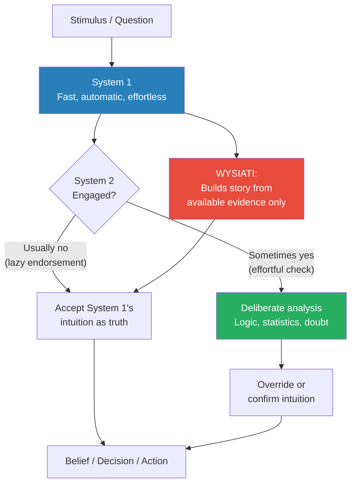
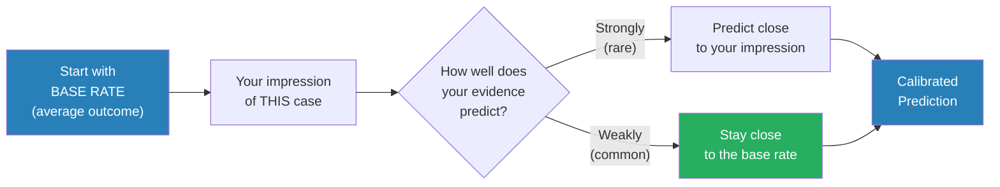
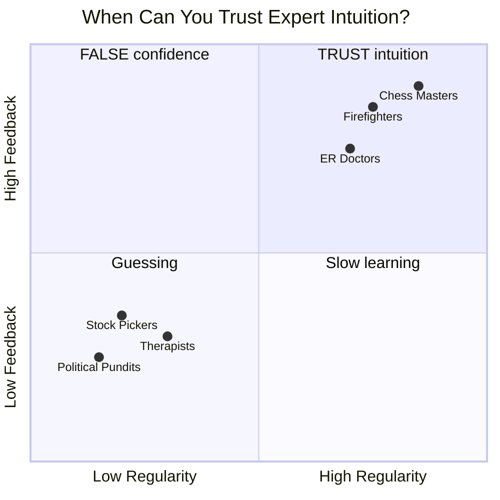
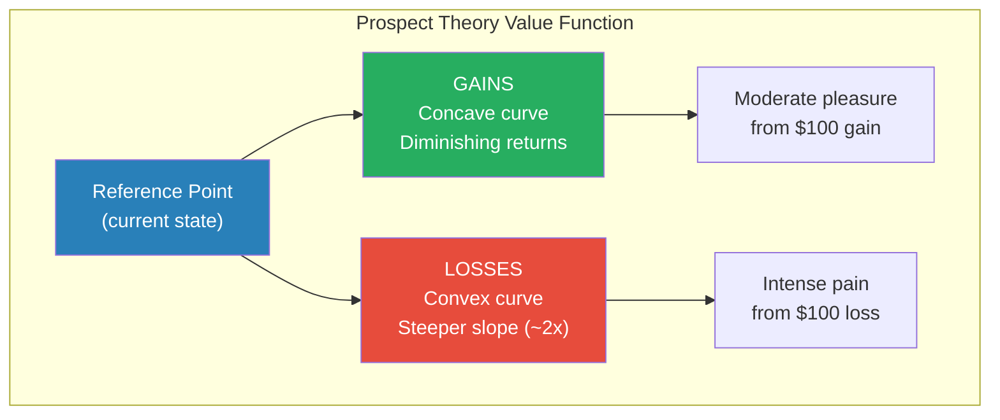
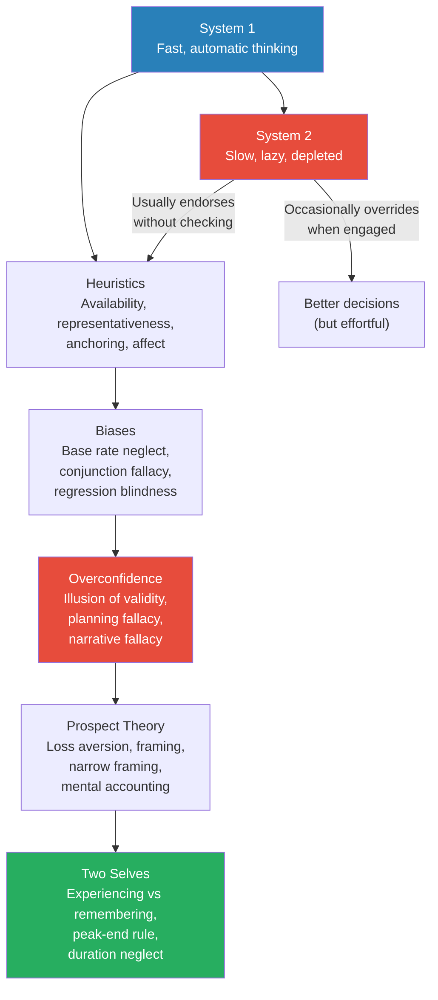
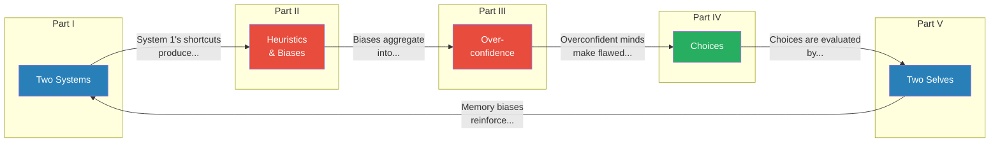

# Thinking, Fast and Slow — Daniel Kahneman

> Daniel Kahneman spent nearly fifty years studying how humans actually think — not the rational, utility-maximising agents that economists assumed, but the real, flawed, brilliant, lazy, pattern-obsessed minds that navigate a world far too complex for conscious analysis. *Thinking, Fast and Slow* is the grand synthesis of that lifetime of work: a tour through the architecture of the human mind, built around a single powerful metaphor — two systems of thought. System 1 is fast, automatic, and intuitive; it reads faces, completes phrases, and flinches at danger without any conscious effort. System 2 is slow, deliberate, and effortful; it solves algebra, checks logic, and resists temptation — but only when it can be bothered to engage. Most of our mental life, Kahneman shows, is governed by System 1 — and System 1, for all its astonishing speed and power, is systematically biased in ways that affect every judgment we make, every risk we assess, every choice we face, and every memory we keep. The result is the most important book on how the mind works published in the twenty-first century — one that changed psychology, economics, medicine, law, and public policy, and earned its author a Nobel Prize.

---

## About the Author

Daniel Kahneman (1934–2024) was born in Tel Aviv and grew up in Nazi-occupied Paris, where his family spent years in hiding. He studied psychology at Hebrew University of Jerusalem, earned his PhD from UC Berkeley in 1961, and spent most of his career at the University of British Columbia, UC Berkeley, and Princeton University. In the early 1970s, he began a decades-long collaboration with Amos Tversky that would fundamentally reshape the social sciences. Together they developed the heuristics-and-biases research programme, demonstrating that human judgment systematically departs from statistical norms in predictable ways, and prospect theory, which replaced expected utility theory as the dominant model of decision-making under risk. Kahneman was awarded the Nobel Memorial Prize in Economic Sciences in 2002 — remarkable for a psychologist who never took a single economics course. Tversky, who died in 1996, would almost certainly have shared the prize. *Thinking, Fast and Slow*, published when Kahneman was 77, distils everything he learned into a single accessible volume. His final major work, [[Noise - Cass R. Sunstein|Noise]] (2021, with Olivier Sibony and Cass Sunstein), extended the programme from individual bias to systemic variability in professional judgment.

---

## The Big Idea

- The central metaphor of the book is <b style="color: #2980b9">two systems of thought</b> that coexist in every human mind
- <b style="color: #2980b9">System 1</b> operates automatically and quickly, with little or no effort and no sense of voluntary control
  - It detects that one object is farther away than another
  - It orients to the source of a sudden sound
  - It completes the phrase "bread and ..."
  - It detects hostility in a voice
  - It drives a car on an empty road
- <b style="color: #2980b9">System 2</b> allocates attention to effortful mental activities, including complex computations
  - It focuses attention on a specific person in a crowded room
  - It searches memory to identify a surprising sound
  - It maintains a faster walking speed than is natural
  - It fills out a tax form
  - It checks the validity of a complex logical argument

---

- The two systems interact constantly, and the division of labour between them is remarkably efficient — most of the time
- System 1 continuously generates suggestions for System 2: impressions, intuitions, intentions, and feelings
- <b style="color: #27ae60">If endorsed by System 2, impressions and intuitions turn into beliefs, and impulses turn into voluntary actions</b>
- When everything goes smoothly — which is most of the time — System 2 adopts System 1's suggestions with little or no modification
- You generally believe your impressions and act on your desires, and that is fine
- But System 1 has systematic biases — <b style="color: #e74c3c">predictable errors it makes in specified circumstances</b>
- It has little understanding of logic and statistics
- It cannot be turned off — you cannot stop it from doing what it does
- System 2 is supposed to be the monitor, the quality controller — but it is lazy
- It often endorses System 1's intuitions without checking them carefully

---

- Kahneman introduces <b style="color: #2980b9">WYSIATI — "What You See Is All There Is"</b> — as the master principle of System 1
- System 1 is a story-building machine — it constructs the most coherent interpretation from whatever information is currently available
- It does not pause to ask: "What information am I *missing*?"
- It does not flag uncertainty or gaps — it builds the best story it can from the evidence at hand and delivers that story to System 2 with high confidence
- <b style="color: #e74c3c">The measure of success for System 1 is the coherence of the story it creates, not the completeness of the evidence</b>
- This explains why first impressions are so powerful, why we jump to conclusions, and why we are overconfident in our judgments
- WYSIATI is the thread that runs through the entire book — it explains the halo effect, confirmation bias, framing effects, and overconfidence

This diagram captures the book's foundational insight: System 1 generates rapid intuitions from incomplete information, and System 2 — the only system capable of doubt and deliberate analysis — usually endorses them without checking.

System 1 excels at speed and story coherence but fails catastrophically at complex accuracy and statistical reasoning — precisely the domains where System 2 should intervene but often doesn't because it's lazy.

---

## Key Concepts at a Glance

| Concept | One-line summary |
|---------|-----------------|
| **System 1** | Fast, automatic, intuitive thinking — always on, generates impressions and feelings |
| **System 2** | Slow, deliberate, effortful thinking — allocates attention, checks logic, but is lazy |
| **WYSIATI** | "What You See Is All There Is" — System 1 builds stories from available evidence without seeking what's missing |
| **Cognitive ease** | When things feel easy and familiar, System 1 signals that all is well — no need for System 2 |
| **Anchoring** | Exposure to a number biases subsequent estimates, even when the anchor is obviously irrelevant |
| **Availability heuristic** | Judging frequency or probability by how easily examples come to mind |
| **Representativeness** | Judging probability by resemblance to a stereotype, ignoring base rates |
| **Conjunction fallacy** | Rating a detailed scenario as more probable than a general one (Linda the bank teller) |
| **Regression to the mean** | Extreme outcomes naturally gravitate toward the average; people invent causal stories for this |
| **Planning fallacy** | Systematic underestimation of time, costs, and risks for planned projects |
| **Overconfidence** | Subjective confidence reflects story coherence, not the quality of evidence |
| **Prospect theory** | Value is reference-dependent; losses hurt ~2x more than equivalent gains feel good |
| **Loss aversion** | The asymmetry between gains and losses — losses loom larger |
| **Endowment effect** | Owning something makes you value it more; selling price exceeds buying price |
| **Fourfold pattern** | Four combinations of probability and outcome domain that explain risk preferences |
| **Framing effects** | How a choice is presented changes the decision, even when outcomes are identical |
| **Narrow framing** | Evaluating decisions one at a time instead of as a portfolio — leads to excessive risk aversion |
| **Mental accounting** | Treating money differently depending on its source, location, or intended use |
| **Experiencing self** | The self that lives in the present moment — moment-to-moment pleasure and pain |
| **Remembering self** | The self that constructs the story of our lives — keeps score, makes decisions |
| **Peak-end rule** | Remembered quality of an experience is determined by its peak intensity and its ending |
| **Duration neglect** | How long an experience lasts has surprisingly little effect on how it is remembered |
| **Focusing illusion** | Nothing is as important as you think it is while you are thinking about it |

---

## Part I: Two Systems

*The book opens by introducing the two characters who will drive the story — System 1 and System 2 — and demonstrating through vivid experiments how they interact, conflict, and divide the labour of thinking.*

### The Characters of the Story

- Kahneman opens with a visual illusion — the Müller-Lyer lines — to make a point that sets up the entire book
- Two lines of identical length appear different because of the arrows at their ends (one with outward-pointing arrows looks longer)
- Even after you *know* the lines are equal, you *see* them as different
- <b style="color: #2980b9">This is the relationship between System 1 and System 2 in miniature</b> — you can know the truth (System 2) but you cannot stop seeing the illusion (System 1)
- System 1 operates automatically — you cannot choose to see the lines as equal any more than you can choose not to understand a sentence in your native language
- System 2 is the conscious, reasoning self that we identify with — the "I" that has beliefs, makes choices, and decides what to do
- But System 2 has a dirty secret: it is lazy, and it vastly underestimates how much of its work is actually done by System 1

---

### Attention and Effort

- System 2 activities require attention and are disrupted when attention is drawn away
- Kahneman's early research measured pupil dilation as a real-time indicator of mental effort
- Pupils dilate when people multiply numbers, hold items in working memory, or manage competing demands
- The harder the task, the wider the pupil — mental effort has a direct physiological signature
- <b style="color: #e74c3c">There is a mental budget — when the demands of a task exceed the budget, you fail</b>
- The Add-1 task (add 1 to each digit of a 4-digit number: 5294 → 6305) is manageable; Add-3 (5294 → 8527) pushes most people to their limit
- Time pressure does not help — the bottleneck is not motivation but cognitive capacity
- Driving a car on a familiar road uses almost no System 2 capacity; driving in heavy traffic in an unfamiliar city uses nearly all of it
- When System 2 is fully engaged in a task, people can become effectively blind to stimuli that would normally attract attention

> [!example] The Invisible Gorilla
> - Christopher Chabris and Daniel Simons asked participants to watch a short video of people passing a basketball and count the number of passes
> - Halfway through the video, a person in a gorilla suit walked into the centre of the screen, faced the camera, thumped their chest, and walked off
> - Roughly half the viewers completely missed the gorilla
> - They were so focused on counting passes — a System 2 task — that System 1's normal ability to detect unexpected objects was suppressed
> - When shown the video again, most could not believe they had missed something so obvious
> **The lesson:** Intense focus on one task can make us literally blind to things happening right in front of us — "inattentional blindness" reveals the limits of our mental budget.

---

### The Lazy Controller

- System 2 is not just effortful — it is also <b style="color: #e74c3c">genuinely lazy</b>
- It will accept System 1's suggestions whenever possible and avoid the effort of engaging fully
- This laziness is not a bug — it is efficient. Most of the time, System 1's impressions are accurate enough

> [!example] The Bat and Ball
> - A bat and a ball cost $1.10 in total. The bat costs $1.00 more than the ball. How much does the ball cost?
> - The intuitive answer that springs to mind is 10 cents — fast, confident, and wrong
> - The correct answer is 5 cents (if the ball costs 5 cents, the bat costs $1.05, and together they cost $1.10)
> - More than 50% of students at Harvard, MIT, and Princeton gave the wrong answer
> - The critical finding: many people who gave the wrong answer were capable of solving the problem correctly — they simply did not bother to check their intuitive answer
> **The lesson:** System 2 could have caught the error, but it endorsed System 1's answer without engaging — this is the prototypical example of cognitive laziness.

- Self-control and cognitive effort draw on the same limited pool of mental energy — a concept Kahneman calls <b style="color: #2980b9">ego depletion</b>
- People who have just exerted self-control in one domain (resisting tempting food, suppressing emotions) perform worse on subsequent cognitive tasks
- Judges in Israel were more likely to grant parole early in the morning and right after lunch — their "default" decision (deny parole) took over as mental resources depleted

> [!tip] The laziness of System 2 is not a character flaw — it is a design feature. Checking every intuition would be paralysing. The problem arises only when System 1 delivers a confident answer in a domain where it is systematically wrong — and System 2 does not bother to intervene.

---

### The Associative Machine

- System 1 is an <b style="color: #2980b9">associative machine</b> — it connects ideas in a vast network of linked concepts
- When you see or hear a word, it activates a cascade of associated ideas that ripple outward
- "BANANA" activates yellow, fruit, monkey, peel, split, and more — within milliseconds, without any conscious direction
- These associations are not just thoughts — they produce physical changes in the body
- Reading "VOMIT" produces a slight physical disgust response; "LOVE" warms the face; "DANGER" tenses the muscles
- <b style="color: #e74c3c">Priming</b> is the mechanism by which this associative activation shapes behaviour without awareness

> [!example] The Florida Effect
> - John Bargh and colleagues at NYU asked students to construct sentences from sets of five words
> - One group's words included "Florida," "forgetful," "bald," "grey," and "wrinkle" — words associated with elderly stereotypes
> - After the language task, students walked down a hallway to another room
> - Those who had been exposed to old-age words walked significantly more slowly than the control group
> - They had no idea the words had affected them — they were not consciously thinking about being old
> **The lesson:** System 1's associative network can influence physical behaviour through mere exposure to related concepts — we are less in conscious control of our actions than we believe.

- The priming research demonstrates that System 1 operates beneath consciousness in ways that affect judgment, behaviour, and even physical states
- Reciprocal links work both ways: being made to smile (by holding a pencil between your teeth) makes cartoons seem funnier; furrowing your brow makes them seem less funny

---

### Cognitive Ease

- System 1 continuously monitors the environment for signals of whether things are going well or whether something requires attention
- <b style="color: #2980b9">Cognitive ease</b> is the signal that everything is fine — no threats, no novelty, no need to mobilise System 2
- <b style="color: #e74c3c">Cognitive strain</b> signals that something is wrong — a problem exists, mobilise System 2
- Things that are repeated, clearly displayed, or primed feel cognitively easy — and cognitive ease creates a sense of truth, familiarity, and goodness
- <b style="color: #27ae60">A statement that is printed in a clear, bold font feels more true than the same statement in a faded, hard-to-read font</b>
- This has profound implications: marketing, propaganda, persuasion — all exploit cognitive ease to make claims feel true without System 2 scrutiny
- The mere exposure effect: repeated exposure to a stimulus (a face, a word, a shape) makes it more liked, even without conscious recognition
- Cognitive ease explains why familiar ideas feel right, why fluent speakers seem more credible, and why simple language is more persuasive than complex jargon

---

### Norms, Surprises, and Causes

- System 1 maintains a model of the world — a running representation of what is normal and expected
- When something violates this model, System 1 generates a surprise signal that captures attention and triggers System 2
- But System 1's model of normal adapts quickly — once an unusual event has occurred a few times, it becomes the new normal
- More importantly, <b style="color: #2980b9">System 1 is a causal reasoning machine</b> — it does not merely register correlations; it infers causes
- When two events co-occur, System 1 automatically generates a causal story linking them
- This causal orientation is enormously useful for navigating the physical world — but it creates problems when applied to statistical patterns, where causation is absent

---

### A Machine for Jumping to Conclusions

- System 1 is designed to <b style="color: #e74c3c">jump to conclusions on the basis of limited evidence</b>
- This works well in a predictable environment but produces systematic errors in complex or statistical domains
- **WYSIATI** operates through several mechanisms:
  - **The halo effect:** If you like one thing about a person (they are attractive), you tend to like everything about them (they are also intelligent, kind, competent) — your overall impression colours every judgment
  - **Confirmation bias:** Once you have formed a hypothesis, System 1 searches for confirming evidence and ignores or downweights disconfirming evidence
  - **Framing effects:** The way information is presented changes the conclusion — "90% fat-free" feels different from "10% fat" even though they are identical
- The halo effect is particularly insidious in hiring, performance reviews, and first impressions — a strong initial impression creates a self-reinforcing narrative
- <b style="color: #27ae60">The remedy is to collect judgments independently before allowing discussion</b> — once people hear others' views, halo and conformity effects dominate

---

### How Judgments Happen

- System 1 evaluates stimuli along multiple dimensions simultaneously — a process Kahneman calls the <b style="color: #2980b9">mental shotgun</b>
- When you see a face, you instantly assess attractiveness, trustworthiness, dominance, and competence — even though you were only trying to determine if the person is someone you know
- System 1 performs <b style="color: #2980b9">intensity matching</b> — it can translate assessments across completely different scales
  - If "How much would you donate to save dolphins?" is too hard, System 1 substitutes "How much do I like dolphins?" and translates the emotional intensity into a dollar amount
- This substitution process is invisible — you feel you are answering the original question, but you are actually answering an easier one
- <b style="color: #e74c3c">Substitution is the core mechanism behind most heuristic errors</b> — when a difficult question is posed, System 1 finds an easier, related question and answers that instead

---

### The Affect Heuristic

- The most fundamental substitution is the <b style="color: #2980b9">affect heuristic</b>
- Instead of analysing risks and benefits carefully, people consult their emotional reaction: "How do I *feel* about this?"
- If the feeling is positive, risks seem low and benefits seem high
- If the feeling is negative, risks seem high and benefits seem low
- Paul Slovic demonstrated this with nuclear power: people who disliked nuclear power judged both its risks as high *and* its benefits as low — even though logically, a technology with high risks might still have high benefits
- System 1 cannot handle the complexity of separate risk and benefit assessments, so it substitutes a single emotional evaluation
- <b style="color: #27ae60">This is why data rarely changes minds on emotionally charged issues — the emotional judgment came first, and the "reasoning" is post-hoc justification</b>

---

### System 1 and System 2 in Daily Life

- To appreciate the full scope of System 1's dominance, consider how it operates in situations we encounter every day
- <b style="color: #2980b9">Reading</b> is an almost entirely System 1 activity — you cannot look at a word in your native language and *not* read it (this is the Stroop effect: try to name the ink colour of the word RED printed in blue ink — it takes System 2 effort to suppress the automatic reading)
- <b style="color: #2980b9">Driving a familiar route</b> is System 1 — you arrive at work with almost no memory of the journey because System 2 was never engaged; but driving in a foreign city on the wrong side of the road recruits System 2 fully
- <b style="color: #2980b9">Social interactions</b> are dominated by System 1 — you read faces, detect emotions, adjust your tone, and navigate conversational dynamics automatically; only when you encounter an unusual or threatening social situation does System 2 step in
- <b style="color: #2980b9">Professional expertise</b>, when genuine, is System 1 — a skilled radiologist sees the anomaly in a chest X-ray before consciously analysing it; a chess grandmaster sees the right move in a flash of pattern recognition
- The problem arises when System 1 applies its pattern-matching expertise in domains where patterns are unreliable — stock markets, long-range forecasts, personnel selection — and System 2 fails to intervene because the intuition *feels* just as confident as genuine expertise

---

### The Pleasure of Cognitive Ease

- The cognitive ease system has a surprising implication: <b style="color: #2980b9">things that are easy to process feel true</b>
- Robert Zajonc demonstrated the mere exposure effect: Chinese characters shown repeatedly to English speakers were rated as more pleasant — even though participants had no idea what they meant
- Stocks with pronounceable ticker symbols outperform those with unpronounceable ones in the week after IPO — not because the companies are better, but because fluency breeds familiarity, and familiarity breeds trust
- Companies with easy-to-pronounce names are evaluated more favourably by investors
- A statement printed in bright blue on a white background is judged as more credible than the same statement in washed-out blue or small font
- <b style="color: #e74c3c">Propaganda works in part because repetition creates cognitive ease — and cognitive ease creates the feeling of truth</b>
- The countermeasure is to be suspicious of ease — when something feels obviously true, ask whether the feeling comes from evidence or from fluency, familiarity, or repetition

---

### Norms and the Assessment of Surprises

- System 1 maintains a remarkably detailed model of what is "normal" in any situation
- When you enter a restaurant, System 1 has expectations about the layout, the noise level, the menu format, and the behaviour of staff — all without conscious effort
- Violations of these norms generate surprise — and surprise triggers System 2 engagement
- But norms update quickly: the first time you see a tattooed waiter at a fine restaurant, System 2 notices; the third time, System 1 has already updated its model of "normal"
- This rapid normalisation is adaptive — it prevents constant surprise in a changing world — but it also means we quickly stop noticing things we should pay attention to
- More importantly, System 1's norm-tracking creates the foundation for its causal reasoning: when two events co-occur and both violate norms, System 1 infers a causal connection — often incorrectly

---

### The Halo Effect in Practice

- The <b style="color: #2980b9">halo effect</b> deserves special attention because it operates in nearly every judgment we make about people
- If you meet someone who is articulate and well-dressed, System 1 automatically extends this positive impression to their intelligence, competence, and trustworthiness — even without evidence
- In a study, students who rated a professor as warm also rated his accent as more pleasant; students who rated the same professor as cold found his accent annoying — the same accent, heard by people with different overall impressions
- The halo effect is devastatingly important in hiring: the first 30 seconds of a job interview often determine the outcome, because the initial impression (halo) colours every subsequent observation
- <b style="color: #27ae60">Kahneman's practical remedy: collect evidence on different attributes independently before forming an overall impression — see one thing at a time, then combine</b>
- This is why structured interviews outperform unstructured ones — they prevent the halo effect from contaminating the assessment

> [!example] The Military Assessment Story
> - As a young psychologist in the Israeli Defence Forces, Kahneman was tasked with redesigning the interview process for officer candidates
> - The existing method was intuitive: interviewers spent 15-20 minutes with each candidate, formed a global impression, and made a prediction
> - These predictions had almost no correlation with actual officer performance
> - Kahneman redesigned the process: interviewers would rate each candidate on six specific attributes independently — leadership, sociability, physical fitness, intellectual ability, conscientiousness, and pride
> - Only after all six ratings were recorded could the interviewer form an overall impression
> - The new system dramatically improved prediction accuracy — not because the attributes were perfect, but because the structured process prevented the halo effect from corrupting the assessments
> - The Israeli Defence Forces adopted the system, and versions of it are still used today
> **The lesson:** Structure prevents the halo effect from contaminating professional judgment — collect independent assessments first, synthesise second.

---

### Substitution: The Core Mechanism

- The substitution principle is so central to Kahneman's framework that it deserves explicit emphasis
- <b style="color: #2980b9">When confronted with a difficult question, System 1 finds an easier, related question and answers that instead — without you noticing the switch</b>
- "Should I invest in this company?" becomes "Do I like this company?"
- "How happy am I with my life?" becomes "What is my mood right now?"
- "Is this politician competent?" becomes "Does this politician look competent?"
- "What is the probability of this outcome?" becomes "How easily can I imagine this outcome?"
- The substituted question is called the <b style="color: #2980b9">heuristic attribute</b> — it is simpler, more accessible, and emotionally loaded
- The target question is the one you actually need to answer — it is more complex, requires data, and resists quick intuitions
- <b style="color: #e74c3c">Most biases in this book can be traced back to substitution</b> — availability bias substitutes "ease of recall" for "frequency"; representativeness substitutes "similarity" for "probability"; anchoring substitutes "adjustment from a salient number" for "independent estimation"

---

### Availability, Emotion, and Risk

- The <b style="color: #2980b9">affect heuristic in risk assessment</b> produces some of the most consequential errors in public policy
- After the September 11 attacks, millions of Americans switched from flying to driving — even though driving is statistically far more dangerous per mile than flying
- Gerd Gigerenzer estimated that the increase in driving fatalities in the year following 9/11 exceeded the number of people who died in the attacks themselves
- The availability of vivid, terrifying images of plane crashes overwhelmed the statistical reality — System 1 substituted "How frightened am I?" for "How dangerous is this?"
- The same pattern drives public policy on terrorism, nuclear power, genetically modified food, and vaccine safety — vivid, emotionally charged risks receive disproportionate attention and funding, while statistical risks (air pollution, antibiotic resistance, obesity) receive far less
- <b style="color: #27ae60">Paul Slovic's research shows that people's risk assessments are driven by dread (how terrifying the worst case is) and perceived controllability (whether you feel in control) — not by actual frequency of harm</b>
- This means that risks which are both dreaded and uncontrollable (nuclear meltdowns, terrorism, pandemics) are massively overweighted, while risks that are familiar and feel controllable (driving, eating badly, smoking) are underweighted

---

### The Cab Problem and Bayesian Reasoning

- One of the most instructive examples in the heuristics-and-biases programme is the <b style="color: #2980b9">cab problem</b>

> [!example] The Hit-and-Run Cab
> - A cab was involved in a hit-and-run accident at night. Two cab companies — Green and Blue — operate in the city. 85% of cabs are Green; 15% are Blue.
> - A witness identified the cab as Blue. The court tested the witness's reliability: under similar conditions, the witness correctly identified each colour 80% of the time and was wrong 20% of the time.
> - What is the probability that the cab was Blue?
> - Most people say about 80% — matching the witness's reliability and ignoring the base rate
> - The correct answer, using Bayes' theorem, is about 41%
> - There are many more Green cabs than Blue cabs, so even though the witness is fairly reliable, the prior probability of the cab being Green is so high that it still dominates
> - The base rate (85% Green) should pull the estimate well below the witness's 80% accuracy — but System 1 ignores base rates when a vivid individuating case (the witness's testimony) is available
> **The lesson:** Base rate neglect is one of the most persistent biases in human judgment — even when the base rate information is explicitly provided, people focus on the individual case and ignore the statistical background.

- Kahneman showed that rephrasing the problem in causal terms — "Green cabs are involved in 85% of accidents in the city" — makes people use the base rate, because it becomes part of a causal story rather than a dry statistic
- <b style="color: #27ae60">The implication for communication: if you want statistics to affect decisions, embed them in causal narratives — stories change minds, tables do not</b>

---

## Part II: Heuristics and Biases

*The heart of Kahneman and Tversky's original research programme — a systematic catalogue of the mental shortcuts (heuristics) that System 1 uses and the predictable errors (biases) they produce.*

### The Law of Small Numbers

- People — including trained researchers — have deeply flawed intuitions about the behaviour of random samples
- <b style="color: #e74c3c">We expect small samples to be representative of the population they are drawn from, and they are not</b>
- A study of kidney cancer rates across US counties found that the counties with the lowest cancer rates were mostly small, rural, and Republican — suggesting fresh air and clean living
- But the counties with the *highest* cancer rates were also small, rural, and Republican
- There was no health story here — the pattern was entirely driven by the statistical fact that small samples produce extreme results
- Kahneman calls this the <b style="color: #2980b9">law of small numbers</b> — the mistaken belief that even small samples will closely resemble the population
- The correct law — the law of large numbers — says that large samples are representative; small samples are not
- System 1 is not equipped for statistical reasoning — it sees patterns, invents explanations, and feels confident

---

### Anchors

- <b style="color: #2980b9">Anchoring</b> is among the most robust and practically important findings in behavioural science
- When people make numerical estimates, they are systematically influenced by numbers they have recently encountered — even irrelevant ones
- Kahneman and Tversky spun a rigged wheel of fortune (landing on either 10 or 65) and then asked participants to estimate the percentage of African countries in the United Nations
- Those who saw 65 estimated significantly higher (around 45%) than those who saw 10 (around 25%)
- The wheel of fortune was obviously random — yet it influenced their estimates dramatically
- Anchoring operates through two mechanisms:
  - **Adjustment:** System 2 starts from the anchor and adjusts, but the adjustment is always insufficient — it stops as soon as it reaches a plausible estimate
  - **Priming:** The anchor selectively activates information consistent with it — "Is the tallest redwood more or less than 1,200 feet?" activates images of very tall trees
- Real-world consequences are enormous: in negotiations, the first number on the table anchors the entire discussion; in sentencing, the prosecutor's request anchors the judge's decision; in pricing, the manufacturer's suggested retail price anchors consumer expectations

---

### The Science of Availability

- The <b style="color: #2980b9">availability heuristic</b> is the tendency to judge the frequency or probability of an event by how easily examples come to mind
- If you can quickly think of several plane crashes, you judge flying as dangerous — even if the statistical risk is tiny compared to driving
- Availability is influenced by:
  - **Recency:** recent events are more available (a recent earthquake makes earthquakes seem more likely)
  - **Emotional salience:** vivid, emotionally charged events are more available (terrorist attacks feel more dangerous than heart disease, which kills far more people)
  - **Media coverage:** events covered heavily in the media are more available regardless of actual frequency
- <b style="color: #e74c3c">The result is a systematic distortion of risk perception</b> — dramatic, publicised risks are overestimated while quiet, statistical killers are underestimated
- Paul Slovic demonstrated that after a major disaster, flood insurance purchases surge — then gradually decline as the memory fades, even though the objective risk has not changed

---

### Representativeness and Base Rate Neglect

- The <b style="color: #2980b9">representativeness heuristic</b> is the tendency to judge the probability that something belongs to a category based on how much it resembles a typical member of that category — ignoring the statistical base rate

> [!example] Tom W
> - Tom W is highly intelligent but unimaginative; he has a need for order and tidiness, and a passion for detail. He wrote science fiction as a teenager.
> - Participants were asked: Is Tom W more likely to be studying computer science or humanities?
> - Most said computer science — because the description *resembles* their stereotype of a computer science student
> - But the base rate matters enormously — there are far more humanities students than computer science students at most universities
> - Even when told the base rates, people largely ignored them and relied on the description's fit with the stereotype
> **The lesson:** When a vivid, detailed description is available, System 1 uses resemblance (representativeness) and ignores statistical frequency (base rates) — this is base rate neglect.

---

### Linda: Less Is More

- The most famous demonstration of the representativeness heuristic is the Linda problem

> [!example] Linda the Bank Teller
> - Linda is 31, single, outspoken, and very bright. She majored in philosophy. As a student, she was deeply concerned with issues of discrimination and social justice, and participated in anti-nuclear demonstrations.
> - Which is more likely? (a) Linda is a bank teller, or (b) Linda is a bank teller and is active in the feminist movement.
> - Between 85% and 90% of respondents — including statistically trained graduate students — chose (b)
> - This is logically impossible — the probability of two things being true together (bank teller AND feminist) can never exceed the probability of just one (bank teller)
> - This is the **conjunction fallacy** — people judge a conjunction as more probable than one of its components because the conjunction is more *representative* of their image of Linda
> **The lesson:** Adding detail to a scenario makes it more vivid and representative — and less probable. System 1 evaluates coherence of story, not logic of probability.

---

### Causes Trump Statistics

- System 1 is a causal reasoning engine — it readily processes causal stories but struggles with statistical facts
- <b style="color: #2980b9">Causal base rates</b> (stereotypes about how things behave) are incorporated into judgments because they fit a causal story
- <b style="color: #e74c3c">Statistical base rates</b> (how common something is in the population) are neglected because they do not fit a causal narrative
- Telling people "85% of the cabs in the city are Green" is a statistical fact — and it is largely ignored when a vivid eyewitness account is available
- But telling people "Green Cab drivers are involved in 85% of hit-and-run accidents" creates a causal stereotype — Green Cab drivers are reckless — and this dramatically affects judgments
- The implication: if you want base rates to influence decisions, embed them in a causal story

---

### Regression to the Mean

- <b style="color: #2980b9">Regression to the mean</b> is one of the most important and least understood statistical phenomena
- Whenever outcomes involve any component of randomness, extreme results in one measurement will tend to be followed by less extreme results in the next measurement
- This is a mathematical inevitability, not a causal phenomenon — but System 1 cannot help inventing causal stories to explain it

> [!example] Israeli Flight Instructors
> - Kahneman was lecturing to flight instructors in the Israeli Air Force about the psychology of effective training
> - He explained the research showing that reward is more effective than punishment for learning
> - A senior instructor objected: "I've often praised cadets after a smooth landing, and the next time they do worse. I've screamed at them after a rough landing, and the next time they do better. Punishment works; praise doesn't."
> - Kahneman had an epiphany: the instructor was right about the pattern — but wrong about the cause
> - An exceptionally good landing is partly skill and partly luck; on the next attempt, the luck component will probably be less favourable, so performance will regress toward the average — regardless of whether the cadet was praised or punished
> - An exceptionally bad landing will similarly be followed by a better one — whether or not the cadet was scolded
> - The instructor had been fooled by regression to the mean into believing that punishment caused improvement and praise caused deterioration
> **The lesson:** We live in a world where regression to the mean is constant — and we systematically construct false causal narratives to explain what is mere statistical inevitability.

- The implications extend far beyond aviation: the "Sports Illustrated jinx" (athletes who appear on the cover subsequently perform worse), the sophomore slump, the effectiveness of medical treatments given at the patient's worst moment
- <b style="color: #27ae60">Whenever you see an extreme performance followed by a more moderate one, ask: "Could this just be regression to the mean?" — it usually is</b>

---

### Regression and Causal Illusions in Organisations

- Regression to the mean creates some of the most persistent causal illusions in organisational life
- **CEO succession:** a company performs poorly, the CEO is replaced, and performance improves — the board concludes the new CEO is better. But performance was at an extreme low (which is partly why the CEO was fired), and regression alone would predict improvement regardless of who replaced them
- **Training programmes:** employees attend a training programme and subsequent performance improves — management concludes the training worked. But employees were often selected for training *because* their performance was poor (an extreme), and regression alone would predict improvement
- **Medical interventions:** a patient tries a new treatment when symptoms are at their worst (an extreme), and symptoms improve — the patient attributes the improvement to the treatment. But symptoms were likely to improve anyway through regression
- **Punishment and reward:** Kahneman argues that the regression artifact creates a systematic bias toward punishment in human societies — punishment is followed by improvement (regression from extreme poor performance), while praise is followed by deterioration (regression from extreme good performance), creating the illusion that punishment is more effective
- <b style="color: #e74c3c">This is not a minor statistical curiosity — it is a fundamental bias in how organisations learn, evaluate, and make policy</b>
- The corrective: whenever you observe improvement after an intervention, ask whether the improvement exceeds what regression to the mean alone would predict — if not, the intervention may have had no effect at all

---

### The Base Rate Neglect Problem in Criminal Justice

- Base rate neglect has particularly devastating consequences in the criminal justice system
- Consider a screening test for a rare condition (say, a disease affecting 1 in 1,000 people) with 95% sensitivity (correctly identifies 95% of positive cases) and 5% false positive rate
- If you test 1,000 people: 1 has the disease (and 95% chance the test catches it ≈ 1 true positive), but 999 are healthy and 5% will test falsely positive (≈ 50 false positives)
- So out of ~51 positive results, only 1 is actually positive — <b style="color: #e74c3c">the false positive rate is roughly 98%</b>
- This statistical reality is counterintuitive — most people (including doctors and jurors) massively overestimate the significance of a positive test when the base rate is low
- The same logic applies to forensic evidence, eyewitness identification, and criminal profiling — when the base rate of guilt is low (most people are innocent), even highly accurate evidence produces many false positives
- Kahneman uses this to argue for Bayesian thinking in professional judgment — but acknowledges that System 1 is constitutionally incapable of Bayesian updating; it must be done deliberately, with System 2, using explicit calculations

---

### Anchoring in Medical Practice

- Anchoring affects medical diagnosis in ways that can be life-threatening
- A doctor who sees a patient's previous diagnosis in the chart is anchored on that diagnosis — and is less likely to consider alternatives
- A specialist who receives a referral letter saying "possible pneumonia" will tend to confirm pneumonia rather than search for other explanations
- Emergency room studies show that the initial diagnosis formed within the first few minutes of a patient encounter anchors all subsequent investigation — tests that would disconfirm the anchor are less likely to be ordered
- <b style="color: #27ae60">The medical remedy mirrors Kahneman's general advice: structure the diagnostic process to consider multiple hypotheses before settling on one, and actively seek disconfirming evidence for the leading diagnosis</b>
- Atul Gawande's work on checklists in surgery (detailed in [[The Checklist Manifesto - Atul Gawande|The Checklist Manifesto]]) is essentially an anti-anchoring tool — it forces systematic consideration of possibilities that anchoring might otherwise suppress

---

### Taming Intuitive Predictions

- Given everything wrong with intuitive prediction, Kahneman offers a disciplined procedure for making better predictions:
  1. <b style="color: #2980b9">Start with the base rate</b> — what is the average outcome in similar cases?
  2. Determine what your impression of the case suggests
  3. Estimate the correlation between your impression and the outcome you are trying to predict
  4. If the correlation is weak (it usually is), <b style="color: #27ae60">move your prediction only a small distance from the base rate toward your impression</b>
- This is, in effect, a manual regression toward the mean — adjusting for the imperfect predictive validity of your evidence
- People resist this procedure because it feels unnatural — System 1 wants to tell a coherent, extreme story, and regression to the mean creates moderate, boring predictions
- But moderate predictions are more accurate predictions in almost every domain

---

### The Conjunction Fallacy: Why Detail Deceives

- The Linda problem deserves deeper examination because it reveals something fundamental about how System 1 evaluates probability
- <b style="color: #2980b9">Adding detail to a scenario makes it more vivid, more coherent, and more representative — but mathematically less probable</b>
- This is the conjunction rule in probability: the probability of A AND B can never exceed the probability of A alone
- "Linda is a bank teller who is active in the feminist movement" cannot be more likely than "Linda is a bank teller" — because every feminist bank teller is already counted in the "bank teller" category
- Yet 85-90% of people — including graduate students in probability — judge the conjunction as more likely
- The explanation: System 1 does not compute probability — it evaluates <b style="color: #e74c3c">representativeness</b> (how well the description fits the category) and reports that feeling as a probability judgment
- "Feminist bank teller" is more representative of Linda's description than "bank teller" alone — so it *feels* more likely
- The conjunction fallacy extends far beyond laboratory experiments:
  - Intelligence analysts rate detailed scenarios as more probable than vague ones — even when the detail makes the scenario less likely
  - Jurors find detailed alibis more convincing than simple ones — even though detail creates more opportunities for disproof
  - Business plans with rich narrative detail attract more investment — even when the detail signals more assumptions that must prove correct
- <b style="color: #27ae60">The practical defence: whenever a scenario feels compelling because of its vivid detail, pause and ask "Am I judging probability or plausibility?" — plausible is not the same as probable</b>

---

### Regression to the Mean: The Most Important Concept You've Never Heard Of

- Kahneman considers regression to the mean "the most important concept in statistics that people do not understand"
- The principle is simple: <b style="color: #2980b9">whenever a measurement includes any random component, extreme scores will tend to be followed by less extreme scores — purely because of the mathematics of randomness</b>
- If a student scores 98 on a test (partly skill, partly lucky questions), their next score will probably be lower — not because they got worse, but because they are unlikely to be equally lucky twice
- If a salesperson has a terrible month, next month will probably be better — not because of any intervention, but because they are unlikely to be equally unlucky twice
- The consequences of misunderstanding regression are enormous:
  - **Medicine:** patients seek treatment when symptoms are at their worst (extreme). Symptoms naturally regress toward normal, and the patient attributes the improvement to the treatment. This is the placebo effect's statistical cousin — much of what we attribute to treatment is simply regression to the mean
  - **Management:** managers praise subordinates after good performance and punish them after poor performance. Good performance is followed by regression (worse), and bad performance is followed by regression (better). The manager concludes that punishment works and praise doesn't — exactly the error the Israeli flight instructors made
  - **Sports:** the Sports Illustrated cover jinx — athletes who appear on the cover (at peak performance) subsequently regress toward their average — it is not the cover that cursed them, but the statistics
  - **Education:** teachers conclude that difficult students improve after punishment and gifted students slack off after praise — both are regression artifacts

---

### Practical Statistics: Why Your Intuitions About Data Are Wrong

- Kahneman dedicates significant attention to the <b style="color: #e74c3c">systematic failure of intuitive statistics</b>
- People — including trained researchers — make several characteristic errors:
  1. <b style="color: #e74c3c">They trust small samples too much</b> — a fund manager's three-year track record feels meaningful, but three years is a tiny sample in a noisy domain
  2. <b style="color: #e74c3c">They see patterns in random data</b> — the "hot hand" in basketball was believed for decades before rigorous analysis showed it was largely a statistical illusion
  3. <b style="color: #e74c3c">They expect trends to continue</b> — a stock that has risen for three months "must" be on its way up, even though past returns do not predict future returns
  4. <b style="color: #e74c3c">They underestimate the role of chance</b> — when a small school has unusually high test scores, they attribute it to the school's methods rather than to the fact that small schools produce more extreme results by statistical necessity
- The Gates Foundation spent hundreds of millions of dollars investing in small schools based on the finding that the best-performing schools in America were small — without noticing that the *worst*-performing schools were also small, for the same statistical reason
- <b style="color: #27ae60">Kahneman's advice: before accepting any empirical finding, ask "How large is the sample?" and "Could this pattern be generated by chance?" — System 1 will never ask these questions for you</b>

---

### Anchoring in Negotiations and Everyday Life

- Anchoring is not just a laboratory curiosity — it is among the most practically exploitable biases in the book
- <b style="color: #2980b9">In negotiations, the first number placed on the table has an outsized influence on the final outcome</b>
- This applies to salary negotiations, real estate transactions, used car purchases, legal settlements, and any domain where numbers are discussed
- In a study of experienced German judges, prosecutors who demanded a sentence of 9 months got sentences averaging 6 months; prosecutors who demanded 3 months got sentences averaging 3.5 months — the anchoring effect operated even on trained legal professionals whose job requires independence from advocacy
- Even clearly arbitrary anchors affect judgment: asking "Is the population of Chicago more or less than 200,000?" produces a lower subsequent estimate than asking "Is the population of Chicago more or less than 5 million?" — and everyone knows these anchors are arbitrary
- Practical implications:
  - In any negotiation, <b style="color: #27ae60">set the first anchor yourself</b> — an aggressive opening offer pulls the entire negotiation in your direction
  - When you receive an anchor, <b style="color: #27ae60">deliberately counteract it by generating arguments against the anchor</b> before forming your own estimate
  - In group decisions, <b style="color: #27ae60">collect independent estimates before discussion</b> — the first person to speak anchors everyone else (this connects directly to the advice in [[Noise - Cass R. Sunstein|Noise]])

---

### Availability Cascades and the Media

- The availability heuristic interacts with media and social dynamics to produce <b style="color: #2980b9">availability cascades</b> — self-reinforcing cycles where a risk receives increasing attention, which makes it more available in memory, which increases perceived risk, which drives more media coverage
- The Alar scare of 1989 is a canonical example: the chemical Alar, used on apples, was reported as a cancer risk for children. Media coverage exploded, apple sales collapsed, and the chemical was banned — but subsequent analysis showed the actual cancer risk was negligible
- The cycle: initial report → public outrage → more media coverage → more outrage → regulatory action — all driven by availability rather than actual risk assessment
- Availability cascades explain public panic about relatively small risks (terrorism, shark attacks, child abductions) and public apathy about much larger risks (air pollution, obesity, antibiotic resistance)
- <b style="color: #e74c3c">Governments often regulate the risks that are most available in public consciousness rather than the risks that cause the most harm</b> — this is availability-driven policy, not evidence-driven policy
- Cass Sunstein (Kahneman's co-author on [[Noise - Cass R. Sunstein|Noise]]) has written extensively about how availability cascades distort regulatory priorities — a problem that connects the individual psychology of this book to the institutional failures addressed in the later work

---

### The Affect Heuristic and Risk-Benefit Confusion

- Paul Slovic's <b style="color: #2980b9">affect heuristic</b> produces a particularly troubling pattern in risk assessment: an inverse correlation between perceived risk and perceived benefit
- Rationally, risk and benefit are separate dimensions — a technology could have high risk AND high benefit (nuclear power), or low risk AND low benefit (organic farming)
- But when people evaluate risks using the affect heuristic, they consult a single emotional dimension:
  - If they *like* a technology (positive affect), they judge its risks as low AND its benefits as high
  - If they *dislike* a technology (negative affect), they judge its risks as high AND its benefits as low
- This produces an artificial inverse correlation that has no basis in reality — it is an emotional artifact
- <b style="color: #27ae60">The practical consequence: in public debates about technology, policy, and innovation, emotional reactions drive risk assessments more than evidence does — and once the emotional frame is set, data that contradicts it is dismissed or reinterpreted</b>
- Kahneman connects this to the broader theme of substitution: the difficult question "What are the actual risks and benefits?" is replaced by the easy question "How do I feel about this?" — and the answer to the easy question determines the answer to the hard one

This diagram shows Kahneman's disciplined prediction procedure: anchor on the base rate, assess the quality of your evidence, and regress your prediction accordingly — moderate predictions are almost always more accurate than extreme ones.

---

## Part III: Overconfidence

*The most uncomfortable section of the book — Kahneman turns the lens on experts, professionals, and ourselves, demonstrating that confidence in our judgments bears almost no relationship to their accuracy.*

### The Illusion of Understanding

- Humans are compulsive storytellers — and the stories we tell about the past create the <b style="color: #e74c3c">illusion that the world is more understandable, more predictable, and more orderly than it actually is</b>
- Nassim Nicholas Taleb calls this the <b style="color: #2980b9">narrative fallacy</b> — the tendency to construct coherent stories from incomplete evidence and then believe those stories explain what happened
- Once you know an outcome, it feels inevitable — this is <b style="color: #2980b9">hindsight bias</b>, the "I-knew-it-all-along" effect
- After September 11, 2001, intelligence analysts were blamed for "failing to connect the dots" — but the dots were only connectable *after* the event revealed which ones mattered
- Hindsight bias has devastating consequences for accountability: leaders are judged as incompetent for failing to predict events that were genuinely unpredictable
- The illusion of understanding feeds overconfidence — if the past seems predictable in retrospect, we assume the future is equally predictable in prospect

---

### The Illusion of Validity

- <b style="color: #e74c3c">Subjective confidence is not a reliable indicator of accuracy</b>
- Kahneman discovered this in his own work: as a young psychologist in the Israeli Defence Forces, he conducted personality assessments of candidates for officer training
- His team observed candidates in a leaderless group exercise and made confident predictions about who would succeed
- When they checked the predictions against actual performance, the correlation was essentially zero
- But the next time they evaluated candidates, they were just as confident — the evidence of their own failure did not reduce their felt certainty
- Kahneman calls this <b style="color: #2980b9">the illusion of validity</b> — the subjective experience of confidence is generated by the coherence of the story System 1 constructs, not by the quality or quantity of evidence supporting it
- WYSIATI ensures that we are confident whenever we can build a good story — and we can almost always build a good story from whatever evidence is available

> [!tip] Confidence is a feeling, not a judgment. The confidence you have in a belief reflects the coherence of the story your mind has constructed — a confident judgment can be based on excellent evidence or on almost none at all.

---

### Intuitions vs Formulas

- Paul Meehl published a landmark study in 1954 showing that <b style="color: #2980b9">simple statistical algorithms consistently outperform clinical judgment</b> in predicting outcomes
- In study after study — predicting criminal recidivism, student success, patient outcomes, employee performance — a simple formula using a few variables beats the expert's holistic judgment
- The reason: humans are inconsistent. Even the same expert, shown the same case on different days, will give different assessments (this is the "noise" that Kahneman later explored in [[Noise - Cass R. Sunstein|Noise]])
- A formula always gives the same answer to the same inputs — it eliminates noise entirely
- The response from professionals has been fierce resistance — therapists, doctors, and executives refuse to believe that a formula can outperform their trained judgment
- <b style="color: #27ae60">You do not need sophisticated models — even "improper" formulas with equal weights on a few good predictors outperform experts</b>
- Kahneman's advice: wherever possible, replace holistic judgment with simple, consistent rules

---

### Expert Intuition: When Can We Trust It?

- Not all expert intuition is unreliable — a chess master's instant recognition of a strong move is genuine expertise
- Kahneman and Gary Klein (a researcher who studied expert intuition in positive terms) spent years debating this and eventually agreed on a framework
- Expert intuition is trustworthy only when two conditions are met:
  1. <b style="color: #2980b9">The environment is sufficiently regular to be predictable</b> (high-validity environment)
  2. <b style="color: #2980b9">The expert has had prolonged practice with rapid, clear feedback</b>
- Chess, firefighting, and medical diagnosis (in some domains) meet these conditions — the patterns are real, and experts learn to recognise them
- Stock picking, long-range political forecasting, and clinical psychology in novel cases do not — the environment is too chaotic for pattern recognition to work
- <b style="color: #e74c3c">The dangerous zone is where experts feel confident but the environment does not support valid intuition</b> — and this is precisely where overconfidence flourishes

This quadrant shows when expert intuition is reliable: only in environments that are both regular enough to have learnable patterns AND provide rapid, clear feedback. Most professional domains fall short on one or both conditions.

---

### The Outside View

- When planning a project, people naturally adopt the <b style="color: #2980b9">inside view</b> — they focus on the specific details of their situation, construct a scenario of how the project will unfold, and estimate accordingly
- The result is the <b style="color: #e74c3c">planning fallacy</b> — systematic underestimation of costs, time, and risks, combined with overestimation of benefits

> [!example] Kahneman's Textbook
> - In the early 1970s, Kahneman assembled a team to write a high school curriculum on decision-making
> - After a year of work, he asked each team member to estimate how long the project would take to complete
> - Estimates ranged from 18 months to 30 months, with most clustering around 2 years
> - Then Kahneman asked Seymour Fox, an expert in curriculum development who was on the team, about similar projects he had seen
> - Fox went pale: of the comparable teams he knew of, roughly 40% never finished at all, and those that did took 7 to 10 years
> - The team's own estimate — 2 years — was wildly optimistic by any historical standard
> - They ignored Fox's data and continued with the original plan
> - The textbook took 8 years to complete, and by then the Ministry of Education had lost interest and never used it
> **The lesson:** The inside view — focused on the specifics of your situation — almost always produces optimistic estimates. The outside view — asking "what happened in similar cases?" — is far more accurate but psychologically difficult to adopt.

- The <b style="color: #27ae60">outside view</b> (or reference class forecasting) asks: "What is the base rate of success for projects like this?" and uses that as the starting point
- Bent Flyvbjerg has documented the planning fallacy in large infrastructure projects: rail projects overrun budgets by an average of 45%, road projects by 20%, and the pattern is consistent across countries and decades
- The premortem technique helps: before starting a project, imagine it has failed spectacularly and write down the reasons — this legitimises doubt and often surfaces risks that optimism suppresses

---

### The Engine of Capitalism

- Overconfidence is not uniformly bad — Kahneman argues it is <b style="color: #2980b9">the engine of capitalism</b>
- Entrepreneurs are systematically overconfident about their chances of success — and they need to be, because the base rate of success for new businesses is terrible
- Most new restaurants fail; most start-ups fail; most new products fail — if founders accurately perceived these odds, far fewer would try
- The optimistic bias serves a social function even when it hurts individuals — the many failures subsidise the few successes that drive economic growth
- But for individual decision-makers, the lesson is clear: <b style="color: #e74c3c">be aware that your confidence in your plan likely exceeds the quality of your evidence</b>
- The premortem — imagining failure before you begin — is Kahneman's practical antidote: it gives pessimists permission to speak and forces the team to confront risks that optimism has suppressed

---

### Confidence Calibration and the Overconfidence Epidemic

- Overconfidence manifests in three distinct ways:
  1. <b style="color: #e74c3c">Overestimation</b> — people overestimate their own performance, likelihood of success, and ability to control events
  2. <b style="color: #e74c3c">Overplacement</b> — the "above-average effect" — most drivers believe they are better than average, most students believe they are smarter than average, most managers believe they are more effective than average
  3. <b style="color: #e74c3c">Overprecision</b> — people are far more certain of their beliefs than the evidence warrants; when asked for 90% confidence intervals, they produce ranges that contain the true answer only 50% of the time
- Overprecision is the most damaging and least recognised form — it means we systematically underestimate how much we do not know
- <b style="color: #27ae60">Calibration training</b> can partially fix this: people who practice estimating probabilities and receiving immediate feedback learn to widen their confidence intervals — but the training is difficult and the improvements are fragile

> [!example] The Stock-Picking Illusion
> - Kahneman was invited to speak to the investment advisors of a large Wall Street firm
> - Before the talk, he asked for performance data: the annual rankings of each advisor's investment returns over eight consecutive years
> - He computed the correlation between each advisor's ranking in one year and their ranking the following year
> - The average correlation was 0.01 — essentially zero, indistinguishable from random chance
> - There was no persistent skill in stock picking — the advisors who did well one year were no more likely to do well the next than the advisors who did poorly
> - Kahneman presented these findings to the firm — the advisors received large bonuses based on their annual "performance"
> - The reaction: polite acknowledgement, no change in behaviour, and continued bonus payments based on annual rankings
> - They could not accept that their professional skill was an illusion — the feeling of expertise was too strong and too rewarding to surrender
> **The lesson:** In low-validity environments, the subjective experience of skill persists even when objective evidence of skill is absent — and institutions are structured to reward the illusion.

---

### The Premortem Technique

- Kahneman endorses Gary Klein's <b style="color: #2980b9">premortem</b> as the single most practical technique for combating overconfidence and the planning fallacy
- The procedure is simple:
  1. After a plan is developed but before it is implemented, gather the team
  2. Say: "Imagine that it is one year from now. We implemented the plan exactly as written. The outcome was a complete disaster. Take two minutes and write a brief history of that disaster."
  3. Collect and discuss the "histories"
- The premortem works because it does two things that ordinary planning cannot:
  - It <b style="color: #27ae60">legitimises doubt</b> — in a normal planning meeting, expressing pessimism is career suicide; the premortem gives permission to be negative
  - It <b style="color: #27ae60">activates System 1's story-building ability in the service of risk identification</b> — people who are told "imagine this failed" generate vivid, concrete failure scenarios far richer than abstract risk lists
- The premortem does not eliminate overconfidence — nothing does — but it widens the range of threats the team considers and often surfaces risks that optimism would have suppressed

---

### The Kahneman-Klein Debate on Expertise

- The collaboration between Kahneman (sceptic of intuition) and Gary Klein (champion of intuition) produced one of the most illuminating papers in decision science: "Conditions for Intuitive Expertise: A Failure to Disagree" (2009)
- Klein studied firefighters, intensive care nurses, and chess players who made superb decisions under extreme time pressure using intuition — what Klein called <b style="color: #2980b9">recognition-primed decisions</b>
- Kahneman studied clinicians, stock pickers, and political forecasters whose confident intuitions were reliably wrong
- They agreed on the key distinction:
  - In <b style="color: #27ae60">high-validity environments</b> (chess, firefighting, anaesthesiology), patterns are real and learnable through extended practice with rapid feedback — and expert intuition is trustworthy
  - In <b style="color: #e74c3c">low-validity environments</b> (stock markets, political forecasting, clinical prediction of rare events), patterns are weak or nonexistent, feedback is delayed or ambiguous — and expert intuition is an illusion
- The practical test: before trusting an expert's intuition, ask two questions:
  1. Is the environment regular enough to have learnable patterns?
  2. Has this expert had enough practice with rapid, accurate feedback?
- If the answer to either question is no, treat the expert's intuition with extreme scepticism — no matter how confident they are

---

### Algorithms vs Clinical Judgment

- The finding that simple algorithms outperform expert judgment is one of the most robust and most resisted findings in all of social science
- Paul Meehl's 1954 book documented it; since then, over 200 studies have confirmed it across domains including:
  - Medical diagnosis (algorithms outperform doctors in predicting patient outcomes)
  - Criminal justice (formulas outperform parole boards in predicting recidivism)
  - Personnel selection (structured scoring outperforms hiring managers' gut feelings)
  - Academic admissions (formulas outperform admissions committees)
  - Wine quality (a simple formula using rainfall and temperature outperforms expert tasters in predicting vintage quality)
- The reason algorithms win is not that they are brilliant — they are usually quite simple — but that they are <b style="color: #27ae60">perfectly consistent</b>
- Humans are noisy: the same person, shown the same case on different days, will give different assessments (this is the "noise" that became the subject of Kahneman's final book, [[Noise - Cass R. Sunstein|Noise]])
- A formula eliminates noise entirely — and this consistency advantage is enough to beat human experts even when the formula is crude
- <b style="color: #e74c3c">Professionals fiercely resist this finding because it threatens their identity, their livelihood, and their sense of mastery</b>
- Kahneman's advice: wherever possible, develop simple rules (even equal-weight formulas across a few key predictors) and use them consistently — they will outperform holistic judgment

---

### The Role of Luck in Success

- A recurring theme in Parts III and IV is the role of luck in outcomes — and our systematic failure to recognise it
- The <b style="color: #2980b9">success equation</b> for any endeavour is: Outcome = Skill + Luck
- In domains with a large luck component (investing, entrepreneurship, many promotions), even highly skilled performers will experience wide variation in outcomes
- Our narrative-building System 1 refuses to accept this — it insists on attributing success to talent and failure to deficiency
- The "Fortune 500 CEO" problem: business books study successful companies and attribute their success to the CEO's vision, culture, and strategy — but control for luck and most of the variance disappears
- Jim Collins' *Good to Great* identified companies that outperformed the market for 15 years and attributed their success to specific leadership qualities — but many of those companies subsequently underperformed, suggesting the original outperformance was partly luck
- <b style="color: #27ae60">The practical implication: be humble about your successes and generous about others' failures — in any domain with a significant luck component, outcomes are poor indicators of ability</b>

---

## Part IV: Choices

*The most technically ambitious section — Kahneman explains prospect theory, the work that won him the Nobel Prize, and shows how it overturns classical economics' assumptions about rational choice.*

### Bernoulli's Errors

- For 250 years, economic theory was built on Daniel Bernoulli's 1738 insight: people make decisions based on the *utility* (psychological value) of outcomes, not their monetary value
- Bernoulli showed that the utility of wealth is a concave function — the difference between $100 and $200 feels larger than the difference between $900 and $1,000
- This explains risk aversion: a sure $500 is preferred to a 50/50 chance of $0 or $1,000 because the utility of $500 is more than half the utility of $1,000
- But Bernoulli made a critical error: <b style="color: #e74c3c">he assumed utility depends on the absolute level of wealth</b>
- Kahneman and Tversky showed that this is wrong — utility depends on <b style="color: #2980b9">changes relative to a reference point</b>
- Consider: is the person who goes from $1 million to $5 million as happy as the person who goes from $9 million to $5 million? They end up with the same wealth — but one gained $4 million and the other lost $4 million
- Bernoulli's theory says they should be equally satisfied. Kahneman and Tversky's prospect theory says they will not be — the loser will be far more unhappy than the gainer is happy

---

### Prospect Theory

- In 1979, Kahneman and Tversky published "Prospect Theory: An Analysis of Decision under Risk" — it became the most cited paper in the history of economics
- The theory makes three claims that overturn Bernoulli:
  1. <b style="color: #2980b9">Evaluation is relative to a reference point</b> — outcomes are coded as gains or losses, not as absolute states of wealth
  2. <b style="color: #2980b9">Diminishing sensitivity</b> — the difference between $100 and $200 feels larger than between $1,100 and $1,200 (for both gains and losses)
  3. <b style="color: #e74c3c">Loss aversion</b> — losses are roughly twice as painful as equivalent gains are pleasurable
- The value function is S-shaped: concave (curving down) for gains, convex (curving up) for losses, and steeper on the loss side
- <b style="color: #27ae60">The ratio of loss aversion is approximately 2:1</b> — you need to gain about $200 to compensate for a $100 loss
- This single asymmetry explains an enormous range of human behaviour: why people refuse fair bets, why sellers demand more than buyers will pay, why reforms are harder to implement than the status quo

---

### The Prospect Theory Value Function Explained

- The value function has three features that together explain most departures from rational choice:

| Feature | Description | Implication |
|---------|-------------|-------------|
| **Reference dependence** | Value is measured as deviation from a reference point, not in absolute terms | The same objective outcome can feel like a gain or a loss depending on expectations |
| **Diminishing sensitivity** | The difference between $100 and $200 feels larger than between $1,100 and $1,200 | People are risk-averse for gains (prefer sure $900 over 95% chance of $1,000) and risk-seeking for losses (prefer 95% chance of losing $1,000 over sure loss of $900) |
| **Loss aversion** | The value function is steeper for losses than for gains (~2:1 ratio) | People reject gambles with positive expected value because the pain of potential loss exceeds the pleasure of potential gain |

- The reference point is crucial and malleable — it can be the status quo, an expectation, an aspiration, or a social comparison
- When you expect a $10,000 bonus and receive $8,000, you code it as a $2,000 loss — even though it is objectively a gain
- When you expect to be fired and are instead demoted, you code it as a gain — even though a demotion is objectively bad
- <b style="color: #e74c3c">Reference points determine the entire emotional landscape of a decision</b> — and they can be manipulated by framing, anchoring, and expectation management

The asymmetry is visceral: a $100 loss produces roughly twice the psychological pain that a $100 gain produces in pleasure — explaining why people reject fair bets and why reforms are harder to implement than the status quo.

---

### Decision Weights vs Probabilities

- Prospect theory's fourth key element (beyond the three in the value function) is the <b style="color: #2980b9">probability weighting function</b>
- People do not evaluate probabilities linearly — they overweight small probabilities and underweight moderate-to-high probabilities
- A 1% chance is treated as if it were roughly 5-10% (overweighted)
- A 99% chance is treated as if it were roughly 90-95% (underweighted — the "certainty effect")
- This means:
  - Rare events receive far more psychological attention than they deserve — this is why people buy lottery tickets (overweighting the tiny chance of winning) and insurance against unlikely disasters (overweighting the tiny chance of catastrophe)
  - Near-certain events feel less certain than they are — this is why people pay a premium for absolute certainty ("peace of mind") even when the additional certainty is statistically trivial
- <b style="color: #27ae60">The practical implication: when assessing risk, ask whether your emotional response to the probability matches the actual number — it almost certainly does not</b>

---

### The Certainty Effect and Why We Overpay for Guarantees

- The <b style="color: #2980b9">certainty effect</b> — also called the Allais paradox — reveals that people place disproportionate value on outcomes that are certain compared to outcomes that are merely probable
- Most people prefer a sure gain of $3,000 over an 80% chance of $4,000 — even though the expected value of the gamble ($3,200) is higher
- This is risk aversion in the gain domain — the certainty of the sure thing feels disproportionately attractive
- But most people prefer an 80% chance of losing $4,000 over a sure loss of $3,000 — even though the expected value of the gamble (-$3,200) is worse
- This is risk seeking in the loss domain — the possibility (however small) of losing nothing feels disproportionately attractive
- The certainty effect has enormous consequences:
  - People overpay for warranties and insurance that provide "peace of mind" — the certainty premium
  - Negotiators who offer guaranteed outcomes (even if smaller) outperform those who offer larger but uncertain outcomes
  - Patients prefer treatments with a guaranteed modest benefit over treatments with a larger but uncertain benefit
  - <b style="color: #e74c3c">In litigation, defendants exploit the certainty effect by offering settlements that are lower than the expected value of the trial — plaintiffs accept because certainty feels safer</b>

This diagram illustrates the core of prospect theory: the value function is anchored at a reference point, with gains and losses evaluated asymmetrically — losses feel roughly twice as intense as equivalent gains.

---

### The Endowment Effect

- Loss aversion creates the <b style="color: #2980b9">endowment effect</b> — the fact that people value things they own more than identical things they do not own
- In a classic experiment, half the students in a class were given coffee mugs; the other half were not
- Mug owners were asked their minimum selling price; non-owners were asked their maximum buying price
- Sellers demanded about twice what buyers were willing to pay — even though the mugs had been randomly assigned moments earlier
- Owning the mug made giving it up feel like a loss; buying it felt like a gain — and losses loom twice as large as gains
- The endowment effect explains why negotiations stall: each side values what they would give up more than what they would gain
- It explains why reforms fail: the losses to those who lose current benefits feel larger than the gains to those who benefit from the reform
- <b style="color: #27ae60">Experienced traders and negotiators learn to overcome the endowment effect — but only through extensive practice in markets with rapid feedback</b>

---

### Bad Events

- Loss aversion is not just about money — <b style="color: #e74c3c">it is a fundamental feature of how organisms respond to their environment</b>
- The biological logic is straightforward: organisms that treat threats as more urgent than opportunities survive longer
- A rabbit that fails to flee from a predator is dead; a rabbit that fails to exploit a food source is merely hungry
- Loss aversion shows up in:
  - **Negotiations:** each concession feels like a painful loss; reaching agreement requires both sides to suffer losses they value roughly twice as much as their gains
  - **Reforms:** people who lose under a proposed change will fight harder than those who gain
  - **Golf:** professional golfers putt more accurately when trying to avoid a bogey (loss) than when trying to make a birdie (gain) — the same physical action, different psychological framing
  - **Consumer behaviour:** price increases are coded as losses and provoke stronger reactions than equivalent discounts are coded as gains

---

### The Fourfold Pattern

- Prospect theory's most surprising prediction is the <b style="color: #2980b9">fourfold pattern</b> — four combinations of probability and outcome domain that produce systematically different attitudes toward risk

| | High Probability | Low Probability |
|---|---|---|
| **Gains** | <b style="color: #27ae60">Risk-averse</b> (prefer certainty: take the sure $900 over a 95% chance of $1,000) | <b style="color: #e74c3c">Risk-seeking</b> (buy lottery tickets: prefer a small chance of a big prize) |
| **Losses** | <b style="color: #e74c3c">Risk-seeking</b> (desperate gambles: prefer a 95% chance of losing $1,000 over a sure loss of $900) | <b style="color: #27ae60">Risk-averse</b> (buy insurance: pay a premium to avoid a small chance of a big loss) |

- This pattern explains why people simultaneously buy lottery tickets (risk-seeking for low-probability gains) and insurance (risk-averse for low-probability losses) — behaviours that classical theory cannot reconcile
- It also explains why defendants in lawsuits accept unfavourable settlements (risk-averse in the gain domain — the settlement is a sure gain) while plaintiffs reject favourable ones (risk-seeking in the loss domain — they gamble on a bigger verdict)
- <b style="color: #27ae60">The fourfold pattern is one of the great achievements of prospect theory — it unifies phenomena that were previously seen as unrelated</b>

---

### Rare Events

- People systematically <b style="color: #e74c3c">overweight small probabilities</b> — they pay far more attention to unlikely events than their probability warrants
- A 1% chance of winning $1,000 should be worth $10 in expected value — but people pay $15 or $20 for it (lottery tickets)
- A 1% chance of losing $1,000 should cost $10 in expected value — but people pay $20 or $30 to insure against it
- The psychological mechanism: vivid, emotionally charged events receive disproportionate decision weight
  - Terrorism, plane crashes, and shark attacks are overweighted because they produce vivid mental images
  - Heart disease, diabetes, and car accidents are underweighted because they lack dramatic imagery
- This creates a policy paradox: governments spend disproportionately on dramatic risks (terrorism) and underinvest in statistical risks (pollution, road safety) that kill far more people

---

### Risk Policies and Narrow Framing

- <b style="color: #e74c3c">Narrow framing</b> — evaluating each decision in isolation rather than as part of a larger set — is a major source of irrational risk aversion

> [!example] Samuelson's Colleague
> - Economist Paul Samuelson offered a colleague a bet: flip a coin; heads you win $200, tails you lose $100
> - The colleague declined — the pain of losing $100 outweighed the pleasure of winning $200 (loss aversion)
> - But when Samuelson offered 100 repetitions of the same bet, the colleague accepted enthusiastically
> - Mathematically, 100 repetitions have an expected value of $5,000 with a negligible chance of losing money overall
> - The colleague was evaluating each bet in isolation (narrow framing) and rejecting a bet that was overwhelmingly favourable as a series
> **The lesson:** Narrow framing — treating each risk decision separately — leads to excessive risk aversion. A broad frame — treating decisions as a portfolio — produces better outcomes.

- <b style="color: #27ae60">The practical lesson: adopt a risk policy that aggregates decisions</b>
- Instead of asking "Should I take this risk?" ask "How does this risk fit into my portfolio of risks over a lifetime?"
- Investors who check their portfolio daily are more loss-averse than those who check quarterly — because daily checks produce more visible losses (even though the long-term trajectory is upward)
- This finding has direct practical applications:
  - <b style="color: #2980b9">Myopic loss aversion</b> — the combination of loss aversion and frequent evaluation — explains why many investors underperform the market. They sell during downturns (narrow frame: "I'm losing money NOW") rather than holding (broad frame: "Over 30 years, the stock market has always recovered")
  - Retirement accounts that restrict access and reduce evaluation frequency actually help investors — by preventing the narrow framing that loss aversion exploits
  - Companies that evaluate projects individually (narrow frame) reject too many positive-expected-value ventures; companies that evaluate projects as a portfolio (broad frame) accept more risk and earn higher returns
  - The legendary investor Warren Buffett embodies broad framing: "I could improve your wealth if I could convince you to never sell a stock once you bought it"
- <b style="color: #27ae60">The broader principle: whenever possible, make decisions for a class of situations rather than for a single instance — the aggregation reduces the emotional impact of individual losses and leads to better overall outcomes</b>

---

### Prospect Theory vs Expected Utility: The Core Debate

- The debate between prospect theory and classical expected utility theory is not merely academic — it has profound implications for how we design institutions
- Expected utility theory says people should evaluate outcomes based on their final state of wealth — a rational agent should not care about gains and losses, only about where they end up
- Prospect theory says people actually evaluate outcomes as gains or losses from a reference point — and the reference point itself can be manipulated
- This difference matters for policy:
  - **Tax policy:** a tax framed as a "surcharge" (loss from current take-home pay) provokes more resistance than the same tax framed as a "reduction in a scheduled tax cut" (smaller gain than expected) — the policy is identical, the framing changes the political feasibility
  - **Healthcare:** patients told "this surgery has a 90% survival rate" are more likely to consent than patients told "this surgery has a 10% mortality rate" — the information is identical, the frame changes the decision
  - **Employment:** employees who receive a 3% raise when inflation is 4% feel they have received a raise (nominal gain), even though their real purchasing power has decreased — companies exploit this "money illusion"
- <b style="color: #e74c3c">Prospect theory reveals that the rational agent model is not just slightly wrong — it is fundamentally wrong about how people experience value, evaluate risk, and make choices</b>

---

### Mental Accounting

- <b style="color: #2980b9">Mental accounting</b> is the set of cognitive operations people use to organise, evaluate, and keep track of financial activities
- Richard Thaler showed that people treat money differently depending on which "mental account" it belongs to
- Money in a vacation account is spent freely on vacation but not on groceries; a bonus is treated differently from regular salary; a $100 theatre ticket lost on the way feels different from $100 cash lost
- Mental accounting violates the economic principle of <b style="color: #e74c3c">fungibility</b> — a dollar is a dollar regardless of where it came from or what account it sits in
- The <b style="color: #2980b9">sunk cost fallacy</b> is a mental accounting error: people continue investing in failing projects because they do not want to "waste" what they have already spent — even though sunk costs are irrelevant to future decisions
- The <b style="color: #2980b9">disposition effect</b> in investing: people sell winning stocks too early (to "lock in" a gain in their mental ledger) and hold losing stocks too long (to avoid realising a loss) — the opposite of what rational investing requires

---

### Frames and Reality

- The way a choice is described — its <b style="color: #2980b9">frame</b> — should not affect the decision if people are rational, because the outcomes are identical
- But framing effects are powerful and ubiquitous

> [!example] The Asian Disease Problem
> - Imagine the US is preparing for an outbreak of an unusual disease expected to kill 600 people
> - **Frame A:** If Program A is adopted, 200 people will be saved. If Program B is adopted, there is a 1/3 probability that 600 will be saved and a 2/3 probability that nobody will be saved.
> - Most people choose A — the sure thing in the gain domain (risk aversion for gains)
> - **Frame B:** If Program C is adopted, 400 people will die. If Program D is adopted, there is a 1/3 probability that nobody will die and a 2/3 probability that 600 will die.
> - Most people choose D — the gamble in the loss domain (risk seeking for losses)
> - Programs A and C are identical (200 saved = 400 die). Programs B and D are identical.
> - The same people make opposite choices depending on whether the frame emphasises lives saved (gain) or lives lost (loss)
> **The lesson:** Framing is not a minor presentation detail — it fundamentally changes decisions by determining whether people code outcomes as gains or losses relative to a reference point.

- The most consequential framing effect in the real world may be <b style="color: #27ae60">defaults</b>
- Countries where organ donation is the default (opt-out) have donation rates above 90%; countries where you must opt in have rates below 15%
- The outcomes are identical — you can choose either way in both systems — but the frame (what counts as the default) produces radically different behaviour
- Framing effects are not a market failure or an information problem — they are a fundamental feature of how human psychology interacts with choice architecture

---

### The Sunk Cost Fallacy in Detail

- <b style="color: #e74c3c">The sunk cost fallacy</b> is one of the most practically important manifestations of loss aversion and mental accounting
- Rational decision-making requires ignoring sunk costs — money, time, or effort already spent cannot be recovered, so it should not influence future decisions
- But people consistently violate this principle:
  - A company continues funding a failing project because "we've already invested $20 million" — the $20 million is gone regardless; the question should be whether *future* investment is worthwhile
  - A moviegoer stays through a terrible film because "I paid $15 for this ticket" — the $15 is gone; the only question is whether the next two hours are better spent in the theatre or elsewhere
  - A general continues a military campaign because "too many soldiers have already died to pull back now" — the soldiers are gone; the question is whether continuing the campaign serves strategic goals
- The psychological mechanism: closing the mental account at a loss is painful — it transforms a "paper loss" into a "realised loss," triggering the full force of loss aversion
- <b style="color: #27ae60">The antidote: ask yourself "If I had not already invested this time/money, would I choose to start this investment now?" — if the answer is no, walk away</b>
- Organisations are particularly susceptible to sunk cost reasoning because multiple layers of approval create a commitment structure — admitting the project should be cancelled means admitting the original approval was wrong, which is career-threatening

---

### The Disposition Effect and Investor Behaviour

- The <b style="color: #2980b9">disposition effect</b> is the tendency for investors to sell stocks that have increased in value (to "lock in" the gain) and hold stocks that have decreased (to avoid "realising" the loss)
- Terrance Odean analysed the trading records of 10,000 brokerage accounts and found the pattern was overwhelming: investors were 50% more likely to sell a winner than a loser
- This is the opposite of rational investing — taxes alone mean you should sell losers (to capture the tax loss) and hold winners (to defer the tax on gains)
- The explanation is prospect theory in action:
  - Selling a winner closes the mental account at a gain — this feels good
  - Selling a loser closes the mental account at a loss — this is painful (loss aversion)
  - So investors sell the gain and hold the loss — optimising emotional comfort rather than financial return
- Professional traders learn to overcome the disposition effect, but only through years of experience and explicit training in disciplined selling rules

---

### Preference Reversals and the Limits of Rationality

- One of the most unsettling findings in prospect theory research is that preferences can <b style="color: #e74c3c">reverse</b> depending on how options are evaluated
- When people evaluate options one at a time (separate evaluation), they may prefer A to B
- When they evaluate the same options side by side (joint evaluation), they may prefer B to A
- This violates a basic requirement of rational choice: your preferences should be consistent regardless of how options are presented

> [!example] The Dictionary Comparison
> - Participants were asked how much they would pay for a used dictionary
> - **Dictionary A:** 20,000 entries, like-new condition, no defects
> - **Dictionary B:** 10,000 entries, torn cover, otherwise like-new
> - In separate evaluation (seeing only one dictionary), people valued Dictionary A at about $24 and Dictionary B at about $20 — similar values, because without comparison, the number of entries was hard to evaluate
> - In joint evaluation (seeing both side by side), Dictionary A was valued much higher — because the comparison made the entry-count difference salient
> - More dramatically, a third dictionary — **Dictionary C:** 20,000 entries, torn cover — was valued *higher* than B but *lower* than A in joint evaluation, but similarly to A in separate evaluation
> **The lesson:** Preferences are not stable properties of the individual — they are constructed in the moment, influenced by context, comparison, and framing.

---

### Taboo Tradeoffs and the Limits of Rational Analysis

- Some decisions cannot be reduced to cost-benefit analysis because they involve <b style="color: #2980b9">sacred values</b> — values that people refuse to trade off against money or other mundane goods
- Should we put a dollar value on a human life? Insurance companies and regulators must — but the idea horrifies most people
- Should we allow people to sell their organs? Economists say it would increase supply and save lives — but the idea violates deeply held moral intuitions
- Kahneman acknowledges that prospect theory and rational analysis have limits: there are domains where emotional responses serve important social and moral functions, and where the attempt to be "rational" can produce worse outcomes than following moral instinct
- <b style="color: #27ae60">The wisdom is in knowing when to engage System 2 (decisions involving statistics, probability, and tradeoffs) and when to trust System 1 (decisions involving moral intuitions and sacred values)</b>

---

### Loss Aversion in Negotiations and Reform

- Loss aversion has profound implications for how negotiations and policy reforms unfold
- In any negotiation, both sides frame their concessions as losses and the other side's concessions as gains
- Since losses weigh roughly 2:1 compared to gains, <b style="color: #e74c3c">each side perceives itself as giving up more than it is getting</b> — creating the feeling that any agreement is unfair
- This asymmetry explains why negotiations often stall even when a mutually beneficial agreement exists — the perceived losses on each side outweigh the perceived gains
- Policy reforms face the same problem: those who lose from the reform (losing existing benefits, subsidies, or privileges) fight harder than those who gain, because the loss is psychologically twice as powerful
- This is why tax reform, healthcare reform, pension reform, and trade reform are so difficult politically — even when the total gains to society exceed the total losses, the losers' political energy exceeds the gainers'
- Kahneman's insight helps explain the status quo bias: the default option (keeping things as they are) has an enormous psychological advantage because any change is framed as a loss of the current state

---

### The Power of Defaults

- Perhaps the most consequential application of framing in the real world is the <b style="color: #2980b9">power of default options</b>
- Eric Johnson and Daniel Goldstein studied organ donation rates across European countries and found a stunning pattern:
  - Countries with opt-in donation (you must actively check a box to become a donor) had rates of 4-28%
  - Countries with opt-out donation (you are a donor unless you actively check a box to opt out) had rates of 86-100%
- The difference was not cultural, religious, or economic — it was entirely explained by the default option
- The same principle applies to retirement savings: when companies make 401(k) enrolment the default (employees must opt out), participation jumps from ~60% to ~90%
- <b style="color: #27ae60">Choice architecture — the design of the environment in which choices are made — can dramatically improve outcomes without restricting freedom</b>
- This insight became the foundation of "nudge" theory, developed by Richard Thaler and Cass Sunstein (Kahneman's co-author on [[Noise - Cass R. Sunstein|Noise]]), which has influenced public policy worldwide

---

## Part V: Two Selves

*The book's final section takes a philosophical turn — Kahneman reveals that we do not have one self but two, and they disagree about what constitutes a good life.*

### Two Selves

- Kahneman introduces a distinction that he considers among his most important: the difference between the <b style="color: #2980b9">experiencing self</b> and the <b style="color: #2980b9">remembering self</b>
- The experiencing self is the one who lives in the present — it answers the question "Does it hurt *now*?"
- The remembering self is the one who keeps score and makes decisions — it answers the question "How was it *overall*?"
- These two selves often disagree — and when they do, <b style="color: #e74c3c">the remembering self wins</b>, because it is the one that makes future decisions

> [!example] The Cold Water Experiment
> - Participants immersed one hand in painfully cold water (14°C / 57°F) for 60 seconds — then removed it
> - In a second trial, they immersed the other hand in the same cold water for 60 seconds, followed by 30 additional seconds during which the water was secretly warmed to 15°C — still unpleasant, but slightly less painful
> - The second trial was objectively worse — it contained everything the first trial had, plus 30 additional seconds of discomfort
> - But when asked which trial they would prefer to repeat, the majority chose the longer trial
> - The remembering self preferred the experience with the better ending — even though it involved more total pain
> - The experiencing self would have preferred less total pain; the remembering self preferred the better story
> **The lesson:** Duration is nearly irrelevant to remembered experience. What matters is the peak intensity and the ending — the remembering self does not care how long you suffered, only how the story unfolds.

---

### Duration Neglect and the Peak-End Rule

- The cold water experiment illustrates two general principles:
  - <b style="color: #2980b9">Duration neglect</b> — the duration of an experience has surprisingly little effect on its remembered quality
  - <b style="color: #2980b9">The peak-end rule</b> — the remembered quality of an experience is determined by its most intense moment (peak) and by how it felt at the end
- Together, these principles mean that the remembering self evaluates experiences as stories — and stories are defined by their turning points and endings, not by their length

> [!example] The Colonoscopy Study
> - In a medical study, patients undergoing colonoscopies (before modern sedation) had their pain levels recorded continuously
> - Some patients had shorter procedures that ended abruptly at a moment of high pain
> - Other patients had longer procedures where the doctor deliberately left the instrument in place at the end, producing mild discomfort but no sharp pain
> - The patients with the longer (objectively more painful) procedures remembered the experience as less unpleasant
> - Their experiencing selves suffered more total pain; their remembering selves constructed a less terrible story because the ending was gentler
> - Crucially, patients who remembered the procedure as less unpleasant were more likely to return for recommended follow-up colonoscopies — the remembering self's evaluation determined future health behaviour
> **The lesson:** Doctors, service designers, and anyone managing experiences should pay close attention to how the experience ends — a gentle ending can redeem a painful process.

- The peak-end rule has implications far beyond medicine:
  - **Vacations:** a two-week holiday is barely better remembered than a one-week holiday — but a holiday with a spectacular peak or a wonderful final day is remembered much more fondly
  - **Customer service:** the last interaction in a service encounter disproportionately shapes the overall memory
  - **Relationships:** how a relationship ends colours the memory of the entire relationship — a bitter ending can retroactively ruin years of happiness

---

### Duration Neglect: Why Time Barely Matters

- <b style="color: #2980b9">Duration neglect</b> is one of the most counterintuitive findings in the book — the length of an experience has almost no effect on how it is remembered or evaluated
- A one-week vacation and a three-week vacation to the same destination produce similar memory quality — because the remembering self retains only a few representative moments and the ending
- A 20-minute dental procedure and a 60-minute dental procedure that end the same way are remembered similarly — the extra 40 minutes of discomfort are effectively invisible to memory
- This has profound implications for how we allocate time and money:
  - Spending $5,000 on a one-week luxury vacation may produce the same remembered satisfaction as spending $15,000 on three weeks — the experiencing self benefits from the extra time, but the remembering self barely notices
  - A 90-minute movie and a 3-hour movie that both have strong endings are remembered similarly — Hollywood's pressure to keep films short may not serve audience satisfaction as well as creating better endings would
  - <b style="color: #e74c3c">Duration neglect means the experiencing self and the remembering self have fundamentally different interests</b> — the experiencing self cares about every moment; the remembering self cares about the story

> [!example] The Opera Lover
> - Kahneman tells the story of a man who listened to a beautiful symphony recording — twenty minutes of exquisite music — that was ruined by a horrible screeching sound at the very end due to a scratch on the record
> - The man said the bad ending "ruined the whole experience"
> - Kahneman points out: the experience of twenty minutes of beautiful music actually happened — it was not retroactively made painful by the scratching sound
> - What was ruined was the *memory* of the experience — the remembering self's story now ends badly
> - The experiencing self had twenty minutes of pleasure and a few seconds of displeasure — a wonderful experience by any accounting
> - But we do not live by the experiencing self's accounting — we live by the remembering self's story
> **The lesson:** When the man says "it ruined the whole experience," he is reporting the remembering self's verdict — and he is effectively discounting twenty minutes of actual pleasure because of how the story ended.

---

### The Conflict Between Selves: Who Should Win?

- Kahneman raises but does not fully resolve a deep philosophical question: when the experiencing self and the remembering self disagree, <b style="color: #2980b9">which self should we listen to?</b>
- The remembering self makes our decisions — it is the self that chooses which vacation to take, which job to accept, whether to repeat an experience
- But the experiencing self actually lives our lives — it is the self that feels pleasure and pain in real time
- Should we design our lives to create good memories (the remembering self's preference) or to maximise moment-to-moment happiness (the experiencing self's preference)?
- Kahneman suggests the experiencing self has been systematically neglected:
  - Healthcare focuses on extending life (more moments for the experiencing self) but also on quality of life (peak and ending for the remembering self) — colonoscopy study shows these can conflict
  - Tourism optimises for the remembering self (bucket-list destinations, Instagram moments) at the expense of the experiencing self (jet lag, crowded attractions, exhausting itineraries)
  - Career choices often serve the remembering self (prestigious title, impressive trajectory) while neglecting the experiencing self (daily stress, poor work-life balance, unpleasant commute)
- <b style="color: #27ae60">A wise life strategy might be to ask both selves what they want — and negotiate between them, rather than letting the remembering self dominate by default</b>

---

### Adaptation and the Hedonic Treadmill

- One of the most robust findings in happiness research is <b style="color: #2980b9">hedonic adaptation</b> — people adapt to both positive and negative life changes faster than they expect
- Lottery winners return to approximately their baseline happiness within about a year
- People who become paraplegic return to approximately their baseline happiness within about two years (though not completely — some activities remain permanently diminished)
- New houses, new cars, new relationships, promotions — all produce an initial spike in happiness that gradually fades as they become the new normal
- The <b style="color: #e74c3c">hedonic treadmill</b> means that pursuing happiness through material acquisition or achievement is largely futile — each new acquisition provides a brief pleasure spike, then adaptation returns you to baseline, and you need the next acquisition to feel the spike again
- But adaptation is not uniform:
  - People adapt well to increases in income, cosmetic improvements, and stable health conditions
  - People adapt poorly to chronic noise, long commutes, interpersonal conflict, and caregiving for severely disabled family members
  - <b style="color: #27ae60">The practical lesson: invest in reducing chronic daily irritants (noise, commuting, conflict) rather than in positive acquisitions (bigger house, nicer car) — you will adapt to the acquisitions but not to the irritants</b>

---

### Social Comparison and Relative Well-Being

- The reference-dependence principle from prospect theory extends to happiness: <b style="color: #2980b9">people evaluate their well-being relative to others, not in absolute terms</b>
- An Olympic silver medallist is often less happy than a bronze medallist — because the silver medallist compares upward (to gold) while the bronze medallist compares downward (to no medal)
- Income produces more happiness when it is high *relative to peers* than when it is high in absolute terms — earning $80,000 in a neighbourhood where the average is $60,000 produces more satisfaction than earning $100,000 in a neighbourhood where the average is $150,000
- Social media amplifies this: exposure to curated images of others' success, vacations, and relationships creates upward comparisons that reduce satisfaction with one's own life
- <b style="color: #e74c3c">The focusing illusion operates through social comparison — seeing someone else's promotion makes you think about your career, which makes your career seem more important than it normally feels, which reduces your satisfaction with it</b>
- Kahneman's framework suggests that the explosion of social comparison through technology may be one of the most significant threats to experienced well-being in the modern world — not because people's lives are objectively worse, but because the reference points against which they evaluate their lives have shifted dramatically upward

---

### Life as a Story

- The remembering self does not simply record experiences — <b style="color: #2980b9">it constructs a narrative</b>
- Kahneman asks a thought experiment: imagine you are about to go on a wonderful vacation, but at the end your photos will be destroyed and you will be given a drug that erases all memory of the trip — would you still go?
- Most people are significantly less enthusiastic — revealing that much of what they value about vacations is not the experience itself but the memory
- This is the tyranny of the remembering self — <b style="color: #e74c3c">we make decisions to maximise the quality of future memories, not the quality of future experiences</b>
- The two selves have different interests:
  - The experiencing self would prefer a long, moderately pleasant life
  - The remembering self would prefer a shorter life with dramatic peaks and a good ending
- When we say "I was happy during those years," we are speaking for the remembering self — summarising a narrative, not reporting moment-to-moment feelings
- When we choose between a job that pays more but is less enjoyable day-to-day and a job that pays less but provides daily satisfaction, we are choosing between the remembering self's story and the experiencing self's lived reality

---

### Experienced Well-Being

- To study the experiencing self directly, Kahneman developed the <b style="color: #2980b9">Day Reconstruction Method (DRM)</b>
- Participants reconstruct the previous day episode by episode and rate the feelings they experienced during each episode
- The DRM revealed surprising findings about what actually affects moment-to-moment happiness:
  - **Social context matters most:** people are happiest when socialising with friends, making love, eating, and exercising — and unhappiest when commuting alone, working, and doing housework
  - **Income has a threshold effect:** below about $75,000 per year (in 2010 dollars), more income significantly improves experienced well-being; above this threshold, more income improves life evaluation but not daily happiness
  - **Commuting is one of the worst daily activities:** people who commute long distances consistently report lower experienced well-being — yet they made a rational decision (the remembering self valued the bigger house more than the experiencing self valued the shorter commute)
  - **Time with children:** parents report that time with their children is less enjoyable moment-to-moment than they expect or claim — but they evaluate it as among the most meaningful parts of their lives (the remembering self dominates the experiencing self)

---

### Thinking About Life

- The book's final chapter introduces the <b style="color: #2980b9">focusing illusion</b>: "Nothing in life is as important as you think it is while you are thinking about it"
- When you think about any single factor — income, climate, health, marital status — you exaggerate its importance to your overall well-being
- Californians are not happier than Midwesterners — but when asked, both groups overestimate the importance of climate because the question draws attention to climate
- Paraplegics are not as unhappy as able-bodied people imagine — because able-bodied people think about the disability all the time, while paraplegics spend most of their day thinking about the same things everyone else thinks about (work, food, friends)
- <b style="color: #e74c3c">The focusing illusion means we systematically misjudge what will make us happy</b> — we overestimate the lasting impact of major life changes because we imagine thinking about them constantly
- This has practical consequences:
  - People move to better climates, buy bigger houses, and get promoted — expecting lasting happiness boosts that don't materialise because attention shifts to other things
  - The remembering self can be satisfied with a life that the experiencing self finds unremarkable day-to-day

---

### The Happiness Paradox

- Kahneman's research reveals a fundamental <b style="color: #2980b9">paradox at the heart of human well-being</b>
- People who pursue experiences designed to maximise the remembering self's satisfaction (exotic vacations, peak achievements, dramatic stories) may actually have lower moment-to-moment happiness
- People who optimise for the experiencing self (short commutes, pleasant daily routines, frequent social contact, moderate exercise) may live "smaller" but happier lives
- <b style="color: #e74c3c">The problem: we make decisions with the remembering self</b> — and the remembering self values stories over duration, peaks over averages, and endings over middles
- A person choosing between two jobs might pick the higher-paying, longer-commute option because the remembering self imagines the prestige and the lifestyle — while the experiencing self will spend 90 minutes each day in traffic misery that the remembering self barely notices
- The income-happiness research makes this concrete:
  - Below approximately $75,000 per year (2010 dollars), more income strongly predicts both life evaluation and experienced well-being — money solves real problems (hunger, housing, healthcare) that cause daily suffering
  - Above this threshold, more income continues to improve life evaluation (people rate their lives as better) but has almost no effect on experienced well-being (people do not actually feel happier day-to-day)
  - A person earning $150,000 evaluates their life as better than a person earning $75,000 — but they are not happier while commuting, eating lunch, watching television, or talking to their spouse

---

### The Day Reconstruction Method in Detail

- Traditional happiness research relied on global self-reports: "How satisfied are you with your life overall?"
- Kahneman showed this measure is dominated by the remembering self and contaminated by the focusing illusion — whatever the respondent is thinking about at the moment of answering disproportionately affects the rating
- The <b style="color: #2980b9">Day Reconstruction Method (DRM)</b> solved this by asking people to reconstruct the previous day as a sequence of episodes (like scenes in a movie) and rate the feelings they experienced during each episode
- Key DRM findings:
  - The most positive episodes involve intimacy, socialising with friends, and eating
  - The most negative episodes involve commuting alone and interacting with the boss
  - Time spent with children ranked poorly on experienced affect (surprising and somewhat controversial) — but parents rated time with children as among the most *meaningful* activities
  - Television watching ranked moderately positive — better than commuting and housework, worse than socialising and exercise
  - <b style="color: #27ae60">The single strongest predictor of a good day was the proportion of time spent with people you like — social connection dominates almost every other factor</b>

---

### The Focusing Illusion in Practice

- The focusing illusion — "Nothing in life is as important as you think it is while you are thinking about it" — has applications across nearly every major life decision
- **Climate and relocation:** Californians are not happier than Midwesterners, but both groups believe Californians are happier — because when you *think* about climate, it seems important. In daily life, you barely notice the weather because attention is consumed by work, relationships, and routine
- **Disability and adaptation:** People with disabilities are far happier than able-bodied people predict — because the prediction focuses entirely on the disability, while the disabled person's daily attention is distributed across the same broad range of concerns as anyone else's
- **Income and lifestyle:** People who earn more money do not spend their additional time doing more enjoyable things — they spend it working, commuting, and managing the complexity of an expensive lifestyle
- **Marriage and children:** Getting married produces a spike in happiness that fades within about two years — the "hedonic treadmill" returns happiness to its set point, but the remembering self continues to evaluate the marriage as important
- <b style="color: #e74c3c">The focusing illusion means we make poor predictions about our own future happiness</b> — we overestimate the lasting impact of raises, promotions, relocations, and major purchases because we imagine thinking about them all the time, when in fact we will quickly adapt and attention will shift elsewhere

> [!example] The Paraplegic Study
> - In a famous study by Brickman and colleagues, lottery winners and paraplegics were surveyed about their happiness
> - As expected, lottery winners reported more happiness and paraplegics reported less — but the differences were much smaller than anyone predicted
> - Paraplegics still laughed, socialised, watched television, and enjoyed food — they spent most of their time attending to the same things as everyone else
> - The disability dominated their experience initially but became part of the background as adaptation occurred
> - The most striking finding: paraplegics reported more enjoyment of everyday pleasures (a sunny day, a joke, a conversation with a friend) than lottery winners did — suggesting that hedonic adaptation had different effects in the two groups
> **The lesson:** We vastly overestimate the lasting impact of both positive and negative life events because we imagine focusing on them constantly — but attention moves on, and daily happiness is determined by daily activities.

---

### Well-Being Policy: Should Governments Measure Happiness?

- Kahneman argues that policymakers should measure and consider both life evaluation (the remembering self's verdict) and experienced well-being (the experiencing self's reality)
- GDP per capita is a measure of the remembering self's success — it reflects material conditions that drive life evaluation
- But GDP tells you nothing about how people actually feel day-to-day — a country with high GDP but terrible commuting infrastructure, weak social bonds, and chronic overwork may have high life evaluation and low experienced well-being
- Several countries (the UK, France, Bhutan) have experimented with "happiness indices" that attempt to capture both dimensions
- Kahneman is cautiously supportive — he believes that policies should attend to both selves, and that the experiencing self's interests have been systematically neglected in policy design
- <b style="color: #27ae60">If we took experienced well-being seriously, we might invest more in reducing commute times, increasing green space, promoting social connection, and less in maximising GDP growth</b>

---

### Kahneman and Tversky: The Intellectual Partnership

- Woven through the book is the story of Kahneman's extraordinary collaboration with Amos Tversky, which lasted from the early 1970s until Tversky's death in 1996
- Their working method was unusual: they thought together, literally — sitting side by side, talking through problems, drafting papers together sentence by sentence
- Kahneman describes their collaboration as the most intellectually productive period of his life — and perhaps of either of their lives
- Tversky was brilliant, quick, and supremely confident; Kahneman was more cautious, self-doubting, and deliberate — but the combination was explosively productive
- Their work together produced:
  - The heuristics-and-biases programme (published in *Science* in 1974)
  - Prospect theory (published in *Econometrica* in 1979 — the most cited paper in economics)
  - Framing effects (published in *Science* in 1981)
- Tversky died of metastatic melanoma at age 59 in 1996. The Nobel Prize cannot be awarded posthumously, so Kahneman received it alone in 2002 — an outcome he found bittersweet
- <b style="color: #2980b9">The collaboration is itself a lesson in the book's themes: two minds working together, each checking the other's System 1 intuitions, produced work that neither could have produced alone</b>

---

### What Can Be Done: Practical Recommendations

*Kahneman is sceptical that individuals can significantly improve their own thinking — but he is optimistic about institutional and environmental design.*

- <b style="color: #e74c3c">You cannot train System 1</b> — it will continue to generate biased intuitions no matter how much you study this book
- Knowing about biases does not make you immune to them — Kahneman himself admits he is still anchored, still overconfident, still subject to the focusing illusion
- What you *can* do:
  1. <b style="color: #27ae60">Recognise situations where biases are likely</b> — when stakes are high, decisions are emotional, and time pressure is strong, System 1 is in control and errors are probable
  2. <b style="color: #27ae60">Slow down and engage System 2 deliberately</b> — before making a major decision, write out the reasoning, consult base rates, consider alternatives
  3. <b style="color: #27ae60">Use structured processes</b> — checklists, algorithms, mediating assessments, structured interviews, premortems — to prevent System 1 from dominating
  4. <b style="color: #27ae60">Design institutions to reduce noise and bias</b> — collect independent judgments before group discussion, use reference class forecasting, deploy simple algorithms for routine decisions
  5. <b style="color: #27ae60">Acquire a vocabulary for recognising errors in real time</b> — when you hear yourself saying "I just *know* this is right," ask whether your confidence reflects evidence or story coherence
- The book's ultimate message: <b style="color: #2980b9">we cannot fix the human mind, but we can design environments, processes, and institutions that compensate for its systematic flaws</b>

---

### The Legacy of This Book

- *Thinking, Fast and Slow* has had an impact that is difficult to overstate:
  - It created a shared vocabulary — "System 1," "System 2," "anchoring," "loss aversion," "WYSIATI" — that is now used in boardrooms, hospitals, courtrooms, and policy offices worldwide
  - It made behavioural economics accessible to millions of non-specialists — no other book has done as much to bridge the gap between academic psychology and public understanding
  - It influenced an entire generation of books: [[Thinking in Bets - Annie Duke|Thinking in Bets]], [[Noise - Cass R. Sunstein|Noise]], [[The Psychology of Money - Morgan Housel|The Psychology of Money]], [[You Are Not So Smart - David McRaney|You Are Not So Smart]], and many others explicitly build on Kahneman's foundation
  - It contributed to the "nudge" movement in public policy — the idea that small changes in choice architecture can produce large improvements in decisions without restricting freedom
  - It helped trigger the replication crisis — by bringing attention to the standards of evidence in psychological research, it indirectly contributed to the reform movement that now requires pre-registration and larger sample sizes
- Kahneman published one more major work after this book — [[Noise - Cass R. Sunstein|Noise]] (2021) — which extended the programme from individual bias to systemic variability in professional judgment
- Together, the two books provide the complete picture: bias (this book) and noise ([[Noise - Cass R. Sunstein|Noise]]) are the two components of human judgment error, and both can be reduced through structured processes
- Daniel Kahneman died on March 27, 2024, at the age of 90 — leaving behind a body of work that fundamentally changed how humanity understands its own mind

---

### The Vocabulary Gift

- Perhaps the most underappreciated contribution of this book is the <b style="color: #2980b9">vocabulary it gave the world</b>
- Before *Thinking, Fast and Slow*, the only people who could discuss cognitive biases precisely were academic psychologists
- After the book, millions of people had a shared language for recognising and discussing mental errors in real time:
  - "That's anchoring" — a colleague who realises the first number in a negotiation is distorting the conversation
  - "Watch out for WYSIATI" — a team leader who notices the group is making decisions based on incomplete information without seeking what's missing
  - "The planning fallacy" — a project manager who insists on checking historical base rates before accepting optimistic timelines
  - "That's the experiencing self talking" — someone who recognises they are making a decision based on how something feels right now rather than how they will remember it
  - "System 1 is driving" — the recognition that a decision is being made too quickly, too confidently, with too little deliberation
- <b style="color: #27ae60">A shared vocabulary is the first step toward a shared practice — and Kahneman's vocabulary has changed how organisations discuss risk, uncertainty, and judgment quality</b>
- The vocabulary also enables a form of mutual accountability: when teammates can name the biases they observe, they can catch errors that individuals cannot catch in themselves
- This connects directly to [[Noise - Cass R. Sunstein|Noise]], which argues that organisations should structure professional judgment to reduce error — the vocabulary from this book provides the conceptual foundation for that institutional reform

---

### The Limits of Self-Knowledge

- A recurring and uncomfortable theme throughout the book is the <b style="color: #e74c3c">severe limits of introspection</b>
- You cannot observe System 1 in action — you only experience its outputs (feelings, impressions, intuitions)
- When System 1 generates a confident judgment, you experience the confidence as a property of the judgment itself — "I am certain because the evidence is strong" — when in fact the confidence is generated by story coherence, which may have nothing to do with evidence quality
- You cannot tell from the inside whether your intuition is:
  - Genuine expertise (a chess master recognising a winning position)
  - A heuristic shortcut that happens to work (a doctor diagnosing a common condition from pattern recognition)
  - A systematically biased impression (a stock picker "feeling" that a company will do well based on a good story)
- All three feel identical from the inside — they all arrive as confident, certain, effortless impressions
- <b style="color: #27ae60">The only way to distinguish genuine expertise from biased intuition is to check the conditions externally: Is the environment regular? Has the expert had feedback? What is the base rate of accuracy for this type of prediction?</b>
- This is fundamentally humbling — it means self-confidence is not a useful indicator of competence, subjective certainty is not a useful indicator of accuracy, and the feeling of understanding is not a useful indicator of actual understanding
- Kahneman is not saying we should distrust all intuitions — he is saying we should not trust the *feeling* of certainty that accompanies them without checking the external conditions

---

### Applying the Book: A Decision-Making Checklist

- Kahneman does not provide an explicit checklist, but the book's principles can be synthesised into one:

| Before Any Important Decision | Check |
|---|---|
| **Am I anchored?** | What was the first number I heard? Am I adjusting from it? |
| **Is this WYSIATI?** | What information am I *missing*? What would I want to know that I don't? |
| **Am I in System 1 mode?** | Is my confidence based on evidence or on story coherence? |
| **What is the base rate?** | What happened in similar situations? Am I using the inside view or the outside view? |
| **Am I loss-averse?** | Am I avoiding this option because of potential loss rather than evaluating it fairly? |
| **Is this the sunk cost fallacy?** | Would I start this investment now if I hadn't already spent the money? |
| **Am I in a narrow frame?** | Am I treating this decision in isolation, or as part of a portfolio? |
| **What does the premortem say?** | If this fails spectacularly, what will I say went wrong? |
| **Is regression operating?** | Is this extreme result likely to persist, or will it regress toward the mean? |
| **Which self is deciding?** | Am I choosing for the experiencing self (daily reality) or the remembering self (story)? |

- This checklist will not eliminate bias — nothing will — but it provides a structured pause that forces System 2 to engage before System 1's intuitions are blindly endorsed

---

### Who Is This Book For?

- **Leaders and managers** — the planning fallacy, overconfidence, halo effect, and regression blindness directly affect strategic decisions, hiring, and performance management
- **Investors and financial professionals** — prospect theory, loss aversion, mental accounting, the disposition effect, and narrow framing explain most retail investor mistakes and many institutional ones
- **Doctors and healthcare professionals** — anchoring, availability, base rate neglect, and the affect heuristic directly affect diagnostic accuracy; the two selves framework affects patient experience design
- **Lawyers and judges** — anchoring in sentencing, framing in jury instructions, base rate neglect in forensic evidence, and availability bias in risk assessment
- **Policymakers and regulators** — availability cascades, the certainty effect, default effects, and framing explain why public policy often addresses dramatic risks while ignoring statistical ones
- **Educators and parents** — regression to the mean explains the punishment-reward illusion; the focusing illusion affects educational priorities; the experiencing self framework affects how we design learning experiences
- **Anyone who makes decisions under uncertainty** — which is everyone, every day

---

### Final Thought: The Quiet Humility of Daniel Kahneman

- What makes *Thinking, Fast and Slow* endure — beyond its intellectual power — is the humility that suffuses every page
- Kahneman does not position himself as a guru who has transcended human cognitive limitations
- He repeatedly demonstrates that he himself is subject to every bias he describes — he was anchored by irrelevant numbers, overconfident in his predictions, fooled by the narrative fallacy, and surprised by regression to the mean
- His response to the replication crisis — publicly urging his own field to hold itself to higher standards — was an act of scientific courage that few researchers in his position would have undertaken
- <b style="color: #2980b9">The book's deepest message is not "here are the errors you make" but "here are the errors *we* make — and here is what *we* can do about them, together"</b>
- It is this combination of rigour and humility that makes *Thinking, Fast and Slow* not just a great book about psychology, but a great book about what it means to be human

> [!tip] Nothing in life is as important as you think it is while you are thinking about it. The focusing illusion is the single most useful idea Kahneman offers for everyday happiness — whenever you are agonising over a decision, remember that whatever you choose will matter less than you currently believe.

---

## Putting It All Together: The Architecture of Human Error

*A synthesis of how all five parts connect — from the mechanics of thinking to the nature of happiness.*

- The book's grand arc moves from the <b style="color: #2980b9">mechanics of thinking</b> (Parts I-II) through the <b style="color: #e74c3c">consequences for judgment and decision</b> (Parts III-IV) to the <b style="color: #2980b9">deepest implications for human well-being</b> (Part V)
- System 1 generates quick, automatic impressions → these impressions are shaped by heuristics → the heuristics produce systematic biases → the biases feed overconfidence → overconfidence leads to poor choices → and the remembering self constructs stories about those choices that may bear little relationship to the actual experience

This diagram maps the book's complete argument: System 1 generates intuitions, heuristics shape them into biases, biases produce overconfidence, overconfidence drives flawed choices, and the remembering self edits the resulting experiences into stories — with System 2 acting as an intermittent, lazy quality controller.

---

- The practical implications run through every domain of life:

| Domain | System 1 Trap | Better Approach |
|--------|---------------|-----------------|
| **Hiring** | Halo effect from first impression | Structured interviews, independent scoring |
| **Investing** | Loss aversion, disposition effect | Broad framing, portfolio perspective, check rarely |
| **Planning** | Planning fallacy, inside view | Reference class forecasting, premortems |
| **Medical diagnosis** | Anchoring, availability | Checklists, consider alternatives, algorithms |
| **Negotiations** | Anchoring, endowment effect | Set your own anchor first, prepare to lose what you have |
| **Risk assessment** | Availability, overweighting rare events | Base rates, statistical thinking |
| **Performance reviews** | Halo effect, regression blindness | Independent assessments, structured criteria |
| **Happiness** | Focusing illusion, remembering self bias | Maximise daily experiencing self, not memorable peaks |

---

### The Complete Bias Map

*A comprehensive reference to every major bias discussed in the book, organised by the system that produces it and the domain where it causes the most damage.*

| Bias / Heuristic | System | Mechanism | Real-World Consequence |
|---|---|---|---|
| **WYSIATI** | 1 | Builds story from available evidence only | Overconfidence, jumping to conclusions |
| **Halo effect** | 1 | Global impression colours all attributes | Hiring errors, unfair evaluations |
| **Anchoring** | 1+2 | Insufficient adjustment from initial value | Distorted negotiations, sentencing, pricing |
| **Availability** | 1 | Ease of recall = frequency/probability | Media-driven risk distortion |
| **Representativeness** | 1 | Similarity to prototype = probability | Base rate neglect, conjunction fallacy |
| **Affect heuristic** | 1 | Emotional reaction = risk assessment | Inversely correlated risk-benefit judgments |
| **Regression blindness** | 1 | Causal stories for statistical patterns | False belief in punishment's efficacy |
| **Narrative fallacy** | 1 | Post-hoc coherent stories | Hindsight bias, illusion of inevitability |
| **Planning fallacy** | 1+2 | Inside view dominates outside view | Budget overruns, schedule delays |
| **Overconfidence** | 1+2 | Story coherence = evidence quality | Excessive certainty, narrow confidence intervals |
| **Loss aversion** | 1 | Losses ~2x gains | Status quo bias, reform resistance |
| **Endowment effect** | 1 | Ownership = higher value | Negotiation impasse, market inefficiency |
| **Sunk cost fallacy** | 2 | Reluctance to close account at loss | Throwing good money after bad |
| **Mental accounting** | 2 | Non-fungible money categories | Disposition effect, irrational spending |
| **Framing effect** | 1 | Presentation determines reference point | Policy manipulation, medical decision errors |
| **Certainty effect** | 1 | Disproportionate value of guaranteed outcomes | Overpaying for insurance and guarantees |
| **Duration neglect** | 1 | Peak and end override length | Misallocation of time and resources |
| **Focusing illusion** | 1+2 | Current thought = permanent importance | Poor predictions of future happiness |

---

### How Each Part Connects to the Others

- The five parts of the book are not separate topics — they form a single integrated argument about the human mind

This circular diagram reveals the book's hidden structure: the five parts form a closed loop — System 1 creates heuristic shortcuts, which produce biases, which generate overconfidence, which leads to flawed choices, which are then evaluated by a biased memory system that reinforces the original intuitions.

---

### The Kahneman-Tversky Revolution in Context

- To appreciate the significance of this book, it helps to understand what Kahneman and Tversky's work overturned
- Before their research, economics was built on the <b style="color: #2980b9">rational agent model</b> — the assumption that people:
  - Have stable, consistent preferences
  - Evaluate outcomes based on final states of wealth
  - Process all available information correctly
  - Maximise expected utility
- Kahneman and Tversky showed that every one of these assumptions is wrong:
  - Preferences reverse depending on framing (the Asian disease problem)
  - Outcomes are evaluated relative to reference points, not final states (prospect theory)
  - Available information is processed through biased heuristics (representativeness, availability, anchoring)
  - People maximise subjective value, not utility — and subjective value is loss-averse, reference-dependent, and probability-distorted
- The impact was seismic: behavioural economics, which incorporates psychological realism into economic models, became one of the fastest-growing fields in social science
- Richard Thaler won the Nobel Prize in Economics in 2017 for developing behavioural economics — work that would have been impossible without Kahneman and Tversky's foundation
- Robert Shiller won the Nobel Prize in Economics in 2013 for showing that financial markets are driven by psychology, not just information — again building on Kahneman-Tversky insights
- <b style="color: #27ae60">This book is the accessible gateway to an intellectual revolution that has reshaped economics, law, medicine, public policy, and our understanding of what it means to be human</b>

Kahneman's biases strike hardest where the stakes are highest — loss aversion dominates finance, framing effects reshape legal judgments, and availability bias distorts medical diagnoses.

Loss aversion and overconfidence dominate Kahneman's bias universe, operating in nearly every decision we make — followed closely by WYSIATI, the master bias that makes all others possible.

---

### Thinking About Thinking: The Meta-Lesson

- The deepest lesson of *Thinking, Fast and Slow* is not any individual bias or heuristic — it is the meta-insight about <b style="color: #2980b9">the relationship between subjective experience and objective reality</b>
- Your feelings of confidence, understanding, and certainty are generated by System 1 — and they are generated by the coherence of the story you have constructed, not by the quality of the evidence supporting it
- You can feel absolutely certain about something and be completely wrong — not because you are stupid, but because certainty is a feeling produced by System 1, not a calculation performed by System 2
- This applies to:
  - Your memories (the remembering self constructs stories, not recordings)
  - Your predictions (anchored, overconfident, base-rate-neglecting)
  - Your risk assessments (availability-driven, affect-driven, probability-distorted)
  - Your self-knowledge (you cannot introspect on System 1's operations — you only experience its outputs)
  - Your happiness (the focusing illusion means you misjudge what matters)
- <b style="color: #e74c3c">The humbling conclusion: you are not the person you think you are, you do not know what you think you know, and you are not as happy (or unhappy) as you think you are</b>
- <b style="color: #27ae60">The liberating conclusion: knowing this — truly internalising it — is the first step toward designing better decisions, better institutions, and a more honest relationship with your own mind</b>

---

## A Note on the Replication Crisis

*Published in 2011, some findings cited in this book have since been challenged — and Kahneman himself was among the first to acknowledge this.*

- Several findings discussed in Part I have encountered replication difficulties:
  - <b style="color: #e74c3c">Ego depletion</b> (Chapter 3) — the glucose model of willpower has largely failed to replicate in large, pre-registered studies; the effect may be much smaller than originally reported or moderated by beliefs about willpower
  - <b style="color: #e74c3c">Social priming</b> (Chapter 4) — the Florida effect and related behavioural priming studies have been particularly hard to replicate; John Bargh's original studies are now viewed with significant scepticism
  - <b style="color: #e74c3c">Facial feedback</b> — the pencil-in-teeth study suggesting that forcing a smile makes things funnier failed a large-scale replication attempt
- Kahneman responded to these challenges with characteristic intellectual honesty — he wrote an open letter to priming researchers in 2012 acknowledging the replication concerns and urging the field to take them seriously
- The core findings of the book — prospect theory, loss aversion, anchoring, availability, representativeness, the conjunction fallacy, framing effects, the planning fallacy, and the two selves — have replicated robustly and are not in doubt
- <b style="color: #27ae60">The replication problems affect perhaps 10-15% of the book's content, concentrated in the early chapters on priming and ego depletion — the vast majority of the framework stands solid</b>
- Readers should treat the priming chapters with appropriate scepticism while recognising that the book's central arguments are among the most well-established findings in all of psychology

---

## The Verdict

*Thinking, Fast and Slow* is the most important popular science book of the twenty-first century — and that judgment is not hyperbole. Daniel Kahneman took fifty years of research that reshaped psychology, economics, medicine, law, and public policy, and distilled it into a single accessible narrative that changed how millions of people think about thinking. The System 1/System 2 framework has entered common language — managers, doctors, investors, and policymakers now routinely invoke it to explain errors and design better processes. Prospect theory alone would justify the book's existence; that it also covers heuristics, biases, overconfidence, expert judgment, happiness, and the nature of memory makes it one of the most intellectually generous works ever published.

The book's greatest strength is Kahneman's extraordinary intellectual honesty. He uses his own failures — the worthless officer-training predictions, the textbook planning disaster, the ego depletion replication problems — as teaching examples. He does not claim to be immune to the biases he describes. He openly acknowledges where his field has been wrong and where uncertainty remains. This candour makes the book not just informative but deeply trustworthy — you are in the hands of a scientist who cares more about truth than about being right.

The weaknesses are real but manageable. The book is long — nearly 500 pages — and the middle sections on prospect theory can feel like a graduate seminar for readers without quantitative training. The Part V material on the two selves, while philosophically fascinating, feels somewhat disconnected from the rest of the book and could have been more tightly integrated. And as noted, some of the priming and ego depletion findings cited in Parts I and II have not survived the replication crisis — though Kahneman himself was among the first to acknowledge this publicly. The System 1/System 2 metaphor, while enormously useful, is explicitly a simplification — there is no single "System 1 module" in the brain, and some critics argue the dichotomy obscures more than it reveals. These are fair criticisms, but they do not undermine the book's central contributions.

Who benefits most? Everyone — but especially decision-makers in high-stakes environments. If you manage people, invest money, negotiate deals, assess risks, make medical diagnoses, design products, or create policy, this book will change how you work. It pairs naturally with [[Noise - Cass R. Sunstein|Noise]] (Kahneman's final work, extending from individual bias to systemic noise in professional judgment), [[Thinking in Bets - Annie Duke|Thinking in Bets]] (which operationalises many of Kahneman's insights for practical decision-making), and [[Influence - Robert Cialdini|Influence]] (which shows how persuaders exploit the very System 1 shortcuts Kahneman catalogues). Among the vault's Psychology & Decision Making books, this is the foundational text — [[You Are Not So Smart - David McRaney|You Are Not So Smart]], [[The Psychology of Money - Morgan Housel|The Psychology of Money]], [[Your Brain at Work - David Rock|Your Brain at Work]], and [[Emotional Intelligence - Daniel Goleman|Emotional Intelligence]] all build on ground that Kahneman and Tversky first cleared. If you read one book about how the mind works, read this one. If you read two, add [[Noise - Cass R. Sunstein|Noise]] and you will have Kahneman's complete picture — bias and noise, the two components of human judgment error, finally united.

---

## Related Reading

- [[Noise - Cass R. Sunstein|Noise]] — Kahneman's final major work: extends from individual bias (the subject of this book) to systemic noise in professional judgment
- [[Thinking in Bets - Annie Duke|Thinking in Bets]] — A poker player's guide to operationalising Kahneman's insights: separating decision quality from outcome quality
- [[Influence - Robert Cialdini|Influence]] — How persuaders exploit the System 1 shortcuts catalogued here: reciprocity, social proof, authority, scarcity
- [[Pre-Suasion - Robert Cialdini|Pre-Suasion]] — How context and framing (Kahneman's Chapter 34) shape decisions before the choice is even presented
- [[You Are Not So Smart - David McRaney|You Are Not So Smart]] — An accessible tour of cognitive biases that draws heavily on Kahneman-Tversky research
- [[Antifragile - Nassim Nicholas Taleb|Antifragile]] — Taleb's framework for thriving under uncertainty complements Kahneman's analysis of how we fail under it
- [[The Psychology of Money - Morgan Housel|The Psychology of Money]] — Applies prospect theory, loss aversion, and mental accounting to personal finance and wealth
- [[Emotional Intelligence - Daniel Goleman|Emotional Intelligence]] — Another dual-process framework (emotion vs reason) that intersects with System 1/System 2
- [[Your Brain at Work - David Rock|Your Brain at Work]] — The neuroscience of prefrontal cortex limitations as the biological basis for System 2's laziness
- [[The Expectation Effect - David Robson|The Expectation Effect]] — How expectations and beliefs shape outcomes, extending the framing and placebo research Kahneman discusses
- [[Seeking Wisdom - Peter Bevelin|Seeking Wisdom]] — A mental models compendium that draws heavily on Kahneman-Tversky findings and Munger's framework
- [[How to Measure Anything - Douglas Hubbard|How to Measure Anything]] — Calibrated estimation as a practical antidote to the overconfidence bias
- [[The Checklist Manifesto - Atul Gawande|The Checklist Manifesto]] — Checklists as a System 2 intervention to prevent System 1 errors in high-stakes environments
- [[Power vs Force - David R. Hawkins|Power vs Force]] — A different framework for understanding levels of human consciousness and decision-making
- [[Making Numbers Count - Chip Heath|Making Numbers Count]] — How to present statistical information so System 1 can actually process it correctly
- [[Storytelling with Data - Cole Nussbaumer Knaflic|Storytelling with Data]] — Visual communication techniques that work with System 1's preference for stories over statistics
- [[Predatory Thinking - Dave Trott|Predatory Thinking]] — Applied creative thinking that leverages understanding of how System 1 processes information
- [[Atlas of the Heart - Brene Brown|Atlas of the Heart]] — A vocabulary for emotional states that helps distinguish System 1 affect from System 2 analysis
- [[The Almanack of Naval Ravikant - Eric Jorgenson|The Almanack of Naval Ravikant]] — Mental models for clear thinking that draw implicitly on the System 1/System 2 framework
- [[Essentialism - Greg McKeown|Essentialism]] — A practical framework for overcoming the focusing illusion by deliberately choosing what to attend to
- [[The Subtle Art of Not Giving a F-ck - Mark Manson|The Subtle Art of Not Giving a F*ck]] — Applies the focusing illusion insight: what you choose to care about determines your quality of life
- [[The Road Less Stupid - Keith J. Cunningham|The Road Less Stupid]] — Structured thinking time as a defence against System 1 decision-making in business
- [[The Changing World Order - Ray Dalio|The Changing World Order]] — Macro-level pattern recognition that benefits from awareness of availability bias and narrative fallacy
- [[Sapiens - Yuval Noah Harari|Sapiens]] — The evolutionary origins of the cognitive architecture Kahneman describes — why System 1 evolved the way it did
- [[Deep Work - Cal Newport|Deep Work]] — Practical strategies for engaging System 2 deeply in a world designed to keep you in System 1
