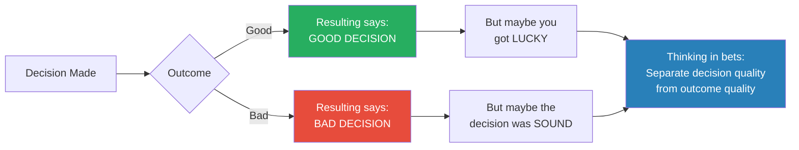
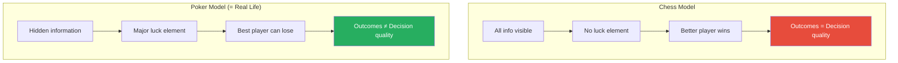
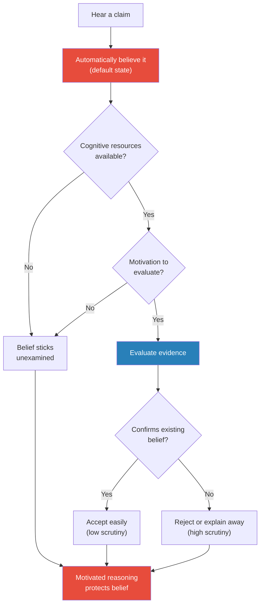
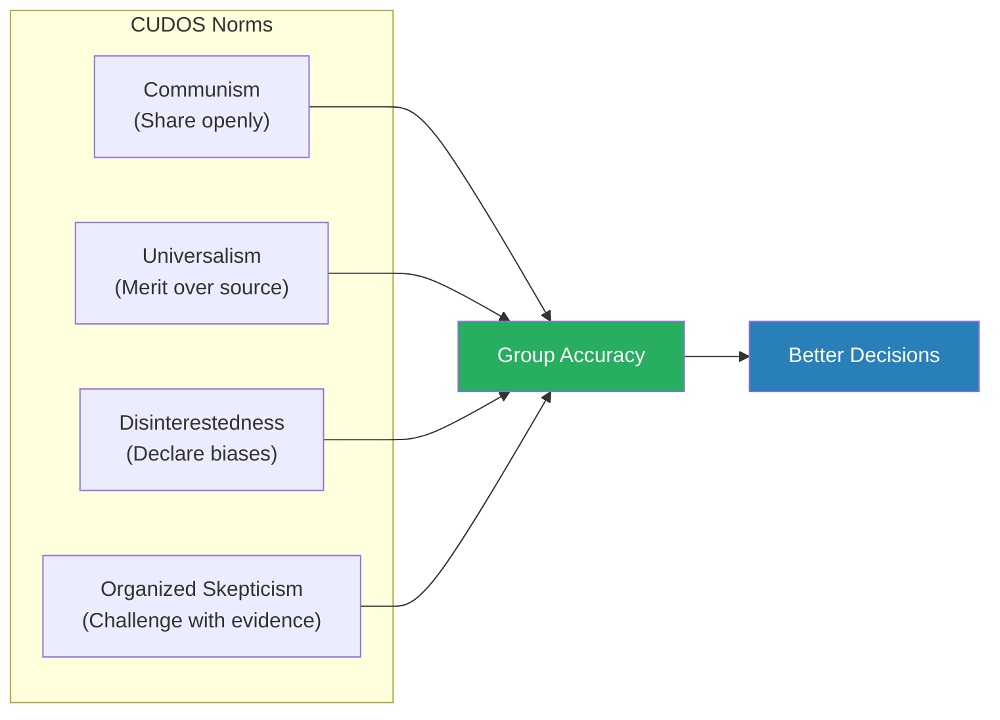
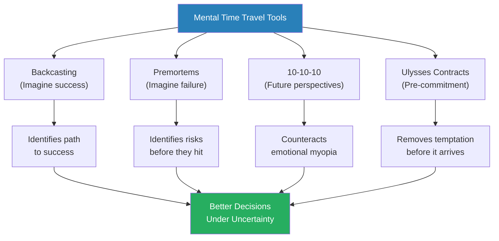
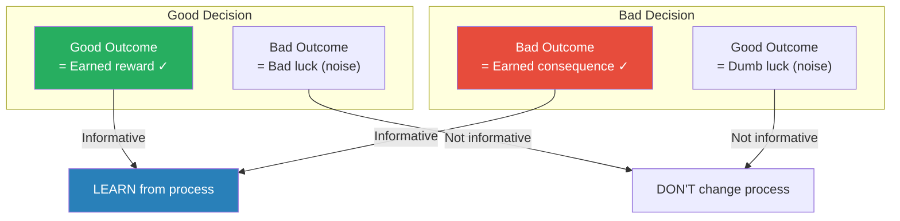
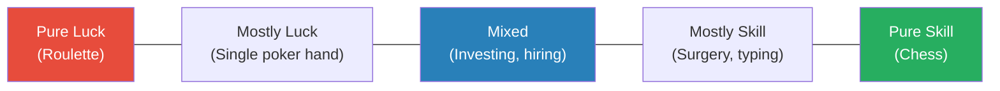

# Thinking in Bets — Annie Duke

> Annie Duke spent twenty years as a professional poker player, winning over $4 million in tournaments and a World Series of Poker gold bracelet — and in the process, she discovered something most people never learn: the quality of a decision and the quality of its outcome are two completely different things.
> *Thinking in Bets* is her argument that treating every decision as a bet on an uncertain future — rather than as a choice that should produce a guaranteed result — is the single most powerful shift you can make in how you think, learn, and live.
> Drawing on poker, cognitive psychology, and behavioural economics, Duke shows how "resulting" (judging decisions by outcomes), self-serving bias, and black-and-white thinking systematically corrupt our ability to learn from experience — and what we can do about it.
> The book is part memoir, part decision science, and entirely practical — a poker player's field guide to making better decisions in a world that will never stop being uncertain.

---

## About the Author

Annie Duke was a professional poker player for twenty years, earning over $4 million in tournament prizes including a World Series of Poker gold bracelet and the 2004 NBC National Heads-Up Poker Championship. Before poker, she completed doctoral coursework in cognitive psychology at the University of Pennsylvania on a National Science Foundation fellowship, studying under the supervision of learning theorists. She left academia for poker when a health crisis interrupted her studies, but the cognitive science training became the foundation of her playing strategy — and eventually of this book. She now consults with executives, hedge funds, and military leaders on decision-making under uncertainty, and co-founded the Alliance for Decision Education.

---

## The Big Idea

- Two things determine how our lives turn out: <b style="color: #2980b9">the quality of our decisions</b> and <b style="color: #2980b9">luck</b>
- Most people are terrible at separating the two — and this confusion corrupts everything downstream
- We judge decisions by their outcomes — a habit Duke calls <b style="color: #e74c3c">resulting</b>
  - Good outcome? Must have been a good decision
  - Bad outcome? Must have been a bad decision
- This is wrong, and it corrupts our learning, our self-image, and our ability to improve
- When something good happens to us, we claim credit (skill); when something bad happens, we blame luck
- When something good happens to someone else, we say they got lucky; when something bad happens, we say it was their fault
- This pattern is universal, automatic, and devastating to accurate learning

---

- <b style="color: #2980b9">Life is poker, not chess</b>
- Chess has no hidden information and almost no luck — if you lose, you played worse
- Poker has hidden cards, incomplete information, and a massive luck element — you can play perfectly and still lose, or play terribly and win
- Real life is like poker:
  - You make decisions with incomplete information
  - Luck shapes your outcomes
  - You rarely get to see the counterfactual (what would have happened if you'd chosen differently)
  - Other people are making decisions that affect your outcomes, and you can't see their cards
- <b style="color: #27ae60">The best decision-makers don't try to eliminate uncertainty — they embrace it and learn to work within it</b>
- The shift Duke advocates: stop thinking in terms of right and wrong, and start thinking in terms of probabilities and bets

This diagram captures the book's central argument: outcomes are unreliable indicators of decision quality because luck intervenes between the decision and the result.

Phil Ivey's dominance comes from separating outcomes from decisions and seeking truth over ego — while even a talented player like Hellmuth loses learning capacity by refusing to field outcomes accurately.

---

## Key Concepts at a Glance

| Concept | One-line summary |
|---------|-----------------|
| **Resulting** | Judging decision quality by outcome quality — the fundamental error |
| **Life is poker, not chess** | Decisions involve hidden information and luck; outcomes are probabilistic |
| **Self-serving bias** | We take credit for wins (skill) and blame losses on luck |
| **Outcome fielding** | Sorting results into luck or skill buckets — and getting it systematically wrong |
| **Belief calibration** | Expressing confidence as percentages rather than certainties |
| **Motivated reasoning** | Searching for evidence that confirms what we already believe |
| **"I'm not sure"** | Embracing uncertainty is strength, not weakness |
| **Truthseeking groups** | Pods of people committed to accuracy over ego |
| **CUDOS framework** | Communism, Universalism, Disinterestedness, Organized Skepticism |
| **Backcasting** | Imagining a positive future and working backward to identify the steps |
| **Premortems** | Imagining failure and working backward to identify what went wrong |
| **10-10-10** | How will I feel about this in 10 minutes, 10 months, 10 years? |
| **Ulysses contracts** | Pre-committing to decisions before emotions can derail them |
| **The buddy system** | Accountability partnerships that keep truthseeking honest |

---

## Chapter 1: Life Is Poker, Not Chess

*Duke opens with the most famous play-call in Super Bowl history to demonstrate that our instinctive method of evaluating decisions — by their outcomes — is fundamentally broken.*

### The Super Bowl Call

- On February 1, 2015, Super Bowl XLIX reached its climax
- The Seattle Seahawks trailed the New England Patriots by four points with 26 seconds left
- Seattle had the ball on New England's one-yard line with one timeout remaining
- Everyone expected a run — Marshawn Lynch, one of the league's best power runners, would smash it in
- Head coach Pete Carroll called a pass instead
- Quarterback Russell Wilson threw — and it was intercepted by Malcolm Butler
- The reaction was immediate and universal: <b style="color: #e74c3c">"Worst play-call in Super Bowl history"</b>

> [!example] Pete Carroll's Super Bowl Pass (2015)
> - Seahawks had the ball at the 1-yard line, 26 seconds left, one timeout, trailing by 4
> - Carroll called a pass play instead of a run to Marshawn Lynch
> - Russell Wilson's pass was intercepted by Malcolm Butler
> - Media and fans universally condemned the call as the worst in Super Bowl history
> - But the data told a different story: out of 66 passes from the 1-yard line that season, zero had been intercepted
> - The interception rate on goal-line passes over 15 seasons was approximately 2%
> - A pass also stopped the clock, preserving the timeout for a potential third-down run
> - Carroll made a defensible, data-supported decision that produced a 2% bad result
> **The lesson:** The outcome (interception) was terrible. The decision (pass play) was reasonable. Confusing the two is "resulting."

- Carroll himself said afterward: "The call would have been great if we catch it"
- Nobody would have questioned the decision if the pass had been completed — it would have been "brilliant"
- <b style="color: #27ae60">The decision didn't change. Only the outcome changed. But our evaluation flipped 180 degrees.</b>
- This is resulting — and we do it constantly, in every domain of life

---

### Why Resulting Is So Dangerous

- Resulting feels right because in many simple domains, outcomes DO correlate with decision quality
  - If you touch a hot stove and get burned, the decision to touch it was bad
  - If you study hard and pass the exam, the decision to study was good
- But in complex domains with uncertainty, the correlation breaks down:
  - A good hiring decision can produce a bad employee (they had personal problems you couldn't foresee)
  - A bad investment strategy can produce short-term gains (you got lucky)
  - A well-planned product launch can fail (a competitor released something better the same week)
- <b style="color: #e74c3c">Resulting corrupts our ability to learn from experience</b> because it assigns the wrong causes:
  - We repeat bad strategies that happened to produce good outcomes
  - We abandon good strategies that happened to produce bad outcomes
  - Over time, our learning mechanism drifts further and further from reality

> [!tip] Core Insight
> The quality of a decision and the quality of its outcome are different things. A great decision can produce a terrible outcome, and a terrible decision can produce a great outcome. If you evaluate decisions by outcomes, you will systematically learn the wrong lessons.

---

### The Chess/Poker Distinction

- Duke argues that our default mental model for decisions is <b style="color: #2980b9">chess</b>:
  - All information is visible on the board
  - There is no luck — the better player wins
  - Outcomes reliably reflect decision quality
  - If you lose, you made worse moves
- But real life is <b style="color: #2980b9">poker</b>:
  - Critical information is hidden (you can't see other players' cards)
  - Luck plays a significant role (the cards you receive are random)
  - Good decisions frequently produce bad outcomes and vice versa
  - You must decide with incomplete information and live with the uncertainty
  - Multiple players are making simultaneous decisions that affect each other

The chess model makes resulting feel logical — but applying it to a poker-like world produces systematic errors in learning and self-evaluation.

- Duke's argument is not that skill doesn't matter — it does, enormously, over time
- But in any single hand (or decision), luck can swamp skill
- <b style="color: #27ae60">The solution is to evaluate the PROCESS of the decision, not the OUTCOME</b>
- This is what professional poker players learn through thousands of hands: a good fold that saves you money is still a good fold even though you never get to see the card that would have come

---

### Two Things Determine How Your Life Turns Out

- Duke distils her thesis into a simple equation: <b style="color: #2980b9">Decision quality + Luck = Outcome quality</b>
- We can only control one side of this equation — our decisions
- But we evaluate ourselves on the other side — our outcomes
- This creates a fundamental misalignment between what we measure and what we can improve
- The entire book is about fixing this misalignment:
  - Recognise where luck is involved
  - Build systems to evaluate decision quality separately from outcomes
  - Create social structures that reward accurate assessment over comfortable narratives

---

## Chapter 2: Wanna Bet?

*Duke introduces betting as a mental model — not gambling, but the act of staking something on an uncertain outcome — and shows how framing decisions as bets forces clearer, more honest thinking.*

### Every Decision Is Already a Bet

- When you choose a restaurant for dinner, you're betting that this restaurant will be better than the alternatives
- When you hire a new employee, you're betting that they will perform better than other candidates
- When you take a new job, you're betting that this opportunity is better than staying or pursuing other options
- <b style="color: #2980b9">A bet is a decision about an uncertain future</b> — which means every decision is a bet
- The difference between a poker bet and a life decision is that in poker, the bet is explicit:
  - You know how much you're wagering
  - You know the odds (roughly)
  - You know when you'll learn the outcome
- In life decisions, the bet is implicit:
  - You rarely quantify what you're risking
  - You rarely estimate the odds
  - You may never learn the counterfactual (what would have happened otherwise)

> [!tip] Core Insight
> You don't need to be a gambler to think in bets. Every decision is already a bet — you're wagering your time, money, happiness, or reputation on an uncertain outcome. Making the bet explicit forces you to think about what you actually believe and how confident you are.

---

### The Power of "Wanna Bet?"

- Duke describes a transformative social experiment: say "Wanna bet?" whenever someone makes a confident claim
- The effect is immediate and dramatic:
  - People who said "I'm sure it's going to rain tomorrow" suddenly become "Well, I think there's a good chance..."
  - People who were "certain" about a fact start hedging: "Actually, I'm not 100% sure..."
  - Confidence levels drop to more accurate, calibrated levels almost instantly
- <b style="color: #27ae60">Being asked to bet forces people to examine the basis for their beliefs</b>
- When nothing is at stake, we say things with false confidence all the time
- When something IS at stake — even a small wager — we become more honest with ourselves

> [!example] The Betting Challenge
> - Duke describes offering to bet friends $10 on facts they stated with total certainty
> - A friend at dinner confidently declared that a particular actor starred in a movie
> - Duke said "Wanna bet?"
> - The friend immediately hedged: "Well, I think he did... actually, I'm not totally sure"
> - No money changed hands — the mere invitation to bet was enough to recalibrate confidence
> - The friend's belief didn't change; their honesty about their confidence level changed
> **The lesson:** The prospect of betting exposes the gap between how confident we SOUND and how confident we ACTUALLY ARE.

- This works because betting activates a different part of our decision-making process:
  - Without a bet: we express beliefs to signal confidence and competence
  - With a bet: we evaluate beliefs for accuracy because our resources are at stake
- <b style="color: #e74c3c">Most of our stated beliefs are not expressions of what we actually think — they're social performances</b>
- The bet collapses that gap

---

### Belief Calibration: The Art of "I'm Not Sure"

- We are trained from childhood that "I don't know" is failure:
  - Write it on a school test and you get zero marks
  - Say it in a business meeting and you look unprepared
  - Admit it in an argument and you seem to concede
- But <b style="color: #2980b9">"I'm not sure" is almost always a more accurate representation of reality than certainty</b>
- Duke advocates expressing beliefs as percentages:
  - Not "I think the project will succeed" but "I'd put it at about 70%"
  - Not "That's definitely wrong" but "I'd bet against that — maybe 80-20"
  - Not "I have no idea" but "I'm somewhere around 50-50 on this"

| Confidence Expression | What It Signals | What It Invites |
|----------------------|----------------|-----------------|
| "I'm absolutely certain" | Closed mind, not open to new info | Argument or silence |
| "I think so" | Vague, hard to calibrate | Not much — equally vague response |
| "I'd put it at 75%" | Thoughtful assessment, open to refinement | "Why 75 and not 60?" — productive discussion |
| "I have no idea" | Disengagement | End of conversation |

- <b style="color: #27ae60">Expressing beliefs as probabilities signals thoughtfulness, invites collaboration, and creates room for updating</b>
- It also makes you a better decision-maker because you're forced to think about how much evidence you actually have
- Physicist James Clerk Maxwell: "Thoroughly conscious ignorance is the prelude to every real advance"

---

### Redefining Confidence

- Duke pushes back on the idea that confidence means certainty:
  - In popular culture, confident people are the ones who express no doubt
  - But in decision-making, the most effective people are the ones who calibrate their confidence accurately
- A weather forecaster who says "70% chance of rain" is more useful than one who says "It will rain" or "It might rain"
- <b style="color: #2980b9">Calibration</b> is the alignment between your stated confidence and reality:
  - If you say "I'm 80% confident" about many things, and you turn out to be right about 80% of them, you're well-calibrated
  - Most people are overconfident — they say 90% when they should say 60%
- Philip Tetlock's research on superforecasters (from *Superforecasting*) shows that the best predictors are precisely the people who think in probabilities, update frequently, and are comfortable saying "I don't know"
- <b style="color: #e74c3c">The least accurate forecasters are the ones who express the most certainty</b> — they're the TV pundits, the loudest voices, the ones who never say "I was wrong"

---

## Chapter 3: Bet to Learn — Beliefs as Bets

*Duke examines how beliefs form, why they're so resistant to change, and how the betting framework can help us update our beliefs more accurately.*

### How Beliefs Actually Form

- We like to think we form beliefs rationally:
  1. Encounter new information
  2. Evaluate the evidence
  3. Form a belief based on the evidence
- <b style="color: #e74c3c">This is not how it actually works</b>
- In reality, belief formation follows a very different sequence:
  1. We hear something
  2. We believe it (automatically, by default)
  3. Only sometimes — if we have the time, energy, and motivation — do we evaluate it
- Daniel Gilbert's research at Harvard showed that comprehension and belief are the same mental process:
  - Understanding a statement and believing it happen simultaneously
  - Disbelief requires a separate, additional cognitive step
  - If we're distracted, tired, or cognitively busy, we skip the disbelief step — we just believe

> [!example] Gilbert's Belief Experiment
> - Psychologist Daniel Gilbert at Harvard tested whether people automatically believe everything they hear
> - Subjects read statements labelled as either true or false
> - Some subjects were interrupted while reading — they had to perform a secondary task
> - The interrupted subjects later treated false statements as true at significantly higher rates
> - The non-interrupted subjects could correctly identify false statements
> - The conclusion: belief is the DEFAULT state; disbelief requires additional cognitive effort
> - When that effort is unavailable (distraction, fatigue, time pressure), false information sticks as if it were true
> **The lesson:** We don't evaluate information before believing it. We believe first and evaluate later — if we evaluate at all.

---

### Motivated Reasoning: The Confirmation Machine

- Once a belief is formed, the brain actively protects it through <b style="color: #2980b9">motivated reasoning</b>:
  - We seek out information that confirms what we already believe
  - We scrutinise information that contradicts what we already believe
  - We interpret ambiguous information in favour of our existing beliefs
- This is not a character flaw — it's how human cognition works:
  - The brain is an efficiency machine, not a truth machine
  - Existing beliefs are investments — they took energy to form and they organise our worldview
  - Updating a belief means admitting we were wrong, which triggers the pain centres of the brain
- <b style="color: #e74c3c">The smarter you are, the BETTER you are at motivated reasoning</b>:
  - Higher IQ provides more tools for constructing rationalizations
  - More educated people are more skilled at finding evidence for what they already believe
  - Intelligence doesn't protect against bias — it provides more ammunition for bias

> [!tip] Core Insight
> Smart people are not less biased — they are more skilled at defending their biases. Intelligence is a tool that serves whatever goal the mind is currently pursuing, and for most of us, that goal is protecting our existing beliefs rather than finding the truth.

---

### The SnackWell's Problem

- In the 1990s, SnackWell's introduced fat-free cookies
- Consumers bought them enthusiastically, believing they were healthy
- Many people gained weight while eating "healthy" fat-free snacks
- <b style="color: #2980b9">The causal attribution was wrong</b>:
  - People assumed: fat in food → fat on body
  - Reality: calories in food → fat on body; fat-free cookies often had MORE sugar and similar calories
  - The removal of fat didn't make the cookies healthy — it just changed the nutritional profile
- Duke uses this as an example of how we form beliefs based on surface-level pattern matching:
  - The word "fat" appeared in both the food description and the body concern
  - Our brains linked them causally because they shared a label
  - A more careful analysis would have examined total calories, but that requires effortful thinking

> [!example] The SnackWell's Phenomenon (1990s)
> - Nabisco launched SnackWell's fat-free cookies in the early 1990s, riding the low-fat diet craze
> - Consumers ate them freely, believing "fat-free" meant they could eat without consequence
> - Many people gained weight because the cookies were loaded with sugar to compensate for removed fat
> - The total calorie count was similar to or higher than regular cookies
> - People blamed their lack of weight loss on other factors — not on the cookies they believed were "healthy"
> - The error: equating "fat" in food with "fat" on the body, when the real mechanism was total caloric intake
> **The lesson:** We form causal beliefs from superficial pattern matching, then defend those beliefs against contradictory evidence.

---

### Beliefs Are Bets

- Duke's reframe: <b style="color: #27ae60">every belief you hold is a bet on what's true</b>
  - When you believe a restaurant is good, you're betting your evening on it
  - When you believe your political views are correct, you're betting your social identity on them
  - When you believe a business strategy will work, you're betting company resources on it
- Treating beliefs as bets changes how we hold them:
  - Bets can be wrong — and that's expected; no poker player bets 100% on every hand
  - Bets have odds — some beliefs are stronger (90%) than others (55%)
  - Bets can be updated — new information changes the odds, and you adjust accordingly
- <b style="color: #e74c3c">The dangerous beliefs are the ones we hold with certainty</b> — because we stop evaluating evidence for or against them
- Beliefs held at 100% are immune to updating; beliefs held at 90% leave 10% room for new information to enter

This diagram shows why most beliefs are poorly calibrated — the formation process is biased toward believing, and the maintenance process is biased toward confirming.

---

## Chapter 4: The Bet Is the Thing — Outcome Fielding

*Duke tackles the specific mechanism by which we misattribute outcomes to skill or luck — and how this distortion prevents us from learning.*

### The Outcome-Fielding Problem

- Every time something happens to us, we face a sorting task: was this outcome due to my skill/decisions, or was it due to luck/factors outside my control?
- Getting this sort right is critical because it determines what we learn:
  - If a good outcome was skill, we should repeat the strategy
  - If a good outcome was luck, repeating the strategy won't help
  - If a bad outcome was my fault, I need to change my approach
  - If a bad outcome was bad luck, changing my approach would be a mistake
- <b style="color: #e74c3c">We get this sort wrong in a predictable, systematic pattern</b>

| Outcome | How We Field It (Self) | How We Field It (Others) | Accurate Fielding |
|---------|----------------------|------------------------|-------------------|
| **Good result for me** | My skill, my preparation | They got lucky | Could be either — examine the process |
| **Bad result for me** | Bad luck, unfair circumstances | N/A | Could be either — examine the process |
| **Good result for them** | They got lucky | N/A | Could be either — examine the process |
| **Bad result for them** | N/A | Their fault, poor judgment | Could be either — examine the process |

- This is <b style="color: #2980b9">self-serving bias</b> — and it operates automatically, beneath conscious awareness
- The pattern is so reliable that Duke calls it "the default setting" for human cognition

---

### Phil Hellmuth: The Poker Brat

- Phil Hellmuth holds the record for most World Series of Poker bracelets (16+)
- He is legendary for his emotional outbursts when he loses:
  - "If it weren't for luck, I'd win every one"
  - He berates other players for "bad" plays that beat him — even when those plays were mathematically sound
- Hellmuth's problem is textbook self-serving bias in outcome fielding:
  - When he wins: confirmation of his skill (never acknowledges lucky cards)
  - When he loses: the opponent got lucky (never considers that his play might have been wrong)
- Despite his enormous talent, this fielding error limits his growth:
  - He cannot learn from losses because he files them all under "luck"
  - He cannot identify strategic weaknesses because wins reinforce his current approach
  - <b style="color: #e74c3c">His ego protection comes at the direct cost of improvement</b>

---

### Phil Ivey: The Counter-Example

- Phil Ivey is widely considered one of the greatest poker players who ever lived (10+ WSOP bracelets)
- His approach to outcome fielding is the opposite of Hellmuth's — and it's what makes him extraordinary

> [!example] Phil Ivey's Victory Dinner
> - Duke describes a tournament where Ivey won a significant amount of money
> - At the celebratory dinner afterward, everyone expected Ivey to be basking in the victory
> - Instead, Ivey spent the entire dinner going through hand after hand, analysing every potential mistake he had made on the way to winning
> - He wanted to know: Where did I get lucky? Where could I have played better? What decisions looked right but were actually wrong?
> - His dinner companions were baffled — he'd won, why was he focused on mistakes?
> - Duke asked him about this later; Ivey explained that the win was already in the past — the only value left was in the learning
> **The lesson:** The best decision-makers in the world get their positive emotions from accurate self-assessment, not from taking credit for outcomes.

- <b style="color: #27ae60">Ivey's habit reversal is the key insight of the entire book</b>:
  - Standard loop: Win → take credit → feel good → reinforce current strategy
  - Ivey's loop: Win → analyse mistakes → truthseeking feels good → improve strategy
- This works because Ivey has retrained what triggers his reward circuitry:
  - For most people, the reward comes from ego protection (credit for wins, excuses for losses)
  - For Ivey, the reward comes from accuracy — from knowing that his self-assessment is truthful
- This is not natural — it requires deliberate practice and social reinforcement

> [!abstract] The Ivey Habit Shift
> 1. After any outcome (win or loss), resist the immediate urge to claim credit or assign blame
> 2. Ask: "What was the quality of my decision, regardless of the outcome?"
> 3. For wins: identify where luck helped and where your process could improve
> 4. For losses: identify where bad luck hurt and where your process failed
> 5. Get your positive feelings from the accuracy of the assessment, not the outcome itself

---

### Nick the Greek: Never Updating

> [!example] Nick the Greek at the Crystal Lounge
> - Nick was a regular poker player who believed the element of surprise was paramount
> - His signature move: playing 7-2 offsuit — mathematically the worst starting hand in poker — because "they never expect it"
> - When he won with 7-2 (which happened occasionally, by pure luck), he congratulated himself on his brilliant unconventional strategy
> - When he lost with 7-2 (which happened frequently, because it IS the worst hand), he blamed bad luck — the cards didn't fall right, the other player got lucky
> - He never updated his belief that 7-2 was a viable strategy
> - He kept playing it, kept losing, and eventually went broke
> **The lesson:** Self-serving bias in outcome fielding prevents belief updating. If you always attribute wins to skill and losses to luck, you can maintain any delusion indefinitely — right up until you go broke.

- Nick represents the default human condition — we all do this to varying degrees:
  - The entrepreneur who blames market conditions for failure but claims credit for success
  - The manager who blames their team for missed targets but takes credit for exceeded targets
  - The investor who attributes gains to research but attributes losses to unpredictable markets

---

### Car Accidents and Invisible Cars

- Duke cites research on car insurance claim forms as evidence of how automatic self-serving bias is:
  - "An invisible car came out of nowhere, struck my car, and vanished"
  - "The telephone pole was approaching. I was attempting to swerve out of its way when it struck my front end"
  - "The pedestrian had no idea which direction to run, so I ran over him"
- In single-vehicle accidents — where there is literally no one else to blame — 37% of drivers still attributed fault to someone or something other than themselves
- <b style="color: #e74c3c">This is not lying — these people genuinely believe their account</b>
- Self-serving bias operates below conscious awareness; by the time we're constructing the narrative, the fielding has already happened

---

## Chapter 5: Dissent and Discomfort — Building a Truthseeking Group

*Individual truthseeking is nearly impossible because our biases operate automatically. Duke argues the solution is social: build a group committed to helping each other see clearly.*

### Why We Can't Do This Alone

- The challenge with everything Duke has described so far — resulting, self-serving bias, motivated reasoning — is that these processes are automatic
- You can't simply "decide" to stop doing them, any more than you can decide to stop having an optical illusion
- Knowing about the Müller-Lyer illusion (the arrows that make lines look different lengths) doesn't make the lines look equal — you still SEE the distortion
- <b style="color: #e74c3c">Similarly, knowing about self-serving bias doesn't stop it from operating</b>
- Individual willpower is insufficient — we need an external correction mechanism
- Duke's answer: <b style="color: #2980b9">truthseeking groups</b>

---

### What a Truthseeking Group Looks Like

- A truthseeking group is a small pod of people (3-8) who make an explicit commitment to helping each other think more accurately
- The key properties:
  - Members prioritise accuracy over agreement
  - Members challenge each other's reasoning, not to win arguments but to improve decision quality
  - Members reward admissions of uncertainty and changes of mind
  - Members hold each other accountable for self-serving bias
- This is NOT a support group (which validates feelings) or a debate club (which rewards winning)
- It IS a decision-analysis group that treats truth as the highest value

> [!tip] Core Insight
> Individual humans are terrible at separating skill from luck, truth from comfort, and evidence from narrative. But groups committed to truthseeking can compensate for individual biases — if they follow the right norms. The group's job is not to agree with you; it's to make sure you're not fooling yourself.

---

### The CUDOS Framework

- Duke borrows the <b style="color: #2980b9">CUDOS norms</b> from sociologist Robert Merton, who developed them as ideals for scientific communities
- Duke adapts them for decision-making groups:

| Norm | Full Name | Meaning | In Practice |
|------|-----------|---------|-------------|
| **C** | Communism | Share information openly | Don't hoard knowledge; the group benefits from what everyone knows |
| **U** | Universalism | Evaluate ideas on merit, not source | Don't dismiss an idea because of who said it; don't accept one because of authority |
| **D** | Disinterestedness | Acknowledge your own biases | Everyone has conflicts of interest — name yours openly before offering an opinion |
| **OS** | Organized Skepticism | Challenge ideas with evidence | Encourage "wanna bet?" as calibration; push back on confident claims |

- <b style="color: #27ae60">The group rewards accuracy over agreement</b> — unlike most social groups which reward conformity
- This is difficult because humans are deeply social creatures:
  - We instinctively seek agreement and approval from our groups
  - Dissenting from the group triggers anxiety and social pain
  - Most groups punish members who disagree with the consensus
- A truthseeking group must actively work against these instincts

---

### Communism: Sharing Information Freely

- In most groups, information is hoarded because it confers status:
  - "I know something you don't know" is a power position
  - Revealing information means giving up that advantage
- In a truthseeking group, the norm is reversed:
  - Information shared freely benefits everyone's decision-making
  - Withholding relevant information is a violation of the group compact
  - The group's collective intelligence exceeds any individual member's — but only if information flows
- Duke emphasises that this means sharing BAD information too:
  - Tell the group when you made a mistake
  - Tell the group when evidence contradicts the prevailing view
  - Tell the group when you changed your mind — and why

---

### Universalism: Merit Over Source

- We naturally weight ideas based on who says them:
  - The CEO's opinion carries more weight than the intern's
  - The expert's view overrides the novice's
  - Our friends' perspectives feel more credible than strangers'
- <b style="color: #e74c3c">But accuracy doesn't correlate perfectly with status</b>
- A truthseeking group evaluates arguments on their merits:
  - What is the evidence?
  - What is the reasoning?
  - How confident should we be?
- This doesn't mean ignoring expertise — it means requiring even experts to show their work

---

### Disinterestedness: Naming Your Conflicts

- Everyone has biases and conflicts of interest that colour their analysis:
  - The marketing director who recommends more marketing spend
  - The person who just bought a house and now believes real estate is the best investment
  - The advisor who earns fees from the products they recommend
- Disinterestedness doesn't mean HAVING no biases (impossible) — it means DECLARING them:
  - "I should tell you that I have a stake in this outcome because..."
  - "I'm probably biased here because I was the one who championed this project..."
  - "Full disclosure: I already committed to X, so I may be looking for evidence to support it..."
- <b style="color: #27ae60">Declaring your biases upfront doesn't eliminate them, but it allows the group to adjust for them</b>

---

### Organized Skepticism: The Constructive Challenge

- The most counterintuitive norm: actively challenge each other's claims
- This is NOT hostility or adversarial debate — it's collaborative pressure-testing:
  - "What evidence would change your mind?"
  - "How confident are you, on a scale of 0-100?"
  - "What's the best argument against your position?"
  - "Wanna bet?"
- <b style="color: #2980b9">"Wanna bet?" is the group's calibration tool</b>:
  - It forces the speaker to examine the basis for their confidence
  - It creates accountability for claims
  - It rewards honesty about uncertainty
- The key is that skepticism must be organized — meaning it follows norms and is applied evenly:
  - Challenge popular ideas, not just unpopular ones
  - Challenge the leader's ideas, not just subordinates'
  - Challenge your own ideas before challenging others'

The four CUDOS norms work together as a system: sharing information (C) enables merit-based evaluation (U), declared biases (D) allow adjustment, and organised challenge (OS) keeps everything calibrated.

---

### The Buddy System

- Duke acknowledges that full CUDOS groups are rare and hard to build
- A more accessible starting point: <b style="color: #2980b9">the buddy system</b>
  - Find one person who shares your commitment to truthseeking
  - Make an explicit agreement to help each other field outcomes accurately
  - Check in after important decisions: "Am I being honest about why this happened?"
- The buddy system works because:
  - It's easier to see someone else's self-serving bias than your own
  - A single trusted voice can interrupt your automatic narratives
  - The accountability is personal and immediate

> [!example] Duke's Poker Buddy System
> - Duke describes her practice of debriefing with fellow professional poker player Erik Seidel after tournament sessions
> - They would go through significant hands together, challenging each other's reasoning
> - Seidel once pointed out that Duke was rationalising a bad call by focusing on the one scenario where it would have worked
> - Duke's automatic response was defensive — but the explicit truthseeking commitment forced her to consider his feedback honestly
> - Over time, these debriefs significantly improved both players' ability to field outcomes accurately
> **The lesson:** A single committed truth-telling partner can do more for your decision quality than a shelf of decision-making books.

---

## Chapter 6: Adventures in Mental Time Travel

*Duke introduces a suite of tools that use our imagination to counteract the biases she's described — by recruiting our past and future selves as additional decision-makers.*

### The Problem of Temporal Myopia

- Most of our worst decisions are made in the heat of the moment:
  - The angry email sent at 11 PM
  - The impulsive purchase after a bad day
  - The argument escalated because backing down felt like losing
  - The risky bet doubled down on because admitting the first bet was wrong is painful
- <b style="color: #e74c3c">In the moment, our emotional brain hijacks our decision-making</b>
- We know this intellectually — "I'll regret this later" — but the knowledge doesn't help in real time
- Duke's solution: <b style="color: #2980b9">mental time travel</b> — using imagination to consult our past and future selves

> [!tip] Core Insight
> Your future self is wiser than your present self — because they've already lived through the consequences of your decision. Mental time travel tools let you access that wisdom BEFORE the decision is made, rather than after.

---

### Backcasting: Working Backward from Success

- <b style="color: #2980b9">Backcasting</b> is the practice of imagining a positive future outcome and then working backward to identify the specific decisions and conditions that led there
- The standard approach (forecasting) moves forward from now: "What should we do next?"
- Backcasting reverses it: "Imagine we succeeded — what did we do to get there?"
- Why backcasting works:
  - It forces specificity — you can't just imagine vague success; you must identify concrete steps
  - It reveals dependencies — some steps must happen before others
  - It identifies the most likely path to success, which you can then deliberately pursue
  - It also reveals obstacles — "If this is the path to success, what could block each step?"

> [!abstract] Backcasting Process
> 1. Define the positive outcome in specific, concrete terms
> 2. Imagine it's one year from now and you've achieved it
> 3. Working backward, list the major milestones that happened along the way
> 4. For each milestone, identify the decisions and actions that produced it
> 5. Identify the earliest, most foundational step — that's where you start
> 6. Note any dependencies, risks, or conditions that must be in place

- Duke emphasises that backcasting is not wishful thinking — it's strategic planning rooted in a vivid imagined outcome
- The vividness matters: the more real the future outcome feels, the more effectively your brain can trace the path backward
- <b style="color: #27ae60">Backcasting converts vague ambition into an actionable sequence</b>

---

### Premortems: Working Backward from Failure

- If backcasting imagines success, <b style="color: #2980b9">premortems</b> imagine failure
- Invented by psychologist Gary Klein, the premortem is one of the most powerful decision-improvement tools available
- The standard process for risk assessment:
  - "What could go wrong?" — asked in the present tense
  - People brainstorm possible risks
  - Most answers are vague, safe, and unimaginative
- The premortem process:
  - "It's one year from now. The project has failed spectacularly. Tell me what went wrong."
  - The failure is presented as a certainty — not a possibility
  - People are asked to EXPLAIN the failure, not PREDICT it
- <b style="color: #27ae60">This single shift — from predicting to explaining — dramatically improves the quality and specificity of risk identification</b>

> [!example] The Power of Premortems
> - Klein tested premortems against traditional risk assessment in controlled studies
> - Groups using premortems identified 30% more potential risks than groups asked "what could go wrong?"
> - The risks identified were also more specific and actionable
> - The mechanism: when failure is a certainty, people search for specific causes rather than offering generic concerns
> - "What could go wrong?" invites "lots of things"; "what DID go wrong?" demands specifics
> - Additionally, the premortem format gives permission to be pessimistic — in regular planning sessions, pessimism is socially punished
> **The lesson:** Frame failure as fact, not possibility, and the human brain becomes dramatically better at identifying its causes.

- Why premortems work psychologically:
  - <b style="color: #2980b9">Prospective hindsight</b>: imagining a future event as already having happened increases your ability to generate explanations by 30%
  - It neutralises social pressure: in a planning meeting, saying "this will fail because..." is career-risky; in a premortem, it's the assignment
  - It counteracts overconfidence: the planning process naturally generates enthusiasm and commitment, and the premortem introduces necessary caution
  - It distributes accountability: if the risks identified in the premortem later materialise, the team already has a plan

---

### The 10-10-10 Rule

- Created by Suzy Welch, the <b style="color: #2980b9">10-10-10 rule</b> is a simple tool for counteracting the heat of the moment
- Before making an emotionally charged decision, ask three questions:
  - How will I feel about this in **10 minutes**?
  - How will I feel about this in **10 months**?
  - How will I feel about this in **10 years**?

> [!abstract] The 10-10-10 Rule
> 1. When you face an emotional decision, pause
> 2. Ask: "How will I feel about this in 10 MINUTES?" (captures the immediate emotional state)
> 3. Ask: "How will I feel about this in 10 MONTHS?" (captures the medium-term consequences)
> 4. Ask: "How will I feel about this in 10 YEARS?" (captures the long-term perspective)
> 5. If the 10-month and 10-year answers conflict with the 10-minute answer, the longer timeframes should usually win

- The power of 10-10-10:
  - It forces temporal perspective — the emotional intensity of the moment fades when you project forward
  - The angry email that feels satisfying in 10 minutes will feel embarrassing in 10 months
  - The difficult conversation you're avoiding will feel like a relief in 10 months even though it feels terrifying in 10 minutes
  - <b style="color: #27ae60">Most regrets come from decisions optimised for the 10-minute timeframe at the expense of the 10-month and 10-year timeframes</b>

> [!example] The Late-Night Email
> - Duke describes a scenario every professional has faced: a colleague sends a frustrating email, and you draft a sharp, devastating reply
> - In 10 minutes: sending it would feel satisfying — you'd feel vindicated, powerful, righteous
> - In 10 months: you'd regret damaging the relationship over something that no longer matters
> - In 10 years: you wouldn't remember the email at all — unless you sent the angry reply, in which case you'd remember it with embarrassment
> - The 10-10-10 frame reveals that the satisfaction is fleeting but the damage is lasting
> **The lesson:** Our emotional present self is a poor guide to what our future self will value. The 10-10-10 rule gives your future self a vote.

---

### Ulysses Contracts: Pre-Committing to Rationality

- Named after the Greek hero who had himself tied to the mast of his ship so he could hear the Sirens' song without steering toward the rocks
- A <b style="color: #2980b9">Ulysses contract</b> is a decision made in advance, when you're in a rational state, that constrains your future behaviour when you know you'll be in an emotional state
- The logic:
  - You know that future-you will be tempted, emotional, or impaired
  - Present-you is calm and rational
  - Present-you makes a binding decision that future-you must follow
- Modern examples:
  - **Automatic savings deductions**: you set them up once, rationally, and your emotional future self can't touch the money easily
  - **Designated drivers**: you decide before drinking who will drive — not after drinking, when judgment is impaired
  - **Investment rebalancing rules**: you commit to selling when a stock hits a certain price, removing the emotional attachment that would make you hold on too long
  - **Putting your phone in another room**: you remove the temptation before you feel it, rather than trying to resist it in the moment

> [!example] Ulysses and the Sirens
> - In Homer's Odyssey, Ulysses knew his ship would pass the Sirens — creatures whose song was so beautiful that sailors would steer toward them and crash on the rocks
> - He wanted to hear the song but knew he couldn't resist its pull
> - Solution: he ordered his crew to plug their ears with beeswax and to tie him to the mast
> - He instructed them to ignore his orders until they had passed — no matter how desperately he begged to be untied
> - When they passed the Sirens, Ulysses screamed and thrashed, demanding to be freed
> - The crew kept him bound, as instructed
> - He experienced the song without the catastrophic action it would have caused
> **The lesson:** The time to make a decision about emotional situations is BEFORE the emotion hits. Bind yourself to the mast in advance.

- Duke emphasises that Ulysses contracts are not about willpower — they're about designing systems:
  - Willpower is a limited resource that depletes under stress
  - Ulysses contracts remove the need for willpower by removing the option
  - <b style="color: #27ae60">The best decision architecture makes the right choice automatic and the wrong choice difficult</b>

These four tools form a complete mental time travel toolkit — backcasting maps the path, premortems map the dangers, 10-10-10 provides perspective, and Ulysses contracts lock in the plan.

---

## Chapter 7: Reshuffling Habits — The Mechanics of Behaviour Change

*Duke explores how to actually change the habitual patterns of resulting, self-serving bias, and motivated reasoning — moving from awareness to action.*

### Why Knowing Isn't Enough

- A common objection to Duke's framework: "Okay, I know about these biases now. Isn't that enough?"
- <b style="color: #e74c3c">No — and this is one of the most important lessons in the book</b>
- Knowing about optical illusions doesn't make them go away — the lines STILL look different lengths
- Knowing about self-serving bias doesn't stop it — you STILL feel that your wins are skill and your losses are luck
- The biases operate at a level below conscious control
- What can change is what you DO in response to the bias:
  - You can't stop the bias from firing
  - You CAN build systems, habits, and social structures that correct for it

---

### The Habit Loop for Decision-Making

- Charles Duhigg's habit loop (cue → routine → reward) applies to cognitive habits too:
  - **Cue**: an outcome occurs (win, loss, success, failure)
  - **Routine**: we field it using self-serving bias (credit for wins, excuses for losses)
  - **Reward**: ego protection, self-esteem maintenance, social approval
- Duke argues you can't eliminate the cue or the need for reward — but you can change the routine:
  - **New routine**: field the outcome accurately (ask "was this skill or luck?") and get the reward from ACCURACY rather than from ego protection
  - This requires retraining what triggers the reward:
    - Instead of feeling good when you take credit, feel good when you assess truthfully
    - Instead of feeling bad when you admit a mistake, feel good that you caught it before it compounded

| Component | Default Habit | Truthseeking Habit |
|-----------|-------------|-------------------|
| **Cue** | Outcome occurs | Outcome occurs (same) |
| **Routine** | Self-serving bias: credit for wins, excuses for losses | Accurate fielding: "Was this skill or luck?" |
| **Reward** | Ego protection, social approval | Accuracy, improved future decisions |
| **Long-term result** | No learning, repeated mistakes | Continuous improvement |

- <b style="color: #27ae60">The shift is from valuing feeling right to valuing being right</b>
- This is difficult because "feeling right" produces immediate pleasure and "being right" produces delayed benefit
- The truthseeking group helps bridge this gap: the group provides immediate social reward for accurate fielding

---

### Steve Bartman: A Case Study in Resulting

> [!example] Steve Bartman and the Cubs Curse (2003)
> - In Game 6 of the 2003 National League Championship Series, the Chicago Cubs were five outs away from their first World Series appearance in 58 years
> - A foul ball was hit toward the stands along the left field line
> - Fan Steve Bartman reached for the ball — along with several other fans — and deflected it away from Cubs outfielder Moises Alou
> - The Cubs collapsed. They gave up 8 runs in the inning and lost the game. They lost Game 7 the next day.
> - Bartman was blamed by fans, media, and the city of Chicago for "costing the Cubs the World Series"
> - He received death threats. He needed a police escort to leave the stadium. He went into hiding.
> - The reality: shortstop Alex Gonzalez committed a routine error later in the inning that would have ended it; the Cubs made multiple defensive mistakes; blaming one fan for one foul ball is textbook resulting
> - Bartman's foul ball was one event among many — but it was the most visible, and humans need a simple causal story
> **The lesson:** Resulting demands a simple narrative: one cause, one effect. Real outcomes have multiple causes, most of which are invisible. Bartman became the scapegoat because his action was visible, not because it was decisive.

- The Bartman case illustrates several of Duke's key concepts simultaneously:
  - **Resulting**: the bad outcome (losing the series) was attributed to the most visible single cause
  - **Self-serving bias**: Cubs fans needed to blame someone other than their team
  - **Narrative simplicity**: "fan interfered with the ball" is a cleaner story than "multiple defensive errors, poor pitching, and ordinary bad luck combined"
  - <b style="color: #e74c3c">The more visible a factor is, the more causal weight we assign to it — regardless of its actual importance</b>

---

### The CEO Who Fired His President

> [!example] The CEO's Hiring Decision
> - Duke describes a CEO she consulted with who had hired a new president for his company
> - The hiring process was thorough: multiple interviews, reference checks, skills assessment, cultural fit evaluation
> - The new president performed poorly in the role
> - The CEO concluded: "I made a terrible hiring decision"
> - Duke pushed back: "Describe your hiring process to me"
> - The process was sound — multiple data points, diverse perspectives, careful evaluation
> - The CEO had made a good decision that produced a bad outcome
> - But because the outcome was bad, the CEO was ready to overhaul his entire hiring process — potentially replacing a good system with a worse one
> **The lesson:** A bad outcome from a good process is not evidence that the process is broken. Changing the process based on one bad outcome is itself a form of resulting.

- This example shows how resulting can compound:
  - A good process produces one bad outcome (normal variance)
  - The decision-maker concludes the process is bad (resulting)
  - They change to a new process that is actually worse (compounding the error)
  - <b style="color: #e74c3c">Resulting doesn't just corrupt our assessment of past decisions — it corrupts our future decisions by making us abandon sound strategies</b>

---

## Chapter 8: Redefining Wrong — Outcomes, Decisions, and the Luck Factor

*Duke's final chapter brings together all her tools and frameworks to redefine what it means to make a "wrong" decision — and argues for a fundamental shift in how we evaluate ourselves and others.*

### The Four Quadrants of Decision Quality

- Duke presents a 2x2 matrix that captures her entire thesis:

| | Good Outcome | Bad Outcome |
|--|-------------|------------|
| **Good Decision** | Earned reward (deserved) | Bad luck (learn nothing about decision quality) |
| **Bad Decision** | Dumb luck (learn nothing about decision quality) | Earned punishment (deserved) |

- <b style="color: #27ae60">Only two of these quadrants are informative about decision quality: good decision + good outcome, and bad decision + bad outcome</b>
- The other two quadrants — where decision quality and outcome quality diverge — are noise
- But we treat ALL four quadrants as if they're informative:
  - Good outcome from a bad decision? We reinforce the bad decision
  - Bad outcome from a good decision? We abandon the good decision
- Professionals in probabilistic fields (poker, investing, weather forecasting) learn to distinguish the quadrants
- Everyone else tends to collapse them: outcome = decision quality

Only the two "earned" quadrants (good decision/good outcome and bad decision/bad outcome) carry useful information about your decision process. The two "luck" quadrants are noise — acting on them makes you worse.

The diagonal quadrants (good decision/good outcome, bad decision/bad outcome) carry genuine signal about your process, while the off-diagonal quadrants are pure noise — yet resulting and self-serving bias treat all four as equally informative.

In any single decision, skill accounts for only about 30% of the outcome — luck, hidden information, and others' choices dominate — which is precisely why resulting (judging decisions by outcomes) leads to systematically wrong conclusions.

---

### Redefining "Wrong"

- In Duke's framework, a decision is not wrong because it produced a bad outcome
- <b style="color: #2980b9">A decision is wrong when it was poorly reasoned at the time it was made, given the information available</b>
- This is a crucial distinction:
  - Pete Carroll's Super Bowl pass was NOT wrong — it was well-reasoned and produced a 2% bad outcome
  - An investor who puts everything into a single stock and doubles their money DID make a wrong decision — even though the outcome was good
- Evaluating decisions at the time they were made (not after the outcome is known) requires:
  - Reconstructing what information was available
  - Assessing whether the reasoning was sound given that information
  - Explicitly accounting for the role of luck
- <b style="color: #27ae60">This reframe is liberating: you can make a good decision and still have a bad outcome, and that's okay</b>
- It's also demanding: you can't excuse a bad decision just because it turned out well

---

### The Long Run: Where Skill Wins

- A common objection: "If outcomes don't reflect decisions, why bother making good decisions?"
- Duke's answer: <b style="color: #27ae60">in the long run, decision quality DOES determine outcomes — it's only in the short run that luck dominates</b>
- In any single poker hand, luck can swamp skill — the worst player at the table can win
- Over 10,000 hands, the best players reliably profit and the worst players reliably lose
- The same is true in life:
  - A single bad investment can lose money despite good analysis (short-term luck)
  - Over a lifetime of disciplined investing, good analysis produces wealth (long-term skill)
  - A single good hire can fail (short-term luck)
  - Over dozens of hires, a good process produces a strong team (long-term skill)
- <b style="color: #2980b9">Thinking in bets is about optimising for the long run, not the short run</b>
- The tools in this book — truthseeking groups, mental time travel, accurate outcome fielding — all increase the proportion of good decisions over time
- You won't win every hand. But you'll win more hands than if you were resulting your way through life.

---

### Bringing It All Together

- Duke's full system connects as follows:

| Problem | Tool | How It Helps |
|---------|------|-------------|
| Resulting (judging decisions by outcomes) | The four quadrants | Separates decision quality from outcome quality |
| Self-serving bias (credit for wins, excuses for losses) | Outcome fielding + truthseeking groups | External correction for automatic bias |
| Motivated reasoning (defending existing beliefs) | "Wanna bet?" + belief calibration | Forces honest assessment of confidence |
| Emotional decision-making (heat of the moment) | 10-10-10 + Ulysses contracts | Temporal perspective + pre-commitment |
| Overconfidence in plans | Premortems + backcasting | Identifies risks and necessary steps |
| Individual blind spots | Truthseeking groups + buddy system | Social accountability for accurate thinking |

> [!abstract] Duke's Complete Decision Framework
> 1. Treat every decision as a bet — what are you wagering, and at what odds?
> 2. Express your confidence as a percentage, not a certainty
> 3. After the outcome, field it accurately: was this skill or luck?
> 4. Use a truthseeking group or buddy to check your fielding
> 5. Before major decisions, use backcasting (imagine success) and premortems (imagine failure)
> 6. For emotional decisions, apply 10-10-10 and consider Ulysses contracts
> 7. Remember: a good decision with a bad outcome is STILL a good decision
> 8. Optimise for the long run — the odds favour the disciplined over thousands of decisions

---

## Advanced Concepts and Extended Applications

### The Spectrum of Luck and Skill

*Duke argues that the luck-skill distinction is not binary but exists on a spectrum — and understanding where an activity falls on that spectrum is critical for accurate learning.*

- At one extreme: pure luck (roulette, lottery)
  - No decision quality matters
  - Outcomes are entirely random
  - Resulting here is obviously absurd
- At the other extreme: pure skill (chess, typing speed)
  - Decision quality fully determines outcomes
  - Resulting here works fine
  - Bad outcomes genuinely reflect bad decisions
- Most of life falls in the middle:
  - Some skill, some luck, in varying proportions
  - The challenge is estimating HOW MUCH of the outcome was skill vs. luck
- <b style="color: #2980b9">Activities closer to the luck end of the spectrum require MORE hands (repetitions) before you can evaluate decision quality</b>
  - In poker, you need thousands of hands to know if someone is skilled
  - In investing, you need years of returns to separate skill from market luck
  - In hiring, you need many hires to evaluate your process

Most important decisions in life fall in the middle of the spectrum, where luck and skill are intertwined — precisely the zone where resulting does the most damage.

---

### The Paradox of Experience

- Duke highlights a troubling paradox:
  - We believe experience makes us wiser
  - But if we're learning from outcomes (resulting) rather than from decision quality, experience actually REINFORCES our errors
  - The more hands we play with bad fielding, the more confident we become in the wrong conclusions
- <b style="color: #e74c3c">Ten years of resulting doesn't produce wisdom — it produces a decade of confirmed biases</b>
- This explains why many experienced professionals are not better decision-makers than novices:
  - Experienced doctors sometimes have WORSE diagnostic accuracy than recent graduates (because they've been resulting for decades)
  - Experienced investors frequently underperform index funds (because they've learned the wrong lessons from their outcomes)
  - Experienced managers often repeat the same hiring mistakes (because they field each outcome self-servingly)
- The solution is not less experience — it's better learning from experience:
  - Accurate outcome fielding
  - Truthseeking groups that challenge your narratives
  - Tracking your predictions and checking them against reality

> [!tip] Core Insight
> Experience is only valuable if you're learning the right lessons from it. Thousands of decisions processed through self-serving bias and resulting don't make you wise — they make you confidently wrong. The goal is not more experience but better learning.

---

### Night Jerry vs. Morning Jerry

- Duke borrows a concept from *Seinfeld* to illustrate temporal self-conflict:
  - "Night Jerry" stays up late watching TV, having a great time
  - "Morning Jerry" has to wake up exhausted and deal with the consequences
  - Night Jerry doesn't care about Morning Jerry
  - Morning Jerry hates Night Jerry
- This is a perfect illustration of why Ulysses contracts and 10-10-10 matter:
  - Our present self and future self have different interests
  - Present self is biased toward immediate gratification
  - Future self bears the cost of present self's impulsive decisions
  - <b style="color: #27ae60">Good decision architecture gives future self a voice in present self's decisions</b>

> [!example] Night Jerry vs. Morning Jerry
> - In a classic Seinfeld episode, Jerry stays up late watching a movie ("Night Jerry" is having a great time)
> - The next morning, he's exhausted and miserable ("Morning Jerry" is paying the price)
> - Duke uses this as a metaphor for all time-inconsistent decision-making
> - The person making the decision (Night Jerry) is not the person living with the consequences (Morning Jerry)
> - Night Jerry has all the power and none of the accountability
> - Morning Jerry has all the consequences and none of the power
> - Ulysses contracts and 10-10-10 are tools for giving Morning Jerry a seat at the table
> **The lesson:** Your present emotional self should not have unchecked authority over decisions that your future rational self will have to live with.

---

### Group Dynamics and the Problem of Confirmatory Drift

- Duke warns that truthseeking groups can degrade if they're not actively maintained
- <b style="color: #2980b9">Confirmatory drift</b> is the tendency for groups to become echo chambers over time:
  - Members with dissenting views leave or go silent
  - The remaining members reinforce each other's beliefs
  - The group's diversity of thought decreases
  - Eventually, the "truthseeking" group is just a comfortable club where everyone agrees
- This happens because:
  - Disagreement is socially costly — even in groups that nominally value it
  - People who feel challenged frequently will drift toward groups that validate them
  - Without active intervention, social harmony wins over intellectual honesty
- <b style="color: #e74c3c">A truthseeking group that stops experiencing internal disagreement has stopped working</b>
- Duke's safeguards:
  - Regularly rotate the role of devil's advocate
  - Explicitly celebrate members who change their minds
  - Track the group's predictions and assess calibration
  - Periodically invite outsiders to challenge the group's consensus

---

### Betting on Yourself: The Decision Journal

- Duke advocates keeping a <b style="color: #2980b9">decision journal</b> — a written record of important decisions at the time they're made
- For each significant decision, record:
  - What you decided and why
  - What alternatives you considered
  - What you believe will happen (with probability estimates)
  - What information you had and what you didn't
  - How confident you are (on a 0-100 scale)
- The journal serves multiple purposes:
  - It creates a record of your reasoning that can't be retroactively edited
  - It allows you to evaluate decision quality separately from outcome quality
  - It tracks your calibration over time (Are you accurate when you say "80% confident"?)
  - It provides raw material for truthseeking conversations

> [!abstract] Decision Journal Template
> 1. **Date and decision**: What are you deciding?
> 2. **Reasoning**: Why are you choosing this option? What are the key factors?
> 3. **Alternatives considered**: What did you not choose, and why not?
> 4. **Confidence level**: How likely is this to succeed? (percentage)
> 5. **Key uncertainties**: What don't you know that could change the outcome?
> 6. **Expected timeline**: When will you know if this worked?
> 7. **Review date**: Schedule a specific date to revisit this entry

- <b style="color: #27ae60">The decision journal prevents hindsight bias — the tendency to rewrite your past reasoning to match the outcome you now know</b>
- Without a journal, "I always knew it would turn out this way" feels true because your memory edits itself
- With a journal, you have a fixed record: "Actually, I said I was only 60% confident — I'm rewriting history"

---

## The Verdict

*Thinking in Bets* is a deceptively simple book that rewires how you think about decisions. The poker framing is not a gimmick — it is precisely because poker compresses thousands of decisions into high-stakes, incomplete-information environments that it reveals patterns invisible in slower, lower-stakes domains. Duke draws on twenty years of professional play to identify the specific cognitive errors that separate great decision-makers from everyone else, and the result is one of the most practical books on decision science available.

Duke's strongest contribution is the concept of resulting — once you see it, you see it everywhere: in sports commentary, in performance reviews, in your own self-talk after a bad day. The self-serving bias analysis is thorough and uncomfortably accurate. The Phil Ivey anecdote is the book's emotional centre: the image of the world's best player spending his victory dinner hunting for mistakes is unforgettable and immediately actionable as a model for how to process your own outcomes.

The book's weakness is occasional repetition and a tendency to over-explain concepts that the poker examples have already made clear. The CUDOS framework feels somewhat academic compared to the vivid poker stories that precede it. And Duke doesn't fully address the difficulty of applying these ideas when emotional stakes are highest — in relationships, health crises, or grief. The tools are designed for professional and strategic decisions; their applicability to deeply personal, identity-laden choices is less clear. There is also a selection bias in the poker world she draws from: professional poker players are extreme outliers in cognitive style, and what works for them may not transfer cleanly to people with different temperaments.

For anyone who makes decisions under uncertainty — which is everyone — this is essential reading. It pairs particularly well with Kahneman's *Thinking, Fast and Slow* (which provides the cognitive science foundation that Duke builds on), Tetlock's *Superforecasting* (which takes calibration to its logical extreme), and Taleb's *Antifragile* (which extends the uncertainty framework from decision-making to system design). Readers who want a single book that will immediately and permanently change how they evaluate their own decisions should start here.

---

## Related Reading

- [[Antifragile - Nassim Nicholas Taleb|Antifragile]] — How to thrive under uncertainty rather than merely surviving it
- [[Noise - Cass R. Sunstein|Noise]] — Why human judgments vary so much, even among experts
- [[Influence - Robert Cialdini|Influence]] — The mental shortcuts that create the errors Duke describes
- [[Your Brain at Work - David Rock|Your Brain at Work]] — The cognitive bandwidth limits that force us to rely on shortcuts
- [[The Psychology of Money - Morgan Housel|The Psychology of Money]] — How emotional biases shape financial decisions specifically
- [[You Are Not So Smart - David McRaney|You Are Not So Smart]] — A broader catalogue of the cognitive biases Duke focuses on
- [[Thinking in Systems - Donella H. Meadows|Thinking in Systems]] — How system structures produce the outcomes we mistakenly attribute to individuals
