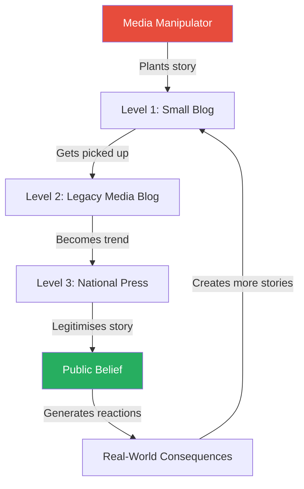
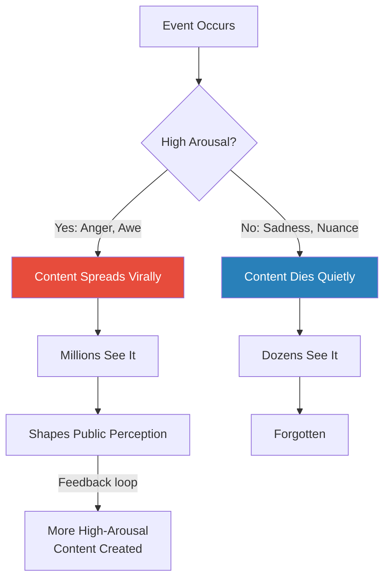
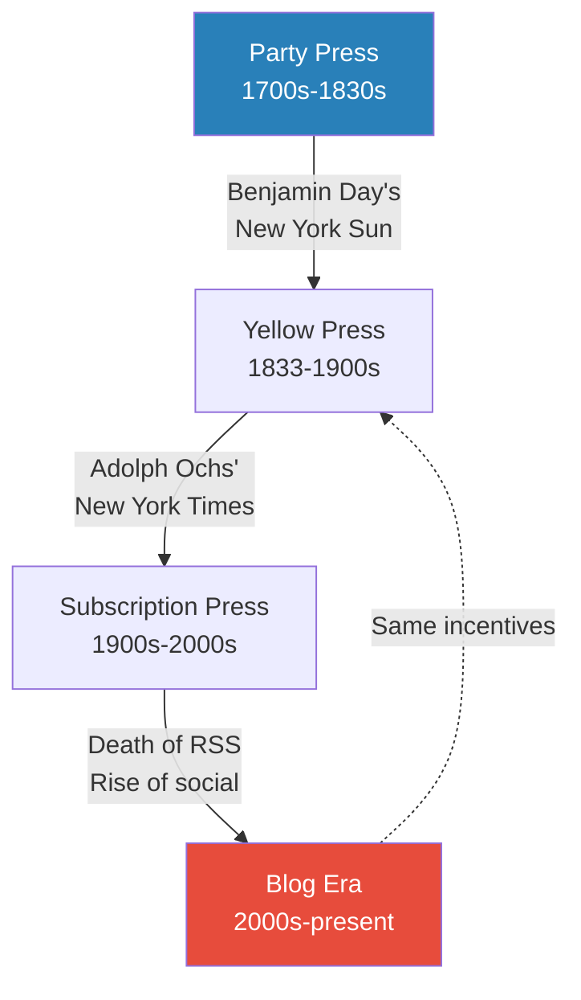
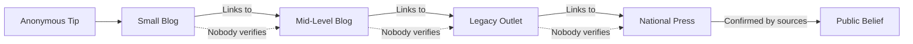
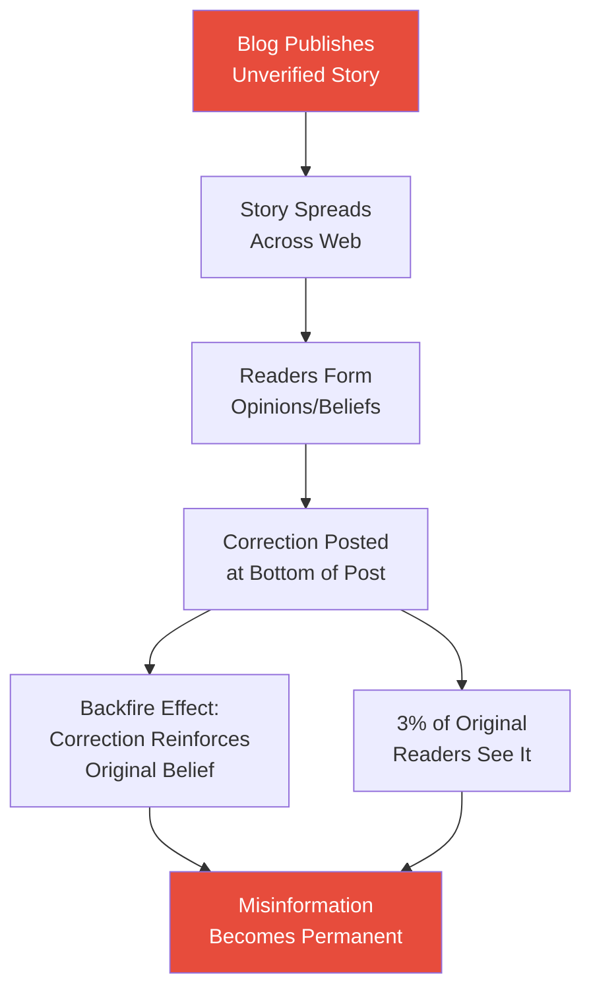
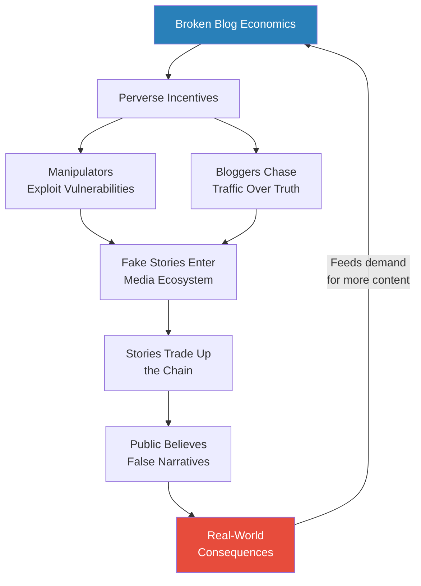

# Trust Me, I'm Lying — Ryan Holiday

> **In 30 seconds:** Ryan Holiday spent years as a professional media manipulator, planting fake stories with small blogs and watching them climb to CNN, the New York Times, and cable news — a process he calls "trading up the chain." In this confessional expose, he reveals the nine tactics he used to exploit the broken economics of online media, then shows the devastating consequences: destroyed reputations, crashed stock prices, and even deaths triggered by manufactured outrage. Part instruction manual, part mea culpa, the book argues that the incentive structure of blogs — pageview quotas, per-click pay, and the death of subscription — has recreated the worst excesses of nineteenth-century yellow journalism, producing a world where unreality and reality can no longer be separated.

---

## About the Author

Ryan Holiday dropped out of college at nineteen to become the director of marketing for American Apparel, where he managed multimillion-dollar online advertising budgets. He also ran publicity campaigns for bestselling authors like Tucker Max and Robert Greene, using deliberately provocative tactics to generate media coverage. Holiday later became a prominent writer on Stoic philosophy with books like *The Obstacle Is the Way* and *The Daily Stoic*, but *Trust Me, I'm Lying* represents an earlier, darker chapter — a period when he exploited every vulnerability in the online media system for profit and attention, before the costs of that exploitation became too steep to ignore.

---

## The Big Idea

- The online media ecosystem is not some neutral information marketplace — it is a machine with specific, exploitable mechanics
- Blogs are driven by a single imperative: **traffic by any means**
  - Writers are paid per pageview or per post, creating perverse incentives to sensationalise, exaggerate, and fabricate
  - Publishers build blogs not as sustainable businesses but as assets to be flipped — sold to larger companies for multiples of their traffic
  - The death of subscription (RSS) means every story must sell itself individually, recreating the exact conditions of the yellow press era
- Holiday's central framework, <b style="color: #2980b9">trading up the chain</b>, shows how a single planted story on a tiny blog can cascade through the media ecosystem until it becomes national news — believed by millions, acted upon by institutions, and impossible to retract
- The book is structured as a two-act tragedy: Book One teaches how to feed the monster (the nine tactics of manipulation), and Book Two shows what happens when the monster gets loose — ruined lives, crashed stocks, and a culture drowning in unreality
- What makes the book uniquely powerful is Holiday's dual role as both perpetrator and victim — he built the tactics, profited from them, and then suffered when the same system turned on him and his clients

---

## Key Concepts at a Glance

| Concept | One-line summary |
|---------|-----------------|
| **Trading up the chain** | Plant a story at a small blog, then leverage that coverage to reach bigger outlets |
| **The One-Off Problem** | When news is sold per-story rather than by subscription, sensationalism is inevitable |
| **The blog con** | Blogs are built on scoops, names, and traffic — then sold to a bigger company |
| **Pseudo-exclusive** | Claiming ownership of a story someone else broke to capture the traffic |
| **Iterative journalism** | Publish first, verify later — and profit from corrections as bonus content |
| **The link economy** | Blogs source from other blogs in a chain of delegated trust that nobody verifies |
| **Valence** | Content spreads when it triggers extreme emotions — anger above all |
| **Warnock's Dilemma** | Silence is unprofitable, so blogs provoke reactions at any cost |
| **Degradation ceremonies** | Online mob rituals that strip public figures of their humanity |
| **Unreality** | The cumulative effect of manipulated media — a world where fake and real blur |
| **Pseudo-events** | Events planned not to happen but to be reported — press releases, leaks, stunts |
| **The backfire effect** | Corrections actually strengthen the original false belief rather than fixing it |

---

This diagram shows Holiday's core mechanism: stories flow upward through progressively more credible outlets, each one laundering the previous source's lack of verification.

Anger is the most powerful driver of virality by a massive margin — one standard deviation increase in anger equals three extra hours as the lead story — while sadness kills sharing entirely, systematically suppressing nuanced truth.

Holiday's trading-up-the-chain mechanism shows how a single planted story at a tiny blog cascades through progressively more credible outlets — each one laundering the previous source's lack of verification until it becomes believed by millions.

---

## Holiday's Confession — The Monster Metaphor

*Before diving into tactics, Holiday establishes the stakes with a confessional opening that frames the entire book.*

- Holiday opens with unvarnished self-indictment: "I am, to put it bluntly, a media manipulator — I'm paid to deceive"
  - He has funnelled millions to blogs through advertising
  - Given breaking news to blogs instead of Good Morning America
  - Hired bloggers' family members when that didn't work
  - Fabricated ruses, courted bloggers with expensive meals, written their stories for them
- The book's central metaphor comes from a 1913 editorial cartoon in Leslie's Illustrated Weekly:
  - A businessman throws coins into the mouth of a fang-bared monster
  - Each tentacle-like arm is labelled: "Cultivating Hate," "Distorting Facts," "Slush to Inflame"
  - The caption: "THE FOOL WHO FEEDS THE MONSTER"
  - Holiday: "I knew who that fool was. He was me"
- In addiction circles, they tell the story of a man who found a cute little monster on his porch:
  - He kept and raised it — the more he fed it, the bigger it grew
  - He ignored his worries as it became bigger, more demanding, more unpredictable
  - One day it attacked and nearly killed him
  - "The monster had a life of its own"
- Holiday draws the parallel to his own career: he fed the media monster, thought he controlled it, and then it turned on him
- The confession is strategic too — Holiday admits as much:
  - He knows that framing himself as a repentant insider makes the book more credible and more marketable
  - But the mechanics he describes are real, verifiable, and have been corroborated by the bloggers themselves
  - The question is not whether Holiday is sincere — it is whether the system works the way he says it does

---

# Book One: Feeding the Monster — How Blogs Work

## I. Blogs Make the News

*Holiday opens with a deceptively simple observation: the blogs nobody reads are the ones that determine what everybody sees.*

- <b style="color: #2980b9">The Politico effect</b> demonstrates how blog coverage creates reality rather than reporting it:
  - In January 2011, Politico assigned a full-time reporter to follow Tim Pawlenty — a politician who didn't even have a campaign yet
  - The New York Times, which spends millions on its Baghdad bureau, didn't have a Pawlenty reporter — but the Times was covering Politico covering a noncandidate
  - Pawlenty's "candidacy" was manufactured by the coverage itself: mentions became "potential contender," then debate participant, then ballot inclusion
- <b style="color: #27ae60">The cycle that drives everything</b>:
  - Political blogs need content → traffic increases during elections → reality (election is far away) doesn't align → blogs create candidates early → the person they cover becomes an actual candidate → blogs profit, the public loses
- Blogs are today's newswires — the sources from which TV anchors, newspaper reporters, and your most "informed" friends get their news
  - Radio DJs once filled broadcasts with newspaper headlines; today they repeat what they read on blogs
  - An obscure blog with a tiny readership of TV producers and national newspaper writers is not small at all
  - The blog's audience is not its readership — it is the people those readers influence
- The implications for manipulation are enormous:
  - You don't need to reach millions of people directly
  - You need to reach the few hundred people who produce news for millions
  - A blog with 1,000 readers that includes three CNN producers, five New York Times reporters, and a dozen radio hosts has more influence than a blog with 100,000 random visitors

> [!tip] Core Insight
> To understand what makes blogs act is the key to making them do what you want. Learn their rules, change the game.

---

## II. How to Turn Nothing into Something — Trading Up the Chain

*Holiday reveals his signature tactic: a three-level system for manufacturing news out of thin air.*

- <b style="color: #2980b9">Trading up the chain</b> is a strategy that manipulates the media through recursion:
  - Place a story with a small blog that has very low standards
  - That post becomes the source for a story by a larger blog
  - Which in turn becomes the source for national media coverage
  - The result is a "self-reinforcing news wave"
- The mechanism works because of how each level justifies the next:
  - A small blog doesn't need much — a tip, a rumour, a photo
  - The mid-level outlet doesn't need to verify the story itself — the small blog's existence as a source is enough
  - The national outlet doesn't even reference the original tip — they cite the mid-level outlet's story, which cited the small blog
  - At each level, the story gains credibility simply by being repeated

> [!abstract] The Three Levels
> 1. **Level 1 — The Entry Point:** Small blogs and hyperlocal sites. Cash-strapped, traffic-hungry, high trust with readers. Easy to sell a loosely connected story
> 2. **Level 2 — Legacy Media:** Newspaper blogs, magazine websites (Forbes.com, Wired.com). Share the URL of their parent brand but operate under looser editorial standards. Coverage here grants the magic words: "NBC is reporting..."
> 3. **Level 3 — National Press:** New York Times, CNN, cable news. They monitor aggregators and lower-level blogs for story ideas. Success below is evidence the story could deliver even better results from a national platform

> [!example] The Tucker Max Billboard Campaign (2009)
> - Holiday designed and paid for billboards advertising Tucker Max's movie *I Hope They Serve Beer in Hell*
> - At 2 AM, dressed in black, he defaced his own billboards with obscene stickers
> - Under the fake name "Evan Meyer," he emailed photos to two blogs, claiming he'd spotted the vandalism
> - The blogs published it. He then alerted college protest groups, started a Facebook boycott, posted fake tweets, fabricated stories about Tucker's behaviour
> - Within two weeks: campus protests nationwide, Fox News front-page coverage, two Washington Post editorials, Chicago Transit Authority ad ban
> - "The entire firestorm was, essentially, fake"
> **The lesson:** A single person with no budget can manufacture a national controversy by exploiting the media's structural weaknesses.

> [!example] Terry Jones and the Koran Burning (2011)
> - Pastor Terry Jones announced he'd burn a Koran — a story picked up by Religion News Service, then Yahoo, then CNN
> - After backing down once, Jones went through with it when a freelance college student broke the media blackout through Agence France-Presse
> - AFP syndicates to Google and Yahoo News — within 24 hours, dozens of blogs had picked it up
> - Twenty-seven people were killed in riots in Afghanistan, including seven UN workers
> - "When Journalism 2.0 kills" — Forbes journalist Jeff Bercovici's summary
> **The lesson:** Trading up the chain doesn't just waste time or hurt feelings — it can get people killed.

- Blogger Lindsay Robertson of Jezebel openly advised publicists to focus on smaller sites, because "content filters up as much as it filters down"
  - Smaller sites act as "farm teams" for larger ones
  - Proving the theory, Newsweek picked up Robertson's advice from her tiny personal blog and reposted it
- The tactic's elegance lies in its deniability:
  - At no point does the manipulator contact a national outlet directly
  - Each outlet believes it discovered the story independently
  - The chain of attribution obscures the origin until it is untraceable

---

## III. The Blog Con — How Publishers Make Money Online

*Holiday strips blogging down to its economics and reveals a miniature Ponzi scheme.*

- <b style="color: #2980b9">The traffic equation</b> is brutally simple:
  - Advertisement x Traffic = Revenue
  - Every ad impression is monetised, if only for pennies
  - A perusing reader is no better than an accidental one
  - A worthwhile article is no more valuable than one instantly forgotten
  - "So long as the page loads and the ads are seen, both sides are fulfilling their purpose"
- <b style="color: #27ae60">Scoops build blogs</b>:
  - TMZ's revenues skyrocketed to $20 million/year through a handful of major scoops — Mel Gibson's DUI, Michael Jackson's death, Rihanna's bruised photo
  - The message to publishers: exclusives build blogs, scoops equal traffic
  - When real scoops are rare, blogs perfect the **pseudo-exclusive** — claiming ownership of a story someone else broke

> [!example] Gawker Steals the Tom Cruise Scientology Videos
> - Hollywood journalist Mark Ebner unearthed Tom Cruise Scientology videos and showed them to friends at Gawker
> - Gawker immediately posted the videos before Ebner could — without linking back to his site
> - The post did 3.2 million views. Ebner received nothing
> - "Blog fortunes were made off the backs of others"
> **The lesson:** In the scoop economy, the person who finds the story and the person who profits from it are rarely the same.

- <b style="color: #e74c3c">Blogs are built to be sold</b> — the real money isn't in advertising but in flipping the entire site:
  - Weblogs, Inc. → sold to AOL for $25 million
  - Huffington Post → sold to AOL for $315 million
  - TechCrunch → sold to AOL for $30 million
  - TreeHugger → sold to Discovery for $10 million
  - "Each blog is its own mini-Ponzi scheme" — traffic growth matters more than financials, brand recognition more than trust
- The acquisition model creates a specific kind of incentive:
  - Founders don't care about long-term reader loyalty — they care about impressive traffic numbers for the pitch deck
  - Content quality is irrelevant; growth curves are everything
  - Controversial, sensational, and outrageous content grows faster than careful, nuanced reporting
  - Once acquired, the new owners discover the traffic was built on a foundation of manufactured engagement — but by then the founder has cashed out

---

The blog business cycle: build traffic through any means necessary, establish a name, then sell to a bigger company. The incentive is always short-term growth over sustainable quality.

---

## IV. Tactic #1 — Bloggers Are Poor; Help Pay Their Bills

*Holiday shows how the payment structures of blogging create indirect bribes that are far more effective than any cash payoff.*

- <b style="color: #2980b9">The boiler room</b> of professional blogging:
  - Weblogs, Inc. paid $500/month for 125 posts — four dollars a post, four per day
  - Gawker paid twelve dollars a post as late as 2008
  - Gawker then switched to pageview-based bonuses — a big board in the office shows every writer's stats
  - Forbes.com relaunched with hundreds of contributors paid per visitor
  - Seeking Alpha's average payment per article: $58 for the first six months — a writer needs roughly 100,000 views to make $1,000
  - YouTube pays roughly one penny per view — Holiday worked with Linkin Park and realised their 100 million views earned barely six figures, split among six guys, a manager, a lawyer, and a label
  - Demand Media and examiner.com paid roughly eight dollars per text post

| Platform | Pay Structure | Approximate Rate |
|----------|--------------|-----------------|
| Weblogs, Inc. | Per post | $4/post |
| Gawker (pre-2008) | Per post | $12/post |
| Gawker (post-2008) | Pageview bonuses | Variable |
| Forbes.com | Per visitor | Variable |
| Seeking Alpha | Per article | ~$58 for first 6 months |
| Demand Media | Per post | ~$8/post |
| YouTube | Per view | ~$0.01/view |

These numbers reveal why bloggers are so susceptible to manipulation — when your entire day's work earns less than a restaurant meal, you cannot afford to turn down a free story.

- Nate Silver estimated the median user-contributed Huffington Post article is worth only three dollars in revenue
  - Even articles by former US Secretary of Labor Robert Reich — 547 comments, 27,000 pageviews — were worth only about $200
  - "An amount for which a man like that usually wouldn't get out of bed"
- <b style="color: #e74c3c">The exploitation is built into the system</b>:
  - At American Apparel, Holiday had two full-time employees whose job was to send free clothes to fashion bloggers
  - Affiliate deals paid bloggers commissions — "I'm sure you're shocked to read how often their posts featured something from American Apparel"
  - Samsung paid for a Business Insider staffer to travel to Barcelona — the writer admitted feeling "pretty warm and fuzzy about Samsung"

> [!example] Paying Celebrities to Tweet Anything
> - To promote one of Tucker Max's books, Holiday paid a Twitter account with 400,000+ followers to tweet: "FACT: People will do anything for money"
> - The cost: twenty-five dollars
> - For a few hundred dollars more, he tricked dozens of other accounts into posting humiliating promotional messages
> - The book debuted at number two on the New York Times bestseller list
> - Blog headline: "Tucker Max Proves You Can Pay Celebrities To Tweet Whatever You Want"
> **The lesson:** Influence is shockingly cheap when the influencers are desperate.

- The real conflict of interest isn't direct payoffs — it's the pay-per-pageview model itself:
  - Every post is a conflict of interest when your paycheck depends on how many views it gets
  - Bloggers have a direct incentive to write bigger, simpler, more controversial, or more favourably — whatever drives clicks
- The revolving door compounds the problem:
  - Bloggers build names through controversy and scoops, then leverage those names into cushy jobs at legacy media or tech companies
  - Tony Pierce left LAist to head digital at the LA Times; Caroline McCarthy left CNET for Google; the founding editor of Wonkette turned a few years of blogging celebrity into stints at Time.com, MSNBC, and Playboy
  - "What blogger is going to do real reporting on companies like Google or Facebook when there is the potential for a lucrative job down the road?"
  - Holiday lost track of how many bloggers he helped make by feeding them big stories — "If you invest early in a blogger, you can buy your influence very cheaply"

> [!tip] Core Insight
> You don't need to bribe bloggers directly. Their payment structure is the bribe. Give them what drives pageviews and you've paid their bills.

---

## V. Tactic #2 — Tell Them What They Want to Hear

*Holiday reveals how easy it is to become a "source" — and how the entire notion of sourcing has been hollowed out online.*

- <b style="color: #2980b9">The deliberate leak</b>:
  - During a lawsuit, Holiday fabricated a fake internal memo, printed it, scanned it, and emailed it to blogs as a "leak"
  - Bloggers who ignored the facts when told directly posted "EXCLUSIVE!" and "LEAKED!" stories eagerly
  - Another time, he had an employee email copyrighted promotional images to Jezebel as a "secret leak from the American Apparel server" — the post did 90,000 views
- The psychology behind the leak's power:
  - Bloggers want to feel like insiders — a "leak" flatters their self-image as investigators
  - The word "exclusive" triggers competitive instincts — publish before someone else does
  - A document that looks official (printed, scanned, slightly blurry) carries more weight than the same information delivered plainly
  - <b style="color: #e74c3c">The packaging matters more than the content</b>
- <b style="color: #27ae60">Press releases are not dead — they're more powerful than ever</b>:
  - A Pew Research study found official press releases often appear word for word in first accounts of events, "though often not noted as such"
  - A LexisNexis search for "in a press release" returns too many results for the service to process
  - Google Finance, CNN Money, Yahoo Finance all automatically syndicate press releases
- <b style="color: #2980b9">Wikipedia as the hidden source</b>:
  - Bloggers do their research on Wikipedia — "too bad people like me manipulate that too"
  - When comedian Russell Brand took his mother to the Oscars, the LA Times used the name from Wikipedia — which someone had changed as a joke

> [!example] Holiday Manipulates Wikipedia for Tucker Max
> - Holiday noticed Tucker's book had appeared on the NYT bestseller list in 2006, 2007, and 2008
> - He added this to Wikipedia with precise sourcing — a journalist then cribbed it and wrote "Tucker Max's book has spent over 3 years on the New York Times Bestseller List"
> - Holiday took this more generous interpretation and doubled up the Wikipedia citation
> - The manufactured "fact" became part of the permanent media narrative
> **The lesson:** Wikipedia isn't just a reference — it's a tool for establishing the facts that reporters will repeat without checking.

- <b style="color: #2980b9">HARO (Help a Reporter Out)</b> connects "self-interested sources" to reporters daily:
  - Nearly 30,000 media members have used HARO, including the New York Times and Associated Press
  - Holiday used it to place himself as an "expert" source in outlets from ABC News to Reuters — sometimes having an assistant pretend to be him
  - Reporters use HARO not to research but to find quotes that confirm what they already planned to write
  - Typical HARO requests reveal the game: "URGENT: needs horror story relating to mortgages" or "looking for a man who took on a new role around the house after losing his job"
  - "In fact, I even saw one HARO request by a reporter hoping to speak with an expert about how fads are created"
  - Holiday also provides token "balance" — blogs regularly email asking for "a response" to absurd rumours, needing only a denial quote to justify publishing the accusation

> [!example] Holiday Forgets His Own Manipulation
> - Holiday once posted a question on his blog: "What is the classic book of the '80s and '90s?"
> - He emailed the post as a tip to economist Tyler Cowen's blog Marginal Revolution under the fake name "Jeff Ritze"
> - Cowen featured it, citing both Holiday and "Loyal MR reader Jeff Ritze" — who was also Holiday
> - The Los Angeles Times picked up the discussion from Cowen's blog, giving Holiday mainstream coverage
> - Years later, he came across the article and didn't even remember the manipulation
> - "I had been the source of this article and totally forgotten about it"
> **The lesson:** Media manipulation becomes so routine that even the manipulator loses track of what's real and what's manufactured.

---

## VI. Tactic #3 — Give Them What Spreads, Not What's Good

*Holiday reveals the science behind virality — and why it systematically suppresses truth in favour of outrage.*

- <b style="color: #2980b9">The Wharton virality study</b> (2010) examined 7,000 articles on the NYT Most E-mailed List:
  - **The most powerful predictor of virality is anger**
  - One standard deviation increase in anger is equivalent to spending three additional hours as the lead story on NYTimes.com
  - Sadness is wholly unviral — it depresses the impulse to share
  - Both positive and negative extremes drive sharing; anything in the middle does not

| Emotion | Effect on Sharing | Mechanism |
|---------|------------------|-----------|
| Anger | Highest driver | High arousal — triggers action |
| Awe | Strong driver | High arousal — compels sharing |
| Anxiety | Moderate driver | Arousal pushes outward action |
| Sadness | Kills sharing | Low arousal — depresses action |
| Practical utility | Moderate but limited | Useful but not exciting to pass on |

The key variable is not positivity or negativity — it is **arousal**. High-arousal emotions (rage, excitement, anxiety) drive sharing; low-arousal emotions (sadness, contentment) suppress it.

- This creates a structural bias in what information survives online:
  - Complex, nuanced, sad truths die — they don't spread
  - Simple, outrageous, anger-inducing falsehoods thrive — they spread like wildfire
  - The market selects for emotional extremity, not accuracy

> [!example] Detroit's Ruin Porn — Two Cities, Two Portrayals
> - Viral photo slideshows of Detroit's ruins — abandoned theatres, Gothic stations — generated millions of views and thousands of comments
> - Every popular slideshow has one thing in common: not a single person appears in any photo
> - Detroit has ~20,000 homeless, ~50,000 stray dogs, and ~650,000 feral cats — you can't walk a block without seeing heartbreaking signs of life
> - A Magnum Photos series that included actual residents got 21 comments over two years; the depopulated Huffington Post version got 4,000 comments in days
> - Jonah Peretti of BuzzFeed: "If something is a total bummer, people don't share it"
> **The lesson:** The economics of the web make it impossible to portray complex human reality accurately. What spreads is what's dead — simple, clean, free of messy humanity.

- <b style="color: #e74c3c">The suppression isn't by omission — it's by transmission</b>:
  - The realistic photos exist; they just don't spread
  - Through the selective mechanism of what gets traffic and pageviews, we get systematic distortion without anyone intending it
  - No editor decides to hide the truth — the algorithm does it automatically

> [!example] The Sasha Grey NSFW Advertising Gambit
> - Holiday ran completely nude advertisements featuring porn star Sasha Grey on two tiny blogs — total cost: $1,200
> - A naked woman + a major US retailer + blogs = a massive online story
> - Picked up by Nerve, BuzzFeed, Fast Company, Jezebel, NBC New York, Rolling Stone Brazil, and many others
> - The ads were never meant to sell products directly — "the model wasn't really wearing any of it"
> - The strategy: manufacture chatter by exploiting high-valence emotions — arousal and indignation
> - "A slight slap on the wrist or pissing off some prudes was a penalty well worth paying for"
> - This leveraged advertising strategy took American Apparel's online sales from $40 million to nearly $60 million in three years
> **The lesson:** The economics of virality can turn a $1,200 ad buy into millions of dollars in free publicity — if you're willing to be provocative enough.

---

- <b style="color: #27ae60">The Rick Santelli / Tea Party connection</b> shows how viral content creates real political movements:
  - In February 2009, CNBC's Rick Santelli had an on-camera meltdown about the stimulus bill
  - CNBC recognised the value and posted the clip themselves — the Drudge Report linked it, and it exploded
  - Some saw a joke, others saw a truth-teller — and an actual Tea Party movement was born
  - As Chris Hedges wrote: "In an age of instant emotional gratification, we are incapable or unwilling to handle confusion"
  - A mildly awkward news segment that should have been forgotten became a defining political event
- The broader pattern Holiday identifies:
  - Viral content doesn't just reflect reality — it creates it
  - The stories that spread become the stories that matter, regardless of their accuracy
  - The mechanisms of virality select for extremity, certainty, and emotional charge — the exact opposite of truth

---

The virality filter: only high-arousal content survives the selection mechanism of sharing, systematically distorting public perception toward outrage and away from nuance.

---

## VII. Tactic #4 — Help Them Trick Their Readers

*Holiday explains how blogs deliberately mislead their own audiences — and how he helps them do it.*

- <b style="color: #2980b9">The question-mark headline</b> trick:
  - Nick Denton instructed his bloggers: "Don't dismiss with a skeptical headline before getting to your main argument. Because nobody will get to your main argument"
  - "A good question brings twice the response of an emphatic exclamation point"
  - Holiday's observation: "When you take away the question mark, it usually turns their headline into a lie"
  - "Did Glenn Beck Rape and Murder a Young Girl in 1990?" — the answer is obviously no, but the question drives clicks
- <b style="color: #e74c3c">Engagement is exploitation</b>:
  - Leaving a comment on Politico requires registration, email verification, CAPTCHA — generating up to ten pageviews before you can say anything
  - The Huffington Post's "rate this article" button shows another page (and another ad)
  - The site doesn't care about your opinion — it cares that eliciting it scores free pageviews
- Holiday deliberately exploits blogs' ambivalence about deception:
  - When giving official comments, he leaves room for speculation by not fully addressing issues
  - When creating stories as a fake tipster, he asks rhetorical questions that bloggers turn into click-friendly headlines
  - "I trick the bloggers, and they trick their readers"
- The trick works because readers and bloggers have different relationships to the same headline:
  - The reader sees a question and assumes the article will answer it
  - The blogger sees a question and knows it generates more engagement than a statement
  - The manipulator sees a question and knows it allows the blog to publish something they'd never print as a declarative sentence

---

## VIII. Tactic #5 — The One-Off Problem

*Holiday draws a devastating historical parallel between today's blogs and the yellow press of the 1830s-1900s.*

Holiday's historical framework shows that blogs have circled back to the exact incentive structures of the yellow press — the same problems, amplified by millions of sites instead of a few hundred newspapers.

- <b style="color: #2980b9">Three phases of news history</b>:
  - **Party Press**: One-man shops serving political parties; subscription model (~$10/year); editorial, not news
  - **Yellow Press**: Benjamin Day's New York Sun (1833) invented selling papers on the street; James Gordon Bennett's Herald — "not to instruct but to startle"; sensationalism required to compete
  - **Subscription Press**: Adolph Ochs' New York Times — "decency meant dollars"; subscriptions aligned incentives with readers; professionalism emerged

| Era | Revenue Model | Incentive | Quality Effect |
|-----|--------------|-----------|---------------|
| Party Press (1700s-1830s) | Political patronage | Serve the party | Biased but stable |
| Yellow Press (1833-1900s) | Per-issue sales | Sensationalise every story | Race to the bottom |
| Subscription Press (1900s-2000s) | Monthly subscriptions | Build long-term trust | Professionalism emerges |
| Blog Era (2000s-present) | Per-click advertising | Maximise traffic at any cost | Return to yellow press |

The table reveals Holiday's central historical argument: the revenue model determines the quality of journalism, and blogs have reverted to the worst model in history.

The Huffington Post's $315M sale to AOL dwarfs every other blog acquisition — proving that traffic growth matters more than journalism quality, and each blog is built not to inform but to flip.

- <b style="color: #e74c3c">Blogs have killed subscription and resurrected the One-Off Problem</b>:
  - RSS is dead — Apple removed it from OS X, Google buried Reader, Firefox dropped RSS buttons
  - The top traffic sources for major blogs: Google, Facebook, Twitter — not direct visits
  - Viewers are "seekers or glancers," not subscribers
  - Each story must sell itself, exactly like a newspaper hawked on a street corner in 1835
- The subscription model offered crucial protections:
  - Readers who were misled would unsubscribe
  - Errors had to be corrected in the next issue
  - Opposing views could be included; uncertainty acknowledged
  - "A subscription model offers necessary subsidies to nuance"
- Holiday's deeper point:
  - The One-Off Problem is not a bug in online media — it is the defining feature
  - Every pathology he describes — sensationalism, fabrication, outrage-farming — flows directly from the fact that each story must sell itself individually
  - Fix the One-Off Problem and you fix most of what's wrong with online media
  - But fixing it requires readers to pay for content — which they have been trained not to do

> [!tip] Core Insight
> The death of subscription means blogs chase Other Readers — the mythical viral audience — instead of serving loyal ones. This is why manipulation is so easy: they need stories that sell, not stories that serve.

---

## IX. Tactic #6 — Make It All About the Headline

*Holiday shows how headlines have devolved from news summaries into sales pitches — identical to the screaming newsboys of the 1890s.*

- Modern blog headlines and yellow press headlines are functionally identical:
  - 2012: "Naked Lady Gaga Talks Drugs and Celibacy"
  - 1898: "WAR WILL BE DECLARED IN FIFTEEN MINUTES"
  - Both exist to sell, not to inform
- <b style="color: #27ae60">"Google doesn't laugh"</b> — the death of wit in headlines:
  - Google News sends billions of clicks to newspapers monthly
  - Headlines must be optimised for search engines, not human intelligence
  - Each headline competes against all 522 others covering the same story
- The NYT Pentagon Papers headline — "Vietnam Archive: A Consensus to Bomb Developed Before '64 Election, Study Says" — could only exist in a subscription model
  - In a one-off world, it would need to scream "WAR LIES EXPOSED!" to get clicked
- Compare that to a headline Holiday conned Jezebel into writing for a nonevent:
  - "Exclusive: American Apparel's Rejected Halloween Costume Ideas (American Appalling)"
  - It did nearly 100,000 pageviews — and the "leak" was fake
  - He just had an employee send over some extra photos he couldn't use for legal reasons
- Yahoo's homepage tests more than **45,000 unique combinations** of story headlines and photos every five minutes
  - The Huffington Post does their headlines in a massive 32-point font
  - Arianna Huffington: "We pride ourselves on bringing in our community on which headlines work best"
  - By "best" she doesn't mean accurate — she means most clicked
- Holiday's approach: write the headline for the blogger
  - "Come up with the idea and let them think they were the ones who came up with it"
  - Make it so obvious and enticing they can't pass it up
  - Make them tone it down — "they'll be so happy to have the headline that they won't bother to check whether it's true"
  - "Their job is to think about the headline above all else"

> [!tip] Core Insight
> On a blog, every page is the front page. Headlines aren't designed to represent the content — they're designed to sell the click. "Only the reader gets stuck with the buyer's remorse."

---

## X. Tactic #7 — Kill 'Em with Pageview Kindness

*Holiday reveals how metrics-driven journalism eliminates editorial judgment and replaces it with algorithmic pandering.*

- <b style="color: #2980b9">The AOL Way</b> — a leaked internal memo showing content questions:
  - How many pageviews will this content generate?
  - Is this story SEO-winning for in-demand terms?
  - How can we modify it to include more terms?
  - What CPM will this content earn?
- Even the New Yorker's Susan Orlean admitted her gravitational pull toward Most Popular lists:
  - "Never do they include a story that is quiet and ordinary but wonderful to read"
- <b style="color: #2980b9">Warnock's Dilemma</b> — the terror of silence:
  - Named after Bryan Warnock: When no one responds to a post, is it because it's perfect or because it's worthless?
  - Either way, silence means no comments, no links, no traffic, no money
  - Jonah Peretti has BuzzFeed writers track failures closely — if news doesn't go viral, the news needs to change
- Holiday exploits silence fears:
  - Leaves fake comments from blocked IP addresses — positive and negative — to simulate debate
  - Sends fake emails to reporters, positive and negative
  - This "confirms" that a topic is generating engagement
- The metrics create a self-fulfilling prophecy:
  - What gets measured gets optimised
  - What gets optimised is what gets clicks
  - What gets clicks is what gets more resources
  - <b style="color: #e74c3c">The algorithm becomes the editor-in-chief</b>

> [!example] Huffington Post's Super Bowl Start Time Story
> - The Huffington Post ran a front-page story about what time the Super Bowl would start
> - A pointless story for a political news blog — but the search query was enormously popular on game day
> - The algorithm justified it, along with "the world is round" stories and celebrity slideshows
> **The lesson:** When metrics determine content, the most cynical calculation always wins.

---

## XI. Tactic #8 — Use the Technology Against Itself

*Holiday shows how the structural constraints of blogging — reverse chronological order, short posts, constant updates — predetermine what can be published.*

- <b style="color: #2980b9">The stacking problem</b>:
  - Tim Berners-Lee established "new stuff goes at the top" — reverse chronological order
  - This creates enormous pressure to be short and immediate
  - The time stamp is like an expiration date — each post must fight for attention before being pushed below the fold
- The Huffington Post's rule: unless readers can see the end of your post by ~800 words, they'll stop
  - GigaOM's Om Malik averaged 215 words per post over 11,000 posts
  - Nick Denton's ideal Gawker item: 100 words — "any good idea can be expressed at that length"
  - A University of Kentucky study found 80% of blog posts about cancer contained fewer than 500 words
- <b style="color: #e74c3c">The bounce rate reality</b>:
  - Average time on Jezebel: just over a minute
  - Average time on Lifehacker: less than ten seconds
  - Bounce rate on news sites: north of 50%
  - Eye-tracking studies show readers scan headlines, then descend the left column — if nothing catches them, they leave
- Jakob Nielsen's rule: cut 40% of every article — losing "only" 30% of its value
  - "I don't care what Nick Denton says; the complexities of cancer can't be properly expressed in 100 words"
- The format constraint is not just about length — it shapes what kinds of ideas can survive:
  - Ideas that require context die — there's no room for context
  - Ideas that require nuance die — nuance takes too many words
  - Ideas that require expertise die — readers won't sit still long enough
  - Only ideas that are simple, provocative, and immediately graspable survive the format

> [!example] The Racked NY Editor Who Never Visited Stores
> - At lunch, Holiday discovered that the editor of Racked NY — a blog about retail shopping in New York City — did all her shopping online
> - She was wearing American Apparel at the meeting but had never been to any of their nearby stores
> - "This was literally her beat"
> - Holiday's takeaway: "If a blogger isn't willing to get off their ass to visit the stores they write about, that makes it easier to create my own version of reality"
> **The lesson:** The constraints of blogging don't just compress information — they eliminate firsthand knowledge entirely.

- Another telling example of technology replacing reporting:
  - A blogger writing about Holiday for Mediagazer tried to fact-check by tweeting out questions to the universe
  - She never emailed him directly — despite him being the subject of the story
  - Holiday finally logged onto Twitter: "Have you thought about emailing me?"
  - "Though I'd actually be able to answer her questions, tweeting out loud was easier"

---

## XII. Tactic #9 — Just Make Stuff Up (Everyone Else Is Doing It)

*Holiday completes his tactical arsenal with the simplest manipulation of all: fabrication is easy because blogs can't distinguish real from invented.*

- <b style="color: #27ae60">The angle hunt</b> is the blogger's essential skill — and their fatal weakness:
  - "No topic too mundane that you can't pull a post out of it" — Blogger Boot Camp
  - When a topic has no angle, bloggers create one — small news becomes big news, nonexistent news gets puffed up
- Tech blogger MG Siegler admitted most of what he and his competitors write is bullshit:
  - "I won't try to put some arbitrary label on it, like 80%, but it's a lot"
- Manufactured urgency works every time:
  - Promise a 20-minute head start over other outlets, and blogs will publish whatever you want
  - Give the same "exclusive" to multiple blogs — they'll all race to publish first
  - Throw in an arbitrary deadline and "even the biggest blogs will forget fact-checking"
- The underlying mechanism is competitive pressure:
  - Being first matters more than being right
  - A wrong story can be corrected; a missed story is lost forever
  - The incentive structure actively punishes caution and rewards recklessness

> [!example] Jim Edwards and BNET vs. American Apparel
> - A BNET blogger named Jim Edwards trolled through American Apparel's financial disclosures and produced fantastical misinterpretations
> - He once questioned why the company didn't roll a 6% personal loan into a 15% investor loan — apparently not understanding that 6% is less than 15%
> - His posts became fodder for Jezebel, which gave Edwards "controversy" to justify more analysis, which fashion blogs then passed to readers
> - Holiday identified the cycle: "One moves the ball as far as they can up the field, and then the next one takes it and reifies whatever baseless speculation was included"
> - Edwards was later rewarded with a job at Business Insider
> **The lesson:** The system doesn't just tolerate fabrication — it rewards it with career advancement.

---

# Book Two: The Monster Attacks — What Blogs Mean

## XIII. Irin Carmon, The Daily Show, and Me

*Holiday shifts from offence to defence, showing what happens when the system he helped build turns against him — and against people who don't deserve it.*

- <b style="color: #2980b9">The nail polish disaster</b>:
  - American Apparel's environmentally friendly nail polish had bottles cracking under halogen lights — a manufacturing glitch, not a safety issue
  - A confidential internal email about the voluntary recall was leaked to Jezebel's Irin Carmon
  - Carmon emailed Holiday at 6:25 AM with a note: "Our post with the initial information is going up shortly"
  - Headline: "Does American Apparel's New Nail Polish Contain Hazardous Material?" — the answer was unequivocally no
  - By the time Holiday provided a statement (within an hour), dozens of blogs were already parroting Carmon's claims
  - Carmon pasted the statement at the bottom and left the headline unchanged, adding only "Updated"
  - <b style="color: #e74c3c">The small family-owned nail polish factory was overwhelmed by the controversy and later sued by American Apparel for $5 million in damages</b>
- The nail polish story illustrates a principle Holiday knows well from the other side:
  - The question-mark headline ("Does it contain hazardous material?") allows the blog to publish an accusation without making one
  - The speed of publication prevents the subject from responding before the story spreads
  - The "update" at the bottom creates the illusion of balance while the headline continues doing the damage

> [!example] The Daily Show's Manufactured "Sexism" Scandal (2010)
> - Carmon published "The Daily Show's Woman Problem" — claiming the show discriminated against women
> - She didn't speak to anyone currently working at the show; her sources included an ex-employee who hadn't worked there for eight years
> - The story was read 500,000+ times, picked up by ABC News, WSJ, Salon, and others
> - Forty Daily Show women — 40% of the staff — published an open letter calling it "an inadequately researched blog post" clinging to "a predetermined narrative"
> - The accusation post: 333,000 views. The women's response post: 10,000 views — 3% of the original
> - The New York Times headline about the response: "'The Daily Show' Women Say the Staff Isn't Sexist" — framing the refutation as merely a denial
> - Carmon's boss Nick Denton commended the story for "affirming our status as both an influencer and a muckraker"
> **The lesson:** The first story sets the narrative. Everything after — even a complete refutation — only reinforces the original accusation.

- The pattern repeated with director Judd Apatow:
  - Carmon tried to corner him at a party for a manufactured controversy about female characters
  - Apatow told her: "I think the people who talk about these things on the Internet are looking to stir things up"
  - The post went up anyway — 35,000 views
  - Carmon's reward: a staff position at Salon.com and a spot on Forbes "30 Under 30"

---

## XIV. The Manipulator Hall of Fame

*Holiday examines fellow manipulators Andrew Breitbart and James O'Keefe — and finds tactics identical to his own, deployed for far more dangerous ends.*

> [!example] Shirley Sherrod — Breitbart's Political Manipulation
> - Andrew Breitbart posted an edited video appearing to show Shirley Sherrod, a Black USDA official, making a racist speech
> - The video was split into two short clips (2:30 and 1:06) — perfectly sized for blogs to watch and republish
> - The unedited clip was 43 minutes long — too long for anyone to sit through to check
> - Within hours: blogs → cable news → newspapers. Sherrod was forced to resign
> - In reality, Sherrod's speech was about how **not** to be racist
> - President Obama apologised personally and denounced his own administration's rush to judgment
> - Breitbart's "correction" was barely a correction at all — and the discrediting only brought more attention
> **The lesson:** Breitbart understood that being caught as a manipulator can only make you more famous. The backlash is the bonus content.

- <b style="color: #2980b9">Breitbart's operational insight</b>:
  - "Feeding the media is like training a dog. You can't throw an entire steak at a dog to train it to sit"
  - He was not an ideologue — he was "an expert on what spreads, a provocateur"
  - First employee of the Drudge Report and a founding employee of the Huffington Post — he helped build both the dominant conservative and liberal blogs
- James O'Keefe's tactics follow the same playbook:
  - Heavily edited "undercover" videos targeting ACORN, NPR
  - Designed to appeal to a specific vocal group — angry conservatives
  - Nearly all of O'Keefe's stories were later exposed as doctored, but by then the victims had already lost their jobs
  - His ACORN video showed him wearing a pimp hat and fur coat — in reality he wore a suit and tie, editing in the costume after the fact

| Manipulator | Method | Political Aim | Outcome |
|-------------|--------|--------------|---------|
| Holiday | Planted stories, fake leaks | Commercial (book sales, brand building) | Millions in revenue |
| Breitbart | Edited video, outrage farming | Conservative political agenda | Careers destroyed, movements launched |
| O'Keefe | Doctored undercover footage | Conservative political agenda | Organisations defunded, staff fired |

All three use identical mechanisms — the difference is not technique but target. Holiday's confession is that the tools he built for selling books are the same tools others use to destroy lives and distort democracy.

---

## XV. Cute but Evil — Online Entertainment Tactics That Drug You

*Holiday pulls back the curtain on how "fun" content is engineered to be addictive — and how this addiction serves advertisers, not audiences.*

- <b style="color: #2980b9">The narcotizing dysfunction</b> (Lazarsfeld and Merton, 1948):
  - People mistake the busyness of consuming media for real knowledge
  - They confuse spending time with media for doing something
  - "He is concerned. He is informed. And he has all sorts of ideas. But after dinner and his favoured radio programs, it is really time for bed"
- YouTube thumbnails are deliberately engineered:
  - "Thumbnail cheating" uses sexy or provocative images that never appear in the video
  - YouTube Partner Program members can use any image they choose — even ones not in the video
- <b style="color: #2980b9">Demand Media</b> represents algorithmically created media at its most extreme:
  - Computer algorithms troll for lucrative search terms
  - A second algorithm creates the most search-friendly title
  - Human editors optimise further
  - Writers follow data-driven instructions — advertisements are sold before the content is even created
  - "By the time the content is ready to be published, advertisements will have already been sold against it"
- The narcotizing dysfunction has real consequences:
  - People who consume more news feel more informed but are not
  - The feeling of being informed substitutes for the work of becoming informed
  - <b style="color: #e74c3c">Media consumption becomes a substitute for action, not a precursor to it</b>

---

## XVI. The Link Economy — The Leveraged Illusion of Sourcing

*Holiday exposes how the link economy — the web's system of sourcing and attribution — creates the appearance of verification while actually doing none.*

- <b style="color: #2980b9">The delegation of trust</b> has been corrupted:
  - Old rules: If the outlet is legitimate, the story is too; if the story is legitimate, the facts are too
  - These rules assumed universal editorial standards — which no longer exist
  - Blogs pull from blogs that came before them to create new content — recursive and unverified

> [!example] The Maurice Jarre Wikipedia Hoax
> - An Irish student inserted a fake quote on composer Maurice Jarre's Wikipedia page after his death
> - The quote: "When I die there will be a final waltz playing in my head that only I can hear"
> - The fabricated quote appeared in obituaries around the world — including The Guardian
> - From The Guardian it spread through the link economy, its origins obscured
> - The student said: "I am 100% convinced that if I hadn't come forward, that quote would have gone down in history"
> **The lesson:** The link economy is designed to confirm and support, not to question or correct.

- <b style="color: #e74c3c">Links look like citations but rarely are</b>:
  - Only 44% of users on Google News click through to the actual article
  - Links create the appearance of sourcing without anyone actually checking
  - "May becomes is becomes has" — on the first site something "may" happen; by the time it's been through the chain, it "has" happened
- The mechanism is a game of Chinese whispers at industrial scale:
  - Blog A says "sources suggest X might be true"
  - Blog B links to A and writes "X is reportedly true"
  - Blog C links to B and writes "X is confirmed"
  - National outlet links to C and writes "Multiple sources confirm X"
  - Four links, zero verification, total confidence

> [!example] CNN Almost Reports a Gawker Fabrication
> - A disgruntled American Apparel manager sent anonymous emails to Gawker alleging discriminatory hiring practices
> - The allegations were false — the dress code had been covered by other blogs a year earlier
> - The story spread from Gawker to fashion blogs to stock blogs to CNN, growing more outrageous at each level
> - CNN contacted Holiday asking for an on-air response. He replied with a detailed email explaining the chain of unverified sourcing
> - CNN's response: "After a lot of consideration we decided to no longer do the segment"
> **The lesson:** Holiday was lucky once. "I consider the incident a fluke, and I assume I will never be so lucky again."

---

The link economy in practice: each level links to the previous one, creating the illusion of multiple independent sources — when in reality everyone is relying on the same unverified original tip.

---

## XVII. Extortion via the Web

*Holiday reveals how the threat of negative online coverage has become a shakedown tool — from viral blackmail to implicit corporate extortion.*

> [!example] Danone's Viral Video Blackmail
> - Video producer Fernando Motolese approached French yogurt giant Danone with two hypothetical videos
> - One was a fun spoof; the other was disgusting
> - He'd release the fun one — if Danone paid him a fee per view
> - "It felt sort of like blackmail," said the Danone representative — "because it was blackmail"
> **The lesson:** In the age of viral video, anyone can hold a company hostage with the threat of embarrassment.

- <b style="color: #e74c3c">The implicit shakedown</b> is even more common:
  - Michael Arrington's TechCrunch post "Why We Often Blindside Companies" reads as a veiled threat
  - He reminded readers he had dirt on people, hinted at his power to release it, and concluded: "Treat us with respect and you'll get it back"
  - Overstock.com was forced to designate social media as a major risk factor in their SEC 10-K filing
- When Engadget posted a fake email about an iPhone delay, it knocked more than **$4 billion off Apple's stock price**
- Holiday's own experience with extortion:
  - He advised a friend to have a lawyer draft a letter announcing the intention to file an embarrassing lawsuit against a famous talent agent
  - Not a real lawsuit — just the illusion of one through an intention letter
  - The threat made it onto TMZ, ESPN, and other blogs
  - The outcome: the agent paid $500,000 to make it go away
  - "The tools were so accessible and easy to use, it was almost difficult not to do so"
- Companies now live in a culture of fear:
  - Indie bands avoid online press entirely — "petrified of the backlash that has sunk so many promising blog-buzz bands"
  - Politicians stick more closely to prepared remarks
  - Companies bury their essence in marketing-speak
  - Everyone limits exposure to risk by being fake — the very thing blogs claim to oppose
  - <b style="color: #e74c3c">"To not be petrified of a shakedown is to be unimportant. You only have nothing to fear if you're a nobody"</b>

---

## XVIII. The Iterative Hustle — Online Journalism's Bogus Philosophy

*Holiday dismantles "iterative journalism" — the practice of publishing first and verifying later — as a profitable scam dressed up as an epistemological quest.*

- <b style="color: #2980b9">Iterative journalism</b> (also called process journalism or beta journalism):
  - Publish first, verify after posting
  - Michael Arrington: "Getting it right is expensive, getting it first is cheap"
  - Every correction generates another post — more pageviews
  - "To call it a learning experience, or anything but a way to make more money, is a lie"
- The cover-your-ass language:
  - "We're hearing..." / "I wonder..." / "Possibly..." / "Sites are reporting..."
  - These qualifiers toss the narrative into the stream without taking ownership
- The business logic is elegant in its cynicism:
  - A wrong story that gets corrected generates two sets of pageviews — the original and the update
  - A story that turns out to be right generates only one
  - <b style="color: #27ae60">Being wrong is literally more profitable than being right</b>

> [!example] Business Insider's David Paterson Hoax
> - Business Insider claimed NYT was about to drop a "bombshell" on New York Governor David Paterson, followed by his resignation
> - The story was completely wrong
> - The headline was simply updated from "Governor's Resignation To Follow" to "Governor's Office Denies Resignation In Works"
> - Months earlier, they'd fallen for a Steve Jobs heart attack hoax from CNN's iReport — Apple stock plummeted
> - Their response: "'Citizen journalism' just failed its first significant test" — blaming the source, not themselves
> **The lesson:** Iterative journalism eliminates costs like fact-checkers and source relationships, externalising the price of errors to readers and subjects.

> [!example] Eater LA Destroys a Restaurant
> - Eater LA published an anonymous tip alleging a popular wine bar had "egregious health code violations" and was serving generic substitutes for gourmet items
> - They published without contacting the restaurant
> - The accusations were completely wrong
> - Only after a lawsuit threat did Eater post an apology — but the original post remains up years later, with the retraction buried at the bottom
> **The lesson:** Iterative journalism's victims have no recourse. The damage is done before anyone thinks to check.

---

## XIX. The Myth of Corrections

*Holiday demolishes the idea that online corrections fix anything — and shows they actually make misinformation worse.*

- <b style="color: #2980b9">The backfire effect</b> (Nyhan and Reifler, University of Michigan):
  - Subjects shown a fake news article with a correction at the bottom were **more likely** to believe the initial claim than those who saw no correction
  - Corrections reintroduce the claim, forcing the brain to re-process it — tightening the mind's grip on the disputed "fact"
  - "Corrections not only don't fix the error — they backfire and make misperception worse"
- The psychology behind the backfire effect:
  - The human mind processes information in a specific order: first believe, then evaluate
  - Under conditions of speed, distraction, or emotional arousal — which describes all online reading — the evaluation step is often skipped
  - A correction forces the reader to recall the original claim, mentally rehearse it, and then reject it
  - The mental rehearsal strengthens the neural pathway for the claim, even as the reader consciously rejects it
- <b style="color: #e74c3c">Bloggers are structurally hostile to corrections</b>:
  - Getting a correction takes hours or days — by which time the post has done most of its traffic
  - Corrections are buried at the bottom, framed as "your opinion" rather than factual error
  - Holiday recalls multiple emails to Gawker about errors going unanswered: "My anonymous tips seem to arrive in their inboxes just fine — it's the signed corrections that run into issues"

> [!example] Drudge's Blumenthal Libel
> - Matt Drudge accused journalist Sidney Blumenthal of spousal abuse based on an anonymous Republican source
> - The story was entirely false — a political hit job
> - Drudge admitted to the Washington Post: "Someone was using me to try to go after him... I think I've been had"
> - His correction said only: "I am issuing a retraction of my information"
> - He defended iterative journalism: "The great thing about this medium is that you can fix things fast"
> - Holiday's assessment: "There's only one word for someone like that: dickhead"
> **The lesson:** Even when manipulators are caught, they rarely face consequences — and the correction itself becomes an excuse for the practice.

- <b style="color: #27ae60">The deeper problem is psychological</b>:
  - The human mind "first believes, then evaluates"
  - Information overload, speed, and emotion make it even harder to update beliefs
  - The more times an unbelievable claim is seen, the more likely people are to believe it
  - We place inordinate trust in written words — from centuries of knowing that writing was expensive and therefore presumably truthful

---

The correction paradox: corrections reach only a fraction of the original audience, and for those who do see them, the backfire effect actually strengthens the original false belief.

---

## XX. Cheering on Our Own Deception

*Holiday asks the most uncomfortable question in the book: Why do we enthusiastically participate in our own manipulation?*

- <b style="color: #e74c3c">The Toyota exoneration</b>:
  - The Huffington Post roundtable discussed how Toyota should have "handled" the unintended acceleration crisis better
  - Holiday interrupted: "None of you have come to terms with the fact that sites like yours pass along rumors as fact"
  - Later, NASA exonerated Toyota — most cases were driver error (hammering the accelerator instead of the brakes)
  - "Toyota hadn't been reckless, the media had"
- The Huffington Post itself was hit with a PR crisis (writers' lawsuit) and failed by its own standards:
  - They clammed up on lawyer's advice
  - Didn't cover the lawsuit on their own site
  - Hardly "getting out in front of it"
- <b style="color: #2980b9">Advertising as content</b>:
  - Mashable keeps a "Top 20 Viral Ads" chart — a chart of popular advertisements
  - Blogs eagerly publish leaked ads as news: "Here is an exclusive leak of our new controversial ad"
  - PETA deliberately gets their Super Bowl ad "rejected" every year — the rejection is the entire point
- "The media and the public are supposed to be on the same side. Marketers and the media — me and the bloggers — we're on the same team, and way too often you are played into watching with rapt attention as we deceive you"
- The complicity runs deeper than laziness:
  - Readers share outrageous stories because outrage feels good
  - Commenting on a scandal signals moral superiority
  - Being "informed" about manufactured controversies feels like engagement with the world
  - <b style="color: #e74c3c">The audience is not an innocent victim — it is a willing participant</b>

---

| Category | Example | What's Really Happening |
|----------|---------|------------------------|
| Advertising as content | Mashable's "Top 20 Viral Ads" chart | Ranking the advertisements that manipulated you most effectively |
| Coverage about coverage | "How the Bin Laden Story Broke" posts | News about how you were told the news — disguised as the news itself |
| Blogger conferences | TechCrunch Disrupt, AllThingsDigital | Blog liveblogging its own event to create the illusion of newsworthiness |
| Pitching guides | "How to Pitch a Blogger" posts | Step-by-step instructions for how to infiltrate and deceive the publisher |
| PR crisis analysis | "How Toyota Should Have Responded" | Teaching companies to manipulate us more effectively |

This table reveals the spectrum of self-referential media that blogs produce — each category disguising promotional or self-serving content as journalism.

---

## XXI. The Dark Side of Snark

*Holiday examines snark — the default tone of the Internet — and shows how it destroys without building, attacks without accountability, and eliminates the conditions that make culture possible.*

- <b style="color: #2980b9">Defining snark</b> (via David Denby):
  - "The nasty, insidious, rug-pulling, teasing insult, which makes reference to some generally understood shared prejudice or distaste"
  - Holiday's simpler definition: "You know you're dealing with snark when you attempt to respond and realize there is nothing you can say"
- Snark is the ideal intellectual position — it can criticise but cannot be criticised:
  - If someone calls you a "douche," how do you defend yourself without making it worse?
  - Responding only "exposes the jugular once more"
- The asymmetry of snark is its defining feature:
  - Creating something takes effort, skill, and vulnerability
  - Mocking something takes only a Twitter account and a cruel imagination
  - The creator bears all the risk; the snarker bears none
  - This asymmetry drives creators out of public life and rewards those who produce nothing

> [!example] The Destruction of Scott Adams (2011)
> - The Dilbert creator published a poorly thought-out blog post about societal restrictions on men
> - Jezebel paraphrased it as: "Now I am going to reveal my deeply-held douchebag beliefs"
> - Bitch magazine: "Scott Adams, Douchetoonist"
> - He was accused of "advocating rape" — though he'd said nothing of the kind
> - A petition got 2,000+ signatures: "Tell Scott Adams that raping a woman is not a natural instinct"
> - Adams tried to delete his post (more attention), then tried to defend himself (more mockery)
> - He was permanently rebranded as "a cross between a buffoon and a misogynistic rape apologist"
> **The lesson:** Snark annihilates effectiveness. Adams said some dumb things, but the punishment was disproportionate — and permanent. "You lived by the sword of online attention, and now you may have to die by it."

- <b style="color: #e74c3c">Snark is intrinsically destructive</b>:
  - It breaks things; it does not build
  - No politician has ever changed course because of a joke about their weight
  - Roger Ebert called snarking "cultural vandalism" — then couldn't resist snarking himself, tweeting about Ryan Dunn's death: "Friends don't let jackasses drink and drive"
  - The people who thrive under snark are exactly those we wish would go away (reality TV stars with nothing to lose)
  - "The people we value most as cultural contributors lurk in the back of the room, hoping not to get noticed and hurt"
- Snark's hypocrisy is exposed in Gawker's behaviour:
  - After years of calling Dov Charney a rapist, a failed businessman, and a monster, Gawker invited American Apparel to their Fleshbot Awards as "Sexiest Advertiser"
  - Holiday attended and was shocked: the bloggers who had written horrible things were smart and friendly in person
  - "Then it hit me: They hadn't meant anything they wrote. It had all been a game"
  - Gawker even asked if American Apparel would sponsor next year's show
  - "As if to say, 'We're happy to pick on someone else if you'll be our friend'"

---

## XXII. The 21st-Century Degradation Ceremony

*Holiday identifies blogs as modern instruments of ritual public destruction — digital versions of the rack and the public execution.*

- <b style="color: #2980b9">Degradation ceremonies</b> (anthropological term):
  - Rituals that allow the public to single out, denounce, and expel a member
  - "To lower their status and strip them of their dignity"
  - William Hazlitt: the passion behind such ceremonies "carries us back to the feuds of a barbarous age"
- Oscar Wilde's observation: "In the old days men had the rack. Now they have the Press"
  - And now, the press has become something even Wilde couldn't have imagined
- The modern degradation ceremony follows a predictable arc:
  - **Discovery:** A target is identified — usually someone with enough prominence to generate clicks
  - **Amplification:** The initial story spreads through the chain; each retelling becomes more extreme
  - **Participation:** Readers pile on through comments, shares, and their own posts — feeling virtuous for doing so
  - **Permanence:** Google ensures the degradation follows the victim forever

> [!example]- Julian Assange's Public Destruction
> - In less than a year, Assange went from "intriguing web hero" to "ominous pariah"
> - Gawker headlines evolved: "What Happened to WikiLeaks Founder Julian Assange's Weird Hair?" → "Are WikiLeaks Activists Finally Realizing Their Founder Is a Megalomaniac?"
> - Gawker even launched WikileakiLeaks.org, asking for embarrassing information about Assange
> - Before deciding on destruction, Gawker tested another angle: "Is WikiLeaks' Julian Assange a Nerdy Sex God?"
> - The same qualities celebrated weeks earlier — secrecy, independence, ego — were suddenly reframed as "creepy," "paranoid," and "disingenuous"
> - Holiday: "Assange hadn't changed. Someone had just reframed him. The role blogs needed him to play had shifted"
> **The lesson:** Blogs build people up specifically to tear them down. The construction and the destruction are both profitable — and neither has anything to do with truth.

- <b style="color: #e74c3c">The economics of ritual destruction</b>:
  - Bloggers live with the "rage of the creative underclass" — expensive degrees, $200K dream jobs that no longer exist, while reality TV stars get rich
  - "You used to have to be a national hero before the media turned on you. Now we tear people down just as we've begun to build them up"
  - "No wonder only morons and narcissists enter the public sphere"
- Philosopher Alain de Botton's comparison:
  - Greek tragedies taught audiences to consider how misfortune could befall them — to be humbled by the flaws of others
  - Modern blog coverage, "with its lexicon of perverts and weirdos, failures and losers, lies at one end of the spectrum" — tragedy lies at the other
  - "There is nothing to be learned from the tragic rise and fall of public men that we see on blogs"
  - Their destruction is mere spectacle — sublimating the anxieties of readers, making us feel better by hurting others
  - "If we're not getting anything out of it, and nobody learns anything from it, then I don't see how you can call blogs anything other than a digital blood sport"

---

## XXIII. Welcome to Unreality

*Holiday arrives at the book's ultimate conclusion: the cumulative effect of all these manipulations is not just bad journalism — it's the destruction of our ability to distinguish real from fake.*

- <b style="color: #2980b9">The news funnel</b> — the media systematically limits information:
  - All that happens → All known by media → All considered newsworthy → All published → All that spreads
  - "The media is a mechanism for systematically limiting the information seen by the public"
  - Yet we believe the news is informing us — the more we use the Internet, the more we trust it
- <b style="color: #2980b9">Pseudo-events</b> (Daniel Boorstin, 1962):
  - Anything planned deliberately to attract media attention
  - Press releases, premieres, product launches, leaked sex tapes, public statements, controversial ads
  - "While these events do occur, they are not by any stretch of the imagination real"
  - The terrifying part: pseudo-events don't stay unreal — they are "laundered and passed to the public as clean bills"

> [!example] Cheney's Iraq War Manipulation
> - Vice President Cheney leaked bogus information to a New York Times reporter
> - He then cited his own leak on Meet the Press: "There's a story in the New York Times this morning, and I want to attribute the Times"
> - He used something he had planted as proof that untrue information was "public" and accepted fact
> - "He used his own pseudo-event to create pseudo-news"
> - From the pseudo-environment came actual behaviour — a real war, waged on fabricated pretences
> **The lesson:** Holiday's tactics for selling books operate on the same principle Cheney used to start a war. The mechanism is identical; only the stakes differ.

- <b style="color: #27ae60">Walter Lippmann's warning (1922)</b>:
  - The news constitutes a "pseudo-environment," but our responses to that environment are not pseudo — they are "actual behavior"
  - We act on the fake as though it were real, because to us, it is
- The implications are staggering:
  - If the public's model of reality is systematically distorted by manipulated media, then every decision based on that model — votes, investments, relationships, fears — is made on false premises
  - Democracy requires an informed citizenry; manipulated media produces a misinformed one
  - The manipulators know this — and they profit from it anyway

---

## XXIV. How to Read a Blog — A Decoder Ring

*Holiday translates the language of blogging into plain English, stripping away the "abandoned shells" of journalistic authority.*

> [!abstract] Holiday's Blog Translation Guide
> - "According to a tipster..." → Someone like me tricking the blogger
> - "We're hearing reports..." → Random Twitter mentions or message board posts
> - "Leaked documents..." → Someone emailed a blogger; the documents are usually fake
> - "BREAKING" → Published before basic facts were confirmed
> - "Updated" → Shit was pasted at the bottom; nobody reworked the story
> - "Sources tell us..." → Unvetted, uncorroborated, desperate for attention
> - "EXCLUSIVE" → Blog and source worked out a deal for favourable coverage
> - "We've reached out for comment" → Sent an email two minutes before hitting publish at 4 AM
> - "Which means..." → The blogger has zero expertise in this field

- <b style="color: #2980b9">Abandoned shells</b> (George W. S. Trow):
  - Words like "exclusive," "sources," and "developing" carry the authority of Woodward and Bernstein — but describe a world that would make even Hearst queasy
  - "Blogs left everything standing but cunningly emptied them of significance"
  - "Our facts aren't fact, they are opinions dressed up like facts. Our opinions aren't opinions; they are emotions that feel like opinions"
- The decoder ring is both a practical tool and a philosophical statement:
  - Every piece of journalistic language was developed to signal trustworthiness
  - Blogs adopted the language but abandoned the practices that made it meaningful
  - The language itself has become a weapon of manipulation — it signals credibility where none exists

---

## Conclusion: Where to From Here?

*Holiday offers no easy solutions — only a clear-eyed reckoning with a system that benefits almost nobody, including the people who run it.*

- Even Nick Denton, the man who "fed and raised the monster more than anyone," went on a "jihad against fake news" at Gawker
  - Holiday's reaction: "It's like Kim Kardashian complaining about how fake reality TV shows are"
- <b style="color: #27ae60">Neil Postman's framework updated</b>:
  - Postman (1985): Television's need for entertainment turned everything — war, politics, art — into entertainment
  - Holiday's update: The Internet's need for traffic turns everything into conflict, controversy, and crap
  - "Blogs have no choice but to turn the world against itself for a few more pageviews"
- Practical changes Holiday advocates:
  - The subscription model must return — "when the NYT implemented a pay wall, the new incentive is to have more than twenty must-read articles each month"
  - Readers must ask: "What do I plan to do with this information?" — and be honest about the answer
  - Libel laws need updating — a "lame update at the bottom of a blog" shouldn't suffice as a correction
  - Marketers must understand that "if you chase the kind of attention I chased, there will be blowback"
- Holiday's final admission:
  - "I wish there was an easy solution. I don't know the answer"
  - "My job was to prove that something was massively wrong and to come clean about my role in it"
  - "Some of you might use this book as an instruction manual. You will come to regret that choice, just as I have. But you will also have fun, and it could make you rich"
  - "Both I and my clients profited greatly — millions of books were sold, celebrity was created, brands were built. But we also paid very heavily with currency like dignity, respect, and trust"
- The historical analogy he returns to:
  - Just as spaces were inserted between Latin words a thousand years ago — because the flood of text made reading impossible — blogs have created their own information crisis
  - "We too are drowning in information that bleeds together into an endless blur"
  - Someone has to say the emperor has no clothes — because only after the problem is identified can solutions be found
- The book ends where it began — with the monster:
  - "The second you stop and walk away, the monster will start to wither, and you will be happy again"
  - "I confess all I have confessed in order to make that an option"

---

The vicious cycle Holiday describes: broken economics create perverse incentives, which invite manipulation, which produces unreality, which has real consequences — and the consequences generate more content, restarting the cycle.

---

## The Verdict

Holiday's greatest contribution is making the invisible visible. Before *Trust Me, I'm Lying*, the mechanics of online media manipulation existed in a kind of open secret — everyone in the industry knew how it worked, but nobody had laid it out with this level of specificity and confessional candour. The historical parallel to yellow journalism is genuinely illuminating: Holiday doesn't just complain about blogs being bad; he shows exactly *why* they're bad, rooting the analysis in the economics of the One-Off Problem and the death of subscription. The nine tactics are presented with enough detail that you can both use them and defend against them, and the escalation from playful stunts (billboard vandalism) to deadly consequences (the Koran burning) gives the book the moral arc of a confession rather than a how-to guide.

The book's weaknesses are real but forgivable. Holiday is not an innocent bystander — he's a perpetrator who profited enormously from the system he denounces, and his mea culpa occasionally feels self-serving (the confessional frame itself is a form of media manipulation, as he surely knows). His analysis is also frozen in the blog era of 2012; the subsequent rise of algorithmic social media feeds, deepfakes, and AI-generated content has made his concerns look almost quaint. Some of his examples are repetitive, and his personal grievances against specific bloggers (particularly Irin Carmon) occasionally feel more like score-settling than structural critique.

The readers who benefit most are anyone who consumes or creates online media — which is essentially everyone. Marketers will find a tactical manual (Holiday all but admits this). Journalists will find a mirror. Citizens will find a reason to question every headline they read. The book is particularly valuable for young people entering media careers who may not yet have developed the cynicism that experience provides.

*Trust Me, I'm Lying* sits alongside [[Influence - Robert Cialdini]] and [[You Are Not So Smart - David McRaney]] as an essential text on how our psychology is exploited by systems designed to profit from our attention. Where Cialdini maps the triggers of compliance and McRaney catalogues the biases of the mind, Holiday maps the specific infrastructure through which those triggers and biases are weaponised at industrial scale. It pairs well with [[Antifragile - Nassim Nicholas Taleb]] for its analysis of fragile systems that look robust until they suddenly collapse, and with [[Pre-Suasion - Robert Cialdini]] for its insights on how framing determines perception. Among media criticism, it is more accessible than Chomsky's *Manufacturing Consent* and more honest than most journalists' memoirs about how the sausage is made.

---

## Related Reading

- [[Influence - Robert Cialdini]] — The psychological triggers Holiday exploits
- [[Pre-Suasion - Robert Cialdini]] — How framing and context shape perception before the message arrives
- [[You Are Not So Smart - David McRaney]] — The cognitive biases that make media manipulation possible
- [[Antifragile - Nassim Nicholas Taleb]] — How fragile systems disguise their vulnerabilities until crisis
- [[Thinking in Bets - Annie Duke]] — Decision-making under uncertainty, relevant to how we consume unverified news
- [[The 48 Laws of Power - Robert Greene]] — Holiday's mentor; the power dynamics underlying media relationships
- [[The Psychology of Money - Morgan Housel]] — How narrative drives financial decisions, paralleling media-driven stock movements
