# You Are Not So Smart — David McRaney

> David McRaney's book is a catalogue of the ways your brain lies to you — forty-eight short, punchy chapters, each dismantling one cherished illusion about your own rationality.
> The format is elegant: each chapter opens with "The Misconception" (what you believe about yourself) and "The Truth" (what the research actually shows). The misconception is always flattering. The truth never is.
> McRaney draws on decades of research from Kahneman, Tversky, Cialdini, Milgram, and others, translating dense academic findings into stories that stick.
> This is not an academic text — it's a greatest-hits album of cognitive biases, logical fallacies, and psychological quirks, written with wit and accessible examples that make you laugh while realising how reliably your brain deceives you.
> It is the essential self-awareness tool: you cannot fix thinking errors you don't know you're making.

---

## About the Author

David McRaney is a journalist who became fascinated by the gap between how rational we think we are and how rational we actually are. He started the blog "You Are Not So Smart," which attracted millions of readers and grew into this book, its sequel *You Are Now Less Dumb*, and a popular podcast. He is not an academic psychologist but a skilled populariser who translates research into engaging, memorable prose. His background in journalism gives him a storyteller's instinct — each chapter reads less like a lecture and more like a conversation at a bar with someone who has read all the studies you haven't.

---

## The Big Idea

- <b style="color: #2980b9">You are not so smart</b> — your brain is a deeply flawed machine that runs on shortcuts, self-deception, and motivated reasoning
- You believe you are a rational agent making deliberate choices based on evidence — you are not
- Your brain confabulates reasons for decisions it has already made unconsciously, filters information to confirm what you already believe, and systematically overestimates your own abilities
- These are not occasional glitches — they are the default operating mode of the human mind
  - Every person is subject to the same biases regardless of intelligence, education, or self-awareness
  - Knowing about a bias does not make you immune to it — but it does give you the chance to catch yourself
- McRaney organises 48 of these errors into short, self-contained chapters:
  - Each begins with "The Misconception" — the flattering lie you tell yourself
  - Each ends with "The Truth" — the uncomfortable reality the research reveals
- <b style="color: #e74c3c">The first step to thinking clearly is accepting that you don't</b>
- The book's implicit argument is that humility about your own cognition is the most rational posture available — not confidence, not certainty, but the ongoing suspicion that your brain is fooling you right now

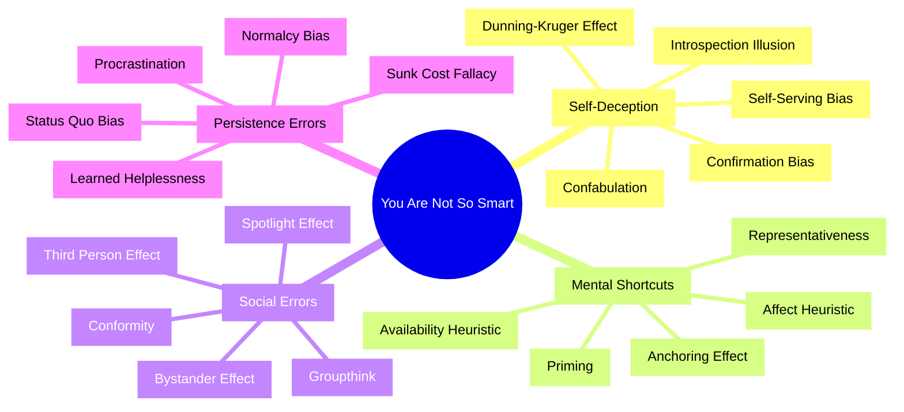

The mind map above shows how McRaney's 48 biases cluster into broad families — each section below covers them in depth.

Self-deception dominates the bias landscape with a quarter of all entries — the brain's most persistent failure mode is lying to itself about its own competence, motives, and rationality.

Confirmation bias sits at the centre of the network — connected to nearly every other bias — making it the master error from which most cognitive failures cascade.

---

## Key Concepts at a Glance

| Concept | One-line summary |
|---------|-----------------|
| **Confirmation Bias** | You seek validation, not truth — and filter everything accordingly |
| **Confabulation** | Your brain invents explanations for decisions it made unconsciously |
| **Dunning-Kruger Effect** | The less skilled you are, the more confident you feel |
| **Sunk Cost Fallacy** | Past investment irrationally drives continued investment |
| **Anchoring Effect** | The first number you encounter dominates your judgment |
| **Priming** | Subtle cues shape your behaviour without your awareness |
| **Availability Heuristic** | You judge probability by how easily examples come to mind |
| **Bystander Effect** | More witnesses means less help |
| **Normalcy Bias** | In a crisis, you freeze and pretend everything is fine |
| **Procrastination** | An emotion-management failure, not a time-management one |
| **Learned Helplessness** | Repeated failure teaches you to stop trying, even when escape is possible |
| **Self-Serving Bias** | You take credit for wins and blame luck for losses |
| **Spotlight Effect** | You think everyone is watching — almost no one is |
| **Groupthink** | Groups converge on bad decisions to maintain harmony |
| **Affect Heuristic** | You let your current feelings decide what you think is true |
| **Hindsight Bias** | After the fact, you "knew it all along" |
| **Texas Sharpshooter Fallacy** | You draw the target after the arrow has already landed |
| **Brand Loyalty** | You construct an identity around purchase decisions, then defend them |
| **Argument from Authority** | You believe experts even outside their expertise |
| **Third Person Effect** | You think propaganda works on others but not on you |
| **Catharsis** | Venting anger doesn't reduce it — it amplifies it |
| **Introspection Illusion** | You don't actually know why you do what you do |
| **Embodied Cognition** | Your body's state shapes your thoughts more than you realise |
| **Just-World Fallacy** | You blame victims to preserve your belief in fairness |
| **Fundamental Attribution Error** | You judge others by character but excuse yourself by context |
| **Misinformation Effect** | Post-event information rewrites your memory of the event |
| **Conformity** | Social pressure reshapes even what you perceive |
| **Extinction Burst** | Habits spike dramatically before they fade |
| **Apophenia** | You see meaningful patterns in randomness |
| **Self-Fulfilling Prophecy** | Expectations change behaviour, which produces the expected outcome |

---

## Quick Lookup Table

| # | Bias / Fallacy | Thematic Group |
|---|----------------|---------------|
| 1 | Priming | Mental Shortcuts |
| 2 | Confabulation | Self-Deception |
| 3 | Confirmation Bias | Self-Deception |
| 4 | Hindsight Bias | Self-Deception |
| 5 | Texas Sharpshooter Fallacy | Pattern Errors |
| 6 | Procrastination | Persistence Errors |
| 7 | Normalcy Bias | Persistence Errors |
| 8 | Introspection | Self-Deception |
| 9 | Availability Heuristic | Mental Shortcuts |
| 10 | Bystander Effect | Social Errors |
| 11 | Dunning-Kruger Effect | Self-Deception |
| 12 | Apophenia | Pattern Errors |
| 13 | Brand Loyalty | Consumer Illusions |
| 14 | Argument from Authority | Logical Fallacies |
| 15 | Argument from Ignorance | Logical Fallacies |
| 16 | Straw Man Fallacy | Logical Fallacies |
| 17 | Ad Hominem Fallacy | Logical Fallacies |
| 18 | Just-World Fallacy | Moral Biases |
| 19 | Public Goods Game | Social Errors |
| 20 | Ultimatum Game | Social Errors |
| 21 | Subjective Validation | Pattern Errors |
| 22 | Cult Indoctrination | Social Errors |
| 23 | Groupthink | Social Errors |
| 24 | Supernormal Releasers | Mental Shortcuts |
| 25 | Affect Heuristic | Mental Shortcuts |
| 26 | Dunbar's Number | Social Errors |
| 27 | Selling Out | Consumer Illusions |
| 28 | Self-Serving Bias | Self-Deception |
| 29 | Spotlight Effect | Social Errors |
| 30 | Third Person Effect | Self-Deception |
| 31 | Catharsis | Persistence Errors |
| 32 | Misinformation Effect | Memory Errors |
| 33 | Conformity | Social Errors |
| 34 | Extinction Burst | Persistence Errors |
| 35 | Social Loafing | Social Errors |
| 36 | Illusion of Transparency | Self-Deception |
| 37 | Learned Helplessness | Persistence Errors |
| 38 | Embodied Cognition | Mental Shortcuts |
| 39 | Anchoring Effect | Mental Shortcuts |
| 40 | Attention | Mental Shortcuts |
| 41 | Self-Handicapping | Self-Deception |
| 42 | Self-Fulfilling Prophecy | Pattern Errors |
| 43 | Moment | Mental Shortcuts |
| 44 | Consistency Bias | Memory Errors |
| 45 | Representativeness Heuristic | Mental Shortcuts |
| 46 | Expectation | Mental Shortcuts |
| 47 | Illusion of Control | Self-Deception |
| 48 | Fundamental Attribution Error | Social Errors |

---

## Cluster 1: Self-Deception — The Lies You Tell Yourself

*The most powerful deceptions aren't the ones others practice on you — they're the ones your own brain runs on autopilot, protecting your self-image at the cost of accuracy.*

This cluster includes: Confirmation Bias (#3), Confabulation (#2), Hindsight Bias (#4), Introspection (#8), Dunning-Kruger Effect (#11), Self-Serving Bias (#28), Third Person Effect (#30), Illusion of Transparency (#36), Self-Handicapping (#41), and Illusion of Control (#47). They share a common engine — your brain's relentless commitment to making you feel smarter, more consistent, and more in-control than you actually are.

---

### 3. Confirmation Bias

*You don't seek truth — you seek agreement, and your brain is extraordinarily good at finding it.*

- <b style="color: #2980b9">Confirmation bias</b> is the tendency to seek out, remember, and interpret information in ways that confirm your pre-existing beliefs
- McRaney's format sets the stage:
  - **Misconception:** Your opinions are the result of years of rational, objective analysis
  - **Truth:** Your opinions are the result of years of paying attention to information that confirmed what you already believed, while ignoring information that challenged it
- The mechanism operates at three levels:
  - **Seeking:** You actively search for evidence that supports your view and avoid sources that might challenge it
  - **Interpreting:** When you encounter ambiguous evidence, you read it as supporting your position
  - **Remembering:** You recall confirming evidence more easily and forget disconfirming evidence
- <b style="color: #e74c3c">The internet has made this infinitely worse</b> — you can always find a source that agrees with you, and algorithms serve you more of what you already click on
- The bias is not about stupidity — highly intelligent people are actually better at rationalising their pre-existing views, which makes them more vulnerable, not less
- McRaney emphasises how the internet has transformed confirmation bias from a personal quirk into a civilisational problem:
  - Before the internet, you were exposed to newspapers, conversations, and broadcasts that contained a mix of views
  - After the internet, you can curate an information diet that contains ONLY confirming evidence
  - Algorithms accelerate this: social media feeds show you more of what you click, creating self-reinforcing bubbles
  - The result is not just individual delusion but collective polarisation — entire communities can seal themselves inside echo chambers where confirming evidence is abundant and disconfirming evidence is invisible

> [!example] The Wason Selection Task
> - Psychologist Peter Wason gave subjects four cards showing A, K, 4, and 7
> - He told them: "If a card has a vowel on one side, it has an even number on the other"
> - Subjects were asked which cards to flip to test the rule
> - Most chose A and 4 — trying to confirm the rule
> - The correct answer is A and 7 — because only a vowel with an odd number disproves the rule
> - People instinctively seek confirmation, not falsification
> **The lesson:** Your brain's default mode is to confirm, not to test. You have to deliberately force yourself to look for what would prove you wrong.

> [!example] Lord, Ross, and Lepper's Death Penalty Study (1979)
> - Researchers gathered subjects who were either strongly for or strongly against the death penalty
> - Both groups read the same mixed evidence — some studies supporting deterrence, some refuting it
> - After reading identical evidence, both sides became MORE entrenched in their original position
> - Pro-death-penalty readers found the supporting studies "well-conducted" and dismissed the opposing ones
> - Anti-death-penalty readers did the exact opposite with the same studies
> **The lesson:** When people encounter mixed evidence, confirmation bias doesn't cancel out — it amplifies. Both sides walk away more polarised.

> [!tip] Core Insight
> Confirmation bias is not a flaw you can simply decide to override. It operates beneath conscious awareness. The only reliable counter-measure is to actively seek disconfirming evidence — to ask "what would prove me wrong?" before you ask "what proves me right?"

---

### 2. Confabulation

*Your brain doesn't tell you it doesn't know — it makes up a plausible story and presents it as truth.*

- <b style="color: #2980b9">Confabulation</b> is the tendency to create fictional narratives to explain your own behaviour, decisions, and emotions — without knowing you are doing it
- **Misconception:** You know why you like the things you like and feel the way you feel
- **Truth:** The origin of certain feelings and preferences is unavailable to you, but you create narratives to explain them anyway
- This is not lying — confabulation is unconscious fabrication:
  - Your conscious mind has limited access to the real reasons behind your choices
  - When asked "why?", it generates a plausible-sounding explanation rather than admitting ignorance
  - You then believe this fabricated explanation completely
- The phenomenon runs far deeper than trivial preferences:
  - Political beliefs, moral judgments, romantic attraction — for all of these, your brain generates confident explanations that may have no connection to the actual cause
  - Confabulation is not a rare glitch — it is the standard operating procedure of the narrative-generating mind

> [!example] Nisbett and Wilson's Stocking Study (1977)
> - Researchers displayed four pairs of identical stockings on a table and asked women to choose the best quality pair
> - There was a massive position effect — people overwhelmingly chose the rightmost pair
> - When asked why they chose their pair, no one said "because it was on the right"
> - Instead, they gave elaborate explanations about texture, knit quality, and colour
> - They were completely sincere — they genuinely believed their fabricated reasons
> - When told about the position effect, many subjects denied it applied to them
> **The lesson:** Your brain will invent reasons for your choices rather than admit it doesn't know why you chose. And you will believe those reasons entirely.

- <b style="color: #27ae60">The implication is humbling: most of the explanations you give for your own behaviour are post-hoc fiction</b>
- This connects directly to the [[Antifragile - Nassim Nicholas Taleb|narrative fallacy]] — the human compulsion to create stories that explain random events
- Split-brain research deepens the picture:
  - When the two hemispheres of the brain are surgically separated, researchers can give instructions to one hemisphere that the other cannot access
  - The uninformed hemisphere, when asked to explain the behaviour, invents a perfectly coherent explanation
  - The patient fully believes the fabricated story
  - Michael Gazzaniga called this the "interpreter" — a module in the left hemisphere whose sole job is to construct narratives for behaviour, whether or not it has access to the real cause

---

### 4. Hindsight Bias

*After the fact, everything looks obvious — which destroys your ability to learn from experience.*

- <b style="color: #2980b9">Hindsight bias</b> (the "I-knew-it-all-along" effect) is the tendency to believe, after learning an outcome, that you would have predicted it
- **Misconception:** After you learn something new, you remember the original state of your ignorance
- **Truth:** You often look back on things you've just learned and assume you knew or believed them all along
- The mechanism operates through memory reconstruction:
  - Once you know the outcome, your brain rewrites the memory of your prior beliefs to align with it
  - This is not deliberate dishonesty — your brain genuinely alters the record
  - You remember "knowing" things you could not possibly have known
- Hindsight bias is particularly devastating in combination with other biases:
  - It makes you a poor judge of other people's decisions — because "the answer was obvious" to you (but only because you already know it)
  - It makes you overconfident about predicting the future — because you "correctly predicted" the past (which you didn't)

> [!example] Baruch Fischhoff's Nixon-China Study (1975)
> - Before Nixon's historic 1972 visit to China, Fischhoff asked subjects to estimate the probability of various outcomes
> - After the trip, he asked them to recall their original estimates
> - Subjects consistently "remembered" having given higher probabilities to outcomes that actually occurred
> - They had no awareness that their memories had shifted
> - The effect persisted even when subjects were explicitly warned about it
> **The lesson:** You can't trust your memory of what you "knew" before an event — your brain rewrites the record to make you look prescient.

> [!example] Hindsight and the 2008 Financial Crisis
> - McRaney notes that after the 2008 crash, everyone seemed to "know" it was coming
> - Financial commentators, pundits, and ordinary people claimed they had seen the warning signs
> - In reality, very few people predicted the crisis before it happened — and many of those who did had been predicting a crash every year for a decade
> - Hindsight bias turned a surprise into a certainty retroactively
> **The lesson:** The ease with which you can explain something after the fact bears no relationship to your ability to predict it before the fact.

- <b style="color: #e74c3c">Hindsight bias is devastating for learning</b> because it eliminates the surprise that should accompany unexpected outcomes
  - If you "knew it all along," there's nothing to learn
  - Every failure was "obvious in hindsight" — so you never update your models
  - Every success confirms your judgment — so you never question your methods
- This connects to the <b style="color: #2980b9">self-serving bias</b>: together they form a double lock against self-improvement

---

### 8. Introspection Illusion

*You think you have privileged access to your own mind — but introspection is mostly fiction.*

- <b style="color: #2980b9">The introspection illusion</b> is the belief that you can accurately observe and report on your own mental processes
- **Misconception:** You know yourself, your motivations, and your reasons better than anyone else
- **Truth:** You have very limited access to the workings of your own mind, and what access you have is largely reconstructive, not observational
- When you "look inside" to understand why you feel something:
  - You don't observe the actual cognitive process
  - You observe the output and then construct a plausible story about its origin
  - This constructed story feels completely authentic
- McRaney draws on Timothy Wilson's research showing that people's reported reasons for their preferences often have no correlation with the actual factors driving those preferences
  - Subjects asked to explain why they liked a poster chose differently (and less satisfyingly) than subjects who just went with their gut
  - Introspection didn't improve the quality of the decision — it degraded it
- This connects to confabulation — introspection and confabulation are essentially the same process
- <b style="color: #e74c3c">The danger is that introspection feels so convincing that you trust it over external evidence</b>
  - You believe your own explanations more than you believe behavioural data
  - This is why self-report surveys in psychology are notoriously unreliable
- McRaney applies this to everyday scenarios:
  - "I voted for that candidate because of their healthcare policy" — but maybe it was because they seemed likeable on TV
  - "I chose that restaurant because of the reviews" — but maybe it was because your friend mentioned it yesterday (priming)
  - "I broke up with them because we wanted different things" — but maybe the real reason is something you can't access or wouldn't admit
  - In each case, the stated reason feels completely true — and may have nothing to do with the actual cause

> [!example] Wilson's Poster Study
> - Timothy Wilson asked one group of subjects to choose a poster to take home — just pick whichever they liked
> - A second group was asked to choose, but also to EXPLAIN why they liked each poster
> - Weeks later, the group that just chose was significantly happier with their selection
> - The group that introspected chose differently — and regretted it
> - Forcing introspection actually degraded the quality of the decision
> - The explanation process activated the verbal, analytical mind, which overrode the more accurate emotional signal
> **The lesson:** Introspection doesn't just fail to help — it can actively interfere with good judgment. Sometimes your gut knows something your words can't capture.

---

### 11. The Dunning-Kruger Effect

*The less you know, the more certain you are — and the more you know, the more you doubt yourself.*

- <b style="color: #2980b9">The Dunning-Kruger effect</b> describes a cognitive bias where unskilled individuals overestimate their competence and experts underestimate theirs
- **Misconception:** You can predict how well you would perform in any situation
- **Truth:** You are generally terrible at estimating your own competence, and the less competent you are, the more confident you feel
- The mechanism is elegant and cruel:
  - The skills you need to produce a correct answer are the exact same skills you need to recognise a correct answer
  - If you lack those skills, you can't see what you're missing
  - You don't know what you don't know — and that ignorance feels indistinguishable from knowledge
- Highly skilled people suffer the reverse problem:
  - Because the task feels easy to them, they assume it feels easy to everyone
  - They underestimate their relative competence
  - <b style="color: #e74c3c">The first rule of Dunning-Kruger: you don't know you're subject to Dunning-Kruger</b>

> [!example] Dunning and Kruger's Original Study (1999)
> - Justin Kruger and David Dunning tested Cornell students on logic, grammar, and humour
> - Students who scored in the bottom 12% estimated they had scored in the top 38%
> - Students in the top quartile underestimated their performance
> - Even after seeing other students' answers, bottom performers couldn't recognise better work
> - They lacked the meta-cognitive skill to evaluate quality — their own or anyone else's
> **The lesson:** Incompetence doesn't just cause poor performance — it robs you of the ability to recognise poor performance. This is why feedback from others is irreplaceable.

> [!example] The Dunning-Kruger Effect in Medicine
> - McRaney notes that medical students often feel most confident at the beginning of their training
> - As they learn more, they encounter the vast complexity of the human body and their confidence plummets
> - By residency, many feel deeply uncertain — despite being far more capable than they were as first-years
> - The attending physicians who seem most cautious in their diagnoses are often the most experienced
> **The lesson:** Competence and confidence follow opposite trajectories. If you feel absolutely certain about something, that certainty itself should raise a red flag.

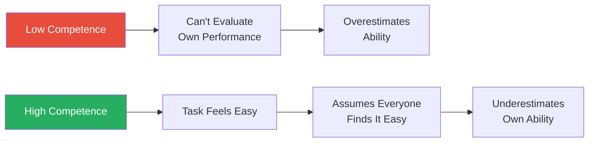

The Dunning-Kruger effect creates a paradox: confidence and competence are inversely related at both extremes — the most dangerous combination is maximum confidence with minimum skill.

---

### 28. Self-Serving Bias

*Your internal accountant is crooked — it takes credit for every win and blames external factors for every loss.*

- **Misconception:** You evaluate your successes and failures objectively
- **Truth:** You attribute successes to your own character and effort, and failures to outside forces and bad luck
- The pattern is consistent across cultures:
  - Ace an exam → "I studied hard and I'm smart"
  - Fail an exam → "The test was unfair" or "I was tired"
  - Win the contract → "My presentation was outstanding"
  - Lose the contract → "They had an inside connection"
- <b style="color: #27ae60">The self-serving bias protects your self-esteem, but it destroys your ability to learn from failure</b>
- McRaney connects this to sports fandom:
  - When your team wins, you say "we won" — identifying with the team
  - When your team loses, you say "they lost" — distancing yourself
  - This pronoun shift (called BIRGing and CORFing by psychologists) is the self-serving bias in linguistic form

> [!example] Student Exam Attributions
> - Researchers asked students to explain their performance after exams
> - Students who performed well attributed success to effort, intelligence, and preparation — all internal factors
> - Students who performed poorly blamed the test difficulty, confusing questions, or insufficient study time (external framing of what is arguably an internal failure)
> - The same students exhibited both patterns across different exams — it wasn't personality, it was the outcome driving the explanation
> - When the SAME student aced one exam and failed another, they used opposite attribution frameworks
> **The lesson:** You are not consistently generous or harsh with self-evaluation. You are consistently self-serving — generous when outcomes are good, harsh when you need someone else to blame.

- The bias has a social function:
  - Groups with inflated self-assessments tend to persist longer and take more risks
  - In evolutionary terms, overconfidence was often better than accurate self-assessment
  - But in modern contexts where feedback loops are delayed, the self-serving bias prevents the course corrections that complex problems demand

> [!tip] Core Insight
> The self-serving bias, hindsight bias, and confirmation bias form a devastating triple threat: you take credit for wins, blame losses on luck, "knew it all along," and only notice evidence that supports these conclusions. Breaking even one link in this chain dramatically improves your thinking.

---

### 30. Third Person Effect

*You believe propaganda works on other people but not on you — which is itself a form of propaganda working on you.*

- <b style="color: #2980b9">The third person effect</b> is the tendency to believe that persuasive media messages affect other people more than yourself
- **Misconception:** You are not as gullible as the average person; advertising and propaganda work on others, not you
- **Truth:** Everyone believes they are less susceptible to persuasion than the average person — which is statistically impossible
- This creates a dangerous blind spot:
  - Because you believe you're immune to advertising, you don't guard against it
  - Because you believe you're immune to propaganda, you don't critically examine your own media diet
  - <b style="color: #e74c3c">The belief that you're not being influenced is itself the most effective form of influence</b>
- McRaney points to political advertising as a prime arena:
  - Voters consistently report that campaign ads don't affect their choices
  - Political parties spend billions on advertising because the data shows it works
  - The disconnect between what voters believe about themselves and what the data reveals is the third person effect in action
- The effect is amplified by the illusion of unique invulnerability:
  - You think you're too smart, too educated, too media-savvy to be manipulated
  - Meanwhile, advertisers know that this confidence is precisely what makes you easy to target — people who don't guard against influence are the most influenced

> [!example] Third Person Effect in Advertising
> - McRaney describes a study where participants were shown advertisements for consumer products
> - Subjects consistently estimated that other people would be more influenced by the ads than they were
> - When asked about the same products weeks later, subjects' preferences had shifted in the direction of the ads they had seen
> - They were influenced — but remembered themselves as immune
> - The third person effect had blinded them to the very influence it predicted would only affect others
> **The lesson:** The confidence that you are resistant to persuasion is not a shield — it is the opening through which persuasion enters undetected.

---

### 36. Illusion of Transparency

*You think your internal states are written on your face — they're not.*

- <b style="color: #2980b9">The illusion of transparency</b> is the tendency to overestimate the degree to which your internal emotional state is apparent to others
- **Misconception:** When you feel nervous, anxious, or dishonest, other people can tell
- **Truth:** Other people are far less aware of your internal states than you believe
- McRaney draws on research showing:
  - Public speakers consistently believe the audience can see their nervousness — audiences rate them as far calmer than they feel
  - People who tell lies believe the deception is obvious on their face — in reality, detection rates are barely above chance
  - People experiencing strong emotions believe their feelings are "leaking out" — observers rarely notice
- The mechanism:
  - Because YOU are intensely aware of your own feelings, you assume this awareness is shared
  - This is an extension of the spotlight effect applied to internal states rather than external appearance
  - Your emotional experience is vivid to you and invisible to everyone else
- <b style="color: #27ae60">This is liberating once you internalise it — your nervousness, self-doubt, and discomfort are far less visible than you fear</b>

> [!example] The Transparency Experiment with Liars
> - Researchers asked subjects to taste both a pleasant and an unpleasant drink while keeping a neutral expression
> - Subjects were then asked how many observers could tell which drink was unpleasant
> - Subjects vastly overestimated how transparent their disgust was
> - Observers' detection was barely better than chance — despite subjects feeling certain their faces gave them away
> **The lesson:** Your internal experience feels like it must be visible on the outside. It almost never is.

> [!example] Public Speaking and Perceived Nervousness
> - In a separate line of research, public speakers were asked to rate their own visible nervousness on a 10-point scale
> - Audiences rated the same speakers independently
> - Speakers consistently rated themselves 2-3 points more nervous-looking than audiences perceived them to be
> - Even speakers who reported feeling "visibly shaking" were rated as composed by most audience members
> - The gap between felt nervousness and perceived nervousness was enormous — and consistent across experience levels
> **The lesson:** The next time you feel exposed in front of a group, remember: you are broadcasting on a channel that almost no one is receiving.

---

### 41. Self-Handicapping

*Sometimes you sabotage yourself on purpose — so that failure has a ready-made excuse.*

- **Misconception:** You always try your best to succeed
- **Truth:** Sometimes you create conditions for failure so that if you do fail, you have a built-in excuse that protects your self-image
- <b style="color: #2980b9">Self-handicapping</b> is a pre-emptive ego-protection strategy:
  - If you try your hardest and fail, the failure says something about your ability
  - If you don't try (or create obstacles), failure says nothing about your ability — you can always say "I didn't really try"
  - The cost: you also make success less likely
- Classic examples:
  - Going out drinking the night before a big exam
  - Not preparing for a presentation and then mentioning you "didn't have time"
  - Starting a project late so you can blame the timeline, not your skill
  - Claiming illness or exhaustion before a performance
- McRaney notes this is distinct from simple laziness:
  - The self-handicapper is not unmotivated — they are highly motivated to protect their self-image
  - The strategy is sophisticated: it creates a no-lose psychological scenario
  - If you fail → "I didn't really try"
  - If you succeed → "I'm so talented I succeeded without trying"

> [!example] Self-Handicapping in Academic Settings
> - Researchers found that students who doubted their ability were more likely to reduce study effort before exams
> - When they scored poorly, they pointed to their lack of preparation rather than their capability
> - When they happened to succeed despite not preparing, the success felt even more validating — "I'm so smart I passed without studying"
> - Either way, the ego is protected — but learning and growth are sacrificed
> **The lesson:** Self-handicapping trades real accomplishment for psychological safety. You protect your self-image at the cost of your actual performance.

- McRaney connects self-handicapping to a broader pattern of ego-protective behaviour:
  - Self-handicapping, the self-serving bias, and confabulation all serve the same master — the ego's relentless need to maintain a positive self-image
  - The self-serving bias protects you AFTER the outcome by biasing your explanation
  - Self-handicapping protects you BEFORE the outcome by rigging the conditions
  - Together, they create a person who can never genuinely fail — because every failure has a ready-made excuse, either pre-installed or post-manufactured
  - <b style="color: #e74c3c">The cost is invisible but enormous: you never learn your true capabilities because you never fully test them</b>

---

### 47. Illusion of Control

*You believe you can influence outcomes that are entirely random — and this belief persists even when you know better.*

- **Misconception:** You know how much control you have over your surroundings
- **Truth:** You often believe you have more control over the world than you actually do
- <b style="color: #2980b9">The illusion of control</b> manifests in surprisingly common behaviours:
  - People blow on dice before throwing, believing their breath affects the outcome
  - Lottery ticket holders who chose their own numbers value their tickets more than those assigned randomly — even though the odds are identical
  - People feel more confident about a coin flip if they throw it themselves
  - Gamblers who have been on a "hot streak" believe they have developed a skill at a game of pure chance
- Ellen Langer's research demonstrated the illusion clearly:
  - Subjects in a lottery who chose their own ticket wanted significantly more money to sell it than subjects who received a random ticket
  - The perceived control (choosing) increased the perceived value, despite no change in the actual odds
- The illusion of control serves an evolutionary purpose:
  - Organisms that believe they can affect outcomes try harder
  - Trying harder sometimes works (in environments where effort matters)
  - The bias persists because it was useful often enough — even though it misleads in purely random contexts
- <b style="color: #e74c3c">The danger is that the illusion of control makes you underestimate risk and overcommit to strategies that are actually random</b>
- McRaney connects the illusion of control to gambling:
  - Casino designers exploit this bias systematically
  - Slot machines let you pull a lever (action = illusion of control) rather than just pressing a button
  - Craps tables let you throw the dice yourself — creating the feeling that your technique matters
  - Poker is the exception: it genuinely involves skill. But the illusion of control makes every gambler believe every game involves skill

> [!example] Langer's Lottery Ticket Study (1975)
> - Ellen Langer ran an experiment at a company where employees could buy $1 lottery tickets
> - Half the employees chose their own ticket numbers; the other half were assigned random numbers
> - Before the drawing, a researcher offered to buy back the tickets
> - People with assigned tickets sold for an average of $1.96
> - People who had CHOSEN their ticket demanded an average of $8.67 — more than four times as much
> - Choosing the number created the illusion that the choice influenced the outcome
> **The lesson:** The act of choosing — any choosing, even when the choice is meaningless — creates a sense of control that inflates perceived value. Casinos, lotteries, and trading platforms all exploit this.

> [!example] Day Traders and the Illusion of Control
> - McRaney notes that day traders exhibit classic illusion-of-control behaviour
> - They develop elaborate systems and rituals that feel like skill
> - Studies consistently show that the vast majority of day traders underperform simple index funds
> - Yet the act of clicking "buy" and "sell" creates a powerful sense of agency
> - The more actively they trade, the more they feel in control — and the worse their returns tend to be
> - Passive investors outperform active ones on average, but passive investing FEELS like giving up control
> **The lesson:** The feeling of control and the reality of control have almost no correlation. Often the most effective strategy is the one that feels least like you're doing anything.

---

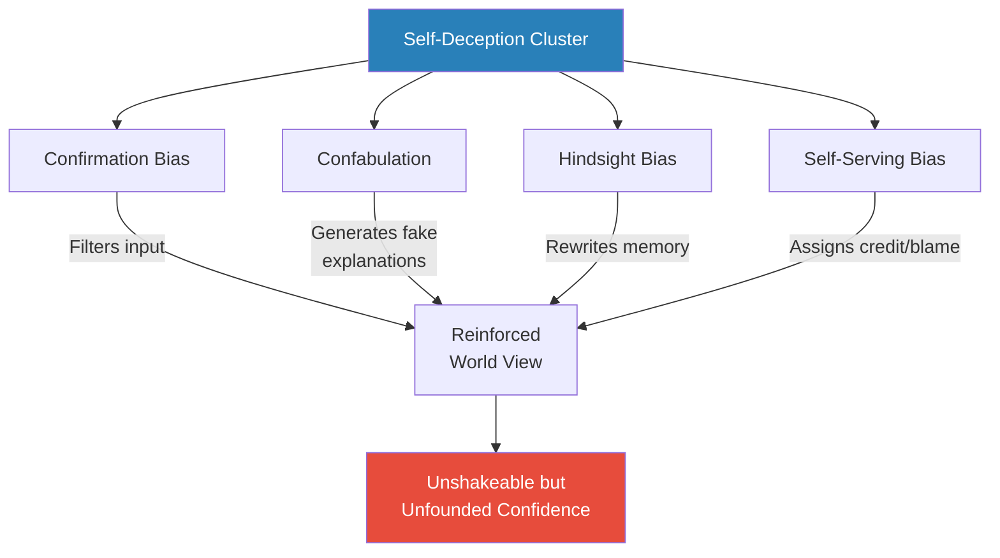

The self-deception biases form a closed loop — confirmation bias filters incoming data, confabulation generates explanations, hindsight bias rewrites the record, and the self-serving bias assigns credit and blame — all conspiring to produce an utterly confident person with an unreliable picture of reality.

---

## Cluster 2: Mental Shortcuts — The Heuristics That Save Time and Cost Accuracy

*Your brain processes 11 million bits of information per second but you're conscious of about 40. The shortcuts that manage this gap are brilliant — and systematically wrong.*

This cluster includes: Priming (#1), Availability Heuristic (#9), Supernormal Releasers (#24), Affect Heuristic (#25), Embodied Cognition (#38), Anchoring Effect (#39), Attention (#40), Moment (#43), Representativeness Heuristic (#45), and Expectation (#46). They share a common thread — the brain substituting fast, approximate answers for slow, accurate ones.

---

### 1. Priming

*What you were just exposed to shapes what you do next — and you have no idea it's happening.*

- <b style="color: #2980b9">Priming</b> is the phenomenon where exposure to one stimulus influences your response to a subsequent stimulus, without your conscious awareness
- **Misconception:** You know when you are being influenced by outside forces
- **Truth:** Priming can reach you through all your senses, planting ideas and altering behaviour without your knowledge
- The effect is startlingly powerful:
  - People who unscramble sentences containing words related to the elderly (Florida, grey, wrinkle) walk more slowly down the hallway afterward
  - People primed with words related to rudeness interrupt more quickly
  - Holding a warm cup of coffee makes you rate strangers as "warmer" people
  - Exposure to images of money makes people more selfish and less cooperative
- Priming operates through spreading activation in neural networks:
  - When one concept is activated, related concepts become more accessible
  - This accessibility then shapes perception, behaviour, and judgment
  - The process is entirely below conscious awareness

> [!example] John Bargh's Elderly Priming Study (1996)
> - NYU psychologist John Bargh gave students a scrambled-sentence task
> - One group's sentences contained words stereotypically associated with the elderly: "Florida," "forgetful," "bald," "grey," "wrinkle"
> - After the task, researchers timed how long students took to walk down the hallway to the elevator
> - Students primed with elderly-related words walked significantly more slowly
> - None of them were aware that the words had affected their behaviour
> - When told the purpose of the study, most flatly denied any influence
> **The lesson:** Your behaviour is shaped by stimuli you don't even notice. The environment is programming you constantly.

> [!example] Priming and Voting Behaviour
> - McRaney describes research showing that people who voted in schools were slightly more likely to support education funding than people who voted in churches or community centres
> - The physical environment primed different associative networks
> - Voters in schools had "children" and "education" more accessible in their minds at the moment of decision
> - The effect was small but statistically significant — and entirely unconscious
> **The lesson:** Even the physical location where you make a decision can prime you toward certain choices without your awareness.

- <b style="color: #27ae60">Awareness of priming doesn't necessarily protect you from it — the effects operate below conscious control</b>
- Priming connects to almost every other bias in the book — it is the delivery mechanism through which many biases are activated
- Important caveat: the Bargh elderly priming study has faced replication challenges in recent years
  - Some researchers have failed to reproduce the walking-speed effect
  - This does not mean priming is fake — hundreds of other priming studies replicate robustly
  - But it does illustrate that even the science of bias is subject to its own biases (publication bias, in this case)

> [!tip] Core Insight
> Priming reveals that the boundary between "you" and "your environment" is far more porous than you imagine. Your decisions, preferences, and behaviours are partly authored by whatever stimuli happened to precede them — and you never get a vote.

---

### 9. The Availability Heuristic

*You don't calculate probability — you estimate it based on how easily examples come to mind.*

- <b style="color: #2980b9">The availability heuristic</b> is the mental shortcut where you judge the likelihood of events based on how readily examples surface in your memory
- **Misconception:** You carefully calculate the risks and benefits of a decision before acting
- **Truth:** You base your estimation of risk on how easily you can think of examples, not on actual data
- This creates predictable distortions:
  - Vivid, emotional, or recent events are overweighted (plane crashes, shark attacks, terrorist attacks)
  - Common but undramatic events are underweighted (car accidents, heart disease, diabetes)
  - <b style="color: #e74c3c">You fear the wrong things</b> — you're more afraid of flying than driving, despite driving being statistically far more dangerous
- The media amplifies the availability heuristic enormously:
  - Rare but dramatic events get extensive coverage, making them feel common
  - Common but boring events get no coverage, making them feel rare
  - The result: your risk perception is a mirror of media coverage, not actual danger

> [!example] Shark Attacks vs. Vending Machines
> - McRaney points out that people drastically overestimate the danger of shark attacks
> - In the United States, roughly 1 person per year dies from a shark attack
> - Vending machines kill about 13 people per year (from machines tipping onto people)
> - Yet nobody is afraid of vending machines — because shark attacks are vivid, emotional, and extensively covered by media
> - The availability heuristic turns media coverage into perceived probability
> **The lesson:** The easier it is to picture something happening, the more likely you think it is — regardless of the actual statistics.

> [!example] Terrorism and Car Accidents
> - After the September 11 attacks, many Americans switched from flying to driving
> - German researcher Gerd Gigerenzer estimated this shift caused approximately 1,600 additional traffic fatalities in the year following 9/11
> - The availability of vivid terrorist images made flying feel deadly while driving felt safe
> - Statistically, the opposite was true — mile for mile, driving was far more dangerous
> **The lesson:** The availability heuristic doesn't just distort your perception — it changes your behaviour in ways that can be genuinely deadly.

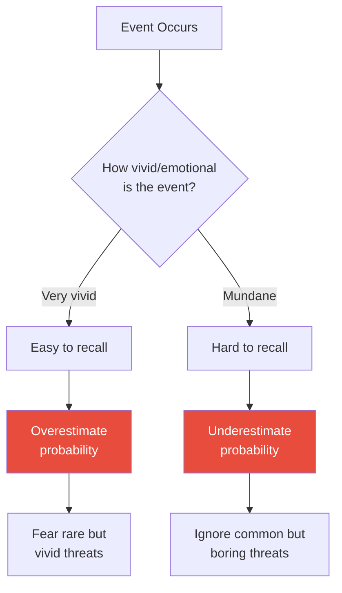

The availability heuristic explains why media coverage distorts risk perception — what gets covered becomes what feels dangerous, regardless of actual frequency.

- McRaney draws a direct connection to the [[Influence - Robert Cialdini|social proof]] principle:
  - When something is heavily covered, it feels not only more likely but also more important
  - News coverage creates a feedback loop: coverage increases perceived importance, perceived importance justifies more coverage
  - This is why "crime waves" can be entirely media-driven — crime may be decreasing while crime coverage increases, producing a population that feels less safe in an objectively safer world

> [!abstract] Defending Against the Availability Heuristic
> 1. **Seek base rates** — Before forming an opinion about risk, look up the actual statistics
> 2. **Notice the vividness** — When an example feels particularly compelling, that vividness is precisely what makes it misleading
> 3. **Ask "what's missing?"** — Media coverage shows you the dramatic; what undramatic risks are you ignoring?
> 4. **Compare across categories** — Your fear of flying vs. your comfort with driving is the availability heuristic in action
> 5. **Distrust recency** — The event that happened last week feels more likely than the identical event that happened last year

---

### 24. Supernormal Releasers

*Evolution built you to respond to certain triggers — and modern technology has learned to exploit those triggers at supernormal intensity.*

- <b style="color: #2980b9">Supernormal releasers</b> (or supernormal stimuli) are exaggerated versions of natural stimuli that trigger disproportionately strong responses
- **Misconception:** You are too smart to be manipulated by primitive psychological triggers
- **Truth:** Your brain responds to exaggerated versions of evolutionary stimuli with amplified and often uncontrollable reactions
- The concept comes from ethologist Nikolaas Tinbergen's research:
  - He found that birds preferred to sit on giant fake eggs over their own real eggs — the bigger stimulus produced a stronger nesting response
  - Butterflies preferred to mate with cardboard cutouts that had exaggerated wing patterns
  - The supernormal version of a trigger hijacks the response system
- McRaney applies this to modern life:
  - Fast food is a supernormal releaser for the calorie-seeking instinct — hyper-sweet, hyper-salty, hyper-fatty combinations that never exist in nature
  - Pornography is a supernormal releaser for sexual attraction
  - Social media "likes" are a supernormal releaser for social approval
  - Video games compress the reward cycle that in nature takes weeks into minutes

> [!example] Tinbergen's Oystercatcher Eggs
> - Nikolaas Tinbergen placed fake eggs near oystercatcher nests — some the same size as real eggs, some much larger
> - The birds consistently abandoned their own eggs to sit on the giant fakes
> - The instinct was "sit on the biggest egg" — an instruction that worked perfectly in nature, where all eggs were roughly the same size
> - The supernormal stimulus exploited a rule that had no exception clause
> **The lesson:** Your brain is running instinctual programs that evolved in a world without supernormal stimuli. Modern technology has learned to create triggers that are more compelling than anything nature ever produced.

- <b style="color: #e74c3c">The danger of supernormal releasers is that your response feels natural and rational — you don't feel manipulated, you feel drawn</b>
- The defence is recognising that intensity of desire is not evidence of genuine need
- McRaney draws a powerful parallel:
  - In nature, the superstimulus was impossible — no egg could be artificially giant
  - In modern life, superstimuli are everywhere — engineered by people who profit from your instinctual responses
  - The food industry, the entertainment industry, and social media platforms all compete to create the most compelling supernormal releasers
  - Your brain is running Stone Age software in a world of industrial-strength triggers

> [!example] Junk Food as Supernormal Stimulus
> - McRaney describes how fast food engineers combine sugar, salt, and fat at ratios never found in nature
> - Your ancestors' "eat whenever calories are available" instinct made perfect sense when calories were scarce
> - In a world of engineered hyper-palatable food, that same instinct drives overconsumption
> - The instinct hasn't changed — the environment has
> - A Dorito is to a wild berry what Tinbergen's giant egg is to a real one
> **The lesson:** Your cravings are not evidence of what your body needs — they are evidence of what your instincts were designed to pursue, hijacked by stimuli more powerful than anything evolution prepared you for.

---

### 25. The Affect Heuristic

*Your feelings about something determine what you believe is true about it — not the other way around.*

- <b style="color: #2980b9">The affect heuristic</b> is the mental shortcut where your current emotional state substitutes for careful analysis
- **Misconception:** You evaluate risks and benefits independently and rationally
- **Truth:** If you feel good about something, you perceive it as low-risk and high-benefit; if you feel bad about it, you perceive it as high-risk and low-benefit
- Risk and benefit are logically independent — something can be high-risk AND high-benefit
  - But emotionally, they are fused: good feelings suppress risk perception, bad feelings suppress benefit perception
- <b style="color: #27ae60">This is why first impressions are so powerful — the initial emotional response becomes the lens through which all subsequent information is filtered</b>
- The affect heuristic operates with remarkable speed:
  - Your emotional reaction forms in milliseconds — long before any "rational analysis" can begin
  - By the time you start "thinking" about something, the emotional verdict is already in
  - What you experience as "reasoning" is often just rationalisation of the emotional conclusion
- McRaney connects the affect heuristic to marketing and politics:
  - Advertisers don't try to convince you a product is good — they try to make you FEEL good about it
  - Political campaigns invest heavily in emotional messaging because the affect heuristic means the feeling you associate with a candidate matters more than their policy positions
  - The same policy described in "gain" language (saves 200 lives) versus "loss" language (400 will die) produces dramatically different emotional reactions — and therefore different "rational" assessments
- This connects to [[Influence - Robert Cialdini|Cialdini's liking principle]]:
  - If you like the salesperson, you like the product
  - The emotion toward the person transfers to the thing they're selling
  - This is not separate from the affect heuristic — it IS the affect heuristic applied to a social context

> [!example] Nuclear Power and the Affect Heuristic
> - When researchers asked people about the risks and benefits of nuclear power, those who felt positively about it rated it as low-risk and high-benefit
> - Those who felt negatively rated it as high-risk and low-benefit
> - Logically, something could be both risky AND beneficial — but emotions collapse these into a single dimension
> - The same pattern appeared for dozens of technologies: if people liked it, everything about it seemed good; if they didn't, everything seemed bad
> **The lesson:** Your emotional reaction to a topic determines your "rational" assessment of it — not the reverse. Mood is not separate from judgment; it IS judgment.

---

### 38. Embodied Cognition

*Your body doesn't just carry your brain around — it actively shapes what you think and feel.*

- <b style="color: #2980b9">Embodied cognition</b> is the finding that physical sensations influence abstract thought in surprising ways
- **Misconception:** Your thoughts and decisions are purely products of your mind
- **Truth:** Your body's current physical state influences your judgments, emotions, and choices
- The evidence is striking:
  - Holding a warm cup of coffee makes you rate others as having "warmer" personalities
  - Sitting in a hard chair makes you take a "harder" stance in negotiations
  - Holding a heavy clipboard makes you rate issues as more "weighty" or "serious"
  - Smiling (even forced) makes you feel happier; frowning makes you feel more critical
  - People who just washed their hands feel "morally cleaner" and judge moral transgressions less harshly
- The mechanism challenges the Cartesian divide:
  - Western philosophy has long treated mind and body as separate systems
  - Embodied cognition research shows they are deeply entangled
  - Physical metaphors ("heavy decision," "warm person," "hard stance") are not just language — they reflect genuine cognitive processes

> [!example] The Weight of Importance
> - Researchers asked subjects to evaluate job candidates while holding either a heavy or light clipboard
> - Subjects with heavy clipboards rated candidates as more serious, important, and qualified
> - The physical sensation of weight bled into their assessment of a person's gravitas
> - None of the subjects attributed their judgment to the clipboard
> **The lesson:** The physical environment in which you make a decision is not neutral — it shapes the decision itself in ways you cannot detect.

> [!tip] Core Insight
> The mind-body divide is an illusion. Your physical state is constantly leaking into your cognitive processing. If you want to change how you think about something, sometimes changing your body is faster than changing your mind.

- McRaney highlights the practical implications:
  - If you want someone to agree with you, serve them a warm drink, not a cold one
  - If you want a negotiation partner to be flexible, seat them in a soft chair, not a hard one
  - If you want to feel more confident, adopt a powerful posture — the body-to-mind pathway works in both directions
  - These findings aren't just laboratory curiosities — they operate in every meeting room, living room, and interview where physical context shapes mental judgment
- The connection to the affect heuristic is direct:
  - Embodied cognition shows that your body generates emotions
  - The affect heuristic shows that those emotions then substitute for rational analysis
  - The chain: body state → emotional state → "rational" judgment
  - <b style="color: #e74c3c">Your "considered opinion" may have been determined by your chair</b>

---

### 39. The Anchoring Effect

*The first number you encounter becomes the gravitational centre of all your subsequent estimates — even when it's completely arbitrary.*

- <b style="color: #2980b9">The anchoring effect</b> describes how an initial piece of information disproportionately influences subsequent judgments
- **Misconception:** You rationally analyse all factors before making a choice or determining value
- **Truth:** Your first perception lingers in your mind, affecting later perceptions and decisions
- The effect works even when the anchor is obviously irrelevant:
  - When subjects spun a rigged wheel that landed on either 10 or 65, then estimated the percentage of African nations in the UN, those who got 65 guessed higher numbers
  - Asking people "Did Gandhi die before or after age 9?" produces much lower age estimates than asking "before or after age 140?"
  - Neither anchor is remotely accurate, yet both powerfully shape the answer
- The anchoring effect works through two mechanisms:
  - **Insufficient adjustment:** You start from the anchor and adjust — but never adjust far enough
  - **Selective accessibility:** The anchor makes anchor-consistent information more mentally available

> [!example] Anchoring in Real Estate Appraisals
> - Researchers had licensed real estate agents appraise the same house
> - The only difference: the listing price shown to each agent was different
> - Agents who saw a higher listing price appraised the house significantly higher
> - When asked if the listing price influenced them, every agent said no — they relied on their "professional judgment"
> - Even experts with years of training cannot override the anchor
> **The lesson:** Whoever sets the anchor controls the negotiation. This applies to salary discussions, price negotiations, and sentencing recommendations.

> [!example] Anchoring in Criminal Sentencing
> - In one study, German judges rolled dice before sentencing
> - Judges who rolled high numbers gave significantly longer sentences
> - These were experienced professionals making consequential decisions — and random numbers still pulled their judgment
> **The lesson:** Anchoring does not respect expertise, experience, or the gravity of the decision. The first number matters more than all subsequent analysis.

> [!abstract] Defending Against Anchoring
> 1. Recognise that the first number in any negotiation or evaluation is an anchor, not information
> 2. Deliberately generate your own anchor before encountering the other party's
> 3. When you notice an anchor, consciously adjust away from it — then adjust further, because your first adjustment won't be enough
> 4. In negotiations, let the other side go first only if you believe their anchor will be reasonable

- <b style="color: #e74c3c">Anchoring is nearly impossible to eliminate — even when you know about it, the first number still exerts gravitational pull</b>

---

### 40. Attention (Inattentional Blindness)

*You think you see the world as it is — but you only see what you're paying attention to, and miss everything else.*

- **Misconception:** You are aware of most of what's happening around you
- **Truth:** You are spectacularly blind to anything you're not actively attending to
- <b style="color: #2980b9">Inattentional blindness</b> is the failure to notice fully visible, but unexpected, objects or events when your attention is engaged elsewhere
- McRaney references the famous gorilla experiment:
  - Subjects asked to count basketball passes among players wearing white failed to notice a person in a gorilla suit walking through the scene, beating its chest, and leaving
  - About 50% of subjects completely missed the gorilla
  - When shown the video again, they were astonished
- The implication runs deep:
  - You do not passively receive a complete picture of the world — your brain constructs a sparse model based on whatever you happen to be attending to
  - Everything outside your attention might as well not exist
  - <b style="color: #e74c3c">You are not a camera — you are a spotlight, and the vast dark stage around the beam goes entirely unseen</b>
- This relates to the broader phenomenon of **change blindness**:
  - When changes occur gradually or during a visual disruption (a blink, a cut in a video), people fail to notice even dramatic alterations
  - Simons conducted a follow-up where an experimenter asking directions was swapped with a completely different person mid-conversation — about 50% of subjects didn't notice
  - If you can miss a person being replaced by a different person, you can miss almost anything

> [!example] The Invisible Gorilla (Simons and Chabris, 1999)
> - Daniel Simons and Christopher Chabris showed subjects a video of two teams passing a basketball
> - Subjects were told to count the number of passes made by the team in white
> - During the video, a person in a gorilla costume walked through the frame, paused, beat its chest, and walked off
> - Roughly half of all subjects failed to see the gorilla
> - When asked afterward, many insisted the gorilla was not in the video — until shown it again
> - Even more remarkably, most subjects who were told about the gorilla beforehand and watched again missed ANOTHER unexpected change: the background curtain changing colour
> **The lesson:** Your brain does not record reality — it constructs a heavily edited version. When you're focused on one thing, you can miss something enormous happening right in front of you.

> [!example] The Door Study (Simons and Levin, 1998)
> - An experimenter approached a pedestrian on a college campus and asked for directions
> - Mid-conversation, two men carrying a door walked between them, briefly blocking the view
> - During the interruption, the experimenter was swapped with a completely different person — different height, build, clothing, and voice
> - About half of the pedestrians continued the conversation without noticing they were now talking to someone else
> **The lesson:** Your confidence that you would "obviously notice" is itself the illusion. Attention is not a wide-angle lens — it is a narrow beam, and everything outside that beam is invisible.

- McRaney extends the attention chapter into a broader point about the constructed nature of perception:
  - Your visual field feels complete and continuous — but it is actually stitched together from fragments
  - Your brain fills in gaps, invents continuity, and smooths over the seams
  - The result is a subjective experience that feels like a comprehensive recording but is actually a crude sketch embellished by assumption
  - This is not a minor glitch — it means that what you "saw" at any given moment is partly observation and partly fabrication
  - <b style="color: #27ae60">The practical implication: never trust your perception as complete. Whatever you noticed, there is always something you missed — and you will never know what it was</b>

---

### 43. The Moment (Peak-End Rule)

*You don't evaluate experiences based on their total quality — you evaluate them based on the peak and the ending.*

- **Misconception:** You evaluate experiences based on the sum total of every moment within them
- **Truth:** You judge experiences almost entirely by their peak intensity and how they ended
- <b style="color: #2980b9">The peak-end rule</b>, discovered by Daniel Kahneman, shows that:
  - A painful medical procedure that ends with a less painful period is rated as less unpleasant than a shorter procedure that ends at peak pain — even though the longer one involves more total pain
  - A holiday with one spectacular moment and a pleasant final day is remembered more favourably than a consistently good holiday with an awkward ending
  - The duration of the experience barely matters — only the peak and the end
- This has profound implications:
  - Customer experiences should end on a high note
  - If you want someone to remember an event positively, manage the ending
  - Your memory of past experiences is a poor guide to what you actually felt during them
- McRaney connects this to the "experiencing self" vs. "remembering self" distinction from Kahneman:
  - The experiencing self lives through every moment of a two-week holiday
  - The remembering self distils that holiday into the peak moment and the final day
  - These two selves want different things — the experiencing self wants comfort; the remembering self wants stories
  - When you plan based on what you'll "remember," you optimise for peaks and endings, not total experience
  - <b style="color: #27ae60">You are not one self — you are two, and they are in constant quiet disagreement about what constitutes a good life</b>

> [!example] Kahneman's Cold Water Experiment
> - Subjects immersed one hand in painfully cold (14°C) water for 60 seconds
> - In a separate trial, they immersed the other hand for 60 seconds at 14°C, followed by 30 additional seconds where the water was secretly warmed to 15°C — still uncomfortable, but slightly less so
> - When asked which trial they'd repeat, most chose the 90-second trial — even though it involved more total pain
> - The slightly warmer ending made the longer, more painful experience feel better in memory
> **The lesson:** Your memory doesn't add up total pleasure or pain — it overwrites the whole experience with how it peaked and how it ended.

> [!example] The Peak-End Rule in Colonoscopies
> - Kahneman and colleagues studied patients undergoing colonoscopies (before sedation was standard)
> - One group had the standard procedure; the other had the procedure extended slightly with a period of reduced discomfort at the end
> - Patients with the longer but better-ending procedure rated the experience as less painful
> - More importantly, they were more likely to return for follow-up procedures — which has genuine health implications
> - Adding a small amount of reduced pain at the end improved the memory of the entire experience
> **The lesson:** The peak-end rule is not just an academic curiosity — it shapes real decisions about health, relationships, and which experiences you choose to repeat.

---

### 45. Representativeness Heuristic

*You judge probability by similarity to a stereotype, ignoring base rates entirely.*

- <b style="color: #2980b9">The representativeness heuristic</b> leads you to estimate the probability of an event based on how similar it is to a prototype, rather than using actual statistical information
- **Misconception:** You can objectively assess the probability of something happening by weighing the evidence
- **Truth:** You rely on mental images and stereotypes to gauge probability, often ignoring relevant base rate data
- The core error: confusing resemblance with probability
  - If someone "looks like" a librarian, you estimate the probability that they ARE a librarian based on that resemblance
  - You ignore the base rate — there are far more salespeople than librarians in the world, so any random person is more likely to be a salesperson regardless of their appearance

> [!example] The Linda Problem (Tversky and Kahneman)
> - Subjects were told: "Linda is 31, single, outspoken, and very bright. She majored in philosophy and was concerned with issues of discrimination and social justice."
> - They were then asked: Which is more probable? (a) Linda is a bank teller, or (b) Linda is a bank teller and active in the feminist movement
> - Over 80% chose (b) — even though logically, the probability of two things both being true can never exceed the probability of just one of them being true
> - The description "sounded like" a feminist, so people judged by representativeness rather than logic
> **The lesson:** When a description matches a stereotype, your brain treats similarity as probability — ignoring the basic laws of mathematics in the process.

> [!example] The Engineer-Lawyer Problem
> - Subjects were told a group contained 70 lawyers and 30 engineers (or vice versa)
> - They were given personality descriptions of individuals and asked to estimate the probability that each was an engineer or lawyer
> - When descriptions matched the stereotype of an engineer (logical, enjoys puzzles), subjects rated the person as likely an engineer — regardless of the base rate
> - Even when told 70% of the group were lawyers, a "stereotypically engineering" description overrode the statistical information
> **The lesson:** Vivid descriptions overwhelm statistical reasoning. Base rates are the most important factor, but they feel abstract and boring, so your brain ignores them.

- McRaney adds a nuance that deepens the representativeness heuristic:
  - The heuristic is not just about stereotypes of people — it shapes how you evaluate any sequence or outcome
  - A coin that comes up HHTHTH feels more "representative" of random flipping than HHHHHH — but both sequences are equally likely
  - You mentally carry a model of what randomness "looks like" and reject outcomes that don't match it
  - This is why gamblers believe a string of reds must be followed by black — RRRRRR doesn't look "random enough"
  - <b style="color: #e74c3c">Your intuition about what random looks like is systematically wrong — and casinos profit from that error every day</b>

---

### 46. Expectation

*What you expect to taste, feel, or experience determines what you actually taste, feel, and experience.*

- **Misconception:** You perceive the world objectively and your senses deliver an unbiased picture
- **Truth:** Your expectations shape your perceptions, sometimes overriding the actual sensory input
- <b style="color: #2980b9">Expectation effects</b> are everywhere:
  - Wine labelled as expensive tastes better than wine labelled as cheap — even when it's the same wine
  - Painkillers work better when patients believe they are expensive
  - Food described with appetising language ("succulent Italian seafood") tastes better than the identical food described plainly ("fish fillet")
- The mechanism is not "fooling yourself" — it is actual neurological change:
  - Brain scans show that wine believed to be expensive produces more activation in pleasure centres than the same wine believed to be cheap
  - The experience is genuinely different, not just reported differently
  - <b style="color: #27ae60">Expectation doesn't just change what you say about an experience — it changes the experience itself</b>

> [!example] The Wine Price Experiment
> - Researchers gave subjects wines labelled with different prices — $5, $10, $35, $90
> - Some of the wines were identical, just relabelled
> - Subjects consistently rated the "expensive" wines as tasting better
> - fMRI scans confirmed: the medial orbitofrontal cortex (associated with pleasure) showed more activity when subjects believed the wine was expensive
> - The subjects were not lying — they genuinely experienced more pleasure
> **The lesson:** Your brain doesn't taste wine — it tastes wine plus your expectations about wine. The label changes the experience at a neurological level.

> [!example] The Placebo Effect and Expectation
> - McRaney connects expectation to the placebo effect — the most powerful demonstration of expectation shaping reality
> - Patients who receive sugar pills but believe they received painkillers report genuine pain reduction
> - Brain imaging shows actual changes in pain processing — the relief is not imagined
> - Even more remarkably, placebos labelled as "expensive" work better than placebos labelled as "cheap"
> - The patient's expectation literally changes the neurochemistry of their experience
> **The lesson:** Expectation is not just a cognitive overlay on reality — it rewires the reality at a biological level. What you believe about an experience becomes part of the experience itself.

- <b style="color: #2980b9">The expectation effect</b> has implications far beyond wine and medicine:
  - Students told a teacher is "warm" perceive them differently than students told the same teacher is "cold" — even though the teacher's behaviour is identical
  - Job candidates described as "brilliant" perform better in interviews than candidates described as "adequate" — because interviewers unconsciously create a warmer, more supportive environment
  - Expectation doesn't just change perception — it changes the interactions that create reality

---

## Cluster 3: Pattern Errors — Seeing Signal in Noise

*Your brain is a pattern-recognition machine — and its greatest strength is also its greatest weakness, because it finds patterns even where none exist.*

This cluster includes: Texas Sharpshooter Fallacy (#5), Apophenia (#12), Subjective Validation (#21), and Self-Fulfilling Prophecy (#42). These biases share a common mechanism — the brain imposing meaning, narrative, and causation onto random or ambiguous data.

---

### 5. The Texas Sharpshooter Fallacy

*You draw the target around the bullet hole and call it a bullseye.*

- <b style="color: #2980b9">The Texas Sharpshooter Fallacy</b> is the tendency to take a random cluster of data, find a pattern in it after the fact, and convince yourself the pattern was meaningful
- **Misconception:** You can spot patterns by looking at the data
- **Truth:** You tend to ignore data that doesn't fit, then draw conclusions from the data that remains
- Named after a man who fires randomly at a barn wall, then paints a target around the tightest cluster of bullet holes
- This is the error behind:
  - Cancer cluster scares (random geographic clustering is expected by chance)
  - "Hot streaks" in basketball (researchers found that apparent streaks are statistically indistinguishable from random sequences)
  - Stock market "technical analysis" patterns
  - Finding Bible codes, Nostradamus predictions, and other hidden messages in long texts

> [!example] Cancer Clusters and Random Chance
> - McRaney describes how communities occasionally notice that a surprising number of residents develop cancer
> - Terrified citizens demand investigations into local water, power lines, or factories
> - Epidemiologists consistently find that these clusters are expected by random chance — in any large population, some areas will have above-average cancer rates purely by statistics
> - But the human brain cannot accept that clustering can be random — it insists on a cause
> **The lesson:** Randomness produces clusters. Your pattern-seeking brain refuses to accept this, so it invents explanations for what is actually statistical noise.

> [!example] The Hot Hand in Basketball
> - Thomas Gilovich, Robert Vallone, and Amos Tversky analysed shooting records of the Philadelphia 76ers
> - Fans, players, and coaches all believed in "hot streaks" — that a player who makes several shots in a row is more likely to make the next one
> - The data showed no evidence of the hot hand — streaks in the records were statistically indistinguishable from what you'd expect from random coin flips
> - Despite this, the belief persists — because the pattern FEELS real
> **The lesson:** The feeling that you see a pattern is not evidence that a pattern exists. Your brain is wired to find streaks in randomness and then assign them meaning.

---

### 12. Apophenia

*You see faces in clouds, hear hidden messages in songs, and find meaning in coincidences — your brain manufactures pattern from chaos.*

- <b style="color: #2980b9">Apophenia</b> is the experience of seeing meaningful connections between unrelated things
- **Misconception:** You are perceptive and can spot connections others miss
- **Truth:** You are naturally inclined to see connections even where none exist — your brain imposes narrative on randomness
- This is the cognitive engine behind:
  - Conspiracy theories (connecting unrelated events into a coherent narrative)
  - Superstitions (wearing your "lucky shirt" because you won while wearing it)
  - Pareidolia — seeing faces in toast, rocks, or clouds
  - Gambling fallacies (believing past results influence future ones)
- <b style="color: #e74c3c">Apophenia is not a failure of the stupid — it's a feature of all human brains</b>
  - Evolutionarily, the cost of seeing a pattern that isn't there (false positive) was much lower than missing a pattern that was (false negative)
  - Better to see a lion in the bushes that isn't there than to miss one that is
- McRaney links apophenia to the power of narrative:
  - Humans are compulsive storytellers — you cannot look at a series of events without constructing a story that connects them
  - This is useful when the events ARE connected (detective work, scientific discovery)
  - It is dangerous when the events are NOT connected (conspiracy thinking, superstition)

> [!example] Gambler's Fallacy and Apophenia
> - McRaney describes the gambler's fallacy as apophenia applied to random sequences
> - After a roulette wheel hits red five times in a row, gamblers flock to black — "it's due"
> - The wheel has no memory; each spin is independent
> - But the human brain insists that patterns must "balance out" — it cannot accept that five reds in a row is just as likely as any other sequence
> - Casinos profit enormously from this belief — the history board showing recent results encourages pattern-seeking in a patternless process
> **The lesson:** Your brain is designed to find patterns. It will find them in coin flips, dice rolls, and stock charts — none of which contain the patterns your brain "discovers." The pattern is in your head, not in the data.

- McRaney draws a direct line from apophenia to conspiracy theories:
  - Conspiracy thinking is apophenia applied to political and social events
  - Unrelated data points — a coincidental meeting, an ambiguous statement, a surprising outcome — are woven into a coherent narrative by the pattern-seeking brain
  - The narrative feels compelling precisely because it connects things that otherwise seem random
  - <b style="color: #27ae60">The antidote to apophenia is not scepticism about everything, but the discipline to ask: "What would this look like if there were NO pattern here?"</b>
  - If the answer is "exactly the same as what I'm seeing," then the pattern is probably in your head
- Apophenia connects to the Texas Sharpshooter Fallacy — both involve finding signal in noise
  - The difference: the Texas Sharpshooter draws a target after shooting; apophenia doesn't even need a target — it manufactures the entire narrative from scratch
  - Together, they explain why humans are so easily convinced by coincidences, streaks, and "signs" — your brain is built to connect dots, even when the dots were placed randomly

---

### 21. Subjective Validation

*You accept vague, general statements as personally meaningful — especially when you want them to be true.*

- <b style="color: #2980b9">Subjective validation</b> (also called the Barnum effect or Forer effect) is the tendency to accept vague personality descriptions as uniquely applicable to yourself
- **Misconception:** You are critical of personality descriptions and can tell when they are generic
- **Truth:** If a statement is vague enough, you will find a way to make it fit — especially if you believe the source is credible
- This is the engine that powers:
  - Astrology and horoscopes
  - Cold reading by psychics
  - Personality quizzes in magazines
  - Some personality assessments in corporate settings
- The mechanism relies on two cognitive tendencies:
  - **Confirmation bias:** You focus on the parts that fit and ignore the parts that don't
  - **The desire to be known:** Being accurately described feels validating, so you unconsciously adjust the interpretation to make it fit

> [!example] Bertram Forer's Experiment (1948)
> - Psychologist Bertram Forer gave his students a "personalised" personality assessment
> - Every student received the identical description, cobbled together from horoscopes
> - Statements included: "You have a great need for other people to like you" and "You have a tendency to be critical of yourself"
> - Students rated the accuracy of their "unique" profile at an average of 4.26 out of 5
> - Forer revealed the deception — every single student had received the same text
> **The lesson:** Vague, flattering descriptions feel personally targeted because you fill in the specifics from your own experience. The statement doesn't need to be accurate — just ambiguous enough for you to project meaning onto it.

> [!example] Cold Reading and Psychics
> - McRaney describes how professional psychics and mentalists use the Barnum effect systematically
> - They deliver statements like "I sense you've experienced a significant loss" or "You sometimes feel misunderstood by those closest to you"
> - These statements apply to virtually everyone — but the listener interprets them as specific, accurate readings
> - The psychic then refines based on the subject's reactions (fishing for confirmation, ignoring misses)
> **The lesson:** When you believe someone has special insight into your character, even the most generic observation feels like a revelation.

- McRaney emphasises that subjective validation is not limited to fortune tellers and horoscopes:
  - Corporate personality assessments (like some uses of Myers-Briggs) rely on the same mechanism
  - You receive a type label ("INTJ," "Type A"), read the description, and feel deeply recognised
  - The description is often broad enough to apply to almost anyone, but the label creates a sense of precision
  - <b style="color: #e74c3c">The danger is not that these tools are useless — it is that the feeling of accuracy they produce far exceeds their actual predictive power</b>

---

### 42. Self-Fulfilling Prophecy

*What you expect to happen influences your behaviour, which makes the expected outcome more likely — creating the illusion that you predicted it.*

- **Misconception:** Predictions about the future are independent of the events that follow
- **Truth:** Your expectations alter your behaviour in ways that make those expectations come true
- The mechanism works through behavioural change:
  - Teachers told that certain students are "gifted" (selected randomly) treat those students differently
  - Those students then actually perform better — not because they were gifted, but because of the changed treatment
  - <b style="color: #27ae60">Expectations create reality — not through mysticism, but through the mundane mechanism of changed behaviour</b>
- Self-fulfilling prophecies operate in two directions:
  - **Positive:** Believing someone will succeed leads you to support them more, which helps them succeed
  - **Negative:** Believing someone will fail leads you to invest less, which ensures they fail
  - Both feel like confirmation of the original prediction

> [!example] Rosenthal and Jacobson's "Bloomers" Study (1968)
> - Researchers told teachers at an elementary school that certain students had been identified as "intellectual bloomers" who would show dramatic improvement
> - The "bloomers" were actually selected at random
> - By the end of the year, the randomly selected students showed significantly greater IQ gains than their classmates
> - Teachers had unconsciously given these students more attention, more challenging work, more encouragement, and more patience
> - The prophecy created the outcome it predicted
> **The lesson:** Labels create treatment, treatment creates outcomes, and outcomes confirm labels. The prophecy doesn't predict the future — it creates it.

> [!example] Self-Fulfilling Prophecy in Banking
> - McRaney notes that during bank panics, rumours that a bank is failing cause depositors to withdraw their money
> - The mass withdrawal then actually causes the bank to fail — because banks don't hold enough cash to pay all depositors at once
> - The prediction of failure caused the failure
> - The rumour didn't need to be true — it just needed to be believed
> **The lesson:** In social systems, beliefs don't just predict reality — they construct it. A confident enough expectation can become its own evidence.

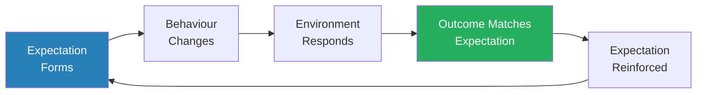

Self-fulfilling prophecies create closed loops — the expectation produces the behaviour that produces the outcome that confirms the expectation, making the whole system feel inevitable rather than constructed.

- McRaney notes that self-fulfilling prophecies are especially dangerous in institutional settings:
  - Racial profiling: if police stop and search one group more often, they find more contraband in that group, which "confirms" the need for more searching — even if the actual rate of carrying contraband is identical across groups
  - "Gifted" programs: labelling some children as gifted and others as average creates differential treatment that produces differential outcomes — which then appear to validate the original label
  - Economic confidence: if investors believe a company will succeed, they invest; the investment funds growth; the growth "proves" the investors were right
  - In each case, the prediction is not tested against reality — it CREATES reality

> [!tip] Core Insight
> Self-fulfilling prophecies are the mechanism by which beliefs become facts. They are not mystical — they operate through the mundane channel of behavioural change. What you expect from people changes how you treat them, which changes how they perform, which confirms your expectation. The most rational thing you can do is expect the best — because expecting the worst creates it.

---

## Cluster 4: Social Errors — How Other People Warp Your Judgment

*You think your opinions are your own and your actions are independent — but the presence, expectations, and behaviour of others bend your thinking in ways you cannot detect.*

This cluster includes: Bystander Effect (#10), Argument from Authority (#14), Public Goods Game (#19), Ultimatum Game (#20), Cult Indoctrination (#22), Groupthink (#23), Dunbar's Number (#26), Spotlight Effect (#29), Conformity (#33), Social Loafing (#35), and Fundamental Attribution Error (#48). They share a common theme — the enormous and often invisible influence of social context on individual thought and action.

---

### 10. The Bystander Effect

*The more people who witness an emergency, the less likely any individual is to help — because everyone assumes someone else will act.*

- <b style="color: #2980b9">The bystander effect</b> describes the phenomenon where the probability of help decreases as the number of bystanders increases
- **Misconception:** When someone is hurt, people rush to their aid
- **Truth:** The more people present, the less likely it is that anyone will help
- Two mechanisms drive it:
  - **Diffusion of responsibility:** Each person assumes someone else will act — "surely someone has already called 911"
  - **Pluralistic ignorance:** Each person looks at others' calm faces and concludes nothing is seriously wrong — "if it were an emergency, someone would be reacting"
- The combination is paralysing: everyone waits for someone else, everyone interprets everyone else's inaction as evidence that action isn't needed

> [!example] The Murder of Kitty Genovese (1964)
> - Catherine "Kitty" Genovese was attacked and murdered outside her apartment in Kew Gardens, Queens
> - The original reporting claimed 38 witnesses watched from their windows and did nothing — though later investigations revised the details
> - The case became the landmark event that inspired Darley and Latane's research into the bystander effect
> - Regardless of the exact number of witnesses, the psychological principle held: in experiments, people left alone in a room helped 85% of the time; when others were present, the rate dropped to 31%
> **The lesson:** Responsibility is not additive — it's divisive. The more people present, the less each individual feels personally responsible.

> [!example] Darley and Latane's Seizure Experiment (1968)
> - Subjects participated in a discussion through intercoms, believing they were talking to other students
> - One "student" (actually a recording) began having a seizure
> - When subjects believed they were the only one aware, 85% sought help
> - When they believed four others had also heard, only 31% acted
> - The presence of others — even unseen, imagined others — was enough to suppress the helping impulse
> **The lesson:** You don't need to be in a crowd to feel the bystander effect. Just believing that others know about the problem is enough to paralyse your response.

> [!abstract] Breaking the Bystander Effect
> 1. Single out one specific person: "You in the red shirt"
> 2. Give a direct, specific instruction: "Call 911 now"
> 3. Assign a second person a different task: "You — go find the defibrillator"
> 4. By naming individuals and assigning tasks, you collapse diffusion of responsibility

- <b style="color: #27ae60">The fix is simple: single out one person and give a specific instruction — "You in the red shirt, call 911"</b>
- McRaney notes the important nuance: the bystander effect is not about cruelty or apathy
  - People who fail to help are not bad people — they are paralysed by a specific psychological trap
  - The same person who walks past a victim in a crowd would rush to help if they were alone
  - The presence of others doesn't reduce your compassion — it diffuses your sense of personal responsibility
  - Understanding the mechanism is the first step to defeating it: if you know about the bystander effect, you can force yourself to act by saying "I need to be the person who steps forward"

---

### 14. Argument from Authority

*You believe experts because they're experts — even when they're speaking outside their expertise or when the consensus is wrong.*

- <b style="color: #2980b9">The argument from authority</b> is the logical fallacy of accepting a claim as true simply because an authority figure made it
- **Misconception:** You evaluate claims based on evidence
- **Truth:** You are strongly influenced by the perceived authority of the person making the claim, regardless of whether that authority is relevant
- This doesn't mean experts are always wrong — it means:
  - Expertise in one domain does not transfer to another
  - A Nobel Prize in physics does not make someone an authority on economics
  - Celebrity endorsements work not because celebrities know about the product, but because your brain confuses fame with expertise
- McRaney connects this to the Milgram obedience experiments:
  - Subjects administered what they believed were dangerous electric shocks to another person simply because a man in a lab coat told them to
  - The lab coat was the authority signal — it overrode the subjects' own moral judgment
  - 65% of subjects went all the way to the maximum shock level
- <b style="color: #e74c3c">The uniform, the title, the credentials — these are heuristic shortcuts that bypass your critical thinking</b>

> [!example] Milgram's Obedience Experiment (1963)
> - Stanley Milgram recruited ordinary people to participate in a "learning experiment"
> - Subjects were told to administer electric shocks to a "learner" (actually an actor) for wrong answers
> - The experimenter in a lab coat calmly instructed them to continue, even as the "learner" screamed and begged to stop
> - 65% of subjects administered the maximum 450-volt shock
> - Subjects were visibly distressed but continued because an authority figure told them to
> **The lesson:** Authority overrides personal judgment more powerfully than most people believe. You are not immune to this — you just haven't been tested yet.

- McRaney notes an important distinction between legitimate and illegitimate authority arguments:
  - Citing a relevant expert's findings is not a fallacy — it is efficient reasoning
  - The fallacy occurs when authority substitutes for evidence, or when the authority is irrelevant to the domain
  - A cardiologist's opinion on heart disease carries genuine weight; a cardiologist's opinion on tax policy does not
  - <b style="color: #27ae60">The question is not "does this person have credentials?" but "are those credentials relevant to this specific claim?"</b>
- The fallacy is amplified by the halo effect:
  - Success or expertise in one domain creates a "halo" that makes the person seem credible in all domains
  - This is why Nobel laureates get asked about politics, and why actors endorse products they have never used
  - Your brain treats authority as a general trait rather than a domain-specific qualification

---

### 19. The Public Goods Game

*When everyone benefits from cooperation but no one is forced to cooperate, freeloading becomes the rational individual choice — and destroys the collective outcome.*

- **Misconception:** People naturally contribute to the common good when it benefits everyone
- **Truth:** When contributions are voluntary and benefits are shared, freeloading is the dominant strategy — and most people eventually adopt it
- <b style="color: #2980b9">The public goods game</b> is a game theory experiment that reveals the tension between individual rationality and collective benefit:
  - Each player receives money and can contribute some to a shared pot
  - The pot is multiplied and divided equally among all players
  - The collectively optimal strategy: everyone contributes everything
  - The individually optimal strategy: contribute nothing and free-ride on others' contributions
- In experiments:
  - Initial rounds show moderate cooperation
  - As some players free-ride, cooperators reduce their contributions (they don't want to be suckers)
  - By the final rounds, contributions collapse toward zero
  - <b style="color: #27ae60">Cooperation requires enforcement or trust — without both, defection eventually dominates</b>
- McRaney draws the parallel to real-world public goods: taxes, environmental conservation, team projects where individual contribution is hard to track
- The game reveals why commons problems are so intractable:
  - Everyone benefits from a clean environment, but each individual benefits most by polluting freely while others restrain themselves
  - Everyone benefits from herd immunity, but each individual benefits most by skipping vaccination while others vaccinate
  - The individually rational choice, if universalised, destroys the collective benefit

> [!example] The Tragedy of the Commons in Lab Settings
> - In public goods experiments, researchers typically start by giving each player 20 tokens
> - Players can contribute any number to the communal pot; the pot is doubled and split equally
> - In the first round, average contributions are around 40-60% of holdings
> - By round 5, they've dropped to 20-30%
> - By round 10, they often approach zero — even though full cooperation would make everyone richer
> - Introducing the ability to punish free-riders (at a personal cost) restores cooperation dramatically
> **The lesson:** Cooperation doesn't emerge naturally from goodwill — it requires enforcement mechanisms. Without the ability to punish defectors, cooperation collapses.

---

### 20. The Ultimatum Game

*Rational economic theory says you should accept any free money — but humans consistently reject offers they consider unfair, even at a cost to themselves.*

- **Misconception:** People make financial decisions rationally, maximising their own benefit
- **Truth:** People will sacrifice their own material gain to punish behaviour they consider unfair
- <b style="color: #2980b9">The ultimatum game</b> works like this:
  - Player A receives $100 and must offer a split to Player B
  - Player B can accept (both keep their shares) or reject (both get nothing)
  - Rational choice theory says Player B should accept any offer above $0 — free money is free money
  - In practice, offers below about 30% are consistently rejected
- McRaney highlights what this reveals about human psychology:
  - We are not utility-maximising robots — we are fairness-enforcing social animals
  - The emotional cost of accepting an unfair offer outweighs the material benefit
  - Rejection is punishment — it signals "I'd rather hurt myself than let you get away with unfairness"
  - This is costly signalling: you demonstrate your willingness to enforce norms, even at personal expense
- Cross-cultural variations exist but the basic pattern is universal:
  - No culture shows pure rational self-interest
  - Fairness norms vary, but the willingness to punish unfairness at personal cost does not
- The ultimatum game exposes a fundamental flaw in classical economics:
  - Homo economicus would accept $1 out of $100 — it's better than nothing
  - Homo sapiens would rather burn $99 than let someone profit from disrespecting them
  - This means economic models that assume pure rationality will systematically mispreduce human behaviour in social contexts

> [!example] Cross-Cultural Ultimatum Games
> - Joseph Henrich studied ultimatum game behaviour across 15 small-scale societies on four continents
> - Offers ranged from 26% (Machiguenga in Peru) to 58% (Lamelara whale hunters in Indonesia)
> - Rejection rates varied too — but no culture accepted grossly unfair offers consistently
> - The Lamelara, who depend on cooperative whale hunting for survival, showed the highest offers
> - Societies with more market integration and cooperative norms tended toward more equal splits
> **The lesson:** Fairness is not a cultural luxury — it is a human universal, though its exact expression varies. The willingness to punish unfairness at personal cost appears to be wired deep into human social cognition.

---

### 22. Cult Indoctrination

*You think you'd never join a cult — but cults don't recruit gullible people; they recruit lonely, searching people in moments of vulnerability.*

- **Misconception:** Only weak-minded, unintelligent people join cults
- **Truth:** Cult indoctrination exploits universal human needs — belonging, meaning, certainty — and anyone can be vulnerable when those needs are unmet
- <b style="color: #2980b9">Cult indoctrination</b> follows a predictable sequence:
  - **Love-bombing:** Overwhelming the recruit with attention, affection, and belonging
  - **Isolation:** Gradually separating the recruit from outside relationships and information sources
  - **Incremental commitment:** Small, escalating requests that each seem reasonable in isolation but create deep psychological investment over time
  - **Thought-terminating cliches:** Simple phrases that shut down critical thinking ("That's just your ego talking," "Trust the process")
- McRaney connects this to several other biases in the book:
  - **Sunk cost fallacy:** The more you've invested in the group, the harder it is to leave
  - **Conformity:** The group's unanimity makes dissent feel impossible
  - **Cognitive dissonance:** Leaving would mean admitting you were wrong, so you rationalise staying
- <b style="color: #e74c3c">The vulnerability isn't stupidity — it's loneliness, transition, or crisis</b>
  - People who join cults are often going through a major life transition: divorce, death of a loved one, moving to a new city, graduating and feeling purposeless
  - The cult provides exactly what they need at that moment: certainty, community, and meaning
- McRaney draws an uncomfortable parallel to mainstream institutions:
  - The mechanisms cults use — love-bombing, incremental commitment, in-group/out-group thinking — are not unique to cults
  - Political parties, religious congregations, and even corporations use the same techniques, often unconsciously
  - The difference is one of degree, not kind
  - This doesn't mean all groups are cults — but it means the boundary is less clear than you'd like to believe

> [!example] Cult Recruitment Tactics
> - McRaney describes how groups like the Moonies would approach people at bus stations and college campuses
> - They didn't target confused-looking people — they targeted everyone, knowing that a small percentage would be in a vulnerable state
> - The initial contact was never about the group's beliefs — it was about warmth, food, and friendship
> - Only after the person felt emotionally attached did the ideological content begin
> - By then, leaving meant losing the only community that had shown them kindness
> **The lesson:** Cults don't sell ideology first — they sell belonging. The beliefs come later, after the emotional investment makes them hard to reject.

> [!example] The Foot-in-the-Door Technique in Cult Indoctrination
> - Cult recruiters use what psychologists call the "foot-in-the-door" technique
> - First request: "Come to a free dinner" — harmless, easy to accept
> - Second request: "Join us for a weekend retreat" — slightly bigger commitment
> - Third request: "Move into our community house" — significant step, but you've already invested
> - By the time the really extreme requests come (cut off your family, donate your savings), you've said yes so many times that saying no feels inconsistent with who you've become
> - Each small yes makes the next yes easier — and each invested step makes leaving harder (sunk cost)
> **The lesson:** Cult indoctrination doesn't work through dramatic conversion — it works through a long chain of small, reasonable requests, each building on the last until you're somewhere you never intended to be.

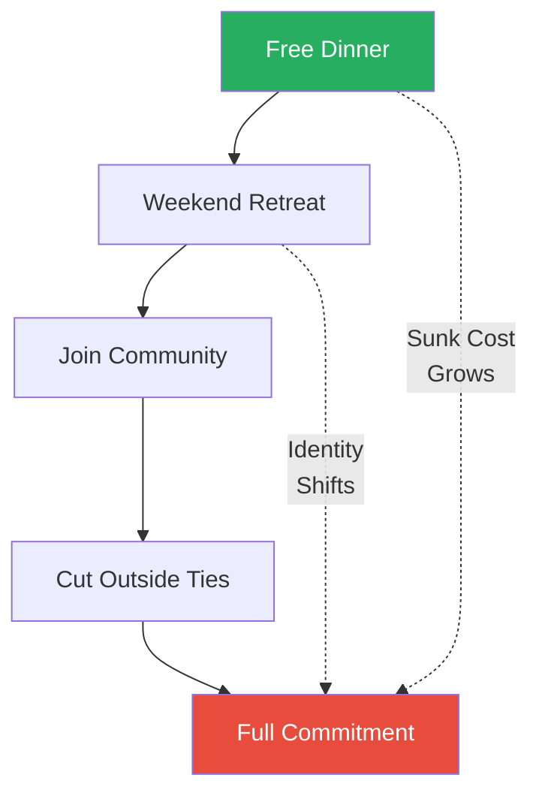

Cult indoctrination is a masterclass in incremental commitment — each step feels small and reasonable, but the cumulative effect is total transformation.

---

### 23. Groupthink

*When maintaining group harmony becomes more important than finding the right answer, groups converge on catastrophic decisions with total confidence.*

- <b style="color: #2980b9">Groupthink</b> is the phenomenon where the desire for conformity and harmony within a group overrides realistic appraisal of alternatives
- **Misconception:** Groups are smarter than individuals — the wisdom of crowds corrects individual errors
- **Truth:** Groups can be dumber than any individual member when social pressure suppresses dissent
- Irving Janis identified the symptoms:
  - Illusion of invulnerability — the group feels it cannot fail
  - Collective rationalisation — warning signs are explained away
  - Self-censorship — members withhold doubts to avoid being the dissenter
  - Illusion of unanimity — silence is interpreted as agreement
  - Direct pressure on dissenters — anyone who questions the consensus is marginalised

> [!example] The Bay of Pigs Invasion (1961)
> - President Kennedy and his advisors planned the CIA-backed invasion of Cuba
> - The plan was deeply flawed — a small brigade of exiles was expected to overthrow Castro's military
> - Several advisors had serious doubts but suppressed them, not wanting to appear weak or disloyal
> - The invasion was a spectacular failure and a major embarrassment
> - Kennedy later asked: "How could I have been so stupid?"
> - The answer: groupthink. Every condition Janis identified was present
> **The lesson:** Intelligence and expertise cannot protect a group from groupthink. The pressure to conform overrides individual judgment — especially when the stakes are high and the leader has already signaled a preference.

> [!example] The Challenger Disaster (1986)
> - McRaney references the Space Shuttle Challenger explosion as a textbook groupthink case
> - Engineers at Morton Thiokol warned that the O-ring seals could fail in cold temperatures
> - NASA management pressured them to approve the launch — the schedule could not be delayed
> - Engineers who initially voted against the launch were pressured to reconsider
> - The shuttle launched and exploded 73 seconds after liftoff, killing all seven crew members
> - The engineers knew — but the group dynamics ensured their knowledge was suppressed
> **The lesson:** Groupthink kills not because people don't know the right answer, but because the social cost of voicing it feels higher than the risk of staying silent.

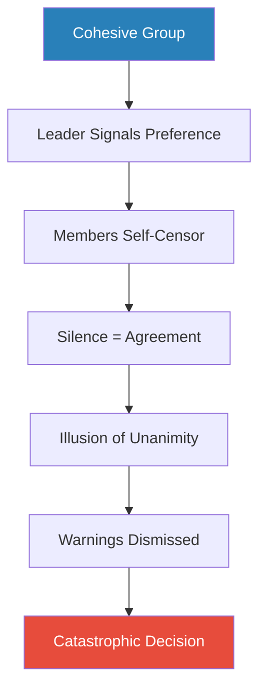

Groupthink is most dangerous in high-stakes, high-cohesion groups where loyalty to the group feels more important than getting the answer right.

---

### 26. Dunbar's Number

*Your brain has a hard limit on how many genuine social relationships it can maintain — and it's much smaller than your social media suggests.*

- <b style="color: #2980b9">Dunbar's number</b> (approximately 150) is the cognitive limit on the number of stable social relationships your brain can maintain
- **Misconception:** You can maintain meaningful relationships with hundreds or thousands of people
- **Truth:** Your brain's neocortex can track about 150 genuine social relationships — beyond that, people become abstractions
- Robin Dunbar found this number by correlating neocortex size with group size across primate species
- The number appears across human history:
  - Average size of a Neolithic farming village: about 150
  - Size of a basic unit in most professional armies: about 150
  - Average number of people you'd feel comfortable asking for a favour
- The layers beneath 150 are equally constrained:
  - ~5 intimate friends (your support clique)
  - ~15 good friends (your sympathy group)
  - ~50 close friends
  - ~150 casual friends
  - Beyond 150: acquaintances you recognise but can't meaningfully track
- <b style="color: #27ae60">Social media creates the illusion of breaking Dunbar's number — but having 2,000 Facebook friends doesn't mean your brain can maintain 2,000 relationships</b>
  - Most of those "friends" are effectively strangers
  - The brain treats them as abstractions, not individuals
- McRaney connects this to how empathy scales:
  - You can feel genuine empathy for 5 people
  - You can feel concern for 150 people
  - Beyond 150, people become statistics — "a million deaths is a statistic," as the saying goes
  - This is not a moral failing — it is a cognitive constraint
  - Aid organisations know this: they put one child's face on the donation appeal, not a crowd

> [!example] Military Units and Dunbar's Number
> - McRaney notes that effective military units throughout history have independently converged on sizes near 150
> - The Roman century (~80 soldiers), the modern US Army company (~150 soldiers)
> - At this size, everyone knows everyone, trust is personal, and social pressure enforces standards
> - Above 150, bureaucratic rules must replace personal accountability
> - The same pattern appears in business: companies like W.L. Gore (makers of Gore-Tex) deliberately cap their plants at about 150 employees — when a plant exceeds that number, they split it
> **The lesson:** The 150-person limit isn't arbitrary — it reflects the maximum number of social contracts your brain can track simultaneously. Beyond that, you need rules, hierarchies, and institutions to do what personal relationships can no longer manage.

---

### 29. The Spotlight Effect

*You are the centre of your own universe — but no one else's.*

- <b style="color: #2980b9">The spotlight effect</b> is the tendency to overestimate how much other people notice your appearance, behaviour, and mistakes
- **Misconception:** Everyone notices when you trip, stammer, or have a bad hair day
- **Truth:** No one is paying as much attention to you as you think
- The evidence is consistent:
  - Students who wore an embarrassing Barry Manilow T-shirt estimated that 50% of others noticed it — the actual figure was about 25%
  - People overestimate how much others notice their new haircut, their blemishes, their outfit
  - <b style="color: #27ae60">Everyone else is too busy worrying about their own spotlight to notice yours</b>
- The spotlight effect connects to the illusion of transparency:
  - You overestimate how visible your external appearance is (spotlight effect)
  - You overestimate how visible your internal states are (illusion of transparency)
  - Both stem from the same root: you are the centre of your own experience and cannot imagine that you aren't the centre of everyone else's
- McRaney notes the liberating implications:
  - Most social anxiety is driven by the belief that others are scrutinising you
  - The reality is that others are too consumed by their own spotlight effects to notice yours
  - The embarrassing moment you replay for days was probably forgotten by witnesses within minutes

> [!example] The Barry Manilow T-Shirt Study (Gilovich et al., 2000)
> - Researchers had subjects wear a T-shirt with Barry Manilow's face on it (chosen because pilot testing showed students found it embarrassing)
> - Subjects entered a room with other students and then estimated what percentage of people noticed the shirt
> - Subjects estimated about 50% noticed
> - The actual figure was about 25% — and even those who noticed probably didn't care
> - When the experiment was repeated with non-embarrassing shirts (Martin Luther King Jr., Bob Marley), subjects STILL overestimated how many people noticed
> **The lesson:** The spotlight effect isn't just about embarrassment — you overestimate attention to EVERYTHING about you. Your brain assumes you are the main character in everyone's story, when in reality you are barely an extra in theirs.

---

### 33. Conformity

*You adjust your behaviour and even your perceptions to match the group — and you do it so seamlessly that you don't notice.*

- **Misconception:** You are an independent thinker who forms your own opinions
- **Truth:** The presence and behaviour of others exerts enormous pressure on your perceptions, judgments, and actions
- <b style="color: #2980b9">Solomon Asch's conformity experiments</b> (1951) are the landmark demonstration:
  - Subjects were shown lines of obviously different lengths and asked which matched a reference line
  - When planted confederates unanimously gave a wrong answer, about 75% of subjects conformed at least once
  - Many conformed repeatedly, giving answers they could plainly see were incorrect
- Two types of conformity:
  - **Normative:** You go along to fit in — you know the group is wrong but don't want to be the outsider
  - **Informational:** You actually doubt your own perception — if everyone else sees it differently, maybe they're right and you're wrong
- McRaney emphasises that conformity is not always negative:
  - In many situations, conforming to the group IS the right choice — if everyone runs from a building, running too is smart even if you don't smell smoke
  - The problem arises when conformity suppresses genuine insight, when the lone dissenter IS right and the group IS wrong
  - History's greatest mistakes (and its greatest breakthroughs) often hinge on whether the dissenter spoke up or stayed silent
- <b style="color: #27ae60">The single most powerful defence against destructive conformity: having just one ally</b>
  - Asch found that when even ONE confederate gave the correct answer, conformity dropped by about 80%
  - You don't need a majority to resist — you just need one other person who sees what you see
  - This is why diverse groups make better decisions: diversity of perspective creates natural dissenters

> [!example] Asch's Line Experiment (1951)
> - A subject sat in a room with 7 confederates (who the subject believed were also participants)
> - The group was shown a reference line and three comparison lines — one was obviously the same length
> - The confederates went first and all gave the same wrong answer
> - Facing a unanimous group, about 1 in 3 subjects agreed with the obviously incorrect answer
> - In post-experiment interviews, some said they genuinely doubted their own eyes; others knew the group was wrong but didn't want to stand out
> - A single dissenter in the group dramatically reduced conformity — having even one ally broke the spell
> **The lesson:** Social pressure doesn't just change what you say — it can change what you actually see. Conformity operates at the level of perception, not just behaviour.

---

### 35. Social Loafing

*In a group, each individual contributes less effort — and nobody notices because the output is collective.*

- **Misconception:** When you work in a group, you contribute as much effort as if you worked alone
- **Truth:** People exert less individual effort in group settings because their contribution is harder to identify and evaluate
- <b style="color: #2980b9">Ringelmann's rope-pulling experiments</b> demonstrated this as early as the 1910s:
  - Individuals pulling alone exerted about 63 kg of force
  - In groups of 8, each individual averaged only about 31 kg — barely half
  - The larger the group, the less each individual contributed
- Social loafing increases when:
  - Individual contributions are not tracked
  - The task feels meaningless or the goal is unclear
  - The group is large enough to hide in
  - There is no accountability mechanism
- Social loafing decreases when:
  - Individual contributions are visible and measured
  - The task is meaningful and engaging
  - The group is small enough that each person's effort is noticeable
  - Group members care about each other's opinions
- McRaney connects social loafing to the bystander effect:
  - Both involve responsibility dilution in groups
  - The bystander effect dilutes responsibility to help; social loafing dilutes responsibility to contribute
  - Both are eliminated by the same intervention: making individual contributions identifiable
- <b style="color: #27ae60">The antidote to social loafing is visibility — when people know their specific contribution is being tracked, they work nearly as hard as they would alone</b>

> [!example] Ringelmann's Rope-Pulling (1913)
> - French agricultural engineer Max Ringelmann had people pull on a rope alone and in groups
> - Alone, each person pulled with about 63 kg of force
> - In groups of 2, per-person force dropped to about 53 kg
> - In groups of 3, it dropped to about 47 kg
> - In groups of 8, each person averaged only about 31 kg — barely half their solo effort
> - This wasn't coordination failure — people simply pulled less hard when they knew others were pulling too
> **The lesson:** Groups do not simply add individual efforts — they divide them. Each additional person in a group gives every other person an unconscious excuse to coast.

> [!example] Social Loafing in Brainstorming
> - McRaney notes that brainstorming sessions — often touted as a group creativity booster — consistently produce fewer and lower-quality ideas than the same number of individuals working alone
> - In groups, people self-censor, defer to dominant voices, and loaf on the assumption that others will carry the creative load
> - The feeling of productivity in a brainstorming session is usually greater than the actual productivity
> - Individuals working independently and then pooling their ideas outperform groups every time
> **The lesson:** The energy of a group feels productive. The data says otherwise. Individuals generate more ideas, and better ones, when their contribution is their responsibility alone.

---

### 48. The Fundamental Attribution Error

*When others fail, you blame their character. When you fail, you blame circumstances. Same event, opposite explanations.*

- <b style="color: #2980b9">The fundamental attribution error</b> is the tendency to attribute others' behaviour to their character while attributing your own behaviour to your circumstances
- **Misconception:** You evaluate others' actions based on a fair assessment of their situation
- **Truth:** You tend to explain others' behaviour by their personality ("he's lazy") while explaining your own by context ("I was exhausted")
- The asymmetry is consistent:
  - Someone cuts you off in traffic → "What a terrible driver"
  - You cut someone off → "I'm late for an important meeting"
  - Colleague misses a deadline → "She's disorganised"
  - You miss a deadline → "The requirements kept changing"
- The mechanism stems from perspective:
  - When you observe others, their behaviour is the salient feature — you don't have access to their internal state or circumstances
  - When you observe yourself, your circumstances are salient — you are acutely aware of the pressures, constraints, and reasons behind your actions
  - The asymmetry of available information produces the asymmetry of explanation

> [!example] The Castro Essay Experiment (Jones and Harris, 1967)
> - Subjects read essays either praising or criticising Fidel Castro
> - They were told the writers had been assigned their positions — they had no choice
> - Despite knowing the essays were assigned, subjects still believed the writers personally held the views they expressed
> - Even knowing the circumstances, subjects attributed the content to the writer's character
> **The lesson:** You default to character-based explanations even when you have been explicitly told about the situational constraints. The fundamental attribution error is not a failure of information — it is a failure of imagination.

> [!example] The Quiz Show Experiment (Ross, Amabile, and Steinmetz, 1977)
> - Researchers randomly assigned people to be either questioners or contestants in a quiz game
> - Questioners were told to write difficult questions from their own areas of knowledge
> - Unsurprisingly, contestants couldn't answer most questions — the questioner always had the advantage of asking about topics they personally knew well
> - Afterward, both contestants and observers rated the questioners as more knowledgeable than the contestants
> - Everyone ignored the massive structural advantage (you get to ask questions about what YOU know) and attributed the difference to intelligence
> **The lesson:** Even in a situation where the structural advantage is completely transparent, people still attribute the outcome to the person rather than the situation. The fundamental attribution error is not subtle — it persists even when the situational explanation is staring you in the face.

> [!tip] Core Insight
> The fundamental attribution error is the engine behind most interpersonal conflict. You give yourself the benefit of context while denying it to others. Flipping this default — asking "what circumstances might explain their behaviour?" — is one of the most powerful cognitive corrections available.

---

## Cluster 5: Persistence Errors — Why You Stay Stuck

*Some of the most costly biases aren't about what you believe — they're about what you refuse to let go of, even when the evidence says you should.*

This cluster includes: Procrastination (#6), Normalcy Bias (#7), Catharsis (#31), Extinction Burst (#34), Learned Helplessness (#37), and the Sunk Cost Fallacy. These biases share a common cost — they keep you locked into patterns that no longer serve you.

---

### 6. Procrastination

*You don't put things off because you're lazy — you put them off because the task triggers negative emotions that your present self desperately wants to avoid.*

- **Misconception:** You procrastinate because you are lazy or lack discipline
- **Truth:** You procrastinate because you are unable to manage your emotions about a task
- <b style="color: #2980b9">Procrastination is not a time management problem — it's an emotion management problem</b>
- The mechanism:
  - A task triggers anxiety, boredom, frustration, or self-doubt
  - Your present self wants to eliminate the negative emotion immediately
  - The easiest way: do something pleasant instead
  - The future self — the one who will suffer the consequences — is too abstract to override the present feeling
- <b style="color: #e74c3c">This is why deadlines work: they make the future consequence emotionally real NOW</b>
  - As the deadline approaches, the anxiety of NOT doing the task finally exceeds the anxiety of doing it
  - The panic zone is where procrastinators finally act — not because they've solved the emotional problem, but because a new, stronger emotion (fear of failure) has overridden the old one

> [!example] Present Self vs. Future Self
> - McRaney describes the procrastinator's fundamental conflict as a battle between two versions of yourself
> - Your present self feels the anxiety of starting and wants immediate relief
> - Your future self will face the consequences but has no voice in the current decision
> - Studies show people treat their future selves almost like strangers — fMRI scans reveal that thinking about your future self activates the same brain regions as thinking about other people
> - You are, in effect, dumping work on someone you don't know very well
> **The lesson:** You procrastinate because your brain treats your future self as someone else's problem. Making future consequences vivid and immediate is the only reliable antidote.

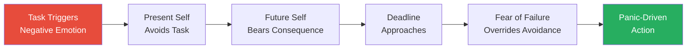

Procrastination is a battle between present comfort and future consequence — and the present almost always wins until the future becomes urgent enough to feel present.

- McRaney offers a key distinction between procrastination and laziness:
  - Lazy people don't care about the task and don't feel bad about not doing it
  - Procrastinators care deeply — they feel guilty, anxious, and stressed about not doing it
  - The emotional pain of procrastination is not the absence of motivation but the presence of overwhelming, poorly managed emotion
  - This is why time management systems fail procrastinators: the problem isn't that they don't know WHEN to do it — it's that they can't manage how they FEEL about doing it
- <b style="color: #2980b9">Temporal discounting</b> amplifies the problem:
  - Future rewards and punishments are neurologically "discounted" — they feel less real
  - A $100 reward tomorrow feels less valuable than $50 right now
  - A deadline in three weeks feels less urgent than a notification on your phone right now
  - The procrastinator's brain is not irrational — it is rationally responding to the discounted future, valuing present comfort over distant consequence

---

### 7. Normalcy Bias

*When the unthinkable happens, most people don't panic — they pretend everything is fine.*

- <b style="color: #2980b9">Normalcy bias</b> is the tendency to believe that things will continue to function the way they always have, even in the face of clear evidence to the contrary
- **Misconception:** Your fight-or-flight instincts kick in when disaster strikes and you act quickly
- **Truth:** You often freeze and pretend everything is normal when facing a deadly situation
- <b style="color: #e74c3c">The most common response to danger is not panic but denial</b>
- The bias is triggered by situations that fall outside your normal range of experience:
  - Because you have no mental script for "building on fire," your brain defaults to "everything is normal"
  - You wait for social cues from others — who are also waiting for cues from you (pluralistic ignorance again)
  - Precious minutes are wasted while everyone collectively pretends nothing is wrong
- Research on disaster survivors reveals a consistent three-phase response:
  - **Denial phase:** "This can't be happening" — often lasting minutes
  - **Deliberation phase:** "What should I do?" — looking to others for guidance
  - **Action phase:** Finally responding — but only after significant delay
  - The denial phase is where normalcy bias kills
- McRaney links normalcy bias to the broader issue of mental models:
  - Your brain maintains a model of "how the world works"
  - This model is updated incrementally, not revolutionarily
  - When reality diverges dramatically from the model, the brain's first response is to reject the new data rather than update the model
  - Updating the model requires cognitive effort; rejecting the data is effortless
  - This is why people near volcanoes refuse to evacuate, why people in flood zones don't move to higher ground until the water is at their door, and why employees of failing companies insist "it'll be fine"

> [!abstract] Defeating Normalcy Bias
> 1. **Pre-plan** — Have evacuation routes, emergency supplies, and action plans BEFORE an emergency
> 2. **Run mental simulations** — Regularly imagine disaster scenarios and your response (this builds a mental script your brain can follow)
> 3. **Assign a first-mover** — In any group, designate one person to act first, breaking the paralysis for everyone
> 4. **Distrust calm** — If everyone around you is calm during what should be an emergency, that calm is evidence of normalcy bias, not evidence of safety
> 5. **Know the statistics** — The biggest predictor of survival in disasters is speed of response, not physical fitness

> [!example] The Beverly Hills Supper Club Fire (1977)
> - On May 28, 1977, fire broke out at the Beverly Hills Supper Club in Southgate, Kentucky
> - Survivors reported that many patrons simply sat in their chairs after being told there was a fire
> - Some continued eating. Others waited to be told what to do
> - Busboy Walter Bailey entered the Cabaret Room and told the 900+ diners to evacuate — many stayed seated
> - 165 people died, many of them in their seats
> - Investigators found that the delay wasn't caused by blocked exits but by people refusing to believe the situation was real
> **The lesson:** In a genuine emergency, your biggest enemy is not panic but paralysis. The brain's first response is to normalise — to insist that what is happening cannot be happening.

> [!example] Hurricane Katrina Evacuations (2005)
> - Days before Hurricane Katrina made landfall, officials issued mandatory evacuation orders for New Orleans
> - Thousands of residents refused to leave, many saying "it's never been that bad before"
> - Normalcy bias convinced them that because past hurricanes hadn't been catastrophic, this one wouldn't be either
> - The hurricane killed over 1,800 people, many of whom had the means and time to evacuate
> **The lesson:** Past safety does not predict future safety. Normalcy bias turns historical comfort into present danger.

---

### The Sunk Cost Fallacy

*The money is spent. The time is gone. And yet you keep going — because walking away would mean admitting the loss.*

- <b style="color: #2980b9">The sunk cost fallacy</b> is the tendency to continue investing in something because of previously invested resources (time, money, effort) rather than future value
- **Misconception:** You make rational decisions based on the future value of objects, investments, and experiences
- **Truth:** Your decisions are tainted by the emotional investments you've accumulated, and the more you invest in something, the harder it becomes to abandon it
- Examples are everywhere:
  - You sit through a terrible movie because you paid for the ticket
  - Companies pour money into failing projects because they've already spent millions
  - Governments continue wars because of the lives already lost
  - You finish a bad book because you're "already halfway through"
  - You stay in a bad relationship because you've "invested years"
- The mechanism is emotional, not logical:
  - Walking away means crystallising a loss — and loss aversion makes losses feel roughly twice as painful as equivalent gains feel pleasurable
  - As long as you continue, you can maintain the fiction that the investment might pay off
  - Quitting forces you to admit the money/time/effort is gone — which feels like losing it all over again

> [!example] The Concorde Fallacy
> - The British and French governments jointly invested billions in the Concorde supersonic jet
> - It became clear early on that the plane would never be commercially viable
> - But neither government could stomach writing off their enormous investment
> - They continued funding for decades, losing money on every flight
> - Economists now call this pattern "the Concorde fallacy" — the poster child of sunk cost thinking
> - The irony: every year of continued funding was a NEW sunk cost, making the next year's exit even harder
> **The lesson:** Past spending is irrelevant to future decisions. The rational question is always: "From this point forward, what is the best use of my resources?" — but emotional attachment to sunk costs makes this question nearly impossible to ask honestly.

> [!example] The Vietnam War and Sunk Costs
> - McRaney connects the sunk cost fallacy to political and military decisions
> - As the Vietnam War dragged on, the mounting death toll became an argument FOR continuing rather than stopping
> - "We can't let their sacrifice be in vain" is a sunk cost argument — the lives lost cannot be recovered regardless of whether the war continues
> - But emotionally, withdrawal felt like betraying the dead
> - The result: thousands of additional lives lost to honour those already lost
> **The lesson:** The sunk cost fallacy is most dangerous when the sunk costs are measured not in money but in lives, years, or identity.

- <b style="color: #27ae60">The rational question is never "how much have I already invested?" but "what is the best use of my resources from this point forward?"</b>

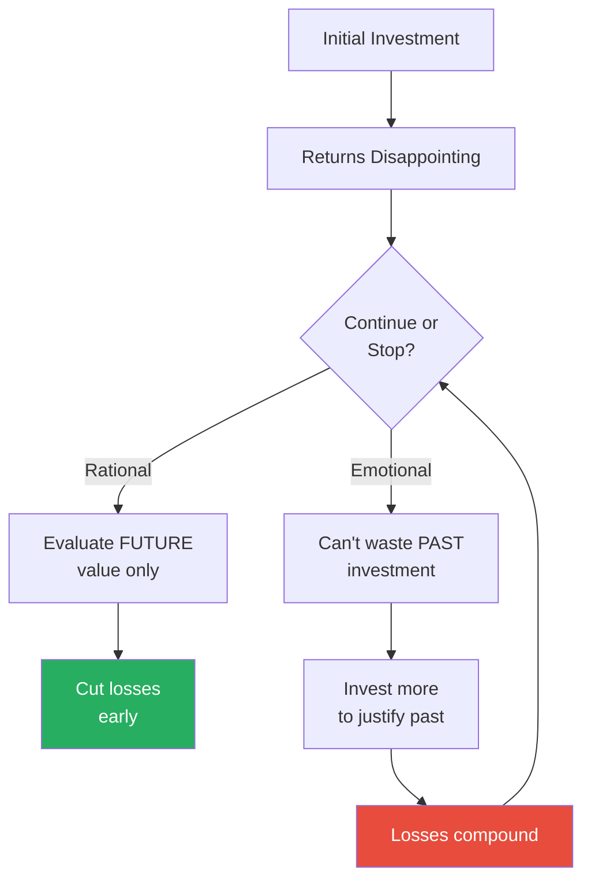

The sunk cost fallacy creates a vicious cycle — each additional investment makes the next exit harder, because now there's even more sunk cost to justify.

---

### 31. Catharsis

*Punching a pillow when you're angry doesn't release the anger — it rehearses it.*

- **Misconception:** Expressing anger and aggression reduces it — "letting off steam" makes you calmer
- **Truth:** Venting anger increases anger, not decreases it
- <b style="color: #e74c3c">The catharsis myth is one of the most dangerous popular psychology beliefs</b>
- The research is clear:
  - Bushman (2002) had angry subjects hit a punching bag — they became MORE aggressive, not less
  - Subjects who sat quietly calmed down faster than those who "vented"
  - Screaming, hitting objects, and ranting amplify the emotional state rather than draining it
- The mechanism:
  - When you express anger physically, your body enters a heightened state of arousal
  - Your brain interprets this arousal as evidence that you are VERY angry
  - The anger feeds on itself — expression becomes rehearsal
  - Each "venting" session trains the neural pathways associated with rage
- McRaney traces the catharsis myth to a misreading of Aristotle and Freud:
  - Aristotle spoke of catharsis in relation to tragedy and drama — watching a play purges emotions
  - Freud believed unexpressed emotions build up like steam in a boiler
  - Neither claim has survived empirical testing in the domain of anger
- <b style="color: #27ae60">The actual antidote to anger is the opposite of venting: distraction, delay, or reappraisal</b>
  - Distraction: do something unrelated until the arousal subsides
  - Delay: wait 20 minutes before responding — the prefrontal cortex regains control
  - Reappraisal: reframe the situation — "maybe they didn't mean it that way"
- McRaney connects catharsis to the broader problem of folk psychology:
  - Many widely believed psychological "facts" are the opposite of what research shows
  - "Vent your anger," "follow your heart," "opposites attract," "money can't buy happiness" — all are either wrong or far more nuanced than the folk version suggests
  - The catharsis myth persists because venting FEELS good in the moment — the arousal is pleasurable even as it makes you angrier
  - This is a general pattern in the book: things that feel like they're helping often aren't, and things that feel counter-intuitive (sit quietly when angry) are often the right move

> [!example] Bushman's Punching Bag Study (2002)
> - Brad Bushman had subjects write an essay, then gave them insulting feedback to make them angry
> - One group was told to hit a punching bag while thinking about the person who insulted them (the "catharsis" condition)
> - A control group sat quietly
> - The punching-bag group was MORE aggressive afterward — not less
> - They were more likely to blast a loud horn at a subsequent opponent than the group that did nothing
> **The lesson:** Venting anger is not like releasing steam from a pipe — it is like pumping fuel into a fire. The more you express, the more you feel.

---

### 34. Extinction Burst

*When a rewarded behaviour suddenly stops being rewarded, you don't calmly adjust — you escalate wildly before giving up.*

- <b style="color: #2980b9">Extinction burst</b> is the phenomenon where a behaviour that was previously reinforced suddenly intensifies when the reinforcement stops — before eventually fading
- **Misconception:** When you decide to change a habit or behaviour, the urge gradually diminishes
- **Truth:** The urge gets dramatically worse before it gets better
- The mechanism:
  - Your brain has learned that behaviour X produces reward Y
  - When the reward stops, the brain doesn't conclude "the reward is gone"
  - Instead, it concludes "I must not be doing the behaviour hard enough"
  - So it intensifies the behaviour — you press the elevator button harder, jiggle the vending machine, eat MORE when you're trying to eat less
  - Only after the escalation fails repeatedly does the brain finally give up
- McRaney illustrates with everyday examples:
  - A child who has always received a toy by crying in the store will cry louder and longer the first time a parent refuses
  - A vending machine that doesn't deliver makes you shake it, press buttons harder, insert coins again
  - A smoker trying to quit experiences the worst cravings not on day one, but a few days in — when the extinction burst peaks
- <b style="color: #27ae60">Understanding extinction bursts is crucial for anyone trying to break a habit — the worst moment is not the beginning but the peak of the burst, and that is when most people quit their attempt to quit</b>
- The practical takeaway:
  - Expect the burst — knowing it's coming makes it easier to ride out
  - The peak of the burst is the signal that you are about to break through, not a signal that you are failing
  - If you can survive the burst, the old behaviour fades rapidly

> [!example] The Vending Machine and Extinction Burst
> - McRaney uses the vending machine as a perfect everyday illustration
> - You insert coins, press a button, and your snack drops — this is reinforced behaviour
> - One day, you insert coins, press the button, and nothing happens
> - You don't calmly walk away — you press the button harder, multiple times, shake the machine, press every button
> - This escalation IS the extinction burst — your brain saying "the old method must work, I'm just not doing it hard enough"
> - Only after repeated failure does the brain finally accept the machine is broken
> - The same pattern plays out with diets, exercise routines, relationship patterns, and addictions
> **The lesson:** When trying to break a habit, the moment when the urge is most intense is not a sign that you're failing — it's a sign that you're about to succeed. The extinction burst is the final escalation before surrender.

> [!example] Extinction Bursts in Toddler Tantrums
> - Parents who decide to stop rewarding tantrums with attention face an immediate extinction burst
> - The child doesn't quietly accept the new policy — they scream louder, longer, and with more intensity than ever before
> - Many parents cave at this point, inadvertently teaching the child that EXTREME tantrums work
> - This creates a dangerous pattern: the child learns that escalation is the path to reward
> - Parents who hold firm through the burst see tantrums diminish rapidly — but only if they survive the peak
> **The lesson:** The worst moment of behaviour change is not the beginning — it is the peak of the extinction burst. Whoever is trying to change (parent, dieter, addict) needs to know this in advance, or the burst will feel like proof that change is impossible.

---

### 37. Learned Helplessness

*When you've been beaten down enough, you stop trying to escape — even when the door is wide open.*

- <b style="color: #2980b9">Learned helplessness</b> is the psychological state where repeated exposure to uncontrollable negative events leads you to stop trying to change your circumstances — even when change becomes possible
- **Misconception:** If you're in a bad situation, you'll always try to improve it or escape
- **Truth:** If you've experienced enough failure, your brain learns that trying is pointless — and applies this lesson even to new situations where success is possible
- Martin Seligman discovered this through a now-controversial animal experiment:
  - Dogs subjected to inescapable electric shocks eventually stopped trying to avoid them
  - When later placed in a situation where escape was easy, they lay down and whimpered rather than jumping over a low barrier
  - Dogs who had never experienced inescapable shocks jumped over the barrier immediately
- McRaney extends this to human contexts:
  - Students who experience repeated failure on rigged tasks stop trying even on solvable problems
  - People in chronically dysfunctional workplaces stop suggesting improvements — "nothing ever changes"
  - The helplessness generalises beyond the original domain:
    - Fail enough times at one thing, and you start assuming you'll fail at everything
    - The belief "I can't change this" mutates into "I can't change anything"
- McRaney connects learned helplessness to depression:
  - Seligman's research became foundational for understanding clinical depression
  - The depressive's inner monologue — "nothing I do matters," "things will never change," "why bother trying" — mirrors the learned helplessness response exactly
  - The difference between a healthy person and a helpless one is not the number of obstacles, but the belief about whether obstacles can be overcome
  - <b style="color: #27ae60">The antidote to learned helplessness is not success — it is experiencing agency: the proof, however small, that your actions can produce change</b>

> [!example] Seligman's Dog Experiments (1967)
> - Martin Seligman placed dogs in harnesses where they received unavoidable shocks
> - After repeated exposure, the dogs stopped trying to escape
> - When moved to a shuttle box where a simple jump would end the shocks, the helpless dogs lay down and took the pain
> - Control dogs who had not been pre-exposed to inescapable shocks jumped over immediately
> - The learned dogs had been taught, through experience, that effort is futile
> **The lesson:** Repeated exposure to situations you cannot control teaches your brain a dangerous lesson: "trying doesn't work." This lesson persists even when the situation changes and trying WOULD work.

> [!example] Learned Helplessness in the Workplace
> - McRaney describes how organisations create learned helplessness through repeated rejection of employee ideas
> - An employee suggests improvements; management ignores them
> - The employee tries again; the suggestion is dismissed
> - After enough cycles, the employee stops suggesting — not because they've run out of ideas, but because they've learned that suggesting is pointless
> - Management then concludes: "Our employees aren't engaged" — missing that they created the disengagement
> - The same pattern appears in abusive relationships: repeated cycles of helplessness teach the victim that escape is impossible, even when it objectively isn't
> **The lesson:** Learned helplessness is not laziness, apathy, or lack of intelligence. It is the rational response of a brain that has been trained, through experience, that effort doesn't produce outcomes. The fix is not motivation — it is restoring the connection between action and result.

> [!tip] Core Insight
> Learned helplessness explains why people stay in bad relationships, dead-end jobs, and destructive patterns long after the constraints have changed. The brain doesn't just respond to current reality — it carries forward the lessons of past helplessness, applying them even when they no longer apply.

---

## Cluster 6: Consumer Illusions and Logical Fallacies

*Your brain is not just wrong about the world — it's wrong in predictable ways that marketers, politicians, and debaters exploit daily.*

This cluster includes: Brand Loyalty (#13), Argument from Ignorance (#15), Straw Man Fallacy (#16), Ad Hominem Fallacy (#17), Just-World Fallacy (#18), Selling Out (#27). They share a common feature — they are the biases and fallacies most frequently exploited by people trying to sell you something, win an argument, or maintain a comfortable illusion.

---

### 13. Brand Loyalty

*You don't choose brands because they're better — you choose them to construct and defend an identity.*

- **Misconception:** You prefer the products you buy because of their quality and features
- **Truth:** You prefer them because they have become part of your identity, and attacking the brand feels like a personal attack
- <b style="color: #2980b9">Brand loyalty</b> is not consumer rationality — it's tribal identity:
  - Mac vs. PC, Coke vs. Pepsi, Ford vs. Chevy — these are not product comparisons, they are identity declarations
  - Once you identify with a brand, you process information about it through confirmation bias
  - Positive reviews reinforce your choice; negative reviews are dismissed as biased or uninformed
- In blind taste tests, people cannot reliably distinguish between Coke and Pepsi — but when told which is which, they report strong preferences and even show different brain activation patterns
- McRaney connects this to post-purchase rationalisation:
  - After buying a product, you unconsciously elevate its strengths and minimise its weaknesses
  - This is especially powerful for expensive purchases — the more you spent, the more you need to believe you chose well
  - Car buyers who just signed a contract become the car brand's most enthusiastic advocates — not because the car is great, but because the alternative (admitting a bad purchase) is psychologically unbearable
- The tribalism runs deep:
  - Mac users and PC users process criticism of their brand in the same brain regions that process personal attacks
  - Sports fans experience genuine physiological stress when their team is criticised
  - Brand communities develop their own language, rituals, and out-group antagonism — mirroring religious and ethnic communities
  - <b style="color: #e74c3c">When someone attacks your brand, your brain processes it as an attack on YOU — because at a neurological level, they are the same thing</b>

> [!example] The Mac vs. PC Wars
> - McRaney describes the intensity of the Mac-PC rivalry as a case study in brand-as-identity
> - Mac users don't just prefer their computers — they see Mac ownership as a reflection of their creativity, taste, and values
> - PC users don't just use Windows — they see their choice as reflecting practicality and independence from "marketing hype"
> - Both sides dismiss evidence of their brand's weaknesses as biased, incomplete, or irrelevant
> - The same confirmation bias that operates in politics operates in consumer choice — with equal intensity
> **The lesson:** Brand loyalty is not about the product — it is about who you believe you are. And identity, once adopted, will be defended against all evidence.

> [!example] The Pepsi Challenge and Brain Imaging
> - In blind taste tests, roughly half of subjects preferred Pepsi and half preferred Coke
> - But when researchers told subjects which drink was which before tasting, Coke won dramatically
> - Brain imaging studies by McClure et al. (2004) showed that knowing the brand activated the prefrontal cortex (identity and self-image areas), which overrode the sensory input
> - People weren't tasting the drink — they were tasting their identity
> **The lesson:** Brand loyalty is identity protection, not quality assessment. Attacking someone's brand preference is psychologically equivalent to attacking who they are.

---

### 15. Argument from Ignorance

*"You can't prove it's NOT true" is not evidence that it IS true — but it feels like it is.*

- **Misconception:** If something can't be disproven, it must have some truth to it
- **Truth:** The inability to disprove something is not evidence for its existence
- <b style="color: #2980b9">The argument from ignorance</b> (argumentum ad ignorantiam) reverses the burden of proof:
  - "You can't prove God doesn't exist, therefore God exists"
  - "You can't prove aliens aren't visiting Earth, therefore they might be"
  - "No one has shown this supplement is harmful, therefore it's safe"
- McRaney explains why this fallacy is so persistent:
  - Proving a negative is often logically impossible (you can't prove something doesn't exist everywhere in the universe)
  - This means the argument from ignorance is always available as a rhetorical move
  - It exploits our discomfort with uncertainty — we prefer ANY explanation to "we don't know"
- The proper standard: the burden of proof lies with the person making the positive claim
  - Extraordinary claims require extraordinary evidence
  - The absence of evidence against a claim is not evidence for it
- The argument from ignorance is seductive because it exploits a genuine epistemic gap:
  - We can never prove a universal negative ("there are NO aliens anywhere")
  - This permanent opening lets any unfalsifiable claim survive indefinitely
  - <b style="color: #e74c3c">The most resilient pseudosciences are those that can always say "you haven't disproven it yet"</b>

> [!example] Russell's Teapot
> - Philosopher Bertrand Russell proposed a thought experiment: imagine a tiny teapot orbiting the Sun between Earth and Mars
> - No telescope could detect it — too small
> - The fact that you can't disprove the teapot's existence doesn't mean it exists
> - Russell's point: the burden of proof lies with the person making the extraordinary claim, not with those who doubt it
> - This illustrates the argument from ignorance: the inability to disprove something is not evidence for it
> **The lesson:** "You can't prove it's NOT there" is not an argument — it's an admission that the claim has no positive evidence supporting it.

- McRaney connects the argument from ignorance to conspiratorial thinking:
  - Conspiracy theories thrive because they are unfalsifiable by design
  - Any evidence against the conspiracy is reinterpreted as evidence of the conspiracy's effectiveness at covering things up
  - "The lack of evidence IS the evidence" — this is the argument from ignorance taken to its logical extreme
  - The same structure protects pseudoscience: if a study fails to disprove alternative medicine, proponents treat that as vindication — ignoring that the study also failed to prove it works
- <b style="color: #27ae60">The antidote is demanding positive evidence rather than accepting the absence of disproof</b>
  - "What evidence would convince me this is true?" is a more productive question than "Can you prove it's false?"

---

### 16. The Straw Man Fallacy

*It's easier to win an argument when you're arguing against a position your opponent doesn't actually hold.*

- **Misconception:** When you disagree with someone, you address their actual argument
- **Truth:** You often unconsciously distort their position into something easier to attack, then argue against that instead
- <b style="color: #2980b9">The straw man fallacy</b> works through simplification and exaggeration:
  - Understanding someone's actual position requires effort and charity
  - Constructing a caricature of their position is easy and satisfying
  - Defeating the caricature feels like winning — even though you haven't engaged with the real argument
- McRaney gives everyday examples:
  - Person A: "I think we should have stricter gun regulations"
  - Person B: "So you want to take away everyone's guns and leave people defenceless"
  - Person B has not addressed Person A's actual position — they've constructed a weaker version that's easier to attack
- <b style="color: #e74c3c">The straw man is the single most common logical error in political debate, social media arguments, and everyday disagreements</b>
- The defence: steel-manning — the practice of constructing the strongest possible version of your opponent's argument before you critique it
- McRaney notes a subtlety: most straw-manning is not deliberate deception
  - You genuinely believe you understand the other person's argument
  - But understanding requires effort, empathy, and the willingness to sit with ideas you find uncomfortable
  - Under emotional pressure, your brain takes a shortcut: it constructs the version of their argument that is easiest to refute, not the version they actually hold
  - This is confirmation bias applied to argumentation — you seek the weakest version of the opposing view, just as you seek the strongest evidence for your own

> [!example] Straw Man in Everyday Arguments
> - McRaney illustrates with a common domestic scenario:
> - Partner A says: "I wish we spent more quality time together"
> - Partner B hears: "You think I don't care about you" (straw man)
> - Partner B responds defensively to the version they constructed, not the actual request
> - The argument escalates because they are now debating a claim Partner A never made
> - Most interpersonal conflicts involve at least one straw man — and often both sides are arguing against phantoms
> **The lesson:** Before you respond to someone's argument, repeat it back to them in your own words and ask "is that what you mean?" If you can't state their position in a way they'd endorse, you're fighting a straw man.

---

### 17. The Ad Hominem Fallacy

*Attacking the person making the argument doesn't address the argument — but it feels like it does.*

- **Misconception:** If the person making a claim is flawed, the claim must be flawed too
- **Truth:** The truth or falsity of a claim is independent of who says it
- <b style="color: #2980b9">Ad hominem</b> (Latin for "to the person") is the fallacy of attacking the character, motives, or circumstances of the person making an argument rather than the argument itself
- McRaney notes the emotional appeal:
  - It feels more satisfying to discredit a person than to dismantle their logic
  - Once the person is discredited, the audience dismisses their argument without examining it
  - This is why character attacks are so common in political campaigns — they're easier and more memorable than policy debates
- Forms of ad hominem:
  - **Abusive:** "You're an idiot, so your argument is wrong"
  - **Circumstantial:** "You're funded by the industry, so your research is biased"
  - **Tu quoque:** "You do it too, so you can't criticise me"
- The circumstantial form is tricky because funding sources CAN introduce bias — but the presence of a conflict of interest doesn't automatically invalidate the conclusion
- McRaney emphasises the emotional appeal of ad hominem:
  - Dismantling someone's logic is hard work
  - Discrediting the person is fast, satisfying, and plays well to an audience
  - This is why ad hominem attacks dominate social media: the format rewards speed and emotional punch over careful argument
  - <b style="color: #e74c3c">The question is never "do I trust this person?" but "is this argument valid?" — the two questions have different answers far more often than you think</b>

> [!example] Ad Hominem in Public Discourse
> - McRaney describes how climate change debates frequently devolve into ad hominem
> - Rather than evaluating the data, opponents attack the scientists: "They're funded by environmental groups" or "They want grant money"
> - Supporters counter with: "Deniers are funded by oil companies"
> - Neither attack addresses the actual evidence — both are ad hominem
> - The data is the data regardless of who collected it or who funded the collection
> **The lesson:** When you find yourself evaluating the messenger instead of the message, you've left the domain of logic and entered the domain of tribal politics.

---

### 18. The Just-World Fallacy

*You need to believe the world is fair — so badly that you'll blame victims rather than accept that bad things happen to good people.*

- <b style="color: #2980b9">The just-world fallacy</b> is the cognitive bias that leads people to believe that the world is fundamentally fair — that people get what they deserve
- **Misconception:** People get what is coming to them
- **Truth:** The world is neither just nor unjust — it is indifferent
- The psychological cost of accepting randomness is high:
  - If bad things happen to good people randomly, then bad things could happen to YOU randomly
  - This is terrifying — so your brain protects you by constructing stories where victims "deserved" their fate
  - "She must have done something" / "He should have been more careful" / "They made bad choices"
- <b style="color: #e74c3c">The just-world fallacy is the cognitive engine behind victim-blaming</b>
- It serves a deep psychological need:
  - If the world is just, then your good fortune is earned and your future is safe
  - If the world is random, then everything you have could be taken away without warning
  - The just-world belief is a security blanket — comforting but false

> [!example] Melvin Lerner's Shock Experiment (1966)
> - Psychologist Melvin Lerner had subjects watch a person (actually a confederate) receive what appeared to be painful electric shocks
> - When subjects believed they could end the shocks, they rated the victim sympathetically
> - When subjects believed they could NOT end the shocks, they began to derogate the victim — rating them as less likeable, less intelligent, less deserving of help
> - The inability to help created cognitive dissonance: "I'm watching someone suffer and doing nothing." The resolution: "They must deserve it"
> **The lesson:** When you cannot prevent someone's suffering, your brain protects you by deciding the victim deserves their fate. This is not cruelty — it's a cognitive defence mechanism against the terror of random misfortune.

> [!example] Victim-Blaming in Everyday Life
> - McRaney describes how the just-world fallacy shapes responses to poverty, illness, and crime
> - "Poor people are poor because they're lazy" ignores structural factors
> - "If she dressed differently, she wouldn't have been harassed" shifts blame from perpetrator to victim
> - "He wouldn't have gotten sick if he'd taken better care of himself" treats disease as punishment
> - In each case, the observer preserves their belief in a controllable, fair world by attributing the victim's misfortune to their own behaviour
> **The lesson:** The just-world fallacy doesn't make you cruel — it makes you blind to randomness. Recognising it is the first step toward genuine empathy rather than reflexive blame.

---

### 27. Selling Out

*You think "selling out" is a real thing — but the concept is more about your identity than about anyone else's artistic integrity.*

- **Misconception:** Artists and creators who adapt their work for commercial success have betrayed their principles
- **Truth:** The concept of "selling out" says more about YOUR need for authenticity signals than about the creator's actual integrity
- McRaney treats this as a consumer identity phenomenon:
  - When a band, artist, or brand you identified with goes mainstream, you feel a sense of loss
  - The loss is not about their music changing — it's about your identity marker becoming common
  - "Selling out" is the label you apply when your in-group distinction is diluted
- This connects to brand loyalty:
  - Part of the value of a niche brand is its exclusivity — it signals that you are different
  - When the brand goes mainstream, that signal is lost
  - You feel betrayed — but the betrayal is really about your social identity, not their artistic choices
- <b style="color: #2980b9">The "selling out" accusation</b> reveals more about the accuser's need for distinction than about the accused's artistic integrity
- McRaney connects this to broader questions about authenticity:
  - We want our artists, brands, and cultural markers to stay "pure" — meaning exclusive to our in-group
  - When they become popular, the exclusivity that made them valuable as identity signals disappears
  - The feeling of betrayal is real, but the betrayal is of your social signalling, not of artistic principles
- This is the consumer version of the third person effect:
  - You believe you chose the band because they were genuinely good
  - In reality, part of the appeal was that knowing about them signalled sophistication, independence, or taste
  - When everyone knows about them, that signal is gone — and you blame the band instead of examining what you actually valued

> [!example] Indie Bands Going Mainstream
> - McRaney describes the predictable lifecycle of fan resentment:
> - Phase 1: A small band attracts devoted fans who feel special for discovering them
> - Phase 2: The band gains popularity and signs with a major label
> - Phase 3: Original fans accuse the band of "selling out" — even if the music is identical
> - Phase 4: Original fans find a new obscure band and repeat the cycle
> - The music didn't change — the social currency did
> **The lesson:** "Selling out" is rarely about artistic compromise. It is about the loss of exclusivity, which was always part of what made the band valuable to you as a social signal.

- McRaney's deeper point is about the nature of authenticity itself:
  - You believe authenticity is an objective quality that some artists have and others don't
  - In reality, "authentic" usually means "not yet popular enough for me to feel mainstream for liking them"
  - The same art, the same values, the same output — the only variable that changed was audience size
  - This reveals something uncomfortable about your own consumer behaviour: you care about exclusivity more than you admit, and you dress it up in the language of artistic integrity
  - <b style="color: #e74c3c">When you accuse someone of selling out, the person you are really protecting is yourself — from the realisation that your taste was partly a social strategy</b>

---

## Cluster 7: Memory Errors — Your Past Is Fiction

*You think your memories are recordings — they're reconstructions, rebuilt from scratch every time you recall them, and altered in the process.*

This cluster includes: Misinformation Effect (#32) and Consistency Bias (#44). These biases share a common mechanism — memory as reconstruction rather than replay.

---

### 32. The Misinformation Effect

*Your memories can be rewritten by information you encounter after the event — and you'll never know the difference.*

- <b style="color: #2980b9">The misinformation effect</b> describes how post-event information can alter your memory of the original event
- **Misconception:** Your memories are like a video recording — accurate, stable, and reliable
- **Truth:** Memories are reconstructed each time you recall them, and new information can be woven into old memories without your awareness
- Elizabeth Loftus's research demonstrated this powerfully:
  - After showing subjects a video of a car accident, asking "how fast were the cars going when they smashed into each other?" produced higher speed estimates than "how fast were the cars going when they contacted each other?"
  - Subjects asked with the word "smashed" were also more likely to "remember" seeing broken glass — even though there was none in the video
  - A single word in a question altered what subjects saw in their memory
- <b style="color: #e74c3c">The implication for eyewitness testimony is devastating — witnesses are not recalling what happened; they are constructing a narrative influenced by every question they've been asked and every news report they've seen since</b>
- McRaney notes the legal consequences:
  - The Innocence Project has exonerated hundreds of wrongly convicted people
  - In about 70% of those cases, faulty eyewitness testimony was a primary factor
  - Witnesses were confident in their memories — and completely wrong

> [!example] Loftus and the Lost-in-the-Mall Study
> - Loftus asked family members of subjects to provide three true childhood memories
> - She then added a fourth, completely false memory: being lost in a shopping mall as a child
> - After repeated interviews, about 25% of subjects "remembered" the false event — including adding vivid details that never happened
> - Some insisted the false memory was real even after the deception was revealed
> - Subjects didn't just "go along" — they generated sensory details, emotions, and narrative structure for events that never occurred
> **The lesson:** Memories are not stored files — they are stories your brain rebuilds each time you access them. And each rebuilding is an opportunity for alteration.

> [!example] Loftus's Car Crash Verb Experiment
> - Subjects watched an identical video of a car accident
> - Different groups were asked: "How fast were the cars going when they _____ each other?"
> - The blank was filled with: contacted, hit, bumped, collided, or smashed
> - "Smashed" produced an average estimate of 40.8 mph; "contacted" produced 31.8 mph
> - A week later, the "smashed" group was more likely to falsely remember seeing broken glass
> **The lesson:** The words used in a question don't just influence answers — they alter the underlying memory itself.

---

### 44. Consistency Bias

*You rewrite your past self to be consistent with your present self — and you do it so thoroughly that you believe you've always been who you are now.*

- <b style="color: #2980b9">Consistency bias</b> is the tendency to recall your past attitudes and behaviours as being more similar to your current ones than they actually were
- **Misconception:** You have a good understanding of how your beliefs have changed over time
- **Truth:** You reconstruct past beliefs to align with present ones, creating a false sense of consistency
- This serves the ego:
  - If you've always believed what you believe now, your current beliefs feel more stable and justified
  - Change feels threatening — so your brain erases the evidence of change
  - You remember "always knowing" things you only recently learned
- McRaney connects this to political attitudes:
  - People who change their position on an issue often don't remember having held the opposite view
  - After converting to a new belief, they reconstruct a history of "always" leaning that way
  - This makes them feel consistent rather than converted — and consistency feels more trustworthy than change
- The consistency bias interacts with hindsight bias:
  - Hindsight bias says "I knew the outcome all along"
  - Consistency bias says "I've always believed what I believe now"
  - Together, they erase your history of being wrong, uncertain, or conflicted — leaving a false impression of a mind that has always been right
- McRaney provides vivid examples:
  - People who change their minds about a politician often cannot recall their previous opinion
  - Married couples who are currently happy "remember" always being happy (even if objective records show periods of conflict)
  - Divorced couples who are currently unhappy "remember" always being unhappy (even if they were demonstrably happy for years)
  - The present rewrites the past so completely that the rewrite becomes the only version you can access

> [!example] Consistency Bias in Relationships
> - Researchers studied married couples longitudinally, measuring their feelings at regular intervals over years
> - When asked later to recall how they felt at earlier time points, subjects' memories aligned with their CURRENT feelings, not their actual earlier responses
> - Couples who were currently happy recalled being happier in the past than they actually reported being
> - Couples who were currently unhappy recalled being less happy than they actually were
> - The past was reconstructed to be consistent with the present — the real emotional history was lost
> **The lesson:** You don't remember your past — you reconstruct it from the vantage point of who you are now. Your personal history is not a record; it is a story that changes every time you update the narrator.

> [!example] Political Consistency Bias
> - McRaney describes studies where researchers tracked voters' positions on key issues over several years
> - When voters who had shifted positions were asked to recall their earlier stance, they consistently reported holding views closer to their current ones
> - A voter who had been moderately pro-choice and shifted strongly pro-choice would "remember" always being strongly pro-choice
> - The shift itself disappeared from memory — replaced by a narrative of stable, consistent conviction
> - This is why political converts are often the most zealous advocates: they don't remember a time when they thought differently
> **The lesson:** Your brain prefers a narrative of unchanging conviction over an accurate record of intellectual evolution. Growth and change are real, but your memory makes them invisible.

---

## The Architecture of Irrationality

*Understanding why your brain works this way — not just cataloguing the errors — reveals the deeper truth: these biases are features, not bugs. They just weren't designed for the modern world.*

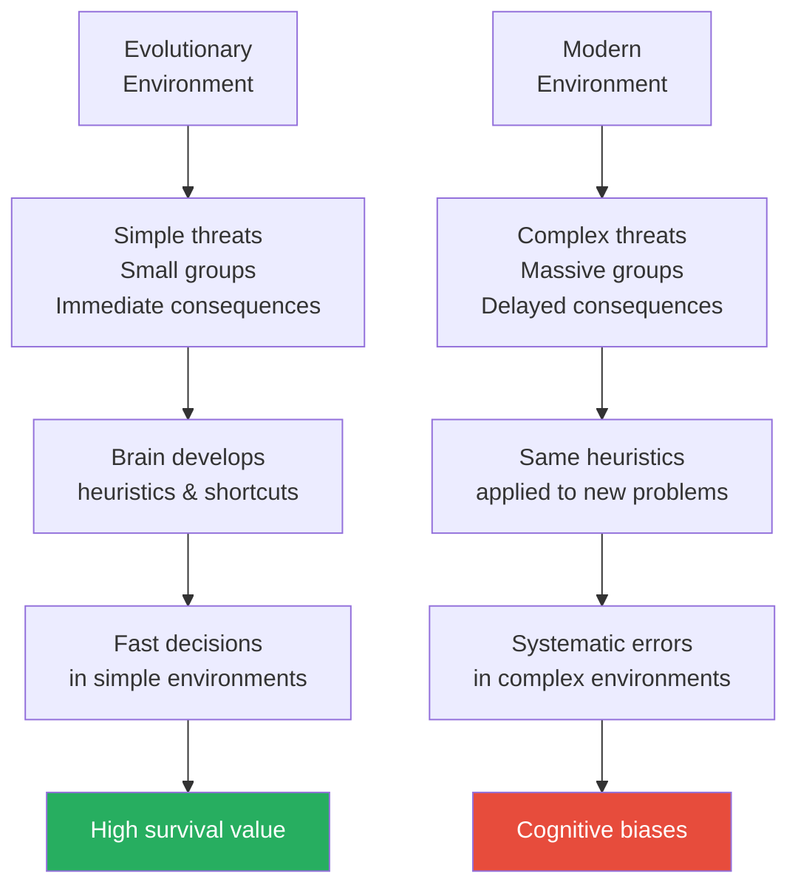

The same mental shortcuts that saved your ancestors' lives in the savanna produce systematic errors in modern life — the hardware is unchanged, but the operating environment has shifted dramatically.

---

| Bias Category | Evolutionary Purpose | Modern Cost |
|--------------|---------------------|-------------|
| **Confirmation bias** | Rapid group alignment, social cohesion | Polarisation, inability to update beliefs |
| **Availability heuristic** | Quick threat assessment | Misperception of risk, media manipulation |
| **Sunk cost fallacy** | Commitment to scarce resources | Throwing good money after bad |
| **Conformity** | Group survival, coordination | Suppression of dissent, bad group decisions |
| **Anchoring** | Quick estimation in data-poor environments | Manipulation in negotiations and pricing |
| **Pattern recognition** | Detecting predators and opportunities | Conspiracy theories, superstition, apophenia |
| **Self-serving bias** | Maintaining confidence to act | Inability to learn from failure |
| **Normalcy bias** | Conserving energy in stable environments | Paralysis in genuine emergencies |
| **Just-world fallacy** | Social cooperation through reciprocity | Victim-blaming, moral self-righteousness |

This table captures the book's implicit argument: every bias has a reason, and every reason made sense — in a world we no longer inhabit.

---

### Why Knowing Doesn't Fix It

- <b style="color: #e74c3c">Knowledge of biases does not make you immune to them</b>
  - Knowing about the anchoring effect does not prevent the first number from affecting your estimate
  - Knowing about confirmation bias does not prevent you from seeking confirming evidence
  - Knowing about the sunk cost fallacy does not make it emotionally easy to walk away from a losing investment
- McRaney's implicit prescription is not "overcome your biases" (which is largely impossible) but rather:
  - Develop systemic humility about your own judgment
  - Seek disconfirming evidence deliberately
  - Create external structures (checklists, second opinions, pre-mortems) that catch biases you cannot catch yourself
  - <b style="color: #27ae60">The goal is not perfect rationality — it is calibrated uncertainty</b>
- The research consistently shows a paradox:
  - Learning about biases makes you more likely to spot them in OTHER people
  - It does NOT make you more likely to spot them in yourself
  - This is itself a bias — the "bias blind spot" — where you believe you are less biased than average
  - The only reliable defence is structural: systems, processes, and habits that compensate for the biases you cannot see in yourself
- McRaney's ultimate message is not pessimistic:
  - Yes, your brain is deeply flawed
  - But awareness of those flaws, while insufficient on its own, is the necessary first step
  - Combined with external safeguards, it transforms you from someone who is confidently wrong to someone who is constructively uncertain
  - And constructive uncertainty, McRaney argues, is the closest thing to wisdom available to a cognitive system built for shortcuts

> [!abstract] A Bias Defence System
> 1. **Awareness** — Learn the major biases (this book) so you can name them when you spot them
> 2. **Trigger recognition** — Know the conditions that activate each bias (high emotion, time pressure, group settings)
> 3. **Structural safeguards** — Build in checklists, devil's advocates, and pre-mortems
> 4. **Seek disconfirmation** — Ask "what would prove me wrong?" before "what proves me right?"
> 5. **Accept uncertainty** — The most rational stance is usually "I don't know" — embrace it

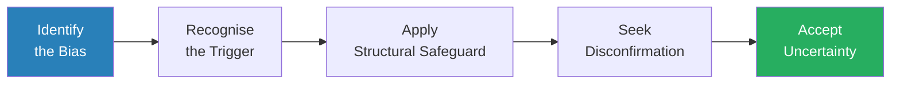

McRaney's defence is not to "think harder" but to build systems that compensate for the thinking you cannot fix.

---

## The Full Misconception vs. Truth Table

| # | Bias / Fallacy | The Misconception | The Truth |
|---|---------------|-------------------|-----------|
| 1 | **Priming** | You know when you're being influenced | Subtle cues shape behaviour outside awareness |
| 2 | **Confabulation** | You know why you like things | Your brain invents reasons you fully believe |
| 3 | **Confirmation Bias** | Your opinions come from rational analysis | You seek validation, not truth |
| 4 | **Hindsight Bias** | You predicted it | You rewrote your memory to match the outcome |
| 5 | **Texas Sharpshooter** | You see real patterns | You draw the target after the arrow lands |
| 6 | **Procrastination** | You're lazy | You can't manage the emotions around the task |
| 7 | **Normalcy Bias** | You'd act heroically in a crisis | You'd probably freeze and wait for instructions |
| 8 | **Introspection** | You know your own mind | Your introspective reports are mostly fiction |
| 9 | **Availability** | You calculate risk objectively | You judge by how easily examples come to mind |
| 10 | **Bystander Effect** | People rush to help | More witnesses = less help |
| 11 | **Dunning-Kruger** | You can judge your own competence | The less you know, the more confident you feel |
| 12 | **Apophenia** | You see real connections | Your brain manufactures pattern from noise |
| 13 | **Brand Loyalty** | You buy based on quality | You buy to defend an identity |
| 14 | **Argument from Authority** | Experts are always right | Authority does not equal evidence |
| 15 | **Argument from Ignorance** | Can't disprove it means it's true | Absence of evidence is not evidence |
| 16 | **Straw Man** | You address their actual argument | You attack an easier caricature |
| 17 | **Ad Hominem** | Discrediting the person discredits the claim | Truth is independent of who says it |
| 18 | **Just-World Fallacy** | People get what they deserve | The world is indifferent |
| 19 | **Public Goods Game** | People naturally cooperate | Without enforcement, freeloading dominates |
| 20 | **Ultimatum Game** | You accept any free money | You'll sacrifice gain to punish unfairness |
| 21 | **Subjective Validation** | You can spot generic descriptions | You make vague statements feel personal |
| 22 | **Cult Indoctrination** | Only weak minds join cults | Cults exploit universal needs for belonging |
| 23 | **Groupthink** | Groups are smarter | Groups suppress dissent for harmony |
| 24 | **Supernormal Releasers** | You're too smart for primitive triggers | Exaggerated stimuli hijack your responses |
| 25 | **Affect Heuristic** | You evaluate risks rationally | Your current mood determines your "analysis" |
| 26 | **Dunbar's Number** | You have hundreds of friends | Your brain tracks about 150 real relationships |
| 27 | **Selling Out** | Artists betray principles for money | Your identity needs drive the accusation |
| 28 | **Self-Serving Bias** | You evaluate outcomes fairly | You take credit for wins, blame luck for losses |
| 29 | **Spotlight Effect** | Everyone is watching you | Almost no one is paying attention |
| 30 | **Third Person Effect** | You're immune to propaganda | You're just as susceptible as everyone else |
| 31 | **Catharsis** | Venting reduces anger | Venting amplifies anger |
| 32 | **Misinformation Effect** | Memory is a recording | Memories are altered with each recall |
| 33 | **Conformity** | You think for yourself | Social pressure reshapes perception itself |
| 34 | **Extinction Burst** | Urges fade gradually | The urge spikes dramatically before fading |
| 35 | **Social Loafing** | You work equally hard in groups | You coast when your effort is untracked |
| 36 | **Illusion of Transparency** | People can read your emotions | Your internal states are mostly invisible |
| 37 | **Learned Helplessness** | You always try to improve | Enough failure teaches you to stop trying |
| 38 | **Embodied Cognition** | Thinking is purely mental | Your body's state shapes your thoughts |
| 39 | **Anchoring** | You evaluate things objectively | The first number dominates your judgment |
| 40 | **Attention** | You see everything in front of you | You miss anything outside your focus |
| 41 | **Self-Handicapping** | You always try your best | You sometimes sabotage to protect your ego |
| 42 | **Self-Fulfilling Prophecy** | Predictions are neutral | Expectations create the predicted outcome |
| 43 | **Moment (Peak-End)** | You assess total experience | You judge by peak and ending only |
| 44 | **Consistency Bias** | You remember past beliefs accurately | You rewrite past beliefs to match present ones |
| 45 | **Representativeness** | You judge probability rationally | You judge by similarity to stereotypes |
| 46 | **Expectation** | You perceive reality objectively | What you expect shapes what you perceive |
| 47 | **Illusion of Control** | You know how much control you have | You overestimate your influence on random events |
| 48 | **Fundamental Attribution** | You judge others fairly | You blame their character but excuse your context |

---

## How the 48 Biases Interact

*McRaney presents each bias as a standalone chapter, but in reality they reinforce each other in devastating combinations.*

| Bias Combination | How They Interact | The Result |
|-----------------|-------------------|------------|
| **Confirmation + Self-Serving** | You seek confirming evidence AND take credit for confirming outcomes | Total insulation from disconfirming feedback |
| **Availability + Affect** | Vivid examples trigger emotional reactions that replace analysis | Decisions driven by media coverage, not data |
| **Groupthink + Conformity** | Group pressure suppresses dissent; conformity prevents individuals from speaking up | Unanimous support for catastrophic decisions |
| **Hindsight + Consistency** | You "knew it all along" AND "always believed" what you believe now | An unrevisable self-narrative of constant rightness |
| **Sunk Cost + Normalcy** | Past investment drives continued investment; normalcy bias says "it's been fine so far" | Staying in deteriorating situations far too long |
| **Dunning-Kruger + Introspection** | You can't assess your competence AND you can't accurately observe your own thinking | Confident incompetence with no internal alarm |
| **Priming + Anchoring** | Environmental cues shape your starting point; anchoring keeps you near that start | Decisions predetermined by context you never noticed |
| **Bystander + Social Loafing** | Responsibility diffuses; effort drops when contributions are untracked | Groups where no one acts and no one works |
| **Just-World + Fundamental Attribution** | You believe people get what they deserve AND you judge others by character not context | Moral certainty that suffering is earned, not random |
| **Misinformation + Expectation** | Post-event information rewrites memories; expectations shape perception from the start | A past and present both constructed rather than observed |

The biases don't operate in isolation — they form interlocking systems that make self-correction nearly impossible without external structures.

---

### The Bias Vulnerability Matrix

Different life situations activate different bias clusters. Understanding WHEN you are most vulnerable is as important as understanding WHAT the biases are.

| Situation | Most Active Biases | Why You're Vulnerable |
|-----------|-------------------|----------------------|
| **High emotional arousal** | Affect heuristic, catharsis, anchoring | Emotions substitute for analysis |
| **Time pressure** | Availability, representativeness, priming | You default to fastest heuristic available |
| **Group settings** | Groupthink, conformity, social loafing | Social pressure overrides individual judgment |
| **After a success** | Self-serving bias, illusion of control, hindsight | You attribute luck to skill |
| **After a failure** | Learned helplessness, self-handicapping, consistency | You protect your ego at the cost of learning |
| **Purchasing decisions** | Brand loyalty, anchoring, expectation | Identity and first impressions dominate |
| **Evaluating others** | Fundamental attribution error, just-world, halo | You judge character, not circumstances |
| **Remembering the past** | Misinformation, consistency bias, hindsight | Memory reconstructs rather than replays |
| **Facing an emergency** | Normalcy bias, bystander effect, conformity | You freeze, wait for cues, and follow the crowd |
| **Arguing a position** | Confirmation bias, straw man, ad hominem | You seek to win, not to understand |

This matrix is the practical application layer — knowing WHICH biases are likely active in a given moment gives you a fighting chance of catching them.

Confirmation bias scores highest on nearly every dimension — especially self-awareness difficulty, meaning the bias most likely to corrupt your thinking is the one you're least likely to notice.

---

## The Verdict

McRaney's greatest contribution is accessibility. The academic literature on cognitive biases is vast, dense, and scattered across hundreds of journals. *You Are Not So Smart* compresses the essential findings into 48 self-contained chapters, each structured around the devastating Misconception/Truth format that makes every entry a miniature revelation. The book does not require a background in psychology, statistics, or philosophy. It just requires the willingness to feel uncomfortable about your own mind — and McRaney's wit makes even that discomfort entertaining. As an introduction to cognitive biases, there is simply nothing more approachable.

The book's weakness is depth. At 48 biases in under 300 pages, each chapter gets only 5-6 pages. McRaney provides enough to understand what a bias is and why it matters, but not enough to understand the nuances, boundary conditions, and ongoing academic debates around each one. The sunk cost fallacy, for instance, gets a few pages; [[Thinking in Bets - Annie Duke|Annie Duke]] devotes significant sections of her book to the same topic with far more depth on countermeasures. The Dunning-Kruger effect is described memorably, but the recent replication debates and statistical critiques are absent. Some of the research McRaney cites (particularly the Bargh elderly priming study) has faced replication challenges since publication, and the book's breezy tone doesn't leave room for these caveats. For any single bias, you will eventually need to go deeper — but this book tells you which ones to go deeper on.

The reader who benefits most is someone at the beginning of their journey into behavioural science — the person who has not yet encountered Kahneman, Ariely, Cialdini, or Thaler and wants a single volume that maps the territory. But even well-read psychology enthusiasts will find value in the Misconception/Truth format as a revision tool. Each chapter is short enough to reread in a few minutes, and the blunt structure — "here's what you think, here's what's actually true" — prevents the reader from sliding into the comfortable belief that they already know this stuff. The format itself is a defence against the very biases the book describes.

Compared to [[Antifragile - Nassim Nicholas Taleb|Antifragile]], which builds a single deep framework, or [[Noise - Cass R. Sunstein|Noise]], which systematically explores one specific problem in judgment, *You Are Not So Smart* is a wide survey rather than a deep dive. It sits alongside [[Your Brain at Work - David Rock|Your Brain at Work]] as a practical map of your own cognitive limitations — but where Rock focuses on workplace performance, McRaney keeps the lens universal. Think of it as the field guide you check before venturing into any situation where you need to think clearly — which is to say, every situation. The book's ultimate message is not despair but calibration: you will never be perfectly rational, but knowing where your rationality breaks down is the closest you can get.

---

## Related Reading

- [[Thinking in Bets - Annie Duke|Thinking in Bets]] — How resulting and self-serving bias corrupt learning from experience
- [[Noise - Cass R. Sunstein|Noise]] — The variability in human judgment that these biases produce
- [[Influence - Robert Cialdini|Influence]] — The six weapons that exploit these cognitive shortcuts
- [[Your Brain at Work - David Rock|Your Brain at Work]] — The neurological constraints that force us to rely on these shortcuts
- [[Antifragile - Nassim Nicholas Taleb|Antifragile]] — How to build systems that survive despite these biases
- [[The Psychology of Money - Morgan Housel|The Psychology of Money]] — How these biases specifically distort financial decisions
- [[You Are Now Less Dumb - David McRaney|You Are Now Less Dumb]] — McRaney's sequel, covering additional biases and debiasing strategies
