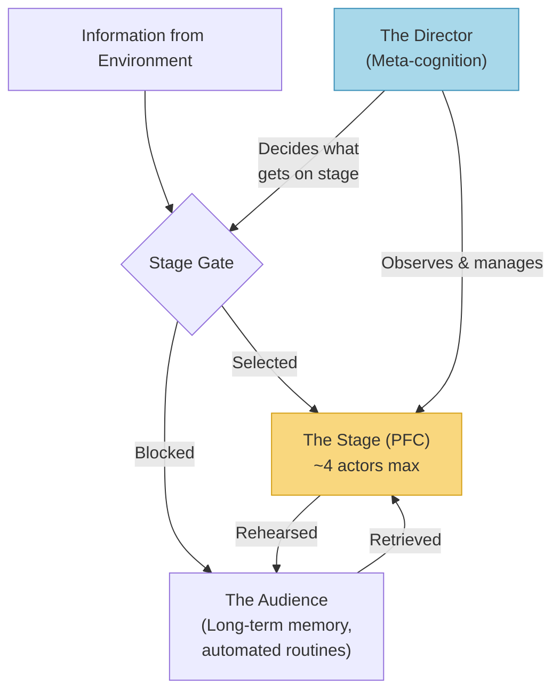
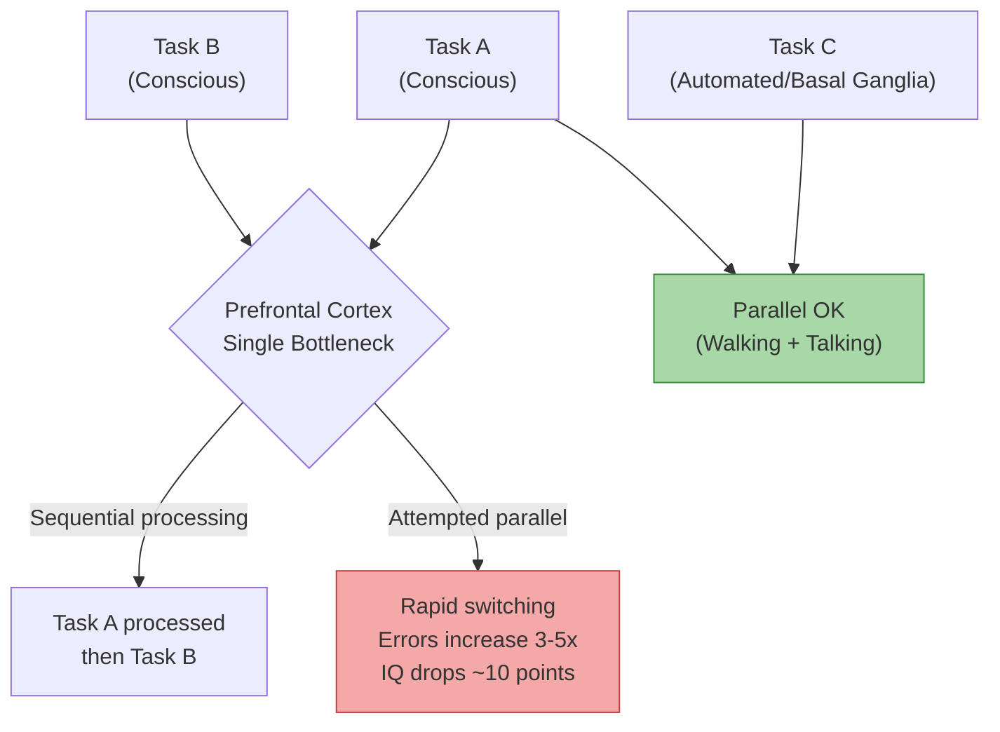
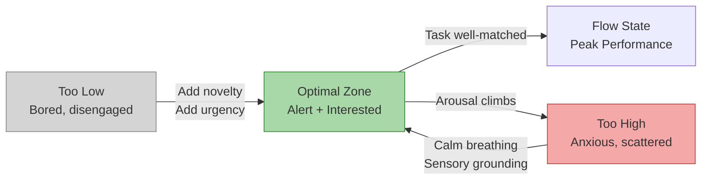
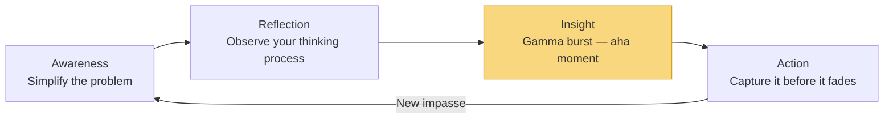
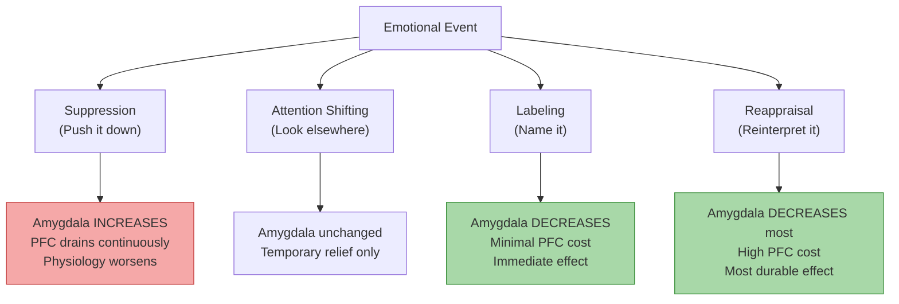
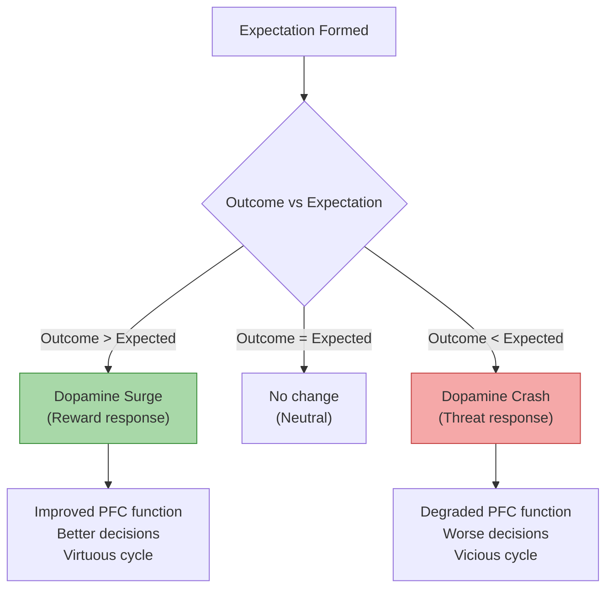
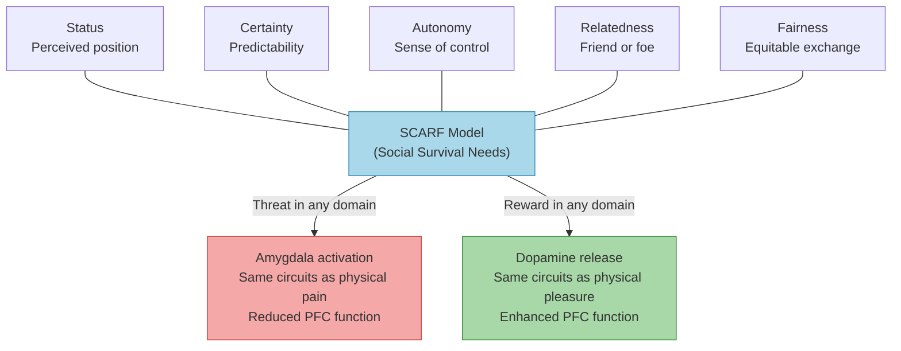
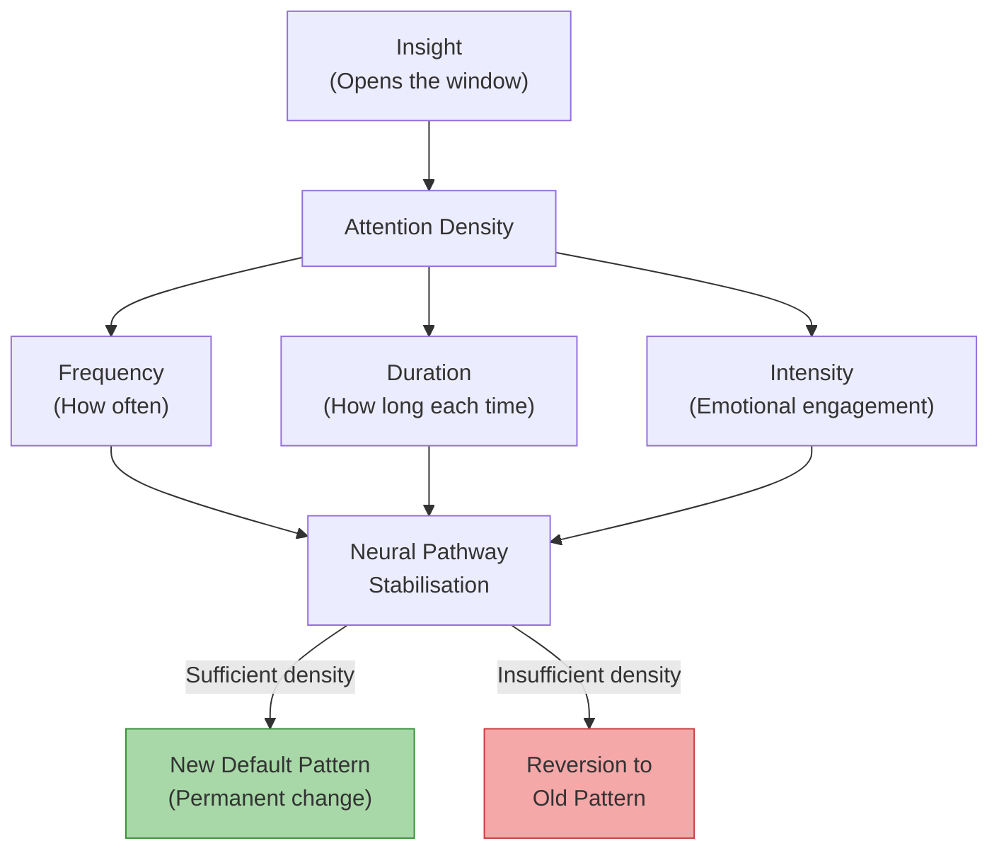
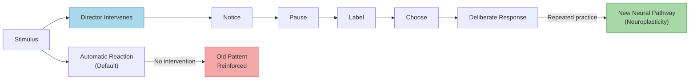
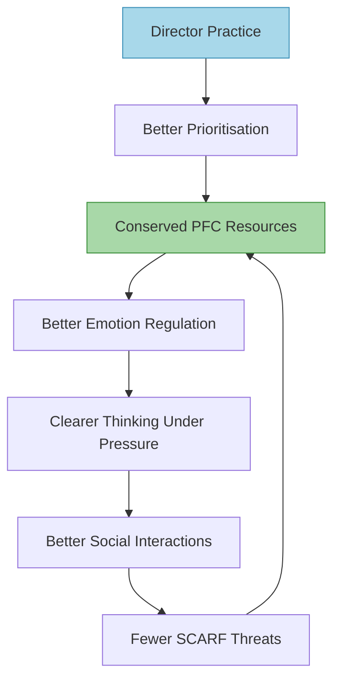

# Your Brain at Work — David Rock

> David Rock synthesises over three hundred neuroscience papers into a single, practical argument: the prefrontal cortex — where all your conscious thinking, planning, and deciding happens — is tiny, energy-hungry, and embarrassingly easy to disrupt. Most knowledge workers spend their days doing exactly what degrades it: multitasking, reacting to notifications, suppressing emotions, and forcing insight instead of allowing it. Rock introduces a "director" metaphor for meta-cognition (the ability to watch your own brain at work) and the **SCARF model** (Status, Certainty, Autonomy, Relatedness, Fairness) as a framework for understanding why social situations feel as threatening as physical danger. The book is structured as a play in four acts, following two fictional characters — Emily, a marketing VP at a software firm, and Paul, a freelance IT consultant — through a single workday, replaying each scene twice: first the way the brain naturally handles it, then the way it could handle it with neuroscience-informed awareness. The result is both a neurological operating manual for anyone who thinks for a living and a surprisingly rigorous argument that social needs are as biologically primary as physical ones.

---

## About the Author

David Rock is the founder of the **NeuroLeadership Institute**, an organisation dedicated to applying neuroscience research to leadership and management practice. He is not a neuroscientist himself but a synthesiser and populariser who interviewed over thirty neuroscientists and drew from more than three hundred research papers to write this book. His background is in executive coaching and organisational consulting, which gives the book a practical, application-first tone rather than an academic one. Key scientists he draws on include Amy Arnsten (Yale, prefrontal cortex function), Mark Beeman (Northwestern, insight and the "aha moment"), Matthew Lieberman (UCLA, social cognition and affect labeling), Kevin Ochsner (Columbia, emotional reappraisal), Naomi Eisenberger (UCLA, social pain), Roy Baumeister (ego depletion and self-control), and Wolfram Schultz (Cambridge, dopamine and reward prediction). Rock's particular talent is translation: he takes dense neuroimaging studies and repackages them as stories, metaphors, and practical rules of thumb that non-scientists can immediately use.

---

## The Big Idea

- Your brain's conscious thinking machinery is far more limited than you believe
- Most of modern work is designed to burn through it as fast as possible
- Rock's central metaphor is <b style="color: #2980b9">The Stage</b>:
  - The prefrontal cortex is a small theatre where conscious thought takes place
  - "Actors" on stage = information held in active attention
  - "Audience" = the vast storehouse of memories, knowledge, and automated routines sitting below conscious awareness
- The stage requires enormous energy to keep lit — glucose, oxygen, and a precise cocktail of neurochemicals
- It can hold only about four actors at once, and its lighting dims rapidly with use
- Every act of understanding, deciding, recalling, memorising, or inhibiting draws from the same limited metabolic pool
- <b style="color: #e74c3c">Use the stage for email triage at 8am and you have less of it available for strategic thinking at 9am</b>

The stage metaphor captures Rock's core argument: conscious thought is a scarce resource managed by a meta-cognitive director, not an unlimited engine you can run all day.

The prefrontal cortex loses capacity rapidly throughout the day — the typical worker burns through 30% of their cognitive power on email by 9am, while an optimised schedule preserves peak resources for strategic thinking.

---

- The breakthrough insight is that you have a <b style="color: #2980b9">Director</b> — a meta-cognitive capacity to step back and observe your own mental processes
- The director can:
  - Catch automatic reactions before they take hold
  - Choose which tasks deserve the stage
  - Notice when the stage lights are dimming
  - Regulate emotional states that would otherwise hijack your thinking
- The director is itself a prefrontal cortex function — and therefore also limited and energy-hungry
- But it can be strengthened through practice
- <b style="color: #27ae60">The director is the single most valuable cognitive skill a person can develop</b> — the skill of noticing what your brain is doing and intervening before it runs on autopilot
- Rock draws on mindfulness research to support this claim:
  - Studies of experienced meditators show thickened prefrontal cortex tissue — a physical marker of strengthened meta-cognitive capacity
  - Sara Lazar's neuroimaging work at Harvard demonstrated that long-term meditators had increased cortical thickness in regions associated with attention and interoception
  - Meditation practice directly trains the director by repeatedly asking the practitioner to notice their thoughts, let them go, and redirect attention
  - Even eight weeks of mindfulness-based stress reduction (MBSR) produced measurable changes in grey matter density in the hippocampus and prefrontal cortex
  - Rock argues this is not mysticism but applied neuroscience — mindfulness is director training

---

*The book then extends from individual cognition to social dynamics — and this is where it becomes genuinely surprising.*

- Rock argues that the brain processes social threats and rewards using the same neural circuits as physical survival needs
- A drop in perceived status triggers the same pain circuits as a physical injury
- Ambiguity about the future activates the amygdala as if you were facing a predator
- Feeling excluded from a group produces measurable pain in the same brain region that lights up when you stub your toe
- <b style="color: #2980b9">The SCARF Model</b> organises these social needs into five domains:
  - **Status** — your perceived position relative to others
  - **Certainty** — your ability to predict what happens next
  - **Autonomy** — your sense of control over events
  - **Relatedness** — your sense of safety with others (friend vs foe)
  - **Fairness** — your perception of equitable exchange
- <b style="color: #27ae60">Managing social dynamics is not a "soft skill" — it is a biological imperative that affects cognitive performance, health, and decision-making quality</b>

The asymmetry is striking: threats outweigh rewards in nearly every SCARF domain, with certainty threats producing the strongest response — explaining why ambiguity about the future is so cognitively destructive.

Prioritisation is the single most expensive cognitive operation — requiring all five prefrontal functions simultaneously — which is why Rock insists it must be done first thing in the morning when the stage is freshest.

- The SCARF model emerged from Rock's 2008 paper "SCARF: A Brain-Based Model for Collaborating with and Influencing Others," which became one of the most cited papers in the NeuroLeadership Journal
- Its power lies in its simplicity: five words that name the five things human beings cannot stop caring about, even when they try

---

## Key Concepts at a Glance

| Concept | One-line summary |
|---------|-----------------|
| **The Stage Metaphor** | Conscious thought uses a tiny, energy-limited mental stage that holds roughly four items at once |
| **The Director** | Meta-cognition lets you observe and intervene in your own thinking — the master lever for cognitive performance |
| **Prioritisation as the Most Expensive Operation** | Ordering priorities requires all five prefrontal functions at once, so do it first while the stage is fresh |
| **The Dual-Task Bottleneck** | The brain can only consciously process one task at a time; multitasking is rapid task-switching that degrades accuracy |
| **Inhibition as the Engine of Focus** | Focus is achieved by suppressing distractions, and each act of suppression draws from a depleting resource pool |
| **The Inverted U (Yerkes-Dodson)** | Peak performance requires intermediate arousal — norepinephrine for alertness and dopamine for interest, precisely balanced |
| **The ARIA Model** | Four phases of insight: Awareness, Reflection, Insight, Action — thinking harder when stuck makes it worse |
| **Emotion Regulation Hierarchy** | Strategies ranked from least to most powerful, with suppression at the bottom as actively counterproductive |
| **Affect Labeling** | Putting a single word on an emotion measurably reduces amygdala activation — the best cost-to-benefit ratio in the toolkit |
| **Reappraisal** | Changing your interpretation of an event fundamentally alters the brain's emotional response |
| **Expectations and the Dopamine Economy** | Unmet expectations produce a dopamine crash felt as threat; exceeded expectations produce a surge |
| **The SCARF Model** | Five social domains (Status, Certainty, Autonomy, Relatedness, Fairness) treated by the brain as survival needs |
| **Ego Depletion** | Each act of self-control draws from a shared resource pool, making the next act harder |
| **Self-Directed Neuroplasticity** | Voluntary, repeated attention to new patterns physically rewires neural circuits over time |
| **Attention Density** | The frequency, duration, and intensity of focused attention on a new pattern determines whether neural rewiring persists |

---

## Act I: Problems and Decisions — The Stage Under Siege

*Your prefrontal cortex is far smaller and more fragile than you think — and your morning routine is probably destroying it before the real work begins.*

### Scene 1: The Morning Email Trap

*The most precious cognitive resource you have is the fresh prefrontal cortex you wake up with — and most people burn through it on trivia before the real work begins.*

- The book opens with Emily, a recently promoted marketing VP, arriving at her desk with a plan to spend the morning on strategy
- Within minutes she is pulled into email — a supplier complaint, a colleague's request, a scheduling conflict
- By the time she looks up, ninety minutes have passed and the strategic work remains untouched
- Her prefrontal cortex, which was fresh and fully lit at 8am, has been spent on low-value reactive tasks

> [!example] Emily's Morning Email Trap
> - Emily arrives at work intending to tackle high-level strategy for her new role
> - Instead, she opens her inbox and is immediately pulled into a supplier complaint, a scheduling conflict, and a colleague's urgent request
> - Each small decision — reply, defer, escalate — burns a little more prefrontal fuel
> - Ninety minutes later the strategic work remains untouched
> - Her prefrontal cortex — fresh and fully lit at 8am — has been spent entirely on low-value reactive tasks
> - She feels busy but has accomplished nothing of significance
> **The lesson:** The brain's best cognitive resources are burned first-come, first-served unless you consciously intervene.

- Rock uses Emily's experience to introduce the core constraint:
  - The prefrontal cortex is metabolically expensive and depletable
  - It represents roughly 4-5% of brain volume but consumes a disproportionate share of the brain's metabolic fuel
  - <b style="color: #e74c3c">One act of self-control measurably depletes the resources available for the next</b>
- Research by Roy Baumeister demonstrated this with an elegantly simple experiment

> [!example] Baumeister's Cookie/Radish Experiment
> - Two groups of participants sat in a room with freshly baked chocolate chip cookies and a bowl of radishes
> - One group was told they could eat the cookies; the other was told to eat only the radishes while resisting the cookies
> - Both groups were then given an unsolvable geometry puzzle
> - The radish group — whose prefrontal cortex had already been taxed by resisting chocolate — gave up after an average of eight minutes
> - The cookie group persisted for an average of nineteen
> - A follow-up by Gailliot found the glucose link was direct: participants given lemonade with real sugar recovered self-control; those given sugar-free lemonade did not
> **The lesson:** One act of self-control measurably depletes the resources available for the next — the prefrontal cortex runs on a shared metabolic pool.

- Even older research by Welsh in 1898 had shown the same pattern:
  - Participants who performed mentally demanding tasks showed a roughly fifty percent reduction in physical grip strength, measured by a dynamometer
  - The mental effort had drained a shared energy pool
  - This was one of the earliest demonstrations that cognitive and physical performance draw from overlapping resources
- Rock's practical rule emerges from this: <b style="color: #27ae60">treat conscious thinking as a non-renewable resource</b>
  - The highest-stakes cognitive work should happen at peak freshness
  - Not squeezed between email triage and status meetings
  - The stage has a finite number of good performances per day
- Rock introduces the concept of "metabolic overhead" — the idea that:
  - The prefrontal cortex consumes roughly 20% of the body's total energy despite comprising only about 2-3% of body weight
  - Conscious thinking is the most expensive operation the brain performs
  - Even maintaining a thought in working memory has a measurable energy cost
  - This is why "decision fatigue" is real — judges grant more paroles after meal breaks, not because food makes them merciful, but because glucose replenishes the depleted prefrontal cortex

> [!tip] Core Insight — Act I, Scene 1
> Your prefrontal cortex is a depletable resource, not a muscle you can run all day. Schedule your most demanding thinking first, before anything else touches the stage.

---

### Scene 2: Prioritise Before You Do Anything Else

*Prioritisation is the most draining cognitive operation of all — which is exactly why it must come first.*

- Rock argues that <b style="color: #2980b9">prioritisation</b> is among the most metabolically expensive cognitive operations of all
- The reason: it requires the prefrontal cortex to perform all five of its core functions simultaneously

| Prefrontal Function | What it does | Role in prioritisation |
|---------------------|-------------|----------------------|
| **Understanding** | Processing new information | Grasping the current situation |
| **Deciding** | Comparing options and choosing | Selecting between competing priorities |
| **Recalling** | Retrieving from long-term memory | Pulling in relevant context and past outcomes |
| **Memorising** | Holding items in working memory | Keeping multiple options on stage simultaneously |
| **Inhibiting** | Suppressing distractions and impulses | Resisting the pull of urgent-but-unimportant tasks |

All five functions drawing from the same metabolic pool at once makes prioritisation the single most draining cognitive act — and explains why people avoid it in favour of reactive busywork.

---

- Daniel Gilbert's research on <b style="color: #2980b9">affective forecasting</b> is relevant here:
  - Humans are remarkably bad at predicting how they will feel about future events
  - The reason is that imagining the future is itself an energy-intensive act
  - The brain must construct a mental simulation of something that does not exist yet
  - This requires the same prefrontal machinery used for everything else
  - <b style="color: #e74c3c">When that machinery is already depleted — say, by thirty minutes of email — the quality of your future-simulation degrades</b>
  - You make worse priority decisions because you literally cannot see the future as clearly
- Rock connects this to the broader problem of **time perspective**:
  - The prefrontal cortex is what allows humans to think about the future at all
  - Damage to the prefrontal cortex — whether from injury, sleep deprivation, or metabolic depletion — consistently reduces people's ability to value long-term outcomes over short-term ones
  - This is why sleep-deprived executives make short-sighted decisions
  - It is also why end-of-day decisions tend to be more impulsive than morning ones
- Rock also explains why we default to reactive work instead:
  - Responding to email, answering messages, and handling requests all produce small dopamine hits — the reward of completing a task
  - The brain finds these micro-completions much more immediately satisfying than the ambiguous, unrewarded work of strategic thinking
  - This creates a perverse incentive structure: the brain rewards you for doing low-value work and punishes you for attempting high-value work
  - The only way to override it is conscious intervention — the director must step in before the autopilot kicks in

> [!example] Paul's Prioritisation Routine
> - Paul, the IT consultant, begins each morning by jumping straight into client work — whatever landed in his inbox first
> - He spends three hours on a low-value task that happened to arrive overnight while a critical proposal sits untouched
> - In the replayed scene, Paul takes ten minutes before opening any digital communication to write his three highest priorities on paper
> - The difference is not heroic willpower; it is simply putting the most demanding operation first, while the stage lights are brightest
> **The lesson:** Ten minutes of prioritisation at peak freshness is worth more than three hours of reactive work on a depleted brain.

- The advice is deceptively simple but neurologically grounded: <b style="color: #27ae60">do the hard thinking before the easy reacting</b>
- Even ten minutes of email can exhaust the resources needed for good prioritisation
- Rock introduces the concept of <b style="color: #2980b9">externalising</b> as a way to conserve stage capacity:
  - Writing priorities on paper, a whiteboard, or a screen frees the stage from the burden of holding them in working memory
  - Each item removed from the stage frees capacity for the remaining items
  - The act of externalising itself clarifies thinking — translating a vague sense of "I should do something about X" into a written statement forces precision
  - This is why brainstorming on paper is more productive than brainstorming in your head
- Rock also identifies specific externalising techniques that reduce stage load:
  - **Visual mapping** — drawing relationships between ideas rather than listing them linearly
  - **Decision matrices** — externalising the comparison process so the stage only needs to evaluate one dimension at a time
  - **Time-blocking** — externalising the sequencing decision so the stage does not have to hold the full day's schedule

> [!example] The Judges and the Parole Decisions (Danziger, Levav, Avnaim-Pesso, 2011)
> - Researchers analysed 1,112 judicial rulings by Israeli judges over a ten-month period
> - Judges who had just eaten granted parole roughly 65% of the time
> - As the session wore on without a break, the grant rate dropped steadily toward zero
> - After a meal break, the rate jumped back up to 65%
> - The pattern repeated throughout the day — a sawtooth wave of generosity that tracked glucose levels, not case facts
> - The "default" decision (denying parole) required less cognitive effort than the "considered" decision (evaluating the case and granting parole)
> - As the judges' prefrontal cortex depleted, they increasingly chose the path of least cognitive resistance
> **The lesson:** The quality of decisions degrades predictably with cognitive depletion — and the brain defaults to the safest, least effortful option.

- This study — though Rock does not cite it directly — perfectly illustrates his argument about the depletable stage
- The judges were not lazy or biased in any simple sense; their prefrontal cortex was simply running out of fuel
- The implication for knowledge workers: the decisions you make at 4pm are not the same quality as the decisions you make at 9am, and pretending otherwise is dangerous
- Rock's practical architecture for a cognitive workday:
  - **First 90 minutes:** highest-priority analytical or creative work (stage at peak capacity)
  - **Mid-morning:** complex interpersonal interactions — meetings that require diplomacy, negotiation, or persuasion (still adequate PFC resources for emotion regulation)
  - **After lunch:** routine processing — email, scheduling, administrative tasks (the stage can handle this on lower fuel)
  - **Late afternoon:** automated, habitual tasks — filing, organising, low-stakes communication (basal ganglia, not prefrontal cortex)

---

### Scene 3: The Myth of Multitasking

*What feels like doing two things at once is actually rapid switching between them — and each switch exacts a hidden tax on accuracy and energy.*

- Rock devotes an entire scene to demolishing the idea that humans can effectively do two conscious tasks at once
- Research by Harold Pashler demonstrated that the prefrontal cortex creates a <b style="color: #2980b9">dual-task bottleneck</b> — like a one-lane bridge — when processing conscious tasks:
  - You can only cross one direction at a time
  - What feels like multitasking is actually rapid **task-switching**
  - Each switch involves: deactivating one neural network, activating another, reloading the new context, losing some of the old context in the process
  - Each switch costs time, energy, and accuracy

> [!example] Pashler's Dual-Task Bottleneck Research
> - Harold Pashler's experiments demonstrated that the prefrontal cortex can only consciously process one task at a time
> - When participants were asked to respond to two stimuli simultaneously, their response to the second was always delayed
> - The delay increased with the complexity of both tasks, confirming a single bottleneck rather than parallel processing
> - Habitual multitaskers in subsequent studies showed IQ reductions equivalent to a lost night of sleep — roughly ten points
> - Even people who believed they were excellent multitaskers showed the same degradation when tested objectively
> **The lesson:** The brain has one lane for conscious processing, not two. What feels like multitasking is rapid switching with a hidden cost.

- The research findings are damning:
  - Habitual multitaskers showed IQ reductions equivalent to a lost night of sleep — roughly ten points
  - People who tried to do two things at once made three to five times more errors than those who did them sequentially
  - Clifford Nass at Stanford found that chronic multitaskers were actually worse at switching between tasks than non-multitaskers — the very skill they were supposedly developing was being degraded by the practice
  - Nass's findings were particularly striking: heavy multitaskers were worse at filtering irrelevant information, worse at organising their working memory, and worse at switching between tasks — all three of the skills they were ostensibly practising
  - <b style="color: #e74c3c">Multitasking is rapid task-switching that degrades everything</b>

> [!example] Emily's Multitasking Disaster
> - Emily tries to write a proposal while monitoring email and taking a phone call about a vendor issue
> - The proposal that emerges is thin, the email responses are careless, and the vendor issue is half-resolved
> - In the replayed scene, she closes email, silences her phone, and works on the proposal in a single thirty-minute block
> - The output is measurably better — not because she tried harder, but because the prefrontal cortex was processing one thing instead of juggling three
> **The lesson:** Single-tasking is not a productivity hack — it is the only way the prefrontal cortex actually works.

- The important qualifier: multitasking works fine when one task uses **embedded routines**:
  - Patterns so well-practised that they are handled by the basal ganglia rather than the prefrontal cortex
  - Walking while talking is easy because walking is automated
  - Driving a familiar route while listening to a podcast works because the driving is handled by habit circuits
  - But drafting an email while on a conference call does not work — both tasks require the stage
- <b style="color: #27ae60">Two tasks that both require conscious attention will always compete for the same bottleneck</b>

The dual-task bottleneck is absolute for conscious tasks but does not apply when one task is automated — which is why expertise matters: it moves processing off the stage and into the audience.

---

- Rock introduces the concept of **chunking** as the brain's natural workaround:
  - By grouping related information into single "chunks," you can effectively increase the stage's capacity
  - An experienced chess player sees board positions as chunks — a cluster of pieces becomes one meaningful unit rather than four separate items
  - This is why experts appear to hold more in working memory than novices — they are not holding more items, but each item contains more information
- He also discusses the **switching cost asymmetry**:
  - Switching from a complex task to a simple one is cheaper than switching from simple to complex
  - Returning to a complex task after an interruption can cost up to twenty-three minutes of re-engagement (citing Gloria Mark's research at UC Irvine)
  - The first few minutes after a switch feel productive but are actually spent rebuilding the mental model that was destroyed by the interruption
  - This is why a five-minute interruption does not cost five minutes — it costs five minutes plus the re-loading time
- Rock recommends **batching** — grouping similar tasks together:
  - Process all email in two or three dedicated blocks rather than continuously
  - Make all phone calls in sequence
  - Write in uninterrupted blocks
  - The principle: reduce the number of switches, and each task gets more of the stage's capacity

---

### Scene 4: The Braking System — Inhibition and Focus

*Focus is not about concentrating harder — it is about successfully suppressing everything else, using a braking system that wears out with each use.*

- Staying focused is primarily achieved not by increasing concentration but by successfully **inhibiting distractions**
- Rock introduces the brain's braking system — the <b style="color: #2980b9">ventrolateral prefrontal cortex (VLPFC)</b> — as the neural equivalent of a car's brakes:
  - Every time you resist the urge to check your phone, suppress an irrelevant thought, or refrain from responding to a notification, you are using this braking system
  - The braking system is itself part of the energy-hungry prefrontal cortex
  - Each application of the brakes makes the next application slightly weaker
- The VLPFC is also responsible for:
  - Inhibiting inappropriate social responses (not saying the rude thing that crossed your mind)
  - Suppressing irrelevant memories that are triggered by association
  - Filtering out background noise and visual clutter
  - All of these draw from the same pool — which is why a noisy, cluttered office makes it harder to resist checking your phone

> [!example] Libet's Free-Will Experiments (1980s)
> - Benjamin Libet asked participants to flex their wrist whenever they felt the urge, while noting the precise moment they became aware of the urge
> - EEG recordings showed that the brain initiated the action roughly 300 milliseconds before the person became consciously aware of wanting to act
> - However, the conscious mind had a brief window — about 200 milliseconds — in which it could veto the action
> - Rock, following Jeffrey Schwartz, calls this "free won't" rather than free will
> - The implication is profound: you cannot choose what impulses arise, but you can choose which ones you act on
> **The lesson:** You cannot control which impulses arise, but you have a brief veto window to catch them — and the director's job is to exploit that window.

- The director's job is to extend and exploit this veto window:
  - Having explicit language for brain processes increases the probability of catching the impulse before it becomes an action
  - Knowing that "I'm experiencing an impulse to check email, and resisting it will cost me braking energy" helps you intervene
  - The language itself creates cognitive distance between the impulse and the action
  - This is why Rock spends so much time teaching his readers vocabulary — the labels are tools for the director

---

- One particularly striking research finding Rock cites:
  - A smartphone sitting on the desk reduces cognitive performance even when it is turned off, face down, and untouched
  - The mere presence of the device activates the braking system, because the brain knows there is something to resist
  - Adrian Ward at the University of Texas later confirmed this with a study showing that cognitive performance improved simply by moving the phone to another room
  - Ward's study tested three conditions: phone on the desk, phone in a bag, and phone in another room — performance improved with each degree of physical separation
  - <b style="color: #e74c3c">The energy cost of continuous low-level inhibition is real and measurable</b>
- The practical implication is clear: <b style="color: #27ae60">remove distractions before they arise</b> rather than relying on willpower to resist them in the moment
  - Environmental design beats willpower every time
  - Environmental design does not deplete the braking system
  - This connects to what Cal Newport later called "digital minimalism" — reducing the number of things that demand inhibition rather than building stronger inhibition

> [!example] Emily's Open-Plan Office Struggle
> - Emily's new VP role places her in an open-plan office shared with fifteen other people
> - She finds her focus fragmenting constantly — not from direct interruptions but from ambient noise, movement in her peripheral vision, and overheard conversations
> - Each of these triggers requires the VLPFC to suppress, and by mid-morning her braking system is exhausted
> - In the replayed scene, she negotiates a quiet room for her first two hours each morning and uses noise-cancelling headphones during the afternoon
> - The environmental redesign eliminates dozens of micro-inhibitions per hour
> **The lesson:** The best inhibition strategy is not stronger brakes — it is fewer things that require braking.

- Rock also discusses the **ironic process theory** (Daniel Wegner's research):
  - When you try not to think about something, you actually think about it more
  - Wegner's famous "white bear" experiment: participants told not to think about a white bear thought about it more frequently than participants given no instruction
  - The act of monitoring whether you are thinking about the forbidden thought requires you to constantly reference it
  - This is why suppressing a craving intensifies it, and why trying not to think about an embarrassing moment keeps it in the spotlight
  - The director needs to redirect attention toward something else, not away from the distraction

> [!abstract] The Environmental Design Checklist (derived from Act I)
> Rock's principles translate into a concrete environmental design strategy for knowledge workers:
> 1. **Before the day begins:** identify your top 2-3 priorities and write them down (externalise before the stage is loaded)
> 2. **First 90 minutes:** no email, no messaging, no meetings — protect the freshest stage for the hardest thinking
> 3. **Phone placement:** in another room or in a closed bag — not on the desk, not even face-down
> 4. **Notifications:** all non-essential notifications disabled — each notification is a demand on the braking system
> 5. **Environment:** noise-cancelling headphones or a quiet room — ambient noise drains VLPFC resources
> 6. **Task batching:** group similar tasks (all email, all calls, all writing) — reduce switching costs
> 7. **Breaks:** scheduled, not reactive — a planned break replenishes; an unplanned interruption depletes

- Rock acknowledges that much of this advice sounds like common sense — but the neuroscience explains why common sense is so commonly ignored:
  - The brain is wired to seek novelty (dopamine), respond to social signals (mirror neurons), and react to perceived threats (amygdala)
  - All of these impulses pull you away from the disciplined use of the stage
  - Without understanding why the impulse exists, you are fighting an unnamed enemy
  - With the neuroscience, you can see the enemy clearly and design around it

> [!tip] Core Insight — Act I
> Treat your prefrontal cortex like a battery with a fixed daily charge. Prioritise first, do one thing at a time, and remove distractions physically rather than relying on willpower to resist them.

---

## Act II: Stay Cool Under Pressure

*The enemy of good thinking is not stupidity — it is arousal gone wrong. Too little and you drift; too much and you freeze. The trick is calibration, not effort.*

### Scene 5: The Inverted U — Finding the Sweet Spot

*Peak performance is not about trying harder — it is about tuning two neurochemical dials to a precise sweet spot that most people overshoot or undershoot.*

- Peak cognitive performance requires intermediate levels of two neurochemicals:
  - **Norepinephrine** — alertness, driven by perceived threat or urgency
  - **Dopamine** — interest, driven by novelty or desire
- Amy Arnsten's research at Yale showed that the prefrontal cortex requires these chemicals in precise balance — like the temperature setting on a shower
- This is the <b style="color: #2980b9">Yerkes-Dodson</b> inverted U curve applied to neurochemistry:
  - Named after Robert Yerkes and John Dodson, who first identified the relationship between arousal and performance in 1908
  - Their original finding: mice learned a task fastest at intermediate levels of electric shock — too little and they did not engage; too much and they could not learn
  - Rock updates this century-old finding with modern neurochemistry

| Level | Norepinephrine Effect | Dopamine Effect | Cognitive State |
|-------|----------------------|----------------|-----------------|
| **Too low** | Attention wanders, careless errors | Nothing feels interesting, procrastination | Bored, disengaged, autopilot |
| **Optimal** | Alert, focused, responsive | Engaged, curious, motivated | Flow state — peak performance |
| **Too high** | Panic, PFC disconnects entirely | Manic novelty-chasing, nothing completed | Overwhelmed, scattered, anxious |

The sweet spot requires both chemicals at intermediate levels simultaneously — too much or too little of either one degrades prefrontal cortex function.

---

- What happens at each extreme:
  - Too little norepinephrine → attention wanders, careless errors on autopilot
  - <b style="color: #e74c3c">Too much norepinephrine → the prefrontal cortex disconnects entirely — the experience of panic, where you literally cannot think</b>
  - Too little dopamine → nothing feels interesting enough to engage with; procrastination and drift
  - Too much dopamine → manic novelty-chasing without completing anything
- Arnsten's research showed the mechanism is neurochemical, not just metaphorical:
  - At optimal levels, norepinephrine strengthens the signal in neural circuits (the "tuning" effect)
  - At excessive levels, it overwhelms the circuits, causing the prefrontal cortex to go offline
  - The amygdala then takes over — producing fight, flight, or freeze responses that are fast but cognitively crude
  - This explains why people say and do things under extreme stress that they would never do calmly — the prefrontal cortex is literally offline
- The neurochemical model also explains why caffeine and other stimulants have an inverted U of their own:
  - One cup of coffee may bring norepinephrine up to optimal levels
  - Three cups may push it past the peak into the anxiety zone
  - The optimal dose varies by individual, time of day, and what other stressors are present
  - Rock does not explore this in depth but acknowledges the connection
- Rock provides a practical diagnostic for identifying where you sit on the inverted U:
  - **Signs you are below the optimal zone** (too little arousal):
    - Drifting attention, rereading the same paragraph, zoning out during conversations
    - Procrastination and avoidance of the task at hand
    - Flat emotional state — nothing feels important or urgent
    - Fix: add novelty, add a mild deadline, change your environment, exercise briefly
  - **Signs you are above the optimal zone** (too much arousal):
    - Racing thoughts, difficulty completing sentences, snapping at people
    - Physical tension — tight jaw, shallow breathing, clenched hands
    - Tunnel vision — inability to see alternatives or consider other perspectives
    - Fix: slow breathing, physical movement, stepping outside, sensory grounding (focusing on what you can see, hear, and feel in the immediate environment)
  - **Signs you are in the optimal zone:**
    - Time passes without noticing, deep engagement with the task
    - Ideas flow naturally, connections emerge without forcing
    - Emotional state is alert but not anxious — interested rather than desperate
- The practical upshot: <b style="color: #27ae60">before trying to solve any cognitive problem, first diagnose your arousal state and adjust it</b>
  - Trying to force insight when over-aroused is futile — the prefrontal cortex is offline
  - Trying to focus when under-aroused is equally futile — there is no dopamine to sustain engagement
  - The director's first job is arousal management; everything else follows from getting the neurochemistry right

> [!example] Paul and the Dull Financial Report
> - Paul needs to work on a dull financial report but cannot focus — his dopamine levels are too low because the task lacks novelty and personal significance
> - The first version shows Paul grinding through it by force of will, producing mediocre work over three hours
> - The replay shows him deliberately introducing novelty: he challenges himself to find three patterns in the data he has never noticed before, sets a twenty-minute timer to create urgency, and promises himself a specific reward on completion
> - The same report takes ninety minutes and the quality is higher
> - He has not changed the task — he has changed his neurochemistry around the task
> **The lesson:** You can consciously manipulate your neurochemistry by adding novelty (dopamine) and mild urgency (norepinephrine) to any task.

> [!example] Emily's Pre-Presentation Panic
> - Emily is about to present to the board and feels her heart racing, her palms sweating, and her mind going blank
> - Her norepinephrine has spiked past the optimal zone into the panic zone — her prefrontal cortex is shutting down
> - In the replayed scene, she recognises the arousal as too high and deploys a calming technique: slow breathing, grounding herself in sensory details, and reminding herself that she knows the material
> - She brings her norepinephrine down from panic to alertness — the same chemical, just at a different dose
> **The lesson:** The difference between peak performance and paralysis is not courage — it is neurochemical calibration.

- The sweet spot is what Mihaly Csikszentmihalyi called **flow**:
  - Using well-practised routines to tackle challenges slightly above your current skill level
  - <b style="color: #27ae60">Flow is not about effort — it is about calibration</b>
  - The person in flow is not trying harder; they are matched precisely to the difficulty of the task
- Rock notes that the sweet spot is individually variable:
  - Estrogen promotes an earlier stress response, meaning hormonal differences can shift where the peak of the inverted U falls
  - What produces productive challenge for one person may produce panic in another
  - The skill is not maximising effort — it is **calibrating state**
- You can consciously shift arousal:
  - **Upward:** visualise mild consequences to increase norepinephrine; introduce novelty or competition to boost dopamine
  - **Downward:** physical activity, sensory focus, getting ideas out of your head and onto paper or a whiteboard

The inverted U is not a fixed point but a tunable range — the director's job is to notice which side of the curve you are on and nudge toward the middle.

---

### Scene 6: When You Are Stuck — The Neuroscience of Insight

*The instinct when stuck is to think harder. The neuroscience says the opposite: quiet the stage, let the spotlight dim, and the answer arrives on its own.*

- This is one of the book's most counterintuitive and best-researched chapters
- When you are stuck on a problem, the instinct is to think harder — to bear down, focus more intensely, and grind through the impasse
- <b style="color: #e74c3c">Rock argues this is precisely wrong</b>
- The reason lies in how the brain generates novel solutions versus how it applies existing ones

> [!example] Beeman's Insight Research (Northwestern, fMRI studies)
> - Mark Beeman asked participants to solve word-association puzzles while inside an fMRI scanner
> - Each puzzle presented three words and asked for a fourth word that connected all three
> - In the moments just before insight, the brain showed a burst of alpha wave activity — the signature of a quiet, inwardly focused mind
> - The insight itself was accompanied by a gamma band burst — a high-frequency wave indicating distant neural regions connecting for the first time
> - And insight correlated with positive mood and broad attention — the opposite of the anxious, narrow focus most people adopt when stuck
> - Participants who were in a better mood before the experiment solved more puzzles through insight
> - Beeman also found that the anterior superior temporal gyrus — a brain region associated with making loose associations — was significantly more active during insight solutions than analytical ones
> **The lesson:** Insight requires a quiet stage and a relaxed mind, not more effort and concentration.

- Stellan Ohlsson's research on **impasses** explains why:
  - Prior experience creates neural <b style="color: #2980b9">priming</b> — the brain preferentially activates solution paths that have worked before
  - When the right answer requires a genuinely novel connection, the primed (wrong) path actively blocks it
  - The more you think about the problem using your existing framework, the more you reinforce the wrong path
  - <b style="color: #27ae60">The solution is to stop thinking about the problem entirely</b> — to let the priming fade — so that weaker, more distant neural connections have a chance to surface
- Rock uses the analogy of a torch beam:
  - Analytical thinking is like a narrow, bright beam — excellent for examining details but terrible for seeing the periphery
  - Insight requires a dim, wide beam — lower intensity but broader coverage
  - You cannot see faint stars in a brightly lit room; you cannot see novel connections when the analytical spotlight is blazing
- He also distinguishes between two types of problem-solving:
  - **Analytical** — applying known frameworks to familiar problems (strong, primed neural pathways)
  - **Insight-based** — making novel connections between distant ideas (weak, unprimed neural pathways)
  - Most complex problems require both, but the sequence matters: analysis first, then insight when analysis reaches its limit

> [!abstract] The ARIA Model (Awareness → Reflection → Insight → Action)
> 1. **Awareness** — hold the problem lightly on the stage; simplify it to the fewest possible words; get the essence of the impasse without drowning in details
> 2. **Reflection** — reflect on your thinking *process*, not the problem details; ask "how am I approaching this?" rather than "what is the answer?"; activate the right hemisphere by looking inward
> 3. **Insight** — the gamma burst arrives with energy, certainty, and a dopamine rush; it feels qualitatively different from a logical deduction — a flash of recognition and confidence
> 4. **Action** — harness the short-lived energy from insight to commit to specific next steps before it fades; insights not captured quickly tend to dissolve

The <b style="color: #2980b9">ARIA model</b> is a cycle, not a one-shot sequence — complex problems may require several loops through all four phases before a full solution emerges.

---

- Rock expands on the qualitative difference between analytical solutions and insight solutions:
  - **Analytical solutions** arrive gradually, through deliberate reasoning — you can trace the steps that led to the answer
  - **Insight solutions** arrive suddenly, with a burst of certainty — the answer appears complete, often accompanied by a rush of positive emotion
  - The neurological signatures are different: analytical solutions show steady prefrontal activation; insight solutions show the distinctive alpha-then-gamma pattern Beeman identified
  - Insight solutions are also more likely to be correct — Beeman's research found that participants were more accurate when they reported solving problems through insight than through analysis
  - This may be because insight draws on a wider network of associations, catching connections that narrow analytical focus would miss

| Feature | Analytical Solution | Insight Solution |
|---------|-------------------|-----------------|
| **Arrival** | Gradual, step-by-step | Sudden, all-at-once |
| **Neural signature** | Steady PFC activation | Alpha burst → gamma burst |
| **Subjective feel** | "I figured it out" | "It hit me" |
| **Accuracy** | Good for well-defined problems | Higher for novel, ill-defined problems |
| **Emotional tone** | Satisfaction | Excitement, certainty, dopamine surge |
| **Conditions required** | Focused attention, quiet environment | Relaxed attention, positive mood, low pressure |

The two modes are complementary, not competing. Analysis narrows; insight expands. The skill is knowing when to switch.

---

- Jonathan Schooler's research adds a critical nuance:
  - <b style="color: #e74c3c">Verbalising a problem can actually block insight</b>
  - Participants asked to explain their reasoning out loud performed worse on insight tasks than those who worked in silence
  - The act of putting things into words activates the left hemisphere's analytical machinery
  - This is precisely what needs to quiet down for insight to occur
  - Schooler called this **verbal overshadowing** — the act of describing something in words can degrade your non-verbal understanding of it

> [!example] Archimedes and the Bathtub
> - Archimedes was asked by King Hiero II to determine whether a crown was pure gold without destroying it — a problem he could not solve through direct analysis
> - He stopped working on it and went to the public baths
> - While lowering himself into the water, he noticed the water level rising — and the connection between displacement and volume hit him in a flash
> - He reportedly leapt from the bath shouting "Eureka!" — capturing the insight's energy in immediate action
> **The lesson:** The solution arrived precisely when he stopped forcing it and let his mind wander in a low-arousal, unfocused state.

> [!example] Paul's Stuck Project Proposal
> - Paul has been grinding on a project proposal for three hours, trying to find an angle that will win the client over
> - The more he forces it, the more he recycles the same stale ideas
> - In the replayed scene, Paul recognises the impasse after thirty minutes, closes his laptop, and goes for a walk
> - Fifteen minutes into the walk, while thinking about nothing in particular, the angle comes to him — an approach he had never considered while hunched over the keyboard
> - He rushes back and captures it before it fades
> **The lesson:** Walking away from a problem is not laziness — it is the neurologically correct response to an impasse.

- The practical rule: when stuck on a problem for more than fifteen minutes, switch to something completely unrelated
  - Walk, have an unrelated conversation, do a routine task
  - The insight often arrives precisely when you stop forcing it
  - Rock cites Archimedes in the bath, Newton under the apple tree, and countless everyday examples of solutions appearing in the shower or on the commute
  - All moments of low prefrontal activation and broad, unfocused attention
- Rock also links insight to mood:
  - Positive mood broadens attention, which is precisely what insight requires
  - Anxiety narrows attention, which actively blocks insight
  - This creates a vicious cycle: being stuck causes anxiety, anxiety narrows attention, narrow attention blocks insight, which makes you more stuck
  - The first intervention is often not cognitive but emotional — finding a way to shift mood before attempting to solve the problem
- Rock discusses the role of the **default mode network** (DMN):
  - When you are not focused on an external task, the brain activates a network of regions associated with mind-wandering, daydreaming, and self-referential thought
  - This network makes loose associations and connections that the focused-task network cannot
  - The DMN is most active during walks, showers, and other low-demand activities
  - Deliberately activating the DMN by stepping away from focused work is not idleness — it is engaging a different problem-solving engine

> [!tip] Core Insight — Act II, Scene 6
> When stuck, stop thinking harder. Switch to something unrelated, let the priming fade, and give distant neural connections a chance to surface. Insight needs a quiet stage.

---

### Scene 7: The Surprising Power of Labeling Emotions

*The most underrated tool in the entire book: putting a single word on an emotion measurably calms the brain — and most people avoid it because they predict the opposite.*

- Rock presents a hierarchy of emotion regulation strategies, drawing on James Gross's research at Stanford
- The hierarchy runs from easiest to hardest to deploy, but also — crucially — from least to most powerful

> [!abstract] The Emotion Regulation Hierarchy (Gross, Stanford)
> Ranked from least effective to most effective:
> 1. **Suppression** — push the feeling down (most common and the worst — increases limbic activation)
> 2. **Situation selection** — avoid threatening situations entirely
> 3. **Situation modification** — change the physical or social environment
> 4. **Attention shifting** — redirect focus to something else entirely
> 5. **Labeling** — put a symbolic word on the emotion (the surprising sleeper)
> 6. **Reappraisal** — change your interpretation of the event (most powerful but most resource-intensive)

| Strategy | Effectiveness | PFC Cost | When to use |
|----------|-------------|----------|-------------|
| **Suppression** | Counterproductive — increases limbic activation | High (constant effort) | Almost never — avoid this |
| **Situation selection** | Low — avoidance limits options | Low | When you can genuinely avoid a toxic situation |
| **Situation modification** | Low-moderate | Low | When the environment can be physically changed |
| **Attention shifting** | Moderate | Moderate | When the emotion is mild and you can redirect focus |
| **Labeling** | High — reduces amygdala activation | Low (1-2 words) | First line of defence for any emotional spike |
| **Reappraisal** | Highest — fundamentally changes the signal | High (requires fresh PFC) | When emotions are strong and labeling is not enough |

The hierarchy is counterintuitive: the strategy most people default to (suppression) is the worst, while the strategy most people avoid (labeling) has the best cost-to-benefit ratio.

<b style="color: #e74c3c">Suppression is the worst emotion regulation strategy</b> — the most common one and the most counterproductive. <b style="color: #27ae60">Labeling is the best ratio of effectiveness to cognitive cost.</b>

---

- Rock devotes particular attention to why <b style="color: #e74c3c">suppression</b> is so damaging:
  - Gross's research showed that people who habitually suppress emotions show increased amygdala activation, not decreased
  - The suppression requires continuous prefrontal effort — like holding a beach ball underwater, the moment you release pressure, it bursts to the surface with greater force
  - Suppression also impairs memory: people who suppressed emotions during a conversation remembered fewer details of what was discussed than people who expressed or labeled their emotions
  - Gross found that suppressors were rated by their conversation partners as less likeable and less authentic — other people can sense the incongruence between the suppressor's words and their physiological state
  - The social cost is as real as the cognitive cost: chronic suppressors have fewer close relationships and report lower relationship satisfaction
  - This creates a tragic irony: suppression is often motivated by a desire to maintain social harmony, but it actually undermines the very relationships it is meant to protect

---

- <b style="color: #2980b9">Affect labeling</b> is the surprising sleeper on this list:
  - Matthew Lieberman's fMRI research at UCLA showed that putting a single symbolic word on an emotional state — "anxiety," "frustration," "anger" — activates the ventrolateral prefrontal cortex
  - This measurably reduces activation in the amygdala
  - The label acts as a kind of neurological circuit-breaker: naming the emotion creates enough cognitive distance to reduce its intensity
  - Lieberman's team called this the "braking effect" — labeling engages the same prefrontal braking system that suppresses impulses, but at far lower cost
- The label needs to be brief — one or two words, not an elaborate narrative:
  - People who told long stories about why they felt upset showed *increased* limbic activation compared to people who simply said "I feel anxious"
  - The narrative recruits more emotional processing, not less
  - A short label creates distance; a long story creates immersion
- Lieberman also discovered a dose-response effect:
  - More specific labels were more effective than vague ones
  - "Frustrated" worked better than "bad"
  - "Anxious about the presentation" worked better than "nervous"
  - But the label still needed to be brief — specificity, not elaboration
- The mechanism appears to work through what psychologists call **cognitive distancing**:
  - Labeling shifts activity from the amygdala (experiencing the emotion) to the prefrontal cortex (observing the emotion)
  - The person moves from being inside the emotion to being outside it, looking at it
  - This is the same shift that meditation traditions describe as "watching your thoughts" — and the fMRI data confirms that the subjective experience corresponds to a real neural shift

---

- Lieberman also found that people consistently predict the opposite of what actually happens:
  - When asked whether naming an emotion would make them feel better or worse, most people predicted it would make them feel worse
  - They expected that drawing attention to the feeling would intensify it
  - The fMRI data showed the opposite
  - <b style="color: #e74c3c">This gap between prediction and reality means many people avoid the very strategy that would help them most</b>
  - Rock calls this one of the most tragic findings in the emotion regulation literature — the best tool is the one people refuse to use because their intuition about it is backwards
- Rock also discusses the role of labeling in interpersonal situations:
  - Labeling someone else's emotions — "It sounds like you're frustrated" — has a similar calming effect on them
  - Chris Voss later built an entire negotiation methodology around this technique (which he calls "tactical empathy")
  - The mechanism is the same: when someone feels that their emotional state has been accurately recognised, the limbic system calms and the prefrontal cortex comes back online
  - This is why the best negotiators, therapists, and managers are skilled at naming what the other person is feeling — not to manipulate, but to create the neurological conditions for productive thinking

> [!example] Emily and the Threatening Supplier
> - Emily has a tense interaction with a difficult supplier who threatens to pull out of a contract
> - In the first version, Emily floods with anxiety, struggles to think clearly, and makes a rash concession to end the discomfort
> - In the replayed scene, she notices the flood, internally names it — "threat response" — and feels the intensity drop enough to think strategically
> - With the amygdala quietened by the label, she responds with a calm counter-proposal instead of a panicked concession
> - Two words changed the outcome of a negotiation worth thousands of dollars
> **The lesson:** A single symbolic label — two words — was enough to shift Emily from reactive to strategic.

- Rock draws an important practical distinction between labeling your own emotions and labeling someone else's:
  - **Self-labeling** is private and can be done silently — "I'm feeling anxious" as an internal observation
  - **Other-labeling** — saying "It sounds like you're frustrated" — is interpersonal and must be done with care
  - Done well, other-labeling creates connection: the other person feels understood, their limbic system calms, and the prefrontal cortex comes back online
  - Done poorly (with a condescending tone, or inaccurately), it can feel like psychologising and increase the threat response
  - The key is to label tentatively: "It seems like this might be frustrating" is safer than "You're clearly angry"
  - The tentative frame preserves the other person's autonomy (they can correct you) while still providing the neural circuit-breaking effect
- Rock also connects labeling to the broader concept of **emotional literacy**:
  - People with a richer emotional vocabulary — who can distinguish between "frustrated," "disappointed," "resentful," and "irritated" — have more precise labels available
  - More precise labels produce greater amygdala reduction (Lieberman's dose-response finding)
  - Building emotional vocabulary is, in a real sense, building a better toolkit for the director
  - Rock suggests that part of why therapy works is that it systematically develops emotional vocabulary — giving people words for experiences they previously could only feel

---

### Scenes 8-9: Reappraisal — Changing What the Event Means

*When labeling is not enough — when the emotional flood is too strong for a single word to contain — reappraisal lets you change the meaning of the event itself.*

- When emotions are too strong for labeling to manage — when you are not just mildly anxious but genuinely threatened — <b style="color: #2980b9">reappraisal</b> is the most powerful strategy available
- Kevin Ochsner's fMRI research at Columbia showed that consciously changing your interpretation of an event reduces limbic activation more powerfully than any other cognitive strategy
- Rock identifies four types of reappraisal:

| Reappraisal Type | How it works | Example |
|-----------------|-------------|---------|
| **Reinterpreting** | Deciding the event is not actually a threat | A colleague's sharp comment was their own stress, not a personal attack |
| **Normalising** | Deciding the event is expected and ordinary | Everyone gets nervous before big presentations — this is normal |
| **Reordering** | Shifting your values hierarchy | Reminding yourself that learning matters more than looking impressive |
| **Repositioning** | Seeing the situation from another perspective | Asking what pressures the other person is under |

Each type engages the prefrontal cortex to override the limbic system's initial threat assessment — but all four require cognitive resources to deploy.

---

- James Gross's longitudinal research showed the long-term effects:
  - People who habitually reappraise score higher on optimism, relationship quality, and life satisfaction than people who habitually suppress
  - The difference is not just emotional — it is cognitive
  - <b style="color: #27ae60">Reappraisers make better decisions because their prefrontal cortex is not constantly battling unprocessed emotional signals</b>
  - Gross tracked people over years and found that suppressors accumulated physiological stress markers — higher blood pressure, higher cortisol — while reappraisers did not
  - The physiological cost of chronic suppression is measurable and cumulative: suppression requires continuous metabolic effort, and the body pays the price in elevated stress hormones

> [!example] Paul Receives Harsh Client Criticism
> - Paul receives harsh criticism from a client who questions his competence
> - The first version shows Paul suppressing his anger, maintaining a polite exterior, but stewing internally for hours — replaying the conversation, constructing rebuttals, losing sleep
> - The replay shows Paul recognising the status threat, briefly labeling it ("status hit"), then reappraising: the client is under pressure from their own board, this feedback is about their anxiety not Paul's competence, and the situation is actually an opportunity to demonstrate calm professionalism
> - Paul's emotional temperature drops from boiling to merely warm, and he responds constructively
> **The lesson:** Labeling identified the threat; reappraisal changed its meaning. The combination is more powerful than either alone.

- The critical caveat: reappraisal requires prefrontal cortex resources
  - You cannot reappraise when you are already cognitively depleted
  - This is why Rock insists on the earlier principles about conserving mental energy
  - <b style="color: #e74c3c">The person who has spent their prefrontal resources on email and multitasking has nothing left for reappraisal when the emotional moment arrives</b>
  - This creates one of the book's most important connections: the seemingly unrelated advice about prioritisation and single-tasking is actually foundational to emotional regulation — without cognitive reserves, you cannot regulate
- Ochsner also found that reappraisal gets easier with practice:
  - People who regularly practise reappraisal show reduced amygdala activation over time
  - The prefrontal circuits involved in reappraisal become more efficient — requiring less energy to achieve the same calming effect
  - This is neuroplasticity at work: the reappraisal circuit gets stronger with use
  - But the initial investment is expensive, which is why many people default to the cheaper (and counterproductive) strategy of suppression

---

### Scene 9 (continued): The Dopamine Economy of Expectations

*Your brain does not respond to what happens — it responds to the gap between what it expected and what happened. Manage expectations and you manage your neurochemistry.*

- Wolfram Schultz's research at Cambridge revealed something extraordinary about how the brain processes rewards:
  - Dopamine cells do not fire primarily when you receive a reward — they fire in **anticipation** of reward
  - When the reward arrives as expected, there is no additional dopamine burst
  - When the reward exceeds expectations, there is a surge
  - When an expected reward fails to materialise, there is a sharp dopamine **crash** — a neurochemical event that the brain registers as a threat
- Schultz's original experiments were with monkeys:
  - A monkey trained to expect juice when a light flashes shows dopamine firing at the flash (anticipation), not at the juice (delivery)
  - If the juice does not arrive after the flash, there is a sharp drop in dopamine — a measurable "disappointment" signal
  - Over time, dopamine shifted from the reward itself to the earliest reliable predictor of the reward — a phenomenon Schultz called **reward prediction error**
  - Rock extends this to human experience: every time you expect something good and it does not happen, you experience a neurochemical crash that degrades cognitive function

The <b style="color: #2980b9">dopamine economy</b> explains why identical outcomes feel completely different depending on what was expected — and why managing expectations is a direct lever on mood and cognitive performance.

---

- The implications are profound:
  - It explains the **placebo effect**: if you expect a sugar pill to reduce your pain, the expectation itself changes your neurochemistry
  - Research by Coghill showed that manipulating expectations about an upcoming pain stimulus could rival morphine in its effectiveness
  - Participants told "this will not hurt much" reported significantly less pain than those told "this will be intense" — from the exact same stimulus
- It explains why <b style="color: #e74c3c">over-promising and under-delivering feels so devastating</b>:
  - The person who promises "this will be transformative" and delivers something merely good creates a dopamine crash
  - The person who promises "this will be useful" and delivers something good creates a dopamine surge
  - The objective outcome is identical; the subjective experience is opposite
- Rock connects this to the neuroscience of goals and motivation:
  - Goals create expectations, and expectations drive dopamine
  - A goal that is too easy produces no dopamine (no uncertainty about the outcome)
  - A goal that is too hard produces a dopamine crash when unmet (and is often unmet)
  - The optimal goal is challenging but achievable — creating enough uncertainty to produce anticipatory dopamine, with a realistic probability of the reward actually arriving

> [!example] Emily's Board Presentation
> - Emily prepares for a board presentation, building up enormous expectations — this will be the presentation that changes everything
> - When the board gives a lukewarm response, she spirals into disappointment and self-doubt
> - The replay shows her deliberately calibrating expectations downward: "I'll present the data clearly and see what questions come up"
> - When the board is mildly positive, she experiences it as a win rather than a disappointment
> - The objective outcome was similar in both versions; the subjective experience was opposite — entirely because of the expectation she set
> **The lesson:** The same reality produces elation or devastation depending on the expectations that preceded it.

- The practical principle is not pessimism — chronically low expectations reduce motivation and ambition
- <b style="color: #27ae60">The goal is realistic calibration</b>, so that outcomes are more likely to exceed expectations than fall short, keeping the dopamine economy in surplus rather than deficit
- Rock also notes the upward and downward spiral effects:
  - A dopamine crash from unmet expectations degrades prefrontal function → worse decisions → worse outcomes → more unmet expectations (vicious cycle)
  - A dopamine surge from exceeded expectations improves prefrontal function → better decisions → better outcomes (virtuous cycle)
  - Small wins compound neurochemically — each exceeded expectation makes the next round of decisions slightly better
  - This is why "quick wins" at the start of a project are so motivationally powerful — they are not just symbolic; they are dopaminergic

> [!example] Paul and the Unexpected Referral
> - Paul delivers a project to a client, expecting the standard response: approval, payment, and on to the next project
> - Instead, the client refers Paul to two colleagues, each with substantial projects of their own
> - The referral was completely unexpected — Paul had calibrated his expectations at "payment on time"
> - The unexpected reward produces a significant dopamine surge that elevates his mood, sharpens his thinking, and motivates him for the rest of the week
> - If Paul had expected the referral (perhaps because the client hinted at it), the same outcome would have produced no neurochemical boost at all
> **The lesson:** The dopamine system rewards surprise, not just success. Unexpected positive outcomes produce far more neurochemical reward than expected ones.

- Rock connects the dopamine economy to the broader architecture of the book:
  - Prioritisation (Act I) is partly about managing expectations — choosing tasks where you can produce meaningful outcomes rather than setting yourself up for failure
  - The inverted U (Scene 5) is partly about managing the dopamine component of arousal — too little interest and you cannot engage; too much and you are chasing novelty
  - SCARF (Act III) involves constant expectation management — each social interaction generates predictions about how you will be treated, and violations of those predictions produce dopamine crashes
  - Understanding the dopamine economy is not a separate skill; it is a lens that connects every other skill in the book

> [!tip] Core Insight — Act II
> Emotion regulation is not about suppressing feelings — it is about intercepting them early (labeling), reinterpreting them when strong (reappraisal), and keeping expectations realistic so dopamine works for you rather than against you.

---

## Act III: Collaborating with Others — The Social Brain

*The book's most surprising turn: social threats and rewards run on the same neural circuits as physical survival. Being excluded from a meeting hurts in the same brain region as a broken arm.*

### Scene 10: The Friend-or-Foe Default

*Every stranger defaults to "foe" in your brain — not because you are suspicious, but because for most of evolutionary history, an unknown face was a potential threat.*

- Rock's transition from individual cognition to social neuroscience begins with a deceptively simple observation:
  - The brain automatically classifies every person it encounters as either **friend or foe**
  - Unknown people default to "foe"
- This is not a personality flaw or a sign of suspicion — it is a deeply wired survival mechanism:
  - For most of human evolutionary history, an unfamiliar face was potentially dangerous
  - The brain's default is to treat strangers with caution
  - This triggers a mild threat response that reduces cognitive performance and the quality of collaboration
  - The threat response is not conscious — it operates below awareness, colouring interactions without the person knowing why they feel uneasy
- Rock draws on Giacomo Rizzolatti's discovery of <b style="color: #2980b9">mirror neurons</b>:
  - Brain cells that fire both when you perform an action and when you observe someone else performing the same action
  - They allow you to directly experience another person's intent through body language, facial expressions, and tone of voice
  - They are the neural basis of empathy — the reason you flinch when you see someone get hurt, or feel tension when someone near you is angry
  - When mirror neurons read "friend" signals, the brain relaxes its threat monitoring and frees prefrontal resources for productive collaboration

---

- But mirror neurons depend on rich social cues:
  - When those cues are stripped away — in email, text messages, phone calls without video — the brain loses its primary channel for reading intent
  - <b style="color: #e74c3c">The result is a dramatic increase in misunderstanding</b>
  - Rock cites research showing that people overestimate the accuracy of their email communications by up to 50%
  - They believe their tone and intent are clear; the recipient, lacking facial cues and vocal tone, fills in the gaps with their default assumption — which, for strangers, is threat
  - A neutral email from a colleague you trust reads as informational; the same email from a stranger reads as curt or hostile
  - This is why text-based communication produces so much unnecessary conflict
- The friend-or-foe classification has cascading effects on cognition:
  - When someone is classified as "friend," the brain releases oxytocin, which enhances trust and openness to new ideas
  - When classified as "foe," cortisol rises, narrowing attention and reducing creative thinking
  - The classification also affects memory: you remember what friends say more accurately than what foes say, because the threat response diverts resources from encoding to vigilance
  - A meeting where everyone feels psychologically safe (friend classification) produces better ideas than one where people feel guarded — not because the people are smarter, but because their brains are allocating resources to thinking rather than threat-monitoring

> [!example] Paul's First Meeting with a New Client
> - Paul walks into a first meeting with a new client and launches directly into his proposal
> - He senses resistance he cannot explain — the client seems guarded and sceptical
> - In the replayed scene, Paul spends the first five minutes on personal connection — asking about the client's background, finding shared experiences, making eye contact
> - The shared-experience effect shifts the client's brain from foe classification to friend classification
> - The same proposal, presented after the shift, meets with interest rather than suspicion
> **The lesson:** Rapport-building is not small talk — it is neurological infrastructure. Without it, every subsequent interaction happens against the friction of the threat response.

- <b style="color: #27ae60">Rapport-building is not small talk — it is neurological infrastructure</b>
- Without it, every subsequent interaction happens against the friction of the threat response
- Rock suggests specific techniques for accelerating friend classification:
  - Finding shared experiences or interests (activates "in-group" circuits)
  - Using the other person's name (signals recognition and importance)
  - Matching body language and speaking pace (mirror neuron synchronisation)
  - Self-disclosure — sharing something mildly personal to signal trust
  - Humour — shared laughter releases oxytocin and accelerates the friend classification
- Rock notes that friend classification is fragile but foe classification is sticky:
  - It takes multiple positive interactions to move someone from foe to friend
  - A single negative interaction can reset someone from friend to foe
  - This asymmetry means that trust is built slowly and destroyed quickly — a pattern consistent with the evolutionary logic of threat detection
- The friend-or-foe classification also affects how you process what someone says:
  - Information from a "friend" source is processed with reduced scepticism — the prefrontal cortex does not need to allocate resources to verifying intent
  - Information from a "foe" source triggers additional processing — the brain checks for hidden motives, double meanings, and potential threats
  - This is why the same feedback delivered by a trusted mentor and by a rival colleague produces completely different reactions — the content is identical, but the source classification changes the brain's processing pathway
  - Rock argues this is the neurological basis for the common observation that "people buy from people they like" — the friend classification reduces the cognitive friction of persuasion

> [!example] Emily's Remote Team Challenge
> - Emily manages a team member based in another office whom she has never met in person
> - Their email exchanges are consistently tense — Emily reads pushback into neutral questions, and the team member interprets Emily's directness as hostility
> - Both are defaulting to foe classification because they lack the facial and vocal cues that mirror neurons need to establish trust
> - In the replayed scene, Emily schedules a video call before addressing any work issues, spending fifteen minutes on personal connection
> - After the call, the same email exchanges are read with charitable interpretation rather than suspicion
> - Nothing about the words changed — the classification changed
> **The lesson:** Remote communication strips the brain of the social cues it needs to classify someone as friend. Invest in face-to-face or video connection before attempting substantive collaboration.

- Rock connects this to <b style="color: #2980b9">oxytocin</b> research:
  - Paul Zak's research showed that oxytocin — the "trust hormone" — is released during positive social interactions
  - Higher oxytocin levels make people more generous, more trusting, and more willing to cooperate
  - Lower levels (or elevated cortisol from foe classification) make people guarded, suspicious, and competitive
  - Physical touch (handshakes, for example) releases oxytocin — which is one reason why in-person meetings build more trust than virtual ones
  - This is not a recommendation to invade personal space but an explanation of why physical presence matters for relationship-building

---

### Scene 11: Fairness — The Taste of Injustice

*The brain processes unfairness with the same disgust circuits it uses for rotten food — and people will accept personal cost to punish it.*

- Research by Golnaz Tabibnia and Matthew Lieberman produced one of the more striking findings in social neuroscience:
  - When participants received a fair offer in an economic game, reward circuits activated — **independent of the monetary amount**
  - A fair split of two dollars produced more reward-circuit activation than an unfair split of ten dollars
  - <b style="color: #27ae60">The brain cares about equity, not just outcome</b>
- When participants received an unfair offer:
  - The **insula** activated — the same brain region that processes the disgust response to rotten food
  - <b style="color: #e74c3c">Unfairness triggers the same neural response as rotten food</b>
  - This is not a metaphor — it is a literal neurological finding

> [!example] The Ultimatum Game Research
> - In the classic ultimatum game, one participant proposes how to split a sum of money and the other can accept or reject
> - If rejected, neither player gets anything
> - Rationally, the responder should accept any offer above zero — free money is free money
> - But participants routinely reject offers they perceive as unfair (typically below 30% of the total), even when acceptance would leave them financially better off
> - Brain scans show the insula — the disgust centre — lighting up in response to unfair offers
> - The rejection is not irrational — it is the brain prioritising fairness over material gain
> - Cross-cultural studies showed the same pattern in societies across the world, from industrialised nations to small-scale agricultural communities
> **The lesson:** Fairness is not a preference or a luxury — it is a primary biological drive that overrides rational self-interest.

- Rock connects this to a deeper evolutionary argument:
  - Fairness enforcement evolved because cooperative groups outperform selfish ones
  - But cooperation is vulnerable to free-riders — individuals who take without contributing
  - The disgust response to unfairness is the brain's mechanism for detecting and punishing free-riding
  - People will accept personal cost to punish unfairness (rejecting the ultimatum game offer) because, in evolutionary terms, tolerating free-riders is more dangerous than the short-term cost of punishing them
  - This is why fairness violations feel so visceral — the brain is treating them as existential threats to the cooperative fabric that survival depends on

---

- This explains reactions that seem irrational on the surface:
  - An employee who quits a well-paying job because they feel the promotion process is rigged
  - A customer who takes their business elsewhere after a policy they consider unfair, even though switching costs them more
  - A team member who sabotages a project because they believe credit was distributed inequitably
  - In each case, the fairness violation produces a visceral disgust response that overrides rational self-interest
- Rock also connects fairness to **procedural justice** research:
  - People can tolerate unfavourable outcomes if they believe the process was fair
  - But they cannot tolerate favourable outcomes achieved through unfair processes — the fairness violation contaminates even the benefit
  - This is why transparent decision-making processes matter so much: people are evaluating the process, not just the result

> [!example] Emily and the Unfair Budget Allocation
> - Emily discovers that a colleague in a comparable role received a larger budget allocation
> - The first version shows Emily consumed by resentment, unable to focus on her own work, mentally litigating the injustice for hours
> - The replay shows her recognising the reaction — "fairness threat" — and choosing to address it directly by requesting a meeting with her manager to understand the allocation criteria
> - The labeling reduces the emotional intensity enough for her to act strategically rather than react emotionally
> - When she learns the allocation was based on a project timeline she was unaware of, the fairness threat dissolves
> **The lesson:** Fairness threats are best resolved by seeking information, not by stewing in resentment.

- The broader point: fairness is not a luxury or a preference — it is a **primary social reward**
  - Systems that feel fair generate engagement
  - Systems that feel unfair generate disgust, disengagement, and active resistance, regardless of other incentives
  - Rock argues this has enormous implications for organisational design:
    - Transparent criteria for decisions (raises, promotions, budget allocations)
    - Consistent application of rules
    - Explanations for exceptions — people can tolerate unfavourable outcomes if they believe the process was fair
  - He also notes that fairness violations are cumulative:
    - A single unfair decision may be forgiven
    - A pattern of unfair decisions produces chronic insula activation — a persistent disgust response that colours all subsequent interactions with the organisation
    - This is why "toxic cultures" are so hard to fix: the fairness violations have accumulated to the point where every new decision is processed through a lens of suspicion

---

### Scene 12: Status — The Brain's Most Sensitive Trigger

*Status — your perceived position relative to others — is the most volatile SCARF domain. A trivial exclusion activates the same brain region as a physical injury.*

- <b style="color: #2980b9">Status</b> — your perceived position relative to others — is the most volatile of the five SCARF domains
- Rock builds this argument across several lines of evidence

> [!example] Eisenberger's Cyberball Experiments (UCLA)
> - Participants played a virtual ball-tossing game with what they believed were two other players
> - At a predetermined point, the other "players" (actually a computer programme) stopped throwing the ball to the participant — a mild social exclusion
> - Brain scans showed that this trivial exclusion activated the dorsal anterior cingulate cortex — the same region that processes physical pain
> - The participants did not just feel bad about being excluded; their brains processed the exclusion as if they had been physically hurt
> - Even when participants were told in advance that the other players were a computer, the pain response persisted — the social pain circuit fires automatically, below conscious control
> - Subsequent research showed that acetaminophen (Tylenol) — a physical pain reliever — actually reduced the emotional pain of social exclusion, further confirming that the same neural circuits are involved
> **The lesson:** Social exclusion is not a metaphor for pain — it is processed by the same neural circuitry as physical pain.

> [!example] Marmot's Whitehall Studies (British Civil Servants)
> - Michael Marmot's long-running study of British civil servants found that perceived status predicted health outcomes — including heart disease, cancer, and mortality
> - This held even after controlling for income, education, diet, smoking, and access to healthcare
> - Lower-status civil servants did not just feel worse; they got sicker and died younger
> - The gradient was continuous — even the second-highest rank had worse health than the highest
> - The stress of low status was, quite literally, toxic — it affected gene expression, immune function, and cardiovascular health
> - Marmot's study followed over ten thousand civil servants for decades, making it one of the most robust epidemiological studies of status effects
> **The lesson:** Status is not just a feeling — it has measurable physiological consequences that accumulate over years.

- Status operates on any scale the individual values:
  - You might not care about your place in the corporate hierarchy
  - But you care intensely about being the best chess player in your club, or the most knowledgeable cook in your friend group, or the funniest person at the dinner table
  - Status threats feel the same regardless of the domain
  - The key insight: status is relative to whatever reference group you have chosen, consciously or unconsciously

---

- This explains several common workplace phenomena:
  - Why receiving feedback — even well-intentioned feedback — makes people defensive: it implies their current performance is inadequate, which is a status drop
  - Why being wrong in a meeting feels disproportionately terrible: public error is a public status loss
  - Why people avoid learning new skills: novice status feels threatening
  - Why open-plan offices increase stress: they create constant, low-level status competition
  - Why "helpful" advice from colleagues can feel patronising: the advice-giver is implicitly claiming superior knowledge

---

- Rock introduces the concept of <b style="color: #27ae60">playing against yourself</b> as a status hack:
  - Rather than measuring your position against others (which is zero-sum and produces constant anxiety)
  - Measure your position against your own past performance (which is infinite-sum and produces a sense of growth)
  - Learning a new skill threatens status if you compare yourself to experts
  - It rewards status if you compare yourself to where you were last month
  - This reframe converts a threat response into a reward response without changing any external circumstance
- Rock identifies other status-enhancing strategies that do not require external validation:
  - **Giving feedback to yourself** rather than waiting for others to judge you
  - **Teaching or mentoring** — which activates status reward through the role of expert
  - **Tracking personal progress** — journaling, skill logs, before-and-after comparisons
  - **Choosing domains where growth is visible** — the feeling of improvement is itself a status reward

> [!example] Paul's Conversation with His Wife About Finances
> - Paul becomes defensive when his wife questions his business strategy — interpreting her concern as a status attack on his competence
> - The first version shows an argument that escalates because Paul is defending his status rather than listening
> - The replay shows him recognising the status threat, choosing not to defend, and redirecting the conversation to their shared goal of financial security
> - The shift from defending status to pursuing a shared objective transforms the conversation from combat into collaboration
> **The lesson:** Status defence hijacks conversations. Recognising the trigger allows you to redirect toward shared purpose.

---

### The SCARF Model — Complete Framework

*Now that all five SCARF domains have been introduced through the preceding scenes, here is the complete model as a structured framework.*

> [!abstract] The SCARF Model (Rock, 2008)
> Five social domains the brain treats as survival needs — each capable of generating intense threat or reward responses through the same circuits as physical pain and pleasure:
> - **Status** — your perceived position relative to others
> - **Certainty** — your ability to predict what happens next
> - **Autonomy** — your sense of control over events
> - **Relatedness** — your sense of safety with others (friend vs foe)
> - **Fairness** — your perception of equitable exchange

| SCARF Domain | Core need | Threat example | Reward example | Key intervention |
|-------------|-----------|----------------|----------------|------------------|
| **Status** | Perceived position relative to others | Public criticism in a meeting | Recognition of expertise or growth | Play against yourself, not others |
| **Certainty** | Ability to predict what happens next | Unannounced reorganisation | Clear timeline and transparent rationale | Share plans early, even imperfect ones |
| **Autonomy** | Sense of control over events | Micromanagement, no input on decisions | Choosing your own methods and schedule | Offer choices, even small ones |
| **Relatedness** | Feeling safe with others (friend vs foe) | Working with strangers, no personal connection | Shared experiences, finding common ground | Invest in rapport before content |
| **Fairness** | Perception of equitable exchange | Colleague gets a larger budget for equal work | Transparent criteria applied consistently | Make processes visible and consistent |

Each SCARF domain can independently trigger a full threat or reward response. A single violation — say, an autonomy threat from micromanagement — can override reward signals from the other four domains.

---

- Rock expands on each domain's deeper mechanics:

**Certainty** — the brain is fundamentally a prediction machine:
- The prefrontal cortex's primary function, arguably, is to predict what will happen next
- Uncertainty forces the brain into a resource-intensive "alert" mode — scanning for threats rather than processing information productively
- Even mild uncertainty — waiting for a decision from a boss, not knowing when a meeting will end — diverts prefrontal resources from productive work to threat-monitoring
- Rock cites research showing that the stress of uncertainty can be worse than the stress of a known bad outcome — people would rather know they will receive a shock than wonder whether they might
- The practical implication: sharing imperfect plans is better than sharing nothing — any information that reduces uncertainty reduces the brain's alert-mode overhead
- Rock identifies common certainty threats in the modern workplace:
  - Ambiguous job descriptions where expectations shift without notice
  - Managers who give vague feedback ("do better") without specific direction
  - Organisational change announced without timeline or rationale
  - Open-ended meetings with no agenda — the brain cannot predict how long it will be in alert mode
- And certainty rewards that managers can deploy:
  - Breaking large, ambiguous projects into defined milestones
  - Sharing tentative plans rather than waiting for perfect ones
  - Establishing predictable routines — weekly one-on-ones, standing meetings, consistent review cycles
  - <b style="color: #27ae60">Even a bad plan reduces uncertainty more than no plan</b> — the brain relaxes its alert mode when it has something to predict against

> [!example] Emily and the Unannounced Reorganisation
> - Emily learns through the rumour mill that her division is being reorganised — but no official announcement has been made
> - For two weeks, she operates in a state of chronic uncertainty: Will her role change? Will her team be reassigned? Will she report to a new boss?
> - Her cognitive performance visibly degrades — she makes errors she would not normally make, snaps at colleagues, and cannot focus on strategic work
> - In the replayed version, her VP announces the reorganisation early, with a clear timeline, rationale, and an explicit statement of what will and will not change
> - Emily still faces change, but the certainty about the process reduces her threat response enough to think clearly about adapting to it
> **The lesson:** Uncertainty about whether change will happen is often more damaging than the change itself.

---

**Autonomy** — the perception of choice matters as much as actual choice:
- Studies on perceived control show that even trivial choices — selecting which mug to drink from, choosing which of two equally difficult tasks to do first — reduce stress responses
- The mechanism is not about the choice itself but about what choice signals: if you can choose, you have some control; if you can control, you are not helpless
- Helplessness is one of the most potent threat states the brain can enter — Seligman's "learned helplessness" research showed that animals and humans who believe they have no control stop trying even when escape becomes possible
- Rock argues that micromanagement is so corrosive not because the manager's suggestions are bad, but because the act of removing choice triggers the helplessness circuit
- <b style="color: #e74c3c">The perception of no choice activates the same threat circuits as actual danger</b>
- The neuroscience behind autonomy effects is illuminating:
  - When people perceive choice, the ventral striatum (reward centre) activates
  - When choice is removed, the anterior insula (threat/disgust centre) activates
  - These are the same regions that respond to physical rewards and threats
  - The size of the choice does not matter nearly as much as the fact that a choice exists
- Rock gives practical examples of autonomy-enhancing management:
  - Instead of "Do X by Friday," try "The goal is X — how would you like to approach it?"
  - Instead of mandating a specific process, define the outcome and let the team choose the method
  - Even offering the choice between two equally acceptable options ("Would you prefer to present on Monday or Tuesday?") creates an autonomy reward
  - The autonomy does not need to be consequential — it needs to be perceived

> [!example] Paul and the Micromanaging Client
> - Paul's new client insists on reviewing every line of code before it can be deployed, scheduling calls at times that suit only the client, and dictating the order in which tasks are completed
> - Paul finds himself increasingly resentful and disengaged — not because the client's suggestions are bad, but because his sense of control over his own work has been eliminated
> - In the replayed scene, Paul negotiates a structure: the client defines the goals and reviews the output, but Paul chooses the methods, the sequence, and the daily schedule
> - The objective constraints are similar, but Paul's sense of autonomy — and his cognitive performance — dramatically improve
> **The lesson:** Autonomy is not about having no constraints — it is about having choice within constraints.

The SCARF model explains why social dynamics feel as intense as physical survival — because the brain processes them through the same neural circuits.

---

- Rock describes the **interaction effects** between SCARF domains:
  - A reward in one domain can partially offset a threat in another
  - A manager delivering bad news (certainty threat) can mitigate the threat by giving the employee choices about how to respond (autonomy reward)
  - A team facing uncertainty about a reorganisation (certainty threat) can be buffered by strong team identity (relatedness reward)
  - But the offset is partial, not complete — a strong enough threat in any single domain overwhelms rewards in the others
- He also notes **individual variation** in SCARF sensitivity:
  - Some people are highly sensitive to status and relatively insensitive to autonomy
  - Others care most about fairness and least about certainty
  - <b style="color: #27ae60">Understanding your own SCARF profile — and the profiles of the people you work with — is the first step to managing social dynamics effectively</b>
  - A manager who offers autonomy to someone who craves certainty is solving the wrong problem

> [!tip] Core Insight — Act III
> Social threats are not "soft" problems — they are biological events processed by the same pain circuits as physical injury. The SCARF model gives you a vocabulary for threats most people can only feel, not name.

---

## Act IV: Facilitating Change

*The final act reveals why traditional feedback fails, why carrots and sticks do not produce lasting change, and why the only durable engine of transformation is self-directed attention.*

### Scene 13: Why Feedback Fails — and What to Do Instead

*The feedback sandwich is neurologically bankrupt. The brain processes critique as a status attack, and no amount of praise-padding changes the neural response.*

- Traditional feedback — including the popular "feedback sandwich" (praise-critique-praise) — triggers status threats that make people defensive and reduce their capacity to learn
- The instinct to tell someone what they did wrong and how to fix it sounds rational, but:
  - The brain processes it as an attack on status, certainty, and often autonomy simultaneously
  - <b style="color: #e74c3c">This is a multi-domain SCARF threat</b>
  - The person receiving feedback is now dealing with limbic activation, which reduces their capacity to process the feedback itself
  - The more accurate and specific the criticism, the greater the status threat — because it is harder to dismiss
- Rock draws on Ohlsson's impasse research to explain why even well-crafted feedback often does not work:
  - Telling someone what to think about (providing a clue) helped problem-solvers only 8% of the time
  - Telling them what *not* to think about helped only 5% of the time
  - The external input, no matter how accurate, simply does not engage the neural circuits that produce durable change
- What does work?
  - Lieberman's research found that students who were graded on the quality of their **self-criticism** performed dramatically better than students who received external feedback
  - The act of examining their own performance — directed by their own attention, using their own vocabulary — engaged the prefrontal cortex in a way that external input did not
  - Self-directed evaluation produces insight; externally imposed evaluation produces defensiveness

---

- Rock proposes replacing "constructive performance feedback" with what he calls <b style="color: #27ae60">facilitating positive change</b>:
  - Asking questions that guide people to examine their own thinking processes
  - Activating their own director
  - Arriving at their own insights
  - The facilitator does not provide answers; they create the conditions for the other person to find their own
- The kinds of questions that work:
  - "What's your goal here?"
  - "What strategies have you tried?"
  - "What other directions might be worth exploring?"
  - "What does your gut tell you?"
  - "If you were advising a friend in this situation, what would you suggest?"
- These questions respect both status (the person is the expert on their own situation) and autonomy (the person chooses their own path), while engaging the meta-cognitive director that produces lasting change

| Traditional Feedback | Facilitated Insight |
|---------------------|-------------------|
| Tells the person what is wrong | Asks the person what they notice |
| Provides solutions | Guides toward self-generated solutions |
| Threatens status, certainty, autonomy | Preserves status, enhances autonomy |
| Produces defensiveness and compliance | Produces ownership and commitment |
| External attention — does not rewire circuits | Self-directed attention — triggers neuroplasticity |
| Effect fades when pressure is removed | Effect persists because it is internally generated |

The contrast is stark: traditional feedback addresses the symptom (wrong behaviour) while facilitated insight addresses the mechanism (the person's thinking process).

---

- Rock distinguishes between two types of change situations:
  - **Corrective** (the person is doing something wrong) — even here, questions are more effective than instructions, because the person who discovers their own error is more likely to correct it than the person who is told about it
  - **Developmental** (the person needs to grow) — questions are essential here, because growth requires new neural pathways that can only be built through self-directed attention

> [!example] Emily Giving Feedback to a Team Member
> - Emily has a team member who has missed a deadline
> - The first version shows Emily giving a clear, specific, well-structured critique — and watching the team member shut down, nod politely, and change nothing
> - The replay shows Emily asking questions: "How do you think that project went?" "What would you do differently?" "What got in the way?"
> - The team member, freed from the status threat of external judgment, identifies the same issues Emily was going to raise — and proposes solutions Emily had not considered
> - The team member leaves the conversation energised rather than deflated
> **The lesson:** Self-directed insight produces ownership. External critique produces compliance at best and defensiveness at worst.

---

- Rock also addresses the beloved <b style="color: #e74c3c">feedback sandwich</b> — opening with praise, delivering the critique, closing with more praise:
  - This format has become so widely known that most people immediately detect the structure
  - The opening praise is discounted ("they're just buttering me up")
  - The critique lands with full force as a status threat
  - The closing praise is dismissed as performative
  - The net effect is often worse than simply delivering the critique directly
  - The person now feels manipulated on top of feeling criticised
  - The sandwich does not reduce the threat; it adds a layer of inauthenticity that damages trust

> [!example] The Self-Evaluation Writing Experiment
> - Participants were given feedback on creative writing
> - One group received traditional critical feedback identifying weaknesses
> - Another group was asked to evaluate their own work and identify areas for improvement
> - The self-evaluation group not only identified most of the same issues as the external critics — they also proposed more creative solutions and showed more motivation to revise
> - The external-feedback group showed defensive responses: minimising the issues, attributing problems to unclear instructions, or simply disengaging
> **The lesson:** People are harsher and more accurate critics of their own work than external reviewers — but only when the status threat of external judgment is removed.

- Rock provides a SCARF analysis of why the feedback sandwich fails on multiple levels:
  - **Status:** the critique is still a status threat, regardless of padding
  - **Certainty:** the person learns to distrust praise because it might be a setup — reducing certainty about all future positive feedback
  - **Autonomy:** the person feels managed rather than consulted — the feedback is imposed, not invited
  - **Relatedness:** the manipulation erodes trust, shifting the manager from friend to foe classification
  - **Fairness:** if the person suspects the praise is performative, the interaction feels dishonest — which registers as a fairness violation
  - The sandwich violates four of five SCARF domains while attempting to address only one (status)
  - <b style="color: #e74c3c">This makes it one of the worst-designed communication formats in management practice</b>
- The qualifier matters:
  - This approach requires time and cognitive investment from the facilitator
  - For immediate corrections, safety issues, or factual errors, direct feedback is still appropriate
  - You do not ask a surgeon to "reflect on their approach" while the patient is bleeding
  - But for the kinds of performance improvements that matter in knowledge work — better judgment, better prioritisation, better stakeholder management — facilitated insight outperforms prescribed correction

---

### Scene 14: Attention as the Engine of Change — and the SCARF Model as a Change Framework

*The final revelation: behaviour change is not about willpower or incentives — it is about voluntarily directing attention to new patterns until the brain physically rewires itself.*

- Rock's final major argument draws on Jeffrey Schwartz's neuroplasticity research at UCLA:
  - Schwartz worked with patients suffering from obsessive-compulsive disorder (OCD)
  - He demonstrated something remarkable: patients who learned to redirect their own attention — to notice the obsessive thought, label it as "a brain glitch, not reality," and consciously focus on something else — showed measurable changes in brain structure
  - The circuits that drove the obsessive behaviour physically weakened
  - New circuits, supporting the redirected attention, physically strengthened
  - PET scans confirmed the changes — this was not subjective report but visible structural change

> [!example] Schwartz's OCD Patients (UCLA)
> - Schwartz treated OCD patients who experienced intrusive thoughts (e.g. "the stove is on") that they could not stop acting on
> - Rather than medication or behavioural extinction, Schwartz taught patients a four-step process: Relabel ("this is OCD, not reality"), Reattribute ("this is a brain circuit misfiring"), Refocus ("I will direct my attention elsewhere"), and Revalue ("this thought has no meaning")
> - Patients who practised this technique showed measurable changes on PET scans: the overactive caudate nucleus — the brain region driving the compulsion — normalised
> - The changes were comparable to those achieved by medication, but achieved through self-directed attention alone
> - The patients did not suppress the thoughts; they changed their relationship to them — observing them without acting on them
> **The lesson:** Voluntarily redirecting attention does not just feel different — it physically rewires the brain's circuitry.

- This is <b style="color: #2980b9">self-directed neuroplasticity</b> — the principle that voluntary, repeated attention to a new pattern physically rewires neural circuits
  - It draws on Hebb's Law: neurons that fire together wire together
  - Norman Doidge's research extended this, showing that significant brain changes can occur in minutes with sufficient focused attention
  - Though persistence over weeks is needed for the changes to become permanent
  - The key word is "self-directed" — external pressure or instruction does not produce the same neuroplastic effects as internally generated attention
- Rock distinguishes between three types of neural change:
  - **Synaptic strengthening** — existing connections between neurons become more efficient (happens within minutes of focused attention)
  - **Synaptic formation** — new connections form between previously unconnected neurons (happens over days to weeks of repeated practice)
  - **Myelination** — the insulation around neural pathways thickens, making transmission faster and more reliable (happens over weeks to months of consistent practice)
  - All three processes require self-directed attention — passive exposure or external instruction does not trigger the same neuroplastic response
  - This hierarchy explains why a single training day produces inspiration but not lasting change — it may achieve synaptic strengthening, but without sustained practice, the new connections fade before they can be myelinated

> [!example] The London Taxi Driver Study (Maguire, 2000)
> - Eleanor Maguire at University College London studied the brains of London taxi drivers, who spend years memorising the city's complex street layout (a process called "The Knowledge")
> - MRI scans showed that experienced taxi drivers had significantly larger posterior hippocampi — the brain region responsible for spatial navigation — than non-drivers
> - The size of the hippocampus correlated with the number of years spent driving
> - This was not a selection effect (people with larger hippocampi choosing to become taxi drivers) — follow-up studies showed that the hippocampus grew during the years of training
> - The study provided some of the most dramatic evidence that sustained, focused practice physically changes brain structure
> **The lesson:** The brain is not fixed — it physically adapts to match the demands you consistently place on it.

---

- The concept of <b style="color: #2980b9">attention density</b> — the frequency, duration, and intensity of focused attention on a new pattern — determines whether new circuits persist or fade:
  - A single resolution or insight is not enough
  - The new neural pathway needs repeated activation to compete with the deeply grooved old one
  - <b style="color: #e74c3c">This is why New Year's resolutions fail: a single moment of motivation, however intense, cannot overcome years of habitual neural pathways without sustained repetition</b>
  - Rock uses the analogy of a trail through a forest: the old trail is wide, clear, and well-worn; the new trail is narrow and overgrown
  - Each time you walk the new trail, it gets slightly wider and the old one gets slightly more overgrown
  - But if you walk the new trail only once and then return to the old one, the old one remains dominant
- Rock specifies the components of attention density:
  - **Frequency** — how often you activate the new pattern (daily is better than weekly)
  - **Duration** — how long you sustain attention on it each time (sustained focus beats fleeting awareness)
  - **Intensity** — how emotionally engaged you are when practising (emotional arousal accelerates neuroplastic change)
  - All three must exceed a threshold for the new circuit to stabilise
  - This is why insight alone is insufficient — the "aha" moment opens a window, but repeated practice is what makes the change permanent

Attention density explains why knowing the right thing to do and actually doing it are separated by a chasm — knowledge without sustained practice is just noise.

---

- Rock argues that traditional **carrot-and-stick** approaches to behaviour change work poorly for adults:
  - They do not engage self-directed attention
  - External incentives can produce compliance, but they do not produce the internal attention focus that rewires circuits
  - The moment the incentive is removed, the behaviour reverts
  - This is why bonus-driven behaviour change is so fragile — the behaviour depends on the external signal, not on internal wiring
- Edward Deci's self-determination theory supports this:
  - Intrinsic motivation (doing something because it matters to you) produces stronger, more durable engagement than extrinsic motivation (doing something for a reward)
  - External rewards can actually undermine intrinsic motivation — the "overjustification effect"
  - Children who were rewarded for drawing subsequently drew less when the reward was removed, compared to children who were never rewarded
  - Rock does not cite Deci directly, but the principle aligns with the neuroplasticity argument: self-directed attention (intrinsic) rewires; externally directed attention (extrinsic) does not

> [!abstract] The Director Technique (Meta-Cognition Steps)
> Rock's unifying method for applying all the book's principles in real time:
> 1. **Notice** — catch the automatic reaction as it begins (the veto window)
> 2. **Pause** — create a gap between stimulus and response
> 3. **Label** — name what the brain is doing ("status threat," "dopamine crash," "stage overload")
> 4. **Choose** — select a deliberate response rather than following the automatic one
> 5. **Practise** — repeat in low-stakes moments to strengthen the circuit for high-stakes ones

The director technique is the practical application of self-directed neuroplasticity — each time you notice, pause, label, and choose, you physically strengthen the new circuit and weaken the old one.

---

- Rock then connects this to the SCARF model, arguing that creating change in others requires understanding that any change initiative will be filtered through the five SCARF domains:
  - Change that threatens status, certainty, autonomy, relatedness, or fairness will trigger a threat response
  - This makes people resistant, defensive, and cognitively impaired
  - Change that enhances one or more SCARF domains will be embraced
- <b style="color: #27ae60">The leader's job is not to overcome resistance through force or incentives, but to design change in ways that activate reward responses rather than threat responses</b>:
  - Give people choices (autonomy)
  - Share the timeline and rationale (certainty)
  - Frame the change as growth (status)
  - Build shared identity (relatedness)
  - Ensure the process feels equitable (fairness)
- Rock notes that most failed change initiatives violate multiple SCARF domains simultaneously:
  - An unannounced reorganisation threatens certainty, autonomy, and often status
  - A new manager threatens relatedness and status
  - A pay restructuring threatens fairness
  - The resistance is not irrational stubbornness — it is a predictable biological response to threat

| Change Approach | SCARF Domains Affected | Likely Response |
|----------------|----------------------|-----------------|
| Unannounced reorganisation | Certainty (-), Autonomy (-), Status (-) | Resistance, anxiety, disengagement |
| Mandated new process | Autonomy (-), Status (-) | Compliance without commitment |
| Transparent restructuring with input | Certainty (+), Autonomy (+), Fairness (+) | Engagement and ownership |
| Self-directed development programme | Status (+), Autonomy (+) | Intrinsic motivation and growth |

The pattern is clear: change that threatens SCARF domains produces resistance; change that rewards them produces engagement. The content of the change matters less than how it is delivered.

---

- Rock discusses the implications for organisational culture:
  - A culture that consistently threatens SCARF domains — through micromanagement, opaque decisions, unfair processes, and public criticism — produces chronic stress, disengagement, and high turnover
  - A culture that consistently rewards SCARF domains — through autonomy, transparency, fairness, and recognition — produces engagement, creativity, and retention
  - The difference is not about perks, benefits, or salary — it is about whether the social environment activates threat circuits or reward circuits on a daily basis
  - Rock argues that the best predictor of organisational performance is not strategy or talent but the aggregate SCARF state of the workforce

> [!tip] Core Insight — Act IV
> Lasting change is not produced by external pressure — it is produced by voluntary, repeated attention to a new pattern. The director is the engine; SCARF awareness is the fuel; neuroplasticity is the mechanism.

---

## The Encore: Bringing It All Together

*The final scene steps back to reveal that every technique in the book — prioritisation, single-tasking, labeling, reappraisal, SCARF awareness — is an expression of one underlying skill: the director.*

- Rock's final section revisits Emily and Paul at the end of their day, reflecting on what they have learned
- He emphasises that <b style="color: #2980b9">the director</b> — the meta-cognitive observer — is the unifying thread across every scene
- Whether the challenge is prioritisation, multitasking, emotional regulation, insight generation, or social dynamics, the intervention is always the same:
  - Notice what your brain is doing
  - Choose a different response
- The director does not make you smarter:
  - It does not give you more willpower or a better memory
  - What it does is create a gap between stimulus and response
  - A moment of awareness in which you can choose whether to follow the automatic path or redirect
- Over time, with practice, the director becomes faster and more reliable:
  - The veto window widens
  - The labeling becomes reflexive
  - The reappraisal becomes habitual
  - The brain physically changes to support the new patterns
- Rock emphasises the compounding effect:
  - Better prioritisation conserves prefrontal resources
  - Conserved resources enable better emotion regulation
  - Better regulation enables clearer thinking under pressure
  - Clearer thinking produces better social interactions
  - Better social interactions reduce SCARF threats
  - Fewer SCARF threats conserve even more prefrontal resources
  - The whole system feeds back on itself

The virtuous cycle of meta-cognitive practice: each skill protects the resources needed for the next, creating a compound return on the initial investment in director training.

---

- The director is not only an internal tool — it is the foundation for every social skill the book describes:
  - You cannot manage someone else's SCARF needs if you are not aware of your own emotional state
  - You cannot facilitate insight in others if you are running on autopilot yourself
  - You cannot calibrate expectations if you are not watching your own prediction machinery at work
  - <b style="color: #27ae60">Meta-cognition is the prerequisite for social intelligence, not a separate skill</b>
- He also acknowledges the bootstrapping problem:
  - Using the director requires prefrontal cortex resources
  - But the director is most needed precisely when those resources are depleted — during stress, fatigue, conflict, and overload
  - The solution: practice during low-stakes moments
  - If you train the director when things are calm — noticing small emotional reactions, labeling minor frustrations, catching the impulse to check your phone — it becomes strong enough to operate during high-stakes moments when you need it most
  - It is like building physical fitness: you train when conditions are easy so you can perform when conditions are hard
- Rock's final observation connects the personal to the systemic:
  - Each person who develops their director improves not just their own performance but the performance of everyone around them
  - A person who manages their own SCARF responses reduces the SCARF threats they impose on others
  - A leader who understands neuroplasticity designs change processes that work with the brain rather than against it
  - <b style="color: #27ae60">The brain science is personal, but the implications are organisational</b>

---

- Rock connects Emily and Paul's parallel journeys across the four acts to demonstrate the unifying architecture:

| Act | Core Challenge | Key Tool | Director's Role |
|-----|---------------|----------|----------------|
| **Act I** | Cognitive overload — too many demands on a limited stage | Prioritisation, single-tasking, environmental design | Decides what gets on stage and what stays off |
| **Act II** | Arousal mismanagement — too much or too little neurochemical activation | Inverted U calibration, ARIA for insight, labeling and reappraisal | Notices which side of the curve you are on and adjusts |
| **Act III** | Social threat — SCARF violations from interpersonal dynamics | SCARF awareness, rapport-building, fairness perception | Identifies the threatened domain and responds accordingly |
| **Act IV** | Change resistance — old neural patterns blocking new behaviours | Self-directed neuroplasticity, facilitated insight, attention density | Sustains voluntary attention on new patterns until they become default |

The four acts form a progression: you must manage your own cognitive resources (Act I) before you can manage your own emotions (Act II), you must manage your own emotions before you can manage social dynamics (Act III), and you must understand all three before you can facilitate change in others (Act IV).

---

- Rock also discusses the **contagion effect** of the director:
  - Emotions are neurologically contagious — mirror neurons ensure that one person's emotional state affects those around them
  - A leader who is anxious creates anxiety in their team (norepinephrine contagion)
  - A leader who is calm creates calm (mirror neuron synchronisation)
  - The director allows you to be a source of emotional regulation for others, not a source of emotional contagion
  - This is why Rock argues that meta-cognition is not a private skill — it is a social contribution
  - The calmest person in the room is often the most valuable, not because they are doing nothing, but because their regulated state reduces the ambient threat level for everyone
- The book's final message is that the neuroscience does not demand perfection:
  - You will not catch every impulse
  - You will not always have prefrontal resources for reappraisal
  - You will miss SCARF threats and create them unintentionally
  - The goal is not zero errors but a higher rate of interception — catching more automatic reactions before they cascade
  - Even a small increase in meta-cognitive awareness produces disproportionate improvements in outcomes
- Rock closes with the observation that the neuroscience of the brain at work is still young — much of what he presents is provisional and subject to revision
- But the direction of the evidence is clear: <b style="color: #27ae60">the more you understand about how your brain works, the more effectively you can deploy it</b>
  - Not by working harder
  - But by working with the grain of your neurology rather than against it

---

## Key Quotes

- "The brain is a machine for making predictions" — David Rock
- "Attention changes the brain" — Jeffrey Schwartz, cited by Rock
- "Social pain is as real as physical pain" — Naomi Eisenberger, cited by Rock
- "The act of labeling reduces the intensity of affect" — Matthew Lieberman, cited by Rock
- "Unfairness triggers the same response as rotten food" — paraphrasing Tabibnia and Lieberman's insula findings
- "Prioritising is one of the brain's most energy-hungry processes" — David Rock
- "If you can observe a process, you can change it" — David Rock, on the director
- "The toward response is about engaging; the away response is about disengaging" — David Rock, on SCARF

---

## The Verdict

- *Your Brain at Work* is the best single-volume translation of cognitive neuroscience into practical daily advice for knowledge workers
- The <b style="color: #2980b9">SCARF model</b> alone is worth the price of admission:
  - It provides a simple, memorable vocabulary for dynamics that most people feel but cannot articulate
  - Why feedback stings, why ambiguity is so stressful, why being excluded from a meeting feels disproportionately terrible, why a colleague's unfair advantage produces a visceral disgust response
  - Before SCARF, these reactions felt irrational and embarrassing
  - After SCARF, they are predictable, explicable, and — to some degree — manageable
- The stage metaphor makes the abstract concept of cognitive load tangible and actionable
- The emotion regulation hierarchy provides a clear ranking of strategies with the crucial warning that the most common strategy (suppression) is the worst
- The insight research is particularly valuable: the counterintuitive finding that thinking harder makes you more stuck is both well-supported by Beeman's fMRI work and genuinely useful in daily practice

---

- The book's weaknesses are real but bounded:
  - Rock over-extrapolates from laboratory studies — word puzzles, chocolate resistance, virtual ball-tossing — to the messy complexity of real life
  - Lab experiments with clean variables and controlled conditions are useful analogies but imperfect models for the kind of ambiguous, multi-stakeholder situations that characterise actual work
  - The <b style="color: #2980b9">ego depletion</b> model he relies on heavily (Baumeister's work) has faced significant replication challenges since publication
  - Large-scale attempts to reproduce the effect have yielded inconsistent results, and the specific glucose mechanism (lemonade restoring willpower) has been questioned
  - A 2016 meta-analysis involving over two thousand participants found little evidence for the specific resource-depletion model as Baumeister described it
  - Rock presents these findings as settled science; they are not
  - He also says almost nothing about sleep, exercise, nutrition, or medication — a striking gap in a book about brain performance
  - Caffeine gets a passing mention, exercise gets a sentence, and sleep — arguably the single most important variable in prefrontal cortex function — gets essentially no coverage
  - This omission is significant because sleep deprivation produces many of the symptoms Rock attributes to cognitive overload: impaired judgment, emotional reactivity, reduced self-control, and diminished insight
  - A reader following all of Rock's advice on a sleep-deprived brain would still underperform relative to a reader following none of his advice on a well-rested one

---

- The social neuroscience chapters, while valuable, assume a world of roughly equal power between the people involved:
  - Rock writes as if managing SCARF is always possible — as if you can always choose to raise someone's status, increase their certainty, or enhance their autonomy
  - In reality, many work situations involve structural power asymmetries where the person on the weaker side has limited ability to manage the other person's SCARF domains
  - They must instead manage their own reactions to SCARF threats they cannot eliminate
  - The book would be stronger if it acknowledged that some SCARF threats are structural, not cognitive, and require structural solutions rather than better self-management
- Who benefits most from this book:
  - **Knowledge workers** — anyone whose primary output is thinking (strategy, writing, analysis, design) will find the stage metaphor immediately actionable
  - **Managers and leaders** — the SCARF model provides a vocabulary for diagnosing team dynamics and designing interventions that work with neurobiology rather than against it
  - **People who struggle with emotional reactivity** — the labeling and reappraisal techniques are backed by solid fMRI evidence and are immediately deployable
  - **Anyone who has tried to change habits and failed** — the attention density and neuroplasticity framework explains why insight alone is not enough and provides a more realistic model for lasting change
  - Less useful for: people seeking a rigorous academic treatment (this is popular science, not a textbook), people looking for advice on sleep, nutrition, or physical health (barely covered), or people in structurally oppressive work environments where the SCARF threats are systemic rather than cognitive

---

- How it compares to adjacent books:
  - [[Deep Work - Cal Newport|Deep Work]] builds its entire argument on the same foundation Rock establishes — limited cognitive resources, the cost of distraction, the value of uninterrupted focus — but Newport operationalises it more aggressively with specific scheduling protocols
  - [[Thinking Fast and Slow - Daniel Kahneman|Thinking, Fast and Slow]] covers similar territory from an economist's perspective — Kahneman's System 1/System 2 maps roughly onto Rock's audience/stage distinction — but Kahneman is more rigorous about the limitations of his own models
  - [[Never Split the Difference - Chris Voss|Never Split the Difference]] can be read as the SCARF model applied specifically to negotiation — Voss's tactical empathy is essentially labeling in a high-stakes context, and his calibrated questions are Rock's facilitated-insight approach in action
  - Rock's unique contribution is the synthesis: no other popular book weaves together cognitive load theory, emotion regulation, insight neuroscience, and social threat/reward processing into a single, coherent model with a practical unifying tool (the director)

---

- Despite its gaps, the core framework holds up remarkably well for a popular science book published in 2009:
  - Conscious thinking is limited and depletable
  - Social needs are neurologically real and primary
  - The person who understands these constraints and designs their work around them — who treats attention as a scarce resource, schedules demanding work before reactive work, removes distractions before they arise, labels emotions before they escalate, and approaches other people with awareness of their status, certainty, autonomy, relatedness, and fairness needs — will consistently outperform someone who brute-forces through each day on willpower alone
  - For anyone who thinks for a living, this book is essential reading, with the caveat that it should be supplemented by current sleep science and a healthy scepticism about ego depletion

---

## Related Reading

- [[Deep Work - Cal Newport|Deep Work]] — Cal Newport's extended argument for protecting cognitive resources, which operationalises many of Rock's stage-management principles
- [[Thinking Fast and Slow - Daniel Kahneman|Thinking, Fast and Slow]] — Kahneman's System 1/System 2 framework maps closely onto Rock's stage/audience distinction
- [[The Charisma Myth - Olivia Fox Cabane|The Charisma Myth]] — Cabane's presence techniques are practical applications of Rock's social neuroscience
- [[Influence - Robert Cialdini|Influence]] — Cialdini's six principles of persuasion operate through the same social circuits Rock describes
- [[Never Split the Difference - Chris Voss|Never Split the Difference]] — Voss's tactical empathy maps directly onto SCARF dynamics in negotiation contexts
- [[Antifragile - Nassim Nicholas Taleb|Antifragile]] — Taleb's argument that systems benefit from stress connects to Rock's inverted U and the role of optimal challenge
- [[The Laws of Human Nature - Robert Greene|The Laws of Human Nature]] — Greene's deep dive into human psychology provides the power-dynamics layer that Rock largely omits
- [[Essentialism - Greg McKeown|Essentialism]] — McKeown's philosophy of doing less but better is the strategic complement to Rock's neurological argument for protecting the stage
- [[Emotional Intelligence - Daniel Goleman|Emotional Intelligence]] — Goleman's framework for understanding emotional competence provides the broader context for Rock's emotion regulation hierarchy
