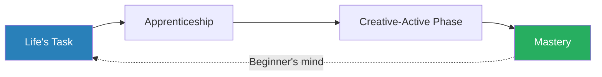
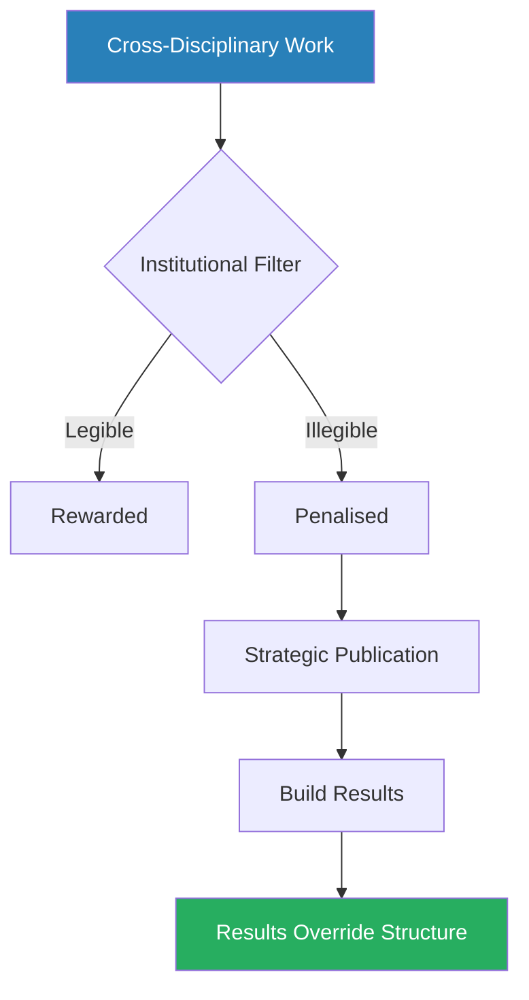
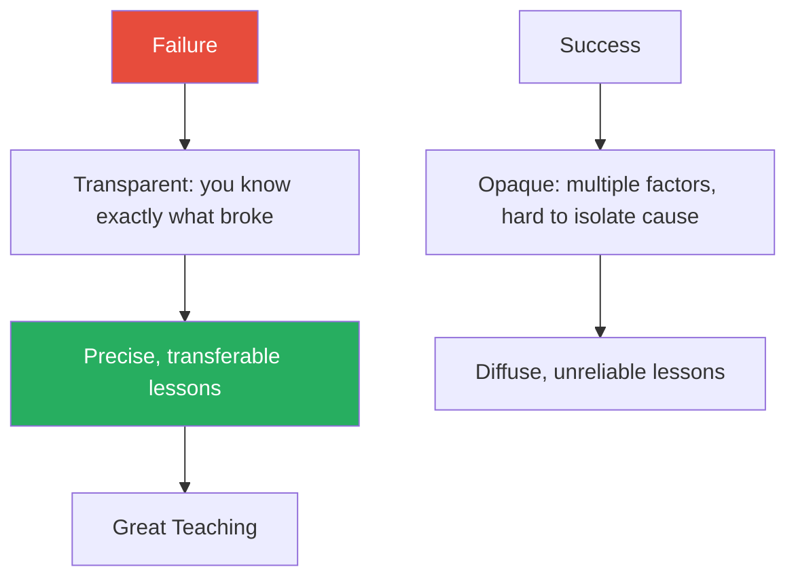
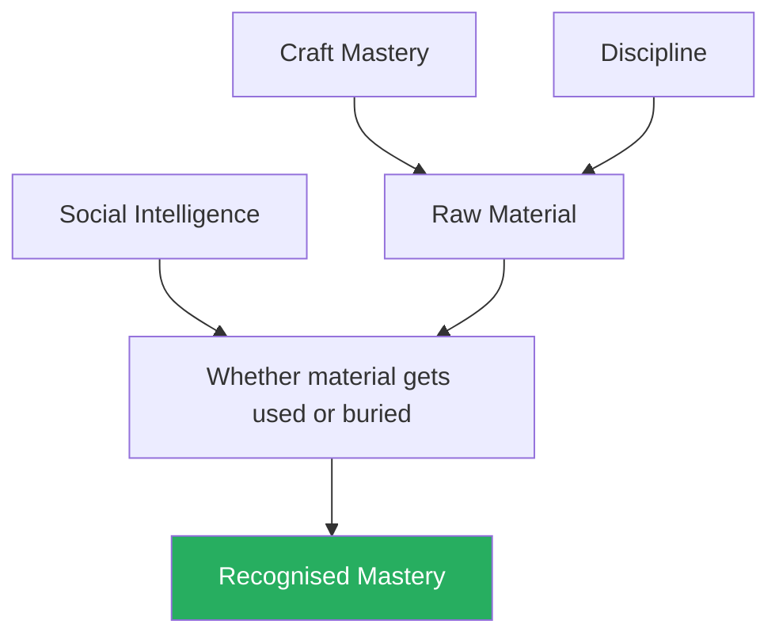
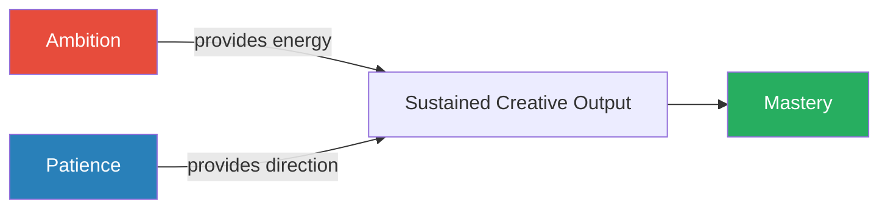

# Interviews with the Masters — Robert Greene

> Robert Greene's companion to *Mastery* presents raw, lightly edited interviews with six masters from wildly different fields: a conceptual sculptor, a neuroboticist, an architect-engineer, a boxing trainer, a programmer-investor, and a field linguist. The format strips away Greene's polished narrative and lets the masters describe their own paths in their own words — messy, contradictory, full of false starts and near-quitting moments. What emerges is a structural pattern more convincing than any thesis statement could be: each master discovered an inarticulate inner inclination, submitted to a prolonged apprenticeship, navigated social and political dynamics that had nothing to do with their craft, and eventually reached a phase where accumulated knowledge produced intuitive, almost unconscious command. The interviews are more honest than the book they fed into — the masters resist, correct, and complicate Greene's narrative in real time, making this the rarer and more valuable text.

---

## About the Author

Robert Greene is the author of *The 48 Laws of Power*, *The 33 Strategies of War*, *The Art of Seduction*, *The 50th Law* (with 50 Cent), and *The Laws of Human Nature*. His work across those books centres on power dynamics, strategy, and the patterns beneath human behaviour. *Mastery* (2012) was his fifth book and represented a shift from power and manipulation toward the question of how exceptional ability develops. Greene spent years interviewing contemporary masters across science, art, sports, technology, and language — and *Interviews with the Masters* (2013) is the companion volume that presents the raw conversations that generated *Mastery*'s polished thesis. Greene's interview style is distinctive: he does not play the neutral journalist. He arrives with a framework — the mastery process — and probes each subject through that lens, sometimes leading, sometimes being corrected, and occasionally being flatly contradicted by his interviewees. These moments of friction are where the book is most valuable.

---

## The Big Idea

*Greene argues that mastery is not genetic inheritance, not mystical talent, and not luck — it is a process with identifiable phases that repeat across every field, from boxing to neuroscience to sculpture.*

- The process has four stages, though the interviews reveal that real lives never move through them in a clean sequence
- Greene's central argument runs beneath every interview: mastery follows a <b style="color: #27ae60">discoverable architecture</b>
- But the raw interview format does something the polished book cannot — it shows how violently the architecture is resisted by real experience
- The masters do not disagree that the pattern exists; they disagree about how neat it is, how conscious it is, and how much of it is constructed after the fact

---

**The first stage** is what Greene calls <b style="color: #2980b9">the Life's Task</b> — an inner inclination, often inarticulate, that announces itself as a persistent strangeness before it becomes nameable:
- Teresita Fernandez describes decades of heightened spatial-visual awareness she could not label
- Freddie Roach boxed to please his father before a catalysing insult from his mother turned obligation into ownership
- The Life's Task is less a revelation than a slow accumulation of signals — a pattern that only becomes legible in hindsight
- Greene sometimes pushes the "destiny" framing harder than his interviewees support, and the tension between his romantic thesis and their messier reality is one of the book's most interesting features
- The crucial distinction: the Life's Task is not what you want to do — it is what you cannot stop doing, even when doing it makes no external sense

**The second stage** is the <b style="color: #2980b9">Apprenticeship Phase</b> — a period of deep observation, skill acquisition, and constrained experimentation where you absorb the rules before you can break them:
- This is the longest and least glamorous phase
- It involves submission: to a mentor, to a discipline, to the tedium of repetition
- Every master in the book describes some version of this, though the forms vary enormously:
  - Roach trained under Eddie Futch for years, absorbing a complete technical system
  - Fernandez taught herself metalwork in isolation
  - Paul Graham taught himself Lisp by writing code no one would read
- The common thread is not the structure of the apprenticeship but the attitude — <b style="color: #27ae60">a willingness to be a beginner, to be bad at something, to endure the discomfort of incompetence as the price of eventual command</b>
- What separates the future master from the perpetual dilettante is the willingness to stay in this uncomfortable phase long after the novelty has worn off

---

**The third stage** is the <b style="color: #2980b9">Creative-Active Phase</b> — the moment accumulated skill enables original contribution:
- Mentors are absorbed rather than followed — the practitioner begins combining knowledge in ways no one has combined it before
- Social resistance intensifies here: the institutions that rewarded obedience during the apprenticeship now resist originality
- The master must navigate political dynamics, jealousy, and structural inertia
- Every interview circles back to this theme: <b style="color: #27ae60">the gap between what is excellent and what is accepted is bridged by social intelligence, not by more craft</b>
- This is the most dangerous phase because the master is exposed — no longer protected by the mentor's authority, not yet validated by recognition

**The fourth stage** is <b style="color: #2980b9">Mastery</b> itself — intuitive command where pattern recognition operates below conscious awareness:
- Matsuoka calls this sensation "the fuzz"
- Fernandez calls it "transparency"
- Roach sees it in the eyes of a fighter who can finally see the whole ring
- It is not mystical, though it can feel that way — it is the accumulated pattern library becoming so deeply encoded that it no longer requires conscious retrieval
- What every master emphasises: this stage does not feel like arrival — it feels like the beginning of a new kind of work, one characterised by clarity rather than struggle

> [!tip] Core Insight
> The interviews demystify mastery by showing how non-linear and emotionally volatile the real paths were. No master describes a clean arc from calling to triumph. The architecture is real, but the lived experience of it is chaotic.

Greene's four-stage architecture appears in every interview, but the real paths are messy, looping, and full of reversals — the clean sequence is a retrospective reconstruction, not a lived experience. The dotted line back from Mastery to Life's Task reflects Calatrava's insistence that every project must feel like a new beginning.

---

## Key Concepts at a Glance

| Concept | One-line summary |
|---------|-----------------|
| **Life's Task** | An inner calling that reveals itself as persistent strangeness, not as clarity; felt before it is named |
| **Apprenticeship as submission** | You absorb the rules, techniques, and conventions of a domain completely before you can meaningfully depart from them |
| **Mentors absorbed, not followed** | The healthiest mentor relationships end in departure; the student internalises the teacher's system and then evolves beyond it |
| **Discipline over talent** | Raw ability without discipline produces mediocrity or self-destruction; discipline without exceptional talent produces world-class outcomes |
| **Reframing the problem** | Creative breakthroughs come from approaching a known problem from an entirely different starting point, not from incremental improvement |
| **Social intelligence as infrastructure** | Mastery of craft without social intelligence produces work that stalls, gets co-opted, or gets buried |
| **Intuition as pattern recognition** | The "intuition" masters describe is the accumulated pattern library operating below conscious awareness |
| **Beginner's mind at mastery** | Masters maintain quality by deliberately resisting routine and approaching each new challenge with the emotional intensity of a first attempt |
| **The right kind of crazy** | Transformative ideas appear stupid to most observers because they exploit conditions that are barely sufficient |
| **Negative capability** | The willingness to hold contradictory possibilities without premature resolution enables original discovery |
| **Interdisciplinary combination** | Every master who created a new field did so by combining existing fields, despite institutional punishment for doing so |
| **Failure as teaching material** | Masters who become great teachers transmit the lessons from their own failures, which are more transparent and transferable than successes |

The apprenticeship phase dominates the interviews — all six masters spend more time describing the long slog of skill acquisition than any moment of creative breakthrough, reinforcing Greene's thesis that mastery is built in the trenches.

---

## The Masters

### Teresita Fernandez — Sculptor, Conceptual Artist

*Fernandez reveals how an unnamed spatial awareness, decades of self-directed apprenticeship, and a refusal to repeat herself produced mastery that accelerates rather than plateaus.*

**Field:** Large-scale public sculpture and installation art.
- Fernandez works with materials like graphite, gold, and glass to create immersive spatial experiences, often at architectural scale
- She is one of the most acclaimed public artists in the United States, with installations in major cities and museums
- Her work is not decorative — it transforms how viewers experience physical space

---

**Her path:**
- Fernandez grew up with what she describes as "a kind of alternative way of sensing" — a heightened spatial-visual awareness that she could not name for decades
- She did not grow up in the art world — no family tradition, no early exposure to galleries or studios
- The inclination announced itself as strangeness: she perceived space, light, and surfaces differently from the people around her, but she had no vocabulary for what she was perceiving and no context that made it legible
- It took years before this unnamed sensitivity found its way into anything resembling a vocation
- This is the Life's Task in its rawest form — not a calling but a persistent oddness that only makes sense in retrospect

Her apprenticeship was entirely self-directed:
- She had no formal mentor in the traditional sense
- Her teacher Elizabeth King influenced her through a single insight — "the specific is more interesting than the general" — rather than through ongoing instruction
- Fernandez describes this as a pivotal moment, not because King taught her a technique but because King shifted her orientation
- From that point forward, she pursued the specific, the granular, the material detail rather than the abstract concept
- She also learned extensively from what she calls <b style="color: #2980b9">negative exemplars</b> — "examples of what I didn't want to do"
  - Watching other artists whose work she found hollow or derivative taught her what to avoid
  - This is mentorship by inversion: learning not from someone who shows you the path but from someone who shows you the ditch
  - It requires a critical eye that most beginners do not yet possess — you must already have some instinct for quality to recognise its absence

---

- She taught herself metalwork, then material transformation more broadly
- The apprenticeship was not about learning to sculpt in the conventional sense — it was about learning the behaviour of materials:
  - How gold responds to heat
  - How graphite interacts with light
  - How glass refracts and distorts space
  - How each material has its own logic, its own set of possibilities and constraints
- Only after she had absorbed the physical properties of her materials could she begin to use them conceptually
- <b style="color: #27ae60">The conceptual work sits on top of the material knowledge — you cannot skip the material foundation and go straight to the ideas</b>

#### Key Lessons

**Destiny is carved, not found.**

- "I carved the way of that destiny"
- Fernandez rejects the idea of a fixed calling that you simply discover, like finding a treasure chest buried in your childhood
- The Life's Task, as she describes it, is not a destination but a direction that becomes clearer through action, not contemplation:
  - You do not sit and wait for clarity
  - You act on incomplete information, make things, respond to what the making teaches you, and adjust
  - The destiny emerges from the carving — it is not there before you begin
- <b style="color: #27ae60">Passion is something you build through sustained engagement with material, not something you feel before you start</b>
- This directly contradicts the popular "follow your passion" advice — Fernandez did not follow a passion, she constructed one through decades of work

> [!example] Greene Pushes, Fernandez Pushes Back
> - Greene probes Fernandez on the destiny framing — he wants it to be neater, more prophetic
> - Fernandez resists: "No, it's not that neat a package"
> - She insists that the inarticulate strangeness of her early perception was not a sign of future greatness
> - It was simply a feature of how her mind worked
> - The greatness came from what she did with it over decades, not from the perception itself
> - Greene tries again from a different angle, and Fernandez holds her ground — the raw interview captures this exchange in full
> **The lesson:** The raw interview format is more valuable than the polished book — Fernandez is correcting Greene's thesis in real time, and the correction is more useful than the thesis.

---

**Transparency as radical self-knowledge.**

- After decades of practice, Fernandez describes a state where "you can't hide anything from yourself"
- The accumulated hours with materials, the thousands of failed experiments, the slow stripping away of pretension and self-deception — all of it produces a <b style="color: #2980b9">transparency</b> that she describes as both terrifying and liberating
- When you surrender to this transparency, she says, "you get rid of so much stuff"
- The creative process gets faster not because the work becomes easier but because the internal interference has been cleared away:
  - Ego, defensiveness, attachment to old ideas — gone
  - She describes her work in the last five to ten years as dramatically faster than earlier in her career, despite being more ambitious in scope
  - The paradox: more complex work produced more quickly, because the internal noise has been eliminated
- The pattern library is richer, and the self-deception is gone
- <b style="color: #27ae60">Speed is a lagging indicator of mastery</b> — when you see a master working fast, you are seeing the result of decades of slow accumulation, not natural facility

---

**Never repeat yourself.**

- "I can't make something more than once. It just does not come out"
- Fernandez has a creative discipline that borders on compulsion: she discards the first twenty obvious approaches to any material
  - The obvious solutions are, by definition, the ones anyone would reach
  - They are competent and forgettable
  - Discarding them is not waste — it is quality control applied to the idea stage rather than the execution stage
- She treats repetition as a signal that she has stopped thinking — executing from the pattern library rather than generating new patterns
- <b style="color: #e74c3c">The danger mastery creates: the very speed and fluency it produces can become a trap, automating the creative process into a comfortable loop</b>
- Fernandez's refusal to repeat is her defence against that automation
- This connects to Calatrava's insistence on treating every project as a new beginning — both masters independently identify the same threat and develop similar defences

**Holding unresolved tension.**

- Fernandez describes putting ideas "on the back burner" for years rather than forcing premature resolution
- Sometimes a decade passes before an early instinct finds its proper form
- She does not experience this as procrastination or failure — she experiences it as patience:
  - Trusting that the idea is not ready
  - That the materials and the concept have not yet found each other
  - That forcing the connection would produce something less than what the idea deserves
- This willingness to live with unresolved creative tension is connected to what Greene, drawing on John Keats, calls <b style="color: #2980b9">negative capability</b> — the capacity to remain in uncertainty without grasping for premature closure
- For Fernandez, it is not a philosophical concept but a practical discipline: the idea will arrive when the conditions are right, and your job is to notice when that happens, not to manufacture it
- <b style="color: #e74c3c">Forcing resolution produces adequate work; waiting for the idea to mature produces work that surprises even its creator</b>

---

### Yoky Matsuoka — Neuroboticist, Robotics + Neuroscience

*Matsuoka's interview reveals that social intelligence is not a soft skill but load-bearing infrastructure — and that institutions will punish exactly the interdisciplinary combination that produces the most original work.*

**Field:** Pioneer of <b style="color: #2980b9">neurobotics</b> — the intersection of robotics and neuroscience.
- Matsuoka was a professor at the University of Washington, former head of innovation at Google and Nest, and the person who coined the term "neurobotics"
- Her work focused on building robotic systems that replicate the biomechanics of the human hand, and on developing prosthetics controlled through natural body movements rather than neural decoding
- She is one of a handful of scientists who have successfully bridged two fields that most institutions treat as separate universes

---

**Her path:**
- Matsuoka's story is fundamentally about combining two fields that institutional structures actively penalised her for combining
- She came from robotics, moved into neuroscience
- The intersection — using biological principles to build better robots, and using robotic models to understand biology — was where her most original work lived
- But tenure committees, grant panels, and academic departments all punished cross-disciplinary work because it was illegible within existing categories
- Neither the robotics department nor the neuroscience department could fully evaluate her work, because each only understood half of it

> [!example] The Harvard Tenure Warning
> - Matsuoka describes a colleague who could not get tenure at Harvard
> - He "didn't stagger it just right" — published too evenly across fields
> - Neither field claimed him as their own
> - The structure of academic institutions rewards depth within a single discipline and treats breadth as dilettantism
> - The colleague's work was excellent — the problem was not quality but institutional legibility
> **The lesson:** Institutional legibility matters more than intellectual originality when it comes to career survival.

- Matsuoka survived this structural hostility by developing a strategic approach to publication:
  - She banked her publications in robotics — the field that was legible and fundable
  - She conducted her biological discoveries on the side
  - "If I published 50/50, I would have never been successful"
  - The ratio had to be skewed toward the legible field to maintain institutional credibility, even though the cross-disciplinary work was where the real breakthroughs were happening
- <b style="color: #e74c3c">This is not intellectual dishonesty — it is navigating institutional reality with open eyes</b>
- The strategy required a dual awareness: knowing what was intellectually important and knowing what was institutionally rewarded, and managing the gap between them

#### Key Lessons

**Social intelligence is not a soft skill — it is load-bearing infrastructure.**

- "Quite a lot of the reason why I'm doing what I'm doing and where I got to has nothing to do with my science"
- Matsuoka is remarkably candid about this — she describes entering a room and immediately reading the hierarchy:
  - Who has power
  - Who is deferring to whom
  - Who is performing confidence versus who actually has it
  - Who will be an ally and who will be an obstacle
- She calibrates her own behaviour to the audience
- In certain contexts, she deliberately acts less knowledgeable than she is
- She has specific rules for women in science:
  - Do not paint your nails in ways that draw attention
  - Do not signal anything that triggers gender bias
  - Be aware that the same statement will be received differently depending on who says it
- <b style="color: #27ae60">These rules are not cynical — they are pragmatic responses to a system that is not meritocratic, regardless of what it claims</b>

---

- The depth of Matsuoka's social intelligence is unusual among scientists, and Greene probes it extensively
- She traces it partly to growing up in Japan and then navigating American academic culture as an outsider — the forced attention to social cues that comes from being a foreigner
- But she also describes it as a deliberate study, something she worked at with the same rigour she applied to biomechanics:
  - She watched how people responded to different framings of the same idea
  - She tested different approaches to the same request
  - She learned when to ask questions and when to stay silent, when to assert and when to defer
  - She tracked what worked and what did not, adjusting her approach with each interaction
- The result is someone who can navigate any institutional environment with precision — not because she is political in the manipulative sense, but because she understands that <b style="color: #27ae60">the social context is as real and as consequential as the scientific content</b>

> [!tip] Core Insight
> Social intelligence is not a supplement to mastery — it is the infrastructure that determines whether mastery gets recognised or buried.

---

**Reframe the problem before solving it.**

- Matsuoka's most original contributions came not from solving existing problems better but from <b style="color: #2980b9">redefining what the problem was</b>
- The standard approach to prosthetic hand control: decode neural signals from the brain
  - Enormously difficult — neural decoding is noisy, imprecise, and requires invasive brain interfaces
  - The field had been working on this approach for years with limited success

> [!example] Matsuoka's Prosthetics Breakthrough
> - Instead of starting from the brain and working down to the hand, Matsuoka started from the body and worked up
> - She discovered that the motion of the elbow and wrist reliably predicted hand gestures
> - By tracking the easily measurable movement of the arm, she could predict what the hand was about to do — bypassing the neural decoding problem entirely
> - The breakthrough was not technical virtuosity — it was seeing that the problem everyone was trying to solve was the wrong problem
> - The existing approach was not wrong in its execution — it was wrong in its framing
> **The lesson:** Reframing is not a technique; it is a disposition — the confidence to step outside the established approach and the patience to build something from scratch.

- She applied the same reframing to her robotics work:
  - Instead of applying existing arm models to the hand-control problem, she started from biomechanical details — the specific geometry of tendons, the way muscles interact at the joint level
  - The existing models were wrong not because they were poorly executed but because they started from the wrong assumptions
  - <b style="color: #27ae60">The most powerful innovation is not a better answer to the existing question — it is a better question</b>

---

**Institutions punish the interdisciplinary — only results override structure.**

- This is perhaps the most important lesson from Matsuoka's interview, and it runs through the entire book
- Existing institutional structures — universities, funding agencies, professional associations, corporations — are organised around single disciplines:
  - They reward legibility: your work should fit cleanly into one category
  - Cross-disciplinary work is illegible — it falls between committees
  - It gets reviewed by people who understand half of it and are suspicious of the other half
- Matsuoka's response was not to fight the structure but to navigate it:
  - She published where the structure rewarded her
  - She did the boundary-crossing work regardless
  - Her results eventually became so undeniable that the structure had to accommodate her
  - The field of neurobotics was essentially created around her work
  - Google hired her precisely because her profile was uncategorisable
- <b style="color: #e74c3c">Institutions do not reward originality automatically — they reward legibility. The only override is results so undeniable they cannot be ignored</b>

Matsuoka's path shows that institutional structures are not malicious — they are simply designed for legibility. The cross-disciplinary innovator must learn to speak the institution's language while doing work the institution cannot yet categorise.

---

**The fuzz — intuition as pre-verbal knowing.**

- Matsuoka describes a particular state she calls <b style="color: #2980b9">"the fuzz"</b> — a non-verbal, non-visual sense of the answer before she can articulate it
- It is not a hunch in the casual sense — it is a specific sensation that arrives when:
  - She has been deeply immersed in a problem space
  - Her cognitive load is low enough to allow deep processing
  - Her attention is focused rather than scattered
- She describes needing to shed external commitments — committees, administrative duties, social obligations — to recover the capacity for this kind of deep, pre-verbal processing
- The fuzz does not arrive on demand — it arrives when the conditions are right: deep domain knowledge, low distraction, and extended focus on a single problem
- This is pattern recognition operating below conscious awareness, and it is perhaps the most practical description of what mastery actually feels like from the inside
- <b style="color: #e74c3c">The implication is sobering: the administrative overhead of modern professional life — the meetings, emails, committees — actively degrades the cognitive conditions that mastery requires</b>

---

### Santiago Calatrava — Architect, Structural Engineer

*Calatrava demonstrates that mastery's greatest danger is competence on autopilot — and that the antidote is treating every project as a terrifying new beginning.*

**Field:** Architecture and structural engineering.
- Calatrava is known worldwide for sculptural bridges and buildings that merge engineering with organic form — structures that look like they should not stand but do, because the engineering is as rigorous as the aesthetics are dramatic
- His work includes the City of Arts and Sciences in Valencia, the Turning Torso in Malmo, and the World Trade Center Transportation Hub in New York
- He is one of the few architects who is also a fully qualified structural engineer — most architects design forms and hand the structural problems to someone else

---

**His path:**
- Calatrava holds degrees in both architecture and civil engineering — a combination that gives him a structural intuition most architects lack
- Where a typical architect designs a form and then hands it to engineers to figure out how to make it stand, Calatrava designs the form and the structure simultaneously
- He understands, in his body and his hands, how forces flow through materials
- This <b style="color: #2980b9">dual training</b> is the foundation of everything he does, and he describes it as requiring "a lot of maturity" — decades of accumulated structural knowledge before the intuition becomes reliable
- His late work, he says, is his greatest because it rests on the full depth of that accumulated knowledge

- Calatrava draws extensively on nature — particularly on the human body, on bones and tendons, on the way organisms solve structural problems:
  - His buildings often resemble skeletons, wings, or opening hands
  - This is not decorative metaphor — it is structural
  - The natural world has solved engineering problems over millions of years of evolution
  - Calatrava treats biological forms as a library of structural solutions
  - He studies the anatomy of birds, the mechanics of joints, the distribution of load in skeletal systems — and translates these patterns into steel and concrete

#### Key Lessons

**Every project must feel like a beginning.**

- "It's a new beginning on every project. If it is not, bad news"
- This is one of the most striking statements in the book, because it comes from someone with decades of experience and global recognition
- Calatrava is not describing humility for its own sake — he is describing a deliberate psychological discipline:
  - Mastery creates a specific danger: the ability to do things competently without thinking
  - The pattern library becomes so rich and the technical skills so fluent that the master can produce acceptable work on autopilot
  - <b style="color: #e74c3c">Acceptable is the enemy of extraordinary</b>
  - The master who settles for acceptable has stopped growing — and has begun the slow decay into mere competence

> [!example] Calatrava's Defence Against Automation
> - Calatrava has his son prepare talks with images he has not seen, forcing improvisation
> - He approaches each new building as if he has never designed one before
> - Not because he pretends ignorance, but because he refuses to let prior solutions colonise the new problem
> - "The freshness and the spontaneity has to be there"
> - This means deliberately discarding the comfortable, the proven, the safe
> - It means re-entering the anxiety of the beginner at every new project, even after decades of demonstrated excellence
> - He describes the anxiety as essential — it is the signal that he is doing genuinely new work rather than recycling old ideas
> **The lesson:** The beginner's anxiety is not a problem to outgrow — it is the creative state that produces the best work.

---

**Orchestrating collective work requires absorbed knowledge.**

- Architecture is inherently collaborative — engineers, contractors, clients, local governments, regulatory bodies
- No architect works alone, and the quality of the final building depends as much on how these collaborations are managed as on the design itself
- Calatrava's ability to direct these collaborations comes not from formal authority but from structural understanding so deep that he can anticipate problems before they surface:
  - When an engineer raises a concern about load distribution, Calatrava does not need to consult a textbook
  - He has internalised the physics
  - He can respond in the moment, adjusting the design while maintaining the aesthetic intent
  - This in-the-moment responsiveness is only possible because the knowledge is embodied, not merely referenced
- This gives him a different kind of authority than the manager who merely coordinates:
  - It is the authority of someone who actually knows the craft at every level, from the mathematical to the visual
  - <b style="color: #27ae60">People defer to it not because of title but because of demonstrated competence in their own domain</b>
  - The engineer defers to Calatrava not because Calatrava is the boss but because Calatrava speaks the engineer's language better than most engineers do

> [!tip] Core Insight
> True authority in collaborative work comes not from rank but from understanding so deep that you can solve problems in every collaborator's domain before they surface.

---

**The master-student chain transcends, not replicates.**

- Calatrava references Rembrandt's painting of Aristotle contemplating the bust of Homer — a chain where Homer teaches Aristotle, who teaches Alexander the Great
- The point of the chain is not continuity — it is <b style="color: #2980b9">transcendence</b>:
  - Each node goes beyond what the previous one could have imagined
  - Homer could not have predicted Aristotle
  - Aristotle could not have predicted Alexander
- The purpose of mentorship is not to create followers who preserve the master's system — it is to launch successors who have absorbed the system so completely that they can depart from it and create something the master never could
- A mentor who creates a permanent follower has failed
- A mentor who creates someone who goes beyond them has succeeded
- This is an uncomfortable standard because it means:
  - The mentor must accept being surpassed
  - The student must accept the guilt that comes with surpassing
- Both sides of this dynamic are present in the interviews: Roach describes evolving beyond Futch, Fernandez describes learning from King and then departing entirely
- <b style="color: #27ae60">The healthy mentor relationship has an expiry date, and the sign of its health is the student's eventual independence</b>

---

**Courage under incertitude.**

- Calatrava describes the experience of beginning a new project as fundamentally uncertain — even after decades, even after global recognition:
  - He does not know whether the new design will work until he has worked through it
  - He does not know whether the engineering will support the form until the calculations are done
  - He lives in uncertainty as a professional condition
- He has learned to treat this uncertainty not as a problem to be eliminated but as the environment in which good work happens
- This is related to negative capability — the capacity to remain in uncertainty without grasping for premature closure — but Calatrava frames it in characteristically physical terms
- It takes courage, he says, to begin something you are not sure you can finish — and this courage must be renewed with every project
- <b style="color: #e74c3c">The master who avoids uncertainty has stopped attempting work that matters</b>

---

### Freddie Roach — Boxing Trainer

*Roach's interview delivers the book's most direct evidence that discipline outperforms talent — and that fully understood personal failure becomes the most powerful teaching material.*

**Field:** Professional boxing.
- Roach is one of the most successful boxing trainers in history, having trained world champions including Manny Pacquiao, Oscar De La Hoya, and Miguel Cotto
- He runs the Wild Card Boxing Club in Hollywood
- Before becoming a trainer, he was a professional fighter with a record that was respectable but not exceptional
- His transition from fighter to trainer is the book's most compelling demonstration that failure, properly metabolised, becomes the foundation of mastery in a different form

---

**His path:**
- Roach did not choose boxing — boxing chose him, or rather, his father chose it for him
- Peppy Roach was a boxing man, and his sons were going to box
- The initial motivation was familial obligation: you did what your father expected
- The transformation from obligation to ownership came from an unexpected source — his mother:
  - Her dismissal of his fighting — "You're no good" — became a catalysing insult
  - Instead of crushing his ambition, it ignited it
  - He fought to prove her wrong
  - The external motivation (please Dad) became internal motivation (prove Mom wrong), which eventually became something deeper: a genuine absorption in the craft itself
- By the time the family dynamics faded into background, the love of boxing was self-sustaining

> [!example] The Mother's Insult as Catalyst
> - Roach's mother told him flatly that he was no good at boxing
> - For most people, this would be crushing — or confirming a private fear
> - For Roach, it became rocket fuel
> - The insult converted passive participation into fierce determination
> - He fought not out of love for the sport — not yet — but out of rage at being dismissed
> - Only later, after the rage had served its purpose, did the genuine love of craft emerge from underneath it
> **The lesson:** Motivation does not need to be noble to be effective. What matters is that it sustains engagement long enough for genuine passion to develop.

---

- As a fighter, Roach had a critical flaw: <b style="color: #e74c3c">he could not control his emotions in the ring</b>
  - "I was better in the gym than in the fight"
  - In the controlled environment of training, he was sharp, disciplined, technically precise
  - But under the adrenaline and pressure of a real fight, he got fired up, abandoned his game plan, and made mistakes that better discipline would have prevented
  - He knew this about himself — he could see the pattern even as he failed to break it
  - This self-knowledge — this fully understood failure — became the foundation of his second career

> [!example] Roach and Eddie Futch
> - Roach trained under the legendary Eddie Futch, one of the greatest trainers in boxing history
> - Futch's system was methodical, technical, built on decades of refined observation
> - Roach absorbed the system completely — he did not challenge it, question it, or try to improve on it during his apprenticeship
> - He submitted
> - Over many years after Futch's influence faded, he evolved beyond it
> - "There's a lot of Eddie Futch in me, and there was more Eddie Futch in me when I was younger. I've kind of progressed"
> - The Futch system is still inside him — it is the foundation, but it has been transformed by Roach's own experience, personality, and understanding
> **The lesson:** The mentor becomes an ingredient, not a template — the foundation remains, but the building on top is your own.

- Parkinson's disease ended his boxing career
- He channelled everything — the technical knowledge, the understood failures, the Futch system, the emotional intelligence — into coaching
- The transition from fighter to trainer was not a consolation prize:
  - It was the fulfilment of a pattern that had been building for years
  - Roach's deepest skill was always teaching, observing, and correcting
  - He was always the one in the gym noticing what other fighters were doing wrong
  - Parkinson's forced the transition, but the capacity had been there long before

#### Key Lessons

**Discipline outperforms talent — every time.**

- "Discipline is the most important aspect in maybe life"
- Roach offers the most direct evidence for this principle in the entire book

> [!example] Roach vs. Pepper — Same Gym, Different Outcomes
> - Roach and his brother Pepper grew up in the same household, trained in the same gym, had access to the same coaching
> - Pepper was more naturally talented — faster, smoother, more instinctively gifted
> - But Pepper lacked discipline — he drifted, lost focus, allowed distractions to erode his training
> - Roach, with less natural talent, maintained relentless discipline — and went far further in the sport
> - Same family, same environment, same access — the only variable that differed was discipline
> **The lesson:** Talent is the starting position. Discipline is the rate of compounding.

> [!example] Dicky Eklund — Talent Destroyed by Indiscipline
> - Eklund, a fighter from the same era (later made famous in the film *The Fighter*), had extraordinary natural ability
> - He was the more gifted fighter by any objective measure
> - But addiction and lack of discipline destroyed his career
> - Both Roach and Eklund, independently, observe the same truth: "Pepper was better than me... but me and Micky had more discipline and went a lot further"
> - The pattern repeats across boxing history — the most talented fighters are rarely the most successful
> **The lesson:** Over the span of a career, compounding overwhelms initial conditions — the naturally gifted person who does not compound is overtaken by the less gifted person who does.

> [!tip] Core Insight
> Minimum threshold talent is required — you cannot discipline your way to becoming a heavyweight if you weigh 130 pounds. But above that threshold, discipline is the dominant variable, and it is the one you control.

---

**Transform personal failure into teaching material.**

- Roach's greatest insight as a trainer — teaching fighters to stay calm, see clearly, and execute their game plan under pressure — came directly from understanding why he himself failed to do those things:
  - He was "better in the gym than in the fight" because adrenaline overwhelmed his discipline
  - He got fired up, abandoned technique, and fought on emotion rather than strategy
  - He knew exactly what was happening — he could feel himself losing control even as it happened
  - And he could not stop it

- This failure, fully understood, became the cornerstone of training world champions:
  - Roach knows, from the inside, what it feels like to lose composure under pressure
  - He knows the warning signs and the physiological cascade
  - He knows, from painful experience, the cost of failing to manage it
  - When he trains Manny Pacquiao to stay calm and pick his spots, he is not teaching from theory — <b style="color: #27ae60">he is teaching from scar tissue</b>
  - The lessons he transmits are precise because the failures that generated them were specific and understood

Failure is transparent — when things go wrong, you can trace the chain of causation with painful clarity. The teacher who has failed and understood the failure teaches more precisely than the teacher who succeeded without fully understanding why.

---

**Mentors are absorbed, not followed.**

- Roach's relationship with Futch is the book's clearest illustration of the <b style="color: #2980b9">mentor absorption process</b>:
  - During the apprenticeship, Roach did not innovate — he copied
  - He absorbed Futch's system wholesale: the way Futch watched fighters, the way he broke down technique, the way he designed training regimens
  - This was not intellectual laziness — it was strategic submission
  - <b style="color: #e74c3c">You cannot depart from a system you have not fully internalised</b>
  - The departure comes later, and it comes naturally — not as a rejection of the mentor but as an evolution that the mentor's system made possible

- Decades after training with Futch, Roach can still identify the Futch elements in his own coaching:
  - But they have been transformed
  - They are mixed with his own experience, his own understanding of emotional management under pressure, his own instincts about what fighters need
  - The Futch foundation is still there, but the building on top of it is Roach's own

**The gym reveals character.**

- Throughout his interview, Roach returns to the idea that the boxing gym is a laboratory for reading human nature:
  - He can tell within weeks whether a new fighter has the discipline to succeed — not the talent, the discipline
  - He watches how they train when no one important is watching
  - He watches how they respond to correction
  - He watches whether they do the boring, repetitive drills with the same intensity as the exciting sparring sessions
- <b style="color: #27ae60">Character is not what you declare — it is what you do when the work is tedious and no one is keeping score</b>
- This connects to the discipline-over-talent thesis: Roach learned to read character because character, not talent, was the reliable predictor of success

---

### Paul Graham — Programmer, Essayist, Y Combinator Co-Founder

*Graham is the book's counter-example — the autodidact who flatly rejects Greene's apprenticeship framework and reveals that avoidance of pain can be as powerful a creative heuristic as pursuit of passion.*

**Field:** Programming, entrepreneurship, and venture capital.
- Graham is the creator of Viaweb (widely considered the first web application, later sold to Yahoo and renamed Yahoo Store) and co-founder of Y Combinator, the startup accelerator that has funded companies including Dropbox, Airbnb, Stripe, and Reddit
- Before all of this, he studied painting at the Accademia di Belle Arti in Florence and wrote one of the foundational texts on the Lisp programming language
- His career is itself a demonstration that the most interesting outcomes emerge from combinations no one planned

---

**His path:**
- Graham's career is a case study in <b style="color: #2980b9">interdisciplinary combination</b> — painting, programming, and business instincts converging into something no existing institutional category could have produced
- He did not plan any of it — he did not sit down at twenty and decide to combine art and Lisp and entrepreneurship into a new form of venture capital
- Each move was driven by what interested him and what he wanted to avoid:
  - He studied philosophy as an undergraduate, then switched to computer science because he wanted to work with something concrete
  - He learned Lisp because he found it beautiful
  - He studied painting in Florence because he loved painting
  - He started Viaweb because he hated Windows and wanted to build software that ran in a browser
  - He started Y Combinator because he was bored and wanted to help startups avoid the mistakes he had made
- At no point does Graham describe a grand plan — he describes a series of moves driven by curiosity and aversion
- The combination that made him extraordinary was not engineered — it was accumulated
- <b style="color: #27ae60">The career was coherent in retrospect but anarchic in real time</b>

#### Key Lessons

**The best ideas are just on the right side of crazy.**

- "It almost didn't work"
- Graham's account of Viaweb is a masterclass in what he calls <b style="color: #2980b9">"the right kind of wrong"</b> — ideas that look like bad ideas to almost everyone but happen to be barely possible given current technology

> [!example] Viaweb — The Barely Possible Web Application (mid-1990s)
> - Web applications in the mid-1990s were, by any reasonable standard, a terrible idea
> - The internet was slow, browsers were primitive
> - The idea of running software through a web browser instead of installing it on your computer seemed absurd to anyone who understood the technical limitations
> - The application was slow, clunky, and crashed frequently
> - But it worked just enough — and because it worked just enough, Graham was years ahead of the competition
> - No one else was building web applications, because the idea seemed obviously wrong
> - The few people who tried gave up quickly — Graham persisted because he hated the alternative more
> **The lesson:** The narrow band where an idea seems bad but is actually barely possible is where transformative breakthroughs live.

- Graham draws a broader principle from this:
  - If an idea seems obviously good, competition eliminates the advantage — everyone else will build it too
  - If an idea seems obviously bad, it likely is
  - <b style="color: #27ae60">The skill is recognising which ideas in the narrow "barely possible" band are actually on the right side of the line — crazy but barely feasible versus crazy and genuinely impossible</b>
  - This recognition is itself a form of pattern recognition — it requires enough technical knowledge to see the trajectory, not just the current state

---

> [!example] Microcomputers in the 1970s
> - Microcomputers were "a joke" — barely powerful enough to be useful
> - The people who recognised that the joke was actually a revolution were the ones who built the personal computer industry
> - Everyone else was looking at mainframes and seeing a mature, functional technology
> - They were right about the present and catastrophically wrong about the future
> - The same pattern repeats: web applications in the 1990s, smartphones in the 2000s, AI in the 2010s
> **The lesson:** "Barely works" is often about to become "works well" — but only a few can see that transition coming.

**Avoidance of pain as a creative heuristic.**

- This is one of the most counterintuitive ideas in the book, and Graham articulates it with characteristic directness
- His most original contributions came not from pursuing a positive vision but from running away from things he found intolerable:
  - He hated Windows, so he built web software
  - He hated working for others, so he started companies
  - He hated watching startups make predictable mistakes, so he built Y Combinator
  - He hated the grant-writing culture of academia, so he stayed in industry

> [!tip] Core Insight
> Most advice tells you to pursue what you love. Graham suggests that running away from what you hate is equally valid, and possibly more reliable. Love is diffuse — you can love many things without acting. Hatred is specific — it identifies a concrete problem you are personally motivated to solve.

- <b style="color: #27ae60">Pain avoidance, treated honestly rather than suppressed, becomes a compass pointing toward the problems that only you will solve in exactly your way</b>
- The key word is "honestly" — most people suppress their aversions or rationalise them away rather than following them to their productive conclusion

---

**Keep walking.**

- Graham's advice to founders — and, implicitly, to anyone negotiating from a position of strength — is drawn directly from his own experience with Viaweb

> [!example] Graham's Two Wasted Years
> - During the Viaweb acquisition process, Graham became obsessed with the deal
> - He stopped building and focused on the negotiation
> - For two years, he was effectively paralysed — waiting for the deal to close, unable to commit fully to building or to walking away
> - By his account, it was two wasted years
> - The psychological trap: once you begin negotiating, the potential deal occupies your attention so completely that you cannot focus on building
> **The lesson:** Do not stop moving to negotiate. Do not sit still while someone else decides your fate.

- The lesson he extracts is blunt:
  - Keep building, keep walking, and let opportunities run alongside you
  - The person who stops to negotiate from a position of need loses leverage
  - The person who keeps walking — who is visibly building, visibly making progress, visibly not dependent on the outcome of any single negotiation — negotiates from strength
  - <b style="color: #27ae60">Strength is not claimed — it is demonstrated by continuing to move</b>

---

**The counter-example to apprenticeship.**

- One of the most valuable moments in the book comes when Greene pushes Graham on the formal apprenticeship framework that structures *Mastery*
- Graham flatly rejects it: "If your whole book is going to be about formal apprenticeships, I am going to be the counter-example"
- Graham's path was self-taught, autodidactic, and allergic to institutional structure:
  - He learned Lisp by writing Lisp
  - He learned painting by painting
  - He learned entrepreneurship by starting a company and making every mistake in the book
  - There was no Eddie Futch figure in his life — no master who took him under a wing and transmitted a system
- This is a genuine challenge to Greene's thesis, and to his credit, Greene includes it in the book rather than editing it out
- The challenge forces the reader to hold a more nuanced model:
  - <b style="color: #2980b9">Apprenticeship is a common and powerful path to mastery, but it is not the only path</b>
  - Some masters are built through self-directed, anarchic, trial-and-error learning that looks nothing like the structured submission Greene describes
  - The architecture of mastery may be real, but its expression varies more widely than any single framework can capture

---

### Daniel Everett — Linguist, Amazonian Fieldworker

*Everett's interview is the book's most dramatic — a missionary who lost his faith, a linguist who challenged Chomsky, and a field researcher who discovered that the most powerful theory in his discipline might be wrong.*

**Field:** Linguistics and anthropology.
- Everett spent decades living with the Piraha people of the Amazon, whose language and culture challenged fundamental assumptions in both linguistics and the philosophy of language
- He is the author of *Don't Sleep, There Are Snakes*, a memoir of his time with the Piraha
- His story is the most personally transformative in the book — he went into the Amazon as one person and came out as another

---

**His path:**
- Everett arrived in the Amazon as a Christian missionary — his purpose was specific and institutional: translate the Bible into the Piraha language
- To do this, he needed to learn the language, which meant living with the Piraha, observing their culture, and slowly building a linguistic picture of how their language worked

What he found dismantled everything he believed — both scientifically and personally:
- The Piraha language appeared to lack <b style="color: #2980b9">recursion</b> — the ability to embed one phrase inside another, as English does when you say "the man who is standing by the river"
- Recursion is not a minor feature of language — according to Noam Chomsky's theory of <b style="color: #2980b9">universal grammar</b>, which dominated linguistics for decades, recursion is the defining feature of all human language:
  - The one property that is universal, innate, and biologically hard-wired
  - If a language lacks recursion, universal grammar in its strong form is wrong
- Everett's findings put him in direct conflict with the most powerful figure in modern linguistics
- The stakes were not merely academic — Chomsky's theory was the foundation on which entire departments, careers, and funding streams were built

---

The personal transformation was equally dramatic:
- The Piraha had no concept of guilt, no anxiety about the future, no creation myth, and no interest in abstract concepts that were not grounded in immediate, direct experience
- They responded to Everett's evangelism with cheerful, unshakeable indifference:
  - They were not hostile to Christianity
  - They simply found it irrelevant
  - They had no use for a story about a man who died two thousand years ago, told by someone who had never met him
- Over years of immersion, Everett's Christian faith slowly dissolved — not through argument or crisis but through prolonged exposure to a people who demonstrated that the things he considered universal human needs were, in fact, culturally specific
- <b style="color: #27ae60">The data did not merely change his theory — it changed his entire worldview</b>

#### Key Lessons

**Challenge orthodoxy through immersion, not theory.**

- Everett did not set out to disprove Chomsky — he arrived with the opposite of a theory:
  - He arrived with the intention to learn the Piraha language well enough to translate the Bible
  - The challenge to universal grammar emerged from years of patient observation
- He noticed patterns that did not fit the framework:
  - He noticed absences that should not have existed if the framework were correct
  - He tested and retested, looking for the recursion that was supposed to be there
  - It was not there
- The lesson is about the relationship between <b style="color: #27ae60">empiricism and ideology</b>:
  - Everett's breakthrough came because he went where the data led, regardless of the institutional consequences
  - He did not cherry-pick findings that supported a pre-existing position
  - He reported what he found, even though what he found was professionally catastrophic
- <b style="color: #e74c3c">Most people, when their empirical findings conflict with the dominant theory in their field, find ways to reconcile the findings with the theory — they soften the data, add qualifications, publish quietly</b>
- Everett published directly and stated the implications clearly
- The response was not scientific — it was political

---

**Negative capability separates masters from competent practitioners.**

- Greene introduces Keats' concept of <b style="color: #2980b9">negative capability</b> during the Everett interview — the willingness to hold contradictory possibilities without premature resolution, to remain in uncertainty and doubt without grasping for the comfort of a settled answer
- Everett recognises it immediately as essential to his breakthrough:
  - He describes revisiting recordings of Piraha speech years after he first made them
  - He realised that the Piraha were giving him "answers better than my questions"
  - The information was there in the recordings all along
  - He simply could not appreciate it without the patience to wait, without the willingness to live in not-knowing long enough for the pattern to reveal itself

> [!tip] Core Insight
> The competent practitioner reaches for the first adequate answer. The master tolerates the discomfort of not having an answer long enough for the better answer to arrive. The discomfort of not-knowing is the environment in which originality is born.

This is a common experience among the masters in the book:
- Fernandez puts ideas on the back burner for years
- Matsuoka describes solutions arriving as "the fuzz" only after prolonged immersion
- Calatrava approaches each project as a new beginning precisely because premature certainty kills originality
- The capacity for sustained uncertainty is not a personality trait — it is a skill developed through practice

---

**Institutional power fights empirical challenges with political weapons.**

- Everett's career after publishing his findings is a case study in how power structures respond to inconvenient truths:
  - He was barred from returning to the Piraha for further fieldwork
  - He was publicly labelled a racist — the charge being that claiming the Piraha lacked recursion was tantamount to claiming they were cognitively inferior
    - A charge Everett explicitly denied
    - His extensive documentation of Piraha cultural sophistication directly contradicted it
  - His professional reputation was attacked
  - His access to his own research site was revoked

- <b style="color: #e74c3c">None of this happened because his evidence was wrong — it happened because the social consequences of his evidence being right were intolerable to the establishment</b>:
  - Chomsky's universal grammar was not just a theory — it was an institution
  - Careers, departments, funding streams, and entire research programmes were built on it
  - Challenging the theory was, in effect, threatening the livelihoods and reputations of hundreds of people who had invested decades in it
  - The response was not to engage with Everett's data but to make it personally costly for him to continue presenting it

- This pattern — institutional power responding to empirical challenge with political weapons rather than scientific engagement — is not unique to linguistics:
  - It appears in every field where orthodoxy has been entrenched long enough to become infrastructure
  - <b style="color: #27ae60">Being correct is necessary but not sufficient for changing minds — you must also survive the politics that correctness provokes</b>

---

**The dissolution of faith through immersion.**

> [!example]- Everett's Loss of Faith
> - The most personally revealing story in the entire book is Everett's description of losing his Christian faith
> - It did not happen through intellectual argument — no one presented him with a philosophical case against Christianity
> - It happened through prolonged immersion in a culture that simply did not need what Christianity offered
> - The Piraha had no anxiety about death, no guilt about sin, no need for salvation
> - They lived in what Everett describes as a continuous present — grounded in immediate experience, untroubled by abstractions about the past or future
> - Everett arrived intending to give them something they lacked — the Gospel
> - He discovered that they did not lack it
> - They were, by any measure he could apply, at least as content and psychologically stable as anyone he had known in the Christian world
> - The slow realisation that his deepest beliefs were not universal truths but cultural artefacts — products of his upbringing, not discoveries about reality — is described with quiet devastation
> - The transformation was gradual, not sudden — years of small observations accumulating into an undeniable conclusion
> **The lesson:** The data did not merely challenge his linguistics — it dismantled his entire frame of reference. Immersion in a fundamentally different way of living can dissolve beliefs that no argument could touch.

---

## The Mastery Process — Fuller Treatment

*The structural argument beneath every interview, enriched and complicated by the messy reality of the masters' actual lives.*

### Phase 1: The Life's Task

- Greene believes every person has what he calls a <b style="color: #2980b9">Life's Task</b> — an inner calling that, if followed, leads to mastery
- The interviews complicate this in important ways

The calling is almost never clear:
- Fernandez had decades of unnamed spatial awareness
- Roach boxed for his father before the motivation became his own
- Matsuoka followed her curiosity from robotics into neuroscience without a plan
- Graham bounced from philosophy to computer science to painting to Lisp to entrepreneurship
- Everett went to the Amazon to translate the Bible
- None of them knew where they were going

What they shared was persistence — a refusal to abandon the path even when it made no external sense:
- This persistence is what Greene identifies as the signal of the Life's Task
- It is not clarity of vision — it is stubbornness of engagement
- You keep returning to the thing, keep being drawn to it, keep finding it interesting when other people have moved on
- <b style="color: #27ae60">The Life's Task reveals itself not through a moment of revelation but through the pattern of what you cannot stop doing</b>

---

Greene pushes the "destiny" framing in several interviews, and his subjects push back:
- Fernandez: "I carved the way of that destiny"
- Graham: "If your whole book is about formal apprenticeships, I am going to be the counter-example"
- The tension is productive:
  - Greene wants the Life's Task to be something you discover, like a hidden room in a house you have always lived in
  - His interviewees describe something you construct, like a house you build room by room without blueprints
  - Both framings are partially true, and the book is at its best when it holds both without resolving them

### Phase 2: The Apprenticeship

- Every master describes a period of submission — absorbing the rules, techniques, and conventions of their domain before departing from them
- But the form of the apprenticeship varies wildly

| Master | Apprenticeship Type | Structure | Key Feature |
|--------|-------------------|-----------|-------------|
| Roach | Traditional | Single master (Eddie Futch), structured gym | Clear system to absorb |
| Fernandez | Self-directed | No ongoing mentor, no institution | Learned from materials and negative exemplars |
| Graham | Anti-apprenticeship | Self-taught, autodidactic | Allergic to institutional structure |
| Matsuoka | Institutional (hostile) | University system | Had to develop strategic intelligence alongside technical skill |
| Calatrava | Dual | Architecture + engineering | Neither field alone could have produced his capabilities |
| Everett | Immersive | The Piraha themselves | Taught him by resisting his expectations |

The common thread is not the form of the apprenticeship but its function: every master, through some mechanism, absorbed enough foundational knowledge that they could eventually operate from intuition rather than conscious reasoning. The path to that absorption is highly individual — Greene's framework captures the function but oversimplifies the form.

No two masters share the same apprenticeship shape — Roach's mentorship-heavy path and Graham's self-directed anti-apprenticeship sit at opposite poles, confirming that the form varies wildly while the function (deep absorption) remains constant.

---

### Phase 3: The Creative-Active Phase

- This is where the master begins to produce original work — combining absorbed knowledge in new ways, departing from mentors, navigating social resistance
- The interviews reveal something Greene's polished narrative in *Mastery* downplays: <b style="color: #e74c3c">this phase is not a triumph — it is a period of intense vulnerability</b>
  - The apprentice who submits to the system is protected by the system
  - The master who departs from it is exposed

Evidence across the interviews:
- Everett's departure from linguistic orthodoxy nearly destroyed his career
- Matsuoka's cross-disciplinary work was penalised by the institutional structures that were supposed to support it
- Graham's web application was dismissed by everyone who understood the current state of technology
- Fernandez's refusal to repeat herself meant constantly re-entering the uncertainty of creation

- The creative-active phase requires not just skill and originality but courage:
  - The willingness to produce work that will be misunderstood, attacked, or ignored
  - And to continue producing it anyway
- <b style="color: #27ae60">Social intelligence is essential here not because it makes the work better but because it keeps the creator alive long enough for the work to be recognised</b>
- The master who is both original and socially intelligent survives to see the work accepted
- The master who is original but socially naive may produce equally good work and be destroyed by the response to it

---

### Phase 4: Mastery

- The masters describe the final phase differently, but the structure is the same: accumulated knowledge produces intuitive command that operates below conscious awareness

| Master | What mastery feels like |
|--------|------------------------|
| Matsuoka | "The fuzz" — a pre-verbal sense of the answer |
| Fernandez | "Transparency" — radical self-knowledge, no internal interference |
| Roach | Seeing fighters who can finally see the whole ring |
| Calatrava | Designing form and structure simultaneously, without separation |
| Graham | Pattern recognition so rapid he can evaluate a startup in minutes |
| Everett | Understanding not just the Piraha's words but the cultural logic beneath them |

- What is striking across all six interviews is that mastery does not feel like superiority — it feels like clarity:
  - The masters do not describe themselves as better than other people
  - They describe themselves as seeing more clearly — perceiving patterns, connections, and implications that are invisible to people who have not done the work
- <b style="color: #27ae60">This clarity is not a gift — it is a product of thousands of hours of absorbed experience, compressed into intuition</b>
- The paradox: the more knowledge you have internalised, the simpler things appear — mastery looks like simplicity because the complexity has been absorbed

Each master names the same phenomenon differently — pre-verbal knowing, radical transparency, whole-field vision — but all describe a state where accumulated experience operates below conscious awareness, producing clarity rather than effort.

---

## Key Tensions Across the Interviews

*Greene's questions probe the same architecture across every master, but the interviews reveal tensions that his polished Mastery narrative smooths over. These tensions are not weaknesses — they are where reality resists the thesis and produces something more honest than any single framework could capture.*

### Destiny vs. Discovery

- Is the Life's Task something you find, like a hidden treasure, or something you build, like a house?
- Greene leans toward destiny; his interviewees lean toward discovery:
  - Fernandez carved her destiny through action
  - Roach had his motivation transformed by an insult
  - Graham stumbled into each new phase through curiosity and aversion
  - Everett went to the Amazon for completely wrong reasons and found his life's work by accident
- The resolution may be that both are partially true: there is a genuine inner inclination (the persistent strangeness), but its expression is shaped by circumstance, opportunity, and the choices you make along the way

---

### Specialisation vs. Combination

- Every master who created a new field did so by combining existing fields:
  - Matsuoka combined robotics and neuroscience
  - Graham combined painting, programming, and business
  - Calatrava combined architecture and engineering
  - Everett combined linguistics, anthropology, and missionary fieldwork
- Yet institutions are designed to reward single-field legibility
- <b style="color: #e74c3c">The combination that produces the most original work is the combination that institutional structures are least equipped to recognise and reward</b>
- This is the central paradox of creative mastery in institutional contexts

### Social Game vs. Craft Purity

- Graham's instinct is to avoid "sneaky people" entirely — to build things and let the work speak for itself
- Greene pushes back: you cannot avoid the social game forever
- Evidence from across the interviews:
  - Matsuoka's rules for navigating bias reveal how deeply political even supposedly meritocratic fields actually are
  - Everett's career was nearly destroyed by politics, not bad science
  - Roach understands the boxing world's politics viscerally — who gets fights, who gets television time, who gets protected

The recurring lesson: craft mastery generates the raw material, social intelligence determines whether that material gets used or buried. The masters who thrived were not the most talented — they were the most talented among those who also understood the social environment they operated in.

The heatmap reveals that no single skill is sufficient — every master brings a different combination, but social intelligence and discipline appear consistently high across those who survived institutional resistance.

> [!abstract] The Full Formula
> 1. Talent — minimum threshold required, but not the dominant variable
> 2. Discipline — the rate of compounding that overwhelms initial conditions
> 3. Social intelligence — determines whether craft mastery gets recognised or buried
> Any two without the third is insufficient.

---

### The Interviewer's Bias vs. Raw Reality

- Greene is not a neutral interviewer:
  - He arrives with a thesis and probes for confirmation
  - He asks leading questions
  - He introduces his own concepts
  - He sometimes imposes frameworks that his interviewees resist
- This is both the book's weakness and its hidden strength:
  - The weakness is obvious: a leading interviewer elicits responses that confirm the thesis
  - The hidden strength: when interviewees push back — when Fernandez says "it's not that neat a package," when Graham rejects the apprenticeship framework entirely — the friction produces insights that neither Greene nor his subject could have reached alone
- <b style="color: #27ae60">The raw interviews are more honest than the polished book they fed into — the moments of resistance are where the most valuable material lives</b>

### Patience vs. Ambition

- Every master describes a long period of preparation before breakthrough — years, sometimes decades
- But every master also describes intense ambition
- The patience is not passivity — it is active waiting:
  - Continuing to build, to learn, to accumulate knowledge
  - While resisting the urge to declare the work finished before it is ready
- Fernandez holds ideas for a decade
- Everett revisited recordings years later to hear what he had missed
- Graham spent years writing code no one would use, building the technical foundation for Viaweb
- The tension between patience and ambition is not a contradiction — it is a discipline:
  - The ambition provides the energy
  - The patience provides the direction

Ambition without patience produces burnout or premature output; patience without ambition produces stagnation. The masters hold both in productive tension across decades.

---

## Key Quotes

- "I carved the way of that destiny." — Teresita Fernandez
- "Discipline is the most important aspect in maybe life." — Freddie Roach
- "It almost didn't work." — Paul Graham, on web applications
- "It's a new beginning on every project." — Santiago Calatrava
- "Answers better than my questions." — Daniel Everett, on the Piraha
- "If your whole book is about formal apprenticeships, I am going to be the counter-example." — Paul Graham
- "Quite a lot of the reason why I'm doing what I'm doing has nothing to do with my science." — Yoky Matsuoka
- "I can't make something more than once." — Teresita Fernandez

---

## Critique

**Survivorship bias is the book's structural blind spot.**
- Greene interviews masters who made it — he does not interview people who had the same inclinations, underwent the same apprenticeships, and failed
- The "Life's Task" thesis is unfalsifiable in this format — every master retroactively constructs a narrative where early strangeness was prophetic
- You cannot know whether the Life's Task is a real phenomenon or a storytelling artefact without also studying the people who felt the same strange pull and ended up nowhere
- The interviews are better read as descriptions of what mastery looks like from the inside than as prescriptions for finding it

**The apprenticeship model assumes access.**
- Roach's father was a boxer
- Calatrava had European engineering education
- Matsuoka had UC Berkeley and MIT
- Graham had the financial runway to study painting in Florence and then start a company
- The apprenticeship model works brilliantly for people who have access to the right environments — the right gyms, the right universities, the right cities, the right socioeconomic class
- Greene underplays how much of "finding your Life's Task" is actually having the resources to experiment with different fields until one fits
- The masters' stories are inspiring, but they are also stories of people who had, at critical moments, the luxury of choice

---

**Social intelligence is described but never taught.**
- The interviews surface extraordinary examples of social intelligence:
  - Matsuoka reading hierarchies
  - Graham navigating deal dynamics
  - Fernandez choosing her engagements
  - Roach reading character in the gym
- But Greene provides no transferable framework for developing social intelligence
- He shows you what it looks like in action — he does not show you how to build it
- The gap between "observe and adapt" and "here is how you actually read a room" remains unfilled
- For a book that argues social intelligence is essential to mastery, this is a significant omission

**Greene's interview technique steers toward his thesis.**
- His questions are not neutral:
  - He asks leading questions, introduces his own concepts ("I call this the apprenticeship phase")
  - He sometimes imposes frameworks the interviewee resists
- Fernandez pushes back multiple times; Graham rejects the framework entirely
- This is both the book's weakness (the data is shaped by the collector) and its hidden strength (the moments of resistance are where the most honest material lives)
- The reader must be alert to the difference between what the master says and what Greene wants the master to have said

---

## The Verdict

*Interviews with the Masters* is a rare companion text that is arguably more valuable than the parent book it supports. Where *Mastery* presents a clean thesis with polished case studies, the interviews show the friction, contradiction, and human mess that the thesis was built from. The structural pattern of mastery — apprenticeship, creative breakthrough, intuitive command — is genuinely present across every interview, but the masters' resistance to Greene's neat packaging is what makes the pattern convincing rather than formulaic. You believe the architecture because you watch the architects resist it.

The book's greatest contribution is the social intelligence thread. Every master, without exception, describes navigating political and institutional dynamics as essential infrastructure for their craft. Talent and discipline are necessary but not sufficient. The world is not a meritocracy, and the masters who thrived were the ones who understood this without becoming cynical about it. Matsuoka's deliberate navigation of academic politics, Everett's survival of the Chomsky establishment's political response, Graham's hard-won understanding of deal dynamics, Roach's reading of the boxing world's power structures — these are not distractions from the mastery story. They are the mastery story. Craft gets you to the table. Social intelligence determines whether you stay.

Its greatest limitation is that it inspires without instructing. You will finish it understanding what mastery looks like from the inside — the patience, the submission, the slow accumulation, the eventual clarity — but you will not have a systematic method for getting there. The book is a mirror, not a map. For the map, you need complementary texts: Cal Newport's *So Good They Can't Ignore You* for the skill-building discipline, David Epstein's *Range* for the case against premature specialisation, and Greene's own *48 Laws of Power* for the political survival skills the masters describe but do not teach.

Read this book when you need to be reminded that the path is supposed to feel uncertain, that mastery is earned through submission before rebellion, and that the people who made it were just as confused as you are — they simply refused to stop.

---

## Related Reading

- [[The 48 Laws of Power - Robert Greene|The 48 Laws of Power]] — Greene's tactical manual for the social and political dynamics every master in this book describes navigating
- [[The 33 Strategies of War - Robert Greene|The 33 Strategies of War]] — extends the strategic dimension into competitive and organisational contexts
- [[The 50th Law - 50 Cent & Robert Greene|The 50th Law]] — applies Greene's philosophy to modern resilience and fearlessness
- [[The Laws of Human Nature - Robert Greene|The Laws of Human Nature]] — Greene's deepest work on understanding people, the missing instructional layer for the social intelligence these interviews describe
- [[The Daily Laws - Robert Greene|The Daily Laws]] — curated highlights from all Greene's works, including material from *Mastery*
- [[Deep Work - Cal Newport|Deep Work]] — the discipline of focused work that Matsuoka's "fuzz" and Fernandez's "transparency" both require
- [[Essentialism - Greg McKeown|Essentialism]] — the art of doing less but better, echoing Fernandez's refusal to repeat herself
